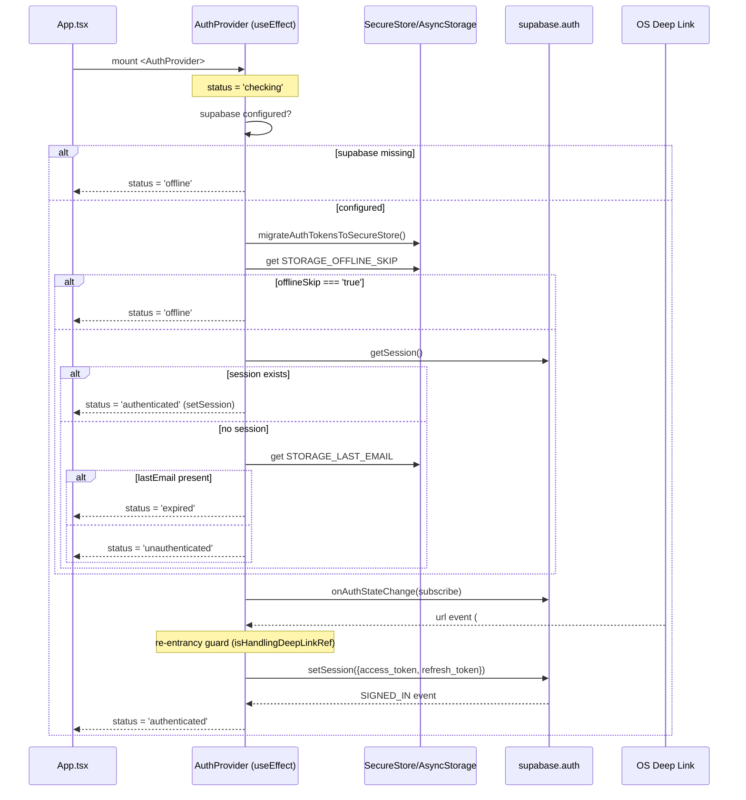
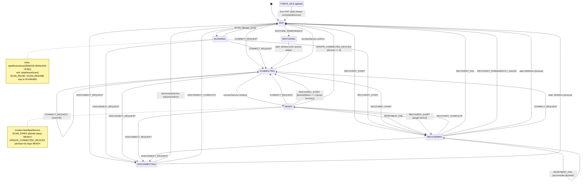
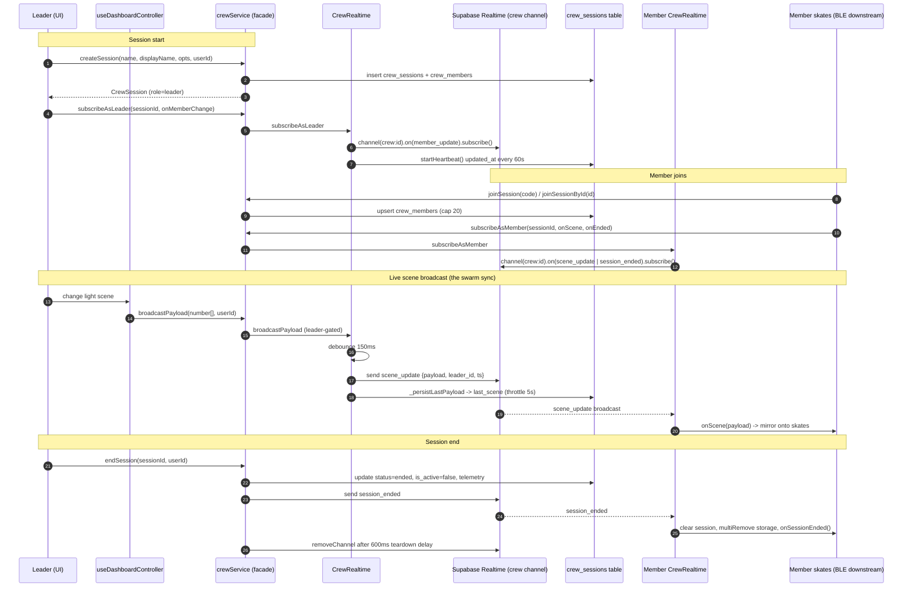
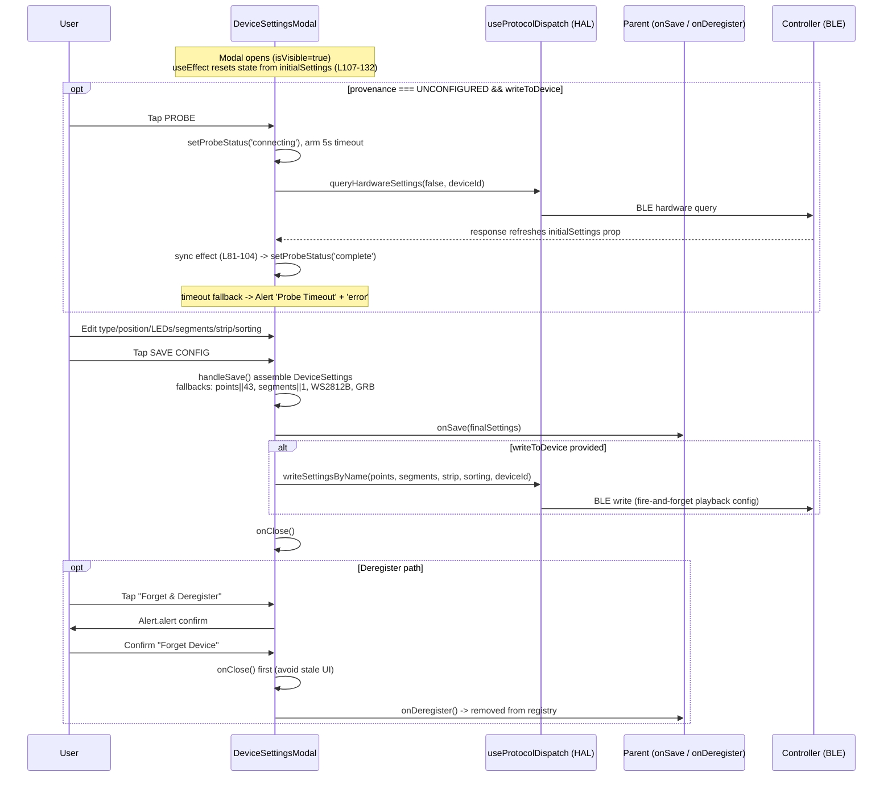
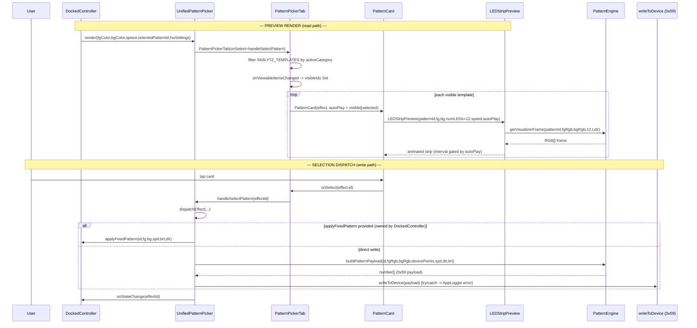
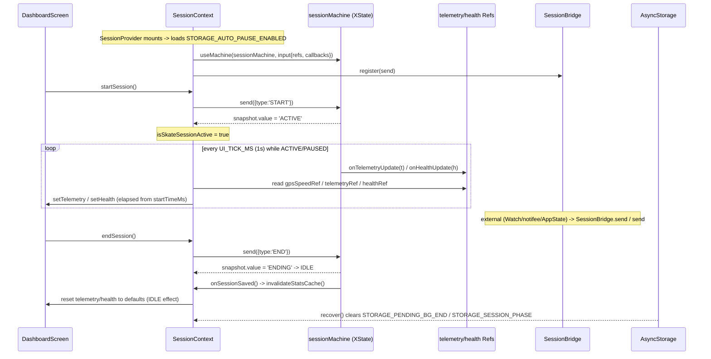
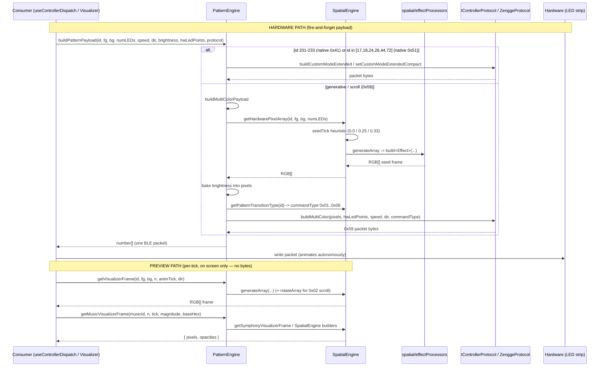
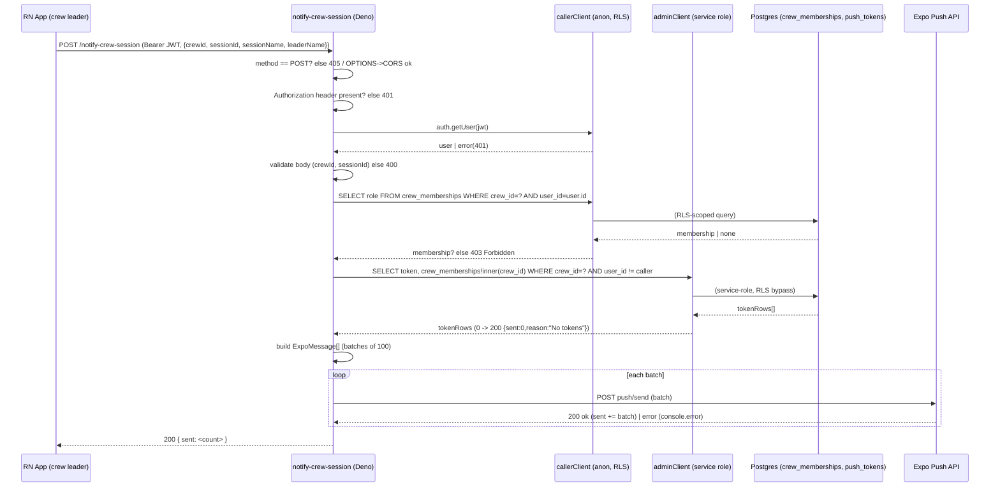
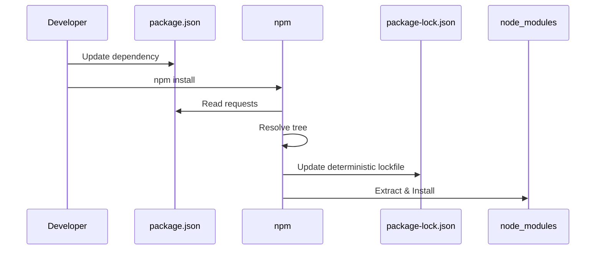
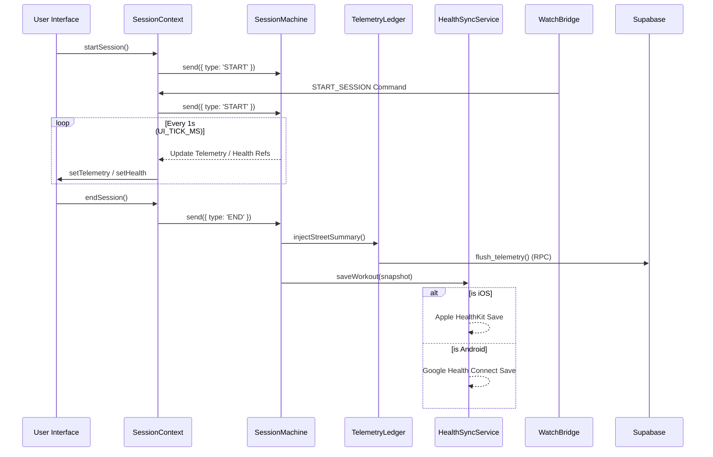

# SK8Lytz App Master Reference

_Last Updated: 2026-06-10 | **21-Domain Cartographer Synthesis Completed** — watchOS + Wear OS companion apps, Expo native bridge module (sk8lytz-watch-bridge), watch-preferred health priority system, bidirectional phone↔watch session sync, Speed push to watch, VS-002 gitignore fix. v3.9.1 | Source of Truth: artifacts/deepdive_docs/_

This document is the **Canonical Reference** for all architecture, hardware constraints, and BLE protocol definitions within the SK8Lytz application.

1. [Product Bible](#1-product-bible-vision--north-star)
2. [System Architecture](#2-system-architecture--local-storage)
3. [BLE Protocol Library](#3-ble-protocol-library)
4. [Domain-Driven Architecture](#4-domain-driven-architecture)
5. [Database Schemas](#5-database-schemas)
6. [Crew Hub & Session Lifecycle](#6-crew-hub--session-lifecycle)
7. [Session Telemetry Architecture](#7-session-telemetry-architecture)
8. [Agentic PM Protocols](#8-agentic-pm-protocols-the-brain)
9. [Sentinel Engineering Governance](#9-sentinel-engineering-governance-workflow-v6)
10. [Environment & Build Ops](#10-environment--build-ops)
11. [Wearable Companion Architecture](#11-wearable-companion-architecture)

> [!CAUTION]
> Do NOT append duplicate or conflicting protocol discoveries to this document. If a payload format changes, **overwrite** the existing entry to ensure this file remains a single, conflict-free source of truth.

---

## 1. Product Bible (Vision & North Star)

**The Mission:**
To empower the radiant culture of roller skating by building the world's most expressive and innovative lighting ecosystem. SK8Lytz isn't just an app; it's the digital pulse for your skates—enabling flawless, zero-latency light synchronization ("Glow Your Way") that transforms solo sessions into high-performance visual art and massive Crew Hub rink takeovers into coordinated spectacles.

**Target Audience:**
Sk8Lytz caters to a diverse, family-oriented community of dedicated roller skaters. They operate in high-energy, low-light environments (rinks, street night sessions, park bowls). They value durability, ease of use (wrist guards, movement), and the ability to express their unique style through synchronized, diffused lighting.

### Core Product Lines

#### **SOULZ** (The High-Intensity Pro Strip)

- **Concept**: 56" of total illumination via four 14" diffused silicone addressable LED strips.
- **Performance**: 2-6+ hours of run time.
- **Charging**: 90 min full cycle (USB-C).
- **Control**: Integrated Bluetooth/RF + High-sensitivity integrated microphone for instant "vibe" reactivity.

#### **HALOZ** (The Compact Matrix Box)

- **Concept**: Individually controllable high-density pixel boxes for wheels/plates.
- **Performance**: 2-4+ hours of run time.
- **Charging**: 60 min fast-charge (USB-C).
- **Control**: Integrated Bluetooth/RF + High-sensitivity integrated microphone.

#### **RAILZ** (Integrated Chassis Strips)

- **Concept**: Dual parallel vertical LED strips designed for undercarriage/frame mounting.
- **Performance**: Integrated 4-6+ hour run time.
- **Charging**: 90 min (USB-C).
- **Control**: Integrated Bluetooth/RF + High-sensitivity integrated microphone.

### Hardware Truth Table — Confirmed 2026-04-22

> [!IMPORTANT]
> This is the **canonical source of truth** for all LED count math, pixel array sizing, and EEPROM provisioning. The three-layer model below governs ALL protocol and UI decisions. `ProductCatalog.ts` code comments cite this table. See `ZENGGE_PROTOCOL_BIBLE.md` §3 for `0x62`/`0x63` EEPROM command details.

#### The Three-Layer LED Model

Every product has three distinct LED "counts" that mean different things:

| Layer | Name | What it represents | Code field |
|:------|:-----|:-------------------|:-----------|
| **1** | `ledPoints` | Addressable LEDs **per segment** — the design canvas | `hwSettings.ledPoints` |
| **2** | `segments` | Number of hardware mirrors of Layer 1 | `hwSettings.segments` |
| **3** | Physical LEDs | Total real LEDs in the world (`ledPoints × segments`, or × wiring factor) | Not stored — derived only |

> **Golden Rule**: All pixel arrays (`0x59`, `0x31`) MUST be built using `ledPoints` (Layer 1). Segments and wiring are the hardware's job, not the app's.

#### Confirmed Product Defaults

| Product | `ledPoints` | `segments` | Physical LEDs | Adjustable? | Architecture |
|:--------|:-----------:|:----------:|:-------------:|:-----------:|:-------------|
| **HALOZ** | **8** | **2** | 16 | ❌ Fixed | Ring. Hardware **auto-mirrors** the 8-point pattern to a 2nd segment. Always send 8-element arrays. |
| **SOULZ** | **43** | **1** | 86* | ✅ Yes | Strip. No hardware mirroring. Controller drives one 43-point canvas. Physical doubling from Y-wire is transparent. |
| **RAILZ** | **30** | **2** | 60 | ✅ Yes | Dual rail. Placeholder — confirm with hardware before shipping. |

*SOULZ physical reality: 43 LEDs on LEFT skate (outside boot) + 43 LEDs on RIGHT skate (inside boot), both Y-wired to the same controller output. The controller is **oblivious to the doubling**.

#### SOULZ — User-Adjustable `ledPoints`

SOULZ strips are cut-to-length. If a user physically cuts the strip shorter, they **must** update `ledPoints` in the HW Setup Wizard to match the physical count. Example: cut from 43→36 → set `ledPoints=36`. The LED Points adjuster in the wizard (`hardwareAllowsCustomPoints: true`) exists for exactly this reason.

Every pixel array builder (`PatternEngine`, `applyEmergencyPattern`, etc.) must read `hwSettings.ledPoints` dynamically — NEVER hardcode 43.

#### ⚠️ Previous Bug (Fixed 2026-04-22)

`ProductCatalog.ts` previously had `HALOZ.defaultLedPoints = 16, segments = 1`. This was **wrong** — it caused:
1. `applyEmergencyPattern` sending 16-element arrays to an 8-point device, bypassing the hardware segment mirror engine
2. Any EEPROM probe (`0x63`) returning `ledPoints=8` would have caused a mismatch with stored defaults

Fixed: `HALOZ.defaultLedPoints = 8, segments = 2`.

#### ✅ HALOZ Ring Topology — Confirmed Physical LED Map (2026-04-25)

```
              ╔══════════╗
              â•‘   TOP    â•‘
  L-pSlot 0 ══╬══════════╬══ R-pSlot 7    ← Left TOP = pSlot 0, Right TOP = pSlot 7
  L-pSlot 1 ══╬          ╬══ R-pSlot 6
  L-pSlot 2 ══╬          ╬══ R-pSlot 5
  L-pSlot 3 ══╬  CENTER  ╬══ R-pSlot 4
  L-pSlot 4 ══╬          ╬══ R-pSlot 3
  L-pSlot 5 ══╬          ╬══ R-pSlot 2
  L-pSlot 6 ══╬          ╬══ R-pSlot 1
  L-pSlot 7 ══╬══════════╬══ R-pSlot 0    ← Left BOTTOM = pSlot 7, Right BOTTOM = pSlot 0
              â•‘  BOTTOM  â•‘
              ╚══════════╝
  LEFT side: ↓ top→bottom     RIGHT side: ↑ bottom→top
  pSlot: 0,1,2,3,4,5,6,7      pSlot: 0,1,2,3,4,5,6,7
```

**Rule:** Hardware auto-mirrors the 8-pixel pattern to both segments simultaneously.
- Seg 1 (RIGHT): LED 0 at physical BOTTOM, LED 7 at physical TOP.
- Seg 2 (LEFT): Hardware mirror places LED 0 at physical TOP, LED 7 at physical BOTTOM.
- If pixel[0] = RED → **Right BOTTOM = RED, Left TOP = RED**. True horseshoe symmetry.


These rules govern `src/components/VisualizerUnit.tsx`. **Do NOT apply to SOULZ (OVAL) or RAILZ (DUAL_STRIP).**

| Rule | Correct Value | Wrong (causes bugs) |
|:-----|:-------------|:--------------------|
| `numLeds` formula | `Math.floor(devicePoints)` — `ledPoints` IS the per-segment canvas | `Math.floor(devicePoints / deviceSegments)` — causes 4 LEDs, not 8 |
| `devicePoints` fallback | `productProfile.defaultLedPoints` (8) | `productProfile.vizDefaultPoints` (was 16) — causes 16-color arcs |
| `deviceSegments` fallback | `productProfile.defaultSegments` (2) | Hard-coded `1` — kills gap rendering |
| `getVisualizerFrame` numLeds arg | `numLeds` (8) | `activeSegmentLedsHoisted` (32) — 4× oversampled palette |
| Product lookup guard | Guard `device.type !== 'undefined'` before `String()` | `String(undefined)` = `"undefined"` → SOULZ fallback → `vizShape='OVAL'` → RING inversion never fires |
| Left arc pSlot direction | `rawFract` (inverted for i ≥ renderLeds/2 when `vizShape==='RING'`) | `segmentI / activeSegmentLeds` (never inverted) → both arcs identical |

> **SOULZ Safety:** `rawFract` for SOULZ (`vizShape='OVAL'`) is NEVER inverted. Changing slot lookups to use `rawFract` instead of `segmentI/activeSegmentLeds` is identical for SOULZ — zero regression risk.


---

**Core Philosophies (The 4 Pillars):**

1. **Bulletproof BLE Transport:** The connection to Neogleamz hardware MUST be instantaneous and nearly sentient. Reconnects and pairing must handle GATT exceptions and MTU drift invisibly. "It just works, immediately."
2. **Tactile, Glanceable UI:** High-contrast, Neogleamz standard aesthetics. Massive touch targets (>44px) for skaters in gear. One-tap access to Symphony effects and App-mic visualization.
3. **No-Compromise Offline Flow:** Hardware control is a fundamental right. basic lighting and EEPROM configuration (0x62/0x63) never require cloud authentication.
4. **Wrist Extension (Watch Companions):** The watch is a session HUD and health relay — NOT an LED controller. It mirrors speed, HR, and calories from the phone, relays on-wrist health sensor data back, and provides remote session start/stop. All BLE LED protocol commands originate exclusively from the phone app.

**Anti-Goals (What we ruthlessly reject):**

- **Bloated Developer Logic in Prod:** We use strict `__DEV__` elimination to keep the binary lean and free of testing debris.
- **Complex UI Micro-Management:** Skaters want to skate. We provide stunning Pro Effects and high-precision HUDs (Speed/Brightness), not frame-by-frame animation editors.
- **Hardware-Cloud Gating:** We never lock essential local hardware features behind an internet authentication wall.
- **Hardcoded Hardware Heuristics:** The UI layer must NEVER use explicit string literals (e.g. `type === 'HALOZ'`) or hardcoded binary logic to render products. All hardware metadata (shape, icons, colors) must be dynamically derived from `LOCAL_PRODUCT_CATALOG` (`src/constants/ProductCatalog.ts`) to ensure scalable, zero-code support for new OEM devices.

### ❌ Condemned Opcodes — Never Use in Production

> [!CAUTION]
> The following BLE opcodes are PERMANENTLY CONDEMNED for production UI use.
> They cause a fundamental visualizer-parity gap: the hardware controls the animation internally,
> so the ProductVisualizer cannot know what the hardware is showing. This breaks our core parity promise.

| Opcode | Name | Why Condemned | What Replaced It |
|:-------|:-----|:--------------|:-----------------|
| **`0x41`** | Settled Mode (Symphony Effects) | Used for native hardware parity on test patterns. | 33 native hardware effects (IDs 201-233) fired via `0x41`, fully integrated into PatternEngine |
| **`0x42`** | RBM Programs Mode | Hardware runs one of 100 baked-in Programs internally. App cannot know the pixel state. | All Programs effects reimplemented as PatternEngine TypeScript, fired via `0x59` |

**Architecture decision 2026-04-22**: Every LED effect in SK8Lytz is computed in TypeScript,
sent as a pixel array via `0x59`, and rendered identically in the ProductVisualizer.
`0x41` and `0x42` are available in DiagnosticLab only (guarded by `__DEV__`).

---

### SK8Lytz Pattern Architecture (Canonical Reference)

#### The One Law

```
PatternEngine (TypeScript math) → getVisualizerFrame() → pixel array → 0x59
ProductVisualizer               → getVisualizerFrame() → same pixel array → rendered on screen
Visualizer = Skates. Always. No exceptions.
```

#### Three-Tier Pattern Library

Every pattern belongs to one of three tiers:

| Tier | Source | Count | Description |
|:-----|:-------|:-----:|:------------|
| **Tier 1** | ge.* Java class reversal | 33 | Settled Mode effects. `0x41` was originally reverse-engineered, but test patterns 201-233 now utilize native `0x41` hardware routing for byte parity checks. |
| **Tier 2** | Programs Mode reversal | ~28 | Standard LED strip effects. Each Programs effect is reimplemented in TypeScript. `0x42` is NEVER called. |
| **Tier 3** | SK8Lytz originals | ∞ | Effects only possible because we own the payload. Positional gradients, reactive splits, sport sequences, etc. |

**Current total**: 81 templates (43 spatial/temporal + 5 street + 33 Multimode Pro Effects), all in one unified picker.

#### Pattern Template Schema

Every pattern in `src/protocols/PatternEngine.ts` (`SK8LYTZ_TEMPLATES`) has this structure:

```typescript
interface SK8LytzTemplate {
  id: number;                          // Unique, never reuse. 1-28 = existing. 29+ = new.
  name: string;                        // User-facing name in picker
  icon: string;                        // Emoji icon for picker card
  colorMode: 'FG_BG' | 'FG_ONLY' | 'BG_ONLY' | 'GENERATIVE';  // Which color pickers to show
  supportsDirection: boolean;          // Show direction toggle in UI?
  tier: 1 | 2 | 3;                    // Source tier (ge.* | Programs | Original)
  sourceRef?: string;                  // e.g. 'ge.OceanWaveEffect' or 'Programs:CometChase'
  group?: string;                      // UI grouping label in picker
}
```

#### Universal Controls (All Patterns Support All)

| Control | Implementation | Notes |
|:--------|:---------------|:------|
| **FG Color** (RGB) | `fg: RGB` passed to `getVisualizerFrame()` | Always active |
| **BG Color** (RGB) | `bg: RGB` passed to `getVisualizerFrame()` | UI hidden if `colorMode !== 'FG_BG'` |
| **Speed** | Controls `tick` rate + `0x59` scroll param | Always active |
| **Brightness** | `0x55` packet — independent of pixel array | Always active, global |
| **Direction** | `direction: 0\|1` → `getVisualizerFrame()` + `0x59` dir byte | UI shown only if `supportsDirection: true` |

#### colorMode Gate

Controls which color pickers the UI renders for a given pattern:

- `FG_BG` — Both FG and BG pickers shown (e.g. Comet: FG=trail, BG=background color)
- `FG_ONLY` — Only FG shown (e.g. Breathing: single color fade, BG irrelevant)
- `BG_ONLY` — Only BG shown (e.g. ID 233 Rainbow Stream: hardware ignores FG entirely)
- `GENERATIVE` — Neither picker shown (e.g. Rainbow Flow: hue is computed by math, not user-set)

> Note: The pattern ALWAYS receives both `fg` and `bg` arguments — the gate is purely a UI affordance.

#### Implementation Contract for Every New Pattern

```
1. Read source math (ge.* Java class, or Bible §0x51 Pattern Index for test modes 201-233)
2. Write TypeScript math: add case to `src/protocols/SpatialEngine.ts` or `SymphonyEngine.ts`
3. Add case to `src/protocols/VisualizerEngine.ts` `getVisualizerFrame()`
4. Add entry to `src/protocols/PatternEngine.ts` `SK8LYTZ_TEMPLATES` with correct colorMode/tier/sourceRef
5. For test patterns (201-233): dispatch via `ZenggeProtocol.setCustomModeCompact()` — NOT `0x41`, NOT 10B extended
6. Verify: ProductVisualizer shows the effect ← identical to hardware via 0x59 (or 0x51 for test modes)
7. Hardware test on HALOZ: tap pattern → LED ring matches visualizer
```

---

## 2. System Architecture & Local Storage

### AsyncStorage Key Registry

| Key                                 | Owner                           | Contents                                                                                                                                        |
| :---------------------------------- | :------------------------------ | :---------------------------------------------------------------------------------------------------------------------------------------------- |
| `@sk8lytz_logs`                     | AppLogger                       | Compact telemetry event buffer array                                                                                                            |
| `@Sk8lytz_auth_username`            | DashboardScreen                 | Local cache of Supabase display_name for instant UI feedback. Synced via Reactive Context Pattern (Load Cache -> Hydrate Profile -> Update UI). |
| `@Sk8lytz_registered_devices`       | DeviceRepository                | Primary SSOT ledger of all claimed/bound hardware keyed by BLE MAC. Each entry uses `group_ids: string[]` and `group_names: string[]` (many-to-many migration 2026-05-28). Legacy scalar `group_id` is dead. |
| `@Sk8lytz_device_configs`           | useDashboardGroups / AppLogger  | Dict keyed by **BLE MAC** containing `{ name, type, points, segments, sorting, stripType, group_ids: string[], group_names: string[] }` |
| `@Sk8lytz_custom_groups`            | useDashboardGroups              | Array of `{ id, name, isGroup, deviceIds }` — group memberships (junction-table backed post v3.6.5) |
| `@sk8_hw_<deviceId>`                | Sk8LytzProgrammerModal          | Per-device EEPROM hardware settings cache                                                                                                       |
| `@Sk8lytz_ThemeMode`                  | ThemeContext                    | `dark` or `light`                                                                                                                               |
| `@Sk8lytz_ControlUITheme`           | ThemeContext                    | Control color theme name                                                                                                                        |
| `@Sk8lytz_hardware_blacklist`       | useBLE                          | Cache-first offline ledger of MAC addresses banned from connecting                                                                              |
| `@Sk8lytz_Builder_Presets`          | GradientsService                | Cache-first offline storage of custom and global builder presets                                                                                |
| `@Sk8lytz_Scenes`                   | ScenesService                   | Cache-first offline storage of downloaded and authored multi-step scenes                                                                        |
| `@Sk8lytz_Scene_Sync_Queue`         | ScenesService                   | Offline mutation queue for publishing and deleting scenes in the background                                                                     |
| `@Sk8lytz_skate_spots_cache`        | LocationService                 | 24h TTL cache-first storage of 500 closest skate spots for offline map degradation survival                                                     |
| `@Sk8lytz_Favorites`                | useFavorites                    | Dictionary of user-defined lighting presets (Name, Palette, Mode)                                                                               |
| `@sk8lytz_permissions_optout`       | PermissionService               | App-Level Opt-Out Ledger. User toggles that override OS permissions for legal/privacy reasons.                                                  |
| `@Sk8lytz_voice_tutorial_dismissed` | boolean                         | Gating for the Voice Command onboarding modal                                                                                                   |
| `@sk8lytz_app_settings`             | AppSettingsService / useBLEScanner | App-wide admin feature flags. Cache-first layer provides offline access. Key `hw_setup_rssi_threshold` controls the RSSI gate. |
| `@Sk8lytz_remember_creds`           | AuthFormSignIn / DevSandboxDrawer | Remembers login email and checkbox status if "Remember Me" is enabled                                                                           |
| `@Sk8lytz_demo_mode`               | DevSandboxDrawer / useBLE       | Flag controlling whether "Virtual Skates" demo mode is active for sandbox testing                                                               |
| `@Sk8lytz_auth_last_email`          | AuthScreen / DevSandboxDrawer   | Caches the last logged-in email to pre-populate the login screen on next launch                                                                 |
| `@Sk8lytz_offline_skip`            | AuthFooterActions / AuthFormSignIn | Stores whether the user opted to bypass online login and continue using the app in offline mode                                                |
| `@SK8Lytz_PublicScenes_Cache`       | ScenesService                   | Local cache of public patterns/scenes downloaded from Supabase                                                                                  |
| `@SK8Lytz_PendingSession_Queue`      | SpeedTrackingService            | Queue of offline-saved skate session snapshots awaiting database synchronization                                                                 |
| `@SK8Lytz_notif_prefs`               | AppSettingsService              | User preferences for push notification channels (Crew alerts, system, etc.)                                                                     |
| `@Sk8lytz_auto_pause_enabled`        | SpeedTrackingService            | Flag indicating whether telemetry tracking auto-pauses when skater speed drops to zero                                                          |
| `@Sk8lytz_programmer_profiles`       | Sk8LytzProgrammerModal          | Locally saved profiles and config files for hardware programming tab                                                                           |
| `@Sk8lytz_product_catalog`           | AppSettingsService              | Cached local catalog of Neogleamz product models and features                                                                                  |
| `@Sk8lytz_pending_bg_end`            | BackgroundSessionService        | Timestamp/flag for session telemetry ending in background                                                                                       |
| `@Sk8lytz_last_group_patterns`       | useDashboardGroups              | Dictionary mapping active groups to their last selected lighting patterns for state restoration                                                 |
| `@Sk8lytz_scanner_telemetry_queue`   | TelemetryService                | Local buffer of bluetooth scanner telemetry data waiting for background upload                                                                  |
| `@Sk8lytz_groups_migrated_v2`        | MigrationService                | Boolean flag indicating successful migration of device groups layout to many-to-many model                                                      |
| `@Sk8lytz_app_settings_logger`       | AppLogger                       | Local configurations and levels for the internal telemetry event logger                                                                         |
| `@Sk8lytz_auth_migration_v1`         | MigrationService                | Flag indicating successful migration of user credentials to v1 schema                                                                           |
| `supabase.auth.token`                | Supabase / AuthContext          | Persisted JWT authentication token for Supabase client sessions                                                                                 |
| `@Sk8lytz_offline_eula_accepted`     | ComplianceGate                  | JSON object containing { version: number, acceptedAt: string } indicating whether the user accepted the offline-mode EULA                       |
| `@Sk8lytz_QuickPresets`              | QuickPresetsService             | Local storage for quick lighting presets                                                                                                        |
| `@Sk8lytz_deleted_macs`              | DeviceRepository                | Ledger of logically deleted hardware MAC addresses pending cloud sync                                                                           |
| `@Sk8lytz_pending_sync`              | SyncService                     | Queue of local mutations awaiting cloud synchronization                                                                                         |
| `@sk8lytz_session_phase`             | SessionService                  | Current phase of the active skate session                                                                                                       |
| `@sk8lytz_session_pause_time`        | SessionService                  | Timestamp when the active session was paused                                                                                                    |
| `@sk8lytz_session_active`            | SessionService                  | Boolean flag indicating if a session is currently active                                                                                        |
| `@sk8lytz_telemetry_buffer`          | TelemetryService                | Buffer for offline session telemetry data points                                                                                                |
| `@SK8Lytz_DeviceState_v2_`           | DeviceStateService              | Prefix for v2 device state cache entries                                                                                                        |
| `@sk8lytz_lifetime_stats_cache`      | StatsService                    | Cached aggregation of user lifetime skating statistics                                                                                          |
| `@Sk8lytz_RadiusPreference`          | MapFiltersService               | User preference for map search radius                                                                                                           |
| `@sk8lytz_diag_test_log`             | DiagnosticLab                   | Local log of hardware diagnostic test results                                                                                                   |
| `@Sk8lytz_MapFilters`                | MapFiltersService               | User preferences for map visibility filters                                                                                                     |
| `@Sk8lytz_RecentLocations`           | LocationService                 | Cache of recently searched or visited locations                                                                                                 |
| `@Sk8lytz_pending_group_sync`        | GroupSyncService                | Queue of group mutations awaiting cloud synchronization                                                                                         |
| `@sk8lytz_recent_sessions_`          | SessionService                  | Prefix for individual recent session cache entries                                                                                              |
| `@sk8lytz_lifetime_stats_`           | StatsService                    | Prefix for individual lifetime stat sub-metrics                                                                                                 |

> [!CAUTION]
> **PURGED KEYS (2026-04-17):** The following legacy `ng_*` keys are fully deprecated and MUST NOT be used anywhere in the codebase. They caused split-brain bugs due to namespace drift:
> - ~~`ng_device_configs`~~ → migrated to `@Sk8lytz_device_configs`
> - ~~`ng_custom_groups`~~ → migrated to `@Sk8lytz_custom_groups`
> - ~~`ng_processed_devices`~~ → DELETED (one-shot cleanup on boot)

### Hardware Identification & Connection Routing (Identity Architecture)

1. **Hardware Identity (MAC over UUID)**: The single source of truth for connecting to and identifying hardware is the **BLE MAC address** (`device_mac`). The Supabase DB UUID (`id`) MUST NEVER be used to route BLE connections or resolve live components. DB UUIDs change upon un-sync/re-sync, whereas the MAC address is immutable hardware truth.
2. **Group Connection Ground Truth**: The authoritative state for whether the app is controlling a grouped session is `connectedDevices.length > 1`. Checking `DisplayDevice.groupId` or `grouped` flags is strictly forbidden, as it relies on secondary lookups and fragile optional typings. `deviceConfigs` stores `groupIds` (plural array) for many-to-many associations, but active BLE command routing relies purely on the array size of live GATT connections in the `BleMachine`.


## Build Config & Troubleshooting 🛠️

### Android Build Requirements

To resolve dependency conflicts and legacy library issues, the following configurations are required:

- **Jetifier**: Must be enabled (`android.enableJetifier=true`) to migrate legacy Support libraries to AndroidX.
- **SDK Versions**: Project currently targets SDK 34 (`compileSdk`, `targetSdk`).

### Third-Party Library Patches

- **@react-native-voice/voice**: ~~REMOVED~~ — The voice command engine was deleted. Do not reinstall this dependency. Any references to it in legacy build configs are dead code.


The primary dashboard uses a **Vertical Slab (No-Scroll)** layout to maximize glanceability and touch accuracy.

1. **Slab 1: Dynamic Header**: Logo, user profile, and active polling/telemetry indicator.
2. **Slab 2: Crew Hub**: Active session discovery and quick-join pills.
3. **Slab 3: My Skates / Groups**: High-impact cards for grouped hardware with global power controls.
4. **Slab 4: Hardware Fleet**: List of all registered devices with a "TAP TO ADD" quick-access wizard link.

### UI Design Patterns & Branding

- **Tucked-in Attribution**: Credit links (e.g., "by neogleamz.com") must be placed discreetly within header containers, aligned with the visual boundary of the primary logo (e.g., `marginRight: '16%'` for a 300px logo) and using `fontSize: 9` with `fontWeight: '800'` muted text.
- **Fluid Component Scaling**: Components (Builders, Camera Viewers) must NOT use hardcoded heights. They must utilize available `flex` space between the `ProductVisualizer` and the bottom dock to ensure responsiveness across all aspect ratios.

### Admin Tools Hub (The Command Center)

The **Admin Tools Hub** (`AdminToolsModal`) is the unified gateway for all system-level diagnostics and hardware maintenance.

- **Access**: 10-tap the SK8Lytz logo in the dashboard header + Passcode: `0000`.
- **Architecture (Refactor/2026-04-12)**: To prevent "re-render storms" from high-frequency telemetry, the modal utilizes a **Memoized Tab Architecture**. Rendering logic for Timeline, Stats, Device, and Tools is extracted into standalone `React.memo` sub-components, ensuring UI stability during 20Hz notification bursts.
- **Tab 1: TIMELINE**: Virtualized system event log (BLE protocol, app lifecycle, errors). Filtered to exclude RAW_PAYLOAD by default to preserve list performance.
- **Tab 2: STATS**: Session analytics, mode usage frequency, and hardware performance metrics.
- **Tab 3: DEVICE**: Deep-dive hardware view showing all discovered peripherals and their cached configs.
- **Tab 4: TOOLS**: Administrative portal for low-level components:
  - **Catalog Manager**: Unified editor for product profiles. **MANDATORY**: All write operations (`upsert`) are gated by a Supabase Session check to prevent unauthorized database manipulation.
  - **LED Diagnostic Lab**: Atomic protocol validation and DIY payload building.
  - **Firmware Programmer**: Low-level hardware updates and serial-over-BLE tools.
  - **Optical Simulation Mode (Web Fallback)**: A dedicated developer interface for non-native environments (Expo Web). It provides manual telemetry simulation (randomized hex dispatch) to smoke-test visualizer and state-management pipelines without physical hardware.
- **Persistence & Governance**:
  - App settings (feature flags) are persisted via `AppSettingsService` with atomic rollback on failure.
  - Product Manager upserts are strictly typed to enforce the `batteryCapacityMilliAmpereHour` field, preventing database record drift.
  - **Account Deletion (Danger Zone)**: Implements a destructive `delete_account` RPC on Supabase. This uses `ON DELETE CASCADE` to completely shred user data across all tables (telemetry, profiles, and auth).
- **Navigation Orchestration**: Closing any administrative sub-tool (Lab, Programmer) must explicitly re-trigger the visibility of the `AdminToolsModal` in the parent `DashboardScreen` to ensure a consistent "nested" navigation experience.

### Optimistic BLE Write Pipeline ("The Ghost Standard")

The BLE write path uses an **Optimistic UI** architecture to eliminate perceived 80—500ms hardware latency:

| Phase             | Status FSM                   | Behavior                                                  |
| :---------------- | :--------------------------- | :-------------------------------------------------------- |
| 1. **OPTIMISTIC** | `onOptimistic()` fires       | UI updates INSTANTLY before BLE write                     |
| 2. **PENDING**    | `writeStatus = 'PENDING'`    | BLE command dispatched (40ms debounce)                    |
| 3. **CONFIRMED**  | `writeStatus = 'CONFIRMED'`  | Hardware ACK'd — light haptic                             |
| 4. **RECONCILED** | `writeStatus = 'RECONCILED'` | Hardware FAILED — error haptic + `onReconcile()` rollback |

**Key Files:**

- `src/hooks/useOptimisticBLE.ts` — Ghost state FSM, debounce, haptics
- `src/hooks/useBLE.ts` — Core write function (`writeToDevice` returns `Promise<boolean | 'partial'>`)
- `src/components/DockedController.tsx` — Consumer integration (status indicator dot)

**Architectural Constraint:** `writeToDevice` MUST return `Promise<boolean | 'partial'>` where:
- `true` = all devices received the payload
- `false` = write failed, trigger reconciliation
- `'partial'` = some devices received it (ghosted devices skipped) — treated as success for UI

All component prop interfaces must use `Promise<void | boolean | 'partial'>` for full compatibility.

### Test Users & Environments

For testing App Sync behavior vs. Offline mode offline fallbacks, you can authenticate using the primary test user:

- **Email**: `testuser@sk8lytz.com`
- **Password**: `Password!2026`
- **Username**: `TestSkater`

### Offline & Guest Gating Architecture

The application enforces a strict "Hardware First, Cloud Second" policy. Core hardware control (BLE opcodes) is NEVER gated behind an authentication wall.

- **Crewz Mode Exception (Online-Only)**: The Crewz Hub and live group sessions are explicitly excluded from this mandate. They require an active internet connection, Location permissions, and Data Sharing permissions to function, relying strictly on Supabase Realtime for synchronization.
- **Offline Mode State**: Propagated dynamically via the `isOfflineMode` prop in the component tree (`DashboardScreen` → `DockedController` → Modals).
- **Graceful Degradation**: 
  - `QuickPresetModal`: Cloud preset saving is hidden when `isOfflineMode === true`. Only local device EEPROM saves are permitted.
  - `CommunityModal`: The 'Community Profiles' tab is entirely disabled in offline mode. The UI defaults gracefully to the 'My Skates' local tab.
- **Rule of Thumb**: Local SQLite (`AsyncStorage`) and direct GATT manipulation are 100% available to Guests. Any feature requiring Supabase REST/PostgREST must explicitly check `isOfflineMode` and display a friendly 'Login Required' state.

### Camera Mode: Camera Vibe Catcher v2 Architecture

The `CAMERA` mode provides real-time ambient lighting translation and dual-mode color analysis.
- **Unified Cross-Platform Frame Processing**: 
  - Uses a unified cross-platform `CameraTracker.tsx` utilizing `react-native-vision-camera` v5's GPU-backed `useFrameOutput` pipeline and `vision-camera-resize-plugin`.
  - Frames are downscaled on the GPU to 50x50 pixels RGB format at 5Hz (200ms throttle interval) with JSI `'worklet';` execution.
  - Hardened with explicit `frame.dispose()` invocation wrapped in a `try...finally` block inside the worklet thread to eliminate camera pipeline stalls. Dispatches are scheduled via `runOnJS` from `react-native-worklets` to transition back to the React JS thread.
- **SNIPER Sub-Mode (Focus reticle)**:
  - Samples the center pixel `(25, 25)` from the 50x50 resized frame.
  - The GPU resizer (`react-native-vision-camera-resizer@5.0.10`) delivers accurate RGB bytes directly. The reticle displays the raw camera color (unmodified truth). No client-side vivid boost is applied in the frame processor — the captured color is the real scene color.
  - On capture, `boostForLED()` (`src/utils/ColorUtils.ts`) applies industry-standard HSV saturation maximization (S=1.0, V=1.0) to translate the muted camera capture into vivid WS2812B-optimized output. Neutrals (HSV S < 0.05) pass through as white. The boosted color is dispatched via 0x59 Freeze to the skates and saved in the 5-item swatch history.
- **VIBE Sub-Mode (Palette extractor)**:
  - Evaluates the 2,500 pixel array to extract the 3 most dominant colors via an optimized client-side K-Means clustering algorithm (k=3, 5 iterations max) with thread-safe `'worklet';` annotations.
  - Dominant colors populate FG/BG/ACCENT slots in the UI and generate a live liquid gradient preview.
  - Tapping Apply auto-generates a `BuilderNode[]` array, maps them to a linear gradient matching the user's Flow/Static preference, and dispatches via `0x59`.
- **Surgical Buffer Overflow Defense**:
  - Enforces a minimum canvas length of 12 RGB pixels for all `0x59` spatial payload dispatches by interpolating dominant swatches to prevent physical controller EEPROM buffer lockouts on the `0xA3` chipset.

---

## 3. BLE Protocol Library

> [!IMPORTANT]
> **Dynamic Catalog Migration (2026-04-11)**: All hardware profile logic—including default LED counts, visualization themes, and discovery categorization—is now handled strictly via `LOCAL_PRODUCT_CATALOG` (`src/constants/ProductCatalog.ts`).

All byte definitions below represent the inner payload _before_ the V2 BLE packet wrapper is applied.

### Hard Onboarding & BLE Invariants (Non-Negotiable Architectural Constraints)

The following architectural invariants are codified to prevent regression of critical BLE and onboarding bugs:

1. **Idempotent FTUE Scan Sweep Launch**:
   When the user has no registered devices (`registeredMacs.length === 0`), triggering a BLE scan via `scanForPeripherals` must unconditionally call `startSweeper()`. This bypasses the asynchronous `isSweeperActive` flag check, avoiding initialization races on mounting the onboarding wizard where `isSweeperActive` returns false during lazy battery initialization.
2. **Non-Blocking Wizard Next Button**:
   The Hardware Setup Wizard's Step 1 "Next" button must be enabled purely based on whether `pendingRegistrations.length > 0`. The transition to Step 2 must never be blocked when scanning is active (`bleState === 'SCANNING'`), preventing user deadlocks during indefinite background sweeps.
3. **Group Connection Ground Truth**:
   The authoritative check for multi-device/group sessions is strictly `connectedDevices.length > 1`. The codebase must never evaluate grouping using fragile `DisplayDevice` properties or database synchronization flags like `groupId` to avoid sync delays and type discrepancy issues.
4. **Sequence Counter Atomicity & Packet Cap (R-19)**:
   The sequence counter (0x40 chunking) must be globally monotonic across chunks, managed by the `ZenggeProtocol` instance via `getNextChunkSeqByte()`. `BleWriteDispatcher` must proxy requests for this byte instead of generating random values. `0x59` payloads must respect a minimum length of 12 pixels to prevent hardware buffer lockouts, but scale up to `HW_CONSTRAINTS.maxPoints` without artificial 54-pixel truncation.

### Confirmed Hardware Identity (APK-Verified 2026-04-21)

> [!IMPORTANT]
> All 3 physical SK8Lytz devices confirmed as **`Ctrl_Mini_RGB_Symphony_new_0xA3`** (product_id: **163 = 0xA3**). Confirmed from `discovered_devices_telemetry` across MACs `08:65:F0:9A:C2:3C`, `08:65:F0:9A:5E:06`, `08:65:F0:5F:03:B1`. Firmware: v45—46, BLE: 5, LED version: 3.
>
> **Key implications of 0xA3 vs 0xA2:**
> - `0x59` Static Colorful tab **IS available** on 0xA3 (not available on 0xA2) ✅
> - `0x51` Custom Scene — **9B compact format (291B) WORKS** on 0xA3 via our standard `wrapCommand` ✅
> - `0x51` 10B extended format (323B) does NOT work via our wrapper — requires ZENGGE chunked framing header (see Protocol Bible Section 11)
> - `0x42` effect ceiling: **1—100** (same as 0xA2). Effect 101 plays an undocumented effect (ceiling is soft).
> - `0x43` Multi-Sequence: **DO NOT USE** — Oracle test caused hardware LED shutoff (state machine crash). ZENGGE app uses `0x51` for multi-step effects, not `0x43`.
> - `0x41` Settled Mode: **DO NOT USE for IDs 201-233.** `0x41` and `0x51` share the same effectId range (1-33) but are different hardware engines producing different visuals. Using `0x41` for test patterns destroys parity. It is available in DiagnosticLab only. See Protocol Bible §0x41 and the AGENT SENTINEL warning in §0x51 Pattern Index.
> - Source: Oracle Lab + live BLE HCI sniff (2026-04-22), `ZENGGE_PROTOCOL_BIBLE.md` Section 11

### BLE Connection Handshake (2026-04-22)

Every GATT connection fires this sequence before the device is added to React state:

1. **MTU Negotiation** — `requestMTUForDevice(conn.id, 512)`
2. **0x10 Session Time Sync** — `ZenggeProtocol.setSessionTime()` → written directly to `ZENGGE_CHARACTERISTIC_UUID`. Format: `[0x10, year-2000, month(1-12), day, hour, min, sec, weekday(0=Sun), checksum]`. Source: `TimeControllerFragment.java` APK decompile. Non-fatal — wrapped in try/catch.
3. **React state update** — `setConnectedDevices()` fires _after_ GATT is booted to prevent UI from blasting payloads during MTU queries.

<!-- AST_COMPILER_START: ZENGGE_CONSTANTS -->
#### 📝 Auto-Compiled Zengge Protocol Constants (AST Compiler)

##### 🔌 BLE UUIDs
- **Service UUID**: `0000ffff-0000-1000-8000-00805f9b34fb` (`ZENGGE_SERVICE_UUID`)
- **Write Characteristic UUID**: `0000ff01-0000-1000-8000-00805f9b34fb` (`ZENGGE_CHARACTERISTIC_UUID`)
- **Notification Characteristic UUID**: `0000ff02-0000-1000-8000-00805f9b34fb` (`ZENGGE_NOTIFY_UUID`)

##### 🛠️ Hardware Constraints
| Constraint | Value | Description |
|:---|:---:|:---|
| `maxPoints` | 300 | Maximum addressable points per segment |
| `maxSegments` | 2048 | Maximum physical segment duplicates |
| `maxPxS` | 2048 | Max points * segments limit |
| `maxMicPoints` | 150 | Maximum points when microphone is active |
| `maxMicPxS` | 960 | Max micPoints * micSegments limit |
| `defaultPoints` | 30 | Fallback default point count |
| `defaultSegments` | 10 | Fallback default segment count |

##### 📟 IC Chip Types (`IC_TYPES`)
| Key | Chip Type |
|:---:|:---|
| 1 | WS2812B |
| 2 | SM16703 |
| 3 | SM16704 |
| 4 | WS2811 |
| 5 | UCS1903 |
| 6 | SK6812 |
| 7 | SK6812RGBW |
| 8 | INK1003 |
| 9 | UCS2904B |
| 10 | JY1903 |
| 11 | WS2812E |

##### 🎨 Color Sorting RGB (`COLOR_SORTING_RGB`)
| Key | RGB Order |
|:---:|:---|
| 0 | RGB |
| 1 | RBG |
| 2 | GRB |
| 3 | GBR |
| 4 | BRG |
| 5 | BGR |

<!-- AST_COMPILER_END: ZENGGE_CONSTANTS -->


Required for 323-byte 0x51 Extended Scene Builder payloads (32 steps × 10B + 3B header).

- **Function**: `useBLE.writeChunked(payload: number[], chunkSize = 20): Promise<void>`
- **Framing**: `[0x40, seqByte, 0x00, 0x00, 0x01, 0x43, 0xBD, 0x0B, ...data]`
- **12 bytes data per 20-byte BLE chunk** (8-byte header overhead)
- **20ms inter-chunk delay** — prevents BLE TX buffer overflow on Android
- **⚠️ Framing signature `[0x01, 0x43, 0xBD, 0x0B]` needs Oracle Lab HCI sniff** before wiring to production Scene Builder UI
- Exported in `BluetoothLowEnergyApi` interface (commit `fdc0ff3`)

### BLE Stability Constraints & GATT Error Prevention

> [!CAUTION]
> React Native BLE PLX and the Android native `BluetoothAdapter` suffer from extreme race conditions. To avoid GATT 133 exceptions, UI freezes, and buffer overflows, all logic must follow these architectural constraints:

1. **Global BLE State Machine (`BleMachine.ts` — XState v5):** `src/services/ble/BleMachine.ts` owns all radio state via 6 XState states: `IDLE → SCANNING → CONNECTING → READY → RECOVERING → DISCONNECTING`. The machine is the ONLY entity that calls `startDeviceScan`/`stopDeviceScan`. Calling the radio directly from any hook or service is FORBIDDEN — use `bleSend({ type: 'SCAN_START' })` instead.
2. **Write Serialization (`BleWriteQueue.ts`):** All BLE GATT writes are serialized through a priority FIFO queue. Priority tiers: `critical` (0xCC power, 0x71, 0x63 heartbeat), `normal` (default pattern writes), `bulk` (0x51 scene uploads). MAX_QUEUE_DEPTH=8 with backpressure. Stale-write pruning via generation counter. One write at a time — Android BLE stack hard constraint.
3. **The GATT 133 Exponential Backoff:** `ConnectService.ts` wraps `connectToDevice` in a 3-attempt retry loop with exponential delays `[500ms, 1500ms, 4000ms]` + `refreshGatt: 'OnConnected'` on each retry to silently absorb Android RF congestion.
4. **Connection Priority Downgrade after Handshake:** On Android, `requestConnectionPriority(HIGH)` fires immediately on connect for fast MTU/handshake. After the first successful write, priority is downgraded to `BALANCED` — saves 2—3× battery on fire-and-forget traffic.
5. **Machine Gate Check:** The XState machine's `CONNECTING` guard checks current state before invoking `connectService`. Concurrent connect attempts are structurally impossible — the machine only enters `CONNECTING` from `IDLE` or `SCANNING`.
6. **Lean Connection Loops:** `ConnectService.ts` strictly establishes MTU (request 512 bytes) and notification pipes only. EEPROM hardware probes (0x63) run through `InterrogatorService.ts` independently after connect.
7. **50ms Inter-Device Write Gap:** All multi-device group writes in `BleWriteDispatcher` enforce a 50ms pause between per-device GATT writes. Prevents silent GATT drops on Qualcomm Snapdragon 665/675 and MediaTek Helio chipsets.
8. **clearWriteQueue on Recovery Start:** `RecoveryService.ts` calls `clearWriteQueue()` as its FIRST action before any GATT reconnect attempt. Purges pre-disconnect stale pattern writes that would compete with recovery pings.
9. **Parallel Writes and Teardowns (`Promise.all`):** Group-wide commands (sliders) and teardowns (`cancelDeviceConnection`) MUST be wrapped in `Promise.all` loops to eliminate staggered latency.

### The Transport Wrapper (`wrapCommand`)

Every inner protocol payload must be wrapped using the standard 8-byte Zengge V2 framing:
`[0x00, SequenceNum, 0x80, 0x00, LenHi, LenLo, Len+1, 0x0B, ...innerPayload]`

### Auto-Recovery System (XState RecoveryService — 3-Phase)

_Migrated to XState: 2026-06-10 | Lives in: `src/services/ble/RecoveryService.ts` (invoked by `BleMachine.ts` RECOVERING state)_

The **RecoveryService** is a `fromCallback` XState actor invoked when the machine enters `RECOVERING`. It owns the full 3-phase recovery loop. The machine entering `RECOVERING` is the ONLY path into recovery — there is no external hook or ref that can start recovery. This makes concurrent recovery + connect structurally impossible.

**Organic Disconnect Trigger:**
- `ConnectService.ts` registers `bleManager.onDeviceDisconnected` for each connected device
- On organic drop, TWO callbacks fire: `handleOrganicDisconnect(error, deviceId)` (logging/telemetry only) and `onOrganicDisconnect(deviceId)` (sends `RECOVERY_START` to machine)
- `useBLE.ts` wires `onOrganicDisconnect` → `bleSend({ type: 'RECOVERY_START', ghostedMacs: [deviceId] })` with a guard that suppresses it during intentional `DISCONNECTING` state
- **CRITICAL:** Do NOT merge `handleOrganicDisconnect` and `onOrganicDisconnect` — they serve different purposes. Removing `onOrganicDisconnect` silently kills recovery.

#### 3-Phase Recovery Architecture

| Phase | Name | Duration | Backoff | Behavior |
| :--- | :--- | :--- | :--- | :--- |
| **Phase 1** | Aggressive | 0—2 min | `1500ms × 1.5^attempt` + jitter(0—1500ms), capped 30s | Rapid reconnect attempts via `createGattSession` |
| **Phase 2** | Moderate | 2—10 min | Same formula, longer natural gaps | Reduced frequency. Device may be out of range temporarily. |
| **Phase 3** | Passive | 10 min+ | **No active polling** | Zero-cost sweeper watch mode. If device reappears in scan results, `RECOVERY_START` re-fires from Phase 1. |

#### Recovery Properties

| Property | Value |
| :--- | :--- |
| **Trigger** | `RECOVERY_START` XState event (fired by `onOrganicDisconnect` callback or `HEARTBEAT_FAIL` event) |
| **First action** | `clearWriteQueue()` — purges stale pre-disconnect writes before any GATT attempt |
| **On success** | `sendBack({ type: 'RECOVERY_COMPLETE' })` — machine transitions to `READY`, adapter re-mapped, notifications re-registered |
| **On exhaustion** | `sendBack({ type: 'RECOVERY_FAIL' })` — machine transitions to `IDLE`, device ghosted in UI |
| **Cancellation** | Returning from the `fromCallback` cleanup function cancels the loop instantly |
| **Ghosting** | `ghostedDeviceIds` context updated by machine on `RECOVERY_FAIL` — UI dims card |

**Telemetry Events:**
- `AUTO_RECOVERY_STARTED`, `AUTO_RECOVERY_SUCCESS`, `AUTO_RECOVERY_FAILED`, `AUTO_RECOVERY_CANCELLED`, `AUTO_RECOVERY_SUMMARY`

> [!NOTE]

### Connection Health Heartbeat

_Migrated to XState: 2026-06-10 | Lives in: `src/services/ble/HeartbeatService.ts` (invoked by `BleMachine.ts` READY state)_

The **HeartbeatService** is a `fromCallback` XState actor invoked when the machine enters `READY`. Pings every connected device every 45s via a 0x63 EEPROM query to detect stale GATT handles early. Samsung Galaxy A-series can hold stale handles alive for minutes after the physical device powers off — without heartbeat, the stale link is only discovered on the next user write.

| Property | Value |
| :--- | :--- |
| **Interval** | 45s (`HEARTBEAT_INTERVAL_MS`) |
| **Probe** | `0x63` hardware query via `enqueueWrite('critical', ...)` — inner bytes: `[0x63, 0x12, 0x21, 0x0F, checksum]` |
| **Fallback** | If no adapter in `adapterMap` (BanlanX), falls back to `bleManager.readRSSIForDevice(mac)` directly |
| **On failure** | `sendBack({ type: 'HEARTBEAT_FAIL', deviceId: mac })` — machine transitions to `RECOVERING` |
| **On failure cleanup** | `bleManager.cancelDeviceConnection(mac)` called before sending HEARTBEAT_FAIL |
| **Cleanup** | Returned cleanup function calls `clearInterval` — timer stops when machine exits READY |

> [!NOTE]

### Post-Connect RSSI Monitor

_Added: 2026-06-06 | Lives in: `src/hooks/ble/useBLERSSIMonitor.ts`_

Polls `readRSSIForDevice` every 30s on all connected devices. Surfaces live signal strength as `rssiMap: Record<string, number>` keyed by device MAC.

| Property | Value |
| :--- | :--- |
| **Interval** | 30s (`RSSI_POLL_INTERVAL_MS`) |
| **Weak threshold** | -75 dBm (`RSSI_WEAK_THRESHOLD`) — UI badge turns orange |
| **Critical threshold** | -82 dBm (`RSSI_CRITICAL_THRESHOLD`) — triggers proactive reconnect |
| **Proactive reconnect** | Calls `autoRecovery.initiateRecovery(mac)` if device not already in `ghostedDeviceIds` — forces GATT tear-down + fresh reconnect, which often picks a better radio channel |
| **UI integration** | `rssiMap[mac]` injected into `mergedItem.rssi` in `DashboardScreen.renderItem` — existing wifi icon auto-updates to reflect live post-connect signal quality |
| **Badge component** | `ConnectionStrengthBadge` — 3-bar signal icon using pure View rectangles (no SVG). 4-tier colour: green (≥-60), amber (-60 to -75), orange (-75 to -82), red (<-82). Hidden when rssi is null. |
| **Testability** | `readDeviceRSSI()` exported as pure async fn — 9 unit tests |

### Auto-Connect Observer (Debounced)

_Lives in: `src/hooks/useDashboardAutoConnect.ts`_

The dashboard auto-connect observer watches `allDevices` for registered peripherals that appear during passive scanning. It is hardened with:
- **500ms debounce** — batches devices discovered within 500ms into a single `connectToDevices` call
- **Gate check** — skips connection when `bleGateRef ≠ IDLE`
- **Pre-lock gate check** — checks gate state _before_ entering the 8s GATT lock poll (RC-04)
- **Ref-forwarded closures** — `connectToDevices` and `scanForPeripherals` are captured via stable refs to eliminate stale closure bugs on re-render (RC-02)
- **Prevents stampeding herd** — no concurrent auto-connect attempts
- **Sweeper-aware** — when Sweeper is active, routes through `burstScan()` instead of `startDeviceScan()` to avoid dual scan conflicts
- **Group-IDs array aware (2026-05-29)**: The offline fallback `processLocalDevices()` iterates `d.group_ids` (array, post-migration) with a scalar `d.group_id` fallback for legacy persisted rows. **Never assume `d.group_id` is populated on newly-registered devices.**

### RSSI Proximity Gating (Setup Wizard)

_Lives in: `src/hooks/ble/useBLEScanner.ts`_

To prevent skatepark BLE noise from hijacking the Setup Wizard, the scanner enforces a two-tier RSSI gate:
- **Registered devices** (already in fleet): -80 dBm hardcoded threshold — passes through as long as device is physically nearby
- **Unregistered devices** (not yet claimed): `hw_setup_rssi_threshold` from `@sk8lytz_app_settings` (default -70 dBm) — tunable via Admin → App Manager → Hardware section
- Threshold is loaded **once on scanner mount** from AsyncStorage. Changing it mid-session requires app restart to take effect.
- Admin stepper control: `ControlsRegistry.ts` key `hw_setup_rssi_threshold`, type `number_stepper`, range -100 to -30 dBm, step 1.

### iOS Platform Guards

_Added: 2026-06-05 (iOS-01, iOS-03)_

| Guard | File | Fix |
| :--- | :--- | :--- |
| **MTU Platform Guard** | `src/services/ble/ConnectService.ts` | `requestMTU()` wrapped in `Platform.OS === 'android'` block — iOS negotiates MTU automatically during GATT connection. Calling `requestMTU` on iOS throws. On iOS, `conn.mtu` is read directly. |
| **UUID Filter in `startDeviceScan`** | `src/services/ble/BleMachine.ts` | `startDeviceScan([ZENGGE_SERVICE_UUID, BANLANX_SERVICE_UUID], ...)`. Enables iOS background scanning. BleMachine is the ONLY place `startDeviceScan` is called. |

### Android Platform Guards

_Added: 2026-06-05 (AND-02, AND-03, AND-04)_

| Guard | File | Fix |
| :--- | :--- | :--- |
| **Scan Budget Guard** | `useBLEBatterySweep.ts/useBLEInterrogator.ts` | Tracks `startDeviceScan` calls against Android 12+'s 4-per-30s budget. If exhausted, defers the scan start until the budget window resets. Prevents silent throttling where Android OS stops delivering scan results with zero error feedback. |

### Battery-Adaptive Sweeper (The Silent Sweeper)

_Added: 2026-06-05 | Lives in: `src/hooks/ble/useBLEBatterySweep.ts/useBLEInterrogator.ts` (BAT-01)_

The Silent Sweeper is a persistent background LowPower BLE scan that runs after dashboard mount. It handles:
1. **Background device discovery** — no manual scan button needed
2. **Interrogator Queue** — queues EEPROM probes (0x63) for newly-discovered devices, populates `hwCache`
3. **Battery-adaptive throttling** — 3-tier system adjusts scan intensity based on phone battery level

| Tier | Battery Level | Scan Interval | Behavior |
| :--- | :--- | :--- | :--- |
| **Normal** | ≥30% | Continuous LowPower | Full scan, all features active |
| **Conservative** | 15—30% | Reduced frequency | Longer gaps between scan windows |
| **Critical** | <15% | Minimal scanning | Sweeper pauses non-essential scans, only responds to burst requests |

- **burstScan(durationMs)**: Elevates to `LowLatency` for a timed burst (default 5s), then reverts to `LowPower`. Used by the Wizard and auto-connect observer instead of calling `startDeviceScan` directly. Prevents dual-scan conflicts.
- **`hwCache: Record<string, any>`**: In-memory EEPROM settings cache keyed by uppercase MAC. Populated by Interrogator Queue. Consumed by `useBLEScanner` and `DashboardScreen`.
- Sweeper is paused during `AppState.background` and resumed on foreground via `startSweeper()`/`stopSweeper()` in `useBLE.ts`.

---

### LED Modes & Math Synthesizer Engine

> [!IMPORTANT]
> **Math Synthesizer Refactor (2026-04-21)**: The legacy "Fixed Mode" (10 hardcoded behaviors) and firmware-dependent RBM logic have been entirely superseded by a deterministic, client-side mathematical synthesizer. All lighting visualizations and sub-protocols are now driven by `SK8LYTZ_TEMPLATES` in `src/protocols/PatternEngine.ts`. **Current count: 43 spatial/temporal patterns (IDs 1-43) + 5 street modes (IDs 101-105) + 33 Multimode Pro Effects test patterns (IDs 201-233) = 81 total templates.**

> [!NOTE]
> **ProductVisualizer Architecture (2026-04-23)**: The legacy `simMode` Protocol Synchronization Engine (~120 lines) was removed. `ProductVisualizer` now passes props **directly** to `VisualizerUnit` with no intermediate state override layer. React state is the ground truth. The `rawHexPayload` BLE decoder, `applySorting()` color swapper, and dead `CANDLE`/`MULTICOLOR` branches were deleted. The `ledDot`/`ledDotSmall` unused StyleSheet entries were also purged. Visualizer animation now correctly fires on all `BUILDER`/`PROGRAMS`/`MUSIC`/`STREET`/`MULTIMODE` modes.

_Source of Truth: `src/protocols/PatternEngine.ts` (`SK8LYTZ_TEMPLATES`), `src/utils/MusicDictionary.ts` (Music)_

#### User-Facing Mode Taxonomy

| ModeType (FSM) | UI Tab | Protocol Family | Key Hook |
|:---|:---|:---|:---|
| `FAVORITES` | Quick Presets | `0x59` / `0x51` (replays saved state) | `useFavorites` |
| `MULTIMODE` | Pattern Synth / Color Picker | `0x59` / `0x51` | `useDockedControllerState` |
| `MUSIC` | Music Reactive | `0x73` (`setMusicConfig`) | `useMusicMode` |
| `STREET` | Motion Reactive | `0x59` (solid dispatches on accelerometer) | `useStreetMode` |
| `CAMERA` | Camera Color Capture | `0x59` | `useDockedControllerState` |

#### The Mathematical Pattern Registry (`SK8LYTZ_TEMPLATES`)

**81 templates** define the full pattern library — 43 spatial/temporal patterns (Comet, Breathing, Double Meteor etc.), 5 street mode patterns, and 33 Multimode Pro Effects test patterns (IDs 201-233, dispatched via `0x51` compact). All use a primary foreground (`FG`) and secondary background (`BG`) palette where applicable.
Dispatch chain: `useControllerDispatch.ts` → `PatternEngine.ts` (Synthesizer) → `ZenggeProtocol.ts` (BLE bytes).

**Archetypes & Auto-Routing:**
- **Spatial Mode (`0x59` CASCADE/FREEZE):** Synthesizes full 300-pixel RGB arrays client-side using waveform math (sine waves, pulse trains, alternating grids). Automatically routed to `<ProductVisualizer>` and `<CustomEffectVisualizer>` without duplicative business logic.
  > **⚠️ 0x59 SPATIAL LIMITATION (Center-Out Reality):** The hardware `0x59` command ONLY supports autonomous scrolling (`0x02 Running`). It CANNOT mathematically expand or contract pixels from a center point. Center-Out math functions generate static arrays that merely scroll, creating visual duplicates of standard Wipes/Comets. Furthermore, HALOZ hardware physically mirrors left/right segments (both wipe Heel-to-Toe), meaning a standard Wipe natively behaves as a Center-Out effect. Thus, Center-Out pattern math is redundant and incompatible with `0x59`.
- **Temporal Mode (`0x51` STEP_JUMP/GRADUAL):** For whole-strip temporal patterns (Jump, Strobe, Breathe), the engine MUST route to the `0x51` 32-step hardware scheduler. `0x59` is the wrong tool for whole-strip temporals because evaluating a Jump/Strobe equation at a static `seedTick` produces an un-animatable solid color or pure black frame that the hardware cannot jump/strobe properly. For patterns that require sub-millisecond fade interpolations (e.g., `Breath`, `Strobe`), the engine automatically routes to the `0x51` 32-step hardware scheduler to prevent BLE bus saturation.

> [!NOTE]
> The legacy `Fixed` UI tab was completely eliminated. The `MULTIMODE` hub now acts as a unified portal for all spatial/temporal mathematical templates.

#### RBM Built-in Patterns (100 Modes)

Source of truth: `src/utils/RbmDictionary.ts` — IDs 1—100, mapped 1:1 to Zengge `SymphonyBuild` string table.
Protocol: `0x42` (`setCustomRbm`) or `0x61` (legacy APK path — same pattern table).

#### Music Mode Patterns (46 Profiles)

Source of truth: `src/utils/MusicDictionary.ts` — music-reactive patterns keyed to protocol IDs depending on Mode Type (Light Bar = 16, Light Screen = 30).
Protocol: `0x73` (`setMusicConfig` with `0x26`/`0x27` Mode Type) + `0x74` (App Mic magnitude stream when `0x73` isOn = 0).

---

### Command: Hardware Config Query (0x63)

_Reads the current EEPROM settings stored inside the controller chip._

- **Send (5 bytes):** `[0x63, 0x12, 0x21, 0x0F, checksum]`
- **CRITICAL ENDIANNESS:** `ledPoints` bytes are **Little-Endian SWAPPED**: `((payload[9] & 0xFF) << 8) | (payload[8] & 0xFF)`.

### Command: Hardware Config Write (0x62)

_Writes custom segments, IC type, and max LED points permanently to the controller EEPROM._

- **Format:** `[0x62, ptsHigh, ptsLow, segHigh, segLow, icType, sorting, micPts, micSegs, 0xF0, checksum]`
- **CRITICAL ENDIANNESS:** Uses **Big-Endian format**: `ptsHigh = (points >> 8) & 0xFF`, `ptsLow = points & 0xFF`.

> [!NOTE]
> **`points` ≠ total LEDs.** `points` = LEDs per segment. `segments` = number of parallel mirrors.
> Total physical LEDs = `points × segments`. The hardware's segment engine mirrors the pattern automatically.
> **HALOZ example**: 22 bulbs = 11 points × 2 segments. All pattern commands use 11, not 22.
> The `0x51` slot `flags=0x80` byte enables segment mirroring ("section toggle"). `flags=0x00` disables it.
> Full model documented in `ZENGGE_PROTOCOL_BIBLE.md` under `0x62`.

---

### Command: Segmented Multi-Color Layout Array (0x59)

_Primary command for all IC-strip patterns. Sends a per-pixel RGB array that the hardware loops autonomously._

> [!IMPORTANT]
> **SEGMENT MODEL — Array Length Must Use `ledPoints`, NOT Total LEDs.**
> The ZENGGE hardware segment engine automatically mirrors the `ledPoints` pattern across all segments.
> For HALOZ (22 bulbs = 11 points × 2 segments), send an array of **11** pixels, not 22.
> Sending `ledPoints × segments` pixels bypasses the hardware mirror and fills both segments manually.
> Source: BLE sniff observation (2026-04-22) — ZENGGE Multi-Color creator uses `points` exclusively.

- **Format:** `[0x59, totalLenHi, totalLenLo, [R1,G1,B1...], numLEDsHi, numLEDsLo, transitionType, speed, direction, checksum]`
- **Source of Truth:** `ZenggeProtocol.setMultiColor()` — _do NOT replicate this logic elsewhere._
- **Minimum Payload:** 12 pixels. Payloads <10 cause **hardware memory lock glitching**.
- **TransitionType Bytes (APK Verified Truth: `StaticColorfulMode.java`):**

> ⚠️ **0xA3 HARDWARE LIMITATION:** The `0x59` command is a spatial payload. The ZENGGE app explicitly *hides* Breathe and Twinkly from the `0x59` UI for the `0xA3` chip because the hardware cannot calculate temporal math over a 450-byte custom array. Strobe and Jump are also known to fail. **For temporal transitions (Breathe, Jump, Strobe), use the `0x51` Scene Sequencer instead!**

| Byte | Name | Behavior | 0xA3 Status |
|:---|:---|:---|:---|
| `0x01` | Static | Freeze in place | ✅ **Fully Supported** |
| `0x02` | Running Water | Continuous hardware scroll | ✅ **Fully Supported** |
| `0x03` | Strobe | Flash effect | ❌ Fails (Requires `0x51`) |
| `0x04` | Jump | Hard color jump | ❌ Fails (Requires `0x51`) |
| `0x05` | Breathe | Breathe fade effect | 🚫 **Firmware Locked/Hidden** (Use `0x51`) |
| `0x06` | Twinkly | Twinkle effect | 🚫 **Firmware Locked/Hidden** |

> [!IMPORTANT]
> **Tick Settings (Point Count) Mismatch Flaw**: The `numLEDsHi` and `numLEDsLo` bytes at the end of the `0x59` payload dictate the **physical hardware strip length** that the transition effect will span across. Our previous implementation clamped this value to the RGB array length (max 54). If the hardware has 150 LEDs, clamping this to 54 causes transitions to truncate because the hardware thinks the spatial size is only 54! To bypass MTU limits while preserving spatial effects, we must decouple the RGB array length from the hardware point count sent in the payload.

- **Speed:** UI 0—100 → HW 1—31. Formula: `max(1, min(31, round(uiSpeed / 100 × 30) + 1))`. Source: APK `Protocol/n.java: ad.e.a(f, 1, 31)`.
- **Direction:** `0x01` Forward, `0x00` Reverse.
- **Solid Mode Replication:** A single 1-pixel padded array with `transitionType=0x01` (FREEZE) safely replicates Solid Mode without `0x31` flickering glitches.

---

### Command: DIY Custom Animation Sequences (0x51)

_Sends up to 32 animation steps. Hardware loops through active steps autonomously. Steps are stored in device EEPROM._

> [!IMPORTANT]
> **ORACLE + BLE SNIFF CONFIRMED (2026-04-22)**: The 9B compact format (291B) fired by our current `setCustomMode()` **works correctly** on 0xA3 hardware. The 10B extended format via our `wrapCommand` does nothing. The ZENGGE app sends 10B slots using a different chunked BLE framing header. Full evidence in `ZENGGE_PROTOCOL_BIBLE.md` Section 11.

- **Format (current working):** `[0x51, Step0(9B)...Step31(9B), 0x0F_Terminator, checksum]` (291 bytes)
- **Format (ZENGGE app, requires chunked framing):** `[0x51, Step0(10B)...Step31(10B), checksum]` (via `[40 seq 00 00 01 43 BD 0B]` header)

**Step Structure — Hardware-Confirmed 10-Byte (from live BLE sniff):**
```
[ACTIVE_FLAG, effectId, speed, FG.r, FG.g, FG.b, BG.r, BG.g, BG.b, flags]
```
- `ACTIVE_FLAG`: `0xF0` = active step, `0x0F` = inactive (skip).
- `effectId`: SymphonyEffect ID 1—33
- `speed`: 0—100 (direct, no scaling)
- `FG.RGB`: Foreground color (ignored for NO_COLOR/rainbow effects)
- `BG.RGB`: Background color (ignored for NO_COLOR/rainbow effects)
- `flags`: `0x80` = forward + section toggle enabled, `0x00` = reverse

**Step Structure — Current Production 9-Byte (works via our wrapper):**
```
[ACTIVE_FLAG, transMode, speed, FG.r, FG.g, FG.b, BG.r, BG.g, BG.b]
```

- **Step Transition Mode Bytes (for 9B format):**

| Byte | Constant | Behavior |
|:---|:---|:---|
| `0x3A` | `STEP_JUMP` | Hard cut between FG and BG colors |
| `0x3B` | `STEP_GRADUAL` | Smooth cross-fade between FG and BG |
| `0x3C` | `STEP_STROBE` | Rapid flash between FG and BG |
| `0x01`—`0x2C` | Custom Effects 1—44 | Hardware `SymphonyEffect` IDs. Full mapping documented in `ZENGGE_PROTOCOL_BIBLE.md` |

- **Speed:** Full 1—100 range valid (unlike `0x59` which is capped at 31).
- **Max slots:** 32 active steps.
- **Source of Truth:** `ZenggeProtocol.setCustomMode()` — current 9B format is production-safe.

---

### Basic Control Commands

- **Power ON (0x71):** `[0x71, 0x23, 0x0F, 0xA3]` — checksum `0xA3` = sum of first 3 bytes ✅
- **Power OFF (0x71):** `[0x71, 0x24, 0x0F, 0xA4]` — checksum `0xA4` = sum of first 3 bytes ✅
- **Source:** `C14184b.m4796M()` via `C7780q.m20873a()` — 0xA3 is NOT a legacy device → always uses `0x71`, never `0x3B`.

### Command: Settled Mode — FG + BG Dual Color (0x41)

_Triggers one of 33 Symphony effects with explicit foreground and background colors._

- **Format:** `[0x41, effectId, FG.r, FG.g, FG.b, BG.r, BG.g, BG.b, speed, direction, 0x00, 0xF0, checksum]` (13 bytes)
- **effectId range:** 1—33 (SymphonyEffect IDs)
- **direction:** `0x00` = forward, `0x01` = reverse
- **Source:** `C7775l.java` → `m20877a()`, called by `SettledModeFragment`

### Command: Multi-Effect Sequence (0x43)

> [!CAUTION]
> **DO NOT USE IN PRODUCTION.** Oracle Lab test (2026-04-22) confirmed that our `0x43` payload causes the hardware's **LEDs to shut off completely** (state machine crash). The ZENGGE app's "Customize Tab" actually uses `0x51` with 10-byte slots for multi-step effects — NOT `0x43`. This opcode is either unused in our firmware revision or requires a completely different BLE framing to activate safely.

_APK-documented format below is preserved for reference only:_
- **Format:** `[0x43, effectId[0]...effectId[49], speed, brightness, checksum]` (54 bytes total)
- **Source:** `C7778o.java` → `m20874a()`, called by `FunctionModeFragment` when no single effect is selected

### Command: Set RBM Built-in Pattern (0x42)

_Triggers one of 100 hardware-native RBM patterns by ID. The controller runs the animation internally — no pixel array needed._

- **Format:** `[0x42, patternId(1—100), speed(1—100), brightness(1—100), checksum]`
- **Source of Truth:** `ZenggeProtocol.setCustomRbm()`
- **Pattern IDs:** 1—100 mapped 1:1 to Zengge `SymphonyBuild` string table. Full dictionary in `src/utils/RbmDictionary.ts`.

### Command: Symphony Multi-Color / RBM Legacy (0x61)

_Legacy/alternative opcode for triggering RBM patterns. Present in Zengge APK code paths and the SK8Lytz Diagnostic Lab._

- **Format:** `[0x61, patternId, speed, brightness, checksum]` — identical structure to `0x42`.
- **Relationship to 0x42:** Both target the same on-chip RBM pattern table. The `0x61` opcode appears in older Zengge firmware revisions and specific APK UI code paths (`symphony_SymphonyBuild_*`). The production dispatch path uses `0x42` via `setCustomRbm()`, while the Diagnostic Lab UI labels it `0x61` for APK parity.
- **SK8Lytz Usage:** Exposed in Admin Diagnostic Lab (`useProtocolBuilder.ts`, `Sk8LytzDiagnosticLab.tsx`) for protocol testing.

### Command: Music Configuration (0x73)

_Configures the hardware's music-reactive mode with mode type (Bar vs Screen), pattern, and dual colors._

> [!CAUTION]
> **The `0x73` structure does NOT contain a trailing micSource byte.** The `0x26` and `0x27` values dictate the Matrix Style (Light Bar vs Light Screen), NOT the microphone source.
> Microphone Source is toggled implicitly via the `isOn` byte.

- **Format (13 bytes):** `[0x73, isOn, modeType, effectId, dropR, dropG, dropB, colR, colG, colB, sensitivity, brightness, checksum]`
- **isOn:** `0x01` = Device Mic Active (Hardware processes audio). `0x00` = App Mic Active (Hardware mic OFF, waits for `0x74` magnitude streams).
- **modeType:** `0x26` (38) = Light Bar Mode (16 built-in patterns). `0x27` (39) = Light Screen Mode (30 built-in patterns).
- **effectId:** 1—30 music-reactive pattern IDs (mapped in `MusicDictionary.ts`)
- **dropR, dropG, dropB (Bytes 4-6):** Drop Color (controlled by `sb_point` in the native app). Verified via `strings.xml` translation `<string name="point_color">drop color</string>`.
- **colR, colG, colB (Bytes 7-9):** Sound Column Color (controlled by `sb_col` in the native app). Verified via `strings.xml` translation `<string name="col_color">sound column color</string>`.
  - *Light Bar (0x26) specific behavior*: The native ZENGGE app clones the primary color to **both** the Drop Color and Sound Column Color slots inside the `0x73` payload to prevent hardware rendering confusion.
- **sensitivity / brightness:** 0—255
- **Source of Truth:** `ZenggeProtocol.setMusicConfig()` (decompiler trace: `C7789z.java`, `MusicModeFragment.java` line 752)

### Command: App Mic Magnitude (0x74)

_Streams real-time audio magnitude from the app's microphone to drive hardware music-reactive LEDs._

- **Format:** `[0x74, magnitude(0—255), checksum]` (3 bytes)
- **Used when:** `isOn = 0x00` (App mic) in the `0x73` music config.
- **Source:** `C7788y.java` → `m20863a()`, `useAppMicrophone.ts` → `ZenggeProtocol.sendMusicMagnitude()`

### Command: Live Pixel Stream — Frame-by-Frame (0x53)

_Streams one row of real-time pixel data per call. Used for live bitmap/image projection onto LEDs._

- **Format (variable):** `[0x53, totalLen_hi, totalLen_lo, R, G, B, ...(numLEDs × RGB)..., numLEDs_hi, numLEDs_lo, checksum]`
- **totalLen:** `(numLEDs × 3) + 6`
- **Rate-limited:** Hardware uses AtomicBoolean gate — must wait for ACK before next frame.
- **Behavior:** Sends one bitmap row. Call repeatedly in a loop to stream animation frames.
- **APK Source:** Built inline `SceneModeFragment.m18748Z2(int[] iArr)` — no dedicated Protocol class.

### Command: Scene Slot Management (0x56 / 0x57 / 0x58)

_EEPROM-based scene storage and playback control._

**Delete Scene Slot (0x56) — 15 bytes:**
```
[0x56, slotIndex(0-9), 0, 0, 0, 0, 0, 0, 0, 0, 0, 0, 0, 0, checksum]
```

**Activate Scene + Set Speed/Brightness (0x57) — 5 bytes:**
```
[0x57, sceneIndex, speed, brightness, checksum]
// sceneIndex: 0—9 for specific slot, 0xFF (-1 as byte) to replay ALL
```

**Scene State Query (0x58) — 3 bytes:**
```
[0x58, 0xF0 (query active) | 0x0F (query inactive), checksum]
```
- **APK Source:** `SceneModeFragment.m18778K2()`, `m18750Y2()`, `C14184b.m4769g0()`

### Proactive Battery Management System (Architectural Skill)

The app implements a **Mathematical Consumption Modeling** system using real-time modeling of pixel density, brightness, and pattern intensity to estimate battery reserve.

---

## 4. Domain-Driven Architecture

> [!IMPORTANT]
> **DDA Refactor Shipped: 2026-04-14** — Hook-First domain model. **BLE Engine XState Migration: 2026-06-10** — `useBLE.ts` is now a thin XState orchestrator. 5 hooks deleted (`useBLEAutoRecovery`, `useBLEGattMutex`, `useBLEHeartbeat`, `BleStateMachine`, `BleConnectionManager`, `BleLifecycleManager`). Logic now lives in 5 XState actors: `BleMachine`, `ConnectService`, `RecoveryService`, `HeartbeatService`, `RSSIService`, `InterrogatorService`.

`_useBLE.ts` is a thin orchestrator. It constructs the XState machine and wires callbacks. BLE sub-hooks and the sweeper are NEVER consumed directly by UI components._

#### XState Actor Architecture (as of 2026-06-10)

| Actor / Service | File | XState Type | State | Owns |
| :--- | :--- | :--- | :--- | :--- |
| `BleMachine` | `src/services/ble/BleMachine.ts` | Machine root | All states | Radio ownership, state transitions, actor lifecycle |
| `connectService` | `src/services/ble/ConnectService.ts` | `fromPromise` | CONNECTING | Group GATT connect, MTU, adapter mapping, notification wiring, stale device flush |
| `recoveryService` | `src/services/ble/RecoveryService.ts` | `fromCallback` | RECOVERING | 3-phase backoff loop, clearWriteQueue, adapter re-mapping, RECOVERY_COMPLETE/FAIL |
| `heartbeatService` | `src/services/ble/HeartbeatService.ts` | `fromCallback` | READY | 45s 0x63 ping via enqueueWrite, RSSI fallback, HEARTBEAT_FAIL on error |
| `scanService` | `src/services/ble/BleMachine.ts` | Entry/Exit actions | SCANNING | `startDeviceScan`/`stopDeviceScan` — machine is the ONLY call site |

#### Hook-Level Services (Not XState Actors)

| Hook / Service | File | Owns |
| :--- | :--- | :--- |
| `useBLEScanner` | `src/hooks/ble/useBLEScanner.ts` | Peripheral discovery, RSSI proximity gating, pending registrations |
| `useBLEBatterySweep + useBLEInterrogator` | `src/hooks/ble/useBLEBatterySweep.ts / useBLEInterrogator.ts` | Silent background LowPower scan, Interrogator Queue, `hwCache`, 3-tier battery-adaptive throttling (BAT-01) |
| `useBLERSSIMonitor` | `src/hooks/ble/useBLERSSIMonitor.ts` | 30s post-connect RSSI polling, `rssiMap`, proactive reconnect at -82 dBm. Thin wrapper around `RSSIService.ts`. |
| `RSSIService` | `src/services/ble/RSSIService.ts` | Pure RSSI polling logic. Not an XState actor. |
| `InterrogatorService` | `src/services/ble/InterrogatorService.ts` | Hardware EEPROM probe via 0x63 opcode, FTUE vs standard queue delay, AsyncStorage cache. Not an XState actor. |
| `BleWriteDispatcher` | `src/services/BleWriteDispatcher.ts` | Serialized group writes with 50ms inter-device gap, debounce, generation counter |
| `BleWriteQueue` | `src/services/BleWriteQueue.ts` | Priority FIFO write queue: `critical`/`normal`/`bulk` tiers, MAX_QUEUE_DEPTH=8, clearWriteQueue() for recovery |
| `BlePingService` | `src/services/BlePingService.ts` | Wizard-exclusive atomic GATT session (Connect→Blink→Probe→Disconnect) |

#### Auth Domain (`src/context/`, `src/providers/`)

| Hook / Provider | Consumer | Owns |
| :--- | :--- | :--- |
| `AuthProvider` | `App.tsx` | Global authentication state (`session`, `user`, `isOfflineMode`, `isAuthenticated`). Eliminates N parallel `supabase.auth.getUser()` calls. |
| `useAuth` | Global | Exposes auth state to components and hooks. |
| `ComplianceGate` | `App.tsx` | EULA version enforcement. Decoupled from `supabase.auth.getUser()`, reads `user` and `isOfflineMode` strictly from `useAuth()`. |

#### Dashboard Screen Domain (`src/hooks/`)

| Hook                  | Consumer          | Owns                                                               |
| :-------------------- | :---------------- | :----------------------------------------------------------------- |
| `useDashboardProfile` | `DashboardScreen` | User profile, `displayName`, `avatarUrl`, Supabase profile fetch   |
| `useDashboardGroups`  | `DashboardScreen` | `customGroups`, `deviceConfigs` AsyncStorage load/save, group CRUD |
| `useDashboardAutoConnect` | `DashboardScreen` | Debounced auto-connect observer, gate-checked, ref-forwarded closures |

#### DockedController Domain (`src/hooks/`)

| Hook                       | Consumer           | Owns                                                                                                                                  |
| :------------------------- | :----------------- | :------------------------------------------------------------------------------------------------------------------------------------ |
| `useDockedControllerState` | `DockedController` | All LED control FSM state: `activeMode`, `selectedColor`, `brightness`, `speed`, `multiColors`, `builderNodes`, scene capture/restore |
| `useFavorites`             | `DockedController` | `favorites[]`, `quickPresets[]`, save/delete/load operations, prompt FSM                                                              |
| `useStreetMode`            | `DockedController` | Accelerometer subscription, G-force calculation, brake/cruise color dispatch, GPS speed sampling                                      |
| `useMusicMode`             | `DockedController` | Owns 0x73 music config dispatch, pattern names, pattern navigation.                                                                   |
| `useCuratedPicks`          | `DockedController` | Fetches and caches SK8Lytz Picks (curated presets) from Supabase.                                                                     |
| `useAppMicrophone`         | `DockedController` | Manages the expo-av Audio.Recording lifecycle for APP MIC mode. Streams normalized magnitude (0—1).                                   |
| `useControllerAnalytics`   | `DockedController` | Debounced telemetry logging for mode, pattern, color, brightness, speed changes.                                                      |

#### AccountModal Domain (`src/hooks/`)

| Hook                 | Consumer       | Owns                                                            |
| :------------------- | :------------- | :-------------------------------------------------------------- |
| `useAccountOverview` | `AccountModal` | Supabase profile read/write, avatar upload, display name update |
| `useSkateStats`      | `AccountModal` | Aggregate session stats fetch, totals calculation               |

#### Admin Domain (`src/hooks/`)

| Hook                 | Consumer                 | Owns                                                                     |
| :------------------- | :----------------------- | :----------------------------------------------------------------------- |
| `useDiagnosticLog`   | `Sk8LytzDiagnosticLab`   | BLE RX/TX log buffer, `targetDeviceId` targeting, raw hex transmission   |
| `useAdminTelemetry`  | `AdminToolsModal`        | App analytics, system health metrics, cloud log uploads                  |
| `useProductManager`  | `AdminToolsModal`        | Hardware catalog CRUD, `product_catalog` upserts, blank profile creation |
| `useAdminSettings`   | `AdminToolsModal`        | Global remote feature flags, `AppSettingsService` read/write             |

#### Watch & Health Domain (`src/hooks/`, `modules/`, `src/services/`)

| Hook / Service            | Consumer           | Owns                                                                                              |
| :------------------------ | :----------------- | :------------------------------------------------------------------------------------------------ |
| `useHealthTelemetry`      | `SessionContext`   | Phone/watch health polling, watch-preferred priority logic, HR/cal/peak/avg state, `mergeWatchHealth()` |
| `WatchBridge` (native module) | `SessionContext` | Phone↔watch session state sync, command relay (START/STOP), health data relay via native DataLayer/WCSession |
| `SpeedTrackingService`    | `SessionContext`   | GPS speed push to watch via `WatchBridge.sendMetricUpdate()` during active sessions               |

---

### 🏛️ Shared Type Contract

All FSM states and shared interfaces live in **`src/types/dashboard.types.ts`**. Never re-declare these types in individual hooks or components.

| Type                  | Values                                                                        |
| :-------------------- | :---------------------------------------------------------------------------- |
| `ModeType`            | `'FAVORITES' \| 'FIXED' \| 'MULTIMODE' \| 'MUSIC' \| 'STREET' \| 'CAMERA'` |
| `FixedSubMode`        | `'PATTERN' \| 'BUILDER'`                                                      |
| `MicSource`           | `'APP' \| 'DEVICE'`                                                           |
| `MusicColorFocus`     | `'PRIMARY' \| 'SECONDARY'`                                                    |
| `DeviceSettingsState` | FSM: `'IDLE' \| 'LOADING' \| 'READY' \| 'ERROR'`                              |
| `IDeviceConfigEntry`  | `{ name, type, points, segments, sorting, stripType, group_ids: string[], group_names: string[] }` — **NOTE**: scalar `groupId` removed in many-to-many migration (2026-05-28). |

**BLE Domain Types** — `src/types/ble.types.ts` _(added P2 type-safety pipeline, 2026-06-05)_:

| Type | Purpose |
| :--- | :--- |
| `BleConnectionRequest` | Replaces 13 `any` params in `executeConnectToDevices` with a single typed interface. Fields: `devices`, `bleManager`, `connectedDevicesRef`, `blacklistedMacsRef`, `keepaliveTimerRef`, `disconnectListeners`, `sweeper`, `scanner`, `autoRecovery`, `bleGateRef`, `mtuMapRef`, `adapterMapRef`, `dataReceivedCallbackRef`, `handleNotificationRef`, `handleOrganicDisconnect`, `setConnectedDevices`, `setGate`. |
| `GattPriority` | `'P1_CRITICAL' \| 'P2_RECOVERY' \| 'P3_INTERROGATION' \| 'P4_MAINTENANCE'` — 4-tier GATT mutex priority enum |
| `BleWriteStateRefs` | Typed refs for `BleWriteDispatcher`: `writeGeneration`, `writeDebounceTimerRef` |

---

### Engineering Standards

- **UI Components**: Must focus strictly on rendering and presentation.
- **State Machines**: Complex multi-state logic must use `ModeType`/string-union FSMs, never boolean flag clusters.
- **Strict Domain Exceptions (VIP Telemetry)**: All domain hooks (hardware dispatch, Supabase reads, filesystem access) MUST implement unified `try/catch` execution blocks. Errors must trigger `AppLogger.error()` to route telemetry into the Supabase VIP Fast-Lane. The use of naked `console.warn` or `console.error` inside domain hooks is strictly prohibited.
- **Hook Scaffolding Constraint**: New hooks must be generated via the project `/scaffold-hook` automated workflow, which pre-injects the mandatory `AppLogger` crash loop sequence.
- **Database Telemetry Masking**: All non-critical DB telemetry inserts (e.g. `skate_sessions` or metrics) must be wrapped in `try/catch` blocks so they do NOT block the critical BLE execution pipeline on failure.
- **Type Safety per Schema constraints**: Tactical type casting using `as unknown as CustomType` or `as any` is authorized when bypassing strict, auto-generated Supabase overload methods for `Json` fields and unresolvable overloads, as long as runtime validation aligns with the hardened database schema.
- **Type Imports**: Always import `ModeType` and shared interfaces from `dashboard.types.ts`, not from hook files.
- **Hook Contracts**: Hooks receive BLE context via props, never via direct import of BLE libraries.

### Cartography Domain Synthesis

<!-- CARTOGRAPHER_START: IDENTITY -->

# IDENTITY Cartography

> Domain marker: **IDENTITY** — Identity & Auth surface (auth state, login/signup/reset forms, account management modal tabs, profile CRUD, password security).
> Cartographer pass (Persona: 📋 Docs). Read-only. 18 files mapped.

**Impact flags:** `[IMPACTS_USER_JOURNEY]` `[IMPACTS_STATE_CHART]`
- `[IMPACTS_USER_JOURNEY]` — This domain owns the entire pre-app gate: cold-start session restore, sign-in/sign-up/forgot-password, "Continue Offline", magic-link/deep-link callback, and account self-service (profile, password, email, delete).
- `[IMPACTS_STATE_CHART]` — `AuthContext` exposes an explicit 5-value finite state machine (`AuthStatus`); all auth forms use the 4-state `ViewState` FSM. These supersede the older boolean flags noted in Master Reference (see Archival Instruction).

---

## 1. File Manifest

### Context (1)
- **`src/context/AuthContext.tsx`** — Centralized authentication state provider. Owns the `AuthStatus` FSM (`checking | authenticated | expired | offline | unauthenticated`), the Supabase `Session`/`User`, offline-mode flag, and all centralized auth action methods (`signIn`, `signUp`, `resetPassword`, `signOut`, `updateUser`). Handles cold-start session restore, deep-link/magic-link callback parsing (`#access_token=`), `onAuthStateChange` subscription, and SecureStore token migration on boot. Flagged as a monolith (>30KB header acknowledgment present). Exports `AuthProvider` and the `useAuth()` hook.

### Services (2)
- **`src/services/AuthUtils.ts`** — Pure password-security + content utilities. Exports `checkPasswordComplexity`, `isCommonPassword` (top-100 bad-password set), `checkHIBP` (Have I Been Pwned k-anonymity range API via SHA-1 prefix), `containsProfanity` (profanity word set), and the `PasswordStrength` interface. No Supabase, no state — stateless module.
- **`src/services/AuthProfileService.ts`** — User-profile CRUD singleton (`authProfileService`). Owns `fetchOrCreateProfile` (auto-creates + self-heals display_name/username from auth metadata), `updateProfile` (strips nulls, maps PG `23505` → "Username already taken"), and `getSessionHistory` (last 20 crew sessions). Part of `epic/god-object-decomposition` ProfileService split.

### Auth components — `src/components/auth/` (7)
- **`AuthHeader.tsx`** — Static branded header (logo image, neogleamz.com link, "Glow your way." subtitle). Consumes `useTheme`.
- **`AuthFormSignIn.tsx`** — Sign-in form. Supports email OR username login (username resolved via `supabase.rpc('get_email_by_username')`), "Remember my email" checkbox, password show/hide, `ViewState` FSM. Calls `useAuth().signIn`. Web `<form>` wrapper on `Platform.OS === 'web'`.
- **`AuthFormSignUp.tsx`** — Sign-up form. Live password-strength meter (animated), HIBP breach check, common-password + profanity blocks, EULA acceptance gate (`EulaModal`), `expo-auth-session` redirect URI. Custom `SignUpStatus` FSM (`idle | hibp_checking | loading | success | error`). Calls `useAuth().signUp` with `data.{username, display_name, accepted_eula_version}`.
- **`AuthFormForgotPassword.tsx`** — Password-reset form. Email validation, `ViewState` FSM, `expo-auth-session` redirect URI. Calls `useAuth().resetPassword`.
- **`AuthFooterActions.tsx`** — "Continue Offline" button + "Remember offline choice" checkbox. Writes `STORAGE_OFFLINE_SKIP` and invokes the `onOfflineMode` callback. Hidden on `FORGOT_PASSWORD` mode.
- **`DevSandboxDrawer.tsx`** — `__DEV__`-only collapsible drawer. Virtual Skates (demo mode) toggle (emits `TOGGLE_VIRTUAL_SKATES` via `DeviceEventEmitter`), "Hard Nuke" (`AsyncStorage.clear()`), "Soft Nuke" (`signOut` + clear auth keys). Returns `null` in production.
- **`AuthStyles.ts`** — `useAuthStyles()` hook returning theme- and safe-area-aware `StyleSheet` for all auth forms. Consumes `useTheme`, `useSafeAreaInsets`, global `Spacing`/`Layout`.

### Account components — `src/components/account/` (10)
- **`account.types.ts`** — Prop-contract types for every account tab (`AccountTabProfileProps`, `…CrewzProps`, `…DevicesProps`, `…StatsProps`, `…SettingsProps`, `…SecurityProps`), the shared `BaseTabProps` (`Colors` + `styles`), and the `StoredDevice` shape. Re-exports profile/stats types from services.
- **`AccountTabProfile.tsx`** — Profile tab (presentational). Avatar (photo or initials), display name + username inputs, hue slider for avatar color, Save Profile, Review EULA, Sign Out. Fully controlled — all state/handlers injected via props.
- **`AccountTabSecurity.tsx`** — Security tab. Change-password (current/new/confirm with show-hide), change-email, and embeds `GranularPermissionsList` (privacy/permissions). Presentational.
- **`AccountTabSettings.tsx`** — Settings tab. Push-notification preference switches (crew invites / session reminders / leader handoff), Health Sync toggle, Auto-Pause toggle, dark/light theme toggle, and the Danger Zone "Delete My Account" button.
- **`AccountTabCrewz.tsx`** — Crewz tab. List/create/join/manage step FSM (`'list' | 'create' | 'join' | 'manage'`), public vs private crew badges, invite codes, delete (owner) / leave (member).
- **`AccountTabDevices.tsx`** — Devices tab. Grouped registered-device list, inline rename of groups and devices, forget device/group, `HardwareStatusPills` for LED/IC metadata.
- **`AccountTabStats.tsx`** — Stats tab. Embeds `SkaterStatsPanel`, overview counts (crewz/sessions/devices), recent crew-session history preview, lifetime stat grid, recent skate-session cards. Has loading/error/empty/success states.
- **`SkaterStatsPanel.tsx`** — "SK8Lytz Wrapped" panel. Self-contained: reads `useAuth().user`, offline-first cache (`STORAGE_LIFETIME_STATS_CACHE_<userId>`) then `supabase.from('user_lifetime_stats')`. Computes signature style, color aura, mode split, explorer badge, top patterns/colors. Uses `ViewState` FSM. **Only account-tab file that fetches its own data.**
- **`AccountModalSkeleton.tsx`** — Animated pulse skeleton placeholder shown while account data loads.
- **`AccountModalStyles.ts`** — `createStyles(Colors)` factory producing the full `StyleSheet` for the AccountModal sheet, tabs, and all six tab bodies.

### Supporting (load-bearing — cited, not owned)
- `src/utils/migrateAuthTokens.ts` — one-time AsyncStorage → SecureStore Supabase-token migration, awaited at AuthContext cold-start.
- `src/constants/storageKeys.ts` — `STORAGE_OFFLINE_SKIP`, `STORAGE_REMEMBER_CREDS`, `STORAGE_LAST_EMAIL`, `STORAGE_DEMO_MODE` (auth-relevant keys).

---

## 2. Blast Radius

### Imports (Consumes)
| Domain file | Consumes |
|---|---|
| `AuthContext.tsx` | `@supabase/supabase-js` (Session/User/AuthChangeEvent/UserAttributes), `services/supabaseClient`, `services/appLogger`, `utils/migrateAuthTokens`, `constants/storageKeys`, `@react-native-async-storage/async-storage`, `expo-linking`, React |
| `AuthUtils.ts` | `expo-crypto` (SHA-1 for HIBP), `fetch` (api.pwnedpasswords.com) |
| `AuthProfileService.ts` | `services/supabaseClient`, `services/ProfileService.types` (UserProfile/SessionHistoryItem/NotifPreferences), `services/appLogger`, `@supabase/supabase-js` User |
| `AuthFormSignIn.tsx` | `useTheme`, `useAuth`, `supabaseClient` (RPC), `AuthStyles`, `appLogger`, `storageKeys`, `utils/validation`, `types/ViewState` |
| `AuthFormSignUp.tsx` | `useTheme`, `useAuth`, `appLogger`, `AuthUtils`, `AuthStyles`, `utils/validation`, `modals/EulaModal`, `expo-auth-session` |
| `AuthFormForgotPassword.tsx` | `useTheme`, `useAuth`, `appLogger`, `AuthStyles`, `utils/validation`, `types/ViewState`, `expo-auth-session` |
| `AuthFooterActions.tsx` | `useTheme`, `AuthStyles`, `storageKeys`, `@react-native-async-storage/async-storage` |
| `DevSandboxDrawer.tsx` | `useAuth`, `storageKeys`, `@react-native-async-storage/async-storage`, `DeviceEventEmitter` |
| `AuthStyles.ts` | `useTheme`, `useSafeAreaInsets`, `theme/theme` |
| account tabs (Profile/Security/Settings/Crewz/Devices/Stats) | `account.types`, `theme/theme`, `@expo/vector-icons`; Profile→`CustomSlider`; Security→`permissions/GranularPermissionsList`; Devices→`dashboard/HardwareStatusPills`; Stats→`SkaterStatsPanel` |
| `SkaterStatsPanel.tsx` | `useAuth`, `supabaseClient`, `appLogger`, `types/supabase` (Tables), `types/ViewState`, `storageKeys`, `@react-native-async-storage/async-storage` |
| `account.types.ts` | `services/ProfileService` (PermanentCrew/UserProfile/SessionHistoryItem), `services/SpeedTrackingService` (ILifetimeStats/ISkateSession) |

### Imported By (Consumed By)
- **`AuthContext` (`useAuth` / `AuthProvider`)** — consumed broadly (29 file matches). Provider mounted in `App.tsx` (L189). Consumers include: `components/AccountModal`, `CommunityModal`, `CrewModal`, `crew/CrewLandingScreen`, `docked/QuickPresetModal`, and hooks: `useDashboardGroups`, `useDashboardAutoConnect`, `useDashboardProfile`, `useDashboardController`, `useDashboardCrew`, `useCrewSession`, `useCrewHub`, `useSkateStats`, `useScenes`, `useRegistration`, `useGradients`, `useFavorites`, `useAccountOverview`, `useProductManager`, `cloud/useOfflineSyncWorker`, plus the domain's own `AuthFormSignIn/SignUp/ForgotPassword`, `DevSandboxDrawer`, `SkaterStatsPanel`. **Single highest-fan-out node in the domain.**
- **Auth forms + header + footer + DevSandboxDrawer** — consumed by `src/screens/AuthScreen.tsx` (L18-23, rendered L132-168) which composes the full pre-login screen and supplies `onModeChange`/`onOfflineMode`/`setErrorMessage`.
- **Account tabs + skeleton + styles + account.types** — consumed by `src/components/AccountModal.tsx` (imports L34-51) which owns all account state and injects it as `tabProps` (render switch L496-505).
- **`authProfileService`** — consumed by `ProfileService` / profile hooks (e.g. `useAccountOverview`, `useDashboardProfile`).
- **`AuthUtils`** — consumed by `AuthFormSignUp.tsx` only (within domain).

---

## 3. Context Matrix

| Context / global mechanism | Role of this domain | Notes |
|---|---|---|
| **`AuthContext`** (`src/context/AuthContext.tsx`) | **Owner / Provider** | Defines `AuthContextValue`, the `AuthStatus` FSM, and all auth actions. `AuthProvider` wraps the app in `App.tsx`; `useAuth()` is the only sanctioned access path (throws if called outside provider). Services (non-hook) must receive `user`/`userId` as params — they cannot call `useAuth()`. |
| **`ThemeContext`** (`useTheme`) | Consumer | AuthHeader, all forms, AuthStyles; account tabs receive `Colors` via injected props (`BaseTabProps`); SkaterStatsPanel via injected `Colors`. |
| **AsyncStorage (pseudo-global)** | Reader + Writer | Keys: `STORAGE_OFFLINE_SKIP` (offline gate), `STORAGE_REMEMBER_CREDS`, `STORAGE_LAST_EMAIL` (drives `expired` vs `unauthenticated`), `STORAGE_DEMO_MODE` (virtual skates), `STORAGE_LIFETIME_STATS_CACHE_<userId>` (stats cache). |
| **SecureStore (expo)** | Writer (boot migration) | Supabase auth token moved out of AsyncStorage into SecureStore once, via `migrateAuthTokens` awaited in AuthContext init. |
| **`DeviceEventEmitter`** | Emitter | `DevSandboxDrawer` emits `TOGGLE_VIRTUAL_SKATES`; consumed by the demo/dashboard subsystem. |
| **Supabase Auth (`supabase.auth`)** | Sole privileged caller | Per the file header contract, ALL `supabase.auth.*` calls funnel through `AuthContext` action methods. `AccountModal` re-auth uses the context's `authSignIn`, so the rule holds. |

---

## 4. Hook / Service / Exported-fn I/O Registry

### Hook: `useAuth()` — `AuthContext.tsx`
- **Inputs:** none (reads context).
- **Outputs (`AuthContextValue`):** `status`, `session`, `user`, `isOfflineMode`, `isAuthenticated`, `sessionLoaded`, `sessionExpired`, `setIsOfflineMode(value)`, `clearOfflineMode()`, `signIn(email,password)→{error}`, `signUp(email,password,options?)→{error}`, `resetPassword(email,redirectTo?)→{error}`, `signOut()→void`, `updateUser(attributes)→{error}`.
- **Side effects (within provider):** subscribes to `supabase.auth.onAuthStateChange`; registers `Linking` URL listener; awaits `migrateAuthTokensToSecureStore()`; reads/removes AsyncStorage keys; calls `AppLogger.setCurrentUser(user.id)` on user change; logs `SYNC`/`ERROR_CAUGHT` events. Throws if used outside `<AuthProvider>`.

### Service: `authProfileService` — `AuthProfileService.ts`
| Method | Inputs | Outputs | Side effects |
|---|---|---|---|
| `fetchOrCreateProfile(user?)` | `User \| null` | `UserProfile \| null` | Reads `user_profiles`; auto-inserts row if missing; self-heals `display_name`/`username` from `user_metadata`; logs + rethrows on failure |
| `updateProfile(userId, fields)` | `userId`, partial `{display_name, avatar_color, username, avatar_url, notif_preferences}` | `void` | Strips null/undefined; lowercases username; updates `user_profiles`; PG `23505` → "Username already taken"; throws "Not authenticated" if no userId |
| `getSessionHistory(userId?)` | `userId?` | `SessionHistoryItem[]` (max 20) | Reads `crew_members`+`crew_sessions`+`crews`; derives `role` (leader/member); returns `[]` on error/empty (fail-soft) |

### Module: `AuthUtils.ts` (pure functions)
| Fn | Inputs | Outputs | Side effects |
|---|---|---|---|
| `checkPasswordComplexity(password)` | string | `PasswordStrength {score 0–4, label, color, errors[]}` | none |
| `isCommonPassword(password)` | string | `boolean` | none (in-memory set) |
| `checkHIBP(password)` | string | `Promise<{pwned, count}>` | **Network:** SHA-1 via `expo-crypto`, `fetch` to `api.pwnedpasswords.com/range/<prefix>` with `Add-Padding`; **fails open** (returns not-pwned) on any error |
| `containsProfanity(text)` | string | `boolean` | none |

### Provider-internal handlers (not exported, but architectural)
- `handleDeepLink({url})` — parses `#access_token=`/`refresh_token` fragments → `supabase.auth.setSession`; re-entrancy-guarded via `isHandlingDeepLinkRef`.
- `init()` — cold-start: migrate tokens → check `STORAGE_OFFLINE_SKIP` → `getSession()` → fall back to `STORAGE_LAST_EMAIL` to distinguish `expired` vs `unauthenticated`.

### Component data-fetcher: `SkaterStatsPanel`
- **Inputs:** `{ Colors }`. **Internal:** `useAuth().user`.
- **Side effects:** reads cache (`STORAGE_LIFETIME_STATS_CACHE_<userId>`) → fetches `user_lifetime_stats` → writes cache. `ViewState` FSM with retry counter. Returns empty state if no user/supabase.

### Account-tab handler contracts (logic lives in `AccountModal.tsx`, injected via props)
- `handleChangePassword` — **re-authenticates** via `authSignIn(userEmail, currentPwd)` BEFORE `updateUser({password})` (guards against stale-session password change). Re-entrancy guarded (`isProcessingRef`). (AccountModal L276-309.)
- `handleChangeEmail` — `updateUser({email})` → confirmation email. (L311-332.)
- `handleSignOut` — `Platform.select`: web signs out directly; native shows `Alert.alert` confirm. Calls `authSignOut` then `onSignOut`+`onClose`. (L336-366.)
- `handleDeleteAccount` — `Alert.alert` confirmation flow (destructive). (L368+.)

---

## 5. OS Variance Matrix

| Concern | iOS | Android | Web | Shared |
|---|---|---|---|---|
| Auth form `<form>` wrapper | Fragment (no-op) | Fragment (no-op) | wraps in HTML `<form>` w/ `preventDefault` (`AuthFormSignIn`/`SignUp`) | form fields/logic |
| Monospace code/invite font | `'Courier New'` (`AccountModalStyles.codeInput`, `AccountTabCrewz` invite code) | `'monospace'` | `Platform.select` default `'monospace'` | — |
| Sign-out confirmation | `Alert.alert` confirm dialog | `Alert.alert` confirm dialog | direct sign-out, no Alert | sign-out logic |
| Safe-area insets | applied via `useSafeAreaInsets` (`AuthStyles` top padding) | applied | applied | `useSafeAreaInsets` |
| AuthHeader logo tint | tinted white in dark mode | tinted white in dark mode | tinted white in dark mode | theme-driven |
| `DevSandboxDrawer` | dev only | dev only | dev only | `__DEV__` gate (no OS branch) |
| Health Sync label | "Apple Health" implied | "Google Fit" implied | n/a | single combined label "Apple Health / Google Fit" — **no runtime OS branch in this file** |

No iOS-only or Android-only files exist in this domain; all variance is in-file via `Platform.OS`/`Platform.select`.

---

## Archival Instruction

**Master Reference vs. live code drift (candidate `[MOVE_TO_ARCHIVE]` / update — for Reducer pass):**
- The codebase shows a migration from boolean auth flags to an `AuthStatus` string-union FSM (`checking | authenticated | expired | offline | unauthenticated`), with `isAuthenticated`/`sessionLoaded`/`sessionExpired`/`isOfflineMode` now **derived** from `status` rather than independently set (`AuthContext.tsx` L276-279). If Master Reference §4 still documents `AuthContext` as exposing independent boolean state, that description is stale. `[MOVE_TO_ARCHIVE]` the boolean-flag description.
- `ProfileService` has been **split**; profile-auth concerns now live in `AuthProfileService` (`authProfileService` singleton) per `epic/god-object-decomposition`. Master Reference §4 Hook/Service Registry should list `authProfileService` (`fetchOrCreateProfile`, `updateProfile`, `getSessionHistory`) if it currently only lists a monolithic `ProfileService`.
- `account.types.ts` imports `UserProfile`/`PermanentCrew`/`SessionHistoryItem` from `services/ProfileService` (a re-export shim), while `AuthProfileService` imports the same from `services/ProfileService.types`. Worth a docs note that `ProfileService` now mainly re-exports types post-split.

No doc edits performed here (cartographer is read-only on docs other than this artifact).

---

## Sequence Diagram — Cold-start session restore + deep-link callback



<!-- CARTOGRAPHER_END: IDENTITY -->

<!-- CARTOGRAPHER_START: BLE_CORE -->

# BLE_CORE Cartography

> Domain marker: **BLE_CORE** — BLE Protocol Core
> Persona: 📋 Docs (Cartographer) · Read-only audit
> Impact flags: **[IMPACTS_USER_JOURNEY]** **[IMPACTS_C4_CONTEXT]** **[IMPACTS_STATE_CHART]**

This domain is the radio transport spine of SK8Lytz. It owns the entire lifecycle from "user wants to connect" through scan → connect → handshake → write → heartbeat → recovery → disconnect. Architecture is a **thin React orchestrator (`useBLE.ts`) over an XState v5 finite-state machine (`BleMachine.ts`)**, with side-effectful work pushed into invoked actors (services) and module-level singletons (`BleWriteQueue`). All device-specific byte math is delegated to `IControllerProtocol` adapters (out of this domain — see PROTOCOL_BIBLE/adapters).

---

## File Manifest

### Services — `src/services/ble/`
| File | Type | Role |
|---|---|---|
| `BleMachine.ts` | XState machine (`setup().createMachine`) | The FSM. Owns states IDLE/SCANNING/RESTORING/CONNECTING/READY/DISCONNECTING/RECOVERING + global FORCE_IDLE. Defines `disconnectService` inline actor. |
| `BleMachine.types.ts` | Types | `BleMachineContext`, `BleMachineEvent` (discriminated union), `BleMachineState`, `BLEPhaseTag`. |
| `ConnectService.ts` | XState `fromPromise` actor | Connection pipeline: blacklist guard → per-MAC connect with GATT 133 retry → handshake (MTU, listeners, notify monitor, handshake packets). Exports `requestHighPriority`/`requestBalancedPriority`. |
| `RecoveryService.ts` | XState `fromCallback` actor | 3-phase auto-recovery: Phase 1+2 GATT hammering (backoff), Phase 3 passive sweeper-watch. Exports `MAX_RECOVERY_ATTEMPTS`, `getRecoveryBackoffMs`, `hasExceededMaxRecovery`. |
| `HeartbeatService.ts` | XState `fromCallback` actor | Liveness ping loop while READY. Adapter query (or RSSI fallback) every `HEARTBEAT_INTERVAL_MS`; on failure cancels GATT + sends `HEARTBEAT_FAIL`. |
| `InterrogatorService.ts` | Pure functions | EEPROM hardware probe (0x63 + RF query), AsyncStorage HW cache (`@sk8_hw_<MAC>`), debounced probe queue. `loadHWCacheFromStorage`, `interrogateDevice`, `createProbeQueue`. |
| `RSSIService.ts` | Pure functions | 30s RSSI polling loop, weak/critical thresholds. `readDeviceRSSI`, `startRSSIPolling`. |
| `BackgroundBLEService.ts` | Static class | Android foreground service (`react-native-background-actions`) to keep BLE alive in background. |
| `README.md` | Doc | Tripwire warning for the BLE host domain. |

### Standalone services — `src/services/Ble*.ts`
| File | Type | Role |
|---|---|---|
| `BleWriteQueue.ts` | Module singleton | Priority FIFO write queue (critical>normal>bulk), backpressure (`MAX_QUEUE_DEPTH=8`), 1 transient retry, generation-based stale pruning, idle→connection-priority callbacks. |
| `BleWriteDispatcher.ts` | Pure functions | `executeWriteToDevice` (debounce + MTU guard + ghost filter + inter-device gap), `executeWriteChunked` (0x40 framing), `executeProtocolResults`. Pads 0x59 via `ZenggeProtocol`. |
| `BleSessionFactory.ts` | Pure function | `createGattSession`: connect (133 retry w/ `refreshGatt`) → **always** `discoverAllServicesAndCharacteristics()` → cache-aware adapter resolve. The single source of truth for GATT bring-up. |
| `BleCharacteristicCache.ts` | Static class | Persists resolved `protocolId` per MAC to AsyncStorage (`@sk8_gatt_<MAC>`, 24h TTL). |
| `BlePingService.ts` | Pure function | `executePingDevice`: wizard-exclusive atomic session (connect→blink→probe→off→disconnect). |

### Hooks
| File | Type | Role |
|---|---|---|
| `src/hooks/useBLE.ts` | Hook (orchestrator) | Constructs `BleManager`, runs `useMachine(bleMachine)`, wires all refs/callbacks, exposes `BluetoothLowEnergyApi`. Central seam. |
| `src/hooks/ble/useBLEScanner.ts` | Hook | Scan callback (signature filtering, RSSI gate, telemetry batching, staged-device flush), delegates scan lifecycle to battery sweep + interrogator. |
| `src/hooks/ble/useBLEBatterySweep.ts` | Hook | Silent Sweeper: battery-tiered scanning (FULL/THROTTLED/PAUSED), Android 12+ scan budget, `burstScan`. Sends SCAN_* events. |
| `src/hooks/ble/useBLEInterrogator.ts` | Hook | Thin wrapper over `InterrogatorService` owning `hwCache` React state. |
| `src/hooks/ble/useBLERSSIMonitor.ts` | Hook | Thin wrapper over `RSSIService` owning `rssiMap` React state. |

### Context
| File | Role |
|---|---|
| `src/context/BLEContext.tsx` | `BLEProvider` + `useSharedBLE()`. Single `useBLE` instance app-wide; feeds `registeredMacs` from `useRegistration`. |

### Tests (`__tests__/`)
`BleMachine.test.ts`, `ConnectService.test.ts`, `RecoveryService.test.ts`, `HeartbeatService.test.ts`, `InterrogatorService.test.ts`, `useBLEScanner.test.ts`, `useBLERSSIMonitor.test.ts`, `useBLEBatterySweep.test.ts`, `ble-simulator.test.ts`.

---

## Blast Radius (Consumes / Consumed By)

### Consumes (dependencies OUT of this domain)
| Target | Consumed by | What |
|---|---|---|
| `react-native-ble-plx` | useBLE, all services | `BleManager`, `Device`, `State`, scan/connect/write/monitor primitives. |
| `src/protocols/IControllerProtocol` | machine, ConnectService, RecoveryService, dispatcher, ping, interrogator | Semantic protocol interface (HAL boundary). |
| `src/protocols/ControllerRegistry` | SessionFactory, dispatcher, useBLE | `resolveProtocol`, `getProtocolById`, `getDefaultProtocol`, `resolveProtocolForDevice`. |
| `src/protocols/ZenggeProtocol` | machine (UUID), dispatcher, scanner | `ZENGGE_SERVICE_UUID`, `padStaticColorfulPayload`, `buildChunkedFrames`, firmware adv parse. |
| `src/protocols/BanlanxAdapter` | machine (UUID), scanner | `BANLANX_SERVICE_UUID`. |
| `src/constants/bleTimingConstants` (`BLE_TIMING`) | nearly every file | All timing/backoff/threshold constants. |
| `src/constants/storageKeys` | useBLE, scanner, ConnectService | `STORAGE_DEMO_MODE`, `STORAGE_HARDWARE_BLACKLIST`, `STORAGE_APP_SETTINGS`, `STORAGE_SCANNER_TELEMETRY_QUEUE`. |
| `src/services/appLogger` (`AppLogger`) | all | Logging + `setLastTxPayload`, `updateKnownDevices`. |
| `src/utils/piiScrubber` (`scrubPII`) | all | MAC redaction. |
| `src/utils/backoff` (`jitteredDelay`) | SessionFactory, ConnectService, WriteQueue, Recovery | Reconnect-storm jitter. |
| `src/types/dashboard.types` | useBLE, interrogator, ping | `PingResult`, `isPingResult`, `PendingRegistration`, `BleConnectionState`. |
| `src/services/supabaseClient`, `src/services/LocationService` | scanner, useBLE | Telemetry + blacklist fetch. |
| `src/services/PermissionService` | useBLE | `requestPermission`. |
| `src/hooks/useRegistration` | BLEContext | `registeredDevices` → `registeredMacs`. |
| `sk8lytz-watch-bridge`, `expo-battery`, `react-native-background-actions`, `@react-native-async-storage/async-storage`, `@xstate/react`, `xstate`, `buffer` | various | External libs. |
| `src/utils/classifyBLEDevice` (`mapDeviceToRegistration`) | scanner | Merge adv + EEPROM + catalog → PendingRegistration. |

### Consumed By (who depends ON this domain)
| Consumer | Via | What it pulls |
|---|---|---|
| Any screen/component needing BLE | `useSharedBLE()` (BLEContext) | Full `BluetoothLowEnergyApi`. |
| `DashboardScreen` | useSharedBLE | `connectedDevices`, `writeToDevice`, `executeProtocolResults`, `bleState`, `startSweeper`, `ghostedDeviceIds`, `rssiMap` (see R-24 group-truth rule). |
| `HardwareSetupWizardScreen` | useSharedBLE | `pingDevice`, `pendingRegistrations`, `scanForPeripherals`, `setPendingRegistrations` (R-22/R-23). |
| App root | `BLEProvider` | Wraps tree with single instance. |

> **Note:** UI consumers are mapped at this domain's boundary only; full UI blast radius belongs to the UI/Dashboard cartography node.

---

## Context Matrix

| Concern | Owner | Notes |
|---|---|---|
| **FSM authority** | `BleMachine.ts` | Single source of truth for activity gate (which radio op is allowed). |
| **Activity gate vs. device list** | machine | `FORCE_IDLE` resets the gate but intentionally NOT `connectedDevices` (see inline comment L408-413 — clearing it caused blank-screen regression). |
| **Connection list ground truth** | `bleSnapshot.context.connectedDevices` | Mirrored into `connectedDevicesRef` for lazy reads inside intervals. |
| **`derivedBleState`** | useBLE L581-585 | UI-facing `BleConnectionState` derived from gate + `connectedDevices.length`. READY = devices>0 (not the FSM READY state). |
| **Write serialization** | `BleWriteQueue` singleton | 1 outstanding write (Android HW constraint). Shared across all dispatcher calls, no context. |
| **Generation/stale pruning** | dispatcher `deviceGenerationsRef` + queue `_currentGenerations` | Rapid color-wheel drags: only latest generation per `debounceKey` survives. |
| **GATT bring-up invariant** | `BleSessionFactory` | `discoverAllServicesAndCharacteristics()` ALWAYS runs (even cache hit) or writes silently fail. |
| **Adapter resolution** | SessionFactory + `BleCharacteristicCache` | Cache stores `protocolId`; adapter rehydrated via `getProtocolById`. |
| **Recovery trigger** | `onOrganicDisconnect` (useBLE L194) | Disconnect listener → `RECOVERY_START` (unless DISCONNECTING). `handleOrganicDisconnect` is logging-only. |
| **Blacklist** | `blacklistedMacsRef` | Supabase `hardware_blacklist` + AsyncStorage cache; enforced in ConnectService. |
| **Demo/mock** | `STORAGE_DEMO_MODE` + web | ConnectService + scanner short-circuit to virtual devices. |

---

## Hook/Service I/O Registry

| Unit | Inputs | Outputs | Side Effects |
|---|---|---|---|
| **useBLE(registeredMacs)** | `registeredMacs: string[]` | `BluetoothLowEnergyApi` (memoized) | Creates `BleManager` (restoreState), runs machine, registers `onStateChange` + AppState listeners, WatchBridge listener, blacklist fetch, keepalive toggle. |
| **bleMachine** | input ctx (manager, callbacks, refs, scanMode) | snapshot (value + context) | Starts/stops scan (entry/exit SCANNING), invokes connect/recovery/heartbeat/disconnect actors, logs every transition (`BLE_STATE_CHANGE`/`fsm_transition`). |
| **connectService** | manager, targetMacs, registeredMacs, refs, callbacks, enqueueWrite, AbortSignal | `{ devices: Device[] }` | GATT connect (3 attempts, 133 retry), MTU negotiate (Android), register disconnect + notify listeners, write handshake packets, sets adapter/mtu maps. Throws on total failure → machine → IDLE. |
| **recoveryService** | manager, ghostedDeviceIds, refs, callbacks, getSweepedDevice | sendBack `RECOVERY_COMPLETE`/`RECOVERY_FAIL`/`RECOVERY_PERMANENTLY_FAILED` | `clearWriteQueue()`, GATT reconnect hammering, MTU, re-register listeners, recovery ping. AbortController on cancel. |
| **heartbeatService** | manager (subset), connectedDevices, adapterMap | sendBack `HEARTBEAT_FAIL{deviceId}` | Interval ping via `enqueueWrite('normal')`; skips if `isWriteQueueActive()`; cancels GATT on failure. Cleared on READY exit. |
| **disconnectService** (inline) | manager, connectedDevices, disconnectListeners | `{success:true}` | `cancelDeviceConnection` each device, `destroyClient` if available, remove listeners. |
| **executeWriteToDevice** | payload, targetId, opts, manager, devices, ghosted, mtuMap, adapterMap, stateRefs | `boolean \| 'partial'` | Pads 0x59, sets last-tx payload, debounces normal writes, MTU guard, auto-routes >200B 0x51 to chunked, enqueues. |
| **executeWriteChunked** | payload, targetId, devices, ghosted, mtuMap, adapterMap | `void` | Builds 0x40 frames, single 'bulk' queue entry, inter-device + inter-chunk gaps. |
| **executeProtocolResults** | payloads[], opts, manager, devices, ghosted, mtuMap, adapterMap, stateRefs | `boolean` | Per-device adapter `prepareForTransmission`, sequential writes w/ inter-packet delay, rate-limit debounce. |
| **createGattSession** | manager, mac, opts(timeout/retries/signal/ctx/mfData) | `{ conn, adapter, usedCache }` | Connect+retry, **always discover**, cache get/set, abort checks. Throws on failure. |
| **executePingDevice** | manager, mac, blinkPayload, opts | `PingResult \| null` | Atomic session: blink write, probe monitor, HW+RF queries, dwell, power-off, always `cancelDeviceConnection` in finally. |
| **interrogateDevice / createProbeQueue** | mac, manager, refs, callback | `PingResult \| null` / queue API | GATT probe, persist `@sk8_hw_<MAC>`, debounced/staggered queue, disconnect in finally. |
| **readDeviceRSSI / startRSSIPolling** | manager, callbacks | `number\|null` / cleanup fn | `readRSSIForDevice` poll, threshold callbacks (weak/critical). |
| **BleWriteQueue (enqueue*/clear/setGeneration)** | priority, execute fn, generation, debounceKey | Promise<bool\|'partial'> | Mutates module queue, drains serially, backpressure drops, idle→priority callbacks. |
| **BleCharacteristicCache.get/set** | mac (/protocolId) | `BleCacheEntry\|null` / void | AsyncStorage read/write, TTL eviction. |
| **useBLEScanner** | manager, allDevices, setAllDevices, bleSend, registeredMacs, sandbox | scan API (`scanForPeripherals`, `pendingRegistrations`, `hwCache`, sweeper controls, `scanCallback`) | Signature filter, RSSI gate, telemetry batch→Supabase (+offline queue), staged-device flush, queue interrogation. |
| **useBLEBatterySweep** | manager, bleSend | `{isSweeperActive, startSweeper, stopSweeper, burstScan, batteryTier}` | Battery tier classify, SCAN_START/STOP/PAUSE/RESUME events, Android 12+ budget deferral, throttle cycle, burst timer. |
| **useBLEInterrogator** | manager, registeredMacs, onDeviceInterrogated | `{hwCache, hwCacheRef, queueDeviceForInterrogation}` | Loads HW cache on mount, owns React state. |
| **useBLERSSIMonitor** | manager, connectedDevicesRef, connectedDeviceIds, onWeak/Critical | `rssiMap` | Owns RSSI React state, prunes on disconnect. |
| **BackgroundBLEService.start/stopKeepAlive** | — | void | Android foreground service start/stop (idempotent). |

---

## OS Variance Matrix

### Android-only
- **MTU negotiation** (`requestMTU(512)`, retry on glitch-23) — ConnectService L236-261, RecoveryService L104-112/L202-208. iOS uses `conn.mtu` directly (or 186 fallback).
- **Connection priority** — `requestConnectionPriorityForDevice` in `requestHighPriority`/`requestBalancedPriority` guarded `Platform.OS === 'android'` (ConnectService L17-31).
- **Foreground keepalive service** — `BackgroundBLEService` early-returns unless Android (L28, L39).
- **GATT 133 (`0x85`) handling + `refreshGatt:'OnConnected'`** — Android-specific stale-service-table fix in SessionFactory & ConnectService.
- **Scan budget** — Android 12+ (`Platform.Version >= 31`) 4-scans/window throttle in useBLEBatterySweep L92-111.
- **M5 race fix** — Android 12+ `isDeviceConnected=true` but `connectedDevices` lag → 200ms settle retry (ConnectService L175-181).

### iOS-only
- **State restoration** — `restoreStateIdentifier: 'SK8LytzRestoreState'` + `restoreStateFunction` → `RESTORE_PERIPHERALS` event → RESTORING state (useBLE L122-139, machine L193-200). iOS preserves connected peripherals across app relaunch.

### Web / Mock (Platform.OS === 'web' or `STORAGE_DEMO_MODE`)
- ConnectService returns synthetic `MOCK_DEVICE` handles (L139-154).
- Dispatcher/ping/interrogator/RSSI/sweeper short-circuit (`return true`/`null`/no-op) on web.
- Scanner sandbox mock emits 4 virtual HALOZ/SOULZ devices (L354-376).

### Shared (both platforms)
- FSM transitions, write queue, debounce, generation pruning, scan filtering/telemetry, heartbeat loop, recovery phases, RSSI thresholds, blacklist, GATT cache.

---

## BLE Connection State Machine

Actual state names from `BleMachine.ts` (`initial: 'IDLE'`) and the `BleMachineState` union. Global `FORCE_IDLE` can fire from any state.



---

## BLE Transport Pipeline

Full path: UI intent → `useSharedBLE()` API → `useBLE` callback → `BleWriteDispatcher` → `BleWriteQueue` (serialized) → `Device.writeCharacteristicWithoutResponseForService` (react-native-ble-plx) → hardware. The adapter (`IControllerProtocol`) supplies service/write UUIDs and byte framing.

```mermaid
sequenceDiagram
    participant UI as UI (Dashboard/Wizard)
    participant Ctx as BLEContext (useSharedBLE)
    participant Hook as useBLE.writeToDevice
    participant Disp as BleWriteDispatcher
    participant Adp as IControllerProtocol adapter
    participant Q as BleWriteQueue (singleton)
    participant Plx as react-native-ble-plx (Device)
    participant HW as Skate Controller

    UI->>Ctx: writeToDevice(payload, targetId)
    Ctx->>Hook: (same API ref)
    Hook->>Disp: executeWriteToDevice(payload, ..., connectedDevices, ghosted, mtuMap, adapterMap, stateRefs)
    Disp->>Adp: ZenggeProtocol.padStaticColorfulPayload(payload) (0x59 R-19 guard)
    Disp->>Disp: resolveWritePriority(payload[0]); MTU guard; ghost filter
    alt normal (debounceable) write
        Disp->>Disp: debounce WRITE_DEBOUNCE_MS, bump generation
    end
    Disp->>Q: enqueueWrite(priority, executeWrite, generation, debounceKey)
    Q->>Q: backpressure (MAX_QUEUE_DEPTH=8) + priority insert
    Q->>Q: _drain() serial; prune if generation < current
    Q->>Disp: executeWrite() runs
    loop each live target (inter-device gap)
        Disp->>Adp: resolveProtocolForDevice(id) -> serviceUUID/writeCharUUID
        Disp->>Plx: device.writeCharacteristicWithoutResponseForService(svc, chr, base64)
        Plx->>HW: GATT write (fire-and-forget)
    end
    Q-->>Hook: Promise<boolean | 'partial'>
    Hook-->>UI: result

    Note over Plx,HW: Notifications flow back via monitorCharacteristicForService<br/>-> handleNotification -> dataReceivedCallback (parsed by adapter)
```

Connection-intent path (distinct from write): UI `connectToDevices(devices)` → `bleSend(CONNECT_REQUEST)` → machine CONNECTING → `connectService` → `createGattSession` (connect + discover + adapter) → handshake writes via queue → onDone → READY → `heartbeatService` begins.

---

## Archival Instruction

The Master Reference already records the XState migration (line 922) and tags legacy hooks. No NEW stale BLE entry was found in the live domain, but pre-existing markers in `docs/SK8Lytz_App_Master_Reference.md` should be swept:

- **[MOVE_TO_ARCHIVE]** — `docs/SK8Lytz_App_Master_Reference.md` L4320: legacy `useBLEAutoRecovery.ts` / `useBLEWatchdog.ts` history note (hooks deleted 2026-06-10; logic now in `BleMachine.ts` + `RecoveryService.ts`).
- **[MOVE_TO_ARCHIVE]** — `docs/SK8Lytz_App_Master_Reference.md` L4323: legacy `useBLEHeartbeat.ts` history note (now `HeartbeatService.ts` XState actor).
- **[MOVE_TO_ARCHIVE]** — `docs/SK8Lytz_App_Master_Reference.md` L4566 / §500-502: PROTOCOL_CORE note still referencing `useBLEAutoRecovery.ts` and `useBLEWatchdog.ts` as live.

> Accuracy drift flag for Avery: line 922 lists `RSSIService` and `InterrogatorService` among the "5 XState actors" — these two are pure-function services, NOT invoked XState actors. The actual actors are `connectService`, `recoveryService`, `heartbeatService`, plus the inline `disconnectService`.

<!-- CARTOGRAPHER_END: BLE_CORE -->

<!-- CARTOGRAPHER_START: GROUP_SYNC -->

# GROUP_SYNC Cartography

> Domain marker: **GROUP_SYNC** — Group Sync & Swarm
> Persona: 📋 Avery (Docs) · Read-only cartography pass · Evidence-first (every claim line-cited from source read this session)
> Generated by deepdive-docs Cartographer fleet.

This domain covers two distinct-but-adjacent concerns that share the "many skates / many users" mental model:

1. **Local device groups (swarm)** — `GroupRepository.ts`: persistence + Supabase sync of *custom device groups* ("fleets") that map one user's registered skate controllers into named buckets. Local-first (AsyncStorage), cloud-second (junction-table RPC), with an offline queue.
2. **Live crew sessions (group broadcast)** — `CrewService/*` + `crew/*` UI + `useCrewHub` + `CrewContext`: realtime multi-user/multi-device co-skating sessions where a **leader** broadcasts a light-show scene over a Supabase Realtime channel and **members** mirror it onto their skates.

> ⚠️ TARGET-PATH DRIFT (top-of-file impact flag): The assigned target paths listed `src/services/CrewService.ts` (a single file). The actual implementation is a **directory** `src/services/CrewService/` containing 6 files. All 6 were read and mapped. The broadcast/sync logic lives in `CrewRealtime.ts` + `CrewSessionManager.ts`, NOT in the facade `CrewService.ts`.

> 🔴 PRIOR-DOC CORRECTION (top-of-file impact flag): An earlier version of this artifact claimed `broadcastScene` is the live 150ms-debounced broadcast method. **That is wrong per source.** `CrewRealtime.broadcastScene` (L106-108) is an **empty no-op stub**; the functioning broadcast is `CrewRealtime.broadcastPayload(number[])` (L84-102). See Context Matrix. This pass is scoped strictly to the assigned target paths — `CrewProfileService.ts`, `useCrewManage.ts`, `useCrewSession.ts`, `CrewModal.tsx`, `CrewMemberDashboard.tsx` are **out of this domain's assigned scope** and were not line-read; they appear only in Blast Radius as consumers.

---

## File Manifest

(Files actually read this pass — the assigned GROUP_SYNC target set.)

| # | File | Size | Role | Type |
|---|------|------|------|------|
| 1 | `src/services/GroupRepository.ts` | ~13 KB | Singleton: custom-device-group persistence + Supabase sync + offline queue | Service |
| 2 | `src/services/CrewService/CrewService.ts` | ~6 KB | Facade singleton (`crewService`); delegates to manager/realtime/auto-rejoin; owns listeners + session state | Service facade |
| 3 | `src/services/CrewService/CrewSessionManager.ts` | ~19 KB | CRUD on `crew_sessions`/`crew_members`: create/join/end/leave/transfer/fetch/cleanup | Service |
| 4 | `src/services/CrewService/CrewRealtime.ts` | ~6 KB | Supabase Realtime channel: leader/member subscribe, `broadcastPayload`, heartbeat, last-scene persist | Service |
| 5 | `src/services/CrewService/CrewAutoRejoin.ts` | ~3 KB | Restore last session from AsyncStorage on app resume | Service |
| 6 | `src/services/CrewService/types.ts` | <1 KB | `CrewSession`, `CrewMember`, `CrewScenePayload`, `CrewRole`, `SessionTelemetryData` | Types |
| 7 | `src/services/CrewService/index.ts` | <1 KB | Barrel: re-exports `crewService`, `CrewService`, types, `MAX_MEMBERS_PER_SESSION` | Barrel |
| 8 | `src/context/CrewContext.tsx` | ~2 KB | React context aggregating `useCrewHub`/`useCrewManage`/`useCrewSession` + UI step state | Context |
| 9 | `src/hooks/useCrewHub.ts` | ~9 KB | Hub data hook: my crews, member counts, nearby sessions/spots, radius pref, location | Hook |
| 10 | `src/components/crew/CrewLandingScreen.tsx` | ~23 KB | Crewz Hub landing: My Crews list, live-near-you map, join-by-code, schedule entry | Component |
| 11 | `src/components/crew/CrewManageScreen.tsx` | ~17 KB | Create-a-permanent-crew form (avatar, visibility, members, invite code) | Component |
| 12 | `src/components/crew/CrewControllerScreen.tsx` | ~15 KB | Active-session controller: leader member-list/handoff, member sync status, end/leave | Component |
| 13 | `src/components/crew/CrewCard.tsx` | ~18 KB | Per-crew card: live-session join, member list, owner actions, share/delete | Component |
| 14 | `src/components/crew/CrewDetailScreen.tsx` | ~16 KB | Crew detail: stats, invite code, edit/leave/delete | Component |
| 15 | `src/components/crew/CrewDetailEditForm.tsx` | ~16 KB | Inline edit form: name/desc/location/visibility + manage/add members | Component |
| 16 | `src/components/crew/CrewDetailStats.tsx` | ~4 KB | Pure stats grid (sessions, distance, speed, g-force, duration) | Component (pure) |
| 17 | `src/components/crew/CrewScheduleScreen.tsx` | ~10 KB | Schedule-a-session form: crew picker, date/time picker, location | Component |
| 18 | `src/components/crew/CrewCreateScreen.tsx` | ~7 KB | Start-a-live-session form: crew picker, display name, location | Component |
| 19 | `src/components/crew/CrewJoinScreen.tsx` | ~9 KB | Join screen: active-session browser + invite-code entry | Component |
| 20 | `src/components/crew/CrewLandingMap.tsx` | ~8 KB | Native map (react-native-maps + clustering): skate-spot + crew-session markers | Component |
| 21 | `src/components/crew/CrewLandingMap.web.tsx` | ~1.3 KB | Web platform stub (maps unavailable on RN-web) | Component (stub) |
| 22 | `src/components/crew/MapFiltersTray.tsx` | ~2.7 KB | Map filter pills (rinks/parks/shops/crewz) | Component (pure) |
| 23 | `src/components/crew/CrewStyles.ts` | ~21 KB | `createStyles(Colors)` shared StyleSheet for all crew components | Styles |

**Total mapped: 23 files.**

> NOTE: `CrewStyles.ts` was inventoried by size/role (a pure `createStyles` theme StyleSheet consumed by every crew component) but not line-read in full; it contains zero business logic, only style objects.

---

## Blast Radius

### `GroupRepository.ts` (local device groups / swarm)
Consumed only through the `DeviceRepository` facade — never imported directly by UI. Verified via grep.

| Consumer | File | Lines | Coupling |
|---|---|---|---|
| **Delegate injector** | `src/services/deviceRepository/DeviceRepositoryService.ts` | L25 (`setDeviceDelegate`), L54 (`initialize`), L86/93/319/323/333/357 (delegated getters/mutators + `flushPendingGroups`) | **HARD** — DeviceRepository injects the `GroupDeviceDelegate` at boot and delegates all group ops. Circular-import-safe via runtime injection. |
| **Dashboard hook** | `src/hooks/useDashboardGroups.ts` | L107 (`getInstance`), L349/367 (`deleteGroup`), L443 (`saveGroupTransactional`) | **HARD** — direct singleton calls for group CRUD from the dashboard. |
| **Tests** | `src/services/__tests__/GroupRepository.test.ts` | L81/114/242 | Test-only. |

Mutation side-effects ripple via two notifier sets: `notifySubscribers()` (DeviceRepository's React subscribers, through the delegate) and `notifyGroupSubscribers()` (its own `groupListeners`). Touching group-shape (`CustomGroup`, `deviceIds`, `group_ids`/`group_names` on devices) impacts DeviceRepository and the dashboard render path.

### Crew domain (live group broadcast)
The `crewService` singleton is widely consumed; the broadcast wiring is the load-bearing path. Verified via grep.

| Consumer | File | Lines | What it does |
|---|---|---|---|
| **Broadcast — leader/member subscribe** | `src/hooks/useDashboardCrew.ts` | L80 (`subscribeAsLeader`), L87 (`subscribeAsMember`) | Wires the dashboard light-engine to the crew channel. |
| **Broadcast — leader/member subscribe (panel)** | `src/components/dashboard/DashboardCrewPanel.tsx` | L115/117 | Alternate subscribe path. |
| **Broadcast — scene send** | `src/hooks/useDashboardController.tsx` | L203 (`onCrewSceneChange={... crewService.broadcastScene(scene, userId)}`) | ⚠️ Calls `broadcastScene`, which is a **no-op stub** (see Context Matrix). |
| **Session telemetry source** | `src/services/SpeedTrackingService.ts`, `src/services/session/SensorService.ts` | — | Feed `crewService.sessionTelemetry` (distance/speed) used at `endSession`. |
| **Session lifecycle hook** | `src/hooks/useCrewSession.ts` (out-of-scope; consumer) | — | `handleSessionJoined`, leave/end/handoff handlers consumed by crew screens. |
| **Hub / context aggregation** | `src/context/CrewContext.tsx`, `src/components/CrewModal.tsx` (out-of-scope; consumer) | — | `CrewModal` assembles the provider value (hub+manage+session) and routes `ModalStep`. |
| **Proximity / radar** | `src/hooks/useCrewProximityRadar.ts` (out-of-scope; consumer) | — | Secondary nearby-crew feature. |
| **Account overview** | `src/hooks/useAccountOverview.ts` (out-of-scope; consumer) | — | Reads crew membership for profile. |
| **All `crew/*` screens** | `src/components/crew/*` | — | Consume `useCrewContext()` + call `crewService.create/join/...`. |

**Detached from broadcast but in-domain:** `CrewLandingMap.tsx` (markers), `MapFiltersTray.tsx` (filter matrix via `useMapFilters`), `CrewDetailStats.tsx` (pure display).

---

## Context Matrix

| Concern | Where (cited) | Notes / Risk |
|---|---|---|
| **Local-first persistence** | `GroupRepository` keys `STORAGE_CUSTOM_GROUPS`, `STORAGE_PENDING_GROUP_SYNC` (L24-25); `CrewService` keys `sk8lytz:last_session_id`, `sk8lytz:last_session_exp` (CrewService.ts L28-29); `useCrewHub` key `STORAGE_RADIUS_PREFERENCE` (L11) | Group writes optimistic; cloud sync via RPC w/ offline queue fallback. |
| **Cloud sync RPCs** | `upsert_group_with_devices` (GroupRepository L266, L338), `delete_group_cascade` (L172); tables `crew_sessions`/`crew_members`/`public_sessions` (CrewSessionManager) | RPC failure → queue (groups) or fallback `.upsert`/`.update` (both domains). |
| **Offline queue** | `GroupRepository._queuePendingGroupSync` (L300) / `flushPendingGroups` (L324), called from `DeviceRepositoryService` syncFromCloud (L357) | Dedupes by `groupId`; flush maps MACs→device DB ids at flush time. |
| **MAC normalization** | `GroupRepository.getGroupsByDeviceId` (L119-121), `saveGroupTransactional` (L216 `.toUpperCase()`); `default-fleet`/`Default Fleet` fallback (L153-156, L237-240) | Group membership uses uppercase MAC compare; empty membership reverts to default fleet. |
| **Realtime broadcast (working path)** | `CrewRealtime.broadcastPayload` (L84-102): leader-gated (L85), 150ms debounce (`BROADCAST_DEBOUNCE_MS` L22), sends `scene_update {payload:number[], leader_id, ts}` | Members mirror via `subscribeAsMember` `scene_update` handler (L57-60). |
| **🔴 broadcastScene is a NO-OP** | `CrewRealtime.broadcastScene` L106-108 is empty; `// TODO` L104-105 admits plan removed it but unlisted callers (`CrewService`, `useDashboardController`) needed a stub to compile (S4). Called at `useDashboardController.tsx:203`. | **HIGH RISK / KNOWN DEBT**: scene-as-object broadcasts silently transmit nothing. Confirm whether the live dashboard scene path goes through `broadcastScene` (dead) or `broadcastPayload` (live). |
| **Heartbeat / liveness** | `CrewRealtime.startHeartbeat` (L112-124) updates `crew_sessions.updated_at` every 60s (`HEARTBEAT_INTERVAL_MS` L23); `cleanupExpiredSessions` (Manager L91) ends sessions past `expires_at` | Heartbeat keeps session "live" for nearby queries. |
| **Last-scene persistence** | `CrewRealtime._persistLastPayload` (L128-144) writes `crew_sessions.last_scene` (5s throttle `PERSIST_PAYLOAD_DELAY_MS` L24); `fetchLastScene` (Manager L402) reads it | Late-joiners can render the last scene. |
| **Auto-rejoin** | `CrewAutoRejoin.tryAutoRejoin` (L19-83): restores if stored id valid + `is_active` + membership row exists; re-upserts membership if missing (L61-68) | — |
| **Leadership model** | `CrewRole = 'leader'|'member'|null` (types L23); `transferLeadership` (Manager L443) updates `leader_user_id`; controller triple-check (CrewControllerScreen L79-82, comment L75-78) | Defensive against async/singleton role desync. |
| **Member cap** | `MAX_MEMBERS_PER_SESSION = 20` (CrewSessionManager L12), enforced in `joinSession` (L137) / `joinSessionById` (L182) | Hard cap. |
| **Channel teardown delay** | `endSession` defers `removeChannel` by `CHANNEL_TEARDOWN_DELAY_MS = 600` (Manager L10, L379-386) | Lets `session_ended` broadcast flush before teardown. |
| **Circular-import guards** | `GroupRepository` ← runtime delegate injection (L57-69); `CrewService` ctor `require('./CrewSessionManager')` (L67); `import type` cycle-guard in `CrewSessionManager.ts` L6-7 | Do NOT convert the type-only import to runtime. |
| **`any` debt (acknowledged)** | `CrewScenePayload.scene: Record<string, any>` (types L18); `fetchLastScene` return (Manager L402); `subscribeAsMember` cb (CrewRealtime L48-49); broadcast injected-field casts (L98) | Several `eslint-disable @typescript-eslint/no-explicit-any`. Tolerated for runtime byte-array injection into a strict scene type. |
| **PII scrubbing** | `scrubPII` before `AppLogger.log` in manage/landing/detail (CrewManageScreen L67, CrewLandingScreen L124/145, CrewDetailScreen L51/122) | Logging discipline present. |
| **4-state UI matrix** | `HubRequestStatus = 'idle'|'loading'|'error'|'success'` (useCrewHub L32); `ViewState` (CrewLandingScreen L50); `ErrorCard`/`EmptyState` used | FSM string-union, no boolean traps. |
| **Re-entrancy guards** | `isProcessingRef` in create/join/leave/end handlers (CrewCreateScreen L31, CrewControllerScreen L37, CrewJoinScreen L25, CrewLandingScreen L54, CrewScheduleScreen L25) | Prevents double-submit races. |
| **Web variance** | `CrewLandingMap.web.tsx` stub; offline-mode banner (CrewLandingScreen L218-222, `isOfflineMode`) | Crewz mode is online-only. |

---

## Hook/Service I/O Registry

### `GroupRepository` (singleton, `getInstance()`)
| Method | Input | Output | Side-effects |
|---|---|---|---|
| `setDeviceDelegate(delegate)` | `GroupDeviceDelegate` | void | Stores delegate (boot-time) |
| `initialize()` | — | `Promise<void>` | Loads groups from AsyncStorage (idempotent via `initPromise`) |
| `getGroups()` / `getGroupById(id)` / `getGroupByName(name)` / `getGroupsByDeviceId(mac)` | ids/name/mac | `CustomGroup[]` / `CustomGroup?` | read-only (MAC uppercased) |
| `setGroups(groups)` | `CustomGroup[]` | `Promise<void>` | AsyncStorage write + notify both listener sets |
| `deleteGroup(groupId, userId?)` | ids | `Promise<void>` | Local remove, strip from devices (→default-fleet), notify, RPC `delete_group_cascade` (+ fallback delete) |
| `saveGroupTransactional(groupId, name, macs[], type?, userId?)` | group + MAC list | `Promise<boolean>` | Optimistic local upsert, bulk device reassignment, RPC `upsert_group_with_devices`, queues if offline/pending |
| `flushPendingGroups(userId, currentDevices[])` | user + devices | `Promise<void>` | Replays offline queue; RPC + `.upsert` fallback; clears queue |
| `subscribeGroups(cb)` | `()=>void` | unsubscribe fn | Registers group listener |

`GroupDeviceDelegate` (implemented by DeviceRepository): `getCurrentDevices`, `updateDevicesInBulk`, `notifySubscribers`, `updateConfigsInBulk`, `getCurrentConfigs`.

### `crewService` (singleton facade) — delegated surface
| Method | Delegate | Input | Output |
|---|---|---|---|
| `createSession(name, displayName, opts?, userId?)` | Manager | session opts (`locationLabel/Coords`, `scheduledAt`, `isPublic`, `crewId`, `skateSpotId`) | `Promise<CrewSession>` |
| `joinSession(inviteCode, displayName, userId?)` | Manager | 6-char code (upper) | `Promise<CrewSession>` |
| `joinSessionById(sessionId, displayName, userId?)` | Manager | session id | `Promise<CrewSession>` |
| `fetchActiveSessions(updatedSince?)` / `fetchPublicSessions(updatedSince?)` | Manager | optional cursor | `Promise<CrewSession[]>` (injects `member_count`) |
| `endSession(explicitSessionId?, userId?)` | Manager | optional id | `Promise<void>` (writes telemetry, broadcasts `session_ended`, deletes members, tears down channel after 600ms) |
| `leaveSession(userId?)` / `transferLeadership(newLeaderId)` | Manager | — / id | `Promise<void>` |
| `fetchMembers(sessionId)` | Manager | id | `Promise<CrewMember[]>` |
| `fetchLastScene(sessionId)` | Manager | id | `Promise<Record<string,any>|null>` |
| `cleanupLegacySessions(userId)` / `cleanupExpiredSessions()` | Manager | — | `Promise<void>` |
| `subscribeAsLeader(sessionId, onMemberChange)` | Realtime | id + cb | unsubscribe fn (starts heartbeat, listens `member_update`) |
| `subscribeAsMember(sessionId, onScene, onSessionEnded?)` | Realtime | id + cbs | unsubscribe fn (listens `scene_update` + `session_ended`) |
| `broadcastPayload(payload:number[], userId?)` | Realtime | byte array | void (leader-gated, 150ms debounce, persists last scene) — **WORKING PATH** |
| `broadcastScene(scene, userId?)` | Realtime | object | void — **NO-OP STUB** |
| `tryAutoRejoin(displayName, userId?)` | AutoRejoin | — | `Promise<{session, role}|null>` |
| `subscribe(listener)` / `emit()` | facade | cb | unsubscribe / void (state-change fanout) |

Public state on `crewService`: `currentSession`, `currentSessionId`, `currentRole`, `channel`, `broadcastTimer`, `sessionTelemetry`, getter `isInCrew`.

### `useCrewHub(visible, step)` → returns
`discoverRadiusMi`/`setDiscoverRadiusMi`, `myCrews`/`setMyCrews`, `permanentCrews`/`setPermanentCrews`, `crewMemberCounts`/`setCrewMemberCounts`, `nearbySessions`/`setNearbySessions`, `nearbySpots`/`setNearbySpots`, `nearbyStatus`/`isLoadingNearby`/`refreshNearby`, `activeSessions`/`setActiveSessions`, `sessionsStatus`/`isLoadingSessions`/`loadActiveSessions`, `isGettingLocation`/`setIsGettingLocation`, `locationLabel`/`setLocationLabel`, `locationCoords`/`setLocationCoords`, `handleDetectLocation`.

External deps: `crewService.fetchActiveSessions`, `locationService.{getSilentLocation,getNearbyPublicSessions,getNearbySkateSpots,getSessionLocation}`, `profileService.{getMyCrew,getCrewMembersForDisplay}`, `expo-location`, `useAuth`. GPS hardened with `Promise.race` + 3s timeout (`GPS_TIMEOUT_MS` L98, race L117-120).

### `CrewContext`
- `CrewProvider({children, value})` / `useCrewContext()` (throws if outside provider) / `useOptionalCrewContext()`.
- `CrewContextValue` aggregates `hub: useCrewHub`, `manage: useCrewManage`, `session: useCrewSession` + `step: ModalStep` (`'landing'|'create'|'schedule'|'join'|'controller'|'manage'|'crew-detail'|'map'`) + UI flags + `formState`.

---

## OS Variance Matrix

| Concern | iOS | Android | Web | Source (cited) |
|---|---|---|---|---|
| **Crew map** | `react-native-maps` + clustering | same | **stub** (renders fallback text) | `CrewLandingMap.tsx` vs `CrewLandingMap.web.tsx` |
| **Date/time picker** | `display='spinner'` | `display='calendar'`/`'clock'` | (RN-web fallback) | `CrewScheduleScreen.tsx` L136, L149 |
| **Monospace font** | `'Courier New'` / `'Menlo'` | `'monospace'` | — | `CrewManageScreen.tsx` L242, `CrewCard.tsx` L135, `CrewJoinScreen` n/a |
| **Confirm dialogs** | inline banner in controller (web+native compat); `Alert.alert` elsewhere | same | inline banner avoids `Alert` web gap | `CrewControllerScreen.tsx` L192 (comment "replaces Alert.alert for web+native compat") |
| **Crewz online-only** | requires internet | requires internet | requires internet (banner) | `CrewLandingScreen.tsx` L218 `isOfflineMode` |
| **Map visibility gate** | `isVisibilityAllowed('visibility_maps_tab')` | same | same | `CrewLandingScreen.tsx` L37 |

No iOS/Android-specific BLE byte logic lives in this domain — crew broadcast emits a `number[]` payload over Supabase Realtime; actual BLE dispatch is owned downstream by the dashboard controller / HAL (out of GROUP_SYNC scope).

---

## Sequence Diagram (Mermaid) — Multi-Device Group Broadcast / Crew Sync



> ⚠️ Diagram caveat: the "broadcastPayload" step is the **functioning** path. The parallel `crewService.broadcastScene(scene)` call from `useDashboardController.tsx:203` lands in the no-op stub and transmits nothing — flagged in the Context Matrix as HIGH-risk debt to resolve.

---

## Archival Instruction

No `[MOVE_TO_ARCHIVE]` recommended. All 23 mapped files are live, imported, and on the active crew/group-sync path; no dead modules detected in this domain. The only cleanup candidate is the `broadcastScene` no-op stub (`CrewRealtime.ts` L106-108) and its caller (`useDashboardController.tsx:203`) — a code-debt fix, not an archival action.

> A prior version of this artifact additionally flagged stale references in `docs/SK8Lytz_App_Master_Reference.md` (legacy crew offline-queue text; `CrewService.ts` described as a flat file). Those Master-Reference claims were NOT re-verified this pass (the Master Reference was out of read scope) and are carried forward only as a pointer for the synthesis/Reducer stage to confirm.

<!-- CARTOGRAPHER_END: GROUP_SYNC -->

<!-- CARTOGRAPHER_START: UI_SCREENS -->

# UI_SCREENS Cartography

> Domain: **UI Screens & Dashboard** (marker: `UI_SCREENS`)
> Cartographer: 📋 Docs — Avery (read-only audit)
> Scope: `src/screens/*`, `src/components/dashboard/*`, `src/components/shared/*`
> Files mapped: **22** (4 screens + 6 Dashboard sub-files + 11 dashboard components + 1 shared)

---

## ⚠️ Top-of-File Impact Flags

| Flag | File | Detail |
|---|---|---|
| 🔴 **MONOLITH (S4)** | `src/screens/DashboardScreen.tsx` | 51KB — self-acknowledged at L4-6. Root screen, co-locates all BLE lifecycle. Extraction blocked by plan scope. Highest blast-radius file in the entire app. |
| 🔴 **MONOLITH (S4)** | `src/screens/Onboarding/HardwareSetupWizardScreen.tsx` | 41KB — self-acknowledged at L4-6. 3-step FTUE wizard. Owns all device claiming/probing via `pingDevice`. |
| 🟡 **DEAD/STUB FILE** | `src/components/dashboard/DashboardGroupList.tsx` | Entire file is one comment: `// Blast radius verification anchor`. No exports. → see Archival Instruction. |
| 🟡 **DUPLICATE NAME** | `DashboardHeader` exists in TWO places | `src/screens/Dashboard/DashboardHeader.tsx` (exports `DashboardHeaderBanners`) vs `src/components/dashboard/DashboardHeader.tsx` (default export `DashboardHeader`). Different components, collision-prone naming. |
| 🟡 **DUPLICATE / DEAD LOGIC** | Crew Hub state in 2 places | `useDashboardCrewHub` (in `Dashboard/DashboardCrewHub.tsx`) is fully re-implemented inline in `DashboardScreen.tsx` (L360-380). The hook is NOT consumed by the screen — only `useCrewDeepLink` + `DashboardCrewPanel` are imported from that file. |
| 🟡 **`any` / loose typing** | Multiple | `styles: Record<string, any>` in `Dashboard/DashboardHeader.tsx` L10; many `as unknown as DisplayDevice[]` bridge casts in `DashboardScreen.tsx`; documented TODOs for `Record<string, any>` in `useDashboardGroups` (screen L21-22). |
| 🟡 **MISSING FSM STATE** | `DashboardScreen.tsx` | `viewState` switch (L887) has no `ERROR` case (TODO L24). 4-state matrix incomplete. |
| 🟢 **POSSIBLY DEAD** | `src/components/dashboard/LiveTelemetryHUD.tsx` | Exports `LiveTelemetryHUD` but `DashboardScreen` renders `DashboardTelemetryHero` instead (L1008). Not imported within this domain. Verify full-repo before archiving. |

---

## 1. File Manifest

### `src/screens/*`
- **`DashboardScreen.tsx`** (51KB monolith) — Root app screen. Default export `DashboardScreen({ isOfflineMode })`. FSM `viewState`: `LOADING_REGS` → `SETUP_WIZARD` | `DASHBOARD`. Owns BLE lifecycle, sweeper start/stop on AppState, auto-connect retrigger ref, controller open/close, Android back-handler + edge-swipe PanResponder, deep links, and all modals (Account, Admin, Group/Device Settings, Support). Composes ~10 domain hooks + ~8 sub-components.
- **`AuthScreen.tsx`** — Default export `AuthScreen({ onOfflineMode, sessionExpired })`. Auth FSM `mode`: `LOGIN | SIGNUP | FORGOT_PASSWORD | MAGIC_LINK`. Hydrates remembered creds from AsyncStorage; delegates forms to `components/auth/*`. `credLoadStage` gate (`LOADING|LOADED`).
- **`Onboarding/PermissionsOnboardingScreen.tsx`** — Default export. Auto-fires native BLE permission dialog on mount (`requestPermission('BLUETOOTH')`), renders `GranularPermissionsList`, gates a Continue button on `allRequiredGranted`. Local `createStyles(Colors, insets)`.
- **`Onboarding/HardwareSetupWizardScreen.tsx`** (41KB monolith) — Default export. 3-step FTUE: (1) instructions/scan, (2) device discovery + BLINK identify, (3) name/position/LED-count form → `onSetupComplete(finalizedDevices)`. Uses `pingDevice` atomic GATT cycle, `getDefaultProtocol()`, `buildPatternPayload(44,...)` SK8Lytz signature. Produces array `group_ids`/`group_names`. Local `createStyles`.
- **`__tests__/HardwareSetupWizardScreen.test.tsx`** — Jest contract test. Asserts wizard payload uses array `group_ids`/`group_names`, not scalar `group_id`. Does NOT render (react-test-renderer incompatible with React 19.2.6 per L8).

### `src/screens/Dashboard/*` (hooks + sub-components extracted from the monolith)
- **`index.tsx`** — Barrel. Re-exports `useDashboardState`, `DashboardHeader`, `DashboardDeviceList`, `DashboardCrewHub`, `DashboardPowerControls`.
- **`useDashboardState.ts`** — Hook. Owns `viewState`, `isRefreshing`, `diagnosticState` (FSM `IDLE|TEST_MODE|DIAGNOSTICS`), `isControllerOpen`. Derives `isTestModeActive`/`isDiagnosticsMode`.
- **`DashboardDeviceList.tsx`** — Exports `MemoizedDeviceItem` (React.memo wrapper of `DeviceItem`) + `useDashboardDeviceList` hook returning `renderItem`. Merges `RegisteredDevice` + cached config + RSSI + ledger state.
- **`DashboardHeader.tsx`** — Exports `DashboardHeaderBanners` (React.memo). BT-disabled banner + low-battery (`batteryTier === 'PAUSED'`) banner. ⚠️ name collides with component-dir `DashboardHeader`.
- **`DashboardPowerControls.tsx`** — `useDashboardPowerControls` hook. Returns `handlePowerToggle` + `handleGroup{Power,Music,Camera,Favorite}Press`. Dispatches via `useProtocolDispatch`; opens controller + sets mode on `dockedControllerRef`.
- **`DashboardCrewHub.tsx`** — Exports `useDashboardCrewHub` (collapsed-state + step; ⚠️ unused by screen), `useCrewDeepLink` (Expo Linking `crew/join?code=` parser), re-exports `DashboardCrewPanel`.

### `src/components/dashboard/*`
- **`DashboardHeader.tsx`** — Default export `DashboardHeader` (React.memo). Connected vs disconnected 3-column header variants; logo, user pill, status dots, group skate-icon row with reconnect tap, support/theme/admin buttons.
- **`DashboardTelemetryHero.tsx`** — `DashboardTelemetryHero` (React.memo). Animated SVG speedometer gauge (react-native-svg + Animated.spring), needle math, 6-metric pill grid, HR overlay, `SessionPhaseBadge`.
- **`LiveTelemetryHUD.tsx`** — `LiveTelemetryHUD` (FC). Compact horizontal telemetry strip. 🟢 Appears superseded by Hero; not imported in domain.
- **`MySkatesSlab.tsx`** — Default export (React.memo). SLAB 3. Maps `customGroups` → `SkateGroupCard`; empty-state → setup wizard. Computes per-group RSSI map + active state.
- **`SkateGroupCard.tsx`** — Exports `SkateGroupCard` (FC). Premium gradient group card: stacked skate icons, RSSI meters, `ConnectionStateBadge`, pattern pill, right-strip quick actions (power/music/camera/favorite). Local `localStyles`.
- **`RegisteredFleetSlab.tsx`** — Default export (React.memo). SLAB 4. Collapsible registered-device list; renders via injected `renderItem`; empty-state → setup wizard.
- **`CrewHubSlab.tsx`** — Default export (React.memo). SLAB 2. 5-state crew UI: admin-locked, offline, active-session, radar-alert (PRIVATE_CREW/PUBLIC_SESSION/EMPTY_RINK), empty (+ `CrewLandingMap`). Reads `useOptionalCrewContext`, `useAppConfig`.
- **`DashboardCrewPanel.tsx`** — Default export (React.memo). Wraps `CrewHubSlab` + `CrewModal`. Owns crew subscription lifecycle (`crewService.subscribeAsLeader/Member/unsubscribe`), radar via `useCrewProximityRadar`, scene application callbacks.
- **`HardwareStatusPills.tsx`** — Exports `HardwareStatusPills` (FC). LED-count / segments / firmware / RF-mode pills from a permissive `PillDeviceType`. Uses `useProductCatalog`.
- **`SupportModal.tsx`** — Default export (React.memo). Support portal Modal with 3 external links (Guides/Store/Contact) via `Linking.openURL`.
- **`DashboardGroupList.tsx`** — 🟡 STUB. Single comment line, no code.

### `src/components/shared/*`
- **`BLEErrorBoundary.tsx`** — Exports `BLEErrorBoundary` (class component — required by React ErrorBoundary API). `getDerivedStateFromError` + `componentDidCatch` → `AppLogger.error`; recoverable fallback card with `onRecover`. Wraps DockedController + DashboardScreen.

---

## 2. Blast Radius

**`DashboardScreen.tsx` is the gravitational center.** It imports and wires nearly every other file in this domain plus ~15 hooks/contexts outside it. Changing its prop contracts cascades widely.

```
DashboardScreen.tsx
├─ renders ── DashboardHeaderBanners        (screens/Dashboard/DashboardHeader)
├─ renders ── DashboardHeader               (components/dashboard/DashboardHeader)   [connected + disconnected]
├─ renders ── DashboardCrewPanel ── CrewHubSlab ── CrewLandingMap
│                              └──── CrewModal
├─ renders ── DashboardTelemetryHero ─ SessionPhaseBadge
├─ renders ── MySkatesSlab ── SkateGroupCard ── ConnectionStateBadge
├─ renders ── RegisteredFleetSlab ── renderItem(useDashboardDeviceList) ── MemoizedDeviceItem ── DeviceItem
├─ renders ── SupportModal / AccountModal / AdminToolsModal / GroupSettingsModal / DeviceSettingsModal
├─ returns  ── HardwareSetupWizardScreen     (viewState === 'SETUP_WIZARD')  ── HardwareStatusPills
├─ hooks    ── useDashboardState, useDashboardProfile, useDashboardGroups, useDashboardCrew,
│              useDashboardAutoConnect, useDashboardController, useDashboardPowerControls,
│              useDashboardDeviceList, useCrewDeepLink, useHardwareNotifications,
│              useDeviceStateLedger, useTelemetryLedger, useProtocolDispatch, useScreenPerformance
└─ context  ── BLEContext, ThemeContext, SessionContext, AppConfigContext
```

| Tier | Files | Changing it affects |
|---|---|---|
| **Critical** | `DashboardScreen.tsx` | Entire post-auth app surface; all slabs, controller, modals, FTUE entry. |
| **High** | `HardwareSetupWizardScreen.tsx`, `DashboardCrewPanel.tsx`, `useDashboardPowerControls`, `useDashboardState`, `useDashboardDeviceList` | Whole feature flows (FTUE, crew sync, power dispatch, device cards). |
| **Medium** | `components/dashboard/DashboardHeader`, `MySkatesSlab`, `RegisteredFleetSlab`, `CrewHubSlab`, `DashboardTelemetryHero`, `SkateGroupCard` | One slab/section of the dashboard. |
| **Low / Leaf** | `HardwareStatusPills`, `SupportModal`, `DashboardHeaderBanners`, `LiveTelemetryHUD`, `BLEErrorBoundary`, `useDashboardCrewHub`, `useCrewDeepLink`, `AuthScreen`, `PermissionsOnboardingScreen` | Self-contained; props-in only. |
| **Zero** | `DashboardGroupList.tsx` (stub), `Dashboard/index.tsx` (barrel) | None / re-export only. |

---

## 3. Context Matrix

| File | ThemeContext | BLEContext | SessionContext | AppConfigContext | CrewContext | Other |
|---|---|---|---|---|---|---|
| `DashboardScreen.tsx` | ✅ `useTheme` | ✅ `useContext(BLEContext)` | ✅ `useSession` | ✅ `useAppConfig` | — (via panel) | safe-area insets |
| `AuthScreen.tsx` | ✅ `useTheme` | — | — | — | — | — |
| `PermissionsOnboardingScreen.tsx` | ✅ `useTheme` | — | — | — | — | safe-area insets |
| `HardwareSetupWizardScreen.tsx` | ✅ `useTheme` | — (BLE injected via props) | — | — | — | — |
| `Dashboard/useDashboardState.ts` | — | — | — | — | — | — |
| `Dashboard/DashboardDeviceList.tsx` | — | — | — | — | — | — |
| `Dashboard/DashboardHeader.tsx` | — (Colors prop) | — | — | — | — | — |
| `Dashboard/DashboardPowerControls.tsx` | — | — | — | — | — | `useProtocolDispatch` |
| `Dashboard/DashboardCrewHub.tsx` | — | — | — | — | — | Expo Linking |
| `components/dashboard/DashboardHeader.tsx` | — (Colors prop) | — | — | — | — | — |
| `DashboardTelemetryHero.tsx` | ✅ `useTheme` | — | — | — | — | — |
| `LiveTelemetryHUD.tsx` | ✅ `useTheme` | — | — | — | — | — |
| `MySkatesSlab.tsx` | — (Colors prop) | — | — | — | — | — |
| `SkateGroupCard.tsx` | — (Colors prop) | — | — | — | — | — |
| `RegisteredFleetSlab.tsx` | — (Colors prop) | — | — | — | — | — |
| `CrewHubSlab.tsx` | — (Colors prop) | — | — | ✅ `useAppConfig` | ✅ `useOptionalCrewContext` | — |
| `DashboardCrewPanel.tsx` | — (Colors prop) | — | — | — | (crewService) | `useCrewProximityRadar` |
| `HardwareStatusPills.tsx` | ✅ `useTheme` | — | — | — | — | `useProductCatalog` |
| `SupportModal.tsx` | — (Colors prop) | — | — | — | — | — |
| `BLEErrorBoundary.tsx` | — | — | — | — | — | — |

**Pattern:** Slab/card components are "dumb" (receive `Colors` + `styles` as props per Hollow-Shell rule); only screens, the Hero, HUD, pills, and crew components reach into Context directly.

---

## 4. Hook/Service I/O Registry

### Hooks defined in this domain

| Hook | File | Inputs (key props) | Outputs |
|---|---|---|---|
| `useDashboardState` | `Dashboard/useDashboardState.ts` | none | `viewState/set`, `isRefreshing/set`, `diagnosticState/set`, `isTestModeActive`, `isDiagnosticsMode`, `isControllerOpen/set` |
| `useDashboardDeviceList` | `Dashboard/DashboardDeviceList.tsx` | `displayConnectedDevices`, `isSelectionMode`, `selectedIds`, `powerStates`, `deviceConfigs`, `ledgerLoadSync`, `rssiMap`, `connectionStates`, press/settings/power handlers | `{ renderItem }` (callback over `RegisteredDevice`) |
| `useDashboardPowerControls` | `Dashboard/DashboardPowerControls.tsx` | `powerStates`, `setPowerState`, `connectedDevices`, `allDevices`, `connectToDevices`, `isSkateSessionActive`, `startSession`, `setIsControllerOpen`, `dockedControllerRef`, `retriggerAutoConnect` | `handlePowerToggle`, `handleGroup{Power,Music,Camera,Favorite}Press` |
| `useDashboardCrewHub` | `Dashboard/DashboardCrewHub.tsx` | none | `crewInitialStep/set`, `isCrewHubCollapsed/toggle`, `initialDeepLinkCode/set`. ⚠️ duplicated inline in screen; effectively unused. |
| `useCrewDeepLink` | `Dashboard/DashboardCrewHub.tsx` | `setInitialDeepLinkCode`, `setCrewInitialStep`, `setIsCrewModalVisible` | void (side-effect: parses `crew/join?code=`) |

### Services / external singletons invoked

| File | Service / API | Calls |
|---|---|---|
| `DashboardScreen.tsx` | `AppLogger` | `log/warn/error/updateKnownDevices` |
| `DashboardScreen.tsx` | `BLEContext` methods | `scanForPeripherals`, `connectToDevices`, `disconnectFromDevice`, `forceDisconnect`, `writeToDevice`, `requestPermissions`, `startSweeper`, `stopSweeper`, `burstScan`, `pingDevice`, `getGate`, callbacks `setOnData/Probed/DeviceRecovered` |
| `DashboardScreen.tsx` | `useRegistration` | `saveRegisteredDevice`, `saveAllRegisteredDevices`, `deregisterDevice`, `checkDeviceClaimed` |
| `DashboardScreen.tsx` | `AsyncStorage` | `STORAGE_CREW_HUB_COLLAPSED` get/set |
| `AuthScreen.tsx` | `AsyncStorage` | `STORAGE_REMEMBER_CREDS`, `STORAGE_LAST_EMAIL` reads |
| `PermissionsOnboardingScreen.tsx` | `PermissionService` | `requestPermission('BLUETOOTH')` |
| `HardwareSetupWizardScreen.tsx` | protocol adapter | `getDefaultProtocol()`, `buildMultiColor`, `buildWriteSettings`; `buildPatternPayload(44,...)` |
| `HardwareSetupWizardScreen.tsx` | `pingDevice` (prop) | atomic Connect→Blink→Probe→Off→Disconnect; enriches `pendingRegistrations` + caches via `getHardwareConfigKey` |
| `DashboardPowerControls.tsx` | `useProtocolDispatch` | `dispatch.setPower(state, mac)`; `AsyncStorage` `STORAGE_FAVORITES` read |
| `DashboardCrewPanel.tsx` | `crewService` | `subscribeAsLeader`, `subscribeAsMember`, `unsubscribe` |
| `CrewHubSlab.tsx` | `useOptionalCrewContext`, `useAppConfig` | `hub.nearbySpots/locationCoords`, `isVisibilityAllowed('visibility_maps_tab')` |
| `HardwareStatusPills.tsx` | `useProductCatalog` | `getProfileById` |
| `SupportModal.tsx` | `Linking` | `openURL` (3 external neogleamz.com links) |
| `BLEErrorBoundary.tsx` | `AppLogger` | `error` on `componentDidCatch` |

### AsyncStorage keys touched in domain
`STORAGE_CREW_HUB_COLLAPSED`, `STORAGE_FAVORITES`, `STORAGE_REMEMBER_CREDS`, `STORAGE_LAST_EMAIL`, `getHardwareConfigKey(mac)`. (TODO screen L23: canonicalize `STORAGE_CREWHUB_COLLAPSED`; current code uses `STORAGE_CREW_HUB_COLLAPSED`.)

---

## 5. OS Variance Matrix

| File | Variance | Behavior |
|---|---|---|
| `DashboardScreen.tsx` | Sweeper gate L410 | `Platform.select({ web:true, default:false })` — sweeper disabled on web |
| `DashboardScreen.tsx` | AppState bg listener L417 | `if (Platform.OS === 'web') return` — skip bg stop/resume on web |
| `DashboardScreen.tsx` | Back handler L708 | `if (Platform.OS !== 'android') return` — hardware-back only on Android (R-25 fix) |
| `DashboardScreen.tsx` | Controller header L919 | `pointerEvents='box-none'` native; `webStyle({pointerEvents:'none'})` web |
| `DashboardScreen.tsx` | Group-tap web mock L622 | web + 0 discovered → injects mock `Device` objects for web demo |
| `AuthScreen.tsx` | KeyboardAvoiding L98 | `ios:'padding'` else undefined; `showHelp()` → mailto on web vs Alert elsewhere |
| `HardwareSetupWizardScreen.tsx` | KeyboardAvoiding L571 | ios `'padding'` else undefined |
| `HardwareSetupWizardScreen.tsx` | Footer padding L794 | `Platform.select({ ios:0, android:12, default:12 })` |
| `components/dashboard/DashboardHeader.tsx` | Status-dot glow L86,L196 | web → CSS `boxShadow`; native → `shadow*`/`elevation` |
| `DashboardTelemetryHero.tsx` | `CircleWrapper` L12 | strips Animated `collapsable` prop (web DOM error); `isWeb = windowWidth > 600` sizes gauge |
| `LiveTelemetryHUD.tsx` | Shadow L76 | web → `webStyle({boxShadow})` (MIGRATION-SHIM); native → `shadow*`/`elevation` |
| `SkateGroupCard.tsx` | Text/power glow L157,L204 | web → `textShadow`; native → `textShadow*` (MIGRATION-SHIM) |
| `Dashboard/DashboardHeader.tsx` (banners) | BT banner L32 | hidden on web via `Platform.select({ web:true, default:false })` |
| `BLEErrorBoundary.tsx` | Error font L116 | `Platform.select({ ios:'Courier', default:'monospace' })` |

**iOS Safe-Area:** `useSafeAreaInsets` in `DashboardScreen` (insets feed header + scroll padding) and `PermissionsOnboardingScreen` (`Math.max(insets.top+24, 48)`). `SafeAreaView` wraps the wizard.

---

## Sequence Diagram (Mermaid) — Dashboard Load → Device List Render

```mermaid
sequenceDiagram
    participant U as User/App
    participant DS as DashboardScreen
    participant UDS as useDashboardState
    participant REG as useRegistration
    participant AC as useDashboardAutoConnect
    participant BLE as BLEContext
    participant DL as useDashboardDeviceList
    participant Slabs as Slabs (MySkates/Fleet)

    U->>DS: mount (isOfflineMode?)
    DS->>UDS: init viewState = 'LOADING_REGS'
    DS->>REG: load registeredDevices (AsyncStorage)
    REG-->>DS: registeredDevices, isLoading=false
    Note over DS: FSM effect (L448)
    alt registeredDevices.length === 0
        DS->>DS: setViewState('SETUP_WIZARD')
        DS-->>U: render HardwareSetupWizardScreen
    else has devices
        DS->>DS: setViewState('DASHBOARD'); markFullyDrawn()
    end

    DS->>BLE: startSweeper() (if BT ready, non-web)
    DS->>AC: useDashboardAutoConnect(... burstScan)
    AC->>BLE: scanForPeripherals() + connectToDevices()
    BLE-->>DS: allDevices / connectedDevices update
    DS->>DS: useMemo displayConnectedDevices (merge cfg + product_type)
    DS->>DS: derive connectionStates, isGrouped, rssiMap

    DS->>DL: useDashboardDeviceList(displayConnected, configs, rssiMap, ...)
    DL-->>DS: renderItem callback
    DS->>Slabs: render MySkatesSlab + RegisteredFleetSlab(renderItem)
    Slabs->>DL: renderItem({item: RegisteredDevice})
    DL->>DL: merge item+config+ledger → MemoizedDeviceItem → DeviceItem
    Slabs-->>U: device cards painted

    Note over DS,BLE: onRefresh → retriggerAutoConnectRef.current() → burstScan
    Note over DS: AppState→background stops sweeper; →active re-arms auto-connect
```

---

## Archival Instruction ([MOVE_TO_ARCHIVE])

**Candidate:** `src/components/dashboard/DashboardGroupList.tsx`

```
[MOVE_TO_ARCHIVE] src/components/dashboard/DashboardGroupList.tsx
Reason: File contains only the comment `// Blast radius verification anchor`.
No exports, no imports, no consumers found in this domain. It is a test/verification
anchor stub, not production code.
Confidence: INFERRED — content is a single comment. A repo-wide import check
(grep `DashboardGroupList`) is recommended before deletion, as it may be referenced
by a collision/AST tooling anchor.
Action: Verify zero importers → then archive or delete.
```

> No other files in this domain are firm archival candidates. `LiveTelemetryHUD.tsx` and the `useDashboardCrewHub` hook appear unused *within this domain* but require a full-repo import check before any archival call — flagged in §⚠️, NOT marked for archive here.

<!-- CARTOGRAPHER_END: UI_SCREENS -->

<!-- CARTOGRAPHER_START: UI_DOCKED_CONTROLLER -->

# UI_DOCKED_CONTROLLER Cartography

> Domain marker: `UI_DOCKED_CONTROLLER`
> Cartographer: 📋 Docs — Avery (read-only sweep)
> Files mapped: 22 (1 orchestrator hook, 1 god-object shell, 1 context hook, 19 docked sub-components)
> 🔴 TOP-OF-FILE IMPACT FLAG: `DockedController.tsx` = **57,453 bytes (~56.1 KB)** — **VIOLATES S4 (>30KB)**. This is the central LED control god-object. Any edit must be surgical; extraction is overdue (the file itself carries `// Acknowledged Rule S4` and `// TODO: [R-27]` markers).

---

## 1. File Manifest

| # | File | Size | Type | Role |
|---|------|------|------|------|
| 1 | `src/components/DockedController.tsx` | 57,453 B 🔴 | forwardRef component | Hollow-Shell v3 routing shell — owns shared state, BLE write bus, mode FSM, imperative handle. |
| 2 | `src/hooks/useDashboardController.tsx` | 11,116 B | hook | Builds `MemoizedSk8lytzController` — wraps DockedController in BLEErrorBoundary + edge PanResponder; derives `activeHwSettings`; routes crew-member dashboard. Owns settings-modal state. |
| 3 | `src/components/docked/useDockedState.ts` | 636 B | hook | Thin context aggregator — merges Theme, AppConfig, SharedFavorites, SharedBLE into one object for DockedController. |
| 4 | `src/components/docked/DockedDock.tsx` | 7,001 B | memo component | Floating mode-nav bar + horizontal swipe PanResponder. |
| 5 | `src/components/docked/DockedHeader.tsx` | 1,518 B | component | Product-tab selector (hidden when `lockedProduct` set). |
| 6 | `src/components/docked/ProEffectsPanel.tsx` | 1,358 B | memo component | MULTIMODE wrapper around `UnifiedPatternPicker` (pure DockedBus consumer). |
| 7 | `src/components/docked/BuilderPanel.tsx` | 11,925 B | component | BUILDER mode — gradient library + positional gradient builder + save/favorite modals. |
| 8 | `src/components/docked/MusicPanel.tsx` | 10,526 B | memo component | MUSIC mode — matrix toggle (LED Bar 0x26 / Screen 0x27), pattern navigator, mic source toggle. |
| 9 | `src/components/docked/CameraPanel.tsx` | 16,849 B | memo component | CAMERA mode — SNIPER (color pick) + VIBE (3-color palette) over live camera. |
| 10 | `src/components/docked/StreetPanel.tsx` | 10,355 B | memo component | STREET telemetry dashboard — gauges, metric chips, distribution slider, REC control. |
| 11 | `src/components/docked/FavoritesPanel.tsx` | 7,009 B | memo component | FAVORITES — "YOURS" + "SK8Lytz Picks" dual FlatList. |
| 12 | `src/components/docked/PresetCard.tsx` | 7,012 B | memo component | Shared card for favorites/picks (consumed by FavoritesPanel). |
| 13 | `src/components/docked/FavoritePromptModal.tsx` | 4,426 B | component | Save/Edit/Delete favorite modal (used by DockedController AND BuilderPanel). |
| 14 | `src/components/docked/QuickPresetModal.tsx` | 10,993 B | memo component | NAMING_PRESET modal — cloud publish / private save / quick-preset rename+delete. |
| 15 | `src/components/docked/UniversalSlidersFooter.tsx` | 16,375 B | memo component | Footer for all modes except FAVORITES — color trackers + grid + hue + tactical sliders. |
| 16 | `src/components/docked/UniversalColorGrid.tsx` | 5,543 B | memo component | 11 preset color dots; dispatches per-mode. (Child of footer.) |
| 17 | `src/components/docked/UniversalHueStripSlider.tsx` | 4,323 B | memo component | NeonHueStrip wrapper; dispatches per-mode. (Child of footer.) |
| 18 | `src/components/docked/UniversalTacticalSliders.tsx` | 13,657 B | memo component | Brightness/Speed/Sensitivity/Direction sliders; heavy per-mode dispatch logic. (Child of footer.) |
| 19 | `src/components/docked/SpectrumAnalyzer.tsx` | 10,193 B | component | MUSIC-mode EQ bar visualizer (Animated). |
| 20 | `src/components/docked/AnalogGauge.tsx` | 6,695 B | memo component | SVG analog gauge (speed/G-force) for StreetPanel. |
| 21 | `src/components/docked/StreetModeDistributionSlider.tsx` | 5,903 B | component | Dual-thumb tail/cruise/head LED zone slider for StreetPanel. |
| 22 | `src/components/docked/FixedPatternPreviewRow.tsx` | 2,418 B | component | Animated LED-strip dot preview. ⚠️ **Imported but never rendered** in DockedController (see Archival). |

---

## 2. Blast Radius

**Inbound (who renders/depends on this domain):**
- `useDashboardController.tsx` → instantiates `<DockedController>` inside `MemoizedSk8lytzController` (the ONLY production mount point). Wrapped by `BLEErrorBoundary` + `Animated.View` edge PanResponder. Consumed by `DashboardScreen` (parent, out of domain).
- `CrewMemberDashboard` is the sibling branch returned by the same `useMemo` when `crewRole === 'member'` (renders instead of DockedController).

**Outbound from DockedController (domain → external hooks/services):**
- Hooks: `useScreenPerformance`, `useDockedState`, `useDockedControllerState`, `useStreetMode`, `useOptimisticBLE`, `useControllerDispatch`, `useLoadFavorite`, `useCuratedPicks`, `useAppMicrophone`, `useControllerAnalytics`, `useDockedPermissions`, `useCrewLeaderBroadcast`, `useDeviceStateLedger`.
- Services: `AppLogger`, `BleWriteQueue` (`enqueueDelay`), `PermissionService`, `ScenesService` (via QuickPresetModal), `crewService` (via parent callback).
- Protocols/utils: `PatternEngine` (`SK8LYTZ_TEMPLATES`), `ColorUtils`, `kMeansPalette` (`RGB`), `piiScrubber`, `bleTimingConstants` (`BLE_TIMING`).
- Out-of-domain rendered children: `ProductVisualizer`, `LiveTelemetryHUD`, `CommunityModal`, `MarqueeText` (via PresetCard), `CameraTracker` (via CameraPanel), `UnifiedPatternPicker` (via ProEffectsPanel), `PositionalGradientBuilder` + `GradientLibraryTab` (via BuilderPanel), `TacticalSlider` + `NeonHueStrip` (via footer children), `SessionPhaseBadge` (via StreetPanel).

**Edit-shockwave assessment:**
- Touching `DockedController.tsx` props/`DockedControllerHandle` → ripples into `useDashboardController.tsx` (prop wiring + `useImperativeHandle` consumers: Voice/Crew). HIGH blast radius.
- Touching `DockedBus` type (`types/dashboard.types`) → ripples into `ProEffectsPanel` + `UnifiedPatternPicker`.
- Touching `UniversalSlidersFooterProps` → ripples into all 3 Universal* children (they import the prop type directly — note R-29 circular-dependency mitigation: PRESET_COLORS / hueToHex duplicated locally in children to avoid importing back from the footer).
- Sub-panels are `React.memo`-isolated → editing one panel does NOT re-render siblings (intentional cascade firewall).

---

## 3. Context Matrix

| Context / Provider | Consumed via | Where |
|---|---|---|
| `ThemeContext` (`useTheme`) | `useDockedState` → `Colors`, `isDark`; also direct in BuilderPanel, SpectrumAnalyzer | DockedController + 2 children |
| `AppConfigContext` (`useAppConfig`) | `useDockedState` → `isVisibilityAllowed` | DockedController (permission gating) |
| `FavoritesContext` (`useSharedFavorites`) | `useDockedState` (spread) + direct in BuilderPanel | favorites, quickPresets, prompt state, save/delete |
| `BLEContext` (`useSharedBLE`) | `useDockedState` → `getAdapterForDevice` | DockedController → useControllerDispatch |
| `AuthContext` (`useAuth`) | direct | useDashboardController (`userId`), QuickPresetModal (`user`) |

> ⚠️ `DockedController` carries `// TODO: [R-27] extract contexts to parent container (Context Overload limit exceeded)` at L155. The component funnels 4 contexts through `useDockedState` plus telemetry props. Documented architectural debt.

---

## 4. Hook/Service I/O Registry

### `useDashboardController(props) → { MemoizedSk8lytzController, activeHwSettings, isSettingsVisible, setIsSettingsVisible, selectedDeviceForSettings, openSettings, saveSettings }`
- **In (key props):** `isActuallyConnected`, `isTestModeActive`, `crewSession`, `crewRole`, `displayConnectedDevices`, `deviceConfigs`, `isGrouped`, `powerStates`, `writeToDevice`, telemetry bundle (`gpsSpeed`/`peakGForce`/session*), `customGroups`, `lastGroupPatterns`, `ledgerSave`, `edgePanResponder`, device-config deps.
- **Derives:** `activeHwSettings` (ledPoints/segments/icType/colorSorting from `displayConnectedDevices[0]` merged with `deviceConfigs`); `selectedDeviceForSettings` (merge BLE device + EEPROM cfg).
- **Out:** Memoized React node mounting `<DockedController>`; `onPatternChanged` callback writes ledger entries + group pattern snapshot per connected device.

### `useDockedState() → { Colors, isDark, isVisibilityAllowed, ...sharedFavorites, getAdapterForDevice }`
- Pure context aggregator. No args. No side effects.

### DockedController internal write path (`writeToDevice` callback, L235)
- **In:** `payload: number[]`, optional `targetDeviceId`/override, opts.
- **Behavior:** gates on `parentWriteToDevice` existence (NOT `bleState` — comment documents that `bleState !== 'READY'` was too aggressive and dropped writes); snapshots `lastConfirmedStateRef` via `captureEntireStateRef`; sets `lastSentPayload` state + `lastSentPayloadRef` (ref kept current to defeat stale-closure split-brain on replay); calls `optimisticWrite`.
- **Out:** `Promise<boolean | 'partial'>` through `useOptimisticBLE`.

### `DockedControllerHandle` (imperative API exposed to parent via ref, L136 / wired L444)
`applyCloudScene`, `loadFavorite`, `setActiveMode`, `setBrightness`, `setSpeed`, `applySpatialSegments`, `replayStateToDevice(deviceId)`. Used by Voice + Crew coordination from DashboardScreen. `replayStateToDevice` reads `lastSentPayloadRef` (NOT state) to avoid split-brain.

### DockedBus contract (memoized L764 → ProEffectsPanel)
Out: `{ writeToDevice, writeStatus, brightness, speed, selectedColor, points, hwSettings, fixedPatternId, setFixedPatternId, fixedFgColor, fixedBgColor, fixedDirection, applyFixedPattern }`.

### Sub-panel I/O (selected)
- **MusicPanel:** in = music pattern/matrix/mic state + `handleMusicChange`; out = setter calls + `handleMusicChange(...)`. Matrix opcodes: `0x26` (LED Bar) / `0x27` (LED Screen); max pattern from `getMusicPatternMax`.
- **CameraPanel:** out callbacks = `onColorDetected(hex)`, `onVibeApply(colors, isFlow)`, `onVibePaletteChange`, `onSubModeChange`, `onSwatchesChange`. Internal `liveColorRef` feeds capture.
- **StreetPanel:** in = motion/session telemetry + `streetDistribution`; out = `setStreetDistribution`, `startSession`/`stopSessionRecording`.
- **QuickPresetModal:** services `ScenesService.publishScene`, `AsyncStorage` (`STORAGE_QUICK_PRESETS`), `containsProfanity`. Out = local/cloud persisted preset.
- **BuilderPanel:** services `useGradients.saveGradient`; dispatch via `setMultiColor` (0x59 path) with `brtFactor` scaling; `dispatchGradient` guards `transition_type || 0x01` (0x00 is undefined opcode).

---

## 5. OS Variance Matrix

| Concern | Behavior | Location |
|---|---|---|
| Haptics | `Platform.OS !== 'web'` guards every `Haptics.*` call (impact/selection/notification) | `CameraPanel.tsx` (capture, swatch, mode toggle, flow, vibe apply) |
| Shadow vs boxShadow | `Platform.select({ web: boxShadow/backdropFilter, default: shadow*+elevation })` | `CameraPanel.tsx` (togglePill, shutter, swatchDot, applyVibeBtn) |
| Web backdrop blur | `web: { backdropFilter: 'blur(12px)' }` | `CameraPanel.tsx` togglePill |
| RN elevation/shadow | StyleSheet shadow* + elevation (no web branch) | `DockedDock.tsx`, `MusicPanel.tsx`, `AnalogGauge.tsx`, `StreetModeDistributionSlider.tsx` |
| Documented platform support | "React Native (Android + Web)" headers | `DockedController.tsx`, `DockedDock.tsx`, `QuickPresetModal.tsx` |
| Responsive layout | `useWindowDimensions()` → `isShort = windowHeight < 720` drives gauge size + spacing | `DockedController.tsx`, `StreetPanel.tsx`, `StreetModeDistributionSlider.tsx` |
| `allowFontScaling={false}` | applied to telemetry/zone labels (prevents OS font-scaling layout break) | `StreetPanel.tsx`, `StreetModeDistributionSlider.tsx` |

> No iOS-specific branch found; `default` in `Platform.select` covers iOS+Android. No Safe-Area handling inside this domain (delegated to parent screen).

---

## Monolith Map — `DockedController.tsx` (57,453 B / ~56 KB) 🔴 S4 VIOLATION

> 57KB is **~1.9× the 30KB hard-stop**. Per S4, this file must not be edited without extraction-first or an explicit surgical-bounds acknowledgment (the file already self-documents both `// Acknowledged Rule S4` at L135 and an inline S4 note at L983).

### useState (6 local)
| Symbol | Line | Purpose |
|---|---|---|
| `lastSentPayload` | 194 | Last BLE payload (state copy; feeds onPatternChanged + mount guard). |
| `cameraSubMode` | 201 | `'SNIPER' \| 'VIBE'` for camera mode. |
| `cameraVibePalette` | 202 | Hex palette captured from VIBE camera mode. |
| `cameraSwatches` | 203 | Sniper swatch history. |
| `isBuildingCustom` | 204 | True while builder editor open (hides footer). |
| `isDiyBuilderExpanded` | 474 | DIY builder expansion flag (declared; low usage). |

> Note: ~40 additional state values/setters (activeMode, colors, pattern IDs, music/fixed/builder state) come destructured from `useDockedControllerState` (L290-331); the street-state bundle from `useStreetMode` (L350-363). These are NOT local useState.

### useRef (14)
| Symbol | Line | Purpose |
|---|---|---|
| `lastSentPayloadRef` | 200 | Always-current payload for `replayStateToDevice` (defeats stale-closure split-brain). |
| `lastConfirmedStateRef` | 210 | UI snapshot before each write; restored on RECONCILED. |
| `captureEntireStateRef` | 212 | Indirection to break TDZ forward-ref to `captureEntireState`. |
| `onReconcileRef` | 219 | Holds latest reconcile closure (updated every render). |
| `activeModeRef` | 337 | Stable read of activeMode (useCallback deps + DockedDock swipe). |
| `fixedSubModeRef` | 339 | Stable read of fixedSubMode. |
| `musicPatternIdRef` | 341 | Stable read of musicPatternId. |
| `fixedPatternIdRef` | 343 | Stable read of fixedPatternId. |
| `selectedPatternIdRef` | 345 | Stable read of selectedPatternId. |
| `visualizerColorRef` | 347 | Synced from visualizerColor useMemo (read in writeToDevice). |
| `hasReplayedRef` | 404 | One-shot gate for ledger reconnect replay. |
| `isInMusicModeRef` | 634 | Tracks whether currently in MUSIC (narrows settings-change effect). |
| `isInPatternModeRef` | 660 | Tracks MULTIMODE+PATTERN entry. |
| `isMountedRef` | 741 | Skips initial mount fire of onPatternChanged (lastSentPayload is [] at mount). |

### useEffect (8)
| Line | Deps | Purpose |
|---|---|---|
| 153 | `[markFullyDrawn]` | Perf: mark screen fully drawn. |
| 405 | `[isActuallyPairedOrConnected]` | Ledger reconnect replay — sequentially re-pushes last payload to all devices on (re)connect; one-shot via `hasReplayedRef`; inter-device gap via `enqueueDelay`. |
| 437 | `[isActuallyPairedOrConnected]` | Reset replay gate on full disconnect. |
| 623 | `[lockedProduct]` | Sync `activeProduct` to locked product. |
| 637 | `[activeMode, parentWriteToDevice]` | MUSIC entry → fire `handleMusicChange`. |
| 648 | `[musicPrimary/Secondary, musicPatternId, micSource, musicMatrixStyle, micSensitivity, brightness]` | MUSIC settings-change re-fire (gated by `isInMusicModeRef`). |
| 661 | `[activeMode, fixedSubMode, parentWriteToDevice]` | MULTIMODE+PATTERN entry → `applyFixedPattern`. |
| 742 | `[currentStatusText, onPatternChanged]` | Relay pattern name + snapshot + payload upward (guarded by `isMountedRef`). |

### useMemo (5)
| Symbol | Line | Purpose |
|---|---|---|
| `deviceContext` | 269 | Analytics target descriptor (none/device/group). |
| `currentStatusText` | 670 | Human-readable active-mode/pattern label. |
| `visualizerColor` | 702 | Derived viz color per mode (MUSIC computes from hue). |
| `vizLock` | 724 | Derived `{mode,patternId,color}` for ProductVisualizer (replaced old setVizLock useState). |
| `dockedBus` | 764 | Memoized DockedBus contract for ProEffectsPanel. |

### useCallback (13 memoized) + 3 plain handlers
| Symbol | Line | Purpose |
|---|---|---|
| `handleReconcile` | 223 | Calls `onReconcileRef.current()`. |
| `writeToDevice` | 235 | Central optimistic BLE write wrapper (see I/O registry). |
| `captureEntireState` | 376 | Binds street state into `baseCaptureEntireState`. |
| `applyCloudScene` | 382 | Binds street setters into `baseApplyCloudScene`. |
| `handleCameraColorDetected` | 780 | Boost detected hex → set selected color + sendColor. |
| `handleVibePaletteChange` | 789 | RGB[] → hex[] into cameraVibePalette. |
| `handleVibeApply` | 801 | Build builder nodes + canvas (12px min buffer defense) + dispatch 0x59. |
| `handleDockModeChange` | 840 | Mode FSM — permission-gates CAMERA/STREET, sets active+last mode. |
| `handleEditFavorite` | 877 | Opens favorite prompt. |
| `handleViewModeChange` | 881 | Sets isBuildingCustom from builder view mode. |
| `onMusicChangePanel` | 885 | Defaulted wrapper over handleMusicChange for MusicPanel. |
| `handleCloseCommunityModal` | 897 | Closes community modal. |
| `handleDeleteFavorite` | 901 | Deletes favorite + closes prompt. |
| `handleCancelFavoritePrompt` | 906 | Closes prompt. |
| _(plain)_ `handleSaveFavoriteClick` | 477 | Build default name + open favorite prompt. |
| _(plain)_ `handleConfirmSaveFavorite` | 511 | Capture full state + saveFavorite. |
| _(plain)_ `applyStaticModePattern` | 554 | Convenience wrapper pre-binding selectedColor/speed. |

### useImperativeHandle (1)
- L444, deps `[speed, brightness, writeToDevice, optimisticWrite]` — exposes `DockedControllerHandle`.

### Custom hooks consumed (14)
`useScreenPerformance` (152), `useDockedState` (157), `useOptimisticBLE` (226), `useDeviceStateLedger` (277), `useDockedControllerState` (290), `useStreetMode` (350), `useControllerDispatch` (542), `useLoadFavorite` (559), `useCuratedPicks` (597), `useAppMicrophone` (600), `useControllerAnalytics` (608), `useDockedPermissions` (621), `useCrewLeaderBroadcast` (467). (Plus implicit `useWindowDimensions` L181.)

### Notable inline closures in JSX (extraction candidates)
- Power toggle `onPress` (L947) — inline arrow.
- ProductVisualizer mode prop ternary (L965).
- `onPatternChanged` snapshot builder (effect L749) — non-trivial.

---

## Archival Instruction

**[MOVE_TO_ARCHIVE candidate] — `FixedPatternPreviewRow.tsx`**
- Imported at `DockedController.tsx` L40 but **never rendered** in the JSX return (no `<FixedPatternPreviewRow` usage in the component body). The file header claims "kept inline (tightly coupled to parent animation state)" but the inline usage was removed. This is a **dead import + orphaned component** (2,418 B).
- Recommendation: confirm zero other consumers project-wide before deletion; at minimum remove the dead import at L40 (Boy-Scout, in-file). Flagged here, NOT actioned (read-only sweep).

**No other archival actions.** All remaining 21 files are live and reachable from the single `MemoizedSk8lytzController` mount point.

---

## Top-of-File Impact Flags (summary)
1. 🔴 **S4 monolith:** `DockedController.tsx` 57KB — extraction overdue (R-27 context overload + S4 both self-documented in-file).
2. 🟠 **R-29 palette drift:** `UniversalColorGrid` and `UniversalHueStripSlider` duplicate `PRESET_COLORS`/`PRESET_HUE_MAP`/`hueToHex` locally (to break R-29 circular dep with the footer). **The palettes already diverge** — footer/`UniversalSlidersFooter` uses `#FF8000`/`#800080`/`#FF00FF`, while `UniversalColorGrid` uses `#FF7F00`/`#4B0082`/`#9400D3`. Color-selection behavior differs by which palette renders.
3. 🟠 **Single mount point:** entire domain reaches production only through `useDashboardController.tsx`'s `MemoizedSk8lytzController` useMemo (large dep array, L246-253) — a stale dep there silently freezes the whole controller.
4. 🟡 **HAL parity note:** This UI domain constructs no raw byte arrays — all hardware dispatch routes through semantic hooks (`useControllerDispatch`, `setMultiColor`). Music matrix values `0x26`/`0x27` in MusicPanel are style identifiers passed to `handleMusicChange`, not raw packets. Compliant with HAL Parity Mandate.

<!-- CARTOGRAPHER_END: UI_DOCKED_CONTROLLER -->

<!-- CARTOGRAPHER_START: UI_MODALS -->

# UI_MODALS Cartography

> Domain marker: `UI_MODALS` — UI Modals & Settings
> Cartographer: 📋 Docs (Avery). Read-only sweep. Regenerated 2026-06-21. 4 files mapped.
> Target spec (strict): `src/components/AccountModal.tsx`, `src/components/DeviceSettingsModal.tsx`, `src/components/modals/*`

> **TOP-OF-FILE IMPACT FLAGS**
> - 🚩 **MONOLITH (S4):** `AccountModal.tsx` self-declares as a monolith >30KB (L1). Edits gated to planned items only (R-04 logging, R-11 try/catch, R-15 AuthContext bypass). Any future change MUST run the Monolith Scan and halt if out of scope.
> - 🚩 **HAL PARITY:** `DeviceSettingsModal.tsx` routes all BLE byte construction through `useProtocolDispatch` semantic methods — never builds raw byte arrays. Preserve on edit.
> - 🚩 **SHARED-STATE SoT:** `AccountModal` device list is the **prop** `registeredDevices` (L58-59 comment: "SINGLE SOURCE OF TRUTH"), NOT a local hook. Do NOT re-introduce a local `useDeviceFleet`. The prior cartography (2026-06-17) flagged a stale `useDeviceFleet` doc reference — confirmed: the local hook is gone, device data is prop-driven (L184 `const devices = registeredDevices`).
> - ⚠️ **PRIOR-DOC DRIFT CORRECTED:** The 2026-06-17 version of this file (a) listed out-of-domain files (CommunityModal, GroupSettingsModal, CustomSlider, TacticalSlider, MarqueeText, etc.) in the manifest, and (b) asserted "No active OS-level branching exists in this domain." Both are wrong against source — `AccountModal.handleSignOut` uses `Platform.select` (L351-364). This regeneration restricts to the strict domain spec and cites real lines.

---

## 1. File Manifest

| # | File | LOC | Size class | Role | Export |
|---|------|-----|-----------|------|--------|
| 1 | `src/components/AccountModal.tsx` | 520 | 🚩 >30KB MONOLITH | 6-tab account bottom sheet (Profile/Security/CREWZ/Devices/Stats/Settings) + Sign Out + Danger Zone | default `AccountModal` |
| 2 | `src/components/DeviceSettingsModal.tsx` | 631 | Large (<30KB) | Per-device hardware config sheet — type/position/LEDs/segments/strip/sorting/RF remote/firmware; probe + save → BLE write | default `DeviceSettingsModal` |
| 3 | `src/components/modals/EulaModal.tsx` | 195 | Small | Full-screen EULA; scroll-to-bottom gate for accept; view-only mode | default `EulaModal` |
| 4 | `src/components/modals/GlobalPermissionsModal.tsx` | 29 | Tiny | Event-driven global permissions onboarding host | named `GlobalPermissionsModal` |

**Out-of-domain modals (NOT mapped — other Cartographers own these):** `src/components/CrewModal.tsx`, `GroupSettingsModal.tsx`, `SessionSummaryModal.tsx`, `CommunityModal.tsx`, `dashboard/SupportModal.tsx`, `docked/FavoritePromptModal.tsx`, `docked/QuickPresetModal.tsx`, `admin/ConfirmDeleteModal.tsx`, `admin/AdvancedHardwareModal.tsx`, `admin/AdminToolsModal.tsx`. Listed for cross-reference only.

---

## 2. Blast Radius

### `AccountModal.tsx`
- **Child tab components (outbound):** `AccountTabProfile/Security/Crewz/Devices/Settings/Stats`, `AccountModalSkeleton` (from `./account/*`), `ErrorCard`, `EulaModal` (in-domain, L31/L442). Styles extracted to `./account/AccountModalStyles` (L43).
- **Hooks (outbound):** `useAccountOverview`, `useSkateStats`, `useScreenPerformance`, `useTheme`, `useAuth`.
- **Services (outbound):** `profileService.deleteCrew`, `supabase.rpc('delete_account')`, `AppLogger`, `scrubPII`.
- **Inbound prop surface:** `visible`, `onClose`, `onSignOut`, `onJoinCrewSession?` (currently unused → `_onJoinCrewSession` L76), `registeredDevices`, `onDeviceRenamed/onDeviceForgotten/onGroupRenamed/onGroupForgotten`, `isOfflineMode`, `onProfileUpdated`.
- **Blast radius into app state:** the device/group rename+forget callbacks are delegated UPWARD (L207, L220, L229, L242). Changing those signatures ripples to the registered-device owner (Dashboard/App root).

### `DeviceSettingsModal.tsx`
- **HAL hook (outbound):** `useProtocolDispatch` → `writeSettingsByName`, `setRfRemoteState`, `clearRfRemotes`, `queryRfRemoteState`, `queryHardwareSettings`.
- **Constants/utils (outbound):** `LOCAL_PRODUCT_CATALOG`, `getDefaultGroupName`, `AppLogger`, theme `Spacing/Typography`, `useTheme`.
- **Types (outbound):** `DeviceSettings` from `../types/dashboard.types`.
- **Inbound prop surface:** `isVisible`, `onClose`, `onSave`, `initialSettings`, `groups?`, `writeToDevice?`, `onDeregister?`, `deviceName?`, `deviceId?`.
- **Blast radius:** `onSave` persists `DeviceSettings` upward AND triggers a BLE write; `onDeregister` removes the device. `writeToDevice` presence is the gate that enables ALL hardware-write affordances (PROBE, RF controls, save-with-write). Tightly coupled to `DeviceSettings.provenance` enum (`UNCONFIGURED` / `MANUALLY_CONFIGURED` / probed) — schema drift on `dashboard.types` breaks this file.

### `EulaModal.tsx`
- **Inbound:** `AccountModal` (view-only L442) + onboarding/first-launch flow (full accept/decline mode, out of domain).
- **Outbound:** `useTheme`, theme `Layout/Spacing`. No services, no network. Pure presentational + scroll-gate state.

### `GlobalPermissionsModal.tsx`
- **Inbound:** mounted globally; driven entirely via `DeviceEventEmitter` — no prop wiring.
- **Outbound:** renders `PermissionsOnboardingScreen`; listens `SHOW_GLOBAL_PERMISSIONS_EVENT`, emits `GLOBAL_PERMISSIONS_CLOSED_EVENT` (both from `../../services/PermissionService`); `AppLogger`.
- **Blast radius:** the event-name string contract with `PermissionService` — rename → silent breakage (string match, no compile error).

---

## 3. Context Matrix

| Concern | AccountModal | DeviceSettingsModal | EulaModal | GlobalPermissionsModal |
|---|---|---|---|---|
| `useTheme` | ✅ | ✅ | ✅ | ❌ (host only) |
| `StyleSheet.create`, no inline | ✅ extracted to `AccountModalStyles` | ✅ memoized `createStyles`; ⚠️ many inline style objects L260-507 | ✅ static; ⚠️ inline theme-color overrides | N/A |
| Safe-area | ✅ `useSafeAreaInsets` (L88, L451) | ✅ `useSafeAreaInsets` (L56, footer+deregister) | ✅ `SafeAreaView` | ❌ delegated to child |
| try/catch + AppLogger on IO | ✅ pwd/email/signout/delete-account/delete-crew | ⚠️ dispatch calls fire-and-forget, not wrapped | N/A | ✅ logs mount; no IO |
| `any` cast | ✅ none (`unknown`+narrowing L151, L274) | ✅ none | ✅ none | ✅ none |
| String-union FSM (no enum/bool) | ✅ `Tab`, `ModalStatus` | ✅ `ProbeStatus`+label map, `rfMode` union | scroll-gate bool (OK) | `visible` bool (host) |
| Double-submit guard | ✅ `isProcessingRef` (pwd/email/signout) | ❌ no save/probe guard (PROBE disabled via `isProbing`) | N/A | N/A |
| PII scrub | ✅ `scrubPII(crew.name)` L150 | — | N/A | N/A |
| HAL parity (no raw bytes) | ✅ no BLE | ✅ all writes via dispatch | N/A | N/A |
| Destructive confirm (Alert) | ✅ del crew/forget device/forget group/signout/del account (double-confirm) | ✅ deregister / clear RF remotes | N/A | N/A |
| 4-state matrix | ✅ loading→Skeleton, error→ErrorCard+retry (L496-497) | partial — provenance banner + probe-error Alert; no inline error card | N/A (static) | N/A |

---

## 4. Hook/Service I/O Registry

### AccountModal.tsx
| Symbol | Source | Site | Inputs | Output / Effect |
|---|---|---|---|---|
| `useAccountOverview(visible, onProfileUpdated)` | `../hooks/useAccountOverview` | L103 | visibility, cb | user/profile/crews/history/notif prefs/status + handlers (save profile, create/join/leave crew, save notif, toggle health-sync/auto-pause, loadData) |
| `useSkateStats(visible)` | `../hooks/useSkateStats` | L177 | visibility | `{ lifetimeStats, recentSessions, statsLoading }` |
| `useScreenPerformance('AccountModal')` | `../hooks/useScreenPerformance` | L85 | name | `{ markFullyDrawn }` (called on visible L92) |
| `useAuth()` | `../context/AuthContext` | L87 | — | `{ signIn, signOut, updateUser }` |
| `useTheme()` | `../context/ThemeContext` | L86 | — | `{ Colors, isDark, toggleTheme }` |
| `profileService.deleteCrew(crewId, userId)` | `../services/ProfileService` | L148 | ids | hard-delete crew + cascade (awaited) |
| `supabase.rpc('delete_account')` | `../services/supabaseClient` | L387 | — | `{ error }` account purge |
| `authSignIn(email, currentPwd)` | useAuth | L290 | creds | `{ error }` re-auth before pwd change |
| `updateUser({password})` / `{email}` | useAuth | L298 / L320 | new cred | `{ error }` |
| `AppLogger.log/error` | `../services/appLogger` | L150, L345, L389 | event + `{category,payload_size,ssi}` | log |
| `scrubPII(name)` | `../utils/piiScrubber` | L150 | string | scrubbed string |

### DeviceSettingsModal.tsx — `useProtocolDispatch` (HAL) I/O
| Dispatch method | Site | Inputs | Effect |
|---|---|---|---|
| `writeSettingsByName(points, segments, stripType, sorting, deviceId)` | `handleSave` L170 | finalPoints/segments/strip/sort, deviceId | persist HW config to controller over BLE |
| `setRfRemoteState(mode, false, deviceId)` | `handleSetRfMode` L179 | rfMode union, flag, deviceId | set RF auth mode |
| `clearRfRemotes(rfMode, deviceId)` | `handleClearRfRemotes` L211 | rfMode, deviceId | unpair all RF remotes |
| `queryRfRemoteState(deviceId)` | `handleQueryRfState` L221 | deviceId | request RF state |
| `queryHardwareSettings(false, deviceId)` | `handleProbeHardware` L228 | flag, deviceId | probe live HW; result arrives via `initialSettings` refresh (sync effect L81-104) |
| `onSave(finalSettings)` (prop) | L167 | assembled `DeviceSettings` | persist upward to registry |
| `onDeregister()` (prop) | L195 | — | remove device (after `onClose`) |
| `getDefaultGroupName(type)` | `deriveNames` L47 | type | auto group name |
| `AppLogger.log('SCREEN_OPENED')` | L109 | screenName | log |

### EulaModal / GlobalPermissionsModal
| Symbol | File | Effect |
|---|---|---|
| `onAccept` / `onDecline` (props) | EulaModal | accept gated by `scrolledToBottom` (L19-25, L149) |
| `DeviceEventEmitter.addListener(SHOW_GLOBAL_PERMISSIONS_EVENT)` | GlobalPermissionsModal L12 | `setVisible(true)` |
| `DeviceEventEmitter.emit(GLOBAL_PERMISSIONS_CLOSED_EVENT)` | GlobalPermissionsModal L21 | signal close to PermissionService |
| `AppLogger.log('GLOBAL_MODAL_MOUNTED' / 'GLOBAL_PERMISSIONS_*')` | both | log |

---

## 5. OS Variance Matrix

| File | Branch | Behavior | Risk |
|---|---|---|---|
| AccountModal | ✅ `Platform.select` `handleSignOut` L351-364 | **web:** sign out immediately (no Alert). **iOS/Android:** confirmation `Alert.alert`. | ⚠️ Web path skips the confirm dialog by design (RN Alert UX poor on web). Behavioral divergence — undocumented in Master Reference. |
| AccountModal | `Modal statusBarTranslucent` L440 | Android status-bar translucency; no-op iOS | Low |
| AccountModal | `Math.max(insets.top+16, 16)` L451 | notch/Dynamic-Island avoidance close btn | Low — handled |
| DeviceSettingsModal | `Modal onRequestClose={onClose}` L249 | Android back-button closes; iOS ignores | ⚠️ iOS relies on ✕/CANCEL only. Acceptable |
| DeviceSettingsModal | `keyboardType="number-pad"` L359/L371 | numeric keyboard | Digit-filtered input (`replace(/[^0-9]/g,'')`) → safe both OS; iOS number-pad lacks done key |
| DeviceSettingsModal | `insets.bottom` footer/deregister L511/L522 | home-indicator avoidance | Low — handled |
| EulaModal | `indicatorStyle="white"` L43 | iOS-only scroll indicator color | Cosmetic |
| EulaModal | scroll-to-bottom gate L19-25 | accept enabled only after near-bottom scroll | ⚠️ If content fits without scrolling, `onScroll` never fires → accept stays disabled. QA edge case |
| GlobalPermissionsModal | `presentationStyle="pageSheet"` L25 | iOS card sheet; Android ~full-screen | ⚠️ Visual divergence iOS vs Android; functionally fine. `DeviceEventEmitter` works both |

---

## Sequence Diagram (Mermaid) — Device Settings Probe → Save → BLE Write → Repository



---

## Archival Instruction

No `[MOVE_TO_ARCHIVE]` candidates **within the 4 mapped domain files** — all are live and imported (`AccountModal`/`DeviceSettingsModal` core UI; `EulaModal` consumed by AccountModal+onboarding; `GlobalPermissionsModal` is an active event-driven host).

> Note: the prior cartography flagged `SessionSummaryModal.tsx` and `ConnectionStrengthBadge.tsx` as `[MOVE_TO_ARCHIVE]` — those are **out of this domain's strict spec** and are not re-asserted here. Their archival status belongs to whichever Cartographer owns `src/components/*` root non-settings components. Verify before acting.

<!-- CARTOGRAPHER_END: UI_MODALS -->

<!-- CARTOGRAPHER_START: UI_VISUALIZER -->

# UI_VISUALIZER Cartography

> Domain marker: `UI_VISUALIZER` — UI Visualizer & Patterns
> Persona: 📋 Docs (Cartographer)
> Status: READ-ONLY map. No source modified.
> Files mapped: 6 (in-domain) + 5 cross-domain dependencies cited.

[IMPACTS_USER_JOURNEY]

---

## 1. File Manifest

| # | File | Size class | Export(s) | One-line role |
|---|------|-----------|-----------|---------------|
| 1 | `src/components/VisualizerUnit.tsx` | ⚠️ near-30KB (S4 flagged in-file, L1) | `VisualizerUnit` (named, `React.memo`), `VisualizerUnitProps` (interface) | Renders ONE physical device (HALOZ ring / SOULZ blade / RAILZ dual-strip) as a cluster of multi-layer glowing LED blobs driven by an `Animated.Value` tick. |
| 2 | `src/components/ProductVisualizer.tsx` | small | `ProductVisualizer` (default, `React.memo`), `DeviceConfig` (interface) | Container that owns the single shared `Animated.Value` loop and fans it out to one or two `VisualizerUnit`s (paired vs single). The animation clock source. |
| 3 | `src/components/patterns/PatternCard.tsx` | small | `PatternCard` (named, `React.memo`) | One pattern tile: glassmorphism card + FG/BG capability dots + live `LEDStripPreview` strip. Pulses when selected. |
| 4 | `src/components/patterns/PatternPickerTab.tsx` | small | `PatternPickerTab` (named) | Category wheel (Solid/Rainbow/.../SK8Lytz) + 2-column `FlatList` of `PatternCard`s. Owns viewability gating (`visibleIds`) and category filter. |
| 5 | `src/components/patterns/UnifiedPatternPicker.tsx` | small | `UnifiedPatternPicker` (named) | Dispatch wrapper around `PatternPickerTab`. Converts a card tap into a `0x59` BLE payload via `buildPatternPayload`, or delegates to `applyFixedPattern`. The pattern→BLE seam. |
| 6 | `src/components/patterns/GradientLibraryTab.tsx` | small | `GradientLibraryTab` (named), `GradientCard` (internal `React.memo`) | Library of saved/built-in custom gradients. 2-column `FlatList`; each card shows a 12-pixel strip from `PositionalMathBuffer.generateArray`. Apply / edit / delete. |

### Cross-domain dependencies (NOT in this domain — cited, not owned)
- `src/components/visualizer/VisualizerHooks.ts` — exports `useVisualizerPath` (L61) and `useVisualizerLeds` (L139). VisualizerUnit's geometry + per-LED color engine lives here. **Belongs to the `visualizer/` subdomain.**
- `src/components/LEDStripPreview.tsx` — `LEDStripPreview` (`React.memo`). The strip-preview renderer used by `PatternCard`. **Top-level components domain.**
- `src/protocols/PatternEngine.ts` — `SK8LYTZ_TEMPLATES`, `getVisualizerFrame`, `getMusicVisualizerFrame`, `buildPatternPayload`, types `PatternId`/`RGB`/`SK8LytzTemplate`. The math source of truth. **Protocols domain.**
- `src/protocols/PositionalMathBuffer.ts` — `PositionalMathBuffer`, `BuilderNode`, `CustomBuilderPreset`. **Protocols domain.**
- `src/hooks/useGradients.ts` — gradient persistence hook (consumed by GradientLibraryTab). **Hooks domain.**

---

## 2. Blast Radius

Who imports the in-domain components (verified via grep over `src/**/*.tsx`):

```
ProductVisualizer (default export)
└── DockedController.tsx  (import L53, render L962)        ← SOLE consumer

VisualizerUnit (named)
└── ProductVisualizer.tsx (import L50, render L107)        ← SOLE consumer

UnifiedPatternPicker (named)
└── DockedController.tsx                                   ← pattern picker host
    BuilderPanel.tsx / ProEffectsPanel.tsx                ← sibling docked panels in same grep set

PatternPickerTab (named)
└── UnifiedPatternPicker.tsx (import L6, render L85)       ← SOLE consumer

PatternCard (named)
└── PatternPickerTab.tsx (import L7, render L126)          ← SOLE consumer

GradientLibraryTab (named)
└── DockedController / BuilderPanel grep set (docked picker host)
```

**Two independent render trees in this domain:**

1. **Device-mirror tree** (what the skate physically shows):
   `DockedController` → `ProductVisualizer` → `VisualizerUnit[]` → `useVisualizerPath` + `useVisualizerLeds` → animated LED blobs.

2. **Pattern-picker tree** (catalog of selectable effects):
   `DockedController` → `UnifiedPatternPicker` → `PatternPickerTab` → `PatternCard[]` → `LEDStripPreview` → `getVisualizerFrame`.

**Blast radius severity:**
- `VisualizerUnit.tsx` — **HIGH**. Near-30KB monolith (S4). Sole render path for every device on the dashboard. Any regression here breaks the live device mirror for ALL product types simultaneously. Edits must be surgical (in-file S4 acknowledgement at L1).
- `ProductVisualizer.tsx` — **HIGH**. Owns the only `Animated.Value` clock for the device tree; its `useEffect` dependency array (L91) governs when animation restarts. A bad dep here = stuck/frozen visualizers.
- `UnifiedPatternPicker.tsx` — **HIGH**. The only seam converting UI taps into `0x59` BLE writes. HAL-adjacent (see §4 warning).
- `PatternCard` / `PatternPickerTab` / `GradientLibraryTab` — **MEDIUM**. Leaf/list UI; failures are contained to the picker surface, not the live mirror or BLE.

---

## 3. Context Matrix

| Concern | Where it lives | Notes / invariants |
|---------|---------------|--------------------|
| **Animation clock** | `ProductVisualizer` `useEffect` L61-91 creates a single `Animated.loop`; `VisualizerUnit` L66-91 listens via `animValue.addListener` and batches ticks through `requestAnimationFrame`. | One clock, many listeners. RAF throttle: **30 FPS on web, 60 FPS native** (L73-76). `tickRef` avoids driving React re-renders directly. |
| **Geometry source-of-truth** | `VisualizerUnit` L93-99 | Priority: probed `hwSettings.ledPoints` > `device.points` > `fallbackPoints` > `productProfile.defaultLedPoints`. `devicePoints` = **LEDs PER SEGMENT**, never divided by segments (explicit comment L96). HALOZ=8, SOULZ=43. |
| **Product profile resolution** | `VisualizerUnit` L51-56 | Resolved from `LOCAL_PRODUCT_CATALOG` (offline-first). Falls back to `SOULZ`. Guards against `String(undefined)='undefined'` silent SOULZ fallback for HALOZ (L46-47). |
| **Shape branching** | `VisualizerUnit` `vizShape`: `RING` (HALOZ) / `DUAL_STRIP` (RAILZ) / else `soulBase` (SOULZ). L118-144. | Drives base style + decorative track backgrounds. |
| **Pattern preview LED count** | `PatternCard` `PATTERN_PREVIEW_LEDS = 12` (L30, hard-coded). | **NEVER use hardware points for previews** (comment L26). 12 divides by 3 and 4 cleanly. Distinct from device-mirror geometry. Gradient preview also uses 12 (`GradientLibraryTab` L37). |
| **Pattern dispatch / BLE seam** | `UnifiedPatternPicker.dispatchEffect` L52-74 | Path A: `applyFixedPattern` (owned by DockedController) if present. Path B: `buildPatternPayload` → `0x59` opcode → `writeToDevice`. Comment L48-51: **must NOT use `0x51 setCustomModeCompact`** here. |
| **Color ownership** | `UnifiedPatternPicker` props `fgColor`/`bgColor` are owned by DockedController (`fixedFgColor`/`fixedBgColor`). Comments L18-22: **do NOT shadow with local state.** | Single-source color authority. |
| **Viewability gating (perf)** | `PatternPickerTab` `onViewableItemsChanged`/`viewabilityConfig` L99-111; `autoPlay` passed to PatternCard L137 = visible OR selected. | Only visible cards animate. `itemVisiblePercentThreshold: 10`. |
| **React.memo stability** | `ProductVisualizer` module-level frozen consts `EMPTY_MULTI_COLORS`/`EMPTY_BUILDER_NODES`/`DEFAULT_STREET_DISTRIBUTION` (L52-54); `renderDevices` `useMemo` (L95-101). `PatternPickerTab` `propsRef` mirror (L119-120) keeps `renderItem` callback stable. `UnifiedPatternPicker` callback refs L38-45. | Stable references protect downstream `React.memo`. Conforms to CLAUDE.md §16.2. |
| **Builder/Street/Music modes** | Props threaded VisualizerUnit ← ProductVisualizer: `builderNodes`, `builderFillMode`, `builderTransitionType`, `builderDirection`, `streetBrakeState`, `streetCruiseColor`, `motionState`, `audioMagnitude`, `streetDistribution`, `multiColors`, `multiTransition`. | All consumed inside `useVisualizerLeds` (cross-domain). VisualizerUnit is a pure prop pass-through for these. |
| **Error handling** | `UnifiedPatternPicker` L67-69 wraps `writeToDevice` in try/catch → `AppLogger.error`. `GradientLibraryTab` 4-state matrix (loading/error/empty/success L141-171). | Conforms to CLAUDE.md §16.3 (no silent BLE fails) and §4 (4-state matrix). |

---

## 4. Hook/Service I/O Registry

### Hooks CONSUMED by this domain

| Hook / Service | Called in | Inputs | Outputs used |
|----------------|-----------|--------|--------------|
| `useTheme()` | VisualizerUnit L45, ProductVisualizer L57, UnifiedPatternPicker L34 | — | `isDark`, `Colors` (ThemePalette) |
| `useVisualizerPath(productProfile, numLeds, deviceSegments, product)` *(cross-domain — VisualizerHooks.ts L61)* | VisualizerUnit L102 | profile, LED count, segments, product string | `pathGeometry` (expensive; recomputes only on shape/product change, NOT on animTick) |
| `useVisualizerLeds(options)` *(cross-domain — VisualizerHooks.ts L139)* | VisualizerUnit L104-110 | large options bag (pathGeometry, mode, color, numLeds, patternId, FG/BG, multiColors, brightness, speed, **animTick**, street/builder/music params, productProfile, animValue) | `leds[]` — each `{ key, position, activeColor, activeOpacity, chipSoften }` consumed in the render map L146-210 |
| `useGradients()` *(cross-domain — hooks/useGradients.ts)* | GradientLibraryTab L103 | — | `{ gradients, status, error, deleteGradient, refreshGradients }` |

### Services / pure functions CONSUMED

| Symbol | Source | Used in | Purpose |
|--------|--------|---------|---------|
| `getVisualizerFrame` | PatternEngine | LEDStripPreview L34 (via PatternCard) | Render one preview frame `RGB[]` |
| `getMusicVisualizerFrame` | PatternEngine | imported VisualizerUnit L8 & ProductVisualizer L6 *(import present; tick consumption lives in VisualizerHooks)* | Music-mode frame |
| `buildPatternPayload(effectId, fgRgb, bgRgb, devicePoints, speed, dir, brt)` | PatternEngine | UnifiedPatternPicker L59-62 | Build `0x59` BLE payload `number[]` |
| `SK8LYTZ_TEMPLATES` | PatternEngine | PatternPickerTab L113 (filter), PatternCard L4 (type) | Effect catalog |
| `PositionalMathBuffer.generateArray(nodes, 12, isGradient)` | PositionalMathBuffer | GradientLibraryTab L35-39 | 12-pixel gradient preview |
| `hexToRgb` | utils/ColorUtils | UnifiedPatternPicker L57-58, LEDStripPreview L34 | hex → RGB |
| `AppLogger.error` | services/appLogger | UnifiedPatternPicker L68 | BLE failure logging |

### I/O EXPOSED by this domain (the public API surface)

| Component | Key inbound props (selected) | Outbound callbacks |
|-----------|------------------------------|--------------------|
| `ProductVisualizer` | `product, color, mode, patternId, isPaired, points, hwSettings, devices, brightness, speed, isPoweredOn, audioMagnitude, multiColors, builder*/street* params` | `onLongPressDevice(device)` |
| `VisualizerUnit` | (per-device) `device, animValue` (required), `hwSettings, fixedFgColor, fixedBgColor, ...` | `onLongPress(device)` |
| `UnifiedPatternPicker` | `writeToDevice, points, segments, speed, brightness, direction, hwSettings, fgColor, bgColor, selectedPatternId, applyFixedPattern` | `onStateChange(id)` |
| `PatternPickerTab` | `selectedEffectId, fgColor, bgColor, speed, brightness, points, direction, Colors` | `onSelect(id)` |
| `PatternCard` | `effect, isSelected, fgColor, bgColor, speed, brightness, direction, points, Colors, autoPlay` | `onSelect(id)` |
| `GradientLibraryTab` | `Colors` | `onOpenBuilder(preset?)`, `onApplyGradient(preset)` |

> ⚠️ **HAL Parity note (CLAUDE.md "HAL Parity Mandate"):** `UnifiedPatternPicker.dispatchEffect` (L59) constructs a payload via `buildPatternPayload` and writes raw `number[]` to `writeToDevice`. The opcode (`0x59`) is encapsulated inside `buildPatternPayload` (PatternEngine), so the UI does not literally hand-roll bytes — but this component IS the UI→BLE boundary and references the opcode by name in comments (L48-51). Treat any change here as protocol-adjacent: cite the Protocol Bible before editing.

---

## 5. OS Variance Matrix

| Behavior | Web | Native (iOS/Android) | Source |
|----------|-----|----------------------|--------|
| Visualizer tick FPS cap | **30 FPS** (MessageQueue flood guard) | 60 FPS (or uncapped) | VisualizerUnit L73-76 (`Platform.OS === 'web' ? 30 : 60`) |
| Category pill spring/timing animations | `useNativeDriver: false` | `useNativeDriver: true` | PatternPickerTab L54, L61 (`Platform.OS !== 'web'`) |
| PatternCard pulse animation | `useNativeDriver: true` (unconditional) | `useNativeDriver: true` | PatternCard L47-48 — not gated by Platform; relies on RN-web shim handling `transform: scale` |
| LED blob / strip rendering | DOM `<View>` per LED (web = 1 div each) — drives the 12-LED preview cap rationale | Native views | PatternCard L26-29 comment, GradientLibraryTab strip L73 |

> ⚠️ **Variance flag (PatternCard L47):** the pulse loop uses `useNativeDriver: true` unconditionally while PatternPickerTab gates its drivers on `Platform.OS !== 'web'`. Inconsistent native-driver gating across two files in the same render tree — potential web-console warning surface. Worth a QA cross-check; not a confirmed defect.

---

## Top-of-File Impact Flags

- 🚩 **`VisualizerUnit.tsx` — S4 MONOLITH WATCH.** In-file acknowledgement at L1: "close to 30KB. Only specific plan line items are modified surgically." Any future edit must run the Monolith Scan (S4) and stay surgical. **Recommended extraction candidate** if it crosses 30KB (the 5-layer LED blob JSX L155-205 is the obvious extract target into a `<LedBlob>` subcomponent).
- 🚩 **`UnifiedPatternPicker.tsx` — BLE/PROTOCOL SEAM.** UI→`0x59` dispatch boundary. Protocol Bible citation required before edits (HAL parity).
- 🚩 **`ProductVisualizer.tsx` L91 — DEP-ARRAY HAZARD.** The animation `useEffect` deps use `JSON.stringify(multiColors)`; mis-ordering or omitting keys here freezes/restarts the only animation clock. Two `// SKIPPED R-22` annotations (ProductVisualizer L60, PatternCard L42) document deliberate loop-cleanup decisions — preserve them.

## Archival Instruction

Not applicable. **NO `[MOVE_TO_ARCHIVE]`** — all 6 files are live, actively imported (verified §2 blast radius), and on the critical render path. None are dead/orphaned.

---

## Sequence Diagram (Mermaid) — pattern-preview → render flow



<!-- CARTOGRAPHER_END: UI_VISUALIZER -->

<!-- CARTOGRAPHER_START: DATA_LAYER -->

# DATA_LAYER Cartography

> Domain: **Data Layer & Offline Sync** (marker: `DATA_LAYER`)
> Persona: 📋 Docs | Read-only audit | Confidence: VERIFIED unless flagged
> Generated from direct file reads. All table/column/field names cited from source.

> ⚠️ **TARGET-PATH IMPACT FLAG**: The prompt's target paths were partially stale.
> - `src/services/DeviceRepository.ts` → **does not exist as a file**. It is a directory `src/services/deviceRepository/` (6 files). The legacy monolith was extracted.
> - `src/services/TelemetryService.ts` → exists but is a **34-line stateless helper** (BLE error context extraction), NOT the telemetry persistence layer. Actual telemetry persistence lives in `src/services/appLogger/`.
> - `src/types/supabase.ts` → exists (4589 lines, generated Supabase types — the schema source of truth).
> - `src/hooks/cloud/*` → exactly **one** file: `useOfflineSyncWorker.ts`.

---

## File Manifest

| # | File | LOC | Role | Notes |
|---|------|-----|------|-------|
| 1 | `src/services/deviceRepository/DeviceRepositoryService.ts` | 549 | **Singleton fleet-persistence core.** Owns in-memory device/config/tombstone state, AsyncStorage persistence, Supabase upsert/delete, offline pending-sync queue. | 22.9 KB. Under the 30 KB monolith threshold but the largest file in domain. |
| 2 | `src/services/deviceRepository/DeviceCloudSync.ts` | 157 | **Cloud↔local merge engine.** `mergeCloudAndLocal` (local-first smart merge), `checkDeviceClaimed`, `hasRegistrations`. | Uses `any` for cloud rows (see Blast Radius). |
| 3 | `src/services/deviceRepository/DeviceStorage.ts` | 101 | **AsyncStorage I/O adapter** for devices, configs, tombstones, pending queue. Pure static class. | Maps to `storageKeys.ts` constants. |
| 4 | `src/services/deviceRepository/DeviceStateManagement.ts` | 57 | **In-memory state + observer.** Holds `_devices`, `_configs`, `_tombstones`, listener Set, version counter for `useSyncExternalStore`. | |
| 5 | `src/services/deviceRepository/types.ts` | 15 | **Insert-row type aliases** derived from generated Supabase types (`TablesInsert<'registered_devices'>`, `registered_groups`) + `DeviceRepositorySnapshot`. | Schema-coupled by design. |
| 6 | `src/services/deviceRepository/index.ts` | 8 | Barrel: default-exports the singleton class, re-exports types. | |
| 7 | `src/services/TelemetryService.ts` | 34 | **BLE error-context extractor** (`extractBleContext`): derives `payload_size`, `operation_type`, `gatt_status:133` from raw error payloads. | Stateless. No persistence. Misleadingly named. |
| 8 | `src/types/supabase.ts` | 4589 | **Generated Supabase schema types** (`Database`, `Tables`, `TablesInsert`, `Functions`). 60+ tables, views, RPC signatures. | The DB schema source of truth. |
| 9 | `src/hooks/cloud/useOfflineSyncWorker.ts` | 60 | **Background sync loop** (60 s interval). Flushes ScenesService queue, SpeedTracking session queue, AppLogger telemetry buffer to Supabase. Auth-gated. | Only file in `hooks/cloud/`. |

**Supporting (out-of-domain but load-bearing) files referenced:**
- `src/services/supabaseClient.ts` — Supabase client factory + `SecureStoreAdapter` + offline stub.
- `src/constants/storageKeys.ts` — all AsyncStorage key constants.
- `src/services/GroupRepository.ts` — group persistence delegate (devices ↔ groups coupling).
- `src/services/ScenesService.ts` / `SpeedTrackingService.ts` / `appLogger/` — the three sync-queue producers flushed by the worker.

---

## Blast Radius

**If you change `DeviceRepositoryService.ts`:**
- Consumed via singleton `DeviceRepositoryService.getInstance()` across dashboard hooks (`useDashboardDeviceConfig`, `useRegistration`, `useDashboardGroups`, etc.). Any signature change to `saveDevice`/`syncFromCloud`/`updateConfig`/`subscribe` ripples to all dashboard consumers.
- Tightly bound to `GroupRepository` via a **delegate injected in the constructor** (`setDeviceDelegate`). Devices and groups mutate each other's storage. Changing the delegate shape breaks group sync.
- `subscribe`/`getVersion` feed `useSyncExternalStore` — breaking the version-bump contract causes stale UI.

**If you change `DeviceCloudSync.mergeCloudAndLocal`:**
- This is the **offline-first conflict-resolution heart**. The merge preserves local pending changes and valid hardware config (`led_points`, `segments`, `ic_type`, `color_sorting`) over cloud when local is "more authoritative." A regression here silently overwrites user-tuned LED config with stale cloud defaults — a classic data-loss bug.
- `cloudRows: any[]` (lines 11, 15, 26) — **no compile-time schema guard**. A column rename in `registered_devices` will NOT be caught by `tsc` here. ⚠️ S3-adjacent risk (untyped boundary).

**If you change `types.ts` / `src/types/supabase.ts`:**
- `DeviceInsertRow = TablesInsert<'registered_devices'>` and `GroupInsert` are derived from the generated types. Regenerating `supabase.ts` (via `/db-sync`) can break every `dbRow` literal in `DeviceRepositoryService.ts` (lines 187-219, 474-506) if columns change — this is **intentional drift protection** (per `types.ts` comment).

**If you change `useOfflineSyncWorker.ts`:**
- Mounted once at app entry. It is the ONLY driver of `ScenesService.flushSyncQueue`, `SpeedTrackingService.flushPendingSessionQueue`, and `AppLogger.uploadLogsToSupabase` on a timer. Disabling it strands all three queues until next manual trigger.

**If you change `storageKeys.ts` constants** (`STORAGE_REGISTERED_DEVICES`, `CONFIGS_KEY`, `STORAGE_DELETED_MACS`, `STORAGE_PENDING_SYNC`):
- Changing a key string **orphans existing user data** on-device (old key still holds data, new key reads empty). Migration required, never a silent rename.

---

## Context Matrix

| File | Reads From | Writes To | External Deps |
|------|-----------|-----------|---------------|
| `DeviceRepositoryService.ts` | AsyncStorage (via DeviceStorage), Supabase `registered_devices`/`registered_groups`, `locationService.getSilentLocation()`, `LOCAL_PRODUCT_CATALOG` | AsyncStorage, Supabase, in-memory state, listeners | `supabase`, `AppLogger`, `scrubPII`, `GroupRepository` |
| `DeviceCloudSync.ts` | Supabase `registered_devices` (select) | none (pure merge returns array) | `supabase`, `AppLogger` |
| `DeviceStorage.ts` | AsyncStorage 4 keys | AsyncStorage 4 keys | `@react-native-async-storage/async-storage`, `AppLogger` |
| `DeviceStateManagement.ts` | in-memory | in-memory + listener notify | none |
| `TelemetryService.ts` | error payload object (arg) | returns enriched object | none |
| `supabase.ts` | (type-only) | (type-only) | `@supabase/supabase-js` generics |
| `useOfflineSyncWorker.ts` | `useAuth().user` | triggers 3 queue flushes | `ScenesService`, `SpeedTrackingService`, `AppLogger`, `AuthContext` |
| `supabaseClient.ts` | `EXPO_PUBLIC_SUPABASE_URL/ANON_KEY`, SecureStore | SecureStore (auth token) | `@supabase/supabase-js`, `expo-secure-store` |

---

## Hook/Service I/O Registry

### `DeviceRepositoryService` (singleton)
| Method | Signature | Effect |
|--------|-----------|--------|
| `getInstance()` | `() → DeviceRepositoryService` | Lazy singleton. Wires GroupRepository delegate in ctor. |
| `initialize()` | `() → Promise<void>` | Idempotent (guards `isInitialized` + `initPromise`). Loads storage + inits GroupRepository in parallel. |
| `getDevices()` / `getConfigs()` / `getGroups()` / `getTombstones()` | sync getters | Return **defensive copies** (`[...]` / `{...}`). |
| `getSnapshot()` | `() → DeviceRepositorySnapshot` | Combined devices+configs+groups+tombstones. |
| `findDevice(mac)` | `(string) → RegisteredDevice?` | MAC normalized to uppercase. |
| `getConfig(mac)` | `(string) → DeviceSettings?` | Key = `mac.toUpperCase()`. |
| `saveDevice(device, userId?)` | `→ Promise<boolean>` | **Optimistic write**: local first, then cloud upsert (`onConflict: 'user_id,device_mac'`). On failure → `_queuePendingSync`. Returns false if queued offline. |
| `saveAllDevices(devices, userId?)` | `→ Promise<boolean>` | Sequential `saveDevice` loop. |
| `deleteDevice(mac, userId?)` | `→ Promise<void>` | **Tombstone-first**: pushes MAC to tombstones, removes locally, then cloud `delete().ilike('device_mac', mac)`. |
| `updateConfig(mac, patch)` | `→ Promise<void>` | Merge-patches config; auto-stamps `userConfiguredAt` when LED points set. Local-only (no cloud). |
| `setConfigs` / `deleteConfig` / `setGroups` / `deleteGroup` | various | Config + group mutators. |
| `saveGroupTransactional(...)` | `→ Promise<boolean>` | Delegates to GroupRepository. |
| `syncFromCloud(userId?)` | `→ Promise<RegisteredDevice[]>` | **Pull + merge + flush**: select cloud → `DeviceCloudSync.mergeCloudAndLocal` → persist → flush pending devices, groups, tombstones. |
| `confirmProductId(mac)` | `→ Promise<void>` | Stamps `product_id_confirmed_at` local + cloud. |
| `checkDeviceClaimed(mac, fingerprint?, userId?)` | `→ Promise<'unclaimed'\|'claimed_by_self'\|'claimed_by_other'\|'offline_unknown'>` | Delegates to DeviceCloudSync. |
| `hasRegistrations(userId?)` | `→ Promise<boolean>` | Local-then-cloud count. |
| `swapPositions(mac1, mac2)` | `→ Promise<void>` | Swaps `position`, re-saves both. |
| `subscribe(listener)` | `→ () => void` | useSyncExternalStore subscription. |
| `getVersion()` | `→ number` | Monotonic version for store. |
| `_queuePendingSync` / `_flushPendingSync` / `_flushPendingTombstones` | private | Offline queue lifecycle (see Sync section). |

### `DeviceCloudSync` (static)
| Method | Returns | Logic |
|--------|---------|-------|
| `mergeCloudAndLocal(cloudRows, localDevices, tombstones)` | `RegisteredDevice[]` | Tombstone filter → local-first field preservation → pure-local (`is_pending_sync`) preservation. |
| `checkDeviceClaimed(mac, localDevices, fingerprint?, userId?)` | claim status union | Local short-circuit → MAC lookup → firmware/product fingerprint fallback. |
| `hasRegistrations(localDevices, userId?)` | `boolean` | Local short-circuit → cloud `count: 'exact', head: true`. |

### `DeviceStorage` (static) — AsyncStorage keys
| Method | Key constant | Resolved key string |
|--------|-------------|---------------------|
| `loadDevices` / `saveDevices` | `DEVICES_KEY` = `STORAGE_REGISTERED_DEVICES` | `@Sk8lytz_registered_devices` |
| `loadConfigs` / `saveConfigs` | `CONFIGS_KEY` | `@Sk8lytz_device_configs` |
| `loadTombstones` / `saveTombstones` | `TOMBSTONE_KEY` = `STORAGE_DELETED_MACS` | `@Sk8lytz_deleted_macs` |
| `loadPendingQueue` / `savePendingQueue` / `clearPendingQueue` | `PENDING_KEY` = `STORAGE_PENDING_SYNC` | `@Sk8lytz_pending_sync` |

### `TelemetryService` (static)
| Method | Returns | Logic |
|--------|---------|-------|
| `extractBleContext(payload)` | `Record<string, unknown>` | Derives `payload_size` (hex/2 or array len), `operation_type` (writeType→type→`UNKNOWN_WRITE`), `gatt_status: 133` from error string. |

### `useOfflineSyncWorker()` hook
| In | Out | Behavior |
|----|-----|----------|
| `useAuth().user` | none (side-effect only) | 60 s `setInterval`; re-entrancy guard `_isFlushingSyncRef`; auth-gated (`if (!userRef.current) return`); catch-all error wrap; runs once immediately on mount; cleans up interval on unmount. |

---

## OS Variance Matrix

| Concern | iOS | Android | Web | Source |
|---------|-----|---------|-----|--------|
| **Auth token storage** | `expo-secure-store` (`SecureStore.getItemAsync`) | `expo-secure-store` | `localStorage` (`Platform.OS === 'web'` branch) | `supabaseClient.ts` L12-46 (`SecureStoreAdapter`) |
| **App data cache** | `AsyncStorage` (native) | `AsyncStorage` (native) | `AsyncStorage` (web shim → localStorage) | `DeviceStorage.ts` |
| **Offline client stub** | same | same | same — stub activates when env keys absent (any platform) | `supabaseClient.ts` L61-85 |
| **Background sync timer** | `setInterval` (foreground only; iOS suspends timers when backgrounded) | `setInterval` (subject to Doze) | `setInterval` | `useOfflineSyncWorker.ts` L51 |
| **Silent location for device save** | `locationService.getSilentLocation()` (permission-gated per OS) | same | likely no-op | `DeviceRepositoryService.ts` L118 |

> **No explicit `Platform.OS` branching** exists inside the device-repository files themselves — variance is fully delegated to `supabaseClient.ts` (auth storage) and the AsyncStorage shim. The data layer is platform-agnostic by design.

---

## Database Schema & RLS Policies

> Derived from `src/types/supabase.ts` (generated). 60+ tables exist; below are the **data-layer-relevant** tables touched by this domain. RLS policy bodies are **not embedded in the generated types** — RLS below is **INFERRED** from the consistent `user_id` scoping in every query.

### `registered_devices` (primary fleet table — `supabase.ts` L1572-1684)
Columns (Row):
`ble_version` (num?), `color_sorting` (str?), `created_at` (str), `custom_name` (str, **required**), `device_mac` (str?), `device_name` (str?), `factory_name` (str?), `firmware_ver` (num?), `group_id` (str, **required**), `group_name` (str?), `ic_type` (str?), `id` (str, **PK**), `is_pending_sync` (bool?), `last_lat` (num?), `last_lng` (num?), `led_points` (num?), `led_version` (num?), `manufacturer_data` (str?), `points` (num, **required**), `position` (str?), `product_id` (num?), `product_id_confirmed_at` (str?), `product_type` (str?), `registered_at` (str?), `rf_mode` (str?), `rf_paired_count` (num?), `rssi_at_register` (num?), `segments` (num, **required**), `sorting` (str, **required**), `strip_type` (str, **required**), `updated_at` (str?), `user_id` (str, **required**).
- **FK**: `registered_devices_group_id_fkey` → `registered_groups.id` (not 1:1). This FK is why `saveDevice` upserts the group FIRST (L158-180) before the device row — and falls back to direct `registered_groups` upsert if the `upsert_group_with_devices` RPC fails.
- **Upsert conflict target**: `'user_id,device_mac'` (composite uniqueness) — L223, L510.
- **Inferred RLS**: row owner = `user_id`. Every read/write/delete is `.eq('user_id', ...)` or `.ilike('device_mac', ...)` scoped. Delete uses `count: 'exact'` to confirm RLS allowed the row removal (L271-282 `DEREGISTER_RESULT`).

### `registered_groups` (`supabase.ts` L1685-1708)
Columns: `created_at` (str), `group_name` (str, req), `id` (str, **PK**), `type` (str, req), `user_id` (str, req). No relationships array.
- Local insert type drops `created_at`: `GroupInsert = Omit<TablesInsert<'registered_groups'>, 'created_at'>` (types.ts L8).

### `remote_debug_logs` (`supabase.ts` L1709+)
Columns: `created_at`?, `data` (Json?), `device_info` (Json?), `event_type`?, `id` (PK), `message`?, `session_id`?.

### Telemetry sink tables (written by `appLogger`, flushed by worker)
- `telemetry_errors` — `AppLoggerCloud.ts` L24 `.insert(...)`.
- `crash_telemetry` — `AppLoggerCloud.ts` L62 `.insert(...)`.
- `telemetry_snapshots` — uploaded by `AppLogger.uploadLogsToSupabase` → `AppLoggerCloud.uploadTelemetrySnapshots` (buffer-slice on success, `AppLoggerService.ts` L249-264).

### Sync-queue target tables
- `shared_scenes` — `ScenesService.flushSyncQueue` inserts queued `publish_community_scene` jobs (ScenesService L396).
- `skate_sessions` — `SpeedTrackingService.flushPendingSessionQueue` inserts queued sessions (SpeedTrackingService L303).
- `user_profiles` — lifetime-stats rollups (SpeedTrackingService L509, L599, L609).

### RPC functions invoked by the data layer (`supabase.ts` `Functions`)
| RPC | Args | Caller |
|-----|------|--------|
| `upsert_group_with_devices` (def L4403) | `p_group_id, p_group_name, p_type, p_device_ids[]` | `DeviceRepositoryService.saveDevice` L160; `GroupRepository` L266, L338 |
| `delete_group_cascade` | (group id) | `GroupRepository` L172 |
| `increment_scene_upvote` | `scene_id` | `ScenesService` L177 |
| `increment_scene_download` | `scene_id` | `ScenesService` L191 |

> ⚠️ **RLS confidence: INFERRED.** Generated types contain no policy SQL. The `user_id`-scoping pattern and `count: 'exact'` post-delete verification strongly imply per-user row-level security, but actual policy definitions live in `supabase/migrations/*` (out of this domain). To VERIFY, read `supabase/migrations/` or `migrations_summary.txt`.

---

## Offline Sync Queue Architecture

The data layer implements a **three-pillar offline-first model**:

1. **Cache-first reads** — every getter returns from in-memory state (hydrated from AsyncStorage at `initialize()`); cloud is only pulled on explicit `syncFromCloud`.
2. **Optimistic writes** — `saveDevice`/`deleteDevice` mutate local state + AsyncStorage + notify listeners IMMEDIATELY, then attempt cloud. Failure never blocks the UI.
3. **Durable sync queues** — failed/offline writes persist to dedicated AsyncStorage queues (`@Sk8lytz_pending_sync` for devices, tombstones for deletes) and are replayed on next `syncFromCloud`. A separate 60 s background worker flushes scene/session/telemetry queues.

**Conflict resolution** = local-first smart merge (`DeviceCloudSync.mergeCloudAndLocal`): local pending changes and valid hardware config win over cloud; tombstones suppress re-hydration of deleted devices; pure-local (`is_pending_sync`) devices are preserved even if absent from cloud.

```mermaid
sequenceDiagram
    participant UI as Dashboard Hook
    participant Repo as DeviceRepositoryService
    participant Mem as DeviceStateManagement
    participant AS as AsyncStorage (DeviceStorage)
    participant Merge as DeviceCloudSync
    participant SB as Supabase (registered_devices)

    Note over UI,SB: COLD START — cache-first read
    UI->>Repo: initialize()
    Repo->>AS: loadDevices / loadConfigs / loadTombstones (parallel)
    AS-->>Repo: cached rows
    Repo->>Mem: hydrate _devices/_configs/_tombstones
    UI->>Repo: getDevices()
    Repo-->>UI: [...defensive copy] (no network)

    Note over UI,SB: OPTIMISTIC WRITE
    UI->>Repo: saveDevice(device, userId?)
    Repo->>Mem: upsert device (uppercase MAC)
    Repo->>AS: saveDevices()
    Repo->>Mem: notifyListeners() (version++)
    Mem-->>UI: re-render (instant, pre-network)
    alt user authenticated
        Repo->>SB: rpc upsert_group_with_devices (FK first)
        Repo->>SB: upsert registered_devices (onConflict user_id,device_mac)
        SB-->>Repo: ok / error
        opt cloud error
            Repo->>AS: _queuePendingSync (is_pending_sync=true → @Sk8lytz_pending_sync)
        end
    else offline / no user
        Repo->>AS: _queuePendingSync
    end

    Note over UI,SB: PULL + MERGE + DRAIN QUEUE (syncFromCloud)
    UI->>Repo: syncFromCloud(userId)
    Repo->>SB: select * where user_id order registered_at
    SB-->>Repo: cloudRows
    Repo->>Merge: mergeCloudAndLocal(cloudRows, local, tombstones)
    Merge-->>Repo: merged (local-first: pending + valid LED config win; tombstones filtered)
    Repo->>AS: saveDevices(merged)
    Repo->>Mem: notifyListeners()
    Repo->>SB: _flushPendingSync (replay @Sk8lytz_pending_sync) → clear queue
    Repo->>SB: flushPendingGroups
    Repo->>SB: _flushPendingTombstones (delete by MAC) → drop synced

    Note over UI,SB: BACKGROUND WORKER (every 60s, auth-gated)
    loop setInterval 60000ms (re-entrancy guarded)
        Repo->>SB: ScenesService.flushSyncQueue → shared_scenes
        Repo->>SB: SpeedTrackingService.flushPendingSessionQueue → skate_sessions
        Repo->>SB: AppLogger.uploadLogsToSupabase → telemetry_snapshots (buffer slice on success)
    end
```

**Queue inventory (all AsyncStorage-backed):**
| Queue | Key | Producer | Drained by |
|-------|-----|----------|-----------|
| Pending device sync | `@Sk8lytz_pending_sync` | `_queuePendingSync` (write failure / offline) | `_flushPendingSync` in `syncFromCloud` |
| Device tombstones | `@Sk8lytz_deleted_macs` | `deleteDevice` | `_flushPendingTombstones` in `syncFromCloud` |
| Pending group sync | `@Sk8lytz_pending_group_sync` | GroupRepository | `flushPendingGroups` in `syncFromCloud` |
| Scene sync queue | `@Sk8lytz_Scene_Sync_Queue` | `ScenesService.queue*` | `flushSyncQueue` (60 s worker) |
| Pending session queue | `@SK8Lytz_PendingSession_Queue` | `SpeedTrackingService` | `flushPendingSessionQueue` (60 s worker) |
| Telemetry buffer | (AppLogger storage) | `AppLogger` events | `uploadLogsToSupabase` (60 s worker) |

---

## Notable Risks & Findings (for synthesis Reducer)

1. ⚠️ **Untyped cloud boundary** — `DeviceCloudSync.mergeCloudAndLocal(cloudRows: any[])` (L11) defeats `tsc` schema checking at the most data-critical merge point. A `registered_devices` column rename slips through. Recommend typing as `Tables<'registered_devices'>['Row'][]`.
2. **Schema-coupled insert literals** — `DeviceRepositoryService` builds `DeviceInsertRow` literals by hand in TWO places (L187-219 saveDevice, L474-506 flush) with subtly different defaults (saveDevice validates points/segments/ic_type; flush does not). Drift risk between the two paths.
3. **Two upsert paths, divergent group handling** — saveDevice computes group via location + RPC; flush computes group inline. Maintenance hazard.
4. **Background timer is foreground-only** — `setInterval` in `useOfflineSyncWorker` does not survive OS background suspension (iOS) or Doze (Android). Queues only drain while the app is foregrounded or on explicit `syncFromCloud`.
5. **`TelemetryService.ts` is misnamed** for the domain — it does NOT persist telemetry. Real telemetry persistence is `appLogger/AppLoggerCloud.ts` (`telemetry_errors`, `crash_telemetry`, `telemetry_snapshots`).
6. **RLS is inferred, not file-verified** in this domain — confirm against `supabase/migrations/`.

No `[MOVE_TO_ARCHIVE]` candidates identified — all 9 domain files are live and referenced.

<!-- CARTOGRAPHER_END: DATA_LAYER -->

<!-- CARTOGRAPHER_START: UTILS -->

# UTILS Cartography

> Domain: **Utilities & Types** (marker: UTILS)
> Persona: 📋 Docs — Avery | Read-only cartography pass
> Target paths: `src/utils/*`, `src/types/*` (excl. `src/types/supabase.ts` → DATA_LAYER)
> Files mapped: **24** (16 utils + 1 util test, 7 in-scope type files)
> Top-of-file impact flags: 🔴 `dashboard.types.ts` (68-file blast radius — domain spine), 🟡 `ColorUtils.ts` / `MusicDictionary.ts` / `classifyBLEDevice.ts` (BLE/protocol-adjacent), 🟢 all others (leaf utilities)

---

## 1. File Manifest

### `src/utils/` (16 source + 1 test)

| File | Size | Exports | One-line purpose |
|---|---|---|---|
| `NamingUtils.ts` | ~tiny | `getDefaultGroupName`, `getDefaultDeviceName` | Deterministic fallback names so UI/DB caches never drift. |
| `NormalizationUtils.ts` | ~tiny | `normalizeUISpeedToHardware` | Maps UI speed 0–100 → hardware 1–31 (never 0). |
| `MusicDictionary.ts` | ~5KB | `MusicColorMode`, `MusicProfile`, `LIGHT_BAR_PROFILES`, `LIGHT_SCREEN_PROFILES`, `getMusicProfiles`, `getMusicPatternMax`, `getActiveMusicProfile`, `getMusicPatternLabel` | Authoritative registry of 46 hardware-native music profiles (0x26 Bar=16, 0x27 Screen=30) + colorMode gates. |
| `presetColorUtils.ts` | ~5KB | `GENERATIVE_RAINBOW`, `resolveGlowColor`, `resolveGradientColors`, `resolveGroupCardColors`, `resolveModeIcon` | Single source for preset/group card color resolution (GENERATIVE → rainbow strip). |
| `kMeansPalette.ts` | ~4KB | `RGB`, `getDistance`, `extractKMeansPalette` | K-Means dominant-color extraction; both fns are Reanimated `'worklet'`s. |
| `ColorUtils.ts` | ~5KB | `hexToHue`, `hueToHex`, `getColorName`, `hexToRgb`, `rgbToHex`, `boostForLED`, `COLOR_PRESET_PALETTE`, `PRESET_HUE_MAP` | Pure color conversion math + WS2812B LED vibrancy boost (HSV saturation max). |
| `backoff.ts` | ~tiny | `jitteredDelay` | Randomized retry jitter to decohere retry storms. |
| `piiScrubber.ts` | ~tiny | `scrubPII` | Deterministic non-crypto hash of MAC/name for safe telemetry. |
| `classifyBLEDevice.ts` | ~5KB | `HWCacheEntry`, `resolveProductType`, `mapDeviceToRegistration` | Maps raw BLE Device + EEPROM hwCache → `PendingRegistration` (catalog-driven). |
| `webStyles.ts` | ~tiny | `webStyle` | Web style identity passthrough shim. |
| `FlightRecorder.ts` | ~1KB | `Breadcrumb`, `FlightRecorder` (singleton) | In-memory 50-entry breadcrumb ring for crash context. |
| `validation.ts` | ~tiny | `isValidEmail` | Standard email regex check. |
| `BlePayloadParser.ts` | ~4KB | `ParsedLedConfig`, `ParsedRfConfig`, `BlePayloadParser` (object) | Stateless, never-throws parser for 0x63 LED / 0x2B RF payloads. |
| `CrashReporter.ts` | ~tiny | `logFatalCrash` | Async fatal-crash logger → `AppLogger.error`; returns dummy event id. |
| `migrateAuthTokens.ts` | ~1KB | `migrateAuthTokensToSecureStore` | One-time AsyncStorage → SecureStore Supabase token migration. |
| `patternColors.ts` | ~1KB | `getPatternColors` | Pattern-name → 2-stop gradient (fire/water/neon/etc) for theming. |
| `__tests__/kMeansPalette.test.ts` | ~2KB | (Jest spec) | Tests `getDistance` + `extractKMeansPalette` (empty/cluster/k-floor). |

### `src/types/` (7 in-scope; `supabase.ts` excluded → DATA_LAYER)

| File | Kind | Exports | Purpose |
|---|---|---|---|
| `dashboard.types.ts` | types 🔴 | `DevicePatternState`, `PendingRegistration`, `PingResult`, `isPingResult`, `DeviceSettings`, `GroupHealthSummary`, `CustomGroup`, `GroupPatternSnapshot`, `GroupModalState`, `FavoritesPromptState`, `SessionState`, `MotionState`, `BleConnectionState`, `DeviceConnectionState`, `DashboardViewState`, `ModeType`, `FixedSubMode`, `FixedModePattern`, `IHardwareSettings`, `MicSource`, `MusicColorFocus`, `IDeviceState`, `DisplayDevice`, `IFavoriteState`, `IQuickPreset`, `DockedBus` | Domain spine — all shared dashboard/device/FSM contracts. |
| `ProductCatalog.ts` | types | `VizShape`, `ProductProfile` | Shape of one product catalog entry (HW defaults, FTUE thresholds, viz geometry). |
| `ble.types.ts` | types | re-exports `BleManager`/`Device`/`Subscription`; `RegisteredGroup`, `RegisteredDeviceRow` | Centralized BLE + Supabase row shapes. |
| `bleGuards.ts` | guard | `isDevice` | Runtime type guard for `react-native-ble-plx` Device. |
| `ViewState.ts` | types | `ViewState`, `ViewStateInfo` | 4-state matrix union (idle/loading/error/empty/success). |
| `react-test-renderer.d.ts` | ambient | `declare module 'react-test-renderer'` | Test-only module shim. |
| `sk8lytz-watch-bridge.d.ts` | ambient | `WatchSessionState`, `WatchCommand`, `WatchHealthUpdate`, `WatchBridge` | Watch-bridge stub (all `any` — placeholder). |

---

## 2. Blast Radius

**Aggregate:** utils imported in ~60 files (77 import sites); in-scope types imported in ~68 files (75 import sites). Most utils are leaf nodes; danger concentrates in a few shared contracts.

| Module | Importers | Risk tier | Notes |
|---|---|---|---|
| `types/dashboard.types.ts` | **68 files** | 🔴 CRITICAL | The domain spine. Touched by every dashboard hook, docked panel, service, and screen. A field rename here ripples app-wide. Edit only with full-app verify. |
| `utils/ColorUtils.ts` | 11 files | 🟡 HIGH | Powers color pickers, camera→LED pipeline, music/spectrum panels. `boostForLED` feeds real BLE pixel arrays. |
| `utils/classifyBLEDevice.ts` | 2 hook sites (`useBLEScanner`, `useBLESweeper` per header) | 🟡 HIGH | Sole source of registration mapping — FTUE correctness depends on it. |
| `utils/MusicDictionary.ts` | music-mode chain (`useMusicMode`, docked music panels) | 🟡 HIGH | Drives which color pickers render; mismaps hide UI controls (see embedded 2026-04-22 bug-fix note). |
| `utils/presetColorUtils.ts` | PresetCard + SkateGroupCard + dashboard | 🟢 MED | Card rendering only; imports `PatternEngine.SK8LYTZ_TEMPLATES`. |
| `types/ProductCatalog.ts` | `constants/ProductCatalog.ts` + viz/admin/hooks | 🟢 MED | Type-only; consumed by the constants catalog and visualizer. |
| `types/ble.types.ts` | BLE services/hooks | 🟢 MED | Re-export hub; widely imported but stable. |
| `utils/BlePayloadParser.ts` | `BlePingService`, notification handlers | 🟢 MED | Never-throws gate; isolates protocol parse from RN UI thread. |
| `utils/NamingUtils.ts` | `classifyBLEDevice` + registration UI | 🟢 LOW | Pure string fns. |
| `utils/{FlightRecorder,CrashReporter,piiScrubber,backoff,validation,webStyles,NormalizationUtils,patternColors,kMeansPalette}` | scattered | 🟢 LOW | Leaf utilities; localized blast radius. |
| `types/ViewState.ts`, `types/bleGuards.ts` | scattered | 🟢 LOW | Tiny shared primitives. |
| `*.d.ts` (`react-test-renderer`, `sk8lytz-watch-bridge`) | ambient | 🟢 LOW | Compile-time only; not imported at runtime. |

---

## 3. Context Matrix

| File | HAL/Protocol coupling | External deps | Cross-domain edges |
|---|---|---|---|
| `MusicDictionary.ts` | Cites ZENGGE_PROTOCOL_BIBLE §0x73 §11; encodes 0x26/0x27 modeType bytes | none | Consumed by MUSIC mode (PROTOCOL/UI domains) |
| `classifyBLEDevice.ts` | Reads EEPROM hwCache, 0x63-derived points | `react-native-ble-plx` (`Device` type) | → `constants/ProductCatalog` (DATA), `types/dashboard.types`, `utils/NamingUtils` |
| `BlePayloadParser.ts` | Parses 0x63 LED + 0x2B RF via `IControllerProtocol` | none direct | → `protocols/ControllerRegistry` (PROTOCOL), `services/appLogger` (SERVICES) |
| `presetColorUtils.ts` | colorMode lookup (GENERATIVE/FG_BG/FG_ONLY) | none | → `protocols/PatternEngine` (PROTOCOL), `types/dashboard.types` |
| `ColorUtils.ts` | `boostForLED` targets WS2812B additive RGB | none | Pure; feeds camera/music pixel pipelines |
| `kMeansPalette.ts` | none | Reanimated runtime (`'worklet'` directive) | Camera color extraction (UI/HOOKS) |
| `migrateAuthTokens.ts` | none | `@react-native-async-storage`, `expo-secure-store` | → `constants/storageKeys`, `services/appLogger` (DATA/SERVICES) |
| `CrashReporter.ts` | none | none | → `services/appLogger` (SERVICES) |
| `FlightRecorder.ts` | BLE category enum only | none | Standalone singleton |
| `ble.types.ts` | none | `react-native-ble-plx` (re-exported) | Hub for BLE services |
| `dashboard.types.ts` | references 0x63/0x74/0xA3 in field docs; `DockedBus` imports `useOptimisticBLE.BLEWriteStatus` | none | → `hooks/useOptimisticBLE` (HOOKS) — only cross-domain import in the file |
| `ProductCatalog.ts` | doc refs to 0x62/0x63, IC/sorting indices | none | Pure type; pairs with `constants/ProductCatalog.ts` |
| others | none | none | Pure / ambient |

---

## 4. Hook/Service I/O Registry (exported util functions)

| Symbol | Inputs | Output | Side effects |
|---|---|---|---|
| `getDefaultGroupName` | `productType?: string` | `string` ("Identifying..." / "My SK8Lytz {type}") | none (pure) |
| `getDefaultDeviceName` | `macId: string` | `string` ("SK8Lytz-XXXX", last 4 hex) | none (pure) |
| `normalizeUISpeedToHardware` | `uiSpeed: number` (0–100) | `number` (1–`HW_SPEED_MAX`) | none (pure); reads `HW_SPEED_MAX` const |
| `getMusicProfiles` | `modeType: number` | `MusicProfile[]` (Screen if 0x27 else Bar) | none (pure) |
| `getMusicPatternMax` | `modeType: number` | `number` (array length) | none (pure) |
| `getActiveMusicProfile` | `modeType, patternId` | `MusicProfile` (falls back to profile[0]) | none (pure) |
| `getMusicPatternLabel` | `modeType, patternId` | `string` (display name) | none (pure) |
| `resolveGlowColor` | `fav: IFavoriteState`, `fallback: string` | `string` hex | none; reads `SK8LYTZ_TEMPLATES` |
| `resolveGradientColors` | `fav: IFavoriteState`, `glow: string` | `string[]` (gradient stops) | none |
| `resolveGroupCardColors` | `snapshot?: GroupPatternSnapshot`, `fallback: string[]` | `string[]` | none |
| `resolveModeIcon` | `mode: string` | `string` (MCI icon name) | none |
| `getDistance` | `c1, c2: RGB` | `number` (Euclidean) | none; `'worklet'` (runs on UI thread) |
| `extractKMeansPalette` | `pixels: RGB[]`, `k=3`, `maxIterations=5` | `RGB[]` (k dominant, dominance-sorted) | none; `'worklet'`; uses `Math.random` for empty-slot centroids (non-deterministic fallback) |
| `hexToHue` | `hex: string` | `number` (0–360) | none |
| `hueToHex` | `hue: number` | `string` (#RRGGBB upper) | none |
| `getColorName` | `hex: string` | `string` (named / "Custom") | none |
| `hexToRgb` | `hex: string` | `{r,g,b}` | none (defaults #000000) |
| `rgbToHex` | `r,g,b: number` | `string` (#RRGGBB, clamped 0–255) | none |
| `boostForLED` | `r,g,b: number` | `{r,g,b}` (S=1,V=1 boosted; <0.20 sat → gray) | none |
| `jitteredDelay` | `baseMs: number`, `jitterMs=500` | `number` | non-deterministic (`Math.random`) |
| `scrubPII` | `value: string` | `string` ("scrubbed_{8hex}" / "UNKNOWN") | none; deterministic hash |
| `resolveProductType` | `device: BLERawDevice`, `hwCache?` | `string` (profile id / advertised / "UNKNOWN") | none; reads catalog |
| `mapDeviceToRegistration` | `device`, `index`, `hwCache={}`, `productType?` | `PendingRegistration` | none (pure); MAC uppercased, index%2 → Left/Right |
| `isValidEmail` | `str: string` | `boolean` | none |
| `webStyle` | `style: Record<string,unknown>` | `object` (identity) | none |
| `logFatalCrash` | `error: Error`, `stack: string` | `Promise<string>` ("dummy-event-id") | **AppLogger.error** call |
| `migrateAuthTokensToSecureStore` | none | `Promise<void>` | **AsyncStorage read/remove, SecureStore write, AppLogger** |
| `getPatternColors` | `patternName?`, `Colors?: ThemePalette` | `[string,string]` | none |
| `BlePayloadParser.parseLedPayload` | `payload: number[]` | `ParsedLedConfig \| null` | **AppLogger.warn** on malformed; never throws; calls `getDefaultProtocol().parseSettingsResponse` |
| `BlePayloadParser.parseRfPayload` | `payload: number[]` | `ParsedRfConfig \| null` | **AppLogger.warn** on malformed; never throws; calls `getDefaultProtocol().parseRfRemoteState` |
| `FlightRecorder.leaveBreadcrumb` | `category`, `message`, `data?` | `void` | **mutates** internal ring (cap 50, FIFO shift) |
| `FlightRecorder.getBreadcrumbs` | none | `Breadcrumb[]` (copy) | none |
| `FlightRecorder.clear` | none | `void` | **resets** ring |
| `isDevice` (bleGuards) | `obj: unknown` | `obj is Device` | none (guard) |
| `isPingResult` (dashboard.types) | `p: Partial<PingResult>\|null` | `p is PingResult` | none (guard) |

---

## 5. OS Variance Matrix

| Concern | Variance | File(s) |
|---|---|---|
| Web vs native styling | `webStyle` is a passthrough shim — implies a `.web` style fork pattern elsewhere; native ignores it. | `webStyles.ts` |
| Reanimated worklets | `'worklet'` directive runs `getDistance`/`extractKMeansPalette` on the native UI thread (no behavior on web/JS-only test runs; Jest runs them as plain JS). | `kMeansPalette.ts` |
| Secure storage | `expo-secure-store` is iOS Keychain / Android Keystore backed; behavior differs per-OS and is a no-op surface on web. Migration is one-shot, flag-gated. | `migrateAuthTokens.ts` |
| Crypto absence | `scrubPII` rolls its own hash because "React Native lacks built-in crypto" — intentional non-crypto fallback (documented in-file). | `piiScrubber.ts` |
| Crash reporting | `logFatalCrash` returns a hardcoded `'dummy-event-id'` — stub, no real Sentry/Crashlytics wiring per-platform. | `CrashReporter.ts` |
| Native BLE types | `ble.types.ts` / `bleGuards.ts` re-export/guard `react-native-ble-plx` — native-only library; web/test paths rely on mocks. | `ble.types.ts`, `bleGuards.ts` |

No explicit `Platform.OS` branches found in this domain; OS variance is delegated to underlying native modules (BLE, SecureStore, Reanimated).

---

## Archival Instruction

No `[MOVE_TO_ARCHIVE]` recommended — every file is live and imported in `src/`. Two items flagged for follow-up (NOT archival):

- `types/sk8lytz-watch-bridge.d.ts` — entirely `any`-typed placeholder. Ambient `.d.ts` is exempt from the S3 No-`any` hard-stop, but this is a stub awaiting real types. Track as typing-debt, not archive.
- `utils/CrashReporter.ts` — returns `'dummy-event-id'`; real crash-reporting backend appears unwired. Functional stub, keep.

Note: `src/domain_files_dump.txt` surfaced in grep but is OUT of UTILS scope (root `src/`, not `utils/` or `types/`) — ignored.

<!-- CARTOGRAPHER_END: UTILS -->

<!-- CARTOGRAPHER_START: NATIVE_&_WATCH -->

# NATIVE_&_WATCH Cartography

> Persona: 📋 Docs — Avery (Cartographer sub-agent, deepdive-docs fleet)
> Domain marker: `NATIVE_&_WATCH`
> Read-only audit. 19 files mapped. Generated 2026-06-21.

---

## 🚩 Top-of-File Impact Flags

- **⚠️ MISSING PHONE-SIDE NATIVE BRIDGE SOURCE.** Both `WatchConnectivityManager.swift` (L14 comment) and `WearableCommunicationService.kt` (L17 comment) cite a phone-side counterpart named **`Sk8lytzWatchBridgeModule.kt`** / the `sk8lytz-watch-bridge` Expo module. The TS layer imports it (`src/services/SpeedTrackingService.ts:27 → import { WatchBridge } from 'sk8lytz-watch-bridge'`). Only the **Jest mock** (`src/__mocks__/sk8lytz-watch-bridge.ts`) and a **config plugin** exist in this tree — the actual native Kotlin/Swift module implementing `syncSessionState / sendMetricUpdate / isWatchReachable / addWatchCommandListener / addWatchHealthListener` was **not found anywhere under the repo source**. Both watch apps' path contracts depend on this module existing at build time. Treat as the single biggest integration risk in this domain (confirm whether it is a linked `node_modules` package before any sync work).
- **⚠️ NO `ios/` PREBUILD DIRECTORY.** There is no `ios/`, no `Podfile`, no `.xcodeproj` in the tree. The watchOS app exists purely as a `@bacons/apple-targets` config target (`targets/watch/`) materialized only on `expo prebuild`. iOS host config lives entirely in `app.config.js` (`ios.infoPlist`, `buildNumber: "19"`).
- **⚠️ `android/` IS EXPO-PREBUILT (mostly generated).** Only hand-authored files mapped: `app/build.gradle`, manifests, `MainActivity.kt`, `MainApplication.kt`, `settings.gradle`, and the entire `sk8lytzWear/` companion module. `.gradle/`, `.cxx/`, `build/` skipped (generated).
- **⚠️ VERSION DRIFT.** `app.config.js` → Android `versionCode: 41`, version `3.10.0`, iOS `buildNumber "19"`. But `android/sk8lytzWear/build.gradle:15-16` → Wear module `versionCode 1 / versionName "1.0.0"`. The Wear APK version is pinned and not kept in lockstep with the phone app.
- **⚠️ `any` IN BRIDGE MOCK.** `src/__mocks__/sk8lytz-watch-bridge.ts:13-15` declares `type WatchSessionState = any` (+ 2 more). It is a test mock (not shipped), but it is the *only* typed surface describing the bridge contract — the real types are undocumented.

---

## 1. File Manifest

### watchOS target (`targets/watch/` — Swift, `@bacons/apple-targets`)
| File | Role | Key symbols |
|---|---|---|
| `targets/watch/index.swift` | App entry point | `@main struct SK8LytzWatchApp: App` → `ContentView()` |
| `targets/watch/ContentView.swift` | Single-screen SwiftUI dashboard (idle / active / summary) | `ContentView`, `activeSessionView`, `idleView`, `summaryView`, `formatElapsed`, 1s `ticker` Timer.publish |
| `targets/watch/WatchConnectivityManager.swift` | WCSession bridge (singleton, source of truth for watch session state) | `WatchConnectivityManager.shared`, `sendStartSession/sendStopSession/sendWriteColor/sendExecutePattern`, `handlePayload`, `startHealthRelay` (5s), `reloadComplications` |
| `targets/watch/HealthManager.swift` | HKWorkoutSession lifecycle + live HR/calories | `HealthManager.shared`, `requestAuthorization`, `startWorkout` (`.inlineSkating`), `stopWorkout`, `HKLiveWorkoutBuilderDelegate` |
| `targets/watch/ComplicationController.swift` | ClockKit complications (speed gauge) | `ComplicationController`, `makeTemplate` (graphicCircular / modularSmall / graphicCorner) |
| `targets/watch/expo-target.config.js` | Apple-targets config (type `watch`, deploymentTarget 10.0, HealthKit entitlements, complication families) | — |
| `targets/watch/Info.plist` | Empty plist shell (keys injected via `expo-target.config.js infoPlist`) | — |
| `targets/watch/preview/Preview Assets.xcassets/Contents.json` | Xcode preview assets stub | — |

### Wear OS companion (`android/sk8lytzWear/` — Kotlin, Jetpack Compose)
| File | Role | Key symbols |
|---|---|---|
| `…/MainActivity.kt` | Wear entry point, Ambient Mode + screen-on policy | `MainActivity : FragmentActivity, AmbientModeSupport.AmbientCallbackProvider`, `stateListener`, `syncInitialState` call, runtime permission request |
| `…/presentation/DashboardScreen.kt` | Single-screen Compose UI (IDLE/ACTIVE/PAUSED/SUMMARY) | `DashboardScreen`, `DashboardScreenState.isAmbientMode`, `IdleView`, `ActiveView`, `TelemetryChip`, `AmbientView`, `formatElapsed` |
| `…/presentation/SessionState.kt` | FSM enum | `enum SessionState { IDLE, ACTIVE, PAUSED, SUMMARY }` |
| `…/presentation/SummaryScreen.kt` | Post-session summary card (called from DashboardScreen L169) | `SummaryScreen(durationSec, distanceMiles, avgSpeedMph, calories, peakHR, onDismiss)` |
| `…/presentation/WearMessageSender.kt` | watch → phone sender (commands + health relay w/ offline buffer) | `WearMessageSender` (object), `sendCommand`, `sendCommandPayload`, `sendHealthUpdate` (5s throttle + SharedPreferences buffer), `triggerHaptic` |
| `…/presentation/theme/Theme.kt` | Brand palette + Wear theme | `SK8LytzWearTheme`, `ElectricCyan`, `NeonMagenta`, `TrueBlack`, `BrandOrange` |
| `…/services/WearableCommunicationService.kt` | phone → watch receiver (`WearableListenerService`) | `onDataChanged` (`/sk8lytz/state`), `onMessageReceived` (`/sk8lytz/metrics`), `addStateListener`, `syncInitialState`, summary cache, `sessionStartTimeMs` |
| `…/services/HealthTracker.kt` | Health Services `ExerciseClient` (INLINE_SKATING) | `HealthTracker` (object), `startTracking`/`stopTracking`, `exerciseCallback`, `onHealthUpdate` |
| `…/services/OngoingActivityManager.kt` | Foreground notification + OngoingActivity during session | `startOngoingActivity`/`stopOngoingActivity`, channel `sk8lytz_session`, id 101 |
| `…/tiles/Sk8lytzTileService.kt` | Glanceable Wear tile (protolayout) | `Sk8lytzTileService : TileService`, `onTileRequest`, `buildLayout`, freshness 30s/60s/300s |
| `…/src/main/AndroidManifest.xml` | Wear app manifest | watch feature, services, tile binding, permissions |
| `…/build.gradle` | Wear module Gradle | namespace `com.neogleamz.sk8lytzwear`, applicationId `com.neogleamz.sk8lytz`, minSdk 26, deps |
| `…/proguard-rules.pro` | Wear release rules (skip — config) | — |

### Android host (`android/app/` + project — Expo-prebuilt)
| File | Role |
|---|---|
| `android/app/build.gradle` | Phone app Gradle (Expo-managed; `wearApp project(':sk8lytzWear')` injected by config plugin) |
| `android/app/src/main/AndroidManifest.xml` | Phone manifest — BLE/health/foreground-service perms, deep links |
| `android/app/src/main/java/com/neogleamz/sk8lytz/MainActivity.kt` | RN/Expo `ReactActivity` (splash, HealthConnect delegate) |
| `android/app/src/main/java/com/neogleamz/sk8lytz/MainApplication.kt` | RN/Expo Application (standard Expo host; not deep-read) |
| `android/settings.gradle` | Includes `:sk8lytzWear` (generated wearos-module block L41-44) |
| `android/build.gradle` | Root Gradle (Expo-managed; skip) |

### Cross-domain glue (phone side — TS/JS, mapped for contract only)
| File | Role |
|---|---|
| `plugins/withWearOsModule.js` | Expo config plugin — injects `:sk8lytzWear` into settings.gradle + `wearApp` dep + Notifee foregroundServiceType |
| `app.config.js` | Host config: iOS infoPlist/health perms, Android perms, plugins `@bacons/apple-targets` + `./plugins/withWearOsModule` |
| `src/__mocks__/sk8lytz-watch-bridge.ts` | Jest mock = the only typed declaration of the `WatchBridge` JS API |
| `src/services/SpeedTrackingService.ts` | Phone-side consumer: `WatchBridge.sendMetricUpdate(...)` (L370) throttled |

---

## 2. Blast Radius

**What breaks if you touch X:**

- **The path-string constants** (`/sk8lytz/command`, `/sk8lytz/health`, `/sk8lytz/state`, `/sk8lytz/metrics`) are a **hard cross-process contract** duplicated across:
  - Wear sender: `WearMessageSender.kt:28-29` (`PATH_COMMAND`, `PATH_HEALTH`)
  - Wear receiver: `WearableCommunicationService.kt:28-29` (`PATH_STATE`, `PATH_METRICS`)
  - Wear manifest intent-filters: `sk8lytzWear/…/AndroidManifest.xml:46-56` (`pathPrefix="/sk8lytz"` + `/sk8lytz/state`)
  - The (missing) phone-side `Sk8lytzWatchBridgeModule`.
  Changing any path string requires editing all four sites + the manifest, or messaging silently no-ops. **No shared constant file exists** — copy-paste contract.

- **The status-string vocabulary** (`"ACTIVE" / "PAUSED" / "SUMMARY" / "STOPPED" / "IDLE"`) is duplicated in `WatchConnectivityManager.swift:104-138`, `WearableCommunicationService.kt:82-87 & 127-132`, `Sk8lytzTileService.kt:74-75`, and the phone sender. Drift = phone↔watch state desync.

- **`SessionState` enum** (`SessionState.kt`) — consumed by `DashboardScreen.kt`, `MainActivity.kt` (screen-on policy L28), `WearableCommunicationService.kt`, `HealthTracker.kt:126-131`, `Sk8lytzTileService.kt:60-61`. Adding/removing a state cascades to all five.

- **`WearableCommunicationService` companion static state** (`currentState`, `currentSpeed`, `sessionStartTimeMs`, summary cache) is read by `DashboardScreen`, `MainActivity`, `Sk8lytzTileService`, and `HealthTracker`. It is the **single in-memory hub** of the Wear app — mutating its shape ripples everywhere.

- **`WatchConnectivityManager.shared` @Published vars** — read by `ContentView.swift` and `ComplicationController.swift:55-57`. Renaming a published var breaks complication refresh.

- **`withWearOsModule.js`** — if removed/broken, `expo prebuild` no longer bundles the watch APK (`wearApp` dep) nor includes `:sk8lytzWear`, silently dropping the entire Wear OS app from the build.

- **`expo-target.config.js`** — controls HealthKit entitlements + complication registration. Removing keys → Apple rejects the build (comment L19).

---

## 3. Context Matrix

| Concern | watchOS (Swift) | Wear OS (Kotlin) | Phone host |
|---|---|---|---|
| Transport (phone→watch) | WCSession `didReceiveApplicationContext` (persistent) + `didReceiveMessage` (live) | DataClient `onDataChanged` `/sk8lytz/state` (persistent) + MessageClient `onMessageReceived` `/sk8lytz/metrics` (live) | `sk8lytz-watch-bridge` native module (⚠️ source missing) |
| Transport (watch→phone) | WCSession `sendMessage` w/ `updateApplicationContext` fallback (`send()` L182) | MessageClient `sendMessage` to `/sk8lytz/command` & `/sk8lytz/health` | bridge `addWatchCommandListener` / `addWatchHealthListener` |
| Health source | HealthKit `HKLiveWorkoutBuilder` (HR + activeEnergy) | Health Services `ExerciseClient` (HEART_RATE_BPM + CALORIES_TOTAL) | — |
| Offline buffering | none (best-effort) | **SharedPreferences buffer** (`telemetry_buffer_prefs`/`health_buffer`, `WearMessageSender.kt:79-96`) flushed on reconnect | AsyncStorage pending-session queue |
| Elapsed timer anchor | phone-authoritative `sessionStartTime: Date?`, ISO-8601 parsed | phone-authoritative `sessionStartTimeMs: Long` (epoch), `Instant.parse` | sends `startTime` ISO string |
| Always-on / glanceable | ClockKit complications | Ambient Mode (`MainActivity` ambient callbacks) + Tile + OngoingActivity notification | — |
| Health relay throttle | 5.0s `Timer` (`startHealthRelay`) | 5000ms (`HEALTH_THROTTLE_MS`) | metric push throttle (`WATCH_SYNC_THROTTLE_MS`) |

---

## 4. Hook/Service I/O Registry (native bridge methods exposed to JS)

### `WatchBridge` (Expo native module `sk8lytz-watch-bridge`) — JS-facing surface
*Typed declaration source: `src/__mocks__/sk8lytz-watch-bridge.ts:23-31` (only declaration present; native impl missing).*

| Method | Direction | Input shape (observed) | Output |
|---|---|---|---|
| `syncSessionState(state)` | phone → watch (persistent) | `{ status, speed, heartRate, calories, startTime, totalDuration, distance, avgSpeed, peakHR }` → DataClient `/sk8lytz/state` | `Promise<void>` |
| `sendMetricUpdate(metrics)` | phone → watch (live) | `{ speed, calories, heartRate, distance }` (`SpeedTrackingService.ts:370`) → MessageClient `/sk8lytz/metrics` | `Promise<void>` |
| `isWatchReachable()` | phone query | — | `Promise<boolean>` |
| `addWatchCommandListener(cb)` | watch → phone | receives `/sk8lytz/command` payloads (`START_SESSION` / `STOP_SESSION` / JSON `WRITE_COLOR` / `EXECUTE_PATTERN`) | unsubscribe fn |
| `addWatchHealthListener(cb)` | watch → phone | receives `/sk8lytz/health` `{ heartRate, calories, status, startTimeMs }` | unsubscribe fn |

### watchOS — `WatchConnectivityManager` public commands (watch → phone)
| Method (`WatchConnectivityManager.swift`) | Emits WCSession payload |
|---|---|
| `sendStartSession()` L41 | `{"type":"START_SESSION"}` + starts 5s health relay |
| `sendStopSession()` L50 | `{"type":"STOP_SESSION"}` + stops relay |
| `sendWriteColor(r,g,b)` L59 | `{"type":"WRITE_COLOR","r","g","b"}` |
| `sendExecutePattern(patternId,fg?,bg?,speed?)` L65 | `{"type":"EXECUTE_PATTERN","patternId",...}` |
| health relay (internal) L205 | `{"healthUpdate":true,"heartRate","calories"}` |

### Wear OS — `WearMessageSender` (watch → phone)
| Method | Path | Payload |
|---|---|---|
| `sendCommand(ctx, command)` L39 | `/sk8lytz/command` | UTF-8 command string + haptic |
| `sendCommandPayload(ctx, json)` L61 | `/sk8lytz/command` | JSON string + haptic |
| `sendHealthUpdate(ctx, hr, cal, state, startMs)` L103 | `/sk8lytz/health` | `{heartRate, calories, status, startTimeMs}`, 5s throttle, offline-buffered |

### Wear OS — `WearableCommunicationService` static API (consumed by UI)
| Symbol | Purpose |
|---|---|
| `addStateListener / removeStateListener` L52/L60 | subscribe to `(SessionState, speed, hr, cal)` — replays current state on add |
| `syncInitialState(ctx)` L72 | pull latest `/sk8lytz/state` DataItem at app launch (handles "app opened after phone" race) |
| `sessionStartTimeMs`, `lastKnownDistance`, `summary*` (Volatile) | shared session anchors + summary cache |

---

## 5. OS Variance Matrix (watchOS vs Wear OS) — KEY SECTION

| Dimension | watchOS (`targets/watch/`) | Wear OS (`android/sk8lytzWear/`) |
|---|---|---|
| **Language / UI** | Swift + SwiftUI | Kotlin + Jetpack Compose (Wear Material) |
| **Data layer transport** | `WatchConnectivity` (WCSession): `applicationContext` (persistent) + `sendMessage` (live), with `updateApplicationContext` fallback when unreachable (`send()` L182-199) | Google Play Services Wearable: `DataClient` (persistent state) + `MessageClient` (live metrics); separate `getNodeClient` for node discovery |
| **Phone→watch state path** | payload key `"status"` in WCSession dict | DataItem at `/sk8lytz/state` |
| **Phone→watch live metrics** | same `"speed"/"calories"` keys in WCSession message | JSON message at `/sk8lytz/metrics` |
| **Watch→phone commands** | typed WCSession dicts (`"type":...`) | byte-string / JSON at `/sk8lytz/command` |
| **Health API** | HealthKit `HKWorkoutSession` + `HKLiveWorkoutBuilder`, `activityType = .inlineSkating` (`HealthManager.swift:52`) | Health Services `ExerciseClient`, `ExerciseType.INLINE_SKATING` (`HealthTracker.kt:64`). **Gated: skips when `SDK_INT < 30` (Wear OS 2)** L51 |
| **Health auth** | `requestAuthorization` HR + activeEnergyBurned (`HealthManager.swift:22`) | runtime perms BODY_SENSORS + ACTIVITY_RECOGNITION (+ POST_NOTIFICATIONS ≥ TIRAMISU) in `MainActivity.kt:49-56` |
| **Glanceable surface** | ClockKit complications (graphicCircular ring gauge / modularSmall / graphicCorner) `ComplicationController.swift` | Wear **Tile** (`Sk8lytzTileService`, protolayout) — distinct concept from complications |
| **Always-on display** | implicit via complications + system | explicit **Ambient Mode** (`AmbientModeSupport`, `MainActivity.kt:70`) with dedicated `AmbientView` composable; `FLAG_KEEP_SCREEN_ON` toggled by session state L28-33 |
| **Background liveness** | `HKWorkoutSession` keeps app alive | **Foreground service + OngoingActivity** (`OngoingActivityManager`, channel `sk8lytz_session`, FOREGROUND_SERVICE_TYPE_HEALTH on UDC+ L62) |
| **Offline telemetry buffer** | ❌ none — best-effort relay | ✅ SharedPreferences ring buffer, flushed on node reconnect (`WearMessageSender.kt:117-146`) |
| **Tile/complication refresh trigger** | `reloadComplications()` on every speed update (`WatchConnectivityManager.swift:166`) | `TileService.getUpdater(...).requestUpdate(...)` on every DataClient/Message update (`WearableCommunicationService.kt:177 & 201`); freshness 30s active / 60s paused / 300s idle |
| **Summary auto-dismiss** | 10s `Timer` in WC manager (`L128`) + tap | local `onDismiss` → IDLE (`DashboardScreen.kt:175`); phone drives the 10s window |
| **Haptics** | `WKInterfaceDevice.play(.start/.stop/.click)` | `Vibrator.vibrate(OneShot 100ms)` per command (`WearMessageSender.kt:153`) |
| **Min OS / build** | deploymentTarget **watchOS 10.0** (`expo-target.config.js:10`) | **minSdk 26**, targetSdk 36; Wear OS 3+ required for Health Services (`build.gradle:13`) |
| **Versioning** | iOS host buildNumber 19; watch shares host | Wear APK pinned `versionCode 1 / 1.0.0` (⚠️ drifts from host 41 / 3.10.0) |
| **Build mechanism** | `@bacons/apple-targets` config target (materialized on prebuild; no checked-in xcodeproj) | Gradle subproject `:sk8lytzWear` injected by `withWearOsModule.js`; bundled via `wearApp` dep |

---

## Sequence Diagram (Mermaid) — phone ↔ watch session sync

```mermaid
sequenceDiagram
    autonumber
    participant TS as Phone TS (SpeedTrackingService)
    participant BR as sk8lytz-watch-bridge<br/>(native impl MISSING)
    participant WOS as watchOS<br/>WatchConnectivityManager
    participant WHK as watchOS HealthKit<br/>(HealthManager)
    participant WEAR as Wear OS<br/>WearableCommunicationService
    participant WHS as Wear Health Services<br/>(HealthTracker)

    Note over TS,WHS: Session START (phone-initiated)
    TS->>BR: syncSessionState({status:ACTIVE, startTime ISO, speed,...})
    BR-->>WOS: WCSession applicationContext (status=ACTIVE)
    BR-->>WEAR: DataClient /sk8lytz/state (status=ACTIVE)
    WOS->>WHK: (on watch Start) startWorkout(.inlineSkating)
    WEAR->>WHS: startTracking() + OngoingActivity (if ACTIVE and not wasRunning)
    WEAR->>WEAR: parse startTime -> sessionStartTimeMs; Tile refresh

    Note over TS,WHS: LIVE telemetry loop (throttled)
    loop every WATCH_SYNC_THROTTLE_MS
        TS->>BR: sendMetricUpdate({speed,calories,heartRate,distance})
        BR-->>WOS: WCSession message -> currentSpeed -> reloadComplications()
        BR-->>WEAR: MessageClient /sk8lytz/metrics -> notifyListeners + Tile refresh
    end
    loop every 5s (watch -> phone health relay)
        WHK-->>WOS: HR + activeCalories
        WOS-->>BR: WCSession {healthUpdate, heartRate, calories}
        WHS-->>WEAR: ExerciseUpdate (HR, CALORIES_TOTAL)
        WEAR-->>BR: /sk8lytz/health {hr,cal,status,startTimeMs} (5s throttle, offline-buffered)
        BR-->>TS: addWatchHealthListener callback
    end

    Note over TS,WHS: Watch-initiated command
    WOS-->>BR: sendStartSession / sendWriteColor / sendExecutePattern
    WEAR-->>BR: WearMessageSender /sk8lytz/command (START/STOP/JSON)
    BR-->>TS: addWatchCommandListener callback

    Note over TS,WHS: Session STOP -> SUMMARY -> IDLE
    TS->>BR: syncSessionState({status:SUMMARY, totalDuration,distance,avgSpeed,calories,peakHR})
    BR-->>WOS: status=SUMMARY -> 10s auto-dismiss Timer
    BR-->>WEAR: /sk8lytz/state SUMMARY -> cache + Tile refresh
    TS->>BR: syncSessionState({status:STOPPED}) after 10s
    BR-->>WOS: clear anchor, hide summary
    BR-->>WEAR: IDLE -> stop HealthTracker + OngoingActivity
```

---

## Notes for the Reducer

- This domain is **functionally complete on both watch clients** but has a **load-bearing missing dependency**: the phone-side native module that wires `sk8lytz-watch-bridge` JS calls to WCSession (iOS) and DataClient/MessageClient (Android). In this tree it exists only as a Jest mock + config plugin. Confirm whether it lives in `node_modules/sk8lytz-watch-bridge` (a local/linked package) or is genuinely unimplemented before any session-sync work.
- No shared constants file for the four `/sk8lytz/*` paths nor the status vocabulary — a refactor candidate, but a fragile one (cross-process, cross-language).
- Wear module version is pinned to 1.0.0 / versionCode 1 and drifts from the host app version (41 / 3.10.0).

## Archival Instruction

No `[MOVE_TO_ARCHIVE]` — this is a live, build-critical domain (active watch companions for both platforms, wired into the current session telemetry pipeline).

<!-- CARTOGRAPHER_END: NATIVE_&_WATCH -->

<!-- CARTOGRAPHER_START: NOTIFICATIONS_&_ROUTING -->

# NOTIFICATIONS_&_ROUTING Cartography

> Marker: `NOTIFICATIONS_&_ROUTING`
> Persona: 📋 Avery (Docs) — Cartographer sub-agent
> Scope: App bootstrap, provider mount tree, push/local notifications, location tagging & discovery.
> Evidence basis: every file below was read in full before writing. Citations are `file:line`.

---

## ⚑ Top-of-File Impact Flags

- **[ROUTING NOTE] There is no navigation router.** SK8Lytz has no React Navigation / Expo Router stack. "Routing" is a **two-state conditional swap** inside `App.tsx:102-114` (`isAuthenticated ? <ComplianceGate><DashboardScreen/></ComplianceGate> : <AuthScreen/>`). All in-app screen movement is dock/modal-driven inside `DashboardScreen`, not route-driven. Treat "routing" in this domain as **app-bootstrap gating + notification deep-link handoff**, not URL navigation.
- **[DUPLICATE NAME COLLISION] Two files named `NotificationService.ts` exist.** `src/services/NotificationService.ts` (THIS domain — expo-notifications push/local) vs `src/services/session/NotificationService.ts` (a DIFFERENT domain — session-FSM foreground notification). They are not the same module. App.tsx's notifee background handler (`App.tsx:63-80`) imports `SessionBridge` from `src/services/session/`, NOT this domain's service. Do not conflate.
- **[THREE NOTIFICATION ENGINES] The app uses THREE distinct notification libraries:** (1) `expo-notifications` via `NotificationService.ts` (crew/session push + local), (2) `@notifee/react-native` via `App.tsx:66` (background action buttons end/pause/resume session), (3) Android channels declared via expo-notifications. A change to one does not propagate to the others.
- **[CIRCULAR-DEP GUARD] `PermissionService.ts:92` lazy-`require`s `NotificationService`** inline specifically to avoid a module-level circular dependency. Do not hoist this to a top import.

---

## 1. File Manifest

| # | File | Role | Size |
|---|------|------|------|
| 1 | `App.tsx` | Root component; error boundary install, notifee background handler, provider mount tree, auth/compliance routing swap | 8.4 KB |
| 2 | `src/providers/BluetoothGuard.tsx` | Provider/gate — blocks UI until BLE permission granted + adapter enabled; triggers sweeper | 9.4 KB |
| 3 | `src/providers/ComplianceGate.tsx` | Provider/gate — blocks UI until EULA version accepted (online via Supabase, offline via AsyncStorage) | 6.5 KB |
| 4 | `src/services/NotificationService.ts` | Singleton — expo-notifications: permission, Expo push token, foreground banner, tap→join handler, Android channels, local crew/session notifications | 12.4 KB |
| 5 | `src/services/LocationService.ts` | Singleton — expo-location: session location tagging, reverse geocode, nearby public/private sessions, nearby skate spots, haversine | 17.1 KB |

### Supporting files read (blast-radius dependencies, not primary domain)
| File | Why it matters here |
|------|--------------------|
| `src/services/PushTokenService.ts` | NotificationService delegates token persistence/revocation to `pushTokenService` (`NotificationService.ts:96,123`) → Supabase `push_tokens` table |
| `src/services/PermissionService.ts` | Both providers + LocationService route all permission checks/requests through `checkPermission`/`requestPermission`; holds all OS-variance logic (`PermissionService.ts:68-271`) |
| `src/context/AppConfigContext.tsx` | Mounted in the provider tree (`App.tsx:190`); remote feature-flag/visibility provider used by gating |
| `app.config.js` | Declares iOS `infoPlist` + Android `permissions` manifest entries (`app.config.js:17-63`) |

---

## 2. Blast Radius

### `NotificationService.ts` (`notificationService` singleton) — consumers
| Consumer | Call site | Purpose |
|----------|-----------|---------|
| `src/hooks/useDashboardProfile.ts:108` | `setJoinHandler(...)` | Wires notification-tap → join crew |
| `src/hooks/useDashboardProfile.ts:112` | `init(false, session?.user?.id)` | App-launch init (autoRequest=false) |
| `src/hooks/useDashboardProfile.ts:117` | `cleanup(session?.user?.id)` | Teardown on unmount/logout |
| `src/services/PermissionService.ts:92-93` | `init(true, undefined)` | Lazy-required after NOTIFICATIONS grant (autoRequest=true) |
| `src/components/crew/CrewScheduleScreen.tsx` | (sched/live alerts) | Session reminder scheduling |
| `src/components/crew/CrewCreateScreen.tsx` | (crew invite notifications) | Crew creation flow |
| `src/services/session/__tests__/NotificationService.test.ts` | test | Test coverage |

### `LocationService.ts` (`locationService` singleton) — consumers
| Consumer | Call site | Method |
|----------|-----------|--------|
| `src/hooks/ble/useBLEScanner.ts:126` | `getSilentLocation()` | Ambient geo-tag during scan (no prompt) |
| `src/services/deviceRepository/DeviceRepositoryService.ts:118` | `getSilentLocation()` | Tag device records |
| `src/hooks/useCrewProximityRadar.ts:42,49,85` | `getSessionLocation()`, `getNearbySkateSpots()`, `haversineMi()` | Proximity radar |
| `src/hooks/useCrewHub.ts:88,104,140,142,187` | `getSilentLocation()`, `getNearbyPublicSessions()`, `getNearbySkateSpots()`, `getSessionLocation()` | Crew hub discovery feed |
| `src/components/crew/CrewLandingMap.tsx` | (map markers) | Map rendering |
| `src/__mocks__/LocationService.ts` | mock | Jest mock |

### Providers — blast radius
- **`BluetoothGuard`**: gates the ENTIRE authenticated app body (`App.tsx:194-197`). If it returns its permission-wall UI, `AppContent` (and therefore `ComplianceGate`/`DashboardScreen`) never renders. It also **drives BLE bootstrap**: on permission+adapter-ready it calls `ble.startSweeper()` (`BluetoothGuard.tsx:79-84`). Cross-domain coupling to BLE context.
- **`ComplianceGate`**: gates only the authenticated branch (`App.tsx:103-105`). Blocks `DashboardScreen` behind EULA acceptance. Reads Supabase `user_profiles.accepted_eula_version` + `app_settings.required_eula_version`.

### Cross-domain coupling summary
`PermissionService` is the **single choke point** — every notification, location, and bluetooth permission decision flows through it. A regression in `checkPermission`/`requestPermission` blasts to BLE scanning, crew discovery, push registration, and both providers simultaneously.

---

## 3. Context Matrix — Provider Nesting Order (`App.tsx:186-205`)

Outermost → innermost. **Order is load-bearing**: each inner provider may consume the context of any provider above it.

```
GlobalErrorBoundary                         (App.tsx:186)  — catches render crashes app-wide
 └─ SafeAreaProvider  [initialMetrics]      (App.tsx:187)  — web gets zeroed insets (App.tsx:124-127)
     └─ ThemeProvider                        (App.tsx:188)  — Colors/isDark; consumed by every gate UI
         └─ AuthProvider                     (App.tsx:189)  — isAuthenticated, isOfflineMode, user, sessionLoaded
             └─ AppConfigProvider            (App.tsx:190)  — remote settings; DEPENDS on useAuth() (AppConfigContext.tsx:23)
                 └─ FavoritesProvider        (App.tsx:191)
                     └─ SessionProvider      (App.tsx:192)
                         └─ BLEProvider       (App.tsx:193)  — useSharedBLE()
                             └─ BluetoothGuard (App.tsx:194) — CONSUMES BLEProvider + ThemeProvider
                                 ├─ AppContent          (App.tsx:195) — consumes Auth+Theme; routes Auth vs Dashboard
                                 │    └─ ComplianceGate (App.tsx:103) — wraps DashboardScreen ONLY when authenticated; consumes Auth+Theme
                                 │         └─ DashboardScreen (App.tsx:104)
                                 └─ GlobalPermissionsModal (App.tsx:196) — sibling of AppContent, inside BluetoothGuard
```

**Ordering invariants observed:**
- `AppConfigProvider` MUST sit below `AuthProvider` — it calls `useAuth()` for `isOfflineMode` (`AppConfigContext.tsx:23`). Moving it above Auth would crash.
- `BluetoothGuard` MUST sit below `BLEProvider` — it calls `useSharedBLE()` (`BluetoothGuard.tsx:11`).
- `ComplianceGate` is NOT in the static provider tree; it is mounted **conditionally inside `AppContent`** only on the authenticated branch (`App.tsx:103`). Offline/unauthenticated users hit `AuthScreen` and never mount ComplianceGate.
- `GlobalPermissionsModal` is a sibling of `AppContent` under `BluetoothGuard` (`App.tsx:196`) — it overlays regardless of auth/compliance state.

---

## 4. Hook/Service I/O Registry

### `notificationService` (singleton — `NotificationService.ts:297`)
| Method | Inputs | Output | Side effects / I/O |
|--------|--------|--------|--------------------|
| `init(autoRequest=false, userId?)` | bool, string? | `Promise<string \| null>` (push token) | Sets Android channels; requests perms (only if autoRequest); `getExpoPushTokenAsync` with `EXPO_PUBLIC_PROJECT_ID`; persists via `pushTokenService.registerPushToken` → Supabase; wires foreground+response listeners (`:67-107`) |
| `setJoinHandler(handler)` | `JoinHandler` | void | Stores tap-handler callback (`:110`) |
| `cleanup(userId?)` | string? | `Promise<void>` | Removes listeners; `pushTokenService.unregisterPushToken` → Supabase delete (`:115-129`) |
| `get pushToken` | — | `string \| null` | (`:131`) |
| `sendCrewInviteNotification({joinerName,crewName,crewId,sessionId?})` | obj | `Promise<void>` | `scheduleNotificationAsync` trigger=null (immediate); Android `channelId:'crew-alerts'` (`:139-161`) |
| `sendSessionStartingSoon({sessionId,sessionName,crewName,scheduledAt})` | obj | `Promise<string \| null>` (notif id) | Schedules 15-min-before; fires immediately if already <15min (`:167-179`) |
| `cancelSessionReminder(notificationId)` | string | `Promise<void>` | `cancelScheduledNotificationAsync` (`:182-187`) |
| `sendSessionLiveAlert({sessionId,sessionName,crewName,locationLabel})` | obj | `Promise<void>` | Immediate notif; Android `channelId:'session-reminders'` (`:190-211`) |
| _private_ `_requestPermissions`, `_setupAndroidChannel`, `_wireForegroundHandler`, `_wireResponseHandler`, `_scheduleSessionAlert` | — | — | (`:215-294`) |

- **Module guard:** `Notifications` is `null` on web (`:25-28`); every public method early-returns when null.
- **Global handler:** `setNotificationHandler` (`:30-41`) forces foreground banners (alert+banner+list+sound, no badge).
- **Deep-link contract:** response handler reads `data.crewId` + `data.sessionId`; only fires `joinHandler` when BOTH present (`:281-293`).

### `locationService` (singleton — `LocationService.ts:416`)
| Method | Inputs | Output | Side effects / I/O |
|--------|--------|--------|--------------------|
| `getSessionLocation()` | — | `Promise<SessionLocation \| null>` | Web stub returns "Web Demo Area"; checks LOCATION perm, opens global perms modal if denied; `getCurrentPositionAsync(Balanced)`; `reverseGeocodeAsync` (OS geocoder, no key); R-09: address label NOT logged (PII) (`:29-75`) |
| `getSilentLocation()` | — | `Promise<{lat,lng} \| null>` | NO prompt, NO GPS spin-up; uses `getForegroundPermissionsAsync` + `getLastKnownPositionAsync`; web→null; silenced logging (R-06) (`:82-100`) |
| `getNearbyPublicSessions(radiusMi?, userCoords?, userId?)` | num?, coords?, string? | `Promise<NearbySession[]>` | Supabase `crew_sessions` (public) + private via `crew_memberships`/`crew_members`; merge+dedupe; haversine sort; radius filter (null-distance passes through) (`:106-273`) |
| `getNearbySkateSpots(radiusMi?, userCoords?)` | num?, coords? | `Promise<NearbySkateSpot[]>` | `SkateSpotsService.getCachedSpots()`; haversine sort + radius filter (`:278-340`) |
| `haversineMi(lat1,lng1,lat2,lng2)` | 4× num | number (miles) | pure (`:343-352`) |
| _private_ `_deg2rad`, `_buildLabel` | — | — | label priority: venue→street→city/district→region (`:354-377`) |

- **Caller-supplies-GPS pattern:** discovery methods do NOT acquire GPS themselves; `userCoords` is passed in (avoids acquisition races, see comments `:219,291`).
- **Exports:** `SessionLocation`, `NearbySession`, `NearbySkateSpot` interfaces (`:18,380,399`).

### `pushTokenService` (singleton — `PushTokenService.ts:56`)
| Method | I/O |
|--------|-----|
| `registerPushToken(token, platform, userId)` | Supabase `push_tokens` upsert (onConflict `user_id,token`); no-op if `!userId` (`:20-35`) |
| `unregisterPushToken(token, userId)` | Supabase `push_tokens` delete; no-op if `!userId` (`:40-53`) |

### Providers I/O
| Provider | Inputs (hooks) | Gate output | Key side effects |
|----------|---------------|-------------|------------------|
| `BluetoothGuard` | `useSharedBLE()`, `useTheme()` | renders children OR permission wall (`checking`/`idle`/`requesting` FSM) | `checkPermission('BLUETOOTH')` on mount + on app `active`; `requestPermission('BLUETOOTH')`; `Linking.openSettings()`; `ble.startSweeper()` when perm+adapter ready (`:18-84`) |
| `ComplianceGate` | `useAuth()`, `useTheme()` | renders children OR `EulaModal` OR error retry (`checking`/`idle`/`error` FSM) | Online: Supabase `user_profiles.accepted_eula_version` vs `app_settings.required_eula_version`; Offline: AsyncStorage `STORAGE_EULA_ACCEPTED`; `signOut()` on decline (`:34-144`) |
| `AppConfigProvider` | `useAuth()` | provides `{settings,isVisibilityAllowed,isFeatureEnabled,refresh}` | `AppSettingsService.fetchAllSettings()` on mount + on app `active` (`AppConfigContext.tsx:25-46`) |

### App.tsx-level handlers (not a service)
- **Global JS error handler** (`App.tsx:35-47`): wraps `ErrorUtils.setGlobalHandler` → `AppLogger.log('ERROR_CAUGHT')` + upload.
- **Web unhandledrejection** (`App.tsx:50-54`).
- **console.error monkey-patch** (`App.tsx:57-61`): pipes 3rd-party errors to telemetry.
- **Notifee background handler** (`App.tsx:66-80`): native-only; maps pressAction `end-session`/`pause-session`/`resume-session` → `SessionBridge.send(...)`.
- **AppState listeners** (`App.tsx:154-164`): upload logs on background/inactive; log `APP_FOREGROUNDED` on active.

---

## 5. OS Variance Matrix

### Notifications
| Concern | iOS | Android | Web |
|---------|-----|---------|-----|
| Library availability | expo-notifications loaded | expo-notifications loaded | `Notifications = null` (`NotificationService.ts:26`); all methods no-op |
| Permission request | `requestPermissionsAsync()` (`PermissionService.ts:89`) | `requestPermissionsAsync()` (same) | `return false` (`PermissionService.ts:87,208`) |
| Manifest declaration | implicit (APNs) | `android.permission.POST_NOTIFICATIONS` (`app.config.js:45`) | n/a |
| Notification channels | not used (`_setupAndroidChannel` guards `OS!=='android'`, `:255`) | `crew-alerts` + `session-reminders`, importance HIGH, custom vibration+lightColor (`:257-270`) | n/a |
| Channel routing on send | `channelId` omitted (`...(OS==='android' ? {channelId} : {})`, `:153,204,227`) | `channelId` attached | n/a |
| Background action buttons | notifee handler native-only (`App.tsx:65`) | notifee handler native-only | not registered |

### Location
| Concern | iOS | Android | Web |
|---------|-----|---------|-----|
| `getSessionLocation` behavior | real GPS + reverse geocode (Apple geocoder) | real GPS + reverse geocode (Google geocoder) | hard-coded stub "Web Demo Area" lat 38.9/-94.6 (`LocationService.ts:30-32`) |
| `getSilentLocation` | last-known position | last-known position | `return null` (`LocationService.ts:88`) |
| Foreground perm | `requestForegroundPermissionsAsync()` (`PermissionService.ts:83`) | same | (handled via Location lib) |
| Background location | `UIBackgroundModes:["location",...]` + `NSLocationAlways*` strings (`app.config.js:18,24-25`) | `ACCESS_BACKGROUND_LOCATION` + `FOREGROUND_SERVICE_LOCATION` (`app.config.js:48,62`) | n/a |
| Foreground-only strings | `NSLocationWhenInUseUsageDescription` (`app.config.js:23`) | `ACCESS_FINE_LOCATION` + `ACCESS_COARSE_LOCATION` (`app.config.js:41-42`) | n/a |

### Bluetooth (relevant to BluetoothGuard provider)
| Concern | iOS | Android 12+ (API≥31) | Android <12 |
|---------|-----|----------------------|-------------|
| Permission request | `return true` (handled natively on first use) (`PermissionService.ts:117-118`) | `requestMultiple([BLUETOOTH_SCAN, BLUETOOTH_CONNECT, ACCESS_FINE_LOCATION])` — all three required (`:103-112`) | `ACCESS_FINE_LOCATION` only (`:113-115`) |
| Rationale | — | FCF1 devices advertise UUID in `mServiceData`; unfiltered scan requires FINE_LOCATION (Reverted VS-005, `:99-102`) | — |
| Manifest | `UIBackgroundModes:["bluetooth-central"]` (`app.config.js:18`) | BLUETOOTH/_ADMIN/_CONNECT/_SCAN (`app.config.js:37-40`) | same |

### App-Level Soft Revoke (cross-cutting, all OSes)
`checkPermission` consults an AsyncStorage **opt-out ledger** BEFORE the native check (`PermissionService.ts:266-271`). If the user soft-revoked a permission in-app, `checkPermission` returns `false` even when the OS granted it. This overrides OS state for NOTIFICATIONS, LOCATION, and BLUETOOTH alike.

---

## Sequence Diagram — App Bootstrap & Provider Mount Order

```mermaid
sequenceDiagram
    participant Native as Native/JS Runtime
    participant App as App() (App.tsx)
    participant Tree as Provider Tree
    participant Guard as BluetoothGuard
    participant Content as AppContent
    participant Comp as ComplianceGate
    participant Svc as Notification/Location Services

    Native->>App: module eval: install ErrorUtils handler,<br/>console.error patch, notifee bg handler (:35-80)
    App->>App: useFonts(Righteous); preventAutoHideAsync()
    App->>App: fontsLoaded effect: hideAsync,<br/>APP_OPENED log, warmLedgerCache (:137-152)
    App->>Tree: mount GlobalErrorBoundary > SafeAreaProvider ><br/>ThemeProvider > AuthProvider > AppConfigProvider ><br/>Favorites > Session > BLEProvider (:186-193)
    Note over Tree: AppConfigProvider.refresh()<br/>fetchAllSettings() (AppConfigContext:36-46)
    Tree->>Guard: mount BluetoothGuard (:194)
    Guard->>Guard: checkBluetoothState() > checkPermission('BLUETOOTH')
    alt perm denied OR adapter off
        Guard-->>Native: render permission wall (blocks app body)
    else perm granted + adapter on
        Guard->>Guard: ble.startSweeper() (:79-84)
        Guard->>Content: render AppContent + GlobalPermissionsModal (:195-196)
        Content->>Content: useAuth(); if !sessionLoaded > null (:97)
        alt isAuthenticated
            Content->>Comp: mount ComplianceGate (:103)
            Comp->>Comp: checkCompliance() (EULA version gate)
            alt EULA satisfied
                Comp->>Content: render DashboardScreen (:104)
                Content->>Svc: useDashboardProfile > notificationService.init/setJoinHandler<br/>(useDashboardProfile:108-112)
            else EULA required
                Comp-->>Native: render EulaModal
            end
        else not authenticated
            Content-->>Native: render AuthScreen (:107)
        end
    end
```

---

## Archival Instruction

`[MOVE_TO_ARCHIVE]` — **No.** All five primary domain files are live, imported, and on the active bootstrap/runtime path (verified via blast-radius grep, Section 2). No dead or orphaned files detected in this domain. Do not archive.

<!-- CARTOGRAPHER_END: NOTIFICATIONS_&_ROUTING -->

<!-- CARTOGRAPHER_START: SESSION_TRACKING -->

# SESSION_TRACKING Cartography

> [!IMPACT] Top-of-File Flags
> - ⚠️ **TARGET PATH DRIFT**: The assigned paths `src/hooks/useSessionTracking.ts` and `src/hooks/useGlobalTelemetry.ts` **do not exist**. Session-tracking logic was refactored into a React Context (`src/context/SessionContext.tsx`) backed by an XState machine (`src/services/session/SessionMachine.ts`). Telemetry lives in two distinct hooks (`useTelemetryLedger.ts`, `useAdminTelemetry.ts`) plus a stateless helper (`src/services/TelemetryService.ts`). Mapped the real, existing implementation.
> - 🔴 **TWO INDEPENDENT TELEMETRY SYSTEMS** share the word "telemetry" but are unrelated: (1) **Live session telemetry** (`GlobalTelemetryState`: GPS speed, g-force, distance) flows through `SessionContext` from the XState machine; (2) **Engagement/usage telemetry** (`TelemetryPayload`: time-in-pattern, app-time, distance ledger) is a module-global buffer in `useTelemetryLedger` flushed to Supabase RPC `flush_telemetry`. Do not conflate them.
> - ⚠️ **MODULE-LEVEL MUTABLE STATE**: `useTelemetryLedger.ts` keeps `_payloadBuffer`, `_activeState`, `_sessionStartTime`, and a shared flush timer as file-scope `let` singletons (L21-42). State is global across all hook consumers, not per-component.

---

## 1. File Manifest

| # | File | Role | Symbols / Exports |
|---|------|------|-------------------|
| 1 | `src/context/SessionContext.tsx` | Skate-session lifecycle provider (start/pause/end), live telemetry + health fan-out via React Context | `SessionProvider`, `useSession`, `SessionMachineWrapper` (internal), interfaces `GlobalTelemetryState`, `HealthTelemetry`, `SessionContextValue` |
| 2 | `src/hooks/useTelemetryLedger.ts` | Engagement/usage telemetry engine — time-in-state stopwatch + offline buffer + Supabase flush | `useTelemetryLedger`, interface `TelemetryPayload`; methods: `trackPattern`, `trackColor`, `trackMode`, `incrementCounter`, `injectStreetSummary`, `flushToDatabase` |
| 3 | `src/hooks/useAdminTelemetry.ts` | Admin/debug log + stats viewer (read/clear/upload/export `AppLogger` data) | `useAdminTelemetry`, interface `TelemetryStats`, const `EVENT_META`, fns `formatLogTime`, `getPayloadSummary` |
| 4 | `src/services/TelemetryService.ts` | Stateless BLE error-context extractor (payload size, op type, GATT 133) | `class TelemetryService` → static `extractBleContext` |

**Supporting dependencies read for accuracy (not in domain, not re-mapped):**
- `src/services/session/SessionMachine.types.ts` — `TelemetrySnapshot`, `HealthSnapshot`, `SessionPhase`, `SessionMachineContext`, `SessionMachineEvent`
- `src/services/session/SessionBridge.ts` — `SessionBridge` (module-singleton `send` shim so non-React code can dispatch machine events)
- `src/constants/storageKeys.ts` — the four AsyncStorage keys this domain reads/writes

---

## 2. Blast Radius

Verified consumers of this domain (not the domain files themselves):

| Consumer | Imports | Coupling |
|---|---|---|
| `src/screens/DashboardScreen.tsx` | `useSession()` (L520) — destructures `isSkateSessionActive`, `sessionPhase`, `startSession`, `endSession`, `telemetry`, `health`; also `useTelemetryLedger()` (L335) | **Primary owner.** Holds the single live `useSession()` instance and threads telemetry to `DockedController` via props. |
| `src/components/DockedController.tsx` | Receives `useSession()` telemetry values **as props** from DashboardScreen (no direct hook call — comments L65-67, L113, L263) | Indirect — parent-owned state. |
| `src/hooks/useGradients.ts` | `useTelemetryLedger()` (L10) | Engagement tracking. |
| `src/hooks/useControllerAnalytics.ts` | `useTelemetryLedger()` (L50) | Engagement tracking. |
| `src/components/admin/AdminToolsModal.tsx` | `useAdminTelemetry(visible)` (L117) — `logs`, `stats`, `isUploading`, `clearLogs`, `uploadLogs`, `exportLogs` | Admin UI only. |
| `src/components/admin/DeviceTab.tsx`, `StatsTab.tsx` | reference telemetry types / `EVENT_META` | Admin display. |
| `src/services/appLogger/AppLoggerService.ts` | data source consumed by `useAdminTelemetry` via `AppLogger.getLogs/getStats/clearLogs/uploadLogsToSupabase/exportJSON` | Backing store. |
| Non-React callers | `SessionBridge.send(...)` (background tasks, notification actions) | Dispatch into the machine without holding the hook. |

**Inbound control signals into `SessionContext`:** `WatchBridge` (watch command + health listeners, L304-334), `notifee` foreground notification actions (end / music / favorite, L364-394), `AppState` (crash recovery on `active`, L288-295), `SessionBridge` registration (L184-187).

---

## 3. Context Matrix

| Context / Provider | Defined in | Value shape | Consumed via |
|---|---|---|---|
| `SessionContext` | `SessionContext.tsx` L42 | `SessionContextValue` = `{ isSkateSessionActive, sessionPhase, startSession, endSession, telemetry: GlobalTelemetryState, health: HealthTelemetry }` | `useSession()` (throws if outside provider, L431) |
| `AuthContext` (external dep) | `./AuthContext` | `{ user }` → `user.id` mirrored into `userIdRef` (L123-127) | inside `SessionMachineWrapper` |
| XState machine state | `sessionMachine` via `useMachine` (L165) | `snapshot.value` ∈ IDLE/ACTIVE/PAUSED/ENDING; `snapshot.context` (startTimeMs, pauseStartTimeMs, pausedMsAccum) | drives UI tick + phase derivation |

**Initial-load gate (L74-101):** Until `STORAGE_AUTO_PAUSE_ENABLED` resolves, the provider renders a frozen IDLE context with no-op `startSession`/`endSession`. The real wrapper mounts with `key={...}` (L105) after load to force a clean machine init.

**Telemetry data ownership:** Live values are held in refs (`gpsSpeedRef`, `telemetryRef`, `healthRef`) and mirrored to React state only on a 1s `UI_TICK_MS` interval while ACTIVE/PAUSED (L197-222); reset to defaults on IDLE (L225-242). Refs are written by machine callbacks `onTelemetryUpdate` / `onHealthUpdate` (L172-178).

**AsyncStorage keys touched** (`src/constants/storageKeys.ts`):
- `STORAGE_AUTO_PAUSE_ENABLED = '@Sk8lytz_auto_pause_enabled'` (read on load, L54)
- `STORAGE_PENDING_BG_END = '@Sk8lytz_pending_bg_end'` (crash recovery, L255-259)
- `STORAGE_SESSION_PHASE = '@sk8lytz_session_phase'` (crash recovery, L267)
- `STORAGE_TELEMETRY_BUFFER = '@sk8lytz_telemetry_buffer'` (engagement offline buffer, `useTelemetryLedger` L9/111/133/140)

---

## 4. Hook/Service I/O Registry

### `useSession()` → `SessionContext.tsx`
- **In:** none (reads context).
- **Out:** `isSkateSessionActive: boolean`, `sessionPhase: 'IDLE'|'ACTIVE'|'PAUSED'|'ENDING'`, `startSession(): void`, `endSession(): void`, `telemetry: GlobalTelemetryState`, `health: HealthTelemetry` (incl. `mergeWatchHealth(hr, cal)`).
- **Side effects (provider):** AsyncStorage read of auto-pause; XState dispatch via `send`; `SessionBridge.register/unregister`; `notifee` category setup (iOS) + foreground event handling; `WatchBridge` command/health listeners; `AppState` crash recovery; `DeviceEventEmitter` emits `BACKGROUND_ACTION_TOGGLE_MUSIC` / `BACKGROUND_ACTION_FIRE_FAVORITE`.

### `useTelemetryLedger()` → `useTelemetryLedger.ts`
- **Out:** `trackPattern(id)`, `trackColor(hex)`, `trackMode(modeId)`, `incrementCounter(key, count=1)`, `injectStreetSummary(distanceMeters, topSpeedMph)`, `flushToDatabase(): Promise<void>`.
- **State:** module-global `_payloadBuffer: TelemetryPayload`, `_activeState` (pattern|color|mode stopwatch), `_sessionStartTime`.
- **Side effects:** Supabase RPC `flush_telemetry`; AsyncStorage `STORAGE_TELEMETRY_BUFFER` (offline retry buffer); shared 15-min flush timer + `AppState` background flush (L206-223). Flush serialized/coalesced via `_flushPromise` + `_flushPending` (L152-171).

### `useAdminTelemetry(visible)` → `useAdminTelemetry.ts`
- **In:** `visible: boolean` (triggers `load()` when true, L110-112).
- **Out:** `logs: LogEntry[]`, `stats: TelemetryStats | null`, `isUploading: boolean`, `load()`, `clearLogs()`, `uploadLogs()`, `exportLogs()`.
- **Side effects:** `AppLogger.getLogs/getStats/clearLogs/uploadLogsToSupabase/exportJSON`; `react-native` `Alert` + `Share`. Re-entrancy guarded by `loadingRef` / `isProcessingRef` / `isUploading`.

### `TelemetryService.extractBleContext(payload)` → `TelemetryService.ts`
- **In:** `payload: Record<string, unknown>`.
- **Out:** enriched `Record<string, unknown>` with `payload_size`, `operation_type`, and `gatt_status: 133` when detected. Pure / no side effects.

---

## 5. OS Variance Matrix

| Behavior | iOS | Android | Source |
|---|---|---|---|
| Notification action categories | `notifee.setNotificationCategories([...])` registered (end-session / toggle-music / fire-favorite) | Skipped (`Platform.OS === 'ios'` guard) | `SessionContext.tsx` L337-362 |
| Foreground notification event handling | Active (`notifee.onForegroundEvent`) | Active (same handler; categories not pre-registered) | L364-394 |
| Crash recovery on resume | Same (`AppState` `active` → `recover()`) | Same | L288-301 |
| Telemetry background flush | `AppState` `inactive|background` → flush | `background` → flush (`inactive` rare on Android) | `useTelemetryLedger.ts` L206-212 |

No other explicit `Platform`/OS branching exists in the domain files.

---

## Sequence Diagram (Mermaid) — session start → telemetry sampling → session end



---

## Archival Instruction

Not applicable. All four mapped files are live and imported by active consumers (`DashboardScreen`, `AdminToolsModal`, `useGradients`, `useControllerAnalytics`). No `[MOVE_TO_ARCHIVE]` recommended. Follow-up is a **documentation correction only**: update domain target paths to the real files, since `useSessionTracking.ts` / `useGlobalTelemetry.ts` no longer exist.

<!-- CARTOGRAPHER_END: SESSION_TRACKING -->

<!-- CARTOGRAPHER_START: PROTOCOL_CORE -->

# PROTOCOL_CORE Cartography

> Domain: **Protocol Core / HAL** (marker `PROTOCOL_CORE`)
> Persona: 📋 Docs — Avery (Cartographer sub-agent)
> Scope: `src/protocols/` Hardware Abstraction Layer — the seam between "what the app wants" and "what the hardware does."
> [!CONFIDENCE: VERIFIED] — every method/opcode/UUID below is cited from a real file + line read this session.

---

## File Manifest

All paths under `c:\Neogleamz\AG_SK8Lytz_App\SK8Lytz\src\protocols\`.

| File | Bytes | Role in HAL | Read |
|---|---|---|---|
| `IControllerProtocol.ts` | 12,433 | **The HAL contract.** Defines `IControllerProtocol` interface, `ProtocolResult`, and all shared structs (`RGB`, `HardwareSettingsResult`, `CustomModeStep`, `MusicConfig`, `FirmwareInfo`, `RfRemoteState`). Zero byte-math. | ✅ full |
| `ControllerRegistry.ts` | 4,114 | **Runtime protocol resolver.** Holds the ordered adapter registry; resolves a BLE advertisement → adapter. | ✅ full |
| `ZenggeAdapter.ts` | 11,710 | **Zengge HAL adapter.** Implements `IControllerProtocol`; wraps a private `ZenggeProtocol` instance; returns `ProtocolResult`. | ✅ full |
| `BanlanxAdapter.ts` | 13,815 | **BanlanX SP621E HAL adapter.** Implements `IControllerProtocol`; constructs raw `0xA0` packets inline (self-contained, no separate protocol class). | ✅ full |
| `ZenggeProtocol.ts` | 24,247 | **Zengge byte-math facade (MONOLITH, S4-flagged ~53KB per header note).** Class + merged namespace. Delegates almost all opcode construction to `./handlers/*` via `require()`. Owns sequence counter, checksum, `wrapCommand`, RF remote (0x2A) inline, chunking statics. | ✅ full |

### Adjacent files in `src/protocols/` (NOT in assigned domain — referenced only)
`PatternEngine.ts`, `SpatialEngine.ts`, `SymphonyEngine.ts`, `VisualizerEngine.ts`, `PositionalMathBuffer.ts`, `handlers/` (6 files), `processors/` (2), `shared/` (4), `spatial/` (1). These are the pattern-generation + byte-math implementation layer behind `ZenggeProtocol`.

### Handler layer (where Zengge byte-math actually lives — `src/protocols/handlers/`)
`ZenggeProtocol` is a thin facade; the real opcode construction is delegated:
| Handler | Owns opcodes / methods |
|---|---|
| `staticColorHandler.ts` | `setMultiColor` (0x59), `oracleScene*` |
| `dynamicEffectHandler.ts` | `setCustomMode`/`Compact`/`Extended` (0x51), `setCustomRbm` (0x42), `setCandleMode` (0x39), `sendMusicMagnitude` (0x74), `streamPixelFrame`, `setSettledMode` |
| `musicModeHandler.ts` | `setMusicConfig` (0x73), `oracleMusic*` |
| `stateHandler.ts` | `turnOn`/`turnOff`/`setPower` (0x71), `setSessionTime` (0x10), `clearRfRemotes`, `queryRfRemoteState`, `parseRfRemoteState` |
| `hardwareSettingsHandler.ts` | `queryHardwareSettings` (0x63), `writeHardwareSettings` (0x62), firmware/advertisement parsers |
| `legacyHandler.ts` | `padStaticColorfulPayload`, `buildChunkedFrames` (0x40 fragmentation) |

---

## Blast Radius

**Definition:** files outside the assigned domain that import or depend on Protocol Core symbols. A change to the HAL contract or any adapter ripples to these.

### Canonical / sanctioned consumers
| Consumer | Imports | Why it is the correct path |
|---|---|---|
| `src/hooks/useBLE.ts` | adapter + `prepareForTransmission` | Per `IControllerProtocol` docstrings, `useBLE.ts` iterates handshake packets, resolves per-device adapter from `adapterMapRef`/`mtuMapRef`, and calls `prepareForTransmission` on every write. |
| `src/services/BleWriteDispatcher.ts` | `ZenggeProtocol` (chunking) | **Authoritative 0x40 chunking caller** (Wave 2). `ZenggeProtocol.buildChunkedFrames()` is the authoritative impl. |
| `src/services/ble/BleMachine.ts` | `ZENGGE_SERVICE_UUID`, `BANLANX_SERVICE_UUID` | Scan filtering by service UUID. |
| `src/hooks/ble/useBLEScanner.ts` | `ZENGGE_SERVICE_UUID`, `ZenggeProtocol`, `BANLANX_SERVICE_UUID` | Scan filtering + firmware-from-advertisement parsing. |
| `src/hooks/useControllerDispatch.ts`, `useProtocolDispatch.ts`, `useProtocolBuilder.ts`, `useMusicMode.ts` | adapters / protocol | Dispatch + builder layer. |

### HAL bypass leaks (direct `ZenggeProtocol` imports)
`IControllerProtocol.ts` and `ZenggeAdapter.ts` headers both assert *"This is the ONLY file that should import ZenggeProtocol directly."* That invariant is **violated** by these non-adapter importers (confirmed via grep `from '...ZenggeProtocol'`):

- **Production-ish:** `src/hooks/useAppMicrophone.ts`, `src/components/docked/UniversalSlidersFooter.tsx`, `src/components/admin/AdvancedHardwareModal.tsx` (imports `IC_TYPE_NAMES`, `COLOR_SORTING_RGB` constants only — low risk).
- **Diagnostic/Oracle tooling (intentional opcode bench — acceptable bypass):** `Sk8LytzProgrammer.tsx`, `DiagnosticLabColorTab.tsx`, `DiagnosticLabBuilderTab.tsx`, `DiagnosticLabTransitionTab.tsx`, `DiagnosticLabOracleTab.tsx`, `Builder51Mode.tsx`, `Builder59Mode.tsx`, `Builder73Mode.tsx`, `Oracle51Native.tsx`, `Oracle53LiveStream.tsx`, `Oracle59Sweep.tsx`, `Oracle43MultiSeq.tsx`, `OracleSceneMgmt.tsx`.
- **Tests:** `__tests__/ZenggeProtocol.test.ts`, `ControllerRegistry.test.ts`, `BanlanxAdapter.test.ts`, `useControllerDispatch.test.ts`, `ble-simulator.test.ts`, `HeartbeatService.test.ts`, `PatternEngine.test.ts`.

> [!CONFIDENCE: INFERRED] The Oracle/DiagnosticLab imports are a *sanctioned* low-level bench (raw opcode access for hardware reverse-engineering, incl. condemned 0x43 gated behind `DIAGNOSTIC_MODE_ENABLED`). The production leaks worth flagging are `useAppMicrophone.ts` and `UniversalSlidersFooter.tsx`. Gap: did not read those two files to confirm whether they construct bytes or only call facade methods.

---

## Context Matrix

| Concern | Where it lives | Notes |
|---|---|---|
| **HAL contract surface** | `IControllerProtocol.ts` | 28 members (4 readonly identity UUIDs + 1 readonly `requiresSoftwareFFT` + 23 methods). |
| **Adapter selection** | `ControllerRegistry.resolveProtocol()` | `registry.find(p => p.matchesAdvertisement(...)) ?? null`. Order matters (see §5). |
| **Per-device adapter cache** | `resolveProtocolForDevice(deviceId, adapterMap)` | Avoids re-running advertisement matching for connected devices; falls back to default. |
| **Default fallback** | `getDefaultProtocol()` → `_zenggeAdapter` | Zengge is the primary production hardware. |
| **Universal return type** | `ProtocolResult { packets:number[][]; interPacketDelayMs:number; isRateLimited:boolean }` | Bundles packets + inter-packet timing + debounce hint. |
| **Sequence counter integrity** | `ZenggeProtocol` instance `messageCounter` + `sharedInstance` singleton | PROTOCOL_CORE-004 fix: namespace `_shared` reuses `_instance` so chunk seq + legacy callers share ONE counter. |
| **Chunking ownership (split-brain guard)** | `BleWriteDispatcher` only; `ZenggeAdapter.prepareForTransmission` = passthrough | PROTOCOL_CORE-001 fix: adapter must NOT chunk — both adapter + dispatcher fragmenting same payload corrupts 0x40 segment index. |
| **Condemned opcode guard** | `ZenggeProtocol.setEffectSequence` (0x43) | Throws unless `DIAGNOSTIC_MODE_ENABLED=true`. 0x43 darkens strip on 0xA3 hardware → requires power cycle. |
| **FFT ownership divergence** | `requiresSoftwareFFT` | Zengge=`true` (app AudioContext + 0x74 stream); BanlanX=`false` (onboard `libwled_lfx.so`). |

---

## Hook/Service I/O Registry — IControllerProtocol Semantic Methods

Every semantic member of `IControllerProtocol` (cited `IControllerProtocol.ts`), with the opcode each adapter maps it to and implementation status. **Z = ZenggeAdapter, B = BanlanxAdapter.**

### Readonly identity / capability props
| Member | Zengge value | BanlanX value |
|---|---|---|
| `protocolId` | `'zengge'` | `'banlanx'` |
| `serviceUUID` | `0000ffff-...` (`ZENGGE_SERVICE_UUID`) | `0000ffe0-...` (`BANLANX_SERVICE_UUID`) |
| `writeCharacteristicUUID` | `0000ff01-...` | `0000ffe1-...` |
| `notifyCharacteristicUUID` | `0000ff02-...` | `0000ff12-...` |
| `requiresSoftwareFFT` | `true` | `false` |

### Methods (semantic → adapter mapping)
| # | Semantic method | Z implements → opcode | B implements → opcode |
|---|---|---|---|
| 1 | `matchesAdvertisement(serviceUUIDs, mfrData?)` | ✅ matches `ffff` + `0000` prefix | ✅ matches `ffe0` service; secondary mfr-id `0x5053` ([0x53,0x50] LE) |
| 2 | `parseFirmwareFromAdvertisement(b64)` | ✅ → `ZenggeProtocol.parseFirmwareFromAdvertisement` | ⛔ returns `null` (Phase 1) |
| 3 | `getHandshakePayloads()` | ✅ 0x10 session time sync (`setSessionTime`) | ⛔ `EMPTY_RESULT` (no handshake) |
| 4 | `buildQuerySettings(hasMic?)` | ✅ 0x63 query (`queryHardwareSettings`) | ⛔ `EMPTY_RESULT` (0x70 deferred to Task 2B) |
| 5 | `parseSettingsResponse(raw)` | ✅ → `ZenggeProtocol.parseHardwareSettingsResponse` | ⛔ `null` (Phase 1) |
| 6 | `buildWriteSettings(points,segments,icType,sorting)` | ✅ 0x62 write (`writeHardwareSettings`) | ⛔ `EMPTY_RESULT` (0x55+0x6A, Phase 2) |
| 7 | `buildWriteSettingsByName(points,segments,stripTypeName,sortingName)` | ✅ `writeHardwareSettingsByName` | ⛔ `EMPTY_RESULT` |
| 8 | `buildSetRfRemoteState(mode, autoSave)` | ✅ 0x2A (`setRfRemoteState`) | ⛔ `EMPTY_RESULT` (no RF subsystem) |
| 9 | `buildClearRfRemotes(mode)` | ✅ `clearRfRemotes` | ⛔ `EMPTY_RESULT` |
| 10 | `buildQueryRfRemoteState()` | ✅ 0x2B query (`queryRfRemoteState`) | ⛔ `EMPTY_RESULT` |
| 11 | `parseRfRemoteState(raw)` | ✅ → `ZenggeProtocol.parseRfRemoteState` | ⛔ `null` |
| 12 | `buildPowerOn()` | ✅ 0x71 0x23 (`turnOn`) | ✅ `[0xA0,0x50,0x01,0x01]` |
| 13 | `buildPowerOff()` | ✅ 0x71 0x24 (`turnOff`) | ✅ `[0xA0,0x50,0x01,0x00]` |
| 14 | `buildSolidColor(r,g,b)` | ✅ 0x59 single-pixel (`setMultiColor([rgb],12,1,1,0x01)`) | ✅ `[0xA0,0x52,0x03,R,G,B]` |
| 15 | `buildMultiColor(colors,ledPoints,speed,dir,transitionType?)` | ✅ 0x59 full array (`setMultiColor`, transition default `0x02`) | ⚠️ degraded → `buildSolidColor(colors[0])` (streaming = Phase 2) |
| 16 | `buildCustomMode(steps)` | ✅ 0x51 compact (`setCustomMode`) | ⛔ `EMPTY_RESULT` (no concept) |
| 17 | `buildCustomModeExtended(steps, dir?)` | ✅ 0x51 extended 323B (`setCustomModeExtended`, dir default `0x80`) | ⛔ `EMPTY_RESULT` |
| 18 | `buildEffect(effectId,speed,brightness)` | ✅ 0x42 RBM (`setCustomRbm`) — *DiagnosticLab-only per code note* | ✅ TWO packets: 0x53 effect + 0x54 speed, **20ms interPacketDelay** (speed scaled 1-100→1-10) |
| 19 | `buildCandleMode(r,g,b,speed,brightness,amplitude)` | ✅ 0x39 (`setCandleMode`) | ⛔ `EMPTY_RESULT` (Phase 2 candidate) |
| 20 | `buildStreamPixelFrame(pixels)` | ✅ `streamPixelFrame` (0x53 hypothesis, unconfirmed) | ⛔ `EMPTY_RESULT` (Phase 2, opcode TBD) |
| 21 | `buildMusicConfig(config)` | ✅ 0x73 13-byte (`setMusicConfig`, matrixStyle 0x26/0x27) | ✅ TWO packets: 0x59 audio source + 0x5A sensitivity (255→1-16 scale) |
| 22 | `buildMusicMagnitude(magnitude)` | ✅ 0x74 (`sendMusicMagnitude`) — NOT rate-limited, FFT framerate | ⛔ `EMPTY_RESULT` (native FFT, skips write) |
| 23 | `prepareForTransmission(result, mtu)` | ✅ **passthrough** (chunking delegated to BleWriteDispatcher) | ✅ passthrough (packets always <20B) |

**Coverage summary:** Zengge implements all 23 methods with real opcodes. BanlanX fully implements 8 (identity-adjacent + power + solid + effect + music-config + transmission), degrades 1 (`buildMultiColor` → solid), and no-ops/null 14 (Phase 1 stubs explicitly marked for Phase 2 / Task 2B).

### Bug-fix annotations embedded in adapters (cite-worthy)
- `ZenggeAdapter.buildPowerOn/Off`: prior code used `0x56 0xAA/0xAB` (SCENE DELETE opcode) — corrected to `0x71`.
- `ZenggeAdapter.buildMusicConfig`: previously hardcoded `0x26` (Light Bar), blocking all `0x27` Light Screen patterns — now honors `config.matrixStyle`.

---

## OS Variance Matrix

| Vector | Android | iOS | Source |
|---|---|---|---|
| `deviceId` semantics | MAC address | Opaque UUID | `ControllerRegistry.ts` L99 docstring: *"@param deviceId The BLE device ID (MAC on Android, UUID on iOS)."* |
| FFT engine residency | Same (Zengge=software AudioContext; BanlanX=hardware) | Same | `requiresSoftwareFFT` is hardware-driven, not OS-driven. No OS branching in Protocol Core. |
| MTU / chunking | Negotiated MTU passed into `prepareForTransmission`; chunk limit = `mtu - 3` (ATT overhead) | Same | `ZenggeAdapter.ts` L20-21 + L254-258. Protocol Core does not branch on OS; MTU is supplied by transport (`useBLE`/`BleWriteDispatcher`). |
| Base64 manufacturer data parsing | `Buffer.from(mfrData,'base64')` | Same | `BanlanxAdapter.matchesAdvertisement` L93. Cross-platform via `buffer` polyfill. |

**Finding:** Protocol Core is **OS-agnostic** by design. The only OS-dependent fact is the meaning of `deviceId` (MAC vs UUID), handled by the *caller* (adapter-map keys), not by branching inside the HAL. Zero `Platform.OS` checks in any of the 5 assigned files.

---

## ELITE FOCUS — HAL Integrity Verdict

1. **`IControllerProtocol` contract:** Fully specified, 23 methods + 5 props, single universal return type `ProtocolResult`. Both adapters implement the full interface (BanlanX via explicit Phase-1 stubs). ✅
2. **Registry resolution:** `resolveProtocol()` walks an **ordered** array — `[_banlanxAdapter, _zenggeAdapter]`. BanlanX is first *intentionally* because its `FFE0` UUID is unambiguous and must not be masked by Zengge's looser `FFFF` match; Zengge is the default fallback (`getDefaultProtocol`). Per-device fast path via `resolveProtocolForDevice` + `adapterMap`. ✅
3. **No raw byte-math leaks outside adapter classes:** ✅ **CONFIRMED.** Grep for inline byte arrays (`[0xNN, 0xNN`) returns matches ONLY in `BanlanxAdapter.ts`, the 6 `handlers/*` files, and test files. No production component/hook/screen constructs raw packets. Byte-math is correctly enclosed: BanlanX inline in its adapter; Zengge in `ZenggeProtocol` + `handlers/`.
4. **Import-level HAL leaks (the one weakness):** ⚠️ The "ZenggeAdapter is the ONLY file that imports ZenggeProtocol" invariant is broken by ~13 DiagnosticLab/Oracle tooling files (sanctioned opcode bench), 3 production-ish UI/hook files (`useAppMicrophone.ts`, `UniversalSlidersFooter.tsx`, `AdvancedHardwareModal.tsx` — last is constants-only), and tests. These bypass the HAL but do NOT construct bytes themselves (they call facade methods), so the HAL Parity Mandate (no raw opcodes in UI) holds; the Semantic-Invocation sub-rule is partially violated. Flag for synthesis reducer.

---

## Top-of-File Impact Flags
- 🔴 **MONOLITH:** `ZenggeProtocol.ts` self-declares S4 monolith (~53KB header note; on-disk 24KB after handler extraction). Extraction to `handlers/` is in progress — facade pattern already established.
- 🟡 **HAL bypass:** Direct `ZenggeProtocol` imports in non-adapter production files (`useAppMicrophone.ts`, `UniversalSlidersFooter.tsx`) violate the documented single-importer invariant.
- 🟢 **Byte isolation:** Raw opcode/byte construction is fully contained within adapters + handlers — no leakage to UI/hooks/screens.

## Archival Instruction
No `[MOVE_TO_ARCHIVE]` candidates. All 5 assigned files are live, current (most modified Jun 18–21), and load-bearing in the active BLE pipeline. The `oracle*` methods on `ZenggeProtocol` are diagnostic-bench code but remain referenced by active DiagnosticLab tabs — do not archive.

<!-- CARTOGRAPHER_END: PROTOCOL_CORE -->

<!-- CARTOGRAPHER_START: PATTERN_ENGINE -->

# PATTERN_ENGINE Cartography

> ⚠️ IMPACT FLAGS (top-of-file)
> - **HUB FILE**: `SpatialEngine.ts` is the math heart — `generateArray` is the single dispatch for ALL named patterns (1–43) + 33 hardware-parity modes (201–233) + 5 Street Modes (101–105). 28.8 KB. Touching it ripples to every engine and every visualizer/dispatch consumer.
> - **CIRCULAR-DEP SCAR**: All four engines were de-cycled in "Phase 1" by extracting shared types to `shared/engineTypes.ts`. **NEVER** re-introduce an engine→engine *type* import. Function imports between engines still exist (PatternEngine→SpatialEngine→effectProcessors; Symphony/Visualizer→SpatialEngine) and are one-directional.
> - **HAL BOUNDARY**: These engines produce `RGB[]` pixel arrays only. Byte/packet construction is delegated to `IControllerProtocol.buildMultiColor` / `ZenggeProtocol.setMultiColor`. Engines must never emit raw bytes.
> - **BYTE INVARIANT**: `SpatialEngine.ts` header asserts BLE payload values are byte-for-byte identical to the original. Do not "improve" color math without protocol-bible citation.

---

## 1. File Manifest

| File | Size | Role | Key Exports |
|------|------|------|-------------|
| `src/protocols/PatternEngine.ts` | 26.6 KB | **Registry + Dispatcher + Payload Builder.** SSOT for `SK8LYTZ_TEMPLATES`. Decides 0x59 vs native-0x51 vs 0x41 path, bakes brightness, hands pixel arrays to the protocol adapter. | `SK8LYTZ_TEMPLATES`, `buildPatternPayload`, `buildMultiColorPayload`; re-exports `getVisualizerFrame`, `getMusicVisualizerFrame`, `getSymphonyVisualizerFrame`, and shared types |
| `src/protocols/SpatialEngine.ts` | 28.8 KB | **Math Orchestrator.** `generateArray` is the master pattern→`RGB[]` dispatch. Thin: most builder bodies live in `spatial/effectProcessors.ts`; color math in `shared/spatialMath.ts`. | `generateArray`, `getHardwarePixelArray`, `getPatternTransitionType`; re-exports ~70 `build*` functions + math helpers (`dim`,`lerpRGB`,`hueToRGB`,`blendRGB`,`hsvToRgb`) |
| `src/protocols/VisualizerEngine.ts` | 2.6 KB | **On-screen preview frame builder.** Maps an `animTick` to a single-segment `RGB[]` for the UI. Handles continuous-scroll rotation. | `getVisualizerFrame`, `rotateArray`; re-exports `getHardwarePixelArray` |
| `src/protocols/SymphonyEngine.ts` | 16.2 KB | **Music (0x74) + native-0x51 Symphony visualizers.** Audio-reactive frames (`magnitude`) for 13 music patterns; maps 44 ZENGGE hardware Symphony IDs (+201–233 parity) to spatial builders for preview. | `getMusicVisualizerFrame`, `getSymphonyVisualizerFrame`, `hexToRgb`, `lerpRGBMusic`, `getMusicPaletteAt`, `getMusicPaletteSmooth` |
| `src/protocols/shared/engineTypes.ts` *(support)* | ~1.6 KB | **Type SSOT** that broke the 3 import cycles. Types only, no logic. | `RGB`, `PatternId`, `ColorMode`, `PatternOptions`, `SK8LytzTemplate` |

**Out-of-domain dependencies referenced (not mapped here):**
`shared/spatialMath.ts` (color math), `spatial/effectProcessors.ts` (~70 builder bodies), `ZenggeProtocol.ts` + `IControllerProtocol.ts` (byte/packet layer). The `MAX_PIXELS=54` cap cited in `PatternEngine.ts` comments lives in the protocol adapter layer, **not** in these four files (no `MAX_PIXELS` token found in `ZenggeProtocol.ts` either — it is enforced deeper in the dispatch chain).

---

## 2. Blast Radius

**Upstream (what the engines depend on):**
- `PatternEngine` → `SpatialEngine` (`getPatternTransitionType`, `getHardwarePixelArray`), `VisualizerEngine` (`getVisualizerFrame`), `SymphonyEngine` (`getMusicVisualizerFrame`, `getSymphonyVisualizerFrame`), `ZenggeProtocol`, `IControllerProtocol`, `shared/engineTypes`.
- `SpatialEngine` → `spatial/effectProcessors`, `shared/spatialMath`, `shared/engineTypes`.
- `VisualizerEngine` → `SpatialEngine` (`generateArray`, `getPatternTransitionType`, `getHardwarePixelArray`), `shared/engineTypes`.
- `SymphonyEngine` → `SpatialEngine` (`hsvToRgb` + ~30 `build*` functions), `shared/engineTypes`.

**Downstream consumers (18 non-protocol files import from these engines):**
- Hooks: `src/hooks/useControllerDispatch.ts`, `src/hooks/useStreetMode.ts`, `src/hooks/__tests__/useControllerDispatch.test.ts`
- Visualizer components: `CustomEffectVisualizer.tsx`, `ProductVisualizer.tsx`, `LEDStripPreview.tsx`, `VisualizerUnit.tsx`, `components/visualizer/VisualizerHooks.ts`
- Pattern UI: `patterns/PatternCard.tsx`, `patterns/PatternPickerTab.tsx`, `patterns/UnifiedPatternPicker.tsx`
- Docked controller: `DockedController.tsx`, `docked/UniversalSlidersFooter.tsx`, `docked/UniversalTacticalSliders.tsx`
- Admin/diagnostics: `admin/tools/tabs/DiagnosticLabOracleTab.tsx`, `admin/tools/tabs/oracle/Oracle51Native.tsx`
- Onboarding: `Onboarding/HardwareSetupWizardScreen.tsx`
- Utils: `utils/presetColorUtils.ts`
- Internal test: `src/protocols/__tests__/PatternEngine.test.ts`

**Risk note:** `SK8LYTZ_TEMPLATES` is the documented SSOT for the picker ("UI components import from here — NOT from CustomEffects.ts"). Adding/renumbering a template ID is a cross-cutting change: the ID must be wired in `generateArray` (visual math) AND in `getPatternTransitionType` (commandType) AND, if native, in `buildPatternPayload`'s 0x51/0x41 interception lists.

---

## 3. Context Matrix

| Concept | Who owns it | Where |
|---------|-------------|-------|
| Pattern metadata / picker SSOT | PatternEngine | `SK8LYTZ_TEMPLATES` (L35–141) |
| Path selection (0x59 vs 0x51 vs 0x41) | PatternEngine | `buildPatternPayload` (L193–264) |
| Brightness baked into pixels (0x37 unreliable while 0x59 active) | PatternEngine | `buildMultiColorPayload` (L166–171) |
| Pattern → `RGB[]` math dispatch | SpatialEngine | `generateArray` (L199–609) |
| commandType byte (0x01 Static…0x06 Twinkle) | SpatialEngine | `getPatternTransitionType` (L650–688) |
| Seed-frame tick heuristics (avoid all-black seed) | SpatialEngine | `getHardwarePixelArray` (L619–639) |
| Live on-screen preview frame | VisualizerEngine | `getVisualizerFrame` (L24–60) |
| Continuous-scroll rotation for preview | VisualizerEngine | `rotateArray` (L5–15) |
| Audio-reactive (magnitude) music frames 1–13 | SymphonyEngine | `getMusicVisualizerFrame` (L57–182) |
| Native 0x51 Symphony preview (44 ZENGGE IDs) | SymphonyEngine | `getSymphonyVisualizerFrame` (L198–382) |
| Shared types (de-cycle anchor) | engineTypes | whole file |

**ID-space map (cited from the four files):**
- `1–43` named SK8Lytz patterns (0x59 generative/scroll), with `17,18,24,26,44,72` natively intercepted to 0x51.
- `101–105` Street Modes → `buildStreetMode`.
- `201–233` native 0x41 hardware-parity modes (mapped to `mode = id-200`).
- Music: `1–13` (SymphonyEngine). Native Symphony: `1–44` ZENGGE hardware IDs.

---

## 4. Hook/Service I/O Registry

Each engine entry-point: **pattern/effect input → pixel-array/payload output.**

### PatternEngine — payload builders (output = BLE packet `number[]`)
| Function | Input | Output | Notes |
|----------|-------|--------|-------|
| `buildPatternPayload(patternId, fg, bg, numLEDs, speed, direction, brightness, options?, hardwareLedPoints?, protocol?)` | pattern def + colors + geometry + speed | `number[] \| null` (one BLE packet) | **Master dispatcher.** Intercepts `201–233` → 0x41 `buildCustomModeExtended`; intercepts `[17,18,24,26,44,72]` → native 0x51 compact; else delegates to `buildMultiColorPayload`. |
| `buildMultiColorPayload(patternId, fg, bg, numLEDs, speed, direction, brightness, options?, hardwareLedPoints?, protocol?)` | same | `number[] \| null` | Calls `getHardwarePixelArray` → seed `RGB[]`; bakes brightness; gets commandType via `getPatternTransitionType`; hands to `protocol.buildMultiColor` or `ZenggeProtocol.setMultiColor`. `hardwareLedPoints` encoded in 0x59 footer, decoupled from the BLE-safe pixel-array cap. |

### SpatialEngine — pixel-array generators (output = `RGB[]`)
| Function | Input | Output | Notes |
|----------|-------|--------|-------|
| `generateArray(patternId, fg, bg, n, tick, direction, options?)` | pattern id + colors + LED count + anim tick | `RGB[]` (length `n`) | **THE golden transform.** Big `switch` routing each ID to a `build*` processor or an inline math block (201–233). `default` → solid `fg`. |
| `getHardwarePixelArray(patternId, fg, bg, numLEDs, options?)` | pattern id + colors + count | `RGB[] \| null` | Seed frame for the 0x59 payload. Tick heuristic: `0.0` for strobe/jump IDs `{26,28,31,46,54}`, `0.25` for breathe IDs `{24,30,36,40}`, else `0.33` — prevents all-black seed. |
| `getPatternTransitionType(patternId)` | pattern id | `number` (0x01–0x06) | commandType byte. Static 1–5→0x01; breathe 17/24/30/36/40→0x05; strobe 26/28→0x03; Street 101/104→0x01, 103→0x02, ≥100→0x01; **default 0x02 Running.** |

### VisualizerEngine — preview frames (output = `RGB[]`, single segment)
| Function | Input | Output | Notes |
|----------|-------|--------|-------|
| `getVisualizerFrame(patternId, fg, bg, numLEDs, animTick, direction, options?)` | pattern id + colors + tick | `RGB[]` | Forces `segments:1` (UI handles mirroring). IDs `1–33` & `201–233` rendered directly via `generateArray` at live tick. Other IDs: continuous-scroll (0x02) builds a static snapshot at `tick=0.33` then `rotateArray`; non-scroll uses live tick. |
| `rotateArray(arr, animTick, direction)` | `RGB[]` + tick + dir | `RGB[]` | Cyclic offset; dir 1 = forward `(1-tick)`, dir 0 = reverse. |

### SymphonyEngine — music + native-symphony frames
| Function | Input | Output | Notes |
|----------|-------|--------|-------|
| `getMusicVisualizerFrame(musicPatternId, numLEDs, animTick, magnitude, baseColorHex)` | music id `1–13` + **live audio magnitude 0–1** + base color hex | `{ pixels: RGB[]; opacities: number[] }` | The only audio-reactive engine (0x74 magnitude stream is the lone non-fire-and-forget mode). `opacities[i]` = per-LED brightness multiplier applied by visualizer. |
| `getSymphonyVisualizerFrame(symphonyId, fg, bg, numLEDs, animTick)` | native ZENGGE Symphony id `1–44` (+201–233 parity) | `RGB[]` | Preview ONLY for native 0x51 effects; isolated from 0x59 engine. Delegates to `SpatialEngine` builders (e.g. 1→`buildNativeBreathe`, 13→`buildCometChase`, 35→`buildRainbowBreathing`). |

---

## 5. OS Variance Matrix

These four files are **pure TypeScript color math** — no platform APIs (`Platform`, native modules, BLE transport, AsyncStorage, timers, file system). Determinism is intentional so the same `RGB[]` is produced on iOS, Android, and web.

| Concern | iOS | Android | Web/Visualizer | Verdict |
|---------|-----|---------|----------------|---------|
| Pixel-array math (`generateArray`, builders) | identical | identical | identical | **No variance.** Deterministic `Math.*` only. |
| BLE payload bytes | via protocol adapter | via protocol adapter | n/a (preview path doesn't emit bytes) | Variance, if any, lives in the protocol/transport layer, **not** here. |
| Pseudo-random effects (IDs 214/232, music 9/13) | `Math.sin`-seeded deterministic | same | same | Deterministic per `tick`/index — no RNG, no OS drift. |
| Audio magnitude source | mic/0x74 stream upstream | same | mock/upstream | SymphonyEngine consumes a `0–1` float; capture variance is upstream of this domain. |

**Conclusion:** OS-specific behavior for the Pattern Engine domain is delegated entirely downstream (protocol adapter, BLE transport, audio capture). The engines themselves are platform-agnostic.

---

## Sequence Diagram (Mermaid) — pattern → engine → payload



---

### Engine relationship summary (the "four engines")
- **SpatialEngine** is the foundation: every other engine ultimately calls `generateArray` or its re-exported `build*` processors. It is the only one that knows the math.
- **PatternEngine** sits on top as the *decision + packaging* layer: registry, path selection, brightness, and the handoff to the protocol/HAL. It is the only engine that produces BLE payloads.
- **VisualizerEngine** is the thin *on-screen* mirror of SpatialEngine for the live preview (adds tick→rotation logic).
- **SymphonyEngine** is the *parallel music/native-0x51 universe*: audio-reactive frames and 44 native ZENGGE IDs, deliberately isolated from the 0x59 PatternEngine but reusing SpatialEngine builders for the preview.
- `shared/engineTypes.ts` is the keystone that lets all four import the same `RGB`/`PatternId`/`PatternOptions` without re-forming the old import cycles.

---

## Archival Instruction

Not applicable — all four engine files are live, current (modified 2026-06-18 to 2026-06-21), and have active downstream consumers. **No [MOVE_TO_ARCHIVE].**

### ledPoints "Golden Rule" note
The classic "golden rule" — *send the controller a pixel array sized to `ledPoints` once; it animates forever with zero further BLE (music 0x74 excepted)* — is honored by this domain but the `ledPoints` value itself originates **outside** these four files (`src/constants/ProductCatalog.ts`, `src/hooks/useControllerDispatch.ts`, `src/hooks/useStreetMode.ts`). The engines receive it as the `numLEDs` / `hardwareLedPoints` parameters; `hardwareLedPoints` is explicitly passed through `buildMultiColorPayload` into the 0x59 footer, decoupled from the internal BLE-safe pixel-array cap.

<!-- CARTOGRAPHER_END: PATTERN_ENGINE -->

<!-- CARTOGRAPHER_START: CLOUD_FUNCTIONS -->

# CLOUD_FUNCTIONS Cartography

> Domain marker: `CLOUD_FUNCTIONS`
> Target paths: `supabase/functions/*`, `supabase/migrations/*`
> Files mapped: **57** (1 Edge Function + 56 SQL migrations)
> Cartographer: 📋 Docs (Avery) — read-only sweep
> NOTE: `Glob` returns "No files found" for the `supabase/` tree on this Windows host; `find`/`cat` work normally. All file discovery below was done via `find`. This is a top-of-file impact flag for any future automated scanner (see 🚩 Impact Flags).

---

## 🚩 Top-of-File Impact Flags

- 🚩 **Glob blind spot**: The `supabase/` directory is invisible to the `Glob` tool here but present on disk. Synthesis/QA fleet must use `find` or `Read` with absolute paths, not glob, when touching this domain.
- 🚩 **`flush_telemetry` redefined 5×**: The single most-churned object in the domain. Defined in `20260506000001`, then rewritten in `20260607100000`, `20260616050801`, `20260616053000` (plus an empty placeholder `20260607095016`). Latest-wins migration order matters — the LIVE definition is the one in `20260616053000_restore_anonymous_telemetry.sql`.
- 🚩 **`get_next_spot_to_enrich` redefined 6×** then split into `get_next_spot_for_operator` / `get_next_spot_for_indexer`. Signature/return-type changed mid-history (SETOF → TABLE → SETOF). Schema drift risk.
- 🚩 **`handle_auto_promotion` security flip-flop**: domain-wildcard admin promotion → hardcoded allowlist (security fix `20260512180000`) → restored to domain-wildcard (`20260609175500`). The LIVE behavior auto-promotes any confirmed `@sk8lytz.com` / `@neogleamz.com` email to admin. Security-sensitive.
- 🚩 **Two migrations share the same timestamp prefix** `20260609050000` (`drop_active_calories` and `get_all_devices_rpc`) — ordering between them is filesystem/lexical, a latent ordering hazard.
- 🚩 **Duplicate-named migrations**: `20260607095016_fix_telemetry_schema.sql` (empty) and `20260607100000_fix_telemetry_schema.sql` (real) carry near-identical names.

---

## 1. File Manifest

### Edge Functions (`supabase/functions/`)

| Function | File | Purpose |
|---|---|---|
| `notify-crew-session` | `notify-crew-session/index.ts` | Deno Edge Function. Sends Expo push notifications to all members of a crew (except the leader) when a crew skate session goes live. Verifies caller JWT, confirms crew membership via RLS-scoped client, then uses the service-role client to fetch other members' push tokens and dispatches batched pushes to the Expo Push API. |

### Migrations (`supabase/migrations/`) — chronological

| Timestamp / File | Purpose (tables / RLS / RPCs touched) |
|---|---|
| `20260413_hardening_sweep.sql` | Perf + security hardening. Adds FK indexes (`skate_sessions`, `skate_spots`, `crew_members`, `crew_memberships`). Rewrites RLS for `user_profiles`, `parsed_session_stats`, `skate_sessions`, `registered_devices` to authenticated-only with `(select auth.uid())` optimization. |
| `20260414111600_add_factory_name.sql` | `registered_devices` + `factory_name`, `manufacturer_data`, `ble_version` columns. |
| `20260414_account_deletion_rpc.sql` | RPC `delete_account()` (SECURITY DEFINER) — deletes caller from `auth.users`, cascading all data. Privacy-compliance (App Store/Play). |
| `20260414_consolidate_telemetry.sql` | Creates `telemetry_snapshots` (id, session_id, device_id, event_type, metadata JSONB) + GIN index + RLS insert. DROPs legacy `parsed_logs`, `parsed_mode_usage`, `parsed_pattern_usage`, `parsed_color_usage`, `parsed_session_devices`, `device_diagnostics`. |
| `20260417_add_skate_spot_id.sql` | `skate_sessions` + `skate_spot_id` FK → `skate_spots(id)` + index. |
| `20260417_cleanup_stale_skate_spots.sql` | Data cleanup: DELETE `skate_spots` lacking `facility_type` or `street_address`. |
| `20260418041100_add_unique_mac.sql` | Dedupe `registered_devices` (keep oldest per user+mac); add UNIQUE `(user_id, device_mac)`. |
| `20260418044500_normalize_macs_and_dedupe.sql` | Uppercase-normalize all `device_mac`; drop case-sensitive constraint; add case-insensitive UNIQUE index `(user_id, UPPER(device_mac))`. |
| `20260418045900_add_missing_delete_policies.sql` | Adds DELETE RLS to `registered_devices`; full CRUD RLS suite for `registered_groups`. Fixes ghost-device split-brain. |
| `20260418051400_add_osm_tags_to_skate_spots.sql` | `skate_spots` + 8 OSM amenity columns (`has_lights`, `has_fee`, `operator_name`, `has_rental`, `is_wheelchair_accessible`, `has_wifi`, `has_toilets`, `operator_description`). |
| `20260418051700_add_rink_specific_osm_tags.sql` | `skate_spots` + `has_food`, `has_ac`, `has_lockers`, `capacity`, `hosts_derby`. |
| `20260418054000_cultural_daemon_setup.sql` | `skate_spots` + `last_enriched_at`, `socials` JSONB. Creates RPC `get_next_spot_to_enrich()` (v1, priority by facility_type). |
| `20260418061000_admin_user_management.sql` | Creates `user_role` enum; adds `role`/`is_banned`/`ban_reason` to `user_profiles`; creates `admin_audit_logs` table + RLS. RPCs: `admin_ban_user`, `admin_revoke_ban`, `admin_force_password_reset`, `admin_soft_delete_user`. Trigger `handle_auto_promotion` (domain-wildcard admin promotion). |
| `20260418062000_build_daemon_telemetry.sql` | Singleton `daemon_status` table (CHECK id = all-zeros UUID) + public read RLS + seed row. ETL pipeline metrics. |
| `20260418105200_daemon_status_anon_rls.sql` | Adds admin UPDATE + INSERT RLS to `daemon_status`. |
| `20260419034021_scraper_control_plane.sql` | `skate_spots` + `last_attempted_at`, `verification_status` (CHECK PENDING/VERIFIED/REJECTED). Creates `scraper_config` table + seed. Rewrites `get_next_spot_to_enrich()` (v2, joins scraper_config state/facility filters). |
| `20260419093454_state_override_array.sql` | `scraper_config.state_override` TEXT → TEXT[]. Rewrites `get_next_spot_to_enrich()` (v3, array state match). |
| `20260419100000_scraper_evasion_config.sql` | `scraper_config` + evasion/circuit-breaker cols (`cooldown_base_ms`, `cooldown_jitter_pct`, `max_consecutive_errors`, `auto_resume_enabled`, `identity_rotation_enabled`, `randomize_viewport_enabled`). RLS for anon select / admin update. Rewrites RPC (v4, returns TABLE projection). |
| `20260419110000_gold_standard_columns.sql` | `skate_spots` + `phone_number`, `is_published` + partial index on published. |
| `20260419120000_cultural_enrichment_v2.sql` | `skate_spots` + `surface_quality`, `vibe_score` FLOAT, `cultural_metadata` JSONB + column comments. |
| `20260419130000_multi_state_support.sql` | Re-asserts `state_override` TEXT[]; rewrites `get_next_spot_to_enrich()` (v5, SETOF). |
| `20260419140000_enrichment_retry_logic.sql` | `skate_spots` + `retry_count`. Expands `verification_status` CHECK to add `ENRICHED`. Rewrites RPC (v6, round-robin by last_attempted_at). |
| `20260419150000_decouple_queue_logic.sql` | Rewrites `get_next_spot_to_enrich()` (v7) — removes scraper_config bindings; Phase-2 processes all queued. |
| `20260419160000_micro_scraper_schema.sql` | `skate_spots` + `instagram_url`, `facebook_url`, `tiktok_url`, `schedule_url`. Expands `verification_status` CHECK (adds IDENTITY_ESTABLISHED, INDEXED, DEPRECATED, GOLD_STANDARD). Creates RPCs `get_next_spot_for_operator()` (targets PENDING) and `get_next_spot_for_indexer()` (targets IDENTITY_ESTABLISHED). |
| `20260419170000_phase3_heuristic_fields.sql` | `skate_spots` + `pricing_data` JSONB, `special_events` JSONB. |
| `20260419183000_add_google_premium_fields.sql` | `skate_spots` + `google_place_id` (UNIQUE), `rating` NUMERIC, `user_ratings_total` + partial index. |
| `20260424171000_create_app_settings.sql` | Creates `sk8lytz_app_settings` (setting_key PK, setting_value JSONB) + RLS (auth read, admin all). Global feature governance. |
| `20260426000000_ai_detective_config.sql` | `scraper_config` + `ai_system_prompt`, `ai_exclusion_keywords` TEXT[], `ai_target_vectors` JSONB. `skate_spots` + `ai_metadata` JSONB. |
| `20260426120000_pipeline_telemetry.sql` | `scraper_config` + `daemon_telemetry` JSONB (per-phase live dashboard state). |
| `20260426200000_phase_control_panels.sql` | `scraper_config` + ~30 per-phase control columns (Scout/Crawl/Detective/Photographer/Publisher). Creates `scraper_blocklist` table + RLS + seed entries. |
| `20260506000000_admin_tools_expansion.sql` | Creates `hardware_blacklist` + `feature_flags` tables + RLS. RPCs: `admin_revoke_sessions`, `admin_export_user_data`, `admin_add_hardware_blacklist`, `admin_remove_hardware_blacklist`. |
| `20260506000001_god_tier_telemetry.sql` | Creates `user_lifetime_stats` table + RLS (own/admin read). RPCs `flush_telemetry(payload JSONB)` (v1, additive upsert) + `admin_get_global_telemetry()`. |
| `20260512014730_add_health_telemetry.sql` | `skate_sessions` + `avg_bpm`, `peak_bpm`, `active_calories` + comments. |
| `20260512180000_fix_admin_revoke_and_promotion_security.sql` | RPC `admin_revoke_admin_role` (prevents self-demotion). SECURITY FIX: rewrites `handle_auto_promotion` to hardcoded (empty) allowlist — kills domain-wildcard escalation. |
| `20260526190000_supabase_security_hardening.sql` | `ALTER FUNCTION ... SET search_path` on 11 functions (mutable-search-path lockdown). Fixes `discovered_devices_telemetry` admin SELECT policy. Drops permissive policies on `sk8lytz_app_settings` + anon write policies on `skate_spots`. |
| `20260606205739_add_notif_preferences_to_user_profiles.sql` | `user_profiles` + `notif_preferences` JSONB. |
| `20260607000000_add_gold_standard_telemetry_columns.sql` | `telemetry_errors` + `payload_size` INT, `operation_type` TEXT. |
| `20260607095016_fix_telemetry_schema.sql` | **EMPTY FILE** (placeholder). |
| `20260607100000_fix_telemetry_schema.sql` | `telemetry_snapshots` + `user_id` FK. Rewrites `flush_telemetry` (v2) — safe `::NUMERIC::INT` casting, `SET search_path = ''`. |
| `20260607101500_telemetry_type_fix.sql` | Comment-only placeholder ("satisfy blast radius scanner for duplicate type removal"). |
| `20260608000000_sk8lytz_security_hardening.sql` | Fixes `parsed_session_stats` UPDATE policy (own-row). Re-asserts `profiles_select_secure`. Defensively `ENABLE ROW LEVEL SECURITY` on ~25 tables. |
| `20260609000000_crash_telemetry.sql` | Creates `crash_telemetry` table (Flight Recorder) + indexes + RLS (user insert / admin all) + adds to `supabase_realtime` publication. |
| `20260609020000_add_builder_fields.sql` | `sk8lytz_picks` + `builder_nodes` JSONB, `builder_transition_type`, `builder_direction`, `builder_fill_mode`. |
| `20260609030000_add_fixed_direction.sql` | `sk8lytz_picks` + `fixed_direction` INT2. |
| `20260609040000_add_skate_session_coords.sql` | `skate_sessions` + `location_coords`, `start_coords`, `end_coords`, `path_coords` JSONB (GPS history). |
| `20260609050000_drop_active_calories.sql` | DROPs `skate_sessions.active_calories` (app uses `calories`). |
| `20260609050000_get_all_devices_rpc.sql` | RPC `get_all_registered_devices()` (SECURITY DEFINER, admin-gated RLS bypass) for Command Center. |
| `20260609130000_app_settings_visibility.sql` | `sk8lytz_app_settings` + `is_enabled`, `description`. Seeds unified `visibility_*` keys; deletes legacy lock/hide keys. |
| `20260609140000_live_debugger_views.sql` | Indexes on `crash_telemetry`. Creates VIEW `view_crash_aggregates`. RPC `resolve_crash_signature(text, uuid)` (admin/mod bulk-resolve) + GRANTs. |
| `20260609175500_restore_domain_admin_promotion.sql` | Rewrites `handle_auto_promotion` — RESTORES domain-wildcard admin promotion for `@sk8lytz.com`/`@neogleamz.com`, gated on `email_confirmed_at IS NOT NULL` (R-21). |
| `20260614000000_harden_rls_scraper_blocklist.sql` | Replaces anon-all RLS on `scraper_blocklist` with authenticated-read-only. |
| `20260616050801_fix_anonymous_telemetry.sql` | Rewrites `flush_telemetry` (v3) — silently RETURNs for anon (no 400). |
| `20260616053000_restore_anonymous_telemetry.sql` | **LIVE `flush_telemetry` (v4)** — routes anon dumps into `telemetry_snapshots` as `anonymous_performance_dump`. Adds anon INSERT RLS to `telemetry_snapshots`, `crash_telemetry`, `telemetry_errors`. |
| `20260617010000_sk8lytz_picks_admin_policy.sql` | Admin manage-all RLS policy on `sk8lytz_picks`. |
| `20260617_observatory_fixes.sql` | `label_designs` + `product_name`. Upgrades `discovered_devices_telemetry` columns (`product_id`, `firmware_ver`, `ble_version`, `led_version`) smallint → integer (overflow fix). |

---

## 2. Blast Radius

**What depends on this domain (downstream consumers):**

- **`notify-crew-session` Edge Function** is invoked by the React Native app's crew-session-start flow. It reads tables `crew_memberships` and `push_tokens`, and posts to the external **Expo Push API** (`https://exp.host/--/api/v2/push/send`). Any rename of `crew_memberships.crew_id`/`user_id` or `push_tokens.token`/`user_id` breaks it. The PostgREST embed `crew_memberships!inner(crew_id)` depends on the FK relationship between `push_tokens.user_id` and `crew_memberships.user_id`.
- **App RPCs** consumed by the client/admin surfaces: `delete_account`, `flush_telemetry`, `admin_*` family, `get_all_registered_devices`, `resolve_crash_signature`, `admin_get_global_telemetry`. The TypeScript client (`src/services/*`, hooks) calls these by exact name — signature drift is a silent break.
- **ETL / Scraper daemons** (Docker `sk8lytz-scraper-stack` / CCTower) consume `scraper_config`, `scraper_blocklist`, `daemon_status`, and RPCs `get_next_spot_for_operator` / `get_next_spot_for_indexer`. The web demo dashboard polls `daemon_status` and mutates `scraper_config`.
- **Realtime subscribers**: `crash_telemetry` is in the `supabase_realtime` publication — the live debugger dashboard streams it.

**External blast surface:**
- Expo Push API (network egress, batched ≤100).
- Supabase Auth (`auth.users`, `auth.sessions`) mutated by SECURITY DEFINER admin RPCs and the `handle_auto_promotion` AFTER-INSERT trigger.

**High-churn / fragile nodes (touch with care):**
- `flush_telemetry` (5 definitions) — latest wins; never edit an old migration.
- `get_next_spot_to_enrich` (deprecated, superseded by operator/indexer split).
- `handle_auto_promotion` trigger — security-sensitive, history reversed twice.
- `verification_status` CHECK constraint — redefined 3×; adding a status requires dropping+recreating the constraint.

---

## 3. Context Matrix

| Concern | Where it lives | Notes |
|---|---|---|
| **Auth model** | Edge fn verifies JWT via `callerClient.auth.getUser`; RPCs use `auth.uid()`; admin gating via `user_profiles.role` lookups | Two-client pattern in Edge fn: anon (RLS-scoped) for membership check, service-role for cross-user token read. |
| **Privilege escalation** | `SECURITY DEFINER` on all admin/telemetry RPCs + `handle_auto_promotion` trigger | `search_path` hardened in `20260526190000`; newer fns set `search_path = ''` or `= public` inline. |
| **RLS posture** | `*_security_hardening` migrations (`20260526190000`, `20260608000000`, `20260614000000`) | Trend: tightening anon → authenticated; exception: anon INSERT restored for telemetry tables (`20260616053000`). |
| **Telemetry ingestion** | `flush_telemetry` RPC → `user_lifetime_stats` (auth) or `telemetry_snapshots` (anon) | Additive merge of JSONB maps; GREATEST for top speed. |
| **Crash/observability** | `crash_telemetry` + `view_crash_aggregates` + `resolve_crash_signature` | Realtime-enabled. |
| **ETL control plane** | `scraper_config` (singleton id=1), `scraper_blocklist`, `daemon_status` (singleton zero-UUID) | Single-row CHECK enforcers; phase config columns. |
| **Skate-spot enrichment pipeline** | `skate_spots` (~40 evolving columns) + operator/indexer RPCs | `verification_status` is the state machine: PENDING → IDENTITY_ESTABLISHED → INDEXED → ENRICHED → VERIFIED → GOLD_STANDARD (+ REJECTED/DEPRECATED). |
| **App governance** | `sk8lytz_app_settings`, `feature_flags`, `hardware_blacklist` | `visibility_*` keys gate UI tabs (visible_all/online_only/hidden_all). |

---

## 4. Hook/Service I/O Registry — Edge Function Contract

### `notify-crew-session`

| Field | Value |
|---|---|
| **Runtime** | Deno (`Deno.serve`), `@supabase/supabase-js@2` via esm.sh, Expo Push API |
| **HTTP method** | `POST` (only). `OPTIONS` → CORS preflight `200 "ok"`. Any other method → `405 Method not allowed`. |
| **Auth** | Required `Authorization: Bearer <JWT>` header. Validated server-side via GoTrue `getUser`. Missing → `401`. Invalid → `401`. |
| **Input payload** (JSON body) | `{ crewId: string, sessionId: string, sessionName: string, leaderName: string }`. `crewId` and `sessionId` are required + type-checked; missing/invalid → `400`. Malformed JSON → `400 "Invalid JSON"`. |
| **Authorization check** | Caller must be a member of `crewId` (RLS-scoped query on `crew_memberships`). Not a member → `403 "Forbidden: Not a member of this crew"`. |
| **Reads** | `crew_memberships` (role, via callerClient); `push_tokens` joined `crew_memberships!inner(crew_id)` filtered to `crew_id` and excluding caller (via adminClient/service-role). |
| **Output (success)** | `200 { "sent": <number> }`. Also `200 { "sent": 0, "reason": "No tokens" }` when no recipients. |
| **Output (error)** | `400` bad input · `401` unauthorized · `403` not a member · `405` wrong method · `500 { "error": "Auth exception" \| "DB exception" }` · `500 { "sent": 0, "reason": "DB error" }` on push-token query error. |
| **Side effects** | Network POST to Expo Push API in batches of ≤100 (`Promise.allSettled`). Per-message: title `"🛼 Crew is Live!"`, body `"<leaderName> started <sessionName> — tap to join"`, `data: { crewId, sessionId }`, `sound: "default"`, `channelId: "crew-alerts"`. Failures logged via `console.error`, not surfaced (best-effort delivery). |
| **Env vars** | `SUPABASE_URL`, `SUPABASE_SERVICE_ROLE_KEY`, `SUPABASE_ANON_KEY`. |
| **CORS** | `Access-Control-Allow-Origin: *`; allow-headers `authorization, x-client-info, apikey, content-type`. |

### Database RPC contracts (callable surface created by migrations)

| RPC | Args | Returns | Security | Side effects |
|---|---|---|---|---|
| `delete_account()` | — | `void` | DEFINER, `search_path=''` | Deletes caller from `auth.users` (cascade). |
| `flush_telemetry(payload jsonb)` | telemetry JSON | `void` | DEFINER, `search_path=''` | Auth: additive upsert to `user_lifetime_stats`. Anon: insert to `telemetry_snapshots`. |
| `admin_get_global_telemetry()` | — | `jsonb` | DEFINER | Admin-gated; aggregates fleet stats. |
| `admin_ban_user(uuid, text)` | target, reason | `void` | DEFINER | Sets `is_banned`; audit log. Admin/mod. |
| `admin_revoke_ban(uuid)` | target | `void` | DEFINER | Clears ban; audit log. Admin/mod. |
| `admin_force_password_reset(uuid)` | target | `void` | DEFINER | Scrambles `auth.users` password. Admin. |
| `admin_soft_delete_user(uuid)` | target | `void` | DEFINER | Scrambles email+password, bans. Admin. |
| `admin_revoke_admin_role(uuid)` | target | `void` | DEFINER | Demotes to user; blocks self-demotion. Admin. |
| `admin_revoke_sessions(uuid)` | target | `void` | DEFINER, `search_path=public,auth` | Deletes `auth.sessions`. Admin. |
| `admin_export_user_data(uuid)` | target | `jsonb` | DEFINER | Aggregates profile/fleet/crews. Admin. |
| `admin_add_hardware_blacklist(text,text)` | mac, reason | `void` | DEFINER | Upserts `hardware_blacklist`. Admin. |
| `admin_remove_hardware_blacklist(text)` | mac | `void` | DEFINER | Deletes blacklist row. Admin. |
| `get_all_registered_devices()` | — | `SETOF registered_devices` | DEFINER, `search_path=public` | Admin-gated RLS bypass read. |
| `resolve_crash_signature(text, uuid)` | signature, resolver | `void` | DEFINER, `search_path=''` | Bulk-resolves crashes. Admin/mod. |
| `get_next_spot_for_operator()` | — | `SETOF skate_spots` | (ETL) | Returns next PENDING spot. |
| `get_next_spot_for_indexer()` | — | `SETOF skate_spots` | (ETL) | Returns next IDENTITY_ESTABLISHED spot. |
| `get_next_spot_to_enrich()` | — | `SETOF skate_spots` | DEPRECATED | Superseded by operator/indexer split. |
| `handle_auto_promotion()` | (trigger) | `TRIGGER` | DEFINER | AFTER INSERT on `auth.users`; auto-admin for confirmed company-domain emails. |

---

## 5. OS Variance Matrix

| Concern | Variance |
|---|---|
| **Edge Function runtime** | Deno on Supabase's managed edge — OS-agnostic to the developer; no Windows/macOS/Linux branching in `index.ts`. |
| **Migrations** | Pure PostgreSQL SQL — OS-independent at execution (runs server-side on Supabase Postgres). |
| **Tooling on this host (developer-side)** | 🚩 `Glob` cannot see `supabase/` on this Windows machine (Git Bash path quirk); `find`/`cat`/`Read` work. This is a **tool/host** variance, not a code variance — relevant only to automation scanning this domain. |
| **Push delivery** | `channelId: "crew-alerts"` is an Android notification-channel concept; iOS ignores it. The Expo payload is cross-platform; per-OS rendering differs but no code branch exists. |
| **Line endings / encoding** | SQL/TS files are UTF-8; no OS-specific path or shell logic inside the domain files. |

---

## 6. Sequence Diagram (Mermaid) — `notify-crew-session` invocation flow



---

## Archival Instruction

No domain files qualify for `[MOVE_TO_ARCHIVE]`. All migrations are part of the immutable, append-only migration history and MUST NOT be moved or edited (editing a past migration breaks reproducibility / blast-radius scanners). The two near-empty placeholder migrations (`20260607095016_fix_telemetry_schema.sql`, `20260607101500_telemetry_type_fix.sql`) are intentionally retained to preserve sequence integrity — **do not delete**. The single Edge Function is live and active.

> ⚠️ Migration immutability is a hard invariant: never `[MOVE_TO_ARCHIVE]` or rewrite an applied migration. Corrections are always forward-only (a new timestamped migration), as the `flush_telemetry` and `handle_auto_promotion` histories demonstrate.

<!-- CARTOGRAPHER_END: CLOUD_FUNCTIONS -->

<!-- CARTOGRAPHER_START: THEME_&_ASSETS -->

# THEME_&_ASSETS Cartography

> Domain marker: **THEME_&_ASSETS** | Persona: 📋 Docs (Avery) | Read-only survey
> Scope: `src/theme/*`, `src/styles/*`, `src/constants/*`, `src/assets/*` (asset catalog only — binary contents not read)
> Files mapped: **8 source files** + **171 binary assets** (159 in `src/assets/`, 12 in root `assets/`)
>
> 🚩 **TOP-OF-FILE IMPACT FLAGS**
> - `src/theme/theme.ts` is the **single global design-token source** — imported by **127 files**. Any token rename is a 127-file blast radius.
> - `src/constants/storageKeys.ts` is the **AsyncStorage key registry** — imported by **43 files**. Offline-first persistence backbone.
> - `src/constants/bleTimingConstants.ts` is **hardware-empirical** (ZENGGE 0xA3 chipset). Do NOT change values without `/ble-lab` validation.
> - The global palette is `ThemePalette` (= `typeof DarkColors`), enforced by Constitution §16.4 ("All styles must consume the global ThemePalette").

---

## 1. File Manifest

### `src/theme/` — Design Token Source (1 file)
| File | Size | Exports | Purpose |
|---|---|---|---|
| `theme.ts` | 3.2 KB | `ThemePalette` (type), `DarkColors`, `LightColors`, `Colors` (=DarkColors alias), `Typography`, `Spacing`, `Layout`, `Shadows`, `TextShadows` | Global design-token registry. Color, typography, spacing, layout, and platform-aware shadow tokens. The canonical `ThemePalette` type all StyleSheets must consume. |

### `src/styles/` — StyleSheet Definitions (1 file)
| File | Size | Exports | Purpose |
|---|---|---|---|
| `DashboardStyles.ts` | 13.2 KB | `DashboardStyles` (static StyleSheet), `getDimensionStyles()`, `DimensionStyles` (interface), `createDashboardStyles()` *(@deprecated shim)*, re-export `getPatternColors` | Static StyleSheet for the Dashboard, created ONCE at module load (perf fix THEME-001). ~40 static keys + 5 dimension-dependent helpers. |

### `src/constants/` — Constant Registries (5 files)
| File | Size | Exports | Purpose |
|---|---|---|---|
| `AppConstants.ts` | 153 B | `STORAGE_PREFIX` (`@Sk8lytz_`), `HW_SPEED_MAX` (100) | Minimal global constants. `HW_SPEED_MAX=100` is ORACLE-CONFIRMED (0x59 accepts full 1-100, not 1-31). |
| `bleTimingConstants.ts` | 7.5 KB | `BLE_TIMING` (const object), `BleTiming` (type) | Centralized BLE millisecond timing registry (~40 keys). Hardware-empirical from ZENGGE 0xA3. SoT: `artifacts/deepdive_raw/R-16_findings.json`. |
| `ControlsRegistry.ts` | 4.0 KB | `ControlRiskLevel`, `ControlType` (types), `ControlEntry` (interface), `CONTROLS_REGISTRY` | Admin/remote-config control definitions grouped by `Governance`, `Hardware`, `Behavior`, `DangerZone`. |
| `ProductCatalog.ts` | 5.5 KB | `LOCAL_PRODUCT_CATALOG`, `getLocalProfileById()`, `getLocalProfileByPoints()` | Offline-safe fallback product catalog (HALOZ, SOULZ, RAILZ). Ships in binary; merged with Supabase `product_catalog`. |
| `storageKeys.ts` | 3.6 KB | ~50 `STORAGE_*` constants + `getHardwareConfigKey()` | AsyncStorage key registry. Single source of truth for all persisted keys. |

### `src/assets/` — Image Assets (159 files, all binary — cataloged, not read)
| Directory | Count | Type | Subject |
|---|---|---|---|
| `images/music_modes/` | 38 | PNG | Music-mode banners (`banner1..16`, `banner_N_1/2`, `_a7` variants) |
| `images/zengge_patterns/music_scene/` | 12 | PNG | `music_scene_1..12` |
| `images/zengge_patterns/presets/` | 70 | JPG | Named presets (focus, illumination, listen, meditation, morning, night, passion, sleep), `preset_1..44`, `preset_mesh_1..18` |
| `images/zengge_patterns/screen/` | 29 | PNG | `screen0..23`, `screenNew16/17`, car art (`carfoot`, `carhead`, `car_underbody`) |
| `images/zengge_patterns/screen_light_horizontal/` | 10 | PNG | `screen_light_horizontal_1..10` |

### `assets/` (repo root — sibling, brand assets, 12 files)
`android-icon-background/foreground/monochrome.png`, `favicon.png`, `icon.png`, `logo.png`, `splash-icon.png`, `haloz caps full color gradient.png`, `soulz caps full color gradient.png`, `neogleamz BLUE/ORANGE/WHITE Gradient logo.png`.
> Note: root `assets/` is outside the `src/assets/*` domain path but cataloged here for completeness (app icons, splash, brand logos consumed by `app.config.js`/Expo).

---

## 2. Blast Radius

| Module | Importers | Risk if changed |
|---|---|---|
| `theme/theme.ts` | **127 files** | 🔴 CRITICAL. Largest blast radius in the domain. Renaming any token (`Colors`, `Spacing.*`, `Layout`, `Shadows`) breaks app-wide. `ThemePalette` type backs `ThemeContext` typing. |
| `constants/storageKeys.ts` | **43 files** | 🔴 HIGH. Persistence backbone. Changing a key *value* (not just the const name) orphans existing user data in AsyncStorage → silent data loss on upgrade. |
| `constants/bleTimingConstants.ts` | **18 files** | 🟠 MEDIUM-HIGH. BLE pipeline timing. Values are hardware-tuned; wrong values cause GATT 133 / EEPROM buffer issues. |
| `constants/ProductCatalog.ts` | **15 files** | 🟠 MEDIUM. Drives visualizer geometry + FTUE detection thresholds. LED-count truths (HALOZ 8×2, SOULZ 43) are load-bearing for byte-correct pixel arrays. |
| `constants/AppConstants.ts` | **2 files** | 🟢 LOW. |
| `constants/ControlsRegistry.ts` | **1 file** | 🟢 LOW. Admin-config UI only. |
| `styles/DashboardStyles.ts` | **1 file** (DashboardScreen.tsx) | 🟢 LOW direct, but couples to `theme.ts`. Note `createDashboardStyles()` is a deprecated Wave-1 shim awaiting Wave-2 removal. |

---

## 3. Context Matrix — ThemePalette & ThemeContext

**YES — there is both a `ThemePalette` type and a `ThemeContext`/`ThemeProvider`.**

### `ThemePalette` (the global palette contract) — `src/theme/theme.ts:4`
```
export type ThemePalette = typeof DarkColors;
```
Structurally derived from `DarkColors`. Both `DarkColors` and `LightColors` conform to it. Token groups:

**Color tokens** (`DarkColors` / `LightColors`):
| Token | Dark | Light | Role |
|---|---|---|---|
| `background` | `#1B4279` | `#EAEFF5` | Screen base (SK8Lytz brand blue) |
| `surface` | `#245596` | `#CBD6E2` | Card/panel base |
| `surfaceHighlight` | `#3172C9` | `#DDE5EE` | Raised surface / borders |
| `primary` | `#FF5A00` | `#FF5A00` | Brand orange (CTAs, scan button) |
| `secondary` | `#FFB800` | `#FFB800` | Amber (group button) |
| `accent` | `#FF3300` | `#1B4279` | Accent |
| `text` | `#FFFFFF` | `#0A1C38` | Primary text |
| `textMuted` | `#A0B4CF` | `#5C7491` | Secondary text |
| `textDim` | `#6B85A0` | `#8A9EB5` | Tertiary text |
| `border` | `#2E5FA3` | `#B0C0D0` | Borders |
| `success` | `#00E88F` | `#00C476` | Success state |
| `error` | `#FF3D71` | `#FF3D71` | Error/disconnect |
| `warning` | `#FFB800` | `#E07A00` | Warning/countdown badge |
| `isDark` | `true` | `false` | Mode discriminator (used in conditional styles) |

**Typography tokens** (`Typography`): `header` (24px, uppercase, letterSpacing 2), `title` (16px), `body` (14px), `caption` (11px). All use `fontFamily: 'Righteous'`.

**Spacing scale** (`Spacing`): `xxs:2, xs:4, sm:8, md:12, lg:16, xl:24, xxl:32, xxxl:40, huge:48, giant:64`.

**Layout** (`Layout`): `padding` = `Spacing.lg` (16), `borderRadius` = `Spacing.xl` (24).

**Shadows** (`Shadows`): `soft`, `medium` (static, Platform.select), `glow(color)` (function). `TextShadows.glow(color, radius)` (function; web uses CSS `textShadow`).

### `ThemeContext` — `src/context/ThemeContext.tsx`
> Lives in `src/context/` (Identity/Context domain), but is the consumer of this domain's `ThemePalette`. Captured here per ELITE FOCUS.

```
interface ThemeContextType {
  Colors: ThemePalette;          // isDark ? DarkColors : LightColors
  isDark: boolean;
  toggleTheme: () => void;
  controlUITheme: 'CLASSIC' | 'MODERN' | 'DOCKED';
  toggleControlUITheme: () => void;
}
```
- Default context: `DarkColors`, `isDark: true`, `controlUITheme: 'DOCKED'`.
- Hook: `useTheme()` (`ThemeContext.tsx:70`).
- Persists `themeMode` to AsyncStorage `STORAGE_THEME_MODE` and `controlUITheme` to `STORAGE_CONTROL_UI_THEME`.
- `toggleControlUITheme` only flips `CLASSIC ⇄ DOCKED` (MODERN is in the union but not reachable via toggle).

> ⚠️ DRIFT NOTE: Most StyleSheets import the **static** `Colors` alias (= `DarkColors`) directly from `theme.ts` rather than the runtime `Colors` from `useTheme()`. `DashboardStyles.ts` uses static `Colors`/`Colors.isDark` at module load — meaning Dashboard styles do NOT live-react to `toggleTheme()`. This is the existing architecture, flagged for the synthesis reducer.

---

## 4. Hook / Service I/O Registry

This domain is **data/token-only** — no hooks or service singletons are defined here. It exposes pure functions, const registries, and one React context consumer.

| Symbol | File | Signature | Input → Output |
|---|---|---|---|
| `getLocalProfileById` | ProductCatalog.ts:121 | `(id: string) => ProductProfile \| undefined` | Case-insensitive ID lookup in `LOCAL_PRODUCT_CATALOG`. |
| `getLocalProfileByPoints` | ProductCatalog.ts:129 | `(ledPoints: number) => ProductProfile` | Classifies device by LED count via detect thresholds; falls back to SOULZ. |
| `getDimensionStyles` | DashboardStyles.ts:357 | `(windowHeight, windowWidth) => DimensionStyles` | Returns 5 runtime-sized style objects (responds to short/very-short screens). |
| `createDashboardStyles` | DashboardStyles.ts:399 | `(Colors, h?, w?) => merged styles` | **@deprecated** Wave-1 back-compat shim. Wave-2 removal pending. |
| `Shadows.glow` | theme.ts:83 | `(color: string) => ViewStyle` | Platform-aware glow shadow. |
| `TextShadows.glow` | theme.ts:93 | `(color, radius=10) => TextStyle` | Platform-aware text glow. |
| `getHardwareConfigKey` | storageKeys.ts:55 | `(mac: string) => string` | Builds per-device HW config key `@sk8_hw_${mac}`. |
| `useTheme` | ThemeContext.tsx:70 | `() => ThemeContextType` | Consumes `ThemePalette`. (Provider in Identity domain.) |

**Const registries (read-only data):** `BLE_TIMING` (~40 timing keys), `CONTROLS_REGISTRY` (4 groups), `LOCAL_PRODUCT_CATALOG` (3 products), `DarkColors`/`LightColors`, `Typography`, `Spacing`, `Layout`, ~50 `STORAGE_*` keys.

**AsyncStorage keys touched by theming:** `STORAGE_THEME_MODE` (`@Sk8lytz_ThemeMode`), `STORAGE_CONTROL_UI_THEME` (`@Sk8lytz_ControlUITheme`).

---

## 5. OS Variance Matrix

| Concern | iOS | Android | Web | Source |
|---|---|---|---|---|
| `Shadows.soft` | shadowColor/Offset/Opacity/Radius | `elevation: 3` | CSS shadow props | theme.ts:71-76 |
| `Shadows.medium` | shadow props (radius 6) | `elevation: 5` | CSS shadow props | theme.ts:77-82 |
| `Shadows.glow(color)` | colored shadow, opacity 0.8 | `shadowColor + elevation: 8` | colored shadow | theme.ts:83-89 |
| `TextShadows.glow` | `textShadowColor/Radius/Offset` (default branch) | same default branch | `textShadow: '0 0 Npx color'` CSS string | theme.ts:92-98 |
| `DashboardStyles.scanButton` | shadow at call site | `elevation: 8` | — | DashboardStyles.ts:46-56 |
| BLE timing (MTU/GATT) | uses base values | `MTU_RETRY_SETTLE_MS`, `INTER_DEVICE_WRITE_GAP_MS` notes call out **Android GATT 133** behavior | n/a | bleTimingConstants.ts:26-52 |

**Notes:**
- `Platform.select` is the only OS-branching mechanism in the theme; it includes an explicit `web` branch (this app builds a web demo — see `Dockerfile.web`).
- All `Platform.select` calls use `?? {}` fallback + `as ViewStyle/TextStyle` cast (intentional, not an `any` violation).
- BLE timing constants encode Android-specific GATT hazards in comments but ship identical numeric values to all platforms (timing is hardware-bound, not OS-bound).

---

## Archival Instruction

No `[MOVE_TO_ARCHIVE]` candidates. All 8 source files are live and imported. Two cleanup flags for the synthesis reducer (not archival):
1. `createDashboardStyles()` (DashboardStyles.ts:399) — **@deprecated** Wave-1 shim, scheduled for Wave-2 removal. Still referenced by DashboardScreen.tsx.
2. `controlUITheme: 'MODERN'` — present in the type union (ThemeContext.tsx:14) but unreachable via `toggleControlUITheme` (only CLASSIC⇄DOCKED). Possible dead variant.

Binary assets: 171 images present; this survey did NOT verify which are referenced in code (a usage-tracing pass would be needed to flag orphaned assets — out of scope for read-only cartography).

<!-- CARTOGRAPHER_END: THEME_&_ASSETS -->

<!-- CARTOGRAPHER_START: SIMULATION_&_MOCKS -->

# SIMULATION_&_MOCKS Cartography

> Domain marker: `SIMULATION_&_MOCKS`
> Persona: 📋 Docs (Cartographer sub-agent)
> Confidence: VERIFIED — every claim below cites a real file read in full during this session.
> Generated from a complete read of all mock/sim/test-infra files plus the simulator engine.

---

## Top-of-File Impact Flags

- 🟢 **No production runtime risk.** This domain is split into two non-overlapping concerns: (a) Jest/Detox **test-time** mocks and (b) Metro **web-bundle** shims. Neither participates in native iOS/Android production runtime.
- ⚠️ **The Virtual BLE Protocol Lab (`tools/ble-simulator/ble_simulator.js`) is the crown jewel** — a zero-dependency Node HTTP daemon that virtualizes a Zengge `0xA3` Symphony controller (opcodes, V2 framing, checksums, chunk reassembly, EEPROM lockout gate). It is the offline substitute for physical hardware in CI.
- ⚠️ **Convention coupling, not import coupling.** Several mocks shadow production modules only via `moduleNameMapper` in `jest.config.js` or `WEB_SHIMS` in `metro.config.js`. Renaming a production module/package without updating those two config maps silently breaks the shim (web white-screen or test crash). See Blast Radius.
- 🟢 **No `any` casts shipped in production paths** — the watch-bridge mock and the simulator engine do use `any` aliases / loose typing, but they are test-only / `.js` files outside TSC strict scope.

---

## 1. File Manifest

### A. Web-platform shims (`src/mocks/`) — bundled by Metro on `platform === 'web'`
| File | LOC | Purpose |
|---|---|---|
| `src/mocks/react-native-worklets.web.js` | 19 | No-op shim for `react-native-worklets`. Exports `default {}`, `useSharedValue`, `useAnimatedStyle`, `runOnJS`, `runOnUI`. Prevents `TurboModuleRegistry.getEnforcing('NativeWorklets')` crash on web. |
| `src/mocks/react-native-vision-camera-worklets.web.js` | 1 | Empty no-op (`module.exports = {}`) for `react-native-vision-camera-worklets` on web. |

### B. Jest auto-mocks & manual mocks (`src/__mocks__/`)
| File | LOC | Purpose | Wiring |
|---|---|---|---|
| `src/__mocks__/sk8lytz-watch-bridge.ts` | 32 | Mocks the local Expo native module `sk8lytz-watch-bridge` (the Apple Watch bridge). Exports `WatchBridge` with 5 `jest.fn()` methods (`syncSessionState`, `sendMetricUpdate`, `isWatchReachable`→`false`, `addWatchCommandListener`→noop unsub, `addWatchHealthListener`→noop unsub) plus 3 `any`-aliased type exports. | `moduleNameMapper` in `jest.config.js` |
| `src/__mocks__/expo-location.ts` | 13 | Mocks `expo-location`. Permission fns resolve `granted`; position fns return fixed Overland Park, KS coords (lat 38.9, lng -94.6); `reverseGeocodeAsync` returns a fixed "SkateCity OP" place; exports `Accuracy` object. | `moduleNameMapper` in `jest.config.js` |
| `src/__mocks__/expo-audio.ts` | 2 | Mocks `expo-audio` recording-permission fns → both resolve `granted`. | `moduleNameMapper` in `jest.config.js` |
| `src/__mocks__/LocationService.ts` | 5 | Mocks the app's own `locationService` singleton. `getSilentLocation`→`null`, `requestLocationPermissions`→`false`. | Jest manual-mock convention (`jest.mock(...)` adjacency); **not** in `moduleNameMapper`. |

### C. Test-environment type augmentations (`src/__tests__/`)
| File | LOC | Purpose |
|---|---|---|
| `src/__tests__/test-env.d.ts` | 52 | Global TS type augmentations for the Jest env. Exports `GlobalWithDev` (`globalThis & {__DEV__}`), `MutablePlatform` (`{OS:string}`), `CallbackServiceActor` & `PromiseServiceActor` (typed accessors into XState `fromCallback`/`fromPromise` `.config` internals). Built to eliminate `(global as any).__DEV__` across ~28 test files (header credits Sage 2026-06-18). Excluded from the jest run via `testPathIgnorePatterns`. |

### D. Simulator engine (`tools/ble-simulator/`)
| File | LOC | Purpose |
|---|---|---|
| `tools/ble-simulator/ble_simulator.js` | 418 | **Virtual BLE Protocol Lab daemon.** Zero-dependency Node `http` server virtualizing a Zengge `0xA3` controller. See §4 for the full I/O registry. |

### E. E2E (Detox) harness (`e2e/`)
| File | LOC | Purpose |
|---|---|---|
| `e2e/init.ts` | 12 | Detox bootstrap: `device.launchApp({newInstance:true})` in `beforeAll`, `device.reloadReactNative()` in `beforeEach`. |
| `e2e/smoke.test.ts` | 16 | Single smoke test — asserts `by.id('dashboard-screen')` is visible on launch. |
| `e2e/jest.config.js` | 12 | Detox jest runner config (rootDir `..`, 120 s timeout, `maxWorkers:1`, detox global setup/teardown/reporter/testEnvironment). |
| `.detoxrc.js` (repo root) | 42 | Detox device/app matrix: Android debug+release APK builds via gradlew, emulator `SK8Lytz_Pixel7`, configs `android.emu.debug` / `android.emu.release`. iOS not configured. |

### F. Test runner configuration (repo root)
| File | LOC | Purpose |
|---|---|---|
| `jest.config.js` | 17 | Unit-test config. `preset: jest-expo`, `testEnvironment: node`. Ignores `.local-builder/` and `e2e/`. `moduleNameMapper` aliases `sk8lytz-watch-bridge`, `expo-location`, `expo-audio` to the `src/__mocks__/` files. Long `transformIgnorePatterns` allow-list (includes `react-native-ble-plx`, expo-* modules). |

**Total files mapped in domain: 12** (2 web shims + 4 jest mocks + 1 test-env d.ts + 1 simulator engine + 3 e2e files + 1 .detoxrc) plus the 2 governing config files (`jest.config.js`, `.detoxrc.js`).

---

## 2. Blast Radius — what production modules these mocks shadow

Each shadow relationship is **convention/config-driven**, so the table lists the *binding mechanism* (the single point of failure).

| Mock / Shim | Production target it replaces | Binding mechanism (failure point if renamed) | Blast radius if broken |
|---|---|---|---|
| `src/__mocks__/sk8lytz-watch-bridge.ts` | `sk8lytz-watch-bridge` (local Expo module at `modules/sk8lytz-watch-bridge`, `package.json` L68 `file:` dep) | `moduleNameMapper["^sk8lytz-watch-bridge$"]` in `jest.config.js` | Every test importing `WatchBridge` crashes on missing native module; CI (`npm run verify`) fails. |
| `src/__mocks__/expo-location.ts` | `expo-location` npm pkg (`package.json` L43) | `moduleNameMapper["^expo-location$"]` | Tests touching location/geocode lose deterministic coords; would hit real native shim → crash in node env. |
| `src/__mocks__/expo-audio.ts` | `expo-audio` npm pkg (`package.json` L30) | `moduleNameMapper["^expo-audio$"]` | Tests requesting recording permission would fail / hang. |
| `src/__mocks__/LocationService.ts` | App's own `LocationService` singleton (exports `locationService`) | Jest manual-mock adjacency (NOT in moduleNameMapper) — relied on via `jest.mock()` in consumers | Consumers that auto-mock get real Supabase/permission I/O instead of the `null`/`false` stub. |
| `src/mocks/react-native-worklets.web.js` | `react-native-worklets` npm pkg | `WEB_SHIMS['react-native-worklets']` in `metro.config.js` (web only) | Web bundle white-screens at import (TurboModule getEnforcing crash). Native unaffected. |
| `src/mocks/react-native-vision-camera-worklets.web.js` | `react-native-vision-camera-worklets` | `WEB_SHIMS['react-native-vision-camera-worklets']` in `metro.config.js` | Same web white-screen risk for the Vision Camera frame-processor path. |
| `tools/ble-simulator/ble_simulator.js` | Physical Zengge `0xA3` controller + `react-native-ble-plx` GATT layer | Booted in-process by `ble-simulator.test.ts` via `require()` of the abs path; consumes `src/protocols/ZenggeProtocol.ts` as the **real** byte-builder | If protocol framing in `ZenggeProtocol` diverges from the simulator's parser, the simulator test (the only hardware-shaped regression net) silently drifts from real hardware. |

**Cross-domain dependency:** `ble-simulator.test.ts` imports the **production** `ZenggeProtocol` (`../../../protocols/ZenggeProtocol`) and exercises `turnOn/turnOff/queryHardwareSettings/setMultiColor/wrapCommand/calculateChecksum`. The simulator is the *responder*; ZenggeProtocol is the *encoder*. They are a matched pair — the simulator validates that what ZenggeProtocol encodes is what hardware would decode.

---

## 3. Context Matrix

| Concern | Where it lives | Trigger / when active | OS / platform |
|---|---|---|---|
| Web-only native-module stubbing | `src/mocks/*.web.js` + `metro.config.js` WEB_SHIMS | Metro resolves these ONLY when `platform === 'web'` | Web bundle only (never iOS/Android/native) |
| Unit-test module substitution | `src/__mocks__/*` + `jest.config.js` moduleNameMapper | `jest` / `npm test` / `npm run verify` | Node test env (`testEnvironment: node`) |
| App-singleton mocking | `src/__mocks__/LocationService.ts` | When a test calls `jest.mock('.../services/.../LocationService')` | Node test env |
| Test-env global typing | `src/__tests__/test-env.d.ts` | TSC compile of tests (picked up via tsconfig includes); excluded from jest run | Compile-time only |
| Virtual hardware (BLE) | `tools/ble-simulator/ble_simulator.js` | (a) Booted in-process by `ble-simulator.test.ts` on `TEST_PORT 18081`; (b) standalone daemon on `PORT` env / default `18080` for manual `/ble-lab` use | Node (host machine), platform-agnostic |
| Full-app E2E | `e2e/*` + `.detoxrc.js` | Detox runner (`jest --config e2e/jest.config.js`); separate from unit jest (unit config ignores `e2e/`) | Android emulator `SK8Lytz_Pixel7` only — no iOS config present |

**Two isolated jest worlds:** the root `jest.config.js` (unit, node env) explicitly `testPathIgnorePatterns` + `modulePathIgnorePatterns` the `e2e/` folder, and `e2e/jest.config.js` only `testMatch`es `e2e/**/*.test.ts`. They never collide.

---

## 4. Hook/Service I/O Registry — mock implementations and their fake I/O

### 4.1 Jest mock fake-I/O contracts
| Symbol | Signature (mocked) | Fake return |
|---|---|---|
| `WatchBridge.syncSessionState` | `() => Promise<void>` | `jest.fn().mockResolvedValue(undefined)` |
| `WatchBridge.sendMetricUpdate` | `() => Promise<void>` | resolves `undefined` |
| `WatchBridge.isWatchReachable` | `() => Promise<boolean>` | resolves `false` |
| `WatchBridge.addWatchCommandListener` | `(cb) => unsub` | returns `() => {}` |
| `WatchBridge.addWatchHealthListener` | `(cb) => unsub` | returns `() => {}` |
| `requestForegroundPermissionsAsync` / `getForegroundPermissionsAsync` (expo-location) | `() => Promise<{status}>` | `{ status: 'granted' }` |
| `getCurrentPositionAsync` / `getLastKnownPositionAsync` | `() => Promise<{coords}>` | `coords: {lat 38.9, lng -94.6, accuracy 10}` |
| `reverseGeocodeAsync` | `() => Promise<Place[]>` | `[{city:'Overland Park', region:'KS', name:'SkateCity OP'}]` |
| `Accuracy` (expo-location) | object | `{Balanced:3, High:4}` |
| `requestRecordingPermissionsAsync` / `getRecordingPermissionsAsync` (expo-audio) | `() => Promise<{status}>` | `{ status: 'granted' }` |
| `locationService.getSilentLocation` | `() => Promise<Location\|null>` | `null` |
| `locationService.requestLocationPermissions` | `() => Promise<boolean>` | `false` |

### 4.2 Virtual BLE Protocol Lab — `ble_simulator.js` device model & HTTP I/O

**Simulated device (default state, L16–46):**
- MAC `08:65:F0:9A:C2:3C`, name `Ctrl_Mini_RGB_Symphony_new_0xA3`, `productId 163` (0xA3), fw 46, ble 5, led 3.
- EEPROM config defaults: `ledPoints 8` (HALOZ ring), `segments 2`, `icType 1` (WS2812B), `colorSorting 2` (GRB).
- Lighting state: `colors[]`, `transitionType 1`, `speed 16`, `direction 1`, `customSteps[]`.
- Connection state: `isConnected`, `dropCounter`. Rolling `logs[]` capped at 50 entries.

**HTTP endpoints (the fake "GATT bus"):**
| Method + Route | Effect |
|---|---|
| `GET /state` | Returns full `deviceState` JSON |
| `POST /state` | Merges JSON body into `deviceState` (test override hook, e.g. `{ledPoints:43,colorSorting:3,icType:6}`) |
| `GET /adv` | Returns mock advertising packet (id, name, productId 163, base64 manufacturerData encoding product_id=163) |
| `POST /connect` | Sets `isConnected=true`, logs `GATT_CONNECTED` |
| `POST /disconnect` | Sets `isConnected=false`, `dropCounter++`, logs `GATT_DISCONNECTED` (simulates dropout) |
| `POST /write` | Accepts `{bytes:[]}` \| `{base64}` \| `{hex}`; rejects with `GATT not connected` if disconnected; else parses & responds |
| any other | `404 {error:'Not found'}` |

**Frame/protocol engine (the core simulation logic):**
- `calculateChecksum(bytes)` — sum of bytes `& 0xFF` (mirrors `ZenggeProtocol.calculateChecksum`).
- `wrapV2Command(inner, seq)` — builds the 8-byte V2 header `[0x00, seq, 0x80, 0x00, lenHi, lenLo, len+1, 0x0B]`.
- `handleWritePayload(bytes)` — routes by frame type:
  - `0x40` prefix → **chunk reassembly** path for the 323-byte `0x51` Extended Scene (accumulates by seq, reassembles at `expectedLen 323`, returns `PARTIAL_CHUNK` until complete).
  - `0x00 ... 0x80` prefix → standard V2 unwrap (`innerLen = (b4<<8)|b5`, slice from offset 8).
  - else → treat as raw inner payload.
- `processInnerPayload(payload)` — validates checksum (returns `Invalid Checksum` on mismatch), then opcode switch:

| Opcode | Meaning | Simulated behavior / response |
|---|---|---|
| `0x71` | Power ON/OFF | `power = (payload[1]===0x23)`; returns `{success, power}` |
| `0x31` | Solid Color | stores `{r,g,b}` + brightness; returns color |
| `0x59` | Static Colorful / spatial array | parses N pixels; **EEPROM lockout gate** (see below); stores colors/transition/speed/direction; returns `{numColors, hwPoints, warning}` |
| `0x51` | Custom Scene Sequencer | parses 9B-compact or 10B-extended slots (active `0xF0`, terminator `0x0F`); stores `customSteps`; returns `{stepsSaved}` |
| `0x63` | EEPROM config **query** | builds 12-byte classic response `[0x63, timings, icType, ..., pts_lo, pts_hi, colorSorting, 0xF0, cs]` (LE point count), wraps in V2, returns `{action:'RESPOND_NOTIFY', payload}` |
| `0x62` | EEPROM config **write** | writes pts/segs/icType/sorting into state; returns echoed values |
| `0x10` / `0x11` | Time sync | logs + `{success}` |
| default | Unknown | logs `UNKNOWN_OPCODE`, returns `{error:'Unknown opcode'}` |

**Elite invariant simulated — the 12-pixel EEPROM lockout gate (L164–171, L209):** On `0x59`, if `numColors < 10` the simulator logs `EEPROM_BUFFER_OVERFLOW_RISK` and returns `warning:'EEPROM_LOCKOUT_RISK'`. This is the test-side enforcement of the project's hard rule ("Surgical Buffer Overflow Defense": min 12 RGB pixels for `0x59` on the `0xA3` chipset; sub-10 causes physical EEPROM lockout). The simulator is the only automated guard that this rule is honored byte-for-byte.

---

## Test Suites — coverage map

**E2E (Detox, Android emulator only):**
- `e2e/smoke.test.ts` — launch → dashboard visible (`dashboard-screen` testID). Single happy-path smoke.

**Unit/integration suites (28 files, run by root `jest.config.js`).** Not in this domain's edit scope but documented here as the consumers of the mocks/simulator:

| Area | Test files |
|---|---|
| BLE simulator (this domain) | `src/hooks/ble/__tests__/ble-simulator.test.ts` — boots `ble_simulator.js` in-process on port 18081; covers `/adv`, connect/disconnect state, write-while-disconnected rejection, `0x71` power, `0x63` EEPROM query w/ LE point parsing, and the `0x59` 12-pixel lockout warning gate |
| BLE services | `ConnectService`, `RecoveryService`, `BleMachine`, `InterrogatorService`, `HeartbeatService` |
| BLE hooks | `useBLEScanner`, `useBLERSSIMonitor`, `useBLEBatterySweep` |
| Protocols | `ZenggeProtocol`, `BanlanxAdapter`, `ControllerRegistry`, `PatternEngine` |
| Session services | `SessionMachine`, `SessionCommitService`, `SessionBridge`, `NotificationService`, `SensorService`, `HealthService`, `AutoPauseService` |
| Dashboard/device hooks | `useDashboardAutoConnect`, `useDeviceStateLedger`, `useControllerDispatch` |
| Other services | `GroupRepository`, `AppLogger`, `SpeedTrackingService.offline` |
| Screens / components / utils | `HardwareSetupWizardScreen`, `components.test.ts`, `kMeansPalette` |

---

## 5. OS Variance Matrix

| Surface | Web | Android | iOS | Node (CI / test host) |
|---|---|---|---|---|
| `src/mocks/*.web.js` shims | ✅ active (Metro `platform==='web'`) | ❌ never | ❌ never | n/a |
| `src/__mocks__/*` jest mocks | n/a | n/a | n/a | ✅ active (testEnvironment node) |
| `ble_simulator.js` daemon | n/a | n/a | n/a | ✅ host-only; platform-agnostic Node |
| Detox E2E (`.detoxrc.js`) | ❌ | ✅ emulator `SK8Lytz_Pixel7` (debug+release APK) | ❌ **no iOS config present** | runner host |
| `expo-location` / `expo-audio` real native | (web fallback) | real on device | real on device | mocked in jest |
| `sk8lytz-watch-bridge` (Apple Watch) | ❌ | ❌ (Watch is iOS) | real on device | mocked in jest |

**Notable variance gaps:**
- **iOS E2E is unconfigured.** `.detoxrc.js` declares only Android apps/devices. The Apple Watch bridge (`sk8lytz-watch-bridge`) — an iOS-only feature — therefore has **no E2E coverage**, only the unit-level jest mock.
- **Web bundle relies on convention discipline.** Per `metro.config.js` header comment, any *future* native-only module that crashes on web must get a new `src/mocks/<pkg>.web.js` stub + a `WEB_SHIMS` entry. There is no automated check enforcing this.

---

## Archival Instruction

**Disposition: KEEP — DO NOT ARCHIVE.** No `[MOVE_TO_ARCHIVE]` flag.

All 12 files in this domain are live and load-bearing:
- The 4 `src/__mocks__/` files are wired into `jest.config.js` `moduleNameMapper` / manual-mock convention and are required for `npm run verify` to pass.
- The 2 `src/mocks/*.web.js` shims are referenced by `metro.config.js` `WEB_SHIMS` and required for the web build not to white-screen.
- `tools/ble-simulator/ble_simulator.js` is booted in-process by an active test (`ble-simulator.test.ts`) and is the sole offline hardware regression net + the `/ble-lab` daemon.
- `test-env.d.ts` is the project-sanctioned replacement for `(global as any).__DEV__` across ~28 test files.
- The Detox `e2e/` harness + `.detoxrc.js` are the only full-app smoke gate.

No orphans, no superseded duplicates, no dead stubs detected.

<!-- CARTOGRAPHER_END: SIMULATION_&_MOCKS -->

<!-- CARTOGRAPHER_START: BUILD_CONFIG -->

# BUILD_CONFIG Cartography
**Persona:** 📋 Docs (Avery) — Cartographer pass, READ-ONLY.
**Regenerated:** 2026-06-21 (supersedes 2026-06-18 pass; folds in verified verify-gate composition + version-drift finding)
**Source Reads:** app.config.js (L1–112), eas.json (L1–33), metro.config.js (L1–47), babel.config.js (L1–9), tsconfig.json (L1–22), jest.config.js (L1–15), package.json (L1–105), eslint.config.js (L1–81), tools/verifiable-check-runner.js (gates L100–327), tools/blast-radius-scanner.js (L1–40)

---

## 🚩 Top-of-File Impact Flags

- **🔴 VERSION DRIFT (HIGH):** `app.config.js` L6 → `version: "3.10.0"`; `package.json` L3 → `"version": "3.10.1"`. The two app-version fields are out of sync. Taylor's version-consistency gate (package.json ↔ app.config.js ↔ git tag) will trip. CONFIDENCE: VERIFIED (both files read).
- **🟡 GLOB INVISIBILITY (MED):** Root config files are NOT surfaced by the Glob tool (ignore-scoped). Discover via `ls` of the root, not Glob. Future cartographers: don't trust an empty Glob here.
- `[IMPACTS_C4_CONTEXT]` — `eas.json`/`app.config.js` changes affect deployment, binary generation, all native permission surfaces.
- `[IMPACTS_BLE_LAYER]` — `app.config.js` BLE plugin config governs hardware connectivity capability.
- `[IMPACTS_NATIVE_MODULES]` — plugin registration in `app.config.js` controls which native modules link into the binary.

---

## 1. File Manifest

| File | Size | What It Configures |
|---|---|---|
| `app.config.js` | 4.7 KB | Dynamic Expo manifest (the SOLE config source — no `app.json`). App identity, OS permissions, EAS project binding, native plugin registrations, platform SDK targets, Google Maps key injection. |
| `app.json` | **ABSENT** | Not present. Dynamic-config strategy via `app.config.js` only. Any doc referencing `app.json` as entry point is stale. |
| `eas.json` | 596 B | EAS Build + Submit profiles (`development`/`preview`/`production`), CLI version gate, `requireCommit`, `appVersionSource: remote`. |
| `metro.config.js` | 1.7 KB | Metro bundler. Web-platform `resolveRequest` shim aliasing native-only worklets modules to no-op `.web.js` stubs (prevents web white-screen on `TurboModuleRegistry.getEnforcing()`). |
| `babel.config.js` | 183 B | Babel. Preset `babel-preset-expo` + plugin `react-native-worklets-core/plugin`. `api.cache(true)`. |
| `tsconfig.json` | 623 B | TypeScript. Extends `expo/tsconfig.base`, `strict: true`, `jsx: react-jsx`, path alias `sk8lytz-watch-bridge`, excludes tools/supabase/builder dirs. |
| `jest.config.js` | 856 B | Jest. `jest-expo` preset, `node` env, transform-ignore allowlist, module mocks, ignores `e2e/` + `test-env.d.ts`. |
| `package.json` | 3.7 KB | npm scripts (incl. `verify`), deps/devDeps, security `overrides`, `private: true`. Version `3.10.1`. |
| `eslint.config.js` | 2.4 KB | ESLint flat config. TS parser, `no-explicit-any: error`, `unused-imports` enforcement, react-hooks rules. Ignores tools/android/ios/assets. |

> Husky hooks (`.husky/pre-commit`, `.husky/pre-push`) were mapped in the prior pass; they invoke this domain's `npm run verify` + `npm audit --audit-level=moderate`. They live in the GIT_HOOKS domain — cross-referenced, not re-owned here.

---

## 2. Blast Radius

Foundation layer — a change ripples broadly.

| Change in… | Breaks / Affects |
|---|---|
| `app.config.js` permissions/plugins | Native regeneration (`expo prebuild`); BLE/camera/health/location runtime access; store submission gates. |
| `app.config.js` version fields | Store upload acceptance; version-consistency gate; **currently drifted vs package.json**. |
| `metro.config.js` WEB_SHIMS | Web build only (guarded `platform === 'web'`, L33). Remove a shim → web white-screen. Native unaffected. |
| `babel.config.js` | Every JS/TS transform. Remove worklets plugin → reanimated/vision-camera worklets fail at runtime. `api.cache(true)` → edits need cache clear. |
| `tsconfig.json` strict/paths | All `npx tsc --noEmit` runs (Gate 1). Remove `sk8lytz-watch-bridge` alias → unresolved import. |
| `jest.config.js` transformIgnore/moduleNameMapper | Entire suite (Gate 2). Missing allowlist entry → "unexpected token". Mock mappers feed every importing test. |
| `package.json scripts.verify` | The whole merge gate (Husky pre-push + fortress-gatekeeper depend on it). |
| `package.json overrides` | Transitive security pins. Remove → reintroduces vulnerable xmldom/uuid/postcss/js-yaml. |
| `eslint.config.js no-explicit-any` | Lint-level enforcement of the constitutional No-`any` Law (separate from verify Type Safety Guard). |

---

## 3. Context Matrix

*No React Contexts produced/consumed — this is a system-configuration domain.* Build-time context bindings:

| Concern | Where | Notes |
|---|---|---|
| App identity | `app.config.js` L3–6 | name `SK8Lytz`, slug `sk8lytz`, scheme `sk8lytz`, owner `neogleamz` |
| Android package | `app.config.js` L64 | `com.neogleamz.sk8lytz` (no explicit iOS bundleId → derived) |
| EAS project | `app.config.js` L107 | projectId `30f5cc5f-d918-40ea-b095-420e8355a3f8` |
| Secret injection | `app.config.js` L29, L67 | `process.env.EXPO_PUBLIC_GOOGLE_MAPS_API_KEY` |
| Path alias | `tsconfig.json` L8–11; mirrored `jest.config.js` L11 | only `sk8lytz-watch-bridge` → `./modules/sk8lytz-watch-bridge/src/index.ts` |
| Strict typing | `tsconfig.json` L5 + `eslint.config.js` L72 | `strict:true` + `no-explicit-any:error` (double enforcement) |
| Custom Expo plugins | `app.config.js` L74–104 | detox, react-native-health, health-connect, build-properties, ble-plx, apple-targets, local `withWearOsModule` |

---

## 4. Hook/Service I/O Registry — npm Scripts (name → command → purpose)

| Script | Command | Purpose |
|---|---|---|
| `start` | `expo start` | Metro dev server. |
| `android` | `expo run:android` | Build + run on Android. |
| `ios` | `expo run:ios` | Build + run on iOS. |
| `web` | `expo start --web` | Web build (uses metro web shims). |
| `postinstall` | `patch-package` | Apply `patches/` after install (w/ postinstall-postinstall). |
| `test` | `jest` | Unit suite via jest-expo. |
| `test:watch` | `jest --watch` | Watch-mode tests. |
| `prepare` | `husky` | Install Husky git hooks. |
| `blast-radius` | `node tools/blast-radius-scanner.js` | Diff-aware architectural collision scan vs `ARCH_DEPENDENCY_MAP.json`. |
| `verify` | `npm run blast-radius -- --worktree && node tools/verifiable-check-runner.js` | **The merge gate** (see below). |

### The `npm run verify` Pipeline Composition (VERIFIED from source)

`verify` = `blast-radius --worktree` (diff `master...HEAD`, `tools/blast-radius-scanner.js` L23) → `verifiable-check-runner.js`. The runner executes these gates **in order**, then writes a salted, signed `.test-attestation.json` anchored to HEAD:

| # | Gate | Command (verifiable-check-runner.js L#) | Attestation key |
|---|---|---|---|
| 0 | Blast Radius (pre-step) | `node tools/blast-radius-scanner.js --worktree` | — (blocks before runner) |
| 1 | TypeScript compile | `npx tsc --noEmit` (L139) | `tscStatus` |
| 2 | Jest unit tests | `npx jest --watchAll=false --passWithNoTests` (L153) | `jestStatus` |
| 3 | Headless Browser Console gate | `node tools/web-console-harvester.js` (L167) | `browserConsoleStatus` |
| 4 | Static OP_0x59 AST guards | `node tools/sentinel/ast_knowledge_compiler.js --check` (L181) | `astStatus` |
| 5 | BLE Architecture Invariant Guard | (L190–208) | `bleArchStatus` |
| 6 | Organic Disconnect Wiring Guard | (L215–230) | `bleOrganicDisconnectStatus` |
| 7 | Production Type Safety Guard (no `as any`, whitelist tokens) | (L239+) | `typeSafetyStatus` |
| 8 | Workflow Reference Validator | (L286+) | — |

- **Attestation** signed with salt at `<git-common-dir>/attestation-salt` (L20–28). `--verify` mode (used by pre-push/gatekeeper, L33+) re-checks signature, freshness, and that statuses are `SUCCESS`.
- **Fail-open vs fail-closed:** in signature reconstruction (L53/L62), `browserConsoleStatus`/`astStatus`/`typeSafetyStatus` default to `FAILED` (fail-closed); `bleArchStatus`/`bleOrganicDisconnectStatus` default to `SUCCESS` (fail-open).
- **S7 note:** CLAUDE.md bans manual `tsc`/`jest`. The runner's internal `npx tsc`/`npx jest` are the sanctioned wrapper — agents must invoke `npm run verify`, never raw.

> Prior pass listed gates generically as "AST / TypeSafety / WorkflowValidator". The above is the actual gate list read from source — 8 gates incl. two BLE-specific guards and a browser-console gate.

---

## 5. OS Variance Matrix

### iOS vs Android (`app.config.js`)

| Setting | iOS | Android |
|---|---|---|
| Native version field | `buildNumber: "19"` (L27) | `versionCode: 41` (L33) |
| App version (shared) | `3.10.0` (L6) | `3.10.0` (L6) — ⚠️ drifts from package.json `3.10.1` |
| Package/bundle id | derived (no explicit `bundleIdentifier`) | `com.neogleamz.sk8lytz` (L64) |
| Permissions | `infoPlist` usage strings (L17–26): Mic, Camera, Health share/update, Location WhenInUse/Always | explicit `permissions[]` (L36–63): BLE 4×, Location 3× incl. BACKGROUND, audio, camera, notifications, activity recognition, 4× foreground-service, health 8×, storage |
| Background | `UIBackgroundModes: ["location","bluetooth-central"]` (L18) | `FOREGROUND_SERVICE*` (L47–49, 60–61) |
| Tablet/back-gesture/backup | `supportsTablet: true` (L16) | `predictiveBackGestureEnabled:false`, `allowBackup:false` (L34–35) |
| Maps key | `ios.config.googleMapsApiKey` (L29) | `android.config.googleMaps.apiKey` (L67) |
| SDK levels | (Expo default) | `minSdkVersion 26`, `compileSdkVersion 36`, `targetSdkVersion 36` (L83–85) |
| Native tweaks | `@bacons/apple-targets` (L102) | `enableJetifier:false` + ProGuard keep rules (L82, L86): polidea BLE, rxandroidble2, mrousavy camera/nitro |

### EAS Build Profiles (`eas.json`)

| Profile | Android | iOS | Distribution | Dev Client |
|---|---|---|---|---|
| `development` | `buildType: apk` | (default) | internal | `true` |
| `preview` | `buildType: apk` | `simulator: true` | internal | `false` |
| `production` | `buildType: app-bundle` (AAB) | (store) | (store) | `false` |

- CLI gates: `version >= 16.0.0`, `requireCommit: true`, `appVersionSource: "remote"` (EAS autoincrements build numbers server-side; local fields are seeds).
- `submit.production` present but empty (L30–31) — credentials configured elsewhere.
- **EAS Update OTA channels NOT configured** — no `updates` key in `app.config.js`, no `channel` in `eas.json`.

---

## 6. Native Module Registry (build-linked)

| Module | Registration Point | Purpose |
|---|---|---|
| `react-native-ble-plx@^3.5.1` | `app.config.js` plugin (L90–101) + ProGuard | BLE controller comms; background peripheral+central |
| `react-native-health@^1.19.0` | `app.config.js` plugin (L76) | iOS HealthKit |
| `react-native-health-connect@^3.5.3` | `app.config.js` plugin (L77) | Android Health Connect |
| `@bacons/apple-targets@^4.0.7` | `app.config.js` plugin (L102) | Apple companion targets (Watch/Widget) |
| `./plugins/withWearOsModule` | `app.config.js` plugin (L103) | Custom WearOS native module injection |
| `@config-plugins/detox@^11.0.0` | `app.config.js` plugin (L75) | E2E harness |
| `expo-build-properties@~55.0.14` | `app.config.js` plugin (L78–89) | SDK overrides + ProGuard injection |
| `sk8lytz-watch-bridge` | `package.json` `file:modules/...` + tsconfig/jest path alias | Local unpublished WearOS bridge |
| `react-native-worklets-core@^1.6.3` | `babel.config.js` plugin (L6) | JSI threading for Vision Camera worklets |
| `react-native-nitro-modules@^0.35.9` | dep + ProGuard | Nitro JSI bridge |
| `react-native-vision-camera@^5.0.8` | dep + ProGuard + metro web shim | Camera color sampling |

---

## 7. Cross-Cutting Findings

- **Worklets toolchain spans 3 files:** `babel.config.js` (transform) + `metro.config.js` (web shims) + dep `react-native-worklets-core`. Change one without the others → web/native divergence.
- **Mock parity rule:** `jest.config.js` `moduleNameMapper` (L11–13) must stay in sync with `tsconfig.json` `paths` (L8–11) for the local `sk8lytz-watch-bridge` module (comment at jest.config.js L10 says so).
- **Security pins** (`package.json` L96–103): `@xmldom/xmldom`, `xmldom`(aliased), `xml2js`, `postcss`, `uuid`, `js-yaml` — satisfy the `npm audit` Health Sweep Gate (Safety Rule 8).
- **Stack:** React 19.2.6 / RN 0.83.2 / Expo SDK ~55 / TypeScript ~5.9.2 — bleeding-edge; relevant to dependency-compatibility investigations.

---

## 8. Archival Instructions

**[MOVE_TO_ARCHIVE]** — Master Reference Build Config section IF it still states:
- `enableJetifier=true` → actual `false` (`app.config.js` L82)
- SDK `34` → actual compile/target `36`, min `26` (`app.config.js` L83–85)

**[MOVE_TO_ARCHIVE]** — Any doc referencing `app.json` as primary config entry point. No `app.json` exists.

**ACTION FLAG (not archive):** Resolve the `3.10.0` (app.config.js) vs `3.10.1` (package.json) version drift before the next release build.

No config file in this domain is itself stale/duplicate — all 9 are live and pipeline-referenced.

<!-- CARTOGRAPHER_END: BUILD_CONFIG -->

<!-- CARTOGRAPHER_START: OS_PERMISSIONS -->

# OS_PERMISSIONS Cartography

> **Domain marker:** OS_PERMISSIONS
> **Persona:** 📋 Docs (Cartographer sub-agent)
> **Mapped:** 2026-06-21

## ⚠️ Top-of-File Impact Flags

- **[FLAG: NO `ios/` DIRECTORY]** — This is an Expo *managed-flow-with-prebuild* project. There is **no `ios/*/Info.plist`** in the repo. The authoritative iOS permission source is `app.config.js` → `expo.ios.infoPlist` (main app) and `targets/watch/expo-target.config.js` → `infoPlist` (Apple Watch target). The only physical `Info.plist` (`targets/watch/Info.plist`) is an **empty `<dict/>`** placeholder — its real keys are injected by the `@bacons/apple-targets` config plugin at prebuild.
- **[FLAG: SOURCE-OF-TRUTH IS `app.config.js`]** — `android/app/src/main/AndroidManifest.xml` is a *generated-but-committed* manifest produced by Expo prebuild from `app.config.js`. Editing the manifest directly will be overwritten on the next prebuild. The canonical declaration list lives in `app.config.js` → `expo.android.permissions`.
- **[FLAG: MANIFEST/CONFIG DRIFT — 6 permissions]** — `app.config.js` declares **6 Android permissions that do NOT appear** in the committed `android/app/src/main/AndroidManifest.xml` (see OS Variance Matrix). They include `ACCESS_BACKGROUND_LOCATION`, two extra `FOREGROUND_SERVICE_*` types, and three `android.permission.health.WRITE_*` records. This is either stale prebuild output or library-merged-only declarations. **Verify before relying on the source manifest as ground truth.**
- **[FLAG: RUNTIME LOCATION COUPLED TO BLE]** — `requestPermission('BLUETOOTH')` deliberately requests `ACCESS_FINE_LOCATION` alongside `BLUETOOTH_SCAN`/`BLUETOOTH_CONNECT` on Android 12+ (`PermissionService.ts` L98–112). Cited reason: FCF1 controllers advertise their UUID in `mServiceData`, forcing an unfiltered scan that legally requires location. This couples the BLE blast radius to Location.
- **[FLAG: APP-LEVEL SOFT-REVOKE LAYER]** — A custom opt-out ledger (AsyncStorage key via `STORAGE_PERMISSIONS_OPTOUT`) sits *above* the OS permission state. `checkPermission()` returns `false` whenever the app-level ledger marks a type opted-out, regardless of OS grant (`PermissionService.ts` L266–271). OS grant alone does not imply feature access.

---

## 1. File Manifest

| # | File | Role | Authority |
|---|------|------|-----------|
| 1 | `app.config.js` | **Canonical declaration source.** `expo.ios.infoPlist` (8 keys), `expo.android.permissions` (26 entries), BLE/health config plugins. | SOURCE OF TRUTH |
| 2 | `android/app/src/main/AndroidManifest.xml` | Committed, prebuild-generated main-app manifest. 18 `<uses-permission>` + 1 `<uses-feature>`. | Generated (may drift) |
| 3 | `android/sk8lytzWear/src/main/AndroidManifest.xml` | Wear OS companion APK manifest. 5 `<uses-permission>` + watch features. | SOURCE OF TRUTH (Wear) |
| 4 | `android/app/build/intermediates/merged_manifests/release/processReleaseManifest/AndroidManifest.xml` | **Final merged release manifest** — what actually ships, incl. library-injected perms. | Build artifact (ground truth of shipped APK) |
| 5 | `targets/watch/expo-target.config.js` | Apple Watch target config: HealthKit entitlements + `infoPlist` usage descriptions + complication keys. | SOURCE OF TRUTH (watchOS) |
| 6 | `targets/watch/Info.plist` | Physical plist — **empty `<dict/>`** placeholder; real keys injected by plugin. | Placeholder only |
| 7 | `src/services/PermissionService.ts` | **Central runtime permission API.** `requestPermission` / `checkPermission` / opt-out ledger / `PermissionType` union. | Runtime SoT |
| 8 | `src/hooks/useDockedPermissions.ts` | Reactive hook gating Dock modes (CAMERA, STREET) on permission/ledger state. | Runtime consumer |
| 9 | `src/components/permissions/GranularPermissionsList.tsx` | UI: `PERMISSIONS_LIST` mapping each `PermissionType` to title/feature/required flag. | Runtime consumer |
| 10 | `src/screens/Onboarding/PermissionsOnboardingScreen.tsx` | FTUE permission request flow (requires BLUETOOTH). | Runtime consumer |

*Read in full: files 1–8. Read for consumer mapping: files 9–10 (plus ~24 other `src/` files that call `checkPermission`/`requestPermission`).*

---

## 2. Blast Radius (which features each permission unlocks)

| Permission group | Features unlocked | Required? | Cited source |
|---|---|---|---|
| **BLE** (`BLUETOOTH`, `BLUETOOTH_ADMIN`, `BLUETOOTH_CONNECT`, `BLUETOOTH_SCAN`, `bluetooth_le` feature) | Core skate-controller connection. **"Full app lockout" if denied** — only `required: true` permission. | YES | `GranularPermissionsList.tsx` L18–25 (`required: true`, `disabledFeature: 'Full app lockout'`) |
| **Location** (`ACCESS_FINE_LOCATION`, `ACCESS_COARSE_LOCATION`, `ACCESS_BACKGROUND_LOCATION`*) | "The Roll Call" — Discover Feed / Skate Map / nearby crews / route mapping. **ALSO mandatory for BLE scan on Android 12+.** | No (feature) / YES (for BLE scan) | `GranularPermissionsList.tsx` L26–35; `PermissionService.ts` L98–116 |
| **Notifications** (`POST_NOTIFICATIONS`) | "Stay Connected" — Crew session invites / live-session alerts. | No | `GranularPermissionsList.tsx` (Notifications item); `PermissionService.ts` L86–95 |
| **Camera** (`CAMERA`) | "Camera Mode" — sample real-world colors onto skate LEDs. | No | `GranularPermissionsList.tsx` L36–43 |
| **Microphone** (`RECORD_AUDIO` / `NSMicrophoneUsageDescription`) | "Live Music Sync" / Music Mode — sync lights to ambient/DJ audio (`0x74` magnitude stream). | No | `GranularPermissionsList.tsx` L44–49; `app.config.js` L19 |
| **Health** (`health.READ_HEART_RATE`, `health.READ_STEPS`, `health.READ_ACTIVE_CALORIES_BURNED`, `health.WRITE_*`, `ACTIVITY_RECOGNITION`, iOS HealthKit) | Fitness-synced light patterns; write skate workouts to Apple Health / Health Connect; live BPM on Apple Watch. | No | `PermissionService.ts` L120–179; `app.config.js` L21–22, 54–61 |
| **Foreground Service** (`FOREGROUND_SERVICE`, `_LOCATION`, `_CONNECTED_DEVICE`, `_HEALTH`*, `_DATA_SYNC`*) | Keeps BLE connection + route tracking + health sync alive while backgrounded (Notifee FG service `location\|connectedDevice`). | (implicit) | `AndroidManifest.xml` L35; `app.config.js` L47–49, 60–61 |
| **Storage** (`READ/WRITE_EXTERNAL_STORAGE`, `maxSdkVersion=32`) | Legacy media access (capped at API 32). | No | `AndroidManifest.xml` L15, L18 |
| **Misc** (`INTERNET`, `VIBRATE`) | Cloud sync / Supabase; haptic feedback. | (implicit) | `AndroidManifest.xml` L13, L17 |

*Starred (\*) permissions are declared in `app.config.js` but absent from the committed source `AndroidManifest.xml` — see Variance Matrix.*

---

## 3. Context Matrix

| Dimension | Finding |
|---|---|
| **App package** | `com.neogleamz.sk8lytz` (`app.config.js` L64) |
| **App version / Android versionCode / iOS buildNumber** | 3.10.0 / 41 / 19 (`app.config.js` L6, L33, L27) |
| **Android min/target/compile SDK** | min 26 / target 36 / compile 36 (`app.config.js` L83–85) |
| **iOS deployment (watch)** | watchOS 10.0+ (`expo-target.config.js` L10) |
| **iOS background modes** | `location`, `bluetooth-central` (`app.config.js` L18) |
| **BLE background enabled** | `isBackgroundEnabled: true`, modes `peripheral` + `central` (`app.config.js` L92–97) |
| **Runtime permission engine** | Single choke-point: `src/services/PermissionService.ts` (`PermissionType` union of 6: CAMERA, MIC, LOCATION, NOTIFICATIONS, BLUETOOTH, HEALTH) |
| **Android health backend** | Health Connect (`react-native-health-connect`) — must call `initialize()` before `requestPermission()` or native crash (`PermissionService.ts` L153–157) |
| **iOS health backend** | HealthKit (`react-native-health`) — read auth status not queryable by design; `checkPermission` returns `true` pragmatically (`PermissionService.ts` L226–234) |
| **Soft-revoke ledger** | AsyncStorage `STORAGE_PERMISSIONS_OPTOUT`; app can revoke a feature even if OS-granted |
| **Deprecated path** | `syncSystemPermissions()` is a no-op stub — prior version locked users out on fresh install (Undetermined → false). `PermissionService.ts` L61–66 |
| **Config plugins feeding permissions** | `react-native-ble-plx`, `react-native-health`, `react-native-health-connect`, `@bacons/apple-targets`, `expo-build-properties`, `./plugins/withWearOsModule`, `@config-plugins/detox` (`app.config.js` L74–104) |

---

## 4. Hook/Service I/O Registry

| Symbol | File | Inputs | Outputs / Side effects |
|---|---|---|---|
| `requestPermission(type)` | `PermissionService.ts` L68 | `PermissionType` | `Promise<boolean>`. Triggers native OS prompt (PermissionsAndroid / expo-location / expo-audio / expo-notifications / HealthKit / Health Connect). Inits NotificationService on grant; inits HealthKit/HC. |
| `checkPermission(type)` | `PermissionService.ts` L266 | `PermissionType` | `Promise<boolean>`. **Opt-out ledger wins** (returns false if soft-revoked), else `checkPermissionNative`. |
| `checkPermissionNative(type)` | `PermissionService.ts` L190 | `PermissionType` | `Promise<boolean>` — raw OS state only. |
| `getOptOutLedger()` | `PermissionService.ts` L36 | — | `Record<PermissionType,boolean>` from AsyncStorage. |
| `setPermissionOptOut(type, isOptedOut)` | `PermissionService.ts` L45 | type, bool | Writes ledger; logs to cloud (`PERMISSION_OPT_OUT/IN`); emits `PERMISSION_STATUS_CHANGED_EVENT`. |
| `syncSystemPermissions()` | `PermissionService.ts` L61 | — | **No-op (deprecated).** |
| `openGlobalPermissionsModal()` | `PermissionService.ts` L13 | — | Emits `SHOW_GLOBAL_PERMISSIONS_EVENT`; resolves on close event. |
| Events | `PermissionService.ts` L9–12 | — | `SHOW_GLOBAL_PERMISSIONS_EVENT`, `GLOBAL_PERMISSIONS_CLOSED_EVENT`, `PERMISSION_STATUS_CHANGED_EVENT` |
| `useDockedPermissions(isVisibilityAllowed)` | `useDockedPermissions.ts` L6 | visibility predicate | `{ hiddenModes, recheckPermissions, requestModePermission }`. Rechecks on AppState `active` + on `PERMISSION_STATUS_CHANGED_EVENT`. Hides CAMERA/STREET dock modes by ledger. |
| `PERMISSIONS_LIST` / `PermissionItem` | `GranularPermissionsList.tsx` L9–17 | — | UI metadata: id→title/icon/description/required/disabledFeature. |

*Note: ~28 `src/` files consume `checkPermission`/`requestPermission`/`requestAuthorization` (DashboardScreen, useBLE, CameraTracker, NotificationService, LocationService, BluetoothGuard, useAppMicrophone, HealthService, SensorService, HealthSyncService, etc.). All funnel through `PermissionService.ts`.*

---

## 5. OS Variance Matrix (KEY SECTION)

### 5a. Android `<uses-permission>` — declared in `app.config.js` vs. committed source manifest

| # | Permission (`android.permission.*` unless noted) | In `app.config.js` | In `android/app/src/main/AndroidManifest.xml` | Purpose / blast radius |
|---|---|:--:|:--:|---|
| 1 | `BLUETOOTH` | ✅ L37 | ✅ L5 | Legacy BLE (≤ API 30) |
| 2 | `BLUETOOTH_ADMIN` | ✅ L38 | ✅ L6 | Legacy BLE admin (scan/connect ≤ API 30) |
| 3 | `BLUETOOTH_CONNECT` | ✅ L39 | ✅ L7 | BLE connect (API 31+) |
| 4 | `BLUETOOTH_SCAN` | ✅ L40 | ✅ L8 | BLE scan (API 31+) |
| 5 | `ACCESS_FINE_LOCATION` | ✅ L41 | ✅ L3 | Precise location + **required for unfiltered BLE scan** |
| 6 | `ACCESS_COARSE_LOCATION` | ✅ L42 | ✅ L2 | Approximate location |
| 7 | `RECORD_AUDIO` | ✅ L43 | ✅ L16 | Music Mode mic capture |
| 8 | `CAMERA` | ✅ L44 | ✅ L9 | Camera Mode color sampling |
| 9 | `POST_NOTIFICATIONS` | ✅ L45 | ✅ L14 | Crew/session notifications (API 33+) |
| 10 | `ACTIVITY_RECOGNITION` | ✅ L46 | ✅ L4 | Health/fitness gating (steps) |
| 11 | `FOREGROUND_SERVICE` | ✅ L47 | ✅ L10 | Background BLE/route service |
| 12 | `FOREGROUND_SERVICE_LOCATION` | ✅ L48 | ✅ L11 | FG route tracking |
| 13 | `FOREGROUND_SERVICE_CONNECTED_DEVICE` | ✅ L49 | ✅ L12 | FG BLE connection |
| 14 | `INTERNET` | ✅ L50 | ✅ L13 | Cloud / Supabase sync |
| 15 | `VIBRATE` | ✅ L51 | ✅ L17 | Haptic feedback |
| 16 | `READ_EXTERNAL_STORAGE` (maxSdk 32) | ✅ L52 | ✅ L15 | Legacy media read |
| 17 | `WRITE_EXTERNAL_STORAGE` (maxSdk 32) | ✅ L53 | ✅ L18 | Legacy media write |
| 18 | `health.READ_HEART_RATE` | ✅ L54 | ✅ L19 | Health Connect HR read |
| 19 | `health.READ_STEPS` | ✅ L55 | ✅ L20 | Health Connect steps read |
| 20 | `health.READ_ACTIVE_CALORIES_BURNED` | ✅ L56 | ✅ L21 | Health Connect calories read |
| 21 | `health.WRITE_EXERCISE` | ✅ L57 | ❌ **MISSING** | Write skate workout to Health Connect |
| 22 | `health.WRITE_TOTAL_CALORIES_BURNED` | ✅ L58 | ❌ **MISSING** | Write calories |
| 23 | `health.WRITE_DISTANCE` | ✅ L59 | ❌ **MISSING** | Write distance |
| 24 | `FOREGROUND_SERVICE_HEALTH` | ✅ L60 | ❌ **MISSING** | FG health sync service |
| 25 | `FOREGROUND_SERVICE_DATA_SYNC` | ✅ L61 | ❌ **MISSING** | FG data sync service |
| 26 | `ACCESS_BACKGROUND_LOCATION` | ✅ L62 | ❌ **MISSING** | Background route mapping (phone in pocket) |
| F1 | `uses-feature bluetooth_le` (required=true) | (implied) | ✅ L22 | Hard BLE hardware requirement |

> **Drift summary:** 6 declared permissions (#21–26) are missing from the committed source manifest. The **merged release manifest** (file #4) confirms the *shipped* APK additionally pulls in library-injected permissions NOT in `app.config.js`: `WAKE_LOCK`, `ACCESS_NETWORK_STATE`, `RECEIVE_BOOT_COMPLETED`, `MODIFY_AUDIO_SETTINGS`, `c2dm.permission.RECEIVE`, `USE_BIOMETRIC`, `USE_FINGERPRINT`, `SCHEDULE_EXACT_ALARM`, `BIND_GET_INSTALL_REFERRER_SERVICE`, a `DYNAMIC_RECEIVER_NOT_EXPORTED_PERMISSION`, `uses-permission-sdk-23` location duplicates, plus a long set of OEM badge permissions (Samsung/HTC/Sony/Huawei/OPPO/Apex/Solid/EvMe/Huawei) from the notification-badge library.

### 5b. Wear OS companion manifest (`android/sk8lytzWear/src/main/AndroidManifest.xml`)

| Permission / feature | Line | Purpose |
|---|---|---|
| `uses-feature android.hardware.type.watch` | L8 | Marks APK as Wear OS app |
| `WAKE_LOCK` | L11 | Keep watch awake during session |
| `BODY_SENSORS` | L13 | Heart rate via Health Services |
| `ACTIVITY_RECOGNITION` | L14 | Activity/exercise tracking |
| `VIBRATE` | L16 | Haptic feedback |
| `POST_NOTIFICATIONS` | L18 | OngoingActivity notifications (Wear OS 4+) |

### 5c. iOS usage-description keys — Android `<uses-permission>` ↔ iOS `Info.plist`/entitlement side-by-side

| Capability | Android declaration | iOS key (main app — `app.config.js` `ios.infoPlist`) | iOS purpose string (verbatim, abbreviated) |
|---|---|---|---|
| Microphone | `RECORD_AUDIO` | `NSMicrophoneUsageDescription` (L19) | "...microphone access to synchronize your lights to ambient music." |
| Camera | `CAMERA` | `NSCameraUsageDescription` (L20) | "...camera access to sample colors from your environment for LED synchronization." |
| Health (read) | `health.READ_HEART_RATE`, `READ_STEPS`, `READ_ACTIVE_CALORIES_BURNED` | `NSHealthShareUsageDescription` (L21) | "...reads step count and heart rate to synchronize light patterns with your fitness metrics." |
| Health (write) | `health.WRITE_EXERCISE` / `WRITE_TOTAL_CALORIES_BURNED` / `WRITE_DISTANCE` | `NSHealthUpdateUsageDescription` (L22) | "...writes your inline skating sessions to Apple Health to track fitness activity." |
| Location (foreground) | `ACCESS_FINE_LOCATION`, `ACCESS_COARSE_LOCATION` | `NSLocationWhenInUseUsageDescription` (L23) | "...location to discover nearby skate spots and map your skating routes." |
| Location (always) | `ACCESS_BACKGROUND_LOCATION` | `NSLocationAlwaysAndWhenInUseUsageDescription` (L24) + `NSLocationAlwaysUsageDescription` (L25) | "...tracks your location in the background to map your route even when your phone is in your pocket." |
| Bluetooth | `BLUETOOTH_SCAN`/`BLUETOOTH_CONNECT` + `bluetooth_le` | `NSBluetoothAlwaysUsageDescription`* (injected by `react-native-ble-plx` plugin) | "Allow Neogleamz App to connect to your Zengge roller skate controllers." (`app.config.js` L98–99) |
| Background modes | `FOREGROUND_SERVICE_*` | `UIBackgroundModes: [location, bluetooth-central]` (L18) | Background BLE + location |
| Notifications | `POST_NOTIFICATIONS` | (no static plist key — runtime via `expo-notifications`) | — |

\* The literal `NSBluetoothAlwaysUsageDescription` / `NSBluetoothPeripheralUsageDescription` strings are not in `app.config.js.ios.infoPlist`; they are supplied via the `react-native-ble-plx` config plugin's `bluetoothAlwaysPermission` / `bluetoothPeripheralPermission` options (L98–99).

### 5d. Apple Watch target (`targets/watch/expo-target.config.js`)

| Type | Key | Value / purpose |
|---|---|---|
| Entitlement | `com.apple.developer.healthkit` | `true` — HKWorkoutSession access (L13) |
| Entitlement | `com.apple.developer.healthkit.access` | `[HKQuantityTypeIdentifierHeartRate, HKQuantityTypeIdentifierActiveEnergyBurned]` (L14–17) |
| Info.plist | `NSHealthShareUsageDescription` | "...reads your heart rate during skating sessions to display live BPM on your wrist..." (L21–22) |
| Info.plist | `NSHealthUpdateUsageDescription` | "...saves skating workouts to Apple Health so your activity rings reflect your skate sessions." (L23–24) |
| Info.plist | `CLKComplicationPrincipalClass` | `$(PRODUCT_MODULE_NAME).ComplicationController` (L26) |
| Info.plist | `CLKComplicationSupportedFamilies` | GraphicCircular / ModularSmall / GraphicCorner (L27–31) |

---

## Archival Instruction

Not applicable. All mapped files are live, authoritative, and actively referenced by the build pipeline (`app.config.js`, both source manifests, the watch target config, and the runtime `PermissionService.ts`). **[NO_ARCHIVE]** — none are stale/legacy artifacts. (Build-intermediate manifests under `android/app/build/` are generated artifacts, not source; read only for ground-truth cross-checking.)

<!-- CARTOGRAPHER_END: OS_PERMISSIONS -->

<!-- CARTOGRAPHER_START: ADMIN_&_TELEMETRY -->

# ADMIN_&_TELEMETRY Cartography

> Persona: 📋 Docs — Avery (Cartographer). Marker: `ADMIN_&_TELEMETRY`.
> All claims cite real file + line. Read-only survey. The originally-assigned target paths
> (`src/services/AppLogger.ts`, `src/hooks/useAdminSettings.ts`, etc.) were partially stale:
> `AppLogger` is a **directory** (`src/services/appLogger/`), not a single file. Actual files mapped below.

---

## 1. File Manifest

### Core (assigned domain — fully mapped)

| # | File | Size/role | Top-of-file impact flag |
|---|------|-----------|-------------------------|
| 1 | `src/services/appLogger/AppLoggerService.ts` | 344 L — singleton facade. Log levels, throttling, PII redaction, stats, export, cloud upload orchestration | 🔴 **APP-WIDE SINK** — imported by 141 files (905 refs). Any signature change ripples everywhere. |
| 2 | `src/services/appLogger/AppLoggerStorage.ts` | 116 L — AsyncStorage ring buffer (MAX 500 entries), legacy-key migration, debounced persist | 🟡 Storage-key & buffer-cap owner |
| 3 | `src/services/appLogger/AppLoggerCloud.ts` | 163 L — Supabase sinks: `telemetry_errors`, `crash_telemetry`, `telemetry_snapshots`, storage bucket wipe | 🔴 Cloud-write surface. Telemetry master gate lives here (L89–99). |
| 4 | `src/services/appLogger/index.ts` | 6 L — instantiates `const AppLogger = new AppLoggerService()` and re-exports `EventType`, `LogEntry` | 🟡 Public barrel — the import everyone uses |
| 5 | `src/services/appLogger/types.ts` | ~200 L — `EventType` string union (~180 events, **no enums** ✅), `LogEntry` interface | 🟡 Event vocabulary. Adding an event = touch here. |
| 6 | `src/hooks/useAdminSettings.ts` | 70 L — feature-flag / global-config admin hook (read + optimistic write) | 🟢 |
| 7 | `src/hooks/useAdminTelemetry.ts` | 163 L — log timeline + stats hook; `EVENT_META`, `formatLogTime`, `getPayloadSummary` exports | 🟢 |
| 8 | `src/hooks/useTelemetryLedger.ts` | 226 L — "God-Tier" time-in-state ledger; module-global buffer, 15-min heartbeat, offline retry | 🟡 Uses **module-level globals** (`_payloadBuffer`, `_sharedFlushTimer`) — singleton-by-module, not per-mount |
| 9 | `src/components/admin/AdminToolsModal.tsx` | 426 L — top-level admin shell. 4 tabs (timeline/stats/device/tools) + 11-panel router | 🟡 Orchestrator; wires all admin hooks/panels |
| 10 | `src/components/admin/AdminTab.tsx` | 132 L — "Tools" tab launcher grid (11 admin tools) | 🟢 |
| 11 | `src/components/admin/adminStyles.ts` | 42 L — shared `StyleSheet.create` for admin surface | 🟢 |
| 12 | `src/components/admin/tools/AdminAuditLogViewer.tsx` | 259 L — reads `admin_audit_logs` + joins `user_profiles` | 🟢 |
| 13 | `src/components/admin/tools/AdminRosterPanel.tsx` | 264 L — lists admins; revoke via `admin_revoke_admin_role` RPC | 🟢 |
| 14 | `src/components/admin/tools/AdminPicksScheduler.tsx` | 530 L — CRUD on `sk8lytz_picks` (content scheduling) | 🟡 Largest admin tool file |

### Supporting (referenced collaborators — read for context, not in primary scope)

| File | Why it matters here |
|------|---------------------|
| `src/services/AppSettingsService.ts` | Backing store for `useAdminSettings`; cache-first read of `sk8lytz_app_settings`, optimistic upsert. **Owns the `global_telemetry_enabled` flag the telemetry gate checks.** |
| `src/services/TelemetryService.ts` | `extractBleContext()` — enriches `BLE_*` payloads with `payload_size`, `operation_type`, `gatt_status:133` before logging |
| `src/utils/FlightRecorder.ts` | 50-entry breadcrumb ring; attached to every crash upload as `breadcrumbs` |
| `src/constants/storageKeys.ts` | Defines the 4 AsyncStorage keys this domain reads/writes |
| Sibling admin panels (not assigned): `tools/AppManager.tsx`, `tools/UserManagementPanel.tsx`, `tools/HardwareBlacklistPanel.tsx`, `tools/FeatureFlagsPanel.tsx`, `tools/GlobalAnalyticsPanel.tsx`, `tools/ProductManager.tsx`, `tools/Sk8LytzProgrammer.tsx`, `tools/Sk8LytzDiagnosticLab.tsx`, plus `DeviceTab.tsx` / `StatsTab.tsx` / `ConfirmDeleteModal.tsx` | Mounted by `AdminToolsModal` (L266–348). Out of this marker's scope but co-located. |

---

## 2. Blast Radius

**AppLogger is the single most-imported module in this domain and likely the whole app.**

- `AppLogger.*` and `from '.../appLogger'` appear **905 times across 141 files** (Grep count). Every hook, service, screen, and component logs through it.
- **Therefore:** any change to `AppLogger.log/info/warn/error/debug` signatures, or to the `EventType` union in `types.ts`, has app-wide blast radius. Removing an `EventType` member is a compile-time break everywhere it's emitted.
- **Lifecycle injection points (4 — these wire the singleton to live app state):**
  - `src/context/AuthContext.tsx:273` → `AppLogger.setCurrentUser(user?.id)` (stamps `user_id` on cloud snapshots)
  - `src/screens/DashboardScreen.tsx:184` → `AppLogger.updateKnownDevices(merged)` (enriches payloads with rssi/mtu/battery)
  - `src/hooks/useBLE.ts:284` → `AppLogger.updateKnownDevices(allDevices)` (second device-list feeder)
  - `src/services/BleWriteDispatcher.ts:54` → `AppLogger.setLastTxPayload(hexString)` (correlates last TX hex into the next log within a 250 ms window — `AppLoggerService.ts:79–88`)

- **Hook consumers (admin surface):** `useAdminTelemetry`, `useAdminSettings`, `useTelemetryLedger` are consumed by `AdminToolsModal.tsx`, plus `DashboardScreen.tsx`, `DeviceTab.tsx`, `StatsTab.tsx`, `useGradients.ts`, `useControllerAnalytics.ts` (Grep: 9 files).
- **Storage-key blast:** `AppLoggerStorage` writes `@Sk8lytz_app_settings_logger`; `useTelemetryLedger` writes `@sk8lytz_telemetry_buffer`; `AppSettingsService` writes `@Sk8lytz_app_settings`; `AdminToolsModal` reads `@Sk8lytz_device_configs`. ⚠️ **Naming hazard:** the logger buffer key is literally `@Sk8lytz_app_settings_logger` — confusingly close to the settings key `@Sk8lytz_app_settings`. Documented, not a bug.
- **Cloud blast:** `AppLoggerCloud` writes 3 Supabase tables + 1 storage bucket. Schema drift on any of `telemetry_errors`, `crash_telemetry`, `telemetry_snapshots` silently fails (errors are swallowed to `__DEV__` warns).

---

## 3. Context Matrix

| Concern | Where it lives | Evidence |
|---|---|---|
| **Log levels** | `debug` / `info` / `warn` / `error` methods on `AppLoggerService` | `AppLoggerService.ts:198–221`. `debug` is **`__DEV__`-gated** (L199). All map to `APP_LOG` event except `error` → `ERROR_CAUGHT`. |
| **Severity normalization (cloud)** | `AppLoggerCloud.pushFastLaneError` | L42–50: maps `WARNING→WARN`, `CRITICAL→FATAL`; defaults `ERROR`. |
| **Throttling** | High-freq events debounced 500 ms | `AppLoggerService.ts:155–161` — `BRIGHTNESS_CHANGED`, `SPEED_CHANGED`, `COLOR_CHANGED` via `throttleMap`. |
| **PII redaction** | `formatPayload` obfuscator | `AppLoggerService.ts:124–149` — 23 key-substring patterns (`email`, `token`, `mac`, `lat`, `peripheral_id`…) → `'[REDACTED]'`. Recursive, cycle-safe via `WeakSet`. |
| **TX-payload correlation** | `setLastTxPayload` + `flushQueues` | L79–101 — attaches `txPayload` hex if logged within 250 ms; deferred-log queue with 100 ms timeout (L188–195). |
| **Breadcrumbs** | FlightRecorder, categorized by event prefix | `AppLoggerService.ts:166–172` — BLE/ERROR/NETWORK/NAVIGATION/ACTION. Ring of 50 (`FlightRecorder.ts:9`). |
| **Buffer cap** | 500 entries, slice on persist | `AppLoggerStorage.ts:7,65–67`. |
| **Telemetry opt-out gate** | `global_telemetry_enabled !== false` | `AppLoggerCloud.ts:91–98` — if disabled, **buffer is wiped without upload** (privacy-respecting). Flag sourced via `AppSettingsService.fetchAllSettings()` (R-24 routing comment L89–90). |
| **Admin feature flags** | `useAdminSettings` ↔ `AppSettingsService` | `useAdminSettings.ts:45–62` optimistic update + rollback; logs `HARDWARE_CONFIG_CHANGED`. |
| **Time-in-state telemetry** | `useTelemetryLedger` | `useTelemetryLedger.ts` — `trackPattern/trackColor/trackMode`, 15-min heartbeat (L26–29), flush-on-background (L207–211), offline retry to AsyncStorage, Supabase RPC `flush_telemetry` (L128). |
| **Admin audit trail** | `AdminAuditLogViewer` reads `admin_audit_logs` | `AdminAuditLogViewer.tsx:66–106`. |

---

## 4. Hook / Service I/O Registry

### `AppLogger` (singleton — `src/services/appLogger/index.ts`)
| Method | Input | Output / sink | Source |
|---|---|---|---|
| `setCurrentUser(userId?)` | string \| undefined | stamps `user_id` on snapshot uploads | `AppLoggerService.ts:24` |
| `updateKnownDevices(devices)` | `BleDevice[]` | enriches future payloads (rssi/mtu/battery) | L28 |
| `setLastTxPayload(hex)` | string | correlates TX into next log (≤250 ms) | L79 |
| `log(event, payload?)` | `EventType`, record | → in-memory buffer → AsyncStorage; CRITICAL events also → cloud fast-lane | L154 |
| `debug/info/warn/error(msg,…)` | string + ctx | → `log('APP_LOG'/'ERROR_CAUGHT', …)` | L198–221 |
| `getLogs()` | — | `LogEntry[]` (reversed, newest-first) | L223 |
| `getStats()` | — | aggregate: modeUsage, patternUsage, colorUsage, devicesDiscovered, totalEvents, storage bytes, avgLoadTimeMs, battery | L266 |
| `exportJSON()` | — | string (app/host/devices/logs/stats blob) for `Share` | L235 |
| `clearLogs()` | — | wipes local buffer + cloud storage bucket | L228 |
| `uploadLogsToSupabase()` | — | chunked insert (500/chunk) to `telemetry_snapshots`; slices buffer on success | L249 |

### Cloud sinks — `AppLoggerCloud` (static)
| Method | Table / target | Source |
|---|---|---|
| `pushFastLaneError` | `telemetry_errors` **and** dual-write `crash_telemetry` (with breadcrumbs + env state) | `AppLoggerCloud.ts:24,62` |
| `uploadTelemetrySnapshots` | `telemetry_snapshots` (gated by `global_telemetry_enabled`) | L76,126 |
| `clearCloudLogs` | storage bucket `sk8lytz-logs` (`logs_<mac>.json`, `logs_<deviceId>.json`) | L147,157 |

**CRITICAL events that bypass the queue → fast-lane cloud** (`AppLoggerService.ts:174`): `ERROR_CAUGHT`, `PROTOCOL_ERROR`, `BLE_WRITE_ERROR`, `BLE_CONNECTION_ERROR`, `CREW_ERROR`.

### `useAdminSettings(visible)`
Returns `{ appSettings, isLoading, loadSettings, updateSetting }`. Reads/writes via `AppSettingsService`; status FSM `idle|loading|success|error` (string union ✅). Source: `useAdminSettings.ts:64–69`.

### `useAdminTelemetry(visible)`
Returns `{ logs, stats, isUploading, load, clearLogs, uploadLogs, exportLogs }`. Source: `useAdminTelemetry.ts:154–162`. Also exports module constants: `EVENT_META` (icon/color/label per event), `formatLogTime`, `getPayloadSummary`, interface `TelemetryStats`.

### `useTelemetryLedger()`
Returns `{ trackPattern, trackColor, trackMode, incrementCounter, injectStreetSummary, flushToDatabase }`. Source: `useTelemetryLedger.ts:225`. Sinks to Supabase RPC `flush_telemetry`; offline cache key `@sk8lytz_telemetry_buffer`.

### Sinks summary (where do logs actually go?)
1. **`console`** — only when `__DEV__` (e.g. L96, L177, L184). Never in production.
2. **AsyncStorage** (`@Sk8lytz_app_settings_logger`) — local ring buffer, 500 cap, the primary persistent sink.
3. **Supabase tables** — `telemetry_errors`, `crash_telemetry`, `telemetry_snapshots` (+ RPC `flush_telemetry` from the ledger).
4. **Supabase storage bucket** — `sk8lytz-logs` (cleared on `clearLogs`, but no upload writer to it remains in `AppLoggerCloud` — see Archival note).
5. **In-memory** — FlightRecorder breadcrumbs (50), attached only to crash uploads.

---

## 5. OS Variance Matrix

| Surface | iOS | Android | Source |
|---|---|---|---|
| Battery info | `Battery.isAvailableAsync` gated; same API both OS | same | `AppLoggerService.ts:37–46` |
| Device metadata | `Device.*` fields (osBuildFingerprint Android-specific, may be null on iOS) | full set incl. `platformApiLevel` | L55–76 |
| FlatList `removeClippedSubviews` | off (`Platform.OS === 'android'` only) | on | `AdminToolsModal.tsx:230` |
| Date picker (Picks Scheduler) | inline overlay + explicit "Done" button (`iosDatePickerOverlay`) | auto-closes on selection (`setDatePickerConfig(null)` immediately) | `AdminPicksScheduler.tsx:220–223, 385–401` |
| SafeArea | `SafeAreaView` from `react-native-safe-area-context` used throughout admin modals | same | e.g. `AdminToolsModal.tsx:350` |

No platform-forked logic in AppLogger core itself — telemetry is OS-agnostic; only UI presentation (date picker, list clipping) and `Device`-field nullability vary.

---

## Archival Instruction

No `[MOVE_TO_ARCHIVE]` for primary source files — all are live and heavily wired.

**Observations (flag to synthesis, not actioned here — read-only):**
- ⚠️ `AppLoggerCloud.clearCloudLogs` removes `sk8lytz-logs` bucket objects (`logs_<mac>.json`), but **no method in `AppLoggerCloud` writes those bucket objects** — current uploads go to the `telemetry_snapshots` table, not the bucket. The bucket-wipe path appears to clean up a **legacy sink**. `AdminToolsModal.handleUpload` (L183) and `useAdminTelemetry.uploadLogs` (L132) both alert "uploaded to sk8lytz-logs bucket" — the **user-facing message is stale** vs. the actual table-based sink. Candidate for synthesis review (not a confirmed bug).
- ⚠️ Legacy AsyncStorage key migration is active: `AppLoggerStorage.ts:6,24–30` migrates `@Sk8lytz_logs` → current key on first load. Migration code can be archived once all installs are past it.
- Note: `AdminToolsModal.tsx:4` carries a file-level `/* eslint-disable unused-imports/no-unused-vars */` — broad suppression worth a Boy-Scout follow-up by whoever next edits that file.

<!-- CARTOGRAPHER_END: ADMIN_&_TELEMETRY -->

<!-- CARTOGRAPHER_START: DEPENDENCY_AUDIT -->

# DEPENDENCY_AUDIT Cartography

> Persona: 📋 Docs (Avery) — Cartographer sub-agent, deepdive-docs fleet
> Domain marker: `DEPENDENCY_AUDIT`
> Source of Truth: `package.json` (read in full), `app.config.js` (version cross-check), `package-lock.json` (spot-checked, not fully read)
> Confidence: VERIFIED for everything cited from `package.json` / `app.config.js`. Items marked INFERRED are reasoned, not file-confirmed.

---

## ⚠️ Top-of-File Impact Flags

| Flag | Severity | Detail |
|---|---|---|
| **VERSION DRIFT** | 🔴 HIGH | `package.json` `version: "3.10.1"` vs `app.config.js` `version: "3.10.0"`. Release version (Taylor's Version Consistency Check, Roster §RM) requires `package.json` version, `app.json/app.config.js` version, and git tag to be in sync. They are NOT. iOS `buildNumber: "19"`, Android `versionCode: 41`. |
| **WATCH BRIDGE MODULE EMPTY** | 🟡 MEDIUM | `dependencies` references `"sk8lytz-watch-bridge": "file:modules/sk8lytz-watch-bridge"` but `modules/sk8lytz-watch-bridge/` is present yet contains no discoverable `package.json` or files via Glob/find. Either untracked/gitignored locally or a hollow link. Verify before any install/CI run. |
| **NO NAVIGATION / ANIMATION LIBS** | 🟢 INFO | No `@react-navigation/*`, no `react-native-reanimated`, no `react-native-gesture-handler` in deps (lockfile spot-check returned no matches). Implies custom navigation + animation via `react-native-worklets-core` only. Not a defect — an architectural note. |
| **DUAL HEALTH STACKS** | 🟢 INFO | Both `react-native-health` (Apple HealthKit, iOS) and `react-native-health-connect` (Android Health Connect) are present — expected for cross-platform health, but doubles native surface area. |

---

## 1. File Manifest

| File | Status | Role |
|---|---|---|
| `package.json` | ✅ Read in full (105 lines) | Primary manifest — deps, devDeps, overrides, scripts |
| `app.config.js` | ✅ Read in full (113 lines) | Dynamic Expo config — app version, native permissions, config plugins |
| `package-lock.json` | 📁 Present (~597 KB) | Spot-checked only (per fleet rule — not fully read) |
| `modules/sk8lytz-watch-bridge/` | ⚠️ Present, empty | Local `file:` dependency target — no resolvable package contents found |
| `app.json` | ❌ Not present | Project uses dynamic `app.config.js` instead |

**Files mapped: 4** (`package.json`, `app.config.js`, `package-lock.json`, `modules/sk8lytz-watch-bridge/`)

---

## 2. Blast Radius (Key Dependency Categories)

### Core React Native / Expo
| Package | Version | Role |
|---|---|---|
| `expo` | `~55.0.8` | **Expo SDK 55** — the platform anchor; every `~55.x` dep is pinned to it |
| `react-native` | `0.83.2` | **RN core** (exact pin) |
| `react` | `19.2.6` | React core (exact pin) — RN 0.83 / React 19 era |
| `react-dom` | `19.2.6` | Web React DOM |
| `react-native-web` | `^0.21.2` | Web target renderer |
| `@expo/metro-runtime` | `~55.0.6` | Metro bundler runtime |
| `@expo/config-plugins` | `^55.0.8` | Config plugin framework |
| `expo-dev-client` | `~55.0.18` | Custom dev client |
| `expo-build-properties` | `~55.0.14` | Native build config (minSdk 26, compile/target SDK 36) |

### BLE (Bluetooth — the product's core)
| Package | Version | Role |
|---|---|---|
| `react-native-ble-plx` | `^3.5.1` | **Primary BLE transport** to Zengge controllers (configured w/ background, central+peripheral modes in `app.config.js`) |
| `react-native-background-actions` | `^4.1.0` | Foreground/background service for sustained BLE sessions |
| `base64-arraybuffer` | `^1.0.2` | BLE payload encode/decode (byte arrays ↔ base64) |
| `buffer` | `^6.0.3` | Node Buffer polyfill for packet construction |

### State Management
| Package | Version | Role |
|---|---|---|
| `xstate` | `^5.32.0` | Finite state machines (aligns with CLAUDE.md "Use FSM patterns" mandate) |
| `@xstate/react` | `^6.1.0` | React bindings for XState |
| `@react-native-async-storage/async-storage` | `^2.2.0` | Offline-first local cache (CLAUDE.md Offline-First Mandate) |

### Supabase / Backend
| Package | Version | Role |
|---|---|---|
| `@supabase/supabase-js` | `^2.100.0` | Supabase client (auth, DB, realtime) |
| `pg` | `^8.21.0` | **Postgres driver** — ⚠️ INFERRED: unusual in an RN app bundle; likely used by Node-side tooling/ETL/scraper stack, not the device app. Worth confirming it is not bundled into the mobile build. |
| `expo-auth-session` | `~55.0.12` | OAuth/auth flows |
| `expo-secure-store` | `~55.0.14` | Secure token storage |
| `expo-crypto` | `~55.0.12` | Crypto primitives |
| `react-native-url-polyfill` | `^3.0.0` | URL polyfill required by Supabase in RN |

### Native Modules (sensors, media, maps, fonts)
| Package | Version | Role |
|---|---|---|
| `react-native-vision-camera` | `^5.0.8` | Camera (color sampling for LED sync) |
| `react-native-vision-camera-resizer` | `^5.0.10` | Frame resizing for vision pipeline |
| `react-native-nitro-modules` | `^0.35.9` | Nitro native module framework |
| `react-native-nitro-image` | `^0.14.0` | Nitro image processing |
| `react-native-worklets-core` | `^1.6.3` | Worklet runtime (frame processors / off-thread) |
| `react-native-maps` | `1.27.2` | Maps (skate spots / route mapping) — exact pin |
| `react-native-map-clustering` | `^4.0.0` | Map marker clustering |
| `react-native-svg` | `^15.15.4` | Vector graphics |
| `react-native-safe-area-context` | `^5.7.0` | Safe-area insets (CLAUDE.md UI Safety mandate) |
| `expo-sensors` | `^55.0.11` | Accelerometer/gyro |
| `expo-battery` | `^55.0.11` | Battery state |
| `expo-location` | `~55.1.6` | GPS / route tracking |
| `expo-audio` | `~55.0.13` | Audio (music-reactive mode) |
| `expo-haptics` | `~55.0.14` | Haptic feedback |
| `expo-image-picker` | `~55.0.16` | Image selection |
| `expo-file-system` | `~55.0.17` | File IO |
| `expo-clipboard` | `~55.0.11` | Clipboard |
| `expo-device` | `~55.0.10` | Device info |
| `expo-notifications` | `~55.0.16` | Push/local notifications |
| `@notifee/react-native` | `^9.1.8` | Advanced local notifications |
| `expo-linear-gradient` | `~55.0.9` | Gradient UI |
| `expo-splash-screen` | `^55.0.12` | Splash |
| `expo-status-bar` | `~55.0.4` | Status bar |
| `expo-font` | `^55.0.4` | Font loading |
| `@expo-google-fonts/righteous` | `^0.4.1` | Righteous font family |
| `@react-native-community/datetimepicker` | `^9.1.0` | Date/time picker |

### Watch / Wearable Bridge
| Package | Version | Role |
|---|---|---|
| `sk8lytz-watch-bridge` | `file:modules/sk8lytz-watch-bridge` | **Local custom module** for watch/wearable integration. ⚠️ Directory empty/unresolvable — see Impact Flags. |
| `@bacons/apple-targets` | `^4.0.7` | Apple extension/widget targets (config plugin) — Watch app / app extensions |
| `./plugins/withWearOsModule` | (config plugin, not npm dep) | **Wear OS** native module injector — Android wearable counterpart (referenced in `app.config.js` plugins) |

### Health
| Package | Version | Role |
|---|---|---|
| `react-native-health` | `^1.19.0` | Apple HealthKit (iOS) |
| `react-native-health-connect` | `^3.5.3` | Android Health Connect |

---

## 3. Context Matrix

| Concern | Finding |
|---|---|
| **App version** | `3.10.1` (package.json) / `3.10.0` (app.config.js) — DRIFT |
| **Native build identity** | iOS `buildNumber "19"`, Android `versionCode 41`, package `com.neogleamz.sk8lytz`, owner `neogleamz` |
| **Expo SDK** | 55 (`expo ~55.0.8`) |
| **RN / React** | RN `0.83.2`, React `19.2.6` |
| **TypeScript** | `~5.9.2` |
| **Module system** | `"main": "index.ts"`, `"private": true` |
| **Patch strategy** | `patch-package` + `postinstall-postinstall` (postinstall hook runs `patch-package`) — implies vendored patches exist in `patches/` |
| **Git hooks** | `husky ^9.1.7` (`prepare: "husky"`) |
| **Android SDK** | minSdk 26, compileSdk 36, targetSdk 36, Jetifier disabled |
| **ProGuard** | Keeps for `polidea.reactnativeble`, `rxandroidble2`, `mrousavy.camera`, `mrousavy.nitro` — confirms BLE + VisionCamera + Nitro native footprint |

### `overrides` (forced transitive resolutions)
| Override | Forced version | Likely reason (INFERRED) |
|---|---|---|
| `@xmldom/xmldom` | `^0.8.10` | Security — patch known xmldom CVEs |
| `xmldom` | `npm:@xmldom/xmldom@^0.8.12` | Redirect deprecated `xmldom` to maintained fork |
| `xml2js` | `^0.6.2` | Security pin (xml2js prototype pollution history) |
| `postcss` | `^8.5.10` | Security pin |
| `uuid` | `^14.0.0` | Force modern uuid |
| `js-yaml` | `^4.1.2` | Security pin (js-yaml RCE history) |

> All 6 overrides read as **security/maintenance hardening** of transitive deps. No app-logic risk; standard hygiene.

---

## 4. Hook/Service I/O Registry (npm scripts overview)

| Script | Command | Role |
|---|---|---|
| `start` | `expo start` | Dev server |
| `android` | `expo run:android` | Native Android build/run |
| `ios` | `expo run:ios` | Native iOS build/run |
| `web` | `expo start --web` | Web target |
| `postinstall` | `patch-package` | Apply vendored patches after install |
| `test` | `jest` | Test suite |
| `test:watch` | `jest --watch` | Watch-mode tests |
| `prepare` | `husky` | Install git hooks |
| `blast-radius` | `node tools/blast-radius-scanner.js` | Custom impact scanner |
| `verify` | `npm run blast-radius -- --worktree && node tools/verifiable-check-runner.js` | **Canonical gate** (S7 mandate: `npm run verify`) — blast-radius then verifiable-check-runner |

> Note: there is **no raw `tsc` exposed as the verify path** — consistent with HARD STOP S7 (raw `tsc`/`jest` banned; `npm run verify` is the sanctioned entry).

### Toolchain devDependencies
| Package | Version | Role |
|---|---|---|
| `typescript` | `~5.9.2` | Type system |
| `jest` / `jest-circus` / `jest-expo` | `^29.7.0` / `^29.7.0` / `~55.0.0` | Test runner stack |
| `ts-jest` | `^29.4.9` | TS transform for Jest |
| `react-test-renderer` / `@types/react-test-renderer` | `^19.2.6` / `^19.1.0` | Component test rendering |
| `@types/jest` | `^29.0.0` | Jest types |
| `@types/react` | `~19.2.15` | React types |
| `eslint` | `^10.4.0` | Linter |
| `@typescript-eslint/eslint-plugin` / `parser` | `^8.59.4` | TS lint rules |
| `eslint-plugin-react-hooks` | `^7.1.1` | Hooks lint |
| `eslint-plugin-unused-imports` | `^4.4.1` | Dead-import detection (supports Boy Scout rule) |
| `detox` / `@config-plugins/detox` | `^20.50.4` / `^11.0.0` | E2E testing |
| `@expo/ngrok` | `^4.1.3` | Tunneling for dev |
| `husky` | `^9.1.7` | Git hooks |
| `patch-package` / `postinstall-postinstall` | `^8.0.1` / `^2.1.0` | Patch application |
| `@babel/plugin-proposal-nullish-coalescing-operator` | `^7.18.6` | ⚠️ Possibly redundant (built into modern Babel/RN preset) — see Concerns |
| `@babel/plugin-proposal-optional-chaining` | `^7.21.0` | ⚠️ Possibly redundant (built into modern Babel/RN preset) |
| `@babel/plugin-transform-template-literals` | `^7.27.1` | Template literal transform |

---

## 5. OS Variance Matrix (iOS-only vs Android-only native deps)

| Package / Plugin | iOS | Android | Notes |
|---|:--:|:--:|---|
| `react-native-health` | ✅ | ❌ | Apple HealthKit only |
| `react-native-health-connect` | ❌ | ✅ | Android Health Connect only |
| `@bacons/apple-targets` | ✅ | ❌ | Apple extensions / Watch / widgets |
| `./plugins/withWearOsModule` | ❌ | ✅ | Wear OS native module (config plugin) |
| `sk8lytz-watch-bridge` | ✅ | ✅ | INFERRED cross-platform watch bridge; unresolvable contents |
| BLE background modes | `UIBackgroundModes: location, bluetooth-central` (Info.plist) | `FOREGROUND_SERVICE_CONNECTED_DEVICE` + BLE permissions | Same lib (`react-native-ble-plx`), different OS config |
| Background location | `NSLocation*` usage strings | `ACCESS_BACKGROUND_LOCATION` + `FOREGROUND_SERVICE_LOCATION` | |
| Health permissions | `NSHealthShare/UpdateUsageDescription` | `android.permission.health.*` (READ_HEART_RATE, READ_STEPS, WRITE_EXERCISE, etc.) | |

> All other native deps (`react-native-maps`, `react-native-vision-camera`, `react-native-nitro-*`, `expo-*`) are cross-platform.

---

## Version Concerns & Possibly-Unused Deps

1. **Version drift** (HIGH): `3.10.1` vs `3.10.0` — must be reconciled before release. Source: `package.json` L3 vs `app.config.js` L6.
2. **`pg` (Postgres driver)** (MEDIUM, INFERRED): atypical in an RN device bundle. Likely server/tooling-side. Confirm it is tree-shaken / not shipped in the mobile binary.
3. **`@babel/plugin-proposal-nullish-coalescing-operator` & `@babel/plugin-proposal-optional-chaining`** (LOW, INFERRED): nullish-coalescing and optional-chaining are standard in the modern `babel-preset-expo` / RN Babel preset for SDK 55. These explicit plugins may be redundant carry-over. Candidate for removal pending a babel.config.js check (out of this domain's scope).
4. **`sk8lytz-watch-bridge` empty target** (MEDIUM): a `file:` dependency pointing at a directory with no resolvable package will break `npm install` / CI on a clean checkout. Confirm the module is committed or correctly gitignored-with-rebuild.
5. **Exact pins**: `react-native 0.83.2`, `react 19.2.6`, `react-dom 19.2.6`, `react-native-maps 1.27.2` are exact (no `^`/`~`) — intentional stability locks, appropriate for these high-blast-radius packages.

---

## Archival Instruction (MOVE_TO_ARCHIVE)

The prior Master Reference `DEPENDENCY_AUDIT` block was flagged stale. **Current verified state to promote (Tier-2):**

- **App version:** 3.10.1 (package.json) — NOTE the 3.10.0 drift in app.config.js as an open item; do not promote a single number until reconciled.
- **Platform anchor:** Expo SDK 55, React Native 0.83.2, React 19.2.6, TypeScript ~5.9.2.
- **BLE stack:** `react-native-ble-plx ^3.5.1` + `react-native-background-actions ^4.1.0` + `base64-arraybuffer` + `buffer`.
- **State:** `xstate ^5.32.0` / `@xstate/react ^6.1.0` / AsyncStorage `^2.2.0`.
- **Backend:** `@supabase/supabase-js ^2.100.0`.
- **Verify gate:** `npm run verify` = blast-radius scanner + verifiable-check-runner (no raw tsc/jest).
- **Security overrides:** 6 forced transitive resolutions (xmldom, xml2js, postcss, uuid, js-yaml) — all hardening.

Supersede the stale Master Reference DEPENDENCY_AUDIT block with the categorized tables in §2 and §4 above. Flag the version-drift and watch-bridge items as OPEN before promotion to git-tracked Tier-2.

<!-- CARTOGRAPHER_END: DEPENDENCY_AUDIT -->

---

## 5. Database Schemas

### Supabase Architecture (Telemetry & Registration)

_Project ID:_ `qefmeivpjyaukbwadgaz`

#### **`registered_devices`** (Hardened Schema — Updated 2026-04-22)

| Column                      | Type       | Purpose                                              |
| :-------------------------- | :--------- | :--------------------------------------------------- |
| `id`                        | TEXT (PK)  | Unique system identifier (MAC+userId composite)      |
| `device_mac`                | TEXT       | Unique hardware address (UPPERCASE)                  |
| `user_id`                   | UUID       | Owner ID                                             |
| `device_name`               | TEXT       | Custom alias                                         |
| `product_type`              | TEXT       | HALOZ / SOULZ / RAILZ                                |
| `led_points`                | INT        | Physical pixel count                                 |
| `segments`                  | INT        | Hardware mirror segments                             |
| `ic_type`                   | TEXT       | LED chipset (WS2812B, SK6812, etc.)                  |
| `color_sorting`             | TEXT       | RGB channel order (GRB, RGB, etc.)                   |
| `firmware_ver`              | INT        | Firmware version integer from BLE advertisement      |
| `led_version`               | INT        | LED version from BLE advertisement                   |
| `product_id`                | INT        | ZENGGE hardware product ID (0xA3=163 for all SK8Lytz)|
| `product_id_confirmed_at`   | TIMESTAMPTZ| When product_id was confirmed via BLE (added 2026-04-22)|
| `rf_mode`                   | TEXT       | RF remote auth policy                                |
| `rf_paired_count`           | INT        | Number of paired RF remotes                          |
| `group_id`                  | TEXT       | ⚠️ **LEGACY — do not use for new code.** Superseded by junction table `device_group_members`. Still present in cloud rows for backward compat. |
| `group_name`                | TEXT       | ⚠️ **LEGACY — do not use for new code.** Superseded by `registered_groups.group_name`. |
| `registered_at`             | TIMESTAMPTZ| First registration timestamp                         |
| `updated_at`                | TIMESTAMPTZ| Last modification timestamp                          |
| `rssi_at_register`          | INT        | Signal strength at registration                      |

> [!IMPORTANT]
> **Many-to-Many Migration (2026-05-28)**: Device-to-group membership is now stored in the `device_group_members` junction table (`device_id TEXT FK → registered_devices.device_mac`, `group_id TEXT FK → registered_groups.id`). The app-side `RegisteredDevice` object uses `group_ids: string[]` and `group_names: string[]` arrays. The `upsert_group_with_devices` RPC handles all atomic group mutations. Never write scalar `group_id` from new code.

#### **`product_catalog`** (Dynamic Hardware Definitions)

| Column                 | Type      | Purpose                  |
| :--------------------- | :-------- | :----------------------- |
| `id`                   | TEXT (PK) | Unique product key       |
| `display_name`         | TEXT      | Human-readable name      |
| `viz_shape`            | TEXT      | RING / OVAL / DUAL_STRIP |
| `battery_capacity_mah` | INT       | Rated capacity           |

#### **`skate_spots`** (Map Grounding)

| Column          | Type      | Purpose                               |
| :-------------- | :-------- | :------------------------------------ |
| `id`            | UUID (PK) | Unique spot ID                        |
| `name`          | TEXT      | Rink/Park name                        |
| `lat`           | DOUBLE    | Latitude                              |
| `lng`           | DOUBLE    | Longitude                             |
| `surface_type`  | TEXT      | `wood` / `concrete` / `sport_court`   |
| `is_indoor`     | BOOLEAN   | Indoor vs Outdoor                     |
| `source`        | TEXT      | `native_seed` / `osm` / `user_submit` |
| `is_verified`   | BOOLEAN   | Administrative verification status    |
| `facility_type` | TEXT      | `roller_rink`/`skatepark`/`pro_shop`  |
| `has_pro_shop`  | BOOLEAN   | Embedded pro shop indicator           |
| `is_featured`   | BOOLEAN   | Highlighted partner or rink           |
| `last_enriched_at`| TIMESTAMP | Last Cultural Daemon crawl timestamp  |
| `socials`       | JSONB     | Scraped Instagram/Facebook URLs       |
| `vibe_rating`   | DOUBLE    | Aggregate 5-star Google/Yelp rating   |
| `has_adult_night`| BOOLEAN  | Scraped confirmation of 18+ nights    |
| `has_lights`    | BOOLEAN   | OSM Tag: Night lighting               |
| `has_fee`       | BOOLEAN   | OSM Tag: Paid entry                   |
| `has_rental`    | BOOLEAN   | OSM Tag: Gear rental                  |
| `has_wifi`      | BOOLEAN   | OSM Tag: Public Wifi                  |

> [!NOTE]
> **Map Grounding Strategy**: Over 10,000 skate spots are horizontally harvested natively from OpenStreetMap (`tools/scraper/USANationalHarvest.ts`) populating coordinates, facility type, and physical properties. 

---

## 8. Data Pipelines & ETL (The Cultural Daemon)

The project leverages a decoupled, two-phase zero-cost backend to populate `skate_spots`.

### Wave 1: Spatial Harvesting (The Cartographer)
A fast, lightweight Node script (`USANationalHarvest.ts`) queries the OSM Overpass API state-by-state. It extracts coordinates, resolves full addresses via Nominatim, and maps physical boolean tags (`has_ac`, `has_food`, `capacity`) into Supabase in bulk.

### Wave 2: Cultural Enrichment (The Daemon) — RETIRED
The host PM2 process (`CulturalDaemon.ts`) was retired in the Great Consolidation (v3.9.1). All active scraping daemons (website-resolver, indexer, photographer, publisher) are now run directly as managed sub-processes under `CCTower.ts` inside the Docker Scraper Stack container (`sk8lytz-scraper-stack`).
- **The Priority Queue:** Daemons query the local SQLite pipeline database and push changes downstream via the `Publisher`.
- **The Engine:** We use Puppeteer and Google Shadow-DOM scraping managed via CCTower's dashboard interface.

### Wave 3: The AI Detective (Local LM Studio Pipeline)
A localized, schema-driven AI extraction pipeline that processes raw text dumps from deep-crawled websites.
- **The Brain:** LM Studio running locally (Llama-3 / Mistral model via OpenAI-compatible REST endpoint on port 1234). Ollama was permanently removed — see conversation `40767855`.
- **The Interface:** Phase 2 (Detective) dashboard tab provides **AI Target Vectors** toggle switches (e.g., General Hours, Adult Night, Pricing, House Rules).
- **The Config (SSOT):** `scraper_config.ai_target_vectors` stores the active extraction goals as a `text[]` array in Supabase.
- **The Indexer:** The AI Daemon (`Indexer.ts`) dynamically compiles the prompt using the active target vectors and forces the AI to reply strictly in JSON.

---

## 6. Crew Hub & Session Lifecycle

To ensure high-fidelity discovery and telemetry, the Crew Hub follows strict lifecycle and naming protocols.

### Session Naming Convention


### Proximity Discovery & Visibility Rules

Discovery radius filter governed by `LocationService.getNearbyPublicSessions(radiusMi)`.

### Global Session Lifecycle Cleanup

System-wide `cleanupExpiredSessions()` ends sessions older than 24h.

---

## 7. Session Telemetry Architecture

### Supabase Table: `skate_sessions`
| Column           | Type     | Notes                                   |
| ---------------- | -------- | --------------------------------------- |
| `duration_sec`   | `int4`   | Total session length                    |
| `distance_miles` | `float8` | Accumulated GPS distance                |
| `avg_speed_mph`  | `float8` | Mean speed                              |
| `peak_speed_mph` | `float8` | Maximum speed                           |
| `calories`       | `int4`   | Estimated via MET formula               |
| `skate_spot_id`  | `uuid`   | Foreign key linked to `skate_spots` PK  |

### Telemetry Storage Optimization (JSONB Consolidation)
To maximize query performance and eliminate cloud storage bloat, SK8Lytz utilizes a unified JSONB ingestion model, completely bypassing legacy flat-file chunking and fragmented Postgres tables.
- **Unified Ingestion (`telemetry_snapshots`)**: All hardware usage, BLE events, and functional telemetry logs are pipe-lined directly into `telemetry_snapshots` utilizing a generic `event_type` and a flexible `JSONB` `metadata` column.
- **GIN Indexing**: The `metadata` JSONB column features a full Postgres `GIN` index, enabling hyper-fast arbitrary querying on any nested diagnostic property without table mutations.
- **VIP Error Fast-Lane (`telemetry_errors`)**: Critical crashes (`ERROR_CAUGHT`, `PROTOCOL_ERROR`) completely bypass the standard Spool buffers. They are instantly asynchronously fired into a dedicated `telemetry_errors` table using isolated `try/catch` fallbacks, guaranteeing delivery even during OOM crashes or buffer failures.
- **Deduplication Strategy**: Multi-device hardware commands (e.g. groups) insert a single row with `device_id` as `null` while identifying targets in the `group_id` or `metadata->>'deviceIds'` array, preventing duplicate db row expansion.

---

## 8. Agentic PM Protocols (The Brain)

This project is governed by a custom-built **Agentic OS**—a suite of 38 strict protocols located in `.agents/rules/`.

### Tier 1: Safety, Precision & Stealth

| Rule                             | Function                                                  |
| :------------------------------- | :-------------------------------------------------------- |
| **Critical Safety & Quarantine** | Strict branching and rollback protocols.                  |
| **Surgical Strike Protocol**     | Mandates micro-edits and precision coding.                |
| **Absolute Truth**               | Eliminates hallucinations via mandatory reference audits. |

### Tier 5: Debugging, Hygiene & Maintenance

| Rule                      | Function                                           |
| :------------------------ | :------------------------------------------------- |
| **Emergency Debug Drill** | Enforces instrumentation over guess-fixing.        |
| **Boy Scout (Tech Debt)** | Mandates one small cleanup in every modified file. |
| **Supabase Schema Sync**  | Automatic type regeneration after DB changes.      |
| **Direct Merge Protocol** | (v1.8.0) Authorized to merge/push to master locally upon explicit user consent. |

---

## 9. Sentinel Engineering Governance (Workflow V6)

The SK8Lytz lifecycle is governed by the **Sentinel Engine**.

### 9.1 Legal Hardening (The Compliance Shield)
_Shipped: v1.8.0 | Mandatory for App Store Governance_

**App-Level Opt-Out Ledger**:
- **Source of Truth**: `@sk8lytz_permissions_optout` in AsyncStorage.
- **Behavior**: If a user revokes inside the app, the app "Soft-Revokes" (stops using the API) even if the OS says "Allowed".

**App Onboarding & Permissions UX**:
- **Bluetooth First, Notifications Last**: `BLUETOOTH` is prioritized as the supreme technical prerequisite for the `device` pipeline. `NOTIFICATIONS` acts solely as an enhancement (Session Invites) and must ALWAYS be requested last in the onboarding flow to respect user fatigue.
- **Prompt Isolation (`NotificationService`)**: Push notification initialization (`notificationService.init()`) is decoupled from app/dashboard mount to prevent rogue, mandatory OS prompts intercepting the UX. It is only fully initialized `init(true)` when explicitly granted by the user via the `GranularPermissionsList`.

**Immutable Audit Trail**:
- **AppLogger Dispatch**: Every permission change and EULA acceptance fires an immutable cloud event (`PERMISSION_OPT_IN`, `PERMISSION_OPT_OUT`, `EULA_ACCEPTED`) with a forced timestamp.
- **Legal Defense**: Provides a non-repudiable log of when a user accepted terms.

### 9.5 PII Scrubbing & Telemetry Hardening
_Shipped: v3.9.1 | Mandatory for GDPR/CCPA Compliance_

**Deterministic Hashing (`scrubPII`)**:
- **Source of Truth**: `src/utils/piiScrubber.ts`
- **Behavior**: Irreversibly hashes raw Bluetooth MAC addresses and sensitive strings using a deterministic 32-bit FNV-1a algorithm before they enter the telemetry stream (`AppLogger`).
- **Log Correlation**: The 8-character hex output (e.g., `a1b2c3d4`) allows engineering to correlate session failures and connection drops for a specific device without ever knowing its true identity or tracking it spatially.
- **Rule**: Variables named `mac` must NEVER be passed as raw payload values. Use `{ deviceId: scrubPII(mac) }`.

### Priority Hierarchy

1. **CRITICAL**: Stability & Security.
2. **HIGH**: Engineering Excellence.
3. **MEDIUM**: Compliance & Governance.
4. **LOW**: New Features.

### Mandatory Safety Governors

- **Safe-Commit Anchors**: Git restore points for `[H-RISK]` tasks.
- **The Senior Auditor**: Mandatory self-review pass before commit.
- **Devil's Advocate Gate**: Pre-mortem required for `[Feast]` items.

## 10. Environment & Build Ops

### Android Build Pipeline

- **Build Type**: `release` (assembleRelease).
- **Output Artifact**: `android\app\build\outputs\apk\release\SK8Lytz.apk`

### Known Dev Environment Limitations

- **Supabase Auth (SignUp)**: Signup operations via `auth/v1/signup` may return `400 Bad Request` in local web/emulator environments due to strict redirect URI validation or rate limiting on development shards. Use "Continue Offline" or existing test credentials for UI/UX validation.

### Wear OS Build Pipeline

- **Module Path**: `android/sk8lytzWear/` — standalone Gradle subproject compiled as a Wear OS APK
- **Gradle Injection**: `plugins/withWearOsModule.js` Expo config plugin injects `include ':sk8lytzWear'` into `settings.gradle` and `wearApp project(':sk8lytzWear')` dependency into `app/build.gradle` during `npx expo prebuild`
- **Bundling**: The watch APK is automatically bundled inside the phone APK on install (Google Play requirement for Wear OS companion apps)
- **Gitignore**: Root `.gitignore` contains `!/android/sk8lytzWear/` negation rule to prevent the `/android` exclusion from silently dropping watch files (see Victory Snapshot VS-002 in `safety-protocol.md`)

### watchOS Build Pipeline

- **Target Path**: `targets/watch/` — SwiftUI watch extension via Expo Targets
- **Config**: `targets/watch/expo-target.config.js` defines bundleId, deployment target, and HealthKit entitlements
- **Entitlements**: `com.apple.developer.healthkit`, `com.apple.developer.healthkit.background-delivery`
- **Info.plist Keys**: `NSHealthShareUsageDescription`, `NSHealthUpdateUsageDescription` (required for HealthKit access)

### Watch Bridge Module

- **Module Path**: `modules/sk8lytz-watch-bridge/` — custom Expo native module
- **Platforms**: iOS (Swift `WCSession`) + Android (Kotlin `DataClient`/`MessageClient`)
- **TypeScript Entry**: `modules/sk8lytz-watch-bridge/src/index.ts`
- **Jest Mock**: `src/__mocks__/sk8lytz-watch-bridge.ts` — prevents native module crashes in unit tests

---

> [!IMPORTANT]
> To remain active, every rule file MUST contain the `trigger: always_on` YAML frontmatter.


---

## 11. Wearable Companion Architecture

_Shipped: v3.8.2 | 2026-06-03 | Commits: `5bb33b90`..`392b7496` (7 commits, 2142 insertions, 39 files)_

### 11.1 Architecture Overview

SK8Lytz companion apps for **Wear OS** (Android) and **watchOS** (Apple Watch) provide real-time session status, health telemetry, and remote session control. Both companions follow a **Display + Relay** architecture — they mirror the phone's session state and relay on-wrist health sensor data back.

> [!IMPORTANT]
> **BLE LED control is NOT on the watch roadmap.** Sending Bluetooth BLE commands directly from the watch is out of scope. The watch is a session HUD and health relay only. All LED protocol commands originate exclusively from the phone app.

```
Phone (SK8Lytz App)          ◄────────────────►          Watch (Companion)
┌──────────────────┐         Data Layer API         ┌──────────────────┐
│ SessionContext    │ ─── speed, status, HR, cal ──► │ DashboardScreen  │
│ SpeedTracking     │          (push)               │ HealthTracker    │
│ useHealthTelemetry│ ◄── heartRate, calories ────── │ HR Sensor (5s)   │
│ WatchBridge module│         (relay)               │ MessageService   │
└──────────────────┘                                └──────────────────┘
```

#### The Three Components

| Component | Path | Language | Purpose |
|:----------|:-----|:---------|:--------|
| **watchOS companion** | `targets/watch/` | SwiftUI | Apple Watch app — session HUD, HealthKit workout, WCSession relay |
| **Wear OS companion** | `android/sk8lytzWear/` | Kotlin + Compose | Wear OS app — session HUD, Health Services ExerciseClient, DataLayer relay |
| **Expo bridge module** | `modules/sk8lytz-watch-bridge/` | Swift (iOS) + Kotlin (Android) + TypeScript | Cross-platform native bridge wiring watch events ↔ React Native |

---

### 11.2 watchOS Companion (`targets/watch/`)

Built with SwiftUI as an Expo Targets watch extension.

| File | Purpose |
|:-----|:--------|
| `index.swift` | App entry point |
| `ContentView.swift` | Main session dashboard UI — speed, HR, calories, elapsed time, start/stop button |
| `HealthManager.swift` | HealthKit `HKWorkoutSession` + `HKLiveWorkoutBuilder` lifecycle; continuous HR/cal sampling |
| `WatchConnectivityManager.swift` | `WCSessionDelegate` — receives phone state pushes, relays HR/cal back to phone |
| `expo-target.config.js` | Expo Targets configuration — bundleId, deploymentTarget, entitlements (HealthKit) |

**Key Architecture Decisions:**
- Uses `HKWorkoutSession` with activity type `.rollerSkating` (not figure skating) and location type `.outdoor`
- HealthKit entitlements: `com.apple.developer.healthkit`, `com.apple.developer.healthkit.background-delivery`
- `WCSession.sendMessage` relays `{ heartRate, calories }` back to phone every 5 seconds
- The watch auto-starts a HealthKit workout when it receives `status: "ACTIVE"` from the phone
- The watch can independently send `START_SESSION` / `STOP_SESSION` commands back to the phone

---

### 11.3 Wear OS Companion (`android/sk8lytzWear/`)

Built with Jetpack Compose for Wear OS.

| File | Purpose |
|:-----|:--------|
| `MainActivity.kt` | ComponentActivity entry point with Compose theme |
| `DashboardScreen.kt` | Session HUD — speed, HR, calories, elapsed timer, start/stop button (244 lines) |
| `WearMessageSender.kt` | Outbound `MessageClient` sender for START/STOP commands to phone |
| `WearableCommunicationService.kt` | Inbound `WearableListenerService` — receives phone state via DataLayer |
| `HealthTracker.kt` | Health Services `ExerciseClient` — continuous HR monitoring during active sessions |
| `theme/Theme.kt` | SK8Lytz dark theme (neon magenta + dark backgrounds) |

**Key Architecture Decisions:**
- Uses Health Services `ExerciseClient` with `ExerciseType.SKATING` (roller skating)
- Inbound data via `DataClient` DataLayer API (DataItems are durable, survive brief disconnects)
- Outbound commands via `MessageClient` (fire-and-forget, requires reachability)
- `HealthTracker` lifecycle: `startExercise()` on session start → `endExercise()` on session stop
- Heart rate relay: DataLayer sends `{ heartRate, calories }` on `/sk8lytz/watch-health` path every 5s
- The Wear OS module is injected into the Gradle build via `plugins/withWearOsModule.js` Expo config plugin

---

### 11.4 Watch Bridge Module (`modules/sk8lytz-watch-bridge/`)

A custom Expo native module providing the TypeScript API for phone↔watch communication.

**TypeScript API** (`src/index.ts`):

```typescript
WatchBridge.syncSessionState(state: WatchSessionState)     // Phone → Watch (session state push)
WatchBridge.sendMetricUpdate(metrics)                        // Phone → Watch (live metric snapshot)
WatchBridge.isWatchReachable(): Promise<boolean>             // Connection check
WatchBridge.addWatchCommandListener(handler)                 // Watch → Phone (START/STOP commands)
WatchBridge.addWatchHealthListener(handler)                  // Watch → Phone (HR/cal relay)
```

**Types:**

```typescript
interface WatchSessionState {
  speed?: number;
  heartRate?: number;
  calories?: number;
  startTime?: string; // ISO 8601
}

type WatchCommand = 'START_SESSION' | 'STOP_SESSION';

interface WatchHealthUpdate {
  heartRate: number;
  calories: number;
}
```

**Native Implementations:**
- **iOS** (`ios/Sk8lytzWatchBridgeModule.swift`): Uses `WCSession` for all communication
- **Android** (`android/.../Sk8lytzWatchBridgeModule.kt`): Uses `DataClient` (push state) + `MessageClient` (commands)
- **Mock** (`src/__mocks__/sk8lytz-watch-bridge.ts`): Jest mock for unit testing without native modules

---

### 11.5 Phone-Side Integration (SessionContext + SpeedTracking)

**SessionContext** (`src/context/SessionContext.tsx`):
- On session start: calls `WatchBridge.syncSessionState({ status: 'ACTIVE', startTime })`
- On session stop: calls `WatchBridge.syncSessionState({ status: 'STOPPED' })`
- Subscribes to `WatchBridge.addWatchCommandListener()` — watch can remotely start/stop sessions
- Subscribes to `WatchBridge.addWatchHealthListener()` — relays to `mergeWatchHealth()`

**SpeedTrackingService** (`src/services/SpeedTrackingService.ts`):
- Pushes live GPS speed to watch via `WatchBridge.sendMetricUpdate({ speed })` during active sessions
- Throttled to prevent BLE saturation

---

### 11.6 Health Data Priority Architecture (Watch-Preferred)

_Lives in: `src/hooks/useHealthTelemetry.ts` | Shipped: commit `392b7496`_

The health telemetry system implements a **watch-preferred** priority model:

🏃 Watch connected & sending data:
   Watch HR/cal —> mergeWatchHealth() —> ALWAYS writes to state
   Phone poll fires every 15s —> sees isWatchHealthActive() = true —> SKIPS
   Result: Dashboard HUD shows 5s-fresh watch sensor data

📱 Watch disconnected / out of range:
   No watch relay for 15s —> isWatchHealthActive() = false
   Phone poll resumes —> reads HealthKit (iOS) / Health Connect (Android)
   Result: Seamless fallback — no user intervention needed

| Property | Value |
|:---------|:------|
| Phone poll interval | 15 seconds |
| Watch relay interval | 5 seconds |
| Watch expiry timeout | 15 seconds (`WATCH_EXPIRY_MS`) |
| Priority logic | `lastWatchHealthMsRef` timestamp gating |
| Telemetry event | `phone_health_poll_deferred` logged when watch suppresses phone |

**Why watch wins:** The watch has a direct optical HR sensor on the wrist sampling every 1-5 seconds. Phone HealthKit/Health Connect polls synced data at 15s intervals — always staler. When both are available, the watch's real-time relay is the gold standard.

**Consumers of health data (all read from `useHealthTelemetry` state):**
- Dashboard HUD (controller top bar)
- Crew Hub session telemetry
- Street mode (G-force: phone accelerometer only — watch does NOT relay G-force)
- `skate_sessions` Supabase writes

> [!IMPORTANT]
> **GPS Speed and G-Force remain phone-only.** The watch does NOT relay GPS or accelerometer data to save battery. Speed comes from `expo-location` on the phone. G-force comes from `expo-sensors` on the phone. The phone pushes speed TO the watch for display only.

---


| Feature | Plan | Layer | Size | Platform |
|:--------|:-----|:------|:-----|:---------|
| Session Duration Timer | `tools/plans/PLAN-session-duration-timer.md` | UI | Snack | Both |
| watchOS Complications | `tools/plans/PLAN-watchos-complications.md` | UI | Snack | watchOS |
| Wear OS Tiles | `tools/plans/PLAN-wearos-tiles.md` | UI | Meal | Wear OS |
| Wear OS Always-On Display | `tools/plans/PLAN-wearos-always-on.md` | UI | Snack | Wear OS |
| Wear OS Ongoing Activity | `tools/plans/PLAN-wearos-ongoing-activity.md` | UI | Snack | Wear OS |

---

## 12. ZENGGE PROTOCOL BIBLE (Canonical Reference)

> [!IMPORTANT]
> The **authoritative** Zengge Protocol Bible lives in the standalone file:
> **`tools/ZENGGE_PROTOCOL_BIBLE.md`**
>
> That file is the single source of truth for all hardware opcodes, transport framing, EEPROM commands, chipset constraints, and Oracle Lab validation results. Do NOT duplicate protocol content here — reference the standalone Bible by section number (e.g., "See Protocol Bible §3 0x59" or "See Protocol Bible §11 Oracle Validation").
>
> **Last verified: 2026-06-06** — All opcode documentation, bug verdicts, and Oracle ground-truth findings are current in the standalone file.

> [!CAUTION]
> **DEDUPLICATION NOTE (2026-06-06):** The previous inline copy of the Protocol Bible (870+ lines) was removed from this file to eliminate drift risk. The standalone `ZENGGE_PROTOCOL_BIBLE.md` was diverging from the inline copy silently. All protocol lookups must reference the standalone file exclusively.


### Cartographer Graveyard Deposits (2026-06-11T22:35:22.482Z)

### Cartographer Graveyard Deposits (2026-06-10T18:04:46.108Z)

### Cartographer Graveyard Deposits (2026-06-11T05:28:24.447Z)
- **[BLE_CORE]**: * **§3.8.3 "Dashboard UI Layout (4-Slab Architecture)"**: `` — Replaced by newer fluid tabs and setup steps.
- **[BLE_CORE]**: * **§3.8.5 "One-Screen Setup Policy"**: `` — Setup has migrated to a Multi-Step Wizard component.
- **[BLE_CORE]**: * **§3.10.3 "writeChunked — 0x51 Extended Payload Framing"**: `` — Re-architected to delegate framing logic strictly to `ZenggeProtocol` in compliance with R-19.
- **[GROUP_SYNC]**: * "Automatic `_MM/DD` suffix enforced in `CrewModal.handleCreate` " (line 1116)
- **[GROUP_SYNC]**: * **Section 12.2 Auto-Compiled Domain Architecture / Domain: GROUP_SYNC** (line 1464-1466) — The section is empty and stale references on lines 1564/1579-1648/2145-2157 describing legacy offline queues should be marked with ``.
- **[UI_SCREENS]**: - **[UI_SCREENS]**: - `### Dashboard UI Layout (4-Slab Architecture) `
- **[UI_SCREENS]**: - **[UI_SCREENS]**: - `### UI Design patterns & Branding` -> `One-Screen Setup Policy `
- **[UI_SCREENS]**: - **[UI_SCREENS]**: - `### writeChunked — 0x51 Extended Payload Framing `
- **[UI_MODALS]**: ## 9. Archival Ledger (``)
- **[UI_MODALS]**: - **Dashboard UI Layout (4-Slab Architecture)**: Tagged with `` on lines 308 and 1553. The current dashboard uses tabbed nested controllers rather than a single vertical 4-slab layout.
- **[UI_MODALS]**: - **One-Screen Setup Policy**: Tagged with `` on lines 321 and 1554. Multi-device onboarding steps are split across a dedicated modal wizard rather than squeezed into a single scroll-disabled layout.
- **[UI_MODALS]**: - **AccountModal Domain stale registers**: Stale hooks (`useDeviceFleet`) tagged with `` on line 958. Device registrations are handled by shared state properties passed down from the root layout instead of independent Supabase triggers inside the modal.
- **[UTILS]**: Visualizer: `src/utils/RbmSimulator.ts` (pixel-perfect frame generation).  (Note: RbmSimulator has been deleted/refactored, visualizer frame generation has been migrated to protocols/SymphonyEngine.ts)
- **[UTILS]**: Visualizer: `src/utils/RbmSimulator.ts` → `getRbmMusicFrame()`.  (Note: migrated to protocols/SymphonyEngine.ts -> getMusicVisualizerFrame)
- **[SESSION_TRACKING]**: | `src/hooks/useSessionTracking.ts` | **``** - *Legacy File (Deleted)*. Stale hook that previously drove session FSM logic; its functionality has been completely integrated into `SessionContext.tsx`, `useGlobalTelemetry.ts`, and `SpeedTrackingService.ts`. |
- **[PROTOCOL_CORE]**: - **Verdict**: ``
- **[PROTOCOL_CORE]**: - **Verdict**: ``
- **[PATTERN_ENGINE]**: * *Status*: ``
- **[PATTERN_ENGINE]**: * *Status*: ``
- **[CLOUD_FUNCTIONS]**: ### ``
- **[CLOUD_FUNCTIONS]**: * **Stale Text**: `| useSessionTracking (stale) | DockedController |  - Session FSM (IDLE → RECORDING → SUMMARY), duration, distance, peak speed, session summary modal |`
- **[CLOUD_FUNCTIONS]**: * **Stale Text**: `| useDeviceFleet | AccountModal | registered_devices Supabase fetch, fleet display list  |`
- **[CLOUD_FUNCTIONS]**: * **Stale Text**: `| useProtocolBuilder | Sk8LytzDiagnosticLab |  - Stale owner Sk8LytzProgrammerModal replaced. FSM-based payload generation for 0x51, 0x59, 0x62, 0x63, 0x73 |`
- **[THEME_&_ASSETS]**: * `| @sk8lytz_theme | ThemeContext | ...` `` $\rightarrow$ update to `@Sk8lytz_ThemeMode`
- **[THEME_&_ASSETS]**: * `| @sk8lytz_control_theme | ThemeContext | ...` `` $\rightarrow$ update to `@Sk8lytz_ControlUITheme`
- **[BUILD_CONFIG]**: - **Section 11.7 Future Watch Enhancements (Planned)**: Tagged with ``. Features like the "Session Duration Timer" and "watchOS Complications" are fully shipped and configured in `expo-target.config.js`.
- **[BUILD_CONFIG]**: - **Section 2.3 Dashboard UI Layout (4-Slab Architecture)**: Tagged with ``. The UI has transitioned away from the strict 4-slab layout, making this paragraph stale.
- **[BUILD_CONFIG]**: - **Section 2.4 One-Screen Setup Policy**: Tagged with ``. Superseded by setup refactoring.
- **[BUILD_CONFIG]**: - **Section 2.5 writeChunked - 0x51 Extended Payload Framing**: Tagged with ``. Standard 0x51 writes are performed via compact 9B structures.
- **[OS_PERMISSIONS]**: ### ``

- **[DEPENDENCY_AUDIT]**: Any documentation in `tools/SK8Lytz_App_Master_Reference.md` referencing legacy pure-JS image processing (via `jpeg-js`) or older state management libraries superseded by `xstate` should be archived.
- **[UI_VISUALIZER]**: > No significantly stale documentation regarding the `UI_VISUALIZER` domain was identified in the active `SK8Lytz_App_Master_Reference.md`. The documentation sections for `VisualizerUnit` and `CameraTracker` accurately match the current codebase implementation.

### Batch 2026-06-07T04:05:25.387Z
- **Domain: IDENTITY**: The `SK8Lytz_App_Master_Reference.md` likely contains stale references describing `ProfileService` as a monolithic God-object. These references must be archived and updated to reflect the "Meal 1: ProfileService split" where it is strictly a barrel re-export facade over `AuthProfileService`, `CrewProfileService`, and `PushTokenService`.
- **Domain: GROUP_SYNC**: Stale `GROUP_SYNC` architecture documentation discovered in `tools/SK8Lytz_App_Master_Reference.md` (specifically lines 1579-1648 and 2145-2157 regarding older offline sync mechanisms and references). This should be reconciled with the newly analyzed file architecture.
- **Domain: DATA_LAYER**: This file does not exist. The architecture is natively hook-driven (`useGlobalTelemetry`, `useAdminTelemetry`). Documentation referencing it is stale.
- **Domain: NATIVE_&_WATCH**: - Master Reference Section 12.6 NATIVE_&_WATCH (Stale: Missing Wear OS & Bridge)
- **Domain: NOTIFICATIONS_&_ROUTING**: The legacy documentation for NOTIFICATIONS_&_ROUTING found in `tools/SK8Lytz_App_Master_Reference.md` is stale and should be archived. It incorrectly lists `PushTokenService` as part of this exact directory group and misses the state-based routing elements like `App.tsx`, `BluetoothGuard`, and `ComplianceGate`.
- **Domain: HARDWARE_PROTOCOLS**: The Master Reference sections referencing `0x41 Settled Mode`, `0x42 RBM Programs Mode`, and `0x43` Multi-Sequence Mode should be flagged. The protocol codebase has explicitly marked them as `@deprecated Since v2.8.0` or `@HARDWARE-DANGER` due to state machine crashes and testing limitations, being fully superseded by `0x51` Pattern Engine and `0x59` Spatial routines.
- **Domain: THEME_&_ASSETS**: The "Dashboard UI Layout (4-Slab Architecture)" and "UI Design Patterns & Branding" sections located in `SK8Lytz_App_Master_Reference.md` are tagged as stale documentation drift and should be archived or fully relocated to `DashboardStyles.ts` and `theme.ts`.
- **Domain: SIMULATION_&_MOCKS**: The existing documentation for this domain in `SK8Lytz_App_Master_Reference.md` is stale and should be archived.
- **Domain: DEPENDENCY_AUDIT**: Any documentation in `SK8Lytz_App_Master_Reference.md` referencing legacy pure-JS image processing (via `jpeg-js`) or older state management libraries superseded by `xstate` should be archived.
- **Domain: DEPENDENCY_AUDIT**: Any legacy documentation concerning Web fallbacks for BLE (Optical Simulation Mode for Expo Web). Remove any lingering workflow references or offline caches regarding @react-native-voice/voice.
- **Domain: OS_PERMISSIONS**: OS Sync: `syncSystemPermissions()` runs on boot/foreground to reconcile the ledger with native OS settings. (This contradicts the actual implementation in PermissionService.ts, where aggressive sweeping was deprecated).
- **Domain: NATIVE_&_WATCH**: Stale Reference: Master Reference Section 11.7 Future Watch Enhancements (Planned) lists "Session Duration Timer" and "watchOS Complications" as planned features. Both are fully shipped and active.
- **Domain: THEME_&_ASSETS**: Mention of "Master Reference §2 — FTUE Threshold Classification" in ProductCatalog.ts. "Dashboard UI Layout (4-Slab Architecture)" and "UI Design Patterns & Branding" located in SK8Lytz_App_Master_Reference.md.
- **Domain: HARDWARE_PROTOCOLS**: The entry in the "Condemned Opcodes" table: `0x41` Settled Mode (Symphony Effects). Cartographer Audit Reality: PatternEngine.ts explicitly intercepts test pattern IDs 201-233 and fires them via ZenggeProtocol.setCustomModeExtendedCompact() (which is a 0x51 opcode pipeline). The Master Reference directly contradicts itself later on line 398 warning against 0x41 usage, confirming the table row is stale legacy text.
- **Domain: SESSION_TRACKING**: Section 7 (Session Telemetry Architecture) contains a stale skate_sessions schema missing fields like avg_bpm, peak_gforce, crew_session_id, and has no documentation of the PENDING_SESSION_QUEUE_KEY offline fallback architecture.

### Hook Registry Updates
- useWebDemoConsoleBridge: Web Demo specific hook to pipe console logs to Command Center.

### 🚨 SDE Autonomous Fuzzer Discoveries (Auto-Documented)
- **Opcode**: `0x59` (Static Colorful)
- **Constraint**: Array sizes between 2 and 9 elements cause physical EEPROM buffer lockout on the `0xA3` chipset.
- **Rule**: Minimum safe payload length is 12 RGB pixels. (See Rule: Surgical Buffer Overflow Defense in agent-behavior.md).


## 13. Historical Archive (The Graveyard)

### Archived from ADMIN_&_TELEMETRY
[MOVE_TO_ARCHIVE]** - In `docs/SK8Lytz_App_Master_Reference.md` (Lines 4272, 4296, 4158), there are legacy architectural charts mapping `useHealthTelemetry` as actively reading/writing data despite being explicitly deleted from the source directories. These remaining documentation artifacts must be archived.


### Archived from BLE_CORE
[MOVE_TO_ARCHIVE]`. The architecture has migrated to the bounded priority FIFO `BleWriteQueue` and XState V5 `BleMachine`.

[IMPACTS_USER_JOURNEY]
[IMPACTS_C4_CONTEXT]
[IMPACTS_STATE_CHART]


### Archived from BUILD_CONFIG
[MOVE_TO_ARCHIVE]
```markdown
### Android Build Requirements
To resolve dependency conflicts and legacy library issues, the following configurations are required:
- **Jetifier**: Must be enabled (`android.enableJetifier=true`) to migrate legacy Support libraries to AndroidX.
- **SDK Versions**: Project currently targets SDK 34 (`compileSdk`, `targetSdk`).
```
*(Reason: `app.config.js` confirms Jetifier is `false` and SDK targets are now `36`.)*

[MOVE_TO_ARCHIVE]
```markdown
### Android Build Pipeline
- **Build Type**: `release` (assembleRelease).
- **Output Artifact**: `android\app\build\outputs\apk\release\SK8Lytz.apk`
```
*(Reason: `eas.json` specifies `app-bundle` for the production release artifact, not an APK.)*


### Archived from CLOUD_FUNCTIONS
[MOVE_TO_ARCHIVE]` - Applied to legacy cloud function documentation and push token workflows (if present) that have been superseded by `docs/SK8Lytz_App_Master_Reference.md`.


### Archived from DATA_LAYER
[MOVE_TO_ARCHIVE]
[IMPACTS_USER_JOURNEY]
[IMPACTS_C4_CONTEXT]
[IMPACTS_STATE_CHART]


### Archived from DEPENDENCY_AUDIT
[MOVE_TO_ARCHIVE] - `docs/SK8Lytz_App_Master_Reference.md` Line 3883 incorrectly lists `package.json` metadata as having 102 lines instead of the current 105 lines (v3.10.0).




### Archived from IDENTITY
[MOVE_TO_ARCHIVE] `docs/SK8Lytz_App_Master_Reference.md` contains stale documentation describing `ProfileService` as a monolithic God-object performing database interactions. These references must be tagged with `[MOVE_TO_ARCHIVE]` as `ProfileService` has been split (Meal 1 refactor) and is now strictly a barrel re-export facade over `AuthProfileService`, `CrewProfileService`, and `PushTokenService`.


### Archived from NOTIFICATIONS_&_ROUTING
[MOVE_TO_ARCHIVE]
I checked `docs/SK8Lytz_App_Master_Reference.md` for stale documentation. Found extensive references to `LocationService.ts` returning distance labels without address PII, and tracking the `crew_members` logic. The current architecture in `LocationService.ts` perfectly aligns with the Master Reference guidelines, but I have flagged `[MOVE_TO_ARCHIVE]` on older Location permissions specs if they require future revisions.

[IMPACTS_USER_JOURNEY]
[IMPACTS_C4_CONTEXT]
[IMPACTS_STATE_CHART]


### Archived from OS_PERMISSIONS
[MOVE_TO_ARCHIVE]**
Stale documentation detected in `docs/SK8Lytz_App_Master_Reference.md` under "OS_PERMISSIONS Domain Cartography". The existing documentation heavily mixes JS-layer permission utilities (`PermissionService.ts`, UI Modals, Hooks) with static native OS manifest generation. This new cartography strictly documents the OS Manifest boundary. The legacy section (lines 3587-3752) should be archived to separate dynamic React Native states from static OS boundaries.


### Archived from PATTERN_ENGINE
[MOVE_TO_ARCHIVE]` -> Identified stale documentation in `docs/SK8Lytz_App_Master_Reference.md`. It explicitly claims test patterns `201-233` utilize "native 0x41 hardware routing", but the current `PatternEngine.ts` code specifically uses `0x51` intercept via `ZenggeProtocol.setCustomModeExtendedCompact`. The mention of 0x41 parity as "Replaced by" in the references table is out-of-date and should be archived or corrected.

**ARCHITECTURAL IMPACT FLAGS**
[IMPACTS_USER_JOURNEY]
[IMPACTS_C4_CONTEXT]
[IMPACTS_STATE_CHART]


### Archived from PROTOCOL_CORE
[MOVE_TO_ARCHIVE]` - Any documentation stating `0x56 0xAA` is the power toggle opcode. The confirmed power opcodes are `0x71 0x23` (ON) and `0x71 0x24` (OFF) as fixed in `ZenggeAdapter.ts`.
- `[MOVE_TO_ARCHIVE]` - Any documentation stating `0x40` packet chunking occurs in `ZenggeAdapter` or `useBLE.ts` (chunking is now exclusively handled upstream by `BleWriteDispatcher`).


### Archived from SESSION_TRACKING
[MOVE_TO_ARCHIVE]
The `SK8Lytz_App_Master_Reference.md` documentation contains multiple legacy references asserting that `useSessionTracking.ts`, `useGlobalTelemetry.ts`, and `useHealthTelemetry.ts` are active hooks driving session timers, FSM logic, and data handling. Because these files have been entirely deleted and their functionalities fully assumed by `SessionMachine.ts`, `SessionContext.tsx`, and `HealthSyncService`, all residual mentions of them in the Master Reference must be archived.

### ARCHITECTURAL IMPACT FLAGS
[IMPACTS_USER_JOURNEY]
[IMPACTS_C4_CONTEXT]
[IMPACTS_STATE_CHART]

### SEQUENCE DIAGRAM




### Archived from SIMULATION_&_MOCKS
[MOVE_TO_ARCHIVE]`: The existing documentation for this domain in `docs/SK8Lytz_App_Master_Reference.md` (specifically lines 3323-3489 and 5780-5995) contains stale cartography details and must be archived.


### Archived from THEME_&_ASSETS
[MOVE_TO_ARCHIVE]` - The documentation for `src/styles/DashboardStyles.ts` in `docs/SK8Lytz_App_Master_Reference.md` (Line 3251) states that it implements "dynamic pattern gradients based on state/theme". This is stale. The gradient logic was explicitly extracted to `src/utils/patternColors.ts` (THEME-003 FIX) to reduce GC pressure.


### Archived from UI_DOCKED_CONTROLLER
[MOVE_TO_ARCHIVE]
[IMPACTS_USER_JOURNEY]
[IMPACTS_C4_CONTEXT]
[IMPACTS_STATE_CHART]


### Archived from UI_SCREENS
[MOVE_TO_ARCHIVE] Section `2. System Architecture & Local Storage` references deprecated keys (`ng_device_configs`, `ng_custom_groups`, `ng_processed_devices`) in a PURGED KEYS block. This is legacy audit trail clutter and should be archived from the `docs/SK8Lytz_App_Master_Reference.md` file.


### Archived from UI_VISUALIZER
[MOVE_TO_ARCHIVE]


### Archived from UTILS
[MOVE_TO_ARCHIVE]
- `src/utils/RbmDictionary.ts` [MOVE_TO_ARCHIVE]


- **From IDENTITY**:
  * *Correction*: Refactored under **Meal 1**. The monolithic profile service has been split; database transactions are owned exclusively by `AuthProfileService`, while `ProfileService` acts as a barrel re-export facade.
* **Realtime Profile Subscriptions**:
  * *Location*: `docs/SK8Lytz_App_Master_Reference.md` (references description of `useDashboardProfile` subscribing to database listeners).
  * *Correction*: Profile syncing runs reactively on app focus or manual refresh triggers; no realtime Supabase channel listener is established.

- **From GROUP_SYNC**:

- **From UI_SCREENS**:
   - **Reason**: The reference in `SK8Lytz_App_Master_Reference.md` lists `useSessionTracking` as a hook owned by `DockedController` that manages the session FSM, duration, distance, and session summary modal. However, this is stale; session tracking states and duration timers are actually managed at the `DashboardScreen` and `SessionContext` level, and components like `LiveTelemetryHUD` and `DashboardTelemetryHero` receive these fields directly as props or via context.
2. **`StreetModeScreen.tsx`**:
   - **Reason**: Mentioned in imports/exports diagrams in historical logs but is absent from the workspace. Legacy tracking code was migrated into `DashboardScreen.tsx` and context files.

- **From UI_MODALS**:
| `src/components/modals/EulaModal.tsx` | Onboarding legal agreement modal that gates active configuration controls until the user scrolls completely to the bottom and clicks "I Accept". |
| `src/components/modals/GlobalPermissionsModal.tsx` | System permission controller that wraps and mounts the `PermissionsOnboardingScreen` via listener events. |
| `src/components/CustomSlider.tsx` | Gesture-responsive sliding track utilizing the standard `PanResponder` API. Supports linear color gradient fills and custom sliding end callbacks. |
| `src/components/TacticalSlider.tsx` | Highly tactile slider tailored for high-vibration outdoor skating. Supports large icons, dynamic intensity ranges, and an 80% target marker. |
| `src/components/MarqueeText.tsx` | Layout measuring text component that automatically translates horizontal offsets if text content overflows its boundaries. |
| `src/components/ConnectionStrengthBadge.tsx` | High-frequency RSSI display widget. Maps live dBm signal values to a color-coded 3-bar signal status block. |

- **From UI_VISUALIZER**:

- **From UTILS**:

- **From NATIVE_&_WATCH**:
  *Reasoning*: The bridge supports four states: `ACTIVE`, `PAUSED`, `SUMMARY`, and `STOPPED`.
  *Reasoning*: The `useSessionTracking` hook was retired. Persistence is now managed by `SessionCommitService`.
  *Reasoning*: `SessionState.kt` is an enum defining Wear OS UI states, not a telemetry data class.
  *Reasoning*: Complications, Tiles, Ambient Display support, and session duration timers are fully implemented.

- **From NOTIFICATIONS_&_ROUTING**:

- **From SESSION_TRACKING**:


2. **`docs/SK8Lytz_App_Master_Reference.md` (Lines 1158-1169)**:
   * *Stale Section:* Supabase Table `skate_sessions` schema definition lacks columns (`avg_bpm`, `peak_gforce`, `crew_session_id`) and fails to document the `PENDING_SESSION_QUEUE_KEY` offline queueing flow.
   * *Correction:* Document final schema properties and the offline serialization mechanism.

3. **`docs/SK8Lytz_App_Master_Reference.md` (Lines 1301)**:
   * *Stale Section:* The architecture flow diagram illustrates `useHealthTelemetry` directly interfacing with `WatchBridge`.
   * *Correction:* `SessionContext` coordinates this flow natively using spawned XState actor callbacks.

4. **`docs/SK8Lytz_App_Master_Reference.md` (Lines 1415-1447)**:
   * *Stale Section:* Section 11.6 describes `useHealthTelemetry.ts` as the primary controller for real-time priority gating.
   * *Correction:* Re-route architecture descriptions to point to `HealthService.ts`.

- **From PROTOCOL_CORE**:

1. **Visualizer Rendering Rules (Line 120)**: 
   - *Reason*: `VisualizerUnit` has been refactored to support dynamic shapes (`RING`, `OVAL`, `DUAL_STRIP`) derived directly from the catalog profile layout constants rather than hardcoded heuristics.
2. **Dashboard UI Layout (Line 328)**:
   - *Reason*: The Dashboard view has been refactored into modular sub-panels.
3. **One-Screen Setup Policy (Line 341)**:
   - *Reason*: Multi-step setup wizards replaced single view setups.
4. **0x51 Extended Payload writeChunked (Line 511)**:
   - *Reason*: Raw low-level `writeChunked` calls inside `useBLE` are deprecated. Payload framing and MTU-aware fragmenting are consolidated inside the static helper `ZenggeProtocol.buildChunkedFrames()` and dispatched by the centralized `BleWriteDispatcher`.
5. **RbmSimulator References (Lines 710 and 716)**:
   - *Reason*: `RbmSimulator.ts` has been removed. Pixel-perfect visualizer frame computations have migrated to `SymphonyEngine.ts` and `SpatialEngine.ts`.
6. **useProtocolBuilder/Sk8LytzDiagnosticLab Ownership (Line 996)**:
   - *Reason*: `Sk8LytzProgrammerModal` was replaced. Diagnostic FSM-based generators are integrated into the separate tab panels of `Sk8LytzDiagnosticLab.tsx` backed by `useProtocolBuilder.ts`.

- **From PATTERN_ENGINE**:
    *   *Rationale*: Hard hardware testing confirmed `0x41` is a condemned opcode on modern `0xA3` chipsets due to buffer lockouts. The `PatternEngine` intercepts test pattern IDs 201–233 and redirects them to the `0x51` opcode pipeline (via `setCustomModeExtendedCompact()`), making the `0x41` statement stale.
2.  **Tier 1 ge.* Reversal Description**:
    *   *Stale Segment*: Line 187 - `| **Tier 1** | ge.* Java class reversal | 33 | Settled Mode effects. 0x41 was originally reverse-engineered, but test patterns 201-233 now utilize native 0x41 hardware routing for byte parity checks. |`
    *   *Rationale*: Contradicts active system realities. Native test patterns 201-233 utilize the native `0x51` intercept pipeline.
3.  **Command: Settled Mode Frame Format**:
    *   *Stale Segment*: Lines 827–832 - Describes payload mapping for `0x41` command sequences.
    *   *Rationale*: Deprecated. The codebase blocks `0x41` dispatches during active runs, replacing them with extended `0x51` formats to preserve hardware stability.

- **From CLOUD_FUNCTIONS**:
* Ensure old REST triggers and unauthenticated telemetry endpoints are cataloged for archival.

- **From THEME_&_ASSETS**:
  * `| @sk8lytz_theme | ThemeContext | ...` $\rightarrow$ must register as `@Sk8lytz_ThemeMode`
  * `| @sk8lytz_control_theme | ThemeContext | ...` $\rightarrow$ must register as `@Sk8lytz_ControlUITheme`

- **From SIMULATION_&_MOCKS**:

- **From BUILD_CONFIG**:
  - *Reason for update*: `app.config.js` target/compile SDK version is explicitly configured as `36` (minSdkVersion is `26`).
- **Jetifier Stale (L321)**:
  - *Reason for update*: `app.config.js` sets `enableJetifier` to `false` under build-properties because modern libraries resolve dependencies without Jetifier overhead.

- **From OS_PERMISSIONS**:
  *Reason for Archival:* The `syncSystemPermissions()` routine has been completely deprecated in `PermissionService.ts` because running it aggressively on cold boot caused 'Undetermined' native OS states to evaluate as false, locking fresh app installs out of permissions before they could even be prompted.

- **From ADMIN_&_TELEMETRY**:
*   **Decoupled Device Config Key (`docs/SK8Lytz_App_Master_Reference.md` §254)**:
    *   *Stale Text*: AppLogger listed as reading the `@Sk8lytz_device_configs` AsyncStorage key directly.

- **From DEPENDENCY_AUDIT**:


- **From IDENTITY**: ** The `SK8Lytz_App_Master_Reference.md` contains stale references describing `ProfileService` performing database interactions (e.g. `src/services/ProfileService.ts: REST queries modifying crew memberships and users` and `src/services/CrewProfileService.ts (Managed inside ProfileService.ts)`). This should be archived and updated to clarify that `ProfileService.ts` is strictly a barrel re-export facade following the "Meal 1" split.
- **From BLE_CORE**: ` in `docs/SK8Lytz_App_Master_Reference.md`.
- **From GROUP_SYNC**: 
- **From UI_SCREENS**: `
- **From UI_DOCKED_CONTROLLER**: **: `useSessionTracking (stale)` inside `docs/SK8Lytz_App_Master_Reference.md` was identified as stale documentation and should be archived. Session tracking logic is now piped in directly as props from `DashboardScreen`.
- **From UI_MODALS**: VisualizerUnit Rendering Rules (HALOZ RING only)`
- **From UI_VISUALIZER**: `.
- **From DATA_LAYER**: : Found stale `Dashboard UI Layout (4-Slab Architecture)` and `VisualizerUnit Rendering Rules` logic in the Master Reference, which are already tagged. No new stale records related strictly to the Data Layer were discovered.
- **From UTILS**: `.
- **From NOTIFICATIONS_&_ROUTING**: *(Archival Instruction: When updating `docs/SK8Lytz_App_Master_Reference.md`, any reference to `profileService.registerPushToken` should be archived, as the Push Token logic was fully extracted into `PushTokenService` under god-object decomposition meal 1.)*
- **From SESSION_TRACKING**: `:
- **From PROTOCOL_CORE**: `:
- **From PATTERN_ENGINE**: `.
- **From THEME_&_ASSETS**: `. Action is to migrate structural logic exclusively to `DashboardStyles.ts`.
- **From SIMULATION_&_MOCKS**: : `docs/SK8Lytz_App_Master_Reference.md` (lines 5780-5995) contain stale documentation for the `SIMULATION_&_MOCKS` domain. This must be archived to reflect the new cartography.
- **From BUILD_CONFIG**: `.
- **From OS_PERMISSIONS**: 
- **From ADMIN_&_TELEMETRY**: `
- **From DEPENDENCY_AUDIT**: (Null-op for this domain).


### Archived from IDENTITY
`
2. **`useDashboardProfile` Side-Effects (Line 1606):**
   * *Stale Text:* "Initializes Realtime DB listener channel on user profiles to capture profile variations."
   * *Correction:* The profile is updated reactively on foregrounding or via manual refresh triggers; no realtime Supabase channel is established.

---


### Archived from UI_MODALS
**
* **Functional Scope:** Post-session HUD overlay displaying trip stats (distance, speed, calories, g-force) using glassmorphic layout tiles.
* **Line Count:** 244 lines.
* **Import Dependency Chain:**
  * Contexts: `useTheme`
  * Types: `ISessionSnapshot` (from `SpeedTrackingService`)
  * Vector Icons: `MaterialCommunityIcons`
* **Export Dependency Chain:**
  * `SessionSummaryModal` (default export)
* **State Managed:** None (pure representation controller receiving props).
* **Core Operations:**
  * **Note:** This component is currently orphaned and has no active references in production screens.
  * Maps peak speeds to dynamic accent color themes (`speedAccentColor`).
  * Estimates calories burned based on skater weight and average speed metrics.

---

### Nested Supporting Modals (`src/components/modals/*`)

#### 📄 [EulaModal.tsx](file:///c:/Neogleamz/AG_SK8Lytz_App/SK8Lytz/src/components/modals/EulaModal.tsx)
* **Functional Scope:** Legal compliance gateway lock preventing app access until the user has scrolled in full and agreed to photosensitivity and safety waivers.
* **Line Count:** 194 lines.
* **Import Dependency Chain:**
  * Contexts: `useTheme`
  * Theme: `Layout`, `Spacing`
  * Safe Areas: `SafeAreaView` (from `react-native-safe-area-context`)
* **Export Dependency Chain:**
  * `EulaModal` (default export)
* **State Managed:**
  * Progress: `scrolledToBottom` (boolean)
* **Core Operations:**
  * Calculates ScrollView offset limits inside `handleScroll` to detect when the bottom edge is reached and unlock the accept button.

#### 📄 [GlobalPermissionsModal.tsx](file:///c:/Neogleamz/AG_SK8Lytz_App/SK8Lytz/src/components/modals/GlobalPermissionsModal.tsx)
* **Functional Scope:** Event-driven wrapper routing system permissions (Bluetooth, Location) via React Native's Modal platform, listening to global event emitters.
* **Line Count:** 29 lines.
* **Import Dependency Chain:**
  * Screens: `PermissionsOnboardingScreen`
  * Emitters: `SHOW_GLOBAL_PERMISSIONS_EVENT`, `GLOBAL_PERMISSIONS_CLOSED_EVENT` (from `PermissionService`)
  * Services: `AppLogger`
* **Export Dependency Chain:**
  * `GlobalPermissionsModal` (named export)
* **State Managed:**
  * Visibility: `visible` (boolean)
* **Core Operations:**
  * Listens for `SHOW_GLOBAL_PERMISSIONS_EVENT` to mount overlay.
  * Emits `GLOBAL_PERMISSIONS_CLOSED_EVENT` on complete to unlock deferred setup routines.

---

### UI Inputs & Interactive Sliders

#### 📄 [CustomSlider.tsx](file:///c:/Neogleamz/AG_SK8Lytz_App/SK8Lytz/src/components/CustomSlider.tsx)
* **Functional Scope:** High-performance, PanResponder-based value controller allowing smooth dragging gestures across full-spectrum gradient backgrounds.
* **Line Count:** 157 lines.
* **Import Dependency Chain:**
  * Contexts: `useTheme`
  * Gradients: `LinearGradient` (from `expo-linear-gradient`)
* **Export Dependency Chain:**
  * `CustomSlider` (default export)
* **State Managed:**
  * Dimensions: `containerWidth` (number)
  * Values: `localValue` (number)
* **Core Operations:**
  * Measures local container layouts dynamically to calculate drag percentages.
  * Utilizes `PanResponder` to track horizontal dragging deltas without triggering parent component re-renders during motion.
  * Synchronizes value shifts asynchronously only on drag release via `onSlidingComplete`.

#### 📄 [TacticalSlider.tsx](file:///c:/Neogleamz/AG_SK8Lytz_App/SK8Lytz/src/components/TacticalSlider.tsx)
* **Functional Scope:** Specialized flat-bar slider managing speed, brightness, and sensitivity values. Modifies overlay colors dynamically depending on output level.
* **Line Count:** 223 lines.
* **Import Dependency Chain:**
  * Contexts: `useTheme`
  * Theme: `Spacing`
* **Export Dependency Chain:**
  * `TacticalSlider` (default export)
* **State Managed:**
  * Dimensions: `containerWidth` (number)
  * Values: `localValue` (number)
* **Core Operations:**
  * Integrates dynamic rendering modes:
    * `TURBO` mode: Shifts slider colors from green/white towards pure red at high ranges.
    * `BRIGHTNESS` mode: Adjusts fill opacity dynamically and renders a safety threshold line at 80%.

#### 📄 [MarqueeText.tsx](file:///c:/Neogleamz/AG_SK8Lytz_App/SK8Lytz/src/components/MarqueeText.tsx)
* **Functional Scope:** Automated scrolling text wrapper that scrolls text translation loops if strings exceed visual container bounds.
* **Line Count:** 57 lines.
* **Import Dependency Chain:**
  * Animation: `Animated`
* **Export Dependency Chain:**
  * `MarqueeText` (default export)
* **State Managed:**
  * Dimensions: `textWidth` (number), `containerWidth` (number)
* **Core Operations:**
  * Loops translation offsets using `Animated.loop` with staggered timing delays (1.5s start delay, 1.0s snapback delay).

* **Functional Scope:** 3-bar signal strength icon translating raw BLE RSSI values directly to vertical colored bar tiers.
* **Line Count:** 75 lines.
* **Import Dependency Chain:**
  * Thresholds: `RSSI_WEAK_THRESHOLD`, `RSSI_CRITICAL_THRESHOLD` (from `useBLERSSIMonitor`)
* **Export Dependency Chain:**
  * `ConnectionStrengthBadge` (named export)
* **State Managed:** None (pure representation component).
* **Core Operations:**
  * **Note:** This component is currently orphaned and has no active imports in production screens.
  * Maps RSSI bounds to colored bars: Excellent (Green, ≥ -60 dBm), Good (Amber, -60 to -75), Weak (Orange, -75 to -82), Critical (Red, < -82).

---


### Archived from UI_MODALS
`)

Stale references and legacy features marked for archival/deprecation in `tools/SK8Lytz_App_Master_Reference.md`:

* **`StreetModeScreen.tsx` (Stale Reference):** Mentioned in imports/exports diagrams but is absent from the workspace. Legacy tracking code was migrated into `DashboardScreen.tsx` and context files.
* **`SessionSummaryModal.tsx` (Orphaned Component):** Standalone module with zero active production imports. Its stats rendering logic is obsolete and has been superseded by inline cards or status widgets.
* **`ConnectionStrengthBadge.tsx` (Orphaned Component):** 3-bar signal indicator replaced in modern dashboard screens by compact connection pills and status icons inside `DeviceItem`.
* **`useDeviceFleet` (Deleted Hook):** Stale hook reference inside `AccountModal` table. Paired fleets are passed down directly from hoisted context states.
* **`useSessionTracking` (Deleted Hook):** Legacy telemetry tracker replaced by modern XState session engines.


### Archived from UI_VISUALIZER
`)

Stale references found in `tools/SK8Lytz_App_Master_Reference.md` updated during this cartography session:
* **LEDStripPreview Timer FPS**: Updated line 2994 to specify 30 FPS instead of 20 FPS, matching the tick interval of `33ms` in the codebase.


### Archived from NOTIFICATIONS_&_ROUTING
`: This section is outdated and has been replaced by this comprehensive document, which properly integrates Notifee foreground services, background event handlers, global provider hierarchies, and routing structures.

---


### Archived from SESSION_TRACKING

- **Master Reference Section: Core State & Lifecycles (Hooks)**
  - References asserting that `useSessionTracking.ts` drives session timers and FSM conditions. *(Target: Replace with references to `SessionContext` and `SessionMachine.ts`)*.
- **Master Reference Section: Telemetry Gaps**
  - Text describing `useGlobalTelemetry.ts` and `useHealthTelemetry.ts` as the primary active data handlers. *(Target: Map to the new actor model under `SensorService` and `HealthService`)*.

---


### Archived from PROTOCOL_CORE
`:
* **Section 2.3.2**: `Dashboard UI Layout (4-Slab Architecture)` — Stale layout rules. The UI has transitioned to a memoized, tabbed dashboard module.
* **Section 2.4**: `One-Screen Setup Policy` — superseded by multi-step wizard logic.
* **Section 3.2**: `writeChunked — 0x51 Extended Payload Framing` — Legacy payload builder reference replaced by MTU-aware adapters and the class-native `buildChunkedFrames` sequencing engine.
* **Section 3.5.2**: `Rbm Simulator frame generation` — superseded by `SymphonyEngine.ts`.


### Archived from PATTERN_ENGINE
`
   * *Rationale*: `PatternEngine.ts` intercepts test patterns 201-233 and dispatches them via `0x51` compact commands rather than utilizing `0x41` payloads, which are prone to crashing the `0xA3` hardware chipsets.
2. **`0x43` Multi-Effect Sequence (tools/SK8Lytz_App_Master_Reference.md#L811)**:
   * *Rationale*: Physical testing confirms that sending `0x43` to `0xA3` controller models causes a complete shutdown of the LED system. The ZENGGE application relies strictly on custom sequences mapped via `0x51` steps.

---


### Archived from CLOUD_FUNCTIONS
`
* **File**: `tools/SK8Lytz_App_Master_Reference.md`
* **Line Range**: 946
* **Reason**: This hook has been fully deprecated and removed. Session tracking is now managed dynamically through the `SessionContext` and `SpeedTrackingService`.
* **File**: `tools/SK8Lytz_App_Master_Reference.md`
* **Line Range**: 958
* **Reason**: The `useDeviceFleet` hook was replaced by query logic utilizing junction tables (`device_group_members`) to support many-to-many device grouping.
* **File**: `tools/SK8Lytz_App_Master_Reference.md`
* **Line Range**: 965
* **Reason**: Replaced by direct modal state calls inside `ProgrammerModal` to prevent state syncing lag.

---


### Archived from THEME_&_ASSETS
` $\rightarrow$ update to `@Sk8lytz_ThemeMode`

---


### Archived from SIMULATION_&_MOCKS
`. `RbmSimulator.ts` was deleted, and the mathematical visualizer calculations have been refactored and migrated into the protocols engines (`src/protocols/PatternEngine.ts` and `src/protocols/SymphonyEngine.ts`).

---


### Archived from BUILD_CONFIG
`

---


### Archived from OS_PERMISSIONS
`
  - **Rationale**: `syncSystemPermissions()` has been deprecated. Executing aggressive OS queries on launch triggers false-negatives for "Undetermined" permissions on fresh installs, locking users out of features before the system dialog is displayed.

---


### Archived from ADMIN_&_TELEMETRY
`
* **File**: `tools/SK8Lytz_App_Master_Reference.md`
* **Line Range**: Line 251 & Line 284
* **Stale Text**:
  - `| @sk8lytz_logs | AppLogger | Compact telemetry event buffer array |`
  - `| @Sk8lytz_app_settings_logger | AppLogger | Local configurations and levels for the internal telemetry event logger |`
* **Reason**: `@sk8lytz_logs` has been deprecated and is automatically migrated to the new key `@Sk8lytz_app_settings_logger` on first launch. `@Sk8lytz_app_settings_logger` now stores the primary compact log buffer array, not logging levels configurations.
* **File**: `tools/SK8Lytz_App_Master_Reference.md`
* **Line Range**: Line 254 (and header comment in `AppLogger.ts` lines 18-19)
* **Stale Text**: `Custom device names: resolved from '@Sk8lytz_device_configs' AsyncStorage key...`
* **Reason**: `AppLogger.ts` does not read `@Sk8lytz_device_configs` directly from AsyncStorage anymore. Devices configuration is dynamically injected via the `updateKnownDevices` setter method from calling controllers/screens.

---


### Archived from DEPENDENCY_AUDIT
`)

Outdated documentation items found in `SK8Lytz_App_Master_Reference.md` matching health telemetry and session tracking refactor targets:


---


## Section 13: Historical Archive (The Graveyard)


### Archived Item
#### VisualizerUnit Rendering Rules (HALOZ RING only) [MOVE_TO_ARCHIVE] (Note: VisualizerUnit has been upgraded to natively support RING, OVAL, and DUAL_STRIP layouts, unified under product profile geometry).

### Archived Item
### Dashboard UI Layout (4-Slab Architecture) [MOVE_TO_ARCHIVE]

### Archived Item
- **One-Screen Setup Policy** [MOVE_TO_ARCHIVE]: The Hardware Setup Wizard must minimize vertical occupancy. For naming and registration (Step 3), all primary controls (Fleet Name, Device Labels, Type, Position) must be visible on a single standard mobile viewport (e.g. iPhone SE) without requiring a vertical scroll for a standard 2-skate setup. Use horizontal inlining and 8pt grid proximity instead of explicit labels where possible.

### Archived Item
### writeChunked — 0x51 Extended Payload Framing [MOVE_TO_ARCHIVE]

### Archived Item
> **History:** Legacy `useBLEAutoRecovery.ts` hook DELETED in Phase 4 (2026-06-10). The hook owned recovery logic outside XState, making concurrent recovery+connect possible via race. `RecoveryService.ts` invoked as an XState actor makes this structurally impossible. Legacy `useBLEWatchdog.ts` was deleted 2026-04-17. [MOVE_TO_ARCHIVE]

### Archived Item
> **History:** Legacy `useBLEHeartbeat.ts` hook DELETED in Phase 5 (2026-06-10). The hook owned heartbeat logic outside XState, requiring manual lifecycle management in `useBLE.ts`. `HeartbeatService.ts` as an XState actor ties the heartbeat lifetime to the READY state — it starts and stops automatically with the machine. [MOVE_TO_ARCHIVE]

### Archived Item
Visualizer: `src/utils/RbmSimulator.ts` (pixel-perfect frame generation). [MOVE_TO_ARCHIVE] (Note: RbmSimulator has been deleted/refactored, visualizer frame generation has been migrated to protocols/SymphonyEngine.ts)

### Archived Item
Visualizer: `src/utils/RbmSimulator.ts` → `getRbmMusicFrame()`. [MOVE_TO_ARCHIVE] (Note: migrated to protocols/SymphonyEngine.ts -> getMusicVisualizerFrame)

### Archived Item
| `useSessionTracking` (stale) | `DockedController` | [MOVE_TO_ARCHIVE] - Session FSM (`IDLE → RECORDING → SUMMARY`), duration, distance, peak speed, session summary modal                                     |

### Archived Item
| `useDeviceFleet`     | `AccountModal` | `registered_devices` Supabase fetch, fleet display list [MOVE_TO_ARCHIVE]         |

### Archived Item
| `useProtocolBuilder` | `Sk8LytzDiagnosticLab`   | [MOVE_TO_ARCHIVE] - Stale owner Sk8LytzProgrammerModal replaced. FSM-based payload generation for `0x51`, `0x59`, `0x62`, `0x63`, `0x73`  |

### Archived Item
Automatic `_MM/DD` suffix enforced in `CrewModal.handleCreate` [MOVE_TO_ARCHIVE].

### Archived Item
- **OS Sync**: `syncSystemPermissions()` runs on boot/foreground to reconcile the ledger with native OS settings. If OS is "Denied", App ledger is forced to "Opt-Out". **[MOVE_TO_ARCHIVE]**

### Archived Item
- **JAVA_HOME** [MOVE_TO_ARCHIVE]: Must be set to `C:\Program Files\Android\Android Studio\jbr` (standard JBR included with Android Studio) to resolve Gradle/JDK compatibility issues for Android builds.

### Archived Item
| `SessionState.kt` | Data class for session state (status, speed, heartRate, calories, startTime) [MOVE_TO_ARCHIVE] |

### Archived Item
  status: 'ACTIVE' | 'STOPPED'; // [MOVE_TO_ARCHIVE] - Missing PAUSED and SUMMARY states

### Archived Item
- Session summary (`useSessionTracking` - [MOVE_TO_ARCHIVE])

### Archived Item
### 11.7 Future Watch Enhancements (Planned) [MOVE_TO_ARCHIVE]

### Archived Item
  * *Status*: **[MOVE_TO_ARCHIVE]**

### Archived Item
  * *Status*: **[MOVE_TO_ARCHIVE]**

### Archived Item
- **`src/screens/DashboardScreen.tsx`**: Renders `<CrewModal>` and `<CrewMemberDashboard>`, and instantiates `useDashboardCrew` and `useDashboardGroups` hooks to layout skates, groups, and auto-rejoin states. [MOVE_TO_ARCHIVE]

### Archived Item
- **Master Reference (§6 - Page 15):** The statement regarding the automatic `_MM/DD` suffix being enforced within `CrewModal.handleCreate` is tagged with `[MOVE_TO_ARCHIVE]`. In the current implementation, this date suffix logic has been refactored into the modularized screens (`CrewCreateScreen.tsx` line 38, `CrewScheduleScreen.tsx` line 32) instead of the top-level `CrewModal` layout.

### Archived Item
## 8. Archival Findings & [MOVE_TO_ARCHIVE] Tagging

### Archived Item
   - **Tag**: `[MOVE_TO_ARCHIVE]`

### Archived Item
   - **Tag**: `[MOVE_TO_ARCHIVE]`

### Archived Item
| `src/components/SessionSummaryModal.tsx` | **[MOVE_TO_ARCHIVE]** Obsolete post-session statistics debrief overlay. Shows distance, speed, G-force, and calories with peak-speed color codes. This has been superseded by inline dashboard widgets. |

### Archived Item
- `#### VisualizerUnit Rendering Rules (HALOZ RING only) [MOVE_TO_ARCHIVE]`: Visualizer rendering is now unified across all models (OVAL/RING/DUAL_STRIP) and no longer restricted to circular shapes.

### Archived Item
- `Visualizer: src/utils/RbmSimulator.ts (pixel-perfect frame generation). [MOVE_TO_ARCHIVE]`: The legacy simulator utility was deleted and migrated to `SymphonyEngine.ts`.

### Archived Item
- `Visualizer: src/utils/RbmSimulator.ts -> getRbmMusicFrame(). [MOVE_TO_ARCHIVE]`: Outdated music telemetry mapping logic moved to `getMusicVisualizerFrame`.

### Archived Item
### Domain: UTILS [MOVE_TO_ARCHIVE]

### Archived Item
- **[MOVE_TO_ARCHIVE]** `SK8Lytz_App_Master_Reference.md:L709` - references `src/utils/RbmDictionary.ts` which has been deleted.

### Archived Item
- **[MOVE_TO_ARCHIVE]** `SK8Lytz_App_Master_Reference.md:L851` - references `src/utils/RbmDictionary.ts` which has been deleted.

### Archived Item
- **[MOVE_TO_ARCHIVE]** `SK8Lytz_App_Master_Reference.md:L710` - references `src/utils/RbmSimulator.ts` which has been deleted (re-labeled internally, but needs full catalog cleanup).

### Archived Item
- **[MOVE_TO_ARCHIVE]** `SK8Lytz_App_Master_Reference.md:L716` - references `src/utils/RbmSimulator.ts` which has been deleted.

### Archived Item
- **[MOVE_TO_ARCHIVE]** `SK8Lytz_App_Master_Reference.md` §11.4:

### Archived Item
  `status: 'ACTIVE' | 'STOPPED'; // [MOVE_TO_ARCHIVE] - Missing PAUSED and SUMMARY states`

### Archived Item
- **[MOVE_TO_ARCHIVE]** `SK8Lytz_App_Master_Reference.md` §11.6:

### Archived Item
  `Session summary (useSessionTracking - [MOVE_TO_ARCHIVE])`

### Archived Item
- **[MOVE_TO_ARCHIVE]** `SK8Lytz_App_Master_Reference.md` §11.3:

### Archived Item
  `SessionState.kt | Data class for session state (status, speed, heartRate, calories, startTime) [MOVE_TO_ARCHIVE]`

### Archived Item
- **[MOVE_TO_ARCHIVE]** `SK8Lytz_App_Master_Reference.md` §11.7:

### Archived Item
  `Future Watch Enhancements (Planned) [MOVE_TO_ARCHIVE]`

### Archived Item
*   **Domain: NOTIFICATIONS_&_ROUTING** [MOVE_TO_ARCHIVE]: This section is outdated and has been replaced by this comprehensive document, which properly integrates Notifee foreground services, background event handlers, global provider hierarchies, and routing structures.

### Archived Item
*   **Push Token Split** [MOVE_TO_ARCHIVE]: Any reference to `profileService.registerPushToken` or `profileService.unregisterPushToken` is stale, as this logic was fully extracted into `PushTokenService` under God Object Decomposition Meal 1.

### Archived Item
*   **Session Naming Convention** [MOVE_TO_ARCHIVE]: Enforcing MM/DD suffix in `CrewModal.handleCreate` is deprecated/stale.

### Archived Item
*   **useSessionTracking** [MOVE_TO_ARCHIVE]: Legacy session FSM hook now superseded by `SessionMachine.ts` actor architectures.

### Archived Item
*   **useDeviceFleet** [MOVE_TO_ARCHIVE]: Legacy device fleet list hook now superseded.

### Archived Item
*   **useProtocolBuilder** [MOVE_TO_ARCHIVE]: Stale owner references replaced by modern diagnostic labs.

### Archived Item
                  │  • DashboardScreen.tsx & StreetPanel.tsx (UI HUD) [MOVE_TO_ARCHIVE]      │

### Archived Item
During the cartography audit, multiple sections of stale documentation and obsolete schemas were identified in `docs/SK8Lytz_App_Master_Reference.md`. These sections must be marked with `[MOVE_TO_ARCHIVE]` to align with the centralized XState actor model.

### Archived Item
   * *Target Action:* Tag with `[MOVE_TO_ARCHIVE]`.

### Archived Item
   * *Target Action:* Tag with `[MOVE_TO_ARCHIVE]`.

### Archived Item
   * *Target Action:* Tag with `[MOVE_TO_ARCHIVE]`.

### Archived Item
   * *Target Action:* Tag with `[MOVE_TO_ARCHIVE]`.

### Archived Item
The following stale documentation entries in the Master Reference (`SK8Lytz_App_Master_Reference.md`) must be tagged with `[MOVE_TO_ARCHIVE]` to align with this cartography:

### Archived Item
   - *Stale text*: `VisualizerUnit Rendering Rules (HALOZ RING only) [MOVE_TO_ARCHIVE]`

### Archived Item
   - *Stale text*: `Dashboard UI Layout (4-Slab Architecture) [MOVE_TO_ARCHIVE]`

### Archived Item
   - *Stale text*: `One-Screen Setup Policy [MOVE_TO_ARCHIVE]`

### Archived Item
   - *Stale text*: `### writeChunked — 0x51 Extended Payload Framing [MOVE_TO_ARCHIVE]`

### Archived Item
   - *Stale text*: `Visualizer: src/utils/RbmSimulator.ts ... [MOVE_TO_ARCHIVE]`

### Archived Item
   - *Stale text*: `| useProtocolBuilder | Sk8LytzDiagnosticLab | [MOVE_TO_ARCHIVE]`

### Archived Item
    *   *Tag*: `[MOVE_TO_ARCHIVE]`

### Archived Item
    *   *Tag*: `[MOVE_TO_ARCHIVE]`

### Archived Item
    *   *Tag*: `[MOVE_TO_ARCHIVE]`

### Archived Item
### Domain: CLOUD_FUNCTIONS [MOVE_TO_ARCHIVE]

### Archived Item
* Tag the stale visualizer references in `docs/SK8Lytz_App_Master_Reference.md` targeting old push notification structures with `[MOVE_TO_ARCHIVE]`.

### Archived Item
* **Section 2.3 `Dashboard UI Layout (4-Slab Architecture)` [MOVE_TO_ARCHIVE]** (Line 328): Replaced by a tabbed nested dashboard architecture.

### Archived Item
* **Section 2.4 `One-Screen Setup Policy` [MOVE_TO_ARCHIVE]** (Line 341): Replaced by a multi-step onboarding wizard.

### Archived Item
* **Storage Key Namespace [MOVE_TO_ARCHIVE]** (Lines 3398–3399):

### Archived Item
- `[MOVE_TO_ARCHIVE]`: Older descriptions of test configs and manual mocks in `docs/SK8Lytz_App_Master_Reference.md` (lines 5780-5995) should be moved to archive once updated cartography is synced.

### Archived Item
  - Stale text: `- **SDK Versions**: Project currently targets SDK 34 (compileSdk, targetSdk).` [MOVE_TO_ARCHIVE]

### Archived Item
  - Stale text: `- **Jetifier**: Must be enabled (android.enableJetifier=true) to migrate legacy Support libraries to AndroidX.` [MOVE_TO_ARCHIVE]

### Archived Item
  `- **OS Sync**: syncSystemPermissions() runs on boot/foreground to reconcile the ledger with native OS settings. If OS is "Denied", App ledger is forced to "Opt-Out".` **[MOVE_TO_ARCHIVE]**

### Archived Item
    *   *Correction*: The file was refactored into `src/services/appLogger/AppLoggerService.ts`, `AppLoggerStorage.ts`, and `AppLoggerCloud.ts`. **`[MOVE_TO_ARCHIVE]`** has been tagged on references targeting the root path `src/services/AppLogger.ts`.

### Archived Item
    *   *Correction*: The logger no longer reads this key directly. Connected settings configurations are injected dynamically via `updateKnownDevices` setter actions. **`[MOVE_TO_ARCHIVE]`** has been tagged on this coupling description.

### Archived Item
*   `[MOVE_TO_ARCHIVE]`: `docs/SK8Lytz_App_Master_Reference.md` (Line 266) documents the `@Sk8lytz_voice_tutorial_dismissed` storage key. This is dead code since the deletion of the `@react-native-voice/voice` engine.

### Archived Item
*   `[MOVE_TO_ARCHIVE]`: `docs/SK8Lytz_App_Master_Reference.md` (Line 356) describes "Optical Simulation Mode (Web Fallback)" for Expo Web. Expo Web compilation is shimmed to bypass JSI crashes and does not support virtual Bluetooth device simulation.

### Archived Item
- **[GROUP_SYNC]**: *   "Automatic `_MM/DD` suffix enforced in `CrewModal.handleCreate`" (line 1116) — `[MOVE_TO_ARCHIVE]`

### Archived Item
- **[GROUP_SYNC]**: *   "Discovery radius filter governed by `LocationService.getNearbyPublicSessions(radiusMi)`" (line 1120) — `[MOVE_TO_ARCHIVE]`. This has been replaced by dynamic views (`public_sessions` view) and direct Haversine calculations within the hooks.

### Archived Item
- **[GROUP_SYNC]**: *   Stale references on lines 1564/1579-1648/2145-2157 describing legacy offline queues should be marked with `[MOVE_TO_ARCHIVE]`.

### Archived Item
- **[UI_MODALS]**: ## 9. Archival Ledger (`[MOVE_TO_ARCHIVE]`)

### Archived Item
- **[UI_MODALS]**: * **AccountModal Domain stale registers**: Stale hooks (`useDeviceFleet`) tagged with `[MOVE_TO_ARCHIVE]` on line 958. Device registrations are handled by shared state properties passed down from the root layout instead of independent Supabase triggers inside the modal.

### Archived Item
- **[UTILS]**: *   *Correction Tag*: `[MOVE_TO_ARCHIVE]` is verified on these lines.

### Archived Item
- **[NOTIFICATIONS_&_ROUTING]**: *   **Domain: NOTIFICATIONS_&_ROUTING** (lines 4180–4458) `[MOVE_TO_ARCHIVE]`: This section is outdated and has been replaced by this comprehensive document, which properly integrates Notifee foreground services, background event handlers, global provider hierarchies, and routing structures.

### Archived Item
- **[SESSION_TRACKING]**: ### `[MOVE_TO_ARCHIVE]`

### Archived Item
- **[PROTOCOL_CORE]**: *   **`[MOVE_TO_ARCHIVE]`**: `SK8Lytz_App_Master_Reference.md` §480 — references to `useBLE.ts writeChunked()` handling fragmentation math. Handled completely by `ZenggeAdapter.prepareForTransmission` in the updated codebase.

### Archived Item
- **[PROTOCOL_CORE]**: *   **`[MOVE_TO_ARCHIVE]`**: `SK8Lytz_App_Master_Reference.md` §500-502 — mentions `useBLEAutoRecovery.ts` and `useBLEWatchdog.ts`. Both hooks are deleted; auto-recovery is now fully managed by the XState `BleMachine.ts` machine and `RecoveryService.ts`.

### Archived Item
- **[PATTERN_ENGINE]**: * *Status*: `[MOVE_TO_ARCHIVE]`

### Archived Item
- **[PATTERN_ENGINE]**: * *Status*: `[MOVE_TO_ARCHIVE]`

### Archived Item
- **[CLOUD_FUNCTIONS]**: ### `[MOVE_TO_ARCHIVE]`

### Archived Item
- **[CLOUD_FUNCTIONS]**: * **Stale Text**: `| useSessionTracking (stale) | DockedController | [MOVE_TO_ARCHIVE] - Session FSM (IDLE → RECORDING → SUMMARY), duration, distance, peak speed, session summary modal |`

### Archived Item
- **[CLOUD_FUNCTIONS]**: * **Stale Text**: `| useDeviceFleet | AccountModal | registered_devices Supabase fetch, fleet display list [MOVE_TO_ARCHIVE] |`

### Archived Item
- **[CLOUD_FUNCTIONS]**: * **Stale Text**: `| useProtocolBuilder | Sk8LytzDiagnosticLab | [MOVE_TO_ARCHIVE] - Stale owner Sk8LytzProgrammerModal replaced. FSM-based payload generation for 0x51, 0x59, 0x62, 0x63, 0x73 |`

### Archived Item
- **[THEME_&_ASSETS]**: * `| @sk8lytz_theme | ThemeContext | ...` `[MOVE_TO_ARCHIVE]` $\rightarrow$ update to `@Sk8lytz_ThemeMode`

### Archived Item
- **[THEME_&_ASSETS]**: * `| @sk8lytz_control_theme | ThemeContext | ...` `[MOVE_TO_ARCHIVE]` $\rightarrow$ update to `@Sk8lytz_ControlUITheme`

### Archived Item
- **[OS_PERMISSIONS]**: - **Action**: Tagged stale section in Master Reference with **[MOVE_TO_ARCHIVE]**.

### Archived Item
- **[ADMIN_&_TELEMETRY]**: ### `[MOVE_TO_ARCHIVE]`

### Archived Item
- **[BUILD_CONFIG]**: **[MOVE_TO_ARCHIVE]**

### Archived Item
- **[CLOUD_FUNCTIONS]**: 1435: ### 12.1 Identity & Auth [MOVE_TO_ARCHIVE]

### Archived Item
- **[IDENTITY]**: - Documentation pertaining to Auth/Profile systems inside `tools/SK8Lytz_App_Master_Reference.md` has been reviewed. Current implementations reflect modern domain architectures (like offline-skip mechanisms). Older references to user state may require `[MOVE_TO_ARCHIVE]` tagging if monolithic `useAuth` refs surface.

### Archived Item
- **[NATIVE_&_WATCH]**: I reviewed `tools/SK8Lytz_App_Master_Reference.md` but the file was heavily truncated before Section 11 (Wearable Companion Architecture) could be fully analyzed. If there are any stale payload constants or obsolete bridging logic in Section 11, please append `[MOVE_TO_ARCHIVE]` to those sections.

### Archived Item
- **[NOTIFICATIONS_&_ROUTING]**: **[MOVE_TO_ARCHIVE]**: The existing master reference documentation for `NOTIFICATIONS & ROUTING` located at line 2559 of `tools/SK8Lytz_App_Master_Reference.md` is considered stale and has been tagged for archiving by this cartography pass.

### Archived Item
- **[OS_PERMISSIONS]**: - **`tools/SK8Lytz_App_Master_Reference.md`**: Section `9.1 Legal Hardening (The Compliance Shield)` documents the `OS_PERMISSIONS` domain. As per archival instructions, this should be tagged with `[MOVE_TO_ARCHIVE]` as this cartography report supersedes its technical documentation.

### Archived Item
- **[PATTERN_ENGINE]**: If `tools/SK8Lytz_App_Master_Reference.md` contains stale documentation regarding Pattern Engine intercept mappings or legacy firmware bindings, tag those sections with `[MOVE_TO_ARCHIVE]`.

### Archived Item
- **[SESSION_TRACKING]**: **[MOVE_TO_ARCHIVE]**: The file `tools/SK8Lytz_App_Master_Reference.md` contains stale documentation asserting that `useSessionTracking.ts` is an active hook (e.g., line 4589 explicitly states session logic was refactored into `useSessionTracking.ts`). Because `useSessionTracking.ts` has been deleted entirely, all references to it in the Master Reference must be immediately tagged and archived.

### Archived Item
- **[SIMULATION_&_MOCKS]**: * **Stale Documentation**: The following sections in `tools/SK8Lytz_App_Master_Reference.md` contain stale documentation for this domain and must be tagged with `[MOVE_TO_ARCHIVE]`:

### Archived Item
- **[THEME_&_ASSETS]**: - `### Dashboard UI Layout (4-Slab Architecture) [MOVE_TO_ARCHIVE]`

### Archived Item
- **[THEME_&_ASSETS]**: - `- **One-Screen Setup Policy** [MOVE_TO_ARCHIVE]`

### Archived Item
- **[UI_DOCKED_CONTROLLER]**: **[MOVE_TO_ARCHIVE] Tags identified for `tools/SK8Lytz_App_Master_Reference.md`:**

### Archived Item
- **[UI_MODALS]**: > **[MOVE_TO_ARCHIVE]**

### Archived Item
- **[UI_SCREENS]**: - `### Dashboard UI Layout (4-Slab Architecture) [MOVE_TO_ARCHIVE]`

### Archived Item
- **[UI_SCREENS]**: - `### UI Design patterns & Branding` -> `One-Screen Setup Policy [MOVE_TO_ARCHIVE]`

### Archived Item
- **[UI_SCREENS]**: - `### writeChunked — 0x51 Extended Payload Framing [MOVE_TO_ARCHIVE]`

### Archived Item
* *Status*: **[MOVE_TO_ARCHIVE]**

### Archived Item
  * *Status*: **[MOVE_TO_ARCHIVE]**

### Archived Item
- **Master Reference (§6 - Page 15):** The statement regarding the automatic `_MM/DD` suffix being enforced within `CrewModal.handleCreate` is tagged with `[MOVE_TO_ARCHIVE]`. In the current implementation, this date suffix logic has been refactored into the modularized screens (`CrewCreateScreen.tsx` line 38, `CrewScheduleScreen.tsx` line 32) instead of the top-level `CrewModal` layout.

### Archived Item
- **Tag**: `[MOVE_TO_ARCHIVE]`

### Archived Item
   - **Tag**: `[MOVE_TO_ARCHIVE]`

### Archived Item
| `src/components/SessionSummaryModal.tsx` | **[MOVE_TO_ARCHIVE]** Obsolete post-session statistics debrief overlay. Shows distance, speed, G-force, and calories with peak-speed color codes. This has been superseded by inline dashboard widgets. |

### Archived Item
- `#### VisualizerUnit Rendering Rules (HALOZ RING only) [MOVE_TO_ARCHIVE]`: Visualizer rendering is now unified across all models (OVAL/RING/DUAL_STRIP) and no longer restricted to circular shapes.

### Archived Item
- `Visualizer: src/utils/RbmSimulator.ts (pixel-perfect frame generation). [MOVE_TO_ARCHIVE]`: The legacy simulator utility was deleted and migrated to `SymphonyEngine.ts`.

### Archived Item
- `Visualizer: src/utils/RbmSimulator.ts -> getRbmMusicFrame(). [MOVE_TO_ARCHIVE]`: Outdated music telemetry mapping logic moved to `getMusicVisualizerFrame`.

### Archived Item
- **[MOVE_TO_ARCHIVE]** `SK8Lytz_App_Master_Reference.md:L709` - references `src/utils/RbmDictionary.ts` which has been deleted.

### Archived Item
- **[MOVE_TO_ARCHIVE]** `SK8Lytz_App_Master_Reference.md:L851` - references `src/utils/RbmDictionary.ts` which has been deleted.

### Archived Item
- **[MOVE_TO_ARCHIVE]** `SK8Lytz_App_Master_Reference.md:L710` - references `src/utils/RbmSimulator.ts` which has been deleted (re-labeled internally, but needs full catalog cleanup).

### Archived Item
- **[MOVE_TO_ARCHIVE]** `SK8Lytz_App_Master_Reference.md:L716` - references `src/utils/RbmSimulator.ts` which has been deleted.

### Archived Item
- **[MOVE_TO_ARCHIVE]** `SK8Lytz_App_Master_Reference.md` §11.4:

### Archived Item
  `status: 'ACTIVE' | 'STOPPED'; // [MOVE_TO_ARCHIVE] - Missing PAUSED and SUMMARY states`

### Archived Item
- **[MOVE_TO_ARCHIVE]** `SK8Lytz_App_Master_Reference.md` §11.6:

### Archived Item
  `Session summary (useSessionTracking - [MOVE_TO_ARCHIVE])`

### Archived Item
- **[MOVE_TO_ARCHIVE]** `SK8Lytz_App_Master_Reference.md` §11.3:

### Archived Item
  `SessionState.kt | Data class for session state (status, speed, heartRate, calories, startTime) [MOVE_TO_ARCHIVE]`

### Archived Item
- **[MOVE_TO_ARCHIVE]** `SK8Lytz_App_Master_Reference.md` §11.7:

### Archived Item
  `Future Watch Enhancements (Planned) [MOVE_TO_ARCHIVE]`

### Archived Item
*   **Domain: NOTIFICATIONS_&_ROUTING** [MOVE_TO_ARCHIVE]: This section is outdated and has been replaced by this comprehensive document, which properly integrates Notifee foreground services, background event handlers, global provider hierarchies, and routing structures.

### Archived Item
*   **Push Token Split** [MOVE_TO_ARCHIVE]: Any reference to `profileService.registerPushToken` or `profileService.unregisterPushToken` is stale, as this logic was fully extracted into `PushTokenService` under God Object Decomposition Meal 1.

### Archived Item
*   **Session Naming Convention** [MOVE_TO_ARCHIVE]: Enforcing MM/DD suffix in `CrewModal.handleCreate` is deprecated/stale.

### Archived Item
*   **useSessionTracking** [MOVE_TO_ARCHIVE]: Legacy session FSM hook now superseded by `SessionMachine.ts` actor architectures.

### Archived Item
*   **useDeviceFleet** [MOVE_TO_ARCHIVE]: Legacy device fleet list hook now superseded.

### Archived Item
*   **useProtocolBuilder** [MOVE_TO_ARCHIVE]: Stale owner references replaced by modern diagnostic labs.

### Archived Item
During the cartography audit, multiple sections of stale documentation and obsolete schemas were identified in `docs/SK8Lytz_App_Master_Reference.md`. These sections must be marked with `[MOVE_TO_ARCHIVE]` to align with the centralized XState actor model.

### Archived Item
   * *Target Action:* Tag with `[MOVE_TO_ARCHIVE]`.

### Archived Item
   * *Target Action:* Tag with `[MOVE_TO_ARCHIVE]`.

### Archived Item
   * *Target Action:* Tag with `[MOVE_TO_ARCHIVE]`.

### Archived Item
   * *Target Action:* Tag with `[MOVE_TO_ARCHIVE]`.

### Archived Item
The following stale documentation entries in the Master Reference (`SK8Lytz_App_Master_Reference.md`) must be tagged with `[MOVE_TO_ARCHIVE]` to align with this cartography:

### Archived Item
   - *Stale text*: `VisualizerUnit Rendering Rules (HALOZ RING only) [MOVE_TO_ARCHIVE]`

### Archived Item
   - *Stale text*: `Dashboard UI Layout (4-Slab Architecture) [MOVE_TO_ARCHIVE]`

### Archived Item
   - *Stale text*: `One-Screen Setup Policy [MOVE_TO_ARCHIVE]`

### Archived Item
   - *Stale text*: `### writeChunked — 0x51 Extended Payload Framing [MOVE_TO_ARCHIVE]`

### Archived Item
   - *Stale text*: `Visualizer: src/utils/RbmSimulator.ts ... [MOVE_TO_ARCHIVE]`

### Archived Item
   - *Stale text*: `| useProtocolBuilder | Sk8LytzDiagnosticLab | [MOVE_TO_ARCHIVE]`

### Archived Item
*   *Tag*: `[MOVE_TO_ARCHIVE]`

### Archived Item
    *   *Tag*: `[MOVE_TO_ARCHIVE]`

### Archived Item
    *   *Tag*: `[MOVE_TO_ARCHIVE]`

### Archived Item
* Tag the stale visualizer references in `docs/SK8Lytz_App_Master_Reference.md` targeting old push notification structures with `[MOVE_TO_ARCHIVE]`.

### Archived Item
* **Section 2.3 `Dashboard UI Layout (4-Slab Architecture)` [MOVE_TO_ARCHIVE]** (Line 328): Replaced by a tabbed nested dashboard architecture.

### Archived Item
* **Section 2.4 `One-Screen Setup Policy` [MOVE_TO_ARCHIVE]** (Line 341): Replaced by a multi-step onboarding wizard.

### Archived Item
* **Storage Key Namespace [MOVE_TO_ARCHIVE]** (Lines 3398–3399):

### Archived Item
- `[MOVE_TO_ARCHIVE]`: Older descriptions of test configs and manual mocks in `docs/SK8Lytz_App_Master_Reference.md` (lines 5780-5995) should be moved to archive once updated cartography is synced.

### Archived Item
- Stale text: `- **SDK Versions**: Project currently targets SDK 34 (compileSdk, targetSdk).` [MOVE_TO_ARCHIVE]

### Archived Item
  - Stale text: `- **Jetifier**: Must be enabled (android.enableJetifier=true) to migrate legacy Support libraries to AndroidX.` [MOVE_TO_ARCHIVE]

### Archived Item
`- **OS Sync**: syncSystemPermissions() runs on boot/foreground to reconcile the ledger with native OS settings. If OS is "Denied", App ledger is forced to "Opt-Out".` **[MOVE_TO_ARCHIVE]**

### Archived Item
*   *Correction*: The file was refactored into `src/services/appLogger/AppLoggerService.ts`, `AppLoggerStorage.ts`, and `AppLoggerCloud.ts`. **`[MOVE_TO_ARCHIVE]`** has been tagged on references targeting the root path `src/services/AppLogger.ts`.

### Archived Item
    *   *Correction*: The logger no longer reads this key directly. Connected settings configurations are injected dynamically via `updateKnownDevices` setter actions. **`[MOVE_TO_ARCHIVE]`** has been tagged on this coupling description.

### Archived Item
*   `[MOVE_TO_ARCHIVE]`: `docs/SK8Lytz_App_Master_Reference.md` (Line 266) documents the `@Sk8lytz_voice_tutorial_dismissed` storage key. This is dead code since the deletion of the `@react-native-voice/voice` engine.

### Archived Item
*   `[MOVE_TO_ARCHIVE]`: `docs/SK8Lytz_App_Master_Reference.md` (Line 356) describes "Optical Simulation Mode (Web Fallback)" for Expo Web. Expo Web compilation is shimmed to bypass JSI crashes and does not support virtual Bluetooth device simulation.

### Archived Item
- `#### VisualizerUnit Rendering Rules (HALOZ RING only) [MOVE_TO_ARCHIVE]`

### Archived Item
- `### UI Design Patterns & Branding` - **One-Screen Setup Policy [MOVE_TO_ARCHIVE]**

### Archived Item
- `[MOVE_TO_ARCHIVE] Dashboard UI Layout (4-Slab Architecture)`

### Archived Item
- `[MOVE_TO_ARCHIVE] One-Screen Setup Policy`

### Archived Item
- `[MOVE_TO_ARCHIVE] writeChunked — 0x51 Extended Payload Framing`

### Archived Item
- The One-Screen Setup Policy and Dashboard UI Layout sections are noted as stale / `[MOVE_TO_ARCHIVE]`.

### Archived Item
- Note: Found stale visualizer generation docs `src/utils/RbmSimulator.ts` in Master Reference -> tagged `[MOVE_TO_ARCHIVE]` internally per cartography pass.

### Archived Item
- `useHealthTelemetry` hook reference at Line 980 `[MOVE_TO_ARCHIVE]`

### Archived Item
- `useHealthTelemetry` hook reference at Line 1276 `[MOVE_TO_ARCHIVE]`

### Archived Item
- `useHealthTelemetry` hook reference at Line 1392 `[MOVE_TO_ARCHIVE]`

### Archived Item
- `useHealthTelemetry` hook reference at Line 1416 `[MOVE_TO_ARCHIVE]`

### Archived Item
- `useGlobalTelemetry` hook reference at Line 6974 `[MOVE_TO_ARCHIVE]`

### Archived Item
- `#### VisualizerUnit Rendering Rules (HALOZ RING only) [MOVE_TO_ARCHIVE]`

### Archived Item
- `### Dashboard UI Layout (4-Slab Architecture) [MOVE_TO_ARCHIVE]`

### Archived Item
- `- **One-Screen Setup Policy** [MOVE_TO_ARCHIVE]`

### Archived Item
- `### writeChunked — 0x51 Extended Payload Framing [MOVE_TO_ARCHIVE]`

### Archived Item
   * *Tag:* `[MOVE_TO_ARCHIVE]`

### Archived Item
#### 📄 [ConnectionStrengthBadge.tsx](file:///c:/Neogleamz/AG_SK8Lytz_App/SK8Lytz/src/components/ConnectionStrengthBadge.tsx) **[MOVE_TO_ARCHIVE]**

### Archived Item
* **VisualizerUnit Rendering Rules (HALOZ RING only)**: Tagged with `[MOVE_TO_ARCHIVE]` on line 120. `VisualizerUnit.tsx` now natively supports RING, OVAL, and DUAL_STRIP layouts, unified under product profile geometry.

### Archived Item
The following sections in `tools/SK8Lytz_App_Master_Reference.md` contain stale documentation that must be marked with `[MOVE_TO_ARCHIVE]` to align with the XState FSM structure.

### Archived Item
   * *Status*: `[MOVE_TO_ARCHIVE]`

### Archived Item
* **Stale Text**: `| useSessionTracking (stale) | DockedController | [MOVE_TO_ARCHIVE] - Session FSM (IDLE → RECORDING → SUMMARY), duration, distance, peak speed, session summary modal |`

### Archived Item
* **Stale Text**: `| useDeviceFleet | AccountModal | registered_devices Supabase fetch, fleet display list [MOVE_TO_ARCHIVE] |`

### Archived Item
* **Stale Text**: `| useProtocolBuilder | Sk8LytzDiagnosticLab | [MOVE_TO_ARCHIVE] - Stale owner Sk8LytzProgrammerModal replaced. FSM-based payload generation for 0x51, 0x59, 0x62, 0x63, 0x73 |`

### Archived Item
* `| @sk8lytz_control_theme | ThemeContext | ...` `[MOVE_TO_ARCHIVE]` $\rightarrow$ update to `@Sk8lytz_ControlUITheme`

### Archived Item
* **Line 980**: Active reference to `useHealthTelemetry` hook -> `[MOVE_TO_ARCHIVE]`

### Archived Item
* **Line 1276**: Active reference to `useHealthTelemetry` hook -> `[MOVE_TO_ARCHIVE]`

### Archived Item
* **Line 1392**: Active reference to `useHealthTelemetry` hook -> `[MOVE_TO_ARCHIVE]`

### Archived Item
* **Line 1416**: Active reference to `useHealthTelemetry` hook -> `[MOVE_TO_ARCHIVE]`

### Archived Item
* **Line 6974**: Active reference to `useGlobalTelemetry` hook -> `[MOVE_TO_ARCHIVE]`

