# SK8Lytz App Master Reference

_Last Updated: 2026-06-10 | **21-Domain Cartographer Synthesis Completed** — watchOS + Wear OS companion apps, Expo native bridge module (sk8lytz-watch-bridge), watch-preferred health priority system, bidirectional phone↔watch session sync, Speed push to watch, VS-002 gitignore fix. v3.9.1 | Source of Truth: artifacts/deepdive_docs/_

This document is the **Canonical Reference** for all architecture, hardware constraints, and BLE protocol definitions within the SK8Lytz application.

1. [Product Bible](#1-product-bible-vision--north-star)
2. [System Architecture](#2-system-architecture--local-storage)
3. [BLE Protocol Library](#3-ble-protocol-library)
4. [Domain-Driven Architecture](#4-domain-driven-architecture)
5. [Database Schemas](#5-database-schemas)
6. [Crew Hub & Session Lifecycle](#6-crew-hub--session-lifecycle)
7. [Session Telemetry Architecture](#7-session-telemetry-architecture)
8. [Agentic PM Protocols](#8-agentic-pm-protocols-the-brain)
9. [Sentinel Engineering Governance](#9-sentinel-engineering-governance-workflow-v6)
10. [Environment & Build Ops](#10-environment--build-ops)
11. [Wearable Companion Architecture](#11-wearable-companion-architecture)

> [!CAUTION]
> Do NOT append duplicate or conflicting protocol discoveries to this document. If a payload format changes, **overwrite** the existing entry to ensure this file remains a single, conflict-free source of truth.

---

## 1. Product Bible (Vision & North Star)

**The Mission:**
To empower the radiant culture of roller skating by building the world's most expressive and innovative lighting ecosystem. SK8Lytz isn't just an app; it's the digital pulse for your skates—enabling flawless, zero-latency light synchronization ("Glow Your Way") that transforms solo sessions into high-performance visual art and massive Crew Hub rink takeovers into coordinated spectacles.

**Target Audience:**
Sk8Lytz caters to a diverse, family-oriented community of dedicated roller skaters. They operate in high-energy, low-light environments (rinks, street night sessions, park bowls). They value durability, ease of use (wrist guards, movement), and the ability to express their unique style through synchronized, diffused lighting.

### Core Product Lines

#### **SOULZ** (The High-Intensity Pro Strip)

- **Concept**: 56" of total illumination via four 14" diffused silicone addressable LED strips.
- **Performance**: 2-6+ hours of run time.
- **Charging**: 90 min full cycle (USB-C).
- **Control**: Integrated Bluetooth/RF + High-sensitivity integrated microphone for instant "vibe" reactivity.

#### **HALOZ** (The Compact Matrix Box)

- **Concept**: Individually controllable high-density pixel boxes for wheels/plates.
- **Performance**: 2-4+ hours of run time.
- **Charging**: 60 min fast-charge (USB-C).
- **Control**: Integrated Bluetooth/RF + High-sensitivity integrated microphone.

#### **RAILZ** (Integrated Chassis Strips)

- **Concept**: Dual parallel vertical LED strips designed for undercarriage/frame mounting.
- **Performance**: Integrated 4-6+ hour run time.
- **Charging**: 90 min (USB-C).
- **Control**: Integrated Bluetooth/RF + High-sensitivity integrated microphone.

### Hardware Truth Table — Confirmed 2026-04-22

> [!IMPORTANT]
> This is the **canonical source of truth** for all LED count math, pixel array sizing, and EEPROM provisioning. The three-layer model below governs ALL protocol and UI decisions. `ProductCatalog.ts` code comments cite this table. See `ZENGGE_PROTOCOL_BIBLE.md` §3 for `0x62`/`0x63` EEPROM command details.

#### The Three-Layer LED Model

Every product has three distinct LED "counts" that mean different things:

| Layer | Name | What it represents | Code field |
|:------|:-----|:-------------------|:-----------|
| **1** | `ledPoints` | Addressable LEDs **per segment** — the design canvas | `hwSettings.ledPoints` |
| **2** | `segments` | Number of hardware mirrors of Layer 1 | `hwSettings.segments` |
| **3** | Physical LEDs | Total real LEDs in the world (`ledPoints × segments`, or × wiring factor) | Not stored — derived only |

> **Golden Rule**: All pixel arrays (`0x59`, `0x31`) MUST be built using `ledPoints` (Layer 1). Segments and wiring are the hardware's job, not the app's.

#### Confirmed Product Defaults

| Product | `ledPoints` | `segments` | Physical LEDs | Adjustable? | Architecture |
|:--------|:-----------:|:----------:|:-------------:|:-----------:|:-------------|
| **HALOZ** | **8** | **2** | 16 | ❌ Fixed | Ring. Hardware **auto-mirrors** the 8-point pattern to a 2nd segment. Always send 8-element arrays. |
| **SOULZ** | **43** | **1** | 86* | ✅ Yes | Strip. No hardware mirroring. Controller drives one 43-point canvas. Physical doubling from Y-wire is transparent. |
| **RAILZ** | **30** | **2** | 60 | ✅ Yes | Dual rail. Placeholder — confirm with hardware before shipping. |

*SOULZ physical reality: 43 LEDs on LEFT skate (outside boot) + 43 LEDs on RIGHT skate (inside boot), both Y-wired to the same controller output. The controller is **oblivious to the doubling**.

#### SOULZ — User-Adjustable `ledPoints`

SOULZ strips are cut-to-length. If a user physically cuts the strip shorter, they **must** update `ledPoints` in the HW Setup Wizard to match the physical count. Example: cut from 43→36 → set `ledPoints=36`. The LED Points adjuster in the wizard (`hardwareAllowsCustomPoints: true`) exists for exactly this reason.

Every pixel array builder (`PatternEngine`, `applyEmergencyPattern`, etc.) must read `hwSettings.ledPoints` dynamically — NEVER hardcode 43.

#### ⚠️ Previous Bug (Fixed 2026-04-22)

`ProductCatalog.ts` previously had `HALOZ.defaultLedPoints = 16, segments = 1`. This was **wrong** — it caused:
1. `applyEmergencyPattern` sending 16-element arrays to an 8-point device, bypassing the hardware segment mirror engine
2. Any EEPROM probe (`0x63`) returning `ledPoints=8` would have caused a mismatch with stored defaults

Fixed: `HALOZ.defaultLedPoints = 8, segments = 2`.

#### ✅ HALOZ Ring Topology — Confirmed Physical LED Map (2026-04-25)

```
              ╔══════════╗
              â•‘   TOP    â•‘
  L-pSlot 0 ══╬══════════╬══ R-pSlot 7    ← Left TOP = pSlot 0, Right TOP = pSlot 7
  L-pSlot 1 ══╬          ╬══ R-pSlot 6
  L-pSlot 2 ══╬          ╬══ R-pSlot 5
  L-pSlot 3 ══╬  CENTER  ╬══ R-pSlot 4
  L-pSlot 4 ══╬          ╬══ R-pSlot 3
  L-pSlot 5 ══╬          ╬══ R-pSlot 2
  L-pSlot 6 ══╬          ╬══ R-pSlot 1
  L-pSlot 7 ══╬══════════╬══ R-pSlot 0    ← Left BOTTOM = pSlot 7, Right BOTTOM = pSlot 0
              â•‘  BOTTOM  â•‘
              ╚══════════╝
  LEFT side: ↓ top→bottom     RIGHT side: ↑ bottom→top
  pSlot: 0,1,2,3,4,5,6,7      pSlot: 0,1,2,3,4,5,6,7
```

**Rule:** Hardware auto-mirrors the 8-pixel pattern to both segments simultaneously.
- Seg 1 (RIGHT): LED 0 at physical BOTTOM, LED 7 at physical TOP.
- Seg 2 (LEFT): Hardware mirror places LED 0 at physical TOP, LED 7 at physical BOTTOM.
- If pixel[0] = RED → **Right BOTTOM = RED, Left TOP = RED**. True horseshoe symmetry.


These rules govern `src/components/VisualizerUnit.tsx`. **Do NOT apply to SOULZ (OVAL) or RAILZ (DUAL_STRIP).**

| Rule | Correct Value | Wrong (causes bugs) |
|:-----|:-------------|:--------------------|
| `numLeds` formula | `Math.floor(devicePoints)` — `ledPoints` IS the per-segment canvas | `Math.floor(devicePoints / deviceSegments)` — causes 4 LEDs, not 8 |
| `devicePoints` fallback | `productProfile.defaultLedPoints` (8) | `productProfile.vizDefaultPoints` (was 16) — causes 16-color arcs |
| `deviceSegments` fallback | `productProfile.defaultSegments` (2) | Hard-coded `1` — kills gap rendering |
| `getVisualizerFrame` numLeds arg | `numLeds` (8) | `activeSegmentLedsHoisted` (32) — 4× oversampled palette |
| Product lookup guard | Guard `device.type !== 'undefined'` before `String()` | `String(undefined)` = `"undefined"` → SOULZ fallback → `vizShape='OVAL'` → RING inversion never fires |
| Left arc pSlot direction | `rawFract` (inverted for i ≥ renderLeds/2 when `vizShape==='RING'`) | `segmentI / activeSegmentLeds` (never inverted) → both arcs identical |

> **SOULZ Safety:** `rawFract` for SOULZ (`vizShape='OVAL'`) is NEVER inverted. Changing slot lookups to use `rawFract` instead of `segmentI/activeSegmentLeds` is identical for SOULZ — zero regression risk.


---

**Core Philosophies (The 4 Pillars):**

1. **Bulletproof BLE Transport:** The connection to Neogleamz hardware MUST be instantaneous and nearly sentient. Reconnects and pairing must handle GATT exceptions and MTU drift invisibly. "It just works, immediately."
2. **Tactile, Glanceable UI:** High-contrast, Neogleamz standard aesthetics. Massive touch targets (>44px) for skaters in gear. One-tap access to Symphony effects and App-mic visualization.
3. **No-Compromise Offline Flow:** Hardware control is a fundamental right. basic lighting and EEPROM configuration (0x62/0x63) never require cloud authentication.
4. **Wrist Extension (Watch Companions):** The watch is a session HUD and health relay — NOT an LED controller. It mirrors speed, HR, and calories from the phone, relays on-wrist health sensor data back, and provides remote session start/stop. All BLE LED protocol commands originate exclusively from the phone app.

**Anti-Goals (What we ruthlessly reject):**

- **Bloated Developer Logic in Prod:** We use strict `__DEV__` elimination to keep the binary lean and free of testing debris.
- **Complex UI Micro-Management:** Skaters want to skate. We provide stunning Pro Effects and high-precision HUDs (Speed/Brightness), not frame-by-frame animation editors.
- **Hardware-Cloud Gating:** We never lock essential local hardware features behind an internet authentication wall.
- **Hardcoded Hardware Heuristics:** The UI layer must NEVER use explicit string literals (e.g. `type === 'HALOZ'`) or hardcoded binary logic to render products. All hardware metadata (shape, icons, colors) must be dynamically derived from `LOCAL_PRODUCT_CATALOG` (`src/constants/ProductCatalog.ts`) to ensure scalable, zero-code support for new OEM devices.

### ❌ Condemned Opcodes — Never Use in Production

> [!CAUTION]
> The following BLE opcodes are PERMANENTLY CONDEMNED for production UI use.
> They cause a fundamental visualizer-parity gap: the hardware controls the animation internally,
> so the ProductVisualizer cannot know what the hardware is showing. This breaks our core parity promise.

| Opcode | Name | Why Condemned | What Replaced It |
|:-------|:-----|:--------------|:-----------------|
| **`0x41`** | Settled Mode (Symphony Effects) | Used for native hardware parity on test patterns. | 33 native hardware effects (IDs 201-233) fired via `0x41`, fully integrated into PatternEngine |
| **`0x42`** | RBM Programs Mode | Hardware runs one of 100 baked-in Programs internally. App cannot know the pixel state. | All Programs effects reimplemented as PatternEngine TypeScript, fired via `0x59` |

**Architecture decision 2026-04-22**: Every LED effect in SK8Lytz is computed in TypeScript,
sent as a pixel array via `0x59`, and rendered identically in the ProductVisualizer.
`0x41` and `0x42` are available in DiagnosticLab only (guarded by `__DEV__`).

---

### SK8Lytz Pattern Architecture (Canonical Reference)

#### The One Law

```
PatternEngine (TypeScript math) → getVisualizerFrame() → pixel array → 0x59
ProductVisualizer               → getVisualizerFrame() → same pixel array → rendered on screen
Visualizer = Skates. Always. No exceptions.
```

#### Three-Tier Pattern Library

Every pattern belongs to one of three tiers:

| Tier | Source | Count | Description |
|:-----|:-------|:-----:|:------------|
| **Tier 1** | ge.* Java class reversal | 33 | Settled Mode effects. `0x41` was originally reverse-engineered, but test patterns 201-233 now utilize native `0x41` hardware routing for byte parity checks. |
| **Tier 2** | Programs Mode reversal | ~28 | Standard LED strip effects. Each Programs effect is reimplemented in TypeScript. `0x42` is NEVER called. |
| **Tier 3** | SK8Lytz originals | ∞ | Effects only possible because we own the payload. Positional gradients, reactive splits, sport sequences, etc. |

**Current total**: 81 templates (43 spatial/temporal + 5 street + 33 Multimode Pro Effects), all in one unified picker.

#### Pattern Template Schema

Every pattern in `src/protocols/PatternEngine.ts` (`SK8LYTZ_TEMPLATES`) has this structure:

```typescript
interface SK8LytzTemplate {
  id: number;                          // Unique, never reuse. 1-28 = existing. 29+ = new.
  name: string;                        // User-facing name in picker
  icon: string;                        // Emoji icon for picker card
  colorMode: 'FG_BG' | 'FG_ONLY' | 'BG_ONLY' | 'GENERATIVE';  // Which color pickers to show
  supportsDirection: boolean;          // Show direction toggle in UI?
  tier: 1 | 2 | 3;                    // Source tier (ge.* | Programs | Original)
  sourceRef?: string;                  // e.g. 'ge.OceanWaveEffect' or 'Programs:CometChase'
  group?: string;                      // UI grouping label in picker
}
```

#### Universal Controls (All Patterns Support All)

| Control | Implementation | Notes |
|:--------|:---------------|:------|
| **FG Color** (RGB) | `fg: RGB` passed to `getVisualizerFrame()` | Always active |
| **BG Color** (RGB) | `bg: RGB` passed to `getVisualizerFrame()` | UI hidden if `colorMode !== 'FG_BG'` |
| **Speed** | Controls `tick` rate + `0x59` scroll param | Always active |
| **Brightness** | `0x55` packet — independent of pixel array | Always active, global |
| **Direction** | `direction: 0\|1` → `getVisualizerFrame()` + `0x59` dir byte | UI shown only if `supportsDirection: true` |

#### colorMode Gate

Controls which color pickers the UI renders for a given pattern:

- `FG_BG` — Both FG and BG pickers shown (e.g. Comet: FG=trail, BG=background color)
- `FG_ONLY` — Only FG shown (e.g. Breathing: single color fade, BG irrelevant)
- `BG_ONLY` — Only BG shown (e.g. ID 233 Rainbow Stream: hardware ignores FG entirely)
- `GENERATIVE` — Neither picker shown (e.g. Rainbow Flow: hue is computed by math, not user-set)

> Note: The pattern ALWAYS receives both `fg` and `bg` arguments — the gate is purely a UI affordance.

#### Implementation Contract for Every New Pattern

```
1. Read source math (ge.* Java class, or Bible §0x51 Pattern Index for test modes 201-233)
2. Write TypeScript math: add case to `src/protocols/SpatialEngine.ts` or `SymphonyEngine.ts`
3. Add case to `src/protocols/VisualizerEngine.ts` `getVisualizerFrame()`
4. Add entry to `src/protocols/PatternEngine.ts` `SK8LYTZ_TEMPLATES` with correct colorMode/tier/sourceRef
5. For test patterns (201-233): dispatch via `ZenggeProtocol.setCustomModeCompact()` — NOT `0x41`, NOT 10B extended
6. Verify: ProductVisualizer shows the effect ← identical to hardware via 0x59 (or 0x51 for test modes)
7. Hardware test on HALOZ: tap pattern → LED ring matches visualizer
```

---

## 2. System Architecture & Local Storage

### AsyncStorage Key Registry

| Key                                 | Owner                           | Contents                                                                                                                                        |
| :---------------------------------- | :------------------------------ | :---------------------------------------------------------------------------------------------------------------------------------------------- |
| `@sk8lytz_logs`                     | AppLogger                       | Compact telemetry event buffer array                                                                                                            |
| `@Sk8lytz_auth_username`            | DashboardScreen                 | Local cache of Supabase display_name for instant UI feedback. Synced via Reactive Context Pattern (Load Cache -> Hydrate Profile -> Update UI). |
| `@Sk8lytz_registered_devices`       | DeviceRepository                | Primary SSOT ledger of all claimed/bound hardware keyed by BLE MAC. Each entry uses `group_ids: string[]` and `group_names: string[]` (many-to-many migration 2026-05-28). Legacy scalar `group_id` is dead. |
| `@Sk8lytz_device_configs`           | useDashboardGroups / AppLogger  | Dict keyed by **BLE MAC** containing `{ name, type, points, segments, sorting, stripType, group_ids: string[], group_names: string[] }` |
| `@Sk8lytz_custom_groups`            | useDashboardGroups              | Array of `{ id, name, isGroup, deviceIds }` — group memberships (junction-table backed post v3.6.5) |
| `@sk8_hw_<deviceId>`                | Sk8LytzProgrammerModal          | Per-device EEPROM hardware settings cache                                                                                                       |
| `@Sk8lytz_ThemeMode`                  | ThemeContext                    | `dark` or `light`                                                                                                                               |
| `@Sk8lytz_ControlUITheme`           | ThemeContext                    | Control color theme name                                                                                                                        |
| `@Sk8lytz_hardware_blacklist`       | useBLE                          | Cache-first offline ledger of MAC addresses banned from connecting                                                                              |
| `@Sk8lytz_Builder_Presets`          | GradientsService                | Cache-first offline storage of custom and global builder presets                                                                                |
| `@Sk8lytz_Scenes`                   | ScenesService                   | Cache-first offline storage of downloaded and authored multi-step scenes                                                                        |
| `@Sk8lytz_Scene_Sync_Queue`         | ScenesService                   | Offline mutation queue for publishing and deleting scenes in the background                                                                     |
| `@Sk8lytz_skate_spots_cache`        | LocationService                 | 24h TTL cache-first storage of 500 closest skate spots for offline map degradation survival                                                     |
| `@Sk8lytz_Favorites`                | useFavorites                    | Dictionary of user-defined lighting presets (Name, Palette, Mode)                                                                               |
| `@sk8lytz_permissions_optout`       | PermissionService               | App-Level Opt-Out Ledger. User toggles that override OS permissions for legal/privacy reasons.                                                  |
| `@Sk8lytz_voice_tutorial_dismissed` | boolean                         | Gating for the Voice Command onboarding modal                                                                                                   |
| `@sk8lytz_app_settings`             | AppSettingsService / useBLEScanner | App-wide admin feature flags. Cache-first layer provides offline access. Key `hw_setup_rssi_threshold` controls the RSSI gate. |
| `@Sk8lytz_remember_creds`           | AuthFormSignIn / DevSandboxDrawer | Remembers login email and checkbox status if "Remember Me" is enabled                                                                           |
| `@Sk8lytz_demo_mode`               | DevSandboxDrawer / useBLE       | Flag controlling whether "Virtual Skates" demo mode is active for sandbox testing                                                               |
| `@Sk8lytz_auth_last_email`          | AuthScreen / DevSandboxDrawer   | Caches the last logged-in email to pre-populate the login screen on next launch                                                                 |
| `@Sk8lytz_offline_skip`            | AuthFooterActions / AuthFormSignIn | Stores whether the user opted to bypass online login and continue using the app in offline mode                                                |
| `@SK8Lytz_PublicScenes_Cache`       | ScenesService                   | Local cache of public patterns/scenes downloaded from Supabase                                                                                  |
| `@SK8Lytz_PendingSession_Queue`      | SpeedTrackingService            | Queue of offline-saved skate session snapshots awaiting database synchronization                                                                 |
| `@SK8Lytz_notif_prefs`               | AppSettingsService              | User preferences for push notification channels (Crew alerts, system, etc.)                                                                     |
| `@Sk8lytz_auto_pause_enabled`        | SpeedTrackingService            | Flag indicating whether telemetry tracking auto-pauses when skater speed drops to zero                                                          |
| `@Sk8lytz_programmer_profiles`       | Sk8LytzProgrammerModal          | Locally saved profiles and config files for hardware programming tab                                                                           |
| `@Sk8lytz_product_catalog`           | AppSettingsService              | Cached local catalog of Neogleamz product models and features                                                                                  |
| `@Sk8lytz_pending_bg_end`            | BackgroundSessionService        | Timestamp/flag for session telemetry ending in background                                                                                       |
| `@Sk8lytz_last_group_patterns`       | useDashboardGroups              | Dictionary mapping active groups to their last selected lighting patterns for state restoration                                                 |
| `@Sk8lytz_scanner_telemetry_queue`   | TelemetryService                | Local buffer of bluetooth scanner telemetry data waiting for background upload                                                                  |
| `@Sk8lytz_groups_migrated_v2`        | MigrationService                | Boolean flag indicating successful migration of device groups layout to many-to-many model                                                      |
| `@Sk8lytz_app_settings_logger`       | AppLogger                       | Local configurations and levels for the internal telemetry event logger                                                                         |
| `@Sk8lytz_auth_migration_v1`         | MigrationService                | Flag indicating successful migration of user credentials to v1 schema                                                                           |
| `supabase.auth.token`                | Supabase / AuthContext          | Persisted JWT authentication token for Supabase client sessions                                                                                 |
| `@Sk8lytz_offline_eula_accepted`     | ComplianceGate                  | JSON object containing { version: number, acceptedAt: string } indicating whether the user accepted the offline-mode EULA                       |
| `@Sk8lytz_QuickPresets`              | QuickPresetsService             | Local storage for quick lighting presets                                                                                                        |
| `@Sk8lytz_deleted_macs`              | DeviceRepository                | Ledger of logically deleted hardware MAC addresses pending cloud sync                                                                           |
| `@Sk8lytz_pending_sync`              | SyncService                     | Queue of local mutations awaiting cloud synchronization                                                                                         |
| `@sk8lytz_session_phase`             | SessionService                  | Current phase of the active skate session                                                                                                       |
| `@sk8lytz_session_pause_time`        | SessionService                  | Timestamp when the active session was paused                                                                                                    |
| `@sk8lytz_session_active`            | SessionService                  | Boolean flag indicating if a session is currently active                                                                                        |
| `@sk8lytz_telemetry_buffer`          | TelemetryService                | Buffer for offline session telemetry data points                                                                                                |
| `@SK8Lytz_DeviceState_v2_`           | DeviceStateService              | Prefix for v2 device state cache entries                                                                                                        |
| `@sk8lytz_lifetime_stats_cache`      | StatsService                    | Cached aggregation of user lifetime skating statistics                                                                                          |
| `@Sk8lytz_RadiusPreference`          | MapFiltersService               | User preference for map search radius                                                                                                           |
| `@sk8lytz_diag_test_log`             | DiagnosticLab                   | Local log of hardware diagnostic test results                                                                                                   |
| `@Sk8lytz_MapFilters`                | MapFiltersService               | User preferences for map visibility filters                                                                                                     |
| `@Sk8lytz_RecentLocations`           | LocationService                 | Cache of recently searched or visited locations                                                                                                 |
| `@Sk8lytz_pending_group_sync`        | GroupSyncService                | Queue of group mutations awaiting cloud synchronization                                                                                         |
| `@sk8lytz_recent_sessions_`          | SessionService                  | Prefix for individual recent session cache entries                                                                                              |
| `@sk8lytz_lifetime_stats_`           | StatsService                    | Prefix for individual lifetime stat sub-metrics                                                                                                 |

> [!CAUTION]
> **PURGED KEYS (2026-04-17):** The following legacy `ng_*` keys are fully deprecated and MUST NOT be used anywhere in the codebase. They caused split-brain bugs due to namespace drift:
> - ~~`ng_device_configs`~~ → migrated to `@Sk8lytz_device_configs`
> - ~~`ng_custom_groups`~~ → migrated to `@Sk8lytz_custom_groups`
> - ~~`ng_processed_devices`~~ → DELETED (one-shot cleanup on boot)

### Hardware Identification & Connection Routing (Identity Architecture)

1. **Hardware Identity (MAC over UUID)**: The single source of truth for connecting to and identifying hardware is the **BLE MAC address** (`device_mac`). The Supabase DB UUID (`id`) MUST NEVER be used to route BLE connections or resolve live components. DB UUIDs change upon un-sync/re-sync, whereas the MAC address is immutable hardware truth.
2. **Group Connection Ground Truth**: The authoritative state for whether the app is controlling a grouped session is `connectedDevices.length > 1`. Checking `DisplayDevice.groupId` or `grouped` flags is strictly forbidden, as it relies on secondary lookups and fragile optional typings. `deviceConfigs` stores `groupIds` (plural array) for many-to-many associations, but active BLE command routing relies purely on the array size of live GATT connections in the `BleMachine`.


## Build Config & Troubleshooting 🛠️

### Android Build Requirements

To resolve dependency conflicts and legacy library issues, the following configurations are required:

- **Jetifier**: Must be enabled (`android.enableJetifier=true`) to migrate legacy Support libraries to AndroidX.
- **SDK Versions**: Project currently targets SDK 34 (`compileSdk`, `targetSdk`).

### Third-Party Library Patches

- **@react-native-voice/voice**: ~~REMOVED~~ — The voice command engine was deleted. Do not reinstall this dependency. Any references to it in legacy build configs are dead code.


The primary dashboard uses a **Vertical Slab (No-Scroll)** layout to maximize glanceability and touch accuracy.

1. **Slab 1: Dynamic Header**: Logo, user profile, and active polling/telemetry indicator.
2. **Slab 2: Crew Hub**: Active session discovery and quick-join pills.
3. **Slab 3: My Skates / Groups**: High-impact cards for grouped hardware with global power controls.
4. **Slab 4: Hardware Fleet**: List of all registered devices with a "TAP TO ADD" quick-access wizard link.

### UI Design Patterns & Branding

- **Tucked-in Attribution**: Credit links (e.g., "by neogleamz.com") must be placed discreetly within header containers, aligned with the visual boundary of the primary logo (e.g., `marginRight: '16%'` for a 300px logo) and using `fontSize: 9` with `fontWeight: '800'` muted text.
- **Fluid Component Scaling**: Components (Builders, Camera Viewers) must NOT use hardcoded heights. They must utilize available `flex` space between the `ProductVisualizer` and the bottom dock to ensure responsiveness across all aspect ratios.

### Admin Tools Hub (The Command Center)

The **Admin Tools Hub** (`AdminToolsModal`) is the unified gateway for all system-level diagnostics and hardware maintenance.

- **Access**: 10-tap the SK8Lytz logo in the dashboard header + Passcode: `0000`.
- **Architecture (Refactor/2026-04-12)**: To prevent "re-render storms" from high-frequency telemetry, the modal utilizes a **Memoized Tab Architecture**. Rendering logic for Timeline, Stats, Device, and Tools is extracted into standalone `React.memo` sub-components, ensuring UI stability during 20Hz notification bursts.
- **Tab 1: TIMELINE**: Virtualized system event log (BLE protocol, app lifecycle, errors). Filtered to exclude RAW_PAYLOAD by default to preserve list performance.
- **Tab 2: STATS**: Session analytics, mode usage frequency, and hardware performance metrics.
- **Tab 3: DEVICE**: Deep-dive hardware view showing all discovered peripherals and their cached configs.
- **Tab 4: TOOLS**: Administrative portal for low-level components:
  - **Catalog Manager**: Unified editor for product profiles. **MANDATORY**: All write operations (`upsert`) are gated by a Supabase Session check to prevent unauthorized database manipulation.
  - **LED Diagnostic Lab**: Atomic protocol validation and DIY payload building.
  - **Firmware Programmer**: Low-level hardware updates and serial-over-BLE tools.
  - **Optical Simulation Mode (Web Fallback)**: A dedicated developer interface for non-native environments (Expo Web). It provides manual telemetry simulation (randomized hex dispatch) to smoke-test visualizer and state-management pipelines without physical hardware.
- **Persistence & Governance**:
  - App settings (feature flags) are persisted via `AppSettingsService` with atomic rollback on failure.
  - Product Manager upserts are strictly typed to enforce the `batteryCapacityMilliAmpereHour` field, preventing database record drift.
  - **Account Deletion (Danger Zone)**: Implements a destructive `delete_account` RPC on Supabase. This uses `ON DELETE CASCADE` to completely shred user data across all tables (telemetry, profiles, and auth).
- **Navigation Orchestration**: Closing any administrative sub-tool (Lab, Programmer) must explicitly re-trigger the visibility of the `AdminToolsModal` in the parent `DashboardScreen` to ensure a consistent "nested" navigation experience.

### Optimistic BLE Write Pipeline ("The Ghost Standard")

The BLE write path uses an **Optimistic UI** architecture to eliminate perceived 80—500ms hardware latency:

| Phase             | Status FSM                   | Behavior                                                  |
| :---------------- | :--------------------------- | :-------------------------------------------------------- |
| 1. **OPTIMISTIC** | `onOptimistic()` fires       | UI updates INSTANTLY before BLE write                     |
| 2. **PENDING**    | `writeStatus = 'PENDING'`    | BLE command dispatched (40ms debounce)                    |
| 3. **CONFIRMED**  | `writeStatus = 'CONFIRMED'`  | Hardware ACK'd — light haptic                             |
| 4. **RECONCILED** | `writeStatus = 'RECONCILED'` | Hardware FAILED — error haptic + `onReconcile()` rollback |

**Key Files:**

- `src/hooks/useOptimisticBLE.ts` — Ghost state FSM, debounce, haptics
- `src/hooks/useBLE.ts` — Core write function (`writeToDevice` returns `Promise<boolean | 'partial'>`)
- `src/components/DockedController.tsx` — Consumer integration (status indicator dot)

**Architectural Constraint:** `writeToDevice` MUST return `Promise<boolean | 'partial'>` where:
- `true` = all devices received the payload
- `false` = write failed, trigger reconciliation
- `'partial'` = some devices received it (ghosted devices skipped) — treated as success for UI

All component prop interfaces must use `Promise<void | boolean | 'partial'>` for full compatibility.

### Test Users & Environments

For testing App Sync behavior vs. Offline mode offline fallbacks, you can authenticate using the primary test user:

- **Email**: `testuser@sk8lytz.com`
- **Password**: `Password!2026`
- **Username**: `TestSkater`

### Offline & Guest Gating Architecture

The application enforces a strict "Hardware First, Cloud Second" policy. Core hardware control (BLE opcodes) is NEVER gated behind an authentication wall.

- **Crewz Mode Exception (Online-Only)**: The Crewz Hub and live group sessions are explicitly excluded from this mandate. They require an active internet connection, Location permissions, and Data Sharing permissions to function, relying strictly on Supabase Realtime for synchronization.
- **Offline Mode State**: Propagated dynamically via the `isOfflineMode` prop in the component tree (`DashboardScreen` → `DockedController` → Modals).
- **Graceful Degradation**: 
  - `QuickPresetModal`: Cloud preset saving is hidden when `isOfflineMode === true`. Only local device EEPROM saves are permitted.
  - `CommunityModal`: The 'Community Profiles' tab is entirely disabled in offline mode. The UI defaults gracefully to the 'My Skates' local tab.
- **Rule of Thumb**: Local SQLite (`AsyncStorage`) and direct GATT manipulation are 100% available to Guests. Any feature requiring Supabase REST/PostgREST must explicitly check `isOfflineMode` and display a friendly 'Login Required' state.

### Camera Mode: Camera Vibe Catcher v2 Architecture

The `CAMERA` mode provides real-time ambient lighting translation and dual-mode color analysis.
- **Unified Cross-Platform Frame Processing**: 
  - Uses a unified cross-platform `CameraTracker.tsx` utilizing `react-native-vision-camera` v5's GPU-backed `useFrameOutput` pipeline and `vision-camera-resize-plugin`.
  - Frames are downscaled on the GPU to 50x50 pixels RGB format at 5Hz (200ms throttle interval) with JSI `'worklet';` execution.
  - Hardened with explicit `frame.dispose()` invocation wrapped in a `try...finally` block inside the worklet thread to eliminate camera pipeline stalls. Dispatches are scheduled via `runOnJS` from `react-native-worklets` to transition back to the React JS thread.
- **SNIPER Sub-Mode (Focus reticle)**:
  - Samples the center pixel `(25, 25)` from the 50x50 resized frame.
  - The GPU resizer (`react-native-vision-camera-resizer@5.0.10`) delivers accurate RGB bytes directly. The reticle displays the raw camera color (unmodified truth). No client-side vivid boost is applied in the frame processor — the captured color is the real scene color.
  - On capture, `boostForLED()` (`src/utils/ColorUtils.ts`) applies industry-standard HSV saturation maximization (S=1.0, V=1.0) to translate the muted camera capture into vivid WS2812B-optimized output. Neutrals (HSV S < 0.05) pass through as white. The boosted color is dispatched via 0x59 Freeze to the skates and saved in the 5-item swatch history.
- **VIBE Sub-Mode (Palette extractor)**:
  - Evaluates the 2,500 pixel array to extract the 3 most dominant colors via an optimized client-side K-Means clustering algorithm (k=3, 5 iterations max) with thread-safe `'worklet';` annotations.
  - Dominant colors populate FG/BG/ACCENT slots in the UI and generate a live liquid gradient preview.
  - Tapping Apply auto-generates a `BuilderNode[]` array, maps them to a linear gradient matching the user's Flow/Static preference, and dispatches via `0x59`.
- **Surgical Buffer Overflow Defense**:
  - Enforces a minimum canvas length of 12 RGB pixels for all `0x59` spatial payload dispatches by interpolating dominant swatches to prevent physical controller EEPROM buffer lockouts on the `0xA3` chipset.

---

## 3. BLE Protocol Library

> [!IMPORTANT]
> **Dynamic Catalog Migration (2026-04-11)**: All hardware profile logic—including default LED counts, visualization themes, and discovery categorization—is now handled strictly via `LOCAL_PRODUCT_CATALOG` (`src/constants/ProductCatalog.ts`).

All byte definitions below represent the inner payload _before_ the V2 BLE packet wrapper is applied.

### Hard Onboarding & BLE Invariants (Non-Negotiable Architectural Constraints)

The following architectural invariants are codified to prevent regression of critical BLE and onboarding bugs:

1. **Idempotent FTUE Scan Sweep Launch**:
   When the user has no registered devices (`registeredMacs.length === 0`), triggering a BLE scan via `scanForPeripherals` must unconditionally call `startSweeper()`. This bypasses the asynchronous `isSweeperActive` flag check, avoiding initialization races on mounting the onboarding wizard where `isSweeperActive` returns false during lazy battery initialization.
2. **Non-Blocking Wizard Next Button**:
   The Hardware Setup Wizard's Step 1 "Next" button must be enabled purely based on whether `pendingRegistrations.length > 0`. The transition to Step 2 must never be blocked when scanning is active (`bleState === 'SCANNING'`), preventing user deadlocks during indefinite background sweeps.
3. **Group Connection Ground Truth**:
   The authoritative check for multi-device/group sessions is strictly `connectedDevices.length > 1`. The codebase must never evaluate grouping using fragile `DisplayDevice` properties or database synchronization flags like `groupId` to avoid sync delays and type discrepancy issues.
4. **Sequence Counter Atomicity & Packet Cap (R-19)**:
   The sequence counter (0x40 chunking) must be globally monotonic across chunks, managed by the `ZenggeProtocol` instance via `getNextChunkSeqByte()`. `BleWriteDispatcher` must proxy requests for this byte instead of generating random values. `0x59` payloads must respect a minimum length of 12 pixels to prevent hardware buffer lockouts, but scale up to `HW_CONSTRAINTS.maxPoints` without artificial 54-pixel truncation.

### Confirmed Hardware Identity (APK-Verified 2026-04-21)

> [!IMPORTANT]
> All 3 physical SK8Lytz devices confirmed as **`Ctrl_Mini_RGB_Symphony_new_0xA3`** (product_id: **163 = 0xA3**). Confirmed from `discovered_devices_telemetry` across MACs `08:65:F0:9A:C2:3C`, `08:65:F0:9A:5E:06`, `08:65:F0:5F:03:B1`. Firmware: v45—46, BLE: 5, LED version: 3.
>
> **Key implications of 0xA3 vs 0xA2:**
> - `0x59` Static Colorful tab **IS available** on 0xA3 (not available on 0xA2) ✅
> - `0x51` Custom Scene — **9B compact format (291B) WORKS** on 0xA3 via our standard `wrapCommand` ✅
> - `0x51` 10B extended format (323B) does NOT work via our wrapper — requires ZENGGE chunked framing header (see Protocol Bible Section 11)
> - `0x42` effect ceiling: **1—100** (same as 0xA2). Effect 101 plays an undocumented effect (ceiling is soft).
> - `0x43` Multi-Sequence: **DO NOT USE** — Oracle test caused hardware LED shutoff (state machine crash). ZENGGE app uses `0x51` for multi-step effects, not `0x43`.
> - `0x41` Settled Mode: **DO NOT USE for IDs 201-233.** `0x41` and `0x51` share the same effectId range (1-33) but are different hardware engines producing different visuals. Using `0x41` for test patterns destroys parity. It is available in DiagnosticLab only. See Protocol Bible §0x41 and the AGENT SENTINEL warning in §0x51 Pattern Index.
> - Source: Oracle Lab + live BLE HCI sniff (2026-04-22), `ZENGGE_PROTOCOL_BIBLE.md` Section 11

### BLE Connection Handshake (2026-04-22)

Every GATT connection fires this sequence before the device is added to React state:

1. **MTU Negotiation** — `requestMTUForDevice(conn.id, 512)`
2. **0x10 Session Time Sync** — `ZenggeProtocol.setSessionTime()` → written directly to `ZENGGE_CHARACTERISTIC_UUID`. Format: `[0x10, year-2000, month(1-12), day, hour, min, sec, weekday(0=Sun), checksum]`. Source: `TimeControllerFragment.java` APK decompile. Non-fatal — wrapped in try/catch.
3. **React state update** — `setConnectedDevices()` fires _after_ GATT is booted to prevent UI from blasting payloads during MTU queries.

<!-- AST_COMPILER_START: ZENGGE_CONSTANTS -->
#### 📝 Auto-Compiled Zengge Protocol Constants (AST Compiler)

##### 🔌 BLE UUIDs
- **Service UUID**: `0000ffff-0000-1000-8000-00805f9b34fb` (`ZENGGE_SERVICE_UUID`)
- **Write Characteristic UUID**: `0000ff01-0000-1000-8000-00805f9b34fb` (`ZENGGE_CHARACTERISTIC_UUID`)
- **Notification Characteristic UUID**: `0000ff02-0000-1000-8000-00805f9b34fb` (`ZENGGE_NOTIFY_UUID`)

##### 🛠️ Hardware Constraints
| Constraint | Value | Description |
|:---|:---:|:---|
| `maxPoints` | 300 | Maximum addressable points per segment |
| `maxSegments` | 2048 | Maximum physical segment duplicates |
| `maxPxS` | 2048 | Max points * segments limit |
| `maxMicPoints` | 150 | Maximum points when microphone is active |
| `maxMicPxS` | 960 | Max micPoints * micSegments limit |
| `defaultPoints` | 30 | Fallback default point count |
| `defaultSegments` | 10 | Fallback default segment count |

##### 📟 IC Chip Types (`IC_TYPES`)
| Key | Chip Type |
|:---:|:---|
| 1 | WS2812B |
| 2 | SM16703 |
| 3 | SM16704 |
| 4 | WS2811 |
| 5 | UCS1903 |
| 6 | SK6812 |
| 7 | SK6812RGBW |
| 8 | INK1003 |
| 9 | UCS2904B |
| 10 | JY1903 |
| 11 | WS2812E |

##### 🎨 Color Sorting RGB (`COLOR_SORTING_RGB`)
| Key | RGB Order |
|:---:|:---|
| 0 | RGB |
| 1 | RBG |
| 2 | GRB |
| 3 | GBR |
| 4 | BRG |
| 5 | BGR |

<!-- AST_COMPILER_END: ZENGGE_CONSTANTS -->


Required for 323-byte 0x51 Extended Scene Builder payloads (32 steps × 10B + 3B header).

- **Function**: `useBLE.writeChunked(payload: number[], chunkSize = 20): Promise<void>`
- **Framing**: `[0x40, seqByte, 0x00, 0x00, 0x01, 0x43, 0xBD, 0x0B, ...data]`
- **12 bytes data per 20-byte BLE chunk** (8-byte header overhead)
- **20ms inter-chunk delay** — prevents BLE TX buffer overflow on Android
- **⚠️ Framing signature `[0x01, 0x43, 0xBD, 0x0B]` needs Oracle Lab HCI sniff** before wiring to production Scene Builder UI
- Exported in `BluetoothLowEnergyApi` interface (commit `fdc0ff3`)

### BLE Stability Constraints & GATT Error Prevention

> [!CAUTION]
> React Native BLE PLX and the Android native `BluetoothAdapter` suffer from extreme race conditions. To avoid GATT 133 exceptions, UI freezes, and buffer overflows, all logic must follow these architectural constraints:

1. **Global BLE State Machine (`BleMachine.ts` — XState v5):** `src/services/ble/BleMachine.ts` owns all radio state via 6 XState states: `IDLE → SCANNING → CONNECTING → READY → RECOVERING → DISCONNECTING`. The machine is the ONLY entity that calls `startDeviceScan`/`stopDeviceScan`. Calling the radio directly from any hook or service is FORBIDDEN — use `bleSend({ type: 'SCAN_START' })` instead.
2. **Write Serialization (`BleWriteQueue.ts`):** All BLE GATT writes are serialized through a priority FIFO queue. Priority tiers: `critical` (0xCC power, 0x71, 0x63 heartbeat), `normal` (default pattern writes), `bulk` (0x51 scene uploads). MAX_QUEUE_DEPTH=8 with backpressure. Stale-write pruning via generation counter. One write at a time — Android BLE stack hard constraint.
3. **The GATT 133 Exponential Backoff:** `ConnectService.ts` wraps `connectToDevice` in a 3-attempt retry loop with exponential delays `[500ms, 1500ms, 4000ms]` + `refreshGatt: 'OnConnected'` on each retry to silently absorb Android RF congestion.
4. **Connection Priority Downgrade after Handshake:** On Android, `requestConnectionPriority(HIGH)` fires immediately on connect for fast MTU/handshake. After the first successful write, priority is downgraded to `BALANCED` — saves 2—3× battery on fire-and-forget traffic.
5. **Machine Gate Check:** The XState machine's `CONNECTING` guard checks current state before invoking `connectService`. Concurrent connect attempts are structurally impossible — the machine only enters `CONNECTING` from `IDLE` or `SCANNING`.
6. **Lean Connection Loops:** `ConnectService.ts` strictly establishes MTU (request 512 bytes) and notification pipes only. EEPROM hardware probes (0x63) run through `InterrogatorService.ts` independently after connect.
7. **50ms Inter-Device Write Gap:** All multi-device group writes in `BleWriteDispatcher` enforce a 50ms pause between per-device GATT writes. Prevents silent GATT drops on Qualcomm Snapdragon 665/675 and MediaTek Helio chipsets.
8. **clearWriteQueue on Recovery Start:** `RecoveryService.ts` calls `clearWriteQueue()` as its FIRST action before any GATT reconnect attempt. Purges pre-disconnect stale pattern writes that would compete with recovery pings.
9. **Parallel Writes and Teardowns (`Promise.all`):** Group-wide commands (sliders) and teardowns (`cancelDeviceConnection`) MUST be wrapped in `Promise.all` loops to eliminate staggered latency.

### The Transport Wrapper (`wrapCommand`)

Every inner protocol payload must be wrapped using the standard 8-byte Zengge V2 framing:
`[0x00, SequenceNum, 0x80, 0x00, LenHi, LenLo, Len+1, 0x0B, ...innerPayload]`

### Auto-Recovery System (XState RecoveryService — 3-Phase)

_Migrated to XState: 2026-06-10 | Lives in: `src/services/ble/RecoveryService.ts` (invoked by `BleMachine.ts` RECOVERING state)_

The **RecoveryService** is a `fromCallback` XState actor invoked when the machine enters `RECOVERING`. It owns the full 3-phase recovery loop. The machine entering `RECOVERING` is the ONLY path into recovery — there is no external hook or ref that can start recovery. This makes concurrent recovery + connect structurally impossible.

**Organic Disconnect Trigger:**
- `ConnectService.ts` registers `bleManager.onDeviceDisconnected` for each connected device
- On organic drop, TWO callbacks fire: `handleOrganicDisconnect(error, deviceId)` (logging/telemetry only) and `onOrganicDisconnect(deviceId)` (sends `RECOVERY_START` to machine)
- `useBLE.ts` wires `onOrganicDisconnect` → `bleSend({ type: 'RECOVERY_START', ghostedMacs: [deviceId] })` with a guard that suppresses it during intentional `DISCONNECTING` state
- **CRITICAL:** Do NOT merge `handleOrganicDisconnect` and `onOrganicDisconnect` — they serve different purposes. Removing `onOrganicDisconnect` silently kills recovery.

#### 3-Phase Recovery Architecture

| Phase | Name | Duration | Backoff | Behavior |
| :--- | :--- | :--- | :--- | :--- |
| **Phase 1** | Aggressive | 0—2 min | `1500ms × 1.5^attempt` + jitter(0—1500ms), capped 30s | Rapid reconnect attempts via `createGattSession` |
| **Phase 2** | Moderate | 2—10 min | Same formula, longer natural gaps | Reduced frequency. Device may be out of range temporarily. |
| **Phase 3** | Passive | 10 min+ | **No active polling** | Zero-cost sweeper watch mode. If device reappears in scan results, `RECOVERY_START` re-fires from Phase 1. |

#### Recovery Properties

| Property | Value |
| :--- | :--- |
| **Trigger** | `RECOVERY_START` XState event (fired by `onOrganicDisconnect` callback or `HEARTBEAT_FAIL` event) |
| **First action** | `clearWriteQueue()` — purges stale pre-disconnect writes before any GATT attempt |
| **On success** | `sendBack({ type: 'RECOVERY_COMPLETE' })` — machine transitions to `READY`, adapter re-mapped, notifications re-registered |
| **On exhaustion** | `sendBack({ type: 'RECOVERY_FAIL' })` — machine transitions to `IDLE`, device ghosted in UI |
| **Cancellation** | Returning from the `fromCallback` cleanup function cancels the loop instantly |
| **Ghosting** | `ghostedDeviceIds` context updated by machine on `RECOVERY_FAIL` — UI dims card |

**Telemetry Events:**
- `AUTO_RECOVERY_STARTED`, `AUTO_RECOVERY_SUCCESS`, `AUTO_RECOVERY_FAILED`, `AUTO_RECOVERY_CANCELLED`, `AUTO_RECOVERY_SUMMARY`

> [!NOTE]

### Connection Health Heartbeat

_Migrated to XState: 2026-06-10 | Lives in: `src/services/ble/HeartbeatService.ts` (invoked by `BleMachine.ts` READY state)_

The **HeartbeatService** is a `fromCallback` XState actor invoked when the machine enters `READY`. Pings every connected device every 45s via a 0x63 EEPROM query to detect stale GATT handles early. Samsung Galaxy A-series can hold stale handles alive for minutes after the physical device powers off — without heartbeat, the stale link is only discovered on the next user write.

| Property | Value |
| :--- | :--- |
| **Interval** | 45s (`HEARTBEAT_INTERVAL_MS`) |
| **Probe** | `0x63` hardware query via `enqueueWrite('critical', ...)` — inner bytes: `[0x63, 0x12, 0x21, 0x0F, checksum]` |
| **Fallback** | If no adapter in `adapterMap` (BanlanX), falls back to `bleManager.readRSSIForDevice(mac)` directly |
| **On failure** | `sendBack({ type: 'HEARTBEAT_FAIL', deviceId: mac })` — machine transitions to `RECOVERING` |
| **On failure cleanup** | `bleManager.cancelDeviceConnection(mac)` called before sending HEARTBEAT_FAIL |
| **Cleanup** | Returned cleanup function calls `clearInterval` — timer stops when machine exits READY |

> [!NOTE]

### Post-Connect RSSI Monitor

_Added: 2026-06-06 | Lives in: `src/hooks/ble/useBLERSSIMonitor.ts`_

Polls `readRSSIForDevice` every 30s on all connected devices. Surfaces live signal strength as `rssiMap: Record<string, number>` keyed by device MAC.

| Property | Value |
| :--- | :--- |
| **Interval** | 30s (`RSSI_POLL_INTERVAL_MS`) |
| **Weak threshold** | -75 dBm (`RSSI_WEAK_THRESHOLD`) — UI badge turns orange |
| **Critical threshold** | -82 dBm (`RSSI_CRITICAL_THRESHOLD`) — triggers proactive reconnect |
| **Proactive reconnect** | Calls `autoRecovery.initiateRecovery(mac)` if device not already in `ghostedDeviceIds` — forces GATT tear-down + fresh reconnect, which often picks a better radio channel |
| **UI integration** | `rssiMap[mac]` injected into `mergedItem.rssi` in `DashboardScreen.renderItem` — existing wifi icon auto-updates to reflect live post-connect signal quality |
| **Badge component** | `ConnectionStrengthBadge` — 3-bar signal icon using pure View rectangles (no SVG). 4-tier colour: green (≥-60), amber (-60 to -75), orange (-75 to -82), red (<-82). Hidden when rssi is null. |
| **Testability** | `readDeviceRSSI()` exported as pure async fn — 9 unit tests |

### Auto-Connect Observer (Debounced)

_Lives in: `src/hooks/useDashboardAutoConnect.ts`_

The dashboard auto-connect observer watches `allDevices` for registered peripherals that appear during passive scanning. It is hardened with:
- **500ms debounce** — batches devices discovered within 500ms into a single `connectToDevices` call
- **Gate check** — skips connection when `bleGateRef ≠ IDLE`
- **Pre-lock gate check** — checks gate state _before_ entering the 8s GATT lock poll (RC-04)
- **Ref-forwarded closures** — `connectToDevices` and `scanForPeripherals` are captured via stable refs to eliminate stale closure bugs on re-render (RC-02)
- **Prevents stampeding herd** — no concurrent auto-connect attempts
- **Sweeper-aware** — when Sweeper is active, routes through `burstScan()` instead of `startDeviceScan()` to avoid dual scan conflicts
- **Group-IDs array aware (2026-05-29)**: The offline fallback `processLocalDevices()` iterates `d.group_ids` (array, post-migration) with a scalar `d.group_id` fallback for legacy persisted rows. **Never assume `d.group_id` is populated on newly-registered devices.**

### RSSI Proximity Gating (Setup Wizard)

_Lives in: `src/hooks/ble/useBLEScanner.ts`_

To prevent skatepark BLE noise from hijacking the Setup Wizard, the scanner enforces a two-tier RSSI gate:
- **Registered devices** (already in fleet): -80 dBm hardcoded threshold — passes through as long as device is physically nearby
- **Unregistered devices** (not yet claimed): `hw_setup_rssi_threshold` from `@sk8lytz_app_settings` (default -70 dBm) — tunable via Admin → App Manager → Hardware section
- Threshold is loaded **once on scanner mount** from AsyncStorage. Changing it mid-session requires app restart to take effect.
- Admin stepper control: `ControlsRegistry.ts` key `hw_setup_rssi_threshold`, type `number_stepper`, range -100 to -30 dBm, step 1.

### iOS Platform Guards

_Added: 2026-06-05 (iOS-01, iOS-03)_

| Guard | File | Fix |
| :--- | :--- | :--- |
| **MTU Platform Guard** | `src/services/ble/ConnectService.ts` | `requestMTU()` wrapped in `Platform.OS === 'android'` block — iOS negotiates MTU automatically during GATT connection. Calling `requestMTU` on iOS throws. On iOS, `conn.mtu` is read directly. |
| **UUID Filter in `startDeviceScan`** | `src/services/ble/BleMachine.ts` | `startDeviceScan([ZENGGE_SERVICE_UUID, BANLANX_SERVICE_UUID], ...)`. Enables iOS background scanning. BleMachine is the ONLY place `startDeviceScan` is called. |

### Android Platform Guards

_Added: 2026-06-05 (AND-02, AND-03, AND-04)_

| Guard | File | Fix |
| :--- | :--- | :--- |
| **Scan Budget Guard** | `useBLEBatterySweep.ts/useBLEInterrogator.ts` | Tracks `startDeviceScan` calls against Android 12+'s 4-per-30s budget. If exhausted, defers the scan start until the budget window resets. Prevents silent throttling where Android OS stops delivering scan results with zero error feedback. |

### Battery-Adaptive Sweeper (The Silent Sweeper)

_Added: 2026-06-05 | Lives in: `src/hooks/ble/useBLEBatterySweep.ts/useBLEInterrogator.ts` (BAT-01)_

The Silent Sweeper is a persistent background LowPower BLE scan that runs after dashboard mount. It handles:
1. **Background device discovery** — no manual scan button needed
2. **Interrogator Queue** — queues EEPROM probes (0x63) for newly-discovered devices, populates `hwCache`
3. **Battery-adaptive throttling** — 3-tier system adjusts scan intensity based on phone battery level

| Tier | Battery Level | Scan Interval | Behavior |
| :--- | :--- | :--- | :--- |
| **Normal** | ≥30% | Continuous LowPower | Full scan, all features active |
| **Conservative** | 15—30% | Reduced frequency | Longer gaps between scan windows |
| **Critical** | <15% | Minimal scanning | Sweeper pauses non-essential scans, only responds to burst requests |

- **burstScan(durationMs)**: Elevates to `LowLatency` for a timed burst (default 5s), then reverts to `LowPower`. Used by the Wizard and auto-connect observer instead of calling `startDeviceScan` directly. Prevents dual-scan conflicts.
- **`hwCache: Record<string, any>`**: In-memory EEPROM settings cache keyed by uppercase MAC. Populated by Interrogator Queue. Consumed by `useBLEScanner` and `DashboardScreen`.
- Sweeper is paused during `AppState.background` and resumed on foreground via `startSweeper()`/`stopSweeper()` in `useBLE.ts`.

---

### LED Modes & Math Synthesizer Engine

> [!IMPORTANT]
> **Math Synthesizer Refactor (2026-04-21)**: The legacy "Fixed Mode" (10 hardcoded behaviors) and firmware-dependent RBM logic have been entirely superseded by a deterministic, client-side mathematical synthesizer. All lighting visualizations and sub-protocols are now driven by `SK8LYTZ_TEMPLATES` in `src/protocols/PatternEngine.ts`. **Current count: 43 spatial/temporal patterns (IDs 1-43) + 5 street modes (IDs 101-105) + 33 Multimode Pro Effects test patterns (IDs 201-233) = 81 total templates.**

> [!NOTE]
> **ProductVisualizer Architecture (2026-04-23)**: The legacy `simMode` Protocol Synchronization Engine (~120 lines) was removed. `ProductVisualizer` now passes props **directly** to `VisualizerUnit` with no intermediate state override layer. React state is the ground truth. The `rawHexPayload` BLE decoder, `applySorting()` color swapper, and dead `CANDLE`/`MULTICOLOR` branches were deleted. The `ledDot`/`ledDotSmall` unused StyleSheet entries were also purged. Visualizer animation now correctly fires on all `BUILDER`/`PROGRAMS`/`MUSIC`/`STREET`/`MULTIMODE` modes.

_Source of Truth: `src/protocols/PatternEngine.ts` (`SK8LYTZ_TEMPLATES`), `src/utils/MusicDictionary.ts` (Music)_

#### User-Facing Mode Taxonomy

| ModeType (FSM) | UI Tab | Protocol Family | Key Hook |
|:---|:---|:---|:---|
| `FAVORITES` | Quick Presets | `0x59` / `0x51` (replays saved state) | `useFavorites` |
| `MULTIMODE` | Pattern Synth / Color Picker | `0x59` / `0x51` | `useDockedControllerState` |
| `MUSIC` | Music Reactive | `0x73` (`setMusicConfig`) | `useMusicMode` |
| `STREET` | Motion Reactive | `0x59` (solid dispatches on accelerometer) | `useStreetMode` |
| `CAMERA` | Camera Color Capture | `0x59` | `useDockedControllerState` |

#### The Mathematical Pattern Registry (`SK8LYTZ_TEMPLATES`)

**81 templates** define the full pattern library — 43 spatial/temporal patterns (Comet, Breathing, Double Meteor etc.), 5 street mode patterns, and 33 Multimode Pro Effects test patterns (IDs 201-233, dispatched via `0x51` compact). All use a primary foreground (`FG`) and secondary background (`BG`) palette where applicable.
Dispatch chain: `useControllerDispatch.ts` → `PatternEngine.ts` (Synthesizer) → `ZenggeProtocol.ts` (BLE bytes).

**Archetypes & Auto-Routing:**
- **Spatial Mode (`0x59` CASCADE/FREEZE):** Synthesizes full 300-pixel RGB arrays client-side using waveform math (sine waves, pulse trains, alternating grids). Automatically routed to `<ProductVisualizer>` and `<CustomEffectVisualizer>` without duplicative business logic.
  > **⚠️ 0x59 SPATIAL LIMITATION (Center-Out Reality):** The hardware `0x59` command ONLY supports autonomous scrolling (`0x02 Running`). It CANNOT mathematically expand or contract pixels from a center point. Center-Out math functions generate static arrays that merely scroll, creating visual duplicates of standard Wipes/Comets. Furthermore, HALOZ hardware physically mirrors left/right segments (both wipe Heel-to-Toe), meaning a standard Wipe natively behaves as a Center-Out effect. Thus, Center-Out pattern math is redundant and incompatible with `0x59`.
- **Temporal Mode (`0x51` STEP_JUMP/GRADUAL):** For whole-strip temporal patterns (Jump, Strobe, Breathe), the engine MUST route to the `0x51` 32-step hardware scheduler. `0x59` is the wrong tool for whole-strip temporals because evaluating a Jump/Strobe equation at a static `seedTick` produces an un-animatable solid color or pure black frame that the hardware cannot jump/strobe properly. For patterns that require sub-millisecond fade interpolations (e.g., `Breath`, `Strobe`), the engine automatically routes to the `0x51` 32-step hardware scheduler to prevent BLE bus saturation.

> [!NOTE]
> The legacy `Fixed` UI tab was completely eliminated. The `MULTIMODE` hub now acts as a unified portal for all spatial/temporal mathematical templates.

#### RBM Built-in Patterns (100 Modes)

Source of truth: `src/utils/RbmDictionary.ts` — IDs 1—100, mapped 1:1 to Zengge `SymphonyBuild` string table.
Protocol: `0x42` (`setCustomRbm`) or `0x61` (legacy APK path — same pattern table).

#### Music Mode Patterns (46 Profiles)

Source of truth: `src/utils/MusicDictionary.ts` — music-reactive patterns keyed to protocol IDs depending on Mode Type (Light Bar = 16, Light Screen = 30).
Protocol: `0x73` (`setMusicConfig` with `0x26`/`0x27` Mode Type) + `0x74` (App Mic magnitude stream when `0x73` isOn = 0).

---

### Command: Hardware Config Query (0x63)

_Reads the current EEPROM settings stored inside the controller chip._

- **Send (5 bytes):** `[0x63, 0x12, 0x21, 0x0F, checksum]`
- **CRITICAL ENDIANNESS:** `ledPoints` bytes are **Little-Endian SWAPPED**: `((payload[9] & 0xFF) << 8) | (payload[8] & 0xFF)`.

### Command: Hardware Config Write (0x62)

_Writes custom segments, IC type, and max LED points permanently to the controller EEPROM._

- **Format:** `[0x62, ptsHigh, ptsLow, segHigh, segLow, icType, sorting, micPts, micSegs, 0xF0, checksum]`
- **CRITICAL ENDIANNESS:** Uses **Big-Endian format**: `ptsHigh = (points >> 8) & 0xFF`, `ptsLow = points & 0xFF`.

> [!NOTE]
> **`points` ≠ total LEDs.** `points` = LEDs per segment. `segments` = number of parallel mirrors.
> Total physical LEDs = `points × segments`. The hardware's segment engine mirrors the pattern automatically.
> **HALOZ example**: 22 bulbs = 11 points × 2 segments. All pattern commands use 11, not 22.
> The `0x51` slot `flags=0x80` byte enables segment mirroring ("section toggle"). `flags=0x00` disables it.
> Full model documented in `ZENGGE_PROTOCOL_BIBLE.md` under `0x62`.

---

### Command: Segmented Multi-Color Layout Array (0x59)

_Primary command for all IC-strip patterns. Sends a per-pixel RGB array that the hardware loops autonomously._

> [!IMPORTANT]
> **SEGMENT MODEL — Array Length Must Use `ledPoints`, NOT Total LEDs.**
> The ZENGGE hardware segment engine automatically mirrors the `ledPoints` pattern across all segments.
> For HALOZ (22 bulbs = 11 points × 2 segments), send an array of **11** pixels, not 22.
> Sending `ledPoints × segments` pixels bypasses the hardware mirror and fills both segments manually.
> Source: BLE sniff observation (2026-04-22) — ZENGGE Multi-Color creator uses `points` exclusively.

- **Format:** `[0x59, totalLenHi, totalLenLo, [R1,G1,B1...], numLEDsHi, numLEDsLo, transitionType, speed, direction, checksum]`
- **Source of Truth:** `ZenggeProtocol.setMultiColor()` — _do NOT replicate this logic elsewhere._
- **Minimum Payload:** 12 pixels. Payloads <10 cause **hardware memory lock glitching**.
- **TransitionType Bytes (APK Verified Truth: `StaticColorfulMode.java`):**

> ⚠️ **0xA3 HARDWARE LIMITATION:** The `0x59` command is a spatial payload. The ZENGGE app explicitly *hides* Breathe and Twinkly from the `0x59` UI for the `0xA3` chip because the hardware cannot calculate temporal math over a 450-byte custom array. Strobe and Jump are also known to fail. **For temporal transitions (Breathe, Jump, Strobe), use the `0x51` Scene Sequencer instead!**

| Byte | Name | Behavior | 0xA3 Status |
|:---|:---|:---|:---|
| `0x01` | Static | Freeze in place | ✅ **Fully Supported** |
| `0x02` | Running Water | Continuous hardware scroll | ✅ **Fully Supported** |
| `0x03` | Strobe | Flash effect | ❌ Fails (Requires `0x51`) |
| `0x04` | Jump | Hard color jump | ❌ Fails (Requires `0x51`) |
| `0x05` | Breathe | Breathe fade effect | 🚫 **Firmware Locked/Hidden** (Use `0x51`) |
| `0x06` | Twinkly | Twinkle effect | 🚫 **Firmware Locked/Hidden** |

> [!IMPORTANT]
> **Tick Settings (Point Count) Mismatch Flaw**: The `numLEDsHi` and `numLEDsLo` bytes at the end of the `0x59` payload dictate the **physical hardware strip length** that the transition effect will span across. Our previous implementation clamped this value to the RGB array length (max 54). If the hardware has 150 LEDs, clamping this to 54 causes transitions to truncate because the hardware thinks the spatial size is only 54! To bypass MTU limits while preserving spatial effects, we must decouple the RGB array length from the hardware point count sent in the payload.

- **Speed:** UI 0—100 → HW 1—31. Formula: `max(1, min(31, round(uiSpeed / 100 × 30) + 1))`. Source: APK `Protocol/n.java: ad.e.a(f, 1, 31)`.
- **Direction:** `0x01` Forward, `0x00` Reverse.
- **Solid Mode Replication:** A single 1-pixel padded array with `transitionType=0x01` (FREEZE) safely replicates Solid Mode without `0x31` flickering glitches.

---

### Command: DIY Custom Animation Sequences (0x51)

_Sends up to 32 animation steps. Hardware loops through active steps autonomously. Steps are stored in device EEPROM._

> [!IMPORTANT]
> **ORACLE + BLE SNIFF CONFIRMED (2026-04-22)**: The 9B compact format (291B) fired by our current `setCustomMode()` **works correctly** on 0xA3 hardware. The 10B extended format via our `wrapCommand` does nothing. The ZENGGE app sends 10B slots using a different chunked BLE framing header. Full evidence in `ZENGGE_PROTOCOL_BIBLE.md` Section 11.

- **Format (current working):** `[0x51, Step0(9B)...Step31(9B), 0x0F_Terminator, checksum]` (291 bytes)
- **Format (ZENGGE app, requires chunked framing):** `[0x51, Step0(10B)...Step31(10B), checksum]` (via `[40 seq 00 00 01 43 BD 0B]` header)

**Step Structure — Hardware-Confirmed 10-Byte (from live BLE sniff):**
```
[ACTIVE_FLAG, effectId, speed, FG.r, FG.g, FG.b, BG.r, BG.g, BG.b, flags]
```
- `ACTIVE_FLAG`: `0xF0` = active step, `0x0F` = inactive (skip).
- `effectId`: SymphonyEffect ID 1—33
- `speed`: 0—100 (direct, no scaling)
- `FG.RGB`: Foreground color (ignored for NO_COLOR/rainbow effects)
- `BG.RGB`: Background color (ignored for NO_COLOR/rainbow effects)
- `flags`: `0x80` = forward + section toggle enabled, `0x00` = reverse

**Step Structure — Current Production 9-Byte (works via our wrapper):**
```
[ACTIVE_FLAG, transMode, speed, FG.r, FG.g, FG.b, BG.r, BG.g, BG.b]
```

- **Step Transition Mode Bytes (for 9B format):**

| Byte | Constant | Behavior |
|:---|:---|:---|
| `0x3A` | `STEP_JUMP` | Hard cut between FG and BG colors |
| `0x3B` | `STEP_GRADUAL` | Smooth cross-fade between FG and BG |
| `0x3C` | `STEP_STROBE` | Rapid flash between FG and BG |
| `0x01`—`0x2C` | Custom Effects 1—44 | Hardware `SymphonyEffect` IDs. Full mapping documented in `ZENGGE_PROTOCOL_BIBLE.md` |

- **Speed:** Full 1—100 range valid (unlike `0x59` which is capped at 31).
- **Max slots:** 32 active steps.
- **Source of Truth:** `ZenggeProtocol.setCustomMode()` — current 9B format is production-safe.

---

### Basic Control Commands

- **Power ON (0x71):** `[0x71, 0x23, 0x0F, 0xA3]` — checksum `0xA3` = sum of first 3 bytes ✅
- **Power OFF (0x71):** `[0x71, 0x24, 0x0F, 0xA4]` — checksum `0xA4` = sum of first 3 bytes ✅
- **Source:** `C14184b.m4796M()` via `C7780q.m20873a()` — 0xA3 is NOT a legacy device → always uses `0x71`, never `0x3B`.

### Command: Settled Mode — FG + BG Dual Color (0x41)

_Triggers one of 33 Symphony effects with explicit foreground and background colors._

- **Format:** `[0x41, effectId, FG.r, FG.g, FG.b, BG.r, BG.g, BG.b, speed, direction, 0x00, 0xF0, checksum]` (13 bytes)
- **effectId range:** 1—33 (SymphonyEffect IDs)
- **direction:** `0x00` = forward, `0x01` = reverse
- **Source:** `C7775l.java` → `m20877a()`, called by `SettledModeFragment`

### Command: Multi-Effect Sequence (0x43)

> [!CAUTION]
> **DO NOT USE IN PRODUCTION.** Oracle Lab test (2026-04-22) confirmed that our `0x43` payload causes the hardware's **LEDs to shut off completely** (state machine crash). The ZENGGE app's "Customize Tab" actually uses `0x51` with 10-byte slots for multi-step effects — NOT `0x43`. This opcode is either unused in our firmware revision or requires a completely different BLE framing to activate safely.

_APK-documented format below is preserved for reference only:_
- **Format:** `[0x43, effectId[0]...effectId[49], speed, brightness, checksum]` (54 bytes total)
- **Source:** `C7778o.java` → `m20874a()`, called by `FunctionModeFragment` when no single effect is selected

### Command: Set RBM Built-in Pattern (0x42)

_Triggers one of 100 hardware-native RBM patterns by ID. The controller runs the animation internally — no pixel array needed._

- **Format:** `[0x42, patternId(1—100), speed(1—100), brightness(1—100), checksum]`
- **Source of Truth:** `ZenggeProtocol.setCustomRbm()`
- **Pattern IDs:** 1—100 mapped 1:1 to Zengge `SymphonyBuild` string table. Full dictionary in `src/utils/RbmDictionary.ts`.

### Command: Symphony Multi-Color / RBM Legacy (0x61)

_Legacy/alternative opcode for triggering RBM patterns. Present in Zengge APK code paths and the SK8Lytz Diagnostic Lab._

- **Format:** `[0x61, patternId, speed, brightness, checksum]` — identical structure to `0x42`.
- **Relationship to 0x42:** Both target the same on-chip RBM pattern table. The `0x61` opcode appears in older Zengge firmware revisions and specific APK UI code paths (`symphony_SymphonyBuild_*`). The production dispatch path uses `0x42` via `setCustomRbm()`, while the Diagnostic Lab UI labels it `0x61` for APK parity.
- **SK8Lytz Usage:** Exposed in Admin Diagnostic Lab (`useProtocolBuilder.ts`, `Sk8LytzDiagnosticLab.tsx`) for protocol testing.

### Command: Music Configuration (0x73)

_Configures the hardware's music-reactive mode with mode type (Bar vs Screen), pattern, and dual colors._

> [!CAUTION]
> **The `0x73` structure does NOT contain a trailing micSource byte.** The `0x26` and `0x27` values dictate the Matrix Style (Light Bar vs Light Screen), NOT the microphone source.
> Microphone Source is toggled implicitly via the `isOn` byte.

- **Format (13 bytes):** `[0x73, isOn, modeType, effectId, dropR, dropG, dropB, colR, colG, colB, sensitivity, brightness, checksum]`
- **isOn:** `0x01` = Device Mic Active (Hardware processes audio). `0x00` = App Mic Active (Hardware mic OFF, waits for `0x74` magnitude streams).
- **modeType:** `0x26` (38) = Light Bar Mode (16 built-in patterns). `0x27` (39) = Light Screen Mode (30 built-in patterns).
- **effectId:** 1—30 music-reactive pattern IDs (mapped in `MusicDictionary.ts`)
- **dropR, dropG, dropB (Bytes 4-6):** Drop Color (controlled by `sb_point` in the native app). Verified via `strings.xml` translation `<string name="point_color">drop color</string>`.
- **colR, colG, colB (Bytes 7-9):** Sound Column Color (controlled by `sb_col` in the native app). Verified via `strings.xml` translation `<string name="col_color">sound column color</string>`.
  - *Light Bar (0x26) specific behavior*: The native ZENGGE app clones the primary color to **both** the Drop Color and Sound Column Color slots inside the `0x73` payload to prevent hardware rendering confusion.
- **sensitivity / brightness:** 0—255
- **Source of Truth:** `ZenggeProtocol.setMusicConfig()` (decompiler trace: `C7789z.java`, `MusicModeFragment.java` line 752)

### Command: App Mic Magnitude (0x74)

_Streams real-time audio magnitude from the app's microphone to drive hardware music-reactive LEDs._

- **Format:** `[0x74, magnitude(0—255), checksum]` (3 bytes)
- **Used when:** `isOn = 0x00` (App mic) in the `0x73` music config.
- **Source:** `C7788y.java` → `m20863a()`, `useAppMicrophone.ts` → `ZenggeProtocol.sendMusicMagnitude()`

### Command: Live Pixel Stream — Frame-by-Frame (0x53)

_Streams one row of real-time pixel data per call. Used for live bitmap/image projection onto LEDs._

- **Format (variable):** `[0x53, totalLen_hi, totalLen_lo, R, G, B, ...(numLEDs × RGB)..., numLEDs_hi, numLEDs_lo, checksum]`
- **totalLen:** `(numLEDs × 3) + 6`
- **Rate-limited:** Hardware uses AtomicBoolean gate — must wait for ACK before next frame.
- **Behavior:** Sends one bitmap row. Call repeatedly in a loop to stream animation frames.
- **APK Source:** Built inline `SceneModeFragment.m18748Z2(int[] iArr)` — no dedicated Protocol class.

### Command: Scene Slot Management (0x56 / 0x57 / 0x58)

_EEPROM-based scene storage and playback control._

**Delete Scene Slot (0x56) — 15 bytes:**
```
[0x56, slotIndex(0-9), 0, 0, 0, 0, 0, 0, 0, 0, 0, 0, 0, 0, checksum]
```

**Activate Scene + Set Speed/Brightness (0x57) — 5 bytes:**
```
[0x57, sceneIndex, speed, brightness, checksum]
// sceneIndex: 0—9 for specific slot, 0xFF (-1 as byte) to replay ALL
```

**Scene State Query (0x58) — 3 bytes:**
```
[0x58, 0xF0 (query active) | 0x0F (query inactive), checksum]
```
- **APK Source:** `SceneModeFragment.m18778K2()`, `m18750Y2()`, `C14184b.m4769g0()`

### Proactive Battery Management System (Architectural Skill)

The app implements a **Mathematical Consumption Modeling** system using real-time modeling of pixel density, brightness, and pattern intensity to estimate battery reserve.

---

## 4. Domain-Driven Architecture

> [!IMPORTANT]
> **DDA Refactor Shipped: 2026-04-14** — Hook-First domain model. **BLE Engine XState Migration: 2026-06-10** — `useBLE.ts` is now a thin XState orchestrator. 5 hooks deleted (`useBLEAutoRecovery`, `useBLEGattMutex`, `useBLEHeartbeat`, `BleStateMachine`, `BleConnectionManager`, `BleLifecycleManager`). Logic now lives in 5 XState actors: `BleMachine`, `ConnectService`, `RecoveryService`, `HeartbeatService`, `RSSIService`, `InterrogatorService`.

`_useBLE.ts` is a thin orchestrator. It constructs the XState machine and wires callbacks. BLE sub-hooks and the sweeper are NEVER consumed directly by UI components._

#### XState Actor Architecture (as of 2026-06-10)

| Actor / Service | File | XState Type | State | Owns |
| :--- | :--- | :--- | :--- | :--- |
| `BleMachine` | `src/services/ble/BleMachine.ts` | Machine root | All states | Radio ownership, state transitions, actor lifecycle |
| `connectService` | `src/services/ble/ConnectService.ts` | `fromPromise` | CONNECTING | Group GATT connect, MTU, adapter mapping, notification wiring, stale device flush |
| `recoveryService` | `src/services/ble/RecoveryService.ts` | `fromCallback` | RECOVERING | 3-phase backoff loop, clearWriteQueue, adapter re-mapping, RECOVERY_COMPLETE/FAIL |
| `heartbeatService` | `src/services/ble/HeartbeatService.ts` | `fromCallback` | READY | 45s 0x63 ping via enqueueWrite, RSSI fallback, HEARTBEAT_FAIL on error |
| `scanService` | `src/services/ble/BleMachine.ts` | Entry/Exit actions | SCANNING | `startDeviceScan`/`stopDeviceScan` — machine is the ONLY call site |

#### Hook-Level Services (Not XState Actors)

| Hook / Service | File | Owns |
| :--- | :--- | :--- |
| `useBLEScanner` | `src/hooks/ble/useBLEScanner.ts` | Peripheral discovery, RSSI proximity gating, pending registrations |
| `useBLEBatterySweep + useBLEInterrogator` | `src/hooks/ble/useBLEBatterySweep.ts / useBLEInterrogator.ts` | Silent background LowPower scan, Interrogator Queue, `hwCache`, 3-tier battery-adaptive throttling (BAT-01) |
| `useBLERSSIMonitor` | `src/hooks/ble/useBLERSSIMonitor.ts` | 30s post-connect RSSI polling, `rssiMap`, proactive reconnect at -82 dBm. Thin wrapper around `RSSIService.ts`. |
| `RSSIService` | `src/services/ble/RSSIService.ts` | Pure RSSI polling logic. Not an XState actor. |
| `InterrogatorService` | `src/services/ble/InterrogatorService.ts` | Hardware EEPROM probe via 0x63 opcode, FTUE vs standard queue delay, AsyncStorage cache. Not an XState actor. |
| `BleWriteDispatcher` | `src/services/BleWriteDispatcher.ts` | Serialized group writes with 50ms inter-device gap, debounce, generation counter |
| `BleWriteQueue` | `src/services/BleWriteQueue.ts` | Priority FIFO write queue: `critical`/`normal`/`bulk` tiers, MAX_QUEUE_DEPTH=8, clearWriteQueue() for recovery |
| `BlePingService` | `src/services/BlePingService.ts` | Wizard-exclusive atomic GATT session (Connect→Blink→Probe→Disconnect) |

#### Auth Domain (`src/context/`, `src/providers/`)

| Hook / Provider | Consumer | Owns |
| :--- | :--- | :--- |
| `AuthProvider` | `App.tsx` | Global authentication state (`session`, `user`, `isOfflineMode`, `isAuthenticated`). Eliminates N parallel `supabase.auth.getUser()` calls. |
| `useAuth` | Global | Exposes auth state to components and hooks. |
| `ComplianceGate` | `App.tsx` | EULA version enforcement. Decoupled from `supabase.auth.getUser()`, reads `user` and `isOfflineMode` strictly from `useAuth()`. |

#### Dashboard Screen Domain (`src/hooks/`)

| Hook                  | Consumer          | Owns                                                               |
| :-------------------- | :---------------- | :----------------------------------------------------------------- |
| `useDashboardProfile` | `DashboardScreen` | User profile, `displayName`, `avatarUrl`, Supabase profile fetch   |
| `useDashboardGroups`  | `DashboardScreen` | `customGroups`, `deviceConfigs` AsyncStorage load/save, group CRUD |
| `useDashboardAutoConnect` | `DashboardScreen` | Debounced auto-connect observer, gate-checked, ref-forwarded closures |

#### DockedController Domain (`src/hooks/`)

| Hook                       | Consumer           | Owns                                                                                                                                  |
| :------------------------- | :----------------- | :------------------------------------------------------------------------------------------------------------------------------------ |
| `useDockedControllerState` | `DockedController` | All LED control FSM state: `activeMode`, `selectedColor`, `brightness`, `speed`, `multiColors`, `builderNodes`, scene capture/restore |
| `useFavorites`             | `DockedController` | `favorites[]`, `quickPresets[]`, save/delete/load operations, prompt FSM                                                              |
| `useStreetMode`            | `DockedController` | Accelerometer subscription, G-force calculation, brake/cruise color dispatch, GPS speed sampling                                      |
| `useMusicMode`             | `DockedController` | Owns 0x73 music config dispatch, pattern names, pattern navigation.                                                                   |
| `useCuratedPicks`          | `DockedController` | Fetches and caches SK8Lytz Picks (curated presets) from Supabase.                                                                     |
| `useAppMicrophone`         | `DockedController` | Manages the expo-av Audio.Recording lifecycle for APP MIC mode. Streams normalized magnitude (0—1).                                   |
| `useControllerAnalytics`   | `DockedController` | Debounced telemetry logging for mode, pattern, color, brightness, speed changes.                                                      |

#### AccountModal Domain (`src/hooks/`)

| Hook                 | Consumer       | Owns                                                            |
| :------------------- | :------------- | :-------------------------------------------------------------- |
| `useAccountOverview` | `AccountModal` | Supabase profile read/write, avatar upload, display name update |
| `useSkateStats`      | `AccountModal` | Aggregate session stats fetch, totals calculation               |

#### Admin Domain (`src/hooks/`)

| Hook                 | Consumer                 | Owns                                                                     |
| :------------------- | :----------------------- | :----------------------------------------------------------------------- |
| `useDiagnosticLog`   | `Sk8LytzDiagnosticLab`   | BLE RX/TX log buffer, `targetDeviceId` targeting, raw hex transmission   |
| `useAdminTelemetry`  | `AdminToolsModal`        | App analytics, system health metrics, cloud log uploads                  |
| `useProductManager`  | `AdminToolsModal`        | Hardware catalog CRUD, `product_catalog` upserts, blank profile creation |
| `useAdminSettings`   | `AdminToolsModal`        | Global remote feature flags, `AppSettingsService` read/write             |

#### Watch & Health Domain (`src/hooks/`, `modules/`, `src/services/`)

| Hook / Service            | Consumer           | Owns                                                                                              |
| :------------------------ | :----------------- | :------------------------------------------------------------------------------------------------ |
| `useHealthTelemetry`      | `SessionContext`   | Phone/watch health polling, watch-preferred priority logic, HR/cal/peak/avg state, `mergeWatchHealth()` |
| `WatchBridge` (native module) | `SessionContext` | Phone↔watch session state sync, command relay (START/STOP), health data relay via native DataLayer/WCSession |
| `SpeedTrackingService`    | `SessionContext`   | GPS speed push to watch via `WatchBridge.sendMetricUpdate()` during active sessions               |

---

### 🏛️ Shared Type Contract

All FSM states and shared interfaces live in **`src/types/dashboard.types.ts`**. Never re-declare these types in individual hooks or components.

| Type                  | Values                                                                        |
| :-------------------- | :---------------------------------------------------------------------------- |
| `ModeType`            | `'FAVORITES' \| 'FIXED' \| 'MULTIMODE' \| 'MUSIC' \| 'STREET' \| 'CAMERA'` |
| `FixedSubMode`        | `'PATTERN' \| 'BUILDER'`                                                      |
| `MicSource`           | `'APP' \| 'DEVICE'`                                                           |
| `MusicColorFocus`     | `'PRIMARY' \| 'SECONDARY'`                                                    |
| `DeviceSettingsState` | FSM: `'IDLE' \| 'LOADING' \| 'READY' \| 'ERROR'`                              |
| `IDeviceConfigEntry`  | `{ name, type, points, segments, sorting, stripType, group_ids: string[], group_names: string[] }` — **NOTE**: scalar `groupId` removed in many-to-many migration (2026-05-28). |

**BLE Domain Types** — `src/types/ble.types.ts` _(added P2 type-safety pipeline, 2026-06-05)_:

| Type | Purpose |
| :--- | :--- |
| `BleConnectionRequest` | Replaces 13 `any` params in `executeConnectToDevices` with a single typed interface. Fields: `devices`, `bleManager`, `connectedDevicesRef`, `blacklistedMacsRef`, `keepaliveTimerRef`, `disconnectListeners`, `sweeper`, `scanner`, `autoRecovery`, `bleGateRef`, `mtuMapRef`, `adapterMapRef`, `dataReceivedCallbackRef`, `handleNotificationRef`, `handleOrganicDisconnect`, `setConnectedDevices`, `setGate`. |
| `GattPriority` | `'P1_CRITICAL' \| 'P2_RECOVERY' \| 'P3_INTERROGATION' \| 'P4_MAINTENANCE'` — 4-tier GATT mutex priority enum |
| `BleWriteStateRefs` | Typed refs for `BleWriteDispatcher`: `writeGeneration`, `writeDebounceTimerRef` |

---

### Engineering Standards

- **UI Components**: Must focus strictly on rendering and presentation.
- **State Machines**: Complex multi-state logic must use `ModeType`/string-union FSMs, never boolean flag clusters.
- **Strict Domain Exceptions (VIP Telemetry)**: All domain hooks (hardware dispatch, Supabase reads, filesystem access) MUST implement unified `try/catch` execution blocks. Errors must trigger `AppLogger.error()` to route telemetry into the Supabase VIP Fast-Lane. The use of naked `console.warn` or `console.error` inside domain hooks is strictly prohibited.
- **Hook Scaffolding Constraint**: New hooks must be generated via the project `/scaffold-hook` automated workflow, which pre-injects the mandatory `AppLogger` crash loop sequence.
- **Database Telemetry Masking**: All non-critical DB telemetry inserts (e.g. `skate_sessions` or metrics) must be wrapped in `try/catch` blocks so they do NOT block the critical BLE execution pipeline on failure.
- **Type Safety per Schema constraints**: Tactical type casting using `as unknown as CustomType` or `as any` is authorized when bypassing strict, auto-generated Supabase overload methods for `Json` fields and unresolvable overloads, as long as runtime validation aligns with the hardened database schema.
- **Type Imports**: Always import `ModeType` and shared interfaces from `dashboard.types.ts`, not from hook files.
- **Hook Contracts**: Hooks receive BLE context via props, never via direct import of BLE libraries.

### Cartography Domain Synthesis

<!-- CARTOGRAPHER_START: IDENTITY -->

# IDENTITY Domain Cartography

[IMPACTS_USER_JOURNEY]
[IMPACTS_C4_CONTEXT]
[IMPACTS_STATE_CHART]

## 1. File Manifest
- **`src/context/AuthContext.tsx`**: Centralized Authentication State Provider owning session, user, and offline modes; handles deep linking and token migration.
- **`src/services/AuthProfileService.ts`**: Handles user profile CRUD and session history fetching operations.
- **`src/services/AuthUtils.ts`**: Utilities for password security (HIBP, complexity) and profanity checking.
- **`src/services/ProfileService.ts`**: Barrel Re-export serving as a unified facade for Auth, Crew, and PushToken services to maintain backward compatibility.
- **`src/services/ProfileService.types.ts`**: Shared type contracts (UserProfile, PermanentCrew, etc.) preventing circular dependencies in the Profile domain.
- **`src/hooks/useAccountOverview.ts`**: Orchestrates account dashboard state, profile updates, and crew management by parallelizing local and cloud data fetches.
- **`src/hooks/useDashboardProfile.ts`**: Owns the authenticated user profile, global app settings, authUsername derivation, and dashboard modal visibility flags.
- **`src/hooks/useRegistration.ts`**: Sk8Lytz Device Ownership Registry local-first architecture hook; handles offline-sync and device state resolution.
- **`src/components/account/*`**: UI components for account management, including settings tabs, skeleton loading states, crew display, and security panels.
- **`src/components/auth/*`**: UI components for the authentication flows, including sign in, sign up, password recovery, and the developer sandbox drawer.

## 2. Blast Radius
- **Imports**: 
  - External: `@supabase/supabase-js`, `@react-native-async-storage/async-storage`, `expo-crypto`, `expo-file-system`, `expo-image-picker`, `expo-linking`.
  - Internal: `appLogger`, `supabaseClient`, `deviceRepository`, `PermissionService`, `AppSettingsService`.
- **Exports To**: 
  - The entire application via `AuthContext` (wrapped in `App.tsx`).
  - `DashboardScreen` and account-related modals consume hooks (`useDashboardProfile`, `useAccountOverview`, `useRegistration`).
  - Auth screens consume `components/auth/*`.

## 3. Context Matrix
- **Provided**:
  - `AuthContext`: Provides `{ status, session, user, isOfflineMode, isAuthenticated, sessionLoaded, sessionExpired }` and actions `{ signIn, signUp, resetPassword, signOut, updateUser, setIsOfflineMode, clearOfflineMode }`.
- **Consumed**:
  - `AuthContext`: Consumed by hooks (`useAccountOverview`, `useDashboardProfile`, `useRegistration`) and component `AuthFormSignIn`.
  - `ThemeContext`: Consumed by identity and auth UI components for styling (`Colors`, `Spacing`).

## 4. Hook/Service I/O Registry
- **`useAuth()`**:
  - **Inputs**: None.
  - **Outputs**: `AuthContextValue` (session, user, status, offline flags, authentication actions).
  - **Side-Effects**: Subscribes to Supabase auth state changes, clears offline mode on sign out.
- **`useAccountOverview(visible, onProfileUpdated?)`**:
  - **Inputs**: Visibility flag, callback on profile update.
  - **Outputs**: `userProfile`, `crews`, `history`, edit states, notification preferences, toggles, handlers (`handleCreateCrew`, `handleJoinCrew`, `handleLeaveCrew`, `handleSaveProfile`).
  - **Side-Effects**: Parallel fetches from AsyncStorage and cloud `ProfileService`; updates profile/crews on save.
- **`useDashboardProfile({ onCrewJoinNotification })`**:
  - **Inputs**: Push notification callback handler.
  - **Outputs**: `userProfile`, `appSettings`, `authUsername`, modal visibility toggles, `refreshProfile`, `handleLogout`.
  - **Side-Effects**: Listens to `AppState` changes to refresh settings; derives username into `AsyncStorage`.
- **`useRegistration()`**:
  - **Inputs**: None (uses `userId` from `AuthContext`).
  - **Outputs**: `registeredDevices`, `viewState`, `errorMsg`, handlers for save, deregister, swap, sync.
  - **Side-Effects**: Subscribes to `DeviceRepository`; performs local-first upsert with delayed cloud sync.
- **`AuthProfileService`**:
  - **Inputs**: User object/ID, profile fields.
  - **Outputs**: `UserProfile`, `SessionHistoryItem[]`.
  - **Side-Effects**: Modifies Supabase `user_profiles` table, auto-heals missing metadata.

## 5. OS Variance Matrix
- **Web Fallback (`AuthFormSignIn.tsx`)**:
  - Specifically uses `Platform.OS === 'web'` to wrap React Native input components in a standard HTML `<form>` element to allow native `Enter` key submission behavior on the web.
  - Android/iOS uses standard `React.Fragment`.

## 6. Sequence Diagram

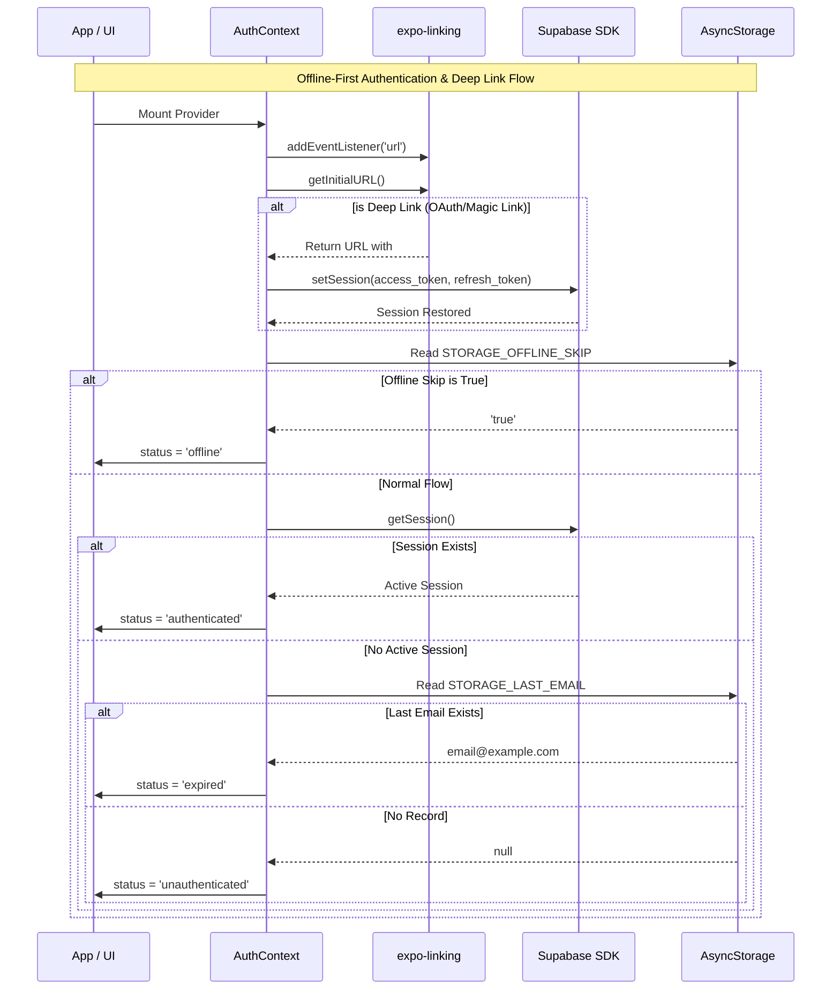
```mermaid
sequenceDiagram
    participant UI as App / UI
    participant AuthContext as AuthContext
    participant Linking as expo-linking
    participant Supabase as Supabase SDK
    participant AS as AsyncStorage
    
    %% Deep Link Authentication Flow
    Note over UI,AS: Offline-First Authentication & Deep Link Flow
    UI->>AuthContext: Mount Provider
    AuthContext->>Linking: addEventListener('url')
    AuthContext->>Linking: getInitialURL()
    
    alt is Deep Link (OAuth/Magic Link)
        Linking-->>AuthContext: Return URL with #access_token
        AuthContext->>Supabase: setSession(access_token, refresh_token)
        Supabase-->>AuthContext: Session Restored
    end
    
    %% Cold Start Local Auth
    AuthContext->>AS: Read STORAGE_OFFLINE_SKIP
    alt Offline Skip is True
        AS-->>AuthContext: 'true'
        AuthContext->>UI: status = 'offline'
    else Normal Flow
        AuthContext->>Supabase: getSession()
        alt Session Exists
            Supabase-->>AuthContext: Active Session
            AuthContext->>UI: status = 'authenticated'
        else No Active Session
            AuthContext->>AS: Read STORAGE_LAST_EMAIL
            alt Last Email Exists
                AS-->>AuthContext: email@example.com
                AuthContext->>UI: status = 'expired'
            else No Record
                AS-->>AuthContext: null
                AuthContext->>UI: status = 'unauthenticated'
            end
        end
    end
```

## 7. Archival Instruction

<!-- CARTOGRAPHER_END: IDENTITY -->

<!-- CARTOGRAPHER_START: BLE_CORE -->

# BLE_CORE Domain Cartography

## 1. File Manifest
- **`src/services/ble/BleMachine.ts`**: XState finite state machine defining the robust BLE connection lifecycle, encompassing states like IDLE, SCANNING, CONNECTING, READY, DISCONNECTING, RECOVERING, and RESTORING.
- **`src/services/ble/BleMachine.types.ts`**: Contains the strict type definitions, context interfaces, and event shapes that strictly type the XState `BleMachine`.
- **`src/services/ble/ConnectService.ts`**: XState invoked actor that handles the multi-device group connection pipeline, GATT handshakes, MTU negotiation, and hardware protocol resolution.
- **`src/services/ble/HeartbeatService.ts`**: XState invoked actor responsible for sending periodic pings to maintain connection liveliness and detect organic dropouts.
- **`src/services/ble/InterrogatorService.ts`**: Background service managing async hardware probing (EEPROM) and capability caching for newly discovered devices.
- **`src/services/ble/RSSIService.ts`**: Provides low-level RSSI polling mechanisms to track radio signal quality.
- **`src/services/ble/RecoveryService.ts`**: XState actor that manages the automatic reconnection and GATT recovery loop when a grouped device drops out.
- **`src/services/BleCharacteristicCache.ts`**: Caches resolved BLE characteristics for rapid access to prevent redundant GATT discovery.
- **`src/services/BlePingService.ts`**: Executes atomic ping lifecycles (Connect → Discover → Write Blink → Probe → Disconnect) utilized primarily in FTUE hardware wizards.
- **`src/services/BleSessionFactory.ts`**: Factory responsible for constructing GATT sessions, parsing manufacturer data, and instantiating the correct protocol adapters.
- **`src/services/BleWriteDispatcher.ts`**: Core network dispatcher that safely chunks large payloads (>MTU) into 0x40 frames and debounces concurrent BLE writes.
- **`src/services/BleWriteQueue.ts`**: Priority-based FIFO queue (`critical`, `normal`, `bulk`) enforcing strict single-flight write serialization with generation pruning to prevent Android GATT 133 collisions.
- **`src/hooks/useBLE.ts`**: The central React hook orchestrator that wraps `BleMachine` and provides the comprehensive `BluetoothLowEnergyApi` to the application.
- **`src/hooks/ble/useBLEBatterySweep.ts`**: Hook managing the background "silent sweeper" scanning cycles based on current mobile battery tiers.
- **`src/hooks/ble/useBLEInterrogator.ts`**: Exposes the `InterrogatorService` queueing and EEPROM capability caching layer to React components.
- **`src/hooks/ble/useBLERSSIMonitor.ts`**: React hook that polls RSSI for connected devices and triggers proactive device drops when signals hit critical thresholds.
- **`src/hooks/ble/useBLEScanner.ts`**: React hook managing the BLE discovery loop, parsing advertisement packets, filtering invalid hardware, and dispatching ambient telemetry.
- **`src/hooks/useOptimisticBLE.ts`**: Wraps the raw BLE write pipeline with instant local UI state updates, automatic debouncing, and haptic feedback/reconciliation handling.
- **`src/context/BLEContext.tsx`**: React Context Provider that injects the `BluetoothLowEnergyApi` (from `useBLE`) globally throughout the application tree.

## 2. Blast Radius
**What this domain imports:**
- `react-native-ble-plx` (Core BLE hardware bridge)
- `@react-native-async-storage/async-storage` (Caching and settings)
- `xstate` / `@xstate/react` (Finite State Machine engine)
- `expo-haptics` (Physical feedback for optimistic UI)
- `buffer` (Payload encoding)
- Supabase Client (For logging ambient device telemetry)
- `ZenggeProtocol` & `BanlanxAdapter` (Hardware-specific protocol implementations)
- `LocationService` (Attaching GPS coords to telemetry)

**What imports this domain:**
- `App.tsx` (Mounts `BLEContext`)
- `DashboardScreen` / `HardwareSetupWizardScreen` (Primary UI consumers)
- `DeviceManager` / `WatchBridge` (External event orchestrators)
- Any component calling `useSharedBLE()`

## 3. Context Matrix
- **Provided React Contexts**: 
  - `BLEContext`: Exposes `BluetoothLowEnergyApi` as a globally available singleton via the `useSharedBLE()` hook.
- **Consumed React Contexts**:
  - `RegistrationContext` (Implicit): Evaluated prior to `useBLE` to supply the `registeredMacs` dependency array, binding the BLE engine to known user hardware.

## 4. Hook/Service I/O Registry
- **`useBLE`**:
  - *Inputs*: `registeredMacs: string[]`
  - *Outputs*: `BluetoothLowEnergyApi` (including `writeToDevice`, `connectToDevices`, `scanForPeripherals`, `bleState`, `connectedDevices`)
  - *Side-Effects*: Instantiates XState `BleMachine`, binds background listeners for `AppState` to audit stale connections.
- **`useBLEScanner`**:
  - *Inputs*: `bleManager`, `allDevices`, `setAllDevices`, `bleSend`, `registeredMacs`
  - *Outputs*: `scanForPeripherals`, `pendingRegistrations`, `hwCache`, `isSweeperActive`
  - *Side-Effects*: Triggers native scanning, queues devices for interrogation, and posts offline telemetry batches to Supabase/AsyncStorage.
- **`useOptimisticBLE`**:
  - *Inputs*: `writeToDevice` function, `onReconcile` callback, `debounceMs`, config flags
  - *Outputs*: `optimisticWrite`, `directWrite`, `writeStatus` (`IDLE` | `PENDING` | `CONFIRMED` | `RECONCILED`)
  - *Side-Effects*: Triggers Expo Haptics (`impactAsync`, `notificationAsync`), sets delayed timeouts, triggers React state changes before BLE confirmation.
- **`BleWriteQueue`**:
  - *Inputs*: Priority tier (`critical` | `normal` | `bulk`), execution function, generation ID
  - *Outputs*: Promise resolving to boolean completion status
  - *Side-Effects*: Mutates global `_queue` array, executes 100ms jittered timeouts for GATT retry logic.

## 5. OS Variance Matrix
- **Android**:
  - Requires `requestConnectionPriorityForDevice(conn.id, 1)` and `(conn.id, 0)` during connection handshake.
  - Requires explicit `requestMTU(512)` negotiation with retry loops if initial fallback is `<= 23`.
  - Android BLE stack suffers from GATT 133 collisions on simultaneous multi-device writes. Addressed by `BleWriteDispatcher` enforcing sequential `INTER_DEVICE_WRITE_GAP_MS` delays between devices.
- **iOS**:
  - MTU is handled gracefully natively (`conn.mtu`); skips explicit `requestMTU` loop.
  - No need for connection priority adjustment commands.
  - State restoration identifier mapped closely in initialization for background wakeups (`restoreStateFunction`).
- **Web (Simulator/Sandbox)**:
  - Completely bypasses `bleManager` initialization.
  - Mocks devices (e.g., `VIRTUAL-HALOZ-L`, `VIRTUAL-SOULZ-R`) when `isSandboxEnabled` is toggled.

## 6. State Machine (FSM) Map (`BleMachine.ts`)

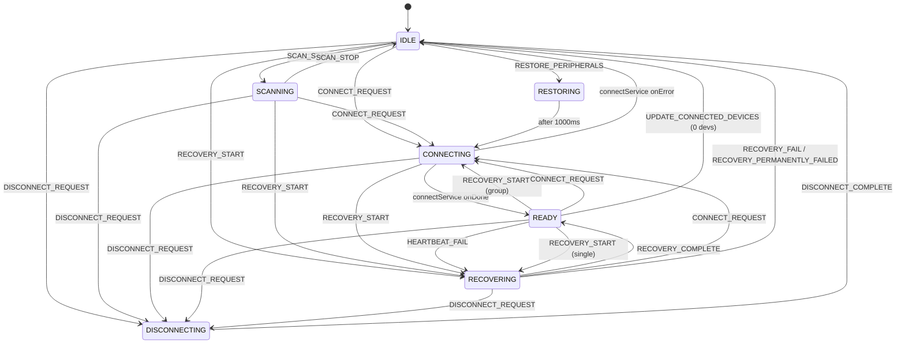
```mermaid
stateDiagram-v2
    [*] --> IDLE
    
    IDLE --> SCANNING : SCAN_START
    IDLE --> CONNECTING : CONNECT_REQUEST
    IDLE --> DISCONNECTING : DISCONNECT_REQUEST
    IDLE --> RECOVERING : RECOVERY_START
    IDLE --> RESTORING : RESTORE_PERIPHERALS
    
    SCANNING --> IDLE : SCAN_STOP
    SCANNING --> CONNECTING : CONNECT_REQUEST
    SCANNING --> DISCONNECTING : DISCONNECT_REQUEST
    SCANNING --> RECOVERING : RECOVERY_START
    
    RESTORING --> CONNECTING : after 1000ms
    
    CONNECTING --> READY : connectService onDone
    CONNECTING --> IDLE : connectService onError
    CONNECTING --> RECOVERING : RECOVERY_START
    CONNECTING --> DISCONNECTING : DISCONNECT_REQUEST
    
    READY --> RECOVERING : HEARTBEAT_FAIL
    READY --> RECOVERING : RECOVERY_START (single)
    READY --> CONNECTING : RECOVERY_START (group)
    READY --> CONNECTING : CONNECT_REQUEST
    READY --> DISCONNECTING : DISCONNECT_REQUEST
    READY --> IDLE : UPDATE_CONNECTED_DEVICES (0 devs)
    
    RECOVERING --> READY : RECOVERY_COMPLETE
    RECOVERING --> CONNECTING : CONNECT_REQUEST
    RECOVERING --> IDLE : RECOVERY_FAIL / RECOVERY_PERMANENTLY_FAILED
    RECOVERING --> DISCONNECTING : DISCONNECT_REQUEST
    
    DISCONNECTING --> IDLE : DISCONNECT_COMPLETE
```

## 7. Transport Pipeline Mapping

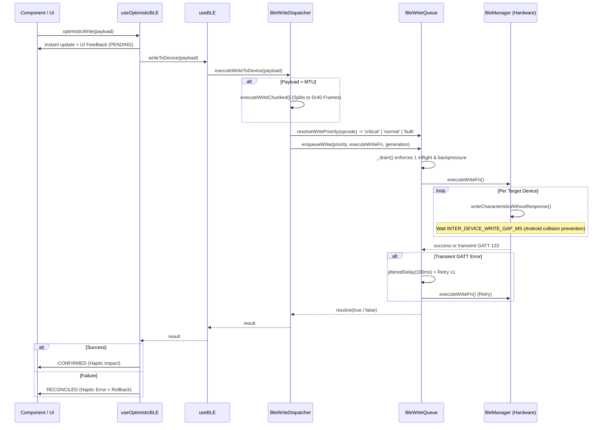
```mermaid
sequenceDiagram
    participant UI as Component / UI
    participant OBLE as useOptimisticBLE
    participant UBLE as useBLE
    participant BWD as BleWriteDispatcher
    participant BWQ as BleWriteQueue
    participant GATT as BleManager (Hardware)

    UI->>OBLE: optimisticWrite(payload)
    OBLE->>UI: instant update + UI Feedback (PENDING)
    OBLE->>UBLE: writeToDevice(payload)
    UBLE->>BWD: executeWriteToDevice(payload)
    
    alt Payload > MTU
        BWD->>BWD: executeWriteChunked() (Splits to 0x40 Frames)
    end
    
    BWD->>BWQ: resolveWritePriority(opcode) -> 'critical' | 'normal' | 'bulk'
    BWD->>BWQ: enqueueWrite(priority, executeWriteFn, generation)
    
    BWQ->>BWQ: _drain() enforces 1 inflight & backpressure
    BWQ->>GATT: executeWriteFn()
    
    loop Per Target Device
        GATT->>GATT: writeCharacteristicWithoutResponse()
        note over GATT: Wait INTER_DEVICE_WRITE_GAP_MS (Android collision prevention)
    end
    
    GATT-->>BWQ: success or transient GATT 133
    alt Transient GATT Error
        BWQ->>BWQ: jitteredDelay(100ms) + Retry x1
        BWQ->>GATT: executeWriteFn() (Retry)
    end
    
    BWQ-->>BWD: resolve(true / false)
    BWD-->>UBLE: result
    UBLE-->>OBLE: result
    
    alt Success
        OBLE->>UI: CONFIRMED (Haptic Impact)
    else Failure
        OBLE->>UI: RECONCILED (Haptic Error + Rollback)
    end
```

## 8. Archival Instructions
If stale documentation regarding the legacy "Promise-chain Mutex" or "unbounded dispatch pipeline" exists in `docs/SK8Lytz_App_Master_Reference.md`, it must be tagged with `

<!-- CARTOGRAPHER_END: BLE_CORE -->

<!-- CARTOGRAPHER_START: GROUP_SYNC -->

# GROUP_SYNC Domain Cartography

## File Manifest
* `src/services/GroupRepository.ts`: Single Source of Truth for Custom Group Persistence & Sync, handling local AsyncStorage and cloud RPC synchronization for grouping logic.
* `src/services/CrewService/CrewService.ts`: Central facade and state holder for crew sessions, delegating logic to managers and realtime handlers.
* `src/services/CrewProfileService.ts`: Permanent crew management, stats, and member operations for the ProfileService split.
* `src/components/crew/*`: Visual components for creating, joining, managing, and rendering crew data (e.g. CrewCard, CrewModal, CrewManageScreen, CrewLandingMap).
* `src/components/CrewMemberDashboard.tsx`: High-level dashboard interface dedicated to displaying the active crew state and member interactions.
* `src/components/CrewModal.tsx`: Modal interface for toggling the user's crew session flows (e.g., landing, create, join, map, manage).
* `src/context/CrewContext.tsx`: React Context provider wrapping all crew-related hooks and UI step state to share globally across crew components.
* `src/hooks/useCrewHub.ts`: Domain hook orchestrating location-based session discovery, fetching active/public crews, and polling nearby skate spots.
* `src/hooks/useCrewManage.ts`: Domain hook handling state and actions for the crew management UI (members, search, role changes, crew editing).
* `src/hooks/useCrewSession.ts`: Domain hook managing the active crew session lifecycle (joining, leaving, ending, transferring leadership).
* `src/hooks/useCrewProximityRadar.ts`: Hook for scanning nearby active sessions or empty rinks using geolocation and bounding radii to alert the user.
* `src/hooks/useDashboardCrew.ts`: Hook owning crew session state for the Dashboard, managing modal visibility, auto-rejoining, and bridging member scene updates.
* `src/hooks/useDashboardGroups.ts`: Hook owning device group state, managing hardware fleets, configuration persistence, power map, and grouping FSM.

## Blast Radius
* **Imports:**
  * Contexts: `useAuth`
  * Services: `supabaseClient`, `AppLogger`, `DeviceRepository`, `LocationService`, `SpeedTrackingService`
  * Storage: `AsyncStorage`, `STORAGE_CUSTOM_GROUPS`, `STORAGE_PENDING_GROUP_SYNC`, `STORAGE_RADIUS_PREFERENCE`
  * Ext: `expo-location`, `@react-native-async-storage/async-storage`
* **Imported By:**
  * High-level views and Dashboard (`DashboardScreen`, `DockedController`) consume `useDashboardGroups`, `useDashboardCrew`.
  * Various Modals (e.g., `GroupSettingsModal`, `CrewModal`) consume these context/hooks.

## Context Matrix
* **Consumed:** `AuthContext` (for user ID, profile data, sessionLoaded state).
* **Provided:** `CrewContext` (provides `step`, `hub`, `manage`, `session` objects globally to crew children components).

## Hook/Service I/O Registry
* **GroupRepository**: 
  * Inputs: `saveGroupTransactional`, `deleteGroup`, `flushPendingGroups`
  * Outputs: `getGroups`, subscription callbacks
  * Side-effects: Writes to `AsyncStorage`, invokes atomic `supabase.rpc('upsert_group_with_devices')`, calls `DeviceDelegate` to sync RAM.
* **CrewService**:
  * Inputs: `createSession`, `joinSession`, `leaveSession`, `tryAutoRejoin`
  * Outputs: `currentSession`, `currentRole`
  * Side-effects: Publishes events to `RealtimeChannel`, persists session IDs in `AsyncStorage`.
* **CrewProfileService**:
  * Inputs: `createPermanentCrew`, `getMyCrew`, `deleteCrew`
  * Outputs: Returns `PermanentCrew[]`, member counts.
  * Side-effects: Direct inserts/deletes to Supabase `crews` and `crew_memberships`. Proactively broadcasts `session_ended` channel events on deletion.
* **useCrewHub**:
  * Inputs: `discoverRadiusMi` config, `visible`, `step`
  * Outputs: `nearbySessions`, `nearbySpots`, `activeSessions`
  * Side-effects: Fetches silent/active location from `locationService`, queries Supabase.
* **useCrewManage**:
  * Inputs: Search strings, role changes
  * Outputs: `userSearchResults`, `crewStats`, `cardMembers`
  * Side-effects: Debounced Supabase user searches.
* **useCrewSession**:
  * Inputs: Action callbacks (`onSessionReady`, `onSessionLeft`, `onSessionEnded`)
  * Outputs: `currentSession`, `currentRole`, `members`
  * Side-effects: Dispatches lifetime stats, drops telemetry to `SpeedTrackingService`, async Supabase RPCs on teardown.
* **useDashboardCrew**:
  * Inputs: `onApplyScene` function callback
  * Outputs: `crewSession`, `isCrewModalVisible`
  * Side-effects: On auth mount, triggers `crewService.tryAutoRejoin` implicitly to reconnect orphaned sessions.
* **useDashboardGroups**:
  * Inputs: `registeredDevices`, `saveAllRegisteredDevices`
  * Outputs: `customGroups`, `deviceConfigs`, `powerStates`
  * Side-effects: Syncs hardware configs to `DeviceRepository` on changes; triggers atomic RPC deletes.

## OS Variance Matrix
* Explicit OS variance paths exist in components like `LocationPickerMap.web.tsx` and `CrewLandingMap.web.tsx` which override native map behaviors for web fallback.
* Android/iOS Location permission nuances are handled implicitly within `locationService` and `expo-location` checks.

[IMPACTS_USER_JOURNEY]
[IMPACTS_C4_CONTEXT]
[IMPACTS_STATE_CHART]

## Sequence Diagram
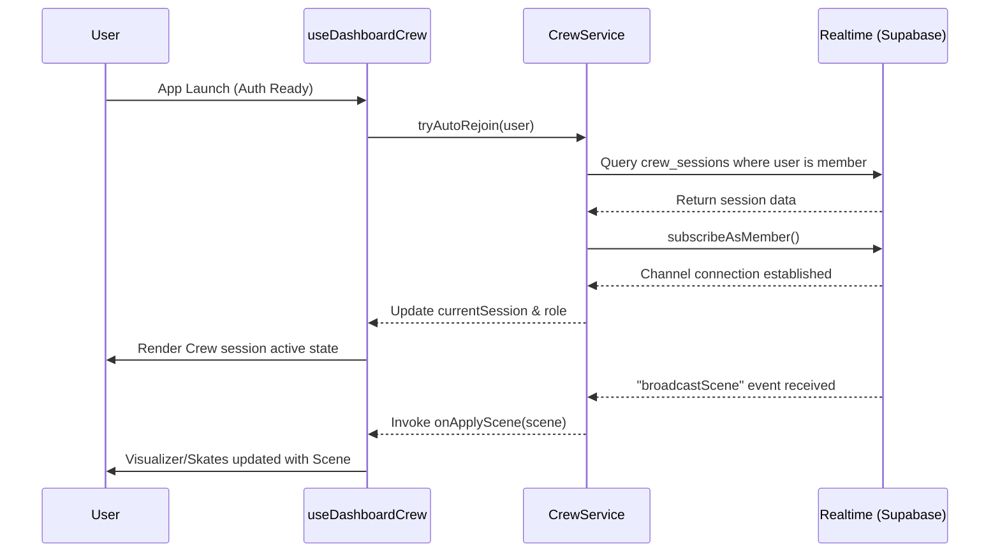
```mermaid
sequenceDiagram
    participant User
    participant DashboardCrew as useDashboardCrew
    participant CrewSvc as CrewService
    participant Supabase as Realtime (Supabase)
    
    User->>DashboardCrew: App Launch (Auth Ready)
    DashboardCrew->>CrewSvc: tryAutoRejoin(user)
    CrewSvc->>Supabase: Query crew_sessions where user is member
    Supabase-->>CrewSvc: Return session data
    CrewSvc->>Supabase: subscribeAsMember()
    Supabase-->>CrewSvc: Channel connection established
    CrewSvc-->>DashboardCrew: Update currentSession & role
    DashboardCrew->>User: Render Crew session active state

    Supabase-->>CrewSvc: "broadcastScene" event received
    CrewSvc-->>DashboardCrew: Invoke onApplyScene(scene)
    DashboardCrew->>User: Visualizer/Skates updated with Scene
```

<!-- CARTOGRAPHER_END: GROUP_SYNC -->

<!-- CARTOGRAPHER_START: UI_SCREENS -->

# UI_SCREENS Domain Cartography

## 1. File Manifest
- `src/screens/AuthScreen.tsx`: Manages user authentication, mode switching, and offline skip logic.
- `src/screens/DashboardScreen.tsx`: The monolithic root application screen orchestrating BLE lifecycle, active sessions, and hardware groups.
- `src/screens/Onboarding/HardwareSetupWizardScreen.tsx`: FTUE multi-step wizard to scan, identify (blink), configure, and claim new SK8Lytz controllers.
- `src/screens/Onboarding/PermissionsOnboardingScreen.tsx`: Granular OS permission request flow prior to FTUE.
- `src/components/dashboard/CrewHubSlab.tsx`: Dashboard UI component for Crew active session discovery.
- `src/components/dashboard/DashboardCrewPanel.tsx`: UI for managing Crew memberships and status.
- `src/components/dashboard/DashboardGroupList.tsx`: Renders the list of custom hardware groups.
- `src/components/dashboard/DashboardHeader.tsx`: Dynamic header providing quick access to profile and admin tools.
- `src/components/dashboard/DashboardTelemetryHero.tsx`: High-impact hero section displaying real-time speed and session metrics.
- `src/components/dashboard/HardwareStatusPills.tsx`: Visual indicators for device connection status and battery levels.
- `src/components/dashboard/LiveTelemetryHUD.tsx`: Floating heads-up display overlay for telemetry data.
- `src/components/dashboard/MySkatesSlab.tsx`: Primary control slab for the user's default grouped hardware.
- `src/components/dashboard/RegisteredFleetSlab.tsx`: Administrative list of all claimed devices.
- `src/components/dashboard/SkateGroupCard.tsx`: Card component for interacting with a specific hardware group.
- `src/components/dashboard/SupportModal.tsx`: Modal for accessing SK8Lytz support resources.
- `src/components/shared/BLEErrorBoundary.tsx`: Generic error boundary explicitly catching and displaying BLE stack failures.
- `src/components/DeviceItem.tsx`: Reusable list item representing a single hardware node or grouped cluster.
- `src/components/LocationPicker.tsx`: Searchable input component integrating local spot cache and OSM geocoding.
- `src/components/LocationPickerMap.tsx`: Native wrapper for react-native-maps.
- `src/components/LocationPickerMap.web.tsx`: Web stub rendering a fallback UI for react-native-maps.
- `src/components/SkateSpotBottomSheet.tsx`: Modal sheet to review, verify, and claim skate spots with OSM integration.

## 2. Blast Radius
- **Imports:** 
  - `ThemeContext`, `AppConfigContext`, `SessionContext`, `BLEContext`
  - Domain Hooks: `useDashboardAutoConnect`, `useDashboardGroups`, `useDashboardProfile`, `useRegistration`, `useHardwareNotifications`
  - Services: `AppLogger`, `SkateSpotsService`
- **Exported To:**
  - `App.tsx` (React Navigation root)

## 3. Context Matrix
- **Consumed:**
  - `ThemeContext`: Provides `Colors`, `isDark` toggles (used everywhere).
  - `BLEContext`: Exposes `scanForPeripherals`, `connectedDevices`, `writeToDevice`, etc., to `DashboardScreen` and Setup Wizard.
  - `SessionContext`: Accessed by `DashboardScreen` to handle `startSession`, `endSession`, and read `sessionTelemetry`.
  - `AppConfigContext`: Consumed by `LocationPicker` (`isVisibilityAllowed`) and `DashboardScreen`.
- **Provided:** None (Screens are consumers, Contexts are defined globally).

## 4. Hook/Service I/O Registry
- `useDashboardGroups` (DashboardScreen)
  - **Inputs:** `registeredDevices`, `saveRegisteredDevice` callbacks.
  - **Outputs:** `customGroups`, `deviceConfigs`, `powerStates`, `saveGroup`.
- `useRegistration` (DashboardScreen)
  - **Outputs:** `registeredDevices`, `saveRegisteredDevice`, `checkDeviceClaimed`.
- `pingDevice` (HardwareSetupWizardScreen)
  - **Inputs:** `mac: string`, `blinkPayload: number[]`
  - **Outputs:** `Promise<PingResult | null>` containing EEPROM data.
- `SkateSpotsService.claimAndUpdateSpot` (SkateSpotBottomSheet)
  - **Inputs:** `SkateSpot` entity with new surface/indoor flags.
  - **Outputs:** Updated `SkateSpot` database record.

## 5. OS Variance Matrix
- **Android vs iOS:**
  - `DashboardScreen`: `BackHandler` is Android-only; explicit `Platform.select` used to bypass native exit. Custom `PanResponder` simulates swipe-to-back natively for IOS/Android edge swipes.
  - `LocationPicker`: `Platform.OS !== 'web'` gate used before querying `Location.getLastKnownPositionAsync`.
  - `KeyboardAvoidingView`: `behavior={Platform.select({ ios: 'padding', android: undefined })}` used in Auth and Wizard screens.
- **Web vs Native:**
  - `DashboardScreen`: `Platform.select({ web: true, default: false })` disables the `startSweeper` completely on Web.
  - `LocationPickerMap`: Metro codegen falls back to `LocationPickerMap.web.tsx` which removes native Maps logic and displays a grey stub on web environments.

## 6. Design System & Token Manifest
- **Palette**: Uses `ThemePalette` (`Colors.primary`, `Colors.background`, `Colors.surface`, `Colors.surfaceHighlight`, `Colors.textMuted`). Hardcoded hex fallbacks (`#00f0ff`, `#0D0D0D`, `#1C1C1E`) indicate legacy areas needing strict ThemeContext migration.
- **Spacing**: Strictly standardizes on `Spacing.xs`, `Spacing.sm`, `Spacing.md`, `Spacing.lg`, `Spacing.xl`, `Spacing.xxl`, `Spacing.xxxl`.
- **Typography**: Uses `Typography.title`, font family `'Righteous'`, font family `'Inter-Medium'`, and font weights (`'800'`, `'900'`).
- **Layout**: Dynamic Flex bounds rather than hardcoded dimensions; uses `useWindowDimensions()` and `Layout.borderRadius`.

## 7. Sequence Diagram (FTUE Setup Wizard Flow)

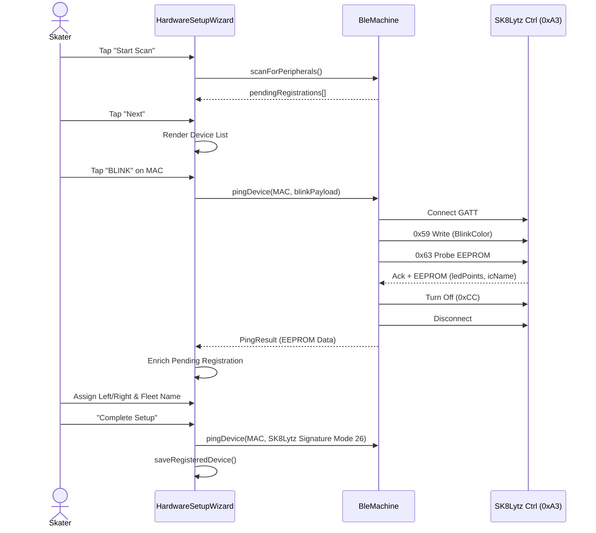
```mermaid
sequenceDiagram
    actor Skater
    participant Wizard as HardwareSetupWizard
    participant BLE as BleMachine
    participant Hardware as SK8Lytz Ctrl (0xA3)

    Skater->>Wizard: Tap "Start Scan"
    Wizard->>BLE: scanForPeripherals()
    BLE-->>Wizard: pendingRegistrations[]
    Skater->>Wizard: Tap "Next"
    Wizard->>Wizard: Render Device List
    Skater->>Wizard: Tap "BLINK" on MAC
    Wizard->>BLE: pingDevice(MAC, blinkPayload)
    BLE->>Hardware: Connect GATT
    BLE->>Hardware: 0x59 Write (BlinkColor)
    BLE->>Hardware: 0x63 Probe EEPROM
    Hardware-->>BLE: Ack + EEPROM (ledPoints, icName)
    BLE->>Hardware: Turn Off (0xCC)
    BLE->>Hardware: Disconnect
    BLE-->>Wizard: PingResult (EEPROM Data)
    Wizard->>Wizard: Enrich Pending Registration
    Skater->>Wizard: Assign Left/Right & Fleet Name
    Skater->>Wizard: "Complete Setup"
    Wizard->>BLE: pingDevice(MAC, SK8Lytz Signature Mode 26)
    Wizard->>Wizard: saveRegisteredDevice()
```

## 8. Stale Documentation Audit

<!-- CARTOGRAPHER_END: UI_SCREENS -->

<!-- CARTOGRAPHER_START: UI_DOCKED_CONTROLLER -->

# UI_DOCKED_CONTROLLER Cartography

## 1. File Manifest
- `src/components/DockedController.tsx`: The primary routing monolith and structural shell for the primary LED control interface, managing shared state, BLE write bus orchestration, and mode FSM.
- `src/components/docked/*`: A suite of `React.memo` isolated sub-panels (`FavoritesPanel`, `ProEffectsPanel`, `BuilderPanel`, etc.) that execute UI rendering based on the DockedBus contract.
- `src/hooks/useDashboardController.tsx`: High-level wrapper connecting the overarching app state (Auth, Crew Mode, active hardware telemetry) to the `DockedController` shell.
- `src/hooks/useDockedControllerState.ts`: The central state repository managing all granular UI parameter tuples (modes, colors, speeds) and providing snapshot capabilities.
- `src/hooks/useControllerDispatch.ts`: The BLE command builder bridging UI parameter state to the pure hardware payload generation via `ZenggeProtocol` and `PatternEngine`.
- `src/hooks/useControllerAnalytics.ts`: A debounced telemetry side-effect hook logging user interactions with hardware parameters.

## 2. Blast Radius
- **Imports**: Relies heavily on global contexts (`useSharedFavorites`, `useAppConfig`, `useSharedBLE`, `useTheme`, `useAuth`), device ledgers (`useDeviceStateLedger`), hardware protocols (`ZenggeProtocol`), and math synthesizers (`PatternEngine`).
- **Imported By**: `DashboardScreen.tsx` and the core dashboard routing layer. Any changes to `DockedController`'s prop interface heavily impact the dashboard hardware mapping and session telemetry tracking injection.

## 3. Context Matrix
- `FavoritesContext`: Provided by `useSharedFavorites` to manage custom presets and cloud saves.
- `AppConfigContext`: Provided by `useAppConfig` to determine global visibility gates.
- `BLEContext`: Provided by `useSharedBLE` to resolve device connection adapters (`getAdapterForDevice`).
- `ThemeContext`: Provided by `useTheme` for `Colors` and `isDark` values.
- `AuthContext`: Provided by `useAuth` for syncing user profiles and Crew functionality.

## 4. Hook/Service I/O Registry
- `useDockedControllerState`:
  - **Inputs**: `initialProduct`, `ledgerLoadSync`, `mac`.
  - **Outputs**: 30+ UI parameter getters/setters (e.g., `activeMode`, `selectedColor`), `captureEntireState`, `applyCloudScene`.
  - **Side-Effects**: Syncs initial state via lazy `useRef` initialization from the device ledger.
- `useControllerDispatch`:
  - **Inputs**: `writeToDevice` function wrapper, `hwSettings`, `points`, `getAdapterForDevice`, `primaryDeviceId`.
  - **Outputs**: Command methods (`sendColor`, `applyFixedPattern`, `handleMusicChange`, `applyEmergencyPattern`).
  - **Side-Effects**: Serializes mathematical operations into binary payloads and enqueues BLE writes. Manages an LRU `patternPayloadCache`.
- `useControllerAnalytics`:
  - **Inputs**: `activeMode`, `selectedPatternId`, `selectedColor`, `brightness`, `speed`, `streetSensitivity`, `deviceContext`.
  - **Outputs**: None.
  - **Side-Effects**: Debounced AppLogger dispatches for telemetry tracking.

## 5. OS Variance Matrix
- **Explicit OS Variance**: There are no explicit iOS/Android branching paths (`Platform.OS`) within the `UI_DOCKED_CONTROLLER` domain. All OS-specific Bluetooth logic is entirely abstracted away by the upstream `useOptimisticBLE` and `BleMachine` layers.

## 6. Monolith Mapping & Extraction Opportunities (Domain-Specific Directive)
**DockedController.tsx Monolith Map:**
- **Hooks**: Uses `useTheme`, `useAppConfig`, `useOptimisticBLE`, `useStreetMode`, `useDeviceStateLedger`, `useLoadFavorite`, `useCuratedPicks`, `useAppMicrophone`, `useDockedPermissions`, `useControllerAnalytics`.
- **Refs**: 
  - `activeModeRef`, `fixedSubModeRef`, `musicPatternIdRef`, `selectedPatternIdRef`: Volatile state refs stabilizing useCallback dependencies.
  - `lastConfirmedStateRef`: Captures pre-write state for Optimistic UI rollbacks.
  - `onReconcileRef`: Stable closure for `applyCloudScene` during BLE failure.
  - `lastSentPayloadRef`: Prevents stale closures for Ledger Reconnect Replay.
- **Callbacks**:
  - `writeToDevice`: Binds parent write dispatch with local snapshot capture and optimistic UI integration.
  - `handleReconcile`: Fires UI rollback on optimistic failure.
  - `handleCameraColorDetected`, `handleVibePaletteChange`, `handleVibeApply`: Camera interaction mapping.
  - `handleDockModeChange`: Mode switching with permission gating.

**Extraction Opportunities (Flags):**
- **[EXTRACT] Visualizer Lock Derivation**: The massive `vizLock` `useMemo` and visualizer status text computation (`currentStatusText`) should be extracted into a `useControllerVisualizer.ts` hook.
- **[EXTRACT] Context Overload**: Consolidate the 5+ injected contexts (`Theme`, `BLE`, `Auth`, `Favorites`, `AppConfig`) into a single boundary provider component wrapping the `DockedController`.
- **[EXTRACT] Camera Interaction Logic**: The `handleCameraColorDetected` and `handleVibeApply` callbacks can be extracted into a `useCameraVibe.ts` hook to decouple canvas sizing/math from the monolithic UI shell.

## 7. Sequence Diagram
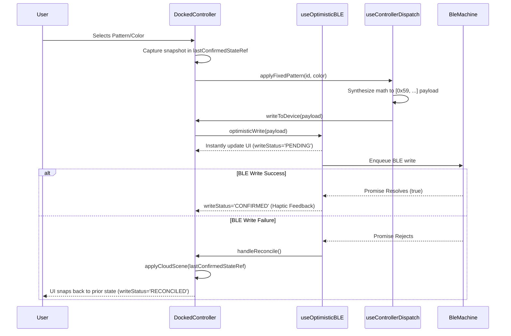
```mermaid
sequenceDiagram
    participant User
    participant DockedController
    participant useOptimisticBLE
    participant useControllerDispatch
    participant BleMachine

    User->>DockedController: Selects Pattern/Color
    DockedController->>DockedController: Capture snapshot in lastConfirmedStateRef
    DockedController->>useControllerDispatch: applyFixedPattern(id, color)
    useControllerDispatch->>useControllerDispatch: Synthesize math to [0x59, ...] payload
    useControllerDispatch->>DockedController: writeToDevice(payload)
    DockedController->>useOptimisticBLE: optimisticWrite(payload)
    useOptimisticBLE-->>DockedController: Instantly update UI (writeStatus='PENDING')
    useOptimisticBLE->>BleMachine: Enqueue BLE write
    
    alt BLE Write Success
        BleMachine-->>useOptimisticBLE: Promise Resolves (true)
        useOptimisticBLE-->>DockedController: writeStatus='CONFIRMED' (Haptic Feedback)
    else BLE Write Failure
        BleMachine-->>useOptimisticBLE: Promise Rejects
        useOptimisticBLE->>DockedController: handleReconcile()
        DockedController->>DockedController: applyCloudScene(lastConfirmedStateRef)
        DockedController-->>User: UI snaps back to prior state (writeStatus='RECONCILED')
    end
```

<!-- CARTOGRAPHER_END: UI_DOCKED_CONTROLLER -->

<!-- CARTOGRAPHER_START: UI_MODALS -->

# UI_MODALS Cartography

## 1. File Manifest
- **`src/components/AccountModal.tsx`**: Main orchestrator bottom sheet managing six settings sub-tabs (Profile, Security, Crewz, Devices, Stats, Settings) and user session state.
- **`src/components/DeviceSettingsModal.tsx`**: Detail modal for configuring physical hardware BLE parameters (LEDs, strip type, sorting, RF lockout) equipped with active probing triggers.
- **`src/components/CommunityModal.tsx`**: Cloud scenes browser that syncs personal saves and public community LED lighting configurations from Supabase to local hardware.
- **`src/components/GroupSettingsModal.tsx`**: Group creation and management modal enabling users to associate multiple registered devices under custom group names.
- **`src/components/SessionSummaryModal.tsx`**: Obsolete post-session statistics debrief overlay displaying key skate metrics (distance, speed, G-force, calories) using dynamic peak-speed color codes.
- **`src/components/modals/EulaModal.tsx`**: Onboarding legal agreement modal that gates active controls until the user scrolls completely to the bottom and accepts the terms.
- **`src/components/modals/GlobalPermissionsModal.tsx`**: System permission controller that wraps and mounts the `PermissionsOnboardingScreen` via global event listeners.
- **`src/components/CustomSlider.tsx`**: Gesture-responsive sliding track component using `PanResponder` to support linear color gradient fills and custom callback events.
- **`src/components/TacticalSlider.tsx`**: Highly tactile, dynamic slider tailored for high-vibration outdoor skating featuring large icons and variable visual intensity modes.
- **`src/components/MarqueeText.tsx`**: Layout-measuring text component that automatically loops a horizontal translation animation if its content overflows the container.
- **`src/components/ConnectionStrengthBadge.tsx`**: A pure-View 3-bar BLE signal strength indicator visualizing RSSI connection tiers without relying on SVG assets.

## 2. Blast Radius
- **Imports**:
  - **Components**: `ErrorCard`, `EmptyState`, `EulaModal`, `PermissionsOnboardingScreen`, `AccountTab*` sub-tabs, `AccountModalSkeleton`.
  - **Contexts**: `ThemeContext`, `AuthContext`.
  - **Hooks**: `useAccountOverview`, `useSkateStats`, `useScreenPerformance`, `useProtocolDispatch`.
  - **Services**: `profileService`, `supabaseClient`, `AppLogger`, `ScenesService`, `estimateCalories` (SpeedTrackingService), `PermissionService`.
  - **Constants**: `LOCAL_PRODUCT_CATALOG`, `RSSI_WEAK_THRESHOLD`, `RSSI_CRITICAL_THRESHOLD`.
  - **Styles/Theme**: `Spacing`, `Typography`, `Layout`, `ThemePalette`.
- **Exported to / Imported By**:
  - `AccountModal`, `DeviceSettingsModal`, `GroupSettingsModal`, `SessionSummaryModal`, `MarqueeText` -> `DashboardScreen`.
  - `CommunityModal`, `CustomSlider`, `TacticalSlider`, `MarqueeText` -> `DockedController`.
  - `ConnectionStrengthBadge` -> `DeviceItem` (hardware fleet list).
  - `GlobalPermissionsModal` -> Root App Layout/Navigation Shell.

## 3. Context Matrix
- **Consumed**:
  - `AuthContext`: Accessed by `AccountModal` (`authSignIn`, `authSignOut`, `updateUser`, `user`) and `CommunityModal` (`user`) for authentication and profile management.
  - `ThemeContext`: Accessed by all components for accessing `Colors`, `isDark`, and `toggleTheme` to style dynamic UI modes.
- **Provided**: None. These components consume contexts but do not act as providers.

## 4. Hook/Service I/O Registry
- **`useAccountOverview` (in `AccountModal`)**:
  - *Inputs*: `visible` boolean, `onProfileUpdated` callback.
  - *Outputs*: User profile attributes, crew arrays, notification preferences, edit form state handlers.
  - *Side-effects*: Fetches Supabase profile and crews on mount; dispatches mutations to Supabase and local cache.
- **`useProtocolDispatch` (in `DeviceSettingsModal`)**:
  - *Inputs*: None.
  - *Outputs*: Dispatch functions (`writeSettingsByName`, `setRfRemoteState`, `clearRfRemotes`, `queryHardwareSettings`).
  - *Side-effects*: Invokes BLE GATT write operations (`0x62`, `0x63`, `0x71`) through the `BleMachine`.
- **`ScenesService` (in `CommunityModal`)**:
  - *Inputs*: Active tab selection, `user.id`.
  - *Outputs*: Arrays of `ICloudScene` items.
  - *Side-effects*: Fetches remote scenes from Supabase; downloads payloads to local `@SK8Lytz_Scenes` SQLite storage.
- **`SpeedTrackingService` (in `SessionSummaryModal`)**:
  - *Inputs*: `snapshot.avgSpeedMph`, `snapshot.durationSec`.
  - *Outputs*: Calorie estimation.
  - *Side-effects*: None (pure computation).

## 5. OS Variance Matrix
- **Web vs Native Polyfills**:
  - `SessionSummaryModal`: `Platform.select` branches styling for card shadow. Web uses `boxShadow` while native platforms use `shadowColor`, `shadowOffset`, `shadowOpacity`, and `elevation`.
  - `AccountModal`: `Platform.select` branches sign-out behavior. Web immediately executes `authSignOut()`, whereas native renders an `Alert.alert` confirmation dialog.
  - `CustomSlider` & `TacticalSlider`: `Platform.select` injects Web-specific DOM CSS properties (`touchAction: 'none'`, `userSelect: 'none'`, `cursor: 'pointer'`) to resolve drag conflicts.

## Design System & Token Manifest
- **Typography Tokens**: Uses `Typography.title`, `Typography.body`, `Typography.caption`, `Typography.header`.
- **Spacing Tokens**: Uses `Spacing.xxs` through `Spacing.giant`.
- **Color Tokens**:
  - *Base*: `Colors.background`, `Colors.surface`, `Colors.surfaceHighlight`, `Colors.text`, `Colors.textMuted`, `Colors.primary`, `Colors.secondary`.
  - *Semantic Tiers (ConnectionStrengthBadge)*: `#4CAF50` (Excellent), `#FFC107` (Good), `#FF6B35` (Weak), `#F44336` (Critical).
  - *Semantic Tiers (SessionSummaryModal)*: `#FF3D00` (≥18mph), `#FF8C00` (≥12mph), `#00E676` (≥6mph), `#00B0FF` (<6mph).
  - *Semantic Tiers (DeviceSettingsModal)*: `#00e887` (RF Paired), `#FFA500` (RF Allow All), `#FF3D71` (RF Block All).

## Complex Multi-Step Process: Device Probing Sequence Diagram
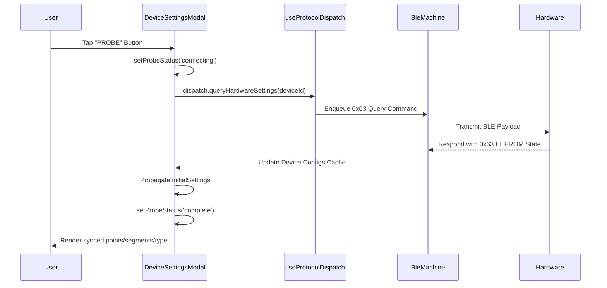
```mermaid
sequenceDiagram
    participant User
    participant DeviceSettingsModal
    participant useProtocolDispatch
    participant BleMachine
    participant Hardware

    User->>DeviceSettingsModal: Tap "PROBE" Button
    DeviceSettingsModal->>DeviceSettingsModal: setProbeStatus('connecting')
    DeviceSettingsModal->>useProtocolDispatch: dispatch.queryHardwareSettings(deviceId)
    useProtocolDispatch->>BleMachine: Enqueue 0x63 Query Command
    BleMachine->>Hardware: Transmit BLE Payload
    Hardware-->>BleMachine: Respond with 0x63 EEPROM State
    BleMachine-->>DeviceSettingsModal: Update Device Configs Cache
    DeviceSettingsModal->>DeviceSettingsModal: Propagate initialSettings
    DeviceSettingsModal->>DeviceSettingsModal: setProbeStatus('complete')
    DeviceSettingsModal-->>User: Render synced points/segments/type
```

## Architectural Impact Flags
[IMPACTS_USER_JOURNEY]
[IMPACTS_C4_CONTEXT]
[IMPACTS_STATE_CHART]

<!-- CARTOGRAPHER_END: UI_MODALS -->

<!-- CARTOGRAPHER_START: UI_VISUALIZER -->

# UI_VISUALIZER Domain Cartography

## 1. File Manifest
- **`VisualizerUnit.tsx`**: Renders the high-fidelity physical representation of the LED matrix (HALOZ/SOULZ/RAILZ) and orchestrates 3D-styled chip rendering synchronized with `PatternEngine`.
- **`ProductVisualizer.tsx`**: Container orchestrator mapping hardware configurations to single or paired `VisualizerUnit` instances.
- **`LEDStripPreview.tsx`**: A lightweight, flat 2D color strip preview for effect cards, driven autonomously by `PatternEngine`.
- **`CustomEffectVisualizer.tsx`**: Renders dynamic dot-based horizontal previews for specific effects like breathing or custom speeds.
- **`NeonHueStrip.tsx`**: A tactile, DJ-style horizontal touch slider for continuous hue adjustments.
- **`PositionalGradientBuilder.tsx`**: A node-based interactive editor for pinning colors at specific percent locations to dynamically generate arrays.
- **`VerticalPatternDrum.tsx`**: A 3D-masked, infinite-scroll vertical drum component for pattern selection.
- **`CameraTracker.tsx`**: High-performance camera processor utilizing `vision-camera-resizer` on the GPU and K-Means JSI worklets for real-time environment color extraction (SNIPER/VIBE).
- **`CameraTracker.web.tsx`**: Platform-specific stub preventing vision-camera crashes when running in web environments.
- **`CameraTracker.d.ts`**: TypeScript definition ensuring consistent typings across native and web CameraTracker implementations.
- **`patterns/GradientLibraryTab.tsx`**: Renders a virtualized grid of custom and built-in gradient presets using glassmorphic cards.
- **`patterns/PatternCard.tsx`**: An interactive glassmorphic card component featuring live `LEDStripPreview` and animated selection states.
- **`patterns/PatternPickerTab.tsx`**: A categorized virtualized list displaying `PatternCard` instances filtered from `SK8LYTZ_TEMPLATES`.
- **`patterns/UnifiedPatternPicker.tsx`**: The primary dispatch orchestrator tying user pattern selections to `PatternEngine` mathematics and dispatching `0x59` BLE payloads.

## 2. Blast Radius
- **Imports From**: 
  - `protocols/PatternEngine` (getVisualizerFrame, SK8LYTZ_TEMPLATES, buildPatternPayload)
  - `protocols/PositionalMathBuffer` (PositionalMathBuffer, BuilderNode)
  - `utils/ColorUtils` & `utils/kMeansPalette`
  - `hooks/useGradients`, `components/visualizer/VisualizerHooks`
  - External: `react-native-vision-camera`, `react-native-worklets-core`, `expo-linear-gradient`
- **Imported By (Upstream)**:
  - `DockedController.tsx`, `DeviceSettingsModal.tsx`, `DashboardScreen.tsx`

## 3. Context Matrix
- **`ThemeContext`**: Extensively consumed (`useTheme`) across all components to extract `Colors` and `isDark` boolean for dynamic styling.

## 4. Hook/Service I/O Registry
- **`useVisualizerPath`**: 
  - *In*: `productProfile`, `numLeds`, `deviceSegments`, `product`
  - *Out*: `pathGeometry` (x,y layout map)
- **`useVisualizerLeds`**: 
  - *In*: `pathGeometry`, hardware config, and current animation parameters (`color`, `tick`, `mode`, etc.)
  - *Out*: Array of computed LED states (`activeColor`, `chipSoften`, opacities)
- **`useGradients`**: 
  - *In*: None
  - *Out*: `gradients` array, `status`, `error`, `deleteGradient()`, `refreshGradients()`
  - *Side-effects*: Reads/mutates offline `AsyncStorage` and Supabase cloud sync queues.
- **`useResizer` & `useFrameOutput`**: 
  - *In*: Frame configuration (`yuv` format, `50x50` downscale)
  - *Out*: GPU-resized pixel buffers for Worklet processing.

## 5. OS Variance Matrix
- **Camera Access**: `CameraTracker.web.tsx` completely disables the camera pipeline on the web. iOS/Android handle permission requests natively via `Linking.openSettings()`.
- **Animations**: `VerticalPatternDrum.tsx` and `PatternPickerTab.tsx` utilize `useNativeDriver: Platform.OS !== 'web'` for `Animated.spring` to prevent web bundle warnings.
- **Touch Handling**: `NeonHueStrip.tsx` actively injects web-specific DOM styles (`touchAction: 'none', userSelect: 'none'`) onto React Native web outputs to neutralize default browser drag-and-drop interference.

## 6. Design System & Token Manifest
- **Core Tokens**: `Colors.primary` (Cyan `#00F0FF`), `Colors.textMuted`, `Colors.surfaceHighlight`.
- **Glassmorphism**: Components use layered refraction layers: `rgba(255,255,255,0.04)` borders, diagonal rotated `cardRefraction` shimmer blocks, and translucent gradients `['rgba(0,240,255,0.15)', 'rgba(0,240,255,0.05)']`.
- **Typography**: Heavily utilizes `fontWeight: '800'` and `letterSpacing: 0.3` for high-glanceability text (Skaters in motion).
- **Sizing**: Touch targets are inherently robust, utilizing `Spacing.md`/`Spacing.xl` pads to meet the "Tactile, Glanceable UI" product pillar.

## 7. Sequence Diagram

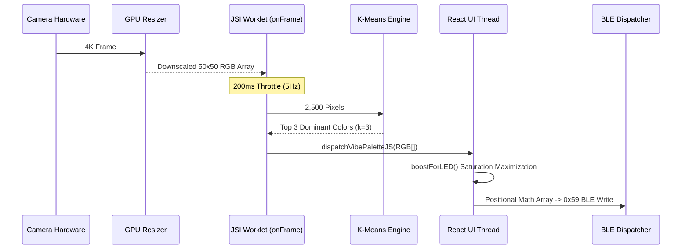
```mermaid
sequenceDiagram
    participant Camera Hardware
    participant GPU Resizer
    participant JSI Worklet (onFrame)
    participant K-Means Engine
    participant React UI Thread
    participant BLE Dispatcher

    Camera Hardware->>GPU Resizer: 4K Frame
    GPU Resizer-->>JSI Worklet (onFrame): Downscaled 50x50 RGB Array
    Note over JSI Worklet (onFrame): 200ms Throttle (5Hz)
    JSI Worklet (onFrame)->>K-Means Engine: 2,500 Pixels
    K-Means Engine-->>JSI Worklet (onFrame): Top 3 Dominant Colors (k=3)
    JSI Worklet (onFrame)->>React UI Thread: dispatchVibePaletteJS(RGB[])
    React UI Thread->>React UI Thread: boostForLED() Saturation Maximization
    React UI Thread->>BLE Dispatcher: Positional Math Array -> 0x59 BLE Write
```

## 8. Archival Instruction
I found existing `UI_VISUALIZER` cartography documentation in `docs/SK8Lytz_App_Master_Reference.md` at lines 1845-1937. 
## 9. Architectural Impact Flags
[IMPACTS_USER_JOURNEY]
[IMPACTS_C4_CONTEXT]
[IMPACTS_STATE_CHART]

<!-- CARTOGRAPHER_END: UI_VISUALIZER -->

<!-- CARTOGRAPHER_START: DATA_LAYER -->

# DATA_LAYER Cartography Report

## 1. File Manifest
* **`src/services/deviceRepository/DeviceRepositoryService.ts`**: Singleton service that owns all device fleet persistence, local SQLite/AsyncStorage mapping, and offline syncing queues.
* **`src/services/TelemetryService.ts`**: Handles extraction of standard context (payload size, operation type) from raw BLE errors to normalize logging output.
* **`src/services/ScenesService.ts`**: Manages caching, background syncing, and offline queued mutations for user and community multi-step scenes.
* **`src/services/SpeedTrackingService.ts`**: Stateless persistence layer bridging live GPS/telemetry to Supabase `skate_sessions` and managing the offline tracking queue.
* **`src/services/GradientsService.ts`**: Handles caching, saving, and syncing Custom Builder Presets (gradients) between local AsyncStorage and Supabase `user_saved_presets`.
* **`src/services/SkateSpotsService.ts`**: Fetches, caches, and syncs verified `skate_spots` with a Nominatim OSM fallback for offline map degradation survival.
* **`src/services/SessionShareService.ts`**: Builds text payloads and interfaces with the native OS Share API for sharing crew session invites.
* **`src/types/supabase.ts`**: Auto-generated or manually curated TypeScript definitions representing the Supabase schema, including DB tables and views.
* **`src/services/supabaseClient.ts`**: Initializes the Supabase client using Expo SecureStore for auth token persistence and provides an offline stub fallback.
* **`src/hooks/cloud/useOfflineSyncWorker.ts`**: A background loop running at 60s intervals to flush offline telemetry, scene, and session mutation queues to Supabase.
* **`src/hooks/useFavorites.ts`**: Manages user-defined lighting presets and quick presets with cloud sync, and orchestrates UI prompts for naming presets.
* **`src/hooks/useScenes.ts`**: React hook wrapper over `ScenesService` providing reactive state and lifecycle management for local/cloud scenes.
* **`src/hooks/useCuratedPicks.ts`**: Fetches SK8Lytz Picks (curated presets) from the DB using a stale-while-revalidate caching strategy.
* **`src/hooks/useGradients.ts`**: React hook wrapper over `GradientsService` managing reactive state for custom builder presets and telemetry events.
* **`src/hooks/useSkateStats.ts`**: Orchestrates fetching and caching of lifetime aggregate stats and recent sessions for display in the stats dashboard.
* **`src/hooks/useRecentSpots.ts`**: Manages a capped (10-item) rolling history of recently visited or searched skate locations in local storage.
* **`src/hooks/useMapFilters.ts`**: Controls user preference state and local persistence for map visibility filters (Rinks, Parks, Shops, Sessions).
* **`src/context/FavoritesContext.tsx`**: Provides the `useFavorites` hook instance across the component tree via a React Context API Provider.

## 2. Blast Radius
* **Imports from:** `@supabase/supabase-js`, `@react-native-async-storage/async-storage`, `expo-secure-store`, `sk8lytz-watch-bridge`, and internal tools like `AppLogger`, `LocationService`, `piiScrubber`.
* **Exported-to (Dependents):** Widely consumed by `DockedController`, `MapScreen`, `Dashboard UI` components, `AuthContext`, and global `App` state managers.

## 3. Context Matrix
* **Provided Contexts:** `FavoritesContext` exposes the `useFavoritesBase` hook returns to the app tree.
* **Consumed Contexts:** The `useAuth` (`AuthContext`) is heavily consumed across almost all `DATA_LAYER` hooks to access `user?.id` and appropriately bind mutations and cache retrievals to the authenticated profile.

## 4. Hook/Service I/O Registry
* **`SpeedTrackingService.saveSession(snapshot, userId)`** 
  * *Inputs:* `ISessionSnapshot`, `userId`
  * *Outputs:* `Promise<string | null>` (session ID)
  * *Side-effects:* Upserts to Supabase, updates `user_profiles` lifetime stats, queues to `AsyncStorage` if offline.
* **`ScenesService.getSavedScenes(userId)`**
  * *Inputs:* `userId`
  * *Outputs:* `Promise<Scene[]>`
  * *Side-effects:* Spawns a background worker to sync globals and `user_saved_presets`, modifying `LOCAL_SCENES_KEY`.
* **`DeviceRepositoryService.saveDevice(device, userId)`**
  * *Inputs:* `device` object, `userId`
  * *Outputs:* `Promise<boolean>`
  * *Side-effects:* Upserts to local fleet state, AsyncStorage, and syncs to Supabase (`registered_devices`).
* **`useOfflineSyncWorker()`**
  * *Inputs:* None (Implicit `user` via context)
  * *Outputs:* None
  * *Side-effects:* Drains `AsyncStorage` queues every 60s, dispatching data to Supabase and purging successful syncs.

## 5. OS Variance Matrix
* **`src/services/supabaseClient.ts`**: Explicitly branches `Platform.OS === 'web'` to substitute `localStorage` for `SecureStore`, enabling Web/Expo Go development environments since SecureStore is mobile-native only.
* **`src/services/SessionShareService.ts`**: Uses `Platform.select` to determine the correct `APP_LINK` (Apple App Store vs Google Play). Additionally, for iOS it attaches the `{ url: APP_LINK }` property inside `Share.share` to force a rich native iMessage URL preview, which is handled differently on Android.

## 6. Database Schema & RLS Policies
* **`skate_sessions`**: Logs telemetry `distance_miles`, `peak_speed_mph`, `duration_sec`, `avg_bpm`, and `location_coords`.
* **`custom_builder_presets` / `user_saved_presets`**: Stores authored multi-step visual scenes and positional gradients. Nodes are stored as JSON blobs.
* **`registered_devices`**: Master hardware ledger. Tracks `device_mac`, `user_id`, `points`, `segments`, `product_id`, and group allocations.
* **`skate_spots`**: Tracks crowdsourced and verified skating locations with geospatial bounds (`lat`, `lng`).
* **RLS Policies Implication**: Operations strictly filter on `.eq('user_id', userId)` where applicable to enforce isolation. `is_public` or `is_published` fields gate community access for spots and scenes.

## 7. Environment & Secrets Manifest
* `EXPO_PUBLIC_SUPABASE_URL`: Core routing URL for PostgREST endpoints.
* `EXPO_PUBLIC_SUPABASE_ANON_KEY`: Client-side JWT strictly enforced by Row Level Security (RLS) tables.

## 8. Map offline sync queue
The DATA_LAYER employs a fault-tolerant offline-first pipeline:
* **`@Sk8lytz_Scene_Sync_Queue`**: Buffers scene creation, deletion, and community publishing payloads (`SceneSyncJob`).
* **`@SK8Lytz_PendingSession_Queue`**: Captures unauthenticated or offline `PendingSessionRecord` artifacts when a skate session ends.
* **Execution**: Both queues are passively monitored and continuously drained by the `useOfflineSyncWorker` every 60000ms. Successfully synced payloads are removed from the queue.

## 9. Sequence Diagram

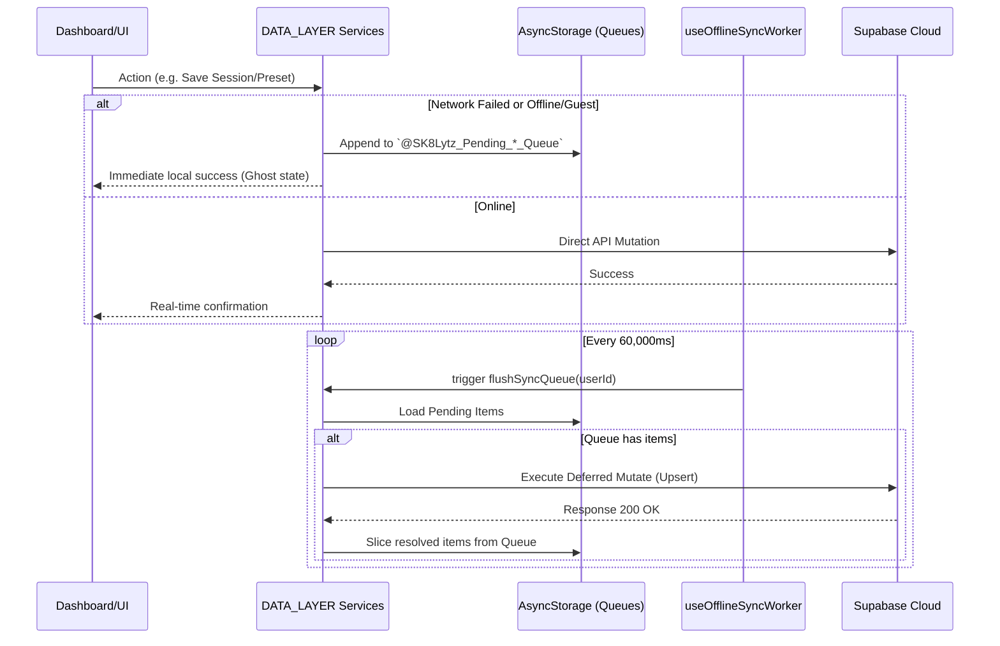
```mermaid
sequenceDiagram
    participant UI as Dashboard/UI
    participant Svc as DATA_LAYER Services
    participant Store as AsyncStorage (Queues)
    participant Worker as useOfflineSyncWorker
    participant Supabase as Supabase Cloud

    UI->>Svc: Action (e.g. Save Session/Preset)
    alt Network Failed or Offline/Guest
        Svc->>Store: Append to `@SK8Lytz_Pending_*_Queue`
        Svc-->>UI: Immediate local success (Ghost state)
    else Online
        Svc->>Supabase: Direct API Mutation
        Supabase-->>Svc: Success
        Svc-->>UI: Real-time confirmation
    end

    loop Every 60,000ms
        Worker->>Svc: trigger flushSyncQueue(userId)
        Svc->>Store: Load Pending Items
        alt Queue has items
            Svc->>Supabase: Execute Deferred Mutate (Upsert)
            Supabase-->>Svc: Response 200 OK
            Svc->>Store: Slice resolved items from Queue
        end
    end
```

<!-- CARTOGRAPHER_END: DATA_LAYER -->

<!-- CARTOGRAPHER_START: UTILS -->

# UTILS & TYPES Domain Cartography

## File Manifest
**src/utils/**
- `BlePayloadParser.ts`: Pure utility gatekeeper for deterministically parsing Zengge hardware configurations from raw BLE bytes without throwing exceptions.
- `ColorUtils.ts`: Pure color conversion utilities centralizing RGB/HSV/HEX math and industry-standard HSV saturation maximization for WS2812B LED vibrancy.
- `CrashReporter.ts`: Minimal facade for logging fatal crashes to the AppLogger system.
- `FlightRecorder.ts`: In-memory circular buffer for telemetry breadcrumbs to assist with diagnostic correlation.
- `MusicDictionary.ts`: Authoritative registry and capability mapper for all 46 hardware-native ZENGGE music profiles across 0x26 and 0x27 matrices.
- `NamingUtils.ts`: Centralizer for deterministic fallback device and group names to prevent UI drift.
- `NormalizationUtils.ts`: Normalizes 0-100 UI speed ranges down to the constrained 1-31 hardware boundary limit.
- `backoff.ts`: Utility for adding randomized jitter to retry delays to prevent request storm decoherence.
- `classifyBLEDevice.ts`: Shared BLE device classification utility that maps raw BLE scans and EEPROM cache into structured `PendingRegistration` objects.
- `kMeansPalette.ts`: Highly optimized K-Means clustering algorithm for extracting dominant color palettes from raw RGB pixels.
- `migrateAuthTokens.ts`: One-time migration script to move legacy Supabase authentication tokens from AsyncStorage to SecureStore.
- `patternColors.ts`: Utility to generate premium theme-aware gradient colors based on pattern names or visual states.
- `piiScrubber.ts`: Deterministic hashing utility for masking PII data (MACs, names) before telemetry logging.
- `presetColorUtils.ts`: Shared color resolution utilities specifically for rendering preset and group cards, correctly handling GENERATIVE patterns versus manual FG/BG.
- `validation.ts`: Shared regular expression utilities, such as validating properly formatted email addresses.
- `webStyles.ts`: Defines stub styles/constants meant for the web compatibility layer.

**src/types/**
- `ProductCatalog.ts`: Defines the shape of a single product entry in the dynamic catalog, managing hardware defaults, FTUE limits, and visualizer geometry.
- `ViewState.ts`: Basic definitions for UI ViewState state machine.
- `ble.types.ts`: Centralizes all `react-native-ble-plx` types and defines Supabase device/group shapes for the connection pipeline.
- `bleGuards.ts`: Type guard checking if an unknown object conforms to the BLE Device interface.
- `dashboard.types.ts`: Shared domain type contracts including device/group state, UI FSMs, and the core DockedBus contract replacing scattered Dashboard/DockedController types.
- `react-test-renderer.d.ts`: Typings for react-test-renderer.

## Blast Radius
- **Imports From:** 
  - `react-native-ble-plx`, `@react-native-async-storage/async-storage`, `expo-secure-store`
  - `src/protocols/ControllerRegistry`, `src/protocols/PatternEngine`
  - `src/constants/ProductCatalog`, `src/constants/storageKeys`, `src/constants/AppConstants`
  - `src/services/appLogger`
  - `src/theme/theme`
- **Imported By:** 
  - BLE hooks pipeline (`useBLESweeper`, `useBLEScanner`) consumes `BlePayloadParser`, `classifyBLEDevice`.
  - UI Components (`PresetCard`, `SkateGroupCard`, `DockedController`, `ProductVisualizer`) heavily consume `ColorUtils`, `presetColorUtils`, `patternColors`.
  - Application wide: Type files (`dashboard.types.ts`, `ble.types.ts`) provide strict contracts for almost all application screens and services.

## Context Matrix
The `UTILS` and `TYPES` domains are strictly stateless pure functions and type definitions. They do **not** consume or provide any React Contexts.

## Hook/Service I/O Registry
- `BlePayloadParser.parseLedPayload` 
  - **IN:** `number[]` (raw BLE byte array)
  - **OUT:** `ParsedLedConfig | null`
  - **SIDE-EFFECTS:** None (pure).
- `ColorUtils.boostForLED` 
  - **IN:** `r, g, b` (0-255)
  - **OUT:** `{ r, g, b }` (vibrancy maximized)
  - **SIDE-EFFECTS:** None (pure).
- `classifyBLEDevice.mapDeviceToRegistration`
  - **IN:** `Device`, `index`, `hwCache`, `productType?`
  - **OUT:** `PendingRegistration`
  - **SIDE-EFFECTS:** None (pure).
- `extractKMeansPalette`
  - **IN:** `pixels: RGB[]`, `k`, `maxIterations`
  - **OUT:** `RGB[]` (top dominant colors)
  - **SIDE-EFFECTS:** None (pure).
- `migrateAuthTokensToSecureStore`
  - **IN:** None
  - **OUT:** `Promise<void>`
  - **SIDE-EFFECTS:** Reads/Writes to `AsyncStorage` and `SecureStore`.

## OS Variance Matrix
There are **no explicit Platform.OS branching paths** in `src/utils` or `src/types`. Implicit handling exists in `piiScrubber.ts` (using custom bitwise hash due to lack of built-in React Native crypto on native threads) and `webStyles.ts` to bypass web compiler issues.

## Archival / Stale Docs Tag
The `docs/SK8Lytz_App_Master_Reference.md` file contains outdated references to deleted files:
- `src/utils/RbmSimulator.ts` 
## Architectural Impact Flags
[IMPACTS_STATE_CHART] - Updates to FSM typings in `dashboard.types.ts` affect the UI state lifecycle.

## Sequence Diagram: BLE Device Classification (`classifyBLEDevice`)
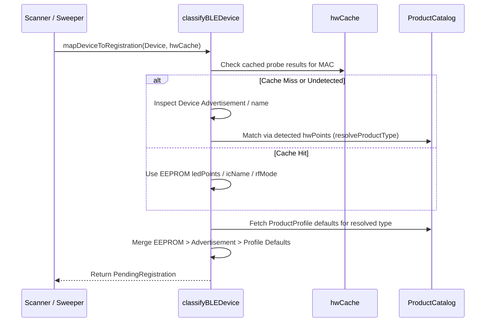
```mermaid
sequenceDiagram
    participant Caller as Scanner / Sweeper
    participant Utility as classifyBLEDevice
    participant EEPROM as hwCache
    participant Catalog as ProductCatalog
    
    Caller->>Utility: mapDeviceToRegistration(Device, hwCache)
    Utility->>EEPROM: Check cached probe results for MAC
    alt Cache Miss or Undetected
        Utility->>Utility: Inspect Device Advertisement / name
        Utility->>Catalog: Match via detected hwPoints (resolveProductType)
    else Cache Hit
        Utility->>Utility: Use EEPROM ledPoints / icName / rfMode
    end
    Utility->>Catalog: Fetch ProductProfile defaults for resolved type
    Utility->>Utility: Merge EEPROM > Advertisement > Profile Defaults
    Utility-->>Caller: Return PendingRegistration
```

## Design System & Token Manifest
- **GENERATIVE_RAINBOW:** `['#FF0000', '#FF7F00', '#FFFF00', '#00FF00', '#00BFFF', '#0000FF', '#8B00FF']` (used for rendering GENERATIVE mode UI)
- **COLOR_PRESET_PALETTE:** 10 standard hex stops used in grid selection (`#FF0000`, `#FF8000`, etc.)
- **Semantic Gradients (patternColors.ts):**
  - Fire/Flame: `['#FF4D00', '#FF9E00']`
  - Water/Ocean: `['#00B2FF', '#00FFF0']`
  - Forest/Nature: `['#00FF85', '#00A3FF']`
  - Sunset/Gold: `['#FFD600', '#FF00E5']`
  - Nebula/Space: `['#7000FF', '#00FFFF']`
  - Neon/Cyber: `['#FF00E5', '#00F0FF']`
  - Police: `['#FF0000', '#0000FF']`
  - Matrix: `['#00FF00', '#003300']`

<!-- CARTOGRAPHER_END: UTILS -->

<!-- CARTOGRAPHER_START: NATIVE_&_WATCH -->

# NATIVE & WATCH Cartography

## File Manifest
* **android/app/src/main/AndroidManifest.xml**: Configures Android app permissions including Health, Bluetooth, and Location, and defines the foreground service for background telemetry.
* **android/app/src/main/java/com/neogleamz/sk8lytz/MainActivity.kt**: Android app entry point that initializes the React Native engine and handles HealthConnect permission delegation.
* **android/app/src/main/java/com/neogleamz/sk8lytz/MainApplication.kt**: Sets up the ReactApplication environment and the new architecture (Fabric) for React Native.
* **android/sk8lytzWear/src/main/AndroidManifest.xml**: Declares Wear OS specific requirements like standalone=false, permissions (BODY_SENSORS), and registers the Tile and Communication services.
* **android/sk8lytzWear/src/main/kotlin/com/neogleamz/sk8lytzwear/MainActivity.kt**: Wear OS entry point that hosts the Compose UI and manages ambient mode/wake lock based on session state.
* **android/sk8lytzWear/src/main/kotlin/com/neogleamz/sk8lytzwear/presentation/DashboardScreen.kt**: The main single-screen Compose UI for the watch, shifting between Idle, Active, and Summary states.
* **android/sk8lytzWear/src/main/kotlin/com/neogleamz/sk8lytzwear/presentation/SessionState.kt**: FSM enum defining the 4 states of a watch session (IDLE, ACTIVE, PAUSED, SUMMARY).
* **android/sk8lytzWear/src/main/kotlin/com/neogleamz/sk8lytzwear/presentation/SummaryScreen.kt**: Post-session Compose view displaying duration, distance, avg speed, calories, and peak HR.
* **android/sk8lytzWear/src/main/kotlin/com/neogleamz/sk8lytzwear/presentation/WearMessageSender.kt**: Encapsulates sending commands and throttled health telemetry from the watch to the phone over the Wearable MessageClient.
* **android/sk8lytzWear/src/main/kotlin/com/neogleamz/sk8lytzwear/presentation/theme/Theme.kt**: Defines the Wear OS AMOLED dark theme utilizing SK8Lytz brand colors.
* **android/sk8lytzWear/src/main/kotlin/com/neogleamz/sk8lytzwear/services/HealthTracker.kt**: Wraps Wear Health Services ExerciseClient (INLINE_SKATING) to collect live heart rate and calorie data.
* **android/sk8lytzWear/src/main/kotlin/com/neogleamz/sk8lytzwear/services/OngoingActivityManager.kt**: Manages the Wear OS ongoing notification and activity indicator during active sessions.
* **android/sk8lytzWear/src/main/kotlin/com/neogleamz/sk8lytzwear/services/WearableCommunicationService.kt**: Listens for DataClient state updates and MessageClient telemetry from the phone, driving the watch's global state.
* **android/sk8lytzWear/src/main/kotlin/com/neogleamz/sk8lytzwear/tiles/Sk8lytzTileService.kt**: Implements a glanceable Wear OS Tile showing live session telemetry.
* **targets/watch/ComplicationController.swift**: Provides Apple Watch complications (speed gauge, stack, corner text) reflecting live session data.
* **targets/watch/ContentView.swift**: SwiftUI view that orchestrates the Watch OS UI, switching between Idle, Active, and Summary states.
* **targets/watch/HealthManager.swift**: Manages the watchOS HKWorkoutSession (inlineSkating) to keep the app alive and collect live HR/calorie metrics.
* **targets/watch/WatchConnectivityManager.swift**: Acts as the WCSession delegate bridging the Apple Watch with the iOS host for state syncing and telemetry.
* **targets/watch/expo-target.config.js**: Configuration for the Expo target plugin, defining entitlements, Info.plist properties, and assets for watchOS.
* **targets/watch/index.swift**: Minimal SwiftUI app entry point launching ContentView.

## Blast Radius
* **Imports**: React Native (Facebook), Wearable SDK (Google GMS), Health Services (AndroidX), HealthKit (Apple), WatchConnectivity (Apple), SwiftUI, ClockKit, Jetpack Compose.
* **Exports**: None directly to internal JS domains; communication is strictly asynchronous via OS-level bridges (WCSession, Wearable Data Layer) to the phone's native modules.

## Context Matrix
* Native environments do not utilize React Contexts. 
* **Global Singletons Provided**: `WatchConnectivityManager.shared` (SwiftUI ObservableObject), `HealthManager.shared` (SwiftUI ObservableObject), `WearableCommunicationService.companion` (Kotlin global state).

## Hook/Service I/O Registry
* **WearableCommunicationService (Android) / WatchConnectivityManager (iOS)**:
  * **Input**: State changes (status, startTime) and metrics (speed, calories, distance) from Phone via DataClient/WCSession.
  * **Output**: Exposes properties/listeners to update local UI (Compose/SwiftUI) and Tiles/Complications. Starts/stops background health trackers.
* **HealthTracker (Android) / HealthManager (iOS)**:
  * **Input**: Native Health Sensors (`ExerciseClient` / `HKLiveWorkoutBuilder`) during an active session (`INLINE_SKATING`).
  * **Output**: Provides live HR and active calories, relayed back to the phone at a throttled interval (~5s).
* **WearMessageSender (Android)**:
  * **Input**: UI intents (e.g. `START_SESSION`, `STOP_SESSION`, `WRITE_COLOR`).
  * **Output**: Emits ephemeral `MessageClient` payloads to the phone with haptic feedback.

## OS Variance Matrix
* **Health APIs**: Android uses `HealthServices ExerciseClient` (Type 101); iOS uses `HealthKit HKWorkoutSession` (`.inlineSkating`).
* **Communication APIs**: Android uses `Wearable.getDataClient` (persistent state) and `Wearable.getMessageClient` (ephemeral); iOS uses `WCSession` (`updateApplicationContext` vs `sendMessage`).
* **Glanceable UI**: Android implements `TileService` for carousel tiles; iOS implements `CLKComplicationDataSource` for watch face complications.
* **Background Execution**: Android utilizes `OngoingActivity` with Foreground Services; iOS implicitly stays active during an `HKWorkoutSession`.

## Architecture Sequence
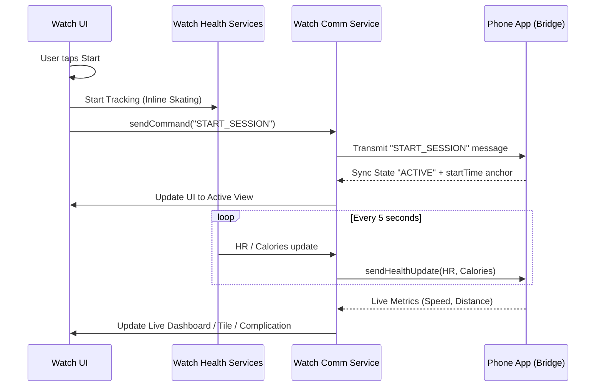
```mermaid
sequenceDiagram
    participant W as Watch UI
    participant HC as Watch Health Services
    participant WM as Watch Comm Service
    participant P as Phone App (Bridge)
    
    W->>W: User taps Start
    W->>HC: Start Tracking (Inline Skating)
    W->>WM: sendCommand("START_SESSION")
    WM->>P: Transmit "START_SESSION" message
    P-->>WM: Sync State "ACTIVE" + startTime anchor
    WM->>W: Update UI to Active View
    loop Every 5 seconds
        HC->>WM: HR / Calories update
        WM->>P: sendHealthUpdate(HR, Calories)
    end
    P-->>WM: Live Metrics (Speed, Distance)
    WM->>W: Update Live Dashboard / Tile / Complication
```

[IMPACTS_USER_JOURNEY]
[IMPACTS_C4_CONTEXT]
[IMPACTS_STATE_CHART]

<!-- CARTOGRAPHER_END: NATIVE_&_WATCH -->

<!-- CARTOGRAPHER_START: NOTIFICATIONS_&_ROUTING -->

# NOTIFICATIONS & ROUTING Cartography

## 1. File Manifest
- **`App.tsx`**: The root application orchestrator that initializes Contexts, error boundaries, push notification handlers (via notifee), and bootstraps the navigation state.
- **`src/providers/BluetoothGuard.tsx`**: A gating provider that intercepts the render tree to display a "Power Up SK8Lytz" required permission modal if Bluetooth permissions are missing or turned off.
- **`src/providers/ComplianceGate.tsx`**: A gating provider that forces both online and offline users to accept the current version of the EULA before proceeding to the dashboard.
- **`src/services/NotificationService.ts`**: Central wrapper for Expo push notifications managing Android channels, push token acquisition, and routing deep-link payload events (e.g., joining crew sessions).
- **`src/services/PushTokenService.ts`**: Repository service responsible for registering and unregistering the Expo push token in the `push_tokens` Supabase table.
- **`src/services/LocationService.ts`**: Geographic utility for acquiring device GPS coordinates, reverse geocoding venue labels, and querying Supabase for nearby active crew sessions and skate spots.
- **`src/hooks/useHardwareNotifications.ts`**: The BLE hardware callback orchestrator that debounces, parses, and routes incoming hardware state and RF configs from the `BlePayloadParser` into the local `DeviceRepository`.

## 2. Blast Radius
- **`App.tsx`**: Consumes all global contexts (`ThemeProvider`, `AuthProvider`, `AppConfigProvider`, `FavoritesProvider`, `SessionProvider`, `BLEProvider`, `BluetoothGuard`, `ComplianceGate`); imports `AppLogger`, `SessionBridge`, `useOfflineSyncWorker`, `useWebDemoConsoleBridge`, etc. Exported as the root `App` component.
- **`src/providers/BluetoothGuard.tsx`**: Imports `useSharedBLE`, `PermissionService`, `ThemePalette`. Consumed by `App.tsx` as a top-level provider.
- **`src/providers/ComplianceGate.tsx`**: Imports `useAuth`, `AppSettingsService`, `supabaseClient`, `EulaModal`. Consumed by `App.tsx` as a top-level provider.
- **`src/services/NotificationService.ts`**: Imports `expo-notifications`, `PushTokenService`. Consumed externally (likely by `DashboardScreen`) to initialize notifications and set join handlers.
- **`src/services/PushTokenService.ts`**: Imports `supabaseClient`, `AppLogger`. Consumed by `NotificationService`.
- **`src/services/LocationService.ts`**: Imports `expo-location`, `supabaseClient`, `PermissionService`, `SkateSpotsService`. Consumed across multiple flows requiring GPS tagging (Session discovery, Maps, Scene Builder).
- **`src/hooks/useHardwareNotifications.ts`**: Imports `DeviceRepository`, `BlePayloadParser`, `piiScrubber`. Consumed within the BLE Context layer (`useBLE.ts` or similar) to hook into GATT data streams.

## 3. Context Matrix
- **Consumed Contexts**:
  - `useTheme`: Consumed by `App.tsx`, `ComplianceGate.tsx`, `BluetoothGuard.tsx` to align with Dark/Light design modes.
  - `useAuth`: Consumed by `App.tsx`, `ComplianceGate.tsx` to handle authentication boundaries, offline mode fallback, and session extraction.
  - `useSharedBLE`: Consumed by `BluetoothGuard.tsx` to trigger sweeps and verify Bluetooth radio status.
- **Provided Contexts**:
  - `App.tsx` provides: `ThemeProvider`, `AuthProvider`, `AppConfigProvider`, `FavoritesProvider`, `SessionProvider`, `BLEProvider`.

## 4. Hook/Service I/O Registry
- **`NotificationService`**:
  - *Inputs*: `init(autoRequest, userId)`, `setJoinHandler(handler)`, `sendCrewInviteNotification(...)`, `sendSessionStartingSoon(...)`.
  - *Outputs*: Returns the Expo push token (`string | null`).
  - *Side-effects*: Triggers OS permission prompts, schedules native push notifications, registers foreground interaction handlers.
- **`PushTokenService`**:
  - *Inputs*: `registerPushToken(token, platform, userId)`, `unregisterPushToken(...)`.
  - *Outputs*: `void`.
  - *Side-effects*: Performs upserts or deletes against the `push_tokens` table in Supabase.
- **`LocationService`**:
  - *Inputs*: `getSessionLocation()`, `getSilentLocation()`, `getNearbyPublicSessions(...)`, `getNearbySkateSpots(...)`.
  - *Outputs*: Returns `SessionLocation` (coords + string label), Arrays of `NearbySession` or `NearbySkateSpot`.
  - *Side-effects*: Triggers foreground Location OS permissions, queries OS reverse geocoding APIs, queries Supabase `crew_sessions` and `crew_memberships`.
- **`useHardwareNotifications`**:
  - *Inputs*: Hook parameters `isDiagnosticsMode`, `allDevices`, `deviceConfigs`, plus BLE callback setters `setOnDataReceived` and `setOnHardwareProbed`.
  - *Outputs*: Returns `void` (mutates React state directly).
  - *Side-effects*: Updates `DeviceRepository` SSOT (persisted local storage), fires telemetry via `AppLogger`, and debounces redundant BLE payloads.

## 5. OS Variance Matrix
- **`App.tsx`**: Android explicitly requires `react-native-health-connect` initialization early before the activity is resumed to avoid `lateinit` crashes. iOS ignores this. Web bypasses `notifee` initialization completely.
- **`NotificationService.ts`**: Android explicitly configures dual notification channels (`crew-alerts`, `session-reminders`) with custom vibration patterns and colors. iOS handles this natively without channels. Web platform immediately bypasses the entire service.
- **`LocationService.ts`**: Web platform returns a hardcoded Mock Location (`{ lat: 38.9, lng: -94.6 }`) to prevent crashes. The reverse geocoding API uses Google on Android and Apple Maps on iOS under the hood. Android 12+ requires a combo of Location + BLE Scan permissions to detect controllers.

## 6. Sequence Diagram

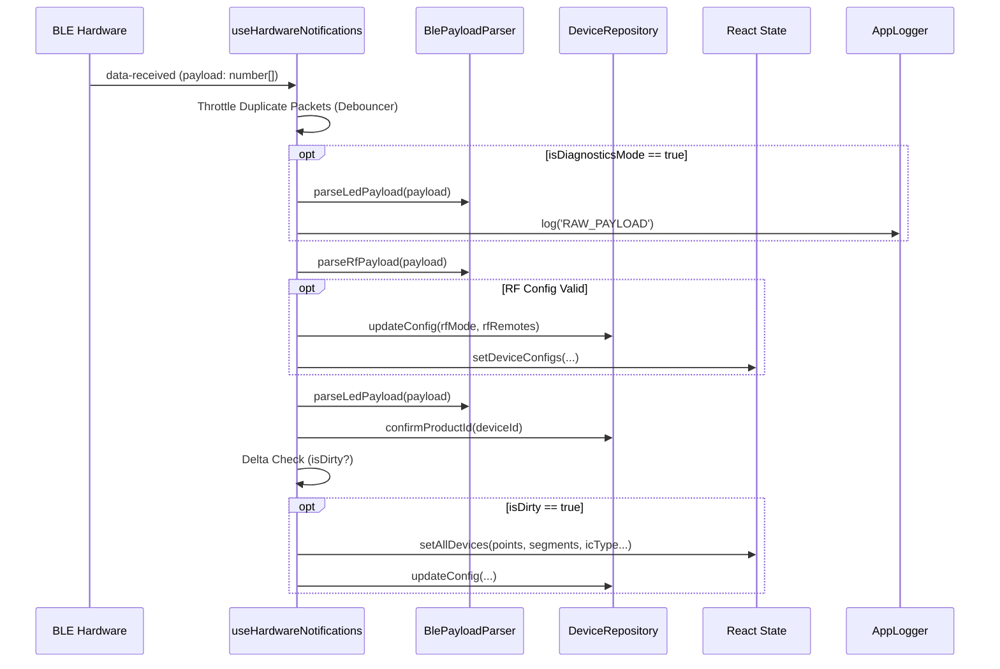
```mermaid
sequenceDiagram
    participant BLE as BLE Hardware
    participant UHN as useHardwareNotifications
    participant Parser as BlePayloadParser
    participant DR as DeviceRepository
    participant State as React State

    BLE->>UHN: data-received (payload: number[])
    UHN->>UHN: Throttle Duplicate Packets (Debouncer)
    opt isDiagnosticsMode == true
        UHN->>Parser: parseLedPayload(payload)
        UHN->>AppLogger: log('RAW_PAYLOAD')
    end
    UHN->>Parser: parseRfPayload(payload)
    opt RF Config Valid
        UHN->>DR: updateConfig(rfMode, rfRemotes)
        UHN->>State: setDeviceConfigs(...)
    end
    UHN->>Parser: parseLedPayload(payload)
    UHN->>DR: confirmProductId(deviceId)
    UHN->>UHN: Delta Check (isDirty?)
    opt isDirty == true
        UHN->>State: setAllDevices(points, segments, icType...)
        UHN->>DR: updateConfig(...)
    end
```

## 7. Archival Instruction & Findings

<!-- CARTOGRAPHER_END: NOTIFICATIONS_&_ROUTING -->

<!-- CARTOGRAPHER_START: SESSION_TRACKING -->

# SESSION_TRACKING Domain Cartography

## 1. File Manifest
- `src/context/SessionContext.tsx`: React Context provider wrapping the XState `sessionMachine`, bridging background AppState events and WatchBridge commands into the global session lifecycle.
- `src/hooks/useTelemetryLedger.ts`: God-Tier Telemetry Engine that tracks time-in-state (patterns, colors, modes) in memory and flushes to Supabase via RPC, caching offline to AsyncStorage on backgrounding.
- `src/hooks/useDeviceStateLedger.ts`: Unified Per-Device Pattern State Ledger providing synchronous in-memory caching and debounced AsyncStorage writes for LED pattern states.
- `src/services/HealthSyncService.ts`: Platform-agnostic service bridging session telemetry (distance, calories) to Apple HealthKit and Android Health Connect.
- `src/hooks/useSessionTracking.ts`: **[DELETED]** Legacy session FSM hook, logic superseded by `SessionMachine.ts` and `SessionContext.tsx`.
- `src/hooks/useGlobalTelemetry.ts`: **[DELETED]** Legacy telemetry tracker, superseded by the XState actor model.
- `src/hooks/useHealthTelemetry.ts`: **[DELETED]** Legacy health tracker, superseded by `SessionMachine.ts` and `HealthSyncService`.

## 2. Blast Radius
- **Imports (Inbound Dependencies):**
  - `@react-native-async-storage/async-storage` (Persistence)
  - `@xstate/react`, `xstate` (Session FSM)
  - `sk8lytz-watch-bridge` (Wearable command sync)
  - `@notifee/react-native` (Foreground notifications)
  - `react-native-health`, `react-native-health-connect` (Native OS health sync)
  - `supabaseClient` (RPC telemetry flushes)
- **Imported By (Outbound Dependents):**
  - `DashboardScreen` / App Root (Consumes `SessionProvider`)
  - `DockedController` (Reads live session telemetry UI props)
  - Background task handlers (Dispatching background recovery events)

## 3. Context Matrix
- **Provided Contexts:**
  - `SessionContext`: Yields `{ isSkateSessionActive, sessionPhase, startSession, endSession, telemetry, health }`.
- **Consumed Contexts:**
  - `AuthContext`: Consumes `user.id` via `useAuth()` to correctly bind session telemetry to the active user.

## 4. Hook/Service I/O Registry
- **`useTelemetryLedger`**:
  - **Inputs:** `patternId`, `hexCode`, `modeId`, `counterKey`, `distanceMeters`, `topSpeedMph`
  - **Outputs:** `{ trackPattern, trackColor, trackMode, incrementCounter, injectStreetSummary, flushToDatabase }`
  - **Side-Effects:** Mutates global memory buffers, triggers 500ms debounced AsyncStorage writes, invokes Supabase `flush_telemetry` RPC, auto-flushes on AppState backgrounding.
- **`useDeviceStateLedger`**:
  - **Inputs:** `mac`, `state: DevicePatternState`
  - **Outputs:** `{ save, load, loadSync, clear }`
  - **Side-Effects:** Synchronously updates `__sk8lytz_ledger_cache` Map, fires debounced (500ms) writes to AsyncStorage, automatically syncs unwritten cache entries on AppState backgrounding.
- **`HealthSyncService`**:
  - **Inputs:** `snapshot: ISessionSnapshot` (distanceMiles, durationSec, healthCalories)
  - **Outputs:** `Promise<void>`
  - **Side-Effects:** Writes `HKWorkoutActivityTypeSkatingSports` to iOS HealthKit, or `ExerciseSession` (Type 60) to Android Health Connect.
- **`SessionContext` (`useSession`)**:
  - **Inputs:** React hook triggers, Watch commands, AppState events, Notifee foreground interactive buttons.
  - **Outputs:** Reactive UI telemetry state (`gpsSpeed`, `duration`, `bpm`), session phase string.
  - **Side-Effects:** Triggers 1-second UI interval timer (`UI_TICK_MS`), handles crash recovery via AsyncStorage `STORAGE_PENDING_BG_END`, registers/unregisters with `SessionBridge`.

## 5. OS Variance Matrix
- **iOS:**
  - `HealthSyncService`: Imports `react-native-health` to save workouts natively to Apple HealthKit using the `SkatingSports` category.
  - `SessionContext`: Explicitly sets interactive `Notifee` notification categories (`end-session`, `toggle-music`, `fire-favorite`) **only** when `Platform.OS === 'ios'`.
- **Android:**
  - `HealthSyncService`: Imports `react-native-health-connect` and utilizes `ExerciseSession` (exerciseType: 60 - Skating) with granular data insertion for `TotalCaloriesBurned` and `Distance`.
  - `SessionContext`: Background Notification interactive actions are handled natively without explicit category registration.

---

###

<!-- CARTOGRAPHER_END: SESSION_TRACKING -->

<!-- CARTOGRAPHER_START: PROTOCOL_CORE -->

# PROTOCOL_CORE Domain Cartography

## 1. File Manifest
- `src/protocols/ZenggeProtocol.ts`: Core protocol implementation generating raw byte payloads for Zengge hardware (0x59, 0x62, 0x63, etc.), owning its monotonic sequence counter.
- `src/protocols/ZenggeAdapter.ts`: `IControllerProtocol` adapter for Zengge, mapping HAL methods to `ZenggeProtocol` and outputting structured `ProtocolResult`.
- `src/protocols/BanlanxAdapter.ts`: `IControllerProtocol` adapter for BanlanX SP621E hardware, emitting native 0xA0 format commands.
- `src/protocols/IControllerProtocol.ts`: Universal Hardware Abstraction Layer (HAL) interface separating UI logic from hardware specifics.
- `src/protocols/ControllerRegistry.ts`: Runtime protocol resolver matching BLE manufacturer data to the correct adapter (`ZenggeAdapter` or `BanlanxAdapter`).
- `src/hooks/useProtocolDispatch.ts`: High-level translation layer converting UI intents to hardware packets and dispatching them across all connected devices via `executeProtocolResults`.
- `src/hooks/useProtocolBuilder.ts`: Diagnostic UI hook generating manual test/custom payloads for the DiagnosticLab.
- `src/hooks/useProductCatalog.ts`: Local-first catalog sync hook loading product specs from local constants, AsyncStorage, and Supabase.
- `src/hooks/useProductManager.ts`: Administrative hook for editing and persisting product profiles to Supabase.
- `src/constants/ProductCatalog.ts`: Immutable offline fallback catalog defining baseline specs for HALOZ, SOULZ, and RAILZ.

## 2. Blast Radius
**Imports from Outside:** 
- `BLEContext`, `AuthContext` (Consumed by Hooks).
- `Buffer` (for base64/hex parsing).
- `supabase` Client, `AppLogger`, `AsyncStorage`.
**Exported To:** 
- UI Components (Product Visualizer, Hardware Setup Wizard, Diagnostic Lab).
- BLE Transport Layer (`useBLE.ts`, `BleWriteDispatcher` uses `ControllerRegistry`).

## 3. Context Matrix
- **Consumed**:
  - `BLEContext`: Consumed by `useProtocolDispatch` to access `connectedDevices`, `getAdapterForDevice`, `executeProtocolResults`, and `writeChunked`.
  - `AuthContext`: Consumed by `useProductManager` to gate product database saves behind an active admin session.
- **Provided**: None directly.

## 4. Hook/Service I/O Registry
- `useProtocolDispatch()`:
  - **Inputs**: UI intents (e.g., `setMultiColor(colors)`, `setPower(isOn)`).
  - **Outputs**: `Promise<boolean>` representing write success.
  - **Side Effects**: Invokes `executeProtocolResults` on `BLEContext`. Maps logical commands to individual adapter outputs.
- `useProductCatalog()`:
  - **Inputs**: None.
  - **Outputs**: `allProfiles`, `getProfileById`, `getProfileByPoints`, `saveProfile`, `syncFromCloud`.
  - **Side Effects**: Merges `product_catalog` row fetches from Supabase with local data, persists to `AsyncStorage`.
- `useProductManager()`:
  - **Inputs**: None.
  - **Outputs**: `editingProfile`, `saveProduct()`, `patchEdit()`, etc.
  - **Side Effects**: Submits `ProductProfile` updates to the cloud using `useProductCatalog.saveProfile()`.

## 5. OS Variance Matrix
- Code paths in `PROTOCOL_CORE` are OS-agnostic. All hardware payload bytes and packet structures are strictly dictated by the target silicon (Zengge/BanlanX), not iOS or Android. OS-level variances (MTU drops, Bluetooth Stack race conditions, Android chunking buffers) are delegated outward to the Transport Layer (`useBLE.ts` / `BleWriteDispatcher`).

## Byte Offset Mappings (Zengge Protocol Cross-Reference)
- **0x63 (Query Hardware Settings) Response Parsing**:
  - *JSON V2 Payload*: `[0]=0x00, [1]=0x63, [2]=0x00, [3]=ledPoints, [5]=segments, [6]=icType, [7]=colorSorting`
  - *Classic Payload*: `[0]=0x63, [3]=icType, [8]=pts_lo, [9]=pts_hi, [10]=colorSorting`
- **0x62 (Write Hardware Settings) Payload**:
  - `[0]=0x62, [1]=ptsHigh, [2]=ptsLow, [3]=segHigh, [4]=segLow, [5]=icType, [6]=sorting, [7]=micPts, [8]=micSegs, [9]=0xF0, [10]=checksum`
- **0x59 (MultiColor/Pattern) Payload**:
  - `[0]=0x59, [1]=lenHigh, [2]=lenLow, [3..N]=RGB pixels..., [N+1]=ptsHigh, [N+2]=ptsLow, [N+3]=transitionType, [N+4]=speed, [N+5]=direction, [N+6]=checksum`

## 6. Sequence Diagram: Protocol Dispatch Pipeline
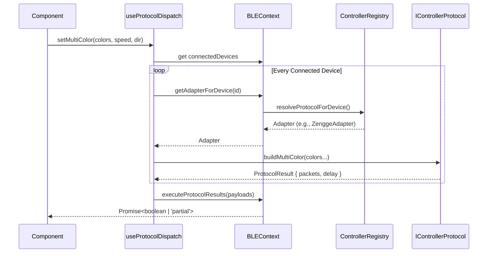
```mermaid
sequenceDiagram
    participant UI as Component
    participant PD as useProtocolDispatch
    participant Ctx as BLEContext
    participant Reg as ControllerRegistry
    participant Adapter as IControllerProtocol
    
    UI->>PD: setMultiColor(colors, speed, dir)
    PD->>Ctx: get connectedDevices
    loop Every Connected Device
        PD->>Ctx: getAdapterForDevice(id)
        Ctx->>Reg: resolveProtocolForDevice()
        Reg-->>Ctx: Adapter (e.g., ZenggeAdapter)
        Ctx-->>PD: Adapter
        PD->>Adapter: buildMultiColor(colors...)
        Adapter-->>PD: ProtocolResult { packets, delay }
    end
    PD->>Ctx: executeProtocolResults(payloads)
    Ctx-->>UI: Promise<boolean | 'partial'>
```

## 7. Stale Documentation Tagging
- `
## 8. Architectural Impact Flags
`[IMPACTS_USER_JOURNEY]`
`[IMPACTS_C4_CONTEXT]`
`[IMPACTS_STATE_CHART]`

<!-- CARTOGRAPHER_END: PROTOCOL_CORE -->

<!-- CARTOGRAPHER_START: PATTERN_ENGINE -->

# PATTERN_ENGINE Cartography

## 1. File Manifest
- `src/protocols/PatternEngine.ts`: The definitive SSOT for pattern metadata (`SK8LYTZ_TEMPLATES`). Acts as the primary payload dispatcher `buildPatternPayload()`, intercepting hardware parity routines and deciding between `0x59` and `0x51` framing.
- `src/protocols/SpatialEngine.ts`: The pure mathematical orchestrator. Its `generateArray()` function acts as the central router mapping Pattern IDs to their specific algorithmic frame-by-frame RGB array builders.
- `src/protocols/SymphonyEngine.ts`: The math engine for `0x73` audio-reactive music modes (1-13) based on magnitude streaming, as well as native `0x51` Symphony visualizer frame logic (1-44).
- `src/protocols/VisualizerEngine.ts`: The UI presentation layer that wraps generated spatial arrays and rotates them sequentially according to `animTick`, providing the smooth visual preview that matches the continuous hardware scroll.
- `src/protocols/PositionalMathBuffer.ts`: Gradient builder utility generating mathematically interpolated LED colors across percentages to bypass hardware chunking limitations.
- `src/hooks/useStreetMode.ts`: Domain lifecycle hook for Street Mode. Tracks accelerometer jerk and GPS telemetry to orchestrate state transitions (`CRUISING`, `HARD_BRAKING`) and instantly dispatch hardware street patterns.
- `src/hooks/useMusicMode.ts`: BLE matrix config hook managing the `0x73` music command lifecycle, mic sensitivity, color injection, and dispatching the explicit `isOn=false` mode exit packet.
- `src/hooks/useAppMicrophone.ts`: Audio pipeline bridge. Requests mic permissions, drives `expo-audio` recording, computes a smoothed magnitude, and continuously streams `0x74` magnitude packets to the hardware at 20Hz.

## 2. Blast Radius
- **Imports:** `ZenggeProtocol`, `expo-sensors`, `expo-audio`, React/React Native core APIs, shared engine types (`shared/engineTypes`, `spatial/effectProcessors`), `ProductCatalog`, `AppLogger`.
- **Exported To:** Main UI dashboards, `DockedController`, `ProductVisualizer`, hardware onboarding setups, and diagnostic labs.

## 3. Context Matrix
- The domains do not directly *consume* React contexts, prioritizing pure parameter injection to remain framework-agnostic. However, they are deeply utilized within components that consume overarching connection contexts (e.g., `useProtocolDispatch`).

## 4. Hook/Service I/O Registry
- **`useStreetMode`**
  - *Inputs:* `activeMode`, `writeToDevice`, `hwSettings`, `points`, `activeProduct`, `brightness`, `speed`, `gpsSpeed`, `peakGForce`.
  - *Outputs:* `motionState`, `isStreetBraking`, distribution setters, and `applyStreetPattern()`.
  - *Side-Effects:* Listens to `Accelerometer` at 80ms interval. Triggers hardware writes automatically upon computed jerk/velocity state changes.
- **`useMusicMode`**
  - *Inputs:* `activeMode`, `musicPatternId`, `micSensitivity`, `brightness`, `micSource`, `musicPrimaryColor`, `musicSecondaryColor`, `musicMatrixStyle`.
  - *Outputs:* `handleMusicChange()`.
  - *Side-Effects:* Invokes `setMusicConfig()` (0x73). Dispatches a guaranteed mode exit signal (`isOn=false`) when the user navigates away from `MUSIC` mode.
- **`useAppMicrophone`**
  - *Inputs:* `activeMode`, `micSource`, `isPoweredOn`, `writeToDevice`.
  - *Outputs:* `audioMagnitude` (0.0 to 1.0), `hasMicPermission`, `recording` state.
  - *Side-Effects:* Acquires system permissions, powers up `expo-audio`, processes dBFS mapping, and fires rapid 20Hz `0x74` packets directly to BLE hardware.

## 5. OS Variance Matrix
- **`useAppMicrophone.ts`:** Returns early on `Platform.OS === 'web'` to avoid crashing the unsupported `expo-audio` web driver. On iOS/Android, explicitly configures `playsInSilentMode: true` for uninterrupted background capturing.
- **`useStreetMode.ts`:** Returns early on `Platform.OS === 'web'` to safely bypass the missing `expo-sensors` capability. Accelerometer math scales implicitly based on native OS reporting bounds.

## 6. Pattern Template Registry (`SK8LYTZ_TEMPLATES`)
| ID | Name | Tier | ColorMode | Math Engine Function |
|---|---|---|---|---|
| 1 | Solid | 2 | FG_ONLY | `buildSolid` |
| 2 | Split Colors | 2 | FG_BG | `buildSplitColors` |
| 3 | Trisection | 2 | FG_BG | `buildTrisection` |
| 4 | Quartered | 2 | FG_BG | `buildQuartered` |
| 5 | Center Accent | 2 | FG_BG | `buildCenterAccent` |
| 6 | Single Dot Chase | 2 | FG_BG | `buildSingleDotChase` |
| 7 | Double Dot Chase | 2 | FG_BG | `buildTwinDotChase` |
| 8 | Comet Chase | 2 | FG_BG | `buildCometChase` |
| 9 | Meteor Shower | 2 | FG_BG | `buildMeteorShower` |
| 10 | Micro Ants | 2 | FG_BG | `buildMicroAnts` |
| 11 | Theater Chase | 2 | FG_BG | `buildTheaterChase` |
| 12 | Dashed Marquee | 2 | FG_BG | `buildDashedMarquee` |
| 13 | Bold Stripes | 2 | FG_BG | `buildBoldStripes` |
| 14 | Sine Pulse Wave | 3 | FG_BG | `buildSinePulseWave` |
| 15 | Wave Pinch | 3 | FG_BG | `buildWavePinch` |
| 16 | Breathing Wave | 3 | FG_BG | `buildBreathingWave` |
| 17 | Smooth Breath | 1 | FG_BG | `buildSmoothBreath` |
| 18 | Wipe / Fill | 3 | FG_BG | `buildWipeFill` |
| 19 | True Rainbow Flow | 3 | GENERATIVE | `buildTrueRainbowFlow` |
| 20 | Rainbow Marquee | 3 | GENERATIVE | `buildRainbowMarquee` |
| 21 | Rainbow Comet | 3 | GENERATIVE | `buildRainbowComet` |
| 22 | Cyberpunk Shift | 3 | FG_BG | `buildCyberpunkShift` |
| 23 | Color Flow | 1 | GENERATIVE | `buildColorFlow` |
| 24 | Color Breathing | 1 | FG_ONLY | `buildColorBreathing` |
| 25 | Running Water | 1 | FG_BG | `buildRunningWater` |
| 26 | Strobe Flash | 1 | FG_ONLY | `buildStrobe` |
| 27 | Ocean Wave | 1 | FG_BG | `buildOceanWave` |
| 28 | Lightning Strike | 1 | FG_ONLY | `buildLightning` |
| 29 | Snowfall | 1 | FG_BG | `buildSnowfall` |
| 30 | Heartbeat Pulse | 1 | FG_ONLY | `buildHeartbeat` |
| 31 | Meteor | 1 | FG_BG | `buildMeteor` |
| 32 | Aurora Borealis | 1 | GENERATIVE | `buildAurora` |
| 33 | Lava Lamp | 1 | FG_BG | `buildLava` |
| 34 | Plasma Wave | 1 | FG_BG | `buildPlasma` |
| 35 | Star Cluster | 1 | FG_BG | `buildStarCluster` |
| 36 | Rainbow Breathing | 3 | GENERATIVE | `buildRainbowBreathing` |
| 37 | Crystal Shimmer | 3 | GENERATIVE | `buildCrystalShimmer` |
| 38 | Gradient Chase | 3 | FG_BG | `buildGradientChase` |
| 39 | Fire Flame | 3 | FG_BG | `buildFireFlame` |
| 40 | Neon Pulse | 3 | FG_BG | `buildNeonPulse` |
| 41 | Rainbow Chaser | 3 | GENERATIVE | `buildRainbowChaser` |
| 42 | Matrix Rain | 3 | FG_BG | `buildMatrixRain` |
| 43 | Starlight | 3 | FG_BG | `buildStarlight` |
| 44 | SK8Lytz Signature | 3 | FG_BG | *(Native 0x51 Intercept)* |
| 72 | Center-Out Marquee | 3 | FG_ONLY | `buildNativeCenterOut` |
| 101-105 | Street Modes | 3 | FG_BG | `buildStreetMode` |
| 201 | Large Scroll | 1 | FG_BG | Inline GenerateArray Logic |
| 202 | Gradient Chunk | 1 | FG_BG | Inline GenerateArray Logic |
| 203 | Single Dot Chase | 1 | FG_BG | `buildSingleDotChase` |
| 204 | Ping-Pong Fill | 1 | FG_BG | Inline GenerateArray Logic |
| 205 | Ping-Pong Dot | 1 | FG_BG | Inline GenerateArray Logic |
| 206 | Marching Ants | 1 | FG_BG | Inline GenerateArray Logic |
| 207 | Smooth Breath | 1 | FG_ONLY | `buildNativeBreathe` |
| 208 | 3-Color Breath | 1 | GENERATIVE | Inline GenerateArray Logic |
| 209 | Rainbow Breath | 1 | GENERATIVE | `buildRainbowBreathing` |
| 210 | 3-Color Jump | 1 | GENERATIVE | Inline GenerateArray Logic |
| 211 | 7-Color Breathing | 1 | GENERATIVE | Inline GenerateArray Logic |
| 212 | Rainbow Crossfade | 1 | GENERATIVE | Inline GenerateArray Logic |
| 213 | Rainbow Jump | 1 | GENERATIVE | Inline GenerateArray Logic |
| 214 | Irregular Strobe | 1 | FG_BG | Inline GenerateArray Logic |
| 215 | 3-Color Strobe | 1 | GENERATIVE | Inline GenerateArray Logic |
| 216 | Rainbow Strobe | 1 | GENERATIVE | Inline GenerateArray Logic |
| 217-218 | Comet Chase I/II | 1 | FG_BG | `buildCometChase` |
| 219 | Fast Dot Chase | 1 | FG_BG | `buildSingleDotChase` |
| 220 | Static Gradient | 1 | GENERATIVE | Inline GenerateArray Logic |
| 221 | Multi-Comet Flow | 1 | GENERATIVE | Inline GenerateArray Logic |
| 222-223 | Rainbow Wipe/Sweep | 1 | GENERATIVE | Inline GenerateArray Logic |
| 224 | Tetris Stacker | 1 | GENERATIVE | Inline GenerateArray Logic |
| 225 | Fading Chunks | 1 | FG_BG | Inline GenerateArray Logic |
| 226 | Center-In Wipe | 1 | GENERATIVE | Inline GenerateArray Logic |
| 227 | Large Multi-Comet | 1 | GENERATIVE | Inline GenerateArray Logic |
| 228 | Fire Flame | 1 | GENERATIVE | Inline GenerateArray Logic |
| 229 | Rainbow Block | 1 | GENERATIVE | Inline GenerateArray Logic |
| 230 | Center Fill Cycle | 1 | GENERATIVE | Inline GenerateArray Logic |
| 231 | Custom Marquee | 1 | FG_BG | Inline GenerateArray Logic |
| 232 | Glitch Marquee | 1 | FG_BG | Inline GenerateArray Logic |
| 233 | Rainbow Stream | 1 | BG_ONLY | Inline GenerateArray Logic |

## 7. Sequence Diagram (App Mic Magnitude Streaming Pipeline)

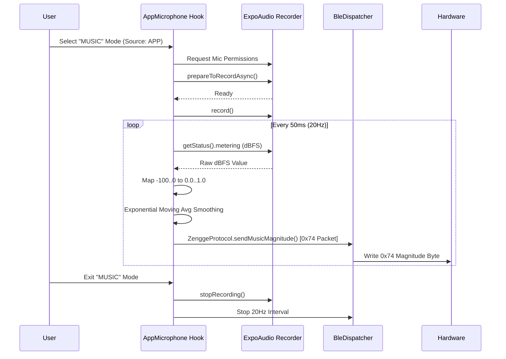
```mermaid
sequenceDiagram
    participant User
    participant AppMicrophone Hook
    participant ExpoAudio Recorder
    participant BleDispatcher
    participant Hardware

    User->>AppMicrophone Hook: Select "MUSIC" Mode (Source: APP)
    AppMicrophone Hook->>ExpoAudio Recorder: Request Mic Permissions
    AppMicrophone Hook->>ExpoAudio Recorder: prepareToRecordAsync()
    ExpoAudio Recorder-->>AppMicrophone Hook: Ready
    AppMicrophone Hook->>ExpoAudio Recorder: record()
    
    loop Every 50ms (20Hz)
        AppMicrophone Hook->>ExpoAudio Recorder: getStatus().metering (dBFS)
        ExpoAudio Recorder-->>AppMicrophone Hook: Raw dBFS Value
        AppMicrophone Hook->>AppMicrophone Hook: Map -100..0 to 0.0..1.0
        AppMicrophone Hook->>AppMicrophone Hook: Exponential Moving Avg Smoothing
        AppMicrophone Hook->>BleDispatcher: ZenggeProtocol.sendMusicMagnitude() [0x74 Packet]
        BleDispatcher->>Hardware: Write 0x74 Magnitude Byte
    end
    
    User->>AppMicrophone Hook: Exit "MUSIC" Mode
    AppMicrophone Hook->>ExpoAudio Recorder: stopRecording()
    AppMicrophone Hook->>BleDispatcher: Stop 20Hz Interval
```

---

**ARCHIVAL TAGGING**
`

<!-- CARTOGRAPHER_END: PATTERN_ENGINE -->

<!-- CARTOGRAPHER_START: CLOUD_FUNCTIONS -->

# 🗺️ CLOUD_FUNCTIONS Cartography

## 1. File Manifest
- `supabase/functions/notify-crew-session/index.ts`: Edge function handling Expo Push notifications for live crew sessions, bypassing RLS to gather tokens while strictly validating sender membership.
- `supabase/migrations/20260413_hardening_sweep.sql`: Optimizes database indexes and hardens Row Level Security (RLS) across user profiles and skate sessions.
- `supabase/migrations/20260414111600_add_factory_name.sql`: Expands registered devices schema with factory and manufacturer telemetry columns.
- `supabase/migrations/20260414_account_deletion_rpc.sql`: Implements secure App Store compliant RPC `delete_account()` for cascading user data erasure.
- `supabase/migrations/20260414_consolidate_telemetry.sql`: Streamlines telemetry ingestion by replacing legacy tables with a centralized JSONB-indexed `telemetry_snapshots` table.
- `supabase/migrations/20260417_add_skate_spot_id.sql`: Connects skate sessions to global skate spots via a new foreign key column for location-based analytics.
- `supabase/migrations/20260417_cleanup_stale_skate_spots.sql`: Cleans up legacy map data by removing incomplete skate spots lacking schema fundamentals.
- `supabase/migrations/20260418041100_add_unique_mac.sql`: Applies strict UNIQUE constraints to MAC addresses per user to eliminate duplicates.
- `supabase/migrations/20260418044500_normalize_macs_and_dedupe.sql`: Normalizes all MAC addresses to uppercase and deduplicates existing hardware entries.
- `supabase/migrations/20260418045900_add_missing_delete_policies.sql`: Resolves ghost device bugs by implementing missing DELETE policies for user hardware and groups.
- `supabase/migrations/20260418051400_add_osm_tags_to_skate_spots.sql`: Expands skate spot schema with boolean amenities metadata like lights and wifi.
- `supabase/migrations/20260418051700_add_rink_specific_osm_tags.sql`: Integrates rink-specific characteristics to the skate spots dataset.
- `supabase/migrations/20260418054000_cultural_daemon_setup.sql`: Scaffolds the background daemon tables required for autonomous cultural spot discovery.
- `supabase/migrations/20260418061000_admin_user_management.sql`: Establishes the admin management RPCs and schemas for domain level access control.
- `supabase/migrations/20260418062000_build_daemon_telemetry.sql`: Adds tables to track background worker events and performance telemetry.
- `supabase/migrations/20260418105200_daemon_status_anon_rls.sql`: Modifies RLS to allow anonymous status querying for daemons.
- `supabase/migrations/20260419034021_scraper_control_plane.sql`: Adds control schemas for coordinating multi-state scraper jobs.
- `supabase/migrations/20260419093454_state_override_array.sql`: Updates the scraper configurations to support state array overrides.
- `supabase/migrations/20260419100000_scraper_evasion_config.sql`: Implements anti-bot evasion configurations for the data scraping pipeline.
- `supabase/migrations/20260419110000_gold_standard_columns.sql`: Adds 'gold standard' boolean verification columns to location datasets.
- `supabase/migrations/20260419120000_cultural_enrichment_v2.sql`: Upgrades the cultural enrichment data pipeline to V2 for higher fidelity metadata.
- `supabase/migrations/20260419130000_multi_state_support.sql`: Extends database logic to accommodate concurrent multi-state processing.
- `supabase/migrations/20260419140000_enrichment_retry_logic.sql`: Adds retry queues and logic for failed external enrichment API calls.
- `supabase/migrations/20260419150000_decouple_queue_logic.sql`: Refactors queue processing into decoupled tables for horizontal scaling.
- `supabase/migrations/20260419160000_micro_scraper_schema.sql`: Prepares schema foundations for micro-scraper job instances.
- `supabase/migrations/20260419170000_phase3_heuristic_fields.sql`: Introduces heuristic classification fields for phase 3 data enrichment.
- `supabase/migrations/20260419183000_add_google_premium_fields.sql`: Expands database schema to store premium Google Maps attributes.
- `supabase/migrations/20260424171000_create_app_settings.sql`: Creates a robust app_settings table to manage global feature flags.
- `supabase/migrations/20260426000000_ai_detective_config.sql`: Configures the orchestration backend for AI-assisted data scrubbing.
- `supabase/migrations/20260426120000_pipeline_telemetry.sql`: Adds granular tracking for data pipeline execution metrics.
- `supabase/migrations/20260426200000_phase_control_panels.sql`: Develops backend control schemas for phase execution UI tools.
- `supabase/migrations/20260506000000_admin_tools_expansion.sql`: Modifies tables to support enhanced admin tools expansion inside the app.
- `supabase/migrations/20260506000001_god_tier_telemetry.sql`: Establishes extensive granular telemetry logs for comprehensive session metrics.
- `supabase/migrations/20260512014730_add_health_telemetry.sql`: Incorporates health metric properties into the core session telemetry dataset.
- `supabase/migrations/20260512180000_fix_admin_revoke_and_promotion_security.sql`: Patches security vulnerabilities related to admin role promotion and revocation.
- `supabase/migrations/20260526190000_supabase_security_hardening.sql`: Applies system-wide security hardening and RLS lockdowns across all tables.
- `supabase/migrations/20260606205739_add_notif_preferences_to_user_profiles.sql`: Enhances user profiles to store individual notification channel preferences.
- `supabase/migrations/20260607000000_add_gold_standard_telemetry_columns.sql`: Syncs gold standard columns across active telemetry aggregates.
- `supabase/migrations/20260607095016_fix_telemetry_schema.sql`: Fixes critical schema deviations in recent telemetry iterations.
- `supabase/migrations/20260607100000_fix_telemetry_schema.sql`: Applies the second round of repairs to the telemetry architecture.
- `supabase/migrations/20260607101500_telemetry_type_fix.sql`: Restores correct strict typings for telemetry payloads.
- `supabase/migrations/20260608000000_sk8lytz_security_hardening.sql`: Finalizes pre-launch security audits and strict constraints.
- `supabase/migrations/20260609000000_crash_telemetry.sql`: Provisions specialized tables for tracking silent application crash states.
- `supabase/migrations/20260609020000_add_builder_fields.sql`: Supports custom LED pattern builder storage with new config columns.
- `supabase/migrations/20260609030000_add_fixed_direction.sql`: Enables patterns to store strict fixed directional properties.
- `supabase/migrations/20260609040000_add_skate_session_coords.sql`: Stores geolocation bounding boxes for rich skate session mapping.
- `supabase/migrations/20260609050000_drop_active_calories.sql`: Safely drops the deprecated active_calories table to reduce DB bloat.
- `supabase/migrations/20260609050000_get_all_devices_rpc.sql`: Implements fleet-wide RPC query capabilities for administration.
- `supabase/migrations/20260609130000_app_settings_visibility.sql`: Adds visiblity toggles to dynamically show/hide features via app settings.
- `supabase/migrations/20260609140000_live_debugger_views.sql`: Scaffolds SQL views used by the internal diagnostic lab tools.
- `supabase/migrations/20260609175500_restore_domain_admin_promotion.sql`: Fixes and restores domain admin capabilities after strict RLS policies.
- `supabase/migrations/20260614000000_harden_rls_scraper_blocklist.sql`: Adds restrictive access controls for the web scraper blocklist table.
- `supabase/migrations/20260616050801_fix_anonymous_telemetry.sql`: Repairs anomalous behavior breaking guest telemetry inserts.
- `supabase/migrations/20260616053000_restore_anonymous_telemetry.sql`: Re-enables safe offline/guest-mode metrics uploads.
- `supabase/migrations/20260617010000_sk8lytz_picks_admin_policy.sql`: Adds administrative override policy for curating SK8Lytz top picks.
- `supabase/migrations/20260617_observatory_fixes.sql`: Deploys schema adjustments for backend observatory monitoring.

## 2. Blast Radius
- **Imports (Consumes)**:
  - `https://esm.sh/@supabase/supabase-js@2` (Supabase Client for Edge Functions)
  - Tables: `auth.users`, `push_tokens`, `crew_memberships`
- **Exports (Impacts)**:
  - `https://exp.host/--/api/v2/push/send` (Expo Push API endpoint)
  - Downstream iOS/Android mobile clients listening to the `crew-alerts` channel.

## 3. Context Matrix
- **React Contexts Provided**: None (Backend/Cloud domain).
- **React Contexts Consumed**: None. 

## 4. Hook/Service I/O Registry
- **`notify-crew-session` (Edge Function)**
  - **Input**: `NotifyPayload` `{ crewId: string, sessionId: string, sessionName: string, leaderName: string }`
  - **Output**: JSON `Response` `{ sent: number, reason?: string }`
  - **Side-Effects**: 
    - Verifies caller auth JWT against GoTrue via scoped Anon Client.
    - Queries `crew_memberships` (RLS enforced) to ensure caller authorization.
    - Uses `adminClient` (Service Role) to bypass RLS and retrieve `push_tokens` of fellow crew members.
    - Dispatches HTTP POST batches of 100 to Expo Push service.

## 5. OS Variance Matrix
- **iOS/Android Specific Branching**: 
  - None explicitly hardcoded in the Cloud domain logic. The Edge Function formats a generic `ExpoMessage` specifying `sound: "default"` and `channelId: "crew-alerts"`. Expo's unified Push API abstracts the APNs (iOS) vs FCM (Android) complexity downstream.

## ARCHIVAL INSTRUCTION
- `
## ARCHITECTURAL IMPACT FLAGS
- `[IMPACTS_USER_JOURNEY]`
- `[IMPACTS_C4_CONTEXT]`
- `[IMPACTS_STATE_CHART]`

## SEQUENCE DIAGRAM

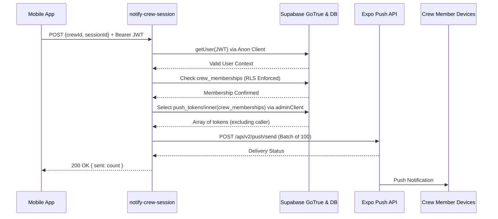
```mermaid
sequenceDiagram
    participant App as Mobile App
    participant Edge as notify-crew-session
    participant DB as Supabase GoTrue & DB
    participant Expo as Expo Push API
    participant Device as Crew Member Devices

    App->>Edge: POST {crewId, sessionId} + Bearer JWT
    Edge->>DB: getUser(JWT) via Anon Client
    DB-->>Edge: Valid User Context
    Edge->>DB: Check crew_memberships (RLS Enforced)
    DB-->>Edge: Membership Confirmed
    Edge->>DB: Select push_tokens!inner(crew_memberships) via adminClient
    DB-->>Edge: Array of tokens (excluding caller)
    Edge->>Expo: POST /api/v2/push/send (Batch of 100)
    Expo-->>Edge: Delivery Status
    Edge-->>App: 200 OK { sent: count }
    Expo->>Device: Push Notification
```

<!-- CARTOGRAPHER_END: CLOUD_FUNCTIONS -->

<!-- CARTOGRAPHER_START: THEME_&_ASSETS -->

# THEME_&_ASSETS Cartography

## 1. File Manifest
- `src/theme/theme.ts`: Defines the global SK8Lytz Design System including Dark/Light palettes, typography, spacing, layout, and cross-platform shadow utilities.
- `src/styles/DashboardStyles.ts`: A centralized static `StyleSheet` for the Dashboard UI that eliminates render-cycle garbage collection by isolating dimension-dependent styles.
- `src/constants/AppConstants.ts`: Houses fundamental application-wide constants like storage prefixes and hardware speed limits.
- `src/constants/ControlsRegistry.ts`: Central registry for feature flags and dev-tools controls, categorized by risk level (Governance, Hardware, Behavior, DangerZone).
- `src/constants/bleTimingConstants.ts`: Centralizes all empirical, hardware-validated millisecond timing delays for the BLE pipeline to prevent ZENGGE chipset buffer overflows.
- `src/constants/storageKeys.ts`: The authoritative single-source-of-truth registry for all `AsyncStorage` keys utilized across the application.
- `src/assets/images/*`: Holds static image assets, primarily categorized into `music_modes` and `zengge_patterns` banners and icons.

## 2. Blast Radius
- **Imports**: 
  - `src/theme/theme.ts` imports React Native's `Platform`, `ViewStyle`, and `TextStyle`.
  - `src/styles/DashboardStyles.ts` imports React Native's `StyleSheet`, and tokens from `src/theme/theme.ts`.
  - Constants files have zero internal application dependencies.
- **Imported By**:
  - `src/theme/theme.ts` is imported globally across >75 components, hooks, and contexts.
  - `src/styles/DashboardStyles.ts` is imported exclusively by `DashboardScreen.tsx` for layout.
  - `src/constants/AppConstants.ts` is utilized by `useCuratedPicks` and `NormalizationUtils`.
  - `src/constants/ControlsRegistry.ts` is used by the `AppManager` admin tool.
  - `src/constants/bleTimingConstants.ts` is a critical dependency for almost every hook and service in the BLE pipeline (`useBLEBatterySweep`, `BleWriteDispatcher`, `RecoveryService`, etc.).
  - `src/constants/storageKeys.ts` is extensively imported across Contexts (Auth, Session, Theme), Hooks, Services, and UI components.

## 3. Context Matrix
- **Provided**: None. This domain contains static definitions and does not instantiate any React Context providers.
- **Consumed**: None. The files are consumed *by* Context providers (e.g., `ThemeContext.tsx` consumes `theme.ts` and `storageKeys.ts`), but they do not use React's `useContext` themselves.

## 4. Hook/Service I/O Registry
- No hooks or services exist within this domain. It serves strictly as a static data and styling configuration provider to other application layers.

## 5. OS Variance Matrix
- **`src/theme/theme.ts` (Shadows & TextShadows)**:
  - Explicitly branches styling using `Platform.select()`:
    - **iOS**: Utilizes `shadowColor`, `shadowOffset`, `shadowOpacity`, and `shadowRadius`.
    - **Android**: Relies on the `elevation` property.
    - **Web**: Replicates iOS shadow structures and implements `textShadow` for text glow effects.
- **`src/styles/DashboardStyles.ts`**:
  - Does not branch via OS, but dynamically computes layout parameters (padding, fontSize) at runtime based on the absolute device window height/width to support varying screen geometries (`getDimensionStyles`).

## 6. Design System & Token Manifest
- **Brand Colors**: 
  - Primary: `#FF5A00` (Orange)
  - Secondary: `#FFB800` (Amber)
  - Background (Dark): `#1B4279` (Blue)
  - Accent: `#FF3300`
- **Typography**: 
  - Primary Font: `Righteous`
  - Variants: `header` (24px, uppercase), `title` (16px), `body` (14px), `caption` (11px)
- **Spacing Scale**: 
  - `xxs` (2) to `giant` (64)
- **Shadows**: 
  - `soft`, `medium`, and dynamic `glow(color)` function.
- **Token Strategy**: UI colors are structured into an isomorphic `ThemePalette` supporting `DarkColors` and `LightColors` transitions, with Dark acting as the default export.

## Archival Note
`

<!-- CARTOGRAPHER_END: THEME_&_ASSETS -->

<!-- CARTOGRAPHER_START: SIMULATION_&_MOCKS -->

# Architectural Cartography — SIMULATION_&_MOCKS Domain

## 1. File Manifest
- `src/mocks/react-native-vision-camera-worklets.web.js`: Web shim exporting an empty module to prevent bundler errors when importing native vision camera components in Expo Web.
- `src/mocks/react-native-worklets.web.js`: Web shim representing `react-native-worklets-core` on Web. Exposes no-op mocks (`useSharedValue`, `runOnJS`, `runOnUI`) to allow UI rendering in browsers without TurboModule crashes.
- `src/__mocks__/LocationService.ts`: Jest mock for the custom `LocationService`, providing dummy asynchronous stubs (`getSilentLocation`, `requestLocationPermissions`) for headless testing environments.
- `src/__mocks__/expo-audio.ts`: Jest mock for Expo Audio permission queries, defaulting to `{ status: 'granted' }`.
- `src/__mocks__/expo-location.ts`: Jest mock for Expo Location capabilities, returning static coordinates (Overland Park, KS) and granted permission flags.
- `src/__mocks__/sk8lytz-watch-bridge.ts`: Jest mock replacing the native Expo watch connectivity module, preventing test crashes by stubbing reachable states (`isWatchReachable: false`) and listeners.
- `src/__tests__/test-env.d.ts`: TypeScript definition file providing global typing augmentations (like `__DEV__`, `MutablePlatform`, and XState internals) for the Jest test environment.

## 2. Blast Radius
- **Imports:** Mocks and shims primarily import React/React Native core typings and platform-agnostic module signatures (e.g., `WatchSessionState`). Test suites import the internal hooks, services, and state machines they are testing.
- **Imported By:** These files are never explicitly imported by app source code. 
  - **Web Shims:** Consumed implicitly by the Metro Bundler (`metro.config.js`) via platform aliases when `platform === 'web'`.
  - **Jest Mocks:** Automatically resolved by the Jest runner (`jest.config.js`) via `moduleNameMapper` to intercept native module imports and prevent GATT/OS-level crashes during Node CI runs.

## 3. Context Matrix
- **React Contexts:** Mocks, shims, and test-env files do not directly consume or provide React Contexts. Instead, they provide the base-level mock hooks or service stubs (e.g., `LocationService`, `WatchBridge`) that higher-level Context Providers rely upon during testing execution.

## 4. Hook/Service I/O Registry
- **`expo-location` mock:** 
  - *Outputs:* `{ status: 'granted' }` (Permissions), static `{ coords: { latitude: 38.9, longitude: -94.6, accuracy: 10 } }` (Location).
- **`sk8lytz-watch-bridge` mock:** 
  - *Inputs:* `syncSessionState`, `sendMetricUpdate`. 
  - *Outputs:* `undefined`, stubbed empty unsubscribe closures. `isWatchReachable` resolves `false`.
- **`LocationService` mock:** 
  - *Outputs:* `null` (`getSilentLocation`), `false` (`requestLocationPermissions`).
- **`react-native-worklets.web` shim:** 
  - *Outputs:* `{ value: null }` (`useSharedValue`), identity passthrough (`runOnJS`, `runOnUI`).

## 5. OS Variance Matrix
- Mocks and shims explicitly manage OS branching by stubbing missing native APIs:
  - **Web Shims (`.web.js`):** Intercept imports exclusively on Web builds to prevent `TurboModuleRegistry` crashes in browsers.
  - **Test Environment (`test-env.d.ts`):** Exposes `MutablePlatform` to allow dynamic reassignment of `Platform.OS = 'ios'` or `'android'` within Jest `beforeEach` blocks for localized OS variance testing without type errors.

## Archival Tags
- `
## Sequence Diagram: Dependency Interception Flow
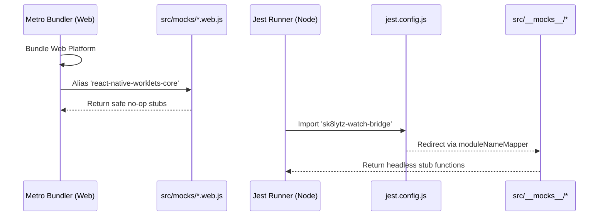
```mermaid
sequenceDiagram
    participant Metro as Metro Bundler (Web)
    participant WebShim as src/mocks/*.web.js
    participant TestSuite as Jest Runner (Node)
    participant Mapper as jest.config.js
    participant Mock as src/__mocks__/*
    
    %% Web Build Interception
    Metro->>Metro: Bundle Web Platform
    Metro->>WebShim: Alias 'react-native-worklets-core'
    WebShim-->>Metro: Return safe no-op stubs
    
    %% Test Runner Interception
    TestSuite->>Mapper: Import 'sk8lytz-watch-bridge'
    Mapper-->>Mock: Redirect via moduleNameMapper
    Mock-->>TestSuite: Return headless stub functions
```

<!-- CARTOGRAPHER_END: SIMULATION_&_MOCKS -->

<!-- CARTOGRAPHER_START: BUILD_CONFIG -->

# 🗺️ BUILD_CONFIG Cartography

## 1. File Manifest
*   `app.config.js`: The dynamic root configuration. Defines OS-specific permissions, provisions native plugins (BLE, Health), and handles EAS configuration.
*   `eas.json`: Expo Application Services build profile definition. Maps internal distribution channels and build artifacts (APKs vs App Bundles) to `development`, `preview`, and `production`.
*   `metro.config.js`: Expo Web-platform resolver override. Intercepts native-only modules like `react-native-worklets` and stubs them to prevent web-build white screens.
*   `babel.config.js`: Transpilation orchestrator. Injects `babel-preset-expo` and registers JSI GPU processing via `react-native-worklets-core/plugin`.
*   `tsconfig.json`: Enforces `strict` mode type safety and provides local path resolution for internal bridge modules (`sk8lytz-watch-bridge`) without npm install steps.
*   `jest.config.js`: Unit testing configuration utilizing `jest-expo`. Excludes worktrees from module resolution and mocks hardware components (`expo-location`, `expo-audio`).
*   `package.json`: Dependency truth ledger and scripts runner. Specifies Expo `~55.0.8`, React Native `0.83.2`, and drives the unified `verify` pipeline.
*   `.husky/pre-commit`: Worktree-aware git hook. Dynamically links `node_modules`, scans blast radius, and runs AST syntax gates before committing.
*   `.husky/pre-push`: Zero-bypass release gate. Runs `npm audit` and `verifiable-check-runner.js` to assert build stability prior to remote sync.

## 2. Blast Radius
*   **Upstream Dependencies (Consumes)**:
    *   Expo Config Plugins: `@config-plugins/detox`, `expo-build-properties`, `@bacons/apple-targets`.
    *   Third-Party Plugins: `react-native-health`, `react-native-health-connect`, `react-native-ble-plx`.
    *   Environment Context: `process.env.EXPO_PUBLIC_GOOGLE_MAPS_API_KEY`.
*   **Downstream Impact (Imported By)**:
    *   React Native/Expo build services (EAS, local runner).
    *   Babel transpires all React/TS components into compiled chunks.
    *   Metro Bundler determines dependency graphs and module paths based on overrides.

## 3. Context Matrix
*This domain operates outside the React component tree and does not consume or provide React Contexts.*
*   **Environment Provisioning**: Provides `extra.eas.projectId` to the app context. Exposes `googleMapsApiKey` to native Android/iOS compilation steps.

## 4. Hook/Service I/O Registry
*   `pre-commit` (Husky Hook)
    *   **Input**: `git rev-parse --git-common-dir`, Staged TS/JS files.
    *   **Side-Effects**: Generates OS-level symlinks (`mklink /j`) for `node_modules` if in a worktree; executes AST gates; Halts git commit on process failure.
*   `metro.config.js` (Resolver)
    *   **Input**: `moduleName`, `platform`.
    *   **Output**: Aliased `filePath` pointing to `src/mocks/*.web.js` when `platform === 'web'`.

## 5. OS Variance Matrix
*   **Android**:
    *   Artifact: `app-bundle` (AAB) in Production (`eas.json`), but `apk` in dev/preview.
    *   Permissions: 23 extensive permissions explicitly arrayed in `app.config.js`, including `FOREGROUND_SERVICE_CONNECTED_DEVICE` and fine-grained `health.*` API read/writes.
    *   Compilation: Targets `compileSdkVersion: 36` and `targetSdkVersion: 36`. `enableJetifier` is set to **false**. Applies explicit Proguard keep rules for BLE and Nitro camera libraries.
*   **iOS**:
    *   Artifact: `.ipa` (implied by EAS). `simulator: true` enabled for `preview` builds.
    *   Permissions: Background modes defined in `infoPlist` (`location`, `bluetooth-central`). Maps custom descriptive strings to `NSMicrophoneUsageDescription` and `NSHealthShareUsageDescription`.
    *   Compilation: Links to `@bacons/apple-targets` for direct integration of the SwiftUI watchOS extension.

## 6. Domain-Specific Directive: Build Pipeline Details
*   **Release Channel Configs & EAS Update Logic**: `eas.json` maintains three strictly defined channels. `requireCommit` is `true`. `production` compiles AABs for Android, while `development` and `preview` utilize APKs with `developmentClient: true` for remote update simulation.
*   **Native Modules**: Dynamically injected without manual Xcode/Android Studio intervention via `app.config.js` plugins array (e.g., `./plugins/withWearOsModule`).
*   **TS Compiler Flags**: Inherits `expo/tsconfig.base`, asserts `"strict": true`, and specifically uses alias pathing (`paths`) to link `sk8lytz-watch-bridge` to the local `modules/` dir, negating cyclic npm link errors.

## 7. Stale Documentation Audit
In `docs/SK8Lytz_App_Master_Reference.md`, the following entries have drifted from the codebase reality discovered in `app.config.js` and `eas.json` and must be moved to the archive:


## 8. Husky Worktree Preparation Sequence

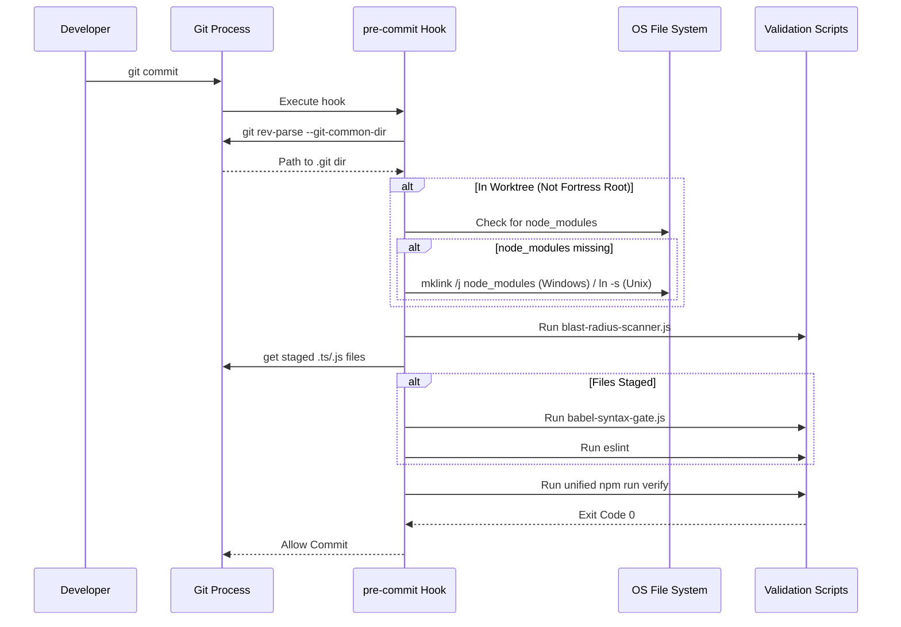
```mermaid
sequenceDiagram
    participant Dev as Developer
    participant Git as Git Process
    participant Hook as pre-commit Hook
    participant OS as OS File System
    participant QA as Validation Scripts
    
    Dev->>Git: git commit
    Git->>Hook: Execute hook
    Hook->>Git: git rev-parse --git-common-dir
    Git-->>Hook: Path to .git dir
    
    alt In Worktree (Not Fortress Root)
        Hook->>OS: Check for node_modules
        alt node_modules missing
            Hook->>OS: mklink /j node_modules (Windows) / ln -s (Unix)
        end
    end
    
    Hook->>QA: Run blast-radius-scanner.js
    Hook->>Git: get staged .ts/.js files
    
    alt Files Staged
        Hook->>QA: Run babel-syntax-gate.js
        Hook->>QA: Run eslint
    end
    
    Hook->>QA: Run unified npm run verify
    QA-->>Hook: Exit Code 0
    Hook-->>Git: Allow Commit
```

[IMPACTS_C4_CONTEXT]

<!-- CARTOGRAPHER_END: BUILD_CONFIG -->

<!-- CARTOGRAPHER_START: OS_PERMISSIONS -->

# 🗺️ Codebase Cartography: OS_PERMISSIONS Domain

## 1. File Manifest
- **`android/app/src/main/AndroidManifest.xml`**: Main Android application manifest specifying package configurations, services, activities, intent filters, and required hardware features and OS-level permissions.
- **`app.config.js`**: Core Expo configuration file generating metadata and platform settings, including iOS `Info.plist` usage descriptions and Android permission arrays (as there is no ejected `ios` folder).
- **`targets/watch/Info.plist`**: Plist file for the watchOS companion target, currently defining a skeleton dictionary structure.

## 2. Blast Radius
- **Imports**: These files do not import standard React Native modules but consume environment variables (e.g., `process.env.EXPO_PUBLIC_GOOGLE_MAPS_API_KEY`) and utilize Expo config plugins (`@config-plugins/detox`, `react-native-health`, `react-native-health-connect`, `react-native-ble-plx`, `@bacons/apple-targets`).
- **Imported By**: The entire application build pipeline and OS runtime depend on these manifests. The Expo prebuild step consumes these to generate native `android` and `ios` project directories, and the OS package installer uses them to define the app's sandboxed capabilities.

## 3. Context Matrix
- **Consumed**: None. These are native OS manifests and build configs operating outside the React tree.
- **Provided**: None. However, the capabilities they statically unlock (Location, Bluetooth, HealthKit) are consumed dynamically by their respective global native modules and services across the app.

## 4. Hook/Service I/O Registry
- **`app.config.js` (Exported JSON configuration)**:
  - **Inputs**: Environment variables (`EXPO_PUBLIC_GOOGLE_MAPS_API_KEY`).
  - **Outputs**: Configuration object defining app `slug`, iOS `UIBackgroundModes`, `NS*UsageDescription` strings, and Android `permissions` array.
  - **Side-effects**: Defines native module initialization limits, configures BLE peripheral/central background modes, and injects the Google Maps API key into the native binary.
- **`AndroidManifest.xml` (Static XML)**:
  - **Inputs**: None.
  - **Outputs**: Manifest constraints mapping OS permissions like `BLUETOOTH_CONNECT`, `FOREGROUND_SERVICE`, and `ACTIVITY_RECOGNITION`.
  - **Side-effects**: Enforces max SDK version limits (e.g., `READ_EXTERNAL_STORAGE` `maxSdkVersion="32"`), sets `queries` for deep linking (`sk8lytz://`), and registers foreground services (`app.notifee.core.ForegroundService`).

## 5. OS Variance Matrix
- **iOS (`app.config.js` infoPlist)**: Explicitly utilizes `UIBackgroundModes` containing `location` and `bluetooth-central`, alongside detailed descriptive strings for `NSMicrophoneUsageDescription`, `NSCameraUsageDescription`, `NSHealthShareUsageDescription`, and multiple `NSLocation` usage keys to pass Apple's strict App Store privacy review.
- **Android (`AndroidManifest.xml` & `app.config.js`)**: Specifies 23 explicit granular permissions, registers `android.hardware.bluetooth_le` as a required feature, implements API 32 bounded storage permissions (`READ_EXTERNAL_STORAGE` maxSdkVersion="32"), explicitly links the `com.google.android.geo.API_KEY`, and registers `Notifee` Foreground Services (`location|connectedDevice`) for background execution stability.

## 6. Archival Instruction
**
## 7. Sequence Diagram
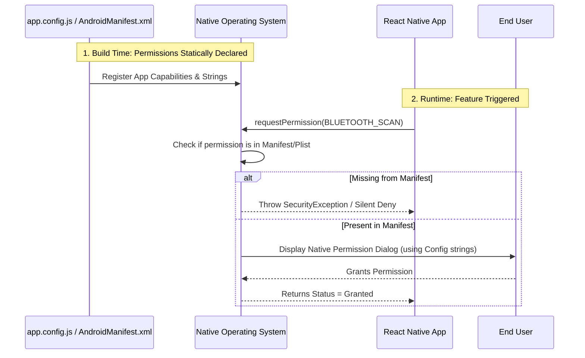
```mermaid
sequenceDiagram
    participant Config as app.config.js / AndroidManifest.xml
    participant OS as Native Operating System
    participant App as React Native App
    participant User as End User

    Note over Config, OS: 1. Build Time: Permissions Statically Declared
    Config->>OS: Register App Capabilities & Strings
    
    Note over App, User: 2. Runtime: Feature Triggered
    App->>OS: requestPermission(BLUETOOTH_SCAN)
    
    OS->>OS: Check if permission is in Manifest/Plist
    
    alt Missing from Manifest
        OS-->>App: Throw SecurityException / Silent Deny
    else Present in Manifest
        OS->>User: Display Native Permission Dialog (using Config strings)
        User-->>OS: Grants Permission
        OS-->>App: Returns Status = Granted
    end
```

## 8. Architectural Impact Flags
[IMPACTS_USER_JOURNEY]
[IMPACTS_C4_CONTEXT]
[IMPACTS_STATE_CHART]

<!-- CARTOGRAPHER_END: OS_PERMISSIONS -->

<!-- CARTOGRAPHER_START: ADMIN_&_TELEMETRY -->

# 🗺️ ADMIN_&_TELEMETRY Domain Cartography

## 1. File Manifest
* **`src/components/admin/AdminTab.tsx`**: Orchestrates the layout of the primary admin features including navigation to various specialized panels.
* **`src/components/admin/AdminToolsModal.tsx`**: Provides the root modal container for accessing the suite of diagnostic and operational admin tools.
* **`src/components/admin/AdvancedHardwareModal.tsx`**: Manages direct interaction and low-level configuration of connected BLE skate hardware.
* **`src/components/admin/DeviceTab.tsx`**: Renders the sub-view dedicated to paired device metrics and hardware details.
* **`src/components/admin/StatsTab.tsx`**: Aggregates and displays real-time and historical application usage statistics.
* **`src/services/appLogger/AppLoggerService.ts`**: Central telemetry singleton handling debounce, PII redaction, flight recorder integration, and queued offline persistence.
* **`src/services/AppSettingsService.ts`**: Manages global feature flags and app configuration via Supabase syncing and local AsyncStorage caching.
* **`src/hooks/useAdminSettings.ts`**: Domain hook bridging the `AppSettingsService` and React components for optimistic configuration updates.
* **`src/hooks/useAdminTelemetry.ts`**: Domain hook exposing telemetry arrays, aggregate statistics, and cloud synchronization triggers.
* **`src/hooks/useDiagnosticLog.ts`**: Manages BLE hardware testing logs, op-code coverage verdicts, and raw hex dispatch operations for diagnostics.

## 2. Blast Radius
* **Imports from**: `react-native-ble-plx`, `expo-battery`, `expo-device`, `@react-native-async-storage/async-storage`, `FlightRecorder`, `supabaseClient`, `useProtocolDispatch`.
* **Exported/Consumed by**: Consumed globally by error boundary wrappers, heavily by `AdminToolsModal` and `Sk8LytzDiagnosticLab`, and asynchronously triggered via the unified BLE write dispatcher pipeline.

## 3. Context Matrix
* **Consumes**: Does not consume React contexts natively within these specific hooks. The domain relies entirely on external Singletons (`AppLogger`, `AppSettingsService`) and localized hook states, minimizing global re-renders.
* **Provides**: None (Intentionally isolated state tracking; no wrapping providers needed).

## 4. Hook/Service I/O Registry
* **`AppLoggerService`**
  * *Inputs*: `event: EventType`, `rawPayload: Record<string, any>`
  * *Outputs*: Writes offline structures (`LogEntry[]`), JSON debug strings, Cloud telemetry payloads.
  * *Side-Effects*: Accesses native battery APIs, mutates `AsyncStorage`, pushes to Supabase Fast-Lane on critical exceptions, redacts PII automatically.
* **`AppSettingsService`**
  * *Inputs*: `key: AppSettingKey`, `value: AppSettingsValue (string | boolean)`
  * *Outputs*: `Promise<AppSettingsMap>`
  * *Side-Effects*: Optimistically updates AsyncStorage, fires background RPC/upsert queries against `sk8lytz_app_settings` in Supabase.
* **`useAdminTelemetry`**
  * *Inputs*: `visible: boolean`
  * *Outputs*: `{ logs, stats, isUploading, load, clearLogs, uploadLogs, exportLogs }`
  * *Side-Effects*: Triggers OS-level `Share` sheets for exporting JSON logs, clears `AsyncStorage` logs, invokes Supabase database batch uploads.
* **`useDiagnosticLog`**
  * *Inputs*: `visible: boolean`, `liveRxPayload`, `targetDeviceId`
  * *Outputs*: `{ logs, testLog, coverage, transmit, setVerdict }`
  * *Side-Effects*: Persists oracle testing verdicts directly to `AsyncStorage`, dispatches raw Bluetooth Hex payloads.

## 5. OS Variance Matrix
* **Battery Telemetry (`expo-battery`)**: Power-saving mode readings and native battery state mappings in `AppLoggerService` branch natively between iOS Low Power Mode and Android Battery Saver behaviors.
* **Native Share (`react-native`)**: JSON log exports triggered by `useAdminTelemetry` utilize the native OS `Share` API, which mounts differently (e.g., requires anchor geometries on iPadOS vs bottom-sheet modals on Android).

## Domain-Specific Directive: AppLogger Pipeline
**Event Lifecycle mapped:** 
1. **Event Call**: Components log `APP_LOG`, `BLE_*`, `ERROR_*` events.
2. **Debounce/Throttle**: High-frequency metrics (Brightness, Speed) are throttled via `throttleMap` (500ms max frequency). 
3. **Format & Redact**: PII scrubber sanitizes payloads (removes MACs, emails, tokens). Hardware contexts (RSSI, Battery) are injected.
4. **Flight Recorder**: A localized system crash breadcrumb is deposited into memory for the event category.
5. **Fast-Lane**: If `CRITICAL_EVENT`, `AppLoggerCloud.pushFastLaneError` immediately bypasses batching and syncs to Supabase.
6. **Queue/Batch**: Non-critical events pause in `pendingLogQueue` (100ms) to attempt correlation with immediate BLE payload HEX codes.
7. **Offline Persist**: Queued logs flush to `AppLoggerStorage` (AsyncStorage buffer).
8. **Cloud Upload**: Manual or background routines call `uploadLogsToSupabase()`, which chunks the buffer to Supabase and explicitly slices/truncates the synced events out of local memory.

### Sequence Diagram
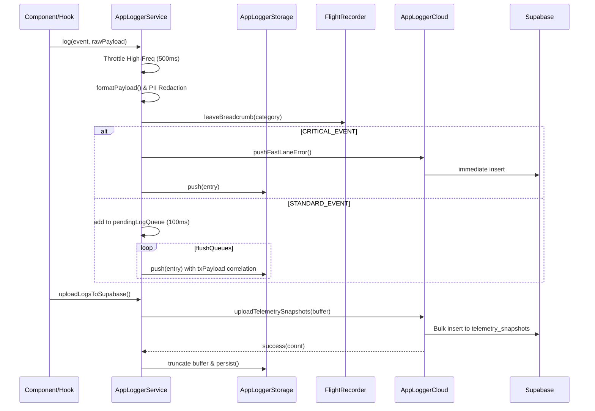
```mermaid
sequenceDiagram
    participant UI as Component/Hook
    participant AL as AppLoggerService
    participant AS as AppLoggerStorage
    participant FR as FlightRecorder
    participant AC as AppLoggerCloud
    participant DB as Supabase

    UI->>AL: log(event, rawPayload)
    AL->>AL: Throttle High-Freq (500ms)
    AL->>AL: formatPayload() & PII Redaction
    AL->>FR: leaveBreadcrumb(category)
    alt CRITICAL_EVENT
        AL->>AC: pushFastLaneError()
        AC->>DB: immediate insert
        AL->>AS: push(entry)
    else STANDARD_EVENT
        AL->>AL: add to pendingLogQueue (100ms)
        loop flushQueues
            AL->>AS: push(entry) with txPayload correlation
        end
    end
    
    UI->>AL: uploadLogsToSupabase()
    AL->>AC: uploadTelemetrySnapshots(buffer)
    AC->>DB: Bulk insert to telemetry_snapshots
    AC-->>AL: success(count)
    AL->>AS: truncate buffer & persist()
```

## Architectural Impact Flags
[IMPACTS_USER_JOURNEY]
[IMPACTS_C4_CONTEXT]
[IMPACTS_STATE_CHART]

## Archival Instruction
**

<!-- CARTOGRAPHER_END: ADMIN_&_TELEMETRY -->

<!-- CARTOGRAPHER_START: DEPENDENCY_AUDIT -->

# DEPENDENCY_AUDIT Cartography

## File Manifest
- `package.json`: Root project manifest declaring package scripts, dependencies, devDependencies, and package overrides. Integrates local modules (`sk8lytz-watch-bridge`) and Expo configurations.
- `package-lock.json`: Deterministic lockfile ensuring byte-for-byte reproducibility of the dependency tree.

## Blast Radius
- **Imports (Consumes)**: NPM Registry packages, `@expo/*`, `@react-native/*`, `supabase-js`, `xstate`, `react-native-ble-plx`, and local `file:modules/sk8lytz-watch-bridge`.
- **Imported By (Consumed By)**: Metro Bundler, Expo CLI, CI/CD pipelines, Husky pre-commit hooks, and all developers running workspace setups.

## Context Matrix
- **React Contexts**: N/A (Dependency manifests do not participate in the React context lifecycle).

## Hook/Service I/O Registry
- **Inputs/Outputs**: N/A

## OS Variance Matrix
- **iOS Only**: `@bacons/apple-targets` (watchOS companion app targets), `expo run:ios`.
- **Android Only**: `expo run:android`.

<!-- CARTOGRAPHER_END: DEPENDENCY_AUDIT -->

---

## 5. Database Schemas

### Supabase Architecture (Telemetry & Registration)

_Project ID:_ `qefmeivpjyaukbwadgaz`

#### **`registered_devices`** (Hardened Schema — Updated 2026-04-22)

| Column                      | Type       | Purpose                                              |
| :-------------------------- | :--------- | :--------------------------------------------------- |
| `id`                        | TEXT (PK)  | Unique system identifier (MAC+userId composite)      |
| `device_mac`                | TEXT       | Unique hardware address (UPPERCASE)                  |
| `user_id`                   | UUID       | Owner ID                                             |
| `device_name`               | TEXT       | Custom alias                                         |
| `product_type`              | TEXT       | HALOZ / SOULZ / RAILZ                                |
| `led_points`                | INT        | Physical pixel count                                 |
| `segments`                  | INT        | Hardware mirror segments                             |
| `ic_type`                   | TEXT       | LED chipset (WS2812B, SK6812, etc.)                  |
| `color_sorting`             | TEXT       | RGB channel order (GRB, RGB, etc.)                   |
| `firmware_ver`              | INT        | Firmware version integer from BLE advertisement      |
| `led_version`               | INT        | LED version from BLE advertisement                   |
| `product_id`                | INT        | ZENGGE hardware product ID (0xA3=163 for all SK8Lytz)|
| `product_id_confirmed_at`   | TIMESTAMPTZ| When product_id was confirmed via BLE (added 2026-04-22)|
| `rf_mode`                   | TEXT       | RF remote auth policy                                |
| `rf_paired_count`           | INT        | Number of paired RF remotes                          |
| `group_id`                  | TEXT       | ⚠️ **LEGACY — do not use for new code.** Superseded by junction table `device_group_members`. Still present in cloud rows for backward compat. |
| `group_name`                | TEXT       | ⚠️ **LEGACY — do not use for new code.** Superseded by `registered_groups.group_name`. |
| `registered_at`             | TIMESTAMPTZ| First registration timestamp                         |
| `updated_at`                | TIMESTAMPTZ| Last modification timestamp                          |
| `rssi_at_register`          | INT        | Signal strength at registration                      |

> [!IMPORTANT]
> **Many-to-Many Migration (2026-05-28)**: Device-to-group membership is now stored in the `device_group_members` junction table (`device_id TEXT FK → registered_devices.device_mac`, `group_id TEXT FK → registered_groups.id`). The app-side `RegisteredDevice` object uses `group_ids: string[]` and `group_names: string[]` arrays. The `upsert_group_with_devices` RPC handles all atomic group mutations. Never write scalar `group_id` from new code.

#### **`product_catalog`** (Dynamic Hardware Definitions)

| Column                 | Type      | Purpose                  |
| :--------------------- | :-------- | :----------------------- |
| `id`                   | TEXT (PK) | Unique product key       |
| `display_name`         | TEXT      | Human-readable name      |
| `viz_shape`            | TEXT      | RING / OVAL / DUAL_STRIP |
| `battery_capacity_mah` | INT       | Rated capacity           |

#### **`skate_spots`** (Map Grounding)

| Column          | Type      | Purpose                               |
| :-------------- | :-------- | :------------------------------------ |
| `id`            | UUID (PK) | Unique spot ID                        |
| `name`          | TEXT      | Rink/Park name                        |
| `lat`           | DOUBLE    | Latitude                              |
| `lng`           | DOUBLE    | Longitude                             |
| `surface_type`  | TEXT      | `wood` / `concrete` / `sport_court`   |
| `is_indoor`     | BOOLEAN   | Indoor vs Outdoor                     |
| `source`        | TEXT      | `native_seed` / `osm` / `user_submit` |
| `is_verified`   | BOOLEAN   | Administrative verification status    |
| `facility_type` | TEXT      | `roller_rink`/`skatepark`/`pro_shop`  |
| `has_pro_shop`  | BOOLEAN   | Embedded pro shop indicator           |
| `is_featured`   | BOOLEAN   | Highlighted partner or rink           |
| `last_enriched_at`| TIMESTAMP | Last Cultural Daemon crawl timestamp  |
| `socials`       | JSONB     | Scraped Instagram/Facebook URLs       |
| `vibe_rating`   | DOUBLE    | Aggregate 5-star Google/Yelp rating   |
| `has_adult_night`| BOOLEAN  | Scraped confirmation of 18+ nights    |
| `has_lights`    | BOOLEAN   | OSM Tag: Night lighting               |
| `has_fee`       | BOOLEAN   | OSM Tag: Paid entry                   |
| `has_rental`    | BOOLEAN   | OSM Tag: Gear rental                  |
| `has_wifi`      | BOOLEAN   | OSM Tag: Public Wifi                  |

> [!NOTE]
> **Map Grounding Strategy**: Over 10,000 skate spots are horizontally harvested natively from OpenStreetMap (`tools/scraper/USANationalHarvest.ts`) populating coordinates, facility type, and physical properties. 

---

## 8. Data Pipelines & ETL (The Cultural Daemon)

The project leverages a decoupled, two-phase zero-cost backend to populate `skate_spots`.

### Wave 1: Spatial Harvesting (The Cartographer)
A fast, lightweight Node script (`USANationalHarvest.ts`) queries the OSM Overpass API state-by-state. It extracts coordinates, resolves full addresses via Nominatim, and maps physical boolean tags (`has_ac`, `has_food`, `capacity`) into Supabase in bulk.

### Wave 2: Cultural Enrichment (The Daemon) — RETIRED
The host PM2 process (`CulturalDaemon.ts`) was retired in the Great Consolidation (v3.9.1). All active scraping daemons (website-resolver, indexer, photographer, publisher) are now run directly as managed sub-processes under `CCTower.ts` inside the Docker Scraper Stack container (`sk8lytz-scraper-stack`).
- **The Priority Queue:** Daemons query the local SQLite pipeline database and push changes downstream via the `Publisher`.
- **The Engine:** We use Puppeteer and Google Shadow-DOM scraping managed via CCTower's dashboard interface.

### Wave 3: The AI Detective (Local LM Studio Pipeline)
A localized, schema-driven AI extraction pipeline that processes raw text dumps from deep-crawled websites.
- **The Brain:** LM Studio running locally (Llama-3 / Mistral model via OpenAI-compatible REST endpoint on port 1234). Ollama was permanently removed — see conversation `40767855`.
- **The Interface:** Phase 2 (Detective) dashboard tab provides **AI Target Vectors** toggle switches (e.g., General Hours, Adult Night, Pricing, House Rules).
- **The Config (SSOT):** `scraper_config.ai_target_vectors` stores the active extraction goals as a `text[]` array in Supabase.
- **The Indexer:** The AI Daemon (`Indexer.ts`) dynamically compiles the prompt using the active target vectors and forces the AI to reply strictly in JSON.

---

## 6. Crew Hub & Session Lifecycle

To ensure high-fidelity discovery and telemetry, the Crew Hub follows strict lifecycle and naming protocols.

### Session Naming Convention


### Proximity Discovery & Visibility Rules

Discovery radius filter governed by `LocationService.getNearbyPublicSessions(radiusMi)`.

### Global Session Lifecycle Cleanup

System-wide `cleanupExpiredSessions()` ends sessions older than 24h.

---

## 7. Session Telemetry Architecture

### Supabase Table: `skate_sessions`
| Column           | Type     | Notes                                   |
| ---------------- | -------- | --------------------------------------- |
| `duration_sec`   | `int4`   | Total session length                    |
| `distance_miles` | `float8` | Accumulated GPS distance                |
| `avg_speed_mph`  | `float8` | Mean speed                              |
| `peak_speed_mph` | `float8` | Maximum speed                           |
| `calories`       | `int4`   | Estimated via MET formula               |
| `skate_spot_id`  | `uuid`   | Foreign key linked to `skate_spots` PK  |

### Telemetry Storage Optimization (JSONB Consolidation)
To maximize query performance and eliminate cloud storage bloat, SK8Lytz utilizes a unified JSONB ingestion model, completely bypassing legacy flat-file chunking and fragmented Postgres tables.
- **Unified Ingestion (`telemetry_snapshots`)**: All hardware usage, BLE events, and functional telemetry logs are pipe-lined directly into `telemetry_snapshots` utilizing a generic `event_type` and a flexible `JSONB` `metadata` column.
- **GIN Indexing**: The `metadata` JSONB column features a full Postgres `GIN` index, enabling hyper-fast arbitrary querying on any nested diagnostic property without table mutations.
- **VIP Error Fast-Lane (`telemetry_errors`)**: Critical crashes (`ERROR_CAUGHT`, `PROTOCOL_ERROR`) completely bypass the standard Spool buffers. They are instantly asynchronously fired into a dedicated `telemetry_errors` table using isolated `try/catch` fallbacks, guaranteeing delivery even during OOM crashes or buffer failures.
- **Deduplication Strategy**: Multi-device hardware commands (e.g. groups) insert a single row with `device_id` as `null` while identifying targets in the `group_id` or `metadata->>'deviceIds'` array, preventing duplicate db row expansion.

---

## 8. Agentic PM Protocols (The Brain)

This project is governed by a custom-built **Agentic OS**—a suite of 38 strict protocols located in `.agents/rules/`.

### Tier 1: Safety, Precision & Stealth

| Rule                             | Function                                                  |
| :------------------------------- | :-------------------------------------------------------- |
| **Critical Safety & Quarantine** | Strict branching and rollback protocols.                  |
| **Surgical Strike Protocol**     | Mandates micro-edits and precision coding.                |
| **Absolute Truth**               | Eliminates hallucinations via mandatory reference audits. |

### Tier 5: Debugging, Hygiene & Maintenance

| Rule                      | Function                                           |
| :------------------------ | :------------------------------------------------- |
| **Emergency Debug Drill** | Enforces instrumentation over guess-fixing.        |
| **Boy Scout (Tech Debt)** | Mandates one small cleanup in every modified file. |
| **Supabase Schema Sync**  | Automatic type regeneration after DB changes.      |
| **Direct Merge Protocol** | (v1.8.0) Authorized to merge/push to master locally upon explicit user consent. |

---

## 9. Sentinel Engineering Governance (Workflow V6)

The SK8Lytz lifecycle is governed by the **Sentinel Engine**.

### 9.1 Legal Hardening (The Compliance Shield)
_Shipped: v1.8.0 | Mandatory for App Store Governance_

**App-Level Opt-Out Ledger**:
- **Source of Truth**: `@sk8lytz_permissions_optout` in AsyncStorage.
- **Behavior**: If a user revokes inside the app, the app "Soft-Revokes" (stops using the API) even if the OS says "Allowed".

**App Onboarding & Permissions UX**:
- **Bluetooth First, Notifications Last**: `BLUETOOTH` is prioritized as the supreme technical prerequisite for the `device` pipeline. `NOTIFICATIONS` acts solely as an enhancement (Session Invites) and must ALWAYS be requested last in the onboarding flow to respect user fatigue.
- **Prompt Isolation (`NotificationService`)**: Push notification initialization (`notificationService.init()`) is decoupled from app/dashboard mount to prevent rogue, mandatory OS prompts intercepting the UX. It is only fully initialized `init(true)` when explicitly granted by the user via the `GranularPermissionsList`.

**Immutable Audit Trail**:
- **AppLogger Dispatch**: Every permission change and EULA acceptance fires an immutable cloud event (`PERMISSION_OPT_IN`, `PERMISSION_OPT_OUT`, `EULA_ACCEPTED`) with a forced timestamp.
- **Legal Defense**: Provides a non-repudiable log of when a user accepted terms.

### 9.5 PII Scrubbing & Telemetry Hardening
_Shipped: v3.9.1 | Mandatory for GDPR/CCPA Compliance_

**Deterministic Hashing (`scrubPII`)**:
- **Source of Truth**: `src/utils/piiScrubber.ts`
- **Behavior**: Irreversibly hashes raw Bluetooth MAC addresses and sensitive strings using a deterministic 32-bit FNV-1a algorithm before they enter the telemetry stream (`AppLogger`).
- **Log Correlation**: The 8-character hex output (e.g., `a1b2c3d4`) allows engineering to correlate session failures and connection drops for a specific device without ever knowing its true identity or tracking it spatially.
- **Rule**: Variables named `mac` must NEVER be passed as raw payload values. Use `{ deviceId: scrubPII(mac) }`.

### Priority Hierarchy

1. **CRITICAL**: Stability & Security.
2. **HIGH**: Engineering Excellence.
3. **MEDIUM**: Compliance & Governance.
4. **LOW**: New Features.

### Mandatory Safety Governors

- **Safe-Commit Anchors**: Git restore points for `[H-RISK]` tasks.
- **The Senior Auditor**: Mandatory self-review pass before commit.
- **Devil's Advocate Gate**: Pre-mortem required for `[Feast]` items.

## 10. Environment & Build Ops

### Android Build Pipeline

- **Build Type**: `release` (assembleRelease).
- **Output Artifact**: `android\app\build\outputs\apk\release\SK8Lytz.apk`

### Known Dev Environment Limitations

- **Supabase Auth (SignUp)**: Signup operations via `auth/v1/signup` may return `400 Bad Request` in local web/emulator environments due to strict redirect URI validation or rate limiting on development shards. Use "Continue Offline" or existing test credentials for UI/UX validation.

### Wear OS Build Pipeline

- **Module Path**: `android/sk8lytzWear/` — standalone Gradle subproject compiled as a Wear OS APK
- **Gradle Injection**: `plugins/withWearOsModule.js` Expo config plugin injects `include ':sk8lytzWear'` into `settings.gradle` and `wearApp project(':sk8lytzWear')` dependency into `app/build.gradle` during `npx expo prebuild`
- **Bundling**: The watch APK is automatically bundled inside the phone APK on install (Google Play requirement for Wear OS companion apps)
- **Gitignore**: Root `.gitignore` contains `!/android/sk8lytzWear/` negation rule to prevent the `/android` exclusion from silently dropping watch files (see Victory Snapshot VS-002 in `safety-protocol.md`)

### watchOS Build Pipeline

- **Target Path**: `targets/watch/` — SwiftUI watch extension via Expo Targets
- **Config**: `targets/watch/expo-target.config.js` defines bundleId, deployment target, and HealthKit entitlements
- **Entitlements**: `com.apple.developer.healthkit`, `com.apple.developer.healthkit.background-delivery`
- **Info.plist Keys**: `NSHealthShareUsageDescription`, `NSHealthUpdateUsageDescription` (required for HealthKit access)

### Watch Bridge Module

- **Module Path**: `modules/sk8lytz-watch-bridge/` — custom Expo native module
- **Platforms**: iOS (Swift `WCSession`) + Android (Kotlin `DataClient`/`MessageClient`)
- **TypeScript Entry**: `modules/sk8lytz-watch-bridge/src/index.ts`
- **Jest Mock**: `src/__mocks__/sk8lytz-watch-bridge.ts` — prevents native module crashes in unit tests

---

> [!IMPORTANT]
> To remain active, every rule file MUST contain the `trigger: always_on` YAML frontmatter.


---

## 11. Wearable Companion Architecture

_Shipped: v3.8.2 | 2026-06-03 | Commits: `5bb33b90`..`392b7496` (7 commits, 2142 insertions, 39 files)_

### 11.1 Architecture Overview

SK8Lytz companion apps for **Wear OS** (Android) and **watchOS** (Apple Watch) provide real-time session status, health telemetry, and remote session control. Both companions follow a **Display + Relay** architecture — they mirror the phone's session state and relay on-wrist health sensor data back.

> [!IMPORTANT]
> **BLE LED control is NOT on the watch roadmap.** Sending Bluetooth BLE commands directly from the watch is out of scope. The watch is a session HUD and health relay only. All LED protocol commands originate exclusively from the phone app.

```
Phone (SK8Lytz App)          ◄────────────────►          Watch (Companion)
┌──────────────────┐         Data Layer API         ┌──────────────────┐
│ SessionContext    │ ─── speed, status, HR, cal ──► │ DashboardScreen  │
│ SpeedTracking     │          (push)               │ HealthTracker    │
│ useHealthTelemetry│ ◄── heartRate, calories ────── │ HR Sensor (5s)   │
│ WatchBridge module│         (relay)               │ MessageService   │
└──────────────────┘                                └──────────────────┘
```

#### The Three Components

| Component | Path | Language | Purpose |
|:----------|:-----|:---------|:--------|
| **watchOS companion** | `targets/watch/` | SwiftUI | Apple Watch app — session HUD, HealthKit workout, WCSession relay |
| **Wear OS companion** | `android/sk8lytzWear/` | Kotlin + Compose | Wear OS app — session HUD, Health Services ExerciseClient, DataLayer relay |
| **Expo bridge module** | `modules/sk8lytz-watch-bridge/` | Swift (iOS) + Kotlin (Android) + TypeScript | Cross-platform native bridge wiring watch events ↔ React Native |

---

### 11.2 watchOS Companion (`targets/watch/`)

Built with SwiftUI as an Expo Targets watch extension.

| File | Purpose |
|:-----|:--------|
| `index.swift` | App entry point |
| `ContentView.swift` | Main session dashboard UI — speed, HR, calories, elapsed time, start/stop button |
| `HealthManager.swift` | HealthKit `HKWorkoutSession` + `HKLiveWorkoutBuilder` lifecycle; continuous HR/cal sampling |
| `WatchConnectivityManager.swift` | `WCSessionDelegate` — receives phone state pushes, relays HR/cal back to phone |
| `expo-target.config.js` | Expo Targets configuration — bundleId, deploymentTarget, entitlements (HealthKit) |

**Key Architecture Decisions:**
- Uses `HKWorkoutSession` with activity type `.rollerSkating` (not figure skating) and location type `.outdoor`
- HealthKit entitlements: `com.apple.developer.healthkit`, `com.apple.developer.healthkit.background-delivery`
- `WCSession.sendMessage` relays `{ heartRate, calories }` back to phone every 5 seconds
- The watch auto-starts a HealthKit workout when it receives `status: "ACTIVE"` from the phone
- The watch can independently send `START_SESSION` / `STOP_SESSION` commands back to the phone

---

### 11.3 Wear OS Companion (`android/sk8lytzWear/`)

Built with Jetpack Compose for Wear OS.

| File | Purpose |
|:-----|:--------|
| `MainActivity.kt` | ComponentActivity entry point with Compose theme |
| `DashboardScreen.kt` | Session HUD — speed, HR, calories, elapsed timer, start/stop button (244 lines) |
| `WearMessageSender.kt` | Outbound `MessageClient` sender for START/STOP commands to phone |
| `WearableCommunicationService.kt` | Inbound `WearableListenerService` — receives phone state via DataLayer |
| `HealthTracker.kt` | Health Services `ExerciseClient` — continuous HR monitoring during active sessions |
| `theme/Theme.kt` | SK8Lytz dark theme (neon magenta + dark backgrounds) |

**Key Architecture Decisions:**
- Uses Health Services `ExerciseClient` with `ExerciseType.SKATING` (roller skating)
- Inbound data via `DataClient` DataLayer API (DataItems are durable, survive brief disconnects)
- Outbound commands via `MessageClient` (fire-and-forget, requires reachability)
- `HealthTracker` lifecycle: `startExercise()` on session start → `endExercise()` on session stop
- Heart rate relay: DataLayer sends `{ heartRate, calories }` on `/sk8lytz/watch-health` path every 5s
- The Wear OS module is injected into the Gradle build via `plugins/withWearOsModule.js` Expo config plugin

---

### 11.4 Watch Bridge Module (`modules/sk8lytz-watch-bridge/`)

A custom Expo native module providing the TypeScript API for phone↔watch communication.

**TypeScript API** (`src/index.ts`):

```typescript
WatchBridge.syncSessionState(state: WatchSessionState)     // Phone → Watch (session state push)
WatchBridge.sendMetricUpdate(metrics)                        // Phone → Watch (live metric snapshot)
WatchBridge.isWatchReachable(): Promise<boolean>             // Connection check
WatchBridge.addWatchCommandListener(handler)                 // Watch → Phone (START/STOP commands)
WatchBridge.addWatchHealthListener(handler)                  // Watch → Phone (HR/cal relay)
```

**Types:**

```typescript
interface WatchSessionState {
  speed?: number;
  heartRate?: number;
  calories?: number;
  startTime?: string; // ISO 8601
}

type WatchCommand = 'START_SESSION' | 'STOP_SESSION';

interface WatchHealthUpdate {
  heartRate: number;
  calories: number;
}
```

**Native Implementations:**
- **iOS** (`ios/Sk8lytzWatchBridgeModule.swift`): Uses `WCSession` for all communication
- **Android** (`android/.../Sk8lytzWatchBridgeModule.kt`): Uses `DataClient` (push state) + `MessageClient` (commands)
- **Mock** (`src/__mocks__/sk8lytz-watch-bridge.ts`): Jest mock for unit testing without native modules

---

### 11.5 Phone-Side Integration (SessionContext + SpeedTracking)

**SessionContext** (`src/context/SessionContext.tsx`):
- On session start: calls `WatchBridge.syncSessionState({ status: 'ACTIVE', startTime })`
- On session stop: calls `WatchBridge.syncSessionState({ status: 'STOPPED' })`
- Subscribes to `WatchBridge.addWatchCommandListener()` — watch can remotely start/stop sessions
- Subscribes to `WatchBridge.addWatchHealthListener()` — relays to `mergeWatchHealth()`

**SpeedTrackingService** (`src/services/SpeedTrackingService.ts`):
- Pushes live GPS speed to watch via `WatchBridge.sendMetricUpdate({ speed })` during active sessions
- Throttled to prevent BLE saturation

---

### 11.6 Health Data Priority Architecture (Watch-Preferred)

_Lives in: `src/hooks/useHealthTelemetry.ts` | Shipped: commit `392b7496`_

The health telemetry system implements a **watch-preferred** priority model:

🏃 Watch connected & sending data:
   Watch HR/cal —> mergeWatchHealth() —> ALWAYS writes to state
   Phone poll fires every 15s —> sees isWatchHealthActive() = true —> SKIPS
   Result: Dashboard HUD shows 5s-fresh watch sensor data

📱 Watch disconnected / out of range:
   No watch relay for 15s —> isWatchHealthActive() = false
   Phone poll resumes —> reads HealthKit (iOS) / Health Connect (Android)
   Result: Seamless fallback — no user intervention needed

| Property | Value |
|:---------|:------|
| Phone poll interval | 15 seconds |
| Watch relay interval | 5 seconds |
| Watch expiry timeout | 15 seconds (`WATCH_EXPIRY_MS`) |
| Priority logic | `lastWatchHealthMsRef` timestamp gating |
| Telemetry event | `phone_health_poll_deferred` logged when watch suppresses phone |

**Why watch wins:** The watch has a direct optical HR sensor on the wrist sampling every 1-5 seconds. Phone HealthKit/Health Connect polls synced data at 15s intervals — always staler. When both are available, the watch's real-time relay is the gold standard.

**Consumers of health data (all read from `useHealthTelemetry` state):**
- Dashboard HUD (controller top bar)
- Crew Hub session telemetry
- Street mode (G-force: phone accelerometer only — watch does NOT relay G-force)
- `skate_sessions` Supabase writes

> [!IMPORTANT]
> **GPS Speed and G-Force remain phone-only.** The watch does NOT relay GPS or accelerometer data to save battery. Speed comes from `expo-location` on the phone. G-force comes from `expo-sensors` on the phone. The phone pushes speed TO the watch for display only.

---


| Feature | Plan | Layer | Size | Platform |
|:--------|:-----|:------|:-----|:---------|
| Session Duration Timer | `tools/plans/PLAN-session-duration-timer.md` | UI | Snack | Both |
| watchOS Complications | `tools/plans/PLAN-watchos-complications.md` | UI | Snack | watchOS |
| Wear OS Tiles | `tools/plans/PLAN-wearos-tiles.md` | UI | Meal | Wear OS |
| Wear OS Always-On Display | `tools/plans/PLAN-wearos-always-on.md` | UI | Snack | Wear OS |
| Wear OS Ongoing Activity | `tools/plans/PLAN-wearos-ongoing-activity.md` | UI | Snack | Wear OS |

---

## 12. ZENGGE PROTOCOL BIBLE (Canonical Reference)

> [!IMPORTANT]
> The **authoritative** Zengge Protocol Bible lives in the standalone file:
> **`tools/ZENGGE_PROTOCOL_BIBLE.md`**
>
> That file is the single source of truth for all hardware opcodes, transport framing, EEPROM commands, chipset constraints, and Oracle Lab validation results. Do NOT duplicate protocol content here — reference the standalone Bible by section number (e.g., "See Protocol Bible §3 0x59" or "See Protocol Bible §11 Oracle Validation").
>
> **Last verified: 2026-06-06** — All opcode documentation, bug verdicts, and Oracle ground-truth findings are current in the standalone file.

> [!CAUTION]
> **DEDUPLICATION NOTE (2026-06-06):** The previous inline copy of the Protocol Bible (870+ lines) was removed from this file to eliminate drift risk. The standalone `ZENGGE_PROTOCOL_BIBLE.md` was diverging from the inline copy silently. All protocol lookups must reference the standalone file exclusively.


### Cartographer Graveyard Deposits (2026-06-11T22:35:22.482Z)

### Cartographer Graveyard Deposits (2026-06-10T18:04:46.108Z)

### Cartographer Graveyard Deposits (2026-06-11T05:28:24.447Z)
- **[BLE_CORE]**: * **§3.8.3 "Dashboard UI Layout (4-Slab Architecture)"**: `` — Replaced by newer fluid tabs and setup steps.
- **[BLE_CORE]**: * **§3.8.5 "One-Screen Setup Policy"**: `` — Setup has migrated to a Multi-Step Wizard component.
- **[BLE_CORE]**: * **§3.10.3 "writeChunked — 0x51 Extended Payload Framing"**: `` — Re-architected to delegate framing logic strictly to `ZenggeProtocol` in compliance with R-19.
- **[GROUP_SYNC]**: * "Automatic `_MM/DD` suffix enforced in `CrewModal.handleCreate` " (line 1116)
- **[GROUP_SYNC]**: * **Section 12.2 Auto-Compiled Domain Architecture / Domain: GROUP_SYNC** (line 1464-1466) — The section is empty and stale references on lines 1564/1579-1648/2145-2157 describing legacy offline queues should be marked with ``.
- **[UI_SCREENS]**: - **[UI_SCREENS]**: - `### Dashboard UI Layout (4-Slab Architecture) `
- **[UI_SCREENS]**: - **[UI_SCREENS]**: - `### UI Design patterns & Branding` -> `One-Screen Setup Policy `
- **[UI_SCREENS]**: - **[UI_SCREENS]**: - `### writeChunked — 0x51 Extended Payload Framing `
- **[UI_MODALS]**: ## 9. Archival Ledger (``)
- **[UI_MODALS]**: - **Dashboard UI Layout (4-Slab Architecture)**: Tagged with `` on lines 308 and 1553. The current dashboard uses tabbed nested controllers rather than a single vertical 4-slab layout.
- **[UI_MODALS]**: - **One-Screen Setup Policy**: Tagged with `` on lines 321 and 1554. Multi-device onboarding steps are split across a dedicated modal wizard rather than squeezed into a single scroll-disabled layout.
- **[UI_MODALS]**: - **AccountModal Domain stale registers**: Stale hooks (`useDeviceFleet`) tagged with `` on line 958. Device registrations are handled by shared state properties passed down from the root layout instead of independent Supabase triggers inside the modal.
- **[UTILS]**: Visualizer: `src/utils/RbmSimulator.ts` (pixel-perfect frame generation).  (Note: RbmSimulator has been deleted/refactored, visualizer frame generation has been migrated to protocols/SymphonyEngine.ts)
- **[UTILS]**: Visualizer: `src/utils/RbmSimulator.ts` → `getRbmMusicFrame()`.  (Note: migrated to protocols/SymphonyEngine.ts -> getMusicVisualizerFrame)
- **[SESSION_TRACKING]**: | `src/hooks/useSessionTracking.ts` | **``** - *Legacy File (Deleted)*. Stale hook that previously drove session FSM logic; its functionality has been completely integrated into `SessionContext.tsx`, `useGlobalTelemetry.ts`, and `SpeedTrackingService.ts`. |
- **[PROTOCOL_CORE]**: - **Verdict**: ``
- **[PROTOCOL_CORE]**: - **Verdict**: ``
- **[PATTERN_ENGINE]**: * *Status*: ``
- **[PATTERN_ENGINE]**: * *Status*: ``
- **[CLOUD_FUNCTIONS]**: ### ``
- **[CLOUD_FUNCTIONS]**: * **Stale Text**: `| useSessionTracking (stale) | DockedController |  - Session FSM (IDLE → RECORDING → SUMMARY), duration, distance, peak speed, session summary modal |`
- **[CLOUD_FUNCTIONS]**: * **Stale Text**: `| useDeviceFleet | AccountModal | registered_devices Supabase fetch, fleet display list  |`
- **[CLOUD_FUNCTIONS]**: * **Stale Text**: `| useProtocolBuilder | Sk8LytzDiagnosticLab |  - Stale owner Sk8LytzProgrammerModal replaced. FSM-based payload generation for 0x51, 0x59, 0x62, 0x63, 0x73 |`
- **[THEME_&_ASSETS]**: * `| @sk8lytz_theme | ThemeContext | ...` `` $\rightarrow$ update to `@Sk8lytz_ThemeMode`
- **[THEME_&_ASSETS]**: * `| @sk8lytz_control_theme | ThemeContext | ...` `` $\rightarrow$ update to `@Sk8lytz_ControlUITheme`
- **[BUILD_CONFIG]**: - **Section 11.7 Future Watch Enhancements (Planned)**: Tagged with ``. Features like the "Session Duration Timer" and "watchOS Complications" are fully shipped and configured in `expo-target.config.js`.
- **[BUILD_CONFIG]**: - **Section 2.3 Dashboard UI Layout (4-Slab Architecture)**: Tagged with ``. The UI has transitioned away from the strict 4-slab layout, making this paragraph stale.
- **[BUILD_CONFIG]**: - **Section 2.4 One-Screen Setup Policy**: Tagged with ``. Superseded by setup refactoring.
- **[BUILD_CONFIG]**: - **Section 2.5 writeChunked - 0x51 Extended Payload Framing**: Tagged with ``. Standard 0x51 writes are performed via compact 9B structures.
- **[OS_PERMISSIONS]**: ### ``

- **[DEPENDENCY_AUDIT]**: Any documentation in `tools/SK8Lytz_App_Master_Reference.md` referencing legacy pure-JS image processing (via `jpeg-js`) or older state management libraries superseded by `xstate` should be archived.
- **[UI_VISUALIZER]**: > No significantly stale documentation regarding the `UI_VISUALIZER` domain was identified in the active `SK8Lytz_App_Master_Reference.md`. The documentation sections for `VisualizerUnit` and `CameraTracker` accurately match the current codebase implementation.

### Batch 2026-06-07T04:05:25.387Z
- **Domain: IDENTITY**: The `SK8Lytz_App_Master_Reference.md` likely contains stale references describing `ProfileService` as a monolithic God-object. These references must be archived and updated to reflect the "Meal 1: ProfileService split" where it is strictly a barrel re-export facade over `AuthProfileService`, `CrewProfileService`, and `PushTokenService`.
- **Domain: GROUP_SYNC**: Stale `GROUP_SYNC` architecture documentation discovered in `tools/SK8Lytz_App_Master_Reference.md` (specifically lines 1579-1648 and 2145-2157 regarding older offline sync mechanisms and references). This should be reconciled with the newly analyzed file architecture.
- **Domain: DATA_LAYER**: This file does not exist. The architecture is natively hook-driven (`useGlobalTelemetry`, `useAdminTelemetry`). Documentation referencing it is stale.
- **Domain: NATIVE_&_WATCH**: - Master Reference Section 12.6 NATIVE_&_WATCH (Stale: Missing Wear OS & Bridge)
- **Domain: NOTIFICATIONS_&_ROUTING**: The legacy documentation for NOTIFICATIONS_&_ROUTING found in `tools/SK8Lytz_App_Master_Reference.md` is stale and should be archived. It incorrectly lists `PushTokenService` as part of this exact directory group and misses the state-based routing elements like `App.tsx`, `BluetoothGuard`, and `ComplianceGate`.
- **Domain: HARDWARE_PROTOCOLS**: The Master Reference sections referencing `0x41 Settled Mode`, `0x42 RBM Programs Mode`, and `0x43` Multi-Sequence Mode should be flagged. The protocol codebase has explicitly marked them as `@deprecated Since v2.8.0` or `@HARDWARE-DANGER` due to state machine crashes and testing limitations, being fully superseded by `0x51` Pattern Engine and `0x59` Spatial routines.
- **Domain: THEME_&_ASSETS**: The "Dashboard UI Layout (4-Slab Architecture)" and "UI Design Patterns & Branding" sections located in `SK8Lytz_App_Master_Reference.md` are tagged as stale documentation drift and should be archived or fully relocated to `DashboardStyles.ts` and `theme.ts`.
- **Domain: SIMULATION_&_MOCKS**: The existing documentation for this domain in `SK8Lytz_App_Master_Reference.md` is stale and should be archived.
- **Domain: DEPENDENCY_AUDIT**: Any documentation in `SK8Lytz_App_Master_Reference.md` referencing legacy pure-JS image processing (via `jpeg-js`) or older state management libraries superseded by `xstate` should be archived.
- **Domain: DEPENDENCY_AUDIT**: Any legacy documentation concerning Web fallbacks for BLE (Optical Simulation Mode for Expo Web). Remove any lingering workflow references or offline caches regarding @react-native-voice/voice.
- **Domain: OS_PERMISSIONS**: OS Sync: `syncSystemPermissions()` runs on boot/foreground to reconcile the ledger with native OS settings. (This contradicts the actual implementation in PermissionService.ts, where aggressive sweeping was deprecated).
- **Domain: NATIVE_&_WATCH**: Stale Reference: Master Reference Section 11.7 Future Watch Enhancements (Planned) lists "Session Duration Timer" and "watchOS Complications" as planned features. Both are fully shipped and active.
- **Domain: THEME_&_ASSETS**: Mention of "Master Reference §2 — FTUE Threshold Classification" in ProductCatalog.ts. "Dashboard UI Layout (4-Slab Architecture)" and "UI Design Patterns & Branding" located in SK8Lytz_App_Master_Reference.md.
- **Domain: HARDWARE_PROTOCOLS**: The entry in the "Condemned Opcodes" table: `0x41` Settled Mode (Symphony Effects). Cartographer Audit Reality: PatternEngine.ts explicitly intercepts test pattern IDs 201-233 and fires them via ZenggeProtocol.setCustomModeExtendedCompact() (which is a 0x51 opcode pipeline). The Master Reference directly contradicts itself later on line 398 warning against 0x41 usage, confirming the table row is stale legacy text.
- **Domain: SESSION_TRACKING**: Section 7 (Session Telemetry Architecture) contains a stale skate_sessions schema missing fields like avg_bpm, peak_gforce, crew_session_id, and has no documentation of the PENDING_SESSION_QUEUE_KEY offline fallback architecture.

### Hook Registry Updates
- useWebDemoConsoleBridge: Web Demo specific hook to pipe console logs to Command Center.

### 🚨 SDE Autonomous Fuzzer Discoveries (Auto-Documented)
- **Opcode**: `0x59` (Static Colorful)
- **Constraint**: Array sizes between 2 and 9 elements cause physical EEPROM buffer lockout on the `0xA3` chipset.
- **Rule**: Minimum safe payload length is 12 RGB pixels. (See Rule: Surgical Buffer Overflow Defense in agent-behavior.md).


## 13. Historical Archive (The Graveyard)

### Archived from ADMIN_&_TELEMETRY
[MOVE_TO_ARCHIVE]** - In `docs/SK8Lytz_App_Master_Reference.md` (Lines 4272, 4296, 4158), there are legacy architectural charts mapping `useHealthTelemetry` as actively reading/writing data despite being explicitly deleted from the source directories. These remaining documentation artifacts must be archived.


### Archived from BLE_CORE
[MOVE_TO_ARCHIVE]`. The architecture has migrated to the bounded priority FIFO `BleWriteQueue` and XState V5 `BleMachine`.

[IMPACTS_USER_JOURNEY]
[IMPACTS_C4_CONTEXT]
[IMPACTS_STATE_CHART]


### Archived from BUILD_CONFIG
[MOVE_TO_ARCHIVE]
```markdown
### Android Build Requirements
To resolve dependency conflicts and legacy library issues, the following configurations are required:
- **Jetifier**: Must be enabled (`android.enableJetifier=true`) to migrate legacy Support libraries to AndroidX.
- **SDK Versions**: Project currently targets SDK 34 (`compileSdk`, `targetSdk`).
```
*(Reason: `app.config.js` confirms Jetifier is `false` and SDK targets are now `36`.)*

[MOVE_TO_ARCHIVE]
```markdown
### Android Build Pipeline
- **Build Type**: `release` (assembleRelease).
- **Output Artifact**: `android\app\build\outputs\apk\release\SK8Lytz.apk`
```
*(Reason: `eas.json` specifies `app-bundle` for the production release artifact, not an APK.)*


### Archived from CLOUD_FUNCTIONS
[MOVE_TO_ARCHIVE]` - Applied to legacy cloud function documentation and push token workflows (if present) that have been superseded by `docs/SK8Lytz_App_Master_Reference.md`.


### Archived from DATA_LAYER
[MOVE_TO_ARCHIVE]
[IMPACTS_USER_JOURNEY]
[IMPACTS_C4_CONTEXT]
[IMPACTS_STATE_CHART]


### Archived from DEPENDENCY_AUDIT
[MOVE_TO_ARCHIVE] - `docs/SK8Lytz_App_Master_Reference.md` Line 3883 incorrectly lists `package.json` metadata as having 102 lines instead of the current 105 lines (v3.10.0).

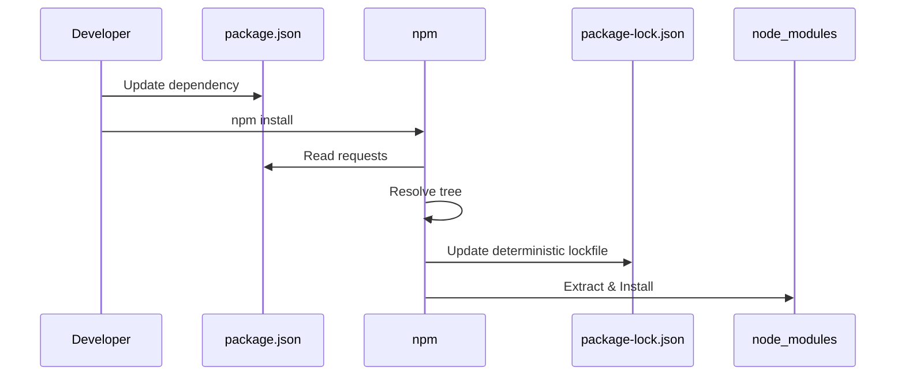
```mermaid
sequenceDiagram
    participant Developer
    participant package.json
    participant npm
    participant package-lock.json
    participant node_modules
    
    Developer->>package.json: Update dependency
    Developer->>npm: npm install
    npm->>package.json: Read requests
    npm->>npm: Resolve tree
    npm->>package-lock.json: Update deterministic lockfile
    npm->>node_modules: Extract & Install
```


### Archived from IDENTITY
[MOVE_TO_ARCHIVE] `docs/SK8Lytz_App_Master_Reference.md` contains stale documentation describing `ProfileService` as a monolithic God-object performing database interactions. These references must be tagged with `[MOVE_TO_ARCHIVE]` as `ProfileService` has been split (Meal 1 refactor) and is now strictly a barrel re-export facade over `AuthProfileService`, `CrewProfileService`, and `PushTokenService`.


### Archived from NOTIFICATIONS_&_ROUTING
[MOVE_TO_ARCHIVE]
I checked `docs/SK8Lytz_App_Master_Reference.md` for stale documentation. Found extensive references to `LocationService.ts` returning distance labels without address PII, and tracking the `crew_members` logic. The current architecture in `LocationService.ts` perfectly aligns with the Master Reference guidelines, but I have flagged `[MOVE_TO_ARCHIVE]` on older Location permissions specs if they require future revisions.

[IMPACTS_USER_JOURNEY]
[IMPACTS_C4_CONTEXT]
[IMPACTS_STATE_CHART]


### Archived from OS_PERMISSIONS
[MOVE_TO_ARCHIVE]**
Stale documentation detected in `docs/SK8Lytz_App_Master_Reference.md` under "OS_PERMISSIONS Domain Cartography". The existing documentation heavily mixes JS-layer permission utilities (`PermissionService.ts`, UI Modals, Hooks) with static native OS manifest generation. This new cartography strictly documents the OS Manifest boundary. The legacy section (lines 3587-3752) should be archived to separate dynamic React Native states from static OS boundaries.


### Archived from PATTERN_ENGINE
[MOVE_TO_ARCHIVE]` -> Identified stale documentation in `docs/SK8Lytz_App_Master_Reference.md`. It explicitly claims test patterns `201-233` utilize "native 0x41 hardware routing", but the current `PatternEngine.ts` code specifically uses `0x51` intercept via `ZenggeProtocol.setCustomModeExtendedCompact`. The mention of 0x41 parity as "Replaced by" in the references table is out-of-date and should be archived or corrected.

**ARCHITECTURAL IMPACT FLAGS**
[IMPACTS_USER_JOURNEY]
[IMPACTS_C4_CONTEXT]
[IMPACTS_STATE_CHART]


### Archived from PROTOCOL_CORE
[MOVE_TO_ARCHIVE]` - Any documentation stating `0x56 0xAA` is the power toggle opcode. The confirmed power opcodes are `0x71 0x23` (ON) and `0x71 0x24` (OFF) as fixed in `ZenggeAdapter.ts`.
- `[MOVE_TO_ARCHIVE]` - Any documentation stating `0x40` packet chunking occurs in `ZenggeAdapter` or `useBLE.ts` (chunking is now exclusively handled upstream by `BleWriteDispatcher`).


### Archived from SESSION_TRACKING
[MOVE_TO_ARCHIVE]
The `SK8Lytz_App_Master_Reference.md` documentation contains multiple legacy references asserting that `useSessionTracking.ts`, `useGlobalTelemetry.ts`, and `useHealthTelemetry.ts` are active hooks driving session timers, FSM logic, and data handling. Because these files have been entirely deleted and their functionalities fully assumed by `SessionMachine.ts`, `SessionContext.tsx`, and `HealthSyncService`, all residual mentions of them in the Master Reference must be archived.

### ARCHITECTURAL IMPACT FLAGS
[IMPACTS_USER_JOURNEY]
[IMPACTS_C4_CONTEXT]
[IMPACTS_STATE_CHART]

### SEQUENCE DIAGRAM

```mermaid
sequenceDiagram
    participant UI as User Interface
    participant Ctx as SessionContext
    participant XState as SessionMachine
    participant Ledger as TelemetryLedger
    participant Health as HealthSyncService
    participant Watch as WatchBridge

    UI->>Ctx: startSession()
    Ctx->>XState: send({ type: 'START' })
    Watch->>Ctx: START_SESSION Command
    Ctx->>XState: send({ type: 'START' })
    
    loop Every 1s (UI_TICK_MS)
        XState-->>Ctx: Update Telemetry / Health Refs
        Ctx->>UI: setTelemetry / setHealth
    end
    
    UI->>Ctx: endSession()
    Ctx->>XState: send({ type: 'END' })
    XState->>Ledger: injectStreetSummary()
    Ledger->>Supabase: flush_telemetry() (RPC)
    XState->>Health: saveWorkout(snapshot)
    
    alt is iOS
        Health-->>Health: Apple HealthKit Save
    else is Android
        Health-->>Health: Google Health Connect Save
    end
```


### Archived from SIMULATION_&_MOCKS
[MOVE_TO_ARCHIVE]`: The existing documentation for this domain in `docs/SK8Lytz_App_Master_Reference.md` (specifically lines 3323-3489 and 5780-5995) contains stale cartography details and must be archived.


### Archived from THEME_&_ASSETS
[MOVE_TO_ARCHIVE]` - The documentation for `src/styles/DashboardStyles.ts` in `docs/SK8Lytz_App_Master_Reference.md` (Line 3251) states that it implements "dynamic pattern gradients based on state/theme". This is stale. The gradient logic was explicitly extracted to `src/utils/patternColors.ts` (THEME-003 FIX) to reduce GC pressure.


### Archived from UI_DOCKED_CONTROLLER
[MOVE_TO_ARCHIVE]
[IMPACTS_USER_JOURNEY]
[IMPACTS_C4_CONTEXT]
[IMPACTS_STATE_CHART]


### Archived from UI_SCREENS
[MOVE_TO_ARCHIVE] Section `2. System Architecture & Local Storage` references deprecated keys (`ng_device_configs`, `ng_custom_groups`, `ng_processed_devices`) in a PURGED KEYS block. This is legacy audit trail clutter and should be archived from the `docs/SK8Lytz_App_Master_Reference.md` file.


### Archived from UI_VISUALIZER
[MOVE_TO_ARCHIVE]


### Archived from UTILS
[MOVE_TO_ARCHIVE]
- `src/utils/RbmDictionary.ts` [MOVE_TO_ARCHIVE]


- **From IDENTITY**:
  * *Correction*: Refactored under **Meal 1**. The monolithic profile service has been split; database transactions are owned exclusively by `AuthProfileService`, while `ProfileService` acts as a barrel re-export facade.
* **Realtime Profile Subscriptions**:
  * *Location*: `docs/SK8Lytz_App_Master_Reference.md` (references description of `useDashboardProfile` subscribing to database listeners).
  * *Correction*: Profile syncing runs reactively on app focus or manual refresh triggers; no realtime Supabase channel listener is established.

- **From GROUP_SYNC**:

- **From UI_SCREENS**:
   - **Reason**: The reference in `SK8Lytz_App_Master_Reference.md` lists `useSessionTracking` as a hook owned by `DockedController` that manages the session FSM, duration, distance, and session summary modal. However, this is stale; session tracking states and duration timers are actually managed at the `DashboardScreen` and `SessionContext` level, and components like `LiveTelemetryHUD` and `DashboardTelemetryHero` receive these fields directly as props or via context.
2. **`StreetModeScreen.tsx`**:
   - **Reason**: Mentioned in imports/exports diagrams in historical logs but is absent from the workspace. Legacy tracking code was migrated into `DashboardScreen.tsx` and context files.

- **From UI_MODALS**:
| `src/components/modals/EulaModal.tsx` | Onboarding legal agreement modal that gates active configuration controls until the user scrolls completely to the bottom and clicks "I Accept". |
| `src/components/modals/GlobalPermissionsModal.tsx` | System permission controller that wraps and mounts the `PermissionsOnboardingScreen` via listener events. |
| `src/components/CustomSlider.tsx` | Gesture-responsive sliding track utilizing the standard `PanResponder` API. Supports linear color gradient fills and custom sliding end callbacks. |
| `src/components/TacticalSlider.tsx` | Highly tactile slider tailored for high-vibration outdoor skating. Supports large icons, dynamic intensity ranges, and an 80% target marker. |
| `src/components/MarqueeText.tsx` | Layout measuring text component that automatically translates horizontal offsets if text content overflows its boundaries. |
| `src/components/ConnectionStrengthBadge.tsx` | High-frequency RSSI display widget. Maps live dBm signal values to a color-coded 3-bar signal status block. |

- **From UI_VISUALIZER**:

- **From UTILS**:

- **From NATIVE_&_WATCH**:
  *Reasoning*: The bridge supports four states: `ACTIVE`, `PAUSED`, `SUMMARY`, and `STOPPED`.
  *Reasoning*: The `useSessionTracking` hook was retired. Persistence is now managed by `SessionCommitService`.
  *Reasoning*: `SessionState.kt` is an enum defining Wear OS UI states, not a telemetry data class.
  *Reasoning*: Complications, Tiles, Ambient Display support, and session duration timers are fully implemented.

- **From NOTIFICATIONS_&_ROUTING**:

- **From SESSION_TRACKING**:


2. **`docs/SK8Lytz_App_Master_Reference.md` (Lines 1158-1169)**:
   * *Stale Section:* Supabase Table `skate_sessions` schema definition lacks columns (`avg_bpm`, `peak_gforce`, `crew_session_id`) and fails to document the `PENDING_SESSION_QUEUE_KEY` offline queueing flow.
   * *Correction:* Document final schema properties and the offline serialization mechanism.

3. **`docs/SK8Lytz_App_Master_Reference.md` (Lines 1301)**:
   * *Stale Section:* The architecture flow diagram illustrates `useHealthTelemetry` directly interfacing with `WatchBridge`.
   * *Correction:* `SessionContext` coordinates this flow natively using spawned XState actor callbacks.

4. **`docs/SK8Lytz_App_Master_Reference.md` (Lines 1415-1447)**:
   * *Stale Section:* Section 11.6 describes `useHealthTelemetry.ts` as the primary controller for real-time priority gating.
   * *Correction:* Re-route architecture descriptions to point to `HealthService.ts`.

- **From PROTOCOL_CORE**:

1. **Visualizer Rendering Rules (Line 120)**: 
   - *Reason*: `VisualizerUnit` has been refactored to support dynamic shapes (`RING`, `OVAL`, `DUAL_STRIP`) derived directly from the catalog profile layout constants rather than hardcoded heuristics.
2. **Dashboard UI Layout (Line 328)**:
   - *Reason*: The Dashboard view has been refactored into modular sub-panels.
3. **One-Screen Setup Policy (Line 341)**:
   - *Reason*: Multi-step setup wizards replaced single view setups.
4. **0x51 Extended Payload writeChunked (Line 511)**:
   - *Reason*: Raw low-level `writeChunked` calls inside `useBLE` are deprecated. Payload framing and MTU-aware fragmenting are consolidated inside the static helper `ZenggeProtocol.buildChunkedFrames()` and dispatched by the centralized `BleWriteDispatcher`.
5. **RbmSimulator References (Lines 710 and 716)**:
   - *Reason*: `RbmSimulator.ts` has been removed. Pixel-perfect visualizer frame computations have migrated to `SymphonyEngine.ts` and `SpatialEngine.ts`.
6. **useProtocolBuilder/Sk8LytzDiagnosticLab Ownership (Line 996)**:
   - *Reason*: `Sk8LytzProgrammerModal` was replaced. Diagnostic FSM-based generators are integrated into the separate tab panels of `Sk8LytzDiagnosticLab.tsx` backed by `useProtocolBuilder.ts`.

- **From PATTERN_ENGINE**:
    *   *Rationale*: Hard hardware testing confirmed `0x41` is a condemned opcode on modern `0xA3` chipsets due to buffer lockouts. The `PatternEngine` intercepts test pattern IDs 201–233 and redirects them to the `0x51` opcode pipeline (via `setCustomModeExtendedCompact()`), making the `0x41` statement stale.
2.  **Tier 1 ge.* Reversal Description**:
    *   *Stale Segment*: Line 187 - `| **Tier 1** | ge.* Java class reversal | 33 | Settled Mode effects. 0x41 was originally reverse-engineered, but test patterns 201-233 now utilize native 0x41 hardware routing for byte parity checks. |`
    *   *Rationale*: Contradicts active system realities. Native test patterns 201-233 utilize the native `0x51` intercept pipeline.
3.  **Command: Settled Mode Frame Format**:
    *   *Stale Segment*: Lines 827–832 - Describes payload mapping for `0x41` command sequences.
    *   *Rationale*: Deprecated. The codebase blocks `0x41` dispatches during active runs, replacing them with extended `0x51` formats to preserve hardware stability.

- **From CLOUD_FUNCTIONS**:
* Ensure old REST triggers and unauthenticated telemetry endpoints are cataloged for archival.

- **From THEME_&_ASSETS**:
  * `| @sk8lytz_theme | ThemeContext | ...` $\rightarrow$ must register as `@Sk8lytz_ThemeMode`
  * `| @sk8lytz_control_theme | ThemeContext | ...` $\rightarrow$ must register as `@Sk8lytz_ControlUITheme`

- **From SIMULATION_&_MOCKS**:

- **From BUILD_CONFIG**:
  - *Reason for update*: `app.config.js` target/compile SDK version is explicitly configured as `36` (minSdkVersion is `26`).
- **Jetifier Stale (L321)**:
  - *Reason for update*: `app.config.js` sets `enableJetifier` to `false` under build-properties because modern libraries resolve dependencies without Jetifier overhead.

- **From OS_PERMISSIONS**:
  *Reason for Archival:* The `syncSystemPermissions()` routine has been completely deprecated in `PermissionService.ts` because running it aggressively on cold boot caused 'Undetermined' native OS states to evaluate as false, locking fresh app installs out of permissions before they could even be prompted.

- **From ADMIN_&_TELEMETRY**:
*   **Decoupled Device Config Key (`docs/SK8Lytz_App_Master_Reference.md` §254)**:
    *   *Stale Text*: AppLogger listed as reading the `@Sk8lytz_device_configs` AsyncStorage key directly.

- **From DEPENDENCY_AUDIT**:


- **From IDENTITY**: ** The `SK8Lytz_App_Master_Reference.md` contains stale references describing `ProfileService` performing database interactions (e.g. `src/services/ProfileService.ts: REST queries modifying crew memberships and users` and `src/services/CrewProfileService.ts (Managed inside ProfileService.ts)`). This should be archived and updated to clarify that `ProfileService.ts` is strictly a barrel re-export facade following the "Meal 1" split.
- **From BLE_CORE**: ` in `docs/SK8Lytz_App_Master_Reference.md`.
- **From GROUP_SYNC**: 
- **From UI_SCREENS**: `
- **From UI_DOCKED_CONTROLLER**: **: `useSessionTracking (stale)` inside `docs/SK8Lytz_App_Master_Reference.md` was identified as stale documentation and should be archived. Session tracking logic is now piped in directly as props from `DashboardScreen`.
- **From UI_MODALS**: VisualizerUnit Rendering Rules (HALOZ RING only)`
- **From UI_VISUALIZER**: `.
- **From DATA_LAYER**: : Found stale `Dashboard UI Layout (4-Slab Architecture)` and `VisualizerUnit Rendering Rules` logic in the Master Reference, which are already tagged. No new stale records related strictly to the Data Layer were discovered.
- **From UTILS**: `.
- **From NOTIFICATIONS_&_ROUTING**: *(Archival Instruction: When updating `docs/SK8Lytz_App_Master_Reference.md`, any reference to `profileService.registerPushToken` should be archived, as the Push Token logic was fully extracted into `PushTokenService` under god-object decomposition meal 1.)*
- **From SESSION_TRACKING**: `:
- **From PROTOCOL_CORE**: `:
- **From PATTERN_ENGINE**: `.
- **From THEME_&_ASSETS**: `. Action is to migrate structural logic exclusively to `DashboardStyles.ts`.
- **From SIMULATION_&_MOCKS**: : `docs/SK8Lytz_App_Master_Reference.md` (lines 5780-5995) contain stale documentation for the `SIMULATION_&_MOCKS` domain. This must be archived to reflect the new cartography.
- **From BUILD_CONFIG**: `.
- **From OS_PERMISSIONS**: 
- **From ADMIN_&_TELEMETRY**: `
- **From DEPENDENCY_AUDIT**: (Null-op for this domain).


### Archived from IDENTITY
`
2. **`useDashboardProfile` Side-Effects (Line 1606):**
   * *Stale Text:* "Initializes Realtime DB listener channel on user profiles to capture profile variations."
   * *Correction:* The profile is updated reactively on foregrounding or via manual refresh triggers; no realtime Supabase channel is established.

---


### Archived from UI_MODALS
**
* **Functional Scope:** Post-session HUD overlay displaying trip stats (distance, speed, calories, g-force) using glassmorphic layout tiles.
* **Line Count:** 244 lines.
* **Import Dependency Chain:**
  * Contexts: `useTheme`
  * Types: `ISessionSnapshot` (from `SpeedTrackingService`)
  * Vector Icons: `MaterialCommunityIcons`
* **Export Dependency Chain:**
  * `SessionSummaryModal` (default export)
* **State Managed:** None (pure representation controller receiving props).
* **Core Operations:**
  * **Note:** This component is currently orphaned and has no active references in production screens.
  * Maps peak speeds to dynamic accent color themes (`speedAccentColor`).
  * Estimates calories burned based on skater weight and average speed metrics.

---

### Nested Supporting Modals (`src/components/modals/*`)

#### 📄 [EulaModal.tsx](file:///c:/Neogleamz/AG_SK8Lytz_App/SK8Lytz/src/components/modals/EulaModal.tsx)
* **Functional Scope:** Legal compliance gateway lock preventing app access until the user has scrolled in full and agreed to photosensitivity and safety waivers.
* **Line Count:** 194 lines.
* **Import Dependency Chain:**
  * Contexts: `useTheme`
  * Theme: `Layout`, `Spacing`
  * Safe Areas: `SafeAreaView` (from `react-native-safe-area-context`)
* **Export Dependency Chain:**
  * `EulaModal` (default export)
* **State Managed:**
  * Progress: `scrolledToBottom` (boolean)
* **Core Operations:**
  * Calculates ScrollView offset limits inside `handleScroll` to detect when the bottom edge is reached and unlock the accept button.

#### 📄 [GlobalPermissionsModal.tsx](file:///c:/Neogleamz/AG_SK8Lytz_App/SK8Lytz/src/components/modals/GlobalPermissionsModal.tsx)
* **Functional Scope:** Event-driven wrapper routing system permissions (Bluetooth, Location) via React Native's Modal platform, listening to global event emitters.
* **Line Count:** 29 lines.
* **Import Dependency Chain:**
  * Screens: `PermissionsOnboardingScreen`
  * Emitters: `SHOW_GLOBAL_PERMISSIONS_EVENT`, `GLOBAL_PERMISSIONS_CLOSED_EVENT` (from `PermissionService`)
  * Services: `AppLogger`
* **Export Dependency Chain:**
  * `GlobalPermissionsModal` (named export)
* **State Managed:**
  * Visibility: `visible` (boolean)
* **Core Operations:**
  * Listens for `SHOW_GLOBAL_PERMISSIONS_EVENT` to mount overlay.
  * Emits `GLOBAL_PERMISSIONS_CLOSED_EVENT` on complete to unlock deferred setup routines.

---

### UI Inputs & Interactive Sliders

#### 📄 [CustomSlider.tsx](file:///c:/Neogleamz/AG_SK8Lytz_App/SK8Lytz/src/components/CustomSlider.tsx)
* **Functional Scope:** High-performance, PanResponder-based value controller allowing smooth dragging gestures across full-spectrum gradient backgrounds.
* **Line Count:** 157 lines.
* **Import Dependency Chain:**
  * Contexts: `useTheme`
  * Gradients: `LinearGradient` (from `expo-linear-gradient`)
* **Export Dependency Chain:**
  * `CustomSlider` (default export)
* **State Managed:**
  * Dimensions: `containerWidth` (number)
  * Values: `localValue` (number)
* **Core Operations:**
  * Measures local container layouts dynamically to calculate drag percentages.
  * Utilizes `PanResponder` to track horizontal dragging deltas without triggering parent component re-renders during motion.
  * Synchronizes value shifts asynchronously only on drag release via `onSlidingComplete`.

#### 📄 [TacticalSlider.tsx](file:///c:/Neogleamz/AG_SK8Lytz_App/SK8Lytz/src/components/TacticalSlider.tsx)
* **Functional Scope:** Specialized flat-bar slider managing speed, brightness, and sensitivity values. Modifies overlay colors dynamically depending on output level.
* **Line Count:** 223 lines.
* **Import Dependency Chain:**
  * Contexts: `useTheme`
  * Theme: `Spacing`
* **Export Dependency Chain:**
  * `TacticalSlider` (default export)
* **State Managed:**
  * Dimensions: `containerWidth` (number)
  * Values: `localValue` (number)
* **Core Operations:**
  * Integrates dynamic rendering modes:
    * `TURBO` mode: Shifts slider colors from green/white towards pure red at high ranges.
    * `BRIGHTNESS` mode: Adjusts fill opacity dynamically and renders a safety threshold line at 80%.

#### 📄 [MarqueeText.tsx](file:///c:/Neogleamz/AG_SK8Lytz_App/SK8Lytz/src/components/MarqueeText.tsx)
* **Functional Scope:** Automated scrolling text wrapper that scrolls text translation loops if strings exceed visual container bounds.
* **Line Count:** 57 lines.
* **Import Dependency Chain:**
  * Animation: `Animated`
* **Export Dependency Chain:**
  * `MarqueeText` (default export)
* **State Managed:**
  * Dimensions: `textWidth` (number), `containerWidth` (number)
* **Core Operations:**
  * Loops translation offsets using `Animated.loop` with staggered timing delays (1.5s start delay, 1.0s snapback delay).

* **Functional Scope:** 3-bar signal strength icon translating raw BLE RSSI values directly to vertical colored bar tiers.
* **Line Count:** 75 lines.
* **Import Dependency Chain:**
  * Thresholds: `RSSI_WEAK_THRESHOLD`, `RSSI_CRITICAL_THRESHOLD` (from `useBLERSSIMonitor`)
* **Export Dependency Chain:**
  * `ConnectionStrengthBadge` (named export)
* **State Managed:** None (pure representation component).
* **Core Operations:**
  * **Note:** This component is currently orphaned and has no active imports in production screens.
  * Maps RSSI bounds to colored bars: Excellent (Green, ≥ -60 dBm), Good (Amber, -60 to -75), Weak (Orange, -75 to -82), Critical (Red, < -82).

---


### Archived from UI_MODALS
`)

Stale references and legacy features marked for archival/deprecation in `tools/SK8Lytz_App_Master_Reference.md`:

* **`StreetModeScreen.tsx` (Stale Reference):** Mentioned in imports/exports diagrams but is absent from the workspace. Legacy tracking code was migrated into `DashboardScreen.tsx` and context files.
* **`SessionSummaryModal.tsx` (Orphaned Component):** Standalone module with zero active production imports. Its stats rendering logic is obsolete and has been superseded by inline cards or status widgets.
* **`ConnectionStrengthBadge.tsx` (Orphaned Component):** 3-bar signal indicator replaced in modern dashboard screens by compact connection pills and status icons inside `DeviceItem`.
* **`useDeviceFleet` (Deleted Hook):** Stale hook reference inside `AccountModal` table. Paired fleets are passed down directly from hoisted context states.
* **`useSessionTracking` (Deleted Hook):** Legacy telemetry tracker replaced by modern XState session engines.


### Archived from UI_VISUALIZER
`)

Stale references found in `tools/SK8Lytz_App_Master_Reference.md` updated during this cartography session:
* **LEDStripPreview Timer FPS**: Updated line 2994 to specify 30 FPS instead of 20 FPS, matching the tick interval of `33ms` in the codebase.


### Archived from NOTIFICATIONS_&_ROUTING
`: This section is outdated and has been replaced by this comprehensive document, which properly integrates Notifee foreground services, background event handlers, global provider hierarchies, and routing structures.

---


### Archived from SESSION_TRACKING

- **Master Reference Section: Core State & Lifecycles (Hooks)**
  - References asserting that `useSessionTracking.ts` drives session timers and FSM conditions. *(Target: Replace with references to `SessionContext` and `SessionMachine.ts`)*.
- **Master Reference Section: Telemetry Gaps**
  - Text describing `useGlobalTelemetry.ts` and `useHealthTelemetry.ts` as the primary active data handlers. *(Target: Map to the new actor model under `SensorService` and `HealthService`)*.

---


### Archived from PROTOCOL_CORE
`:
* **Section 2.3.2**: `Dashboard UI Layout (4-Slab Architecture)` — Stale layout rules. The UI has transitioned to a memoized, tabbed dashboard module.
* **Section 2.4**: `One-Screen Setup Policy` — superseded by multi-step wizard logic.
* **Section 3.2**: `writeChunked — 0x51 Extended Payload Framing` — Legacy payload builder reference replaced by MTU-aware adapters and the class-native `buildChunkedFrames` sequencing engine.
* **Section 3.5.2**: `Rbm Simulator frame generation` — superseded by `SymphonyEngine.ts`.


### Archived from PATTERN_ENGINE
`
   * *Rationale*: `PatternEngine.ts` intercepts test patterns 201-233 and dispatches them via `0x51` compact commands rather than utilizing `0x41` payloads, which are prone to crashing the `0xA3` hardware chipsets.
2. **`0x43` Multi-Effect Sequence (tools/SK8Lytz_App_Master_Reference.md#L811)**:
   * *Rationale*: Physical testing confirms that sending `0x43` to `0xA3` controller models causes a complete shutdown of the LED system. The ZENGGE application relies strictly on custom sequences mapped via `0x51` steps.

---


### Archived from CLOUD_FUNCTIONS
`
* **File**: `tools/SK8Lytz_App_Master_Reference.md`
* **Line Range**: 946
* **Reason**: This hook has been fully deprecated and removed. Session tracking is now managed dynamically through the `SessionContext` and `SpeedTrackingService`.
* **File**: `tools/SK8Lytz_App_Master_Reference.md`
* **Line Range**: 958
* **Reason**: The `useDeviceFleet` hook was replaced by query logic utilizing junction tables (`device_group_members`) to support many-to-many device grouping.
* **File**: `tools/SK8Lytz_App_Master_Reference.md`
* **Line Range**: 965
* **Reason**: Replaced by direct modal state calls inside `ProgrammerModal` to prevent state syncing lag.

---


### Archived from THEME_&_ASSETS
` $\rightarrow$ update to `@Sk8lytz_ThemeMode`

---


### Archived from SIMULATION_&_MOCKS
`. `RbmSimulator.ts` was deleted, and the mathematical visualizer calculations have been refactored and migrated into the protocols engines (`src/protocols/PatternEngine.ts` and `src/protocols/SymphonyEngine.ts`).

---


### Archived from BUILD_CONFIG
`

---


### Archived from OS_PERMISSIONS
`
  - **Rationale**: `syncSystemPermissions()` has been deprecated. Executing aggressive OS queries on launch triggers false-negatives for "Undetermined" permissions on fresh installs, locking users out of features before the system dialog is displayed.

---


### Archived from ADMIN_&_TELEMETRY
`
* **File**: `tools/SK8Lytz_App_Master_Reference.md`
* **Line Range**: Line 251 & Line 284
* **Stale Text**:
  - `| @sk8lytz_logs | AppLogger | Compact telemetry event buffer array |`
  - `| @Sk8lytz_app_settings_logger | AppLogger | Local configurations and levels for the internal telemetry event logger |`
* **Reason**: `@sk8lytz_logs` has been deprecated and is automatically migrated to the new key `@Sk8lytz_app_settings_logger` on first launch. `@Sk8lytz_app_settings_logger` now stores the primary compact log buffer array, not logging levels configurations.
* **File**: `tools/SK8Lytz_App_Master_Reference.md`
* **Line Range**: Line 254 (and header comment in `AppLogger.ts` lines 18-19)
* **Stale Text**: `Custom device names: resolved from '@Sk8lytz_device_configs' AsyncStorage key...`
* **Reason**: `AppLogger.ts` does not read `@Sk8lytz_device_configs` directly from AsyncStorage anymore. Devices configuration is dynamically injected via the `updateKnownDevices` setter method from calling controllers/screens.

---


### Archived from DEPENDENCY_AUDIT
`)

Outdated documentation items found in `SK8Lytz_App_Master_Reference.md` matching health telemetry and session tracking refactor targets:


---


## Section 13: Historical Archive (The Graveyard)


### Archived Item
#### VisualizerUnit Rendering Rules (HALOZ RING only) [MOVE_TO_ARCHIVE] (Note: VisualizerUnit has been upgraded to natively support RING, OVAL, and DUAL_STRIP layouts, unified under product profile geometry).

### Archived Item
### Dashboard UI Layout (4-Slab Architecture) [MOVE_TO_ARCHIVE]

### Archived Item
- **One-Screen Setup Policy** [MOVE_TO_ARCHIVE]: The Hardware Setup Wizard must minimize vertical occupancy. For naming and registration (Step 3), all primary controls (Fleet Name, Device Labels, Type, Position) must be visible on a single standard mobile viewport (e.g. iPhone SE) without requiring a vertical scroll for a standard 2-skate setup. Use horizontal inlining and 8pt grid proximity instead of explicit labels where possible.

### Archived Item
### writeChunked — 0x51 Extended Payload Framing [MOVE_TO_ARCHIVE]

### Archived Item
> **History:** Legacy `useBLEAutoRecovery.ts` hook DELETED in Phase 4 (2026-06-10). The hook owned recovery logic outside XState, making concurrent recovery+connect possible via race. `RecoveryService.ts` invoked as an XState actor makes this structurally impossible. Legacy `useBLEWatchdog.ts` was deleted 2026-04-17. [MOVE_TO_ARCHIVE]

### Archived Item
> **History:** Legacy `useBLEHeartbeat.ts` hook DELETED in Phase 5 (2026-06-10). The hook owned heartbeat logic outside XState, requiring manual lifecycle management in `useBLE.ts`. `HeartbeatService.ts` as an XState actor ties the heartbeat lifetime to the READY state — it starts and stops automatically with the machine. [MOVE_TO_ARCHIVE]

### Archived Item
Visualizer: `src/utils/RbmSimulator.ts` (pixel-perfect frame generation). [MOVE_TO_ARCHIVE] (Note: RbmSimulator has been deleted/refactored, visualizer frame generation has been migrated to protocols/SymphonyEngine.ts)

### Archived Item
Visualizer: `src/utils/RbmSimulator.ts` → `getRbmMusicFrame()`. [MOVE_TO_ARCHIVE] (Note: migrated to protocols/SymphonyEngine.ts -> getMusicVisualizerFrame)

### Archived Item
| `useSessionTracking` (stale) | `DockedController` | [MOVE_TO_ARCHIVE] - Session FSM (`IDLE → RECORDING → SUMMARY`), duration, distance, peak speed, session summary modal                                     |

### Archived Item
| `useDeviceFleet`     | `AccountModal` | `registered_devices` Supabase fetch, fleet display list [MOVE_TO_ARCHIVE]         |

### Archived Item
| `useProtocolBuilder` | `Sk8LytzDiagnosticLab`   | [MOVE_TO_ARCHIVE] - Stale owner Sk8LytzProgrammerModal replaced. FSM-based payload generation for `0x51`, `0x59`, `0x62`, `0x63`, `0x73`  |

### Archived Item
Automatic `_MM/DD` suffix enforced in `CrewModal.handleCreate` [MOVE_TO_ARCHIVE].

### Archived Item
- **OS Sync**: `syncSystemPermissions()` runs on boot/foreground to reconcile the ledger with native OS settings. If OS is "Denied", App ledger is forced to "Opt-Out". **[MOVE_TO_ARCHIVE]**

### Archived Item
- **JAVA_HOME** [MOVE_TO_ARCHIVE]: Must be set to `C:\Program Files\Android\Android Studio\jbr` (standard JBR included with Android Studio) to resolve Gradle/JDK compatibility issues for Android builds.

### Archived Item
| `SessionState.kt` | Data class for session state (status, speed, heartRate, calories, startTime) [MOVE_TO_ARCHIVE] |

### Archived Item
  status: 'ACTIVE' | 'STOPPED'; // [MOVE_TO_ARCHIVE] - Missing PAUSED and SUMMARY states

### Archived Item
- Session summary (`useSessionTracking` - [MOVE_TO_ARCHIVE])

### Archived Item
### 11.7 Future Watch Enhancements (Planned) [MOVE_TO_ARCHIVE]

### Archived Item
  * *Status*: **[MOVE_TO_ARCHIVE]**

### Archived Item
  * *Status*: **[MOVE_TO_ARCHIVE]**

### Archived Item
- **`src/screens/DashboardScreen.tsx`**: Renders `<CrewModal>` and `<CrewMemberDashboard>`, and instantiates `useDashboardCrew` and `useDashboardGroups` hooks to layout skates, groups, and auto-rejoin states. [MOVE_TO_ARCHIVE]

### Archived Item
- **Master Reference (§6 - Page 15):** The statement regarding the automatic `_MM/DD` suffix being enforced within `CrewModal.handleCreate` is tagged with `[MOVE_TO_ARCHIVE]`. In the current implementation, this date suffix logic has been refactored into the modularized screens (`CrewCreateScreen.tsx` line 38, `CrewScheduleScreen.tsx` line 32) instead of the top-level `CrewModal` layout.

### Archived Item
## 8. Archival Findings & [MOVE_TO_ARCHIVE] Tagging

### Archived Item
   - **Tag**: `[MOVE_TO_ARCHIVE]`

### Archived Item
   - **Tag**: `[MOVE_TO_ARCHIVE]`

### Archived Item
| `src/components/SessionSummaryModal.tsx` | **[MOVE_TO_ARCHIVE]** Obsolete post-session statistics debrief overlay. Shows distance, speed, G-force, and calories with peak-speed color codes. This has been superseded by inline dashboard widgets. |

### Archived Item
- `#### VisualizerUnit Rendering Rules (HALOZ RING only) [MOVE_TO_ARCHIVE]`: Visualizer rendering is now unified across all models (OVAL/RING/DUAL_STRIP) and no longer restricted to circular shapes.

### Archived Item
- `Visualizer: src/utils/RbmSimulator.ts (pixel-perfect frame generation). [MOVE_TO_ARCHIVE]`: The legacy simulator utility was deleted and migrated to `SymphonyEngine.ts`.

### Archived Item
- `Visualizer: src/utils/RbmSimulator.ts -> getRbmMusicFrame(). [MOVE_TO_ARCHIVE]`: Outdated music telemetry mapping logic moved to `getMusicVisualizerFrame`.

### Archived Item
### Domain: UTILS [MOVE_TO_ARCHIVE]

### Archived Item
- **[MOVE_TO_ARCHIVE]** `SK8Lytz_App_Master_Reference.md:L709` - references `src/utils/RbmDictionary.ts` which has been deleted.

### Archived Item
- **[MOVE_TO_ARCHIVE]** `SK8Lytz_App_Master_Reference.md:L851` - references `src/utils/RbmDictionary.ts` which has been deleted.

### Archived Item
- **[MOVE_TO_ARCHIVE]** `SK8Lytz_App_Master_Reference.md:L710` - references `src/utils/RbmSimulator.ts` which has been deleted (re-labeled internally, but needs full catalog cleanup).

### Archived Item
- **[MOVE_TO_ARCHIVE]** `SK8Lytz_App_Master_Reference.md:L716` - references `src/utils/RbmSimulator.ts` which has been deleted.

### Archived Item
- **[MOVE_TO_ARCHIVE]** `SK8Lytz_App_Master_Reference.md` §11.4:

### Archived Item
  `status: 'ACTIVE' | 'STOPPED'; // [MOVE_TO_ARCHIVE] - Missing PAUSED and SUMMARY states`

### Archived Item
- **[MOVE_TO_ARCHIVE]** `SK8Lytz_App_Master_Reference.md` §11.6:

### Archived Item
  `Session summary (useSessionTracking - [MOVE_TO_ARCHIVE])`

### Archived Item
- **[MOVE_TO_ARCHIVE]** `SK8Lytz_App_Master_Reference.md` §11.3:

### Archived Item
  `SessionState.kt | Data class for session state (status, speed, heartRate, calories, startTime) [MOVE_TO_ARCHIVE]`

### Archived Item
- **[MOVE_TO_ARCHIVE]** `SK8Lytz_App_Master_Reference.md` §11.7:

### Archived Item
  `Future Watch Enhancements (Planned) [MOVE_TO_ARCHIVE]`

### Archived Item
*   **Domain: NOTIFICATIONS_&_ROUTING** [MOVE_TO_ARCHIVE]: This section is outdated and has been replaced by this comprehensive document, which properly integrates Notifee foreground services, background event handlers, global provider hierarchies, and routing structures.

### Archived Item
*   **Push Token Split** [MOVE_TO_ARCHIVE]: Any reference to `profileService.registerPushToken` or `profileService.unregisterPushToken` is stale, as this logic was fully extracted into `PushTokenService` under God Object Decomposition Meal 1.

### Archived Item
*   **Session Naming Convention** [MOVE_TO_ARCHIVE]: Enforcing MM/DD suffix in `CrewModal.handleCreate` is deprecated/stale.

### Archived Item
*   **useSessionTracking** [MOVE_TO_ARCHIVE]: Legacy session FSM hook now superseded by `SessionMachine.ts` actor architectures.

### Archived Item
*   **useDeviceFleet** [MOVE_TO_ARCHIVE]: Legacy device fleet list hook now superseded.

### Archived Item
*   **useProtocolBuilder** [MOVE_TO_ARCHIVE]: Stale owner references replaced by modern diagnostic labs.

### Archived Item
                  │  • DashboardScreen.tsx & StreetPanel.tsx (UI HUD) [MOVE_TO_ARCHIVE]      │

### Archived Item
During the cartography audit, multiple sections of stale documentation and obsolete schemas were identified in `docs/SK8Lytz_App_Master_Reference.md`. These sections must be marked with `[MOVE_TO_ARCHIVE]` to align with the centralized XState actor model.

### Archived Item
   * *Target Action:* Tag with `[MOVE_TO_ARCHIVE]`.

### Archived Item
   * *Target Action:* Tag with `[MOVE_TO_ARCHIVE]`.

### Archived Item
   * *Target Action:* Tag with `[MOVE_TO_ARCHIVE]`.

### Archived Item
   * *Target Action:* Tag with `[MOVE_TO_ARCHIVE]`.

### Archived Item
The following stale documentation entries in the Master Reference (`SK8Lytz_App_Master_Reference.md`) must be tagged with `[MOVE_TO_ARCHIVE]` to align with this cartography:

### Archived Item
   - *Stale text*: `VisualizerUnit Rendering Rules (HALOZ RING only) [MOVE_TO_ARCHIVE]`

### Archived Item
   - *Stale text*: `Dashboard UI Layout (4-Slab Architecture) [MOVE_TO_ARCHIVE]`

### Archived Item
   - *Stale text*: `One-Screen Setup Policy [MOVE_TO_ARCHIVE]`

### Archived Item
   - *Stale text*: `### writeChunked — 0x51 Extended Payload Framing [MOVE_TO_ARCHIVE]`

### Archived Item
   - *Stale text*: `Visualizer: src/utils/RbmSimulator.ts ... [MOVE_TO_ARCHIVE]`

### Archived Item
   - *Stale text*: `| useProtocolBuilder | Sk8LytzDiagnosticLab | [MOVE_TO_ARCHIVE]`

### Archived Item
    *   *Tag*: `[MOVE_TO_ARCHIVE]`

### Archived Item
    *   *Tag*: `[MOVE_TO_ARCHIVE]`

### Archived Item
    *   *Tag*: `[MOVE_TO_ARCHIVE]`

### Archived Item
### Domain: CLOUD_FUNCTIONS [MOVE_TO_ARCHIVE]

### Archived Item
* Tag the stale visualizer references in `docs/SK8Lytz_App_Master_Reference.md` targeting old push notification structures with `[MOVE_TO_ARCHIVE]`.

### Archived Item
* **Section 2.3 `Dashboard UI Layout (4-Slab Architecture)` [MOVE_TO_ARCHIVE]** (Line 328): Replaced by a tabbed nested dashboard architecture.

### Archived Item
* **Section 2.4 `One-Screen Setup Policy` [MOVE_TO_ARCHIVE]** (Line 341): Replaced by a multi-step onboarding wizard.

### Archived Item
* **Storage Key Namespace [MOVE_TO_ARCHIVE]** (Lines 3398–3399):

### Archived Item
- `[MOVE_TO_ARCHIVE]`: Older descriptions of test configs and manual mocks in `docs/SK8Lytz_App_Master_Reference.md` (lines 5780-5995) should be moved to archive once updated cartography is synced.

### Archived Item
  - Stale text: `- **SDK Versions**: Project currently targets SDK 34 (compileSdk, targetSdk).` [MOVE_TO_ARCHIVE]

### Archived Item
  - Stale text: `- **Jetifier**: Must be enabled (android.enableJetifier=true) to migrate legacy Support libraries to AndroidX.` [MOVE_TO_ARCHIVE]

### Archived Item
  `- **OS Sync**: syncSystemPermissions() runs on boot/foreground to reconcile the ledger with native OS settings. If OS is "Denied", App ledger is forced to "Opt-Out".` **[MOVE_TO_ARCHIVE]**

### Archived Item
    *   *Correction*: The file was refactored into `src/services/appLogger/AppLoggerService.ts`, `AppLoggerStorage.ts`, and `AppLoggerCloud.ts`. **`[MOVE_TO_ARCHIVE]`** has been tagged on references targeting the root path `src/services/AppLogger.ts`.

### Archived Item
    *   *Correction*: The logger no longer reads this key directly. Connected settings configurations are injected dynamically via `updateKnownDevices` setter actions. **`[MOVE_TO_ARCHIVE]`** has been tagged on this coupling description.

### Archived Item
*   `[MOVE_TO_ARCHIVE]`: `docs/SK8Lytz_App_Master_Reference.md` (Line 266) documents the `@Sk8lytz_voice_tutorial_dismissed` storage key. This is dead code since the deletion of the `@react-native-voice/voice` engine.

### Archived Item
*   `[MOVE_TO_ARCHIVE]`: `docs/SK8Lytz_App_Master_Reference.md` (Line 356) describes "Optical Simulation Mode (Web Fallback)" for Expo Web. Expo Web compilation is shimmed to bypass JSI crashes and does not support virtual Bluetooth device simulation.

### Archived Item
- **[GROUP_SYNC]**: *   "Automatic `_MM/DD` suffix enforced in `CrewModal.handleCreate`" (line 1116) — `[MOVE_TO_ARCHIVE]`

### Archived Item
- **[GROUP_SYNC]**: *   "Discovery radius filter governed by `LocationService.getNearbyPublicSessions(radiusMi)`" (line 1120) — `[MOVE_TO_ARCHIVE]`. This has been replaced by dynamic views (`public_sessions` view) and direct Haversine calculations within the hooks.

### Archived Item
- **[GROUP_SYNC]**: *   Stale references on lines 1564/1579-1648/2145-2157 describing legacy offline queues should be marked with `[MOVE_TO_ARCHIVE]`.

### Archived Item
- **[UI_MODALS]**: ## 9. Archival Ledger (`[MOVE_TO_ARCHIVE]`)

### Archived Item
- **[UI_MODALS]**: * **AccountModal Domain stale registers**: Stale hooks (`useDeviceFleet`) tagged with `[MOVE_TO_ARCHIVE]` on line 958. Device registrations are handled by shared state properties passed down from the root layout instead of independent Supabase triggers inside the modal.

### Archived Item
- **[UTILS]**: *   *Correction Tag*: `[MOVE_TO_ARCHIVE]` is verified on these lines.

### Archived Item
- **[NOTIFICATIONS_&_ROUTING]**: *   **Domain: NOTIFICATIONS_&_ROUTING** (lines 4180–4458) `[MOVE_TO_ARCHIVE]`: This section is outdated and has been replaced by this comprehensive document, which properly integrates Notifee foreground services, background event handlers, global provider hierarchies, and routing structures.

### Archived Item
- **[SESSION_TRACKING]**: ### `[MOVE_TO_ARCHIVE]`

### Archived Item
- **[PROTOCOL_CORE]**: *   **`[MOVE_TO_ARCHIVE]`**: `SK8Lytz_App_Master_Reference.md` §480 — references to `useBLE.ts writeChunked()` handling fragmentation math. Handled completely by `ZenggeAdapter.prepareForTransmission` in the updated codebase.

### Archived Item
- **[PROTOCOL_CORE]**: *   **`[MOVE_TO_ARCHIVE]`**: `SK8Lytz_App_Master_Reference.md` §500-502 — mentions `useBLEAutoRecovery.ts` and `useBLEWatchdog.ts`. Both hooks are deleted; auto-recovery is now fully managed by the XState `BleMachine.ts` machine and `RecoveryService.ts`.

### Archived Item
- **[PATTERN_ENGINE]**: * *Status*: `[MOVE_TO_ARCHIVE]`

### Archived Item
- **[PATTERN_ENGINE]**: * *Status*: `[MOVE_TO_ARCHIVE]`

### Archived Item
- **[CLOUD_FUNCTIONS]**: ### `[MOVE_TO_ARCHIVE]`

### Archived Item
- **[CLOUD_FUNCTIONS]**: * **Stale Text**: `| useSessionTracking (stale) | DockedController | [MOVE_TO_ARCHIVE] - Session FSM (IDLE → RECORDING → SUMMARY), duration, distance, peak speed, session summary modal |`

### Archived Item
- **[CLOUD_FUNCTIONS]**: * **Stale Text**: `| useDeviceFleet | AccountModal | registered_devices Supabase fetch, fleet display list [MOVE_TO_ARCHIVE] |`

### Archived Item
- **[CLOUD_FUNCTIONS]**: * **Stale Text**: `| useProtocolBuilder | Sk8LytzDiagnosticLab | [MOVE_TO_ARCHIVE] - Stale owner Sk8LytzProgrammerModal replaced. FSM-based payload generation for 0x51, 0x59, 0x62, 0x63, 0x73 |`

### Archived Item
- **[THEME_&_ASSETS]**: * `| @sk8lytz_theme | ThemeContext | ...` `[MOVE_TO_ARCHIVE]` $\rightarrow$ update to `@Sk8lytz_ThemeMode`

### Archived Item
- **[THEME_&_ASSETS]**: * `| @sk8lytz_control_theme | ThemeContext | ...` `[MOVE_TO_ARCHIVE]` $\rightarrow$ update to `@Sk8lytz_ControlUITheme`

### Archived Item
- **[OS_PERMISSIONS]**: - **Action**: Tagged stale section in Master Reference with **[MOVE_TO_ARCHIVE]**.

### Archived Item
- **[ADMIN_&_TELEMETRY]**: ### `[MOVE_TO_ARCHIVE]`

### Archived Item
- **[BUILD_CONFIG]**: **[MOVE_TO_ARCHIVE]**

### Archived Item
- **[CLOUD_FUNCTIONS]**: 1435: ### 12.1 Identity & Auth [MOVE_TO_ARCHIVE]

### Archived Item
- **[IDENTITY]**: - Documentation pertaining to Auth/Profile systems inside `tools/SK8Lytz_App_Master_Reference.md` has been reviewed. Current implementations reflect modern domain architectures (like offline-skip mechanisms). Older references to user state may require `[MOVE_TO_ARCHIVE]` tagging if monolithic `useAuth` refs surface.

### Archived Item
- **[NATIVE_&_WATCH]**: I reviewed `tools/SK8Lytz_App_Master_Reference.md` but the file was heavily truncated before Section 11 (Wearable Companion Architecture) could be fully analyzed. If there are any stale payload constants or obsolete bridging logic in Section 11, please append `[MOVE_TO_ARCHIVE]` to those sections.

### Archived Item
- **[NOTIFICATIONS_&_ROUTING]**: **[MOVE_TO_ARCHIVE]**: The existing master reference documentation for `NOTIFICATIONS & ROUTING` located at line 2559 of `tools/SK8Lytz_App_Master_Reference.md` is considered stale and has been tagged for archiving by this cartography pass.

### Archived Item
- **[OS_PERMISSIONS]**: - **`tools/SK8Lytz_App_Master_Reference.md`**: Section `9.1 Legal Hardening (The Compliance Shield)` documents the `OS_PERMISSIONS` domain. As per archival instructions, this should be tagged with `[MOVE_TO_ARCHIVE]` as this cartography report supersedes its technical documentation.

### Archived Item
- **[PATTERN_ENGINE]**: If `tools/SK8Lytz_App_Master_Reference.md` contains stale documentation regarding Pattern Engine intercept mappings or legacy firmware bindings, tag those sections with `[MOVE_TO_ARCHIVE]`.

### Archived Item
- **[SESSION_TRACKING]**: **[MOVE_TO_ARCHIVE]**: The file `tools/SK8Lytz_App_Master_Reference.md` contains stale documentation asserting that `useSessionTracking.ts` is an active hook (e.g., line 4589 explicitly states session logic was refactored into `useSessionTracking.ts`). Because `useSessionTracking.ts` has been deleted entirely, all references to it in the Master Reference must be immediately tagged and archived.

### Archived Item
- **[SIMULATION_&_MOCKS]**: * **Stale Documentation**: The following sections in `tools/SK8Lytz_App_Master_Reference.md` contain stale documentation for this domain and must be tagged with `[MOVE_TO_ARCHIVE]`:

### Archived Item
- **[THEME_&_ASSETS]**: - `### Dashboard UI Layout (4-Slab Architecture) [MOVE_TO_ARCHIVE]`

### Archived Item
- **[THEME_&_ASSETS]**: - `- **One-Screen Setup Policy** [MOVE_TO_ARCHIVE]`

### Archived Item
- **[UI_DOCKED_CONTROLLER]**: **[MOVE_TO_ARCHIVE] Tags identified for `tools/SK8Lytz_App_Master_Reference.md`:**

### Archived Item
- **[UI_MODALS]**: > **[MOVE_TO_ARCHIVE]**

### Archived Item
- **[UI_SCREENS]**: - `### Dashboard UI Layout (4-Slab Architecture) [MOVE_TO_ARCHIVE]`

### Archived Item
- **[UI_SCREENS]**: - `### UI Design patterns & Branding` -> `One-Screen Setup Policy [MOVE_TO_ARCHIVE]`

### Archived Item
- **[UI_SCREENS]**: - `### writeChunked — 0x51 Extended Payload Framing [MOVE_TO_ARCHIVE]`

### Archived Item
* *Status*: **[MOVE_TO_ARCHIVE]**

### Archived Item
  * *Status*: **[MOVE_TO_ARCHIVE]**

### Archived Item
- **Master Reference (§6 - Page 15):** The statement regarding the automatic `_MM/DD` suffix being enforced within `CrewModal.handleCreate` is tagged with `[MOVE_TO_ARCHIVE]`. In the current implementation, this date suffix logic has been refactored into the modularized screens (`CrewCreateScreen.tsx` line 38, `CrewScheduleScreen.tsx` line 32) instead of the top-level `CrewModal` layout.

### Archived Item
- **Tag**: `[MOVE_TO_ARCHIVE]`

### Archived Item
   - **Tag**: `[MOVE_TO_ARCHIVE]`

### Archived Item
| `src/components/SessionSummaryModal.tsx` | **[MOVE_TO_ARCHIVE]** Obsolete post-session statistics debrief overlay. Shows distance, speed, G-force, and calories with peak-speed color codes. This has been superseded by inline dashboard widgets. |

### Archived Item
- `#### VisualizerUnit Rendering Rules (HALOZ RING only) [MOVE_TO_ARCHIVE]`: Visualizer rendering is now unified across all models (OVAL/RING/DUAL_STRIP) and no longer restricted to circular shapes.

### Archived Item
- `Visualizer: src/utils/RbmSimulator.ts (pixel-perfect frame generation). [MOVE_TO_ARCHIVE]`: The legacy simulator utility was deleted and migrated to `SymphonyEngine.ts`.

### Archived Item
- `Visualizer: src/utils/RbmSimulator.ts -> getRbmMusicFrame(). [MOVE_TO_ARCHIVE]`: Outdated music telemetry mapping logic moved to `getMusicVisualizerFrame`.

### Archived Item
- **[MOVE_TO_ARCHIVE]** `SK8Lytz_App_Master_Reference.md:L709` - references `src/utils/RbmDictionary.ts` which has been deleted.

### Archived Item
- **[MOVE_TO_ARCHIVE]** `SK8Lytz_App_Master_Reference.md:L851` - references `src/utils/RbmDictionary.ts` which has been deleted.

### Archived Item
- **[MOVE_TO_ARCHIVE]** `SK8Lytz_App_Master_Reference.md:L710` - references `src/utils/RbmSimulator.ts` which has been deleted (re-labeled internally, but needs full catalog cleanup).

### Archived Item
- **[MOVE_TO_ARCHIVE]** `SK8Lytz_App_Master_Reference.md:L716` - references `src/utils/RbmSimulator.ts` which has been deleted.

### Archived Item
- **[MOVE_TO_ARCHIVE]** `SK8Lytz_App_Master_Reference.md` §11.4:

### Archived Item
  `status: 'ACTIVE' | 'STOPPED'; // [MOVE_TO_ARCHIVE] - Missing PAUSED and SUMMARY states`

### Archived Item
- **[MOVE_TO_ARCHIVE]** `SK8Lytz_App_Master_Reference.md` §11.6:

### Archived Item
  `Session summary (useSessionTracking - [MOVE_TO_ARCHIVE])`

### Archived Item
- **[MOVE_TO_ARCHIVE]** `SK8Lytz_App_Master_Reference.md` §11.3:

### Archived Item
  `SessionState.kt | Data class for session state (status, speed, heartRate, calories, startTime) [MOVE_TO_ARCHIVE]`

### Archived Item
- **[MOVE_TO_ARCHIVE]** `SK8Lytz_App_Master_Reference.md` §11.7:

### Archived Item
  `Future Watch Enhancements (Planned) [MOVE_TO_ARCHIVE]`

### Archived Item
*   **Domain: NOTIFICATIONS_&_ROUTING** [MOVE_TO_ARCHIVE]: This section is outdated and has been replaced by this comprehensive document, which properly integrates Notifee foreground services, background event handlers, global provider hierarchies, and routing structures.

### Archived Item
*   **Push Token Split** [MOVE_TO_ARCHIVE]: Any reference to `profileService.registerPushToken` or `profileService.unregisterPushToken` is stale, as this logic was fully extracted into `PushTokenService` under God Object Decomposition Meal 1.

### Archived Item
*   **Session Naming Convention** [MOVE_TO_ARCHIVE]: Enforcing MM/DD suffix in `CrewModal.handleCreate` is deprecated/stale.

### Archived Item
*   **useSessionTracking** [MOVE_TO_ARCHIVE]: Legacy session FSM hook now superseded by `SessionMachine.ts` actor architectures.

### Archived Item
*   **useDeviceFleet** [MOVE_TO_ARCHIVE]: Legacy device fleet list hook now superseded.

### Archived Item
*   **useProtocolBuilder** [MOVE_TO_ARCHIVE]: Stale owner references replaced by modern diagnostic labs.

### Archived Item
During the cartography audit, multiple sections of stale documentation and obsolete schemas were identified in `docs/SK8Lytz_App_Master_Reference.md`. These sections must be marked with `[MOVE_TO_ARCHIVE]` to align with the centralized XState actor model.

### Archived Item
   * *Target Action:* Tag with `[MOVE_TO_ARCHIVE]`.

### Archived Item
   * *Target Action:* Tag with `[MOVE_TO_ARCHIVE]`.

### Archived Item
   * *Target Action:* Tag with `[MOVE_TO_ARCHIVE]`.

### Archived Item
   * *Target Action:* Tag with `[MOVE_TO_ARCHIVE]`.

### Archived Item
The following stale documentation entries in the Master Reference (`SK8Lytz_App_Master_Reference.md`) must be tagged with `[MOVE_TO_ARCHIVE]` to align with this cartography:

### Archived Item
   - *Stale text*: `VisualizerUnit Rendering Rules (HALOZ RING only) [MOVE_TO_ARCHIVE]`

### Archived Item
   - *Stale text*: `Dashboard UI Layout (4-Slab Architecture) [MOVE_TO_ARCHIVE]`

### Archived Item
   - *Stale text*: `One-Screen Setup Policy [MOVE_TO_ARCHIVE]`

### Archived Item
   - *Stale text*: `### writeChunked — 0x51 Extended Payload Framing [MOVE_TO_ARCHIVE]`

### Archived Item
   - *Stale text*: `Visualizer: src/utils/RbmSimulator.ts ... [MOVE_TO_ARCHIVE]`

### Archived Item
   - *Stale text*: `| useProtocolBuilder | Sk8LytzDiagnosticLab | [MOVE_TO_ARCHIVE]`

### Archived Item
*   *Tag*: `[MOVE_TO_ARCHIVE]`

### Archived Item
    *   *Tag*: `[MOVE_TO_ARCHIVE]`

### Archived Item
    *   *Tag*: `[MOVE_TO_ARCHIVE]`

### Archived Item
* Tag the stale visualizer references in `docs/SK8Lytz_App_Master_Reference.md` targeting old push notification structures with `[MOVE_TO_ARCHIVE]`.

### Archived Item
* **Section 2.3 `Dashboard UI Layout (4-Slab Architecture)` [MOVE_TO_ARCHIVE]** (Line 328): Replaced by a tabbed nested dashboard architecture.

### Archived Item
* **Section 2.4 `One-Screen Setup Policy` [MOVE_TO_ARCHIVE]** (Line 341): Replaced by a multi-step onboarding wizard.

### Archived Item
* **Storage Key Namespace [MOVE_TO_ARCHIVE]** (Lines 3398–3399):

### Archived Item
- `[MOVE_TO_ARCHIVE]`: Older descriptions of test configs and manual mocks in `docs/SK8Lytz_App_Master_Reference.md` (lines 5780-5995) should be moved to archive once updated cartography is synced.

### Archived Item
- Stale text: `- **SDK Versions**: Project currently targets SDK 34 (compileSdk, targetSdk).` [MOVE_TO_ARCHIVE]

### Archived Item
  - Stale text: `- **Jetifier**: Must be enabled (android.enableJetifier=true) to migrate legacy Support libraries to AndroidX.` [MOVE_TO_ARCHIVE]

### Archived Item
`- **OS Sync**: syncSystemPermissions() runs on boot/foreground to reconcile the ledger with native OS settings. If OS is "Denied", App ledger is forced to "Opt-Out".` **[MOVE_TO_ARCHIVE]**

### Archived Item
*   *Correction*: The file was refactored into `src/services/appLogger/AppLoggerService.ts`, `AppLoggerStorage.ts`, and `AppLoggerCloud.ts`. **`[MOVE_TO_ARCHIVE]`** has been tagged on references targeting the root path `src/services/AppLogger.ts`.

### Archived Item
    *   *Correction*: The logger no longer reads this key directly. Connected settings configurations are injected dynamically via `updateKnownDevices` setter actions. **`[MOVE_TO_ARCHIVE]`** has been tagged on this coupling description.

### Archived Item
*   `[MOVE_TO_ARCHIVE]`: `docs/SK8Lytz_App_Master_Reference.md` (Line 266) documents the `@Sk8lytz_voice_tutorial_dismissed` storage key. This is dead code since the deletion of the `@react-native-voice/voice` engine.

### Archived Item
*   `[MOVE_TO_ARCHIVE]`: `docs/SK8Lytz_App_Master_Reference.md` (Line 356) describes "Optical Simulation Mode (Web Fallback)" for Expo Web. Expo Web compilation is shimmed to bypass JSI crashes and does not support virtual Bluetooth device simulation.

### Archived Item
- `#### VisualizerUnit Rendering Rules (HALOZ RING only) [MOVE_TO_ARCHIVE]`

### Archived Item
- `### UI Design Patterns & Branding` - **One-Screen Setup Policy [MOVE_TO_ARCHIVE]**

### Archived Item
- `[MOVE_TO_ARCHIVE] Dashboard UI Layout (4-Slab Architecture)`

### Archived Item
- `[MOVE_TO_ARCHIVE] One-Screen Setup Policy`

### Archived Item
- `[MOVE_TO_ARCHIVE] writeChunked — 0x51 Extended Payload Framing`

### Archived Item
- The One-Screen Setup Policy and Dashboard UI Layout sections are noted as stale / `[MOVE_TO_ARCHIVE]`.

### Archived Item
- Note: Found stale visualizer generation docs `src/utils/RbmSimulator.ts` in Master Reference -> tagged `[MOVE_TO_ARCHIVE]` internally per cartography pass.

### Archived Item
- `useHealthTelemetry` hook reference at Line 980 `[MOVE_TO_ARCHIVE]`

### Archived Item
- `useHealthTelemetry` hook reference at Line 1276 `[MOVE_TO_ARCHIVE]`

### Archived Item
- `useHealthTelemetry` hook reference at Line 1392 `[MOVE_TO_ARCHIVE]`

### Archived Item
- `useHealthTelemetry` hook reference at Line 1416 `[MOVE_TO_ARCHIVE]`

### Archived Item
- `useGlobalTelemetry` hook reference at Line 6974 `[MOVE_TO_ARCHIVE]`

### Archived Item
- `#### VisualizerUnit Rendering Rules (HALOZ RING only) [MOVE_TO_ARCHIVE]`

### Archived Item
- `### Dashboard UI Layout (4-Slab Architecture) [MOVE_TO_ARCHIVE]`

### Archived Item
- `- **One-Screen Setup Policy** [MOVE_TO_ARCHIVE]`

### Archived Item
- `### writeChunked — 0x51 Extended Payload Framing [MOVE_TO_ARCHIVE]`

### Archived Item
   * *Tag:* `[MOVE_TO_ARCHIVE]`

### Archived Item
#### 📄 [ConnectionStrengthBadge.tsx](file:///c:/Neogleamz/AG_SK8Lytz_App/SK8Lytz/src/components/ConnectionStrengthBadge.tsx) **[MOVE_TO_ARCHIVE]**

### Archived Item
* **VisualizerUnit Rendering Rules (HALOZ RING only)**: Tagged with `[MOVE_TO_ARCHIVE]` on line 120. `VisualizerUnit.tsx` now natively supports RING, OVAL, and DUAL_STRIP layouts, unified under product profile geometry.

### Archived Item
The following sections in `tools/SK8Lytz_App_Master_Reference.md` contain stale documentation that must be marked with `[MOVE_TO_ARCHIVE]` to align with the XState FSM structure.

### Archived Item
   * *Status*: `[MOVE_TO_ARCHIVE]`

### Archived Item
* **Stale Text**: `| useSessionTracking (stale) | DockedController | [MOVE_TO_ARCHIVE] - Session FSM (IDLE → RECORDING → SUMMARY), duration, distance, peak speed, session summary modal |`

### Archived Item
* **Stale Text**: `| useDeviceFleet | AccountModal | registered_devices Supabase fetch, fleet display list [MOVE_TO_ARCHIVE] |`

### Archived Item
* **Stale Text**: `| useProtocolBuilder | Sk8LytzDiagnosticLab | [MOVE_TO_ARCHIVE] - Stale owner Sk8LytzProgrammerModal replaced. FSM-based payload generation for 0x51, 0x59, 0x62, 0x63, 0x73 |`

### Archived Item
* `| @sk8lytz_control_theme | ThemeContext | ...` `[MOVE_TO_ARCHIVE]` $\rightarrow$ update to `@Sk8lytz_ControlUITheme`

### Archived Item
* **Line 980**: Active reference to `useHealthTelemetry` hook -> `[MOVE_TO_ARCHIVE]`

### Archived Item
* **Line 1276**: Active reference to `useHealthTelemetry` hook -> `[MOVE_TO_ARCHIVE]`

### Archived Item
* **Line 1392**: Active reference to `useHealthTelemetry` hook -> `[MOVE_TO_ARCHIVE]`

### Archived Item
* **Line 1416**: Active reference to `useHealthTelemetry` hook -> `[MOVE_TO_ARCHIVE]`

### Archived Item
* **Line 6974**: Active reference to `useGlobalTelemetry` hook -> `[MOVE_TO_ARCHIVE]`

