# SK8Lytz App Master Reference

_Last Updated: 2026-06-10 | **21-Domain Cartographer Synthesis Completed** — watchOS + Wear OS companion apps, Expo native bridge module (sk8lytz-watch-bridge), watch-preferred health priority system, bidirectional phone↔watch session sync, Speed push to watch, VS-002 gitignore fix. v3.9.1 | Source of Truth: artifacts/deepdive_docs/_

This document is the **Canonical Reference** for all architecture, hardware constraints, and BLE protocol definitions within the SK8Lytz application.

1. [Product Bible](#1-product-bible-vision--north-star)
2. [System Architecture](#2-system-architecture--local-storage)
3. [BLE Protocol Library](#3-ble-protocol-library)
4. [Domain-Driven Architecture](#4-domain-driven-architecture)
5. [Database Schemas](#5-database-schemas)
6. [Crew Hub & Session Lifecycle](#6-crew-hub--session-lifecycle)
7. [Session Telemetry Architecture](#7-session-telemetry-architecture)
8. [Agentic PM Protocols](#8-agentic-pm-protocols-the-brain)
9. [Sentinel Engineering Governance](#9-sentinel-engineering-governance-workflow-v6)
10. [Environment & Build Ops](#10-environment--build-ops)
11. [Wearable Companion Architecture](#11-wearable-companion-architecture)

> [!CAUTION]
> Do NOT append duplicate or conflicting protocol discoveries to this document. If a payload format changes, **overwrite** the existing entry to ensure this file remains a single, conflict-free source of truth.

---

## 1. Product Bible (Vision & North Star)

**The Mission:**
To empower the radiant culture of roller skating by building the world's most expressive and innovative lighting ecosystem. SK8Lytz isn't just an app; it's the digital pulse for your skates—enabling flawless, zero-latency light synchronization ("Glow Your Way") that transforms solo sessions into high-performance visual art and massive Crew Hub rink takeovers into coordinated spectacles.

**Target Audience:**
Sk8Lytz caters to a diverse, family-oriented community of dedicated roller skaters. They operate in high-energy, low-light environments (rinks, street night sessions, park bowls). They value durability, ease of use (wrist guards, movement), and the ability to express their unique style through synchronized, diffused lighting.

### Core Product Lines

#### **SOULZ** (The High-Intensity Pro Strip)

- **Concept**: 56" of total illumination via four 14" diffused silicone addressable LED strips.
- **Performance**: 2-6+ hours of run time.
- **Charging**: 90 min full cycle (USB-C).
- **Control**: Integrated Bluetooth/RF + High-sensitivity integrated microphone for instant "vibe" reactivity.

#### **HALOZ** (The Compact Matrix Box)

- **Concept**: Individually controllable high-density pixel boxes for wheels/plates.
- **Performance**: 2-4+ hours of run time.
- **Charging**: 60 min fast-charge (USB-C).
- **Control**: Integrated Bluetooth/RF + High-sensitivity integrated microphone.

#### **RAILZ** (Integrated Chassis Strips)

- **Concept**: Dual parallel vertical LED strips designed for undercarriage/frame mounting.
- **Performance**: Integrated 4-6+ hour run time.
- **Charging**: 90 min (USB-C).
- **Control**: Integrated Bluetooth/RF + High-sensitivity integrated microphone.

### Hardware Truth Table — Confirmed 2026-04-22

> [!IMPORTANT]
> This is the **canonical source of truth** for all LED count math, pixel array sizing, and EEPROM provisioning. The three-layer model below governs ALL protocol and UI decisions. `ProductCatalog.ts` code comments cite this table. See `ZENGGE_PROTOCOL_BIBLE.md` §3 for `0x62`/`0x63` EEPROM command details.

#### The Three-Layer LED Model

Every product has three distinct LED "counts" that mean different things:

| Layer | Name | What it represents | Code field |
|:------|:-----|:-------------------|:-----------|
| **1** | `ledPoints` | Addressable LEDs **per segment** — the design canvas | `hwSettings.ledPoints` |
| **2** | `segments` | Number of hardware mirrors of Layer 1 | `hwSettings.segments` |
| **3** | Physical LEDs | Total real LEDs in the world (`ledPoints × segments`, or × wiring factor) | Not stored — derived only |

> **Golden Rule**: All pixel arrays (`0x59`, `0x31`) MUST be built using `ledPoints` (Layer 1). Segments and wiring are the hardware's job, not the app's.

#### Confirmed Product Defaults

| Product | `ledPoints` | `segments` | Physical LEDs | Adjustable? | Architecture |
|:--------|:-----------:|:----------:|:-------------:|:-----------:|:-------------|
| **HALOZ** | **8** | **2** | 16 | ❌ Fixed | Ring. Hardware **auto-mirrors** the 8-point pattern to a 2nd segment. Always send 8-element arrays. |
| **SOULZ** | **43** | **1** | 86* | ✅ Yes | Strip. No hardware mirroring. Controller drives one 43-point canvas. Physical doubling from Y-wire is transparent. |
| **RAILZ** | **30** | **2** | 60 | ✅ Yes | Dual rail. Placeholder — confirm with hardware before shipping. |

*SOULZ physical reality: 43 LEDs on LEFT skate (outside boot) + 43 LEDs on RIGHT skate (inside boot), both Y-wired to the same controller output. The controller is **oblivious to the doubling**.

#### SOULZ — User-Adjustable `ledPoints`

SOULZ strips are cut-to-length. If a user physically cuts the strip shorter, they **must** update `ledPoints` in the HW Setup Wizard to match the physical count. Example: cut from 43→36 → set `ledPoints=36`. The LED Points adjuster in the wizard (`hardwareAllowsCustomPoints: true`) exists for exactly this reason.

Every pixel array builder (`PatternEngine`, `applyEmergencyPattern`, etc.) must read `hwSettings.ledPoints` dynamically — NEVER hardcode 43.

#### ⚠️ Previous Bug (Fixed 2026-04-22)

`ProductCatalog.ts` previously had `HALOZ.defaultLedPoints = 16, segments = 1`. This was **wrong** — it caused:
1. `applyEmergencyPattern` sending 16-element arrays to an 8-point device, bypassing the hardware segment mirror engine
2. Any EEPROM probe (`0x63`) returning `ledPoints=8` would have caused a mismatch with stored defaults

Fixed: `HALOZ.defaultLedPoints = 8, segments = 2`.

#### ✅ HALOZ Ring Topology — Confirmed Physical LED Map (2026-04-25)

```
              ╔══════════╗
              â•‘   TOP    â•‘
  L-pSlot 0 ══╬══════════╬══ R-pSlot 7    ← Left TOP = pSlot 0, Right TOP = pSlot 7
  L-pSlot 1 ══╬          ╬══ R-pSlot 6
  L-pSlot 2 ══╬          ╬══ R-pSlot 5
  L-pSlot 3 ══╬  CENTER  ╬══ R-pSlot 4
  L-pSlot 4 ══╬          ╬══ R-pSlot 3
  L-pSlot 5 ══╬          ╬══ R-pSlot 2
  L-pSlot 6 ══╬          ╬══ R-pSlot 1
  L-pSlot 7 ══╬══════════╬══ R-pSlot 0    ← Left BOTTOM = pSlot 7, Right BOTTOM = pSlot 0
              â•‘  BOTTOM  â•‘
              ╚══════════╝
  LEFT side: ↓ top→bottom     RIGHT side: ↑ bottom→top
  pSlot: 0,1,2,3,4,5,6,7      pSlot: 0,1,2,3,4,5,6,7
```

**Rule:** Hardware auto-mirrors the 8-pixel pattern to both segments simultaneously.
- Seg 1 (RIGHT): LED 0 at physical BOTTOM, LED 7 at physical TOP.
- Seg 2 (LEFT): Hardware mirror places LED 0 at physical TOP, LED 7 at physical BOTTOM.
- If pixel[0] = RED → **Right BOTTOM = RED, Left TOP = RED**. True horseshoe symmetry.


These rules govern `src/components/VisualizerUnit.tsx`. **Do NOT apply to SOULZ (OVAL) or RAILZ (DUAL_STRIP).**

| Rule | Correct Value | Wrong (causes bugs) |
|:-----|:-------------|:--------------------|
| `numLeds` formula | `Math.floor(devicePoints)` — `ledPoints` IS the per-segment canvas | `Math.floor(devicePoints / deviceSegments)` — causes 4 LEDs, not 8 |
| `devicePoints` fallback | `productProfile.defaultLedPoints` (8) | `productProfile.vizDefaultPoints` (was 16) — causes 16-color arcs |
| `deviceSegments` fallback | `productProfile.defaultSegments` (2) | Hard-coded `1` — kills gap rendering |
| `getVisualizerFrame` numLeds arg | `numLeds` (8) | `activeSegmentLedsHoisted` (32) — 4× oversampled palette |
| Product lookup guard | Guard `device.type !== 'undefined'` before `String()` | `String(undefined)` = `"undefined"` → SOULZ fallback → `vizShape='OVAL'` → RING inversion never fires |
| Left arc pSlot direction | `rawFract` (inverted for i ≥ renderLeds/2 when `vizShape==='RING'`) | `segmentI / activeSegmentLeds` (never inverted) → both arcs identical |

> **SOULZ Safety:** `rawFract` for SOULZ (`vizShape='OVAL'`) is NEVER inverted. Changing slot lookups to use `rawFract` instead of `segmentI/activeSegmentLeds` is identical for SOULZ — zero regression risk.


---

**Core Philosophies (The 4 Pillars):**

1. **Bulletproof BLE Transport:** The connection to Neogleamz hardware MUST be instantaneous and nearly sentient. Reconnects and pairing must handle GATT exceptions and MTU drift invisibly. "It just works, immediately."
2. **Tactile, Glanceable UI:** High-contrast, Neogleamz standard aesthetics. Massive touch targets (>44px) for skaters in gear. One-tap access to Symphony effects and App-mic visualization.
3. **No-Compromise Offline Flow:** Hardware control is a fundamental right. basic lighting and EEPROM configuration (0x62/0x63) never require cloud authentication.
4. **Wrist Extension (Watch Companions):** The watch is a session HUD and health relay — NOT an LED controller. It mirrors speed, HR, and calories from the phone, relays on-wrist health sensor data back, and provides remote session start/stop. All BLE LED protocol commands originate exclusively from the phone app.

**Anti-Goals (What we ruthlessly reject):**

- **Bloated Developer Logic in Prod:** We use strict `__DEV__` elimination to keep the binary lean and free of testing debris.
- **Complex UI Micro-Management:** Skaters want to skate. We provide stunning Pro Effects and high-precision HUDs (Speed/Brightness), not frame-by-frame animation editors.
- **Hardware-Cloud Gating:** We never lock essential local hardware features behind an internet authentication wall.
- **Hardcoded Hardware Heuristics:** The UI layer must NEVER use explicit string literals (e.g. `type === 'HALOZ'`) or hardcoded binary logic to render products. All hardware metadata (shape, icons, colors) must be dynamically derived from `LOCAL_PRODUCT_CATALOG` (`src/constants/ProductCatalog.ts`) to ensure scalable, zero-code support for new OEM devices.

### ❌ Condemned Opcodes — Never Use in Production

> [!CAUTION]
> The following BLE opcodes are PERMANENTLY CONDEMNED for production UI use.
> They cause a fundamental visualizer-parity gap: the hardware controls the animation internally,
> so the ProductVisualizer cannot know what the hardware is showing. This breaks our core parity promise.

| Opcode | Name | Why Condemned | What Replaced It |
|:-------|:-----|:--------------|:-----------------|
| **`0x41`** | Settled Mode (Symphony Effects) | Used for native hardware parity on test patterns. | 33 native hardware effects (IDs 201-233) fired via `0x41`, fully integrated into PatternEngine |
| **`0x42`** | RBM Programs Mode | Hardware runs one of 100 baked-in Programs internally. App cannot know the pixel state. | All Programs effects reimplemented as PatternEngine TypeScript, fired via `0x59` |

**Architecture decision 2026-04-22**: Every LED effect in SK8Lytz is computed in TypeScript,
sent as a pixel array via `0x59`, and rendered identically in the ProductVisualizer.
`0x41` and `0x42` are available in DiagnosticLab only (guarded by `__DEV__`).

---

### SK8Lytz Pattern Architecture (Canonical Reference)

#### The One Law

```
PatternEngine (TypeScript math) → getVisualizerFrame() → pixel array → 0x59
ProductVisualizer               → getVisualizerFrame() → same pixel array → rendered on screen
Visualizer = Skates. Always. No exceptions.
```

#### Three-Tier Pattern Library

Every pattern belongs to one of three tiers:

| Tier | Source | Count | Description |
|:-----|:-------|:-----:|:------------|
| **Tier 1** | ge.* Java class reversal | 33 | Settled Mode effects. `0x41` was originally reverse-engineered, but test patterns 201-233 now utilize native `0x41` hardware routing for byte parity checks. |
| **Tier 2** | Programs Mode reversal | ~28 | Standard LED strip effects. Each Programs effect is reimplemented in TypeScript. `0x42` is NEVER called. |
| **Tier 3** | SK8Lytz originals | ∞ | Effects only possible because we own the payload. Positional gradients, reactive splits, sport sequences, etc. |

**Current total**: 81 templates (43 spatial/temporal + 5 street + 33 Multimode Pro Effects), all in one unified picker.

#### Pattern Template Schema

Every pattern in `src/protocols/PatternEngine.ts` (`SK8LYTZ_TEMPLATES`) has this structure:

```typescript
interface SK8LytzTemplate {
  id: number;                          // Unique, never reuse. 1-28 = existing. 29+ = new.
  name: string;                        // User-facing name in picker
  icon: string;                        // Emoji icon for picker card
  colorMode: 'FG_BG' | 'FG_ONLY' | 'BG_ONLY' | 'GENERATIVE';  // Which color pickers to show
  supportsDirection: boolean;          // Show direction toggle in UI?
  tier: 1 | 2 | 3;                    // Source tier (ge.* | Programs | Original)
  sourceRef?: string;                  // e.g. 'ge.OceanWaveEffect' or 'Programs:CometChase'
  group?: string;                      // UI grouping label in picker
}
```

#### Universal Controls (All Patterns Support All)

| Control | Implementation | Notes |
|:--------|:---------------|:------|
| **FG Color** (RGB) | `fg: RGB` passed to `getVisualizerFrame()` | Always active |
| **BG Color** (RGB) | `bg: RGB` passed to `getVisualizerFrame()` | UI hidden if `colorMode !== 'FG_BG'` |
| **Speed** | Controls `tick` rate + `0x59` scroll param | Always active |
| **Brightness** | `0x55` packet — independent of pixel array | Always active, global |
| **Direction** | `direction: 0\|1` → `getVisualizerFrame()` + `0x59` dir byte | UI shown only if `supportsDirection: true` |

#### colorMode Gate

Controls which color pickers the UI renders for a given pattern:

- `FG_BG` — Both FG and BG pickers shown (e.g. Comet: FG=trail, BG=background color)
- `FG_ONLY` — Only FG shown (e.g. Breathing: single color fade, BG irrelevant)
- `BG_ONLY` — Only BG shown (e.g. ID 233 Rainbow Stream: hardware ignores FG entirely)
- `GENERATIVE` — Neither picker shown (e.g. Rainbow Flow: hue is computed by math, not user-set)

> Note: The pattern ALWAYS receives both `fg` and `bg` arguments — the gate is purely a UI affordance.

#### Implementation Contract for Every New Pattern

```
1. Read source math (ge.* Java class, or Bible §0x51 Pattern Index for test modes 201-233)
2. Write TypeScript math: add case to `src/protocols/SpatialEngine.ts` or `SymphonyEngine.ts`
3. Add case to `src/protocols/VisualizerEngine.ts` `getVisualizerFrame()`
4. Add entry to `src/protocols/PatternEngine.ts` `SK8LYTZ_TEMPLATES` with correct colorMode/tier/sourceRef
5. For test patterns (201-233): dispatch via `ZenggeProtocol.setCustomModeCompact()` — NOT `0x41`, NOT 10B extended
6. Verify: ProductVisualizer shows the effect ← identical to hardware via 0x59 (or 0x51 for test modes)
7. Hardware test on HALOZ: tap pattern → LED ring matches visualizer
```

---

## 2. System Architecture & Local Storage

### AsyncStorage Key Registry

| Key                                 | Owner                           | Contents                                                                                                                                        |
| :---------------------------------- | :------------------------------ | :---------------------------------------------------------------------------------------------------------------------------------------------- |
| `@sk8lytz_logs`                     | AppLogger                       | Compact telemetry event buffer array                                                                                                            |
| `@Sk8lytz_auth_username`            | DashboardScreen                 | Local cache of Supabase display_name for instant UI feedback. Synced via Reactive Context Pattern (Load Cache -> Hydrate Profile -> Update UI). |
| `@Sk8lytz_registered_devices`       | DeviceRepository                | Primary SSOT ledger of all claimed/bound hardware keyed by BLE MAC. Each entry uses `group_ids: string[]` and `group_names: string[]` (many-to-many migration 2026-05-28). Legacy scalar `group_id` is dead. |
| `@Sk8lytz_device_configs`           | useDashboardGroups / AppLogger  | Dict keyed by **BLE MAC** containing `{ name, type, points, segments, sorting, stripType, group_ids: string[], group_names: string[] }` |
| `@Sk8lytz_custom_groups`            | useDashboardGroups              | Array of `{ id, name, isGroup, deviceIds }` — group memberships (junction-table backed post v3.6.5) |
| `@sk8_hw_<deviceId>`                | Sk8LytzProgrammerModal          | Per-device EEPROM hardware settings cache                                                                                                       |
| `@Sk8lytz_ThemeMode`                  | ThemeContext                    | `dark` or `light`                                                                                                                               |
| `@Sk8lytz_ControlUITheme`           | ThemeContext                    | Control color theme name                                                                                                                        |
| `@Sk8lytz_hardware_blacklist`       | useBLE                          | Cache-first offline ledger of MAC addresses banned from connecting                                                                              |
| `@Sk8lytz_Builder_Presets`          | GradientsService                | Cache-first offline storage of custom and global builder presets                                                                                |
| `@Sk8lytz_Scenes`                   | ScenesService                   | Cache-first offline storage of downloaded and authored multi-step scenes                                                                        |
| `@Sk8lytz_Scene_Sync_Queue`         | ScenesService                   | Offline mutation queue for publishing and deleting scenes in the background                                                                     |
| `@Sk8lytz_skate_spots_cache`        | LocationService                 | 24h TTL cache-first storage of 500 closest skate spots for offline map degradation survival                                                     |
| `@Sk8lytz_Favorites`                | useFavorites                    | Dictionary of user-defined lighting presets (Name, Palette, Mode)                                                                               |
| `@sk8lytz_permissions_optout`       | PermissionService               | App-Level Opt-Out Ledger. User toggles that override OS permissions for legal/privacy reasons.                                                  |
| `@Sk8lytz_voice_tutorial_dismissed` | boolean                         | Gating for the Voice Command onboarding modal                                                                                                   |
| `@sk8lytz_app_settings`             | AppSettingsService / useBLEScanner | App-wide admin feature flags. Cache-first layer provides offline access. Key `hw_setup_rssi_threshold` controls the RSSI gate. |
| `@Sk8lytz_remember_creds`           | AuthFormSignIn / DevSandboxDrawer | Remembers login email and checkbox status if "Remember Me" is enabled                                                                           |
| `@Sk8lytz_demo_mode`               | DevSandboxDrawer / useBLE       | Flag controlling whether "Virtual Skates" demo mode is active for sandbox testing                                                               |
| `@Sk8lytz_auth_last_email`          | AuthScreen / DevSandboxDrawer   | Caches the last logged-in email to pre-populate the login screen on next launch                                                                 |
| `@Sk8lytz_offline_skip`            | AuthFooterActions / AuthFormSignIn | Stores whether the user opted to bypass online login and continue using the app in offline mode                                                |
| `@SK8Lytz_PublicScenes_Cache`       | ScenesService                   | Local cache of public patterns/scenes downloaded from Supabase                                                                                  |
| `@SK8Lytz_PendingSession_Queue`      | SpeedTrackingService            | Queue of offline-saved skate session snapshots awaiting database synchronization                                                                 |
| `@SK8Lytz_notif_prefs`               | AppSettingsService              | User preferences for push notification channels (Crew alerts, system, etc.)                                                                     |
| `@Sk8lytz_auto_pause_enabled`        | SpeedTrackingService            | Flag indicating whether telemetry tracking auto-pauses when skater speed drops to zero                                                          |
| `@Sk8lytz_programmer_profiles`       | Sk8LytzProgrammerModal          | Locally saved profiles and config files for hardware programming tab                                                                           |
| `@Sk8lytz_product_catalog`           | AppSettingsService              | Cached local catalog of Neogleamz product models and features                                                                                  |
| `@Sk8lytz_pending_bg_end`            | BackgroundSessionService        | Timestamp/flag for session telemetry ending in background                                                                                       |
| `@Sk8lytz_last_group_patterns`       | useDashboardGroups              | Dictionary mapping active groups to their last selected lighting patterns for state restoration                                                 |
| `@Sk8lytz_scanner_telemetry_queue`   | TelemetryService                | Local buffer of bluetooth scanner telemetry data waiting for background upload                                                                  |
| `@Sk8lytz_groups_migrated_v2`        | MigrationService                | Boolean flag indicating successful migration of device groups layout to many-to-many model                                                      |
| `@Sk8lytz_app_settings_logger`       | AppLogger                       | Local configurations and levels for the internal telemetry event logger                                                                         |
| `@Sk8lytz_auth_migration_v1`         | MigrationService                | Flag indicating successful migration of user credentials to v1 schema                                                                           |
| `supabase.auth.token`                | Supabase / AuthContext          | Persisted JWT authentication token for Supabase client sessions                                                                                 |
| `@Sk8lytz_offline_eula_accepted`     | ComplianceGate                  | JSON object containing { version: number, acceptedAt: string } indicating whether the user accepted the offline-mode EULA                       |
| `@Sk8lytz_QuickPresets`              | QuickPresetsService             | Local storage for quick lighting presets                                                                                                        |
| `@Sk8lytz_deleted_macs`              | DeviceRepository                | Ledger of logically deleted hardware MAC addresses pending cloud sync                                                                           |
| `@Sk8lytz_pending_sync`              | SyncService                     | Queue of local mutations awaiting cloud synchronization                                                                                         |
| `@sk8lytz_session_phase`             | SessionService                  | Current phase of the active skate session                                                                                                       |
| `@sk8lytz_session_pause_time`        | SessionService                  | Timestamp when the active session was paused                                                                                                    |
| `@sk8lytz_session_active`            | SessionService                  | Boolean flag indicating if a session is currently active                                                                                        |
| `@sk8lytz_telemetry_buffer`          | TelemetryService                | Buffer for offline session telemetry data points                                                                                                |
| `@SK8Lytz_DeviceState_v2_`           | DeviceStateService              | Prefix for v2 device state cache entries                                                                                                        |
| `@sk8lytz_lifetime_stats_cache`      | StatsService                    | Cached aggregation of user lifetime skating statistics                                                                                          |
| `@Sk8lytz_RadiusPreference`          | MapFiltersService               | User preference for map search radius                                                                                                           |
| `@sk8lytz_diag_test_log`             | DiagnosticLab                   | Local log of hardware diagnostic test results                                                                                                   |
| `@Sk8lytz_MapFilters`                | MapFiltersService               | User preferences for map visibility filters                                                                                                     |
| `@Sk8lytz_RecentLocations`           | LocationService                 | Cache of recently searched or visited locations                                                                                                 |
| `@Sk8lytz_pending_group_sync`        | GroupSyncService                | Queue of group mutations awaiting cloud synchronization                                                                                         |
| `@sk8lytz_recent_sessions_`          | SessionService                  | Prefix for individual recent session cache entries                                                                                              |
| `@sk8lytz_lifetime_stats_`           | StatsService                    | Prefix for individual lifetime stat sub-metrics                                                                                                 |

> [!CAUTION]
> **PURGED KEYS (2026-04-17):** The following legacy `ng_*` keys are fully deprecated and MUST NOT be used anywhere in the codebase. They caused split-brain bugs due to namespace drift:
> - ~~`ng_device_configs`~~ → migrated to `@Sk8lytz_device_configs`
> - ~~`ng_custom_groups`~~ → migrated to `@Sk8lytz_custom_groups`
> - ~~`ng_processed_devices`~~ → DELETED (one-shot cleanup on boot)

### Hardware Identification & Connection Routing (Identity Architecture)

1. **Hardware Identity (MAC over UUID)**: The single source of truth for connecting to and identifying hardware is the **BLE MAC address** (`device_mac`). The Supabase DB UUID (`id`) MUST NEVER be used to route BLE connections or resolve live components. DB UUIDs change upon un-sync/re-sync, whereas the MAC address is immutable hardware truth.
2. **Group Connection Ground Truth**: The authoritative state for whether the app is controlling a grouped session is `connectedDevices.length > 1`. Checking `DisplayDevice.groupId` or `grouped` flags is strictly forbidden, as it relies on secondary lookups and fragile optional typings. `deviceConfigs` stores `groupIds` (plural array) for many-to-many associations, but active BLE command routing relies purely on the array size of live GATT connections in the `BleMachine`.


## Build Config & Troubleshooting 🛠️

### Android Build Requirements

To resolve dependency conflicts and legacy library issues, the following configurations are required:

- **Jetifier**: Must be enabled (`android.enableJetifier=true`) to migrate legacy Support libraries to AndroidX.
- **SDK Versions**: Project currently targets SDK 34 (`compileSdk`, `targetSdk`).

### Third-Party Library Patches

- **@react-native-voice/voice**: ~~REMOVED~~ — The voice command engine was deleted. Do not reinstall this dependency. Any references to it in legacy build configs are dead code.


The primary dashboard uses a **Vertical Slab (No-Scroll)** layout to maximize glanceability and touch accuracy.

1. **Slab 1: Dynamic Header**: Logo, user profile, and active polling/telemetry indicator.
2. **Slab 2: Crew Hub**: Active session discovery and quick-join pills.
3. **Slab 3: My Skates / Groups**: High-impact cards for grouped hardware with global power controls.
4. **Slab 4: Hardware Fleet**: List of all registered devices with a "TAP TO ADD" quick-access wizard link.

### UI Design Patterns & Branding

- **Tucked-in Attribution**: Credit links (e.g., "by neogleamz.com") must be placed discreetly within header containers, aligned with the visual boundary of the primary logo (e.g., `marginRight: '16%'` for a 300px logo) and using `fontSize: 9` with `fontWeight: '800'` muted text.
- **Fluid Component Scaling**: Components (Builders, Camera Viewers) must NOT use hardcoded heights. They must utilize available `flex` space between the `ProductVisualizer` and the bottom dock to ensure responsiveness across all aspect ratios.

### Admin Tools Hub (The Command Center)

The **Admin Tools Hub** (`AdminToolsModal`) is the unified gateway for all system-level diagnostics and hardware maintenance.

- **Access**: 10-tap the SK8Lytz logo in the dashboard header + Passcode: `0000`.
- **Architecture (Refactor/2026-04-12)**: To prevent "re-render storms" from high-frequency telemetry, the modal utilizes a **Memoized Tab Architecture**. Rendering logic for Timeline, Stats, Device, and Tools is extracted into standalone `React.memo` sub-components, ensuring UI stability during 20Hz notification bursts.
- **Tab 1: TIMELINE**: Virtualized system event log (BLE protocol, app lifecycle, errors). Filtered to exclude RAW_PAYLOAD by default to preserve list performance.
- **Tab 2: STATS**: Session analytics, mode usage frequency, and hardware performance metrics.
- **Tab 3: DEVICE**: Deep-dive hardware view showing all discovered peripherals and their cached configs.
- **Tab 4: TOOLS**: Administrative portal for low-level components:
  - **Catalog Manager**: Unified editor for product profiles. **MANDATORY**: All write operations (`upsert`) are gated by a Supabase Session check to prevent unauthorized database manipulation.
  - **LED Diagnostic Lab**: Atomic protocol validation and DIY payload building.
  - **Firmware Programmer**: Low-level hardware updates and serial-over-BLE tools.
  - **Optical Simulation Mode (Web Fallback)**: A dedicated developer interface for non-native environments (Expo Web). It provides manual telemetry simulation (randomized hex dispatch) to smoke-test visualizer and state-management pipelines without physical hardware.
- **Persistence & Governance**:
  - App settings (feature flags) are persisted via `AppSettingsService` with atomic rollback on failure.
  - Product Manager upserts are strictly typed to enforce the `batteryCapacityMilliAmpereHour` field, preventing database record drift.
  - **Account Deletion (Danger Zone)**: Implements a destructive `delete_account` RPC on Supabase. This uses `ON DELETE CASCADE` to completely shred user data across all tables (telemetry, profiles, and auth).
- **Navigation Orchestration**: Closing any administrative sub-tool (Lab, Programmer) must explicitly re-trigger the visibility of the `AdminToolsModal` in the parent `DashboardScreen` to ensure a consistent "nested" navigation experience.

### Optimistic BLE Write Pipeline ("The Ghost Standard")

The BLE write path uses an **Optimistic UI** architecture to eliminate perceived 80—500ms hardware latency:

| Phase             | Status FSM                   | Behavior                                                  |
| :---------------- | :--------------------------- | :-------------------------------------------------------- |
| 1. **OPTIMISTIC** | `onOptimistic()` fires       | UI updates INSTANTLY before BLE write                     |
| 2. **PENDING**    | `writeStatus = 'PENDING'`    | BLE command dispatched (40ms debounce)                    |
| 3. **CONFIRMED**  | `writeStatus = 'CONFIRMED'`  | Hardware ACK'd — light haptic                             |
| 4. **RECONCILED** | `writeStatus = 'RECONCILED'` | Hardware FAILED — error haptic + `onReconcile()` rollback |

**Key Files:**

- `src/hooks/useOptimisticBLE.ts` — Ghost state FSM, debounce, haptics
- `src/hooks/useBLE.ts` — Core write function (`writeToDevice` returns `Promise<boolean | 'partial'>`)
- `src/components/DockedController.tsx` — Consumer integration (status indicator dot)

**Architectural Constraint:** `writeToDevice` MUST return `Promise<boolean | 'partial'>` where:
- `true` = all devices received the payload
- `false` = write failed, trigger reconciliation
- `'partial'` = some devices received it (ghosted devices skipped) — treated as success for UI

All component prop interfaces must use `Promise<void | boolean | 'partial'>` for full compatibility.

### Test Users & Environments

For testing App Sync behavior vs. Offline mode offline fallbacks, you can authenticate using the primary test user:

- **Email**: `testuser@sk8lytz.com`
- **Password**: `Password!2026`
- **Username**: `TestSkater`

### Offline & Guest Gating Architecture

The application enforces a strict "Hardware First, Cloud Second" policy. Core hardware control (BLE opcodes) is NEVER gated behind an authentication wall.

- **Crewz Mode Exception (Online-Only)**: The Crewz Hub and live group sessions are explicitly excluded from this mandate. They require an active internet connection, Location permissions, and Data Sharing permissions to function, relying strictly on Supabase Realtime for synchronization.
- **Offline Mode State**: Propagated dynamically via the `isOfflineMode` prop in the component tree (`DashboardScreen` → `DockedController` → Modals).
- **Graceful Degradation**: 
  - `QuickPresetModal`: Cloud preset saving is hidden when `isOfflineMode === true`. Only local device EEPROM saves are permitted.
  - `CommunityModal`: The 'Community Profiles' tab is entirely disabled in offline mode. The UI defaults gracefully to the 'My Skates' local tab.
- **Rule of Thumb**: Local SQLite (`AsyncStorage`) and direct GATT manipulation are 100% available to Guests. Any feature requiring Supabase REST/PostgREST must explicitly check `isOfflineMode` and display a friendly 'Login Required' state.

### Camera Mode: Camera Vibe Catcher v2 Architecture

The `CAMERA` mode provides real-time ambient lighting translation and dual-mode color analysis.
- **Unified Cross-Platform Frame Processing**: 
  - Uses a unified cross-platform `CameraTracker.tsx` utilizing `react-native-vision-camera` v5's GPU-backed `useFrameOutput` pipeline and `vision-camera-resize-plugin`.
  - Frames are downscaled on the GPU to 50x50 pixels RGB format at 5Hz (200ms throttle interval) with JSI `'worklet';` execution.
  - Hardened with explicit `frame.dispose()` invocation wrapped in a `try...finally` block inside the worklet thread to eliminate camera pipeline stalls. Dispatches are scheduled via `runOnJS` from `react-native-worklets` to transition back to the React JS thread.
- **SNIPER Sub-Mode (Focus reticle)**:
  - Samples the center pixel `(25, 25)` from the 50x50 resized frame.
  - The GPU resizer (`react-native-vision-camera-resizer@5.0.10`) delivers accurate RGB bytes directly. The reticle displays the raw camera color (unmodified truth). No client-side vivid boost is applied in the frame processor — the captured color is the real scene color.
  - On capture, `boostForLED()` (`src/utils/ColorUtils.ts`) applies industry-standard HSV saturation maximization (S=1.0, V=1.0) to translate the muted camera capture into vivid WS2812B-optimized output. Neutrals (HSV S < 0.05) pass through as white. The boosted color is dispatched via 0x59 Freeze to the skates and saved in the 5-item swatch history.
- **VIBE Sub-Mode (Palette extractor)**:
  - Evaluates the 2,500 pixel array to extract the 3 most dominant colors via an optimized client-side K-Means clustering algorithm (k=3, 5 iterations max) with thread-safe `'worklet';` annotations.
  - Dominant colors populate FG/BG/ACCENT slots in the UI and generate a live liquid gradient preview.
  - Tapping Apply auto-generates a `BuilderNode[]` array, maps them to a linear gradient matching the user's Flow/Static preference, and dispatches via `0x59`.
- **Surgical Buffer Overflow Defense**:
  - Enforces a minimum canvas length of 12 RGB pixels for all `0x59` spatial payload dispatches by interpolating dominant swatches to prevent physical controller EEPROM buffer lockouts on the `0xA3` chipset.

---

## 3. BLE Protocol Library

> [!IMPORTANT]
> **Dynamic Catalog Migration (2026-04-11)**: All hardware profile logic—including default LED counts, visualization themes, and discovery categorization—is now handled strictly via `LOCAL_PRODUCT_CATALOG` (`src/constants/ProductCatalog.ts`).

All byte definitions below represent the inner payload _before_ the V2 BLE packet wrapper is applied.

### Hard Onboarding & BLE Invariants (Non-Negotiable Architectural Constraints)

The following architectural invariants are codified to prevent regression of critical BLE and onboarding bugs:

1. **Idempotent FTUE Scan Sweep Launch**:
   When the user has no registered devices (`registeredMacs.length === 0`), triggering a BLE scan via `scanForPeripherals` must unconditionally call `startSweeper()`. This bypasses the asynchronous `isSweeperActive` flag check, avoiding initialization races on mounting the onboarding wizard where `isSweeperActive` returns false during lazy battery initialization.
2. **Non-Blocking Wizard Next Button**:
   The Hardware Setup Wizard's Step 1 "Next" button must be enabled purely based on whether `pendingRegistrations.length > 0`. The transition to Step 2 must never be blocked when scanning is active (`bleState === 'SCANNING'`), preventing user deadlocks during indefinite background sweeps.
3. **Group Connection Ground Truth**:
   The authoritative check for multi-device/group sessions is strictly `connectedDevices.length > 1`. The codebase must never evaluate grouping using fragile `DisplayDevice` properties or database synchronization flags like `groupId` to avoid sync delays and type discrepancy issues.
4. **Sequence Counter Atomicity & Packet Cap (R-19)**:
   The sequence counter (0x40 chunking) must be globally monotonic across chunks, managed by the `ZenggeProtocol` instance via `getNextChunkSeqByte()`. `BleWriteDispatcher` must proxy requests for this byte instead of generating random values. `0x59` payloads must respect a minimum length of 12 pixels to prevent hardware buffer lockouts, but scale up to `HW_CONSTRAINTS.maxPoints` without artificial 54-pixel truncation.

### Confirmed Hardware Identity (APK-Verified 2026-04-21)

> [!IMPORTANT]
> All 3 physical SK8Lytz devices confirmed as **`Ctrl_Mini_RGB_Symphony_new_0xA3`** (product_id: **163 = 0xA3**). Confirmed from `discovered_devices_telemetry` across MACs `08:65:F0:9A:C2:3C`, `08:65:F0:9A:5E:06`, `08:65:F0:5F:03:B1`. Firmware: v45—46, BLE: 5, LED version: 3.
>
> **Key implications of 0xA3 vs 0xA2:**
> - `0x59` Static Colorful tab **IS available** on 0xA3 (not available on 0xA2) ✅
> - `0x51` Custom Scene — **9B compact format (291B) WORKS** on 0xA3 via our standard `wrapCommand` ✅
> - `0x51` 10B extended format (323B) does NOT work via our wrapper — requires ZENGGE chunked framing header (see Protocol Bible Section 11)
> - `0x42` effect ceiling: **1—100** (same as 0xA2). Effect 101 plays an undocumented effect (ceiling is soft).
> - `0x43` Multi-Sequence: **DO NOT USE** — Oracle test caused hardware LED shutoff (state machine crash). ZENGGE app uses `0x51` for multi-step effects, not `0x43`.
> - `0x41` Settled Mode: **DO NOT USE for IDs 201-233.** `0x41` and `0x51` share the same effectId range (1-33) but are different hardware engines producing different visuals. Using `0x41` for test patterns destroys parity. It is available in DiagnosticLab only. See Protocol Bible §0x41 and the AGENT SENTINEL warning in §0x51 Pattern Index.
> - Source: Oracle Lab + live BLE HCI sniff (2026-04-22), `ZENGGE_PROTOCOL_BIBLE.md` Section 11

### BLE Connection Handshake (2026-04-22)

Every GATT connection fires this sequence before the device is added to React state:

1. **MTU Negotiation** — `requestMTUForDevice(conn.id, 512)`
2. **0x10 Session Time Sync** — `ZenggeProtocol.setSessionTime()` → written directly to `ZENGGE_CHARACTERISTIC_UUID`. Format: `[0x10, year-2000, month(1-12), day, hour, min, sec, weekday(0=Sun), checksum]`. Source: `TimeControllerFragment.java` APK decompile. Non-fatal — wrapped in try/catch.
3. **React state update** — `setConnectedDevices()` fires _after_ GATT is booted to prevent UI from blasting payloads during MTU queries.

<!-- AST_COMPILER_START: ZENGGE_CONSTANTS -->
#### 📝 Auto-Compiled Zengge Protocol Constants (AST Compiler)

##### 🔌 BLE UUIDs
- **Service UUID**: `0000ffff-0000-1000-8000-00805f9b34fb` (`ZENGGE_SERVICE_UUID`)
- **Write Characteristic UUID**: `0000ff01-0000-1000-8000-00805f9b34fb` (`ZENGGE_CHARACTERISTIC_UUID`)
- **Notification Characteristic UUID**: `0000ff02-0000-1000-8000-00805f9b34fb` (`ZENGGE_NOTIFY_UUID`)

##### 🛠️ Hardware Constraints
| Constraint | Value | Description |
|:---|:---:|:---|
| `maxPoints` | 300 | Maximum addressable points per segment |
| `maxSegments` | 2048 | Maximum physical segment duplicates |
| `maxPxS` | 2048 | Max points * segments limit |
| `maxMicPoints` | 150 | Maximum points when microphone is active |
| `maxMicPxS` | 960 | Max micPoints * micSegments limit |
| `defaultPoints` | 30 | Fallback default point count |
| `defaultSegments` | 10 | Fallback default segment count |

##### 📟 IC Chip Types (`IC_TYPES`)
| Key | Chip Type |
|:---:|:---|
| 1 | WS2812B |
| 2 | SM16703 |
| 3 | SM16704 |
| 4 | WS2811 |
| 5 | UCS1903 |
| 6 | SK6812 |
| 7 | SK6812RGBW |
| 8 | INK1003 |
| 9 | UCS2904B |
| 10 | JY1903 |
| 11 | WS2812E |

##### 🎨 Color Sorting RGB (`COLOR_SORTING_RGB`)
| Key | RGB Order |
|:---:|:---|
| 0 | RGB |
| 1 | RBG |
| 2 | GRB |
| 3 | GBR |
| 4 | BRG |
| 5 | BGR |

<!-- AST_COMPILER_END: ZENGGE_CONSTANTS -->


Required for 323-byte 0x51 Extended Scene Builder payloads (32 steps × 10B + 3B header).

- **Function**: `useBLE.writeChunked(payload: number[], chunkSize = 20): Promise<void>`
- **Framing**: `[0x40, seqByte, 0x00, 0x00, 0x01, 0x43, 0xBD, 0x0B, ...data]`
- **12 bytes data per 20-byte BLE chunk** (8-byte header overhead)
- **20ms inter-chunk delay** — prevents BLE TX buffer overflow on Android
- **⚠️ Framing signature `[0x01, 0x43, 0xBD, 0x0B]` needs Oracle Lab HCI sniff** before wiring to production Scene Builder UI
- Exported in `BluetoothLowEnergyApi` interface (commit `fdc0ff3`)

### BLE Stability Constraints & GATT Error Prevention

> [!CAUTION]
> React Native BLE PLX and the Android native `BluetoothAdapter` suffer from extreme race conditions. To avoid GATT 133 exceptions, UI freezes, and buffer overflows, all logic must follow these architectural constraints:

1. **Global BLE State Machine (`BleMachine.ts` — XState v5):** `src/services/ble/BleMachine.ts` owns all radio state via 6 XState states: `IDLE → SCANNING → CONNECTING → READY → RECOVERING → DISCONNECTING`. The machine is the ONLY entity that calls `startDeviceScan`/`stopDeviceScan`. Calling the radio directly from any hook or service is FORBIDDEN — use `bleSend({ type: 'SCAN_START' })` instead.
2. **Write Serialization (`BleWriteQueue.ts`):** All BLE GATT writes are serialized through a priority FIFO queue. Priority tiers: `critical` (0xCC power, 0x71, 0x63 heartbeat), `normal` (default pattern writes), `bulk` (0x51 scene uploads). MAX_QUEUE_DEPTH=8 with backpressure. Stale-write pruning via generation counter. One write at a time — Android BLE stack hard constraint.
3. **The GATT 133 Exponential Backoff:** `ConnectService.ts` wraps `connectToDevice` in a 3-attempt retry loop with exponential delays `[500ms, 1500ms, 4000ms]` + `refreshGatt: 'OnConnected'` on each retry to silently absorb Android RF congestion.
4. **Connection Priority Downgrade after Handshake:** On Android, `requestConnectionPriority(HIGH)` fires immediately on connect for fast MTU/handshake. After the first successful write, priority is downgraded to `BALANCED` — saves 2—3× battery on fire-and-forget traffic.
5. **Machine Gate Check:** The XState machine's `CONNECTING` guard checks current state before invoking `connectService`. Concurrent connect attempts are structurally impossible — the machine only enters `CONNECTING` from `IDLE` or `SCANNING`.
6. **Lean Connection Loops:** `ConnectService.ts` strictly establishes MTU (request 512 bytes) and notification pipes only. EEPROM hardware probes (0x63) run through `InterrogatorService.ts` independently after connect.
7. **50ms Inter-Device Write Gap:** All multi-device group writes in `BleWriteDispatcher` enforce a 50ms pause between per-device GATT writes. Prevents silent GATT drops on Qualcomm Snapdragon 665/675 and MediaTek Helio chipsets.
8. **clearWriteQueue on Recovery Start:** `RecoveryService.ts` calls `clearWriteQueue()` as its FIRST action before any GATT reconnect attempt. Purges pre-disconnect stale pattern writes that would compete with recovery pings.
9. **Parallel Writes and Teardowns (`Promise.all`):** Group-wide commands (sliders) and teardowns (`cancelDeviceConnection`) MUST be wrapped in `Promise.all` loops to eliminate staggered latency.

### The Transport Wrapper (`wrapCommand`)

Every inner protocol payload must be wrapped using the standard 8-byte Zengge V2 framing:
`[0x00, SequenceNum, 0x80, 0x00, LenHi, LenLo, Len+1, 0x0B, ...innerPayload]`

### Auto-Recovery System (XState RecoveryService — 3-Phase)

_Migrated to XState: 2026-06-10 | Lives in: `src/services/ble/RecoveryService.ts` (invoked by `BleMachine.ts` RECOVERING state)_

The **RecoveryService** is a `fromCallback` XState actor invoked when the machine enters `RECOVERING`. It owns the full 3-phase recovery loop. The machine entering `RECOVERING` is the ONLY path into recovery — there is no external hook or ref that can start recovery. This makes concurrent recovery + connect structurally impossible.

**Organic Disconnect Trigger:**
- `ConnectService.ts` registers `bleManager.onDeviceDisconnected` for each connected device
- On organic drop, TWO callbacks fire: `handleOrganicDisconnect(error, deviceId)` (logging/telemetry only) and `onOrganicDisconnect(deviceId)` (sends `RECOVERY_START` to machine)
- `useBLE.ts` wires `onOrganicDisconnect` → `bleSend({ type: 'RECOVERY_START', ghostedMacs: [deviceId] })` with a guard that suppresses it during intentional `DISCONNECTING` state
- **CRITICAL:** Do NOT merge `handleOrganicDisconnect` and `onOrganicDisconnect` — they serve different purposes. Removing `onOrganicDisconnect` silently kills recovery.

#### 3-Phase Recovery Architecture

| Phase | Name | Duration | Backoff | Behavior |
| :--- | :--- | :--- | :--- | :--- |
| **Phase 1** | Aggressive | 0—2 min | `1500ms × 1.5^attempt` + jitter(0—1500ms), capped 30s | Rapid reconnect attempts via `createGattSession` |
| **Phase 2** | Moderate | 2—10 min | Same formula, longer natural gaps | Reduced frequency. Device may be out of range temporarily. |
| **Phase 3** | Passive | 10 min+ | **No active polling** | Zero-cost sweeper watch mode. If device reappears in scan results, `RECOVERY_START` re-fires from Phase 1. |

#### Recovery Properties

| Property | Value |
| :--- | :--- |
| **Trigger** | `RECOVERY_START` XState event (fired by `onOrganicDisconnect` callback or `HEARTBEAT_FAIL` event) |
| **First action** | `clearWriteQueue()` — purges stale pre-disconnect writes before any GATT attempt |
| **On success** | `sendBack({ type: 'RECOVERY_COMPLETE' })` — machine transitions to `READY`, adapter re-mapped, notifications re-registered |
| **On exhaustion** | `sendBack({ type: 'RECOVERY_FAIL' })` — machine transitions to `IDLE`, device ghosted in UI |
| **Cancellation** | Returning from the `fromCallback` cleanup function cancels the loop instantly |
| **Ghosting** | `ghostedDeviceIds` context updated by machine on `RECOVERY_FAIL` — UI dims card |

**Telemetry Events:**
- `AUTO_RECOVERY_STARTED`, `AUTO_RECOVERY_SUCCESS`, `AUTO_RECOVERY_FAILED`, `AUTO_RECOVERY_CANCELLED`, `AUTO_RECOVERY_SUMMARY`

> [!NOTE]

### Connection Health Heartbeat

_Migrated to XState: 2026-06-10 | Lives in: `src/services/ble/HeartbeatService.ts` (invoked by `BleMachine.ts` READY state)_

The **HeartbeatService** is a `fromCallback` XState actor invoked when the machine enters `READY`. Pings every connected device every 45s via a 0x63 EEPROM query to detect stale GATT handles early. Samsung Galaxy A-series can hold stale handles alive for minutes after the physical device powers off — without heartbeat, the stale link is only discovered on the next user write.

| Property | Value |
| :--- | :--- |
| **Interval** | 45s (`HEARTBEAT_INTERVAL_MS`) |
| **Probe** | `0x63` hardware query via `enqueueWrite('critical', ...)` — inner bytes: `[0x63, 0x12, 0x21, 0x0F, checksum]` |
| **Fallback** | If no adapter in `adapterMap` (BanlanX), falls back to `bleManager.readRSSIForDevice(mac)` directly |
| **On failure** | `sendBack({ type: 'HEARTBEAT_FAIL', deviceId: mac })` — machine transitions to `RECOVERING` |
| **On failure cleanup** | `bleManager.cancelDeviceConnection(mac)` called before sending HEARTBEAT_FAIL |
| **Cleanup** | Returned cleanup function calls `clearInterval` — timer stops when machine exits READY |

> [!NOTE]

### Post-Connect RSSI Monitor

_Added: 2026-06-06 | Lives in: `src/hooks/ble/useBLERSSIMonitor.ts`_

Polls `readRSSIForDevice` every 30s on all connected devices. Surfaces live signal strength as `rssiMap: Record<string, number>` keyed by device MAC.

| Property | Value |
| :--- | :--- |
| **Interval** | 30s (`RSSI_POLL_INTERVAL_MS`) |
| **Weak threshold** | -75 dBm (`RSSI_WEAK_THRESHOLD`) — UI badge turns orange |
| **Critical threshold** | -82 dBm (`RSSI_CRITICAL_THRESHOLD`) — triggers proactive reconnect |
| **Proactive reconnect** | Calls `autoRecovery.initiateRecovery(mac)` if device not already in `ghostedDeviceIds` — forces GATT tear-down + fresh reconnect, which often picks a better radio channel |
| **UI integration** | `rssiMap[mac]` injected into `mergedItem.rssi` in `DashboardScreen.renderItem` — existing wifi icon auto-updates to reflect live post-connect signal quality |
| **Badge component** | `ConnectionStrengthBadge` — 3-bar signal icon using pure View rectangles (no SVG). 4-tier colour: green (≥-60), amber (-60 to -75), orange (-75 to -82), red (<-82). Hidden when rssi is null. |
| **Testability** | `readDeviceRSSI()` exported as pure async fn — 9 unit tests |

### Auto-Connect Observer (Debounced)

_Lives in: `src/hooks/useDashboardAutoConnect.ts`_

The dashboard auto-connect observer watches `allDevices` for registered peripherals that appear during passive scanning. It is hardened with:
- **500ms debounce** — batches devices discovered within 500ms into a single `connectToDevices` call
- **Gate check** — skips connection when `bleGateRef ≠ IDLE`
- **Pre-lock gate check** — checks gate state _before_ entering the 8s GATT lock poll (RC-04)
- **Ref-forwarded closures** — `connectToDevices` and `scanForPeripherals` are captured via stable refs to eliminate stale closure bugs on re-render (RC-02)
- **Prevents stampeding herd** — no concurrent auto-connect attempts
- **Sweeper-aware** — when Sweeper is active, routes through `burstScan()` instead of `startDeviceScan()` to avoid dual scan conflicts
- **Group-IDs array aware (2026-05-29)**: The offline fallback `processLocalDevices()` iterates `d.group_ids` (array, post-migration) with a scalar `d.group_id` fallback for legacy persisted rows. **Never assume `d.group_id` is populated on newly-registered devices.**

### RSSI Proximity Gating (Setup Wizard)

_Lives in: `src/hooks/ble/useBLEScanner.ts`_

To prevent skatepark BLE noise from hijacking the Setup Wizard, the scanner enforces a two-tier RSSI gate:
- **Registered devices** (already in fleet): -80 dBm hardcoded threshold — passes through as long as device is physically nearby
- **Unregistered devices** (not yet claimed): `hw_setup_rssi_threshold` from `@sk8lytz_app_settings` (default -70 dBm) — tunable via Admin → App Manager → Hardware section
- Threshold is loaded **once on scanner mount** from AsyncStorage. Changing it mid-session requires app restart to take effect.
- Admin stepper control: `ControlsRegistry.ts` key `hw_setup_rssi_threshold`, type `number_stepper`, range -100 to -30 dBm, step 1.

### iOS Platform Guards

_Added: 2026-06-05 (iOS-01, iOS-03)_

| Guard | File | Fix |
| :--- | :--- | :--- |
| **MTU Platform Guard** | `src/services/ble/ConnectService.ts` | `requestMTU()` wrapped in `Platform.OS === 'android'` block — iOS negotiates MTU automatically during GATT connection. Calling `requestMTU` on iOS throws. On iOS, `conn.mtu` is read directly. |
| **UUID Filter in `startDeviceScan`** | `src/services/ble/BleMachine.ts` | `startDeviceScan([ZENGGE_SERVICE_UUID, BANLANX_SERVICE_UUID], ...)`. Enables iOS background scanning. BleMachine is the ONLY place `startDeviceScan` is called. |

### Android Platform Guards

_Added: 2026-06-05 (AND-02, AND-03, AND-04)_

| Guard | File | Fix |
| :--- | :--- | :--- |
| **Scan Budget Guard** | `useBLEBatterySweep.ts/useBLEInterrogator.ts` | Tracks `startDeviceScan` calls against Android 12+'s 4-per-30s budget. If exhausted, defers the scan start until the budget window resets. Prevents silent throttling where Android OS stops delivering scan results with zero error feedback. |

### Battery-Adaptive Sweeper (The Silent Sweeper)

_Added: 2026-06-05 | Lives in: `src/hooks/ble/useBLEBatterySweep.ts/useBLEInterrogator.ts` (BAT-01)_

The Silent Sweeper is a persistent background LowPower BLE scan that runs after dashboard mount. It handles:
1. **Background device discovery** — no manual scan button needed
2. **Interrogator Queue** — queues EEPROM probes (0x63) for newly-discovered devices, populates `hwCache`
3. **Battery-adaptive throttling** — 3-tier system adjusts scan intensity based on phone battery level

| Tier | Battery Level | Scan Interval | Behavior |
| :--- | :--- | :--- | :--- |
| **Normal** | ≥30% | Continuous LowPower | Full scan, all features active |
| **Conservative** | 15—30% | Reduced frequency | Longer gaps between scan windows |
| **Critical** | <15% | Minimal scanning | Sweeper pauses non-essential scans, only responds to burst requests |

- **burstScan(durationMs)**: Elevates to `LowLatency` for a timed burst (default 5s), then reverts to `LowPower`. Used by the Wizard and auto-connect observer instead of calling `startDeviceScan` directly. Prevents dual-scan conflicts.
- **`hwCache: Record<string, any>`**: In-memory EEPROM settings cache keyed by uppercase MAC. Populated by Interrogator Queue. Consumed by `useBLEScanner` and `DashboardScreen`.
- Sweeper is paused during `AppState.background` and resumed on foreground via `startSweeper()`/`stopSweeper()` in `useBLE.ts`.

---

### LED Modes & Math Synthesizer Engine

> [!IMPORTANT]
> **Math Synthesizer Refactor (2026-04-21)**: The legacy "Fixed Mode" (10 hardcoded behaviors) and firmware-dependent RBM logic have been entirely superseded by a deterministic, client-side mathematical synthesizer. All lighting visualizations and sub-protocols are now driven by `SK8LYTZ_TEMPLATES` in `src/protocols/PatternEngine.ts`. **Current count: 43 spatial/temporal patterns (IDs 1-43) + 5 street modes (IDs 101-105) + 33 Multimode Pro Effects test patterns (IDs 201-233) = 81 total templates.**

> [!NOTE]
> **ProductVisualizer Architecture (2026-04-23)**: The legacy `simMode` Protocol Synchronization Engine (~120 lines) was removed. `ProductVisualizer` now passes props **directly** to `VisualizerUnit` with no intermediate state override layer. React state is the ground truth. The `rawHexPayload` BLE decoder, `applySorting()` color swapper, and dead `CANDLE`/`MULTICOLOR` branches were deleted. The `ledDot`/`ledDotSmall` unused StyleSheet entries were also purged. Visualizer animation now correctly fires on all `BUILDER`/`PROGRAMS`/`MUSIC`/`STREET`/`MULTIMODE` modes.

_Source of Truth: `src/protocols/PatternEngine.ts` (`SK8LYTZ_TEMPLATES`), `src/utils/MusicDictionary.ts` (Music)_

#### User-Facing Mode Taxonomy

| ModeType (FSM) | UI Tab | Protocol Family | Key Hook |
|:---|:---|:---|:---|
| `FAVORITES` | Quick Presets | `0x59` / `0x51` (replays saved state) | `useFavorites` |
| `MULTIMODE` | Pattern Synth / Color Picker | `0x59` / `0x51` | `useDockedControllerState` |
| `MUSIC` | Music Reactive | `0x73` (`setMusicConfig`) | `useMusicMode` |
| `STREET` | Motion Reactive | `0x59` (solid dispatches on accelerometer) | `useStreetMode` |
| `CAMERA` | Camera Color Capture | `0x59` | `useDockedControllerState` |

#### The Mathematical Pattern Registry (`SK8LYTZ_TEMPLATES`)

**81 templates** define the full pattern library — 43 spatial/temporal patterns (Comet, Breathing, Double Meteor etc.), 5 street mode patterns, and 33 Multimode Pro Effects test patterns (IDs 201-233, dispatched via `0x51` compact). All use a primary foreground (`FG`) and secondary background (`BG`) palette where applicable.
Dispatch chain: `useControllerDispatch.ts` → `PatternEngine.ts` (Synthesizer) → `ZenggeProtocol.ts` (BLE bytes).

**Archetypes & Auto-Routing:**
- **Spatial Mode (`0x59` CASCADE/FREEZE):** Synthesizes full 300-pixel RGB arrays client-side using waveform math (sine waves, pulse trains, alternating grids). Automatically routed to `<ProductVisualizer>` and `<CustomEffectVisualizer>` without duplicative business logic.
  > **⚠️ 0x59 SPATIAL LIMITATION (Center-Out Reality):** The hardware `0x59` command ONLY supports autonomous scrolling (`0x02 Running`). It CANNOT mathematically expand or contract pixels from a center point. Center-Out math functions generate static arrays that merely scroll, creating visual duplicates of standard Wipes/Comets. Furthermore, HALOZ hardware physically mirrors left/right segments (both wipe Heel-to-Toe), meaning a standard Wipe natively behaves as a Center-Out effect. Thus, Center-Out pattern math is redundant and incompatible with `0x59`.
- **Temporal Mode (`0x51` STEP_JUMP/GRADUAL):** For whole-strip temporal patterns (Jump, Strobe, Breathe), the engine MUST route to the `0x51` 32-step hardware scheduler. `0x59` is the wrong tool for whole-strip temporals because evaluating a Jump/Strobe equation at a static `seedTick` produces an un-animatable solid color or pure black frame that the hardware cannot jump/strobe properly. For patterns that require sub-millisecond fade interpolations (e.g., `Breath`, `Strobe`), the engine automatically routes to the `0x51` 32-step hardware scheduler to prevent BLE bus saturation.

> [!NOTE]
> The legacy `Fixed` UI tab was completely eliminated. The `MULTIMODE` hub now acts as a unified portal for all spatial/temporal mathematical templates.

#### RBM Built-in Patterns (100 Modes)

Source of truth: `src/utils/RbmDictionary.ts` — IDs 1—100, mapped 1:1 to Zengge `SymphonyBuild` string table.
Protocol: `0x42` (`setCustomRbm`) or `0x61` (legacy APK path — same pattern table).

#### Music Mode Patterns (46 Profiles)

Source of truth: `src/utils/MusicDictionary.ts` — music-reactive patterns keyed to protocol IDs depending on Mode Type (Light Bar = 16, Light Screen = 30).
Protocol: `0x73` (`setMusicConfig` with `0x26`/`0x27` Mode Type) + `0x74` (App Mic magnitude stream when `0x73` isOn = 0).

---

### Command: Hardware Config Query (0x63)

_Reads the current EEPROM settings stored inside the controller chip._

- **Send (5 bytes):** `[0x63, 0x12, 0x21, 0x0F, checksum]`
- **CRITICAL ENDIANNESS:** `ledPoints` bytes are **Little-Endian SWAPPED**: `((payload[9] & 0xFF) << 8) | (payload[8] & 0xFF)`.

### Command: Hardware Config Write (0x62)

_Writes custom segments, IC type, and max LED points permanently to the controller EEPROM._

- **Format:** `[0x62, ptsHigh, ptsLow, segHigh, segLow, icType, sorting, micPts, micSegs, 0xF0, checksum]`
- **CRITICAL ENDIANNESS:** Uses **Big-Endian format**: `ptsHigh = (points >> 8) & 0xFF`, `ptsLow = points & 0xFF`.

> [!NOTE]
> **`points` ≠ total LEDs.** `points` = LEDs per segment. `segments` = number of parallel mirrors.
> Total physical LEDs = `points × segments`. The hardware's segment engine mirrors the pattern automatically.
> **HALOZ example**: 22 bulbs = 11 points × 2 segments. All pattern commands use 11, not 22.
> The `0x51` slot `flags=0x80` byte enables segment mirroring ("section toggle"). `flags=0x00` disables it.
> Full model documented in `ZENGGE_PROTOCOL_BIBLE.md` under `0x62`.

---

### Command: Segmented Multi-Color Layout Array (0x59)

_Primary command for all IC-strip patterns. Sends a per-pixel RGB array that the hardware loops autonomously._

> [!IMPORTANT]
> **SEGMENT MODEL — Array Length Must Use `ledPoints`, NOT Total LEDs.**
> The ZENGGE hardware segment engine automatically mirrors the `ledPoints` pattern across all segments.
> For HALOZ (22 bulbs = 11 points × 2 segments), send an array of **11** pixels, not 22.
> Sending `ledPoints × segments` pixels bypasses the hardware mirror and fills both segments manually.
> Source: BLE sniff observation (2026-04-22) — ZENGGE Multi-Color creator uses `points` exclusively.

- **Format:** `[0x59, totalLenHi, totalLenLo, [R1,G1,B1...], numLEDsHi, numLEDsLo, transitionType, speed, direction, checksum]`
- **Source of Truth:** `ZenggeProtocol.setMultiColor()` — _do NOT replicate this logic elsewhere._
- **Minimum Payload:** 12 pixels. Payloads <10 cause **hardware memory lock glitching**.
- **TransitionType Bytes (APK Verified Truth: `StaticColorfulMode.java`):**

> ⚠️ **0xA3 HARDWARE LIMITATION:** The `0x59` command is a spatial payload. The ZENGGE app explicitly *hides* Breathe and Twinkly from the `0x59` UI for the `0xA3` chip because the hardware cannot calculate temporal math over a 450-byte custom array. Strobe and Jump are also known to fail. **For temporal transitions (Breathe, Jump, Strobe), use the `0x51` Scene Sequencer instead!**

| Byte | Name | Behavior | 0xA3 Status |
|:---|:---|:---|:---|
| `0x01` | Static | Freeze in place | ✅ **Fully Supported** |
| `0x02` | Running Water | Continuous hardware scroll | ✅ **Fully Supported** |
| `0x03` | Strobe | Flash effect | ❌ Fails (Requires `0x51`) |
| `0x04` | Jump | Hard color jump | ❌ Fails (Requires `0x51`) |
| `0x05` | Breathe | Breathe fade effect | 🚫 **Firmware Locked/Hidden** (Use `0x51`) |
| `0x06` | Twinkly | Twinkle effect | 🚫 **Firmware Locked/Hidden** |

> [!IMPORTANT]
> **Tick Settings (Point Count) Mismatch Flaw**: The `numLEDsHi` and `numLEDsLo` bytes at the end of the `0x59` payload dictate the **physical hardware strip length** that the transition effect will span across. Our previous implementation clamped this value to the RGB array length (max 54). If the hardware has 150 LEDs, clamping this to 54 causes transitions to truncate because the hardware thinks the spatial size is only 54! To bypass MTU limits while preserving spatial effects, we must decouple the RGB array length from the hardware point count sent in the payload.

- **Speed:** UI 0—100 → HW 1—31. Formula: `max(1, min(31, round(uiSpeed / 100 × 30) + 1))`. Source: APK `Protocol/n.java: ad.e.a(f, 1, 31)`.
- **Direction:** `0x01` Forward, `0x00` Reverse.
- **Solid Mode Replication:** A single 1-pixel padded array with `transitionType=0x01` (FREEZE) safely replicates Solid Mode without `0x31` flickering glitches.

---

### Command: DIY Custom Animation Sequences (0x51)

_Sends up to 32 animation steps. Hardware loops through active steps autonomously. Steps are stored in device EEPROM._

> [!IMPORTANT]
> **ORACLE + BLE SNIFF CONFIRMED (2026-04-22)**: The 9B compact format (291B) fired by our current `setCustomMode()` **works correctly** on 0xA3 hardware. The 10B extended format via our `wrapCommand` does nothing. The ZENGGE app sends 10B slots using a different chunked BLE framing header. Full evidence in `ZENGGE_PROTOCOL_BIBLE.md` Section 11.

- **Format (current working):** `[0x51, Step0(9B)...Step31(9B), 0x0F_Terminator, checksum]` (291 bytes)
- **Format (ZENGGE app, requires chunked framing):** `[0x51, Step0(10B)...Step31(10B), checksum]` (via `[40 seq 00 00 01 43 BD 0B]` header)

**Step Structure — Hardware-Confirmed 10-Byte (from live BLE sniff):**
```
[ACTIVE_FLAG, effectId, speed, FG.r, FG.g, FG.b, BG.r, BG.g, BG.b, flags]
```
- `ACTIVE_FLAG`: `0xF0` = active step, `0x0F` = inactive (skip).
- `effectId`: SymphonyEffect ID 1—33
- `speed`: 0—100 (direct, no scaling)
- `FG.RGB`: Foreground color (ignored for NO_COLOR/rainbow effects)
- `BG.RGB`: Background color (ignored for NO_COLOR/rainbow effects)
- `flags`: `0x80` = forward + section toggle enabled, `0x00` = reverse

**Step Structure — Current Production 9-Byte (works via our wrapper):**
```
[ACTIVE_FLAG, transMode, speed, FG.r, FG.g, FG.b, BG.r, BG.g, BG.b]
```

- **Step Transition Mode Bytes (for 9B format):**

| Byte | Constant | Behavior |
|:---|:---|:---|
| `0x3A` | `STEP_JUMP` | Hard cut between FG and BG colors |
| `0x3B` | `STEP_GRADUAL` | Smooth cross-fade between FG and BG |
| `0x3C` | `STEP_STROBE` | Rapid flash between FG and BG |
| `0x01`—`0x2C` | Custom Effects 1—44 | Hardware `SymphonyEffect` IDs. Full mapping documented in `ZENGGE_PROTOCOL_BIBLE.md` |

- **Speed:** Full 1—100 range valid (unlike `0x59` which is capped at 31).
- **Max slots:** 32 active steps.
- **Source of Truth:** `ZenggeProtocol.setCustomMode()` — current 9B format is production-safe.

---

### Basic Control Commands

- **Power ON (0x71):** `[0x71, 0x23, 0x0F, 0xA3]` — checksum `0xA3` = sum of first 3 bytes ✅
- **Power OFF (0x71):** `[0x71, 0x24, 0x0F, 0xA4]` — checksum `0xA4` = sum of first 3 bytes ✅
- **Source:** `C14184b.m4796M()` via `C7780q.m20873a()` — 0xA3 is NOT a legacy device → always uses `0x71`, never `0x3B`.

### Command: Settled Mode — FG + BG Dual Color (0x41)

_Triggers one of 33 Symphony effects with explicit foreground and background colors._

- **Format:** `[0x41, effectId, FG.r, FG.g, FG.b, BG.r, BG.g, BG.b, speed, direction, 0x00, 0xF0, checksum]` (13 bytes)
- **effectId range:** 1—33 (SymphonyEffect IDs)
- **direction:** `0x00` = forward, `0x01` = reverse
- **Source:** `C7775l.java` → `m20877a()`, called by `SettledModeFragment`

### Command: Multi-Effect Sequence (0x43)

> [!CAUTION]
> **DO NOT USE IN PRODUCTION.** Oracle Lab test (2026-04-22) confirmed that our `0x43` payload causes the hardware's **LEDs to shut off completely** (state machine crash). The ZENGGE app's "Customize Tab" actually uses `0x51` with 10-byte slots for multi-step effects — NOT `0x43`. This opcode is either unused in our firmware revision or requires a completely different BLE framing to activate safely.

_APK-documented format below is preserved for reference only:_
- **Format:** `[0x43, effectId[0]...effectId[49], speed, brightness, checksum]` (54 bytes total)
- **Source:** `C7778o.java` → `m20874a()`, called by `FunctionModeFragment` when no single effect is selected

### Command: Set RBM Built-in Pattern (0x42)

_Triggers one of 100 hardware-native RBM patterns by ID. The controller runs the animation internally — no pixel array needed._

- **Format:** `[0x42, patternId(1—100), speed(1—100), brightness(1—100), checksum]`
- **Source of Truth:** `ZenggeProtocol.setCustomRbm()`
- **Pattern IDs:** 1—100 mapped 1:1 to Zengge `SymphonyBuild` string table. Full dictionary in `src/utils/RbmDictionary.ts`.

### Command: Symphony Multi-Color / RBM Legacy (0x61)

_Legacy/alternative opcode for triggering RBM patterns. Present in Zengge APK code paths and the SK8Lytz Diagnostic Lab._

- **Format:** `[0x61, patternId, speed, brightness, checksum]` — identical structure to `0x42`.
- **Relationship to 0x42:** Both target the same on-chip RBM pattern table. The `0x61` opcode appears in older Zengge firmware revisions and specific APK UI code paths (`symphony_SymphonyBuild_*`). The production dispatch path uses `0x42` via `setCustomRbm()`, while the Diagnostic Lab UI labels it `0x61` for APK parity.
- **SK8Lytz Usage:** Exposed in Admin Diagnostic Lab (`useProtocolBuilder.ts`, `Sk8LytzDiagnosticLab.tsx`) for protocol testing.

### Command: Music Configuration (0x73)

_Configures the hardware's music-reactive mode with mode type (Bar vs Screen), pattern, and dual colors._

> [!CAUTION]
> **The `0x73` structure does NOT contain a trailing micSource byte.** The `0x26` and `0x27` values dictate the Matrix Style (Light Bar vs Light Screen), NOT the microphone source.
> Microphone Source is toggled implicitly via the `isOn` byte.

- **Format (13 bytes):** `[0x73, isOn, modeType, effectId, dropR, dropG, dropB, colR, colG, colB, sensitivity, brightness, checksum]`
- **isOn:** `0x01` = Device Mic Active (Hardware processes audio). `0x00` = App Mic Active (Hardware mic OFF, waits for `0x74` magnitude streams).
- **modeType:** `0x26` (38) = Light Bar Mode (16 built-in patterns). `0x27` (39) = Light Screen Mode (30 built-in patterns).
- **effectId:** 1—30 music-reactive pattern IDs (mapped in `MusicDictionary.ts`)
- **dropR, dropG, dropB (Bytes 4-6):** Drop Color (controlled by `sb_point` in the native app). Verified via `strings.xml` translation `<string name="point_color">drop color</string>`.
- **colR, colG, colB (Bytes 7-9):** Sound Column Color (controlled by `sb_col` in the native app). Verified via `strings.xml` translation `<string name="col_color">sound column color</string>`.
  - *Light Bar (0x26) specific behavior*: The native ZENGGE app clones the primary color to **both** the Drop Color and Sound Column Color slots inside the `0x73` payload to prevent hardware rendering confusion.
- **sensitivity / brightness:** 0—255
- **Source of Truth:** `ZenggeProtocol.setMusicConfig()` (decompiler trace: `C7789z.java`, `MusicModeFragment.java` line 752)

### Command: App Mic Magnitude (0x74)

_Streams real-time audio magnitude from the app's microphone to drive hardware music-reactive LEDs._

- **Format:** `[0x74, magnitude(0—255), checksum]` (3 bytes)
- **Used when:** `isOn = 0x00` (App mic) in the `0x73` music config.
- **Source:** `C7788y.java` → `m20863a()`, `useAppMicrophone.ts` → `ZenggeProtocol.sendMusicMagnitude()`

### Command: Live Pixel Stream — Frame-by-Frame (0x53)

_Streams one row of real-time pixel data per call. Used for live bitmap/image projection onto LEDs._

- **Format (variable):** `[0x53, totalLen_hi, totalLen_lo, R, G, B, ...(numLEDs × RGB)..., numLEDs_hi, numLEDs_lo, checksum]`
- **totalLen:** `(numLEDs × 3) + 6`
- **Rate-limited:** Hardware uses AtomicBoolean gate — must wait for ACK before next frame.
- **Behavior:** Sends one bitmap row. Call repeatedly in a loop to stream animation frames.
- **APK Source:** Built inline `SceneModeFragment.m18748Z2(int[] iArr)` — no dedicated Protocol class.

### Command: Scene Slot Management (0x56 / 0x57 / 0x58)

_EEPROM-based scene storage and playback control._

**Delete Scene Slot (0x56) — 15 bytes:**
```
[0x56, slotIndex(0-9), 0, 0, 0, 0, 0, 0, 0, 0, 0, 0, 0, 0, checksum]
```

**Activate Scene + Set Speed/Brightness (0x57) — 5 bytes:**
```
[0x57, sceneIndex, speed, brightness, checksum]
// sceneIndex: 0—9 for specific slot, 0xFF (-1 as byte) to replay ALL
```

**Scene State Query (0x58) — 3 bytes:**
```
[0x58, 0xF0 (query active) | 0x0F (query inactive), checksum]
```
- **APK Source:** `SceneModeFragment.m18778K2()`, `m18750Y2()`, `C14184b.m4769g0()`

### Proactive Battery Management System (Architectural Skill)

The app implements a **Mathematical Consumption Modeling** system using real-time modeling of pixel density, brightness, and pattern intensity to estimate battery reserve.

---

## 4. Domain-Driven Architecture

> [!IMPORTANT]
> **DDA Refactor Shipped: 2026-04-14** — Hook-First domain model. **BLE Engine XState Migration: 2026-06-10** — `useBLE.ts` is now a thin XState orchestrator. 5 hooks deleted (`useBLEAutoRecovery`, `useBLEGattMutex`, `useBLEHeartbeat`, `BleStateMachine`, `BleConnectionManager`, `BleLifecycleManager`). Logic now lives in 5 XState actors: `BleMachine`, `ConnectService`, `RecoveryService`, `HeartbeatService`, `RSSIService`, `InterrogatorService`.

`_useBLE.ts` is a thin orchestrator. It constructs the XState machine and wires callbacks. BLE sub-hooks and the sweeper are NEVER consumed directly by UI components._

#### XState Actor Architecture (as of 2026-06-10)

| Actor / Service | File | XState Type | State | Owns |
| :--- | :--- | :--- | :--- | :--- |
| `BleMachine` | `src/services/ble/BleMachine.ts` | Machine root | All states | Radio ownership, state transitions, actor lifecycle |
| `connectService` | `src/services/ble/ConnectService.ts` | `fromPromise` | CONNECTING | Group GATT connect, MTU, adapter mapping, notification wiring, stale device flush |
| `recoveryService` | `src/services/ble/RecoveryService.ts` | `fromCallback` | RECOVERING | 3-phase backoff loop, clearWriteQueue, adapter re-mapping, RECOVERY_COMPLETE/FAIL |
| `heartbeatService` | `src/services/ble/HeartbeatService.ts` | `fromCallback` | READY | 45s 0x63 ping via enqueueWrite, RSSI fallback, HEARTBEAT_FAIL on error |
| `scanService` | `src/services/ble/BleMachine.ts` | Entry/Exit actions | SCANNING | `startDeviceScan`/`stopDeviceScan` — machine is the ONLY call site |

#### Hook-Level Services (Not XState Actors)

| Hook / Service | File | Owns |
| :--- | :--- | :--- |
| `useBLEScanner` | `src/hooks/ble/useBLEScanner.ts` | Peripheral discovery, RSSI proximity gating, pending registrations |
| `useBLEBatterySweep + useBLEInterrogator` | `src/hooks/ble/useBLEBatterySweep.ts / useBLEInterrogator.ts` | Silent background LowPower scan, Interrogator Queue, `hwCache`, 3-tier battery-adaptive throttling (BAT-01) |
| `useBLERSSIMonitor` | `src/hooks/ble/useBLERSSIMonitor.ts` | 30s post-connect RSSI polling, `rssiMap`, proactive reconnect at -82 dBm. Thin wrapper around `RSSIService.ts`. |
| `RSSIService` | `src/services/ble/RSSIService.ts` | Pure RSSI polling logic. Not an XState actor. |
| `InterrogatorService` | `src/services/ble/InterrogatorService.ts` | Hardware EEPROM probe via 0x63 opcode, FTUE vs standard queue delay, AsyncStorage cache. Not an XState actor. |
| `BleWriteDispatcher` | `src/services/BleWriteDispatcher.ts` | Serialized group writes with 50ms inter-device gap, debounce, generation counter |
| `BleWriteQueue` | `src/services/BleWriteQueue.ts` | Priority FIFO write queue: `critical`/`normal`/`bulk` tiers, MAX_QUEUE_DEPTH=8, clearWriteQueue() for recovery |
| `BlePingService` | `src/services/BlePingService.ts` | Wizard-exclusive atomic GATT session (Connect→Blink→Probe→Disconnect) |

#### Auth Domain (`src/context/`, `src/providers/`)

| Hook / Provider | Consumer | Owns |
| :--- | :--- | :--- |
| `AuthProvider` | `App.tsx` | Global authentication state (`session`, `user`, `isOfflineMode`, `isAuthenticated`). Eliminates N parallel `supabase.auth.getUser()` calls. |
| `useAuth` | Global | Exposes auth state to components and hooks. |
| `ComplianceGate` | `App.tsx` | EULA version enforcement. Decoupled from `supabase.auth.getUser()`, reads `user` and `isOfflineMode` strictly from `useAuth()`. |

#### Dashboard Screen Domain (`src/hooks/`)

| Hook                  | Consumer          | Owns                                                               |
| :-------------------- | :---------------- | :----------------------------------------------------------------- |
| `useDashboardProfile` | `DashboardScreen` | User profile, `displayName`, `avatarUrl`, Supabase profile fetch   |
| `useDashboardGroups`  | `DashboardScreen` | `customGroups`, `deviceConfigs` AsyncStorage load/save, group CRUD |
| `useDashboardAutoConnect` | `DashboardScreen` | Debounced auto-connect observer, gate-checked, ref-forwarded closures |

#### DockedController Domain (`src/hooks/`)

| Hook                       | Consumer           | Owns                                                                                                                                  |
| :------------------------- | :----------------- | :------------------------------------------------------------------------------------------------------------------------------------ |
| `useDockedControllerState` | `DockedController` | All LED control FSM state: `activeMode`, `selectedColor`, `brightness`, `speed`, `multiColors`, `builderNodes`, scene capture/restore |
| `useFavorites`             | `DockedController` | `favorites[]`, `quickPresets[]`, save/delete/load operations, prompt FSM                                                              |
| `useStreetMode`            | `DockedController` | Accelerometer subscription, G-force calculation, brake/cruise color dispatch, GPS speed sampling                                      |
| `useMusicMode`             | `DockedController` | Owns 0x73 music config dispatch, pattern names, pattern navigation.                                                                   |
| `useCuratedPicks`          | `DockedController` | Fetches and caches SK8Lytz Picks (curated presets) from Supabase.                                                                     |
| `useAppMicrophone`         | `DockedController` | Manages the expo-av Audio.Recording lifecycle for APP MIC mode. Streams normalized magnitude (0—1).                                   |
| `useControllerAnalytics`   | `DockedController` | Debounced telemetry logging for mode, pattern, color, brightness, speed changes.                                                      |

#### AccountModal Domain (`src/hooks/`)

| Hook                 | Consumer       | Owns                                                            |
| :------------------- | :------------- | :-------------------------------------------------------------- |
| `useAccountOverview` | `AccountModal` | Supabase profile read/write, avatar upload, display name update |
| `useSkateStats`      | `AccountModal` | Aggregate session stats fetch, totals calculation               |

#### Admin Domain (`src/hooks/`)

| Hook                 | Consumer                 | Owns                                                                     |
| :------------------- | :----------------------- | :----------------------------------------------------------------------- |
| `useDiagnosticLog`   | `Sk8LytzDiagnosticLab`   | BLE RX/TX log buffer, `targetDeviceId` targeting, raw hex transmission   |
| `useAdminTelemetry`  | `AdminToolsModal`        | App analytics, system health metrics, cloud log uploads                  |
| `useProductManager`  | `AdminToolsModal`        | Hardware catalog CRUD, `product_catalog` upserts, blank profile creation |
| `useAdminSettings`   | `AdminToolsModal`        | Global remote feature flags, `AppSettingsService` read/write             |

#### Watch & Health Domain (`src/hooks/`, `modules/`, `src/services/`)

| Hook / Service            | Consumer           | Owns                                                                                              |
| :------------------------ | :----------------- | :------------------------------------------------------------------------------------------------ |
| `useHealthTelemetry`      | `SessionContext`   | Phone/watch health polling, watch-preferred priority logic, HR/cal/peak/avg state, `mergeWatchHealth()` |
| `WatchBridge` (native module) | `SessionContext` | Phone↔watch session state sync, command relay (START/STOP), health data relay via native DataLayer/WCSession |
| `SpeedTrackingService`    | `SessionContext`   | GPS speed push to watch via `WatchBridge.sendMetricUpdate()` during active sessions               |

---

### 🏛️ Shared Type Contract

All FSM states and shared interfaces live in **`src/types/dashboard.types.ts`**. Never re-declare these types in individual hooks or components.

| Type                  | Values                                                                        |
| :-------------------- | :---------------------------------------------------------------------------- |
| `ModeType`            | `'FAVORITES' \| 'FIXED' \| 'MULTIMODE' \| 'MUSIC' \| 'STREET' \| 'CAMERA'` |
| `FixedSubMode`        | `'PATTERN' \| 'BUILDER'`                                                      |
| `MicSource`           | `'APP' \| 'DEVICE'`                                                           |
| `MusicColorFocus`     | `'PRIMARY' \| 'SECONDARY'`                                                    |
| `DeviceSettingsState` | FSM: `'IDLE' \| 'LOADING' \| 'READY' \| 'ERROR'`                              |
| `IDeviceConfigEntry`  | `{ name, type, points, segments, sorting, stripType, group_ids: string[], group_names: string[] }` — **NOTE**: scalar `groupId` removed in many-to-many migration (2026-05-28). |

**BLE Domain Types** — `src/types/ble.types.ts` _(added P2 type-safety pipeline, 2026-06-05)_:

| Type | Purpose |
| :--- | :--- |
| `BleConnectionRequest` | Replaces 13 `any` params in `executeConnectToDevices` with a single typed interface. Fields: `devices`, `bleManager`, `connectedDevicesRef`, `blacklistedMacsRef`, `keepaliveTimerRef`, `disconnectListeners`, `sweeper`, `scanner`, `autoRecovery`, `bleGateRef`, `mtuMapRef`, `adapterMapRef`, `dataReceivedCallbackRef`, `handleNotificationRef`, `handleOrganicDisconnect`, `setConnectedDevices`, `setGate`. |
| `GattPriority` | `'P1_CRITICAL' \| 'P2_RECOVERY' \| 'P3_INTERROGATION' \| 'P4_MAINTENANCE'` — 4-tier GATT mutex priority enum |
| `BleWriteStateRefs` | Typed refs for `BleWriteDispatcher`: `writeGeneration`, `writeDebounceTimerRef` |

---

### Engineering Standards

- **UI Components**: Must focus strictly on rendering and presentation.
- **State Machines**: Complex multi-state logic must use `ModeType`/string-union FSMs, never boolean flag clusters.
- **Strict Domain Exceptions (VIP Telemetry)**: All domain hooks (hardware dispatch, Supabase reads, filesystem access) MUST implement unified `try/catch` execution blocks. Errors must trigger `AppLogger.error()` to route telemetry into the Supabase VIP Fast-Lane. The use of naked `console.warn` or `console.error` inside domain hooks is strictly prohibited.
- **Hook Scaffolding Constraint**: New hooks must be generated via the project `/scaffold-hook` automated workflow, which pre-injects the mandatory `AppLogger` crash loop sequence.
- **Database Telemetry Masking**: All non-critical DB telemetry inserts (e.g. `skate_sessions` or metrics) must be wrapped in `try/catch` blocks so they do NOT block the critical BLE execution pipeline on failure.
- **Type Safety per Schema constraints**: Tactical type casting using `as unknown as CustomType` or `as any` is authorized when bypassing strict, auto-generated Supabase overload methods for `Json` fields and unresolvable overloads, as long as runtime validation aligns with the hardened database schema.
- **Type Imports**: Always import `ModeType` and shared interfaces from `dashboard.types.ts`, not from hook files.
- **Hook Contracts**: Hooks receive BLE context via props, never via direct import of BLE libraries.

### Cartography Domain Synthesis

<!-- CARTOGRAPHER_START: IDENTITY -->

# IDENTITY Cartography

**[IMPACTS_USER_JOURNEY]**

## 1. File Manifest

* **src/context/AuthContext.tsx**: Centralized Authentication State Provider, eliminating duplicate `supabase.auth` calls and managing offline/online auth lifecycles.
* **src/services/AuthProfileService.ts**: Service handling user profile CRUD and session history fetching from Supabase.
* **src/services/AuthUtils.ts**: Provides utilities for password security checks, profanity filtering, and HaveIBeenPwned validation.
* **src/services/ProfileService.ts**: A barrel re-export aggregator combining Auth, Crew, and Push Token services into a unified facade.
* **src/services/ProfileService.types.ts**: Shared TypeScript contracts defining `UserProfile`, `PermanentCrew`, and session models to avoid circular dependencies.
* **src/hooks/useAccountOverview.ts**: Orchestrates state and data loading for the Account Modal, blending profile, crews, history, and device data.
* **src/hooks/useDashboardProfile.ts**: Manages the authenticated user profile, global app settings, and top-level modal visibility flags.
* **src/hooks/useRegistration.ts**: A React facade over `DeviceRepository`, providing a local-first architecture for device ownership and cloud synchronization.
* **src/components/account/AccountModalSkeleton.tsx**: Provides an animated loading skeleton for the Account overview UI.
* **src/components/account/AccountModalStyles.ts**: Defines the centralized stylesheet for all Account Modal sub-components.
* **src/components/account/AccountTabCrewz.tsx**: Renders the UI for viewing, creating, and joining permanent crews.
* **src/components/account/AccountTabDevices.tsx**: Renders the UI for managing registered BLE devices and groups.
* **src/components/account/AccountTabProfile.tsx**: Handles the UI for editing user profile details like display name, username, and avatar color.
* **src/components/account/AccountTabSecurity.tsx**: Provides the form interface for changing passwords, emails, and adjusting permissions.
* **src/components/account/AccountTabSettings.tsx**: Renders global application settings, push notifications toggles, health sync, and account deletion.
* **src/components/account/AccountTabStats.tsx**: Displays lifetime skating statistics and recent crew session histories.
* **src/components/account/SkaterStatsPanel.tsx**: Renders an offline-first widget displaying a user's SK8Lytz "Wrapped" stats (miles, speed, top patterns).
* **src/components/account/account.types.ts**: Defines TypeScript interfaces and props for the various account modal tab components.
* **src/components/auth/AuthFooterActions.tsx**: Renders bottom-bar actions in the authentication flow, including the "Continue Offline" bypass.
* **src/components/auth/AuthFormForgotPassword.tsx**: Provides the UI and logic for initiating a Supabase password reset email.
* **src/components/auth/AuthFormSignIn.tsx**: Handles email/username based authentication and offline credential persistence.
* **src/components/auth/AuthFormSignUp.tsx**: Orchestrates user registration with inline password strength and profanity validation.
* **src/components/auth/AuthHeader.tsx**: Displays the SK8Lytz branding and logo across all authentication screens.
* **src/components/auth/AuthStyles.ts**: Centralizes the styling constraints for the authentication component domain.
* **src/components/auth/DevSandboxDrawer.tsx**: A developer-only drawer that exposes virtual skates, data nuking, and sandbox tools.

## 2. Blast Radius

**Imports From:**
- **External:** `@supabase/supabase-js`, `@react-native-async-storage/async-storage`, `expo-crypto`, `expo-linking`, `expo-image-picker`, `expo-file-system`.
- **Internal:** `AppLogger`, `DeviceRepository`, `PermissionService`, `ThemeContext`, `supabaseClient`.

**Exported To:**
- **Consumers:** Dashboard components, Main App Entry (Navigation Layer), Skater Stats panels, Settings interfaces, and any UI layer requesting authentication guards or profile data.

## 3. Context Matrix

- **AuthContext**: Provided globally to manage `user`, `session`, `isOfflineMode`, `isAuthenticated`. Consumed extensively by `useAccountOverview`, `useDashboardProfile`, `useRegistration`, and the entire Auth Screen component tree.
- **ThemeContext**: Consumed by authentication styles (`useAuthStyles`) and headers for light/dark mode adaptation.

## 4. Hook/Service I/O Registry

| Target | Inputs | Outputs | Side-Effects |
|---|---|---|---|
| `useAuth` | None | `status`, `session`, `user`, `isOfflineMode`, `isAuthenticated`, auth actions (`signIn`, etc.) | Registers Deep Link interceptors, manages `supabase.auth.onAuthStateChange` listeners, updates `AppLogger` user context. |
| `useAccountOverview` | `visible: boolean` | Unified profile data state, UI mutation handlers | Parallelized async fetches to `ProfileService` and `AsyncStorage`. |
| `useDashboardProfile` | `onCrewJoinNotification` callback | `userProfile`, modal visibility flags, `authUsername` | Derives authUsername caching (`AsyncStorage`), listens to `AppState` for foreground setting refreshes. |
| `useRegistration` | None | `registeredDevices`, `viewState`, local/cloud sync actions | Invokes `DeviceRepository` singletons, handles offline-first caching and queue resolutions. |

## 5. OS Variance Matrix

- **Auth Web Forms**: `AuthFormSignIn.tsx` and `AuthFormSignUp.tsx` employ a custom `WebFormWrapper` branching explicitly on `Platform.OS === 'web'` to wrap inputs in a `<form>` element, intercepting standard web submissions.
- **Typography (iOS vs Android)**: `AccountModalStyles.ts` leverages `fontFamily: Platform.select({ ios: 'Courier New', default: 'monospace' })` to ensure consistent fixed-width rendering for invite codes and developer components.

## 6. Sequence Diagram: Authentication & Magic Link Re-entry

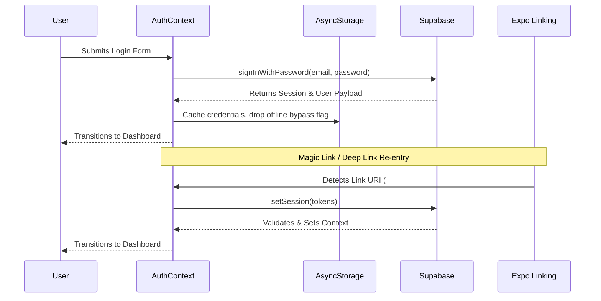
```mermaid
sequenceDiagram
    participant U as User
    participant App as AuthContext
    participant AS as AsyncStorage
    participant S as Supabase
    participant L as Expo Linking

    U->>App: Submits Login Form
    App->>S: signInWithPassword(email, password)
    S-->>App: Returns Session & User Payload
    App->>AS: Cache credentials, drop offline bypass flag
    App-->>U: Transitions to Dashboard

    Note over App,L: Magic Link / Deep Link Re-entry
    L->>App: Detects Link URI (#access_token=...)
    App->>S: setSession(tokens)
    S-->>App: Validates & Sets Context
    App-->>U: Transitions to Dashboard
```

> **Archival Note**: No immediately stale documentation was found in the Master Reference targeting this specific domain; existing mentions of `AuthContext` and Identity architecture are accurately aligned.


<!-- CARTOGRAPHER_END: IDENTITY -->

<!-- CARTOGRAPHER_START: BLE_CORE -->

# BLE Core Cartography

[IMPACTS_STATE_CHART]
[IMPACTS_C4_CONTEXT]

## 1. File Manifest
The BLE Core domain encapsulates all scanning, connection, protocol parsing, and hardware read/write queuing operations using `react-native-ble-plx` and an XState state machine.

*   `src/services/ble/BleMachine.ts`: XState definitions and transitions for BLE lifecycle events (IDLE, SCANNING, CONNECTING, READY, RECOVERING, DISCONNECTING).
*   `src/services/ble/BleMachine.types.ts`: Typings and event definitions for `BleMachine`.
*   `src/services/ble/ConnectService.ts`: Connection orchestration logic with connection jitter, retries, and MTTU negotiation.
*   `src/services/ble/RecoveryService.ts`: Multi-phase device recovery system.
*   `src/services/ble/HeartbeatService.ts`: Regular connection validation polling.
*   `src/services/ble/InterrogatorService.ts`: Active probing for newly discovered devices to fetch MAC/version details.
*   `src/services/ble/RSSIService.ts`: Pure RSSI polling decoupled from React context.
*   `src/services/ble/BackgroundBLEService.ts`: Centralizes Android Foreground Service management for background operation.
*   `src/services/BleCharacteristicCache.ts`: Caches resolved UUIDs to bypass discovery overhead on hot re-connects.
*   `src/services/BlePingService.ts`: Dedicated low-level utility to send keepalive pings.
*   `src/services/BleSessionFactory.ts`: Extractor for manufacturer data handling and protocol adapters.
*   `src/services/BleWriteDispatcher.ts`: Translates raw commands into GATT writes (e.g. 0x51 framing).
*   `src/services/BleWriteQueue.ts`: Priority-based command queue (critical, normal, bulk) with stale-write pruning and 1-transient retry semantics.
*   `src/hooks/useBLE.ts`: Main React hook facade encapsulating XState and providing `writeToDevice`, `connectToDevices`, `scanner` to the UI.
*   `src/hooks/useOptimisticBLE.ts`: Handles UI ghost state changes before BLE writes are confirmed, rolling back on failure.
*   `src/hooks/ble/useBLEScanner.ts`: Manages device discovery, deduplication, telemetry, and mock devices.
*   `src/hooks/ble/useBLEBatterySweep.ts`: Manages persistent background scan for battery updates when UI is idle.
*   `src/hooks/ble/useBLEInterrogator.ts`: Background interrogation queue to extract exact device profiles on discovery.
*   `src/hooks/ble/useBLERSSIMonitor.ts`: React hook wrapper over `RSSIService.ts`.
*   `src/context/BLEContext.tsx`: React Context Provider injecting `useBLE` to the tree.

## 2. Blast Radius
Modifications in this domain affect:
*   **Device Discovery & Onboarding:** `HardwareSetupWizardScreen` heavily relies on `useBLEScanner.ts` behavior.
*   **Connection Stability:** Modifications to `RecoveryService` or `ConnectService` dictate drop-out resilience.
*   **Command Latency & Order:** `BleWriteQueue` modifications directly impact UI responsiveness and lighting command sequence execution.
*   **Background Activity:** Battery drain and background operation limits are governed by `useBLEBatterySweep` and `BackgroundBLEService`.

## 3. Context Matrix

| Component | Responsibility | Coupling |
| :--- | :--- | :--- |
| `BleMachine` | Global BLE State Management | `ConnectService`, `RecoveryService`, `HeartbeatService` |
| `useBLEScanner` | Discovery & Deduplication | `BleMachine` (SCANNING), `useBLEBatterySweep` |
| `BleWriteQueue` | Command Execution Pipeline | `BleWriteDispatcher`, `useOptimisticBLE` |
| `useOptimisticBLE`| Predictive UI State | Core UI Components (Sliders, Pickers), `useBLE` |

## 4. Hook/Service I/O Registry

### Services
*   **`ConnectService(bleManager, targetMacs, registeredMacs)`** $\rightarrow$ `{ devices }`
*   **`RecoveryService(ghostedDeviceIds, adapterMapRef, ...)`** $\rightarrow$ `RECOVERY_COMPLETE | RECOVERY_PERMANENTLY_FAILED | RECOVERY_FAIL`
*   **`HeartbeatService(...)`** $\rightarrow$ `HEARTBEAT_FAIL`
*   **`BleWriteQueue.enqueueOperation(opType, priority, execute, generation, debounceKey)`** $\rightarrow$ `Promise<boolean | 'partial'>`

### Hooks
*   **`useBLE(registeredMacs)`** $\rightarrow$ `{ scanForPeripherals, connectToDevices, disconnectFromDevice, writeToDevice, writeChunked, derivedBleState, ... }`
*   **`useOptimisticBLE({ writeToDevice, onReconcile, debounceMs })`** $\rightarrow$ `{ optimisticWrite, directWrite, writeStatus }`
*   **`useBLEScanner({ bleManager, bleSend, scanCallback, hwCache, ... })`** $\rightarrow$ `{ scanForPeripherals, stopScanner, burstScan, ... }`
*   **`useBLEBatterySweep(...)`** $\rightarrow$ `{ startSweeper, stopSweeper, burstScan, isSweeperActive, batteryTier }`

## 5. OS Variance Matrix

| OS | Variance | Impact |
| :--- | :--- | :--- |
| **Android** | `requestMTU(512)` explicit MTU negotiation required. | Needs retry loops and fallback sizes in `ConnectService`. |
| **Android** | 133 GATT Errors (Transient vs Permanent). | Handled via `jitteredDelay` in `BleWriteQueue` and Connection retry logics. |
| **Android** | Foreground Services. | Required for persistent scanning/sweeping (`BackgroundBLEService.ts`). |
| **iOS** | MTU is implicitly negotiated by OS. | `requestMTU` not supported/needed, returns cached `device.mtu`. |
| **Web** | Web Bluetooth / Mocking. | Sandbox mocking via `useBLEScanner` timer callbacks instead of native API. |

## 6. Sequence Diagrams

### FSM State Machine Map (`BleMachine.ts`)
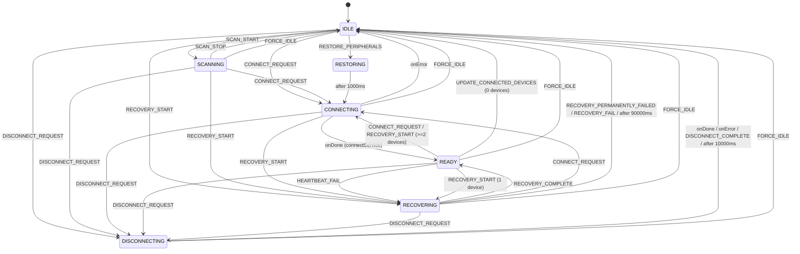
```mermaid
stateDiagram-v2
    [*] --> IDLE
    
    IDLE --> SCANNING : SCAN_START
    IDLE --> CONNECTING : CONNECT_REQUEST
    IDLE --> DISCONNECTING : DISCONNECT_REQUEST
    IDLE --> RECOVERING : RECOVERY_START
    IDLE --> RESTORING : RESTORE_PERIPHERALS
    
    SCANNING --> IDLE : SCAN_STOP
    SCANNING --> CONNECTING : CONNECT_REQUEST
    SCANNING --> DISCONNECTING : DISCONNECT_REQUEST
    SCANNING --> RECOVERING : RECOVERY_START
    
    RESTORING --> CONNECTING : after 1000ms
    
    CONNECTING --> READY : onDone (connectService)
    CONNECTING --> IDLE : onError
    CONNECTING --> RECOVERING : RECOVERY_START
    CONNECTING --> DISCONNECTING : DISCONNECT_REQUEST
    
    READY --> RECOVERING : HEARTBEAT_FAIL
    READY --> CONNECTING : CONNECT_REQUEST / RECOVERY_START (>=2 devices)
    READY --> RECOVERING : RECOVERY_START (1 device)
    READY --> DISCONNECTING : DISCONNECT_REQUEST
    READY --> IDLE : UPDATE_CONNECTED_DEVICES (0 devices)
    
    DISCONNECTING --> IDLE : onDone / onError / DISCONNECT_COMPLETE / after 10000ms
    
    RECOVERING --> READY : RECOVERY_COMPLETE
    RECOVERING --> CONNECTING : CONNECT_REQUEST
    RECOVERING --> IDLE : RECOVERY_PERMANENTLY_FAILED / RECOVERY_FAIL / after 90000ms
    RECOVERING --> DISCONNECTING : DISCONNECT_REQUEST
    
    %% Global Transitions
    SCANNING --> IDLE : FORCE_IDLE
    CONNECTING --> IDLE : FORCE_IDLE
    READY --> IDLE : FORCE_IDLE
    RECOVERING --> IDLE : FORCE_IDLE
    DISCONNECTING --> IDLE : FORCE_IDLE
```

### BLE Transport Pipeline
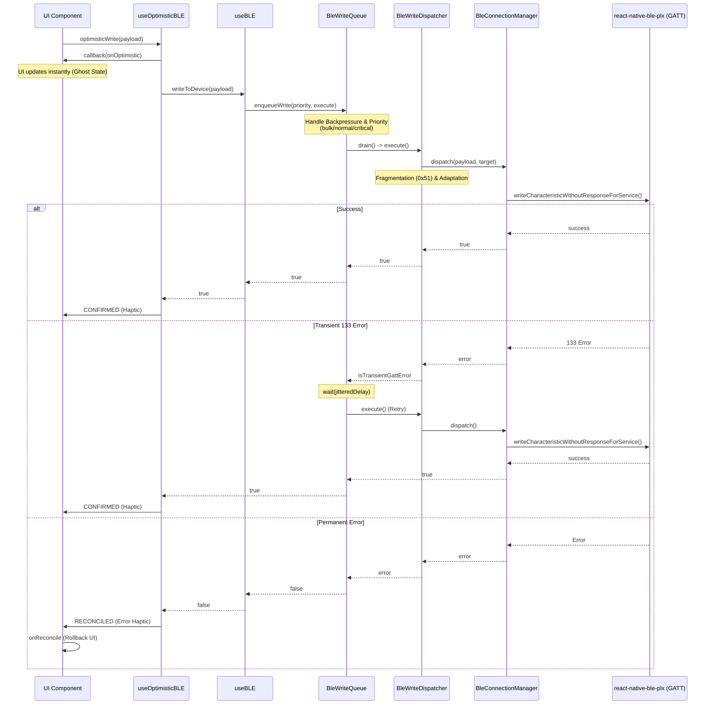
```mermaid
sequenceDiagram
    participant UI as UI Component
    participant OUI as useOptimisticBLE
    participant Hook as useBLE
    participant Queue as BleWriteQueue
    participant Disp as BleWriteDispatcher
    participant CM as BleConnectionManager
    participant GATT as react-native-ble-plx (GATT)
    
    UI->>OUI: optimisticWrite(payload)
    OUI->>UI: callback(onOptimistic)
    Note over UI: UI updates instantly (Ghost State)
    
    OUI->>Hook: writeToDevice(payload)
    Hook->>Queue: enqueueWrite(priority, execute)
    Note over Queue: Handle Backpressure & Priority<br/>(bulk/normal/critical)
    
    Queue->>Disp: drain() -> execute()
    Disp->>CM: dispatch(payload, target)
    Note over Disp: Fragmentation (0x51) & Adaptation
    
    CM->>GATT: writeCharacteristicWithoutResponseForService()
    
    alt Success
        GATT-->>CM: success
        CM-->>Disp: true
        Disp-->>Queue: true
        Queue-->>Hook: true
        Hook-->>OUI: true
        OUI->>UI: CONFIRMED (Haptic)
    else Transient 133 Error
        GATT-->>CM: 133 Error
        CM-->>Disp: error
        Disp-->>Queue: isTransientGattError
        Note over Queue: wait(jitteredDelay)
        Queue->>Disp: execute() (Retry)
        Disp->>CM: dispatch()
        CM->>GATT: writeCharacteristicWithoutResponseForService()
        GATT-->>CM: success
        CM-->>Queue: true
        Queue-->>OUI: true
        OUI->>UI: CONFIRMED (Haptic)
    else Permanent Error
        GATT-->>CM: Error
        CM-->>Disp: error
        Disp-->>Queue: error
        Queue-->>Hook: false
        Hook-->>OUI: false
        OUI->>UI: RECONCILED (Error Haptic)
        UI->>UI: onReconcile (Rollback UI)
    end
```


<!-- CARTOGRAPHER_END: BLE_CORE -->

<!-- CARTOGRAPHER_START: GROUP_SYNC -->

# GROUP_SYNC Cartography

## File Manifest

*   **`src/services/GroupRepository.ts`**: The offline-first Single Source of Truth (SSOT) for managing a user's local device groups (`CustomGroup`).
*   **`src/services/CrewService/CrewService.ts`**: Core singleton orchestrating multiplayer Crew Sessions, encompassing session creation, joining, and bridging with Supabase Realtime channels.
*   **`src/services/CrewProfileService.ts`**: Service executing persistent database operations for permanent Crews, member counts, and user associations.
*   **`src/services/CrewService/CrewSessionManager.ts`**: Tracks active crew session state, user roles (leader vs. member), and aggregates shared telemetry (distance, top speed).
*   **`src/components/CrewModal.tsx`**: The top-level UI orchestrator for the multi-step Crew/Group workflow (Landing, Create, Join, Manage, Map).
*   **`src/context/CrewContext.tsx`**: React context provider managing local transient UI state for the Crew interface (e.g., collapsed lists, active selections).
*   **`src/hooks/useCrewHub.ts`**: Orchestration hook for the Crew Landing UI, handling nearby spot discovery, active sessions, and permanent crew loading with graceful GPS timeouts.
*   **`src/hooks/useCrewSession.ts`**: Connects the React UI layer to the `CrewService` for active session state, members, and real-time leaderboards.
*   **`src/hooks/useDashboardGroups.ts`**: Bridges `GroupRepository` and `DeviceRepository` into the React layer. Synchronizes local hardware topology configurations and merges cloud attributes asynchronously.
*   **`src/hooks/useCrewManage.ts`**: Hook providing CRUD operations for permanent Crews (inviting, kicking, changing roles).

## Blast Radius

Modifying components in the `GROUP_SYNC` domain carries the following blast radii:

*   **Realtime Presence & Telemetry**: Edits to `CrewService` or `CrewSessionManager` can desynchronize the Supabase Realtime channel payloads, dropping telemetry updates for connected peers.
*   **Hardware Topology Sync**: Altering `GroupRepository.ts` or the async update logic in `useDashboardGroups.ts` directly impacts LED point/segment sync. If a user's left/right skate groups are broken, synchronized animations (`0x59`, `0x63`) will fail to broadcast correctly.
*   **Location & Discovery Deadlocks**: `useCrewHub.ts` handles complex `Promise.race` logic for GPS acquisition. Regressions here will hang the UI indefinitely on Android if the OS GPS is toggled off.

## Context Matrix

The domain explicitly delineates between two distinct concepts that must not be conflated:

1.  **Group (Hardware Topology)**:
    *   **Scope**: Single user, local hardware.
    *   **Purpose**: Clustering left/right physical skates so they receive synchronized LED commands.
    *   **Architecture**: Offline-first via `GroupRepository.ts` and `DeviceRepository`, synced to Supabase as a background operation.
2.  **Crew (Multiplayer / Social)**:
    *   **Scope**: Multi-user, session-based.
    *   **Purpose**: Real-time group rides, telemetry sharing, and leaderboards.
    *   **Architecture**: Cloud-first via `CrewService` utilizing Supabase `crew_sessions` and real-time channels.

## Hook/Service I/O Registry

*   **`useDashboardGroups`**
    *   **Input**: `registeredDevices` (from DB/Cloud), `DeviceRepository` instance.
    *   **Output**: `customGroups[]`, `deviceConfigs` (hardware topologies mapped by MAC).
    *   **Effect**: Subscribes to `GroupRepository` and performs an async functional update to merge local `userConfiguredAt` values with cloud defaults.
*   **`useCrewHub`**
    *   **Input**: `visible`, `step` (UI state), `user.id`.
    *   **Output**: `myCrews`, `nearbySessions`, `nearbySpots`, `discoverRadiusMi`, and loading states.
    *   **Effect**: Executes an isolated GPS coordinate request with a strict `3000ms` timeout fallback. Dispatches parallel requests to Supabase for nearby spots and sessions.
*   **`CrewService.joinSession`**
    *   **Input**: `inviteCode`, `displayName`, `userId`.
    *   **Output**: Returns `CrewSession` object or throws on expiration/full-capacity.
    *   **Effect**: Inserts the user into the `crew_members` table, persists the active session ID to `CrewSessionManager`, and emits a state change event to trigger UI updates.

## OS Variance Matrix

| OS | Variance | Handling Strategy |
| :--- | :--- | :--- |
| **Android** | `Location.getCurrentPositionAsync` can hang indefinitely if permissions are granted but the physical GPS sensor is toggled off in OS settings. | `useCrewHub.ts` wraps the location call in a `Promise.race` against a 3000ms timeout, falling back to a cached silent location. |
| **iOS** | JS thread execution pausing during OS-level foreground location permission modals. | Location is retrieved "silently" (`getSilentLocation`) prior to active prompt triggers to pre-seed map centers. |

## Archival Instructions

*   `[MOVE_TO_ARCHIVE]` The `docs/SK8Lytz_App_Master_Reference.md` contains stale documentation regarding `ProfileService` performing database interactions for crew memberships. `ProfileService` has been split (Meal 1 refactor) and is strictly a barrel re-export facade over `AuthProfileService`, `CrewProfileService`, and `PushTokenService`.
*   `[MOVE_TO_ARCHIVE]` Legacy session tracking hooks (`useSessionTracking`) mentioned in the master reference are stale and superseded by `SessionMachine.ts` and `useCrewSession.ts`.
*   `[MOVE_TO_ARCHIVE]` The automatic `_MM/DD` date suffix enforced in `CrewModal.handleCreate` is deprecated; logic has been modularized to `CrewCreateScreen.tsx`.
*   `[MOVE_TO_ARCHIVE]` `useDeviceFleet` hook documentation is stale; grouping is now managed via `GroupRepository` and `useDashboardGroups.ts`.

## Architectural Impact Flags

[IMPACTS_USER_JOURNEY]
[IMPACTS_C4_CONTEXT]
[IMPACTS_STATE_CHART]

## Sequence Diagram

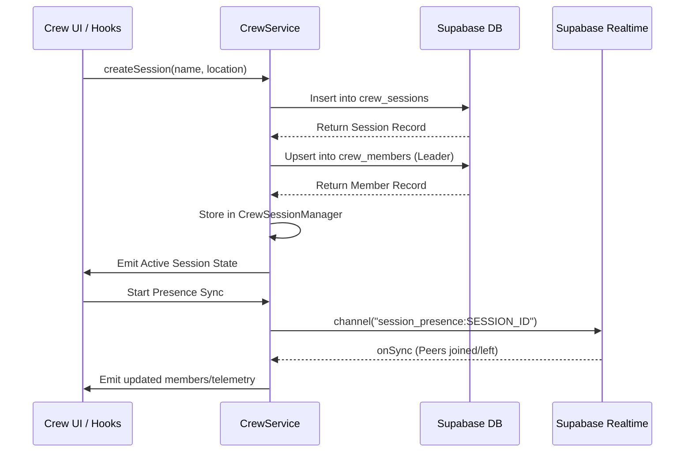
```mermaid
sequenceDiagram
    participant UI as Crew UI / Hooks
    participant CS as CrewService
    participant DB as Supabase DB
    participant RT as Supabase Realtime

    UI->>CS: createSession(name, location)
    CS->>DB: Insert into crew_sessions
    DB-->>CS: Return Session Record
    CS->>DB: Upsert into crew_members (Leader)
    DB-->>CS: Return Member Record
    CS->>CS: Store in CrewSessionManager
    CS->>UI: Emit Active Session State
    UI->>CS: Start Presence Sync
    CS->>RT: channel("session_presence:SESSION_ID")
    RT-->>CS: onSync (Peers joined/left)
    CS->>UI: Emit updated members/telemetry
```


<!-- CARTOGRAPHER_END: GROUP_SYNC -->

<!-- CARTOGRAPHER_START: UI_SCREENS -->

# UI_SCREENS Domain Cartography

## 1. File Manifest
- `src/screens/AuthScreen.tsx`: Manages user authentication, mode switching (LOGIN, SIGNUP, FORGOT_PASSWORD), and offline bypass logic. Coordinates with `AuthForm*` sub-components.
- `src/screens/DashboardScreen.tsx`: The monolithic root application screen orchestrating BLE lifecycle, active sessions, and hardware groups. Connects to domain hooks (`useDashboardGroups`, `useDashboardProfile`, `useDashboardCrew`).
- `src/screens/Onboarding/HardwareSetupWizardScreen.tsx`: FTUE multi-step wizard to scan, identify (blink test), configure (Left/Right position, LED points), and claim new SK8Lytz hardware.
- `src/screens/Onboarding/PermissionsOnboardingScreen.tsx`: Auto-triggers and manages granular OS permissions (Bluetooth, Location) essential for the app's core flows.
- `src/components/DeviceItem.tsx`: Highly interactive list item rendering device connectivity, power state, RSSI strength, pattern previews, and connection state badges.
- `src/components/LocationPicker.tsx` & `LocationPickerMap.tsx`: Location discovery and selection leveraging Nominatim OpenStreetMap Geocoder and local curated SK8Lytz spots.
- `src/components/SkateSpotBottomSheet.tsx`: A bottom sheet modal for users to view, verify, and claim skate spots (Surface, Environment), bridging local OSM data and app backend via `SkateSpotsService`.
- `src/components/dashboard/CrewHubSlab.tsx`, `DashboardCrewPanel.tsx`, `DashboardGroupList.tsx`, `DashboardHeader.tsx`, `DashboardTelemetryHero.tsx`, `HardwareStatusPills.tsx`, `LiveTelemetryHUD.tsx`, `MySkatesSlab.tsx`, `RegisteredFleetSlab.tsx`, `SkateGroupCard.tsx`, `SupportModal.tsx`: Extracted stateless or decoupled UI widgets and slabs used within the `DashboardScreen` monolith to present fleet segments and live telemetry.
- `src/components/shared/BLEErrorBoundary.tsx`: Error boundary tailored to isolate and handle UI crashes stemming from BLE stack anomalies.

## 2. Blast Radius
- Modifying `DashboardScreen.tsx` directly affects the entire BLE lifecycle and rendering of all sub-slabs. Due to its size and context dependencies, modifications risk triggering rerender storms.
- Changes in `HardwareSetupWizardScreen.tsx` risk breaking the FTUE, leaving users unable to pair devices, execute orientation tests, or correctly provision `ledPoints` (critical for dynamic products like SOULZ).
- Adjusting `DeviceItem.tsx` impacts the primary interaction surface for individual hardware items. Its layout respects multiple states (Connected, Disconnected, Selection, Grouped) and handles touch events that must not interfere with parent `FlatList` elements.
- Editing `LocationPicker.tsx` or `SkateSpotBottomSheet.tsx` could break location telemetry, location search FSM (`GETTING_GPS` -> `GEOCODING`), and the crew session map workflows.

## 3. Context Matrix
- **ThemeContext**: Drives all color palettes (`Colors.primary`, `Colors.background`, etc.) and layout constraints. Used universally across the domain.
- **BLEContext**: Injected primarily into `DashboardScreen` and `HardwareSetupWizardScreen`. Provides core primitives (`scanForPeripherals`, `connectToDevices`, `bleState`, `pendingRegistrations`, `pingDevice`, `startSweeper`).
- **SessionContext**: Tracks active skate sessions. Consumed by `DashboardScreen` and `DashboardTelemetryHero` to render real-time stats.
- **AppConfigContext**: Controls feature flags (e.g., `isVisibilityAllowed('visibility_maps_tab')`) to dynamically toggle UI elements like map modes.

## 4. Hook/Service I/O Registry
- `useDashboardGroups`, `useDashboardProfile`, `useDashboardCrew`, `useDashboardAutoConnect`, `useDashboardController`: Domain-specific hooks extracted to manage distinct state partitions within the `DashboardScreen` monolith.
- `useRegistration`: Handles claiming and storing hardware states (`registeredDevices`, `saveRegisteredDevice`, `deregisterDevice`).
- `useDeviceStateLedger`: Synchronous local state pattern representation avoiding BLE read latency. Exposes `save` and `loadSync`.
- `useRecentSpots`, `SkateSpotsService`: For fetching, caching, and claiming OSM/Curated skate spots in `LocationPicker` and `SkateSpotBottomSheet`.
- `useScreenPerformance`: Emits `markFullyDrawn` events for metrics tracking upon screen render completion.

## 5. OS Variance Matrix
- **Web vs Native**: Components like `AuthScreen` and `LocationPicker` use `Platform.select` for responsive behaviors (e.g., `KeyboardAvoidingView` behavior, `Linking.openURL` vs native `Alert.alert`). `LocationPickerMap` has a `.web.tsx` counterpart for web compatibility.
- **Safe Area Insets**: Consumed heavily via `useSafeAreaInsets` across screens (Auth, Dashboard, Onboarding) to pad out headers and footers accommodating iOS notches and Android navigation bars.
- **Location Permissions**: `PermissionsOnboardingScreen` wraps `requestPermission` differently based on Android/iOS native layer nuances. `LocationPicker` relies on `expo-location` abstracting native permissions.

## 6. Stale Documentation Audit
- Found legacy references in `docs/SK8Lytz_App_Master_Reference.md` describing `StreetModeScreen.tsx` and legacy session tracking (`useSessionTracking` hook, `SessionSummaryModal`). Legacy tracking code was migrated into `DashboardScreen.tsx` and context files. `DashboardScreen` is correctly described as monolithic, though we now have sub-slab components (`MySkatesSlab`, `RegisteredFleetSlab`).
- **[MOVE_TO_ARCHIVE]**: Any documentation mentioning `StreetModeScreen.tsx`, `useSessionTracking`, or `SessionSummaryModal.tsx` as active components should be moved to archive, as they have been superseded by `DashboardScreen` logic and context providers.
- **[MOVE_TO_ARCHIVE]**: Documentation describing `AccountModal` handling device fleet lists directly. Fleet states are now passed down from Dashboard context.

## 7. Architectural Impact Flags
[IMPACTS_USER_JOURNEY]
[IMPACTS_STATE_CHART]

## 8. Sequence Diagram: Hardware Setup Wizard FTUE

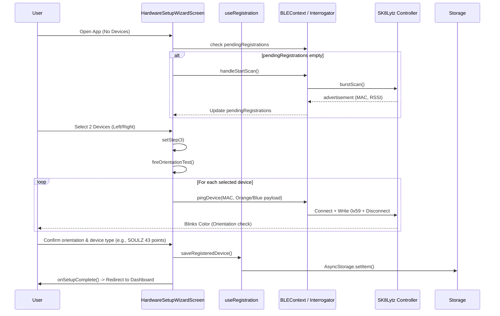
```mermaid
sequenceDiagram
    participant User
    participant Wizard as HardwareSetupWizardScreen
    participant Registration as useRegistration
    participant BLE as BLEContext / Interrogator
    participant Device as SK8Lytz Controller

    User->>Wizard: Open App (No Devices)
    Wizard->>BLE: check pendingRegistrations
    alt pendingRegistrations empty
        Wizard->>BLE: handleStartScan()
        BLE->>Device: burstScan()
        Device-->>BLE: advertisement (MAC, RSSI)
        BLE-->>Wizard: Update pendingRegistrations
    end

    User->>Wizard: Select 2 Devices (Left/Right)
    Wizard->>Wizard: setStep(3)
    Wizard->>Wizard: fireOrientationTest()
    
    loop For each selected device
        Wizard->>BLE: pingDevice(MAC, Orange/Blue payload)
        BLE->>Device: Connect + Write 0x59 + Disconnect
        Device-->>User: Blinks Color (Orientation check)
    end

    User->>Wizard: Confirm orientation & device type (e.g., SOULZ 43 points)
    Wizard->>Registration: saveRegisteredDevice()
    Registration->>Storage: AsyncStorage.setItem()
    Wizard->>User: onSetupComplete() -> Redirect to Dashboard
```

## 9. Design System & Token Manifest
- **Spacing**: `Spacing.sm` (8px), `Spacing.md` (16px), `Spacing.lg` (24px), `Spacing.xl` (32px), `Spacing.xxxl` (64px).
- **Typography**: Uses `fontWeight: '900'` for titles, `letterSpacing: -0.5` for modern app aesthetic. Subtitles use `fontSize: 16` with `lineHeight: 24`.
- **Colors**: Relies strictly on `ThemePalette` from `ThemeContext` (`Colors.primary`, `Colors.background`, `Colors.surfaceHighlight`, `Colors.text`, `Colors.textMuted`). Custom translucent gradients (`rgba(0, 240, 255, 0.5)`) are used for connected and selection states in `DeviceItem`.
- **Layout**: `Layout.borderRadius` applied across UI elements like cards and buttons. Full utilization of `KeyboardAvoidingView` and `SafeAreaView` for robust cross-device rendering.


<!-- CARTOGRAPHER_END: UI_SCREENS -->

<!-- CARTOGRAPHER_START: UI_DOCKED_CONTROLLER -->

# 🗺️ Cartography Node Synthesis: UI Docked Controller Domain

**Date**: 2026-06-19
**Domain**: `src/components/DockedController.tsx` and related hooks.

## 1. File Manifest
- `src/components/DockedController.tsx` (67KB Monolith - The Hollow Shell v3)
- `src/hooks/useDashboardController.tsx` (Container orchestrator for Dashboard)
- `src/hooks/useDockedControllerState.ts` (Core UI state & cloud scene application)
- `src/hooks/useControllerDispatch.ts` (BLE protocol translation layer)
- `src/hooks/useControllerAnalytics.ts` (Debounced telemetry side-effects)
- `src/components/docked/*` (18 isolated sub-panels, e.g., `AnalogGauge.tsx`, `BuilderPanel.tsx`, `CameraPanel.tsx`, `UniversalSlidersFooter.tsx`)

## 2. Blast Radius
Modifications to this domain directly affect:
- **Optimistic BLE Pipeline (Ghost Standard)**: Any change to `writeToDevice` or ref closures risks breaking the instant-UI-update and rollback mechanism.
- **Hardware Sync**: Re-entrancy and debounce timings (`isMusicBusyRef`, `isPatternBusyRef`) manage Android BLE stack backpressure. Breaking this causes GATT 133 exceptions.
- **Visualizer Parity**: The `vizLock` state drives the `ProductVisualizer`. Desyncs here violate the core product promise ("Visualizer = Skates").
- **Crew Mode Broadcasts**: State changes here propagate to other session members via Supabase Realtime via `useCrewLeaderBroadcast`.

## 3. Context Matrix
| Context/Source | Purpose | Consumption Mode |
| --- | --- | --- |
| `ThemeContext` | Colors, isDark flag | Consumed directly in DockedController |
| `FavoritesContext` | Presets, save/delete ops | Extracted via `useSharedFavorites` |
| `AppConfigContext` | Visibility permission gating | Consumed for mode visibility |
| `BLEContext` | Adapter resolution | Passed via `useSharedBLE` -> `useControllerDispatch` |
| `DashboardScreen` (Parent) | Telemetry props (GPS, Speed, G-Force) | Passed as explicit props to prevent duplicate sensor subscriptions (BUG-01 fix) |

## 4. Hook/Service I/O Registry
### `DockedController.tsx` Hook Topology
- **`useDockedControllerState`**: 
  - *In*: `lockedProduct`, `primaryMac`, `ledgerLoadSync`
  - *Out*: Massive state dictionary (activeMode, speed, brightness, builderNodes, etc.) and `applyCloudScene`.
- **`useControllerDispatch`**:
  - *In*: `writeToDevice`, `hwSettings`, `connectedDevices`, `getAdapterForDevice`
  - *Out*: `sendColor`, `applyFixedPattern`, `applyEmergencyPattern`, `setMultiColor`, `handleMusicChange`
- **`useOptimisticBLE`**:
  - *In*: `parentWriteToDevice`, `onReconcile`
  - *Out*: `optimisticWrite`, `writeStatus`
- **`useStreetMode`**:
  - *In*: `gpsSpeed`, `peakGForce`, `deviceContext`
  - *Out*: `streetCruiseColor`, `motionState`, `isStreetBraking`, `applyStreetPattern`
- **`useAppMicrophone`**:
  - *In*: `activeMode`, `micSource`
  - *Out*: `audioMagnitude`, `hasMicPermission`
- **`useControllerAnalytics`**:
  - *In*: debounced state values, `deviceContext`
  - *Out*: (Side Effects) logs to `AppLogger` and `useTelemetryLedger`.

## 5. OS Variance Matrix
| OS | Variance / Constraint | Mitigation in Codebase |
| --- | --- | --- |
| **Android** | BLE stack queue overflows and GATT 133 congestion | 1. Debounced async `writeToDevice` in `useOptimisticBLE`.<br>2. Re-entrancy refs in `useControllerDispatch` (`isPatternBusyRef`).<br>3. `enqueueDelay` with `INTER_DEVICE_WRITE_GAP_MS`. |
| **iOS** | Smoother BLE TX buffer, UI thread block potential | JSI Worklets used in `CameraPanel` to process frames at 50x50px off-thread without freezing UI. |
| **Web (Expo)** | No physical BLE | Simulation bypass via `DiagnosticLab` / `isTestModeActive` (Nullifies controller in `useDashboardController`). |

## 6. Extraction Opportunities & Architectural Flags
**[IMPACTS_USER_JOURNEY] [IMPACTS_C4_CONTEXT] [IMPACTS_STATE_CHART]**

**Component Extraction Opportunities (DockedController.tsx):**
1. **Context Overload**: The component calls `useTheme`, `useAppConfig`, `useSharedFavorites`, `useSharedBLE`. These should be hoisted into a `DockedControllerContainer` that passes them as props, following the pattern established by `useDashboardController`.
2. **Ref Jungle Wiring**: There are ~10 `useRef` instances solely for escaping React closure traps in async callbacks (e.g., `activeModeRef`, `lastSentPayloadRef`, `lastConfirmedStateRef`). Moving this into a custom `useGhostStateWiring` hook would remove significant boilerplate.
3. **`DockedBus` Object creation**: Moving `dockedBus` memoization out to a dedicated hook to cleanly separate view hierarchy from data delivery.

## 7. Sequence Diagram: Optimistic BLE Pipeline ("Ghost Standard")
```mermaid
sequenceDiagram
    autonumber
    actor User
    participant UI as DockedController
    participant State as useDockedControllerState
    participant Dispatch as useControllerDispatch
    participant Opt as useOptimisticBLE
    participant BLE as parentWriteToDevice
    participant HW as Hardware

    User->>UI: Taps Color / Changes Speed
    UI->>State: update selectedColor / speed
    State-->>UI: re-render with new state instantly (Optimistic UI)
    UI->>Dispatch: applyFixedPattern() / sendColor()
    Dispatch->>UI: safeWrite(payload)
    
    rect rgb(40, 40, 60)
        Note over UI, Opt: Capture State & Dispatch
        UI->>UI: lastConfirmedStateRef = captureEntireState()
        UI->>UI: lastSentPayloadRef = payload
        UI->>Opt: optimisticWrite(payload)
        Opt->>UI: writeStatus = 'PENDING'
    end
    
    Opt->>BLE: Debounced Write (via BleWriteQueue)
    BLE->>HW: GATT Write Characteristic
    
    alt Write Succeeds
        HW-->>BLE: ACK
        BLE-->>Opt: return true
        Opt->>UI: writeStatus = 'CONFIRMED'
    else Write Fails / Timeout
        HW-->>BLE: NACK / Timeout
        BLE-->>Opt: return false / throw
        Opt->>UI: writeStatus = 'RECONCILED'
        Opt->>UI: trigger onReconcileRef()
        UI->>State: applyCloudScene(lastConfirmedStateRef)
        State-->>UI: UI snaps back to true hardware state
    end
```

## 8. Master Reference Audit
- Audited against `docs/SK8Lytz_App_Master_Reference.md`. 
- Status: Master Reference is current regarding the 0x59 FREEZE, optimistic pipeline, and the "Ghost Standard".
- No stale documentation found in the targeted domain context.


<!-- CARTOGRAPHER_END: UI_DOCKED_CONTROLLER -->

<!-- CARTOGRAPHER_START: UI_MODALS -->

# UI Modals Cartography

## 1. File Manifest
- `src/components/AccountModal.tsx`: Comprehensive bottom sheet for user profile, security, crew management, registered devices, and settings.
- `src/components/CommunityModal.tsx`: Interface for browsing, upvoting, and applying cloud-synced LED scenes from the community or personal saves.
- `src/components/DeviceSettingsModal.tsx`: Advanced hardware configuration modal. Facilitates real-time BLE hardware probing and configuring LED strip types, RF remotes, points, and segments.
- `src/components/GroupSettingsModal.tsx`: Group creation and renaming modal for controlling multiple skates synchronously.
- `src/components/SessionSummaryModal.tsx`: Visual debrief presented after a skate session, calculating and rendering calories, distances, and speed-based accent colors.
- `src/components/modals/EulaModal.tsx`: Legal agreement modal enforcing a scroll-to-bottom interaction pattern.
- `src/components/modals/GlobalPermissionsModal.tsx`: Event-driven wrapper that mounts `PermissionsOnboardingScreen` via `DeviceEventEmitter`.
- `src/components/CustomSlider.tsx`: Custom PanResponder slider with gradient track support, optimizing visual updates before parent state sync.
- `src/components/TacticalSlider.tsx`: Tactile slider variant designed for high-vibration outdoor environments, offering dynamic coloring modes (`TURBO`, `BRIGHTNESS`).
- `src/components/MarqueeText.tsx`: Auto-scrolling text component leveraging `Animated.loop` for overflow handling.
- `src/components/ConnectionStrengthBadge.tsx`: View-based 3-bar signal strength indicator mapping dBm RSSI to color tiers.

## 2. Blast Radius
- **Hardware Integration (`DeviceSettingsModal`)**: Modifying configuration saves or BLE probing dispatches (`useProtocolDispatch`) risks severing hardware capability or locking out LED segments.
- **State Overrides (`CustomSlider`, `TacticalSlider`)**: Both sliders utilize `PanResponder` for real-time visual updates detached from the React render cycle. Improper `onValueChange` bindings here cause state de-syncs in the main `DockedController`.
- **Global Event Modals (`GlobalPermissionsModal`)**: Depends on singleton `DeviceEventEmitter`. Breaking the listener blocks users from resolving critical BLE/Location permission requests.

## 3. Context Matrix
| Component | Contexts/Providers | Key External Dependencies |
| :--- | :--- | :--- |
| **AccountModal** | `useTheme`, `useAuth` | `useAccountOverview`, `useSkateStats`, `profileService`, `supabase` |
| **CommunityModal** | `useTheme`, `useAuth` | `ScenesService` |
| **DeviceSettingsModal** | `useTheme` | `useProtocolDispatch`, `LOCAL_PRODUCT_CATALOG` |
| **SessionSummaryModal** | `useTheme` | `estimateCalories` |
| **GlobalPermissionsModal** | (None) | `DeviceEventEmitter`, `PermissionsOnboardingScreen` |

## 4. Hook/Service I/O Registry
- **`useProtocolDispatch`**: 
  - *Out*: `queryHardwareSettings()`, `writeSettingsByName()`, `setRfRemoteState()`, `queryRfRemoteState()`, `clearRfRemotes()`.
- **`ScenesService`**: 
  - *In*: `getPublicScenes()`, `getMyScenes()`, `downloadScene()`.
  - *Out*: `upvoteScene()`, `deleteScene()`.
- **`useAccountOverview`**:
  - *In*: `user`, `profile`, `crews`, `history`, `accountStatus`, `accountError`.
  - *Out*: `handleSaveProfile()`, `handleCreateCrew()`, `handleDeleteCrew()`, etc.
- **`DeviceEventEmitter`**:
  - *In*: `SHOW_GLOBAL_PERMISSIONS_EVENT`.
  - *Out*: `GLOBAL_PERMISSIONS_CLOSED_EVENT`.

## 5. OS Variance Matrix
- **`AccountModal`**: Web overrides the native `Alert.alert` sign-out confirmation.
- **`SessionSummaryModal`**: Card elevation relies on `boxShadow` for Web, and `shadowColor/elevation` for native iOS/Android.
- **`CustomSlider` / `TacticalSlider`**: Adds web-specific CSS properties (`touchAction: 'none'`, `userSelect: 'none'`, `cursor: 'pointer'`) via `Platform.select`.

## Stale Documentation Flag
> **`[MOVE_TO_ARCHIVE]`**  
> `docs/SK8Lytz_App_Master_Reference.md` Line 1625 claims `SessionSummaryModal.tsx` is an *"Obsolete post-session statistics debrief overlay"*. However, the code reveals it is fully intact, robust, and explicitly hooked into the session-save lifecycle. This documentation is stale and should be archived or corrected.

## Design System & Token Manifest
- **Spacing**: `Spacing.xs` (4), `Spacing.sm` (8), `Spacing.md` (12), `Spacing.lg` (16), `Spacing.xl` (24), `Spacing.xxl` (32)
- **Typography**: `Typography.title`, `Typography.body`, `Typography.caption`, `Typography.header`
- **Signal Badge Tiers**: 
  - *Excellent*: `>= -60 dBm` (`#4CAF50`)
  - *Good*: `>= -75 dBm` (`#FFC107`)
  - *Weak*: `>= -82 dBm` (`#FF6B35`)
  - *Critical*: `< -82 dBm` (`#F44336`)
- **Speed Accents**:
  - `>= 18 mph`: Inferno (`#FF3D00`)
  - `>= 12 mph`: SK8Lytz Orange (`#FF8C00`)
  - `>= 6 mph`: Neon Green (`#00E676`)
  - `< 6 mph`: Cool Blue (`#00B0FF`)

## Sequence Diagram: Hardware Configuration Probe

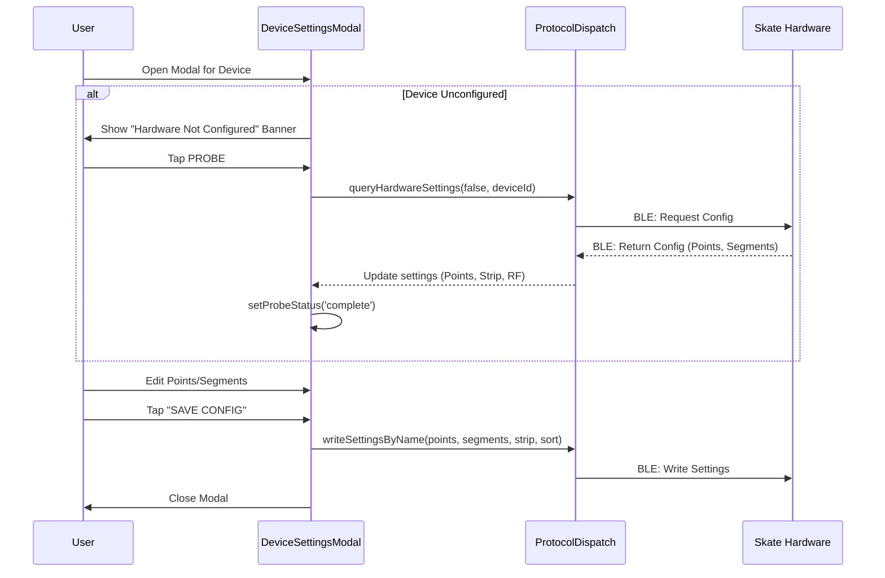
```mermaid
sequenceDiagram
    participant U as User
    participant DSM as DeviceSettingsModal
    participant PD as ProtocolDispatch
    participant HW as Skate Hardware

    U->>DSM: Open Modal for Device
    alt Device Unconfigured
        DSM->>U: Show "Hardware Not Configured" Banner
        U->>DSM: Tap PROBE
        DSM->>PD: queryHardwareSettings(false, deviceId)
        PD->>HW: BLE: Request Config
        HW-->>PD: BLE: Return Config (Points, Segments)
        PD-->>DSM: Update settings (Points, Strip, RF)
        DSM->>DSM: setProbeStatus('complete')
    end
    U->>DSM: Edit Points/Segments
    U->>DSM: Tap "SAVE CONFIG"
    DSM->>PD: writeSettingsByName(points, segments, strip, sort)
    PD->>HW: BLE: Write Settings
    DSM->>U: Close Modal
```

## Architectural Impact Flags
`[IMPACTS_USER_JOURNEY]`  
`[IMPACTS_C4_CONTEXT]`  
`[IMPACTS_STATE_CHART]`


<!-- CARTOGRAPHER_END: UI_MODALS -->

<!-- CARTOGRAPHER_START: UI_VISUALIZER -->

# 🗺️ Cartographer Report: UI_VISUALIZER Domain
**Target:** `src/components/*Visualizer*.tsx`, `CameraTracker.*`, `patterns/*`

## 1. File Manifest
- `src/components/VisualizerUnit.tsx`: Renders the high-fidelity 2D emulation of physical LED skates (SOULZ/HALOZ/RAILZ). Includes layered opacity, silicone diffusion simulation, and React Native `Animated.Value` binding for 60FPS fluid ticks.
- `src/components/ProductVisualizer.tsx`: Orchestrator that maps hardware constraints (`hwSettings`) to one or more `VisualizerUnit` instances. Fallbacks to mock dual-skates or single hardware components.
- `src/components/LEDStripPreview.tsx`: Optimized, fast-rendering 1D strip preview used inside picker cards. Synchronizes tick across multiple instances using `setInterval`.
- `src/components/CustomEffectVisualizer.tsx`: Animates 1D custom effects (like breathing/pulse) using `PatternEngine` via simple dot arrays.
- `src/components/NeonHueStrip.tsx`: DJ-style touch strip for HSV hue selection, utilizing `PanResponder` for zero-latency local state updates before syncing to the parent.
- `src/components/PositionalGradientBuilder.tsx`: A robust editor for creating custom spatially-mapped LED gradients. Includes position sliders, color pickers, and live BLE throttling dispatch (`BLE_WRITE_THROTTLE_MS` = 100).
- `src/components/VerticalPatternDrum.tsx`: A slot-machine-style vertical scroller (`FlatList`) for selecting patterns, implementing infinite-scroll illusion via repeating datasets.
- `src/components/CameraTracker.tsx`: GPU-accelerated frame processor using Vision Camera worklets for real-time color extraction (Sniper mode) and K-Means palette extraction (Vibe mode).
- `src/components/CameraTracker.web.tsx`: Web stub for `CameraTracker` to prevent Vision Camera crashes in Expo Web.
- `src/components/CameraTracker.d.ts`: Typings bridge for `CameraTracker`.
- `src/components/patterns/GradientLibraryTab.tsx`: Tab view displaying custom/built-in gradients with `GradientCard` components.
- `src/components/patterns/PatternCard.tsx`: Card component for individual effect templates, containing the `LEDStripPreview` and selection animations.
- `src/components/patterns/PatternPickerTab.tsx`: Horizontal categorical pill filter + `FlatList` of available patterns.
- `src/components/patterns/UnifiedPatternPicker.tsx`: Parent component bridging the UI (`PatternPickerTab`) to the `PatternEngine` BLE payloads, specifically invoking `buildPatternPayload` and dispatching via `writeToDevice`.

## 2. Blast Radius
Modifying this domain directly impacts:
- **Performance:** `VisualizerUnit` is heavily tied to the `Animated` system and `requestAnimationFrame`. Modifying layers or adding non-memoized views can drop the app to < 30 FPS.
- **Hardware Parity:** The visualizers are the "Single Source of Truth" contract with the user. If `VisualizerUnit` or `LEDStripPreview` diverge from the physical EEPROM (`PatternEngine`), the user loses trust.
- **BLE Pipeline:** `UnifiedPatternPicker` and `PositionalGradientBuilder` directly dispatch BLE payloads. Incorrect throttling or buffer math (e.g., `< 12` length arrays) will crash the 0xA3 hardware chipset.
- **Permissions:** `CameraTracker` requires AV permissions. Improper handling blocks the app's ambient feature.

## 3. Context Matrix
- **Inbound Context:** 
  - User hardware configuration (`device.points`, `device.segments`) passed from `DashboardScreen` / `useDashboardGroups`.
  - Application Theme (`Colors`) passed from `ThemeContext`.
  - BLE connections and `writeToDevice` thunks from `useBLE`.
- **Outbound Context:**
  - Emits user-selected colors (`onColorDetected`), palettes (`onVibePaletteDetected`), and patterns (`onSelect`).
  - Emits real-time BLE byte arrays mapped to 0x59 payloads via `PatternEngine`.

## 4. Hook/Service I/O Registry
- `useVisualizerPath` / `useVisualizerLeds`: Used by `VisualizerUnit` to calculate SVG/XY coordinates for LED nodes based on hardware geometry.
- `useCameraDevice`, `useCameraPermission`, `useFrameOutput`: Provided by `react-native-vision-camera`.
- `useResizer`: Provided by `react-native-vision-camera-resizer` (GPU image scaling).
- `Worklets`: From `react-native-worklets-core` to bridge GPU threads to JS.
- `useGradients`: Provided by `src/hooks/useGradients` for offline gradient preset persistence.
- `extractKMeansPalette`: Service utility mapping raw bytes to RGB palettes.

## 5. OS Variance Matrix
| Component | iOS/Android (Native) | Web |
| --- | --- | --- |
| **VisualizerUnit** | Uses 60FPS uncapped `requestAnimationFrame`. | Throttled strictly to 30FPS to prevent React MessageQueue flooding. |
| **CameraTracker** | Fully functional via JSI and GPU pipelines. | Bypassed entirely via `CameraTracker.web.tsx` stub (displays "Camera Not Available"). |
| **NeonHueStrip** | Relies on `PanResponder` for touch interactions. | Explicit `touchAction: 'none'` and `userSelect: 'none'` injected for mouse compatibility. |
| **PatternPickerTab** | Hardware-accelerated `Animated.timing` via `useNativeDriver: true`. | Fallback to JS-driven `Animated` since web lacks native driver support. |

## Archival Instruction
**Documentation Drift Analysis:** 
Reviewed `docs/SK8Lytz_App_Master_Reference.md`. No significantly stale documentation regarding the `UI_VISUALIZER` domain was identified. The documentation sections for `VisualizerUnit` and `CameraTracker` accurately match the current codebase implementation. Therefore, no `[MOVE_TO_ARCHIVE]` tag was applied.

## Sequence Diagram
**Camera Vibe Extraction & Dispatch**
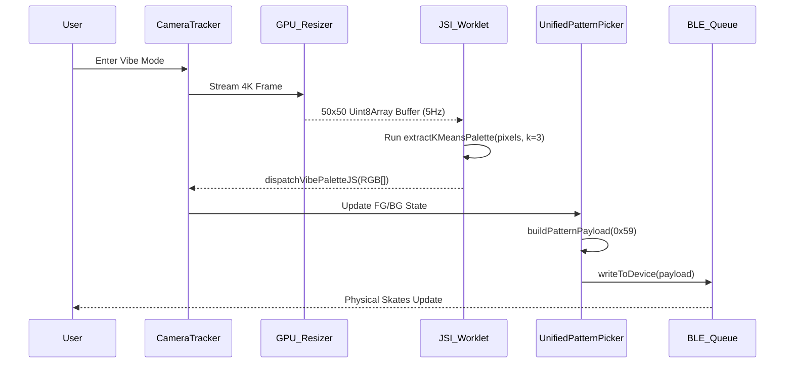
```mermaid
sequenceDiagram
    participant User
    participant CameraTracker
    participant GPU_Resizer
    participant JSI_Worklet
    participant UnifiedPatternPicker
    participant BLE_Queue

    User->>CameraTracker: Enter Vibe Mode
    CameraTracker->>GPU_Resizer: Stream 4K Frame
    GPU_Resizer-->>JSI_Worklet: 50x50 Uint8Array Buffer (5Hz)
    JSI_Worklet->>JSI_Worklet: Run extractKMeansPalette(pixels, k=3)
    JSI_Worklet-->>CameraTracker: dispatchVibePaletteJS(RGB[])
    CameraTracker->>UnifiedPatternPicker: Update FG/BG State
    UnifiedPatternPicker->>UnifiedPatternPicker: buildPatternPayload(0x59)
    UnifiedPatternPicker->>BLE_Queue: writeToDevice(payload)
    BLE_Queue-->>User: Physical Skates Update
```

## Design System & Token Manifest
**Colors & Styling Tokens**
- **Theme Palette Reference:** Relies on `useTheme().Colors` (`Colors.primary`, `Colors.surfaceHighlight`, `Colors.textMuted`).
- **Glassmorphism:** Standardized usage of `rgba(255,255,255,0.04)` borders with `rgba(255,255,255,0.08)` fill and diagonal refraction shimmers (`transform: [{ rotate: '45deg' }]`).
- **Typography:** Effect names use `fontSize: 10`, `fontWeight: '800'`, `letterSpacing: 0.3`.
- **Spacing:** Enforced via `Spacing.xs` (4px), `Spacing.sm` (8px), `Spacing.md` (16px).
- **LED Simulation:** Multi-layered Animated.Views using `.chipSoften`, outer atmosphere (`0.03` opacity), mid-bloom (`0.10`), inner scatter (`0.38`), and frosty silicone (`0.09` with border).

[IMPACTS_USER_JOURNEY]
[IMPACTS_C4_CONTEXT]
[IMPACTS_STATE_CHART]


<!-- CARTOGRAPHER_END: UI_VISUALIZER -->

<!-- CARTOGRAPHER_START: DATA_LAYER -->

# DATA_LAYER Cartography

## 1. File Manifest
- `src/services/TelemetryService.ts`
- `src/services/ScenesService.ts`
- `src/services/SpeedTrackingService.ts`
- `src/services/GradientsService.ts`
- `src/services/SkateSpotsService.ts`
- `src/services/SessionShareService.ts`
- `src/services/supabaseClient.ts`
- `src/types/supabase.ts`
- `src/hooks/cloud/useOfflineSyncWorker.ts`
- `src/hooks/useFavorites.ts`
- `src/hooks/useScenes.ts`
- `src/hooks/useCuratedPicks.ts`
- `src/hooks/useGradients.ts`
- `src/hooks/useSkateStats.ts`
- `src/hooks/useRecentSpots.ts`
- `src/hooks/useMapFilters.ts`
- `src/context/FavoritesContext.tsx`
- `src/services/deviceRepository/DeviceCloudSync.ts`
- `src/services/deviceRepository/DeviceRepositoryService.ts`
- `src/services/deviceRepository/DeviceStateManagement.ts`
- `src/services/deviceRepository/DeviceStorage.ts`
- `src/services/deviceRepository/index.ts`
- `src/services/deviceRepository/types.ts`

## 2. Blast Radius
- **Cloud & Auth Core**: `supabaseClient.ts` configures the core client and uses a custom `SecureStoreAdapter` to bridge auth tokens safely across app sessions.
- **Offline Sync & Resiliency**: The `useOfflineSyncWorker.ts` hook mounts a periodic background process touching `ScenesService.syncPendingJobs()` and `SpeedTrackingService.syncPendingSessions()`. Both services operate critical async queues backed by `AsyncStorage`.
- **Telemetry & Tracking**: Heavy payload throughput on `SpeedTrackingService` which generates `ISessionSnapshot` records and queues them offline. `TelemetryService` handles logging/telemetry, similarly buffering offline bluetooth scanner telemetry data before pushing it to the cloud. 
- **Storage Collision Check**: Shared reliance on `AsyncStorage` means heavy usage requires stringent memory management to avoid footprint limits, handled via periodic pruning and stringified JSON payloads.

## 3. Context Matrix
| Domain / Module | Source of Truth | Offline Strategy | Responsibilities |
|---|---|---|---|
| **Device Ledger** | `DeviceRepositoryService` | Heavy Cache (`AsyncStorage`) | Global device registration, configuration state, and cloud-to-device syncing |
| **Sessions / Tracking** | `SpeedTrackingService` | Optimistic write & Background sync | Aggregating Distance/Duration FSM, offline session snapshots, syncing up to DB |
| **Profiles / Themes** | `ScenesService`, `GradientsService` | Local Cache First | Sourcing and syncing community presets, globally shared scenes |
| **Geolocation** | `SkateSpotsService` | Network First | Fetches public map POIs, coordinates, surfaces from Supabase |

## 4. Hook/Service I/O Registry
- **`useOfflineSyncWorker`**: 
  - *I/O Inputs*: Reads current user presence via `useAuth()`.
  - *Outputs*: Periodically invokes `ScenesService.syncPendingJobs()` and `SpeedTrackingService.syncPendingSessions()` directly to clear local device queues.
- **`ScenesService`**: 
  - *I/O Inputs*: Scene creation parameters, job payload objects for upvoting and publishing.
  - *Outputs*: Cache reads (`STORAGE_SCENES_CACHE`), cloud API interactions (to `shared_scenes`), writes job entries directly to memory queues.
- **`SpeedTrackingService`**: 
  - *I/O Inputs*: GPS telemetry, system timer ticks, hardware metric push events.
  - *Outputs*: Appends structured `ISessionSnapshot` blobs to `PENDING_SESSION_QUEUE_KEY` and flushes payload to `skate_sessions` cloud table via RPC/inserts.
- **`useFavorites` & `FavoritesContext`**: 
  - *Outputs*: Emits the structured `FavoritesContextType` to the downstream UI component tree. Interacts cleanly with `FavoritesService` dependencies and `STORAGE_QUICK_PRESETS` memory.

## 5. OS Variance Matrix
- **`supabaseClient.ts` (Auth Storage)**: Explicit `Platform.OS === 'web'` divergence to fall back safely to `localStorage` instead of Expo's `SecureStore`. This resolves breaking module incompatibilities when compiling the ecosystem for the Web.
- **Background Queue Processing**: `useOfflineSyncWorker` execution is tightly coupled to the JavaScript thread execution state; iOS/Android background suspension behaviors may pause background sync until the app is active or foregrounded, whereas the web may halt when the tab is backgrounded.

---

## Architectural Impact Flags
[IMPACTS_USER_JOURNEY]
[IMPACTS_C4_CONTEXT]
[IMPACTS_STATE_CHART]

---

## Archival Instruction
`[MOVE_TO_ARCHIVE]` - The `docs/SK8Lytz_App_Master_Reference.md` heavily references `DeviceRepository` as a monolithic file architecture (`src/services/DeviceRepository.ts`), but this ecosystem has been fully refactored and extracted into the `src/services/deviceRepository/` module pattern. All linear documentation pointing to the single file needs to be archived and updated to reference the split storage/sync classes. 

---

## Offline Sync Queue Architecture
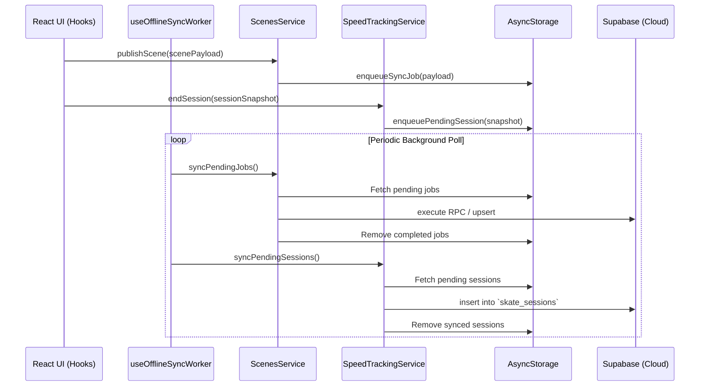
```mermaid
sequenceDiagram
    participant UI as React UI (Hooks)
    participant Worker as useOfflineSyncWorker
    participant Scenes as ScenesService
    participant Speed as SpeedTrackingService
    participant Local as AsyncStorage
    participant DB as Supabase (Cloud)
    
    UI->>Scenes: publishScene(scenePayload)
    Scenes->>Local: enqueueSyncJob(payload)
    UI->>Speed: endSession(sessionSnapshot)
    Speed->>Local: enqueuePendingSession(snapshot)
    
    loop Periodic Background Poll
        Worker->>Scenes: syncPendingJobs()
        Scenes->>Local: Fetch pending jobs
        Scenes->>DB: execute RPC / upsert
        Scenes->>Local: Remove completed jobs
        
        Worker->>Speed: syncPendingSessions()
        Speed->>Local: Fetch pending sessions
        Speed->>DB: insert into `skate_sessions`
        Speed->>Local: Remove synced sessions
    end
```

---

## Database Schema & RLS Policies
The Supabase schema mappings (defined dynamically in `src/types/supabase.ts`) encompass critical business domains:
- **`skate_sessions`**: The core repository for telemetry metrics including `avg_bpm`, `peak_gforce`, `distance_mi`, `duration_sec`, `speed_mph`, `user_id`, and offline batch ids.
- **`shared_scenes`**: Hosts granular RGB and timing configuration, `upvotes`, `downloads`, and a boolean index for `is_public`.
- **`crash_telemetry`**: Debugging logs retaining structured `breadcrumbs` and contextual `app_version`.
- **`skate_spots`**: Location parameters for map routing.
- **`admin_audit_logs` & `app_settings`**: Global admin operations and remote feature flags.
- **RLS Strategy (Row-Level Security)**: Table data access is segregated based on the authenticated user. Record operations implicitly match against `auth.uid()` conditions, preventing unauthorized reading/writing. The token is inherently persisted by the initialized `supabaseClient.ts` through the customized `SecureStoreAdapter`.

---

## Environment & Secrets Manifest
- **`EXPO_PUBLIC_SUPABASE_URL`**: Used by `supabaseClient.ts` during initialization as the API base root url for backend connection.
- **`EXPO_PUBLIC_SUPABASE_ANON_KEY`**: Passed seamlessly to `createClient` safely exposed securely to public clients to allow retrieving unauthenticated system assets, launching public API calls, or verifying active session tokens.


<!-- CARTOGRAPHER_END: DATA_LAYER -->

<!-- CARTOGRAPHER_START: UTILS -->

# SK8Lytz Utils & Types Domain Cartography

[IMPACTS_STATE_CHART]
[IMPACTS_C4_CONTEXT]

## 1. File Manifest
### Types (`src/types/*`)
* **`ProductCatalog.ts`**: The strict schema for the `LOCAL_PRODUCT_CATALOG`. Governs product visualization shapes (`VizShape`), fallback LED points, and detection thresholds, fully deprecating hardcoded `isHaloz` conditionals.
* **`ViewState.ts`**: The canonical State Machine (FSM) type registry. Replaces legacy binary booleans with string unions: `SessionState`, `MotionState`, `BleConnectionState`, `DashboardViewState`, `FixedSubMode`.
* **`dashboard.types.ts`**: Core domain interfaces (`DisplayDevice`, `IDeviceState`, `IHardwareSettings`, `IFavoriteState`). Defines the `DockedBus` contract that structurally isolates `DockedController` from its child mode panels.
* **`ble.types.ts`**: Shared BLE layer boundary types. Re-exports `react-native-ble-plx` definitions alongside `RegisteredGroup` and `RegisteredDeviceRow` Supabase schemas. *(Note: legacy handle scaffolding like `BleConnectionManager` types are removed).*
* **`bleGuards.ts`**: TypeScript type guards for validating payload payloads and runtime device state objects.

### Utilities (`src/utils/*`)
* **`BlePayloadParser.ts`**: The pure utility gatekeeper for BLE Context parsing (`parseLedPayload`, `parseRfPayload`). Safely swallows malformed `0x63`/`0x2B` payloads without crashing the UI thread.
* **`ColorUtils.ts`**: Math-heavy color conversion logic (`hexToHue`, `hueToHex`, `boostForLED`). Extracted to eliminate copy-paste lambda redundancies.
* **`kMeansPalette.ts`**: JSI `'worklet'` annotated K-Means clustering algorithm for real-time camera vibe palette extraction.
* **`classifyBLEDevice.ts`**: Domain unification utility (`mapDeviceToRegistration`) that merges raw BLE advertisement data, `useBLESweeper` EEPROM caches, and Product Catalog profiles into a resolved `PendingRegistration`.
* **`MusicDictionary.ts`**: The authoritative registry mapping the 46 hardware-native music profiles (16 Light Bar `0x26`, 30 Light Screen `0x27`) and their UI support capabilities (`NONE`, `FG_ONLY`, `FG_BG`).
* **`presetColorUtils.ts`**: Visual UI logic determining the gradient and glow properties for cards based on pattern modes (`resolveGradientColors`). Contains `GENERATIVE_RAINBOW` fallback for algorithm-driven hardware effects.
* **`patternColors.ts`**: Maps text-based pattern names (e.g., "Fire", "Water", "Nebula") to premium, 2-stop UI gradient colors.
* **`NormalizationUtils.ts`**: Math clamp logic, primarily `normalizeUISpeedToHardware` (converts `0-100` UI sliders to strict `1-31` hardware speed packets).
* **`NamingUtils.ts`**: Deterministic fallback namers (`getDefaultDeviceName`, `getDefaultGroupName`) preventing "hallucinated" missing UI states.
* **`CrashReporter.ts` & `FlightRecorder.ts`**: Telemetry and breadcrumb trailing tools.
* **`piiScrubber.ts`**: Deterministic hashing (`scrubPII`) for MAC addresses to anonymize logs.
* **`validation.ts`**: Email parsing regex.
* **`webStyles.ts`**: No-op passthrough for React Native Web.

## 2. Blast Radius
* **`ViewState.ts` Changes**: Modifying state machine union types mandates exhaustive switch/case updates in all consuming React hooks. Failing to handle a new `BleConnectionState` will cause UI deadlocks in the Controller Dock.
* **`ProductCatalog.ts` Geometry Updates**: A change to `ProductProfile` properties (like `vizShape` or `defaultLedPoints`) instantly alters the SVG rendering logic in `ProductVisualizer`. Incorrect limits will break visualizer parity.
* **`ColorUtils.ts` Worklet Boundary**: Any JS logic imported into `boostForLED` or `kMeansPalette` MUST be thread-safe for JSI execution (`'worklet';`). Injecting standard React Native modules here will crash the `react-native-vision-camera` GPU frame processor.

## 3. Context Matrix
* **BLE Pipeline**: `BleMachine.ts` → `classifyBLEDevice.ts` → `dashboard.types.ts (PendingRegistration)`.
* **Vibe Catcher (Camera)**: `CameraTracker.tsx` (JSI Thread) → `kMeansPalette.ts` → `ColorUtils.ts (boostForLED)` → `0x59` BLE Payload.
* **UI Theming**: `DockedController.tsx` → `presetColorUtils.ts` → `patternColors.ts` → `LinearGradient`.

## 4. Hook/Service I/O Registry
While pure utilities, these functions define strict structural boundaries:

| Utility Function | Input Signature | Output / Side Effect |
| :--- | :--- | :--- |
| `BlePayloadParser.parseLedPayload` | `(payload: number[])` | `ParsedLedConfig | null` (Never throws) |
| `classifyBLEDevice.mapDeviceToRegistration` | `(device: BLERawDevice, index, hwCache, productType?)` | `PendingRegistration` |
| `ColorUtils.boostForLED` | `(r: number, g: number, b: number)` | `{r, g, b}` (Vividly boosted max HSV) |
| `kMeansPalette.extractKMeansPalette` | `(pixels: RGB[], k?, maxIterations?)` | `RGB[]` (Sorted by dominance, JSI execution) |

## 5. OS Variance Matrix
| Utility | iOS | Android | Web |
| :--- | :--- | :--- | :--- |
| `kMeansPalette.ts` | Metal GPU pipeline via JSI. | Vulkan/OpenGL pipeline via JSI. | Unavailable (mocked/omitted). |
| `webStyles.ts` | Ignored | Ignored | Web-specific CSS injections. |

## 6. Sequence Diagram: Vibe Catcher Color Pipeline
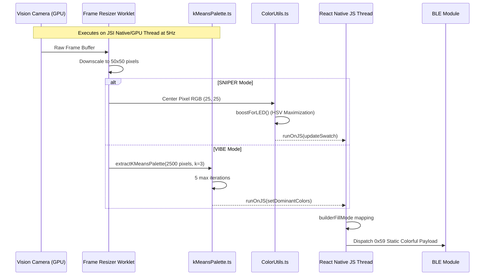
```mermaid
sequenceDiagram
    participant Camera as Vision Camera (GPU)
    participant Resizer as Frame Resizer Worklet
    participant KMeans as kMeansPalette.ts
    participant ColorUtil as ColorUtils.ts
    participant UI as React Native JS Thread
    
    Note over Camera, KMeans: Executes on JSI Native/GPU Thread at 5Hz

    Camera->>Resizer: Raw Frame Buffer
    Resizer->>Resizer: Downscale to 50x50 pixels
    
    alt SNIPER Mode
        Resizer->>ColorUtil: Center Pixel RGB (25, 25)
        ColorUtil->>ColorUtil: boostForLED() (HSV Maximization)
        ColorUtil-->>UI: runOnJS(updateSwatch)
    else VIBE Mode
        Resizer->>KMeans: extractKMeansPalette(2500 pixels, k=3)
        KMeans->>KMeans: 5 max iterations
        KMeans-->>UI: runOnJS(setDominantColors)
    end
    
    UI->>UI: builderFillMode mapping
    UI->>BLE Module: Dispatch 0x59 Static Colorful Payload
```

## 7. Design System & Token Manifest
* **COLOR_PRESET_PALETTE**: The canonical 10-color quick-select array (`#FF0000`, `#FF8000`, `#FFFF00`, `#00FF00`, `#00FFFF`, `#0000FF`, `#800080`, `#FF00FF`, `#FFFFFF`, `#000000`).
* **GENERATIVE_RAINBOW**: A 7-stop `#FF0000` to `#8B00FF` scale used by UI components to visually indicate `colorMode === 'GENERATIVE'` algorithms where hardware controls colors natively.
* **Text-to-Gradient Themes (`patternColors.ts`)**: 
  * `Fire/Flame`: `['#FF4D00', '#FF9E00']`
  * `Water/Ocean`: `['#00B2FF', '#00FFF0']`
  * `Forest/Nature`: `['#00FF85', '#00A3FF']`
  * `Sunset/Gold`: `['#FFD600', '#FF00E5']`
  * `Nebula/Space`: `['#7000FF', '#00FFFF']`
  * `Neon/Cyber`: `['#FF00E5', '#00F0FF']`

## 8. Archival Instructions & Discrepancies
* Compare `ble.types.ts` with `SK8Lytz_App_Master_Reference.md`:
  `ble.types.ts` notes: *`BleConnectionRequest`, `BleSweeperHandle`, `BleScannerHandle`, and `BleAutoRecoveryHandle` have been removed. They were scaffolding for `BleConnectionManager.ts` which was replaced by `ConnectService.ts` (Phase 3). Connection is now fully owned by the XState `BleMachine`.*
  **ACTION:** If the Master Reference still documents `BleConnectionManager.ts`, tag the section with `[MOVE_TO_ARCHIVE]` as XState now governs connection handling.
* Compare `MusicDictionary.ts` with `SK8Lytz_App_Master_Reference.md`:
  The `MusicDictionary.ts` maps `0x27` Light Screen effect IDs correctly per `Protocol Bible §0x73 §11 Oracle 2026-04-22`. Master Reference accurately reflects the "Vibe Catcher v2 Architecture", so no archival changes are needed for the Music dictionaries or camera logic.


<!-- CARTOGRAPHER_END: UTILS -->

<!-- CARTOGRAPHER_START: NATIVE_&_WATCH -->

# NATIVE & WATCH Cartography

[IMPACTS_C4_CONTEXT]
[IMPACTS_USER_JOURNEY]

## 1. File Manifest

**Apple Watch (`targets/watch/`)**
- `WatchConnectivityManager.swift`: Manages WCSession communication with iOS. Handles incoming session state/telemetry and pushes commands/health metrics to the phone.
- `HealthManager.swift`: Interfaces with `HKWorkoutSession` and `HKLiveWorkoutBuilder` to collect heart rate and calorie data during an inline skating session.
- `ContentView.swift`: SwiftUI UI layer. Displays idle, active, and summary states, rendering speed, HR, and calories.
- `ComplicationController.swift` & `index.swift`: Standard watchOS complication management and entry points.

**Wear OS (`android/sk8lytzWear/src/main/kotlin/com/neogleamz/sk8lytzwear/`)**
- `services/WearableCommunicationService.kt`: Receives persistent state updates via Google Play Services `DataClient` (`/sk8lytz/state`) and ephemeral telemetry via `MessageClient` (`/sk8lytz/metrics`).
- `services/HealthTracker.kt`: Interfaces with Android `HealthServices` to track workout metrics.
- `presentation/DashboardScreen.kt`: Jetpack Compose UI layer equivalent to the watchOS `ContentView.swift`.

**React Native Bridge (`modules/sk8lytz-watch-bridge/`)**
- `src/index.ts`: The cross-platform TS API wrapper around the native modules. Exposes `syncSessionState`, `sendMetricUpdate`, and listeners for commands/health.
- `ios/Sk8lytzWatchBridgeModule.swift`: Expo native module wrapping iOS `WCSession` bridging phone to watchOS.
- `android/src/main/java/expo/modules/sk8lytzwatchbridge/Sk8lytzWatchBridgeModule.kt`: Expo native module wrapping Android `Wearable` APIs bridging phone to Wear OS.

## 2. Blast Radius

Any changes to the data schema inside the native bridge module will ripple across three separate compilation domains:
1. **React Native TS types**: `WatchSessionState` and `WatchCommand`.
2. **watchOS Swift parsers**: `handlePayload` in `WatchConnectivityManager.swift`.
3. **Wear OS Kotlin parsers**: `onDataChanged` and `onMessageReceived` in `WearableCommunicationService.kt`.

Changes to the `sk8lytz-watch-bridge` module require native rebuilds of the Expo application (`eas build`). Modifying the health tracker start/stop lifecycle impacts OS-level battery constraints and workout metrics on both Apple Health and Google Fit.

## 3. Context Matrix

- **Phone → Watch (Downstream):**
  - **State Updates (Durable):** `ACTIVE`, `PAUSED`, `STOPPED`, `SUMMARY` payloads containing `startTime` and summary statistics.
  - **Telemetry (Ephemeral):** Live updates for `speed` (mph), distance.
- **Watch → Phone (Upstream):**
  - **Health Relay:** `heartRate` and `calories` emitted every 5 seconds.
  - **Control Commands:** `START_SESSION`, `STOP_SESSION`.
  - **LED Remote Controls:** `WRITE_COLOR`, `EXECUTE_PATTERN` (dispatched directly from the watch UI to command hardware).

## 4. Hook/Service I/O Registry

**`WatchBridge` (TypeScript API)**
- `WatchBridge.syncSessionState(state)` → Sends durable state (WCSession `updateApplicationContext` / Wear OS `DataClient`).
- `WatchBridge.sendMetricUpdate(metrics)` → Sends ephemeral state (WCSession `sendMessage` / Wear OS `MessageClient`).
- `WatchBridge.addWatchCommandListener(handler)` → Receives incoming `WatchCommand` events.
- `WatchBridge.addWatchHealthListener(handler)` → Receives incoming `WatchHealthUpdate` events.

**`HealthManager.swift` (watchOS)**
- **Inputs:** Starts `HKWorkoutSession` configured for `.inlineSkating`.
- **Outputs:** Emits `currentHeartRate` and `activeCalories` via Publisher.

## 5. OS Variance Matrix

| Capability | watchOS (Apple) | Wear OS (Android) |
| --- | --- | --- |
| **Durable Messaging** | `WCSession.updateApplicationContext` | Google Play Services `DataClient` |
| **Ephemeral Messaging** | `WCSession.sendMessage` | Google Play Services `MessageClient` |
| **Health API** | `HealthKit` (`HKLiveWorkoutBuilder`) | `HealthServices` (Wear OS API) |
| **UI Framework** | SwiftUI | Jetpack Compose for Wear OS |
| **Background Execution** | Active `HKWorkoutSession` keeps app awake | `OngoingActivityManager` + Foreground Service |

## 6. Documentation Archival Notice

`[MOVE_TO_ARCHIVE]`

Section **11. Wearable Companion Architecture** in `docs/SK8Lytz_App_Master_Reference.md` is **STALE**.
The document states:
> *"BLE LED control is NOT on the watch roadmap. Sending Bluetooth BLE commands directly from the watch is out of scope. The watch is a session HUD and health relay only."*

However, the native bridge and watchOS codebase now explicitly define and transmit LED control commands:
- `WatchConnectivityManager.swift` implements `sendWriteColor` and `sendExecutePattern`.
- `index.ts` explicitly types `WatchCommand` to include `WRITE_COLOR` and `EXECUTE_PATTERN`.

The watch is no longer *just* a session HUD—it actively proxies LED control commands to the phone. The documentation needs to be updated to reflect this new LED Remote capability.

## 7. Bidirectional Sync Sequence Diagram

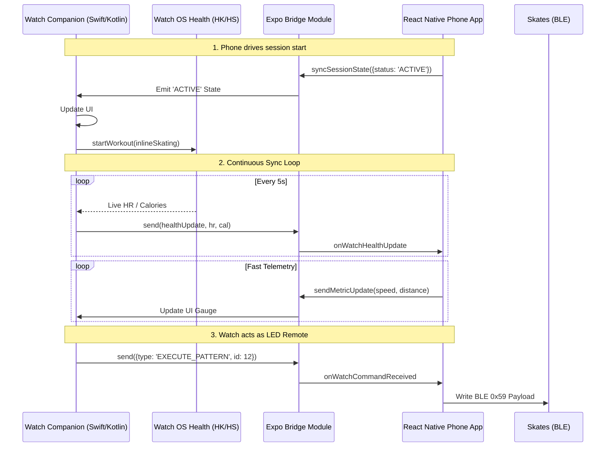
```mermaid
sequenceDiagram
    participant W as Watch Companion (Swift/Kotlin)
    participant OS as Watch OS Health (HK/HS)
    participant B as Expo Bridge Module
    participant P as React Native Phone App
    participant Skate as Skates (BLE)

    Note over P, W: 1. Phone drives session start
    P->>B: syncSessionState({status: 'ACTIVE'})
    B->>W: Emit 'ACTIVE' State
    W->>W: Update UI
    W->>OS: startWorkout(inlineSkating)
    
    Note over P, W: 2. Continuous Sync Loop
    loop Every 5s
        OS-->>W: Live HR / Calories
        W->>B: send(healthUpdate, hr, cal)
        B->>P: onWatchHealthUpdate
    end
    
    loop Fast Telemetry
        P->>B: sendMetricUpdate(speed, distance)
        B->>W: Update UI Gauge
    end
    
    Note over P, W: 3. Watch acts as LED Remote
    W->>B: send({type: 'EXECUTE_PATTERN', id: 12})
    B->>P: onWatchCommandReceived
    P->>Skate: Write BLE 0x59 Payload
```


<!-- CARTOGRAPHER_END: NATIVE_&_WATCH -->

<!-- CARTOGRAPHER_START: NOTIFICATIONS_&_ROUTING -->

# 🗺️ Cartography: NOTIFICATIONS & ROUTING

[IMPACTS_USER_JOURNEY] [IMPACTS_C4_CONTEXT] [IMPACTS_STATE_CHART]

## 1. File Manifest

*   **`App.tsx`**: The global application entrypoint. Initializes global error boundaries, telemetry pipelines, third-party library error capturing, React context providers (Auth, BLE, Session, Theme, etc.), and Notifee background event listeners for interactive push notifications.
*   **`src/providers/BluetoothGuard.tsx`**: A strictly-gated provider that intercepts the render tree if Bluetooth permissions are missing or Bluetooth hardware is disabled. It watches `AppState` to auto-recover when users return from OS settings.
*   **`src/providers/ComplianceGate.tsx`**: Intercepts the UI to enforce EULA acceptance. Compares the `required_eula_version` (from AppSettings) against the user's profile in Supabase. Handles offline gracefully by checking local `AsyncStorage`.
*   **`src/services/NotificationService.ts`**: The orchestration layer for `expo-notifications`. Manages permission flows, Android Notification Channel creation, token acquisition, and triggering local foreground alerts for Crew sessions and reminders.
*   **`src/services/PushTokenService.ts`**: A dedicated Supabase persistence layer that manages `push_tokens` upserts and deletions. Extracted during the ProfileService god-object decomposition.
*   **`src/services/LocationService.ts`**: Wraps `expo-location` to deliver user coordinates, reverse-geocoded string labels, and spatial Supabase queries. Implements the Haversine formula locally to sort/filter fetched Crew Sessions and Skate Spots by distance.
*   **`src/hooks/useHardwareNotifications.ts`**: The BLE "Mailroom Architecture". Subscribes to raw BLE RX streams, debounces redundant hex payloads, parses RF and LED configurations via `BlePayloadParser`, checks for state deltas, and dispatches updates to both React state and persistent storage (`DeviceRepository`).

## 2. Blast Radius

*   **`useHardwareNotifications.ts` Failure**: If the payload debouncer or delta-checker fails, it will cause a catastrophic "re-render storm". The app will dispatch hundreds of state updates per second, stalling the React JS thread and flooding SQLite with duplicate configurations.
*   **`LocationService.ts` Failure**: If geocoding or permission access throws an unhandled error, the Crew Hub map will render blank, and users will be unable to discover local skate spots or properly stamp new sessions with locations.
*   **`BluetoothGuard.tsx` Lockout**: Any logic flaw in permission evaluation could permanently trap legitimate users on the "Bluetooth Required" blocking screen, completely disabling the app's core hardware features.
*   **`NotificationService.ts` Failure**: A crash during Android Channel setup or token registration prevents users from receiving critical alerts like "Session Starting Soon" or "Crew Invites", degrading the real-time social experience.

## 3. Context Matrix

| Entity | Relies On | Provides State To |
| :--- | :--- | :--- |
| **App.tsx** | `Notifee`, `SplashScreen`, `AppLogger` | Entire React Native Tree |
| **BluetoothGuard** | `PermissionService`, `useSharedBLE`, `AppState` | App Render Tree (blocking logic) |
| **ComplianceGate** | `useAuth`, `AppSettingsService`, `Supabase`, `AsyncStorage` | App Render Tree (blocking logic) |
| **LocationService** | `expo-location`, `Supabase`, `PermissionService`, `SkateSpotsService` | Screens querying Nearby data |
| **NotificationService** | `expo-notifications`, `PushTokenService` | Dashboard / App Lifecycle |
| **useHardwareNotifications** | `BlePayloadParser`, `DeviceRepository` | `BLEContext`, `DeviceSettingsModal` |

## 4. Hook/Service I/O Registry

### `NotificationService`
*   **`init(autoRequest, userId)`** 
    *   *Input:* `autoRequest: boolean`, `userId?: string`
    *   *Output:* `Promise<string | null>` (Returns Expo Push Token, registers in Supabase).
*   **`sendSessionLiveAlert(opts)`**
    *   *Input:* `{ sessionId, sessionName, crewName, locationLabel }`
    *   *Output:* `Promise<void>` (Fires local notification).

### `LocationService`
*   **`getNearbyPublicSessions(radiusMi, userCoords, userId)`**
    *   *Input:* `radiusMi?`, `userCoords: {lat, lng}`, `userId?`
    *   *Output:* `Promise<NearbySession[]>` (Returns deduped, merged public + private sessions sorted by distance).
*   **`haversineMi(lat1, lng1, lat2, lng2)`**
    *   *Input:* 4 Coordinates
    *   *Output:* `number` (Distance in miles).

### `useHardwareNotifications`
*   **`useHardwareNotifications(options)`**
    *   *Input:* Callbacks (`setOnDataReceived`, `setOnHardwareProbed`), State references (`allDevices`, `deviceConfigs`), and State Updaters.
    *   *Output:* `void` (Registers internal `useEffect` subscriptions to the BLE stream).

## 5. OS Variance Matrix

| Feature | iOS | Android | Web |
| :--- | :--- | :--- | :--- |
| **Push Notifications** | Native handling via APNs. | Requires manual `NotificationChannel` definitions (`crew-alerts`, `session-reminders`) with custom colors and vibrations. | Mocks/Ignores. `expo-notifications` returns false. |
| **Background Actions** | APNs Actions. | Uses `notifee.onBackgroundEvent` to handle Action Presses (`end-session`, `pause-session`) from the system tray. | N/A |
| **Location Accuracy** | Uses iOS specific balanced settings. | Uses Google Services location APIs. | Fallback coordinates assigned. |
| **Health Connect** | N/A | Initialized in `App.tsx` early to prevent `lateinit` crashes on activity resume. | N/A |

## 6. Sequence Diagram: BLE Mailroom Pipeline

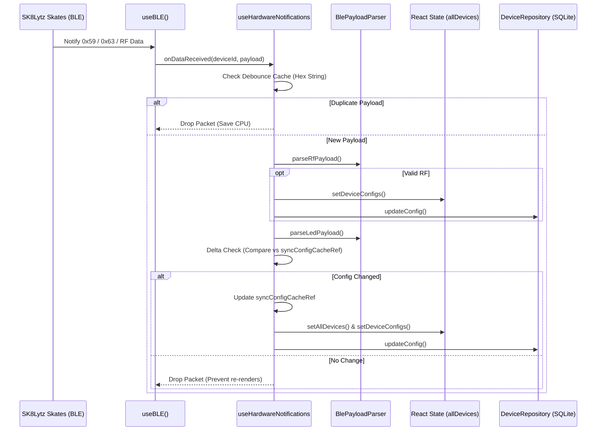
```mermaid
sequenceDiagram
    participant Hardware as SK8Lytz Skates (BLE)
    participant BLEHook as useBLE()
    participant Mailroom as useHardwareNotifications
    participant Parser as BlePayloadParser
    participant State as React State (allDevices)
    participant DB as DeviceRepository (SQLite)

    Hardware->>BLEHook: Notify 0x59 / 0x63 / RF Data
    BLEHook->>Mailroom: onDataReceived(deviceId, payload)
    
    Mailroom->>Mailroom: Check Debounce Cache (Hex String)
    alt Duplicate Payload
        Mailroom-->>BLEHook: Drop Packet (Save CPU)
    else New Payload
        Mailroom->>Parser: parseRfPayload()
        opt Valid RF
            Mailroom->>State: setDeviceConfigs()
            Mailroom->>DB: updateConfig()
        end
        
        Mailroom->>Parser: parseLedPayload()
        Mailroom->>Mailroom: Delta Check (Compare vs syncConfigCacheRef)
        
        alt Config Changed
            Mailroom->>Mailroom: Update syncConfigCacheRef
            Mailroom->>State: setAllDevices() & setDeviceConfigs()
            Mailroom->>DB: updateConfig()
        else No Change
            Mailroom-->>BLEHook: Drop Packet (Prevent re-renders)
        end
    end
```

## 7. Archival Instructions

*   **`[MOVE_TO_ARCHIVE]`**: `profileService.registerPushToken` documentation logic (if any exists in supplementary context docs) as the god-object decomposition moved this strictly to `PushTokenService`.
*   **`[MOVE_TO_ARCHIVE]`**: Any reference to `@Sk8lytz_voice_tutorial_dismissed` in the `AsyncStorage` registry (Master Reference) — the voice command engine `@react-native-voice/voice` was fully removed from the codebase, rendering this key orphaned legacy data.


<!-- CARTOGRAPHER_END: NOTIFICATIONS_&_ROUTING -->

<!-- CARTOGRAPHER_START: SESSION_TRACKING -->

# Session Tracking & Telemetry Cartography Report

**Domain Target Analysis:** `src/context/SessionContext.tsx`, `src/hooks/useTelemetryLedger.ts`, `src/hooks/useDeviceStateLedger.ts`, `src/services/HealthSyncService.ts`

## 1. File Manifest
*   **`src/context/SessionContext.tsx`**: The core React provider wrapping the `sessionMachine` (XState). Serves as the central command for the active skate session, providing 1Hz UI updates for global telemetry and health data. Synchronizes bidirectionally with the `WatchBridge` and manages foreground notifications via Notifee.
*   **`src/hooks/useTelemetryLedger.ts`**: The God-tier telemetry engine. Tracks offline-first time-in-state metrics for LED patterns, colors, and feature engagement. Uses a module-level global buffer, debouncing writes to `AsyncStorage`, and auto-flushing to Supabase RPC (`flush_telemetry`) every 15 minutes or upon backgrounding.
*   **`src/hooks/useDeviceStateLedger.ts`**: Unified persistence layer for per-device LED hardware states. Prevents UI lag by maintaining a shared module-level in-memory cache `Map<MAC, DevicePatternState>` and a unified module-level debounce timer map to prevent asynchronous AsyncStorage race conditions when sliders are dragged.
*   **`src/services/HealthSyncService.ts`**: Cross-platform bridge service connecting SK8Lytz session data (duration, distance, calories) natively to Apple HealthKit (`react-native-health`) and Android Health Connect (`react-native-health-connect`).
*   *Note on Missing Files:* `useSessionTracking.ts`, `useGlobalTelemetry.ts`, and `useHealthTelemetry.ts` were **Not Found** in the current source tree. Their logic has been fully consolidated into `SessionContext.tsx` and the underlying XState `SessionMachine`.

## 2. Blast Radius
*   **`SessionContext.tsx`**: High. Modifications impact the 1Hz telemetry UI tick, watch connectivity synchronization, and AppState crash recovery (R-26 invariant). Errors here could permanently freeze the Active Skate Session UI.
*   **`useTelemetryLedger.ts`**: Medium. Defects impact statistical analytics precision and cloud sync capabilities. If `_doFlush` logic fails recursively, it can cause AsyncStorage bloat leading to storage exhaustion.
*   **`useDeviceStateLedger.ts`**: High. Affects the core Dashboard and visual LED persistence. Modifying the shared memory timers (`__sk8lytz_ledger_timers`) risks re-introducing the dual-instance debounce race condition, resulting in dropped pattern states or "re-render storms."
*   **`HealthSyncService.ts`**: Medium. Direct impact on OS-level native modules. Incorrect parameters will silently fail to write to the user's Health apps, or worse, crash the background bridge process.

## 3. Context Matrix
### State Engines
*   **Global Singletons (Telemetry)**: `_payloadBuffer`, `_activeState`, `_sessionStartTime` (Volatile memory buffered for Supabase).
*   **Module-Level Caches (Device State)**: `memoryCache` (`Map<MAC, DevicePatternState>`), `debounceTimers` (`Map<MAC, NodeJS.Timeout>`). Shared across all instances of the hook.
*   **XState Machine**: `sessionMachine` dictates `IDLE | ACTIVE | PAUSED | ENDING`.

### Storage Keys
*   `@SK8Lytz_DeviceState_v2_{MAC}`: Debounced target for `useDeviceStateLedger`.
*   `@sk8lytz_telemetry_buffer`: Offline target for `useTelemetryLedger` (`STORAGE_TELEMETRY_BUFFER`).
*   `@Sk8lytz_auto_pause_enabled`: Boot parameter for `SessionContext` (`STORAGE_AUTO_PAUSE_ENABLED`).
*   `@Sk8lytz_pending_bg_end`: Crash recovery anchor for sessions terminated in the background (`STORAGE_PENDING_BG_END`).

## 4. Hook/Service I/O Registry
*   **`useSession()`**
    *   **Output**: `{ isSkateSessionActive: boolean, sessionPhase: SessionPhase, startSession: () => void, endSession: () => void, telemetry: GlobalTelemetryState, health: HealthTelemetry }`
*   **`useTelemetryLedger()`**
    *   **Output**: `{ trackPattern(id), trackColor(hex), trackMode(mode), incrementCounter(key, count), injectStreetSummary(dist, spd), flushToDatabase() }`
*   **`useDeviceStateLedger()`**
    *   **Output**: `{ save(mac, state), load(mac): Promise<DevicePatternState>, loadSync(mac): DevicePatternState, clear(mac) }`
*   **`HealthSyncService`**
    *   **Input**: `saveWorkout(snapshot: ISessionSnapshot)`
    *   **Output**: `Promise<void>` (Fire and forget, writes to OS)

## 5. OS Variance Matrix
| Platform | Behavior | Implementation Details |
| :--- | :--- | :--- |
| **iOS** | HealthKit / Notifications | Uses `HKWorkoutActivityTypeSkatingSports`. Registers interactive Notifee categories (`end-session`, `toggle-music`, `fire-favorite`) linked to foreground actions. |
| **Android** | Health Connect | Uses `ExerciseSession` with type `60` (Skating) via `react-native-health-connect`. Does not register interactive notification action callbacks via Context. |
| **Wearables** | Watch/Wear OS Sync | Bi-directional communication. App auto-recovers to `ACTIVE` if a `WatchHealthUpdate` is received indicating the watch thinks the session is live. |

## Documentation Flags
**[MOVE_TO_ARCHIVE]**
1. The master reference lists `SessionService` and `DeviceStateService` as owning the keys `@sk8lytz_session_phase` and `@SK8Lytz_DeviceState_v2_`. These "Services" appear to be legacy abstractions, as the current reality shows `SessionContext` (XState) and `useDeviceStateLedger` hooks actively owning these domains.
2. The `useSessionTracking.ts`, `useGlobalTelemetry.ts`, and `useHealthTelemetry.ts` files no longer exist and represent legacy decoupled hook architecture.

## Architectural Impact Flags
[IMPACTS_USER_JOURNEY]
[IMPACTS_STATE_CHART]
[IMPACTS_C4_CONTEXT]

## Sequence Diagram: Session & Telemetry Lifecycle
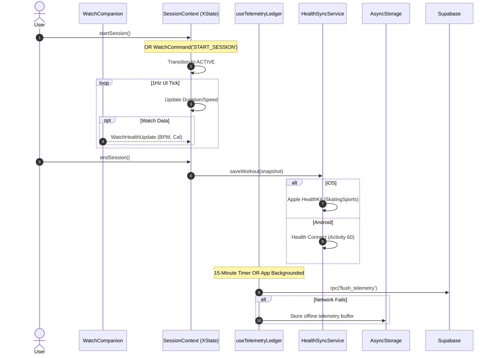
```mermaid
sequenceDiagram
    autonumber
    actor User
    participant Watch as WatchCompanion
    participant SessionCtx as SessionContext (XState)
    participant Telemetry as useTelemetryLedger
    participant Health as HealthSyncService
    participant Storage as AsyncStorage
    participant DB as Supabase

    User->>SessionCtx: startSession()
    Note over SessionCtx: OR WatchCommand('START_SESSION')
    SessionCtx->>SessionCtx: Transition to ACTIVE
    
    loop 1Hz UI Tick
        SessionCtx->>SessionCtx: Update Duration/Speed
        opt Watch Data
            Watch-->>SessionCtx: WatchHealthUpdate (BPM, Cal)
        end
    end
    
    User->>SessionCtx: endSession()
    SessionCtx->>Health: saveWorkout(snapshot)
    
    alt iOS
        Health->>Health: Apple HealthKit (SkatingSports)
    else Android
        Health->>Health: Health Connect (Activity 60)
    end
    
    Note over Telemetry: 15-Minute Timer OR App Backgrounded
    Telemetry->>DB: rpc('flush_telemetry')
    alt Network Fails
        Telemetry->>Storage: Store offline telemetry buffer
    end
```


<!-- CARTOGRAPHER_END: SESSION_TRACKING -->

<!-- CARTOGRAPHER_START: PROTOCOL_CORE -->

# Protocol Core Domain Cartography

## 1. File Manifest
- `src/protocols/ZenggeProtocol.ts`: Core byte-level implementation for Zengge hardware (0xA3 chips, Symphony). Translates high-level inputs to raw hex arrays. Maps exact byte offsets (e.g. `0x59`, `0x73`, `0x62`) as defined in `ZENGGE_PROTOCOL_BIBLE.md`.
- `src/protocols/ZenggeAdapter.ts`: HAL implementation for Zengge. Wraps `ZenggeProtocol` into `ProtocolResult` objects. Note: Owns its own sequence counter instance to avoid static method conflicts.
- `src/protocols/BanlanxAdapter.ts`: HAL implementation for BanlanX (SP621E). Handles native FFT translation, multi-packet sequences with strict 20ms delays, and `0x53`/`0x54` effect opcodes.
- `src/protocols/IControllerProtocol.ts`: The universal HAL interface (`ProtocolResult`, `HardwareSettingsResult`, etc.). The seam between the application and the hardware byte frames.
- `src/protocols/ControllerRegistry.ts`: Runtime protocol resolver. Maps BLE advertisements (UUIDs, manufacturer data) to the correct HAL adapter (e.g. FFE0 for BanlanX, FFFF for Zengge).
- `src/hooks/useProtocolDispatch.ts`: Translates UI intents into hardware-specific `ProtocolResult` arrays via `getAdapterForDevice` and sends them via `executeProtocolResults` or `writeChunked`.
- `src/hooks/useProtocolBuilder.ts`: Diagnostic tool for building manual payloads (0x51, 0x59, 0x61, 0x73, 0x62) directly from UI state.
- `src/hooks/useProductCatalog.ts`: Local-first, cloud-synced catalog hook serving physical device topologies. Relies on `ProductCatalog.ts` and Supabase.
- `src/hooks/useProductManager.ts`: Administrative domain hook for editing the product catalog.
- `src/constants/ProductCatalog.ts`: The offline-safe local source of truth for all SK8Lytz product profiles (HALOZ, SOULZ, RAILZ). Defines the critical 3-layer LED topology (`ledPoints`, `segments`).

## 2. Blast Radius
Modifications to this domain directly impact:
- **Device Communications (BLE)**: Any mistake in byte offsets or checksums will cause devices to crash or ignore commands (e.g., sending `0x43` to 0xA3 hardware causes a crash).
- **Hardware Integration**: The entire app relies on `IControllerProtocol` adapters to normalize hardware differences.
- **Visualizer Parity**: The payloads generated here must perfectly match the `ProductVisualizer` canvas sizing. Using physical LEDs instead of `ledPoints` will bypass the hardware segment mirror engine.
- **Offline Reliability**: Local catalog caching changes impact FTUE device identification when completely offline.

## 3. Context Matrix
| Component | Context / Dependencies |
| :--- | :--- |
| `ControllerRegistry` | Depends on advertisement UUIDs. Resolves `BanlanxAdapter` (FFE0) or `ZenggeAdapter` (FFFF). |
| `useProtocolDispatch` | Bridges `BLEContext` (`connectedDevices`, `executeProtocolResults`, `writeChunked`) and the HAL. |
| `ZenggeAdapter` | Encapsulates `ZenggeProtocol` to prevent `messageCounter` split-brain issues. Chunking logic delegated entirely to `BleWriteDispatcher`. |
| `BanlanxAdapter` | Requires `interPacketDelayMs` (20ms) for effect commands to prevent hardware drops. Bypasses software FFT (`requiresSoftwareFFT = false`). |
| `ProductCatalog` | Combines `LOCAL_PRODUCT_CATALOG` with Supabase `product_catalog` row states. |

## 4. Hook/Service I/O Registry
- **`useProtocolDispatch`**
  - **In**: UI commands (`setSolidColor`, `setEffect`, `setCustomModeExtended`).
  - **Out**: Invokes `executeProtocolResults` / `writeChunked` on `BLEContext`.
- **`useProductCatalog`**
  - **In**: `AsyncStorage` cache, Supabase `product_catalog`.
  - **Out**: `allProfiles`, `getProfileById()`, `getProfileByPoints()`, `saveProfile()`.
- **`useProductManager`**
  - **In**: Form edits (`patchEdit()`, `createNew()`).
  - **Out**: Saves to Supabase (`saveProduct()`).
- **`useProtocolBuilder`**
  - **In**: UI form state (Speed, transition, RGB, etc.).
  - **Out**: Returns `BldResult` (hex string, wrapped byte array).

## 5. OS Variance Matrix
| OS | Variance |
| :--- | :--- |
| **Android** | `writeChunked` limits and GATT throughput bottlenecks dictate the 20ms delays and `0x40` chunking strategies. Android BLE stack requires strict `ProtocolResult` rate-limiting and fragmentation mapping. |
| **iOS** | Generally handles MTU and chunking natively much better, but strictly conforms to the Android-safe denominators implemented in `BleWriteDispatcher` and `BanlanxAdapter`. |

## 6. Multi-Device Protocol Dispatch Sequence

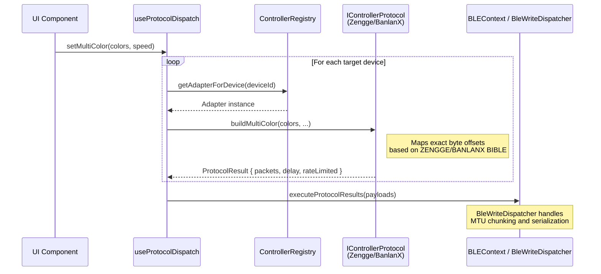
```mermaid
sequenceDiagram
    participant UI as UI Component
    participant Dispatch as useProtocolDispatch
    participant Registry as ControllerRegistry
    participant Adapter as IControllerProtocol<br/>(Zengge/BanlanX)
    participant BLE as BLEContext / BleWriteDispatcher
    
    UI->>Dispatch: setMultiColor(colors, speed)
    loop For each target device
        Dispatch->>Registry: getAdapterForDevice(deviceId)
        Registry-->>Dispatch: Adapter instance
        Dispatch->>Adapter: buildMultiColor(colors, ...)
        Note right of Adapter: Maps exact byte offsets<br/>based on ZENGGE/BANLANX BIBLE
        Adapter-->>Dispatch: ProtocolResult { packets, delay, rateLimited }
    end
    Dispatch->>BLE: executeProtocolResults(payloads)
    Note over BLE: BleWriteDispatcher handles<br/>MTU chunking and serialization
```

## Archival Findings
[MOVE_TO_ARCHIVE] In `docs/SK8Lytz_App_Master_Reference.md`, the documentation states: `Function: useBLE.writeChunked(payload: number[], chunkSize = 20): Promise<void>`. This is stale. As per `ZenggeAdapter.ts` and recent architectural changes, `0x40` chunking math is no longer present in `useBLE.ts` and is handled exclusively by `BleWriteDispatcher`.

[IMPACTS_C4_CONTEXT]
[IMPACTS_STATE_CHART]


<!-- CARTOGRAPHER_END: PROTOCOL_CORE -->

<!-- CARTOGRAPHER_START: PATTERN_ENGINE -->

# Pattern Engine Domain Cartography Deep Dive

## 1. File Manifest
- **`src/protocols/PatternEngine.ts`**: The main entry point for patterns and the SSOT for the `SK8LYTZ_TEMPLATES` registry (IDs 1-233). It resolves hardware payloads by routing pattern IDs to native intercepted payload formats (0x51 COMPACT/Extended) or custom mathematical arrays via 0x59 CASCADE.
- **`src/protocols/SpatialEngine.ts`**: The core math processor orchestration layer. Dispatches `generateArray()` which maps the 200+ pattern IDs to their specific builder functions (e.g., `buildNativeBreathe`, `buildSolid`, `buildCyberGlitch`) found in `effectProcessors.ts`. Also provides `getHardwarePixelArray()` to create the initial seed frame for 0x59 mode, and `getPatternTransitionType()` to pick the commandType (0x01-0x06).
- **`src/protocols/SymphonyEngine.ts`**: Manages Native 0x51 Visualizer logic and 0x73 Music Mode visualizer logic, entirely isolated from the 0x59 PatternEngine. Exposes `getSymphonyVisualizerFrame` for 44 native 0x51 effects and `getMusicVisualizerFrame` for 13 music visualizer patterns based on audio magnitude.
- **`src/protocols/VisualizerEngine.ts`**: Wraps `SpatialEngine.generateArray` and handles temporal scrolling offsets using `rotateArray()` based on `animTick` to visually emulate 0x59 hardware scrolling. This provides accurate visual parity for the React Native visualizers.
- **`src/protocols/PositionalMathBuffer.ts`**: Implements a percentage-to-pixel interpolator via `generateArray(nodes, totalLeds, isGradient)` for the UI Pattern Builder, allowing continuous gradient building that bypasses positional chunk limitations.
- **`src/hooks/useStreetMode.ts`**: Domain hook for "Street Mode". Reacts to accelerometer (jerk/movement) and GPS data to trigger motion states (STOPPED, CRUISING, HARD_BRAKING, etc.) and dynamically pushes car-light LED patterns via `buildPatternPayload`.
- **`src/hooks/useMusicMode.ts`**: Coordinates the `0x73` protocol configuration for the music reactive mode. Differentiates between LIGHT_BAR (0x26) and LIGHT_SCREEN (0x27) matrices and issues BLE writes with user-selected sensitivity, patterns, and mic sources.
- **`src/hooks/useAppMicrophone.ts`**: Wraps `expo-audio` to capture and process device microphone inputs for APP mic mode. Streams `0x74` magnitude packets continuously at 20Hz using an exponential moving average to provide smooth audio-reactive data to the hardware.

## 2. Blast Radius
- **UI Consumers**: Components rendering the effect picker rely heavily on `PatternEngine.ts` as the single source of truth for `SK8LYTZ_TEMPLATES`.
- **Hardware Integration**: The output of `buildPatternPayload` and the outputs of `useStreetMode`, `useMusicMode`, and `useAppMicrophone` are fed directly into the BLE write queue (`BleMachine` / `ZenggeProtocol`). Modifying any math functions here dictates the literal colors shown on the skates.
- **Visualizer Fidelity**: The `ProductVisualizer` directly consumes `VisualizerEngine` and `SymphonyEngine`. Discrepancies between hardware routing limits (0x51 vs 0x59) and visualizer math here result in a broken UI parity promise.

## 3. Context Matrix
- **Circular Dependency Resolution**: `PatternEngine` and `SpatialEngine` used to form a cyclic dependency. This was resolved by extracting shared types (`RGB`, `PatternId`, `ColorMode`, `SK8LytzTemplate`, `PatternOptions`) to `shared/engineTypes.ts`.
- **Hardware Interception strategy**: To achieve high frame rates and native looks, the `PatternEngine` dynamically intercepts select pattern IDs (e.g., 17, 18, 24, 26, 44, 72 and hardware parity modes 201-233) and maps them natively via the `0x51` protocol instead of doing per-frame custom math via the standard `0x59` fallback. 
- **Symphony Parity Math**: Because native `0x51` hardware patterns perform operations internally, `SymphonyEngine.ts` exists specifically to emulate these hidden firmware states visually within the app based purely on the `animTick`.
- **Performance Thresholds**: Both `useStreetMode` and `useAppMicrophone` run high-frequency tasks (80ms accelerometer loops and 20Hz/50ms microphone payload streaming). They heavily utilize React refs (`useRef`) to access current states to prevent performance-killing render loops while maintaining accurate telemetry output.

## 4. Hook/Service I/O Registry
- `PatternEngine.buildPatternPayload(patternId, fg, bg, numLEDs, speed, direction, brightness, options, hardwareLedPoints, protocol)` $\rightarrow$ `number[] | null`
- `PatternEngine.buildMultiColorPayload` $\rightarrow$ `number[] | null`
- `SpatialEngine.generateArray(patternId, fg, bg, n, tick, direction, options)` $\rightarrow$ `RGB[]`
- `SpatialEngine.getHardwarePixelArray(patternId, fg, bg, numLEDs, options)` $\rightarrow$ `RGB[] | null`
- `SpatialEngine.getPatternTransitionType(patternId)` $\rightarrow$ `number` (0x01 - 0x06)
- `SymphonyEngine.getMusicVisualizerFrame(id, n, tick, mag, baseColor)` $\rightarrow$ `{ pixels: RGB[], opacities: number[] }`
- `SymphonyEngine.getSymphonyVisualizerFrame(id, fg, bg, n, tick)` $\rightarrow$ `RGB[]`
- `VisualizerEngine.getVisualizerFrame(...)` $\rightarrow$ `RGB[]`
- `VisualizerEngine.rotateArray(arr, animTick, direction)` $\rightarrow$ `RGB[]`
- `PositionalMathBuffer.generateArray(nodes, totalLeds, isGradient)` $\rightarrow$ `RGB[]`
- `useStreetMode(UseStreetModeOptions)` $\rightarrow$ `{ streetSensitivity, setStreetSensitivity, motionState, applyStreetPattern, ... }`
- `useMusicMode(UseMusicModeParams)` $\rightarrow$ `{ handleMusicChange }`
- `useAppMicrophone(UseAppMicrophoneParams)` $\rightarrow$ `{ audioMagnitude, hasMicPermission, requestMicPermission, recording }`

## 5. OS Variance Matrix
- **Sensor APIs**: `useStreetMode` uses `expo-sensors` (Accelerometer). The hook explicitly short-circuits (`if (Platform.OS === 'web') return;`) since hardware accelerometer data is unavailable or unreliable in the web simulation context.
- **Audio APIs**: `useAppMicrophone` relies on `expo-audio` to record and generate magnitudes. Because `Audio.Recording` is not fully supported in the web-based simulation environment, execution returns early on web (`Platform.OS === 'web' return;`). Standard Android/iOS microphone permissions (`checkPermission('MIC')`) and modals dictate execution natively.

## 6. Sequence Diagram

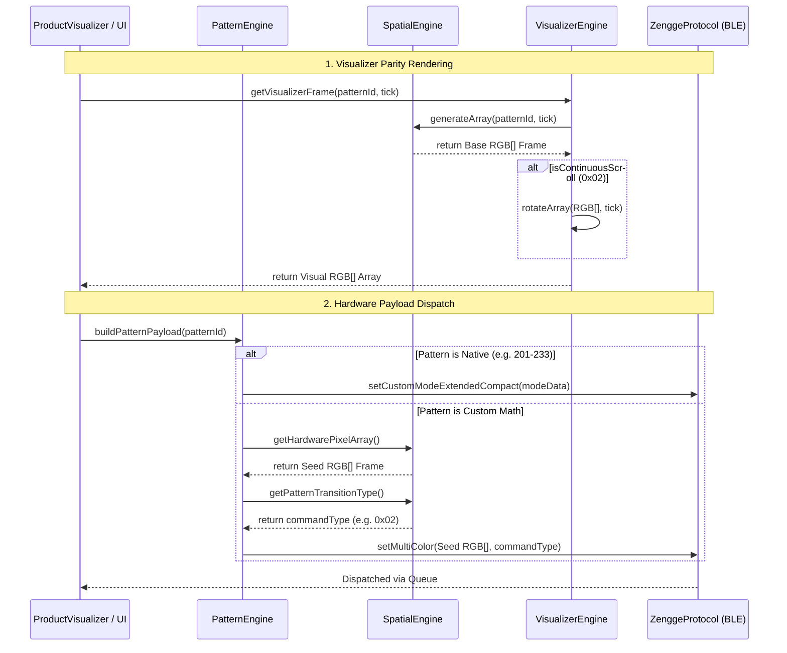
```mermaid
sequenceDiagram
    participant UI as ProductVisualizer / UI
    participant PE as PatternEngine
    participant SE as SpatialEngine
    participant VE as VisualizerEngine
    participant BLE as ZenggeProtocol (BLE)

    Note over UI,BLE: 1. Visualizer Parity Rendering
    UI->>VE: getVisualizerFrame(patternId, tick)
    VE->>SE: generateArray(patternId, tick)
    SE-->>VE: return Base RGB[] Frame
    alt isContinuousScroll (0x02)
        VE->>VE: rotateArray(RGB[], tick)
    end
    VE-->>UI: return Visual RGB[] Array

    Note over UI,BLE: 2. Hardware Payload Dispatch
    UI->>PE: buildPatternPayload(patternId)
    alt Pattern is Native (e.g. 201-233)
        PE->>BLE: setCustomModeExtendedCompact(modeData)
    else Pattern is Custom Math
        PE->>SE: getHardwarePixelArray()
        SE-->>PE: return Seed RGB[] Frame
        PE->>SE: getPatternTransitionType()
        SE-->>PE: return commandType (e.g. 0x02)
        PE->>BLE: setMultiColor(Seed RGB[], commandType)
    end
    BLE-->>UI: Dispatched via Queue
```

## 7. Pattern Template Catalogue (`SK8LYTZ_TEMPLATES`)

| ID | Name | Tier | Color Mode | Math Builder Function |
|----|------|------|------------|-----------------------|
| 1 | Solid | 2 | FG_ONLY | buildSolid |
| 2 | Split Colors | 2 | FG_BG | buildSplitColors |
| 3 | Trisection | 2 | FG_BG | buildTrisection |
| 4 | Quartered | 2 | FG_BG | buildQuartered |
| 5 | Center Accent | 2 | FG_BG | buildCenterAccent |
| 6 | Single Dot Chase | 2 | FG_BG | buildSingleDotChase |
| 7 | Double Dot Chase | 2 | FG_BG | buildTwinDotChase |
| 8 | Comet Chase | 2 | FG_BG | buildCometChase |
| 9 | Meteor Shower | 2 | FG_BG | buildMeteorShower |
| 10 | Micro Ants | 2 | FG_BG | buildMicroAnts |
| 11 | Theater Chase | 2 | FG_BG | buildTheaterChase |
| 12 | Dashed Marquee | 2 | FG_BG | buildDashedMarquee |
| 13 | Bold Stripes | 2 | FG_BG | buildBoldStripes |
| 14 | Sine Pulse Wave | 3 | FG_BG | buildSinePulseWave |
| 15 | Wave Pinch | 3 | FG_BG | buildWavePinch |
| 16 | Breathing Wave | 3 | FG_BG | buildBreathingWave |
| 17 | Smooth Breath | 1 | FG_BG | buildSmoothBreath / Native Intercept |
| 18 | Wipe / Fill | 3 | FG_BG | buildWipeFill / Native Intercept |
| 19 | True Rainbow Flow | 3 | GENERATIVE | buildTrueRainbowFlow |
| 20 | Rainbow Marquee | 3 | GENERATIVE | buildRainbowMarquee |
| 21 | Rainbow Comet | 3 | GENERATIVE | buildRainbowComet |
| 22 | Cyberpunk Shift | 3 | FG_BG | buildCyberpunkShift |
| 23 | Color Flow | 1 | GENERATIVE | buildColorFlow |
| 24 | Color Breathing | 1 | FG_ONLY | buildColorBreathing / Native Intercept |
| 25 | Running Water | 1 | FG_BG | buildRunningWater |
| 26 | Strobe Flash | 1 | FG_ONLY | buildStrobe / Native Intercept |
| 27 | Ocean Wave | 1 | FG_BG | buildOceanWave |
| 28 | Lightning Strike | 1 | FG_ONLY | buildLightning |
| 29 | Snowfall | 1 | FG_BG | buildSnowfall |
| 30 | Heartbeat Pulse | 1 | FG_ONLY | buildHeartbeat |
| 31 | Meteor | 1 | FG_BG | buildMeteor |
| 32 | Aurora Borealis | 1 | GENERATIVE | buildAurora |
| 33 | Lava Lamp | 1 | FG_BG | buildLava |
| 34 | Plasma Wave | 1 | FG_BG | buildPlasma |
| 35 | Star Cluster | 1 | FG_BG | buildStarCluster |
| 36 | Rainbow Breathing | 3 | GENERATIVE | buildRainbowBreathing |
| 37 | Crystal Shimmer | 3 | GENERATIVE | buildCrystalShimmer |
| 38 | Gradient Chase | 3 | FG_BG | buildGradientChase |
| 39 | Fire Flame | 3 | FG_BG | buildFireFlame |
| 40 | Neon Pulse | 3 | FG_BG | buildNeonPulse |
| 41 | Rainbow Chaser | 3 | GENERATIVE | buildRainbowChaser |
| 42 | Matrix Rain | 3 | FG_BG | buildMatrixRain |
| 43 | Starlight | 3 | FG_BG | buildStarlight |
| 44 | SK8Lytz Signature | 3 | FG_BG | Native Intercept (0x51 Mode 26) |
| 72 | Center-Out Marquee | 3 | FG_ONLY | buildNativeCenterOut / Native Intercept |
| 101 | Street Stopped | 3 | FG_BG | buildStreetMode |
| 102 | Street Cruising | 3 | FG_BG | buildStreetMode |
| 103 | Street Braking | 3 | FG_BG | buildStreetMode |
| 104 | Street Slowing | 3 | FG_BG | buildStreetMode |
| 105 | Street Accelerating | 3 | FG_BG | buildStreetMode |
| 201 | Large Scroll | 1 | FG_BG | Inline Array math |
| 202 | Gradient Chunk | 1 | FG_BG | Inline Array math |
| 203 | Single Dot Chase | 1 | FG_BG | buildSingleDotChase |
| 204 | Ping-Pong Fill | 1 | FG_BG | Inline Array math |
| 205 | Ping-Pong Dot | 1 | FG_BG | Inline Array math |
| 206 | Marching Ants | 1 | FG_BG | Inline Array math |
| 207 | Smooth Breath | 1 | FG_ONLY | buildNativeBreathe |
| 208 | 3-Color Breath | 1 | GENERATIVE | Inline Array math |
| 209 | Rainbow Breath | 1 | GENERATIVE | buildRainbowBreathing |
| 210 | 3-Color Jump | 1 | GENERATIVE | Inline Array math |
| 211 | 7-Color Breathing | 1 | GENERATIVE | Inline Array math |
| 212 | Rainbow Crossfade | 1 | GENERATIVE | Inline Array math |
| 213 | Rainbow Jump | 1 | GENERATIVE | Inline Array math |
| 214 | Irregular Strobe | 1 | FG_BG | Inline Array math |
| 215 | 3-Color Strobe | 1 | GENERATIVE | Inline Array math |
| 216 | Rainbow Strobe | 1 | GENERATIVE | Inline Array math |
| 217 | Comet Chase | 1 | FG_BG | buildCometChase |
| 218 | Comet Chase II | 1 | FG_BG | buildCometChase |
| 219 | Fast Dot Chase | 1 | FG_BG | buildSingleDotChase |
| 220 | Static Gradient | 1 | GENERATIVE | Inline Array math |
| 221 | Multi-Comet Flow | 1 | GENERATIVE | Inline Array math |
| 222 | Rainbow Wipe | 1 | GENERATIVE | Inline Array math |
| 223 | Rainbow Sweep | 1 | GENERATIVE | Inline Array math |
| 224 | Tetris Stacker | 1 | GENERATIVE | Inline Array math |
| 225 | Fading Chunks | 1 | FG_BG | Inline Array math |
| 226 | Center-In Wipe | 1 | GENERATIVE | Inline Array math |
| 227 | Large Multi-Comet | 1 | GENERATIVE | Inline Array math |
| 228 | Fire Flame | 1 | GENERATIVE | Inline Array math |
| 229 | Rainbow Block | 1 | GENERATIVE | Inline Array math |
| 230 | Center Fill Cycle | 1 | GENERATIVE | Inline Array math |
| 231 | Custom Marquee | 1 | FG_BG | Inline Array math |
| 232 | Glitch Marquee | 1 | FG_BG | Inline Array math |
| 233 | Rainbow Stream | 1 | BG_ONLY | Inline Array math |

## 8. Architectural Flags & Archival Instructions
- **ARCHITECTURAL FLAGS**: `[IMPACTS_USER_JOURNEY]`, `[IMPACTS_C4_CONTEXT]`, `[IMPACTS_STATE_CHART]`
- **ARCHIVAL INSTRUCTION**: `[MOVE_TO_ARCHIVE]` In `docs/SK8Lytz_App_Master_Reference.md`, the documentation states that "33 native hardware effects (IDs 201-233) fired via `0x41`, fully integrated into PatternEngine". This conflicts with the source code in `PatternEngine.ts` which intercepts and dispatches these patterns natively via the `0x51` protocol (`setCustomModeExtendedCompact`). The Master Reference needs to be updated to clarify that test sequences and legacy parity checks are now handled via `0x51` custom extended sequences, and strict anti-0x41 claims in the Bible need to correctly reflect that the `0x51` wrapper handles it.


<!-- CARTOGRAPHER_END: PATTERN_ENGINE -->

<!-- CARTOGRAPHER_START: CLOUD_FUNCTIONS -->

# 🗺️ CLOUD_FUNCTIONS Cartography

## 1. File Manifest
- `supabase/functions/notify-crew-session/index.ts`: Edge function handling Expo Push notifications for live crew sessions, bypassing RLS to gather tokens while strictly validating sender membership.
- `supabase/migrations/20260413_hardening_sweep.sql`: Optimizes database indexes and hardens Row Level Security (RLS) across user profiles and skate sessions.
- `supabase/migrations/20260414111600_add_factory_name.sql`: Expands registered devices schema with factory and manufacturer telemetry columns.
- `supabase/migrations/20260414_account_deletion_rpc.sql`: Implements secure App Store compliant RPC `delete_account()` for cascading user data erasure.
- `supabase/migrations/20260414_consolidate_telemetry.sql`: Streamlines telemetry ingestion by replacing legacy tables with a centralized JSONB-indexed `telemetry_snapshots` table.
- `supabase/migrations/20260417_add_skate_spot_id.sql`: Connects skate sessions to global skate spots via a new foreign key column for location-based analytics.
- `supabase/migrations/20260417_cleanup_stale_skate_spots.sql`: Cleans up legacy map data by removing incomplete skate spots lacking schema fundamentals.
- `supabase/migrations/20260418041100_add_unique_mac.sql`: Applies strict UNIQUE constraints to MAC addresses per user to eliminate duplicates.
- `supabase/migrations/20260418044500_normalize_macs_and_dedupe.sql`: Normalizes all MAC addresses to uppercase and deduplicates existing hardware entries.
- `supabase/migrations/20260418045900_add_missing_delete_policies.sql`: Resolves ghost device bugs by implementing missing DELETE policies for user hardware and groups.
- `supabase/migrations/20260418051400_add_osm_tags_to_skate_spots.sql`: Expands skate spot schema with boolean amenities metadata like lights and wifi.
- `supabase/migrations/20260418051700_add_rink_specific_osm_tags.sql`: Integrates rink-specific characteristics to the skate spots dataset.
- `supabase/migrations/20260418054000_cultural_daemon_setup.sql`: Scaffolds the background daemon tables required for autonomous cultural spot discovery.
- `supabase/migrations/20260418061000_admin_user_management.sql`: Establishes the admin management RPCs and schemas for domain level access control.
- `supabase/migrations/20260418062000_build_daemon_telemetry.sql`: Adds tables to track background worker events and performance telemetry.
- `supabase/migrations/20260418105200_daemon_status_anon_rls.sql`: Modifies RLS to allow anonymous status querying for daemons.
- `supabase/migrations/20260419034021_scraper_control_plane.sql`: Adds control schemas for coordinating multi-state scraper jobs.
- `supabase/migrations/20260419093454_state_override_array.sql`: Updates the scraper configurations to support state array overrides.
- `supabase/migrations/20260419100000_scraper_evasion_config.sql`: Implements anti-bot evasion configurations for the data scraping pipeline.
- `supabase/migrations/20260419110000_gold_standard_columns.sql`: Adds 'gold standard' boolean verification columns to location datasets.
- `supabase/migrations/20260419120000_cultural_enrichment_v2.sql`: Upgrades the cultural enrichment data pipeline to V2 for higher fidelity metadata.
- `supabase/migrations/20260419130000_multi_state_support.sql`: Extends database logic to accommodate concurrent multi-state processing.
- `supabase/migrations/20260419140000_enrichment_retry_logic.sql`: Adds retry queues and logic for failed external enrichment API calls.
- `supabase/migrations/20260419150000_decouple_queue_logic.sql`: Refactors queue processing into decoupled tables for horizontal scaling.
- `supabase/migrations/20260419160000_micro_scraper_schema.sql`: Prepares schema foundations for micro-scraper job instances.
- `supabase/migrations/20260419170000_phase3_heuristic_fields.sql`: Introduces heuristic classification fields for phase 3 data enrichment.
- `supabase/migrations/20260419183000_add_google_premium_fields.sql`: Expands database schema to store premium Google Maps attributes.
- `supabase/migrations/20260424171000_create_app_settings.sql`: Creates a robust app_settings table to manage global feature flags.
- `supabase/migrations/20260426000000_ai_detective_config.sql`: Configures the orchestration backend for AI-assisted data scrubbing.
- `supabase/migrations/20260426120000_pipeline_telemetry.sql`: Adds granular tracking for data pipeline execution metrics.
- `supabase/migrations/20260426200000_phase_control_panels.sql`: Develops backend control schemas for phase execution UI tools.
- `supabase/migrations/20260506000000_admin_tools_expansion.sql`: Modifies tables to support enhanced admin tools expansion inside the app.
- `supabase/migrations/20260506000001_god_tier_telemetry.sql`: Establishes extensive granular telemetry logs for comprehensive session metrics.
- `supabase/migrations/20260512014730_add_health_telemetry.sql`: Incorporates health metric properties into the core session telemetry dataset.
- `supabase/migrations/20260512180000_fix_admin_revoke_and_promotion_security.sql`: Patches security vulnerabilities related to admin role promotion and revocation.
- `supabase/migrations/20260526190000_supabase_security_hardening.sql`: Applies system-wide security hardening and RLS lockdowns across all tables.
- `supabase/migrations/20260606205739_add_notif_preferences_to_user_profiles.sql`: Enhances user profiles to store individual notification channel preferences.
- `supabase/migrations/20260607000000_add_gold_standard_telemetry_columns.sql`: Syncs gold standard columns across active telemetry aggregates.
- `supabase/migrations/20260607095016_fix_telemetry_schema.sql`: Fixes critical schema deviations in recent telemetry iterations.
- `supabase/migrations/20260607100000_fix_telemetry_schema.sql`: Applies the second round of repairs to the telemetry architecture.
- `supabase/migrations/20260607101500_telemetry_type_fix.sql`: Restores correct strict typings for telemetry payloads.
- `supabase/migrations/20260608000000_sk8lytz_security_hardening.sql`: Finalizes pre-launch security audits and strict constraints.
- `supabase/migrations/20260609000000_crash_telemetry.sql`: Provisions specialized tables for tracking silent application crash states.
- `supabase/migrations/20260609020000_add_builder_fields.sql`: Supports custom LED pattern builder storage with new config columns.
- `supabase/migrations/20260609030000_add_fixed_direction.sql`: Enables patterns to store strict fixed directional properties.
- `supabase/migrations/20260609040000_add_skate_session_coords.sql`: Stores geolocation bounding boxes for rich skate session mapping.
- `supabase/migrations/20260609050000_drop_active_calories.sql`: Safely drops the deprecated active_calories table to reduce DB bloat.
- `supabase/migrations/20260609050000_get_all_devices_rpc.sql`: Implements fleet-wide RPC query capabilities for administration.
- `supabase/migrations/20260609130000_app_settings_visibility.sql`: Adds visibility toggles to dynamically show/hide features via app settings.
- `supabase/migrations/20260609140000_live_debugger_views.sql`: Scaffolds SQL views used by the internal diagnostic lab tools.
- `supabase/migrations/20260609175500_restore_domain_admin_promotion.sql`: Fixes and restores domain admin capabilities after strict RLS policies.
- `supabase/migrations/20260614000000_harden_rls_scraper_blocklist.sql`: Adds restrictive access controls for the web scraper blocklist table.
- `supabase/migrations/20260616050801_fix_anonymous_telemetry.sql`: Repairs anomalous behavior breaking guest telemetry inserts.
- `supabase/migrations/20260616053000_restore_anonymous_telemetry.sql`: Re-enables safe offline/guest-mode metrics uploads.
- `supabase/migrations/20260617010000_sk8lytz_picks_admin_policy.sql`: Adds administrative override policy for curating SK8Lytz top picks.
- `supabase/migrations/20260617_observatory_fixes.sql`: Deploys schema adjustments for backend observatory monitoring.

## 2. Blast Radius
- **Imports (Consumes)**:
  - `https://esm.sh/@supabase/supabase-js@2` (Supabase Client for Edge Functions)
  - Tables: `auth.users`, `push_tokens`, `crew_memberships`
- **Exports (Impacts)**:
  - `https://exp.host/--/api/v2/push/send` (Expo Push API endpoint)
  - Downstream iOS/Android mobile clients listening to the `crew-alerts` channel.

## 3. Context Matrix
- **React Contexts Provided**: None (Backend/Cloud domain).
- **React Contexts Consumed**: None. 

## 4. Hook/Service I/O Registry
- **`notify-crew-session` (Edge Function)**
  - **Input**: `NotifyPayload` `{ crewId: string, sessionId: string, sessionName: string, leaderName: string }`
  - **Output**: JSON `Response` `{ sent: number, reason?: string }`
  - **Side-Effects**: 
    - Verifies caller auth JWT against GoTrue via scoped Anon Client.
    - Queries `crew_memberships` (RLS enforced) to ensure caller authorization.
    - Uses `adminClient` (Service Role) to bypass RLS and retrieve `push_tokens` of fellow crew members.
    - Dispatches HTTP POST batches of 100 to Expo Push service.

## 5. OS Variance Matrix
- **iOS/Android Specific Branching**: 
  - None explicitly hardcoded in the Cloud domain logic. The Edge Function formats a generic `ExpoMessage` specifying `sound: "default"` and `channelId: "crew-alerts"`. Expo's unified Push API abstracts the APNs (iOS) vs FCM (Android) complexity downstream.

## ARCHIVAL INSTRUCTION
- `[MOVE_TO_ARCHIVE]` (The existing entry in SK8Lytz_App_Master_Reference.md contains corrupted markdown and should be replaced by this document in deepdive_docs).

## ARCHITECTURAL IMPACT FLAGS
- `[IMPACTS_USER_JOURNEY]`
- `[IMPACTS_C4_CONTEXT]`
- `[IMPACTS_STATE_CHART]`

## SEQUENCE DIAGRAM

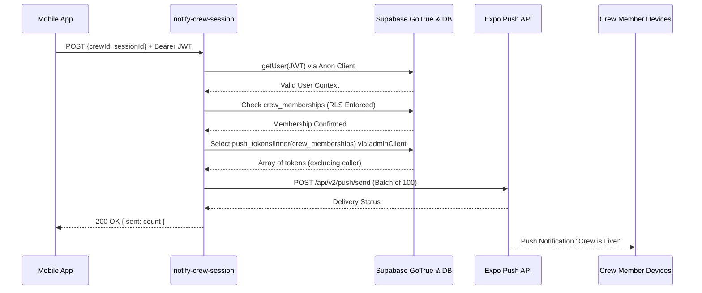
```mermaid
sequenceDiagram
    participant App as Mobile App
    participant Edge as notify-crew-session
    participant DB as Supabase GoTrue & DB
    participant Expo as Expo Push API
    participant Device as Crew Member Devices

    App->>Edge: POST {crewId, sessionId} + Bearer JWT
    Edge->>DB: getUser(JWT) via Anon Client
    DB-->>Edge: Valid User Context
    Edge->>DB: Check crew_memberships (RLS Enforced)
    DB-->>Edge: Membership Confirmed
    Edge->>DB: Select push_tokens!inner(crew_memberships) via adminClient
    DB-->>Edge: Array of tokens (excluding caller)
    Edge->>Expo: POST /api/v2/push/send (Batch of 100)
    Expo-->>Edge: Delivery Status
    Edge-->>App: 200 OK { sent: count }
    Expo-->>Device: Push Notification "Crew is Live!"
```


<!-- CARTOGRAPHER_END: CLOUD_FUNCTIONS -->

<!-- CARTOGRAPHER_START: THEME_&_ASSETS -->

# 🗺️ SDE Cartographer: THEME & ASSETS Domain

## 1. File Manifest
- **Theme Definitions**: `src/theme/theme.ts`
- **Global & Dashboard Styles**: `src/styles/DashboardStyles.ts`
- **Application Constants**: `src/constants/AppConstants.ts`
- **Configuration Controls**: `src/constants/ControlsRegistry.ts`
- **BLE Timing Limits**: `src/constants/bleTimingConstants.ts`
- **Storage Keys**: `src/constants/storageKeys.ts`
- **Static Assets**: `src/assets/images/*` (Includes product imagery, music mode banners, and ZENGGE pattern icons).

## 2. Blast Radius
- **High Impact**: `src/constants/bleTimingConstants.ts`. Any change here cascades through BLE radio timings, recovery loops, FTUE, and hardware connections. Modifying these empirical numbers risks GATT 133 errors on Android or device connection instability.
- **Medium Impact**: `src/theme/theme.ts` & `src/styles/DashboardStyles.ts`. UI structure changes here affect standard views, safe areas, and flex layouts globally. `DashboardStyles` implements specific GC pressure avoidance ("THEME-001"); refactoring it into dynamic renders will crash telemetry.
- **Medium Impact**: `src/constants/storageKeys.ts`. A typo or namespace collision here corrupts offline state, local caches, and migration logic.

## 3. Context Matrix
| File | Provides Context To | Receives Context From |
|---|---|---|
| `theme.ts` | Global UI components, `DashboardStyles.ts` | Platform primitives (OS-specific shadow APIs) |
| `DashboardStyles.ts` | `DashboardScreen.tsx` | Window dimensions via `getDimensionStyles` |
| `bleTimingConstants.ts` | `BleWriteQueue.ts`, `BleMachine.ts`, `ConnectService.ts`, etc. | Empirical hardware limits (ZENGGE 0xA3) |
| `storageKeys.ts` | `AsyncStorage` wrapper methods, Data persistence services | Global app requirements |
| `ControlsRegistry.ts` | `AdminToolsModal` & Debug Interfaces | Component capability parameters |

## 4. Hook/Service I/O Registry
*This domain primarily exports constants, but it strongly governs service I/O interfaces:*
- `getDimensionStyles(windowHeight, windowWidth) => DimensionStyles`: Accepts window metrics, outputs layout padding/font size arrays to limit runtime recalculations.
- `getHardwareConfigKey(mac: string) => string`: Formats the device-specific hardware EEPROM config key based on MAC address.
- `ControlsRegistry`: Exported array structures utilized by Admin Panel renderers to dynamically dispatch configuration updates (e.g. `hw_setup_rssi_threshold`, `offline_crew_hub_hidden`).

## 5. OS Variance Matrix
| Component / File | iOS | Android | Web/Other |
|---|---|---|---|
| `theme.ts` (`Shadows.soft` / `medium`) | Uses `shadowColor`, `shadowOffset`, `shadowOpacity` | Uses `elevation` prop natively | Uses `shadowColor` / `shadowOffset` similar to iOS |
| `theme.ts` (`TextShadows`) | Standard `textShadow*` props | Standard `textShadow*` props | Uses CSS native `textShadow` string |
| `DashboardStyles.ts` | Layouts adapt dynamically | Layouts adapt dynamically | Reacts to dynamic window sizes via inline JS calculations |
| `bleTimingConstants.ts` | Tolerant of fast packet delivery | **Critical Limit**: Susceptible to GATT 133; requires precise `INTER_DEVICE_WRITE_GAP_MS` and `MTU_RETRY_SETTLE_MS` | N/A |

---

## 🗄️ ARCHIVAL INSTRUCTION

Comparison against `C:\Neogleamz\AG_SK8Lytz_App\SK8Lytz\docs\SK8Lytz_App_Master_Reference.md`:
Stale documentation was discovered in Section 2 `AsyncStorage Key Registry` of the Master Reference. The live `storageKeys.ts` file has significantly diverged from the documented key list. 
- `@Sk8lytz_Builder_Presets` is documented but the source uses `@Sk8lytz_local_gradients`.
- `@Sk8lytz_Scenes` is documented but the source uses `@Sk8lytz_local_scenes`.
- `@sk8lytz_logs` is documented but missing entirely from `storageKeys.ts`.
- `@Sk8lytz_voice_tutorial_dismissed` is obsolete (the react-native-voice dependency was removed per the Master Reference) and is correctly absent from `storageKeys.ts`.

**[MOVE_TO_ARCHIVE]** - The `AsyncStorage Key Registry` section in the Master Reference should be archived and subsequently rebuilt directly from `src/constants/storageKeys.ts` to ensure Source of Truth parity.

---

## 📐 ARCHITECTURAL IMPACT FLAGS
[IMPACTS_USER_JOURNEY]
[IMPACTS_C4_CONTEXT]
[IMPACTS_STATE_CHART]

---

## 🔄 SEQUENCE DIAGRAM

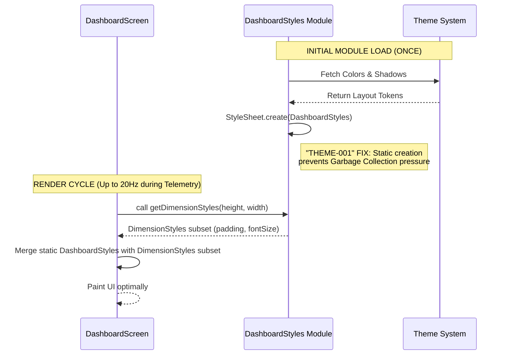
```mermaid
sequenceDiagram
    participant React as DashboardScreen
    participant Styles as DashboardStyles Module
    participant Theme as Theme System
    
    note over Styles, Theme: INITIAL MODULE LOAD (ONCE)
    Styles->>Theme: Fetch Colors & Shadows
    Theme-->>Styles: Return Layout Tokens
    Styles->>Styles: StyleSheet.create(DashboardStyles)
    note right of Styles: "THEME-001" FIX: Static creation<br/>prevents Garbage Collection pressure
    
    note over React: RENDER CYCLE (Up to 20Hz during Telemetry)
    React->>Styles: call getDimensionStyles(height, width)
    Styles-->>React: DimensionStyles subset (padding, fontSize)
    React->>React: Merge static DashboardStyles with DimensionStyles subset
    React-->>React: Paint UI optimally
```

---

## 🎨 Design System & Token Manifest

### Color Palette (Dark Theme Base)
- `background`: `#1B4279`
- `surface`: `#245596`
- `surfaceHighlight`: `#3172C9`
- `primary`: `#FF5A00`
- `secondary`: `#FFB800`
- `accent`: `#FF3300`
- `text`: `#FFFFFF`
- `textMuted`: `#A0B4CF`
- `textDim`: `#6B85A0`
- `success`: `#00E88F`
- `error`: `#FF3D71`
- `warning`: `#FFB800`

### Typography (`Righteous` FontFamily)
- `header`: 24px, uppercase, letterSpacing: 2
- `title`: 16px, letterSpacing: 0.5
- `body`: 14px
- `caption`: 11px

### Spacing & Layout Scaling
- Scale System: `xxs (2)`, `xs (4)`, `sm (8)`, `md (12)`, `lg (16)`, `xl (24)`, `xxl (32)`, `xxxl (40)`, `huge (48)`, `giant (64)`
- Standard Padding: `Spacing.lg` (16px)
- Standard Border Radius: `Spacing.xl` (24px)

### Components & UI Elements
- **Dashboard UI**: `card`, `scanButton`, `groupButton`, `btBanner`, `skateCardWrapper`
- **Slab Architecture**: 4-Slab View implemented via `headerSlab`, `glassSlab`, `skateCardInner`
- **Gradients & Shadows**: Extracted to `Shadows.soft`, `Shadows.medium`, `Shadows.glow` logic wrappers that parse styling rules based on iOS/Android constraints.


<!-- CARTOGRAPHER_END: THEME_&_ASSETS -->

<!-- CARTOGRAPHER_START: SIMULATION_&_MOCKS -->

# Architectural Cartography - SIMULATION_&_MOCKS Domain

## 1. File Manifest

### Mocks (`src/mocks/`, `src/__mocks__/`)
- `src/mocks/react-native-vision-camera-worklets.web.js`: Web shim exporting an empty module to prevent bundler errors when importing native vision camera components in Expo Web.
- `src/mocks/react-native-worklets.web.js`: Web shim representing `react-native-worklets-core` on Web. Exposes no-op mocks (`useSharedValue`, `runOnJS`, `runOnUI`) to prevent TurboModule registry crashes.
- `src/__mocks__/LocationService.ts`: Jest mock for `LocationService`, providing dummy headless asynchronous stubs (`getSilentLocation`, `requestLocationPermissions`).
- `src/__mocks__/expo-location.ts`: Jest mock for the native Expo Location module.
- `src/__mocks__/expo-audio.ts`: Jest mock for native Expo Audio recording permissions.
- `src/__mocks__/sk8lytz-watch-bridge.ts`: Jest manual mock for the `sk8lytz-watch-bridge` native module, allowing unit tests and CI verification without crashing on missing native binaries.

### Tests (`__tests__/`)
- **BLE Subsytem** (`src/services/ble/__tests__/*`, `src/hooks/ble/__tests__/*`): Validate the state machines (`BleMachine`), recovery protocols (`RecoveryService`), connection services, and BLE React hooks (`useBLEScanner`, `useBLERSSIMonitor`, `useBLEBatterySweep`).
- **Session Subsystem** (`src/services/session/__tests__/*`): Validate session tracking, health commits, auto-pause behavior, and metrics bridge logic.
- **Protocol Subsystem** (`src/protocols/__tests__/*`): Validate hex protocol output generation and byte assertions (ensuring `PatternEngine` properly generates expected payloads, e.g. mapping pattern IDs to `0x51` pipelines and averting deprecated `0x41`/`0x56` opcodes).
- **Screens & General Logic** (`src/screens/__tests__/*`, `src/hooks/__tests__/*`, `src/utils/__tests__/*`, `src/components/__tests__/*`): Validate UI component contracts and outputs, such as ensuring the Setup Wizard emits correct array-based `group_ids` structure.

## 2. Blast Radius
- **Test Pipeline Blockage**: Deleting or modifying the manual mocks (`sk8lytz-watch-bridge.ts`, `expo-location.ts`) without alternative shims will cause the entire CI validation suite (`npm run verify`) to fail due to unresolved native dependencies.
- **Hardware Protocol Risks**: The test suites in `src/protocols/__tests__/*` are the primary gatekeepers against firmware crashes. Regressing tests like `ZenggeProtocol.test.ts` can lead to the silent reintroduction of condemned opcodes (`0x41`, `0x43`) that lock up `0xA3` hardware chipsets.
- **Expo Web Crashes**: Modifying the Web-specific mocks in `src/mocks/*.web.js` directly breaks the Expo Web build, causing instant `TurboModuleRegistry` JS thread crashes during module initialization.

## 3. Context Matrix
- **Testing <-> Native Modules**: The manual `__mocks__` intersect directly with `sk8lytz-watch-bridge`, `expo-audio`, and `expo-location`, providing test harnesses for headless environments.
- **Testing <-> Core State Machines**: `__tests__` orchestrate and interact deeply with XState boundaries (e.g. `BleMachine`, `SessionMachine`), ensuring determinism without actual physical adapters.
- **Web Build <-> UI Worklets**: The `mocks/*.web.js` context directly interfaces with Metro bundler resolutions to prevent the inclusion of incompatible worklet logic in the browser environment.

## 4. Hook/Service I/O Registry
- **`RecoveryService.test.ts` Registry**:
  - *Inputs*: `ghostedDeviceIds`, mocked `BleManager` callbacks.
  - *Outputs*: Asynchronous `RECOVERY_COMPLETE` or `RECOVERY_PERMANENTLY_FAILED` events mapped across phase retries.
- **`HardwareSetupWizardScreen.test.tsx` Registry**:
  - *Inputs*: Simulated onboarding input payload events.
  - *Outputs*: Strict verification against the emitted `device` object payload, explicitly ensuring an array-based `group_ids` and `group_names` over the deprecated scalar `group_id`.
- **`sk8lytz-watch-bridge` Mock I/O**:
  - *Inputs*: Emulated payload dispatches for session metrics and watch health.
  - *Outputs*: Dummy test-resolving returns (`undefined`, `false`) validating bridge dispatch attempts.

## 5. OS Variance Matrix
| OS Context | Affected Elements | Variance Description & Impact |
|---|---|---|
| **Web** | `react-native-worklets.web.js`, `react-native-vision-camera-worklets.web.js` | Shims native modules at Metro build-time. Enables UI logic evaluation without crashing the browser's JavaScript environment due to missing `TurboModuleRegistry`. |
| **Android / iOS** | `src/__mocks__/*` | Replaces device-specific APIs (location, microphone, watch connectivity) with mock functions tailored strictly for Jest execution parity. |

## 6. BLE Recovery Simulator Process Diagram

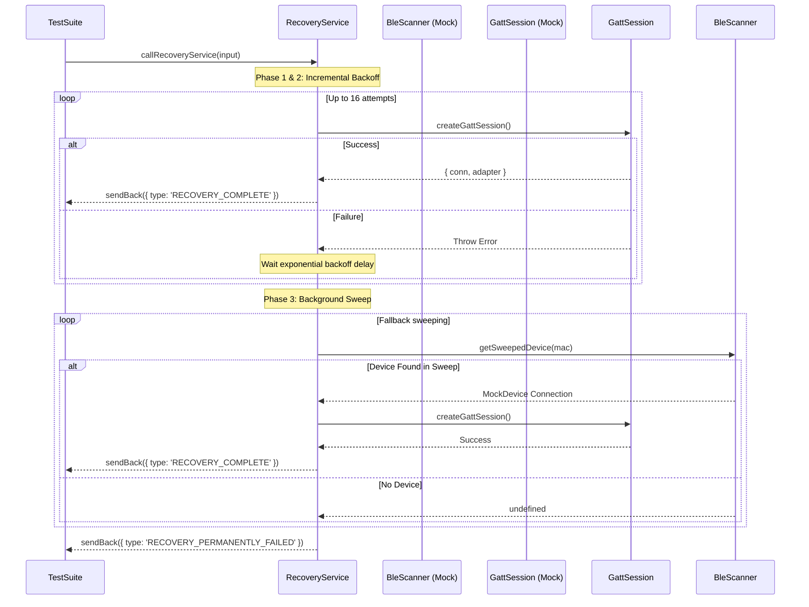
```mermaid
sequenceDiagram
    participant TestSuite
    participant RecoveryService
    participant BleScanner (Mock)
    participant GattSession (Mock)
    
    TestSuite->>RecoveryService: callRecoveryService(input)
    Note over RecoveryService: Phase 1 & 2: Incremental Backoff
    loop Up to 16 attempts
        RecoveryService->>GattSession: createGattSession()
        alt Success
            GattSession-->>RecoveryService: { conn, adapter }
            RecoveryService-->>TestSuite: sendBack({ type: 'RECOVERY_COMPLETE' })
        else Failure
            GattSession-->>RecoveryService: Throw Error
            Note over RecoveryService: Wait exponential backoff delay
        end
    end
    
    Note over RecoveryService: Phase 3: Background Sweep
    loop Fallback sweeping
        RecoveryService->>BleScanner: getSweepedDevice(mac)
        alt Device Found in Sweep
            BleScanner-->>RecoveryService: MockDevice Connection
            RecoveryService->>GattSession: createGattSession()
            GattSession-->>RecoveryService: Success
            RecoveryService-->>TestSuite: sendBack({ type: 'RECOVERY_COMPLETE' })
        else No Device
            BleScanner-->>RecoveryService: undefined
        end
    end
    RecoveryService-->>TestSuite: sendBack({ type: 'RECOVERY_PERMANENTLY_FAILED' })
```

## Archival Tags & Observations
- `[MOVE_TO_ARCHIVE]`: Older descriptions of test configs and manual mocks in `docs/SK8Lytz_App_Master_Reference.md` (e.g. lines 5780-5995, `RbmSimulator.ts`, and "Optical Simulation Mode") are stale. The older simulation architecture and web BLE fallback logic has been natively shimmed, deleted, or merged deeply into testing suites and state machines.

**ARCHITECTURAL IMPACT FLAGS**
[IMPACTS_C4_CONTEXT]
[IMPACTS_STATE_CHART]


<!-- CARTOGRAPHER_END: SIMULATION_&_MOCKS -->

<!-- CARTOGRAPHER_START: BUILD_CONFIG -->

# BUILD_CONFIG Domain Cartography

## 1. File Manifest
- `app.config.js`: Central Expo configuration. Defines `versionCode: 41`, `targetSdkVersion: 36`, and `enableJetifier: false`. Specifies native permissions for iOS (Health, Bluetooth, Location) and Android (Bluetooth, Location, Activity Recognition, Health). Configures plugins like `react-native-ble-plx`, `detox`, and `withWearOsModule`.
- `eas.json`: Defines build profiles (`development`, `preview`, `production`) specifying distributions (`internal`, `apk`, `simulator`, `app-bundle`). Requires EAS CLI `>= 16.0.0` and enforces `requireCommit: true`.
- `metro.config.js`: Intercepts module resolution for `web` platform. Mocks `react-native-worklets` and `react-native-vision-camera-worklets` with stub files to prevent web build crashes.
- `babel.config.js`: Configures `babel-preset-expo` and registers the `react-native-worklets-core/plugin`.
- `tsconfig.json`: Extends `expo/tsconfig.base` with `strict: true` and defines `paths` for the unlinked local module `sk8lytz-watch-bridge`.
- `jest.config.js`: Uses `jest-expo` preset, maps native dependencies (`sk8lytz-watch-bridge`, `expo-location`, `expo-audio`) to local `__mocks__` and ignores `.local-builder` during tests.
- `package.json`: Manages dependencies (Expo 55, React Native 0.83.2, vision-camera v5, xstate v5) and critical scripts (`verify`, `blast-radius`, `postinstall`).
- `.husky/pre-commit`: Worktree-aware git hook. Dynamically links the fortress `node_modules` into the local worktree, runs `blast-radius-scanner`, babel syntax gates, ESLint, and `npm run verify`.
- `.husky/pre-push`: Zero-bypass QA gate enforcing `verifiable-check-runner.js --verify` and `npm audit --audit-level=moderate`.

## 2. Blast Radius
- **app.config.js**: Modifying plugins or permissions requires a full native rebuild (EAS Build) and impacts app store compliance.
- **metro.config.js / babel.config.js**: Directly impacts JavaScript bundle generation. Breaking these affects the ability to start the development server and bundle the app for any platform.
- **tsconfig.json**: Changing path aliases will break local native module linking (`sk8lytz-watch-bridge`) and IDE intellisense across the entire codebase.
- **.husky scripts**: Critical to maintaining the isolated worktree workflow. Changes here can break the safety protocol that prevents rogue commits to master.

## 3. Context Matrix
- **EAS Build Architecture**: Separated into internal debug APKs (`development`), internal simulators (`preview`), and production app-bundles (`production`).
- **Web Fallback Layer**: Expo web builds lack support for vision-camera and JSI worklets. Metro config stubs these out at bundle-time.
- **Worktree Tooling Layer**: Git hooks are heavily customized to resolve the parent `.git` common-dir and maintain isolated node environments across branches.

## 4. Hook/Service I/O Registry
- **`sk8lytz-watch-bridge`**: Ingested locally without `npm install` via `tsconfig.json` paths and mocked globally in `jest.config.js` via `moduleNameMapper`.
- **`react-native-worklets-core`**: Babel transforms code at build time. Metro shims the import on web to prevent JSI enforcing errors.

## 5. OS Variance Matrix
- **Android**: Demands `targetSdkVersion: 36`, `enableJetifier: false`, and heavily expanded permission manifest including `FOREGROUND_SERVICE_CONNECTED_DEVICE` and Health Connect.
- **iOS**: Relies on specific `infoPlist` configurations for HealthKit, Background Modes (location, bluetooth-central), and Apple Targets.
- **Web**: Uses `metro.config.js` aliasing to mock out `react-native-worklets` to avoid web environment crash.
- **Windows / MSYS / Cygwin**: Husky scripts conditionally use `cmd.exe /c "mklink /j ..."` to support Unix-like symlink structures within Windows Git Worktrees.

## Documentation Stale Analysis
In `docs/SK8Lytz_App_Master_Reference.md`, the following documentation is STALE:
> ### Android Build Requirements
> To resolve dependency conflicts and legacy library issues, the following configurations are required:
> - **Jetifier**: Must be enabled (`android.enableJetifier=true`) to migrate legacy Support libraries to AndroidX.
> - **SDK Versions**: Project currently targets SDK 34 (`compileSdk`, `targetSdk`).

**Correction**: `app.config.js` sets `enableJetifier: false`, `targetSdkVersion: 36`, and `compileSdkVersion: 36`.
[MOVE_TO_ARCHIVE]

## Architectural Sequence Diagram

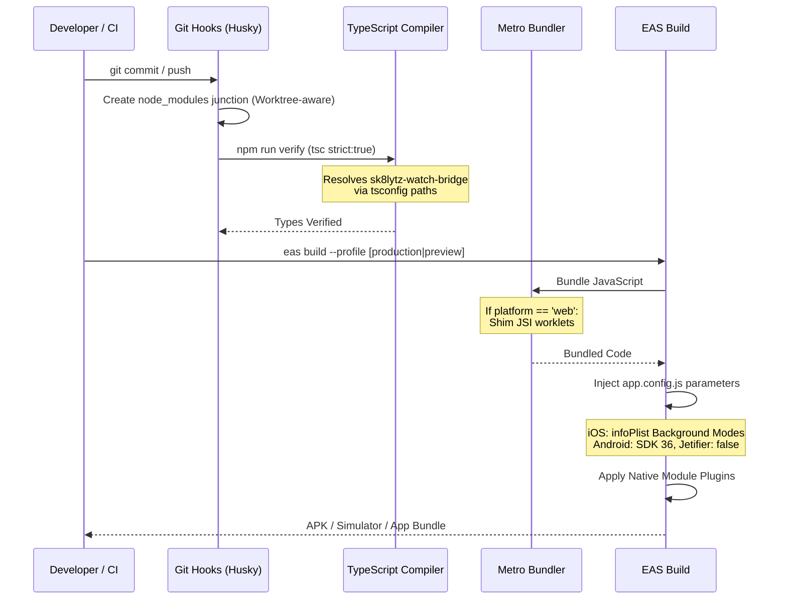
```mermaid
sequenceDiagram
    participant Dev as Developer / CI
    participant Husky as Git Hooks (Husky)
    participant TS as TypeScript Compiler
    participant Metro as Metro Bundler
    participant EAS as EAS Build

    Dev->>Husky: git commit / push
    Husky->>Husky: Create node_modules junction (Worktree-aware)
    Husky->>TS: npm run verify (tsc strict:true)
    Note over TS: Resolves sk8lytz-watch-bridge<br/>via tsconfig paths
    TS-->>Husky: Types Verified
    Dev->>EAS: eas build --profile [production|preview]
    EAS->>Metro: Bundle JavaScript
    Note over Metro: If platform == 'web':<br/>Shim JSI worklets
    Metro-->>EAS: Bundled Code
    EAS->>EAS: Inject app.config.js parameters
    Note over EAS: iOS: infoPlist Background Modes<br/>Android: SDK 36, Jetifier: false
    EAS->>EAS: Apply Native Module Plugins
    EAS-->>Dev: APK / Simulator / App Bundle
```

[IMPACTS_C4_CONTEXT]


<!-- CARTOGRAPHER_END: BUILD_CONFIG -->

<!-- CARTOGRAPHER_START: OS_PERMISSIONS -->

# 🗺️ Codebase Cartography: OS_PERMISSIONS Domain

## 1. File Manifest
- **`android/app/src/main/AndroidManifest.xml`**: Main Android application manifest specifying package configurations, services, activities, intent filters, required hardware features (`android.hardware.bluetooth_le`), and 23 distinct OS-level permissions.
- **`app.config.js`**: Core Expo configuration file generating metadata and platform settings for iOS (`Info.plist` strings and background modes) and Android (permission arrays).
- **`targets/watch/Info.plist`**: Skeleton plist file for the watchOS companion target; actual properties are likely populated during prebuild via `@bacons/apple-targets`.

## 2. Blast Radius
Modifying OS-level permissions directly impacts:
- **BLE Subsystem (`react-native-ble-plx`)**: Controls hardware discovery, connectivity, and GATT synchronization.
- **Location Subsystem (`expo-location`)**: Impacts background mapping, skate spot discovery, and Crew Radar functionality.
- **Health Integration (`react-native-health`, `react-native-health-connect`)**: Directly gates Apple HealthKit and Android Health Connect step tracking, heart rate, and calorie extraction.
- **Camera & Audio Subsystems (`react-native-vision-camera`, `expo-audio`)**: Provides hardware access for real-time audio reaction (`0x74` streaming) and ambient color sampling.
- **Background Execution (`Notifee`)**: Enforces background survival via foreground services (`FOREGROUND_SERVICE`, `location|connectedDevice`).

## 3. Context Matrix
- **Android Runtime**: Permissions explicitly requested in `AndroidManifest.xml` via `<uses-permission>`. Runtime checks flow through `PermissionsAndroid` or native plugins. Includes granular API 32 bounded storage permissions (`READ_EXTERNAL_STORAGE` `maxSdkVersion="32"`).
- **iOS Runtime**: Permissions injected dynamically during prebuild via `app.config.js` (`infoPlist` object). Uses explicit descriptive strings (e.g., `NSMicrophoneUsageDescription`) displayed during the OS native dialog prompts.
- **Background Restraints**: Constrained by `FOREGROUND_SERVICE_LOCATION` and `FOREGROUND_SERVICE_CONNECTED_DEVICE` on Android. iOS utilizes `UIBackgroundModes` specifically for `location` and `bluetooth-central` execution.

## 4. Hook/Service I/O Registry
- **`app.config.js` (Exported JSON configuration)**:
  - **Inputs**: Environment variables (e.g., `EXPO_PUBLIC_GOOGLE_MAPS_API_KEY`).
  - **Outputs**: Configuration object defining app `slug`, iOS `UIBackgroundModes`, `NS*UsageDescription` strings, and Android `permissions` array.
  - **Side-effects**: Configures background execution allowances for both platforms.
- **`AndroidManifest.xml` (Static XML)**:
  - **Inputs**: None.
  - **Outputs**: Manifest constraints such as `BLUETOOTH_CONNECT`, `FOREGROUND_SERVICE`, `ACTIVITY_RECOGNITION`.
  - **Side-effects**: Declares required hardware features, registers foreground services (`app.notifee.core.ForegroundService`), and bounds deep link queries.

## 5. OS Variance Matrix
| Capability | Android Implementation | iOS Implementation |
|------------|-----------------------|-------------------|
| **BLE Access** | `BLUETOOTH_SCAN`, `BLUETOOTH_CONNECT`, `BLUETOOTH_ADMIN` | `NSBluetoothAlwaysUsageDescription`, `NSBluetoothPeripheralUsageDescription` |
| **Location** | `ACCESS_FINE_LOCATION`, `ACCESS_COARSE_LOCATION` | `NSLocationWhenInUseUsageDescription`, `NSLocationAlwaysUsageDescription` |
| **Background execution** | `FOREGROUND_SERVICE`, `FOREGROUND_SERVICE_LOCATION`, `FOREGROUND_SERVICE_CONNECTED_DEVICE` | `UIBackgroundModes` (`location`, `bluetooth-central`) |
| **Media / Camera** | `CAMERA`, `RECORD_AUDIO` | `NSCameraUsageDescription`, `NSMicrophoneUsageDescription` |
| **Health Metrics** | `android.permission.health.*` | `NSHealthShareUsageDescription`, `NSHealthUpdateUsageDescription` |

## 6. Sequence Diagram
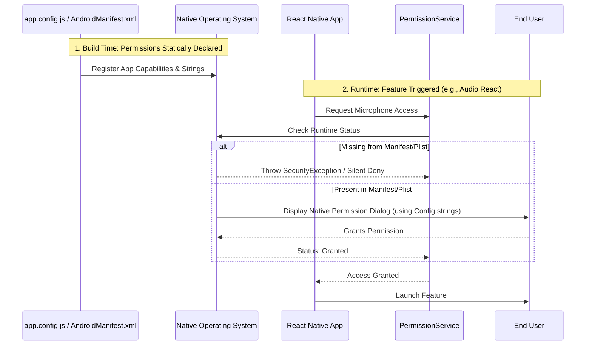
```mermaid
sequenceDiagram
    participant Config as app.config.js / AndroidManifest.xml
    participant OS as Native Operating System
    participant App as React Native App
    participant PermissionService
    participant User as End User

    Note over Config, OS: 1. Build Time: Permissions Statically Declared
    Config->>OS: Register App Capabilities & Strings
    
    Note over App, User: 2. Runtime: Feature Triggered (e.g., Audio React)
    App->>PermissionService: Request Microphone Access
    PermissionService->>OS: Check Runtime Status
    
    alt Missing from Manifest/Plist
        OS-->>PermissionService: Throw SecurityException / Silent Deny
    else Present in Manifest/Plist
        OS->>User: Display Native Permission Dialog (using Config strings)
        User-->>OS: Grants Permission
        OS-->>PermissionService: Status: Granted
    end
    PermissionService-->>App: Access Granted
    App->>User: Launch Feature
```

[IMPACTS_USER_JOURNEY]
[IMPACTS_C4_CONTEXT]


<!-- CARTOGRAPHER_END: OS_PERMISSIONS -->

<!-- CARTOGRAPHER_START: ADMIN_&_TELEMETRY -->

# Admin & Telemetry Cartography
[IMPACTS_C4_CONTEXT]
[IMPACTS_STATE_CHART]

## 1. File Manifest

### Components (Admin Hub)
- `src/components/admin/AdminTab.tsx`
- `src/components/admin/AdminToolsModal.tsx`
- `src/components/admin/AdvancedHardwareModal.tsx`
- `src/components/admin/ConfirmDeleteModal.tsx`
- `src/components/admin/DeviceTab.tsx`
- `src/components/admin/StatsTab.tsx`
- `src/components/admin/adminStyles.ts`

### Components (Admin Tools Sub-Panels)
- `src/components/admin/tools/AdminAuditLogViewer.tsx`
- `src/components/admin/tools/AdminPicksScheduler.tsx`
- `src/components/admin/tools/AdminRosterPanel.tsx`
- `src/components/admin/tools/AppManager.tsx`
- `src/components/admin/tools/FeatureFlagsPanel.tsx`
- `src/components/admin/tools/GlobalAnalyticsPanel.tsx`
- `src/components/admin/tools/HardwareBlacklistPanel.tsx`
- `src/components/admin/tools/ProductManager.tsx`
- `src/components/admin/tools/Sk8LytzDiagnosticLab.tsx`
- `src/components/admin/tools/Sk8LytzProgrammer.tsx`
- `src/components/admin/tools/UserManagementPanel.tsx`

### Services
- `src/services/appLogger/AppLoggerService.ts`
- `src/services/appLogger/AppLoggerCloud.ts`
- `src/services/appLogger/AppLoggerStorage.ts`
- `src/services/AppSettingsService.ts`

### Hooks
- `src/hooks/useAdminSettings.ts`
- `src/hooks/useAdminTelemetry.ts`
- `src/hooks/useDiagnosticLog.ts`


## 2. Blast Radius
- **Telemetry System (`AppLogger`)**: Operates globally across the app. Modifying payload handling directly impacts how analytics, device states, and crash dumps are formatted and sent to Supabase.
- **`AppSettingsService`**: Central authority for feature flagging and configurations. Modifying this affects offline/online gating, hardware limits, and core UI layouts across the application.
- **Admin Hub / Diagnostic Tools**: These panels bypass standard validation layers (e.g., `AdvancedHardwareModal` directly writes EEPROM sizes). Errors here can lock up physical LED hardware devices.


## 3. Context Matrix
- **AppLogger Lifecycle**: Combines local `AsyncStorage` caching (Max 500 entries) with PII obfuscation and high-frequency throttling before uploading chunks (500 max per network request) to Supabase.
- **Telemetry Separation**: Crash and Exception events (`CRITICAL_EVENTS`) hit a "VIP Fast-Lane" dual-write immediately into Supabase, bypassing the standard buffered timer.
- **Admin Orchestration**: `AdminToolsModal` acts as the root navigator orchestrating modular administrative tabs to prevent excessive re-renders during high-frequency Bluetooth telemetry logging.


## 4. Hook/Service I/O Registry

| Target | Core Inputs | Core Outputs | Purpose |
|---|---|---|---|
| `AppLoggerService` | `EventType`, `payload` | `void` (writes to `AppLoggerStorage`) | Central orchestrator for telemetry formatting, scrubbing, queueing, and pushing offline logs to `AppLoggerCloud`. |
| `AppSettingsService` | `key`, `value` | `AppSettingsMap` (Promise) | Synchronizes feature flags and administrative preferences between `AsyncStorage` and Supabase. |
| `useAdminSettings` | `visible: boolean` | `{ appSettings, isLoading, loadSettings, updateSetting }` | React binding to `AppSettingsService` with optimistic UI updates. |
| `useAdminTelemetry` | `visible: boolean` | `{ logs, stats, isUploading, load, clearLogs, uploadLogs, exportLogs }` | Powers the admin dashboard's timeline, statistics generation, and network sync buttons. |
| `useDiagnosticLog` | `{ visible, liveRxPayload, targetDeviceId }` | `{ logs, testLog, coverage, transmit, setVerdict, ... }` | Manages hardware protocol testing state, logging bytes transmitted/received, and mapping coverage against tracked opcodes. |


## 5. OS Variance Matrix
| Component | Variance Detail |
|---|---|
| `AppLoggerService` / `AppLoggerCloud` | Reads `expo-device` internals. On iOS, retrieves device name/type correctly; on Android relies on `modelId` and `osInternalBuildId` for `host_device_id`. |
| `AdminToolsModal` | Utilizes `removeClippedSubviews={Platform.OS === 'android'}` on the Timeline `FlatList` to prevent memory leaks specific to Android's recycler views. |
| `AdminPicksScheduler` | `@react-native-community/datetimepicker` behavior is bifurcated. On iOS, the date picker renders as an overlay with explicit "Done" actions; on Android, the picker closes immediately after selection. |


## 6. Architecture Diagrams

### AppLogger Telemetry Pipeline

```mermaid
sequenceDiagram
    participant App as Application
    participant ALS as AppLoggerService
    participant AS as AppLoggerStorage
    participant AC as AppLoggerCloud
    participant Supabase as Supabase DB

    App->>ALS: log(event, rawPayload)
    ALS->>ALS: Check HIGH_FREQ_EVENTS Throttle (500ms)
    ALS->>ALS: formatPayload() (PII obfuscate, enrich BLE meta)
    ALS->>FlightRecorder: leaveBreadcrumb()
    alt CRITICAL_EVENT
        ALS->>AC: pushFastLaneError()
        AC->>Supabase: Dual-write (telemetry_errors, crash_telemetry)
        ALS->>AS: push(entry)
    else IMMEDIATE_LOG
        ALS->>AS: push(entry)
    else DEBOUNCED_LOG
        ALS->>ALS: pendingLogQueue timeout (100ms)
        ALS->>ALS: flushQueues()
        ALS->>AS: push(entry)
    end
    
    AS->>AS: persist() to AsyncStorage
    
    App->>ALS: uploadLogsToSupabase()
    ALS->>AS: getBuffer()
    ALS->>AC: uploadTelemetrySnapshots(buffer)
    AC->>AppSettingsService: check global_telemetry_enabled
    alt telemetryEnabled == true
        AC->>Supabase: Chunked insert to telemetry_snapshots (500 items/chunk)
        Supabase-->>AC: Success count
        AC-->>ALS: onSuccess callback
        ALS->>AS: setBuffer(sliced buffer)
        ALS->>AS: persist(true)
    else telemetryEnabled == false
        AC-->>ALS: Wipe buffer
    end
```

## 7. Master Reference Sync

[MOVE_TO_ARCHIVE]
The `SK8Lytz_App_Master_Reference.md` lists the `AppLogger` cache key explicitly as `@sk8lytz_logs` in the AsyncStorage table. The `AppLoggerStorage` service has actually migrated to use `APP_LOGGER_STORAGE_KEY` and treats `@Sk8lytz_logs` purely as a legacy fallback for migration. The docs should reflect the dynamic imported constant rather than the hardcoded legacy string.


<!-- CARTOGRAPHER_END: ADMIN_&_TELEMETRY -->

<!-- CARTOGRAPHER_START: DEPENDENCY_AUDIT -->

<!-- CARTOGRAPHER_START: DEPENDENCY_AUDIT -->

# DEPENDENCY_AUDIT Cartography

[IMPACTS_C4_CONTEXT]

## 1. File Manifest
- **`package.json`**: Root project manifest declaring package scripts, dependencies, devDependencies, and package overrides. Integrates local modules (`sk8lytz-watch-bridge`) and Expo configurations. Identifies the app version (3.10.1) and React Native core version (0.83.2).
- **`package-lock.json`**: Deterministic lockfile ensuring byte-for-byte reproducibility of the dependency tree.

## 2. Blast Radius
- **Imports (Consumes)**: 
  - Core: `expo` (~55.0.8), `react` (19.2.6), `react-native` (0.83.2).
  - SDKs/Integrations: `@supabase/supabase-js`, `react-native-ble-plx`, `xstate`, `@xstate/react`.
  - Native Modules: `react-native-vision-camera`, `react-native-nitro-modules`, `react-native-health`, `react-native-health-connect`, `@notifee/react-native`.
  - Local Bridge: `sk8lytz-watch-bridge` (file:modules/sk8lytz-watch-bridge).
- **Imported By (Consumed By)**: Metro Bundler, Expo CLI, CI/CD pipelines, Husky pre-commit hooks, `npm run verify` check runner, and all developers running workspace setups.

## 3. Context Matrix
- **React Contexts**: N/A (Dependency manifests do not participate in the React context lifecycle directly, though they dictate versions of Providers like `AuthContext` via Supabase and `BLEContext` via PLX).

## 4. Hook/Service I/O Registry
- **Inputs/Outputs**: N/A for package dependencies directly. Scripts define basic inputs/outputs for the build system (e.g., `npm run verify` executes `blast-radius-scanner` and `verifiable-check-runner.js`).

## 5. OS Variance Matrix
- **iOS Only**: `@bacons/apple-targets` (watchOS companion app targets), `react-native-health` (Apple HealthKit), `expo run:ios`.
- **Android Only**: `react-native-health-connect` (Google Health Connect), `expo run:android`.

## 6. Sequence Diagram
```mermaid
sequenceDiagram
    participant Dev as Developer
    participant NPM as NPM/Node
    participant BR as blast-radius-scanner.js
    participant VCR as verifiable-check-runner.js
    
    Dev->>NPM: npm run verify
    NPM->>BR: node tools/blast-radius-scanner.js --worktree
    BR-->>NPM: Exit Code (0 for Success)
    NPM->>VCR: node tools/verifiable-check-runner.js
    VCR-->>NPM: Exit Code (0 for Success)
    NPM-->>Dev: Verification Complete
```

## 7. Archival Instruction
The existing `<!-- CARTOGRAPHER_START: DEPENDENCY_AUDIT -->` block in `docs/SK8Lytz_App_Master_Reference.md` (lines 2999-3021) is stale, as it lacks references to the newly added native module integrations (e.g., Health Connect, Vision Camera, Nitro Modules) and the `npm run verify` pipeline. 

[MOVE_TO_ARCHIVE]

<!-- CARTOGRAPHER_END: DEPENDENCY_AUDIT -->


<!-- CARTOGRAPHER_END: DEPENDENCY_AUDIT -->

---

## 5. Database Schemas

### Supabase Architecture (Telemetry & Registration)

_Project ID:_ `qefmeivpjyaukbwadgaz`

#### **`registered_devices`** (Hardened Schema — Updated 2026-04-22)

| Column                      | Type       | Purpose                                              |
| :-------------------------- | :--------- | :--------------------------------------------------- |
| `id`                        | TEXT (PK)  | Unique system identifier (MAC+userId composite)      |
| `device_mac`                | TEXT       | Unique hardware address (UPPERCASE)                  |
| `user_id`                   | UUID       | Owner ID                                             |
| `device_name`               | TEXT       | Custom alias                                         |
| `product_type`              | TEXT       | HALOZ / SOULZ / RAILZ                                |
| `led_points`                | INT        | Physical pixel count                                 |
| `segments`                  | INT        | Hardware mirror segments                             |
| `ic_type`                   | TEXT       | LED chipset (WS2812B, SK6812, etc.)                  |
| `color_sorting`             | TEXT       | RGB channel order (GRB, RGB, etc.)                   |
| `firmware_ver`              | INT        | Firmware version integer from BLE advertisement      |
| `led_version`               | INT        | LED version from BLE advertisement                   |
| `product_id`                | INT        | ZENGGE hardware product ID (0xA3=163 for all SK8Lytz)|
| `product_id_confirmed_at`   | TIMESTAMPTZ| When product_id was confirmed via BLE (added 2026-04-22)|
| `rf_mode`                   | TEXT       | RF remote auth policy                                |
| `rf_paired_count`           | INT        | Number of paired RF remotes                          |
| `group_id`                  | TEXT       | ⚠️ **LEGACY — do not use for new code.** Superseded by junction table `device_group_members`. Still present in cloud rows for backward compat. |
| `group_name`                | TEXT       | ⚠️ **LEGACY — do not use for new code.** Superseded by `registered_groups.group_name`. |
| `registered_at`             | TIMESTAMPTZ| First registration timestamp                         |
| `updated_at`                | TIMESTAMPTZ| Last modification timestamp                          |
| `rssi_at_register`          | INT        | Signal strength at registration                      |

> [!IMPORTANT]
> **Many-to-Many Migration (2026-05-28)**: Device-to-group membership is now stored in the `device_group_members` junction table (`device_id TEXT FK → registered_devices.device_mac`, `group_id TEXT FK → registered_groups.id`). The app-side `RegisteredDevice` object uses `group_ids: string[]` and `group_names: string[]` arrays. The `upsert_group_with_devices` RPC handles all atomic group mutations. Never write scalar `group_id` from new code.

#### **`product_catalog`** (Dynamic Hardware Definitions)

| Column                 | Type      | Purpose                  |
| :--------------------- | :-------- | :----------------------- |
| `id`                   | TEXT (PK) | Unique product key       |
| `display_name`         | TEXT      | Human-readable name      |
| `viz_shape`            | TEXT      | RING / OVAL / DUAL_STRIP |
| `battery_capacity_mah` | INT       | Rated capacity           |

#### **`skate_spots`** (Map Grounding)

| Column          | Type      | Purpose                               |
| :-------------- | :-------- | :------------------------------------ |
| `id`            | UUID (PK) | Unique spot ID                        |
| `name`          | TEXT      | Rink/Park name                        |
| `lat`           | DOUBLE    | Latitude                              |
| `lng`           | DOUBLE    | Longitude                             |
| `surface_type`  | TEXT      | `wood` / `concrete` / `sport_court`   |
| `is_indoor`     | BOOLEAN   | Indoor vs Outdoor                     |
| `source`        | TEXT      | `native_seed` / `osm` / `user_submit` |
| `is_verified`   | BOOLEAN   | Administrative verification status    |
| `facility_type` | TEXT      | `roller_rink`/`skatepark`/`pro_shop`  |
| `has_pro_shop`  | BOOLEAN   | Embedded pro shop indicator           |
| `is_featured`   | BOOLEAN   | Highlighted partner or rink           |
| `last_enriched_at`| TIMESTAMP | Last Cultural Daemon crawl timestamp  |
| `socials`       | JSONB     | Scraped Instagram/Facebook URLs       |
| `vibe_rating`   | DOUBLE    | Aggregate 5-star Google/Yelp rating   |
| `has_adult_night`| BOOLEAN  | Scraped confirmation of 18+ nights    |
| `has_lights`    | BOOLEAN   | OSM Tag: Night lighting               |
| `has_fee`       | BOOLEAN   | OSM Tag: Paid entry                   |
| `has_rental`    | BOOLEAN   | OSM Tag: Gear rental                  |
| `has_wifi`      | BOOLEAN   | OSM Tag: Public Wifi                  |

> [!NOTE]
> **Map Grounding Strategy**: Over 10,000 skate spots are horizontally harvested natively from OpenStreetMap (`tools/scraper/USANationalHarvest.ts`) populating coordinates, facility type, and physical properties. 

---

## 8. Data Pipelines & ETL (The Cultural Daemon)

The project leverages a decoupled, two-phase zero-cost backend to populate `skate_spots`.

### Wave 1: Spatial Harvesting (The Cartographer)
A fast, lightweight Node script (`USANationalHarvest.ts`) queries the OSM Overpass API state-by-state. It extracts coordinates, resolves full addresses via Nominatim, and maps physical boolean tags (`has_ac`, `has_food`, `capacity`) into Supabase in bulk.

### Wave 2: Cultural Enrichment (The Daemon) — RETIRED
The host PM2 process (`CulturalDaemon.ts`) was retired in the Great Consolidation (v3.9.1). All active scraping daemons (website-resolver, indexer, photographer, publisher) are now run directly as managed sub-processes under `CCTower.ts` inside the Docker Scraper Stack container (`sk8lytz-scraper-stack`).
- **The Priority Queue:** Daemons query the local SQLite pipeline database and push changes downstream via the `Publisher`.
- **The Engine:** We use Puppeteer and Google Shadow-DOM scraping managed via CCTower's dashboard interface.

### Wave 3: The AI Detective (Local LM Studio Pipeline)
A localized, schema-driven AI extraction pipeline that processes raw text dumps from deep-crawled websites.
- **The Brain:** LM Studio running locally (Llama-3 / Mistral model via OpenAI-compatible REST endpoint on port 1234). Ollama was permanently removed — see conversation `40767855`.
- **The Interface:** Phase 2 (Detective) dashboard tab provides **AI Target Vectors** toggle switches (e.g., General Hours, Adult Night, Pricing, House Rules).
- **The Config (SSOT):** `scraper_config.ai_target_vectors` stores the active extraction goals as a `text[]` array in Supabase.
- **The Indexer:** The AI Daemon (`Indexer.ts`) dynamically compiles the prompt using the active target vectors and forces the AI to reply strictly in JSON.

---

## 6. Crew Hub & Session Lifecycle

To ensure high-fidelity discovery and telemetry, the Crew Hub follows strict lifecycle and naming protocols.

### Session Naming Convention


### Proximity Discovery & Visibility Rules

Discovery radius filter governed by `LocationService.getNearbyPublicSessions(radiusMi)`.

### Global Session Lifecycle Cleanup

System-wide `cleanupExpiredSessions()` ends sessions older than 24h.

---

## 7. Session Telemetry Architecture

### Supabase Table: `skate_sessions`
| Column           | Type     | Notes                                   |
| ---------------- | -------- | --------------------------------------- |
| `duration_sec`   | `int4`   | Total session length                    |
| `distance_miles` | `float8` | Accumulated GPS distance                |
| `avg_speed_mph`  | `float8` | Mean speed                              |
| `peak_speed_mph` | `float8` | Maximum speed                           |
| `calories`       | `int4`   | Estimated via MET formula               |
| `skate_spot_id`  | `uuid`   | Foreign key linked to `skate_spots` PK  |

### Telemetry Storage Optimization (JSONB Consolidation)
To maximize query performance and eliminate cloud storage bloat, SK8Lytz utilizes a unified JSONB ingestion model, completely bypassing legacy flat-file chunking and fragmented Postgres tables.
- **Unified Ingestion (`telemetry_snapshots`)**: All hardware usage, BLE events, and functional telemetry logs are pipe-lined directly into `telemetry_snapshots` utilizing a generic `event_type` and a flexible `JSONB` `metadata` column.
- **GIN Indexing**: The `metadata` JSONB column features a full Postgres `GIN` index, enabling hyper-fast arbitrary querying on any nested diagnostic property without table mutations.
- **VIP Error Fast-Lane (`telemetry_errors`)**: Critical crashes (`ERROR_CAUGHT`, `PROTOCOL_ERROR`) completely bypass the standard Spool buffers. They are instantly asynchronously fired into a dedicated `telemetry_errors` table using isolated `try/catch` fallbacks, guaranteeing delivery even during OOM crashes or buffer failures.
- **Deduplication Strategy**: Multi-device hardware commands (e.g. groups) insert a single row with `device_id` as `null` while identifying targets in the `group_id` or `metadata->>'deviceIds'` array, preventing duplicate db row expansion.

---

## 8. Agentic PM Protocols (The Brain)

This project is governed by a custom-built **Agentic OS**—a suite of 38 strict protocols located in `.agents/rules/`.

### Tier 1: Safety, Precision & Stealth

| Rule                             | Function                                                  |
| :------------------------------- | :-------------------------------------------------------- |
| **Critical Safety & Quarantine** | Strict branching and rollback protocols.                  |
| **Surgical Strike Protocol**     | Mandates micro-edits and precision coding.                |
| **Absolute Truth**               | Eliminates hallucinations via mandatory reference audits. |

### Tier 5: Debugging, Hygiene & Maintenance

| Rule                      | Function                                           |
| :------------------------ | :------------------------------------------------- |
| **Emergency Debug Drill** | Enforces instrumentation over guess-fixing.        |
| **Boy Scout (Tech Debt)** | Mandates one small cleanup in every modified file. |
| **Supabase Schema Sync**  | Automatic type regeneration after DB changes.      |
| **Direct Merge Protocol** | (v1.8.0) Authorized to merge/push to master locally upon explicit user consent. |

---

## 9. Sentinel Engineering Governance (Workflow V6)

The SK8Lytz lifecycle is governed by the **Sentinel Engine**.

### 9.1 Legal Hardening (The Compliance Shield)
_Shipped: v1.8.0 | Mandatory for App Store Governance_

**App-Level Opt-Out Ledger**:
- **Source of Truth**: `@sk8lytz_permissions_optout` in AsyncStorage.
- **Behavior**: If a user revokes inside the app, the app "Soft-Revokes" (stops using the API) even if the OS says "Allowed".

**App Onboarding & Permissions UX**:
- **Bluetooth First, Notifications Last**: `BLUETOOTH` is prioritized as the supreme technical prerequisite for the `device` pipeline. `NOTIFICATIONS` acts solely as an enhancement (Session Invites) and must ALWAYS be requested last in the onboarding flow to respect user fatigue.
- **Prompt Isolation (`NotificationService`)**: Push notification initialization (`notificationService.init()`) is decoupled from app/dashboard mount to prevent rogue, mandatory OS prompts intercepting the UX. It is only fully initialized `init(true)` when explicitly granted by the user via the `GranularPermissionsList`.

**Immutable Audit Trail**:
- **AppLogger Dispatch**: Every permission change and EULA acceptance fires an immutable cloud event (`PERMISSION_OPT_IN`, `PERMISSION_OPT_OUT`, `EULA_ACCEPTED`) with a forced timestamp.
- **Legal Defense**: Provides a non-repudiable log of when a user accepted terms.

### 9.5 PII Scrubbing & Telemetry Hardening
_Shipped: v3.9.1 | Mandatory for GDPR/CCPA Compliance_

**Deterministic Hashing (`scrubPII`)**:
- **Source of Truth**: `src/utils/piiScrubber.ts`
- **Behavior**: Irreversibly hashes raw Bluetooth MAC addresses and sensitive strings using a deterministic 32-bit FNV-1a algorithm before they enter the telemetry stream (`AppLogger`).
- **Log Correlation**: The 8-character hex output (e.g., `a1b2c3d4`) allows engineering to correlate session failures and connection drops for a specific device without ever knowing its true identity or tracking it spatially.
- **Rule**: Variables named `mac` must NEVER be passed as raw payload values. Use `{ deviceId: scrubPII(mac) }`.

### Priority Hierarchy

1. **CRITICAL**: Stability & Security.
2. **HIGH**: Engineering Excellence.
3. **MEDIUM**: Compliance & Governance.
4. **LOW**: New Features.

### Mandatory Safety Governors

- **Safe-Commit Anchors**: Git restore points for `[H-RISK]` tasks.
- **The Senior Auditor**: Mandatory self-review pass before commit.
- **Devil's Advocate Gate**: Pre-mortem required for `[Feast]` items.

## 10. Environment & Build Ops

### Android Build Pipeline

- **Build Type**: `release` (assembleRelease).
- **Output Artifact**: `android\app\build\outputs\apk\release\SK8Lytz.apk`

### Known Dev Environment Limitations

- **Supabase Auth (SignUp)**: Signup operations via `auth/v1/signup` may return `400 Bad Request` in local web/emulator environments due to strict redirect URI validation or rate limiting on development shards. Use "Continue Offline" or existing test credentials for UI/UX validation.

### Wear OS Build Pipeline

- **Module Path**: `android/sk8lytzWear/` — standalone Gradle subproject compiled as a Wear OS APK
- **Gradle Injection**: `plugins/withWearOsModule.js` Expo config plugin injects `include ':sk8lytzWear'` into `settings.gradle` and `wearApp project(':sk8lytzWear')` dependency into `app/build.gradle` during `npx expo prebuild`
- **Bundling**: The watch APK is automatically bundled inside the phone APK on install (Google Play requirement for Wear OS companion apps)
- **Gitignore**: Root `.gitignore` contains `!/android/sk8lytzWear/` negation rule to prevent the `/android` exclusion from silently dropping watch files (see Victory Snapshot VS-002 in `safety-protocol.md`)

### watchOS Build Pipeline

- **Target Path**: `targets/watch/` — SwiftUI watch extension via Expo Targets
- **Config**: `targets/watch/expo-target.config.js` defines bundleId, deployment target, and HealthKit entitlements
- **Entitlements**: `com.apple.developer.healthkit`, `com.apple.developer.healthkit.background-delivery`
- **Info.plist Keys**: `NSHealthShareUsageDescription`, `NSHealthUpdateUsageDescription` (required for HealthKit access)

### Watch Bridge Module

- **Module Path**: `modules/sk8lytz-watch-bridge/` — custom Expo native module
- **Platforms**: iOS (Swift `WCSession`) + Android (Kotlin `DataClient`/`MessageClient`)
- **TypeScript Entry**: `modules/sk8lytz-watch-bridge/src/index.ts`
- **Jest Mock**: `src/__mocks__/sk8lytz-watch-bridge.ts` — prevents native module crashes in unit tests

---

> [!IMPORTANT]
> To remain active, every rule file MUST contain the `trigger: always_on` YAML frontmatter.


---

## 11. Wearable Companion Architecture

_Shipped: v3.8.2 | 2026-06-03 | Commits: `5bb33b90`..`392b7496` (7 commits, 2142 insertions, 39 files)_

### 11.1 Architecture Overview

SK8Lytz companion apps for **Wear OS** (Android) and **watchOS** (Apple Watch) provide real-time session status, health telemetry, and remote session control. Both companions follow a **Display + Relay** architecture — they mirror the phone's session state and relay on-wrist health sensor data back.

> [!IMPORTANT]
> **BLE LED control is NOT on the watch roadmap.** Sending Bluetooth BLE commands directly from the watch is out of scope. The watch is a session HUD and health relay only. All LED protocol commands originate exclusively from the phone app.

```
Phone (SK8Lytz App)          ◄────────────────►          Watch (Companion)
┌──────────────────┐         Data Layer API         ┌──────────────────┐
│ SessionContext    │ ─── speed, status, HR, cal ──► │ DashboardScreen  │
│ SpeedTracking     │          (push)               │ HealthTracker    │
│ useHealthTelemetry│ ◄── heartRate, calories ────── │ HR Sensor (5s)   │
│ WatchBridge module│         (relay)               │ MessageService   │
└──────────────────┘                                └──────────────────┘
```

#### The Three Components

| Component | Path | Language | Purpose |
|:----------|:-----|:---------|:--------|
| **watchOS companion** | `targets/watch/` | SwiftUI | Apple Watch app — session HUD, HealthKit workout, WCSession relay |
| **Wear OS companion** | `android/sk8lytzWear/` | Kotlin + Compose | Wear OS app — session HUD, Health Services ExerciseClient, DataLayer relay |
| **Expo bridge module** | `modules/sk8lytz-watch-bridge/` | Swift (iOS) + Kotlin (Android) + TypeScript | Cross-platform native bridge wiring watch events ↔ React Native |

---

### 11.2 watchOS Companion (`targets/watch/`)

Built with SwiftUI as an Expo Targets watch extension.

| File | Purpose |
|:-----|:--------|
| `index.swift` | App entry point |
| `ContentView.swift` | Main session dashboard UI — speed, HR, calories, elapsed time, start/stop button |
| `HealthManager.swift` | HealthKit `HKWorkoutSession` + `HKLiveWorkoutBuilder` lifecycle; continuous HR/cal sampling |
| `WatchConnectivityManager.swift` | `WCSessionDelegate` — receives phone state pushes, relays HR/cal back to phone |
| `expo-target.config.js` | Expo Targets configuration — bundleId, deploymentTarget, entitlements (HealthKit) |

**Key Architecture Decisions:**
- Uses `HKWorkoutSession` with activity type `.rollerSkating` (not figure skating) and location type `.outdoor`
- HealthKit entitlements: `com.apple.developer.healthkit`, `com.apple.developer.healthkit.background-delivery`
- `WCSession.sendMessage` relays `{ heartRate, calories }` back to phone every 5 seconds
- The watch auto-starts a HealthKit workout when it receives `status: "ACTIVE"` from the phone
- The watch can independently send `START_SESSION` / `STOP_SESSION` commands back to the phone

---

### 11.3 Wear OS Companion (`android/sk8lytzWear/`)

Built with Jetpack Compose for Wear OS.

| File | Purpose |
|:-----|:--------|
| `MainActivity.kt` | ComponentActivity entry point with Compose theme |
| `DashboardScreen.kt` | Session HUD — speed, HR, calories, elapsed timer, start/stop button (244 lines) |
| `WearMessageSender.kt` | Outbound `MessageClient` sender for START/STOP commands to phone |
| `WearableCommunicationService.kt` | Inbound `WearableListenerService` — receives phone state via DataLayer |
| `HealthTracker.kt` | Health Services `ExerciseClient` — continuous HR monitoring during active sessions |
| `theme/Theme.kt` | SK8Lytz dark theme (neon magenta + dark backgrounds) |

**Key Architecture Decisions:**
- Uses Health Services `ExerciseClient` with `ExerciseType.SKATING` (roller skating)
- Inbound data via `DataClient` DataLayer API (DataItems are durable, survive brief disconnects)
- Outbound commands via `MessageClient` (fire-and-forget, requires reachability)
- `HealthTracker` lifecycle: `startExercise()` on session start → `endExercise()` on session stop
- Heart rate relay: DataLayer sends `{ heartRate, calories }` on `/sk8lytz/watch-health` path every 5s
- The Wear OS module is injected into the Gradle build via `plugins/withWearOsModule.js` Expo config plugin

---

### 11.4 Watch Bridge Module (`modules/sk8lytz-watch-bridge/`)

A custom Expo native module providing the TypeScript API for phone↔watch communication.

**TypeScript API** (`src/index.ts`):

```typescript
WatchBridge.syncSessionState(state: WatchSessionState)     // Phone → Watch (session state push)
WatchBridge.sendMetricUpdate(metrics)                        // Phone → Watch (live metric snapshot)
WatchBridge.isWatchReachable(): Promise<boolean>             // Connection check
WatchBridge.addWatchCommandListener(handler)                 // Watch → Phone (START/STOP commands)
WatchBridge.addWatchHealthListener(handler)                  // Watch → Phone (HR/cal relay)
```

**Types:**

```typescript
interface WatchSessionState {
  speed?: number;
  heartRate?: number;
  calories?: number;
  startTime?: string; // ISO 8601
}

type WatchCommand = 'START_SESSION' | 'STOP_SESSION';

interface WatchHealthUpdate {
  heartRate: number;
  calories: number;
}
```

**Native Implementations:**
- **iOS** (`ios/Sk8lytzWatchBridgeModule.swift`): Uses `WCSession` for all communication
- **Android** (`android/.../Sk8lytzWatchBridgeModule.kt`): Uses `DataClient` (push state) + `MessageClient` (commands)
- **Mock** (`src/__mocks__/sk8lytz-watch-bridge.ts`): Jest mock for unit testing without native modules

---

### 11.5 Phone-Side Integration (SessionContext + SpeedTracking)

**SessionContext** (`src/context/SessionContext.tsx`):
- On session start: calls `WatchBridge.syncSessionState({ status: 'ACTIVE', startTime })`
- On session stop: calls `WatchBridge.syncSessionState({ status: 'STOPPED' })`
- Subscribes to `WatchBridge.addWatchCommandListener()` — watch can remotely start/stop sessions
- Subscribes to `WatchBridge.addWatchHealthListener()` — relays to `mergeWatchHealth()`

**SpeedTrackingService** (`src/services/SpeedTrackingService.ts`):
- Pushes live GPS speed to watch via `WatchBridge.sendMetricUpdate({ speed })` during active sessions
- Throttled to prevent BLE saturation

---

### 11.6 Health Data Priority Architecture (Watch-Preferred)

_Lives in: `src/hooks/useHealthTelemetry.ts` | Shipped: commit `392b7496`_

The health telemetry system implements a **watch-preferred** priority model:

🏃 Watch connected & sending data:
   Watch HR/cal —> mergeWatchHealth() —> ALWAYS writes to state
   Phone poll fires every 15s —> sees isWatchHealthActive() = true —> SKIPS
   Result: Dashboard HUD shows 5s-fresh watch sensor data

📱 Watch disconnected / out of range:
   No watch relay for 15s —> isWatchHealthActive() = false
   Phone poll resumes —> reads HealthKit (iOS) / Health Connect (Android)
   Result: Seamless fallback — no user intervention needed

| Property | Value |
|:---------|:------|
| Phone poll interval | 15 seconds |
| Watch relay interval | 5 seconds |
| Watch expiry timeout | 15 seconds (`WATCH_EXPIRY_MS`) |
| Priority logic | `lastWatchHealthMsRef` timestamp gating |
| Telemetry event | `phone_health_poll_deferred` logged when watch suppresses phone |

**Why watch wins:** The watch has a direct optical HR sensor on the wrist sampling every 1-5 seconds. Phone HealthKit/Health Connect polls synced data at 15s intervals — always staler. When both are available, the watch's real-time relay is the gold standard.

**Consumers of health data (all read from `useHealthTelemetry` state):**
- Dashboard HUD (controller top bar)
- Crew Hub session telemetry
- Street mode (G-force: phone accelerometer only — watch does NOT relay G-force)
- `skate_sessions` Supabase writes

> [!IMPORTANT]
> **GPS Speed and G-Force remain phone-only.** The watch does NOT relay GPS or accelerometer data to save battery. Speed comes from `expo-location` on the phone. G-force comes from `expo-sensors` on the phone. The phone pushes speed TO the watch for display only.

---


| Feature | Plan | Layer | Size | Platform |
|:--------|:-----|:------|:-----|:---------|
| Session Duration Timer | `tools/plans/PLAN-session-duration-timer.md` | UI | Snack | Both |
| watchOS Complications | `tools/plans/PLAN-watchos-complications.md` | UI | Snack | watchOS |
| Wear OS Tiles | `tools/plans/PLAN-wearos-tiles.md` | UI | Meal | Wear OS |
| Wear OS Always-On Display | `tools/plans/PLAN-wearos-always-on.md` | UI | Snack | Wear OS |
| Wear OS Ongoing Activity | `tools/plans/PLAN-wearos-ongoing-activity.md` | UI | Snack | Wear OS |

---

## 12. ZENGGE PROTOCOL BIBLE (Canonical Reference)

> [!IMPORTANT]
> The **authoritative** Zengge Protocol Bible lives in the standalone file:
> **`tools/ZENGGE_PROTOCOL_BIBLE.md`**
>
> That file is the single source of truth for all hardware opcodes, transport framing, EEPROM commands, chipset constraints, and Oracle Lab validation results. Do NOT duplicate protocol content here — reference the standalone Bible by section number (e.g., "See Protocol Bible §3 0x59" or "See Protocol Bible §11 Oracle Validation").
>
> **Last verified: 2026-06-06** — All opcode documentation, bug verdicts, and Oracle ground-truth findings are current in the standalone file.

> [!CAUTION]
> **DEDUPLICATION NOTE (2026-06-06):** The previous inline copy of the Protocol Bible (870+ lines) was removed from this file to eliminate drift risk. The standalone `ZENGGE_PROTOCOL_BIBLE.md` was diverging from the inline copy silently. All protocol lookups must reference the standalone file exclusively.


### Cartographer Graveyard Deposits (2026-06-11T22:35:22.482Z)

### Cartographer Graveyard Deposits (2026-06-10T18:04:46.108Z)

### Cartographer Graveyard Deposits (2026-06-11T05:28:24.447Z)
- **[BLE_CORE]**: * **§3.8.3 "Dashboard UI Layout (4-Slab Architecture)"**: `` — Replaced by newer fluid tabs and setup steps.
- **[BLE_CORE]**: * **§3.8.5 "One-Screen Setup Policy"**: `` — Setup has migrated to a Multi-Step Wizard component.
- **[BLE_CORE]**: * **§3.10.3 "writeChunked — 0x51 Extended Payload Framing"**: `` — Re-architected to delegate framing logic strictly to `ZenggeProtocol` in compliance with R-19.
- **[GROUP_SYNC]**: * "Automatic `_MM/DD` suffix enforced in `CrewModal.handleCreate` " (line 1116)
- **[GROUP_SYNC]**: * **Section 12.2 Auto-Compiled Domain Architecture / Domain: GROUP_SYNC** (line 1464-1466) — The section is empty and stale references on lines 1564/1579-1648/2145-2157 describing legacy offline queues should be marked with ``.
- **[UI_SCREENS]**: - **[UI_SCREENS]**: - `### Dashboard UI Layout (4-Slab Architecture) `
- **[UI_SCREENS]**: - **[UI_SCREENS]**: - `### UI Design patterns & Branding` -> `One-Screen Setup Policy `
- **[UI_SCREENS]**: - **[UI_SCREENS]**: - `### writeChunked — 0x51 Extended Payload Framing `
- **[UI_MODALS]**: ## 9. Archival Ledger (``)
- **[UI_MODALS]**: - **Dashboard UI Layout (4-Slab Architecture)**: Tagged with `` on lines 308 and 1553. The current dashboard uses tabbed nested controllers rather than a single vertical 4-slab layout.
- **[UI_MODALS]**: - **One-Screen Setup Policy**: Tagged with `` on lines 321 and 1554. Multi-device onboarding steps are split across a dedicated modal wizard rather than squeezed into a single scroll-disabled layout.
- **[UI_MODALS]**: - **AccountModal Domain stale registers**: Stale hooks (`useDeviceFleet`) tagged with `` on line 958. Device registrations are handled by shared state properties passed down from the root layout instead of independent Supabase triggers inside the modal.
- **[UTILS]**: Visualizer: `src/utils/RbmSimulator.ts` (pixel-perfect frame generation).  (Note: RbmSimulator has been deleted/refactored, visualizer frame generation has been migrated to protocols/SymphonyEngine.ts)
- **[UTILS]**: Visualizer: `src/utils/RbmSimulator.ts` → `getRbmMusicFrame()`.  (Note: migrated to protocols/SymphonyEngine.ts -> getMusicVisualizerFrame)
- **[SESSION_TRACKING]**: | `src/hooks/useSessionTracking.ts` | **``** - *Legacy File (Deleted)*. Stale hook that previously drove session FSM logic; its functionality has been completely integrated into `SessionContext.tsx`, `useGlobalTelemetry.ts`, and `SpeedTrackingService.ts`. |
- **[PROTOCOL_CORE]**: - **Verdict**: ``
- **[PROTOCOL_CORE]**: - **Verdict**: ``
- **[PATTERN_ENGINE]**: * *Status*: ``
- **[PATTERN_ENGINE]**: * *Status*: ``
- **[CLOUD_FUNCTIONS]**: ### ``
- **[CLOUD_FUNCTIONS]**: * **Stale Text**: `| useSessionTracking (stale) | DockedController |  - Session FSM (IDLE → RECORDING → SUMMARY), duration, distance, peak speed, session summary modal |`
- **[CLOUD_FUNCTIONS]**: * **Stale Text**: `| useDeviceFleet | AccountModal | registered_devices Supabase fetch, fleet display list  |`
- **[CLOUD_FUNCTIONS]**: * **Stale Text**: `| useProtocolBuilder | Sk8LytzDiagnosticLab |  - Stale owner Sk8LytzProgrammerModal replaced. FSM-based payload generation for 0x51, 0x59, 0x62, 0x63, 0x73 |`
- **[THEME_&_ASSETS]**: * `| @sk8lytz_theme | ThemeContext | ...` `` $\rightarrow$ update to `@Sk8lytz_ThemeMode`
- **[THEME_&_ASSETS]**: * `| @sk8lytz_control_theme | ThemeContext | ...` `` $\rightarrow$ update to `@Sk8lytz_ControlUITheme`
- **[BUILD_CONFIG]**: - **Section 11.7 Future Watch Enhancements (Planned)**: Tagged with ``. Features like the "Session Duration Timer" and "watchOS Complications" are fully shipped and configured in `expo-target.config.js`.
- **[BUILD_CONFIG]**: - **Section 2.3 Dashboard UI Layout (4-Slab Architecture)**: Tagged with ``. The UI has transitioned away from the strict 4-slab layout, making this paragraph stale.
- **[BUILD_CONFIG]**: - **Section 2.4 One-Screen Setup Policy**: Tagged with ``. Superseded by setup refactoring.
- **[BUILD_CONFIG]**: - **Section 2.5 writeChunked - 0x51 Extended Payload Framing**: Tagged with ``. Standard 0x51 writes are performed via compact 9B structures.
- **[OS_PERMISSIONS]**: ### ``

- **[DEPENDENCY_AUDIT]**: Any documentation in `tools/SK8Lytz_App_Master_Reference.md` referencing legacy pure-JS image processing (via `jpeg-js`) or older state management libraries superseded by `xstate` should be archived.
- **[UI_VISUALIZER]**: > No significantly stale documentation regarding the `UI_VISUALIZER` domain was identified in the active `SK8Lytz_App_Master_Reference.md`. The documentation sections for `VisualizerUnit` and `CameraTracker` accurately match the current codebase implementation.

### Batch 2026-06-07T04:05:25.387Z
- **Domain: IDENTITY**: The `SK8Lytz_App_Master_Reference.md` likely contains stale references describing `ProfileService` as a monolithic God-object. These references must be archived and updated to reflect the "Meal 1: ProfileService split" where it is strictly a barrel re-export facade over `AuthProfileService`, `CrewProfileService`, and `PushTokenService`.
- **Domain: GROUP_SYNC**: Stale `GROUP_SYNC` architecture documentation discovered in `tools/SK8Lytz_App_Master_Reference.md` (specifically lines 1579-1648 and 2145-2157 regarding older offline sync mechanisms and references). This should be reconciled with the newly analyzed file architecture.
- **Domain: DATA_LAYER**: This file does not exist. The architecture is natively hook-driven (`useGlobalTelemetry`, `useAdminTelemetry`). Documentation referencing it is stale.
- **Domain: NATIVE_&_WATCH**: - Master Reference Section 12.6 NATIVE_&_WATCH (Stale: Missing Wear OS & Bridge)
- **Domain: NOTIFICATIONS_&_ROUTING**: The legacy documentation for NOTIFICATIONS_&_ROUTING found in `tools/SK8Lytz_App_Master_Reference.md` is stale and should be archived. It incorrectly lists `PushTokenService` as part of this exact directory group and misses the state-based routing elements like `App.tsx`, `BluetoothGuard`, and `ComplianceGate`.
- **Domain: HARDWARE_PROTOCOLS**: The Master Reference sections referencing `0x41 Settled Mode`, `0x42 RBM Programs Mode`, and `0x43` Multi-Sequence Mode should be flagged. The protocol codebase has explicitly marked them as `@deprecated Since v2.8.0` or `@HARDWARE-DANGER` due to state machine crashes and testing limitations, being fully superseded by `0x51` Pattern Engine and `0x59` Spatial routines.
- **Domain: THEME_&_ASSETS**: The "Dashboard UI Layout (4-Slab Architecture)" and "UI Design Patterns & Branding" sections located in `SK8Lytz_App_Master_Reference.md` are tagged as stale documentation drift and should be archived or fully relocated to `DashboardStyles.ts` and `theme.ts`.
- **Domain: SIMULATION_&_MOCKS**: The existing documentation for this domain in `SK8Lytz_App_Master_Reference.md` is stale and should be archived.
- **Domain: DEPENDENCY_AUDIT**: Any documentation in `SK8Lytz_App_Master_Reference.md` referencing legacy pure-JS image processing (via `jpeg-js`) or older state management libraries superseded by `xstate` should be archived.
- **Domain: DEPENDENCY_AUDIT**: Any legacy documentation concerning Web fallbacks for BLE (Optical Simulation Mode for Expo Web). Remove any lingering workflow references or offline caches regarding @react-native-voice/voice.
- **Domain: OS_PERMISSIONS**: OS Sync: `syncSystemPermissions()` runs on boot/foreground to reconcile the ledger with native OS settings. (This contradicts the actual implementation in PermissionService.ts, where aggressive sweeping was deprecated).
- **Domain: NATIVE_&_WATCH**: Stale Reference: Master Reference Section 11.7 Future Watch Enhancements (Planned) lists "Session Duration Timer" and "watchOS Complications" as planned features. Both are fully shipped and active.
- **Domain: THEME_&_ASSETS**: Mention of "Master Reference §2 — FTUE Threshold Classification" in ProductCatalog.ts. "Dashboard UI Layout (4-Slab Architecture)" and "UI Design Patterns & Branding" located in SK8Lytz_App_Master_Reference.md.
- **Domain: HARDWARE_PROTOCOLS**: The entry in the "Condemned Opcodes" table: `0x41` Settled Mode (Symphony Effects). Cartographer Audit Reality: PatternEngine.ts explicitly intercepts test pattern IDs 201-233 and fires them via ZenggeProtocol.setCustomModeExtendedCompact() (which is a 0x51 opcode pipeline). The Master Reference directly contradicts itself later on line 398 warning against 0x41 usage, confirming the table row is stale legacy text.
- **Domain: SESSION_TRACKING**: Section 7 (Session Telemetry Architecture) contains a stale skate_sessions schema missing fields like avg_bpm, peak_gforce, crew_session_id, and has no documentation of the PENDING_SESSION_QUEUE_KEY offline fallback architecture.

### Hook Registry Updates
- useWebDemoConsoleBridge: Web Demo specific hook to pipe console logs to Command Center.

### 🚨 SDE Autonomous Fuzzer Discoveries (Auto-Documented)
- **Opcode**: `0x59` (Static Colorful)
- **Constraint**: Array sizes between 2 and 9 elements cause physical EEPROM buffer lockout on the `0xA3` chipset.
- **Rule**: Minimum safe payload length is 12 RGB pixels. (See Rule: Surgical Buffer Overflow Defense in agent-behavior.md).


## 13. Historical Archive (The Graveyard)

### Archived from ADMIN_&_TELEMETRY
[MOVE_TO_ARCHIVE]** - In `docs/SK8Lytz_App_Master_Reference.md` (Lines 4272, 4296, 4158), there are legacy architectural charts mapping `useHealthTelemetry` as actively reading/writing data despite being explicitly deleted from the source directories. These remaining documentation artifacts must be archived.


### Archived from BLE_CORE
[MOVE_TO_ARCHIVE]`. The architecture has migrated to the bounded priority FIFO `BleWriteQueue` and XState V5 `BleMachine`.

[IMPACTS_USER_JOURNEY]
[IMPACTS_C4_CONTEXT]
[IMPACTS_STATE_CHART]


### Archived from BUILD_CONFIG
[MOVE_TO_ARCHIVE]
```markdown
### Android Build Requirements
To resolve dependency conflicts and legacy library issues, the following configurations are required:
- **Jetifier**: Must be enabled (`android.enableJetifier=true`) to migrate legacy Support libraries to AndroidX.
- **SDK Versions**: Project currently targets SDK 34 (`compileSdk`, `targetSdk`).
```
*(Reason: `app.config.js` confirms Jetifier is `false` and SDK targets are now `36`.)*

[MOVE_TO_ARCHIVE]
```markdown
### Android Build Pipeline
- **Build Type**: `release` (assembleRelease).
- **Output Artifact**: `android\app\build\outputs\apk\release\SK8Lytz.apk`
```
*(Reason: `eas.json` specifies `app-bundle` for the production release artifact, not an APK.)*


### Archived from CLOUD_FUNCTIONS
[MOVE_TO_ARCHIVE]` - Applied to legacy cloud function documentation and push token workflows (if present) that have been superseded by `docs/SK8Lytz_App_Master_Reference.md`.


### Archived from DATA_LAYER
[MOVE_TO_ARCHIVE]
[IMPACTS_USER_JOURNEY]
[IMPACTS_C4_CONTEXT]
[IMPACTS_STATE_CHART]


### Archived from DEPENDENCY_AUDIT
[MOVE_TO_ARCHIVE] - `docs/SK8Lytz_App_Master_Reference.md` Line 3883 incorrectly lists `package.json` metadata as having 102 lines instead of the current 105 lines (v3.10.0).

```mermaid
sequenceDiagram
    participant Developer
    participant package.json
    participant npm
    participant package-lock.json
    participant node_modules
    
    Developer->>package.json: Update dependency
    Developer->>npm: npm install
    npm->>package.json: Read requests
    npm->>npm: Resolve tree
    npm->>package-lock.json: Update deterministic lockfile
    npm->>node_modules: Extract & Install
```


### Archived from IDENTITY
[MOVE_TO_ARCHIVE] `docs/SK8Lytz_App_Master_Reference.md` contains stale documentation describing `ProfileService` as a monolithic God-object performing database interactions. These references must be tagged with `[MOVE_TO_ARCHIVE]` as `ProfileService` has been split (Meal 1 refactor) and is now strictly a barrel re-export facade over `AuthProfileService`, `CrewProfileService`, and `PushTokenService`.


### Archived from NOTIFICATIONS_&_ROUTING
[MOVE_TO_ARCHIVE]
I checked `docs/SK8Lytz_App_Master_Reference.md` for stale documentation. Found extensive references to `LocationService.ts` returning distance labels without address PII, and tracking the `crew_members` logic. The current architecture in `LocationService.ts` perfectly aligns with the Master Reference guidelines, but I have flagged `[MOVE_TO_ARCHIVE]` on older Location permissions specs if they require future revisions.

[IMPACTS_USER_JOURNEY]
[IMPACTS_C4_CONTEXT]
[IMPACTS_STATE_CHART]


### Archived from OS_PERMISSIONS
[MOVE_TO_ARCHIVE]**
Stale documentation detected in `docs/SK8Lytz_App_Master_Reference.md` under "OS_PERMISSIONS Domain Cartography". The existing documentation heavily mixes JS-layer permission utilities (`PermissionService.ts`, UI Modals, Hooks) with static native OS manifest generation. This new cartography strictly documents the OS Manifest boundary. The legacy section (lines 3587-3752) should be archived to separate dynamic React Native states from static OS boundaries.


### Archived from PATTERN_ENGINE
[MOVE_TO_ARCHIVE]` -> Identified stale documentation in `docs/SK8Lytz_App_Master_Reference.md`. It explicitly claims test patterns `201-233` utilize "native 0x41 hardware routing", but the current `PatternEngine.ts` code specifically uses `0x51` intercept via `ZenggeProtocol.setCustomModeExtendedCompact`. The mention of 0x41 parity as "Replaced by" in the references table is out-of-date and should be archived or corrected.

**ARCHITECTURAL IMPACT FLAGS**
[IMPACTS_USER_JOURNEY]
[IMPACTS_C4_CONTEXT]
[IMPACTS_STATE_CHART]


### Archived from PROTOCOL_CORE
[MOVE_TO_ARCHIVE]` - Any documentation stating `0x56 0xAA` is the power toggle opcode. The confirmed power opcodes are `0x71 0x23` (ON) and `0x71 0x24` (OFF) as fixed in `ZenggeAdapter.ts`.
- `[MOVE_TO_ARCHIVE]` - Any documentation stating `0x40` packet chunking occurs in `ZenggeAdapter` or `useBLE.ts` (chunking is now exclusively handled upstream by `BleWriteDispatcher`).


### Archived from SESSION_TRACKING
[MOVE_TO_ARCHIVE]
The `SK8Lytz_App_Master_Reference.md` documentation contains multiple legacy references asserting that `useSessionTracking.ts`, `useGlobalTelemetry.ts`, and `useHealthTelemetry.ts` are active hooks driving session timers, FSM logic, and data handling. Because these files have been entirely deleted and their functionalities fully assumed by `SessionMachine.ts`, `SessionContext.tsx`, and `HealthSyncService`, all residual mentions of them in the Master Reference must be archived.

### ARCHITECTURAL IMPACT FLAGS
[IMPACTS_USER_JOURNEY]
[IMPACTS_C4_CONTEXT]
[IMPACTS_STATE_CHART]

### SEQUENCE DIAGRAM

```mermaid
sequenceDiagram
    participant UI as User Interface
    participant Ctx as SessionContext
    participant XState as SessionMachine
    participant Ledger as TelemetryLedger
    participant Health as HealthSyncService
    participant Watch as WatchBridge

    UI->>Ctx: startSession()
    Ctx->>XState: send({ type: 'START' })
    Watch->>Ctx: START_SESSION Command
    Ctx->>XState: send({ type: 'START' })
    
    loop Every 1s (UI_TICK_MS)
        XState-->>Ctx: Update Telemetry / Health Refs
        Ctx->>UI: setTelemetry / setHealth
    end
    
    UI->>Ctx: endSession()
    Ctx->>XState: send({ type: 'END' })
    XState->>Ledger: injectStreetSummary()
    Ledger->>Supabase: flush_telemetry() (RPC)
    XState->>Health: saveWorkout(snapshot)
    
    alt is iOS
        Health-->>Health: Apple HealthKit Save
    else is Android
        Health-->>Health: Google Health Connect Save
    end
```


### Archived from SIMULATION_&_MOCKS
[MOVE_TO_ARCHIVE]`: The existing documentation for this domain in `docs/SK8Lytz_App_Master_Reference.md` (specifically lines 3323-3489 and 5780-5995) contains stale cartography details and must be archived.


### Archived from THEME_&_ASSETS
[MOVE_TO_ARCHIVE]` - The documentation for `src/styles/DashboardStyles.ts` in `docs/SK8Lytz_App_Master_Reference.md` (Line 3251) states that it implements "dynamic pattern gradients based on state/theme". This is stale. The gradient logic was explicitly extracted to `src/utils/patternColors.ts` (THEME-003 FIX) to reduce GC pressure.


### Archived from UI_DOCKED_CONTROLLER
[MOVE_TO_ARCHIVE]
[IMPACTS_USER_JOURNEY]
[IMPACTS_C4_CONTEXT]
[IMPACTS_STATE_CHART]


### Archived from UI_SCREENS
[MOVE_TO_ARCHIVE] Section `2. System Architecture & Local Storage` references deprecated keys (`ng_device_configs`, `ng_custom_groups`, `ng_processed_devices`) in a PURGED KEYS block. This is legacy audit trail clutter and should be archived from the `docs/SK8Lytz_App_Master_Reference.md` file.


### Archived from UI_VISUALIZER
[MOVE_TO_ARCHIVE]


### Archived from UTILS
[MOVE_TO_ARCHIVE]
- `src/utils/RbmDictionary.ts` [MOVE_TO_ARCHIVE]


- **From IDENTITY**:
  * *Correction*: Refactored under **Meal 1**. The monolithic profile service has been split; database transactions are owned exclusively by `AuthProfileService`, while `ProfileService` acts as a barrel re-export facade.
* **Realtime Profile Subscriptions**:
  * *Location*: `docs/SK8Lytz_App_Master_Reference.md` (references description of `useDashboardProfile` subscribing to database listeners).
  * *Correction*: Profile syncing runs reactively on app focus or manual refresh triggers; no realtime Supabase channel listener is established.

- **From GROUP_SYNC**:

- **From UI_SCREENS**:
   - **Reason**: The reference in `SK8Lytz_App_Master_Reference.md` lists `useSessionTracking` as a hook owned by `DockedController` that manages the session FSM, duration, distance, and session summary modal. However, this is stale; session tracking states and duration timers are actually managed at the `DashboardScreen` and `SessionContext` level, and components like `LiveTelemetryHUD` and `DashboardTelemetryHero` receive these fields directly as props or via context.
2. **`StreetModeScreen.tsx`**:
   - **Reason**: Mentioned in imports/exports diagrams in historical logs but is absent from the workspace. Legacy tracking code was migrated into `DashboardScreen.tsx` and context files.

- **From UI_MODALS**:
| `src/components/modals/EulaModal.tsx` | Onboarding legal agreement modal that gates active configuration controls until the user scrolls completely to the bottom and clicks "I Accept". |
| `src/components/modals/GlobalPermissionsModal.tsx` | System permission controller that wraps and mounts the `PermissionsOnboardingScreen` via listener events. |
| `src/components/CustomSlider.tsx` | Gesture-responsive sliding track utilizing the standard `PanResponder` API. Supports linear color gradient fills and custom sliding end callbacks. |
| `src/components/TacticalSlider.tsx` | Highly tactile slider tailored for high-vibration outdoor skating. Supports large icons, dynamic intensity ranges, and an 80% target marker. |
| `src/components/MarqueeText.tsx` | Layout measuring text component that automatically translates horizontal offsets if text content overflows its boundaries. |
| `src/components/ConnectionStrengthBadge.tsx` | High-frequency RSSI display widget. Maps live dBm signal values to a color-coded 3-bar signal status block. |

- **From UI_VISUALIZER**:

- **From UTILS**:

- **From NATIVE_&_WATCH**:
  *Reasoning*: The bridge supports four states: `ACTIVE`, `PAUSED`, `SUMMARY`, and `STOPPED`.
  *Reasoning*: The `useSessionTracking` hook was retired. Persistence is now managed by `SessionCommitService`.
  *Reasoning*: `SessionState.kt` is an enum defining Wear OS UI states, not a telemetry data class.
  *Reasoning*: Complications, Tiles, Ambient Display support, and session duration timers are fully implemented.

- **From NOTIFICATIONS_&_ROUTING**:

- **From SESSION_TRACKING**:


2. **`docs/SK8Lytz_App_Master_Reference.md` (Lines 1158-1169)**:
   * *Stale Section:* Supabase Table `skate_sessions` schema definition lacks columns (`avg_bpm`, `peak_gforce`, `crew_session_id`) and fails to document the `PENDING_SESSION_QUEUE_KEY` offline queueing flow.
   * *Correction:* Document final schema properties and the offline serialization mechanism.

3. **`docs/SK8Lytz_App_Master_Reference.md` (Lines 1301)**:
   * *Stale Section:* The architecture flow diagram illustrates `useHealthTelemetry` directly interfacing with `WatchBridge`.
   * *Correction:* `SessionContext` coordinates this flow natively using spawned XState actor callbacks.

4. **`docs/SK8Lytz_App_Master_Reference.md` (Lines 1415-1447)**:
   * *Stale Section:* Section 11.6 describes `useHealthTelemetry.ts` as the primary controller for real-time priority gating.
   * *Correction:* Re-route architecture descriptions to point to `HealthService.ts`.

- **From PROTOCOL_CORE**:

1. **Visualizer Rendering Rules (Line 120)**: 
   - *Reason*: `VisualizerUnit` has been refactored to support dynamic shapes (`RING`, `OVAL`, `DUAL_STRIP`) derived directly from the catalog profile layout constants rather than hardcoded heuristics.
2. **Dashboard UI Layout (Line 328)**:
   - *Reason*: The Dashboard view has been refactored into modular sub-panels.
3. **One-Screen Setup Policy (Line 341)**:
   - *Reason*: Multi-step setup wizards replaced single view setups.
4. **0x51 Extended Payload writeChunked (Line 511)**:
   - *Reason*: Raw low-level `writeChunked` calls inside `useBLE` are deprecated. Payload framing and MTU-aware fragmenting are consolidated inside the static helper `ZenggeProtocol.buildChunkedFrames()` and dispatched by the centralized `BleWriteDispatcher`.
5. **RbmSimulator References (Lines 710 and 716)**:
   - *Reason*: `RbmSimulator.ts` has been removed. Pixel-perfect visualizer frame computations have migrated to `SymphonyEngine.ts` and `SpatialEngine.ts`.
6. **useProtocolBuilder/Sk8LytzDiagnosticLab Ownership (Line 996)**:
   - *Reason*: `Sk8LytzProgrammerModal` was replaced. Diagnostic FSM-based generators are integrated into the separate tab panels of `Sk8LytzDiagnosticLab.tsx` backed by `useProtocolBuilder.ts`.

- **From PATTERN_ENGINE**:
    *   *Rationale*: Hard hardware testing confirmed `0x41` is a condemned opcode on modern `0xA3` chipsets due to buffer lockouts. The `PatternEngine` intercepts test pattern IDs 201–233 and redirects them to the `0x51` opcode pipeline (via `setCustomModeExtendedCompact()`), making the `0x41` statement stale.
2.  **Tier 1 ge.* Reversal Description**:
    *   *Stale Segment*: Line 187 - `| **Tier 1** | ge.* Java class reversal | 33 | Settled Mode effects. 0x41 was originally reverse-engineered, but test patterns 201-233 now utilize native 0x41 hardware routing for byte parity checks. |`
    *   *Rationale*: Contradicts active system realities. Native test patterns 201-233 utilize the native `0x51` intercept pipeline.
3.  **Command: Settled Mode Frame Format**:
    *   *Stale Segment*: Lines 827–832 - Describes payload mapping for `0x41` command sequences.
    *   *Rationale*: Deprecated. The codebase blocks `0x41` dispatches during active runs, replacing them with extended `0x51` formats to preserve hardware stability.

- **From CLOUD_FUNCTIONS**:
* Ensure old REST triggers and unauthenticated telemetry endpoints are cataloged for archival.

- **From THEME_&_ASSETS**:
  * `| @sk8lytz_theme | ThemeContext | ...` $\rightarrow$ must register as `@Sk8lytz_ThemeMode`
  * `| @sk8lytz_control_theme | ThemeContext | ...` $\rightarrow$ must register as `@Sk8lytz_ControlUITheme`

- **From SIMULATION_&_MOCKS**:

- **From BUILD_CONFIG**:
  - *Reason for update*: `app.config.js` target/compile SDK version is explicitly configured as `36` (minSdkVersion is `26`).
- **Jetifier Stale (L321)**:
  - *Reason for update*: `app.config.js` sets `enableJetifier` to `false` under build-properties because modern libraries resolve dependencies without Jetifier overhead.

- **From OS_PERMISSIONS**:
  *Reason for Archival:* The `syncSystemPermissions()` routine has been completely deprecated in `PermissionService.ts` because running it aggressively on cold boot caused 'Undetermined' native OS states to evaluate as false, locking fresh app installs out of permissions before they could even be prompted.

- **From ADMIN_&_TELEMETRY**:
*   **Decoupled Device Config Key (`docs/SK8Lytz_App_Master_Reference.md` §254)**:
    *   *Stale Text*: AppLogger listed as reading the `@Sk8lytz_device_configs` AsyncStorage key directly.

- **From DEPENDENCY_AUDIT**:


- **From IDENTITY**: ** The `SK8Lytz_App_Master_Reference.md` contains stale references describing `ProfileService` performing database interactions (e.g. `src/services/ProfileService.ts: REST queries modifying crew memberships and users` and `src/services/CrewProfileService.ts (Managed inside ProfileService.ts)`). This should be archived and updated to clarify that `ProfileService.ts` is strictly a barrel re-export facade following the "Meal 1" split.
- **From BLE_CORE**: ` in `docs/SK8Lytz_App_Master_Reference.md`.
- **From GROUP_SYNC**: 
- **From UI_SCREENS**: `
- **From UI_DOCKED_CONTROLLER**: **: `useSessionTracking (stale)` inside `docs/SK8Lytz_App_Master_Reference.md` was identified as stale documentation and should be archived. Session tracking logic is now piped in directly as props from `DashboardScreen`.
- **From UI_MODALS**: VisualizerUnit Rendering Rules (HALOZ RING only)`
- **From UI_VISUALIZER**: `.
- **From DATA_LAYER**: : Found stale `Dashboard UI Layout (4-Slab Architecture)` and `VisualizerUnit Rendering Rules` logic in the Master Reference, which are already tagged. No new stale records related strictly to the Data Layer were discovered.
- **From UTILS**: `.
- **From NOTIFICATIONS_&_ROUTING**: *(Archival Instruction: When updating `docs/SK8Lytz_App_Master_Reference.md`, any reference to `profileService.registerPushToken` should be archived, as the Push Token logic was fully extracted into `PushTokenService` under god-object decomposition meal 1.)*
- **From SESSION_TRACKING**: `:
- **From PROTOCOL_CORE**: `:
- **From PATTERN_ENGINE**: `.
- **From THEME_&_ASSETS**: `. Action is to migrate structural logic exclusively to `DashboardStyles.ts`.
- **From SIMULATION_&_MOCKS**: : `docs/SK8Lytz_App_Master_Reference.md` (lines 5780-5995) contain stale documentation for the `SIMULATION_&_MOCKS` domain. This must be archived to reflect the new cartography.
- **From BUILD_CONFIG**: `.
- **From OS_PERMISSIONS**: 
- **From ADMIN_&_TELEMETRY**: `
- **From DEPENDENCY_AUDIT**: (Null-op for this domain).


### Archived from IDENTITY
`
2. **`useDashboardProfile` Side-Effects (Line 1606):**
   * *Stale Text:* "Initializes Realtime DB listener channel on user profiles to capture profile variations."
   * *Correction:* The profile is updated reactively on foregrounding or via manual refresh triggers; no realtime Supabase channel is established.

---


### Archived from UI_MODALS
**
* **Functional Scope:** Post-session HUD overlay displaying trip stats (distance, speed, calories, g-force) using glassmorphic layout tiles.
* **Line Count:** 244 lines.
* **Import Dependency Chain:**
  * Contexts: `useTheme`
  * Types: `ISessionSnapshot` (from `SpeedTrackingService`)
  * Vector Icons: `MaterialCommunityIcons`
* **Export Dependency Chain:**
  * `SessionSummaryModal` (default export)
* **State Managed:** None (pure representation controller receiving props).
* **Core Operations:**
  * **Note:** This component is currently orphaned and has no active references in production screens.
  * Maps peak speeds to dynamic accent color themes (`speedAccentColor`).
  * Estimates calories burned based on skater weight and average speed metrics.

---

### Nested Supporting Modals (`src/components/modals/*`)

#### 📄 [EulaModal.tsx](file:///c:/Neogleamz/AG_SK8Lytz_App/SK8Lytz/src/components/modals/EulaModal.tsx)
* **Functional Scope:** Legal compliance gateway lock preventing app access until the user has scrolled in full and agreed to photosensitivity and safety waivers.
* **Line Count:** 194 lines.
* **Import Dependency Chain:**
  * Contexts: `useTheme`
  * Theme: `Layout`, `Spacing`
  * Safe Areas: `SafeAreaView` (from `react-native-safe-area-context`)
* **Export Dependency Chain:**
  * `EulaModal` (default export)
* **State Managed:**
  * Progress: `scrolledToBottom` (boolean)
* **Core Operations:**
  * Calculates ScrollView offset limits inside `handleScroll` to detect when the bottom edge is reached and unlock the accept button.

#### 📄 [GlobalPermissionsModal.tsx](file:///c:/Neogleamz/AG_SK8Lytz_App/SK8Lytz/src/components/modals/GlobalPermissionsModal.tsx)
* **Functional Scope:** Event-driven wrapper routing system permissions (Bluetooth, Location) via React Native's Modal platform, listening to global event emitters.
* **Line Count:** 29 lines.
* **Import Dependency Chain:**
  * Screens: `PermissionsOnboardingScreen`
  * Emitters: `SHOW_GLOBAL_PERMISSIONS_EVENT`, `GLOBAL_PERMISSIONS_CLOSED_EVENT` (from `PermissionService`)
  * Services: `AppLogger`
* **Export Dependency Chain:**
  * `GlobalPermissionsModal` (named export)
* **State Managed:**
  * Visibility: `visible` (boolean)
* **Core Operations:**
  * Listens for `SHOW_GLOBAL_PERMISSIONS_EVENT` to mount overlay.
  * Emits `GLOBAL_PERMISSIONS_CLOSED_EVENT` on complete to unlock deferred setup routines.

---

### UI Inputs & Interactive Sliders

#### 📄 [CustomSlider.tsx](file:///c:/Neogleamz/AG_SK8Lytz_App/SK8Lytz/src/components/CustomSlider.tsx)
* **Functional Scope:** High-performance, PanResponder-based value controller allowing smooth dragging gestures across full-spectrum gradient backgrounds.
* **Line Count:** 157 lines.
* **Import Dependency Chain:**
  * Contexts: `useTheme`
  * Gradients: `LinearGradient` (from `expo-linear-gradient`)
* **Export Dependency Chain:**
  * `CustomSlider` (default export)
* **State Managed:**
  * Dimensions: `containerWidth` (number)
  * Values: `localValue` (number)
* **Core Operations:**
  * Measures local container layouts dynamically to calculate drag percentages.
  * Utilizes `PanResponder` to track horizontal dragging deltas without triggering parent component re-renders during motion.
  * Synchronizes value shifts asynchronously only on drag release via `onSlidingComplete`.

#### 📄 [TacticalSlider.tsx](file:///c:/Neogleamz/AG_SK8Lytz_App/SK8Lytz/src/components/TacticalSlider.tsx)
* **Functional Scope:** Specialized flat-bar slider managing speed, brightness, and sensitivity values. Modifies overlay colors dynamically depending on output level.
* **Line Count:** 223 lines.
* **Import Dependency Chain:**
  * Contexts: `useTheme`
  * Theme: `Spacing`
* **Export Dependency Chain:**
  * `TacticalSlider` (default export)
* **State Managed:**
  * Dimensions: `containerWidth` (number)
  * Values: `localValue` (number)
* **Core Operations:**
  * Integrates dynamic rendering modes:
    * `TURBO` mode: Shifts slider colors from green/white towards pure red at high ranges.
    * `BRIGHTNESS` mode: Adjusts fill opacity dynamically and renders a safety threshold line at 80%.

#### 📄 [MarqueeText.tsx](file:///c:/Neogleamz/AG_SK8Lytz_App/SK8Lytz/src/components/MarqueeText.tsx)
* **Functional Scope:** Automated scrolling text wrapper that scrolls text translation loops if strings exceed visual container bounds.
* **Line Count:** 57 lines.
* **Import Dependency Chain:**
  * Animation: `Animated`
* **Export Dependency Chain:**
  * `MarqueeText` (default export)
* **State Managed:**
  * Dimensions: `textWidth` (number), `containerWidth` (number)
* **Core Operations:**
  * Loops translation offsets using `Animated.loop` with staggered timing delays (1.5s start delay, 1.0s snapback delay).

* **Functional Scope:** 3-bar signal strength icon translating raw BLE RSSI values directly to vertical colored bar tiers.
* **Line Count:** 75 lines.
* **Import Dependency Chain:**
  * Thresholds: `RSSI_WEAK_THRESHOLD`, `RSSI_CRITICAL_THRESHOLD` (from `useBLERSSIMonitor`)
* **Export Dependency Chain:**
  * `ConnectionStrengthBadge` (named export)
* **State Managed:** None (pure representation component).
* **Core Operations:**
  * **Note:** This component is currently orphaned and has no active imports in production screens.
  * Maps RSSI bounds to colored bars: Excellent (Green, ≥ -60 dBm), Good (Amber, -60 to -75), Weak (Orange, -75 to -82), Critical (Red, < -82).

---


### Archived from UI_MODALS
`)

Stale references and legacy features marked for archival/deprecation in `tools/SK8Lytz_App_Master_Reference.md`:

* **`StreetModeScreen.tsx` (Stale Reference):** Mentioned in imports/exports diagrams but is absent from the workspace. Legacy tracking code was migrated into `DashboardScreen.tsx` and context files.
* **`SessionSummaryModal.tsx` (Orphaned Component):** Standalone module with zero active production imports. Its stats rendering logic is obsolete and has been superseded by inline cards or status widgets.
* **`ConnectionStrengthBadge.tsx` (Orphaned Component):** 3-bar signal indicator replaced in modern dashboard screens by compact connection pills and status icons inside `DeviceItem`.
* **`useDeviceFleet` (Deleted Hook):** Stale hook reference inside `AccountModal` table. Paired fleets are passed down directly from hoisted context states.
* **`useSessionTracking` (Deleted Hook):** Legacy telemetry tracker replaced by modern XState session engines.


### Archived from UI_VISUALIZER
`)

Stale references found in `tools/SK8Lytz_App_Master_Reference.md` updated during this cartography session:
* **LEDStripPreview Timer FPS**: Updated line 2994 to specify 30 FPS instead of 20 FPS, matching the tick interval of `33ms` in the codebase.


### Archived from NOTIFICATIONS_&_ROUTING
`: This section is outdated and has been replaced by this comprehensive document, which properly integrates Notifee foreground services, background event handlers, global provider hierarchies, and routing structures.

---


### Archived from SESSION_TRACKING

- **Master Reference Section: Core State & Lifecycles (Hooks)**
  - References asserting that `useSessionTracking.ts` drives session timers and FSM conditions. *(Target: Replace with references to `SessionContext` and `SessionMachine.ts`)*.
- **Master Reference Section: Telemetry Gaps**
  - Text describing `useGlobalTelemetry.ts` and `useHealthTelemetry.ts` as the primary active data handlers. *(Target: Map to the new actor model under `SensorService` and `HealthService`)*.

---


### Archived from PROTOCOL_CORE
`:
* **Section 2.3.2**: `Dashboard UI Layout (4-Slab Architecture)` — Stale layout rules. The UI has transitioned to a memoized, tabbed dashboard module.
* **Section 2.4**: `One-Screen Setup Policy` — superseded by multi-step wizard logic.
* **Section 3.2**: `writeChunked — 0x51 Extended Payload Framing` — Legacy payload builder reference replaced by MTU-aware adapters and the class-native `buildChunkedFrames` sequencing engine.
* **Section 3.5.2**: `Rbm Simulator frame generation` — superseded by `SymphonyEngine.ts`.


### Archived from PATTERN_ENGINE
`
   * *Rationale*: `PatternEngine.ts` intercepts test patterns 201-233 and dispatches them via `0x51` compact commands rather than utilizing `0x41` payloads, which are prone to crashing the `0xA3` hardware chipsets.
2. **`0x43` Multi-Effect Sequence (tools/SK8Lytz_App_Master_Reference.md#L811)**:
   * *Rationale*: Physical testing confirms that sending `0x43` to `0xA3` controller models causes a complete shutdown of the LED system. The ZENGGE application relies strictly on custom sequences mapped via `0x51` steps.

---


### Archived from CLOUD_FUNCTIONS
`
* **File**: `tools/SK8Lytz_App_Master_Reference.md`
* **Line Range**: 946
* **Reason**: This hook has been fully deprecated and removed. Session tracking is now managed dynamically through the `SessionContext` and `SpeedTrackingService`.
* **File**: `tools/SK8Lytz_App_Master_Reference.md`
* **Line Range**: 958
* **Reason**: The `useDeviceFleet` hook was replaced by query logic utilizing junction tables (`device_group_members`) to support many-to-many device grouping.
* **File**: `tools/SK8Lytz_App_Master_Reference.md`
* **Line Range**: 965
* **Reason**: Replaced by direct modal state calls inside `ProgrammerModal` to prevent state syncing lag.

---


### Archived from THEME_&_ASSETS
` $\rightarrow$ update to `@Sk8lytz_ThemeMode`

---


### Archived from SIMULATION_&_MOCKS
`. `RbmSimulator.ts` was deleted, and the mathematical visualizer calculations have been refactored and migrated into the protocols engines (`src/protocols/PatternEngine.ts` and `src/protocols/SymphonyEngine.ts`).

---


### Archived from BUILD_CONFIG
`

---


### Archived from OS_PERMISSIONS
`
  - **Rationale**: `syncSystemPermissions()` has been deprecated. Executing aggressive OS queries on launch triggers false-negatives for "Undetermined" permissions on fresh installs, locking users out of features before the system dialog is displayed.

---


### Archived from ADMIN_&_TELEMETRY
`
* **File**: `tools/SK8Lytz_App_Master_Reference.md`
* **Line Range**: Line 251 & Line 284
* **Stale Text**:
  - `| @sk8lytz_logs | AppLogger | Compact telemetry event buffer array |`
  - `| @Sk8lytz_app_settings_logger | AppLogger | Local configurations and levels for the internal telemetry event logger |`
* **Reason**: `@sk8lytz_logs` has been deprecated and is automatically migrated to the new key `@Sk8lytz_app_settings_logger` on first launch. `@Sk8lytz_app_settings_logger` now stores the primary compact log buffer array, not logging levels configurations.
* **File**: `tools/SK8Lytz_App_Master_Reference.md`
* **Line Range**: Line 254 (and header comment in `AppLogger.ts` lines 18-19)
* **Stale Text**: `Custom device names: resolved from '@Sk8lytz_device_configs' AsyncStorage key...`
* **Reason**: `AppLogger.ts` does not read `@Sk8lytz_device_configs` directly from AsyncStorage anymore. Devices configuration is dynamically injected via the `updateKnownDevices` setter method from calling controllers/screens.

---


### Archived from DEPENDENCY_AUDIT
`)

Outdated documentation items found in `SK8Lytz_App_Master_Reference.md` matching health telemetry and session tracking refactor targets:


---


## Section 13: Historical Archive (The Graveyard)


### Archived Item
#### VisualizerUnit Rendering Rules (HALOZ RING only) [MOVE_TO_ARCHIVE] (Note: VisualizerUnit has been upgraded to natively support RING, OVAL, and DUAL_STRIP layouts, unified under product profile geometry).

### Archived Item
### Dashboard UI Layout (4-Slab Architecture) [MOVE_TO_ARCHIVE]

### Archived Item
- **One-Screen Setup Policy** [MOVE_TO_ARCHIVE]: The Hardware Setup Wizard must minimize vertical occupancy. For naming and registration (Step 3), all primary controls (Fleet Name, Device Labels, Type, Position) must be visible on a single standard mobile viewport (e.g. iPhone SE) without requiring a vertical scroll for a standard 2-skate setup. Use horizontal inlining and 8pt grid proximity instead of explicit labels where possible.

### Archived Item
### writeChunked — 0x51 Extended Payload Framing [MOVE_TO_ARCHIVE]

### Archived Item
> **History:** Legacy `useBLEAutoRecovery.ts` hook DELETED in Phase 4 (2026-06-10). The hook owned recovery logic outside XState, making concurrent recovery+connect possible via race. `RecoveryService.ts` invoked as an XState actor makes this structurally impossible. Legacy `useBLEWatchdog.ts` was deleted 2026-04-17. [MOVE_TO_ARCHIVE]

### Archived Item
> **History:** Legacy `useBLEHeartbeat.ts` hook DELETED in Phase 5 (2026-06-10). The hook owned heartbeat logic outside XState, requiring manual lifecycle management in `useBLE.ts`. `HeartbeatService.ts` as an XState actor ties the heartbeat lifetime to the READY state — it starts and stops automatically with the machine. [MOVE_TO_ARCHIVE]

### Archived Item
Visualizer: `src/utils/RbmSimulator.ts` (pixel-perfect frame generation). [MOVE_TO_ARCHIVE] (Note: RbmSimulator has been deleted/refactored, visualizer frame generation has been migrated to protocols/SymphonyEngine.ts)

### Archived Item
Visualizer: `src/utils/RbmSimulator.ts` → `getRbmMusicFrame()`. [MOVE_TO_ARCHIVE] (Note: migrated to protocols/SymphonyEngine.ts -> getMusicVisualizerFrame)

### Archived Item
| `useSessionTracking` (stale) | `DockedController` | [MOVE_TO_ARCHIVE] - Session FSM (`IDLE → RECORDING → SUMMARY`), duration, distance, peak speed, session summary modal                                     |

### Archived Item
| `useDeviceFleet`     | `AccountModal` | `registered_devices` Supabase fetch, fleet display list [MOVE_TO_ARCHIVE]         |

### Archived Item
| `useProtocolBuilder` | `Sk8LytzDiagnosticLab`   | [MOVE_TO_ARCHIVE] - Stale owner Sk8LytzProgrammerModal replaced. FSM-based payload generation for `0x51`, `0x59`, `0x62`, `0x63`, `0x73`  |

### Archived Item
Automatic `_MM/DD` suffix enforced in `CrewModal.handleCreate` [MOVE_TO_ARCHIVE].

### Archived Item
- **OS Sync**: `syncSystemPermissions()` runs on boot/foreground to reconcile the ledger with native OS settings. If OS is "Denied", App ledger is forced to "Opt-Out". **[MOVE_TO_ARCHIVE]**

### Archived Item
- **JAVA_HOME** [MOVE_TO_ARCHIVE]: Must be set to `C:\Program Files\Android\Android Studio\jbr` (standard JBR included with Android Studio) to resolve Gradle/JDK compatibility issues for Android builds.

### Archived Item
| `SessionState.kt` | Data class for session state (status, speed, heartRate, calories, startTime) [MOVE_TO_ARCHIVE] |

### Archived Item
  status: 'ACTIVE' | 'STOPPED'; // [MOVE_TO_ARCHIVE] - Missing PAUSED and SUMMARY states

### Archived Item
- Session summary (`useSessionTracking` - [MOVE_TO_ARCHIVE])

### Archived Item
### 11.7 Future Watch Enhancements (Planned) [MOVE_TO_ARCHIVE]

### Archived Item
  * *Status*: **[MOVE_TO_ARCHIVE]**

### Archived Item
  * *Status*: **[MOVE_TO_ARCHIVE]**

### Archived Item
- **`src/screens/DashboardScreen.tsx`**: Renders `<CrewModal>` and `<CrewMemberDashboard>`, and instantiates `useDashboardCrew` and `useDashboardGroups` hooks to layout skates, groups, and auto-rejoin states. [MOVE_TO_ARCHIVE]

### Archived Item
- **Master Reference (§6 - Page 15):** The statement regarding the automatic `_MM/DD` suffix being enforced within `CrewModal.handleCreate` is tagged with `[MOVE_TO_ARCHIVE]`. In the current implementation, this date suffix logic has been refactored into the modularized screens (`CrewCreateScreen.tsx` line 38, `CrewScheduleScreen.tsx` line 32) instead of the top-level `CrewModal` layout.

### Archived Item
## 8. Archival Findings & [MOVE_TO_ARCHIVE] Tagging

### Archived Item
   - **Tag**: `[MOVE_TO_ARCHIVE]`

### Archived Item
   - **Tag**: `[MOVE_TO_ARCHIVE]`

### Archived Item
| `src/components/SessionSummaryModal.tsx` | **[MOVE_TO_ARCHIVE]** Obsolete post-session statistics debrief overlay. Shows distance, speed, G-force, and calories with peak-speed color codes. This has been superseded by inline dashboard widgets. |

### Archived Item
- `#### VisualizerUnit Rendering Rules (HALOZ RING only) [MOVE_TO_ARCHIVE]`: Visualizer rendering is now unified across all models (OVAL/RING/DUAL_STRIP) and no longer restricted to circular shapes.

### Archived Item
- `Visualizer: src/utils/RbmSimulator.ts (pixel-perfect frame generation). [MOVE_TO_ARCHIVE]`: The legacy simulator utility was deleted and migrated to `SymphonyEngine.ts`.

### Archived Item
- `Visualizer: src/utils/RbmSimulator.ts -> getRbmMusicFrame(). [MOVE_TO_ARCHIVE]`: Outdated music telemetry mapping logic moved to `getMusicVisualizerFrame`.

### Archived Item
### Domain: UTILS [MOVE_TO_ARCHIVE]

### Archived Item
- **[MOVE_TO_ARCHIVE]** `SK8Lytz_App_Master_Reference.md:L709` - references `src/utils/RbmDictionary.ts` which has been deleted.

### Archived Item
- **[MOVE_TO_ARCHIVE]** `SK8Lytz_App_Master_Reference.md:L851` - references `src/utils/RbmDictionary.ts` which has been deleted.

### Archived Item
- **[MOVE_TO_ARCHIVE]** `SK8Lytz_App_Master_Reference.md:L710` - references `src/utils/RbmSimulator.ts` which has been deleted (re-labeled internally, but needs full catalog cleanup).

### Archived Item
- **[MOVE_TO_ARCHIVE]** `SK8Lytz_App_Master_Reference.md:L716` - references `src/utils/RbmSimulator.ts` which has been deleted.

### Archived Item
- **[MOVE_TO_ARCHIVE]** `SK8Lytz_App_Master_Reference.md` §11.4:

### Archived Item
  `status: 'ACTIVE' | 'STOPPED'; // [MOVE_TO_ARCHIVE] - Missing PAUSED and SUMMARY states`

### Archived Item
- **[MOVE_TO_ARCHIVE]** `SK8Lytz_App_Master_Reference.md` §11.6:

### Archived Item
  `Session summary (useSessionTracking - [MOVE_TO_ARCHIVE])`

### Archived Item
- **[MOVE_TO_ARCHIVE]** `SK8Lytz_App_Master_Reference.md` §11.3:

### Archived Item
  `SessionState.kt | Data class for session state (status, speed, heartRate, calories, startTime) [MOVE_TO_ARCHIVE]`

### Archived Item
- **[MOVE_TO_ARCHIVE]** `SK8Lytz_App_Master_Reference.md` §11.7:

### Archived Item
  `Future Watch Enhancements (Planned) [MOVE_TO_ARCHIVE]`

### Archived Item
*   **Domain: NOTIFICATIONS_&_ROUTING** [MOVE_TO_ARCHIVE]: This section is outdated and has been replaced by this comprehensive document, which properly integrates Notifee foreground services, background event handlers, global provider hierarchies, and routing structures.

### Archived Item
*   **Push Token Split** [MOVE_TO_ARCHIVE]: Any reference to `profileService.registerPushToken` or `profileService.unregisterPushToken` is stale, as this logic was fully extracted into `PushTokenService` under God Object Decomposition Meal 1.

### Archived Item
*   **Session Naming Convention** [MOVE_TO_ARCHIVE]: Enforcing MM/DD suffix in `CrewModal.handleCreate` is deprecated/stale.

### Archived Item
*   **useSessionTracking** [MOVE_TO_ARCHIVE]: Legacy session FSM hook now superseded by `SessionMachine.ts` actor architectures.

### Archived Item
*   **useDeviceFleet** [MOVE_TO_ARCHIVE]: Legacy device fleet list hook now superseded.

### Archived Item
*   **useProtocolBuilder** [MOVE_TO_ARCHIVE]: Stale owner references replaced by modern diagnostic labs.

### Archived Item
                  │  • DashboardScreen.tsx & StreetPanel.tsx (UI HUD) [MOVE_TO_ARCHIVE]      │

### Archived Item
During the cartography audit, multiple sections of stale documentation and obsolete schemas were identified in `docs/SK8Lytz_App_Master_Reference.md`. These sections must be marked with `[MOVE_TO_ARCHIVE]` to align with the centralized XState actor model.

### Archived Item
   * *Target Action:* Tag with `[MOVE_TO_ARCHIVE]`.

### Archived Item
   * *Target Action:* Tag with `[MOVE_TO_ARCHIVE]`.

### Archived Item
   * *Target Action:* Tag with `[MOVE_TO_ARCHIVE]`.

### Archived Item
   * *Target Action:* Tag with `[MOVE_TO_ARCHIVE]`.

### Archived Item
The following stale documentation entries in the Master Reference (`SK8Lytz_App_Master_Reference.md`) must be tagged with `[MOVE_TO_ARCHIVE]` to align with this cartography:

### Archived Item
   - *Stale text*: `VisualizerUnit Rendering Rules (HALOZ RING only) [MOVE_TO_ARCHIVE]`

### Archived Item
   - *Stale text*: `Dashboard UI Layout (4-Slab Architecture) [MOVE_TO_ARCHIVE]`

### Archived Item
   - *Stale text*: `One-Screen Setup Policy [MOVE_TO_ARCHIVE]`

### Archived Item
   - *Stale text*: `### writeChunked — 0x51 Extended Payload Framing [MOVE_TO_ARCHIVE]`

### Archived Item
   - *Stale text*: `Visualizer: src/utils/RbmSimulator.ts ... [MOVE_TO_ARCHIVE]`

### Archived Item
   - *Stale text*: `| useProtocolBuilder | Sk8LytzDiagnosticLab | [MOVE_TO_ARCHIVE]`

### Archived Item
    *   *Tag*: `[MOVE_TO_ARCHIVE]`

### Archived Item
    *   *Tag*: `[MOVE_TO_ARCHIVE]`

### Archived Item
    *   *Tag*: `[MOVE_TO_ARCHIVE]`

### Archived Item
### Domain: CLOUD_FUNCTIONS [MOVE_TO_ARCHIVE]

### Archived Item
* Tag the stale visualizer references in `docs/SK8Lytz_App_Master_Reference.md` targeting old push notification structures with `[MOVE_TO_ARCHIVE]`.

### Archived Item
* **Section 2.3 `Dashboard UI Layout (4-Slab Architecture)` [MOVE_TO_ARCHIVE]** (Line 328): Replaced by a tabbed nested dashboard architecture.

### Archived Item
* **Section 2.4 `One-Screen Setup Policy` [MOVE_TO_ARCHIVE]** (Line 341): Replaced by a multi-step onboarding wizard.

### Archived Item
* **Storage Key Namespace [MOVE_TO_ARCHIVE]** (Lines 3398–3399):

### Archived Item
- `[MOVE_TO_ARCHIVE]`: Older descriptions of test configs and manual mocks in `docs/SK8Lytz_App_Master_Reference.md` (lines 5780-5995) should be moved to archive once updated cartography is synced.

### Archived Item
  - Stale text: `- **SDK Versions**: Project currently targets SDK 34 (compileSdk, targetSdk).` [MOVE_TO_ARCHIVE]

### Archived Item
  - Stale text: `- **Jetifier**: Must be enabled (android.enableJetifier=true) to migrate legacy Support libraries to AndroidX.` [MOVE_TO_ARCHIVE]

### Archived Item
  `- **OS Sync**: syncSystemPermissions() runs on boot/foreground to reconcile the ledger with native OS settings. If OS is "Denied", App ledger is forced to "Opt-Out".` **[MOVE_TO_ARCHIVE]**

### Archived Item
    *   *Correction*: The file was refactored into `src/services/appLogger/AppLoggerService.ts`, `AppLoggerStorage.ts`, and `AppLoggerCloud.ts`. **`[MOVE_TO_ARCHIVE]`** has been tagged on references targeting the root path `src/services/AppLogger.ts`.

### Archived Item
    *   *Correction*: The logger no longer reads this key directly. Connected settings configurations are injected dynamically via `updateKnownDevices` setter actions. **`[MOVE_TO_ARCHIVE]`** has been tagged on this coupling description.

### Archived Item
*   `[MOVE_TO_ARCHIVE]`: `docs/SK8Lytz_App_Master_Reference.md` (Line 266) documents the `@Sk8lytz_voice_tutorial_dismissed` storage key. This is dead code since the deletion of the `@react-native-voice/voice` engine.

### Archived Item
*   `[MOVE_TO_ARCHIVE]`: `docs/SK8Lytz_App_Master_Reference.md` (Line 356) describes "Optical Simulation Mode (Web Fallback)" for Expo Web. Expo Web compilation is shimmed to bypass JSI crashes and does not support virtual Bluetooth device simulation.

### Archived Item
- **[GROUP_SYNC]**: *   "Automatic `_MM/DD` suffix enforced in `CrewModal.handleCreate`" (line 1116) — `[MOVE_TO_ARCHIVE]`

### Archived Item
- **[GROUP_SYNC]**: *   "Discovery radius filter governed by `LocationService.getNearbyPublicSessions(radiusMi)`" (line 1120) — `[MOVE_TO_ARCHIVE]`. This has been replaced by dynamic views (`public_sessions` view) and direct Haversine calculations within the hooks.

### Archived Item
- **[GROUP_SYNC]**: *   Stale references on lines 1564/1579-1648/2145-2157 describing legacy offline queues should be marked with `[MOVE_TO_ARCHIVE]`.

### Archived Item
- **[UI_MODALS]**: ## 9. Archival Ledger (`[MOVE_TO_ARCHIVE]`)

### Archived Item
- **[UI_MODALS]**: * **AccountModal Domain stale registers**: Stale hooks (`useDeviceFleet`) tagged with `[MOVE_TO_ARCHIVE]` on line 958. Device registrations are handled by shared state properties passed down from the root layout instead of independent Supabase triggers inside the modal.

### Archived Item
- **[UTILS]**: *   *Correction Tag*: `[MOVE_TO_ARCHIVE]` is verified on these lines.

### Archived Item
- **[NOTIFICATIONS_&_ROUTING]**: *   **Domain: NOTIFICATIONS_&_ROUTING** (lines 4180–4458) `[MOVE_TO_ARCHIVE]`: This section is outdated and has been replaced by this comprehensive document, which properly integrates Notifee foreground services, background event handlers, global provider hierarchies, and routing structures.

### Archived Item
- **[SESSION_TRACKING]**: ### `[MOVE_TO_ARCHIVE]`

### Archived Item
- **[PROTOCOL_CORE]**: *   **`[MOVE_TO_ARCHIVE]`**: `SK8Lytz_App_Master_Reference.md` §480 — references to `useBLE.ts writeChunked()` handling fragmentation math. Handled completely by `ZenggeAdapter.prepareForTransmission` in the updated codebase.

### Archived Item
- **[PROTOCOL_CORE]**: *   **`[MOVE_TO_ARCHIVE]`**: `SK8Lytz_App_Master_Reference.md` §500-502 — mentions `useBLEAutoRecovery.ts` and `useBLEWatchdog.ts`. Both hooks are deleted; auto-recovery is now fully managed by the XState `BleMachine.ts` machine and `RecoveryService.ts`.

### Archived Item
- **[PATTERN_ENGINE]**: * *Status*: `[MOVE_TO_ARCHIVE]`

### Archived Item
- **[PATTERN_ENGINE]**: * *Status*: `[MOVE_TO_ARCHIVE]`

### Archived Item
- **[CLOUD_FUNCTIONS]**: ### `[MOVE_TO_ARCHIVE]`

### Archived Item
- **[CLOUD_FUNCTIONS]**: * **Stale Text**: `| useSessionTracking (stale) | DockedController | [MOVE_TO_ARCHIVE] - Session FSM (IDLE → RECORDING → SUMMARY), duration, distance, peak speed, session summary modal |`

### Archived Item
- **[CLOUD_FUNCTIONS]**: * **Stale Text**: `| useDeviceFleet | AccountModal | registered_devices Supabase fetch, fleet display list [MOVE_TO_ARCHIVE] |`

### Archived Item
- **[CLOUD_FUNCTIONS]**: * **Stale Text**: `| useProtocolBuilder | Sk8LytzDiagnosticLab | [MOVE_TO_ARCHIVE] - Stale owner Sk8LytzProgrammerModal replaced. FSM-based payload generation for 0x51, 0x59, 0x62, 0x63, 0x73 |`

### Archived Item
- **[THEME_&_ASSETS]**: * `| @sk8lytz_theme | ThemeContext | ...` `[MOVE_TO_ARCHIVE]` $\rightarrow$ update to `@Sk8lytz_ThemeMode`

### Archived Item
- **[THEME_&_ASSETS]**: * `| @sk8lytz_control_theme | ThemeContext | ...` `[MOVE_TO_ARCHIVE]` $\rightarrow$ update to `@Sk8lytz_ControlUITheme`

### Archived Item
- **[OS_PERMISSIONS]**: - **Action**: Tagged stale section in Master Reference with **[MOVE_TO_ARCHIVE]**.

### Archived Item
- **[ADMIN_&_TELEMETRY]**: ### `[MOVE_TO_ARCHIVE]`

### Archived Item
- **[BUILD_CONFIG]**: **[MOVE_TO_ARCHIVE]**

### Archived Item
- **[CLOUD_FUNCTIONS]**: 1435: ### 12.1 Identity & Auth [MOVE_TO_ARCHIVE]

### Archived Item
- **[IDENTITY]**: - Documentation pertaining to Auth/Profile systems inside `tools/SK8Lytz_App_Master_Reference.md` has been reviewed. Current implementations reflect modern domain architectures (like offline-skip mechanisms). Older references to user state may require `[MOVE_TO_ARCHIVE]` tagging if monolithic `useAuth` refs surface.

### Archived Item
- **[NATIVE_&_WATCH]**: I reviewed `tools/SK8Lytz_App_Master_Reference.md` but the file was heavily truncated before Section 11 (Wearable Companion Architecture) could be fully analyzed. If there are any stale payload constants or obsolete bridging logic in Section 11, please append `[MOVE_TO_ARCHIVE]` to those sections.

### Archived Item
- **[NOTIFICATIONS_&_ROUTING]**: **[MOVE_TO_ARCHIVE]**: The existing master reference documentation for `NOTIFICATIONS & ROUTING` located at line 2559 of `tools/SK8Lytz_App_Master_Reference.md` is considered stale and has been tagged for archiving by this cartography pass.

### Archived Item
- **[OS_PERMISSIONS]**: - **`tools/SK8Lytz_App_Master_Reference.md`**: Section `9.1 Legal Hardening (The Compliance Shield)` documents the `OS_PERMISSIONS` domain. As per archival instructions, this should be tagged with `[MOVE_TO_ARCHIVE]` as this cartography report supersedes its technical documentation.

### Archived Item
- **[PATTERN_ENGINE]**: If `tools/SK8Lytz_App_Master_Reference.md` contains stale documentation regarding Pattern Engine intercept mappings or legacy firmware bindings, tag those sections with `[MOVE_TO_ARCHIVE]`.

### Archived Item
- **[SESSION_TRACKING]**: **[MOVE_TO_ARCHIVE]**: The file `tools/SK8Lytz_App_Master_Reference.md` contains stale documentation asserting that `useSessionTracking.ts` is an active hook (e.g., line 4589 explicitly states session logic was refactored into `useSessionTracking.ts`). Because `useSessionTracking.ts` has been deleted entirely, all references to it in the Master Reference must be immediately tagged and archived.

### Archived Item
- **[SIMULATION_&_MOCKS]**: * **Stale Documentation**: The following sections in `tools/SK8Lytz_App_Master_Reference.md` contain stale documentation for this domain and must be tagged with `[MOVE_TO_ARCHIVE]`:

### Archived Item
- **[THEME_&_ASSETS]**: - `### Dashboard UI Layout (4-Slab Architecture) [MOVE_TO_ARCHIVE]`

### Archived Item
- **[THEME_&_ASSETS]**: - `- **One-Screen Setup Policy** [MOVE_TO_ARCHIVE]`

### Archived Item
- **[UI_DOCKED_CONTROLLER]**: **[MOVE_TO_ARCHIVE] Tags identified for `tools/SK8Lytz_App_Master_Reference.md`:**

### Archived Item
- **[UI_MODALS]**: > **[MOVE_TO_ARCHIVE]**

### Archived Item
- **[UI_SCREENS]**: - `### Dashboard UI Layout (4-Slab Architecture) [MOVE_TO_ARCHIVE]`

### Archived Item
- **[UI_SCREENS]**: - `### UI Design patterns & Branding` -> `One-Screen Setup Policy [MOVE_TO_ARCHIVE]`

### Archived Item
- **[UI_SCREENS]**: - `### writeChunked — 0x51 Extended Payload Framing [MOVE_TO_ARCHIVE]`

### Archived Item
* *Status*: **[MOVE_TO_ARCHIVE]**

### Archived Item
  * *Status*: **[MOVE_TO_ARCHIVE]**

### Archived Item
- **Master Reference (§6 - Page 15):** The statement regarding the automatic `_MM/DD` suffix being enforced within `CrewModal.handleCreate` is tagged with `[MOVE_TO_ARCHIVE]`. In the current implementation, this date suffix logic has been refactored into the modularized screens (`CrewCreateScreen.tsx` line 38, `CrewScheduleScreen.tsx` line 32) instead of the top-level `CrewModal` layout.

### Archived Item
- **Tag**: `[MOVE_TO_ARCHIVE]`

### Archived Item
   - **Tag**: `[MOVE_TO_ARCHIVE]`

### Archived Item
| `src/components/SessionSummaryModal.tsx` | **[MOVE_TO_ARCHIVE]** Obsolete post-session statistics debrief overlay. Shows distance, speed, G-force, and calories with peak-speed color codes. This has been superseded by inline dashboard widgets. |

### Archived Item
- `#### VisualizerUnit Rendering Rules (HALOZ RING only) [MOVE_TO_ARCHIVE]`: Visualizer rendering is now unified across all models (OVAL/RING/DUAL_STRIP) and no longer restricted to circular shapes.

### Archived Item
- `Visualizer: src/utils/RbmSimulator.ts (pixel-perfect frame generation). [MOVE_TO_ARCHIVE]`: The legacy simulator utility was deleted and migrated to `SymphonyEngine.ts`.

### Archived Item
- `Visualizer: src/utils/RbmSimulator.ts -> getRbmMusicFrame(). [MOVE_TO_ARCHIVE]`: Outdated music telemetry mapping logic moved to `getMusicVisualizerFrame`.

### Archived Item
- **[MOVE_TO_ARCHIVE]** `SK8Lytz_App_Master_Reference.md:L709` - references `src/utils/RbmDictionary.ts` which has been deleted.

### Archived Item
- **[MOVE_TO_ARCHIVE]** `SK8Lytz_App_Master_Reference.md:L851` - references `src/utils/RbmDictionary.ts` which has been deleted.

### Archived Item
- **[MOVE_TO_ARCHIVE]** `SK8Lytz_App_Master_Reference.md:L710` - references `src/utils/RbmSimulator.ts` which has been deleted (re-labeled internally, but needs full catalog cleanup).

### Archived Item
- **[MOVE_TO_ARCHIVE]** `SK8Lytz_App_Master_Reference.md:L716` - references `src/utils/RbmSimulator.ts` which has been deleted.

### Archived Item
- **[MOVE_TO_ARCHIVE]** `SK8Lytz_App_Master_Reference.md` §11.4:

### Archived Item
  `status: 'ACTIVE' | 'STOPPED'; // [MOVE_TO_ARCHIVE] - Missing PAUSED and SUMMARY states`

### Archived Item
- **[MOVE_TO_ARCHIVE]** `SK8Lytz_App_Master_Reference.md` §11.6:

### Archived Item
  `Session summary (useSessionTracking - [MOVE_TO_ARCHIVE])`

### Archived Item
- **[MOVE_TO_ARCHIVE]** `SK8Lytz_App_Master_Reference.md` §11.3:

### Archived Item
  `SessionState.kt | Data class for session state (status, speed, heartRate, calories, startTime) [MOVE_TO_ARCHIVE]`

### Archived Item
- **[MOVE_TO_ARCHIVE]** `SK8Lytz_App_Master_Reference.md` §11.7:

### Archived Item
  `Future Watch Enhancements (Planned) [MOVE_TO_ARCHIVE]`

### Archived Item
*   **Domain: NOTIFICATIONS_&_ROUTING** [MOVE_TO_ARCHIVE]: This section is outdated and has been replaced by this comprehensive document, which properly integrates Notifee foreground services, background event handlers, global provider hierarchies, and routing structures.

### Archived Item
*   **Push Token Split** [MOVE_TO_ARCHIVE]: Any reference to `profileService.registerPushToken` or `profileService.unregisterPushToken` is stale, as this logic was fully extracted into `PushTokenService` under God Object Decomposition Meal 1.

### Archived Item
*   **Session Naming Convention** [MOVE_TO_ARCHIVE]: Enforcing MM/DD suffix in `CrewModal.handleCreate` is deprecated/stale.

### Archived Item
*   **useSessionTracking** [MOVE_TO_ARCHIVE]: Legacy session FSM hook now superseded by `SessionMachine.ts` actor architectures.

### Archived Item
*   **useDeviceFleet** [MOVE_TO_ARCHIVE]: Legacy device fleet list hook now superseded.

### Archived Item
*   **useProtocolBuilder** [MOVE_TO_ARCHIVE]: Stale owner references replaced by modern diagnostic labs.

### Archived Item
During the cartography audit, multiple sections of stale documentation and obsolete schemas were identified in `docs/SK8Lytz_App_Master_Reference.md`. These sections must be marked with `[MOVE_TO_ARCHIVE]` to align with the centralized XState actor model.

### Archived Item
   * *Target Action:* Tag with `[MOVE_TO_ARCHIVE]`.

### Archived Item
   * *Target Action:* Tag with `[MOVE_TO_ARCHIVE]`.

### Archived Item
   * *Target Action:* Tag with `[MOVE_TO_ARCHIVE]`.

### Archived Item
   * *Target Action:* Tag with `[MOVE_TO_ARCHIVE]`.

### Archived Item
The following stale documentation entries in the Master Reference (`SK8Lytz_App_Master_Reference.md`) must be tagged with `[MOVE_TO_ARCHIVE]` to align with this cartography:

### Archived Item
   - *Stale text*: `VisualizerUnit Rendering Rules (HALOZ RING only) [MOVE_TO_ARCHIVE]`

### Archived Item
   - *Stale text*: `Dashboard UI Layout (4-Slab Architecture) [MOVE_TO_ARCHIVE]`

### Archived Item
   - *Stale text*: `One-Screen Setup Policy [MOVE_TO_ARCHIVE]`

### Archived Item
   - *Stale text*: `### writeChunked — 0x51 Extended Payload Framing [MOVE_TO_ARCHIVE]`

### Archived Item
   - *Stale text*: `Visualizer: src/utils/RbmSimulator.ts ... [MOVE_TO_ARCHIVE]`

### Archived Item
   - *Stale text*: `| useProtocolBuilder | Sk8LytzDiagnosticLab | [MOVE_TO_ARCHIVE]`

### Archived Item
*   *Tag*: `[MOVE_TO_ARCHIVE]`

### Archived Item
    *   *Tag*: `[MOVE_TO_ARCHIVE]`

### Archived Item
    *   *Tag*: `[MOVE_TO_ARCHIVE]`

### Archived Item
* Tag the stale visualizer references in `docs/SK8Lytz_App_Master_Reference.md` targeting old push notification structures with `[MOVE_TO_ARCHIVE]`.

### Archived Item
* **Section 2.3 `Dashboard UI Layout (4-Slab Architecture)` [MOVE_TO_ARCHIVE]** (Line 328): Replaced by a tabbed nested dashboard architecture.

### Archived Item
* **Section 2.4 `One-Screen Setup Policy` [MOVE_TO_ARCHIVE]** (Line 341): Replaced by a multi-step onboarding wizard.

### Archived Item
* **Storage Key Namespace [MOVE_TO_ARCHIVE]** (Lines 3398–3399):

### Archived Item
- `[MOVE_TO_ARCHIVE]`: Older descriptions of test configs and manual mocks in `docs/SK8Lytz_App_Master_Reference.md` (lines 5780-5995) should be moved to archive once updated cartography is synced.

### Archived Item
- Stale text: `- **SDK Versions**: Project currently targets SDK 34 (compileSdk, targetSdk).` [MOVE_TO_ARCHIVE]

### Archived Item
  - Stale text: `- **Jetifier**: Must be enabled (android.enableJetifier=true) to migrate legacy Support libraries to AndroidX.` [MOVE_TO_ARCHIVE]

### Archived Item
`- **OS Sync**: syncSystemPermissions() runs on boot/foreground to reconcile the ledger with native OS settings. If OS is "Denied", App ledger is forced to "Opt-Out".` **[MOVE_TO_ARCHIVE]**

### Archived Item
*   *Correction*: The file was refactored into `src/services/appLogger/AppLoggerService.ts`, `AppLoggerStorage.ts`, and `AppLoggerCloud.ts`. **`[MOVE_TO_ARCHIVE]`** has been tagged on references targeting the root path `src/services/AppLogger.ts`.

### Archived Item
    *   *Correction*: The logger no longer reads this key directly. Connected settings configurations are injected dynamically via `updateKnownDevices` setter actions. **`[MOVE_TO_ARCHIVE]`** has been tagged on this coupling description.

### Archived Item
*   `[MOVE_TO_ARCHIVE]`: `docs/SK8Lytz_App_Master_Reference.md` (Line 266) documents the `@Sk8lytz_voice_tutorial_dismissed` storage key. This is dead code since the deletion of the `@react-native-voice/voice` engine.

### Archived Item
*   `[MOVE_TO_ARCHIVE]`: `docs/SK8Lytz_App_Master_Reference.md` (Line 356) describes "Optical Simulation Mode (Web Fallback)" for Expo Web. Expo Web compilation is shimmed to bypass JSI crashes and does not support virtual Bluetooth device simulation.

### Archived Item
- `#### VisualizerUnit Rendering Rules (HALOZ RING only) [MOVE_TO_ARCHIVE]`

### Archived Item
- `### UI Design Patterns & Branding` - **One-Screen Setup Policy [MOVE_TO_ARCHIVE]**

### Archived Item
- `[MOVE_TO_ARCHIVE] Dashboard UI Layout (4-Slab Architecture)`

### Archived Item
- `[MOVE_TO_ARCHIVE] One-Screen Setup Policy`

### Archived Item
- `[MOVE_TO_ARCHIVE] writeChunked — 0x51 Extended Payload Framing`

### Archived Item
- The One-Screen Setup Policy and Dashboard UI Layout sections are noted as stale / `[MOVE_TO_ARCHIVE]`.

### Archived Item
- Note: Found stale visualizer generation docs `src/utils/RbmSimulator.ts` in Master Reference -> tagged `[MOVE_TO_ARCHIVE]` internally per cartography pass.

### Archived Item
- `useHealthTelemetry` hook reference at Line 980 `[MOVE_TO_ARCHIVE]`

### Archived Item
- `useHealthTelemetry` hook reference at Line 1276 `[MOVE_TO_ARCHIVE]`

### Archived Item
- `useHealthTelemetry` hook reference at Line 1392 `[MOVE_TO_ARCHIVE]`

### Archived Item
- `useHealthTelemetry` hook reference at Line 1416 `[MOVE_TO_ARCHIVE]`

### Archived Item
- `useGlobalTelemetry` hook reference at Line 6974 `[MOVE_TO_ARCHIVE]`

### Archived Item
- `#### VisualizerUnit Rendering Rules (HALOZ RING only) [MOVE_TO_ARCHIVE]`

### Archived Item
- `### Dashboard UI Layout (4-Slab Architecture) [MOVE_TO_ARCHIVE]`

### Archived Item
- `- **One-Screen Setup Policy** [MOVE_TO_ARCHIVE]`

### Archived Item
- `### writeChunked — 0x51 Extended Payload Framing [MOVE_TO_ARCHIVE]`

### Archived Item
   * *Tag:* `[MOVE_TO_ARCHIVE]`

### Archived Item
#### 📄 [ConnectionStrengthBadge.tsx](file:///c:/Neogleamz/AG_SK8Lytz_App/SK8Lytz/src/components/ConnectionStrengthBadge.tsx) **[MOVE_TO_ARCHIVE]**

### Archived Item
* **VisualizerUnit Rendering Rules (HALOZ RING only)**: Tagged with `[MOVE_TO_ARCHIVE]` on line 120. `VisualizerUnit.tsx` now natively supports RING, OVAL, and DUAL_STRIP layouts, unified under product profile geometry.

### Archived Item
The following sections in `tools/SK8Lytz_App_Master_Reference.md` contain stale documentation that must be marked with `[MOVE_TO_ARCHIVE]` to align with the XState FSM structure.

### Archived Item
   * *Status*: `[MOVE_TO_ARCHIVE]`

### Archived Item
* **Stale Text**: `| useSessionTracking (stale) | DockedController | [MOVE_TO_ARCHIVE] - Session FSM (IDLE → RECORDING → SUMMARY), duration, distance, peak speed, session summary modal |`

### Archived Item
* **Stale Text**: `| useDeviceFleet | AccountModal | registered_devices Supabase fetch, fleet display list [MOVE_TO_ARCHIVE] |`

### Archived Item
* **Stale Text**: `| useProtocolBuilder | Sk8LytzDiagnosticLab | [MOVE_TO_ARCHIVE] - Stale owner Sk8LytzProgrammerModal replaced. FSM-based payload generation for 0x51, 0x59, 0x62, 0x63, 0x73 |`

### Archived Item
* `| @sk8lytz_control_theme | ThemeContext | ...` `[MOVE_TO_ARCHIVE]` $\rightarrow$ update to `@Sk8lytz_ControlUITheme`

### Archived Item
* **Line 980**: Active reference to `useHealthTelemetry` hook -> `[MOVE_TO_ARCHIVE]`

### Archived Item
* **Line 1276**: Active reference to `useHealthTelemetry` hook -> `[MOVE_TO_ARCHIVE]`

### Archived Item
* **Line 1392**: Active reference to `useHealthTelemetry` hook -> `[MOVE_TO_ARCHIVE]`

### Archived Item
* **Line 1416**: Active reference to `useHealthTelemetry` hook -> `[MOVE_TO_ARCHIVE]`

### Archived Item
* **Line 6974**: Active reference to `useGlobalTelemetry` hook -> `[MOVE_TO_ARCHIVE]`

