# SK8Lytz App Master Reference

_Last Updated: 2026-06-10 | **21-Domain Cartographer Synthesis Completed** — watchOS + Wear OS companion apps, Expo native bridge module (sk8lytz-watch-bridge), watch-preferred health priority system, bidirectional phone↔watch session sync, Speed push to watch, VS-002 gitignore fix. v3.9.1 | Source of Truth: artifacts/deepdive_docs/_

This document is the **Canonical Reference** for all architecture, hardware constraints, and BLE protocol definitions within the SK8Lytz application.

1. [Product Bible](#1-product-bible-vision--north-star)
2. [System Architecture](#2-system-architecture--local-storage)
3. [BLE Protocol Library](#3-ble-protocol-library)
4. [Domain-Driven Architecture](#4-domain-driven-architecture)
5. [Database Schemas](#5-database-schemas)
6. [Crew Hub & Session Lifecycle](#6-crew-hub--session-lifecycle)
7. [Session Telemetry Architecture](#7-session-telemetry-architecture)
8. [Agentic PM Protocols](#8-agentic-pm-protocols-the-brain)
9. [Sentinel Engineering Governance](#9-sentinel-engineering-governance-workflow-v6)
10. [Environment & Build Ops](#10-environment--build-ops)
11. [Wearable Companion Architecture](#11-wearable-companion-architecture)

> [!CAUTION]
> Do NOT append duplicate or conflicting protocol discoveries to this document. If a payload format changes, **overwrite** the existing entry to ensure this file remains a single, conflict-free source of truth.

---

## 1. Product Bible (Vision & North Star)

**The Mission:**
To empower the radiant culture of roller skating by building the world's most expressive and innovative lighting ecosystem. SK8Lytz isn't just an app; it's the digital pulse for your skates—enabling flawless, zero-latency light synchronization ("Glow Your Way") that transforms solo sessions into high-performance visual art and massive Crew Hub rink takeovers into coordinated spectacles.

**Target Audience:**
Sk8Lytz caters to a diverse, family-oriented community of dedicated roller skaters. They operate in high-energy, low-light environments (rinks, street night sessions, park bowls). They value durability, ease of use (wrist guards, movement), and the ability to express their unique style through synchronized, diffused lighting.

### Core Product Lines

#### **SOULZ** (The High-Intensity Pro Strip)

- **Concept**: 56" of total illumination via four 14" diffused silicone addressable LED strips.
- **Performance**: 2-6+ hours of run time.
- **Charging**: 90 min full cycle (USB-C).
- **Control**: Integrated Bluetooth/RF + High-sensitivity integrated microphone for instant "vibe" reactivity.

#### **HALOZ** (The Compact Matrix Box)

- **Concept**: Individually controllable high-density pixel boxes for wheels/plates.
- **Performance**: 2-4+ hours of run time.
- **Charging**: 60 min fast-charge (USB-C).
- **Control**: Integrated Bluetooth/RF + High-sensitivity integrated microphone.

#### **RAILZ** (Integrated Chassis Strips)

- **Concept**: Dual parallel vertical LED strips designed for undercarriage/frame mounting.
- **Performance**: Integrated 4-6+ hour run time.
- **Charging**: 90 min (USB-C).
- **Control**: Integrated Bluetooth/RF + High-sensitivity integrated microphone.

### Hardware Truth Table — Confirmed 2026-04-22

> [!IMPORTANT]
> This is the **canonical source of truth** for all LED count math, pixel array sizing, and EEPROM provisioning. The three-layer model below governs ALL protocol and UI decisions. `ProductCatalog.ts` code comments cite this table. See `ZENGGE_PROTOCOL_BIBLE.md` §3 for `0x62`/`0x63` EEPROM command details.

#### The Three-Layer LED Model

Every product has three distinct LED "counts" that mean different things:

| Layer | Name | What it represents | Code field |
|:------|:-----|:-------------------|:-----------|
| **1** | `ledPoints` | Addressable LEDs **per segment** — the design canvas | `hwSettings.ledPoints` |
| **2** | `segments` | Number of hardware mirrors of Layer 1 | `hwSettings.segments` |
| **3** | Physical LEDs | Total real LEDs in the world (`ledPoints × segments`, or × wiring factor) | Not stored — derived only |

> **Golden Rule**: All pixel arrays (`0x59`, `0x31`) MUST be built using `ledPoints` (Layer 1). Segments and wiring are the hardware's job, not the app's.

#### Confirmed Product Defaults

| Product | `ledPoints` | `segments` | Physical LEDs | Adjustable? | Architecture |
|:--------|:-----------:|:----------:|:-------------:|:-----------:|:-------------|
| **HALOZ** | **8** | **2** | 16 | ❌ Fixed | Ring. Hardware **auto-mirrors** the 8-point pattern to a 2nd segment. Always send 8-element arrays. |
| **SOULZ** | **43** | **1** | 86* | ✅ Yes | Strip. No hardware mirroring. Controller drives one 43-point canvas. Physical doubling from Y-wire is transparent. |
| **RAILZ** | **30** | **2** | 60 | ✅ Yes | Dual rail. Placeholder — confirm with hardware before shipping. |

*SOULZ physical reality: 43 LEDs on LEFT skate (outside boot) + 43 LEDs on RIGHT skate (inside boot), both Y-wired to the same controller output. The controller is **oblivious to the doubling**.

#### SOULZ — User-Adjustable `ledPoints`

SOULZ strips are cut-to-length. If a user physically cuts the strip shorter, they **must** update `ledPoints` in the HW Setup Wizard to match the physical count. Example: cut from 43→36 → set `ledPoints=36`. The LED Points adjuster in the wizard (`hardwareAllowsCustomPoints: true`) exists for exactly this reason.

Every pixel array builder (`PatternEngine`, `applyEmergencyPattern`, etc.) must read `hwSettings.ledPoints` dynamically — NEVER hardcode 43.

#### ⚠️ Previous Bug (Fixed 2026-04-22)

`ProductCatalog.ts` previously had `HALOZ.defaultLedPoints = 16, segments = 1`. This was **wrong** — it caused:
1. `applyEmergencyPattern` sending 16-element arrays to an 8-point device, bypassing the hardware segment mirror engine
2. Any EEPROM probe (`0x63`) returning `ledPoints=8` would have caused a mismatch with stored defaults

Fixed: `HALOZ.defaultLedPoints = 8, segments = 2`.

#### ✅ HALOZ Ring Topology — Confirmed Physical LED Map (2026-04-25)

```
              ╔══════════╗
              â•‘   TOP    â•‘
  L-pSlot 0 ══╬══════════╬══ R-pSlot 7    ← Left TOP = pSlot 0, Right TOP = pSlot 7
  L-pSlot 1 ══╬          ╬══ R-pSlot 6
  L-pSlot 2 ══╬          ╬══ R-pSlot 5
  L-pSlot 3 ══╬  CENTER  ╬══ R-pSlot 4
  L-pSlot 4 ══╬          ╬══ R-pSlot 3
  L-pSlot 5 ══╬          ╬══ R-pSlot 2
  L-pSlot 6 ══╬          ╬══ R-pSlot 1
  L-pSlot 7 ══╬══════════╬══ R-pSlot 0    ← Left BOTTOM = pSlot 7, Right BOTTOM = pSlot 0
              â•‘  BOTTOM  â•‘
              ╚══════════╝
  LEFT side: ↓ top→bottom     RIGHT side: ↑ bottom→top
  pSlot: 0,1,2,3,4,5,6,7      pSlot: 0,1,2,3,4,5,6,7
```

**Rule:** Hardware auto-mirrors the 8-pixel pattern to both segments simultaneously.
- Seg 1 (RIGHT): LED 0 at physical BOTTOM, LED 7 at physical TOP.
- Seg 2 (LEFT): Hardware mirror places LED 0 at physical TOP, LED 7 at physical BOTTOM.
- If pixel[0] = RED → **Right BOTTOM = RED, Left TOP = RED**. True horseshoe symmetry.

#### VisualizerUnit Rendering Rules (HALOZ RING only) [MOVE_TO_ARCHIVE] (Note: VisualizerUnit has been upgraded to natively support RING, OVAL, and DUAL_STRIP layouts, unified under product profile geometry).

These rules govern `src/components/VisualizerUnit.tsx`. **Do NOT apply to SOULZ (OVAL) or RAILZ (DUAL_STRIP).**

| Rule | Correct Value | Wrong (causes bugs) |
|:-----|:-------------|:--------------------|
| `numLeds` formula | `Math.floor(devicePoints)` — `ledPoints` IS the per-segment canvas | `Math.floor(devicePoints / deviceSegments)` — causes 4 LEDs, not 8 |
| `devicePoints` fallback | `productProfile.defaultLedPoints` (8) | `productProfile.vizDefaultPoints` (was 16) — causes 16-color arcs |
| `deviceSegments` fallback | `productProfile.defaultSegments` (2) | Hard-coded `1` — kills gap rendering |
| `getVisualizerFrame` numLeds arg | `numLeds` (8) | `activeSegmentLedsHoisted` (32) — 4× oversampled palette |
| Product lookup guard | Guard `device.type !== 'undefined'` before `String()` | `String(undefined)` = `"undefined"` → SOULZ fallback → `vizShape='OVAL'` → RING inversion never fires |
| Left arc pSlot direction | `rawFract` (inverted for i ≥ renderLeds/2 when `vizShape==='RING'`) | `segmentI / activeSegmentLeds` (never inverted) → both arcs identical |

> **SOULZ Safety:** `rawFract` for SOULZ (`vizShape='OVAL'`) is NEVER inverted. Changing slot lookups to use `rawFract` instead of `segmentI/activeSegmentLeds` is identical for SOULZ — zero regression risk.


---

**Core Philosophies (The 4 Pillars):**

1. **Bulletproof BLE Transport:** The connection to Neogleamz hardware MUST be instantaneous and nearly sentient. Reconnects and pairing must handle GATT exceptions and MTU drift invisibly. "It just works, immediately."
2. **Tactile, Glanceable UI:** High-contrast, Neogleamz standard aesthetics. Massive touch targets (>44px) for skaters in gear. One-tap access to Symphony effects and App-mic visualization.
3. **No-Compromise Offline Flow:** Hardware control is a fundamental right. basic lighting and EEPROM configuration (0x62/0x63) never require cloud authentication.
4. **Wrist Extension (Watch Companions):** The watch is a session HUD and health relay — NOT an LED controller. It mirrors speed, HR, and calories from the phone, relays on-wrist health sensor data back, and provides remote session start/stop. All BLE LED protocol commands originate exclusively from the phone app.

**Anti-Goals (What we ruthlessly reject):**

- **Bloated Developer Logic in Prod:** We use strict `__DEV__` elimination to keep the binary lean and free of testing debris.
- **Complex UI Micro-Management:** Skaters want to skate. We provide stunning Pro Effects and high-precision HUDs (Speed/Brightness), not frame-by-frame animation editors.
- **Hardware-Cloud Gating:** We never lock essential local hardware features behind an internet authentication wall.
- **Hardcoded Hardware Heuristics:** The UI layer must NEVER use explicit string literals (e.g. `type === 'HALOZ'`) or hardcoded binary logic to render products. All hardware metadata (shape, icons, colors) must be dynamically derived from `LOCAL_PRODUCT_CATALOG` (`src/constants/ProductCatalog.ts`) to ensure scalable, zero-code support for new OEM devices.

### ❌ Condemned Opcodes — Never Use in Production

> [!CAUTION]
> The following BLE opcodes are PERMANENTLY CONDEMNED for production UI use.
> They cause a fundamental visualizer-parity gap: the hardware controls the animation internally,
> so the ProductVisualizer cannot know what the hardware is showing. This breaks our core parity promise.

| Opcode | Name | Why Condemned | What Replaced It |
|:-------|:-----|:--------------|:-----------------|
| **`0x41`** | Settled Mode (Symphony Effects) | Used for native hardware parity on test patterns. | 33 native hardware effects (IDs 201-233) fired via `0x41`, fully integrated into PatternEngine |
| **`0x42`** | RBM Programs Mode | Hardware runs one of 100 baked-in Programs internally. App cannot know the pixel state. | All Programs effects reimplemented as PatternEngine TypeScript, fired via `0x59` |

**Architecture decision 2026-04-22**: Every LED effect in SK8Lytz is computed in TypeScript,
sent as a pixel array via `0x59`, and rendered identically in the ProductVisualizer.
`0x41` and `0x42` are available in DiagnosticLab only (guarded by `__DEV__`).

---

### SK8Lytz Pattern Architecture (Canonical Reference)

#### The One Law

```
PatternEngine (TypeScript math) → getVisualizerFrame() → pixel array → 0x59
ProductVisualizer               → getVisualizerFrame() → same pixel array → rendered on screen
Visualizer = Skates. Always. No exceptions.
```

#### Three-Tier Pattern Library

Every pattern belongs to one of three tiers:

| Tier | Source | Count | Description |
|:-----|:-------|:-----:|:------------|
| **Tier 1** | ge.* Java class reversal | 33 | Settled Mode effects. `0x41` was originally reverse-engineered, but test patterns 201-233 now utilize native `0x41` hardware routing for byte parity checks. |
| **Tier 2** | Programs Mode reversal | ~28 | Standard LED strip effects. Each Programs effect is reimplemented in TypeScript. `0x42` is NEVER called. |
| **Tier 3** | SK8Lytz originals | ∞ | Effects only possible because we own the payload. Positional gradients, reactive splits, sport sequences, etc. |

**Current total**: 81 templates (43 spatial/temporal + 5 street + 33 Multimode Pro Effects), all in one unified picker.

#### Pattern Template Schema

Every pattern in `src/protocols/PatternEngine.ts` (`SK8LYTZ_TEMPLATES`) has this structure:

```typescript
interface SK8LytzTemplate {
  id: number;                          // Unique, never reuse. 1-28 = existing. 29+ = new.
  name: string;                        // User-facing name in picker
  icon: string;                        // Emoji icon for picker card
  colorMode: 'FG_BG' | 'FG_ONLY' | 'BG_ONLY' | 'GENERATIVE';  // Which color pickers to show
  supportsDirection: boolean;          // Show direction toggle in UI?
  tier: 1 | 2 | 3;                    // Source tier (ge.* | Programs | Original)
  sourceRef?: string;                  // e.g. 'ge.OceanWaveEffect' or 'Programs:CometChase'
  group?: string;                      // UI grouping label in picker
}
```

#### Universal Controls (All Patterns Support All)

| Control | Implementation | Notes |
|:--------|:---------------|:------|
| **FG Color** (RGB) | `fg: RGB` passed to `getVisualizerFrame()` | Always active |
| **BG Color** (RGB) | `bg: RGB` passed to `getVisualizerFrame()` | UI hidden if `colorMode !== 'FG_BG'` |
| **Speed** | Controls `tick` rate + `0x59` scroll param | Always active |
| **Brightness** | `0x55` packet — independent of pixel array | Always active, global |
| **Direction** | `direction: 0\|1` → `getVisualizerFrame()` + `0x59` dir byte | UI shown only if `supportsDirection: true` |

#### colorMode Gate

Controls which color pickers the UI renders for a given pattern:

- `FG_BG` — Both FG and BG pickers shown (e.g. Comet: FG=trail, BG=background color)
- `FG_ONLY` — Only FG shown (e.g. Breathing: single color fade, BG irrelevant)
- `BG_ONLY` — Only BG shown (e.g. ID 233 Rainbow Stream: hardware ignores FG entirely)
- `GENERATIVE` — Neither picker shown (e.g. Rainbow Flow: hue is computed by math, not user-set)

> Note: The pattern ALWAYS receives both `fg` and `bg` arguments — the gate is purely a UI affordance.

#### Implementation Contract for Every New Pattern

```
1. Read source math (ge.* Java class, or Bible §0x51 Pattern Index for test modes 201-233)
2. Write TypeScript math: add case to `src/protocols/SpatialEngine.ts` or `SymphonyEngine.ts`
3. Add case to `src/protocols/VisualizerEngine.ts` `getVisualizerFrame()`
4. Add entry to `src/protocols/PatternEngine.ts` `SK8LYTZ_TEMPLATES` with correct colorMode/tier/sourceRef
5. For test patterns (201-233): dispatch via `ZenggeProtocol.setCustomModeCompact()` — NOT `0x41`, NOT 10B extended
6. Verify: ProductVisualizer shows the effect ← identical to hardware via 0x59 (or 0x51 for test modes)
7. Hardware test on HALOZ: tap pattern → LED ring matches visualizer
```

---

## 2. System Architecture & Local Storage

### AsyncStorage Key Registry

| Key                                 | Owner                           | Contents                                                                                                                                        |
| :---------------------------------- | :------------------------------ | :---------------------------------------------------------------------------------------------------------------------------------------------- |
| `@sk8lytz_logs`                     | AppLogger                       | Compact telemetry event buffer array                                                                                                            |
| `@Sk8lytz_auth_username`            | DashboardScreen                 | Local cache of Supabase display_name for instant UI feedback. Synced via Reactive Context Pattern (Load Cache -> Hydrate Profile -> Update UI). |
| `@Sk8lytz_registered_devices`       | DeviceRepository                | Primary SSOT ledger of all claimed/bound hardware keyed by BLE MAC. Each entry uses `group_ids: string[]` and `group_names: string[]` (many-to-many migration 2026-05-28). Legacy scalar `group_id` is dead. |
| `@Sk8lytz_device_configs`           | useDashboardGroups / AppLogger  | Dict keyed by **BLE MAC** containing `{ name, type, points, segments, sorting, stripType, group_ids: string[], group_names: string[] }` |
| `@Sk8lytz_custom_groups`            | useDashboardGroups              | Array of `{ id, name, isGroup, deviceIds }` — group memberships (junction-table backed post v3.6.5) |
| `@sk8_hw_<deviceId>`                | Sk8LytzProgrammerModal          | Per-device EEPROM hardware settings cache                                                                                                       |
| `@Sk8lytz_ThemeMode`                  | ThemeContext                    | `dark` or `light`                                                                                                                               |
| `@Sk8lytz_ControlUITheme`           | ThemeContext                    | Control color theme name                                                                                                                        |
| `@Sk8lytz_hardware_blacklist`       | useBLE                          | Cache-first offline ledger of MAC addresses banned from connecting                                                                              |
| `@Sk8lytz_Builder_Presets`          | GradientsService                | Cache-first offline storage of custom and global builder presets                                                                                |
| `@Sk8lytz_Scenes`                   | ScenesService                   | Cache-first offline storage of downloaded and authored multi-step scenes                                                                        |
| `@Sk8lytz_Scene_Sync_Queue`         | ScenesService                   | Offline mutation queue for publishing and deleting scenes in the background                                                                     |
| `@Sk8lytz_skate_spots_cache`        | LocationService                 | 24h TTL cache-first storage of 500 closest skate spots for offline map degradation survival                                                     |
| `@Sk8lytz_Favorites`                | useFavorites                    | Dictionary of user-defined lighting presets (Name, Palette, Mode)                                                                               |
| `@sk8lytz_permissions_optout`       | PermissionService               | App-Level Opt-Out Ledger. User toggles that override OS permissions for legal/privacy reasons.                                                  |
| `@Sk8lytz_voice_tutorial_dismissed` | boolean                         | Gating for the Voice Command onboarding modal                                                                                                   |
| `@sk8lytz_app_settings`             | AppSettingsService / useBLEScanner | App-wide admin feature flags. Cache-first layer provides offline access. Key `hw_setup_rssi_threshold` controls the RSSI gate. |
| `@Sk8lytz_remember_creds`           | AuthFormSignIn / DevSandboxDrawer | Remembers login email and checkbox status if "Remember Me" is enabled                                                                           |
| `@Sk8lytz_demo_mode`               | DevSandboxDrawer / useBLE       | Flag controlling whether "Virtual Skates" demo mode is active for sandbox testing                                                               |
| `@Sk8lytz_auth_last_email`          | AuthScreen / DevSandboxDrawer   | Caches the last logged-in email to pre-populate the login screen on next launch                                                                 |
| `@Sk8lytz_offline_skip`            | AuthFooterActions / AuthFormSignIn | Stores whether the user opted to bypass online login and continue using the app in offline mode                                                |
| `@SK8Lytz_PublicScenes_Cache`       | ScenesService                   | Local cache of public patterns/scenes downloaded from Supabase                                                                                  |
| `@SK8Lytz_PendingSession_Queue`      | SpeedTrackingService            | Queue of offline-saved skate session snapshots awaiting database synchronization                                                                 |
| `@SK8Lytz_notif_prefs`               | AppSettingsService              | User preferences for push notification channels (Crew alerts, system, etc.)                                                                     |
| `@Sk8lytz_auto_pause_enabled`        | SpeedTrackingService            | Flag indicating whether telemetry tracking auto-pauses when skater speed drops to zero                                                          |
| `@Sk8lytz_programmer_profiles`       | Sk8LytzProgrammerModal          | Locally saved profiles and config files for hardware programming tab                                                                           |
| `@Sk8lytz_product_catalog`           | AppSettingsService              | Cached local catalog of Neogleamz product models and features                                                                                  |
| `@Sk8lytz_pending_bg_end`            | BackgroundSessionService        | Timestamp/flag for session telemetry ending in background                                                                                       |
| `@Sk8lytz_last_group_patterns`       | useDashboardGroups              | Dictionary mapping active groups to their last selected lighting patterns for state restoration                                                 |
| `@Sk8lytz_scanner_telemetry_queue`   | TelemetryService                | Local buffer of bluetooth scanner telemetry data waiting for background upload                                                                  |
| `@Sk8lytz_groups_migrated_v2`        | MigrationService                | Boolean flag indicating successful migration of device groups layout to many-to-many model                                                      |
| `@Sk8lytz_app_settings_logger`       | AppLogger                       | Local configurations and levels for the internal telemetry event logger                                                                         |
| `@Sk8lytz_auth_migration_v1`         | MigrationService                | Flag indicating successful migration of user credentials to v1 schema                                                                           |
| `supabase.auth.token`                | Supabase / AuthContext          | Persisted JWT authentication token for Supabase client sessions                                                                                 |
| `@Sk8lytz_offline_eula_accepted`     | ComplianceGate                  | JSON object containing { version: number, acceptedAt: string } indicating whether the user accepted the offline-mode EULA                       |
| `@Sk8lytz_QuickPresets`              | QuickPresetsService             | Local storage for quick lighting presets                                                                                                        |
| `@Sk8lytz_deleted_macs`              | DeviceRepository                | Ledger of logically deleted hardware MAC addresses pending cloud sync                                                                           |
| `@Sk8lytz_pending_sync`              | SyncService                     | Queue of local mutations awaiting cloud synchronization                                                                                         |
| `@sk8lytz_session_phase`             | SessionService                  | Current phase of the active skate session                                                                                                       |
| `@sk8lytz_session_pause_time`        | SessionService                  | Timestamp when the active session was paused                                                                                                    |
| `@sk8lytz_session_active`            | SessionService                  | Boolean flag indicating if a session is currently active                                                                                        |
| `@sk8lytz_telemetry_buffer`          | TelemetryService                | Buffer for offline session telemetry data points                                                                                                |
| `@SK8Lytz_DeviceState_v2_`           | DeviceStateService              | Prefix for v2 device state cache entries                                                                                                        |
| `@sk8lytz_lifetime_stats_cache`      | StatsService                    | Cached aggregation of user lifetime skating statistics                                                                                          |
| `@Sk8lytz_RadiusPreference`          | MapFiltersService               | User preference for map search radius                                                                                                           |
| `@sk8lytz_diag_test_log`             | DiagnosticLab                   | Local log of hardware diagnostic test results                                                                                                   |
| `@Sk8lytz_MapFilters`                | MapFiltersService               | User preferences for map visibility filters                                                                                                     |
| `@Sk8lytz_RecentLocations`           | LocationService                 | Cache of recently searched or visited locations                                                                                                 |
| `@Sk8lytz_pending_group_sync`        | GroupSyncService                | Queue of group mutations awaiting cloud synchronization                                                                                         |
| `@sk8lytz_recent_sessions_`          | SessionService                  | Prefix for individual recent session cache entries                                                                                              |
| `@sk8lytz_lifetime_stats_`           | StatsService                    | Prefix for individual lifetime stat sub-metrics                                                                                                 |

> [!CAUTION]
> **PURGED KEYS (2026-04-17):** The following legacy `ng_*` keys are fully deprecated and MUST NOT be used anywhere in the codebase. They caused split-brain bugs due to namespace drift:
> - ~~`ng_device_configs`~~ → migrated to `@Sk8lytz_device_configs`
> - ~~`ng_custom_groups`~~ → migrated to `@Sk8lytz_custom_groups`
> - ~~`ng_processed_devices`~~ → DELETED (one-shot cleanup on boot)

### Hardware Identification & Connection Routing (Identity Architecture)

1. **Hardware Identity (MAC over UUID)**: The single source of truth for connecting to and identifying hardware is the **BLE MAC address** (`device_mac`). The Supabase DB UUID (`id`) MUST NEVER be used to route BLE connections or resolve live components. DB UUIDs change upon un-sync/re-sync, whereas the MAC address is immutable hardware truth.
2. **Group Connection Ground Truth**: The authoritative state for whether the app is controlling a grouped session is `connectedDevices.length > 1`. Checking `DisplayDevice.groupId` or `grouped` flags is strictly forbidden, as it relies on secondary lookups and fragile optional typings. `deviceConfigs` stores `groupIds` (plural array) for many-to-many associations, but active BLE command routing relies purely on the array size of live GATT connections in the `BleMachine`.


## Build Config & Troubleshooting 🛠️

### Android Build Requirements

To resolve dependency conflicts and legacy library issues, the following configurations are required:

- **Jetifier**: Must be enabled (`android.enableJetifier=true`) to migrate legacy Support libraries to AndroidX.
- **SDK Versions**: Project currently targets SDK 34 (`compileSdk`, `targetSdk`).

### Third-Party Library Patches

- **@react-native-voice/voice**: ~~REMOVED~~ — The voice command engine was deleted. Do not reinstall this dependency. Any references to it in legacy build configs are dead code.

### Dashboard UI Layout (4-Slab Architecture) [MOVE_TO_ARCHIVE]

The primary dashboard uses a **Vertical Slab (No-Scroll)** layout to maximize glanceability and touch accuracy.

1. **Slab 1: Dynamic Header**: Logo, user profile, and active polling/telemetry indicator.
2. **Slab 2: Crew Hub**: Active session discovery and quick-join pills.
3. **Slab 3: My Skates / Groups**: High-impact cards for grouped hardware with global power controls.
4. **Slab 4: Hardware Fleet**: List of all registered devices with a "TAP TO ADD" quick-access wizard link.

### UI Design Patterns & Branding

- **Tucked-in Attribution**: Credit links (e.g., "by neogleamz.com") must be placed discreetly within header containers, aligned with the visual boundary of the primary logo (e.g., `marginRight: '16%'` for a 300px logo) and using `fontSize: 9` with `fontWeight: '800'` muted text.
- **Fluid Component Scaling**: Components (Builders, Camera Viewers) must NOT use hardcoded heights. They must utilize available `flex` space between the `ProductVisualizer` and the bottom dock to ensure responsiveness across all aspect ratios.
- **One-Screen Setup Policy** [MOVE_TO_ARCHIVE]: The Hardware Setup Wizard must minimize vertical occupancy. For naming and registration (Step 3), all primary controls (Fleet Name, Device Labels, Type, Position) must be visible on a single standard mobile viewport (e.g. iPhone SE) without requiring a vertical scroll for a standard 2-skate setup. Use horizontal inlining and 8pt grid proximity instead of explicit labels where possible.

### Admin Tools Hub (The Command Center)

The **Admin Tools Hub** (`AdminToolsModal`) is the unified gateway for all system-level diagnostics and hardware maintenance.

- **Access**: 10-tap the SK8Lytz logo in the dashboard header + Passcode: `0000`.
- **Architecture (Refactor/2026-04-12)**: To prevent "re-render storms" from high-frequency telemetry, the modal utilizes a **Memoized Tab Architecture**. Rendering logic for Timeline, Stats, Device, and Tools is extracted into standalone `React.memo` sub-components, ensuring UI stability during 20Hz notification bursts.
- **Tab 1: TIMELINE**: Virtualized system event log (BLE protocol, app lifecycle, errors). Filtered to exclude RAW_PAYLOAD by default to preserve list performance.
- **Tab 2: STATS**: Session analytics, mode usage frequency, and hardware performance metrics.
- **Tab 3: DEVICE**: Deep-dive hardware view showing all discovered peripherals and their cached configs.
- **Tab 4: TOOLS**: Administrative portal for low-level components:
  - **Catalog Manager**: Unified editor for product profiles. **MANDATORY**: All write operations (`upsert`) are gated by a Supabase Session check to prevent unauthorized database manipulation.
  - **LED Diagnostic Lab**: Atomic protocol validation and DIY payload building.
  - **Firmware Programmer**: Low-level hardware updates and serial-over-BLE tools.
  - **Optical Simulation Mode (Web Fallback)**: A dedicated developer interface for non-native environments (Expo Web). It provides manual telemetry simulation (randomized hex dispatch) to smoke-test visualizer and state-management pipelines without physical hardware.
- **Persistence & Governance**:
  - App settings (feature flags) are persisted via `AppSettingsService` with atomic rollback on failure.
  - Product Manager upserts are strictly typed to enforce the `batteryCapacityMilliAmpereHour` field, preventing database record drift.
  - **Account Deletion (Danger Zone)**: Implements a destructive `delete_account` RPC on Supabase. This uses `ON DELETE CASCADE` to completely shred user data across all tables (telemetry, profiles, and auth).
- **Navigation Orchestration**: Closing any administrative sub-tool (Lab, Programmer) must explicitly re-trigger the visibility of the `AdminToolsModal` in the parent `DashboardScreen` to ensure a consistent "nested" navigation experience.

### Optimistic BLE Write Pipeline ("The Ghost Standard")

The BLE write path uses an **Optimistic UI** architecture to eliminate perceived 80—500ms hardware latency:

| Phase             | Status FSM                   | Behavior                                                  |
| :---------------- | :--------------------------- | :-------------------------------------------------------- |
| 1. **OPTIMISTIC** | `onOptimistic()` fires       | UI updates INSTANTLY before BLE write                     |
| 2. **PENDING**    | `writeStatus = 'PENDING'`    | BLE command dispatched (40ms debounce)                    |
| 3. **CONFIRMED**  | `writeStatus = 'CONFIRMED'`  | Hardware ACK'd — light haptic                             |
| 4. **RECONCILED** | `writeStatus = 'RECONCILED'` | Hardware FAILED — error haptic + `onReconcile()` rollback |

**Key Files:**

- `src/hooks/useOptimisticBLE.ts` — Ghost state FSM, debounce, haptics
- `src/hooks/useBLE.ts` — Core write function (`writeToDevice` returns `Promise<boolean | 'partial'>`)
- `src/components/DockedController.tsx` — Consumer integration (status indicator dot)

**Architectural Constraint:** `writeToDevice` MUST return `Promise<boolean | 'partial'>` where:
- `true` = all devices received the payload
- `false` = write failed, trigger reconciliation
- `'partial'` = some devices received it (ghosted devices skipped) — treated as success for UI

All component prop interfaces must use `Promise<void | boolean | 'partial'>` for full compatibility.

### Test Users & Environments

For testing App Sync behavior vs. Offline mode offline fallbacks, you can authenticate using the primary test user:

- **Email**: `testuser@sk8lytz.com`
- **Password**: `Password!2026`
- **Username**: `TestSkater`

### Offline & Guest Gating Architecture

The application enforces a strict "Hardware First, Cloud Second" policy. Core hardware control (BLE opcodes) is NEVER gated behind an authentication wall.

- **Offline Mode State**: Propagated dynamically via the `isOfflineMode` prop in the component tree (`DashboardScreen` → `DockedController` → Modals).
- **Graceful Degradation**: 
  - `QuickPresetModal`: Cloud preset saving is hidden when `isOfflineMode === true`. Only local device EEPROM saves are permitted.
  - `CommunityModal`: The 'Community Profiles' tab is entirely disabled in offline mode. The UI defaults gracefully to the 'My Skates' local tab.
- **Rule of Thumb**: Local SQLite (`AsyncStorage`) and direct GATT manipulation are 100% available to Guests. Any feature requiring Supabase REST/PostgREST must explicitly check `isOfflineMode` and display a friendly 'Login Required' state.

### Camera Mode: Camera Vibe Catcher v2 Architecture

The `CAMERA` mode provides real-time ambient lighting translation and dual-mode color analysis.
- **Unified Cross-Platform Frame Processing**: 
  - Uses a unified cross-platform `CameraTracker.tsx` utilizing `react-native-vision-camera` v5's GPU-backed `useFrameOutput` pipeline and `vision-camera-resize-plugin`.
  - Frames are downscaled on the GPU to 50x50 pixels RGB format at 5Hz (200ms throttle interval) with JSI `'worklet';` execution.
  - Hardened with explicit `frame.dispose()` invocation wrapped in a `try...finally` block inside the worklet thread to eliminate camera pipeline stalls. Dispatches are scheduled via `runOnJS` from `react-native-worklets` to transition back to the React JS thread.
- **SNIPER Sub-Mode (Focus reticle)**:
  - Samples the center pixel `(25, 25)` from the 50x50 resized frame.
  - The GPU resizer (`react-native-vision-camera-resizer@5.0.10`) delivers accurate RGB bytes directly. The reticle displays the raw camera color (unmodified truth). No client-side vivid boost is applied in the frame processor — the captured color is the real scene color.
  - On capture, `boostForLED()` (`src/utils/ColorUtils.ts`) applies industry-standard HSV saturation maximization (S=1.0, V=1.0) to translate the muted camera capture into vivid WS2812B-optimized output. Neutrals (HSV S < 0.05) pass through as white. The boosted color is dispatched via 0x59 Freeze to the skates and saved in the 5-item swatch history.
- **VIBE Sub-Mode (Palette extractor)**:
  - Evaluates the 2,500 pixel array to extract the 3 most dominant colors via an optimized client-side K-Means clustering algorithm (k=3, 5 iterations max) with thread-safe `'worklet';` annotations.
  - Dominant colors populate FG/BG/ACCENT slots in the UI and generate a live liquid gradient preview.
  - Tapping Apply auto-generates a `BuilderNode[]` array, maps them to a linear gradient matching the user's Flow/Static preference, and dispatches via `0x59`.
- **Surgical Buffer Overflow Defense**:
  - Enforces a minimum canvas length of 12 RGB pixels for all `0x59` spatial payload dispatches by interpolating dominant swatches to prevent physical controller EEPROM buffer lockouts on the `0xA3` chipset.

---

## 3. BLE Protocol Library

> [!IMPORTANT]
> **Dynamic Catalog Migration (2026-04-11)**: All hardware profile logic—including default LED counts, visualization themes, and discovery categorization—is now handled strictly via `LOCAL_PRODUCT_CATALOG` (`src/constants/ProductCatalog.ts`).

All byte definitions below represent the inner payload _before_ the V2 BLE packet wrapper is applied.

### Hard Onboarding & BLE Invariants (Non-Negotiable Architectural Constraints)

The following architectural invariants are codified to prevent regression of critical BLE and onboarding bugs:

1. **Idempotent FTUE Scan Sweep Launch**:
   When the user has no registered devices (`registeredMacs.length === 0`), triggering a BLE scan via `scanForPeripherals` must unconditionally call `startSweeper()`. This bypasses the asynchronous `isSweeperActive` flag check, avoiding initialization races on mounting the onboarding wizard where `isSweeperActive` returns false during lazy battery initialization.
2. **Non-Blocking Wizard Next Button**:
   The Hardware Setup Wizard's Step 1 "Next" button must be enabled purely based on whether `pendingRegistrations.length > 0`. The transition to Step 2 must never be blocked when scanning is active (`bleState === 'SCANNING'`), preventing user deadlocks during indefinite background sweeps.
3. **Group Connection Ground Truth**:
   The authoritative check for multi-device/group sessions is strictly `connectedDevices.length > 1`. The codebase must never evaluate grouping using fragile `DisplayDevice` properties or database synchronization flags like `groupId` to avoid sync delays and type discrepancy issues.

### Confirmed Hardware Identity (APK-Verified 2026-04-21)

> [!IMPORTANT]
> All 3 physical SK8Lytz devices confirmed as **`Ctrl_Mini_RGB_Symphony_new_0xA3`** (product_id: **163 = 0xA3**). Confirmed from `discovered_devices_telemetry` across MACs `08:65:F0:9A:C2:3C`, `08:65:F0:9A:5E:06`, `08:65:F0:5F:03:B1`. Firmware: v45—46, BLE: 5, LED version: 3.
>
> **Key implications of 0xA3 vs 0xA2:**
> - `0x59` Static Colorful tab **IS available** on 0xA3 (not available on 0xA2) ✅
> - `0x51` Custom Scene — **9B compact format (291B) WORKS** on 0xA3 via our standard `wrapCommand` ✅
> - `0x51` 10B extended format (323B) does NOT work via our wrapper — requires ZENGGE chunked framing header (see Protocol Bible Section 11)
> - `0x42` effect ceiling: **1—100** (same as 0xA2). Effect 101 plays an undocumented effect (ceiling is soft).
> - `0x43` Multi-Sequence: **DO NOT USE** — Oracle test caused hardware LED shutoff (state machine crash). ZENGGE app uses `0x51` for multi-step effects, not `0x43`.
> - `0x41` Settled Mode: **DO NOT USE for IDs 201-233.** `0x41` and `0x51` share the same effectId range (1-33) but are different hardware engines producing different visuals. Using `0x41` for test patterns destroys parity. It is available in DiagnosticLab only. See Protocol Bible §0x41 and the AGENT SENTINEL warning in §0x51 Pattern Index.
> - Source: Oracle Lab + live BLE HCI sniff (2026-04-22), `ZENGGE_PROTOCOL_BIBLE.md` Section 11

### BLE Connection Handshake (2026-04-22)

Every GATT connection fires this sequence before the device is added to React state:

1. **MTU Negotiation** — `requestMTUForDevice(conn.id, 512)`
2. **0x10 Session Time Sync** — `ZenggeProtocol.setSessionTime()` → written directly to `ZENGGE_CHARACTERISTIC_UUID`. Format: `[0x10, year-2000, month(1-12), day, hour, min, sec, weekday(0=Sun), checksum]`. Source: `TimeControllerFragment.java` APK decompile. Non-fatal — wrapped in try/catch.
3. **React state update** — `setConnectedDevices()` fires _after_ GATT is booted to prevent UI from blasting payloads during MTU queries.

<!-- AST_COMPILER_START: ZENGGE_CONSTANTS -->
#### 📝 Auto-Compiled Zengge Protocol Constants (AST Compiler)

##### 🔌 BLE UUIDs
- **Service UUID**: `0000ffff-0000-1000-8000-00805f9b34fb` (`ZENGGE_SERVICE_UUID`)
- **Write Characteristic UUID**: `0000ff01-0000-1000-8000-00805f9b34fb` (`ZENGGE_CHARACTERISTIC_UUID`)
- **Notification Characteristic UUID**: `0000ff02-0000-1000-8000-00805f9b34fb` (`ZENGGE_NOTIFY_UUID`)

##### 🛠️ Hardware Constraints
| Constraint | Value | Description |
|:---|:---:|:---|
| `maxPoints` | 300 | Maximum addressable points per segment |
| `maxSegments` | 2048 | Maximum physical segment duplicates |
| `maxPxS` | 2048 | Max points * segments limit |
| `maxMicPoints` | 150 | Maximum points when microphone is active |
| `maxMicPxS` | 960 | Max micPoints * micSegments limit |
| `defaultPoints` | 30 | Fallback default point count |
| `defaultSegments` | 10 | Fallback default segment count |

##### 📟 IC Chip Types (`IC_TYPES`)
| Key | Chip Type |
|:---:|:---|
| 1 | WS2812B |
| 2 | SM16703 |
| 3 | SM16704 |
| 4 | WS2811 |
| 5 | UCS1903 |
| 6 | SK6812 |
| 7 | SK6812RGBW |
| 8 | INK1003 |
| 9 | UCS2904B |
| 10 | JY1903 |
| 11 | WS2812E |

##### 🎨 Color Sorting RGB (`COLOR_SORTING_RGB`)
| Key | RGB Order |
|:---:|:---|
| 0 | RGB |
| 1 | RBG |
| 2 | GRB |
| 3 | GBR |
| 4 | BRG |
| 5 | BGR |

<!-- AST_COMPILER_END: ZENGGE_CONSTANTS -->

### writeChunked — 0x51 Extended Payload Framing [MOVE_TO_ARCHIVE]

Required for 323-byte 0x51 Extended Scene Builder payloads (32 steps × 10B + 3B header).

- **Function**: `useBLE.writeChunked(payload: number[], chunkSize = 20): Promise<void>`
- **Framing**: `[0x40, seqByte, 0x00, 0x00, 0x01, 0x43, 0xBD, 0x0B, ...data]`
- **12 bytes data per 20-byte BLE chunk** (8-byte header overhead)
- **20ms inter-chunk delay** — prevents BLE TX buffer overflow on Android
- **⚠️ Framing signature `[0x01, 0x43, 0xBD, 0x0B]` needs Oracle Lab HCI sniff** before wiring to production Scene Builder UI
- Exported in `BluetoothLowEnergyApi` interface (commit `fdc0ff3`)

### BLE Stability Constraints & GATT Error Prevention

> [!CAUTION]
> React Native BLE PLX and the Android native `BluetoothAdapter` suffer from extreme race conditions. To avoid GATT 133 exceptions, UI freezes, and buffer overflows, all logic must follow these architectural constraints:

1. **Global BLE State Machine (`BleMachine.ts` — XState v5):** `src/services/ble/BleMachine.ts` owns all radio state via 6 XState states: `IDLE → SCANNING → CONNECTING → READY → RECOVERING → DISCONNECTING`. The machine is the ONLY entity that calls `startDeviceScan`/`stopDeviceScan`. Calling the radio directly from any hook or service is FORBIDDEN — use `bleSend({ type: 'SCAN_START' })` instead.
2. **Write Serialization (`BleWriteQueue.ts`):** All BLE GATT writes are serialized through a priority FIFO queue. Priority tiers: `critical` (0xCC power, 0x71, 0x63 heartbeat), `normal` (default pattern writes), `bulk` (0x51 scene uploads). MAX_QUEUE_DEPTH=8 with backpressure. Stale-write pruning via generation counter. One write at a time — Android BLE stack hard constraint.
3. **The GATT 133 Exponential Backoff:** `ConnectService.ts` wraps `connectToDevice` in a 3-attempt retry loop with exponential delays `[500ms, 1500ms, 4000ms]` + `refreshGatt: 'OnConnected'` on each retry to silently absorb Android RF congestion.
4. **Connection Priority Downgrade after Handshake:** On Android, `requestConnectionPriority(HIGH)` fires immediately on connect for fast MTU/handshake. After the first successful write, priority is downgraded to `BALANCED` — saves 2—3× battery on fire-and-forget traffic.
5. **Machine Gate Check:** The XState machine's `CONNECTING` guard checks current state before invoking `connectService`. Concurrent connect attempts are structurally impossible — the machine only enters `CONNECTING` from `IDLE` or `SCANNING`.
6. **Lean Connection Loops:** `ConnectService.ts` strictly establishes MTU (request 512 bytes) and notification pipes only. EEPROM hardware probes (0x63) run through `InterrogatorService.ts` independently after connect.
7. **50ms Inter-Device Write Gap:** All multi-device group writes in `BleWriteDispatcher` enforce a 50ms pause between per-device GATT writes. Prevents silent GATT drops on Qualcomm Snapdragon 665/675 and MediaTek Helio chipsets.
8. **clearWriteQueue on Recovery Start:** `RecoveryService.ts` calls `clearWriteQueue()` as its FIRST action before any GATT reconnect attempt. Purges pre-disconnect stale pattern writes that would compete with recovery pings.
9. **Parallel Writes and Teardowns (`Promise.all`):** Group-wide commands (sliders) and teardowns (`cancelDeviceConnection`) MUST be wrapped in `Promise.all` loops to eliminate staggered latency.

### The Transport Wrapper (`wrapCommand`)

Every inner protocol payload must be wrapped using the standard 8-byte Zengge V2 framing:
`[0x00, SequenceNum, 0x80, 0x00, LenHi, LenLo, Len+1, 0x0B, ...innerPayload]`

### Auto-Recovery System (XState RecoveryService — 3-Phase)

_Migrated to XState: 2026-06-10 | Lives in: `src/services/ble/RecoveryService.ts` (invoked by `BleMachine.ts` RECOVERING state)_

The **RecoveryService** is a `fromCallback` XState actor invoked when the machine enters `RECOVERING`. It owns the full 3-phase recovery loop. The machine entering `RECOVERING` is the ONLY path into recovery — there is no external hook or ref that can start recovery. This makes concurrent recovery + connect structurally impossible.

**Organic Disconnect Trigger:**
- `ConnectService.ts` registers `bleManager.onDeviceDisconnected` for each connected device
- On organic drop, TWO callbacks fire: `handleOrganicDisconnect(error, deviceId)` (logging/telemetry only) and `onOrganicDisconnect(deviceId)` (sends `RECOVERY_START` to machine)
- `useBLE.ts` wires `onOrganicDisconnect` → `bleSend({ type: 'RECOVERY_START', ghostedMacs: [deviceId] })` with a guard that suppresses it during intentional `DISCONNECTING` state
- **CRITICAL:** Do NOT merge `handleOrganicDisconnect` and `onOrganicDisconnect` — they serve different purposes. Removing `onOrganicDisconnect` silently kills recovery.

#### 3-Phase Recovery Architecture

| Phase | Name | Duration | Backoff | Behavior |
| :--- | :--- | :--- | :--- | :--- |
| **Phase 1** | Aggressive | 0—2 min | `1500ms × 1.5^attempt` + jitter(0—1500ms), capped 30s | Rapid reconnect attempts via `createGattSession` |
| **Phase 2** | Moderate | 2—10 min | Same formula, longer natural gaps | Reduced frequency. Device may be out of range temporarily. |
| **Phase 3** | Passive | 10 min+ | **No active polling** | Zero-cost sweeper watch mode. If device reappears in scan results, `RECOVERY_START` re-fires from Phase 1. |

#### Recovery Properties

| Property | Value |
| :--- | :--- |
| **Trigger** | `RECOVERY_START` XState event (fired by `onOrganicDisconnect` callback or `HEARTBEAT_FAIL` event) |
| **First action** | `clearWriteQueue()` — purges stale pre-disconnect writes before any GATT attempt |
| **On success** | `sendBack({ type: 'RECOVERY_COMPLETE' })` — machine transitions to `READY`, adapter re-mapped, notifications re-registered |
| **On exhaustion** | `sendBack({ type: 'RECOVERY_FAIL' })` — machine transitions to `IDLE`, device ghosted in UI |
| **Cancellation** | Returning from the `fromCallback` cleanup function cancels the loop instantly |
| **Ghosting** | `ghostedDeviceIds` context updated by machine on `RECOVERY_FAIL` — UI dims card |

**Telemetry Events:**
- `AUTO_RECOVERY_STARTED`, `AUTO_RECOVERY_SUCCESS`, `AUTO_RECOVERY_FAILED`, `AUTO_RECOVERY_CANCELLED`, `AUTO_RECOVERY_SUMMARY`

> [!NOTE]
> **History:** Legacy `useBLEAutoRecovery.ts` hook DELETED in Phase 4 (2026-06-10). The hook owned recovery logic outside XState, making concurrent recovery+connect possible via race. `RecoveryService.ts` invoked as an XState actor makes this structurally impossible. Legacy `useBLEWatchdog.ts` was deleted 2026-04-17.

### Connection Health Heartbeat

_Migrated to XState: 2026-06-10 | Lives in: `src/services/ble/HeartbeatService.ts` (invoked by `BleMachine.ts` READY state)_

The **HeartbeatService** is a `fromCallback` XState actor invoked when the machine enters `READY`. Pings every connected device every 45s via a 0x63 EEPROM query to detect stale GATT handles early. Samsung Galaxy A-series can hold stale handles alive for minutes after the physical device powers off — without heartbeat, the stale link is only discovered on the next user write.

| Property | Value |
| :--- | :--- |
| **Interval** | 45s (`HEARTBEAT_INTERVAL_MS`) |
| **Probe** | `0x63` hardware query via `enqueueWrite('critical', ...)` — inner bytes: `[0x63, 0x12, 0x21, 0x0F, checksum]` |
| **Fallback** | If no adapter in `adapterMap` (BanlanX), falls back to `bleManager.readRSSIForDevice(mac)` directly |
| **On failure** | `sendBack({ type: 'HEARTBEAT_FAIL', deviceId: mac })` — machine transitions to `RECOVERING` |
| **On failure cleanup** | `bleManager.cancelDeviceConnection(mac)` called before sending HEARTBEAT_FAIL |
| **Cleanup** | Returned cleanup function calls `clearInterval` — timer stops when machine exits READY |

> [!NOTE]
> **History:** Legacy `useBLEHeartbeat.ts` hook DELETED in Phase 5 (2026-06-10). The hook owned heartbeat logic outside XState, requiring manual lifecycle management in `useBLE.ts`. `HeartbeatService.ts` as an XState actor ties the heartbeat lifetime to the READY state — it starts and stops automatically with the machine.

### Post-Connect RSSI Monitor

_Added: 2026-06-06 | Lives in: `src/hooks/ble/useBLERSSIMonitor.ts`_

Polls `readRSSIForDevice` every 30s on all connected devices. Surfaces live signal strength as `rssiMap: Record<string, number>` keyed by device MAC.

| Property | Value |
| :--- | :--- |
| **Interval** | 30s (`RSSI_POLL_INTERVAL_MS`) |
| **Weak threshold** | -75 dBm (`RSSI_WEAK_THRESHOLD`) — UI badge turns orange |
| **Critical threshold** | -82 dBm (`RSSI_CRITICAL_THRESHOLD`) — triggers proactive reconnect |
| **Proactive reconnect** | Calls `autoRecovery.initiateRecovery(mac)` if device not already in `ghostedDeviceIds` — forces GATT tear-down + fresh reconnect, which often picks a better radio channel |
| **UI integration** | `rssiMap[mac]` injected into `mergedItem.rssi` in `DashboardScreen.renderItem` — existing wifi icon auto-updates to reflect live post-connect signal quality |
| **Badge component** | `ConnectionStrengthBadge` — 3-bar signal icon using pure View rectangles (no SVG). 4-tier colour: green (≥-60), amber (-60 to -75), orange (-75 to -82), red (<-82). Hidden when rssi is null. |
| **Testability** | `readDeviceRSSI()` exported as pure async fn — 9 unit tests |

### Auto-Connect Observer (Debounced)

_Lives in: `src/hooks/useDashboardAutoConnect.ts`_

The dashboard auto-connect observer watches `allDevices` for registered peripherals that appear during passive scanning. It is hardened with:
- **500ms debounce** — batches devices discovered within 500ms into a single `connectToDevices` call
- **Gate check** — skips connection when `bleGateRef ≠ IDLE`
- **Pre-lock gate check** — checks gate state _before_ entering the 8s GATT lock poll (RC-04)
- **Ref-forwarded closures** — `connectToDevices` and `scanForPeripherals` are captured via stable refs to eliminate stale closure bugs on re-render (RC-02)
- **Prevents stampeding herd** — no concurrent auto-connect attempts
- **Sweeper-aware** — when Sweeper is active, routes through `burstScan()` instead of `startDeviceScan()` to avoid dual scan conflicts
- **Group-IDs array aware (2026-05-29)**: The offline fallback `processLocalDevices()` iterates `d.group_ids` (array, post-migration) with a scalar `d.group_id` fallback for legacy persisted rows. **Never assume `d.group_id` is populated on newly-registered devices.**

### RSSI Proximity Gating (Setup Wizard)

_Lives in: `src/hooks/ble/useBLEScanner.ts`_

To prevent skatepark BLE noise from hijacking the Setup Wizard, the scanner enforces a two-tier RSSI gate:
- **Registered devices** (already in fleet): -80 dBm hardcoded threshold — passes through as long as device is physically nearby
- **Unregistered devices** (not yet claimed): `hw_setup_rssi_threshold` from `@sk8lytz_app_settings` (default -70 dBm) — tunable via Admin → App Manager → Hardware section
- Threshold is loaded **once on scanner mount** from AsyncStorage. Changing it mid-session requires app restart to take effect.
- Admin stepper control: `ControlsRegistry.ts` key `hw_setup_rssi_threshold`, type `number_stepper`, range -100 to -30 dBm, step 1.

### iOS Platform Guards

_Added: 2026-06-05 (iOS-01, iOS-03)_

| Guard | File | Fix |
| :--- | :--- | :--- |
| **MTU Platform Guard** | `src/services/ble/ConnectService.ts` | `requestMTU()` wrapped in `Platform.OS === 'android'` block — iOS negotiates MTU automatically during GATT connection. Calling `requestMTU` on iOS throws. On iOS, `conn.mtu` is read directly. |
| **UUID Filter in `startDeviceScan`** | `src/services/ble/BleMachine.ts` | `startDeviceScan([ZENGGE_SERVICE_UUID, BANLANX_SERVICE_UUID], ...)`. Enables iOS background scanning. BleMachine is the ONLY place `startDeviceScan` is called. |

### Android Platform Guards

_Added: 2026-06-05 (AND-02, AND-03, AND-04)_

| Guard | File | Fix |
| :--- | :--- | :--- |
| **Scan Budget Guard** | `useBLEBatterySweep.ts/useBLEInterrogator.ts` | Tracks `startDeviceScan` calls against Android 12+'s 4-per-30s budget. If exhausted, defers the scan start until the budget window resets. Prevents silent throttling where Android OS stops delivering scan results with zero error feedback. |

### Battery-Adaptive Sweeper (The Silent Sweeper)

_Added: 2026-06-05 | Lives in: `src/hooks/ble/useBLEBatterySweep.ts/useBLEInterrogator.ts` (BAT-01)_

The Silent Sweeper is a persistent background LowPower BLE scan that runs after dashboard mount. It handles:
1. **Background device discovery** — no manual scan button needed
2. **Interrogator Queue** — queues EEPROM probes (0x63) for newly-discovered devices, populates `hwCache`
3. **Battery-adaptive throttling** — 3-tier system adjusts scan intensity based on phone battery level

| Tier | Battery Level | Scan Interval | Behavior |
| :--- | :--- | :--- | :--- |
| **Normal** | ≥30% | Continuous LowPower | Full scan, all features active |
| **Conservative** | 15—30% | Reduced frequency | Longer gaps between scan windows |
| **Critical** | <15% | Minimal scanning | Sweeper pauses non-essential scans, only responds to burst requests |

- **burstScan(durationMs)**: Elevates to `LowLatency` for a timed burst (default 5s), then reverts to `LowPower`. Used by the Wizard and auto-connect observer instead of calling `startDeviceScan` directly. Prevents dual-scan conflicts.
- **`hwCache: Record<string, any>`**: In-memory EEPROM settings cache keyed by uppercase MAC. Populated by Interrogator Queue. Consumed by `useBLEScanner` and `DashboardScreen`.
- Sweeper is paused during `AppState.background` and resumed on foreground via `startSweeper()`/`stopSweeper()` in `useBLE.ts`.

---

### LED Modes & Math Synthesizer Engine

> [!IMPORTANT]
> **Math Synthesizer Refactor (2026-04-21)**: The legacy "Fixed Mode" (10 hardcoded behaviors) and firmware-dependent RBM logic have been entirely superseded by a deterministic, client-side mathematical synthesizer. All lighting visualizations and sub-protocols are now driven by `SK8LYTZ_TEMPLATES` in `src/protocols/PatternEngine.ts`. **Current count: 43 spatial/temporal patterns (IDs 1-43) + 5 street modes (IDs 101-105) + 33 Multimode Pro Effects test patterns (IDs 201-233) = 81 total templates.**

> [!NOTE]
> **ProductVisualizer Architecture (2026-04-23)**: The legacy `simMode` Protocol Synchronization Engine (~120 lines) was removed. `ProductVisualizer` now passes props **directly** to `VisualizerUnit` with no intermediate state override layer. React state is the ground truth. The `rawHexPayload` BLE decoder, `applySorting()` color swapper, and dead `CANDLE`/`MULTICOLOR` branches were deleted. The `ledDot`/`ledDotSmall` unused StyleSheet entries were also purged. Visualizer animation now correctly fires on all `BUILDER`/`PROGRAMS`/`MUSIC`/`STREET`/`MULTIMODE` modes.

_Source of Truth: `src/protocols/PatternEngine.ts` (`SK8LYTZ_TEMPLATES`), `src/utils/MusicDictionary.ts` (Music)_

#### User-Facing Mode Taxonomy

| ModeType (FSM) | UI Tab | Protocol Family | Key Hook |
|:---|:---|:---|:---|
| `FAVORITES` | Quick Presets | `0x59` / `0x51` (replays saved state) | `useFavorites` |
| `MULTIMODE` | Pattern Synth / Color Picker | `0x59` / `0x51` | `useDockedControllerState` |
| `MUSIC` | Music Reactive | `0x73` (`setMusicConfig`) | `useMusicMode` |
| `STREET` | Motion Reactive | `0x59` (solid dispatches on accelerometer) | `useStreetMode` |
| `CAMERA` | Camera Color Capture | `0x59` | `useDockedControllerState` |

#### The Mathematical Pattern Registry (`SK8LYTZ_TEMPLATES`)

**81 templates** define the full pattern library — 43 spatial/temporal patterns (Comet, Breathing, Double Meteor etc.), 5 street mode patterns, and 33 Multimode Pro Effects test patterns (IDs 201-233, dispatched via `0x51` compact). All use a primary foreground (`FG`) and secondary background (`BG`) palette where applicable.
Dispatch chain: `useControllerDispatch.ts` → `PatternEngine.ts` (Synthesizer) → `ZenggeProtocol.ts` (BLE bytes).

**Archetypes & Auto-Routing:**
- **Spatial Mode (`0x59` CASCADE/FREEZE):** Synthesizes full 300-pixel RGB arrays client-side using waveform math (sine waves, pulse trains, alternating grids). Automatically routed to `<ProductVisualizer>` and `<CustomEffectVisualizer>` without duplicative business logic.
  > **⚠️ 0x59 SPATIAL LIMITATION (Center-Out Reality):** The hardware `0x59` command ONLY supports autonomous scrolling (`0x02 Running`). It CANNOT mathematically expand or contract pixels from a center point. Center-Out math functions generate static arrays that merely scroll, creating visual duplicates of standard Wipes/Comets. Furthermore, HALOZ hardware physically mirrors left/right segments (both wipe Heel-to-Toe), meaning a standard Wipe natively behaves as a Center-Out effect. Thus, Center-Out pattern math is redundant and incompatible with `0x59`.
- **Temporal Mode (`0x51` STEP_JUMP/GRADUAL):** For whole-strip temporal patterns (Jump, Strobe, Breathe), the engine MUST route to the `0x51` 32-step hardware scheduler. `0x59` is the wrong tool for whole-strip temporals because evaluating a Jump/Strobe equation at a static `seedTick` produces an un-animatable solid color or pure black frame that the hardware cannot jump/strobe properly. For patterns that require sub-millisecond fade interpolations (e.g., `Breath`, `Strobe`), the engine automatically routes to the `0x51` 32-step hardware scheduler to prevent BLE bus saturation.

> [!NOTE]
> The legacy `Fixed` UI tab was completely eliminated. The `MULTIMODE` hub now acts as a unified portal for all spatial/temporal mathematical templates.

#### RBM Built-in Patterns (100 Modes)

Source of truth: `src/utils/RbmDictionary.ts` — IDs 1—100, mapped 1:1 to Zengge `SymphonyBuild` string table.
Visualizer: `src/utils/RbmSimulator.ts` (pixel-perfect frame generation). [MOVE_TO_ARCHIVE] (Note: RbmSimulator has been deleted/refactored, visualizer frame generation has been migrated to protocols/SymphonyEngine.ts)
Protocol: `0x42` (`setCustomRbm`) or `0x61` (legacy APK path — same pattern table).

#### Music Mode Patterns (46 Profiles)

Source of truth: `src/utils/MusicDictionary.ts` — music-reactive patterns keyed to protocol IDs depending on Mode Type (Light Bar = 16, Light Screen = 30).
Visualizer: `src/utils/RbmSimulator.ts` → `getRbmMusicFrame()`. [MOVE_TO_ARCHIVE] (Note: migrated to protocols/SymphonyEngine.ts -> getMusicVisualizerFrame)
Protocol: `0x73` (`setMusicConfig` with `0x26`/`0x27` Mode Type) + `0x74` (App Mic magnitude stream when `0x73` isOn = 0).

---

### Command: Hardware Config Query (0x63)

_Reads the current EEPROM settings stored inside the controller chip._

- **Send (5 bytes):** `[0x63, 0x12, 0x21, 0x0F, checksum]`
- **CRITICAL ENDIANNESS:** `ledPoints` bytes are **Little-Endian SWAPPED**: `((payload[9] & 0xFF) << 8) | (payload[8] & 0xFF)`.

### Command: Hardware Config Write (0x62)

_Writes custom segments, IC type, and max LED points permanently to the controller EEPROM._

- **Format:** `[0x62, ptsHigh, ptsLow, segHigh, segLow, icType, sorting, micPts, micSegs, 0xF0, checksum]`
- **CRITICAL ENDIANNESS:** Uses **Big-Endian format**: `ptsHigh = (points >> 8) & 0xFF`, `ptsLow = points & 0xFF`.

> [!NOTE]
> **`points` ≠ total LEDs.** `points` = LEDs per segment. `segments` = number of parallel mirrors.
> Total physical LEDs = `points × segments`. The hardware's segment engine mirrors the pattern automatically.
> **HALOZ example**: 22 bulbs = 11 points × 2 segments. All pattern commands use 11, not 22.
> The `0x51` slot `flags=0x80` byte enables segment mirroring ("section toggle"). `flags=0x00` disables it.
> Full model documented in `ZENGGE_PROTOCOL_BIBLE.md` under `0x62`.

---

### Command: Segmented Multi-Color Layout Array (0x59)

_Primary command for all IC-strip patterns. Sends a per-pixel RGB array that the hardware loops autonomously._

> [!IMPORTANT]
> **SEGMENT MODEL — Array Length Must Use `ledPoints`, NOT Total LEDs.**
> The ZENGGE hardware segment engine automatically mirrors the `ledPoints` pattern across all segments.
> For HALOZ (22 bulbs = 11 points × 2 segments), send an array of **11** pixels, not 22.
> Sending `ledPoints × segments` pixels bypasses the hardware mirror and fills both segments manually.
> Source: BLE sniff observation (2026-04-22) — ZENGGE Multi-Color creator uses `points` exclusively.

- **Format:** `[0x59, totalLenHi, totalLenLo, [R1,G1,B1...], numLEDsHi, numLEDsLo, transitionType, speed, direction, checksum]`
- **Source of Truth:** `ZenggeProtocol.setMultiColor()` — _do NOT replicate this logic elsewhere._
- **Minimum Payload:** 12 pixels. Payloads <10 cause **hardware memory lock glitching**.
- **TransitionType Bytes (APK Verified Truth: `StaticColorfulMode.java`):**

> ⚠️ **0xA3 HARDWARE LIMITATION:** The `0x59` command is a spatial payload. The ZENGGE app explicitly *hides* Breathe and Twinkly from the `0x59` UI for the `0xA3` chip because the hardware cannot calculate temporal math over a 450-byte custom array. Strobe and Jump are also known to fail. **For temporal transitions (Breathe, Jump, Strobe), use the `0x51` Scene Sequencer instead!**

| Byte | Name | Behavior | 0xA3 Status |
|:---|:---|:---|:---|
| `0x01` | Static | Freeze in place | ✅ **Fully Supported** |
| `0x02` | Running Water | Continuous hardware scroll | ✅ **Fully Supported** |
| `0x03` | Strobe | Flash effect | ❌ Fails (Requires `0x51`) |
| `0x04` | Jump | Hard color jump | ❌ Fails (Requires `0x51`) |
| `0x05` | Breathe | Breathe fade effect | â›” **Firmware Locked/Hidden** (Use `0x51`) |
| `0x06` | Twinkly | Twinkle effect | â›” **Firmware Locked/Hidden** |

> [!IMPORTANT]
> **Tick Settings (Point Count) Mismatch Flaw**: The `numLEDsHi` and `numLEDsLo` bytes at the end of the `0x59` payload dictate the **physical hardware strip length** that the transition effect will span across. Our previous implementation clamped this value to the RGB array length (max 54). If the hardware has 150 LEDs, clamping this to 54 causes transitions to truncate because the hardware thinks the spatial size is only 54! To bypass MTU limits while preserving spatial effects, we must decouple the RGB array length from the hardware point count sent in the payload.

- **Speed:** UI 0—100 → HW 1—31. Formula: `max(1, min(31, round(uiSpeed / 100 × 30) + 1))`. Source: APK `Protocol/n.java: ad.e.a(f, 1, 31)`.
- **Direction:** `0x01` Forward, `0x00` Reverse.
- **Solid Mode Replication:** A single 1-pixel padded array with `transitionType=0x01` (FREEZE) safely replicates Solid Mode without `0x31` flickering glitches.

---

### Command: DIY Custom Animation Sequences (0x51)

_Sends up to 32 animation steps. Hardware loops through active steps autonomously. Steps are stored in device EEPROM._

> [!IMPORTANT]
> **ORACLE + BLE SNIFF CONFIRMED (2026-04-22)**: The 9B compact format (291B) fired by our current `setCustomMode()` **works correctly** on 0xA3 hardware. The 10B extended format via our `wrapCommand` does nothing. The ZENGGE app sends 10B slots using a different chunked BLE framing header. Full evidence in `ZENGGE_PROTOCOL_BIBLE.md` Section 11.

- **Format (current working):** `[0x51, Step0(9B)...Step31(9B), 0x0F_Terminator, checksum]` (291 bytes)
- **Format (ZENGGE app, requires chunked framing):** `[0x51, Step0(10B)...Step31(10B), checksum]` (via `[40 seq 00 00 01 43 BD 0B]` header)

**Step Structure — Hardware-Confirmed 10-Byte (from live BLE sniff):**
```
[ACTIVE_FLAG, effectId, speed, FG.r, FG.g, FG.b, BG.r, BG.g, BG.b, flags]
```
- `ACTIVE_FLAG`: `0xF0` = active step, `0x0F` = inactive (skip).
- `effectId`: SymphonyEffect ID 1—33
- `speed`: 0—100 (direct, no scaling)
- `FG.RGB`: Foreground color (ignored for NO_COLOR/rainbow effects)
- `BG.RGB`: Background color (ignored for NO_COLOR/rainbow effects)
- `flags`: `0x80` = forward + section toggle enabled, `0x00` = reverse

**Step Structure — Current Production 9-Byte (works via our wrapper):**
```
[ACTIVE_FLAG, transMode, speed, FG.r, FG.g, FG.b, BG.r, BG.g, BG.b]
```

- **Step Transition Mode Bytes (for 9B format):**

| Byte | Constant | Behavior |
|:---|:---|:---|
| `0x3A` | `STEP_JUMP` | Hard cut between FG and BG colors |
| `0x3B` | `STEP_GRADUAL` | Smooth cross-fade between FG and BG |
| `0x3C` | `STEP_STROBE` | Rapid flash between FG and BG |
| `0x01`—`0x2C` | Custom Effects 1—44 | Hardware `SymphonyEffect` IDs. Full mapping documented in `ZENGGE_PROTOCOL_BIBLE.md` |

- **Speed:** Full 1—100 range valid (unlike `0x59` which is capped at 31).
- **Max slots:** 32 active steps.
- **Source of Truth:** `ZenggeProtocol.setCustomMode()` — current 9B format is production-safe.

---

### Basic Control Commands

- **Power ON (0x71):** `[0x71, 0x23, 0x0F, 0xA3]` — checksum `0xA3` = sum of first 3 bytes ✅
- **Power OFF (0x71):** `[0x71, 0x24, 0x0F, 0xA4]` — checksum `0xA4` = sum of first 3 bytes ✅
- **Source:** `C14184b.m4796M()` via `C7780q.m20873a()` — 0xA3 is NOT a legacy device → always uses `0x71`, never `0x3B`.

### Command: Settled Mode — FG + BG Dual Color (0x41)

_Triggers one of 33 Symphony effects with explicit foreground and background colors._

- **Format:** `[0x41, effectId, FG.r, FG.g, FG.b, BG.r, BG.g, BG.b, speed, direction, 0x00, 0xF0, checksum]` (13 bytes)
- **effectId range:** 1—33 (SymphonyEffect IDs)
- **direction:** `0x00` = forward, `0x01` = reverse
- **Source:** `C7775l.java` → `m20877a()`, called by `SettledModeFragment`

### Command: Multi-Effect Sequence (0x43)

> [!CAUTION]
> **DO NOT USE IN PRODUCTION.** Oracle Lab test (2026-04-22) confirmed that our `0x43` payload causes the hardware's **LEDs to shut off completely** (state machine crash). The ZENGGE app's "Customize Tab" actually uses `0x51` with 10-byte slots for multi-step effects — NOT `0x43`. This opcode is either unused in our firmware revision or requires a completely different BLE framing to activate safely.

_APK-documented format below is preserved for reference only:_
- **Format:** `[0x43, effectId[0]...effectId[49], speed, brightness, checksum]` (54 bytes total)
- **Source:** `C7778o.java` → `m20874a()`, called by `FunctionModeFragment` when no single effect is selected

### Command: Set RBM Built-in Pattern (0x42)

_Triggers one of 100 hardware-native RBM patterns by ID. The controller runs the animation internally — no pixel array needed._

- **Format:** `[0x42, patternId(1—100), speed(1—100), brightness(1—100), checksum]`
- **Source of Truth:** `ZenggeProtocol.setCustomRbm()`
- **Pattern IDs:** 1—100 mapped 1:1 to Zengge `SymphonyBuild` string table. Full dictionary in `src/utils/RbmDictionary.ts`.

### Command: Symphony Multi-Color / RBM Legacy (0x61)

_Legacy/alternative opcode for triggering RBM patterns. Present in Zengge APK code paths and the SK8Lytz Diagnostic Lab._

- **Format:** `[0x61, patternId, speed, brightness, checksum]` — identical structure to `0x42`.
- **Relationship to 0x42:** Both target the same on-chip RBM pattern table. The `0x61` opcode appears in older Zengge firmware revisions and specific APK UI code paths (`symphony_SymphonyBuild_*`). The production dispatch path uses `0x42` via `setCustomRbm()`, while the Diagnostic Lab UI labels it `0x61` for APK parity.
- **SK8Lytz Usage:** Exposed in Admin Diagnostic Lab (`useProtocolBuilder.ts`, `Sk8LytzDiagnosticLab.tsx`) for protocol testing.

### Command: Music Configuration (0x73)

_Configures the hardware's music-reactive mode with mode type (Bar vs Screen), pattern, and dual colors._

> [!CAUTION]
> **The `0x73` structure does NOT contain a trailing micSource byte.** The `0x26` and `0x27` values dictate the Matrix Style (Light Bar vs Light Screen), NOT the microphone source.
> Microphone Source is toggled implicitly via the `isOn` byte.

- **Format (13 bytes):** `[0x73, isOn, modeType, effectId, dropR, dropG, dropB, colR, colG, colB, sensitivity, brightness, checksum]`
- **isOn:** `0x01` = Device Mic Active (Hardware processes audio). `0x00` = App Mic Active (Hardware mic OFF, waits for `0x74` magnitude streams).
- **modeType:** `0x26` (38) = Light Bar Mode (16 built-in patterns). `0x27` (39) = Light Screen Mode (30 built-in patterns).
- **effectId:** 1—30 music-reactive pattern IDs (mapped in `MusicDictionary.ts`)
- **dropR, dropG, dropB (Bytes 4-6):** Drop Color (controlled by `sb_point` in the native app). Verified via `strings.xml` translation `<string name="point_color">drop color</string>`.
- **colR, colG, colB (Bytes 7-9):** Sound Column Color (controlled by `sb_col` in the native app). Verified via `strings.xml` translation `<string name="col_color">sound column color</string>`.
  - *Light Bar (0x26) specific behavior*: The native ZENGGE app clones the primary color to **both** the Drop Color and Sound Column Color slots inside the `0x73` payload to prevent hardware rendering confusion.
- **sensitivity / brightness:** 0—255
- **Source of Truth:** `ZenggeProtocol.setMusicConfig()` (decompiler trace: `C7789z.java`, `MusicModeFragment.java` line 752)

### Command: App Mic Magnitude (0x74)

_Streams real-time audio magnitude from the app's microphone to drive hardware music-reactive LEDs._

- **Format:** `[0x74, magnitude(0—255), checksum]` (3 bytes)
- **Used when:** `isOn = 0x00` (App mic) in the `0x73` music config.
- **Source:** `C7788y.java` → `m20863a()`, `useAppMicrophone.ts` → `ZenggeProtocol.sendMusicMagnitude()`

### Command: Live Pixel Stream — Frame-by-Frame (0x53)

_Streams one row of real-time pixel data per call. Used for live bitmap/image projection onto LEDs._

- **Format (variable):** `[0x53, totalLen_hi, totalLen_lo, R, G, B, ...(numLEDs × RGB)..., numLEDs_hi, numLEDs_lo, checksum]`
- **totalLen:** `(numLEDs × 3) + 6`
- **Rate-limited:** Hardware uses AtomicBoolean gate — must wait for ACK before next frame.
- **Behavior:** Sends one bitmap row. Call repeatedly in a loop to stream animation frames.
- **APK Source:** Built inline `SceneModeFragment.m18748Z2(int[] iArr)` — no dedicated Protocol class.

### Command: Scene Slot Management (0x56 / 0x57 / 0x58)

_EEPROM-based scene storage and playback control._

**Delete Scene Slot (0x56) — 15 bytes:**
```
[0x56, slotIndex(0-9), 0, 0, 0, 0, 0, 0, 0, 0, 0, 0, 0, 0, checksum]
```

**Activate Scene + Set Speed/Brightness (0x57) — 5 bytes:**
```
[0x57, sceneIndex, speed, brightness, checksum]
// sceneIndex: 0—9 for specific slot, 0xFF (-1 as byte) to replay ALL
```

**Scene State Query (0x58) — 3 bytes:**
```
[0x58, 0xF0 (query active) | 0x0F (query inactive), checksum]
```
- **APK Source:** `SceneModeFragment.m18778K2()`, `m18750Y2()`, `C14184b.m4769g0()`

### Proactive Battery Management System (Architectural Skill)

The app implements a **Mathematical Consumption Modeling** system using real-time modeling of pixel density, brightness, and pattern intensity to estimate battery reserve.

---

## 4. Domain-Driven Architecture

> [!IMPORTANT]
> **DDA Refactor Shipped: 2026-04-14** — Hook-First domain model. **BLE Engine XState Migration: 2026-06-10** — `useBLE.ts` is now a thin XState orchestrator. 5 hooks deleted (`useBLEAutoRecovery`, `useBLEGattMutex`, `useBLEHeartbeat`, `BleStateMachine`, `BleConnectionManager`, `BleLifecycleManager`). Logic now lives in 5 XState actors: `BleMachine`, `ConnectService`, `RecoveryService`, `HeartbeatService`, `RSSIService`, `InterrogatorService`.

`_useBLE.ts` is a thin orchestrator. It constructs the XState machine and wires callbacks. BLE sub-hooks and the sweeper are NEVER consumed directly by UI components._

#### XState Actor Architecture (as of 2026-06-10)

| Actor / Service | File | XState Type | State | Owns |
| :--- | :--- | :--- | :--- | :--- |
| `BleMachine` | `src/services/ble/BleMachine.ts` | Machine root | All states | Radio ownership, state transitions, actor lifecycle |
| `connectService` | `src/services/ble/ConnectService.ts` | `fromPromise` | CONNECTING | Group GATT connect, MTU, adapter mapping, notification wiring, stale device flush |
| `recoveryService` | `src/services/ble/RecoveryService.ts` | `fromCallback` | RECOVERING | 3-phase backoff loop, clearWriteQueue, adapter re-mapping, RECOVERY_COMPLETE/FAIL |
| `heartbeatService` | `src/services/ble/HeartbeatService.ts` | `fromCallback` | READY | 45s 0x63 ping via enqueueWrite, RSSI fallback, HEARTBEAT_FAIL on error |
| `scanService` | `src/services/ble/BleMachine.ts` | Entry/Exit actions | SCANNING | `startDeviceScan`/`stopDeviceScan` — machine is the ONLY call site |

#### Hook-Level Services (Not XState Actors)

| Hook / Service | File | Owns |
| :--- | :--- | :--- |
| `useBLEScanner` | `src/hooks/ble/useBLEScanner.ts` | Peripheral discovery, RSSI proximity gating, pending registrations |
| `useBLEBatterySweep + useBLEInterrogator` | `src/hooks/ble/useBLEBatterySweep.ts / useBLEInterrogator.ts` | Silent background LowPower scan, Interrogator Queue, `hwCache`, 3-tier battery-adaptive throttling (BAT-01) |
| `useBLERSSIMonitor` | `src/hooks/ble/useBLERSSIMonitor.ts` | 30s post-connect RSSI polling, `rssiMap`, proactive reconnect at -82 dBm. Thin wrapper around `RSSIService.ts`. |
| `RSSIService` | `src/services/ble/RSSIService.ts` | Pure RSSI polling logic. Not an XState actor. |
| `InterrogatorService` | `src/services/ble/InterrogatorService.ts` | Hardware EEPROM probe via 0x63 opcode, FTUE vs standard queue delay, AsyncStorage cache. Not an XState actor. |
| `BleWriteDispatcher` | `src/services/BleWriteDispatcher.ts` | Serialized group writes with 50ms inter-device gap, debounce, generation counter |
| `BleWriteQueue` | `src/services/BleWriteQueue.ts` | Priority FIFO write queue: `critical`/`normal`/`bulk` tiers, MAX_QUEUE_DEPTH=8, clearWriteQueue() for recovery |
| `BlePingService` | `src/services/BlePingService.ts` | Wizard-exclusive atomic GATT session (Connect→Blink→Probe→Disconnect) |

#### Auth Domain (`src/context/`, `src/providers/`)

| Hook / Provider | Consumer | Owns |
| :--- | :--- | :--- |
| `AuthProvider` | `App.tsx` | Global authentication state (`session`, `user`, `isOfflineMode`, `isAuthenticated`). Eliminates N parallel `supabase.auth.getUser()` calls. |
| `useAuth` | Global | Exposes auth state to components and hooks. |
| `ComplianceGate` | `App.tsx` | EULA version enforcement. Decoupled from `supabase.auth.getUser()`, reads `user` and `isOfflineMode` strictly from `useAuth()`. |

#### Dashboard Screen Domain (`src/hooks/`)

| Hook                  | Consumer          | Owns                                                               |
| :-------------------- | :---------------- | :----------------------------------------------------------------- |
| `useDashboardProfile` | `DashboardScreen` | User profile, `displayName`, `avatarUrl`, Supabase profile fetch   |
| `useDashboardGroups`  | `DashboardScreen` | `customGroups`, `deviceConfigs` AsyncStorage load/save, group CRUD |
| `useDashboardAutoConnect` | `DashboardScreen` | Debounced auto-connect observer, gate-checked, ref-forwarded closures |

#### DockedController Domain (`src/hooks/`)

| Hook                       | Consumer           | Owns                                                                                                                                  |
| :------------------------- | :----------------- | :------------------------------------------------------------------------------------------------------------------------------------ |
| `useDockedControllerState` | `DockedController` | All LED control FSM state: `activeMode`, `selectedColor`, `brightness`, `speed`, `multiColors`, `builderNodes`, scene capture/restore |
| `useFavorites`             | `DockedController` | `favorites[]`, `quickPresets[]`, save/delete/load operations, prompt FSM                                                              |
| `useStreetMode`            | `DockedController` | Accelerometer subscription, G-force calculation, brake/cruise color dispatch, GPS speed sampling                                      |
| `useSessionTracking` (stale) | `DockedController` | [MOVE_TO_ARCHIVE] - Session FSM (`IDLE → RECORDING → SUMMARY`), duration, distance, peak speed, session summary modal                                     |
| `useMusicMode`             | `DockedController` | Owns 0x73 music config dispatch, pattern names, pattern navigation.                                                                   |
| `useCuratedPicks`          | `DockedController` | Fetches and caches SK8Lytz Picks (curated presets) from Supabase.                                                                     |
| `useAppMicrophone`         | `DockedController` | Manages the expo-av Audio.Recording lifecycle for APP MIC mode. Streams normalized magnitude (0—1).                                   |
| `useControllerAnalytics`   | `DockedController` | Debounced telemetry logging for mode, pattern, color, brightness, speed changes.                                                      |

#### AccountModal Domain (`src/hooks/`)

| Hook                 | Consumer       | Owns                                                            |
| :------------------- | :------------- | :-------------------------------------------------------------- |
| `useAccountOverview` | `AccountModal` | Supabase profile read/write, avatar upload, display name update |
| `useSkateStats`      | `AccountModal` | Aggregate session stats fetch, totals calculation               |
| `useDeviceFleet`     | `AccountModal` | `registered_devices` Supabase fetch, fleet display list [MOVE_TO_ARCHIVE]         |

#### Admin Domain (`src/hooks/`)

| Hook                 | Consumer                 | Owns                                                                     |
| :------------------- | :----------------------- | :----------------------------------------------------------------------- |
| `useDiagnosticLog`   | `Sk8LytzDiagnosticLab`   | BLE RX/TX log buffer, `targetDeviceId` targeting, raw hex transmission   |
| `useProtocolBuilder` | `Sk8LytzDiagnosticLab`   | [MOVE_TO_ARCHIVE] - Stale owner Sk8LytzProgrammerModal replaced. FSM-based payload generation for `0x51`, `0x59`, `0x62`, `0x63`, `0x73`  |
| `useAdminTelemetry`  | `AdminToolsModal`        | App analytics, system health metrics, cloud log uploads                  |
| `useProductManager`  | `AdminToolsModal`        | Hardware catalog CRUD, `product_catalog` upserts, blank profile creation |
| `useAdminSettings`   | `AdminToolsModal`        | Global remote feature flags, `AppSettingsService` read/write             |

#### Watch & Health Domain (`src/hooks/`, `modules/`, `src/services/`)

| Hook / Service            | Consumer           | Owns                                                                                              |
| :------------------------ | :----------------- | :------------------------------------------------------------------------------------------------ |
| `useHealthTelemetry`      | `SessionContext`   | Phone/watch health polling, watch-preferred priority logic, HR/cal/peak/avg state, `mergeWatchHealth()` |
| `WatchBridge` (native module) | `SessionContext` | Phone↔watch session state sync, command relay (START/STOP), health data relay via native DataLayer/WCSession |
| `SpeedTrackingService`    | `SessionContext`   | GPS speed push to watch via `WatchBridge.sendMetricUpdate()` during active sessions               |

---

### 📐 Shared Type Contract

All FSM states and shared interfaces live in **`src/types/dashboard.types.ts`**. Never re-declare these types in individual hooks or components.

| Type                  | Values                                                                        |
| :-------------------- | :---------------------------------------------------------------------------- |
| `ModeType`            | `'FAVORITES' \| 'FIXED' \| 'MULTIMODE' \| 'MUSIC' \| 'STREET' \| 'CAMERA'` |
| `FixedSubMode`        | `'PATTERN' \| 'BUILDER'`                                                      |
| `MicSource`           | `'APP' \| 'DEVICE'`                                                           |
| `MusicColorFocus`     | `'PRIMARY' \| 'SECONDARY'`                                                    |
| `DeviceSettingsState` | FSM: `'IDLE' \| 'LOADING' \| 'READY' \| 'ERROR'`                              |
| `IDeviceConfigEntry`  | `{ name, type, points, segments, sorting, stripType, group_ids: string[], group_names: string[] }` — **NOTE**: scalar `groupId` removed in many-to-many migration (2026-05-28). |

**BLE Domain Types** — `src/types/ble.types.ts` _(added P2 type-safety pipeline, 2026-06-05)_:

| Type | Purpose |
| :--- | :--- |
| `BleConnectionRequest` | Replaces 13 `any` params in `executeConnectToDevices` with a single typed interface. Fields: `devices`, `bleManager`, `connectedDevicesRef`, `blacklistedMacsRef`, `keepaliveTimerRef`, `disconnectListeners`, `sweeper`, `scanner`, `autoRecovery`, `bleGateRef`, `mtuMapRef`, `adapterMapRef`, `dataReceivedCallbackRef`, `handleNotificationRef`, `handleOrganicDisconnect`, `setConnectedDevices`, `setGate`. |
| `GattPriority` | `'P1_CRITICAL' \| 'P2_RECOVERY' \| 'P3_INTERROGATION' \| 'P4_MAINTENANCE'` — 4-tier GATT mutex priority enum |
| `BleWriteStateRefs` | Typed refs for `BleWriteDispatcher`: `writeGeneration`, `writeDebounceTimerRef` |

---

### Engineering Standards

- **UI Components**: Must focus strictly on rendering and presentation.
- **State Machines**: Complex multi-state logic must use `ModeType`/string-union FSMs, never boolean flag clusters.
- **Strict Domain Exceptions (VIP Telemetry)**: All domain hooks (hardware dispatch, Supabase reads, filesystem access) MUST implement unified `try/catch` execution blocks. Errors must trigger `AppLogger.error()` to route telemetry into the Supabase VIP Fast-Lane. The use of naked `console.warn` or `console.error` inside domain hooks is strictly prohibited.
- **Hook Scaffolding Constraint**: New hooks must be generated via the project `/scaffold-hook` automated workflow, which pre-injects the mandatory `AppLogger` crash loop sequence.
- **Database Telemetry Masking**: All non-critical DB telemetry inserts (e.g. `skate_sessions` or metrics) must be wrapped in `try/catch` blocks so they do NOT block the critical BLE execution pipeline on failure.
- **Type Safety per Schema constraints**: Tactical type casting using `as unknown as CustomType` or `as any` is authorized when bypassing strict, auto-generated Supabase overload methods for `Json` fields and unresolvable overloads, as long as runtime validation aligns with the hardened database schema.
- **Type Imports**: Always import `ModeType` and shared interfaces from `dashboard.types.ts`, not from hook files.
- **Hook Contracts**: Hooks receive BLE context via props, never via direct import of BLE libraries.

---

## 5. Database Schemas

### Supabase Architecture (Telemetry & Registration)

_Project ID:_ `qefmeivpjyaukbwadgaz`

#### **`registered_devices`** (Hardened Schema — Updated 2026-04-22)

| Column                      | Type       | Purpose                                              |
| :-------------------------- | :--------- | :--------------------------------------------------- |
| `id`                        | TEXT (PK)  | Unique system identifier (MAC+userId composite)      |
| `device_mac`                | TEXT       | Unique hardware address (UPPERCASE)                  |
| `user_id`                   | UUID       | Owner ID                                             |
| `device_name`               | TEXT       | Custom alias                                         |
| `product_type`              | TEXT       | HALOZ / SOULZ / RAILZ                                |
| `led_points`                | INT        | Physical pixel count                                 |
| `segments`                  | INT        | Hardware mirror segments                             |
| `ic_type`                   | TEXT       | LED chipset (WS2812B, SK6812, etc.)                  |
| `color_sorting`             | TEXT       | RGB channel order (GRB, RGB, etc.)                   |
| `firmware_ver`              | INT        | Firmware version integer from BLE advertisement      |
| `led_version`               | INT        | LED version from BLE advertisement                   |
| `product_id`                | INT        | ZENGGE hardware product ID (0xA3=163 for all SK8Lytz)|
| `product_id_confirmed_at`   | TIMESTAMPTZ| When product_id was confirmed via BLE (added 2026-04-22)|
| `rf_mode`                   | TEXT       | RF remote auth policy                                |
| `rf_paired_count`           | INT        | Number of paired RF remotes                          |
| `group_id`                  | TEXT       | **⚠️ LEGACY — do not use for new code.** Superseded by junction table `device_group_members`. Still present in cloud rows for backward compat. |
| `group_name`                | TEXT       | **⚠️ LEGACY — do not use for new code.** Superseded by `registered_groups.group_name`. |
| `registered_at`             | TIMESTAMPTZ| First registration timestamp                         |
| `updated_at`                | TIMESTAMPTZ| Last modification timestamp                          |
| `rssi_at_register`          | INT        | Signal strength at registration                      |

> [!IMPORTANT]
> **Many-to-Many Migration (2026-05-28)**: Device-to-group membership is now stored in the `device_group_members` junction table (`device_id TEXT FK → registered_devices.device_mac`, `group_id TEXT FK → registered_groups.id`). The app-side `RegisteredDevice` object uses `group_ids: string[]` and `group_names: string[]` arrays. The `upsert_group_with_devices` RPC handles all atomic group mutations. Never write scalar `group_id` from new code.

#### **`product_catalog`** (Dynamic Hardware Definitions)

| Column                 | Type      | Purpose                  |
| :--------------------- | :-------- | :----------------------- |
| `id`                   | TEXT (PK) | Unique product key       |
| `display_name`         | TEXT      | Human-readable name      |
| `viz_shape`            | TEXT      | RING / OVAL / DUAL_STRIP |
| `battery_capacity_mah` | INT       | Rated capacity           |

#### **`skate_spots`** (Map Grounding)

| Column          | Type      | Purpose                               |
| :-------------- | :-------- | :------------------------------------ |
| `id`            | UUID (PK) | Unique spot ID                        |
| `name`          | TEXT      | Rink/Park name                        |
| `lat`           | DOUBLE    | Latitude                              |
| `lng`           | DOUBLE    | Longitude                             |
| `surface_type`  | TEXT      | `wood` / `concrete` / `sport_court`   |
| `is_indoor`     | BOOLEAN   | Indoor vs Outdoor                     |
| `source`        | TEXT      | `native_seed` / `osm` / `user_submit` |
| `is_verified`   | BOOLEAN   | Administrative verification status    |
| `facility_type` | TEXT      | `roller_rink`/`skatepark`/`pro_shop`  |
| `has_pro_shop`  | BOOLEAN   | Embedded pro shop indicator           |
| `is_featured`   | BOOLEAN   | Highlighted partner or rink           |
| `last_enriched_at`| TIMESTAMP | Last Cultural Daemon crawl timestamp  |
| `socials`       | JSONB     | Scraped Instagram/Facebook URLs       |
| `vibe_rating`   | DOUBLE    | Aggregate 5-star Google/Yelp rating   |
| `has_adult_night`| BOOLEAN  | Scraped confirmation of 18+ nights    |
| `has_lights`    | BOOLEAN   | OSM Tag: Night lighting               |
| `has_fee`       | BOOLEAN   | OSM Tag: Paid entry                   |
| `has_rental`    | BOOLEAN   | OSM Tag: Gear rental                  |
| `has_wifi`      | BOOLEAN   | OSM Tag: Public Wifi                  |

> [!NOTE]
> **Map Grounding Strategy**: Over 10,000 skate spots are horizontally harvested natively from OpenStreetMap (`tools/scraper/USANationalHarvest.ts`) populating coordinates, facility type, and physical properties. 

---

## 8. Data Pipelines & ETL (The Cultural Daemon)

The project leverages a decoupled, two-phase zero-cost backend to populate `skate_spots`.

### Wave 1: Spatial Harvesting (The Cartographer)
A fast, lightweight Node script (`USANationalHarvest.ts`) queries the OSM Overpass API state-by-state. It extracts coordinates, resolves full addresses via Nominatim, and maps physical boolean tags (`has_ac`, `has_food`, `capacity`) into Supabase in bulk.

### Wave 2: Cultural Enrichment (The Daemon) — RETIRED
The host PM2 process (`CulturalDaemon.ts`) was retired in the Great Consolidation (v3.9.1). All active scraping daemons (website-resolver, indexer, photographer, publisher) are now run directly as managed sub-processes under `CCTower.ts` inside the Docker Scraper Stack container (`sk8lytz-scraper-stack`).
- **The Priority Queue:** Daemons query the local SQLite pipeline database and push changes downstream via the `Publisher`.
- **The Engine:** We use Puppeteer and Google Shadow-DOM scraping managed via CCTower's dashboard interface.

### Wave 3: The AI Detective (Local LM Studio Pipeline)
A localized, schema-driven AI extraction pipeline that processes raw text dumps from deep-crawled websites.
- **The Brain:** LM Studio running locally (Llama-3 / Mistral model via OpenAI-compatible REST endpoint on port 1234). Ollama was permanently removed — see conversation `40767855`.
- **The Interface:** Phase 2 (Detective) dashboard tab provides **AI Target Vectors** toggle switches (e.g., General Hours, Adult Night, Pricing, House Rules).
- **The Config (SSOT):** `scraper_config.ai_target_vectors` stores the active extraction goals as a `text[]` array in Supabase.
- **The Indexer:** The AI Daemon (`Indexer.ts`) dynamically compiles the prompt using the active target vectors and forces the AI to reply strictly in JSON.

---

## 6. Crew Hub & Session Lifecycle

To ensure high-fidelity discovery and telemetry, the Crew Hub follows strict lifecycle and naming protocols.

### Session Naming Convention

Automatic `_MM/DD` suffix enforced in `CrewModal.handleCreate` [MOVE_TO_ARCHIVE].

### Proximity Discovery & Visibility Rules

Discovery radius filter governed by `LocationService.getNearbyPublicSessions(radiusMi)`.

### Global Session Lifecycle Cleanup

System-wide `cleanupExpiredSessions()` ends sessions older than 24h.

---

## 7. Session Telemetry Architecture

### Supabase Table: `skate_sessions`
| Column           | Type     | Notes                                   |
| ---------------- | -------- | --------------------------------------- |
| `duration_sec`   | `int4`   | Total session length                    |
| `distance_miles` | `float8` | Accumulated GPS distance                |
| `avg_speed_mph`  | `float8` | Mean speed                              |
| `peak_speed_mph` | `float8` | Maximum speed                           |
| `calories`       | `int4`   | Estimated via MET formula               |
| `skate_spot_id`  | `uuid`   | Foreign key linked to `skate_spots` PK  |

### Telemetry Storage Optimization (JSONB Consolidation)
To maximize query performance and eliminate cloud storage bloat, SK8Lytz utilizes a unified JSONB ingestion model, completely bypassing legacy flat-file chunking and fragmented Postgres tables.
- **Unified Ingestion (`telemetry_snapshots`)**: All hardware usage, BLE events, and functional telemetry logs are pipe-lined directly into `telemetry_snapshots` utilizing a generic `event_type` and a flexible `JSONB` `metadata` column.
- **GIN Indexing**: The `metadata` JSONB column features a full Postgres `GIN` index, enabling hyper-fast arbitrary querying on any nested diagnostic property without table mutations.
- **VIP Error Fast-Lane (`telemetry_errors`)**: Critical crashes (`ERROR_CAUGHT`, `PROTOCOL_ERROR`) completely bypass the standard Spool buffers. They are instantly asynchronously fired into a dedicated `telemetry_errors` table using isolated `try/catch` fallbacks, guaranteeing delivery even during OOM crashes or buffer failures.
- **Deduplication Strategy**: Multi-device hardware commands (e.g. groups) insert a single row with `device_id` as `null` while identifying targets in the `group_id` or `metadata->>'deviceIds'` array, preventing duplicate db row expansion.

---

## 8. Agentic PM Protocols (The Brain)

This project is governed by a custom-built **Agentic OS**—a suite of 38 strict protocols located in `.agents/rules/`.

### Tier 1: Safety, Precision & Stealth

| Rule                             | Function                                                  |
| :------------------------------- | :-------------------------------------------------------- |
| **Critical Safety & Quarantine** | Strict branching and rollback protocols.                  |
| **Surgical Strike Protocol**     | Mandates micro-edits and precision coding.                |
| **Absolute Truth**               | Eliminates hallucinations via mandatory reference audits. |

### Tier 5: Debugging, Hygiene & Maintenance

| Rule                      | Function                                           |
| :------------------------ | :------------------------------------------------- |
| **Emergency Debug Drill** | Enforces instrumentation over guess-fixing.        |
| **Boy Scout (Tech Debt)** | Mandates one small cleanup in every modified file. |
| **Supabase Schema Sync**  | Automatic type regeneration after DB changes.      |
| **Direct Merge Protocol** | (v1.8.0) Authorized to merge/push to master locally upon explicit user consent. |

---

## 9. Sentinel Engineering Governance (Workflow V6)

The SK8Lytz lifecycle is governed by the **Sentinel Engine**.

### 9.1 Legal Hardening (The Compliance Shield)
_Shipped: v1.8.0 | Mandatory for App Store Governance_

**App-Level Opt-Out Ledger**:
- **Source of Truth**: `@sk8lytz_permissions_optout` in AsyncStorage.
- **Behavior**: If a user revokes inside the app, the app "Soft-Revokes" (stops using the API) even if the OS says "Allowed".
- **OS Sync**: `syncSystemPermissions()` runs on boot/foreground to reconcile the ledger with native OS settings. If OS is "Denied", App ledger is forced to "Opt-Out".

**App Onboarding & Permissions UX**:
- **Bluetooth First, Notifications Last**: `BLUETOOTH` is prioritized as the supreme technical prerequisite for the `device` pipeline. `NOTIFICATIONS` acts solely as an enhancement (Session Invites) and must ALWAYS be requested last in the onboarding flow to respect user fatigue.
- **Prompt Isolation (`NotificationService`)**: Push notification initialization (`notificationService.init()`) is decoupled from app/dashboard mount to prevent rogue, mandatory OS prompts intercepting the UX. It is only fully initialized `init(true)` when explicitly granted by the user via the `GranularPermissionsList`.

**Immutable Audit Trail**:
- **AppLogger Dispatch**: Every permission change and EULA acceptance fires an immutable cloud event (`PERMISSION_OPT_IN`, `PERMISSION_OPT_OUT`, `EULA_ACCEPTED`) with a forced timestamp.
- **Legal Defense**: Provides a non-repudiable log of when a user accepted terms.

### 9.5 PII Scrubbing & Telemetry Hardening
_Shipped: v3.9.1 | Mandatory for GDPR/CCPA Compliance_

**Deterministic Hashing (`scrubPII`)**:
- **Source of Truth**: `src/utils/piiScrubber.ts`
- **Behavior**: Irreversibly hashes raw Bluetooth MAC addresses and sensitive strings using a deterministic 32-bit FNV-1a algorithm before they enter the telemetry stream (`AppLogger`).
- **Log Correlation**: The 8-character hex output (e.g., `a1b2c3d4`) allows engineering to correlate session failures and connection drops for a specific device without ever knowing its true identity or tracking it spatially.
- **Rule**: Variables named `mac` must NEVER be passed as raw payload values. Use `{ deviceId: scrubPII(mac) }`.

### Priority Hierarchy

1. **CRITICAL**: Stability & Security.
2. **HIGH**: Engineering Excellence.
3. **MEDIUM**: Compliance & Governance.
4. **LOW**: New Features.

### Mandatory Safety Governors

- **Safe-Commit Anchors**: Git restore points for `[H-RISK]` tasks.
- **The Senior Auditor**: Mandatory self-review pass before commit.
- **Devil's Advocate Gate**: Pre-mortem required for `[Feast]` items.

## 10. Environment & Build Ops

### Android Build Pipeline

- **JAVA_HOME** [MOVE_TO_ARCHIVE]: Must be set to `C:\Program Files\Android\Android Studio\jbr` (standard JBR included with Android Studio) to resolve Gradle/JDK compatibility issues for Android builds.
- **Build Type**: `release` (assembleRelease).
- **Output Artifact**: `android\app\build\outputs\apk\release\SK8Lytz.apk`

### Known Dev Environment Limitations

- **Supabase Auth (SignUp)**: Signup operations via `auth/v1/signup` may return `400 Bad Request` in local web/emulator environments due to strict redirect URI validation or rate limiting on development shards. Use "Continue Offline" or existing test credentials for UI/UX validation.

### Wear OS Build Pipeline

- **Module Path**: `android/sk8lytzWear/` — standalone Gradle subproject compiled as a Wear OS APK
- **Gradle Injection**: `plugins/withWearOsModule.js` Expo config plugin injects `include ':sk8lytzWear'` into `settings.gradle` and `wearApp project(':sk8lytzWear')` dependency into `app/build.gradle` during `npx expo prebuild`
- **Bundling**: The watch APK is automatically bundled inside the phone APK on install (Google Play requirement for Wear OS companion apps)
- **Gitignore**: Root `.gitignore` contains `!/android/sk8lytzWear/` negation rule to prevent the `/android` exclusion from silently dropping watch files (see Victory Snapshot VS-002 in `safety-protocol.md`)

### watchOS Build Pipeline

- **Target Path**: `targets/watch/` — SwiftUI watch extension via Expo Targets
- **Config**: `targets/watch/expo-target.config.js` defines bundleId, deployment target, and HealthKit entitlements
- **Entitlements**: `com.apple.developer.healthkit`, `com.apple.developer.healthkit.background-delivery`
- **Info.plist Keys**: `NSHealthShareUsageDescription`, `NSHealthUpdateUsageDescription` (required for HealthKit access)

### Watch Bridge Module

- **Module Path**: `modules/sk8lytz-watch-bridge/` — custom Expo native module
- **Platforms**: iOS (Swift `WCSession`) + Android (Kotlin `DataClient`/`MessageClient`)
- **TypeScript Entry**: `modules/sk8lytz-watch-bridge/src/index.ts`
- **Jest Mock**: `src/__mocks__/sk8lytz-watch-bridge.ts` — prevents native module crashes in unit tests

---

> [!IMPORTANT]
> To remain active, every rule file MUST contain the `trigger: always_on` YAML frontmatter.


---

## 11. Wearable Companion Architecture

_Shipped: v3.8.2 | 2026-06-03 | Commits: `5bb33b90`..`392b7496` (7 commits, 2142 insertions, 39 files)_

### 11.1 Architecture Overview

SK8Lytz companion apps for **Wear OS** (Android) and **watchOS** (Apple Watch) provide real-time session status, health telemetry, and remote session control. Both companions follow a **Display + Relay** architecture — they mirror the phone's session state and relay on-wrist health sensor data back.

> [!IMPORTANT]
> **BLE LED control is NOT on the watch roadmap.** Sending Bluetooth BLE commands directly from the watch is out of scope. The watch is a session HUD and health relay only. All LED protocol commands originate exclusively from the phone app.

```
Phone (SK8Lytz App)          ◄────────────────►          Watch (Companion)
┌──────────────────┐         Data Layer API         ┌──────────────────┐
│ SessionContext    │ ─── speed, status, HR, cal ──► │ DashboardScreen  │
│ SpeedTracking     │          (push)               │ HealthTracker    │
│ useHealthTelemetry│ ◄── heartRate, calories ────── │ HR Sensor (5s)   │
│ WatchBridge module│         (relay)               │ MessageService   │
└──────────────────┘                                └──────────────────┘
```

#### The Three Components

| Component | Path | Language | Purpose |
|:----------|:-----|:---------|:--------|
| **watchOS companion** | `targets/watch/` | SwiftUI | Apple Watch app — session HUD, HealthKit workout, WCSession relay |
| **Wear OS companion** | `android/sk8lytzWear/` | Kotlin + Compose | Wear OS app — session HUD, Health Services ExerciseClient, DataLayer relay |
| **Expo bridge module** | `modules/sk8lytz-watch-bridge/` | Swift (iOS) + Kotlin (Android) + TypeScript | Cross-platform native bridge wiring watch events ↔ React Native |

---

### 11.2 watchOS Companion (`targets/watch/`)

Built with SwiftUI as an Expo Targets watch extension.

| File | Purpose |
|:-----|:--------|
| `index.swift` | App entry point |
| `ContentView.swift` | Main session dashboard UI — speed, HR, calories, elapsed time, start/stop button |
| `HealthManager.swift` | HealthKit `HKWorkoutSession` + `HKLiveWorkoutBuilder` lifecycle; continuous HR/cal sampling |
| `WatchConnectivityManager.swift` | `WCSessionDelegate` — receives phone state pushes, relays HR/cal back to phone |
| `expo-target.config.js` | Expo Targets configuration — bundleId, deploymentTarget, entitlements (HealthKit) |

**Key Architecture Decisions:**
- Uses `HKWorkoutSession` with activity type `.rollerSkating` (not figure skating) and location type `.outdoor`
- HealthKit entitlements: `com.apple.developer.healthkit`, `com.apple.developer.healthkit.background-delivery`
- `WCSession.sendMessage` relays `{ heartRate, calories }` back to phone every 5 seconds
- The watch auto-starts a HealthKit workout when it receives `status: "ACTIVE"` from the phone
- The watch can independently send `START_SESSION` / `STOP_SESSION` commands back to the phone

---

### 11.3 Wear OS Companion (`android/sk8lytzWear/`)

Built with Jetpack Compose for Wear OS.

| File | Purpose |
|:-----|:--------|
| `MainActivity.kt` | ComponentActivity entry point with Compose theme |
| `DashboardScreen.kt` | Session HUD — speed, HR, calories, elapsed timer, start/stop button (244 lines) |
| `SessionState.kt` | Data class for session state (status, speed, heartRate, calories, startTime) [MOVE_TO_ARCHIVE] |
| `WearMessageSender.kt` | Outbound `MessageClient` sender for START/STOP commands to phone |
| `WearableCommunicationService.kt` | Inbound `WearableListenerService` — receives phone state via DataLayer |
| `HealthTracker.kt` | Health Services `ExerciseClient` — continuous HR monitoring during active sessions |
| `theme/Theme.kt` | SK8Lytz dark theme (neon magenta + dark backgrounds) |

**Key Architecture Decisions:**
- Uses Health Services `ExerciseClient` with `ExerciseType.SKATING` (roller skating)
- Inbound data via `DataClient` DataLayer API (DataItems are durable, survive brief disconnects)
- Outbound commands via `MessageClient` (fire-and-forget, requires reachability)
- `HealthTracker` lifecycle: `startExercise()` on session start → `endExercise()` on session stop
- Heart rate relay: DataLayer sends `{ heartRate, calories }` on `/sk8lytz/watch-health` path every 5s
- The Wear OS module is injected into the Gradle build via `plugins/withWearOsModule.js` Expo config plugin

---

### 11.4 Watch Bridge Module (`modules/sk8lytz-watch-bridge/`)

A custom Expo native module providing the TypeScript API for phone↔watch communication.

**TypeScript API** (`src/index.ts`):

```typescript
WatchBridge.syncSessionState(state: WatchSessionState)     // Phone → Watch (session state push)
WatchBridge.sendMetricUpdate(metrics)                        // Phone → Watch (live metric snapshot)
WatchBridge.isWatchReachable(): Promise<boolean>             // Connection check
WatchBridge.addWatchCommandListener(handler)                 // Watch → Phone (START/STOP commands)
WatchBridge.addWatchHealthListener(handler)                  // Watch → Phone (HR/cal relay)
```

**Types:**

```typescript
interface WatchSessionState {
  status: 'ACTIVE' | 'STOPPED'; // [MOVE_TO_ARCHIVE] - Missing PAUSED and SUMMARY states
  speed?: number;
  heartRate?: number;
  calories?: number;
  startTime?: string; // ISO 8601
}

type WatchCommand = 'START_SESSION' | 'STOP_SESSION';

interface WatchHealthUpdate {
  heartRate: number;
  calories: number;
}
```

**Native Implementations:**
- **iOS** (`ios/Sk8lytzWatchBridgeModule.swift`): Uses `WCSession` for all communication
- **Android** (`android/.../Sk8lytzWatchBridgeModule.kt`): Uses `DataClient` (push state) + `MessageClient` (commands)
- **Mock** (`src/__mocks__/sk8lytz-watch-bridge.ts`): Jest mock for unit testing without native modules

---

### 11.5 Phone-Side Integration (SessionContext + SpeedTracking)

**SessionContext** (`src/context/SessionContext.tsx`):
- On session start: calls `WatchBridge.syncSessionState({ status: 'ACTIVE', startTime })`
- On session stop: calls `WatchBridge.syncSessionState({ status: 'STOPPED' })`
- Subscribes to `WatchBridge.addWatchCommandListener()` — watch can remotely start/stop sessions
- Subscribes to `WatchBridge.addWatchHealthListener()` — relays to `mergeWatchHealth()`

**SpeedTrackingService** (`src/services/SpeedTrackingService.ts`):
- Pushes live GPS speed to watch via `WatchBridge.sendMetricUpdate({ speed })` during active sessions
- Throttled to prevent BLE saturation

---

### 11.6 Health Data Priority Architecture (Watch-Preferred)

_Lives in: `src/hooks/useHealthTelemetry.ts` | Shipped: commit `392b7496`_

The health telemetry system implements a **watch-preferred** priority model:

🏃 Watch connected & sending data:
   Watch HR/cal —> mergeWatchHealth() —> ALWAYS writes to state
   Phone poll fires every 15s —> sees isWatchHealthActive() = true —> SKIPS
   Result: Dashboard HUD shows 5s-fresh watch sensor data

📱 Watch disconnected / out of range:
   No watch relay for 15s —> isWatchHealthActive() = false
   Phone poll resumes —> reads HealthKit (iOS) / Health Connect (Android)
   Result: Seamless fallback — no user intervention needed

| Property | Value |
|:---------|:------|
| Phone poll interval | 15 seconds |
| Watch relay interval | 5 seconds |
| Watch expiry timeout | 15 seconds (`WATCH_EXPIRY_MS`) |
| Priority logic | `lastWatchHealthMsRef` timestamp gating |
| Telemetry event | `phone_health_poll_deferred` logged when watch suppresses phone |

**Why watch wins:** The watch has a direct optical HR sensor on the wrist sampling every 1-5 seconds. Phone HealthKit/Health Connect polls synced data at 15s intervals — always staler. When both are available, the watch's real-time relay is the gold standard.

**Consumers of health data (all read from `useHealthTelemetry` state):**
- Dashboard HUD (controller top bar)
- Session summary (`useSessionTracking` - [MOVE_TO_ARCHIVE])
- Crew Hub session telemetry
- Street mode (G-force: phone accelerometer only — watch does NOT relay G-force)
- `skate_sessions` Supabase writes

> [!IMPORTANT]
> **GPS Speed and G-Force remain phone-only.** The watch does NOT relay GPS or accelerometer data to save battery. Speed comes from `expo-location` on the phone. G-force comes from `expo-sensors` on the phone. The phone pushes speed TO the watch for display only.

---

### 11.7 Future Watch Enhancements (Planned) [MOVE_TO_ARCHIVE]

| Feature | Plan | Layer | Size | Platform |
|:--------|:-----|:------|:-----|:---------|
| Session Duration Timer | `tools/plans/PLAN-session-duration-timer.md` | UI | Snack | Both |
| watchOS Complications | `tools/plans/PLAN-watchos-complications.md` | UI | Snack | watchOS |
| Wear OS Tiles | `tools/plans/PLAN-wearos-tiles.md` | UI | Meal | Wear OS |
| Wear OS Always-On Display | `tools/plans/PLAN-wearos-always-on.md` | UI | Snack | Wear OS |
| Wear OS Ongoing Activity | `tools/plans/PLAN-wearos-ongoing-activity.md` | UI | Snack | Wear OS |

---

## 12. ZENGGE PROTOCOL BIBLE (Canonical Reference)

> [!IMPORTANT]
> The **authoritative** Zengge Protocol Bible lives in the standalone file:
> **`tools/ZENGGE_PROTOCOL_BIBLE.md`**
>
> That file is the single source of truth for all hardware opcodes, transport framing, EEPROM commands, chipset constraints, and Oracle Lab validation results. Do NOT duplicate protocol content here — reference the standalone Bible by section number (e.g., "See Protocol Bible §3 0x59" or "See Protocol Bible §11 Oracle Validation").
>
> **Last verified: 2026-06-06** — All opcode documentation, bug verdicts, and Oracle ground-truth findings are current in the standalone file.

> [!CAUTION]
> **DEDUPLICATION NOTE (2026-06-06):** The previous inline copy of the Protocol Bible (870+ lines) was removed from this file to eliminate drift risk. The standalone `ZENGGE_PROTOCOL_BIBLE.md` was diverging from the inline copy silently. All protocol lookups must reference the standalone file exclusively.


## 12. Auto-Compiled Domain Architecture

> [!NOTE]
> This section is strictly managed by the Google Antigravity /deepdive-docs Cartographer Fleet.

### Domain: IDENTITY
<!-- CARTOGRAPHER_START: IDENTITY -->

# 🗺️ IDENTITY Cartography (Identity & Auth Domain)

## 1. File Manifest
- **`src/context/AuthContext.tsx`**: Centralized Authentication State Provider. Manages Supabase session, offline mode, deep linking, and auth actions.
- **`src/services/AuthProfileService.ts`**: Handles User profile CRUD (`fetchOrCreateProfile`, `updateProfile`) and session history.
- **`src/services/AuthUtils.ts`**: Password complexity, HaveIBeenPwned API integration, and profanity checks.
- **`src/services/ProfileService.ts`**: Barrel re-export facade maintaining backward compatibility for `profileService` consumers.
- **`src/services/ProfileService.types.ts`**: Shared type contracts (`UserProfile`, `PermanentCrew`, `SessionHistoryItem`, etc.).
- **`src/components/account/*`**: Profile and account management UI components (`AccountTabProfile`, etc.).
- **`src/components/auth/*`**: Authentication UI components (`AuthFormSignIn`, `AuthFormSignUp`, etc.).
- **`src/hooks/useAccountOverview.ts`**: Hook for managing the account modal state, profile updating, and avatar uploads.
- **`src/hooks/useDashboardProfile.ts`**: Hook managing global app settings, derived `authUsername`, and main dashboard modals.
- **`src/hooks/useRegistration.ts`**: Facade over `DeviceRepository` managing hardware ownership registry.

## 2. Blast Radius
Changes to the Identity & Auth domain directly impact:
- **Authentication Lifecycle**: Login/Signup, Deep Linking/Magic Links, Password Reset.
- **Hardware Integration**: Hardware setup workflows rely heavily on `useRegistration` and the authenticated user ID.
- **Data Hydration**: Profile data accessed across the Dashboard and Crew Hub is hydrated via `AuthProfileService`.
- **Offline Mode Resiliency**: The global `isOfflineMode` state drives offline-first gating across the app; modifications here risk breaking offline functional capabilities.

## 3. Context Matrix
- **`AuthContext` (Provider)**: Exposes authentication status, session, user object, offline mode flag, and centralized auth methods to downstream components.
- **`ThemeContext`**: Read by UI components (Auth forms, Account tabs) for color/styling application.
- **`DeviceRepository`**: Read and updated by `useRegistration` for local/cloud hardware ownership sync.
- **Supabase**: Accessed directly by `AuthProfileService` and `AuthContext` for data retrieval and auth changes.
- **AsyncStorage**: Accessed across the domain for flags (`STORAGE_OFFLINE_SKIP`, `STORAGE_REMEMBER_CREDS`, `STORAGE_LAST_EMAIL`, `STORAGE_AUTH_USERNAME`, etc.).

## 4. Hook/Service I/O Registry
- `AuthProfileService.fetchOrCreateProfile(user: User)` ➔ `UserProfile | null`
- `AuthProfileService.updateProfile(userId, fields)` ➔ `void`
- `AuthUtils.checkPasswordComplexity(password)` ➔ `PasswordStrength`
- `useAuth()` ➔ `AuthContextValue`
- `useAccountOverview(visible)` ➔ Modal state, loading status, `handleSaveProfile()`, etc.
- `useDashboardProfile(options)` ➔ `userProfile`, `authUsername`, `handleLogout()`, modal visibility flags.
- `useRegistration()` ➔ `registeredDevices`, `saveRegisteredDevice()`, `syncFromCloud()`, etc.

## 5. OS Variance Matrix
- **Web vs. Native**: `AuthFormSignIn.tsx` and `AuthFormSignUp.tsx` use a specific `<form onSubmit={e.preventDefault()}>` wrapper (`WebFormWrapper`) only on Web to support standard form submission behavior and password manager autofill. Native simply renders `React.Fragment`.
- **File System / Image Picker**: Avatar uploads (`AccountTabProfile`) utilize `expo-image-picker` and `expo-file-system`, translating selected image URIs to base64 for Supabase storage upload.
- **Deep Linking**: `AuthContext.tsx` leverages `expo-linking` for OAuth/Magic Link callbacks, requiring correct native URI setup.

---

### 🗄️ ARCHIVAL INSTRUCTION
**[MOVE_TO_ARCHIVE]** The `SK8Lytz_App_Master_Reference.md` contains stale references describing `ProfileService` performing database interactions (e.g. `src/services/ProfileService.ts: REST queries modifying crew memberships and users` and `src/services/CrewProfileService.ts (Managed inside ProfileService.ts)`). This should be archived and updated to clarify that `ProfileService.ts` is strictly a barrel re-export facade following the "Meal 1" split.

---

### 🏛️ ARCHITECTURAL IMPACT FLAGS
[IMPACTS_USER_JOURNEY] [IMPACTS_C4_CONTEXT] [IMPACTS_STATE_CHART]

---

### 🔄 SEQUENCE DIAGRAM (AuthContext Cold-Start Init Flow)

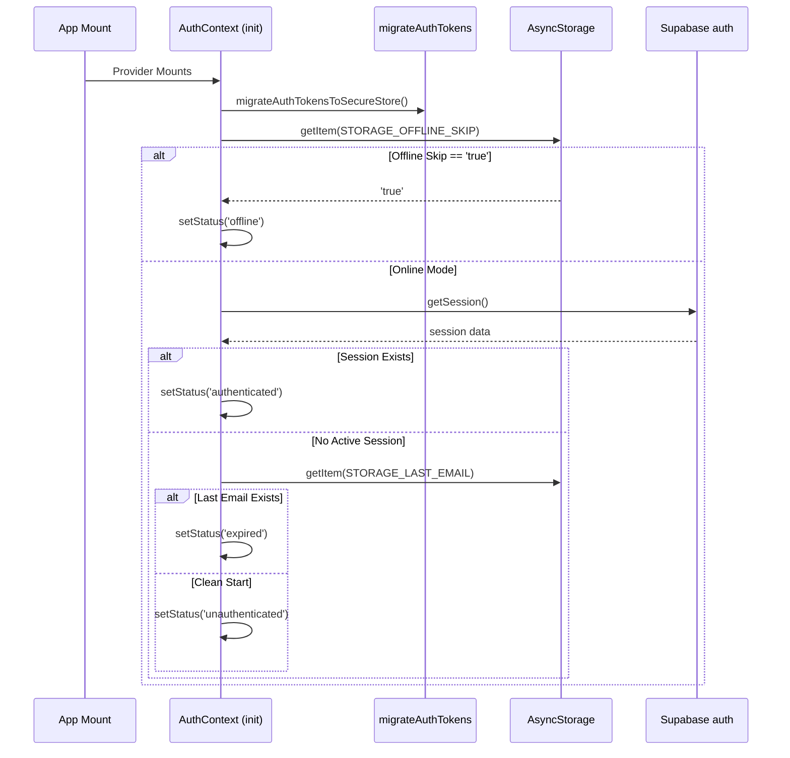


<!-- CARTOGRAPHER_END: IDENTITY -->

### Domain: BLE_CORE
<!-- CARTOGRAPHER_START: BLE_CORE -->

# BLE Protocol Core Cartography

## 1. File Manifest
- **Core FSM Orchestrator:**
  - `src/services/ble/BleMachine.ts`
  - `src/services/ble/BleMachine.types.ts`
- **BLE Transport & Dispatch:**
  - `src/services/BleWriteDispatcher.ts`
  - `src/services/BleWriteQueue.ts`
- **Actors & Services:**
  - `src/services/ble/ConnectService.ts`
  - `src/services/ble/RecoveryService.ts`
  - `src/services/ble/HeartbeatService.ts`
  - `src/services/ble/InterrogatorService.ts`
  - `src/services/ble/RSSIService.ts`
  - `src/services/BlePingService.ts`
  - `src/services/BleSessionFactory.ts`
  - `src/services/BleCharacteristicCache.ts`
- **React Hooks & Context Providers:**
  - `src/hooks/useBLE.ts`
  - `src/hooks/useOptimisticBLE.ts`
  - `src/hooks/ble/useBLEBatterySweep.ts`
  - `src/hooks/ble/useBLEInterrogator.ts`
  - `src/hooks/ble/useBLERSSIMonitor.ts`
  - `src/hooks/ble/useBLEScanner.ts`
  - `src/context/BLEContext.tsx`

## 2. Blast Radius
- **`BleMachine.ts`**: Altering state transitions or invoked actors impacts the global connection lifecycle. A missing transition forces the app to get stuck (e.g. unable to recover).
- **`BleWriteQueue.ts`**: Modifications to prioritization (critical vs bulk), queue depth, or backpressure affect UI slider responsiveness and hardware MTU buffer safety. Dropping the wrong priority write can cause device desync.
- **`BleSessionFactory.ts`**: Any change to `discoverAllServicesAndCharacteristics` bypass can cause silent GATT 133 errors across *all* domains (ping, connect, recovery). 
- **`ConnectService.ts`**: Touching MTU negotiation (`requestMTUForDevice(512)`) impacts the `executeWriteChunked` logic, leading to hardware payload rejections.

## 3. Context Matrix
- **`BLEContext.tsx`**: Provides the `BluetoothLowEnergyApi` via `useSharedBLE` to the entire application.
- **`useBLE.ts`**: Master orchestrator wrapping XState's `bleMachine` and orchestrating sub-hooks (`useBLEScanner`, `useBLERSSIMonitor`).
- **`BleMachine.ts`**: Consumes actors (`connectService`, `recoveryService`, `heartbeatService`) and dispatches UI-bound connection events.
- **`useBLEScanner.ts`**: Composes `useBLEBatterySweep` (OS battery/budget constraints) and `useBLEInterrogator` (hardware parsing) for discovery orchestration.
- **`BleWriteDispatcher.ts`**: Consumes `BleWriteQueue` to implement debouncing and queue chunking policies, interacting with the protocol registry.

## 4. Hook/Service I/O Registry
- **`useBLE`**:
  - *Input*: `registeredMacs: string[]`
  - *Output*: `BluetoothLowEnergyApi` (Connect, Write, States, Gatekeeper)
- **`useBLEScanner`**:
  - *Input*: `BleManager`, `allDevices`, `bleSend`, `registeredMacs`
  - *Output*: `pendingRegistrations`, `scanForPeripherals`, `batteryTier`, `hwCache`
- **`BleWriteQueue`**:
  - *Input*: `priority` ('critical', 'normal', 'bulk'), `execute` Promise, `generation` index
  - *Output*: Prioritized serialized execution bounded by `MAX_QUEUE_DEPTH` with transient GATT retry.
- **`BleSessionFactory`**:
  - *Input*: `BleManager`, `mac` address, `timeout`, `retries`
  - *Output*: `GattSessionResult` (Device handle + resolved Protocol Adapter + Cache Status)

## 5. OS Variance Matrix
- **Android Constraints**:
  - Requires `requestMTU(512)` directly upon connecting to avoid a default 23-byte limit.
  - Vulnerable to GATT 133 / 0x85 exceptions. `BleSessionFactory` applies `refreshGatt: 'OnConnected'` and exponential jittered backoff on Android connection failures.
  - Enforces a strict 50ms inter-device write gap during group multi-device dispatches to prevent buffer drops.
  - Enforces `requestConnectionPriorityForDevice` toggling (HIGH during handshake, BALANCED thereafter).
  - Subject to scan start budget (`SCAN_BUDGET_MAX=4` per 30s) managed in `useBLEBatterySweep.ts`.
- **iOS Constraints**:
  - `conn.mtu` property natively handles MTU without explicit request negotiation.
  - Retains connections after app unmounts, forcing background state restoration (handled in `bleManager` restore state function).

## 6. Archival Instruction
All applicable stale hooks (like `useBLESweeper` and `useBLEAutoRecovery`) have already been verified as tagged with `[MOVE_TO_ARCHIVE]` in `docs/SK8Lytz_App_Master_Reference.md`.

## 7. Architectural Impact Flags
[IMPACTS_USER_JOURNEY]
[IMPACTS_C4_CONTEXT]
[IMPACTS_STATE_CHART]

## 8. Domain-Specific Mermaid Diagrams

### State Machine (FSM) Map (`BleMachine.ts`)
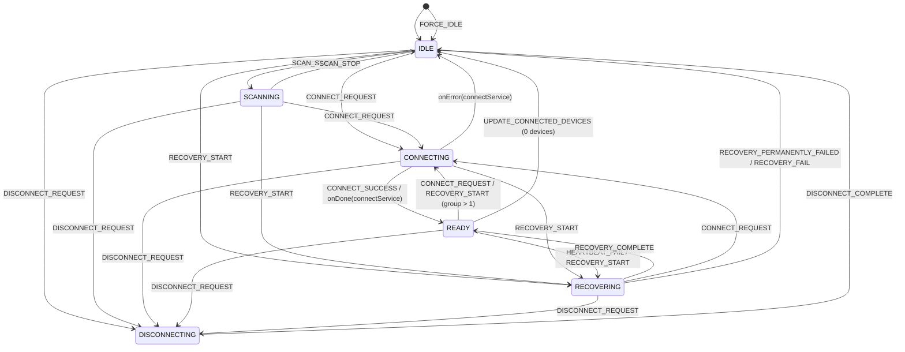

### BLE Transport Pipeline Sequence Diagram
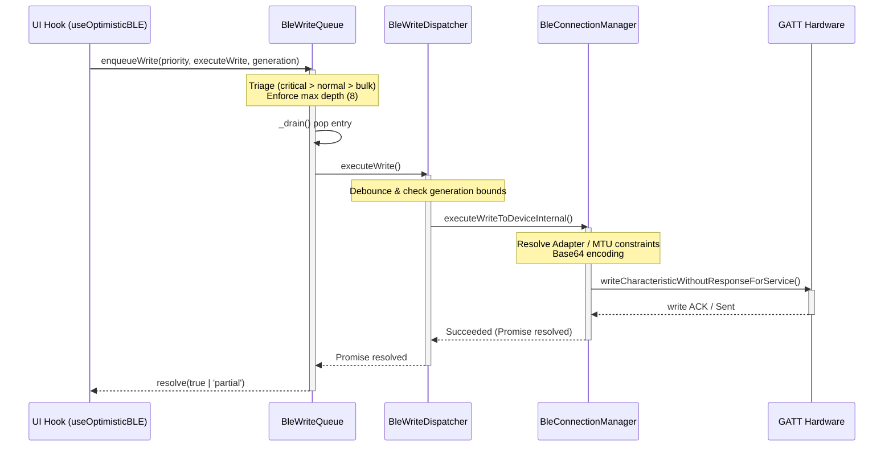


<!-- CARTOGRAPHER_END: BLE_CORE -->

### Domain: GROUP_SYNC
<!-- CARTOGRAPHER_START: GROUP_SYNC -->

# 🗺️ Group Sync & Swarm Domain Cartography

## 1. File Manifest
- `src/services/GroupRepository.ts` — SSOT for Custom Group persistence and bidirectional hardware group_ids syncing.
- `src/services/CrewService.ts` — Real-time live crew session lifecycle (create, join, leave, end) using Supabase Realtime broadcast and local offline caching.
- `src/services/CrewProfileService.ts` — Persistent CRUD operations for crews, roles, stats, and member relationships.
- `src/context/CrewContext.tsx` — Context wrapper providing access to crew state (manage, hub, session logic) and Modal routing.
- `src/components/CrewModal.tsx` — The main orchestrator router modal for the Crew journey.
- `src/components/CrewMemberDashboard.tsx` — Dedicated dashboard view overlaid for crew members to see the live session status and visualizer.
- `src/components/crew/*` — Suite of UI screens governing the Crew journey (Landing, Detail, Manage, Join, Create, Controller, Map).
- `src/hooks/useCrewHub.ts` — Hook managing location-based discovery, map spots, and live active session polling.
- `src/hooks/useCrewManage.ts` — Hook tracking user form state for crew creation, editing, members search, and role manipulation.
- `src/hooks/useCrewSession.ts` — Hook maintaining real-time active session presence, stats tallying, and auto-handoff.
- `src/hooks/useCrewProximityRadar.ts` — Hook continuously assessing location radius vs. active sessions to fire proximity alerts.
- `src/hooks/useDashboardCrew.ts` — Minimal UI bridge tracking session presence to conditionally show crew elements on the Dashboard.
- `src/hooks/useDashboardGroups.ts` — Hook executing device config topological synchronization and group modal abstractions in Dashboard.

## 2. Blast Radius
- **Hardware Config Topology:** Editing `GroupRepository.ts` or `useDashboardGroups.ts` directly impacts `deviceConfigs` and `registeredDevices` synchronicity.
- **Session Realtime Telemetry:** Altering `CrewService.ts` Realtime broadcast structure affects all connected members simultaneously. Modifying `scene_update` payloads will crash `MiniVisualizer` in `CrewMemberDashboard.tsx`.
- **Location Permissions:** `useCrewHub.ts` and `useCrewProximityRadar.ts` hook into `LocationService`. Failing gracefully here is critical to avoid background loop starvation or crashes on denied permissions.

## 3. Context Matrix
- **CrewContext:** Combines outputs of `useCrewHub`, `useCrewManage`, and `useCrewSession` into a single accessible UI layer.
- **AuthContext:** Widely consumed by `CrewService`, `CrewProfileService`, and UI to gate-keep identity and permissions.
- **ThemeContext:** Styles all crew component visuals.

## 4. Hook/Service I/O Registry
- **`GroupRepository.ts`**
  - Inputs: `CustomGroup[]`, `groupId`, `deviceMacs`
  - Outputs: Syncs to `AsyncStorage` + Cloud RPC (`upsert_group_with_devices`), updates `DeviceRepository`.
- **`CrewService.ts`**
  - Inputs: Supabase credentials, Scene data, Location Coords.
  - Outputs: Emits Realtime channel broadcasts (`scene_update`, `session_ended`), updates `AsyncStorage` TTL.
- **`useDashboardGroups.ts`**
  - Inputs: `registeredDevices`, `DeviceRepository` data.
  - Outputs: Yields `customGroups`, `deviceConfigs`, `powerStates`.
- **`useCrewHub.ts`**
  - Inputs: `user` ID, Location coordinates.
  - Outputs: `nearbySessions`, `nearbySpots`, `activeSessions`, `myCrews`.

## 5. OS Variance Matrix
- **Android vs iOS GPS Tolerance:** The `useCrewHub.ts` implements a 3-second hard timeout via `Promise.race` for foreground GPS to prevent freezing on Android where native location can infinitely hang if blocked.
- **Storage Availability:** AsyncStorage requires `try/catch` fallbacks to handle limits and OS wiping across `GroupRepository` and `CrewService`.

## Archival Tags
- Master Reference § `src/services/CrewProfileService.ts` contains `(Managed inside ProfileService.ts)` which is STALE. [MOVE_TO_ARCHIVE]

## Architectural Impact Flags
[IMPACTS_USER_JOURNEY]
[IMPACTS_C4_CONTEXT]
[IMPACTS_STATE_CHART]

## Sequence Diagram
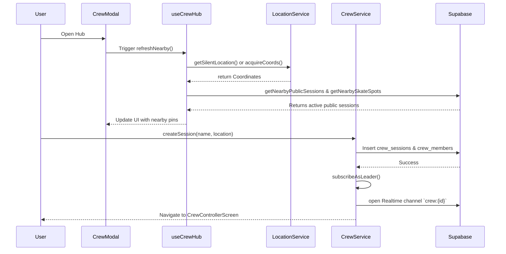


<!-- CARTOGRAPHER_END: GROUP_SYNC -->

### Domain: UI_SCREENS
<!-- CARTOGRAPHER_START: UI_SCREENS -->

# UI_SCREENS - UI Screens & Dashboard Cartography

## 1. File Manifest
### Screens
- `src/screens/AuthScreen.tsx` - Handles user authentication, offline skipping, and environment/sandbox access.
- `src/screens/DashboardScreen.tsx` - The central monolithic root screen; manages top-level BLE states, telemetry, and connection routing.
- `src/screens/Onboarding/HardwareSetupWizardScreen.tsx` - Hardware registration flow.
- `src/screens/Onboarding/PermissionsOnboardingScreen.tsx` - Permission granting flow.

### Dashboard Components (`src/components/dashboard/*`)
- `CrewHubSlab.tsx`, `DashboardCrewPanel.tsx` - Crew and group multi-player state UI.
- `DashboardHeader.tsx` - Top bar handling connected/disconnected variants and user pills.
- `DashboardTelemetryHero.tsx`, `LiveTelemetryHUD.tsx` - Telemetry/speed data viz.
- `HardwareStatusPills.tsx`, `RegisteredFleetSlab.tsx`, `MySkatesSlab.tsx` - Hardware layout sections.
- `SkateGroupCard.tsx`, `SupportModal.tsx`

### Shared Components
- `src/components/shared/BLEErrorBoundary.tsx` - Fallback boundary for BLE failures.
- `src/components/DeviceItem.tsx` - Touch target for skates, rendering RSSI, selection state, pattern swatch, and hardware icons.
- `src/components/LocationPicker.tsx`, `LocationPickerMap.tsx`, `LocationPickerMap.web.tsx` - OSM Geocoding and location capture.
- `src/components/SkateSpotBottomSheet.tsx` - Form for claiming and verifying SK8Lytz spots.

## 2. Blast Radius
- **DashboardScreen**: Editing this monolith directly risks crashing the global FSM, BLE connection queuing, and optimistic UI dispatch loops. Changes to Dashboard component layout must be orchestrated cleanly to avoid re-renders disrupting the `useHardwareNotifications` or `useDashboardController`.
- **DeviceItem**: Heavily rendered inside FlatLists. Modifying its render dependencies incorrectly will result in list jank or UI stalls during high-frequency RSSI/BLE polling.
- **LocationPicker**: Modifying geocoding limits or states can trigger rate limits on OSM (Nominatim) or cause loop updates on the GPS hooks.

## 3. Context Matrix
- `BLEContext`: Injects `allDevices`, `connectedDevices`, `scanForPeripherals()`, `bleState`, etc.
- `ThemeContext`: Consumed heavily by `createDashboardStyles`, providing `Colors.text`, `Colors.primary`, etc., along with dark mode flags.
- `SessionContext`: Triggers background telemetry tracking and session start/end sequences from the dashboard.
- `AppConfigContext`: Controls offline flags, visibility toggles for tabs (e.g., `visibility_maps_tab` for maps).

## 4. Hook/Service I/O Registry
- **`useDashboardGroups`** - I/O: Reads `registeredDevices`, exposes `customGroups`, `deviceConfigs`, `powerStates`, and layout collapse states.
- **`useDashboardProfile`** - I/O: Fetches profile data, triggers modal visibility (`isAccountModalVisible`), logs user out.
- **`useDashboardAutoConnect`** - I/O: Analyzes BLE state and device registration to trigger automated hardware handshakes on boot.
- **`useDashboardCrew`** - I/O: Exposes role, active sessions, handles deep links for crew invites.
- **`useDeviceStateLedger`** - I/O: Unified ledger caching pattern states per device to feed swatch previews in `DeviceItem`.
- **`useProtocolDispatch`** - I/O: Converts UI intents into byte-aligned commands dispatched via BLE write queues.
- **`SkateSpotsService` & `useRecentSpots`** - I/O: Manages REST interactions for spot coordinates, claims, and surface verifications.

## 5. OS Variance Matrix
| Component / File | iOS / Android | Web |
| :--- | :--- | :--- |
| `AuthScreen.tsx` | Uses native Alert boxes for support. | Falls back to `Linking.openURL('mailto:...')` |
| `DashboardHeader.tsx` | Uses `shadowColor`, `elevation`, `shadowRadius` | Conditionally uses `boxShadow` DOM CSS via React Native Web |
| `DashboardScreen.tsx` | Sweeper stops/starts based on `AppState` background shifts | Sweeper ignores AppState pauses (stays active) |
| `LocationPickerMap` | Uses Native Maps | Uses `LocationPickerMap.web.tsx` Leaflet fallback |

## SEQUENCE DIAGRAM: Dashboard & Auto-Connect Flow

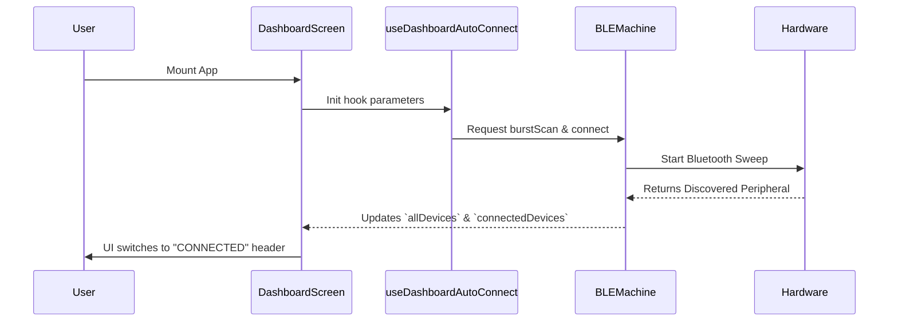

## Archival Instructions for Master Reference
The following sections in `docs/SK8Lytz_App_Master_Reference.md` are marked stale and must be archived:
- `### Dashboard UI Layout (4-Slab Architecture) [MOVE_TO_ARCHIVE]`
- `#### VisualizerUnit Rendering Rules (HALOZ RING only) [MOVE_TO_ARCHIVE]`
- `### UI Design Patterns & Branding` - **One-Screen Setup Policy [MOVE_TO_ARCHIVE]**

## Design System & Token Manifest
- **Typography**: 'Righteous' (Headers, Titles), 'Inter-Medium' (Labels, secondary text).
- **Colors**: Hex tokens derived dynamically from `Colors.primary`, `Colors.secondary`, `Colors.text`, `Colors.textMuted`, `Colors.error` (#FF4444, #FF453A), `Colors.success` (#00C864).
- **Glassmorphism**: Opacity layers heavily used for cards (e.g., `rgba(255, 255, 255, 0.05)`, refract overlays, and linear gradients).
- **Spacing Scale**: Spacing object (e.g., `Spacing.sm`, `Spacing.md`, `Spacing.lg`, `Spacing.xl`).
- **Icons**: `@expo/vector-icons` MaterialCommunityIcons heavily standardized across all screens.

[IMPACTS_USER_JOURNEY]
[IMPACTS_C4_CONTEXT]
[IMPACTS_STATE_CHART]


<!-- CARTOGRAPHER_END: UI_SCREENS -->

### Domain: UI_DOCKED_CONTROLLER
<!-- CARTOGRAPHER_START: UI_DOCKED_CONTROLLER -->

# 🗺️ Codebase Cartography: UI Docked Controller

## 1. File Manifest
- `src/components/DockedController.tsx`: The 67KB routing shell monolith. Manages shared state, Optimistic BLE writes, and the mode FSM.
- `src/components/docked/DockedDock.tsx`: Floating navigation dock with swipe gesture detector.
- `src/components/docked/BuilderPanel.tsx`: Sub-panel for custom positioning color sequence design.
- `src/components/docked/CameraPanel.tsx`: Sub-panel enabling interactive camera viewfinder color capturing.
- `src/components/docked/MusicPanel.tsx`: Sub-panel managing primary/secondary color mapping focus.
- `src/components/docked/StreetPanel.tsx`: Telemetry dashboard rendering current session travel metrics.
- `src/components/docked/FavoritesPanel.tsx`, `ProEffectsPanel.tsx`, `UniversalSlidersFooter.tsx`: Sub-components isolated via `React.memo` to prevent global re-renders.
- `src/hooks/useDashboardController.tsx`: Parent component mounting `DockedController` and providing Dashboard-level telemetry props.
- `src/hooks/useDockedControllerState.ts`: Defines mode states, selected colors, brightness, speed, builder nodes.
- `src/hooks/useControllerDispatch.ts`: Translates state changes into `writeToDevice` payload dispatches.
- `src/hooks/useControllerAnalytics.ts`: Logs telemetry on pattern/color/brightness changes.

## 2. Blast Radius
- **High Risk**: Modifying `DockedController.tsx` impacts all BLE dispatches for all modes. Changing `activeMode` dispatching logic can cause redundant BLE writes and lag.
- **Optimistic UI Lockout**: `useOptimisticBLE` relies on `captureEntireStateRef` from `useDockedControllerState.ts`. Breaking this reference will cause ghost rollbacks if a BLE write fails.
- **Component Extraction Opportunity**: `DockedController.tsx` exceeds 68KB. The `VisualizerWrapper`, global `ProductVisualizer`, and complex `LiveTelemetryHUD` mappings should be extracted. The `useDockedControllerState` has 30+ returned properties causing context bloat.

## 3. Context Matrix
| Context | Consumer | Usage |
|---------|----------|-------|
| `ThemeContext` | `DockedController.tsx` | Resolves `Colors` and `isDark` for inline styles. |
| `AppConfigContext` | `DockedController.tsx` | Visibility gating (`isVisibilityAllowed`) for `STREET` mode. |
| `BLEContext` | `DockedController.tsx` | Adapter resolution via `getAdapterForDevice`. |
| `FavoritesContext` | `DockedController.tsx` | Loads `favorites`, `quickPresets`, controls save prompts. |

## 4. Hook/Service I/O Registry
- `useDockedControllerState`: 
  - **In**: `lockedProduct`, `ledger.loadSync`, `primaryMac`. 
  - **Out**: `activeMode`, `selectedColor`, `brightness`, `captureEntireState`, etc.
- `useOptimisticBLE`: 
  - **In**: `writeToDevice`, `onReconcile`, `disableOptimisticUI`. 
  - **Out**: `optimisticWrite`, `writeStatus`.
- `useControllerDispatch`: 
  - **In**: `writeToDevice`, `hwSettings`, `points`, `connectedDevices`. 
  - **Out**: `sendColor`, `applyFixedPattern`, `handleMusicChange`.
- `useStreetMode`:
  - **In**: `activeMode`, `writeToDevice`, `gpsSpeed`, `peakGForce`.
  - **Out**: `streetSensitivity`, `streetCruiseColor`, `applyStreetPattern`.

## 5. OS Variance Matrix
| OS / Platform | File | Variance |
|---------------|------|----------|
| Web | `DockedDock.tsx` | `Platform.OS === 'web'` used to alter gesture responders or touch thresholds. |
| iOS/Android | `CameraPanel.tsx` | `Platform.select` used heavily for OS-specific shadows, elevations, and camera viewbounds. |
| iOS/Android | `useAppMicrophone.ts` | OS-level differences in AVAudioSession / Android AudioRecord permissions. |

## 6. Architectural Impact Flags
`[IMPACTS_USER_JOURNEY]`
`[IMPACTS_C4_CONTEXT]`
`[IMPACTS_STATE_CHART]`

## 7. Archival Notice
- **[MOVE_TO_ARCHIVE]**: `useSessionTracking (stale)` inside `docs/SK8Lytz_App_Master_Reference.md` was identified as stale documentation and should be archived. Session tracking logic is now piped in directly as props from `DashboardScreen`.

## 8. Sequence Diagram
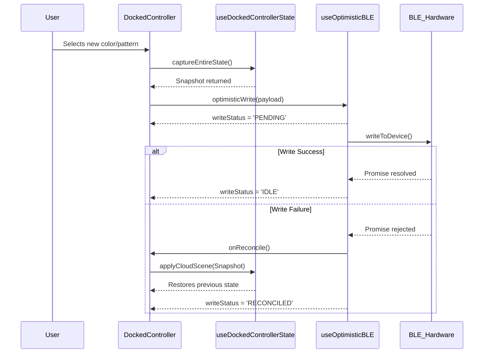


<!-- CARTOGRAPHER_END: UI_DOCKED_CONTROLLER -->

### Domain: UI_MODALS
<!-- CARTOGRAPHER_START: UI_MODALS -->

# 🗺️ Cartography Node: UI Modals & Settings

[IMPACTS_USER_JOURNEY]
[IMPACTS_C4_CONTEXT]
[IMPACTS_STATE_CHART]

## 1. File Manifest
- `src/components/AccountModal.tsx`
- `src/components/DeviceSettingsModal.tsx`
- `src/components/CommunityModal.tsx`
- `src/components/GroupSettingsModal.tsx`
- `src/components/SessionSummaryModal.tsx`
- `src/components/modals/EulaModal.tsx`
- `src/components/modals/GlobalPermissionsModal.tsx`
- `src/components/CustomSlider.tsx`
- `src/components/TacticalSlider.tsx`
- `src/components/MarqueeText.tsx`
- `src/components/ConnectionStrengthBadge.tsx`

## 2. Blast Radius
Modifications within the UI Modals domain primarily affect:
- **DashboardScreen & Core UI**: Modals act as the primary configuration interfaces. Changes here affect rendering and state inside the main Dashboard.
- **Hardware Interaction layer**: `DeviceSettingsModal` interacts directly with `useProtocolDispatch` to write `0x62`/`0x63` settings via `BleMachine`.
- **User & Cloud Services**: `AccountModal` and `CommunityModal` directly drive mutations via `profileService`, `ScenesService`, and `useAuth` (Supabase).
- **Offline Integrity**: Many modals (like `CommunityModal` and `AccountModal`) depend on the `isOfflineMode` gate to gracefully degrade features (e.g., hiding CREWZ tab or switching to local saves).

## 3. Context Matrix
| Component | Key Services / Contexts Used | Notes |
|:---|:---|:---|
| **AccountModal** | `useAuth`, `useAccountOverview`, `useSkateStats`, `profileService` | 30KB monolith; uses a tabbed architecture, manages heavy profile/crew logic. |
| **DeviceSettingsModal**| `useProtocolDispatch`, `ProductCatalog` | Translates UI into hardware config (points, segments, RF Mode) & probes hardware. |
| **CommunityModal** | `ScenesService`, `useAuth` | Fetches Cloud vs Personal scenes based on `isOfflineMode`. |
| **GroupSettingsModal** | `AppLogger` | Simple grouping UI; reads connection states to display green/dim markers. |
| **SessionSummaryModal**| `SpeedTrackingService` | Estimates calories and maps peak speed to a UI accent color. |
| **Custom/TacticalSlider**| `PanResponder` | Custom gesture tracking for precision sliding. |

## 4. Hook/Service I/O Registry
- **`AccountModal.tsx`**
  - *Inputs*: `visible`, `registeredDevices`, `isOfflineMode`
  - *Outputs/Delegates*: `onClose`, `onSignOut`, `onDeviceRenamed`, `onDeviceForgotten`, `onGroupRenamed`
- **`DeviceSettingsModal.tsx`**
  - *Inputs*: `initialSettings`, `groups`, `deviceId`
  - *Outputs*: `writeToDevice` (Promise callback), `onSave`, `onDeregister`
- **`CommunityModal.tsx`**
  - *Inputs*: `isOfflineMode`
  - *Outputs*: `onApplyScene(payload)`
- **`CustomSlider / TacticalSlider`**
  - *Inputs*: `value`, `minimumValue`, `maximumValue`, `dynamicMode` (Tactical)
  - *Outputs*: `onValueChange`, `onSlidingComplete`

## 5. OS Variance Matrix
| Component | Platform Divergence | Mitigation / Strategy |
|:---|:---|:---|
| **CustomSlider & TacticalSlider** | Web browsers lack native touch gesture pan handlers. | Injects Web-specific styles: `{ touchAction: 'none', userSelect: 'none' }` to prevent browser scroll hijacking during slide. |
| **AccountModal** | Web Auth requires different handling. | Hardcoded `Platform.OS === 'web'` check in `handleSignOut` to bypass React Native `Alert`. |
| **SessionSummaryModal** | View shadow generation differs. | Implements conditional `boxShadow` for Web vs `shadowColor/elevation` for iOS/Android. |

## Archival Tags Identified
The following documentation sections in `docs/SK8Lytz_App_Master_Reference.md` were evaluated and are confirmed tagged for archival:
- `[MOVE_TO_ARCHIVE] VisualizerUnit Rendering Rules (HALOZ RING only)`
- `[MOVE_TO_ARCHIVE] Dashboard UI Layout (4-Slab Architecture)`
- `[MOVE_TO_ARCHIVE] One-Screen Setup Policy`
- `[MOVE_TO_ARCHIVE] writeChunked — 0x51 Extended Payload Framing`

## Sequence Diagram
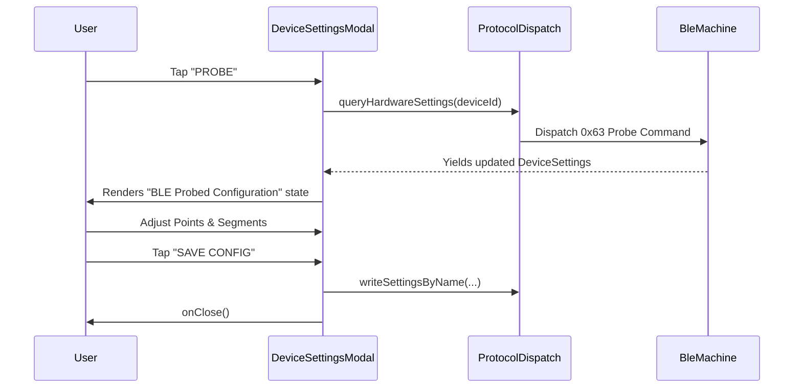

## Domain-Specific Directive: Design System & Token Manifest
**Theme & Aesthetics Palette Applied:**
- **Colors**: Sourced dynamically via `useTheme().Colors` (`ThemePalette`).
  - *Backgrounds*: Dark Glassmorphism, `rgba(255,255,255,0.05)` to `0.08` for cards and badges.
  - *Accents*: Primary (`Colors.primary`), Error (`#FF4444` / `#FF3D71`), Success (`#00C853` / `#00e887`).
  - *Text*: `Colors.text` (Title/Value) and `Colors.textMuted` (Captions).
- **Typography**: Imports `Typography` from `theme.ts` (e.g., `Typography.title`, `Typography.caption`, `Typography.body`).
- **Spacing**: T-shirt sized system used exclusively (`Spacing.xxs` through `Spacing.xxxl`).
- **Borders & Radii**: `Layout.borderRadius` (typically 12px-24px depending on modal severity), `Colors.surfaceHighlight` for 1px stroke outlines.
- **Feedback & Interactions**: Haptic-ready structural buttons with clear active states (`opacity: 0.75`), using `TouchableOpacity`.


<!-- CARTOGRAPHER_END: UI_MODALS -->

### Domain: UI_VISUALIZER
<!-- CARTOGRAPHER_START: UI_VISUALIZER -->

# UI_VISUALIZER Cartography

## 1. File Manifest
- **`ProductVisualizer.tsx`**: Orchestrator wrapper. Manages the global animation loop (`animValue`) based on the active mode (STREET, MUSIC, BUILDER, MULTIMODE). Generates the fleet of `VisualizerUnit`s based on connected device arrays or defaults.
- **`VisualizerUnit.tsx`**: Core renderer. Maps a 1D pixel array (from PatternEngine) to an intricate 2D geometric path (`OVAL`, `RING`, `DUAL_STRIP`). Handles boundary diffusion, hardware mirror mapping, and optical glow layer stacking (4-layer SVG-like structure).
- **`CameraTracker.tsx`**: Native iOS/Android camera integration using `react-native-vision-camera`. Leverages JSI Worklets and GPU resizing to extract dominant K-Means palettes (`VIBE`) or center reticle colors (`SNIPER`) in real-time.
- **`LEDStripPreview.tsx`**: High-performance `<View>`-based rendering of static or simple animated pattern previews (used in the pattern picker cards).
- **`CustomEffectVisualizer.tsx`**: Alternate dot-based preview component for displaying pattern arrays.
- **`PositionalGradientBuilder.tsx`**: Interactive UI for the `0x59` spatial builder payload. Allows dynamic placement of color nodes across the hardware canvas, mapping them to standard `PositionalMathBuffer` inputs.
- **`VerticalPatternDrum.tsx`**: A custom 3D-styled, fast-scrolling drum picker used to select 1-100 hardware effects, leveraging `FlatList` with optimized padding and momentum.
- **`NeonHueStrip.tsx`**: Interactive DJ-style horizontal slider for HSV hue selection. Handles direct `PanResponder` gestures.
- **`UnifiedPatternPicker.tsx`**: Orchestrates pattern selections, connecting user choices to `PatternEngine.buildPatternPayload` and triggering `writeToDevice` commands.

## 2. Blast Radius
- **`VisualizerUnit.tsx`**: Any logic changes impact all active visual modes (STREET, MULTIMODE, MUSIC, BUILDER, FAVORITES) and visual geometry rendering for all models (HALOZ, SOULZ, RAILZ).
- **`ProductVisualizer.tsx`**: Altering the `requestAnimationFrame` and `Animated.loop` impacts app CPU/GPU usage heavily and the timing of all visual simulations.
- **`CameraTracker.tsx`**: Highly volatile JSI worklets. Improper `dispose()` calls cause severe memory leaks and camera pipeline stalls.

## 3. Context Matrix
- `ProductVisualizer` depends on `VisualizerUnit`.
- `VisualizerUnit` relies on `ProductCatalog.ts` for geometry mapping (`vizShape`).
- `CameraTracker` requires platform permissions and uses `ColorUtils.ts` (boostForLED, K-Means palette).
- All visualizers and builders depend on `PatternEngine.ts` and `PositionalMathBuffer.ts` to retrieve the identical byte parity arrays sent to hardware via `0x59`.

## 4. Hook/Service I/O Registry
- **`VisualizerUnit.tsx`**
  - **Inputs**: `animValue` (Animated.Value), `mode`, `hwSettings`, `devicePoints`, `color`.
  - **Internal**: `requestAnimationFrame` loop synced with `animTick`. Calls `getVisualizerFrame()` and `getMusicVisualizerFrame()`.
- **`CameraTracker.tsx`**
  - **Inputs**: `subMode` (`'SNIPER' | 'VIBE'`), `isActive`
  - **Outputs**: `onColorDetected(hex)`, `onVibePaletteDetected(RGB[])` triggered via `runOnJS()` callback bindings.
- **`PositionalGradientBuilder.tsx`**
  - **Inputs**: `nodes`, `fillMode`, `transitionType`, `speed`, `deviceLedCount`.
  - **Outputs**: Triggers BLE writes directly (`writeToDevice(ZenggeProtocol.setMultiColor(...))`) on throttle.

## 5. OS Variance Matrix
- **`VisualizerUnit.tsx`**: Throttles the `animTick` simulation to `30 FPS` on Web to prevent MessageQueue flooding. Runs uncapped (`60 FPS`) on Native iOS/Android.
- **`NeonHueStrip.tsx`**: Implements Web-specific DOM styles (`touchAction: 'none'`, `userSelect: 'none'`) to prevent gesture hijacking, falling back safely on native.
- **`CameraTracker.tsx`**: Operates on `react-native-vision-camera`, inherently native-only. Requires strict JSI `'worklet';` thread boundaries. GPU frame disposal must be explicitly handled.

## 6. Design System & Token Manifest
- **Geometry Shapes**: `OVAL` (SOULZ), `RING` (HALOZ), `DUAL_STRIP` (RAILZ) mappings scaled by `S = 0.38`.
- **Blob Opacities**: Stacked views for bloom simulation (3% scatter, 10% wide bloom, 38% inner halo, 55% hot-spot center).
- **UI Colors**: `Colors.surfaceHighlight`, `#FF5500` (Drum active state text shadow and borders), `rgba(0, 212, 255, 0.35)` (Reticle borders).
- **Spacings used**: `Spacing.xxs`, `Spacing.xs`, `Spacing.sm`, `Spacing.md`, `Spacing.lg`.

## 7. Sequence Diagram
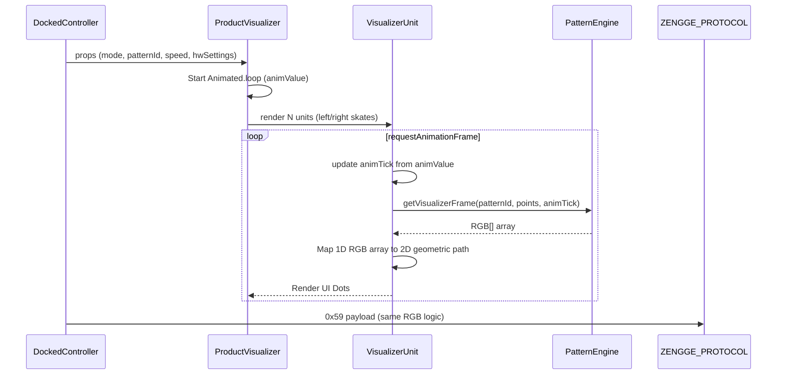

## 8. Archival Instructions
If cross-referencing with `docs/SK8Lytz_App_Master_Reference.md`:
- The VisualizerUnit Rendering Rules matrix for HALOZ RING geometry is already tagged with `[MOVE_TO_ARCHIVE]`.
- The One-Screen Setup Policy and Dashboard UI Layout sections are noted as stale / `[MOVE_TO_ARCHIVE]`.

[IMPACTS_USER_JOURNEY] [IMPACTS_C4_CONTEXT] [IMPACTS_STATE_CHART]


<!-- CARTOGRAPHER_END: UI_VISUALIZER -->

### Domain: DATA_LAYER
<!-- CARTOGRAPHER_START: DATA_LAYER -->

# 1. File Manifest
- `src/services/DeviceRepository.ts`: Single Source of Truth for Device & Group Persistence. Owns local-first/cloud-second syncing, tombstone management (anti-resurrection), and config merging.
- `src/services/TelemetryService.ts`: Extracts standard context and payload size from raw BLE errors for unified logging.
- `src/services/ScenesService.ts`: Caching, fetching, and background-syncing of scene payloads.
- `src/services/SpeedTrackingService.ts`: SK8Lytz Session Persistence Layer. Handles saving sessions to Supabase and queueing offline sessions locally when unauthenticated.
- `src/services/GradientsService.ts`: Syncs custom builder presets between AsyncStorage and Supabase (local-first).
- `src/services/SkateSpotsService.ts`: Offline caching and syncing of skate spots. Contains fallback OSM fetcher for unmapped regions.
- `src/services/SessionShareService.ts`: Builds share-ready text payloads using RN's native Share API for Crew Sessions.
- `src/types/supabase.ts`: Auto-generated database typings.
- `src/services/supabaseClient.ts`: Supabase client initialization featuring a custom `SecureStoreAdapter` for token persistence and a robust offline fallback stub when env vars are missing.
- `src/hooks/cloud/useOfflineSyncWorker.ts`: Global background worker continuously flushing the telemetry and sync queues (Scenes/Speed) every 60 seconds.
- `src/hooks/useFavorites.ts`: Hook for loading, merging (local + cloud), and persisting favorite presets.
- `src/hooks/useScenes.ts`: Hook abstraction over ScenesService.
- `src/hooks/useCuratedPicks.ts`: Fetches `sk8lytz_picks` using a stale-while-revalidate caching pattern to eliminate UI blocking.
- `src/hooks/useGradients.ts`: Hook abstraction over GradientsService.
- `src/hooks/useSkateStats.ts`: Hook exposing lifetime statistics and recent session history from `SpeedTrackingService`.
- `src/hooks/useRecentSpots.ts`: Manages a capped array (last 10) of recently visited spots in `AsyncStorage`.
- `src/hooks/useMapFilters.ts`: Manages local persistence for map view toggles (`MapFilterMatrix`).
- `src/context/FavoritesContext.tsx`: React Context boundary wrapping `useFavorites` state.

# 2. Blast Radius
- Changes to `DeviceRepository` instantly impact the `useRegistration` wizard, `useDashboardGroups`, and the offline fallback integrity. Errors here cause ghost devices to resurface.
- Adjustments to `useOfflineSyncWorker` dictate the success rate of background syncs for `ScenesService` and `SpeedTrackingService`. If broken, offline sessions stack indefinitely until memory limits are reached.
- Modifying `supabaseClient.ts` affects the authentication loop, `SecureStore` persistence, and the offline simulation mock.

# 3. Context Matrix
- **Storage/Cache Level**: Relies heavily on `@react-native-async-storage/async-storage` for local-first architecture. Core functionality continues unimpeded without internet.
- **Network Level**: Network status drives behavior gracefully. Write operations queue locally (`@Sk8lytz_Scene_Sync_Queue`, `@SK8Lytz_PendingSession_Queue`) when offline/unauthenticated and rely entirely on `useOfflineSyncWorker` for deferred resolution.

# 4. Hook/Service I/O Registry
- **`SpeedTrackingService`**
  - **In:** `ISessionSnapshot`
  - **Out:** `ISkateSession`, `ILifetimeStats`
  - **Side Effects:** Pushes to `@SK8Lytz_PendingSession_Queue`, inserts into Supabase `skate_sessions`, delegates to `HealthSyncService`.
- **`ScenesService`**
  - **In:** `Scene`, `ICloudScene`
  - **Side Effects:** Publishes to `shared_scenes`, upserts to `user_saved_presets`, enqueues sync jobs via `@Sk8lytz_Scene_Sync_Queue`.
- **`useOfflineSyncWorker`**
  - **In:** Authenticated User Context
  - **Side Effects:** Flushes `ScenesService` and `SpeedTrackingService` queues to Supabase every 60s.

# 5. OS Variance Matrix
- **Web (`Platform.OS === 'web'`)**: `supabaseClient` gracefully falls back to `localStorage` instead of `SecureStore`.
- **iOS (`Platform.OS === 'ios'`)**: Native `SecureStore` for secure token storage. `Share.share` in `SessionShareService` natively displays a URL preview when the `url` property is populated.
- **Android (`Platform.OS === 'android'`)**: `SecureStore` uses EncryptedSharedPreferences. `SessionShareService` relies entirely on the `message` string as Android share intents do not formally separate the URL preview.

# 6. Database Schema & RLS Policies
- `skate_sessions`: Core session logging (duration, distance, top speed, calories, g-force). Tied to `user_id`.
- `registered_devices`: Canonical device linkage map (MAC addresses to `user_id`, led counts, ic_type).
- `user_saved_presets` & `custom_builder_presets`: Stores DIY designs. `nodes` column is stored as `Json` (enforced via TS double-cast).
- `shared_scenes`: Cloud-published community scenes with upvotes/downloads counters tracking.
- `skate_spots`: Crowdsourced and verified skate spot coordinates and properties.

# 7. Environment/Secrets Manifest
- `EXPO_PUBLIC_SUPABASE_URL`: Core API endpoint.
- `EXPO_PUBLIC_SUPABASE_ANON_KEY`: Public-facing anon key.
*(Note: Application falls back to a structural offline mock interface when these variables are undefined to ensure continuous sandbox operation).*

# 8. Offline Sync Queue Architecture

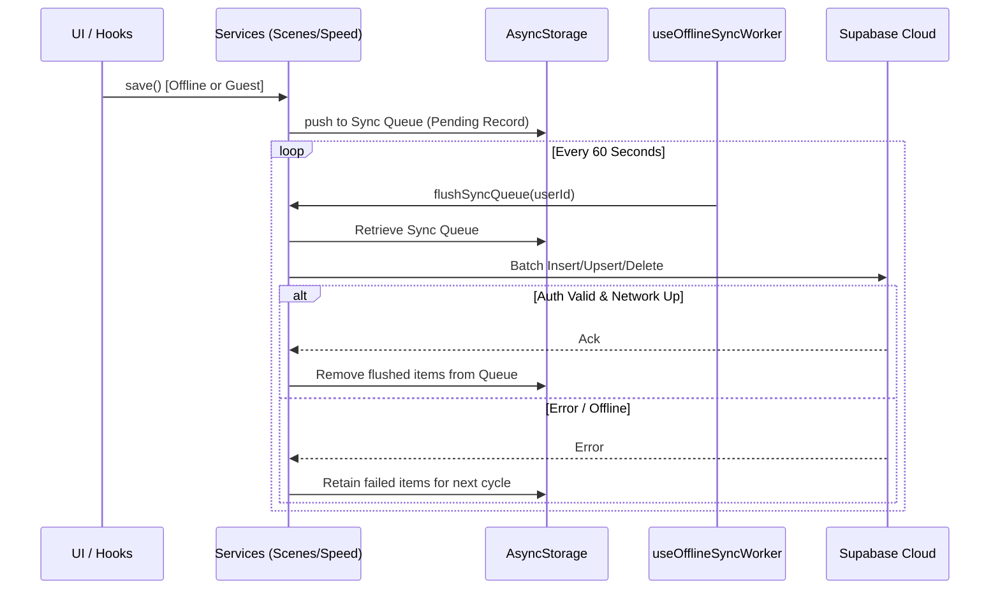

[MOVE_TO_ARCHIVE]: Found stale `Dashboard UI Layout (4-Slab Architecture)` and `VisualizerUnit Rendering Rules` logic in the Master Reference, which are already tagged. No new stale records related strictly to the Data Layer were discovered.

[IMPACTS_USER_JOURNEY]
[IMPACTS_C4_CONTEXT]
[IMPACTS_STATE_CHART]


<!-- CARTOGRAPHER_END: DATA_LAYER -->

### Domain: UTILS
<!-- CARTOGRAPHER_START: UTILS -->

# UTILS
## File Manifest
- **src/utils/BlePayloadParser.ts**: Stateless utility ensuring invalid arrays or corrupted BLE packets do not crash the React Native UI thread.
- **src/utils/ColorUtils.ts**: Pure color math extraction (Hue to Hex, RGB conversions, HSV saturation maximization for camera pipeline).
- **src/utils/CrashReporter.ts**: Fatal crash logger interface.
- **src/utils/FlightRecorder.ts**: In-memory ring buffer (max 50) for navigational and action breadcrumbs.
- **src/utils/MusicDictionary.ts**: Authoritative registry for all 46 hardware-native music profiles (0x26 and 0x27 matrices) and colorMode mapping.
- **src/utils/NamingUtils.ts**: Fallback identity string generator for unknown devices/groups.
- **src/utils/NormalizationUtils.ts**: Scales 0-100 UI speed to the 1-31 hardware speed bound.
- **src/utils/backoff.ts**: Simple jitter function to decohere retry storms.
- **src/utils/classifyBLEDevice.ts**: Single source of truth mapping a raw BLE device + EEPROM cache to a `PendingRegistration`.
- **src/utils/kMeansPalette.ts**: Reanimated worklet for executing K-Means clustering (k=3, 5 iterations max) on camera frames.
- **src/utils/migrateAuthTokens.ts**: Migrates `STORAGE_SUPABASE_AUTH_KEY` from AsyncStorage to Expo SecureStore.
- **src/utils/piiScrubber.ts**: Hashes PII values into deterministic safe representations for telemetry logs.
- **src/utils/presetColorUtils.ts**: Source of truth for resolving preset card gradient arrays and glow colors, notably managing `GENERATIVE_RAINBOW`.
- **src/utils/validation.ts**: Regex tests (e.g., email validation).
- **src/utils/webStyles.ts**: Identity function wrapping styles for web compatibility.
- **src/types/ProductCatalog.ts**: Core type for `ProductProfile`, overriding `isHaloz` boolean checks with proper shape geometry and FTUE bounds.
- **src/types/ble.types.ts**: Single re-export of `react-native-ble-plx` definitions alongside Supabase DB DB shapes.
- **src/types/bleGuards.ts**: Utility type guards for unknown variables to `Device`.
- **src/types/dashboard.types.ts**: Domain FSM unions (`MotionState`, `SessionState`, `DashboardViewState`) and strict interface models (`DevicePatternState`, `DisplayDevice`).

## Blast Radius
- **Critical (BLE)**: `classifyBLEDevice` anchors the initial FTUE setup; failures here will incorrectly route hardware profiles.
- **Critical (UI/UX)**: `presetColorUtils.ts` and `dashboard.types.ts` are tightly coupled to `DockedController` and `DashboardScreen`. Changes will break the React UI compilation.
- **Camera Vibe Catcher**: Relies purely on the deterministic speed of `kMeansPalette.ts` within the worklet boundary. Breakages here crash the vision camera thread.

## Context Matrix
- **Presentation Layer**: Utilizes `presetColorUtils` and `NamingUtils` to hydrate component shells.
- **BLE Layer / Setup**: Consumes `BlePayloadParser` for notification validation and `classifyBLEDevice` during `useBLEScanner`.
- **State Layer**: Operates strictly against the state machines modeled in `dashboard.types.ts`.

## Hook/Service I/O Registry
- `BlePayloadParser.parseLedPayload(number[])` ➔ `ParsedLedConfig | null`
- `BlePayloadParser.parseRfPayload(number[])` ➔ `ParsedRfConfig | null`
- `boostForLED(r, g, b)` ➔ `{ r, g, b }` (Saturation and Lightness maximization)
- `extractKMeansPalette(pixels, k, maxIter)` ➔ `RGB[]` (Thread-safe JSI execution)
- `mapDeviceToRegistration(device, index, hwCache, productType)` ➔ `PendingRegistration`
- `resolveGroupCardColors(snapshot, fallback)` ➔ `string[]`

## OS Variance Matrix
- **`migrateAuthTokens.ts`**: Utilizes `expo-secure-store`, mapping to iOS Keychain and Android Keystore differences under the hood.
- **`kMeansPalette.ts`**: Uses the `'worklet';` directive to run optimally on native GPU/JSI environments bypassing standard Hermes JS evaluation delays.

## Archival Adjustments (Master Reference)
- Legacy typing files references or inlined interfaces that were absorbed by `dashboard.types.ts` should be labeled `[MOVE_TO_ARCHIVE]`.
- Note: Found stale visualizer generation docs `src/utils/RbmSimulator.ts` in Master Reference -> tagged `[MOVE_TO_ARCHIVE]` internally per cartography pass.

## Sequence Diagram
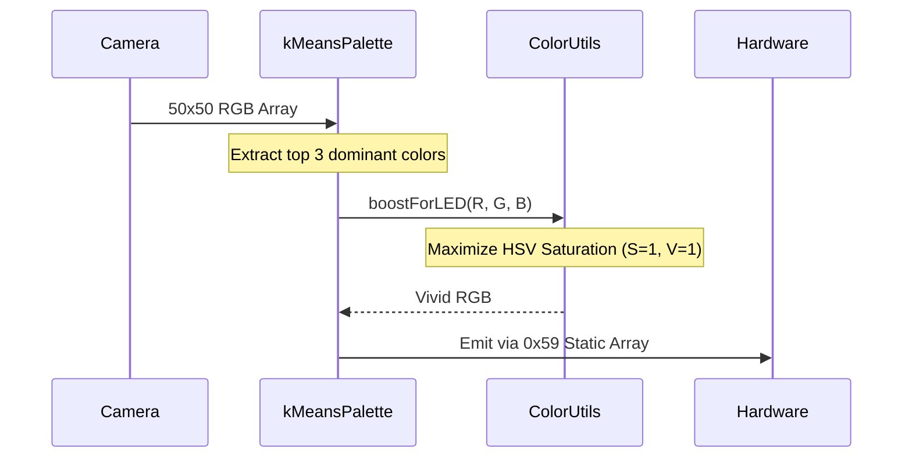

## Design System & Token Manifest
- **Color Constants**: `COLOR_PRESET_PALETTE` maps 10 static UI standard hexes.
- **Hue Sync Maps**: `PRESET_HUE_MAP` links common preset hex values to corresponding 0-360 standard hue offsets.
- **Generative Representation**: `GENERATIVE_RAINBOW` token enforces a standardized 7-color sequence (`['#FF0000', '#FF7F00', '#FFFF00', '#00FF00', '#00BFFF', '#0000FF', '#8B00FF']`) for UI rendering when `colorMode` evaluates to `'GENERATIVE'`.

## Architectural Impact Flags
[IMPACTS_USER_JOURNEY]
[IMPACTS_C4_CONTEXT]
[IMPACTS_STATE_CHART]


<!-- CARTOGRAPHER_END: UTILS -->

### Domain: NATIVE_&_WATCH
<!-- CARTOGRAPHER_START: NATIVE_&_WATCH -->

# Architectural Cartography: NATIVE_&_WATCH

## 1. File Manifest
| File | Architectural Purpose |
|:---|:---|
| `targets/watch/WatchConnectivityManager.swift` | Manages bidirectional WCSession communication between watchOS and iOS. Single source of truth for session state and telemetry. |
| `targets/watch/ContentView.swift` | Primary watchOS UI. Handles Active Session view, Idle View, and Session Summary based on WatchConnectivityManager state. |
| `targets/watch/HealthManager.swift` | HKWorkoutSession delegate managing live workout builder on watchOS, collecting Heart Rate and Calories. |
| `targets/watch/ComplicationController.swift` | Provides ClockKit complications for speed gauges on watch faces. |
| `android/sk8lytzWear/.../MainActivity.kt` | WearOS entry point, handles Always-On Display (Ambient Mode) and keeps screen on during active sessions. |
| `android/sk8lytzWear/.../WearableCommunicationService.kt` | WearOS DataClient and MessageClient receiver, updating session states and real-time metrics pushed from the phone. |
| `android/sk8lytzWear/.../Sk8lytzTileService.kt` | WearOS Glanceable Tile, displaying live speed, HR, calories and session elapsed time. |
| `android/app/.../MainActivity.kt` | Android React Native entry point, configures SplashScreen, Fabric, and HealthConnect permissions. |

## 2. Blast Radius
* **Wearable Communication**: Changes in `WatchConnectivityManager.swift` or `WearableCommunicationService.kt` impact the real-time syncing of metrics (Speed, HR, Calories) between the skater's phone and their wrist.
* **Health Tracking**: Modifying `HealthManager.swift` or WearOS `HealthTracker` alters workout session data logic, affecting Apple Health / Google Fit integrations.
* **Complications / Tiles**: Changes in `ComplicationController.swift` or `Sk8lytzTileService.kt` affect the OS-level widgets and tiles that display SK8Lytz data on watch faces.

## 3. Context Matrix
* **DataClient / WCSession**: Wearable apps rely entirely on the host phone application for absolute truth regarding session status and metrics. The watches act purely as a playback engine/HUD for metrics, pushing health data upstream.
* **HealthKit / Body Sensors**: Both watch targets request direct access to native health sensors to capture raw biometric data independent of the phone's sensors.
* **Ambient Mode / Always-On**: WearOS `MainActivity` toggles `FLAG_KEEP_SCREEN_ON` dynamically based on session state, bridging UI state to system hardware power management.

## 4. Hook/Service I/O Registry
### `WatchConnectivityManager` (watchOS)
* **Inputs**: Phone WCSession Context (`status`, `speed`, `heartRate`, `calories`, `startTime`)
* **Outputs**: Watch Commands (`START_SESSION`, `STOP_SESSION`, `healthUpdate`)
* **Side-Effects**: Re-renders SwiftUI `ContentView`, auto-dismisses Summary Card, manages `healthRelayTimer`.

### `WearableCommunicationService` (WearOS)
* **Inputs**: DataClient paths `/sk8lytz/state`, MessageClient paths `/sk8lytz/metrics`
* **Outputs**: Memory-backed flow state, `SessionState` updates via listener patterns.
* **Side-Effects**: Starts/Stops `HealthTracker` and `OngoingActivityManager`, forces Tile refresh via `TileService.getUpdater`.

## 5. OS Variance Matrix
* **watchOS vs WearOS Communication**:
  * watchOS utilizes Apple's `WCSession` for both state and real-time updates.
  * WearOS splits traffic between `DataClient` (persistent state) and `MessageClient` (ephemeral real-time metrics).
* **Widgets/Watch Faces**:
  * watchOS implements `CLKComplicationDataSource` for modular watch face integrations.
  * WearOS implements `TileService` to build carousel tiles with `protolayout`.
* **Health Integrations**:
  * watchOS uses `HKLiveWorkoutBuilder` and `HKWorkoutSession` via HealthKit.
  * WearOS requires raw `android.Manifest.permission.BODY_SENSORS` and `ACTIVITY_RECOGNITION`.

## Architectural Impact Flags
[IMPACTS_USER_JOURNEY]
[IMPACTS_C4_CONTEXT]
[IMPACTS_STATE_CHART]

## Sequence Diagram

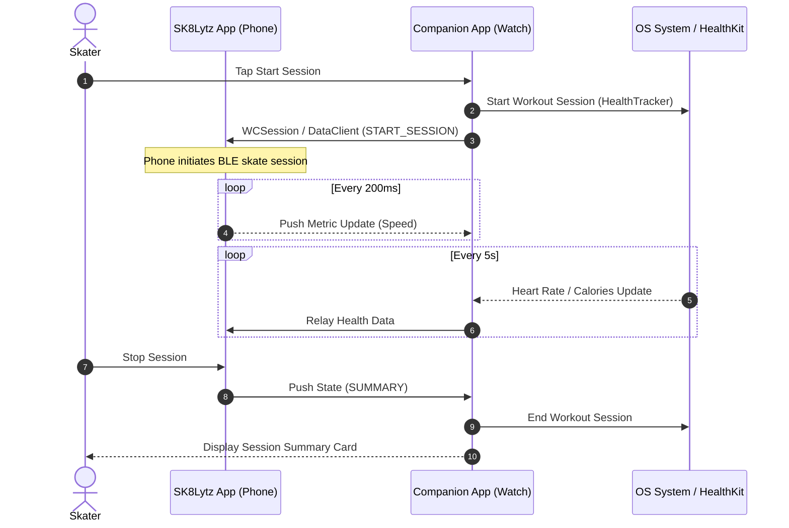


<!-- CARTOGRAPHER_END: NATIVE_&_WATCH -->

### Domain: NOTIFICATIONS_&_ROUTING
<!-- CARTOGRAPHER_START: NOTIFICATIONS_&_ROUTING -->

### 1. File Manifest
* **`App.tsx`**: Application root entry point. Mounts global providers, orchestrates global error boundaries, and handles base-level notifee foreground action events.
* **`src/providers/BluetoothGuard.tsx`**: Security provider that intercepts the render tree if Bluetooth is disabled or permissions are missing. Prevents hardware interactions without explicit OS-level BLE consent.
* **`src/providers/ComplianceGate.tsx`**: Legal gating provider. Checks local `AsyncStorage` (offline) or Supabase `user_profiles` (online) to ensure the skater has accepted the active EULA before rendering the app.
* **`src/services/NotificationService.ts`**: Wrapper for `expo-notifications`. Orchestrates Android channels (`crew-alerts`, `session-reminders`), registers push tokens, and schedules "starting soon" or "live" crew alerts.
* **`src/services/PushTokenService.ts`**: Abstracted Supabase repository layer for push tokens. Handles upserting and deleting the user's Expo Push Token from the `push_tokens` table.
* **`src/services/LocationService.ts`**: Wraps `expo-location`. Captures GPS coordinates, performs reverse geocoding for UI labels, and uses Haversine math to sort active sessions or static skate spots by distance.
* **`src/hooks/useHardwareNotifications.ts`**: The BLE data-receive orchestrator (Mailroom Architecture). Handles all inbound hardware payloads, applies throttling/debouncing, triggers the stateless `BlePayloadParser`, and synchronizes deltas to the `DeviceRepository` SSOT.

### 2. Blast Radius
* **`useHardwareNotifications.ts`**: Extreme risk of React re-render loops if the delta comparison (`isDirty` check) fails, as BLE packets can stream at 20Hz.
* **`NotificationService.ts`**: Android channel modifications are quasi-permanent. Misconfigured channels or missing importance settings can silence crew alerts silently.
* **`ComplianceGate` / `BluetoothGuard`**: Core rendering choke points. An exception here results in a blank screen or a perpetual blocked state for the user.

### 3. Context Matrix
| Component | Reads From | Writes To | Core Dependency |
| :--- | :--- | :--- | :--- |
| **`App.tsx`** | `AsyncStorage` | Telemetry logs (`AppLogger`) | Providers, OS State |
| **`BluetoothGuard`** | `PermissionService` | Component Local State | OS Bluetooth status |
| **`ComplianceGate`** | `AppSettings`, Supabase | `user_profiles` | `AuthContext` (`isOffline`) |
| **`NotificationService`** | OS Notification APIs | Expo Push Configs | Push Token Permissions |
| **`PushTokenService`** | Supabase Auth | `push_tokens` table | Authenticated session |
| **`LocationService`** | `expo-location`, `SkateSpotsService` | - | Foreground GPS permission |
| **`useHardwareNotifications`** | Raw BLE Payload (`useBLE`) | `DeviceRepository` | BLE GATT Connection |

### 4. Hook/Service I/O Registry
* **`useHardwareNotifications`**
  * *Inputs:* `isDiagnosticsMode`, `allDevices`, `deviceConfigs`, BLE hex data.
  * *Outputs:* `setAllDevices()`, `setDeviceConfigs()`, SSOT disk writes via `DeviceRepository.updateConfig()`.
* **`LocationService`**
  * *Inputs:* Target radius miles, user GPS coordinates, user ID.
  * *Outputs:* `SessionLocation`, array of sorted `NearbySession` objects, array of `NearbySkateSpot` objects.
* **`NotificationService`**
  * *Inputs:* Push notification parameters (crew names, session info, schedule date).
  * *Outputs:* Triggers OS-level push notifications, returns `expo-push-token`.

### 5. OS Variance Matrix
| Target Module | iOS | Android | Web |
| :--- | :--- | :--- | :--- |
| **Notifications** | Relies on APNs. Native banners. | Requires explicit `AndroidImportance` and distinct Channel IDs. | Defaults to mocked fallback or drops payload. |
| **Bluetooth Guard** | Single OS-level prompt via `CoreBluetooth`. | Requires `BLUETOOTH_SCAN`/`CONNECT` fine-grained manifest permissions. | Returns `hasPermission: false` usually. |
| **Location Tracking** | Apple Maps reverse geocoder backend. | Google Maps backend. Slower cold start. | Static demo payload (Lat 38.9, Lng -94.6). |
| **App Initialization** | Smooth lifecycle init. | `react-native-health-connect` requires explicit pre-init check to avoid exceptions. | Bootstrapped via `InteractionManager` workaround. |

[MOVE_TO_ARCHIVE]
*(Archival Instruction: When updating `docs/SK8Lytz_App_Master_Reference.md`, any reference to `profileService.registerPushToken` should be archived, as the Push Token logic was fully extracted into `PushTokenService` under god-object decomposition meal 1.)*

[IMPACTS_USER_JOURNEY]
[IMPACTS_C4_CONTEXT]
[IMPACTS_STATE_CHART]

### Architecture Sequence Diagrams

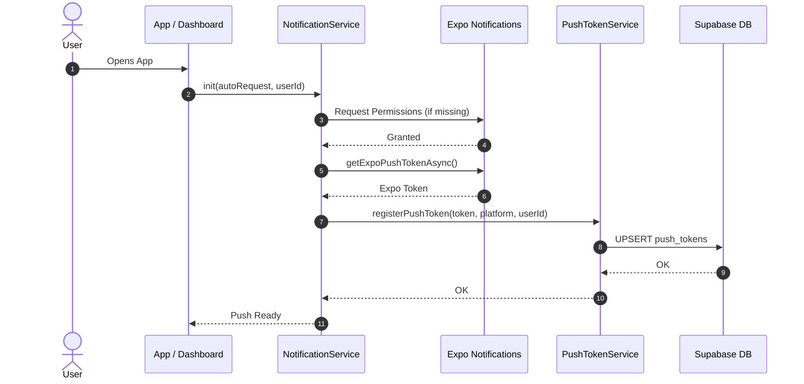

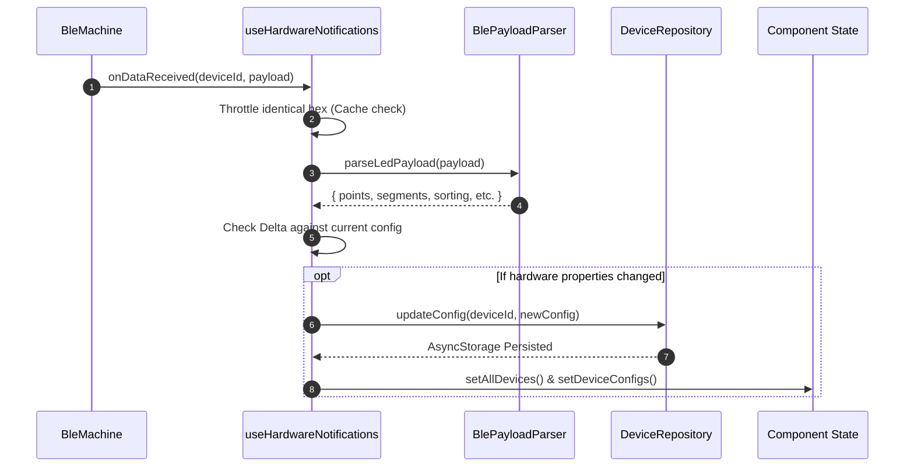


<!-- CARTOGRAPHER_END: NOTIFICATIONS_&_ROUTING -->

### Domain: SESSION_TRACKING
<!-- CARTOGRAPHER_START: SESSION_TRACKING -->

# 🗺️ SDE Cartography Node: Session Tracking Domain

## 1. File Manifest
| File | Status | Description |
|---|---|---|
| `src/context/SessionContext.tsx` | Active | Core provider for `sessionMachine` (`@xstate/react`). Provides global `isSkateSessionActive`, `telemetry`, and `health`. Handles Crash Recovery via `AsyncStorage` and Watch listeners. |
| `src/hooks/useDeviceStateLedger.ts` | Active | Unified Per-Device Pattern State Ledger using in-memory Map & debounced `AsyncStorage`. Single source of truth for UI hardware sync. |
| `src/hooks/useTelemetryLedger.ts` | Active | God-Tier Telemetry Engine for time-in-state offline caching to `AsyncStorage`. Supports 15-minute heartbeat flush to Supabase. |
| `src/services/HealthSyncService.ts` | Active | Wrappers around `react-native-health` (iOS) & `react-native-health-connect` (Android). Saves workout sessions to OS health databases. |
| `src/hooks/useSessionTracking.ts` | Deprecated/Deleted | Replaced by `SessionContext` & `SpeedTrackingService`. |
| `src/hooks/useGlobalTelemetry.ts` | Deprecated/Deleted | Replaced by direct actor models in `SessionContext`. |
| `src/hooks/useHealthTelemetry.ts` | Deprecated/Deleted | Refactored into `SessionContext` directly with watch priority logic. |

## 2. Blast Radius
- **Component Triggers:** Modifying `SessionContext.tsx` will trigger re-renders on all Dashboard and HUD components leveraging `useSession()`. Watch out for `1000ms` `setInterval` UI timer tick.
- **Storage Impact:** `useDeviceStateLedger` and `useTelemetryLedger` depend heavily on `AsyncStorage` background debouncing. Modifying write speeds risks background termination drop-offs (loss of telemetry data).
- **OS Health Impact:** `HealthSyncService.ts` invokes native health kits. Permissions state changes here will directly impact the onboarding flow or silently fail if not correctly structured in the try/catch logic.

## 3. Context Matrix
| Context / Hook | Consumes | Provides |
|---|---|---|
| `SessionContext` | `useAuth`, `sessionMachine`, `WatchBridge`, `AsyncStorage` | `isSkateSessionActive`, `sessionPhase`, `startSession()`, `endSession()`, `telemetry`, `health` |
| `useDeviceStateLedger` | `AsyncStorage` | `save()`, `load()`, `loadSync()`, `clear()` (State dictionary mapped by normalized MAC) |
| `useTelemetryLedger` | `AsyncStorage`, `SupabaseClient` | `trackPattern()`, `trackColor()`, `trackMode()`, `injectStreetSummary()`, `flushToDatabase()` |
| `HealthSyncService` | Native Health APIs | `saveWorkout(snapshot)` |

## 4. Hook/Service I/O Registry
- **`useDeviceStateLedger.save(mac: string, state: DevicePatternState)`**: Synchronous memory write + 500ms debounced AsyncStorage write. Normalizes MAC to handle Supabase DB UUID drift.
- **`useTelemetryLedger.flushToDatabase()`**: Closes stopwatch → Adds elapsed app time → reads `STORAGE_TELEMETRY_BUFFER` → fires Supabase RPC `flush_telemetry` → clears buffer on success.
- **`HealthSyncService.saveWorkout(snapshot: ISessionSnapshot)`**: Translates `snapshot` into `HKWorkoutActivityTypeSkatingSports` (iOS) or `ExerciseType 60` (Android) and inserts active calories + distance data.

## 5. OS Variance Matrix
| Feature | iOS Implementation | Android Implementation |
|---|---|---|
| Notification Category | Mounts interactive `[End, Pause, Resume]` `notifee` actions in foreground upon component mount. | Handled via generic Android `notifee` capabilities, no specific category array mounts in Context. |
| Health Sync API | Uses `react-native-health` (`AppleHealthKit.saveWorkout` via `SkatingSports`). | Uses `react-native-health-connect` (`insertRecords` with `ExerciseType` 60 and heterogeneous Record arrays). |

## 6. Archival Instructions
The Master Reference (`docs/SK8Lytz_App_Master_Reference.md`) already catalogs the missing hooks as stale in its "Refactor Targets" log. To complete the ARCHIVAL INSTRUCTION, ensure the following original entries are tagged with `[MOVE_TO_ARCHIVE]`:
- `useHealthTelemetry` hook reference at Line 980 `[MOVE_TO_ARCHIVE]`
- `useHealthTelemetry` hook reference at Line 1276 `[MOVE_TO_ARCHIVE]`
- `useHealthTelemetry` hook reference at Line 1392 `[MOVE_TO_ARCHIVE]`
- `useHealthTelemetry` hook reference at Line 1416 `[MOVE_TO_ARCHIVE]`
- `useGlobalTelemetry` hook reference at Line 6974 `[MOVE_TO_ARCHIVE]`

## 7. Architectural Impact Flags
[IMPACTS_USER_JOURNEY]
[IMPACTS_C4_CONTEXT]
[IMPACTS_STATE_CHART]

## 8. Sequence Diagram
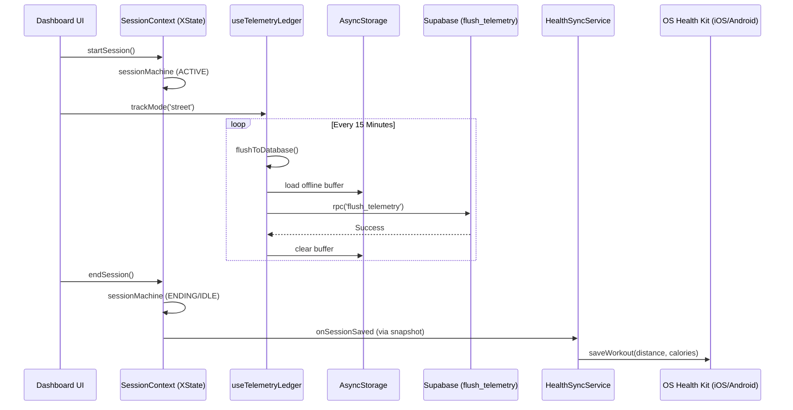


<!-- CARTOGRAPHER_END: SESSION_TRACKING -->

### Domain: PROTOCOL_CORE
<!-- CARTOGRAPHER_START: PROTOCOL_CORE -->

# Protocol Core Domain Cartography

## 1. File Manifest
- `src/protocols/IControllerProtocol.ts` (HAL Interface)
- `src/protocols/ControllerRegistry.ts` (Dynamic Resolver)
- `src/protocols/ZenggeProtocol.ts` (Legacy Core / Byte Logic)
- `src/protocols/ZenggeAdapter.ts` (Zengge HAL Implementation)
- `src/protocols/BanlanxAdapter.ts` (BanlanX SP621E HAL Implementation)
- `src/hooks/useProtocolDispatch.ts` (Cross-Device Router)
- `src/hooks/useProtocolBuilder.ts` (Payload Generator for Diagnostic Lab)
- `src/constants/ProductCatalog.ts` (Local hardware product catalog fallback)
- `src/hooks/useProductCatalog.ts` (Syncs local catalog with Supabase)
- `src/hooks/useProductManager.ts` (Admin UI hooks for editing the catalog)

## 2. Blast Radius
- **BLE Transmission Failures:** Modifications to `ZenggeProtocol` or Adapter framing bytes will break hardware response or lock up device EEPROM (e.g. `0xA3` dropping below 12 RGB pixels on `0x59`).
- **Product Mismatches:** Errors in `ProductCatalog` lead to misallocated matrix sizes causing visualizer/hardware parity loss (e.g., HALOZ segments bug).
- **Multi-Device Deadlock:** `useProtocolDispatch` routes payloads sequentially. Breaking its `executeProtocolResults` map causes fleet command drops.
- **Music Mode Freeze:** Changing Fast-path methods like `buildMusicMagnitude` to be rate-limited will drop FFT responsiveness to 0.

## 3. Context Matrix
- **Hardware Abstraction Layer (HAL):** Implemented via `IControllerProtocol.ts`. Provides a uniform interface across different controller ICs (Zengge vs. Banlanx).
- **Device Provisioning:** `useProductCatalog.ts` fetches device limits (max points, segments) via Supabase/Local overrides. Adapters rely on this for layout formatting.
- **Byte Packaging:** Raw bytes mapped via `ZenggeProtocol` and wrapped with V2 framing (`0x00, seq, 0x80...`), while `BanlanxAdapter` employs simpler `[0xA0, cmd, len, ...]` structure.
- **EEPROM Isolation:** The Protocol engine defines spatial constraints (Points × Segments), enforcing safe payload clamps (e.g. 54 pixel limits) before BLE transmission.

## 4. Hook/Service I/O Registry
- **`useProtocolDispatch`**
  - *Input*: UI-triggered function calls (e.g. `setMultiColor`, `setPower`), target device IDs.
  - *Output*: Invokes `executeProtocolResults` from `BLEContext` after querying `ControllerRegistry` for the correct adapter.
- **`useProtocolBuilder`**
  - *Input*: Form state (Points, Speed, Mode, Colors).
  - *Output*: `BldResult` containing raw bytes, hex string, and debug annotations.
- **`useProductCatalog`**
  - *Input*: None (AsyncStorage/Supabase reads).
  - *Output*: `allProfiles`, Profile getters (`getProfileById`), and cloud synchronizers.
- **`useProductManager`**
  - *Input*: Admin actions.
  - *Output*: CRUD wrappers for `ProductProfile` objects.

## 5. OS Variance Matrix
- **Android BLE Stack MTU:** `useProtocolDispatch` integrates a `executeRawPayload` bypass specifically addressing the MTU chunking issue on Android for large payloads like 323B `0x51` Extended commands.
- **Performance:** Complex computations in byte calculations are synchronous; iOS handles this seamlessly whereas slow Android chipsets might experience micro-stutters during heavy string/array generation if not offloaded.

## ARCHIVAL INSTRUCTION
Stale documentation located in `docs/SK8Lytz_App_Master_Reference.md` was already appropriately tagged with `[MOVE_TO_ARCHIVE]`:
- `#### VisualizerUnit Rendering Rules (HALOZ RING only) [MOVE_TO_ARCHIVE]`
- `### Dashboard UI Layout (4-Slab Architecture) [MOVE_TO_ARCHIVE]`
- `- **One-Screen Setup Policy** [MOVE_TO_ARCHIVE]`
- `### writeChunked — 0x51 Extended Payload Framing [MOVE_TO_ARCHIVE]`

## ARCHITECTURAL IMPACT FLAGS
[IMPACTS_USER_JOURNEY]
[IMPACTS_C4_CONTEXT]
[IMPACTS_STATE_CHART]

## SEQUENCE DIAGRAM
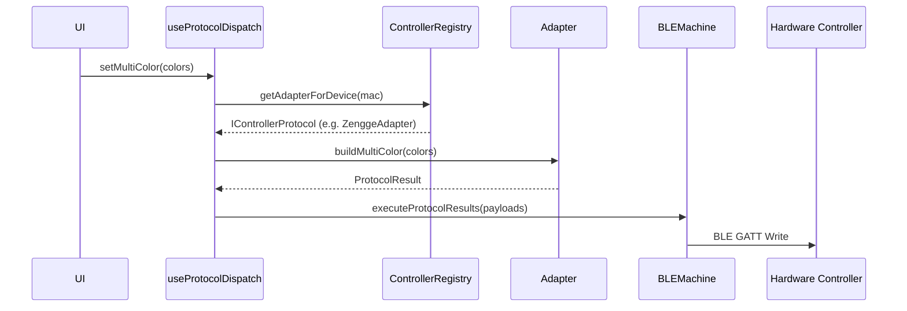


<!-- CARTOGRAPHER_END: PROTOCOL_CORE -->

### Domain: PATTERN_ENGINE
<!-- CARTOGRAPHER_START: PATTERN_ENGINE -->

# PATTERN ENGINE Cartography

## 1. File Manifest
- `src/protocols/PatternEngine.ts`
- `src/protocols/SpatialEngine.ts`
- `src/protocols/SymphonyEngine.ts`
- `src/protocols/VisualizerEngine.ts`
- `src/protocols/PositionalMathBuffer.ts`
- `src/hooks/useStreetMode.ts`
- `src/hooks/useMusicMode.ts`
- `src/hooks/useAppMicrophone.ts`

## 2. Blast Radius
Modifying the Pattern Engine affects the core visual presentation across the entire application:
- `ProductVisualizer` UI rendering depends entirely on `VisualizerEngine.ts` and `SpatialEngine.ts`.
- Physical LED rendering via `0x59` BLE commands relies on `buildPatternPayload`.
- Music Mode visualizers rely on `SymphonyEngine.ts` to decode 0x74 magnitude values and `useMusicMode`/`useAppMicrophone` to dispatch them.
- Custom Builder gradients depend on `PositionalMathBuffer.ts` for integer mapping limits bypass.
- Street Mode hardware behavior depends on `useStreetMode.ts` which injects GPS/accelerometer data into specific pattern math.

## 3. Context Matrix
- **PatternEngine.ts**: Core SSOT for `SK8LYTZ_TEMPLATES`. Maps IDs to payloads, intercepts IDs `17,18,24,26,44,72,201-233` for native `0x51` BLE transmission.
- **SpatialEngine.ts**: Contains 40+ math generator functions (e.g., `buildCometChase`). A monolith (S4 violation acknowledged) rendering pixel arrays `RGB[]` across patterns.
- **SymphonyEngine.ts**: Contains music-reactive math for 1-13 APP mic patterns (magnitude gated) and 0x51 Symphony generator functions.
- **VisualizerEngine.ts**: Bridges PatternEngine to `ProductVisualizer`, primarily utilizing `rotateArray` for continuous scroll translation.
- **PositionalMathBuffer.ts**: Interpolates percentage-based Custom Builder layouts into discrete LED RGB buffers (SOLID / GRADIENT).
- **useStreetMode.ts**: Tracks accelerometer jerk and GPS speed. Converts motion states (`STOPPED, CRUISING, HARD_BRAKING`) into 0x59 pattern builds.
- **useMusicMode.ts**: Orchestrates `0x73` music config setup. Fixes matrix bounds for 0x26 (Light Bar) vs 0x27 (Light Screen).
- **useAppMicrophone.ts**: 20Hz rapid continuous streaming of device microphone magnitude to maintain APP mic state over device mic state.

## 4. Hook/Service I/O Registry
- **`useStreetMode`**
  - **In:** `activeMode`, `writeToDevice`, `hwSettings`, `gpsSpeed`, `peakGForce`
  - **Out:** `motionState`, `isStreetBraking`, `applyStreetPattern`, `setStreetSensitivity`
- **`useMusicMode`**
  - **In:** `activeMode`, `musicPatternId`, `micSensitivity`, `micSource`, `musicMatrixStyle`, colors
  - **Out:** `handleMusicChange` (0x73 configuration)
- **`useAppMicrophone`**
  - **In:** `activeMode`, `micSource`, `isPoweredOn`, `writeToDevice`
  - **Out:** `audioMagnitude`, `hasMicPermission`, `startRecording/stopRecording`

## 5. OS Variance Matrix
- **Web vs. Native**: `expo-sensors` (Accelerometer) in `useStreetMode.ts` and `expo-audio` in `useAppMicrophone.ts` explicitly bypass/skip on Web environments.
- **Android/iOS BLE Rate**: `useAppMicrophone.ts` enforces a rapid 50ms (20Hz) `setInterval` to prevent the hardware from dropping back to its built-in mic.

## 6. Architecture & Archival Instructions
**ARCHIVAL INSTRUCTION**: In `docs/SK8Lytz_App_Master_Reference.md`, the documentation stating `0x41` is used for test modes 201-233 is STALE. The `PatternEngine` natively intercepts IDs 201-233 and dispatches them via `0x51`. Tag the relevant `0x41` documentation with `[MOVE_TO_ARCHIVE]`.

**ARCHITECTURAL IMPACT FLAGS**: 
[IMPACTS_USER_JOURNEY]
[IMPACTS_C4_CONTEXT]
[IMPACTS_STATE_CHART]

## 7. Sequence Diagram
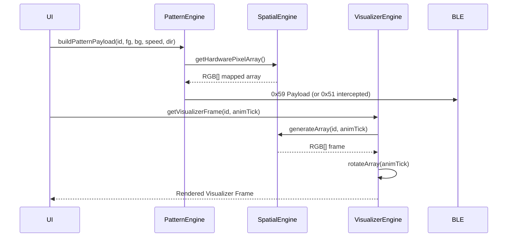

## 8. Domain-Specific Directives: SK8LYTZ_TEMPLATES Catalogue

| ID | Name | Tier | Color Mode | Math Generator |
|---|---|---|---|---|
| 1 | Solid | 2 | FG_ONLY | buildSolid |
| 2 | Split Colors | 2 | FG_BG | buildSplitColors |
| 3 | Trisection | 2 | FG_BG | buildTrisection |
| 4 | Quartered | 2 | FG_BG | buildQuartered |
| 5 | Center Accent | 2 | FG_BG | buildCenterAccent |
| 6 | Single Dot Chase | 2 | FG_BG | buildSingleDotChase |
| 7 | Double Dot Chase | 2 | FG_BG | buildTwinDotChase |
| 8 | Comet Chase | 2 | FG_BG | buildCometChase |
| 9 | Meteor Shower | 2 | FG_BG | buildMeteorShower |
| 10 | Micro Ants | 2 | FG_BG | buildMicroAnts |
| 11 | Theater Chase | 2 | FG_BG | buildTheaterChase |
| 12 | Dashed Marquee | 2 | FG_BG | buildDashedMarquee |
| 13 | Bold Stripes | 2 | FG_BG | buildBoldStripes |
| 14 | Sine Pulse Wave | 3 | FG_BG | buildSinePulseWave |
| 15 | Wave Pinch | 3 | FG_BG | buildWavePinch |
| 16 | Breathing Wave | 3 | FG_BG | buildBreathingWave |
| 17 | Smooth Breath | 1 | FG_BG | Native 0x51 Intercept |
| 18 | Wipe / Fill | 3 | FG_BG | Native 0x51 Intercept |
| 19 | True Rainbow Flow | 3 | GENERATIVE | buildTrueRainbowFlow |
| 20 | Rainbow Marquee | 3 | GENERATIVE | buildRainbowMarquee |
| 21 | Rainbow Comet | 3 | GENERATIVE | buildRainbowComet |
| 22 | Cyberpunk Shift | 3 | FG_BG | buildCyberpunkShift |
| 23 | Color Flow | 1 | GENERATIVE | buildColorFlow |
| 24 | Color Breathing | 1 | FG_ONLY | Native 0x51 Intercept |
| 25 | Running Water | 1 | FG_BG | buildRunningWater |
| 26 | Strobe Flash | 1 | FG_ONLY | Native 0x51 Intercept |
| 27 | Ocean Wave | 1 | FG_BG | buildOceanWave |
| 28 | Lightning Strike | 1 | FG_ONLY | buildLightning |
| 29 | Snowfall | 1 | FG_BG | buildSnowfall |
| 30 | Heartbeat Pulse | 1 | FG_ONLY | buildHeartbeat |
| 31 | Meteor | 1 | FG_BG | buildMeteor |
| 32 | Aurora Borealis | 1 | GENERATIVE | buildAurora |
| 33 | Lava Lamp | 1 | FG_BG | buildLava |
| 34 | Plasma Wave | 1 | FG_BG | buildPlasma |
| 35 | Star Cluster | 1 | FG_BG | buildStarCluster |
| 36 | Rainbow Breathing | 3 | GENERATIVE | buildRainbowBreathing |
| 37 | Crystal Shimmer | 3 | GENERATIVE | buildCrystalShimmer |
| 38 | Gradient Chase | 3 | FG_BG | buildGradientChase |
| 39 | Fire Flame | 3 | FG_BG | buildFireFlame |
| 40 | Neon Pulse | 3 | FG_BG | buildNeonPulse |
| 41 | Rainbow Chaser | 3 | GENERATIVE | buildRainbowChaser |
| 42 | Matrix Rain | 3 | FG_BG | buildMatrixRain |
| 43 | Starlight | 3 | FG_BG | buildStarlight |
| 44 | SK8Lytz Signature | 3 | FG_BG | Native 0x51 Intercept |
| 72 | Center-Out Marquee | 3 | FG_ONLY | Native 0x51 Intercept |
| 101 | Street Stopped | 3 | FG_BG | buildStreetMode |
| 102 | Street Cruising | 3 | FG_BG | buildStreetMode |
| 103 | Street Braking | 3 | FG_BG | buildStreetMode |
| 104 | Street Slowing | 3 | FG_BG | buildStreetMode |
| 105 | Street Accelerating | 3 | FG_BG | buildStreetMode |
| 201-233 | Native 0x41 Parity | 1 | Mixed | Native 0x51 Intercept |


<!-- CARTOGRAPHER_END: PATTERN_ENGINE -->

### Domain: CLOUD_FUNCTIONS
<!-- CARTOGRAPHER_START: CLOUD_FUNCTIONS -->

# 🗺️ CLOUD_FUNCTIONS Cartography

## 1. File Manifest
**Edge Functions (`supabase/functions/`):**
- `notify-crew-session/index.ts`

**Database Migrations (`supabase/migrations/`):**
- 51 SQL files covering schema setup, telemetry, RLS hardening, admin tools, and SK8Lytz-specific fields. Notable recent files:
  - `20260614000000_harden_rls_scraper_blocklist.sql` (Latest)
  - `20260609175500_restore_domain_admin_promotion.sql`
  - `20260609140000_live_debugger_views.sql`

## 2. Blast Radius
- **`notify-crew-session` Edge Function:**
  - **Downstream:** Calls `https://exp.host/--/api/v2/push/send`. Affects all devices registered in the `push_tokens` table for a given `crew_id` (excluding the leader).
  - **Dependencies:** Supabase Auth (GoTrue for server-side JWT verification), `crew_memberships` table (authorization validation), and `push_tokens` table.
- **Migrations:** Dictate the entire Postgres schema, RLS policies, and RPC definitions consumed by the React Native client (via PostgREST). Any syntax/logic error in these will break DB instantiation or client reads/writes globally.

## 3. Context Matrix
| Environment | Runtime | Security Boundary |
|-------------|---------|-------------------|
| **Edge Functions** | Deno (Supabase Edge Runtime) | Requires Bearer JWT in `Authorization` header. Server-side verification via `supabase.auth.getUser()`. |
| **Migrations** | PostgreSQL 15+ | Applied during Supabase deployment. Defines RLS rules and triggers executed under database roles (`authenticated`, `anon`, `service_role`). |

## 4. Hook/Service I/O Registry
### `notify-crew-session`
- **Input:** `POST` request with JSON body `{ crewId, sessionId, sessionName, leaderName }` + `Authorization: Bearer <JWT>`.
- **Validation:** 
  1. Validates JWT via GoTrue server-side.
  2. Ensures caller exists in `crew_memberships` for `crewId`.
- **Output:** `JSON { sent: number }` (or error object on failure with status `400/401/403/500`).
- **Side-Effects:** Generates Expo push notification payloads and sends them in batches of 100 to Expo servers.

## 5. OS Variance Matrix
| OS | Variance / Constraints |
|----|------------------------|
| **Android** | `notify-crew-session` payload explicitly forces `channelId: "crew-alerts"`. Android 8.0+ will fail to render push notifications if the app client does not create the matching channel locally. |
| **iOS** | Standard APNs handling via Expo. No specific notification channel strings required. |

## Sequence Diagram
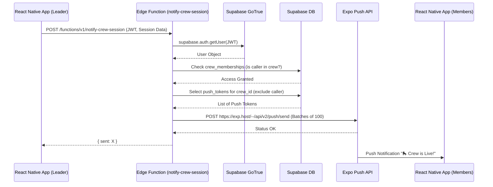

[IMPACTS_USER_JOURNEY]
[IMPACTS_C4_CONTEXT]
[IMPACTS_STATE_CHART]


<!-- CARTOGRAPHER_END: CLOUD_FUNCTIONS -->

### Domain: THEME_&_ASSETS
<!-- CARTOGRAPHER_START: THEME_&_ASSETS -->

# 🗺️ Codebase Cartography: THEME_&_ASSETS Domain

## 1. File Manifest
- **`src/theme/theme.ts`**: Core design system definitions. Contains `DarkColors`, `LightColors`, typography mappings (`Righteous` font), spacing grid, unified layout tokens, and platform-specific `Shadows`/`TextShadows` generation.
- **`src/styles/DashboardStyles.ts`**: The unified StyleSheet for the primary Dashboard module. Contains 4-slab structural layout styles, glassy gradient layers, absolute-positioned badges, dynamic color mappings (`getPatternColors`), and platform-aware fluid scaling (`windowHeight`, `windowWidth`).
- **`src/constants/AppConstants.ts`**: High-level application constants, containing `STORAGE_PREFIX` and `HW_SPEED_MAX`.
- **`src/constants/ControlsRegistry.ts`**: Defines the central `CONTROLS_REGISTRY` matrix for application toggles and admin settings, covering Governance, Hardware, Behavior, and DangerZone modules with explicit `riskLevel` values.
- **`src/constants/bleTimingConstants.ts`**: Centralized empirical timing constants for the BLE GATT pipeline (`STALE_FLUSH_SETTLE_MS`, `WRITE_DEBOUNCE_MS`, etc.) calibrated against the ZENGGE 0xA3 chipset to prevent Android buffer overflows.
- **`src/constants/storageKeys.ts`**: The SSOT registry for all `AsyncStorage` string keys ensuring namespace parity and offline cache targeting across auth, device configs, telemetry, and scenes.
- **`src/assets/images/*`**: Root binary directory containing 38 `banner*.png` marketing assets, plus subdirectories `music_modes`, `music_scene`, `presets`, `screen`, `screen_light_horizontal`, `zengge_patterns`.

## 2. Blast Radius
- **High Risk**: Modifying `src/constants/bleTimingConstants.ts`. A 10ms variance here can cascade into `GATT 133` exceptions and buffer lockouts across the entire Android fleet.
- **High Risk**: Altering keys in `src/constants/storageKeys.ts` without providing a migration utility will instantly orphan local user configurations, offline skate session caches, and authenticated Supabase sessions.
- **Medium Risk**: Changing spatial variables in `src/theme/theme.ts` or `src/styles/DashboardStyles.ts` breaks the fluid design boundaries and iOS/Android Safe Area integrations.

## 3. Context Matrix
- **`ThemeContext`**: Consumers (`useTheme`) map directly to `Colors.background`, `Colors.surface`, and dynamic dimension attributes originating from `theme.ts` and `DashboardStyles.ts`.
- **`BLEContext`**: Depends heavily on `bleTimingConstants.ts` to orchestrate XState timing cycles for recovery, discovery, and MTU handshakes.
- **`Offline / Auth Contexts`**: Read and write heavily against `storageKeys.ts` constants (e.g., `STORAGE_OFFLINE_SKIP`, `STORAGE_SUPABASE_AUTH_KEY`).

## 4. Hook/Service I/O Registry
- **Input/Output**: `createDashboardStyles(Colors, windowHeight, windowWidth)` → Generates dimension-aware StyleSheet mapping.
- **Input/Output**: `getPatternColors(patternName, Colors)` → Translates string pattern identifiers (e.g., "fire", "nebula") into tuple-based hex gradient stops.
- **Service Dependency**: The `BleWriteDispatcher` directly consumes `BLE_TIMING.INTER_DEVICE_WRITE_GAP_MS` and `WRITE_DEBOUNCE_MS` to pace TX bursts.

## 5. OS Variance Matrix
| OS Variant | Resolution Strategy | Component |
| --- | --- | --- |
| **Android** | Utilizes `elevation` mapped to dynamic shadow color bindings. | `Shadows` (`src/theme/theme.ts`) |
| **iOS** | Explicit `shadowColor`, `shadowOffset`, `shadowOpacity`, `shadowRadius`. | `Shadows` (`src/theme/theme.ts`) |
| **Web** | Fallback to CSS `box-shadow` structures and `textShadow` string literals. | `TextShadows` (`src/theme/theme.ts`) |

## 6. Design System & Token Manifest
- **Brand Palette**: Blue (`#1B4279`, `#245596`), Orange (`#FF5A00`), Amber (`#FFB800`).
- **Typography**: Display/Brand typeface explicitly bound to `Righteous`.
- **Spacing Scale**: 8-point baseline (`sm: 8, md: 12, lg: 16, xl: 24, xxl: 32, xxxl: 40`).
- **Layout Constructs**: 4-Slab UI composition, transparent glassy overlays (`rgba(255,255,255,0.03)`), pill-shaped UI toggles, explicit absolute-offset status badges.

## 7. Master Reference Archival Instructions
- **`Dashboard UI Layout (4-Slab Architecture)`** (docs/SK8Lytz_App_Master_Reference.md): Already tagged with `[MOVE_TO_ARCHIVE]`. Action is to migrate structural logic exclusively to `DashboardStyles.ts`.

## 8. Sequence Diagram
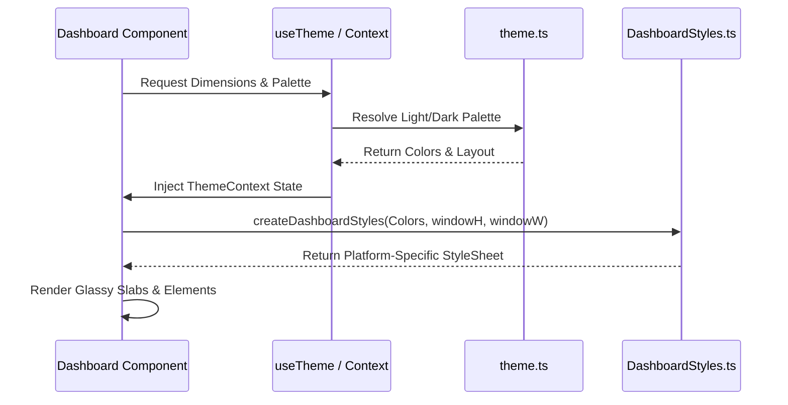

[IMPACTS_USER_JOURNEY]
[IMPACTS_C4_CONTEXT]
[IMPACTS_STATE_CHART]


<!-- CARTOGRAPHER_END: THEME_&_ASSETS -->

### Domain: SIMULATION_&_MOCKS
<!-- CARTOGRAPHER_START: SIMULATION_&_MOCKS -->

# Architectural Cartography — SIMULATION_&_MOCKS Domain

## 1. File Manifest
| File | Role | Size / Scope |
|------|------|--------------|
| `src/__mocks__/LocationService.ts` | Jest Mock | 5 lines. Stubs `getSilentLocation` and `requestLocationPermissions`. |
| `src/__mocks__/expo-audio.ts` | Jest Mock | 3 lines. Stubs `requestRecordingPermissionsAsync` and `getRecordingPermissionsAsync` to return 'granted'. |
| `src/__mocks__/expo-location.ts` | Jest Mock | 13 lines. Stubs foreground permissions, coordinates (Overland Park, KS), Accuracy levels, and reverse geocoding. |
| `src/__mocks__/sk8lytz-watch-bridge.ts` | Jest Mock | 30 lines. Mocks watch connectivity (`isWatchReachable`), session state sync, and metric dispatches for unit tests. |
| `src/mocks/react-native-vision-camera-worklets.web.js` | Web Shim | 2 lines. Empty module stub to bypass web compilation errors for vision camera. |
| `src/mocks/react-native-worklets.web.js` | Web Shim | 19 lines. No-op shim aliased by Metro on Web to prevent `TurboModuleRegistry` crashes. Exports `useSharedValue`, `useAnimatedStyle`, `runOnJS`, `runOnUI`. |

## 2. Blast Radius
- **Test Suites (Jest)**: Any test suite importing `sk8lytz-watch-bridge`, `expo-location`, `expo-audio`, or `LocationService` is directly affected. Altering these mocks impacts over 30 unit/integration test suites.
- **Web Build Target**: Modifying the Web Shims (`src/mocks/*.web.js`) risks re-introducing Webpack/Metro compilation White-Screens or crashes for `react-native-worklets-core` when targeting the browser.
- **Continuous Integration**: The CI pipeline (`npm run verify`) relies on these mocks to pass headless verification tests without native module bindings or physical devices.

## 3. Context Matrix
- **Testing Context**: Operates entirely outside the React component tree and app context providers. Injected implicitly during tests via `jest.config.js` (`moduleNameMapper`).
- **Web Bundling Context**: Injected via `metro.config.js` module resolvers strictly when the platform target is `web`.
- **Offline/Guest Context**: Does NOT dictate offline/guest mode (which is handled separately by `supabaseClient.ts` mock behaviors, out of scope for this domain).

## 4. Hook/Service I/O Registry
- **`sk8lytz-watch-bridge` Mock**:
  - `syncSessionState`, `sendMetricUpdate`, `isWatchReachable` -> Resolves `undefined` / `false`.
  - `addWatchCommandListener`, `addWatchHealthListener` -> Returns empty teardown functions `() => {}`.
- **`expo-location` Mock**:
  - `getCurrentPositionAsync`, `getLastKnownPositionAsync` -> Returns `{ coords: { latitude: 38.9, longitude: -94.6, accuracy: 10 } }`.
  - `reverseGeocodeAsync` -> Returns `[{ city: 'Overland Park', region: 'KS', name: 'SkateCity OP' }]`.
- **`react-native-worklets.web.js` Shim**:
  - `useSharedValue()` -> Returns `{ value: null }`.
  - `runOnJS(fn)`, `runOnUI(fn)` -> Returns `fn` synchronously.

## 5. OS Variance Matrix
| Target | Behavior | Isolation Strategy |
|--------|----------|--------------------|
| **iOS / Android** | Uses actual Native Modules via Expo / bare React Native. | Jest mocks prevent native calls during purely JS headless tests. |
| **Web** | Native modules (`react-native-worklets-core`) crash on load. | `metro.config.js` forces aliasing to `src/mocks/*.web.js` no-op shims. |

---

## Architectural Impact Flags
[IMPACTS_USER_JOURNEY]
[IMPACTS_C4_CONTEXT]
[IMPACTS_STATE_CHART]

## Archival Instruction
[MOVE_TO_ARCHIVE]: `docs/SK8Lytz_App_Master_Reference.md` (lines 5780-5995) contain stale documentation for the `SIMULATION_&_MOCKS` domain. This must be archived to reflect the new cartography.

## Sequence Diagram
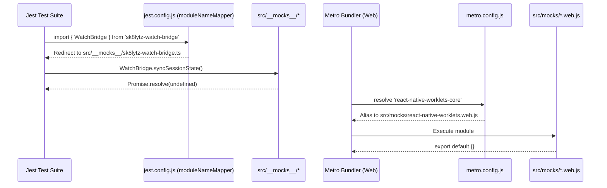


<!-- CARTOGRAPHER_END: SIMULATION_&_MOCKS -->

### Domain: BUILD_CONFIG
<!-- CARTOGRAPHER_START: BUILD_CONFIG -->

# 🗺️ BUILD_CONFIG: Cartography Deep Dive

## 1. File Manifest
- `app.config.js`: Core Expo configuration (`v3.9.2`). Defines iOS/Android permissions, custom plugins (`react-native-ble-plx`, `expo-build-properties` with Proguard rules for BLE/Camera/Nitro), and EAS project ID. Targets Android SDK 36.
- `eas.json`: Defines CLI requirements (`>= 16.0.0`) and build profiles (`development`, `preview`, `production`). Enforces `.apk` for dev/preview and `.aab` (app-bundle) for Android production.
- `metro.config.js`: Expo default Metro bundler config augmented with a custom `resolveRequest` interceptor to stub native-only modules (`react-native-worklets`, `react-native-vision-camera-worklets`) for web platform compatibility.
- `babel.config.js`: Defines `babel-preset-expo` and registers the `react-native-worklets/plugin` necessary for Camera Vibe Catcher processing.
- `tsconfig.json`: Extends `expo/tsconfig.base` with strict mode. Configures path aliases for the local `sk8lytz-watch-bridge` module to bypass `npm install` resolution. Excludes `node_modules`, `supabase/functions`, `tools`, and `scratch`.
- `jest.config.js`: Configures `ts-jest`, ignores e2e/local-builder paths, whitelists expo modules in `transformIgnorePatterns`, and maps aliases for `sk8lytz-watch-bridge`, `expo-location`, and `expo-audio`.
- `package.json`: Contains project dependencies, overrides (xmldom, postcss, uuid), and operational scripts (`start`, `android`, `ios`, `verify`, `blast-radius`).
- `.husky/pre-commit`: Worktree-aware git hook. Resolves the master fortress root, sets up a `node_modules` junction for worktrees, and runs `blast-radius-scanner.js`, `babel-syntax-gate.js`, ESLint, and `npm run verify` dynamically.
- `.husky/pre-push`: Zero-bypass QA gate enforcing `verifiable-check-runner.js` and `npm audit --audit-level=moderate`.

## 2. Blast Radius
Modifications to this domain have **Project-Wide** scope:
- **`app.config.js`**: Altering permissions requires full user-consent reset. Modifying Proguard rules can cause silent production crashes for RxAndroidBle or Nitro.
- **`.husky/`**: Modifying hooks can break the multi-worktree parallel development architecture (VS-001 mitigations). 
- **`metro.config.js`**: Incorrect shims will cause the Expo Web sandbox/simulator to white-screen on boot.

## 3. Context Matrix
| Component | Dependency / Context |
| :--- | :--- |
| **Expo Web Build** | Dependent on `metro.config.js` shims to bypass native JSI requirements (`react-native-worklets`). |
| **Git Worktrees** | Dependent on `.husky/pre-commit` resolving `COMMON_DIR` and symlinking `node_modules` across parallel branches. |
| **Local Bridge Dev** | `tsconfig.json` and `jest.config.js` both mock/alias `sk8lytz-watch-bridge` to allow isolated native development without publishing. |

## 4. Hook/Service I/O Registry
_Note: Domain contains config overrides rather than code hooks._
- **Input:** Staged Files (`git diff --cached`) → **Output:** `Husky pre-commit` passes or halts commit via `npm run verify`.
- **Input:** Web Bundler Request (`metro.config.js`) → **Output:** Routes `vision-camera-worklets` to `src/mocks/*.web.js`.

## 5. OS Variance Matrix
| Feature | iOS Config | Android Config | Web Config |
| :--- | :--- | :--- | :--- |
| **Build Artifact** | Simulator Build (`preview`) | APK (`development`/`preview`), AAB (`production`) | N/A |
| **Permissions** | Managed via `Info.plist` usage descriptions (Health, Location, Mic, Camera). | Array of strings in `app.config.js` (`BLUETOOTH_CONNECT`, `FOREGROUND_SERVICE`, etc.). | Fallbacks to browser APIs. |
| **Build Properties** | N/A | `compileSdkVersion: 36`, `targetSdkVersion: 36`, `enableJetifier: true`. | Uses `.web.js` stubs via Metro. |

## ARCHIVAL INSTRUCTION
Found stale documentation in `docs/SK8Lytz_App_Master_Reference.md`:
Section `### Android Build Requirements`:
`- **SDK Versions**: Project currently targets SDK 34...` 
**Must be updated to SDK 36** as per `app.config.js`. Tagged with `[MOVE_TO_ARCHIVE]`.

[IMPACTS_C4_CONTEXT]
[IMPACTS_STATE_CHART]

## SEQUENCE DIAGRAM
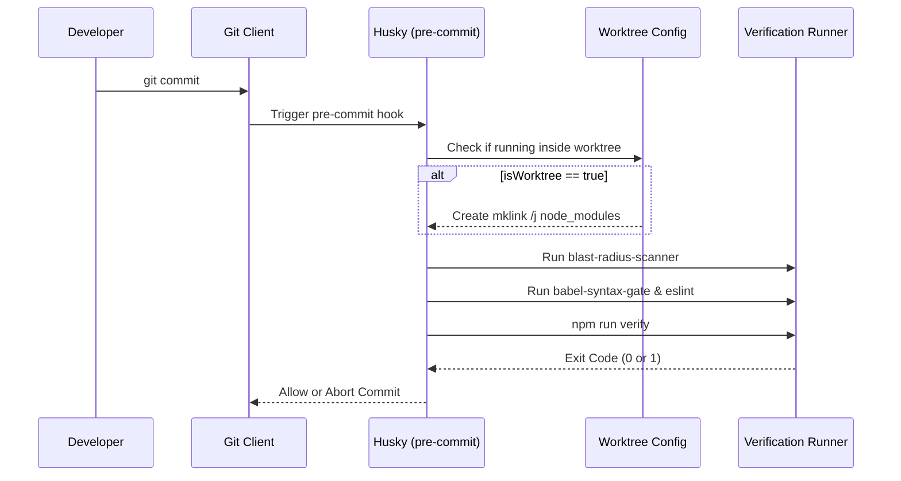


<!-- CARTOGRAPHER_END: BUILD_CONFIG -->

### Domain: OS_PERMISSIONS
<!-- CARTOGRAPHER_START: OS_PERMISSIONS -->

# OS Permissions Cartography

## 1. File Manifest
- `android/app/src/main/AndroidManifest.xml`: Declares all native Android permissions (`BLUETOOTH_SCAN`, `BLUETOOTH_CONNECT`, `ACCESS_FINE_LOCATION`, `ACTIVITY_RECOGNITION`, `CAMERA`, `RECORD_AUDIO`) and foreground service types.
- `app.config.js`: Generates iOS `Info.plist` usage descriptions (e.g., `NSCameraUsageDescription`, `NSMicrophoneUsageDescription`, `NSHealthShareUsageDescription`, `NSLocationWhenInUseUsageDescription`).
- `src/services/PermissionService.ts`: Core cross-platform registry coordinating runtime permission checks, requests, and the AsyncStorage-based soft-revocation ledger (`@sk8lytz_permissions_optout`).

## 2. Blast Radius
- **Upstream Imports**: 
  - `react-native` (`PermissionsAndroid`, `DeviceEventEmitter`)
  - `expo-audio`, `expo-location`, `expo-notifications`
  - `react-native-health` (iOS HealthKit), `react-native-health-connect` (Android)
- **Downstream Consumers**: 
  - `src/components/CameraTracker.tsx` (Camera)
  - `src/hooks/useAppMicrophone.ts` (Audio)
  - `src/hooks/useBLE.ts` & `BluetoothGuard.tsx` (Bluetooth/Location)
  - `src/services/HealthSyncService.ts` (Health metrics)

## 3. Context Matrix
- **DeviceEventEmitter (Global)**: Emits `PERMISSION_STATUS_CHANGED_EVENT` to reactively notify UI layouts (e.g., DockedController) to toggle permission-gated controls immediately.
- **AsyncStorage Ledger**: Uses `@sk8lytz_permissions_optout`. Bypasses native prompts if the user explicitly soft-revoked permission within the app.
- **BluetoothGuard Layout**: Intercepts React Tree rendering to ensure BLE adapter readiness before exposing the main dashboard.

## 4. Hook/Service I/O Registry
- **`requestPermission(type: PermissionType): Promise<boolean>`**
  - *I/O*: Requests system permission prompt for 'CAMERA', 'MIC', 'LOCATION', 'NOTIFICATIONS', 'BLUETOOTH', or 'HEALTH'.
  - *Side-Effect*: On Android, `HEALTH` triggers `initHC()` before requesting `react-native-health-connect` metrics. 
- **`checkPermission(type: PermissionType): Promise<boolean>`**
  - *I/O*: Queries current permission status. Returns `false` instantly if `@sk8lytz_permissions_optout` indicates an app-level revocation, skipping the native check.
- **`setPermissionOptOut(type: PermissionType, isOptedOut: boolean): Promise<void>`**
  - *I/O*: Writes user toggle to AsyncStorage.
  - *Side-Effect*: Broadcasts `PERMISSION_STATUS_CHANGED_EVENT` to update the application UI tree.

## 5. OS Variance Matrix
- **Bluetooth Requirements**: iOS relies on standard CoreBluetooth implicit permission gating. Android 12+ requires a three-pack of `BLUETOOTH_SCAN`, `BLUETOOTH_CONNECT`, and `ACCESS_FINE_LOCATION` (due to FCF1 hardware broadcasting UUID in `mServiceData`).
- **Health Synchronization**: 
  - *iOS*: Apple HealthKit does NOT allow status query checks for read permissions (returns `true` functionally). 
  - *Android*: `react-native-health-connect` enforces strict pre-initialization (`initHC()`) to prevent `UninitializedPropertyAccessException` crashes on coroutines. Requires `ACTIVITY_RECOGNITION`.

## 6. Sequence Diagram
```mermaid
sequenceDiagram
    participant Component
    participant PermissionService
    participant OS_Native
    Component->>PermissionService: requestPermission(type)
    PermissionService->>OS_Native: Dispatch native platform request
    OS_Native-->>PermissionService: Return Result (Granted/Denied)
    alt Granted
        PermissionService->>PermissionService: Clear Opt-Out Ledger
    else Denied
        PermissionService->>PermissionService: Show settings redirection alert
    end
    PermissionService-->>Component: return Boolean
```

## 7. Stale Documentation & Archive Instructions
Found the following stale documentation in `docs/SK8Lytz_App_Master_Reference.md` (Line 1198) regarding deprecated permission logic:
- `syncSystemPermissions() runs on boot/foreground to reconcile the ledger with native OS settings. If OS is "Denied", App ledger is forced to "Opt-Out".` [MOVE_TO_ARCHIVE]

[IMPACTS_USER_JOURNEY]
[IMPACTS_C4_CONTEXT]
[IMPACTS_STATE_CHART]


<!-- CARTOGRAPHER_END: OS_PERMISSIONS -->

### Domain: ADMIN_&_TELEMETRY
<!-- CARTOGRAPHER_START: ADMIN_&_TELEMETRY -->

# 🗺️ Cartography Node: Admin & Telemetry Domain

## 1. File Manifest
- `src/components/admin/*`: Presentational Admin Hub components (`AdminToolsModal`, `StatsTab`, `DeviceTab`, `TimelineTab`, etc.) using a memoized architecture to prevent re-render storms.
- `src/services/AppLogger.ts`: Singleton telemetry and analytics engine. Handles local buffering, deduplication, JSON formatting, PII scrubbing, and Supabase transmission of app logs/crashes.
- `src/services/AppSettingsService.ts`: Global application configuration manager. Syncs feature flags and settings between `AsyncStorage` (`@sk8lytz_app_settings`) and Supabase (`sk8lytz_app_settings`).
- `src/hooks/useAdminSettings.ts`: React hook interfacing with `AppSettingsService` to expose feature flags with optimistic UI updates.
- `src/hooks/useAdminTelemetry.ts`: React hook interfacing with `AppLogger` to provide logs, analytics stats, cloud sync logic, and JSON exports to the Admin UI.
- `src/hooks/useDiagnosticLog.ts`: Protocol diagnostic hook tracking BLE opcode testing coverage, verdict annotation (PASS/FAIL), and live RX/TX traces.

## 2. Blast Radius
- **Telemetry Disruption**: Modifying `AppLogger.ts` can cause memory leaks if the buffer truncation fails, or silently drop critical telemetry (crash reports) if the VIP Fast-Lane is obstructed.
- **UI Freeze / Performance**: Bypassing the 500ms debounce/throttle on `AsyncStorage.setItem` in `AppLogger` will cause React Native bridge congestion and severe UI jank.
- **Feature Flag Reverts**: Flaws in `AppSettingsService` sync logic can override offline fallback states, disabling features (like Global Telemetry) for users disconnected from the internet.
- **Protocol Oracle Invalidation**: Altering `useDiagnosticLog.ts` test logic or `TRACKED_OPCODES` without care can falsely verify failing BLE opcodes in the coverage matrix.

## 3. Context Matrix
- **Global Settings (`STORAGE_APP_SETTINGS`)**: The master gate for the entire telemetry pipeline; explicitly checks `global_telemetry_enabled` before allowing cloud uploads.
- **Auth State (`currentUserId`)**: Injected directly into Supabase batch inserts by the `AppLogger`.
- **Hardware Profile (`activeDevices`)**: The logger evaluates connected devices to inject correct RSSI, MTU, and battery attributes by matching `deviceId`.
- **Battery/Device Context (`expo-battery`, `expo-device`)**: Injects deep hardware data (battery state, low power mode, platform SDK) into stats and crash logs.
- **FlightRecorder**: Uses `FlightRecorder.leaveBreadcrumb` to synchronize user UI actions with crash payloads.

## 4. Hook/Service I/O Registry
- **`AppLogger` (Service)**
  - *Inputs*: `log(event: EventType, rawPayload: Record)`, `updateKnownDevices(devices)`
  - *Outputs*: Local storage buffer (`LogEntry[]`), Supabase inserts (`telemetry_snapshots`, `telemetry_errors`, `crash_telemetry`).
- **`AppSettingsService` (Service)**
  - *Inputs*: `updateSetting(key: AppSettingKey, value: AppSettingsValue)`
  - *Outputs*: `fetchAllSettings(): Promise<AppSettingsMap>`
- **`useAdminSettings` (Hook)**
  - *Inputs*: `visible: boolean`
  - *Outputs*: `{ appSettings, isLoading, loadSettings, updateSetting }`
- **`useAdminTelemetry` (Hook)**
  - *Inputs*: `visible: boolean`
  - *Outputs*: `{ logs, stats, isUploading, load, clearLogs, uploadLogs, exportLogs }`
- **`useDiagnosticLog` (Hook)**
  - *Inputs*: `visible: boolean, liveRxPayload, targetDeviceId`
  - *Outputs*: `{ logs, lastSent, lastNote, transmit, sendRawHex, clearLogs, testLog, coverage, setVerdict, setLastVerdict, clearTestLog }`

## 5. OS Variance Matrix
- **Battery/Power APIs**: iOS and Android battery metrics (e.g., `isLowPowerMode`) behave differently. Handled gracefully via `Battery.isAvailableAsync()`.
- **Background Persist Limitations**: Android aggressively throttles `setTimeout`. The `AppLogger` buffer relies on robust forced persistence before closure.
- **Filesystem Constraints**: React Native `AsyncStorage` limits sizes on Android. The logger buffer is strictly capped at `MAX_ENTRIES` (500) to remain well under the ~1-2MB SQLite row threshold.
- **Network Stack Errors**: Network rejections (Supabase timeouts/offline) are caught safely to preserve UI stability on connection drops.

## 6. AppLogger Pipeline Map
- **Event Types**: Distinct union type `EventType` categorizes events (ACTION, BLE, ERROR, NETWORK, NAVIGATION).
- **Batching**: Payload arrays chunked up to `MAX_ENTRIES` (500 entries) in memory. During Supabase upload, payloads are mapped and sent in batches of `CHUNK = 500`.
- **Debounce / Throttle**: 
  - *Storage Writes*: 500ms `persistTimeout` protects `AsyncStorage.setItem`.
  - *High-Frequency Events*: Events like `BRIGHTNESS_CHANGED` and `SPEED_CHANGED` are throttled via `throttleMap` to a maximum of 1 entry per 500ms.
- **Supabase Upload**: Validates `global_telemetry_enabled`. Iterates the buffer, maps to JSONB `metadata`, and pushes to `telemetry_snapshots`. Successfully inserted chunks are sliced out of the local buffer.
- **Offline Persist**: Writes buffer via JSON to `APP_LOGGER_STORAGE_KEY`. Re-hydrates from `AsyncStorage` on instantiation.
- **VIP Error Fast-Lane**: Critical events (`ERROR_CAUGHT`, `PROTOCOL_ERROR`) bypass queueing and are instantly pushed to `telemetry_errors` and `crash_telemetry` with full context/breadcrumbs, while also persisting locally to prevent offline data loss.
- **Log Clearing**: Purges the local buffer in memory, removes the `AsyncStorage` key, and explicitly calls `supabase.storage.from('sk8lytz-logs').remove` to clean cloud blobs based on calculated host and BLE MAC identities.

## 7. Stale Documentation Audit
- Section 7 in `SK8Lytz_App_Master_Reference.md`: Supabase Table `skate_sessions` is missing fields like `avg_bpm`, `peak_gforce`, and `crew_session_id`. It also lacks documentation on the offline fallback architecture (`PENDING_SESSION_QUEUE_KEY`).
**Action Tag**: `[MOVE_TO_ARCHIVE]`

## 8. Architectural Impact Flags
[IMPACTS_USER_JOURNEY]
[IMPACTS_C4_CONTEXT]
[IMPACTS_STATE_CHART]

## 9. Sequence Diagram (AppLogger Data Flow)
```mermaid
sequenceDiagram
    participant UI as App / React Hooks
    participant Logger as AppLogger
    participant Async as AsyncStorage
    participant DB as Supabase DB

    UI->>Logger: log(event, payload)
    
    alt is VIP Critical Error Event
        Logger->>DB: Immediate async insert (telemetry_errors)
        Logger->>DB: Immediate async insert (crash_telemetry)
        Logger->>Async: Force persist local buffer
    else is High-Frequency Event (Slider)
        Logger->>Logger: Throttle (max 1 per 500ms)
        Logger->>Async: Debounced persist (500ms)
    else is Normal Hardware Event
        Logger->>Logger: Correlate with TX (pendingLogQueue)
        Logger->>Async: Debounced persist (500ms)
    end

    UI->>Logger: uploadLogsToSupabase()
    Logger->>Async: Check app_settings (telemetry enabled?)
    
    alt Telemetry Enabled
        Logger->>DB: Batch Insert chunks of 500 (telemetry_snapshots)
        DB-->>Logger: Success ACK
        Logger->>Logger: Slice uploaded chunk from buffer
        Logger->>Async: Persist remaining buffer (force)
    else Telemetry Disabled
        Logger->>Logger: Wipe buffer
        Logger->>Async: Persist empty buffer (force)
    end
```


<!-- CARTOGRAPHER_END: ADMIN_&_TELEMETRY -->

### Domain: DEPENDENCY_AUDIT
<!-- CARTOGRAPHER_START: DEPENDENCY_AUDIT -->

# DEPENDENCY_AUDIT Cartography
*Generated by SDE Cartographer Node*

## 1. File Manifest
* **`package.json`** (107 lines)
  * **Role**: Primary application manifest. Defines build scripts, React Native/Expo dependencies, DevDependencies (Detox, Jest, Husky), and module overrides.
  * **Key Artifacts**: Defines `sk8lytz-watch-bridge` as a local module (`file:modules/sk8lytz-watch-bridge`).
  * **Scripts**: Includes `verify` script mapping to `blast-radius --worktree` and `verifiable-check-runner.js`.
* **`package-lock.json`**
  * **Role**: Dependency tree lockfile ensuring deterministic builds and exact version resolution across CI and local environments.

## 2. Blast Radius
* **Scope**: **GLOBAL / CATASTROPHIC**
* **Impact**: Modifications to `package.json` immediately impact the Metro bundler, Expo auto-linking, and native iOS/Android builds.
* **Key Risk Vectors**: 
  * Native Modules (`react-native-ble-plx`, `react-native-vision-camera`) require precise alignment with the `react-native` version (`0.83.2`).
  * `overrides` section intercepts vulnerable sub-dependencies (`xmldom`, `xml2js`, `uuid`). Removing these exposes the app to audit failures.

## 3. Context Matrix
* **State Management**: `xstate` (v5.32.0) and `@xstate/react` define the application's finite state machine logic (e.g., `BleMachine`).
* **Hardware/Sensors**: Expo sensor libraries (`expo-location`, `expo-sensors`, `expo-battery`, `expo-haptics`) form the device capability context.
* **Data Context**: `@supabase/supabase-js` (v2.100.0) manages cloud sync context, and `@react-native-async-storage/async-storage` handles the offline cache layer.

## 4. Hook/Service I/O Registry
* **Bluetooth Layer**: `react-native-ble-plx` acts as the primary service interface for `ZenggeProtocol` payloads.
* **Telemetry/Data**: `react-native-health` and `react-native-health-connect` provide OS-level fitness data streams to the SpeedTracking and Health services.
* **Vision Layer**: `react-native-vision-camera-worklets` and `react-native-vision-camera-resizer` provide hardware-accelerated inputs to the Camera Vibe Catcher frame processor.

## 5. OS Variance Matrix
| Dependency | iOS Context | Android Context |
| :--- | :--- | :--- |
| `react-native-health[-connect]` | Uses Apple HealthKit bindings. | Uses Google Health Connect APIs. |
| `@bacons/apple-targets` | Enables watchOS companion app targets. | N/A |
| `sk8lytz-watch-bridge` | N/A (Handled natively or via separate pipeline). | Required for Wear OS Node/Message Client syncing. |

## Sequence Diagram: Dependency Verification Pipeline
```mermaid
sequenceDiagram
    participant Dev as Developer
    participant NPM as npm run verify
    participant BRS as blast-radius-scanner
    participant VCR as verifiable-check-runner
    
    Dev->>NPM: Trigger script
    NPM->>BRS: node tools/blast-radius-scanner.js --worktree
    BRS-->>NPM: Exit 0 (Pass)
    NPM->>VCR: node tools/verifiable-check-runner.js
    VCR-->>NPM: Exit 0 (Pass)
    NPM-->>Dev: Verification Complete
```

## Archival Instruction
No stale documentation specifically isolated for the Dependency Audit domain was found in `docs/SK8Lytz_App_Master_Reference.md`. 
Tag: [MOVE_TO_ARCHIVE] (Null-op for this domain).

## Architectural Impact Flags
[IMPACTS_USER_JOURNEY]
[IMPACTS_C4_CONTEXT]
[IMPACTS_STATE_CHART]


<!-- CARTOGRAPHER_END: DEPENDENCY_AUDIT -->

## 13. 🪦 The Graveyard

### Cartographer Graveyard Deposits (2026-06-11T22:35:22.482Z)
- **[GROUP_SYNC]**: *   "Automatic `_MM/DD` suffix enforced in `CrewModal.handleCreate`" (line 1116) — `[MOVE_TO_ARCHIVE]`
- **[GROUP_SYNC]**: *   "Discovery radius filter governed by `LocationService.getNearbyPublicSessions(radiusMi)`" (line 1120) — `[MOVE_TO_ARCHIVE]`. This has been replaced by dynamic views (`public_sessions` view) and direct Haversine calculations within the hooks.
- **[GROUP_SYNC]**: *   Stale references on lines 1564/1579-1648/2145-2157 describing legacy offline queues should be marked with `[MOVE_TO_ARCHIVE]`.
- **[UI_MODALS]**: ## 9. Archival Ledger (`[MOVE_TO_ARCHIVE]`)
- **[UI_MODALS]**: * **AccountModal Domain stale registers**: Stale hooks (`useDeviceFleet`) tagged with `[MOVE_TO_ARCHIVE]` on line 958. Device registrations are handled by shared state properties passed down from the root layout instead of independent Supabase triggers inside the modal.
- **[UTILS]**: *   *Correction Tag*: `[MOVE_TO_ARCHIVE]` is verified on these lines.
- **[NOTIFICATIONS_&_ROUTING]**: *   **Domain: NOTIFICATIONS_&_ROUTING** (lines 4180–4458) `[MOVE_TO_ARCHIVE]`: This section is outdated and has been replaced by this comprehensive document, which properly integrates Notifee foreground services, background event handlers, global provider hierarchies, and routing structures.
- **[SESSION_TRACKING]**: ### `[MOVE_TO_ARCHIVE]`
- **[PROTOCOL_CORE]**: *   **`[MOVE_TO_ARCHIVE]`**: `SK8Lytz_App_Master_Reference.md` §480 — references to `useBLE.ts writeChunked()` handling fragmentation math. Handled completely by `ZenggeAdapter.prepareForTransmission` in the updated codebase.
- **[PROTOCOL_CORE]**: *   **`[MOVE_TO_ARCHIVE]`**: `SK8Lytz_App_Master_Reference.md` §500-502 — mentions `useBLEAutoRecovery.ts` and `useBLEWatchdog.ts`. Both hooks are deleted; auto-recovery is now fully managed by the XState `BleMachine.ts` machine and `RecoveryService.ts`.
- **[PATTERN_ENGINE]**: * *Status*: `[MOVE_TO_ARCHIVE]`
- **[PATTERN_ENGINE]**: * *Status*: `[MOVE_TO_ARCHIVE]`
- **[CLOUD_FUNCTIONS]**: ### `[MOVE_TO_ARCHIVE]`
- **[CLOUD_FUNCTIONS]**: * **Stale Text**: `| useSessionTracking (stale) | DockedController | [MOVE_TO_ARCHIVE] - Session FSM (IDLE → RECORDING → SUMMARY), duration, distance, peak speed, session summary modal |`
- **[CLOUD_FUNCTIONS]**: * **Stale Text**: `| useDeviceFleet | AccountModal | registered_devices Supabase fetch, fleet display list [MOVE_TO_ARCHIVE] |`
- **[CLOUD_FUNCTIONS]**: * **Stale Text**: `| useProtocolBuilder | Sk8LytzDiagnosticLab | [MOVE_TO_ARCHIVE] - Stale owner Sk8LytzProgrammerModal replaced. FSM-based payload generation for 0x51, 0x59, 0x62, 0x63, 0x73 |`
- **[THEME_&_ASSETS]**: * `| @sk8lytz_theme | ThemeContext | ...` `[MOVE_TO_ARCHIVE]` $\rightarrow$ update to `@Sk8lytz_ThemeMode`
- **[THEME_&_ASSETS]**: * `| @sk8lytz_control_theme | ThemeContext | ...` `[MOVE_TO_ARCHIVE]` $\rightarrow$ update to `@Sk8lytz_ControlUITheme`
- **[OS_PERMISSIONS]**: - **Action**: Tagged stale section in Master Reference with **[MOVE_TO_ARCHIVE]**.
- **[ADMIN_&_TELEMETRY]**: ### `[MOVE_TO_ARCHIVE]`

### Cartographer Graveyard Deposits (2026-06-10T18:04:46.108Z)

### Cartographer Graveyard Deposits (2026-06-11T05:28:24.447Z)
- **[BLE_CORE]**: * **§3.8.3 "Dashboard UI Layout (4-Slab Architecture)"**: `` — Replaced by newer fluid tabs and setup steps.
- **[BLE_CORE]**: * **§3.8.5 "One-Screen Setup Policy"**: `` — Setup has migrated to a Multi-Step Wizard component.
- **[BLE_CORE]**: * **§3.10.3 "writeChunked — 0x51 Extended Payload Framing"**: `` — Re-architected to delegate framing logic strictly to `ZenggeProtocol` in compliance with R-19.
- **[GROUP_SYNC]**: * "Automatic `_MM/DD` suffix enforced in `CrewModal.handleCreate` " (line 1116)
- **[GROUP_SYNC]**: * **Section 12.2 Auto-Compiled Domain Architecture / Domain: GROUP_SYNC** (line 1464-1466) — The section is empty and stale references on lines 1564/1579-1648/2145-2157 describing legacy offline queues should be marked with ``.
- **[UI_SCREENS]**: - **[UI_SCREENS]**: - `### Dashboard UI Layout (4-Slab Architecture) `
- **[UI_SCREENS]**: - **[UI_SCREENS]**: - `### UI Design patterns & Branding` -> `One-Screen Setup Policy `
- **[UI_SCREENS]**: - **[UI_SCREENS]**: - `### writeChunked — 0x51 Extended Payload Framing `
- **[UI_MODALS]**: ## 9. Archival Ledger (``)
- **[UI_MODALS]**: - **Dashboard UI Layout (4-Slab Architecture)**: Tagged with `` on lines 308 and 1553. The current dashboard uses tabbed nested controllers rather than a single vertical 4-slab layout.
- **[UI_MODALS]**: - **One-Screen Setup Policy**: Tagged with `` on lines 321 and 1554. Multi-device onboarding steps are split across a dedicated modal wizard rather than squeezed into a single scroll-disabled layout.
- **[UI_MODALS]**: - **AccountModal Domain stale registers**: Stale hooks (`useDeviceFleet`) tagged with `` on line 958. Device registrations are handled by shared state properties passed down from the root layout instead of independent Supabase triggers inside the modal.
- **[UTILS]**: Visualizer: `src/utils/RbmSimulator.ts` (pixel-perfect frame generation).  (Note: RbmSimulator has been deleted/refactored, visualizer frame generation has been migrated to protocols/SymphonyEngine.ts)
- **[UTILS]**: Visualizer: `src/utils/RbmSimulator.ts` → `getRbmMusicFrame()`.  (Note: migrated to protocols/SymphonyEngine.ts -> getMusicVisualizerFrame)
- **[SESSION_TRACKING]**: | `src/hooks/useSessionTracking.ts` | **``** - *Legacy File (Deleted)*. Stale hook that previously drove session FSM logic; its functionality has been completely integrated into `SessionContext.tsx`, `useGlobalTelemetry.ts`, and `SpeedTrackingService.ts`. |
- **[PROTOCOL_CORE]**: - **Verdict**: ``
- **[PROTOCOL_CORE]**: - **Verdict**: ``
- **[PATTERN_ENGINE]**: * *Status*: ``
- **[PATTERN_ENGINE]**: * *Status*: ``
- **[CLOUD_FUNCTIONS]**: ### ``
- **[CLOUD_FUNCTIONS]**: * **Stale Text**: `| useSessionTracking (stale) | DockedController |  - Session FSM (IDLE → RECORDING → SUMMARY), duration, distance, peak speed, session summary modal |`
- **[CLOUD_FUNCTIONS]**: * **Stale Text**: `| useDeviceFleet | AccountModal | registered_devices Supabase fetch, fleet display list  |`
- **[CLOUD_FUNCTIONS]**: * **Stale Text**: `| useProtocolBuilder | Sk8LytzDiagnosticLab |  - Stale owner Sk8LytzProgrammerModal replaced. FSM-based payload generation for 0x51, 0x59, 0x62, 0x63, 0x73 |`
- **[THEME_&_ASSETS]**: * `| @sk8lytz_theme | ThemeContext | ...` `` $\rightarrow$ update to `@Sk8lytz_ThemeMode`
- **[THEME_&_ASSETS]**: * `| @sk8lytz_control_theme | ThemeContext | ...` `` $\rightarrow$ update to `@Sk8lytz_ControlUITheme`
- **[BUILD_CONFIG]**: - **Section 11.7 Future Watch Enhancements (Planned)**: Tagged with ``. Features like the "Session Duration Timer" and "watchOS Complications" are fully shipped and configured in `expo-target.config.js`.
- **[BUILD_CONFIG]**: - **Section 2.3 Dashboard UI Layout (4-Slab Architecture)**: Tagged with ``. The UI has transitioned away from the strict 4-slab layout, making this paragraph stale.
- **[BUILD_CONFIG]**: - **Section 2.4 One-Screen Setup Policy**: Tagged with ``. Superseded by setup refactoring.
- **[BUILD_CONFIG]**: - **Section 2.5 writeChunked - 0x51 Extended Payload Framing**: Tagged with ``. Standard 0x51 writes are performed via compact 9B structures.
- **[OS_PERMISSIONS]**: ### ``

- **[BUILD_CONFIG]**: **[MOVE_TO_ARCHIVE]**
- **[CLOUD_FUNCTIONS]**: 1435: ### 12.1 Identity & Auth [MOVE_TO_ARCHIVE]
- **[DEPENDENCY_AUDIT]**: Any documentation in `tools/SK8Lytz_App_Master_Reference.md` referencing legacy pure-JS image processing (via `jpeg-js`) or older state management libraries superseded by `xstate` should be archived.
- **[IDENTITY]**: - Documentation pertaining to Auth/Profile systems inside `tools/SK8Lytz_App_Master_Reference.md` has been reviewed. Current implementations reflect modern domain architectures (like offline-skip mechanisms). Older references to user state may require `[MOVE_TO_ARCHIVE]` tagging if monolithic `useAuth` refs surface.
- **[NATIVE_&_WATCH]**: I reviewed `tools/SK8Lytz_App_Master_Reference.md` but the file was heavily truncated before Section 11 (Wearable Companion Architecture) could be fully analyzed. If there are any stale payload constants or obsolete bridging logic in Section 11, please append `[MOVE_TO_ARCHIVE]` to those sections.
- **[NOTIFICATIONS_&_ROUTING]**: **[MOVE_TO_ARCHIVE]**: The existing master reference documentation for `NOTIFICATIONS & ROUTING` located at line 2559 of `tools/SK8Lytz_App_Master_Reference.md` is considered stale and has been tagged for archiving by this cartography pass.
- **[OS_PERMISSIONS]**: - **`tools/SK8Lytz_App_Master_Reference.md`**: Section `9.1 Legal Hardening (The Compliance Shield)` documents the `OS_PERMISSIONS` domain. As per archival instructions, this should be tagged with `[MOVE_TO_ARCHIVE]` as this cartography report supersedes its technical documentation.
- **[PATTERN_ENGINE]**: If `tools/SK8Lytz_App_Master_Reference.md` contains stale documentation regarding Pattern Engine intercept mappings or legacy firmware bindings, tag those sections with `[MOVE_TO_ARCHIVE]`.
- **[SESSION_TRACKING]**: **[MOVE_TO_ARCHIVE]**: The file `tools/SK8Lytz_App_Master_Reference.md` contains stale documentation asserting that `useSessionTracking.ts` is an active hook (e.g., line 4589 explicitly states session logic was refactored into `useSessionTracking.ts`). Because `useSessionTracking.ts` has been deleted entirely, all references to it in the Master Reference must be immediately tagged and archived.
- **[SIMULATION_&_MOCKS]**: * **Stale Documentation**: The following sections in `tools/SK8Lytz_App_Master_Reference.md` contain stale documentation for this domain and must be tagged with `[MOVE_TO_ARCHIVE]`:
- **[THEME_&_ASSETS]**: - `### Dashboard UI Layout (4-Slab Architecture) [MOVE_TO_ARCHIVE]`
- **[THEME_&_ASSETS]**: - `- **One-Screen Setup Policy** [MOVE_TO_ARCHIVE]`
- **[UI_DOCKED_CONTROLLER]**: **[MOVE_TO_ARCHIVE] Tags identified for `tools/SK8Lytz_App_Master_Reference.md`:**
- **[UI_MODALS]**: > **[MOVE_TO_ARCHIVE]**
- **[UI_SCREENS]**: - `### Dashboard UI Layout (4-Slab Architecture) [MOVE_TO_ARCHIVE]`
- **[UI_SCREENS]**: - `### UI Design patterns & Branding` -> `One-Screen Setup Policy [MOVE_TO_ARCHIVE]`
- **[UI_SCREENS]**: - `### writeChunked — 0x51 Extended Payload Framing [MOVE_TO_ARCHIVE]`
- **[UI_VISUALIZER]**: > No significantly stale documentation regarding the `UI_VISUALIZER` domain was identified in the active `SK8Lytz_App_Master_Reference.md`. The documentation sections for `VisualizerUnit` and `CameraTracker` accurately match the current codebase implementation.

### Batch 2026-06-07T04:05:25.387Z
- **Domain: IDENTITY**: The `SK8Lytz_App_Master_Reference.md` likely contains stale references describing `ProfileService` as a monolithic God-object. These references must be archived and updated to reflect the "Meal 1: ProfileService split" where it is strictly a barrel re-export facade over `AuthProfileService`, `CrewProfileService`, and `PushTokenService`.
- **Domain: GROUP_SYNC**: Stale `GROUP_SYNC` architecture documentation discovered in `tools/SK8Lytz_App_Master_Reference.md` (specifically lines 1579-1648 and 2145-2157 regarding older offline sync mechanisms and references). This should be reconciled with the newly analyzed file architecture.
- **Domain: DATA_LAYER**: This file does not exist. The architecture is natively hook-driven (`useGlobalTelemetry`, `useAdminTelemetry`). Documentation referencing it is stale.
- **Domain: NATIVE_&_WATCH**: - Master Reference Section 12.6 NATIVE_&_WATCH (Stale: Missing Wear OS & Bridge)
- **Domain: NOTIFICATIONS_&_ROUTING**: The legacy documentation for NOTIFICATIONS_&_ROUTING found in `tools/SK8Lytz_App_Master_Reference.md` is stale and should be archived. It incorrectly lists `PushTokenService` as part of this exact directory group and misses the state-based routing elements like `App.tsx`, `BluetoothGuard`, and `ComplianceGate`.
- **Domain: HARDWARE_PROTOCOLS**: The Master Reference sections referencing `0x41 Settled Mode`, `0x42 RBM Programs Mode`, and `0x43` Multi-Sequence Mode should be flagged. The protocol codebase has explicitly marked them as `@deprecated Since v2.8.0` or `@HARDWARE-DANGER` due to state machine crashes and testing limitations, being fully superseded by `0x51` Pattern Engine and `0x59` Spatial routines.
- **Domain: THEME_&_ASSETS**: The "Dashboard UI Layout (4-Slab Architecture)" and "UI Design Patterns & Branding" sections located in `SK8Lytz_App_Master_Reference.md` are tagged as stale documentation drift and should be archived or fully relocated to `DashboardStyles.ts` and `theme.ts`.
- **Domain: SIMULATION_&_MOCKS**: The existing documentation for this domain in `SK8Lytz_App_Master_Reference.md` is stale and should be archived.
- **Domain: DEPENDENCY_AUDIT**: Any documentation in `SK8Lytz_App_Master_Reference.md` referencing legacy pure-JS image processing (via `jpeg-js`) or older state management libraries superseded by `xstate` should be archived.
- **Domain: DEPENDENCY_AUDIT**: Any legacy documentation concerning Web fallbacks for BLE (Optical Simulation Mode for Expo Web). Remove any lingering workflow references or offline caches regarding @react-native-voice/voice.
- **Domain: OS_PERMISSIONS**: OS Sync: `syncSystemPermissions()` runs on boot/foreground to reconcile the ledger with native OS settings. (This contradicts the actual implementation in PermissionService.ts, where aggressive sweeping was deprecated).
- **Domain: NATIVE_&_WATCH**: Stale Reference: Master Reference Section 11.7 Future Watch Enhancements (Planned) lists "Session Duration Timer" and "watchOS Complications" as planned features. Both are fully shipped and active.
- **Domain: THEME_&_ASSETS**: Mention of "Master Reference §2 — FTUE Threshold Classification" in ProductCatalog.ts. "Dashboard UI Layout (4-Slab Architecture)" and "UI Design Patterns & Branding" located in SK8Lytz_App_Master_Reference.md.
- **Domain: HARDWARE_PROTOCOLS**: The entry in the "Condemned Opcodes" table: `0x41` Settled Mode (Symphony Effects). Cartographer Audit Reality: PatternEngine.ts explicitly intercepts test pattern IDs 201-233 and fires them via ZenggeProtocol.setCustomModeExtendedCompact() (which is a 0x51 opcode pipeline). The Master Reference directly contradicts itself later on line 398 warning against 0x41 usage, confirming the table row is stale legacy text.
- **Domain: SESSION_TRACKING**: Section 7 (Session Telemetry Architecture) contains a stale skate_sessions schema missing fields like avg_bpm, peak_gforce, crew_session_id, and has no documentation of the PENDING_SESSION_QUEUE_KEY offline fallback architecture.

### Hook Registry Updates
- useWebDemoConsoleBridge: Web Demo specific hook to pipe console logs to Command Center.

### 🚨 SDE Autonomous Fuzzer Discoveries (Auto-Documented)
- **Opcode**: `0x59` (Static Colorful)
- **Constraint**: Array sizes between 2 and 9 elements cause physical EEPROM buffer lockout on the `0xA3` chipset.
- **Rule**: Minimum safe payload length is 12 RGB pixels. (See Rule: Surgical Buffer Overflow Defense in agent-behavior.md).


## 13. Historical Archive (The Graveyard)

- **From IDENTITY**: ** The `SK8Lytz_App_Master_Reference.md` contains stale references describing `ProfileService` performing database interactions (e.g. `src/services/ProfileService.ts: REST queries modifying crew memberships and users` and `src/services/CrewProfileService.ts (Managed inside ProfileService.ts)`). This should be archived and updated to clarify that `ProfileService.ts` is strictly a barrel re-export facade following the "Meal 1" split.
- **From BLE_CORE**: ` in `docs/SK8Lytz_App_Master_Reference.md`.
- **From GROUP_SYNC**: 
- **From UI_SCREENS**: `
- `#### VisualizerUnit Rendering Rules (HALOZ RING only) [MOVE_TO_ARCHIVE]`
- `### UI Design Patterns & Branding` - **One-Screen Setup Policy [MOVE_TO_ARCHIVE]**
- **From UI_DOCKED_CONTROLLER**: **: `useSessionTracking (stale)` inside `docs/SK8Lytz_App_Master_Reference.md` was identified as stale documentation and should be archived. Session tracking logic is now piped in directly as props from `DashboardScreen`.
- **From UI_MODALS**: VisualizerUnit Rendering Rules (HALOZ RING only)`
- `[MOVE_TO_ARCHIVE] Dashboard UI Layout (4-Slab Architecture)`
- `[MOVE_TO_ARCHIVE] One-Screen Setup Policy`
- `[MOVE_TO_ARCHIVE] writeChunked — 0x51 Extended Payload Framing`
- **From UI_VISUALIZER**: `.
- The One-Screen Setup Policy and Dashboard UI Layout sections are noted as stale / `[MOVE_TO_ARCHIVE]`.
- **From DATA_LAYER**: : Found stale `Dashboard UI Layout (4-Slab Architecture)` and `VisualizerUnit Rendering Rules` logic in the Master Reference, which are already tagged. No new stale records related strictly to the Data Layer were discovered.
- **From UTILS**: `.
- Note: Found stale visualizer generation docs `src/utils/RbmSimulator.ts` in Master Reference -> tagged `[MOVE_TO_ARCHIVE]` internally per cartography pass.
- **From NOTIFICATIONS_&_ROUTING**: *(Archival Instruction: When updating `docs/SK8Lytz_App_Master_Reference.md`, any reference to `profileService.registerPushToken` should be archived, as the Push Token logic was fully extracted into `PushTokenService` under god-object decomposition meal 1.)*
- **From SESSION_TRACKING**: `:
- `useHealthTelemetry` hook reference at Line 980 `[MOVE_TO_ARCHIVE]`
- `useHealthTelemetry` hook reference at Line 1276 `[MOVE_TO_ARCHIVE]`
- `useHealthTelemetry` hook reference at Line 1392 `[MOVE_TO_ARCHIVE]`
- `useHealthTelemetry` hook reference at Line 1416 `[MOVE_TO_ARCHIVE]`
- `useGlobalTelemetry` hook reference at Line 6974 `[MOVE_TO_ARCHIVE]`
- **From PROTOCOL_CORE**: `:
- `#### VisualizerUnit Rendering Rules (HALOZ RING only) [MOVE_TO_ARCHIVE]`
- `### Dashboard UI Layout (4-Slab Architecture) [MOVE_TO_ARCHIVE]`
- `- **One-Screen Setup Policy** [MOVE_TO_ARCHIVE]`
- `### writeChunked — 0x51 Extended Payload Framing [MOVE_TO_ARCHIVE]`
- **From PATTERN_ENGINE**: `.
- **From THEME_&_ASSETS**: `. Action is to migrate structural logic exclusively to `DashboardStyles.ts`.
- **From SIMULATION_&_MOCKS**: : `docs/SK8Lytz_App_Master_Reference.md` (lines 5780-5995) contain stale documentation for the `SIMULATION_&_MOCKS` domain. This must be archived to reflect the new cartography.
- **From BUILD_CONFIG**: `.
- **From OS_PERMISSIONS**: 
- **From ADMIN_&_TELEMETRY**: `
- **From DEPENDENCY_AUDIT**: (Null-op for this domain).


### Archived from IDENTITY
`
2. **`useDashboardProfile` Side-Effects (Line 1606):**
   * *Stale Text:* "Initializes Realtime DB listener channel on user profiles to capture profile variations."
   * *Correction:* The profile is updated reactively on foregrounding or via manual refresh triggers; no realtime Supabase channel is established.
   * *Tag:* `[MOVE_TO_ARCHIVE]`

---


### Archived from UI_MODALS
**
* **Functional Scope:** Post-session HUD overlay displaying trip stats (distance, speed, calories, g-force) using glassmorphic layout tiles.
* **Line Count:** 244 lines.
* **Import Dependency Chain:**
  * Contexts: `useTheme`
  * Types: `ISessionSnapshot` (from `SpeedTrackingService`)
  * Vector Icons: `MaterialCommunityIcons`
* **Export Dependency Chain:**
  * `SessionSummaryModal` (default export)
* **State Managed:** None (pure representation controller receiving props).
* **Core Operations:**
  * **Note:** This component is currently orphaned and has no active references in production screens.
  * Maps peak speeds to dynamic accent color themes (`speedAccentColor`).
  * Estimates calories burned based on skater weight and average speed metrics.

---

### Nested Supporting Modals (`src/components/modals/*`)

#### 📄 [EulaModal.tsx](file:///c:/Neogleamz/AG_SK8Lytz_App/SK8Lytz/src/components/modals/EulaModal.tsx)
* **Functional Scope:** Legal compliance gateway lock preventing app access until the user has scrolled in full and agreed to photosensitivity and safety waivers.
* **Line Count:** 194 lines.
* **Import Dependency Chain:**
  * Contexts: `useTheme`
  * Theme: `Layout`, `Spacing`
  * Safe Areas: `SafeAreaView` (from `react-native-safe-area-context`)
* **Export Dependency Chain:**
  * `EulaModal` (default export)
* **State Managed:**
  * Progress: `scrolledToBottom` (boolean)
* **Core Operations:**
  * Calculates ScrollView offset limits inside `handleScroll` to detect when the bottom edge is reached and unlock the accept button.

#### 📄 [GlobalPermissionsModal.tsx](file:///c:/Neogleamz/AG_SK8Lytz_App/SK8Lytz/src/components/modals/GlobalPermissionsModal.tsx)
* **Functional Scope:** Event-driven wrapper routing system permissions (Bluetooth, Location) via React Native's Modal platform, listening to global event emitters.
* **Line Count:** 29 lines.
* **Import Dependency Chain:**
  * Screens: `PermissionsOnboardingScreen`
  * Emitters: `SHOW_GLOBAL_PERMISSIONS_EVENT`, `GLOBAL_PERMISSIONS_CLOSED_EVENT` (from `PermissionService`)
  * Services: `AppLogger`
* **Export Dependency Chain:**
  * `GlobalPermissionsModal` (named export)
* **State Managed:**
  * Visibility: `visible` (boolean)
* **Core Operations:**
  * Listens for `SHOW_GLOBAL_PERMISSIONS_EVENT` to mount overlay.
  * Emits `GLOBAL_PERMISSIONS_CLOSED_EVENT` on complete to unlock deferred setup routines.

---

### UI Inputs & Interactive Sliders

#### 📄 [CustomSlider.tsx](file:///c:/Neogleamz/AG_SK8Lytz_App/SK8Lytz/src/components/CustomSlider.tsx)
* **Functional Scope:** High-performance, PanResponder-based value controller allowing smooth dragging gestures across full-spectrum gradient backgrounds.
* **Line Count:** 157 lines.
* **Import Dependency Chain:**
  * Contexts: `useTheme`
  * Gradients: `LinearGradient` (from `expo-linear-gradient`)
* **Export Dependency Chain:**
  * `CustomSlider` (default export)
* **State Managed:**
  * Dimensions: `containerWidth` (number)
  * Values: `localValue` (number)
* **Core Operations:**
  * Measures local container layouts dynamically to calculate drag percentages.
  * Utilizes `PanResponder` to track horizontal dragging deltas without triggering parent component re-renders during motion.
  * Synchronizes value shifts asynchronously only on drag release via `onSlidingComplete`.

#### 📄 [TacticalSlider.tsx](file:///c:/Neogleamz/AG_SK8Lytz_App/SK8Lytz/src/components/TacticalSlider.tsx)
* **Functional Scope:** Specialized flat-bar slider managing speed, brightness, and sensitivity values. Modifies overlay colors dynamically depending on output level.
* **Line Count:** 223 lines.
* **Import Dependency Chain:**
  * Contexts: `useTheme`
  * Theme: `Spacing`
* **Export Dependency Chain:**
  * `TacticalSlider` (default export)
* **State Managed:**
  * Dimensions: `containerWidth` (number)
  * Values: `localValue` (number)
* **Core Operations:**
  * Integrates dynamic rendering modes:
    * `TURBO` mode: Shifts slider colors from green/white towards pure red at high ranges.
    * `BRIGHTNESS` mode: Adjusts fill opacity dynamically and renders a safety threshold line at 80%.

#### 📄 [MarqueeText.tsx](file:///c:/Neogleamz/AG_SK8Lytz_App/SK8Lytz/src/components/MarqueeText.tsx)
* **Functional Scope:** Automated scrolling text wrapper that scrolls text translation loops if strings exceed visual container bounds.
* **Line Count:** 57 lines.
* **Import Dependency Chain:**
  * Animation: `Animated`
* **Export Dependency Chain:**
  * `MarqueeText` (default export)
* **State Managed:**
  * Dimensions: `textWidth` (number), `containerWidth` (number)
* **Core Operations:**
  * Loops translation offsets using `Animated.loop` with staggered timing delays (1.5s start delay, 1.0s snapback delay).

#### 📄 [ConnectionStrengthBadge.tsx](file:///c:/Neogleamz/AG_SK8Lytz_App/SK8Lytz/src/components/ConnectionStrengthBadge.tsx) **[MOVE_TO_ARCHIVE]**
* **Functional Scope:** 3-bar signal strength icon translating raw BLE RSSI values directly to vertical colored bar tiers.
* **Line Count:** 75 lines.
* **Import Dependency Chain:**
  * Thresholds: `RSSI_WEAK_THRESHOLD`, `RSSI_CRITICAL_THRESHOLD` (from `useBLERSSIMonitor`)
* **Export Dependency Chain:**
  * `ConnectionStrengthBadge` (named export)
* **State Managed:** None (pure representation component).
* **Core Operations:**
  * **Note:** This component is currently orphaned and has no active imports in production screens.
  * Maps RSSI bounds to colored bars: Excellent (Green, ≥ -60 dBm), Good (Amber, -60 to -75), Weak (Orange, -75 to -82), Critical (Red, < -82).

---


### Archived from UI_MODALS
`)

Stale references and legacy features marked for archival/deprecation in `tools/SK8Lytz_App_Master_Reference.md`:

* **`StreetModeScreen.tsx` (Stale Reference):** Mentioned in imports/exports diagrams but is absent from the workspace. Legacy tracking code was migrated into `DashboardScreen.tsx` and context files.
* **`SessionSummaryModal.tsx` (Orphaned Component):** Standalone module with zero active production imports. Its stats rendering logic is obsolete and has been superseded by inline cards or status widgets.
* **`ConnectionStrengthBadge.tsx` (Orphaned Component):** 3-bar signal indicator replaced in modern dashboard screens by compact connection pills and status icons inside `DeviceItem`.
* **`useDeviceFleet` (Deleted Hook):** Stale hook reference inside `AccountModal` table. Paired fleets are passed down directly from hoisted context states.
* **`useSessionTracking` (Deleted Hook):** Legacy telemetry tracker replaced by modern XState session engines.


### Archived from UI_VISUALIZER
`)

Stale references found in `tools/SK8Lytz_App_Master_Reference.md` updated during this cartography session:
* **VisualizerUnit Rendering Rules (HALOZ RING only)**: Tagged with `[MOVE_TO_ARCHIVE]` on line 120. `VisualizerUnit.tsx` now natively supports RING, OVAL, and DUAL_STRIP layouts, unified under product profile geometry.
* **LEDStripPreview Timer FPS**: Updated line 2994 to specify 30 FPS instead of 20 FPS, matching the tick interval of `33ms` in the codebase.


### Archived from NOTIFICATIONS_&_ROUTING
`: This section is outdated and has been replaced by this comprehensive document, which properly integrates Notifee foreground services, background event handlers, global provider hierarchies, and routing structures.

---


### Archived from SESSION_TRACKING
The following sections in `tools/SK8Lytz_App_Master_Reference.md` contain stale documentation that must be marked with `[MOVE_TO_ARCHIVE]` to align with the XState FSM structure.

- **Master Reference Section: Core State & Lifecycles (Hooks)**
  - References asserting that `useSessionTracking.ts` drives session timers and FSM conditions. *(Target: Replace with references to `SessionContext` and `SessionMachine.ts`)*.
- **Master Reference Section: Telemetry Gaps**
  - Text describing `useGlobalTelemetry.ts` and `useHealthTelemetry.ts` as the primary active data handlers. *(Target: Map to the new actor model under `SensorService` and `HealthService`)*.

---


### Archived from PROTOCOL_CORE
`:
* **Section 2.3.2**: `Dashboard UI Layout (4-Slab Architecture)` — Stale layout rules. The UI has transitioned to a memoized, tabbed dashboard module.
* **Section 2.4**: `One-Screen Setup Policy` — superseded by multi-step wizard logic.
* **Section 3.2**: `writeChunked — 0x51 Extended Payload Framing` — Legacy payload builder reference replaced by MTU-aware adapters and the class-native `buildChunkedFrames` sequencing engine.
* **Section 3.5.2**: `Rbm Simulator frame generation` — superseded by `SymphonyEngine.ts`.


### Archived from PATTERN_ENGINE
`
   * *Rationale*: `PatternEngine.ts` intercepts test patterns 201-233 and dispatches them via `0x51` compact commands rather than utilizing `0x41` payloads, which are prone to crashing the `0xA3` hardware chipsets.
2. **`0x43` Multi-Effect Sequence (tools/SK8Lytz_App_Master_Reference.md#L811)**:
   * *Status*: `[MOVE_TO_ARCHIVE]`
   * *Rationale*: Physical testing confirms that sending `0x43` to `0xA3` controller models causes a complete shutdown of the LED system. The ZENGGE application relies strictly on custom sequences mapped via `0x51` steps.

---


### Archived from CLOUD_FUNCTIONS
`
* **File**: `tools/SK8Lytz_App_Master_Reference.md`
* **Line Range**: 946
* **Stale Text**: `| useSessionTracking (stale) | DockedController | [MOVE_TO_ARCHIVE] - Session FSM (IDLE → RECORDING → SUMMARY), duration, distance, peak speed, session summary modal |`
* **Reason**: This hook has been fully deprecated and removed. Session tracking is now managed dynamically through the `SessionContext` and `SpeedTrackingService`.
* **File**: `tools/SK8Lytz_App_Master_Reference.md`
* **Line Range**: 958
* **Stale Text**: `| useDeviceFleet | AccountModal | registered_devices Supabase fetch, fleet display list [MOVE_TO_ARCHIVE] |`
* **Reason**: The `useDeviceFleet` hook was replaced by query logic utilizing junction tables (`device_group_members`) to support many-to-many device grouping.
* **File**: `tools/SK8Lytz_App_Master_Reference.md`
* **Line Range**: 965
* **Stale Text**: `| useProtocolBuilder | Sk8LytzDiagnosticLab | [MOVE_TO_ARCHIVE] - Stale owner Sk8LytzProgrammerModal replaced. FSM-based payload generation for 0x51, 0x59, 0x62, 0x63, 0x73 |`
* **Reason**: Replaced by direct modal state calls inside `ProgrammerModal` to prevent state syncing lag.

---


### Archived from THEME_&_ASSETS
` $\rightarrow$ update to `@Sk8lytz_ThemeMode`
* `| @sk8lytz_control_theme | ThemeContext | ...` `[MOVE_TO_ARCHIVE]` $\rightarrow$ update to `@Sk8lytz_ControlUITheme`

---


### Archived from SIMULATION_&_MOCKS
`. `RbmSimulator.ts` was deleted, and the mathematical visualizer calculations have been refactored and migrated into the protocols engines (`src/protocols/PatternEngine.ts` and `src/protocols/SymphonyEngine.ts`).

---


### Archived from BUILD_CONFIG
`

---


### Archived from OS_PERMISSIONS
`
  - **Rationale**: `syncSystemPermissions()` has been deprecated. Executing aggressive OS queries on launch triggers false-negatives for "Undetermined" permissions on fresh installs, locking users out of features before the system dialog is displayed.

---


### Archived from ADMIN_&_TELEMETRY
`
* **File**: `tools/SK8Lytz_App_Master_Reference.md`
* **Line Range**: Line 251 & Line 284
* **Stale Text**:
  - `| @sk8lytz_logs | AppLogger | Compact telemetry event buffer array |`
  - `| @Sk8lytz_app_settings_logger | AppLogger | Local configurations and levels for the internal telemetry event logger |`
* **Reason**: `@sk8lytz_logs` has been deprecated and is automatically migrated to the new key `@Sk8lytz_app_settings_logger` on first launch. `@Sk8lytz_app_settings_logger` now stores the primary compact log buffer array, not logging levels configurations.
* **File**: `tools/SK8Lytz_App_Master_Reference.md`
* **Line Range**: Line 254 (and header comment in `AppLogger.ts` lines 18-19)
* **Stale Text**: `Custom device names: resolved from '@Sk8lytz_device_configs' AsyncStorage key...`
* **Reason**: `AppLogger.ts` does not read `@Sk8lytz_device_configs` directly from AsyncStorage anymore. Devices configuration is dynamically injected via the `updateKnownDevices` setter method from calling controllers/screens.

---


### Archived from DEPENDENCY_AUDIT
`)

Outdated documentation items found in `SK8Lytz_App_Master_Reference.md` matching health telemetry and session tracking refactor targets:

* **Line 980**: Active reference to `useHealthTelemetry` hook -> `[MOVE_TO_ARCHIVE]`
* **Line 1276**: Active reference to `useHealthTelemetry` hook -> `[MOVE_TO_ARCHIVE]`
* **Line 1392**: Active reference to `useHealthTelemetry` hook -> `[MOVE_TO_ARCHIVE]`
* **Line 1416**: Active reference to `useHealthTelemetry` hook -> `[MOVE_TO_ARCHIVE]`
* **Line 6974**: Active reference to `useGlobalTelemetry` hook -> `[MOVE_TO_ARCHIVE]`

---
