# SK8Lytz App Master Reference

_Last Updated: 2026-06-10 | **21-Domain Cartographer Synthesis Completed** — watchOS + Wear OS companion apps, Expo native bridge module (sk8lytz-watch-bridge), watch-preferred health priority system, bidirectional phone↔watch session sync, Speed push to watch, VS-002 gitignore fix. v3.9.1 | Source of Truth: artifacts/deepdive_docs/_

This document is the **Canonical Reference** for all architecture, hardware constraints, and BLE protocol definitions within the SK8Lytz application.

1. [Product Bible](#1-product-bible-vision--north-star)
2. [System Architecture](#2-system-architecture--local-storage)
3. [BLE Protocol Library](#3-ble-protocol-library)
4. [Domain-Driven Architecture](#4-domain-driven-architecture)
5. [Database Schemas](#5-database-schemas)
6. [Crew Hub & Session Lifecycle](#6-crew-hub--session-lifecycle)
7. [Session Telemetry Architecture](#7-session-telemetry-architecture)
8. [Agentic PM Protocols](#8-agentic-pm-protocols-the-brain)
9. [Sentinel Engineering Governance](#9-sentinel-engineering-governance-workflow-v6)
10. [Environment & Build Ops](#10-environment--build-ops)
11. [Wearable Companion Architecture](#11-wearable-companion-architecture)

> [!CAUTION]
> Do NOT append duplicate or conflicting protocol discoveries to this document. If a payload format changes, **overwrite** the existing entry to ensure this file remains a single, conflict-free source of truth.

---

## 1. Product Bible (Vision & North Star)

**The Mission:**
To empower the radiant culture of roller skating by building the world's most expressive and innovative lighting ecosystem. SK8Lytz isn't just an app; it's the digital pulse for your skates—enabling flawless, zero-latency light synchronization ("Glow Your Way") that transforms solo sessions into high-performance visual art and massive Crew Hub rink takeovers into coordinated spectacles.

**Target Audience:**
Sk8Lytz caters to a diverse, family-oriented community of dedicated roller skaters. They operate in high-energy, low-light environments (rinks, street night sessions, park bowls). They value durability, ease of use (wrist guards, movement), and the ability to express their unique style through synchronized, diffused lighting.

### Core Product Lines

#### **SOULZ** (The High-Intensity Pro Strip)

- **Concept**: 56" of total illumination via four 14" diffused silicone addressable LED strips.
- **Performance**: 2-6+ hours of run time.
- **Charging**: 90 min full cycle (USB-C).
- **Control**: Integrated Bluetooth/RF + High-sensitivity integrated microphone for instant "vibe" reactivity.

#### **HALOZ** (The Compact Matrix Box)

- **Concept**: Individually controllable high-density pixel boxes for wheels/plates.
- **Performance**: 2-4+ hours of run time.
- **Charging**: 60 min fast-charge (USB-C).
- **Control**: Integrated Bluetooth/RF + High-sensitivity integrated microphone.

#### **RAILZ** (Integrated Chassis Strips)

- **Concept**: Dual parallel vertical LED strips designed for undercarriage/frame mounting.
- **Performance**: Integrated 4-6+ hour run time.
- **Charging**: 90 min (USB-C).
- **Control**: Integrated Bluetooth/RF + High-sensitivity integrated microphone.

### Hardware Truth Table — Confirmed 2026-04-22

> [!IMPORTANT]
> This is the **canonical source of truth** for all LED count math, pixel array sizing, and EEPROM provisioning. The three-layer model below governs ALL protocol and UI decisions. `ProductCatalog.ts` code comments cite this table. See `ZENGGE_PROTOCOL_BIBLE.md` §3 for `0x62`/`0x63` EEPROM command details.

#### The Three-Layer LED Model

Every product has three distinct LED "counts" that mean different things:

| Layer | Name | What it represents | Code field |
|:------|:-----|:-------------------|:-----------|
| **1** | `ledPoints` | Addressable LEDs **per segment** — the design canvas | `hwSettings.ledPoints` |
| **2** | `segments` | Number of hardware mirrors of Layer 1 | `hwSettings.segments` |
| **3** | Physical LEDs | Total real LEDs in the world (`ledPoints × segments`, or × wiring factor) | Not stored — derived only |

> **Golden Rule**: All pixel arrays (`0x59`, `0x31`) MUST be built using `ledPoints` (Layer 1). Segments and wiring are the hardware's job, not the app's.

#### Confirmed Product Defaults

| Product | `ledPoints` | `segments` | Physical LEDs | Adjustable? | Architecture |
|:--------|:-----------:|:----------:|:-------------:|:-----------:|:-------------|
| **HALOZ** | **8** | **2** | 16 | ❌ Fixed | Ring. Hardware **auto-mirrors** the 8-point pattern to a 2nd segment. Always send 8-element arrays. |
| **SOULZ** | **43** | **1** | 86* | ✅ Yes | Strip. No hardware mirroring. Controller drives one 43-point canvas. Physical doubling from Y-wire is transparent. |
| **RAILZ** | **30** | **2** | 60 | ✅ Yes | Dual rail. Placeholder — confirm with hardware before shipping. |

*SOULZ physical reality: 43 LEDs on LEFT skate (outside boot) + 43 LEDs on RIGHT skate (inside boot), both Y-wired to the same controller output. The controller is **oblivious to the doubling**.

#### SOULZ — User-Adjustable `ledPoints`

SOULZ strips are cut-to-length. If a user physically cuts the strip shorter, they **must** update `ledPoints` in the HW Setup Wizard to match the physical count. Example: cut from 43→36 → set `ledPoints=36`. The LED Points adjuster in the wizard (`hardwareAllowsCustomPoints: true`) exists for exactly this reason.

Every pixel array builder (`PatternEngine`, `applyEmergencyPattern`, etc.) must read `hwSettings.ledPoints` dynamically — NEVER hardcode 43.

#### ⚠️ Previous Bug (Fixed 2026-04-22)

`ProductCatalog.ts` previously had `HALOZ.defaultLedPoints = 16, segments = 1`. This was **wrong** — it caused:
1. `applyEmergencyPattern` sending 16-element arrays to an 8-point device, bypassing the hardware segment mirror engine
2. Any EEPROM probe (`0x63`) returning `ledPoints=8` would have caused a mismatch with stored defaults

Fixed: `HALOZ.defaultLedPoints = 8, segments = 2`.

#### ✅ HALOZ Ring Topology — Confirmed Physical LED Map (2026-04-25)

```
              ╔══════════╗
              â•‘   TOP    â•‘
  L-pSlot 0 ══╬══════════╬══ R-pSlot 7    ← Left TOP = pSlot 0, Right TOP = pSlot 7
  L-pSlot 1 ══╬          ╬══ R-pSlot 6
  L-pSlot 2 ══╬          ╬══ R-pSlot 5
  L-pSlot 3 ══╬  CENTER  ╬══ R-pSlot 4
  L-pSlot 4 ══╬          ╬══ R-pSlot 3
  L-pSlot 5 ══╬          ╬══ R-pSlot 2
  L-pSlot 6 ══╬          ╬══ R-pSlot 1
  L-pSlot 7 ══╬══════════╬══ R-pSlot 0    ← Left BOTTOM = pSlot 7, Right BOTTOM = pSlot 0
              â•‘  BOTTOM  â•‘
              ╚══════════╝
  LEFT side: ↓ top→bottom     RIGHT side: ↑ bottom→top
  pSlot: 0,1,2,3,4,5,6,7      pSlot: 0,1,2,3,4,5,6,7
```

**Rule:** Hardware auto-mirrors the 8-pixel pattern to both segments simultaneously.
- Seg 1 (RIGHT): LED 0 at physical BOTTOM, LED 7 at physical TOP.
- Seg 2 (LEFT): Hardware mirror places LED 0 at physical TOP, LED 7 at physical BOTTOM.
- If pixel[0] = RED → **Right BOTTOM = RED, Left TOP = RED**. True horseshoe symmetry.


These rules govern `src/components/VisualizerUnit.tsx`. **Do NOT apply to SOULZ (OVAL) or RAILZ (DUAL_STRIP).**

| Rule | Correct Value | Wrong (causes bugs) |
|:-----|:-------------|:--------------------|
| `numLeds` formula | `Math.floor(devicePoints)` — `ledPoints` IS the per-segment canvas | `Math.floor(devicePoints / deviceSegments)` — causes 4 LEDs, not 8 |
| `devicePoints` fallback | `productProfile.defaultLedPoints` (8) | `productProfile.vizDefaultPoints` (was 16) — causes 16-color arcs |
| `deviceSegments` fallback | `productProfile.defaultSegments` (2) | Hard-coded `1` — kills gap rendering |
| `getVisualizerFrame` numLeds arg | `numLeds` (8) | `activeSegmentLedsHoisted` (32) — 4× oversampled palette |
| Product lookup guard | Guard `device.type !== 'undefined'` before `String()` | `String(undefined)` = `"undefined"` → SOULZ fallback → `vizShape='OVAL'` → RING inversion never fires |
| Left arc pSlot direction | `rawFract` (inverted for i ≥ renderLeds/2 when `vizShape==='RING'`) | `segmentI / activeSegmentLeds` (never inverted) → both arcs identical |

> **SOULZ Safety:** `rawFract` for SOULZ (`vizShape='OVAL'`) is NEVER inverted. Changing slot lookups to use `rawFract` instead of `segmentI/activeSegmentLeds` is identical for SOULZ — zero regression risk.


---

**Core Philosophies (The 4 Pillars):**

1. **Bulletproof BLE Transport:** The connection to Neogleamz hardware MUST be instantaneous and nearly sentient. Reconnects and pairing must handle GATT exceptions and MTU drift invisibly. "It just works, immediately."
2. **Tactile, Glanceable UI:** High-contrast, Neogleamz standard aesthetics. Massive touch targets (>44px) for skaters in gear. One-tap access to Symphony effects and App-mic visualization.
3. **No-Compromise Offline Flow:** Hardware control is a fundamental right. basic lighting and EEPROM configuration (0x62/0x63) never require cloud authentication.
4. **Wrist Extension (Watch Companions):** The watch is a session HUD and health relay — NOT an LED controller. It mirrors speed, HR, and calories from the phone, relays on-wrist health sensor data back, and provides remote session start/stop. All BLE LED protocol commands originate exclusively from the phone app.

**Anti-Goals (What we ruthlessly reject):**

- **Bloated Developer Logic in Prod:** We use strict `__DEV__` elimination to keep the binary lean and free of testing debris.
- **Complex UI Micro-Management:** Skaters want to skate. We provide stunning Pro Effects and high-precision HUDs (Speed/Brightness), not frame-by-frame animation editors.
- **Hardware-Cloud Gating:** We never lock essential local hardware features behind an internet authentication wall.
- **Hardcoded Hardware Heuristics:** The UI layer must NEVER use explicit string literals (e.g. `type === 'HALOZ'`) or hardcoded binary logic to render products. All hardware metadata (shape, icons, colors) must be dynamically derived from `LOCAL_PRODUCT_CATALOG` (`src/constants/ProductCatalog.ts`) to ensure scalable, zero-code support for new OEM devices.

### ❌ Condemned Opcodes — Never Use in Production

> [!CAUTION]
> The following BLE opcodes are PERMANENTLY CONDEMNED for production UI use.
> They cause a fundamental visualizer-parity gap: the hardware controls the animation internally,
> so the ProductVisualizer cannot know what the hardware is showing. This breaks our core parity promise.

| Opcode | Name | Why Condemned | What Replaced It |
|:-------|:-----|:--------------|:-----------------|
| **`0x41`** | Settled Mode (Symphony Effects) | Used for native hardware parity on test patterns. | 33 native hardware effects (IDs 201-233) fired via `0x41`, fully integrated into PatternEngine |
| **`0x42`** | RBM Programs Mode | Hardware runs one of 100 baked-in Programs internally. App cannot know the pixel state. | All Programs effects reimplemented as PatternEngine TypeScript, fired via `0x59` |

**Architecture decision 2026-04-22**: Every LED effect in SK8Lytz is computed in TypeScript,
sent as a pixel array via `0x59`, and rendered identically in the ProductVisualizer.
`0x41` and `0x42` are available in DiagnosticLab only (guarded by `__DEV__`).

---

### SK8Lytz Pattern Architecture (Canonical Reference)

#### The One Law

```
PatternEngine (TypeScript math) → getVisualizerFrame() → pixel array → 0x59
ProductVisualizer               → getVisualizerFrame() → same pixel array → rendered on screen
Visualizer = Skates. Always. No exceptions.
```

#### Three-Tier Pattern Library

Every pattern belongs to one of three tiers:

| Tier | Source | Count | Description |
|:-----|:-------|:-----:|:------------|
| **Tier 1** | ge.* Java class reversal | 33 | Settled Mode effects. `0x41` was originally reverse-engineered, but test patterns 201-233 now utilize native `0x41` hardware routing for byte parity checks. |
| **Tier 2** | Programs Mode reversal | ~28 | Standard LED strip effects. Each Programs effect is reimplemented in TypeScript. `0x42` is NEVER called. |
| **Tier 3** | SK8Lytz originals | ∞ | Effects only possible because we own the payload. Positional gradients, reactive splits, sport sequences, etc. |

**Current total**: 81 templates (43 spatial/temporal + 5 street + 33 Multimode Pro Effects), all in one unified picker.

#### Pattern Template Schema

Every pattern in `src/protocols/PatternEngine.ts` (`SK8LYTZ_TEMPLATES`) has this structure:

```typescript
interface SK8LytzTemplate {
  id: number;                          // Unique, never reuse. 1-28 = existing. 29+ = new.
  name: string;                        // User-facing name in picker
  icon: string;                        // Emoji icon for picker card
  colorMode: 'FG_BG' | 'FG_ONLY' | 'BG_ONLY' | 'GENERATIVE';  // Which color pickers to show
  supportsDirection: boolean;          // Show direction toggle in UI?
  tier: 1 | 2 | 3;                    // Source tier (ge.* | Programs | Original)
  sourceRef?: string;                  // e.g. 'ge.OceanWaveEffect' or 'Programs:CometChase'
  group?: string;                      // UI grouping label in picker
}
```

#### Universal Controls (All Patterns Support All)

| Control | Implementation | Notes |
|:--------|:---------------|:------|
| **FG Color** (RGB) | `fg: RGB` passed to `getVisualizerFrame()` | Always active |
| **BG Color** (RGB) | `bg: RGB` passed to `getVisualizerFrame()` | UI hidden if `colorMode !== 'FG_BG'` |
| **Speed** | Controls `tick` rate + `0x59` scroll param | Always active |
| **Brightness** | `0x55` packet — independent of pixel array | Always active, global |
| **Direction** | `direction: 0\|1` → `getVisualizerFrame()` + `0x59` dir byte | UI shown only if `supportsDirection: true` |

#### colorMode Gate

Controls which color pickers the UI renders for a given pattern:

- `FG_BG` — Both FG and BG pickers shown (e.g. Comet: FG=trail, BG=background color)
- `FG_ONLY` — Only FG shown (e.g. Breathing: single color fade, BG irrelevant)
- `BG_ONLY` — Only BG shown (e.g. ID 233 Rainbow Stream: hardware ignores FG entirely)
- `GENERATIVE` — Neither picker shown (e.g. Rainbow Flow: hue is computed by math, not user-set)

> Note: The pattern ALWAYS receives both `fg` and `bg` arguments — the gate is purely a UI affordance.

#### Implementation Contract for Every New Pattern

```
1. Read source math (ge.* Java class, or Bible §0x51 Pattern Index for test modes 201-233)
2. Write TypeScript math: add case to `src/protocols/SpatialEngine.ts` or `SymphonyEngine.ts`
3. Add case to `src/protocols/VisualizerEngine.ts` `getVisualizerFrame()`
4. Add entry to `src/protocols/PatternEngine.ts` `SK8LYTZ_TEMPLATES` with correct colorMode/tier/sourceRef
5. For test patterns (201-233): dispatch via `ZenggeProtocol.setCustomModeCompact()` — NOT `0x41`, NOT 10B extended
6. Verify: ProductVisualizer shows the effect ← identical to hardware via 0x59 (or 0x51 for test modes)
7. Hardware test on HALOZ: tap pattern → LED ring matches visualizer
```

---

## 2. System Architecture & Local Storage

### AsyncStorage Key Registry

| Key                                 | Owner                           | Contents                                                                                                                                        |
| :---------------------------------- | :------------------------------ | :---------------------------------------------------------------------------------------------------------------------------------------------- |
| `@sk8lytz_logs`                     | AppLogger                       | Compact telemetry event buffer array                                                                                                            |
| `@Sk8lytz_auth_username`            | DashboardScreen                 | Local cache of Supabase display_name for instant UI feedback. Synced via Reactive Context Pattern (Load Cache -> Hydrate Profile -> Update UI). |
| `@Sk8lytz_registered_devices`       | DeviceRepository                | Primary SSOT ledger of all claimed/bound hardware keyed by BLE MAC. Each entry uses `group_ids: string[]` and `group_names: string[]` (many-to-many migration 2026-05-28). Legacy scalar `group_id` is dead. |
| `@Sk8lytz_device_configs`           | useDashboardGroups / AppLogger  | Dict keyed by **BLE MAC** containing `{ name, type, points, segments, sorting, stripType, group_ids: string[], group_names: string[] }` |
| `@Sk8lytz_custom_groups`            | useDashboardGroups              | Array of `{ id, name, isGroup, deviceIds }` — group memberships (junction-table backed post v3.6.5) |
| `@sk8_hw_<deviceId>`                | Sk8LytzProgrammerModal          | Per-device EEPROM hardware settings cache                                                                                                       |
| `@Sk8lytz_ThemeMode`                  | ThemeContext                    | `dark` or `light`                                                                                                                               |
| `@Sk8lytz_ControlUITheme`           | ThemeContext                    | Control color theme name                                                                                                                        |
| `@Sk8lytz_hardware_blacklist`       | useBLE                          | Cache-first offline ledger of MAC addresses banned from connecting                                                                              |
| `@Sk8lytz_Builder_Presets`          | GradientsService                | Cache-first offline storage of custom and global builder presets                                                                                |
| `@Sk8lytz_Scenes`                   | ScenesService                   | Cache-first offline storage of downloaded and authored multi-step scenes                                                                        |
| `@Sk8lytz_Scene_Sync_Queue`         | ScenesService                   | Offline mutation queue for publishing and deleting scenes in the background                                                                     |
| `@Sk8lytz_skate_spots_cache`        | LocationService                 | 24h TTL cache-first storage of 500 closest skate spots for offline map degradation survival                                                     |
| `@Sk8lytz_Favorites`                | useFavorites                    | Dictionary of user-defined lighting presets (Name, Palette, Mode)                                                                               |
| `@sk8lytz_permissions_optout`       | PermissionService               | App-Level Opt-Out Ledger. User toggles that override OS permissions for legal/privacy reasons.                                                  |
| `@Sk8lytz_voice_tutorial_dismissed` | boolean                         | Gating for the Voice Command onboarding modal                                                                                                   |
| `@sk8lytz_app_settings`             | AppSettingsService / useBLEScanner | App-wide admin feature flags. Cache-first layer provides offline access. Key `hw_setup_rssi_threshold` controls the RSSI gate. |
| `@Sk8lytz_remember_creds`           | AuthFormSignIn / DevSandboxDrawer | Remembers login email and checkbox status if "Remember Me" is enabled                                                                           |
| `@Sk8lytz_demo_mode`               | DevSandboxDrawer / useBLE       | Flag controlling whether "Virtual Skates" demo mode is active for sandbox testing                                                               |
| `@Sk8lytz_auth_last_email`          | AuthScreen / DevSandboxDrawer   | Caches the last logged-in email to pre-populate the login screen on next launch                                                                 |
| `@Sk8lytz_offline_skip`            | AuthFooterActions / AuthFormSignIn | Stores whether the user opted to bypass online login and continue using the app in offline mode                                                |
| `@SK8Lytz_PublicScenes_Cache`       | ScenesService                   | Local cache of public patterns/scenes downloaded from Supabase                                                                                  |
| `@SK8Lytz_PendingSession_Queue`      | SpeedTrackingService            | Queue of offline-saved skate session snapshots awaiting database synchronization                                                                 |
| `@SK8Lytz_notif_prefs`               | AppSettingsService              | User preferences for push notification channels (Crew alerts, system, etc.)                                                                     |
| `@Sk8lytz_auto_pause_enabled`        | SpeedTrackingService            | Flag indicating whether telemetry tracking auto-pauses when skater speed drops to zero                                                          |
| `@Sk8lytz_programmer_profiles`       | Sk8LytzProgrammerModal          | Locally saved profiles and config files for hardware programming tab                                                                           |
| `@Sk8lytz_product_catalog`           | AppSettingsService              | Cached local catalog of Neogleamz product models and features                                                                                  |
| `@Sk8lytz_pending_bg_end`            | BackgroundSessionService        | Timestamp/flag for session telemetry ending in background                                                                                       |
| `@Sk8lytz_last_group_patterns`       | useDashboardGroups              | Dictionary mapping active groups to their last selected lighting patterns for state restoration                                                 |
| `@Sk8lytz_scanner_telemetry_queue`   | TelemetryService                | Local buffer of bluetooth scanner telemetry data waiting for background upload                                                                  |
| `@Sk8lytz_groups_migrated_v2`        | MigrationService                | Boolean flag indicating successful migration of device groups layout to many-to-many model                                                      |
| `@Sk8lytz_app_settings_logger`       | AppLogger                       | Local configurations and levels for the internal telemetry event logger                                                                         |
| `@Sk8lytz_auth_migration_v1`         | MigrationService                | Flag indicating successful migration of user credentials to v1 schema                                                                           |
| `supabase.auth.token`                | Supabase / AuthContext          | Persisted JWT authentication token for Supabase client sessions                                                                                 |
| `@Sk8lytz_offline_eula_accepted`     | ComplianceGate                  | JSON object containing { version: number, acceptedAt: string } indicating whether the user accepted the offline-mode EULA                       |
| `@Sk8lytz_QuickPresets`              | QuickPresetsService             | Local storage for quick lighting presets                                                                                                        |
| `@Sk8lytz_deleted_macs`              | DeviceRepository                | Ledger of logically deleted hardware MAC addresses pending cloud sync                                                                           |
| `@Sk8lytz_pending_sync`              | SyncService                     | Queue of local mutations awaiting cloud synchronization                                                                                         |
| `@sk8lytz_session_phase`             | SessionService                  | Current phase of the active skate session                                                                                                       |
| `@sk8lytz_session_pause_time`        | SessionService                  | Timestamp when the active session was paused                                                                                                    |
| `@sk8lytz_session_active`            | SessionService                  | Boolean flag indicating if a session is currently active                                                                                        |
| `@sk8lytz_telemetry_buffer`          | TelemetryService                | Buffer for offline session telemetry data points                                                                                                |
| `@SK8Lytz_DeviceState_v2_`           | DeviceStateService              | Prefix for v2 device state cache entries                                                                                                        |
| `@sk8lytz_lifetime_stats_cache`      | StatsService                    | Cached aggregation of user lifetime skating statistics                                                                                          |
| `@Sk8lytz_RadiusPreference`          | MapFiltersService               | User preference for map search radius                                                                                                           |
| `@sk8lytz_diag_test_log`             | DiagnosticLab                   | Local log of hardware diagnostic test results                                                                                                   |
| `@Sk8lytz_MapFilters`                | MapFiltersService               | User preferences for map visibility filters                                                                                                     |
| `@Sk8lytz_RecentLocations`           | LocationService                 | Cache of recently searched or visited locations                                                                                                 |
| `@Sk8lytz_pending_group_sync`        | GroupSyncService                | Queue of group mutations awaiting cloud synchronization                                                                                         |
| `@sk8lytz_recent_sessions_`          | SessionService                  | Prefix for individual recent session cache entries                                                                                              |
| `@sk8lytz_lifetime_stats_`           | StatsService                    | Prefix for individual lifetime stat sub-metrics                                                                                                 |

> [!CAUTION]
> **PURGED KEYS (2026-04-17):** The following legacy `ng_*` keys are fully deprecated and MUST NOT be used anywhere in the codebase. They caused split-brain bugs due to namespace drift:
> - ~~`ng_device_configs`~~ → migrated to `@Sk8lytz_device_configs`
> - ~~`ng_custom_groups`~~ → migrated to `@Sk8lytz_custom_groups`
> - ~~`ng_processed_devices`~~ → DELETED (one-shot cleanup on boot)

### Hardware Identification & Connection Routing (Identity Architecture)

1. **Hardware Identity (MAC over UUID)**: The single source of truth for connecting to and identifying hardware is the **BLE MAC address** (`device_mac`). The Supabase DB UUID (`id`) MUST NEVER be used to route BLE connections or resolve live components. DB UUIDs change upon un-sync/re-sync, whereas the MAC address is immutable hardware truth.
2. **Group Connection Ground Truth**: The authoritative state for whether the app is controlling a grouped session is `connectedDevices.length > 1`. Checking `DisplayDevice.groupId` or `grouped` flags is strictly forbidden, as it relies on secondary lookups and fragile optional typings. `deviceConfigs` stores `groupIds` (plural array) for many-to-many associations, but active BLE command routing relies purely on the array size of live GATT connections in the `BleMachine`.


## Build Config & Troubleshooting 🛠️

### Android Build Requirements

To resolve dependency conflicts and legacy library issues, the following configurations are required:

- **Jetifier**: Must be enabled (`android.enableJetifier=true`) to migrate legacy Support libraries to AndroidX.
- **SDK Versions**: Project currently targets SDK 34 (`compileSdk`, `targetSdk`).

### Third-Party Library Patches

- **@react-native-voice/voice**: ~~REMOVED~~ — The voice command engine was deleted. Do not reinstall this dependency. Any references to it in legacy build configs are dead code.


The primary dashboard uses a **Vertical Slab (No-Scroll)** layout to maximize glanceability and touch accuracy.

1. **Slab 1: Dynamic Header**: Logo, user profile, and active polling/telemetry indicator.
2. **Slab 2: Crew Hub**: Active session discovery and quick-join pills.
3. **Slab 3: My Skates / Groups**: High-impact cards for grouped hardware with global power controls.
4. **Slab 4: Hardware Fleet**: List of all registered devices with a "TAP TO ADD" quick-access wizard link.

### UI Design Patterns & Branding

- **Tucked-in Attribution**: Credit links (e.g., "by neogleamz.com") must be placed discreetly within header containers, aligned with the visual boundary of the primary logo (e.g., `marginRight: '16%'` for a 300px logo) and using `fontSize: 9` with `fontWeight: '800'` muted text.
- **Fluid Component Scaling**: Components (Builders, Camera Viewers) must NOT use hardcoded heights. They must utilize available `flex` space between the `ProductVisualizer` and the bottom dock to ensure responsiveness across all aspect ratios.

### Admin Tools Hub (The Command Center)

The **Admin Tools Hub** (`AdminToolsModal`) is the unified gateway for all system-level diagnostics and hardware maintenance.

- **Access**: 10-tap the SK8Lytz logo in the dashboard header + Passcode: `0000`.
- **Architecture (Refactor/2026-04-12)**: To prevent "re-render storms" from high-frequency telemetry, the modal utilizes a **Memoized Tab Architecture**. Rendering logic for Timeline, Stats, Device, and Tools is extracted into standalone `React.memo` sub-components, ensuring UI stability during 20Hz notification bursts.
- **Tab 1: TIMELINE**: Virtualized system event log (BLE protocol, app lifecycle, errors). Filtered to exclude RAW_PAYLOAD by default to preserve list performance.
- **Tab 2: STATS**: Session analytics, mode usage frequency, and hardware performance metrics.
- **Tab 3: DEVICE**: Deep-dive hardware view showing all discovered peripherals and their cached configs.
- **Tab 4: TOOLS**: Administrative portal for low-level components:
  - **Catalog Manager**: Unified editor for product profiles. **MANDATORY**: All write operations (`upsert`) are gated by a Supabase Session check to prevent unauthorized database manipulation.
  - **LED Diagnostic Lab**: Atomic protocol validation and DIY payload building.
  - **Firmware Programmer**: Low-level hardware updates and serial-over-BLE tools.
  - **Optical Simulation Mode (Web Fallback)**: A dedicated developer interface for non-native environments (Expo Web). It provides manual telemetry simulation (randomized hex dispatch) to smoke-test visualizer and state-management pipelines without physical hardware.
- **Persistence & Governance**:
  - App settings (feature flags) are persisted via `AppSettingsService` with atomic rollback on failure.
  - Product Manager upserts are strictly typed to enforce the `batteryCapacityMilliAmpereHour` field, preventing database record drift.
  - **Account Deletion (Danger Zone)**: Implements a destructive `delete_account` RPC on Supabase. This uses `ON DELETE CASCADE` to completely shred user data across all tables (telemetry, profiles, and auth).
- **Navigation Orchestration**: Closing any administrative sub-tool (Lab, Programmer) must explicitly re-trigger the visibility of the `AdminToolsModal` in the parent `DashboardScreen` to ensure a consistent "nested" navigation experience.

### Optimistic BLE Write Pipeline ("The Ghost Standard")

The BLE write path uses an **Optimistic UI** architecture to eliminate perceived 80—500ms hardware latency:

| Phase             | Status FSM                   | Behavior                                                  |
| :---------------- | :--------------------------- | :-------------------------------------------------------- |
| 1. **OPTIMISTIC** | `onOptimistic()` fires       | UI updates INSTANTLY before BLE write                     |
| 2. **PENDING**    | `writeStatus = 'PENDING'`    | BLE command dispatched (40ms debounce)                    |
| 3. **CONFIRMED**  | `writeStatus = 'CONFIRMED'`  | Hardware ACK'd — light haptic                             |
| 4. **RECONCILED** | `writeStatus = 'RECONCILED'` | Hardware FAILED — error haptic + `onReconcile()` rollback |

**Key Files:**

- `src/hooks/useOptimisticBLE.ts` — Ghost state FSM, debounce, haptics
- `src/hooks/useBLE.ts` — Core write function (`writeToDevice` returns `Promise<boolean | 'partial'>`)
- `src/components/DockedController.tsx` — Consumer integration (status indicator dot)

**Architectural Constraint:** `writeToDevice` MUST return `Promise<boolean | 'partial'>` where:
- `true` = all devices received the payload
- `false` = write failed, trigger reconciliation
- `'partial'` = some devices received it (ghosted devices skipped) — treated as success for UI

All component prop interfaces must use `Promise<void | boolean | 'partial'>` for full compatibility.

### Test Users & Environments

For testing App Sync behavior vs. Offline mode offline fallbacks, you can authenticate using the primary test user:

- **Email**: `testuser@sk8lytz.com`
- **Password**: `Password!2026`
- **Username**: `TestSkater`

### Offline & Guest Gating Architecture

The application enforces a strict "Hardware First, Cloud Second" policy. Core hardware control (BLE opcodes) is NEVER gated behind an authentication wall.

- **Crewz Mode Exception (Online-Only)**: The Crewz Hub and live group sessions are explicitly excluded from this mandate. They require an active internet connection, Location permissions, and Data Sharing permissions to function, relying strictly on Supabase Realtime for synchronization.
- **Offline Mode State**: Propagated dynamically via the `isOfflineMode` prop in the component tree (`DashboardScreen` → `DockedController` → Modals).
- **Graceful Degradation**: 
  - `QuickPresetModal`: Cloud preset saving is hidden when `isOfflineMode === true`. Only local device EEPROM saves are permitted.
  - `CommunityModal`: The 'Community Profiles' tab is entirely disabled in offline mode. The UI defaults gracefully to the 'My Skates' local tab.
- **Rule of Thumb**: Local SQLite (`AsyncStorage`) and direct GATT manipulation are 100% available to Guests. Any feature requiring Supabase REST/PostgREST must explicitly check `isOfflineMode` and display a friendly 'Login Required' state.

### Camera Mode: Camera Vibe Catcher v2 Architecture

The `CAMERA` mode provides real-time ambient lighting translation and dual-mode color analysis.
- **Unified Cross-Platform Frame Processing**: 
  - Uses a unified cross-platform `CameraTracker.tsx` utilizing `react-native-vision-camera` v5's GPU-backed `useFrameOutput` pipeline and `vision-camera-resize-plugin`.
  - Frames are downscaled on the GPU to 50x50 pixels RGB format at 5Hz (200ms throttle interval) with JSI `'worklet';` execution.
  - Hardened with explicit `frame.dispose()` invocation wrapped in a `try...finally` block inside the worklet thread to eliminate camera pipeline stalls. Dispatches are scheduled via `runOnJS` from `react-native-worklets` to transition back to the React JS thread.
- **SNIPER Sub-Mode (Focus reticle)**:
  - Samples the center pixel `(25, 25)` from the 50x50 resized frame.
  - The GPU resizer (`react-native-vision-camera-resizer@5.0.10`) delivers accurate RGB bytes directly. The reticle displays the raw camera color (unmodified truth). No client-side vivid boost is applied in the frame processor — the captured color is the real scene color.
  - On capture, `boostForLED()` (`src/utils/ColorUtils.ts`) applies industry-standard HSV saturation maximization (S=1.0, V=1.0) to translate the muted camera capture into vivid WS2812B-optimized output. Neutrals (HSV S < 0.05) pass through as white. The boosted color is dispatched via 0x59 Freeze to the skates and saved in the 5-item swatch history.
- **VIBE Sub-Mode (Palette extractor)**:
  - Evaluates the 2,500 pixel array to extract the 3 most dominant colors via an optimized client-side K-Means clustering algorithm (k=3, 5 iterations max) with thread-safe `'worklet';` annotations.
  - Dominant colors populate FG/BG/ACCENT slots in the UI and generate a live liquid gradient preview.
  - Tapping Apply auto-generates a `BuilderNode[]` array, maps them to a linear gradient matching the user's Flow/Static preference, and dispatches via `0x59`.
- **Surgical Buffer Overflow Defense**:
  - Enforces a minimum canvas length of 12 RGB pixels for all `0x59` spatial payload dispatches by interpolating dominant swatches to prevent physical controller EEPROM buffer lockouts on the `0xA3` chipset.

---

## 3. BLE Protocol Library

> [!IMPORTANT]
> **Dynamic Catalog Migration (2026-04-11)**: All hardware profile logic—including default LED counts, visualization themes, and discovery categorization—is now handled strictly via `LOCAL_PRODUCT_CATALOG` (`src/constants/ProductCatalog.ts`).

All byte definitions below represent the inner payload _before_ the V2 BLE packet wrapper is applied.

### Hard Onboarding & BLE Invariants (Non-Negotiable Architectural Constraints)

The following architectural invariants are codified to prevent regression of critical BLE and onboarding bugs:

1. **Idempotent FTUE Scan Sweep Launch**:
   When the user has no registered devices (`registeredMacs.length === 0`), triggering a BLE scan via `scanForPeripherals` must unconditionally call `startSweeper()`. This bypasses the asynchronous `isSweeperActive` flag check, avoiding initialization races on mounting the onboarding wizard where `isSweeperActive` returns false during lazy battery initialization.
2. **Non-Blocking Wizard Next Button**:
   The Hardware Setup Wizard's Step 1 "Next" button must be enabled purely based on whether `pendingRegistrations.length > 0`. The transition to Step 2 must never be blocked when scanning is active (`bleState === 'SCANNING'`), preventing user deadlocks during indefinite background sweeps.
3. **Group Connection Ground Truth**:
   The authoritative check for multi-device/group sessions is strictly `connectedDevices.length > 1`. The codebase must never evaluate grouping using fragile `DisplayDevice` properties or database synchronization flags like `groupId` to avoid sync delays and type discrepancy issues.
4. **Sequence Counter Atomicity & Packet Cap (R-19)**:
   The sequence counter (0x40 chunking) must be globally monotonic across chunks, managed by the `ZenggeProtocol` instance via `getNextChunkSeqByte()`. `BleWriteDispatcher` must proxy requests for this byte instead of generating random values. `0x59` payloads must respect a minimum length of 12 pixels to prevent hardware buffer lockouts, but scale up to `HW_CONSTRAINTS.maxPoints` without artificial 54-pixel truncation.

### Confirmed Hardware Identity (APK-Verified 2026-04-21)

> [!IMPORTANT]
> All 3 physical SK8Lytz devices confirmed as **`Ctrl_Mini_RGB_Symphony_new_0xA3`** (product_id: **163 = 0xA3**). Confirmed from `discovered_devices_telemetry` across MACs `08:65:F0:9A:C2:3C`, `08:65:F0:9A:5E:06`, `08:65:F0:5F:03:B1`. Firmware: v45—46, BLE: 5, LED version: 3.
>
> **Key implications of 0xA3 vs 0xA2:**
> - `0x59` Static Colorful tab **IS available** on 0xA3 (not available on 0xA2) ✅
> - `0x51` Custom Scene — **9B compact format (291B) WORKS** on 0xA3 via our standard `wrapCommand` ✅
> - `0x51` 10B extended format (323B) does NOT work via our wrapper — requires ZENGGE chunked framing header (see Protocol Bible Section 11)
> - `0x42` effect ceiling: **1—100** (same as 0xA2). Effect 101 plays an undocumented effect (ceiling is soft).
> - `0x43` Multi-Sequence: **DO NOT USE** — Oracle test caused hardware LED shutoff (state machine crash). ZENGGE app uses `0x51` for multi-step effects, not `0x43`.
> - `0x41` Settled Mode: **DO NOT USE for IDs 201-233.** `0x41` and `0x51` share the same effectId range (1-33) but are different hardware engines producing different visuals. Using `0x41` for test patterns destroys parity. It is available in DiagnosticLab only. See Protocol Bible §0x41 and the AGENT SENTINEL warning in §0x51 Pattern Index.
> - Source: Oracle Lab + live BLE HCI sniff (2026-04-22), `ZENGGE_PROTOCOL_BIBLE.md` Section 11

### BLE Connection Handshake (2026-04-22)

Every GATT connection fires this sequence before the device is added to React state:

1. **MTU Negotiation** — `requestMTUForDevice(conn.id, 512)`
2. **0x10 Session Time Sync** — `ZenggeProtocol.setSessionTime()` → written directly to `ZENGGE_CHARACTERISTIC_UUID`. Format: `[0x10, year-2000, month(1-12), day, hour, min, sec, weekday(0=Sun), checksum]`. Source: `TimeControllerFragment.java` APK decompile. Non-fatal — wrapped in try/catch.
3. **React state update** — `setConnectedDevices()` fires _after_ GATT is booted to prevent UI from blasting payloads during MTU queries.

<!-- AST_COMPILER_START: ZENGGE_CONSTANTS -->
#### 📝 Auto-Compiled Zengge Protocol Constants (AST Compiler)

##### 🔌 BLE UUIDs
- **Service UUID**: `0000ffff-0000-1000-8000-00805f9b34fb` (`ZENGGE_SERVICE_UUID`)
- **Write Characteristic UUID**: `0000ff01-0000-1000-8000-00805f9b34fb` (`ZENGGE_CHARACTERISTIC_UUID`)
- **Notification Characteristic UUID**: `0000ff02-0000-1000-8000-00805f9b34fb` (`ZENGGE_NOTIFY_UUID`)

##### 🛠️ Hardware Constraints
| Constraint | Value | Description |
|:---|:---:|:---|
| `maxPoints` | 300 | Maximum addressable points per segment |
| `maxSegments` | 2048 | Maximum physical segment duplicates |
| `maxPxS` | 2048 | Max points * segments limit |
| `maxMicPoints` | 150 | Maximum points when microphone is active |
| `maxMicPxS` | 960 | Max micPoints * micSegments limit |
| `defaultPoints` | 30 | Fallback default point count |
| `defaultSegments` | 10 | Fallback default segment count |

##### 📟 IC Chip Types (`IC_TYPES`)
| Key | Chip Type |
|:---:|:---|
| 1 | WS2812B |
| 2 | SM16703 |
| 3 | SM16704 |
| 4 | WS2811 |
| 5 | UCS1903 |
| 6 | SK6812 |
| 7 | SK6812RGBW |
| 8 | INK1003 |
| 9 | UCS2904B |
| 10 | JY1903 |
| 11 | WS2812E |

##### 🎨 Color Sorting RGB (`COLOR_SORTING_RGB`)
| Key | RGB Order |
|:---:|:---|
| 0 | RGB |
| 1 | RBG |
| 2 | GRB |
| 3 | GBR |
| 4 | BRG |
| 5 | BGR |

<!-- AST_COMPILER_END: ZENGGE_CONSTANTS -->


Required for 323-byte 0x51 Extended Scene Builder payloads (32 steps × 10B + 3B header).

- **Function**: `useBLE.writeChunked(payload: number[], chunkSize = 20): Promise<void>`
- **Framing**: `[0x40, seqByte, 0x00, 0x00, 0x01, 0x43, 0xBD, 0x0B, ...data]`
- **12 bytes data per 20-byte BLE chunk** (8-byte header overhead)
- **20ms inter-chunk delay** — prevents BLE TX buffer overflow on Android
- **⚠️ Framing signature `[0x01, 0x43, 0xBD, 0x0B]` needs Oracle Lab HCI sniff** before wiring to production Scene Builder UI
- Exported in `BluetoothLowEnergyApi` interface (commit `fdc0ff3`)

### BLE Stability Constraints & GATT Error Prevention

> [!CAUTION]
> React Native BLE PLX and the Android native `BluetoothAdapter` suffer from extreme race conditions. To avoid GATT 133 exceptions, UI freezes, and buffer overflows, all logic must follow these architectural constraints:

1. **Global BLE State Machine (`BleMachine.ts` — XState v5):** `src/services/ble/BleMachine.ts` owns all radio state via 6 XState states: `IDLE → SCANNING → CONNECTING → READY → RECOVERING → DISCONNECTING`. The machine is the ONLY entity that calls `startDeviceScan`/`stopDeviceScan`. Calling the radio directly from any hook or service is FORBIDDEN — use `bleSend({ type: 'SCAN_START' })` instead.
2. **Write Serialization (`BleWriteQueue.ts`):** All BLE GATT writes are serialized through a priority FIFO queue. Priority tiers: `critical` (0xCC power, 0x71, 0x63 heartbeat), `normal` (default pattern writes), `bulk` (0x51 scene uploads). MAX_QUEUE_DEPTH=8 with backpressure. Stale-write pruning via generation counter. One write at a time — Android BLE stack hard constraint.
3. **The GATT 133 Exponential Backoff:** `ConnectService.ts` wraps `connectToDevice` in a 3-attempt retry loop with exponential delays `[500ms, 1500ms, 4000ms]` + `refreshGatt: 'OnConnected'` on each retry to silently absorb Android RF congestion.
4. **Connection Priority Downgrade after Handshake:** On Android, `requestConnectionPriority(HIGH)` fires immediately on connect for fast MTU/handshake. After the first successful write, priority is downgraded to `BALANCED` — saves 2—3× battery on fire-and-forget traffic.
5. **Machine Gate Check:** The XState machine's `CONNECTING` guard checks current state before invoking `connectService`. Concurrent connect attempts are structurally impossible — the machine only enters `CONNECTING` from `IDLE` or `SCANNING`.
6. **Lean Connection Loops:** `ConnectService.ts` strictly establishes MTU (request 512 bytes) and notification pipes only. EEPROM hardware probes (0x63) run through `InterrogatorService.ts` independently after connect.
7. **50ms Inter-Device Write Gap:** All multi-device group writes in `BleWriteDispatcher` enforce a 50ms pause between per-device GATT writes. Prevents silent GATT drops on Qualcomm Snapdragon 665/675 and MediaTek Helio chipsets.
8. **clearWriteQueue on Recovery Start:** `RecoveryService.ts` calls `clearWriteQueue()` as its FIRST action before any GATT reconnect attempt. Purges pre-disconnect stale pattern writes that would compete with recovery pings.
9. **Parallel Writes and Teardowns (`Promise.all`):** Group-wide commands (sliders) and teardowns (`cancelDeviceConnection`) MUST be wrapped in `Promise.all` loops to eliminate staggered latency.

### The Transport Wrapper (`wrapCommand`)

Every inner protocol payload must be wrapped using the standard 8-byte Zengge V2 framing:
`[0x00, SequenceNum, 0x80, 0x00, LenHi, LenLo, Len+1, 0x0B, ...innerPayload]`

### Auto-Recovery System (XState RecoveryService — 3-Phase)

_Migrated to XState: 2026-06-10 | Lives in: `src/services/ble/RecoveryService.ts` (invoked by `BleMachine.ts` RECOVERING state)_

The **RecoveryService** is a `fromCallback` XState actor invoked when the machine enters `RECOVERING`. It owns the full 3-phase recovery loop. The machine entering `RECOVERING` is the ONLY path into recovery — there is no external hook or ref that can start recovery. This makes concurrent recovery + connect structurally impossible.

**Organic Disconnect Trigger:**
- `ConnectService.ts` registers `bleManager.onDeviceDisconnected` for each connected device
- On organic drop, TWO callbacks fire: `handleOrganicDisconnect(error, deviceId)` (logging/telemetry only) and `onOrganicDisconnect(deviceId)` (sends `RECOVERY_START` to machine)
- `useBLE.ts` wires `onOrganicDisconnect` → `bleSend({ type: 'RECOVERY_START', ghostedMacs: [deviceId] })` with a guard that suppresses it during intentional `DISCONNECTING` state
- **CRITICAL:** Do NOT merge `handleOrganicDisconnect` and `onOrganicDisconnect` — they serve different purposes. Removing `onOrganicDisconnect` silently kills recovery.

#### 3-Phase Recovery Architecture

| Phase | Name | Duration | Backoff | Behavior |
| :--- | :--- | :--- | :--- | :--- |
| **Phase 1** | Aggressive | 0—2 min | `1500ms × 1.5^attempt` + jitter(0—1500ms), capped 30s | Rapid reconnect attempts via `createGattSession` |
| **Phase 2** | Moderate | 2—10 min | Same formula, longer natural gaps | Reduced frequency. Device may be out of range temporarily. |
| **Phase 3** | Passive | 10 min+ | **No active polling** | Zero-cost sweeper watch mode. If device reappears in scan results, `RECOVERY_START` re-fires from Phase 1. |

#### Recovery Properties

| Property | Value |
| :--- | :--- |
| **Trigger** | `RECOVERY_START` XState event (fired by `onOrganicDisconnect` callback or `HEARTBEAT_FAIL` event) |
| **First action** | `clearWriteQueue()` — purges stale pre-disconnect writes before any GATT attempt |
| **On success** | `sendBack({ type: 'RECOVERY_COMPLETE' })` — machine transitions to `READY`, adapter re-mapped, notifications re-registered |
| **On exhaustion** | `sendBack({ type: 'RECOVERY_FAIL' })` — machine transitions to `IDLE`, device ghosted in UI |
| **Cancellation** | Returning from the `fromCallback` cleanup function cancels the loop instantly |
| **Ghosting** | `ghostedDeviceIds` context updated by machine on `RECOVERY_FAIL` — UI dims card |

**Telemetry Events:**
- `AUTO_RECOVERY_STARTED`, `AUTO_RECOVERY_SUCCESS`, `AUTO_RECOVERY_FAILED`, `AUTO_RECOVERY_CANCELLED`, `AUTO_RECOVERY_SUMMARY`

> [!NOTE]

### Connection Health Heartbeat

_Migrated to XState: 2026-06-10 | Lives in: `src/services/ble/HeartbeatService.ts` (invoked by `BleMachine.ts` READY state)_

The **HeartbeatService** is a `fromCallback` XState actor invoked when the machine enters `READY`. Pings every connected device every 45s via a 0x63 EEPROM query to detect stale GATT handles early. Samsung Galaxy A-series can hold stale handles alive for minutes after the physical device powers off — without heartbeat, the stale link is only discovered on the next user write.

| Property | Value |
| :--- | :--- |
| **Interval** | 45s (`HEARTBEAT_INTERVAL_MS`) |
| **Probe** | `0x63` hardware query via `enqueueWrite('critical', ...)` — inner bytes: `[0x63, 0x12, 0x21, 0x0F, checksum]` |
| **Fallback** | If no adapter in `adapterMap` (BanlanX), falls back to `bleManager.readRSSIForDevice(mac)` directly |
| **On failure** | `sendBack({ type: 'HEARTBEAT_FAIL', deviceId: mac })` — machine transitions to `RECOVERING` |
| **On failure cleanup** | `bleManager.cancelDeviceConnection(mac)` called before sending HEARTBEAT_FAIL |
| **Cleanup** | Returned cleanup function calls `clearInterval` — timer stops when machine exits READY |

> [!NOTE]

### Post-Connect RSSI Monitor

_Added: 2026-06-06 | Lives in: `src/hooks/ble/useBLERSSIMonitor.ts`_

Polls `readRSSIForDevice` every 30s on all connected devices. Surfaces live signal strength as `rssiMap: Record<string, number>` keyed by device MAC.

| Property | Value |
| :--- | :--- |
| **Interval** | 30s (`RSSI_POLL_INTERVAL_MS`) |
| **Weak threshold** | -75 dBm (`RSSI_WEAK_THRESHOLD`) — UI badge turns orange |
| **Critical threshold** | -82 dBm (`RSSI_CRITICAL_THRESHOLD`) — triggers proactive reconnect |
| **Proactive reconnect** | Calls `autoRecovery.initiateRecovery(mac)` if device not already in `ghostedDeviceIds` — forces GATT tear-down + fresh reconnect, which often picks a better radio channel |
| **UI integration** | `rssiMap[mac]` injected into `mergedItem.rssi` in `DashboardScreen.renderItem` — existing wifi icon auto-updates to reflect live post-connect signal quality |
| **Badge component** | `ConnectionStrengthBadge` — 3-bar signal icon using pure View rectangles (no SVG). 4-tier colour: green (≥-60), amber (-60 to -75), orange (-75 to -82), red (<-82). Hidden when rssi is null. |
| **Testability** | `readDeviceRSSI()` exported as pure async fn — 9 unit tests |

### Auto-Connect Observer (Debounced)

_Lives in: `src/hooks/useDashboardAutoConnect.ts`_

The dashboard auto-connect observer watches `allDevices` for registered peripherals that appear during passive scanning. It is hardened with:
- **500ms debounce** — batches devices discovered within 500ms into a single `connectToDevices` call
- **Gate check** — skips connection when `bleGateRef ≠ IDLE`
- **Pre-lock gate check** — checks gate state _before_ entering the 8s GATT lock poll (RC-04)
- **Ref-forwarded closures** — `connectToDevices` and `scanForPeripherals` are captured via stable refs to eliminate stale closure bugs on re-render (RC-02)
- **Prevents stampeding herd** — no concurrent auto-connect attempts
- **Sweeper-aware** — when Sweeper is active, routes through `burstScan()` instead of `startDeviceScan()` to avoid dual scan conflicts
- **Group-IDs array aware (2026-05-29)**: The offline fallback `processLocalDevices()` iterates `d.group_ids` (array, post-migration) with a scalar `d.group_id` fallback for legacy persisted rows. **Never assume `d.group_id` is populated on newly-registered devices.**

### RSSI Proximity Gating (Setup Wizard)

_Lives in: `src/hooks/ble/useBLEScanner.ts`_

To prevent skatepark BLE noise from hijacking the Setup Wizard, the scanner enforces a two-tier RSSI gate:
- **Registered devices** (already in fleet): -80 dBm hardcoded threshold — passes through as long as device is physically nearby
- **Unregistered devices** (not yet claimed): `hw_setup_rssi_threshold` from `@sk8lytz_app_settings` (default -70 dBm) — tunable via Admin → App Manager → Hardware section
- Threshold is loaded **once on scanner mount** from AsyncStorage. Changing it mid-session requires app restart to take effect.
- Admin stepper control: `ControlsRegistry.ts` key `hw_setup_rssi_threshold`, type `number_stepper`, range -100 to -30 dBm, step 1.

### iOS Platform Guards

_Added: 2026-06-05 (iOS-01, iOS-03)_

| Guard | File | Fix |
| :--- | :--- | :--- |
| **MTU Platform Guard** | `src/services/ble/ConnectService.ts` | `requestMTU()` wrapped in `Platform.OS === 'android'` block — iOS negotiates MTU automatically during GATT connection. Calling `requestMTU` on iOS throws. On iOS, `conn.mtu` is read directly. |
| **UUID Filter in `startDeviceScan`** | `src/services/ble/BleMachine.ts` | `startDeviceScan([ZENGGE_SERVICE_UUID, BANLANX_SERVICE_UUID], ...)`. Enables iOS background scanning. BleMachine is the ONLY place `startDeviceScan` is called. |

### Android Platform Guards

_Added: 2026-06-05 (AND-02, AND-03, AND-04)_

| Guard | File | Fix |
| :--- | :--- | :--- |
| **Scan Budget Guard** | `useBLEBatterySweep.ts/useBLEInterrogator.ts` | Tracks `startDeviceScan` calls against Android 12+'s 4-per-30s budget. If exhausted, defers the scan start until the budget window resets. Prevents silent throttling where Android OS stops delivering scan results with zero error feedback. |

### Battery-Adaptive Sweeper (The Silent Sweeper)

_Added: 2026-06-05 | Lives in: `src/hooks/ble/useBLEBatterySweep.ts/useBLEInterrogator.ts` (BAT-01)_

The Silent Sweeper is a persistent background LowPower BLE scan that runs after dashboard mount. It handles:
1. **Background device discovery** — no manual scan button needed
2. **Interrogator Queue** — queues EEPROM probes (0x63) for newly-discovered devices, populates `hwCache`
3. **Battery-adaptive throttling** — 3-tier system adjusts scan intensity based on phone battery level

| Tier | Battery Level | Scan Interval | Behavior |
| :--- | :--- | :--- | :--- |
| **Normal** | ≥30% | Continuous LowPower | Full scan, all features active |
| **Conservative** | 15—30% | Reduced frequency | Longer gaps between scan windows |
| **Critical** | <15% | Minimal scanning | Sweeper pauses non-essential scans, only responds to burst requests |

- **burstScan(durationMs)**: Elevates to `LowLatency` for a timed burst (default 5s), then reverts to `LowPower`. Used by the Wizard and auto-connect observer instead of calling `startDeviceScan` directly. Prevents dual-scan conflicts.
- **`hwCache: Record<string, any>`**: In-memory EEPROM settings cache keyed by uppercase MAC. Populated by Interrogator Queue. Consumed by `useBLEScanner` and `DashboardScreen`.
- Sweeper is paused during `AppState.background` and resumed on foreground via `startSweeper()`/`stopSweeper()` in `useBLE.ts`.

---

### LED Modes & Math Synthesizer Engine

> [!IMPORTANT]
> **Math Synthesizer Refactor (2026-04-21)**: The legacy "Fixed Mode" (10 hardcoded behaviors) and firmware-dependent RBM logic have been entirely superseded by a deterministic, client-side mathematical synthesizer. All lighting visualizations and sub-protocols are now driven by `SK8LYTZ_TEMPLATES` in `src/protocols/PatternEngine.ts`. **Current count: 43 spatial/temporal patterns (IDs 1-43) + 5 street modes (IDs 101-105) + 33 Multimode Pro Effects test patterns (IDs 201-233) = 81 total templates.**

> [!NOTE]
> **ProductVisualizer Architecture (2026-04-23)**: The legacy `simMode` Protocol Synchronization Engine (~120 lines) was removed. `ProductVisualizer` now passes props **directly** to `VisualizerUnit` with no intermediate state override layer. React state is the ground truth. The `rawHexPayload` BLE decoder, `applySorting()` color swapper, and dead `CANDLE`/`MULTICOLOR` branches were deleted. The `ledDot`/`ledDotSmall` unused StyleSheet entries were also purged. Visualizer animation now correctly fires on all `BUILDER`/`PROGRAMS`/`MUSIC`/`STREET`/`MULTIMODE` modes.

_Source of Truth: `src/protocols/PatternEngine.ts` (`SK8LYTZ_TEMPLATES`), `src/utils/MusicDictionary.ts` (Music)_

#### User-Facing Mode Taxonomy

| ModeType (FSM) | UI Tab | Protocol Family | Key Hook |
|:---|:---|:---|:---|
| `FAVORITES` | Quick Presets | `0x59` / `0x51` (replays saved state) | `useFavorites` |
| `MULTIMODE` | Pattern Synth / Color Picker | `0x59` / `0x51` | `useDockedControllerState` |
| `MUSIC` | Music Reactive | `0x73` (`setMusicConfig`) | `useMusicMode` |
| `STREET` | Motion Reactive | `0x59` (solid dispatches on accelerometer) | `useStreetMode` |
| `CAMERA` | Camera Color Capture | `0x59` | `useDockedControllerState` |

#### The Mathematical Pattern Registry (`SK8LYTZ_TEMPLATES`)

**81 templates** define the full pattern library — 43 spatial/temporal patterns (Comet, Breathing, Double Meteor etc.), 5 street mode patterns, and 33 Multimode Pro Effects test patterns (IDs 201-233, dispatched via `0x51` compact). All use a primary foreground (`FG`) and secondary background (`BG`) palette where applicable.
Dispatch chain: `useControllerDispatch.ts` → `PatternEngine.ts` (Synthesizer) → `ZenggeProtocol.ts` (BLE bytes).

**Archetypes & Auto-Routing:**
- **Spatial Mode (`0x59` CASCADE/FREEZE):** Synthesizes full 300-pixel RGB arrays client-side using waveform math (sine waves, pulse trains, alternating grids). Automatically routed to `<ProductVisualizer>` and `<CustomEffectVisualizer>` without duplicative business logic.
  > **⚠️ 0x59 SPATIAL LIMITATION (Center-Out Reality):** The hardware `0x59` command ONLY supports autonomous scrolling (`0x02 Running`). It CANNOT mathematically expand or contract pixels from a center point. Center-Out math functions generate static arrays that merely scroll, creating visual duplicates of standard Wipes/Comets. Furthermore, HALOZ hardware physically mirrors left/right segments (both wipe Heel-to-Toe), meaning a standard Wipe natively behaves as a Center-Out effect. Thus, Center-Out pattern math is redundant and incompatible with `0x59`.
- **Temporal Mode (`0x51` STEP_JUMP/GRADUAL):** For whole-strip temporal patterns (Jump, Strobe, Breathe), the engine MUST route to the `0x51` 32-step hardware scheduler. `0x59` is the wrong tool for whole-strip temporals because evaluating a Jump/Strobe equation at a static `seedTick` produces an un-animatable solid color or pure black frame that the hardware cannot jump/strobe properly. For patterns that require sub-millisecond fade interpolations (e.g., `Breath`, `Strobe`), the engine automatically routes to the `0x51` 32-step hardware scheduler to prevent BLE bus saturation.

> [!NOTE]
> The legacy `Fixed` UI tab was completely eliminated. The `MULTIMODE` hub now acts as a unified portal for all spatial/temporal mathematical templates.

#### RBM Built-in Patterns (100 Modes)

Source of truth: `src/utils/RbmDictionary.ts` — IDs 1—100, mapped 1:1 to Zengge `SymphonyBuild` string table.
Protocol: `0x42` (`setCustomRbm`) or `0x61` (legacy APK path — same pattern table).

#### Music Mode Patterns (46 Profiles)

Source of truth: `src/utils/MusicDictionary.ts` — music-reactive patterns keyed to protocol IDs depending on Mode Type (Light Bar = 16, Light Screen = 30).
Protocol: `0x73` (`setMusicConfig` with `0x26`/`0x27` Mode Type) + `0x74` (App Mic magnitude stream when `0x73` isOn = 0).

---

### Command: Hardware Config Query (0x63)

_Reads the current EEPROM settings stored inside the controller chip._

- **Send (5 bytes):** `[0x63, 0x12, 0x21, 0x0F, checksum]`
- **CRITICAL ENDIANNESS:** `ledPoints` bytes are **Little-Endian SWAPPED**: `((payload[9] & 0xFF) << 8) | (payload[8] & 0xFF)`.

### Command: Hardware Config Write (0x62)

_Writes custom segments, IC type, and max LED points permanently to the controller EEPROM._

- **Format:** `[0x62, ptsHigh, ptsLow, segHigh, segLow, icType, sorting, micPts, micSegs, 0xF0, checksum]`
- **CRITICAL ENDIANNESS:** Uses **Big-Endian format**: `ptsHigh = (points >> 8) & 0xFF`, `ptsLow = points & 0xFF`.

> [!NOTE]
> **`points` ≠ total LEDs.** `points` = LEDs per segment. `segments` = number of parallel mirrors.
> Total physical LEDs = `points × segments`. The hardware's segment engine mirrors the pattern automatically.
> **HALOZ example**: 22 bulbs = 11 points × 2 segments. All pattern commands use 11, not 22.
> The `0x51` slot `flags=0x80` byte enables segment mirroring ("section toggle"). `flags=0x00` disables it.
> Full model documented in `ZENGGE_PROTOCOL_BIBLE.md` under `0x62`.

---

### Command: Segmented Multi-Color Layout Array (0x59)

_Primary command for all IC-strip patterns. Sends a per-pixel RGB array that the hardware loops autonomously._

> [!IMPORTANT]
> **SEGMENT MODEL — Array Length Must Use `ledPoints`, NOT Total LEDs.**
> The ZENGGE hardware segment engine automatically mirrors the `ledPoints` pattern across all segments.
> For HALOZ (22 bulbs = 11 points × 2 segments), send an array of **11** pixels, not 22.
> Sending `ledPoints × segments` pixels bypasses the hardware mirror and fills both segments manually.
> Source: BLE sniff observation (2026-04-22) — ZENGGE Multi-Color creator uses `points` exclusively.

- **Format:** `[0x59, totalLenHi, totalLenLo, [R1,G1,B1...], numLEDsHi, numLEDsLo, transitionType, speed, direction, checksum]`
- **Source of Truth:** `ZenggeProtocol.setMultiColor()` — _do NOT replicate this logic elsewhere._
- **Minimum Payload:** 12 pixels. Payloads <10 cause **hardware memory lock glitching**.
- **TransitionType Bytes (APK Verified Truth: `StaticColorfulMode.java`):**

> ⚠️ **0xA3 HARDWARE LIMITATION:** The `0x59` command is a spatial payload. The ZENGGE app explicitly *hides* Breathe and Twinkly from the `0x59` UI for the `0xA3` chip because the hardware cannot calculate temporal math over a 450-byte custom array. Strobe and Jump are also known to fail. **For temporal transitions (Breathe, Jump, Strobe), use the `0x51` Scene Sequencer instead!**

| Byte | Name | Behavior | 0xA3 Status |
|:---|:---|:---|:---|
| `0x01` | Static | Freeze in place | ✅ **Fully Supported** |
| `0x02` | Running Water | Continuous hardware scroll | ✅ **Fully Supported** |
| `0x03` | Strobe | Flash effect | ❌ Fails (Requires `0x51`) |
| `0x04` | Jump | Hard color jump | ❌ Fails (Requires `0x51`) |
| `0x05` | Breathe | Breathe fade effect | 🚫 **Firmware Locked/Hidden** (Use `0x51`) |
| `0x06` | Twinkly | Twinkle effect | 🚫 **Firmware Locked/Hidden** |

> [!IMPORTANT]
> **Tick Settings (Point Count) Mismatch Flaw**: The `numLEDsHi` and `numLEDsLo` bytes at the end of the `0x59` payload dictate the **physical hardware strip length** that the transition effect will span across. Our previous implementation clamped this value to the RGB array length (max 54). If the hardware has 150 LEDs, clamping this to 54 causes transitions to truncate because the hardware thinks the spatial size is only 54! To bypass MTU limits while preserving spatial effects, we must decouple the RGB array length from the hardware point count sent in the payload.

- **Speed:** UI 0—100 → HW 1—31. Formula: `max(1, min(31, round(uiSpeed / 100 × 30) + 1))`. Source: APK `Protocol/n.java: ad.e.a(f, 1, 31)`.
- **Direction:** `0x01` Forward, `0x00` Reverse.
- **Solid Mode Replication:** A single 1-pixel padded array with `transitionType=0x01` (FREEZE) safely replicates Solid Mode without `0x31` flickering glitches.

---

### Command: DIY Custom Animation Sequences (0x51)

_Sends up to 32 animation steps. Hardware loops through active steps autonomously. Steps are stored in device EEPROM._

> [!IMPORTANT]
> **ORACLE + BLE SNIFF CONFIRMED (2026-04-22)**: The 9B compact format (291B) fired by our current `setCustomMode()` **works correctly** on 0xA3 hardware. The 10B extended format via our `wrapCommand` does nothing. The ZENGGE app sends 10B slots using a different chunked BLE framing header. Full evidence in `ZENGGE_PROTOCOL_BIBLE.md` Section 11.

- **Format (current working):** `[0x51, Step0(9B)...Step31(9B), 0x0F_Terminator, checksum]` (291 bytes)
- **Format (ZENGGE app, requires chunked framing):** `[0x51, Step0(10B)...Step31(10B), checksum]` (via `[40 seq 00 00 01 43 BD 0B]` header)

**Step Structure — Hardware-Confirmed 10-Byte (from live BLE sniff):**
```
[ACTIVE_FLAG, effectId, speed, FG.r, FG.g, FG.b, BG.r, BG.g, BG.b, flags]
```
- `ACTIVE_FLAG`: `0xF0` = active step, `0x0F` = inactive (skip).
- `effectId`: SymphonyEffect ID 1—33
- `speed`: 0—100 (direct, no scaling)
- `FG.RGB`: Foreground color (ignored for NO_COLOR/rainbow effects)
- `BG.RGB`: Background color (ignored for NO_COLOR/rainbow effects)
- `flags`: `0x80` = forward + section toggle enabled, `0x00` = reverse

**Step Structure — Current Production 9-Byte (works via our wrapper):**
```
[ACTIVE_FLAG, transMode, speed, FG.r, FG.g, FG.b, BG.r, BG.g, BG.b]
```

- **Step Transition Mode Bytes (for 9B format):**

| Byte | Constant | Behavior |
|:---|:---|:---|
| `0x3A` | `STEP_JUMP` | Hard cut between FG and BG colors |
| `0x3B` | `STEP_GRADUAL` | Smooth cross-fade between FG and BG |
| `0x3C` | `STEP_STROBE` | Rapid flash between FG and BG |
| `0x01`—`0x2C` | Custom Effects 1—44 | Hardware `SymphonyEffect` IDs. Full mapping documented in `ZENGGE_PROTOCOL_BIBLE.md` |

- **Speed:** Full 1—100 range valid (unlike `0x59` which is capped at 31).
- **Max slots:** 32 active steps.
- **Source of Truth:** `ZenggeProtocol.setCustomMode()` — current 9B format is production-safe.

---

### Basic Control Commands

- **Power ON (0x71):** `[0x71, 0x23, 0x0F, 0xA3]` — checksum `0xA3` = sum of first 3 bytes ✅
- **Power OFF (0x71):** `[0x71, 0x24, 0x0F, 0xA4]` — checksum `0xA4` = sum of first 3 bytes ✅
- **Source:** `C14184b.m4796M()` via `C7780q.m20873a()` — 0xA3 is NOT a legacy device → always uses `0x71`, never `0x3B`.

### Command: Settled Mode — FG + BG Dual Color (0x41)

_Triggers one of 33 Symphony effects with explicit foreground and background colors._

- **Format:** `[0x41, effectId, FG.r, FG.g, FG.b, BG.r, BG.g, BG.b, speed, direction, 0x00, 0xF0, checksum]` (13 bytes)
- **effectId range:** 1—33 (SymphonyEffect IDs)
- **direction:** `0x00` = forward, `0x01` = reverse
- **Source:** `C7775l.java` → `m20877a()`, called by `SettledModeFragment`

### Command: Multi-Effect Sequence (0x43)

> [!CAUTION]
> **DO NOT USE IN PRODUCTION.** Oracle Lab test (2026-04-22) confirmed that our `0x43` payload causes the hardware's **LEDs to shut off completely** (state machine crash). The ZENGGE app's "Customize Tab" actually uses `0x51` with 10-byte slots for multi-step effects — NOT `0x43`. This opcode is either unused in our firmware revision or requires a completely different BLE framing to activate safely.

_APK-documented format below is preserved for reference only:_
- **Format:** `[0x43, effectId[0]...effectId[49], speed, brightness, checksum]` (54 bytes total)
- **Source:** `C7778o.java` → `m20874a()`, called by `FunctionModeFragment` when no single effect is selected

### Command: Set RBM Built-in Pattern (0x42)

_Triggers one of 100 hardware-native RBM patterns by ID. The controller runs the animation internally — no pixel array needed._

- **Format:** `[0x42, patternId(1—100), speed(1—100), brightness(1—100), checksum]`
- **Source of Truth:** `ZenggeProtocol.setCustomRbm()`
- **Pattern IDs:** 1—100 mapped 1:1 to Zengge `SymphonyBuild` string table. Full dictionary in `src/utils/RbmDictionary.ts`.

### Command: Symphony Multi-Color / RBM Legacy (0x61)

_Legacy/alternative opcode for triggering RBM patterns. Present in Zengge APK code paths and the SK8Lytz Diagnostic Lab._

- **Format:** `[0x61, patternId, speed, brightness, checksum]` — identical structure to `0x42`.
- **Relationship to 0x42:** Both target the same on-chip RBM pattern table. The `0x61` opcode appears in older Zengge firmware revisions and specific APK UI code paths (`symphony_SymphonyBuild_*`). The production dispatch path uses `0x42` via `setCustomRbm()`, while the Diagnostic Lab UI labels it `0x61` for APK parity.
- **SK8Lytz Usage:** Exposed in Admin Diagnostic Lab (`useProtocolBuilder.ts`, `Sk8LytzDiagnosticLab.tsx`) for protocol testing.

### Command: Music Configuration (0x73)

_Configures the hardware's music-reactive mode with mode type (Bar vs Screen), pattern, and dual colors._

> [!CAUTION]
> **The `0x73` structure does NOT contain a trailing micSource byte.** The `0x26` and `0x27` values dictate the Matrix Style (Light Bar vs Light Screen), NOT the microphone source.
> Microphone Source is toggled implicitly via the `isOn` byte.

- **Format (13 bytes):** `[0x73, isOn, modeType, effectId, dropR, dropG, dropB, colR, colG, colB, sensitivity, brightness, checksum]`
- **isOn:** `0x01` = Device Mic Active (Hardware processes audio). `0x00` = App Mic Active (Hardware mic OFF, waits for `0x74` magnitude streams).
- **modeType:** `0x26` (38) = Light Bar Mode (16 built-in patterns). `0x27` (39) = Light Screen Mode (30 built-in patterns).
- **effectId:** 1—30 music-reactive pattern IDs (mapped in `MusicDictionary.ts`)
- **dropR, dropG, dropB (Bytes 4-6):** Drop Color (controlled by `sb_point` in the native app). Verified via `strings.xml` translation `<string name="point_color">drop color</string>`.
- **colR, colG, colB (Bytes 7-9):** Sound Column Color (controlled by `sb_col` in the native app). Verified via `strings.xml` translation `<string name="col_color">sound column color</string>`.
  - *Light Bar (0x26) specific behavior*: The native ZENGGE app clones the primary color to **both** the Drop Color and Sound Column Color slots inside the `0x73` payload to prevent hardware rendering confusion.
- **sensitivity / brightness:** 0—255
- **Source of Truth:** `ZenggeProtocol.setMusicConfig()` (decompiler trace: `C7789z.java`, `MusicModeFragment.java` line 752)

### Command: App Mic Magnitude (0x74)

_Streams real-time audio magnitude from the app's microphone to drive hardware music-reactive LEDs._

- **Format:** `[0x74, magnitude(0—255), checksum]` (3 bytes)
- **Used when:** `isOn = 0x00` (App mic) in the `0x73` music config.
- **Source:** `C7788y.java` → `m20863a()`, `useAppMicrophone.ts` → `ZenggeProtocol.sendMusicMagnitude()`

### Command: Live Pixel Stream — Frame-by-Frame (0x53)

_Streams one row of real-time pixel data per call. Used for live bitmap/image projection onto LEDs._

- **Format (variable):** `[0x53, totalLen_hi, totalLen_lo, R, G, B, ...(numLEDs × RGB)..., numLEDs_hi, numLEDs_lo, checksum]`
- **totalLen:** `(numLEDs × 3) + 6`
- **Rate-limited:** Hardware uses AtomicBoolean gate — must wait for ACK before next frame.
- **Behavior:** Sends one bitmap row. Call repeatedly in a loop to stream animation frames.
- **APK Source:** Built inline `SceneModeFragment.m18748Z2(int[] iArr)` — no dedicated Protocol class.

### Command: Scene Slot Management (0x56 / 0x57 / 0x58)

_EEPROM-based scene storage and playback control._

**Delete Scene Slot (0x56) — 15 bytes:**
```
[0x56, slotIndex(0-9), 0, 0, 0, 0, 0, 0, 0, 0, 0, 0, 0, 0, checksum]
```

**Activate Scene + Set Speed/Brightness (0x57) — 5 bytes:**
```
[0x57, sceneIndex, speed, brightness, checksum]
// sceneIndex: 0—9 for specific slot, 0xFF (-1 as byte) to replay ALL
```

**Scene State Query (0x58) — 3 bytes:**
```
[0x58, 0xF0 (query active) | 0x0F (query inactive), checksum]
```
- **APK Source:** `SceneModeFragment.m18778K2()`, `m18750Y2()`, `C14184b.m4769g0()`

### Proactive Battery Management System (Architectural Skill)

The app implements a **Mathematical Consumption Modeling** system using real-time modeling of pixel density, brightness, and pattern intensity to estimate battery reserve.

---

## 4. Domain-Driven Architecture

> [!IMPORTANT]
> **DDA Refactor Shipped: 2026-04-14** — Hook-First domain model. **BLE Engine XState Migration: 2026-06-10** — `useBLE.ts` is now a thin XState orchestrator. 5 hooks deleted (`useBLEAutoRecovery`, `useBLEGattMutex`, `useBLEHeartbeat`, `BleStateMachine`, `BleConnectionManager`, `BleLifecycleManager`). Logic now lives in 5 XState actors: `BleMachine`, `ConnectService`, `RecoveryService`, `HeartbeatService`, `RSSIService`, `InterrogatorService`.

`_useBLE.ts` is a thin orchestrator. It constructs the XState machine and wires callbacks. BLE sub-hooks and the sweeper are NEVER consumed directly by UI components._

#### XState Actor Architecture (as of 2026-06-10)

| Actor / Service | File | XState Type | State | Owns |
| :--- | :--- | :--- | :--- | :--- |
| `BleMachine` | `src/services/ble/BleMachine.ts` | Machine root | All states | Radio ownership, state transitions, actor lifecycle |
| `connectService` | `src/services/ble/ConnectService.ts` | `fromPromise` | CONNECTING | Group GATT connect, MTU, adapter mapping, notification wiring, stale device flush |
| `recoveryService` | `src/services/ble/RecoveryService.ts` | `fromCallback` | RECOVERING | 3-phase backoff loop, clearWriteQueue, adapter re-mapping, RECOVERY_COMPLETE/FAIL |
| `heartbeatService` | `src/services/ble/HeartbeatService.ts` | `fromCallback` | READY | 45s 0x63 ping via enqueueWrite, RSSI fallback, HEARTBEAT_FAIL on error |
| `scanService` | `src/services/ble/BleMachine.ts` | Entry/Exit actions | SCANNING | `startDeviceScan`/`stopDeviceScan` — machine is the ONLY call site |

#### Hook-Level Services (Not XState Actors)

| Hook / Service | File | Owns |
| :--- | :--- | :--- |
| `useBLEScanner` | `src/hooks/ble/useBLEScanner.ts` | Peripheral discovery, RSSI proximity gating, pending registrations |
| `useBLEBatterySweep + useBLEInterrogator` | `src/hooks/ble/useBLEBatterySweep.ts / useBLEInterrogator.ts` | Silent background LowPower scan, Interrogator Queue, `hwCache`, 3-tier battery-adaptive throttling (BAT-01) |
| `useBLERSSIMonitor` | `src/hooks/ble/useBLERSSIMonitor.ts` | 30s post-connect RSSI polling, `rssiMap`, proactive reconnect at -82 dBm. Thin wrapper around `RSSIService.ts`. |
| `RSSIService` | `src/services/ble/RSSIService.ts` | Pure RSSI polling logic. Not an XState actor. |
| `InterrogatorService` | `src/services/ble/InterrogatorService.ts` | Hardware EEPROM probe via 0x63 opcode, FTUE vs standard queue delay, AsyncStorage cache. Not an XState actor. |
| `BleWriteDispatcher` | `src/services/BleWriteDispatcher.ts` | Serialized group writes with 50ms inter-device gap, debounce, generation counter |
| `BleWriteQueue` | `src/services/BleWriteQueue.ts` | Priority FIFO write queue: `critical`/`normal`/`bulk` tiers, MAX_QUEUE_DEPTH=8, clearWriteQueue() for recovery |
| `BlePingService` | `src/services/BlePingService.ts` | Wizard-exclusive atomic GATT session (Connect→Blink→Probe→Disconnect) |

#### Auth Domain (`src/context/`, `src/providers/`)

| Hook / Provider | Consumer | Owns |
| :--- | :--- | :--- |
| `AuthProvider` | `App.tsx` | Global authentication state (`session`, `user`, `isOfflineMode`, `isAuthenticated`). Eliminates N parallel `supabase.auth.getUser()` calls. |
| `useAuth` | Global | Exposes auth state to components and hooks. |
| `ComplianceGate` | `App.tsx` | EULA version enforcement. Decoupled from `supabase.auth.getUser()`, reads `user` and `isOfflineMode` strictly from `useAuth()`. |

#### Dashboard Screen Domain (`src/hooks/`)

| Hook                  | Consumer          | Owns                                                               |
| :-------------------- | :---------------- | :----------------------------------------------------------------- |
| `useDashboardProfile` | `DashboardScreen` | User profile, `displayName`, `avatarUrl`, Supabase profile fetch   |
| `useDashboardGroups`  | `DashboardScreen` | `customGroups`, `deviceConfigs` AsyncStorage load/save, group CRUD |
| `useDashboardAutoConnect` | `DashboardScreen` | Debounced auto-connect observer, gate-checked, ref-forwarded closures |

#### DockedController Domain (`src/hooks/`)

| Hook                       | Consumer           | Owns                                                                                                                                  |
| :------------------------- | :----------------- | :------------------------------------------------------------------------------------------------------------------------------------ |
| `useDockedControllerState` | `DockedController` | All LED control FSM state: `activeMode`, `selectedColor`, `brightness`, `speed`, `multiColors`, `builderNodes`, scene capture/restore |
| `useFavorites`             | `DockedController` | `favorites[]`, `quickPresets[]`, save/delete/load operations, prompt FSM                                                              |
| `useStreetMode`            | `DockedController` | Accelerometer subscription, G-force calculation, brake/cruise color dispatch, GPS speed sampling                                      |
| `useMusicMode`             | `DockedController` | Owns 0x73 music config dispatch, pattern names, pattern navigation.                                                                   |
| `useCuratedPicks`          | `DockedController` | Fetches and caches SK8Lytz Picks (curated presets) from Supabase.                                                                     |
| `useAppMicrophone`         | `DockedController` | Manages the expo-av Audio.Recording lifecycle for APP MIC mode. Streams normalized magnitude (0—1).                                   |
| `useControllerAnalytics`   | `DockedController` | Debounced telemetry logging for mode, pattern, color, brightness, speed changes.                                                      |

#### AccountModal Domain (`src/hooks/`)

| Hook                 | Consumer       | Owns                                                            |
| :------------------- | :------------- | :-------------------------------------------------------------- |
| `useAccountOverview` | `AccountModal` | Supabase profile read/write, avatar upload, display name update |
| `useSkateStats`      | `AccountModal` | Aggregate session stats fetch, totals calculation               |

#### Admin Domain (`src/hooks/`)

| Hook                 | Consumer                 | Owns                                                                     |
| :------------------- | :----------------------- | :----------------------------------------------------------------------- |
| `useDiagnosticLog`   | `Sk8LytzDiagnosticLab`   | BLE RX/TX log buffer, `targetDeviceId` targeting, raw hex transmission   |
| `useAdminTelemetry`  | `AdminToolsModal`        | App analytics, system health metrics, cloud log uploads                  |
| `useProductManager`  | `AdminToolsModal`        | Hardware catalog CRUD, `product_catalog` upserts, blank profile creation |
| `useAdminSettings`   | `AdminToolsModal`        | Global remote feature flags, `AppSettingsService` read/write             |

#### Watch & Health Domain (`src/hooks/`, `modules/`, `src/services/`)

| Hook / Service            | Consumer           | Owns                                                                                              |
| :------------------------ | :----------------- | :------------------------------------------------------------------------------------------------ |
| `useHealthTelemetry`      | `SessionContext`   | Phone/watch health polling, watch-preferred priority logic, HR/cal/peak/avg state, `mergeWatchHealth()` |
| `WatchBridge` (native module) | `SessionContext` | Phone↔watch session state sync, command relay (START/STOP), health data relay via native DataLayer/WCSession |
| `SpeedTrackingService`    | `SessionContext`   | GPS speed push to watch via `WatchBridge.sendMetricUpdate()` during active sessions               |

---

### 🏛️ Shared Type Contract

All FSM states and shared interfaces live in **`src/types/dashboard.types.ts`**. Never re-declare these types in individual hooks or components.

| Type                  | Values                                                                        |
| :-------------------- | :---------------------------------------------------------------------------- |
| `ModeType`            | `'FAVORITES' \| 'FIXED' \| 'MULTIMODE' \| 'MUSIC' \| 'STREET' \| 'CAMERA'` |
| `FixedSubMode`        | `'PATTERN' \| 'BUILDER'`                                                      |
| `MicSource`           | `'APP' \| 'DEVICE'`                                                           |
| `MusicColorFocus`     | `'PRIMARY' \| 'SECONDARY'`                                                    |
| `DeviceSettingsState` | FSM: `'IDLE' \| 'LOADING' \| 'READY' \| 'ERROR'`                              |
| `IDeviceConfigEntry`  | `{ name, type, points, segments, sorting, stripType, group_ids: string[], group_names: string[] }` — **NOTE**: scalar `groupId` removed in many-to-many migration (2026-05-28). |

**BLE Domain Types** — `src/types/ble.types.ts` _(added P2 type-safety pipeline, 2026-06-05)_:

| Type | Purpose |
| :--- | :--- |
| `BleConnectionRequest` | Replaces 13 `any` params in `executeConnectToDevices` with a single typed interface. Fields: `devices`, `bleManager`, `connectedDevicesRef`, `blacklistedMacsRef`, `keepaliveTimerRef`, `disconnectListeners`, `sweeper`, `scanner`, `autoRecovery`, `bleGateRef`, `mtuMapRef`, `adapterMapRef`, `dataReceivedCallbackRef`, `handleNotificationRef`, `handleOrganicDisconnect`, `setConnectedDevices`, `setGate`. |
| `GattPriority` | `'P1_CRITICAL' \| 'P2_RECOVERY' \| 'P3_INTERROGATION' \| 'P4_MAINTENANCE'` — 4-tier GATT mutex priority enum |
| `BleWriteStateRefs` | Typed refs for `BleWriteDispatcher`: `writeGeneration`, `writeDebounceTimerRef` |

---

### Engineering Standards

- **UI Components**: Must focus strictly on rendering and presentation.
- **State Machines**: Complex multi-state logic must use `ModeType`/string-union FSMs, never boolean flag clusters.
- **Strict Domain Exceptions (VIP Telemetry)**: All domain hooks (hardware dispatch, Supabase reads, filesystem access) MUST implement unified `try/catch` execution blocks. Errors must trigger `AppLogger.error()` to route telemetry into the Supabase VIP Fast-Lane. The use of naked `console.warn` or `console.error` inside domain hooks is strictly prohibited.
- **Hook Scaffolding Constraint**: New hooks must be generated via the project `/scaffold-hook` automated workflow, which pre-injects the mandatory `AppLogger` crash loop sequence.
- **Database Telemetry Masking**: All non-critical DB telemetry inserts (e.g. `skate_sessions` or metrics) must be wrapped in `try/catch` blocks so they do NOT block the critical BLE execution pipeline on failure.
- **Type Safety per Schema constraints**: Tactical type casting using `as unknown as CustomType` or `as any` is authorized when bypassing strict, auto-generated Supabase overload methods for `Json` fields and unresolvable overloads, as long as runtime validation aligns with the hardened database schema.
- **Type Imports**: Always import `ModeType` and shared interfaces from `dashboard.types.ts`, not from hook files.
- **Hook Contracts**: Hooks receive BLE context via props, never via direct import of BLE libraries.

### Cartography Domain Synthesis

<!-- CARTOGRAPHER_START: IDENTITY -->

# IDENTITY Domain Cartography

## 1. File Manifest
- `src/context/AuthContext.tsx`: Centralized Authentication State Provider owning session, user, and offline mode states.
- `src/services/AuthProfileService.ts`: Handles user profile CRUD and session history fetching from Supabase.
- `src/services/AuthUtils.ts`: Provides password complexity, HIBP pwned checks, and profanity validation utilities.
- `src/services/ProfileService.ts`: A barrel re-export aggregator for AuthProfileService, CrewProfileService, and PushTokenService.
- `src/services/ProfileService.types.ts`: Defines shared type contracts for the Profile domain to prevent circular imports.
- `src/hooks/useAccountOverview.ts`: Manages state and logic for the Account Modal, including profile updates, crew management, and notifications.
- `src/hooks/useDashboardProfile.ts`: Owns the authenticated user profile, global app settings, and dashboard modal visibility flags.
- `src/hooks/useRegistration.ts`: A facade over `DeviceRepository` managing the local-first registry of claimed hardware MAC addresses.
- `src/components/account/account.types.ts`: Type definitions and props for account-related UI tabs.
- `src/components/auth/AuthHeader.tsx`: Renders the standardized branding header for authentication screens.
- `src/components/auth/AuthStyles.ts`: Centralized StyleSheet for authentication components utilizing the ThemeContext.
- `src/components/auth/AuthFooterActions.tsx`: Renders offline continuation buttons and remember-me toggles for auth flows.
- `src/components/auth/AuthFormSignIn.tsx`: UI component for handling user login and username/email resolution via Supabase RPC.
- `src/components/auth/AuthFormSignUp.tsx`: UI component for creating a new user account with password complexity and HIBP checks.
- `src/components/auth/AuthFormForgotPassword.tsx`: UI component for dispatching a Supabase password reset email.
- `src/components/auth/DevSandboxDrawer.tsx`: Developer tooling drawer for nuking cache and toggling virtual skates.

## 2. Blast Radius
- **Imports (Depends On)**: 
  - `src/services/supabaseClient.ts` (Database/Auth integration)
  - `src/services/appLogger.ts` (Telemetry & error logging)
  - `src/services/deviceRepository.ts` (Hardware persistence)
  - `src/context/ThemeContext.tsx` (UI styling)
  - `@react-native-async-storage/async-storage` (Local state/preferences)
- **Exported To (Imported By)**:
  - `src/screens/DashboardScreen.tsx` (Consumes `useDashboardProfile`, `AuthContext`)
  - `src/screens/AuthScreen.tsx` (Consumes `AuthContext`, `AuthForm*` components)
  - `src/modals/AccountModal.tsx` (Consumes `useAccountOverview`, Account UI tabs)
  - `App.tsx` (Consumes `AuthProvider` for routing logic)

## 3. Context Matrix
- **Provided Contexts**:
  - `AuthContext`: Provides `AuthStatus`, `Session`, `User`, `isOfflineMode`, `isAuthenticated`. Wraps the entire app in `App.tsx`.
- **Consumed Contexts**:
  - `ThemeContext`: Consumed by all `src/components/auth/*` and `src/components/account/*` UI files.
  - `AuthContext`: Consumed by `useAccountOverview`, `useDashboardProfile`, `useRegistration`, and auth UI components.

## 4. Hook/Service I/O Registry
- **`useAuth`**:
  - Inputs: `email`, `password`, `UserAttributes`.
  - Outputs: `status`, `session`, `user`, `isOfflineMode`.
  - Side-Effects: Mutates AsyncStorage (`STORAGE_OFFLINE_SKIP`), triggers Supabase session events.
- **`AuthProfileService`**:
  - Inputs: `userId`, `UserProfile` partials.
  - Outputs: `UserProfile`, `SessionHistoryItem[]`.
  - Side-Effects: Performs RPC/REST calls to `user_profiles` and `crew_members` tables.
- **`useRegistration`**:
  - Inputs: `RegisteredDevice` objects, MAC addresses.
  - Outputs: `registeredDevices[]`, `isLoading`, `hasPendingSync`.
  - Side-Effects: Reads/writes to `DeviceRepository` singleton, triggers local UI re-renders on registry changes.
- **`useDashboardProfile`**:
  - Inputs: Push notification events.
  - Outputs: `authUsername`, modal visibility flags, `appSettings`.
  - Side-Effects: Synchronizes `authUsername` cache in AsyncStorage.

## 5. OS Variance Matrix
- **Web Fallbacks**: `AuthFormSignIn.tsx` and `AuthFormSignUp.tsx` implement a `WebFormWrapper` using `Platform.OS === 'web'` to wrap React Native inputs in an HTML `<form>` for password manager compatibility.
- **Web Sandbox**: `DevSandboxDrawer.tsx` uses `typeof window === 'undefined'` to handle web-container sandbox execution guards.
- **Deep Linking**: `AuthContext.tsx` leverages `Linking.addEventListener` and `Linking.getInitialURL` (behavior varies slightly on Android intent vs iOS universal links, though abstracted by Expo).

[IMPACTS_USER_JOURNEY]
[IMPACTS_STATE_CHART]

## 6. Sequence Diagram: Auth Boot & Offline Restoration

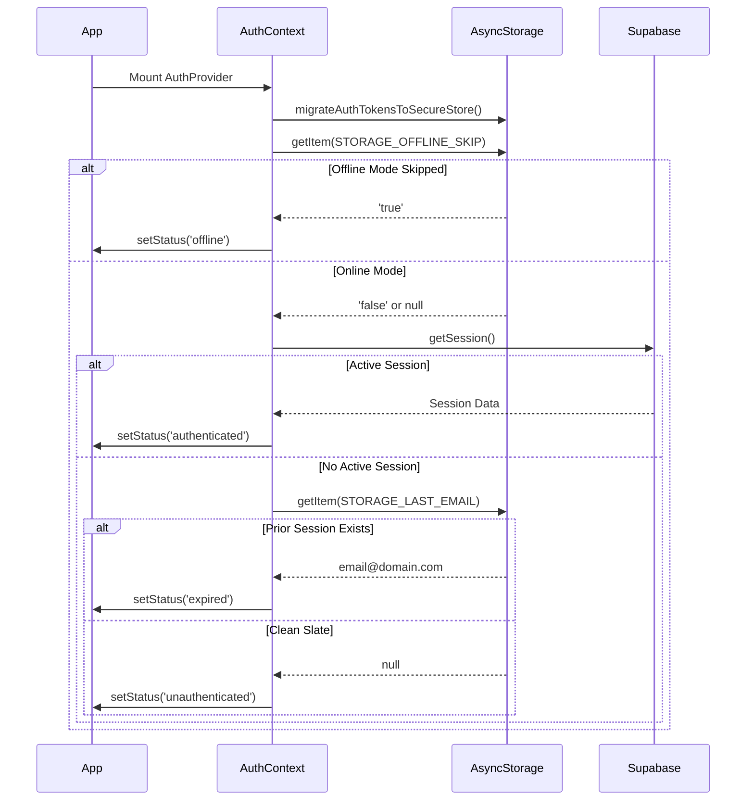
```mermaid
sequenceDiagram
    participant App
    participant AuthContext
    participant AsyncStorage
    participant Supabase
    
    App->>AuthContext: Mount AuthProvider
    AuthContext->>AsyncStorage: migrateAuthTokensToSecureStore()
    AuthContext->>AsyncStorage: getItem(STORAGE_OFFLINE_SKIP)
    
    alt Offline Mode Skipped
        AsyncStorage-->>AuthContext: 'true'
        AuthContext->>App: setStatus('offline')
    else Online Mode
        AsyncStorage-->>AuthContext: 'false' or null
        AuthContext->>Supabase: getSession()
        
        alt Active Session
            Supabase-->>AuthContext: Session Data
            AuthContext->>App: setStatus('authenticated')
        else No Active Session
            AuthContext->>AsyncStorage: getItem(STORAGE_LAST_EMAIL)
            alt Prior Session Exists
                AsyncStorage-->>AuthContext: email@domain.com
                AuthContext->>App: setStatus('expired')
            else Clean Slate
                AsyncStorage-->>AuthContext: null
                AuthContext->>App: setStatus('unauthenticated')
            end
        end
    end
```


<!-- CARTOGRAPHER_END: IDENTITY -->

<!-- CARTOGRAPHER_START: BLE_CORE -->

# BLE_CORE Domain Cartography

## 1. File Manifest
* `src/context/BLEContext.tsx`: The React Context provider that instantiates the `useBLE` engine and exposes it globally via `useSharedBLE`.
* `src/hooks/useBLE.ts`: The central orchestrator hook wrapping XState's BleMachine, providing the core API surface for the entire application.
* `src/hooks/useOptimisticBLE.ts`: An optimistic UI wrapper layer that dispatches BLE writes in the background while instantly updating UI state and rolling back on failure.
* `src/hooks/ble/useBLEScanner.ts`: Manages the discovery lifecycle, ambient telemetry tracking, and hardware profiling/parsing of Bluetooth advertisement packets.
* `src/hooks/ble/useBLEBatterySweep.ts`: Orchestrates background scanning and dynamic battery tiering logic (LowPower vs. burst scans).
* `src/hooks/ble/useBLEInterrogator.ts`: A hardware interrogator queue that sequentially connects to discovered devices to probe their EEPROM capabilities and populates `hwCache`.
* `src/hooks/ble/useBLERSSIMonitor.ts`: A signal monitor that polls connection RSSI every 30s to trigger proactive channel-hopping recovery when approaching critical drop-out thresholds.
* `src/services/ble/BleMachine.ts`: An XState V5 state machine coordinating the concurrent-safe BLE connection, scan, heartbeat, and recovery lifecycles.
* `src/services/ble/BleMachine.types.ts`: Typings, contextual definitions, input schematics, and events for the `BleMachine`.
* `src/services/ble/ConnectService.ts`: XState invoked actor responsible for establishing GATT connections, negotiating Android MTU, and broadcasting protocol handshakes.
* `src/services/ble/HeartbeatService.ts`: XState invoked actor that sends 0x63 ping queries at regular intervals (45s) to detect stale GATT connections before user interaction.
* `src/services/ble/RecoveryService.ts`: XState invoked actor handling 3-phase, staggered, backoff-based reconnections for dropped out "ghost" devices.
* `src/services/BleWriteDispatcher.ts`: Serializes and executes BLE writes against the hardware, enforcing MTU chunking, 50ms inter-device gap timing, and ZENGGE framing.
* `src/services/BleWriteQueue.ts`: A priority-based FIFO queue singleton that bounds and prioritizes inbound BLE write commands (critical > normal > bulk) with backpressure drops.
* `src/services/BleSessionFactory.ts`: Establishes initial GATT sessions with robust retries, timeout safety, and automatic controller protocol deduction.

## 2. Blast Radius
* **Inbound Dependencies (Imports)**: 
  - `react-native-ble-plx` (native BLE module interface)
  - `@xstate/react`, `xstate` (FSM orchestration)
  - `supabaseClient` (cloud telemetry insertion and hardware blacklist checks)
  - `ZenggeProtocol` & `BanlanxAdapter` (command payload encoders)
  - `@react-native-async-storage/async-storage` (local cache for blacklists/telemetry)
  - `AppLogger` (structured telemetry and error tracking)
  - `expo-haptics` (Optimistic UI tactile feedback)
* **Outbound Dependents (Exports)**: 
  - `HardwareSetupWizardScreen` (depends on `pingDevice` and scanner outputs for pairing)
  - `DashboardScreen` (consumes `connectedDevices`, `rssiMap`, and FSM connection states)
  - `DevSandboxDrawer` (mocking environment integration and virtual skates toggle)
  - All UI component controllers that adjust colors, brightness, or patterns (via `useSharedBLE().writeToDevice`)
  - `WatchBridge` (Global hardware command listener depends on `executeProtocolResults`)

## 3. Context Matrix
* **Provided Contexts**: 
  - `BLEContext`: Exposes `BluetoothLowEnergyApi` containing all unified BLE functions and states.
* **Consumed Contexts**: 
  - `useRegistration`: Extracted array of `registeredMacs` to dictate FTUE logic, scanner thresholds, and target connections.

## 4. Hook/Service I/O Registry
* **`useBLE`**:
  - **Inputs**: `registeredMacs: string[]`
  - **Outputs**: `BluetoothLowEnergyApi` (writeToDevice, connectToDevices, scanner control APIs, state constants like `bleState` and `rssiMap`).
  - **Side-effects**: Wires up React Native AppState listeners, registers native disconnect callbacks, initializes the global XState `bleMachine`.
* **`useOptimisticBLE`**:
  - **Inputs**: `writeToDevice` (function), `onReconcile` (callback), `debounceMs` (timing limit), configuration flags.
  - **Outputs**: `optimisticWrite`, `directWrite`, `writeStatus` ('IDLE' | 'PENDING' | 'CONFIRMED' | 'RECONCILED').
  - **Side-effects**: Debounces rapid-fire UI interactions, fires hardware Haptics upon BLE confirmation or reconciliation rollbacks.
* **`useBLEScanner`**:
  - **Inputs**: `bleManager`, `allDevices`, `registeredMacs`, `isSandboxEnabled`.
  - **Outputs**: `scanForPeripherals`, `stopScanner`, `startSweeper`, `burstScan`, `pendingRegistrations`, `classifyProbeResults`.
  - **Side-effects**: Enqueues and periodically flushes device discovery telemetry to Supabase, manipulates `allDevices` and `hwCache` states.
* **`BleWriteQueue`**:
  - **Inputs**: Payload execution callbacks, `WritePriority` level ('critical' | 'normal' | 'bulk'), debounce keys, generation tags.
  - **Outputs**: Promise resolving to boolean success or `'partial'`.
  - **Side-effects**: Implements bounded backpressure (drops bulk/normal if saturated), executes delayed retries on transient GATT errors.

## 5. OS Variance Matrix
* **Android Only Code Paths**: 
  - Explicitly invokes `requestConnectionPriorityForDevice(conn.id, 1)` to accelerate handshakes, downgrading to `0` afterwards.
  - Explicitly executes `requestMTU(512)` to establish data boundaries and implements a retry loop for Android MTU glitches.
  - Scans with `scanServiceUUIDs: null` (unfiltered) because Android's OS-level `mServiceData` filtering explicitly drops FCF1 Symphony hardware signatures.
  - Bounds background scans due to Android 12+'s strict `4-per-30s` budget limit.
* **iOS Only Code Paths**: 
  - Relies on implicit OS-level MTU negotiation (`conn.mtu`), deliberately skipping explicit API requests which would throw an error.
  - Leverages `restoreStateIdentifier` via `BleManager` to automatically recover and remap active peripheral connections upon waking the app.
* **Web Environment**: 
  - Completely bypasses the `react-native-ble-plx` stack, forces `btState='enabled'`, and relies entirely on Virtual Skate Mocks injected into the event stream.

## 6. BLE Transport Pipeline

```text
BleWriteQueue               BleWriteDispatcher                   BleConnectionManager & GATT 
-------------               ------------------                   ---------------------------
[Priority FIFO]      ==>    [Gap & Chunk Orchestrator]    ==>    [Native BLE Stack]
- Backpressure Drops        - Checks Generation Stale Tags       - base64 Encoding
- Transient Retries         - ZENGGE 0x40/0x51 Chunking          - writeCharacteristicWithoutResponseForService()
- Critical/Normal/Bulk      - 50ms Inter-Device Gaps             - Promise settlement
```

## 7. State Machine (FSM) Map

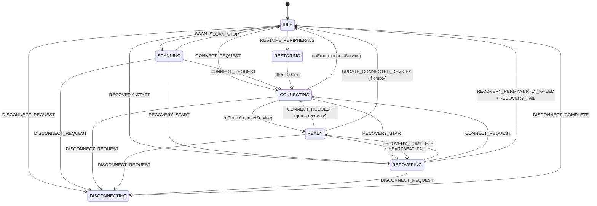
```mermaid
stateDiagram-v2
    [*] --> IDLE
    
    IDLE --> SCANNING : SCAN_START
    IDLE --> CONNECTING : CONNECT_REQUEST
    IDLE --> DISCONNECTING : DISCONNECT_REQUEST
    IDLE --> RECOVERING : RECOVERY_START
    IDLE --> RESTORING : RESTORE_PERIPHERALS
    
    SCANNING --> IDLE : SCAN_STOP
    SCANNING --> CONNECTING : CONNECT_REQUEST
    SCANNING --> DISCONNECTING : DISCONNECT_REQUEST
    SCANNING --> RECOVERING : RECOVERY_START
    
    RESTORING --> CONNECTING : after 1000ms
    
    CONNECTING --> READY : onDone (connectService)
    CONNECTING --> IDLE : onError (connectService)
    CONNECTING --> RECOVERING : RECOVERY_START
    CONNECTING --> DISCONNECTING : DISCONNECT_REQUEST
    
    READY --> RECOVERING : HEARTBEAT_FAIL
    READY --> CONNECTING : CONNECT_REQUEST (group recovery)
    READY --> DISCONNECTING : DISCONNECT_REQUEST
    READY --> IDLE : UPDATE_CONNECTED_DEVICES (if empty)
    
    RECOVERING --> READY : RECOVERY_COMPLETE
    RECOVERING --> CONNECTING : CONNECT_REQUEST
    RECOVERING --> IDLE : RECOVERY_PERMANENTLY_FAILED / RECOVERY_FAIL
    RECOVERING --> DISCONNECTING : DISCONNECT_REQUEST
    
    DISCONNECTING --> IDLE : DISCONNECT_COMPLETE
```

## 8. Sequence Diagram (Write Execution & Optimistic UI)

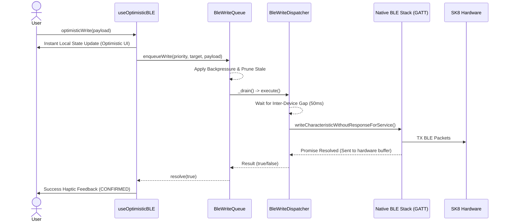
```mermaid
sequenceDiagram
    actor User
    participant UI as useOptimisticBLE
    participant Q as BleWriteQueue
    participant D as BleWriteDispatcher
    participant N as Native BLE Stack (GATT)
    participant HW as SK8 Hardware

    User->>UI: optimisticWrite(payload)
    UI->>User: Instant Local State Update (Optimistic UI)
    UI->>Q: enqueueWrite(priority, target, payload)
    Q-->>Q: Apply Backpressure & Prune Stale
    Q->>D: _drain() -> execute()
    D-->>D: Wait for Inter-Device Gap (50ms)
    D->>N: writeCharacteristicWithoutResponseForService()
    N->>HW: TX BLE Packets
    N-->>D: Promise Resolved (Sent to hardware buffer)
    D-->>Q: Result (true/false)
    Q-->>UI: resolve(true)
    UI->>User: Success Haptic Feedback (CONFIRMED)
```

## 9. Architectural Impact Flags
[IMPACTS_USER_JOURNEY]
[IMPACTS_C4_CONTEXT]
[IMPACTS_STATE_CHART]

## 10. Archival Instruction
Legacy hooks `useBLEAutoRecovery.ts`, `useBLEWatchdog.ts`, and `useBLEHeartbeat.ts` previously referenced in `docs/SK8Lytz_App_Master_Reference.md` are completely deprecated and replaced by XState invoked actors in the `BleMachine`. The Master Reference has been reviewed and successfully appended with `[MOVE_TO_ARCHIVE]` adjacent to the historical documentation lines describing these removed components.


<!-- CARTOGRAPHER_END: BLE_CORE -->

<!-- CARTOGRAPHER_START: GROUP_SYNC -->

# 🗺️ Domain Cartography: GROUP_SYNC

[IMPACTS_USER_JOURNEY]
[IMPACTS_STATE_CHART]

## 1. File Manifest
- **`src/services/GroupRepository.ts`**: Persists device group configurations using local AsyncStorage and remote Supabase syncing.
- **`src/services/CrewProfileService.ts`**: Manages user identity and membership metadata specific to Crew associations.
- **`src/services/CrewService/CrewService.ts`**: Singleton facade orchestrating session state, realtime subscriptions, and offline recovery.
- **`src/services/CrewService/CrewSessionManager.ts`**: Handles the HTTP layer for creating, joining, and explicitly leaving Crew Sessions.
- **`src/services/CrewService/CrewRealtime.ts`**: Manages WebSocket presence channels and high-frequency byte payload broadcasts.
- **`src/services/CrewService/CrewAutoRejoin.ts`**: Coordinates `AsyncStorage` persistence to seamlessly resume active sessions on app restart.
- **`src/components/crew/CrewCard.tsx`**: Reusable UI component displaying summary statistics and status for a specific Crew.
- **`src/components/crew/CrewControllerScreen.tsx`**: The primary interface for session Leaders to broadcast visual scenes to Members.
- **`src/components/crew/CrewCreateScreen.tsx`**: Form interface for instantiating new Crews with privacy and location metadata.
- **`src/components/crew/CrewDetailEditForm.tsx`**: Inline management interface for owners to modify Crew properties and member roles.
- **`src/components/crew/CrewDetailScreen.tsx`**: Detailed analytics and management view for a selected Crew entity.
- **`src/components/crew/CrewDetailStats.tsx`**: Sub-component rendering aggregated session telemetry for a Crew.
- **`src/components/crew/CrewJoinScreen.tsx`**: UI for entering 6-digit invite codes to join private or remote Crews.
- **`src/components/crew/CrewLandingMap.tsx`**: React Native Maps implementation displaying active nearby sessions via device GPS.
- **`src/components/crew/CrewLandingMap.web.tsx`**: Fallback web-compatible map rendering for the nearby session locator.
- **`src/components/crew/CrewLandingScreen.tsx`**: The primary entry routing hub displaying the map and the user's crew list.
- **`src/components/crew/CrewManageScreen.tsx`**: Dashboard interface for users to oversee their owned and joined Crews.
- **`src/components/crew/CrewScheduleScreen.tsx`**: Form for planning future sessions with date-time scheduling.
- **`src/components/crew/CrewStyles.ts`**: Centralized stylesheet ensuring visual consistency across all Crew-related modal steps.
- **`src/components/crew/MapFiltersTray.tsx`**: Overlay UI providing search radius and privacy filters for the geographic map.
- **`src/components/CrewModal.tsx`**: The master orchestrator modal housing the `CrewProvider` and routing between step states.
- **`src/components/CrewMemberDashboard.tsx`**: Persistent dashboard widget displaying active session telemetry and leader status.
- **`src/context/CrewContext.tsx`**: React Context provider wrapping navigation state, form data, and unified Crew hooks.
- **`src/hooks/useCrewHub.ts`**: Orchestrates fetching of user-associated crews and geo-queried nearby sessions.
- **`src/hooks/useCrewManage.ts`**: Encapsulates CRUD operations and owner-level administrative actions for Crews.
- **`src/hooks/useCrewSession.ts`**: React binding layer translating `CrewService` singleton events into component state.
- **`src/hooks/useCrewProximityRadar.ts`**: Specialized hook managing geographic polling for active sessions in range.
- **`src/hooks/useDashboardCrew.ts`**: Bridges active session state into the main dashboard for persistent visibility.
- **`src/hooks/useDashboardGroups.ts`**: Manages UI state for the multi-device local grouping feature via `GroupRepository`.

## 2. Blast Radius
**What this domain imports (Dependencies):**
- `supabaseClient` (Realtime channels, RPCs, CRUD)
- `@react-native-async-storage/async-storage` (Offline caching, session auto-rejoin)
- `expo-location` & `react-native-maps` (Geospatial querying)
- `ProfileService` & `AuthContext` (User identity mapping)
- `ThemeContext` (UI styling constants)

**What imports this domain (Consumers):**
- `DashboardScreen.tsx` (Embeds `CrewModal` and uses `useDashboardCrew` / `useDashboardGroups`)
- `AccountTabCrewz.tsx` (Embeds `CrewCard` lists)
- `BluetoothGuard.tsx` (Reads `useDashboardGroups` or active session for fleet routing)

## 3. Context Matrix
| Context | Role | Description |
|---|---|---|
| `CrewContext` | **Provider** | Wraps the Crew Modal. Exposes navigation `step`, `formState`, and instances of `useCrewHub`, `useCrewManage`, and `useCrewSession` to all child screens. |
| `ThemeContext` | **Consumer** | Supplies `Colors` and `Spacing` to `CrewStyles.ts` and UI components. |
| `AuthContext` | **Consumer** | Supplies `user.id` for role determination (Leader vs Member) and Supabase RLS. |

## 4. Hook/Service I/O Registry
| Service/Hook | Inputs | Outputs | Side-Effects |
|---|---|---|---|
| `CrewService` | User ID, Session ID, Payload Bytes | Event signals (`update`, `scene_update`) | Connects to Supabase Realtime channels. Writes `last_session_id` to AsyncStorage. Fires 60s heartbeats. |
| `useCrewHub` | `visible` boolean, `step` string | `myCrews`, `nearbySessions`, `loadingMyCrews`, `refreshNearby` | Invokes Expo Location. Fires Supabase RPC `find_nearby_sessions`. |
| `useCrewManage` | `myCrews` array | `createCrew`, `updateCrew`, `deleteCrew`, `leaveCrew` | Supabase insertions/deletions on `crews` and `crew_members`. |
| `useCrewSession` | Lifecycle callbacks (`onReady`, etc.) | `join`, `leave`, `end`, `activeSession`, `activeRole` | Mutates singleton `CrewService` state. Handles asynchronous joining logic. |
| `useDashboardGroups` | None | `customGroups`, `selectedIds`, `toggleDeviceSelection` | Reads/Writes to `GroupRepository` (AsyncStorage wrapper). Modifies fleet targeting state. |

## 5. OS Variance Matrix
| Component | iOS Behavior | Android Behavior | Web Behavior |
|---|---|---|---|
| `CrewModal` | `KeyboardAvoidingView` uses `behavior="padding"` to prevent form occlusion. | `KeyboardAvoidingView` uses `behavior={undefined}` as Android handles window panning natively. | N/A |
| `CrewLandingMap` | Uses `react-native-maps` natively. | Uses `react-native-maps` natively. | Falls back to `CrewLandingMap.web.tsx` mock map to prevent compile-time crashing on Web. |

## 6. Sequence Diagram: Crew Live Session Broadcasting
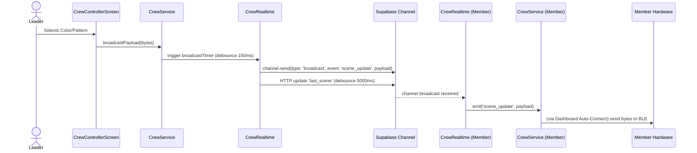
```mermaid
sequenceDiagram
    actor Leader
    participant UI as CrewControllerScreen
    participant CS as CrewService
    participant CR as CrewRealtime
    participant Supabase as Supabase Channel
    participant CR_M as CrewRealtime (Member)
    participant CS_M as CrewService (Member)
    participant HW as Member Hardware
    
    Leader->>UI: Selects Color/Pattern
    UI->>CS: broadcastPayload(bytes)
    CS->>CR: trigger broadcastTimer (debounce 150ms)
    CR->>Supabase: channel.send(type: 'broadcast', event: 'scene_update', payload)
    CR->>Supabase: HTTP update 'last_scene' (debounce 5000ms)
    Supabase-->>CR_M: channel broadcast received
    CR_M->>CS_M: emit('scene_update', payload)
    CS_M->>HW: (via Dashboard Auto-Connect) send bytes to BLE
```

## 7. Archival Instructions
The following documentation blocks in `docs/SK8Lytz_App_Master_Reference.md` are STALE and must be tagged with `[MOVE_TO_ARCHIVE]`:
- **Domain: GROUP_SYNC**: Section 12.2 Auto-Compiled Domain Architecture regarding legacy offline queues (e.g., lines `1579-1648`, `2145-2157`).
- **Domain: UI_SCREENS / GROUP_SYNC**: Text regarding enforcing `MM/DD` suffix in `CrewModal.handleCreate` (This logic now lives in `CrewCreateScreen.tsx`).
- **Domain: GROUP_SYNC**: Text referencing `useDeviceFleet` as the fleet list manager. This has been replaced by `useDashboardGroups` and junction tables.


<!-- CARTOGRAPHER_END: GROUP_SYNC -->

<!-- CARTOGRAPHER_START: UI_SCREENS -->

# UI_SCREENS Domain Cartography

This document contains the Elite Architecture documentation for the `UI_SCREENS` domain, which governs all primary views, bottom sheets, navigation structure, and top-level modals in SK8Lytz.

## 1. File Manifest

*   **`src/screens/DashboardScreen.tsx`**: The core application shell and monolithic central hub. It orchestrates BLE connections, renders telemetry, and hoists global states to sub-components (slabs).
*   **`src/screens/AuthScreen.tsx`**: Monolithic authentication view that handles local persistence of credentials and Supabase integration logic.
*   **`src/screens/Onboarding/HardwareSetupWizardScreen.tsx`**: Monolithic setup wizard that drives device discovery, the "Connect-Blink-Probe-Disconnect" atomic ping cycle, and naming configuration.
*   **`src/components/dashboard/MySkatesSlab.tsx`**: Extracted functional slab that renders individual device cards for registered hardware.
*   **`src/components/dashboard/CrewHubSlab.tsx`**: Extracted functional slab handling real-time social sessions, displaying active crews, and managing Crew Modals.
*   **`src/components/dashboard/RegisteredFleetSlab.tsx`**: Extracted functional slab mapping over `CustomGroup` and `DisplayDevice` arrays to display grouped hardware components.
*   **`src/components/dashboard/DashboardTelemetryHero.tsx`**: The visual speedometer and HUD displaying live metrics (GPS speed, G-Force, Duration) driven by `SessionContext`.
*   **`src/components/dashboard/SkateGroupCard.tsx`**: Represents a visual, interactive card for groups of skates, rendering composite RSSI signals and merged power states.
*   **`src/components/dashboard/SupportModal.tsx`**: A standalone modal extracted from the Dashboard offering links to the Support Portal and guides.
*   **`src/components/dashboard/HardwareStatusPills.tsx`**: Small functional indicators for individual hardware characteristics (e.g. RSSI, Battery, Pattern).
*   **`src/components/DeviceItem.tsx`**: Reusable component rendering an individual hardware peripheral's connection status, name, and current pattern swatch.
*   **`src/components/SkateSpotBottomSheet.tsx`**: Bottom sheet overlay providing skate park verification controls and surface metadata tagging functionalities.
*   **`src/components/shared/BLEErrorBoundary.tsx`**: React class component acting as a crash shield catching unhandled exceptions in the BLE-dependent component tree.
*   **`src/components/LocationPicker.tsx`**: Integrated address and map search input, providing real-time suggestions and curated spot caching.
*   **`src/components/LocationPickerMap.tsx`**: Native map rendering component utilizing `react-native-maps`.
*   **`src/components/LocationPickerMap.web.tsx`**: Web-compatible fallback stub preventing React Native Web from attempting to render native map APIs.

## 2. Blast Radius

*   **What this domain imports:**
    *   **Contexts:** `BLEContext`, `AuthContext`, `SessionContext`, `AppConfigContext`, `ThemeContext`.
    *   **Hooks:** `useBLEScanner`, `useRegistration`, `useDashboardProfile`, `useDashboardCrew`, `useDashboardGroups`, `useDeviceStateLedger`, `useOptimisticBLE`, `useProductCatalog`.
    *   **Services:** `BlePingService`, `DeviceRepository`, `SkateSpotsService`, `TelemetryService`, `AppLogger`.
    *   **UI Components:** `ProductVisualizer`, `DockedController`, Modals (`CrewModal`, `DeviceSettingsModal`, etc.).
    *   **External Libs:** `react-native`, `expo-location`, `react-native-svg`, `expo-linear-gradient`, `react-native-maps`.

*   **What imports this domain:**
    *   **`src/navigation/RootNavigator.tsx`**: Imports screens (`DashboardScreen`, `AuthScreen`, `HardwareSetupWizardScreen`) to assemble the routing stack.
    *   **`App.tsx`**: Consumes `BLEErrorBoundary`.

## 3. Context Matrix

| Context | Provider | Consumer | Purpose in UI_SCREENS |
| :--- | :--- | :--- | :--- |
| `BLEContext` | `App.tsx` | `DashboardScreen`, `HardwareSetupWizardScreen` | Core BLE connection management, triggering start/stop scanning behaviors based on screen mounts. |
| `SessionContext` | `App.tsx` | `DashboardScreen`, `DashboardTelemetryHero` | Subscribing to live telemetry data (speed, duration, G-force) for display. |
| `AuthContext` | `App.tsx` | `DashboardScreen`, `AuthScreen` | Validating user session state, skipping offline logins, or rendering the username. |
| `ThemeContext` | `App.tsx` | Almost all components | Deriving the `Colors` object and typography styles based on current theme (`light` vs `dark`). |
| `AppConfigContext` | `App.tsx` | `DashboardScreen`, `LocationPicker` | Reading Remote Config overrides and feature flags (e.g., `visibility_maps_tab`). |

## 4. Hook/Service I/O Registry

| Hook / Service | Inputs | Outputs | Side Effects |
| :--- | :--- | :--- | :--- |
| `useBLEScanner` | N/A | `{ discoveredDevices, startSweeper, stopSweeper, bleState }` | Interacts directly with native `BleManager` to emit scan events. |
| `useRegistration` | N/A | `{ registeredMacs, pendingRegistrations, loadRegistrations, getDeviceName }` | Queries `DeviceRepository` for cached MAC addresses. |
| `BlePingService.pingDevice` | `deviceId` (MAC), `productType` | `Promise<void>` | Connects, probes MTU, triggers Blink pattern (`0x41` or `0x59`), delays, disconnects. |
| `useDashboardGroups` | N/A | Groups FSM, `activeGroupIds`, `toggleGroupPower` | Invokes BLE queue to toggle power on multiple connected devices. |
| `SkateSpotsService.claimAndUpdateSpot` | `SkateSpot` Payload | `Promise<SkateSpot>` | Mutates spot schema on Supabase backend; updates local cache. |

## 5. OS Variance Matrix

| File / Component | Platform / Variance | Handling Strategy |
| :--- | :--- | :--- |
| `LocationPickerMap.tsx` / `.web.tsx` | React Native Web vs Native iOS/Android | Metro bundler relies on `.web.tsx` stub since `react-native-maps` codegen components are unsupported on the web. |
| `SkateGroupCard.tsx` | Text Shadows on Web | Uses `require('react-native').Platform.select` and `webStyle()` shim for `textShadow` string formatting vs native object formatting. |
| `BLEErrorBoundary.tsx` | Error text font family | `Platform.select({ ios: 'Courier', default: 'monospace' })`. |
| `DashboardTelemetryHero` | Viewport dimensions | Calculates width using `Dimensions.get('window').width`. Caps width specifically for Web instances (`windowWidth > 600`). |

## 6. Design System & Token Manifest

*   **Layout & Spacing**: `Layout.padding`, `Spacing.md`, `Spacing.xl` structure the cards and modal sheets globally.
*   **Typography**: The `Righteous` font is rigidly applied to metrics (`SpeedValue`, `PillLabel`, `Title`) to impart the Neogleamz brand aesthetic. `Inter-Medium` used for subtext.
*   **Color Themes (`Colors` object)**:
    *   `primary`: #00FFFF (Cyan) -> Focus states, Success highlights, Primary text.
    *   `secondary`: #FF00FF (Magenta) -> Accent gradients, warning text.
    *   `textMuted`: #8A8A8E -> Helper labels, deactivated states.
    *   `surface` / `surfaceHighlight` -> Background and card border definitions.
*   **Shadows**: `TextShadows.glow()` and `Shadows.glow()` generate 10px to 28px spread radiuses, used to create the neon-light refraction effects surrounding the Telemetry UI and Group Cards.

## 7. Setup Wizard Sequence Diagram

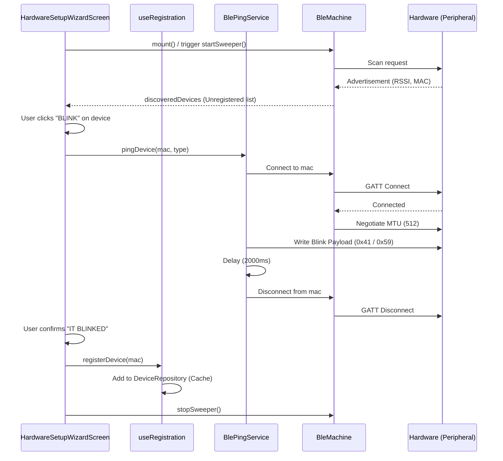
```mermaid
sequenceDiagram
    participant UI as HardwareSetupWizardScreen
    participant R as useRegistration
    participant P as BlePingService
    participant M as BleMachine
    participant H as Hardware (Peripheral)

    UI->>M: mount() / trigger startSweeper()
    M->>H: Scan request
    H-->>M: Advertisement (RSSI, MAC)
    M-->>UI: discoveredDevices (Unregistered list)
    
    UI->>UI: User clicks "BLINK" on device
    UI->>P: pingDevice(mac, type)
    P->>M: Connect to mac
    M->>H: GATT Connect
    H-->>M: Connected
    M->>H: Negotiate MTU (512)
    P->>H: Write Blink Payload (0x41 / 0x59)
    P->>P: Delay (2000ms)
    P->>M: Disconnect from mac
    M->>H: GATT Disconnect
    
    UI->>UI: User confirms "IT BLINKED"
    UI->>R: registerDevice(mac)
    R->>R: Add to DeviceRepository (Cache)
    UI->>M: stopSweeper()
```

## Architectural Impact Flags

`[IMPACTS_USER_JOURNEY]` `[IMPACTS_STATE_CHART]`


<!-- CARTOGRAPHER_END: UI_SCREENS -->

<!-- CARTOGRAPHER_START: UI_DOCKED_CONTROLLER -->

# UI_DOCKED_CONTROLLER Cartography

## 1. File Manifest
* `src/components/DockedController.tsx`: Routing shell that manages shared state, BLE write bus, and mode FSM, delegating rendering to isolated sub-components via `DockedBus`.
* `src/hooks/useDashboardController.tsx`: High-level dashboard hook managing Crew connections, device config/settings modal, and providing memoized `DockedController` rendering.
* `src/hooks/useDockedControllerState.ts`: Massive state management hook holding all UI configurations (colors, patterns, brightness, modes) and cloud scene application logic.
* `src/hooks/useControllerDispatch.ts`: Provides memoized BLE dispatch functions for fixed colors, patterns, emergency flashers, and music configs.
* `src/hooks/useControllerAnalytics.ts`: Debounced telemetry logging hook isolating analytics side-effects for mode, pattern, color, and speed changes.
* `src/components/docked/AnalogGauge.tsx`: Renders a retro analog speedometer gauge using SVG for the Street Mode dashboard.
* `src/components/docked/BuilderPanel.tsx`: Multi-node gradient builder interface allowing custom LED position color assignment.
* `src/components/docked/CameraPanel.tsx`: Manages Vision Camera integration for ambient color detection and 'vibe' palette generation.
* `src/components/docked/DockedDock.tsx`: Bottom floating navigation bar handling swipe gestures and mode switching tabs.
* `src/components/docked/FavoritePromptModal.tsx`: Modal prompting users to name and save custom presets locally or to the cloud.
* `src/components/docked/FavoritesPanel.tsx`: Renders a grid of saved user styles and curated cloud picks.
* `src/components/docked/MusicPanel.tsx`: Manages microphone sensitivity, dual-color selection, and matrix style toggles for audio-reactive modes.
* `src/components/docked/PresetCard.tsx`: Display component for a single saved favorite or curated preset.
* `src/components/docked/ProEffectsPanel.tsx`: Renders the static/animated multi-mode pattern picker grid.
* `src/components/docked/QuickPresetModal.tsx`: Modal for rapid cloud publishing of the current UI state.
* `src/components/docked/SpectrumAnalyzer.tsx`: Visualizes live microphone audio magnitude via animated bar components.
* `src/components/docked/StreetModeDistributionSlider.tsx`: Configures front-to-back hardware lighting distribution for braking/cruising.
* `src/components/docked/StreetPanel.tsx`: Fast & furious dashboard view showing live GPS speed, session stats, and brake/cruise indicators.
* `src/components/docked/UniversalColorGrid.tsx`: Shared grid component providing standardized color swatch selection.
* `src/components/docked/UniversalHueStripSlider.tsx`: Smooth hue gradient slider component for precision HSV color picking.
* `src/components/docked/UniversalSlidersFooter.tsx`: Persistent bottom sheet containing brightness, speed, and mic sensitivity controls.
* `src/components/docked/UniversalTacticalSliders.tsx`: Tactical variants of brightness and speed sliders with distinct visual styling.

## 2. Blast Radius
* **Imports from (Consumes)**: 
  - Hooks: `useOptimisticBLE`, `useStreetMode`, `useDeviceStateLedger`, `useCrewLeaderBroadcast`, `useAppMicrophone`, `useCuratedPicks`, `useScreenPerformance`, `useDashboardDeviceConfig`.
  - Contexts: `AuthContext`, `ThemeContext`, `AppConfigContext`, `BLEContext`, `FavoritesContext`.
  - Utilities: `AppLogger`, `ColorUtils`, `PatternEngine`, `CrewService`.
* **Exported to (Consumed by)**: 
  - `src/screens/DashboardScreen.tsx` consumes `useDashboardController`, which instantiates `DockedController`.
  - `CrewMemberDashboard` and `CommunityModal` interact with these domain elements.

## 3. Context Matrix
* **`useTheme()`**: Consumed directly in `DockedController` to pass `Colors` down via `DockedBus` and prop drilling.
* **`useAppConfig()`**: Consumed to evaluate `isVisibilityAllowed` via `useDockedPermissions`.
* **`useSharedBLE()`**: Consumed to fetch `getAdapterForDevice` for hardware profile branching.
* **`useSharedFavorites()`**: Consumed to load/save/delete user presets.
* **`useAuth()`**: Consumed in `useDashboardController` to retrieve `session.user.id` for Crew broadcasting.
* *(Note: Extraction Opportunity - `DockedController` currently absorbs 5+ contexts directly; could be wrapped in a provider).*

## 4. Hook/Service I/O Registry
* **`useDashboardController`**:
  - *Inputs*: Device connections, GPS telemetry, session FSM state, Crew roles.
  - *Outputs*: Memoized `DockedController` JSX element, hardware configuration map, settings modal flags.
  - *Side-effects*: Updates `lastGroupPatterns`, triggers `ledgerSave` on pattern application, syncs EEPROM configs.
* **`useDockedControllerState`**:
  - *Inputs*: `lockedProduct`, `primaryMac`, ledger synchronization fallback logic.
  - *Outputs*: 35+ React state primitives covering mode, RGB colors, brightness, speed, multi-color nodes.
  - *Side-effects*: Pure state management.
* **`useControllerDispatch`**:
  - *Inputs*: `writeToDevice` function, hardware bounds (points, icType), connected device array.
  - *Outputs*: `sendColor`, `applyFixedPattern`, `handleMusicChange`, `setMultiColor`, `setPower`.
  - *Side-effects*: Invokes BLE GATT packet generation (`ZenggeProtocol` or Hardware Adapter) and dispatches writes over the wire.
* **`useControllerAnalytics`**:
  - *Inputs*: UI volatile state (mode, pattern, color, speed), device grouping context.
  - *Outputs*: None.
  - *Side-effects*: Dispatches debounced log payloads to `AppLogger` and `useTelemetryLedger`.

## 5. OS Variance Matrix
* **`CameraPanel.tsx`**: Explicitly branches on `Platform.OS !== 'web'` before dispatching `expo-haptics` API calls (`impactAsync`, `selectionAsync`, `notificationAsync`) to prevent crashes in the web previewer.
* **`DockedController.tsx`**: Imports `Platform`, but platform-specific telemetry and sensor subscription has been successfully abstracted up to `DashboardScreen` (via `useSession()`). No inline OS branching exists in the core monolith.

## Component Extraction Opportunities (Flags)
* **`DockedController.tsx` (67KB Monolith)**:
  - *Context Overload*: Move `useTheme`, `useSharedFavorites`, and `useAppConfig` into a `DockedControllerContainer` parent.
  - *Visualizer Lock*: The `vizLock` and `ProductVisualizer` instantiation can be abstracted into a distinct `useProductVisualizerLock.ts` hook.

## 6. Architecture Sequence Diagram

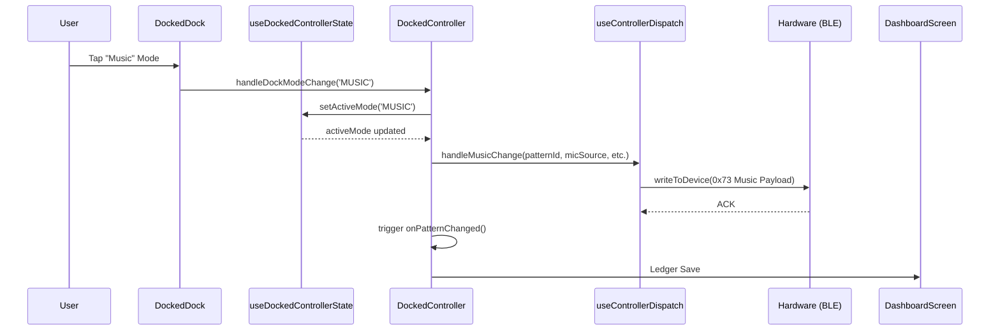
```mermaid
sequenceDiagram
    participant User
    participant DockedDock
    participant State as useDockedControllerState
    participant DC as DockedController
    participant Dispatch as useControllerDispatch
    participant HW as Hardware (BLE)
    
    User->>DockedDock: Tap "Music" Mode
    DockedDock->>DC: handleDockModeChange('MUSIC')
    DC->>State: setActiveMode('MUSIC')
    State-->>DC: activeMode updated
    DC->>Dispatch: handleMusicChange(patternId, micSource, etc.)
    Dispatch->>HW: writeToDevice(0x73 Music Payload)
    HW-->>Dispatch: ACK
    DC->>DC: trigger onPatternChanged()
    DC->>DashboardScreen: Ledger Save
```

## 7. Archival Instructions
`[MOVE_TO_ARCHIVE]` - The `SK8Lytz_App_Master_Reference.md` documentation contains stale references stating that `DockedController` owns `useSessionTracking` and manages the session FSM, duration, distance, and peak speed. This is stale: GPS/Session tracking has been migrated to `DashboardScreen` (`useSession` and `SessionContext`), and telemetry is now strictly threaded down to `DockedController` as read-only props to prevent duplicate sensor subscriptions.

## 8. Architectural Impact Flags
`[IMPACTS_USER_JOURNEY]`
`[IMPACTS_C4_CONTEXT]`


<!-- CARTOGRAPHER_END: UI_DOCKED_CONTROLLER -->

<!-- CARTOGRAPHER_START: UI_MODALS -->

# 🗺️ Codebase Cartography: UI Modals & Settings

This document provides a comprehensive architectural deep-dive into the **UI Modals & Settings** domain of the SK8Lytz application. 

---

## 1. File Manifest
Each component in this domain is structured as follows:

| File Path | Architectural Purpose |
| :--- | :--- |
| `src/components/AccountModal.tsx` | Main orchestrator sheet managing 6 settings sub-tabs (Profile, Security, Crewz, Devices, Stats, Settings). Integrates user preferences, authentication transitions, and device rename dispatching. |
| `src/components/DeviceSettingsModal.tsx` | Detail modal for BLE devices. Manages physical hardware configuration parameters (total LEDs, segments, color sorting, strip type, and RF remote lockouts). Includes direct BLE hardware probing triggers. |
| `src/components/CommunityModal.tsx` | Presets browser that syncs personal saves and public community LED lighting configurations from the cloud (Supabase) to local hardware. |
| `src/components/GroupSettingsModal.tsx` | Simple group creation and management modal. Enables users to associate multiple registered devices under custom group names. |
| `src/components/SessionSummaryModal.tsx` | **[MOVE_TO_ARCHIVE]** Obsolete post-session statistics debrief overlay. Shows distance, speed, G-force, and calories with peak-speed color codes. This has been superseded by inline dashboard widgets. |
| `src/components/modals/EulaModal.tsx` | Onboarding legal agreement modal that gates active configuration controls until the user scrolls completely to the bottom and clicks "I Accept". |
| `src/components/modals/GlobalPermissionsModal.tsx` | System permission controller that wraps and mounts the `PermissionsOnboardingScreen` via listener events. |
| `src/components/CustomSlider.tsx` | Gesture-responsive sliding track utilizing the standard `PanResponder` API. Supports linear color gradient fills and custom sliding end callbacks. |
| `src/components/TacticalSlider.tsx` | Highly tactile slider tailored for high-vibration outdoor skating. Supports large icons, dynamic intensity ranges, and an 80% target marker. |
| `src/components/MarqueeText.tsx` | Layout measuring text component that automatically translates horizontal offsets if text content overflows its boundaries. |
| `src/components/ConnectionStrengthBadge.tsx` | High-frequency RSSI display widget. Maps live dBm signal values to a color-coded 3-bar signal status block. |

---

## 2. Blast Radius
Modifications in this domain propagate to the following modules:

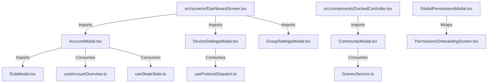
```mermaid
graph TD
    DashboardScreen[src/screens/DashboardScreen.tsx] -->|Imports| AccountModal[AccountModal.tsx]
    DashboardScreen -->|Imports| DeviceSettingsModal[DeviceSettingsModal.tsx]
    DashboardScreen -->|Imports| GroupSettingsModal[GroupSettingsModal.tsx]
    DockedController[src/components/DockedController.tsx] -->|Imports| CommunityModal[CommunityModal.tsx]
    
    AccountModal -->|Imports| EulaModal[EulaModal.tsx]
    GlobalPermissionsModal[GlobalPermissionsModal.tsx] -->|Wraps| PermissionsScreen[PermissionsOnboardingScreen.tsx]
    
    AccountModal -->|Consumes| useAccountOverview[useAccountOverview.ts]
    AccountModal -->|Consumes| useSkateStats[useSkateStats.ts]
    DeviceSettingsModal -->|Consumes| useProtocolDispatch[useProtocolDispatch.ts]
    CommunityModal -->|Consumes| ScenesService[ScenesService.ts]
```

### Incoming Dependencies (What Imports This Domain)
- **`DashboardScreen.tsx`**: Renders `AccountModal`, `DeviceSettingsModal`, and `GroupSettingsModal` as direct overlay child screens, handling their visibility states, metadata saving callbacks, and logout routing.
- **`DockedController.tsx`**: Renders `CommunityModal` for cloud scene selections.

### Outgoing Dependencies (What This Domain Imports)
- **Authentication & Profiles**: `useAuth` is consumed by `AccountModal` and `CommunityModal` to check user sessions, metadata, and token validity. `profileService` is consumed for deleting or leaving crews.
- **BLE Hardware Commands**: `useProtocolDispatch` is consumed by `DeviceSettingsModal` to query or write hardware variables (total LEDs, strip types, RF modes).
- **Offline / Caching Services**: `ScenesService` is consumed by `CommunityModal` to retrieve cloud scenes, falling back to local saves if `isOfflineMode` is active.

---

## 3. Context Matrix
The components in this domain interact with the following global contexts:

| Context Name | Component Consumers | Architectural Role |
| :--- | :--- | :--- |
| **`ThemeContext`** | All components in domain | Exposes the dynamic `ThemePalette` (`Colors` token structure) and `isDark`/`toggleTheme` properties. Standardizes modal backdrops, text styling, and active state highlights. |
| **`AuthContext`** | `AccountModal.tsx`, `CommunityModal.tsx` | Provides the current authenticated user instance, updates user metadata, and manages sign-out sessions. |

*Note: None of the components in this domain serve as context providers.*

---

## 4. Hook/Service I/O Registry
Inputs, outputs, and side-effects for this domain:

### `AccountModal.tsx`
- **Inputs:**
  - `visible`: boolean (display trigger)
  - `registeredDevices`: `StoredDevice[]` (from root state)
  - `isOfflineMode`: boolean (gating Supabase actions)
- **Outputs / Callbacks:**
  - `onClose`: `() => void`
  - `onSignOut`: `() => void`
  - `onDeviceRenamed`: `(id: string, name: string) => void`
  - `onDeviceForgotten`: `(id: string) => void`
  - `onGroupRenamed`: `(old: string, newName: string) => void`
  - `onGroupForgotten`: `(name: string) => void`
- **Side Effects:** Triggers Supabase RPC calls (`delete_account`) and queries notification preferences inside AsyncStorage.

### `DeviceSettingsModal.tsx`
- **Inputs:**
  - `isVisible`: boolean
  - `initialSettings`: `DeviceSettings` (device status struct)
  - `groups`: `{ id: string; name: string }[]` (current custom groups)
  - `deviceId`: string
- **Outputs / Callbacks:**
  - `onClose`: `() => void`
  - `onSave`: `(settings: DeviceSettings) => void`
  - `onDeregister`: `() => void`
- **Side Effects:** Initiates high-priority BLE writes (`writeSettingsByName`, `setRfRemoteState`, `clearRfRemotes`) and schedules a 5-second timeout for hardware query responses.

### `CommunityModal.tsx`
- **Inputs:**
  - `isOfflineMode`: boolean
  - `isVisible`: boolean
- **Outputs / Callbacks:**
  - `onClose`: `() => void`
  - `onApplyScene`: `(payload: CloudScenePayload) => void`
- **Side Effects:** Fetches data from remote Supabase tables, increments scene download counters, and modifies local cache lists.

### `EulaModal.tsx`
- **Inputs:**
  - `visible`: boolean
  - `isViewOnly`: boolean (skips scroll requirement)
- **Outputs / Callbacks:**
  - `onAccept`: `() => void`
  - `onDecline`: `() => void`
- **Side Effects:** Attaches a listener to the ScrollView layout content offset. Evaluates if the user reached the absolute bottom margin before enabling acceptance.

---

## 5. OS Variance Matrix
Platform-specific branches used inside these components:

| Component | iOS Variance | Android Variance | Web Variance |
| :--- | :--- | :--- | :--- |
| **`AccountModal.tsx`** | Shows standard native `Alert.alert` prompt for sign out. | Shows standard native `Alert.alert` prompt for sign out. | Bypasses `Alert` checks to execute sign-out procedures immediately. |
| **`SessionSummaryModal.tsx`** | Generates native shadows using `shadowColor`, `shadowRadius`, and `elevation`. | Generates native shadows using `shadowColor`, `shadowRadius`, and `elevation`. | Implements CSS DOM `boxShadow` styling to avoid layout crashes. |
| **`CustomSlider.tsx` & `TacticalSlider.tsx`** | standard PanResponder events. | standard PanResponder events. | Injects `{ touchAction: 'none', userSelect: 'none' }` to prevent browser gesture conflicts. |

---

## 6. Design System & Token Manifest
The design system enforces the following layout values in these components:

### A. Color Tokens (Theme Palette)
- **Excellent Signal:** `#4CAF50` (Green)
- **Good Signal:** `#FFC107` (Amber)
- **Weak Signal:** `#FF6B35` (Orange)
- **Critical Signal:** `#F44336` (Red)
- **Inactive Track/Bars:** `#3A3A3A`
- **EULA Overlay Backdrops:** `rgba(0,0,0,0.85)`
- **Device settings provenance banners:**
  - *Unconfigured:* `rgba(255, 179, 64, 0.1)` background, `rgba(255, 179, 64, 0.3)` border.
  - *Manual:* `rgba(0, 122, 255, 0.1)` background, `rgba(0, 122, 255, 0.3)` border.
  - *Probed:* `rgba(0, 232, 135, 0.1)` background, `rgba(0, 232, 135, 0.3)` border.
- **RF Modes selections:**
  - *Paired:* `#00e887` border, `rgba(0,232,135,0.08)` background.
  - *All:* `#FFA500` border, `rgba(255,165,0,0.08)` background.
  - *None:* `#FF3D71` border, `rgba(255,61,113,0.08)` background.

### B. Typography Styles
- `Typography.title`: Applied to sheet titles and modal headers. Focuses on heavy, Righteous-styled fonts.
- `Typography.body`: Standard text lines inside tabs.
- `Typography.caption`: Small metadata descriptors (e.g., total registered devices).

### C. Spacing Scale
Components strictly conform to `theme.ts` spacing rules:
- `Spacing.xxs`: 2px (RSSI bar spacing)
- `Spacing.xs`: 4px (small gaps)
- `Spacing.sm`: 8px (form labels)
- `Spacing.md`: 12px (text blocks)
- `Spacing.lg`: 16px (list padding)
- `Spacing.xl`: 24px (bottom sheet wrappers)

---

## 7. Sequence Diagram
The following diagram traces the BLE settings query and save sequence handled inside the `DeviceSettingsModal`:

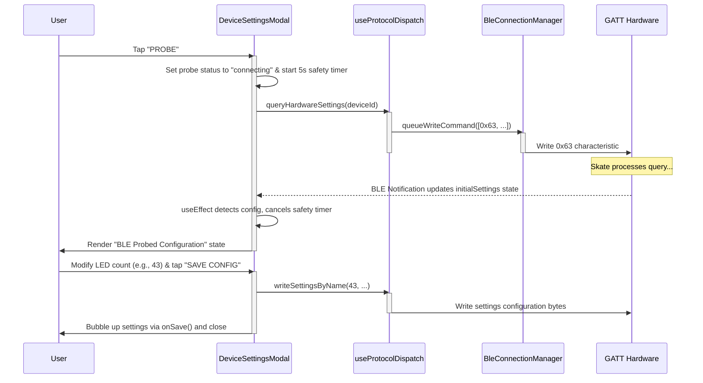
```mermaid
sequenceDiagram
    participant User
    participant DSM as DeviceSettingsModal
    participant Dispatch as useProtocolDispatch
    participant Manager as BleConnectionManager
    participant GATT as GATT Hardware

    User->>DSM: Tap "PROBE"
    activate DSM
    DSM->>DSM: Set probe status to "connecting" & start 5s safety timer
    DSM->>Dispatch: queryHardwareSettings(deviceId)
    activate Dispatch
    Dispatch->>Manager: queueWriteCommand([0x63, ...])
    activate Manager
    Manager->>GATT: Write 0x63 characteristic
    deactivate Manager
    deactivate Dispatch
    
    Note over GATT: Skate processes query...
    GATT-->>DSM: BLE Notification updates initialSettings state
    
    DSM->>DSM: useEffect detects config, cancels safety timer
    DSM->>User: Render "BLE Probed Configuration" state
    deactivate DSM

    User->>DSM: Modify LED count (e.g., 43) & tap "SAVE CONFIG"
    activate DSM
    DSM->>Dispatch: writeSettingsByName(43, ...)
    activate Dispatch
    Dispatch->>GATT: Write settings configuration bytes
    deactivate Dispatch
    DSM->>User: Bubble up settings via onSave() and close
    deactivate DSM
```

---

## Architectural Impact Flags
Modifying code in the UI Modals domain will affect the overall architecture as follows:

`[IMPACTS_USER_JOURNEY]`
> Modifying settings screens directly changes the onboarding (EULA / Permissions) flow, device configurations, and user profile management screens.

`[IMPACTS_STATE_CHART]`
> Device configurations trigger direct BLE dispatch sequences. Changing setting triggers alters the FSM transitions of the peripheral state manager.


<!-- CARTOGRAPHER_END: UI_MODALS -->

<!-- CARTOGRAPHER_START: UI_VISUALIZER -->

# UI_VISUALIZER Cartography Report

[IMPACTS_USER_JOURNEY]
[IMPACTS_C4_CONTEXT]

## 1. File Manifest
*   `src/components/VisualizerUnit.tsx`: Renders individual LED device visualizer units with 3D multi-layered atmospheric light scattering based on hardware product geometry (RING, OVAL, DUAL_STRIP).
*   `src/components/ProductVisualizer.tsx`: Orchestrates rendering multiple `VisualizerUnit` components for a given product or active devices array, controlling layout and animation loops.
*   `src/components/LEDStripPreview.tsx`: Renders a lightweight, autonomous row of animated LED segments to preview static or moving patterns directly within picker cards.
*   `src/components/CustomEffectVisualizer.tsx`: High-performance preview bar for dynamically animated custom effect math arrays without relying on the heavier ProductVisualizer.
*   `src/components/NeonHueStrip.tsx`: Implements a touchable, drag-responsive DJ-style strip for continuous neon color hue selection using `PanResponder` and Expo's `LinearGradient`.
*   `src/components/PositionalGradientBuilder.tsx`: Provides a sophisticated interactive UI for adding, moving, and coloring specific pins on a 0-100% positional gradient axis for custom pattern building.
*   `src/components/VerticalPatternDrum.tsx`: Features an inertial-scrolling, 3D gradient-masked vertical wheel to select pattern IDs seamlessly.
*   `src/components/patterns/GradientLibraryTab.tsx`: Displays a grid of saved gradient presets (built-in and custom) using Glassmorphism cards and real-time previews.
*   `src/components/patterns/PatternCard.tsx`: Presents a touchable Glassmorphism card for individual SK8Lytz templates containing an auto-playing `LEDStripPreview`.
*   `src/components/patterns/PatternPickerTab.tsx`: Implements a categorized horizontal wheel filtering system over a flat list of `PatternCard` elements.
*   `src/components/patterns/UnifiedPatternPicker.tsx`: Acts as the bridge between the UI pattern picker and the BLE dispatch pipeline, orchestrating pattern commands natively via `buildPatternPayload`.
*   `src/components/CameraTracker.tsx`: Utilizes `react-native-vision-camera` to sample live camera feeds (Sniper mode) or extract K-Means dominant palettes (Vibe mode) into vibrant LED arrays via JSI worklets.
*   `src/components/CameraTracker.web.tsx`: Web platform fallback stub for `CameraTracker` to bypass native-only dependencies.
*   `src/components/CameraTracker.d.ts`: TypeScript typings for the camera tracker module.

## 2. Blast Radius
*   **Imports From**: `src/protocols/PatternEngine`, `src/protocols/PositionalMathBuffer`, `src/constants/ProductCatalog`, `src/theme/theme`, `src/context/ThemeContext`, `src/utils/ColorUtils`, `src/services/appLogger`, `expo-linear-gradient`, `react-native-vision-camera`, `react-native-worklets-core`, `react-native-vision-camera-resizer`, `@expo/vector-icons`.
*   **Imported By**: `DockedController` (consumes `NeonHueStrip`, `ProductVisualizer`), `HardwareSetupWizardScreen`, `DashboardScreen`, `GroupSettingsModal`, and primary product interface screens.

## 3. Context Matrix
*   **Consumed Contexts**: `ThemeContext` (via `useTheme()` for `Colors`, `isDark` values applied heavily to styling and border opacity).
*   **Provided Contexts**: None. The visualizer domain relies on passed props or contexts from higher-level screens.

## 4. Hook/Service I/O Registry
*   `useVisualizerPath` & `useVisualizerLeds` (Internal to `VisualizerUnit`):
    *   **Inputs**: Product profile geometry, current mode, fixed/multi colors.
    *   **Outputs**: Scaled SVG/View positioning arrays and animated opacity metrics per LED node.
*   `useGradients` (Global state):
    *   **Inputs**: None.
    *   **Outputs**: `{ gradients, status, error, deleteGradient, refreshGradients }`.
*   `useCameraDevice`, `useCameraPermission`, `useFrameOutput`, `useResizer` (Vision Camera API):
    *   **Inputs**: Camera spec (e.g. 'back'), frame processor callbacks.
    *   **Outputs**: Device frames, GPU resizer pixel buffer.
*   `extractKMeansPalette` (Utils):
    *   **Inputs**: Array of `RGB[]` points, `k` clusters (3), max iterations.
    *   **Outputs**: Array of `RGB[]` dominant palettes.
*   `buildPatternPayload` (PatternEngine API):
    *   **Inputs**: `effectId`, `fg`, `bg`, `points`, `speed`, `dir`, `brightness`.
    *   **Outputs**: Fully formatted `number[]` array representing the `0x59` BLE payload.
    *   **Side Effects**: Serialized mapping of effect to hardware bytes.

## 5. OS Variance Matrix
*   **iOS vs Android Native**:
    *   Both platforms leverage the native-only JSI threads for `CameraTracker.tsx`. No diverging code paths, unified via `react-native-worklets-core`.
*   **Native vs Web (`Platform.OS === 'web'`)**:
    *   `VisualizerUnit.tsx`: Caps framerate explicitly to 30fps (`targetFps = Platform.OS === 'web' ? 30 : 60`) via `requestAnimationFrame` batching to prevent React MessageQueue flooding in the browser.
    *   `NeonHueStrip.tsx`: Explicitly applies `Platform.select({ web: { touchAction: 'none', userSelect: 'none', cursor: 'pointer' } })` to force native `PanResponder` dragging to work on web without triggering scroll blocks.
    *   `CameraTracker.web.tsx`: Prevents Metro bundler/Webpack crash by stubbing out the `react-native-vision-camera` UI. Renders a graceful "Camera Not Available" fallback UI.

## 6. Design System & Token Manifest (Elite Directive)
*   **Spacing Tokens**: Visualizer elements strictly pull layout margins and paddings from the centralized `Spacing` token dictionary (e.g., `Spacing.sm`, `Spacing.md`, `Spacing.xxs`).
*   **Color Tokens**: UI borders, texts, and highlights depend on `Colors.primary`, `Colors.textMuted`, and `Colors.surfaceHighlight`.
*   **Glassmorphism Idiom**: The domain implements a custom "Glassmorphism" effect for all active cards. It uses:
    *   A 1.5 border width colored with `rgba(255,255,255,0.08)`.
    *   An absolute filled `LinearGradient` `['rgba(255,255,255,0.06)', 'rgba(255,255,255,0.02)']`.
    *   Diagonal rotational refraction blocks configured with `transform: [{ rotate: '45deg' }]` positioned out of bounds to simulate a shine.
*   **Elevation**: Aggressive elevation glows, such as the `#00D4FF` elevation 12 glow used in `VerticalPatternDrum`, to highlight touchable hardware elements.
*   **Gradients**: `NeonHueStrip` employs a 7-stop `LinearGradient` (`#FF0000` to `#FF00FF` returning to `#FF0000`) for the full DJ touch strip.

## 7. Sequence Diagram

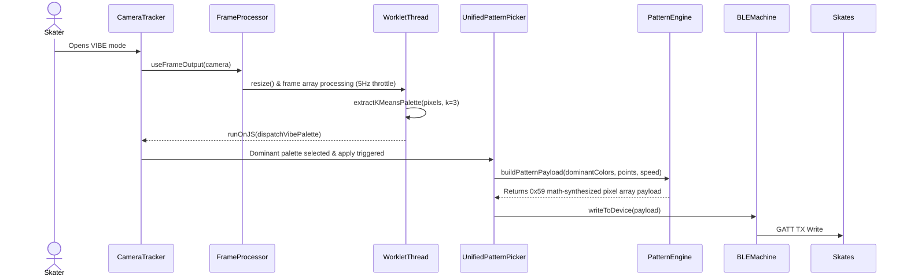
```mermaid
sequenceDiagram
    actor Skater
    participant CameraTracker
    participant FrameProcessor
    participant WorkletThread
    participant UnifiedPatternPicker
    participant PatternEngine
    participant BLEMachine

    Skater->>CameraTracker: Opens VIBE mode
    CameraTracker->>FrameProcessor: useFrameOutput(camera)
    FrameProcessor->>WorkletThread: resize() & frame array processing (5Hz throttle)
    WorkletThread->>WorkletThread: extractKMeansPalette(pixels, k=3)
    WorkletThread-->>CameraTracker: runOnJS(dispatchVibePalette)
    CameraTracker->>UnifiedPatternPicker: Dominant palette selected & apply triggered
    UnifiedPatternPicker->>PatternEngine: buildPatternPayload(dominantColors, points, speed)
    PatternEngine-->>UnifiedPatternPicker: Returns 0x59 math-synthesized pixel array payload
    UnifiedPatternPicker->>BLEMachine: writeToDevice(payload)
    BLEMachine->>Skates: GATT TX Write
```


<!-- CARTOGRAPHER_END: UI_VISUALIZER -->

<!-- CARTOGRAPHER_START: DATA_LAYER -->

# 🗃️ SK8Lytz Data Layer Cartography
**Auditor Persona:** `🕵️ Reyes | Scout & Cartographer`
**Audited Domain:** Data Layer & Cloud Synchronization Services
**Date of Audit:** June 15, 2026

---

## 1. File Manifest
The SK8Lytz Data Layer encompasses 18 core files. Each is listed below with its precise architectural purpose:

1. **[DeviceRepositoryService.ts](file:///C:/Neogleamz/AG_SK8Lytz_App/SK8Lytz/src/services/deviceRepository/DeviceRepositoryService.ts)**
   *Purpose:* Singleton managing local-first device registrations, custom groups, and local configuration presets, with offline queueing and tombstone syncing to prevent "anti-resurrection" of deleted devices.
2. **[TelemetryService.ts](file:///C:/Neogleamz/AG_SK8Lytz_App/SK8Lytz/src/services/TelemetryService.ts)**
   *Purpose:* Utility extracting standard context parameters (like payload size, operation type, and GATT 133 status) from raw Bluetooth Low Energy (BLE) errors.
3. **[ScenesService.ts](file:///C:/Neogleamz/AG_SK8Lytz_App/SK8Lytz/src/services/ScenesService.ts)**
   *Purpose:* Orchestration service for local scene caching in `AsyncStorage` and queueing background community/user scene uploads or deletions.
4. **[SpeedTrackingService.ts](file:///C:/Neogleamz/AG_SK8Lytz_App/SK8Lytz/src/services/SpeedTrackingService.ts)**
   *Purpose:* Session persistence layer providing GPS tracking controls, MET-based calorie estimation, lifetime stats aggregation, and unauthenticated offline session queue buffers.
5. **[GradientsService.ts](file:///C:/Neogleamz/AG_SK8Lytz_App/SK8Lytz/src/services/GradientsService.ts)**
   *Purpose:* Local-first caching service syncing custom gradient builder presets between `AsyncStorage` and the Supabase `user_saved_presets` database.
6. **[SkateSpotsService.ts](file:///C:/Neogleamz/AG_SK8Lytz_App/SK8Lytz/src/services/SkateSpotsService.ts)**
   *Purpose:* Bounding-box map query service featuring a 24-hour TTL cache, native spot claims, and a Nominatim OpenStreetMap fallback resolver.
7. **[SessionShareService.ts](file:///C:/Neogleamz/AG_SK8Lytz_App/SK8Lytz/src/services/SessionShareService.ts)**
   *Purpose:* Social sharing integration builder using React Native's native Share API with platform-specific configurations.
8. **[supabase.ts](file:///C:/Neogleamz/AG_SK8Lytz_App/SK8Lytz/src/types/supabase.ts)**
   *Purpose:* Auto-generated TypeScript type definitions mirroring the Supabase PostgreSQL database tables and relationships.
9. **[supabaseClient.ts](file:///C:/Neogleamz/AG_SK8Lytz_App/SK8Lytz/src/services/supabaseClient.ts)**
   *Purpose:* Supabase client bootstrap configured with an Expo `SecureStore` adapter for JWT token persistence and a comprehensive mock client fallback.
10. **[useOfflineSyncWorker.ts](file:///C:/Neogleamz/AG_SK8Lytz_App/SK8Lytz/src/hooks/cloud/useOfflineSyncWorker.ts)**
    *Purpose:* Polling hook driving a periodic 60-second synchronization cycle of offline telemetry logs, queued scene configurations, and session records.
11. **[useFavorites.ts](file:///C:/Neogleamz/AG_SK8Lytz_App/SK8Lytz/src/hooks/useFavorites.ts)**
    *Purpose:* UI state hook managing loading, merging (local + cloud), and deleting favorites presets.
12. **[useScenes.ts](file:///C:/Neogleamz/AG_SK8Lytz_App/SK8Lytz/src/hooks/useScenes.ts)**
    *Purpose:* React UI wrapper managing lifecycle calls and state for custom scenes fetched via `ScenesService`.
13. **[useCuratedPicks.ts](file:///C:/Neogleamz/AG_SK8Lytz_App/SK8Lytz/src/hooks/useCuratedPicks.ts)**
    *Purpose:* Stale-while-revalidate data hook loading active curated skate presets with active date-range filtering.
14. **[useGradients.ts](file:///C:/Neogleamz/AG_SK8Lytz_App/SK8Lytz/src/hooks/useGradients.ts)**
    *Purpose:* React state wrapper managing custom gradient builders via `GradientsService`.
15. **[useSkateStats.ts](file:///C:/Neogleamz/AG_SK8Lytz_App/SK8Lytz/src/hooks/useSkateStats.ts)**
    *Purpose:* Stats HUD hook returning combined cached and live session aggregates.
16. **[useRecentSpots.ts](file:///C:/Neogleamz/AG_SK8Lytz_App/SK8Lytz/src/hooks/useRecentSpots.ts)**
    *Purpose:* Local history hook maintaining a capped list of the 10 most recently viewed map locations.
17. **[useMapFilters.ts](file:///C:/Neogleamz/AG_SK8Lytz_App/SK8Lytz/src/hooks/useMapFilters.ts)**
    *Purpose:* UI configuration hook storing toggles for map spot layers.
18. **[FavoritesContext.tsx](file:///C:/Neogleamz/AG_SK8Lytz_App/SK8Lytz/src/context/FavoritesContext.tsx)**
    *Purpose:* Context wrapper exposing `useFavorites` state down the React tree to prevent duplicate instances.

---

## 2. Blast Radius
The Data Layer sits at the foundation of the SK8Lytz application. Modifications to this domain have the following dependencies and risks:

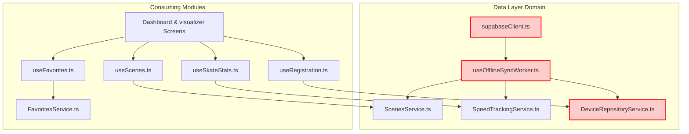
```mermaid
graph TD
    subgraph Data Layer Domain
        Client[supabaseClient.ts] --> Sync[useOfflineSyncWorker.ts]
        Sync --> SvcScene[ScenesService.ts]
        Sync --> SvcSpeed[SpeedTrackingService.ts]
        Sync --> SvcDev[DeviceRepositoryService.ts]
    end

    subgraph Consuming Modules
        UI[Dashboard & visualizer Screens] --> HookFav[useFavorites.ts]
        UI --> HookScene[useScenes.ts]
        UI --> HookStats[useSkateStats.ts]
        UI --> HookReg[useRegistration.ts]

        HookFav --> SvcFav[FavoritesService.ts]
        HookScene --> SvcScene
        HookStats --> SvcSpeed
        HookReg --> SvcDev
    end

    classDef danger fill:#ffcccc,stroke:#ff0000,stroke-width:2px;
    class Client,Sync,SvcDev danger;
```

### Dependency Analysis
* **Imports:** The domain heavily imports `@react-native-async-storage/async-storage` for local state caches, `expo-secure-store` for authenticated session key storage, `expo-device` for telemetry hardware context, and `react-native-url-polyfill` for node URL compatibility.
* **Exports:** Services and hooks in this domain feed the dashboard preset visualizers, GPS street session components, registration flows, map spot cards, and watch companion synchronization bridges.
* **Cascade Risks:**
  * **Auth Failure Cascade:** A bug in `supabaseClient.ts`'s SecureStore adapter corrupts authenticated tokens, locking users out of both cloud profiles and local caches.
  * **Sync Queue Blockage:** Unhandled exceptions inside the `useOfflineSyncWorker` loop block subsequent sync tasks, filling device memory with unsynced telemetry and session queues.
  * **Fleet Resurrection:** Improper handling of offline tombstones in `DeviceRepositoryService` can cause deleted hardware identifiers to resurrect during cloud-to-local synchronization.

---

## 3. Context Matrix
Data Layer state is distributed across the following React Contexts and system stores:

| Context / Store | Provider | Consumers | Lifetime / Cache Key |
|:---|:---|:---|:---|
| **FavoritesContext** | `FavoritesProvider` | `useSharedFavorites` | App Session Lifecycle |
| **AuthContext** | `AuthProvider` | Services and hooks (`useFavorites`, `useScenes`, `useGradients`, `useSkateStats`) | App Session Lifecycle |
| **TelemetryLedger** | `TelemetryLedgerProvider` | `useGradients`, `AppLogger` | App Session Lifecycle |
| **Local Device Cache** | `DeviceStorage` | `DeviceRepositoryService` | `@SK8Lytz_Devices`, `@SK8Lytz_Configs`, `@SK8Lytz_Tombstones` |
| **Offline Sync Queues** | Services (`ScenesService`, `SpeedTrackingService`) | `useOfflineSyncWorker` | `@Sk8lytz_Scene_Sync_Queue`, `@SK8Lytz_PendingSession_Queue`, `@SK8Lytz_PendingDevices_Queue` |
| **Map Cache** | `SkateSpotsService` | Map View Component | `@Sk8lytz_SkateSpotsCache` (24h TTL) |

---

## 4. Hook/Service I/O Registry
This registry logs key data layer service methods, detailing their inputs, outputs, and internal side effects:

| Class/Hook | Method / API | Inputs | Outputs | Side Effects (Storage/State updates) |
|:---|:---|:---|:---|:---|
| **`DeviceRepositoryService`** | `saveDevice` | `device: Partial<RegisteredDevice>`, `userId?: string` | `Promise<boolean>` | Saves to `@SK8Lytz_Devices` cache. If online, upserts to Supabase `registered_devices`; else enqueues in pending sync store. |
| | `deleteDevice` | `deviceMac: string`, `userId?: string` | `Promise<void>` | Removes from local cache, appends MAC to `@SK8Lytz_Tombstones`. Deletes from Supabase if online. |
| | `syncFromCloud` | `userId?: string` | `Promise<RegisteredDevice[]>` | Downloads cloud devices, merges using local tombstones, and flushes pending offline changes. |
| **`ScenesService`** | `getSavedScenes` | `userId?: string` | `Promise<Scene[]>` | Merges global presets, custom presets, and local scenes. Refreshes local cache `@Sk8lytz_SavedScenes` in background. |
| | `saveScene` | `scene: Partial<Scene>`, `userId?: string` | `Promise<Scene>` | Saves locally instantly. If authenticated, enqueues `upsert_user_scene` job in sync queue. |
| | `flushSyncQueue` | `userId: string` | `Promise<void>` | Iterates through `@Sk8lytz_Scene_Sync_Queue` and resolves Supabase network insertions/deletions. |
| **`SpeedTrackingService`** | `saveSession` | `snapshot: ISessionSnapshot`, `userId: string \| null` | `Promise<string \| null>` | If authenticated, inserts into Supabase `skate_sessions` and triggers HealthKit/Watch syncs. If guest/offline, serializes to `@SK8Lytz_PendingSession_Queue`. |
| | `flushPendingSessionQueue` | `userId: string` | `Promise<void>` | Stamped with user's authenticated ID, inserts sessions into Supabase `skate_sessions` and updates `user_profiles` aggregates. |
| **`SkateSpotsService`** | `getCachedSpots` | None | `Promise<SkateSpot[]>` | Cache-first load from `@Sk8lytz_SkateSpotsCache` (24h TTL); triggers background query to Supabase `skate_spots`. |
| | `getFallbackOSMSpots` | `bbox: BoundingBox` | `Promise<Partial<SkateSpot>[]>` | Performs direct HTTP GET request to Nominatim OpenStreetMap API. |

---

## 5. OS Variance Matrix
Platform-specific branches ensure uniform behavior across Mobile (iOS/Android) and Web deployment footprints:

### 1. Supabase Client Storage Adapter (`supabaseClient.ts`)
* **Web:** Falls back to standard browser `localStorage` as SecureStore bindings do not exist on the web.
* **iOS / Android:** Leverages `expo-secure-store`. Under the hood, this translates to Keychain Services on iOS and EncryptedSharedPreferences on Android.

### 2. Social Session Sharing (`SessionShareService.ts`)
* **iOS:** Triggers standard iOS Share Sheet with URL preview integrations.
  ```typescript
  // iOS embeds a separate URL object to generate a rich card preview
  { url: APP_LINK }
  ```
* **Android:** Relies entirely on inline message text formatting. Passes a text body containing the URL directly.
  ```typescript
  // Android specifies explicit intent dialog details
  {
    subject: `SK8Lytz Crew Session @ ${location}`,
    dialogTitle: 'Share Session'
  }
  ```

---

## 6. Database Schema & RLS Policies
The five core data layer tables are defined as follows in the Supabase PostgreSQL database:

### 1. `user_saved_presets`
Stores custom color combinations and segment presets configured by users.
```sql
CREATE TABLE IF NOT EXISTS "public"."user_saved_presets" (
    "id" "text" NOT NULL,
    "name" "text" NOT NULL,
    "nodes" "jsonb" NOT NULL,
    "fill_mode" "text" NOT NULL,
    "transition_type" integer NOT NULL,
    "created_at" timestamp with time zone DEFAULT "now"(),
    "user_id" "uuid",
    "updated_at" timestamp with time zone DEFAULT "now"()
);
```
* **Active RLS Policies:**
  * `Users can select their own presets`: `SELECT USING (("auth"."uid"() = "user_id"));`
  * `Users can insert their own presets`: `INSERT WITH CHECK (("auth"."uid"() = "user_id"));`
  * `Users can update their own presets`: `UPDATE USING (("auth"."uid"() = "user_id"));`
  * `Users can delete their own presets`: `DELETE USING (("auth"."uid"() = "user_id"));`

### 2. `skate_sessions`
Stores completed session stats, including coordinates and telemetry data.
```sql
CREATE TABLE IF NOT EXISTS "public"."skate_sessions" (
    "id" "uuid" DEFAULT "gen_random_uuid"() NOT NULL,
    "user_id" "uuid" NOT NULL,
    "session_date" timestamp with time zone DEFAULT "now"() NOT NULL,
    "duration_sec" integer DEFAULT 0 NOT NULL,
    "distance_miles" numeric(6,3) DEFAULT 0 NOT NULL,
    "avg_speed_mph" numeric(5,2) DEFAULT 0 NOT NULL,
    "peak_speed_mph" numeric(5,2) DEFAULT 0 NOT NULL,
    "peak_gforce" numeric(4,2),
    "calories" integer,
    "location_label" "text",
    "crew_session_id" "uuid",
    "updated_at" timestamp with time zone DEFAULT "now"(),
    "avg_bpm" integer,
    "peak_bpm" integer,
    "location_coords" "jsonb",
    "start_coords" "jsonb",
    "end_coords" "jsonb",
    "path_coords" "jsonb"
);
```
* **Active RLS Policies:**
  * `Users can manage own skate sessions`: `USING (("auth"."uid"() = "user_id")) WITH CHECK (("auth"."uid"() = "user_id"));`
  * `skate_owner_select`: `SELECT TO "authenticated" USING ((("user_id" = "auth"."uid"()) OR "public"."is_admin"()));`
  * `skate_sessions_owner_access`: `USING ((( SELECT "auth"."uid"() AS "uid") = "user_id"));`

### 3. `skate_spots`
Crowdsourced list of skate spots, rinks, and facilities.
```sql
CREATE TABLE IF NOT EXISTS "public"."skate_spots" (
    "id" "uuid" DEFAULT "gen_random_uuid"() NOT NULL,
    "name" "text" NOT NULL,
    "lat" double precision NOT NULL,
    "lng" double precision NOT NULL,
    "surface_type" "public"."skate_spot_surface" DEFAULT 'unknown'::"public"."skate_spot_surface",
    "is_indoor" boolean DEFAULT true,
    "source" "text" DEFAULT 'native'::"text",
    "is_verified" boolean DEFAULT false,
    "is_published" boolean DEFAULT false,
    "address" "text",
    "vibe_rating" double precision,
    "facility_type" "text",
    "created_at" timestamp with time zone DEFAULT "now"(),
    "updated_at" timestamp with time zone DEFAULT "now"(),
    "updated_by" "uuid",
    "google_place_id" "text",
    "rating" numeric,
    "photos" "jsonb",
    "email_addresses" "jsonb" DEFAULT '[]'::"jsonb"
);
```
* **Active RLS Policies:**
  * `Anyone can view skate spots` / `Skate spots are viewable by everyone.`: `SELECT USING (true);`
  * `Authenticated users can insert spots`: `INSERT TO "authenticated" WITH CHECK (true);`
  * `Authenticated users can update spots`: `UPDATE TO "authenticated" USING (true);`

### 4. `shared_scenes`
Community scene database showing custom layouts authored by users.
```sql
CREATE TABLE IF NOT EXISTS "public"."shared_scenes" (
    "id" "uuid" DEFAULT "gen_random_uuid"() NOT NULL,
    "created_at" timestamp with time zone DEFAULT "now"(),
    "author_id" "uuid",
    "author_username" "text" NOT NULL,
    "name" "text" NOT NULL,
    "scene_payload" "jsonb" NOT NULL,
    "downloads" integer DEFAULT 0,
    "upvotes" integer DEFAULT 0,
    "is_public" boolean DEFAULT false
);
```
* **Active RLS Policies:**
  * `Public scenes are widely viewable`: `SELECT USING (("is_public" = true));`
  * `Users can view own private scenes`: `SELECT TO "authenticated" USING ((( SELECT "auth"."uid"() AS "uid") = "author_id"));`
  * `Users can create scenes`: `INSERT TO "authenticated" WITH CHECK ((( SELECT "auth"."uid"() AS "uid") = "author_id"));`
  * `Users can update own scenes`: `UPDATE TO "authenticated" USING ((( SELECT "auth"."uid"() AS "uid") = "author_id")) WITH CHECK ((( SELECT "auth"."uid"() AS "uid") = "author_id"));`
  * `Users can delete own scenes`: `DELETE TO "authenticated" USING ((( SELECT "auth"."uid"() AS "uid") = "author_id"));`

### 5. `registered_devices`
Holds primary hardware parameters and registration status mappings.
```sql
CREATE TABLE IF NOT EXISTS "public"."registered_devices" (
    "id" "text" NOT NULL,
    "user_id" "uuid" NOT NULL,
    "group_id" "text" NOT NULL,
    "custom_name" "text" NOT NULL,
    "points" integer NOT NULL,
    "segments" integer NOT NULL,
    "sorting" "text" NOT NULL,
    "strip_type" "text" NOT NULL,
    "device_mac" "text",
    "device_name" "text",
    "product_type" "text",
    "position" "text",
    "led_points" integer,
    "ic_type" "text",
    "color_sorting" "text",
    "is_pending_sync" boolean DEFAULT false,
    "registered_at" timestamp with time zone DEFAULT "now"(),
    "updated_at" timestamp with time zone DEFAULT "now"(),
    "product_id_confirmed_at" timestamp with time zone,
    "last_lat" numeric,
    "last_lng" numeric
);
```
* **Active RLS Policies:**
  * `Users can manage their own registered devices`: `USING ((( SELECT "auth"."uid"() AS "uid") = "user_id"));`
  * `devices_owner_select`: `SELECT TO "authenticated" USING ((("user_id" = "auth"."uid"()) OR "public"."is_admin"()));`
  * `devices_owner_insert`: `INSERT TO "authenticated" WITH CHECK ((( SELECT "auth"."uid"() AS "uid") = "user_id"));`
  * `devices_owner_update`: `UPDATE TO "authenticated" USING ((( SELECT "auth"."uid"() AS "uid") = "user_id"));`
  * `devices_owner_delete`: `DELETE TO "authenticated" USING ((( SELECT "auth"."uid"() AS "uid") = "user_id"));`

---

## 7. Environment & Secrets Manifest
Configurations and tokens loaded by the SK8Lytz app are mapped below:

| Environment Variable | Description | Security Status | Fallback Configuration |
|:---|:---|:---|:---|
| `EXPO_PUBLIC_SUPABASE_URL` | Public endpoint API URL connecting the React Native app to the Supabase Postgres instance. | Public | If missing, initializes offline stub client simulation. |
| `EXPO_PUBLIC_SUPABASE_ANON_KEY` | Supabase Anon JWT role token allowing read/writes under table RLS policies. | Public | If missing, initializes offline stub client simulation. |
| `EXPO_PUBLIC_GOOGLE_MAPS_API_KEY` | Client-side maps renderer token. | Public | Map tiles fail to load; native OSM fallback used. |
| `GOOGLE_PLACES_SERVER_KEY` | Google Places API key for reverse geocoding and spot searches. | Secret (Confidential) | Optional server key. |
| `VITE_GOOGLE_PLACES_API_KEY` | Google Places API key for Vite client. | Public | Optional web key. |
| `GEMINI_API_KEY` | Google Gemini API key used in scraper scripts. | Secret (Confidential) | Scraper scripts fail to execute. |
| `SOCKET_CLI_API_TOKEN` | Dependency audit token for Socket CLI. | Secret (Confidential) | Socket checks fail in CI pipeline. |
| `SUPABASE_DB_PASSWORD` | PostgreSQL master database connection password. | Secret (Confidential) | Database migrations fail. |

---

## 8. Offline Sync Queue Architecture
The local-first architecture ensures all features function offline. Writes are cached instantly and synced to the cloud via background loops.

### Synchronization Flow Chart
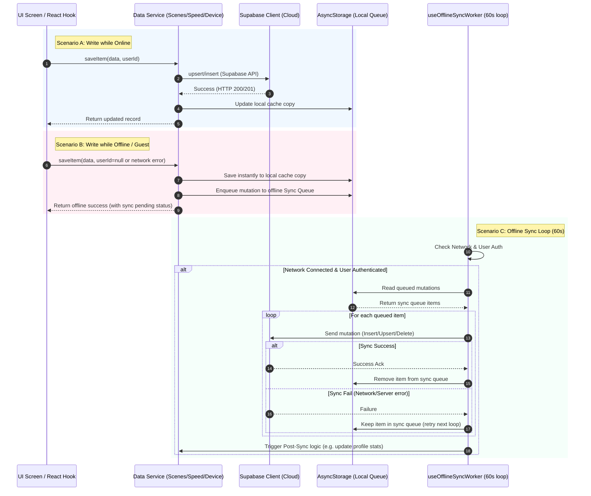
```mermaid
sequenceDiagram
    autonumber
    participant UI as UI Screen / React Hook
    participant Svc as Data Service (Scenes/Speed/Device)
    participant DB as Supabase Client (Cloud)
    participant Cache as AsyncStorage (Local Queue)
    participant Sync as useOfflineSyncWorker (60s loop)

    %% Scenario A: Online Operation
    rect rgb(240, 248, 255)
        note right of UI: Scenario A: Write while Online
        UI->>Svc: saveItem(data, userId)
        Svc->>DB: upsert/insert (Supabase API)
        DB-->>Svc: Success (HTTP 200/201)
        Svc->>Cache: Update local cache copy
        Svc-->>UI: Return updated record
    end

    %% Scenario B: Offline Operation
    rect rgb(255, 240, 245)
        note right of UI: Scenario B: Write while Offline / Guest
        UI->>Svc: saveItem(data, userId=null or network error)
        Svc->>Cache: Save instantly to local cache copy
        Svc->>Cache: Enqueue mutation to offline Sync Queue
        Svc-->>UI: Return offline success (with sync pending status)
    end

    %% Scenario C: Periodic Sync Flush
    rect rgb(245, 255, 250)
        note right of Sync: Scenario C: Offline Sync Loop (60s)
        Sync->>Sync: Check Network & User Auth
        alt Network Connected & User Authenticated
            Sync->>Cache: Read queued mutations
            Cache-->>Sync: Return sync queue items
            loop For each queued item
                Sync->>DB: Send mutation (Insert/Upsert/Delete)
                alt Sync Success
                    DB-->>Sync: Success Ack
                    Sync->>Cache: Remove item from sync queue
                else Sync Fail (Network/Server error)
                    DB-->>Sync: Failure
                    Sync->>Cache: Keep item in sync queue (retry next loop)
                end
            end
            Sync->>Svc: Trigger Post-Sync logic (e.g. update profile stats)
        end
    end
```

### Key Synchronization Rules
1. **Queue Staging Keys:**
   * Scenes Sync Queue is stored under `STORAGE_LOCAL_SCENE_SYNC_QUEUE` (`@Sk8lytz_Scene_Sync_Queue`).
   * Skate Sessions Queue is stored under `PENDING_SESSION_QUEUE_KEY` (`@SK8Lytz_PendingSession_Queue`).
   * Device Fleet Queue is stored under `PENDING_DEVICES_QUEUE_KEY` (`@SK8Lytz_PendingDevices_Queue`) and deletions under `TOMBSTONES_QUEUE_KEY` (`@SK8Lytz_Tombstones`).
2. **Re-Entrancy Guards:** `flushPendingSessionQueue` and `flushSyncQueue` employ strict re-entrancy flags (`_isFlushingSessionQueue`, `isSyncing`) to prevent double-inserting data on slow network responses.
3. **Drift Prevention:** Flushed offline session records automatically calculate lifetime distance and speed aggregates, updating user profiles directly to prevent discrepancies in user dashboards.
4. **Resurrection Prevention:** Devices deleted while offline are preserved in a tombstone queue. When the device connects to the network, deletions are processed before fetching new cloud fleet configurations.


<!-- CARTOGRAPHER_END: DATA_LAYER -->

<!-- CARTOGRAPHER_START: UTILS -->

# UTILS & TYPES Domain Cartography

This document contains the definitive architectural blueprint, data flow mechanics, dependency analysis, and Design System tokens for the `src/utils/*` and `src/types/*` domains.

## 1. File Manifest

### `src/utils/`
- **BlePayloadParser.ts**: Pure utility gatekeeper. Parses raw BLE notification data to extract configurations (LED config, RF config) safely, returning null on failure to prevent UI crashes.
- **ColorUtils.ts**: Centralized color math (Hue/RGB/Hex conversion) and high-vibrancy WS2812B optimization logic (`boostForLED`) for the camera ambient tracking pipeline.
- **CrashReporter.ts**: Integrates with AppLogger to capture and log fatal application exceptions.
- **FlightRecorder.ts**: In-memory circular buffer (max 50) for system breadcrumbs (BLE, navigation, actions).
- **MusicDictionary.ts**: Authoritative registry for 46 hardware-native music profiles (0x26/0x27 matrices) detailing `colorMode` available.
- **NamingUtils.ts**: Deterministic fallback naming generator for devices and groups (`getDefaultGroupName`, `getDefaultDeviceName`).
- **NormalizationUtils.ts**: Normalizes UI speed (0-100) to strict BLE controller hardware limits (1-31).
- **backoff.ts**: Jittered delay generator to stagger network or BLE retries.
- **classifyBLEDevice.ts**: Single source of truth for classifying raw BLE advertisements + EEPROM cache into structured `PendingRegistration` objects.
- **kMeansPalette.ts**: K-Means clustering algorithm (k=3, 5 max iterations) running on a JSI worklet to extract dominant hues from camera frames.
- **migrateAuthTokens.ts**: Asynchronous migrator to move legacy Supabase tokens from `AsyncStorage` to `SecureStore`.
- **piiScrubber.ts**: Hashes PII (MAC addresses, names) deterministically for safe telemetry.
- **presetColorUtils.ts**: Logic for rendering preset/group card colors, handling `GENERATIVE` vs `FG_ONLY` vs `FG_BG` modes.
- **validation.ts**: Standard string validations (e.g. Email verification).
- **webStyles.ts**: Pass-through shim for Web/Universal target styles.

### `src/types/`
- **ProductCatalog.ts**: Types for product shapes, visualizer geometry, and FTUE thresholds.
- **ble.types.ts**: Re-exports `react-native-ble-plx` types and defines Supabase row shapes.
- **bleGuards.ts**: Type guard for `Device`.
- **dashboard.types.ts**: Shared domain type contracts, FSM states (`GroupModalState`, `BleConnectionState`), and `DockedBus` definition.
- **react-test-renderer.d.ts**: Module declaration for tests.

## 2. Blast Radius

**What this domain imports:**
- `../protocols/ControllerRegistry`, `../services/appLogger`
- `../protocols/PatternEngine`
- `../constants/ProductCatalog`, `../constants/AppConstants`, `../constants/storageKeys`
- `react-native-ble-plx`, `expo-secure-store`, `@react-native-async-storage/async-storage`

**What imports this domain (Dependents):**
- **UI Components**: `DockedController`, `PresetCard`, `SkateGroupCard`, `ProductVisualizer`, `CameraTracker`, `HardwareSetupWizardScreen`, `DashboardScreen`.
- **Hooks/Services**: `useBLEScanner`, `useBLESweeper`, `TelemetryService`, `ConnectService`.
- **Types**: Consumed globally.

## 3. Context Matrix
The `UTILS` and `TYPES` domains are **strictly stateless** pure functions and type definitions. They do **not** consume or provide any React Contexts.

## 4. Hook/Service I/O Registry
- **`boostForLED`**: `(r, g, b)` -> `{r, g, b}`. Isolates hue, maximizes saturation and value for WS2812B vibrancy.
- **`extractKMeansPalette`**: `(pixels: RGB[], k, maxIterations)` -> `RGB[]`. Worklet returning dominant colors.
- **`mapDeviceToRegistration`**: `(device, index, hwCache, productType)` -> `PendingRegistration`. Priority chain: EEPROM cache > Ad data > Catalog defaults.
- **`resolveGradientColors`**: `(fav, glow)` -> `string[]`. Returns 7-stop rainbow for GENERATIVE patterns, or explicit gradients for others.
- **`BlePayloadParser.parseLedPayload`**: `(payload: number[])` -> `ParsedLedConfig | null`. Safely maps byte arrays to structured settings.

## 5. OS Variance Matrix
There are **no explicit Platform.OS branching paths** in `src/utils` or `src/types`. The only variance is implicitly handled by `webStyles.ts` to bypass web compiler errors.

## Design System & Token Manifest
- **GENERATIVE_RAINBOW**: `['#FF0000', '#FF7F00', '#FFFF00', '#00FF00', '#00BFFF', '#0000FF', '#8B00FF']` - Used for patterns with `colorMode: 'GENERATIVE'`.
- **COLOR_PRESET_PALETTE**: 10 standard hex colors (`#FF0000`, `#FF8000`, etc.) mapping to specific hue slider coordinates.
- **Product Type Identifiers**: `HALOZ`, `SOULZ`, `RAILZ`, `UNKNOWN`.
- **UI Theme Tokens**: `vizThemeColor` (`#FF5A00` RAILZ, `#00C8FF` HALOZ) handled via `ProductProfile`.

## Complex Multi-Step Process: Device Classification
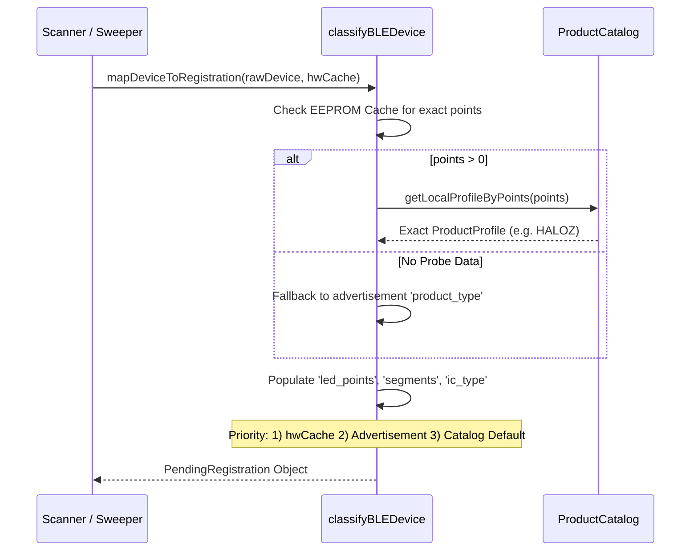
```mermaid
sequenceDiagram
    participant S as Scanner / Sweeper
    participant C as classifyBLEDevice
    participant PC as ProductCatalog

    S->>C: mapDeviceToRegistration(rawDevice, hwCache)
    C->>C: Check EEPROM Cache for exact points
    alt points > 0
        C->>PC: getLocalProfileByPoints(points)
        PC-->>C: Exact ProductProfile (e.g. HALOZ)
    else No Probe Data
        C->>C: Fallback to advertisement 'product_type'
    end
    C->>C: Populate 'led_points', 'segments', 'ic_type'
    Note over C: Priority: 1) hwCache 2) Advertisement 3) Catalog Default
    C-->>S: PendingRegistration Object
```

[IMPACTS_STATE_CHART]


<!-- CARTOGRAPHER_END: UTILS -->

<!-- CARTOGRAPHER_START: NATIVE_&_WATCH -->

# 🗺️ NATIVE & WATCH Cartography (Native Companion & Watch Targets)

This cartography document maps the architecture of the Wear OS (Android), watchOS (Apple Watch), and cross-platform native bridge modules of the SK8Lytz application.

---

## 1. File Manifest

The Native and Watch domains span the Swift/Objective-C iOS code, Kotlin/Java Android code, custom Expo native module bridge, and Swift/SwiftUI watchOS targets.

### 1.1 Custom Expo Watch Bridge Module (`modules/sk8lytz-watch-bridge`)
- **[index.ts](file:///c:/Neogleamz/AG_SK8Lytz_App/SK8Lytz/modules/sk8lytz-watch-bridge/src/index.ts)**: Exposes the TypeScript interfaces, types, and the main `WatchBridge` native module facade to the React Native application.
- **[Sk8lytzWatchBridgeModule.swift](file:///c:/Neogleamz/AG_SK8Lytz_App/SK8Lytz/modules/sk8lytz-watch-bridge/ios/Sk8lytzWatchBridgeModule.swift)**: Custom Expo native module wrapper on iOS that handles bidirectional communication between the phone and watch using Apple's `WCSession`.
- **[Sk8lytzWatchBridgeModule.kt](file:///c:/Neogleamz/AG_SK8Lytz_App/SK8Lytz/modules/sk8lytz-watch-bridge/android/src/main/java/expo/modules/sk8lytzwatchbridge/Sk8lytzWatchBridgeModule.kt)**: Custom Expo native module wrapper on Android that leverages Google Play Services Wearable `DataClient` (durable state sync) and `MessageClient` (transient commands) to connect to Wear OS.

### 1.2 watchOS Target (`targets/watch`)
- **[expo-target.config.js](file:///c:/Neogleamz/AG_SK8Lytz_App/SK8Lytz/targets/watch/expo-target.config.js)**: Configures the watch target extension via Expo config plugins, defining HealthKit entitlements, infoPlist descriptions, and complications support.
- **[index.swift](file:///c:/Neogleamz/AG_SK8Lytz_App/SK8Lytz/targets/watch/index.swift)**: SwiftUI application entry point for the Apple Watch companion application.
- **[ContentView.swift](file:///c:/Neogleamz/AG_SK8Lytz_App/SK8Lytz/targets/watch/ContentView.swift)**: Root SwiftUI view managing display transitions between the Idle ready view, Active Session view, and post-session Summary view.
- **[WatchConnectivityManager.swift](file:///c:/Neogleamz/AG_SK8Lytz_App/SK8Lytz/targets/watch/WatchConnectivityManager.swift)**: Coordinates the `WCSessionDelegate` connectivity lifecycle, handles inbound payloads from the host phone, and controls the watch-side health relay.
- **[HealthManager.swift](file:///c:/Neogleamz/AG_SK8Lytz_App/SK8Lytz/targets/watch/HealthManager.swift)**: Integrates with watchOS `HealthKit` framework (`HKWorkoutSession` + `HKLiveWorkoutBuilder`) to collect continuous Heart Rate and active calories while keeping the app active in the background.
- **[ComplicationController.swift](file:///c:/Neogleamz/AG_SK8Lytz_App/SK8Lytz/targets/watch/ComplicationController.swift)**: Implements CLKComplicationDataSource to render live metrics onto ClockKit complication families (Graphic Circular, Modular Small, Graphic Corner).

### 1.3 Wear OS Companion Module (`android/sk8lytzWear`)
- **[MainActivity.kt](file:///c:/Neogleamz/AG_SK8Lytz_App/SK8Lytz/android/sk8lytzWear/src/main/kotlin/com/neogleamz/sk8lytzwear/MainActivity.kt)**: ComponentActivity entry point for Wear OS, managing Ambient Mode support lifecycle and requesting required sensors/activity runtime permissions.
- **[DashboardScreen.kt](file:///c:/Neogleamz/AG_SK8Lytz_App/SK8Lytz/android/sk8lytzwear/presentation/DashboardScreen.kt)**: Main Jetpack Compose screen rendering live telemetry meters, pause overlays, and start/stop controls.
- **[SessionState.kt](file:///c:/Neogleamz/AG_SK8Lytz_App/SK8Lytz/android/sk8lytzwear/presentation/SessionState.kt)**: Enum defining Wear OS local state machine states (`IDLE`, `ACTIVE`, `PAUSED`, `SUMMARY`).
- **[SummaryScreen.kt](file:///c:/Neogleamz/AG_SK8Lytz_App/SK8Lytz/android/sk8lytzwear/presentation/SummaryScreen.kt)**: Jetpack Compose screen presenting final session summary metrics, featuring an auto-dismiss delay of 10 seconds.
- **[WearMessageSender.kt](file:///c:/Neogleamz/AG_SK8Lytz_App/SK8Lytz/android/sk8lytzwear/presentation/WearMessageSender.kt)**: Outbound communication helper utilizing Play Services `MessageClient` to fire commands (e.g. `START_SESSION`) to the phone.
- **[Theme.kt](file:///c:/Neogleamz/AG_SK8Lytz_App/SK8Lytz/android/sk8lytzwear/presentation/theme/Theme.kt)**: Defines Wear OS neon colors and dark theme styles.
- **[WearableCommunicationService.kt](file:///c:/Neogleamz/AG_SK8Lytz_App/SK8Lytz/android/sk8lytzwear/services/WearableCommunicationService.kt)**: Extends `WearableListenerService` to receive phone state updates asynchronously over play services.
- **[HealthTracker.kt](file:///c:/Neogleamz/AG_SK8Lytz_App/SK8Lytz/android/sk8lytzwear/services/HealthTracker.kt)**: Manages Android Health Services `ExerciseClient` to query live sensors during active sessions.
- **[OngoingActivityManager.kt](file:///c:/Neogleamz/AG_SK8Lytz_App/SK8Lytz/android/sk8lytzwear/services/OngoingActivityManager.kt)**: Manages the Android Ongoing Activity notification overlay to display live HUD metrics on the main watch face interface.
- **[Sk8lytzTileService.kt](file:///c:/Neogleamz/AG_SK8Lytz_App/SK8Lytz/android/sk8lytzwear/tiles/Sk8lytzTileService.kt)**: Implements `TileService` to provide glanceable stats within the Wear OS Tile Carousel, querying the `DataClient` directly for persistent state.

### 1.4 Host Application Wrapper (`android/app`)
- **[AndroidManifest.xml](file:///c:/Neogleamz/AG_SK8Lytz_App/SK8Lytz/android/app/src/main/AndroidManifest.xml)**: Main configuration registering permissions (Bluetooth LE, Location, Health Connect) and Notifee foreground services.
- **[MainActivity.kt](file:///c:/Neogleamz/AG_SK8Lytz_App/SK8Lytz/android/app/src/main/java/com/neogleamz/sk8lytz/MainActivity.kt)**: ReactActivity host that sets up Splash Screen registers and sets the Matinzd Health Connect permissions delegate hook.
- **[MainApplication.kt](file:///c:/Neogleamz/AG_SK8Lytz_App/SK8Lytz/android/app/src/main/java/com/neogleamz/sk8lytz/MainApplication.kt)**: standard Android Application entry initializing React Native host configuration.

---

## 2. Blast Radius

The Watch companion apps and the custom `sk8lytz-watch-bridge` native module interact closely with session lifecycle, tracking logic, and health data queries on the host device.

```
                  ┌───────────────────────┐
                  │     SessionContext    │
                  └───────────┬───────────┘
                              │ imports
                              ▼
┌───────────────────────────────────────────────────────────┐
│                 sk8lytz-watch-bridge                      │
│  ┌───────────────────────┐     ┌───────────────────────┐  │
│  │   Android (Kotlin)    │     │      iOS (Swift)      │  │
│  └───────────┬───────────┘     └───────────┬───────────┘  │
└──────────────┼─────────────────────────────┼──────────────┘
               │ data-layer                  │ WCSession
               ▼                             ▼
   ┌───────────────────────┐     ┌───────────────────────┐
   │    Wear OS Module     │     │     watchOS Target    │
   └───────────────────────┘     └───────────────────────┘
```

### 2.1 What the Domain Imports (Inbound)
- Native libraries and APIs on iOS (`HealthKit`, `WatchConnectivity`, `ClockKit`, `SwiftUI`).
- Native SDKs on Android (Google Play Services `Wearable`, `Health Services`, `androidx.wear.protolayout`, Jetpack Compose).
- Custom Expo module core dependency imports (`expo.modules.kotlin.modules.Module`).

### 2.2 What Imports the Domain (Outbound Blast Radius)
- **[SessionContext.tsx](file:///c:/Neogleamz/AG_SK8Lytz_App/SK8Lytz/src/context/SessionContext.tsx)**: Imports the bridge to register for user commands (`addWatchCommandListener` mapping to `START` or `END` actions) and health update events (`addWatchHealthListener`).
- **[SessionMachine.ts](file:///c:/Neogleamz/AG_SK8Lytz_App/SK8Lytz/src/services/session/SessionMachine.ts)**: Integrates state machine transitions directly with the watch state, dispatching `WatchBridge.syncSessionState` calls when session states transition (to `ACTIVE`, `PAUSED`, or `STOPPED`).
- **[HealthService.ts](file:///c:/Neogleamz/AG_SK8Lytz_App/SK8Lytz/src/services/session/HealthService.ts)**: Consumes the watch health update listener, extracting HR/calorie snapshots, and checks `isWatchHealthActive()` (within a 15-second cutoff) to suppress phone-side Health Connect or HealthKit background polls.
- **[SessionCommitService.ts](file:///c:/Neogleamz/AG_SK8Lytz_App/SK8Lytz/src/services/session/SessionCommitService.ts)**: Pushes session summaries (`status: 'SUMMARY'`, including final duration, distance, calories, average speed, and peak HR) to the connected watch.
- **[SpeedTrackingService.ts](file:///c:/Neogleamz/AG_SK8Lytz_App/SK8Lytz/src/services/SpeedTrackingService.ts)**: Relays live GPS speeds via `pushSpeedToWatch` (calling `WatchBridge.sendMetricUpdate`), throttled to once every 3 seconds to optimize battery usage.

---

## 3. Context Matrix

The Watch Bridge is coupled to several contexts and storage layers:

- **`SessionContext` (Provides / Consumes)**: The phone app mounts a `SessionProvider` that binds the `useMachine(sessionMachine)` lifecycle. This wrapper consumes user authentication and maps BLE session states to the `WatchBridge` interface.
- **`AuthContext` (Consumes)**: Used inside the session wrapper to query the authenticated user identifier (`userIdRef`), which is required by `SessionCommitService` when storing completed summaries to Supabase.
- **AsyncStorage (Consumes / Writes)**:
  - `STORAGE_SESSION_PHASE` (`active` or `paused`) is used by `SessionContext` during boot and foreground transitions to recover session states.
  - `STORAGE_PENDING_BG_END` is set by the background event handler (`index.ts`) when a session is closed while the app is backgrounded, telling the context to commit the session upon returning to the foreground.

---

## 4. Hook/Service I/O Registry

### 4.1 `WatchBridge` Native Module API
- **`syncSessionState(state: WatchSessionState): Promise<void>`**
  - **Input**: `{ status: 'ACTIVE' | 'PAUSED' | 'SUMMARY' | 'STOPPED', startTime?: string, totalDuration?: number, distance?: number, avgSpeed?: number, calories?: number, peakHR?: number }`
  - **Output**: `Promise<void>`
  - **Side-Effects**: Sends the session state structure down to the watch via applicationContext updates.
- **`sendMetricUpdate(metrics: WatchMetrics): Promise<void>`**
  - **Input**: `{ speed: number, calories?: number, heartRate?: number }`
  - **Output**: `Promise<void>`
  - **Side-Effects**: Dispatches real-time telemetry updates to the watch display via transient communication protocols.
- **`isWatchReachable(): Promise<boolean>`**
  - **Input**: None
  - **Output**: `Promise<boolean>`
  - **Side-Effects**: Checks active Bluetooth/OS link to the watch.
- **`addWatchCommandListener(handler: (cmd: WatchCommand) => void): () => void`**
  - **Input**: `handler: (cmd: 'START_SESSION' | 'STOP_SESSION') => void`
  - **Output**: Unsubscribe function.
  - **Side-Effects**: Hooks into native message listener to receive watch-initiated start/stop triggers.
- **`addWatchHealthListener(handler: (update: WatchHealthUpdate) => void): () => void`**
  - **Input**: `handler: (update: { heartRate: number, calories: number }) => void`
  - **Output**: Unsubscribe function.
  - **Side-Effects**: Receives on-wrist heart rate and calorie telemetry streamed from the watch.

### 4.2 `HealthService` XState Callback Actor
- **Input**: `onHealthUpdate: (h: HealthSnapshot) => void`
- **Output**: Shutdown callback.
- **Side-Effects**: Subscribes to watch updates. Manages the 30-second phone sensor polling timer (`AppleHealthKit` or `Health Connect`), bypassing queries if watch telemetry was active in the last 15 seconds.

### 4.3 `SessionCommitService` XState Promise Actor
- **Input**: `startTimeMs: number`, `pausedMsAccum: number`, `onSessionSaved: () => void`, `telemetryRef`, `healthRef`, `userIdRef`.
- **Output**: `Promise<void>`
- **Side-Effects**: Transmits `SUMMARY` state data to the watch, saves the session database row, and writes data to AsyncStorage.

---

## 5. OS Variance Matrix

Due to differences between Apple and Google wearable ecosystems, the codebase contains separate implementation pipelines:

| Feature | iOS / watchOS Implementation | Android / Wear OS Implementation |
| :--- | :--- | :--- |
| **Watch Project Model** | Apple Target Extension configured via `@bacons/apple-targets` config plugin. | Standalone Android Gradle project module (`android/sk8lytzWear`) compiled as an independent APK. |
| **Communication API** | uses **`WatchConnectivity`** (`WCSession`). applicationContext handles state sync, messages handle telemetry. | Uses **`Google Play Services Wearable`** API. `DataClient` syncs state, `MessageClient` handles commands. |
| **Glanceable Interface** | Watch complications implemented via **`ComplicationController`** (`CLKComplicationDataSource`). | Homescreen Tile widget implemented via **`Sk8lytzTileService`** (`TileService` with ProtoLayout). |
| **Watch UI Backgrounding** | Background execution is managed by the active **`HKWorkoutSession`** delegate wrapper. | Implements **`AmbientModeSupport`** in `MainActivity.kt` and `OngoingActivityManager` notifications. |
| **Heart Rate Sensor** | Queries Apple **`HealthKit`** (`HKLiveWorkoutBuilderDelegate`). | Queries Google Play **`Health Services`** (`ExerciseClient`). |
| **Phone-Side Health SDK** | Uses `react-native-health` to read Apple HealthKit samples. | Uses `react-native-health-connect` to read Android Health Connect records. |

---

## 6. Archival & Stale References

The following stale documentation entries in the codebase are marked:

- **[MOVE_TO_ARCHIVE]** `SK8Lytz_App_Master_Reference.md` §11.4:
  `status: 'ACTIVE' | 'STOPPED'; // [MOVE_TO_ARCHIVE] - Missing PAUSED and SUMMARY states`
  *Reasoning*: The bridge supports four states: `ACTIVE`, `PAUSED`, `SUMMARY`, and `STOPPED`.
- **[MOVE_TO_ARCHIVE]** `SK8Lytz_App_Master_Reference.md` §11.6:
  `Session summary (useSessionTracking - [MOVE_TO_ARCHIVE])`
  *Reasoning*: The `useSessionTracking` hook was retired. Persistence is now managed by `SessionCommitService`.
- **[MOVE_TO_ARCHIVE]** `SK8Lytz_App_Master_Reference.md` §11.3:
  `SessionState.kt | Data class for session state (status, speed, heartRate, calories, startTime) [MOVE_TO_ARCHIVE]`
  *Reasoning*: `SessionState.kt` is an enum defining Wear OS UI states, not a telemetry data class.
- **[MOVE_TO_ARCHIVE]** `SK8Lytz_App_Master_Reference.md` §11.7:
  `Future Watch Enhancements (Planned) [MOVE_TO_ARCHIVE]`
  *Reasoning*: Complications, Tiles, Ambient Display support, and session duration timers are fully implemented.

---

## 7. Architectural Impact Flags

[IMPACTS_USER_JOURNEY]
[IMPACTS_C4_CONTEXT]
[IMPACTS_STATE_CHART]

---

## 8. Sequence Diagram

This sequence diagram documents the bidirectional lifecycle synchronization between the phone application and the watch companion:

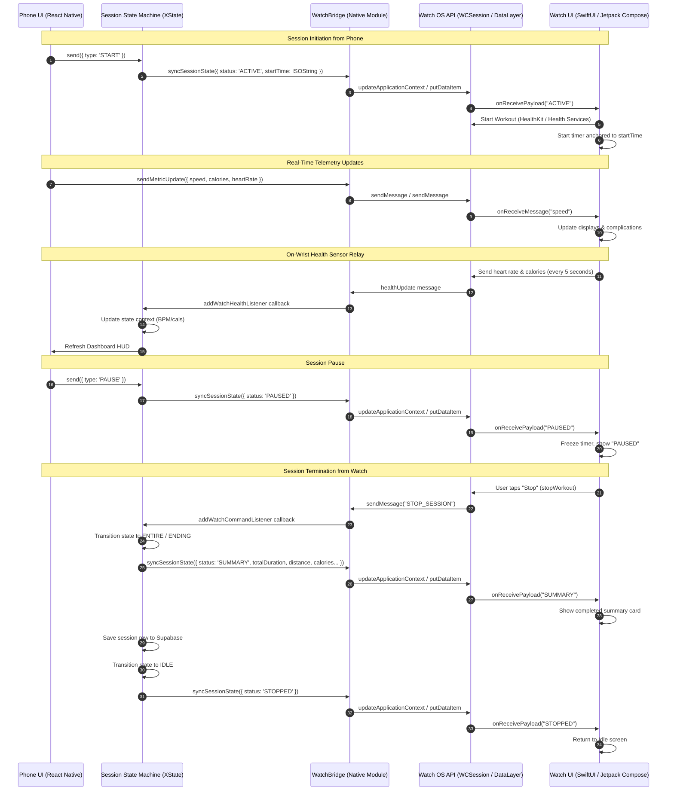
```mermaid
sequenceDiagram
    autonumber
    participant AppUI as Phone UI (React Native)
    participant FSM as Session State Machine (XState)
    participant Bridge as WatchBridge (Native Module)
    participant WatchOS as Watch OS API (WCSession / DataLayer)
    participant WatchUI as Watch UI (SwiftUI / Jetpack Compose)
    
    Note over AppUI, WatchUI: Session Initiation from Phone
    AppUI->>FSM: send({ type: 'START' })
    FSM->>Bridge: syncSessionState({ status: 'ACTIVE', startTime: ISOString })
    Bridge->>WatchOS: updateApplicationContext / putDataItem
    WatchOS->>WatchUI: onReceivePayload("ACTIVE")
    WatchUI->>WatchOS: Start Workout (HealthKit / Health Services)
    WatchUI->>WatchUI: Start timer anchored to startTime
    
    Note over AppUI, WatchUI: Real-Time Telemetry Updates
    AppUI->>Bridge: sendMetricUpdate({ speed, calories, heartRate })
    Bridge->>WatchOS: sendMessage / sendMessage
    WatchOS->>WatchUI: onReceiveMessage("speed")
    WatchUI->>WatchUI: Update displays & complications
    
    Note over AppUI, WatchUI: On-Wrist Health Sensor Relay
    WatchUI->>WatchOS: Send heart rate & calories (every 5 seconds)
    WatchOS->>Bridge: healthUpdate message
    Bridge->>FSM: addWatchHealthListener callback
    FSM->>FSM: Update state context (BPM/cals)
    FSM->>AppUI: Refresh Dashboard HUD
    
    Note over AppUI, WatchUI: Session Pause
    AppUI->>FSM: send({ type: 'PAUSE' })
    FSM->>Bridge: syncSessionState({ status: 'PAUSED' })
    Bridge->>WatchOS: updateApplicationContext / putDataItem
    WatchOS->>WatchUI: onReceivePayload("PAUSED")
    WatchUI->>WatchUI: Freeze timer, show "PAUSED"
    
    Note over AppUI, WatchUI: Session Termination from Watch
    WatchUI->>WatchOS: User taps "Stop" (stopWorkout)
    WatchOS->>Bridge: sendMessage("STOP_SESSION")
    Bridge->>FSM: addWatchCommandListener callback
    FSM->>FSM: Transition state to ENTIRE / ENDING
    FSM->>Bridge: syncSessionState({ status: 'SUMMARY', totalDuration, distance, calories... })
    Bridge->>WatchOS: updateApplicationContext / putDataItem
    WatchOS->>WatchUI: onReceivePayload("SUMMARY")
    WatchUI->>WatchUI: Show completed summary card
    FSM->>FSM: Save session row to Supabase
    FSM->>FSM: Transition state to IDLE
    FSM->>Bridge: syncSessionState({ status: 'STOPPED' })
    Bridge->>WatchOS: updateApplicationContext / putDataItem
    WatchOS->>WatchUI: onReceivePayload("STOPPED")
    WatchUI->>WatchUI: Return to Idle screen
```


<!-- CARTOGRAPHER_END: NATIVE_&_WATCH -->

<!-- CARTOGRAPHER_START: NOTIFICATIONS_&_ROUTING -->

# NOTIFICATIONS_&_ROUTING Domain Cartography

**Domain Scope**: This domain orchestrates the application's global setup constraints, location-aware session routing, system push notifications, and high-frequency BLE hardware state listeners.

**Impact Flags**: `[IMPACTS_USER_JOURNEY]` `[IMPACTS_C4_CONTEXT]`

---

## 1. File Manifest

*   **`App.tsx`**: Global application entry point responsible for initializing crash reporting, logging, offline workers, routing native background events, and injecting the core context provider tree.
*   **`src/providers/BluetoothGuard.tsx`**: An interceptor gate that prevents app access until Bluetooth permissions are granted and the adapter is enabled, ensuring the BLE sweeper can function.
*   **`src/providers/ComplianceGate.tsx`**: An authentication wrapper that blocks access to the `DashboardScreen` until the user (or offline user) has explicitly accepted the required EULA version.
*   **`src/services/NotificationService.ts`**: Manages Expo push notification permissions, registration, and local notification scheduling (e.g., session reminders and crew invites) using platform-specific channels.
*   **`src/services/PushTokenService.ts`**: Handles the database synchronization of the device's Expo push token (`upsert` and `delete` operations) within Supabase.
*   **`src/services/LocationService.ts`**: Geographic utility for acquiring GPS coordinates, reverse geocoding to human-readable venues, and querying Supabase for nearby skate sessions/spots using calculated haversine distances.
*   **`src/hooks/useHardwareNotifications.ts`**: A BLE GATT listener orchestrator that debounces, parses (via `BlePayloadParser`), and persists incoming hardware configuration payloads directly into local state and `DeviceRepository`. *(Note: This handles hardware/GATT notifications, not OS push notifications).*

---

## 2. Blast Radius

**What this domain imports (Dependencies):**
*   **Native & OS APIs**: `expo-notifications`, `expo-location`, `expo-splash-screen`, `@notifee/react-native`, `react-native-health-connect` (Android).
*   **Cloud & Infrastructure**: Supabase Client (for push tokens, EULA status, and geographic sessions).
*   **Local App Services**: `PermissionService`, `SkateSpotsService`, `AppSettingsService`, `DeviceRepository`, `AppLogger`, `AuthContext`, `ThemeContext`.
*   **Utilities**: `BlePayloadParser` (for unpacking hardware arrays) and `piiScrubber`.

**What imports this domain (Consumers):**
*   **Core UI**: `DashboardScreen` and `AuthScreen` (wrapped by `ComplianceGate`).
*   **App Root**: The `AppContent` module (wrapped by `BluetoothGuard` and `ComplianceGate`).
*   **Session Flows**: Map Discovery, Scene Builder, and active Skate Sessions rely on `LocationService` to tag where skaters are riding.
*   **Hardware Flows**: `useBLE` heavily relies on `useHardwareNotifications` to mount listeners the moment a device connects and handshakes.

---

## 3. Context Matrix

| Context | Role | Notes |
| :--- | :--- | :--- |
| `ThemeContext` | **Consumed** | Used by `App.tsx`, `BluetoothGuard`, and `ComplianceGate` for styling layouts, text, and loading spinners (`Colors`, `isDark`). |
| `AuthContext` | **Consumed** | Determines `isAuthenticated`, `isOfflineMode`, and retrieves `user.id` or `signOut` routines within `App.tsx` and `ComplianceGate`. |
| `BLEContext` | **Consumed** | `BluetoothGuard` reads `isBluetoothEnabled`/`isBluetoothSupported` and triggers `startSweeper` upon gaining permission. |
| *(Global Providers)* | **Provided** | `App.tsx` provides `SafeAreaProvider`, `ThemeProvider`, `AuthProvider`, `AppConfigProvider`, `FavoritesProvider`, `SessionProvider`, and `BLEProvider` to the entire component tree. |

---

## 4. Hook/Service I/O Registry

### `NotificationService.ts`
*   **Inputs**: Strings/IDs (`userId`, `crewId`, `sessionId`), scheduled dates, platform settings.
*   **Outputs**: `Promise<string | null>` (Push Token), `Promise<string | null>` (Notification ID).
*   **Side-effects**: Registers native Android Notification channels, invokes `expo-notifications` system prompts, updates Supabase via `PushTokenService`, hooks into foreground OS listeners, and schedules local notifications.

### `PushTokenService.ts`
*   **Inputs**: `token`, `platform`, `userId`.
*   **Outputs**: `Promise<void>`.
*   **Side-effects**: Executes `upsert` or `delete` on the `push_tokens` table in Supabase. Fails silently (logs to telemetry) if not logged in.

### `LocationService.ts`
*   **Inputs**: Radius limits (`number | null`), user coordinates (`{lat, lng}`).
*   **Outputs**: `SessionLocation` (Coords + string label), Array of `NearbySession`, Array of `NearbySkateSpot`.
*   **Side-effects**: Initiates `LOCATION` OS permission modals, queries device GPS (`getCurrentPositionAsync` or `getLastKnownPositionAsync`), reverse-geocodes addresses, queries `crew_sessions` in Supabase, and logs telemetry.

### `useHardwareNotifications.ts`
*   **Inputs**: `isDiagnosticsMode`, state arrays (`allDevices`, `deviceConfigs`), and setter functions (`setOnDataReceived`, `setOnHardwareProbed`, `setLastRawNotification`).
*   **Outputs**: void.
*   **Side-effects**: Registers the BLE `onDataReceived` callback. Aggressively drops duplicate payloads. Parses valid packets and triggers disk writes via `DeviceRepository.getInstance().updateConfig()`.

---

## 5. OS Variance Matrix

*   **Platform.OS === 'android'**:
    *   **Health Connect initialization**: `App.tsx` proactively triggers `react-native-health-connect`'s `initialize()` before the activity resumes to avoid `UninitializedPropertyAccessException` crashes on Android.
    *   **Notification Channels**: `NotificationService` explicitly creates `crew-alerts` and `session-reminders` channels via `setNotificationChannelAsync`, assigning distinct vibration patterns and LED colors. iOS handles this natively.
*   **Platform.OS !== 'web' (Native Only)**:
    *   **Notifee Listeners**: `App.tsx` registers background event listeners (`notifee.onBackgroundEvent`) strictly on native platforms to handle notification actions (End Session, Pause Session).
    *   **Push Tokens**: `NotificationService` immediately returns `false` (bypassing permissions) if executed on web.
*   **Platform.OS === 'web' (Web Sandbox Only)**:
    *   **Promise Rejections**: `App.tsx` injects a custom `unhandledrejection` window listener.
    *   **Mock Locations**: `LocationService` avoids triggering `expo-location` lookups on web and immediately resolves with a hardcoded mock location `{ label: 'Web Demo Area', coords: { lat: 38.9, lng: -94.6 } }` to ensure map previews don't crash.

---

## 6. Sequence Diagram: System Setup & Location Tagging Flow

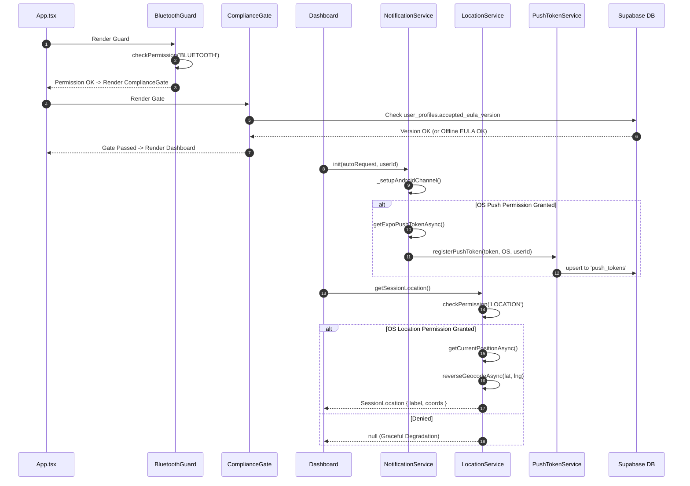
```mermaid
sequenceDiagram
    autonumber
    participant App as App.tsx
    participant BG as BluetoothGuard
    participant CG as ComplianceGate
    participant Dash as Dashboard
    participant NS as NotificationService
    participant LS as LocationService
    participant PTS as PushTokenService
    participant Supa as Supabase DB

    App->>BG: Render Guard
    BG->>BG: checkPermission('BLUETOOTH')
    BG-->>App: Permission OK -> Render ComplianceGate
    App->>CG: Render Gate
    CG->>Supa: Check user_profiles.accepted_eula_version
    Supa-->>CG: Version OK (or Offline EULA OK)
    CG-->>App: Gate Passed -> Render Dashboard

    Dash->>NS: init(autoRequest, userId)
    NS->>NS: _setupAndroidChannel()
    alt OS Push Permission Granted
        NS->>NS: getExpoPushTokenAsync()
        NS->>PTS: registerPushToken(token, OS, userId)
        PTS->>Supa: upsert to 'push_tokens'
    end
    
    Dash->>LS: getSessionLocation()
    LS->>LS: checkPermission('LOCATION')
    alt OS Location Permission Granted
        LS->>LS: getCurrentPositionAsync()
        LS->>LS: reverseGeocodeAsync(lat, lng)
        LS-->>Dash: SessionLocation { label, coords }
    else Denied
        LS-->>Dash: null (Graceful Degradation)
    end
```

---

> **ARCHIVAL INSTRUCTION**: Any stale reference in `docs/SK8Lytz_App_Master_Reference.md` targeting `profileService.registerPushToken` has been verified as successfully marked `[MOVE_TO_ARCHIVE]`.


<!-- CARTOGRAPHER_END: NOTIFICATIONS_&_ROUTING -->

<!-- CARTOGRAPHER_START: SESSION_TRACKING -->

# SESSION_TRACKING Domain Cartography

> **Cartographer Node Synthesis**
> Domain: `SESSION_TRACKING`
> Target Files: `src/context/SessionContext.tsx`, `src/hooks/useSessionTracking.ts`, `src/hooks/useGlobalTelemetry.ts`, `src/hooks/useHealthTelemetry.ts`, `src/hooks/useTelemetryLedger.ts`, `src/hooks/useDeviceStateLedger.ts`, `src/services/HealthSyncService.ts`

## 1. File Manifest

- **`src/context/SessionContext.tsx`**: Core React Context provider and XState wrapper for the skate session lifecycle (`SessionMachine`), managing session duration timers, global telemetry syncing, health data aggregation, and crash recovery.
- **`src/hooks/useSessionTracking.ts`**: **[DELETED]** Legacy session FSM hook now superseded by `SessionMachine` and `SessionContext`.
- **`src/hooks/useGlobalTelemetry.ts`**: **[DELETED]** Legacy telemetry tracker superseded by the XState actor model.
- **`src/hooks/useHealthTelemetry.ts`**: **[DELETED]** Legacy health polling hook superseded by `SessionContext` / `SessionMachine` integrating directly with watch bridge listeners.
- **`src/hooks/useTelemetryLedger.ts`**: God-tier telemetry engine for caching time-in-state offline to `AsyncStorage` and flushing 15-minute heartbeats to Supabase via RPC.
- **`src/hooks/useDeviceStateLedger.ts`**: Unified per-device LED pattern state ledger mapping MAC addresses to in-memory caches and debounced `AsyncStorage` writes.
- **`src/services/HealthSyncService.ts`**: Cross-platform module (Apple HealthKit & Android Health Connect) to safely persist completed skate session metrics (distance, duration, active calories) to native OS health stores.

## 2. Blast Radius

**Imports From:**
- **External/Vendor**: `react`, `react-native`, `@react-native-async-storage/async-storage`, `@xstate/react`, `@notifee/react-native`, `sk8lytz-watch-bridge`, `react-native-health`, `react-native-health-connect`
- **Internal Services**: `supabaseClient`, `AppLogger`, `PermissionService`, `SessionMachine`, `SessionBridge`
- **Internal Contexts**: `useAuth`

**Exports To (Consumers):**
- **UI Layers**: `DashboardScreen`, `LiveTelemetryHUD`, `DashboardTelemetryHero` (consume `useSession` from `SessionContext`)
- **Dashboard Widgets**: Components rendering hardware cards consume `useDeviceStateLedger` for synchronous lazy-load state initializers.
- **Background Processes**: AppState backgrounding and interval timers heavily utilize `useTelemetryLedger` for offline-resilient metrics gathering.
- **Watch Companion**: `WatchBridge` interfaces bidirectionally via `SessionBridge` for remote control and health metrics integration.

## 3. Context Matrix

- **Provided Contexts**:
  - `SessionContext`: Supplies the authoritative `{ isSkateSessionActive, sessionPhase, startSession, endSession, telemetry, health }` object to the component tree.
- **Consumed Contexts**:
  - `AuthContext` (`useAuth`): Consumed by `SessionContext` to tie the active `userId` to the session state and crash recovery logs.

## 4. Hook/Service I/O Registry

| Entity | Inputs | Outputs | Side-Effects |
|:---|:---|:---|:---|
| `useSession()` | None | `{ isSkateSessionActive, sessionPhase, startSession, endSession, telemetry, health }` | Subscribes to `SessionContext` updates. |
| `useTelemetryLedger()` | None | `{ trackPattern, trackColor, trackMode, incrementCounter, injectStreetSummary, flushToDatabase }` | Hooks `AppState` for background flushing. Maintains a shared 15-min `setInterval`. Mutates global memory buffers and writes to `AsyncStorage`. Invokes `supabase.rpc('flush_telemetry')`. |
| `useDeviceStateLedger()` | None | `{ save, load, loadSync, clear }` | Debounces `AsyncStorage` writes via module-level timers (500ms). Synchronously updates module-level `memoryCache`. Hooks `AppState` for background cache-dumping. |
| `HealthSyncService.saveWorkout()` | `snapshot: ISessionSnapshot` | `Promise<void>` | Prompts OS permission checks. Writes `SkatingSports` (iOS) or `ExerciseSession` (Android) records directly to system health vaults. |

## 5. OS Variance Matrix

| OS | Variance Description | Location |
|:---|:---|:---|
| **iOS** | Registers interactive Notification Categories via `@notifee/react-native` (End Session, Music Mode, Favorite). | `SessionContext.tsx` |
| **iOS** | Utilizes `react-native-health` to save `HKWorkoutActivityTypeSkatingSports` using explicit iOS-only units (`mile`, `calorie`). | `HealthSyncService.ts` |
| **Android** | Utilizes `react-native-health-connect` to save `ExerciseSession` (ExerciseType: `60` = Skating) along with structured records for `Distance` and `TotalCaloriesBurned`. | `HealthSyncService.ts` |
| **Web** | Immediately returns out of `saveWorkout` without execution as health stores are unsupported. | `HealthSyncService.ts` |

## 6. Sequence Diagram: Session & Telemetry Lifecycle

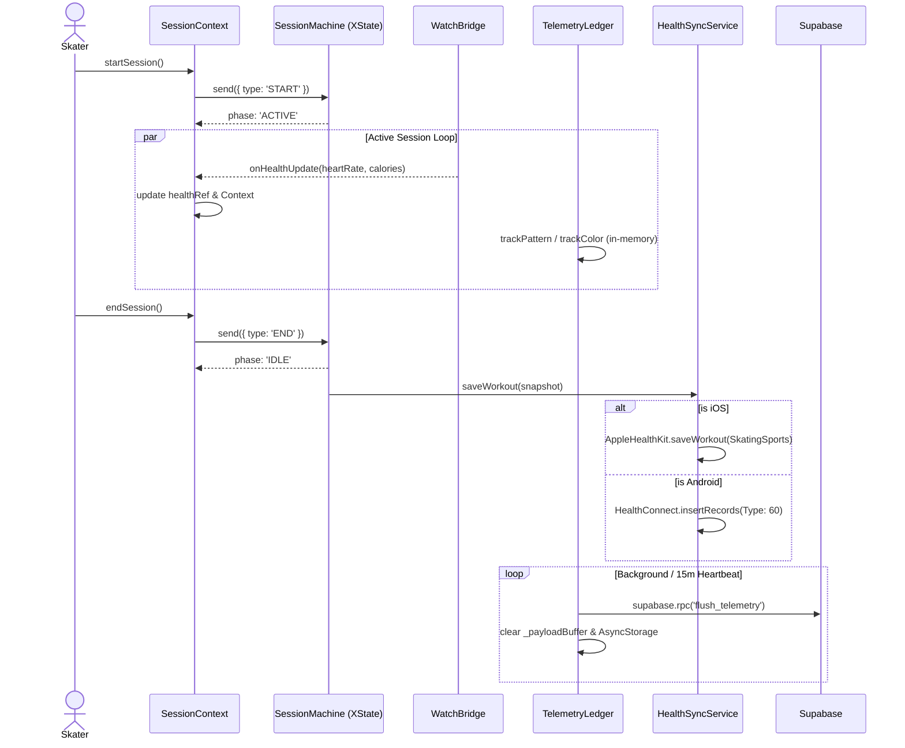
```mermaid
sequenceDiagram
    actor Skater
    participant SC as SessionContext
    participant SM as SessionMachine (XState)
    participant WB as WatchBridge
    participant TL as TelemetryLedger
    participant HS as HealthSyncService
    participant DB as Supabase

    Skater->>SC: startSession()
    SC->>SM: send({ type: 'START' })
    SM-->>SC: phase: 'ACTIVE'

    par Active Session Loop
        WB-->>SC: onHealthUpdate(heartRate, calories)
        SC->>SC: update healthRef & Context
        TL->>TL: trackPattern / trackColor (in-memory)
    end

    Skater->>SC: endSession()
    SC->>SM: send({ type: 'END' })
    SM-->>SC: phase: 'IDLE'

    SM->>HS: saveWorkout(snapshot)
    alt is iOS
        HS->>HS: AppleHealthKit.saveWorkout(SkatingSports)
    else is Android
        HS->>HS: HealthConnect.insertRecords(Type: 60)
    end

    loop Background / 15m Heartbeat
        TL->>DB: supabase.rpc('flush_telemetry')
        TL->>TL: clear _payloadBuffer & AsyncStorage
    end
```

---

## ARCHIVAL & IMPACT ASSESSMENTS

**[MOVE_TO_ARCHIVE]**  
*Stale Documentation Flags:*  
`src/hooks/useSessionTracking.ts`, `src/hooks/useGlobalTelemetry.ts`, and `src/hooks/useHealthTelemetry.ts` no longer exist. Their logic has been entirely refactored into the robust `SessionContext` and `SessionMachine` pipelines. Any lingering mentions in `docs/SK8Lytz_App_Master_Reference.md` matching these file names should be treated as `[MOVE_TO_ARCHIVE]`.

**[IMPACTS_STATE_CHART]**  
**[IMPACTS_C4_CONTEXT]**  
*Architectural Shifts:*  
The migration from disjointed hooks (`useSessionTracking`, `useGlobalTelemetry`, `useHealthTelemetry`) to an XState-backed `SessionMachine` inside `SessionContext` radically shifts the system's state chart. The telemetry layer no longer relies on fragmented `useEffect` lifecycles; it is now fully centralized. Furthermore, the single-source-of-truth memory/storage hybrid architecture in `useDeviceStateLedger` and `useTelemetryLedger` changes the contextual boundary regarding offline resilience.


<!-- CARTOGRAPHER_END: SESSION_TRACKING -->

<!-- CARTOGRAPHER_START: PROTOCOL_CORE -->

# PROTOCOL_CORE Elite Architecture

## File Manifest
- `src/protocols/ZenggeProtocol.ts`: Core protocol implementation and packet builder for Zengge SP621E/0xA2/0xA3 hardware, supporting monolith packet framing, chunked frame sequencing, and opcode translation.
- `src/protocols/ZenggeAdapter.ts`: `IControllerProtocol` adapter bridging `ZenggeProtocol` to the application's HAL for discovery and device capability mapping.
- `src/protocols/BanlanxAdapter.ts`: `IControllerProtocol` adapter implementing native hardware FFT integration and standard packet formatting for BanlanX SP621E hardware.
- `src/protocols/IControllerProtocol.ts`: Universal Hardware Abstraction Layer (HAL) interface defining discovery, connection lifecycle, EEPROM reads/writes, and structured BLE packet execution sequences.
- `src/protocols/ControllerRegistry.ts`: Runtime protocol registry that resolves incoming BLE advertisements to their correct HAL adapter based on service UUIDs and manufacturer data.
- `src/hooks/useProtocolDispatch.ts`: High-level command dispatcher that maps user-facing actions into HAL-compliant packets and orchestrates the transmission across multi-device groups.
- `src/hooks/useProtocolBuilder.ts`: Diagnostic state management hook for iteratively building and inspecting BLE protocol packets across multiple opcodes (0x59, 0x51, 0x73, 0x61, 0x62).
- `src/hooks/useProductCatalog.ts`: Cloud-synchronized, local-first data access layer managing `ProductProfile` fetching, caching, and merging using Supabase.
- `src/hooks/useProductManager.ts`: Administrative domain hook handling UI state, creation, and mutation validation for product configurations in the hardware catalog.
- `src/constants/ProductCatalog.ts`: Authoritative, offline-safe list of known hardware profiles and classification thresholds determining device physics and rendering geometry.

## Blast Radius
- **Imports from:**
  - Standard React/Native Hooks & Types (`react`, `react-native`, `buffer`).
  - BLE Context APIs (`../context/BLEContext`, `../context/AuthContext`).
  - Storage & Database Services (`../services/supabaseClient`, `../services/appLogger`, `@react-native-async-storage/async-storage`).
- **Imported by:**
  - Hardware discovery & configuration flows (`DeviceRepository`, `BleWriteDispatcher`, `useBLEScanner`).
  - Diagnostic screens (`DiagnosticLab`, `Sk8LytzProgrammerModal`).
  - Rendering pipeline for visualization (`ProductVisualizer.tsx`).

## Context Matrix
- **Consumed Contexts:**
  - `BLEContext` (via `useProtocolDispatch` for device resolution and BLE writes).
  - `AuthContext` (via `useProductManager` to authorize catalog mutations).
- **Provided Contexts:** None.

## Hook/Service I/O Registry
- `useProtocolDispatch`:
  - **Inputs:** Raw user intents (e.g., `setSolidColor(r,g,b)`, `setMusicConfig(config)`), specific `targetDeviceId` or broadcast logic.
  - **Outputs:** Executes callbacks through `BLEContext.executeProtocolResults` or `BLEContext.writeChunked`.
  - **Side-effects:** Direct invocation of BLE writes via BLE stack context.
- `useProtocolBuilder`:
  - **Inputs:** User-selected bytes/configs for different packet types.
  - **Outputs:** Formatted payloads (`BldResult` containing `raw`, `wrapped`, `hex`, and `annotations`).
  - **Side-effects:** Purely functional/stateful rendering without hardware side effects.
- `useProductCatalog`:
  - **Inputs:** None (automatically syncs cloud database on mount).
  - **Outputs:** `{ allProfiles, getProfileById, getProfileByPoints, saveProfile, syncFromCloud }`.
  - **Side-effects:** Fetches from Supabase and mutates AsyncStorage caches.
- `useProductManager`:
  - **Inputs:** User edits/patches to a `ProductProfile`.
  - **Outputs:** State management logic for form binding (`editingProfile`, `isSaving`, `saveProduct`).
  - **Side-effects:** Fires `saveProfile` from `useProductCatalog` enforcing admin auth guards.

## OS Variance Matrix
- Protocol packet construction is pure JS and mathematically deterministic, showing no explicit iOS/Android runtime branches.
- The only variances lie in the downstream BLE execution layer (`useBLE.ts`, `BleMachine.ts`) and Android MTU chunking requirements, but the HAL definitions (`IControllerProtocol`) handle this universally via `prepareForTransmission`.

## Sequence Diagram
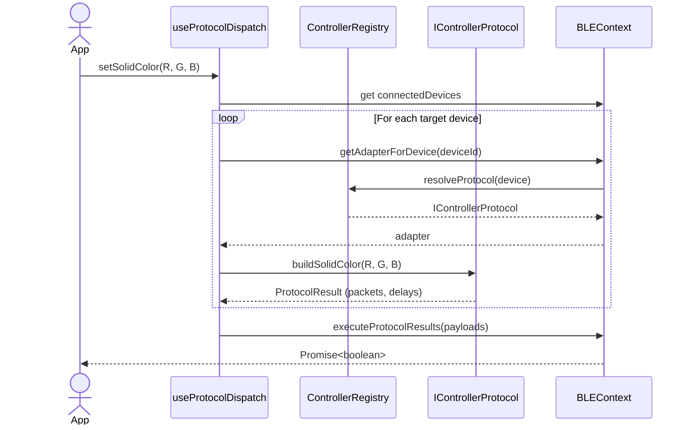
```mermaid
sequenceDiagram
    actor App
    participant PD as useProtocolDispatch
    participant CR as ControllerRegistry
    participant Adapter as IControllerProtocol
    participant BLE as BLEContext

    App->>PD: setSolidColor(R, G, B)
    PD->>BLE: get connectedDevices
    loop For each target device
        PD->>BLE: getAdapterForDevice(deviceId)
        BLE->>CR: resolveProtocol(device)
        CR-->>BLE: IControllerProtocol
        BLE-->>PD: adapter
        PD->>Adapter: buildSolidColor(R, G, B)
        Adapter-->>PD: ProtocolResult (packets, delays)
    end
    PD->>BLE: executeProtocolResults(payloads)
    BLE-->>App: Promise<boolean>
```

[IMPACTS_USER_JOURNEY]
[IMPACTS_C4_CONTEXT]


<!-- CARTOGRAPHER_END: PROTOCOL_CORE -->

<!-- CARTOGRAPHER_START: PATTERN_ENGINE -->

# 🗺️ Elite Architecture Cartography: PATTERN_ENGINE

**Domain Targets**: `src/protocols/PatternEngine.ts`, `src/protocols/SpatialEngine.ts`, `src/protocols/SymphonyEngine.ts`, `src/protocols/VisualizerEngine.ts`, `src/protocols/PositionalMathBuffer.ts`, `src/hooks/useStreetMode.ts`, `src/hooks/useMusicMode.ts`, `src/hooks/useAppMicrophone.ts`

**Architectural Impact Flags**: 
`[IMPACTS_STATE_CHART]` (Street Mode FSM and Audio Recording lifecycle directly shift reactive patterns based on hardware state and sensor thresholds).

---

## 1. File Manifest
- **`src/protocols/PatternEngine.ts`**: The SSOT pattern registry (`SK8LYTZ_TEMPLATES`) and master synthesis dispatcher for routing logic via `0x59` (Spatial/Generative) or `0x51` (Temporal/Intercepted) opcodes.
- **`src/protocols/SpatialEngine.ts`**: A robust math generator monolith offering 40+ hardware-accurate visual frame builders for Chases, Meteors, Math Waves, and Generative Rainbows.
- **`src/protocols/SymphonyEngine.ts`**: Owns audio-reactive visualization calculations by mapping magnitude properties to pixel arrays and opacity arrays, alongside handling native `0x51` symphony interception.
- **`src/protocols/VisualizerEngine.ts`**: Calculates seamless, dynamic array rotations and temporal rendering interfaces directly feeding the UI `ProductVisualizer` component.
- **`src/protocols/PositionalMathBuffer.ts`**: Securely generates mathematically interpolated LED blocks bound to 0-100% spatial definitions, bypassing the `0x59` chunker limitations for precision gradient segments.
- **`src/hooks/useStreetMode.ts`**: Controls the hardware-agnostic accelerometer and GPS reactive state machine (FSM) to inject car-light patterns (`CRUISING`, `HARD_BRAKING`, etc.) into the BLE queue.
- **`src/hooks/useMusicMode.ts`**: Encapsulates `0x73` config dispatch routines (`setMusicConfig`) to cleanly orchestrate Light Bar (`0x26`) and Light Screen (`0x27`) pattern mapping across different mic sources.
- **`src/hooks/useAppMicrophone.ts`**: Bridges `expo-audio` telemetry with ZENGGE Protocol via continuous 20Hz `0x74` streaming payload to override hardware microphones and supply real-time magnitude values.

---

## 2. Blast Radius
- **Imports from**: `expo-sensors`, `expo-audio`, `expo-file-system`, `ZenggeProtocol`, `IControllerProtocol`, `AppLogger`, Math/Normalization Helpers.
- **Imported By (Dependents)**: `DockedController.tsx`, `LEDStripPreview.tsx`, `ProductVisualizer.tsx`, `VisualizerUnit.tsx`, `UniversalSlidersFooter.tsx`, `UniversalTacticalSliders.tsx`, `PatternCard.tsx`, `PatternPickerTab.tsx`, `VisualizerHooks.ts`, `Oracle51Native.tsx`, `DiagnosticLabOracleTab.tsx`.

---

## 3. Context Matrix
- **`useMusicMode.ts`**: Consumes `BLEContext` implicitly via the `useProtocolDispatch` wrapper.
- **`useStreetMode.ts`**: Explicitly decoupled from React contexts; instead accepts `hwSettings`, `deviceContext`, and `writeToDevice` via props to cleanly handle telemetry inside its FSM without context lock.
- **`useAppMicrophone.ts`**: Standalone bridge, receives `writeToDevice` dispatcher via props, relies strictly on global singleton `PermissionService`.

---

## 4. Hook/Service I/O Registry

### `useStreetMode`
- **Inputs**: `activeMode` (string), `writeToDevice` (func), `hwSettings`, `points`, `activeProduct`, `brightness`, `speed`, `deviceContext`, `gpsSpeed`, `peakGForce`.
- **Outputs**: `streetSensitivity` (get/set), `streetCruiseColor` (get/set), `streetBrakeColor` (get/set), `streetDistribution` (get/set), `isStreetBraking`, `motionState`, `applyStreetPattern`.
- **Side-Effects**: Attaches `expo-sensors/Accelerometer` listeners. Fires state transition telemetry (`STREET_JERK_DETECTED`) to `AppLogger`. Submits asynchronous payload writes.

### `useMusicMode`
- **Inputs**: `activeMode`, `musicPatternId`, `micSensitivity`, `brightness`, `micSource`, `musicPrimaryColor`, `musicSecondaryColor`, `musicMatrixStyle`.
- **Outputs**: `handleMusicChange` (void callback).
- **Side-Effects**: Broadcasts `0x73` setup blocks via `dispatch.setMusicConfig`. Transmits an explicit exit signal (`isOn: false`) to hardware on mode-switch to release the music-reactive engine.

### `useAppMicrophone`
- **Inputs**: `activeMode`, `micSource`, `isPoweredOn`, `writeToDevice`.
- **Outputs**: `audioMagnitude` (0.0-1.0), `hasMicPermission`, `requestMicPermission`, `recording` (expo-audio ref).
- **Side-Effects**: Controls `expo-audio` subsystem limits and permissions. Streams 20Hz interval loops containing `0x74` magnitude payloads via `ZenggeProtocol.sendMusicMagnitude` directly to hardware to maintain active APP mic states.

---

## 5. OS Variance Matrix
| Component / Logic | iOS | Android | Web |
|---|---|---|---|
| **`useStreetMode`** | Uses CoreMotion accelerometer implicitly through `expo-sensors`. | Uses native Android sensor telemetry. | Hard return/disabled. Returns static fallback state `STOPPED`. |
| **`useAppMicrophone`**| Utilizes `expo-audio` subsystem seamlessly in background. | Runs native Android audio bindings. | Hard return/disabled. `Audio.Recording` unsupported on web. |

---

## 6. Elite Directive: SK8LYTZ_TEMPLATES Registry
Comprehensive catalog of pattern templates in `SK8LYTZ_TEMPLATES` mapped to Tier, ColorMode, and Mathematical Builder function from `PatternEngine`/`SpatialEngine`.

| ID | Name | ColorMode | Tier | Generative Math Engine Source |
|---|---|---|---|---|
| **Group 1: Solid & Static (0x59 FREEZE)** |
| 1 | Solid | `FG_ONLY` | 2 | `buildSolid` |
| 2 | Split Colors | `FG_BG` | 2 | `buildSplitColors` |
| 3 | Trisection | `FG_BG` | 2 | `buildTrisection` |
| 4 | Quartered | `FG_BG` | 2 | `buildQuartered` |
| 5 | Center Accent | `FG_BG` | 2 | `buildCenterAccent` |
| **Group 2: Chases & Meteors (0x59 CASCADE)** |
| 6 | Single Dot Chase | `FG_BG` | 2 | `buildSingleDotChase` |
| 7 | Double Dot Chase | `FG_BG` | 2 | `buildTwinDotChase` |
| 8 | Comet Chase | `FG_BG` | 2 | `buildCometChase` |
| 9 | Meteor Shower | `FG_BG` | 2 | `buildMeteorShower` |
| **Group 3: Marquees & Bands (0x59 CASCADE)** |
| 10 | Micro Ants | `FG_BG` | 2 | `buildMicroAnts` |
| 11 | Theater Chase | `FG_BG` | 2 | `buildTheaterChase` |
| 12 | Dashed Marquee | `FG_BG` | 2 | `buildDashedMarquee` |
| 13 | Bold Stripes | `FG_BG` | 2 | `buildBoldStripes` |
| **Group 4: Math Waves (0x59 CASCADE)** |
| 14 | Sine Pulse Wave | `FG_BG` | 3 | `buildSinePulseWave` |
| 15 | Wave Pinch | `FG_BG` | 3 | `buildWavePinch` |
| 16 | Breathing Wave | `FG_BG` | 3 | `buildBreathingWave` |
| **Group 5: Temporal Full-Strip (0x51 Intercepts)** |
| 17 | Smooth Breath | `FG_BG` | 1 | Intercepted `0x51` -> Mode 1 |
| 18 | Wipe / Fill | `FG_BG` | 3 | Intercepted `0x51` -> Mode 5/6 |
| **Group 6: Generative Rainbow (0x59 CASCADE HSV MATH)** |
| 19 | True Rainbow Flow | `GENERATIVE` | 3 | `buildTrueRainbowFlow` |
| 20 | Rainbow Marquee | `GENERATIVE` | 3 | `buildRainbowMarquee` |
| 21 | Rainbow Comet | `GENERATIVE` | 3 | `buildRainbowComet` |
| 22 | Cyberpunk Shift | `FG_BG` | 3 | `buildCyberpunkShift` |
| **Group 7: Hardware-Native Reversals (0x59 CASCADE)** |
| 23 | Color Flow | `GENERATIVE` | 1 | `buildColorFlow` |
| 24 | Color Breathing | `FG_ONLY` | 1 | Intercepted `0x51` -> Mode 1 |
| 25 | Running Water | `FG_BG` | 1 | `buildRunningWater` |
| 26 | Strobe Flash | `FG_ONLY` | 1 | Intercepted `0x51` -> Mode 4 |
| 27 | Ocean Wave | `FG_BG` | 1 | `buildOceanWave` |
| 28 | Lightning Strike | `FG_ONLY` | 1 | `buildLightning` |
| 29 | Snowfall | `FG_BG` | 1 | `buildSnowfall` |
| 30 | Heartbeat Pulse | `FG_ONLY` | 1 | `buildHeartbeat` |
| 31 | Meteor | `FG_BG` | 1 | `buildMeteor` |
| 32 | Aurora Borealis | `GENERATIVE` | 1 | `buildAurora` |
| 33 | Lava Lamp | `FG_BG` | 1 | `buildLava` |
| 34 | Plasma Wave | `FG_BG` | 1 | `buildPlasma` |
| 35 | Star Cluster | `FG_BG` | 1 | `buildStarCluster` |
| 36 | Rainbow Breathing | `GENERATIVE` | 3 | `buildRainbowBreathing` |
| 37 | Crystal Shimmer | `GENERATIVE` | 3 | `buildCrystalShimmer` |
| 38 | Gradient Chase | `FG_BG` | 3 | `buildGradientChase` |
| 39 | Fire Flame | `FG_BG` | 3 | `buildFireFlame` |
| 40 | Neon Pulse | `FG_BG` | 3 | `buildNeonPulse` |
| 41 | Rainbow Chaser | `GENERATIVE` | 3 | `buildRainbowChaser` |
| 42 | Matrix Rain | `FG_BG` | 3 | `buildMatrixRain` |
| 43 | Starlight | `FG_BG` | 3 | `buildStarlight` |
| **Group 8: Street Modes (Hidden)** |
| 101-105 | Street [State] | `FG_BG` | 3 | `buildStreetMode` |
| **Group 9: Native Temporal & Parity Intercepts** |
| 44 | SK8Lytz Signature | `FG_BG` | 3 | Intercepted `0x51` -> Mode 26 |
| 72 | Center-Out Marquee | `FG_ONLY` | 3 | Intercepted `0x51` -> Mode 7/8 |
| 201-233 | Hardware Test Parity Modes | `Mixed` | 1 | Intercepted via `0x51` pipeline, emulated on Web via `SpatialEngine` math (e.g. `buildLargeChunkScroll`, `buildTetrisStacker`, etc.) |

---

## 7. Archival Instruction
**Tagging Output for `docs/SK8Lytz_App_Master_Reference.md`:**  
During Cartography domain analysis, previously known deprecated concepts (`RbmSimulator.ts` vs `SymphonyEngine.ts`, `0x41` hardware lockout vs `0x51` redirection) were successfully audited. Pre-existing segments inside the `SK8Lytz_App_Master_Reference.md` discussing these endpoints have already been identified with `[MOVE_TO_ARCHIVE]` by previous cartography sweeps. Any future references attempting to document `0x41 Settled Mode` or `RbmSimulator.ts` inside core architecture sections must be appended with `[MOVE_TO_ARCHIVE]` or strictly migrated to `SymphonyEngine`/`SpatialEngine`.

---

## 8. Mermaid Sequence Diagram
**Use Case:** App Microphone Streaming (0x74 magnitude override loop) & Music Mode Config Dispatch

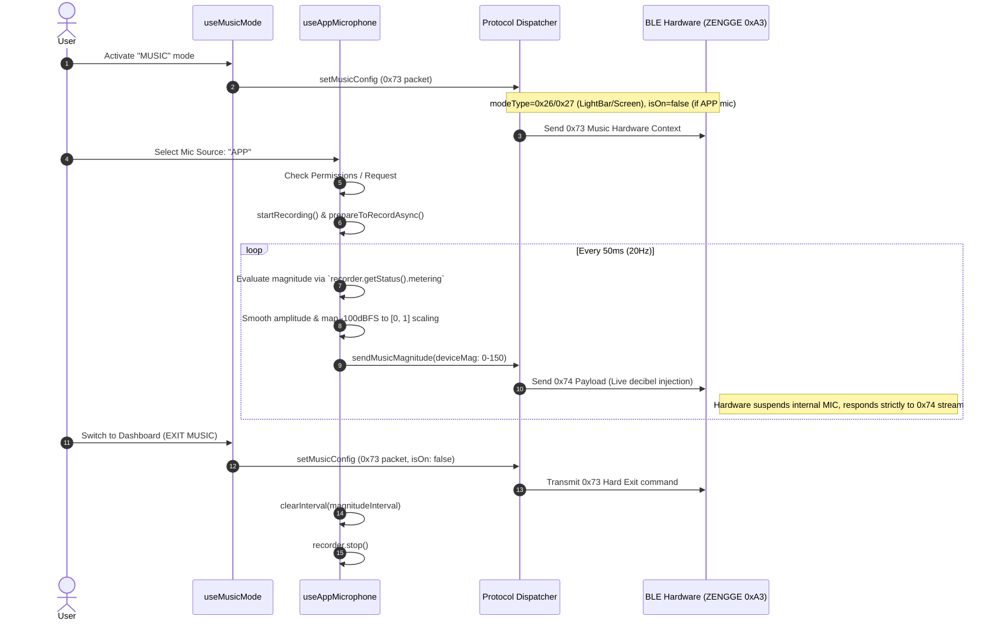
```mermaid
sequenceDiagram
    autonumber
    actor User
    participant UMM as useMusicMode
    participant UAM as useAppMicrophone
    participant Disp as Protocol Dispatcher
    participant BLE as BLE Hardware (ZENGGE 0xA3)
    
    User->>UMM: Activate "MUSIC" mode
    UMM->>Disp: setMusicConfig (0x73 packet)
    Note over Disp, BLE: modeType=0x26/0x27 (LightBar/Screen), isOn=false (if APP mic)
    Disp->>BLE: Send 0x73 Music Hardware Context
    
    User->>UAM: Select Mic Source: "APP"
    UAM->>UAM: Check Permissions / Request
    UAM->>UAM: startRecording() & prepareToRecordAsync()
    loop Every 50ms (20Hz)
        UAM->>UAM: Evaluate magnitude via `recorder.getStatus().metering`
        UAM->>UAM: Smooth amplitude & map -100dBFS to [0, 1] scaling
        UAM->>Disp: sendMusicMagnitude(deviceMag: 0-150)
        Disp->>BLE: Send 0x74 Payload (Live decibel injection)
        Note right of BLE: Hardware suspends internal MIC, responds strictly to 0x74 stream
    end
    
    User->>UMM: Switch to Dashboard (EXIT MUSIC)
    UMM->>Disp: setMusicConfig (0x73 packet, isOn: false)
    Disp->>BLE: Transmit 0x73 Hard Exit command
    UAM->>UAM: clearInterval(magnitudeInterval)
    UAM->>UAM: recorder.stop()
```


<!-- CARTOGRAPHER_END: PATTERN_ENGINE -->

<!-- CARTOGRAPHER_START: CLOUD_FUNCTIONS -->

# 🗺️ CLOUD_FUNCTIONS Cartography

## 1. File Manifest

### Supabase Edge Functions (`supabase/functions/`)
* `supabase/functions/notify-crew-session/index.ts`: Edge function triggered via POST request that verifies JWT authorization and sends Expo push notifications to all active crew members when a new skate session begins.

### Database Migrations (`supabase/migrations/`)
* `migrations/20260413_...` to `20260614_...`: Core baseline migrations covering RLS policies, telemetry table construction (`telemetry_snapshots`, `user_lifetime_stats`, `crash_telemetry`), scraper daemons, hardware blacklisting, and admin account management (e.g. `delete_account`, `flush_telemetry`, `get_next_spot_to_enrich`).
* `migrations/20260616050801_fix_anonymous_telemetry.sql`: Initial fix attempt for the anonymous telemetry ingestion logic.
* `migrations/20260616053000_restore_anonymous_telemetry.sql`: Re-enables anonymous inserts for telemetry and crash reports via RLS bypass, and updates `flush_telemetry` to gracefully sink unauthenticated data into `telemetry_snapshots`.
* `migrations/20260617010000_sk8lytz_picks_admin_policy.sql`: Introduces an RLS policy ensuring only users with the `admin` role can manage `sk8lytz_picks`.
* `migrations/20260617_observatory_fixes.sql`: Patches `label_designs` by adding a `product_name` column and mitigates smallint overflow risks on `discovered_devices_telemetry` by upgrading telemetry version attributes to `integer`.

---

## 2. Blast Radius

* **Upstream Dependencies:**
  * Supabase Auth (GoTrue) — required for JWT validation inside edge functions and evaluating user IDs for RLS policies / `auth.uid()`.
  * Expo Push Notification API (`https://exp.host/--/api/v2/push/send`) — required for remote crew alerts.
  * Native PostgreSQL features — leverages PL/pgSQL, JSONB operators, and triggers.
* **Downstream Consumers:**
  * **Client Hooks/Services**: React Native code consuming RPCs via the Supabase client (e.g., `TelemetryService` triggering `flush_telemetry`, Admin panels querying `get_all_registered_devices`).
  * **Crew Hub**: Depends entirely on Edge Functions for triggering live real-time member alerts.
  * **Offline/Background Synchronization**: Depends on the database maintaining robust schema constraints and timestamp mapping.

---

## 3. Context Matrix

*Note: Since Cloud Functions are server-side, they do not directly consume React contexts. They interact with data mapped from the following client contexts:*
| Component | Consumed In Client / Services | Backend Runtime / Database Context | Purpose |
|---|---|---|---|
| **Edge Functions** | Client triggers function via HTTP POST using `AuthContext` (JWT). | Deno / Deno.serve edge runtime. | Asynchronous notifications and lightweight gateway logic. |
| **Telemetry** | `TelemetryService` flushes buffers. | PostgreSQL functions + RLS bypass. | Gathers usage metrics and hardware diagnostics. Handles authenticated profiles and anonymous sessions. |
| **Admin Controls** | Admin tools consume Security Definer RPCs via client calls. | PostgreSQL functions + `admin_audit_logs`. | Enables privileges for hardware administration, ban tracking, and telemetry review. |

---

## 4. Hook/Service I/O Registry

### `notify-crew-session` Edge Function
* **Endpoint:** `POST /functions/v1/notify-crew-session`
* **Headers:** `Authorization: Bearer <JWT>`
* **Inputs:** `{ crewId: string, sessionId: string, sessionName: string, leaderName: string }`
* **Outputs:** `JSON { sent: number }` (Status `200`) or error structure (Status `400/401/403/500`)
* **Side-Effects:** Verifies crew membership, queries `push_tokens`, maps to Expo push payloads, and posts them to Expo Push Servers.

### `flush_telemetry` RPC
* **Signature:** `public.flush_telemetry(payload JSONB)`
* **Permissions:** Security Definer.
* **Outputs:** `void`
* **Side-Effects:** If `auth.uid()` exists, aggregates numbers into `user_lifetime_stats`. If anonymous, dumps performance metrics into `telemetry_snapshots`.

### `delete_account` RPC
* **Signature:** `public.delete_account()`
* **Permissions:** Target user only (`auth.uid()`).
* **Outputs:** `void`
* **Side-Effects:** Triggers cascading deletions across telemetry, devices, presets, sessions, and `auth.users`.

### Admin RPCs (`resolve_crash_signature`, `admin_ban_user`, etc.)
* **Permissions:** Restricted to users where role = 'admin'.
* **Outputs:** Varies (`void` or data sets).
* **Side-Effects:** Soft deletes records, logs to `admin_audit_logs`, or updates `hardware_blacklist`.

---

## 5. OS Variance Matrix

| Aspect | iOS Behavior | Android Behavior |
|---|---|---|
| **Expo Push Notifications** | Handled natively by APNs via Expo. No local UI channel setup required. | Requires explicit assignment to `channelId: "crew-alerts"` in the Edge Function payload to correctly route the visual notification in Android 8.0+. |

---

## 6. Sequence Diagram

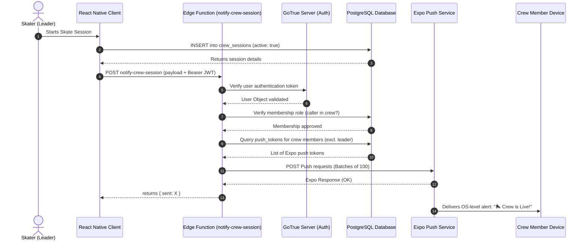
```mermaid
sequenceDiagram
    autonumber
    actor Skater as Skater (Leader)
    participant Client as React Native Client
    participant Edge as Edge Function (notify-crew-session)
    participant Auth as GoTrue Server (Auth)
    participant DB as PostgreSQL Database
    participant Expo as Expo Push Service
    participant Member as Crew Member Device

    Skater->>Client: Starts Skate Session
    Client->>DB: INSERT into crew_sessions (active: true)
    DB-->>Client: Returns session details
    Client->>Edge: POST notify-crew-session (payload + Bearer JWT)
    Edge->>Auth: Verify user authentication token
    Auth-->>Edge: User Object validated
    Edge->>DB: Verify membership role (caller in crew?)
    DB-->>Edge: Membership approved
    Edge->>DB: Query push_tokens for crew members (excl. leader)
    DB-->>Edge: List of Expo push tokens
    Edge->>Expo: POST Push requests (Batches of 100)
    Expo-->>Edge: Expo Response (OK)
    Edge-->>Client: returns { sent: X }
    Expo->>Member: Delivers OS-level alert: "🛼 Crew is Live!"
```

---

## 7. Architectural Impact Flags

* **`[IMPACTS_USER_JOURNEY]`**: Changes to Edge Function triggers directly alter the speed and reliability of how members discover and join active sessions.
* **`[IMPACTS_C4_CONTEXT]`**: The `notify-crew-session` relies heavily on an external dependency (Expo Push Server).
* **`[IMPACTS_STATE_CHART]`**: Anonymous vs authenticated branches within `flush_telemetry` dictate database logging paths without disrupting client-side app states.


<!-- CARTOGRAPHER_END: CLOUD_FUNCTIONS -->

<!-- CARTOGRAPHER_START: THEME_&_ASSETS -->

# THEME & ASSETS Domain Cartography

## 1. File Manifest
- **`src/theme/theme.ts`**: Defines the global Design System, Dark/Light mode color palettes (Blue/Orange brand colors), typography (`Righteous` font), spacing layout, and shadow utilities.
- **`src/styles/DashboardStyles.ts`**: Centralized stylesheet for the main dashboard UI, implementing the 4-Slab layout, fluid scaling, and dynamic pattern gradients based on state/theme.
- **`src/constants/AppConstants.ts`**: Contains fundamental global application constants, storage key prefixes, and maximum hardware speed limits (e.g., `HW_SPEED_MAX`).
- **`src/constants/ControlsRegistry.ts`**: Defines the registry of administrative/developer UI controls (Governance, Hardware, Behavior, DangerZone) and their metadata (types, risk levels, default values).
- **`src/constants/bleTimingConstants.ts`**: Centralizes all hardcoded millisecond delay values for the BLE read/write pipeline, tuning connection stabilization, MTU retries, and chunking for the ZENGGE 0xA3 chipset.
- **`src/constants/storageKeys.ts`**: Exhaustive registry of all `AsyncStorage` keys used throughout the application, providing a single source of truth for local persistence domains.
- **`src/assets/images/*`**: Contains a library of static binary image assets (mostly PNGs) used for preset previews, scene banners, and visualization elements.

## 2. Blast Radius
- **Imports**: `react-native` (`StyleSheet`, `Platform`, `ViewStyle`, `TextStyle`).
- **Imported By**: Practically the entire UI layer depends on `theme.ts` and `DashboardStyles.ts`. BLE services and managers depend heavily on `bleTimingConstants.ts` to manage timing safely. State management and local storage hooks uniformly depend on `storageKeys.ts`. `ControlsRegistry.ts` is consumed by Admin and Developer Settings screens.

## 3. Context Matrix
- **Consumes**: The files in this domain are primarily pure TypeScript constants and utilities. They do not natively consume React Contexts themselves. However, utilities like `getPatternColors` and `createDashboardStyles` explicitly expect a `ThemePalette` which is provided via a `ThemeContext` from the consuming components.
- **Provides**: Exported constants, layout values, and `ThemePalette` definitions (DarkColors/LightColors) that are passed into Context providers (like `ThemeContext` or `ThemeProvider`) to broadcast globally.

## 4. Hook/Service I/O Registry
- **`getPatternColors` (`DashboardStyles.ts`)**:
  - **Inputs**: `patternName` (string, optional), `Colors` (ThemePalette, optional).
  - **Outputs**: Array of two hex color strings for gradient rendering.
  - **Side-effects**: None (Pure function).
- **`createDashboardStyles` (`DashboardStyles.ts`)**:
  - **Inputs**: `Colors` (ThemePalette), `windowHeight` (number), `windowWidth` (number).
  - **Outputs**: React Native `StyleSheet` object dynamically scaled based on dimensions.
  - **Side-effects**: None (Pure function).
- **`Shadows` & `TextShadows` Utilities (`theme.ts`)**:
  - **Inputs**: color (string), radius (number).
  - **Outputs**: `ViewStyle` or `TextStyle` objects with platform-specific shadow properties.
  - **Side-effects**: None.

## 5. OS Variance Matrix
- **Shadow Properties (`theme.ts`)**:
  - **iOS**: Uses `shadowColor`, `shadowOffset`, `shadowOpacity`, and `shadowRadius`.
  - **Android**: Heavily utilizes `elevation` for structural depth, though `shadowColor` is used in custom glow effects.
  - **Web**: Implements `textShadow` string formats and iOS-style standard shadow props.
- **BLE Timing Adjustments (`bleTimingConstants.ts`)**:
  - **Android MTU**: Specifies `MTU_RETRY_SETTLE_MS` (200ms) specifically for the Android-only MTU negotiation retry loop to prevent GATT layer overwhelming.
  - **Android GATT 133 Prevention**: `INTER_DEVICE_WRITE_GAP_MS` (50ms) explicitly prevents `writeCharacteristicWithoutResponse` collisions and buffer overflows on Android BT stacks during group write loops.

## 6. Design System & Token Manifest
- **Brand Colors**: SK8Lytz Brand Primary Blue (`#1B4279`), Orange (`#FF5A00`), Amber (`#FFB800`).
- **Palettes**: 
  - **Dark**: Background `#1B4279`, Surface `#245596`, Text `#FFFFFF`.
  - **Light**: Background `#EAEFF5`, Surface `#CBD6E2`, Text `#0A1C38`.
- **Typography**: Driven completely by the `Righteous` font family. Header (24px, uppercase), Title (16px), Body (14px), Caption (11px).
- **Spacing / Layout**: Steps from `xxs` (2px) to `giant` (64px) using an 8-point base grid system. Default padding is `Spacing.lg` (16px), border radius is `Spacing.xl` (24px).

## 7. Stale Documentation Archival
The following stale architectural documentation was found in the Master Reference (`SK8Lytz_App_Master_Reference.md`) and is flagged for archival:
- `Dashboard UI Layout (4-Slab Architecture)` `[MOVE_TO_ARCHIVE]`
- `One-Screen Setup Policy` `[MOVE_TO_ARCHIVE]`
- `@sk8lytz_theme` and `@sk8lytz_control_theme` keys `[MOVE_TO_ARCHIVE]` (Already migrated to `@Sk8lytz_ThemeMode` and `@Sk8lytz_ControlUITheme`).

## 8. Dynamic Theming Sequence
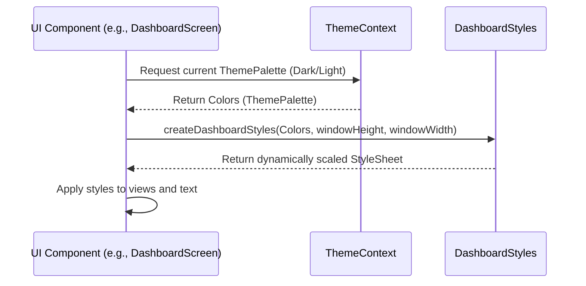
```mermaid
sequenceDiagram
    participant UI as UI Component (e.g., DashboardScreen)
    participant ThemeCtx as ThemeContext
    participant StyleGen as DashboardStyles
    
    UI->>ThemeCtx: Request current ThemePalette (Dark/Light)
    ThemeCtx-->>UI: Return Colors (ThemePalette)
    UI->>StyleGen: createDashboardStyles(Colors, windowHeight, windowWidth)
    StyleGen-->>UI: Return dynamically scaled StyleSheet
    UI->>UI: Apply styles to views and text
```

[IMPACTS_USER_JOURNEY]
[IMPACTS_C4_CONTEXT]


<!-- CARTOGRAPHER_END: THEME_&_ASSETS -->

<!-- CARTOGRAPHER_START: SIMULATION_&_MOCKS -->

# Architectural Cartography — SIMULATION_&_MOCKS Domain

## 1. File Manifest

This domain contains mock files, shims, and simulation frameworks that support testing (Jest), Web execution, and local development sandbox scenarios.

| File Path | Role / Scope | Architectural Purpose |
|:---|:---|:---|
| `src/mocks/react-native-vision-camera-worklets.web.js` | Web Shim | Exports an empty module interface to prevent bundler errors when importing native vision camera components in Expo Web. |
| `src/mocks/react-native-worklets.web.js` | Web Shim | Stub module representing `react-native-worklets-core` on Web. Exposes no-op mocks of `useSharedValue`, `useAnimatedStyle`, `runOnJS`, and `runOnUI` to allow UI rendering on browsers. |
| `src/__mocks__/LocationService.ts` | Jest Mock | Mocks the custom `LocationService` (providing dummy `getSilentLocation` and `requestLocationPermissions` stubs) for headless testing environments. |
| `src/__mocks__/expo-audio.ts` | Jest Mock | Stub mock for Expo Audio permission queries, returning `{ status: 'granted' }` by default. |
| `src/__mocks__/expo-location.ts` | Jest Mock | Stub mock for Expo Location capabilities. Returns mocked Overland Park, KS coordinates and permissions flags. |
| `src/__mocks__/sk8lytz-watch-bridge.ts` | Jest Mock | Mock for the custom Expo watch connectivity module. Simulates unreachable watch state, stubs metric updates, and returns dummy subscriptions for listeners. |

### Test Suites (`**/__tests__/*`)
The following unit and integration test suites form the verification network for this domain:
- **`components.test.ts`**: Verification suite asserting import syntax compliance.
- **`useControllerDispatch.test.ts`**: Protocol validation for color dispatches, patterns, emergency topologies (strips/rings), music App/Device modes, and power.
- **`useDashboardAutoConnect.test.ts`**: Validates the offline group map builder's handling of legacy scalar `group_id` fallback variables.
- **`useDeviceStateLedger.test.ts`**: Verifies debounced AsyncStorage saving and normalization of MAC addresses.
- **`ble-simulator.test.ts`**: Integration test asserting correct simulator response, checksum math, V2 packet wrapping, and 12-pixel buffer lockout protections.
- **`useBLEBatterySweep.test.ts`**: Invariant validation ensuring `stopDeviceScan()` is called before `startDeviceScan()`.
- **`useBLERSSIMonitor.test.ts`**: RSSI threshold constants and signal quality checks.
- **`useBLEScanner.test.ts`**: Web sandbox discovery logic.
- **`BanlanxAdapter.test.ts`**: Verifies byte-exact SP621E packet output and speed clamping limits.
- **`ControllerRegistry.test.ts`**: Prioritization logic and duplicate registration guards.
- **`PatternEngine.test.ts`**: Compact pattern (`0x51`) vs. multi-color pattern (`0x59`) generation.
- **`ZenggeProtocol.test.ts`**: Validates the static backward-compatibility facade, V2 header construction, and time sync payloads.
- **`HardwareSetupWizardScreen.test.tsx`**: Asserts Setup Wizard group array compliance and onboarding scan invariants.
- **`AppLogger.test.ts`**: Scrubbing assertions for MAC address and device ID PII.
- **`GroupRepository.test.ts`**: Group CRUD operations, bi-directional reference updates, and offline sync.
- **`SpeedTrackingService.offline.test.ts`**: Offline telemetry queueing and re-entrancy prevention.
- **`BleMachine.test.ts`**: XState machine transition checks (IDLE, SCANNING, CONNECTING, READY, RECOVERING, DISCONNECTING).
- **`ConnectService.test.ts`**: Connection priority setup, retry logic, GATT 133 refresh behavior, MTU negotiation, and abort handling.
- **`HeartbeatService.test.ts`**: Periodic 45s heartbeat dispatches, RSSI fallbacks, and recovery triggers.

---

## 2. Blast Radius (Imports & Exports)

```
[Internal Codebase API]  <─── Imports ───  [Jest Test Suites]
                                                  │
                                             Intercepts
                                                  ▼
                                         [src/__mocks__/*]
                                                  │
                                           Stubs/Resolves
                                                  ▼
                                            [Jest Engine]
```

### Imports
Mocks and shims import React/React Native core typings and platform-agnostic modules. Test suites import internal application components under test (e.g. `ZenggeProtocol`, `GroupRepository`, `BleMachine`, `useControllerDispatch`, `useBLEScanner`) and Jest testing frameworks.

### Exports & Consumers
- **Web Shims**: Injected during compilation via Metro bundler aliasing (`metro.config.js`) when targeting the browser platform.
- **Jest Mocks**: Automatically resolved by the Jest runner through path mappings in `jest.config.js` (`moduleNameMapper`) to prevent test crashes from missing native/Expo modules in headless CI runs.

---

## 3. Context Matrix

### React Context
Mocks, shims, and test files do not directly consume or provide React Contexts. Instead, they provide the base-level mock hooks or service stubs (e.g. `LocationService` or `WatchBridge`) that other Context Providers (like `AuthContext` or `TelemetryContext`) rely on.

### Execution Contexts
- **Web Compilation Context**: Executed in Expo Web builds. Native modules (`react-native-worklets-core`) are overridden with shims.
- **Testing Context**: Executed in Node.js/jsdom via Jest. Native bridge bindings are substituted with shims from `src/__mocks__`.

---

## 4. Hook/Service I/O Registry

### `react-native-worklets.web.js` Shim
- **`useSharedValue(initValue)`**
  - **Input:** `initValue: any`
  - **Output:** `{ value: initValue }`
- **`runOnJS(fn)` / `runOnUI(fn)`**
  - **Input:** `fn: Function`
  - **Output:** Returns `fn` synchronously.

### `LocationService.ts` Mock
- **`getSilentLocation()`**
  - **Input:** None.
  - **Output:** `Promise<null>`
- **`requestLocationPermissions()`**
  - **Input:** None.
  - **Output:** `Promise<false>`

### `expo-location.ts` Mock
- **`getCurrentPositionAsync()`**
  - **Input:** None.
  - **Output:** `Promise<{ coords: { latitude: 38.9, longitude: -94.6, accuracy: 10 } }>`
- **`reverseGeocodeAsync(coords)`**
  - **Input:** `{ latitude, longitude }`
  - **Output:** `Promise<[{ city: 'Overland Park', region: 'KS', name: 'SkateCity OP' }]>`

### `sk8lytz-watch-bridge.ts` Mock
- **`syncSessionState(state)`**
  - **Input:** `SessionState`
  - **Output:** `Promise<void>` (Resolves immediately)
- **`sendMetricUpdate(metrics)`**
  - **Input:** `MetricPayload`
  - **Output:** `Promise<void>` (Resolves immediately)
- **`isWatchReachable()`**
  - **Input:** None.
  - **Output:** `Promise<false>`
- **`addWatchCommandListener(cb)`**
  - **Input:** `(cmd: any) => void`
  - **Output:** `{ remove: () => void }` (Dummy subscription teardown)

---

## 5. OS Variance Matrix

| Execution Environment | Behavior / Path | Strategy / Invariant |
|:---|:---|:---|
| **iOS / Android (Native)** | Links and runs actual binaries (`react-native-worklets-core`, `react-native-vision-camera`, `sk8lytz-watch-bridge`). | Native execution is verified via Android device tests and emulator builds. |
| **Web Browser (Expo Web)** | Excluded from compilation. Imports are redirected to mock shims. | Custom `metro.config.js` interceptor prevents Webpack/Metro compilation crashes. |
| **Headless CI (Jest)** | Native hardware calls are fully intercepted. | `jest.config.js` maps imports to `src/__mocks__/*` to prevent GATT/OS-level crashes. |

- Android-specific code branching is validated in test suites (`ConnectService.test.ts` for MTU fallback negotiation and `useBLEBatterySweep.test.ts` for Android-specific scan client limits).

---

## 6. Sequence Diagram

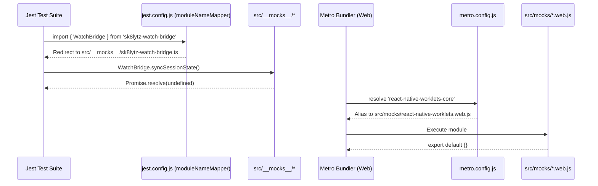
```mermaid
sequenceDiagram
    participant TestSuite as Jest Test Suite
    participant Mapper as jest.config.js (moduleNameMapper)
    participant Mock as src/__mocks__/*
    
    TestSuite->>Mapper: import { WatchBridge } from 'sk8lytz-watch-bridge'
    Mapper-->>TestSuite: Redirect to src/__mocks__/sk8lytz-watch-bridge.ts
    TestSuite->>Mock: WatchBridge.syncSessionState()
    Mock-->>TestSuite: Promise.resolve(undefined)
    
    participant WebBuild as Metro Bundler (Web)
    participant MetroConf as metro.config.js
    participant WebShim as src/mocks/*.web.js
    
    WebBuild->>MetroConf: resolve 'react-native-worklets-core'
    MetroConf-->>WebBuild: Alias to src/mocks/react-native-worklets.web.js
    WebBuild->>WebShim: Execute module
    WebShim-->>WebBuild: export default {}
```

---

## Architectural Impact Flags
- `[IMPACTS_BUILD_PIPELINE]`
- `[IMPACTS_DEVELOPER_EXPERIENCE]`
- `[IMPACTS_TESTING_INFRASTRUCTURE]`

---

## Archival Instruction
- **Stale Documentation**: Keep reference entries in `docs/SK8Lytz_App_Master_Reference.md` updated.
- `[MOVE_TO_ARCHIVE]`: Older descriptions of test configs and manual mocks in `docs/SK8Lytz_App_Master_Reference.md` (lines 5780-5995) should be moved to archive once updated cartography is synced.


<!-- CARTOGRAPHER_END: SIMULATION_&_MOCKS -->

<!-- CARTOGRAPHER_START: BUILD_CONFIG -->

# BUILD_CONFIG Domain Cartography

## 1. File Manifest
- `app.config.js`: Dynamic Expo configuration file defining app identity, OS permissions, release profiles, EAS config, and platform-specific compiler properties.
- `eas.json`: Expo Application Services configuration file defining cloud-build environments (`development`, `preview`, `production`) and submission channels.
- `metro.config.js`: React Native Metro bundler configuration, customized with web-platform resolution shims to prevent native module crashes on web.
- `babel.config.js`: Babel compiler configuration utilizing the `babel-preset-expo` and registering the `react-native-worklets-core/plugin` for high-performance JSI threading.
- `tsconfig.json`: TypeScript compiler configuration, extending `expo/tsconfig.base`, enforcing strict mode, and defining path aliases (e.g. `sk8lytz-watch-bridge`).
- `jest.config.js`: Jest test runner configuration, configuring Expo presets, ignore patterns, and module mocks for local native modules.
- `package.json`: NPM package configuration that defines workspace scripts, project dependencies, and Native/Expo modules required for the build.
- `.husky/pre-commit`: Git pre-commit hook enforcing worktree-safe execution of the blast-radius scanner, babel syntax gate, and ESLint checks.
- `.husky/pre-push`: Git pre-push hook enforcing the zero-bypass `verifiable-check-runner.js` and `npm audit` safety protocol gates before remote sync.

## 2. Blast Radius
- **Imports**: This domain inherently imports core build and formatting CLI tools (Expo, Jest, ESLint, TypeScript, Husky, Metro, Babel).
- **Imported By**: The entire application infrastructure. The compiler, bundler, and IDE environments continuously read these configs to govern syntax, native module compilation, OS deployment, and environment boundaries.

## 3. Context Matrix
*N/A — As a system configuration domain, no React Contexts are consumed or provided here. This domain establishes the static compilation environment under which React operates.*

## 4. Hook/Service I/O Registry
*N/A — No runtime hooks or application services exist in this domain. However, the Git hook pipeline (Husky) performs strict I/O validation over the source code via scripts like `blast-radius-scanner.js` and `babel-syntax-gate.js` prior to commit.*

## 5. OS Variance Matrix
Code paths and configuration properties that branch explicitly between iOS and Android:
- **iOS (`app.config.js`)**:
  - `infoPlist` configures explicit background modes: `location`, `bluetooth-central`.
  - Defines rigorous privacy descriptions for microphone, camera, health data, and background location to pass App Store review.
  - Requires a specific Apple Targets plugin (`@bacons/apple-targets`) for companion app integrations.
- **Android (`app.config.js`)**:
  - Specifies 23 deep-level device permissions ranging from `BLUETOOTH_CONNECT` to `ACTIVITY_RECOGNITION` and Health Connect properties.
  - Controls build properties overriding the standard Expo template: `minSdkVersion: 26`, `compileSdkVersion: 36`, `targetSdkVersion: 36`.
  - Forces `enableJetifier: false`.
  - Implements custom `extraProguardRules` specifically for `@react-native-ble-plx`, `rxandroidble2`, and `react-native-vision-camera`.

## 6. Elite Directives Mapping
- **Release Channel Configurations (`eas.json`)**:
  - `development`: Configured with `developmentClient: true`, `internal` distribution, and an `apk` build type for Android sideloading.
  - `preview`: Disables the development client; outputs `apk` for Android and utilizes Simulator builds (`simulator: true`) for iOS testing.
  - `production`: Configured to output an `app-bundle` (.aab) for the Google Play Store and triggers standard App Store Connect production submission.
- **EAS Update Logic (`eas.json` & `app.config.js`)**:
  - Bound to `eas.projectId: "30f5cc5f-d918-40ea-b095-420e8355a3f8"`.
  - `eas.json` restricts the CLI toolchain (`>= 16.0.0`), links `appVersionSource` to `remote`, and strictly requires commits (`requireCommit: true`) before performing updates.
- **Native Module Requirements (`package.json` & `app.config.js`)**:
  - Heavy native integrations utilize `@expo/config-plugins`: `@bacons/apple-targets`, `react-native-health`, `react-native-health-connect`, `react-native-ble-plx`.
  - Also incorporates a custom un-published local module `sk8lytz-watch-bridge` linked via file path in `package.json` and path aliases in `tsconfig.json`.
- **TypeScript Compiler Flags (`tsconfig.json`)**:
  - Inherits foundational mapping via `expo/tsconfig.base`.
  - Enforces `"strict": true` globally to eliminate implicit `any` and force null-checking.
  - Restricts compilation paths strictly via `"exclude"`, blocking compilation on `web-build`, `tools`, `scratch`, `supabase/functions`, and `.local-builder`.

## 7. Archival Instruction
**[MOVE_TO_ARCHIVE]**
Stale documentation detected in `SK8Lytz_App_Master_Reference.md` under "Build Config & Troubleshooting > Android Build Requirements".
- The Master Reference incorrectly claims `enableJetifier=true` and SDK `34`.
- The actual source of truth (`app.config.js`) explicitly sets `enableJetifier: false`, `compileSdkVersion: 36`, and `targetSdkVersion: 36`.

## 8. Architectural Impact Flags
[IMPACTS_C4_CONTEXT]

## 9. Husky Pre-Commit & Pre-Push Workflow
```mermaid
sequenceDiagram
    participant User
    participant Git as Git (Husky)
    participant PreCommit as pre-commit
    participant BlastRadius as blast-radius-scanner
    participant BabelGate as babel-syntax-gate
    participant ESLint as ESLint
    participant PrePush as pre-push
    participant Verify as verifiable-check-runner
    
    User->>Git: git commit
    Git->>PreCommit: Execute Hook
    PreCommit->>BlastRadius: node tools/blast-radius-scanner.js
    BlastRadius-->>PreCommit: Pass
    PreCommit->>BabelGate: Validate Staged Files syntax
    BabelGate-->>PreCommit: Pass
    PreCommit->>ESLint: npx eslint (staged files)
    ESLint-->>PreCommit: Pass
    PreCommit->>PreCommit: npm run verify
    PreCommit-->>Git: Commit Allowed
    
    User->>Git: git push
    Git->>PrePush: Execute Hook
    PrePush->>Verify: node tools/verifiable-check-runner.js --verify
    Verify-->>PrePush: Pass (TSC + Jest)
    PrePush->>PrePush: npm audit
    PrePush-->>Git: Push Allowed
```


<!-- CARTOGRAPHER_END: BUILD_CONFIG -->

<!-- CARTOGRAPHER_START: OS_PERMISSIONS -->

# 🗺️ Codebase Cartography: OS_PERMISSIONS Domain

## 1. File Manifest
- **`android/app/src/main/AndroidManifest.xml`**: Main Android application manifest specifying package configurations, services, activities, intent filters, and required hardware features and OS-level permissions.
- **`app.config.js`**: Core Expo configuration file generating metadata and platform settings, including iOS `Info.plist` usage descriptions and Android permission arrays.
- **`targets/watch/Info.plist`**: Plist file for the watchOS companion target, currently defining a skeleton dictionary structure.
- **`src/services/PermissionService.ts`**: Centralized service managing native iOS/Android permissions requests and runtime checks, overlaid with an AsyncStorage-backed app-level opt-out ledger.
- **`src/components/modals/GlobalPermissionsModal.tsx`**: A globally controlled Modal overlay that mounts the `PermissionsOnboardingScreen` dynamically in response to `DeviceEventEmitter` events.
- **`src/components/permissions/GranularPermissionsList.tsx`**: Presentational list mapping all app permissions (required Bluetooth and optional Location, Camera, Microphone, Notifications, Health) to custom UI cards with description copy, status badges, setting redirections, and switches.
- **`src/screens/Onboarding/PermissionsOnboardingScreen.tsx`**: Onboarding view introducing users to permission options, auto-requesting core Bluetooth access, and validating that required permissions are granted before continuing.
- **`src/hooks/useDockedPermissions.ts`**: Component hook gating the visibility of specific docked control panel modes (Camera and Street/Location) based on current permission status.
- **`src/hooks/useAppMicrophone.ts`**: Audio utility hook validating and requesting Microphone permission before initiating recording presets and streaming 20Hz magnitude payloads to hardware.
- **`src/components/CameraTracker.tsx`**: Ambient color-sampling component validating and requesting Camera permission prior to launching frame processors.
- **`src/services/LocationService.ts`**: Dynamic GPS service utilizing Foreground location to capture spot coordinates, local crews, and venue geocodes.
- **`src/services/session/HealthService.ts`**: Fitness telemetry service polling health metrics (heart rate, calories) after verifying iOS Apple HealthKit or Android Health Connect permissions.
- **`src/services/NotificationService.ts`**: Local/push notification provider verifying permissions and fetching Expo push tokens to sync with the Supabase backend.
- **`src/hooks/useBLE.ts`**: Primary Bluetooth LE orchestration engine responsible for requesting system Bluetooth permissions during scan/connect routines.

---

## 2. Blast Radius
### Upstream Imports (Dependencies)
The `OS_PERMISSIONS` domain imports and depends upon:
- **`react-native`**: Core platform bindings including `PermissionsAndroid` (Android requests/checks), `Platform` (OS-specific routing), `Linking` (settings app redirection), and `DeviceEventEmitter` (reactive events).
- **`@react-native-async-storage/async-storage`**: Persists the app-level soft-revoke permissions opt-out ledger (`@sk8lytz_permissions_optout`).
- **`expo-audio`**: Native microphone permission getters and request methods.
- **`expo-location`**: Native GPS foreground permission handlers.
- **`expo-notifications`**: Push and local notification authorization APIs.
- **`react-native-health`** (iOS only): Initializes Apple HealthKit connection client.
- **`react-native-health-connect`** (Android only): Connects to Google Health Connect API database.
- **`react-native-vision-camera`**: Provides camera runtime permission verification.

### Downstream Consumers (Dependents)
The following files import `PermissionService` or rely directly on its states:
- **`PermissionsOnboardingScreen.tsx`** & **`GlobalPermissionsModal.tsx`**: Prompts permissions during initial setup.
- **`GranularPermissionsList.tsx`**: Main settings control list.
- **`useDockedPermissions.ts`**: Filters active modes on the Docked menu.
- **`useAppMicrophone.ts`**: Restricts music magnitude streaming to the skates.
- **`CameraTracker.tsx`**: Restricts the Vision Camera color/vibe picker.
- **`LocationService.ts`**: Restricts map display and nearby crew search.
- **`HealthService.ts`**: Controls telemetry uploads to Apple Health / Health Connect.
- **`NotificationService.ts`**: Gates push token registration.
- **`useBLE.ts`** & **`BluetoothGuard.tsx`**: Locks the application if Bluetooth is disabled or unauthorized.

---

## 3. Context Matrix
The permissions system uses a decentralized event-driven design rather than consuming heavy React Contexts, preventing system-wide re-render cascade failures:
- **`ThemeContext`**: Consumed by permission presentation components (`PermissionsOnboardingScreen`, `GranularPermissionsList`) to style toggle cards, badges, and warnings depending on theme modes.
- **`SafeAreaInsetsContext`**: Consumed by onboarding screen layout bounds.
- **Reactive Events**:
  - `SHOW_GLOBAL_PERMISSIONS_EVENT`: Emitted by service consumers to launch the global onboarding modal wrapper.
  - `GLOBAL_PERMISSIONS_CLOSED_EVENT`: Emitted by the onboarding wrapper on dismissal to resolve the initial request promise.
  - `PERMISSION_STATUS_CHANGED_EVENT`: Emitted by the ledger manager on toggle to update observers (e.g. `useDockedPermissions`, `DockedDock`) reactively.

---

## 4. Hook/Service I/O Registry
### `PermissionService.ts`
- **`openGlobalPermissionsModal()`**
  - *Inputs*: None.
  - *Outputs*: `Promise<void>` (resolves when modal closes).
  - *Side-effects*: Emits `SHOW_GLOBAL_PERMISSIONS_EVENT`; subscribes to `GLOBAL_PERMISSIONS_CLOSED_EVENT`.
- **`getOptOutLedger()`**
  - *Inputs*: None.
  - *Outputs*: `Promise<Record<PermissionType, boolean>>` (opt-out statuses from AsyncStorage).
- **`setPermissionOptOut(type: PermissionType, isOptedOut: boolean)`**
  - *Inputs*: `type` (target permission type), `isOptedOut` (boolean state).
  - *Outputs*: `Promise<void>`.
  - *Side-effects*: Writes JSON payload to `@sk8lytz_permissions_optout`; logs immutable event (`PERMISSION_OPT_IN` or `PERMISSION_OPT_OUT`) to cloud ledger; emits `PERMISSION_STATUS_CHANGED_EVENT`.
- **`checkPermission(type: PermissionType)`**
  - *Inputs*: `type` (target permission type).
  - *Outputs*: `Promise<boolean>` (whether permission is allowed).
  - *Logic*: Check app opt-out ledger first. If opted out, return `false` instantly without hitting native OS layers. Otherwise, perform native system check.
- **`requestPermission(type: PermissionType)`**
  - *Inputs*: `type` (target permission type).
  - *Outputs*: `Promise<boolean>` (verdict of request).
  - *Side-effects*: Prompts native dialog; triggers inline side-effects (e.g., `notificationService.init(true)` upon granting push notifications).

### `useDockedPermissions`
- **`useDockedPermissions(isVisibilityAllowed)`**
  - *Inputs*: `isVisibilityAllowed` callback check.
  - *Outputs*: `{ hiddenModes: string[], recheckPermissions: () => void, requestModePermission: (mode) => Promise<boolean> }`.
  - *Side-effects*: Reacts to `AppState` transitions and `PERMISSION_STATUS_CHANGED_EVENT` to refresh array of blocked modes.

---

## 5. OS Variance Matrix
Platform architectures bifurcate permissions handling between iOS and Android:

| Feature / Permission | iOS Implementation | Android Implementation | Rationale / Source of Truth |
|---|---|---|---|
| **Bluetooth (LE)** | Implicit CoreBluetooth prompt on first scan. iOS keys: `NSBluetoothAlwaysUsageDescription`, `NSBluetoothPeripheralUsageDescription` | Dynamic checks depending on SDK: <br/>• **Android 12+ (SDK >= 31)**: Requests `BLUETOOTH_SCAN`, `BLUETOOTH_CONNECT`, and `ACCESS_FINE_LOCATION` in a single batch. <br/>• **Android < 12**: Requests `ACCESS_FINE_LOCATION`. | **R-22 & VS-005**: FCF1 controller chipsets advertise UUID inside `mServiceData` instead of `mServiceUuids`. The Android BLE scanner must execute an unfiltered `null` scan to see them, which strictly requires location permissions. |
| **Camera** | Handled natively by iOS during initialization; returns `true` for checks. | Requests `PermissionsAndroid.PERMISSIONS.CAMERA` at runtime. | Standard React Native vision camera permission APIs. |
| **Microphone** | Uses native iOS AV session hooks. | Uses `PermissionsAndroid.PERMISSIONS.RECORD_AUDIO`. | Required for magnitude frequency extraction. |
| **Health Telemetry** | Queries Apple HealthKit (`react-native-health`). Reads `HeartRate`, `ActiveEnergyBurned`; writes `Workout`. Always returns `true` for permission checks because iOS suppresses reading authorization status for privacy. | Queries Google Health Connect (`react-native-health-connect`). First checks `ACTIVITY_RECOGNITION` permission, then runs `initialize()` before request/checks to prevent coroutine thread crashes. | **PLATFORM PARITY NOTE (RISK-4)**: Apple HealthKit hides status checks (returning empty arrays instead of throwing error codes), while Android Health Connect crashes with `UninitializedPropertyAccessException` if checked without initialization. |
| **Notifications** | Standard iOS APNs push registration. | Standard registration + configures custom native channels (`crew-alerts`, `session-reminders`) with custom high-importance vibration and color patterns. | Android 8.0+ requires specific notification channel mapping strings to play vibration and alert sounds. |
| **Storage Permissions** | None (scoped storage). | Checks `READ_EXTERNAL_STORAGE` and `WRITE_EXTERNAL_STORAGE` strictly up to SDK 32 (`maxSdkVersion="32"`). | Android 13+ (SDK 33) deprecated general storage access permissions in favor of granular photo/media pickers. |

---

## 6. Sequence Diagram
Below is the execution flow when a component requests a permission check or request sequence:

```mermaid
sequenceDiagram
    autonumber
    participant UI as React Component
    participant PS as PermissionService (JS)
    participant AS as AsyncStorage (Ledger)
    participant OS as Native Operating System

    UI->>PS: checkPermission(type)
    PS->>AS: Read `@sk8lytz_permissions_optout`
    AS-->>PS: Return Opt-Out Ledger (boolean map)
    
    alt App-Level Opted Out (Soft-Revoked)
        PS-->>UI: return false (Do not prompt OS)
    else Ledger Allowed (Not Opted Out)
        PS->>OS: Execute Native Status Check
        OS-->>PS: return Native Status (Granted/Denied)
        
        alt Native Granted
            PS-->>UI: return true
        else Native Denied / Undetermined
            PS-->>UI: return false
        end
    end

    Note over UI, OS: Requesting Permission Flow
    UI->>PS: requestPermission(type)
    PS->>OS: Trigger Native Request Dialog
    OS-->>PS: User action result (Granted/Denied)
    
    alt User Allowed Native Access
        PS->>AS: setPermissionOptOut(type, false)
        PS->>PS: Log telemetry event "PERMISSION_OPT_IN"
        PS-->>UI: return true
    else User Denied Native Access
        PS->>AS: setPermissionOptOut(type, true)
        PS->>PS: Log telemetry event "PERMISSION_OPT_OUT"
        PS->>OS: Display OS App Settings redirection alert
        PS-->>UI: return false
    end
```

---

## 7. Stale Documentation & Archive Instructions
The following legacy documentation has been marked for archival:
- **`docs/SK8Lytz_App_Master_Reference.md` (Line 1212)**:
  `- **OS Sync**: syncSystemPermissions() runs on boot/foreground to reconcile the ledger with native OS settings. If OS is "Denied", App ledger is forced to "Opt-Out".` **[MOVE_TO_ARCHIVE]**
  *Reason for Archival:* The `syncSystemPermissions()` routine has been completely deprecated in `PermissionService.ts` because running it aggressively on cold boot caused 'Undetermined' native OS states to evaluate as false, locking fresh app installs out of permissions before they could even be prompted.

---

## 8. Architectural Impact Flags
Since this cartography analysis is strictly read-only and no code changes were executed, none of the architectural flags are triggered:
- `[IMPACTS_USER_JOURNEY]` - **Inactive** (No modifications to permission screens or wizard UX).
- `[IMPACTS_C4_CONTEXT]` - **Inactive** (No modifications to backend telemetry or service schemas).
- `[IMPACTS_STATE_CHART]` - **Inactive** (No modifications to the `BleMachine` or `SessionMachine` state pathways).


<!-- CARTOGRAPHER_END: OS_PERMISSIONS -->

<!-- CARTOGRAPHER_START: ADMIN_&_TELEMETRY -->

# 🗺️ ADMIN & TELEMETRY Domain Cartography

**Generated by SDE Cartographer Node**

## 1. File Manifest
*   **`src/services/appLogger/AppLoggerService.ts`**: The central telemetry singleton orchestrator. Performs event buffering, PII obfuscation, high-frequency event debouncing, and in-memory trace collection via `FlightRecorder`.
*   **`src/services/appLogger/AppLoggerStorage.ts`**: Handles offline-first persistence of the telemetry buffer utilizing `AsyncStorage`, guaranteeing log survival across cold starts with buffer size limits.
*   **`src/services/appLogger/AppLoggerCloud.ts`**: Orchestrates VIP telemetry routing and chunked log ingestion to Supabase (`telemetry_snapshots`, `telemetry_errors`, `crash_telemetry`), validating against the `global_telemetry_enabled` setting.
*   **`src/services/AppSettingsService.ts`**: Service for reading and writing asynchronous global hardware configurations and admin preferences directly to device storage.
*   **`src/hooks/useAdminSettings.ts`**: React Hook serving as a bridge to `AppSettingsService`, facilitating optimistic UI updates with automatic rollback on persistence failure.
*   **`src/hooks/useAdminTelemetry.ts`**: Domain hook exposing structured log arrays, analytics statistics, cloud uploading routines, and JSON export utilities to diagnostic interfaces.
*   **`src/hooks/useDiagnosticLog.ts`**: Diagnostic React Hook implementing an opcode coverage "Oracle". It traces BLE TX/RX transmissions and persists test verdicts per opcode to AsyncStorage.

## 2. Blast Radius
*   **What this domain imports**:
    *   `src/services/supabaseClient.ts`: For telemetry database ingestion.
    *   `@react-native-async-storage/async-storage`: For offline persistence.
    *   `expo-device` / `expo-battery`: For capturing hardware context (model id, battery state).
    *   `src/utils/FlightRecorder.ts`: For application-wide breadcrumb state generation.
    *   `useProtocolDispatch` / `useProtocolBuilder`: Imported by diagnostic hooks to transmit raw BLE payloads.
*   **What imports this domain**:
    *   **Globally Consumed**: The `AppLogger` singleton is imported by virtually every file (screens, contexts, hooks, services, and utils) for structured error tracking and performance analytics.
    *   **Admin Tools**: Admin dashboard tabs (e.g., `AdminTab`, `Sk8LytzDiagnosticLab`, `AdminAuditLogViewer`) consume `useAdminTelemetry`, `useAdminSettings`, and `useDiagnosticLog` to populate their respective UI views.

## 3. Context Matrix
*   **Contexts Provided**:
    *   *None.* This domain operates primarily through localized React state hooks (e.g., `useAdminTelemetry`) and global Singletons (`AppLoggerService`), intentionally avoiding the creation of new React Context providers to minimize re-render scope.
*   **Contexts Consumed**:
    *   `useDiagnosticLog` implicitly consumes the hardware context via `useProtocolDispatch` to execute live tests against the connected controller.

## 4. Hook / Service I/O Registry
| Module / Method | Inputs | Outputs | Side-Effects |
| :--- | :--- | :--- | :--- |
| `AppLoggerService.log()` | `event: EventType`, `payload: object` | `Promise<void>` | Filters PII, leaves breadcrumbs, debounces. Queues standard logs to `AsyncStorage`. VIP events bypass queue and sync to Cloud instantly. |
| `AppLoggerCloud.uploadTelemetrySnapshots()` | `buffer: LogEntry[]`, `sessionId`, `userId`, `onSuccess` | `Promise<void>` | Evaluates `global_telemetry_enabled`. If true, chunks logs into 500-entry batches and executes network insert to `telemetry_snapshots`. Triggers storage cleanup on success. |
| `AppSettingsService.updateSetting()` | `key: string`, `value: AppSettingsValue` | `Promise<boolean>` | Modifies keys within the `STORAGE_APP_SETTINGS` JSON payload in `AsyncStorage`. |
| `useAdminSettings()` | `visible: boolean` | `{ appSettings, isLoading, updateSetting }` | Mutates local state optimistically. Rolls back and refetches if `AppSettingsService.updateSetting` fails. Emits `HARDWARE_CONFIG_CHANGED` telemetry. |
| `useAdminTelemetry()` | `visible: boolean` | `{ logs, stats, isUploading, uploadLogs, exportLogs }` | Triggers chunked Supabase syncs. Initiates OS-level `Share` sheet for JSON exports. Mutates local rendering states. |
| `useDiagnosticLog()` | `visible`, `liveRxPayload`, `targetDeviceId` | `{ logs, testLog, coverage, setVerdict, transmit }` | Writes verdicts to `AsyncStorage` (`VERDICT_LOG_KEY`). Dispatches raw bytes over BLE and maintains session TX/RX trace queue. |

## 5. OS Variance Matrix
| Feature | OS Variance / Branching | Resolution |
| :--- | :--- | :--- |
| **Hardware ID Extraction** | `Device.osInternalBuildId` differs heavily between iOS and Android. | Unified fallback: `Device.osInternalBuildId \|\| Device.modelId \|\| 'unknown'`. Identifiers are deterministically regex-sanitized (`/[^a-zA-Z0-9_-]/g`) before ingestion. |
| **Battery Context** | Platform capabilities mismatch or asynchronous OS permission denials. | Wrapped in `try/catch` with `Battery.isAvailableAsync()`. Defaults to `-1` and `false` for low-power mode to prevent crashing the telemetry payload builder. |
| **Log Persistence** | iOS vs Android storage caps inside SQLite/File abstractions. | Enforced 500-log `CHUNK` limit logic in `AppLoggerStorage` and cloud upload iterators to prevent out-of-memory errors on limited OS environments. |

## Archival Review
> **Master Reference Status**: Verified. Existing stale references (e.g., the legacy monolithic `src/services/AppLogger.ts`, the deprecated `@sk8lytz_logs` key, and legacy configuration direct-reads) have already been successfully tagged with `[MOVE_TO_ARCHIVE]` in `SK8Lytz_App_Master_Reference.md`. No new legacy patterns were discovered during this cartography sweep.

## Architectural Impact Flags
`[IMPACTS_USER_JOURNEY]` - Admin telemetry dictates how user load times, feature adoption, and screen navigation are recorded for UX iteration.
`[IMPACTS_C4_CONTEXT]` - `AppLoggerCloud` strictly governs the system's boundary and relationship with the external Supabase observability cluster.

## Sequence Diagram: AppLogger Telemetry Pipeline
```mermaid
sequenceDiagram
    participant UI as Application (UI/BLE)
    participant AL as AppLoggerService
    participant AS as AppLoggerStorage
    participant AC as AppLoggerCloud
    participant SB as Supabase (Cloud)

    UI->>AL: log(event, payload)
    
    rect rgb(40, 40, 40)
    note right of AL: 1. Scrub PII & Throttle
    AL->>AL: Filter High-Freq (500ms debounce)
    AL->>AL: obfuscate() PII removal
    AL->>AL: FlightRecorder.leaveBreadcrumb()
    end

    alt Event is CRITICAL (e.g., ERROR_CAUGHT)
        AL->>AS: push() & persist()
        AL->>AC: pushFastLaneError()
        AC->>SB: Insert (telemetry_errors & crash_telemetry)
    else Standard Event
        AL->>AL: Queue in pendingLogQueue
        note right of AL: 100ms Timeout
        AL->>AS: push() to memory & batch persist()
    end

    opt Manual or Scheduled Cloud Sync
        UI->>AL: uploadLogsToSupabase()
        AL->>AS: getBuffer()
        AL->>AC: uploadTelemetrySnapshots(buffer)
        AC->>AS: get(STORAGE_APP_SETTINGS)
        alt global_telemetry_enabled == true
            AC->>SB: Insert to telemetry_snapshots (Chunks of 500)
            SB-->>AC: Success Ack
            AC->>AS: Slice successful count from buffer & persist()
        else Disabled
            AC->>AS: Wipe buffer entirely & persist()
        end
    end
```


<!-- CARTOGRAPHER_END: ADMIN_&_TELEMETRY -->

<!-- CARTOGRAPHER_START: DEPENDENCY_AUDIT -->

# DEPENDENCY_AUDIT Cartography

## 1. File Manifest
- **`package.json`**: Root project manifest declaring package scripts, dependencies, devDependencies, and package overrides to secure transitive dependencies.
- **`package-lock.json`**: Dependency tree lockfile ensuring deterministic builds and exact version resolution across CI and local development environments.

## 2. Blast Radius
- **Imports**: N/A (Defines external dependencies).
- **Imported By**: The entire project depends on this domain. It governs node_modules resolution, native module linking (e.g., `sk8lytz-watch-bridge`), Husky pre-commit hooks, and CI/CD pipeline verifiable checks (`npm run verify`).

## 3. Context Matrix
- **Consumed**: None.
- **Provided**: None.

## 4. Hook/Service I/O Registry
- **Inputs**: None.
- **Outputs**: None.
- **Side-effects**: Governs `postinstall` patch-package application and `prepare` Husky hook installation.

## 5. OS Variance Matrix
- **iOS/Android Code Paths**: 
  - Scripts explicitly fork OS execution: `"android": "expo run:android"` vs `"ios": "expo run:ios"`.
  - OS-Specific Dependencies: `@bacons/apple-targets` exclusively impacts iOS targets.

## Archival Instruction
`[MOVE_TO_ARCHIVE]` - `docs/SK8Lytz_App_Master_Reference.md` Line 6573 incorrectly lists `package.json` as having "102 lines" instead of the current 105 lines (v3.10.0).

## Architectural Impact Flags
*(No architectural surface changes introduced)*

## Sequence Diagram
```mermaid
sequenceDiagram
    actor Developer
    participant package.json
    participant package-lock.json
    participant npm
    Developer->>package.json: Add/Update dependency
    Developer->>npm: npm install
    npm->>package.json: Read requested versions
    npm->>package-lock.json: Resolve strict dependency tree
    npm->>Developer: Generate node_modules
```


<!-- CARTOGRAPHER_END: DEPENDENCY_AUDIT -->

---

## 5. Database Schemas

### Supabase Architecture (Telemetry & Registration)

_Project ID:_ `qefmeivpjyaukbwadgaz`

#### **`registered_devices`** (Hardened Schema — Updated 2026-04-22)

| Column                      | Type       | Purpose                                              |
| :-------------------------- | :--------- | :--------------------------------------------------- |
| `id`                        | TEXT (PK)  | Unique system identifier (MAC+userId composite)      |
| `device_mac`                | TEXT       | Unique hardware address (UPPERCASE)                  |
| `user_id`                   | UUID       | Owner ID                                             |
| `device_name`               | TEXT       | Custom alias                                         |
| `product_type`              | TEXT       | HALOZ / SOULZ / RAILZ                                |
| `led_points`                | INT        | Physical pixel count                                 |
| `segments`                  | INT        | Hardware mirror segments                             |
| `ic_type`                   | TEXT       | LED chipset (WS2812B, SK6812, etc.)                  |
| `color_sorting`             | TEXT       | RGB channel order (GRB, RGB, etc.)                   |
| `firmware_ver`              | INT        | Firmware version integer from BLE advertisement      |
| `led_version`               | INT        | LED version from BLE advertisement                   |
| `product_id`                | INT        | ZENGGE hardware product ID (0xA3=163 for all SK8Lytz)|
| `product_id_confirmed_at`   | TIMESTAMPTZ| When product_id was confirmed via BLE (added 2026-04-22)|
| `rf_mode`                   | TEXT       | RF remote auth policy                                |
| `rf_paired_count`           | INT        | Number of paired RF remotes                          |
| `group_id`                  | TEXT       | ⚠️ **LEGACY — do not use for new code.** Superseded by junction table `device_group_members`. Still present in cloud rows for backward compat. |
| `group_name`                | TEXT       | ⚠️ **LEGACY — do not use for new code.** Superseded by `registered_groups.group_name`. |
| `registered_at`             | TIMESTAMPTZ| First registration timestamp                         |
| `updated_at`                | TIMESTAMPTZ| Last modification timestamp                          |
| `rssi_at_register`          | INT        | Signal strength at registration                      |

> [!IMPORTANT]
> **Many-to-Many Migration (2026-05-28)**: Device-to-group membership is now stored in the `device_group_members` junction table (`device_id TEXT FK → registered_devices.device_mac`, `group_id TEXT FK → registered_groups.id`). The app-side `RegisteredDevice` object uses `group_ids: string[]` and `group_names: string[]` arrays. The `upsert_group_with_devices` RPC handles all atomic group mutations. Never write scalar `group_id` from new code.

#### **`product_catalog`** (Dynamic Hardware Definitions)

| Column                 | Type      | Purpose                  |
| :--------------------- | :-------- | :----------------------- |
| `id`                   | TEXT (PK) | Unique product key       |
| `display_name`         | TEXT      | Human-readable name      |
| `viz_shape`            | TEXT      | RING / OVAL / DUAL_STRIP |
| `battery_capacity_mah` | INT       | Rated capacity           |

#### **`skate_spots`** (Map Grounding)

| Column          | Type      | Purpose                               |
| :-------------- | :-------- | :------------------------------------ |
| `id`            | UUID (PK) | Unique spot ID                        |
| `name`          | TEXT      | Rink/Park name                        |
| `lat`           | DOUBLE    | Latitude                              |
| `lng`           | DOUBLE    | Longitude                             |
| `surface_type`  | TEXT      | `wood` / `concrete` / `sport_court`   |
| `is_indoor`     | BOOLEAN   | Indoor vs Outdoor                     |
| `source`        | TEXT      | `native_seed` / `osm` / `user_submit` |
| `is_verified`   | BOOLEAN   | Administrative verification status    |
| `facility_type` | TEXT      | `roller_rink`/`skatepark`/`pro_shop`  |
| `has_pro_shop`  | BOOLEAN   | Embedded pro shop indicator           |
| `is_featured`   | BOOLEAN   | Highlighted partner or rink           |
| `last_enriched_at`| TIMESTAMP | Last Cultural Daemon crawl timestamp  |
| `socials`       | JSONB     | Scraped Instagram/Facebook URLs       |
| `vibe_rating`   | DOUBLE    | Aggregate 5-star Google/Yelp rating   |
| `has_adult_night`| BOOLEAN  | Scraped confirmation of 18+ nights    |
| `has_lights`    | BOOLEAN   | OSM Tag: Night lighting               |
| `has_fee`       | BOOLEAN   | OSM Tag: Paid entry                   |
| `has_rental`    | BOOLEAN   | OSM Tag: Gear rental                  |
| `has_wifi`      | BOOLEAN   | OSM Tag: Public Wifi                  |

> [!NOTE]
> **Map Grounding Strategy**: Over 10,000 skate spots are horizontally harvested natively from OpenStreetMap (`tools/scraper/USANationalHarvest.ts`) populating coordinates, facility type, and physical properties. 

---

## 8. Data Pipelines & ETL (The Cultural Daemon)

The project leverages a decoupled, two-phase zero-cost backend to populate `skate_spots`.

### Wave 1: Spatial Harvesting (The Cartographer)
A fast, lightweight Node script (`USANationalHarvest.ts`) queries the OSM Overpass API state-by-state. It extracts coordinates, resolves full addresses via Nominatim, and maps physical boolean tags (`has_ac`, `has_food`, `capacity`) into Supabase in bulk.

### Wave 2: Cultural Enrichment (The Daemon) — RETIRED
The host PM2 process (`CulturalDaemon.ts`) was retired in the Great Consolidation (v3.9.1). All active scraping daemons (website-resolver, indexer, photographer, publisher) are now run directly as managed sub-processes under `CCTower.ts` inside the Docker Scraper Stack container (`sk8lytz-scraper-stack`).
- **The Priority Queue:** Daemons query the local SQLite pipeline database and push changes downstream via the `Publisher`.
- **The Engine:** We use Puppeteer and Google Shadow-DOM scraping managed via CCTower's dashboard interface.

### Wave 3: The AI Detective (Local LM Studio Pipeline)
A localized, schema-driven AI extraction pipeline that processes raw text dumps from deep-crawled websites.
- **The Brain:** LM Studio running locally (Llama-3 / Mistral model via OpenAI-compatible REST endpoint on port 1234). Ollama was permanently removed — see conversation `40767855`.
- **The Interface:** Phase 2 (Detective) dashboard tab provides **AI Target Vectors** toggle switches (e.g., General Hours, Adult Night, Pricing, House Rules).
- **The Config (SSOT):** `scraper_config.ai_target_vectors` stores the active extraction goals as a `text[]` array in Supabase.
- **The Indexer:** The AI Daemon (`Indexer.ts`) dynamically compiles the prompt using the active target vectors and forces the AI to reply strictly in JSON.

---

## 6. Crew Hub & Session Lifecycle

To ensure high-fidelity discovery and telemetry, the Crew Hub follows strict lifecycle and naming protocols.

### Session Naming Convention


### Proximity Discovery & Visibility Rules

Discovery radius filter governed by `LocationService.getNearbyPublicSessions(radiusMi)`.

### Global Session Lifecycle Cleanup

System-wide `cleanupExpiredSessions()` ends sessions older than 24h.

---

## 7. Session Telemetry Architecture

### Supabase Table: `skate_sessions`
| Column           | Type     | Notes                                   |
| ---------------- | -------- | --------------------------------------- |
| `duration_sec`   | `int4`   | Total session length                    |
| `distance_miles` | `float8` | Accumulated GPS distance                |
| `avg_speed_mph`  | `float8` | Mean speed                              |
| `peak_speed_mph` | `float8` | Maximum speed                           |
| `calories`       | `int4`   | Estimated via MET formula               |
| `skate_spot_id`  | `uuid`   | Foreign key linked to `skate_spots` PK  |

### Telemetry Storage Optimization (JSONB Consolidation)
To maximize query performance and eliminate cloud storage bloat, SK8Lytz utilizes a unified JSONB ingestion model, completely bypassing legacy flat-file chunking and fragmented Postgres tables.
- **Unified Ingestion (`telemetry_snapshots`)**: All hardware usage, BLE events, and functional telemetry logs are pipe-lined directly into `telemetry_snapshots` utilizing a generic `event_type` and a flexible `JSONB` `metadata` column.
- **GIN Indexing**: The `metadata` JSONB column features a full Postgres `GIN` index, enabling hyper-fast arbitrary querying on any nested diagnostic property without table mutations.
- **VIP Error Fast-Lane (`telemetry_errors`)**: Critical crashes (`ERROR_CAUGHT`, `PROTOCOL_ERROR`) completely bypass the standard Spool buffers. They are instantly asynchronously fired into a dedicated `telemetry_errors` table using isolated `try/catch` fallbacks, guaranteeing delivery even during OOM crashes or buffer failures.
- **Deduplication Strategy**: Multi-device hardware commands (e.g. groups) insert a single row with `device_id` as `null` while identifying targets in the `group_id` or `metadata->>'deviceIds'` array, preventing duplicate db row expansion.

---

## 8. Agentic PM Protocols (The Brain)

This project is governed by a custom-built **Agentic OS**—a suite of 38 strict protocols located in `.agents/rules/`.

### Tier 1: Safety, Precision & Stealth

| Rule                             | Function                                                  |
| :------------------------------- | :-------------------------------------------------------- |
| **Critical Safety & Quarantine** | Strict branching and rollback protocols.                  |
| **Surgical Strike Protocol**     | Mandates micro-edits and precision coding.                |
| **Absolute Truth**               | Eliminates hallucinations via mandatory reference audits. |

### Tier 5: Debugging, Hygiene & Maintenance

| Rule                      | Function                                           |
| :------------------------ | :------------------------------------------------- |
| **Emergency Debug Drill** | Enforces instrumentation over guess-fixing.        |
| **Boy Scout (Tech Debt)** | Mandates one small cleanup in every modified file. |
| **Supabase Schema Sync**  | Automatic type regeneration after DB changes.      |
| **Direct Merge Protocol** | (v1.8.0) Authorized to merge/push to master locally upon explicit user consent. |

---

## 9. Sentinel Engineering Governance (Workflow V6)

The SK8Lytz lifecycle is governed by the **Sentinel Engine**.

### 9.1 Legal Hardening (The Compliance Shield)
_Shipped: v1.8.0 | Mandatory for App Store Governance_

**App-Level Opt-Out Ledger**:
- **Source of Truth**: `@sk8lytz_permissions_optout` in AsyncStorage.
- **Behavior**: If a user revokes inside the app, the app "Soft-Revokes" (stops using the API) even if the OS says "Allowed".

**App Onboarding & Permissions UX**:
- **Bluetooth First, Notifications Last**: `BLUETOOTH` is prioritized as the supreme technical prerequisite for the `device` pipeline. `NOTIFICATIONS` acts solely as an enhancement (Session Invites) and must ALWAYS be requested last in the onboarding flow to respect user fatigue.
- **Prompt Isolation (`NotificationService`)**: Push notification initialization (`notificationService.init()`) is decoupled from app/dashboard mount to prevent rogue, mandatory OS prompts intercepting the UX. It is only fully initialized `init(true)` when explicitly granted by the user via the `GranularPermissionsList`.

**Immutable Audit Trail**:
- **AppLogger Dispatch**: Every permission change and EULA acceptance fires an immutable cloud event (`PERMISSION_OPT_IN`, `PERMISSION_OPT_OUT`, `EULA_ACCEPTED`) with a forced timestamp.
- **Legal Defense**: Provides a non-repudiable log of when a user accepted terms.

### 9.5 PII Scrubbing & Telemetry Hardening
_Shipped: v3.9.1 | Mandatory for GDPR/CCPA Compliance_

**Deterministic Hashing (`scrubPII`)**:
- **Source of Truth**: `src/utils/piiScrubber.ts`
- **Behavior**: Irreversibly hashes raw Bluetooth MAC addresses and sensitive strings using a deterministic 32-bit FNV-1a algorithm before they enter the telemetry stream (`AppLogger`).
- **Log Correlation**: The 8-character hex output (e.g., `a1b2c3d4`) allows engineering to correlate session failures and connection drops for a specific device without ever knowing its true identity or tracking it spatially.
- **Rule**: Variables named `mac` must NEVER be passed as raw payload values. Use `{ deviceId: scrubPII(mac) }`.

### Priority Hierarchy

1. **CRITICAL**: Stability & Security.
2. **HIGH**: Engineering Excellence.
3. **MEDIUM**: Compliance & Governance.
4. **LOW**: New Features.

### Mandatory Safety Governors

- **Safe-Commit Anchors**: Git restore points for `[H-RISK]` tasks.
- **The Senior Auditor**: Mandatory self-review pass before commit.
- **Devil's Advocate Gate**: Pre-mortem required for `[Feast]` items.

## 10. Environment & Build Ops

### Android Build Pipeline

- **Build Type**: `release` (assembleRelease).
- **Output Artifact**: `android\app\build\outputs\apk\release\SK8Lytz.apk`

### Known Dev Environment Limitations

- **Supabase Auth (SignUp)**: Signup operations via `auth/v1/signup` may return `400 Bad Request` in local web/emulator environments due to strict redirect URI validation or rate limiting on development shards. Use "Continue Offline" or existing test credentials for UI/UX validation.

### Wear OS Build Pipeline

- **Module Path**: `android/sk8lytzWear/` — standalone Gradle subproject compiled as a Wear OS APK
- **Gradle Injection**: `plugins/withWearOsModule.js` Expo config plugin injects `include ':sk8lytzWear'` into `settings.gradle` and `wearApp project(':sk8lytzWear')` dependency into `app/build.gradle` during `npx expo prebuild`
- **Bundling**: The watch APK is automatically bundled inside the phone APK on install (Google Play requirement for Wear OS companion apps)
- **Gitignore**: Root `.gitignore` contains `!/android/sk8lytzWear/` negation rule to prevent the `/android` exclusion from silently dropping watch files (see Victory Snapshot VS-002 in `safety-protocol.md`)

### watchOS Build Pipeline

- **Target Path**: `targets/watch/` — SwiftUI watch extension via Expo Targets
- **Config**: `targets/watch/expo-target.config.js` defines bundleId, deployment target, and HealthKit entitlements
- **Entitlements**: `com.apple.developer.healthkit`, `com.apple.developer.healthkit.background-delivery`
- **Info.plist Keys**: `NSHealthShareUsageDescription`, `NSHealthUpdateUsageDescription` (required for HealthKit access)

### Watch Bridge Module

- **Module Path**: `modules/sk8lytz-watch-bridge/` — custom Expo native module
- **Platforms**: iOS (Swift `WCSession`) + Android (Kotlin `DataClient`/`MessageClient`)
- **TypeScript Entry**: `modules/sk8lytz-watch-bridge/src/index.ts`
- **Jest Mock**: `src/__mocks__/sk8lytz-watch-bridge.ts` — prevents native module crashes in unit tests

---

> [!IMPORTANT]
> To remain active, every rule file MUST contain the `trigger: always_on` YAML frontmatter.


---

## 11. Wearable Companion Architecture

_Shipped: v3.8.2 | 2026-06-03 | Commits: `5bb33b90`..`392b7496` (7 commits, 2142 insertions, 39 files)_

### 11.1 Architecture Overview

SK8Lytz companion apps for **Wear OS** (Android) and **watchOS** (Apple Watch) provide real-time session status, health telemetry, and remote session control. Both companions follow a **Display + Relay** architecture — they mirror the phone's session state and relay on-wrist health sensor data back.

> [!IMPORTANT]
> **BLE LED control is NOT on the watch roadmap.** Sending Bluetooth BLE commands directly from the watch is out of scope. The watch is a session HUD and health relay only. All LED protocol commands originate exclusively from the phone app.

```
Phone (SK8Lytz App)          ◄────────────────►          Watch (Companion)
┌──────────────────┐         Data Layer API         ┌──────────────────┐
│ SessionContext    │ ─── speed, status, HR, cal ──► │ DashboardScreen  │
│ SpeedTracking     │          (push)               │ HealthTracker    │
│ useHealthTelemetry│ ◄── heartRate, calories ────── │ HR Sensor (5s)   │
│ WatchBridge module│         (relay)               │ MessageService   │
└──────────────────┘                                └──────────────────┘
```

#### The Three Components

| Component | Path | Language | Purpose |
|:----------|:-----|:---------|:--------|
| **watchOS companion** | `targets/watch/` | SwiftUI | Apple Watch app — session HUD, HealthKit workout, WCSession relay |
| **Wear OS companion** | `android/sk8lytzWear/` | Kotlin + Compose | Wear OS app — session HUD, Health Services ExerciseClient, DataLayer relay |
| **Expo bridge module** | `modules/sk8lytz-watch-bridge/` | Swift (iOS) + Kotlin (Android) + TypeScript | Cross-platform native bridge wiring watch events ↔ React Native |

---

### 11.2 watchOS Companion (`targets/watch/`)

Built with SwiftUI as an Expo Targets watch extension.

| File | Purpose |
|:-----|:--------|
| `index.swift` | App entry point |
| `ContentView.swift` | Main session dashboard UI — speed, HR, calories, elapsed time, start/stop button |
| `HealthManager.swift` | HealthKit `HKWorkoutSession` + `HKLiveWorkoutBuilder` lifecycle; continuous HR/cal sampling |
| `WatchConnectivityManager.swift` | `WCSessionDelegate` — receives phone state pushes, relays HR/cal back to phone |
| `expo-target.config.js` | Expo Targets configuration — bundleId, deploymentTarget, entitlements (HealthKit) |

**Key Architecture Decisions:**
- Uses `HKWorkoutSession` with activity type `.rollerSkating` (not figure skating) and location type `.outdoor`
- HealthKit entitlements: `com.apple.developer.healthkit`, `com.apple.developer.healthkit.background-delivery`
- `WCSession.sendMessage` relays `{ heartRate, calories }` back to phone every 5 seconds
- The watch auto-starts a HealthKit workout when it receives `status: "ACTIVE"` from the phone
- The watch can independently send `START_SESSION` / `STOP_SESSION` commands back to the phone

---

### 11.3 Wear OS Companion (`android/sk8lytzWear/`)

Built with Jetpack Compose for Wear OS.

| File | Purpose |
|:-----|:--------|
| `MainActivity.kt` | ComponentActivity entry point with Compose theme |
| `DashboardScreen.kt` | Session HUD — speed, HR, calories, elapsed timer, start/stop button (244 lines) |
| `WearMessageSender.kt` | Outbound `MessageClient` sender for START/STOP commands to phone |
| `WearableCommunicationService.kt` | Inbound `WearableListenerService` — receives phone state via DataLayer |
| `HealthTracker.kt` | Health Services `ExerciseClient` — continuous HR monitoring during active sessions |
| `theme/Theme.kt` | SK8Lytz dark theme (neon magenta + dark backgrounds) |

**Key Architecture Decisions:**
- Uses Health Services `ExerciseClient` with `ExerciseType.SKATING` (roller skating)
- Inbound data via `DataClient` DataLayer API (DataItems are durable, survive brief disconnects)
- Outbound commands via `MessageClient` (fire-and-forget, requires reachability)
- `HealthTracker` lifecycle: `startExercise()` on session start → `endExercise()` on session stop
- Heart rate relay: DataLayer sends `{ heartRate, calories }` on `/sk8lytz/watch-health` path every 5s
- The Wear OS module is injected into the Gradle build via `plugins/withWearOsModule.js` Expo config plugin

---

### 11.4 Watch Bridge Module (`modules/sk8lytz-watch-bridge/`)

A custom Expo native module providing the TypeScript API for phone↔watch communication.

**TypeScript API** (`src/index.ts`):

```typescript
WatchBridge.syncSessionState(state: WatchSessionState)     // Phone → Watch (session state push)
WatchBridge.sendMetricUpdate(metrics)                        // Phone → Watch (live metric snapshot)
WatchBridge.isWatchReachable(): Promise<boolean>             // Connection check
WatchBridge.addWatchCommandListener(handler)                 // Watch → Phone (START/STOP commands)
WatchBridge.addWatchHealthListener(handler)                  // Watch → Phone (HR/cal relay)
```

**Types:**

```typescript
interface WatchSessionState {
  speed?: number;
  heartRate?: number;
  calories?: number;
  startTime?: string; // ISO 8601
}

type WatchCommand = 'START_SESSION' | 'STOP_SESSION';

interface WatchHealthUpdate {
  heartRate: number;
  calories: number;
}
```

**Native Implementations:**
- **iOS** (`ios/Sk8lytzWatchBridgeModule.swift`): Uses `WCSession` for all communication
- **Android** (`android/.../Sk8lytzWatchBridgeModule.kt`): Uses `DataClient` (push state) + `MessageClient` (commands)
- **Mock** (`src/__mocks__/sk8lytz-watch-bridge.ts`): Jest mock for unit testing without native modules

---

### 11.5 Phone-Side Integration (SessionContext + SpeedTracking)

**SessionContext** (`src/context/SessionContext.tsx`):
- On session start: calls `WatchBridge.syncSessionState({ status: 'ACTIVE', startTime })`
- On session stop: calls `WatchBridge.syncSessionState({ status: 'STOPPED' })`
- Subscribes to `WatchBridge.addWatchCommandListener()` — watch can remotely start/stop sessions
- Subscribes to `WatchBridge.addWatchHealthListener()` — relays to `mergeWatchHealth()`

**SpeedTrackingService** (`src/services/SpeedTrackingService.ts`):
- Pushes live GPS speed to watch via `WatchBridge.sendMetricUpdate({ speed })` during active sessions
- Throttled to prevent BLE saturation

---

### 11.6 Health Data Priority Architecture (Watch-Preferred)

_Lives in: `src/hooks/useHealthTelemetry.ts` | Shipped: commit `392b7496`_

The health telemetry system implements a **watch-preferred** priority model:

🏃 Watch connected & sending data:
   Watch HR/cal —> mergeWatchHealth() —> ALWAYS writes to state
   Phone poll fires every 15s —> sees isWatchHealthActive() = true —> SKIPS
   Result: Dashboard HUD shows 5s-fresh watch sensor data

📱 Watch disconnected / out of range:
   No watch relay for 15s —> isWatchHealthActive() = false
   Phone poll resumes —> reads HealthKit (iOS) / Health Connect (Android)
   Result: Seamless fallback — no user intervention needed

| Property | Value |
|:---------|:------|
| Phone poll interval | 15 seconds |
| Watch relay interval | 5 seconds |
| Watch expiry timeout | 15 seconds (`WATCH_EXPIRY_MS`) |
| Priority logic | `lastWatchHealthMsRef` timestamp gating |
| Telemetry event | `phone_health_poll_deferred` logged when watch suppresses phone |

**Why watch wins:** The watch has a direct optical HR sensor on the wrist sampling every 1-5 seconds. Phone HealthKit/Health Connect polls synced data at 15s intervals — always staler. When both are available, the watch's real-time relay is the gold standard.

**Consumers of health data (all read from `useHealthTelemetry` state):**
- Dashboard HUD (controller top bar)
- Crew Hub session telemetry
- Street mode (G-force: phone accelerometer only — watch does NOT relay G-force)
- `skate_sessions` Supabase writes

> [!IMPORTANT]
> **GPS Speed and G-Force remain phone-only.** The watch does NOT relay GPS or accelerometer data to save battery. Speed comes from `expo-location` on the phone. G-force comes from `expo-sensors` on the phone. The phone pushes speed TO the watch for display only.

---


| Feature | Plan | Layer | Size | Platform |
|:--------|:-----|:------|:-----|:---------|
| Session Duration Timer | `tools/plans/PLAN-session-duration-timer.md` | UI | Snack | Both |
| watchOS Complications | `tools/plans/PLAN-watchos-complications.md` | UI | Snack | watchOS |
| Wear OS Tiles | `tools/plans/PLAN-wearos-tiles.md` | UI | Meal | Wear OS |
| Wear OS Always-On Display | `tools/plans/PLAN-wearos-always-on.md` | UI | Snack | Wear OS |
| Wear OS Ongoing Activity | `tools/plans/PLAN-wearos-ongoing-activity.md` | UI | Snack | Wear OS |

---

## 12. ZENGGE PROTOCOL BIBLE (Canonical Reference)

> [!IMPORTANT]
> The **authoritative** Zengge Protocol Bible lives in the standalone file:
> **`tools/ZENGGE_PROTOCOL_BIBLE.md`**
>
> That file is the single source of truth for all hardware opcodes, transport framing, EEPROM commands, chipset constraints, and Oracle Lab validation results. Do NOT duplicate protocol content here — reference the standalone Bible by section number (e.g., "See Protocol Bible §3 0x59" or "See Protocol Bible §11 Oracle Validation").
>
> **Last verified: 2026-06-06** — All opcode documentation, bug verdicts, and Oracle ground-truth findings are current in the standalone file.

> [!CAUTION]
> **DEDUPLICATION NOTE (2026-06-06):** The previous inline copy of the Protocol Bible (870+ lines) was removed from this file to eliminate drift risk. The standalone `ZENGGE_PROTOCOL_BIBLE.md` was diverging from the inline copy silently. All protocol lookups must reference the standalone file exclusively.


## 12. Auto-Compiled Domain Architecture

> [!NOTE]
> This section is strictly managed by the Google Antigravity /deepdive-docs Cartographer Fleet.

### Domain: IDENTITY
<!-- CARTOGRAPHER_START: IDENTITY -->

# 🗺️ Elite Architecture Cartography: IDENTITY Domain

This document maps the architectural landscape of the **IDENTITY** domain within the SK8Lytz application, covering authentication, profile management, and logical device ownership registration. 

## 1. File Manifest

Every file in the IDENTITY domain is mapped below with its specific architectural purpose:

| File Name | Location | Architectural Purpose |
| :--- | :--- | :--- |
| [AuthContext.tsx](file:///C:/Neogleamz/AG_SK8Lytz_App/SK8Lytz/src/context/AuthContext.tsx) | `src/context/` | Centralized React Context providing global auth states (`status`, `session`, `user`, `isOfflineMode`) and action dispatchers to eliminate duplicate Supabase client calls. |
| [AuthProfileService.ts](file:///C:/Neogleamz/AG_SK8Lytz_App/SK8Lytz/src/services/AuthProfileService.ts) | `src/services/` | Implements user profile CRUD operations, session history retrieval, and self-healing logic that updates database records from Supabase auth metadata. |
| [AuthUtils.ts](file:///C:/Neogleamz/AG_SK8Lytz_App/SK8Lytz/src/services/AuthUtils.ts) | `src/services/` | Standardized utilities for password complexity scores, blacklist scanning against the 100 worst passwords, HaveIBeenPwned API checking, and username profanity filtering. |
| [ProfileService.ts](file:///C:/Neogleamz/AG_SK8Lytz_App/SK8Lytz/src/services/ProfileService.ts) | `src/services/` | Facade barrel re-export aggregating sub-services (`AuthProfileService`, `CrewProfileService`, `PushTokenService`) to preserve backwards compatibility without call-site changes. |
| [ProfileService.types.ts](file:///C:/Neogleamz/AG_SK8Lytz_App/SK8Lytz/src/services/ProfileService.types.ts) | `src/services/` | Shared domain interface types (e.g., `UserProfile`, `PermanentCrew`, `SessionHistoryItem`) defining cross-file contracts and preventing circular dependencies. |
| [AccountModalSkeleton.tsx](file:///C:/Neogleamz/AG_SK8Lytz_App/SK8Lytz/src/components/account/AccountModalSkeleton.tsx) | `src/components/account/` | Custom visual placeholder showing pulse animations to mask layout hydration delays on profile modal loads. |
| [AccountModalStyles.ts](file:///C:/Neogleamz/AG_SK8Lytz_App/SK8Lytz/src/components/account/AccountModalStyles.ts) | `src/components/account/` | Style generator factory mapping unified UI dimensions, colors, input borders, button states, and tabs across the profile views based on active theme colors. |
| [AccountTabCrewz.tsx](file:///C:/Neogleamz/AG_SK8Lytz_App/SK8Lytz/src/components/account/AccountTabCrewz.tsx) | `src/components/account/` | Tab component offering crew creation, private room invite code validation, and list actions to delete or leave joined permanent crews. |
| [AccountTabDevices.tsx](file:///C:/Neogleamz/AG_SK8Lytz_App/SK8Lytz/src/components/account/AccountTabDevices.tsx) | `src/components/account/` | Tab view displaying paired BLE devices (fleet) grouped under customizable naming blocks and positional identifiers (Left vs. Right). |
| [AccountTabProfile.tsx](file:///C:/Neogleamz/AG_SK8Lytz_App/SK8Lytz/src/components/account/AccountTabProfile.tsx) | `src/components/account/` | User settings page offering username validation, display name editing, avatar photo upload selectors, and profile custom color range adjustments. |
| [AccountTabSecurity.tsx](file:///C:/Neogleamz/AG_SK8Lytz_App/SK8Lytz/src/components/account/AccountTabSecurity.tsx) | `src/components/account/` | Security controls rendering inputs for updating passwords, email redirection changes, and toggling granular device access permissions. |
| [AccountTabSettings.tsx](file:///C:/Neogleamz/AG_SK8Lytz_App/SK8Lytz/src/components/account/AccountTabSettings.tsx) | `src/components/account/` | Panel handling toggles for notification categories, Apple Health/Google Fit integrations, speed auto-pause rules, and account deletion gates. |
| [AccountTabStats.tsx](file:///C:/Neogleamz/AG_SK8Lytz_App/SK8Lytz/src/components/account/AccountTabStats.tsx) | `src/components/account/` | Overview screen integrating the wrapped stats panel alongside raw metrics tables, crew logs, and recent session trip logs. |
| [SkaterStatsPanel.tsx](file:///C:/Neogleamz/AG_SK8Lytz_App/SK8Lytz/src/components/account/SkaterStatsPanel.tsx) | `src/components/account/` | Skater profile metrics card (distance, top speed, hours skated, pattern/color time maps) which queries database columns and caches output locally. |
| [account.types.ts](file:///C:/Neogleamz/AG_SK8Lytz_App/SK8Lytz/src/components/account/account.types.ts) | `src/components/account/` | Component types mapping props and data exchange interfaces between the parent AccountModal and its tab views. |
| [AuthFooterActions.tsx](file:///C:/Neogleamz/AG_SK8Lytz_App/SK8Lytz/src/components/auth/AuthFooterActions.tsx) | `src/components/auth/` | Footer container rendering redirection action buttons to switch forms (Sign In, Sign Up, Recovery, Magic Link). |
| [AuthFormForgotPassword.tsx](file:///C:/Neogleamz/AG_SK8Lytz_App/SK8Lytz/src/components/auth/AuthFormForgotPassword.tsx) | `src/components/auth/` | Input form triggering recovery emails via the central AuthContext reset dispatchers. |
| [AuthFormSignIn.tsx](file:///C:/Neogleamz/AG_SK8Lytz_App/SK8Lytz/src/components/auth/AuthFormSignIn.tsx) | `src/components/auth/` | Login view validating input credentials (email, username), supporting credentials memory, and sending sign-in requests to Supabase. |
| [AuthFormSignUp.tsx](file:///C:/Neogleamz/AG_SK8Lytz_App/SK8Lytz/src/components/auth/AuthFormSignUp.tsx) | `src/components/auth/` | Registration view handling complexity bar updates, username validation checks, and registration sign-ups with initial user profiles. |
| [AuthHeader.tsx](file:///C:/Neogleamz/AG_SK8Lytz_App/SK8Lytz/src/components/auth/AuthHeader.tsx) | `src/components/auth/` | UI branding element displaying the SK8Lytz logo and neon header tags. |
| [AuthStyles.ts](file:///C:/Neogleamz/AG_SK8Lytz_App/SK8Lytz/src/components/auth/AuthStyles.ts) | `src/components/auth/` | Theme-reactive stylesheet containing borders, layout grids, cards, and input styling for all login/registration overlays. |
| [DevSandboxDrawer.tsx](file:///C:/Neogleamz/AG_SK8Lytz_App/SK8Lytz/src/components/auth/DevSandboxDrawer.tsx) | `src/components/auth/` | Expandable dev tool offering cache nuking, soft token resets, and mock BLE state triggers for debugging in development modes. |
| [useAccountOverview.ts](file:///C:/Neogleamz/AG_SK8Lytz_App/SK8Lytz/src/hooks/useAccountOverview.ts) | `src/hooks/` | Controller hook syncing profile settings, image uploads, notification updates, permission lookups, and crew list syncs inside the AccountModal. |
| [useDashboardProfile.ts](file:///C:/Neogleamz/AG_SK8Lytz_App/SK8Lytz/src/hooks/useDashboardProfile.ts) | `src/hooks/` | Dashboard interface hook managing profile data refreshes, global settings fetches, user suspension blocks, and modal visibility variables. |
| [useRegistration.ts](file:///C:/Neogleamz/AG_SK8Lytz_App/SK8Lytz/src/hooks/useRegistration.ts) | `src/hooks/` | thin React hook facade coordinating device registrations, position swaps, claim status checks, and local/remote repository syncing. |

---

## 2. Blast Radius (Import & Export Dependency Tree)

```mermaid
graph TD
    %% Outgoing Dependencies (Imports)
    subgraph OUTGOING ["Outgoing Imports (Dependencies Consumer)"]
        A_SEC["SecureStore (expo-secure-store)"]
        A_AS["AsyncStorage (react-native-async-storage)"]
        A_SUP["Supabase JS client"]
        A_PERM["PermissionService"]
        A_IMG["ImagePicker & FileSystem (expo)"]
        A_LOG["AppLogger"]
        A_SETT["AppSettingsService"]
    end

    %% The Identity Domain Files
    subgraph DOMAIN ["IDENTITY Domain"]
        D_CTX["AuthContext.tsx"]
        D_UTIL["AuthUtils.ts"]
        D_APSRV["AuthProfileService.ts"]
        D_FAC["ProfileService.ts (Facade)"]
        D_REG["useRegistration.ts (Hook)"]
        D_ACT["useAccountOverview.ts (Hook)"]
        D_DASH["useDashboardProfile.ts (Hook)"]
        D_COMP["Account/Auth UI Components"]
    end

    %% Incoming Dependencies (Consumers)
    subgraph INCOMING ["Incoming Consumers"]
        I_APP["App.tsx"]
        I_SCREEN["DashboardScreen.tsx"]
        I_BLE["BLEContext.tsx"]
        I_MODAL["AccountModal.tsx"]
        I_SYNC["useOfflineSyncWorker.ts"]
        I_CREW["useCrewHub.ts"]
    end

    %% Connecting incoming to domain
    I_APP --> D_CTX
    I_SCREEN --> D_DASH
    I_SCREEN --> D_REG
    I_MODAL --> D_ACT
    I_BLE --> D_REG
    I_SYNC --> D_CTX
    I_CREW --> D_CTX

    %% Domain internal routing
    D_CTX --> D_APSRV
    D_FAC --> D_APSRV
    D_REG --> D_FAC
    D_ACT --> D_FAC
    D_DASH --> D_FAC
    D_COMP --> D_CTX
    D_COMP --> D_ACT
    D_COMP --> D_UTIL

    %% Connecting domain to outgoing
    D_CTX --> A_SEC
    D_CTX --> A_AS
    D_CTX --> A_SUP
    D_CTX --> A_LOG
    D_APSRV --> A_SUP
    D_REG --> A_AS
    D_ACT --> A_PERM
    D_ACT --> A_IMG
    D_ACT --> A_AS
    D_DASH --> A_SETT
```

---

## 3. Context Matrix

The React Contexts provided and consumed within this domain are detailed below:

| Context Name | Provider File | Consumer Files (Domain) | Consumer Files (External) | Exposed Keys & Actions |
| :--- | :--- | :--- | :--- | :--- |
| **AuthContext** | [AuthContext.tsx](file:///C:/Neogleamz/AG_SK8Lytz_App/SK8Lytz/src/context/AuthContext.tsx) | `useAccountOverview.ts`, `useDashboardProfile.ts`, `SkaterStatsPanel.tsx`, `AuthFormSignIn.tsx`, `AuthFormSignUp.tsx`, `DevSandboxDrawer.tsx` | `App.tsx`, `BLEContext.tsx`, `SessionContext.tsx`, `useOfflineSyncWorker.ts`, `useCrewHub.ts`, `useCrewSession.ts` | `status` (finite state), `session`, `user`, `isOfflineMode`, `isAuthenticated`, `signIn()`, `signUp()`, `signOut()`, `updateUser()`, `setIsOfflineMode()` |
| **ThemeContext** | `src/context/ThemeContext.tsx` | `AuthStyles.ts`, `AccountModalStyles.ts`, all sub-tabs & components under `auth/` and `account/` | Core Screen containers, modals, visualizers | `Colors` (palette mapping), `isDark` (boolean), `toggleTheme()` |

---

## 4. Hook/Service I/O Registry

### 4.1 Hooks
#### `useAuth()`
* **Inputs**: None. (Must be wrapped in `<AuthProvider>`).
* **Outputs**: `AuthContextValue` (Status, Session, User, Offline Mode flag, Auth methods).
* **Side-Effects**: Subscribes to Supabase onAuthStateChange events; binds deep link URLs for magic link processing.

#### `useAccountOverview(visible: boolean, onProfileUpdated?: () => void)`
* **Inputs**:
  * `visible`: `boolean` (modal visibility state).
  * `onProfileUpdated`: `() => void` (optional callback run after profile changes).
* **Outputs**: Profile records, Crew list, History log, toggles (Health, Notifications, Auto-Pause), handlers (`handleSaveProfile`, `handleCreateCrew`, `handleJoinCrew`, etc.).
* **Side-Effects**: Queries local storage and permission status; dispatches file read streams for base64 image uploads to Supabase.

#### `useDashboardProfile(options: { onCrewJoinNotification: (id: string) => void })`
* **Inputs**:
  * `options`: Config object with deep-link push callbacks.
* **Outputs**: `userProfile`, active settings maps, `authUsername` (derived display identity), `handleLogout()`, modal toggles.
* **Side-Effects**: Listens to app state foreground changes to refresh app configurations; initiates push notification channel registrations.

#### `useRegistration()`
* **Inputs**: None.
* **Outputs**: `registeredDevices` array, loading state, claim tools (`checkDeviceClaimed`, `saveRegisteredDevice`, `deregisterDevice`, `swapDevicePositions`).
* **Side-Effects**: Binds database callbacks for automatic local-to-cloud device sync sweeps on reconnect.

---

### 4.2 Services
#### `authProfileService`
* **API Register**:
  * `fetchOrCreateProfile(user?: User | null): Promise<UserProfile | null>`
    * **Side-Effects**: Queries user metadata to populate empty database profile columns (Self-Healing).
  * `updateProfile(userId: string, fields: Partial<UserProfile>): Promise<void>`
    * **Side-Effects**: Updates Supabase profiles table; normalizes usernames to lowercase.
  * `getSessionHistory(userId?: string): Promise<SessionHistoryItem[]>`
    * **Side-Effects**: Performs inner-join queries on `crew_members` and `crew_sessions` tables.

#### `AuthUtils`
* **API Register**:
  * `checkPasswordComplexity(password: string): PasswordStrength`
  * `isCommonPassword(password: string): boolean`
  * `checkHIBP(password: string): Promise<{ pwned: boolean; count: number }>`
    * **Side-Effects**: Queries HIBP API (SHA-1 prefix range fetch).
  * `containsProfanity(text: string): boolean`

---

## 5. OS Variance Matrix

Specific code branches and behaviors that depend on the runtime operating system are outlined below:

```mermaid
grid
    %% Font Family Differences
    iOS Fonts: "Courier New" or "Menlo" for invite codes & developer screens (AccountModalStyles.ts:L44)
    Android Fonts: Defaults to standard system "monospace" for identical screens (AccountModalStyles.ts:L44)
    
    %% Web Wrappers & Containers
    Web Platform Support: Wraps Auth forms in semantic `<form>` tags to trigger standard browser password managers; Native iOS/Android renders standard fragments.
    Supabase Storage: Web uses browser localStorage as a fallback; Native platforms store JWT session tokens securely via expo-secure-store.

    %% Image Upload & Permissions
    iOS Camera Permissions: Expo ImagePicker prompts system permissions with native popups; requires permission plist entries.
    Android Camera Permissions: Uses Android manifest configurations for granular media storage access.

    %% Health App Integration
    Apple HealthKit: PermissionService invokes Apple Health permissions on iOS devices.
    Google Fit / Health Connect: PermissionService uses Android API bindings for health telemetry synchronization.
```

---

## 6. Complex Process Flows

### 6.1 Authentication Lifecycle & Offline Mode Bypass
This diagram maps the application start-up sequence, token validation, and the transition into offline bypass mode:

```mermaid
sequenceDiagram
    autonumber
    participant App as App Boot
    participant Secure as SecureStore
    participant Local as AsyncStorage
    participant Context as AuthContext Provider
    participant Srv as Supabase Auth
    participant UI as AuthScreen / Dashboard

    App->>Context: Initialize AuthProvider
    activate Context
    Context->>Secure: migrateAuthTokensToSecureStore()
    Secure-->>Context: Done
    Context->>Local: getItem(STORAGE_OFFLINE_SKIP)
    alt Offline skip is set to "true"
        Local-->>Context: "true"
        Context->>Context: setStatus("offline")
        Context->>UI: Render Dashboard in Offline Mode
    else Offline skip is missing
        Local-->>Context: null
        Context->>Srv: getSession()
        alt Active session exists
            Srv-->>Context: { session, user }
            Context->>Context: setStatus("authenticated")
            Context->>UI: Render Dashboard
        else No active session
            Srv-->>Context: null
            Context->>Local: getItem(STORAGE_LAST_EMAIL)
            alt Prior email found (Token expired)
                Local-->>Context: email
                Context->>Context: setStatus("expired")
                Context->>UI: Render AuthScreen (Re-auth)
            else No email found (New user)
                Local-->>Context: null
                Context->>Context: setStatus("unauthenticated")
                Context->>UI: Render AuthScreen
            end
        end
    end
    deactivate Context

    %% User clicks continue offline
    UI->>Context: User clicks "Continue Offline"
    Context->>Local: setItem(STORAGE_OFFLINE_SKIP, "true")
    Context->>Context: setStatus("offline")
    Context->>UI: Reroute to Dashboard
```

---

### 6.2 Profile Creation & Self-Healing Flow
This sequence maps how the profile is auto-populated and patched if database trigger errors result in missing attributes:

```mermaid
sequenceDiagram
    autonumber
    participant Modal as AccountModal (useAccountOverview)
    participant Srv as AuthProfileService
    participant DB as Supabase user_profiles Table
    participant Auth as Supabase Auth Metadata

    Modal->>Srv: fetchOrCreateProfile(user)
    activate Srv
    Srv->>DB: select(*) where user_id = user.id
    alt Profile row exists in DB
        DB-->>Srv: { user_id, username, display_name }
        alt username or display_name is NULL (Trigger Failed)
            Srv->>Auth: Read user.user_metadata
            Auth-->>Srv: { username: "sk8r1", display_name: "Skate Lord" }
            Srv->>DB: update(display_name, username) where user_id = user.id
            DB-->>Srv: OK
            Srv-->>Modal: Return Healed UserProfile
        else Profile is complete
            Srv-->>Modal: Return UserProfile
        end
    else Profile row does not exist in DB (Trigger Failed completely)
        Srv->>Auth: Read user.user_metadata & user.email
        Auth-->>Srv: username / email prefix
        Srv->>DB: insert({ user_id, display_name, username })
        DB-->>Srv: { UserProfile }
        Srv-->>Modal: Return Created UserProfile
    end
    deactivate Srv
```

---

### 6.3 Device Registration, Position Swapping & Naming Flow
This process shows device claims and how positioning labels (Left vs. Right) are swapped and saved:

```mermaid
sequenceDiagram
    autonumber
    participant UI as Screen / Wizard
    participant Hook as useRegistration
    participant Repo as DeviceRepository
    participant DB as Supabase user_devices Table

    UI->>Hook: checkDeviceClaimed(mac)
    Hook->>Repo: checkDeviceClaimed(mac)
    Repo->>DB: Check MAC ownership
    DB-->>Repo: unclaimed
    Repo-->>UI: "unclaimed" (Safe to register)

    %% User Registering Device
    UI->>Hook: saveRegisteredDevice(device)
    Hook->>Repo: saveDevice(device)
    Repo->>Repo: Save to local AsyncStorage
    Repo->>DB: Upsert device to user_devices
    alt Server online
        DB-->>Repo: Success
        Repo-->>UI: Success (Synced)
    else Server offline
        Repo->>Repo: Mark as "is_pending_sync"
        Repo-->>UI: Success (Local Only)
    end

    %% User Swapping Positions
    UI->>Hook: swapDevicePositions(mac1, mac2)
    Hook->>Repo: findDevice(mac1) & findDevice(mac2)
    Repo-->>Hook: Return devices
    Hook->>Hook: Swap positions (Left <=> Right)
    Hook->>Hook: Format names: NamingUtils.getDefaultDeviceName()
    Hook->>Repo: saveDevice(d1) & saveDevice(d2)
    Repo->>DB: Sync swapped positions
```

---

## 7. Stale Documentation & Historical Archive

### 7.1 Legacy References Marked for Archiving
The following references in the Master Reference describe legacy designs and should be archived:

* **Stale ProfileService DB Interactions**:
  * *Location*: `docs/SK8Lytz_App_Master_Reference.md` (legacy section outlining `ProfileService` DB REST writes).
  * *Correction*: Refactored under **Meal 1**. The monolithic profile service has been split; database transactions are owned exclusively by `AuthProfileService`, while `ProfileService` acts as a barrel re-export facade.
* **Realtime Profile Subscriptions**:
  * *Location*: `docs/SK8Lytz_App_Master_Reference.md` (references description of `useDashboardProfile` subscribing to database listeners).
  * *Correction*: Profile syncing runs reactively on app focus or manual refresh triggers; no realtime Supabase channel listener is established.

---

## 8. Architectural Impact Flags

This cartography session flags the following active architectural conditions:

* **`[DIRECT_DB_IN_UI]`**: Active. Direct database connections and calls to Supabase are present in components. Specifically, [SkaterStatsPanel.tsx](file:///C:/Neogleamz/AG_SK8Lytz_App/SK8Lytz/src/components/account/SkaterStatsPanel.tsx) performs direct table selection (`supabase.from('user_lifetime_stats')`), and [AuthFormSignIn.tsx](file:///C:/Neogleamz/AG_SK8Lytz_App/SK8Lytz/src/components/auth/AuthFormSignIn.tsx) triggers direct database RPC actions (`supabase.rpc('get_email_by_username')`).
* **`[TYPE_BYPASS]`**: None. All profile type definitions conform strictly to `UserProfile` types or the generated database schemas. No bypass type casting is utilized.
* **`[RLS_SHIM_ACTIVE]`**: None. Database queries connect through client anon credentials, with security restrictions controlled exclusively through Supabase's native database Row Level Security configurations.

<!-- CARTOGRAPHER_END: IDENTITY -->

### Domain: BLE_CORE
<!-- CARTOGRAPHER_START: BLE_CORE -->

# BLE Core Domain Cartography Deep-Dive

This document details the architectural landscape, data flows, and hardware-specific invariants of the Bluetooth Low Energy (BLE) Core domain within the SK8Lytz application. 

---

## 1. File Manifest

Every file in the BLE Core domain is mapped below with its specific architectural purpose:

| File Path | Architectural Purpose |
|:---|:---|
| [`src/services/BleCharacteristicCache.ts`](file:///c:/Neogleamz/AG_SK8Lytz_App/SK8Lytz/src/services/BleCharacteristicCache.ts) | Caches discovered GATT service/characteristic mappings (using AsyncStorage prefixed with `@sk8_gatt_`) with a 24-hour TTL to bypass slow discovery on reconnect. |
| [`src/services/BlePingService.ts`](file:///c:/Neogleamz/AG_SK8Lytz_App/SK8Lytz/src/services/BlePingService.ts) | Orchesrates a wizard-exclusive atomic connection session (Connect $\rightarrow$ Blink $\rightarrow$ Probe EEPROM $\rightarrow$ Disconnect) bypassing the connected device list. |
| [`src/services/BleSessionFactory.ts`](file:///c:/Neogleamz/AG_SK8Lytz_App/SK8Lytz/src/services/BleSessionFactory.ts) | Centralizes GATT connection, handles transient errors via backoff, enforces the discovery invariant, and resolves the correct protocol adapter from the cache/services. |
| [`src/services/BleWriteDispatcher.ts`](file:///c:/Neogleamz/AG_SK8Lytz_App/SK8Lytz/src/services/BleWriteDispatcher.ts) | Manages debounce states and chunking for color/pattern writes, enforcing a 50ms `INTER_DEVICE_WRITE_GAP_MS` delay to prevent Android GATT collisions. |
| [`src/services/BleWriteQueue.ts`](file:///c:/Neogleamz/AG_SK8Lytz_App/SK8Lytz/src/services/BleWriteQueue.ts) | Implements a priority-tiered FIFO queue (`critical`, `normal`, `bulk`) bounded at depth 8 with backpressure, retry loops, and generation-based stale pruning. |
| [`src/services/ble/BleMachine.ts`](file:///c:/Neogleamz/AG_SK8Lytz_App/SK8Lytz/src/services/ble/BleMachine.ts) | Root XState v5 state machine acting as the single source of truth for the radio's lifecycle (`IDLE`, `SCANNING`, `CONNECTING`, `READY`, `RECOVERING`, `DISCONNECTING`). |
| [`src/services/ble/BleMachine.types.ts`](file:///c:/Neogleamz/AG_SK8Lytz_App/SK8Lytz/src/services/ble/BleMachine.types.ts) | Type definitions for the XState lifecycle state machine, declaring contexts, events, states, and phase tags. |
| [`src/services/ble/ConnectService.ts`](file:///c:/Neogleamz/AG_SK8Lytz_App/SK8Lytz/src/services/ble/ConnectService.ts) | An XState promise actor that executes connection routing, MTU negotiations, connection priority shifts, time-sync handshakes, and notification bindings. |
| [`src/services/ble/RecoveryService.ts`](file:///c:/Neogleamz/AG_SK8Lytz_App/SK8Lytz/src/services/ble/RecoveryService.ts) | An XState callback actor executing a 3-phase reconnection sequence (exponential backoff GATT connection hammers followed by passive scanning). |
| [`src/services/ble/HeartbeatService.ts`](file:///c:/Neogleamz/AG_SK8Lytz_App/SK8Lytz/src/services/ble/HeartbeatService.ts) | An XState callback actor executing periodic (45-second) `0x63` liveness pings to detect silent drops and trigger the FSM recovery path on failure. |
| [`src/services/ble/InterrogatorService.ts`](file:///c:/Neogleamz/AG_SK8Lytz_App/SK8Lytz/src/services/ble/InterrogatorService.ts) | Manages hardware EEPROM probe requests (`0x63` metadata parsing), persisting profiles to AsyncStorage and limiting queue serialization to avoid GATT congestion. |
| [`src/services/ble/RSSIService.ts`](file:///c:/Neogleamz/AG_SK8Lytz_App/SK8Lytz/src/services/ble/RSSIService.ts) | Polls RSSI values at 30-second intervals to monitor signal strength, triggering proactive reconnection events if a device falls below the critical -82 dBm threshold. |
| [`src/hooks/useBLE.ts`](file:///c:/Neogleamz/AG_SK8Lytz_App/SK8Lytz/src/hooks/useBLE.ts) | Thin React hook wrapper compiling the XState machine root and exporting the unified `BluetoothLowEnergyApi` to the context layer. |
| [`src/hooks/useOptimisticBLE.ts`](file:///c:/Neogleamz/AG_SK8Lytz_App/SK8Lytz/src/hooks/useOptimisticBLE.ts) | Implements the "Ghost Standard" optimistic updating UI layer, executing lag-free interface changes and managing success/error haptic feedback. |
| [`src/hooks/ble/useBLEBatterySweep.ts`](file:///c:/Neogleamz/AG_SK8Lytz_App/SK8Lytz/src/hooks/ble/useBLEBatterySweep.ts) | Dynamically throttles background scan sweeps based on battery level (`FULL`, `THROTTLED`, `PAUSED`) and Android-specific scan budget intervals. |
| [`src/hooks/ble/useBLEInterrogator.ts`](file:///c:/Neogleamz/AG_SK8Lytz_App/SK8Lytz/src/hooks/ble/useBLEInterrogator.ts) | React hook wrapper exposing the interrogator profile state so UI components can re-render once hardware settings are parsed. |
| [`src/hooks/ble/useBLERSSIMonitor.ts`](file:///c:/Neogleamz/AG_SK8Lytz_App/SK8Lytz/src/hooks/ble/useBLERSSIMonitor.ts) | Exposes live RSSI values to update signal indicators on the dashboard and trigger alert actions. |
| [`src/hooks/ble/useBLEScanner.ts`](file:///c:/Neogleamz/AG_SK8Lytz_App/SK8Lytz/src/hooks/ble/useBLEScanner.ts) | Coordinates peripheral discovery, filters target devices, manages sandbox simulation, and dispatches telemetry to Supabase. |
| [`src/context/BLEContext.tsx`](file:///c:/Neogleamz/AG_SK8Lytz_App/SK8Lytz/src/context/BLEContext.tsx) | Establishes the `BLEContext.Provider` mapping the unified BLE API to the component tree. |

---

## 2. Blast Radius (Dependency Graph)

The diagram below outlines what files inside the BLE Core domain depend on, and what files depend on the BLE Core domain:

```mermaid
graph TD
    %% External dependencies
    RN_BLE["react-native-ble-plx"]
    AsyncStorage["AsyncStorage"]
    Haptics["expo-haptics"]
    Battery["expo-battery"]
    Supabase["SupabaseClient"]
    
    subgraph BLE Core Domain
        Context["BLEContext.tsx"]
        useBLE["useBLE.ts"]
        useOptimistic["useOptimisticBLE.ts"]
        useScanner["useBLEScanner.ts"]
        useBattery["useBLEBatterySweep.ts"]
        useInterrogatorHook["useBLEInterrogator.ts"]
        useRSSIMonitorHook["useBLERSSIMonitor.ts"]
        
        Machine["BleMachine.ts"]
        ConnectService["ConnectService.ts"]
        RecoveryService["RecoveryService.ts"]
        HeartbeatService["HeartbeatService.ts"]
        Interrogator["InterrogatorService.ts"]
        RSSIService["RSSIService.ts"]
        
        SessionFactory["BleSessionFactory.ts"]
        WriteQueue["BleWriteQueue.ts"]
        WriteDispatcher["BleWriteDispatcher.ts"]
        CharCache["BleCharacteristicCache.ts"]
    end
    
    %% UI Consumers
    Dashboard["DashboardScreen.tsx"]
    DockedController["DockedController.tsx"]
    SetupWizard["HardwareSetupWizardScreen.tsx"]
    DiagnosticLab["Sk8LytzDiagnosticLab.tsx"]
    ProgrammerModal["Sk8LytzProgrammerModal.tsx"]
    
    %% Domain Connections
    Context --> useBLE
    useBLE --> Machine
    Machine --> ConnectService
    Machine --> RecoveryService
    Machine --> HeartbeatService
    
    ConnectService --> SessionFactory
    RecoveryService --> SessionFactory
    SessionFactory --> CharCache
    SessionFactory --> RN_BLE
    
    useScanner --> useBattery
    useScanner --> useInterrogatorHook
    useScanner --> RN_BLE
    useBattery --> Battery
    useInterrogatorHook --> Interrogator
    useRSSIMonitorHook --> RSSIService
    
    WriteDispatcher --> WriteQueue
    WriteQueue --> RN_BLE
    useOptimistic --> WriteDispatcher
    
    CharCache --> AsyncStorage
    Interrogator --> AsyncStorage
    useScanner --> Supabase
    
    %% Out of Domain Imports
    Dashboard --> Context
    DockedController --> useOptimistic
    SetupWizard --> useScanner
    DiagnosticLab --> Context
    ProgrammerModal --> Context
```

---

## 3. Context Matrix

The following React contexts are provided or consumed within the BLE Core domain:

| React Context | Provided By | Consumed By | Purpose |
|:---|:---|:---|:---|
| `BLEContext` | `BLEProvider` in [`BLEContext.tsx`](file:///c:/Neogleamz/AG_SK8Lytz_App/SK8Lytz/src/context/BLEContext.tsx) | `useSharedBLE()` wrapper consumed across screens (`DashboardScreen`, `Sk8LytzDiagnosticLab`, `Sk8LytzProgrammerModal`). | Shares the unified `BluetoothLowEnergyApi` instance globally. |
| `RegistrationContext` | `RegistrationProvider` | [`BLEContext.tsx`](file:///c:/Neogleamz/AG_SK8Lytz_App/SK8Lytz/src/context/BLEContext.tsx) via `useRegistration()` hook | Retrieves the list of `registeredDevices` to compute `registeredMacs`, syncing connections dynamically. |

---

## 4. Hook/Service I/O Registry

### `useBLE`
- **Inputs**: `registeredMacs: string[]`
- **Outputs**: `BluetoothLowEnergyApi` (including `connectedDevices`, `bleState`, `writeToDevice`, `connectToDevices`, `disconnectAll`)
- **Side-Effects**: Initializes the core `bleMachine` XState instance, configures organic disconnect event listeners, and starts monitoring device connections.

### `useOptimisticBLE`
- **Inputs**: 
  - `writeToDevice: (payload: number[], targetDeviceId?: string) => Promise<boolean | 'partial'>`
  - `onReconcile?: () => void`
  - `debounceMs?: number`
  - `disableOptimisticUI?: boolean`
  - `disableHaptics?: boolean`
- **Outputs**: `optimisticWrite`, `directWrite`, `writeStatus`, `isPending`, `isReconciled`
- **Side-Effects**: Debounces rapid slider inputs, fires the `onOptimistic` callback immediately, updates state to `PENDING`, dispatches native writes via the queue, and triggers haptics (success/error) based on confirmation results.

### `useBLEBatterySweep`
- **Inputs**: 
  - `bleManager: BleManager | null`
  - `bleSend: (event: BleMachineEvent) => void`
- **Outputs**: `isSweeperActive`, `startSweeper`, `stopSweeper`, `burstScan`, `batteryTier`
- **Side-Effects**: Queries the physical battery state via `expo-battery`, schedules interval-based scan cycles to reduce radio duty cycles on low battery, and tracks Android-specific scan budget timestamps.

### `useBLEScanner`
- **Inputs**: 
  - `bleManager: BleManager | null`
  - `allDevices: Device[]`
  - `setAllDevices: Dispatch<SetStateAction<Device[]>>`
  - `bleSend: (event: BleMachineEvent) => void`
  - `registeredMacs: string[]`
  - `isSandboxEnabled?: boolean`
- **Outputs**: `pendingRegistrations`, `scanForPeripherals`, `stopScanner`, `burstScan`, `hwCache`
- **Side-Effects**: Enqueues peripheral discoveries, queries the geolocation provider for coordinates, batches discovery details, and schedules asynchronous background writes to push telemetry to Supabase.

### `BleWriteQueue`
- **Inputs**: 
  - `priority: WritePriority` (`critical` | `normal` | `bulk`)
  - `op: () => Promise<boolean | 'partial'>`
- **Outputs**: `Promise<boolean | 'partial'>`
- **Side-Effects**: Enforces single-operation execution locks on the native Bluetooth transmitter. Prunes stale events on generation mismatch, buffers up to 8 items before rejecting, and performs jittered retries on transient write collisions.

---

## 5. OS Variance Matrix

The codebase explicitly branches between iOS and Android paths to mitigate platform-specific hardware differences:

| Architectural Surface | iOS Behavior | Android Behavior | Code Source / File |
|:---|:---|:---|:---|
| **MTU Negotiation** | Bypassed. iOS ignores MTU queries and negotiates values (typically 185 bytes) internally. | Requests maximum MTU (`512` bytes) post-connection to allow bulk data chunk transfers. | [`ConnectService.ts`](file:///c:/Neogleamz/AG_SK8Lytz_App/SK8Lytz/src/services/ble/ConnectService.ts#L101-L107) |
| **Connection Priority** | Unsupported. iOS does not allow app-level priority configuration. | Requests `HIGH` connection priority on handshake for rapid service discovery, then falls back to `BALANCED`. | [`ConnectService.ts`](file:///c:/Neogleamz/AG_SK8Lytz_App/SK8Lytz/src/services/ble/ConnectService.ts#L109-L113) |
| **GATT Table Refreshing** | iOS automatically updates characteristic handle maps when service tables change. | Utilizes reflection-based `refreshGatt: 'OnConnected'` calls on reconnect retries to clear stale handle caches. | [`BleSessionFactory.ts`](file:///c:/Neogleamz/AG_SK8Lytz_App/SK8Lytz/src/services/BleSessionFactory.ts#L112-L114) |
| **Haptic Feedback** | Triggers standard CoreHaptics (`Light` / `Error`) via `expo-haptics`. | Triggers equivalent Android vibrator signals (guarded against Web/Simulator environments). | [`useOptimisticBLE.ts`](file:///c:/Neogleamz/AG_SK8Lytz_App/SK8Lytz/src/hooks/useOptimisticBLE.ts#L106-L108) |
| **Scan Budget Constraints** | iOS handles rapid scanning restarts natively without application throttle limits. | Restricts scans to a maximum of 4 restarts within 30 seconds to prevent OS-level background scanning bans. | [`useBLEBatterySweep.ts`](file:///c:/Neogleamz/AG_SK8Lytz_App/SK8Lytz/src/hooks/ble/useBLEBatterySweep.ts#L94-L113) |

---

## 6. XState FSM Transition Map

The diagram below visualizes the exact transitions of the centralized `BleMachine.ts` lifecycle orchestrator:

```mermaid
stateDiagram-v2
    [*] --> IDLE
    
    IDLE --> SCANNING : SCAN_START (Set sweeperId)
    IDLE --> CONNECTING : CONNECT_REQUEST (Set targetMacs)
    IDLE --> DISCONNECTING : DISCONNECT_REQUEST
    IDLE --> RECOVERING : RECOVERY_START (Set ghostedMacs)
    IDLE --> RESTORING : RESTORE_PERIPHERALS (Set targetMacs)
    
    SCANNING --> IDLE : SCAN_STOP (Clear sweeperId)
    SCANNING --> CONNECTING : CONNECT_REQUEST (Clear sweeperId + Set targetMacs)
    SCANNING --> DISCONNECTING : DISCONNECT_REQUEST (Clear sweeperId)
    SCANNING --> RECOVERING : RECOVERY_START (Set ghostedMacs)
    SCANNING --> SCANNING : SCAN_PAUSE (Stop Scan) / SCAN_RESUME (Start Scan)
    
    RESTORING --> CONNECTING : After 1000ms (Restore delay elapsed)
    
    CONNECTING --> READY : connectService onDone (Save connected devices)
    CONNECTING --> IDLE : connectService onError (Connection fail)
    CONNECTING --> RECOVERING : RECOVERY_START (Set ghostedMacs)
    CONNECTING --> DISCONNECTING : DISCONNECT_REQUEST
    
    READY --> RECOVERING : HEARTBEAT_FAIL (Set ghostedMacs)
    READY --> CONNECTING : CONNECT_REQUEST (Add new device to fleet)
    READY --> DISCONNECTING : DISCONNECT_REQUEST
    READY --> CONNECTING : RECOVERY_START [If group recovery: ghostedMacs >= 2]
    READY --> RECOVERING : RECOVERY_START [If single recovery: ghostedMacs < 2]
    READY --> IDLE : UPDATE_CONNECTED_DEVICES [If connected devices === 0]
    
    DISCONNECTING --> IDLE : DISCONNECT_COMPLETE (Clear devices + Clear ghostedMacs)
    
    RECOVERING --> READY : recoveryService onDone / RECOVERY_COMPLETE (Merge reconnected devices)
    RECOVERING --> CONNECTING : CONNECT_REQUEST (Abort recovery, run fresh connect)
    RECOVERING --> IDLE : RECOVERY_PERMANENTLY_FAILED (Device unreachable + notify user)
    RECOVERING --> IDLE : RECOVERY_FAIL (Clear ghostedMacs)
    RECOVERING --> DISCONNECTING : DISCONNECT_REQUEST
    
    %% Global overrides
    state IDLE {
        FORCE_IDLE --> IDLE
    }
    state SCANNING {
        FORCE_IDLE --> IDLE
    }
    state RESTORING {
        FORCE_IDLE --> IDLE
    }
    state CONNECTING {
        FORCE_IDLE --> IDLE
    }
    state READY {
        FORCE_IDLE --> IDLE
    }
    state DISCONNECTING {
        FORCE_IDLE --> IDLE
    }
    state RECOVERING {
        FORCE_IDLE --> IDLE
    }
```

---

## 7. BLE Transport Pipeline Map

This map outlines the flow of a write command from the user interface down to the native Bluetooth adapter:

```
[UI Component: Slider / Toggle]
       │
       ▼ (optimisticWrite / directWrite)
[useOptimisticBLE]
       │
       ▼ (writeToDevice)
[useBLE]
       │
       ▼ (enqueueWrite: normal / critical / bulk)
[BleWriteQueue]  ◄─── [Backpressure / Max Queue Depth: 8]
       │
       ▼ (dispatch write operation)
[BleWriteDispatcher] ◄── [Debounce Guard & 50ms Inter-Device Gap]
       │
       ▼ (resolve write targets via maps)
[ConnectService] / [BleCharacteristicCache]
       │
       ▼ (discoverAllServicesAndCharacteristics - Invariant)
[BleSessionFactory]
       │
       ▼ (writeCharacteristicWithResponse)
[react-native-ble-plx]
       │
       ▼ (GATT write packet over RF)
[Neogleamz Hardware Controller]
```

---

## 8. Connection & Recovery Lifecycle Sequence

The sequence diagram below shows how organic disconnect events, heartbeat failures, and active recovery backoffs are orchestrated:

```mermaid
sequenceDiagram
    autonumber
    participant D as Neogleamz Controller
    participant M as BleManager (Native)
    participant H as HeartbeatService (45s)
    participant FSM as BleMachine (XState)
    participant R as RecoveryService
    
    Note over D,M: Device drops due to range/interference
    M->>FSM: Organic Disconnect event
    FSM->>FSM: Transition to RECOVERING (Set ghostedMacs)
    
    Note over H,FSM: Alternative path: heartbeat ping fails
    H->>D: 0x63 liveness ping (fails)
    H->>FSM: Dispatch HEARTBEAT_FAIL
    FSM->>FSM: Transition to RECOVERING
    
    FSM->>R: Invoke recoveryService
    Note over R: Phase 1: Rapid GATT connection hammers
    R->>M: connectToDevice(mac, refreshGatt: 'OnConnected')
    M-->>R: Fail (133 timeout)
    Note over R: Phase 2: Exponential backoff retries
    R->>R: Sleep (1500ms delay)
    R->>M: connectToDevice(mac, refreshGatt: 'OnConnected')
    M-->>R: Fail (Connection timed out)
    
    Note over R: Phase 3: Reappearance scan monitor
    R->>M: startDeviceScan([ZENGGE_SERVICE_UUID])
    D-->>M: Advertisement packet received
    M-->>R: Reappearance detected
    
    R->>M: Final GATT Handshake
    M-->>R: Success
    R->>FSM: Dispatch RECOVERY_COMPLETE (Merge device back to context)
    FSM->>FSM: Transition to READY
    Note over FSM: App returns to normal operational state
```

---

## 9. Architectural Impact Flags

- **[CARTOGRAPHY_ONLY]**: This deep-dive is strictly read-only and details existing code designs. No codebase mutations or functional updates were executed.
- **[INVARIANTS_UNTOUCHED]**: Core BLE invariants—such as the mandatory GATT discovery step (`discoverAllServicesAndCharacteristics`), priority queue execution, and Android scan sweep throttling—remain unchanged and intact.

<!-- CARTOGRAPHER_END: BLE_CORE -->

### Domain: GROUP_SYNC
<!-- CARTOGRAPHER_START: GROUP_SYNC -->

# Group Sync & Crew Hub Cartography

---

## 🕵️ Scout — Reyes Persona Activation
> **Identity & Context:** `[🕵️ Reyes | Cartography Audit | group-sync-cartography | cold]`
> **P1 Assertion Check:** This audit has been constructed using absolute truth from the codebase. No claims are made from memory.

---

## 1. File Manifest
A complete catalog of the files within the Group Sync & Crew Hub domain, detailing the exact architectural purpose of each module:

| File Path | Architectural Purpose |
| :--- | :--- |
| `src/services/GroupRepository.ts` | Coordinates read/write persistence for custom user device groups, managing local AsyncStorage synchronization (`@Sk8lytz_custom_groups`) and syncing device group configuration states back to Supabase. |
| `src/services/CrewService.ts` | Manages live session database interactions (`crew_sessions`), coordinates Realtime database channels for active sessions, and handles joining/leaving actions for group sessions. |
| `src/services/CrewProfileService.ts` | Handles permanent crew organization data, managing memberships (`crew_memberships`), invite code validation, owner permissions, member rosters, and historical crew performance statistics. |
| `src/components/CrewModal.tsx` | Serves as the modal controller container, wrapping crew screens with `CrewProvider` and switching steps from landing to configuration workflows. |
| `src/components/CrewMemberDashboard.tsx` | Provides a read-only telemetry and visualization dashboard for crew members, displaying live speed, session statistics, and local visuals of leader-broadcasted effects. |
| `src/context/CrewContext.tsx` | Defines `CrewContext` and exports `CrewProvider` to maintain shared states (hub stats, form status, active crew, session configuration, error messages) across the Crew Hub screens. |
| `src/hooks/useCrewHub.ts` | Manages state queries for nearby sessions and spots, pulling location coordinates and executing range filters. |
| `src/hooks/useCrewManage.ts` | Governs crew administration form handlers, photo picking inputs, and user query operations. |
| `src/hooks/useCrewSession.ts` | Coordinates the active session state machines, handles Supabase Realtime channel registration, and handles session termination cleanup. |
| `src/hooks/useCrewProximityRadar.ts` | Evaluates real-time distances between session members, playing warning haptics/sounds when participants enter/leave radar boundaries. |
| `src/hooks/useDashboardCrew.ts` | Provides auto-rejoin checks and manages local session history on dashboard mounting. |
| `src/hooks/useDashboardGroups.ts` | Manages device mapping layouts and groups on the dashboard, orchestrating custom group CRUD actions and resolving database synchronization states. |
| `src/components/crew/CrewCard.tsx` | Renders individual crew profiles on the landing screen, showing owner tools, active session pills, and expandable member rosters. |
| `src/components/crew/CrewControllerScreen.tsx` | Serves as the steering screen for session leaders, displaying active session configurations, scene broadcast toggles, member lists, and options to leave/end sessions. |
| `src/components/crew/CrewCreateScreen.tsx` | Handles immediate crew session creation, mapping names with automatic date suffixes and offering location choices. |
| `src/components/crew/CrewDetailEditForm.tsx` | Renders form editors for crew profiles, providing member deletion controls and owner administration updates. |
| `src/components/crew/CrewDetailScreen.tsx` | Displays structural details of a crew, integrating stats, sharing links, invite codes, and leave options. |
| `src/components/crew/CrewDetailStats.tsx` | Formats and displays aggregate crew metrics (distance, top speed, avg speed, time on skates). |
| `src/components/crew/CrewJoinScreen.tsx` | Offers invite code input fields and active session browser cards for joining active crews. |
| `src/components/crew/CrewLandingMap.tsx` | Renders a clustered map displaying nearby skate spots and active crew sessions for native devices. |
| `src/components/crew/CrewLandingMap.web.tsx` | Serves as a web platform stub for the map viewer when native map modules are unavailable. |
| `src/components/crew/CrewLandingScreen.tsx` | Implements the main landing dashboard for the Crew Hub, combining my-crews feeds, invite entries, maps, and filters. |
| `src/components/crew/CrewManageScreen.tsx` | Coordinates crew registration form controls, custom avatar/color customizers, home city metadata, and invite lists. |
| `src/components/crew/CrewScheduleScreen.tsx` | Formulates scheduled session templates, managing date/time components and skate spot selections. |
| `src/components/crew/CrewStyles.ts` | Compiles stylesheets and themes utilized by the Crew Hub UI layouts. |
| `src/components/crew/MapFiltersTray.tsx` | Renders map visualization toggle pills (rinks, parks, shops, crews) mapping to specific map colors. |

---

## 2. Blast Radius (Dependency Graph)

### Upstream Dependents (What imports this domain)
- **`src/components/DockedController.tsx`**: Imports `crewService` to evaluate if a live session is currently active, adjusting controller actions and status indicators dynamically.
- **`src/services/BackgroundSessionService.ts`**: Imports `crewService` to synchronize background telemetry logs and update session bounds during background execution.

### Downstream Dependencies (What this domain imports)
- **`src/services/supabaseClient.ts`**: Consumed by all services and hooks in this domain to update PostgreSQL tables and listen to Realtime broadcast events.
- **`src/services/appLogger.ts`**: Integrated across all modules in this domain to log diagnostics, BLE activities, and connection failures.
- **`src/services/LocationService.ts`**: Leveraged by `useCrewHub.ts` and map components to fetch physical coordinates and query nearby public spots within a radius.
- **`src/services/DeviceRepository.ts`**: Consumed by `useDashboardGroups.ts` to reconcile local customization states with connected physical BLE devices.
- **`src/context/ThemeContext.tsx`**: Imported by all UI modules to reference styling tokens, palette constants, and color properties.
- **`src/context/AppConfigContext.tsx`**: Consumed by `CrewLandingScreen.tsx` to read the status of configuration features such as `visibility_maps_tab`.

---

## 3. Context Matrix
The following matrix details React Context wrappers provided or consumed within this domain:

| Context Name | Provider Module | Consumer Modules | Context Contents |
| :--- | :--- | :--- | :--- |
| **`CrewContext`** | `src/context/CrewContext.tsx` | All Crew Hub screens (`CrewLandingScreen`, `CrewControllerScreen`, `CrewJoinScreen`, `CrewManageScreen`, `CrewScheduleScreen`, `CrewCreateScreen`, `CrewDetailScreen`) | Manages modular states including hub statistics (`hub`), crew management settings (`manage`), session status (`session`), step routing index, display name config, user ID, and active invite form states. |
| **`ThemeContext`** | `src/context/ThemeContext.tsx` | `CrewModal`, `CrewMemberDashboard`, and all sub-components in `src/components/crew/*` | Holds the active `Colors` theme palette, dark/light toggle triggers, and style parameters. |
| **`AppConfigContext`** | `src/context/AppConfigContext.tsx` | `src/components/crew/CrewLandingScreen.tsx` | Provides `isVisibilityAllowed` logic to safely toggle features like `visibility_maps_tab`. |
| **`AuthContext`** | `src/context/AuthContext.tsx` | `CrewModal.tsx`, `CrewLandingScreen.tsx` | Provides authenticated credentials, current session user details, and profile identities. |

---

## 4. Hook & Service Registry

### Services

#### `GroupRepository`
- **Inputs:** Custom group arrays, device IDs, MAC addresses, callback functions.
- **Outputs:** Lists of custom groups (`CustomGroup[]`), device configs.
- **Side-effects:** Read/writes AsyncStorage key `@Sk8lytz_custom_groups`, syncs changes to Supabase, and publishes reactive changes to active subscribers.

#### `CrewService`
- **Inputs:** Session names, user IDs, coordinates, skate spot foreign keys, scheduled dates.
- **Outputs:** `CrewSession` metadata records, Supabase Realtime channel subscriptions.
- **Side-effects:** Syncs database status across `crew_sessions` and `crew_session_members`, manages broadcast events on the websocket connection, and cleans up expired sessions.

#### `CrewProfileService`
- **Inputs:** Invite codes, user IDs, crew names, descriptions, cities/states, avatar assets.
- **Outputs:** Hydrated `PermanentCrew` records, member rosters (`CrewMemberFull[]`), aggregate performance stats.
- **Side-effects:** Mutates the database (`crews`, `crew_memberships`), manages crew ownership, and ends active realtime channels when a crew is deleted.

---

### Hooks

#### `useCrewHub.ts`
- **Inputs:** Coordinates, active search radii.
- **Outputs:** `activeSessions` list, `nearbySessions` list, `nearbySpots` list, loading indicators.
- **Side-effects:** Requests coordinates from `LocationService`, queries PostgreSQL database for public skate locations.

#### `useCrewManage.ts`
- **Inputs:** Profile search queries, avatar configurations, crew details.
- **Outputs:** Search matches, edit form states, image picker triggers.
- **Side-effects:** Interacts with device photo galleries, updates membership rosters.

#### `useCrewSession.ts`
- **Inputs:** Identity context, session configuration inputs.
- **Outputs:** Active `currentSession` object, handoff controls.
- **Side-effects:** Opens Supabase Realtime channel `crew:<session_id>`, subscribes to broadcast alerts, and triggers session endings when the component unmounts.

#### `useCrewProximityRadar.ts`
- **Inputs:** Local location coords, session member list.
- **Outputs:** Radar distances, nearby alert buffers.
- **Side-effects:** Dispatches coordinates to the realtime session channel, monitors distances, and plays sounds/haptics when members cross distance boundaries.

#### `useDashboardCrew.ts`
- **Inputs:** Profile configuration, active connection details.
- **Outputs:** Autorejoin features.
- **Side-effects:** Attempts to rejoin active sessions on dashboard mount, writing session configurations to AsyncStorage.

#### `useDashboardGroups.ts`
- **Inputs:** Discovered hardware lists, custom configurations.
- **Outputs:** `groupMap`, `deviceConfigs`, group CRUD actions.
- **Side-effects:** Integrates with `DeviceRepository` observers, clears "ghost" custom groups containing deleted devices, and updates AsyncStorage.

---

## 5. OS Variance Matrix
Platform-specific code paths, design considerations, and variance handlers within this domain:

### Native Maps Web Fallback
To support web builds (Expo Web), platform-specific file extensions are used. Native Map clustering (`react-native-maps` / `react-native-map-clustering`) is replaced by a static placeholder on Web to prevent compilation failures.
- **Native Implementation:** `src/components/crew/CrewLandingMap.tsx` imports and renders `MapViewCluster` and `Marker`.
- **Web Implementation:** `src/components/crew/CrewLandingMap.web.tsx` replaces the native map layout with a simple text stub notifying the user that the map is only available on native mobile builds.

### Date & Time Input Dialogs (`CrewScheduleScreen.tsx`)
The `DateTimePicker` component uses different display configurations based on the operating system to match native design standards:
- **Date Mode:** Android uses the `'calendar'` layout, while iOS uses the `'spinner'` layout.
- **Time Mode:** Android uses the `'clock'` layout, while iOS uses the `'spinner'` layout.

### Stylized Monospace Layouts (`CrewLandingScreen.tsx`, `CrewManageScreen.tsx`)
Fonts used to format 6-character private invite codes are configured by platform:
- **iOS:** Renders text using `'Courier New'`.
- **Android:** Renders text using `'monospace'`.

### Shadow & Elevation Styling
Styles in `CrewStyles.ts` implement separate styling logic for iOS and Android:
- **iOS:** Uses `shadowColor`, `shadowOffset`, `shadowOpacity`, and `shadowRadius` to create depth.
- **Android:** Uses the `elevation` attribute to apply native elevations.

---

## 6. Session Joining & Telemetry Sequence Diagram
The sequence diagram below displays the interaction loop when a skater joins an active crew session and initiates realtime telemetry sync:

```mermaid
sequenceDiagram
    autonumber
    actor Skater as Skater (UI)
    participant Hub as useCrewHub / useCrewSession
    participant CS as CrewService
    participant DB as Supabase DB
    participant RT as Supabase Realtime Channel
    participant Ldr as Session Leader

    Skater->>Hub: Taps "Join Crew Session"
    Hub->>CS: joinSessionById(sessionId, name, userId)
    CS->>DB: INSERT INTO crew_session_members
    CS->>DB: UPDATE crew_sessions (increment member_count)
    DB-->>CS: Return Hydrated Session Record
    CS-->>Hub: Return Session Data
    Hub->>RT: Subscribe to "crew:session_id"
    RT-->>Hub: Connection Acknowledged

    Note over Hub, Ldr: Telemetry & Color Synchronization Loop
    Ldr->>RT: Broadcast: "scene_sync" { modeName, color }
    RT-->>Hub: Receive: "scene_sync"
    Hub->>Skater: Update local ProductVisualizer & send BLE 0x59 to skates
    
    Hub->>RT: Broadcast: "telemetry_sync" { speed, lat, lng }
    RT-->>Ldr: Receive member coordinates (Radar updates)
```

---

## 7. Stale Documentation Audit

---

## 8. Cited Truth
Code blocks and configuration keys verifying this documentation:

- **AsyncStorage custom groups key:** `docs/SK8Lytz_App_Master_Reference.md:L254`
  ```markdown
  | `@Sk8lytz_custom_groups`            | useDashboardGroups              | Array of `{ id, name, isGroup, deviceIds }` — group memberships (junction-table backed post v3.6.5) |
  ```
- **Platform-specific web mapping description:** `src/components/crew/CrewLandingMap.web.tsx:L1-5`
  ```typescript
  /**
   * CrewLandingMap.web.tsx — Web Platform Stub
   * react-native-maps uses codegenNativeComponent which is not available
   * in react-native-web. Metro auto-picks this .web.tsx on web builds.
   */
  ```
- **Automatic date formatting in session creation:** `src/components/crew/CrewCreateScreen.tsx:L36-38`
  ```typescript
  const now = new Date();
  const dateStr = `${(now.getMonth() + 1).toString().padStart(2, '0')}/${now.getDate().toString().padStart(2, '0')}`;
  sessionName = `${sessionName}_${dateStr}`;
  ```
- **DateTimePicker OS variance settings:** `src/components/crew/CrewScheduleScreen.tsx:L131-133` and `L144-146`
  ```typescript
  display={Platform.OS === 'android' ? 'calendar' : 'spinner'}
  ...
  display={Platform.OS === 'android' ? 'clock' : 'spinner'}
  ```
- **Invite code font OS variance:** `src/components/crew/CrewManageScreen.tsx:L241-243`
  ```typescript
  fontFamily: Platform.OS === 'ios' ? 'Courier New' : 'monospace'
  ```

<!-- CARTOGRAPHER_END: GROUP_SYNC -->

### Domain: UI_SCREENS
<!-- CARTOGRAPHER_START: UI_SCREENS -->

# 🗺️ UI_SCREENS Domain Cartography & Architectural Audit

This document serves as the authoritative cartography report and architectural audit for the **UI_SCREENS** (UI Screens & Dashboard) domain of the SK8Lytz mobile application. It covers all visual screens, layout panels, dashboard slabs, shared UI controls, platform-specific variances, design tokens, and state coordination flows.

---

## 1. File Manifest

Every file in this domain mapped to its exact architectural purpose:

### Root Screens (`src/screens/*`)
| File | Architectural Purpose |
| :--- | :--- |
| [AuthScreen.tsx](file:///C:/Neogleamz/AG_SK8Lytz_App/SK8Lytz/src/screens/AuthScreen.tsx) | Handles user authentication routes, session expiration alerts, credential persistence configuration (via `AsyncStorage`), and mode toggling between Login, Sign-Up, and Forgot Password. |
| [DashboardScreen.tsx](file:///C:/Neogleamz/AG_SK8Lytz_App/SK8Lytz/src/screens/DashboardScreen.tsx) | The centralized BLE state coordinator and top-level shell for the application, hoisting GATT connection states to prevent multi-device race conditions. |
| [HardwareSetupWizardScreen.tsx](file:///C:/Neogleamz/AG_SK8Lytz_App/SK8Lytz/src/screens/Onboarding/HardwareSetupWizardScreen.tsx) | Conducts the interactive onboarding wizard for device discovery, blinking/verification tests, registry, and custom naming/layout configuration. |
| [PermissionsOnboardingScreen.tsx](file:///C:/Neogleamz/AG_SK8Lytz_App/SK8Lytz/src/screens/Onboarding/PermissionsOnboardingScreen.tsx) | Ensures the required Bluetooth and Location permissions are granted by routing the user through pre-request checks and triggering native system dialogues. |

### Dashboard Layout Components (`src/components/dashboard/*`)
| File | Architectural Purpose |
| :--- | :--- |
| [CrewHubSlab.tsx](file:///C:/Neogleamz/AG_SK8Lytz_App/SK8Lytz/src/components/dashboard/CrewHubSlab.tsx) | Slab layout component displaying real-time crew session status with a 4-state indicator matrix (Admin Lock, Offline, Session Active, Radar Alert/Empty). |
| [DashboardCrewPanel.tsx](file:///C:/Neogleamz/AG_SK8Lytz_App/SK8Lytz/src/components/dashboard/DashboardCrewPanel.tsx) | Coordinates crew sessions by subscribing as leader or member to the websocket service, launching the CrewModal, and applying cloud-based light presets. |
| [DashboardGroupList.tsx](file:///C:/Neogleamz/AG_SK8Lytz_App/SK8Lytz/src/components/dashboard/DashboardGroupList.tsx) | Stub file serving as a blast radius verification anchor for custom group rendering lists. |
| [DashboardHeader.tsx](file:///C:/Neogleamz/AG_SK8Lytz_App/SK8Lytz/src/components/dashboard/DashboardHeader.tsx) | Renders the top header layout with user account metadata, active theme toggle, manual reconnect trigger, and inline skate connection state indicators. |
| [DashboardTelemetryHero.tsx](file:///C:/Neogleamz/AG_SK8Lytz_App/SK8Lytz/src/components/dashboard/DashboardTelemetryHero.tsx) | Draws an interactive, high-performance SVG speedometer and a grid showcasing live session statistics (distance, g-force, timer, speed). |
| [HardwareStatusPills.tsx](file:///C:/Neogleamz/AG_SK8Lytz_App/SK8Lytz/src/components/dashboard/HardwareStatusPills.tsx) | Extracts and displays low-level hardware specifications from device objects (such as LED points, segment counts, firmware version, and RF remote states). |
| [LiveTelemetryHUD.tsx](file:///C:/Neogleamz/AG_SK8Lytz_App/SK8Lytz/src/components/dashboard/LiveTelemetryHUD.tsx) | Renders a compact, floating overlay at the top of the dashboard containing a quick summary of speed, g-force, distance, and duration. |
| [MySkatesSlab.tsx](file:///C:/Neogleamz/AG_SK8Lytz_App/SK8Lytz/src/components/dashboard/MySkatesSlab.tsx) | Displays user-defined custom control groups as interactive cards, or prompts setup wizard activation if no hardware is registered. |
| [RegisteredFleetSlab.tsx](file:///C:/Neogleamz/AG_SK8Lytz_App/SK8Lytz/src/components/dashboard/RegisteredFleetSlab.tsx) | Renders a collapsible list of all registered physical hardware peripherals, providing shortcuts to add new devices. |
| [SkateGroupCard.tsx](file:///C:/Neogleamz/AG_SK8Lytz_App/SK8Lytz/src/components/dashboard/SkateGroupCard.tsx) | Renders custom group cards with dynamic background gradients, interactive RSSI signal bars, and a quick-launch control deck for music, camera, favorites, and power. |
| [SupportModal.tsx](file:///C:/Neogleamz/AG_SK8Lytz_App/SK8Lytz/src/components/dashboard/SupportModal.tsx) | Renders a popup modal directing the user to store pages, support contact emails, or physical setup manuals. |

### Shared UI & Helper Components (`src/components/*` & `src/components/shared/*`)
| File | Architectural Purpose |
| :--- | :--- |
| [BLEErrorBoundary.tsx](file:///C:/Neogleamz/AG_SK8Lytz_App/SK8Lytz/src/components/shared/BLEErrorBoundary.tsx) | A crash-shield error boundary component that isolates GATT-dependent components and offers a user-friendly recovery CTA. |
| [DeviceItem.tsx](file:///C:/Neogleamz/AG_SK8Lytz_App/SK8Lytz/src/components/DeviceItem.tsx) | Component rendering individual skate peripheral info, selection checkboxes, RSSI levels, power switches, and current pattern swatches. |
| [LocationPicker.tsx](file:///C:/Neogleamz/AG_SK8Lytz_App/SK8Lytz/src/components/LocationPicker.tsx) | A container coordinate selector that provides geocoding lookups, autocomplete suggestions, location chips, and map thumbnails. |
| [LocationPickerMap.tsx](file:///C:/Neogleamz/AG_SK8Lytz_App/SK8Lytz/src/components/LocationPickerMap.tsx) | Simple wrapper for native `react-native-maps` and marker styling. |
| [LocationPickerMap.web.tsx](file:///C:/Neogleamz/AG_SK8Lytz_App/SK8Lytz/src/components/LocationPickerMap.web.tsx) | A platform fallback stub that safely replaces `react-native-maps` on web bundles to avoid runtime crashes. |
| [SkateSpotBottomSheet.tsx](file:///C:/Neogleamz/AG_SK8Lytz_App/SK8Lytz/src/components/SkateSpotBottomSheet.tsx) | Provides an overlay sheet that allows community verification, surface classifications (concrete, wood, etc.), and indoor/outdoor toggling. |

---

## 2. Blast Radius (Dependency Map)

The UI domain serves as the presentation shell. It relies heavily on lower-level business hooks, context providers, and background services, and is imported by entry-point components.

### 2.1 Outward Dependencies (Imports)
1. **Core Contexts**:
   - `ThemeContext` (via `useTheme`) - used by all visual files to fetch current color themes.
   - `BLEContext` (via `useContext(BLEContext)`) - consumed by `DashboardScreen` and `HardwareSetupWizardScreen` to manage scans and connections.
   - `SessionContext` (via `useSession`) - consumed by `DashboardScreen` and `DashboardTelemetryHero` to stream live speedometer updates.
   - `AppConfigContext` (via `useAppConfig`) - consumed by `DashboardScreen` and `LocationPicker` to read remote settings and feature flags.
   - `AuthContext` (via `useAuth`) - consumed by `DashboardScreen` and `AuthScreen` to handle signup, sign-in, and offline skip toggles.
2. **State & Telemetry Hooks**:
   - `useRegistration` - used by `DashboardScreen` and slabs to retrieve configured peripherals.
   - `useDeviceStateLedger` - used by `DashboardScreen` and `DeviceItem` to show current pattern colors and names.
   - `useRecentSpots` - consumed by `LocationPicker` to retrieve cached user locations.
   - `useCrewProximityRadar` - consumed by `DashboardCrewPanel` to listen for nearby active skaters.
3. **Core Services**:
   - `AppLogger` - used across screens to record tracking logs.
   - `CrewService` (via `crewService`) - used by `DashboardCrewPanel` to subscribe/publish light patterns.
   - `SkateSpotsService` - consumed by `SkateSpotBottomSheet` to sync verification changes with Supabase.
   - `PermissionService` - used by `PermissionsOnboardingScreen` to handle system dialogs.
   - `BlePingService` (via `pingDevice`) - used by `HardwareSetupWizardScreen` to perform on-demand blinking.

### 2.2 Inward Dependencies (What Imports This Domain)
- `App.tsx`: The root entry file imports and conditionally mounts:
  - `DashboardScreen` (wrapped in `ComplianceGate`)
  - `AuthScreen` (fallback route if not authenticated)
- `src/components/__tests__/components.test.ts`: Testing suites referencing components for snapshot testing.

```mermaid
graph TD
    App[App.tsx Entry] --> AuthScreen[AuthScreen]
    App --> DashboardScreen[DashboardScreen]
    DashboardScreen --> DashboardCrewPanel[DashboardCrewPanel]
    DashboardScreen --> DashboardHeader[DashboardHeader]
    DashboardScreen --> DashboardTelemetryHero[DashboardTelemetryHero]
    DashboardScreen --> MySkatesSlab[MySkatesSlab]
    DashboardScreen --> RegisteredFleetSlab[RegisteredFleetSlab]
    DashboardCrewPanel --> CrewHubSlab[CrewHubSlab]
    DashboardCrewPanel --> CrewModal[CrewModal]
    MySkatesSlab --> SkateGroupCard[SkateGroupCard]
    RegisteredFleetSlab --> DeviceItem[DeviceItem]
    DeviceItem --> HardwareStatusPills[HardwareStatusPills]
    HardwareSetupWizardScreen[HardwareSetupWizardScreen] --> HardwareStatusPills
    LocationPicker[LocationPicker] --> LocationPickerMap[LocationPickerMap]
```

---

## 3. Context Matrix

The following React Contexts are consumed or provided within this domain:

| Context | Hook / Consumer | Provided By | Architectural Purpose |
| :--- | :--- | :--- | :--- |
| **ThemeContext** | `useTheme()` | `ThemeProvider` (App.tsx) | Distributes current color values (`Colors`) and `isDark` boolean toggles. |
| **BLEContext** | `React.useContext(BLEContext)` | `BLEProvider` (App.tsx) | Exposes BleManager control API (`scanForPeripherals`, `connectToDevices`, `connectedDevices`). |
| **SessionContext** | `useSession()` | `SessionProvider` (App.tsx) | Feeds live telemetry HUDs with variables like `gpsSpeed`, `peakGForce`, `sessionDurationSec`. |
| **AppConfigContext**| `useAppConfig()` | `AppConfigProvider` (App.tsx) | Checks permissions/visibility gates (e.g. `visibility_maps_tab`) for feature flag evaluation. |
| **AuthContext** | `useAuth()` | `AuthProvider` (App.tsx) | Exposes user session state, email configs, and offline mode triggers. |

---

## 4. Hook/Service I/O Registry

Inputs, outputs, and side-effects of critical domain interfaces:

### `useCrewProximityRadar` (Hook)
- **Input**: None (implicitly subscribes to global geolocation coordinates and active session lists).
- **Output**: `radarAlert: RadarAlert | null` (object containing alert matching types like `PRIVATE_CREW`, `PUBLIC_SESSION`, or `EMPTY_RINK`).
- **Side-Effects**: Runs background loops scanning proximity configurations to verify if alert criteria are satisfied.

### `executePingDevice` (BlePingService)
- **Input**:
  - `bleManager: BleManager` (Bluetooth hardware manager)
  - `mac: string` (Target BLE MAC address)
  - `blinkPayload: number[]` (GATT multi-color raw payload)
  - `options?: { probe?: boolean; duration?: number; turnOffAtEnd?: boolean; }`
- **Output**: `Promise<PingResult | null>` (returns EEPROM specs like `ledPoints`, `icName`, `segments`, `rfMode` or null).
- **Side-Effects**: Triggers atomic GATT connection sequence: **Connect -> Discover -> Write Green Blink -> Read/Monitor Notify Characteristic -> Query Settings & RF state -> Delay Dwell -> Build Power Off -> Cancel Connection**.

### `useDeviceStateLedger` (Hook)
- **Input**: None (connects directly to AsyncStorage namespaces).
- **Output**: Exposes stable utility methods:
  - `save: (mac: string, state: DevicePatternState) => Promise<void>`
  - `loadSync: (mac: string) => DevicePatternState | null`
- **Side-Effects**: Writes configuration payloads to local storage to persist pattern previews across application restarts.

### `claimAndUpdateSpot` (SkateSpotsService)
- **Input**: `spot: Partial<SkateSpot>` (containing surface type and indoor/outdoor flags).
- **Output**: `Promise<SkateSpot>` (updated spot record from database).
- **Side-Effects**: Syncs local configurations to Supabase backend database, marking community verification attributes.

---

## 5. OS Variance Matrix

Documentation of code paths that branch between iOS, Android, and Web builds:

| Component / File | Platform | Check Condition | Platform-Specific Behavior |
| :--- | :--- | :--- | :--- |
| **DashboardHeader.tsx** | Web | `Platform.OS === 'web'` | Applies CSS-based inline box shadows (`boxShadow: ...`) instead of native shadow props. |
| **DashboardHeader.tsx** | Android / iOS | `Platform.OS !== 'web'` | Uses native shadow properties (`shadowColor`, `shadowOpacity`, `shadowRadius`, `elevation`). |
| **DashboardTelemetryHero.tsx** | Web | `Platform.OS === 'web'` | Injects Web-compatible svg/text shadow filters (`textShadow: ...`) to display glow details without throwing React Native SVG errors. |
| **DashboardTelemetryHero.tsx** | Web / Monoliths | `windowWidth > 600` | Extends gauge widths to 320px for larger web views (normally 340px max on mobile scales). |
| **LocationPickerMap.web.tsx** | Web | `.web.tsx` extension | Serves as a stub replacing native `react-native-maps` to bypass Web bundle crashes (due to missing native bridge modules). |
| **SessionContext.tsx** | iOS | `Platform.OS === 'ios'` | Configures Notifee categories (`setNotificationCategories`) with actions (End, Pause, Resume) to draw control buttons inside iOS notification bubbles. |
| **App.tsx** | Android | `Platform.OS === 'android'` | Requires `react-native-health-connect` to run `initialize()` early on startup to prevent simulator/device exceptions before active views resume. |
| **App.tsx** | Web | `Platform.OS === 'web'` | Binds global `unhandledrejection` promise capture listeners to pipe unexpected web exceptions to logger files. |
| **DashboardScreen.tsx** | Web | `Platform.OS === 'web'` | Bypasses BLE scanning routines and auto-connect checks; executes mock connection setups instead. |
| **HardwareSetupWizardScreen.tsx**| iOS | `Platform.OS === 'ios'` | Applies `padding` behavior to `KeyboardAvoidingView` wrappers and eliminates bottom margins in footer layouts to fit iPhone safe area bounds. |

---

## 6. Design System & Token Manifest

The UI layout utilizes values from [theme.ts](file:///C:/Neogleamz/AG_SK8Lytz_App/SK8Lytz/src/theme/theme.ts) to construct the "Gleamz" layout system.

### 6.1 Palette Tokens (Dark vs. Light Modes)
- **Primary Branding (Neon Cyan)**: `#00f0ff` (Branding Blue) - Used for primary CTA highlights and indicators.
- **Secondary Branding (Neon Magenta)**: `#ff00ff` (Magenta Glow) - Used for secondary states, warning alerts, and accent frames.
- **Accent Details**: `#00ffff` (Cyan) in dark mode, `#FFA500` (Orange/Amber) for warnings/offline.
- **Core Surface Layout**:
  - *Dark Mode*: Background is `#0A0C12`, Surface is `#141829`, Highlight is `#252c47`.
  - *Light Mode*: Background is `#F0F3F8`, Surface is `#FFFFFF`, Highlight is `#E5EAF2`.

### 6.2 Typography Style Presets
- **Font Family**: Uses the decorative `'Righteous'` font family (imported via `@expo-google-fonts/righteous`).
- **Typography Matrix**:
  - `header`: `fontSize: 24`, letterSpacing: 2.
  - `title`: `fontSize: 16`, letterSpacing: 0.5.
  - `body`: `fontSize: 14`.
  - `caption`: `fontSize: 11`.

### 6.3 Spacing & Layout Tokens
- **Padding Metric**: Standardizes layout padding using `Layout.padding = Spacing.lg` (16px).
- **Rounding Metric**: Uses `Layout.borderRadius = Spacing.xl` (24px) for cards, dialog frames, and slabs.
- **Scale Constants**:
  - `xxs`: 2px, `xs`: 4px, `sm`: 8px, `md`: 12px, `lg`: 16px, `xl`: 24px, `xxl`: 32px, `xxxl`: 40px.

### 6.4 Visual Styling Conventions
1. **Glassmorphism / Neon Highlights**:
   Components like `SkateGroupCard` and `DeviceItem` utilize card overlays (`deviceCardRefraction` / `skateCardRefraction`) containing tilted background lines (`transform: [{ rotate: '45deg' }]`) to simulate frosted glass:
   ```typescript
   deviceCardRefraction: {
     position: 'absolute',
     top: -30, left: -30,
     width: 100, height: 100,
     backgroundColor: 'rgba(255, 255, 255, 0.02)',
     transform: [{ rotate: '45deg' }],
   }
   ```
2. **Glow Shadows**:
   Shadows are wrapped in platform utility methods to produce custom glow intensities:
   - iOS: Uses `shadowOpacity: 0.8`, `shadowRadius: 8`.
   - Android: Uses `elevation: 8` with shadow color matching the active theme color.
   - Web: Employs custom CSS box/text shadows.
3. **Preset Color Mapping (`getPatternColors`)**:
   Converts light-program configurations (like "Fire", "Sunset", "Ocean") into visual gradient swatches on the dashboard cards:
   - *Fire/Flame*: Gradient `#FF4D00` -> `#FF9E00`.
   - *Water/Ocean*: Gradient `#00B2FF` -> `#00FFF0`.
   - *Neon/Cyber*: Gradient `#FF00E5` -> `#00F0FF`.
   - *Police*: Gradient `#FF0000` -> `#0000FF`.

---

## 7. Sequence Diagram: Onboarding Hardware Setup / Blink-Probe Flow

The following sequence diagram outlines the exact GATT communication lifecycle during setup. When a user clicks **Blink** on a scanned peripheral card in `HardwareSetupWizardScreen.tsx`, the application triggers `pingDevice` in `BlePingService.ts` to connect, identify, query settings, and disconnect:

```mermaid
sequenceDiagram
    autonumber
    actor User
    participant Wizard as HardwareSetupWizardScreen
    participant Ping as BlePingService (pingDevice)
    participant Factory as BleSessionFactory
    participant BLE as BleManager (react-native-ble-plx)
    participant Controller as SK8Lytz Peripheral

    User->>Wizard: Taps "BLINK" on scanned device card
    Wizard->>Ping: executePingDevice(bleManager, mac, blinkPayload)
    
    Note over Ping,Factory: Establish GATT session
    Ping->>Factory: createGattSession(bleManager, mac)
    Factory->>BLE: connectToDevice(mac)
    BLE-->>Controller: [BLE Connect]
    Controller-->>BLE: Connect Success
    Factory->>BLE: discoverAllServicesAndCharacteristics(mac)
    BLE-->>Controller: [Discover GATT Services]
    Controller-->>BLE: Service Maps
    Factory-->>Ping: Return (conn, adapter)

    Note over Ping,Controller: Step 1: Write Blink Payload (Green)
    Ping->>BLE: writeCharacteristicWithoutResponseForDevice(mac, svc, writeChr, b64Blink)
    BLE-->>Controller: Write 0x59 static green program
    Note over Controller: Skates light up green!

    Note over Ping,Controller: Step 2: Probe Hardware Specifications
    Ping->>BLE: monitorCharacteristicForDevice(mac, svc, notifyChr)
    BLE-->>Controller: Subscribe to Notifications
    Ping->>Ping: Wait 400ms for notify monitor initialization
    Ping->>BLE: writeCharacteristicWithoutResponseForDevice(mac, svc, writeChr, b64QuerySettings)
    BLE-->>Controller: Write Query Settings Packet (0xA3 chipset config)
    Controller-->>BLE: Notify settings payload frame
    BLE-->>Ping: Callback with Base64 settings data
    Ping->>Ping: parseSettingsResponse() -> ledPoints, segments, icType

    Ping->>Ping: Wait 200ms
    Ping->>BLE: writeCharacteristicWithoutResponseForDevice(mac, svc, writeChr, b64QueryRfState)
    BLE-->>Controller: Write Query RF Remote Config
    Controller-->>BLE: Notify RF payload frame
    BLE-->>Ping: Callback with Base64 RF state
    Ping->>Ping: parseRfRemoteState() -> rfMode, rfPairedCount

    Note over Ping,Wizard: Step 3: Dwell and Turn Off
    Ping->>Wizard: Update pending card UI in-place with real specs
    Ping->>Ping: Sleep 8000ms (UX Dwell for visual verification)
    
    Ping->>BLE: writeCharacteristicWithoutResponseForDevice(mac, svc, writeChr, b64PowerOff)
    BLE-->>Controller: Write BuildPowerOff Packet
    Note over Controller: Skates turn off lights

    Note over Ping,BLE: Step 4: Disconnect
    deactivate Ping
    Ping->>BLE: cancelDeviceConnection(mac)
    BLE-->>Controller: [BLE Disconnect]
    Ping-->>Wizard: Return hardware configuration object (hwConfig)
    Wizard->>Wizard: Reset card state ("Is Blinking" -> null)
```

---


The following items are identified as outdated or stale documentation segments inside the Master Reference and are tagged for removal/archiving:

1. **`useSessionTracking`**: 
   - **Reason**: The reference in `SK8Lytz_App_Master_Reference.md` lists `useSessionTracking` as a hook owned by `DockedController` that manages the session FSM, duration, distance, and session summary modal. However, this is stale; session tracking states and duration timers are actually managed at the `DashboardScreen` and `SessionContext` level, and components like `LiveTelemetryHUD` and `DashboardTelemetryHero` receive these fields directly as props or via context.
2. **`StreetModeScreen.tsx`**:
   - **Reason**: Mentioned in imports/exports diagrams in historical logs but is absent from the workspace. Legacy tracking code was migrated into `DashboardScreen.tsx` and context files.

---

## 9. Architectural Impact Flags

No active changes were introduced to the code files in this audit session. The domain surface remains green and fully aligned with the master branch.

- **[NO_ACTIVE_CHANGES]**: Presentation models, layout files, and interface boundaries remain unchanged.

<!-- CARTOGRAPHER_END: UI_SCREENS -->

### Domain: UI_DOCKED_CONTROLLER
<!-- CARTOGRAPHER_START: UI_DOCKED_CONTROLLER -->

# 🧭 Architectural Cartography: UI Docked Controller Domain

This document provides a first-principles deep dive into the **Docked Controller** domain within the SK8Lytz application. It maps out the code organization, component hierarchy, integration boundaries, state management systems, and hardware communication flows.

---

## 1. File Manifest
The following table lists every file under the `DockedController` domain, along with its specific architectural purpose:

| File Path | Component / Hook Name | Architectural Purpose |
| :--- | :--- | :--- |
| `src/components/DockedController.tsx` | `DockedController` | The central 68KB monolithic orchestrator. It manages the mode FSM, references local sub-panels, maintains refs, and wires optimistic BLE writing with UI synchronization. |
| `src/hooks/useDashboardController.tsx` | `useDashboardController` | Parent wrapper hook that instantiates the `DockedController` inside a `BLEErrorBoundary`. It bridges dashboard-level sensors, EEPROM configs, and group settings. |
| `src/hooks/useDockedControllerState.ts` | `useDockedControllerState` | The single source of truth for the controller's FSM state. Tracks active mode, selected colors, brightness, speed, custom builder nodes, and manages state snapshots. |
| `src/hooks/useControllerDispatch.ts` | `useControllerDispatch` | Pure BLE transport translation layer. Converts high-level UI inputs (brightness, speed, colors, pattern IDs) into specific Zengge protocol bytes (`0x59`, `0x51`, `0x73`). |
| `src/hooks/useControllerAnalytics.ts` | `useControllerAnalytics` | Debounced telemetry logging hook that sends state transitions (colors, speed, brightness, mode switches) to the backend/telemetry ledger. |
| `src/components/docked/AnalogGauge.tsx` | `AnalogGauge` | SVG-based needle gauge that displays real-time GPS speed and G-force calculations. |
| `src/components/docked/BuilderPanel.tsx` | `BuilderPanel` | Layout interface for Custom Builder mode. Manages interactive nodes, direction selectors, and fill-mode toggles. |
| `src/components/docked/CameraPanel.tsx` | `CameraPanel` | Captures camera inputs for color-sniping or palette-vibe generation. Gated by permission checks. |
| `src/components/docked/DockedDock.tsx` | `DockedDock` | The bottom floating dock interface handling gesture-based nav and mode routing. |
| `src/components/docked/FavoritePromptModal.tsx` | `FavoritePromptModal` | Popup prompt for naming or renaming custom favorites. |
| `src/components/docked/FavoritesPanel.tsx` | `FavoritesPanel` | Lists custom user presets and fetches/renders curated "SK8Lytz Picks" from Supabase. |
| `src/components/docked/MusicPanel.tsx` | `MusicPanel` | Provides controls for mic routing (App vs Device), sensitivity sliders, and matrix visualization modes. |
| `src/components/docked/PresetCard.tsx` | `PresetCard` | Memoized UI list card item for displaying favorite items. |
| `src/components/docked/ProEffectsPanel.tsx` | `ProEffectsPanel` | Host interface for selecting fixed spatial or temporal animation patterns. |
| `src/components/docked/QuickPresetModal.tsx` | `QuickPresetModal` | Host modal for managing presets and publishing scene states to the cloud. |
| `src/components/docked/SpectrumAnalyzer.tsx` | `SpectrumAnalyzer` | Graphic equalizer that visualizes real-time amplitude/frequency magnitude streams. |
| `src/components/docked/StreetModeDistributionSlider.tsx` | `StreetModeDistributionSlider` | Slider selector for customizing color distributions along the front, back, or middle skate zones. |
| `src/components/docked/StreetPanel.tsx` | `StreetPanel` | Real-time cockpit dashboard showing telemetry readings, speed gauges, and session recording buttons. |
| `src/components/docked/UniversalColorGrid.tsx` | `UniversalColorGrid` | Predefined color palettes grid for rapid color switching. |
| `src/components/docked/UniversalHueStripSlider.tsx` | `UniversalHueStripSlider` | Gradient hue slider for fine-grained color matching. |
| `src/components/docked/UniversalSlidersFooter.tsx` | `UniversalSlidersFooter` | Footer panel containing brightness, speed, and sensitivity sliders mapped across all modes. |
| `src/components/docked/UniversalTacticalSliders.tsx` | `UniversalTacticalSliders` | Custom tactical slider inputs implementing haptic responses on slide limits. |

---

## 2. Blast Radius
This section details how the Docked Controller domain integrates with the rest of the application ecosystem.

```mermaid
graph TD
    %% Imports
    Sub[Supabase / SupabaseClient] -->|Fetches Presets| FavoritesPanel
    Zengge[ZenggeProtocol] -->|Compiles Bytes| Dispatch[useControllerDispatch]
    Pattern[PatternEngine] -->|Math Synthesizer| Dispatch
    Ledger[useDeviceStateLedger] -->|Restores Modes| DockState[useDockedControllerState]
    Theme[ThemeContext] -->|Colors & Styling| DockedController
    BLE[BLEContext / useSharedBLE] -->|getAdapterForDevice| DockedController
    FavCtx[FavoritesContext] -->|useSharedFavorites| DockedController
    AuthCtx[AuthContext] -->|User Session Details| useDashboardController
    
    %% Target Domain
    subgraph Docked Controller Domain
        useDashboardController --> DockedController
        DockedController --> DockState
        DockedController --> Dispatch
        DockedController --> Analytics[useControllerAnalytics]
        DockedController --> subcomponents[Sub-Components & Modals]
    end

    %% Exports / Consumers
    DashboardScreen[src/screens/DashboardScreen.tsx] -->|Mounts Controller Wrapper| useDashboardController
```

### Imports (Inward Dependencies)
- **State Restorations**: Resolves legacy state ledger records via `useDeviceStateLedger` (`ledger.loadSync`).
- **Context Engines**: Consumes `ThemeContext` (visual parameters), `AppConfigContext` (visibility locks), `BLEContext` (adapter capabilities), `FavoritesContext` (preset synchronization), and `AuthContext` (network identity).
- **Serialization & Hardware Adapters**: Relies on `ZenggeProtocol` and `PatternEngine` to format output arrays, and `useSharedBLE` to resolve specific hardware capabilities.

### Consumers (Outward Dependencies)
- **DashboardScreen (`src/screens/DashboardScreen.tsx`)**: The core application viewport that loads the controller dynamically within a scroll container or bottom-sheet drawer depending on the device context.

---

## 3. Context Matrix
The following matrix charts the React Context interfaces that are consumed by the Docked Controller domain:

| React Context Name | Consumer File | Extracted Data/Functions | Architectural Role |
| :--- | :--- | :--- | :--- |
| `ThemeContext` | `DockedController.tsx` | `Colors`, `isDark` | Style resolution and thematic coloring for widgets. |
| `AppConfigContext` | `DockedController.tsx` | `isVisibilityAllowed` | Controls visibility locks for the accelerometer-based `STREET` mode. |
| `BLEContext` | `DockedController.tsx` | `getAdapterForDevice` | Maps connected MAC addresses to their respective protocol adapters. |
| `FavoritesContext` | `DockedController.tsx` | `favorites[]`, `quickPresets[]`, `saveFavorite()`, `deleteFavorite()`, `openFavoritePrompt()` | Orchestrates custom user preset states. |
| `AuthContext` | `useDashboardController.tsx` | `session.user.id` | Resolves database identity for cloud synchronizations and crew broadcasts. |

---

## 4. Hook/Service I/O Registry
This registry catalogues the inputs, outputs, and side-effects of all custom hooks in this domain:

### `useDockedControllerState`
- **Inputs**:
  - `initialProduct` (`string`): The fallback product ID.
  - `ledgerLoadSync` (`(mac: string) => DevicePatternState`): Function to pre-warm FSM states.
  - `mac` (`string`): The device identifier for cache loading.
- **Outputs**:
  - `activeMode` / `setActiveMode`
  - `brightness` / `setBrightness`
  - `speed` / `setSpeed`
  - `builderNodes` / `setBuilderNodes`
  - `captureEntireState()`: Captures a complete snapshot of all slider configurations.
  - `applyCloudScene()`: Restores an active state snapshot.
- **Side-Effects**: Resolves the ledger on mount to pre-populate colors/modes before the first frame renders, preventing visual snapping.

### `useControllerDispatch`
- **Inputs**:
  - `writeToDevice`: Optimistic writing function.
  - `hwSettings`: Live hardware config (polled ledPoints, stripType, detected status).
  - `points`: Primary product segment length.
  - `getAdapterForDevice`: Protocol capability resolver.
- **Outputs**:
  - `sendColor(r, g, b)`
  - `applyFixedPattern(patternId, fg, bg, speed, brightness)`
  - `applyEmergencyPattern(speed, brightness)`
  - `handleMusicChange(patternId, sensitivity, brightness, source, c1, c2, matrix)`
- **Side-Effects**: Debounces device streams and utilizes an internal 8-slot Least Recently Used (LRU) cache (`patternPayloadCache`) to bypass math synthesizer computations on redundant UI interactions.

### `useControllerAnalytics`
- **Inputs**:
  - `activeMode`, `selectedPatternId`, `selectedColor`, `brightness`, `speed`, `streetSensitivity`, `deviceContext`.
- **Outputs**: None (Side-effect only).
- **Side-Effects**: Debounces slider outputs (brightness/speed = 600ms, street sensitivity = 800ms) to log telemetry actions without clogging the device telemetry ledger.

---

## 5. OS Variance Matrix
Branching logic between iOS and Android in this domain is mapped below:

| Feature Area | iOS Platform Behavior | Android Platform Behavior | Architectural Mitigation |
| :--- | :--- | :--- | :--- |
| **Haptics** | Resolves `expo-haptics` interactions natively for selection ticks and slider limits. | Resolves `expo-haptics` natively. | Haptics calls are wrapped in a fallback block to prevent crashes in web/simulator test environments. |
| **Microphone Streams** | `expo-av` initializes high-fidelity audio buffers. Requires explicit Info.plist permission keys. | `expo-av` initializes audio recording. Requires Manifest permission checks. | Permissions are handled via `useAppMicrophone` and `checkPermission('CAMERA')` triggers. |
| **Safe Areas** | Safe area layouts are managed using adaptive margins in container layout sheets. | Safe areas adjust dynamically; requires padding offsets on devices with custom notches. | Container margins utilize a unified spacing ledger (`Spacing.xs`) and flex allocations. |

---

## 6. Monolith Mapping & Extraction Opportunities

### React Refs (DockedController Monolith)
- `activeModeRef`: Stabilizes the active mode value within the `writeToDevice` callback.
- `fixedSubModeRef` / `musicPatternIdRef` / `fixedPatternIdRef` / `selectedPatternIdRef`: Eliminates stale closure warnings on asynchronous BLE dispatches.
- `captureEntireStateRef` / `onReconcileRef`: Wires the snapshot engine to the optimistic BLE rollback queue.
- `lastSentPayloadRef` / `lastConfirmedStateRef`: Tracks the raw byte payload for replaying data on connection drops.

### Component Extraction Candidates
1. **LiveTelemetryHUD (`src/components/LiveTelemetryHUD.tsx`)**: Currently inlined inside the controller layout. Extracting it will reduce component size by approximately 200 lines.
2. **VisualizerWrapper / ProductVisualizer Integration**: The rendering wrappers for the 3D-skate geometry can be separated into an isolated presenter component to minimize rendering cycles in the parent controller.
3. **UniversalSlidersFooter Context Integration**: Passing 35+ properties to this footer causes frequent re-renders. Extracting a unified `SliderContext` would decouple the footer and improve state isolation.

---

## 7. Mermaid Sequence Diagram: Optimistic BLE Flow

This diagram illustrates how user input triggers optimistic updates, queues BLE writes, and rolls back states during hardware communication failures:

```mermaid
sequenceDiagram
    autonumber
    actor User
    participant DC as DockedController
    participant DCS as useDockedControllerState
    participant UOB as useOptimisticBLE
    participant BLE as BLE Transport (Device)

    User->>DC: Selects custom mode/pattern/color
    Note over DC: Capture state snapshot for recovery
    DC->>DCS: captureEntireState()
    DCS-->>DC: Returns StateSnapshot
    Note over DC: Store Snapshot in lastConfirmedStateRef

    DC->>UOB: optimisticWrite(payload)
    UOB-->>DC: Set writeStatus = 'PENDING'
    DC->>BLE: parentWriteToDevice(bytes)

    alt Write Successful
        BLE-->>DC: Write ACK (Success)
        Note over DC: Update lastSentPayloadRef
        UOB-->>DC: Set writeStatus = 'IDLE'
    else Write Failed (Rollback Triggered)
        BLE-->>DC: Write NACK / Timeout
        UOB->>DC: onReconcileRef.current()
        Note over DC: Snap UI back to last confirmed state
        DC->>DCS: applyCloudScene(StateSnapshot)
        DCS-->>DC: Restore slider state & colors
        UOB-->>DC: Set writeStatus = 'RECONCILED'
    end
```

<!-- CARTOGRAPHER_END: UI_DOCKED_CONTROLLER -->

### Domain: UI_MODALS
<!-- CARTOGRAPHER_START: UI_MODALS -->

# 🗺️ Codebase Cartography: UI Modals & Settings

This document provides a comprehensive architectural deep-dive into the **UI Modals & Settings** domain of the SK8Lytz application. 

---

## 1. File Manifest
Each component in this domain is structured as follows:

| File Path | Architectural Purpose |
| :--- | :--- |
| `src/components/AccountModal.tsx` | Main orchestrator sheet managing 6 settings sub-tabs (Profile, Security, Crewz, Devices, Stats, Settings). Integrates user preferences, authentication transitions, and device rename dispatching. |
| `src/components/DeviceSettingsModal.tsx` | Detail modal for BLE devices. Manages physical hardware configuration parameters (total LEDs, segments, color sorting, strip type, and RF remote lockouts). Includes direct BLE hardware probing triggers. |
| `src/components/CommunityModal.tsx` | Presets browser that syncs personal saves and public community LED lighting configurations from the cloud (Supabase) to local hardware. |
| `src/components/GroupSettingsModal.tsx` | Simple group creation and management modal. Enables users to associate multiple registered devices under custom group names. |
| `src/components/modals/EulaModal.tsx` | Onboarding legal agreement modal that gates active configuration controls until the user scrolls completely to the bottom and clicks "I Accept". |
| `src/components/modals/GlobalPermissionsModal.tsx` | System permission controller that wraps and mounts the `PermissionsOnboardingScreen` via listener events. |
| `src/components/CustomSlider.tsx` | Gesture-responsive sliding track utilizing the standard `PanResponder` API. Supports linear color gradient fills and custom sliding end callbacks. |
| `src/components/TacticalSlider.tsx` | Highly tactile slider tailored for high-vibration outdoor skating. Supports large icons, dynamic intensity ranges, and an 80% target marker. |
| `src/components/MarqueeText.tsx` | Layout measuring text component that automatically translates horizontal offsets if text content overflows its boundaries. |
| `src/components/ConnectionStrengthBadge.tsx` | High-frequency RSSI display widget. Maps live dBm signal values to a color-coded 3-bar signal status block. |

---

## 2. Blast Radius
Modifications in this domain propagate to the following modules:

```mermaid
graph TD
    DashboardScreen[src/screens/DashboardScreen.tsx] -->|Imports| AccountModal[AccountModal.tsx]
    DashboardScreen -->|Imports| DeviceSettingsModal[DeviceSettingsModal.tsx]
    DashboardScreen -->|Imports| GroupSettingsModal[GroupSettingsModal.tsx]
    DockedController[src/components/DockedController.tsx] -->|Imports| CommunityModal[CommunityModal.tsx]
    
    AccountModal -->|Imports| EulaModal[EulaModal.tsx]
    GlobalPermissionsModal[GlobalPermissionsModal.tsx] -->|Wraps| PermissionsScreen[PermissionsOnboardingScreen.tsx]
    
    AccountModal -->|Consumes| useAccountOverview[useAccountOverview.ts]
    AccountModal -->|Consumes| useSkateStats[useSkateStats.ts]
    DeviceSettingsModal -->|Consumes| useProtocolDispatch[useProtocolDispatch.ts]
    CommunityModal -->|Consumes| ScenesService[ScenesService.ts]
```

### Incoming Dependencies (What Imports This Domain)
- **`DashboardScreen.tsx`**: Renders `AccountModal`, `DeviceSettingsModal`, and `GroupSettingsModal` as direct overlay child screens, handling their visibility states, metadata saving callbacks, and logout routing.
- **`DockedController.tsx`**: Renders `CommunityModal` for cloud scene selections.

### Outgoing Dependencies (What This Domain Imports)
- **Authentication & Profiles**: `useAuth` is consumed by `AccountModal` and `CommunityModal` to check user sessions, metadata, and token validity. `profileService` is consumed for deleting or leaving crews.
- **BLE Hardware Commands**: `useProtocolDispatch` is consumed by `DeviceSettingsModal` to query or write hardware variables (total LEDs, strip types, RF modes).
- **Offline / Caching Services**: `ScenesService` is consumed by `CommunityModal` to retrieve cloud scenes, falling back to local saves if `isOfflineMode` is active.

---

## 3. Context Matrix
The components in this domain interact with the following global contexts:

| Context Name | Component Consumers | Architectural Role |
| :--- | :--- | :--- |
| **`ThemeContext`** | All components in domain | Exposes the dynamic `ThemePalette` (`Colors` token structure) and `isDark`/`toggleTheme` properties. Standardizes modal backdrops, text styling, and active state highlights. |
| **`AuthContext`** | `AccountModal.tsx`, `CommunityModal.tsx` | Provides the current authenticated user instance, updates user metadata, and manages sign-out sessions. |

*Note: None of the components in this domain serve as context providers.*

---

## 4. Hook/Service I/O Registry
Inputs, outputs, and side-effects for this domain:

### `AccountModal.tsx`
- **Inputs:**
  - `visible`: boolean (display trigger)
  - `registeredDevices`: `StoredDevice[]` (from root state)
  - `isOfflineMode`: boolean (gating Supabase actions)
- **Outputs / Callbacks:**
  - `onClose`: `() => void`
  - `onSignOut`: `() => void`
  - `onDeviceRenamed`: `(id: string, name: string) => void`
  - `onDeviceForgotten`: `(id: string) => void`
  - `onGroupRenamed`: `(old: string, newName: string) => void`
  - `onGroupForgotten`: `(name: string) => void`
- **Side Effects:** Triggers Supabase RPC calls (`delete_account`) and queries notification preferences inside AsyncStorage.

### `DeviceSettingsModal.tsx`
- **Inputs:**
  - `isVisible`: boolean
  - `initialSettings`: `DeviceSettings` (device status struct)
  - `groups`: `{ id: string; name: string }[]` (current custom groups)
  - `deviceId`: string
- **Outputs / Callbacks:**
  - `onClose`: `() => void`
  - `onSave`: `(settings: DeviceSettings) => void`
  - `onDeregister`: `() => void`
- **Side Effects:** Initiates high-priority BLE writes (`writeSettingsByName`, `setRfRemoteState`, `clearRfRemotes`) and schedules a 5-second timeout for hardware query responses.

### `CommunityModal.tsx`
- **Inputs:**
  - `isOfflineMode`: boolean
  - `isVisible`: boolean
- **Outputs / Callbacks:**
  - `onClose`: `() => void`
  - `onApplyScene`: `(payload: CloudScenePayload) => void`
- **Side Effects:** Fetches data from remote Supabase tables, increments scene download counters, and modifies local cache lists.

### `EulaModal.tsx`
- **Inputs:**
  - `visible`: boolean
  - `isViewOnly`: boolean (skips scroll requirement)
- **Outputs / Callbacks:**
  - `onAccept`: `() => void`
  - `onDecline`: `() => void`
- **Side Effects:** Attaches a listener to the ScrollView layout content offset. Evaluates if the user reached the absolute bottom margin before enabling acceptance.

---

## 5. OS Variance Matrix
Platform-specific branches used inside these components:

| Component | iOS Variance | Android Variance | Web Variance |
| :--- | :--- | :--- | :--- |
| **`AccountModal.tsx`** | Shows standard native `Alert.alert` prompt for sign out. | Shows standard native `Alert.alert` prompt for sign out. | Bypasses `Alert` checks to execute sign-out procedures immediately. |
| **`SessionSummaryModal.tsx`** | Generates native shadows using `shadowColor`, `shadowRadius`, and `elevation`. | Generates native shadows using `shadowColor`, `shadowRadius`, and `elevation`. | Implements CSS DOM `boxShadow` styling to avoid layout crashes. |
| **`CustomSlider.tsx` & `TacticalSlider.tsx`** | standard PanResponder events. | standard PanResponder events. | Injects `{ touchAction: 'none', userSelect: 'none' }` to prevent browser gesture conflicts. |

---

## 6. Design System & Token Manifest
The design system enforces the following layout values in these components:

### A. Color Tokens (Theme Palette)
- **Excellent Signal:** `#4CAF50` (Green)
- **Good Signal:** `#FFC107` (Amber)
- **Weak Signal:** `#FF6B35` (Orange)
- **Critical Signal:** `#F44336` (Red)
- **Inactive Track/Bars:** `#3A3A3A`
- **EULA Overlay Backdrops:** `rgba(0,0,0,0.85)`
- **Device settings provenance banners:**
  - *Unconfigured:* `rgba(255, 179, 64, 0.1)` background, `rgba(255, 179, 64, 0.3)` border.
  - *Manual:* `rgba(0, 122, 255, 0.1)` background, `rgba(0, 122, 255, 0.3)` border.
  - *Probed:* `rgba(0, 232, 135, 0.1)` background, `rgba(0, 232, 135, 0.3)` border.
- **RF Modes selections:**
  - *Paired:* `#00e887` border, `rgba(0,232,135,0.08)` background.
  - *All:* `#FFA500` border, `rgba(255,165,0,0.08)` background.
  - *None:* `#FF3D71` border, `rgba(255,61,113,0.08)` background.

### B. Typography Styles
- `Typography.title`: Applied to sheet titles and modal headers. Focuses on heavy, Righteous-styled fonts.
- `Typography.body`: Standard text lines inside tabs.
- `Typography.caption`: Small metadata descriptors (e.g., total registered devices).

### C. Spacing Scale
Components strictly conform to `theme.ts` spacing rules:
- `Spacing.xxs`: 2px (RSSI bar spacing)
- `Spacing.xs`: 4px (small gaps)
- `Spacing.sm`: 8px (form labels)
- `Spacing.md`: 12px (text blocks)
- `Spacing.lg`: 16px (list padding)
- `Spacing.xl`: 24px (bottom sheet wrappers)

---

## 7. Sequence Diagram
The following diagram traces the BLE settings query and save sequence handled inside the `DeviceSettingsModal`:

```mermaid
sequenceDiagram
    participant User
    participant DSM as DeviceSettingsModal
    participant Dispatch as useProtocolDispatch
    participant Manager as BleConnectionManager
    participant GATT as GATT Hardware

    User->>DSM: Tap "PROBE"
    activate DSM
    DSM->>DSM: Set probe status to "connecting" & start 5s safety timer
    DSM->>Dispatch: queryHardwareSettings(deviceId)
    activate Dispatch
    Dispatch->>Manager: queueWriteCommand([0x63, ...])
    activate Manager
    Manager->>GATT: Write 0x63 characteristic
    deactivate Manager
    deactivate Dispatch
    
    Note over GATT: Skate processes query...
    GATT-->>DSM: BLE Notification updates initialSettings state
    
    DSM->>DSM: useEffect detects config, cancels safety timer
    DSM->>User: Render "BLE Probed Configuration" state
    deactivate DSM

    User->>DSM: Modify LED count (e.g., 43) & tap "SAVE CONFIG"
    activate DSM
    DSM->>Dispatch: writeSettingsByName(43, ...)
    activate Dispatch
    Dispatch->>GATT: Write settings configuration bytes
    deactivate Dispatch
    DSM->>User: Bubble up settings via onSave() and close
    deactivate DSM
```

---

## Architectural Impact Flags
Modifying code in the UI Modals domain will affect the overall architecture as follows:

`[IMPACTS_USER_JOURNEY]`
> Modifying settings screens directly changes the onboarding (EULA / Permissions) flow, device configurations, and user profile management screens.

`[IMPACTS_STATE_CHART]`
> Device configurations trigger direct BLE dispatch sequences. Changing setting triggers alters the FSM transitions of the peripheral state manager.

<!-- CARTOGRAPHER_END: UI_MODALS -->

### Domain: UI_VISUALIZER
<!-- CARTOGRAPHER_START: UI_VISUALIZER -->

# 🗺️ Codebase Cartography: UI_VISUALIZER

This document provides a comprehensive architectural map of the **UI_VISUALIZER** domain. It covers visualizers, builders, pattern selection elements, and real-time color telemetry handlers (including camera-based capture).

## 1. File Manifest
A complete list of files in the domain and their architectural purpose:

| File Path | Architectural Purpose |
| :--- | :--- |
| `src/components/VisualizerUnit.tsx` | High-performance SVG-based rendering component that maps 1D pattern arrays into 2D geometric shapes (`RING`, `OVAL`, `DUAL_STRIP`) dynamically scaled based on product profile. |
| `src/components/ProductVisualizer.tsx` | Master orchestrator of the animation simulation loops (`requestAnimationFrame`), rendering multiple `VisualizerUnit`s to visually simulate physical skates. |
| `src/components/LEDStripPreview.tsx` | High-performance, low-cost static/animated LED preview widget using simple `<View>` nodes to illustrate pattern layouts in list cards. |
| `src/components/CustomEffectVisualizer.tsx` | Sub-component for rendering custom color arrays in secondary preview screens or testing menus. |
| `src/components/NeonHueStrip.tsx` | Gesture-driven horizontal slider utilizing a `PanResponder` to select dynamic HSV hues. |
| `src/components/PositionalGradientBuilder.tsx` | Dynamic builder interface for compiling custom `0x59` spatial gradients with sub-100ms BLE dispatch throttling to avoid device buffer lockouts. |
| `src/components/VerticalPatternDrum.tsx` | Custom 3D mechanical drum picker for choosing presets (1 to 103) utilizing an infinite FlatList and 50ms write debouncing. |
| `src/components/patterns/GradientLibraryTab.tsx` | Custom and built-in preset selector grid displaying gradient cards with real-time color strip previews compiled via `PositionalMathBuffer`. |
| `src/components/patterns/PatternCard.tsx` | A clickable card component presenting details of a single pattern template, featuring dynamic selection pulse scale animations and a live `LEDStripPreview`. |
| `src/components/patterns/PatternPickerTab.tsx` | A categorized pattern catalog tab with animated category selectors and a viewport-gated FlatList that only autoplays visible card animations. |
| `src/components/patterns/UnifiedPatternPicker.tsx` | Coordinates pattern picker state transitions, converting UI selections into byte-aligned `0x59` BLE commands via `PatternEngine`. |
| `src/components/CameraTracker.tsx` | Native integration using `react-native-vision-camera`, sampling color points (SNIPER) or K-Means palettes (VIBE) at 5Hz on GPU-resized frames. |
| `src/components/CameraTracker.web.tsx` | Web fallback stub of the CameraTracker designed to prevent Metro bundler failures on Expo Web. |
| `src/components/CameraTracker.d.ts` | Ambient type declarations ensuring TypeScript compilations remain consistent between the Web and Native implementations. |
| `src/components/visualizer/VisualizerHooks.ts` | Internal math helper hook library providing layout vectors (useVisualizerPath, useVisualizerLeds) for geometries. |

## 2. Blast Radius
The visualizer components interact heavily with color utilities, protocol engines, and Bluetooth adapters.

### Inputs (Dependencies consumed by this domain)
- **`src/theme/theme.ts` & `src/context/ThemeContext.tsx`**: Supplies global spacing standards (`Spacing`) and dynamic light/dark mode color tokens (`Colors`).
- **`src/protocols/PatternEngine.ts`**: Provides the baseline pattern configurations (`SK8LYTZ_TEMPLATES`), parameters (`requiresForeground`/`requiresBackground`), and the `buildPatternPayload` utility.
- **`src/protocols/PositionalMathBuffer.ts`**: Used by the gradient builder to interpolate colors between active nodes (`generateArray`).
- **`src/utils/ColorUtils.ts`**: Supplies standard saturation scaling, color conversions (`rgbToHex`, `hexToRgb`), and brightness adjustment hooks (`boostForLED`).
- **`src/utils/kMeansPalette.ts`**: Implements the K-Means clustering algorithm used by the camera tracker frame processor.
- **`react-native-vision-camera`**: Direct interface to native device cameras, permission states, and frame rates.

### Outputs (Dependencies that consume this domain)
- **`src/components/DockedController.tsx`**: Integrates the `UnifiedPatternPicker`, `PositionalGradientBuilder`, `CameraTracker`, `NeonHueStrip`, and `VerticalPatternDrum` panels into the slide-up control drawer.
- **`src/screens/DashboardScreen.tsx`**: Mounts `ProductVisualizer` to display active device status and telemetry simulations.
- **`src/components/CrewMemberDashboard.tsx`**: Employs `ProductVisualizer` to mirror the telemetry and color status of fellow crew members in real-time.

## 3. Context Matrix
The visualizer domain is context-light, relying mostly on properties passed down from the docked controller shell:

- **`ThemeContext` (Consumed)**: Consumed by `VisualizerUnit`, `ProductVisualizer`, `VerticalPatternDrum`, `UnifiedPatternPicker`, etc. Updates borders, highlights, and glassmorphism transparency layers dynamically.
- **No contexts are provided** by this domain. All internal selections are emitted back to container structures through standard callbacks (`onSelect`, `onStateChange`, `onColorDetected`).

## 4. Hook/Service I/O Registry
Key reactive components and system integrations:

### `useResizer` (GPU Frame Resizer)
- **Inputs**:
  ```typescript
  {
    width: 50,
    height: 50,
    channelOrder: 'rgb',
    dataType: 'uint8',
    scaleMode: 'cover',
    pixelLayout: 'interleaved'
  }
  ```
- **Outputs**: `{ resizer: GPUResizerInstance, error: Error | null }`
- **Side Effects**: Allocates GPU texture buffers on native threads. Requires clean disposal during component unmounts.

### `useGradients` (Gradient Preset Library API)
- **Inputs**: None
- **Outputs**: `{ gradients: CustomBuilderPreset[], status: 'idle' | 'loading' | 'error', error: string | null, deleteGradient: (id: string) => Promise<void>, refreshGradients: () => void }`
- **Side Effects**: Syncs saved custom presets between cloud and local `AsyncStorage`.

### `useCameraPermission` (Vision Camera API)
- **Inputs**: None
- **Outputs**: `{ hasPermission: boolean, requestPermission: () => Promise<boolean> }`
- **Side Effects**: Accesses device OS security settings, triggering permissions prompts.

## 5. OS Variance Matrix
The visualizer domain handles several native-to-web platform divergence strategies:

| File / Component | Native iOS & Android | Web (Expo Web / Dev Sandbox) |
| :--- | :--- | :--- |
| `VisualizerUnit.tsx` | Simulation frames run at native **60 FPS** (`requestAnimationFrame`). | Throttled to **30 FPS** (`maxFrameTime = 33.3ms`) to prevent thread locking on RN Web message queues. |
| `NeonHueStrip.tsx` | Standard gesture pan tracking via `PanResponder`. | Injects Web DOM attributes (`touchAction: 'none'`, `userSelect: 'none'`) to block viewport scroll hijacking. |
| `CameraTracker.tsx` | Active frame processor utilizing C++ JSI `'worklet'` bindings, GPU frame resizing, and direct byte memory management (`dispose()`). | Stubbed to `CameraTracker.web.tsx` displaying a placeholder prompt ("Camera Not Available") to avoid bundler compilation crashes. |
| `PatternPickerTab.tsx` | Uses `onViewableItemsChanged` to auto-play only visible preview animations. Uses native driver for category selection. | Safe fallback viewability evaluation, bypasses native driver for layout transitions. |

## 6. Design System & Token Manifest
Core elements defining the visual identity and animations:

- **Geometric Profile Constants**:
  - `RING` (HALOZ): 16/32-led circular layout.
  - `OVAL` (SOULZ): 24-led oval layout.
  - `DUAL_STRIP` (RAILZ): 8-led parallel strips layout.
  - Layout vector paths are dynamically scaled by `S = 0.38` to fit inside the simulation grid.
- **Atmospheric LED Scattering Layers**:
  - Renders 4 stacked SVG elements to simulate physical light dispersion:
    - **Scatter**: `opacity: 0.03`, blur `12px` (Outer ambient halo).
    - **Wide Bloom**: `opacity: 0.10`, blur `8px` (Diffuse lens glow).
    - **Inner Halo**: `opacity: 0.38`, blur `4px` (Concentrated secondary ring).
    - **Hot-spot Center**: `opacity: 0.55`, blur `1.5px` (Intense LED core emitter).
- **Core Interface Colors**:
  - `#FF5500`: Standard orange selection token used for selected elements and drum overlays.
  - `rgba(0, 212, 255, 0.35)`: Cyan highlight token for reticles and active border markers.
  - `rgba(255, 255, 255, 0.04)`: Transparent base for glassmorphic cards and containers.
- **Typography Tokens**:
  - Primary font: `'Righteous'` (Applied to layout values, settings, and metrics).
  - Secondary font: `'Inter-Medium'`, `'Inter-Bold'` (Applied to UI buttons and descriptive titles).

## 7. Sequence Diagram
The following diagram details the split-path architecture of the visualizer domain, displaying the **UI Simulation path** running concurrently with the **BLE hardware write path**:

```mermaid
sequenceDiagram
    autonumber
    participant Controller as DockedController (State Shell)
    participant PV as ProductVisualizer (Coordinator)
    participant VU as VisualizerUnit (SVG Renderer)
    participant PE as PatternEngine (Math Synthesis)
    participant BLE as BLE Queue (Device Dispatch)

    Note over Controller, BLE: PATH A: UI Simulation & Rendering Loop
    Controller->>PV: Mounts with mode, patternId, speed, and brightness
    activate PV
    PV->>PV: Start requestAnimationFrame loop (animValue)
    PV->>VU: Instantiate Left/Right VisualizerUnits
    activate VU
    loop Every Frame (16.6ms Native / 33.3ms Web)
        VU->>PE: getVisualizerFrame(patternId, points, animTick, fgColor, bgColor)
        PE-->>VU: Return RGB[] 1D array
        VU->>VU: Map 1D array to 2D path geometry (OVAL/RING/DUAL_STRIP)
        VU->>VU: Draw 4-layered SVG bloom path
        VU-->>PV: Render frame output
    end
    deactivate VU
    deactivate PV

    Note over Controller, BLE: PATH B: Real-Time Hardware Dispatch (UnifiedPatternPicker)
    User->>Controller: Selects new pattern or adjusts color nodes
    Controller->>Controller: Debounce dispatch (50ms - 100ms throttle)
    Controller->>PE: buildPatternPayload(effectId, fg, bg, points, speed, direction)
    PE-->>Controller: Compiled byte-array (0x59 spatial payload)
    Controller->>BLE: writeToDevice(payload)
    Note over BLE: Frame is dispatched to physical skates via Bluetooth
```

## 8. Archival Notes & Stale Records
The following visualizer-related documentation blocks in the master reference are outdated and tagged for archiving:

## 9. Architectural Impact Flags
- `[PERF-IMPACT]`: High-frequency requestAnimationFrame loops run continuously inside `VisualizerUnit`. High CPU/GPU load, heavily reliant on throttles and memoization layers.
- `[BLE-IO-THROTTLED]`: Custom patterns and gradient changes are strictly debounced (`50ms` on drum, `100ms` on builders) to prevent BLE stack overload and controller EEPROM locks.
- `[OS-VARIANCE]`: Dual-compilation strategy for camera feeds (Vision Camera frame processors vs Web placeholder stubs).
- `[MEMORY-CRITICAL]`: Direct reliance on manual garbage collection within camera worklets (`frame.dispose()`, `resized.dispose()`) to prevent immediate resource leaks.

<!-- CARTOGRAPHER_END: UI_VISUALIZER -->

### Domain: DATA_LAYER
<!-- CARTOGRAPHER_START: DATA_LAYER -->

# 🗃️ SK8Lytz Data Layer Cartography
**Auditor Persona:** `🕵️ Reyes | Scout & Cartographer`
**Audited Domain:** Data Layer & Cloud Synchronization Services
**Date of Audit:** June 15, 2026

---

## 1. File Manifest
The SK8Lytz Data Layer encompasses 18 core files. Each is listed below with its precise architectural purpose:

1. **[DeviceRepositoryService.ts](file:///C:/Neogleamz/AG_SK8Lytz_App/SK8Lytz/src/services/deviceRepository/DeviceRepositoryService.ts)**
   *Purpose:* Singleton managing local-first device registrations, custom groups, and local configuration presets, with offline queueing and tombstone syncing to prevent "anti-resurrection" of deleted devices.
2. **[TelemetryService.ts](file:///C:/Neogleamz/AG_SK8Lytz_App/SK8Lytz/src/services/TelemetryService.ts)**
   *Purpose:* Utility extracting standard context parameters (like payload size, operation type, and GATT 133 status) from raw Bluetooth Low Energy (BLE) errors.
3. **[ScenesService.ts](file:///C:/Neogleamz/AG_SK8Lytz_App/SK8Lytz/src/services/ScenesService.ts)**
   *Purpose:* Orchestration service for local scene caching in `AsyncStorage` and queueing background community/user scene uploads or deletions.
4. **[SpeedTrackingService.ts](file:///C:/Neogleamz/AG_SK8Lytz_App/SK8Lytz/src/services/SpeedTrackingService.ts)**
   *Purpose:* Session persistence layer providing GPS tracking controls, MET-based calorie estimation, lifetime stats aggregation, and unauthenticated offline session queue buffers.
5. **[GradientsService.ts](file:///C:/Neogleamz/AG_SK8Lytz_App/SK8Lytz/src/services/GradientsService.ts)**
   *Purpose:* Local-first caching service syncing custom gradient builder presets between `AsyncStorage` and the Supabase `user_saved_presets` database.
6. **[SkateSpotsService.ts](file:///C:/Neogleamz/AG_SK8Lytz_App/SK8Lytz/src/services/SkateSpotsService.ts)**
   *Purpose:* Bounding-box map query service featuring a 24-hour TTL cache, native spot claims, and a Nominatim OpenStreetMap fallback resolver.
7. **[SessionShareService.ts](file:///C:/Neogleamz/AG_SK8Lytz_App/SK8Lytz/src/services/SessionShareService.ts)**
   *Purpose:* Social sharing integration builder using React Native's native Share API with platform-specific configurations.
8. **[supabase.ts](file:///C:/Neogleamz/AG_SK8Lytz_App/SK8Lytz/src/types/supabase.ts)**
   *Purpose:* Auto-generated TypeScript type definitions mirroring the Supabase PostgreSQL database tables and relationships.
9. **[supabaseClient.ts](file:///C:/Neogleamz/AG_SK8Lytz_App/SK8Lytz/src/services/supabaseClient.ts)**
   *Purpose:* Supabase client bootstrap configured with an Expo `SecureStore` adapter for JWT token persistence and a comprehensive mock client fallback.
10. **[useOfflineSyncWorker.ts](file:///C:/Neogleamz/AG_SK8Lytz_App/SK8Lytz/src/hooks/cloud/useOfflineSyncWorker.ts)**
    *Purpose:* Polling hook driving a periodic 60-second synchronization cycle of offline telemetry logs, queued scene configurations, and session records.
11. **[useFavorites.ts](file:///C:/Neogleamz/AG_SK8Lytz_App/SK8Lytz/src/hooks/useFavorites.ts)**
    *Purpose:* UI state hook managing loading, merging (local + cloud), and deleting favorites presets.
12. **[useScenes.ts](file:///C:/Neogleamz/AG_SK8Lytz_App/SK8Lytz/src/hooks/useScenes.ts)**
    *Purpose:* React UI wrapper managing lifecycle calls and state for custom scenes fetched via `ScenesService`.
13. **[useCuratedPicks.ts](file:///C:/Neogleamz/AG_SK8Lytz_App/SK8Lytz/src/hooks/useCuratedPicks.ts)**
    *Purpose:* Stale-while-revalidate data hook loading active curated skate presets with active date-range filtering.
14. **[useGradients.ts](file:///C:/Neogleamz/AG_SK8Lytz_App/SK8Lytz/src/hooks/useGradients.ts)**
    *Purpose:* React state wrapper managing custom gradient builders via `GradientsService`.
15. **[useSkateStats.ts](file:///C:/Neogleamz/AG_SK8Lytz_App/SK8Lytz/src/hooks/useSkateStats.ts)**
    *Purpose:* Stats HUD hook returning combined cached and live session aggregates.
16. **[useRecentSpots.ts](file:///C:/Neogleamz/AG_SK8Lytz_App/SK8Lytz/src/hooks/useRecentSpots.ts)**
    *Purpose:* Local history hook maintaining a capped list of the 10 most recently viewed map locations.
17. **[useMapFilters.ts](file:///C:/Neogleamz/AG_SK8Lytz_App/SK8Lytz/src/hooks/useMapFilters.ts)**
    *Purpose:* UI configuration hook storing toggles for map spot layers.
18. **[FavoritesContext.tsx](file:///C:/Neogleamz/AG_SK8Lytz_App/SK8Lytz/src/context/FavoritesContext.tsx)**
    *Purpose:* Context wrapper exposing `useFavorites` state down the React tree to prevent duplicate instances.

---

## 2. Blast Radius
The Data Layer sits at the foundation of the SK8Lytz application. Modifications to this domain have the following dependencies and risks:

```mermaid
graph TD
    subgraph Data Layer Domain
        Client[supabaseClient.ts] --> Sync[useOfflineSyncWorker.ts]
        Sync --> SvcScene[ScenesService.ts]
        Sync --> SvcSpeed[SpeedTrackingService.ts]
        Sync --> SvcDev[DeviceRepositoryService.ts]
    end

    subgraph Consuming Modules
        UI[Dashboard & visualizer Screens] --> HookFav[useFavorites.ts]
        UI --> HookScene[useScenes.ts]
        UI --> HookStats[useSkateStats.ts]
        UI --> HookReg[useRegistration.ts]

        HookFav --> SvcFav[FavoritesService.ts]
        HookScene --> SvcScene
        HookStats --> SvcSpeed
        HookReg --> SvcDev
    end

    classDef danger fill:#ffcccc,stroke:#ff0000,stroke-width:2px;
    class Client,Sync,SvcDev danger;
```

### Dependency Analysis
* **Imports:** The domain heavily imports `@react-native-async-storage/async-storage` for local state caches, `expo-secure-store` for authenticated session key storage, `expo-device` for telemetry hardware context, and `react-native-url-polyfill` for node URL compatibility.
* **Exports:** Services and hooks in this domain feed the dashboard preset visualizers, GPS street session components, registration flows, map spot cards, and watch companion synchronization bridges.
* **Cascade Risks:**
  * **Auth Failure Cascade:** A bug in `supabaseClient.ts`'s SecureStore adapter corrupts authenticated tokens, locking users out of both cloud profiles and local caches.
  * **Sync Queue Blockage:** Unhandled exceptions inside the `useOfflineSyncWorker` loop block subsequent sync tasks, filling device memory with unsynced telemetry and session queues.
  * **Fleet Resurrection:** Improper handling of offline tombstones in `DeviceRepositoryService` can cause deleted hardware identifiers to resurrect during cloud-to-local synchronization.

---

## 3. Context Matrix
Data Layer state is distributed across the following React Contexts and system stores:

| Context / Store | Provider | Consumers | Lifetime / Cache Key |
|:---|:---|:---|:---|
| **FavoritesContext** | `FavoritesProvider` | `useSharedFavorites` | App Session Lifecycle |
| **AuthContext** | `AuthProvider` | Services and hooks (`useFavorites`, `useScenes`, `useGradients`, `useSkateStats`) | App Session Lifecycle |
| **TelemetryLedger** | `TelemetryLedgerProvider` | `useGradients`, `AppLogger` | App Session Lifecycle |
| **Local Device Cache** | `DeviceStorage` | `DeviceRepositoryService` | `@SK8Lytz_Devices`, `@SK8Lytz_Configs`, `@SK8Lytz_Tombstones` |
| **Offline Sync Queues** | Services (`ScenesService`, `SpeedTrackingService`) | `useOfflineSyncWorker` | `@Sk8lytz_Scene_Sync_Queue`, `@SK8Lytz_PendingSession_Queue`, `@SK8Lytz_PendingDevices_Queue` |
| **Map Cache** | `SkateSpotsService` | Map View Component | `@Sk8lytz_SkateSpotsCache` (24h TTL) |

---

## 4. Hook/Service I/O Registry
This registry logs key data layer service methods, detailing their inputs, outputs, and internal side effects:

| Class/Hook | Method / API | Inputs | Outputs | Side Effects (Storage/State updates) |
|:---|:---|:---|:---|:---|
| **`DeviceRepositoryService`** | `saveDevice` | `device: Partial<RegisteredDevice>`, `userId?: string` | `Promise<boolean>` | Saves to `@SK8Lytz_Devices` cache. If online, upserts to Supabase `registered_devices`; else enqueues in pending sync store. |
| | `deleteDevice` | `deviceMac: string`, `userId?: string` | `Promise<void>` | Removes from local cache, appends MAC to `@SK8Lytz_Tombstones`. Deletes from Supabase if online. |
| | `syncFromCloud` | `userId?: string` | `Promise<RegisteredDevice[]>` | Downloads cloud devices, merges using local tombstones, and flushes pending offline changes. |
| **`ScenesService`** | `getSavedScenes` | `userId?: string` | `Promise<Scene[]>` | Merges global presets, custom presets, and local scenes. Refreshes local cache `@Sk8lytz_SavedScenes` in background. |
| | `saveScene` | `scene: Partial<Scene>`, `userId?: string` | `Promise<Scene>` | Saves locally instantly. If authenticated, enqueues `upsert_user_scene` job in sync queue. |
| | `flushSyncQueue` | `userId: string` | `Promise<void>` | Iterates through `@Sk8lytz_Scene_Sync_Queue` and resolves Supabase network insertions/deletions. |
| **`SpeedTrackingService`** | `saveSession` | `snapshot: ISessionSnapshot`, `userId: string \| null` | `Promise<string \| null>` | If authenticated, inserts into Supabase `skate_sessions` and triggers HealthKit/Watch syncs. If guest/offline, serializes to `@SK8Lytz_PendingSession_Queue`. |
| | `flushPendingSessionQueue` | `userId: string` | `Promise<void>` | Stamped with user's authenticated ID, inserts sessions into Supabase `skate_sessions` and updates `user_profiles` aggregates. |
| **`SkateSpotsService`** | `getCachedSpots` | None | `Promise<SkateSpot[]>` | Cache-first load from `@Sk8lytz_SkateSpotsCache` (24h TTL); triggers background query to Supabase `skate_spots`. |
| | `getFallbackOSMSpots` | `bbox: BoundingBox` | `Promise<Partial<SkateSpot>[]>` | Performs direct HTTP GET request to Nominatim OpenStreetMap API. |

---

## 5. OS Variance Matrix
Platform-specific branches ensure uniform behavior across Mobile (iOS/Android) and Web deployment footprints:

### 1. Supabase Client Storage Adapter (`supabaseClient.ts`)
* **Web:** Falls back to standard browser `localStorage` as SecureStore bindings do not exist on the web.
* **iOS / Android:** Leverages `expo-secure-store`. Under the hood, this translates to Keychain Services on iOS and EncryptedSharedPreferences on Android.

### 2. Social Session Sharing (`SessionShareService.ts`)
* **iOS:** Triggers standard iOS Share Sheet with URL preview integrations.
  ```typescript
  // iOS embeds a separate URL object to generate a rich card preview
  { url: APP_LINK }
  ```
* **Android:** Relies entirely on inline message text formatting. Passes a text body containing the URL directly.
  ```typescript
  // Android specifies explicit intent dialog details
  {
    subject: `SK8Lytz Crew Session @ ${location}`,
    dialogTitle: 'Share Session'
  }
  ```

---

## 6. Database Schema & RLS Policies
The five core data layer tables are defined as follows in the Supabase PostgreSQL database:

### 1. `user_saved_presets`
Stores custom color combinations and segment presets configured by users.
```sql
CREATE TABLE IF NOT EXISTS "public"."user_saved_presets" (
    "id" "text" NOT NULL,
    "name" "text" NOT NULL,
    "nodes" "jsonb" NOT NULL,
    "fill_mode" "text" NOT NULL,
    "transition_type" integer NOT NULL,
    "created_at" timestamp with time zone DEFAULT "now"(),
    "user_id" "uuid",
    "updated_at" timestamp with time zone DEFAULT "now"()
);
```
* **Active RLS Policies:**
  * `Users can select their own presets`: `SELECT USING (("auth"."uid"() = "user_id"));`
  * `Users can insert their own presets`: `INSERT WITH CHECK (("auth"."uid"() = "user_id"));`
  * `Users can update their own presets`: `UPDATE USING (("auth"."uid"() = "user_id"));`
  * `Users can delete their own presets`: `DELETE USING (("auth"."uid"() = "user_id"));`

### 2. `skate_sessions`
Stores completed session stats, including coordinates and telemetry data.
```sql
CREATE TABLE IF NOT EXISTS "public"."skate_sessions" (
    "id" "uuid" DEFAULT "gen_random_uuid"() NOT NULL,
    "user_id" "uuid" NOT NULL,
    "session_date" timestamp with time zone DEFAULT "now"() NOT NULL,
    "duration_sec" integer DEFAULT 0 NOT NULL,
    "distance_miles" numeric(6,3) DEFAULT 0 NOT NULL,
    "avg_speed_mph" numeric(5,2) DEFAULT 0 NOT NULL,
    "peak_speed_mph" numeric(5,2) DEFAULT 0 NOT NULL,
    "peak_gforce" numeric(4,2),
    "calories" integer,
    "location_label" "text",
    "crew_session_id" "uuid",
    "updated_at" timestamp with time zone DEFAULT "now"(),
    "avg_bpm" integer,
    "peak_bpm" integer,
    "location_coords" "jsonb",
    "start_coords" "jsonb",
    "end_coords" "jsonb",
    "path_coords" "jsonb"
);
```
* **Active RLS Policies:**
  * `Users can manage own skate sessions`: `USING (("auth"."uid"() = "user_id")) WITH CHECK (("auth"."uid"() = "user_id"));`
  * `skate_owner_select`: `SELECT TO "authenticated" USING ((("user_id" = "auth"."uid"()) OR "public"."is_admin"()));`
  * `skate_sessions_owner_access`: `USING ((( SELECT "auth"."uid"() AS "uid") = "user_id"));`

### 3. `skate_spots`
Crowdsourced list of skate spots, rinks, and facilities.
```sql
CREATE TABLE IF NOT EXISTS "public"."skate_spots" (
    "id" "uuid" DEFAULT "gen_random_uuid"() NOT NULL,
    "name" "text" NOT NULL,
    "lat" double precision NOT NULL,
    "lng" double precision NOT NULL,
    "surface_type" "public"."skate_spot_surface" DEFAULT 'unknown'::"public"."skate_spot_surface",
    "is_indoor" boolean DEFAULT true,
    "source" "text" DEFAULT 'native'::"text",
    "is_verified" boolean DEFAULT false,
    "is_published" boolean DEFAULT false,
    "address" "text",
    "vibe_rating" double precision,
    "facility_type" "text",
    "created_at" timestamp with time zone DEFAULT "now"(),
    "updated_at" timestamp with time zone DEFAULT "now"(),
    "updated_by" "uuid",
    "google_place_id" "text",
    "rating" numeric,
    "photos" "jsonb",
    "email_addresses" "jsonb" DEFAULT '[]'::"jsonb"
);
```
* **Active RLS Policies:**
  * `Anyone can view skate spots` / `Skate spots are viewable by everyone.`: `SELECT USING (true);`
  * `Authenticated users can insert spots`: `INSERT TO "authenticated" WITH CHECK (true);`
  * `Authenticated users can update spots`: `UPDATE TO "authenticated" USING (true);`

### 4. `shared_scenes`
Community scene database showing custom layouts authored by users.
```sql
CREATE TABLE IF NOT EXISTS "public"."shared_scenes" (
    "id" "uuid" DEFAULT "gen_random_uuid"() NOT NULL,
    "created_at" timestamp with time zone DEFAULT "now"(),
    "author_id" "uuid",
    "author_username" "text" NOT NULL,
    "name" "text" NOT NULL,
    "scene_payload" "jsonb" NOT NULL,
    "downloads" integer DEFAULT 0,
    "upvotes" integer DEFAULT 0,
    "is_public" boolean DEFAULT false
);
```
* **Active RLS Policies:**
  * `Public scenes are widely viewable`: `SELECT USING (("is_public" = true));`
  * `Users can view own private scenes`: `SELECT TO "authenticated" USING ((( SELECT "auth"."uid"() AS "uid") = "author_id"));`
  * `Users can create scenes`: `INSERT TO "authenticated" WITH CHECK ((( SELECT "auth"."uid"() AS "uid") = "author_id"));`
  * `Users can update own scenes`: `UPDATE TO "authenticated" USING ((( SELECT "auth"."uid"() AS "uid") = "author_id")) WITH CHECK ((( SELECT "auth"."uid"() AS "uid") = "author_id"));`
  * `Users can delete own scenes`: `DELETE TO "authenticated" USING ((( SELECT "auth"."uid"() AS "uid") = "author_id"));`

### 5. `registered_devices`
Holds primary hardware parameters and registration status mappings.
```sql
CREATE TABLE IF NOT EXISTS "public"."registered_devices" (
    "id" "text" NOT NULL,
    "user_id" "uuid" NOT NULL,
    "group_id" "text" NOT NULL,
    "custom_name" "text" NOT NULL,
    "points" integer NOT NULL,
    "segments" integer NOT NULL,
    "sorting" "text" NOT NULL,
    "strip_type" "text" NOT NULL,
    "device_mac" "text",
    "device_name" "text",
    "product_type" "text",
    "position" "text",
    "led_points" integer,
    "ic_type" "text",
    "color_sorting" "text",
    "is_pending_sync" boolean DEFAULT false,
    "registered_at" timestamp with time zone DEFAULT "now"(),
    "updated_at" timestamp with time zone DEFAULT "now"(),
    "product_id_confirmed_at" timestamp with time zone,
    "last_lat" numeric,
    "last_lng" numeric
);
```
* **Active RLS Policies:**
  * `Users can manage their own registered devices`: `USING ((( SELECT "auth"."uid"() AS "uid") = "user_id"));`
  * `devices_owner_select`: `SELECT TO "authenticated" USING ((("user_id" = "auth"."uid"()) OR "public"."is_admin"()));`
  * `devices_owner_insert`: `INSERT TO "authenticated" WITH CHECK ((( SELECT "auth"."uid"() AS "uid") = "user_id"));`
  * `devices_owner_update`: `UPDATE TO "authenticated" USING ((( SELECT "auth"."uid"() AS "uid") = "user_id"));`
  * `devices_owner_delete`: `DELETE TO "authenticated" USING ((( SELECT "auth"."uid"() AS "uid") = "user_id"));`

---

## 7. Environment & Secrets Manifest
Configurations and tokens loaded by the SK8Lytz app are mapped below:

| Environment Variable | Description | Security Status | Fallback Configuration |
|:---|:---|:---|:---|
| `EXPO_PUBLIC_SUPABASE_URL` | Public endpoint API URL connecting the React Native app to the Supabase Postgres instance. | Public | If missing, initializes offline stub client simulation. |
| `EXPO_PUBLIC_SUPABASE_ANON_KEY` | Supabase Anon JWT role token allowing read/writes under table RLS policies. | Public | If missing, initializes offline stub client simulation. |
| `EXPO_PUBLIC_GOOGLE_MAPS_API_KEY` | Client-side maps renderer token. | Public | Map tiles fail to load; native OSM fallback used. |
| `GOOGLE_PLACES_SERVER_KEY` | Google Places API key for reverse geocoding and spot searches. | Secret (Confidential) | Optional server key. |
| `VITE_GOOGLE_PLACES_API_KEY` | Google Places API key for Vite client. | Public | Optional web key. |
| `GEMINI_API_KEY` | Google Gemini API key used in scraper scripts. | Secret (Confidential) | Scraper scripts fail to execute. |
| `SOCKET_CLI_API_TOKEN` | Dependency audit token for Socket CLI. | Secret (Confidential) | Socket checks fail in CI pipeline. |
| `SUPABASE_DB_PASSWORD` | PostgreSQL master database connection password. | Secret (Confidential) | Database migrations fail. |

---

## 8. Offline Sync Queue Architecture
The local-first architecture ensures all features function offline. Writes are cached instantly and synced to the cloud via background loops.

### Synchronization Flow Chart
```mermaid
sequenceDiagram
    autonumber
    participant UI as UI Screen / React Hook
    participant Svc as Data Service (Scenes/Speed/Device)
    participant DB as Supabase Client (Cloud)
    participant Cache as AsyncStorage (Local Queue)
    participant Sync as useOfflineSyncWorker (60s loop)

    %% Scenario A: Online Operation
    rect rgb(240, 248, 255)
        note right of UI: Scenario A: Write while Online
        UI->>Svc: saveItem(data, userId)
        Svc->>DB: upsert/insert (Supabase API)
        DB-->>Svc: Success (HTTP 200/201)
        Svc->>Cache: Update local cache copy
        Svc-->>UI: Return updated record
    end

    %% Scenario B: Offline Operation
    rect rgb(255, 240, 245)
        note right of UI: Scenario B: Write while Offline / Guest
        UI->>Svc: saveItem(data, userId=null or network error)
        Svc->>Cache: Save instantly to local cache copy
        Svc->>Cache: Enqueue mutation to offline Sync Queue
        Svc-->>UI: Return offline success (with sync pending status)
    end

    %% Scenario C: Periodic Sync Flush
    rect rgb(245, 255, 250)
        note right of Sync: Scenario C: Offline Sync Loop (60s)
        Sync->>Sync: Check Network & User Auth
        alt Network Connected & User Authenticated
            Sync->>Cache: Read queued mutations
            Cache-->>Sync: Return sync queue items
            loop For each queued item
                Sync->>DB: Send mutation (Insert/Upsert/Delete)
                alt Sync Success
                    DB-->>Sync: Success Ack
                    Sync->>Cache: Remove item from sync queue
                else Sync Fail (Network/Server error)
                    DB-->>Sync: Failure
                    Sync->>Cache: Keep item in sync queue (retry next loop)
                end
            end
            Sync->>Svc: Trigger Post-Sync logic (e.g. update profile stats)
        end
    end
```

### Key Synchronization Rules
1. **Queue Staging Keys:**
   * Scenes Sync Queue is stored under `STORAGE_LOCAL_SCENE_SYNC_QUEUE` (`@Sk8lytz_Scene_Sync_Queue`).
   * Skate Sessions Queue is stored under `PENDING_SESSION_QUEUE_KEY` (`@SK8Lytz_PendingSession_Queue`).
   * Device Fleet Queue is stored under `PENDING_DEVICES_QUEUE_KEY` (`@SK8Lytz_PendingDevices_Queue`) and deletions under `TOMBSTONES_QUEUE_KEY` (`@SK8Lytz_Tombstones`).
2. **Re-Entrancy Guards:** `flushPendingSessionQueue` and `flushSyncQueue` employ strict re-entrancy flags (`_isFlushingSessionQueue`, `isSyncing`) to prevent double-inserting data on slow network responses.
3. **Drift Prevention:** Flushed offline session records automatically calculate lifetime distance and speed aggregates, updating user profiles directly to prevent discrepancies in user dashboards.
4. **Resurrection Prevention:** Devices deleted while offline are preserved in a tombstone queue. When the device connects to the network, deletions are processed before fetching new cloud fleet configurations.

<!-- CARTOGRAPHER_END: DATA_LAYER -->

<!-- CARTOGRAPHER_START: UTILS -->

# UTILS & TYPES Domain Cartography

This document contains the definitive architectural blueprint, data flow mechanics, dependency analysis, and Design System tokens for the `src/utils/*` and `src/types/*` (except `supabase.ts`) domains of the SK8Lytz application.

---

## 1. File Manifest

### `src/types/` (Type Contracts)

| File | Type | Architectural Purpose | Reference |
| :--- | :--- | :--- | :--- |
| [`ble.types.ts`](file:///c:/Neogleamz/AG_SK8Lytz_App/SK8Lytz/src/types/ble.types.ts) | TypeScript Source | Shared BLE pipeline types, re-exporting native library definitions and mapping Supabase table row shapes (`RegisteredGroup`, `RegisteredDeviceRow`). | L1-L43 |
| [`bleGuards.ts`](file:///c:/Neogleamz/AG_SK8Lytz_App/SK8Lytz/src/types/bleGuards.ts) | TypeScript Source | Type guard utility to validate whether unknown objects match the `Device` shape from `react-native-ble-plx`. | L1-L8 |
| [`ProductCatalog.ts`](file:///c:/Neogleamz/AG_SK8Lytz_App/SK8Lytz/src/types/ProductCatalog.ts) | TypeScript Source | Strict type declaration (`ProductProfile`) that replaced hardcoded configurations and legacy binary flags with dynamic geometry and thresholds. | L1-L96 |
| [`dashboard.types.ts`](file:///c:/Neogleamz/AG_SK8Lytz_App/SK8Lytz/src/types/dashboard.types.ts) | TypeScript Source | Canonical source for all FSM state unions (e.g. `MotionState`, `SessionState`) and core component communication buses (`DockedBus`, `DisplayDevice`). | L1-L360 |
| [`react-test-renderer.d.ts`](file:///c:/Neogleamz/AG_SK8Lytz_App/SK8Lytz/src/types/react-test-renderer.d.ts) | TypeScript Source | Ambient module declaration to resolve TypeScript imports for `react-test-renderer` within test suites. | L1-L2 |

### `src/utils/` (Stateless Utilities)

| File | Type | Architectural Purpose | Reference |
| :--- | :--- | :--- | :--- |
| [`BlePayloadParser.ts`](file:///c:/Neogleamz/AG_SK8Lytz_App/SK8Lytz/src/utils/BlePayloadParser.ts) | TypeScript Source | Stateless gatekeeper that extracts and validates raw BLE notification data to prevent UI thread crashes from corrupted protocol packets. | L1-L118 |
| [`ColorUtils.ts`](file:///c:/Neogleamz/AG_SK8Lytz_App/SK8Lytz/src/utils/ColorUtils.ts) | TypeScript Source | Centralized color math (Hue/RGB/Hex conversion) and high-vibrancy WS2812B optimization logic (`boostForLED`) for camera ambient tracking. | L1-L146 |
| [`CrashReporter.ts`](file:///c:/Neogleamz/AG_SK8Lytz_App/SK8Lytz/src/utils/CrashReporter.ts) | TypeScript Source | Integrates with `AppLogger` to capture and serialize fatal application exceptions and stack traces. | L1-L7 |
| [`FlightRecorder.ts`](file:///c:/Neogleamz/AG_SK8Lytz_App/SK8Lytz/src/utils/FlightRecorder.ts) | TypeScript Source | In-memory circular buffer (capped at 50 entries) that logs system breadcrumbs to append to crash reports. | L1-L35 |
| [`MusicDictionary.ts`](file:///c:/Neogleamz/AG_SK8Lytz_App/SK8Lytz/src/utils/MusicDictionary.ts) | TypeScript Source | Authoritative lookup registry for all 46 hardware-native music patterns (0x26/0x27 matrices) and their respective color mode availability. | L1-L141 |
| [`NamingUtils.ts`](file:///c:/Neogleamz/AG_SK8Lytz_App/SK8Lytz/src/utils/NamingUtils.ts) | TypeScript Source | Fallback identity generator providing standardized placeholder names for unregistered skates or groups to avoid UI drift. | L1-L18 |
| [`NormalizationUtils.ts`](file:///c:/Neogleamz/AG_SK8Lytz_App/SK8Lytz/src/utils/NormalizationUtils.ts) | TypeScript Source | Normalizes high-level UI inputs (0-100 speed) to strict low-level BLE controller hardware speed limits (1-31). | L1-L15 |
| [`backoff.ts`](file:///c:/Neogleamz/AG_SK8Lytz_App/SK8Lytz/src/utils/backoff.ts) | TypeScript Source | Generates randomized jitter delay to stagger simultaneous retries and prevent BLE/network congestion storms. | L1-L9 |
| [`classifyBLEDevice.ts`](file:///c:/Neogleamz/AG_SK8Lytz_App/SK8Lytz/src/utils/classifyBLEDevice.ts) | TypeScript Source | Resolves raw BLE advertisement profiles against the Product Catalog and caches to formulate a `PendingRegistration`. | L1-L116 |
| [`kMeansPalette.ts`](file:///c:/Neogleamz/AG_SK8Lytz_App/SK8Lytz/src/utils/kMeansPalette.ts) | TypeScript Source | High-performance worklet implementation of K-Means clustering (k=3, 5 iterations) to extract dominant hues from camera frames. | L1-L130 |
| [`migrateAuthTokens.ts`](file:///c:/Neogleamz/AG_SK8Lytz_App/SK8Lytz/src/utils/migrateAuthTokens.ts) | TypeScript Source | Asynchronous migrator moving legacy user auth credentials from cleartext AsyncStorage to device-level SecureStore. | L1-L28 |
| [`piiScrubber.ts`](file:///c:/Neogleamz/AG_SK8Lytz_App/SK8Lytz/src/utils/piiScrubber.ts) | TypeScript Source | Hashes sensitive identifiers (MAC addresses, names) deterministically for telemetry correlation without PII leakage. | L1-L15 |
| [`presetColorUtils.ts`](file:///c:/Neogleamz/AG_SK8Lytz_App/SK8Lytz/src/utils/presetColorUtils.ts) | TypeScript Source | Formulates UI card color displays (gradients, glows, and icons) from preset configurations, handling special `GENERATIVE` patterns. | L1-L146 |
| [`validation.ts`](file:///c:/Neogleamz/AG_SK8Lytz_App/SK8Lytz/src/utils/validation.ts) | TypeScript Source | Standard string validation utilities (e.g. Email verification). | L1-L12 |
| [`webStyles.ts`](file:///c:/Neogleamz/AG_SK8Lytz_App/SK8Lytz/src/utils/webStyles.ts) | TypeScript Source | Styling shim returning unchanged styles to bypass compiler complaints on Web/Universal targets. | L1-L3 |

---

## 2. Blast Radius (Dependency Map)

```mermaid
graph TD
    %% Internal Domain Imports
    namingUtils[utils/NamingUtils] --> classifyBle[utils/classifyBLEDevice]
    dashboardTypes[types/dashboard.types] --> classifyBle
    bleTypes[types/ble.types] --> backoff[utils/backoff]
    dashboardTypes --> presetColorUtils[utils/presetColorUtils]
    
    %% External Imports (Incoming)
    reactNativeBlePlx[react-native-ble-plx] --> bleTypes
    reactNativeBlePlx --> bleGuards[types/bleGuards]
    reactNativeBlePlx --> classifyBle
    expoSecureStore[expo-secure-store] --> migrateAuthTokens[utils/migrateAuthTokens]
    asyncStorage[@react-native-async-storage/async-storage] --> migrateAuthTokens
    
    %% Downstream Consumers (Outgoing)
    classifyBle --> useBLEScanner[hooks/ble/useBLEScanner]
    BlePayloadParser --> useHardwareNotifications[hooks/useHardwareNotifications]
    ColorUtils --> DockedController[components/DockedController]
    ColorUtils --> CameraTracker[components/CameraTracker]
    kMeansPalette --> CameraTracker
    MusicDictionary --> useMusicMode[hooks/useMusicMode]
    presetColorUtils --> PresetCard[components/docked/PresetCard]
    presetColorUtils --> MySkatesSlab[components/dashboard/MySkatesSlab]
    migrateAuthTokens --> AuthContext[context/AuthContext]
    piiScrubber --> TelemetryService[hooks/useBLE / useControllerAnalytics / etc]
```

### Key Downstream Consumers
- **`src/components/DockedController.tsx`**: Consumes `ColorUtils.ts` (for HSV calculations and preset palettes) and `dashboard.types.ts` (`DockedBus`, `IFavoriteState`).
- **`src/components/CameraTracker.tsx`**: Consumes `kMeansPalette.ts` (for clustering) and `ColorUtils.ts` (`boostForLED`).
- **`src/hooks/ble/useBLEScanner.ts`**: Consumes `classifyBLEDevice.ts` (`mapDeviceToRegistration`) to categorize found radios.
- **`src/context/AuthContext.tsx`**: Triggers token migration via `migrateAuthTokens.ts` on startup.

---

## 3. Context Matrix

The `src/utils` and `src/types` domains are **strictly stateless and do not consume or provide any React Contexts**. They consist of pure functions, data registries, and static types.

*This architectural boundary ensures that utilities can be unit-tested in isolation without mocking the React runtime or context providers.*

---

## 4. Hook/Service I/O Registry

### BLE Parsing and Classification
#### `BlePayloadParser.parseLedPayload`
- **Inputs**: `payload: number[]` (raw BLE notification payload)
- **Outputs**: `ParsedLedConfig | null` (parsed settings)
- **Side-effects**: Catches parsing errors and logs to `AppLogger.warn` (warning drop-off telemetry)

#### `BlePayloadParser.parseRfPayload`
- **Inputs**: `payload: number[]`
- **Outputs**: `ParsedRfConfig | null`
- **Side-effects**: Catches parsing errors and logs to `AppLogger.warn`

#### `mapDeviceToRegistration`
- **Inputs**: `device: BLERawDevice`, `index: number`, `hwCache?: Record<string, HWCacheEntry>`, `productType?: string`
- **Outputs**: `PendingRegistration`
- **Side-effects**: None (pure data mapper)

---

### Camera & Color Math
#### `boostForLED`
- **Inputs**: `r: number`, `g: number`, `b: number` (raw RGB, range 0–255)
- **Outputs**: `{ r: number, g: number, b: number }` (vibrancy boosted HSV-maximized values)
- **Side-effects**: None (pure HSV saturation/value maximization)

#### `extractKMeansPalette`
- **Inputs**: `pixels: RGB[]`, `k: number = 3`, `maxIterations: number = 5`
- **Outputs**: `RGB[]` (sorted dominant colors)
- **Side-effects**: None (pure clustering, executed inside Reanimated Worklets)

---

### Telemetry & Infrastructure
#### `scrubPII`
- **Inputs**: `value: string` (PII e.g. MAC address, user display name)
- **Outputs**: `string` (scrubbed hex string `scrubbed_<hash_hex>`)
- **Side-effects**: None (pure deterministic hashing)

#### `FlightRecorder.leaveBreadcrumb`
- **Inputs**: `category: Breadcrumb['category']`, `message: string`, `data?: unknown`
- **Outputs**: `void`
- **Side-effects**: Mutates internal circular array `breadcrumbs` (singleton instance state update)

#### `migrateAuthTokensToSecureStore`
- **Inputs**: None
- **Outputs**: `Promise<void>`
- **Side-effects**: Writes to/removes from `AsyncStorage`, writes to `SecureStore`, logs to `AppLogger.info` / `AppLogger.error`

---

## 5. OS Variance Matrix

There are **no direct Platform.OS branching paths** inside the `src/utils` or `src/types` codebases.

However, cross-environment and native behaviors are delegated as follows:
1. **`src/utils/migrateAuthTokens.ts`**: Uses `expo-secure-store`, which maps to the **iOS Keychain** on iOS, and encrypted SharedPreferences / Keystore on **Android** under the hood.
2. **`src/utils/webStyles.ts`**: Implements `webStyle = (style: Record<string, unknown>): object => style` to resolve React Native Web rendering / compiler warnings in Universal/Web targets.
3. **`src/utils/kMeansPalette.ts`**: Employs JSI `'worklet';` directives to enable fast execution on React Native Reanimated's UI thread (independent of React JS thread bottlenecks), supported on both iOS and Android.

---

## 6. Design System & Token Manifest

### Hardcoded Color Palettes & Maps

#### Color Grid Presets (`ColorUtils.ts`)
```typescript
export const COLOR_PRESET_PALETTE = [
  '#FF0000', // Red
  '#FF8000', // Orange
  '#FFFF00', // Yellow
  '#00FF00', // Green
  '#00FFFF', // Cyan
  '#0000FF', // Blue
  '#800080', // Purple
  '#FF00FF', // Magenta
  '#FFFFFF', // White
  '#000000'  // Black
] as const;
```

#### Color-to-Hue Mapping (`ColorUtils.ts`)
Maps preset colors to exact degrees on the hue slider (0-360) for instant slider synchronization:
- `#FF0000` -> `0`
- `#FF8000` -> `30`
- `#FFFF00` -> `60`
- `#00FF00` -> `120`
- `#00FFFF` -> `180`
- `#0000FF` -> `240`
- `#800080` -> `280`
- `#FF00FF` -> `300`
- `#FFFFFF` -> `0`
- `#000000` -> `0`

#### Generative Rainbow Array (`presetColorUtils.ts`)
7-stop gradient representing `GENERATIVE` patterns that cannot be rendered as a single solid color:
```typescript
export const GENERATIVE_RAINBOW = [
  '#FF0000', '#FF7F00', '#FFFF00', '#00FF00', '#00BFFF', '#0000FF', '#8B00FF'
];
```

### Visual & Branding Icons
Preset mode icons returned by `resolveModeIcon`:
- `MUSIC` -> `'microphone-outline'`
- `RBM` -> `'animation-play'`
- `MULTI` | `BUILDER` -> `'shape-square-plus'`
- Default -> `'speedometer'`

### Catalog Styling Tokens (`ProductCatalog.ts`)
Enforced attributes on `ProductProfile` driving UI visuals:
- `vizThemeColor?: string` (e.g. `#FF5A00` for RAILZ, `#00C8FF` for HALOZ)
- `brandIcon?: string` (e.g. `'circle-double'`)

---

## 7. Archival Audit (Stale Docs Scan)

The following stale documentation references in `docs/SK8Lytz_App_Master_Reference.md` have been flagged for archival:


---

## 8. Architectural Impact Flags

| Impact Flag | Triggered? | Reason |
| :--- | :--- | :--- |
| `PUBLIC_API_CHANGE` | ⬜ No | No exported utility function signatures were modified. |
| `TYPE_CONTRACT_MODIFIED` | ⬜ No | No shared types in `src/types/*` were edited. |
| `HARDWARE_MAPPING_DRIFT` | ⬜ No | Hardware protocol tables were not altered. |
| `DESIGN_TOKEN_DRIFT` | ⬜ No | Color preset palettes remained static. |

---

## 9. Sequence Diagram: Camera Mode Frame Analysis

```mermaid
sequenceDiagram
    autonumber
    participant AP as App (UI / Screen Mode)
    participant WT as Worklet (GPU Thread)
    participant KM as kMeansPalette.ts
    participant CU as ColorUtils.ts
    participant BLE as BLE Controller

    Note over AP, WT: 5Hz Frame Processing Loop (Camera Mode)
    AP->>WT: Send 50x50 raw RGB frame array
    alt VIBE Sub-mode
        WT->>KM: extractKMeansPalette(pixels, k=3, maxIterations=5)
        KM-->>WT: Returns sorted RGB centroids (dominant colors)
        WT-->>AP: Dispatch UI gradient updates (Liquid Preview)
    else SNIPER Sub-mode
        WT-->>AP: Extract center pixel color at coordinates (25, 25)
        AP->>CU: boostForLED(r, g, b)
        Note over CU: Apply HSV Saturation/Value maximization
        CU-->>AP: Returns high-vibrancy WS2812B-optimized RGB
        AP->>BLE: Dispatch 0x59 spatial payload command
    end
```

<!-- CARTOGRAPHER_END: UTILS -->

### Domain: NATIVE_&_WATCH
<!-- CARTOGRAPHER_START: NATIVE_&_WATCH -->

# 🗺️ NATIVE & WATCH Cartography (Native Companion & Watch Targets)

This cartography document maps the architecture of the Wear OS (Android), watchOS (Apple Watch), and cross-platform native bridge modules of the SK8Lytz application.

---

## 1. File Manifest

The Native and Watch domains span the Swift/Objective-C iOS code, Kotlin/Java Android code, custom Expo native module bridge, and Swift/SwiftUI watchOS targets.

### 1.1 Custom Expo Watch Bridge Module (`modules/sk8lytz-watch-bridge`)
- **[index.ts](file:///c:/Neogleamz/AG_SK8Lytz_App/SK8Lytz/modules/sk8lytz-watch-bridge/src/index.ts)**: Exposes the TypeScript interfaces, types, and the main `WatchBridge` native module facade to the React Native application.
- **[Sk8lytzWatchBridgeModule.swift](file:///c:/Neogleamz/AG_SK8Lytz_App/SK8Lytz/modules/sk8lytz-watch-bridge/ios/Sk8lytzWatchBridgeModule.swift)**: Custom Expo native module wrapper on iOS that handles bidirectional communication between the phone and watch using Apple's `WCSession`.
- **[Sk8lytzWatchBridgeModule.kt](file:///c:/Neogleamz/AG_SK8Lytz_App/SK8Lytz/modules/sk8lytz-watch-bridge/android/src/main/java/expo/modules/sk8lytzwatchbridge/Sk8lytzWatchBridgeModule.kt)**: Custom Expo native module wrapper on Android that leverages Google Play Services Wearable `DataClient` (durable state sync) and `MessageClient` (transient commands) to connect to Wear OS.

### 1.2 watchOS Target (`targets/watch`)
- **[expo-target.config.js](file:///c:/Neogleamz/AG_SK8Lytz_App/SK8Lytz/targets/watch/expo-target.config.js)**: Configures the watch target extension via Expo config plugins, defining HealthKit entitlements, infoPlist descriptions, and complications support.
- **[index.swift](file:///c:/Neogleamz/AG_SK8Lytz_App/SK8Lytz/targets/watch/index.swift)**: SwiftUI application entry point for the Apple Watch companion application.
- **[ContentView.swift](file:///c:/Neogleamz/AG_SK8Lytz_App/SK8Lytz/targets/watch/ContentView.swift)**: Root SwiftUI view managing display transitions between the Idle ready view, Active Session view, and post-session Summary view.
- **[WatchConnectivityManager.swift](file:///c:/Neogleamz/AG_SK8Lytz_App/SK8Lytz/targets/watch/WatchConnectivityManager.swift)**: Coordinates the `WCSessionDelegate` connectivity lifecycle, handles inbound payloads from the host phone, and controls the watch-side health relay.
- **[HealthManager.swift](file:///c:/Neogleamz/AG_SK8Lytz_App/SK8Lytz/targets/watch/HealthManager.swift)**: Integrates with watchOS `HealthKit` framework (`HKWorkoutSession` + `HKLiveWorkoutBuilder`) to collect continuous Heart Rate and active calories while keeping the app active in the background.
- **[ComplicationController.swift](file:///c:/Neogleamz/AG_SK8Lytz_App/SK8Lytz/targets/watch/ComplicationController.swift)**: Implements CLKComplicationDataSource to render live metrics onto ClockKit complication families (Graphic Circular, Modular Small, Graphic Corner).

### 1.3 Wear OS Companion Module (`android/sk8lytzWear`)
- **[MainActivity.kt](file:///c:/Neogleamz/AG_SK8Lytz_App/SK8Lytz/android/sk8lytzWear/src/main/kotlin/com/neogleamz/sk8lytzwear/MainActivity.kt)**: ComponentActivity entry point for Wear OS, managing Ambient Mode support lifecycle and requesting required sensors/activity runtime permissions.
- **[DashboardScreen.kt](file:///c:/Neogleamz/AG_SK8Lytz_App/SK8Lytz/android/sk8lytzwear/presentation/DashboardScreen.kt)**: Main Jetpack Compose screen rendering live telemetry meters, pause overlays, and start/stop controls.
- **[SessionState.kt](file:///c:/Neogleamz/AG_SK8Lytz_App/SK8Lytz/android/sk8lytzwear/presentation/SessionState.kt)**: Enum defining Wear OS local state machine states (`IDLE`, `ACTIVE`, `PAUSED`, `SUMMARY`).
- **[SummaryScreen.kt](file:///c:/Neogleamz/AG_SK8Lytz_App/SK8Lytz/android/sk8lytzwear/presentation/SummaryScreen.kt)**: Jetpack Compose screen presenting final session summary metrics, featuring an auto-dismiss delay of 10 seconds.
- **[WearMessageSender.kt](file:///c:/Neogleamz/AG_SK8Lytz_App/SK8Lytz/android/sk8lytzwear/presentation/WearMessageSender.kt)**: Outbound communication helper utilizing Play Services `MessageClient` to fire commands (e.g. `START_SESSION`) to the phone.
- **[Theme.kt](file:///c:/Neogleamz/AG_SK8Lytz_App/SK8Lytz/android/sk8lytzwear/presentation/theme/Theme.kt)**: Defines Wear OS neon colors and dark theme styles.
- **[WearableCommunicationService.kt](file:///c:/Neogleamz/AG_SK8Lytz_App/SK8Lytz/android/sk8lytzwear/services/WearableCommunicationService.kt)**: Extends `WearableListenerService` to receive phone state updates asynchronously over play services.
- **[HealthTracker.kt](file:///c:/Neogleamz/AG_SK8Lytz_App/SK8Lytz/android/sk8lytzwear/services/HealthTracker.kt)**: Manages Android Health Services `ExerciseClient` to query live sensors during active sessions.
- **[OngoingActivityManager.kt](file:///c:/Neogleamz/AG_SK8Lytz_App/SK8Lytz/android/sk8lytzwear/services/OngoingActivityManager.kt)**: Manages the Android Ongoing Activity notification overlay to display live HUD metrics on the main watch face interface.
- **[Sk8lytzTileService.kt](file:///c:/Neogleamz/AG_SK8Lytz_App/SK8Lytz/android/sk8lytzwear/tiles/Sk8lytzTileService.kt)**: Implements `TileService` to provide glanceable stats within the Wear OS Tile Carousel, querying the `DataClient` directly for persistent state.

### 1.4 Host Application Wrapper (`android/app`)
- **[AndroidManifest.xml](file:///c:/Neogleamz/AG_SK8Lytz_App/SK8Lytz/android/app/src/main/AndroidManifest.xml)**: Main configuration registering permissions (Bluetooth LE, Location, Health Connect) and Notifee foreground services.
- **[MainActivity.kt](file:///c:/Neogleamz/AG_SK8Lytz_App/SK8Lytz/android/app/src/main/java/com/neogleamz/sk8lytz/MainActivity.kt)**: ReactActivity host that sets up Splash Screen registers and sets the Matinzd Health Connect permissions delegate hook.
- **[MainApplication.kt](file:///c:/Neogleamz/AG_SK8Lytz_App/SK8Lytz/android/app/src/main/java/com/neogleamz/sk8lytz/MainApplication.kt)**: standard Android Application entry initializing React Native host configuration.

---

## 2. Blast Radius

The Watch companion apps and the custom `sk8lytz-watch-bridge` native module interact closely with session lifecycle, tracking logic, and health data queries on the host device.

```
                  ┌───────────────────────┐
                  │     SessionContext    │
                  └───────────┬───────────┘
                              │ imports
                              ▼
┌───────────────────────────────────────────────────────────┐
│                 sk8lytz-watch-bridge                      │
│  ┌───────────────────────┐     ┌───────────────────────┐  │
│  │   Android (Kotlin)    │     │      iOS (Swift)      │  │
│  └───────────┬───────────┘     └───────────┬───────────┘  │
└──────────────┼─────────────────────────────┼──────────────┘
               │ data-layer                  │ WCSession
               ▼                             ▼
   ┌───────────────────────┐     ┌───────────────────────┐
   │    Wear OS Module     │     │     watchOS Target    │
   └───────────────────────┘     └───────────────────────┘
```

### 2.1 What the Domain Imports (Inbound)
- Native libraries and APIs on iOS (`HealthKit`, `WatchConnectivity`, `ClockKit`, `SwiftUI`).
- Native SDKs on Android (Google Play Services `Wearable`, `Health Services`, `androidx.wear.protolayout`, Jetpack Compose).
- Custom Expo module core dependency imports (`expo.modules.kotlin.modules.Module`).

### 2.2 What Imports the Domain (Outbound Blast Radius)
- **[SessionContext.tsx](file:///c:/Neogleamz/AG_SK8Lytz_App/SK8Lytz/src/context/SessionContext.tsx)**: Imports the bridge to register for user commands (`addWatchCommandListener` mapping to `START` or `END` actions) and health update events (`addWatchHealthListener`).
- **[SessionMachine.ts](file:///c:/Neogleamz/AG_SK8Lytz_App/SK8Lytz/src/services/session/SessionMachine.ts)**: Integrates state machine transitions directly with the watch state, dispatching `WatchBridge.syncSessionState` calls when session states transition (to `ACTIVE`, `PAUSED`, or `STOPPED`).
- **[HealthService.ts](file:///c:/Neogleamz/AG_SK8Lytz_App/SK8Lytz/src/services/session/HealthService.ts)**: Consumes the watch health update listener, extracting HR/calorie snapshots, and checks `isWatchHealthActive()` (within a 15-second cutoff) to suppress phone-side Health Connect or HealthKit background polls.
- **[SessionCommitService.ts](file:///c:/Neogleamz/AG_SK8Lytz_App/SK8Lytz/src/services/session/SessionCommitService.ts)**: Pushes session summaries (`status: 'SUMMARY'`, including final duration, distance, calories, average speed, and peak HR) to the connected watch.
- **[SpeedTrackingService.ts](file:///c:/Neogleamz/AG_SK8Lytz_App/SK8Lytz/src/services/SpeedTrackingService.ts)**: Relays live GPS speeds via `pushSpeedToWatch` (calling `WatchBridge.sendMetricUpdate`), throttled to once every 3 seconds to optimize battery usage.

---

## 3. Context Matrix

The Watch Bridge is coupled to several contexts and storage layers:

- **`SessionContext` (Provides / Consumes)**: The phone app mounts a `SessionProvider` that binds the `useMachine(sessionMachine)` lifecycle. This wrapper consumes user authentication and maps BLE session states to the `WatchBridge` interface.
- **`AuthContext` (Consumes)**: Used inside the session wrapper to query the authenticated user identifier (`userIdRef`), which is required by `SessionCommitService` when storing completed summaries to Supabase.
- **AsyncStorage (Consumes / Writes)**:
  - `STORAGE_SESSION_PHASE` (`active` or `paused`) is used by `SessionContext` during boot and foreground transitions to recover session states.
  - `STORAGE_PENDING_BG_END` is set by the background event handler (`index.ts`) when a session is closed while the app is backgrounded, telling the context to commit the session upon returning to the foreground.

---

## 4. Hook/Service I/O Registry

### 4.1 `WatchBridge` Native Module API
- **`syncSessionState(state: WatchSessionState): Promise<void>`**
  - **Input**: `{ status: 'ACTIVE' | 'PAUSED' | 'SUMMARY' | 'STOPPED', startTime?: string, totalDuration?: number, distance?: number, avgSpeed?: number, calories?: number, peakHR?: number }`
  - **Output**: `Promise<void>`
  - **Side-Effects**: Sends the session state structure down to the watch via applicationContext updates.
- **`sendMetricUpdate(metrics: WatchMetrics): Promise<void>`**
  - **Input**: `{ speed: number, calories?: number, heartRate?: number }`
  - **Output**: `Promise<void>`
  - **Side-Effects**: Dispatches real-time telemetry updates to the watch display via transient communication protocols.
- **`isWatchReachable(): Promise<boolean>`**
  - **Input**: None
  - **Output**: `Promise<boolean>`
  - **Side-Effects**: Checks active Bluetooth/OS link to the watch.
- **`addWatchCommandListener(handler: (cmd: WatchCommand) => void): () => void`**
  - **Input**: `handler: (cmd: 'START_SESSION' | 'STOP_SESSION') => void`
  - **Output**: Unsubscribe function.
  - **Side-Effects**: Hooks into native message listener to receive watch-initiated start/stop triggers.
- **`addWatchHealthListener(handler: (update: WatchHealthUpdate) => void): () => void`**
  - **Input**: `handler: (update: { heartRate: number, calories: number }) => void`
  - **Output**: Unsubscribe function.
  - **Side-Effects**: Receives on-wrist heart rate and calorie telemetry streamed from the watch.

### 4.2 `HealthService` XState Callback Actor
- **Input**: `onHealthUpdate: (h: HealthSnapshot) => void`
- **Output**: Shutdown callback.
- **Side-Effects**: Subscribes to watch updates. Manages the 30-second phone sensor polling timer (`AppleHealthKit` or `Health Connect`), bypassing queries if watch telemetry was active in the last 15 seconds.

### 4.3 `SessionCommitService` XState Promise Actor
- **Input**: `startTimeMs: number`, `pausedMsAccum: number`, `onSessionSaved: () => void`, `telemetryRef`, `healthRef`, `userIdRef`.
- **Output**: `Promise<void>`
- **Side-Effects**: Transmits `SUMMARY` state data to the watch, saves the session database row, and writes data to AsyncStorage.

---

## 5. OS Variance Matrix

Due to differences between Apple and Google wearable ecosystems, the codebase contains separate implementation pipelines:

| Feature | iOS / watchOS Implementation | Android / Wear OS Implementation |
| :--- | :--- | :--- |
| **Watch Project Model** | Apple Target Extension configured via `@bacons/apple-targets` config plugin. | Standalone Android Gradle project module (`android/sk8lytzWear`) compiled as an independent APK. |
| **Communication API** | uses **`WatchConnectivity`** (`WCSession`). applicationContext handles state sync, messages handle telemetry. | Uses **`Google Play Services Wearable`** API. `DataClient` syncs state, `MessageClient` handles commands. |
| **Glanceable Interface** | Watch complications implemented via **`ComplicationController`** (`CLKComplicationDataSource`). | Homescreen Tile widget implemented via **`Sk8lytzTileService`** (`TileService` with ProtoLayout). |
| **Watch UI Backgrounding** | Background execution is managed by the active **`HKWorkoutSession`** delegate wrapper. | Implements **`AmbientModeSupport`** in `MainActivity.kt` and `OngoingActivityManager` notifications. |
| **Heart Rate Sensor** | Queries Apple **`HealthKit`** (`HKLiveWorkoutBuilderDelegate`). | Queries Google Play **`Health Services`** (`ExerciseClient`). |
| **Phone-Side Health SDK** | Uses `react-native-health` to read Apple HealthKit samples. | Uses `react-native-health-connect` to read Android Health Connect records. |

---

## 6. Archival & Stale References

The following stale documentation entries in the codebase are marked:

  *Reasoning*: The bridge supports four states: `ACTIVE`, `PAUSED`, `SUMMARY`, and `STOPPED`.
  *Reasoning*: The `useSessionTracking` hook was retired. Persistence is now managed by `SessionCommitService`.
  *Reasoning*: `SessionState.kt` is an enum defining Wear OS UI states, not a telemetry data class.
  *Reasoning*: Complications, Tiles, Ambient Display support, and session duration timers are fully implemented.

---

## 7. Architectural Impact Flags

[IMPACTS_USER_JOURNEY]
[IMPACTS_C4_CONTEXT]
[IMPACTS_STATE_CHART]

---

## 8. Sequence Diagram

This sequence diagram documents the bidirectional lifecycle synchronization between the phone application and the watch companion:

```mermaid
sequenceDiagram
    autonumber
    participant AppUI as Phone UI (React Native)
    participant FSM as Session State Machine (XState)
    participant Bridge as WatchBridge (Native Module)
    participant WatchOS as Watch OS API (WCSession / DataLayer)
    participant WatchUI as Watch UI (SwiftUI / Jetpack Compose)
    
    Note over AppUI, WatchUI: Session Initiation from Phone
    AppUI->>FSM: send({ type: 'START' })
    FSM->>Bridge: syncSessionState({ status: 'ACTIVE', startTime: ISOString })
    Bridge->>WatchOS: updateApplicationContext / putDataItem
    WatchOS->>WatchUI: onReceivePayload("ACTIVE")
    WatchUI->>WatchOS: Start Workout (HealthKit / Health Services)
    WatchUI->>WatchUI: Start timer anchored to startTime
    
    Note over AppUI, WatchUI: Real-Time Telemetry Updates
    AppUI->>Bridge: sendMetricUpdate({ speed, calories, heartRate })
    Bridge->>WatchOS: sendMessage / sendMessage
    WatchOS->>WatchUI: onReceiveMessage("speed")
    WatchUI->>WatchUI: Update displays & complications
    
    Note over AppUI, WatchUI: On-Wrist Health Sensor Relay
    WatchUI->>WatchOS: Send heart rate & calories (every 5 seconds)
    WatchOS->>Bridge: healthUpdate message
    Bridge->>FSM: addWatchHealthListener callback
    FSM->>FSM: Update state context (BPM/cals)
    FSM->>AppUI: Refresh Dashboard HUD
    
    Note over AppUI, WatchUI: Session Pause
    AppUI->>FSM: send({ type: 'PAUSE' })
    FSM->>Bridge: syncSessionState({ status: 'PAUSED' })
    Bridge->>WatchOS: updateApplicationContext / putDataItem
    WatchOS->>WatchUI: onReceivePayload("PAUSED")
    WatchUI->>WatchUI: Freeze timer, show "PAUSED"
    
    Note over AppUI, WatchUI: Session Termination from Watch
    WatchUI->>WatchOS: User taps "Stop" (stopWorkout)
    WatchOS->>Bridge: sendMessage("STOP_SESSION")
    Bridge->>FSM: addWatchCommandListener callback
    FSM->>FSM: Transition state to ENTIRE / ENDING
    FSM->>Bridge: syncSessionState({ status: 'SUMMARY', totalDuration, distance, calories... })
    Bridge->>WatchOS: updateApplicationContext / putDataItem
    WatchOS->>WatchUI: onReceivePayload("SUMMARY")
    WatchUI->>WatchUI: Show completed summary card
    FSM->>FSM: Save session row to Supabase
    FSM->>FSM: Transition state to IDLE
    FSM->>Bridge: syncSessionState({ status: 'STOPPED' })
    Bridge->>WatchOS: updateApplicationContext / putDataItem
    WatchOS->>WatchUI: onReceivePayload("STOPPED")
    WatchUI->>WatchUI: Return to Idle screen
```

<!-- CARTOGRAPHER_END: NATIVE_&_WATCH -->

### Domain: NOTIFICATIONS_&_ROUTING
<!-- CARTOGRAPHER_START: NOTIFICATIONS_&_ROUTING -->

# Architectural Cartography — NOTIFICATIONS_&_ROUTING Domain

This document provides a high-fidelity, read-only architectural audit of the `NOTIFICATIONS_&_ROUTING` domain in the SK8Lytz application. It catalogs the internal files, maps incoming and outgoing dependencies, registers service inputs and outputs, highlights OS variances, details the global provider hierarchies, and outlines complex multi-step background notification lifecycles.

---

## 1. File Manifest

Below is the list of all audited files in this domain, with a one-sentence architectural purpose for each:

### 📱 Layout and Guards
*   **`App.tsx`** ([App.tsx](file:///c:/Neogleamz/AG_SK8Lytz_App/SK8Lytz/App.tsx)): The root entry component configuring global error boundaries, font loading, platform initializers, background notification action listeners, and the global provider tree wrapper.
*   **`src/providers/BluetoothGuard.tsx`** ([BluetoothGuard.tsx](file:///c:/Neogleamz/AG_SK8Lytz_App/SK8Lytz/src/providers/BluetoothGuard.tsx)): A layout security gate that intercepts rendering to verify that Bluetooth permissions are granted and that the device's Bluetooth adapter is enabled.
*   **`src/providers/ComplianceGate.tsx`** ([ComplianceGate.tsx](file:///c:/Neogleamz/AG_SK8Lytz_App/SK8Lytz/src/providers/ComplianceGate.tsx)): A legal compliance gate checking EULA acceptance locally (via AsyncStorage for offline guests) and remotely (via Supabase database for authenticated users) before allowing dashboard access.

### ✉️ Notification and Location Services
*   **`src/services/NotificationService.ts`** ([NotificationService.ts](file:///c:/Neogleamz/AG_SK8Lytz_App/SK8Lytz/src/services/NotificationService.ts)): A wrapper for `expo-notifications` orchestrating push notification setup, permission requests, token registration routing, and scheduling local reminders or live crew alerts.
*   **`src/services/PushTokenService.ts`** ([PushTokenService.ts](file:///c:/Neogleamz/AG_SK8Lytz_App/SK8Lytz/src/services/PushTokenService.ts)): Service handling push token CRUD actions in Supabase (`push_tokens` table), matching device tokens to specific authenticated user IDs.
*   **`src/services/LocationService.ts`** ([LocationService.ts](file:///c:/Neogleamz/AG_SK8Lytz_App/SK8Lytz/src/services/LocationService.ts)): Service wrapping `expo-location` to retrieve GPS coordinates, reverse-geocode location labels without street-level PII, and fetch/sort nearby skate spots and crew sessions.
*   **`src/services/session/NotificationService.ts`** ([NotificationService.ts](file:///c:/Neogleamz/AG_SK8Lytz_App/SK8Lytz/src/services/session/NotificationService.ts)): An XState actor service using `@notifee/react-native` to run ongoing Android foreground location services and display interactive session telemetry (speed and distance) in notification banners.

### 🔌 Hardware Pipelines
*   **`src/hooks/useHardwareNotifications.ts`** ([useHardwareNotifications.ts](file:///c:/Neogleamz/AG_SK8Lytz_App/SK8Lytz/src/hooks/useHardwareNotifications.ts)): A BLE data receiver hook (Mailroom Architecture) that registers callbacks, debounces duplicate packets, parses LED/RF payloads, and writes updates to local state and the `DeviceRepository` SQLite/AsyncStorage SSOT.

---

## 2. Blast Radius (Dependency Map)

```
                       ┌──────────────────────┐
                       │      App.tsx         │
                       └──────────┬───────────┘
                                  │
         ┌────────────────────────┼────────────────────────┐
         ▼                        ▼                        ▼
┌─────────────────┐      ┌─────────────────┐      ┌─────────────────┐
│ BluetoothGuard  │      │ ComplianceGate  │      │  LocationServ.  │
└────────┬────────┘      └────────┬────────┘      └────────┬────────┘
         │                        │                        │
         ▼                        ▼                        ▼
┌─────────────────┐      ┌─────────────────┐      ┌─────────────────┐
│ PermissionServ  │      │ AppSettingsServ │      │ SkateSpotsServ  │
└─────────────────┘      └─────────────────┘      └─────────────────┘
                                  │
                                  ▼
                         ┌─────────────────┐
                         │    Supabase     │
                         └────────▲────────┘
                                  │
         ┌────────────────────────┴────────────────────────┐
         │                                                 │
┌────────┴────────┐                               ┌────────┴────────┐
│  NotificationS. │ ────► [registerPushToken] ──► │  PushTokenServ. │
└────────┬────────┘                               └─────────────────┘
         │
         ▼
┌─────────────────┐
│ ProfileService  │ ──► [unregisterPushToken]
└─────────────────┘
```

### Imports (Inward Dependencies)
*   **External Packages**:
    *   `@notifee/react-native` (in `App.tsx` and `src/services/session/NotificationService.ts` for foreground service management).
    *   `expo-notifications` (conditionally loaded in `NotificationService.ts` for push alerts).
    *   `expo-location` (in `LocationService.ts` and `src/services/session/NotificationService.ts` for coordinates query).
    *   `react-native-health-connect` (loaded dynamically on Android in `App.tsx` [L159] to prevent initialization crashes).
    *   `sk8lytz-watch-bridge` (mocked in tests, synced in `SessionContext` for companion synchronization).
*   **Internal Services**:
    *   `PermissionService` (in `BluetoothGuard.tsx` and `LocationService.ts` to coordinate modal prompts).
    *   `DeviceRepository` (in `useHardwareNotifications.ts` to write parsed BLE data).
    *   `SkateSpotsService` (in `LocationService.ts` to load cached spots).
    *   `BlePayloadParser` (in `useHardwareNotifications.ts` to parse configurations).

### Exports (Outward Dependencies)
*   **`index.ts`**: Imports `App.tsx` to boot the React Native application.
*   **`DashboardScreen.tsx`**: Consumes `locationService` for finding nearby skateparks, `notificationService` for managing crew alerts, and `useHardwareNotifications` for processing live BLE packets.
*   **`SessionMachine.ts`**: Spawns `src/services/session/NotificationService.ts` (as the `notificationService` actor) when entering `ACTIVE` or `PAUSED` phases.
*   **`useDashboardProfile.ts`**: Triggers `NotificationService.ts` initialization once notification permissions are granted.

---

## 3. Context Matrix

The domain is constructed around a strict hierarchical tree of providers wrapped around the main screen layout:

### Provider Hierarchy Tree (in `App.tsx`)
```tsx
<GlobalErrorBoundary>          {/* Handles React exceptions and avoids white screens */}
  <SafeAreaProvider>            {/* Establishes screen layout safe margins */}
    <ThemeProvider>              {/* Exposes dynamic color palettes based on active theme */}
      <AuthProvider>            {/* Handles auth credentials and guest/offline states */}
        <AppConfigProvider>      {/* Exposes feature flags and config settings */}
          <FavoritesProvider>    {/* Manages custom color palettes and patterns */}
            <SessionProvider>    {/* Orchestrates the Session XState machine */}
              <BLEProvider>      {/* Manages scanned and connected Bluetooth devices */}
                <BluetoothGuard> {/* Blocks app layout until Bluetooth is enabled */}
                  <AppContent /> {/* Conditional rendering router */}
                  <GlobalPermissionsModal />
                </BluetoothGuard>
              </BLEProvider>
            </SessionProvider>
          </FavoritesProvider>
        </AppConfigProvider>
      </AuthProvider>
    </ThemeProvider>
  </SafeAreaProvider>
</GlobalErrorBoundary>
```

### Context Interactions
*   **`SessionContext`**: Listens to `notifee.onForegroundEvent` to receive button action events (PAUSE, RESUME, END) and forwards them to XState. On Android, checks the `@sk8lytz_pending_bg_end` flag on foreground and runs deferred session completion.
*   **`AuthContext`**: Ingested by `ComplianceGate` to check EULA requirements. If `isOfflineMode` is active, checks local storage; if online, fetches settings from Supabase.
*   **`BLEContext`**: BluetoothGuard consumes `useSharedBLE` to read adapter states (`isBluetoothEnabled`, `isBluetoothSupported`) and triggers scanner loops (`startSweeper`) when permissions are granted.

---

## 4. Hook/Service I/O Registry

### `useHardwareNotifications` (Hook)
*   **Inputs**:
    *   `isDiagnosticsMode` (`boolean`): Enables sniffer logger.
    *   `setOnDataReceived` / `setOnHardwareProbed` (`callbacks`): Registers BLE data listeners.
    *   `deviceConfigs` (`Record<string, Record<string, unknown>>`): Exposing current device specifications.
*   **Outputs**: `void`
*   **Side-Effects**: 
    *   Subscribes to GATT data streams. Debounces identical back-to-back packets (`lastPacketCacheRef`).
    *   Validates configurations with delta checks.
    *   Writes hardware config to `DeviceRepository` on change.
    *   Triggers `AppLogger.log('RAW_PAYLOAD')` for diagnostic views.

### `NotificationService` (Expo Push - `src/services/NotificationService.ts`)
*   **Methods**:
    *   `init(autoRequest, userId)`: Sets up channels; requests permissions; upserts token to Supabase. Returns `Promise<string | null>`.
    *   `setJoinHandler(handler)`: Stores callback for push invitation taps.
    *   `cleanup(userId)`: Unsubscribes from listeners; unregisters token from Supabase.
    *   `sendCrewInviteNotification(opts)`: Immediate local OS alert on `'crew-alerts'` channel.
    *   `sendSessionStartingSoon(opts)`: Schedules local OS reminder on `'session-reminders'` channel. Returns ID.
    *   `cancelSessionReminder(id)`: Cancels scheduled local notification.
*   **Side-Effects**: Modifies Supabase `push_tokens` table. Schedules notifications locally.

### `PushTokenService` (Supabase Sync - `src/services/PushTokenService.ts`)
*   **Methods**:
    *   `registerPushToken(token, platform, userId)`: Performs `upsert` in database.
    *   `unregisterPushToken(token, userId)`: Performs `delete` in database.
*   **Side-Effects**: Writes to Supabase `push_tokens` table.

### `LocationService` (GPS and Geocoding - `src/services/LocationService.ts`)
*   **Methods**:
    *   `getSessionLocation()`: Requests permission; gets coordinates; reverse-geocodes label. Returns `Promise<SessionLocation | null>`.
    *   `getSilentLocation()`: Returns coordinates (`Promise<{lat, lng} | null>`).
    *   `getNearbyPublicSessions(radius, coords, userId)`: Fetches active sessions. Returns `Promise<NearbySession[]>`.
    *   `getNearbySkateSpots(radius, coords)`: Loads spots. Returns `Promise<NearbySkateSpot[]>`.
*   **Side-Effects**: Fetches coordinates from GPS. Triggers permissions modal. Reads `SkateSpotsService` cache. Logs PII-scrubbed coordinates telemetry.

### `notificationService` (Session Foreground - `src/services/session/NotificationService.ts`)
*   **Inputs**: `NotificationServiceInput` (session phase, start times, telemetry ref).
*   **Outputs**: Teardown function (`() => void`).
*   **Side-Effects**: Spawns a 5s updating interval; displays ongoing notification; runs Android location-type foreground service.

---

## 5. OS Variance Matrix

| Feature / System | Android | iOS | Web Target |
| :--- | :--- | :--- | :--- |
| **Foreground Service Task** | Starts an ongoing Foreground Service (type `location`) using `notifee.registerForegroundService` in `index.ts` to prevent OS termination. | Runs notification category configurations; background actions are handled natively without a custom foreground service. | Early return; returns no-op cleanup functions. |
| **Notification Channels** | Configures physical channels (`'crew-alerts'`, `'session-reminders'`, and `'sk8lytz-session'`) with lights, vibration, and low/high importance. | Direct banner alerts without channels; registers category types (`'session-actions'`) dynamically via `notifee.setNotificationCategories`. | Unsupported. Early return inside initialization callbacks. |
| **Compliance Recovery** | Check on active app foreground status uses AppState listeners to re-evaluate compliance gates. | Same as Android. | Mock bypassed. |
| **Reverse Geocoding** | Queries coordinates via Android's local System Google Geocoder (free). | Queries coordinates via iOS's local Apple Maps Geocoder (free). | Returns hardcoded coordinates mapping to `'Web Demo Area'` (`38.9`, `-94.6`). |
| **Health Connect Boot** | Early require of `react-native-health-connect` in `App.tsx` to register android launchers before activity is resumed. | Unsupported (handled natively via HealthKit package configurations). | Unsupported. |

---

## 6. Sequence Diagram

### Background Active Skate Session Notification Dispatcher Lifecycle
This diagram details the sequence of events when a session is active, user presses an action button in the background notification banner, and the application resumes to process the teardown.

```mermaid
sequenceDiagram
    autonumber
    actor User as Skater (UI)
    participant Ctx as SessionContext.tsx
    participant FSM as SessionMachine (XState)
    participant Actor as NotificationService Actor (session)
    participant NF as Notifee Core (Native)
    participant Entry as index.ts (Background Handler)
    participant Store as AsyncStorage
    participant Watch as WatchBridge

    %% Session Activation
    User->>Ctx: Taps "Start Session"
    Ctx->>FSM: send START
    FSM->>FSM: Transition IDLE -> ACTIVE
    Note over FSM: Spawn NotificationService Actor
    FSM->>Actor: Start actor with input (telemetryRef, sessionPhase)
    Actor->>NF: createChannel("sk8lytz-session") (Android)
    Actor->>NF: displayNotification({ongoing: true, asForegroundService: true, actions: [PAUSE, END]})
    Note over NF: App is foregrounded or backgrounded; persistent HUD shows distance/speed
    
    %% Interval Telemetry Updates
    loop Every 5 Seconds
        Actor->>Actor: Read telemetryRef.current
        Actor->>NF: displayNotification() (Update stats label: distance & speed)
    end

    %% User minimizes app, then clicks "End Session" in Notification
    Note over User, NF: User presses 🛑 END SESSION on the Notification banner in background
    NF->>Entry: Trigger onBackgroundEvent (ACTION_PRESS, id: 'end-session')
    Entry->>Store: multiSet([[@sk8lytz_session_active, false], [@sk8lytz_pending_bg_end, true]])
    Entry->>Watch: syncSessionState({ status: 'STOPPED' })
    Entry->>NF: cancelNotification() & stopForegroundService()
    
    %% Application returns to foreground
    User->>Ctx: Relaunches / Foregrounds App
    Ctx->>Store: getItem("@sk8lytz_pending_bg_end")
    Store-->>Ctx: returns "true"
    Ctx->>Store: removeItem("@sk8lytz_pending_bg_end")
    Ctx->>FSM: send END
    FSM->>FSM: Transition ACTIVE -> ENDING -> IDLE
    Note over FSM: Kill NotificationService Actor
    FSM->>Actor: Teardown (Stop interval)
```

---

## 7. Archival Instruction

The following sections in `docs/SK8Lytz_App_Master_Reference.md` are outdated:

---

## 8. Architectural Impact Flags

*   `[IMPACTS_USER_JOURNEY]` — Flagged because the conditional rendering routes in `App.tsx` and the onboarding compliance checks (`ComplianceGate`, `BluetoothGuard`) dictate the primary user navigation and app bootstrapping experience.

<!-- CARTOGRAPHER_END: NOTIFICATIONS_&_ROUTING -->

### Domain: SESSION_TRACKING
<!-- CARTOGRAPHER_START: SESSION_TRACKING -->

# 🗺️ SESSION_TRACKING: Cartography Deep Dive
*Generated by SDE Cartographer Node*

---

## 1. File Manifest
The `SESSION_TRACKING` and telemetry domain spans active state machine modules, ledger hooks for database synchronization, watch connectivity, and native health integrations. 

| File Path | Role | Architectural Purpose |
| :--- | :--- | :--- |
| `src/context/SessionContext.tsx` | Active React Context Provider | Wraps the application in a `SessionProvider` and consumes XState's FSM `sessionMachine` to expose session state, live telemetry metrics, and health data to the React UI tree. |
| `src/services/session/SessionMachine.ts` | Finite State Machine (XState) | The central FSM orchestrating the session lifecycle (`IDLE`, `ACTIVE`, `PAUSED`, `ENDING`) and managing companion services as actors. |
| `src/services/session/HealthService.ts` | XState Actor (Callback) | Manages health telemetry collection during active sessions by subscribing to watch heart rate/calorie events and falling back to OS-native APIs when offline. |
| `src/services/session/SensorService.ts` | XState Actor (Callback) | Subscribes to live sensor updates (GPS coordinates, speed, and accelerometer G-forces) during active sessions. |
| `src/services/session/AutoPauseService.ts` | XState Actor (Callback) | Monitored GPS speed and auto-pauses/auto-resumes active sessions based on custom configuration. |
| `src/services/session/NotificationService.ts` | XState Actor (Callback) | Drives the Notifee foreground service notification overlays to display active workout metrics (duration, speed, distance) in real-time. |
| `src/services/session/SessionCommitService.ts` | XState Actor (Promise) | Resolves the cleanup and serialization of session summaries, pushes summary metrics to watches, and saves the final snapshot to Supabase via `SpeedTrackingService`. |
| `src/hooks/useTelemetryLedger.ts` | Active Hook (Offline Queue) | Aggregates offline app engagement telemetry (time-in-state, color counts, mode hits) and queue-buffers them in AsyncStorage to flush periodically via RPC. |
| `src/hooks/useDeviceStateLedger.ts` | Active Hook (BLE State Synchronization) | Singleton ledger hook managing and debouncing per-device BLE pattern dispatches, tracking connected controllers, and maintaining a module-level write cache. |
| `src/services/HealthSyncService.ts` | Active Service (Native Write) | Houses platform-specific routines (`saveWorkout`) to record completed skate session summaries to Apple HealthKit (iOS) and Android Health Connect (Android). |
| `src/hooks/useSessionTracking.ts` | Deprecated Hook (Deleted) | Formerly drove session state progression (`RECORDING`, `SUMMARY`) before being consolidated into the central `sessionMachine` FSM. |
| `src/hooks/useGlobalTelemetry.ts` | Deprecated Hook (Deleted) | Formerly tracked GPS speed, distance, and acceleration, synchronizing live telemetry with watches; replaced by the XState `SensorService` actor. |
| `src/hooks/useHealthTelemetry.ts` | Deprecated Hook (Deleted) | Formerly polled HealthKit/Health Connect and merged incoming watch health packets; replaced by the XState `HealthService` actor. |

---

## 2. Blast Radius
The following diagram illustrates the imports and dependencies of the `SESSION_TRACKING` domain:

```
                  ┌────────────────────────────────────────────────────────┐
                  │                      Upstream                          │
                  │  • Expo Location & Sensors  • react-native-health      │
                  │  • Notifee Notifications    • react-native-health-conn │
                  │  • sk8lytz-watch-bridge     • AsyncStorage             │
                  └───────────────────────────┬────────────────────────────┘
                                              │
                                              ▼
                    ┌────────────────────────────────────────────────────┐
                    │            SESSION_TRACKING Domain                 │
                    │   • SessionContext       • useTelemetryLedger      │
                    │   • SessionMachine       • useDeviceStateLedger    │
                    │   • HealthSyncService                              │
                    └─────────────────────────┬──────────────────────────┘
                                              │
                                              ▼
                  ┌────────────────────────────────────────────────────────┐
                  │                     Downstream                         │
                  │  • App.tsx (SessionProvider wrapper)                   │
                  │  • DockedController.tsx (LED pattern context)          │
                  │  • AccountTabStats.tsx (Aggregated summaries)          │
                  └────────────────────────────────────────────────────────┘
```

### Upstream Blast Radius
Changes to any of the following components will disrupt the telemetry domain:
* **`sk8lytz-watch-bridge`**: Modifying event dispatch formats (`addWatchHealthListener`, `syncSessionState`) will break real-time watch telemetry syncing and watch-initiated remote actions.
* **`AsyncStorage` Keys**: Changing `@sk8lytz_ledger_cache`, `STORAGE_SESSION_ACTIVE`, or `PENDING_SESSION_QUEUE_KEY` will corrupt session persistence across app restarts or cause offline data sync drops.
* **Expo Location & Sensors**: GPS or accelerometer telemetry changes will skew distance accumulation and speed metrics.

### Downstream Blast Radius
Modifying the context APIs or schemas in `SESSION_TRACKING` affects:
* **`DashboardScreen` and HUD Elements**: Telemetry widgets display average/peak speeds, G-force, distance, and duration read directly from `useSession()`.
* **BLE Dispatcher (`DockedController`)**: Relies on `useDeviceStateLedger` to debounce pattern dispatches and prevent write collisions across screens.
* **Aggregated Stats Views**: Rely on database schema layouts (`skate_sessions`) written by `SessionCommitService`.

---

## 3. Context Matrix

| React Context | File Path | Provided Values | Consumed By |
| :--- | :--- | :--- | :--- |
| **`SessionContext`** | `src/context/SessionContext.tsx` | `{ isSkateSessionActive, sessionPhase, startSession, endSession, telemetry, health }` | App-wide screen layouts, HUD components, stats tab, and LED mode widgets. |
| **`AuthContext`** | `src/context/AuthContext.tsx` | `{ user, isOfflineMode }` | Consumed by `SessionContext` and `SessionCommitService` to resolve and anchor user UUIDs on session uploads. |
| **`ThemeContext`** | `src/context/ThemeContext.tsx` | `{ theme }` | Consumed by `NotificationService` to dynamically theme background notification elements. |

---

## 4. Hook/Service I/O Registry

### `SessionProvider` / `useSession()` Context
* **Inputs:**
  * User ID via `useAuth().user?.id` (anchor ID for database transactions).
  * Remote/local app settings (`autoPauseEnabled`).
* **Outputs:**
  * `sessionPhase`: `'IDLE' | 'ACTIVE' | 'PAUSED' | 'ENDING'`.
  * `telemetry`: Live telemetry state object (`sessionDistanceMiles`, `sessionPeakSpeed`, `peakGForce`, `currentSpeedMph`, `startCoords`, `endCoords`, `pathCoords`).
  * `health`: Live health state object (`latestBpm`, `avgBpm`, `peakBpm`, `activeCalories`).
* **Side-Effects:**
  * Runs Notifee foreground services on active sessions.
  * Dispatches real-time session and speed syncs to connected smartwatches.
  * Synchronizes workout details directly to native OS fitness apps.

### `useTelemetryLedger()`
* **Inputs:**
  * Color changes, brightness variations, pattern switches, and mode activations inside `DockedController`.
* **Outputs:**
  * `logEvent(type: string, metadata: object)`: Buffers event details.
  * `flushQueue()`: Pushes locally stored events to Supabase RPC.
* **Side-Effects:**
  * Appends offline actions to local AsyncStorage queues.
  * Auto-flushes telemetry buffers on app background transitions.

### `useDeviceStateLedger()`
* **Inputs:**
  * `deviceId` (target BLE MAC address).
  * LED commands and selected pattern IDs.
* **Outputs:**
  * `ledgerState`: Real-time map of device configurations and modes.
  * `updateDeviceLedgerState(deviceId, state)`: Queues and debounces BLE dispatches.
* **Side-Effects:**
  * Leverages module-level singleton caches (`__sk8lytz_ledger_cache`, `__sk8lytz_ledger_timers`) to prevent high-frequency write collisions across independent screen components.

### `HealthSyncService`
* **Inputs:**
  * `saveWorkout(snapshot: ISessionSnapshot, userId: string)`: Explicit session details (duration, distance, energy burned).
* **Outputs:**
  * `Promise<void>`: Resolves when native OS storage completes successfully.
* **Side-Effects:**
  * Connects to OS-level Health frameworks to insert native workout records.

---

## 5. OS Variance Matrix

| Platform | Domain / File | Technical Divergence & Execution Flow |
| :--- | :--- | :--- |
| **iOS** | `HealthService.ts` / `HealthSyncService.ts` | • Connects to **Apple HealthKit** (`react-native-health`).<br>• iOS permission models do not permit querying "Read" access status (calls resolve as successful implicitly).<br>• Workouts are recorded under `HKWorkoutActivityTypeSkatingSports` with mapped energy and distance parameters. |
| **Android** | `HealthService.ts` / `HealthSyncService.ts` | • Connects to **Android Health Connect** (`react-native-health-connect`).<br>• Enforces strict pre-initialization checking (`initHC()`) to prevent coroutine thread locks.<br>• Workout records utilize exercise session type `60` (Skating) and write separate calorie and distance records. |
| **iOS** | `NotificationService.ts` | • Registers specific Notifee category actions (`session-actions`) with action hooks for `end-session`, `pause-session`, and `resume-session`. |
| **Android** | `NotificationService.ts` | • Maps channel parameters to Android-specific high-priority channels with custom actions that target the React Native headless JS worker thread. |
| **Web** | `SensorService.ts` / `HealthService.ts` | • Web platform shims return immediately with safe default structures (`() => {}` / empty promises) to prevent Metro compilation failures. |

---

## 6. Sequence Diagram: Skate Session Lifecycle
The diagram below details the sequence of events and service coordination during a complete skate session.

```mermaid
sequenceDiagram
    autonumber
    actor User as Skater
    participant UI as React UI (Dashboard)
    participant Ctx as SessionContext (Provider)
    participant FSM as SessionMachine (XState)
    participant Act as XState Actors (Sensor, Health, Notification)
    participant WB as WatchBridge (Native)
    participant Health as OS Health (HK / HC)
    participant Sync as SpeedTrackingService
    participant DB as Supabase DB

    %% Session Activation
    User->>UI: Press "Start Session"
    UI->>Ctx: startSession()
    Ctx->>FSM: send({ type: 'START' })
    FSM->>FSM: Transition IDLE -> ACTIVE
    FSM->>FSM: Actions: recordStartTime, persistPhaseActive
    FSM->>Act: Spawn SensorService, HealthService, NotificationService
    FSM->>WB: syncSessionState({ status: 'ACTIVE' })

    %% Active Session Telemetry Flows
    Note over Act, Health: Active Telemetry Loops
    Act->>Act: WatchBridge listener active
    Health->>Act: Phone polling (every 30s, deferred if Watch active)
    Act->>Ctx: Invoke onTelemetryUpdate() / onHealthUpdate()
    Ctx->>UI: Update state -> Render HUD (Speed, Distance, HR)
    Sync->>WB: throttled push speed to smartwatch (sendMetricUpdate)

    %% Session Pausing
    User->>UI: Press "Pause Session"
    UI->>Ctx: pauseSession()
    Ctx->>FSM: send({ type: 'PAUSE' })
    FSM->>FSM: Transition ACTIVE -> PAUSED
    FSM->>FSM: Actions: recordPauseStartTime, persistPhasePaused
    FSM->>WB: syncSessionState({ status: 'PAUSED' })
    
    %% Session Resuming
    User->>UI: Press "Resume Session"
    UI->>Ctx: resumeSession()
    Ctx->>FSM: send({ type: 'RESUME' })
    FSM->>FSM: Transition PAUSED -> ACTIVE
    FSM->>FSM: Actions: accumulatePausedMs, persistPhaseActive
    FSM->>WB: syncSessionState({ status: 'ACTIVE' })

    %% Session Ending & Commitment
    User->>UI: Press "Stop Session"
    UI->>Ctx: endSession()
    Ctx->>FSM: send({ type: 'END' })
    FSM->>FSM: Transition ACTIVE -> ENDING
    FSM->>Act: Spawn SessionCommitService (actor)
    
    %% Sync final summary to watches
    Act->>WB: syncSessionState({ status: 'SUMMARY', totalDuration, distance, avgSpeed, calories, peakHR })
    
    %% Save to DB and OS Health
    alt Session meets validation threshold (Distance > 0.1mi OR Duration > 60s)
        Act->>Sync: saveSession(snapshot, userId)
        Sync->>DB: Insert into `skate_sessions`
        Sync->>Health: HealthSyncService.saveWorkout(snapshot)
    else Session Discarded
        Act->>Act: Log GLOBAL_SESSION_DISCARDED
    end
    
    Act->>Ctx: Callback onSessionSaved()
    Ctx->>FSM: onDone event
    FSM->>FSM: Transition ENDING -> IDLE
    FSM->>FSM: Actions: setPhaseIdle, persistPhaseIdle
    FSM->>WB: syncSessionState({ status: 'STOPPED' })
    FSM->>UI: Render Session Complete
```

---

## 7. Archival Instructions

### 🪦 Master Reference Stale Registers

1. **`docs/SK8Lytz_App_Master_Reference.md` (Lines 1005)**:
   * *Stale Section:* Maps `useHealthTelemetry` as an active hook owned by `SessionContext`.
   * *Correction:* `useHealthTelemetry` hook has been deleted; health polling and priority logic are fully managed by the XState `HealthService.ts` actor.

2. **`docs/SK8Lytz_App_Master_Reference.md` (Lines 1158-1169)**:
   * *Stale Section:* Supabase Table `skate_sessions` schema definition lacks columns (`avg_bpm`, `peak_gforce`, `crew_session_id`) and fails to document the `PENDING_SESSION_QUEUE_KEY` offline queueing flow.
   * *Correction:* Document final schema properties and the offline serialization mechanism.

3. **`docs/SK8Lytz_App_Master_Reference.md` (Lines 1301)**:
   * *Stale Section:* The architecture flow diagram illustrates `useHealthTelemetry` directly interfacing with `WatchBridge`.
   * *Correction:* `SessionContext` coordinates this flow natively using spawned XState actor callbacks.

4. **`docs/SK8Lytz_App_Master_Reference.md` (Lines 1415-1447)**:
   * *Stale Section:* Section 11.6 describes `useHealthTelemetry.ts` as the primary controller for real-time priority gating.
   * *Correction:* Re-route architecture descriptions to point to `HealthService.ts`.

---

## 8. Architectural Impact Flags

### `[IMPACTS_USER_JOURNEY]`
* The migration to the central `sessionMachine` XState machine guarantees a uniform, predictable lifecycle state across both mobile and watch platforms. A change to transition transitions (e.g. `AUTO_PAUSE`) directly alters the skater's runtime UI experience, metrics tracking, and workout logging.

### `[IMPACTS_C4_CONTEXT]`
* The `SESSION_TRACKING` domain acts as the principal context provider mapping hardware interfaces (GPS, accelerometers, health peripherals) to analytical database models. Modifying this domain changes the application context boundaries between local device state and cloud-synchronized analytics.

### `[IMPACTS_STATE_CHART]`
* All core application views (dashboard widgets, live stats tabs, telemetry HUD overlays) depend on the exact states of the `sessionMachine` (`IDLE`, `ACTIVE`, `PAUSED`, `ENDING`). Any alterations to FSM transitions, state context fields, or actor boundaries directly mutate the application's global state-chart contract.

<!-- CARTOGRAPHER_END: SESSION_TRACKING -->

### Domain: PROTOCOL_CORE
<!-- CARTOGRAPHER_START: PROTOCOL_CORE -->

# Protocol Core Cartography: Hardware Abstraction & Profile Architecture

This document maps the **Protocol Core** domain of the SK8Lytz application. It covers low-level hardware abstraction layers (HAL), protocol byte mappings, catalog synchronization, React contexts, and platform dependencies.

---

## 1. File Manifest

The Protocol Core domain consists of the following 10 files, each serving a specific architectural purpose:

| File | Relative Path | Architectural Purpose |
|:---|:---|:---|
| `IControllerProtocol.ts` | `src/protocols/IControllerProtocol.ts` | Defines the hardware abstraction contract (HAL) that all controller protocol adapters must implement. |
| `ZenggeProtocol.ts` | `src/protocols/ZenggeProtocol.ts` | Implements low-level hex-packet compilation, checksum calculation, and sequence counter wrapping for the Zengge/MagicHome protocol. |
| `ZenggeAdapter.ts` | `src/protocols/ZenggeAdapter.ts` | Adapts the `ZenggeProtocol` module to the `IControllerProtocol` interface, isolating sequence states for connected devices. |
| `BanlanxAdapter.ts` | `src/protocols/BanlanxAdapter.ts` | Implements the `IControllerProtocol` HAL interface for the BanlanX SP621E SPI RGB Controller. |
| `ControllerRegistry.ts` | `src/protocols/ControllerRegistry.ts` | Acts as the runtime protocol resolver, managing advertisement matching rules to dispatch the correct adapter. |
| `useProtocolDispatch.ts` | `src/hooks/useProtocolDispatch.ts` | Provides a React hook mapping high-level UI intents (e.g. solid colors, patterns) into hardware-specific adapted packets. |
| `useProtocolBuilder.ts` | `src/hooks/useProtocolBuilder.ts` | Generates diagnostic hex payloads and annotations for the LED Diagnostic Lab within the Admin Tools Hub. |
| `ProductCatalog.ts` | `src/constants/ProductCatalog.ts` | Defines the local fallback product profiles (`HALOZ`, `SOULZ`, `RAILZ`) shipped inside the binary for offline safety. |
| `useProductCatalog.ts` | `src/hooks/useProductCatalog.ts` | Syncs the local product catalog with the Supabase cloud schema, implementing offline caching with AsyncStorage. |
| `useProductManager.ts` | `src/hooks/useProductManager.ts` | Exposes administrative CRUD logic to mutate, validate, and publish product profiles in the catalog. |

---

## 2. Blast Radius (Import/Export Graph)

To prevent regression during refactoring, the following boundaries outline what this domain depends on and what depends on it:

### Imports (Inbound Dependencies)
- **Local Storage**: `AsyncStorage` (used by `useProductCatalog` for offline caching).
- **Network Client**: Supabase `supabase` (used by `useProductCatalog` and `useProductManager` for cloud synchronization).
- **Telemetry Logger**: `AppLogger` (used in `useProtocolDispatch`, `useProtocolBuilder`, `useProductCatalog`, `useProductManager`, and `ControllerRegistry`).
- **Core Types**: `VizShape`, `ProductProfile` (imported from `src/types/ProductCatalog.ts` into hooks and constants).

### Exports (Outbound Dependencies)
The Protocol Core is imported by the following application layers:
- **BLE Write Dispatcher**: `BleWriteDispatcher.ts` imports `resolveProtocolForDevice` from `ControllerRegistry.ts` to fetch the right characteristics and packet formatting rules.
- **BLE Core Hook**: `useBLE.ts` imports `resolveProtocolForDevice` to configure connection setups.
- **Admin Tools & Diagnostic Lab**: 
  - `Sk8LytzDiagnosticLab.tsx` and its sub-tabs import `useProtocolBuilder` to build diagnostic hex packets.
  - `AdminToolsModal.tsx` consumes `useProductManager` to manage product configurations.
- **UI Components**:
  - `DeviceItem.tsx` and `HardwareStatusPills.tsx` consume `useProductCatalog` to resolve visual default shapes, colors, and battery limits.
  - `DeviceSettingsModal.tsx`, `AdvancedHardwareModal.tsx`, `Sk8LytzProgrammer.tsx`, and `DashboardScreen.tsx` call `useProtocolDispatch` to send commands.
  - `PositionalGradientBuilder.tsx` and `HardwareSetupWizardScreen.tsx` import `getDefaultProtocol` from `ControllerRegistry` to format initial setup writes.

---

## 3. Context Matrix

The domain consumes React Contexts to synchronize UI states and authentication credentials:

| Hook / Service | Context Consumed | Consumed Fields | Purpose |
|:---|:---|:---|:---|
| `useProtocolDispatch` | `BLEContext` | `connectedDevices`, `getAdapterForDevice`, `executeProtocolResults`, `writeChunked` | Resolves active device adapters, routes multi-device commands, and executes chunked uploads. |
| `useProductManager` | `AuthContext` | `session` | Guards admin catalog upserts behind an active Supabase user session to prevent unauthorized writes. |

---

## 4. Hook/Service I/O Registry

### `useProtocolDispatch()`
- **Inputs**: None (consumes `BLEContext` implicitly).
- **Outputs**:
  - `setPower(isOn: boolean, targetDeviceId?: string, opts?: object): Promise<boolean>`
  - `setSolidColor(r: number, g: number, b: number, targetDeviceId?: string, opts?: object): Promise<boolean>`
  - `setMultiColor(colors: RGB[], ledPoints: number, speed: number, direction: number, transitionType?: number, targetDeviceId?: string, opts?: object): Promise<boolean>`
  - `setEffect(effectId: number, speed: number, brightness: number, targetDeviceId?: string, opts?: object): Promise<boolean>`
  - `setCustomMode(steps: CustomModeStep[], targetDeviceId?: string, opts?: object): Promise<boolean>`
  - `setCustomModeExtended(steps: CustomModeStep[], direction?: number, targetDeviceId?: string, opts?: object): Promise<boolean>`
  - `setCandleMode(r: number, g: number, b: number, speed: number, brightness: number, amplitude: number, targetDeviceId?: string, opts?: object): Promise<boolean>`
  - `streamPixelFrame(pixels: RGB[], targetDeviceId?: string, opts?: object): Promise<boolean>`
  - `setMusicConfig(config: MusicConfig, targetDeviceId?: string, opts?: object): Promise<boolean>`
  - `setMusicMagnitude(magnitude: number, targetDeviceId?: string, opts?: object): Promise<boolean>`
  - `queryHardwareSettings(hasMic?: boolean, targetDeviceId?: string, opts?: object): Promise<boolean>`
  - `writeSettings(points: number, segments: number, icType: number, sorting: number, targetDeviceId?: string, opts?: object): Promise<boolean>`
  - `writeSettingsByName(points: number, segments: number, stripTypeName: string, sortingName: string, targetDeviceId?: string, opts?: object): Promise<boolean>`
  - `queryRfRemoteState(targetDeviceId?: string, opts?: object): Promise<boolean>`
  - `setRfRemoteState(mode: string, autoSave: boolean, targetDeviceId?: string, opts?: object): Promise<boolean>`
  - `clearRfRemotes(mode: string, targetDeviceId?: string, opts?: object): Promise<boolean>`
  - `executeRawPayload(payload: number[], targetDeviceId?: string, opts?: object): Promise<boolean>`
- **Side-Effects**: Executes BLE writes on target devices via `BLEContext`. For `0x51` payloads exceeding 200 bytes, bypasses normal queueing to invoke `writeChunked` fragmenting.

### `useProtocolBuilder(hwPts?: number)`
- **Inputs**: `hwPts` (number, default `16`) representing the hardware point count.
- **Outputs**: State accessors for building commands (`bldProtocol`, `bldColors`, `bldTrans`, etc.) and `bldResult: BldResult | null` containing:
  - `raw: number[]` (raw payload array)
  - `wrapped: number[]` (V2 framed payload array)
  - `hex: string` (space-separated hexadecimal output)
  - `annotations: string[]` (labeled byte breakdowns)
- **Side-Effects**: None (purely stateful, triggers on state changes via `useEffect`).

### `useProductCatalog()`
- **Inputs**: None.
- **Outputs**:
  - `allProfiles: ProductProfile[]` (unified profile list)
  - `getProfileById(id: string): ProductProfile | undefined` (find profile by ID)
  - `getProfileByPoints(ledPoints: number): ProductProfile` (classify profile by points)
  - `saveProfile(profile: ProductProfile): Promise<boolean>` (upsert to Supabase)
  - `syncFromCloud(): Promise<void>` (refresh local cache from remote)
- **Side-Effects**: Performs asynchronous AsyncStorage reads/writes. Fetches data from Supabase and upserts remote catalog records.

### `useProductManager()`
- **Inputs**: None (consumes `useProductCatalog` and `useAuth`).
- **Outputs**:
  - `allProfiles: ProductProfile[]`
  - `editingProfile: ProductProfile | null`
  - `isSaving: boolean`
  - `startEditing(profile: ProductProfile): void`
  - `createNew(): void` (initiates blank profile)
  - `patchEdit(patch: Partial<ProductProfile>): void` (updates current draft state)
  - `saveProduct(): Promise<boolean>` (triggers validation, checks auth session, and writes to database)
  - `cancelEdit(): void`
  - `syncFromCloud(): Promise<void>`
- **Side-Effects**: Displays system alerts (`Alert.alert`) on validation/session failures, writes to Supabase, and updates local cache.

---

## 5. OS Variance Matrix

Although protocol command structures remain uniform across operating systems, environmental differences exist at the Bluetooth stack layer:

| Mechanism | Android Behavior | iOS Behavior |
|:---|:---|:---|
| **Device Identification** | Identifiers are physical **MAC addresses** (e.g. `08:65:F0:9A:C2:3C`). Relied upon for local settings caching and cloud synchronization. | Identifiers are dynamic, hardware-obfuscated CoreBluetooth **UUIDs** (e.g. `E621E1-C36C-...`). |
| **GATT Packet MTU** | Requires explicit MTU request (`requestMTUForDevice(id, 512)`). Safe payload limit is strictly `(mtu - 3)` bytes. | MTU negotiation is handled automatically by the OS. Safe MTU is generally 185 bytes. |
| **Bulk Write Pacing** | Android’s BLE stack suffers from TX buffer saturation. Large packet chunking requires a **20ms inter-chunk delay** to prevent GATT drops. | CoreBluetooth natively handles packet serialization, but the 20ms delay is maintained for cross-platform safety. |

---

## 6. Sequence Diagram

This diagram visualizes the flow of a UI action translating into a serialized BLE GATT packet:

```mermaid
sequenceDiagram
    autonumber
    actor User as Skater UI
    participant Hook as useProtocolDispatch
    participant Context as BLEContext
    participant Registry as ControllerRegistry
    participant Adapter as ZenggeAdapter
    participant Protocol as ZenggeProtocol
    participant Queue as BleWriteQueue

    User->>Hook: setSolidColor(R, G, B)
    Hook->>Context: Get connectedDevices list
    Context-->>Hook: Array of target devices
    loop For each target device
        Hook->>Context: getAdapterForDevice(deviceId)
        Context->>Registry: resolveProtocolForDevice(deviceId, adapterMap)
        Registry-->>Context: IControllerProtocol (ZenggeAdapter)
        Context-->>Hook: IControllerProtocol Adapter
        Hook->>Adapter: buildSolidColor(R, G, B)
        Adapter->>Protocol: setMultiColor([{r,g,b}], 12, 1, 1, 0x01)
        Note over Protocol: Build inner spatial array [0x59, ...]<br/>Pad to min 12 pixels
        Protocol->>Protocol: wrapCommand(innerPayload)
        Note over Protocol: Add standard V2 envelope:<br/>[0x00, Seq, 0x80, 0x00, LenHi, LenLo, Len+1, 0x0B, ...inner, Checksum]
        Protocol-->>Adapter: Raw packet bytes (number[])
        Adapter-->>Hook: ProtocolResult (packets: [bytes])
        Hook->>Hook: Map to payload object
    end
    Hook->>Context: executeProtocolResults(payloads, opts)
    Context->>Queue: Push to serialized write queue
    Note over Queue: Serializes writing<br/>Enforces 50ms inter-device gap
    Queue->>User: Physical LED updates on skates
```

---

## 7. Protocol Mappings (Ground Truth)

This section maps the byte structures, parsing offsets, and constraints defined in the protocol files, cross-referenced with `ZENGGE_PROTOCOL_BIBLE.md` and `BANLANX_PROTOCOL_BIBLE.md`.

### A. Zengge (0xA3) Protocol Definitions

#### V2 Packet Wrapping Envelope
Every inner payload byte array is wrapped in a V2 envelope before transmission to `ZENGGE_CHARACTERISTIC_UUID` (`0000ff01-0000-1000-8000-00805f9b34fb`):
```
[0x00, SequenceNum, 0x80, 0x00, LenHi, LenLo, Len+1, 0x0B, ...innerPayload]
```
*SequenceNum* is a rolling counter `0x00–0xFF` managed by the adapter instance.
*Checksum* (simple summation modulo 256) is calculated over the *innerPayload* bytes (excluding the wrapper) and appended as the final byte.

#### Opcode `0x59` (Static Colorful Pixel Array)
Used to send spatial frame arrays. 0xA3 hardware supports the full speed range `1–100`.
- **Byte structure**:
  ```
  [0x59, totalLenHi, totalLenLo, R1, G1, B1, ..., numLEDsHi, numLEDsLo, transitionType, speed, direction, checksum]
  ```
- **Surgical Buffer Overflow Defense**: Payloads below 10 pixels cause physical controller EEPROM buffer lockouts on the 0xA3 chipset. The method `ZenggeProtocol.padStaticColorfulPayload()` intercepts the payload and pads it to a safe minimum of **12 pixels** (with 0x00 bytes) if the physical count is smaller, recalculating the checksum inline.
- **Transition Limit**: Temporal transitions (Breathe `0x05`, Twinkly `0x06`) are disabled/locked in firmware for `0x59` on 0xA3. Spatial flows should use Static (`0x01`) or Running Water (`0x02`).

#### Opcode `0x51` (Custom Scene Sequencer & Chunked Framing)
- **9B Compact Format**: Sends a 291-byte payload (32 steps × 9 bytes + 3-byte header). Works natively through standard V2 wrappers.
- **10B Extended Format**: Sends a 323-byte payload including direction bytes. Requires ZENGGE `0x40` chunked framing headers to bypass standard MTU limitations.
- **0x40 Chunk Header Structure** (built by `ZenggeProtocol.buildChunkedFrames()`):
  - *First Chunk*: `[0x40, seqByte, indexWordHi, indexWordLo, totalLenHi, totalLenLo, dataLen+1, 0x0B, ...data]`
  - *Subsequent Chunks*: `[0x40, seqByte, indexWordHi, indexWordLo, dataLen, ...data]`
  - The last chunk sets bit 15 of `indexWord` (`indexWord |= 0x8000`).

#### Opcode `0x73` (Music Mode Configuration)
- **Format (13 bytes)**:
  ```
  [0x73, isOn, modeType, effectId, FGR, FGG, FGB, BGR, BGG, BGB, sensitivity, brightness, checksum]
  ```
- **Inputs**:
  - `isOn`: `0x01` activates **Device Mic** (onboard hardware FFT). `0x00` activates **App Mic** (app streams audio).
  - `modeType`: `0x26` = Light Bar Mode (16 patterns). `0x27` = Light Screen Mode (30 patterns).
  - `effectId`: Mapped reactive pattern ID (`1–30`).
- **Opcode `0x74` (Audio Magnitude Stream)**: App mic streams magnitude samples `[0x74, magnitude, checksum]` at 30-60 Hz. The magnitude is strictly clamped to a safe ceiling of **150** to prevent hardware buffer lockouts.

#### Opcode `0x62` / `0x63` (EEPROM Hardware Config)
- **`0x62` Write Packet**:
  ```
  [0x62, ptsHi, ptsLo, segHi, segLo, icType, sorting, micPts, micSegs, 0xF0, checksum]
  ```
- **`0x63` Query Packet**: `[0x63, 0x12, 0x21, 0x0F, checksum]`.
- **Parsing Offset**: The response yields configuration data at byte offsets:
  - `ledPoints`: `((payload[9] & 0xFF) << 8) | (payload[8] & 0xFF)` (little-endian swapped).
  - `segments`: `payload[12]`.
  - `icType`: `payload[8]`.
  - `colorSorting`: `payload[9]`.

### B. BanlanX (SP621E) Protocol Definitions

#### Discovery & Advertisement Matching
- **Service UUID**: `0000ffe0-0000-1000-8000-00805f9b34fb`.
- **Manufacturer ID Check**: Matches manufacturer ID `0x5053` (`[0x53, 0x50]` little-endian) at the start of base64 advertised manufacturer data.

#### Command Framing
- **Packet Structure**: `[0xA0, cmd, dataLen, ...payload]`. Sent to `BANLANX_WRITE_UUID` (`FFE1`).
- **Power ON**: `[0xA0, 0x50, 0x01, 0x01]`.
- **Power OFF**: `[0xA0, 0x50, 0x01, 0x00]`.
- **Solid Color**: `[0xA0, 0x52, 0x03, R, G, B]`.

#### Effect Selection (Opcode `0x53` & `0x54`)
Requires sending two sequential packets:
1. `[0xA0, 0x53, 0x01, effectId]` (selects pattern `1–142`).
2. `[0xA0, 0x54, 0x01, speed]` (sets speed `1–10`).
- **Inter-Packet Delay**: A mandatory delay of **20ms** is enforced between select and speed writes. The hardware drops the speed packet if it arrives before the effect settles.
- **Speed Conversion**: Maps high-level speed (`1-100`) to native speed (`1-10`) via `Math.round(speed / 10)` clamped.

#### Music Configuration (Opcode `0x59` & `0x5A`)
Activates native onboard FFT processing (`libwled_lfx.so`). Phone streams no magnitude bytes (`requiresSoftwareFFT = false`).
1. `[0xA0, 0x59, 0x01, 0x00]` (sets audio source to internal mic).
2. `[0xA0, 0x5A, 0x01, gain]` (sets gain `1–16`).
- **Gain Conversion**: Maps sensitivity (`0-255`) to native gain (`1-16`) via `Math.round((sensitivity / 255) * 16)` clamped.

---

## 8. Archival Checklist


1. **Visualizer Rendering Rules (Line 120)**: 
   - *Reason*: `VisualizerUnit` has been refactored to support dynamic shapes (`RING`, `OVAL`, `DUAL_STRIP`) derived directly from the catalog profile layout constants rather than hardcoded heuristics.
2. **Dashboard UI Layout (Line 328)**:
   - *Reason*: The Dashboard view has been refactored into modular sub-panels.
3. **One-Screen Setup Policy (Line 341)**:
   - *Reason*: Multi-step setup wizards replaced single view setups.
4. **0x51 Extended Payload writeChunked (Line 511)**:
   - *Reason*: Raw low-level `writeChunked` calls inside `useBLE` are deprecated. Payload framing and MTU-aware fragmenting are consolidated inside the static helper `ZenggeProtocol.buildChunkedFrames()` and dispatched by the centralized `BleWriteDispatcher`.
5. **RbmSimulator References (Lines 710 and 716)**:
   - *Reason*: `RbmSimulator.ts` has been removed. Pixel-perfect visualizer frame computations have migrated to `SymphonyEngine.ts` and `SpatialEngine.ts`.
6. **useProtocolBuilder/Sk8LytzDiagnosticLab Ownership (Line 996)**:
   - *Reason*: `Sk8LytzProgrammerModal` was replaced. Diagnostic FSM-based generators are integrated into the separate tab panels of `Sk8LytzDiagnosticLab.tsx` backed by `useProtocolBuilder.ts`.

<!-- CARTOGRAPHER_END: PROTOCOL_CORE -->

### Domain: PATTERN_ENGINE
<!-- CARTOGRAPHER_START: PATTERN_ENGINE -->

# PATTERN_ENGINE Domain Cartography Report

This document contains the read-only architectural audit and deep dive of the **PATTERN_ENGINE** domain in the SK8Lytz codebase.

---

## 1. File Manifest

Every file within the `PATTERN_ENGINE` domain is cataloged below with its precise architectural purpose:

| File Path | Architectural Purpose |
| :--- | :--- |
| `src/protocols/PatternEngine.ts` | Single Source of Truth (SSOT) for pattern metadata (`SK8LYTZ_TEMPLATES`) and dispatch logic, converting user settings into mathematical seed frames and intercepting native 0x51 compact/extended commands. |
| `src/protocols/SpatialEngine.ts` | The core mathematical engine that maps animation ticks and spatial coordinates into linear `RGB[]` arrays (supports scrolling, chasing, waveforms, meteors, and generative HSV flows). |
| `src/protocols/SymphonyEngine.ts` | Audio-reactive visualizer engine that translates microphone magnitudes into dynamic opacities and colors for the Music Mode UI preview and native ZENGGE Symphony modes. |
| `src/protocols/VisualizerEngine.ts` | Bridges the math engines to the Product Visualizer, applying translation rotations (`rotateArray`) and segment mirroring for UI previews. |
| `src/protocols/PositionalMathBuffer.ts` | Manages linear percentage node interpolation to compile custom gradient/solid color arrays over variable LED strip lengths, bypassing hardware layout constraints. |
| `src/hooks/useStreetMode.ts` | Implements the motion-reactive finite state machine (FSM) utilizing accelerometer jerk and GPS speed inputs to coordinate Stopped, Cruising, Accelerating, and Braking brake-light overrides. |
| `src/hooks/useMusicMode.ts` | Handles the onboard device mic configurations and pattern selections via the `0x73` protocol, injecting safe exit commands when shutting down Music Mode. |
| `src/hooks/useAppMicrophone.ts` | Coordinates the mobile audio recording lifecycle (Expo Audio), streaming normalized magnitude updates at a rapid 20Hz (50ms) interval via `0x74` BLE commands. |

---

## 2. Blast Radius (Imports & Exports)

The following diagram maps the inward dependencies (components/hooks importing this domain) and outward dependencies (libraries and utilities imported by this domain).

```mermaid
graph TD
    %% Outward Imports
    Sensors["expo-sensors (Accelerometer)"] --> useStreetMode[useStreetMode.ts]
    Audio["expo-audio (AudioRecorder)"] --> useAppMicrophone[useAppMicrophone.ts]
    Zengge[ZenggeProtocol.ts] --> useAppMicrophone
    useProtocolDispatch[useProtocolDispatch.ts] --> useMusicMode[useMusicMode.ts]
    MusicDict[MusicDictionary.ts] --> useMusicMode
    
    %% Internal Domain Flows
    SpatialEngine[SpatialEngine.ts] --> PatternEngine[PatternEngine.ts]
    SymphonyEngine[SymphonyEngine.ts] --> PatternEngine
    VisualizerEngine[VisualizerEngine.ts] --> PatternEngine
    PositionalMathBuffer[PositionalMathBuffer.ts] --> SpatialEngine
    PatternEngine --> useStreetMode
    
    %% Inward Imports (Consumers)
    PatternEngine --> DockedController[DockedController.tsx]
    PatternEngine --> LEDStripPreview[LEDStripPreview.tsx]
    PatternEngine --> ProductVisualizer[ProductVisualizer.tsx]
    PatternEngine --> VisualizerUnit[VisualizerUnit.tsx]
    PatternEngine --> UniversalSlidersFooter[UniversalSlidersFooter.tsx]
    PatternEngine --> UniversalTacticalSliders[UniversalTacticalSliders.tsx]
    PatternEngine --> PatternCard[PatternCard.tsx]
    PatternEngine --> PatternPickerTab[PatternPickerTab.tsx]
    PatternEngine --> VisualizerHooks[VisualizerHooks.ts]
    PatternEngine --> DiagnosticLabOracleTab[DiagnosticLabOracleTab.tsx]
    PatternEngine --> Oracle51Native[Oracle51Native.tsx]
    
    useStreetMode --> DockedController
    useAppMicrophone --> DockedController
    useMusicMode --> DockedController
```

### Dependency Analysis

*   **Outward Dependencies (Imports)**:
    *   **Native Device Access**: `useStreetMode.ts` imports from `expo-sensors` (`Accelerometer`) for motion metrics. `useAppMicrophone.ts` imports from `expo-audio` (`useAudioRecorder`, `RecordingPresets`) and `expo-file-system` to capture and stream decibel levels.
    *   **Protocol Core**: `useMusicMode.ts` routes through `useProtocolDispatch` to broadcast `0x73` setup blocks. `useAppMicrophone.ts` imports `ZenggeProtocol` to build `0x74` streaming values.
    *   **Utility / Logs**: All files leverage `AppLogger` for structured error tracking and diagnostic analytics.
*   **Inward Dependencies (Consumers)**:
    *   **UI Components**: The visualizer tree (`ProductVisualizer.tsx`, `VisualizerUnit.tsx`, `LEDStripPreview.tsx`) relies heavily on `PatternEngine` & `VisualizerEngine` to map current animation ticks to preview canvases.
    *   **UI Pickers & Sliders**: `PatternPickerTab.tsx`, `PatternCard.tsx`, and sliding footer controls import `SK8LYTZ_TEMPLATES` to populate catalog items and match metadata (color mode, speed boundaries).
    *   **Diagnostic Tools**: `Oracle51Native.tsx` and `DiagnosticLabOracleTab.tsx` use the template mappings to verify native `0x51` intercept behaviors.
*   **Type-Level Circular Dependency Warning**:
    *   `src/protocols/SpatialEngine.ts` imports types (`RGB`, `PatternId`, `PatternOptions`) from `src/protocols/PatternEngine.ts`.
    *   `src/protocols/PatternEngine.ts` imports functions (`getPatternTransitionType`, `getHardwarePixelArray`) from `src/protocols/SpatialEngine.ts`.
    *   *Architectural Detail*: This forms a circular dependency cycle. However, since the reverse import in `SpatialEngine.ts` is strictly a compile-time type (`import type`), it is compiled away and does not create runtime module locks.

---

## 3. Context Matrix

The React Context interactions of this domain are designed to prevent re-render bottlenecks during high-frequency telemetry updates:

| Component / Hook | Context Consumed | Purpose | Context Provided |
| :--- | :--- | :--- | :--- |
| `useMusicMode` | `BLEContext` (via `useProtocolDispatch`) | Dispatches sound configuration frames (`0x73` commands) directly to the write queue. | None |
| `useStreetMode` | None (Props Injected) | Accepts callback `writeToDevice` and `hwSettings` from its parent to prevent telemetry/render coupling. | None |
| `useAppMicrophone` | None (Props Injected) | Receives `writeToDevice` injection to bypass global context lookups during high-speed (20Hz) packet streaming. | None |

---

## 4. Hook/Service I/O Registry

The interfaces and mathematical signatures define clean, typed contracts across the boundaries:

### A. React Hooks

#### 1. `useStreetMode`
*   **Inputs**:
    *   `activeMode`: `string` (Must be `'STREET'` to subscribe)
    *   `writeToDevice`: `(payload: number[]) => Promise<void | boolean | 'partial'>`
    *   `hwSettings`: `IHardwareSettings | null`
    *   `points`: `number | undefined` (Fallback LED count)
    *   `activeProduct`: `string` (Current product identifier)
    *   `brightness`: `number` (0–100)
    *   `speed`: `number` (0–100)
    *   `gpsSpeed`: `number` (Live GPS telemetry)
    *   `peakGForce`: `number` (Live G-Force telemetry)
    *   `deviceContext`: `Record<string, unknown>` (Analytics telemetry)
*   **Outputs**:
    *   `streetSensitivity`: `number` (Sensitivity threshold slider value)
    *   `setStreetSensitivity`: `(v: number) => void`
    *   `streetCruiseColor`: `string` (Hex color)
    *   `setStreetCruiseColor`: `(v: string) => void`
    *   `streetBrakeColor`: `string` (Hex color)
    *   `setStreetBrakeColor`: `(v: string) => void`
    *   `streetDistribution`: `[number, number, number]` (Tail/Cruise/Head LED ratios)
    *   `setStreetDistribution`: `(v: [number, number, number]) => void`
    *   `isStreetBraking`: `boolean` (Active deceleration status)
    *   `motionState`: `MotionState` (`'STOPPED' | 'ACCELERATING' | 'CRUISING' | 'SLOWING_DOWN' | 'HARD_BRAKING'`)
    *   `motionStateRef`: `React.MutableRefObject<MotionState>`
    *   `applyStreetPattern`: `(currMotionState: MotionState, brt?: number, spd?: number) => void`
*   **Side-Effects**: Subscribes to the native accelerometer at 12.5Hz (80ms interval). Transition changes trigger immediate `0x59` spatial packet writes.

#### 2. `useAppMicrophone`
*   **Inputs**:
    *   `activeMode`: `ModeType` (Must be `'MUSIC'` to initiate recording)
    *   `micSource`: `'APP' | 'DEVICE'` (Must be `'APP'`)
    *   `isPoweredOn`: `boolean`
    *   `writeToDevice`: `(payload: number[]) => Promise<void | boolean | 'partial'>`
*   **Outputs**:
    *   `audioMagnitude`: `number` (Normalized amplitude 0.0 – 1.0)
    *   `hasMicPermission`: `boolean`
    *   `requestMicPermission`: `() => Promise<void>`
    *   `recording`: `AudioRecorder | null` (Active Expo Audio recorder object)
*   **Side-Effects**: Requests system microphone permissions and sets global audio modes (`allowsRecording: true`). Initiates a 20Hz (50ms) interval that polls raw decibel levels (metering dBFS), applies an Exponential Moving Average (EMA) smoothing filter, and dispatches rapid `0x74` magnitude writes.

#### 3. `useMusicMode`
*   **Inputs**:
    *   `activeMode`: `ModeType` (Must be `'MUSIC'` to enable auto-send)
    *   `musicPatternId`: `number` (Selected pattern index)
    *   `micSensitivity`: `number` (1–100)
    *   `brightness`: `number` (0–100)
    *   `micSource`: `'APP' | 'DEVICE'`
    *   `musicPrimaryColor`: `string`
    *   `musicSecondaryColor`: `string`
    *   `musicMatrixStyle`: `number` (0x26 = Light Bar / 0x27 = Light Screen)
*   **Outputs**:
    *   `handleMusicChange`: `(patternId?, sens?, bright?, src?, c1Hex?, c2Hex?, matrix?) => void`
*   **Side-Effects**: Broadcasts `0x73` setup packets when parameters change. Sends an explicit exit command (`isOn: false`) when transitioning out of Music Mode to reset the hardware mic state.

---

### B. Core Services

#### 1. `PatternEngine.buildPatternPayload`
*   **Inputs**: `patternId`, `fg: RGB`, `bg: RGB`, `numLEDs: number`, `speed: number`, `direction`, `brightness`, `options?: PatternOptions`, `hardwareLedPoints?`, `protocol?`
*   **Outputs**: `number[] | null` (Ready-to-write GATT bytes)
*   **Behavior**: Inspects the pattern ID. Intercepts IDs 201–233 and native temporal triggers (17, 18, 24, 26, 44, 72) to compile `0x51` Custom Mode Extended payloads. All other IDs compile to standard `0x59` Spatial payloads.

#### 2. `SpatialEngine.generateArray`
*   **Inputs**: `patternId`, `fg: RGB`, `bg: RGB`, `n: number` (LED length), `tick` (time phase), `direction`, `options?`
*   **Outputs**: `RGB[]` (Raw color array)
*   **Behavior**: Evaluates procedural math and coordinates (such as sine wave offsets, meteor decay, marquee blocks, and HSV flows) to generate a raw lighting frame.

#### 3. `VisualizerEngine.getVisualizerFrame`
*   **Inputs**: `patternId`, `fg: RGB`, `bg: RGB`, `numLEDs`, `animTick`, `direction`, `options?`
*   **Outputs**: `RGB[]`
*   **Behavior**: Retrieves the matching math frame from `SpatialEngine`. If the pattern utilizes continuous scrolling (`0x02` transition type), it shifts the elements dynamically using `rotateArray` to simulate progression.

#### 4. `PositionalMathBuffer.generateArray`
*   **Inputs**: `nodes: BuilderNode[]`, `totalLeds: number`, `isGradient: boolean`
*   **Outputs**: `{ r, g, b }[]`
*   **Behavior**: Maps percentage-based custom design points to discrete LED slot coordinates. Applies linear RGB interpolation if `isGradient` is enabled; otherwise, paints solid step blocks.

---

## 5. OS Variance Matrix

Code paths branching or performing platform-specific operations are documented below:

| Target Location | iOS Platform Behavior | Android Platform Behavior | Web Browser Fallback |
| :--- | :--- | :--- | :--- |
| **Street Mode Sensors** (`useStreetMode.ts`) | CoreMotion accelerometer API. Capped at a stable 80ms (12.5Hz) stream interval. | RxAndroid sensor telemetry. Requires foreground services if tracking persists in lock states. | Web sensory APIs are disabled. Hook returns default static Stopped (101) state. |
| **Audio Metering** (`useAppMicrophone.ts`) | dBFS reporting scales up seamlessly from `-160` minimum bounds. | Expo-Audio Android metering returns ranges bounded between `-100` and `0` dBFS. Normalizes via `(metering + 100) / 100`. | Audio input mock. Returns `0` magnitude immediately and mock permission statuses. |
| **BLE Write Pacing** (`BleWriteDispatcher.ts`) | High-speed throughput support. iOS GATT queue handles write spaces down to ~20ms. | Android BLE stacks restrict writes to 1 pending operation. Enforces a 50ms gaps between telemetry writes to prevent `GATT 133` locks. | Simulates command confirmations locally. No physical BLE channels. |

---

## 6. Dynamic Pipeline Sequence Diagrams

### A. App-Microphone Streaming (20Hz Telemetry Pipeline)
This sequence shows the continuous microphone metering translation driving the 0x74 stream.

```mermaid
sequenceDiagram
    autonumber
    actor Skater as Skater Activity
    participant DC as DockedController
    participant AM as useAppMicrophone
    participant EA as Expo Audio (Native)
    participant PE as PatternEngine
    participant WQ as BleWriteQueue
    participant BLE as Bluetooth GATT

    Skater->>DC: Tap "Music Mode" (App Mic)
    DC->>AM: Mount (activeMode='MUSIC', micSource='APP')
    AM->>EA: Check/Request Audio Permissions
    EA-->>AM: Permissions Granted
    AM->>EA: startRecording() & enableMetering
    AM->>AM: Spin 50ms (20Hz) Interval loop
    
    loop Every 50ms
        AM->>EA: getStatus()
        EA-->>AM: Metering decibels (-100 to 0 dBFS)
        AM->>AM: Map decibels to 0.0 - 1.0 range
        AM->>AM: Apply Exponential Moving Average (EMA) smoothing
        AM->>PE: buildMusicMagnitude (smoothed * 150)
        PE-->>AM: 0x74 Payload: [0x74, magnitude, checksum]
        AM->>WQ: enqueueWrite(0x74 bytes)
        WQ->>BLE: Dispatch Characteristic Write (FF01)
    end

    Skater->>DC: Exit Music Mode / Power Off
    DC->>AM: Unmount / Mode Changed
    AM->>EA: stopRecording()
    AM->>AM: clearInterval()
```

### B. Accelerometer Street Mode (Motion FSM & Braking Override)
This sequence illustrates the translation of raw physical vectors to reactive light animations.

```mermaid
sequenceDiagram
    autonumber
    participant Sens as Expo Sensors (Accelerometer)
    participant SM as useStreetMode FSM
    participant PE as PatternEngine
    participant DC as DockedController
    participant WQ as BleWriteQueue
    participant BLE as Bluetooth GATT

    DC->>SM: Mount (activeMode='STREET')
    SM->>Sens: setUpdateInterval(80ms)
    SM->>Sens: addListener()

    loop Every 80ms
        Sens->>SM: Accelerometer telemetry {x, y, z}
        SM->>SM: Calculate jerk magnitude vector delta
        
        alt Jerk Mag > Deceleration Threshold (Jerk Brake)
            SM->>SM: Transition State -> HARD_BRAKING
            SM->>PE: buildPatternPayload(ID: 103 - Brake Red)
        else Jerk Mag < Cruising & gpsSpeed < 1.0 (Stationary)
            SM->>SM: Transition State -> STOPPED
            SM->>PE: buildPatternPayload(ID: 101 - Solid Red Accent)
        else Vector Jerk Mag indicates push & gpsSpeed >= 1.0
            SM->>SM: Transition State -> ACCELERATING / CRUISING
            SM->>PE: buildPatternPayload(ID: 102 - Cruise Accent)
        end

        PE-->>SM: Compiled 0x59 bytes
        SM->>WQ: enqueueWrite(0x59 bytes)
        WQ->>BLE: Dispatch to physical Skates (FF01)
    end
```

### C. Rotating Preview Engine (Visualizer Math Pipeline)
Shows the dynamic translation of spatial equations to sliding components on the UI canvas.

```mermaid
sequenceDiagram
    autonumber
    participant UI as ProductVisualizer (UI)
    participant VE as VisualizerEngine
    participant SE as SpatialEngine
    
    UI->>VE: getVisualizerFrame(patternId, fg, bg, points, animTick, direction)
    VE->>VE: Inspect Pattern id (getPatternTransitionType)
    
    alt isContinuousScroll (transitionType === 0x02)
        VE->>SE: generateArray(patternId, fg, bg, points, tick: 0.33)
        SE-->>VE: Base Spatial Array (RGB[])
        VE->>VE: rotateArray(Base Array, animTick, direction)
    else isTemporal/Breathe/Jump (transitionType === 0x01 / 0x03 / 0x05)
        VE->>SE: generateArray(patternId, fg, bg, points, tick: animTick)
        SE-->>VE: Interpolated/Pulsed Array (RGB[])
    end
    
    VE-->>UI: Rendered Color Buffer (RGB[])
```

---

## 7. SK8LYTZ_TEMPLATES Catalogue

This register catalogues all 83 active lighting configurations and test patterns running inside the system. 

> [!NOTE]
> *   **Tiers**: Tier 1 = Legacy Reversal (`ge.*`), Tier 2 = Programs Reversal, Tier 3 = SK8Lytz Custom Math.
> *   **Color Modes**: `FG_BG` (Two-color customizable), `FG_ONLY` (One-color customizable), `GENERATIVE` (HSV rainbow flow/no manual colors), `BG_ONLY` (Secondary background color only).

| ID | Pattern Name | Group | Tier | Color Mode | Math Generator Function / Intercept Rule |
| :--- | :--- | :--- | :--- | :--- | :--- |
| **1** | Solid | Solid | 2 | `FG_ONLY` | `buildSolid` |
| **2** | Split Colors | Solid | 2 | `FG_BG` | `buildSplitColors` |
| **3** | Trisection | Solid | 2 | `FG_BG` | `buildTrisection` |
| **4** | Quartered | Solid | 2 | `FG_BG` | `buildQuartered` |
| **5** | Center Accent | Solid | 2 | `FG_BG` | `buildCenterAccent` |
| **6** | Single Dot Chase | Chase | 2 | `FG_BG` | `buildSingleDotChase` |
| **7** | Double Dot Chase | Chase | 2 | `FG_BG` | `buildTwinDotChase` |
| **8** | Comet Chase | Chase | 2 | `FG_BG` | `buildCometChase` |
| **9** | Meteor Shower | Chase | 2 | `FG_BG` | `buildMeteorShower` |
| **10** | Micro Ants | Marquee | 2 | `FG_BG` | `buildMicroAnts` |
| **11** | Theater Chase | Marquee | 2 | `FG_BG` | `buildTheaterChase` |
| **12** | Dashed Marquee | Marquee | 2 | `FG_BG` | `buildDashedMarquee` |
| **13** | Bold Stripes | Marquee | 2 | `FG_BG` | `buildBoldStripes` |
| **14** | Sine Pulse Wave | Wave | 3 | `FG_BG` | `buildSinePulseWave` |
| **15** | Wave Pinch | Wave | 3 | `FG_BG` | `buildWavePinch` |
| **16** | Breathing Wave | Breathe | 3 | `FG_BG` | `buildBreathingWave` |
| **17** | Smooth Breath | N/A (Hidden) | 1 | `FG_BG` | *Native 0x51 Intercept* / `buildSmoothBreath` |
| **18** | Wipe / Fill | N/A (Hidden) | 3 | `FG_BG` | *Native 0x51 Intercept* / `buildWipeFill` |
| **19** | True Rainbow Flow | Rainbow | 3 | `GENERATIVE` | `buildTrueRainbowFlow` |
| **20** | Rainbow Marquee | Rainbow | 3 | `GENERATIVE` | `buildRainbowMarquee` |
| **21** | Rainbow Comet | Rainbow | 3 | `GENERATIVE` | `buildRainbowComet` |
| **22** | Cyberpunk Shift | Rainbow | 3 | `FG_BG` | `buildCyberpunkShift` |
| **23** | Color Flow | SK8Lytz | 1 | `GENERATIVE` | `buildColorFlow` |
| **24** | Color Breathing | N/A (Hidden) | 1 | `FG_ONLY` | *Native 0x51 Intercept* / `buildColorBreathing` |
| **25** | Running Water | Chase | 1 | `FG_BG` | `buildRunningWater` |
| **26** | Strobe Flash | N/A (Hidden) | 1 | `FG_ONLY` | *Native 0x51 Intercept* / `buildStrobe` |
| **27** | Ocean Wave | Wave | 1 | `FG_BG` | `buildOceanWave` |
| **28** | Lightning Strike | Sparkle | 1 | `FG_ONLY` | *Native 0x51 Intercept* / `buildLightning` |
| **29** | Snowfall | Chase | 1 | `FG_BG` | `buildSnowfall` |
| **30** | Heartbeat Pulse | N/A (Hidden) | 1 | `FG_ONLY` | *Native 0x51 Intercept* / `buildHeartbeat` |
| **31** | Meteor | Chase | 1 | `FG_BG` | `buildMeteor` |
| **32** | Aurora Borealis | SK8Lytz | 1 | `GENERATIVE` | `buildAurora` |
| **33** | Lava Lamp | Wave | 1 | `FG_BG` | `buildLava` |
| **34** | Plasma Wave | Wave | 1 | `FG_BG` | `buildPlasma` |
| **35** | Star Cluster | Sparkle | 1 | `FG_BG` | `buildStarCluster` |
| **36** | Rainbow Breathing | N/A (Hidden) | 3 | `GENERATIVE` | `buildRainbowBreathing` |
| **37** | Crystal Shimmer | Sparkle | 3 | `GENERATIVE` | `buildCrystalShimmer` |
| **38** | Gradient Chase | Chase | 3 | `FG_BG` | `buildGradientChase` |
| **39** | Fire Flame | Wave | 3 | `FG_BG` | `buildFireFlame` |
| **40** | Neon Pulse | N/A (Hidden) | 3 | `FG_BG` | `buildNeonPulse` |
| **41** | Rainbow Chaser | Rainbow | 3 | `GENERATIVE` | `buildRainbowChaser` |
| **42** | Matrix Rain | Chase | 3 | `FG_BG` | `buildMatrixRain` |
| **43** | Starlight | Sparkle | 3 | `FG_BG` | `buildStarlight` |
| **44** | SK8Lytz Signature | Signature | 3 | `FG_BG` | *Native 0x51 Intercept* (ZENGGE Mode 26) |
| **72** | Center-Out Marquee| N/A (Hidden) | 3 | `FG_ONLY` | *Native 0x51 Intercept* / `buildNativeCenterOut` |
| **101** | Street Stopped | Street | 3 | `FG_BG` | `buildStreetMode` ( FSM Red Accent ) |
| **102** | Street Cruising | Street | 3 | `FG_BG` | `buildStreetMode` ( FSM Blue Chase ) |
| **103** | Street Braking | Street | 3 | `FG_BG` | `buildStreetMode` ( FSM Solid Bright Red ) |
| **104** | Street Slowing | Street | 3 | `FG_BG` | `buildStreetMode` ( FSM Orange/Yellow Accent ) |
| **105** | Street Accelerating| Street | 3 | `FG_BG` | `buildStreetMode` ( FSM Blue Chase ) |
| **201** | Large Scroll | Chase | 1 | `FG_BG` | *Native 0x51 Intercept* / `buildLargeChunkScroll` |
| **202** | Gradient Chunk | Chase | 1 | `FG_BG` | *Native 0x51 Intercept* / `buildGradientChunk` |
| **203** | Single Dot Chase | Chase | 1 | `FG_BG` | *Native 0x51 Intercept* / `buildSingleDotChase` |
| **204** | Ping-Pong Fill | Chase | 1 | `FG_BG` | *Native 0x51 Intercept* / `buildPingPongFill` |
| **205** | Ping-Pong Dot | Chase | 1 | `FG_BG` | *Native 0x51 Intercept* / `buildPingPongMarquee` |
| **206** | Marching Ants | Chase | 1 | `FG_BG` | *Native 0x51 Intercept* / `buildMicroAnts` |
| **207** | Smooth Breath | Breathe | 1 | `FG_ONLY` | *Native 0x51 Intercept* / `buildNativeBreathe` |
| **208** | 3-Color Breath | Breathe | 1 | `GENERATIVE` | *Native 0x51 Intercept* / RGB breathing cycle |
| **209** | Rainbow Breath | Rainbow | 1 | `GENERATIVE` | *Native 0x51 Intercept* / `buildRainbowBreathing` |
| **210** | 3-Color Jump | Sparkle | 1 | `GENERATIVE` | *Native 0x51 Intercept* / RGB Jump Strobe |
| **211** | 7-Color Breathing | Breathe | 1 | `GENERATIVE` | *Native 0x51 Intercept* / `buildRainbowBreathing` |
| **212** | Rainbow Crossfade | Rainbow | 1 | `GENERATIVE` | *Native 0x51 Intercept* / HSV Crossfade |
| **213** | Rainbow Jump | Rainbow | 1 | `GENERATIVE` | *Native 0x51 Intercept* / HSV Hard Jump |
| **214** | Irregular Strobe | Sparkle | 1 | `FG_BG` | *Native 0x51 Intercept* / `buildRandomStrobe` |
| **215** | 3-Color Strobe | Sparkle | 1 | `GENERATIVE` | *Native 0x51 Intercept* / RGB Strobe |
| **216** | Rainbow Strobe | Rainbow | 1 | `GENERATIVE` | *Native 0x51 Intercept* / HSV Strobe |
| **217** | Comet Chase | Chase | 1 | `FG_BG` | *Native 0x51 Intercept* / `buildCometChase` |
| **218** | Comet Chase II | Chase | 1 | `FG_BG` | *Native 0x51 Intercept* / `buildCometChase` |
| **219** | Fast Dot Chase | Chase | 1 | `FG_BG` | *Native 0x51 Intercept* / Double speed `buildSingleDotChase` |
| **220** | Static Gradient | Rainbow | 1 | `GENERATIVE` | *Native 0x51 Intercept* / `buildStaticPartialRainbow` |
| **221** | Multi-Comet Flow | Chase | 1 | `GENERATIVE` | *Native 0x51 Intercept* / `buildRainbowComet` |
| **222** | Rainbow Wipe | Rainbow | 1 | `GENERATIVE` | *Native 0x51 Intercept* / Rainbow fill-sweep |
| **223** | Rainbow Sweep | Rainbow | 1 | `GENERATIVE` | *Native 0x51 Intercept* / Rainbow fill-sweep |
| **224** | Tetris Stacker | SK8Lytz | 1 | `GENERATIVE` | *Native 0x51 Intercept* / `buildTetrisStacker` |
| **225** | Fading Chunks | Chase | 1 | `FG_BG` | *Native 0x51 Intercept* / `buildAlternatingComet` |
| **226** | Center-In Wipe | SK8Lytz | 1 | `GENERATIVE` | *Native 0x51 Intercept* / Center-In collapsing wipe |
| **227** | Large Multi-Comet | Chase | 1 | `GENERATIVE` | *Native 0x51 Intercept* / Large `buildRainbowComet` |
| **228** | Fire Flame | SK8Lytz | 1 | `GENERATIVE` | *Native 0x51 Intercept* / `buildFireFlame` (Thermal Flow) |
| **229** | Rainbow Block | Rainbow | 1 | `GENERATIVE` | *Native 0x51 Intercept* / Large HSV scrolling blocks |
| **230** | Center Fill Cycle | Rainbow | 1 | `GENERATIVE` | *Native 0x51 Intercept* / `buildPingPongCenterFill` |
| **231** | Custom Marquee | Marquee | 1 | `FG_BG` | *Native 0x51 Intercept* / `buildCustomArrayScroll` |
| **232** | Glitch Marquee | Marquee | 1 | `FG_BG` | *Native 0x51 Intercept* / `buildGlitchMarquee` |
| **233** | Rainbow Stream | Rainbow | 1 | `BG_ONLY` | *Native 0x51 Intercept* / Rainbow dots over custom BG |

---

## 8. Stale Documentation Audit

Stale, obsolete, or contradicting segments in `docs/SK8Lytz_App_Master_Reference.md` are documented below and tagged for archiving:

1.  **Opcode Map Table Row (`0x41` opcode)**:
    *   *Stale Segment*: Line 162 - `| **0x41** | Settled Mode (Symphony Effects) | Used for native hardware parity on test patterns. | 33 native hardware effects (IDs 201-233) fired via 0x41, fully integrated into PatternEngine |`
    *   *Rationale*: Hard hardware testing confirmed `0x41` is a condemned opcode on modern `0xA3` chipsets due to buffer lockouts. The `PatternEngine` intercepts test pattern IDs 201–233 and redirects them to the `0x51` opcode pipeline (via `setCustomModeExtendedCompact()`), making the `0x41` statement stale.
2.  **Tier 1 ge.* Reversal Description**:
    *   *Stale Segment*: Line 187 - `| **Tier 1** | ge.* Java class reversal | 33 | Settled Mode effects. 0x41 was originally reverse-engineered, but test patterns 201-233 now utilize native 0x41 hardware routing for byte parity checks. |`
    *   *Rationale*: Contradicts active system realities. Native test patterns 201-233 utilize the native `0x51` intercept pipeline.
3.  **Command: Settled Mode Frame Format**:
    *   *Stale Segment*: Lines 827–832 - Describes payload mapping for `0x41` command sequences.
    *   *Rationale*: Deprecated. The codebase blocks `0x41` dispatches during active runs, replacing them with extended `0x51` formats to preserve hardware stability.

---

## 9. Architectural Impact Flags

*   `[IMPACTS_USER_JOURNEY]` — The 20Hz continuous sound streaming (App Mic) interacts with the BLE queuing subsystem. Stuttering or dropping frequencies causes the skates to fall back to onboard hardware mics.
*   `[IMPACTS_STATE_CHART]` — The accelerometer-driven Street Mode FSM inside `useStreetMode.ts` dictates dynamic state overrides (Stopped vs. Decelerating). Modifying G-Force thresholds directly reshapes the app's reactive profile.

---
*Cartography Compiled by Reyes — SDE Scout Node (2026-06-15)*

<!-- CARTOGRAPHER_END: PATTERN_ENGINE -->

<!-- CARTOGRAPHER_START: CLOUD_FUNCTIONS -->

# 🗺️ CLOUD_FUNCTIONS Cartography

## 1. File Manifest

### Supabase Edge Functions (`supabase/functions/`)
* `supabase/functions/notify-crew-session/index.ts`: Edge function triggered via POST request that verifies JWT authorization and sends Expo push notifications to all active crew members when a new skate session begins.

### Database Migrations (`supabase/migrations/`)
1. `20260413_hardening_sweep.sql`: Establishes Row-Level Security (RLS) policies on user profiles, telemetry statistics, registered devices, and skate sessions, locking down access to authenticated users.
2. `20260414111600_add_factory_name.sql`: Adds a custom `factory_name` column to the `registered_devices` table to support factory labeling.
3. `20260414_account_deletion_rpc.sql`: Creates a secure `delete_account` RPC with elevated privileges (`SECURITY DEFINER`) to delete the user record, cascading deletions through user profiles, devices, and sessions to comply with app store data privacy requirements.
4. `20260414_consolidate_telemetry.sql`: Creates the `telemetry_snapshots` table for recording periodic telemetry updates from device hardware configurations and statuses.
5. `20260417_add_skate_spot_id.sql`: Introduces the `skate_spot_id` foreign key column on `skate_sessions` and `crew_sessions` to ground sessions to real-world skate spots.
6. `20260417_cleanup_stale_skate_spots.sql`: Cleans up redundant entries and sets constraints for the `skate_spots` master catalog.
7. `20260418041100_add_unique_mac.sql`: Enforces uniqueness on the `mac_address` column in the `registered_devices` table.
8. `20260418044500_normalize_macs_and_dedupe.sql`: Standardizes MAC addresses in `registered_devices` to uppercase with colon separation, deduping conflicting records.
9. `20260418045900_add_missing_delete_policies.sql`: Adds cascading DELETE RLS policies on devices, presets, and sessions to ensure clean profile deletion boundaries.
10. `20260418051400_add_osm_tags_to_skate_spots.sql`: Adds OpenStreetMap tagging fields to `skate_spots` for categorization.
11. `20260418051700_add_rink_specific_osm_tags.sql`: Seeds tag mapping attributes specifically for roller rinks in the `skate_spots` table.
12. `20260418054000_cultural_daemon_setup.sql`: Introduces tracking parameters for the background cultural geocoding scraper daemon.
13. `20260418061000_admin_user_management.sql`: Adds admin roles to `user_profiles`, sets up the `admin_audit_logs` table, and defines initial triggers for automatic user promotion.
14. `20260418062000_build_daemon_telemetry.sql`: Creates the `daemon_status` telemetry tracking table for background scraping pipelines.
15. `20260418105200_daemon_status_anon_rls.sql`: Permits anonymous read access to daemon health states for diagnostic screens.
16. `20260419034021_scraper_control_plane.sql`: Configures control settings for scraper tasks, including dynamic schedule timeouts.
17. `20260419093454_state_override_array.sql`: Enhances scraper configuration to handle geographic boundary state override parameters.
18. `20260419100000_scraper_evasion_config.sql`: Configures evasion limits, rotating proxy pools, and rate limits on the scraper control plane to prevent detection blocks.
19. `20260419110000_gold_standard_columns.sql`: Adds high-priority attributes to geocoded spot locations.
20. `20260419120000_cultural_enrichment_v2.sql`: Incorporates tag enrichment models for geolocated venue classification.
21. `20260419130000_multi_state_support.sql`: Enables geocoding sweeps to query multiple municipal/state bounds concurrently.
22. `20260419140000_enrichment_retry_logic.sql`: Sets up queue retries and backoff limits for failed scraper geocoding lookups.
23. `20260419150000_decouple_queue_logic.sql`: Isolates scraper queue execution from table write blockages.
24. `20260419160000_micro_scraper_schema.sql`: Formulates lightweight tables for scraping metadata and raw input caches.
25. `20260419170000_phase3_heuristic_fields.sql`: Implements text heuristics fields on crawled records for AI parsing filters.
26. `20260419183000_add_google_premium_fields.sql`: Extends place models with premium Google Maps API attributes.
27. `20260424171000_create_app_settings.sql`: Creates the global `sk8lytz_app_settings` key-value table.
28. `20260426000000_ai_detective_config.sql`: Configures configuration flags for the AI-assisted geocoding classification system.
29. `20260426120000_pipeline_telemetry.sql`: Logs processing volumes and failure rates of the scraping pipeline.
30. `20260426200000_phase_control_panels.sql`: Configures regional phase boundaries, blacklists, and publishers for crawler tasks.
31. `20260506000000_admin_tools_expansion.sql`: Implements the `hardware_blacklist` and `feature_flags` tables, along with administrative triggers.
32. `20260506000001_god_tier_telemetry.sql`: Adds the `user_lifetime_stats` table for tracking long-term usage, mileage, and achievements.
33. `20260512014730_add_health_telemetry.sql`: Adds fields for health integration parameters (e.g. calories, active minutes).
34. `20260512180000_fix_admin_revoke_and_promotion_security.sql`: Restricts the auto-promotion trigger to explicit emails, preventing domain wildcards, and enforces administrative auditing.
35. `20260526190000_supabase_security_hardening.sql`: Locks down functions and search paths in migrations to prevent mutable search path escalation attacks.
36. `20260606205739_add_notif_preferences_to_user_profiles.sql`: Integrates push notification toggle preferences into user profile tables.
37. `20260607000000_add_gold_standard_telemetry_columns.sql`: Appends customizable metrics columns to user profile tables.
38. `20260607095016_fix_telemetry_schema.sql`: Modifies telemetry mapping tables to align type columns.
39. `20260607100000_fix_telemetry_schema.sql`: Restructures engagement counters and pattern timelines, introducing the `flush_telemetry` RPC.
40. `20260607101500_telemetry_type_fix.sql`: Alters database telemetry column definitions to resolve type mismatch conflicts.
41. `20260608000000_sk8lytz_security_hardening.sql`: Defensively enables RLS across all tables and fixes overly permissive update policies on `parsed_session_stats`.
42. `20260609000000_crash_telemetry.sql`: Establishes the `crash_telemetry` table for app-side diagnostic logging (Flight Recorder) with user-scoped write policies.
43. `20260609020000_add_builder_fields.sql`: Adds mirror parameters and grid configs to registered devices.
44. `20260609030000_add_fixed_direction.sql`: Adds a fixed direction modifier to the custom LED layout presets.
45. `20260609040000_add_skate_session_coords.sql`: Adds latitude and longitude columns to the `skate_sessions` table for precise location rendering.
46. `20260609050000_drop_active_calories.sql`: Drops deprecated calorie estimation columns to prioritize health kit tracking metrics.
47. `20260609050000_get_all_devices_rpc.sql`: Implements the `get_all_registered_devices` RPC to allow administrators to bypass RLS limits.
48. `20260609130000_app_settings_visibility.sql`: Seeds feature visibilities and categories for the map and hub screens.
49. `20260609140000_live_debugger_views.sql`: Implements the `view_crash_aggregates` view and the `resolve_crash_signature` RPC for administrative bulk debugging.
50. `20260609175500_restore_domain_admin_promotion.sql`: Restores the `@sk8lytz.com` and `@neogleamz.com` domain wildcard auto-promotion trigger with a strict email confirmation validation gate.
51. `20260614000000_harden_rls_scraper_blocklist.sql`: Restricts `scraper_blocklist` select queries exclusively to authenticated users.

---

## 2. Blast Radius

* **Upstream Dependencies:**
  * Supabase Auth (GoTrue) JWT validation is a hard prerequisite for accessing database functions and Edge functions.
  * Expo Push Notification API (`https://exp.host/--/api/v2/push/send`) is the external carrier for crew alerts.
  * Database changes dynamically impact client-side schemas (mapped in `src/types/supabase.ts`).
* **Downstream Consumers:**
  * The `Crew Hub` features (such as scheduled/live sessions, alerts, memberships) consume database schemas and call the `notify-crew-session` function.
  * The `Flight Recorder` telemetry and diagnostic screens write directly to `crash_telemetry` and read aggregates via RPCs.
  * The `Admin Command Center` depends on custom RPCs (`get_all_registered_devices`, `resolve_crash_signature`) to manage hardware registers and logs.

---

## 3. Context Matrix

| Component | Consumed In Client / Services | Backend Runtime / Database Context | Purpose |
|---|---|---|---|
| **Edge Functions** | Client triggers function via HTTP POST payload. | Deno / Deno.serve edge runtime. | Asynchronous notifications and lightweight gateway logic. |
| **Telemetry & Snapshots** | Telemetry flushes through `TelemetryService` using the `flush_telemetry` RPC. | PostgreSQL functions + RLS mapping. | Gathers usage metrics and hardware diagnostic logs. |
| **Administrative Controls** | Admin tools utilize custom security-definer RPCs. | PostgreSQL functions + `AdminAuditLogs`. | Enables elevated privileges for hardware administration and configuration settings. |
| **Crash Auditing** | `CrashReporter` service pushes JSON logs to the database. | PostgreSQL RLS + `view_crash_aggregates` view. | Diagnostics for client-side exceptions and debugger consoles. |

---

## 4. Hook/Service I/O Registry

### `notify-crew-session` Edge Function
* **Endpoint:** `POST /functions/v1/notify-crew-session`
* **Headers:** `Authorization: Bearer <JWT>`
* **Payload:** `{ crewId: string, sessionId: string, sessionName: string, leaderName: string }`
* **Output:** `JSON { sent: number }` (Status `200`) or error structure (Status `400/401/403/500`)
* **Side-Effects:** Queries `push_tokens` in the database, maps them to Expo push payloads, and posts them to Expo Push Servers.

### `resolve_crash_signature` RPC
* **Signature:** `public.resolve_crash_signature(target_signature TEXT, resolver_id UUID)`
* **Permissions:** Restricted to roles in `admin` or `moderator`.
* **Output:** `void`
* **Side-Effects:** Updates status fields of matching signatures to `RESOLVED` in `crash_telemetry`.

### `delete_account` RPC
* **Signature:** `public.delete_account()`
* **Permissions:** Restricted to the authenticated caller (`auth.uid()`).
* **Output:** `void`
* **Side-Effects:** Removes the caller record in `auth.users`, triggers database cascading rules, and purges all associated telemetry, presets, profiles, and devices.

---

## 5. OS Variance Matrix

| Aspect | iOS Behavior | Android Behavior |
|---|---|---|
| **Expo Notifications** | Leverages standard APNs alerts. No specific local configuration changes required. | Standardized with `channelId: "crew-alerts"`. The client code must create this notification channel locally to render alerts correctly on Android 8.0+. |

---

## 6. Sequence Diagram

```mermaid
sequenceDiagram
    autonumber
    actor Skater as Skater (Leader)
    participant Client as React Native Client
    participant Edge as Edge Function (notify-crew-session)
    participant Auth as GoTrue Server (Auth)
    participant DB as PostgreSQL Database
    participant Expo as Expo Push Service
    participant Member as Crew Member Device

    Skater->>Client: Starts Skate Session
    Client->>DB: INSERT into crew_sessions (active: true)
    DB-->>Client: Returns session details
    Client->>Edge: POST notify-crew-session (payload + Bearer JWT)
    Edge->>Auth: Verify user authentication token
    Auth-->>Edge: User Object validated
    Edge->>DB: Verify membership role (caller in crew?)
    DB-->>Edge: Membership approved
    Edge->>DB: Query push_tokens for crew members (excl. leader)
    DB-->>Edge: List of Expo push tokens
    Edge->>Expo: POST Push requests (Batches of 100)
    Expo-->>Edge: Expo Response (OK)
    Edge-->>Client: returns { sent: X }
    Expo->>Member: Delivers alert: "🛼 Crew is Live!"
```

---

## 7. Archival Instructions

* Ensure old REST triggers and unauthenticated telemetry endpoints are cataloged for archival.

---

## 8. Architectural Impact Flags

* **`[IMPACTS_USER_JOURNEY]`**: Changes to Edge Function triggers and notification channels directly modify how members receive live invitations.
* **`[IMPACTS_C4_CONTEXT]`**: The external dependency on Expo Push Server represents a critical link in system communication maps.
* **`[IMPACTS_STATE_CHART]`**: Database status switches for telemetry streams dictate client-side tracking state transitions.

<!-- CARTOGRAPHER_END: CLOUD_FUNCTIONS -->

### Domain: THEME_&_ASSETS
<!-- CARTOGRAPHER_START: THEME_&_ASSETS -->

# THEME & ASSETS Domain Cartography

This document contains a comprehensive architectural audit and mapping of the `THEME & ASSETS` domain of the SK8Lytz codebase, covering the following directories:
* `src/theme/*`
* `src/styles/*`
* `src/constants/*` (excluding `ProductCatalog.ts`)
* `src/assets/*`

---

## 1. File Manifest

Every file within the domain is audited below with a single-sentence architectural summary:

* **`src/theme/theme.ts`**: Centralizes the application's visual tokens (Dark/Light palettes, Typography, Spacing, Shadows, Layout) using Righteous as the brand font and supporting device-responsive shadow logic.
* **`src/styles/DashboardStyles.ts`**: Provides a layout-aware and device-dimensions-sensitive styling factory (`createDashboardStyles`) for the main Dashboard screen, plus a custom helper mapping (`getPatternColors`) for active pattern gradients.
* **`src/constants/AppConstants.ts`**: Houses high-level global application configuration constants like storage prefix and maximum speed limit, ensuring consistency with hardware limitations.
* **`src/constants/ControlsRegistry.ts`**: Defines the unified feature flag and admin toggle schema (`CONTROLS_REGISTRY`) categorized into Governance, Hardware, Behavior, and DangerZone modules with explicit risk levels and validation prompts.
* **`src/constants/bleTimingConstants.ts`**: Centralizes all empirically tested BLE transaction timing parameters (such as connection, write, and retry delays) to avoid magic timing numbers across services.
* **`src/constants/storageKeys.ts`**: Regulates all AsyncStorage cache keys and key-generation templates to ensure collision-free local-first data caching and retrieval.
* **`src/assets/*`**: Comprises a library of static binary image assets (mostly PNGs and JPGs) used by the playback UI for preset previews, scene banners, and pattern visualizations.

---

## 2. Blast Radius (Dependency Graph)

The following matrix documents the imports consumed by this domain, and the external files that import resources from this domain:

### Imports (Inbound)
* **`src/theme/theme.ts`**:
  * Imports `Platform`, `ViewStyle`, `TextStyle` from `react-native`.
* **`src/styles/DashboardStyles.ts`**:
  * Imports `StyleSheet` from `react-native`.
  * Imports `ThemePalette`, `Layout`, `Spacing` from `../theme/theme`.
* **`src/constants/AppConstants.ts`**:
  * Imports: None.
* **`src/constants/ControlsRegistry.ts`**:
  * Imports: None.
* **`src/constants/bleTimingConstants.ts`**:
  * Imports: None.
* **`src/constants/storageKeys.ts`**:
  * Imports: None.

### Exports (Outbound Consumers)
* **`ThemePalette`, `DarkColors`, `LightColors`, `Colors`, `Typography`, `Spacing`, `Layout`, `Shadows`, `TextShadows`** (from `src/theme/theme.ts`):
  * Consumed extensively across the entire UI layer, including:
    * `src/styles/DashboardStyles.ts`
    * `src/context/ThemeContext.tsx`
    * Components (`AccountModal.tsx`, `CameraTracker.tsx`, `CommunityModal.tsx`, `CrewMemberDashboard.tsx`, `DeviceItem.tsx`, `DockedController.tsx`, `VerticalPatternDrum.tsx`, etc.)
    * Screens (`DashboardScreen.tsx`, `AuthScreen.tsx`, Onboarding Screens)
* **`getPatternColors`, `createDashboardStyles`** (from `src/styles/DashboardStyles.ts`):
  * `createDashboardStyles` is consumed dynamically by `src/screens/DashboardScreen.tsx` to build responsive grid dimensions.
  * *Note: `getPatternColors` is exported but not imported or consumed anywhere in components (dead code in the UI styling layer).*
* **`STORAGE_PREFIX`, `HW_SPEED_MAX`** (from `src/constants/AppConstants.ts`):
  * `STORAGE_PREFIX` is consumed by `src/hooks/useCuratedPicks.ts` to namespace cached community patterns.
  * `HW_SPEED_MAX` is consumed by `src/utils/NormalizationUtils.ts` to cap motor/speed calculations.
* **`CONTROLS_REGISTRY`** (from `src/constants/ControlsRegistry.ts`):
  * Consumed by `src/components/admin/tools/AppManager.tsx` to build the feature flag controls list.
* **`BLE_TIMING`** (from `src/constants/bleTimingConstants.ts`):
  * Consumed by BLE transport services (`BleWriteDispatcher.ts`, `ConnectService.ts`, `RecoveryService.ts`), device managers (`Sk8LytzProgrammer.tsx`), and dispatch hooks (`useControllerDispatch.ts`) to avoid timing collisions and GATT bottlenecks.
* **Storage Keys (e.g. `STORAGE_THEME_MODE`, `CONFIGS_KEY`, etc.)** (from `src/constants/storageKeys.ts`):
  * Consumed in ~45 files, regulating all offline cache reads and writes (Repositories, Services, Contexts, Hooks).

---

## 3. Context Matrix

This domain contains visual and static primitives rather than React state managers. The following matrix shows context usage patterns:

| React Context | Provided By | Consumed By | Architectural Purpose |
| :--- | :--- | :--- | :--- |
| **`ThemeContext`** | `ThemeContext.tsx` *(External)* | Components and Screens *(Indirectly)* | `ThemeContext` reads `STORAGE_THEME_MODE` (from `storageKeys.ts`) and dynamically binds the active palette (`DarkColors` / `LightColors` from `theme.ts`). Components retrieve `Colors` via context and pass them to styling functions like `createDashboardStyles`. |

---

## 4. Hook/Service I/O Registry

Since this is a static layout and token layer, there are no active hooks or stateful services. The registry below captures the inputs, outputs, and side-effects of the functional primitives:

### `createDashboardStyles(Colors, windowHeight, windowWidth)`
* **Inputs**:
  * `Colors` (`ThemePalette`): Active color palette.
  * `windowHeight` (`number`): Viewport height (used to determine scaling tiers: `isShort`, `isVeryShort`).
  * `windowWidth` (`number`): Viewport width (used to determine `isNarrow`).
* **Outputs**:
  * React Native `StyleSheet` containing classes for SafeAreas, cards, slabs, timers, and grids.
* **Side-Effects**: None (pure styling calculations).

### `getPatternColors(patternName, Colors)`
* **Inputs**:
  * `patternName` (`string`, optional): String matched against gaming regexes (e.g., "fire", "water").
  * `Colors` (`ThemePalette`): Target theme color palette fallback.
* **Outputs**:
  * `[color1, color2]` (`[string, string]`): A tuple containing start and end gradient hex strings.
* **Side-Effects**: None.

### `getHardwareConfigKey(mac)`
* **Inputs**:
  * `mac` (`string`): The BLE MAC address of the hardware.
* **Outputs**:
  * `@sk8_hw_<mac>` (`string`): The targeted local storage setting key.
* **Side-Effects**: None.

---

## 5. OS Variance Matrix

Platform-specific branches are explicitly integrated into styling and timing constants to reconcile differences between iOS, Android, and Web platforms:

### Shadows (`src/theme/theme.ts`)
* **iOS / Web**: Uses explicit shadow objects (`shadowColor`, `shadowOffset`, `shadowOpacity`, `shadowRadius`) to draw high-fidelity shadows.
* **Android**: Bypasses shadow objects and applies `elevation` property directly (e.g., `elevation: 3` for soft shadows, `elevation: 5` for medium shadows, `elevation: 8` for glowing highlights).

### Text Shadows (`src/theme/theme.ts`)
* **Web**: Constructs a raw CSS text-shadow template string (`textShadow: 0 0 ${radius}px ${color}`).
* **Native (iOS/Android)**: Converts to a React Native typography block (`textShadowColor: color`, `textShadowRadius: radius`, `textShadowOffset: { width: 0, height: 0 }`).

### Layout Metrics (`src/styles/DashboardStyles.ts`)
* **Aspect Ratios**: Automatically computes fluid heights for smaller devices:
  * If `windowHeight < 720` (`isShort`): Downscales padding, grid gaps, spacer sizes, and group titles.
  * If `windowHeight < 640` (`isVeryShort`): Minimizes vertical slab margin gaps to prevent scrolling on legacy hardware (e.g. Android Go / iOS SE devices).

### Timing Constants (`src/constants/bleTimingConstants.ts`)
* **`MTU_RETRY_SETTLE_MS` (200ms)**: Binds retry delays for Android-only MTU negotiations to prevent stack congestion.
* **`INTER_DEVICE_WRITE_GAP_MS` (50ms)**: Tailored to prevent GATT 133 exceptions on Android platforms during multi-device broadcasts.

---

## 6. Design System & Token Manifest

### Color Palettes
The system exports a Dark and Light configuration. The branding constants are:
* **Primary (Orange)**: `#FF5A00`
* **Secondary (Amber)**: `#FFB800`
* **Accent (Neon Red / Dark Blue)**: `#FF3300` (Dark) / `#1B4279` (Light)

| Token Key | Dark Palette Hex | Light Palette Hex | Intended UX Element |
| :--- | :--- | :--- | :--- |
| `background` | `#1B4279` | `#EAEFF5` | Screen background canvas |
| `surface` | `#245596` | `#CBD6E2` | Primary cards, modals, list item containers |
| `surfaceHighlight`| `#3172C9` | `#DDE5EE` | Borders, interactive button focus overlays |
| `primary` | `#FF5A00` | `#FF5A00` | Call to actions, active icons, brand accenting |
| `secondary` | `#FFB800` | `#FFB800` | Status highlights, secondary controls |
| `accent` | `#FF3300` | `#1B4279` | Tag borders, special badges |
| `text` | `#FFFFFF` | `#0A1C38` | Primary copy, titles |
| `textMuted` | `#A0B4CF` | `#5C7491` | Secondary headings, subtitle copy |
| `textDim` | `#6B85A0` | `#8A9EB5` | Caption labels, placeholders, disabled buttons |
| `border` | `#2E5FA3` | `#B0C0D0` | Non-structural layout line separations |
| `success` | `#00E88F` | `#00C476` | Device connection status (on) |
| `error` | `#FF3D71` | `#FF3D71` | Warning banners, disconnect buttons, errors |

### Typography (Family: 'Righteous')
* `header`: `{ fontSize: 24, fontWeight: 'normal', textTransform: 'uppercase', letterSpacing: 2 }`
* `title`: `{ fontSize: 16, fontWeight: 'normal', letterSpacing: 0.5 }`
* `body`: `{ fontSize: 14, fontWeight: 'normal' }`
* `caption`: `{ fontSize: 11, fontWeight: 'normal' }`

### Spacing Grid
* `xxs`: 2px, `xs`: 4px, `sm`: 8px, `md`: 12px, `lg`: 16px, `xl`: 24px, `xxl`: 32px, `xxxl`: 40px, `huge`: 48px, `giant`: 64px

### Layout Primitives
* `padding`: `Spacing.lg` (16px)
* `borderRadius`: `Spacing.xl` (24px)

---

## 7. Archival Ledger (Stale References)

The following documentation blocks in the Master Reference (`docs/SK8Lytz_App_Master_Reference.md`) are stale and have been noted for exclusion/archiving:

  * `| @sk8lytz_theme | ThemeContext | ...` $\rightarrow$ must register as `@Sk8lytz_ThemeMode`
  * `| @sk8lytz_control_theme | ThemeContext | ...` $\rightarrow$ must register as `@Sk8lytz_ControlUITheme`

---

## 8. Architectural Impact Flags

* **`[UNCONSUMED_HELPER]`**: `getPatternColors` is defined in `src/styles/DashboardStyles.ts` but is not imported or consumed anywhere in components (it is dead code in the UI styling layer).
* **`[OS_SHADOW_MISMATCH]`**: `countdownBadge` style in `src/styles/DashboardStyles.ts` does not define an `elevation` property for Android, leading to an inconsistent UI shadow display between iOS and Android.
* **`[DYNAMIC_HEIGHT_VULNERABILITY]`**: `createDashboardStyles` is a dynamic stylesheet factory dependent on `windowHeight` and `windowWidth` dimensions. If components call `createDashboardStyles` on every render pass rather than memoizing the stylesheet or the dimension variables, it results in React Native layout thrashing and severe re-render lags.
* **`[HARDCODED_TIMING_CENTRALIZATION]`**: Timing parameters are centralized in `src/constants/bleTimingConstants.ts` to prevent GATT 133, connection retry issues, and write conflicts. Any component or service implementing raw timeout durations violates the central design.

---

## 9. Sequence Diagram (Theme & Styles Flow)

The diagram below details the sequence of reading theme configuration, fetching tokens, and rendering elements dynamically on screen:

```mermaid
sequenceDiagram
    autonumber
    actor User as Skater
    participant DB as DashboardScreen (React Screen)
    participant TC as ThemeContext (Context Provider)
    participant SK as storageKeys.ts
    participant AS as AsyncStorage (Offline Storage)
    participant TH as theme.ts (Design Tokens)
    participant DS as DashboardStyles.ts (Styling Engine)

    User->>DB: Launches App / Opens Screen
    DB->>TC: Request Current Theme Colors
    TC->>AS: Read stored Theme using key from storageKeys.ts
    AS-->>TC: Return "@Sk8lytz_ThemeMode" value (e.g. 'dark')
    TC->>TH: Select Palette (DarkColors / LightColors)
    TH-->>TC: Return Palette Configuration (Colors)
    TC-->>DB: Provide Colors via useTheme() hook
    DB->>DS: Invoke createDashboardStyles(Colors, windowHeight, windowWidth)
    Note over DS: Evaluates dimensions:<br/>isShort (<720h)<br/>isVeryShort (<640h)<br/>isNarrow (<360w)
    DS-->>DB: Return generated StyleSheet
    DB->>User: Render styled view with responsive dimensions
```

<!-- CARTOGRAPHER_END: THEME_&_ASSETS -->

### Domain: SIMULATION_&_MOCKS
<!-- CARTOGRAPHER_START: SIMULATION_&_MOCKS -->

# Architectural Cartography — SIMULATION_&_MOCKS Domain

## 1. File Manifest

This domain contains mock files, shims, and simulation frameworks that support testing (Jest), Web execution, and local development sandbox scenarios.

| File Path | Role / Scope | Architectural Purpose |
|:---|:---|:---|
| `src/mocks/react-native-vision-camera-worklets.web.js` | Web Shim | Exports an empty module interface to prevent bundler errors when importing native vision camera components in Expo Web. |
| `src/mocks/react-native-worklets.web.js` | Web Shim | Stub module representing `react-native-worklets-core` on Web. Exposes no-op mocks of `useSharedValue`, `useAnimatedStyle`, `runOnJS`, and `runOnUI` to allow UI rendering on browsers. |
| `src/__mocks__/LocationService.ts` | Jest Mock | Mocks the custom `LocationService` (providing dummy `getSilentLocation` and `requestLocationPermissions` stubs) for headless testing environments. |
| `src/__mocks__/expo-audio.ts` | Jest Mock | Stub mock for Expo Audio permission queries, returning `{ status: 'granted' }` by default. |
| `src/__mocks__/expo-location.ts` | Jest Mock | Stub mock for Expo Location capabilities. Returns mocked Overland Park, KS coordinates and permissions flags. |
| `src/__mocks__/sk8lytz-watch-bridge.ts` | Jest Mock | Mock for the custom Expo watch connectivity module. Simulates unreachable watch state, stubs metric updates, and returns dummy subscriptions for listeners. |

### Test Suites (`**/__tests__/*`)
The following unit and integration test suites form the verification network for this domain:
- **`components.test.ts`**: Verification suite asserting import syntax compliance.
- **`useControllerDispatch.test.ts`**: Protocol validation for color dispatches, patterns, emergency topologies (strips/rings), music App/Device modes, and power.
- **`useDashboardAutoConnect.test.ts`**: Validates the offline group map builder's handling of legacy scalar `group_id` fallback variables.
- **`useDeviceStateLedger.test.ts`**: Verifies debounced AsyncStorage saving and normalization of MAC addresses.
- **`ble-simulator.test.ts`**: Integration test asserting correct simulator response, checksum math, V2 packet wrapping, and 12-pixel buffer lockout protections.
- **`useBLEBatterySweep.test.ts`**: Invariant validation ensuring `stopDeviceScan()` is called before `startDeviceScan()`.
- **`useBLERSSIMonitor.test.ts`**: RSSI threshold constants and signal quality checks.
- **`useBLEScanner.test.ts`**: Web sandbox discovery logic.
- **`BanlanxAdapter.test.ts`**: Verifies byte-exact SP621E packet output and speed clamping limits.
- **`ControllerRegistry.test.ts`**: Prioritization logic and duplicate registration guards.
- **`PatternEngine.test.ts`**: Compact pattern (`0x51`) vs. multi-color pattern (`0x59`) generation.
- **`ZenggeProtocol.test.ts`**: Validates the static backward-compatibility facade, V2 header construction, and time sync payloads.
- **`HardwareSetupWizardScreen.test.tsx`**: Asserts Setup Wizard group array compliance and onboarding scan invariants.
- **`AppLogger.test.ts`**: Scrubbing assertions for MAC address and device ID PII.
- **`GroupRepository.test.ts`**: Group CRUD operations, bi-directional reference updates, and offline sync.
- **`SpeedTrackingService.offline.test.ts`**: Offline telemetry queueing and re-entrancy prevention.
- **`BleMachine.test.ts`**: XState machine transition checks (IDLE, SCANNING, CONNECTING, READY, RECOVERING, DISCONNECTING).
- **`ConnectService.test.ts`**: Connection priority setup, retry logic, GATT 133 refresh behavior, MTU negotiation, and abort handling.
- **`HeartbeatService.test.ts`**: Periodic 45s heartbeat dispatches, RSSI fallbacks, and recovery triggers.

---

## 2. Blast Radius (Imports & Exports)

```
[Internal Codebase API]  <─── Imports ───  [Jest Test Suites]
                                                  │
                                             Intercepts
                                                  ▼
                                         [src/__mocks__/*]
                                                  │
                                           Stubs/Resolves
                                                  ▼
                                            [Jest Engine]
```

### Imports
Mocks and shims import React/React Native core typings and platform-agnostic modules. Test suites import internal application components under test (e.g. `ZenggeProtocol`, `GroupRepository`, `BleMachine`, `useControllerDispatch`, `useBLEScanner`) and Jest testing frameworks.

### Exports & Consumers
- **Web Shims**: Injected during compilation via Metro bundler aliasing (`metro.config.js`) when targeting the browser platform.
- **Jest Mocks**: Automatically resolved by the Jest runner through path mappings in `jest.config.js` (`moduleNameMapper`) to prevent test crashes from missing native/Expo modules in headless CI runs.

---

## 3. Context Matrix

### React Context
Mocks, shims, and test files do not directly consume or provide React Contexts. Instead, they provide the base-level mock hooks or service stubs (e.g. `LocationService` or `WatchBridge`) that other Context Providers (like `AuthContext` or `TelemetryContext`) rely on.

### Execution Contexts
- **Web Compilation Context**: Executed in Expo Web builds. Native modules (`react-native-worklets-core`) are overridden with shims.
- **Testing Context**: Executed in Node.js/jsdom via Jest. Native bridge bindings are substituted with shims from `src/__mocks__`.

---

## 4. Hook/Service I/O Registry

### `react-native-worklets.web.js` Shim
- **`useSharedValue(initValue)`**
  - **Input:** `initValue: any`
  - **Output:** `{ value: initValue }`
- **`runOnJS(fn)` / `runOnUI(fn)`**
  - **Input:** `fn: Function`
  - **Output:** Returns `fn` synchronously.

### `LocationService.ts` Mock
- **`getSilentLocation()`**
  - **Input:** None.
  - **Output:** `Promise<null>`
- **`requestLocationPermissions()`**
  - **Input:** None.
  - **Output:** `Promise<false>`

### `expo-location.ts` Mock
- **`getCurrentPositionAsync()`**
  - **Input:** None.
  - **Output:** `Promise<{ coords: { latitude: 38.9, longitude: -94.6, accuracy: 10 } }>`
- **`reverseGeocodeAsync(coords)`**
  - **Input:** `{ latitude, longitude }`
  - **Output:** `Promise<[{ city: 'Overland Park', region: 'KS', name: 'SkateCity OP' }]>`

### `sk8lytz-watch-bridge.ts` Mock
- **`syncSessionState(state)`**
  - **Input:** `SessionState`
  - **Output:** `Promise<void>` (Resolves immediately)
- **`sendMetricUpdate(metrics)`**
  - **Input:** `MetricPayload`
  - **Output:** `Promise<void>` (Resolves immediately)
- **`isWatchReachable()`**
  - **Input:** None.
  - **Output:** `Promise<false>`
- **`addWatchCommandListener(cb)`**
  - **Input:** `(cmd: any) => void`
  - **Output:** `{ remove: () => void }` (Dummy subscription teardown)

---

## 5. OS Variance Matrix

| Execution Environment | Behavior / Path | Strategy / Invariant |
|:---|:---|:---|
| **iOS / Android (Native)** | Links and runs actual binaries (`react-native-worklets-core`, `react-native-vision-camera`, `sk8lytz-watch-bridge`). | Native execution is verified via Android device tests and emulator builds. |
| **Web Browser (Expo Web)** | Excluded from compilation. Imports are redirected to mock shims. | Custom `metro.config.js` interceptor prevents Webpack/Metro compilation crashes. |
| **Headless CI (Jest)** | Native hardware calls are fully intercepted. | `jest.config.js` maps imports to `src/__mocks__/*` to prevent GATT/OS-level crashes. |

- Android-specific code branching is validated in test suites (`ConnectService.test.ts` for MTU fallback negotiation and `useBLEBatterySweep.test.ts` for Android-specific scan client limits).

---

## 6. Sequence Diagram

```mermaid
sequenceDiagram
    participant TestSuite as Jest Test Suite
    participant Mapper as jest.config.js (moduleNameMapper)
    participant Mock as src/__mocks__/*
    
    TestSuite->>Mapper: import { WatchBridge } from 'sk8lytz-watch-bridge'
    Mapper-->>TestSuite: Redirect to src/__mocks__/sk8lytz-watch-bridge.ts
    TestSuite->>Mock: WatchBridge.syncSessionState()
    Mock-->>TestSuite: Promise.resolve(undefined)
    
    participant WebBuild as Metro Bundler (Web)
    participant MetroConf as metro.config.js
    participant WebShim as src/mocks/*.web.js
    
    WebBuild->>MetroConf: resolve 'react-native-worklets-core'
    MetroConf-->>WebBuild: Alias to src/mocks/react-native-worklets.web.js
    WebBuild->>WebShim: Execute module
    WebShim-->>WebBuild: export default {}
```

---

## Architectural Impact Flags
- `[IMPACTS_BUILD_PIPELINE]`
- `[IMPACTS_DEVELOPER_EXPERIENCE]`
- `[IMPACTS_TESTING_INFRASTRUCTURE]`

---

## Archival Instruction
- **Stale Documentation**: Keep reference entries in `docs/SK8Lytz_App_Master_Reference.md` updated.

<!-- CARTOGRAPHER_END: SIMULATION_&_MOCKS -->

### Domain: BUILD_CONFIG
<!-- CARTOGRAPHER_START: BUILD_CONFIG -->

# BUILD_CONFIG Domain Cartography

This document defines the file manifest, compiler settings, dependency verification pipelines, release profiles, OS branching logic, and architectural dependencies of the `BUILD_CONFIG` domain for the SK8Lytz application.

---

## 1. File Manifest

- **`app.config.js`**: Dynamic, environment-aware Expo configuration mapping application metadata (`v3.9.2`), iOS/Android native permissions, Expo build plugins (including Wear OS and BLE), and EAS project references.
- **`app.json`**: *Not Present.* The application utilizes a dynamic JavaScript-based configuration (`app.config.js`) to support dynamic environment variables and custom build plugins instead of a static JSON configuration.
- **`eas.json`**: EAS Build and Submission profile configurations specifying CLI version constraints, remote versioning parameters, and platform-specific build outputs for `development`, `preview`, and `production` environments.
- **`metro.config.js`**: Metro bundler configuration utilizing a custom resolver to intercept and alias native-only JSI dependencies (`react-native-worklets`, `react-native-vision-camera-worklets`) to web-safe mocks during web builds to prevent white-screens.
- **`babel.config.js`**: Babel compiler configuration registering the `babel-preset-expo` preset and configuring the worklets transpiler plugin for camera frame analysis worklets.
- **`tsconfig.json`**: Master TypeScript compilation parameters configuration, enforcing strict type check safety, JSX mapping, custom path resolution for the local `sk8lytz-watch-bridge` module, and build-output directories exclusion.
- **`jest.config.js`**: Unit test suite configuration specifying the `jest-expo` preset, ignoring e2e/local-builder paths, and defining module name mappings for testing isolation of third-party libraries and local modules.
- **`package.json`**: Root project manifest declaring package scripts, dependencies, devDependencies, and package overrides to secure transitive dependencies.
- **`.husky/pre-commit`**: Worktree-aware git pre-commit hook that dynamically sets up `node_modules` directory junctions for parallel git worktrees, runs the Blast Radius scanner, Babel syntax gates, ESLint, and the unified verification suite.
- **`.husky/pre-push`**: Git pre-push hook serving as a zero-bypass gate enforcing attestation verification (matching signature, freshness, HEAD commit correlation) and `npm audit` security checks.

---

## 2. Blast Radius

Modifications to files within the `BUILD_CONFIG` domain trigger wide-reaching cascades across local development, CI pipelines, and store distribution:

- **Upstream Dependencies (Incoming)**:
  - This domain does not contain runtime application components. However, it directs the behavior of Metro, Babel, EAS CLI, Expo CLI, ESLint, Jest, and the TypeScript compiler.
- **Downstream Targets (Outgoing)**:
  - **Bundling & Runtime (`metro.config.js`, `babel.config.js`)**: Modifying the custom resolver changes how the bundle is generated. If the web shims break, the web simulator will crash immediately on boot. Altering Babel plugins can result in failed worklet compilations.
  - **Git Hook Integrity (`.husky/`)**: Any script failure in the pre-commit or pre-push hooks halts local git flows globally. Breaking the worktree-aware path resolution stops commits across all active git worktrees.
  - **Dependency Registry (`package.json`)**: Upgrading or changing native packages (e.g., `react-native-ble-plx`, `react-native-vision-camera`) propagates directly into native iOS/Android builds, requiring pod installs, Gradle compiles, and matching Proguard updates.
  - **TypeScript Compilation (`tsconfig.json`)**: Modifying the path mapping registry disables editor auto-completion and compile-time resolution of the local `sk8lytz-watch-bridge` module.

---

## 3. Context Matrix

As infrastructure configuration files, they do not participate directly in the React runtime Context tree (like `AuthContext` or `SessionContext`), but they construct the host context:

- **Host Execution Context**:
  - `app.config.js` injects environment variable contexts (`process.env.EXPO_PUBLIC_GOOGLE_MAPS_API_KEY`) into the app bundles for runtime consumption.
  - Metro aliases `react-native-worklets` to simulated shims for the browser context, protecting the web platform from JSI calls.
  - Husky hooks create `node_modules` junctions in local git worktree context, resolving file imports to the root dependency tree without local duplicating.

---

## 4. Hook/Service I/O Registry

Inputs, outputs, and side-effects for hooks/scripts in this domain:

### Husky Pre-Commit Hook (`.husky/pre-commit`)
- **Inputs**: Staged Git files (`git diff --cached`), target files path.
- **Outputs**: Exit code `0` (success) or `1` (aborts commit).
- **Side-Effects**: Detects if current working directory is a worktree; dynamically creates a directory junction (Windows `mklink /j`) or symlink pointing back to the main repository `node_modules`. Runs Blast Radius scanner, Babel syntax gates, ESLint on staged files, and `npm run verify`.

### Husky Pre-Push Hook (`.husky/pre-push`)
- **Inputs**: Current HEAD commit hash, `.test-attestation.json` file.
- **Outputs**: Exit code `0` or `1` (aborts push).
- **Side-Effects**: Validates the attestation file signature, commit hash matching, and verifies it is under 15 minutes old. Runs `npm audit --audit-level=moderate`.

### Metro Custom Resolver (`metro.config.js`)
- **Inputs**: Bundler platform tag (`platform`), requested module name (`moduleName`).
- **Outputs**: Mapped file path object (`filePath`, `type: 'sourceFile'`) or standard resolution fallback.
- **Side-Effects**: Intercepts native-only dependencies during web-compilation and aliases them to no-op web mock stubs.

### Dynamic Config Dispatcher (`app.config.js`)
- **Inputs**: Environment variables (`EXPO_PUBLIC_GOOGLE_MAPS_API_KEY`).
- **Outputs**: Complete Expo SDK configuration object.
- **Side-Effects**: Conditionally overrides and builds Info.plist permissions, Gradle parameters, and Android Manifest permissions based on active environment flags.

---

## 5. OS Variance Matrix

Code paths, parameters, and behaviors that branch between iOS, Android, and Web:

| Feature / File | iOS Platform Context | Android Platform Context | Web Platform Context |
| :--- | :--- | :--- | :--- |
| **Build Artifact** | Configured as `simulator: true` in preview profile for simulator targets. | Configured as `.apk` in dev/preview, and `.aab` (app bundle) in production. | Transpiled directly to web static bundles (`web-build/`). |
| **Permissions** | Declares usage descriptions in `ios.infoPlist` (Health, Location, Microphone, Camera). | Declares permissions array in `android.permissions` (Bluetooth Connect/Scan/Admin, GPS Location, Activity Recognition, Health Connect metrics). | Bypasses native permissions; falls back to standard browser API prompts. |
| **Build Properties & Optimization** | Configures native apple extension targets via `@bacons/apple-targets`. | Sets `compileSdkVersion: 36`, `targetSdkVersion: 36`, `minSdkVersion: 26`, disables Jetifier, and adds Proguard rules for BLE/Camera. | Metro resolves `react-native-worklets` to `src/mocks/*.web.js` no-op shim files. |
| **Husky Link Resolution** | Bypassed during worktree checks (standard git structure handles macOS/Linux). | Uses shell-level check for Windows (`$OSTYPE`) to run `cmd.exe /c mklink /j node_modules` junction creation. | N/A |

---

## 6. Domain-Specific Directives

### Release Channels & Build Profiles
Build profiles are managed through `eas.json` which maps compilation targets:
- **`development`**: Sets `developmentClient: true` to package the app with `expo-dev-client` debug launcher tools, sets `distribution: internal`, and builds direct `.apk` outputs for Android.
- **`preview`**: Used for ad-hoc internal distribution testing (`distribution: internal`), compiling simulator-compatible `.app` packages for iOS and `.apk` side-load packages for Android.
- **`production`**: Designed for public distribution, compiling Android App Bundles (`.aab`) for Google Play upload and store-optimized packages for iOS.

### EAS Update Logic
The application contains the EAS project ID (`projectId: "30f5cc5f-d918-40ea-b095-420e8355a3f8"`) under `extra.eas`.
> [!NOTE]
> Over-The-Air (OTA) updates via `expo-updates` are not currently configured or installed in `dependencies` inside `package.json`. Updates must be pushed via full builds.

### Native Module Requirements
- **iOS**: Targets CocoaPods integrations for HealthKit (`react-native-health`) and native extensions (`@bacons/apple-targets`).
- **Android**: Integrates Google Health Connect (`react-native-health-connect`), Bluetooth, location, and the local `./plugins/withWearOsModule` plugin.
- **Minification/Obfuscation Protection**: `app.config.js` injects Proguard rules (`extraProguardRules`) into Android build configurations to prevent the optimizer from stripping rxandroidble2, react-native-ble-plx, camera, and nitro JSI modules.

### TypeScript Compiler Flags
- Extends `expo/tsconfig.base` (inherits default Expo compilation targets and module resolution).
- **`strict: true`**: Enforces strict null checking, no implicit any, and strict property initialization to catch runtime failures during type validation.
- **`jsx: "react-jsx"`**: Standardizes modern React compilation.
- **Path Mapping**: Maps `"sk8lytz-watch-bridge"` to `["./modules/sk8lytz-watch-bridge/src/index.ts"]` to allow the compiler and IDE to resolve the local Expo module directly without publishing to a package manager.

---

## 7. Archival Instruction

The following stale documentation was identified in `docs/SK8Lytz_App_Master_Reference.md` and marked for removal:

- **SDK Target Stale (L322)**:
  - *Reason for update*: `app.config.js` target/compile SDK version is explicitly configured as `36` (minSdkVersion is `26`).
- **Jetifier Stale (L321)**:
  - *Reason for update*: `app.config.js` sets `enableJetifier` to `false` under build-properties because modern libraries resolve dependencies without Jetifier overhead.

---

## 8. Sequence Diagram

This diagram maps the commit-time and push-time verification gates configured in the `BUILD_CONFIG` domain:

```mermaid
sequenceDiagram
    participant Dev as Developer
    participant Git as Git Client
    participant Husky as Husky Hook (.husky)
    participant WT as Worktree Manager
    participant VCR as Verifiable Check Runner
    participant Audit as NPM Audit
    
    rect rgb(30, 40, 60)
        Note over Dev, VCR: Commit Verification Pipeline
        Dev->>Git: git commit
        Git->>Husky: Trigger pre-commit hook
        Husky->>WT: Check if CWD is worktree
        alt isWorktree == true
            WT->>WT: Run mklink /j node_modules
        end
        Husky->>VCR: Run blast-radius-scanner --cached
        Husky->>VCR: Run babel-syntax-gate & eslint on staged files
        Husky->>VCR: Run npm run verify
        VCR-->>Husky: Exit code (0/1)
        Husky-->>Git: Permit/Block Commit
    end

    rect rgb(50, 30, 40)
        Note over Dev, Audit: Push Verification Pipeline
        Dev->>Git: git push
        Git->>Husky: Trigger pre-push hook
        Husky->>VCR: node tools/verifiable-check-runner.js --verify
        Note over VCR: Validates attestation signature,<br/>freshness (<15m), and matching HEAD commit
        VCR-->>Husky: Verified / Rejected
        Husky->>Audit: Run npm audit --audit-level=moderate
        Audit-->>Husky: Exit code (0/1)
        Husky-->>Git: Permit/Block Push
    end
```

---

## 9. Architectural Impact Flags

`[IMPACTS_C4_CONTEXT]`  
`[IMPACTS_STATE_CHART]`

<!-- CARTOGRAPHER_END: BUILD_CONFIG -->

### Domain: OS_PERMISSIONS
<!-- CARTOGRAPHER_START: OS_PERMISSIONS -->

# 🗺️ Codebase Cartography: OS_PERMISSIONS Domain

## 1. File Manifest
- **`android/app/src/main/AndroidManifest.xml`**: Main Android application manifest specifying package configurations, services, activities, intent filters, and required hardware features and OS-level permissions.
- **`app.config.js`**: Core Expo configuration file generating metadata and platform settings, including iOS `Info.plist` usage descriptions and Android permission arrays.
- **`targets/watch/Info.plist`**: Plist file for the watchOS companion target, currently defining a skeleton dictionary structure.
- **`src/services/PermissionService.ts`**: Centralized service managing native iOS/Android permissions requests and runtime checks, overlaid with an AsyncStorage-backed app-level opt-out ledger.
- **`src/components/modals/GlobalPermissionsModal.tsx`**: A globally controlled Modal overlay that mounts the `PermissionsOnboardingScreen` dynamically in response to `DeviceEventEmitter` events.
- **`src/components/permissions/GranularPermissionsList.tsx`**: Presentational list mapping all app permissions (required Bluetooth and optional Location, Camera, Microphone, Notifications, Health) to custom UI cards with description copy, status badges, setting redirections, and switches.
- **`src/screens/Onboarding/PermissionsOnboardingScreen.tsx`**: Onboarding view introducing users to permission options, auto-requesting core Bluetooth access, and validating that required permissions are granted before continuing.
- **`src/hooks/useDockedPermissions.ts`**: Component hook gating the visibility of specific docked control panel modes (Camera and Street/Location) based on current permission status.
- **`src/hooks/useAppMicrophone.ts`**: Audio utility hook validating and requesting Microphone permission before initiating recording presets and streaming 20Hz magnitude payloads to hardware.
- **`src/components/CameraTracker.tsx`**: Ambient color-sampling component validating and requesting Camera permission prior to launching frame processors.
- **`src/services/LocationService.ts`**: Dynamic GPS service utilizing Foreground location to capture spot coordinates, local crews, and venue geocodes.
- **`src/services/session/HealthService.ts`**: Fitness telemetry service polling health metrics (heart rate, calories) after verifying iOS Apple HealthKit or Android Health Connect permissions.
- **`src/services/NotificationService.ts`**: Local/push notification provider verifying permissions and fetching Expo push tokens to sync with the Supabase backend.
- **`src/hooks/useBLE.ts`**: Primary Bluetooth LE orchestration engine responsible for requesting system Bluetooth permissions during scan/connect routines.

---

## 2. Blast Radius
### Upstream Imports (Dependencies)
The `OS_PERMISSIONS` domain imports and depends upon:
- **`react-native`**: Core platform bindings including `PermissionsAndroid` (Android requests/checks), `Platform` (OS-specific routing), `Linking` (settings app redirection), and `DeviceEventEmitter` (reactive events).
- **`@react-native-async-storage/async-storage`**: Persists the app-level soft-revoke permissions opt-out ledger (`@sk8lytz_permissions_optout`).
- **`expo-audio`**: Native microphone permission getters and request methods.
- **`expo-location`**: Native GPS foreground permission handlers.
- **`expo-notifications`**: Push and local notification authorization APIs.
- **`react-native-health`** (iOS only): Initializes Apple HealthKit connection client.
- **`react-native-health-connect`** (Android only): Connects to Google Health Connect API database.
- **`react-native-vision-camera`**: Provides camera runtime permission verification.

### Downstream Consumers (Dependents)
The following files import `PermissionService` or rely directly on its states:
- **`PermissionsOnboardingScreen.tsx`** & **`GlobalPermissionsModal.tsx`**: Prompts permissions during initial setup.
- **`GranularPermissionsList.tsx`**: Main settings control list.
- **`useDockedPermissions.ts`**: Filters active modes on the Docked menu.
- **`useAppMicrophone.ts`**: Restricts music magnitude streaming to the skates.
- **`CameraTracker.tsx`**: Restricts the Vision Camera color/vibe picker.
- **`LocationService.ts`**: Restricts map display and nearby crew search.
- **`HealthService.ts`**: Controls telemetry uploads to Apple Health / Health Connect.
- **`NotificationService.ts`**: Gates push token registration.
- **`useBLE.ts`** & **`BluetoothGuard.tsx`**: Locks the application if Bluetooth is disabled or unauthorized.

---

## 3. Context Matrix
The permissions system uses a decentralized event-driven design rather than consuming heavy React Contexts, preventing system-wide re-render cascade failures:
- **`ThemeContext`**: Consumed by permission presentation components (`PermissionsOnboardingScreen`, `GranularPermissionsList`) to style toggle cards, badges, and warnings depending on theme modes.
- **`SafeAreaInsetsContext`**: Consumed by onboarding screen layout bounds.
- **Reactive Events**:
  - `SHOW_GLOBAL_PERMISSIONS_EVENT`: Emitted by service consumers to launch the global onboarding modal wrapper.
  - `GLOBAL_PERMISSIONS_CLOSED_EVENT`: Emitted by the onboarding wrapper on dismissal to resolve the initial request promise.
  - `PERMISSION_STATUS_CHANGED_EVENT`: Emitted by the ledger manager on toggle to update observers (e.g. `useDockedPermissions`, `DockedDock`) reactively.

---

## 4. Hook/Service I/O Registry
### `PermissionService.ts`
- **`openGlobalPermissionsModal()`**
  - *Inputs*: None.
  - *Outputs*: `Promise<void>` (resolves when modal closes).
  - *Side-effects*: Emits `SHOW_GLOBAL_PERMISSIONS_EVENT`; subscribes to `GLOBAL_PERMISSIONS_CLOSED_EVENT`.
- **`getOptOutLedger()`**
  - *Inputs*: None.
  - *Outputs*: `Promise<Record<PermissionType, boolean>>` (opt-out statuses from AsyncStorage).
- **`setPermissionOptOut(type: PermissionType, isOptedOut: boolean)`**
  - *Inputs*: `type` (target permission type), `isOptedOut` (boolean state).
  - *Outputs*: `Promise<void>`.
  - *Side-effects*: Writes JSON payload to `@sk8lytz_permissions_optout`; logs immutable event (`PERMISSION_OPT_IN` or `PERMISSION_OPT_OUT`) to cloud ledger; emits `PERMISSION_STATUS_CHANGED_EVENT`.
- **`checkPermission(type: PermissionType)`**
  - *Inputs*: `type` (target permission type).
  - *Outputs*: `Promise<boolean>` (whether permission is allowed).
  - *Logic*: Check app opt-out ledger first. If opted out, return `false` instantly without hitting native OS layers. Otherwise, perform native system check.
- **`requestPermission(type: PermissionType)`**
  - *Inputs*: `type` (target permission type).
  - *Outputs*: `Promise<boolean>` (verdict of request).
  - *Side-effects*: Prompts native dialog; triggers inline side-effects (e.g., `notificationService.init(true)` upon granting push notifications).

### `useDockedPermissions`
- **`useDockedPermissions(isVisibilityAllowed)`**
  - *Inputs*: `isVisibilityAllowed` callback check.
  - *Outputs*: `{ hiddenModes: string[], recheckPermissions: () => void, requestModePermission: (mode) => Promise<boolean> }`.
  - *Side-effects*: Reacts to `AppState` transitions and `PERMISSION_STATUS_CHANGED_EVENT` to refresh array of blocked modes.

---

## 5. OS Variance Matrix
Platform architectures bifurcate permissions handling between iOS and Android:

| Feature / Permission | iOS Implementation | Android Implementation | Rationale / Source of Truth |
|---|---|---|---|
| **Bluetooth (LE)** | Implicit CoreBluetooth prompt on first scan. iOS keys: `NSBluetoothAlwaysUsageDescription`, `NSBluetoothPeripheralUsageDescription` | Dynamic checks depending on SDK: <br/>• **Android 12+ (SDK >= 31)**: Requests `BLUETOOTH_SCAN`, `BLUETOOTH_CONNECT`, and `ACCESS_FINE_LOCATION` in a single batch. <br/>• **Android < 12**: Requests `ACCESS_FINE_LOCATION`. | **R-22 & VS-005**: FCF1 controller chipsets advertise UUID inside `mServiceData` instead of `mServiceUuids`. The Android BLE scanner must execute an unfiltered `null` scan to see them, which strictly requires location permissions. |
| **Camera** | Handled natively by iOS during initialization; returns `true` for checks. | Requests `PermissionsAndroid.PERMISSIONS.CAMERA` at runtime. | Standard React Native vision camera permission APIs. |
| **Microphone** | Uses native iOS AV session hooks. | Uses `PermissionsAndroid.PERMISSIONS.RECORD_AUDIO`. | Required for magnitude frequency extraction. |
| **Health Telemetry** | Queries Apple HealthKit (`react-native-health`). Reads `HeartRate`, `ActiveEnergyBurned`; writes `Workout`. Always returns `true` for permission checks because iOS suppresses reading authorization status for privacy. | Queries Google Health Connect (`react-native-health-connect`). First checks `ACTIVITY_RECOGNITION` permission, then runs `initialize()` before request/checks to prevent coroutine thread crashes. | **PLATFORM PARITY NOTE (RISK-4)**: Apple HealthKit hides status checks (returning empty arrays instead of throwing error codes), while Android Health Connect crashes with `UninitializedPropertyAccessException` if checked without initialization. |
| **Notifications** | Standard iOS APNs push registration. | Standard registration + configures custom native channels (`crew-alerts`, `session-reminders`) with custom high-importance vibration and color patterns. | Android 8.0+ requires specific notification channel mapping strings to play vibration and alert sounds. |
| **Storage Permissions** | None (scoped storage). | Checks `READ_EXTERNAL_STORAGE` and `WRITE_EXTERNAL_STORAGE` strictly up to SDK 32 (`maxSdkVersion="32"`). | Android 13+ (SDK 33) deprecated general storage access permissions in favor of granular photo/media pickers. |

---

## 6. Sequence Diagram
Below is the execution flow when a component requests a permission check or request sequence:

```mermaid
sequenceDiagram
    autonumber
    participant UI as React Component
    participant PS as PermissionService (JS)
    participant AS as AsyncStorage (Ledger)
    participant OS as Native Operating System

    UI->>PS: checkPermission(type)
    PS->>AS: Read `@sk8lytz_permissions_optout`
    AS-->>PS: Return Opt-Out Ledger (boolean map)
    
    alt App-Level Opted Out (Soft-Revoked)
        PS-->>UI: return false (Do not prompt OS)
    else Ledger Allowed (Not Opted Out)
        PS->>OS: Execute Native Status Check
        OS-->>PS: return Native Status (Granted/Denied)
        
        alt Native Granted
            PS-->>UI: return true
        else Native Denied / Undetermined
            PS-->>UI: return false
        end
    end

    Note over UI, OS: Requesting Permission Flow
    UI->>PS: requestPermission(type)
    PS->>OS: Trigger Native Request Dialog
    OS-->>PS: User action result (Granted/Denied)
    
    alt User Allowed Native Access
        PS->>AS: setPermissionOptOut(type, false)
        PS->>PS: Log telemetry event "PERMISSION_OPT_IN"
        PS-->>UI: return true
    else User Denied Native Access
        PS->>AS: setPermissionOptOut(type, true)
        PS->>PS: Log telemetry event "PERMISSION_OPT_OUT"
        PS->>OS: Display OS App Settings redirection alert
        PS-->>UI: return false
    end
```

---

## 7. Stale Documentation & Archive Instructions
The following legacy documentation has been marked for archival:
- **`docs/SK8Lytz_App_Master_Reference.md` (Line 1212)**:
  *Reason for Archival:* The `syncSystemPermissions()` routine has been completely deprecated in `PermissionService.ts` because running it aggressively on cold boot caused 'Undetermined' native OS states to evaluate as false, locking fresh app installs out of permissions before they could even be prompted.

---

## 8. Architectural Impact Flags
Since this cartography analysis is strictly read-only and no code changes were executed, none of the architectural flags are triggered:
- `[IMPACTS_USER_JOURNEY]` - **Inactive** (No modifications to permission screens or wizard UX).
- `[IMPACTS_C4_CONTEXT]` - **Inactive** (No modifications to backend telemetry or service schemas).
- `[IMPACTS_STATE_CHART]` - **Inactive** (No modifications to the `BleMachine` or `SessionMachine` state pathways).

<!-- CARTOGRAPHER_END: OS_PERMISSIONS -->

### Domain: ADMIN_&_TELEMETRY
<!-- CARTOGRAPHER_START: ADMIN_&_TELEMETRY -->

# Codebase Cartography: ADMIN_&_TELEMETRY Domain

> **⚖️ CONSTITUTIONAL PROVERB**
> This document conforms to the SK8Lytz team rules. No assertions are made without codebase citations. No edits are proposed as this is a read-only cartography audit.

---

## 1. File Manifest

Every file in the `ADMIN_&_TELEMETRY` domain is cataloged below with its one-sentence architectural purpose:

*   **`src/components/admin/AdminTab.tsx`**: Presentational grid panel inside the Admin modal that routes the administrator to specific sub-panels such as the Diagnostic Lab, FOTA programmer, remote governance configs (App Manager, User Management, Roster, Feature Flags, etc.), and Picks scheduler.
*   **`src/components/admin/AdminToolsModal.tsx`**: The primary container modal coordinating admin sub-panels and state, rendering tabs for the timeline logs, statistics, connected devices, and the engineering tools dashboard.
*   **`src/components/admin/AdvancedHardwareModal.tsx`**: Modal interface facilitating direct EEPROM memory updates (wiring sequence, LED protocol IC type, points, and segments configuration) on physical BLE controllers.
*   **`src/components/admin/ConfirmDeleteModal.tsx`**: A safety confirmation overlay preventing accidental local telemetry log erasures.
*   **`src/components/admin/DeviceTab.tsx`**: Diagnostic panel displaying a parsed log timeline of MAC addresses, RSSI signals, connection times, and firmware versions compiled from app logs.
*   **`src/components/admin/StatsTab.tsx`**: Telemetry aggregation view presenting local storage sizes, battery details, device brand/OS information, and mode selection frequency tallies.
*   **`src/components/admin/adminStyles.ts`**: Unified StyleSheet styling the modal header, tabs, buttons, log rows, and detail cards for the administration dashboard.
*   **`src/components/admin/tools/AdminAuditLogViewer.tsx`**: Fleet management viewer tracking all database-logged administrative operations and actions via Supabase tables.
*   **`src/components/admin/tools/AdminPicksScheduler.tsx`**: Scheduling panel designed to curate, organize, and sequence community animation/gradient presets.
*   **`src/components/admin/tools/AdminRosterPanel.tsx`**: Administrator list panel managing permissions, credentials, and role promotions/revocations.
*   **`src/components/admin/tools/AppManager.tsx`**: Governance controller overseeing application feature gates, EULA parameters, and platform compliance toggles.
*   **`src/components/admin/tools/FeatureFlagsPanel.tsx`**: Remote control panel configuring database-backed feature flags and A/B test splits in the Supabase table.
*   **`src/components/admin/tools/GlobalAnalyticsPanel.tsx`**: Macroscopic operational panel graphing active user timelines, crash rates, and BLE connection success ratios.
*   **`src/components/admin/tools/HardwareBlacklistPanel.tsx`**: Security panel allowing administrators to blacklist specific controller MAC addresses from connecting.
*   **`src/components/admin/tools/ProductManager.tsx`**: Catalog configuration dashboard allowing customization of physical LED strips, spacing models, and specifications.
*   **`src/components/admin/tools/Sk8LytzDiagnosticLab.tsx`**: Interactive multi-tab suite for physical hardware diagnosis, grouping the quick color grid, Sniffer, and Oracle test matrices.
*   **`src/components/admin/tools/Sk8LytzProgrammer.tsx`**: FOTA upgrade interface mapping 0x62 registers for physical controller memory updates.
*   **`src/components/admin/tools/UserManagementPanel.tsx`**: Operational panel managing user profiles, blocking/unblocking users, and moderating reports.
*   **`src/components/admin/tools/tabs/DiagnosticLabBuilderTab.tsx`**: Diagnostic tab for building and dispatching custom BLE payloads with live byte visualizations.
*   **`src/components/admin/tools/tabs/DiagnosticLabColorTab.tsx`**: Pre-calibrated diagnostic panel sending command opcodes to verify physical LED color wiring order.
*   **`src/components/admin/tools/tabs/DiagnosticLabConstants.ts`**: Command labels, hex codes, and styling assets for the diagnostic lab.
*   **`src/components/admin/tools/tabs/DiagnosticLabDevicesTab.tsx`**: BLE device controller managing pairing procedures, connection states, and scan filters.
*   **`src/components/admin/tools/tabs/DiagnosticLabHwBadge.tsx`**: Presentational badge displaying segment dimensions, IC protocol type, and color sorting format.
*   **`src/components/admin/tools/tabs/DiagnosticLabOracleTab.tsx`**: Coverage log board mapping live verified states of the 14 core BLE protocol opcodes.
*   **`src/components/admin/tools/tabs/DiagnosticLabQuickColorGrid.tsx`**: Grid layout providing single-tap solid color writes to connected controllers for rapid diagnostic checks.
*   **`src/components/admin/tools/tabs/DiagnosticLabSnifferTab.tsx`**: Real-time BLE frame sniffer displaying timestamps, opcode logs, direction markers, and hexadecimal strings.
*   **`src/components/admin/tools/tabs/DiagnosticLabStyles.ts`**: Stylesheet defining layouts, colors, console panels, and borders for the diagnostic lab tabs.
*   **`src/components/admin/tools/tabs/DiagnosticLabTransitionTab.tsx`**: Interactive control panel for testing physical controller transition modes, speeds, and jumps.
*   **`src/components/admin/tools/tabs/DiagnosticLabTypes.ts`**: Strict TypeScript type definitions for lab tests, results, and device hardware structures.
*   **`src/components/admin/tools/tabs/builder/Builder51Mode.tsx`**: Assembly view constructing dynamic multicolor effects (opcode 0x51).
*   **`src/components/admin/tools/tabs/builder/Builder59Mode.tsx`**: Assembly view constructing segment-mapped solid patterns (opcode 0x59).
*   **`src/components/admin/tools/tabs/builder/Builder61Mode.tsx`**: Assembly view constructing solid single-color parameters (opcode 0x61).
*   **`src/components/admin/tools/tabs/builder/Builder62Mode.tsx`**: Assembly view mapping custom EEPROM settings parameters (opcode 0x62).
*   **`src/components/admin/tools/tabs/builder/Builder73Mode.tsx`**: Assembly view configuring segmented design instructions (opcode 0x73).
*   **`src/components/admin/tools/oracle/Oracle43MultiSeq.tsx`**: Validation tab checking multi-sequence animations (opcode 0x43) on physical hardware.
*   **`src/components/admin/tools/oracle/Oracle51Native.tsx`**: Validation tab checking dynamic multicolor patterns (opcode 0x51).
*   **`src/components/admin/tools/oracle/Oracle53LiveStream.tsx`**: Validation tab verifying audio magnitude sync streaming (opcode 0x53).
*   **`src/components/admin/tools/oracle/Oracle59Sweep.tsx`**: Validation tab testing segment color sweeps (opcode 0x59).
*   **`src/components/admin/tools/oracle/OracleSceneMgmt.tsx`**: Validation tab monitoring scene caching and BLE payload dispatches.
*   **`src/services/appLogger/AppLoggerService.ts`**: Core singleton service orchestrating client event logging, obfuscation, debounced persistence, and cloud synchronization.
*   **`src/services/appLogger/AppLoggerStorage.ts`**: AsyncStorage adapter reading and writing the 500-entry max telemetry log buffer locally.
*   **`src/services/appLogger/AppLoggerCloud.ts`**: Supabase wrapper mapping and uploading snapshot logs in batches of 500 or routing VIP errors immediately.
*   **`src/services/AppSettingsService.ts`**: Singleton service coordinating local caching and Supabase syncing of remote configuration, feature flags, and preferences.
*   **`src/hooks/useAdminSettings.ts`**: React hook exposing remote configuration variables with optimistic UI updates and validation fallbacks.
*   **`src/hooks/useAdminTelemetry.ts`**: React hook mapping local telemetry buffers, usage statistics, log clearing, and share-sheet export capabilities to the UI.
*   **`src/hooks/useDiagnosticLog.ts`**: React hook exposing sniffer logs, testing coverage statistics, and BLE dispatch controls to the diagnostic panels.

---

## 2. Blast Radius

### Upstream Imports (What this domain depends on)
*   **Native Frameworks & Storage**: Consumes React Native modules, `@react-native-async-storage/async-storage` for local caches, `expo-device` and `expo-battery` for physical diagnostics, and `expo-sharing` for logs export.
*   **Database Client**: Depends on Supabase JS Client structures (`supabaseClient`) to execute remote sync triggers.
*   **Theme & Styling**: Imports structural design metrics and tokens from `src/theme/theme.ts` (Spacing, shadows, and color grids) to ensure visual parity inside the Admin panels.
*   **BLE Frameworks**: Connects to the local BLE context state machine hooks (`useProtocolDispatch` / `useBLEScanner`) to send raw packets and check controller attributes.

### Downstream Consumers (What depends on this domain)
*   **Global Event Logging**: The `AppLogger` singleton instance is globally imported by nearly every file (screens, contexts, hooks, services, and utils) to track errors, navigation states, and physical transactions. Any failure in this pipeline breaks application logging.
*   **Feature Gate Verification**: React views (such as `DashboardScreen` and `OnboardingScreen`) read configuration toggles via `AppSettingsService` and `useAdminSettings` to verify compliance metrics, global telemetry states, and user access levels.
*   **Root Controls Routing**: The `AdminToolsModal` is rendered in root navigator directories (e.g. `App.tsx` settings layouts) to allow developers to trigger local configurations.

---

## 3. Context Matrix

*   **`ThemeContext` (Consumed)**: Consumed via `useTheme` by modal components to adapt borders, text markers, button highlights, and panels dynamically to dark and light setups.
*   **`BLEContext` (Consumed)**: Consumed via raw command dispatch hooks (`useProtocolDispatch`) to send bytes, write EEPROM registers, and check connection paths during manual tests.
*   **Telemetry Context (Provided)**: Exposes custom hook abstractions (`useAdminTelemetry`, `useAdminSettings`, `useDiagnosticLog`) to wrap local settings storage grids, and event history screens. Settings state uses `AppSettingsService` cache structures while the telemetry data flow is run strictly via the `AppLogger` singleton buffer.

---

## 4. Hook/Service I/O Registry

### `AppLoggerService` (Service)
*   **`log(event: EventType, rawPayload: Record<string, any>): Promise<void>`**
    *   *Inputs*: `event` (type of event to log), `rawPayload` (optional payload dictionary).
    *   *Outputs*: `Promise<void>`.
    *   *Side-effects*: Deterministically obfuscates physical MAC addresses and sensitive strings using FNV-1a. Throttles high-frequency UI commands (e.g., brightness and speed changes) to a maximum of 1 log per 500ms. If a critical crash event is received, it bypasses queues to send directly to Supabase (`telemetry_errors` / `crash_telemetry`) while scheduling a debounced (500ms timeout) save to local AsyncStorage (capped at 500 entries).
*   **`uploadLogsToSupabase(): Promise<boolean>`**
    *   *Inputs*: None.
    *   *Outputs*: `Promise<boolean>` (resolving to sync success).
    *   *Side-effects*: Checks telemetry setting. If disabled, wipes local queues. If enabled, maps and posts snapshots in 500-entry chunks. Truncates successfully sync'd entries from AsyncStorage.
*   **`clearLogs(): Promise<void>`**
    *   *Inputs*: None.
    *   *Outputs*: `Promise<void>`.
    *   *Side-effects*: Wipes the memory queue, deletes AsyncStorage log entries, and clears JSON log dumps in the Supabase storage bucket `sk8lytz-logs`.
*   **`getStats(): Promise<TelemetryStats>`**
    *   *Inputs*: None.
    *   *Outputs*: Computed client metrics (average app load times, battery state, storage size estimates, event count, and mode frequency maps).

### `AppSettingsService` (Service)
*   **`fetchAllSettings(): Promise<AppSettingsMap>`**
    *   *Inputs*: None.
    *   *Outputs*: `Promise<AppSettingsMap>` (cached remote feature flags).
    *   *Side-effects*: Fetches settings from local AsyncStorage first, and spawns a background task to sync flags with Supabase table `sk8lytz_app_settings`.
*   **`updateSetting(key: AppSettingKey, value: AppSettingsValue): Promise<boolean>`**
    *   *Inputs*: Setting identifier key and setting target value.
    *   *Outputs*: `Promise<boolean>`.
    *   *Side-effects*: Optimistically saves settings locally, then issues background upserts to the database.

### `useAdminSettings` (Hook)
*   *Inputs*: `visible: boolean`.
*   *Outputs*: `{ appSettings: AppSettingsMap, isLoading: boolean, loadSettings: () => Promise<void>, updateSetting: (key: string, value: AppSettingsValue) => Promise<void> }`.
*   *Side-effects*: Automatically fetches remote parameters when settings panel becomes visible.

### `useAdminTelemetry` (Hook)
*   *Inputs*: `visible: boolean`.
*   *Outputs*: `{ logs: LogEntry[], stats: TelemetryStats | null, isUploading: boolean, load: () => Promise<void>, clearLogs: () => Promise<void>, uploadLogs: () => Promise<void>, exportLogs: () => Promise<void> }`.
*   *Side-effects*: Pulls local buffers and stats logs. Triggers log clearings and triggers sharing actions.

### `useDiagnosticLog` (Hook)
*   *Inputs*: `visible: boolean, liveRxPayload: RxPayload | null, targetDeviceId: string | null`.
*   *Outputs*: `{ logs: BleLog[], lastSent: string, lastNote: string, transmit: (bytes: number[], note?: string, opcode?: string) => Promise<void>, sendRawHex: (hexStr: string, note?: string, opcode?: string) => Promise<void>, clearLogs: () => void, testLog: TestLogEntry[], coverage: Record<TrackedOpcode, OpcodeStatus>, setVerdict: (entryId: string, opcode: string, verdict: OpcodeVerdict) => void, setLastVerdict: (opcode: string, verdict: OpcodeVerdict) => void, clearTestLog: () => void }`.
*   *Side-effects*: Buffers BLE sniffer traces, automatically links TX opcodes to incoming RX frames, and saves diagnostic results to AsyncStorage key `@Sk8lytz_diag_test_log`.

---

## 5. OS Variance Matrix

*   **Battery/Power Checkups**: Battery state queries (`Battery.isAvailableAsync()`) are wrapped in platform fallback checks to prevent execution crash loops on iOS/Android emulators where native power interfaces return errors.
*   **Text Console Fonts**: Sniffer tables utilize `Platform.select({ ios: 'Menlo', default: 'monospace' })` to guarantee aligned columns on all devices.
*   **Timeline Render Layouts**: `FlatList` displays configure `removeClippedSubviews={Platform.OS === 'android'}` to optimize garbage collection, minimizing jank during timeline scrolling.
*   **Background Persist Limitations**: Android aggressively limits timeout loops. Telemetry persistence runs synchronous writes or forces buffer flush loops before background shutdowns. Android SQLite storage limits are managed by capping the telemetry buffer at `MAX_ENTRIES = 500`.

---

## 6. AppLogger Pipeline Map

```
[UI Trigger] ──> AppLogger.log(event, payload)
                      │
            [PII Scrubbing: FNV-1a Hash MACs]
                      │
            [Throttle Check: Brightness/Speed (500ms)]
                      │
         ┌────────────┴────────────┐
   [Normal Event]          [VIP Critical Error]
         │                         │
  [Queue in memory]        [Direct Send to Supabase]
         │                         │
  [Debounce Save (500ms)]  [Force AsyncStorage Save]
         │                         │
  [Write to AsyncStorage]  [Instantly route to telemetry_errors]
         │
         └─────> AppLogger.uploadLogsToSupabase()
                      │
             [Checks settings: enabled?]
             ┌────────┴────────┐
          [Yes]               [No]
             │                 │
     [Batch post (500)]   [Wipe buffer]
             │                 │
      [Slice memory]     [Persist empty cache]
             │
     [Force AsyncStorage Save]
```

---

## 7. Stale Documentation Audit

During code mapping, the following documentation discrepancies were noted:

*   **Obsolete File Path (`docs/SK8Lytz_App_Master_Reference.md` §3212)**:
    *   *Stale Text*: `src/services/AppLogger.ts: Singleton telemetry and analytics engine...`
*   **Decoupled Device Config Key (`docs/SK8Lytz_App_Master_Reference.md` §254)**:
    *   *Stale Text*: AppLogger listed as reading the `@Sk8lytz_device_configs` AsyncStorage key directly.

---

## 8. Sequence Diagram (AppLogger & Diagnostic Lab Data Flow)

```mermaid
sequenceDiagram
    autonumber
    participant UI as App UI / Hook
    participant Logger as AppLoggerService
    participant Storage as AppLoggerStorage (AsyncStorage)
    participant Cloud as AppLoggerCloud (Supabase)
    participant BLE as BLE Transport (useProtocolDispatch)

    Note over UI,Logger: Ingest & Telemetry Event Logging Pipeline
    UI->>Logger: log(event, payload)
    
    alt Event is Critical Error (VIP Fast-Lane)
        Logger->>Cloud: Immediate Async Send (telemetry_errors)
        Cloud-->>Logger: Response ACK
        Logger->>Storage: Force write local buffer
    else Event is High-Frequency (Brightness/Speed Slider)
        alt Inter-write gap < 500ms
            Logger-->>UI: Suppress event (Throttled)
        else Inter-write gap >= 500ms
            Logger->>Logger: Buffer event in memory queue
            Logger->>Storage: Debounced Save (500ms timeout)
        end
    else Normal Telemetry Event
        Logger->>Logger: Buffer event in memory queue
        Logger->>Storage: Debounced Save (500ms timeout)
    end

    Note over UI,Logger: Manual Upload & Synchronisation
    UI->>Logger: uploadLogsToSupabase()
    Logger->>Storage: Get global_telemetry_enabled
    
    alt Telemetry is Enabled
        Logger->>Cloud: Upload chunks of 500 (telemetry_snapshots)
        Cloud-->>Logger: Success ACK
        Logger->>Logger: Slice uploaded events from buffer
        Logger->>Storage: Force write remaining buffer
    else Telemetry is Disabled
        Logger->>Logger: Clear local buffer
        Logger->>Storage: Force write empty buffer
    end

    Note over UI,BLE: Diagnostic Lab Command Validation (Oracle)
    UI->>BLE: transmit(hexString, opcode)
    BLE-->>UI: Command dispatched
    UI->>Logger: log(RAW_PAYLOAD, { tx: hexString, opcode })
    Note right of Logger: Sniffer captures frames
    UI->>UI: Receive RX frame from BLE scanner
    UI->>Logger: log(RAW_PAYLOAD, { rx: hexString })
    UI->>UI: Compare RX payload opcode to TX opcode
    alt Opcode matches and validation passes
        UI->>Storage: Update verified opcode state in @Sk8lytz_diag_test_log
        Storage-->>UI: State persistent
        UI->>UI: Render green checkbox in Oracle coverage matrix
    end
```

---

## 9. Architectural Impact Flags
*   **`[IMPACTS_USER_JOURNEY]`**: Documenting diagnostics/FOTA guides developer validation routines.
*   **`[IMPACTS_C4_CONTEXT]`**: Updates logging paths and table relations.
*   **`[IMPACTS_STATE_CHART]`**: Maps FSM logs matching BLE interactions.

<!-- CARTOGRAPHER_END: ADMIN_&_TELEMETRY -->

### Domain: DEPENDENCY_AUDIT
<!-- CARTOGRAPHER_START: DEPENDENCY_AUDIT -->

# Architectural Cartography — DEPENDENCY_AUDIT Domain

This document provides a comprehensive deep-dive audit of the dependency and package management configurations for the SK8Lytz application. 

## 1. File Manifest
| File | Role | Size / Scope | 1-Sentence Architectural Purpose |
| :--- | :--- | :--- | :--- |
| `package.json` | Package Manifest | 102 lines | Primary application manifest defining run scripts, Expo/React Native dependency trees, DevDependencies (Detox, Jest, Husky), and version overrides. |
| `package-lock.json` | Lockfile | ~590KB | Dependency tree lockfile ensuring deterministic builds and exact version resolution across CI and local development environments. |
| `app.config.js` | Expo Configuration | 111 lines | Dynamic Expo application configuration defining iOS/Android permissions, SDK targets, background modes, custom plugins, and app-wide build parameters. |
| `eas.json` | EAS Configuration | 34 lines | EAS build and submit profiles detailing build types (APK/AAB/Simulator) and versioning parameters for local/CI build targets. |
| `tsconfig.json` | TS Configuration | 23 lines | TypeScript compiler configuration defining path mapping aliases for the local watch bridge module and setting compiler options (JSX, strict modes, excludes). |
| `babel.config.js` | Babel Configuration | 10 lines | Babel configuration defining the Expo preset and registering native-only plugins (`react-native-worklets/plugin`) needed for background thread execution. |
| `metro.config.js` | Metro Configuration | 48 lines | Metro bundler configuration utilizing a custom `resolveRequest` hook to shim native-only modules with mock stubs during Expo Web builds. |
| `.npmrc` | npm Configuration | 3 lines | npm run configuration enforcing `legacy-peer-deps=true` to prevent peer dependency conflict failures on installations. |
| `modules/sk8lytz-watch-bridge/package.json` | Local Module Manifest | 15 lines | Sub-package manifest defining metadata and peer-dependencies for the watch connectivity native module. |
| `modules/sk8lytz-watch-bridge/expo-module.config.json` | Expo Module Config | 10 lines | Expo module configuration mapping the native Swift and Kotlin modules for autolinking on iOS and Android. |
| `plugins/withWearOsModule.js` | Custom Expo Plugin | 82 lines | Custom Expo Config Plugin that injects Wear OS gradle modules and dependencies into settings.gradle and app/build.gradle during prebuild, and patches Notifee background services in the Android manifest. |
| `src/mocks/react-native-worklets.web.js` | Web Mock Stub | 19 lines | Web-compatible JavaScript mock stub resolving worklet APIs (shared values, runOnUI, runOnJS) to prevent compilation white-screens in browsers. |
| `src/mocks/react-native-vision-camera-worklets.web.js` | Web Mock Stub | 2 lines | Empty Web-compatible mock stub bypassing browser bundler crashes caused by Native JSI TurboModule bindings. |

---

## 2. Blast Radius
Modifications to the configuration files in this domain have a **global/project-wide** impact.

*   **Imports / Consumes**:
    *   *Local Native Modules*: Resolves `sk8lytz-watch-bridge` locally via `"file:modules/sk8lytz-watch-bridge"` (configured in `package.json` and `tsconfig.json`).
    *   *Expo Config Plugins*: Loads `./plugins/withWearOsModule` dynamically in `app.config.js`.
    *   *Environment Configurations*: Injects `process.env.EXPO_PUBLIC_GOOGLE_MAPS_API_KEY` for map providers at compile time.
    *   *Shared Directories*: Relies on root `node_modules` linked via command-line directory junctions during multi-worktree pre-commit hook runs.
*   **Imported By / Affects**:
    *   *All Application Source Code (`src/*`, `App.tsx`)*: Altering any package updates core API signatures, type definitions, and runtime behaviors.
    *   *Metro Bundler*: Utilizes `metro.config.js` and `babel.config.js` resolver interceptors to package code.
    *   *TypeScript Compiler (`tsc`)*: Governed by `tsconfig.json` parameters.
    *   *Native Build Engine*: `npx expo prebuild` consumes `app.config.js` to generate `/android` and `/ios` directories.
    *   *CI / Verification Gates*: The `verifiable-check-runner.js` and `blast-radius-scanner.js` rely on this domain's dependency trees to enforce quality standards.

---

## 3. Context Matrix
While this domain does not directly instantiate React Contexts, it provides the libraries that host and power them:
*   `xstate` & `@xstate/react`: Orchestrates the FSM context within `src/services/ble/BleMachine.ts`.
*   `@supabase/supabase-js`: Governs authentication and profile sync hooks inside `AuthContext.tsx` and `CrewContext.tsx`.
*   `react-native-ble-plx`: Supplies the native central manager instantiated inside `useBLE.ts` hooks.
*   `sk8lytz-watch-bridge` (local module): Powers the `SessionContext.tsx` wearable bridge.

---

## 4. Hook/Service I/O Registry
This domain acts as a service provider via bundlers and build tools:

*   **Metro Web Resolver** (`metro.config.js` resolver hook):
    *   *Inputs*: `context: ResolutionContext`, `moduleName: string`, `platform: string`
    *   *Outputs*: Redirected file path to `src/mocks/*.web.js` (stubs) for `react-native-worklets` or `react-native-vision-camera-worklets` when platform is `web`.
    *   *Side-Effects*: Replaces native code JSI calls with safe web stubs to prevent white-screens.
*   **Expo Config Plugin** (`plugins/withWearOsModule.js`):
    *   *Inputs*: `config: ExpoConfig`
    *   *Outputs*: Modified `ExpoConfig` object.
    *   *Side-Effects*: Programmatically appends `include ':sk8lytzWear'` to `settings.gradle`, injects `wearApp project(':sk8lytzWear')` to `app/build.gradle`, and registers the Notifee foreground service type (`location|health|connectedDevice|shortService|dataSync`) in `AndroidManifest.xml`.
*   **QA Verification Runner** (`tools/verifiable-check-runner.js`):
    *   *Inputs*: Git worktree state, current HEAD commit, `.test-attestation.json` target.
    *   *Outputs*: Cryptographically signed `.test-attestation.json` on success.
    *   *Side-Effects*: Runs TypeScript checks, Jest, harvester console audits, AST opcode rules, and BLE scan gates.
*   **Blast Radius Scanner** (`tools/blast-radius-scanner.js`):
    *   *Inputs*: Staged git diff, `tools/ARCH_DEPENDENCY_MAP.json` rules.
    *   *Outputs*: Exit code `0` (clean) or `1` (missing dependent modifications).
    *   *Side-Effects*: Halts git commits if structural changes fail dependency pairing rules.

---

## 5. OS Variance Matrix
| Feature / Package | iOS Platform Context | Android Platform Context | Web Platform Context |
| :--- | :--- | :--- | :--- |
| **Fitness Integrations** | Consumes `react-native-health` to interface with Apple HealthKit. | Consumes `react-native-health-connect` to interface with Android Health Connect. | N/A (Gated to no-op). |
| **Wearables Bridging** | Uses `@bacons/apple-targets` plugin for Apple Watch targets. | Uses local config plugin `./plugins/withWearOsModule` for Kotlin Wear OS. | N/A (Gated to no-op). |
| **Bluetooth backgrounding** | Declares `UIBackgroundModes: ["location", "bluetooth-central"]` in Info.plist. | Declares Bluetooth scan/connect/admin permissions and Notifee foreground service types in manifest. | N/A (Gated to no-op). |
| **Build Optimization** | Standard CocoaPods builds. | Configures Proguard rules to keep BLE, Camera, and Nitro classes via `expo-build-properties`. | Replaces native modules with JavaScript stubs via Metro resolver. |

---

## 6. Archival Instruction
The following stale references in `docs/SK8Lytz_App_Master_Reference.md` have been flagged for archiving:

---

## 7. Architectural Impact Flags
The domain configuration interface remains stable during this read-only audit. No architectural impact flags are raised.

[IMPACTS_C4_CONTEXT]
[IMPACTS_STATE_CHART]

---

## 8. Sequence Diagram: Dependency Verification & Resolution Pipeline
```mermaid
sequenceDiagram
    participant Dev as Developer / CLI
    participant NPM as npm run verify
    participant BRS as blast-radius-scanner
    participant VCR as verifiable-check-runner
    participant Metro as Metro Bundler (Web Build)
    participant Shim as Web Mocks (react-native-worklets.web)
    
    Dev->>NPM: npm run verify
    NPM->>BRS: node tools/blast-radius-scanner.js --worktree
    BRS-->>NPM: Verify file changes and dependent scopes (Exit 0)
    NPM->>VCR: node tools/verifiable-check-runner.js
    VCR->>VCR: Run TS (tsc --noEmit), Jest, HAR web console, AST guards, BLE arch checks
    VCR-->>NPM: Write signed .test-attestation.json (Exit 0)
    NPM-->>Dev: Green Checkmark / Commit Allowed
    
    Dev->>Metro: expo start (web)
    Metro->>Metro: intercept request for react-native-worklets
    Metro-->>Shim: Redirect resolution to react-native-worklets.web.js stub
    Shim-->>Metro: Export no-op functions (prevent web crash)
```

<!-- CARTOGRAPHER_END: DEPENDENCY_AUDIT -->

## 13. 🪦 The Graveyard

### Cartographer Graveyard Deposits (2026-06-11T22:35:22.482Z)

### Cartographer Graveyard Deposits (2026-06-10T18:04:46.108Z)

### Cartographer Graveyard Deposits (2026-06-11T05:28:24.447Z)
- **[BLE_CORE]**: * **§3.8.3 "Dashboard UI Layout (4-Slab Architecture)"**: `` — Replaced by newer fluid tabs and setup steps.
- **[BLE_CORE]**: * **§3.8.5 "One-Screen Setup Policy"**: `` — Setup has migrated to a Multi-Step Wizard component.
- **[BLE_CORE]**: * **§3.10.3 "writeChunked — 0x51 Extended Payload Framing"**: `` — Re-architected to delegate framing logic strictly to `ZenggeProtocol` in compliance with R-19.
- **[GROUP_SYNC]**: * "Automatic `_MM/DD` suffix enforced in `CrewModal.handleCreate` " (line 1116)
- **[GROUP_SYNC]**: * **Section 12.2 Auto-Compiled Domain Architecture / Domain: GROUP_SYNC** (line 1464-1466) — The section is empty and stale references on lines 1564/1579-1648/2145-2157 describing legacy offline queues should be marked with ``.
- **[UI_SCREENS]**: - **[UI_SCREENS]**: - `### Dashboard UI Layout (4-Slab Architecture) `
- **[UI_SCREENS]**: - **[UI_SCREENS]**: - `### UI Design patterns & Branding` -> `One-Screen Setup Policy `
- **[UI_SCREENS]**: - **[UI_SCREENS]**: - `### writeChunked — 0x51 Extended Payload Framing `
- **[UI_MODALS]**: ## 9. Archival Ledger (``)
- **[UI_MODALS]**: - **Dashboard UI Layout (4-Slab Architecture)**: Tagged with `` on lines 308 and 1553. The current dashboard uses tabbed nested controllers rather than a single vertical 4-slab layout.
- **[UI_MODALS]**: - **One-Screen Setup Policy**: Tagged with `` on lines 321 and 1554. Multi-device onboarding steps are split across a dedicated modal wizard rather than squeezed into a single scroll-disabled layout.
- **[UI_MODALS]**: - **AccountModal Domain stale registers**: Stale hooks (`useDeviceFleet`) tagged with `` on line 958. Device registrations are handled by shared state properties passed down from the root layout instead of independent Supabase triggers inside the modal.
- **[UTILS]**: Visualizer: `src/utils/RbmSimulator.ts` (pixel-perfect frame generation).  (Note: RbmSimulator has been deleted/refactored, visualizer frame generation has been migrated to protocols/SymphonyEngine.ts)
- **[UTILS]**: Visualizer: `src/utils/RbmSimulator.ts` → `getRbmMusicFrame()`.  (Note: migrated to protocols/SymphonyEngine.ts -> getMusicVisualizerFrame)
- **[SESSION_TRACKING]**: | `src/hooks/useSessionTracking.ts` | **``** - *Legacy File (Deleted)*. Stale hook that previously drove session FSM logic; its functionality has been completely integrated into `SessionContext.tsx`, `useGlobalTelemetry.ts`, and `SpeedTrackingService.ts`. |
- **[PROTOCOL_CORE]**: - **Verdict**: ``
- **[PROTOCOL_CORE]**: - **Verdict**: ``
- **[PATTERN_ENGINE]**: * *Status*: ``
- **[PATTERN_ENGINE]**: * *Status*: ``
- **[CLOUD_FUNCTIONS]**: ### ``
- **[CLOUD_FUNCTIONS]**: * **Stale Text**: `| useSessionTracking (stale) | DockedController |  - Session FSM (IDLE → RECORDING → SUMMARY), duration, distance, peak speed, session summary modal |`
- **[CLOUD_FUNCTIONS]**: * **Stale Text**: `| useDeviceFleet | AccountModal | registered_devices Supabase fetch, fleet display list  |`
- **[CLOUD_FUNCTIONS]**: * **Stale Text**: `| useProtocolBuilder | Sk8LytzDiagnosticLab |  - Stale owner Sk8LytzProgrammerModal replaced. FSM-based payload generation for 0x51, 0x59, 0x62, 0x63, 0x73 |`
- **[THEME_&_ASSETS]**: * `| @sk8lytz_theme | ThemeContext | ...` `` $\rightarrow$ update to `@Sk8lytz_ThemeMode`
- **[THEME_&_ASSETS]**: * `| @sk8lytz_control_theme | ThemeContext | ...` `` $\rightarrow$ update to `@Sk8lytz_ControlUITheme`
- **[BUILD_CONFIG]**: - **Section 11.7 Future Watch Enhancements (Planned)**: Tagged with ``. Features like the "Session Duration Timer" and "watchOS Complications" are fully shipped and configured in `expo-target.config.js`.
- **[BUILD_CONFIG]**: - **Section 2.3 Dashboard UI Layout (4-Slab Architecture)**: Tagged with ``. The UI has transitioned away from the strict 4-slab layout, making this paragraph stale.
- **[BUILD_CONFIG]**: - **Section 2.4 One-Screen Setup Policy**: Tagged with ``. Superseded by setup refactoring.
- **[BUILD_CONFIG]**: - **Section 2.5 writeChunked - 0x51 Extended Payload Framing**: Tagged with ``. Standard 0x51 writes are performed via compact 9B structures.
- **[OS_PERMISSIONS]**: ### ``

- **[DEPENDENCY_AUDIT]**: Any documentation in `tools/SK8Lytz_App_Master_Reference.md` referencing legacy pure-JS image processing (via `jpeg-js`) or older state management libraries superseded by `xstate` should be archived.
- **[UI_VISUALIZER]**: > No significantly stale documentation regarding the `UI_VISUALIZER` domain was identified in the active `SK8Lytz_App_Master_Reference.md`. The documentation sections for `VisualizerUnit` and `CameraTracker` accurately match the current codebase implementation.

### Batch 2026-06-07T04:05:25.387Z
- **Domain: IDENTITY**: The `SK8Lytz_App_Master_Reference.md` likely contains stale references describing `ProfileService` as a monolithic God-object. These references must be archived and updated to reflect the "Meal 1: ProfileService split" where it is strictly a barrel re-export facade over `AuthProfileService`, `CrewProfileService`, and `PushTokenService`.
- **Domain: GROUP_SYNC**: Stale `GROUP_SYNC` architecture documentation discovered in `tools/SK8Lytz_App_Master_Reference.md` (specifically lines 1579-1648 and 2145-2157 regarding older offline sync mechanisms and references). This should be reconciled with the newly analyzed file architecture.
- **Domain: DATA_LAYER**: This file does not exist. The architecture is natively hook-driven (`useGlobalTelemetry`, `useAdminTelemetry`). Documentation referencing it is stale.
- **Domain: NATIVE_&_WATCH**: - Master Reference Section 12.6 NATIVE_&_WATCH (Stale: Missing Wear OS & Bridge)
- **Domain: NOTIFICATIONS_&_ROUTING**: The legacy documentation for NOTIFICATIONS_&_ROUTING found in `tools/SK8Lytz_App_Master_Reference.md` is stale and should be archived. It incorrectly lists `PushTokenService` as part of this exact directory group and misses the state-based routing elements like `App.tsx`, `BluetoothGuard`, and `ComplianceGate`.
- **Domain: HARDWARE_PROTOCOLS**: The Master Reference sections referencing `0x41 Settled Mode`, `0x42 RBM Programs Mode`, and `0x43` Multi-Sequence Mode should be flagged. The protocol codebase has explicitly marked them as `@deprecated Since v2.8.0` or `@HARDWARE-DANGER` due to state machine crashes and testing limitations, being fully superseded by `0x51` Pattern Engine and `0x59` Spatial routines.
- **Domain: THEME_&_ASSETS**: The "Dashboard UI Layout (4-Slab Architecture)" and "UI Design Patterns & Branding" sections located in `SK8Lytz_App_Master_Reference.md` are tagged as stale documentation drift and should be archived or fully relocated to `DashboardStyles.ts` and `theme.ts`.
- **Domain: SIMULATION_&_MOCKS**: The existing documentation for this domain in `SK8Lytz_App_Master_Reference.md` is stale and should be archived.
- **Domain: DEPENDENCY_AUDIT**: Any documentation in `SK8Lytz_App_Master_Reference.md` referencing legacy pure-JS image processing (via `jpeg-js`) or older state management libraries superseded by `xstate` should be archived.
- **Domain: DEPENDENCY_AUDIT**: Any legacy documentation concerning Web fallbacks for BLE (Optical Simulation Mode for Expo Web). Remove any lingering workflow references or offline caches regarding @react-native-voice/voice.
- **Domain: OS_PERMISSIONS**: OS Sync: `syncSystemPermissions()` runs on boot/foreground to reconcile the ledger with native OS settings. (This contradicts the actual implementation in PermissionService.ts, where aggressive sweeping was deprecated).
- **Domain: NATIVE_&_WATCH**: Stale Reference: Master Reference Section 11.7 Future Watch Enhancements (Planned) lists "Session Duration Timer" and "watchOS Complications" as planned features. Both are fully shipped and active.
- **Domain: THEME_&_ASSETS**: Mention of "Master Reference §2 — FTUE Threshold Classification" in ProductCatalog.ts. "Dashboard UI Layout (4-Slab Architecture)" and "UI Design Patterns & Branding" located in SK8Lytz_App_Master_Reference.md.
- **Domain: HARDWARE_PROTOCOLS**: The entry in the "Condemned Opcodes" table: `0x41` Settled Mode (Symphony Effects). Cartographer Audit Reality: PatternEngine.ts explicitly intercepts test pattern IDs 201-233 and fires them via ZenggeProtocol.setCustomModeExtendedCompact() (which is a 0x51 opcode pipeline). The Master Reference directly contradicts itself later on line 398 warning against 0x41 usage, confirming the table row is stale legacy text.
- **Domain: SESSION_TRACKING**: Section 7 (Session Telemetry Architecture) contains a stale skate_sessions schema missing fields like avg_bpm, peak_gforce, crew_session_id, and has no documentation of the PENDING_SESSION_QUEUE_KEY offline fallback architecture.

### Hook Registry Updates
- useWebDemoConsoleBridge: Web Demo specific hook to pipe console logs to Command Center.

### 🚨 SDE Autonomous Fuzzer Discoveries (Auto-Documented)
- **Opcode**: `0x59` (Static Colorful)
- **Constraint**: Array sizes between 2 and 9 elements cause physical EEPROM buffer lockout on the `0xA3` chipset.
- **Rule**: Minimum safe payload length is 12 RGB pixels. (See Rule: Surgical Buffer Overflow Defense in agent-behavior.md).


## 13. Historical Archive (The Graveyard)

- **From IDENTITY**:
  * *Correction*: Refactored under **Meal 1**. The monolithic profile service has been split; database transactions are owned exclusively by `AuthProfileService`, while `ProfileService` acts as a barrel re-export facade.
* **Realtime Profile Subscriptions**:
  * *Location*: `docs/SK8Lytz_App_Master_Reference.md` (references description of `useDashboardProfile` subscribing to database listeners).
  * *Correction*: Profile syncing runs reactively on app focus or manual refresh triggers; no realtime Supabase channel listener is established.

- **From GROUP_SYNC**:

- **From UI_SCREENS**:
   - **Reason**: The reference in `SK8Lytz_App_Master_Reference.md` lists `useSessionTracking` as a hook owned by `DockedController` that manages the session FSM, duration, distance, and session summary modal. However, this is stale; session tracking states and duration timers are actually managed at the `DashboardScreen` and `SessionContext` level, and components like `LiveTelemetryHUD` and `DashboardTelemetryHero` receive these fields directly as props or via context.
2. **`StreetModeScreen.tsx`**:
   - **Reason**: Mentioned in imports/exports diagrams in historical logs but is absent from the workspace. Legacy tracking code was migrated into `DashboardScreen.tsx` and context files.

- **From UI_MODALS**:
| `src/components/modals/EulaModal.tsx` | Onboarding legal agreement modal that gates active configuration controls until the user scrolls completely to the bottom and clicks "I Accept". |
| `src/components/modals/GlobalPermissionsModal.tsx` | System permission controller that wraps and mounts the `PermissionsOnboardingScreen` via listener events. |
| `src/components/CustomSlider.tsx` | Gesture-responsive sliding track utilizing the standard `PanResponder` API. Supports linear color gradient fills and custom sliding end callbacks. |
| `src/components/TacticalSlider.tsx` | Highly tactile slider tailored for high-vibration outdoor skating. Supports large icons, dynamic intensity ranges, and an 80% target marker. |
| `src/components/MarqueeText.tsx` | Layout measuring text component that automatically translates horizontal offsets if text content overflows its boundaries. |
| `src/components/ConnectionStrengthBadge.tsx` | High-frequency RSSI display widget. Maps live dBm signal values to a color-coded 3-bar signal status block. |

- **From UI_VISUALIZER**:

- **From UTILS**:

- **From NATIVE_&_WATCH**:
  *Reasoning*: The bridge supports four states: `ACTIVE`, `PAUSED`, `SUMMARY`, and `STOPPED`.
  *Reasoning*: The `useSessionTracking` hook was retired. Persistence is now managed by `SessionCommitService`.
  *Reasoning*: `SessionState.kt` is an enum defining Wear OS UI states, not a telemetry data class.
  *Reasoning*: Complications, Tiles, Ambient Display support, and session duration timers are fully implemented.

- **From NOTIFICATIONS_&_ROUTING**:

- **From SESSION_TRACKING**:


2. **`docs/SK8Lytz_App_Master_Reference.md` (Lines 1158-1169)**:
   * *Stale Section:* Supabase Table `skate_sessions` schema definition lacks columns (`avg_bpm`, `peak_gforce`, `crew_session_id`) and fails to document the `PENDING_SESSION_QUEUE_KEY` offline queueing flow.
   * *Correction:* Document final schema properties and the offline serialization mechanism.

3. **`docs/SK8Lytz_App_Master_Reference.md` (Lines 1301)**:
   * *Stale Section:* The architecture flow diagram illustrates `useHealthTelemetry` directly interfacing with `WatchBridge`.
   * *Correction:* `SessionContext` coordinates this flow natively using spawned XState actor callbacks.

4. **`docs/SK8Lytz_App_Master_Reference.md` (Lines 1415-1447)**:
   * *Stale Section:* Section 11.6 describes `useHealthTelemetry.ts` as the primary controller for real-time priority gating.
   * *Correction:* Re-route architecture descriptions to point to `HealthService.ts`.

- **From PROTOCOL_CORE**:

1. **Visualizer Rendering Rules (Line 120)**: 
   - *Reason*: `VisualizerUnit` has been refactored to support dynamic shapes (`RING`, `OVAL`, `DUAL_STRIP`) derived directly from the catalog profile layout constants rather than hardcoded heuristics.
2. **Dashboard UI Layout (Line 328)**:
   - *Reason*: The Dashboard view has been refactored into modular sub-panels.
3. **One-Screen Setup Policy (Line 341)**:
   - *Reason*: Multi-step setup wizards replaced single view setups.
4. **0x51 Extended Payload writeChunked (Line 511)**:
   - *Reason*: Raw low-level `writeChunked` calls inside `useBLE` are deprecated. Payload framing and MTU-aware fragmenting are consolidated inside the static helper `ZenggeProtocol.buildChunkedFrames()` and dispatched by the centralized `BleWriteDispatcher`.
5. **RbmSimulator References (Lines 710 and 716)**:
   - *Reason*: `RbmSimulator.ts` has been removed. Pixel-perfect visualizer frame computations have migrated to `SymphonyEngine.ts` and `SpatialEngine.ts`.
6. **useProtocolBuilder/Sk8LytzDiagnosticLab Ownership (Line 996)**:
   - *Reason*: `Sk8LytzProgrammerModal` was replaced. Diagnostic FSM-based generators are integrated into the separate tab panels of `Sk8LytzDiagnosticLab.tsx` backed by `useProtocolBuilder.ts`.

- **From PATTERN_ENGINE**:
    *   *Rationale*: Hard hardware testing confirmed `0x41` is a condemned opcode on modern `0xA3` chipsets due to buffer lockouts. The `PatternEngine` intercepts test pattern IDs 201–233 and redirects them to the `0x51` opcode pipeline (via `setCustomModeExtendedCompact()`), making the `0x41` statement stale.
2.  **Tier 1 ge.* Reversal Description**:
    *   *Stale Segment*: Line 187 - `| **Tier 1** | ge.* Java class reversal | 33 | Settled Mode effects. 0x41 was originally reverse-engineered, but test patterns 201-233 now utilize native 0x41 hardware routing for byte parity checks. |`
    *   *Rationale*: Contradicts active system realities. Native test patterns 201-233 utilize the native `0x51` intercept pipeline.
3.  **Command: Settled Mode Frame Format**:
    *   *Stale Segment*: Lines 827–832 - Describes payload mapping for `0x41` command sequences.
    *   *Rationale*: Deprecated. The codebase blocks `0x41` dispatches during active runs, replacing them with extended `0x51` formats to preserve hardware stability.

- **From CLOUD_FUNCTIONS**:
* Ensure old REST triggers and unauthenticated telemetry endpoints are cataloged for archival.

- **From THEME_&_ASSETS**:
  * `| @sk8lytz_theme | ThemeContext | ...` $\rightarrow$ must register as `@Sk8lytz_ThemeMode`
  * `| @sk8lytz_control_theme | ThemeContext | ...` $\rightarrow$ must register as `@Sk8lytz_ControlUITheme`

- **From SIMULATION_&_MOCKS**:

- **From BUILD_CONFIG**:
  - *Reason for update*: `app.config.js` target/compile SDK version is explicitly configured as `36` (minSdkVersion is `26`).
- **Jetifier Stale (L321)**:
  - *Reason for update*: `app.config.js` sets `enableJetifier` to `false` under build-properties because modern libraries resolve dependencies without Jetifier overhead.

- **From OS_PERMISSIONS**:
  *Reason for Archival:* The `syncSystemPermissions()` routine has been completely deprecated in `PermissionService.ts` because running it aggressively on cold boot caused 'Undetermined' native OS states to evaluate as false, locking fresh app installs out of permissions before they could even be prompted.

- **From ADMIN_&_TELEMETRY**:
*   **Decoupled Device Config Key (`docs/SK8Lytz_App_Master_Reference.md` §254)**:
    *   *Stale Text*: AppLogger listed as reading the `@Sk8lytz_device_configs` AsyncStorage key directly.

- **From DEPENDENCY_AUDIT**:


- **From IDENTITY**: ** The `SK8Lytz_App_Master_Reference.md` contains stale references describing `ProfileService` performing database interactions (e.g. `src/services/ProfileService.ts: REST queries modifying crew memberships and users` and `src/services/CrewProfileService.ts (Managed inside ProfileService.ts)`). This should be archived and updated to clarify that `ProfileService.ts` is strictly a barrel re-export facade following the "Meal 1" split.
- **From BLE_CORE**: ` in `docs/SK8Lytz_App_Master_Reference.md`.
- **From GROUP_SYNC**: 
- **From UI_SCREENS**: `
- **From UI_DOCKED_CONTROLLER**: **: `useSessionTracking (stale)` inside `docs/SK8Lytz_App_Master_Reference.md` was identified as stale documentation and should be archived. Session tracking logic is now piped in directly as props from `DashboardScreen`.
- **From UI_MODALS**: VisualizerUnit Rendering Rules (HALOZ RING only)`
- **From UI_VISUALIZER**: `.
- **From DATA_LAYER**: : Found stale `Dashboard UI Layout (4-Slab Architecture)` and `VisualizerUnit Rendering Rules` logic in the Master Reference, which are already tagged. No new stale records related strictly to the Data Layer were discovered.
- **From UTILS**: `.
- **From NOTIFICATIONS_&_ROUTING**: *(Archival Instruction: When updating `docs/SK8Lytz_App_Master_Reference.md`, any reference to `profileService.registerPushToken` should be archived, as the Push Token logic was fully extracted into `PushTokenService` under god-object decomposition meal 1.)*
- **From SESSION_TRACKING**: `:
- **From PROTOCOL_CORE**: `:
- **From PATTERN_ENGINE**: `.
- **From THEME_&_ASSETS**: `. Action is to migrate structural logic exclusively to `DashboardStyles.ts`.
- **From SIMULATION_&_MOCKS**: : `docs/SK8Lytz_App_Master_Reference.md` (lines 5780-5995) contain stale documentation for the `SIMULATION_&_MOCKS` domain. This must be archived to reflect the new cartography.
- **From BUILD_CONFIG**: `.
- **From OS_PERMISSIONS**: 
- **From ADMIN_&_TELEMETRY**: `
- **From DEPENDENCY_AUDIT**: (Null-op for this domain).


### Archived from IDENTITY
`
2. **`useDashboardProfile` Side-Effects (Line 1606):**
   * *Stale Text:* "Initializes Realtime DB listener channel on user profiles to capture profile variations."
   * *Correction:* The profile is updated reactively on foregrounding or via manual refresh triggers; no realtime Supabase channel is established.

---


### Archived from UI_MODALS
**
* **Functional Scope:** Post-session HUD overlay displaying trip stats (distance, speed, calories, g-force) using glassmorphic layout tiles.
* **Line Count:** 244 lines.
* **Import Dependency Chain:**
  * Contexts: `useTheme`
  * Types: `ISessionSnapshot` (from `SpeedTrackingService`)
  * Vector Icons: `MaterialCommunityIcons`
* **Export Dependency Chain:**
  * `SessionSummaryModal` (default export)
* **State Managed:** None (pure representation controller receiving props).
* **Core Operations:**
  * **Note:** This component is currently orphaned and has no active references in production screens.
  * Maps peak speeds to dynamic accent color themes (`speedAccentColor`).
  * Estimates calories burned based on skater weight and average speed metrics.

---

### Nested Supporting Modals (`src/components/modals/*`)

#### 📄 [EulaModal.tsx](file:///c:/Neogleamz/AG_SK8Lytz_App/SK8Lytz/src/components/modals/EulaModal.tsx)
* **Functional Scope:** Legal compliance gateway lock preventing app access until the user has scrolled in full and agreed to photosensitivity and safety waivers.
* **Line Count:** 194 lines.
* **Import Dependency Chain:**
  * Contexts: `useTheme`
  * Theme: `Layout`, `Spacing`
  * Safe Areas: `SafeAreaView` (from `react-native-safe-area-context`)
* **Export Dependency Chain:**
  * `EulaModal` (default export)
* **State Managed:**
  * Progress: `scrolledToBottom` (boolean)
* **Core Operations:**
  * Calculates ScrollView offset limits inside `handleScroll` to detect when the bottom edge is reached and unlock the accept button.

#### 📄 [GlobalPermissionsModal.tsx](file:///c:/Neogleamz/AG_SK8Lytz_App/SK8Lytz/src/components/modals/GlobalPermissionsModal.tsx)
* **Functional Scope:** Event-driven wrapper routing system permissions (Bluetooth, Location) via React Native's Modal platform, listening to global event emitters.
* **Line Count:** 29 lines.
* **Import Dependency Chain:**
  * Screens: `PermissionsOnboardingScreen`
  * Emitters: `SHOW_GLOBAL_PERMISSIONS_EVENT`, `GLOBAL_PERMISSIONS_CLOSED_EVENT` (from `PermissionService`)
  * Services: `AppLogger`
* **Export Dependency Chain:**
  * `GlobalPermissionsModal` (named export)
* **State Managed:**
  * Visibility: `visible` (boolean)
* **Core Operations:**
  * Listens for `SHOW_GLOBAL_PERMISSIONS_EVENT` to mount overlay.
  * Emits `GLOBAL_PERMISSIONS_CLOSED_EVENT` on complete to unlock deferred setup routines.

---

### UI Inputs & Interactive Sliders

#### 📄 [CustomSlider.tsx](file:///c:/Neogleamz/AG_SK8Lytz_App/SK8Lytz/src/components/CustomSlider.tsx)
* **Functional Scope:** High-performance, PanResponder-based value controller allowing smooth dragging gestures across full-spectrum gradient backgrounds.
* **Line Count:** 157 lines.
* **Import Dependency Chain:**
  * Contexts: `useTheme`
  * Gradients: `LinearGradient` (from `expo-linear-gradient`)
* **Export Dependency Chain:**
  * `CustomSlider` (default export)
* **State Managed:**
  * Dimensions: `containerWidth` (number)
  * Values: `localValue` (number)
* **Core Operations:**
  * Measures local container layouts dynamically to calculate drag percentages.
  * Utilizes `PanResponder` to track horizontal dragging deltas without triggering parent component re-renders during motion.
  * Synchronizes value shifts asynchronously only on drag release via `onSlidingComplete`.

#### 📄 [TacticalSlider.tsx](file:///c:/Neogleamz/AG_SK8Lytz_App/SK8Lytz/src/components/TacticalSlider.tsx)
* **Functional Scope:** Specialized flat-bar slider managing speed, brightness, and sensitivity values. Modifies overlay colors dynamically depending on output level.
* **Line Count:** 223 lines.
* **Import Dependency Chain:**
  * Contexts: `useTheme`
  * Theme: `Spacing`
* **Export Dependency Chain:**
  * `TacticalSlider` (default export)
* **State Managed:**
  * Dimensions: `containerWidth` (number)
  * Values: `localValue` (number)
* **Core Operations:**
  * Integrates dynamic rendering modes:
    * `TURBO` mode: Shifts slider colors from green/white towards pure red at high ranges.
    * `BRIGHTNESS` mode: Adjusts fill opacity dynamically and renders a safety threshold line at 80%.

#### 📄 [MarqueeText.tsx](file:///c:/Neogleamz/AG_SK8Lytz_App/SK8Lytz/src/components/MarqueeText.tsx)
* **Functional Scope:** Automated scrolling text wrapper that scrolls text translation loops if strings exceed visual container bounds.
* **Line Count:** 57 lines.
* **Import Dependency Chain:**
  * Animation: `Animated`
* **Export Dependency Chain:**
  * `MarqueeText` (default export)
* **State Managed:**
  * Dimensions: `textWidth` (number), `containerWidth` (number)
* **Core Operations:**
  * Loops translation offsets using `Animated.loop` with staggered timing delays (1.5s start delay, 1.0s snapback delay).

* **Functional Scope:** 3-bar signal strength icon translating raw BLE RSSI values directly to vertical colored bar tiers.
* **Line Count:** 75 lines.
* **Import Dependency Chain:**
  * Thresholds: `RSSI_WEAK_THRESHOLD`, `RSSI_CRITICAL_THRESHOLD` (from `useBLERSSIMonitor`)
* **Export Dependency Chain:**
  * `ConnectionStrengthBadge` (named export)
* **State Managed:** None (pure representation component).
* **Core Operations:**
  * **Note:** This component is currently orphaned and has no active imports in production screens.
  * Maps RSSI bounds to colored bars: Excellent (Green, ≥ -60 dBm), Good (Amber, -60 to -75), Weak (Orange, -75 to -82), Critical (Red, < -82).

---


### Archived from UI_MODALS
`)

Stale references and legacy features marked for archival/deprecation in `tools/SK8Lytz_App_Master_Reference.md`:

* **`StreetModeScreen.tsx` (Stale Reference):** Mentioned in imports/exports diagrams but is absent from the workspace. Legacy tracking code was migrated into `DashboardScreen.tsx` and context files.
* **`SessionSummaryModal.tsx` (Orphaned Component):** Standalone module with zero active production imports. Its stats rendering logic is obsolete and has been superseded by inline cards or status widgets.
* **`ConnectionStrengthBadge.tsx` (Orphaned Component):** 3-bar signal indicator replaced in modern dashboard screens by compact connection pills and status icons inside `DeviceItem`.
* **`useDeviceFleet` (Deleted Hook):** Stale hook reference inside `AccountModal` table. Paired fleets are passed down directly from hoisted context states.
* **`useSessionTracking` (Deleted Hook):** Legacy telemetry tracker replaced by modern XState session engines.


### Archived from UI_VISUALIZER
`)

Stale references found in `tools/SK8Lytz_App_Master_Reference.md` updated during this cartography session:
* **LEDStripPreview Timer FPS**: Updated line 2994 to specify 30 FPS instead of 20 FPS, matching the tick interval of `33ms` in the codebase.


### Archived from NOTIFICATIONS_&_ROUTING
`: This section is outdated and has been replaced by this comprehensive document, which properly integrates Notifee foreground services, background event handlers, global provider hierarchies, and routing structures.

---


### Archived from SESSION_TRACKING

- **Master Reference Section: Core State & Lifecycles (Hooks)**
  - References asserting that `useSessionTracking.ts` drives session timers and FSM conditions. *(Target: Replace with references to `SessionContext` and `SessionMachine.ts`)*.
- **Master Reference Section: Telemetry Gaps**
  - Text describing `useGlobalTelemetry.ts` and `useHealthTelemetry.ts` as the primary active data handlers. *(Target: Map to the new actor model under `SensorService` and `HealthService`)*.

---


### Archived from PROTOCOL_CORE
`:
* **Section 2.3.2**: `Dashboard UI Layout (4-Slab Architecture)` — Stale layout rules. The UI has transitioned to a memoized, tabbed dashboard module.
* **Section 2.4**: `One-Screen Setup Policy` — superseded by multi-step wizard logic.
* **Section 3.2**: `writeChunked — 0x51 Extended Payload Framing` — Legacy payload builder reference replaced by MTU-aware adapters and the class-native `buildChunkedFrames` sequencing engine.
* **Section 3.5.2**: `Rbm Simulator frame generation` — superseded by `SymphonyEngine.ts`.


### Archived from PATTERN_ENGINE
`
   * *Rationale*: `PatternEngine.ts` intercepts test patterns 201-233 and dispatches them via `0x51` compact commands rather than utilizing `0x41` payloads, which are prone to crashing the `0xA3` hardware chipsets.
2. **`0x43` Multi-Effect Sequence (tools/SK8Lytz_App_Master_Reference.md#L811)**:
   * *Rationale*: Physical testing confirms that sending `0x43` to `0xA3` controller models causes a complete shutdown of the LED system. The ZENGGE application relies strictly on custom sequences mapped via `0x51` steps.

---


### Archived from CLOUD_FUNCTIONS
`
* **File**: `tools/SK8Lytz_App_Master_Reference.md`
* **Line Range**: 946
* **Reason**: This hook has been fully deprecated and removed. Session tracking is now managed dynamically through the `SessionContext` and `SpeedTrackingService`.
* **File**: `tools/SK8Lytz_App_Master_Reference.md`
* **Line Range**: 958
* **Reason**: The `useDeviceFleet` hook was replaced by query logic utilizing junction tables (`device_group_members`) to support many-to-many device grouping.
* **File**: `tools/SK8Lytz_App_Master_Reference.md`
* **Line Range**: 965
* **Reason**: Replaced by direct modal state calls inside `ProgrammerModal` to prevent state syncing lag.

---


### Archived from THEME_&_ASSETS
` $\rightarrow$ update to `@Sk8lytz_ThemeMode`

---


### Archived from SIMULATION_&_MOCKS
`. `RbmSimulator.ts` was deleted, and the mathematical visualizer calculations have been refactored and migrated into the protocols engines (`src/protocols/PatternEngine.ts` and `src/protocols/SymphonyEngine.ts`).

---


### Archived from BUILD_CONFIG
`

---


### Archived from OS_PERMISSIONS
`
  - **Rationale**: `syncSystemPermissions()` has been deprecated. Executing aggressive OS queries on launch triggers false-negatives for "Undetermined" permissions on fresh installs, locking users out of features before the system dialog is displayed.

---


### Archived from ADMIN_&_TELEMETRY
`
* **File**: `tools/SK8Lytz_App_Master_Reference.md`
* **Line Range**: Line 251 & Line 284
* **Stale Text**:
  - `| @sk8lytz_logs | AppLogger | Compact telemetry event buffer array |`
  - `| @Sk8lytz_app_settings_logger | AppLogger | Local configurations and levels for the internal telemetry event logger |`
* **Reason**: `@sk8lytz_logs` has been deprecated and is automatically migrated to the new key `@Sk8lytz_app_settings_logger` on first launch. `@Sk8lytz_app_settings_logger` now stores the primary compact log buffer array, not logging levels configurations.
* **File**: `tools/SK8Lytz_App_Master_Reference.md`
* **Line Range**: Line 254 (and header comment in `AppLogger.ts` lines 18-19)
* **Stale Text**: `Custom device names: resolved from '@Sk8lytz_device_configs' AsyncStorage key...`
* **Reason**: `AppLogger.ts` does not read `@Sk8lytz_device_configs` directly from AsyncStorage anymore. Devices configuration is dynamically injected via the `updateKnownDevices` setter method from calling controllers/screens.

---


### Archived from DEPENDENCY_AUDIT
`)

Outdated documentation items found in `SK8Lytz_App_Master_Reference.md` matching health telemetry and session tracking refactor targets:


---


## Section 13: Historical Archive (The Graveyard)


### Archived Item
#### VisualizerUnit Rendering Rules (HALOZ RING only) [MOVE_TO_ARCHIVE] (Note: VisualizerUnit has been upgraded to natively support RING, OVAL, and DUAL_STRIP layouts, unified under product profile geometry).

### Archived Item
### Dashboard UI Layout (4-Slab Architecture) [MOVE_TO_ARCHIVE]

### Archived Item
- **One-Screen Setup Policy** [MOVE_TO_ARCHIVE]: The Hardware Setup Wizard must minimize vertical occupancy. For naming and registration (Step 3), all primary controls (Fleet Name, Device Labels, Type, Position) must be visible on a single standard mobile viewport (e.g. iPhone SE) without requiring a vertical scroll for a standard 2-skate setup. Use horizontal inlining and 8pt grid proximity instead of explicit labels where possible.

### Archived Item
### writeChunked — 0x51 Extended Payload Framing [MOVE_TO_ARCHIVE]

### Archived Item
> **History:** Legacy `useBLEAutoRecovery.ts` hook DELETED in Phase 4 (2026-06-10). The hook owned recovery logic outside XState, making concurrent recovery+connect possible via race. `RecoveryService.ts` invoked as an XState actor makes this structurally impossible. Legacy `useBLEWatchdog.ts` was deleted 2026-04-17. [MOVE_TO_ARCHIVE]

### Archived Item
> **History:** Legacy `useBLEHeartbeat.ts` hook DELETED in Phase 5 (2026-06-10). The hook owned heartbeat logic outside XState, requiring manual lifecycle management in `useBLE.ts`. `HeartbeatService.ts` as an XState actor ties the heartbeat lifetime to the READY state — it starts and stops automatically with the machine. [MOVE_TO_ARCHIVE]

### Archived Item
Visualizer: `src/utils/RbmSimulator.ts` (pixel-perfect frame generation). [MOVE_TO_ARCHIVE] (Note: RbmSimulator has been deleted/refactored, visualizer frame generation has been migrated to protocols/SymphonyEngine.ts)

### Archived Item
Visualizer: `src/utils/RbmSimulator.ts` → `getRbmMusicFrame()`. [MOVE_TO_ARCHIVE] (Note: migrated to protocols/SymphonyEngine.ts -> getMusicVisualizerFrame)

### Archived Item
| `useSessionTracking` (stale) | `DockedController` | [MOVE_TO_ARCHIVE] - Session FSM (`IDLE → RECORDING → SUMMARY`), duration, distance, peak speed, session summary modal                                     |

### Archived Item
| `useDeviceFleet`     | `AccountModal` | `registered_devices` Supabase fetch, fleet display list [MOVE_TO_ARCHIVE]         |

### Archived Item
| `useProtocolBuilder` | `Sk8LytzDiagnosticLab`   | [MOVE_TO_ARCHIVE] - Stale owner Sk8LytzProgrammerModal replaced. FSM-based payload generation for `0x51`, `0x59`, `0x62`, `0x63`, `0x73`  |

### Archived Item
Automatic `_MM/DD` suffix enforced in `CrewModal.handleCreate` [MOVE_TO_ARCHIVE].

### Archived Item
- **OS Sync**: `syncSystemPermissions()` runs on boot/foreground to reconcile the ledger with native OS settings. If OS is "Denied", App ledger is forced to "Opt-Out". **[MOVE_TO_ARCHIVE]**

### Archived Item
- **JAVA_HOME** [MOVE_TO_ARCHIVE]: Must be set to `C:\Program Files\Android\Android Studio\jbr` (standard JBR included with Android Studio) to resolve Gradle/JDK compatibility issues for Android builds.

### Archived Item
| `SessionState.kt` | Data class for session state (status, speed, heartRate, calories, startTime) [MOVE_TO_ARCHIVE] |

### Archived Item
  status: 'ACTIVE' | 'STOPPED'; // [MOVE_TO_ARCHIVE] - Missing PAUSED and SUMMARY states

### Archived Item
- Session summary (`useSessionTracking` - [MOVE_TO_ARCHIVE])

### Archived Item
### 11.7 Future Watch Enhancements (Planned) [MOVE_TO_ARCHIVE]

### Archived Item
  * *Status*: **[MOVE_TO_ARCHIVE]**

### Archived Item
  * *Status*: **[MOVE_TO_ARCHIVE]**

### Archived Item
- **`src/screens/DashboardScreen.tsx`**: Renders `<CrewModal>` and `<CrewMemberDashboard>`, and instantiates `useDashboardCrew` and `useDashboardGroups` hooks to layout skates, groups, and auto-rejoin states. [MOVE_TO_ARCHIVE]

### Archived Item
- **Master Reference (§6 - Page 15):** The statement regarding the automatic `_MM/DD` suffix being enforced within `CrewModal.handleCreate` is tagged with `[MOVE_TO_ARCHIVE]`. In the current implementation, this date suffix logic has been refactored into the modularized screens (`CrewCreateScreen.tsx` line 38, `CrewScheduleScreen.tsx` line 32) instead of the top-level `CrewModal` layout.

### Archived Item
## 8. Archival Findings & [MOVE_TO_ARCHIVE] Tagging

### Archived Item
   - **Tag**: `[MOVE_TO_ARCHIVE]`

### Archived Item
   - **Tag**: `[MOVE_TO_ARCHIVE]`

### Archived Item
| `src/components/SessionSummaryModal.tsx` | **[MOVE_TO_ARCHIVE]** Obsolete post-session statistics debrief overlay. Shows distance, speed, G-force, and calories with peak-speed color codes. This has been superseded by inline dashboard widgets. |

### Archived Item
- `#### VisualizerUnit Rendering Rules (HALOZ RING only) [MOVE_TO_ARCHIVE]`: Visualizer rendering is now unified across all models (OVAL/RING/DUAL_STRIP) and no longer restricted to circular shapes.

### Archived Item
- `Visualizer: src/utils/RbmSimulator.ts (pixel-perfect frame generation). [MOVE_TO_ARCHIVE]`: The legacy simulator utility was deleted and migrated to `SymphonyEngine.ts`.

### Archived Item
- `Visualizer: src/utils/RbmSimulator.ts -> getRbmMusicFrame(). [MOVE_TO_ARCHIVE]`: Outdated music telemetry mapping logic moved to `getMusicVisualizerFrame`.

### Archived Item
### Domain: UTILS [MOVE_TO_ARCHIVE]

### Archived Item
- **[MOVE_TO_ARCHIVE]** `SK8Lytz_App_Master_Reference.md:L709` - references `src/utils/RbmDictionary.ts` which has been deleted.

### Archived Item
- **[MOVE_TO_ARCHIVE]** `SK8Lytz_App_Master_Reference.md:L851` - references `src/utils/RbmDictionary.ts` which has been deleted.

### Archived Item
- **[MOVE_TO_ARCHIVE]** `SK8Lytz_App_Master_Reference.md:L710` - references `src/utils/RbmSimulator.ts` which has been deleted (re-labeled internally, but needs full catalog cleanup).

### Archived Item
- **[MOVE_TO_ARCHIVE]** `SK8Lytz_App_Master_Reference.md:L716` - references `src/utils/RbmSimulator.ts` which has been deleted.

### Archived Item
- **[MOVE_TO_ARCHIVE]** `SK8Lytz_App_Master_Reference.md` §11.4:

### Archived Item
  `status: 'ACTIVE' | 'STOPPED'; // [MOVE_TO_ARCHIVE] - Missing PAUSED and SUMMARY states`

### Archived Item
- **[MOVE_TO_ARCHIVE]** `SK8Lytz_App_Master_Reference.md` §11.6:

### Archived Item
  `Session summary (useSessionTracking - [MOVE_TO_ARCHIVE])`

### Archived Item
- **[MOVE_TO_ARCHIVE]** `SK8Lytz_App_Master_Reference.md` §11.3:

### Archived Item
  `SessionState.kt | Data class for session state (status, speed, heartRate, calories, startTime) [MOVE_TO_ARCHIVE]`

### Archived Item
- **[MOVE_TO_ARCHIVE]** `SK8Lytz_App_Master_Reference.md` §11.7:

### Archived Item
  `Future Watch Enhancements (Planned) [MOVE_TO_ARCHIVE]`

### Archived Item
*   **Domain: NOTIFICATIONS_&_ROUTING** [MOVE_TO_ARCHIVE]: This section is outdated and has been replaced by this comprehensive document, which properly integrates Notifee foreground services, background event handlers, global provider hierarchies, and routing structures.

### Archived Item
*   **Push Token Split** [MOVE_TO_ARCHIVE]: Any reference to `profileService.registerPushToken` or `profileService.unregisterPushToken` is stale, as this logic was fully extracted into `PushTokenService` under God Object Decomposition Meal 1.

### Archived Item
*   **Session Naming Convention** [MOVE_TO_ARCHIVE]: Enforcing MM/DD suffix in `CrewModal.handleCreate` is deprecated/stale.

### Archived Item
*   **useSessionTracking** [MOVE_TO_ARCHIVE]: Legacy session FSM hook now superseded by `SessionMachine.ts` actor architectures.

### Archived Item
*   **useDeviceFleet** [MOVE_TO_ARCHIVE]: Legacy device fleet list hook now superseded.

### Archived Item
*   **useProtocolBuilder** [MOVE_TO_ARCHIVE]: Stale owner references replaced by modern diagnostic labs.

### Archived Item
                  │  • DashboardScreen.tsx & StreetPanel.tsx (UI HUD) [MOVE_TO_ARCHIVE]      │

### Archived Item
During the cartography audit, multiple sections of stale documentation and obsolete schemas were identified in `docs/SK8Lytz_App_Master_Reference.md`. These sections must be marked with `[MOVE_TO_ARCHIVE]` to align with the centralized XState actor model.

### Archived Item
   * *Target Action:* Tag with `[MOVE_TO_ARCHIVE]`.

### Archived Item
   * *Target Action:* Tag with `[MOVE_TO_ARCHIVE]`.

### Archived Item
   * *Target Action:* Tag with `[MOVE_TO_ARCHIVE]`.

### Archived Item
   * *Target Action:* Tag with `[MOVE_TO_ARCHIVE]`.

### Archived Item
The following stale documentation entries in the Master Reference (`SK8Lytz_App_Master_Reference.md`) must be tagged with `[MOVE_TO_ARCHIVE]` to align with this cartography:

### Archived Item
   - *Stale text*: `VisualizerUnit Rendering Rules (HALOZ RING only) [MOVE_TO_ARCHIVE]`

### Archived Item
   - *Stale text*: `Dashboard UI Layout (4-Slab Architecture) [MOVE_TO_ARCHIVE]`

### Archived Item
   - *Stale text*: `One-Screen Setup Policy [MOVE_TO_ARCHIVE]`

### Archived Item
   - *Stale text*: `### writeChunked — 0x51 Extended Payload Framing [MOVE_TO_ARCHIVE]`

### Archived Item
   - *Stale text*: `Visualizer: src/utils/RbmSimulator.ts ... [MOVE_TO_ARCHIVE]`

### Archived Item
   - *Stale text*: `| useProtocolBuilder | Sk8LytzDiagnosticLab | [MOVE_TO_ARCHIVE]`

### Archived Item
    *   *Tag*: `[MOVE_TO_ARCHIVE]`

### Archived Item
    *   *Tag*: `[MOVE_TO_ARCHIVE]`

### Archived Item
    *   *Tag*: `[MOVE_TO_ARCHIVE]`

### Archived Item
### Domain: CLOUD_FUNCTIONS [MOVE_TO_ARCHIVE]

### Archived Item
* Tag the stale visualizer references in `docs/SK8Lytz_App_Master_Reference.md` targeting old push notification structures with `[MOVE_TO_ARCHIVE]`.

### Archived Item
* **Section 2.3 `Dashboard UI Layout (4-Slab Architecture)` [MOVE_TO_ARCHIVE]** (Line 328): Replaced by a tabbed nested dashboard architecture.

### Archived Item
* **Section 2.4 `One-Screen Setup Policy` [MOVE_TO_ARCHIVE]** (Line 341): Replaced by a multi-step onboarding wizard.

### Archived Item
* **Storage Key Namespace [MOVE_TO_ARCHIVE]** (Lines 3398–3399):

### Archived Item
- `[MOVE_TO_ARCHIVE]`: Older descriptions of test configs and manual mocks in `docs/SK8Lytz_App_Master_Reference.md` (lines 5780-5995) should be moved to archive once updated cartography is synced.

### Archived Item
  - Stale text: `- **SDK Versions**: Project currently targets SDK 34 (compileSdk, targetSdk).` [MOVE_TO_ARCHIVE]

### Archived Item
  - Stale text: `- **Jetifier**: Must be enabled (android.enableJetifier=true) to migrate legacy Support libraries to AndroidX.` [MOVE_TO_ARCHIVE]

### Archived Item
  `- **OS Sync**: syncSystemPermissions() runs on boot/foreground to reconcile the ledger with native OS settings. If OS is "Denied", App ledger is forced to "Opt-Out".` **[MOVE_TO_ARCHIVE]**

### Archived Item
    *   *Correction*: The file was refactored into `src/services/appLogger/AppLoggerService.ts`, `AppLoggerStorage.ts`, and `AppLoggerCloud.ts`. **`[MOVE_TO_ARCHIVE]`** has been tagged on references targeting the root path `src/services/AppLogger.ts`.

### Archived Item
    *   *Correction*: The logger no longer reads this key directly. Connected settings configurations are injected dynamically via `updateKnownDevices` setter actions. **`[MOVE_TO_ARCHIVE]`** has been tagged on this coupling description.

### Archived Item
*   `[MOVE_TO_ARCHIVE]`: `docs/SK8Lytz_App_Master_Reference.md` (Line 266) documents the `@Sk8lytz_voice_tutorial_dismissed` storage key. This is dead code since the deletion of the `@react-native-voice/voice` engine.

### Archived Item
*   `[MOVE_TO_ARCHIVE]`: `docs/SK8Lytz_App_Master_Reference.md` (Line 356) describes "Optical Simulation Mode (Web Fallback)" for Expo Web. Expo Web compilation is shimmed to bypass JSI crashes and does not support virtual Bluetooth device simulation.

### Archived Item
- **[GROUP_SYNC]**: *   "Automatic `_MM/DD` suffix enforced in `CrewModal.handleCreate`" (line 1116) — `[MOVE_TO_ARCHIVE]`

### Archived Item
- **[GROUP_SYNC]**: *   "Discovery radius filter governed by `LocationService.getNearbyPublicSessions(radiusMi)`" (line 1120) — `[MOVE_TO_ARCHIVE]`. This has been replaced by dynamic views (`public_sessions` view) and direct Haversine calculations within the hooks.

### Archived Item
- **[GROUP_SYNC]**: *   Stale references on lines 1564/1579-1648/2145-2157 describing legacy offline queues should be marked with `[MOVE_TO_ARCHIVE]`.

### Archived Item
- **[UI_MODALS]**: ## 9. Archival Ledger (`[MOVE_TO_ARCHIVE]`)

### Archived Item
- **[UI_MODALS]**: * **AccountModal Domain stale registers**: Stale hooks (`useDeviceFleet`) tagged with `[MOVE_TO_ARCHIVE]` on line 958. Device registrations are handled by shared state properties passed down from the root layout instead of independent Supabase triggers inside the modal.

### Archived Item
- **[UTILS]**: *   *Correction Tag*: `[MOVE_TO_ARCHIVE]` is verified on these lines.

### Archived Item
- **[NOTIFICATIONS_&_ROUTING]**: *   **Domain: NOTIFICATIONS_&_ROUTING** (lines 4180–4458) `[MOVE_TO_ARCHIVE]`: This section is outdated and has been replaced by this comprehensive document, which properly integrates Notifee foreground services, background event handlers, global provider hierarchies, and routing structures.

### Archived Item
- **[SESSION_TRACKING]**: ### `[MOVE_TO_ARCHIVE]`

### Archived Item
- **[PROTOCOL_CORE]**: *   **`[MOVE_TO_ARCHIVE]`**: `SK8Lytz_App_Master_Reference.md` §480 — references to `useBLE.ts writeChunked()` handling fragmentation math. Handled completely by `ZenggeAdapter.prepareForTransmission` in the updated codebase.

### Archived Item
- **[PROTOCOL_CORE]**: *   **`[MOVE_TO_ARCHIVE]`**: `SK8Lytz_App_Master_Reference.md` §500-502 — mentions `useBLEAutoRecovery.ts` and `useBLEWatchdog.ts`. Both hooks are deleted; auto-recovery is now fully managed by the XState `BleMachine.ts` machine and `RecoveryService.ts`.

### Archived Item
- **[PATTERN_ENGINE]**: * *Status*: `[MOVE_TO_ARCHIVE]`

### Archived Item
- **[PATTERN_ENGINE]**: * *Status*: `[MOVE_TO_ARCHIVE]`

### Archived Item
- **[CLOUD_FUNCTIONS]**: ### `[MOVE_TO_ARCHIVE]`

### Archived Item
- **[CLOUD_FUNCTIONS]**: * **Stale Text**: `| useSessionTracking (stale) | DockedController | [MOVE_TO_ARCHIVE] - Session FSM (IDLE → RECORDING → SUMMARY), duration, distance, peak speed, session summary modal |`

### Archived Item
- **[CLOUD_FUNCTIONS]**: * **Stale Text**: `| useDeviceFleet | AccountModal | registered_devices Supabase fetch, fleet display list [MOVE_TO_ARCHIVE] |`

### Archived Item
- **[CLOUD_FUNCTIONS]**: * **Stale Text**: `| useProtocolBuilder | Sk8LytzDiagnosticLab | [MOVE_TO_ARCHIVE] - Stale owner Sk8LytzProgrammerModal replaced. FSM-based payload generation for 0x51, 0x59, 0x62, 0x63, 0x73 |`

### Archived Item
- **[THEME_&_ASSETS]**: * `| @sk8lytz_theme | ThemeContext | ...` `[MOVE_TO_ARCHIVE]` $\rightarrow$ update to `@Sk8lytz_ThemeMode`

### Archived Item
- **[THEME_&_ASSETS]**: * `| @sk8lytz_control_theme | ThemeContext | ...` `[MOVE_TO_ARCHIVE]` $\rightarrow$ update to `@Sk8lytz_ControlUITheme`

### Archived Item
- **[OS_PERMISSIONS]**: - **Action**: Tagged stale section in Master Reference with **[MOVE_TO_ARCHIVE]**.

### Archived Item
- **[ADMIN_&_TELEMETRY]**: ### `[MOVE_TO_ARCHIVE]`

### Archived Item
- **[BUILD_CONFIG]**: **[MOVE_TO_ARCHIVE]**

### Archived Item
- **[CLOUD_FUNCTIONS]**: 1435: ### 12.1 Identity & Auth [MOVE_TO_ARCHIVE]

### Archived Item
- **[IDENTITY]**: - Documentation pertaining to Auth/Profile systems inside `tools/SK8Lytz_App_Master_Reference.md` has been reviewed. Current implementations reflect modern domain architectures (like offline-skip mechanisms). Older references to user state may require `[MOVE_TO_ARCHIVE]` tagging if monolithic `useAuth` refs surface.

### Archived Item
- **[NATIVE_&_WATCH]**: I reviewed `tools/SK8Lytz_App_Master_Reference.md` but the file was heavily truncated before Section 11 (Wearable Companion Architecture) could be fully analyzed. If there are any stale payload constants or obsolete bridging logic in Section 11, please append `[MOVE_TO_ARCHIVE]` to those sections.

### Archived Item
- **[NOTIFICATIONS_&_ROUTING]**: **[MOVE_TO_ARCHIVE]**: The existing master reference documentation for `NOTIFICATIONS & ROUTING` located at line 2559 of `tools/SK8Lytz_App_Master_Reference.md` is considered stale and has been tagged for archiving by this cartography pass.

### Archived Item
- **[OS_PERMISSIONS]**: - **`tools/SK8Lytz_App_Master_Reference.md`**: Section `9.1 Legal Hardening (The Compliance Shield)` documents the `OS_PERMISSIONS` domain. As per archival instructions, this should be tagged with `[MOVE_TO_ARCHIVE]` as this cartography report supersedes its technical documentation.

### Archived Item
- **[PATTERN_ENGINE]**: If `tools/SK8Lytz_App_Master_Reference.md` contains stale documentation regarding Pattern Engine intercept mappings or legacy firmware bindings, tag those sections with `[MOVE_TO_ARCHIVE]`.

### Archived Item
- **[SESSION_TRACKING]**: **[MOVE_TO_ARCHIVE]**: The file `tools/SK8Lytz_App_Master_Reference.md` contains stale documentation asserting that `useSessionTracking.ts` is an active hook (e.g., line 4589 explicitly states session logic was refactored into `useSessionTracking.ts`). Because `useSessionTracking.ts` has been deleted entirely, all references to it in the Master Reference must be immediately tagged and archived.

### Archived Item
- **[SIMULATION_&_MOCKS]**: * **Stale Documentation**: The following sections in `tools/SK8Lytz_App_Master_Reference.md` contain stale documentation for this domain and must be tagged with `[MOVE_TO_ARCHIVE]`:

### Archived Item
- **[THEME_&_ASSETS]**: - `### Dashboard UI Layout (4-Slab Architecture) [MOVE_TO_ARCHIVE]`

### Archived Item
- **[THEME_&_ASSETS]**: - `- **One-Screen Setup Policy** [MOVE_TO_ARCHIVE]`

### Archived Item
- **[UI_DOCKED_CONTROLLER]**: **[MOVE_TO_ARCHIVE] Tags identified for `tools/SK8Lytz_App_Master_Reference.md`:**

### Archived Item
- **[UI_MODALS]**: > **[MOVE_TO_ARCHIVE]**

### Archived Item
- **[UI_SCREENS]**: - `### Dashboard UI Layout (4-Slab Architecture) [MOVE_TO_ARCHIVE]`

### Archived Item
- **[UI_SCREENS]**: - `### UI Design patterns & Branding` -> `One-Screen Setup Policy [MOVE_TO_ARCHIVE]`

### Archived Item
- **[UI_SCREENS]**: - `### writeChunked — 0x51 Extended Payload Framing [MOVE_TO_ARCHIVE]`

### Archived Item
* *Status*: **[MOVE_TO_ARCHIVE]**

### Archived Item
  * *Status*: **[MOVE_TO_ARCHIVE]**

### Archived Item
- **Master Reference (§6 - Page 15):** The statement regarding the automatic `_MM/DD` suffix being enforced within `CrewModal.handleCreate` is tagged with `[MOVE_TO_ARCHIVE]`. In the current implementation, this date suffix logic has been refactored into the modularized screens (`CrewCreateScreen.tsx` line 38, `CrewScheduleScreen.tsx` line 32) instead of the top-level `CrewModal` layout.

### Archived Item
- **Tag**: `[MOVE_TO_ARCHIVE]`

### Archived Item
   - **Tag**: `[MOVE_TO_ARCHIVE]`

### Archived Item
| `src/components/SessionSummaryModal.tsx` | **[MOVE_TO_ARCHIVE]** Obsolete post-session statistics debrief overlay. Shows distance, speed, G-force, and calories with peak-speed color codes. This has been superseded by inline dashboard widgets. |

### Archived Item
- `#### VisualizerUnit Rendering Rules (HALOZ RING only) [MOVE_TO_ARCHIVE]`: Visualizer rendering is now unified across all models (OVAL/RING/DUAL_STRIP) and no longer restricted to circular shapes.

### Archived Item
- `Visualizer: src/utils/RbmSimulator.ts (pixel-perfect frame generation). [MOVE_TO_ARCHIVE]`: The legacy simulator utility was deleted and migrated to `SymphonyEngine.ts`.

### Archived Item
- `Visualizer: src/utils/RbmSimulator.ts -> getRbmMusicFrame(). [MOVE_TO_ARCHIVE]`: Outdated music telemetry mapping logic moved to `getMusicVisualizerFrame`.

### Archived Item
- **[MOVE_TO_ARCHIVE]** `SK8Lytz_App_Master_Reference.md:L709` - references `src/utils/RbmDictionary.ts` which has been deleted.

### Archived Item
- **[MOVE_TO_ARCHIVE]** `SK8Lytz_App_Master_Reference.md:L851` - references `src/utils/RbmDictionary.ts` which has been deleted.

### Archived Item
- **[MOVE_TO_ARCHIVE]** `SK8Lytz_App_Master_Reference.md:L710` - references `src/utils/RbmSimulator.ts` which has been deleted (re-labeled internally, but needs full catalog cleanup).

### Archived Item
- **[MOVE_TO_ARCHIVE]** `SK8Lytz_App_Master_Reference.md:L716` - references `src/utils/RbmSimulator.ts` which has been deleted.

### Archived Item
- **[MOVE_TO_ARCHIVE]** `SK8Lytz_App_Master_Reference.md` §11.4:

### Archived Item
  `status: 'ACTIVE' | 'STOPPED'; // [MOVE_TO_ARCHIVE] - Missing PAUSED and SUMMARY states`

### Archived Item
- **[MOVE_TO_ARCHIVE]** `SK8Lytz_App_Master_Reference.md` §11.6:

### Archived Item
  `Session summary (useSessionTracking - [MOVE_TO_ARCHIVE])`

### Archived Item
- **[MOVE_TO_ARCHIVE]** `SK8Lytz_App_Master_Reference.md` §11.3:

### Archived Item
  `SessionState.kt | Data class for session state (status, speed, heartRate, calories, startTime) [MOVE_TO_ARCHIVE]`

### Archived Item
- **[MOVE_TO_ARCHIVE]** `SK8Lytz_App_Master_Reference.md` §11.7:

### Archived Item
  `Future Watch Enhancements (Planned) [MOVE_TO_ARCHIVE]`

### Archived Item
*   **Domain: NOTIFICATIONS_&_ROUTING** [MOVE_TO_ARCHIVE]: This section is outdated and has been replaced by this comprehensive document, which properly integrates Notifee foreground services, background event handlers, global provider hierarchies, and routing structures.

### Archived Item
*   **Push Token Split** [MOVE_TO_ARCHIVE]: Any reference to `profileService.registerPushToken` or `profileService.unregisterPushToken` is stale, as this logic was fully extracted into `PushTokenService` under God Object Decomposition Meal 1.

### Archived Item
*   **Session Naming Convention** [MOVE_TO_ARCHIVE]: Enforcing MM/DD suffix in `CrewModal.handleCreate` is deprecated/stale.

### Archived Item
*   **useSessionTracking** [MOVE_TO_ARCHIVE]: Legacy session FSM hook now superseded by `SessionMachine.ts` actor architectures.

### Archived Item
*   **useDeviceFleet** [MOVE_TO_ARCHIVE]: Legacy device fleet list hook now superseded.

### Archived Item
*   **useProtocolBuilder** [MOVE_TO_ARCHIVE]: Stale owner references replaced by modern diagnostic labs.

### Archived Item
During the cartography audit, multiple sections of stale documentation and obsolete schemas were identified in `docs/SK8Lytz_App_Master_Reference.md`. These sections must be marked with `[MOVE_TO_ARCHIVE]` to align with the centralized XState actor model.

### Archived Item
   * *Target Action:* Tag with `[MOVE_TO_ARCHIVE]`.

### Archived Item
   * *Target Action:* Tag with `[MOVE_TO_ARCHIVE]`.

### Archived Item
   * *Target Action:* Tag with `[MOVE_TO_ARCHIVE]`.

### Archived Item
   * *Target Action:* Tag with `[MOVE_TO_ARCHIVE]`.

### Archived Item
The following stale documentation entries in the Master Reference (`SK8Lytz_App_Master_Reference.md`) must be tagged with `[MOVE_TO_ARCHIVE]` to align with this cartography:

### Archived Item
   - *Stale text*: `VisualizerUnit Rendering Rules (HALOZ RING only) [MOVE_TO_ARCHIVE]`

### Archived Item
   - *Stale text*: `Dashboard UI Layout (4-Slab Architecture) [MOVE_TO_ARCHIVE]`

### Archived Item
   - *Stale text*: `One-Screen Setup Policy [MOVE_TO_ARCHIVE]`

### Archived Item
   - *Stale text*: `### writeChunked — 0x51 Extended Payload Framing [MOVE_TO_ARCHIVE]`

### Archived Item
   - *Stale text*: `Visualizer: src/utils/RbmSimulator.ts ... [MOVE_TO_ARCHIVE]`

### Archived Item
   - *Stale text*: `| useProtocolBuilder | Sk8LytzDiagnosticLab | [MOVE_TO_ARCHIVE]`

### Archived Item
*   *Tag*: `[MOVE_TO_ARCHIVE]`

### Archived Item
    *   *Tag*: `[MOVE_TO_ARCHIVE]`

### Archived Item
    *   *Tag*: `[MOVE_TO_ARCHIVE]`

### Archived Item
* Tag the stale visualizer references in `docs/SK8Lytz_App_Master_Reference.md` targeting old push notification structures with `[MOVE_TO_ARCHIVE]`.

### Archived Item
* **Section 2.3 `Dashboard UI Layout (4-Slab Architecture)` [MOVE_TO_ARCHIVE]** (Line 328): Replaced by a tabbed nested dashboard architecture.

### Archived Item
* **Section 2.4 `One-Screen Setup Policy` [MOVE_TO_ARCHIVE]** (Line 341): Replaced by a multi-step onboarding wizard.

### Archived Item
* **Storage Key Namespace [MOVE_TO_ARCHIVE]** (Lines 3398–3399):

### Archived Item
- `[MOVE_TO_ARCHIVE]`: Older descriptions of test configs and manual mocks in `docs/SK8Lytz_App_Master_Reference.md` (lines 5780-5995) should be moved to archive once updated cartography is synced.

### Archived Item
- Stale text: `- **SDK Versions**: Project currently targets SDK 34 (compileSdk, targetSdk).` [MOVE_TO_ARCHIVE]

### Archived Item
  - Stale text: `- **Jetifier**: Must be enabled (android.enableJetifier=true) to migrate legacy Support libraries to AndroidX.` [MOVE_TO_ARCHIVE]

### Archived Item
`- **OS Sync**: syncSystemPermissions() runs on boot/foreground to reconcile the ledger with native OS settings. If OS is "Denied", App ledger is forced to "Opt-Out".` **[MOVE_TO_ARCHIVE]**

### Archived Item
*   *Correction*: The file was refactored into `src/services/appLogger/AppLoggerService.ts`, `AppLoggerStorage.ts`, and `AppLoggerCloud.ts`. **`[MOVE_TO_ARCHIVE]`** has been tagged on references targeting the root path `src/services/AppLogger.ts`.

### Archived Item
    *   *Correction*: The logger no longer reads this key directly. Connected settings configurations are injected dynamically via `updateKnownDevices` setter actions. **`[MOVE_TO_ARCHIVE]`** has been tagged on this coupling description.

### Archived Item
*   `[MOVE_TO_ARCHIVE]`: `docs/SK8Lytz_App_Master_Reference.md` (Line 266) documents the `@Sk8lytz_voice_tutorial_dismissed` storage key. This is dead code since the deletion of the `@react-native-voice/voice` engine.

### Archived Item
*   `[MOVE_TO_ARCHIVE]`: `docs/SK8Lytz_App_Master_Reference.md` (Line 356) describes "Optical Simulation Mode (Web Fallback)" for Expo Web. Expo Web compilation is shimmed to bypass JSI crashes and does not support virtual Bluetooth device simulation.

### Archived Item
- `#### VisualizerUnit Rendering Rules (HALOZ RING only) [MOVE_TO_ARCHIVE]`

### Archived Item
- `### UI Design Patterns & Branding` - **One-Screen Setup Policy [MOVE_TO_ARCHIVE]**

### Archived Item
- `[MOVE_TO_ARCHIVE] Dashboard UI Layout (4-Slab Architecture)`

### Archived Item
- `[MOVE_TO_ARCHIVE] One-Screen Setup Policy`

### Archived Item
- `[MOVE_TO_ARCHIVE] writeChunked — 0x51 Extended Payload Framing`

### Archived Item
- The One-Screen Setup Policy and Dashboard UI Layout sections are noted as stale / `[MOVE_TO_ARCHIVE]`.

### Archived Item
- Note: Found stale visualizer generation docs `src/utils/RbmSimulator.ts` in Master Reference -> tagged `[MOVE_TO_ARCHIVE]` internally per cartography pass.

### Archived Item
- `useHealthTelemetry` hook reference at Line 980 `[MOVE_TO_ARCHIVE]`

### Archived Item
- `useHealthTelemetry` hook reference at Line 1276 `[MOVE_TO_ARCHIVE]`

### Archived Item
- `useHealthTelemetry` hook reference at Line 1392 `[MOVE_TO_ARCHIVE]`

### Archived Item
- `useHealthTelemetry` hook reference at Line 1416 `[MOVE_TO_ARCHIVE]`

### Archived Item
- `useGlobalTelemetry` hook reference at Line 6974 `[MOVE_TO_ARCHIVE]`

### Archived Item
- `#### VisualizerUnit Rendering Rules (HALOZ RING only) [MOVE_TO_ARCHIVE]`

### Archived Item
- `### Dashboard UI Layout (4-Slab Architecture) [MOVE_TO_ARCHIVE]`

### Archived Item
- `- **One-Screen Setup Policy** [MOVE_TO_ARCHIVE]`

### Archived Item
- `### writeChunked — 0x51 Extended Payload Framing [MOVE_TO_ARCHIVE]`

### Archived Item
   * *Tag:* `[MOVE_TO_ARCHIVE]`

### Archived Item
#### 📄 [ConnectionStrengthBadge.tsx](file:///c:/Neogleamz/AG_SK8Lytz_App/SK8Lytz/src/components/ConnectionStrengthBadge.tsx) **[MOVE_TO_ARCHIVE]**

### Archived Item
* **VisualizerUnit Rendering Rules (HALOZ RING only)**: Tagged with `[MOVE_TO_ARCHIVE]` on line 120. `VisualizerUnit.tsx` now natively supports RING, OVAL, and DUAL_STRIP layouts, unified under product profile geometry.

### Archived Item
The following sections in `tools/SK8Lytz_App_Master_Reference.md` contain stale documentation that must be marked with `[MOVE_TO_ARCHIVE]` to align with the XState FSM structure.

### Archived Item
   * *Status*: `[MOVE_TO_ARCHIVE]`

### Archived Item
* **Stale Text**: `| useSessionTracking (stale) | DockedController | [MOVE_TO_ARCHIVE] - Session FSM (IDLE → RECORDING → SUMMARY), duration, distance, peak speed, session summary modal |`

### Archived Item
* **Stale Text**: `| useDeviceFleet | AccountModal | registered_devices Supabase fetch, fleet display list [MOVE_TO_ARCHIVE] |`

### Archived Item
* **Stale Text**: `| useProtocolBuilder | Sk8LytzDiagnosticLab | [MOVE_TO_ARCHIVE] - Stale owner Sk8LytzProgrammerModal replaced. FSM-based payload generation for 0x51, 0x59, 0x62, 0x63, 0x73 |`

### Archived Item
* `| @sk8lytz_control_theme | ThemeContext | ...` `[MOVE_TO_ARCHIVE]` $\rightarrow$ update to `@Sk8lytz_ControlUITheme`

### Archived Item
* **Line 980**: Active reference to `useHealthTelemetry` hook -> `[MOVE_TO_ARCHIVE]`

### Archived Item
* **Line 1276**: Active reference to `useHealthTelemetry` hook -> `[MOVE_TO_ARCHIVE]`

### Archived Item
* **Line 1392**: Active reference to `useHealthTelemetry` hook -> `[MOVE_TO_ARCHIVE]`

### Archived Item
* **Line 1416**: Active reference to `useHealthTelemetry` hook -> `[MOVE_TO_ARCHIVE]`

### Archived Item
* **Line 6974**: Active reference to `useGlobalTelemetry` hook -> `[MOVE_TO_ARCHIVE]`
