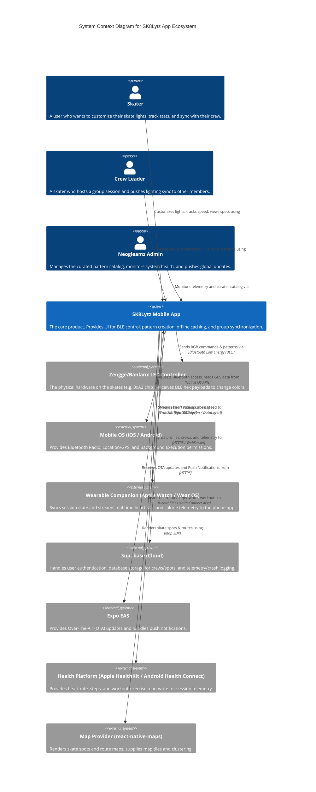

# SK8Lytz System Context Diagram

> **Audience:** Product Managers, Investors, Designers, and non-technical stakeholders.
> **Purpose:** To understand what SK8Lytz is, who uses it, and what external systems it relies on to function.

## What is this?
This is a Level 1 System Context Diagram (based on the C4 Model). It treats the SK8Lytz App as a single "Black Box" in the center. It does not show code, databases, or APIs. It only shows the **Actors** (the humans using the app) and the **External Dependencies** (the hardware and cloud systems we don't build but rely on).

## System Context Diagram

## How to Read This Diagram

1. **The Core System (Blue):** `SK8Lytz Mobile App` is what we build. It's the central hub.
2. **The People (Dark Blue):** These are the users. The app must serve the `Skater` (individual experience), the `Crew Leader` (social/multiplayer experience), and the `Admin` (curation/support).
3. **The Dependencies (Gray):**
   - If **Supabase** goes down: Skaters can still ride and change lights (Offline-First), but they cannot sync new crews or save cloud backups.
   - If the **Mobile OS** revokes Bluetooth permissions: The app is completely paralyzed.
   - If the **BLE Skate** hardware is out of range: The app queues the command and waits for the hardware to return (Auto-Recovery).

<!-- Last Validated against Master Cartography Rebuild: 2026-06-22 (added Health Platform + Map Provider external systems per DEPENDENCY_AUDIT C4 impact) -->
