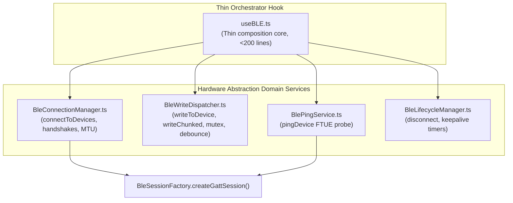

# Implementation Plan: refactor/useBLE-god-object-surgery

Harden the BLE transport layer by partitioning `useBLE.ts` (61KB, 1181 lines) into focused, single-responsibility domain helper modules, reducing the thin composition orchestrator to <250 lines while keeping 100% backward-compatibility for all consumers.

## User Review Required

> [!IMPORTANT]
> **Zero Public API Changes**
> All external consumers (`DashboardScreen`, `DockedController`, `useProtocolDispatch`, and Onboarding Setup Wizard) will see **zero API signature changes**. The refactored `useBLE` hook will continue to return the exact same `BluetoothLowEnergyApi` surface.

## Proposed Architecture & Domain Separation

We will surgically extract the 6 responsibility domains of `useBLE.ts` into 4 dedicated, stateless domain services:



---

### [NEW] `src/services/BlePingService.ts`

Extracts the wizard-exclusive, atomic `pingDevice` workflow.

* **Dependencies**: `BleSessionFactory.createGattSession()` and `BleGattMutex.acquireGattLock()`.
* **State Inputs**: `bleManager`.
* **Signature**:
  ```typescript
  export async function executePingDevice(
    bleManager: any,
    mac: string,
    blinkPayload: number[]
  ): Promise<any>;
  ```

---

### [NEW] `src/services/BleWriteDispatcher.ts`

Extracts high-performance, concurrent, and debounced BLE write execution.

* **Exposes**:
  * `executeWriteToDevice`
  * `executeWriteChunked`
  * `executeProtocolResults`
* **Features**:
  * Mutex-serializes writes (`writeMutex`) to defend against GATT 133 collisions.
  * Debounces pattern sliders at 50ms (coalescing 60Hz slides to a stable final frame).
  * Automatically chunk-segments large packages (>MTU) into sequence-numbered ZENGGE `0x40` envelopes.
* **Signature**:
  ```typescript
  export async function executeWriteToDevice(
    bleManager: any,
    targets: any[],
    ghostedDeviceIds: string[],
    mtuMap: Map<string, number>,
    adapterMap: Map<string, any>,
    payload: number[],
    stateRefs: {
      writeMutex: Promise<any>;
      writeGeneration: number;
    }
  ): Promise<boolean | 'partial'>;
  ```

---

### [NEW] `src/services/BleLifecycleManager.ts`

Extracts connection teardown and idle-state preservation timers.

* **Exposes**:
  * `executeRealDisconnect`
  * `disconnectFromDevice`
  * `forceDisconnect`
* **Features**:
  * Manages the 60-second `keepaliveTimer` to keep GATT sessions hot between screen swaps.
  * Automatically clean-cancels auto-recovery loops on intentional teardown.

---

### [NEW] `src/services/BleConnectionManager.ts`

Extracts group GATT connection locks and connection-handshake handovers.

* **Exposes**:
  * `connectToDevices`
* **Features**:
  * Serializes physical connection attempts to prevent Android RF kernel saturation.
  * Parallelizes post-connection discovery, ConnectionPriority escalation, MTU negotiation, and Time-Sync handshakes via `Promise.all` for sub-second boot times.
  * Integrates the 2-attempt transient error retry bumper.

---

### [MODIFY] `src/hooks/useBLE.ts`

* **Refactor**: Strip all raw connect/write/disconnect implementation details.
* **Composition**: Imports the 4 services, passes in state hooks/refs (such as `bleManager`, `connectedDevices`, `mtuMapRef`), and returns the same clean public `BluetoothLowEnergyApi` object.
* **Result**: Reduced from 1,181 lines to <200 lines. 100% compile-clean and Jest compatible.

---

## Verification Plan

### Automated Tests
- `npm run verify` to sign `.test-attestation.json` and ensure 0 TSC compilation errors and 100% Jest test coverage passes.

### Manual Verification
- Deploy release APK (`/deploy-device`) and verify that connection, presets, pattern slider animations, and setup wizard BLINK telemetries execute perfectly with zero regressions.
