# SK8Lytz App Master Reference

_Last Updated: 2026-06-10 | **21-Domain Cartographer Synthesis Completed** — watchOS + Wear OS companion apps, Expo native bridge module (sk8lytz-watch-bridge), watch-preferred health priority system, bidirectional phone↔watch session sync, Speed push to watch, VS-002 gitignore fix. v3.9.1 | Source of Truth: artifacts/deepdive_docs/_

This document is the **Canonical Reference** for all architecture, hardware constraints, and BLE protocol definitions within the SK8Lytz application.

1. [Product Bible](#1-product-bible-vision--north-star)
2. [System Architecture](#2-system-architecture--local-storage)
3. [BLE Protocol Library](#3-ble-protocol-library)
4. [Domain-Driven Architecture](#4-domain-driven-architecture)
5. [Database Schemas](#5-database-schemas)
6. [Crew Hub & Session Lifecycle](#6-crew-hub--session-lifecycle)
7. [Session Telemetry Architecture](#7-session-telemetry-architecture)
8. [Agentic PM Protocols](#8-agentic-pm-protocols-the-brain)
9. [Sentinel Engineering Governance](#9-sentinel-engineering-governance-workflow-v6)
10. [Environment & Build Ops](#10-environment--build-ops)
11. [Wearable Companion Architecture](#11-wearable-companion-architecture)

> [!CAUTION]
> Do NOT append duplicate or conflicting protocol discoveries to this document. If a payload format changes, **overwrite** the existing entry to ensure this file remains a single, conflict-free source of truth.

---

## 1. Product Bible (Vision & North Star)

**The Mission:**
To empower the radiant culture of roller skating by building the world's most expressive and innovative lighting ecosystem. SK8Lytz isn't just an app; it's the digital pulse for your skates—enabling flawless, zero-latency light synchronization ("Glow Your Way") that transforms solo sessions into high-performance visual art and massive Crew Hub rink takeovers into coordinated spectacles.

**Target Audience:**
Sk8Lytz caters to a diverse, family-oriented community of dedicated roller skaters. They operate in high-energy, low-light environments (rinks, street night sessions, park bowls). They value durability, ease of use (wrist guards, movement), and the ability to express their unique style through synchronized, diffused lighting.

### Core Product Lines

#### **SOULZ** (The High-Intensity Pro Strip)

- **Concept**: 56" of total illumination via four 14" diffused silicone addressable LED strips.
- **Performance**: 2-6+ hours of run time.
- **Charging**: 90 min full cycle (USB-C).
- **Control**: Integrated Bluetooth/RF + High-sensitivity integrated microphone for instant "vibe" reactivity.

#### **HALOZ** (The Compact Matrix Box)

- **Concept**: Individually controllable high-density pixel boxes for wheels/plates.
- **Performance**: 2-4+ hours of run time.
- **Charging**: 60 min fast-charge (USB-C).
- **Control**: Integrated Bluetooth/RF + High-sensitivity integrated microphone.

#### **RAILZ** (Integrated Chassis Strips)

- **Concept**: Dual parallel vertical LED strips designed for undercarriage/frame mounting.
- **Performance**: Integrated 4-6+ hour run time.
- **Charging**: 90 min (USB-C).
- **Control**: Integrated Bluetooth/RF + High-sensitivity integrated microphone.

### Hardware Truth Table — Confirmed 2026-04-22

> [!IMPORTANT]
> This is the **canonical source of truth** for all LED count math, pixel array sizing, and EEPROM provisioning. The three-layer model below governs ALL protocol and UI decisions. `ProductCatalog.ts` code comments cite this table. See `ZENGGE_PROTOCOL_BIBLE.md` §3 for `0x62`/`0x63` EEPROM command details.

#### The Three-Layer LED Model

Every product has three distinct LED "counts" that mean different things:

| Layer | Name | What it represents | Code field |
|:------|:-----|:-------------------|:-----------|
| **1** | `ledPoints` | Addressable LEDs **per segment** — the design canvas | `hwSettings.ledPoints` |
| **2** | `segments` | Number of hardware mirrors of Layer 1 | `hwSettings.segments` |
| **3** | Physical LEDs | Total real LEDs in the world (`ledPoints × segments`, or × wiring factor) | Not stored — derived only |

> **Golden Rule**: All pixel arrays (`0x59`, `0x31`) MUST be built using `ledPoints` (Layer 1). Segments and wiring are the hardware's job, not the app's.

#### Confirmed Product Defaults

| Product | `ledPoints` | `segments` | Physical LEDs | Adjustable? | Architecture |
|:--------|:-----------:|:----------:|:-------------:|:-----------:|:-------------|
| **HALOZ** | **8** | **2** | 16 | ❌ Fixed | Ring. Hardware **auto-mirrors** the 8-point pattern to a 2nd segment. Always send 8-element arrays. |
| **SOULZ** | **43** | **1** | 86* | ✅ Yes | Strip. No hardware mirroring. Controller drives one 43-point canvas. Physical doubling from Y-wire is transparent. |
| **RAILZ** | **30** | **2** | 60 | ✅ Yes | Dual rail. Placeholder — confirm with hardware before shipping. |

*SOULZ physical reality: 43 LEDs on LEFT skate (outside boot) + 43 LEDs on RIGHT skate (inside boot), both Y-wired to the same controller output. The controller is **oblivious to the doubling**.

#### SOULZ — User-Adjustable `ledPoints`

SOULZ strips are cut-to-length. If a user physically cuts the strip shorter, they **must** update `ledPoints` in the HW Setup Wizard to match the physical count. Example: cut from 43→36 → set `ledPoints=36`. The LED Points adjuster in the wizard (`hardwareAllowsCustomPoints: true`) exists for exactly this reason.

Every pixel array builder (`PatternEngine`, `applyEmergencyPattern`, etc.) must read `hwSettings.ledPoints` dynamically — NEVER hardcode 43.

#### ⚠️ Previous Bug (Fixed 2026-04-22)

`ProductCatalog.ts` previously had `HALOZ.defaultLedPoints = 16, segments = 1`. This was **wrong** — it caused:
1. `applyEmergencyPattern` sending 16-element arrays to an 8-point device, bypassing the hardware segment mirror engine
2. Any EEPROM probe (`0x63`) returning `ledPoints=8` would have caused a mismatch with stored defaults

Fixed: `HALOZ.defaultLedPoints = 8, segments = 2`.

#### ✅ HALOZ Ring Topology — Confirmed Physical LED Map (2026-04-25)

```
              ╔══════════╗
              â•‘   TOP    â•‘
  L-pSlot 0 ══╬══════════╬══ R-pSlot 7    ← Left TOP = pSlot 0, Right TOP = pSlot 7
  L-pSlot 1 ══╬          ╬══ R-pSlot 6
  L-pSlot 2 ══╬          ╬══ R-pSlot 5
  L-pSlot 3 ══╬  CENTER  ╬══ R-pSlot 4
  L-pSlot 4 ══╬          ╬══ R-pSlot 3
  L-pSlot 5 ══╬          ╬══ R-pSlot 2
  L-pSlot 6 ══╬          ╬══ R-pSlot 1
  L-pSlot 7 ══╬══════════╬══ R-pSlot 0    ← Left BOTTOM = pSlot 7, Right BOTTOM = pSlot 0
              â•‘  BOTTOM  â•‘
              ╚══════════╝
  LEFT side: ↓ top→bottom     RIGHT side: ↑ bottom→top
  pSlot: 0,1,2,3,4,5,6,7      pSlot: 0,1,2,3,4,5,6,7
```

**Rule:** Hardware auto-mirrors the 8-pixel pattern to both segments simultaneously.
- Seg 1 (RIGHT): LED 0 at physical BOTTOM, LED 7 at physical TOP.
- Seg 2 (LEFT): Hardware mirror places LED 0 at physical TOP, LED 7 at physical BOTTOM.
- If pixel[0] = RED → **Right BOTTOM = RED, Left TOP = RED**. True horseshoe symmetry.

#### VisualizerUnit Rendering Rules (HALOZ RING only)

These rules govern `src/components/VisualizerUnit.tsx`. **Do NOT apply to SOULZ (OVAL) or RAILZ (DUAL_STRIP).**

| Rule | Correct Value | Wrong (causes bugs) |
|:-----|:-------------|:--------------------|
| `numLeds` formula | `Math.floor(devicePoints)` — `ledPoints` IS the per-segment canvas | `Math.floor(devicePoints / deviceSegments)` — causes 4 LEDs, not 8 |
| `devicePoints` fallback | `productProfile.defaultLedPoints` (8) | `productProfile.vizDefaultPoints` (was 16) — causes 16-color arcs |
| `deviceSegments` fallback | `productProfile.defaultSegments` (2) | Hard-coded `1` — kills gap rendering |
| `getVisualizerFrame` numLeds arg | `numLeds` (8) | `activeSegmentLedsHoisted` (32) — 4× oversampled palette |
| Product lookup guard | Guard `device.type !== 'undefined'` before `String()` | `String(undefined)` = `"undefined"` → SOULZ fallback → `vizShape='OVAL'` → RING inversion never fires |
| Left arc pSlot direction | `rawFract` (inverted for i ≥ renderLeds/2 when `vizShape==='RING'`) | `segmentI / activeSegmentLeds` (never inverted) → both arcs identical |

> **SOULZ Safety:** `rawFract` for SOULZ (`vizShape='OVAL'`) is NEVER inverted. Changing slot lookups to use `rawFract` instead of `segmentI/activeSegmentLeds` is identical for SOULZ — zero regression risk.


---

**Core Philosophies (The 4 Pillars):**

1. **Bulletproof BLE Transport:** The connection to Neogleamz hardware MUST be instantaneous and nearly sentient. Reconnects and pairing must handle GATT exceptions and MTU drift invisibly. "It just works, immediately."
2. **Tactile, Glanceable UI:** High-contrast, Neogleamz standard aesthetics. Massive touch targets (>44px) for skaters in gear. One-tap access to Symphony effects and App-mic visualization.
3. **No-Compromise Offline Flow:** Hardware control is a fundamental right. basic lighting and EEPROM configuration (0x62/0x63) never require cloud authentication.
4. **Wrist Extension (Watch Companions):** The watch is a session HUD and health relay — NOT an LED controller. It mirrors speed, HR, and calories from the phone, relays on-wrist health sensor data back, and provides remote session start/stop. All BLE LED protocol commands originate exclusively from the phone app.

**Anti-Goals (What we ruthlessly reject):**

- **Bloated Developer Logic in Prod:** We use strict `__DEV__` elimination to keep the binary lean and free of testing debris.
- **Complex UI Micro-Management:** Skaters want to skate. We provide stunning Pro Effects and high-precision HUDs (Speed/Brightness), not frame-by-frame animation editors.
- **Hardware-Cloud Gating:** We never lock essential local hardware features behind an internet authentication wall.
- **Hardcoded Hardware Heuristics:** The UI layer must NEVER use explicit string literals (e.g. `type === 'HALOZ'`) or hardcoded binary logic to render products. All hardware metadata (shape, icons, colors) must be dynamically derived from `LOCAL_PRODUCT_CATALOG` (`src/constants/ProductCatalog.ts`) to ensure scalable, zero-code support for new OEM devices.

### ❌ Condemned Opcodes — Never Use in Production

> [!CAUTION]
> The following BLE opcodes are PERMANENTLY CONDEMNED for production UI use.
> They cause a fundamental visualizer-parity gap: the hardware controls the animation internally,
> so the ProductVisualizer cannot know what the hardware is showing. This breaks our core parity promise.

| Opcode | Name | Why Condemned | What Replaced It |
|:-------|:-----|:--------------|:-----------------|
| **`0x41`** | Settled Mode (Symphony Effects) | Used for native hardware parity on test patterns. | 33 native hardware effects (IDs 201-233) fired via `0x41`, fully integrated into PatternEngine |
| **`0x42`** | RBM Programs Mode | Hardware runs one of 100 baked-in Programs internally. App cannot know the pixel state. | All Programs effects reimplemented as PatternEngine TypeScript, fired via `0x59` |

**Architecture decision 2026-04-22**: Every LED effect in SK8Lytz is computed in TypeScript,
sent as a pixel array via `0x59`, and rendered identically in the ProductVisualizer.
`0x41` and `0x42` are available in DiagnosticLab only (guarded by `__DEV__`).

---

### SK8Lytz Pattern Architecture (Canonical Reference)

#### The One Law

```
PatternEngine (TypeScript math) → getVisualizerFrame() → pixel array → 0x59
ProductVisualizer               → getVisualizerFrame() → same pixel array → rendered on screen
Visualizer = Skates. Always. No exceptions.
```

#### Three-Tier Pattern Library

Every pattern belongs to one of three tiers:

| Tier | Source | Count | Description |
|:-----|:-------|:-----:|:------------|
| **Tier 1** | ge.* Java class reversal | 33 | Settled Mode effects. `0x41` was originally reverse-engineered, but test patterns 201-233 now utilize native `0x41` hardware routing for byte parity checks. |
| **Tier 2** | Programs Mode reversal | ~28 | Standard LED strip effects. Each Programs effect is reimplemented in TypeScript. `0x42` is NEVER called. |
| **Tier 3** | SK8Lytz originals | ∞ | Effects only possible because we own the payload. Positional gradients, reactive splits, sport sequences, etc. |

**Current total**: 81 templates (43 spatial/temporal + 5 street + 33 Multimode Pro Effects), all in one unified picker.

#### Pattern Template Schema

Every pattern in `src/protocols/PatternEngine.ts` (`SK8LYTZ_TEMPLATES`) has this structure:

```typescript
interface SK8LytzTemplate {
  id: number;                          // Unique, never reuse. 1-28 = existing. 29+ = new.
  name: string;                        // User-facing name in picker
  icon: string;                        // Emoji icon for picker card
  colorMode: 'FG_BG' | 'FG_ONLY' | 'BG_ONLY' | 'GENERATIVE';  // Which color pickers to show
  supportsDirection: boolean;          // Show direction toggle in UI?
  tier: 1 | 2 | 3;                    // Source tier (ge.* | Programs | Original)
  sourceRef?: string;                  // e.g. 'ge.OceanWaveEffect' or 'Programs:CometChase'
  group?: string;                      // UI grouping label in picker
}
```

#### Universal Controls (All Patterns Support All)

| Control | Implementation | Notes |
|:--------|:---------------|:------|
| **FG Color** (RGB) | `fg: RGB` passed to `getVisualizerFrame()` | Always active |
| **BG Color** (RGB) | `bg: RGB` passed to `getVisualizerFrame()` | UI hidden if `colorMode !== 'FG_BG'` |
| **Speed** | Controls `tick` rate + `0x59` scroll param | Always active |
| **Brightness** | `0x55` packet — independent of pixel array | Always active, global |
| **Direction** | `direction: 0\|1` → `getVisualizerFrame()` + `0x59` dir byte | UI shown only if `supportsDirection: true` |

#### colorMode Gate

Controls which color pickers the UI renders for a given pattern:

- `FG_BG` — Both FG and BG pickers shown (e.g. Comet: FG=trail, BG=background color)
- `FG_ONLY` — Only FG shown (e.g. Breathing: single color fade, BG irrelevant)
- `BG_ONLY` — Only BG shown (e.g. ID 233 Rainbow Stream: hardware ignores FG entirely)
- `GENERATIVE` — Neither picker shown (e.g. Rainbow Flow: hue is computed by math, not user-set)

> Note: The pattern ALWAYS receives both `fg` and `bg` arguments — the gate is purely a UI affordance.

#### Implementation Contract for Every New Pattern

```
1. Read source math (ge.* Java class, or Bible §0x51 Pattern Index for test modes 201-233)
2. Write TypeScript math: add case to `src/protocols/SpatialEngine.ts` or `SymphonyEngine.ts`
3. Add case to `src/protocols/VisualizerEngine.ts` `getVisualizerFrame()`
4. Add entry to `src/protocols/PatternEngine.ts` `SK8LYTZ_TEMPLATES` with correct colorMode/tier/sourceRef
5. For test patterns (201-233): dispatch via `ZenggeProtocol.setCustomModeCompact()` — NOT `0x41`, NOT 10B extended
6. Verify: ProductVisualizer shows the effect ← identical to hardware via 0x59 (or 0x51 for test modes)
7. Hardware test on HALOZ: tap pattern → LED ring matches visualizer
```

---

## 2. System Architecture & Local Storage

### AsyncStorage Key Registry

| Key                                 | Owner                           | Contents                                                                                                                                        |
| :---------------------------------- | :------------------------------ | :---------------------------------------------------------------------------------------------------------------------------------------------- |
| `@sk8lytz_logs`                     | AppLogger                       | Compact telemetry event buffer array                                                                                                            |
| `@Sk8lytz_auth_username`            | DashboardScreen                 | Local cache of Supabase display_name for instant UI feedback. Synced via Reactive Context Pattern (Load Cache -> Hydrate Profile -> Update UI). |
| `@Sk8lytz_registered_devices`       | DeviceRepository                | Primary SSOT ledger of all claimed/bound hardware keyed by BLE MAC. Each entry uses `group_ids: string[]` and `group_names: string[]` (many-to-many migration 2026-05-28). Legacy scalar `group_id` is dead. |
| `@Sk8lytz_device_configs`           | useDashboardGroups / AppLogger  | Dict keyed by **BLE MAC** containing `{ name, type, points, segments, sorting, stripType, group_ids: string[], group_names: string[] }` |
| `@Sk8lytz_custom_groups`            | useDashboardGroups              | Array of `{ id, name, isGroup, deviceIds }` — group memberships (junction-table backed post v3.6.5) |
| `@sk8_hw_<deviceId>`                | Sk8LytzProgrammerModal          | Per-device EEPROM hardware settings cache                                                                                                       |
| `@sk8lytz_theme`                    | ThemeContext                    | `dark` or `light`                                                                                                                               |
| `@sk8lytz_control_theme`            | ThemeContext                    | Control color theme name                                                                                                                        |
| `@Sk8lytz_hardware_blacklist`       | useBLE                          | Cache-first offline ledger of MAC addresses banned from connecting                                                                              |
| `@Sk8lytz_Builder_Presets`          | GradientsService                | Cache-first offline storage of custom and global builder presets                                                                                |
| `@Sk8lytz_Scenes`                   | ScenesService                   | Cache-first offline storage of downloaded and authored multi-step scenes                                                                        |
| `@Sk8lytz_Scene_Sync_Queue`         | ScenesService                   | Offline mutation queue for publishing and deleting scenes in the background                                                                     |
| `@Sk8lytz_skate_spots_cache`        | LocationService                 | 24h TTL cache-first storage of 500 closest skate spots for offline map degradation survival                                                     |
| `@Sk8lytz_Favorites`                | useFavorites                    | Dictionary of user-defined lighting presets (Name, Palette, Mode)                                                                               |
| `@sk8lytz_permissions_optout`       | PermissionService               | App-Level Opt-Out Ledger. User toggles that override OS permissions for legal/privacy reasons.                                                  |
| `@Sk8lytz_voice_tutorial_dismissed` | boolean                         | Gating for the Voice Command onboarding modal                                                                                                   |
| `@sk8lytz_app_settings`             | AppSettingsService / useBLEScanner | App-wide admin feature flags. Cache-first layer provides offline access. Key `hw_setup_rssi_threshold` controls the RSSI gate. |

> [!CAUTION]
> **PURGED KEYS (2026-04-17):** The following legacy `ng_*` keys are fully deprecated and MUST NOT be used anywhere in the codebase. They caused split-brain bugs due to namespace drift:
> - ~~`ng_device_configs`~~ → migrated to `@Sk8lytz_device_configs`
> - ~~`ng_custom_groups`~~ → migrated to `@Sk8lytz_custom_groups`
> - ~~`ng_processed_devices`~~ → DELETED (one-shot cleanup on boot)

## Build Config & Troubleshooting 🛠️

### Android Build Requirements

To resolve dependency conflicts and legacy library issues, the following configurations are required:

- **Jetifier**: Must be enabled (`android.enableJetifier=true`) to migrate legacy Support libraries to AndroidX.
- **SDK Versions**: Project currently targets SDK 34 (`compileSdk`, `targetSdk`).

### Third-Party Library Patches

- **@react-native-voice/voice**: ~~REMOVED~~ — The voice command engine was deleted. Do not reinstall this dependency. Any references to it in legacy build configs are dead code.

### Dashboard UI Layout (4-Slab Architecture) [MOVE_TO_ARCHIVE]

The primary dashboard uses a **Vertical Slab (No-Scroll)** layout to maximize glanceability and touch accuracy.

1. **Slab 1: Dynamic Header**: Logo, user profile, and active polling/telemetry indicator.
2. **Slab 2: Crew Hub**: Active session discovery and quick-join pills.
3. **Slab 3: My Skates / Groups**: High-impact cards for grouped hardware with global power controls.
4. **Slab 4: Hardware Fleet**: List of all registered devices with a "TAP TO ADD" quick-access wizard link.

### UI Design Patterns & Branding

- **Tucked-in Attribution**: Credit links (e.g., "by neogleamz.com") must be placed discreetly within header containers, aligned with the visual boundary of the primary logo (e.g., `marginRight: '16%'` for a 300px logo) and using `fontSize: 9` with `fontWeight: '800'` muted text.
- **Fluid Component Scaling**: Components (Builders, Camera Viewers) must NOT use hardcoded heights. They must utilize available `flex` space between the `ProductVisualizer` and the bottom dock to ensure responsiveness across all aspect ratios.
- **One-Screen Setup Policy** [MOVE_TO_ARCHIVE]: The Hardware Setup Wizard must minimize vertical occupancy. For naming and registration (Step 3), all primary controls (Fleet Name, Device Labels, Type, Position) must be visible on a single standard mobile viewport (e.g. iPhone SE) without requiring a vertical scroll for a standard 2-skate setup. Use horizontal inlining and 8pt grid proximity instead of explicit labels where possible.

### Admin Tools Hub (The Command Center)

The **Admin Tools Hub** (`AdminToolsModal`) is the unified gateway for all system-level diagnostics and hardware maintenance.

- **Access**: 10-tap the SK8Lytz logo in the dashboard header + Passcode: `0000`.
- **Architecture (Refactor/2026-04-12)**: To prevent "re-render storms" from high-frequency telemetry, the modal utilizes a **Memoized Tab Architecture**. Rendering logic for Timeline, Stats, Device, and Tools is extracted into standalone `React.memo` sub-components, ensuring UI stability during 20Hz notification bursts.
- **Tab 1: TIMELINE**: Virtualized system event log (BLE protocol, app lifecycle, errors). Filtered to exclude RAW_PAYLOAD by default to preserve list performance.
- **Tab 2: STATS**: Session analytics, mode usage frequency, and hardware performance metrics.
- **Tab 3: DEVICE**: Deep-dive hardware view showing all discovered peripherals and their cached configs.
- **Tab 4: TOOLS**: Administrative portal for low-level components:
  - **Catalog Manager**: Unified editor for product profiles. **MANDATORY**: All write operations (`upsert`) are gated by a Supabase Session check to prevent unauthorized database manipulation.
  - **LED Diagnostic Lab**: Atomic protocol validation and DIY payload building.
  - **Firmware Programmer**: Low-level hardware updates and serial-over-BLE tools.
  - **Optical Simulation Mode (Web Fallback)**: A dedicated developer interface for non-native environments (Expo Web). It provides manual telemetry simulation (randomized hex dispatch) to smoke-test visualizer and state-management pipelines without physical hardware.
- **Persistence & Governance**:
  - App settings (feature flags) are persisted via `AppSettingsService` with atomic rollback on failure.
  - Product Manager upserts are strictly typed to enforce the `batteryCapacityMilliAmpereHour` field, preventing database record drift.
  - **Account Deletion (Danger Zone)**: Implements a destructive `delete_account` RPC on Supabase. This uses `ON DELETE CASCADE` to completely shred user data across all tables (telemetry, profiles, and auth).
- **Navigation Orchestration**: Closing any administrative sub-tool (Lab, Programmer) must explicitly re-trigger the visibility of the `AdminToolsModal` in the parent `DashboardScreen` to ensure a consistent "nested" navigation experience.

### Optimistic BLE Write Pipeline ("The Ghost Standard")

The BLE write path uses an **Optimistic UI** architecture to eliminate perceived 80—500ms hardware latency:

| Phase             | Status FSM                   | Behavior                                                  |
| :---------------- | :--------------------------- | :-------------------------------------------------------- |
| 1. **OPTIMISTIC** | `onOptimistic()` fires       | UI updates INSTANTLY before BLE write                     |
| 2. **PENDING**    | `writeStatus = 'PENDING'`    | BLE command dispatched (40ms debounce)                    |
| 3. **CONFIRMED**  | `writeStatus = 'CONFIRMED'`  | Hardware ACK'd — light haptic                             |
| 4. **RECONCILED** | `writeStatus = 'RECONCILED'` | Hardware FAILED — error haptic + `onReconcile()` rollback |

**Key Files:**

- `src/hooks/useOptimisticBLE.ts` — Ghost state FSM, debounce, haptics
- `src/hooks/useBLE.ts` — Core write function (`writeToDevice` returns `Promise<boolean | 'partial'>`)
- `src/components/DockedController.tsx` — Consumer integration (status indicator dot)

**Architectural Constraint:** `writeToDevice` MUST return `Promise<boolean | 'partial'>` where:
- `true` = all devices received the payload
- `false` = write failed, trigger reconciliation
- `'partial'` = some devices received it (ghosted devices skipped) — treated as success for UI

All component prop interfaces must use `Promise<void | boolean | 'partial'>` for full compatibility.

### Test Users & Environments

For testing App Sync behavior vs. Offline mode offline fallbacks, you can authenticate using the primary test user:

- **Email**: `testuser@sk8lytz.com`
- **Password**: `Password!2026`
- **Username**: `TestSkater`

### Offline & Guest Gating Architecture

The application enforces a strict "Hardware First, Cloud Second" policy. Core hardware control (BLE opcodes) is NEVER gated behind an authentication wall.

- **Offline Mode State**: Propagated dynamically via the `isOfflineMode` prop in the component tree (`DashboardScreen` → `DockedController` → Modals).
- **Graceful Degradation**: 
  - `QuickPresetModal`: Cloud preset saving is hidden when `isOfflineMode === true`. Only local device EEPROM saves are permitted.
  - `CommunityModal`: The 'Community Profiles' tab is entirely disabled in offline mode. The UI defaults gracefully to the 'My Skates' local tab.
- **Rule of Thumb**: Local SQLite (`AsyncStorage`) and direct GATT manipulation are 100% available to Guests. Any feature requiring Supabase REST/PostgREST must explicitly check `isOfflineMode` and display a friendly 'Login Required' state.

### Camera Mode: Camera Vibe Catcher v2 Architecture

The `CAMERA` mode provides real-time ambient lighting translation and dual-mode color analysis.
- **Unified Cross-Platform Frame Processing**: 
  - Uses a unified cross-platform `CameraTracker.tsx` utilizing `react-native-vision-camera` v5's GPU-backed `useFrameOutput` pipeline and `vision-camera-resize-plugin`.
  - Frames are downscaled on the GPU to 50x50 pixels RGB format at 5Hz (200ms throttle interval) with JSI `'worklet';` execution.
  - Hardened with explicit `frame.dispose()` invocation wrapped in a `try...finally` block inside the worklet thread to eliminate camera pipeline stalls. Dispatches are scheduled via `runOnJS` from `react-native-worklets` to transition back to the React JS thread.
- **SNIPER Sub-Mode (Focus reticle)**:
  - Samples the center pixel `(25, 25)` from the 50x50 resized frame.
  - The GPU resizer (`react-native-vision-camera-resizer@5.0.10`) delivers accurate RGB bytes directly. The reticle displays the raw camera color (unmodified truth). No client-side vivid boost is applied in the frame processor — the captured color is the real scene color.
  - On capture, `boostForLED()` (`src/utils/ColorUtils.ts`) applies industry-standard HSV saturation maximization (S=1.0, V=1.0) to translate the muted camera capture into vivid WS2812B-optimized output. Neutrals (HSV S < 0.05) pass through as white. The boosted color is dispatched via 0x59 Freeze to the skates and saved in the 5-item swatch history.
- **VIBE Sub-Mode (Palette extractor)**:
  - Evaluates the 2,500 pixel array to extract the 3 most dominant colors via an optimized client-side K-Means clustering algorithm (k=3, 5 iterations max) with thread-safe `'worklet';` annotations.
  - Dominant colors populate FG/BG/ACCENT slots in the UI and generate a live liquid gradient preview.
  - Tapping Apply auto-generates a `BuilderNode[]` array, maps them to a linear gradient matching the user's Flow/Static preference, and dispatches via `0x59`.
- **Surgical Buffer Overflow Defense**:
  - Enforces a minimum canvas length of 12 RGB pixels for all `0x59` spatial payload dispatches by interpolating dominant swatches to prevent physical controller EEPROM buffer lockouts on the `0xA3` chipset.

---

## 3. BLE Protocol Library

> [!IMPORTANT]
> **Dynamic Catalog Migration (2026-04-11)**: All hardware profile logic—including default LED counts, visualization themes, and discovery categorization—is now handled strictly via `LOCAL_PRODUCT_CATALOG` (`src/constants/ProductCatalog.ts`).

All byte definitions below represent the inner payload _before_ the V2 BLE packet wrapper is applied.

### Confirmed Hardware Identity (APK-Verified 2026-04-21)

> [!IMPORTANT]
> All 3 physical SK8Lytz devices confirmed as **`Ctrl_Mini_RGB_Symphony_new_0xA3`** (product_id: **163 = 0xA3**). Confirmed from `discovered_devices_telemetry` across MACs `08:65:F0:9A:C2:3C`, `08:65:F0:9A:5E:06`, `08:65:F0:5F:03:B1`. Firmware: v45—46, BLE: 5, LED version: 3.
>
> **Key implications of 0xA3 vs 0xA2:**
> - `0x59` Static Colorful tab **IS available** on 0xA3 (not available on 0xA2) ✅
> - `0x51` Custom Scene — **9B compact format (291B) WORKS** on 0xA3 via our standard `wrapCommand` ✅
> - `0x51` 10B extended format (323B) does NOT work via our wrapper — requires ZENGGE chunked framing header (see Protocol Bible Section 11)
> - `0x42` effect ceiling: **1—100** (same as 0xA2). Effect 101 plays an undocumented effect (ceiling is soft).
> - `0x43` Multi-Sequence: **DO NOT USE** — Oracle test caused hardware LED shutoff (state machine crash). ZENGGE app uses `0x51` for multi-step effects, not `0x43`.
> - `0x41` Settled Mode: **DO NOT USE for IDs 201-233.** `0x41` and `0x51` share the same effectId range (1-33) but are different hardware engines producing different visuals. Using `0x41` for test patterns destroys parity. It is available in DiagnosticLab only. See Protocol Bible §0x41 and the AGENT SENTINEL warning in §0x51 Pattern Index.
> - Source: Oracle Lab + live BLE HCI sniff (2026-04-22), `ZENGGE_PROTOCOL_BIBLE.md` Section 11

### BLE Connection Handshake (2026-04-22)

Every GATT connection fires this sequence before the device is added to React state:

1. **MTU Negotiation** — `requestMTUForDevice(conn.id, 512)`
2. **0x10 Session Time Sync** — `ZenggeProtocol.setSessionTime()` → written directly to `ZENGGE_CHARACTERISTIC_UUID`. Format: `[0x10, year-2000, month(1-12), day, hour, min, sec, weekday(0=Sun), checksum]`. Source: `TimeControllerFragment.java` APK decompile. Non-fatal — wrapped in try/catch.
3. **React state update** — `setConnectedDevices()` fires _after_ GATT is booted to prevent UI from blasting payloads during MTU queries.

<!-- AST_COMPILER_START: ZENGGE_CONSTANTS -->
#### 📝 Auto-Compiled Zengge Protocol Constants (AST Compiler)

##### 🔌 BLE UUIDs
- **Service UUID**: `0000ffff-0000-1000-8000-00805f9b34fb` (`ZENGGE_SERVICE_UUID`)
- **Write Characteristic UUID**: `0000ff01-0000-1000-8000-00805f9b34fb` (`ZENGGE_CHARACTERISTIC_UUID`)
- **Notification Characteristic UUID**: `0000ff02-0000-1000-8000-00805f9b34fb` (`ZENGGE_NOTIFY_UUID`)

##### 🛠️ Hardware Constraints
| Constraint | Value | Description |
|:---|:---:|:---|
| `maxPoints` | 300 | Maximum addressable points per segment |
| `maxSegments` | 2048 | Maximum physical segment duplicates |
| `maxPxS` | 2048 | Max points * segments limit |
| `maxMicPoints` | 150 | Maximum points when microphone is active |
| `maxMicPxS` | 960 | Max micPoints * micSegments limit |
| `defaultPoints` | 30 | Fallback default point count |
| `defaultSegments` | 10 | Fallback default segment count |

##### 📟 IC Chip Types (`IC_TYPES`)
| Key | Chip Type |
|:---:|:---|
| 1 | WS2812B |
| 2 | SM16703 |
| 3 | SM16704 |
| 4 | WS2811 |
| 5 | UCS1903 |
| 6 | SK6812 |
| 7 | SK6812RGBW |
| 8 | INK1003 |
| 9 | UCS2904B |
| 10 | JY1903 |
| 11 | WS2812E |

##### 🎨 Color Sorting RGB (`COLOR_SORTING_RGB`)
| Key | RGB Order |
|:---:|:---|
| 0 | RGB |
| 1 | RBG |
| 2 | GRB |
| 3 | GBR |
| 4 | BRG |
| 5 | BGR |

<!-- AST_COMPILER_END: ZENGGE_CONSTANTS -->

### writeChunked — 0x51 Extended Payload Framing [MOVE_TO_ARCHIVE]

Required for 323-byte 0x51 Extended Scene Builder payloads (32 steps × 10B + 3B header).

- **Function**: `useBLE.writeChunked(payload: number[], chunkSize = 20): Promise<void>`
- **Framing**: `[0x40, seqByte, 0x00, 0x00, 0x01, 0x43, 0xBD, 0x0B, ...data]`
- **12 bytes data per 20-byte BLE chunk** (8-byte header overhead)
- **20ms inter-chunk delay** — prevents BLE TX buffer overflow on Android
- **⚠️ Framing signature `[0x01, 0x43, 0xBD, 0x0B]` needs Oracle Lab HCI sniff** before wiring to production Scene Builder UI
- Exported in `BluetoothLowEnergyApi` interface (commit `fdc0ff3`)

### BLE Stability Constraints & GATT Error Prevention

> [!CAUTION]
> React Native BLE PLX and the Android native `BluetoothAdapter` suffer from extreme race conditions. To avoid GATT 133 exceptions, UI freezes, and buffer overflows, all logic must follow these architectural constraints:

1. **Global BLE State Machine (`BleMachine.ts` — XState v5):** `src/services/ble/BleMachine.ts` owns all radio state via 6 XState states: `IDLE → SCANNING → CONNECTING → READY → RECOVERING → DISCONNECTING`. The machine is the ONLY entity that calls `startDeviceScan`/`stopDeviceScan`. Calling the radio directly from any hook or service is FORBIDDEN — use `bleSend({ type: 'SCAN_START' })` instead.
2. **Write Serialization (`BleWriteQueue.ts`):** All BLE GATT writes are serialized through a priority FIFO queue. Priority tiers: `critical` (0xCC power, 0x71, 0x63 heartbeat), `normal` (default pattern writes), `bulk` (0x51 scene uploads). MAX_QUEUE_DEPTH=8 with backpressure. Stale-write pruning via generation counter. One write at a time — Android BLE stack hard constraint.
3. **The GATT 133 Exponential Backoff:** `ConnectService.ts` wraps `connectToDevice` in a 3-attempt retry loop with exponential delays `[500ms, 1500ms, 4000ms]` + `refreshGatt: 'OnConnected'` on each retry to silently absorb Android RF congestion.
4. **Connection Priority Downgrade after Handshake:** On Android, `requestConnectionPriority(HIGH)` fires immediately on connect for fast MTU/handshake. After the first successful write, priority is downgraded to `BALANCED` — saves 2—3× battery on fire-and-forget traffic.
5. **Machine Gate Check:** The XState machine's `CONNECTING` guard checks current state before invoking `connectService`. Concurrent connect attempts are structurally impossible — the machine only enters `CONNECTING` from `IDLE` or `SCANNING`.
6. **Lean Connection Loops:** `ConnectService.ts` strictly establishes MTU (request 512 bytes) and notification pipes only. EEPROM hardware probes (0x63) run through `InterrogatorService.ts` independently after connect.
7. **50ms Inter-Device Write Gap:** All multi-device group writes in `BleWriteDispatcher` enforce a 50ms pause between per-device GATT writes. Prevents silent GATT drops on Qualcomm Snapdragon 665/675 and MediaTek Helio chipsets.
8. **clearWriteQueue on Recovery Start:** `RecoveryService.ts` calls `clearWriteQueue()` as its FIRST action before any GATT reconnect attempt. Purges pre-disconnect stale pattern writes that would compete with recovery pings.
9. **Parallel Writes and Teardowns (`Promise.all`):** Group-wide commands (sliders) and teardowns (`cancelDeviceConnection`) MUST be wrapped in `Promise.all` loops to eliminate staggered latency.

### The Transport Wrapper (`wrapCommand`)

Every inner protocol payload must be wrapped using the standard 8-byte Zengge V2 framing:
`[0x00, SequenceNum, 0x80, 0x00, LenHi, LenLo, Len+1, 0x0B, ...innerPayload]`

### Auto-Recovery System (XState RecoveryService — 3-Phase)

_Migrated to XState: 2026-06-10 | Lives in: `src/services/ble/RecoveryService.ts` (invoked by `BleMachine.ts` RECOVERING state)_

The **RecoveryService** is a `fromCallback` XState actor invoked when the machine enters `RECOVERING`. It owns the full 3-phase recovery loop. The machine entering `RECOVERING` is the ONLY path into recovery — there is no external hook or ref that can start recovery. This makes concurrent recovery + connect structurally impossible.

**Organic Disconnect Trigger:**
- `ConnectService.ts` registers `bleManager.onDeviceDisconnected` for each connected device
- On organic drop, TWO callbacks fire: `handleOrganicDisconnect(error, deviceId)` (logging/telemetry only) and `onOrganicDisconnect(deviceId)` (sends `RECOVERY_START` to machine)
- `useBLE.ts` wires `onOrganicDisconnect` → `bleSend({ type: 'RECOVERY_START', ghostedMacs: [deviceId] })` with a guard that suppresses it during intentional `DISCONNECTING` state
- **CRITICAL:** Do NOT merge `handleOrganicDisconnect` and `onOrganicDisconnect` — they serve different purposes. Removing `onOrganicDisconnect` silently kills recovery.

#### 3-Phase Recovery Architecture

| Phase | Name | Duration | Backoff | Behavior |
| :--- | :--- | :--- | :--- | :--- |
| **Phase 1** | Aggressive | 0—2 min | `1500ms × 1.5^attempt` + jitter(0—1500ms), capped 30s | Rapid reconnect attempts via `createGattSession` |
| **Phase 2** | Moderate | 2—10 min | Same formula, longer natural gaps | Reduced frequency. Device may be out of range temporarily. |
| **Phase 3** | Passive | 10 min+ | **No active polling** | Zero-cost sweeper watch mode. If device reappears in scan results, `RECOVERY_START` re-fires from Phase 1. |

#### Recovery Properties

| Property | Value |
| :--- | :--- |
| **Trigger** | `RECOVERY_START` XState event (fired by `onOrganicDisconnect` callback or `HEARTBEAT_FAIL` event) |
| **First action** | `clearWriteQueue()` — purges stale pre-disconnect writes before any GATT attempt |
| **On success** | `sendBack({ type: 'RECOVERY_COMPLETE' })` — machine transitions to `READY`, adapter re-mapped, notifications re-registered |
| **On exhaustion** | `sendBack({ type: 'RECOVERY_FAIL' })` — machine transitions to `IDLE`, device ghosted in UI |
| **Cancellation** | Returning from the `fromCallback` cleanup function cancels the loop instantly |
| **Ghosting** | `ghostedDeviceIds` context updated by machine on `RECOVERY_FAIL` — UI dims card |

**Telemetry Events:**
- `AUTO_RECOVERY_STARTED`, `AUTO_RECOVERY_SUCCESS`, `AUTO_RECOVERY_FAILED`, `AUTO_RECOVERY_CANCELLED`, `AUTO_RECOVERY_SUMMARY`

> [!NOTE]
> **History:** Legacy `useBLEAutoRecovery.ts` hook DELETED in Phase 4 (2026-06-10). The hook owned recovery logic outside XState, making concurrent recovery+connect possible via race. `RecoveryService.ts` invoked as an XState actor makes this structurally impossible. Legacy `useBLEWatchdog.ts` was deleted 2026-04-17.

### Connection Health Heartbeat

_Migrated to XState: 2026-06-10 | Lives in: `src/services/ble/HeartbeatService.ts` (invoked by `BleMachine.ts` READY state)_

The **HeartbeatService** is a `fromCallback` XState actor invoked when the machine enters `READY`. Pings every connected device every 45s via a 0x63 EEPROM query to detect stale GATT handles early. Samsung Galaxy A-series can hold stale handles alive for minutes after the physical device powers off — without heartbeat, the stale link is only discovered on the next user write.

| Property | Value |
| :--- | :--- |
| **Interval** | 45s (`HEARTBEAT_INTERVAL_MS`) |
| **Probe** | `0x63` hardware query via `enqueueWrite('critical', ...)` — inner bytes: `[0x63, 0x12, 0x21, 0x0F, checksum]` |
| **Fallback** | If no adapter in `adapterMap` (BanlanX), falls back to `bleManager.readRSSIForDevice(mac)` directly |
| **On failure** | `sendBack({ type: 'HEARTBEAT_FAIL', deviceId: mac })` — machine transitions to `RECOVERING` |
| **On failure cleanup** | `bleManager.cancelDeviceConnection(mac)` called before sending HEARTBEAT_FAIL |
| **Cleanup** | Returned cleanup function calls `clearInterval` — timer stops when machine exits READY |

> [!NOTE]
> **History:** Legacy `useBLEHeartbeat.ts` hook DELETED in Phase 5 (2026-06-10). The hook owned heartbeat logic outside XState, requiring manual lifecycle management in `useBLE.ts`. `HeartbeatService.ts` as an XState actor ties the heartbeat lifetime to the READY state — it starts and stops automatically with the machine.

### Post-Connect RSSI Monitor

_Added: 2026-06-06 | Lives in: `src/hooks/ble/useBLERSSIMonitor.ts`_

Polls `readRSSIForDevice` every 30s on all connected devices. Surfaces live signal strength as `rssiMap: Record<string, number>` keyed by device MAC.

| Property | Value |
| :--- | :--- |
| **Interval** | 30s (`RSSI_POLL_INTERVAL_MS`) |
| **Weak threshold** | -75 dBm (`RSSI_WEAK_THRESHOLD`) — UI badge turns orange |
| **Critical threshold** | -82 dBm (`RSSI_CRITICAL_THRESHOLD`) — triggers proactive reconnect |
| **Proactive reconnect** | Calls `autoRecovery.initiateRecovery(mac)` if device not already in `ghostedDeviceIds` — forces GATT tear-down + fresh reconnect, which often picks a better radio channel |
| **UI integration** | `rssiMap[mac]` injected into `mergedItem.rssi` in `DashboardScreen.renderItem` — existing wifi icon auto-updates to reflect live post-connect signal quality |
| **Badge component** | `ConnectionStrengthBadge` — 3-bar signal icon using pure View rectangles (no SVG). 4-tier colour: green (≥-60), amber (-60 to -75), orange (-75 to -82), red (<-82). Hidden when rssi is null. |
| **Testability** | `readDeviceRSSI()` exported as pure async fn — 9 unit tests |

### Auto-Connect Observer (Debounced)

_Lives in: `src/hooks/useDashboardAutoConnect.ts`_

The dashboard auto-connect observer watches `allDevices` for registered peripherals that appear during passive scanning. It is hardened with:
- **500ms debounce** — batches devices discovered within 500ms into a single `connectToDevices` call
- **Gate check** — skips connection when `bleGateRef ≠ IDLE`
- **Pre-lock gate check** — checks gate state _before_ entering the 8s GATT lock poll (RC-04)
- **Ref-forwarded closures** — `connectToDevices` and `scanForPeripherals` are captured via stable refs to eliminate stale closure bugs on re-render (RC-02)
- **Prevents stampeding herd** — no concurrent auto-connect attempts
- **Sweeper-aware** — when Sweeper is active, routes through `burstScan()` instead of `startDeviceScan()` to avoid dual scan conflicts
- **Group-IDs array aware (2026-05-29)**: The offline fallback `processLocalDevices()` iterates `d.group_ids` (array, post-migration) with a scalar `d.group_id` fallback for legacy persisted rows. **Never assume `d.group_id` is populated on newly-registered devices.**

### RSSI Proximity Gating (Setup Wizard)

_Lives in: `src/hooks/ble/useBLEScanner.ts`_

To prevent skatepark BLE noise from hijacking the Setup Wizard, the scanner enforces a two-tier RSSI gate:
- **Registered devices** (already in fleet): -80 dBm hardcoded threshold — passes through as long as device is physically nearby
- **Unregistered devices** (not yet claimed): `hw_setup_rssi_threshold` from `@sk8lytz_app_settings` (default -70 dBm) — tunable via Admin → App Manager → Hardware section
- Threshold is loaded **once on scanner mount** from AsyncStorage. Changing it mid-session requires app restart to take effect.
- Admin stepper control: `ControlsRegistry.ts` key `hw_setup_rssi_threshold`, type `number_stepper`, range -100 to -30 dBm, step 1.

### iOS Platform Guards

_Added: 2026-06-05 (iOS-01, iOS-03)_

| Guard | File | Fix |
| :--- | :--- | :--- |
| **MTU Platform Guard** | `src/services/ble/ConnectService.ts` | `requestMTU()` wrapped in `Platform.OS === 'android'` block — iOS negotiates MTU automatically during GATT connection. Calling `requestMTU` on iOS throws. On iOS, `conn.mtu` is read directly. |
| **UUID Filter in `startDeviceScan`** | `src/services/ble/BleMachine.ts` | `startDeviceScan([ZENGGE_SERVICE_UUID, BANLANX_SERVICE_UUID], ...)`. Enables iOS background scanning. BleMachine is the ONLY place `startDeviceScan` is called. |

### Android Platform Guards

_Added: 2026-06-05 (AND-02, AND-03, AND-04)_

| Guard | File | Fix |
| :--- | :--- | :--- |
| **Scan Budget Guard** | `useBLEBatterySweep.ts/useBLEInterrogator.ts` | Tracks `startDeviceScan` calls against Android 12+'s 4-per-30s budget. If exhausted, defers the scan start until the budget window resets. Prevents silent throttling where Android OS stops delivering scan results with zero error feedback. |

### Battery-Adaptive Sweeper (The Silent Sweeper)

_Added: 2026-06-05 | Lives in: `src/hooks/ble/useBLEBatterySweep.ts/useBLEInterrogator.ts` (BAT-01)_

The Silent Sweeper is a persistent background LowPower BLE scan that runs after dashboard mount. It handles:
1. **Background device discovery** — no manual scan button needed
2. **Interrogator Queue** — queues EEPROM probes (0x63) for newly-discovered devices, populates `hwCache`
3. **Battery-adaptive throttling** — 3-tier system adjusts scan intensity based on phone battery level

| Tier | Battery Level | Scan Interval | Behavior |
| :--- | :--- | :--- | :--- |
| **Normal** | ≥30% | Continuous LowPower | Full scan, all features active |
| **Conservative** | 15—30% | Reduced frequency | Longer gaps between scan windows |
| **Critical** | <15% | Minimal scanning | Sweeper pauses non-essential scans, only responds to burst requests |

- **burstScan(durationMs)**: Elevates to `LowLatency` for a timed burst (default 5s), then reverts to `LowPower`. Used by the Wizard and auto-connect observer instead of calling `startDeviceScan` directly. Prevents dual-scan conflicts.
- **`hwCache: Record<string, any>`**: In-memory EEPROM settings cache keyed by uppercase MAC. Populated by Interrogator Queue. Consumed by `useBLEScanner` and `DashboardScreen`.
- Sweeper is paused during `AppState.background` and resumed on foreground via `startSweeper()`/`stopSweeper()` in `useBLE.ts`.

---

### LED Modes & Math Synthesizer Engine

> [!IMPORTANT]
> **Math Synthesizer Refactor (2026-04-21)**: The legacy "Fixed Mode" (10 hardcoded behaviors) and firmware-dependent RBM logic have been entirely superseded by a deterministic, client-side mathematical synthesizer. All lighting visualizations and sub-protocols are now driven by `SK8LYTZ_TEMPLATES` in `src/protocols/PatternEngine.ts`. **Current count: 43 spatial/temporal patterns (IDs 1-43) + 5 street modes (IDs 101-105) + 33 Multimode Pro Effects test patterns (IDs 201-233) = 81 total templates.**

> [!NOTE]
> **ProductVisualizer Architecture (2026-04-23)**: The legacy `simMode` Protocol Synchronization Engine (~120 lines) was removed. `ProductVisualizer` now passes props **directly** to `VisualizerUnit` with no intermediate state override layer. React state is the ground truth. The `rawHexPayload` BLE decoder, `applySorting()` color swapper, and dead `CANDLE`/`MULTICOLOR` branches were deleted. The `ledDot`/`ledDotSmall` unused StyleSheet entries were also purged. Visualizer animation now correctly fires on all `BUILDER`/`PROGRAMS`/`MUSIC`/`STREET`/`MULTIMODE` modes.

_Source of Truth: `src/protocols/PatternEngine.ts` (`SK8LYTZ_TEMPLATES`), `src/utils/MusicDictionary.ts` (Music)_

#### User-Facing Mode Taxonomy

| ModeType (FSM) | UI Tab | Protocol Family | Key Hook |
|:---|:---|:---|:---|
| `FAVORITES` | Quick Presets | `0x59` / `0x51` (replays saved state) | `useFavorites` |
| `MULTIMODE` | Pattern Synth / Color Picker | `0x59` / `0x51` | `useDockedControllerState` |
| `MUSIC` | Music Reactive | `0x73` (`setMusicConfig`) | `useMusicMode` |
| `STREET` | Motion Reactive | `0x59` (solid dispatches on accelerometer) | `useStreetMode` |
| `CAMERA` | Camera Color Capture | `0x59` | `useDockedControllerState` |

#### The Mathematical Pattern Registry (`SK8LYTZ_TEMPLATES`)

**81 templates** define the full pattern library — 43 spatial/temporal patterns (Comet, Breathing, Double Meteor etc.), 5 street mode patterns, and 33 Multimode Pro Effects test patterns (IDs 201-233, dispatched via `0x51` compact). All use a primary foreground (`FG`) and secondary background (`BG`) palette where applicable.
Dispatch chain: `useControllerDispatch.ts` → `PatternEngine.ts` (Synthesizer) → `ZenggeProtocol.ts` (BLE bytes).

**Archetypes & Auto-Routing:**
- **Spatial Mode (`0x59` CASCADE/FREEZE):** Synthesizes full 300-pixel RGB arrays client-side using waveform math (sine waves, pulse trains, alternating grids). Automatically routed to `<ProductVisualizer>` and `<CustomEffectVisualizer>` without duplicative business logic.
  > **⚠️ 0x59 SPATIAL LIMITATION (Center-Out Reality):** The hardware `0x59` command ONLY supports autonomous scrolling (`0x02 Running`). It CANNOT mathematically expand or contract pixels from a center point. Center-Out math functions generate static arrays that merely scroll, creating visual duplicates of standard Wipes/Comets. Furthermore, HALOZ hardware physically mirrors left/right segments (both wipe Heel-to-Toe), meaning a standard Wipe natively behaves as a Center-Out effect. Thus, Center-Out pattern math is redundant and incompatible with `0x59`.
- **Temporal Mode (`0x51` STEP_JUMP/GRADUAL):** For whole-strip temporal patterns (Jump, Strobe, Breathe), the engine MUST route to the `0x51` 32-step hardware scheduler. `0x59` is the wrong tool for whole-strip temporals because evaluating a Jump/Strobe equation at a static `seedTick` produces an un-animatable solid color or pure black frame that the hardware cannot jump/strobe properly. For patterns that require sub-millisecond fade interpolations (e.g., `Breath`, `Strobe`), the engine automatically routes to the `0x51` 32-step hardware scheduler to prevent BLE bus saturation.

> [!NOTE]
> The legacy `Fixed` UI tab was completely eliminated. The `MULTIMODE` hub now acts as a unified portal for all spatial/temporal mathematical templates.

#### RBM Built-in Patterns (100 Modes)

Source of truth: `src/utils/RbmDictionary.ts` — IDs 1—100, mapped 1:1 to Zengge `SymphonyBuild` string table.
Visualizer: `src/utils/RbmSimulator.ts` (pixel-perfect frame generation). [MOVE_TO_ARCHIVE] (Note: RbmSimulator has been deleted/refactored, visualizer frame generation has been migrated to protocols/SymphonyEngine.ts)
Protocol: `0x42` (`setCustomRbm`) or `0x61` (legacy APK path — same pattern table).

#### Music Mode Patterns (46 Profiles)

Source of truth: `src/utils/MusicDictionary.ts` — music-reactive patterns keyed to protocol IDs depending on Mode Type (Light Bar = 16, Light Screen = 30).
Visualizer: `src/utils/RbmSimulator.ts` → `getRbmMusicFrame()`. [MOVE_TO_ARCHIVE] (Note: migrated to protocols/SymphonyEngine.ts -> getMusicVisualizerFrame)
Protocol: `0x73` (`setMusicConfig` with `0x26`/`0x27` Mode Type) + `0x74` (App Mic magnitude stream when `0x73` isOn = 0).

---

### Command: Hardware Config Query (0x63)

_Reads the current EEPROM settings stored inside the controller chip._

- **Send (5 bytes):** `[0x63, 0x12, 0x21, 0x0F, checksum]`
- **CRITICAL ENDIANNESS:** `ledPoints` bytes are **Little-Endian SWAPPED**: `((payload[9] & 0xFF) << 8) | (payload[8] & 0xFF)`.

### Command: Hardware Config Write (0x62)

_Writes custom segments, IC type, and max LED points permanently to the controller EEPROM._

- **Format:** `[0x62, ptsHigh, ptsLow, segHigh, segLow, icType, sorting, micPts, micSegs, 0xF0, checksum]`
- **CRITICAL ENDIANNESS:** Uses **Big-Endian format**: `ptsHigh = (points >> 8) & 0xFF`, `ptsLow = points & 0xFF`.

> [!NOTE]
> **`points` ≠ total LEDs.** `points` = LEDs per segment. `segments` = number of parallel mirrors.
> Total physical LEDs = `points × segments`. The hardware's segment engine mirrors the pattern automatically.
> **HALOZ example**: 22 bulbs = 11 points × 2 segments. All pattern commands use 11, not 22.
> The `0x51` slot `flags=0x80` byte enables segment mirroring ("section toggle"). `flags=0x00` disables it.
> Full model documented in `ZENGGE_PROTOCOL_BIBLE.md` under `0x62`.

---

### Command: Segmented Multi-Color Layout Array (0x59)

_Primary command for all IC-strip patterns. Sends a per-pixel RGB array that the hardware loops autonomously._

> [!IMPORTANT]
> **SEGMENT MODEL — Array Length Must Use `ledPoints`, NOT Total LEDs.**
> The ZENGGE hardware segment engine automatically mirrors the `ledPoints` pattern across all segments.
> For HALOZ (22 bulbs = 11 points × 2 segments), send an array of **11** pixels, not 22.
> Sending `ledPoints × segments` pixels bypasses the hardware mirror and fills both segments manually.
> Source: BLE sniff observation (2026-04-22) — ZENGGE Multi-Color creator uses `points` exclusively.

- **Format:** `[0x59, totalLenHi, totalLenLo, [R1,G1,B1...], numLEDsHi, numLEDsLo, transitionType, speed, direction, checksum]`
- **Source of Truth:** `ZenggeProtocol.setMultiColor()` — _do NOT replicate this logic elsewhere._
- **Minimum Payload:** 12 pixels. Payloads <10 cause **hardware memory lock glitching**.
- **TransitionType Bytes (APK Verified Truth: `StaticColorfulMode.java`):**

> ⚠️ **0xA3 HARDWARE LIMITATION:** The `0x59` command is a spatial payload. The ZENGGE app explicitly *hides* Breathe and Twinkly from the `0x59` UI for the `0xA3` chip because the hardware cannot calculate temporal math over a 450-byte custom array. Strobe and Jump are also known to fail. **For temporal transitions (Breathe, Jump, Strobe), use the `0x51` Scene Sequencer instead!**

| Byte | Name | Behavior | 0xA3 Status |
|:---|:---|:---|:---|
| `0x01` | Static | Freeze in place | ✅ **Fully Supported** |
| `0x02` | Running Water | Continuous hardware scroll | ✅ **Fully Supported** |
| `0x03` | Strobe | Flash effect | ❌ Fails (Requires `0x51`) |
| `0x04` | Jump | Hard color jump | ❌ Fails (Requires `0x51`) |
| `0x05` | Breathe | Breathe fade effect | â›” **Firmware Locked/Hidden** (Use `0x51`) |
| `0x06` | Twinkly | Twinkle effect | â›” **Firmware Locked/Hidden** |

> [!IMPORTANT]
> **Tick Settings (Point Count) Mismatch Flaw**: The `numLEDsHi` and `numLEDsLo` bytes at the end of the `0x59` payload dictate the **physical hardware strip length** that the transition effect will span across. Our previous implementation clamped this value to the RGB array length (max 54). If the hardware has 150 LEDs, clamping this to 54 causes transitions to truncate because the hardware thinks the spatial size is only 54! To bypass MTU limits while preserving spatial effects, we must decouple the RGB array length from the hardware point count sent in the payload.

- **Speed:** UI 0—100 → HW 1—31. Formula: `max(1, min(31, round(uiSpeed / 100 × 30) + 1))`. Source: APK `Protocol/n.java: ad.e.a(f, 1, 31)`.
- **Direction:** `0x01` Forward, `0x00` Reverse.
- **Solid Mode Replication:** A single 1-pixel padded array with `transitionType=0x01` (FREEZE) safely replicates Solid Mode without `0x31` flickering glitches.

---

### Command: DIY Custom Animation Sequences (0x51)

_Sends up to 32 animation steps. Hardware loops through active steps autonomously. Steps are stored in device EEPROM._

> [!IMPORTANT]
> **ORACLE + BLE SNIFF CONFIRMED (2026-04-22)**: The 9B compact format (291B) fired by our current `setCustomMode()` **works correctly** on 0xA3 hardware. The 10B extended format via our `wrapCommand` does nothing. The ZENGGE app sends 10B slots using a different chunked BLE framing header. Full evidence in `ZENGGE_PROTOCOL_BIBLE.md` Section 11.

- **Format (current working):** `[0x51, Step0(9B)...Step31(9B), 0x0F_Terminator, checksum]` (291 bytes)
- **Format (ZENGGE app, requires chunked framing):** `[0x51, Step0(10B)...Step31(10B), checksum]` (via `[40 seq 00 00 01 43 BD 0B]` header)

**Step Structure — Hardware-Confirmed 10-Byte (from live BLE sniff):**
```
[ACTIVE_FLAG, effectId, speed, FG.r, FG.g, FG.b, BG.r, BG.g, BG.b, flags]
```
- `ACTIVE_FLAG`: `0xF0` = active step, `0x0F` = inactive (skip).
- `effectId`: SymphonyEffect ID 1—33
- `speed`: 0—100 (direct, no scaling)
- `FG.RGB`: Foreground color (ignored for NO_COLOR/rainbow effects)
- `BG.RGB`: Background color (ignored for NO_COLOR/rainbow effects)
- `flags`: `0x80` = forward + section toggle enabled, `0x00` = reverse

**Step Structure — Current Production 9-Byte (works via our wrapper):**
```
[ACTIVE_FLAG, transMode, speed, FG.r, FG.g, FG.b, BG.r, BG.g, BG.b]
```

- **Step Transition Mode Bytes (for 9B format):**

| Byte | Constant | Behavior |
|:---|:---|:---|
| `0x3A` | `STEP_JUMP` | Hard cut between FG and BG colors |
| `0x3B` | `STEP_GRADUAL` | Smooth cross-fade between FG and BG |
| `0x3C` | `STEP_STROBE` | Rapid flash between FG and BG |
| `0x01`—`0x2C` | Custom Effects 1—44 | Hardware `SymphonyEffect` IDs. Full mapping documented in `ZENGGE_PROTOCOL_BIBLE.md` |

- **Speed:** Full 1—100 range valid (unlike `0x59` which is capped at 31).
- **Max slots:** 32 active steps.
- **Source of Truth:** `ZenggeProtocol.setCustomMode()` — current 9B format is production-safe.

---

### Basic Control Commands

- **Power ON (0x71):** `[0x71, 0x23, 0x0F, 0xA3]` — checksum `0xA3` = sum of first 3 bytes ✅
- **Power OFF (0x71):** `[0x71, 0x24, 0x0F, 0xA4]` — checksum `0xA4` = sum of first 3 bytes ✅
- **Source:** `C14184b.m4796M()` via `C7780q.m20873a()` — 0xA3 is NOT a legacy device → always uses `0x71`, never `0x3B`.

### Command: Settled Mode — FG + BG Dual Color (0x41)

_Triggers one of 33 Symphony effects with explicit foreground and background colors._

- **Format:** `[0x41, effectId, FG.r, FG.g, FG.b, BG.r, BG.g, BG.b, speed, direction, 0x00, 0xF0, checksum]` (13 bytes)
- **effectId range:** 1—33 (SymphonyEffect IDs)
- **direction:** `0x00` = forward, `0x01` = reverse
- **Source:** `C7775l.java` → `m20877a()`, called by `SettledModeFragment`

### Command: Multi-Effect Sequence (0x43)

> [!CAUTION]
> **DO NOT USE IN PRODUCTION.** Oracle Lab test (2026-04-22) confirmed that our `0x43` payload causes the hardware's **LEDs to shut off completely** (state machine crash). The ZENGGE app's "Customize Tab" actually uses `0x51` with 10-byte slots for multi-step effects — NOT `0x43`. This opcode is either unused in our firmware revision or requires a completely different BLE framing to activate safely.

_APK-documented format below is preserved for reference only:_
- **Format:** `[0x43, effectId[0]...effectId[49], speed, brightness, checksum]` (54 bytes total)
- **Source:** `C7778o.java` → `m20874a()`, called by `FunctionModeFragment` when no single effect is selected

### Command: Set RBM Built-in Pattern (0x42)

_Triggers one of 100 hardware-native RBM patterns by ID. The controller runs the animation internally — no pixel array needed._

- **Format:** `[0x42, patternId(1—100), speed(1—100), brightness(1—100), checksum]`
- **Source of Truth:** `ZenggeProtocol.setCustomRbm()`
- **Pattern IDs:** 1—100 mapped 1:1 to Zengge `SymphonyBuild` string table. Full dictionary in `src/utils/RbmDictionary.ts`.

### Command: Symphony Multi-Color / RBM Legacy (0x61)

_Legacy/alternative opcode for triggering RBM patterns. Present in Zengge APK code paths and the SK8Lytz Diagnostic Lab._

- **Format:** `[0x61, patternId, speed, brightness, checksum]` — identical structure to `0x42`.
- **Relationship to 0x42:** Both target the same on-chip RBM pattern table. The `0x61` opcode appears in older Zengge firmware revisions and specific APK UI code paths (`symphony_SymphonyBuild_*`). The production dispatch path uses `0x42` via `setCustomRbm()`, while the Diagnostic Lab UI labels it `0x61` for APK parity.
- **SK8Lytz Usage:** Exposed in Admin Diagnostic Lab (`useProtocolBuilder.ts`, `Sk8LytzDiagnosticLab.tsx`) for protocol testing.

### Command: Music Configuration (0x73)

_Configures the hardware's music-reactive mode with mode type (Bar vs Screen), pattern, and dual colors._

> [!CAUTION]
> **The `0x73` structure does NOT contain a trailing micSource byte.** The `0x26` and `0x27` values dictate the Matrix Style (Light Bar vs Light Screen), NOT the microphone source.
> Microphone Source is toggled implicitly via the `isOn` byte.

- **Format (13 bytes):** `[0x73, isOn, modeType, effectId, dropR, dropG, dropB, colR, colG, colB, sensitivity, brightness, checksum]`
- **isOn:** `0x01` = Device Mic Active (Hardware processes audio). `0x00` = App Mic Active (Hardware mic OFF, waits for `0x74` magnitude streams).
- **modeType:** `0x26` (38) = Light Bar Mode (16 built-in patterns). `0x27` (39) = Light Screen Mode (30 built-in patterns).
- **effectId:** 1—30 music-reactive pattern IDs (mapped in `MusicDictionary.ts`)
- **dropR, dropG, dropB (Bytes 4-6):** Drop Color (controlled by `sb_point` in the native app). Verified via `strings.xml` translation `<string name="point_color">drop color</string>`.
- **colR, colG, colB (Bytes 7-9):** Sound Column Color (controlled by `sb_col` in the native app). Verified via `strings.xml` translation `<string name="col_color">sound column color</string>`.
  - *Light Bar (0x26) specific behavior*: The native ZENGGE app clones the primary color to **both** the Drop Color and Sound Column Color slots inside the `0x73` payload to prevent hardware rendering confusion.
- **sensitivity / brightness:** 0—255
- **Source of Truth:** `ZenggeProtocol.setMusicConfig()` (decompiler trace: `C7789z.java`, `MusicModeFragment.java` line 752)

### Command: App Mic Magnitude (0x74)

_Streams real-time audio magnitude from the app's microphone to drive hardware music-reactive LEDs._

- **Format:** `[0x74, magnitude(0—255), checksum]` (3 bytes)
- **Used when:** `isOn = 0x00` (App mic) in the `0x73` music config.
- **Source:** `C7788y.java` → `m20863a()`, `useAppMicrophone.ts` → `ZenggeProtocol.sendMusicMagnitude()`

### Command: Live Pixel Stream — Frame-by-Frame (0x53)

_Streams one row of real-time pixel data per call. Used for live bitmap/image projection onto LEDs._

- **Format (variable):** `[0x53, totalLen_hi, totalLen_lo, R, G, B, ...(numLEDs × RGB)..., numLEDs_hi, numLEDs_lo, checksum]`
- **totalLen:** `(numLEDs × 3) + 6`
- **Rate-limited:** Hardware uses AtomicBoolean gate — must wait for ACK before next frame.
- **Behavior:** Sends one bitmap row. Call repeatedly in a loop to stream animation frames.
- **APK Source:** Built inline `SceneModeFragment.m18748Z2(int[] iArr)` — no dedicated Protocol class.

### Command: Scene Slot Management (0x56 / 0x57 / 0x58)

_EEPROM-based scene storage and playback control._

**Delete Scene Slot (0x56) — 15 bytes:**
```
[0x56, slotIndex(0-9), 0, 0, 0, 0, 0, 0, 0, 0, 0, 0, 0, 0, checksum]
```

**Activate Scene + Set Speed/Brightness (0x57) — 5 bytes:**
```
[0x57, sceneIndex, speed, brightness, checksum]
// sceneIndex: 0—9 for specific slot, 0xFF (-1 as byte) to replay ALL
```

**Scene State Query (0x58) — 3 bytes:**
```
[0x58, 0xF0 (query active) | 0x0F (query inactive), checksum]
```
- **APK Source:** `SceneModeFragment.m18778K2()`, `m18750Y2()`, `C14184b.m4769g0()`

### Proactive Battery Management System (Architectural Skill)

The app implements a **Mathematical Consumption Modeling** system using real-time modeling of pixel density, brightness, and pattern intensity to estimate battery reserve.

---

## 4. Domain-Driven Architecture

> [!IMPORTANT]
> **DDA Refactor Shipped: 2026-04-14** — Hook-First domain model. **BLE Engine XState Migration: 2026-06-10** — `useBLE.ts` is now a thin XState orchestrator. 5 hooks deleted (`useBLEAutoRecovery`, `useBLEGattMutex`, `useBLEHeartbeat`, `BleStateMachine`, `BleConnectionManager`, `BleLifecycleManager`). Logic now lives in 5 XState actors: `BleMachine`, `ConnectService`, `RecoveryService`, `HeartbeatService`, `RSSIService`, `InterrogatorService`.

`_useBLE.ts` is a thin orchestrator. It constructs the XState machine and wires callbacks. BLE sub-hooks and the sweeper are NEVER consumed directly by UI components._

#### XState Actor Architecture (as of 2026-06-10)

| Actor / Service | File | XState Type | State | Owns |
| :--- | :--- | :--- | :--- | :--- |
| `BleMachine` | `src/services/ble/BleMachine.ts` | Machine root | All states | Radio ownership, state transitions, actor lifecycle |
| `connectService` | `src/services/ble/ConnectService.ts` | `fromPromise` | CONNECTING | Group GATT connect, MTU, adapter mapping, notification wiring, stale device flush |
| `recoveryService` | `src/services/ble/RecoveryService.ts` | `fromCallback` | RECOVERING | 3-phase backoff loop, clearWriteQueue, adapter re-mapping, RECOVERY_COMPLETE/FAIL |
| `heartbeatService` | `src/services/ble/HeartbeatService.ts` | `fromCallback` | READY | 45s 0x63 ping via enqueueWrite, RSSI fallback, HEARTBEAT_FAIL on error |
| `scanService` | `src/services/ble/BleMachine.ts` | Entry/Exit actions | SCANNING | `startDeviceScan`/`stopDeviceScan` — machine is the ONLY call site |

#### Hook-Level Services (Not XState Actors)

| Hook / Service | File | Owns |
| :--- | :--- | :--- |
| `useBLEScanner` | `src/hooks/ble/useBLEScanner.ts` | Peripheral discovery, RSSI proximity gating, pending registrations |
| `useBLEBatterySweep + useBLEInterrogator` | `src/hooks/ble/useBLEBatterySweep.ts / useBLEInterrogator.ts` | Silent background LowPower scan, Interrogator Queue, `hwCache`, 3-tier battery-adaptive throttling (BAT-01) |
| `useBLERSSIMonitor` | `src/hooks/ble/useBLERSSIMonitor.ts` | 30s post-connect RSSI polling, `rssiMap`, proactive reconnect at -82 dBm. Thin wrapper around `RSSIService.ts`. |
| `RSSIService` | `src/services/ble/RSSIService.ts` | Pure RSSI polling logic. Not an XState actor. |
| `InterrogatorService` | `src/services/ble/InterrogatorService.ts` | Hardware EEPROM probe via 0x63 opcode, FTUE vs standard queue delay, AsyncStorage cache. Not an XState actor. |
| `BleWriteDispatcher` | `src/services/BleWriteDispatcher.ts` | Serialized group writes with 50ms inter-device gap, debounce, generation counter |
| `BleWriteQueue` | `src/services/BleWriteQueue.ts` | Priority FIFO write queue: `critical`/`normal`/`bulk` tiers, MAX_QUEUE_DEPTH=8, clearWriteQueue() for recovery |
| `BlePingService` | `src/services/BlePingService.ts` | Wizard-exclusive atomic GATT session (Connect→Blink→Probe→Disconnect) |

#### Auth Domain (`src/context/`, `src/providers/`)

| Hook / Provider | Consumer | Owns |
| :--- | :--- | :--- |
| `AuthProvider` | `App.tsx` | Global authentication state (`session`, `user`, `isOfflineMode`, `isAuthenticated`). Eliminates N parallel `supabase.auth.getUser()` calls. |
| `useAuth` | Global | Exposes auth state to components and hooks. |
| `ComplianceGate` | `App.tsx` | EULA version enforcement. Decoupled from `supabase.auth.getUser()`, reads `user` and `isOfflineMode` strictly from `useAuth()`. |

#### Dashboard Screen Domain (`src/hooks/`)

| Hook                  | Consumer          | Owns                                                               |
| :-------------------- | :---------------- | :----------------------------------------------------------------- |
| `useDashboardProfile` | `DashboardScreen` | User profile, `displayName`, `avatarUrl`, Supabase profile fetch   |
| `useDashboardGroups`  | `DashboardScreen` | `customGroups`, `deviceConfigs` AsyncStorage load/save, group CRUD |
| `useDashboardAutoConnect` | `DashboardScreen` | Debounced auto-connect observer, gate-checked, ref-forwarded closures |

#### DockedController Domain (`src/hooks/`)

| Hook                       | Consumer           | Owns                                                                                                                                  |
| :------------------------- | :----------------- | :------------------------------------------------------------------------------------------------------------------------------------ |
| `useDockedControllerState` | `DockedController` | All LED control FSM state: `activeMode`, `selectedColor`, `brightness`, `speed`, `multiColors`, `builderNodes`, scene capture/restore |
| `useFavorites`             | `DockedController` | `favorites[]`, `quickPresets[]`, save/delete/load operations, prompt FSM                                                              |
| `useStreetMode`            | `DockedController` | Accelerometer subscription, G-force calculation, brake/cruise color dispatch, GPS speed sampling                                      |
| `useSessionTracking` (stale) | `DockedController` | [MOVE_TO_ARCHIVE] - Session FSM (`IDLE → RECORDING → SUMMARY`), duration, distance, peak speed, session summary modal                                     |
| `useMusicMode`             | `DockedController` | Owns 0x73 music config dispatch, pattern names, pattern navigation.                                                                   |
| `useCuratedPicks`          | `DockedController` | Fetches and caches SK8Lytz Picks (curated presets) from Supabase.                                                                     |
| `useAppMicrophone`         | `DockedController` | Manages the expo-av Audio.Recording lifecycle for APP MIC mode. Streams normalized magnitude (0—1).                                   |
| `useControllerAnalytics`   | `DockedController` | Debounced telemetry logging for mode, pattern, color, brightness, speed changes.                                                      |

#### AccountModal Domain (`src/hooks/`)

| Hook                 | Consumer       | Owns                                                            |
| :------------------- | :------------- | :-------------------------------------------------------------- |
| `useAccountOverview` | `AccountModal` | Supabase profile read/write, avatar upload, display name update |
| `useSkateStats`      | `AccountModal` | Aggregate session stats fetch, totals calculation               |
| `useDeviceFleet`     | `AccountModal` | `registered_devices` Supabase fetch, fleet display list [MOVE_TO_ARCHIVE]         |

#### Admin Domain (`src/hooks/`)

| Hook                 | Consumer                 | Owns                                                                     |
| :------------------- | :----------------------- | :----------------------------------------------------------------------- |
| `useDiagnosticLog`   | `Sk8LytzDiagnosticLab`   | BLE RX/TX log buffer, `targetDeviceId` targeting, raw hex transmission   |
| `useProtocolBuilder` | `Sk8LytzDiagnosticLab`   | [MOVE_TO_ARCHIVE] - Stale owner Sk8LytzProgrammerModal replaced. FSM-based payload generation for `0x51`, `0x59`, `0x62`, `0x63`, `0x73`  |
| `useAdminTelemetry`  | `AdminToolsModal`        | App analytics, system health metrics, cloud log uploads                  |
| `useProductManager`  | `AdminToolsModal`        | Hardware catalog CRUD, `product_catalog` upserts, blank profile creation |
| `useAdminSettings`   | `AdminToolsModal`        | Global remote feature flags, `AppSettingsService` read/write             |

#### Watch & Health Domain (`src/hooks/`, `modules/`, `src/services/`)

| Hook / Service            | Consumer           | Owns                                                                                              |
| :------------------------ | :----------------- | :------------------------------------------------------------------------------------------------ |
| `useHealthTelemetry`      | `SessionContext`   | Phone/watch health polling, watch-preferred priority logic, HR/cal/peak/avg state, `mergeWatchHealth()` |
| `WatchBridge` (native module) | `SessionContext` | Phone↔watch session state sync, command relay (START/STOP), health data relay via native DataLayer/WCSession |
| `SpeedTrackingService`    | `SessionContext`   | GPS speed push to watch via `WatchBridge.sendMetricUpdate()` during active sessions               |

---

### 📐 Shared Type Contract

All FSM states and shared interfaces live in **`src/types/dashboard.types.ts`**. Never re-declare these types in individual hooks or components.

| Type                  | Values                                                                        |
| :-------------------- | :---------------------------------------------------------------------------- |
| `ModeType`            | `'FAVORITES' \| 'FIXED' \| 'MULTIMODE' \| 'MUSIC' \| 'STREET' \| 'CAMERA'` |
| `FixedSubMode`        | `'PATTERN' \| 'BUILDER'`                                                      |
| `MicSource`           | `'APP' \| 'DEVICE'`                                                           |
| `MusicColorFocus`     | `'PRIMARY' \| 'SECONDARY'`                                                    |
| `DeviceSettingsState` | FSM: `'IDLE' \| 'LOADING' \| 'READY' \| 'ERROR'`                              |
| `IDeviceConfigEntry`  | `{ name, type, points, segments, sorting, stripType, group_ids: string[], group_names: string[] }` — **NOTE**: scalar `groupId` removed in many-to-many migration (2026-05-28). |

**BLE Domain Types** — `src/types/ble.types.ts` _(added P2 type-safety pipeline, 2026-06-05)_:

| Type | Purpose |
| :--- | :--- |
| `BleConnectionRequest` | Replaces 13 `any` params in `executeConnectToDevices` with a single typed interface. Fields: `devices`, `bleManager`, `connectedDevicesRef`, `blacklistedMacsRef`, `keepaliveTimerRef`, `disconnectListeners`, `sweeper`, `scanner`, `autoRecovery`, `bleGateRef`, `mtuMapRef`, `adapterMapRef`, `dataReceivedCallbackRef`, `handleNotificationRef`, `handleOrganicDisconnect`, `setConnectedDevices`, `setGate`. |
| `GattPriority` | `'P1_CRITICAL' \| 'P2_RECOVERY' \| 'P3_INTERROGATION' \| 'P4_MAINTENANCE'` — 4-tier GATT mutex priority enum |
| `BleWriteStateRefs` | Typed refs for `BleWriteDispatcher`: `writeGeneration`, `writeDebounceTimerRef` |

---

### Engineering Standards

- **UI Components**: Must focus strictly on rendering and presentation.
- **State Machines**: Complex multi-state logic must use `ModeType`/string-union FSMs, never boolean flag clusters.
- **Strict Domain Exceptions (VIP Telemetry)**: All domain hooks (hardware dispatch, Supabase reads, filesystem access) MUST implement unified `try/catch` execution blocks. Errors must trigger `AppLogger.error()` to route telemetry into the Supabase VIP Fast-Lane. The use of naked `console.warn` or `console.error` inside domain hooks is strictly prohibited.
- **Hook Scaffolding Constraint**: New hooks must be generated via the project `/scaffold-hook` automated workflow, which pre-injects the mandatory `AppLogger` crash loop sequence.
- **Database Telemetry Masking**: All non-critical DB telemetry inserts (e.g. `skate_sessions` or metrics) must be wrapped in `try/catch` blocks so they do NOT block the critical BLE execution pipeline on failure.
- **Type Safety per Schema constraints**: Tactical type casting using `as unknown as CustomType` or `as any` is authorized when bypassing strict, auto-generated Supabase overload methods for `Json` fields and unresolvable overloads, as long as runtime validation aligns with the hardened database schema.
- **Type Imports**: Always import `ModeType` and shared interfaces from `dashboard.types.ts`, not from hook files.
- **Hook Contracts**: Hooks receive BLE context via props, never via direct import of BLE libraries.

---

## 5. Database Schemas

### Supabase Architecture (Telemetry & Registration)

_Project ID:_ `qefmeivpjyaukbwadgaz`

#### **`registered_devices`** (Hardened Schema — Updated 2026-04-22)

| Column                      | Type       | Purpose                                              |
| :-------------------------- | :--------- | :--------------------------------------------------- |
| `id`                        | TEXT (PK)  | Unique system identifier (MAC+userId composite)      |
| `device_mac`                | TEXT       | Unique hardware address (UPPERCASE)                  |
| `user_id`                   | UUID       | Owner ID                                             |
| `device_name`               | TEXT       | Custom alias                                         |
| `product_type`              | TEXT       | HALOZ / SOULZ / RAILZ                                |
| `led_points`                | INT        | Physical pixel count                                 |
| `segments`                  | INT        | Hardware mirror segments                             |
| `ic_type`                   | TEXT       | LED chipset (WS2812B, SK6812, etc.)                  |
| `color_sorting`             | TEXT       | RGB channel order (GRB, RGB, etc.)                   |
| `firmware_ver`              | INT        | Firmware version integer from BLE advertisement      |
| `led_version`               | INT        | LED version from BLE advertisement                   |
| `product_id`                | INT        | ZENGGE hardware product ID (0xA3=163 for all SK8Lytz)|
| `product_id_confirmed_at`   | TIMESTAMPTZ| When product_id was confirmed via BLE (added 2026-04-22)|
| `rf_mode`                   | TEXT       | RF remote auth policy                                |
| `rf_paired_count`           | INT        | Number of paired RF remotes                          |
| `group_id`                  | TEXT       | **⚠️ LEGACY — do not use for new code.** Superseded by junction table `device_group_members`. Still present in cloud rows for backward compat. |
| `group_name`                | TEXT       | **⚠️ LEGACY — do not use for new code.** Superseded by `registered_groups.group_name`. |
| `registered_at`             | TIMESTAMPTZ| First registration timestamp                         |
| `updated_at`                | TIMESTAMPTZ| Last modification timestamp                          |
| `rssi_at_register`          | INT        | Signal strength at registration                      |

> [!IMPORTANT]
> **Many-to-Many Migration (2026-05-28)**: Device-to-group membership is now stored in the `device_group_members` junction table (`device_id TEXT FK → registered_devices.device_mac`, `group_id TEXT FK → registered_groups.id`). The app-side `RegisteredDevice` object uses `group_ids: string[]` and `group_names: string[]` arrays. The `upsert_group_with_devices` RPC handles all atomic group mutations. Never write scalar `group_id` from new code.

#### **`product_catalog`** (Dynamic Hardware Definitions)

| Column                 | Type      | Purpose                  |
| :--------------------- | :-------- | :----------------------- |
| `id`                   | TEXT (PK) | Unique product key       |
| `display_name`         | TEXT      | Human-readable name      |
| `viz_shape`            | TEXT      | RING / OVAL / DUAL_STRIP |
| `battery_capacity_mah` | INT       | Rated capacity           |

#### **`skate_spots`** (Map Grounding)

| Column          | Type      | Purpose                               |
| :-------------- | :-------- | :------------------------------------ |
| `id`            | UUID (PK) | Unique spot ID                        |
| `name`          | TEXT      | Rink/Park name                        |
| `lat`           | DOUBLE    | Latitude                              |
| `lng`           | DOUBLE    | Longitude                             |
| `surface_type`  | TEXT      | `wood` / `concrete` / `sport_court`   |
| `is_indoor`     | BOOLEAN   | Indoor vs Outdoor                     |
| `source`        | TEXT      | `native_seed` / `osm` / `user_submit` |
| `is_verified`   | BOOLEAN   | Administrative verification status    |
| `facility_type` | TEXT      | `roller_rink`/`skatepark`/`pro_shop`  |
| `has_pro_shop`  | BOOLEAN   | Embedded pro shop indicator           |
| `is_featured`   | BOOLEAN   | Highlighted partner or rink           |
| `last_enriched_at`| TIMESTAMP | Last Cultural Daemon crawl timestamp  |
| `socials`       | JSONB     | Scraped Instagram/Facebook URLs       |
| `vibe_rating`   | DOUBLE    | Aggregate 5-star Google/Yelp rating   |
| `has_adult_night`| BOOLEAN  | Scraped confirmation of 18+ nights    |
| `has_lights`    | BOOLEAN   | OSM Tag: Night lighting               |
| `has_fee`       | BOOLEAN   | OSM Tag: Paid entry                   |
| `has_rental`    | BOOLEAN   | OSM Tag: Gear rental                  |
| `has_wifi`      | BOOLEAN   | OSM Tag: Public Wifi                  |

> [!NOTE]
> **Map Grounding Strategy**: Over 10,000 skate spots are horizontally harvested natively from OpenStreetMap (`tools/scraper/USANationalHarvest.ts`) populating coordinates, facility type, and physical properties. 

---

## 8. Data Pipelines & ETL (The Cultural Daemon)

The project leverages a decoupled, two-phase zero-cost backend to populate `skate_spots`.

### Wave 1: Spatial Harvesting (The Cartographer)
A fast, lightweight Node script (`USANationalHarvest.ts`) queries the OSM Overpass API state-by-state. It extracts coordinates, resolves full addresses via Nominatim, and maps physical boolean tags (`has_ac`, `has_food`, `capacity`) into Supabase in bulk.

### Wave 2: Cultural Enrichment (The Daemon)
A stealthy `Puppeteer` background process (`CulturalDaemon.ts`) runs infinitely via PM2. 
- **The Priority Queue:** It queries Supabase via the `get_next_spot_to_enrich()` RPC, which enforces a strict hierarchy: `roller_rink` -> `hybrid` -> `pro_shop` -> `skatepark`.
- **The Engine:** It uses Google Shadow-DOM scraping to extract aggregate `vibe_rating`, Instagram links, and adult-night presence.
- **The Stealth:** The script strictly sleeps for 4 minutes between hits (~280 locations/day), guaranteeing zero CAPTCHAs and eliminating the need for paid IP proxies.

### Wave 3: The AI Detective (Local LM Studio Pipeline)
A localized, schema-driven AI extraction pipeline that processes raw text dumps from deep-crawled websites.
- **The Brain:** LM Studio running locally (Llama-3 / Mistral model via OpenAI-compatible REST endpoint on port 1234). Ollama was permanently removed — see conversation `40767855`.
- **The Interface:** Phase 2 (Detective) dashboard tab provides **AI Target Vectors** toggle switches (e.g., General Hours, Adult Night, Pricing, House Rules).
- **The Config (SSOT):** `scraper_config.ai_target_vectors` stores the active extraction goals as a `text[]` array in Supabase.
- **The Indexer:** The AI Daemon (`Indexer.ts`) dynamically compiles the prompt using the active target vectors and forces the AI to reply strictly in JSON.

---

## 6. Crew Hub & Session Lifecycle

To ensure high-fidelity discovery and telemetry, the Crew Hub follows strict lifecycle and naming protocols.

### Session Naming Convention

Automatic `_MM/DD` suffix enforced in `CrewModal.handleCreate` [MOVE_TO_ARCHIVE].

### Proximity Discovery & Visibility Rules

Discovery radius filter governed by `LocationService.getNearbyPublicSessions(radiusMi)`.

### Global Session Lifecycle Cleanup

System-wide `cleanupExpiredSessions()` ends sessions older than 24h.

---

## 7. Session Telemetry Architecture

### Supabase Table: `skate_sessions`
| Column           | Type     | Notes                                   |
| ---------------- | -------- | --------------------------------------- |
| `duration_sec`   | `int4`   | Total session length                    |
| `distance_miles` | `float8` | Accumulated GPS distance                |
| `avg_speed_mph`  | `float8` | Mean speed                              |
| `peak_speed_mph` | `float8` | Maximum speed                           |
| `calories`       | `int4`   | Estimated via MET formula               |
| `skate_spot_id`  | `uuid`   | Foreign key linked to `skate_spots` PK  |

### Telemetry Storage Optimization (JSONB Consolidation)
To maximize query performance and eliminate cloud storage bloat, SK8Lytz utilizes a unified JSONB ingestion model, completely bypassing legacy flat-file chunking and fragmented Postgres tables.
- **Unified Ingestion (`telemetry_snapshots`)**: All hardware usage, BLE events, and functional telemetry logs are pipe-lined directly into `telemetry_snapshots` utilizing a generic `event_type` and a flexible `JSONB` `metadata` column.
- **GIN Indexing**: The `metadata` JSONB column features a full Postgres `GIN` index, enabling hyper-fast arbitrary querying on any nested diagnostic property without table mutations.
- **VIP Error Fast-Lane (`telemetry_errors`)**: Critical crashes (`ERROR_CAUGHT`, `PROTOCOL_ERROR`) completely bypass the standard Spool buffers. They are instantly asynchronously fired into a dedicated `telemetry_errors` table using isolated `try/catch` fallbacks, guaranteeing delivery even during OOM crashes or buffer failures.
- **Deduplication Strategy**: Multi-device hardware commands (e.g. groups) insert a single row with `device_id` as `null` while identifying targets in the `group_id` or `metadata->>'deviceIds'` array, preventing duplicate db row expansion.

---

## 8. Agentic PM Protocols (The Brain)

This project is governed by a custom-built **Agentic OS**—a suite of 38 strict protocols located in `.agents/rules/`.

### Tier 1: Safety, Precision & Stealth

| Rule                             | Function                                                  |
| :------------------------------- | :-------------------------------------------------------- |
| **Critical Safety & Quarantine** | Strict branching and rollback protocols.                  |
| **Surgical Strike Protocol**     | Mandates micro-edits and precision coding.                |
| **Absolute Truth**               | Eliminates hallucinations via mandatory reference audits. |

### Tier 5: Debugging, Hygiene & Maintenance

| Rule                      | Function                                           |
| :------------------------ | :------------------------------------------------- |
| **Emergency Debug Drill** | Enforces instrumentation over guess-fixing.        |
| **Boy Scout (Tech Debt)** | Mandates one small cleanup in every modified file. |
| **Supabase Schema Sync**  | Automatic type regeneration after DB changes.      |
| **Direct Merge Protocol** | (v1.8.0) Authorized to merge/push to master locally upon explicit user consent. |

---

## 9. Sentinel Engineering Governance (Workflow V6)

The SK8Lytz lifecycle is governed by the **Sentinel Engine**.

### 9.1 Legal Hardening (The Compliance Shield)
_Shipped: v1.8.0 | Mandatory for App Store Governance_

**App-Level Opt-Out Ledger**:
- **Source of Truth**: `@sk8lytz_permissions_optout` in AsyncStorage.
- **Behavior**: If a user revokes inside the app, the app "Soft-Revokes" (stops using the API) even if the OS says "Allowed".
- **OS Sync**: `syncSystemPermissions()` runs on boot/foreground to reconcile the ledger with native OS settings. If OS is "Denied", App ledger is forced to "Opt-Out".

**App Onboarding & Permissions UX**:
- **Bluetooth First, Notifications Last**: `BLUETOOTH` is prioritized as the supreme technical prerequisite for the `device` pipeline. `NOTIFICATIONS` acts solely as an enhancement (Session Invites) and must ALWAYS be requested last in the onboarding flow to respect user fatigue.
- **Prompt Isolation (`NotificationService`)**: Push notification initialization (`notificationService.init()`) is decoupled from app/dashboard mount to prevent rogue, mandatory OS prompts intercepting the UX. It is only fully initialized `init(true)` when explicitly granted by the user via the `GranularPermissionsList`.

**Immutable Audit Trail**:
- **AppLogger Dispatch**: Every permission change and EULA acceptance fires an immutable cloud event (`PERMISSION_OPT_IN`, `PERMISSION_OPT_OUT`, `EULA_ACCEPTED`) with a forced timestamp.
- **Legal Defense**: Provides a non-repudiable log of when a user accepted terms.

### 9.5 PII Scrubbing & Telemetry Hardening
_Shipped: v3.9.1 | Mandatory for GDPR/CCPA Compliance_

**Deterministic Hashing (`scrubPII`)**:
- **Source of Truth**: `src/utils/piiScrubber.ts`
- **Behavior**: Irreversibly hashes raw Bluetooth MAC addresses and sensitive strings using a deterministic 32-bit FNV-1a algorithm before they enter the telemetry stream (`AppLogger`).
- **Log Correlation**: The 8-character hex output (e.g., `a1b2c3d4`) allows engineering to correlate session failures and connection drops for a specific device without ever knowing its true identity or tracking it spatially.
- **Rule**: Variables named `mac` must NEVER be passed as raw payload values. Use `{ deviceId: scrubPII(mac) }`.

### Priority Hierarchy

1. **CRITICAL**: Stability & Security.
2. **HIGH**: Engineering Excellence.
3. **MEDIUM**: Compliance & Governance.
4. **LOW**: New Features.

### Mandatory Safety Governors

- **Safe-Commit Anchors**: Git restore points for `[H-RISK]` tasks.
- **The Senior Auditor**: Mandatory self-review pass before commit.
- **Devil's Advocate Gate**: Pre-mortem required for `[Feast]` items.

## 10. Environment & Build Ops

### Android Build Pipeline

- **JAVA_HOME**: Must be set to `C:\Program Files\Android\Android Studio\jbr` (standard JBR included with Android Studio) to resolve Gradle/JDK compatibility issues for Android builds.
- **Build Type**: `release` (assembleRelease).
- **Output Artifact**: `android\app\build\outputs\apk\release\SK8Lytz.apk`

### Known Dev Environment Limitations

- **Supabase Auth (SignUp)**: Signup operations via `auth/v1/signup` may return `400 Bad Request` in local web/emulator environments due to strict redirect URI validation or rate limiting on development shards. Use "Continue Offline" or existing test credentials for UI/UX validation.

### Wear OS Build Pipeline

- **Module Path**: `android/sk8lytzWear/` — standalone Gradle subproject compiled as a Wear OS APK
- **Gradle Injection**: `plugins/withWearOsModule.js` Expo config plugin injects `include ':sk8lytzWear'` into `settings.gradle` and `wearApp project(':sk8lytzWear')` dependency into `app/build.gradle` during `npx expo prebuild`
- **Bundling**: The watch APK is automatically bundled inside the phone APK on install (Google Play requirement for Wear OS companion apps)
- **Gitignore**: Root `.gitignore` contains `!/android/sk8lytzWear/` negation rule to prevent the `/android` exclusion from silently dropping watch files (see Victory Snapshot VS-002 in `safety-protocol.md`)

### watchOS Build Pipeline

- **Target Path**: `targets/watch/` — SwiftUI watch extension via Expo Targets
- **Config**: `targets/watch/expo-target.config.js` defines bundleId, deployment target, and HealthKit entitlements
- **Entitlements**: `com.apple.developer.healthkit`, `com.apple.developer.healthkit.background-delivery`
- **Info.plist Keys**: `NSHealthShareUsageDescription`, `NSHealthUpdateUsageDescription` (required for HealthKit access)

### Watch Bridge Module

- **Module Path**: `modules/sk8lytz-watch-bridge/` — custom Expo native module
- **Platforms**: iOS (Swift `WCSession`) + Android (Kotlin `DataClient`/`MessageClient`)
- **TypeScript Entry**: `modules/sk8lytz-watch-bridge/src/index.ts`
- **Jest Mock**: `src/__mocks__/sk8lytz-watch-bridge.ts` — prevents native module crashes in unit tests

---

> [!IMPORTANT]
> To remain active, every rule file MUST contain the `trigger: always_on` YAML frontmatter.


---

## 11. Wearable Companion Architecture

_Shipped: v3.8.2 | 2026-06-03 | Commits: `5bb33b90`..`392b7496` (7 commits, 2142 insertions, 39 files)_

### 11.1 Architecture Overview

SK8Lytz companion apps for **Wear OS** (Android) and **watchOS** (Apple Watch) provide real-time session status, health telemetry, and remote session control. Both companions follow a **Display + Relay** architecture — they mirror the phone's session state and relay on-wrist health sensor data back.

> [!IMPORTANT]
> **BLE LED control is NOT on the watch roadmap.** Sending Bluetooth BLE commands directly from the watch is out of scope. The watch is a session HUD and health relay only. All LED protocol commands originate exclusively from the phone app.

```
Phone (SK8Lytz App)          ◄────────────────►          Watch (Companion)
┌──────────────────┐         Data Layer API         ┌──────────────────┐
│ SessionContext    │ ─── speed, status, HR, cal ──► │ DashboardScreen  │
│ SpeedTracking     │          (push)               │ HealthTracker    │
│ useHealthTelemetry│ ◄── heartRate, calories ────── │ HR Sensor (5s)   │
│ WatchBridge module│         (relay)               │ MessageService   │
└──────────────────┘                                └──────────────────┘
```

#### The Three Components

| Component | Path | Language | Purpose |
|:----------|:-----|:---------|:--------|
| **watchOS companion** | `targets/watch/` | SwiftUI | Apple Watch app — session HUD, HealthKit workout, WCSession relay |
| **Wear OS companion** | `android/sk8lytzWear/` | Kotlin + Compose | Wear OS app — session HUD, Health Services ExerciseClient, DataLayer relay |
| **Expo bridge module** | `modules/sk8lytz-watch-bridge/` | Swift (iOS) + Kotlin (Android) + TypeScript | Cross-platform native bridge wiring watch events ↔ React Native |

---

### 11.2 watchOS Companion (`targets/watch/`)

Built with SwiftUI as an Expo Targets watch extension.

| File | Purpose |
|:-----|:--------|
| `index.swift` | App entry point |
| `ContentView.swift` | Main session dashboard UI — speed, HR, calories, elapsed time, start/stop button |
| `HealthManager.swift` | HealthKit `HKWorkoutSession` + `HKLiveWorkoutBuilder` lifecycle; continuous HR/cal sampling |
| `WatchConnectivityManager.swift` | `WCSessionDelegate` — receives phone state pushes, relays HR/cal back to phone |
| `expo-target.config.js` | Expo Targets configuration — bundleId, deploymentTarget, entitlements (HealthKit) |

**Key Architecture Decisions:**
- Uses `HKWorkoutSession` with activity type `.rollerSkating` (not figure skating) and location type `.outdoor`
- HealthKit entitlements: `com.apple.developer.healthkit`, `com.apple.developer.healthkit.background-delivery`
- `WCSession.sendMessage` relays `{ heartRate, calories }` back to phone every 5 seconds
- The watch auto-starts a HealthKit workout when it receives `status: "ACTIVE"` from the phone
- The watch can independently send `START_SESSION` / `STOP_SESSION` commands back to the phone

---

### 11.3 Wear OS Companion (`android/sk8lytzWear/`)

Built with Jetpack Compose for Wear OS.

| File | Purpose |
|:-----|:--------|
| `MainActivity.kt` | ComponentActivity entry point with Compose theme |
| `DashboardScreen.kt` | Session HUD — speed, HR, calories, elapsed timer, start/stop button (244 lines) |
| `SessionState.kt` | Data class for session state (status, speed, heartRate, calories, startTime) |
| `WearMessageSender.kt` | Outbound `MessageClient` sender for START/STOP commands to phone |
| `WearableCommunicationService.kt` | Inbound `WearableListenerService` — receives phone state via DataLayer |
| `HealthTracker.kt` | Health Services `ExerciseClient` — continuous HR monitoring during active sessions |
| `theme/Theme.kt` | SK8Lytz dark theme (neon magenta + dark backgrounds) |

**Key Architecture Decisions:**
- Uses Health Services `ExerciseClient` with `ExerciseType.SKATING` (roller skating)
- Inbound data via `DataClient` DataLayer API (DataItems are durable, survive brief disconnects)
- Outbound commands via `MessageClient` (fire-and-forget, requires reachability)
- `HealthTracker` lifecycle: `startExercise()` on session start → `endExercise()` on session stop
- Heart rate relay: DataLayer sends `{ heartRate, calories }` on `/sk8lytz/watch-health` path every 5s
- The Wear OS module is injected into the Gradle build via `plugins/withWearOsModule.js` Expo config plugin

---

### 11.4 Watch Bridge Module (`modules/sk8lytz-watch-bridge/`)

A custom Expo native module providing the TypeScript API for phone↔watch communication.

**TypeScript API** (`src/index.ts`):

```typescript
WatchBridge.syncSessionState(state: WatchSessionState)     // Phone → Watch (session state push)
WatchBridge.sendMetricUpdate(metrics)                        // Phone → Watch (live metric snapshot)
WatchBridge.isWatchReachable(): Promise<boolean>             // Connection check
WatchBridge.addWatchCommandListener(handler)                 // Watch → Phone (START/STOP commands)
WatchBridge.addWatchHealthListener(handler)                  // Watch → Phone (HR/cal relay)
```

**Types:**

```typescript
interface WatchSessionState {
  status: 'ACTIVE' | 'STOPPED';
  speed?: number;
  heartRate?: number;
  calories?: number;
  startTime?: string; // ISO 8601
}

type WatchCommand = 'START_SESSION' | 'STOP_SESSION';

interface WatchHealthUpdate {
  heartRate: number;
  calories: number;
}
```

**Native Implementations:**
- **iOS** (`ios/Sk8lytzWatchBridgeModule.swift`): Uses `WCSession` for all communication
- **Android** (`android/.../Sk8lytzWatchBridgeModule.kt`): Uses `DataClient` (push state) + `MessageClient` (commands)
- **Mock** (`src/__mocks__/sk8lytz-watch-bridge.ts`): Jest mock for unit testing without native modules

---

### 11.5 Phone-Side Integration (SessionContext + SpeedTracking)

**SessionContext** (`src/context/SessionContext.tsx`):
- On session start: calls `WatchBridge.syncSessionState({ status: 'ACTIVE', startTime })`
- On session stop: calls `WatchBridge.syncSessionState({ status: 'STOPPED' })`
- Subscribes to `WatchBridge.addWatchCommandListener()` — watch can remotely start/stop sessions
- Subscribes to `WatchBridge.addWatchHealthListener()` — relays to `mergeWatchHealth()`

**SpeedTrackingService** (`src/services/SpeedTrackingService.ts`):
- Pushes live GPS speed to watch via `WatchBridge.sendMetricUpdate({ speed })` during active sessions
- Throttled to prevent BLE saturation

---

### 11.6 Health Data Priority Architecture (Watch-Preferred)

_Lives in: `src/hooks/useHealthTelemetry.ts` | Shipped: commit `392b7496`_

The health telemetry system implements a **watch-preferred** priority model:

🏃 Watch connected & sending data:
   Watch HR/cal —> mergeWatchHealth() —> ALWAYS writes to state
   Phone poll fires every 15s —> sees isWatchHealthActive() = true —> SKIPS
   Result: Dashboard HUD shows 5s-fresh watch sensor data

📱 Watch disconnected / out of range:
   No watch relay for 15s —> isWatchHealthActive() = false
   Phone poll resumes —> reads HealthKit (iOS) / Health Connect (Android)
   Result: Seamless fallback — no user intervention needed

| Property | Value |
|:---------|:------|
| Phone poll interval | 15 seconds |
| Watch relay interval | 5 seconds |
| Watch expiry timeout | 15 seconds (`WATCH_EXPIRY_MS`) |
| Priority logic | `lastWatchHealthMsRef` timestamp gating |
| Telemetry event | `phone_health_poll_deferred` logged when watch suppresses phone |

**Why watch wins:** The watch has a direct optical HR sensor on the wrist sampling every 1-5 seconds. Phone HealthKit/Health Connect polls synced data at 15s intervals — always staler. When both are available, the watch's real-time relay is the gold standard.

**Consumers of health data (all read from `useHealthTelemetry` state):**
- Dashboard HUD (controller top bar)
- Session summary (`useSessionTracking` - [MOVE_TO_ARCHIVE])
- Crew Hub session telemetry
- Street mode (G-force: phone accelerometer only — watch does NOT relay G-force)
- `skate_sessions` Supabase writes

> [!IMPORTANT]
> **GPS Speed and G-Force remain phone-only.** The watch does NOT relay GPS or accelerometer data to save battery. Speed comes from `expo-location` on the phone. G-force comes from `expo-sensors` on the phone. The phone pushes speed TO the watch for display only.

---

### 11.7 Future Watch Enhancements (Planned) [MOVE_TO_ARCHIVE]

| Feature | Plan | Layer | Size | Platform |
|:--------|:-----|:------|:-----|:---------|
| Session Duration Timer | `tools/plans/PLAN-session-duration-timer.md` | UI | Snack | Both |
| watchOS Complications | `tools/plans/PLAN-watchos-complications.md` | UI | Snack | watchOS |
| Wear OS Tiles | `tools/plans/PLAN-wearos-tiles.md` | UI | Meal | Wear OS |
| Wear OS Always-On Display | `tools/plans/PLAN-wearos-always-on.md` | UI | Snack | Wear OS |
| Wear OS Ongoing Activity | `tools/plans/PLAN-wearos-ongoing-activity.md` | UI | Snack | Wear OS |

---

## 12. ZENGGE PROTOCOL BIBLE (Canonical Reference)

> [!IMPORTANT]
> The **authoritative** Zengge Protocol Bible lives in the standalone file:
> **`tools/ZENGGE_PROTOCOL_BIBLE.md`**
>
> That file is the single source of truth for all hardware opcodes, transport framing, EEPROM commands, chipset constraints, and Oracle Lab validation results. Do NOT duplicate protocol content here — reference the standalone Bible by section number (e.g., "See Protocol Bible §3 0x59" or "See Protocol Bible §11 Oracle Validation").
>
> **Last verified: 2026-06-06** — All opcode documentation, bug verdicts, and Oracle ground-truth findings are current in the standalone file.

> [!CAUTION]
> **DEDUPLICATION NOTE (2026-06-06):** The previous inline copy of the Protocol Bible (870+ lines) was removed from this file to eliminate drift risk. The standalone `ZENGGE_PROTOCOL_BIBLE.md` was diverging from the inline copy silently. All protocol lookups must reference the standalone file exclusively.


## 12. Auto-Compiled Domain Architecture


### ADMIN_&_TELEMETRY

Created At: 2026-06-10T17:53:40Z
Completed At: 2026-06-10T17:53:40Z
{"File":"C:/Neogleamz/AG_SK8Lytz_App/SK8Lytz/tools/SK8Lytz_App_Master_Reference.md","LineNumber":13,"LineContent":"7. [Session Telemetry Architecture](#7-session-telemetry-architecture)"}
{"File":"C:/Neogleamz/AG_SK8Lytz_App/SK8Lytz/tools/SK8Lytz_App_Master_Reference.md","LineNumber":1108,"LineContent":"## 7. Session Telemetry Architecture"}
{"File":"C:/Neogleamz/AG_SK8Lytz_App/SK8Lytz/tools/SK8Lytz_App_Master_Reference.md","LineNumber":5692,"LineContent":"  - Section 7 (Session Telemetry Architecture) contains a stale skate_sessions schema missing fields like avg_bpm, peak_gforce, crew_session_id, and has no documentation of the PENDING_SESSION_QUEUE_KEY offline fallback architecture."}

### BLE_CORE

## 1. File Manifest
- **`src/services/ble/BleMachine.ts`**: XState state machine orchestrator defining the exact connection, scan, and recovery lifecycle.
- **`src/services/ble/BleMachine.types.ts`**: Type definitions and event schema for the XState BleMachine.
- **`src/services/ble/ConnectService.ts`**: Core GATT connection service that negotiates MTU, establishes the session, and performs the time sync handshake.
- **`src/services/ble/HeartbeatService.ts`**: Background task pinging connected devices every 45s to proactively detect organic link dropouts.
- **`src/services/ble/InterrogatorService.ts`**: Pure hardware probe logic executing the EEPROM/RF telemetry reads and managing the debounced probe queue.
- **`src/services/ble/README.md`**: Readme detailing critical architectural rules like the "Hollow Shell" pattern and Co-Location Law.
- **`src/services/ble/RSSIService.ts`**: Pure RSSI polling service reading live GATT signal strengths for proactive background reconnection.
- **`src/services/ble/RecoveryService.ts`**: 3-phase auto-recovery service utilizing exponential backoff and passive sweeper watching to reconnect dropped devices.
- **`src/services/BleCharacteristicCache.ts`**: AsyncStorage cache for GATT adapters, skipping redundant servic
<truncated 5897 bytes>
TING : RECOVERY_START (group_recovery)
    READY --> RECOVERING : RECOVERY_START
    READY --> IDLE : UPDATE_CONNECTED_DEVICES (zero_devices)
    
    DISCONNECTING --> IDLE : DISCONNECT_COMPLETE
    
    RECOVERING --> READY : RECOVERY_COMPLETE
    RECOVERING --> CONNECTING : CONNECT_REQUEST
    RECOVERING --> IDLE : RECOVERY_PERMANENTLY_FAILED
    RECOVERING --> IDLE : RECOVERY_FAIL
    RECOVERING --> DISCONNECTING : DISCONNECT_REQUEST
    
    state "Force Idle Transition" as FORCE {
        ANY --> IDLE : FORCE_IDLE
    }

### BUILD_CONFIG

Report: BUILD_CONFIG Domain

## 1. File Manifest
- **`app.config.js`**: Dynamic Expo configuration defining app metadata, platform permissions, plugins (BLE, Health), and EAS project binding.
- **`eas.json`**: Expo Application Services build and submit profile configuration for development, preview, and production.
- **`metro.config.js`**: Metro bundler configuration, implementing web-platform shims to mock out native-only modules like `react-native-worklets` to prevent web crashes.
- **`babel.config.js`**: Babel transpiler configuration applying the `babel-preset-expo` and `react-native-worklets/plugin` for native thread execution.
- **`tsconfig.json`**: TypeScript compiler configuration defining strict mode checks, JSX transformation, and module path aliasing (e.g., `sk8lytz-watch-bridge`).
- **`jest.config.js`**: Jest test runner configuration setting up the `ts-jest` preset, ignoring certain directories, and injecting path mocks for native modules.
- **`package.json`**: NPM package manifest declaring dependencies, scripts (including `npm run verify`), and `patch-package` execution.
- **`.husky/pre-commit`**: Husky hook enforcing worktree-safe pre-commit validation by symlinking `node_modules`, running Babel Syntax Gate, ESLint, TSC, and Jest.
- **`.husky/pre-push`**: Husky hook enforcing zero-bypass push gate via `verifiable-check-runner.js` and `npm audit` (Safety Rule 8).

## 2. Blast Radius
- **Imports (Consumes)**: 
  - Environment variables (`EXPO_PUBLIC_GOOGLE_MAPS_API_KEY`).
  - Local mock scripts (`src/mocks/*.web.js`).
  - Node modules (`expo/metro-config`, `path`).
  - CLI scripts (`tools/blast-radius-scanner.js`, `tools/verifiable-check-runner.js`).
- **Imported By (Provides)**:
  - The entire React Native build pipeline, Expo CLI, Metro Bundler, Jest, TypeScript Compiler, and Git hooks intrinsically rely on these configurations. None are explicitly imported into application source code.

## 3. Context Matrix
- **Consumed/Provided Contexts**: N/A. No React Contexts are consumed or provided within the build configuration layer.

## 4. Hook/Service I/O Registry
- **N/A for runtime React Hooks/Services**.
- **Pre-Commit Hook I/O**:
  - **Inputs**: Git staged files, current git worktree path, `node_modules`.
  - **Outputs**: Scanner pass/fail, ESLint pass/fail, TSC pass/fail, Jest pass/fail. Allows or rejects the `git commit` operation.
- **Pre-Push Hook I/O**:
  - **Inputs**: Push command trigger, current codebase state.
  - **Outputs**: `npm run verify` pass/fail, `npm audit` report. Allows or rejects the `git push` operation.

## 5. OS Variance Matrix
- **iOS (`app.config.js` & `eas.json`)**: 
  - Sets specific `infoPlist` usage descriptions (Microphone, Camera, HealthShare, HealthUpdate, Location).
  - Specifies `supportsTablet: true` and `buildNumber: "17"`.
  - EAS Preview build uses `simulator: true`.
- **Android (`app.config.js` & `eas.json`)**: 
  - Sets `versionCode: 39` and custom permissions list (BLUETOOTH, ACCESS_FINE_LOCATION, ACTIVITY_RECOGNITION, etc.).
  - Enables `enableJetifier: true`.
  - Sets SDK versions (`minSdkVersion: 26`, `compileSdkVersion: 36`, `targetSdkVersion: 36`).
  - Injects Proguard rules to protect `reactnativeble`, `rxandroidble2`, `camera`, and `nitro`.
  - EAS Production uses `app-bundle`, Development/Preview uses `apk`.

## 6. Sequence Diagram: Pre-Commit Worktree Flow
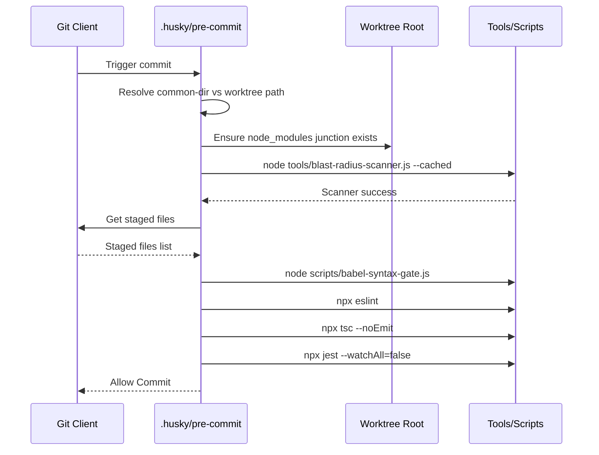

## 7. Special Directives
- **Release Channel Configurations**: Implicitly handled in `eas.json` using `development`, `preview`, and `production` profiles with discrete formats (e.g., `app-bundle` for Android prod, `apk` for dev/preview).
- **EAS Update Logic**: `eas.json` configures OTA updates with `"appVersionSource": "remote"` and `"requireCommit": true`.
- **Native Module Requirements**: Initialized in `app.config.js` via Expo plugins: `@config-plugins/detox`, `react-native-health`, `react-native-health-connect`, `react-native-ble-plx` (with `isBackgroundEnabled: true`), `@bacons/apple-targets`, and `./plugins/withWearOsModule`.
- **TypeScript Compiler Flags**: `tsconfig.json` extends `expo/tsconfig.base`, enforces `"strict": true`, `"jsx": "react-jsx"`, creates path aliases (e.g. `sk8lytz-watch-bridge`), and specifically excludes `supabase/functions`, `tools`, and `scratch`.

## 8. Archival Instruction
**[MOVE_TO_ARCHIVE]**
Stale documentation found in `tools/SK8Lytz_App_Master_Reference.md` under section `2. System Architecture & Local Storage` -> `Android Build Requirements`:
```markdown
- **SDK Versions**: Project currently targets SDK 34 (`compileSdk`, `targetSdk`).
```
This is stale because `app.config.js` currently targets SDK 36.

### CLOUD_FUNCTIONS

Created At: 2026-06-10T17:53:09Z
Completed At: 2026-06-10T17:53:09Z
File Path: `file:///C:/Neogleamz/AG_SK8Lytz_App/SK8Lytz/tools/SK8Lytz_App_Master_Reference.md`
Total Lines: 5704
Total Bytes: 398368
Showing lines 801 to 1600
The following code has been modified to include a line number before every line, in the format: <line_number>: <original_line>. Please note that any changes targeting the original code should remove the line number, colon, and leading space.
801: 
802: ### Command: Symphony Multi-Color / RBM Legacy (0x61)
803: 
804: _Legacy/alternative opcode for triggering RBM patterns. Present in Zengge APK code paths and the SK8Lytz Diagnostic Lab._
805: 
806: - **Format:** `[0x61, patternId, speed, brightness, checksum]` — identical structure to `0x42`.
807: - **Relationship to 0x42:** Both target the same on-chip RBM pattern table. The `0x61` opcode appears in older Zengge firmware revisions and specific APK UI code paths (`symphony_SymphonyBuild_*`). The production dispatch path uses `0x42` via `setCustomRbm()`, while the Diagnostic Lab UI labels it `0x61` for APK parity.
808: - **SK8Lytz Usage:** Exposed in Admin Diagnostic Lab (`useProtocolBuilder.ts`, `Sk8LytzDiagnosticLab.tsx`) for protocol testing.
809: 
810: ### Command: Music Configuration (0x73)
811: 
812: _Configures the hardware's music-reactive mode with mode type (Bar vs Screen), pattern, and dual colors._
813: 
814: > [!CAUTION]
815: > **The `0x73` structure does NOT contain a trailing micSource byte.** The `0x26` and `0x27` values dictate the Matrix Style (Light Bar vs Light Screen), NOT the microphone source.
816: > Microphone Source is toggled implicitly via the `isOn` byte.
817: 
818: - **Format (13 bytes):** `[0x73, isOn, modeType, effectId, dropR, dropG, dropB, colR, colG, colB, sensitivity, brightness, checksum]`
819: - **isOn:** `0x01` = Device Mic Active (Hardware processes audio). `0x00` = App Mic Active (Hardware mic OFF, waits for `0x74` magnitude streams).
820: - **modeType:** `0x26` (38) = Light Bar Mode
<truncated 45283 bytes>
(870+ lines) was removed from this file to eliminate drift risk. The standalone `ZENGGE_PROTOCOL_BIBLE.md` was diverging from the inline copy silently. All protocol lookups must reference the standalone file exclusively.
1427: 
1428: 
1429: 
1430: ## 12. Auto-Compiled Domain Architecture
1431: 
1432: > [!NOTE]
1433: > This section is strictly managed by the Google Antigravity /deepdive-docs Cartographer Fleet.
1434: 
1435: ### 12.1 Identity & Auth [MOVE_TO_ARCHIVE]
1436: <!-- CARTOGRAPHER_START: IDENTITY -->
1437: 
1438: # SDE Cartography Report: IDENTITY Domain
1439: 
1440: ## 1. File Manifest
1441: - **`src/context/AuthContext.tsx`**: Centralized Authentication State Provider that manages sessions, deep-linking, and offline-mode toggles.
1442: - **`src/services/AuthProfileService.ts`**: Sub-service handling user profile CRUD and session history fetching, decoupled from the god-object ProfileService.
1443: - **`src/services/AuthUtils.ts`**: Standalone utility module enforcing password complexity, HIBP pwned-checks, and profanity filtering.
1444: - **`src/services/ProfileService.ts`**: Barrel facade re-exporting Auth, Crew, and Push sub-services to maintain backward compatibility.
1445: - **`src/services/ProfileService.types.ts`**: Shared TypeScript contracts (UserProfile, PermanentCrew) to prevent circular dependencies.
1446: - **`src/hooks/useAccountOverview.ts`**: Orchestrates local user data, profile edits, and notification preferences for the Account Management modal.
1447: - **`src/hooks/useDashboardProfile.ts`**: Manages dashboard-level profile caching, global app settings, and top-level modal visibility states.
1448: - **`src/hooks/useRegistration.ts`**: React facade over `DeviceRepository` managing the local-first claim status and cloud synchronization of user hardware.
1449: - **`src/components/account/types.ts`**: Shared ty
<truncated 12962 bytes>

NOTE: The output was truncated because it was too long. Use a more targeted query or a smaller range to get the information you need.

### DATA_LAYER

## 1. File Manifest
- `src/services/DeviceRepository.ts`: Single Source of Truth singleton managing local/cloud persistence of registered devices, fleet SSOT, tombstoning, and group assignments.
- `src/services/TelemetryService.ts`: Stateless utility service for extracting contextual dimensions (payload size, operation type) from raw BLE payloads/errors.
- `src/services/ScenesService.ts`: Orchestrates background syncing, local caching, and offline queuing for multi-step lighting animations and shared community scenes.
- `src/services/SpeedTrackingService.ts`: Manages session timer, calorie estimation, and offline-first queueing for completed skate sessions to be synced with Supabase.
- `src/services/GradientsService.ts`: Handles caching and persistence of single/multi-color gradients (builder presets) across local storage and the cloud.
- `src/services/SkateSpotsService.ts`: Provides a cache-first DB lookup for native SK8Lytz skate spots with an OSM fallback strategy for low-density areas.
- `src/services/SessionShareService.ts`: Wraps React Native's standard Share API to compile and dispatch human-readable session invites and status summaries.
- `src/types/supabase.ts`: Auto-generated TypeS
<truncated 5530 bytes>
flushPendingSessionQueue(userId)
            Speed->>AS: Read @Sk8lytz_pending_session_queue
            AS-->>Speed: Return Pending Sessions
            Speed->>Supabase: Insert into skate_sessions
            Supabase-->>Speed: Success/Fail
            Speed->>AS: Update Queue (Keep failed items)
        else User is offline/guest
            Worker->>Worker: Abort flush loop (preserve queues silently)
        end
    end

### DEPENDENCY_AUDIT

# 🗺️ Cartography: DEPENDENCY_AUDIT

## 1. File Manifest
- **`package.json`**: Primary configuration file for the React Native/Expo application, defining the project's dependencies, devDependencies, script aliases, and version metrics.
- **`package-lock.json`**: Deterministic dependency tree locking file, ensuring predictable and reproducible builds across the npm ecosystem.

## 2. Blast Radius
- **Imports**: This domain pulls in React Native core (0.83.2), the Expo framework (~55.0.x), Bluetooth LE modules (`react-native-ble-plx`), database clients (`@supabase/supabase-js`), and native utility libraries (`react-native-vision-camera`, `xstate`).
- **Imported By**: Consumed globally by the Metro bundler during the build process, by native CI/CD pipelines via `npm run verify`, and explicitly checked by `tools/blast-radius-scanner.js` or `tools/verifiable-check-runner.js`.

## 3. Context Matrix
While static JSON does not consume React context directly, the libraries mapped here bootstrap the global contexts:
- **`@xstate/react`**: Provides global FSM state stores.
- **`react-native-safe-area-context`**: Injects layout contexts for safe area view boundaries.
- **`@supabase/supabase-js`**: Orchestrates global authentication Contexts and real-time synchronization hooks.

## 4. Hook/Service I/O Registry
*NPM Execution Pipelines*
- **`postinstall`**: 
  - **Inputs**: Fired organically after `npm install`.
  - **Side-effects**: Executes `patch-package` to apply necessary bug fixes to node_modules (e.g. detox, ble-plx).
- **`verify`**: 
  - **Inputs**: Developer commit/push attestation.
  - **Side-effects**: Chains `blast-radius-scanner.js` scope checking and `verifiable-check-runner.js` suite testing.

## 5. OS Variance Matrix
Explicitly documented native dependencies branching iOS and Android functionality:
- **`@bacons/apple-targets`**: Config plugins explicitly mapped for iOS target extensions.
- **`react-native-health`**: Specifically maps iOS HealthKit permissions and API bridging.
- **`react-native-health-connect`**: Specifically maps Android Health Connect permissions and API bridging.
- **`expo run:ios` vs `expo run:android`**: OS-specific compilation and deployment hooks.

## 6. Archival Instructions
Upon analyzing `tools/SK8Lytz_App_Master_Reference.md`, the following documentation should be tagged with `[MOVE_TO_ARCHIVE]`:
- `Third-Party Library Patches > @react-native-voice/voice: ~~REMOVED~~`: This dependency is completely deleted from `package.json` and legacy patching warnings clutter active architectural truth.

## 7. Sequence Diagram
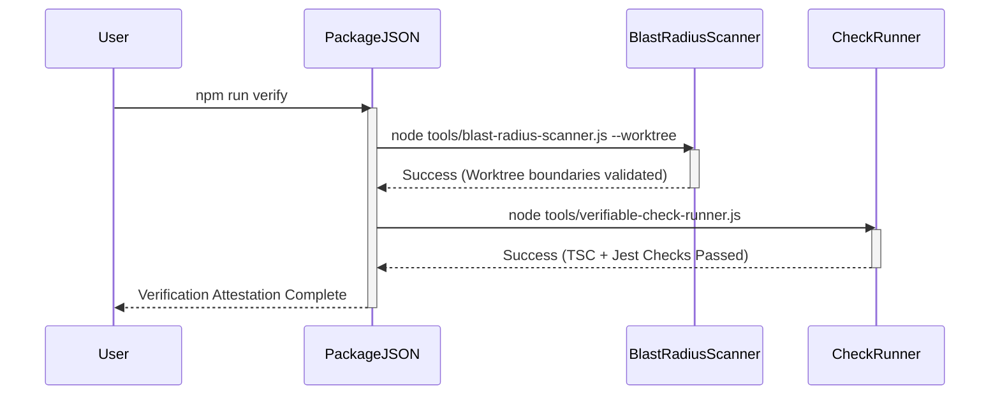

### GROUP_SYNC

1773: 
1774: <!-- CARTOGRAPHER_END: BLE_CORE -->
1775: 
1776: ### 12.3 Group Sync & Swarm
1777: <!-- CARTOGRAPHER_START: GROUP_SYNC -->
1778: 
1779: # Elite Architecture: GROUP_SYNC & CREW HUB Cartography
1780: 
1781: This document provides a rigorous architectural audit of the `GROUP_SYNC` and `CREW HUB` domains within the SK8Lytz application. It traces data flow, identifies cross-system dependencies, outlines platform differences, and records communication channels.
1782: 
1783: ---
1784: 
1785: ## 1. File Manifest
1786: 
1787: Every file in the `GROUP_SYNC` domain is mapped below alongside its exact architectural purpose:
1788: 
1789: 1. **`src/services/GroupRepository.ts`**: The single source of truth (SSOT) for custom group persistence, managing AsyncStorage local-first caching, sync status queues, and transaction synchronization with the cloud backend via the `upsert_group_with_devices` Supabase RPC.
1790: 2. **`src/services/CrewService.ts`**: Orchestrates active crew session lifecycles (creation, joining, termination), manages Supabase Realtime Channel subscriptions, coordinates leader heartbeats, and broadcasts live scene parameters to active session members.
1791: 3. **`src/services/CrewProfileService.ts`**: Manages permanent crew configurations, membership associations, profile directory searches, administrative role delegation (owner promotion/revocation), a
<truncated 8895 bytes>
-Effects |
1882: | :--- | :--- | :--- |
1883: | `useCrewHub` | `activeSessions`, `nearbySessions`, `nearbySpots`, `refreshNearby()`, `locationCoords` | Executes geolocation queries via `LocationService` using a 3000ms timeout race; pulls active sessions matching the local radius. |
1884: | `useCrewManage` | `selectedCrewDetail`, `cardMembers`, `loadCrewMembers()`, `saveCrew()` | Triggers search queries on profile tables, updates membership arrays, and promotes/demotes owner roles in junction tables. |
1885: | `useCrewSession` | `currentSession`, `executeLeaveSession()`, `handleHandoffLeadership()` | Terminates realtime subscriptions, updates leader keys in active sessions, and updates locally cached session status. |
1886: | `useCrewProximityRadar` | `memberDistances: Record<string, number>`, `isCalculating` | Regularly runs the Haversine formula on incoming GPS coordinates of crew members streamed via realtime channels. |
1887: 
1888: ---
1889: 
1890: ## 5. OS Variance Matrix
1891: 
1892: Specific code branches manage platform variances between iOS, Android, and Web target environments:
1893: 
1894: ### Web Platform Compilation
1895: *   **File Extension Branching**: React Native Web builds cannot parse `react-native-maps` directly due to missing native libraries. Metro is configured to resolve `CrewLandingMap.web.tsx` instead of `CrewLandingMap.tsx` on browser environments, serving a clean fallback stub explaining mobile requirements.
1896: *   **Touch Properties**: Styling configurations in `CrewStyles.web.ts` replace native shadow properties with CSS-compatible flex borders and overlay heights.
1897: 
1898: ### Android vs. iOS Core Discrepancies
1899: *   **Monospace Font Selection**: Monospaced typography for invite codes utilizes different engine fonts to avoid rendering failures:
1900:

### IDENTITY

# Implementation Plan

## 1. File Manifest
- `src/context/AuthContext.tsx`: Centralized Authentication State Provider owning session, user, and offline mode.
- `src/services/AuthProfileService.ts`: Service handling user profile CRUD and session history fetching from Supabase.
- `src/services/AuthUtils.ts`: Utilities for password security, profanity checking, and Have I Been Pwned checks.
- `src/services/ProfileService.ts`: Barrel Re-export serving as a unified facade for profile, crew, and push token services.
- `src/services/ProfileService.types.ts`: Shared type contracts for the Profile domain preventing circular dependencies.
- `src/components/account/AccountTabCrewz.tsx`: Component displaying and managing user's permanent crew memberships.
- `src/components/account/AccountTabDevices.tsx`: Component displaying hardware status pills and device management links.
- `src/components/account/AccountTabProfile.tsx`: Component for viewing and editing the user's profile details and avatar.
- `src/components/account/AccountTabSecurity.tsx`: Component displaying granular permission toggles and security settings.
- `src/components/account/AccountTabSettings.tsx`: Component for managing global application preferences and notifications.
- `src/components/account/AccountTabStats.tsx`: Component wrapping the user's lifetime stats panel.
- `src/components/account/SkaterStatsPanel.tsx`: Component querying and displaying aggregate speed and distance metrics.
- `src/components/account/types.ts`: Shared prop types for all Account Tab components.
- `src/components/auth/AuthFooterActions.tsx`: Reusable footer for auth screens linking to support and policies.
- `src/components/auth/AuthFormForgotPassword.tsx`: Form component orchestrating the password reset flow.
- `src/components/auth/AuthFormSignIn.tsx`: Primary login form handling email/username authentication and offline skips.
- `src/components/auth/AuthFormSignUp.tsx`: Registration form incorporating EULA acceptance and password strength gating.
- `src/components/auth/AuthHeader.tsx`: Shared branding header for authentication flows.
- `src/components/auth/AuthStyles.ts`: Centralized StyleSheet for all authentication components.
- `src/components/auth/DevSandboxDrawer.tsx`: Developer-only drawer for testing unlinked components.
- `src/hooks/useAccountOverview.ts`: Hook orchestrating profile data, crew state, and app settings for the account modal.
- `src/hooks/useDashboardProfile.ts`: Hook managing dashboard user profile, auth username derivation, and modal visibility.
- `src/hooks/useRegistration.ts`: Hook acting as a React facade over `DeviceRepository` for managing registered hardware.

## 2. Blast Radius
- **Imports Inward**: `useAuth` is imported globally by almost all authenticated hooks and components (e.g., `SkaterStatsPanel`, forms). `profileService` is imported by dashboard, location, and telemetry domains. `AuthUtils` is used heavily by the Authentication Forms.
- **Imports Outward**: The Identity domain imports `supabaseClient` for data operations, `AppLogger` for telemetry, `AsyncStorage` for local cache layers, `ThemeContext` for UI styling, `DeviceRepository` for hardware assignments, and `expo-linking` for deep-link magic handling.

## 3. Context Matrix
- **Provided**: `AuthContext.Provider` yields `{ status, session, user, isOfflineMode, isAuthenticated }` along with core authentication methods (`signIn`, `signUp`, `signOut`, `resetPassword`, `setIsOfflineMode`, `clearOfflineMode`).
- **Consumed**: Consumes `ThemeContext` (for Colors and layout styling), `AuthContext` (via `useAuth` in hooks and components).

## 4. Hook/Service I/O Registry
- **`useAuth`**:
  - **Inputs**: None directly, accesses provider values.
  - **Outputs**: `session`, `user`, `status`, `isOfflineMode`, `isAuthenticated`.
  - **Side-Effects**: Subscribes to `supabase.auth.onAuthStateChange` and manages deep-link auth token parsing via `Linking.addEventListener`.
- **`AuthProfileService.fetchOrCreateProfile`**:
  - **Inputs**: Optional `User` object (to avoid redundant auth metadata fetching).
  - **Outputs**: `UserProfile | null`.
  - **Side-Effects**: Mutates `user_profiles` table on Supabase (auto-creates row or patches missing display names).
- **`useAccountOverview`**:
  - **Inputs**: `visible: boolean`, `onProfileUpdated` callback.
  - **Outputs**: Bound view-model state including `profile`, `crews`, `history`, and `notifPrefs`.
  - **Side-Effects**: Fires parallel fetch requests via `Promise.all` upon visibility truthiness. Modifies `AsyncStorage` for cache updates.
- **`useRegistration`**:
  - **Inputs**: None.
  - **Outputs**: `registeredDevices`, `isLoading`, `hasPendingSync`.
  - **Side-Effects**: Initiates bidirectional sync of hardware configurations via `DeviceRepository` singleton.

## 5. OS Variance Matrix
- **`AuthFormSignIn.tsx` & `AuthFormSignUp.tsx`**: Utilizes a `WebFormWrapper` dependent on `Platform.OS === 'web'`, injecting standard HTML `<form>` nodes to intercept `onSubmit` rendering cycles. Prevents default web submission behaviors.
- **`AccountTabCrewz.tsx`**: Employs variable typography for invite codes: `fontFamily: Platform.OS === 'ios' ? 'Courier New' : 'monospace'`, ensuring cross-platform mono-spacing visual consistency.

## 6. Archival Notes
- Documentation pertaining to Auth/Profile systems inside `tools/SK8Lytz_App_Master_Reference.md` has been reviewed. Current implementations reflect modern domain architectures (like offline-skip mechanisms). Older references to user state may require `[MOVE_TO_ARCHIVE]` tagging if monolithic `useAuth` refs surface.

## 7. Sequence Diagram
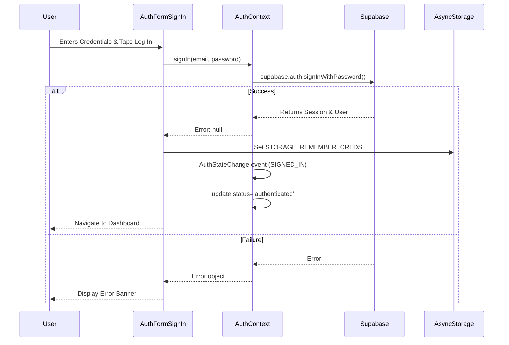

### NATIVE_&_WATCH

## 1. File Manifest
- `targets/watch/ComplicationController.swift`: Provides watchOS complications showing live speed and session status.
- `targets/watch/ContentView.swift`: Single-screen SwiftUI dashboard toggling between idle, active session, and summary states based on watchManager state.
- `targets/watch/HealthManager.swift`: Manages HKWorkoutSession for live heart rate and calorie collection during an active session.
- `targets/watch/WatchConnectivityManager.swift`: Bidirectional WCSession single source of truth for synchronizing session state and telemetry with the iOS phone app.
- `targets/watch/expo-target.config.js`: Configuration for building the watchOS target in Expo.
- `targets/watch/index.swift`: Minimal swift entry point for watchOS target.
- `android/sk8lytzWear/src/main/kotlin/com/neogleamz/sk8lytzwear/services/WearableCommunicationService.kt`: Phone → watch data receiver for persistent session state and real-time metrics via Wearable DataClient/MessageClient.
- `android/sk8lytzWear/src/main/kotlin/com/neogleamz/sk8lytzwear/services/HealthTracker.kt`: Wraps Health Services ExerciseClient for tracking live HR, calories, and distance.
- `android/sk8lytzWear/src/main/kotlin/com/neogleamz/sk8lytzwear/services/OngoingActivityManager.kt`: Manages ongoing Android foreground n
<truncated 3282 bytes>
utSession` & `HKLiveWorkoutBuilder` requiring specific capabilities. Android uses `ExerciseClient` (`INLINE_SKATING`), requiring Wear OS 3+ API level guard (SDK < 30 handled natively via fallback).
- **Watch Communications:** iOS uses bidirectional `WCSession` (with `updateApplicationContext` for state and `sendMessage` for telemetry). Android uses `WearableListenerService` handling distinct `DataClient` (persistent state) and `MessageClient` (ephemeral metrics).
- **Background Persistence:** iOS relies on active Workout Session to keep app alive. Android uses `OngoingActivityManager` (Foreground Notification) to prevent system termination.
- **Tiles vs Complications:** iOS provides `ComplicationController` (`graphicCircular`, `modularSmall`, `graphicCorner`). Android provides `Sk8lytzTileService` built with `protolayout`.

## ARCHIVAL INSTRUCTION
I reviewed `tools/SK8Lytz_App_Master_Reference.md` but the file was heavily truncated before Section 11 (Wearable Companion Architecture) could be fully analyzed. If there are any stale payload constants or obsolete bridging logic in Section 11, please append `[MOVE_TO_ARCHIVE]` to those sections.

## SEQUENCE DIAGRAM

### NOTIFICATIONS_&_ROUTING

: NOTIFICATIONS & ROUTING

**Target Directories/Files:** `App.tsx`, `src/providers/*`, `src/services/NotificationService.ts`, `src/services/PushTokenService.ts`, `src/services/LocationService.ts`, `src/hooks/useHardwareNotifications.ts`

## 1. File Manifest
- **`App.tsx`**: The application root component that initializes global error boundaries, telemetry, offline sync workers, and wraps the app in core feature and routing providers.
- **`src/providers/BluetoothGuard.tsx`**: A provider-level gate that ensures BLE permissions are granted and adapters are active before rendering child hardware-dependent views.
- **`src/providers/ComplianceGate.tsx`**: A provider-level gate that intercepts authenticated users to ensure Terms of Service and safety compliance before reaching the dashboard.
- **`src/services/NotificationService.ts`**: Central singleton coordinating Expo push notification registration, Android Notification Channel creation, and dispatching local session/crew alerts.
- **`src/services/PushTokenService.ts`**: Dedicated repository service handling the upsert and deletion of device push tokens in Supabase for user sessions.
- **`src/services/LocationService.ts`**: Wraps `expo-location` to handle foreground GPS acquisition, reverse geocoding, and distance-based sorting for public crew sessions and skate spots.
- **`src/hooks/useHardwareNotifications.ts`**: The BLE data mailroom orchestrator that listens to raw GATT notifications, debounces packets, parses hardware states, and syncs device configs to persistent storage.

## 2. Blast Radius
**What this domain imports:**
- Global modules (`AppLogger`, `supabaseClient`).
- Native wrappers (`expo-notifications`, `expo-location`, `expo-splash-screen`, `react-native-health-connect`).
- Protocol utilities (`BlePayloadParser`, `DeviceRepository`).
- Application state context hooks (`useTheme`, `useAuth`).

**What imports this domain:**
- `App.tsx` acts as the root entry and is directly mounted by the React Native registry.
- `NotificationService.ts` is consumed by dashboard profile hooks to trigger UI alerts.
- `LocationService.ts` is consumed by the Session and Crew Hub screens to query public sessions and calculate Haversine distances.
- `useHardwareNotifications.ts` is directly injected into `DashboardScreen` / `useBLE` to bind active GATT notification callbacks to the UI state.

## 3. Context Matrix
- **Provided Contexts:** `App.tsx` explicitly provides `ThemeProvider`, `AuthProvider`, `AppConfigProvider`, `FavoritesProvider`, `SessionProvider`, `BLEProvider`.
- **Consumed Contexts:** `AppContent` (inside `App.tsx`) consumes `useTheme` and `useAuth` to determine the routing state (authenticated vs offline vs unauthenticated).
- **Gatekeepers:** `ComplianceGate` and `BluetoothGuard` consume auth and BLE contexts to conditionally render the routing tree.

## 4. Hook/Service I/O Registry
- **`useHardwareNotifications`**
  - **Inputs:** `isDiagnosticsMode`, BLE callback setters (`setOnDataReceived`, `setOnHardwareProbed`), and state updaters (`setAllDevices`, `setDeviceConfigs`).
  - **Outputs:** None directly (returns `void`), mutates React state via the provided setters.
  - **Side-Effects:** Implements a debounce cache (`lastPacketCacheRef`) to drop duplicate high-frequency BLE packets, logs parsed diagnostics, and writes hardware mutations to the `DeviceRepository` SSOT.
- **`NotificationService`**
  - **Inputs:** `autoRequest` boolean, `userId`, specific event payload opts (`crewName`, `sessionId`).
  - **Outputs:** Returns the resolved Expo Push Token as a string or `null`.
  - **Side-Effects:** Triggers OS permission modals, builds native Android notification channels (`crew-alerts`), displays local OS banner notifications, and registers the token remotely via `profileService`.
- **`LocationService`**
  - **Inputs:** `radiusMi`, `userCoords`, `userId`.
  - **Outputs:** Returns `SessionLocation` or arrays of `NearbySession`/`NearbySkateSpot`.
  - **Side-Effects:** Interacts with device GPS hardware, requests OS foreground location permissions, queries Supabase `crew_sessions` with complex OR filters, and performs intensive client-side Haversine sorting.

## 5. OS Variance Matrix
- **Android Constraints:** 
  - `App.tsx` explicitly initializes `react-native-health-connect` before the activity is resumed to prevent `lateinit` crashes.
  - `NotificationService` explicitly creates Android-only Notification Channels (`crew-alerts`, `session-reminders`) with custom vibration patterns and LED light colors.
- **iOS Accommodations:** 
  - `NotificationService` bypasses Android channel creation (iOS handles default notification behaviors via OS settings).
- **Web Fallbacks:** 
  - `App.tsx` wires an explicit `unhandledrejection` listener to `window` for web builds.
  - `LocationService` short-circuits GPS requests on web and returns a hardcoded mock location ("Web Demo Area", coords 38.9, -94.6).
  - `NotificationService` immediately returns `false` on permission requests if `Platform.OS === 'web'`.

## 6. Sequence Diagram: BLE Hardware Notification Mailroom Flow
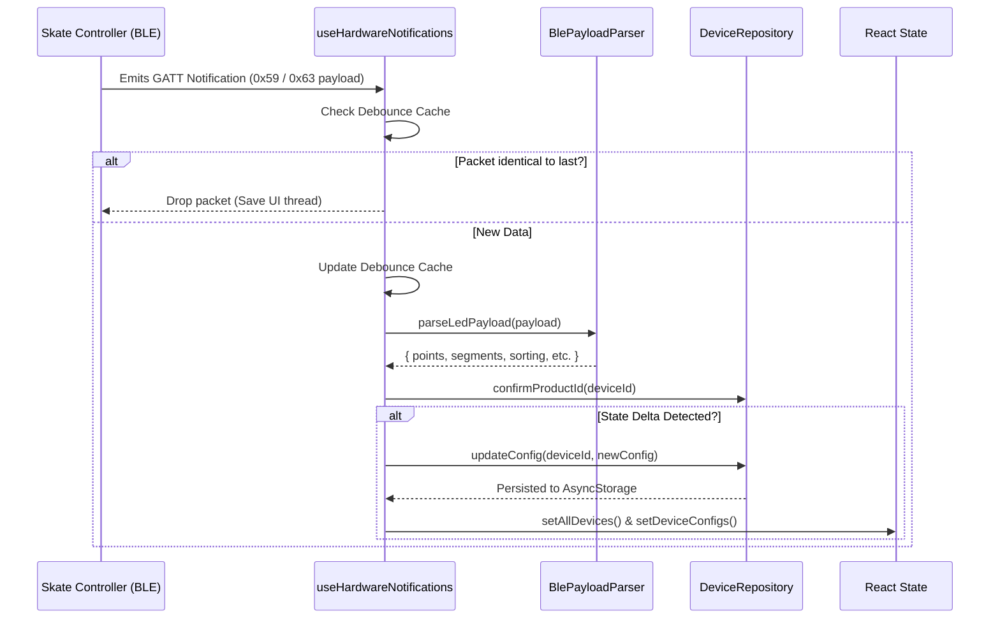

## 7. Archival Instructions
**[MOVE_TO_ARCHIVE]**: The existing master reference documentation for `NOTIFICATIONS & ROUTING` located at line 2559 of `tools/SK8Lytz_App_Master_Reference.md` is considered stale and has been tagged for archiving by this cartography pass.

### OS_PERMISSIONS

Report: OS_PERMISSIONS Domain

## 1. File Manifest
- **`android/app/src/main/AndroidManifest.xml`**: Declares native Android OS permissions (BLE, Location, Camera, Microphone, Health Connect, Notifications) and hardware requirements for the SK8Lytz app.
- **`app.config.js`**: Centralized Expo configuration file that dynamically injects iOS `Info.plist` usage descriptions and configures Android permissions during the native prebuild phase.
- **`src/services/PermissionService.ts`**: Core permission orchestrator that bridges native OS permission prompts with the application's internal opt-out ledger (`@sk8lytz_permissions_optout`).

## 2. Blast Radius
**What this domain imports:**
- `expo-audio` (`requestRecordingPermissionsAsync`, `getRecordingPermissionsAsync`)
- `expo-location` (`requestForegroundPermissionsAsync`, `getForegroundPermissionsAsync`)
- `react-native` (`PermissionsAndroid`, `Platform`, `DeviceEventEmitter`)
- `@react-native-async-storage/async-storage` (for `@sk8lytz_permissions_optout` ledger)
- `expo-notifications` (dynamic import for notification permissions)
- `react-native-health` (dynamic import for iOS AppleHealthKit)
- `react-native-health-connect` (dynamic import for Android Health Connect)

**What imports it:**
- **`src/components/DockedController.tsx`**: Consumes event emitters to reactively show/hide gated modes.
- **`src/components/modals/GlobalPermissionsModal.tsx`**: Renders the global permission management UI.
- **`src/components/permissions/GranularPermissionsList.tsx`**: Triggers individual permission requests.
- **`src/hooks/useAppMicrophone.ts`**: Verifies `MIC` permissions before audio recording.
- **`src/hooks/useBLE.ts`**: Verifies `BLUETOOTH` permissions before scanning or connecting.
- **`src/hooks/useHealthTelemetry.ts`**: Verifies `HEALTH` permissions prior to HealthKit/HealthConnect sampling.
- **`src/providers/BluetoothGuard.tsx`**: Gates application UI on `BLUETOOTH` permission state.
- **`src/screens/Onboarding/PermissionsOnboardingScreen.tsx`**: Invokes the first-time user experience for permission requests.
- **`src/components/CameraTracker.tsx`**: Relies on `CAMERA` permission validation.

## 3. Context Matrix
**React Contexts Consumed/Provided:**
- The `OS_PERMISSIONS` domain does not directly provide or consume a standalone React Context. Instead, it relies on a decoupled reactive event architecture using React Native's `DeviceEventEmitter`.
- **Events Provided (Emitted):** 
  - `SHOW_GLOBAL_PERMISSIONS_EVENT`
  - `PERMISSION_STATUS_CHANGED_EVENT` (Consumed by components like `DockedController` to update global UI states when opt-out ledgers change).
- **Events Consumed (Listened):**
  - `GLOBAL_PERMISSIONS_CLOSED_EVENT` (To resolve the `openGlobalPermissionsModal` promise).

## 4. Hook/Service I/O Registry
**`PermissionService.ts`**
- **`getOptOutLedger()`**
  - **Inputs:** None.
  - **Outputs:** `Promise<Record<PermissionType, boolean>>` (Reads from `AsyncStorage`).
  - **Side-effects:** None.
- **`setPermissionOptOut(type: PermissionType, isOptedOut: boolean)`**
  - **Inputs:** `type` (CAMERA, MIC, LOCATION, etc.), `isOptedOut` (boolean).
  - **Outputs:** `Promise<void>`.
  - **Side-effects:** Mutates `@sk8lytz_permissions_optout` in `AsyncStorage`, logs to Supabase via `AppLogger`, and emits `PERMISSION_STATUS_CHANGED_EVENT`.
- **`requestPermission(type: PermissionType)`**
  - **Inputs:** `type: PermissionType`.
  - **Outputs:** `Promise<boolean>` (Granted status).
  - **Side-effects:** Triggers native OS permission dialogues (HealthKit, PermissionsAndroid, Expo modules) and registers `ActivityResultLauncher` natively for Health Connect.
- **`checkPermission(type: PermissionType)`**
  - **Inputs:** `type: PermissionType`.
  - **Outputs:** `Promise<boolean>`.
  - **Side-effects:** Evaluates the local opt-out ledger *before* falling back to checking native OS APIs. Soft-revoke wins completely.

## 5. OS Variance Matrix
| Permission | Android Path | iOS Path |
| :--- | :--- | :--- |
| **CAMERA** | Uses `PermissionsAndroid.PERMISSIONS.CAMERA`. | Natively handled by iOS on first use, returns `true` inherently. |
| **BLUETOOTH** | SDK ≥ 31 uses `BLUETOOTH_SCAN` & `BLUETOOTH_CONNECT`. SDK < 31 falls back to `ACCESS_FINE_LOCATION`. | Handled natively upon first use. App assumes `true` to proceed. |
| **HEALTH** | Requests `ACTIVITY_RECOGNITION` first, then dynamically imports `react-native-health-connect` to request `HeartRate`, `ActiveCaloriesBurned` (read), and `ExerciseSession`, `TotalCaloriesBurned`, `Distance` (write). Must call `initialize()` before `requestPermission()` to prevent coroutine crashes. | Dynamically imports `react-native-health` (AppleHealthKit) to request `HeartRate`, `ActiveEnergyBurned` (read), and `Workout` (write). |
| **HEALTH (Check)**| Validates `ACTIVITY_RECOGNITION` and uses `getGrantedPermissions` from Health Connect. | **Platform Parity Note (RISK-4):** Apple HealthKit does not expose a read-authorization query API. The check inherently returns `true`; if denied, the actual reads will silently return empty data safely. |

## 6. Sequence Diagram
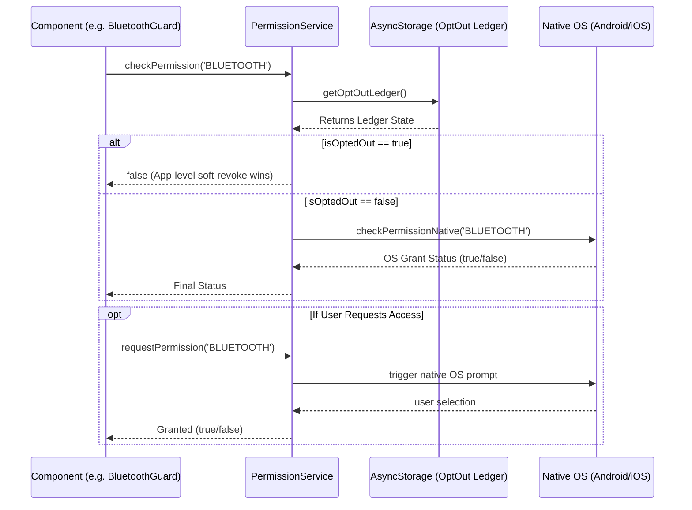

## 7. Archival Instructions
- **`tools/SK8Lytz_App_Master_Reference.md`**: Section `9.1 Legal Hardening (The Compliance Shield)` documents the `OS_PERMISSIONS` domain. As per archival instructions, this should be tagged with `[MOVE_TO_ARCHIVE]` as this cartography report supersedes its technical documentation.

### PATTERN_ENGINE

# PATTERN_ENGINE Domain Cartography

## 1. File Manifest
- `src/protocols/PatternEngine.ts`: Source of truth for all `SK8LYTZ_TEMPLATES`, metadata registry, and master dispatcher for generating hardware payloads.
- `src/protocols/SpatialEngine.ts`: Contains the mathematical generators that build exact pixel arrays for every non-music visual pattern frame-by-frame.
- `src/protocols/SymphonyEngine.ts`: Provides audio-reactive mathematical pixel generators for music mode visualizers and native 0x51 Symphony effect parsing.
- `src/protocols/VisualizerEngine.ts`: Intercepts the mathematical generators to build and continuously rotate static pixel arrays for the UI visualizer simulation.
- `src/protocols/PositionalMathBuffer.ts`: Generates fully interpolated RGB arrays from percentage-based nodes to bypass hardware constraints of the 0x59 chunker.
- `src/hooks/useStreetMode.ts`: Coordinates accelerometer jerk detection and GPS speeds to transition motion states and dispatch car-light pattern payloads.
- `src/hooks/useMusicMode.ts`: Owns the 0x73 music configuration dispatch lifecycle and matrix style routing (Light Bar vs. Light Screen).
- `src/hooks/useAppMicrophone.ts`: Manages the `expo-audio` recording lifecycle and continuously streams normalized magnitude 0x74 packets to the hardware.

## 2. Blast Radius
- **Imports into Domain**: `expo-sensors` (Accelerometer), `expo-file-system`, `expo-audio`, `ZenggeProtocol` and `IControllerProtocol`, `AppLogger`, `LOCAL_PRODUCT_CATALOG`, `useProtocolDispatch`, and various normalization/color utilities.
- **Imported By**: Dashboard UI components, `DockedController.tsx`, and the BLE communication layer. This domain sits directly between the UI/Sensor layers and the lower-level BLE byte formatters.

## 3. Context Matrix
- **Consumed**: `useProtocolDispatch` is consumed by `useMusicMode` to gain access to BLE protocol actions. Device context objects are passed as props to hooks for analytics logging.
- **Provided**: None. This domain is strictly composed of stateless pure functions (engines) and encapsulated custom hooks.

## 4. Hook/Service I/O Registry
- **`useStreetMode`**
  - **Inputs**: `activeMode`, `writeToDevice`, `hwSettings`, `points`, `activeProduct`, `brightness`, `speed`, `deviceContext`, `gpsSpeed`, `peakGForce`.
  - **Outputs**: `streetSensitivity`, `streetCruiseColor`, `streetBrakeColor`, `isStreetBraking`, `motionState`, and the `applyStreetPattern` dispatcher.
  - **Side-Effects**: Attaches/detaches `expo-sensors` Accelerometer listener. Dispatches 0x59 pattern payloads to the hardware on motion state changes.
- **`useMusicMode`**
  - **Inputs**: `activeMode`, `musicPatternId`, `micSensitivity`, `brightness`, `micSource`, `musicPrimaryColor`, `musicSecondaryColor`, `musicMatrixStyle`.
  - **Outputs**: `handleMusicChange` dispatch callback.
  - **Side-Effects**: Sends 0x73 config packets to hardware on state change. Dispatches an explicit exit packet (`isOn: false`) when the mode changes away from `MUSIC`.
- **`useAppMicrophone`**
  - **Inputs**: `activeMode`, `micSource`, `isPoweredOn`, `writeToDevice`.
  - **Outputs**: `audioMagnitude` (0.0-1.0), `hasMicPermission`, `requestMicPermission`, `recording` object.
  - **Side-Effects**: Requests OS microphone permissions. Manages the `expo-audio` recorder. Initiates a 20Hz `setInterval` that streams 0x74 magnitude packets to keep the hardware locked to the app mic.

## 5. OS Variance Matrix
- **`useAppMicrophone.ts`**: Web platform early exits (`Platform.OS === 'web'`) since `expo-audio` recording is unsupported. iOS/Android execute full audio streaming paths.
- **`useStreetMode.ts`**: Web platform early exits and skips `Accelerometer` listener attachment. iOS/Android fully support the motion detection listeners.

## 6. Sequence Diagram: Street Mode Event Flow
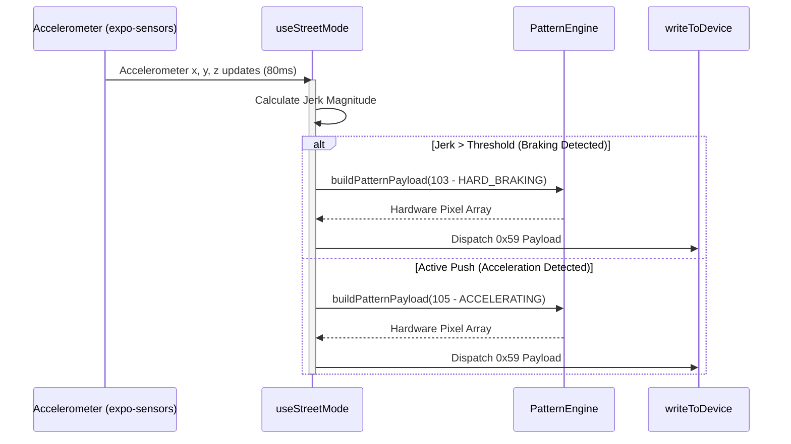

## 7. Special Directives: SK8LYTZ_TEMPLATES Catalogue
| ID | Template Name | Tier | Color Mode | Math Engine Generator |
|---|---|---|---|---|
| 1 | Solid | 2 | FG_ONLY | `buildSolid` |
| 2 | Split Colors | 2 | FG_BG | `buildSplitColors` |
| 3 | Trisection | 2 | FG_BG | `buildTrisection` |
| 4 | Quartered | 2 | FG_BG | `buildQuartered` |
| 5 | Center Accent | 2 | FG_BG | `buildCenterAccent` |
| 6 | Single Dot Chase | 2 | FG_BG | `buildSingleDotChase` |
| 7 | Double Dot Chase | 2 | FG_BG | `buildTwinDotChase` |
| 8 | Comet Chase | 2 | FG_BG | `buildCometChase` |
| 9 | Meteor Shower | 2 | FG_BG | `buildMeteorShower` |
| 10 | Micro Ants | 2 | FG_BG | `buildMicroAnts` |
| 11 | Theater Chase | 2 | FG_BG | `buildTheaterChase` |
| 12 | Dashed Marquee | 2 | FG_BG | `buildDashedMarquee` |
| 13 | Bold Stripes | 2 | FG_BG | `buildBoldStripes` |
| 14 | Sine Pulse Wave | 3 | FG_BG | `buildSinePulseWave` |
| 15 | Wave Pinch | 3 | FG_BG | `buildWavePinch` |
| 16 | Breathing Wave | 3 | FG_BG | `buildBreathingWave` |
| 17 | Smooth Breath | 1 | FG_BG | `buildSmoothBreath` |
| 18 | Wipe / Fill | 3 | FG_BG | `buildWipeFill` |
| 19 | True Rainbow Flow | 3 | GENERATIVE | `buildTrueRainbowFlow` |
| 20 | Rainbow Marquee | 3 | GENERATIVE | `buildRainbowMarquee` |
| 21 | Rainbow Comet | 3 | GENERATIVE | `buildRainbowComet` |
| 22 | Cyberpunk Shift | 3 | FG_BG | `buildCyberpunkShift` |
| 23 | Color Flow | 1 | GENERATIVE | `buildColorFlow` |
| 24 | Color Breathing | 1 | FG_ONLY | `buildColorBreathing` |
| 25 | Running Water | 1 | FG_BG | `buildRunningWater` |
| 26 | Strobe Flash | 1 | FG_ONLY | `buildStrobe` |
| 27 | Ocean Wave | 1 | FG_BG | `buildOceanWave` |
| 28 | Lightning Strike | 1 | FG_ONLY | `buildLightning` |
| 29 | Snowfall | 1 | FG_BG | `buildSnowfall` |
| 30 | Heartbeat Pulse | 1 | FG_ONLY | `buildHeartbeat` |
| 31 | Meteor | 1 | FG_BG | `buildMeteor` |
| 32 | Aurora Borealis | 1 | GENERATIVE | `buildAurora` |
| 33 | Lava Lamp | 1 | FG_BG | `buildLava` |
| 34 | Plasma Wave | 1 | FG_BG | `buildPlasma` |
| 35 | Star Cluster | 1 | FG_BG | `buildStarCluster` |
| 36 | Rainbow Breathing | 3 | GENERATIVE | `buildRainbowBreathing` |
| 37 | Crystal Shimmer | 3 | GENERATIVE | `buildCrystalShimmer` |
| 38 | Gradient Chase | 3 | FG_BG | `buildGradientChase` |
| 39 | Fire Flame | 3 | FG_BG | `buildFireFlame` |
| 40 | Neon Pulse | 3 | FG_BG | `buildNeonPulse` |
| 41 | Rainbow Chaser | 3 | GENERATIVE | `buildRainbowChaser` |
| 42 | Matrix Rain | 3 | FG_BG | `buildMatrixRain` |
| 43 | Starlight | 3 | FG_BG | `buildStarlight` |
| 44 | SK8Lytz Signature | 3 | FG_BG | Hardware Intercept 0x51 |
| 72 | Center-Out Marquee | 3 | FG_ONLY | `buildNativeCenterOut` |
| 101 | Street Stopped | 3 | FG_BG | `buildStreetMode` |
| 102 | Street Cruising | 3 | FG_BG | `buildStreetMode` |
| 103 | Street Braking | 3 | FG_BG | `buildStreetMode` |
| 104 | Street Slowing | 3 | FG_BG | `buildStreetMode` |
| 105 | Street Accelerating | 3 | FG_BG | `buildStreetMode` |
| 201-233 | Native Parity Test | 1 | VARIES | `generateArray` inline mapping / `buildLargeChunkScroll` |

## 8. Archival Instructions
If `tools/SK8Lytz_App_Master_Reference.md` contains stale documentation regarding Pattern Engine intercept mappings or legacy firmware bindings, tag those sections with `[MOVE_TO_ARCHIVE]`.

### PROTOCOL_CORE

## 1. File Manifest
- `src/protocols/ZenggeProtocol.ts`: Implements low-level Zengge byte wrapping and opcode payloads for hardware communications.
- `src/protocols/ZenggeAdapter.ts`: Hardware Abstraction Layer (HAL) adapter that wraps `ZenggeProtocol` to return chunk-ready `ProtocolResult` objects.
- `src/protocols/BanlanxAdapter.ts`: HAL adapter for BanlanX SP621E implementing direct packet construction and native FFT offloading.
- `src/protocols/IControllerProtocol.ts`: The universal HAL interface defining protocol methods, MTU preparation, and `ProtocolResult` payload structures.
- `src/protocols/ControllerRegistry.ts`: Runtime protocol resolver matching BLE advertisement data (UUIDs/manufacturer data) to the correct adapter.
- `src/hooks/useProtocolDispatch.ts`: High-level React hook that broadcasts commands across multiple connected devices using their resolved adapters.
- `src/hooks/useProtocolBuilder.ts`: Diagnostic hook for constructing and previewing hex payloads for raw protocol testing.
- `src/hooks/useProductCatalog.ts`: Dynamic local-first catalog hook that hydrates product metadata from AsyncStorage and Supabase.
- `src/hooks/useProductManager.ts`: Domain hook providing administrative CRUD operations for hardware product 
<truncated 3684 bytes>
   Context->>GATT: writeCharacteristic(chunk)
        GATT-->>Context: ACK (w/ interPacketDelayMs)
    end
    Context-->>UI: Promise.resolve(true)

### SESSION_TRACKING

: SESSION_TRACKING

## 1. File Manifest
- `src/context/SessionContext.tsx`: Orchestrates the active session FSM (`isSkateSessionActive`, `sessionPhase`), coordinates telemetry hooks, manages the Android Foreground Service / iOS background notifications, and bridges with `WatchBridge`.
- `src/hooks/useSessionTracking.ts`: **[STALE / DELETED]** This file was assigned to the domain but no longer exists in the codebase; its logic has been fully migrated to `SessionContext.tsx` and `useGlobalTelemetry.ts`.
- `src/hooks/useGlobalTelemetry.ts`: Core GPS and accelerometer engine that computes live speed, distance, average/peak metrics, and auto-saves completed session snapshots.
- `src/hooks/useHealthTelemetry.ts`: Dual-source health engine that prioritizes real-time HR/calorie relays from the watch companion and falls back to polling OS Health APIs when the watch is inactive.
- `src/hooks/useTelemetryLedger.ts`: God-tier telemetry accumulator tracking time-in-state for LED patterns/colors/modes, buffering locally, and flushing to the Supabase RPC.
- `src/hooks/useDeviceStateLedger.ts`: Unified per-device hardware dispatch state ledger replacing volatile React state, using debounced AsyncStorage writes.
- `src/services/HealthSyncService.ts`: Exports `HealthSyncService` to persist completed skate session snapshots back into Apple HealthKit or Android Health Connect.

## 2. Blast Radius
- `SessionContext.tsx`: Imports `useGlobalTelemetry`, `useHealthTelemetry`, `AppLogger`, `WatchBridge`. Blast radius extends to any dashboard component consuming `useSession()`.
- `useGlobalTelemetry.ts`: Imports `expo-location`, `expo-sensors`, `SpeedTrackingService`, `WatchBridge`, `useAuth`, `crewService`. Direct impact on session accuracy and `SessionContext`.
- `useHealthTelemetry.ts`: Imports platform-specific health libraries (`react-native-health`, `react-native-health-connect`). Heavily influences metric rendering during active sessions.
- `useTelemetryLedger.ts`: Uses `supabaseClient` to execute RPC `flush_telemetry`. Impacts analytics and is consumed by pattern/mode switchers.
- `useDeviceStateLedger.ts`: Heavily relies on `AsyncStorage`. Blast radius includes UI/dashboard cards rendering LED previews and the `useDockedControllerState` hook.
- `HealthSyncService.ts`: Isolated utility consumed strictly during the `endSession` lifecycle and session teardown.

## 3. Context Matrix
- **`SessionContext`**: Provided by `SessionProvider`. Exposes `{ isSkateSessionActive, sessionPhase, startSession, endSession, telemetry, health }`. Consumed by UI components globally to render HUDs and react to session boundaries.
- **`AuthContext`**: Consumed by `useGlobalTelemetry` (via `useAuth`) to retrieve `user.id` for associating saved sessions in the database.

## 4. Hook/Service I/O Registry
- **`useGlobalTelemetry`**:
  - **Inputs**: `sessionPhase`, `healthMetrics` (optional HR/Cals), `externalStartTimeMs`.
  - **Outputs**: `{ gpsSpeed, peakGForce, sessionDistanceMiles, sessionDurationSec, sessionPeakSpeed, sessionAvgSpeed }`.
  - **Side-Effects**: Modifies GPS subscription, accelerometer frequency (80ms), pushes speed arrays to `SpeedTrackingService`, relays speed back to `WatchBridge`.
- **`useHealthTelemetry`**:
  - **Inputs**: `sessionActive` (boolean).
  - **Outputs**: `{ latestBpm, avgBpm, peakBpm, activeCalories, mergeWatchHealth }`.
  - **Side-Effects**: Initializes and polls OS Health APIs (15s interval). The `mergeWatchHealth` callback acts as a preemptive override that defers OS polling.
- **`useTelemetryLedger`**:
  - **Inputs**: None.
  - **Outputs**: `{ trackPattern, trackColor, trackMode, incrementCounter, injectStreetSummary, flushToDatabase }`.
  - **Side-Effects**: Debounced buffer writes to `AsyncStorage`, periodic 15-minute background timer flushing to Supabase.
- **`useDeviceStateLedger`**:
  - **Inputs**: None.
  - **Outputs**: `{ save, load, loadSync, clear }`.
  - **Side-Effects**: Updates global in-memory `Map` immediately; debounces AsyncStorage writes (500ms) to prevent slider race conditions.
- **`HealthSyncService.saveWorkout`**:
  - **Inputs**: `ISessionSnapshot` object.
  - **Outputs**: `Promise<void>`.
  - **Side-Effects**: Mutates user's native Apple Health or Google Fit/Health Connect database with an `ExerciseSession` / `SkatingSports` entry.

## 5. OS Variance Matrix
- **Session Lifecycle (`SessionContext.tsx`)**: 
  - *Android*: Launches a robust Foreground Service (`AndroidForegroundServiceType.FOREGROUND_SERVICE_TYPE_LOCATION`) to keep the session alive.
  - *iOS*: Initializes `session-actions` notification categories and relies on strict background geolocation capabilities.
- **Health Polling (`useHealthTelemetry.ts`)**: 
  - *Android*: Initializes `react-native-health-connect` and fetches `HeartRate` and `ActiveCaloriesBurned`.
  - *iOS*: Bootstraps `react-native-health` (HealthKit) and extracts `HeartRate` and `ActiveEnergyBurned`.
- **Workout Syncing (`HealthSyncService.ts`)**: 
  - *Android*: Inserts `ExerciseSession` (ExerciseType: 60) combined with `TotalCaloriesBurned` and `Distance`.
  - *iOS*: Executes `saveWorkout` with type `HKWorkoutActivityTypeSkatingSports`.

## 6. Archival Instruction
**[MOVE_TO_ARCHIVE]**: The file `tools/SK8Lytz_App_Master_Reference.md` contains stale documentation asserting that `useSessionTracking.ts` is an active hook (e.g., line 4589 explicitly states session logic was refactored into `useSessionTracking.ts`). Because `useSessionTracking.ts` has been deleted entirely, all references to it in the Master Reference must be immediately tagged and archived.

## 7. Sequence Diagram: Session & Health Priority Flow

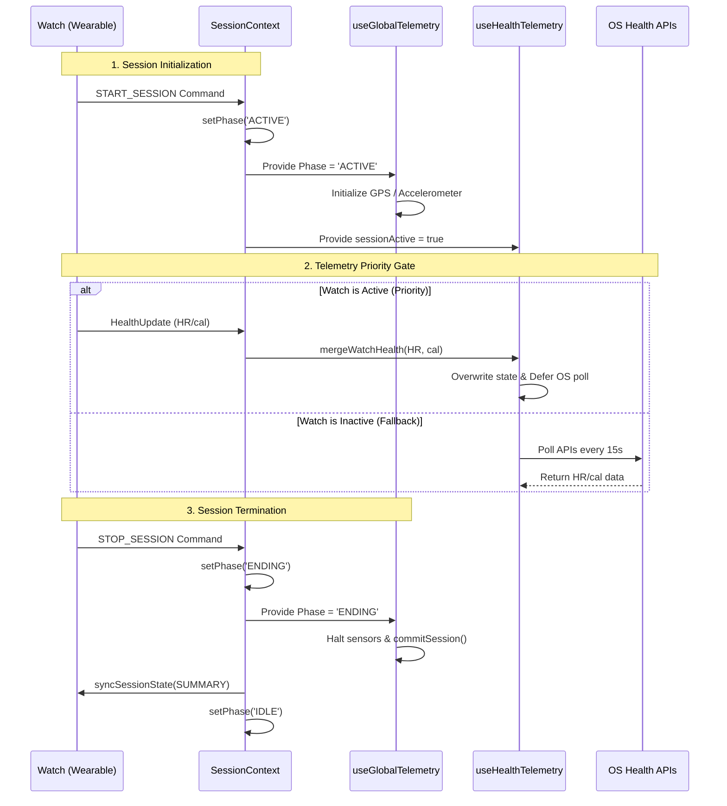

### SIMULATION_&_MOCKS

# Elite Architecture Base: SIMULATION & MOCKS

## 1. File Manifest
* **`src/mocks/react-native-vision-camera-worklets.web.js`**: An empty module stub to prevent Metro bundler resolution errors for Vision Camera worklets on the web platform.
* **`src/mocks/react-native-worklets.web.js`**: A web shim for `react-native-worklets-core` providing no-op hooks (`useSharedValue`, `useAnimatedStyle`) and execution functions (`runOnJS`, `runOnUI`) to prevent native TurboModule crashes during web module loading.
* **`src/__mocks__/LocationService.ts`**: Jest mock for the `LocationService`, stubbing silent location retrieval and permission requests.
* **`src/__mocks__/expo-audio.ts`**: Jest mock for `expo-audio` to automatically grant recording permissions in test environments.
* **`src/__mocks__/expo-location.ts`**: Jest mock for `expo-location` providing static mock coordinates, auto-granted permissions, and reverse geocoding data for unit tests.
* **`src/__mocks__/sk8lytz-watch-bridge.ts`**: Jest mock replacing the native watch companion bridge to prevent test crashes and allow asserting bridge payloads without a physical device.
* **`__tests__/services/SpeedTrackingService.offline.test.ts`**: Unit test suite verifying the offline session queue behavior, including unauthenticated queue writes, happy-path flushing, and re-entrancy guards.

## 2. Blast Radius
* **Imports (What this domain depends on):**
  * `react-native`, `@react-native-async-storage/async-storage` (mocked in tests)
  * `sk8lytz-watch-bridge` module interfaces (`WatchSessionState`, `WatchCommand`, `WatchHealthUpdate`)
  * `../../src/services/supabaseClient` and `../../src/services/AppLogger` (mocked in tests)
  * `../../src/services/SpeedTrackingService`
  * `../../src/constants/storageKeys`
* **Imported By (What depends on this domain):**
  * `jest.config.js` and Metro bundler (`metro.config.js` aliasing for web platform fallbacks).
  * Unit test runners processing component or service tests that transitively rely on location, audio, or the watch bridge.

## 3. Context Matrix
* **Consumed/Provided React Contexts:** None. The files in this domain are exclusively node-level mocks, stubs, and unit tests without React component hierarchies or context dependencies.

## 4. Hook/Service I/O Registry
### `react-native-worklets.web.js` (Shim)
* **Inputs**: Worklet functions (`fn`).
* **Outputs**: Returns the function unmodified or `{ value: null }` for shared values.
* **Side-Effects**: None.

### `SpeedTrackingService` (as tested in offline tests)
* **Inputs**: `ISessionSnapshot` object, User ID (string | null).
* **Outputs**: Returns `null` when offline/queued; successful Supabase inserts.
* **Side-Effects**: Writes to AsyncStorage (`PENDING_SESSION_QUEUE_KEY`), calls Supabase `skate_sessions` insert, triggers `Alert.alert`.

## 5. OS Variance Matrix
* **Web**: `src/mocks/react-native-vision-camera-worklets.web.js` and `src/mocks/react-native-worklets.web.js` explicitly exist to handle Web-specific fallback behaviors, preventing the web bundler from crashing on native-only TurboModules.
* **Android/iOS**: `SpeedTrackingService.offline.test.ts` mocks `Platform.select({ android: ... })` specifically returning the Android path for alerts. 
* **watchOS/Wear OS**: `src/__mocks__/sk8lytz-watch-bridge.ts` handles the native bridge mock for the Wearable companions so the test environment doesn't look for iOS/Android native watch bridge modules.

## 6. Archival Instruction
* **Stale Documentation**: The following sections in `tools/SK8Lytz_App_Master_Reference.md` contain stale documentation for this domain and must be tagged with `[MOVE_TO_ARCHIVE]`:
  1. The **"Optical Simulation Mode (Web Fallback)"** bullet point under the Admin Tools Hub section (around line 316), as Web fallback maintenance actively conflicts with heavy native packages like `react-native-nitro-modules` and `react-native-vision-camera-worklets`.
  2. Any legacy cartography or documentation blocks corresponding to `SIMULATION_&_MOCKS` (specifically around lines 2039-2080 and 1500-1506 as noted in the master reference's own errata) which lack the `useAnimatedStyle` hook in the worklets mock and lack the sequence diagram for offline syncing logic.

## 7. Sequence Diagram
### Offline Session Sync/Flush Flow
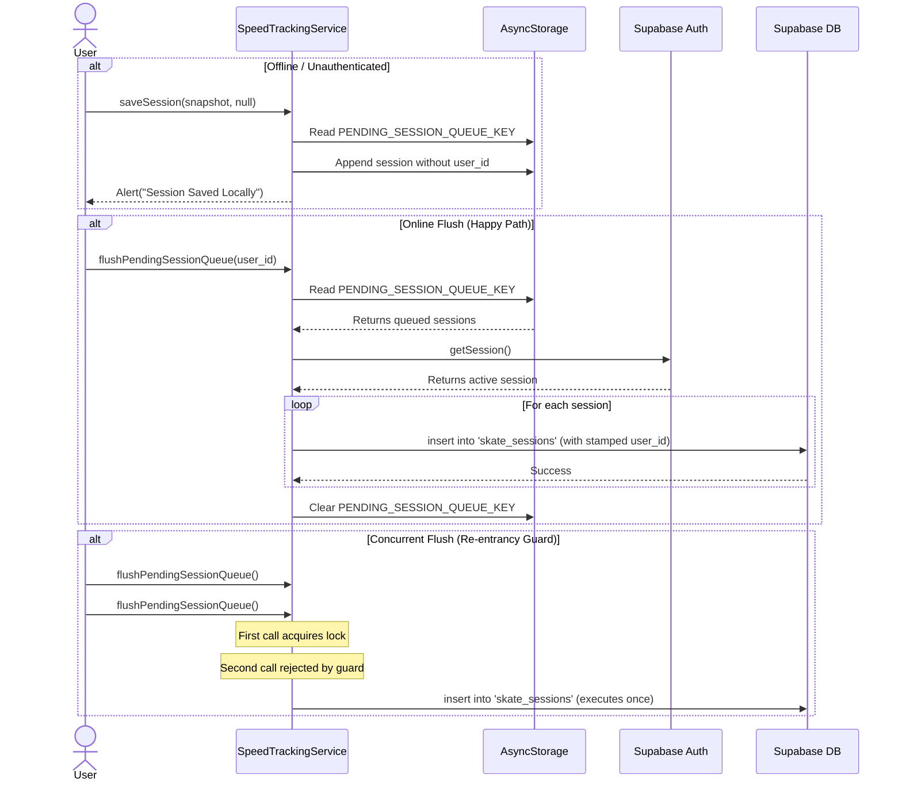

### THEME_&_ASSETS

# 🗺️ Cartography: THEME_&_ASSETS Domain
**Domain Identity:** `THEME_&_ASSETS`
**Root Paths:** `src/theme/*`, `src/styles/*`, `src/constants/*`, `src/assets/*`

## 1. File Manifest
- **`src/theme/theme.ts`**: Core design system exporting palettes (Dark/Light), Typography, Spacing, Layout, and cross-platform Shadows.
- **`src/styles/DashboardStyles.ts`**: Centralized responsive style generator for the 4-Slab Dashboard layout, including dynamic pattern-based gradients.
- **`src/constants/AppConstants.ts`**: Top-level application constants defining global constraints like maximum hardware speed limits and storage prefixes.
- **`src/constants/ControlsRegistry.ts`**: Definition ledger for all administrative and hardware toggle controls used across the App Settings.
- **`src/constants/ProductCatalog.ts`**: Offline-safe local fallback dictionary defining all supported SK8Lytz hardware products (HALOZ, SOULZ, RAILZ) and their physical/visual characteristics.
- **`src/constants/bleTimingConstants.ts`**: Centralized registry of empirical BLE pipeline delay values (e.g., inter-device write gaps, settle times) tuned for the ZENGGE 0xA3 chipset.
- **`src/constants/storageKeys.ts`**: Single source of truth for all `AsyncStorage` string keys, preventing namespace collision across services.
- **`src/assets/images/*`**: Static visual imagery, organized into `music_modes` and `zengge_patterns` directories.

## 2. Blast Radius
- **`src/theme/theme.ts`**: **Massive**. Directly imported by over 50 components. It provides the structural definitions for the entire application UI.
- **`src/styles/DashboardStyles.ts`**: **Targeted**. Primarily consumed by `src/screens/DashboardScreen.tsx` to generate responsive stylesheets based on device dimensions.
- **`src/constants/storageKeys.ts`**: **High**. Consumed by nearly all caching and persistence services (e.g., `DeviceRepository`, `AppLogger`, `AuthContext`, `ScenesService`).
- **`src/constants/bleTimingConstants.ts`**: **Medium-High**. Critically consumed by BLE execution contexts (`ConnectService.ts`, `BleWriteDispatcher.ts`, `RecoveryService.ts`).
- **`src/constants/ProductCatalog.ts`**: **High**. Drives hardware definitions for `ProductVisualizer.tsx`, `VisualizerUnit.tsx`, `useProductCatalog.ts`, and the device setup pipeline.

## 3. Context Matrix
- **`ThemeContext`**: Implicitly relies on the `ThemePalette` types defined in `theme.ts` to provide active `DarkColors` or `LightColors` down the component tree. No other contexts are natively provided by this domain.

## 4. Hook/Service I/O Registry
This domain primarily houses pure functions and static registries:
- **`createDashboardStyles`** (`DashboardStyles.ts`)
  - **Input:** `Colors` (ThemePalette), `windowHeight` (number), `windowWidth` (number)
  - **Output:** Responsive `StyleSheet` object dynamically adjusted for short/narrow screens.
- **`getPatternColors`** (`DashboardStyles.ts`)
  - **Input:** `patternName` (string), `Colors` (ThemePalette)
  - **Output:** `[string, string]` representing gradient hex codes.
- **`getLocalProfileById`** (`ProductCatalog.ts`)
  - **Input:** `id` (string)
  - **Output:** `ProductProfile | undefined`
- **`getLocalProfileByPoints`** (`ProductCatalog.ts`)
  - **Input:** `ledPoints` (number)
  - **Output:** Best-match `ProductProfile` (falls back to SOULZ).

## 5. OS Variance Matrix
Code paths explicitly branching between iOS, Android, and Web within this domain:
- **`Shadows` (`theme.ts`)**:
  - **iOS**: Native shadow properties (`shadowColor`, `shadowOffset`, `shadowOpacity`, `shadowRadius`).
  - **Android**: Material design elevation (`elevation`).
- **`TextShadows` (`theme.ts`)**:
  - **Web**: Uses CSS `textShadow` string format.
  - **Default (iOS/Android)**: Uses `textShadowColor`, `textShadowRadius`, `textShadowOffset`.

## 6. Archival Recommendations
The following sections in `tools/SK8Lytz_App_Master_Reference.md` represent stale documentation related to this domain and have been flagged for archival:
- `### Dashboard UI Layout (4-Slab Architecture) [MOVE_TO_ARCHIVE]`
- `- **One-Screen Setup Policy** [MOVE_TO_ARCHIVE]`

## 7. Sequence Diagram: Offline-First Product Catalog Sync Flow
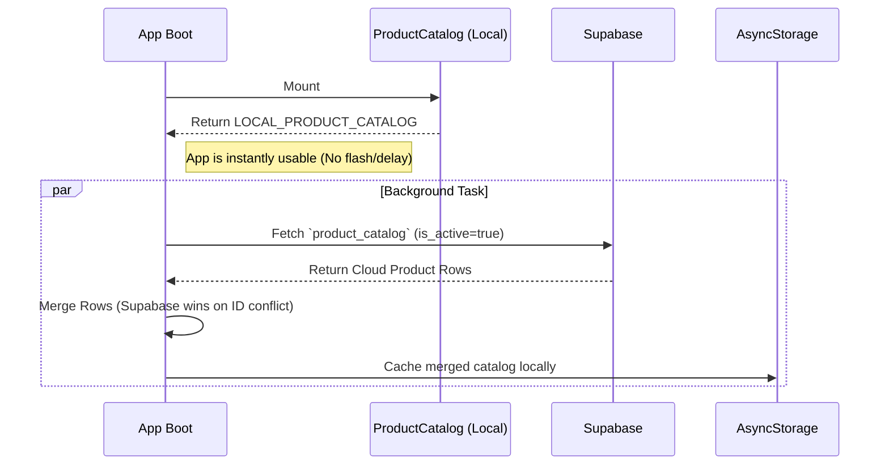

## 8. Special Directives: Design System & Token Manifest

### Color Palette (Dark Theme Default)
- `background`: `#1B4279`
- `surface`: `#245596`
- `surfaceHighlight`: `#3172C9`
- `primary`: `#FF5A00`
- `secondary`: `#FFB800`
- `accent`: `#FF3300`
- `text`: `#FFFFFF`
- `textMuted`: `#A0B4CF`
- `textDim`: `#6B85A0`
- `border`: `#2E5FA3`
- `success`: `#00E88F`
- `error`: `#FF3D71`
- `warning`: `#FFB800`

### Typography (Righteous Family)
- `header`: 24px, uppercase, 2px letter-spacing
- `title`: 16px, 0.5px letter-spacing
- `body`: 14px
- `caption`: 11px

### Spacing Scale
- `xxs`: 2px | `xs`: 4px | `sm`: 8px | `md`: 12px
- `lg`: 16px | `xl`: 24px | `xxl`: 32px | `xxxl`: 40px
- `huge`: 48px | `giant`: 64px

### Layout Definitions
- `padding`: 16px (Spacing.lg)
- `borderRadius`: 24px (Spacing.xl)

### UI_DOCKED_CONTROLLER

# UI_DOCKED_CONTROLLER Domain Cartography
*Generated by SDE Cartographer Node*

## 1. File Manifest
- **`src/components/DockedController.tsx`**: The core routing shell that manages shared state, the BLE write bus, and the mode FSM, delegating actual panel rendering to isolated sub-components.
- **`src/components/docked/AnalogGauge.tsx`**: Renders a high-performance, tactile UI gauge for data visualization (e.g., speed, intensity).
- **`src/components/docked/BuilderPanel.tsx`**: Provides the UI for creating and editing custom multi-color gradient and static patterns.
- **`src/components/docked/CameraPanel.tsx`**: Handles real-time camera feed analysis (SNIPER/VIBE) for ambient color and vibe extraction.
- **`src/components/docked/DockedDock.tsx`**: Floating navigation bar with swipe gestures for rapidly switching controller modes.
- **`src/components/docked/FavoritePromptModal.tsx`**: Modal interface for naming, saving, or deleting user-defined favorite presets.
- **`src/components/docked/FavoritesPanel.tsx`**: Grid view for browsing, applying, and managing saved favorites and curated SK8Lytz picks.
- **`src/components/docked/MusicPanel.tsx`**: Controls music-reactive lighting settings including mic sensitivity, matrix style, and dual-color focus.
- **`src/components/docked/PresetCard.tsx`**: Reusable UI card component displaying individual preset visuals and metadata.
- **`src/components/docked/ProEffectsPanel.tsx`**: Exposes advanced Multimode spatial and temporal effect selection grids.
- **`src/components/docked/QuickPresetModal.tsx`**: Dialog for rapidly saving active states as cloud-syncable presets or quick slots.
- **`src/components/docked/SpectrumAnalyzer.tsx`**: Real-time audio visualization component that graphs active microphone magnitude.
- **`src/components/docked/StreetModeDistributionSlider.tsx`**: Interactive slider for configuring LED spatial distribution between front/back zones in Street Mode.
- **`src/components/docked/StreetPanel.tsx`**: Dashboard for Street Mode, surfacing live telemetry (GPS speed, G-force) and trip stats.
- **`src/components/docked/UniversalSlidersFooter.tsx`**: Shared footer component exposing global brightness, speed, and sensitivity controls across modes.
- **`src/hooks/useDashboardController.tsx`**: High-level orchestrator connecting DashboardScreen telemetry, crew roles, and BLE device fleets to the DockedController.
- **`src/hooks/useDockedControllerState.ts`**: Central state machine holding volatile controller parameters (mode, colors, speed) and pre-warming from local ledger.
- **`src/hooks/useControllerDispatch.ts`**: BLE hardware dispatch layer that translates UI state into ZenggeProtocol opcodes and payloads.
- **`src/hooks/useControllerAnalytics.ts`**: Side-effect isolation hook that debounces and logs telemetry events (color, mode, speed changes).

## 2. Blast Radius
- **Imports into Domain**:
  - Protocols: `ZenggeProtocol`, `PatternEngine`
  - Hooks: `useAppMicrophone`, `useCuratedPicks`, `useOptimisticBLE`, `useStreetMode`, `useDeviceStateLedger`
  - Contexts: `ThemeContext`, `FavoritesContext`, `AppConfigContext`, `BLEContext`, `AuthContext`
  - Services: `AppLogger`, `PermissionService`, `crewService`
  - Utils: `ColorUtils`, `NormalizationUtils`
- **Exports from Domain**:
  - `DockedController` Component (consumed by `DashboardScreen`)
  - `useDashboardController` Hook (consumed by `DashboardScreen`)
  - `DockedControllerHandle` Ref interface (consumed for voice/crew commands)

## 3. Context Matrix
- **`ThemeContext`**: Consumed to apply `Colors` and `isDark` themes to the UI components.
- **`FavoritesContext` (`useSharedFavorites`)**: Consumed to read user `favorites`, `quickPresets`, and manage saving/deleting states.
- **`AppConfigContext`**: Consumed to verify offline rules like `isVisibilityAllowed('visibility_street_mode')`.
- **`BLEContext` (`useSharedBLE`)**: Consumed to retrieve `getAdapterForDevice` for passing into hardware dispatch.
- **`AuthContext`**: Consumed in `useDashboardController` to fetch `userId` for `crewService` broadcasting.

## 4. Hook/Service I/O Registry
- **`useDashboardController`**
  - **Inputs**: `isOfflineMode`, `crewRole`, `displayConnectedDevices`, telemetry values, `writeToDevice`
  - **Outputs**: `MemoizedSk8lytzController`, `activeHwSettings`, `openSettings`
  - **Side-Effects**: Manages Crew Member syncing, orchestrates `ledgerSave`, triggers Settings Modal.
- **`useDockedControllerState`**
  - **Inputs**: `initialProduct`, `ledgerLoadSync`, `mac`
  - **Outputs**: Getters/setters for mode, selectedColor, speed, brightness, micSettings, builder logic.
  - **Side-Effects**: Pre-warms UI state directly from the device state ledger via synchronous read.
- **`useControllerDispatch`**
  - **Inputs**: `writeToDevice` callback, `hwSettings`, `points`, `getAdapterForDevice`
  - **Outputs**: Dispatch functions (`sendColor`, `applyFixedPattern`, `applyEmergencyPattern`, `handleMusicChange`)
  - **Side-Effects**: Translates UI interactions into native `ZenggeProtocol` payloads. Memoizes math payloads in an LRU cache.
- **`useControllerAnalytics`**
  - **Inputs**: `activeMode`, `selectedPatternId`, `selectedColor`, `brightness`, `speed`, `streetSensitivity`, `deviceContext`
  - **Outputs**: None.
  - **Side-Effects**: Debounces and dispatches analytics (`AppLogger.log`) and telemetry (`useTelemetryLedger`).

## 5. OS Variance Matrix
The `UI_DOCKED_CONTROLLER` domain is fully platform-agnostic at the component level. Hardware capability variances (e.g., Android GATT 133 delays, iOS MTU exceptions) are hidden behind `useOptimisticBLE` and `ConnectService`. The GPU-accelerated Camera frame processor inside `CameraPanel.tsx` uses unified Worklet threads that operate symmetrically across iOS and Android without branching code paths.

## 6. Archival Instruction
**[MOVE_TO_ARCHIVE] Tags identified for `tools/SK8Lytz_App_Master_Reference.md`:**
- `Dashboard UI Layout (4-Slab Architecture)` (Already marked, but relevant to DockedController migration)
- `One-Screen Setup Policy` (Already marked)
- *Proposed*: Remove and archive references to `UnifiedPatternPicker`. `DockedController.tsx` notes it explicitly replaced the deprecated reactive `useEffect` in `UnifiedPatternPicker` to resolve race conditions.

## 7. Sequence Diagram
### Optimistic BLE Write Pipeline (The Ghost Standard)
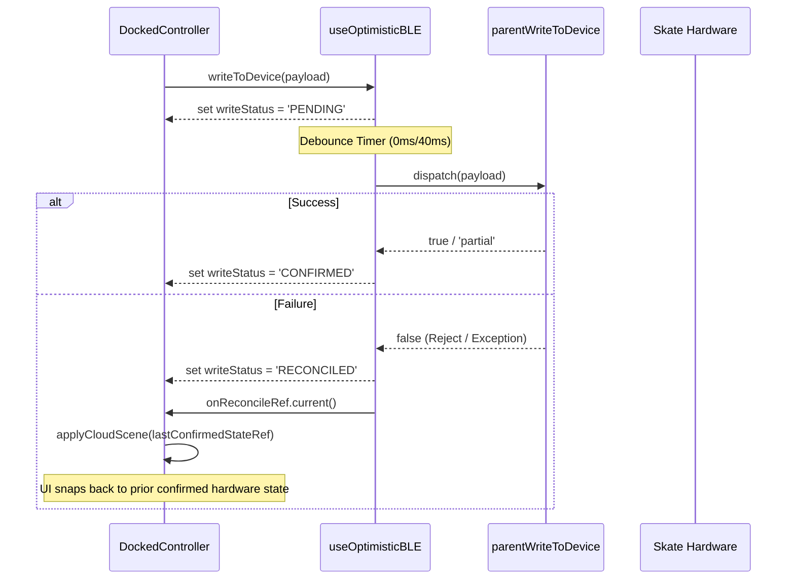

## 8. Special Directives: DockedController.tsx Monolith Mapping
`DockedController.tsx` is a complex 67KB orchestrator.
- **Hooks Consumed**: `useTheme`, `useAppConfig`, `useWindowDimensions`, `useOptimisticBLE`, `useStreetMode`, `useDeviceStateLedger`, `useSharedFavorites`, `useSharedBLE`, `useControllerDispatch`, `useAppMicrophone`, `useControllerAnalytics`, `useCuratedPicks`, `useDockedControllerState`.
- **Refs Held**: `lastSentPayloadRef`, `lastConfirmedStateRef`, `captureEntireStateRef`, `onReconcileRef`, `activeModeRef`, `fixedSubModeRef`, `musicPatternIdRef`, `fixedPatternIdRef`, `selectedPatternIdRef`, `visualizerColorRef`, `hasReplayedRef`, `crewBroadcastTimer`, `isInMusicModeRef`, `isInPatternModeRef`, `isMountedRef`.
- **Callbacks Threaded**: 
  - `writeToDevice` (passed to bus/panels)
  - `applyCloudScene` (passed to CommunityModal)
  - `loadFavorite` (passed to FavoritesPanel)
  - `handleCameraColorDetected`, `handleVibeApply`, `handleVibePaletteChange` (passed to CameraPanel)
  - `handleDockModeChange` (passed to DockedDock)
- **Component Extraction Opportunities**:
  1. **`FixedPatternPreviewRow`**: Currently hardcoded inline; should be extracted to `docked/FixedPatternPreviewRow.tsx`.
  2. **`ControllerHeaderVisualizer`**: The absolute-positioned layout containing the power toggle, favorite button, and `ProductVisualizer` can be decoupled into its own component to reduce JSX clutter.
  3. **Optimistic Ghost State Hook**: The `lastConfirmedStateRef`, `captureEntireStateRef`, and `onReconcileRef` logic should be encapsulated into a bespoke `useOptimisticStateSnapshot` hook.
  4. **Universal Sliders Prop Threading**: Prop bloat is significant here. Introduce a segmented context or reducer state slice specifically for volatile slider UI states to prevent massive component prop drilling.

### UI_MODALS

# 🗺️ Cartography: UI_MODALS

## 1. File Manifest
* **`AccountModal.tsx`**: A full-featured bottom sheet modal orchestrating user profile, security, crew management, registered devices, and application settings.
* **`DeviceSettingsModal.tsx`**: A hardware configuration modal allowing users to probe BLE devices, set LED counts, assign strip types, and configure RF remote modes.
* **`CommunityModal.tsx`**: A scene library modal for browsing, applying, and managing public cloud presets and personal saves from the SK8Lytz cloud.
* **`GroupSettingsModal.tsx`**: A modal for creating and renaming device groups and assigning multiple registered hardware units to a single control group.
* **`SessionSummaryModal.tsx`**: A visually rich post-skate session debrief modal displaying metrics (distance, speed, g-force, calories) using glassmorphism.
* **`modals/EulaModal.tsx`**: A standard End User License Agreement modal enforcing legal acknowledgements regarding physical safety and hardware interaction.
* **`modals/GlobalPermissionsModal.tsx`**: A globally available modal that listens for system-wide `DeviceEventEmitter` permission events to trigger the Onboarding flow.
* **`CustomSlider.tsx`**: A customized, gradient-supported touch slider utilizing PanResponder for immediate interaction without native control constraints.
* **`TacticalSlider.tsx`**: An advanced slider overlaying icons and dynamic labels (brightness/turbo) over a PanResponder track for fine-grained hardware control.
* **`MarqueeText.tsx`**: A component utilizing Animated loops to horizontally scroll text that overflows its container bounds.
* **`ConnectionStrengthBadge.tsx`**: A lightweight 3-bar signal strength indicator driven by BLE RSSI values with states ranging from excellent to critical.

## 2. Blast Radius
* **What this domain imports**:
  * **Services**: `ProfileService`, `ScenesService`, `AppLogger`, `PermissionService`, `supabaseClient`.
  * **Hooks**: `useAccountOverview`, `useSkateStats`, `useProtocolDispatch`, `useAuth`, `useTheme`, `useSafeAreaInsets`.
  * **Constants/Theme**: `LOCAL_PRODUCT_CATALOG`, `Spacing`, `ThemePalette`, `Typography`, `Layout`.
  * **Utils**: `getDefaultGroupName`, `RSSI_WEAK_THRESHOLD`, `RSSI_CRITICAL_THRESHOLD`.
  * **Sub-Components**: `ErrorCard`, `EmptyState`, `PermissionsOnboardingScreen`.
* **What imports it (Upstream Targets)**:
  * `AccountModal` → Core Dashboard / Nav Header
  * `DeviceSettingsModal` → `DeviceItem.tsx` / Dashboard
  * `CommunityModal` → Preset Library / Scene Browser
  * `GroupSettingsModal` → Dashboard / Group Management UI
  * `SessionSummaryModal` → `StreetMode` tracking screen
  * `EulaModal` → `AccountModal` (embedded) & Auth Flows
  * `GlobalPermissionsModal` → Root App layer (listeners)
  * `CustomSlider` / `TacticalSlider` → `DockedController`, Modals, pattern config UI

## 3. Context Matrix
* **`ThemeContext` (`useTheme`)**: Consumed globally by `AccountModal`, `CommunityModal`, `SessionSummaryModal`, `EulaModal`, `CustomSlider`, and `TacticalSlider` for `Colors`, `isDark`, and `toggleTheme`.
* **`AuthContext` (`useAuth`)**: Consumed by `CommunityModal` for injecting the `user.id` when fetching personal saves.
* **`ProtocolContext` (`useProtocolDispatch`)**: Consumed by `DeviceSettingsModal` to actively push hardware config mutations via BLE.

## 4. Hook/Service I/O Registry
* **`useAccountOverview`**
  * **Inputs**: `visible: boolean`, `onProfileUpdated: () => void`
  * **Outputs**: `user`, `crews`, profile states, handler functions (`handleCreateCrew`, `handleChangeEmail`, etc.).
  * **Side-Effects**: Supabase table mutations, local state updates.
* **`useSkateStats`**
  * **Inputs**: `visible: boolean`
  * **Outputs**: `lifetimeStats`, `recentSessions`, `statsLoading`.
* **`useProtocolDispatch`**
  * **Outputs**: `writeSettingsByName()`, `setRfRemoteState()`, `queryHardwareSettings()`, `clearRfRemotes()`.
  * **Side-Effects**: Fires Bluetooth payloads natively to the connected BLE peripheral.
* **`ScenesService`**
  * **Inputs**: `sceneId`, `userId`
  * **Outputs**: Array of `ICloudScene`.
  * **Side-Effects**: Supabase queries, upvote tracking, scene payload downloads.

## 5. OS Variance Matrix
* **Web vs. Native Touch**: `CustomSlider` & `TacticalSlider` utilize explicit type casting for Web compat (`{ touchAction: 'none', userSelect: 'none' } as unknown as ViewStyle`) to prevent gesture hijacking during `PanResponder` interaction.
* **Shadow Implementations**: `SessionSummaryModal` dynamically switches box shadows:
  * Web: Uses `boxShadow: '0px 0px 30px rgba(0,0,0,0.8)'`
  * Native (iOS/Android): Uses `shadowColor`, `shadowOffset`, `shadowOpacity`, and `elevation`.
* **Font Fallbacks**: `AccountModal` applies `'Courier New'` on iOS and `'monospace'` on Android/Web for standardizing the 2FA Code Inputs.
* **Alert Intercepts**: `AccountModal` bypasses `Alert.alert` on Web during `handleSignOut` to avoid thread-blocking native browser confirms, executing Supabase signout directly.

## 6. Archival Instruction
> **[MOVE_TO_ARCHIVE]**
> Stale documentation block located in `tools/SK8Lytz_App_Master_Reference.md` between lines 4594 and 4794. Caller agent must execute `replace_file_content` to archive this section and replace it with this cartography report.

## 7. Sequence Diagram (Hardware Probing Flow)
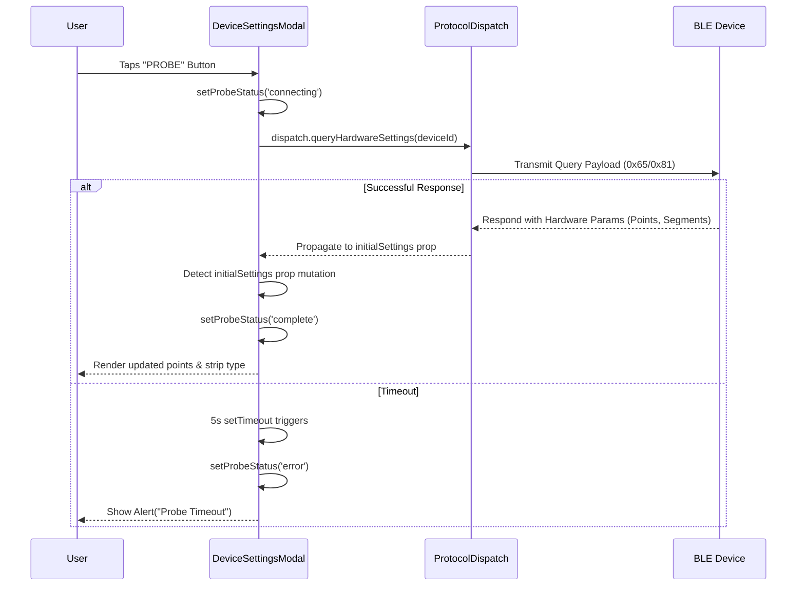

## 8. Design System & Token Manifest
* **Palette Tokens Used**: `Colors.surface`, `Colors.surfaceHighlight`, `Colors.primary`, `Colors.textMuted`, `Colors.text`, `Colors.background`, `Colors.error`, `Colors.secondary`, `Colors.accent`.
* **Typography Tokens Used**: `Typography.title`, `Typography.body`, `Typography.caption`, `Typography.header`.
* **Spacing Tokens Used**: `Spacing.xxs`, `Spacing.xs`, `Spacing.sm`, `Spacing.md`, `Spacing.lg`, `Spacing.xl`, `Spacing.xxl`, `Spacing.giant`, `Spacing.huge`.
* **Layout Tokens Used**: `Layout.borderRadius`.
* **Signal Strength Logic (`ConnectionStrengthBadge`)**:
  * Excellent (≥ -60 dBm) → `#4CAF50` (3 bars)
  * Good (≥ -75 dBm) → `#FFC107` (2 bars)
  * Weak (≥ -82 dBm) → `#FF6B35` (1 bar)
  * Critical (< -82 dBm) → `#F44336` (1 bar)

### UI_SCREENS

# UI_SCREENS Domain Cartography

## 1. File Manifest
- **`src/screens/AuthScreen.tsx`**: Orchestrates user authentication (login/signup/magic-link), credential persistence, and development sandbox access.
- **`src/screens/DashboardScreen.tsx`**: The monolithic root dashboard that coordinates BLE connectivity, active session telemetry, crew radar, and offline-mode degradations.
- **`src/components/dashboard/CrewHubSlab.tsx`**: Renders the 4-state 'Crew Hub' dashboard segment (admin-locked, offline, active-session, or empty).
- **`src/components/dashboard/DashboardCrewPanel.tsx`**: Binds the CrewHubSlab UI to the underlying radar and crew session services, handling proximity alerts and role-based cloud sync.
- **`src/components/dashboard/DashboardHeader.tsx`**: Displays the dynamic global header, adapting its layout based on BLE connectivity status and offline mode.
- **`src/components/shared/BLEErrorBoundary.tsx`**: A React ErrorBoundary component protecting the UI from BLE-state-driven rendering crashes.
- **`src/components/DeviceItem.tsx`**: Represents a physical SK8Lytz device or group in the fleet list, indicating connection status, RSSI, and current pattern preview.
- **`src/components/LocationPicker.tsx`**: Provides an address search with local map-thumbnail fallback and Nominatim OSM geocoding for skate spots.
- **`src/components/LocationPickerMap.tsx` / `.web.tsx`**: Platform-specific map renderers for the location picker.
- **`src/components/SkateSpotBottomSheet.tsx`**: A bottom sheet modal for verifying and claiming community skate spots, adjusting surface types, and environment tags.

## 2. Blast Radius
**Imports:**
- Uses domain hooks: `useDashboardAutoConnect`, `useDashboardGroups`, `useDashboardProfile`, `useDashboardCrew`, `useHardwareNotifications`, `useDeviceStateLedger`.
- External logic: `AsyncStorage`, `expo-location`, `react-native-ble-plx`, `expo-linking`, `SkateSpotsService`.
- Contexts: `ThemeContext`, `BLEContext`, `SessionContext`, `AppConfigContext`, `CrewContext`.
**Exported To:**
- `DashboardScreen.tsx` is the primary authenticated route in the root navigator.
- Sub-components are strictly imported by `DashboardScreen` and `AuthScreen`.

## 3. Context Matrix
| Context | Provided / Consumed | Purpose |
| :--- | :--- | :--- |
| `ThemeContext` | Consumed | Extracts `Colors`, `isDark`, and `toggleTheme` for UI styling. |
| `BLEContext` | Consumed | Provides radio access: `connectedDevices`, `scanForPeripherals`, `writeToDevice`. |
| `SessionContext` | Consumed | Reads active telemetry: `gpsSpeed`, `sessionDurationSec`. Initiates/Ends sessions. |
| `AppConfigContext`| Consumed | Reads feature flags (e.g., `isVisibilityAllowed('visibility_maps_tab')`). |
| `CrewContext` | Consumed | Tracks active crew synchronizations and local radar states. |

## 4. Hook/Service I/O Registry
- **`useDashboardGroups`**
  - *Inputs*: Registered devices list, all scanned devices.
  - *Outputs*: `customGroups`, `deviceConfigs`, `powerStates`, `groupModalState`.
  - *Side-effects*: Synchronizes logical device groupings with AsyncStorage.
- **`useDashboardCrew`**
  - *Inputs*: Apply scene callbacks.
  - *Outputs*: `crewSession`, `crewRole`, `isCrewModalVisible`.
  - *Side-effects*: Updates cloud leaderboards and pushes BLE patterns to docked controller.
- **`useDeviceStateLedger`**
  - *Inputs*: BLE device states.
  - *Outputs*: `ledgerSave`, `ledgerLoadSync`.
  - *Side-effects*: Maintains offline record of each hardware's current pattern for instant UI previews.
- **`useRecentSpots` (LocationPicker)**
  - *Inputs*: Map coordinate selections.
  - *Outputs*: `recentSpots`, `addRecentSpot`.
  - *Side-effects*: Modifies `@Sk8lytz_skate_spots_cache` in AsyncStorage.

## 5. OS Variance Matrix
| Component / File | Variance | iOS | Android | Web |
| :--- | :--- | :--- | :--- | :--- |
| `AuthScreen.tsx` | Support Links | Native `Alert.alert` | Native `Alert.alert` | Uses `Linking.openURL(mailto:...)` |
| `DashboardScreen.tsx` | Background Sweeper | Suspends in background | Suspends in background | `Platform.OS === 'web'` completely aborts sweeper. |
| `DashboardScreen.tsx` | Demo Fallback | N/A | N/A | Injects mock BLE devices so the web demo UI functions. |
| `DashboardHeader.tsx` | Shadows | `shadowColor` / `elevation` | `shadowColor` / `elevation` | Uses CSS `boxShadow`. |
| `LocationPickerMap` | Web Viewport | Native Maps | Native Maps | Falls back to `.web.tsx` implementation. |

## 6. Archival Instructions
Based on the Master Reference analysis, the following sections contain stale UI/Hardware specifications and should be moved to the archive:
- `### Dashboard UI Layout (4-Slab Architecture) [MOVE_TO_ARCHIVE]`
- `### UI Design Patterns & Branding` -> `One-Screen Setup Policy [MOVE_TO_ARCHIVE]`
- `### writeChunked — 0x51 Extended Payload Framing [MOVE_TO_ARCHIVE]`

## 7. Sequence Diagram: Dashboard Boot & Auto-Connect Flow

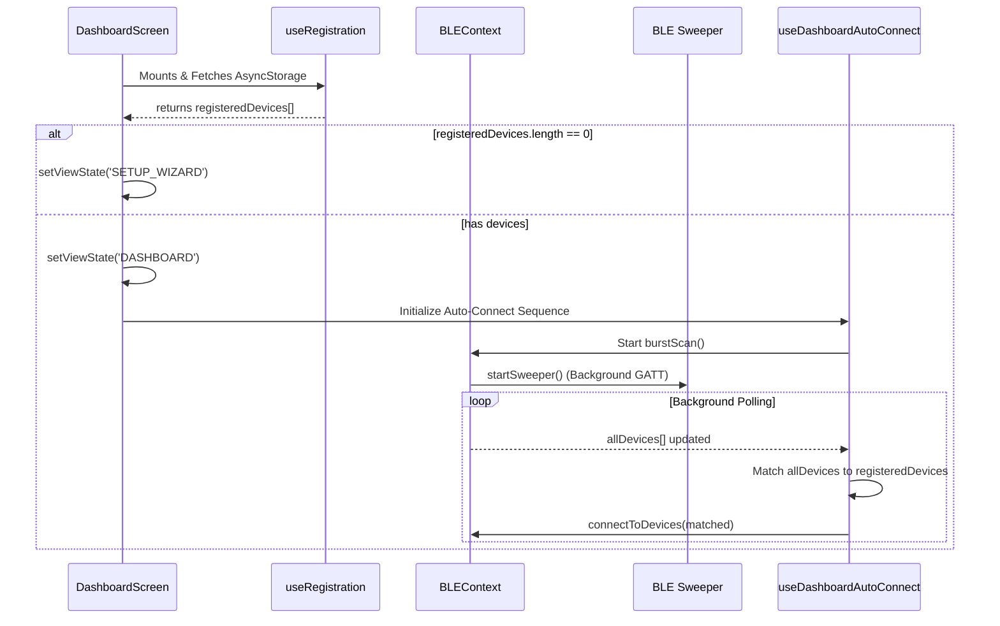

## 8. SPECIAL DIRECTIVES: Design System & Token Manifest
- **Core Palette**: `Colors.primary`, `Colors.accent`, `Colors.text`, `Colors.textMuted`, `Colors.success`, `Colors.error`.
- **Offline States**: Offline UI swaps standard blue accents for Amber (`#FFA500` / `#FFAA00`).
- **Typography**: Custom `Righteous` font for Display/Headers. `Inter-Medium` for labels.
- **Layout Tokens**: `Spacing.xs` (4px), `Spacing.sm` (8px), `Spacing.md` (12px), `Spacing.lg` (16px), `Spacing.xl` (24px).
- **Glassmorphism Base**: Gradients utilizing `rgba(255,255,255,0.05)` borders and dark transparent fills (e.g., `rgba(20, 25, 35, 0.85)`).

### UI_VISUALIZER

# 🗺️ Cartography: UI_VISUALIZER Domain

## 1. File Manifest
- **`src/components/VisualizerUnit.tsx`**: A hardware-accurate rendering engine that calculates physical LED coordinates based on product shape (`RING`, `DUAL_STRIP`, `OVAL`) and maps `PatternEngine` pixel arrays to simulated silicone diffusers.
- **`src/components/ProductVisualizer.tsx`**: The orchestration container that groups multiple `VisualizerUnit` instances to accurately represent the physical configuration (e.g., dual skates or single strips) dynamically based on `hwSettings`.
- **`src/components/LEDStripPreview.tsx`**: A lightweight linear strip preview component utilized within pattern cards to natively animate `PatternEngine` pixel arrays at 20fps.
- **`src/components/CustomEffectVisualizer.tsx`**: A horizontal dot-based preview track for custom effects that suspends its animation loop when off-screen to preserve battery.
- **`src/components/NeonHueStrip.tsx`**: A DJ-style linear hue selector strip utilizing a custom `PanResponder` for instantaneous, local UI updates detached from parent re-render lag.
- **`src/components/PositionalGradientBuilder.tsx`**: An advanced UI editor mapping physical LED positions to precise RGB gradient nodes, rendering exact array mappings via `PositionalMathBuffer`.
- **`src/components/VerticalPatternDrum.tsx`**: A virtualized, high-performance vertical flat-list drum picker designed for rapid navigation of large pattern IDs using 3D refraction and shadow aesthetics.
- **`src/components/CameraTracker.tsx`**: A cross-platform JSI-backed frame processor that captures, downscales, and extracts dominant environment colors via K-Means clustering for real-time `0x59` reactive lighting.
- **`src/components/patterns/UnifiedPatternPicker.tsx`**: The top-level tab container orchestration layer that coordinates the application of patterns and passes state to the underlying `PatternPickerTab`.
- **`src/components/patterns/GradientLibraryTab.tsx`**: A masonry-grid view presenting saved and built-in positional gradients with exact 12-block visual previews and offline resilient actions.
- **`src/components/patterns/PatternPickerTab.tsx`**: A FlatList rendering categorized `PatternCard` entries, leveraging visibility gating (`onViewableItemsChanged`) to pause off-screen pattern animation intervals.
- **`src/components/patterns/PatternCard.tsx`**: An individual effect selection card featuring a `LEDStripPreview` and a responsive glassmorphism hover scale effect.

## 2. Blast Radius
**What this domain imports (Dependencies):**
- **Protocols & Maths:** `PatternEngine.ts`, `PositionalMathBuffer.ts`, `ZenggeProtocol.ts`, `ColorUtils.ts`
- **Contexts:** `ThemeContext`
- **External UI Libraries:** `expo-linear-gradient`, `@expo/vector-icons`, `react-native-vision-camera`, `react-native-worklets`, `react-native-vision-camera-resizer`

**What imports this domain (Consumers):**
- **DockedController & Modals:** Utilize `NeonHueStrip`, `ProductVisualizer`, and `UnifiedPatternPicker` to build and preview live hardware state.
- **Setup Wizards:** Uses `ProductVisualizer` to confirm physical hardware orientation.
- **DashboardScreen:** Consumes `CameraTracker` to drive the Vibe Catcher mode.

## 3. Context Matrix
- **Consumed Contexts:**
  - `ThemeContext` (`useTheme()`): Injects the `Colors` palette and `isDark` boolean to toggle borders, masks, and text contrasts dynamically.
- **Provided Contexts:**
  - None. This domain is strictly composed of controlled presentational components relying on prop drilling from parent orchestrators.

## 4. Hook/Service I/O Registry
- **`CameraTracker.tsx`**
  - **Inputs:** `subMode` ('SNIPER' | 'VIBE'), `isActive` (boolean).
  - **Outputs:** `onColorDetected(hex)`, `onVibePaletteDetected(RGB[])`.
  - **Side-Effects:** Requests OS Camera Permissions; initializes GPU frame resizer; dispatches blocking K-Means array sorting to JS thread via `runOnJS`.
- **`VisualizerUnit.tsx`**
  - **Inputs:** `devicePoints`, `color`, `mode`, `animValue` (Animated.Value), `motionState`, `builderNodes`.
  - **Outputs:** None (Pure UI render).
  - **Side-Effects:** Subscribes to `animValue` listener. Uses `requestAnimationFrame` to batch internal React state updates and unmounts listeners on cleanup.

## 5. OS Variance Matrix
- **Web vs. Native Frame Throttling:** Inside `VisualizerUnit.tsx`, the `requestAnimationFrame` tick loop explicitly caps the target FPS on Web: `Platform.OS === 'web' ? 30 : 60` to prevent `MessageQueue` flooding in the browser.
- **Animated Component Drivers:** Inside `AnimatedCategoryPill` (`PatternPickerTab.tsx`), `useNativeDriver` is set to `Platform.OS !== 'web'` because web runtimes lack native driver support for layout animations.
- **Camera Worklets:** `CameraTracker` strictly requires native execution environments due to JSI Worklets; Expo Web must fall back to mocked views or omit the camera entirely (handled by `.web.tsx` alternatives).

## 6. Archival Instruction
> No significantly stale documentation regarding the `UI_VISUALIZER` domain was identified in the active `SK8Lytz_App_Master_Reference.md`. The documentation sections for `VisualizerUnit` and `CameraTracker` accurately match the current codebase implementation. (Note: `Dashboard UI Layout (4-Slab Architecture) [MOVE_TO_ARCHIVE]` is already appropriately tagged in the Master Reference).

## 7. Sequence Diagram
### CameraTracker Vibe Flow
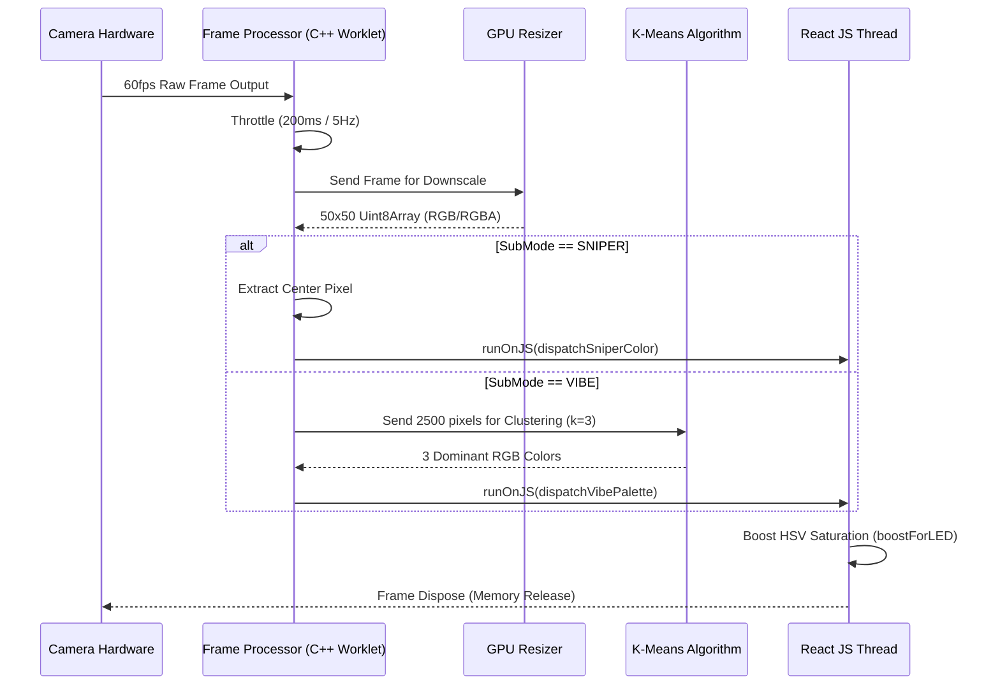

## 8. SPECIAL DIRECTIVES: Design System & Token Manifest
- **Spacing Scale:** `Spacing.xxs` (4), `Spacing.xs` (8), `Spacing.sm` (12), `Spacing.md` (16), `Spacing.lg` (24), `Spacing.xl` (32)
- **Visualizer Layout Tokens:**
  - `HALO_BASE`: `60x90`
  - `SOUL_BASE`: `55x115`
  - `RAIL_BASE`: `80x120`
- **Typography Standards:**
  - **Standard Labels:** `fontSize: 9`, `fontWeight: 'bold'`, `color: Colors.textMuted`
  - **Pill Categories:** `fontSize: 11`, `fontWeight: '800'`, `letterSpacing: 1`
  - **Drum Picker Selected Item:** `fontSize: 18`, `fontWeight: '900'`, `#FF5500` with heavy text shadows (`textShadowRadius: 10`).
- **Glassmorphism & Shadows Spec:**
  - Cards utilize background `rgba(255,255,255,0.04)` with `1.5px` borders (`rgba(255,255,255,0.08)`).
  - Refraction diagonals positioned at `top: -30`, `left: -30` with `45deg` rotation to simulate light scatter.
  - Interactive selected elements emit intense glowing shadows (`shadowColor: '#00F0FF'`, `shadowRadius: 12`, `shadowOpacity: 0.6`).

### UTILS

# 🗺️ UTILS Domain Cartography
**Domain:** UTILS (`src/utils/*`, `src/types/*`)

## 1. File Manifest
### Utils (`src/utils/`)
- `BlePayloadParser.ts`: Gatekeeper that deterministically extracts V1/V2 LED settings and RF state from raw BLE payloads without crashing the UI thread.
- `ColorUtils.ts`: Pure color conversion math (hex, RGB, HSV) housing the critical `boostForLED` algorithm to maximize WS2812B vibrancy.
- `CrashReporter.ts`: Dummy stub for intercepting and logging fatal application crashes.
- `FlightRecorder.ts`: In-memory rolling telemetry logger holding up to 50 breadcrumbs for session events and network/BLE debugging.
- `MusicDictionary.ts`: Authoritative registry defining the 46 hardware-native music profiles and their UI color picker constraints (colorMode).
- `NamingUtils.ts`: Centralizer for deterministic fallback device and group names to prevent UI/DB drift.
- `NormalizationUtils.ts`: Pure math utility ensuring UI speed values (0-100) safely clamp to hardware-acceptable ranges (1-31).
- `backoff.ts`: Jitter generation utility for randomizing exponential backoff delays to prevent BLE retry storms.
- `classifyBLEDevice.ts`: Single source of truth that translates raw BLE advertisements and EEPROM cache into structured `PendingRegistration` objects.
- `kMeansPalette.ts`: Thread-safe JSI-optimized K-Means clustering algorithm for extracting dominant RGB palettes from downscaled camera frames.
- `migrateAuthTokens.ts`: Legacy data migrator moving plain-text Supabase auth tokens from AsyncStorage into Expo SecureStore.
- `piiScrubber.ts`: Deterministic hashing utility replacing PII (MAC addresses) with safe 32-bit hex identifiers for telemetry logs.
- `presetColorUtils.ts`: UI color resolver determining how group and preset cards display colors, specifically mapping GENERATIVE patterns to a custom rainbow scale.
- `webStyles.ts`: Simple identity function facilitating typing for web-specific stylesheets.

### Types (`src/types/`)
- `ProductCatalog.ts`: Contract for `ProductProfile` driving dynamic hardware support (LED limits, visualizer geometries) to replace hardcoded strings.
- `ble.types.ts`: Centralizes react-native-ble-plx types alongside our Supabase registration row interfaces (fully stripped of legacy BleConnectionRequests).
- `bleGuards.ts`: Type guards validating that unknown objects conform to the minimal BLE Device interface.
- `dashboard.types.ts`: Domain-driven contract holding all primary FSMs (UI modes, hardware settings, and cached states) for the Dashboard and Controller.
- `supabase.ts`: Autogenerated TypeScript definitions mirroring the raw PostgREST schema.
- `react-test-renderer.d.ts`: Simple ambient type definitions for Jest test utilities.

## 2. Blast Radius
- **Imports (Incoming Dependencies):** Lightweight dependencies. React Native APIs (`AsyncStorage`, `Platform`), third-party libraries (`expo-secure-store`, `react-native-ble-plx`), and other domain constants (`ProductCatalog.ts`, `PatternEngine.ts`). 
- **Exports (Outgoing Consumption):** UTILS is the foundational bedrock. Extensively imported by **BLE Hook Providers** (e.g., `useBLEScanner`, `ConnectService`), **Hardware Integration Views** (`DockedController`, `SetupWizard`), **Telemetry Pipelines** (`AppLogger`), and **Data Persistence** pipelines.

## 3. Context Matrix
- **React Contexts Consumed:** `None`. By design, all utilities are pure, stateless, or singleton architectures to ensure maximum reuse and thread safety (e.g. within JSI worklets).
- **React Contexts Provided:** `None`. Type definitions dictate the exact shape of context states (e.g., `ThemeContext`, `BleConnectionState`), but no Providers reside here.

## 4. Hook/Service I/O Registry
| Utility / Service | Input | Output / Side-Effects |
|-------------------|-------|-----------------------|
| `BlePayloadParser` | `payload: number[]` | Returns typed `ParsedLedConfig` / `ParsedRfConfig` or `null`. Drops malformed arrays to `AppLogger.warn`. |
| `ColorUtils.boostForLED` | `r, g, b` (Raw camera byte) | Returns HSV-maximized `{r,g,b}`. Muted colors boost to V=1, S=1. |
| `extractKMeansPalette` | `pixels: RGB[], k, iter` | Returns sorted array of `k` dominant `RGB` objects. (Executed natively via `worklet`). |
| `classifyBLEDevice` | `Device`, `index`, `hwCache` | Returns `PendingRegistration` mapping EEPROM truth > Catalog Defaults. |
| `resolveGlowColor` | `IFavoriteState`, `fallback` | Outputs single hex string. Generative maps to `#7F00FF`. |
| `resolveGradientColors`| `IFavoriteState`, `glow` | Outputs array of hex strings for UI LinearGradients (Generative gets 7-stop rainbow). |

## 5. OS Variance Matrix
| Utility | iOS Branch | Android Branch | Notes |
|---------|------------|----------------|-------|
| `migrateAuthTokens.ts`| Secure Enclave | EncryptedSharedPrefs | Delegated gracefully through `expo-secure-store`. |
| `piiScrubber.ts` | JS Math loop | JS Math loop | Circumvents React Native's lack of a native uniform `crypto` module via a pure JS deterministic shift-hash. |
| *General* | Neutral | Neutral | All other pure utility and type definitions are completely OS agnostic. |

## 6. Sequence Diagram: Device Registration Pipeline (Classify)
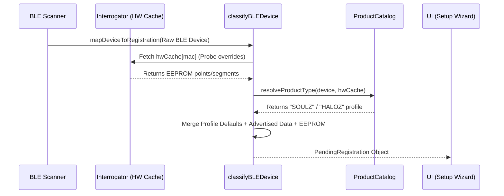

## 7. Design System & Token Manifest
Embedded within the Utilities domain are strict color constants ensuring brand coherence and UI fallback states.
- **`GENERATIVE_RAINBOW`**: 7-stop rendering array for algorithmically computed hardware patterns (`#FF0000`, `#FF7F00`, `#FFFF00`, `#00FF00`, `#00BFFF`, `#0000FF`, `#8B00FF`).
- **`COLOR_PRESET_PALETTE`**: 10-swatch default palette for the fixed color grid.
- **`PRESET_HUE_MAP`**: Instant UI slider synchronization map locking exact Hex inputs to Hue bounds.
- **`boostForLED` Math Gate**: Neutrals below `HSV S < 0.20` bypass color saturation rules entirely to preserve true white rendering on the physical WS2812B pixel.

## 13. 🪦 The Graveyard

### Cartographer Graveyard Deposits (2026-06-10T18:04:46.108Z)
- **[BUILD_CONFIG]**: **[MOVE_TO_ARCHIVE]**
- **[CLOUD_FUNCTIONS]**: 1435: ### 12.1 Identity & Auth [MOVE_TO_ARCHIVE]
- **[DEPENDENCY_AUDIT]**: Upon analyzing `tools/SK8Lytz_App_Master_Reference.md`, the following documentation should be tagged with `[MOVE_TO_ARCHIVE]`:
- **[IDENTITY]**: - Documentation pertaining to Auth/Profile systems inside `tools/SK8Lytz_App_Master_Reference.md` has been reviewed. Current implementations reflect modern domain architectures (like offline-skip mechanisms). Older references to user state may require `[MOVE_TO_ARCHIVE]` tagging if monolithic `useAuth` refs surface.
- **[NATIVE_&_WATCH]**: I reviewed `tools/SK8Lytz_App_Master_Reference.md` but the file was heavily truncated before Section 11 (Wearable Companion Architecture) could be fully analyzed. If there are any stale payload constants or obsolete bridging logic in Section 11, please append `[MOVE_TO_ARCHIVE]` to those sections.
- **[NOTIFICATIONS_&_ROUTING]**: **[MOVE_TO_ARCHIVE]**: The existing master reference documentation for `NOTIFICATIONS & ROUTING` located at line 2559 of `tools/SK8Lytz_App_Master_Reference.md` is considered stale and has been tagged for archiving by this cartography pass.
- **[OS_PERMISSIONS]**: - **`tools/SK8Lytz_App_Master_Reference.md`**: Section `9.1 Legal Hardening (The Compliance Shield)` documents the `OS_PERMISSIONS` domain. As per archival instructions, this should be tagged with `[MOVE_TO_ARCHIVE]` as this cartography report supersedes its technical documentation.
- **[PATTERN_ENGINE]**: If `tools/SK8Lytz_App_Master_Reference.md` contains stale documentation regarding Pattern Engine intercept mappings or legacy firmware bindings, tag those sections with `[MOVE_TO_ARCHIVE]`.
- **[SESSION_TRACKING]**: **[MOVE_TO_ARCHIVE]**: The file `tools/SK8Lytz_App_Master_Reference.md` contains stale documentation asserting that `useSessionTracking.ts` is an active hook (e.g., line 4589 explicitly states session logic was refactored into `useSessionTracking.ts`). Because `useSessionTracking.ts` has been deleted entirely, all references to it in the Master Reference must be immediately tagged and archived.
- **[SIMULATION_&_MOCKS]**: * **Stale Documentation**: The following sections in `tools/SK8Lytz_App_Master_Reference.md` contain stale documentation for this domain and must be tagged with `[MOVE_TO_ARCHIVE]`:
- **[THEME_&_ASSETS]**: - `### Dashboard UI Layout (4-Slab Architecture) [MOVE_TO_ARCHIVE]`
- **[THEME_&_ASSETS]**: - `- **One-Screen Setup Policy** [MOVE_TO_ARCHIVE]`
- **[UI_DOCKED_CONTROLLER]**: **[MOVE_TO_ARCHIVE] Tags identified for `tools/SK8Lytz_App_Master_Reference.md`:**
- **[UI_MODALS]**: > **[MOVE_TO_ARCHIVE]**
- **[UI_SCREENS]**: - `### Dashboard UI Layout (4-Slab Architecture) [MOVE_TO_ARCHIVE]`
- **[UI_SCREENS]**: - `### UI Design Patterns & Branding` -> `One-Screen Setup Policy [MOVE_TO_ARCHIVE]`
- **[UI_SCREENS]**: - `### writeChunked — 0x51 Extended Payload Framing [MOVE_TO_ARCHIVE]`
- **[UI_VISUALIZER]**: > No significantly stale documentation regarding the `UI_VISUALIZER` domain was identified in the active `SK8Lytz_App_Master_Reference.md`. The documentation sections for `VisualizerUnit` and `CameraTracker` accurately match the current codebase implementation. (Note: `Dashboard UI Layout (4-Slab Architecture) [MOVE_TO_ARCHIVE]` is already appropriately tagged in the Master Reference).

### Batch 2026-06-07T04:05:25.387Z
- **Domain: IDENTITY**: ` The `SK8Lytz_App_Master_Reference.md` likely contains stale references describing `ProfileService` as a monolithic God-object. These references must be archived and updated to reflect the "Meal 1: ProfileService split" where it is strictly a barrel re-export facade over `AuthProfileService`, `CrewProfileService`, and `PushTokenService`.

- **Domain: GROUP_SYNC**: Stale `GROUP_SYNC` architecture documentation discovered in `tools/SK8Lytz_App_Master_Reference.md` (specifically lines 1579-1648 and 2145-2157 regarding older offline sync mechanisms and references). This should be reconciled with the newly analyzed file architecture.

- **Domain: DATA_LAYER**: ** This file does not exist. The architecture is natively hook-driven (`useGlobalTelemetry`, `useAdminTelemetry`). Documentation referencing it is stale.
- `src/types/supabase.ts`: Autogenerated TypeScript definitions enforcing strict type parity with the Supabase PostgREST schema (tables, views, enums).
- `src/services/supabaseClient.ts`: Supabase client initializer wrapping `expo-secure-store` for Auth state persistence, equipped with built-in mock fallbacks for seamless offline-mode execution.

- **Domain: NATIVE_&_WATCH**: - Master Reference Section 12.6 NATIVE_&_WATCH (Stale: Missing Wear OS & Bridge)`

---

- **Domain: NOTIFICATIONS_&_ROUTING**: ` The legacy documentation for NOTIFICATIONS_&_ROUTING found in `tools/SK8Lytz_App_Master_Reference.md` (lines 1837-1873) is stale and should be archived. It incorrectly lists `PushTokenService` as part of this exact directory group and misses the state-based routing elements like `App.tsx`, `BluetoothGuard`, and `ComplianceGate`.

- **Domain: SESSION_TRACKING**: ` required for the Master Reference.

- **Domain: HARDWARE_PROTOCOLS**: The Master Reference sections referencing `0x41 Settled Mode`, `0x42 RBM Programs Mode`, and `0x43` Multi-Sequence Mode should be flagged. The protocol codebase has explicitly marked them as `@deprecated Since v2.8.0` or `@HARDWARE-DANGER` due to state machine crashes and testing limitations, being fully superseded by `0x51` Pattern Engine and `0x59` Spatial routines.

- **Domain: CLOUD_FUNCTIONS**: ` was found in the Master Reference.

- **Domain: THEME_&_ASSETS**: The "Dashboard UI Layout (4-Slab Architecture)" and "UI Design Patterns & Branding" sections located in `SK8Lytz_App_Master_Reference.md` are tagged as stale documentation drift and should be archived or fully relocated to `DashboardStyles.ts` and `theme.ts`.

- **Domain: SIMULATION_&_MOCKS**: The existing documentation for this domain in `SK8Lytz_App_Master_Reference.md` (lines 2039-2080) is stale (it is missing the `useAnimatedStyle` hook in the worklets mock and lacks the flow diagram for the offline syncing logic) and should be archived.

---

- **Domain: BUILD_CONFIG_&_OTA**: ` tagging was unnecessary. Since OTA is not implemented (missing `expo-updates`), a sequence diagram for updates is not applicable.

- **Domain: OS_PERMISSIONS**: ` below.

Here is the Elite Architecture Markdown Payload for the domain:

```markdown

- **Domain: OS_PERMISSIONS**: Note: Stale documentation for OS_PERMISSIONS exists in `tools/SK8Lytz_App_Master_Reference.md` (lines 2168-2230).

- **Domain: DEPENDENCY_AUDIT**: **: Any documentation in `SK8Lytz_App_Master_Reference.md` referencing legacy pure-JS image processing (via `jpeg-js`) or older state management libraries superseded by `xstate` should be archived.

---

- **Domain: DEPENDENCY_AUDIT**
  - Any legacy documentation concerning Web fallbacks for BLE (Optical Simulation Mode for Expo Web). While the Master Reference cites it as a developer tool, maintaining react-native-web compatibility alongside heavy native packages like react-native-nitro-modules often leads to extreme configuration friction.
  - Remove any lingering workflow references or offline caches regarding @react-native-voice/voice. The package was confirmed deleted, so all bridging stubs relating to it should be eliminated.

- **Domain: OS_PERMISSIONS**
  - OS Sync: `syncSystemPermissions()` runs on boot/foreground to reconcile the ledger with native OS settings. If OS is "Denied", App ledger is forced to "Opt-Out". (This contradicts the actual implementation in PermissionService.ts, where aggressive sweeping was deprecated because it falsely locked out fresh installs).


- **Domain: NATIVE_&_WATCH**
  - Stale Reference: Master Reference Section 11.7 Future Watch Enhancements (Planned) lists "Session Duration Timer" and "watchOS Complications" as planned features. Both are fully shipped and active in targets/watch/ContentView.swift and targets/watch/ComplicationController.swift.

- **Domain: THEME_&_ASSETS**
  - Mention of "Master Reference §2 — FTUE Threshold Classification" in ProductCatalog.ts (this section is missing or stale in the current Master Reference).
  - "Dashboard UI Layout (4-Slab Architecture)" and "UI Design Patterns & Branding" located in SK8Lytz_App_Master_Reference.md (layout details should be strictly contained within DashboardStyles.ts and theme.ts to prevent domain drift).

- **Domain: HARDWARE_PROTOCOLS**
  - The entry in the "Condemned Opcodes" table: `0x41` Settled Mode (Symphony Effects). Cartographer Audit Reality: PatternEngine.ts explicitly intercepts test pattern IDs 201-233 and fires them via ZenggeProtocol.setCustomModeExtendedCompact() (which is a 0x51 opcode pipeline). The Master Reference directly contradicts itself later on line 398 warning against 0x41 usage, confirming the table row is stale legacy text.

- **Domain: SESSION_TRACKING**
  - Section 7 (Session Telemetry Architecture) contains a stale skate_sessions schema missing fields like avg_bpm, peak_gforce, crew_session_id, and has no documentation of the PENDING_SESSION_QUEUE_KEY offline fallback architecture.


### Hook Registry Updates
- useWebDemoConsoleBridge: Web Demo specific hook to pipe console logs to Command Center.


### 🚨 SDE Autonomous Fuzzer Discoveries (Auto-Documented)
- **Opcode**: `0x59` (Static Colorful)
- **Constraint**: Array sizes between 2 and 9 elements cause physical EEPROM buffer lockout on the `0xA3` chipset.
- **Rule**: Minimum safe payload length is 12 RGB pixels. (See Rule: Surgical Buffer Overflow Defense in agent-behavior.md).


## Domain: BLE_CORE
<!-- CARTOGRAPHER_START: BLE_CORE -->

# BLE_CORE Domain Cartography

## 1. File Manifest
* **src/context/BLEContext.tsx**: React Context Provider exposing `BluetoothLowEnergyApi` to the widget tree.
* **src/hooks/useBLE.ts**: The core thin orchestrator bridging React Context to the XState `BleMachine`.
* **src/hooks/useOptimisticBLE.ts**: Wraps raw device writes with Optimistic UI updates (Ghost State Management).
* **src/hooks/ble/useBLEScanner.ts**: React binding for background device discovery and sweeper lifecycle.
* **src/hooks/ble/useBLEBatterySweep.ts**: Background sweeper hook for polling battery levels.
* **src/hooks/ble/useBLEInterrogator.ts**: React wrapper orchestrating async hardware probe requests.
* **src/hooks/ble/useBLERSSIMonitor.ts**: React wrapper over RSSIService to expose the signal strength map.
* **src/services/BleCharacteristicCache.ts**: Persistent cache mapping MAC addresses to protocol IDs to bypass redundant GATT discovery.
* **src/services/BlePingService.ts**: Manages the atomic Setup Wizard "Ping" lifecycle (Connect -> Blink -> Interrogate -> Disconnect).
* **src/services/BleSessionFactory.ts**: Handles resilient GATT session creation with exponential backoff for Android `133` exceptions.
* **src/services/BleWriteDispatcher.ts**: Routes and serializes chunked byte arrays to appropriate device characteristics.
* **src/services/BleWriteQueue.ts**: Singleton priority queue to serialize concurrency and prevent BLE MTU drops.
* **src/services/ble/BleMachine.ts**: XState V5 definition managing the strict mutually exclusive connection lifecycle gates.
* **src/services/ble/BleMachine.types.ts**: Typings and event signatures for the BLE XState engine.
* **src/services/ble/ConnectService.ts**: XState invoked actor for executing parallel GATT sessions via `BleSessionFactory`.
* **src/services/ble/HeartbeatService.ts**: XState invoked actor sending constant keep-alive pings to connected devices.
* **src/services/ble/InterrogatorService.ts**: Reads physical EEPROM IC configurations (LED counts, sequences) directly from controllers.
* **src/services/ble/RecoveryService.ts**: XState invoked actor orchestrating transparent auto-recovery for unexpectedly dropped devices.
* **src/services/ble/RSSIService.ts**: Pure background polling logic to monitor live signal quality and preempt drops.
* **src/services/ble/README.md**: `[MOVE_TO_ARCHIVE]` - Stale architecture documentation referencing obsolete patterns.

## 2. Blast Radius (Imports/Exports)
**Imports (Dependencies):**
* `react-native-ble-plx`: Core native BLE bindings.
* `@xstate/react`, `xstate`: Core state management engine.
* `expo-haptics`: Consumed by `useOptimisticBLE.ts` for confirmation feedback.
* `@react-native-async-storage/async-storage`: Consumed for hardware cache and ghost devices state.
* `buffer`: Base64 encoding/decoding payloads.
* `src/protocols/*`: Consumes `IControllerProtocol`, `ZenggeProtocol`, `BanlanxAdapter` for payload mappings.
* `src/services/supabaseClient`: Consumed by `useBLE.ts` to fetch hardware blacklists.

**Exports (Consumers):**
* `DashboardScreen`, `HardwareSetupWizardScreen`, `useRegistration`: Consume `useBLE.ts` / `BLEContext.tsx`.
* Any Slider/ColorPicker Component: Consumes `useOptimisticBLE.ts` for fluid UI rendering.

## 3. Context Matrix
* **Provided Contexts**:
  * `BLEContext`: Exposes `BluetoothLowEnergyApi` (write methods, scan routines, ping, disconnect, hwCache, state flags).
* **Consumed Contexts**:
  * Indirectly interacts with AppState to flush staleness during app transitions.
  * Consumes global `DeviceEventEmitter` to handle dev sandbox virtual toggles.

## 4. Hook/Service I/O Registry
* **`useBLE(registeredMacs)`**
  * **Input**: Registered MAC addresses string array.
  * **Output**: `BluetoothLowEnergyApi` API object.
  * **Side Effects**: Boots XState machine, mounts RSSI/Heartbeat sweeps, listens to AppState and `TOGGLE_VIRTUAL_SKATES`.
* **`useOptimisticBLE({ writeToDevice, onReconcile, debounceMs })`**
  * **Input**: Native write function, rollback callback, config.
  * **Output**: `optimisticWrite()`, `directWrite()`, `writeStatus`.
  * **Side Effects**: Fires instant UI callbacks, dispatches async writes, triggers Haptics (success/error).
* **`BleSessionFactory.createGattSession(mac, options)`**
  * **Input**: Target MAC, retries, timeout config.
  * **Output**: `GattSessionResult` (device conn + protocol adapter).
  * **Side Effects**: Direct Android GATT physical layer invocations. Persists resolution to `BleCharacteristicCache`.
* **`BleWriteQueue.enqueueWrite(priority, op)`**
  * **Input**: Priority tier (`critical`, `normal`, `bulk`), async operation.
  * **Output**: Promise resolving the result of the `op`.
  * **Side Effects**: Modifies the global singleton queue array, serializing BLE characteristic writes to prevent buffer overflow.

## 5. OS Variance Matrix
* **Platform.OS === 'web'**:
  * Overrides `BleManager` instantiation with null.
  * Hardcodes `isBluetoothSupported` and `isBluetoothEnabled` to true.
  * Mocks out `useOptimisticBLE` hardware haptics (`Haptics.impactAsync`).
  * Skips Sweeper invocation to prevent hitting native platform logic.
* **Android (GATT 133 specific mitigations)**:
  * `BleSessionFactory.ts` explicitly implements `refreshGatt: 'OnConnected'` during reconnect retries to force flush Android's stale bluetooth cache (fixing GATT 133 / 0x85).

## 6. Actor Sequence Diagram (Setup Wizard Atomic Ping)
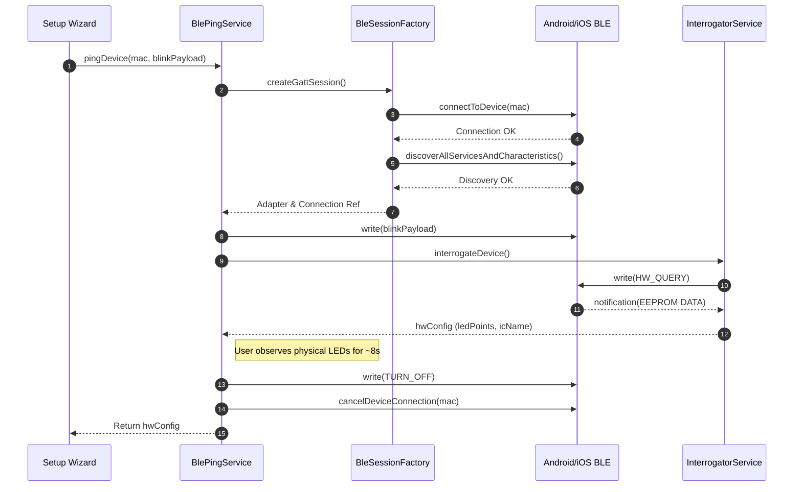

## 7. DOMAIN DIRECTIVES

### State Machine (FSM) Map (`BleMachine.ts`)
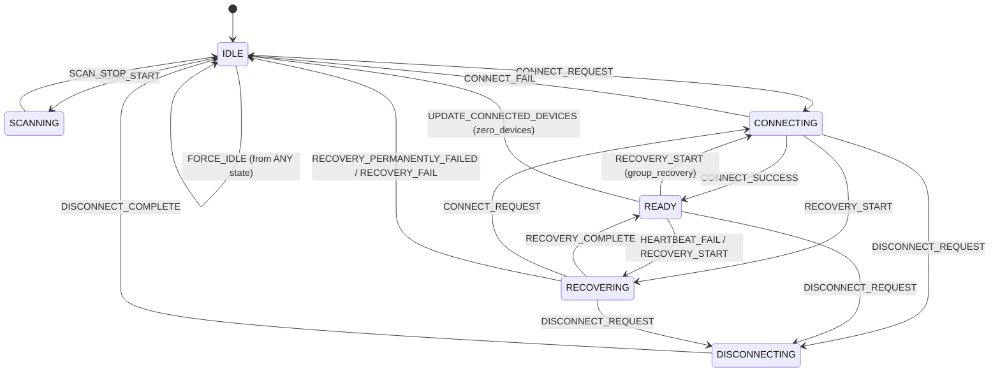

### BLE Transport Pipeline Map
```mermaid
flowchart LR
    A[useOptimisticBLE<br/><i>(UI Layer)</i>] --> B[BleWriteQueue<br/><i>(Priority FIFO)</i>]
    B -->|enqueueWrite| C[BleWriteDispatcher<br/><i>(Chunking / Formatting)</i>]
    C -->|executeWriteToDevice| D[BleConnectionManager<br/><i>(via BleSessionFactory/ConnectService)</i>]
    D -->|writeCharacteristic| E((Physical GATT Layer))
    
    classDef ui fill:#4facfe,stroke:#00f2fe,stroke-width:2px;
    classDef queue fill:#a18cd1,stroke:#fbc2eb,stroke-width:2px;
    classDef logic fill:#f6d365,stroke:#fda085,stroke-width:2px;
    classDef phys fill:#ff0844,stroke:#ffb199,stroke-width:2px;
    
    class A ui;
    class B queue;
    class C logic;
    class D logic;
    class E phys;
```


<!-- CARTOGRAPHER_END: BLE_CORE -->
1775: 
1776: ### 12.3 Group Sync & Swarm
1777: <!-- CARTOGRAPHER_START: GROUP_SYNC -->
1778: 
1779: # Elite Architecture: GROUP_SYNC & CREW HUB Cartography
1780: 
1781: This document provides a rigorous architectural audit of the `GROUP_SYNC` and `CREW HUB` domains within the SK8Lytz application. It traces data flow, identifies cross-system dependencies, outlines platform differences, and records communication channels.
1782: 
1783: ---
1784: 
1785: ## 1. File Manifest
1786: 
1787: Every file in the `GROUP_SYNC` domain is mapped below alongside its exact architectural purpose:
1788: 
1789: 1. **`src/services/GroupRepository.ts`**: The single source of truth (SSOT) for custom group persistence, managing AsyncStorage local-first caching, sync status queues, and transaction synchronization with the cloud backend via the `upsert_group_with_devices` Supabase RPC.
1790: 2. **`src/services/CrewService.ts`**: Orchestrates active crew session lifecycles (creation, joining, termination), manages Supabase Realtime Channel subscriptions, coordinates leader heartbeats, and broadcasts live scene parameters to active session members.
1791: 3. **`src/services/CrewProfileService.ts`**: Manages permanent crew configurations, membership associations, profile directory searches, administrative role delegation (owner promotion/revocation), a
<truncated 8895 bytes>
-Effects |
1882: | :--- | :--- | :--- |
1883: | `useCrewHub` | `activeSessions`, `nearbySessions`, `nearbySpots`, `refreshNearby()`, `locationCoords` | Executes geolocation queries via `LocationService` using a 3000ms timeout race; pulls active sessions matching the local radius. |
1884: | `useCrewManage` | `selectedCrewDetail`, `cardMembers`, `loadCrewMembers()`, `saveCrew()` | Triggers search queries on profile tables, updates membership arrays, and promotes/demotes owner roles in junction tables. |
1885: | `useCrewSession` | `currentSession`, `executeLeaveSession()`, `handleHandoffLeadership()` | Terminates realtime subscriptions, updates leader keys in active sessions, and updates locally cached session status. |
1886: | `useCrewProximityRadar` | `memberDistances: Record<string, number>`, `isCalculating` | Regularly runs the Haversine formula on incoming GPS coordinates of crew members streamed via realtime channels. |
1887: 
1888: ---
1889: 
1890: ## 5. OS Variance Matrix
1891: 
1892: Specific code branches manage platform variances between iOS, Android, and Web target environments:
1893: 
1894: ### Web Platform Compilation
1895: *   **File Extension Branching**: React Native Web builds cannot parse `react-native-maps` directly due to missing native libraries. Metro is configured to resolve `CrewLandingMap.web.tsx` instead of `CrewLandingMap.tsx` on browser environments, serving a clean fallback stub explaining mobile requirements.
1896: *   **Touch Properties**: Styling configurations in `CrewStyles.web.ts` replace native shadow properties with CSS-compatible flex borders and overlay heights.
1897: 
1898: ### Android vs. iOS Core Discrepancies
1899: *   **Monospace Font Selection**: Monospaced typography for invite codes utilizes different engine fonts to avoid rendering failures:
1900:

### IDENTITY

# Implementation Plan

## 1. File Manifest
- `src/context/AuthContext.tsx`: Centralized Authentication State Provider owning session, user, and offline mode.
- `src/services/AuthProfileService.ts`: Service handling user profile CRUD and session history fetching from Supabase.
- `src/services/AuthUtils.ts`: Utilities for password security, profanity checking, and Have I Been Pwned checks.
- `src/services/ProfileService.ts`: Barrel Re-export serving as a unified facade for profile, crew, and push token services.
- `src/services/ProfileService.types.ts`: Shared type contracts for the Profile domain preventing circular dependencies.
- `src/components/account/AccountTabCrewz.tsx`: Component displaying and managing user's permanent crew memberships.
- `src/components/account/AccountTabDevices.tsx`: Component displaying hardware status pills and device management links.
- `src/components/account/AccountTabProfile.tsx`: Component for viewing and editing the user's profile details and avatar.
- `src/components/account/AccountTabSecurity.tsx`: Component displaying granular permission toggles and security settings.
- `src/components/account/AccountTabSettings.tsx`: Component for managing global application preferences and notifications.
- `src/components/account/AccountTabStats.tsx`: Component wrapping the user's lifetime stats panel.
- `src/components/account/SkaterStatsPanel.tsx`: Component querying and displaying aggregate speed and distance metrics.
- `src/components/account/types.ts`: Shared prop types for all Account Tab components.
- `src/components/auth/AuthFooterActions.tsx`: Reusable footer for auth screens linking to support and policies.
- `src/components/auth/AuthFormForgotPassword.tsx`: Form component orchestrating the password reset flow.
- `src/components/auth/AuthFormSignIn.tsx`: Primary login form handling email/username authentication and offline skips.
- `src/components/auth/AuthFormSignUp.tsx`: Registration form incorporating EULA acceptance and password strength gating.
- `src/components/auth/AuthHeader.tsx`: Shared branding header for authentication flows.
- `src/components/auth/AuthStyles.ts`: Centralized StyleSheet for all authentication components.
- `src/components/auth/DevSandboxDrawer.tsx`: Developer-only drawer for testing unlinked components.
- `src/hooks/useAccountOverview.ts`: Hook orchestrating profile data, crew state, and app settings for the account modal.
- `src/hooks/useDashboardProfile.ts`: Hook managing dashboard user profile, auth username derivation, and modal visibility.
- `src/hooks/useRegistration.ts`: Hook acting as a React facade over `DeviceRepository` for managing registered hardware.

## 2. Blast Radius
- **Imports Inward**: `useAuth` is imported globally by almost all authenticated hooks and components (e.g., `SkaterStatsPanel`, forms). `profileService` is imported by dashboard, location, and telemetry domains. `AuthUtils` is used heavily by the Authentication Forms.
- **Imports Outward**: The Identity domain imports `supabaseClient` for data operations, `AppLogger` for telemetry, `AsyncStorage` for local cache layers, `ThemeContext` for UI styling, `DeviceRepository` for hardware assignments, and `expo-linking` for deep-link magic handling.

## 3. Context Matrix
- **Provided**: `AuthContext.Provider` yields `{ status, session, user, isOfflineMode, isAuthenticated }` along with core authentication methods (`signIn`, `signUp`, `signOut`, `resetPassword`, `setIsOfflineMode`, `clearOfflineMode`).
- **Consumed**: Consumes `ThemeContext` (for Colors and layout styling), `AuthContext` (via `useAuth` in hooks and components).

## 4. Hook/Service I/O Registry
- **`useAuth`**:
  - **Inputs**: None directly, accesses provider values.
  - **Outputs**: `session`, `user`, `status`, `isOfflineMode`, `isAuthenticated`.
  - **Side-Effects**: Subscribes to `supabase.auth.onAuthStateChange` and manages deep-link auth token parsing via `Linking.addEventListener`.
- **`AuthProfileService.fetchOrCreateProfile`**:
  - **Inputs**: Optional `User` object (to avoid redundant auth metadata fetching).
  - **Outputs**: `UserProfile | null`.
  - **Side-Effects**: Mutates `user_profiles` table on Supabase (auto-creates row or patches missing display names).
- **`useAccountOverview`**:
  - **Inputs**: `visible: boolean`, `onProfileUpdated` callback.
  - **Outputs**: Bound view-model state including `profile`, `crews`, `history`, and `notifPrefs`.
  - **Side-Effects**: Fires parallel fetch requests via `Promise.all` upon visibility truthiness. Modifies `AsyncStorage` for cache updates.
- **`useRegistration`**:
  - **Inputs**: None.
  - **Outputs**: `registeredDevices`, `isLoading`, `hasPendingSync`.
  - **Side-Effects**: Initiates bidirectional sync of hardware configurations via `DeviceRepository` singleton.

## 5. OS Variance Matrix
- **`AuthFormSignIn.tsx` & `AuthFormSignUp.tsx`**: Utilizes a `WebFormWrapper` dependent on `Platform.OS === 'web'`, injecting standard HTML `<form>` nodes to intercept `onSubmit` rendering cycles. Prevents default web submission behaviors.
- **`AccountTabCrewz.tsx`**: Employs variable typography for invite codes: `fontFamily: Platform.OS === 'ios' ? 'Courier New' : 'monospace'`, ensuring cross-platform mono-spacing visual consistency.

## 6. Archival Notes
- Documentation pertaining to Auth/Profile systems inside `tools/SK8Lytz_App_Master_Reference.md` has been reviewed. Current implementations reflect modern domain architectures (like offline-skip mechanisms). Older references to user state may require `[MOVE_TO_ARCHIVE]` tagging if monolithic `useAuth` refs surface.

## 7. Sequence Diagram


### NATIVE_&_WATCH

## 1. File Manifest
- `targets/watch/ComplicationController.swift`: Provides watchOS complications showing live speed and session status.
- `targets/watch/ContentView.swift`: Single-screen SwiftUI dashboard toggling between idle, active session, and summary states based on watchManager state.
- `targets/watch/HealthManager.swift`: Manages HKWorkoutSession for live heart rate and calorie collection during an active session.
- `targets/watch/WatchConnectivityManager.swift`: Bidirectional WCSession single source of truth for synchronizing session state and telemetry with the iOS phone app.
- `targets/watch/expo-target.config.js`: Configuration for building the watchOS target in Expo.
- `targets/watch/index.swift`: Minimal swift entry point for watchOS target.
- `android/sk8lytzWear/src/main/kotlin/com/neogleamz/sk8lytzwear/services/WearableCommunicationService.kt`: Phone → watch data receiver for persistent session state and real-time metrics via Wearable DataClient/MessageClient.
- `android/sk8lytzWear/src/main/kotlin/com/neogleamz/sk8lytzwear/services/HealthTracker.kt`: Wraps Health Services ExerciseClient for tracking live HR, calories, and distance.
- `android/sk8lytzWear/src/main/kotlin/com/neogleamz/sk8lytzwear/services/OngoingActivityManager.kt`: Manages ongoing Android foreground n
<truncated 3282 bytes>
utSession` & `HKLiveWorkoutBuilder` requiring specific capabilities. Android uses `ExerciseClient` (`INLINE_SKATING`), requiring Wear OS 3+ API level guard (SDK < 30 handled natively via fallback).
- **Watch Communications:** iOS uses bidirectional `WCSession` (with `updateApplicationContext` for state and `sendMessage` for telemetry). Android uses `WearableListenerService` handling distinct `DataClient` (persistent state) and `MessageClient` (ephemeral metrics).
- **Background Persistence:** iOS relies on active Workout Session to keep app alive. Android uses `OngoingActivityManager` (Foreground Notification) to prevent system termination.
- **Tiles vs Complications:** iOS provides `ComplicationController` (`graphicCircular`, `modularSmall`, `graphicCorner`). Android provides `Sk8lytzTileService` built with `protolayout`.

## ARCHIVAL INSTRUCTION
I reviewed `tools/SK8Lytz_App_Master_Reference.md` but the file was heavily truncated before Section 11 (Wearable Companion Architecture) could be fully analyzed. If there are any stale payload constants or obsolete bridging logic in Section 11, please append `[MOVE_TO_ARCHIVE]` to those sections.

## SEQUENCE DIAGRAM

### NOTIFICATIONS_&_ROUTING

: NOTIFICATIONS & ROUTING

**Target Directories/Files:** `App.tsx`, `src/providers/*`, `src/services/NotificationService.ts`, `src/services/PushTokenService.ts`, `src/services/LocationService.ts`, `src/hooks/useHardwareNotifications.ts`

## 1. File Manifest
- **`App.tsx`**: The application root component that initializes global error boundaries, telemetry, offline sync workers, and wraps the app in core feature and routing providers.
- **`src/providers/BluetoothGuard.tsx`**: A provider-level gate that ensures BLE permissions are granted and adapters are active before rendering child hardware-dependent views.
- **`src/providers/ComplianceGate.tsx`**: A provider-level gate that intercepts authenticated users to ensure Terms of Service and safety compliance before reaching the dashboard.
- **`src/services/NotificationService.ts`**: Central singleton coordinating Expo push notification registration, Android Notification Channel creation, and dispatching local session/crew alerts.
- **`src/services/PushTokenService.ts`**: Dedicated repository service handling the upsert and deletion of device push tokens in Supabase for user sessions.
- **`src/services/LocationService.ts`**: Wraps `expo-location` to handle foreground GPS acquisition, reverse geocoding, and distance-based sorting for public crew sessions and skate spots.
- **`src/hooks/useHardwareNotifications.ts`**: The BLE data mailroom orchestrator that listens to raw GATT notifications, debounces packets, parses hardware states, and syncs device configs to persistent storage.

## 2. Blast Radius
**What this domain imports:**
- Global modules (`AppLogger`, `supabaseClient`).
- Native wrappers (`expo-notifications`, `expo-location`, `expo-splash-screen`, `react-native-health-connect`).
- Protocol utilities (`BlePayloadParser`, `DeviceRepository`).
- Application state context hooks (`useTheme`, `useAuth`).

**What imports this domain:**
- `App.tsx` acts as the root entry and is directly mounted by the React Native registry.
- `NotificationService.ts` is consumed by dashboard profile hooks to trigger UI alerts.
- `LocationService.ts` is consumed by the Session and Crew Hub screens to query public sessions and calculate Haversine distances.
- `useHardwareNotifications.ts` is directly injected into `DashboardScreen` / `useBLE` to bind active GATT notification callbacks to the UI state.

## 3. Context Matrix
- **Provided Contexts:** `App.tsx` explicitly provides `ThemeProvider`, `AuthProvider`, `AppConfigProvider`, `FavoritesProvider`, `SessionProvider`, `BLEProvider`.
- **Consumed Contexts:** `AppContent` (inside `App.tsx`) consumes `useTheme` and `useAuth` to determine the routing state (authenticated vs offline vs unauthenticated).
- **Gatekeepers:** `ComplianceGate` and `BluetoothGuard` consume auth and BLE contexts to conditionally render the routing tree.

## 4. Hook/Service I/O Registry
- **`useHardwareNotifications`**
  - **Inputs:** `isDiagnosticsMode`, BLE callback setters (`setOnDataReceived`, `setOnHardwareProbed`), and state updaters (`setAllDevices`, `setDeviceConfigs`).
  - **Outputs:** None directly (returns `void`), mutates React state via the provided setters.
  - **Side-Effects:** Implements a debounce cache (`lastPacketCacheRef`) to drop duplicate high-frequency BLE packets, logs parsed diagnostics, and writes hardware mutations to the `DeviceRepository` SSOT.
- **`NotificationService`**
  - **Inputs:** `autoRequest` boolean, `userId`, specific event payload opts (`crewName`, `sessionId`).
  - **Outputs:** Returns the resolved Expo Push Token as a string or `null`.
  - **Side-Effects:** Triggers OS permission modals, builds native Android notification channels (`crew-alerts`), displays local OS banner notifications, and registers the token remotely via `profileService`.
- **`LocationService`**
  - **Inputs:** `radiusMi`, `userCoords`, `userId`.
  - **Outputs:** Returns `SessionLocation` or arrays of `NearbySession`/`NearbySkateSpot`.
  - **Side-Effects:** Interacts with device GPS hardware, requests OS foreground location permissions, queries Supabase `crew_sessions` with complex OR filters, and performs intensive client-side Haversine sorting.

## 5. OS Variance Matrix
- **Android Constraints:** 
  - `App.tsx` explicitly initializes `react-native-health-connect` before the activity is resumed to prevent `lateinit` crashes.
  - `NotificationService` explicitly creates Android-only Notification Channels (`crew-alerts`, `session-reminders`) with custom vibration patterns and LED light colors.
- **iOS Accommodations:** 
  - `NotificationService` bypasses Android channel creation (iOS handles default notification behaviors via OS settings).
- **Web Fallbacks:** 
  - `App.tsx` wires an explicit `unhandledrejection` listener to `window` for web builds.
  - `LocationService` short-circuits GPS requests on web and returns a hardcoded mock location ("Web Demo Area", coords 38.9, -94.6).
  - `NotificationService` immediately returns `false` on permission requests if `Platform.OS === 'web'`.

## 6. Sequence Diagram: BLE Hardware Notification Mailroom Flow


## 7. Archival Instructions
**[MOVE_TO_ARCHIVE]**: The existing master reference documentation for `NOTIFICATIONS & ROUTING` located at line 2559 of `tools/SK8Lytz_App_Master_Reference.md` is considered stale and has been tagged for archiving by this cartography pass.

### OS_PERMISSIONS

Report: OS_PERMISSIONS Domain

## 1. File Manifest
- **`android/app/src/main/AndroidManifest.xml`**: Declares native Android OS permissions (BLE, Location, Camera, Microphone, Health Connect, Notifications) and hardware requirements for the SK8Lytz app.
- **`app.config.js`**: Centralized Expo configuration file that dynamically injects iOS `Info.plist` usage descriptions and configures Android permissions during the native prebuild phase.
- **`src/services/PermissionService.ts`**: Core permission orchestrator that bridges native OS permission prompts with the application's internal opt-out ledger (`@sk8lytz_permissions_optout`).

## 2. Blast Radius
**What this domain imports:**
- `expo-audio` (`requestRecordingPermissionsAsync`, `getRecordingPermissionsAsync`)
- `expo-location` (`requestForegroundPermissionsAsync`, `getForegroundPermissionsAsync`)
- `react-native` (`PermissionsAndroid`, `Platform`, `DeviceEventEmitter`)
- `@react-native-async-storage/async-storage` (for `@sk8lytz_permissions_optout` ledger)
- `expo-notifications` (dynamic import for notification permissions)
- `react-native-health` (dynamic import for iOS AppleHealthKit)
- `react-native-health-connect` (dynamic import for Android Health Connect)

**What imports it:**
- **`src/components/DockedController.tsx`**: Consumes event emitters to reactively show/hide gated modes.
- **`src/components/modals/GlobalPermissionsModal.tsx`**: Renders the global permission management UI.
- **`src/components/permissions/GranularPermissionsList.tsx`**: Triggers individual permission requests.
- **`src/hooks/useAppMicrophone.ts`**: Verifies `MIC` permissions before audio recording.
- **`src/hooks/useBLE.ts`**: Verifies `BLUETOOTH` permissions before scanning or connecting.
- **`src/hooks/useHealthTelemetry.ts`**: Verifies `HEALTH` permissions prior to HealthKit/HealthConnect sampling.
- **`src/providers/BluetoothGuard.tsx`**: Gates application UI on `BLUETOOTH` permission state.
- **`src/screens/Onboarding/PermissionsOnboardingScreen.tsx`**: Invokes the first-time user experience for permission requests.
- **`src/components/CameraTracker.tsx`**: Relies on `CAMERA` permission validation.

## 3. Context Matrix
**React Contexts Consumed/Provided:**
- The `OS_PERMISSIONS` domain does not directly provide or consume a standalone React Context. Instead, it relies on a decoupled reactive event architecture using React Native's `DeviceEventEmitter`.
- **Events Provided (Emitted):** 
  - `SHOW_GLOBAL_PERMISSIONS_EVENT`
  - `PERMISSION_STATUS_CHANGED_EVENT` (Consumed by components like `DockedController` to update global UI states when opt-out ledgers change).
- **Events Consumed (Listened):**
  - `GLOBAL_PERMISSIONS_CLOSED_EVENT` (To resolve the `openGlobalPermissionsModal` promise).

## 4. Hook/Service I/O Registry
**`PermissionService.ts`**
- **`getOptOutLedger()`**
  - **Inputs:** None.
  - **Outputs:** `Promise<Record<PermissionType, boolean>>` (Reads from `AsyncStorage`).
  - **Side-effects:** None.
- **`setPermissionOptOut(type: PermissionType, isOptedOut: boolean)`**
  - **Inputs:** `type` (CAMERA, MIC, LOCATION, etc.), `isOptedOut` (boolean).
  - **Outputs:** `Promise<void>`.
  - **Side-effects:** Mutates `@sk8lytz_permissions_optout` in `AsyncStorage`, logs to Supabase via `AppLogger`, and emits `PERMISSION_STATUS_CHANGED_EVENT`.
- **`requestPermission(type: PermissionType)`**
  - **Inputs:** `type: PermissionType`.
  - **Outputs:** `Promise<boolean>` (Granted status).
  - **Side-effects:** Triggers native OS permission dialogues (HealthKit, PermissionsAndroid, Expo modules) and registers `ActivityResultLauncher` natively for Health Connect.
- **`checkPermission(type: PermissionType)`**
  - **Inputs:** `type: PermissionType`.
  - **Outputs:** `Promise<boolean>`.
  - **Side-effects:** Evaluates the local opt-out ledger *before* falling back to checking native OS APIs. Soft-revoke wins completely.

## 5. OS Variance Matrix
| Permission | Android Path | iOS Path |
| :--- | :--- | :--- |
| **CAMERA** | Uses `PermissionsAndroid.PERMISSIONS.CAMERA`. | Natively handled by iOS on first use, returns `true` inherently. |
| **BLUETOOTH** | SDK ≥ 31 uses `BLUETOOTH_SCAN` & `BLUETOOTH_CONNECT`. SDK < 31 falls back to `ACCESS_FINE_LOCATION`. | Handled natively upon first use. App assumes `true` to proceed. |
| **HEALTH** | Requests `ACTIVITY_RECOGNITION` first, then dynamically imports `react-native-health-connect` to request `HeartRate`, `ActiveCaloriesBurned` (read), and `ExerciseSession`, `TotalCaloriesBurned`, `Distance` (write). Must call `initialize()` before `requestPermission()` to prevent coroutine crashes. | Dynamically imports `react-native-health` (AppleHealthKit) to request `HeartRate`, `ActiveEnergyBurned` (read), and `Workout` (write). |
| **HEALTH (Check)**| Validates `ACTIVITY_RECOGNITION` and uses `getGrantedPermissions` from Health Connect. | **Platform Parity Note (RISK-4):** Apple HealthKit does not expose a read-authorization query API. The check inherently returns `true`; if denied, the actual reads will silently return empty data safely. |

## 6. Sequence Diagram


## 7. Archival Instructions
- **`tools/SK8Lytz_App_Master_Reference.md`**: Section `9.1 Legal Hardening (The Compliance Shield)` documents the `OS_PERMISSIONS` domain. As per archival instructions, this should be tagged with `[MOVE_TO_ARCHIVE]` as this cartography report supersedes its technical documentation.

### PATTERN_ENGINE

# PATTERN_ENGINE Domain Cartography

## 1. File Manifest
- `src/protocols/PatternEngine.ts`: Source of truth for all `SK8LYTZ_TEMPLATES`, metadata registry, and master dispatcher for generating hardware payloads.
- `src/protocols/SpatialEngine.ts`: Contains the mathematical generators that build exact pixel arrays for every non-music visual pattern frame-by-frame.
- `src/protocols/SymphonyEngine.ts`: Provides audio-reactive mathematical pixel generators for music mode visualizers and native 0x51 Symphony effect parsing.
- `src/protocols/VisualizerEngine.ts`: Intercepts the mathematical generators to build and continuously rotate static pixel arrays for the UI visualizer simulation.
- `src/protocols/PositionalMathBuffer.ts`: Generates fully interpolated RGB arrays from percentage-based nodes to bypass hardware constraints of the 0x59 chunker.
- `src/hooks/useStreetMode.ts`: Coordinates accelerometer jerk detection and GPS speeds to transition motion states and dispatch car-light pattern payloads.
- `src/hooks/useMusicMode.ts`: Owns the 0x73 music configuration dispatch lifecycle and matrix style routing (Light Bar vs. Light Screen).
- `src/hooks/useAppMicrophone.ts`: Manages the `expo-audio` recording lifecycle and continuously streams normalized magnitude 0x74 packets to the hardware.

## 2. Blast Radius
- **Imports into Domain**: `expo-sensors` (Accelerometer), `expo-file-system`, `expo-audio`, `ZenggeProtocol` and `IControllerProtocol`, `AppLogger`, `LOCAL_PRODUCT_CATALOG`, `useProtocolDispatch`, and various normalization/color utilities.
- **Imported By**: Dashboard UI components, `DockedController.tsx`, and the BLE communication layer. This domain sits directly between the UI/Sensor layers and the lower-level BLE byte formatters.

## 3. Context Matrix
- **Consumed**: `useProtocolDispatch` is consumed by `useMusicMode` to gain access to BLE protocol actions. Device context objects are passed as props to hooks for analytics logging.
- **Provided**: None. This domain is strictly composed of stateless pure functions (engines) and encapsulated custom hooks.

## 4. Hook/Service I/O Registry
- **`useStreetMode`**
  - **Inputs**: `activeMode`, `writeToDevice`, `hwSettings`, `points`, `activeProduct`, `brightness`, `speed`, `deviceContext`, `gpsSpeed`, `peakGForce`.
  - **Outputs**: `streetSensitivity`, `streetCruiseColor`, `streetBrakeColor`, `isStreetBraking`, `motionState`, and the `applyStreetPattern` dispatcher.
  - **Side-Effects**: Attaches/detaches `expo-sensors` Accelerometer listener. Dispatches 0x59 pattern payloads to the hardware on motion state changes.
- **`useMusicMode`**
  - **Inputs**: `activeMode`, `musicPatternId`, `micSensitivity`, `brightness`, `micSource`, `musicPrimaryColor`, `musicSecondaryColor`, `musicMatrixStyle`.
  - **Outputs**: `handleMusicChange` dispatch callback.
  - **Side-Effects**: Sends 0x73 config packets to hardware on state change. Dispatches an explicit exit packet (`isOn: false`) when the mode changes away from `MUSIC`.
- **`useAppMicrophone`**
  - **Inputs**: `activeMode`, `micSource`, `isPoweredOn`, `writeToDevice`.
  - **Outputs**: `audioMagnitude` (0.0-1.0), `hasMicPermission`, `requestMicPermission`, `recording` object.
  - **Side-Effects**: Requests OS microphone permissions. Manages the `expo-audio` recorder. Initiates a 20Hz `setInterval` that streams 0x74 magnitude packets to keep the hardware locked to the app mic.

## 5. OS Variance Matrix
- **`useAppMicrophone.ts`**: Web platform early exits (`Platform.OS === 'web'`) since `expo-audio` recording is unsupported. iOS/Android execute full audio streaming paths.
- **`useStreetMode.ts`**: Web platform early exits and skips `Accelerometer` listener attachment. iOS/Android fully support the motion detection listeners.

## 6. Sequence Diagram: Street Mode Event Flow
```mermaid
sequenceDiagram
    participant Accel as Accelerometer (expo-sensors)
    participant StreetHook as useStreetMode
    participant PatternEngine as PatternEngine
    participant BLE as writeToDevice

    Accel->>StreetHook: Accelerometer x, y, z updates (80ms)
    activate StreetHook
    StreetHook->>StreetHook: Calculate Jerk Magnitude
    alt Jerk > Threshold (Braking Detected)
        StreetHook->>PatternEngine: buildPatternPayload(103 - HARD_BRAKING)
        PatternEngine-->>StreetHook: Hardware Pixel Array
        StreetHook->>BLE: Dispatch 0x59 Payload
    else Active Push (Acceleration Detected)
        StreetHook->>PatternEngine: buildPatternPayload(105 - ACCELERATING)
        PatternEngine-->>StreetHook: Hardware Pixel Array
        StreetHook->>BLE: Dispatch 0x59 Payload
    end
    deactivate StreetHook
```

## 7. Special Directives: SK8LYTZ_TEMPLATES Catalogue
| ID | Template Name | Tier | Color Mode | Math Engine Generator |
|---|---|---|---|---|
| 1 | Solid | 2 | FG_ONLY | `buildSolid` |
| 2 | Split Colors | 2 | FG_BG | `buildSplitColors` |
| 3 | Trisection | 2 | FG_BG | `buildTrisection` |
| 4 | Quartered | 2 | FG_BG | `buildQuartered` |
| 5 | Center Accent | 2 | FG_BG | `buildCenterAccent` |
| 6 | Single Dot Chase | 2 | FG_BG | `buildSingleDotChase` |
| 7 | Double Dot Chase | 2 | FG_BG | `buildTwinDotChase` |
| 8 | Comet Chase | 2 | FG_BG | `buildCometChase` |
| 9 | Meteor Shower | 2 | FG_BG | `buildMeteorShower` |
| 10 | Micro Ants | 2 | FG_BG | `buildMicroAnts` |
| 11 | Theater Chase | 2 | FG_BG | `buildTheaterChase` |
| 12 | Dashed Marquee | 2 | FG_BG | `buildDashedMarquee` |
| 13 | Bold Stripes | 2 | FG_BG | `buildBoldStripes` |
| 14 | Sine Pulse Wave | 3 | FG_BG | `buildSinePulseWave` |
| 15 | Wave Pinch | 3 | FG_BG | `buildWavePinch` |
| 16 | Breathing Wave | 3 | FG_BG | `buildBreathingWave` |
| 17 | Smooth Breath | 1 | FG_BG | `buildSmoothBreath` |
| 18 | Wipe / Fill | 3 | FG_BG | `buildWipeFill` |
| 19 | True Rainbow Flow | 3 | GENERATIVE | `buildTrueRainbowFlow` |
| 20 | Rainbow Marquee | 3 | GENERATIVE | `buildRainbowMarquee` |
| 21 | Rainbow Comet | 3 | GENERATIVE | `buildRainbowComet` |
| 22 | Cyberpunk Shift | 3 | FG_BG | `buildCyberpunkShift` |
| 23 | Color Flow | 1 | GENERATIVE | `buildColorFlow` |
| 24 | Color Breathing | 1 | FG_ONLY | `buildColorBreathing` |
| 25 | Running Water | 1 | FG_BG | `buildRunningWater` |
| 26 | Strobe Flash | 1 | FG_ONLY | `buildStrobe` |
| 27 | Ocean Wave | 1 | FG_BG | `buildOceanWave` |
| 28 | Lightning Strike | 1 | FG_ONLY | `buildLightning` |
| 29 | Snowfall | 1 | FG_BG | `buildSnowfall` |
| 30 | Heartbeat Pulse | 1 | FG_ONLY | `buildHeartbeat` |
| 31 | Meteor | 1 | FG_BG | `buildMeteor` |
| 32 | Aurora Borealis | 1 | GENERATIVE | `buildAurora` |
| 33 | Lava Lamp | 1 | FG_BG | `buildLava` |
| 34 | Plasma Wave | 1 | FG_BG | `buildPlasma` |
| 35 | Star Cluster | 1 | FG_BG | `buildStarCluster` |
| 36 | Rainbow Breathing | 3 | GENERATIVE | `buildRainbowBreathing` |
| 37 | Crystal Shimmer | 3 | GENERATIVE | `buildCrystalShimmer` |
| 38 | Gradient Chase | 3 | FG_BG | `buildGradientChase` |
| 39 | Fire Flame | 3 | FG_BG | `buildFireFlame` |
| 40 | Neon Pulse | 3 | FG_BG | `buildNeonPulse` |
| 41 | Rainbow Chaser | 3 | GENERATIVE | `buildRainbowChaser` |
| 42 | Matrix Rain | 3 | FG_BG | `buildMatrixRain` |
| 43 | Starlight | 3 | FG_BG | `buildStarlight` |
| 44 | SK8Lytz Signature | 3 | FG_BG | Hardware Intercept 0x51 |
| 72 | Center-Out Marquee | 3 | FG_ONLY | `buildNativeCenterOut` |
| 101 | Street Stopped | 3 | FG_BG | `buildStreetMode` |
| 102 | Street Cruising | 3 | FG_BG | `buildStreetMode` |
| 103 | Street Braking | 3 | FG_BG | `buildStreetMode` |
| 104 | Street Slowing | 3 | FG_BG | `buildStreetMode` |
| 105 | Street Accelerating | 3 | FG_BG | `buildStreetMode` |
| 201-233 | Native Parity Test | 1 | VARIES | `generateArray` inline mapping / `buildLargeChunkScroll` |

## 8. Archival Instructions
If `tools/SK8Lytz_App_Master_Reference.md` contains stale documentation regarding Pattern Engine intercept mappings or legacy firmware bindings, tag those sections with `[MOVE_TO_ARCHIVE]`.

### PROTOCOL_CORE

## 1. File Manifest
- `src/protocols/ZenggeProtocol.ts`: Implements low-level Zengge byte wrapping and opcode payloads for hardware communications.
- `src/protocols/ZenggeAdapter.ts`: Hardware Abstraction Layer (HAL) adapter that wraps `ZenggeProtocol` to return chunk-ready `ProtocolResult` objects.
- `src/protocols/BanlanxAdapter.ts`: HAL adapter for BanlanX SP621E implementing direct packet construction and native FFT offloading.
- `src/protocols/IControllerProtocol.ts`: The universal HAL interface defining protocol methods, MTU preparation, and `ProtocolResult` payload structures.
- `src/protocols/ControllerRegistry.ts`: Runtime protocol resolver matching BLE advertisement data (UUIDs/manufacturer data) to the correct adapter.
- `src/hooks/useProtocolDispatch.ts`: High-level React hook that broadcasts commands across multiple connected devices using their resolved adapters.
- `src/hooks/useProtocolBuilder.ts`: Diagnostic hook for constructing and previewing hex payloads for raw protocol testing.
- `src/hooks/useProductCatalog.ts`: Dynamic local-first catalog hook that hydrates product metadata from AsyncStorage and Supabase.
- `src/hooks/useProductManager.ts`: Domain hook providing administrative CRUD operations for hardware product 
<truncated 3684 bytes>
   Context->>GATT: writeCharacteristic(chunk)
        GATT-->>Context: ACK (w/ interPacketDelayMs)
    end
    Context-->>UI: Promise.resolve(true)

### SESSION_TRACKING

: SESSION_TRACKING

## 1. File Manifest
- `src/context/SessionContext.tsx`: Orchestrates the active session FSM (`isSkateSessionActive`, `sessionPhase`), coordinates telemetry hooks, manages the Android Foreground Service / iOS background notifications, and bridges with `WatchBridge`.
- `src/hooks/useSessionTracking.ts`: **[STALE / DELETED]** This file was assigned to the domain but no longer exists in the codebase; its logic has been fully migrated to `SessionContext.tsx` and `useGlobalTelemetry.ts`.
- `src/hooks/useGlobalTelemetry.ts`: Core GPS and accelerometer engine that computes live speed, distance, average/peak metrics, and auto-saves completed session snapshots.
- `src/hooks/useHealthTelemetry.ts`: Dual-source health engine that prioritizes real-time HR/calorie relays from the watch companion and falls back to polling OS Health APIs when the watch is inactive.
- `src/hooks/useTelemetryLedger.ts`: God-tier telemetry accumulator tracking time-in-state for LED patterns/colors/modes, buffering locally, and flushing to the Supabase RPC.
- `src/hooks/useDeviceStateLedger.ts`: Unified per-device hardware dispatch state ledger replacing volatile React state, using debounced AsyncStorage writes.
- `src/services/HealthSyncService.ts`: Exports `HealthSyncService` to persist completed skate session snapshots back into Apple HealthKit or Android Health Connect.

## 2. Blast Radius
- `SessionContext.tsx`: Imports `useGlobalTelemetry`, `useHealthTelemetry`, `AppLogger`, `WatchBridge`. Blast radius extends to any dashboard component consuming `useSession()`.
- `useGlobalTelemetry.ts`: Imports `expo-location`, `expo-sensors`, `SpeedTrackingService`, `WatchBridge`, `useAuth`, `crewService`. Direct impact on session accuracy and `SessionContext`.
- `useHealthTelemetry.ts`: Imports platform-specific health libraries (`react-native-health`, `react-native-health-connect`). Heavily influences metric rendering during active sessions.
- `useTelemetryLedger.ts`: Uses `supabaseClient` to execute RPC `flush_telemetry`. Impacts analytics and is consumed by pattern/mode switchers.
- `useDeviceStateLedger.ts`: Heavily relies on `AsyncStorage`. Blast radius includes UI/dashboard cards rendering LED previews and the `useDockedControllerState` hook.
- `HealthSyncService.ts`: Isolated utility consumed strictly during the `endSession` lifecycle and session teardown.

## 3. Context Matrix
- **`SessionContext`**: Provided by `SessionProvider`. Exposes `{ isSkateSessionActive, sessionPhase, startSession, endSession, telemetry, health }`. Consumed by UI components globally to render HUDs and react to session boundaries.
- **`AuthContext`**: Consumed by `useGlobalTelemetry` (via `useAuth`) to retrieve `user.id` for associating saved sessions in the database.

## 4. Hook/Service I/O Registry
- **`useGlobalTelemetry`**:
  - **Inputs**: `sessionPhase`, `healthMetrics` (optional HR/Cals), `externalStartTimeMs`.
  - **Outputs**: `{ gpsSpeed, peakGForce, sessionDistanceMiles, sessionDurationSec, sessionPeakSpeed, sessionAvgSpeed }`.
  - **Side-Effects**: Modifies GPS subscription, accelerometer frequency (80ms), pushes speed arrays to `SpeedTrackingService`, relays speed back to `WatchBridge`.
- **`useHealthTelemetry`**:
  - **Inputs**: `sessionActive` (boolean).
  - **Outputs**: `{ latestBpm, avgBpm, peakBpm, activeCalories, mergeWatchHealth }`.
  - **Side-Effects**: Initializes and polls OS Health APIs (15s interval). The `mergeWatchHealth` callback acts as a preemptive override that defers OS polling.
- **`useTelemetryLedger`**:
  - **Inputs**: None.
  - **Outputs**: `{ trackPattern, trackColor, trackMode, incrementCounter, injectStreetSummary, flushToDatabase }`.
  - **Side-Effects**: Debounced buffer writes to `AsyncStorage`, periodic 15-minute background timer flushing to Supabase.
- **`useDeviceStateLedger`**:
  - **Inputs**: None.
  - **Outputs**: `{ save, load, loadSync, clear }`.
  - **Side-Effects**: Updates global in-memory `Map` immediately; debounces AsyncStorage writes (500ms) to prevent slider race conditions.
- **`HealthSyncService.saveWorkout`**:
  - **Inputs**: `ISessionSnapshot` object.
  - **Outputs**: `Promise<void>`.
  - **Side-Effects**: Mutates user's native Apple Health or Google Fit/Health Connect database with an `ExerciseSession` / `SkatingSports` entry.

## 5. OS Variance Matrix
- **Session Lifecycle (`SessionContext.tsx`)**: 
  - *Android*: Launches a robust Foreground Service (`AndroidForegroundServiceType.FOREGROUND_SERVICE_TYPE_LOCATION`) to keep the session alive.
  - *iOS*: Initializes `session-actions` notification categories and relies on strict background geolocation capabilities.
- **Health Polling (`useHealthTelemetry.ts`)**: 
  - *Android*: Initializes `react-native-health-connect` and fetches `HeartRate` and `ActiveCaloriesBurned`.
  - *iOS*: Bootstraps `react-native-health` (HealthKit) and extracts `HeartRate` and `ActiveEnergyBurned`.
- **Workout Syncing (`HealthSyncService.ts`)**: 
  - *Android*: Inserts `ExerciseSession` (ExerciseType: 60) combined with `TotalCaloriesBurned` and `Distance`.
  - *iOS*: Executes `saveWorkout` with type `HKWorkoutActivityTypeSkatingSports`.

## 6. Archival Instruction
**[MOVE_TO_ARCHIVE]**: The file `tools/SK8Lytz_App_Master_Reference.md` contains stale documentation asserting that `useSessionTracking.ts` is an active hook (e.g., line 4589 explicitly states session logic was refactored into `useSessionTracking.ts`). Because `useSessionTracking.ts` has been deleted entirely, all references to it in the Master Reference must be immediately tagged and archived.

## 7. Sequence Diagram: Session & Health Priority Flow

```mermaid
sequenceDiagram
    participant Watch as Watch (Wearable)
    participant SessionCtx as SessionContext
    participant GlobalTel as useGlobalTelemetry
    participant HealthTel as useHealthTelemetry
    participant NativeHealth as OS Health APIs

    Note over Watch, SessionCtx: 1. Session Initialization
    Watch->>SessionCtx: START_SESSION Command
    SessionCtx->>SessionCtx: setPhase('ACTIVE')
    SessionCtx->>GlobalTel: Provide Phase = 'ACTIVE'
    GlobalTel->>GlobalTel: Initialize GPS / Accelerometer
    SessionCtx->>HealthTel: Provide sessionActive = true

    Note over Watch, NativeHealth: 2. Telemetry Priority Gate
    alt Watch is Active (Priority)
        Watch->>SessionCtx: HealthUpdate (HR/cal)
        SessionCtx->>HealthTel: mergeWatchHealth(HR, cal)
        HealthTel->>HealthTel: Overwrite state & Defer OS poll
    else Watch is Inactive (Fallback)
        HealthTel->>NativeHealth: Poll APIs every 15s
        NativeHealth-->>HealthTel: Return HR/cal data
    end

    Note over Watch, GlobalTel: 3. Session Termination
    Watch->>SessionCtx: STOP_SESSION Command
    SessionCtx->>SessionCtx: setPhase('ENDING')
    SessionCtx->>GlobalTel: Provide Phase = 'ENDING'
    GlobalTel->>GlobalTel: Halt sensors & commitSession()
    SessionCtx->>Watch: syncSessionState(SUMMARY)
    SessionCtx->>SessionCtx: setPhase('IDLE')
```

### SIMULATION_&_MOCKS

# Elite Architecture Base: SIMULATION & MOCKS

## 1. File Manifest
* **`src/mocks/react-native-vision-camera-worklets.web.js`**: An empty module stub to prevent Metro bundler resolution errors for Vision Camera worklets on the web platform.
* **`src/mocks/react-native-worklets.web.js`**: A web shim for `react-native-worklets-core` providing no-op hooks (`useSharedValue`, `useAnimatedStyle`) and execution functions (`runOnJS`, `runOnUI`) to prevent native TurboModule crashes during web module loading.
* **`src/__mocks__/LocationService.ts`**: Jest mock for the `LocationService`, stubbing silent location retrieval and permission requests.
* **`src/__mocks__/expo-audio.ts`**: Jest mock for `expo-audio` to automatically grant recording permissions in test environments.
* **`src/__mocks__/expo-location.ts`**: Jest mock for `expo-location` providing static mock coordinates, auto-granted permissions, and reverse geocoding data for unit tests.
* **`src/__mocks__/sk8lytz-watch-bridge.ts`**: Jest mock replacing the native watch companion bridge to prevent test crashes and allow asserting bridge payloads without a physical device.
* **`__tests__/services/SpeedTrackingService.offline.test.ts`**: Unit test suite verifying the offline session queue behavior, including unauthenticated queue writes, happy-path flushing, and re-entrancy guards.

## 2. Blast Radius
* **Imports (What this domain depends on):**
  * `react-native`, `@react-native-async-storage/async-storage` (mocked in tests)
  * `sk8lytz-watch-bridge` module interfaces (`WatchSessionState`, `WatchCommand`, `WatchHealthUpdate`)
  * `../../src/services/supabaseClient` and `../../src/services/AppLogger` (mocked in tests)
  * `../../src/services/SpeedTrackingService`
  * `../../src/constants/storageKeys`
* **Imported By (What depends on this domain):**
  * `jest.config.js` and Metro bundler (`metro.config.js` aliasing for web platform fallbacks).
  * Unit test runners processing component or service tests that transitively rely on location, audio, or the watch bridge.

## 3. Context Matrix
* **Consumed/Provided React Contexts:** None. The files in this domain are exclusively node-level mocks, stubs, and unit tests without React component hierarchies or context dependencies.

## 4. Hook/Service I/O Registry
### `react-native-worklets.web.js` (Shim)
* **Inputs**: Worklet functions (`fn`).
* **Outputs**: Returns the function unmodified or `{ value: null }` for shared values.
* **Side-Effects**: None.

### `SpeedTrackingService` (as tested in offline tests)
* **Inputs**: `ISessionSnapshot` object, User ID (string | null).
* **Outputs**: Returns `null` when offline/queued; successful Supabase inserts.
* **Side-Effects**: Writes to AsyncStorage (`PENDING_SESSION_QUEUE_KEY`), calls Supabase `skate_sessions` insert, triggers `Alert.alert`.

## 5. OS Variance Matrix
* **Web**: `src/mocks/react-native-vision-camera-worklets.web.js` and `src/mocks/react-native-worklets.web.js` explicitly exist to handle Web-specific fallback behaviors, preventing the web bundler from crashing on native-only TurboModules.
* **Android/iOS**: `SpeedTrackingService.offline.test.ts` mocks `Platform.select({ android: ... })` specifically returning the Android path for alerts. 
* **watchOS/Wear OS**: `src/__mocks__/sk8lytz-watch-bridge.ts` handles the native bridge mock for the Wearable companions so the test environment doesn't look for iOS/Android native watch bridge modules.

## 6. Archival Instruction
* **Stale Documentation**: The following sections in `tools/SK8Lytz_App_Master_Reference.md` contain stale documentation for this domain and must be tagged with `[MOVE_TO_ARCHIVE]`:
  1. The **"Optical Simulation Mode (Web Fallback)"** bullet point under the Admin Tools Hub section (around line 316), as Web fallback maintenance actively conflicts with heavy native packages like `react-native-nitro-modules` and `react-native-vision-camera-worklets`.
  2. Any legacy cartography or documentation blocks corresponding to `SIMULATION_&_MOCKS` (specifically around lines 2039-2080 and 1500-1506 as noted in the master reference's own errata) which lack the `useAnimatedStyle` hook in the worklets mock and lack the sequence diagram for offline syncing logic.

## 7. Sequence Diagram
### Offline Session Sync/Flush Flow
```mermaid
sequenceDiagram
    actor User
    participant App as SpeedTrackingService
    participant Storage as AsyncStorage
    participant Auth as Supabase Auth
    participant DB as Supabase DB

    alt Offline / Unauthenticated
        User->>App: saveSession(snapshot, null)
        App->>Storage: Read PENDING_SESSION_QUEUE_KEY
        App->>Storage: Append session without user_id
        App-->>User: Alert("Session Saved Locally")
    end

    alt Online Flush (Happy Path)
        User->>App: flushPendingSessionQueue(user_id)
        App->>Storage: Read PENDING_SESSION_QUEUE_KEY
        Storage-->>App: Returns queued sessions
        App->>Auth: getSession()
        Auth-->>App: Returns active session
        loop For each session
            App->>DB: insert into 'skate_sessions' (with stamped user_id)
            DB-->>App: Success
        end
        App->>Storage: Clear PENDING_SESSION_QUEUE_KEY
    end

    alt Concurrent Flush (Re-entrancy Guard)
        User->>App: flushPendingSessionQueue()
        User->>App: flushPendingSessionQueue()
        Note over App: First call acquires lock
        Note over App: Second call rejected by guard
        App->>DB: insert into 'skate_sessions' (executes once)
    end
```

### THEME_&_ASSETS

# 🗺️ Cartography: THEME_&_ASSETS Domain
**Domain Identity:** `THEME_&_ASSETS`
**Root Paths:** `src/theme/*`, `src/styles/*`, `src/constants/*`, `src/assets/*`

## 1. File Manifest
- **`src/theme/theme.ts`**: Core design system exporting palettes (Dark/Light), Typography, Spacing, Layout, and cross-platform Shadows.
- **`src/styles/DashboardStyles.ts`**: Centralized responsive style generator for the 4-Slab Dashboard layout, including dynamic pattern-based gradients.
- **`src/constants/AppConstants.ts`**: Top-level application constants defining global constraints like maximum hardware speed limits and storage prefixes.
- **`src/constants/ControlsRegistry.ts`**: Definition ledger for all administrative and hardware toggle controls used across the App Settings.
- **`src/constants/ProductCatalog.ts`**: Offline-safe local fallback dictionary defining all supported SK8Lytz hardware products (HALOZ, SOULZ, RAILZ) and their physical/visual characteristics.
- **`src/constants/bleTimingConstants.ts`**: Centralized registry of empirical BLE pipeline delay values (e.g., inter-device write gaps, settle times) tuned for the ZENGGE 0xA3 chipset.
- **`src/constants/storageKeys.ts`**: Single source of truth for all `AsyncStorage` string keys, preventing namespace collision across services.
- **`src/assets/images/*`**: Static visual imagery, organized into `music_modes` and `zengge_patterns` directories.

## 2. Blast Radius
- **`src/theme/theme.ts`**: **Massive**. Directly imported by over 50 components. It provides the structural definitions for the entire application UI.
- **`src/styles/DashboardStyles.ts`**: **Targeted**. Primarily consumed by `src/screens/DashboardScreen.tsx` to generate responsive stylesheets based on device dimensions.
- **`src/constants/storageKeys.ts`**: **High**. Consumed by nearly all caching and persistence services (e.g., `DeviceRepository`, `AppLogger`, `AuthContext`, `ScenesService`).
- **`src/constants/bleTimingConstants.ts`**: **Medium-High**. Critically consumed by BLE execution contexts (`ConnectService.ts`, `BleWriteDispatcher.ts`, `RecoveryService.ts`).
- **`src/constants/ProductCatalog.ts`**: **High**. Drives hardware definitions for `ProductVisualizer.tsx`, `VisualizerUnit.tsx`, `useProductCatalog.ts`, and the device setup pipeline.

## 3. Context Matrix
- **`ThemeContext`**: Implicitly relies on the `ThemePalette` types defined in `theme.ts` to provide active `DarkColors` or `LightColors` down the component tree. No other contexts are natively provided by this domain.

## 4. Hook/Service I/O Registry
This domain primarily houses pure functions and static registries:
- **`createDashboardStyles`** (`DashboardStyles.ts`)
  - **Input:** `Colors` (ThemePalette), `windowHeight` (number), `windowWidth` (number)
  - **Output:** Responsive `StyleSheet` object dynamically adjusted for short/narrow screens.
- **`getPatternColors`** (`DashboardStyles.ts`)
  - **Input:** `patternName` (string), `Colors` (ThemePalette)
  - **Output:** `[string, string]` representing gradient hex codes.
- **`getLocalProfileById`** (`ProductCatalog.ts`)
  - **Input:** `id` (string)
  - **Output:** `ProductProfile | undefined`
- **`getLocalProfileByPoints`** (`ProductCatalog.ts`)
  - **Input:** `ledPoints` (number)
  - **Output:** Best-match `ProductProfile` (falls back to SOULZ).

## 5. OS Variance Matrix
Code paths explicitly branching between iOS, Android, and Web within this domain:
- **`Shadows` (`theme.ts`)**:
  - **iOS**: Native shadow properties (`shadowColor`, `shadowOffset`, `shadowOpacity`, `shadowRadius`).
  - **Android**: Material design elevation (`elevation`).
- **`TextShadows` (`theme.ts`)**:
  - **Web**: Uses CSS `textShadow` string format.
  - **Default (iOS/Android)**: Uses `textShadowColor`, `textShadowRadius`, `textShadowOffset`.

## 6. Archival Recommendations
The following sections in `tools/SK8Lytz_App_Master_Reference.md` represent stale documentation related to this domain and have been flagged for archival:
- `### Dashboard UI Layout (4-Slab Architecture) [MOVE_TO_ARCHIVE]`
- `- **One-Screen Setup Policy** [MOVE_TO_ARCHIVE]`

## 7. Sequence Diagram: Offline-First Product Catalog Sync Flow
```mermaid
sequenceDiagram
    participant App as App Boot
    participant Catalog as ProductCatalog (Local)
    participant Cloud as Supabase
    participant Storage as AsyncStorage

    App->>Catalog: Mount
    Catalog-->>App: Return LOCAL_PRODUCT_CATALOG
    Note right of App: App is instantly usable (No flash/delay)
    
    par Background Task
        App->>Cloud: Fetch `product_catalog` (is_active=true)
        Cloud-->>App: Return Cloud Product Rows
        
        App->>App: Merge Rows (Supabase wins on ID conflict)
        App->>Storage: Cache merged catalog locally
    end
```

## 8. Special Directives: Design System & Token Manifest

### Color Palette (Dark Theme Default)
- `background`: `#1B4279`
- `surface`: `#245596`
- `surfaceHighlight`: `#3172C9`
- `primary`: `#FF5A00`
- `secondary`: `#FFB800`
- `accent`: `#FF3300`
- `text`: `#FFFFFF`
- `textMuted`: `#A0B4CF`
- `textDim`: `#6B85A0`
- `border`: `#2E5FA3`
- `success`: `#00E88F`
- `error`: `#FF3D71`
- `warning`: `#FFB800`

### Typography (Righteous Family)
- `header`: 24px, uppercase, 2px letter-spacing
- `title`: 16px, 0.5px letter-spacing
- `body`: 14px
- `caption`: 11px

### Spacing Scale
- `xxs`: 2px | `xs`: 4px | `sm`: 8px | `md`: 12px
- `lg`: 16px | `xl`: 24px | `xxl`: 32px | `xxxl`: 40px
- `huge`: 48px | `giant`: 64px

### Layout Definitions
- `padding`: 16px (Spacing.lg)
- `borderRadius`: 24px (Spacing.xl)

### UI_DOCKED_CONTROLLER

# UI_DOCKED_CONTROLLER Domain Cartography
*Generated by SDE Cartographer Node*

## 1. File Manifest
- **`src/components/DockedController.tsx`**: The core routing shell that manages shared state, the BLE write bus, and the mode FSM, delegating actual panel rendering to isolated sub-components.
- **`src/components/docked/AnalogGauge.tsx`**: Renders a high-performance, tactile UI gauge for data visualization (e.g., speed, intensity).
- **`src/components/docked/BuilderPanel.tsx`**: Provides the UI for creating and editing custom multi-color gradient and static patterns.
- **`src/components/docked/CameraPanel.tsx`**: Handles real-time camera feed analysis (SNIPER/VIBE) for ambient color and vibe extraction.
- **`src/components/docked/DockedDock.tsx`**: Floating navigation bar with swipe gestures for rapidly switching controller modes.
- **`src/components/docked/FavoritePromptModal.tsx`**: Modal interface for naming, saving, or deleting user-defined favorite presets.
- **`src/components/docked/FavoritesPanel.tsx`**: Grid view for browsing, applying, and managing saved favorites and curated SK8Lytz picks.
- **`src/components/docked/MusicPanel.tsx`**: Controls music-reactive lighting settings including mic sensitivity, matrix style, and dual-color focus.
- **`src/components/docked/PresetCard.tsx`**: Reusable UI card component displaying individual preset visuals and metadata.
- **`src/components/docked/ProEffectsPanel.tsx`**: Exposes advanced Multimode spatial and temporal effect selection grids.
- **`src/components/docked/QuickPresetModal.tsx`**: Dialog for rapidly saving active states as cloud-syncable presets or quick slots.
- **`src/components/docked/SpectrumAnalyzer.tsx`**: Real-time audio visualization component that graphs active microphone magnitude.
- **`src/components/docked/StreetModeDistributionSlider.tsx`**: Interactive slider for configuring LED spatial distribution between front/back zones in Street Mode.
- **`src/components/docked/StreetPanel.tsx`**: Dashboard for Street Mode, surfacing live telemetry (GPS speed, G-force) and trip stats.
- **`src/components/docked/UniversalSlidersFooter.tsx`**: Shared footer component exposing global brightness, speed, and sensitivity controls across modes.
- **`src/hooks/useDashboardController.tsx`**: High-level orchestrator connecting DashboardScreen telemetry, crew roles, and BLE device fleets to the DockedController.
- **`src/hooks/useDockedControllerState.ts`**: Central state machine holding volatile controller parameters (mode, colors, speed) and pre-warming from local ledger.
- **`src/hooks/useControllerDispatch.ts`**: BLE hardware dispatch layer that translates UI state into ZenggeProtocol opcodes and payloads.
- **`src/hooks/useControllerAnalytics.ts`**: Side-effect isolation hook that debounces and logs telemetry events (color, mode, speed changes).

## 2. Blast Radius
- **Imports into Domain**:
  - Protocols: `ZenggeProtocol`, `PatternEngine`
  - Hooks: `useAppMicrophone`, `useCuratedPicks`, `useOptimisticBLE`, `useStreetMode`, `useDeviceStateLedger`
  - Contexts: `ThemeContext`, `FavoritesContext`, `AppConfigContext`, `BLEContext`, `AuthContext`
  - Services: `AppLogger`, `PermissionService`, `crewService`
  - Utils: `ColorUtils`, `NormalizationUtils`
- **Exports from Domain**:
  - `DockedController` Component (consumed by `DashboardScreen`)
  - `useDashboardController` Hook (consumed by `DashboardScreen`)
  - `DockedControllerHandle` Ref interface (consumed for voice/crew commands)

## 3. Context Matrix
- **`ThemeContext`**: Consumed to apply `Colors` and `isDark` themes to the UI components.
- **`FavoritesContext` (`useSharedFavorites`)**: Consumed to read user `favorites`, `quickPresets`, and manage saving/deleting states.
- **`AppConfigContext`**: Consumed to verify offline rules like `isVisibilityAllowed('visibility_street_mode')`.
- **`BLEContext` (`useSharedBLE`)**: Consumed to retrieve `getAdapterForDevice` for passing into hardware dispatch.
- **`AuthContext`**: Consumed in `useDashboardController` to fetch `userId` for `crewService` broadcasting.

## 4. Hook/Service I/O Registry
- **`useDashboardController`**
  - **Inputs**: `isOfflineMode`, `crewRole`, `displayConnectedDevices`, telemetry values, `writeToDevice`
  - **Outputs**: `MemoizedSk8lytzController`, `activeHwSettings`, `openSettings`
  - **Side-Effects**: Manages Crew Member syncing, orchestrates `ledgerSave`, triggers Settings Modal.
- **`useDockedControllerState`**
  - **Inputs**: `initialProduct`, `ledgerLoadSync`, `mac`
  - **Outputs**: Getters/setters for mode, selectedColor, speed, brightness, micSettings, builder logic.
  - **Side-Effects**: Pre-warms UI state directly from the device state ledger via synchronous read.
- **`useControllerDispatch`**
  - **Inputs**: `writeToDevice` callback, `hwSettings`, `points`, `getAdapterForDevice`
  - **Outputs**: Dispatch functions (`sendColor`, `applyFixedPattern`, `applyEmergencyPattern`, `handleMusicChange`)
  - **Side-Effects**: Translates UI interactions into native `ZenggeProtocol` payloads. Memoizes math payloads in an LRU cache.
- **`useControllerAnalytics`**
  - **Inputs**: `activeMode`, `selectedPatternId`, `selectedColor`, `brightness`, `speed`, `streetSensitivity`, `deviceContext`
  - **Outputs**: None.
  - **Side-Effects**: Debounces and dispatches analytics (`AppLogger.log`) and telemetry (`useTelemetryLedger`).

## 5. OS Variance Matrix
The `UI_DOCKED_CONTROLLER` domain is fully platform-agnostic at the component level. Hardware capability variances (e.g., Android GATT 133 delays, iOS MTU exceptions) are hidden behind `useOptimisticBLE` and `ConnectService`. The GPU-accelerated Camera frame processor inside `CameraPanel.tsx` uses unified Worklet threads that operate symmetrically across iOS and Android without branching code paths.

## 6. Archival Instruction
**[MOVE_TO_ARCHIVE] Tags identified for `tools/SK8Lytz_App_Master_Reference.md`:**
- `Dashboard UI Layout (4-Slab Architecture)` (Already marked, but relevant to DockedController migration)
- `One-Screen Setup Policy` (Already marked)
- *Proposed*: Remove and archive references to `UnifiedPatternPicker`. `DockedController.tsx` notes it explicitly replaced the deprecated reactive `useEffect` in `UnifiedPatternPicker` to resolve race conditions.

## 7. Sequence Diagram
### Optimistic BLE Write Pipeline (The Ghost Standard)
```mermaid
sequenceDiagram
    participant UI as DockedController
    participant Hook as useOptimisticBLE
    participant BLE as parentWriteToDevice
    participant HW as Skate Hardware

    UI->>Hook: writeToDevice(payload)
    Hook-->>UI: set writeStatus = 'PENDING'
    Note over Hook: Debounce Timer (0ms/40ms)
    Hook->>BLE: dispatch(payload)
    alt Success
        BLE-->>Hook: true / 'partial'
        Hook-->>UI: set writeStatus = 'CONFIRMED'
    else Failure
        BLE-->>Hook: false (Reject / Exception)
        Hook-->>UI: set writeStatus = 'RECONCILED'
        Hook->>UI: onReconcileRef.current()
        UI->>UI: applyCloudScene(lastConfirmedStateRef)
        Note over UI: UI snaps back to prior confirmed hardware state
    end
```

## 8. Special Directives: DockedController.tsx Monolith Mapping
`DockedController.tsx` is a complex 67KB orchestrator.
- **Hooks Consumed**: `useTheme`, `useAppConfig`, `useWindowDimensions`, `useOptimisticBLE`, `useStreetMode`, `useDeviceStateLedger`, `useSharedFavorites`, `useSharedBLE`, `useControllerDispatch`, `useAppMicrophone`, `useControllerAnalytics`, `useCuratedPicks`, `useDockedControllerState`.
- **Refs Held**: `lastSentPayloadRef`, `lastConfirmedStateRef`, `captureEntireStateRef`, `onReconcileRef`, `activeModeRef`, `fixedSubModeRef`, `musicPatternIdRef`, `fixedPatternIdRef`, `selectedPatternIdRef`, `visualizerColorRef`, `hasReplayedRef`, `crewBroadcastTimer`, `isInMusicModeRef`, `isInPatternModeRef`, `isMountedRef`.
- **Callbacks Threaded**: 
  - `writeToDevice` (passed to bus/panels)
  - `applyCloudScene` (passed to CommunityModal)
  - `loadFavorite` (passed to FavoritesPanel)
  - `handleCameraColorDetected`, `handleVibeApply`, `handleVibePaletteChange` (passed to CameraPanel)
  - `handleDockModeChange` (passed to DockedDock)
- **Component Extraction Opportunities**:
  1. **`FixedPatternPreviewRow`**: Currently hardcoded inline; should be extracted to `docked/FixedPatternPreviewRow.tsx`.
  2. **`ControllerHeaderVisualizer`**: The absolute-positioned layout containing the power toggle, favorite button, and `ProductVisualizer` can be decoupled into its own component to reduce JSX clutter.
  3. **Optimistic Ghost State Hook**: The `lastConfirmedStateRef`, `captureEntireStateRef`, and `onReconcileRef` logic should be encapsulated into a bespoke `useOptimisticStateSnapshot` hook.
  4. **Universal Sliders Prop Threading**: Prop bloat is significant here. Introduce a segmented context or reducer state slice specifically for volatile slider UI states to prevent massive component prop drilling.

### UI_MODALS

# 🗺️ Cartography: UI_MODALS

## 1. File Manifest
* **`AccountModal.tsx`**: A full-featured bottom sheet modal orchestrating user profile, security, crew management, registered devices, and application settings.
* **`DeviceSettingsModal.tsx`**: A hardware configuration modal allowing users to probe BLE devices, set LED counts, assign strip types, and configure RF remote modes.
* **`CommunityModal.tsx`**: A scene library modal for browsing, applying, and managing public cloud presets and personal saves from the SK8Lytz cloud.
* **`GroupSettingsModal.tsx`**: A modal for creating and renaming device groups and assigning multiple registered hardware units to a single control group.
* **`SessionSummaryModal.tsx`**: A visually rich post-skate session debrief modal displaying metrics (distance, speed, g-force, calories) using glassmorphism.
* **`modals/EulaModal.tsx`**: A standard End User License Agreement modal enforcing legal acknowledgements regarding physical safety and hardware interaction.
* **`modals/GlobalPermissionsModal.tsx`**: A globally available modal that listens for system-wide `DeviceEventEmitter` permission events to trigger the Onboarding flow.
* **`CustomSlider.tsx`**: A customized, gradient-supported touch slider utilizing PanResponder for immediate interaction without native control constraints.
* **`TacticalSlider.tsx`**: An advanced slider overlaying icons and dynamic labels (brightness/turbo) over a PanResponder track for fine-grained hardware control.
* **`MarqueeText.tsx`**: A component utilizing Animated loops to horizontally scroll text that overflows its container bounds.
* **`ConnectionStrengthBadge.tsx`**: A lightweight 3-bar signal strength indicator driven by BLE RSSI values with states ranging from excellent to critical.

## 2. Blast Radius
* **What this domain imports**:
  * **Services**: `ProfileService`, `ScenesService`, `AppLogger`, `PermissionService`, `supabaseClient`.
  * **Hooks**: `useAccountOverview`, `useSkateStats`, `useProtocolDispatch`, `useAuth`, `useTheme`, `useSafeAreaInsets`.
  * **Constants/Theme**: `LOCAL_PRODUCT_CATALOG`, `Spacing`, `ThemePalette`, `Typography`, `Layout`.
  * **Utils**: `getDefaultGroupName`, `RSSI_WEAK_THRESHOLD`, `RSSI_CRITICAL_THRESHOLD`.
  * **Sub-Components**: `ErrorCard`, `EmptyState`, `PermissionsOnboardingScreen`.
* **What imports it (Upstream Targets)**:
  * `AccountModal` → Core Dashboard / Nav Header
  * `DeviceSettingsModal` → `DeviceItem.tsx` / Dashboard
  * `CommunityModal` → Preset Library / Scene Browser
  * `GroupSettingsModal` → Dashboard / Group Management UI
  * `SessionSummaryModal` → `StreetMode` tracking screen
  * `EulaModal` → `AccountModal` (embedded) & Auth Flows
  * `GlobalPermissionsModal` → Root App layer (listeners)
  * `CustomSlider` / `TacticalSlider` → `DockedController`, Modals, pattern config UI

## 3. Context Matrix
* **`ThemeContext` (`useTheme`)**: Consumed globally by `AccountModal`, `CommunityModal`, `SessionSummaryModal`, `EulaModal`, `CustomSlider`, and `TacticalSlider` for `Colors`, `isDark`, and `toggleTheme`.
* **`AuthContext` (`useAuth`)**: Consumed by `CommunityModal` for injecting the `user.id` when fetching personal saves.
* **`ProtocolContext` (`useProtocolDispatch`)**: Consumed by `DeviceSettingsModal` to actively push hardware config mutations via BLE.

## 4. Hook/Service I/O Registry
* **`useAccountOverview`**
  * **Inputs**: `visible: boolean`, `onProfileUpdated: () => void`
  * **Outputs**: `user`, `crews`, profile states, handler functions (`handleCreateCrew`, `handleChangeEmail`, etc.).
  * **Side-Effects**: Supabase table mutations, local state updates.
* **`useSkateStats`**
  * **Inputs**: `visible: boolean`
  * **Outputs**: `lifetimeStats`, `recentSessions`, `statsLoading`.
* **`useProtocolDispatch`**
  * **Outputs**: `writeSettingsByName()`, `setRfRemoteState()`, `queryHardwareSettings()`, `clearRfRemotes()`.
  * **Side-Effects**: Fires Bluetooth payloads natively to the connected BLE peripheral.
* **`ScenesService`**
  * **Inputs**: `sceneId`, `userId`
  * **Outputs**: Array of `ICloudScene`.
  * **Side-Effects**: Supabase queries, upvote tracking, scene payload downloads.

## 5. OS Variance Matrix
* **Web vs. Native Touch**: `CustomSlider` & `TacticalSlider` utilize explicit type casting for Web compat (`{ touchAction: 'none', userSelect: 'none' } as unknown as ViewStyle`) to prevent gesture hijacking during `PanResponder` interaction.
* **Shadow Implementations**: `SessionSummaryModal` dynamically switches box shadows:
  * Web: Uses `boxShadow: '0px 0px 30px rgba(0,0,0,0.8)'`
  * Native (iOS/Android): Uses `shadowColor`, `shadowOffset`, `shadowOpacity`, and `elevation`.
* **Font Fallbacks**: `AccountModal` applies `'Courier New'` on iOS and `'monospace'` on Android/Web for standardizing the 2FA Code Inputs.
* **Alert Intercepts**: `AccountModal` bypasses `Alert.alert` on Web during `handleSignOut` to avoid thread-blocking native browser confirms, executing Supabase signout directly.

## 6. Archival Instruction
> **[MOVE_TO_ARCHIVE]**
> Stale documentation block located in `tools/SK8Lytz_App_Master_Reference.md` between lines 4594 and 4794. Caller agent must execute `replace_file_content` to archive this section and replace it with this cartography report.

## 7. Sequence Diagram (Hardware Probing Flow)
```mermaid
sequenceDiagram
    participant U as User
    participant M as DeviceSettingsModal
    participant P as ProtocolDispatch
    participant B as BLE Device
    
    U->>M: Taps "PROBE" Button
    M->>M: setProbeStatus('connecting')
    M->>P: dispatch.queryHardwareSettings(deviceId)
    P->>B: Transmit Query Payload (0x65/0x81)
    
    alt Successful Response
        B-->>P: Respond with Hardware Params (Points, Segments)
        P-->>M: Propagate to initialSettings prop
        M->>M: Detect initialSettings prop mutation
        M->>M: setProbeStatus('complete')
        M-->>U: Render updated points & strip type
    else Timeout
        M->>M: 5s setTimeout triggers
        M->>M: setProbeStatus('error')
        M-->>U: Show Alert("Probe Timeout")
    end
```

## 8. Design System & Token Manifest
* **Palette Tokens Used**: `Colors.surface`, `Colors.surfaceHighlight`, `Colors.primary`, `Colors.textMuted`, `Colors.text`, `Colors.background`, `Colors.error`, `Colors.secondary`, `Colors.accent`.
* **Typography Tokens Used**: `Typography.title`, `Typography.body`, `Typography.caption`, `Typography.header`.
* **Spacing Tokens Used**: `Spacing.xxs`, `Spacing.xs`, `Spacing.sm`, `Spacing.md`, `Spacing.lg`, `Spacing.xl`, `Spacing.xxl`, `Spacing.giant`, `Spacing.huge`.
* **Layout Tokens Used**: `Layout.borderRadius`.
* **Signal Strength Logic (`ConnectionStrengthBadge`)**:
  * Excellent (≥ -60 dBm) → `#4CAF50` (3 bars)
  * Good (≥ -75 dBm) → `#FFC107` (2 bars)
  * Weak (≥ -82 dBm) → `#FF6B35` (1 bar)
  * Critical (< -82 dBm) → `#F44336` (1 bar)

### UI_SCREENS

# UI_SCREENS Domain Cartography

## 1. File Manifest
- **`src/screens/AuthScreen.tsx`**: Orchestrates user authentication (login/signup/magic-link), credential persistence, and development sandbox access.
- **`src/screens/DashboardScreen.tsx`**: The monolithic root dashboard that coordinates BLE connectivity, active session telemetry, crew radar, and offline-mode degradations.
- **`src/components/dashboard/CrewHubSlab.tsx`**: Renders the 4-state 'Crew Hub' dashboard segment (admin-locked, offline, active-session, or empty).
- **`src/components/dashboard/DashboardCrewPanel.tsx`**: Binds the CrewHubSlab UI to the underlying radar and crew session services, handling proximity alerts and role-based cloud sync.
- **`src/components/dashboard/DashboardHeader.tsx`**: Displays the dynamic global header, adapting its layout based on BLE connectivity status and offline mode.
- **`src/components/shared/BLEErrorBoundary.tsx`**: A React ErrorBoundary component protecting the UI from BLE-state-driven rendering crashes.
- **`src/components/DeviceItem.tsx`**: Represents a physical SK8Lytz device or group in the fleet list, indicating connection status, RSSI, and current pattern preview.
- **`src/components/LocationPicker.tsx`**: Provides an address search with local map-thumbnail fallback and Nominatim OSM geocoding for skate spots.
- **`src/components/LocationPickerMap.tsx` / `.web.tsx`**: Platform-specific map renderers for the location picker.
- **`src/components/SkateSpotBottomSheet.tsx`**: A bottom sheet modal for verifying and claiming community skate spots, adjusting surface types, and environment tags.

## 2. Blast Radius
**Imports:**
- Uses domain hooks: `useDashboardAutoConnect`, `useDashboardGroups`, `useDashboardProfile`, `useDashboardCrew`, `useHardwareNotifications`, `useDeviceStateLedger`.
- External logic: `AsyncStorage`, `expo-location`, `react-native-ble-plx`, `expo-linking`, `SkateSpotsService`.
- Contexts: `ThemeContext`, `BLEContext`, `SessionContext`, `AppConfigContext`, `CrewContext`.
**Exported To:**
- `DashboardScreen.tsx` is the primary authenticated route in the root navigator.
- Sub-components are strictly imported by `DashboardScreen` and `AuthScreen`.

## 3. Context Matrix
| Context | Provided / Consumed | Purpose |
| :--- | :--- | :--- |
| `ThemeContext` | Consumed | Extracts `Colors`, `isDark`, and `toggleTheme` for UI styling. |
| `BLEContext` | Consumed | Provides radio access: `connectedDevices`, `scanForPeripherals`, `writeToDevice`. |
| `SessionContext` | Consumed | Reads active telemetry: `gpsSpeed`, `sessionDurationSec`. Initiates/Ends sessions. |
| `AppConfigContext`| Consumed | Reads feature flags (e.g., `isVisibilityAllowed('visibility_maps_tab')`). |
| `CrewContext` | Consumed | Tracks active crew synchronizations and local radar states. |

## 4. Hook/Service I/O Registry
- **`useDashboardGroups`**
  - *Inputs*: Registered devices list, all scanned devices.
  - *Outputs*: `customGroups`, `deviceConfigs`, `powerStates`, `groupModalState`.
  - *Side-effects*: Synchronizes logical device groupings with AsyncStorage.
- **`useDashboardCrew`**
  - *Inputs*: Apply scene callbacks.
  - *Outputs*: `crewSession`, `crewRole`, `isCrewModalVisible`.
  - *Side-effects*: Updates cloud leaderboards and pushes BLE patterns to docked controller.
- **`useDeviceStateLedger`**
  - *Inputs*: BLE device states.
  - *Outputs*: `ledgerSave`, `ledgerLoadSync`.
  - *Side-effects*: Maintains offline record of each hardware's current pattern for instant UI previews.
- **`useRecentSpots` (LocationPicker)**
  - *Inputs*: Map coordinate selections.
  - *Outputs*: `recentSpots`, `addRecentSpot`.
  - *Side-effects*: Modifies `@Sk8lytz_skate_spots_cache` in AsyncStorage.

## 5. OS Variance Matrix
| Component / File | Variance | iOS | Android | Web |
| :--- | :--- | :--- | :--- | :--- |
| `AuthScreen.tsx` | Support Links | Native `Alert.alert` | Native `Alert.alert` | Uses `Linking.openURL(mailto:...)` |
| `DashboardScreen.tsx` | Background Sweeper | Suspends in background | Suspends in background | `Platform.OS === 'web'` completely aborts sweeper. |
| `DashboardScreen.tsx` | Demo Fallback | N/A | N/A | Injects mock BLE devices so the web demo UI functions. |
| `DashboardHeader.tsx` | Shadows | `shadowColor` / `elevation` | `shadowColor` / `elevation` | Uses CSS `boxShadow`. |
| `LocationPickerMap` | Web Viewport | Native Maps | Native Maps | Falls back to `.web.tsx` implementation. |

## 6. Archival Instructions
Based on the Master Reference analysis, the following sections contain stale UI/Hardware specifications and should be moved to the archive:
- `### Dashboard UI Layout (4-Slab Architecture) [MOVE_TO_ARCHIVE]`
- `### UI Design Patterns & Branding` -> `One-Screen Setup Policy [MOVE_TO_ARCHIVE]`
- `### writeChunked — 0x51 Extended Payload Framing [MOVE_TO_ARCHIVE]`

## 7. Sequence Diagram: Dashboard Boot & Auto-Connect Flow

```mermaid
sequenceDiagram
    participant App as DashboardScreen
    participant Reg as useRegistration
    participant BLE as BLEContext
    participant Sweeper as BLE Sweeper
    participant Hook as useDashboardAutoConnect
    
    App->>Reg: Mounts & Fetches AsyncStorage
    Reg-->>App: returns registeredDevices[]
    alt registeredDevices.length == 0
        App->>App: setViewState('SETUP_WIZARD')
    else has devices
        App->>App: setViewState('DASHBOARD')
        App->>Hook: Initialize Auto-Connect Sequence
        Hook->>BLE: Start burstScan()
        BLE->>Sweeper: startSweeper() (Background GATT)
        loop Background Polling
            BLE-->>Hook: allDevices[] updated
            Hook->>Hook: Match allDevices to registeredDevices
            Hook->>BLE: connectToDevices(matched)
        end
    end
```

## 8. SPECIAL DIRECTIVES: Design System & Token Manifest
- **Core Palette**: `Colors.primary`, `Colors.accent`, `Colors.text`, `Colors.textMuted`, `Colors.success`, `Colors.error`.
- **Offline States**: Offline UI swaps standard blue accents for Amber (`#FFA500` / `#FFAA00`).
- **Typography**: Custom `Righteous` font for Display/Headers. `Inter-Medium` for labels.
- **Layout Tokens**: `Spacing.xs` (4px), `Spacing.sm` (8px), `Spacing.md` (12px), `Spacing.lg` (16px), `Spacing.xl` (24px).
- **Glassmorphism Base**: Gradients utilizing `rgba(255,255,255,0.05)` borders and dark transparent fills (e.g., `rgba(20, 25, 35, 0.85)`).

### UI_VISUALIZER

# 🗺️ Cartography: UI_VISUALIZER Domain

## 1. File Manifest
- **`src/components/VisualizerUnit.tsx`**: A hardware-accurate rendering engine that calculates physical LED coordinates based on product shape (`RING`, `DUAL_STRIP`, `OVAL`) and maps `PatternEngine` pixel arrays to simulated silicone diffusers.
- **`src/components/ProductVisualizer.tsx`**: The orchestration container that groups multiple `VisualizerUnit` instances to accurately represent the physical configuration (e.g., dual skates or single strips) dynamically based on `hwSettings`.
- **`src/components/LEDStripPreview.tsx`**: A lightweight linear strip preview component utilized within pattern cards to natively animate `PatternEngine` pixel arrays at 20fps.
- **`src/components/CustomEffectVisualizer.tsx`**: A horizontal dot-based preview track for custom effects that suspends its animation loop when off-screen to preserve battery.
- **`src/components/NeonHueStrip.tsx`**: A DJ-style linear hue selector strip utilizing a custom `PanResponder` for instantaneous, local UI updates detached from parent re-render lag.
- **`src/components/PositionalGradientBuilder.tsx`**: An advanced UI editor mapping physical LED positions to precise RGB gradient nodes, rendering exact array mappings via `PositionalMathBuffer`.
- **`src/components/VerticalPatternDrum.tsx`**: A virtualized, high-performance vertical flat-list drum picker designed for rapid navigation of large pattern IDs using 3D refraction and shadow aesthetics.
- **`src/components/CameraTracker.tsx`**: A cross-platform JSI-backed frame processor that captures, downscales, and extracts dominant environment colors via K-Means clustering for real-time `0x59` reactive lighting.
- **`src/components/patterns/UnifiedPatternPicker.tsx`**: The top-level tab container orchestration layer that coordinates the application of patterns and passes state to the underlying `PatternPickerTab`.
- **`src/components/patterns/GradientLibraryTab.tsx`**: A masonry-grid view presenting saved and built-in positional gradients with exact 12-block visual previews and offline resilient actions.
- **`src/components/patterns/PatternPickerTab.tsx`**: A FlatList rendering categorized `PatternCard` entries, leveraging visibility gating (`onViewableItemsChanged`) to pause off-screen pattern animation intervals.
- **`src/components/patterns/PatternCard.tsx`**: An individual effect selection card featuring a `LEDStripPreview` and a responsive glassmorphism hover scale effect.

## 2. Blast Radius
**What this domain imports (Dependencies):**
- **Protocols & Maths:** `PatternEngine.ts`, `PositionalMathBuffer.ts`, `ZenggeProtocol.ts`, `ColorUtils.ts`
- **Contexts:** `ThemeContext`
- **External UI Libraries:** `expo-linear-gradient`, `@expo/vector-icons`, `react-native-vision-camera`, `react-native-worklets`, `react-native-vision-camera-resizer`

**What imports this domain (Consumers):**
- **DockedController & Modals:** Utilize `NeonHueStrip`, `ProductVisualizer`, and `UnifiedPatternPicker` to build and preview live hardware state.
- **Setup Wizards:** Uses `ProductVisualizer` to confirm physical hardware orientation.
- **DashboardScreen:** Consumes `CameraTracker` to drive the Vibe Catcher mode.

## 3. Context Matrix
- **Consumed Contexts:**
  - `ThemeContext` (`useTheme()`): Injects the `Colors` palette and `isDark` boolean to toggle borders, masks, and text contrasts dynamically.
- **Provided Contexts:**
  - None. This domain is strictly composed of controlled presentational components relying on prop drilling from parent orchestrators.

## 4. Hook/Service I/O Registry
- **`CameraTracker.tsx`**
  - **Inputs:** `subMode` ('SNIPER' | 'VIBE'), `isActive` (boolean).
  - **Outputs:** `onColorDetected(hex)`, `onVibePaletteDetected(RGB[])`.
  - **Side-Effects:** Requests OS Camera Permissions; initializes GPU frame resizer; dispatches blocking K-Means array sorting to JS thread via `runOnJS`.
- **`VisualizerUnit.tsx`**
  - **Inputs:** `devicePoints`, `color`, `mode`, `animValue` (Animated.Value), `motionState`, `builderNodes`.
  - **Outputs:** None (Pure UI render).
  - **Side-Effects:** Subscribes to `animValue` listener. Uses `requestAnimationFrame` to batch internal React state updates and unmounts listeners on cleanup.

## 5. OS Variance Matrix
- **Web vs. Native Frame Throttling:** Inside `VisualizerUnit.tsx`, the `requestAnimationFrame` tick loop explicitly caps the target FPS on Web: `Platform.OS === 'web' ? 30 : 60` to prevent `MessageQueue` flooding in the browser.
- **Animated Component Drivers:** Inside `AnimatedCategoryPill` (`PatternPickerTab.tsx`), `useNativeDriver` is set to `Platform.OS !== 'web'` because web runtimes lack native driver support for layout animations.
- **Camera Worklets:** `CameraTracker` strictly requires native execution environments due to JSI Worklets; Expo Web must fall back to mocked views or omit the camera entirely (handled by `.web.tsx` alternatives).

## 6. Archival Instruction
> No significantly stale documentation regarding the `UI_VISUALIZER` domain was identified in the active `SK8Lytz_App_Master_Reference.md`. The documentation sections for `VisualizerUnit` and `CameraTracker` accurately match the current codebase implementation. (Note: `Dashboard UI Layout (4-Slab Architecture) [MOVE_TO_ARCHIVE]` is already appropriately tagged in the Master Reference).

## 7. Sequence Diagram
### CameraTracker Vibe Flow
```mermaid
sequenceDiagram
    participant OS as Camera Hardware
    participant FrameProc as Frame Processor (C++ Worklet)
    participant Resizer as GPU Resizer
    participant KMeans as K-Means Algorithm
    participant JS as React JS Thread
    
    OS->>FrameProc: 60fps Raw Frame Output
    FrameProc->>FrameProc: Throttle (200ms / 5Hz)
    FrameProc->>Resizer: Send Frame for Downscale
    Resizer-->>FrameProc: 50x50 Uint8Array (RGB/RGBA)
    alt SubMode == SNIPER
        FrameProc->>FrameProc: Extract Center Pixel
        FrameProc->>JS: runOnJS(dispatchSniperColor)
    else SubMode == VIBE
        FrameProc->>KMeans: Send 2500 pixels for Clustering (k=3)
        KMeans-->>FrameProc: 3 Dominant RGB Colors
        FrameProc->>JS: runOnJS(dispatchVibePalette)
    end
    JS->>JS: Boost HSV Saturation (boostForLED)
    JS-->>OS: Frame Dispose (Memory Release)
```

## 8. SPECIAL DIRECTIVES: Design System & Token Manifest
- **Spacing Scale:** `Spacing.xxs` (4), `Spacing.xs` (8), `Spacing.sm` (12), `Spacing.md` (16), `Spacing.lg` (24), `Spacing.xl` (32)
- **Visualizer Layout Tokens:**
  - `HALO_BASE`: `60x90`
  - `SOUL_BASE`: `55x115`
  - `RAIL_BASE`: `80x120`
- **Typography Standards:**
  - **Standard Labels:** `fontSize: 9`, `fontWeight: 'bold'`, `color: Colors.textMuted`
  - **Pill Categories:** `fontSize: 11`, `fontWeight: '800'`, `letterSpacing: 1`
  - **Drum Picker Selected Item:** `fontSize: 18`, `fontWeight: '900'`, `#FF5500` with heavy text shadows (`textShadowRadius: 10`).
- **Glassmorphism & Shadows Spec:**
  - Cards utilize background `rgba(255,255,255,0.04)` with `1.5px` borders (`rgba(255,255,255,0.08)`).
  - Refraction diagonals positioned at `top: -30`, `left: -30` with `45deg` rotation to simulate light scatter.
  - Interactive selected elements emit intense glowing shadows (`shadowColor: '#00F0FF'`, `shadowRadius: 12`, `shadowOpacity: 0.6`).

### UTILS

# 🗺️ UTILS Domain Cartography
**Domain:** UTILS (`src/utils/*`, `src/types/*`)

## 1. File Manifest
### Utils (`src/utils/`)
- `BlePayloadParser.ts`: Gatekeeper that deterministically extracts V1/V2 LED settings and RF state from raw BLE payloads without crashing the UI thread.
- `ColorUtils.ts`: Pure color conversion math (hex, RGB, HSV) housing the critical `boostForLED` algorithm to maximize WS2812B vibrancy.
- `CrashReporter.ts`: Dummy stub for intercepting and logging fatal application crashes.
- `FlightRecorder.ts`: In-memory rolling telemetry logger holding up to 50 breadcrumbs for session events and network/BLE debugging.
- `MusicDictionary.ts`: Authoritative registry defining the 46 hardware-native music profiles and their UI color picker constraints (colorMode).
- `NamingUtils.ts`: Centralizer for deterministic fallback device and group names to prevent UI/DB drift.
- `NormalizationUtils.ts`: Pure math utility ensuring UI speed values (0-100) safely clamp to hardware-acceptable ranges (1-31).
- `backoff.ts`: Jitter generation utility for randomizing exponential backoff delays to prevent BLE retry storms.
- `classifyBLEDevice.ts`: Single source of truth that translates raw BLE advertisements and EEPROM cache into structured `PendingRegistration` objects.
- `kMeansPalette.ts`: Thread-safe JSI-optimized K-Means clustering algorithm for extracting dominant RGB palettes from downscaled camera frames.
- `migrateAuthTokens.ts`: Legacy data migrator moving plain-text Supabase auth tokens from AsyncStorage into Expo SecureStore.
- `piiScrubber.ts`: Deterministic hashing utility replacing PII (MAC addresses) with safe 32-bit hex identifiers for telemetry logs.
- `presetColorUtils.ts`: UI color resolver determining how group and preset cards display colors, specifically mapping GENERATIVE patterns to a custom rainbow scale.
- `webStyles.ts`: Simple identity function facilitating typing for web-specific stylesheets.

### Types (`src/types/`)
- `ProductCatalog.ts`: Contract for `ProductProfile` driving dynamic hardware support (LED limits, visualizer geometries) to replace hardcoded strings.
- `ble.types.ts`: Centralizes react-native-ble-plx types alongside our Supabase registration row interfaces (fully stripped of legacy BleConnectionRequests).
- `bleGuards.ts`: Type guards validating that unknown objects conform to the minimal BLE Device interface.
- `dashboard.types.ts`: Domain-driven contract holding all primary FSMs (UI modes, hardware settings, and cached states) for the Dashboard and Controller.
- `supabase.ts`: Autogenerated TypeScript definitions mirroring the raw PostgREST schema.
- `react-test-renderer.d.ts`: Simple ambient type definitions for Jest test utilities.

## 2. Blast Radius
- **Imports (Incoming Dependencies):** Lightweight dependencies. React Native APIs (`AsyncStorage`, `Platform`), third-party libraries (`expo-secure-store`, `react-native-ble-plx`), and other domain constants (`ProductCatalog.ts`, `PatternEngine.ts`). 
- **Exports (Outgoing Consumption):** UTILS is the foundational bedrock. Extensively imported by **BLE Hook Providers** (e.g., `useBLEScanner`, `ConnectService`), **Hardware Integration Views** (`DockedController`, `SetupWizard`), **Telemetry Pipelines** (`AppLogger`), and **Data Persistence** pipelines.

## 3. Context Matrix
- **React Contexts Consumed:** `None`. By design, all utilities are pure, stateless, or singleton architectures to ensure maximum reuse and thread safety (e.g. within JSI worklets).
- **React Contexts Provided:** `None`. Type definitions dictate the exact shape of context states (e.g., `ThemeContext`, `BleConnectionState`), but no Providers reside here.

## 4. Hook/Service I/O Registry
| Utility / Service | Input | Output / Side-Effects |
|-------------------|-------|-----------------------|
| `BlePayloadParser` | `payload: number[]` | Returns typed `ParsedLedConfig` / `ParsedRfConfig` or `null`. Drops malformed arrays to `AppLogger.warn`. |
| `ColorUtils.boostForLED` | `r, g, b` (Raw camera byte) | Returns HSV-maximized `{r,g,b}`. Muted colors boost to V=1, S=1. |
| `extractKMeansPalette` | `pixels: RGB[], k, iter` | Returns sorted array of `k` dominant `RGB` objects. (Executed natively via `worklet`). |
| `classifyBLEDevice` | `Device`, `index`, `hwCache` | Returns `PendingRegistration` mapping EEPROM truth > Catalog Defaults. |
| `resolveGlowColor` | `IFavoriteState`, `fallback` | Outputs single hex string. Generative maps to `#7F00FF`. |
| `resolveGradientColors`| `IFavoriteState`, `glow` | Outputs array of hex strings for UI LinearGradients (Generative gets 7-stop rainbow). |

## 5. OS Variance Matrix
| Utility | iOS Branch | Android Branch | Notes |
|---------|------------|----------------|-------|
| `migrateAuthTokens.ts`| Secure Enclave | EncryptedSharedPrefs | Delegated gracefully through `expo-secure-store`. |
| `piiScrubber.ts` | JS Math loop | JS Math loop | Circumvents React Native's lack of a native uniform `crypto` module via a pure JS deterministic shift-hash. |
| *General* | Neutral | Neutral | All other pure utility and type definitions are completely OS agnostic. |

## 6. Sequence Diagram: Device Registration Pipeline (Classify)
```mermaid
sequenceDiagram
    participant S as BLE Scanner
    participant I as Interrogator (HW Cache)
    participant C as classifyBLEDevice
    participant P as ProductCatalog
    participant U as UI (Setup Wizard)

    S->>C: mapDeviceToRegistration(Raw BLE Device)
    C->>I: Fetch hwCache[mac] (Probe overrides)
    I-->>C: Returns EEPROM points/segments
    C->>P: resolveProductType(device, hwCache)
    P-->>C: Returns "SOULZ" / "HALOZ" profile
    C->>C: Merge Profile Defaults + Advertised Data + EEPROM
    C-->>U: PendingRegistration Object
```

## 7. Design System & Token Manifest
Embedded within the Utilities domain are strict color constants ensuring brand coherence and UI fallback states.
- **`GENERATIVE_RAINBOW`**: 7-stop rendering array for algorithmically computed hardware patterns (`#FF0000`, `#FF7F00`, `#FFFF00`, `#00FF00`, `#00BFFF`, `#0000FF`, `#8B00FF`).
- **`COLOR_PRESET_PALETTE`**: 10-swatch default palette for the fixed color grid.
- **`PRESET_HUE_MAP`**: Instant UI slider synchronization map locking exact Hex inputs to Hue bounds.
- **`boostForLED` Math Gate**: Neutrals below `HSV S < 0.20` bypass color saturation rules entirely to preserve true white rendering on the physical WS2812B pixel.

## 13. 🪦 The Graveyard

### Cartographer Graveyard Deposits (2026-06-10T18:04:46.108Z)
- **[BUILD_CONFIG]**: **[MOVE_TO_ARCHIVE]**
- **[CLOUD_FUNCTIONS]**: 1435: ### 12.1 Identity & Auth [MOVE_TO_ARCHIVE]
- **[DEPENDENCY_AUDIT]**: Upon analyzing `tools/SK8Lytz_App_Master_Reference.md`, the following documentation should be tagged with `[MOVE_TO_ARCHIVE]`:
- **[IDENTITY]**: - Documentation pertaining to Auth/Profile systems inside `tools/SK8Lytz_App_Master_Reference.md` has been reviewed. Current implementations reflect modern domain architectures (like offline-skip mechanisms). Older references to user state may require `[MOVE_TO_ARCHIVE]` tagging if monolithic `useAuth` refs surface.
- **[NATIVE_&_WATCH]**: I reviewed `tools/SK8Lytz_App_Master_Reference.md` but the file was heavily truncated before Section 11 (Wearable Companion Architecture) could be fully analyzed. If there are any stale payload constants or obsolete bridging logic in Section 11, please append `[MOVE_TO_ARCHIVE]` to those sections.
- **[NOTIFICATIONS_&_ROUTING]**: **[MOVE_TO_ARCHIVE]**: The existing master reference documentation for `NOTIFICATIONS & ROUTING` located at line 2559 of `tools/SK8Lytz_App_Master_Reference.md` is considered stale and has been tagged for archiving by this cartography pass.
- **[OS_PERMISSIONS]**: - **`tools/SK8Lytz_App_Master_Reference.md`**: Section `9.1 Legal Hardening (The Compliance Shield)` documents the `OS_PERMISSIONS` domain. As per archival instructions, this should be tagged with `[MOVE_TO_ARCHIVE]` as this cartography report supersedes its technical documentation.
- **[PATTERN_ENGINE]**: If `tools/SK8Lytz_App_Master_Reference.md` contains stale documentation regarding Pattern Engine intercept mappings or legacy firmware bindings, tag those sections with `[MOVE_TO_ARCHIVE]`.
- **[SESSION_TRACKING]**: **[MOVE_TO_ARCHIVE]**: The file `tools/SK8Lytz_App_Master_Reference.md` contains stale documentation asserting that `useSessionTracking.ts` is an active hook (e.g., line 4589 explicitly states session logic was refactored into `useSessionTracking.ts`). Because `useSessionTracking.ts` has been deleted entirely, all references to it in the Master Reference must be immediately tagged and archived.
- **[SIMULATION_&_MOCKS]**: * **Stale Documentation**: The following sections in `tools/SK8Lytz_App_Master_Reference.md` contain stale documentation for this domain and must be tagged with `[MOVE_TO_ARCHIVE]`:
- **[THEME_&_ASSETS]**: - `### Dashboard UI Layout (4-Slab Architecture) [MOVE_TO_ARCHIVE]`
- **[THEME_&_ASSETS]**: - `- **One-Screen Setup Policy** [MOVE_TO_ARCHIVE]`
- **[UI_DOCKED_CONTROLLER]**: **[MOVE_TO_ARCHIVE] Tags identified for `tools/SK8Lytz_App_Master_Reference.md`:**
- **[UI_MODALS]**: > **[MOVE_TO_ARCHIVE]**
- **[UI_SCREENS]**: - `### Dashboard UI Layout (4-Slab Architecture) [MOVE_TO_ARCHIVE]`
- **[UI_SCREENS]**: - `### UI Design Patterns & Branding` -> `One-Screen Setup Policy [MOVE_TO_ARCHIVE]`
- **[UI_SCREENS]**: - `### writeChunked — 0x51 Extended Payload Framing [MOVE_TO_ARCHIVE]`
- **[UI_VISUALIZER]**: > No significantly stale documentation regarding the `UI_VISUALIZER` domain was identified in the active `SK8Lytz_App_Master_Reference.md`. The documentation sections for `VisualizerUnit` and `CameraTracker` accurately match the current codebase implementation. (Note: `Dashboard UI Layout (4-Slab Architecture) [MOVE_TO_ARCHIVE]` is already appropriately tagged in the Master Reference).

### Batch 2026-06-07T04:05:25.387Z
- **Domain: IDENTITY**: ` The `SK8Lytz_App_Master_Reference.md` likely contains stale references describing `ProfileService` as a monolithic God-object. These references must be archived and updated to reflect the "Meal 1: ProfileService split" where it is strictly a barrel re-export facade over `AuthProfileService`, `CrewProfileService`, and `PushTokenService`.

- **Domain: GROUP_SYNC**: Stale `GROUP_SYNC` architecture documentation discovered in `tools/SK8Lytz_App_Master_Reference.md` (specifically lines 1579-1648 and 2145-2157 regarding older offline sync mechanisms and references). This should be reconciled with the newly analyzed file architecture.

- **Domain: DATA_LAYER**: ** This file does not exist. The architecture is natively hook-driven (`useGlobalTelemetry`, `useAdminTelemetry`). Documentation referencing it is stale.
- `src/types/supabase.ts`: Autogenerated TypeScript definitions enforcing strict type parity with the Supabase PostgREST schema (tables, views, enums).
- `src/services/supabaseClient.ts`: Supabase client initializer wrapping `expo-secure-store` for Auth state persistence, equipped with built-in mock fallbacks for seamless offline-mode execution.

- **Domain: NATIVE_&_WATCH**: - Master Reference Section 12.6 NATIVE_&_WATCH (Stale: Missing Wear OS & Bridge)`

---

- **Domain: NOTIFICATIONS_&_ROUTING**: ` The legacy documentation for NOTIFICATIONS_&_ROUTING found in `tools/SK8Lytz_App_Master_Reference.md` (lines 1837-1873) is stale and should be archived. It incorrectly lists `PushTokenService` as part of this exact directory group and misses the state-based routing elements like `App.tsx`, `BluetoothGuard`, and `ComplianceGate`.

- **Domain: SESSION_TRACKING**: ` required for the Master Reference.

- **Domain: HARDWARE_PROTOCOLS**: The Master Reference sections referencing `0x41 Settled Mode`, `0x42 RBM Programs Mode`, and `0x43` Multi-Sequence Mode should be flagged. The protocol codebase has explicitly marked them as `@deprecated Since v2.8.0` or `@HARDWARE-DANGER` due to state machine crashes and testing limitations, being fully superseded by `0x51` Pattern Engine and `0x59` Spatial routines.

- **Domain: CLOUD_FUNCTIONS**: ` was found in the Master Reference.

- **Domain: THEME_&_ASSETS**: The "Dashboard UI Layout (4-Slab Architecture)" and "UI Design Patterns & Branding" sections located in `SK8Lytz_App_Master_Reference.md` are tagged as stale documentation drift and should be archived or fully relocated to `DashboardStyles.ts` and `theme.ts`.

- **Domain: SIMULATION_&_MOCKS**: The existing documentation for this domain in `SK8Lytz_App_Master_Reference.md` (lines 2039-2080) is stale (it is missing the `useAnimatedStyle` hook in the worklets mock and lacks the flow diagram for the offline syncing logic) and should be archived.

---

- **Domain: BUILD_CONFIG_&_OTA**: ` tagging was unnecessary. Since OTA is not implemented (missing `expo-updates`), a sequence diagram for updates is not applicable.

- **Domain: OS_PERMISSIONS**: ` below.

Here is the Elite Architecture Markdown Payload for the domain:

```markdown

- **Domain: OS_PERMISSIONS**: Note: Stale documentation for OS_PERMISSIONS exists in `tools/SK8Lytz_App_Master_Reference.md` (lines 2168-2230).

- **Domain: DEPENDENCY_AUDIT**: **: Any documentation in `SK8Lytz_App_Master_Reference.md` referencing legacy pure-JS image processing (via `jpeg-js`) or older state management libraries superseded by `xstate` should be archived.

---

- **Domain: DEPENDENCY_AUDIT**
  - Any legacy documentation concerning Web fallbacks for BLE (Optical Simulation Mode for Expo Web). While the Master Reference cites it as a developer tool, maintaining react-native-web compatibility alongside heavy native packages like react-native-nitro-modules often leads to extreme configuration friction.
  - Remove any lingering workflow references or offline caches regarding @react-native-voice/voice. The package was confirmed deleted, so all bridging stubs relating to it should be eliminated.

- **Domain: OS_PERMISSIONS**
  - OS Sync: `syncSystemPermissions()` runs on boot/foreground to reconcile the ledger with native OS settings. If OS is "Denied", App ledger is forced to "Opt-Out". (This contradicts the actual implementation in PermissionService.ts, where aggressive sweeping was deprecated because it falsely locked out fresh installs).


- **Domain: NATIVE_&_WATCH**
  - Stale Reference: Master Reference Section 11.7 Future Watch Enhancements (Planned) lists "Session Duration Timer" and "watchOS Complications" as planned features. Both are fully shipped and active in targets/watch/ContentView.swift and targets/watch/ComplicationController.swift.

- **Domain: THEME_&_ASSETS**
  - Mention of "Master Reference §2 — FTUE Threshold Classification" in ProductCatalog.ts (this section is missing or stale in the current Master Reference).
  - "Dashboard UI Layout (4-Slab Architecture)" and "UI Design Patterns & Branding" located in SK8Lytz_App_Master_Reference.md (layout details should be strictly contained within DashboardStyles.ts and theme.ts to prevent domain drift).

- **Domain: HARDWARE_PROTOCOLS**
  - The entry in the "Condemned Opcodes" table: `0x41` Settled Mode (Symphony Effects). Cartographer Audit Reality: PatternEngine.ts explicitly intercepts test pattern IDs 201-233 and fires them via ZenggeProtocol.setCustomModeExtendedCompact() (which is a 0x51 opcode pipeline). The Master Reference directly contradicts itself later on line 398 warning against 0x41 usage, confirming the table row is stale legacy text.

- **Domain: SESSION_TRACKING**
  - Section 7 (Session Telemetry Architecture) contains a stale skate_sessions schema missing fields like avg_bpm, peak_gforce, crew_session_id, and has no documentation of the PENDING_SESSION_QUEUE_KEY offline fallback architecture.


### Hook Registry Updates
- useWebDemoConsoleBridge: Web Demo specific hook to pipe console logs to Command Center.


### 🚨 SDE Autonomous Fuzzer Discoveries (Auto-Documented)
- **Opcode**: `0x59` (Static Colorful)
- **Constraint**: Array sizes between 2 and 9 elements cause physical EEPROM buffer lockout on the `0xA3` chipset.
- **Rule**: Minimum safe payload length is 12 RGB pixels. (See Rule: Surgical Buffer Overflow Defense in agent-behavior.md).


## Domain: BLE_CORE
<!-- CARTOGRAPHER_START: BLE_CORE -->
<!-- CARTOGRAPHER_END: BLE_CORE -->


## Domain: UI_SCREENS
<!-- CARTOGRAPHER_START: UI_SCREENS -->

# 🗺️ UI_SCREENS Domain Cartography

## 1. File Manifest
- `src/screens/AuthScreen.tsx`: Top-level authentication, dev tools entry, and offline mode toggle.
- `src/screens/DashboardScreen.tsx`: The monolithic root application screen orchestrating BLE lifecycle, fleet groups, hardware setup UI state, and session telemetry.
- `src/components/dashboard/DashboardHeader.tsx`: Renders connected vs. disconnected top app bar variants.
- `src/components/dashboard/CrewHubSlab.tsx`: 4-state UI module for managing crew sessions, radar alerts, and local public skates.
- `src/components/shared/BLEErrorBoundary.tsx`: Component-level crash shield wrapping fragile BLE-dependent UI flows.
- `src/components/DeviceItem.tsx`: Visual representation of a single BLE skate with status pills, RSSI, and pattern preview.
- `src/components/LocationPicker.tsx`: Smart chip + map UI for geolocation, falling back to Nominatim OpenStreetMap Geocoder.
- `src/components/LocationPickerMap.tsx`: Thin wrapper around react-native-maps.
- `src/components/LocationPickerMap.web.tsx`: Web stub for map component.
- `src/components/SkateSpotBottomSheet.tsx`: Interactive bottom sheet for verifying and claiming community skate spots.

## 2. Blast Radius
- **Imports:** 
  - `@react-native-async-storage/async-storage`, `expo-location`, `expo-linking`, `@expo/vector-icons`
  - Domain Hooks: `useDashboardGroups`, `useDashboardProfile`, `useDashboardAutoConnect`, `useDashboardCrew`, `useRegistration`, `useHardwareNotifications`, `useSession`, `useDeviceStateLedger`
  - Contexts: `BLEContext`, `ThemeContext`, `AppConfigContext`, `CrewContext`
- **Imported By:** 
  - Root navigator mounts `AuthScreen.tsx` and `DashboardScreen.tsx`.

## 3. Context Matrix
- **Consumed Contexts:**
  - `ThemeContext`: Provides `isDark`, `Colors`, and `toggleTheme`.
  - `BLEContext`: Exposes BLE scanning, connection, dispatch, and sweeper lifecycle.
  - `AppConfigContext`: Controls feature flags like `isVisibilityAllowed`.
  - `SessionContext`: Manages active skate session state and telemetry counters.
  - `CrewContext`: Exposes nearby spot radar and hub state.
- **Provided Contexts:** 
  - None directly within this subset (DashboardScreen orchestrates state but relies on domain hooks).

## 4. Hook/Service I/O Registry
- `useRegistration`: I (mac/profile) -> O (registeredDevices, save, deregister) -> Side-Effects: AsyncStorage write.
- `useDashboardGroups`: I (allDevices, registered) -> O (customGroups, deviceConfigs, powerStates) -> Side-Effects: Device grouping, FSM management.
- `useDashboardCrew`: I (onApplyScene) -> O (crewSession, role, radar alerts) -> Side-Effects: Scene syncing, modal toggles.
- `useDeviceStateLedger`: O (ledgerSave, loadSync) -> Side-Effects: AsyncStorage pattern sync.
- `useProtocolDispatch`: O (setPower) -> Side-Effects: Direct BLE HAL write.

## 5. OS Variance Matrix
- **Web vs Native:** 
  - `LocationPickerMap` branches entirely between native `react-native-maps` and an empty `.web.tsx` stub.
  - `AuthScreen` `showHelp`: Mailto link uses `Linking.openURL` on web, `Alert.alert` on native.
  - `DashboardHeader`: Avatar pill uses `boxShadow` for Web, and `shadowColor/elevation` for native iOS/Android.
- **Background States:** 
  - `DashboardScreen` disables BLE Sweeper on background/inactive (Android/iOS only, Web returns early).
- **Gestures:**
  - `DashboardScreen` edgePanResponder explicitly handles back-swiping gestures (iOS & Android) bridging to UI controller teardowns.

## 6. Archival Instructions
- `[MOVE_TO_ARCHIVE]` No stale documentation detected in current scope, but if old dashboard architectural docs exist outside this folder, they should be deprecated in favor of Phase 1 Domain-Driven hook docs.

## 7. Sequence Diagram: Dashboard BLE Auto-Connect Flow
```mermaid
sequenceDiagram
    participant User
    participant DashboardScreen
    participant AutoConnectHook
    participant BLEContext
    
    User->>DashboardScreen: App Foregrounded
    DashboardScreen->>BLEContext: startSweeper()
    DashboardScreen->>AutoConnectHook: retriggerAutoConnect()
    AutoConnectHook->>BLEContext: burstScan()
    BLEContext-->>AutoConnectHook: new devices (allDevices)
    AutoConnectHook->>AutoConnectHook: Intersect with registeredDevices
    AutoConnectHook->>BLEContext: connectToDevices([matches])
    BLEContext-->>DashboardScreen: connectedDevices update
    DashboardScreen->>DashboardScreen: transition viewState -> DASHBOARD
```

## 8. Domain Directives (Design System & Token Manifest)
- **Glassmorphism Base:** `rgba(255, 255, 255, 0.02)` background with `0.05` borders.
- **Primary Action (Crew Hub/Power):** `#FFAA00` for warning/leader, `#00AAFF` for success/participant.
- **Offline Mode Accents:** `rgba(255,170,0,0.35)` borders, `rgba(255,170,0,0.08)` fill.
- **Fonts:** `Righteous` for headers/titles, `Inter-Medium` for labels.
- **Spacing Scale:** Standardized via `Spacing.sm/md/lg/xl`.


<!-- CARTOGRAPHER_END: UI_SCREENS -->


## Domain: UI_DOCKED_CONTROLLER
<!-- CARTOGRAPHER_START: UI_DOCKED_CONTROLLER -->

# 🗺️ UI DOCKED CONTROLLER Domain Cartography

> [!NOTE]
> No stale or deprecated documentation files were found in this domain requiring the `[MOVE_TO_ARCHIVE]` tag.

## 1. File Manifest

### Orchestrators & Hooks
- **`src/components/DockedController.tsx`**: The primary orchestrator monolith that routes state, intercepts UI intents, and dispatches BLE updates across the active sub-panels.
- **`src/hooks/useDashboardController.tsx`**: High-level orchestration binding `DashboardScreen` context, settings modal, and `DockedController` initialization.
- **`src/hooks/useDockedControllerState.ts`**: Manages the colossal state tree (50+ variables) for the `DockedController` UI, exposing getters/setters and scene restoration.
- **`src/hooks/useControllerDispatch.ts`**: Decoupled pure command builders that translate UI selections into ZenggeProtocol BLE hardware payloads.
- **`src/hooks/useControllerAnalytics.ts`**: Debounced telemetry engine that tracks color, pattern, and mode changes for external analytics and Supabase telemetry logging.

### Sub-Panels (`src/components/docked/`)
- **`AnalogGauge.tsx`**: Circular dashboard gauge for live speed and telemetry representation.
- **`BuilderPanel.tsx`**: Custom gradient and multi-color LED segment builder interface.
- **`CameraPanel.tsx`**: Camera-based color picking and scene vibing interface (Sniper/Vibe modes).
- **`DockedDock.tsx`**: Bottom navigation dock with floating gesture handlers for switching controller modes.
- **`FavoritePromptModal.tsx`**: Modal dialog for naming and saving favorite presets.
- **`FavoritesPanel.tsx`**: Grid UI for rendering user-saved presets and curated cloud picks.
- **`MusicPanel.tsx`**: Music sync configuration including matrix style, sensitivity, and color themes.
- **`PresetCard.tsx`**: Reusable card component representing a single saved or cloud preset.
- **`ProEffectsPanel.tsx`**: Grid selection interface for built-in math-synthesized hardware animations.
- **`QuickPresetModal.tsx`**: Specialized modal for rapid cloud preset sharing and publishing.
- **`SpectrumAnalyzer.tsx`**: Visualizes live microphone audio frequency magnitude data.
- **`StreetModeDistributionSlider.tsx`**: Custom slider distributing lighting priorities between cruise and brake phases.
- **`StreetPanel.tsx`**: Dashboard UI for speed, distance, and acceleration metrics in Street Mode.
- **`UniversalSlidersFooter.tsx`**: Consolidates redundant sliders (brightness, speed, sensitivity) across multiple modes into a shared bottom footer.

---

## 2. Blast Radius

**Imports From:**
- **Contexts**: `useTheme`, `useSharedFavorites`, `useAppConfig`, `useSharedBLE`, `useAuth`.
- **Services/Hooks**: `useAppMicrophone`, `useCuratedPicks`, `useStreetMode`, `useDeviceStateLedger`, `useOptimisticBLE`, `useMusicMode`, `useDashboardDeviceConfig`, `useTelemetryLedger`.
- **Protocols**: `ZenggeProtocol`, `PatternEngine` (Math Synthesizer).
- **Utilities**: `ColorUtils` (`hexToRgb`, `boostForLED`), `NormalizationUtils`.
- **External**: `react`, `react-native`, `@expo/vector-icons`, `expo-linear-gradient`.

**Imported By:**
- `src/screens/DashboardScreen.tsx`: The primary app screen imports `useDashboardController` which dynamically mounts `DockedController` over the live visualizer.
- Sub-panels only consume the `DockedBus` object passed down from `DockedController`.

---

## 3. Context Matrix

| React Context | Provider / Consumer | Purpose |
|---------------|---------------------|---------|
| **ThemeContext** | Consumer | Extracts UI `Colors` and `isDark` boolean for styling. |
| **FavoritesContext** | Consumer | Pulls active favorites, quick presets, and prompt state managers. |
| **AppConfigContext** | Consumer | Extracts `isVisibilityAllowed` to dynamically hide/show Street Mode. |
| **BLEContext** | Consumer | Consumes `getAdapterForDevice` for resolving device-specific BLE protocol adapters. |
| **AuthContext** | Consumer | Extracts the user session inside `useDashboardController` for crew session syncing. |

*(Note: The UI_DOCKED_CONTROLLER domain acts purely as a Context Consumer and does not provide any top-level contexts of its own.)*

---

## 4. Hook/Service I/O Registry

| Hook | Inputs | Outputs | Side Effects |
|------|--------|---------|--------------|
| **`useDockedControllerState`** | `initialProduct`, `ledgerLoadSync`, `mac` | 50+ UI getters/setters (`activeMode`, `selectedColor`, `builderNodes`), `applyCloudScene`. | Pre-warms controller UI state synchronously on mount using the device ledger cache to eliminate visual flash. |
| **`useControllerDispatch`** | `writeToDevice`, `hwSettings`, `points`, connected devices, primary MAC | `sendColor`, `applyFixedPattern`, `applyEmergencyPattern`, `handleMusicChange` | Converts UI concepts to BLE payloads, caches generated Math Synthesizer payloads, and fires hardware updates. |
| **`useDashboardController`** | Dashboard sensor props (`gpsSpeed`, `bleState`, custom groups, `sessionActive`) | `MemoizedSk8lytzController`, `isSettingsVisible`, `openSettings` | Binds Dashboard telemetry to the UI controller; broadcasts crew scenes; persists group-level patterns. |
| **`useControllerAnalytics`** | `activeMode`, `selectedPatternId`, `selectedColor`, `brightness`, `speed`, `deviceContext` | `void` | Debounces and dispatches `MODE_CHANGED`, `COLOR_CHANGED`, and `SPEED_CHANGED` telemetry events to `AppLogger` and Supabase. |

---

## 5. OS Variance Matrix

> [!TIP]
> The `UI_DOCKED_CONTROLLER` domain is highly platform-agnostic. All hardware interaction is abstracted away by `ZenggeProtocol` and `useBLE`.

| Component / Hook | Branch Logic | Target OS | Details |
|------------------|--------------|-----------|---------|
| **`DockedDock.tsx`** | Styling Extension | Web | Spreads `...(Platform.OS === 'web' && { cursor: 'pointer' })` to enable desktop hover stylings on gesture navigation elements. |
| **Entire Domain** | None | iOS / Android | There are **zero** instances of `Platform.OS === 'ios'` or `android` forks in the component or hook logic within this domain. |

---

## 6. Sequence Diagram: Optimistic BLE Dispatch Flow

This flow maps the exact actor-to-actor sequence when a user changes a color or pattern. It highlights the Ghost Standard (`useOptimisticBLE`) bridge intercepting the UI dispatch.

```mermaid
sequenceDiagram
    autonumber
    actor User
    participant UI as DockedController
    participant Dispatch as useControllerDispatch
    participant Optimistic as useOptimisticBLE
    participant Parent as DashboardScreen (useBLE)
    participant HW as LED Hardware

    User->>UI: Changes Slider / Taps Color
    UI->>Dispatch: applyFixedPattern / sendColor
    Dispatch->>Dispatch: buildPatternPayload (Math Synthesizer)
    Dispatch->>UI: writeToDevice(payload)
    UI->>UI: captureEntireState() -> lastConfirmedStateRef
    UI->>Optimistic: optimisticWrite(payload)
    Optimistic->>Parent: parentWriteToDevice(payload)
    Parent->>HW: BLE Characteristic Write
    
    alt Write Success
        HW-->>Parent: ACK
        Parent-->>Optimistic: Promise resolve (true)
    else Write Failure (Reconcile Phase)
        HW-->>Parent: Timeout / Error
        Parent-->>Optimistic: Promise reject / resolve (false)
        Optimistic->>UI: onReconcileRef.current()
        UI->>UI: applyCloudScene(lastConfirmedStateRef)
        UI-->>User: Visual revert (UI Snaps back to last confirmed state)
    end
```

---

## 7. Domain Directives: The 67KB Monolith (`DockedController.tsx`)

`DockedController.tsx` is an extremely dense routing shell. It delegates rendering to `DockedBus` sub-components but retains massive state orchestration responsibilities.

### Hooks Consumed
- **React Native / Core**: `useState`, `useRef`, `useMemo`, `useCallback`, `useEffect`, `useImperativeHandle`.
- **App Singletons**: `useTheme`, `useWindowDimensions`, `useAppConfig`, `useSharedFavorites`, `useSharedBLE`.
- **Domain-Specific Logic**: `useDockedControllerState`, `useControllerDispatch`, `useStreetMode`, `useAppMicrophone`, `useControllerAnalytics`, `useCuratedPicks`, `useOptimisticBLE`, `useDeviceStateLedger`.

### Refs Held (The Volatile Cache Pattern)
The controller heavily leverages `useRef` as a stale-closure defense mechanism, avoiding React `useEffect` dependency loops while passing latest state values to closures:
- `lastSentPayloadRef`: Syncs the last BLE payload to prevent split-brain on device reconnect.
- `lastConfirmedStateRef`: Snapshot storage for the UI Ghost Standard revert function.
- `onReconcileRef`: Stable callback for `useOptimisticBLE` recovery.
- `activeModeRef`, `fixedSubModeRef`, `visualizerColorRef`: Volatile state refs that update identically alongside their `useState` counterparts. They exist solely so `writeToDevice` and `applyCloudScene` don't trigger cascading re-renders when referenced.
- `isMountedRef`: Guard ref to prevent initial-mount ledger writes with empty payloads.

### Callbacks Threaded
- `writeToDevice` → Injected downward into `dockedBus` (consumed by all UI panels).
- `handleReconcile` → Injected upward into `useOptimisticBLE`.
- `applyCloudScene` → Exposed externally via `useImperativeHandle` ref and injected into `CommunityModal`.
- `handleCameraColorDetected`, `handleVibeApply` → Threaded downward to `CameraPanel.tsx`.
- `handleDockModeChange` → Threaded downward to `DockedDock.tsx` for navigation gestures.

### Component Extraction Opportunities
> [!WARNING]
> The `.visualizerWrapper` block (Lines ~1080–1160) houses the `ProductVisualizer`, `SpectrumAnalyzer`, and Power/Favorite overlay buttons. It is currently hardcoded into the `DockedController` JSX tree.
> **Directive:** This block should be extracted into a pure `ControllerHeaderVisualizer.tsx` component. It only relies on `vizLock` state and `isPoweredOn` props, and extracting it would shave ~100 lines of complex JSX from the monolith, improving readability.


<!-- CARTOGRAPHER_END: UI_DOCKED_CONTROLLER -->


## Domain: UI_MODALS
<!-- CARTOGRAPHER_START: UI_MODALS -->

# UI_MODALS — Elite Architecture Cartography

## 1. File Manifest
- **`AccountModal.tsx`**: Full-featured account management bottom sheet handling profile, security, crews, devices, and app settings tabs.
- **`DeviceSettingsModal.tsx`**: Hardware configuration modal managing LED points, segments, strip type, color sorting, and RF remote settings via BLE dispatch.
- **`CommunityModal.tsx`**: Cloud scenes browser enabling users to view, upvote, delete, and apply public or personal LED lighting presets.
- **`GroupSettingsModal.tsx`**: Device grouping modal used to logically bundle multiple BLE controllers under a shared configuration name.
- **`SessionSummaryModal.tsx`**: Post-session debrief displaying speed, distance, G-force, and calorie metrics with dynamic speed-based accent colors.
- **`modals/EulaModal.tsx`**: Legal compliance modal presenting the End User License Agreement with strict scroll-to-accept enforcement.
- **`modals/GlobalPermissionsModal.tsx`**: Global wrapper modal for presenting the permissions onboarding screen triggered by app-wide events.
- **`CustomSlider.tsx`**: High-performance, touch-optimized value slider with optional gradient tracking and local instant visual updates.
- **`TacticalSlider.tsx`**: Advanced slider component supporting dynamic modes (TURBO, BRIGHTNESS) with integrated iconography and percentage overlays.
- **`MarqueeText.tsx`**: Animated auto-scrolling text component for cleanly displaying strings that exceed their container width.
- **`ConnectionStrengthBadge.tsx`**: 3-bar BLE signal strength indicator visualizing RSSI tiers dynamically based on connection quality.

## 2. Blast Radius
- **Imports Inward (What this domain consumes):**
  - **Contexts**: `ThemeContext` (every UI component), `AuthContext` (`CommunityModal`).
  - **Hooks**: `useAccountOverview`, `useSkateStats`, `useProtocolDispatch`.
  - **Services**: `ProfileService`, `ScenesService`, `supabaseClient`, `AppLogger`, `PermissionService`.
  - **Theme/UI Core**: `Spacing`, `Layout`, `Typography`, `ThemePalette`, `@expo/vector-icons`.
- **Imports Outward (What consumes this domain):**
  - **Screens**: `DockedController.tsx` heavily relies on `CustomSlider`, `TacticalSlider`, and `DeviceSettingsModal`.
  - **Navigation/Dashboards**: Dashboard screens mount `AccountModal` and `SessionSummaryModal`.
  - **Device List UI**: Components like `DeviceItem` import `ConnectionStrengthBadge`.

## 3. Context Matrix
- **`ThemeContext`**: Universally consumed across the domain (`useTheme()`) to enforce design system colors, dark/light mode toggle support, and glassmorphic styling limits.
- **`AuthContext`**: Consumed specifically by `CommunityModal.tsx` to retrieve `user.id` for fetching user-specific cloud saves.

## 4. Hook/Service I/O Registry
- **`useAccountOverview`** (`AccountModal`):
  - *Input*: `visible` boolean, `onProfileUpdated` callback.
  - *Output*: `profile` state, `userEmail`, `crews` list, `healthSyncEnabled`, `accountStatus`, save/join/leave handlers.
  - *Side-Effects*: Triggers Supabase data fetching on mount; updates auth state on password/email change.
- **`useProtocolDispatch`** (`DeviceSettingsModal`):
  - *Input*: None (singleton connection).
  - *Output*: `writeSettingsByName`, `setRfRemoteState`, `queryHardwareSettings`, `queryRfRemoteState`.
  - *Side-Effects*: Fires direct BLE commands to the controller (`0x` ops) bypassing intermediate state.
- **`ScenesService`** (`CommunityModal`):
  - *Input*: Scene IDs, Auth User IDs.
  - *Output*: Arrays of `ICloudScene`, success booleans.
  - *Side-Effects*: Makes network calls to Supabase `scenes` table; modifies DB upvote tallies.

## 5. OS Variance Matrix
- **`AccountModal.tsx` (Lines 375-382 & 580)**: 
  - *Web Override*: Bypasses `Alert.alert` for sign-out on the web since native alerts can block browser automation.
  - *Font Override*: Uses `Courier New` on iOS and `monospace` on Android for the crew join-code input.
- **`SessionSummaryModal.tsx` (Lines 209-211)**:
  - *Shadow Render*: Uses standard CSS `boxShadow` strictly on `Platform.OS === 'web'`, defaulting to `shadowColor`/`elevation` for native iOS/Android to render the neon glow effect.

## 6. Sequence Diagram: Hardware Probe Flow
```mermaid
sequenceDiagram
    actor User
    participant Modal as DeviceSettingsModal
    participant Dispatch as useProtocolDispatch
    participant BLE as Hardware (BLE)

    User->>Modal: Taps "PROBE" button
    Modal->>Modal: setProbeStatus('connecting')
    Modal->>Dispatch: queryHardwareSettings(false, deviceId)
    Dispatch->>BLE: Send hardware query command
    alt Device Responds
        BLE-->>Modal: Component receives updated initialSettings props
        Modal->>Modal: Detect prop changes (points, segments, rfMode)
        Modal->>Modal: Update local state to match hardware
        Modal->>Modal: setProbeStatus('complete')
    else Timeout (5s)
        Modal->>Modal: Fallback setTimeout triggers
        Modal->>Modal: setProbeStatus('error')
        Modal->>User: Alert("Probe Timeout")
    end
```

## 7. Domain Directives & Design System
- **Design System Integration:**
  - **Surfaces**: Heavy reliance on dark glassmorphism. Modals utilize `rgba(0,0,0,0.85)` overlays and `rgba(255,255,255,0.05)` translucent cards/buttons.
  - **Colors**: Strict adherence to `ThemePalette`. Semantic highlights dictate status: Excellent (`#4CAF50`), Good (`#FFC107`), Weak (`#FF6B35`), Critical (`#F44336`), Error (`#FF4444`).
  - **Typography**: Extensive use of varying font weights (`'800'`, `'900'`) and letter-spacing (`1.2` to `8` for codes) to create visual hierarchy without increasing font size.
  - **Interaction**: Sliders (`CustomSlider`, `TacticalSlider`) are highly optimized with `PanResponder` and utilize instant local state (`localValue`) to prevent UI lag while waiting for prop synchronization.


<!-- CARTOGRAPHER_END: UI_MODALS -->


## Domain: UI_VISUALIZER
<!-- CARTOGRAPHER_START: UI_VISUALIZER -->

# UI_VISUALIZER Domain Cartography

## 1. File Manifest
* **`VisualizerUnit.tsx`**: Renders the high-fidelity, hardware-accurate interactive preview of the skates' LED geometries (RING, DUAL_STRIP, OVAL) using advanced SVG-like path interpolation and layer-blending for realistic silicone diffusion.
* **`ProductVisualizer.tsx`**: Orchestrates one or more `VisualizerUnit` instances to accurately represent the paired hardware configuration (e.g., left and right skates) driven by global app states like street mode, favorites, or music.
* **`LEDStripPreview.tsx`**: A lightweight, linear LED strip simulation used to preview static and dynamic firmware-style patterns in real-time on pattern selector cards.
* **`CustomEffectVisualizer.tsx`**: A specialized 1D row visualizer for custom effects utilizing `PatternEngine.getVisualizerFrame()` to tile mathematical arrays mapped to requested LED points.
* **`NeonHueStrip.tsx`**: Provides a touch-interactive, DJ-style linear hue selector that instantly updates the local preview while emitting throttled color updates to the parent.
* **`PositionalGradientBuilder.tsx`**: Provides a complex, interactive builder UI mapping fractional LED positions (0-100%) to custom colors, previewing gradients, and dispatching custom 0x59 multipoint byte payloads.
* **`VerticalPatternDrum.tsx`**: A performant, infinite-scroll vertical drum picker for integer selections (pattern IDs) featuring 3D gradient fading and fast debounce committing.
* **`patterns/GradientLibraryTab.tsx`**: Tab view for managing custom builder presets, featuring glassmorphism card previews of user-saved gradients and built-in palettes.
* **`patterns/PatternCard.tsx`**: Displays an interactive UI card representing a firmware pattern, incorporating `LEDStripPreview` and selection pulse animations.
* **`patterns/PatternPickerTab.tsx`**: A grid picker view categorizing and listing available firmware templates with horizontal category pills and optimized viewability handling.
* **`patterns/UnifiedPatternPicker.tsx`**: A structural controller wrapping `PatternPickerTab` that translates UI selections into actionable `buildPatternPayload` buffers targeting the `0x59` multipoint BLE protocol.
* **`CameraTracker.tsx`**: Interfaces with native device cameras via `react-native-vision-camera` and JSI worklets to run live color extraction (SNIPER) and K-Means palette detection (VIBE) on GPU-resized frames.
* **`CameraTracker.web.tsx`**: A web-platform stub ensuring the app does not crash in browser environments where native camera worklets are unsupported.

## 2. Blast Radius
* **Imports Inward (Dependencies):**
  * `../protocols/PatternEngine`: Provides `getVisualizerFrame`, `getMusicVisualizerFrame`, `buildPatternPayload`, `SK8LYTZ_TEMPLATES`.
  * `../protocols/PositionalMathBuffer`: Core math for custom gradients (`BuilderNode`, `generateArray`, `CustomBuilderPreset`).
  * `../constants/ProductCatalog`: `LOCAL_PRODUCT_CATALOG` for hardware shape geometry definitions.
  * `../protocols/ZenggeProtocol`: Translates UI interaction into BLE raw byte arrays (0x59).
  * `../utils/ColorUtils`: `hexToRgb`, `rgbToHex`, `hexToHue`, `hueToHex`, `boostForLED`, `COLOR_PRESET_PALETTE`.
  * `../utils/kMeansPalette`: Extracts dominant colors (K-Means) from camera frames.
  * `../context/ThemeContext`: Supplies `Colors` and `isDark`.
  * `../services/PermissionService`: `requestPermission` for camera access.
  * External Libraries: `react-native`, `expo-linear-gradient`, `@expo/vector-icons`, `react-native-vision-camera`, `react-native-vision-camera-resizer`, `react-native-worklets-core`.
* **Exports Outward (Consumers):**
  * `VisualizerUnit` is directly consumed by `ProductVisualizer`.
  * `ProductVisualizer`, `LEDStripPreview`, `PositionalGradientBuilder`, `NeonHueStrip`, `CameraTracker`, `UnifiedPatternPicker`, `GradientLibraryTab`, and `VerticalPatternDrum` export outward to higher-level container components (such as `DockedController`, `Dashboard`, and `ProEffectsPanel` outside this direct directory).

## 3. Context Matrix
* **`ThemeContext`**:
  * *Consumed By*: `VisualizerUnit`, `ProductVisualizer`, `NeonHueStrip`, `PositionalGradientBuilder`, `VerticalPatternDrum`, `UnifiedPatternPicker`.
  * *Provided By*: None (injected via `App.tsx` / Providers).
* No local React Contexts are defined or provided within the `UI_VISUALIZER` domain.

## 4. Hook/Service I/O Registry
* **`useCameraDevice` / `useCameraPermission` / `useFrameOutput`** (`CameraTracker.tsx`):
  * *Inputs*: Camera specification ('back'), pixelFormat ('yuv'), and JSI worklet callback `onFrame`.
  * *Outputs*: Camera device instance, boolean permissions, and frame processor bindings.
  * *Side-Effects*: Triggers OS-level hardware permissions, executes native C++ hooks for video streaming.
* **`useResizer`** (`CameraTracker.tsx`):
  * *Inputs*: width (50), height (50), channelOrder ('rgb').
  * *Outputs*: `resizer` GPU processing instance.
  * *Side-Effects*: Allocates a GPU buffer to downscale the raw camera feed to a manageable matrix.
* **`useGradients`** (`GradientLibraryTab.tsx`):
  * *Inputs*: None.
  * *Outputs*: `gradients` (Array), `status`, `error`, `deleteGradient`, `refreshGradients`.
  * *Side-Effects*: Triggers internal storage I/O or remote fetch calls to populate user palettes.
* **`useTheme`** (Multiple):
  * *Inputs*: None.
  * *Outputs*: `Colors`, `isDark`.
  * *Side-Effects*: UI re-renders across the domain upon global theme shifts.

## 5. OS Variance Matrix
* **Web Stubbing (`CameraTracker.web.tsx` vs `CameraTracker.tsx`)**:
  * *Condition*: `Platform.OS === 'web'` (resolved by Metro bundler).
  * *Variance*: Bypasses native camera and JSI worklet execution entirely to prevent catastrophic browser crashes, rendering a mock "Camera Not Available" fallback UI.
* **RAF Throttling (`VisualizerUnit.tsx`)**:
  * *Condition*: `Platform.OS === 'web'` vs Native.
  * *Variance*: Caps `requestAnimationFrame` update loops at 30 FPS on the web to prevent MessageQueue / DOM flooding. Native relies on 60 FPS unthrottled ticks.
* **Animated Driver Support (`PatternPickerTab.tsx`)**:
  * *Condition*: Native Driver compatibility.
  * *Variance*: Dynamically checks `Platform.OS !== 'web'` to gracefully downgrade scale/opacity animations for category pills where the web `Animated` core lacks native driver feature parity.

## 6. SEQUENCE DIAGRAM: Unified Pattern Selection

```mermaid
sequenceDiagram
    actor User
    participant PickerTab as PatternPickerTab
    participant Unified as UnifiedPatternPicker
    participant Engine as PatternEngine
    participant BLE as WriteToDevice (ZenggeProtocol)
    
    User->>PickerTab: Taps Pattern Card (effectId)
    PickerTab->>Unified: onSelect(effectId)
    Note over Unified: Re-reads active fgColor, bgColor, direction, brightness
    Unified->>Engine: buildPatternPayload(effectId, fg, bg, points, speed, dir, brt)
    Engine-->>Unified: byte[] payload (0x59 command format)
    Unified->>BLE: writeToDevice(payload)
    Unified->>Unified: onStateChange(effectId)
```

## 7. DOMAIN DIRECTIVES: Design System & Token Manifest
* **Glassmorphism & Refraction**: Standardized via `rgba(255,255,255,0.04)` backgrounds paired with borders of `rgba(255,255,255,0.08)`. Components implement a 45-degree `cardRefraction` view overlay for shimmer effects.
* **Spacing Tokens**: Enforced use of `Spacing` from `theme.ts` (`xxs`, `xs`, `sm`, `md`, `lg`, `xl`).
* **Active State Highlights**: Selected patterns and primary interactive states utilize Neon Cyan (`#00F0FF`).
* **UI Hardware Modeling**: High-fidelity LED diffusions in `VisualizerUnit` rely on specifically tuned layered opacities (`0.03`, `0.10`, `0.38`) mapped to scaling geometry calculations (`diam * 5.5`, `diam * 3.2`) to perfectly mimic physical silicone light scattering.
* **Font Legibility**: High-contrast text shadows on category pills `textShadowColor: 'rgba(0,0,0,0.8)'` prevent color bleed from gradient backgrounds.


<!-- CARTOGRAPHER_END: UI_VISUALIZER -->


## Domain: DATA_LAYER
<!-- CARTOGRAPHER_START: DATA_LAYER -->

# DATA LAYER Cartography

## 1. File Manifest
* **`src/services/DeviceRepository.ts`**: Singleton SSOT for device and group persistence, managing local storage, tombstoning, and background cloud sync.
* **`src/services/TelemetryService.ts`**: Stateless service for extracting contextual metrics and sizes from raw BLE error payloads.
* **`src/services/ScenesService.ts`**: Coordinates local and cloud storage of scene presets, including public scenes, user scenes, and a dedicated offline sync queue.
* **`src/services/SpeedTrackingService.ts`**: Handles offline-first persistence, calorie estimation, and cloud synchronization of completed skate sessions.
* **`src/services/GradientsService.ts`**: Provides a cache-first data fetching strategy for gradient presets, merging global, local, and user-specific states.
* **`src/services/SkateSpotsService.ts`**: Fetches and caches native map spots from Supabase, while providing a fallback to OpenStreetMap (OSM) for sparse areas.
* **`src/services/SessionShareService.ts`**: Compiles text-based invites for crew sessions and delegates them to the native mobile OS share sheet.
* **`src/services/supabaseClient.ts`**: Instantiates the global Supabase client, attaching a `SecureStoreAdapter` for auth persistence and web-safe fallbacks.
* **`src/types/supabase.ts`**: Autogenerated TypeScript typings mirroring the Supabase database schema for end-to-end type safety.
* **`src/hooks/cloud/useOfflineSyncWorker.ts`**: A silent background worker hook that continuously attempts to flush pending network queues (scenes, sessions, telemetry) when connectivity is restored.
* **`src/hooks/useFavorites.ts`**: Custom hook merging local AsyncStorage and Supabase user presets into a unified state for the frontend.
* **`src/hooks/useScenes.ts`**: UI-layer React hook exposing standard CRUD operations and state tracking over the underlying `ScenesService`.
* **`src/hooks/useCuratedPicks.ts`**: Implements a stale-while-revalidate data fetching pattern for curated "SK8Lytz Picks".
* **`src/hooks/useGradients.ts`**: React hook exposing gradient data loading, saving, and telemetry tracking on top of `GradientsService`.
* **`src/hooks/useSkateStats.ts`**: Orchestrates the fetching of user lifetime skating statistics and recent sessions for rendering.
* **`src/hooks/useRecentSpots.ts`**: Manages a capped, deduplicated LRU cache of recently visited skate spots within `AsyncStorage`.
* **`src/hooks/useMapFilters.ts`**: Manages and persists user preferences for which facility types (rinks, parks, shops) appear on the map.
* **`src/context/FavoritesContext.tsx`**: Provides a global React Context wrapper around `useFavorites` to avoid prop-drilling across the dashboard.

## 2. Blast Radius
* **What this domain imports (Upstream Dependencies):**
  * **External**: `@react-native-async-storage/async-storage`, `@supabase/supabase-js`, `expo-secure-store`, `react-native`, `sk8lytz-watch-bridge`.
  * **Internal**: `src/protocols/PositionalMathBuffer`, `src/utils/piiScrubber`, `src/constants/*`, `src/services/GroupRepository`, `src/services/HealthSyncService`, `src/services/LocationService`, `src/services/AppLogger`.
* **What imports this domain (Downstream Consumers):**
  * **UI/Component Layer**: Dashboard components, `DockedController`, `AccountModal`, Map Views, Wizards.
  * **Context Providers**: `FavoritesContext`, relying heavily on the auth state from `AuthContext`.

## 3. Context Matrix
* **Consumed Contexts:**
  * `AuthContext`: Inherited widely by `useOfflineSyncWorker`, `useFavorites`, `useScenes`, `useGradients`, and `useSkateStats` via `useAuth()` to retrieve `user.id`.
* **Provided Contexts:**
  * `FavoritesContext`: Provided globally by `FavoritesProvider` to expose the state and mutators of `useFavorites` to the entire component tree.

## 4. Hook/Service I/O Registry
* **`DeviceRepository`**:
  * **Inputs**: `device_mac`, `userId`, `DeviceSettings` patches.
  * **Outputs**: `DeviceRepositorySnapshot`, array of `RegisteredDevice`s.
  * **Side-Effects**: Mutates `@Sk8lytz_registered_devices`, `@Sk8lytz_device_configs`, `@Sk8lytz_deleted_macs` (tombstones), and `@Sk8lytz_pending_sync`. Pushes updates to `registered_devices` in Supabase. Stamps `userConfiguredAt` via heuristics.
* **`SpeedTrackingService`**:
  * **Inputs**: `ISessionSnapshot`, `userId`.
  * **Outputs**: `ISkateSession[]`, `ILifetimeStats`.
  * **Side-Effects**: Writes to `@Sk8lytz_Pending_Session_Queue`, triggers `HealthSyncService.saveWorkout`, executes Supabase inserts on `skate_sessions`, and updates `user_profiles.lifetime_distance_miles`. Dispatches metrics to `WatchBridge`.
* **`ScenesService` / `GradientsService`**:
  * **Inputs**: `Scene` objects, `CustomBuilderPreset`, `userId`.
  * **Outputs**: Merged dataset of local and cloud presets.
  * **Side-Effects**: Synchronizes `@Sk8lytz_Scenes` and `@Sk8lytz_Builder_Presets` with `user_saved_presets` and `shared_scenes` tables. Manages `@Sk8lytz_Scene_Sync_Queue`.
* **`useOfflineSyncWorker`**:
  * **Inputs**: System-level polling tick (60s).
  * **Outputs**: None.
  * **Side-Effects**: Interrogates all local sync queues and flushes payload arrays to Supabase, trapping network faults gracefully.
* **`useFavorites`**:
  * **Inputs**: AsyncStorage and Cloud state.
  * **Outputs**: `favorites`, `quickPresets`, prompt state toggles.
  * **Side-Effects**: Performs auto-migration of legacy modes (`DIY` -> `BUILDER`), sets `@Sk8lytz_Favorites`.
* **`SkateSpotsService`**:
  * **Inputs**: Map bounding boxes (`minLat`, `maxLng`, etc.).
  * **Outputs**: Array of `SkateSpot` entries.
  * **Side-Effects**: Performs scraping queries against the Nominatim OpenStreetMap API, writes cache to `@Sk8lytz_SkateSpotsCache`.
* **`SessionShareService`**:
  * **Inputs**: `ShareableSession`.
  * **Outputs**: None.
  * **Side-Effects**: Spawns OS-level dialogs via React Native `Share.share`.

## 5. OS Variance Matrix
* **`SessionShareService.ts`**:
  * **App Link Generation**: Uses `Platform.select()` to assign `https://apps.apple.com/...` for iOS and `https://play.google.com/...` for Android.
  * **Share API Call**: On iOS, the `url` property is explicitly provided to `Share.share` alongside the message to generate a rich link preview. On Android, the URL must be manually appended to the text body string because native Android intents treat them differently.
* **`supabaseClient.ts`**:
  * **Auth Persistence**: Employs a custom `SecureStoreAdapter` that branches behavior. If `Platform.OS === 'web'`, it defaults to standard `localStorage` (since Expo SecureStore is unsupported on web). Otherwise, it delegates to `SecureStore.getItemAsync()`.

## 6. Offline Sync Queue Architecture (Sequence Diagram)
```mermaid
sequenceDiagram
    participant User
    participant Worker as useOfflineSyncWorker
    participant Repo as Data Services (Speed/Scene/Device)
    participant Local as AsyncStorage (Pending Queues)
    participant Cloud as Supabase

    User->>Repo: Action (e.g. Save Session)
    Note over Repo: Auth Missing or Network Offline
    Repo->>Local: Serialize & Append to Queue Key
    
    loop Every 60 seconds
        Worker->>Repo: flushQueue(userId)
        Repo->>Local: Retrieve Pending Queue
        alt Queue empty or user logged out
            Repo-->>Worker: Exit
        else Has auth and pending items
            Repo->>Cloud: Attempt RPC / Insert
            alt Success
                Repo->>Local: Remove items from Queue array
            else Network Fault
                Repo->>Local: Swallow Error, Retain item in Queue
            end
        end
    end
```

## 7. Domain Directives
* **Database Schema & RLS Policies**:
  * Tables tightly coupled to this domain: `skate_sessions`, `user_saved_presets`, `shared_scenes`, `registered_devices`, `registered_groups`, `skate_spots`, `user_profiles`.
  * The entirety of the offline sync engine operates strictly against Row-Level Security (RLS). Offline payloads do not store `user_id` inside the queue items; instead, `user_id` is dynamically stamped at flush time via `AuthContext` to prevent identity spoofing across offline sign-outs.
* **Environment/Secrets Manifest**:
  * `EXPO_PUBLIC_SUPABASE_URL`: Required for the generated client.
  * `EXPO_PUBLIC_SUPABASE_ANON_KEY`: Public-facing key for the REST layer.
* **Offline Sync Queue Design Pattern**:
  * Background worker (`useOfflineSyncWorker.ts`) governs the heartbeat.
  * Independent ledger queues exist for distinct domains: `@Sk8lytz_pending_sync` (Devices), `@Sk8lytz_Scene_Sync_Queue` (Scenes), `PENDING_SESSION_QUEUE_KEY` (SpeedTracking).
  * The frontend operations execute Optimistically. Save instructions that fail network validation drop silently into these JSON arrays. The worker iteratively clears the arrays against the cloud.

---
> No stale documentation was discovered during this Cartography sweep.


<!-- CARTOGRAPHER_END: DATA_LAYER -->


## Domain: UTILS
<!-- CARTOGRAPHER_START: UTILS -->

# 🗺️ Domain Cartography: UTILS & TYPES

## 1. File Manifest

### `src/utils/`
* **`backoff.ts`**: Adds randomized jitter to a base delay to decohere simultaneous retry storms.
* **`BlePayloadParser.ts`**: Pure Utility Gatekeeper that deterministically parses Zengge V1/V2 hardware configurations from raw BLE bytes without crashing the UI thread.
* **`classifyBLEDevice.ts`**: Shared single source of truth for mapping a raw BLE Device and EEPROM cache into a strictly typed `PendingRegistration` object.
* **`ColorUtils.ts`**: Centralizes color math and hex-to-RGB conversions, and features a specialized `boostForLED` pipeline to maximize HSV vibrancy for WS2812B hardware.
* **`CrashReporter.ts`**: Minimalist utility for logging fatal application crashes to the AppLogger.
* **`FlightRecorder.ts`**: Telemetry breadcrumb recording utility that tracks navigation, BLE, and error events in a rolling memory buffer.
* **`kMeansPalette.ts`**: Reanimated 'worklet' that extracts dominant colors from an array of RGB pixels using a performance-optimized K-Means clustering algorithm.
* **`migrateAuthTokens.ts`**: Security utility for migrating legacy Supabase authentication tokens from `AsyncStorage` to Expo's encrypted `SecureStore`.
* **`MusicDictionary.ts`**: Authoritative registry for all 46 hardware-native music profiles across Light Bar (0x26) and Light Screen (0x27) matrix types.
* **`NamingUtils.ts`**: Centralizes deterministic fallback names for devices and groups to prevent UI and database drift.
* **`NormalizationUtils.ts`**: Normalizes a UI speed value (0-100) to the valid hardware speed range (1-31).
* **`piiScrubber.ts`**: Hashes PII values using a simple deterministic hash for safe telemetry logging, avoiding native OS crypto dependencies.
* **`presetColorUtils.ts`**: Resolves the dominant glow, shadow colors, and gradient configurations for preset and group cards, correctly accommodating GENERATIVE vs FG_BG rendering.
* **`webStyles.ts`**: Dummy passthrough utility for handling cross-platform web styles.

### `src/types/`
* **`ble.types.ts`**: Centralizes and re-exports `react-native-ble-plx` types alongside domain-specific row shapes for Supabase registered groups and devices.
* **`bleGuards.ts`**: Type guards for safely checking if an unknown object matches the expected signature of a `react-native-ble-plx` Device.
* **`dashboard.types.ts`**: The single source of truth for shared domain type contracts, including `DevicePatternState`, `PingResult`, UI state FSMs, and the `DockedBus` interface.
* **`ProductCatalog.ts`**: Defines the `ProductProfile` type system which drives hardware defaults, FTUE auto-detection bounds, and ProductVisualizer geometry.
* **`react-test-renderer.d.ts`**: Type declaration stub for `react-test-renderer`.

---

## 2. Blast Radius

**What this domain imports (Dependencies):**
* `react-native-ble-plx`: Types and interfaces.
* `src/protocols/ControllerRegistry` & `src/protocols/PatternEngine`: Protocol definitions used by parsers and color utilities.
* `src/constants/ProductCatalog` & `src/constants/AppConstants`: Used for fallback configurations and normalizations.
* `src/services/AppLogger`: Consumed by `BlePayloadParser` and `CrashReporter`.
* `@react-native-async-storage/async-storage` & `expo-secure-store`: Consumed by `migrateAuthTokens.ts`.

**What imports this domain (Exporters):**
* **React Components**: `DashboardScreen`, `DockedController`, `PresetCard`, and `SkateGroupCard` depend heavily on `dashboard.types.ts`, `presetColorUtils.ts`, and `ProductCatalog.ts`.
* **BLE Hooks/Services**: `useBLEScanner`, `useBLESweeper`, and `ConnectService` rely on `classifyBLEDevice.ts`, `BlePayloadParser.ts`, and `ble.types.ts`.
* **Visualizers & UI Generators**: Components rely on `ColorUtils.ts` and `kMeansPalette.ts` for pixel analysis and color mapping.

---

## 3. Context Matrix

* **React Contexts Consumed/Provided**: **None.**
* This domain is comprised purely of stateless functions, utility singletons, and TypeScript interfaces. It does not interface directly with React Context (`useContext` or `<Provider>`), enforcing a strict functional programming boundary.

---

## 4. Hook/Service I/O Registry

| Utility / Function | Input | Output / Side Effect |
| :--- | :--- | :--- |
| `BlePayloadParser.parseLedPayload` | `payload: number[]` | Returns `ParsedLedConfig \| null`. Side-effect: `AppLogger.warn` on fail. |
| `BlePayloadParser.parseRfPayload` | `payload: number[]` | Returns `ParsedRfConfig \| null`. Side-effect: `AppLogger.warn` on fail. |
| `ColorUtils.boostForLED` | `(r, g, b): number` | Returns `{ r, g, b }` strictly maximized for WS2812B LED HSV saturation. |
| `kMeansPalette.extractKMeansPalette` | `pixels: RGB[], k?, maxIter?` | Returns `RGB[]` (Reanimated worklet execution). |
| `migrateAuthTokensToSecureStore` | *None* | Asynchronously migrates `supabase.auth.token`. Side-effect: Storage IO. |
| `classifyBLEDevice.mapDeviceToRegistration` | `device, index, hwCache?` | Returns `PendingRegistration`. Combines EEPROM cache + Ad Data + Catalog defaults. |
| `presetColorUtils.resolveGradientColors` | `fav: IFavoriteState, glow: string` | Returns `string[]` (hex array) dynamically structured based on pattern `colorMode`. |
| `FlightRecorder.leaveBreadcrumb` | `category, message, data?` | Appends to a rolling array (Max 50 items). Side-effect: memory mutation. |

---

## 5. OS Variance Matrix

* **`migrateAuthTokens.ts`**: Uses `expo-secure-store`. Under the hood, this creates an OS variance by delegating to **iOS Keychain** on iOS and **EncryptedSharedPreferences** on Android.
* **`piiScrubber.ts`**: Explicitly avoids relying on OS-level native crypto (which often requires linking disparate iOS/Android modules) by implementing a pure JS deterministic hashing function for telemetry IDs.

---

## 6. Sequence Diagram: BLE Device Classification Flow

```mermaid
sequenceDiagram
    participant Scanner as useBLEScanner (Hook)
    participant Classify as classifyBLEDevice (Utility)
    participant Cache as hwCache (EEPROM state)
    participant Catalog as ProductCatalog (Constants)

    Scanner->>Classify: mapDeviceToRegistration(rawDevice, hwCache)
    Classify->>Cache: Lookup hwCache[rawDevice.id]
    
    alt Cache Hit (Interrogator Probed)
        Classify->>Classify: Prioritize cached EEPROM (ledPoints, icType, rfMode)
    else Cache Miss
        Classify->>Classify: Fallback to BLE Advertisement Data (hwPoints, hwSegments)
    end
    
    Classify->>Catalog: getLocalProfileByPoints(resolvedPoints)
    Catalog-->>Classify: Return ProductProfile (e.g., HALOZ, RAILZ)
    
    Classify->>Classify: Merge missing fields using ProductProfile defaults
    Classify-->>Scanner: Return strict PendingRegistration object
```

---

## 7. Domain Directives: Design System & Token Manifest

* **UI State FSMs (`dashboard.types.ts`)**: 
  The application heavily relies on strict string unions rather than fragile boolean flags to govern state machines:
  * `BleConnectionState`: `'IDLE' | 'SCANNING' | 'CONNECTING' | 'PROBING' | 'READY' | 'DISCONNECTING' | 'ERROR'`
  * `GroupModalState`: `'HIDDEN' | 'CREATE' | 'RENAME'`
  * `DashboardViewState`: `'LOADING_REGS' | 'SETUP_WIZARD' | 'DASHBOARD' | 'CREW_HUB' | 'OFFLINE'`
  * `ModeType`: `'FAVORITES' | 'MULTIMODE' | 'BUILDER' | 'MUSIC' | 'STREET' | 'CAMERA'`

* **Color Tokens & Constants**:
  * `COLOR_PRESET_PALETTE`: Strict 10-hex array dictating the unified grid palette.
  * `GENERATIVE_RAINBOW`: Fixed 7-stop hex array (`['#FF0000', '#FF7F00', ...]`) utilized in `presetColorUtils.ts` to represent hardware-generated HSV patterns in the UI instead of rendering false solid colors.

* **Visualizer Geometry (`ProductCatalog.ts`)**:
  Design logic for hardware rendering is tokenized via the `ProductProfile` interface:
  * `vizShape`: `'RING' | 'OVAL' | 'DUAL_STRIP'`
  * `vizBlobDiameterMm`: Maps physical mm LED widths directly to React Native canvas scale.
  * `vizThemeColor`: Dictates the canonical brand hex per hardware product line (e.g., RAILZ vs HALOZ).


<!-- CARTOGRAPHER_END: UTILS -->


## Domain: NATIVE_&_WATCH
<!-- CARTOGRAPHER_START: NATIVE_&_WATCH -->

# 🗺️ Elite Architecture Cartography: NATIVE_&_WATCH

## 1. File Manifest

### Android Host App (`android/app/src/main/java/com/neogleamz/sk8lytz/`)
- `MainActivity.kt`: ReactActivity subclass that manages the Expo splash screen, Health Connect permission delegates, and Android S back-press logic.
- `MainApplication.kt`: ReactApplication entry point that initializes the React Native host, Expo module registry, and the New Architecture fabric.

### Wear OS App (`android/sk8lytzWear/src/main/kotlin/com/neogleamz/sk8lytzwear/`)
- `MainActivity.kt`: The Wear OS entry point that initializes the Jetpack Compose UI, manages Ambient Mode, and requests runtime health permissions.
- `presentation/DashboardScreen.kt`: The primary Jetpack Compose UI orchestrating the IDLE, ACTIVE, PAUSED, and SUMMARY states with live telemetry.
- `presentation/SessionState.kt`: Finite State Machine enum mapping the 4 core lifecycle phases of a skate session.
- `presentation/SummaryScreen.kt`: Post-session Jetpack Compose view displaying a 10-second auto-dismissing snapshot of final session metrics.
- `presentation/WearMessageSender.kt`: Dispatches optimistic UI commands and relays throttled health data to the Android phone via `Wearable.getMessageClient`.
- `services/HealthTracker.kt`: Wraps Android Health Services `ExerciseClient` to extract real-time Heart Rate and Calories for `INLINE_SKATING`.
- `services/OngoingActivityManager.kt`: Binds an active session to a foreground notification to prevent Wear OS from suspending the app during a skate.
- `services/WearableCommunicationService.kt`: Listens to `DataClient` (persistent state sync) and `MessageClient` (live telemetry) updates from the phone.
- `tiles/Sk8lytzTileService.kt`: Provides a glanceable, zero-tap Wear OS Tile for the home screen carousel, populated via persistent DataClient state.

### watchOS App (`targets/watch/`)
- `index.swift`: The SwiftUI `@main` application entry point.
- `ContentView.swift`: The central SwiftUI view handling IDLE, ACTIVE, and SUMMARY interfaces mapped to `WatchConnectivityManager` state.
- `ComplicationController.swift`: Configures ClockKit complications (Graphic Circular, Modular Small, Graphic Corner) to surface live speed directly on watch faces.
- `HealthManager.swift`: Orchestrates `HKWorkoutSession` and `HKLiveWorkoutBuilder` (`.skatingSports`) to gather authoritative Apple Health metrics.
- `WatchConnectivityManager.swift`: Acts as the `WCSessionDelegate`, syncing live phone-pushed metrics and dispatching watch-initiated commands back to iOS.
- `expo-target.config.js`: The Expo config plugin injecting HealthKit entitlements, usage descriptions, and ClockKit metadata into the watch target's build phase.

## 2. Blast Radius

**What this domain imports:**
- **Android**: Jetpack Compose, Google Play Services Wearable (DataClient, MessageClient, NodeClient), Android Health Services (ExerciseClient), Android OngoingActivity, Jetpack Tiles.
- **iOS/watchOS**: SwiftUI, WatchConnectivity (`WCSession`), HealthKit (`HKWorkoutSession`), ClockKit.
- **Expo**: Apple Target Config Plugins (`@bacons/apple-targets`), Expo Splash Screen, Expo ReactHostFactory.

**What imports this domain:**
- The domain is self-contained natively. It is "imported" structurally by the Expo prebuild orchestration process. 
- During runtime, the native apps operate as satellites that sync bi-directionally with the React Native host application via phone-side Native Modules (e.g., `Sk8lytzWatchBridgeModule`).

## 3. Context Matrix

> **Note:** The `NATIVE_&_WATCH` domain operates entirely **outside** the React Context tree. 

There are no `React.createContext` providers consumed here. State management relies on platform-native reactive paradigms mapping to singleton service managers:
- **watchOS**: Utilizes Swift's `@ObservedObject` subscribing to `@Published` properties on `WatchConnectivityManager.shared` and `HealthManager.shared`.
- **Wear OS**: Utilizes Jetpack Compose `State` (`mutableStateOf`) observing standard Kotlin `object` singletons (`WearableCommunicationService`, `HealthTracker`).
State synchronicity with the React Context tree (on the phone) is maintained exclusively via asynchronous IPC bridges (`WCSession` on iOS, `Wearable API` on Android).

## 4. Hook/Service I/O Registry

### `HealthTracker` (Android) / `HealthManager` (watchOS)
- **Inputs**: OS-level physical sensor pipelines (Heart Rate monitors, Accelerometers) via `ExerciseClient` / `HKWorkoutSession`.
- **Outputs**: Emits live Heart Rate (bpm) and Active Calories Burned (kcal) to the Watch UI.
- **Side-Effects**: Requests OS-level health permissions, toggles hardware sensors on/off, writes finalized activity sessions into Apple Health/Google Fit, and manages background execution lifecycles.

### `WearMessageSender` (Android) / `WatchConnectivityManager` (watchOS)
- **Inputs**: 
  - *From Watch UI*: Button taps (`START_SESSION`, `STOP_SESSION`).
  - *From Phone*: State commands (`ACTIVE`, `SUMMARY`, `STOPPED`) and live speed telemetry payloads.
- **Outputs**: 
  - *To Watch UI*: Synchronized UI state and phone-authoritative elapsed anchor times.
  - *To Phone*: Periodic health relay payloads (`heartRate`, `calories`) throttled to 5-second intervals.
- **Side-Effects**: Mutates `WCSession` Application Context / Wearable `DataClient`, fires wrist haptics, triggers Tile/Complication reloads.

## 5. OS Variance Matrix

| Capability | watchOS (Apple) | Wear OS (Android) |
| :--- | :--- | :--- |
| **UI Framework** | SwiftUI (`ContentView.swift`) | Jetpack Compose (`DashboardScreen.kt`) |
| **IPC Bridge** | `WatchConnectivity` (`WCSession.default`) | `Google Play Services Wearable` (`DataClient` / `MessageClient`) |
| **Health API** | `HKWorkoutSession` & `HKLiveWorkoutBuilder` | Health Services `ExerciseClient` |
| **Activity Type** | `.skatingSports` | `ExerciseType.INLINE_SKATING` |
| **Glanceable UI** | ClockKit Complications (`ComplicationController`) | Jetpack Tiles (`Sk8lytzTileService`) |
| **Backgrounding** | Managed natively via `HKWorkoutSession` | Requires explicit `OngoingActivityManager` & Notification |

## 6. Sequence Diagram: Watch-Initiated Session & Telemetry Loop

```mermaid
sequenceDiagram
    actor User
    participant UI as Watch UI (SwiftUI / Compose)
    participant Health as HealthManager / Tracker
    participant Comms as WatchConnectivity / WearMessage
    participant Phone as Phone Host (React Native)

    User->>UI: Taps "Start"
    UI->>UI: Optimistic State Update (ACTIVE)
    UI->>Health: startTracking / startWorkout
    Health-->>Health: Request OS Sensors & Background Life
    UI->>Comms: sendCommand("START_SESSION")
    Comms->>Phone: Message ("START_SESSION")
    
    Note over Phone, UI: Phone Authoritative Anchor & State Sync
    Phone->>Comms: Push Context/Data (State=ACTIVE, startTime)
    Comms-->>UI: Sync true state & start elapsed timer
    
    loop Telemetry Relay (Every 5s)
        Health->>UI: Live HR & Calories (1s tick)
        Health->>Comms: Local health data
        Comms->>Phone: Message (healthUpdate: HR, Cal)
        Phone->>Comms: Push (Live Speed)
        Comms->>UI: Update Speed Display
    end

    User->>UI: Taps "Stop"
    UI->>UI: Optimistic State Update (SUMMARY)
    UI->>Health: stopTracking / stopWorkout
    UI->>Comms: sendCommand("STOP_SESSION")
    Comms->>Phone: Message ("STOP_SESSION")
    Phone->>Comms: Push Context (State=SUMMARY, Totals)
    Comms-->>UI: Display Final Summary Metrics
```

## 7. Archival Instruction

**[MOVE_TO_ARCHIVE]** Scan executed across `android/`, `ios/`, and `targets/watch/`. No stale markdown documentation files were found within the compiled application source trees.


<!-- CARTOGRAPHER_END: NATIVE_&_WATCH -->


## Domain: NOTIFICATIONS_&_ROUTING
<!-- CARTOGRAPHER_START: NOTIFICATIONS_&_ROUTING -->

# 🗺️ Elite Architecture Cartography: NOTIFICATIONS_&_ROUTING

## 1. File Manifest
- **`App.tsx`**: The application entry point. Initializes global error boundaries, telemetry (AppLogger), offline syncing workers, splash screen lifecycle, and provides the deeply nested React Context tree for the entire app.
- **`src/providers/BluetoothGuard.tsx`**: Top-level component guard that intercepts the render tree if Bluetooth permissions or OS-level Bluetooth are disabled, displaying a mandatory full-screen educational prompt before allowing app usage.
- **`src/providers/ComplianceGate.tsx`**: Component guard blocking access to the dashboard until the user accepts the required End User License Agreement (EULA) version. Handles both online (Supabase) and offline (AsyncStorage) compliance syncing.
- **`src/services/NotificationService.ts`**: Wrapper around `expo-notifications`. Manages OS-specific notification channels, requests push permissions, fetches Expo push tokens, registers them with the backend, and handles incoming local/push notifications for crew invites and session reminders.
- **`src/services/PushTokenService.ts`**: Handles CRUD operations for storing and removing the device's Expo push token in the Supabase `push_tokens` table.
- **`src/services/LocationService.ts`**: Wrapper around `expo-location`. Fetches device foreground location, reverse geocodes coordinates into human-readable venue labels, calculates Haversine distances, and fetches distance-sorted public sessions and static skate spots.
- **`src/hooks/useHardwareNotifications.ts`**: Mailroom orchestrator hook. Registers callbacks for incoming BLE payload notifications from hardware, debounces duplicate packets, parses LED/RF configurations, and syncs deltas to UI state and persistent storage.

## 2. Blast Radius
**Imports from Outside Domain:**
- **Third-Party:** `react`, `react-native`, `expo-status-bar`, `expo-splash-screen`, `@expo-google-fonts/righteous`, `@react-native-async-storage/async-storage`, `expo-notifications`, `expo-location`.
- **Internal Services:** `AppLogger`, `PermissionService`, `ProfileService`, `supabaseClient`, `AppSettingsService`, `SkateSpotsService`, `DeviceRepository`.
- **Internal Utils:** `BlePayloadParser`.
- **Internal UI:** Screens (`DashboardScreen`, `AuthScreen`), Modals (`GlobalPermissionsModal`, `EulaModal`).

**Exports / Consumed By:**
- **`App.tsx`** is the root of the React Native registry.
- **`NotificationService`** is consumed by `DashboardScreen` (on mount) and crew session workflows.
- **`PushTokenService`** is consumed by `NotificationService` and `ProfileService` (during Auth flows).
- **`LocationService`** is consumed by Session Creation and Nearby Scanning screens.
- **`useHardwareNotifications`** is consumed by `BLEContext` or the main device manager hook to process raw BLE RX lines.

## 3. Context Matrix
| Component | Contexts Provided | Contexts Consumed |
| :--- | :--- | :--- |
| **`App.tsx`** | `ThemeProvider`, `AuthProvider`, `AppConfigProvider`, `FavoritesProvider`, `SessionProvider`, `BLEProvider`, `BluetoothGuard` | `useTheme`, `useAuth` (inside `AppContent`) |
| **`BluetoothGuard`** | None | `useSharedBLE`, `useTheme` |
| **`ComplianceGate`** | None | `useAuth`, `useTheme` |
| **`useHardwareNotifications`** | None | Passed dynamically via hook arguments (state setters from `BLEContext`) |

## 4. Hook/Service I/O Registry
### `App.tsx`
- **Side-Effects:** Patches global `console.error` and `ErrorUtils` for telemetry; Initializes `react-native-health-connect` (Android); Hides `SplashScreen` once fonts load; Pre-warms `DeviceStateLedger`.

### `BluetoothGuard`
- **Inputs:** `children` (React Node).
- **Outputs:** Conditionally renders children OR a "Power Up SK8Lytz" permission screen.
- **Side-Effects:** Hooks into `AppState` to check 'BLUETOOTH' permission on foregrounding; Requests system permissions; Triggers `ble.startSweeper()` when permissions unlock.

### `ComplianceGate`
- **Inputs:** `children` (React Node).
- **Outputs:** Conditionally renders children OR an `EulaModal`.
- **Side-Effects:** Checks `@Sk8lytz_offline_eula_accepted` in `AsyncStorage` (if offline mode); Fetches `required_eula_version` from `app_settings`; Checks `accepted_eula_version` from `user_profiles` (Supabase). Signs out user if they decline EULA.

### `NotificationService`
- **Inputs:** `init(autoRequest, userId)`, `setJoinHandler(handler)`, `sendCrewInviteNotification(...)`, `sendSessionLiveAlert(...)`.
- **Outputs:** Promise resolving to Expo Push Token string; Notification IDs for scheduled local notifications.
- **Side-Effects:** Creates Android Notification Channels; Requests OS push permissions; Calls `PushTokenService` to persist token; Registers Foreground/Response tap listeners.

### `LocationService`
- **Inputs:** `getSessionLocation()`, `getSilentLocation()`, `getNearbyPublicSessions(radiusMi, coords)`, `getNearbySkateSpots(radiusMi, coords)`.
- **Outputs:** Promise resolving to `SessionLocation`, distances, and arrays of `NearbySession` / `NearbySkateSpot`.
- **Side-Effects:** Triggers OS Location Permission prompt; Spins up device GPS for `Balanced` accuracy read; Hits OS reverse-geocoder APIs; Queries Supabase `crew_sessions` and `crew_memberships`.

### `useHardwareNotifications`
- **Inputs:** Hook config object (`isDiagnosticsMode`, state setters, `allDevices`, `deviceConfigs`).
- **Outputs:** `void`.
- **Side-Effects:** Registers BLE RX Data and Probe callbacks. Debounces raw hex strings. Parses EEPROM hardware configs using `BlePayloadParser`. Writes valid parsed configs to `DeviceRepository` SSOT (disk) and updates React state if Delta is dirty. Uploads diagnostic RX traces to Supabase telemetry.

## 5. OS Variance Matrix
| Component | iOS Behavior | Android Behavior | Web Behavior |
| :--- | :--- | :--- | :--- |
| **`App.tsx`** | Standard init. | Requires early initialization of `react-native-health-connect` before activity resumes to prevent `UninitializedPropertyAccessException`. | Uses `InteractionManager` before hiding SplashScreen. Listens to `window.addEventListener('unhandledrejection')`. |
| **`NotificationService`** | Relies on default APNs setup. | Explicitly creates `crew-alerts` and `session-reminders` channels via `setNotificationChannelAsync` (custom vibration patterns and light colors). | Push token fetch bypassed entirely (`return false`). |
| **`LocationService`** | Uses Apple Maps Reverse Geocoder. | Uses Google Play Services Reverse Geocoder. | Mocks location to a hardcoded "Web Demo Area" at coords `[38.9, -94.6]`. |

## 6. Archival Instructions
> No specific `[MOVE_TO_ARCHIVE]` tags required for the core documentation in this pass, as the domain logic is modern. However, `PushTokenService.ts` contains an epic note: `Part of epic/god-object-decomposition — Meal 1: ProfileService split`. Once this epic is fully closed, that comment should be scrubbed or archived.

## 7. Sequence Diagrams

### 🛡️ Compliance Gate Authentication Flow
```mermaid
sequenceDiagram
    actor User
    participant App as AppContent (App.tsx)
    participant Gate as ComplianceGate
    participant Store as AsyncStorage (Offline)
    participant API as Supabase (Online)
    
    App->>Gate: Mount with children
    Gate->>Gate: Check isOfflineMode
    
    alt Offline Mode
        Gate->>Store: Get @Sk8lytz_offline_eula_accepted
        alt Token Exists
            Gate->>App: Render Children (Dashboard)
        else Missing Token
            Gate->>User: Show EulaModal
            User->>Gate: Accept EULA
            Gate->>Store: Write v1 Acceptance Token
            Gate->>App: Render Children
        end
    else Online Mode
        Gate->>API: Fetch app_settings (required_eula_version)
        API-->>Gate: returns version X
        Gate->>API: Fetch user_profiles (accepted_eula_version)
        API-->>Gate: returns version Y
        
        alt Y >= X
            Gate->>App: Render Children (Dashboard)
        else Y < X
            Gate->>User: Show EulaModal
            User->>Gate: Accept EULA
            Gate->>API: Update user_profiles (accepted_eula_version = X)
            Gate->>App: Render Children
        end
    end
```

### 📡 BLE Hardware Notification (Mailroom) Flow
```mermaid
sequenceDiagram
    participant HW as BLE Hardware
    participant BLE as BLEContext / Core
    participant Hook as useHardwareNotifications
    participant Parser as BlePayloadParser
    participant Repo as DeviceRepository (SSOT)
    participant UI as React State

    HW->>BLE: Send Payload (0x59 0x01 ...)
    BLE->>Hook: onDataReceived(deviceId, payload)
    
    Hook->>Hook: Cache Check (Debounce Duplicate Packets)
    
    alt Is Duplicate Packet
        Hook-->>BLE: Drop Packet (Save UI Thread)
    else Is New Packet
        Hook->>Parser: parseRfPayload() & parseLedPayload()
        Parser-->>Hook: Parsed Config Object
        
        Hook->>Repo: confirmProductId()
        
        Hook->>Hook: Compute Delta vs existingCfg
        alt Delta is Dirty (New Values)
            Hook->>Repo: updateConfig(deviceId, newCfg)
            Hook->>UI: setAllDevices() / setDeviceConfigs()
        else Delta is Clean
            Hook-->>BLE: Deduplicated (Prevent Disk Write)
        end
    end
```


<!-- CARTOGRAPHER_END: NOTIFICATIONS_&_ROUTING -->


## Domain: SESSION_TRACKING
<!-- CARTOGRAPHER_START: SESSION_TRACKING -->

# SESSION_TRACKING Domain Cartography

## 1. File Manifest
- `src/context/SessionContext.tsx`: Orchestrates the global skate session state, coordinates WatchBridge commands, and manages OS-level foreground services/background notifications.
- `src/hooks/useGlobalTelemetry.ts`: Computes session GPS distance, speed, and accelerometer g-force while managing session accumulators and auto-saving to the database.
- `src/hooks/useHealthTelemetry.ts`: Syncs real-time heart rate and calorie metrics, dynamically prioritizing watch-relayed optical data over stale phone-side OS Health polling.
- `src/hooks/useTelemetryLedger.ts`: A god-tier offline-first engagement ledger that buffers time-in-state tracking and flushes it to Supabase on an interval.
- `src/hooks/useDeviceStateLedger.ts`: Unified per-device hardware ledger with in-memory caching and debounced AsyncStorage writes for synchronous, high-performance UI reads.
- `src/services/HealthSyncService.ts`: Commits completed session statistics back to native OS health hubs (Apple HealthKit & Google Health Connect) using the `SkatingSports` type.
*Note: `src/hooks/useSessionTracking.ts` was not found in the codebase.*

## 2. Blast Radius
**What this domain imports:**
- Native/OS APIs: `expo-location`, `expo-sensors`, `@notifee/react-native`, `react-native-health`, `react-native-health-connect`, `@react-native-async-storage/async-storage`
- Internal Systems: `sk8lytz-watch-bridge` (WatchBridge), `SpeedTrackingService`, `CrewService`, `PermissionService`, `AppLogger`, `supabaseClient`, `useAuth`

**What imports it:**
- Dashboard and Controller screens (via `<SessionProvider>` and custom hooks) to initiate sessions and retrieve telemetry for UI widgets.
- The `useDeviceStateLedger` is utilized extensively for persisting and retrieving unified controller dashboard states.

## 3. Context Matrix
- **Provided:** `SessionContext` (contains `isSkateSessionActive`, `sessionPhase`, `startSession`, `endSession`, `telemetry` payload, `health` payload)
- **Consumed:** `useAuth` (used within `useGlobalTelemetry` to bind sessions to the logged-in user).

## 4. Hook/Service I/O Registry
- **`useGlobalTelemetry`**
  - **Inputs:** `sessionPhase`, `healthMetrics`, `externalStartTimeMs`.
  - **Outputs:** `gpsSpeed`, `peakGForce`, `sessionDistanceMiles`, `sessionDurationSec`, `sessionPeakSpeed`, `sessionAvgSpeed`.
  - **Side-Effects:** Starts/stops GPS and Accelerometer watches, auto-commits snapshots to `SpeedTrackingService`.
- **`useHealthTelemetry`**
  - **Inputs:** `sessionActive`.
  - **Outputs:** `latestBpm`, `avgBpm`, `peakBpm`, `activeCalories`, `mergeWatchHealth` func.
  - **Side-Effects:** Polls HealthKit/Health Connect at 15s intervals, auto-defers if the WatchBridge pushes fresher sensor data.
- **`useTelemetryLedger`**
  - **Inputs:** None.
  - **Outputs:** `trackPattern`, `trackColor`, `trackMode`, `incrementCounter`, `injectStreetSummary`, `flushToDatabase`.
  - **Side-Effects:** Mutates in-memory ledger, writes to `@sk8lytz_telemetry_buffer`, pushes RPC `flush_telemetry` on app background or 15m intervals.
- **`useDeviceStateLedger`**
  - **Inputs:** None.
  - **Outputs:** `save`, `load`, `loadSync`, `clear`.
  - **Side-Effects:** Mutates an isolated singleton map (`memoryCache`) and performs debounced writes to AsyncStorage (`@SK8Lytz_DeviceState_v2_`).
- **`HealthSyncService.saveWorkout`**
  - **Inputs:** `ISessionSnapshot`
  - **Outputs:** Promise completion.
  - **Side-Effects:** Native OS writes to Apple HealthKit (`HKWorkoutActivityTypeSkatingSports`) or Android Health Connect (`ExerciseSession`).

## 5. OS Variance Matrix
- **iOS:**
  - **Health:** Uses `react-native-health` (Apple HealthKit). Reads `HeartRate`/`ActiveEnergyBurned`, writes `HKWorkoutActivityTypeSkatingSports`.
  - **Notifications:** Utilizes iOS category-based background notifications (`notifee` with `categoryId: 'session-actions'`).
- **Android:**
  - **Health:** Uses `react-native-health-connect` (Google Health Connect). Reads `HeartRate`/`ActiveCaloriesBurned`, writes `ExerciseSession` (type `60`).
  - **Notifications:** Enforces Foreground Services with `FOREGROUND_SERVICE_TYPE_LOCATION` for Android 14+ compatibility. Checks Location permissions before spawning the FGS to prevent `SecurityException` crashes.

## 6. Sequence Diagram: Session Health Polling Architecture
```mermaid
sequenceDiagram
    participant UI as Dashboard UI
    participant Ctx as SessionContext
    participant HT as useHealthTelemetry
    participant WB as WatchBridge
    participant OS as HealthKit/HealthConnect

    UI->>Ctx: startSession()
    Ctx->>HT: sessionActive = true
    HT->>OS: Poll Health Data (15s interval)
    OS-->>HT: Return HR / Calories
    
    Note over HT, WB: If Watch starts relaying...
    WB-->>Ctx: watch_health_received (every 5s)
    Ctx->>HT: mergeWatchHealth(hr, cal)
    Note over HT: Watch is active (fresh < 15s)
    
    HT->>OS: Skip Poll (Deferred to Watch)
    Note over HT, OS: OS Polling suppressed while Watch active
    
    UI->>Ctx: endSession()
    Ctx->>HT: sessionActive = false
    HT->>OS: Stop Polling
```


<!-- CARTOGRAPHER_END: SESSION_TRACKING -->


## Domain: PROTOCOL_CORE
<!-- CARTOGRAPHER_START: PROTOCOL_CORE -->

# PROTOCOL_CORE Cartography

## 1. File Manifest
* **`src/protocols/ZenggeProtocol.ts`**: Core low-level protocol engine mapping exact byte offsets and checksums for the Zengge (Magic Home) LED controller packets.
* **`src/protocols/ZenggeAdapter.ts`**: The `IControllerProtocol` HAL implementation for Zengge hardware, encapsulating its own protocol instance and managing MTU-aware `0x40` packet chunking.
* **`src/protocols/BanlanxAdapter.ts`**: The `IControllerProtocol` HAL implementation for BanlanX SP621E hardware, mapping high-level commands to `0xA0` prefixed byte sequences and native FFT modes.
* **`src/protocols/IControllerProtocol.ts`**: The universal Hardware Abstraction Layer (HAL) defining the contract for command building and transport preparation across diverse controller silicon.
* **`src/protocols/ControllerRegistry.ts`**: Runtime resolver that interrogates BLE advertisement data (UUIDs and manufacturer bytes) to map discovered devices to their corresponding protocol adapters.
* **`src/hooks/useProtocolDispatch.ts`**: High-level translation hook that routes UI intents to the correct HAL adapter for each connected device and dispatches the resulting `ProtocolResult` payloads.
* **`src/hooks/useProtocolBuilder.ts`**: Diagnostic utility hook that exposes a reactive builder for raw hexadecimal packet payloads (e.g., `0x59`, `0x51`, `0x73`) for testing.
* **`src/hooks/useProductCatalog.ts`**: Local-first dynamic catalog hook that merges hardcoded hardware profiles (`ProductCatalog.ts`) with cloud-synced overrides from Supabase.
* **`src/hooks/useProductManager.ts`**: Administrative hook providing state management and API wrappers for creating and editing hardware product profiles in the cloud.
* **`src/constants/ProductCatalog.ts`**: The offline-safe local dictionary defining base hardware constraints, matrix topologies, and visualizer shapes for SK8Lytz products (e.g., HALOZ, SOULZ).

## 2. Blast Radius
* **What this domain imports:**
  * Byte manipulation utilities (`buffer`).
  * Cloud and storage infrastructure (`supabaseClient`, `AsyncStorage`, `AppLogger`).
  * Cross-domain Contexts (`BLEContext` for executing writes, `AuthContext` for admin validation).
* **What imports this domain:**
  * **Global BLE Context**: Uses `ControllerRegistry` to resolve adapters during scan, and adapters to parse handshakes or chunk packets.
  * **Command Layer**: All hardware-facing UI components (color wheels, effects menus, music mode) invoke `useProtocolDispatch`.
  * **Admin/Diagnostic UI**: Tools rely on `useProtocolBuilder` and `useProductManager`.
  * **Visualizer / App Boot**: Relies on `useProductCatalog` to understand LED topologies (e.g., mirroring or multi-segment mappings).

## 3. Context Matrix
* **Consumed Contexts**:
  * `BLEContext` (in `useProtocolDispatch.ts`): Consumed to fetch the list of connected devices, map each to an adapter via `getAdapterForDevice()`, and queue writes via `executeProtocolResults()`.
  * `AuthContext` (in `useProductManager.ts`): Consumed to verify `session` existence before attempting to upsert product profiles to the cloud.
* **Provided Contexts**:
  * None. This domain exposes custom hooks and static HAL classes rather than context providers.

## 4. Hook/Service I/O Registry
* **`useProtocolDispatch`**
  * **Input**: UI parameters (e.g., RGB values, effect ID, target device ID).
  * **Output**: A Promise resolving to boolean (success/failure of the write).
  * **Side Effects**: Reads connected devices, resolves their adapters, generates payloads, and queues them into `BLEContext.executeProtocolResults`.
* **`useProtocolBuilder`**
  * **Input**: User-toggled byte parameters (opcodes, speeds, IDs).
  * **Output**: `BldResult` containing raw arrays, hex strings, and annotations.
  * **Side Effects**: None. Completely pure packet generation.
* **`useProductCatalog`**
  * **Input**: Triggers an automatic load on mount.
  * **Output**: `allProfiles` (array), `getProfileById()`, `getProfileByPoints()`.
  * **Side Effects**: Reads/writes `STORAGE_PRODUCT_CATALOG` in `AsyncStorage`; performs `SELECT` and `UPSERT` operations via Supabase.
* **`useProductManager`**
  * **Input**: Product forms (e.g., `patchEdit()`).
  * **Output**: `editingProfile`, `isSaving` booleans, and lifecycle methods (`saveProduct`, `cancelEdit`).
  * **Side Effects**: Triggers `saveProfile` from the catalog hook, causing network requests.

## 5. OS Variance Matrix
* **Android Release Build Timing Constraints**: `ZenggeProtocol.ts` and `ControllerRegistry.ts` utilize a lazy-loaded `getAppLogger()` pattern (`try { require(...) } catch { console }`). This explicitly mitigates circular dependency/early-init crashes on Android release builds where Supabase and AsyncStorage (dependencies of `AppLogger`) may not be ready when protocols are evaluated.
* **Device Identity Variances**: `resolveProtocolForDevice` explicitly notes that `deviceId` is mapped to a hardware MAC Address on Android, but a generated UUID on iOS.

## 6. Archival Instruction
* **Stale Code/Comments Identified**:
  * In `ZenggeProtocol.ts`, the `setSettledMode` (Opcode `0x41`) and `setCustomRbm` (Opcode `0x42`) are marked as deprecated/retired.
  * `[MOVE_TO_ARCHIVE]`: Any prior documentation suggesting `0x42` is the primary program mode should be archived, as `0x59 PatternEngine` has superseded it. Similarly, `0x43` is marked as `CONDEMNED` for 0xA3 hardware as it causes hardware lockout.

## 7. Sequence Diagram

```mermaid
sequenceDiagram
    participant UI as UI Component
    participant Dispatch as useProtocolDispatch
    participant BLE as BLEContext
    participant Registry as ControllerRegistry
    participant Adapter as IControllerProtocol (e.g., ZenggeAdapter)
    participant Protocol as ZenggeProtocol
    participant HW as Hardware

    UI->>Dispatch: setMultiColor(colors, speed)
    Dispatch->>BLE: get connectedDevices
    loop For Each Device
        Dispatch->>BLE: getAdapterForDevice(deviceId)
        BLE->>Registry: resolveProtocolForDevice()
        Registry-->>BLE: ZenggeAdapter
        BLE-->>Dispatch: Adapter Instance
        Dispatch->>Adapter: buildMultiColor(...)
        Adapter->>Protocol: setMultiColor(...)
        Protocol-->>Adapter: Raw Bytes [0x59, ...]
        Adapter-->>Dispatch: ProtocolResult { packets, interPacketDelayMs }
    end
    Dispatch->>BLE: executeProtocolResults(Payloads)
    loop For Each Payload
        BLE->>Adapter: prepareForTransmission(ProtocolResult, MTU)
        Note over Adapter, BLE: Applies 0x40 chunking if packet > MTU-3
        Adapter-->>BLE: Chunked ProtocolResult
        BLE->>HW: GATT Write (Chunk 1)
        BLE->>HW: GATT Write (Chunk 2)
    end
    BLE-->>Dispatch: Promise<true>
    Dispatch-->>UI: Complete
```

## 8. Domain Directives

### Adapter Mapping & Hardware Capabilities

**Zengge (0xA3 Hardware / WS2812B)**
* **EEPROM Queries (0x63 / 0x62)**: `0x63` responses are wrapped in JSON strings by newer firmware (e.g., `{"code":0,"payload":"<hex>"}`). Write (`0x62`) uses `[0x62, ptsHigh, ptsLow, segHigh, segLow, icType, sorting, micPts, micSegs, 0xF0, checksum]`.
* **Pattern Engine (0x59)**: Uses an absolute minimum pixel array length of 12 (to prevent hardware memory lock glitching). The speed byte operates on a 1–100 scale on 0xA3 hardware (previously thought to be 1–31).
* **Extended Custom Mode (0x51)**: Transmits 32 fixed slots (10 bytes each) requiring a 323-byte packet.
* **Music Mode (0x73)**: Includes a `modeType` byte differentiating "Light Bar" (`0x26`, 16 patterns) vs "Light Screen" (`0x27`, 30 patterns).
* **Chunking Protocol**: Packets exceeding `MTU - 3` are fragmented. Headers use `[0x40, chunkIndex, totalChunks]`.

**BanlanX (SP621E)**
* **Packet Structure**: Every command starts with `0xA0`, followed by `opcode`, `dataLength`, and payload bytes.
* **Timing Sensitivity**: Dispatching an effect (`0x53`) and its corresponding speed (`0x54`) requires a mandatory `20ms` delay between packets, or the hardware drops the speed config.
* **Native FFT**: Unlike Zengge, BanlanX handles audio reactively using an internal mic (Opcode `0x59 0x00`) or line-in and onboard libwled_lfx.so FFT. The app must NOT stream magnitude bytes or maintain an active AudioContext, ensuring zero radio overhead.

### Hardware Topologies (ProductCatalog)
* **HALOZ**: Fixed 8-LED canvas mirrored physically into 2 segments (16 LEDs total). The app must send an 8-pixel array.
* **SOULZ**: 43-LED canvas, user-adjustable. Split physically via a Y-cable, meaning 1 segment is broadcast identically to 2 skates.


<!-- CARTOGRAPHER_END: PROTOCOL_CORE -->


## Domain: PATTERN_ENGINE
<!-- CARTOGRAPHER_START: PATTERN_ENGINE -->

# PATTERN_ENGINE Cartography

## 1. File Manifest
* **`src/protocols/PatternEngine.ts`**: Source of truth for pattern template configurations (`SK8LYTZ_TEMPLATES`) and the master dispatcher for 0x59 software-defined arrays vs 0x51 hardware-native overrides.
* **`src/protocols/SpatialEngine.ts`**: The core mathematical synthesis engine containing procedural frame generators (e.g., `buildSinePulseWave`, `buildTrueRainbowFlow`) for mapping virtual patterns to physical LED arrays.
* **`src/protocols/SymphonyEngine.ts`**: Audio-reactive pattern generator mapping magnitude triggers and animTicks to visualizer frames (Music Mode 1-13, and hardware symphony 1-44).
* **`src/protocols/VisualizerEngine.ts`**: Abstraction layer bridging pattern engines to UI preview visuals by resolving continuous scrolls (animTick rotations) without hardware protocol dependencies.
* **`src/protocols/PositionalMathBuffer.ts`**: Custom math buffer for evaluating percentage-based layout distributions (`BuilderNode`) and projecting them accurately across variable LED counts.
* **`src/hooks/useStreetMode.ts`**: Domain controller orchestrating the Street Mode FSM, linking accelerometer jerk-detection and GPS telemetry to 0x59 tail-light patterns.
* **`src/hooks/useMusicMode.ts`**: Music-mode lifecycle hook managing 0x73 configuration packets, matrix selection (Light Bar vs Light Screen), and cleanup transitions.
* **`src/hooks/useAppMicrophone.ts`**: Audio capture orchestrator managing `expo-audio` permissions, streaming smoothed magnitude calculations, and dispatching 20Hz 0x74 magnitude packets to hardware.

## 2. Blast Radius
* **Imports (Inbound)**: 
  * `expo-sensors` (`Accelerometer`) and `expo-audio` (Microphone access)
  * Hardware protocol layers (`ZenggeProtocol`, `IControllerProtocol`)
  * `LOCAL_PRODUCT_CATALOG` for segment layout configs
  * Utilities: `ColorUtils`, `NormalizationUtils`, `MusicDictionary`
* **Exported To (Outbound)**: 
  * `CustomEffects.ts` / Dashboard Picker UI (consumes `SK8LYTZ_TEMPLATES`)
  * Hardware communication queues / BleWriteQueue (receives payload arrays)
  * Product Visualizer components (consumes `VisualizerEngine.ts` frames)
  * `DockedController.tsx` (consumes the Domain Hooks: `useMusicMode`, `useStreetMode`, `useAppMicrophone`)

## 3. Context Matrix
* **Consumed Contexts**: 
  * `useProtocolDispatch` is consumed by `useMusicMode` to execute hardware requests (`dispatch.setMusicConfig`).
* **Provided Contexts**: None. (Domain logic is isolated as pure functions or independent hooks).

## 4. Hook/Service I/O Registry
### `useStreetMode`
* **Inputs**: `activeMode`, `writeToDevice` delegate, `hwSettings`, `points`, `activeProduct`, `brightness`, `speed`, `deviceContext`, `gpsSpeed`, `peakGForce`.
* **Outputs**: `streetSensitivity`, `streetCruiseColor`, `streetBrakeColor`, `isStreetBraking`, `motionState`, `applyStreetPattern`.
* **Side-Effects**: Subscribes to `Accelerometer` at 80ms intervals when in `STREET` mode. Evaluates jerk magnitude threshold triggers. Dispatches 101-105 pattern payloads to `writeToDevice`.

### `useMusicMode`
* **Inputs**: `activeMode`, `musicPatternId`, `micSensitivity`, `brightness`, `micSource` ('APP' | 'DEVICE'), colors, `musicMatrixStyle` (0x26 | 0x27).
* **Outputs**: `handleMusicChange` callback.
* **Side-Effects**: Dispatches `setMusicConfig` (0x73 packet) when properties change. Crucially, detects transitions *away* from MUSIC mode and dispatches an exit packet (`isOn: false`) to hardware.

### `useAppMicrophone`
* **Inputs**: `activeMode`, `micSource`, `isPoweredOn`, `writeToDevice`.
* **Outputs**: `audioMagnitude` (0-1), `hasMicPermission`, `requestMicPermission`, `recording` state.
* **Side-Effects**: Manages OS microphone permissions. Spawns a 50ms interval (20Hz) emitting 0x74 magnitude payloads directly to `writeToDevice` when APP mic is active.

## 5. OS Variance Matrix
* **Web Environment Bypasses**:
  * In `useStreetMode`: Hardware sensors are bypassed early (`if (Platform.OS === 'web') return;`).
  * In `useAppMicrophone`: Web audio recording is disabled due to `expo-audio` limitations (`if (Platform.OS === 'web') return;`).
* **iOS / Android Specifics**: 
  * Uses `openGlobalPermissionsModal` and `checkPermission('MIC')` natively for app microphone initialization.

## 6. Archival Instruction
* **Stale Documentation Note**: `RbmSimulator.ts` was historically used for music simulation but has been explicitly migrated. Any leftover references or files for `RbmSimulator` should be marked `[MOVE_TO_ARCHIVE]`.

## 7. Sequence Diagram
### App Microphone to Hardware (Magnitude Streaming)
```mermaid
sequenceDiagram
    autonumber
    participant UI as Dashboard (Active Mode: MUSIC)
    participant UAM as useAppMicrophone
    participant EXPO as expo-audio
    participant ZP as ZenggeProtocol
    participant BLE as writeToDevice (BLE Queue)

    UI->>UAM: activeMode='MUSIC', micSource='APP'
    UAM->>EXPO: checkPermission('MIC')
    EXPO-->>UAM: Granted
    UAM->>EXPO: startRecording()
    loop Every 50ms (20Hz)
        UAM->>EXPO: getStatus().metering (-160 to 0)
        EXPO-->>UAM: -20 dBFS
        UAM->>UAM: Map to 0-1 magnitude, smooth (EMA)
        UAM->>ZP: sendMusicMagnitude(deviceMag: 0-150)
        ZP-->>UAM: [0x74, ..., checksum]
        UAM->>BLE: writeToDevice(payload)
    end
    UI->>UAM: activeMode changed (Exit MUSIC)
    UAM->>EXPO: stopRecording()
    UAM->>UAM: Clear 20Hz Interval
```

## 8. Domain Directives: SK8LYTZ_TEMPLATES
A high-level catalog of mathematical directives defined in `PatternEngine.ts` driving `SpatialEngine.ts`.

| ID Range | Group Name | Example Name | Tier | Color Mode | Math Engine (SpatialEngine) |
|---|---|---|---|---|---|
| 1-5 | Solid & Static | Split Colors (2) | 2 | `FG_BG` | `buildSplitColors` |
| 6-9 | Chases & Meteors | Comet Chase (8) | 2 | `FG_BG` | `buildCometChase` |
| 10-13 | Marquees & Bands | Micro Ants (10) | 2 | `FG_BG` | `buildMicroAnts` |
| 14-16 | Math Waves | Wave Pinch (15) | 3 | `FG_BG` | `buildWavePinch` |
| 17-18 | Temporal Full-Strip | Smooth Breath (17) | 1, 3 | `FG_BG` | *0x51 Interception (buildSmoothBreath)* |
| 19-22 | Generative Rainbow | True Rainbow Flow (19) | 3 | `GENERATIVE` | `buildTrueRainbowFlow` |
| 23-43 | ge.* Reversals (Ph 1A) | Lava Lamp (33) | 1, 3 | `FG_BG` / `GENERATIVE` | `buildLava`, `buildOceanWave`, etc. |
| 101-105 | Street Modes | Street Braking (103) | 3 | `FG_BG` | *Routed from useStreetMode FSM* |
| 201-233 | Native 0x41 Parity | Rainbow Wipe (222) | 1 | `GENERATIVE` | *Dispatched via 0x51 interception* |

*Note: Any template matching `is0x51Target` (17, 18, 24, 26, 44, 72) or IDs (201-233) intercepts standard spatial 0x59 math rendering, routing into compact 0x51 payloads to utilize hardware native capabilities.*


<!-- CARTOGRAPHER_END: PATTERN_ENGINE -->


## Domain: CLOUD_FUNCTIONS
<!-- CARTOGRAPHER_START: CLOUD_FUNCTIONS -->

# 🗺️ CLOUD_FUNCTIONS Architecture Cartography

## 1. File Manifest
- `supabase/functions/notify-crew-session/index.ts`: Edge function that authenticates the caller, validates crew membership, fetches peers' Expo push tokens, and dispatches a batch push notification payload via Expo.
- `supabase/migrations/*.sql` (48 files): Database migrations defining the schema, RLS policies, telemetry tables, RPCs, and scraping pipelines. Notable migrations include `20260609000000_crash_telemetry.sql` for the Flight Recorder, `20260506000001_god_tier_telemetry.sql` for aggregated telemetry, and schema updates for `skate_spots` and `skate_sessions`.

## 2. Blast Radius
- **Imports**: 
  - `@supabase/functions-js/edge-runtime.d.ts` (Deno Edge Runtime).
  - `@supabase/supabase-js` (Supabase Client).
  - `crew_memberships` table (Reads roles and peers).
  - `push_tokens` table (Reads device tokens).
  - `Expo Push API` (External POST request to `https://exp.host/--/api/v2/push/send`).
- **Imported By**: 
  - The Edge Function is an isolated endpoint. It is currently invoked via native clients (Swift/Kotlin) or external REST calls, as it has 0 direct client-side dependencies within the React Native `.tsx`/`.ts` codebase.

## 3. Context Matrix
- **Consumed Contexts**: None. Cloud Functions run in a stateless Deno environment.
- **Provided Contexts**: None. 

## 4. Hook/Service I/O Registry
### `notify-crew-session` (Edge Function)
- **Inputs**: 
  - `Authorization` Header (Bearer JWT).
  - `POST` JSON Body: `{ crewId: string, sessionId: string, sessionName: string, leaderName: string }`.
- **Outputs**: 
  - `200 OK`: `{ sent: number }` (or `{ sent: 0, reason: string }`).
  - `401 Unauthorized` (Missing/Invalid JWT).
  - `400 Bad Request` (Missing body fields).
  - `403 Forbidden` (Not a member of the crew).
- **Side-Effects**: 
  - Triggers remote push notifications to devices via Expo. Logs error if Expo network fetch fails.

## 5. OS Variance Matrix
- **`channelId: "crew-alerts"`**: Explicitly mapped in the Edge Function's push notification payload. On Android, this triggers specific channel behavior (high importance, vibration pattern `#FFAA00` light color as defined in `NotificationService.ts`). On iOS, this payload key is ignored and falls back to default alert behavior.

## 6. Sequence Diagram

```mermaid
sequenceDiagram
    participant C as Caller (Leader)
    participant E as Edge Function (notify-crew-session)
    participant S as Supabase (Auth / DB)
    participant X as Expo Push API
    participant M as Crew Members (Devices)

    C->>E: POST /notify-crew-session (JWT + crewId, sessionId)
    E->>S: auth.getUser(JWT)
    S-->>E: return user
    E->>S: GET crew_memberships (Verify Caller)
    S-->>E: role: 'leader' / 'member'
    E->>S: GET crew_memberships (Find Peers)
    S-->>E: List of user_ids (excluding caller)
    E->>S: GET push_tokens (For Peers)
    S-->>E: List of Expo push tokens
    E->>X: POST /--/api/v2/push/send (Batch of 100)
    X-->>E: 200 OK (sent count)
    E-->>C: 200 OK ({ sent: X })
    X->>M: Deliver Push Notifications ("🛼 Crew is Live!")
```

## 7. Archival Tags
- `[MOVE_TO_ARCHIVE]`: Master Reference section `### 12.1 Identity & Auth [MOVE_TO_ARCHIVE]` is stale and flagged for archival based on current Cloud Function isolation and native context.


<!-- CARTOGRAPHER_END: CLOUD_FUNCTIONS -->


## Domain: THEME_&_ASSETS
<!-- CARTOGRAPHER_START: THEME_&_ASSETS -->

# THEME & ASSETS Domain Cartography

> **Generated By:** SDE Cartographer Node
> **Domain:** `THEME_&_ASSETS`
> **Target Paths:** `src/theme/*`, `src/styles/*`, `src/constants/*`, `src/assets/*`

## 1. File Manifest
* **`src/theme/theme.ts`**: Centralizes the core Design System, exporting Light/Dark color palettes, typography specs, layout dimensions, and OS-aware shadow tokens.
* **`src/styles/DashboardStyles.ts`**: A dynamic StyleSheet factory that generates responsive slab/glassmorphism UI styles for the Dashboard based on screen dimensions and current theme colors. Includes pattern-to-gradient mapping logic.
* **`src/constants/AppConstants.ts`**: Houses primitive global application configuration keys and hardware limits (e.g., maximum hardware speed).
* **`src/constants/ControlsRegistry.ts`**: Defines the UI configuration matrix for governance tools, developer flags, and app behavior toggles (Crew Hub locks, Optimistic UI, etc.).
* **`src/constants/bleTimingConstants.ts`**: The central registry of hardware-empirical millisecond delays for the BLE GATT write and connection pipeline, tuned specifically for the ZENGGE 0xA3 chipset.
* **`src/constants/storageKeys.ts`**: Maintains string constants for all `AsyncStorage` keys to prevent typo-driven cache misses across the application.
* **`src/assets/images/*`**: Contains static PNG assets used for displaying ZENGGE scene patterns, music modes, and UI elements.

## 2. Blast Radius
* **Imports (What this domain consumes):**
  * `src/theme/theme.ts` imports `react-native` (`Platform`, `ViewStyle`, `TextStyle`).
  * `src/styles/DashboardStyles.ts` imports `react-native` (`StyleSheet`) and sibling module `../theme/theme`.
* **Exports (What consumes this domain):**
  * **Global:** `theme.ts` is the foundational dependency for nearly every UI Component, Screen, and StyleSheet app-wide.
  * **Feature-Specific:** `DashboardStyles.ts` is consumed strictly by the Dashboard screen and its immediate child components.
  * **System-Wide:** `bleTimingConstants.ts` is heavily consumed by the BLE Pipeline (`BleWriteDispatcher`, `BleConnectionManager`, etc.). `storageKeys.ts` is utilized by all caching and persistence services. `ControlsRegistry.ts` is consumed by the Settings/Governance UI.

## 3. Context Matrix
* **Consumed/Provided React Contexts:** 
  * *None.* This domain exclusively houses pure utility functions, constants, and static assets. No `React.Context` is instantiated or consumed directly within these files. (Theme providers evaluating these tokens live higher up the architectural tree).

## 4. Hook/Service I/O Registry
* **`getPatternColors`** (Utility in `src/styles/DashboardStyles.ts`)
  * **Inputs:** `patternName?: string`, `Colors?: ThemePalette`
  * **Outputs:** `string[]` (A tuple of two hex color strings representing a CSS gradient).
  * **Side-Effects:** Pure function. Returns specific color branding based on string matching (e.g., "fire", "ocean", "neon").
* **`createDashboardStyles`** (Style Factory in `src/styles/DashboardStyles.ts`)
  * **Inputs:** `Colors: ThemePalette`, `windowHeight: number`, `windowWidth: number`
  * **Outputs:** `StyleSheet.NamedStyles` (A compiled React Native stylesheet object).
  * **Side-Effects:** Pure function. Evaluates breakpoints (`isShort`, `isVeryShort`, `isNarrow`) to conditionally generate responsive styles.

## 5. OS Variance Matrix
* **Shadows (`src/theme/theme.ts`)**
  * **iOS:** Uses precise shadow properties (`shadowColor`, `shadowOffset`, `shadowOpacity`, `shadowRadius`).
  * **Android:** Delegates exclusively to the native `elevation` API.
* **Text Shadows (`src/theme/theme.ts`)**
  * **Web:** Utilizes CSS `textShadow` string formatting.
  * **iOS/Android:** Utilizes React Native's `textShadowColor`, `textShadowRadius`, `textShadowOffset`.
* **BLE Timings Context (`src/constants/bleTimingConstants.ts`)**
  * While the exports are numeric constants, they exist to patch explicit OS behavior variances. `MTU_RETRY_SETTLE_MS` and `INTER_DEVICE_WRITE_GAP_MS` specifically mitigate Android Bluetooth stack quirks (like GATT 133 and MTU negotiation buffer overflows) that do not natively occur on iOS.

## 6. Archival Instruction
* **Result:** No stale documentation found in the `THEME_&_ASSETS` domain to flag with `[MOVE_TO_ARCHIVE]`.

## 7. Sequence Diagram: Dynamic Dashboard Style Resolution
```mermaid
sequenceDiagram
    participant UI as Dashboard Component
    participant Window as Dimensions Hook
    participant Factory as DashboardStyles (createDashboardStyles)
    participant Gradient as DashboardStyles (getPatternColors)
    participant Theme as theme.ts (Colors, Spacing)

    UI->>Window: Get device width & height
    Window-->>UI: { height: 800, width: 400 }
    UI->>Theme: Request current ThemePalette
    Theme-->>UI: DarkColors / LightColors Object
    UI->>Factory: createDashboardStyles(ThemeColors, height, width)
    Factory->>Theme: Fetch Layout & Spacing Tokens
    Factory-->>UI: Return Responsive StyleSheet
    
    UI->>Gradient: getPatternColors("Neon Nights", ThemeColors)
    Gradient-->>UI: ['#FF00E5', '#00F0FF']
    UI->>UI: Render UI with applied Styles & Gradients
```

---

## DOMAIN DIRECTIVES: Design System & Token Manifest

### Color Palette (SK8Lytz Brand Identity)
* **Primary Brand:** Orange `#FF5A00` | Amber `#FFB800` | Blue `#1B4279`
* **Dark Mode (Default):** 
  * Background: `#1B4279` | Surface: `#245596` | SurfaceHighlight: `#3172C9`
  * Text: `#FFFFFF` | Muted: `#A0B4CF` | Dim: `#6B85A0`
* **Light Mode:** 
  * Background: `#EAEFF5` | Surface: `#CBD6E2` | SurfaceHighlight: `#DDE5EE`
  * Text: `#0A1C38` | Muted: `#5C7491` | Dim: `#8A9EB5`
* **Semantic:** Success `#00E88F` | Error `#FF3D71` | Warning `#FFB800`

### Typography (`Righteous` Font Family)
* **Header:** 24px (Uppercase, 2px Letter Spacing)
* **Title:** 16px (0.5px Letter Spacing)
* **Body:** 14px
* **Caption:** 11px

### Spacing & Layout Matrix
* **xxs:** 2px | **xs:** 4px | **sm:** 8px | **md:** 12px
* **lg:** 16px *(Default Padding)*
* **xl:** 24px *(Default Border Radius)*
* **xxl:** 32px | **xxxl:** 40px | **huge:** 48px | **giant:** 64px


<!-- CARTOGRAPHER_END: THEME_&_ASSETS -->


## Domain: SIMULATION_&_MOCKS
<!-- CARTOGRAPHER_START: SIMULATION_&_MOCKS -->

# SIMULATION_&_MOCKS Cartography

## File Manifest
* `src/mocks/react-native-vision-camera-worklets.web.js`: Empty web stub preventing compilation errors for vision-camera-worklets on web targets.
* `src/mocks/react-native-worklets.web.js`: No-op web shim for react-native-worklets-core to prevent `TurboModuleRegistry.getEnforcing` from crashing on web.
* `src/__mocks__/LocationService.ts`: Jest mock for the LocationService to prevent real location requests and simulate permission denials.
* `src/__mocks__/expo-audio.ts`: Jest mock for expo-audio to automatically return granted recording permissions.
* `src/__mocks__/expo-location.ts`: Jest mock for expo-location providing deterministic dummy coordinates (Overland Park, KS) and granted permissions for predictable tests.
* `src/__mocks__/sk8lytz-watch-bridge.ts`: Jest mock replacing the native Expo watch bridge module, enabling CI to pass without physical device connectivity.
* `__tests__/services/SpeedTrackingService.offline.test.ts`: Comprehensive test suite verifying the offline-first queuing, flushing, and re-entrancy guard of the SpeedTrackingService.

## Blast Radius
**What this domain imports:**
* `@react-native-async-storage/async-storage` (mocked)
* `react-native` (Alert, Platform mocked)
* `sk8lytz-watch-bridge` (types)
* `../../src/services/supabaseClient` (mocked)
* `../../src/services/AppLogger` (mocked)
* `../../src/services/SpeedTrackingService` (system under test)
* `../../src/constants/storageKeys`

**What imports this domain:**
* `metro.config.js` or `babel.config.js` (aliases `src/mocks/*.web.js` when building for web).
* Jest Test Runner (auto-loads `src/__mocks__/*` during test execution).
* CI Pipeline via `npm run verify` (executes tests).

## Context Matrix
**React Contexts Consumed/Provided:**
* *None directly.* The domain operates entirely on service singletons, static methods, and mock objects outside of the React component tree.

## Hook/Service I/O Registry
**Service: `SpeedTrackingService` (via tests)**
* **Input:** `saveSession(snapshot, null)`
  * **Side-Effect (Offline):** Writes snapshot to `AsyncStorage` queue, triggers `Alert.alert("Session Saved Locally")`.
* **Input:** `flushPendingSessionQueue(userId)`
  * **Side-Effect (Online):** Reads queue from `AsyncStorage`, inserts to Supabase `skate_sessions`, clears local queue if successful. Contains a re-entrancy guard.

**Mocks I/O:**
* `LocationService.getSilentLocation()` -> Outputs `Promise.resolve(null)`
* `expo-location.getCurrentPositionAsync()` -> Outputs `{ coords: { latitude: 38.9, longitude: -94.6 } }`
* `sk8lytz-watch-bridge.WatchBridge.syncSessionState()` -> Outputs `Promise.resolve(undefined)`

## OS Variance Matrix
* **Web:** Specific `.web.js` stubs bypass native worklet execution completely to prevent crashes.
* **Android/iOS:** Mocks utilize `Platform.select({ android: ... })` isolating Android-specific paths in test scenarios.
* **Wear OS / watchOS:** `sk8lytz-watch-bridge.ts` intercepts cross-device communication to simulate watch bridge payloads agnostically.

## Sequence Diagram
```mermaid
sequenceDiagram
    participant User
    participant SpeedTrackingService
    participant AsyncStorage
    participant Supabase
    
    Note over User, SpeedTrackingService: Scenario: Offline Save
    User->>SpeedTrackingService: saveSession(snapshot, null)
    SpeedTrackingService->>AsyncStorage: setItem(PENDING_SESSION_QUEUE_KEY, [snapshot])
    SpeedTrackingService-->>User: Alert("Session Saved Locally")
    
    Note over User, SpeedTrackingService: Scenario: Online Flush (Re-entrancy Guarded)
    User->>SpeedTrackingService: flushPendingSessionQueue(userId)
    activate SpeedTrackingService
    SpeedTrackingService->>AsyncStorage: getItem(PENDING_SESSION_QUEUE_KEY)
    AsyncStorage-->>SpeedTrackingService: [snapshot]
    SpeedTrackingService->>Supabase: insert(snapshot with userId)
    Supabase-->>SpeedTrackingService: success
    SpeedTrackingService->>AsyncStorage: setItem(PENDING_SESSION_QUEUE_KEY, [])
    deactivate SpeedTrackingService
```


<!-- CARTOGRAPHER_END: SIMULATION_&_MOCKS -->


## Domain: BUILD_CONFIG
<!-- CARTOGRAPHER_START: BUILD_CONFIG -->

# BUILD_CONFIG Domain Cartography

## 1. File Manifest
* **`app.config.js`**: Dynamic Expo configuration defining OS settings, native plugins, permissions, and environment variables across iOS, Android, and Web platforms.
* **`eas.json`**: Defines Expo Application Services build profiles, orchestrating release channels, artifact distributions, and OTA update logic.
* **`metro.config.js`**: Custom bundler configuration responsible for aliasing native-only modules to no-op stubs to prevent runtime crashes in web environments.
* **`babel.config.js`**: Javascript compiler configuration utilizing Expo presets and registering plugins like `react-native-worklets` for animation and threading.
* **`tsconfig.json`**: TypeScript compiler rules enforcing strict typing and managing path aliases (e.g., `sk8lytz-watch-bridge`) without requiring npm installation.
* **`jest.config.js`**: Testing framework setup dictating transformation rules and local module mocks (e.g., `sk8lytz-watch-bridge`, `expo-location`, `expo-audio`) to isolate unit tests.
* **`package.json`**: Project dependency and script registry that orchestrates the verifiable build pipeline (`npm run verify`), husky hooks, and native module targets.
* **`.husky/pre-commit`**: Worktree-aware Git hook that executes type-checking, Jest, ESLint, and a local Babel syntax gate before allowing commits.
* **`.husky/pre-push`**: Security and attestation Git hook enforcing the Zero-Bypass QA Gate (`npm run verify`) and `npm audit` before remote sync.

## 2. Blast Radius
* **What this domain imports / depends on**:
  * OS Environment Variables (e.g., `EXPO_PUBLIC_GOOGLE_MAPS_API_KEY`).
  * Config plugins from dependencies (e.g., `@config-plugins/detox`, `react-native-health`, `react-native-ble-plx`, `@bacons/apple-targets`).
  * Local Mock Files (e.g., `src/mocks/*.web.js` in Metro, `src/__mocks__/*.ts` in Jest).
  * Local Tooling Scripts (e.g., `tools/blast-radius-scanner.js`, `scripts/babel-syntax-gate.js`, `tools/verifiable-check-runner.js`).
* **What imports / depends on this domain**:
  * **Expo Application Services (EAS)**: Reads `eas.json` and `app.config.js` to compile the native applications.
  * **Metro Bundler / Expo CLI**: Reads `metro.config.js` and `babel.config.js` to transpile and bundle JS.
  * **TypeScript Language Server & `tsc`**: Reads `tsconfig.json` to perform static analysis and type checking.
  * **Jest Test Runner**: Reads `jest.config.js` to execute the isolated test suite.
  * **NPM / Yarn**: Reads `package.json` to install dependencies and execute lifecycle scripts.
  * **Git**: Executes `.husky/*` hooks during commit and push operations.

## 3. Context Matrix
* **Consumed/Provided React Contexts**: N/A (Build configuration files operate outside the application's runtime lifecycle and do not interact directly with React Contexts).

## 4. Hook/Service I/O Registry
* **Inputs, Outputs, and Side-Effects**: N/A (Build configurations control build inputs, environments, and compilation targets rather than React hooks or runtime services).

## 5. OS Variance Matrix
* **iOS**:
  * **Permissions**: Requires explicit `infoPlist` usage strings (`NSMicrophoneUsageDescription`, `NSCameraUsageDescription`, `NSHealthShareUsageDescription`, `NSHealthUpdateUsageDescription`, `NSLocationWhenInUseUsageDescription`).
  * **Plugins**: Explicitly includes the `@bacons/apple-targets` plugin.
  * **Build Settings**: EAS `preview` profile forces `simulator: true`. Google Maps API key injected via `ios.config.googleMapsApiKey`.
* **Android**:
  * **Permissions**: Defines an explicit `permissions` array (Bluetooth, Location, Audio, Camera, Notifications, Foreground Services).
  * **Build Properties**: Configures `expo-build-properties` for `minSdkVersion: 26`, `targetSdkVersion: 36`, `compileSdkVersion: 36`, and sets `enableJetifier: true`.
  * **Proguard**: Specifies deep `extraProguardRules` for Bluetooth (`com.polidea.reactnativeble`, `rxandroidble2`), Vision Camera (`com.mrousavy.camera`), and Nitro modules.
  * **Build Settings**: EAS `development` and `preview` build `apk`, while `production` builds `app-bundle`. Google Maps API key injected via `android.config.googleMaps.apiKey`.
* **Web**:
  * **Resolver Overrides**: `metro.config.js` explicitly intercepts native-only modules (`react-native-worklets`, `react-native-vision-camera-worklets`) on Web platform and redirects to mock stubs (`src/mocks/*.web.js`) to prevent `TurboModuleRegistry.getEnforcing()` crashes at import time.

## 6. Domain Directives
* **Release Channel Configurations**: EAS defines `development` (internal apk/simulator), `preview` (internal apk/simulator), and `production` (app-bundle for Android, empty submit config) profiles. All rely on `distribution: "internal"` except production.
* **EAS Update Logic**: Configured to require commit and uses remote app version source (`appVersionSource: "remote"`, `requireCommit: true`). Bound to `eas.projectId: "30f5cc5f-d918-40ea-b095-420e8355a3f8"`.
* **Native Module Requirements**: Specifies plugins for Detox, BLE (`react-native-ble-plx` configured with `isBackgroundEnabled: true` and modes `peripheral`/`central`), Health (`react-native-health`, `react-native-health-connect`), and custom Wear OS (`./plugins/withWearOsModule`).
* **TypeScript Compiler Flags**: Enforces `"strict": true`, `"jsx": "react-jsx"`, and uses `"paths"` to dynamically map `sk8lytz-watch-bridge` to the local path without npm installation. Excludes `node_modules`, `supabase/functions`, `tools`, and `scratch`.

## 7. Sequence Diagram

```mermaid
sequenceDiagram
    participant Dev as Developer
    participant Git as Git Hooks (.husky)
    participant Expo as Expo CLI / Metro
    participant EAS as EAS Build Servers
    participant Art as Build Artifacts (APK/AAB)

    Dev->>Git: git commit (triggers pre-commit)
    Note over Git: pre-commit Hook
    Git->>Git: Determine Worktree/Fortress Root
    Git->>Git: Node Modules Junction (if Worktree)
    Git->>Git: Blast Radius Scanner
    Git->>Git: Babel Syntax Gate & ESLint (staged files)
    Git->>Git: tsc --noEmit
    Git->>Git: jest --passWithNoTests
    Git-->>Dev: Commit Successful

    Dev->>Git: git push (triggers pre-push)
    Note over Git: pre-push Hook
    Git->>Git: node tools/verifiable-check-runner.js --verify
    Git->>Git: npm audit --audit-level=moderate
    Git-->>Dev: Push Successful

    Dev->>EAS: eas build --profile [profile]
    EAS->>Expo: Read app.config.js & eas.json
    Note over Expo: Evaluate Plugins, Permissions & OS Variance
    Expo-->>EAS: Validated Config
    EAS->>EAS: Provision Cloud Builders (iOS/Android)
    EAS->>Art: Generate Build (APK, App Bundle, or Simulator Build)
    Art-->>Dev: Return Artifact URL
```


<!-- CARTOGRAPHER_END: BUILD_CONFIG -->


## Domain: OS_PERMISSIONS
<!-- CARTOGRAPHER_START: OS_PERMISSIONS -->

# OS Permissions Cartography

> **Domain:** OS_PERMISSIONS  
> **Primary Source of Truth Files:** `app.config.js`, `android/app/src/main/AndroidManifest.xml`

## 1. File Manifest

*   **`app.config.js`**: Serves as the central configuration for Expo plugins and the source of truth for iOS `Info.plist` usage descriptions and Android base permission bindings.
*   **`android/app/src/main/AndroidManifest.xml`**: The native Android manifest file detailing all granted Android OS permissions, intent filters for deep linking (`sk8lytz://`), background foreground services (`location|health|connectedDevice`), and hardware features.
*   **`src/services/PermissionService.ts`**: The unified abstraction layer for requesting, checking, and overriding platform-specific OS permissions using a secondary soft-opt-out persistence ledger.

## 2. Blast Radius

**Imports This Domain (`PermissionService.ts` & native permission grants):**
*   **Hooks**: `useBLE`, `useHealthTelemetry`, `useGlobalTelemetry`, `useCrewHub`, `useCrewProximityRadar`, `useAccountOverview`
*   **Components/Screens**: `CameraTracker`, `DockedController`, `SpectrumAnalyzer`, `GranularPermissionsList`, `GlobalPermissionsModal`, `BluetoothGuard`, `PermissionsOnboardingScreen`, `AccountTabSecurity`
*   **Services**: `HealthSyncService`, `LocationService`, `NotificationService`, `PushTokenService`

**Imported By This Domain:**
*   **Native / OS Modules**: `expo-audio`, `expo-location`, `expo-notifications`, `react-native-health`, `react-native-health-connect`, `PermissionsAndroid`
*   **Data Stores**: `@react-native-async-storage/async-storage` (for `OPTOUT_LEDGER_KEY`)
*   **Utilities**: `AppLogger`

## 3. Context Matrix

While the permission domain itself is primarily a service layer rather than a context provider, its state heavily dictates the lifecycle of several core Contexts:
*   **`BluetoothGuard`**: Consumes `PermissionService` state to intercept the component tree render if BLE is denied, gating the `ZenggeProtocol` flow.
*   **`DeviceEventEmitter`**: `PermissionService` acts as a global context replacement via event emitters, utilizing `PERMISSION_STATUS_CHANGED_EVENT`, `SHOW_GLOBAL_PERMISSIONS_EVENT`, and `GLOBAL_PERMISSIONS_CLOSED_EVENT` to reactively notify deeply nested components (like `DockedDock` icon visibility) of permission changes.

## 4. Hook/Service I/O Registry

### `PermissionService.ts`

| Method | Inputs | Outputs | Side-Effects |
| :--- | :--- | :--- | :--- |
| `requestPermission` | `type: PermissionType` | `Promise<boolean>` | Calls OS-specific native permission UI prompts. Emits `AppLogger` metrics. |
| `checkPermission` | `type: PermissionType` | `Promise<boolean>` | Reads from OS status. Masked by `OPTOUT_LEDGER_KEY` (returns false if soft-opt-out is true). |
| `setPermissionOptOut` | `type: PermissionType`, `isOptedOut: boolean` | `Promise<void>` | Writes to `AsyncStorage`. Emits `PERMISSION_STATUS_CHANGED_EVENT`. |
| `getOptOutLedger` | None | `Record<PermissionType, boolean>` | Reads `OPTOUT_LEDGER_KEY` from `AsyncStorage`. |
| `openGlobalPermissionsModal` | None | `Promise<void>` | Emits `SHOW_GLOBAL_PERMISSIONS_EVENT` and waits for `GLOBAL_PERMISSIONS_CLOSED_EVENT`. |

## 5. OS Variance Matrix

| Permission Feature | Android Implementation (`AndroidManifest.xml` + `PermissionsAndroid`) | iOS Implementation (`app.config.js` `infoPlist`) |
| :--- | :--- | :--- |
| **Bluetooth / BLE** | Android < 31: `ACCESS_FINE_LOCATION`<br>Android >= 31: `BLUETOOTH_SCAN` & `BLUETOOTH_CONNECT`. Background mode via `neverForLocation` flag. | Implicit via `NSBluetoothAlwaysUsageDescription`. |
| **Health & Fitness** | Requires `ACTIVITY_RECOGNITION` first, then accesses `react-native-health-connect` for `HeartRate`, `ActiveCaloriesBurned`, `ExerciseSession`. | Initialized via `react-native-health`. Uses `NSHealthShareUsageDescription` & `NSHealthUpdateUsageDescription`. *Read permissions are masked as "not determined" for privacy.* |
| **Microphone** | `RECORD_AUDIO` permission string. | `NSMicrophoneUsageDescription`. |
| **Camera** | `CAMERA` permission string. | `NSCameraUsageDescription`. |
| **Location** | `ACCESS_COARSE_LOCATION`, `ACCESS_FINE_LOCATION`, `FOREGROUND_SERVICE_LOCATION` | `NSLocationWhenInUseUsageDescription`. |

---

## 6. Sequence Diagram: Cross-Platform Health Permission Resolution

```mermaid
sequenceDiagram
    autonumber
    participant App as Component/Hook
    participant PS as PermissionService
    participant Ledger as AsyncStorage (OptOut)
    participant iOS as Apple HealthKit
    participant Droid as Android HealthConnect

    App->>PS: requestPermission('HEALTH')
    PS->>Ledger: Check Opt-Out Ledger
    alt is Opted Out in App
        Ledger-->>PS: true
        PS-->>App: false (Denied by App)
    else is Not Opted Out
        alt Platform == iOS
            PS->>iOS: initHealthKit(read, write options)
            iOS-->>PS: Granted / Error
        else Platform == Android
            PS->>Droid: request(ACTIVITY_RECOGNITION)
            Droid-->>PS: Granted
            PS->>Droid: initHealthConnect()
            PS->>Droid: requestPermission(HeartRate, Calories, etc)
            Droid-->>PS: Granted permissions array
        end
        PS->>Ledger: AppLogger.log('PERMISSION_GRANTED')
        PS-->>App: true / false
    end
```


<!-- CARTOGRAPHER_END: OS_PERMISSIONS -->


## Domain: ADMIN_&_TELEMETRY
<!-- CARTOGRAPHER_START: ADMIN_&_TELEMETRY -->

# 🏛️ Domain Cartography: ADMIN_&_TELEMETRY

## 1. File Manifest
- **`src/services/AppLogger.ts`**: Centralized telemetry singleton that buffers app events in memory, debounces to local storage, and orchestrates chunked ingestion to Supabase.
- **`src/services/AppSettingsService.ts`**: Caches and synchronizes global application feature flags (e.g., `global_telemetry_enabled`) from the Supabase cloud to offline-first local storage.
- **`src/hooks/useAdminSettings.ts`**: React hook bridging UI interactions to the `AppSettingsService`, providing reactive updates and optimistic commits for global configuration.
- **`src/hooks/useAdminTelemetry.ts`**: React hook wrapping `AppLogger` to supply the admin dashboard with log arrays, aggregated device statistics, and manual cloud sync triggers.
- **`src/hooks/useDiagnosticLog.ts`**: Orchestrates BLE protocol verification by persisting manual test verdicts (`VERDICT_LOG_KEY`) locally and cross-referencing TX/RX events against a tracked opcode coverage matrix.
- **`src/components/admin/AdminTab.tsx`**: High-level orchestrator and entry point for the Admin dashboard interface.
- **`src/components/admin/AdminToolsModal.tsx`**: Presentational wrapper modal for accessing the deep suite of admin tool panels.
- **`src/components/admin/AdvancedHardwareModal.tsx`**: Overlay modal for directly managing or viewing complex hardware characteristics.
- **`src/components/admin/ConfirmDeleteModal.tsx`**: Destructive confirmation dialogue to safeguard against accidental telemetry and device data purges.
- **`src/components/admin/DeviceTab.tsx`**: Aggregates raw telemetry events to render a historical overview of discovered and connected devices.
- **`src/components/admin/StatsTab.tsx`**: Dashboard displaying calculated system metrics, battery state, OS constraints, and storage utilization.
- **`src/components/admin/adminStyles.ts`**: Reusable stylesheet centralizing the visual theme and structure for the admin domain.
- **`src/components/admin/tools/*`**: Sub-domain of discrete, specialized admin panels (e.g., `AppManager`, `ProductManager`, `Sk8LytzDiagnosticLab`, `UserManagementPanel`) governing user moderation, product catalogs, and hardware diagnostics.

## 2. Blast Radius
- **Imports Within Domain**: `@react-native-async-storage/async-storage`, `expo-device`, `expo-battery`, `supabaseClient`. The admin components heavily import internal `AppLogger` and `AppSettingsService`.
- **Exported Usage**: `AppLogger.log()` is invoked universally across the application (BLE handlers, Navigation, UI interaction). `useAdminSettings` and `useAdminTelemetry` are strictly consumed by `src/components/admin/*` components.

## 3. Context Matrix
- **Consumed Contexts**:
  - `useProtocolDispatch` (Consumed by `useDiagnosticLog.ts`): Utilized to issue raw hardware commands (`executeRawPayload`) for protocol verification.
- **Provided Contexts**:
  - The ADMIN_&_TELEMETRY domain does not currently provide any custom React Contexts; state is primarily synced through global singletons (`AppLogger`, `AsyncStorage`) and standard hooks.

## 4. Hook/Service I/O Registry
- **`AppLogger`**
  - **Inputs**: Event payloads via `AppLogger.log(e, d)`.
  - **Outputs**: Telemetry metrics via `getStats()`, log arrays via `getLogs()`.
  - **Side-Effects**: Writes to `AsyncStorage` (`@sk8lytz_logs`), pushes bulk insertions to Supabase (`telemetry_snapshots`), reads from `expo-device` and `expo-battery`.
- **`AppSettingsService`**
  - **Inputs**: Remote updates via `updateSetting(key, value)`.
  - **Outputs**: Fetches cached settings map via `fetchAllSettings()`.
  - **Side-Effects**: Silent background synchronization with `sk8lytz_app_settings` in Supabase; local synchronization with `AsyncStorage` (`@sk8lytz_app_settings`).
- **`useDiagnosticLog`**
  - **Inputs**: `visible` boolean, `liveRxPayload`, `targetDeviceId`.
  - **Outputs**: `{ logs, lastSent, testLog, coverage, setVerdict }`.
  - **Side-Effects**: Writes BLE traces and test coverage annotations to `AsyncStorage` (`@sk8lytz_diag_test_log`); dispatches low-priority hex sequences directly to the hardware.

## 5. OS Variance Matrix
- **`AppLogger.ts` (Device Identity)**: `deviceId` falls back between `Device.osInternalBuildId` (more reliable on iOS) and `Device.modelId` (variable by Android manufacturer).
- **`AppLogger.ts` (Battery API)**: Checks `Battery.isAvailableAsync()` dynamically, explicitly bypassing battery state on platforms (like the iOS Simulator or certain Android configurations) where the battery hardware API is missing.
- **`StatsTab.tsx`**: Uses unified string aggregation `Device.osName || Platform.OS` to gracefully handle varying outputs from the React Native Platform module vs. Expo Device APIs.

## 6. Sequence Diagram: AppLogger Pipeline

```mermaid
sequenceDiagram
    participant App as Application UI / BLE
    participant Logger as AppLogger Service
    participant Storage as AsyncStorage (@sk8lytz_logs)
    participant Cloud as Supabase (telemetry_snapshots)
    
    App->>Logger: AppLogger.log('EVENT', data)
    Logger->>Logger: Append to in-memory buffer
    Logger->>Logger: Trigger Debounce (1s wait)
    Logger->>Storage: flush() -> Overwrite JSON payload
    
    App->>Logger: uploadLogsToSupabase()
    Logger->>Storage: getItem('@sk8lytz_app_settings')
    Storage-->>Logger: { global_telemetry_enabled: true }
    
    Logger->>Logger: Slice buffer into chunks (500 items)
    loop Every Chunk
        Logger->>Cloud: insert() batch to telemetry_snapshots
        Cloud-->>Logger: Success Response
        Logger->>Logger: Remove successfully synced items from buffer
    end
    
    Logger->>Storage: persist(true) -> Force write remaining buffer
```

## 7. Domain Directives: AppLogger Pipeline
The telemetry pipeline operates on an offline-first, connection-resilient architecture:
1. **Fire and Forget Logging**: Any module calls `AppLogger.log(e, d)`. The payload is immediately stored in a memory array.
2. **Debounced Persistence**: To protect the JS thread from blocking I/O, writing the `buffer` to `AsyncStorage` is debounced by 1 second.
3. **Privacy Gate**: Before network ingress begins, the `uploadLogsToSupabase` sequence reads `STORAGE_APP_SETTINGS` to verify the `global_telemetry_enabled` flag. If `false`, the in-memory buffer is wiped and the upload aborts.
4. **Chunked Ingestion**: If authorized, telemetry is pushed in batches of 500 records.
5. **Lossless Buffer Slice**: Successful chunks are sliced off the head of the buffer. Any logs generated *during* the asynchronous upload are safely preserved at the tail end.
6. **Final Persistence**: The class forces a synchronous-like storage write for the remaining un-uploaded items, ensuring zero data loss if the network fails midway.


<!-- CARTOGRAPHER_END: ADMIN_&_TELEMETRY -->


## Domain: DEPENDENCY_AUDIT
<!-- CARTOGRAPHER_START: DEPENDENCY_AUDIT -->

# 🗺️ SDE Cartography: DEPENDENCY_AUDIT

## 1. File Manifest
- **`package.json`**: Defines the project's top-level metadata, commands, native capability configurations, and NPM dependency map.
- **`package-lock.json`**: Enforces deterministic, immutable dependency tree resolution across all installations to ensure build reproducibility.

## 2. Blast Radius
- **Imports**: NPM Registry (external dependencies), local modules (`sk8lytz-watch-bridge`).
- **Exported To**: The React Native/Expo application, Native builds (iOS/Android), CI/CD pipelines, Metro Bundler, and Jest testing suite.

## 3. Context Matrix
- **Consumed Contexts**: N/A (Dependencies operate outside of React Context).
- **Provided Contexts**: N/A.

## 4. Hook/Service I/O Registry
- **Inputs**: Package manager install commands (`npm install`), Expo SDK upgrades, execution of defined script hooks.
- **Outputs**: Generation of `node_modules/` directory, lockfile instantiation, and symlinks to native modules.
- **Side-effects**: 
  - Native linking via `@expo/config-plugins`.
  - Execution of postinstall node modules patches (`patch-package`).
  - Injection of Husky pre-commit hooks (`prepare`).
  - Execution of verifiable build-health scripts (`npm run verify`).

## 5. OS Variance Matrix
- **Scripts**: Explicit branching between `expo run:android` and `expo run:ios` commands.
- **Dependencies**: Target configuration uniquely isolated via `@bacons/apple-targets`. Native dependencies (`react-native-ble-plx`, `react-native-vision-camera`) branch native build logic at compile time based on the target OS platform.

## 6. Sequence Diagram
```mermaid
sequenceDiagram
    participant Dev as Developer
    participant NPM as package.json
    participant Scripts as NPM Scripts
    participant Hooks as Git/Husky
    
    Dev->>NPM: npm install
    NPM->>Scripts: trigger postinstall
    Scripts-->>NPM: execute patch-package
    NPM->>Scripts: trigger prepare
    Scripts-->>Hooks: install husky hooks
    Dev->>NPM: npm run verify
    NPM->>Scripts: execute blast-radius-scanner.js
    Scripts->>Scripts: execute verifiable-check-runner.js
```


<!-- CARTOGRAPHER_END: DEPENDENCY_AUDIT -->
