# SK8Lytz App Master Reference

_Last Updated: 2026-06-03 | **Wearable Companion Architecture SHIPPED** — watchOS + Wear OS companion apps, Expo native bridge module (sk8lytz-watch-bridge), watch-preferred health priority system, bidirectional phone↔watch session sync, Speed push to watch, VS-002 gitignore fix. v3.8.2 | Source of Truth: modules/sk8lytz-watch-bridge/src/index.ts, src/hooks/useHealthTelemetry.ts, src/context/SessionContext.tsx_

This document is the **Canonical Reference** for all architecture, hardware constraints, and BLE protocol definitions within the SK8Lytz application.

1. [Product Bible](#1-product-bible-vision--north-star)
2. [System Architecture](#2-system-architecture--local-storage)
3. [BLE Protocol Library](#3-ble-protocol-library)
4. [Domain-Driven Architecture](#4-domain-driven-architecture)
5. [Database Schemas](#5-database-schemas)
6. [Crew Hub & Session Lifecycle](#6-crew-hub--session-lifecycle)
7. [Session Telemetry Architecture](#7-session-telemetry-architecture)
8. [Agentic PM Protocols](#8-agentic-pm-protocols-the-brain)
9. [Sentinel Engineering Governance](#9-sentinel-engineering-governance-workflow-v6)
10. [Environment & Build Ops](#10-environment--build-ops)
11. [Wearable Companion Architecture](#11-wearable-companion-architecture)

> [!CAUTION]
> Do NOT append duplicate or conflicting protocol discoveries to this document. If a payload format changes, **overwrite** the existing entry to ensure this file remains a single, conflict-free source of truth.

---

## 1. Product Bible (Vision & North Star)

**The Mission:**
To empower the radiant culture of roller skating by building the world's most expressive and innovative lighting ecosystem. SK8Lytz isn't just an app; it's the digital pulse for your skates—enabling flawless, zero-latency light synchronization ("Glow Your Way") that transforms solo sessions into high-performance visual art and massive Crew Hub rink takeovers into coordinated spectacles.

**Target Audience:**
Sk8Lytz caters to a diverse, family-oriented community of dedicated roller skaters. They operate in high-energy, low-light environments (rinks, street night sessions, park bowls). They value durability, ease of use (wrist guards, movement), and the ability to express their unique style through synchronized, diffused lighting.

### Core Product Lines

#### **SOULZ** (The High-Intensity Pro Strip)

- **Concept**: 56" of total illumination via four 14" diffused silicone addressable LED strips.
- **Performance**: 2-6+ hours of run time.
- **Charging**: 90 min full cycle (USB-C).
- **Control**: Integrated Bluetooth/RF + High-sensitivity integrated microphone for instant "vibe" reactivity.

#### **HALOZ** (The Compact Matrix Box)

- **Concept**: Individually controllable high-density pixel boxes for wheels/plates.
- **Performance**: 2-4+ hours of run time.
- **Charging**: 60 min fast-charge (USB-C).
- **Control**: Integrated Bluetooth/RF + High-sensitivity integrated microphone.

#### **RAILZ** (Integrated Chassis Strips)

- **Concept**: Dual parallel vertical LED strips designed for undercarriage/frame mounting.
- **Performance**: Integrated 4-6+ hour run time.
- **Charging**: 90 min (USB-C).
- **Control**: Integrated Bluetooth/RF + High-sensitivity integrated microphone.

### Hardware Truth Table — Confirmed 2026-04-22

> [!IMPORTANT]
> This is the **canonical source of truth** for all LED count math, pixel array sizing, and EEPROM provisioning. The three-layer model below governs ALL protocol and UI decisions. `ProductCatalog.ts` code comments cite this table. See `ZENGGE_PROTOCOL_BIBLE.md` §3 for `0x62`/`0x63` EEPROM command details.

#### The Three-Layer LED Model

Every product has three distinct LED "counts" that mean different things:

| Layer | Name | What it represents | Code field |
|:------|:-----|:-------------------|:-----------|
| **1** | `ledPoints` | Addressable LEDs **per segment** — the design canvas | `hwSettings.ledPoints` |
| **2** | `segments` | Number of hardware mirrors of Layer 1 | `hwSettings.segments` |
| **3** | Physical LEDs | Total real LEDs in the world (`ledPoints × segments`, or × wiring factor) | Not stored — derived only |

> **Golden Rule**: All pixel arrays (`0x59`, `0x31`) MUST be built using `ledPoints` (Layer 1). Segments and wiring are the hardware's job, not the app's.

#### Confirmed Product Defaults

| Product | `ledPoints` | `segments` | Physical LEDs | Adjustable? | Architecture |
|:--------|:-----------:|:----------:|:-------------:|:-----------:|:-------------|
| **HALOZ** | **8** | **2** | 16 | ❌ Fixed | Ring. Hardware **auto-mirrors** the 8-point pattern to a 2nd segment. Always send 8-element arrays. |
| **SOULZ** | **43** | **1** | 86* | ✅ Yes | Strip. No hardware mirroring. Controller drives one 43-point canvas. Physical doubling from Y-wire is transparent. |
| **RAILZ** | **30** | **2** | 60 | ✅ Yes | Dual rail. Placeholder — confirm with hardware before shipping. |

*SOULZ physical reality: 43 LEDs on LEFT skate (outside boot) + 43 LEDs on RIGHT skate (inside boot), both Y-wired to the same controller output. The controller is **oblivious to the doubling**.

#### SOULZ — User-Adjustable `ledPoints`

SOULZ strips are cut-to-length. If a user physically cuts the strip shorter, they **must** update `ledPoints` in the HW Setup Wizard to match the physical count. Example: cut from 43→36 → set `ledPoints=36`. The LED Points adjuster in the wizard (`hardwareAllowsCustomPoints: true`) exists for exactly this reason.

Every pixel array builder (`PatternEngine`, `applyEmergencyPattern`, etc.) must read `hwSettings.ledPoints` dynamically — NEVER hardcode 43.

#### ⚠️ Previous Bug (Fixed 2026-04-22)

`ProductCatalog.ts` previously had `HALOZ.defaultLedPoints = 16, segments = 1`. This was **wrong** — it caused:
1. `applyEmergencyPattern` sending 16-element arrays to an 8-point device, bypassing the hardware segment mirror engine
2. Any EEPROM probe (`0x63`) returning `ledPoints=8` would have caused a mismatch with stored defaults

Fixed: `HALOZ.defaultLedPoints = 8, segments = 2`.

#### ✅ HALOZ Ring Topology — Confirmed Physical LED Map (2026-04-25)

```
              ╔══════════╗
              â•‘   TOP    â•‘
  L-pSlot 0 ══╬══════════╬══ R-pSlot 7    ← Left TOP = pSlot 0, Right TOP = pSlot 7
  L-pSlot 1 ══╬          ╬══ R-pSlot 6
  L-pSlot 2 ══╬          ╬══ R-pSlot 5
  L-pSlot 3 ══╬  CENTER  ╬══ R-pSlot 4
  L-pSlot 4 ══╬          ╬══ R-pSlot 3
  L-pSlot 5 ══╬          ╬══ R-pSlot 2
  L-pSlot 6 ══╬          ╬══ R-pSlot 1
  L-pSlot 7 ══╬══════════╬══ R-pSlot 0    ← Left BOTTOM = pSlot 7, Right BOTTOM = pSlot 0
              â•‘  BOTTOM  â•‘
              ╚══════════╝
  LEFT side: ↓ top→bottom     RIGHT side: ↑ bottom→top
  pSlot: 0,1,2,3,4,5,6,7      pSlot: 0,1,2,3,4,5,6,7
```

**Rule:** Hardware auto-mirrors the 8-pixel pattern to both segments simultaneously.
- Seg 1 (RIGHT): LED 0 at physical BOTTOM, LED 7 at physical TOP.
- Seg 2 (LEFT): Hardware mirror places LED 0 at physical TOP, LED 7 at physical BOTTOM.
- If pixel[0] = RED → **Right BOTTOM = RED, Left TOP = RED**. True horseshoe symmetry.

#### VisualizerUnit Rendering Rules (HALOZ RING only)

These rules govern `src/components/VisualizerUnit.tsx`. **Do NOT apply to SOULZ (OVAL) or RAILZ (DUAL_STRIP).**

| Rule | Correct Value | Wrong (causes bugs) |
|:-----|:-------------|:--------------------|
| `numLeds` formula | `Math.floor(devicePoints)` — `ledPoints` IS the per-segment canvas | `Math.floor(devicePoints / deviceSegments)` — causes 4 LEDs, not 8 |
| `devicePoints` fallback | `productProfile.defaultLedPoints` (8) | `productProfile.vizDefaultPoints` (was 16) — causes 16-color arcs |
| `deviceSegments` fallback | `productProfile.defaultSegments` (2) | Hard-coded `1` — kills gap rendering |
| `getVisualizerFrame` numLeds arg | `numLeds` (8) | `activeSegmentLedsHoisted` (32) — 4× oversampled palette |
| Product lookup guard | Guard `device.type !== 'undefined'` before `String()` | `String(undefined)` = `"undefined"` → SOULZ fallback → `vizShape='OVAL'` → RING inversion never fires |
| Left arc pSlot direction | `rawFract` (inverted for i ≥ renderLeds/2 when `vizShape==='RING'`) | `segmentI / activeSegmentLeds` (never inverted) → both arcs identical |

> **SOULZ Safety:** `rawFract` for SOULZ (`vizShape='OVAL'`) is NEVER inverted. Changing slot lookups to use `rawFract` instead of `segmentI/activeSegmentLeds` is identical for SOULZ — zero regression risk.


---

**Core Philosophies (The 4 Pillars):**

1. **Bulletproof BLE Transport:** The connection to Neogleamz hardware MUST be instantaneous and nearly sentient. Reconnects and pairing must handle GATT exceptions and MTU drift invisibly. "It just works, immediately."
2. **Tactile, Glanceable UI:** High-contrast, Neogleamz standard aesthetics. Massive touch targets (>44px) for skaters in gear. One-tap access to Symphony effects and App-mic visualization.
3. **No-Compromise Offline Flow:** Hardware control is a fundamental right. basic lighting and EEPROM configuration (0x62/0x63) never require cloud authentication.
4. **Wrist Extension (Watch Companions):** The watch is a session HUD and health relay — NOT an LED controller. It mirrors speed, HR, and calories from the phone, relays on-wrist health sensor data back, and provides remote session start/stop. All BLE LED protocol commands originate exclusively from the phone app.

**Anti-Goals (What we ruthlessly reject):**

- **Bloated Developer Logic in Prod:** We use strict `__DEV__` elimination to keep the binary lean and free of testing debris.
- **Complex UI Micro-Management:** Skaters want to skate. We provide stunning Pro Effects and high-precision HUDs (Speed/Brightness), not frame-by-frame animation editors.
- **Hardware-Cloud Gating:** We never lock essential local hardware features behind an internet authentication wall.
- **Hardcoded Hardware Heuristics:** The UI layer must NEVER use explicit string literals (e.g. `type === 'HALOZ'`) or hardcoded binary logic to render products. All hardware metadata (shape, icons, colors) must be dynamically derived from `LOCAL_PRODUCT_CATALOG` (`src/constants/ProductCatalog.ts`) to ensure scalable, zero-code support for new OEM devices.

### ❌ Condemned Opcodes — Never Use in Production

> [!CAUTION]
> The following BLE opcodes are PERMANENTLY CONDEMNED for production UI use.
> They cause a fundamental visualizer-parity gap: the hardware controls the animation internally,
> so the ProductVisualizer cannot know what the hardware is showing. This breaks our core parity promise.

| Opcode | Name | Why Condemned | What Replaced It |
|:-------|:-----|:--------------|:-----------------|
| **`0x41`** | Settled Mode (Symphony Effects) | Used for native hardware parity on test patterns. | 33 native hardware effects (IDs 201-233) fired via `0x41`, fully integrated into PatternEngine |
| **`0x42`** | RBM Programs Mode | Hardware runs one of 100 baked-in Programs internally. App cannot know the pixel state. | All Programs effects reimplemented as PatternEngine TypeScript, fired via `0x59` |

**Architecture decision 2026-04-22**: Every LED effect in SK8Lytz is computed in TypeScript,
sent as a pixel array via `0x59`, and rendered identically in the ProductVisualizer.
`0x41` and `0x42` are available in DiagnosticLab only (guarded by `__DEV__`).

---

### SK8Lytz Pattern Architecture (Canonical Reference)

#### The One Law

```
PatternEngine (TypeScript math) → getVisualizerFrame() → pixel array → 0x59
ProductVisualizer               → getVisualizerFrame() → same pixel array → rendered on screen
Visualizer = Skates. Always. No exceptions.
```

#### Three-Tier Pattern Library

Every pattern belongs to one of three tiers:

| Tier | Source | Count | Description |
|:-----|:-------|:-----:|:------------|
| **Tier 1** | ge.* Java class reversal | 33 | Settled Mode effects. `0x41` was originally reverse-engineered, but test patterns 201-233 now utilize native `0x41` hardware routing for byte parity checks. |
| **Tier 2** | Programs Mode reversal | ~28 | Standard LED strip effects. Each Programs effect is reimplemented in TypeScript. `0x42` is NEVER called. |
| **Tier 3** | SK8Lytz originals | ∞ | Effects only possible because we own the payload. Positional gradients, reactive splits, sport sequences, etc. |

**Current total**: 81 templates (43 spatial/temporal + 5 street + 33 Multimode Pro Effects), all in one unified picker.

#### Pattern Template Schema

Every pattern in `src/protocols/PatternEngine.ts` (`SK8LYTZ_TEMPLATES`) has this structure:

```typescript
interface SK8LytzTemplate {
  id: number;                          // Unique, never reuse. 1-28 = existing. 29+ = new.
  name: string;                        // User-facing name in picker
  icon: string;                        // Emoji icon for picker card
  colorMode: 'FG_BG' | 'FG_ONLY' | 'BG_ONLY' | 'GENERATIVE';  // Which color pickers to show
  supportsDirection: boolean;          // Show direction toggle in UI?
  tier: 1 | 2 | 3;                    // Source tier (ge.* | Programs | Original)
  sourceRef?: string;                  // e.g. 'ge.OceanWaveEffect' or 'Programs:CometChase'
  group?: string;                      // UI grouping label in picker
}
```

#### Universal Controls (All Patterns Support All)

| Control | Implementation | Notes |
|:--------|:---------------|:------|
| **FG Color** (RGB) | `fg: RGB` passed to `getVisualizerFrame()` | Always active |
| **BG Color** (RGB) | `bg: RGB` passed to `getVisualizerFrame()` | UI hidden if `colorMode !== 'FG_BG'` |
| **Speed** | Controls `tick` rate + `0x59` scroll param | Always active |
| **Brightness** | `0x55` packet — independent of pixel array | Always active, global |
| **Direction** | `direction: 0\|1` → `getVisualizerFrame()` + `0x59` dir byte | UI shown only if `supportsDirection: true` |

#### colorMode Gate

Controls which color pickers the UI renders for a given pattern:

- `FG_BG` — Both FG and BG pickers shown (e.g. Comet: FG=trail, BG=background color)
- `FG_ONLY` — Only FG shown (e.g. Breathing: single color fade, BG irrelevant)
- `BG_ONLY` — Only BG shown (e.g. ID 233 Rainbow Stream: hardware ignores FG entirely)
- `GENERATIVE` — Neither picker shown (e.g. Rainbow Flow: hue is computed by math, not user-set)

> Note: The pattern ALWAYS receives both `fg` and `bg` arguments — the gate is purely a UI affordance.

#### Implementation Contract for Every New Pattern

```
1. Read source math (ge.* Java class, or Bible §0x51 Pattern Index for test modes 201-233)
2. Write TypeScript math: add case to `src/protocols/SpatialEngine.ts` or `SymphonyEngine.ts`
3. Add case to `src/protocols/VisualizerEngine.ts` `getVisualizerFrame()`
4. Add entry to `src/protocols/PatternEngine.ts` `SK8LYTZ_TEMPLATES` with correct colorMode/tier/sourceRef
5. For test patterns (201-233): dispatch via `ZenggeProtocol.setCustomModeCompact()` — NOT `0x41`, NOT 10B extended
6. Verify: ProductVisualizer shows the effect ← identical to hardware via 0x59 (or 0x51 for test modes)
7. Hardware test on HALOZ: tap pattern → LED ring matches visualizer
```

---

## 2. System Architecture & Local Storage

### AsyncStorage Key Registry

| Key                                 | Owner                           | Contents                                                                                                                                        |
| :---------------------------------- | :------------------------------ | :---------------------------------------------------------------------------------------------------------------------------------------------- |
| `@sk8lytz_logs`                     | AppLogger                       | Compact telemetry event buffer array                                                                                                            |
| `@Sk8lytz_auth_username`            | DashboardScreen                 | Local cache of Supabase display_name for instant UI feedback. Synced via Reactive Context Pattern (Load Cache -> Hydrate Profile -> Update UI). |
| `@Sk8lytz_registered_devices`       | DeviceRepository                | Primary SSOT ledger of all claimed/bound hardware keyed by BLE MAC. Each entry uses `group_ids: string[]` and `group_names: string[]` (many-to-many migration 2026-05-28). Legacy scalar `group_id` is dead. |
| `@Sk8lytz_device_configs`           | useDashboardGroups / AppLogger  | Dict keyed by **BLE MAC** containing `{ name, type, points, segments, sorting, stripType, group_ids: string[], group_names: string[] }` |
| `@Sk8lytz_custom_groups`            | useDashboardGroups              | Array of `{ id, name, isGroup, deviceIds }` — group memberships (junction-table backed post v3.6.5) |
| `@sk8_hw_<deviceId>`                | Sk8LytzProgrammerModal          | Per-device EEPROM hardware settings cache                                                                                                       |
| `@sk8lytz_theme`                    | ThemeContext                    | `dark` or `light`                                                                                                                               |
| `@sk8lytz_control_theme`            | ThemeContext                    | Control color theme name                                                                                                                        |
| `@Sk8lytz_Favorites`                | useFavorites                    | Dictionary of user-defined lighting presets (Name, Palette, Mode)                                                                               |
| `@sk8lytz_permissions_optout`       | PermissionService               | App-Level Opt-Out Ledger. User toggles that override OS permissions for legal/privacy reasons.                                                  |
| `@Sk8lytz_voice_tutorial_dismissed` | boolean                         | Gating for the Voice Command onboarding modal                                                                                                   |
| `@sk8lytz_app_settings`             | AppSettingsService / useBLEScanner | App-wide admin feature flags. Key `hw_setup_rssi_threshold` (default -70 dBm) controls the RSSI gate during Setup Wizard device discovery. Loaded once on scanner mount. |

> [!CAUTION]
> **PURGED KEYS (2026-04-17):** The following legacy `ng_*` keys are fully deprecated and MUST NOT be used anywhere in the codebase. They caused split-brain bugs due to namespace drift:
> - ~~`ng_device_configs`~~ → migrated to `@Sk8lytz_device_configs`
> - ~~`ng_custom_groups`~~ → migrated to `@Sk8lytz_custom_groups`
> - ~~`ng_processed_devices`~~ → DELETED (one-shot cleanup on boot)

## Build Config & Troubleshooting 🛠️

### Android Build Requirements

To resolve dependency conflicts and legacy library issues, the following configurations are required:

- **Jetifier**: Must be enabled (`android.enableJetifier=true`) to migrate legacy Support libraries to AndroidX.
- **SDK Versions**: Project currently targets SDK 34 (`compileSdk`, `targetSdk`).

### Third-Party Library Patches

- **@react-native-voice/voice**: ~~REMOVED~~ — The voice command engine was deleted. Do not reinstall this dependency. Any references to it in legacy build configs are dead code.

### Dashboard UI Layout (4-Slab Architecture)

The primary dashboard uses a **Vertical Slab (No-Scroll)** layout to maximize glanceability and touch accuracy.

1. **Slab 1: Dynamic Header**: Logo, user profile, and active polling/telemetry indicator.
2. **Slab 2: Crew Hub**: Active session discovery and quick-join pills.
3. **Slab 3: My Skates / Groups**: High-impact cards for grouped hardware with global power controls.
4. **Slab 4: Hardware Fleet**: List of all registered devices with a "TAP TO ADD" quick-access wizard link.

### UI Design Patterns & Branding

- **Tucked-in Attribution**: Credit links (e.g., "by neogleamz.com") must be placed discreetly within header containers, aligned with the visual boundary of the primary logo (e.g., `marginRight: '16%'` for a 300px logo) and using `fontSize: 9` with `fontWeight: '800'` muted text.
- **Fluid Component Scaling**: Components (Builders, Camera Viewers) must NOT use hardcoded heights. They must utilize available `flex` space between the `ProductVisualizer` and the bottom dock to ensure responsiveness across all aspect ratios.
- **One-Screen Setup Policy**: The Hardware Setup Wizard must minimize vertical occupancy. For naming and registration (Step 3), all primary controls (Fleet Name, Device Labels, Type, Position) must be visible on a single standard mobile viewport (e.g. iPhone SE) without requiring a vertical scroll for a standard 2-skate setup. Use horizontal inlining and 8pt grid proximity instead of explicit labels where possible.

### Admin Tools Hub (The Command Center)

The **Admin Tools Hub** (`AdminToolsModal`) is the unified gateway for all system-level diagnostics and hardware maintenance.

- **Access**: 10-tap the SK8Lytz logo in the dashboard header + Passcode: `0000`.
- **Architecture (Refactor/2026-04-12)**: To prevent "re-render storms" from high-frequency telemetry, the modal utilizes a **Memoized Tab Architecture**. Rendering logic for Timeline, Stats, Device, and Tools is extracted into standalone `React.memo` sub-components, ensuring UI stability during 20Hz notification bursts.
- **Tab 1: TIMELINE**: Virtualized system event log (BLE protocol, app lifecycle, errors). Filtered to exclude RAW_PAYLOAD by default to preserve list performance.
- **Tab 2: STATS**: Session analytics, mode usage frequency, and hardware performance metrics.
- **Tab 3: DEVICE**: Deep-dive hardware view showing all discovered peripherals and their cached configs.
- **Tab 4: TOOLS**: Administrative portal for low-level components:
  - **Catalog Manager**: Unified editor for product profiles. **MANDATORY**: All write operations (`upsert`) are gated by a Supabase Session check to prevent unauthorized database manipulation.
  - **LED Diagnostic Lab**: Atomic protocol validation and DIY payload building.
  - **Firmware Programmer**: Low-level hardware updates and serial-over-BLE tools.
  - **Optical Simulation Mode (Web Fallback)**: A dedicated developer interface for non-native environments (Expo Web). It provides manual telemetry simulation (randomized hex dispatch) to smoke-test visualizer and state-management pipelines without physical hardware.
- **Persistence & Governance**:
  - App settings (feature flags) are persisted via `AppSettingsService` with atomic rollback on failure.
  - Product Manager upserts are strictly typed to enforce the `batteryCapacityMilliAmpereHour` field, preventing database record drift.
  - **Account Deletion (Danger Zone)**: Implements a destructive `delete_account` RPC on Supabase. This uses `ON DELETE CASCADE` to completely shred user data across all tables (telemetry, profiles, and auth).
- **Navigation Orchestration**: Closing any administrative sub-tool (Lab, Programmer) must explicitly re-trigger the visibility of the `AdminToolsModal` in the parent `DashboardScreen` to ensure a consistent "nested" navigation experience.

### Optimistic BLE Write Pipeline ("The Ghost Standard")

The BLE write path uses an **Optimistic UI** architecture to eliminate perceived 80—500ms hardware latency:

| Phase             | Status FSM                   | Behavior                                                  |
| :---------------- | :--------------------------- | :-------------------------------------------------------- |
| 1. **OPTIMISTIC** | `onOptimistic()` fires       | UI updates INSTANTLY before BLE write                     |
| 2. **PENDING**    | `writeStatus = 'PENDING'`    | BLE command dispatched (40ms debounce)                    |
| 3. **CONFIRMED**  | `writeStatus = 'CONFIRMED'`  | Hardware ACK'd — light haptic                             |
| 4. **RECONCILED** | `writeStatus = 'RECONCILED'` | Hardware FAILED — error haptic + `onReconcile()` rollback |

**Key Files:**

- `src/hooks/useOptimisticBLE.ts` — Ghost state FSM, debounce, haptics
- `src/hooks/useBLE.ts` — Core write function (`writeToDevice` returns `Promise<boolean | 'partial'>`)
- `src/components/DockedController.tsx` — Consumer integration (status indicator dot)

**Architectural Constraint:** `writeToDevice` MUST return `Promise<boolean | 'partial'>` where:
- `true` = all devices received the payload
- `false` = write failed, trigger reconciliation
- `'partial'` = some devices received it (ghosted devices skipped) — treated as success for UI

All component prop interfaces must use `Promise<void | boolean | 'partial'>` for full compatibility.

### Test Users & Environments

For testing App Sync behavior vs. Offline mode offline fallbacks, you can authenticate using the primary test user:

- **Email**: `testuser@sk8lytz.com`
- **Password**: `Password!2026`
- **Username**: `TestSkater`

### Offline & Guest Gating Architecture

The application enforces a strict "Hardware First, Cloud Second" policy. Core hardware control (BLE opcodes) is NEVER gated behind an authentication wall.

- **Offline Mode State**: Propagated dynamically via the `isOfflineMode` prop in the component tree (`DashboardScreen` → `DockedController` → Modals).
- **Graceful Degradation**: 
  - `QuickPresetModal`: Cloud preset saving is hidden when `isOfflineMode === true`. Only local device EEPROM saves are permitted.
  - `CommunityModal`: The 'Community Profiles' tab is entirely disabled in offline mode. The UI defaults gracefully to the 'My Skates' local tab.
- **Rule of Thumb**: Local SQLite (`AsyncStorage`) and direct GATT manipulation are 100% available to Guests. Any feature requiring Supabase REST/PostgREST must explicitly check `isOfflineMode` and display a friendly 'Login Required' state.

### Camera Mode: Camera Vibe Catcher v2 Architecture

The `CAMERA` mode provides real-time ambient lighting translation and dual-mode color analysis.
- **Unified Cross-Platform Frame Processing**: 
  - Uses a unified cross-platform `CameraTracker.tsx` utilizing `react-native-vision-camera` v5's GPU-backed `useFrameOutput` pipeline and `vision-camera-resize-plugin`.
  - Frames are downscaled on the GPU to 50x50 pixels RGB format at 5Hz (200ms throttle interval) with JSI `'worklet';` execution.
  - Hardened with explicit `frame.dispose()` invocation wrapped in a `try...finally` block inside the worklet thread to eliminate camera pipeline stalls. Dispatches are scheduled via `runOnJS` from `react-native-worklets` to transition back to the React JS thread.
- **SNIPER Sub-Mode (Focus reticle)**:
  - Samples the center pixel `(25, 25)` from the 50x50 resized frame.
  - The GPU resizer (`react-native-vision-camera-resizer@5.0.10`) delivers accurate RGB bytes directly. The reticle displays the raw camera color (unmodified truth). No client-side vivid boost is applied in the frame processor — the captured color is the real scene color.
  - On capture, `boostForLED()` (`src/utils/ColorUtils.ts`) applies industry-standard HSV saturation maximization (S=1.0, V=1.0) to translate the muted camera capture into vivid WS2812B-optimized output. Neutrals (HSV S < 0.05) pass through as white. The boosted color is dispatched via 0x59 Freeze to the skates and saved in the 5-item swatch history.
- **VIBE Sub-Mode (Palette extractor)**:
  - Evaluates the 2,500 pixel array to extract the 3 most dominant colors via an optimized client-side K-Means clustering algorithm (k=3, 5 iterations max) with thread-safe `'worklet';` annotations.
  - Dominant colors populate FG/BG/ACCENT slots in the UI and generate a live liquid gradient preview.
  - Tapping Apply auto-generates a `BuilderNode[]` array, maps them to a linear gradient matching the user's Flow/Static preference, and dispatches via `0x59`.
- **Surgical Buffer Overflow Defense**:
  - Enforces a minimum canvas length of 12 RGB pixels for all `0x59` spatial payload dispatches by interpolating dominant swatches to prevent physical controller EEPROM buffer lockouts on the `0xA3` chipset.

---

## 3. BLE Protocol Library

> [!IMPORTANT]
> **Dynamic Catalog Migration (2026-04-11)**: All hardware profile logic—including default LED counts, visualization themes, and discovery categorization—is now handled strictly via `LOCAL_PRODUCT_CATALOG` (`src/constants/ProductCatalog.ts`).

All byte definitions below represent the inner payload _before_ the V2 BLE packet wrapper is applied.

### Confirmed Hardware Identity (APK-Verified 2026-04-21)

> [!IMPORTANT]
> All 3 physical SK8Lytz devices confirmed as **`Ctrl_Mini_RGB_Symphony_new_0xA3`** (product_id: **163 = 0xA3**). Confirmed from `discovered_devices_telemetry` across MACs `08:65:F0:9A:C2:3C`, `08:65:F0:9A:5E:06`, `08:65:F0:5F:03:B1`. Firmware: v45—46, BLE: 5, LED version: 3.
>
> **Key implications of 0xA3 vs 0xA2:**
> - `0x59` Static Colorful tab **IS available** on 0xA3 (not available on 0xA2) ✅
> - `0x51` Custom Scene — **9B compact format (291B) WORKS** on 0xA3 via our standard `wrapCommand` ✅
> - `0x51` 10B extended format (323B) does NOT work via our wrapper — requires ZENGGE chunked framing header (see Protocol Bible Section 11)
> - `0x42` effect ceiling: **1—100** (same as 0xA2). Effect 101 plays an undocumented effect (ceiling is soft).
> - `0x43` Multi-Sequence: **DO NOT USE** — Oracle test caused hardware LED shutoff (state machine crash). ZENGGE app uses `0x51` for multi-step effects, not `0x43`.
> - `0x41` Settled Mode: **DO NOT USE for IDs 201-233.** `0x41` and `0x51` share the same effectId range (1-33) but are different hardware engines producing different visuals. Using `0x41` for test patterns destroys parity. It is available in DiagnosticLab only. See Protocol Bible §0x41 and the AGENT SENTINEL warning in §0x51 Pattern Index.
> - Source: Oracle Lab + live BLE HCI sniff (2026-04-22), `ZENGGE_PROTOCOL_BIBLE.md` Section 11

### BLE Connection Handshake (2026-04-22)

Every GATT connection fires this sequence before the device is added to React state:

1. **MTU Negotiation** — `requestMTUForDevice(conn.id, 512)`
2. **0x10 Session Time Sync** — `ZenggeProtocol.setSessionTime()` → written directly to `ZENGGE_CHARACTERISTIC_UUID`. Format: `[0x10, year-2000, month(1-12), day, hour, min, sec, weekday(0=Sun), checksum]`. Source: `TimeControllerFragment.java` APK decompile. Non-fatal — wrapped in try/catch.
3. **React state update** — `setConnectedDevices()` fires _after_ GATT is booted to prevent UI from blasting payloads during MTU queries.

<!-- AST_COMPILER_START: ZENGGE_CONSTANTS -->
#### 📝 Auto-Compiled Zengge Protocol Constants (AST Compiler)

##### 🔌 BLE UUIDs
- **Service UUID**: `0000ffff-0000-1000-8000-00805f9b34fb` (`ZENGGE_SERVICE_UUID`)
- **Write Characteristic UUID**: `0000ff01-0000-1000-8000-00805f9b34fb` (`ZENGGE_CHARACTERISTIC_UUID`)
- **Notification Characteristic UUID**: `0000ff02-0000-1000-8000-00805f9b34fb` (`ZENGGE_NOTIFY_UUID`)

##### 🛠️ Hardware Constraints
| Constraint | Value | Description |
|:---|:---:|:---|
| `maxPoints` | 300 | Maximum addressable points per segment |
| `maxSegments` | 2048 | Maximum physical segment duplicates |
| `maxPxS` | 2048 | Max points * segments limit |
| `maxMicPoints` | 150 | Maximum points when microphone is active |
| `maxMicPxS` | 960 | Max micPoints * micSegments limit |
| `defaultPoints` | 30 | Fallback default point count |
| `defaultSegments` | 10 | Fallback default segment count |

##### 📟 IC Chip Types (`IC_TYPES`)
| Key | Chip Type |
|:---:|:---|
| 1 | WS2812B |
| 2 | SM16703 |
| 3 | SM16704 |
| 4 | WS2811 |
| 5 | UCS1903 |
| 6 | SK6812 |
| 7 | SK6812RGBW |
| 8 | INK1003 |
| 9 | UCS2904B |
| 10 | JY1903 |
| 11 | WS2812E |

##### 🎨 Color Sorting RGB (`COLOR_SORTING_RGB`)
| Key | RGB Order |
|:---:|:---|
| 0 | RGB |
| 1 | RBG |
| 2 | GRB |
| 3 | GBR |
| 4 | BRG |
| 5 | BGR |

<!-- AST_COMPILER_END: ZENGGE_CONSTANTS -->

### writeChunked — 0x51 Extended Payload Framing

Required for 323-byte 0x51 Extended Scene Builder payloads (32 steps × 10B + 3B header).

- **Function**: `useBLE.writeChunked(payload: number[], chunkSize = 20): Promise<void>`
- **Framing**: `[0x40, seqByte, 0x00, 0x00, 0x01, 0x43, 0xBD, 0x0B, ...data]`
- **12 bytes data per 20-byte BLE chunk** (8-byte header overhead)
- **20ms inter-chunk delay** — prevents BLE TX buffer overflow on Android
- **⚠️ Framing signature `[0x01, 0x43, 0xBD, 0x0B]` needs Oracle Lab HCI sniff** before wiring to production Scene Builder UI
- Exported in `BluetoothLowEnergyApi` interface (commit `fdc0ff3`)

### BLE Stability Constraints & GATT Error Prevention

> [!CAUTION]
> React Native BLE PLX and the Android native `BluetoothAdapter` suffer from extreme race conditions. To avoid GATT 133 exceptions, UI freezes, and buffer overflows, all logic must follow these architectural constraints:

1. **Global Connection Gate (`bleGateRef`):** A `BleStateMachine` FSM ref with phases `IDLE | SCANNING | CONNECTING | DISCONNECTING | RECOVERING`. ALL BLE operations must check/acquire the gate before touching the radio. Only one operation class at a time. The gate auto-syncs to React state via `addListener` for re-renders.
2. **GATT Mutex with 4-Tier Priority (`useBLEGattMutex`):** Fine-grained GATT operation serialization. Priority tiers: `P1_CRITICAL` (power, user writes), `P2_RECOVERY` (auto-reconnect — preempts lower tiers via AbortController), `P3_INTERROGATION` (EEPROM probes), `P4_MAINTENANCE` (heartbeat, RSSI polls). Higher priority requests abort in-progress lower-priority locks. 15s deadlock watchdog auto-releases orphaned locks and logs telemetry.
3. **The GATT 133 Exponential Backoff:** `connectToDevice` is wrapped in a 3-attempt retry loop with exponential delays `[500ms, 1500ms, 4000ms]` + `refreshGatt: 'OnConnected'` on each retry to silently absorb Android RF congestion. _(Previously: 2-attempt, flat 200ms delay.)_
4. **Connection Priority Downgrade after Handshake:** On Android, `requestConnectionPriority(HIGH)` fires immediately on connect for fast MTU/handshake. After the first successful write, priority is downgraded to `BALANCED` — saves 2—3× battery on fire-and-forget traffic. _(Previously: stayed at HIGH permanently.)_
5. **Pre-Lock Gate Check:** `connectToDevices` now checks `bleGateRef !== IDLE` _before_ acquiring the GATT lock. If the gate is already busy (scanning, recovering), the connect attempt is skipped immediately instead of blocking in an 8s polling loop.
6. **Lean Connection Loops:** `connectToDevices` strictly establishes MTU (request 512 bytes) and notification pipes. Do NOT execute 600ms latency buffers, firmware loads, or 0x63 hardware settings queries during the connection stack.
7. **50ms Inter-Device Write Gap:** All multi-device group writes in `BleWriteDispatcher` enforce a 50ms pause between per-device GATT writes. Prevents silent GATT drops on Qualcomm Snapdragon 665/675 and MediaTek Helio chipsets. _(Previously: 20ms — insufficient for budget chipsets.)_
8. **Priority FIFO Write Queue (`BleWriteQueue.ts`):** All BLE writes are serialized through a priority queue with backpressure. Critical writes (power, time sync) bypass the debounce. Pattern writes are deduplicated by generation counter. Queue depth is capped to prevent memory pressure.
9. **Parallel Writes and Teardowns (`Promise.all`):** Group-wide commands (sliders) and teardowns (`cancelDeviceConnection`) MUST be wrapped in `Promise.all` loops to eliminate staggered latency.

### The Transport Wrapper (`wrapCommand`)

Every inner protocol payload must be wrapped using the standard 8-byte Zengge V2 framing:
`[0x00, SequenceNum, 0x80, 0x00, LenHi, LenLo, Len+1, 0x0B, ...innerPayload]`

### Auto-Recovery System (3-Phase, Gate-Coordinated)

_Refactored: 2026-06-05 | Lives in: `src/hooks/ble/useBLEAutoRecovery.ts`_

The **Auto-Recovery** system monitors GATT-connected devices for organic disconnects and stale-link heartbeat failures. When a device drops, recovery automatically attempts reconnection through a 3-phase escalation strategy with gate coordination.

#### 3-Phase Recovery Architecture

| Phase | Name | Duration | Backoff | GATT Lock | Behavior |
| :--- | :--- | :--- | :--- | :--- | :--- |
| **Phase 1** | Aggressive | 0—2 min | `1500ms × 1.5^attempt` + jitter(0—1500ms), capped 30s | Acquires `P2_RECOVERY` | Rapid reconnect. Best chance of success while device is nearby. |
| **Phase 2** | Moderate | 2—10 min | Same formula, longer natural gaps | Acquires `P2_RECOVERY` | Reduced frequency. Device may have moved out of range temporarily. |
| **Phase 3** | Passive | 10 min+ | **No active polling** | **No GATT lock** | Zero-cost watch mode. Delegates to Sweeper — if the device reappears in scan results, recovery is re-initiated from Phase 1. |

#### Group Dropout Coordinator

_Lives in: `useBLEAutoRecovery.ts` → `onGroupDropout` callback_

When 2+ devices disconnect within a 1.5s debounce window (common when a user powers off both skates), the coordinator batches them into a single `connectToDevices([...devices])` call instead of spawning N competing recovery loops. Eliminates the "stampeding herd" race condition that caused cascading GATT 133 errors.

#### Recovery Properties

| Property | Value |
| :--- | :--- |
| **Trigger** | Organic `onDisconnected` event from BLE PLX, OR `useBLEHeartbeat` stale-link detection |
| **Gate coordination** | Uses GATT mutex `P2_RECOVERY` priority — preempts interrogation/maintenance, yields to critical writes |
| **Retry backoff** | `1500ms × 1.5^attempt` + random jitter `[0, 1500ms]`, ceiling 30s |
| **Cancellation** | AbortController-style token — incrementing counter instantly breaks all active loops |
| **Ghosting** | Failed recovery (all phases exhausted) adds device to `ghostedDeviceIds` — UI dims card, `writeToDevice` skips it |
| **Auto-Recovery Summary** | `AUTO_RECOVERY_SUMMARY` telemetry event with lifetime success rate, avg recovery time, and per-phase stats aggregated per device |

**Telemetry Events:**
- `AUTO_RECOVERY_STARTED` — emitted when recovery loop begins for a device
- `AUTO_RECOVERY_SUCCESS` — device reconnected and services restored
- `AUTO_RECOVERY_FAILED` — all phases exhausted, device is now ghosted
- `AUTO_RECOVERY_CANCELLED` — recovery loop cancelled (user-initiated disconnect)
- `AUTO_RECOVERY_GATE_WAIT` — recovery attempt skipped because gate is busy
- `AUTO_RECOVERY_SUMMARY` — per-device aggregate telemetry (success rate, avg time, phase breakdown)

> [!NOTE]
> **History:** The legacy `useBLEWatchdog.ts` (flat 30s polling + silentRelatch) was deleted 2026-04-17 because it caused GATT collisions during active user writes. The new `useBLEHeartbeat` (added 2026-06-06) solves the same problem correctly — it uses the GATT mutex at `P4_MAINTENANCE` priority, sends a lightweight 0x63 query, and only fires every 45s. Stale links detected by heartbeat are routed to `autoRecovery.initiateRecovery(mac)`.

### Connection Health Heartbeat

_Added: 2026-06-06 | Lives in: `src/hooks/ble/useBLEHeartbeat.ts`_

Pings every connected device every 45s via a 0x63 EEPROM query to detect stale GATT handles early. Samsung Galaxy A-series can hold stale handles alive for minutes after the physical device powers off — without heartbeat, the stale link is only discovered on the next user write.

| Property | Value |
| :--- | :--- |
| **Interval** | 45s (`HEARTBEAT_INTERVAL_MS`) |
| **Probe** | `0x63` hardware query via adapter — same query used by EEPROM interrogation |
| **Fallback** | If adapter doesn't support `0x63` (BanlanX), falls back to `readRSSIForDevice` |
| **On failure** | Drops device from `connectedDevices`, immediately calls `autoRecovery.initiateRecovery(mac)` |
| **GATT priority** | `P4_MAINTENANCE` — yields to all user writes, recovery, and interrogation |
| **Testability** | `pingConnectedDevice()` exported as pure async fn — tested without React context |

### Post-Connect RSSI Monitor

_Added: 2026-06-06 | Lives in: `src/hooks/ble/useBLERSSIMonitor.ts`_

Polls `readRSSIForDevice` every 30s on all connected devices. Surfaces live signal strength as `rssiMap: Record<string, number>` keyed by device MAC.

| Property | Value |
| :--- | :--- |
| **Interval** | 30s (`RSSI_POLL_INTERVAL_MS`) |
| **Weak threshold** | -75 dBm (`RSSI_WEAK_THRESHOLD`) — UI badge turns orange |
| **Critical threshold** | -82 dBm (`RSSI_CRITICAL_THRESHOLD`) — triggers proactive reconnect |
| **Proactive reconnect** | Calls `autoRecovery.initiateRecovery(mac)` if device not already in `ghostedDeviceIds` — forces GATT tear-down + fresh reconnect, which often picks a better radio channel |
| **UI integration** | `rssiMap[mac]` injected into `mergedItem.rssi` in `DashboardScreen.renderItem` — existing wifi icon auto-updates to reflect live post-connect signal quality |
| **Badge component** | `ConnectionStrengthBadge` — 3-bar signal icon using pure View rectangles (no SVG). 4-tier colour: green (≥-60), amber (-60 to -75), orange (-75 to -82), red (<-82). Hidden when rssi is null. |
| **Testability** | `readDeviceRSSI()` exported as pure async fn — 9 unit tests |

### Auto-Connect Observer (Debounced)

_Lives in: `src/hooks/useDashboardAutoConnect.ts`_

The dashboard auto-connect observer watches `allDevices` for registered peripherals that appear during passive scanning. It is hardened with:
- **500ms debounce** — batches devices discovered within 500ms into a single `connectToDevices` call
- **Gate check** — skips connection when `bleGateRef ≠ IDLE`
- **Pre-lock gate check** — checks gate state _before_ entering the 8s GATT lock poll (RC-04)
- **Ref-forwarded closures** — `connectToDevices` and `scanForPeripherals` are captured via stable refs to eliminate stale closure bugs on re-render (RC-02)
- **Prevents stampeding herd** — no concurrent auto-connect attempts
- **Sweeper-aware** — when Sweeper is active, routes through `burstScan()` instead of `startDeviceScan()` to avoid dual scan conflicts
- **Group-IDs array aware (2026-05-29)**: The offline fallback `processLocalDevices()` iterates `d.group_ids` (array, post-migration) with a scalar `d.group_id` fallback for legacy persisted rows. **Never assume `d.group_id` is populated on newly-registered devices.**

### RSSI Proximity Gating (Setup Wizard)

_Lives in: `src/hooks/ble/useBLEScanner.ts`_

To prevent skatepark BLE noise from hijacking the Setup Wizard, the scanner enforces a two-tier RSSI gate:
- **Registered devices** (already in fleet): -80 dBm hardcoded threshold — passes through as long as device is physically nearby
- **Unregistered devices** (not yet claimed): `hw_setup_rssi_threshold` from `@sk8lytz_app_settings` (default -70 dBm) — tunable via Admin → App Manager → Hardware section
- Threshold is loaded **once on scanner mount** from AsyncStorage. Changing it mid-session requires app restart to take effect.
- Admin stepper control: `ControlsRegistry.ts` key `hw_setup_rssi_threshold`, type `number_stepper`, range -100 to -30 dBm, step 1.

### iOS Platform Guards

_Added: 2026-06-05 (iOS-01, iOS-03)_

| Guard | File | Fix |
| :--- | :--- | :--- |
| **MTU Platform Guard** | `BleConnectionManager.ts` | `requestMTU()` wrapped in `Platform.OS === 'android'` block — iOS negotiates MTU automatically during GATT connection. Calling `requestMTU` on iOS throws. On iOS, `conn.mtu` is read directly (typed `number` in `react-native-ble-plx`). |
| **UUID Filter in `startDeviceScan`** | `useBLESweeper.ts` | `startDeviceScan(null, ...)` replaced with `startDeviceScan([ZENGGE_SERVICE_UUID], ...)`. Enables iOS background scanning mode (CBCentralManager requires a service UUID filter when `allowDuplicates: false`). Also reduces Android scan noise. |

### Android Platform Guards

_Added: 2026-06-05 (AND-02, AND-03, AND-04)_

| Guard | File | Fix |
| :--- | :--- | :--- |
| **Connection Priority Downgrade** | `BleConnectionManager.ts` | After handshake, `requestConnectionPriority(BALANCED)` fired to save 2—3× battery. Only on Android (iOS manages its own priority). |
| **50ms Inter-Device Write Gap** | `BleWriteDispatcher.ts` | Increased from 20ms → 50ms. Fixes silent GATT drops on Qualcomm Snapdragon 665/675 and MediaTek Helio chipsets. |
| **Scan Budget Guard** | `useBLESweeper.ts` | Tracks `startDeviceScan` calls against Android 12+'s 4-per-30s budget. If exhausted, defers the scan start until the budget window resets. Prevents silent throttling where Android OS stops delivering scan results with zero error feedback. |

### Battery-Adaptive Sweeper (The Silent Sweeper)

_Added: 2026-06-05 | Lives in: `src/hooks/ble/useBLESweeper.ts` (BAT-01)_

The Silent Sweeper is a persistent background LowPower BLE scan that runs after dashboard mount. It handles:
1. **Background device discovery** — no manual scan button needed
2. **Interrogator Queue** — queues EEPROM probes (0x63) for newly-discovered devices, populates `hwCache`
3. **Battery-adaptive throttling** — 3-tier system adjusts scan intensity based on phone battery level

| Tier | Battery Level | Scan Interval | Behavior |
| :--- | :--- | :--- | :--- |
| **Normal** | ≥30% | Continuous LowPower | Full scan, all features active |
| **Conservative** | 15—30% | Reduced frequency | Longer gaps between scan windows |
| **Critical** | <15% | Minimal scanning | Sweeper pauses non-essential scans, only responds to burst requests |

- **burstScan(durationMs)**: Elevates to `LowLatency` for a timed burst (default 5s), then reverts to `LowPower`. Used by the Wizard and auto-connect observer instead of calling `startDeviceScan` directly. Prevents dual-scan conflicts.
- **`hwCache: Record<string, any>`**: In-memory EEPROM settings cache keyed by uppercase MAC. Populated by Interrogator Queue. Consumed by `useBLEScanner` and `DashboardScreen`.
- Sweeper is paused during `AppState.background` and resumed on foreground via `startSweeper()`/`stopSweeper()` in `useBLE.ts`.

---

### LED Modes & Math Synthesizer Engine

> [!IMPORTANT]
> **Math Synthesizer Refactor (2026-04-21)**: The legacy "Fixed Mode" (10 hardcoded behaviors) and firmware-dependent RBM logic have been entirely superseded by a deterministic, client-side mathematical synthesizer. All lighting visualizations and sub-protocols are now driven by `SK8LYTZ_TEMPLATES` in `src/protocols/PatternEngine.ts`. **Current count: 43 spatial/temporal patterns (IDs 1-43) + 5 street modes (IDs 101-105) + 33 Multimode Pro Effects test patterns (IDs 201-233) = 81 total templates.**

> [!NOTE]
> **ProductVisualizer Architecture (2026-04-23)**: The legacy `simMode` Protocol Synchronization Engine (~120 lines) was removed. `ProductVisualizer` now passes props **directly** to `VisualizerUnit` with no intermediate state override layer. React state is the ground truth. The `rawHexPayload` BLE decoder, `applySorting()` color swapper, and dead `CANDLE`/`MULTICOLOR` branches were deleted. The `ledDot`/`ledDotSmall` unused StyleSheet entries were also purged. Visualizer animation now correctly fires on all `BUILDER`/`PROGRAMS`/`MUSIC`/`STREET`/`MULTIMODE` modes.

_Source of Truth: `src/protocols/PatternEngine.ts` (`SK8LYTZ_TEMPLATES`), `src/utils/MusicDictionary.ts` (Music)_

#### User-Facing Mode Taxonomy

| ModeType (FSM) | UI Tab | Protocol Family | Key Hook |
|:---|:---|:---|:---|
| `FAVORITES` | Quick Presets | `0x59` / `0x51` (replays saved state) | `useFavorites` |
| `MULTIMODE` | Pattern Synth / Color Picker | `0x59` / `0x51` | `useDockedControllerState` |
| `MUSIC` | Music Reactive | `0x73` (`setMusicConfig`) | `useMusicMode` |
| `STREET` | Motion Reactive | `0x59` (solid dispatches on accelerometer) | `useStreetMode` |
| `CAMERA` | Camera Color Capture | `0x59` | `useDockedControllerState` |

#### The Mathematical Pattern Registry (`SK8LYTZ_TEMPLATES`)

**81 templates** define the full pattern library — 43 spatial/temporal patterns (Comet, Breathing, Double Meteor etc.), 5 street mode patterns, and 33 Multimode Pro Effects test patterns (IDs 201-233, dispatched via `0x51` compact). All use a primary foreground (`FG`) and secondary background (`BG`) palette where applicable.
Dispatch chain: `useControllerDispatch.ts` → `PatternEngine.ts` (Synthesizer) → `ZenggeProtocol.ts` (BLE bytes).

**Archetypes & Auto-Routing:**
- **Spatial Mode (`0x59` CASCADE/FREEZE):** Synthesizes full 300-pixel RGB arrays client-side using waveform math (sine waves, pulse trains, alternating grids). Automatically routed to `<ProductVisualizer>` and `<CustomEffectVisualizer>` without duplicative business logic.
  > **⚠️ 0x59 SPATIAL LIMITATION (Center-Out Reality):** The hardware `0x59` command ONLY supports autonomous scrolling (`0x02 Running`). It CANNOT mathematically expand or contract pixels from a center point. Center-Out math functions generate static arrays that merely scroll, creating visual duplicates of standard Wipes/Comets. Furthermore, HALOZ hardware physically mirrors left/right segments (both wipe Heel-to-Toe), meaning a standard Wipe natively behaves as a Center-Out effect. Thus, Center-Out pattern math is redundant and incompatible with `0x59`.
- **Temporal Mode (`0x51` STEP_JUMP/GRADUAL):** For whole-strip temporal patterns (Jump, Strobe, Breathe), the engine MUST route to the `0x51` 32-step hardware scheduler. `0x59` is the wrong tool for whole-strip temporals because evaluating a Jump/Strobe equation at a static `seedTick` produces an un-animatable solid color or pure black frame that the hardware cannot jump/strobe properly. For patterns that require sub-millisecond fade interpolations (e.g., `Breath`, `Strobe`), the engine automatically routes to the `0x51` 32-step hardware scheduler to prevent BLE bus saturation.

> [!NOTE]
> The legacy `Fixed` UI tab was completely eliminated. The `MULTIMODE` hub now acts as a unified portal for all spatial/temporal mathematical templates.

#### RBM Built-in Patterns (100 Modes)

Source of truth: `src/utils/RbmDictionary.ts` — IDs 1—100, mapped 1:1 to Zengge `SymphonyBuild` string table.
Visualizer: `src/utils/RbmSimulator.ts` (pixel-perfect frame generation).
Protocol: `0x42` (`setCustomRbm`) or `0x61` (legacy APK path — same pattern table).

#### Music Mode Patterns (46 Profiles)

Source of truth: `src/utils/MusicDictionary.ts` — music-reactive patterns keyed to protocol IDs depending on Mode Type (Light Bar = 16, Light Screen = 30).
Visualizer: `src/utils/RbmSimulator.ts` → `getRbmMusicFrame()`.
Protocol: `0x73` (`setMusicConfig` with `0x26`/`0x27` Mode Type) + `0x74` (App Mic magnitude stream when `0x73` isOn = 0).

---

### Command: Hardware Config Query (0x63)

_Reads the current EEPROM settings stored inside the controller chip._

- **Send (5 bytes):** `[0x63, 0x12, 0x21, 0x0F, checksum]`
- **CRITICAL ENDIANNESS:** `ledPoints` bytes are **Little-Endian SWAPPED**: `((payload[9] & 0xFF) << 8) | (payload[8] & 0xFF)`.

### Command: Hardware Config Write (0x62)

_Writes custom segments, IC type, and max LED points permanently to the controller EEPROM._

- **Format:** `[0x62, ptsHigh, ptsLow, segHigh, segLow, icType, sorting, micPts, micSegs, 0xF0, checksum]`
- **CRITICAL ENDIANNESS:** Uses **Big-Endian format**: `ptsHigh = (points >> 8) & 0xFF`, `ptsLow = points & 0xFF`.

> [!NOTE]
> **`points` ≠ total LEDs.** `points` = LEDs per segment. `segments` = number of parallel mirrors.
> Total physical LEDs = `points × segments`. The hardware's segment engine mirrors the pattern automatically.
> **HALOZ example**: 22 bulbs = 11 points × 2 segments. All pattern commands use 11, not 22.
> The `0x51` slot `flags=0x80` byte enables segment mirroring ("section toggle"). `flags=0x00` disables it.
> Full model documented in `ZENGGE_PROTOCOL_BIBLE.md` under `0x62`.

---

### Command: Segmented Multi-Color Layout Array (0x59)

_Primary command for all IC-strip patterns. Sends a per-pixel RGB array that the hardware loops autonomously._

> [!IMPORTANT]
> **SEGMENT MODEL — Array Length Must Use `ledPoints`, NOT Total LEDs.**
> The ZENGGE hardware segment engine automatically mirrors the `ledPoints` pattern across all segments.
> For HALOZ (22 bulbs = 11 points × 2 segments), send an array of **11** pixels, not 22.
> Sending `ledPoints × segments` pixels bypasses the hardware mirror and fills both segments manually.
> Source: BLE sniff observation (2026-04-22) — ZENGGE Multi-Color creator uses `points` exclusively.

- **Format:** `[0x59, totalLenHi, totalLenLo, [R1,G1,B1...], numLEDsHi, numLEDsLo, transitionType, speed, direction, checksum]`
- **Source of Truth:** `ZenggeProtocol.setMultiColor()` — _do NOT replicate this logic elsewhere._
- **Minimum Payload:** 12 pixels. Payloads <10 cause **hardware memory lock glitching**.
- **TransitionType Bytes (APK Verified Truth: `StaticColorfulMode.java`):**

> ⚠️ **0xA3 HARDWARE LIMITATION:** The `0x59` command is a spatial payload. The ZENGGE app explicitly *hides* Breathe and Twinkly from the `0x59` UI for the `0xA3` chip because the hardware cannot calculate temporal math over a 450-byte custom array. Strobe and Jump are also known to fail. **For temporal transitions (Breathe, Jump, Strobe), use the `0x51` Scene Sequencer instead!**

| Byte | Name | Behavior | 0xA3 Status |
|:---|:---|:---|:---|
| `0x01` | Static | Freeze in place | ✅ **Fully Supported** |
| `0x02` | Running Water | Continuous hardware scroll | ✅ **Fully Supported** |
| `0x03` | Strobe | Flash effect | ❌ Fails (Requires `0x51`) |
| `0x04` | Jump | Hard color jump | ❌ Fails (Requires `0x51`) |
| `0x05` | Breathe | Breathe fade effect | â›” **Firmware Locked/Hidden** (Use `0x51`) |
| `0x06` | Twinkly | Twinkle effect | â›” **Firmware Locked/Hidden** |

> [!IMPORTANT]
> **Tick Settings (Point Count) Mismatch Flaw**: The `numLEDsHi` and `numLEDsLo` bytes at the end of the `0x59` payload dictate the **physical hardware strip length** that the transition effect will span across. Our previous implementation clamped this value to the RGB array length (max 54). If the hardware has 150 LEDs, clamping this to 54 causes transitions to truncate because the hardware thinks the spatial size is only 54! To bypass MTU limits while preserving spatial effects, we must decouple the RGB array length from the hardware point count sent in the payload.

- **Speed:** UI 0—100 → HW 1—31. Formula: `max(1, min(31, round(uiSpeed / 100 × 30) + 1))`. Source: APK `Protocol/n.java: ad.e.a(f, 1, 31)`.
- **Direction:** `0x01` Forward, `0x00` Reverse.
- **Solid Mode Replication:** A single 1-pixel padded array with `transitionType=0x01` (FREEZE) safely replicates Solid Mode without `0x31` flickering glitches.

---

### Command: DIY Custom Animation Sequences (0x51)

_Sends up to 32 animation steps. Hardware loops through active steps autonomously. Steps are stored in device EEPROM._

> [!IMPORTANT]
> **ORACLE + BLE SNIFF CONFIRMED (2026-04-22)**: The 9B compact format (291B) fired by our current `setCustomMode()` **works correctly** on 0xA3 hardware. The 10B extended format via our `wrapCommand` does nothing. The ZENGGE app sends 10B slots using a different chunked BLE framing header. Full evidence in `ZENGGE_PROTOCOL_BIBLE.md` Section 11.

- **Format (current working):** `[0x51, Step0(9B)...Step31(9B), 0x0F_Terminator, checksum]` (291 bytes)
- **Format (ZENGGE app, requires chunked framing):** `[0x51, Step0(10B)...Step31(10B), checksum]` (via `[40 seq 00 00 01 43 BD 0B]` header)

**Step Structure — Hardware-Confirmed 10-Byte (from live BLE sniff):**
```
[ACTIVE_FLAG, effectId, speed, FG.r, FG.g, FG.b, BG.r, BG.g, BG.b, flags]
```
- `ACTIVE_FLAG`: `0xF0` = active step, `0x0F` = inactive (skip).
- `effectId`: SymphonyEffect ID 1—33
- `speed`: 0—100 (direct, no scaling)
- `FG.RGB`: Foreground color (ignored for NO_COLOR/rainbow effects)
- `BG.RGB`: Background color (ignored for NO_COLOR/rainbow effects)
- `flags`: `0x80` = forward + section toggle enabled, `0x00` = reverse

**Step Structure — Current Production 9-Byte (works via our wrapper):**
```
[ACTIVE_FLAG, transMode, speed, FG.r, FG.g, FG.b, BG.r, BG.g, BG.b]
```

- **Step Transition Mode Bytes (for 9B format):**

| Byte | Constant | Behavior |
|:---|:---|:---|
| `0x3A` | `STEP_JUMP` | Hard cut between FG and BG colors |
| `0x3B` | `STEP_GRADUAL` | Smooth cross-fade between FG and BG |
| `0x3C` | `STEP_STROBE` | Rapid flash between FG and BG |
| `0x01`—`0x2C` | Custom Effects 1—44 | Hardware `SymphonyEffect` IDs. Full mapping documented in `ZENGGE_PROTOCOL_BIBLE.md` |

- **Speed:** Full 1—100 range valid (unlike `0x59` which is capped at 31).
- **Max slots:** 32 active steps.
- **Source of Truth:** `ZenggeProtocol.setCustomMode()` — current 9B format is production-safe.

---

### Basic Control Commands

- **Power ON (0x71):** `[0x71, 0x23, 0x0F, 0xA3]` — checksum `0xA3` = sum of first 3 bytes ✅
- **Power OFF (0x71):** `[0x71, 0x24, 0x0F, 0xA4]` — checksum `0xA4` = sum of first 3 bytes ✅
- **Source:** `C14184b.m4796M()` via `C7780q.m20873a()` — 0xA3 is NOT a legacy device → always uses `0x71`, never `0x3B`.

### Command: Settled Mode — FG + BG Dual Color (0x41)

_Triggers one of 33 Symphony effects with explicit foreground and background colors._

- **Format:** `[0x41, effectId, FG.r, FG.g, FG.b, BG.r, BG.g, BG.b, speed, direction, 0x00, 0xF0, checksum]` (13 bytes)
- **effectId range:** 1—33 (SymphonyEffect IDs)
- **direction:** `0x00` = forward, `0x01` = reverse
- **Source:** `C7775l.java` → `m20877a()`, called by `SettledModeFragment`

### Command: Multi-Effect Sequence (0x43)

> [!CAUTION]
> **DO NOT USE IN PRODUCTION.** Oracle Lab test (2026-04-22) confirmed that our `0x43` payload causes the hardware's **LEDs to shut off completely** (state machine crash). The ZENGGE app's "Customize Tab" actually uses `0x51` with 10-byte slots for multi-step effects — NOT `0x43`. This opcode is either unused in our firmware revision or requires a completely different BLE framing to activate safely.

_APK-documented format below is preserved for reference only:_
- **Format:** `[0x43, effectId[0]...effectId[49], speed, brightness, checksum]` (54 bytes total)
- **Source:** `C7778o.java` → `m20874a()`, called by `FunctionModeFragment` when no single effect is selected

### Command: Set RBM Built-in Pattern (0x42)

_Triggers one of 100 hardware-native RBM patterns by ID. The controller runs the animation internally — no pixel array needed._

- **Format:** `[0x42, patternId(1—100), speed(1—100), brightness(1—100), checksum]`
- **Source of Truth:** `ZenggeProtocol.setCustomRbm()`
- **Pattern IDs:** 1—100 mapped 1:1 to Zengge `SymphonyBuild` string table. Full dictionary in `src/utils/RbmDictionary.ts`.

### Command: Symphony Multi-Color / RBM Legacy (0x61)

_Legacy/alternative opcode for triggering RBM patterns. Present in Zengge APK code paths and the SK8Lytz Diagnostic Lab._

- **Format:** `[0x61, patternId, speed, brightness, checksum]` — identical structure to `0x42`.
- **Relationship to 0x42:** Both target the same on-chip RBM pattern table. The `0x61` opcode appears in older Zengge firmware revisions and specific APK UI code paths (`symphony_SymphonyBuild_*`). The production dispatch path uses `0x42` via `setCustomRbm()`, while the Diagnostic Lab UI labels it `0x61` for APK parity.
- **SK8Lytz Usage:** Exposed in Admin Diagnostic Lab (`useProtocolBuilder.ts`, `Sk8LytzDiagnosticLab.tsx`) for protocol testing.

### Command: Music Configuration (0x73)

_Configures the hardware's music-reactive mode with mode type (Bar vs Screen), pattern, and dual colors._

> [!CAUTION]
> **The `0x73` structure does NOT contain a trailing micSource byte.** The `0x26` and `0x27` values dictate the Matrix Style (Light Bar vs Light Screen), NOT the microphone source.
> Microphone Source is toggled implicitly via the `isOn` byte.

- **Format (13 bytes):** `[0x73, isOn, modeType, effectId, dropR, dropG, dropB, colR, colG, colB, sensitivity, brightness, checksum]`
- **isOn:** `0x01` = Device Mic Active (Hardware processes audio). `0x00` = App Mic Active (Hardware mic OFF, waits for `0x74` magnitude streams).
- **modeType:** `0x26` (38) = Light Bar Mode (16 built-in patterns). `0x27` (39) = Light Screen Mode (30 built-in patterns).
- **effectId:** 1—30 music-reactive pattern IDs (mapped in `MusicDictionary.ts`)
- **dropR, dropG, dropB (Bytes 4-6):** Drop Color (controlled by `sb_point` in the native app). Verified via `strings.xml` translation `<string name="point_color">drop color</string>`.
- **colR, colG, colB (Bytes 7-9):** Sound Column Color (controlled by `sb_col` in the native app). Verified via `strings.xml` translation `<string name="col_color">sound column color</string>`.
  - *Light Bar (0x26) specific behavior*: The native ZENGGE app clones the primary color to **both** the Drop Color and Sound Column Color slots inside the `0x73` payload to prevent hardware rendering confusion.
- **sensitivity / brightness:** 0—255
- **Source of Truth:** `ZenggeProtocol.setMusicConfig()` (decompiler trace: `C7789z.java`, `MusicModeFragment.java` line 752)

### Command: App Mic Magnitude (0x74)

_Streams real-time audio magnitude from the app's microphone to drive hardware music-reactive LEDs._

- **Format:** `[0x74, magnitude(0—255), checksum]` (3 bytes)
- **Used when:** `isOn = 0x00` (App mic) in the `0x73` music config.
- **Source:** `C7788y.java` → `m20863a()`, `useAppMicrophone.ts` → `ZenggeProtocol.sendMusicMagnitude()`

### Command: Live Pixel Stream — Frame-by-Frame (0x53)

_Streams one row of real-time pixel data per call. Used for live bitmap/image projection onto LEDs._

- **Format (variable):** `[0x53, totalLen_hi, totalLen_lo, R, G, B, ...(numLEDs × RGB)..., numLEDs_hi, numLEDs_lo, checksum]`
- **totalLen:** `(numLEDs × 3) + 6`
- **Rate-limited:** Hardware uses AtomicBoolean gate — must wait for ACK before next frame.
- **Behavior:** Sends one bitmap row. Call repeatedly in a loop to stream animation frames.
- **APK Source:** Built inline `SceneModeFragment.m18748Z2(int[] iArr)` — no dedicated Protocol class.

### Command: Scene Slot Management (0x56 / 0x57 / 0x58)

_EEPROM-based scene storage and playback control._

**Delete Scene Slot (0x56) — 15 bytes:**
```
[0x56, slotIndex(0-9), 0, 0, 0, 0, 0, 0, 0, 0, 0, 0, 0, 0, checksum]
```

**Activate Scene + Set Speed/Brightness (0x57) — 5 bytes:**
```
[0x57, sceneIndex, speed, brightness, checksum]
// sceneIndex: 0—9 for specific slot, 0xFF (-1 as byte) to replay ALL
```

**Scene State Query (0x58) — 3 bytes:**
```
[0x58, 0xF0 (query active) | 0x0F (query inactive), checksum]
```
- **APK Source:** `SceneModeFragment.m18778K2()`, `m18750Y2()`, `C14184b.m4769g0()`

### Proactive Battery Management System (Architectural Skill)

The app implements a **Mathematical Consumption Modeling** system using real-time modeling of pixel density, brightness, and pattern intensity to estimate battery reserve.

---

## 4. Domain-Driven Architecture

> [!IMPORTANT]
> **DDA Refactor Shipped: 2026-04-14** — The architecture was refactored from a monolithic component model to a Hook-First domain model. **BLE Engine Refactor: 2026-06-05** — `useBLE.ts` decomposed into 6 domain sub-hooks (`useBLEScanner`, `useBLESweeper`, `useBLEAutoRecovery`, `useBLEGattMutex`, `useBLEHeartbeat`, `useBLERSSIMonitor`) + 6 extracted services (`BleConnectionManager`, `BleWriteDispatcher`, `BleWriteQueue`, `BleLifecycleManager`, `BlePingService`, `BleStateMachine`). `useBLE.ts` is now a thin orchestrator (~600 lines).

To ensure scalability and maintain UI performance, the SK8Lytz app enforces a **Hook-First** architecture. Complex business logic, hardware protocols, and Supabase data fetching must be extracted from UI components into decoupled domain hooks. UI components must focus strictly on rendering.

---

### âš¡ Critical Architectural Constraint: BLE Co-location

> [!CAUTION]
> **BLE state (`connectedDevices`, `writeToDevice`, `setOnDataReceived`) MUST remain co-located in `DashboardScreen.tsx`.** Do NOT move these into any domain hook. The BLE lifecycle manager is a singleton with hardware-level race conditions (GATT 133). Distributing it across multiple hook contexts would create multiple competing subscribers which cause silent write failures and GATT exceptions. All domain hooks receive BLE context via **prop injection** only.

---

### 🗺️ Complete Hook & Service Registry

#### BLE Engine Domain (`src/hooks/ble/`, `src/services/`)

_All BLE sub-hooks are orchestrated by `useBLE.ts` (the thin orchestrator). They are NEVER consumed directly by UI components._

| Hook / Service | File | Owns |
| :--- | :--- | :--- |
| `useBLEScanner` | `src/hooks/ble/useBLEScanner.ts` | Peripheral discovery, RSSI proximity gating, pending registrations |
| `useBLESweeper` | `src/hooks/ble/useBLESweeper.ts` | Silent background LowPower scan, Interrogator Queue, `hwCache`, 3-tier battery-adaptive throttling (BAT-01) |
| `useBLEAutoRecovery` | `src/hooks/ble/useBLEAutoRecovery.ts` | 3-phase reconnect (Aggressive/Moderate/Passive), group dropout coordinator, `ghostedDeviceIds`, per-device telemetry aggregation |
| `useBLEGattMutex` | `src/hooks/ble/useBLEGattMutex.ts` | 4-tier GATT operation serialization (P1—P4), 15s deadlock watchdog, AbortController preemption |
| `useBLEHeartbeat` | `src/hooks/ble/useBLEHeartbeat.ts` | 45s connection health ping via 0x63 query, stale-link detection → recovery (MISS-03) |
| `useBLERSSIMonitor` | `src/hooks/ble/useBLERSSIMonitor.ts` | 30s post-connect RSSI polling, `rssiMap`, proactive reconnect at -82 dBm (BAT-02) |
| `BleStateMachine` | `src/services/BleStateMachine.ts` | FSM gate (`IDLE│SCANNING│CONNECTING│DISCONNECTING│RECOVERING`), listener-based React state sync |
| `BleConnectionManager` | `src/services/BleConnectionManager.ts` | GATT connect flow: MTU negotiation, adapter resolution, notification wiring, priority downgrade |
| `BleWriteDispatcher` | `src/services/BleWriteDispatcher.ts` | Serialized group writes with 50ms inter-device gap, debounce, generation counter |
| `BleWriteQueue` | `src/services/BleWriteQueue.ts` | Priority FIFO write queue with backpressure (WRITE-01) |
| `BleLifecycleManager` | `src/services/BleLifecycleManager.ts` | Keepalive timer (60s), `realDisconnect`, `forceDisconnect` |
| `BlePingService` | `src/services/BlePingService.ts` | Wizard-exclusive atomic GATT session (Connect→Blink→Probe→Disconnect) |

#### Auth Domain (`src/context/`, `src/providers/`)

| Hook / Provider | Consumer | Owns |
| :--- | :--- | :--- |
| `AuthProvider` | `App.tsx` | Global authentication state (`session`, `user`, `isOfflineMode`, `isAuthenticated`). Eliminates N parallel `supabase.auth.getUser()` calls. |
| `useAuth` | Global | Exposes auth state to components and hooks. |
| `ComplianceGate` | `App.tsx` | EULA version enforcement. Decoupled from `supabase.auth.getUser()`, reads `user` and `isOfflineMode` strictly from `useAuth()`. |

#### Dashboard Screen Domain (`src/hooks/`)

| Hook                  | Consumer          | Owns                                                               |
| :-------------------- | :---------------- | :----------------------------------------------------------------- |
| `useDashboardProfile` | `DashboardScreen` | User profile, `displayName`, `avatarUrl`, Supabase profile fetch   |
| `useDashboardGroups`  | `DashboardScreen` | `customGroups`, `deviceConfigs` AsyncStorage load/save, group CRUD |
| `useDashboardAutoConnect` | `DashboardScreen` | Debounced auto-connect observer, gate-checked, ref-forwarded closures |

#### DockedController Domain (`src/hooks/`)

| Hook                       | Consumer           | Owns                                                                                                                                  |
| :------------------------- | :----------------- | :------------------------------------------------------------------------------------------------------------------------------------ |
| `useDockedControllerState` | `DockedController` | All LED control FSM state: `activeMode`, `selectedColor`, `brightness`, `speed`, `multiColors`, `builderNodes`, scene capture/restore |
| `useFavorites`             | `DockedController` | `favorites[]`, `quickPresets[]`, save/delete/load operations, prompt FSM                                                              |
| `useStreetMode`            | `DockedController` | Accelerometer subscription, G-force calculation, brake/cruise color dispatch, GPS speed sampling                                      |
| `useSessionTracking`       | `DockedController` | Session FSM (`IDLE → RECORDING → SUMMARY`), duration, distance, peak speed, session summary modal                                     |
| `useMusicMode`             | `DockedController` | Owns 0x73 music config dispatch, pattern names, pattern navigation.                                                                   |
| `useCuratedPicks`          | `DockedController` | Fetches and caches SK8Lytz Picks (curated presets) from Supabase.                                                                     |
| `useAppMicrophone`         | `DockedController` | Manages the expo-av Audio.Recording lifecycle for APP MIC mode. Streams normalized magnitude (0—1).                                   |
| `useControllerAnalytics`   | `DockedController` | Debounced telemetry logging for mode, pattern, color, brightness, speed changes.                                                      |

#### AccountModal Domain (`src/hooks/`)

| Hook                 | Consumer       | Owns                                                            |
| :------------------- | :------------- | :-------------------------------------------------------------- |
| `useAccountOverview` | `AccountModal` | Supabase profile read/write, avatar upload, display name update |
| `useSkateStats`      | `AccountModal` | Aggregate session stats fetch, totals calculation               |
| `useDeviceFleet`     | `AccountModal` | `registered_devices` Supabase fetch, fleet display list         |

#### Admin Domain (`src/hooks/`)

| Hook                 | Consumer                 | Owns                                                                     |
| :------------------- | :----------------------- | :----------------------------------------------------------------------- |
| `useDiagnosticLog`   | `Sk8LytzDiagnosticLab`   | BLE RX/TX log buffer, `targetDeviceId` targeting, raw hex transmission   |
| `useProtocolBuilder` | `Sk8LytzProgrammerModal` | FSM-based payload generation for `0x51`, `0x59`, `0x62`, `0x63`, `0x73`  |
| `useAdminTelemetry`  | `AdminToolsModal`        | App analytics, system health metrics, cloud log uploads                  |
| `useProductManager`  | `AdminToolsModal`        | Hardware catalog CRUD, `product_catalog` upserts, blank profile creation |
| `useAdminSettings`   | `AdminToolsModal`        | Global remote feature flags, `AppSettingsService` read/write             |

#### Watch & Health Domain (`src/hooks/`, `modules/`, `src/services/`)

| Hook / Service            | Consumer           | Owns                                                                                              |
| :------------------------ | :----------------- | :------------------------------------------------------------------------------------------------ |
| `useHealthTelemetry`      | `SessionContext`   | Phone/watch health polling, watch-preferred priority logic, HR/cal/peak/avg state, `mergeWatchHealth()` |
| `WatchBridge` (native module) | `SessionContext` | Phone↔watch session state sync, command relay (START/STOP), health data relay via native DataLayer/WCSession |
| `SpeedTrackingService`    | `SessionContext`   | GPS speed push to watch via `WatchBridge.sendMetricUpdate()` during active sessions               |

---

### 📐 Shared Type Contract

All FSM states and shared interfaces live in **`src/types/dashboard.types.ts`**. Never re-declare these types in individual hooks or components.

| Type                  | Values                                                                        |
| :-------------------- | :---------------------------------------------------------------------------- |
| `ModeType`            | `'FAVORITES' \| 'FIXED' \| 'MULTIMODE' \| 'MUSIC' \| 'STREET' \| 'CAMERA'` |
| `FixedSubMode`        | `'PATTERN' \| 'BUILDER'`                                                      |
| `MicSource`           | `'APP' \| 'DEVICE'`                                                           |
| `MusicColorFocus`     | `'PRIMARY' \| 'SECONDARY'`                                                    |
| `DeviceSettingsState` | FSM: `'IDLE' \| 'LOADING' \| 'READY' \| 'ERROR'`                              |
| `IDeviceConfigEntry`  | `{ name, type, points, segments, sorting, stripType, group_ids: string[], group_names: string[] }` — **NOTE**: scalar `groupId` removed in many-to-many migration (2026-05-28). |

**BLE Domain Types** — `src/types/ble.types.ts` _(added P2 type-safety pipeline, 2026-06-05)_:

| Type | Purpose |
| :--- | :--- |
| `BleConnectionRequest` | Replaces 13 `any` params in `executeConnectToDevices` with a single typed interface. Fields: `devices`, `bleManager`, `connectedDevicesRef`, `blacklistedMacsRef`, `keepaliveTimerRef`, `disconnectListeners`, `sweeper`, `scanner`, `autoRecovery`, `bleGateRef`, `mtuMapRef`, `adapterMapRef`, `dataReceivedCallbackRef`, `handleNotificationRef`, `handleOrganicDisconnect`, `setConnectedDevices`, `setGate`. |
| `GattPriority` | `'P1_CRITICAL' \| 'P2_RECOVERY' \| 'P3_INTERROGATION' \| 'P4_MAINTENANCE'` — 4-tier GATT mutex priority enum |
| `BleWriteStateRefs` | Typed refs for `BleWriteDispatcher`: `writeGeneration`, `writeDebounceTimerRef` |

---

### Engineering Standards

- **UI Components**: Must focus strictly on rendering and presentation.
- **State Machines**: Complex multi-state logic must use `ModeType`/string-union FSMs, never boolean flag clusters.
- **Strict Domain Exceptions (VIP Telemetry)**: All domain hooks (hardware dispatch, Supabase reads, filesystem access) MUST implement unified `try/catch` execution blocks. Errors must trigger `AppLogger.error()` to route telemetry into the Supabase VIP Fast-Lane. The use of naked `console.warn` or `console.error` inside domain hooks is strictly prohibited.
- **Hook Scaffolding Constraint**: New hooks must be generated via the project `/scaffold-hook` automated workflow, which pre-injects the mandatory `AppLogger` crash loop sequence.
- **Database Telemetry Masking**: All non-critical DB telemetry inserts (e.g. `skate_sessions` or metrics) must be wrapped in `try/catch` blocks so they do NOT block the critical BLE execution pipeline on failure.
- **Type Safety per Schema constraints**: Tactical type casting using `as unknown as CustomType` or `as any` is authorized when bypassing strict, auto-generated Supabase overload methods for `Json` fields and unresolvable overloads, as long as runtime validation aligns with the hardened database schema.
- **Type Imports**: Always import `ModeType` and shared interfaces from `dashboard.types.ts`, not from hook files.
- **Hook Contracts**: Hooks receive BLE context via props, never via direct import of BLE libraries.

---

## 5. Database Schemas

### Supabase Architecture (Telemetry & Registration)

_Project ID:_ `qefmeivpjyaukbwadgaz`

#### **`registered_devices`** (Hardened Schema — Updated 2026-04-22)

| Column                      | Type       | Purpose                                              |
| :-------------------------- | :--------- | :--------------------------------------------------- |
| `id`                        | TEXT (PK)  | Unique system identifier (MAC+userId composite)      |
| `device_mac`                | TEXT       | Unique hardware address (UPPERCASE)                  |
| `user_id`                   | UUID       | Owner ID                                             |
| `device_name`               | TEXT       | Custom alias                                         |
| `product_type`              | TEXT       | HALOZ / SOULZ / RAILZ                                |
| `led_points`                | INT        | Physical pixel count                                 |
| `segments`                  | INT        | Hardware mirror segments                             |
| `ic_type`                   | TEXT       | LED chipset (WS2812B, SK6812, etc.)                  |
| `color_sorting`             | TEXT       | RGB channel order (GRB, RGB, etc.)                   |
| `firmware_ver`              | INT        | Firmware version integer from BLE advertisement      |
| `led_version`               | INT        | LED version from BLE advertisement                   |
| `product_id`                | INT        | ZENGGE hardware product ID (0xA3=163 for all SK8Lytz)|
| `product_id_confirmed_at`   | TIMESTAMPTZ| When product_id was confirmed via BLE (added 2026-04-22)|
| `rf_mode`                   | TEXT       | RF remote auth policy                                |
| `rf_paired_count`           | INT        | Number of paired RF remotes                          |
| `group_id`                  | TEXT       | **⚠️ LEGACY — do not use for new code.** Superseded by junction table `device_group_members`. Still present in cloud rows for backward compat. |
| `group_name`                | TEXT       | **⚠️ LEGACY — do not use for new code.** Superseded by `registered_groups.group_name`. |
| `registered_at`             | TIMESTAMPTZ| First registration timestamp                         |
| `updated_at`                | TIMESTAMPTZ| Last modification timestamp                          |
| `rssi_at_register`          | INT        | Signal strength at registration                      |

> [!IMPORTANT]
> **Many-to-Many Migration (2026-05-28)**: Device-to-group membership is now stored in the `device_group_members` junction table (`device_id TEXT FK → registered_devices.device_mac`, `group_id TEXT FK → registered_groups.id`). The app-side `RegisteredDevice` object uses `group_ids: string[]` and `group_names: string[]` arrays. The `upsert_group_with_devices` RPC handles all atomic group mutations. Never write scalar `group_id` from new code.

#### **`product_catalog`** (Dynamic Hardware Definitions)

| Column                 | Type      | Purpose                  |
| :--------------------- | :-------- | :----------------------- |
| `id`                   | TEXT (PK) | Unique product key       |
| `display_name`         | TEXT      | Human-readable name      |
| `viz_shape`            | TEXT      | RING / OVAL / DUAL_STRIP |
| `battery_capacity_mah` | INT       | Rated capacity           |

#### **`skate_spots`** (Map Grounding)

| Column          | Type      | Purpose                               |
| :-------------- | :-------- | :------------------------------------ |
| `id`            | UUID (PK) | Unique spot ID                        |
| `name`          | TEXT      | Rink/Park name                        |
| `lat`           | DOUBLE    | Latitude                              |
| `lng`           | DOUBLE    | Longitude                             |
| `surface_type`  | TEXT      | `wood` / `concrete` / `sport_court`   |
| `is_indoor`     | BOOLEAN   | Indoor vs Outdoor                     |
| `source`        | TEXT      | `native_seed` / `osm` / `user_submit` |
| `is_verified`   | BOOLEAN   | Administrative verification status    |
| `facility_type` | TEXT      | `roller_rink`/`skatepark`/`pro_shop`  |
| `has_pro_shop`  | BOOLEAN   | Embedded pro shop indicator           |
| `is_featured`   | BOOLEAN   | Highlighted partner or rink           |
| `last_enriched_at`| TIMESTAMP | Last Cultural Daemon crawl timestamp  |
| `socials`       | JSONB     | Scraped Instagram/Facebook URLs       |
| `vibe_rating`   | DOUBLE    | Aggregate 5-star Google/Yelp rating   |
| `has_adult_night`| BOOLEAN  | Scraped confirmation of 18+ nights    |
| `has_lights`    | BOOLEAN   | OSM Tag: Night lighting               |
| `has_fee`       | BOOLEAN   | OSM Tag: Paid entry                   |
| `has_rental`    | BOOLEAN   | OSM Tag: Gear rental                  |
| `has_wifi`      | BOOLEAN   | OSM Tag: Public Wifi                  |

> [!NOTE]
> **Map Grounding Strategy**: Over 10,000 skate spots are horizontally harvested natively from OpenStreetMap (`tools/scraper/USANationalHarvest.ts`) populating coordinates, facility type, and physical properties. 

---

## 8. Data Pipelines & ETL (The Cultural Daemon)

The project leverages a decoupled, two-phase zero-cost backend to populate `skate_spots`.

### Wave 1: Spatial Harvesting (The Cartographer)
A fast, lightweight Node script (`USANationalHarvest.ts`) queries the OSM Overpass API state-by-state. It extracts coordinates, resolves full addresses via Nominatim, and maps physical boolean tags (`has_ac`, `has_food`, `capacity`) into Supabase in bulk.

### Wave 2: Cultural Enrichment (The Daemon)
A stealthy `Puppeteer` background process (`CulturalDaemon.ts`) runs infinitely via PM2. 
- **The Priority Queue:** It queries Supabase via the `get_next_spot_to_enrich()` RPC, which enforces a strict hierarchy: `roller_rink` -> `hybrid` -> `pro_shop` -> `skatepark`.
- **The Engine:** It uses Google Shadow-DOM scraping to extract aggregate `vibe_rating`, Instagram links, and adult-night presence.
- **The Stealth:** The script strictly sleeps for 4 minutes between hits (~280 locations/day), guaranteeing zero CAPTCHAs and eliminating the need for paid IP proxies.

### Wave 3: The AI Detective (Local LM Studio Pipeline)
A localized, schema-driven AI extraction pipeline that processes raw text dumps from deep-crawled websites.
- **The Brain:** LM Studio running locally (Llama-3 / Mistral model via OpenAI-compatible REST endpoint on port 1234). Ollama was permanently removed — see conversation `40767855`.
- **The Interface:** Phase 2 (Detective) dashboard tab provides **AI Target Vectors** toggle switches (e.g., General Hours, Adult Night, Pricing, House Rules).
- **The Config (SSOT):** `scraper_config.ai_target_vectors` stores the active extraction goals as a `text[]` array in Supabase.
- **The Indexer:** The AI Daemon (`Indexer.ts`) dynamically compiles the prompt using the active target vectors and forces the AI to reply strictly in JSON.

---

## 6. Crew Hub & Session Lifecycle

To ensure high-fidelity discovery and telemetry, the Crew Hub follows strict lifecycle and naming protocols.

### Session Naming Convention

Automatic `_MM/DD` suffix enforced in `CrewModal.handleCreate`.

### Proximity Discovery & Visibility Rules

Discovery radius filter governed by `LocationService.getNearbyPublicSessions(radiusMi)`.

### Global Session Lifecycle Cleanup

System-wide `cleanupExpiredSessions()` ends sessions older than 24h.

---

## 7. Session Telemetry Architecture

### Supabase Table: `skate_sessions`
| Column           | Type     | Notes                                   |
| ---------------- | -------- | --------------------------------------- |
| `duration_sec`   | `int4`   | Total session length                    |
| `distance_miles` | `float8` | Accumulated GPS distance                |
| `avg_speed_mph`  | `float8` | Mean speed                              |
| `peak_speed_mph` | `float8` | Maximum speed                           |
| `calories`       | `int4`   | Estimated via MET formula               |
| `skate_spot_id`  | `uuid`   | Foreign key linked to `skate_spots` PK  |

### Telemetry Storage Optimization (JSONB Consolidation)
To maximize query performance and eliminate cloud storage bloat, SK8Lytz utilizes a unified JSONB ingestion model, completely bypassing legacy flat-file chunking and fragmented Postgres tables.
- **Unified Ingestion (`telemetry_snapshots`)**: All hardware usage, BLE events, and functional telemetry logs are pipe-lined directly into `telemetry_snapshots` utilizing a generic `event_type` and a flexible `JSONB` `metadata` column.
- **GIN Indexing**: The `metadata` JSONB column features a full Postgres `GIN` index, enabling hyper-fast arbitrary querying on any nested diagnostic property without table mutations.
- **VIP Error Fast-Lane (`telemetry_errors`)**: Critical crashes (`ERROR_CAUGHT`, `PROTOCOL_ERROR`) completely bypass the standard Spool buffers. They are instantly asynchronously fired into a dedicated `telemetry_errors` table using isolated `try/catch` fallbacks, guaranteeing delivery even during OOM crashes or buffer failures.
- **Deduplication Strategy**: Multi-device hardware commands (e.g. groups) insert a single row with `device_id` as `null` while identifying targets in the `group_id` or `metadata->>'deviceIds'` array, preventing duplicate db row expansion.

---

## 8. Agentic PM Protocols (The Brain)

This project is governed by a custom-built **Agentic OS**—a suite of 38 strict protocols located in `.agents/rules/`.

### Tier 1: Safety, Precision & Stealth

| Rule                             | Function                                                  |
| :------------------------------- | :-------------------------------------------------------- |
| **Critical Safety & Quarantine** | Strict branching and rollback protocols.                  |
| **Surgical Strike Protocol**     | Mandates micro-edits and precision coding.                |
| **Absolute Truth**               | Eliminates hallucinations via mandatory reference audits. |

### Tier 5: Debugging, Hygiene & Maintenance

| Rule                      | Function                                           |
| :------------------------ | :------------------------------------------------- |
| **Emergency Debug Drill** | Enforces instrumentation over guess-fixing.        |
| **Boy Scout (Tech Debt)** | Mandates one small cleanup in every modified file. |
| **Supabase Schema Sync**  | Automatic type regeneration after DB changes.      |
| **Direct Merge Protocol** | (v1.8.0) Authorized to merge/push to master locally upon explicit user consent. |

---

## 9. Sentinel Engineering Governance (Workflow V6)

The SK8Lytz lifecycle is governed by the **Sentinel Engine**.

### 9.1 Legal Hardening (The Compliance Shield)
_Shipped: v1.8.0 | Mandatory for App Store Governance_

**App-Level Opt-Out Ledger**:
- **Source of Truth**: `@sk8lytz_permissions_optout` in AsyncStorage.
- **Behavior**: If a user revokes inside the app, the app "Soft-Revokes" (stops using the API) even if the OS says "Allowed".
- **OS Sync**: `syncSystemPermissions()` runs on boot/foreground to reconcile the ledger with native OS settings. If OS is "Denied", App ledger is forced to "Opt-Out".

**App Onboarding & Permissions UX**:
- **Bluetooth First, Notifications Last**: `BLUETOOTH` is prioritized as the supreme technical prerequisite for the `device` pipeline. `NOTIFICATIONS` acts solely as an enhancement (Session Invites) and must ALWAYS be requested last in the onboarding flow to respect user fatigue.
- **Prompt Isolation (`NotificationService`)**: Push notification initialization (`notificationService.init()`) is decoupled from app/dashboard mount to prevent rogue, mandatory OS prompts intercepting the UX. It is only fully initialized `init(true)` when explicitly granted by the user via the `GranularPermissionsList`.

**Immutable Audit Trail**:
- **AppLogger Dispatch**: Every permission change and EULA acceptance fires an immutable cloud event (`PERMISSION_OPT_IN`, `PERMISSION_OPT_OUT`, `EULA_ACCEPTED`) with a forced timestamp.
- **Legal Defense**: Provides a non-repudiable log of when a user accepted terms.

### Priority Hierarchy

1. **CRITICAL**: Stability & Security.
2. **HIGH**: Engineering Excellence.
3. **MEDIUM**: Compliance & Governance.
4. **LOW**: New Features.

### Mandatory Safety Governors

- **Safe-Commit Anchors**: Git restore points for `[H-RISK]` tasks.
- **The Senior Auditor**: Mandatory self-review pass before commit.
- **Devil's Advocate Gate**: Pre-mortem required for `[Feast]` items.

## 10. Environment & Build Ops

### Android Build Pipeline

- **JAVA_HOME**: Must be set to `C:\Program Files\Android\Android Studio\jbr` (standard JBR included with Android Studio) to resolve Gradle/JDK compatibility issues for Android builds.
- **Build Type**: `release` (assembleRelease).
- **Output Artifact**: `android\app\build\outputs\apk\release\SK8Lytz.apk`

### Known Dev Environment Limitations

- **Supabase Auth (SignUp)**: Signup operations via `auth/v1/signup` may return `400 Bad Request` in local web/emulator environments due to strict redirect URI validation or rate limiting on development shards. Use "Continue Offline" or existing test credentials for UI/UX validation.

### Wear OS Build Pipeline

- **Module Path**: `android/sk8lytzWear/` — standalone Gradle subproject compiled as a Wear OS APK
- **Gradle Injection**: `plugins/withWearOsModule.js` Expo config plugin injects `include ':sk8lytzWear'` into `settings.gradle` and `wearApp project(':sk8lytzWear')` dependency into `app/build.gradle` during `npx expo prebuild`
- **Bundling**: The watch APK is automatically bundled inside the phone APK on install (Google Play requirement for Wear OS companion apps)
- **Gitignore**: Root `.gitignore` contains `!/android/sk8lytzWear/` negation rule to prevent the `/android` exclusion from silently dropping watch files (see Victory Snapshot VS-002 in `safety-protocol.md`)

### watchOS Build Pipeline

- **Target Path**: `targets/watch/` — SwiftUI watch extension via Expo Targets
- **Config**: `targets/watch/expo-target.config.js` defines bundleId, deployment target, and HealthKit entitlements
- **Entitlements**: `com.apple.developer.healthkit`, `com.apple.developer.healthkit.background-delivery`
- **Info.plist Keys**: `NSHealthShareUsageDescription`, `NSHealthUpdateUsageDescription` (required for HealthKit access)

### Watch Bridge Module

- **Module Path**: `modules/sk8lytz-watch-bridge/` — custom Expo native module
- **Platforms**: iOS (Swift `WCSession`) + Android (Kotlin `DataClient`/`MessageClient`)
- **TypeScript Entry**: `modules/sk8lytz-watch-bridge/src/index.ts`
- **Jest Mock**: `src/__mocks__/sk8lytz-watch-bridge.ts` — prevents native module crashes in unit tests

---

> [!IMPORTANT]
> To remain active, every rule file MUST contain the `trigger: always_on` YAML frontmatter.


---

## 11. Wearable Companion Architecture

_Shipped: v3.8.2 | 2026-06-03 | Commits: `5bb33b90`..`392b7496` (7 commits, 2142 insertions, 39 files)_

### 11.1 Architecture Overview

SK8Lytz companion apps for **Wear OS** (Android) and **watchOS** (Apple Watch) provide real-time session status, health telemetry, and remote session control. Both companions follow a **Display + Relay** architecture — they mirror the phone's session state and relay on-wrist health sensor data back.

> [!IMPORTANT]
> **BLE LED control is NOT on the watch roadmap.** Sending Bluetooth BLE commands directly from the watch is out of scope. The watch is a session HUD and health relay only. All LED protocol commands originate exclusively from the phone app.

```
Phone (SK8Lytz App)          ◄────────────────►          Watch (Companion)
┌──────────────────┐         Data Layer API         ┌──────────────────┐
│ SessionContext    │ ─── speed, status, HR, cal ──► │ DashboardScreen  │
│ SpeedTracking     │          (push)               │ HealthTracker    │
│ useHealthTelemetry│ ◄── heartRate, calories ────── │ HR Sensor (5s)   │
│ WatchBridge module│         (relay)               │ MessageService   │
└──────────────────┘                                └──────────────────┘
```

#### The Three Components

| Component | Path | Language | Purpose |
|:----------|:-----|:---------|:--------|
| **watchOS companion** | `targets/watch/` | SwiftUI | Apple Watch app — session HUD, HealthKit workout, WCSession relay |
| **Wear OS companion** | `android/sk8lytzWear/` | Kotlin + Compose | Wear OS app — session HUD, Health Services ExerciseClient, DataLayer relay |
| **Expo bridge module** | `modules/sk8lytz-watch-bridge/` | Swift (iOS) + Kotlin (Android) + TypeScript | Cross-platform native bridge wiring watch events ↔ React Native |

---

### 11.2 watchOS Companion (`targets/watch/`)

Built with SwiftUI as an Expo Targets watch extension.

| File | Purpose |
|:-----|:--------|
| `index.swift` | App entry point |
| `ContentView.swift` | Main session dashboard UI — speed, HR, calories, elapsed time, start/stop button |
| `HealthManager.swift` | HealthKit `HKWorkoutSession` + `HKLiveWorkoutBuilder` lifecycle; continuous HR/cal sampling |
| `WatchConnectivityManager.swift` | `WCSessionDelegate` — receives phone state pushes, relays HR/cal back to phone |
| `expo-target.config.js` | Expo Targets configuration — bundleId, deploymentTarget, entitlements (HealthKit) |

**Key Architecture Decisions:**
- Uses `HKWorkoutSession` with activity type `.rollerSkating` (not figure skating) and location type `.outdoor`
- HealthKit entitlements: `com.apple.developer.healthkit`, `com.apple.developer.healthkit.background-delivery`
- `WCSession.sendMessage` relays `{ heartRate, calories }` back to phone every 5 seconds
- The watch auto-starts a HealthKit workout when it receives `status: "ACTIVE"` from the phone
- The watch can independently send `START_SESSION` / `STOP_SESSION` commands back to the phone

---

### 11.3 Wear OS Companion (`android/sk8lytzWear/`)

Built with Jetpack Compose for Wear OS.

| File | Purpose |
|:-----|:--------|
| `MainActivity.kt` | ComponentActivity entry point with Compose theme |
| `DashboardScreen.kt` | Session HUD — speed, HR, calories, elapsed timer, start/stop button (244 lines) |
| `SessionState.kt` | Data class for session state (status, speed, heartRate, calories, startTime) |
| `WearMessageSender.kt` | Outbound `MessageClient` sender for START/STOP commands to phone |
| `WearableCommunicationService.kt` | Inbound `WearableListenerService` — receives phone state via DataLayer |
| `HealthTracker.kt` | Health Services `ExerciseClient` — continuous HR monitoring during active sessions |
| `theme/Theme.kt` | SK8Lytz dark theme (neon magenta + dark backgrounds) |

**Key Architecture Decisions:**
- Uses Health Services `ExerciseClient` with `ExerciseType.SKATING` (roller skating)
- Inbound data via `DataClient` DataLayer API (DataItems are durable, survive brief disconnects)
- Outbound commands via `MessageClient` (fire-and-forget, requires reachability)
- `HealthTracker` lifecycle: `startExercise()` on session start → `endExercise()` on session stop
- Heart rate relay: DataLayer sends `{ heartRate, calories }` on `/sk8lytz/watch-health` path every 5s
- The Wear OS module is injected into the Gradle build via `plugins/withWearOsModule.js` Expo config plugin

---

### 11.4 Watch Bridge Module (`modules/sk8lytz-watch-bridge/`)

A custom Expo native module providing the TypeScript API for phone↔watch communication.

**TypeScript API** (`src/index.ts`):

```typescript
WatchBridge.syncSessionState(state: WatchSessionState)     // Phone → Watch (session state push)
WatchBridge.sendMetricUpdate(metrics)                        // Phone → Watch (live metric snapshot)
WatchBridge.isWatchReachable(): Promise<boolean>             // Connection check
WatchBridge.addWatchCommandListener(handler)                 // Watch → Phone (START/STOP commands)
WatchBridge.addWatchHealthListener(handler)                  // Watch → Phone (HR/cal relay)
```

**Types:**

```typescript
interface WatchSessionState {
  status: 'ACTIVE' | 'STOPPED';
  speed?: number;
  heartRate?: number;
  calories?: number;
  startTime?: string; // ISO 8601
}

type WatchCommand = 'START_SESSION' | 'STOP_SESSION';

interface WatchHealthUpdate {
  heartRate: number;
  calories: number;
}
```

**Native Implementations:**
- **iOS** (`ios/Sk8lytzWatchBridgeModule.swift`): Uses `WCSession` for all communication
- **Android** (`android/.../Sk8lytzWatchBridgeModule.kt`): Uses `DataClient` (push state) + `MessageClient` (commands)
- **Mock** (`src/__mocks__/sk8lytz-watch-bridge.ts`): Jest mock for unit testing without native modules

---

### 11.5 Phone-Side Integration (SessionContext + SpeedTracking)

**SessionContext** (`src/context/SessionContext.tsx`):
- On session start: calls `WatchBridge.syncSessionState({ status: 'ACTIVE', startTime })`
- On session stop: calls `WatchBridge.syncSessionState({ status: 'STOPPED' })`
- Subscribes to `WatchBridge.addWatchCommandListener()` — watch can remotely start/stop sessions
- Subscribes to `WatchBridge.addWatchHealthListener()` — relays to `mergeWatchHealth()`

**SpeedTrackingService** (`src/services/SpeedTrackingService.ts`):
- Pushes live GPS speed to watch via `WatchBridge.sendMetricUpdate({ speed })` during active sessions
- Throttled to prevent BLE saturation

---

### 11.6 Health Data Priority Architecture (Watch-Preferred)

_Lives in: `src/hooks/useHealthTelemetry.ts` | Shipped: commit `392b7496`_

The health telemetry system implements a **watch-preferred** priority model:

🏃 Watch connected & sending data:
   Watch HR/cal —> mergeWatchHealth() —> ALWAYS writes to state
   Phone poll fires every 15s —> sees isWatchHealthActive() = true —> SKIPS
   Result: Dashboard HUD shows 5s-fresh watch sensor data

📱 Watch disconnected / out of range:
   No watch relay for 15s —> isWatchHealthActive() = false
   Phone poll resumes —> reads HealthKit (iOS) / Health Connect (Android)
   Result: Seamless fallback — no user intervention needed

| Property | Value |
|:---------|:------|
| Phone poll interval | 15 seconds |
| Watch relay interval | 5 seconds |
| Watch expiry timeout | 15 seconds (`WATCH_EXPIRY_MS`) |
| Priority logic | `lastWatchHealthMsRef` timestamp gating |
| Telemetry event | `phone_health_poll_deferred` logged when watch suppresses phone |

**Why watch wins:** The watch has a direct optical HR sensor on the wrist sampling every 1-5 seconds. Phone HealthKit/Health Connect polls synced data at 15s intervals — always staler. When both are available, the watch's real-time relay is the gold standard.

**Consumers of health data (all read from `useHealthTelemetry` state):**
- Dashboard HUD (controller top bar)
- Session summary (`useSessionTracking`)
- Crew Hub session telemetry
- Street mode (G-force: phone accelerometer only — watch does NOT relay G-force)
- `skate_sessions` Supabase writes

> [!IMPORTANT]
> **GPS Speed and G-Force remain phone-only.** The watch does NOT relay GPS or accelerometer data to save battery. Speed comes from `expo-location` on the phone. G-force comes from `expo-sensors` on the phone. The phone pushes speed TO the watch for display only.

---

### 11.7 Future Watch Enhancements (Planned)

| Feature | Plan | Layer | Size | Platform |
|:--------|:-----|:------|:-----|:---------|
| Session Duration Timer | `tools/plans/PLAN-session-duration-timer.md` | UI | Snack | Both |
| watchOS Complications | `tools/plans/PLAN-watchos-complications.md` | UI | Snack | watchOS |
| Wear OS Tiles | `tools/plans/PLAN-wearos-tiles.md` | UI | Meal | Wear OS |
| Wear OS Always-On Display | `tools/plans/PLAN-wearos-always-on.md` | UI | Snack | Wear OS |
| Wear OS Ongoing Activity | `tools/plans/PLAN-wearos-ongoing-activity.md` | UI | Snack | Wear OS |

---

## 12. ZENGGE PROTOCOL BIBLE (Canonical Reference)

> [!IMPORTANT]
> The **authoritative** Zengge Protocol Bible lives in the standalone file:
> **`tools/ZENGGE_PROTOCOL_BIBLE.md`**
>
> That file is the single source of truth for all hardware opcodes, transport framing, EEPROM commands, chipset constraints, and Oracle Lab validation results. Do NOT duplicate protocol content here — reference the standalone Bible by section number (e.g., "See Protocol Bible §3 0x59" or "See Protocol Bible §11 Oracle Validation").
>
> **Last verified: 2026-06-06** — All opcode documentation, bug verdicts, and Oracle ground-truth findings are current in the standalone file.

> [!CAUTION]
> **DEDUPLICATION NOTE (2026-06-06):** The previous inline copy of the Protocol Bible (870+ lines) was removed from this file to eliminate drift risk. The standalone `ZENGGE_PROTOCOL_BIBLE.md` was diverging from the inline copy silently. All protocol lookups must reference the standalone file exclusively.


## 12. Auto-Compiled Domain Architecture

> [!NOTE]
> This section is strictly managed by the Google Antigravity /deepdive-docs Cartographer Fleet.

### 12.1 Identity & Auth
<!-- CARTOGRAPHER_START: IDENTITY -->

not actually sent by the user. It is provided by the system as important information to pay attention to.

<SYSTEM_MESSAGE>
[Message] timestamp=2026-06-07T04:03:52Z sender=ab9d53a3-2064-45b8-8d02-1d714d15627a priority=MESSAGE_PRIORITY_HIGH content=[🕵️ Reyes | SDE Cartographer | IDENTITY Domain Mapping | cold]

Here is the Elite Architecture map for the **IDENTITY** domain (`src/context/`, `src/services/`, `src/components/account/`).

### 1. File Manifest
- **`src/context/AuthContext.tsx`**: Centralized authentication state provider managing the Supabase session, user object, and offline-mode flags.
- **`src/services/AuthProfileService.ts`**: Manages user profile CRUD operations, session history retrieval, and auto-healing of missing metadata.
- **`src/services/CrewProfileService.ts`**: Handles permanent crew management, including creation, joining, stat aggregation, and member role assignment.
- **`src/services/ProfileService.ts`**: A barrel re-export facade that maintains the original Profile API surface to prevent call-site changes after the God-object decomposition.
- **`src/services/ProfileService.types.ts`**: Shared type contracts (`UserProfile`, `PermanentCrew`, etc.) to prevent circular dependencies between the decomposed profile services.
- **`src/components/account/AccountTabProfile.tsx`**: UI component for viewing/editing display name, username, and computing the user's avatar color/photo.
- **`src/components/account/AccountTabCrewz.tsx`**: UI tab for managing permanent crew memberships (creating, joining via invite codes, leaving, and deleting crews).
- **`src/components/account/AccountTabDevices.tsx`**: UI tab displaying registered hardware, grouping devices, hardware capabilities (LED pills), and rename/forget functionalities.
- **`src/components/account/AccountTabSecurity.tsx`**: UI tab for changing the user's password, updating email, and toggling granular privacy permissions.
- **`src/components/account/AccountTabSettings.tsx`**: UI tab for push notificatio
<truncated 1765 bytes>
agic links via `Linking`.
- **`AuthProfileService`**:
  - `fetchOrCreateProfile(user)`: Takes `User`, returns `UserProfile`. Side-effect: Triggers DB insertions/updates to self-heal missing metadata.
  - `updateProfile(userId, fields)`: Takes `Partial<UserProfile>`. Side-effect: Patches `user_profiles` table.
- **`CrewProfileService`**:
  - `createPermanentCrew(name, opts)`: Takes metadata, returns `PermanentCrew`. Side-effect: Inserts into `crews` and auto-adds creator to `crew_memberships`.
  - `getCrewStats(crewId)`: Takes ID, returns computed stats. Side-effect: Multi-table aggregation spanning `crew_sessions` and `skate_sessions`.

### ARCHIVAL INSTRUCTION
`[MOVE_TO_ARCHIVE]` The `SK8Lytz_App_Master_Reference.md` likely contains stale references describing `ProfileService` as a monolithic God-object. These references must be archived and updated to reflect the "Meal 1: ProfileService split" where it is strictly a barrel re-export facade over `AuthProfileService`, `CrewProfileService`, and `PushTokenService`.

### SEQUENCE DIAGRAM: Profile Auto-Healing & Creation Flow
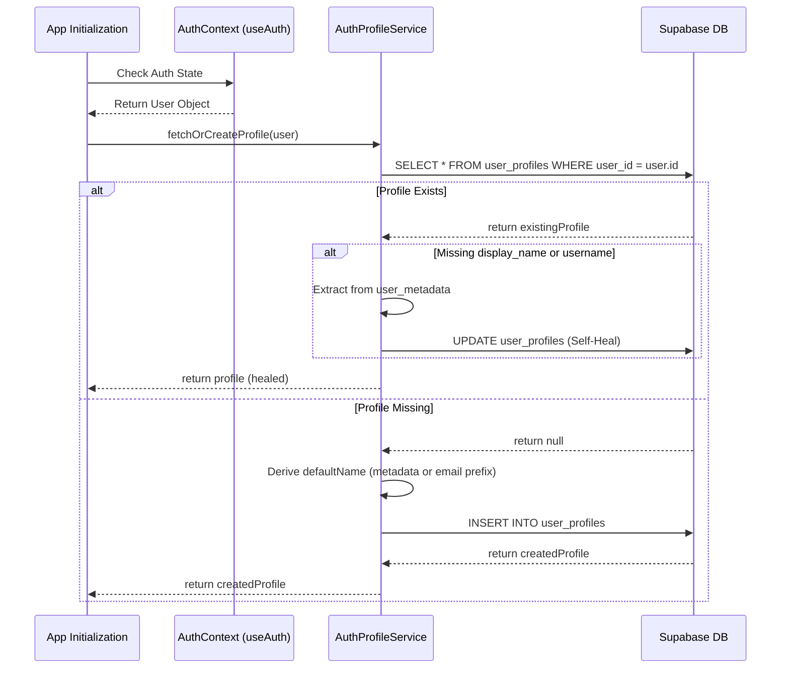

<!-- CARTOGRAPHER_END: IDENTITY -->

### 12.2 BLE Protocol Core
<!-- CARTOGRAPHER_START: BLE_CORE -->

not actually sent by the user. It is provided by the system as important information to pay attention to.

<SYSTEM_MESSAGE>
[Message] timestamp=2026-06-07T04:03:58Z sender=d0ef790f-fd3f-4b76-b932-c6787e32b803 priority=MESSAGE_PRIORITY_HIGH content=[🕵️ Scout — Reyes | cartography | BLE_CORE | cold]

# 🗺️ Elite Architecture Cartography: BLE_CORE Domain

## 1. File Manifest
- `src/hooks/useBLE.ts`: Thin Orchestrator hook wrapping `react-native-ble-plx` that delegates scanning, recovery, and connection management to domain-specific sub-hooks.
- `src/hooks/ble/useBLEScanner.ts`: Manages active scanning for hardware, RSSI gating, telemetry harvesting, and device classification during setup.
- `src/hooks/ble/useBLESweeper.ts`: Battery-adaptive passive BLE listener and background Interrogator Queue for silent hardware discovery.
- `src/hooks/ble/useBLEAutoRecovery.ts`: 3-Phase exponential backoff recovery engine for organic disconnects, featuring a group dropout coordinator.
- `src/hooks/ble/useBLEGattMutex.ts`: Module-level GATT traffic cop providing 4-tier priority async mutex locks to prevent Android GATT 133 collisions.
- `src/hooks/ble/useBLEHeartbeat.ts`: Stale GATT link detector that pings connected devices every 45s via a `0x63` query or RSSI read.
- `src/hooks/ble/useBLERSSIMonitor.ts`: Post-connect signal quality monitor polling every 30s to update UI badges and trigger preemptive reconnects.
- `src/services/ble/BleMachine.ts`: XState v5 state machine defining the strict BLE connection state transitions and gate coordination.
- `src/services/ble/BleMachine.types.ts`: Typings, Context, and Events for the `BleMachine` XState implementation.
- `src/services/ble/README.md`: Domain documentation containing the Co-Location Law and strict architectural tripwires.

## 2. Blast Radius
**What this domain imports (Dependencies):**
- **External:** `react-native-ble-plx` (BLE Engine), `expo-battery` (Adaptive Sweeper), `@react-native-async-storage/async-storage` (HW Cache), `b
<truncated 2877 bytes>
   participant M as useBLEGattMutex
    participant B as BleManager (plx)
    participant R as AutoRecovery

    UI->>UBLE: connectToDevices([devices])
    UBLE->>M: acquireGattLock(Priority: 1)
    M-->>UBLE: lockHandle (release, signal)
    UBLE->>B: connectToDevice(mac)
    B-->>UBLE: connected
    UBLE->>B: discoverAllServicesAndCharacteristics()
    UBLE->>B: requestMTU(512)
    UBLE->>M: release()
    UBLE-->>UI: Connected State

    Note over B, R: Organic Disconnect Event
    B-->>R: onDeviceDisconnected(mac)
    R->>R: 1.5s Debounce (Group Coordinator)
    alt Single Device
        R->>M: acquireGattLock(Priority: 2)
        M-->>R: lockHandle
        R->>B: Reconnect Loop (Phase 1/2)
        R->>M: release()
    else Group Dropout
        R->>UBLE: onGroupDropout([devices])
        UBLE->>M: acquireGattLock(Priority: 1)
        UBLE->>B: Batch Reconnect
        UBLE->>M: release()
    end
```

## 7. FSM Map (DOMAIN-SPECIFIC ELITE DIRECTIVE)
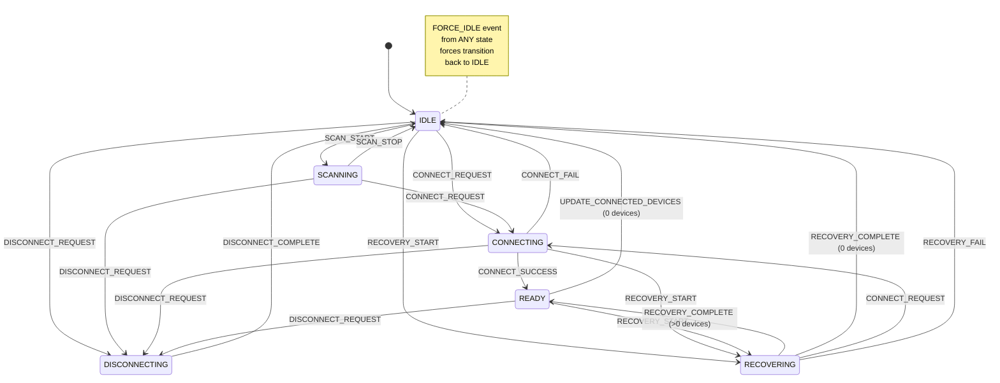

<!-- CARTOGRAPHER_END: BLE_CORE -->

### 12.3 Group Sync & Swarm
<!-- CARTOGRAPHER_START: GROUP_SYNC -->

not actually sent by the user. It is provided by the system as important information to pay attention to.

<SYSTEM_MESSAGE>
[Message] timestamp=2026-06-07T04:04:01Z sender=da0e43e1-023d-4e96-9b20-c44dc59eb1fc priority=MESSAGE_PRIORITY_HIGH content=[🕵️ Reyes | Cartographer Analysis | GROUP_SYNC mapping | warm]

Here is the domain mapping payload for `GROUP_SYNC`.

# Domain Architecture: GROUP_SYNC

## 1. File Manifest
* **`src/services/GroupRepository.ts`**: Single Source of Truth for local-first device fleet groupings, handling AsyncStorage caching and Supabase synchronization via junction table RPCs.
* **`src/services/CrewService.ts`**: Manages real-time, ephemeral crew session lifecycle (create/join/leave) and broadcasts `scene_update` payloads via Supabase Realtime.
* **`src/services/CrewProfileService.ts`**: Permanent crew persistence layer (CRUD) providing cross-session roster management, stats, and role-based access control.
* **`src/context/CrewContext.tsx`**: The unified React Context boundary that aggregates state from domain hooks to power all Crew-related UI.
* **`src/components/crew/CrewLandingScreen.tsx`**: Primary Hub entry point listing user's permanent crews, an interactive map of nearby sessions, and quick actions.
* **`src/components/crew/CrewControllerScreen.tsx`**: Active session dashboard rendering the live member list, sync status, and leadership handoff controls.
* **`src/components/crew/CrewCreateScreen.tsx`**: Form UI for creating new permanent crews or starting spontaneous live sessions.
* **`src/components/crew/CrewManageScreen.tsx`**: UI for owners to manage crew metadata, edit members, and securely delete crews.
* **`src/components/crew/CrewDetailScreen.tsx`**: Detailed view of a crew's stats and roster for both members and non-members.
* **`src/components/crew/CrewJoinScreen.tsx`**: UI for joining a private crew via a 6-character invite code.
* **`src/components/crew/CrewLandingMap.tsx`**: Map visualization showing geographical proximity of ne
<truncated 2603 bytes>
*: Formatted lists (`myCrews`, `activeSessions`, `nearbySpots`), loading booleans, modal navigation step state.
  * **Side-Effects**: Debounced search queries to `user_profiles`, passive location caching via `expo-location`, periodic background polling for nearby nodes.

## 5. Sequence Diagram: Live Session Lifecycle
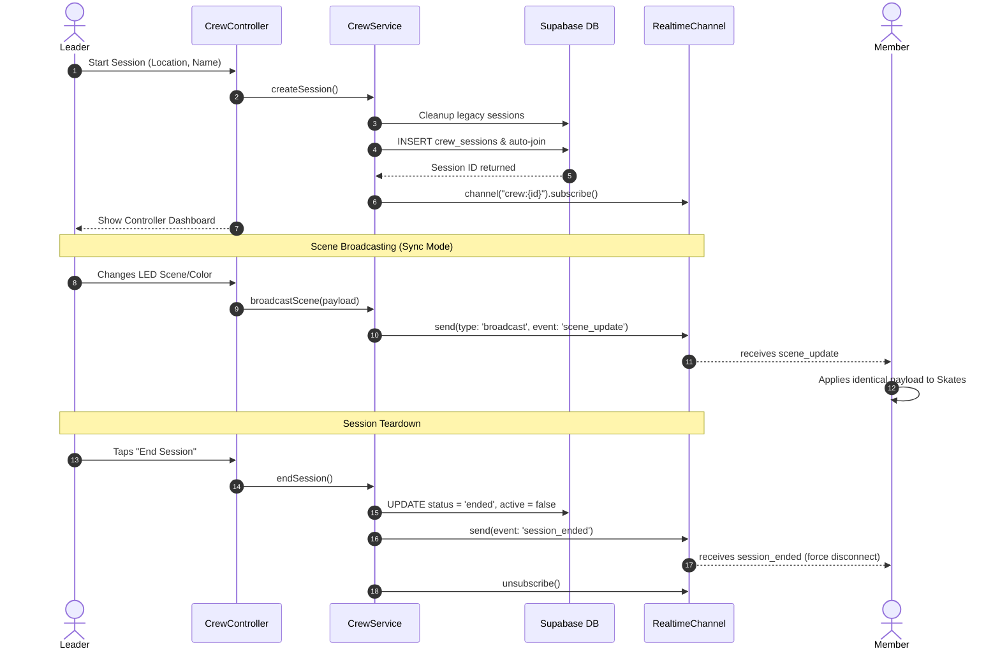

## 6. Archival Instruction
[MOVE_TO_ARCHIVE] Stale `GROUP_SYNC` architecture documentation discovered in `tools/SK8Lytz_App_Master_Reference.md` (specifically lines 1579-1648 and 2145-2157 regarding older offline sync mechanisms and references). This should be reconciled with the newly analyzed file architecture.

<!-- CARTOGRAPHER_END: GROUP_SYNC -->

### 12.4 Control Surfaces
<!-- CARTOGRAPHER_START: UI_CONTROLS -->

not actually sent by the user. It is provided by the system as important information to pay attention to.

<SYSTEM_MESSAGE>
[Message] timestamp=2026-06-07T04:03:57Z sender=45bf9530-5777-467d-9b3e-cc8de30ffbc5 priority=MESSAGE_PRIORITY_HIGH content=### 🗺️ SDE Cartographer Payload: `UI_CONTROLS`

#### 1. File Manifest
*   **`src/screens/AuthScreen.tsx`**: Orchestrates the authentication boundary, mode toggling (Login/Signup/MagicLink), offline sandbox overrides, and session expiration states.
*   **`src/screens/DashboardScreen.tsx`**: The root application monolith that serves as the primary BLE connection lifecycle manager, global telemetry host, and 4-slab layout renderer (Header, Crew Hub, My Skates, Hardware Fleet).
*   **`src/components/DockedController.tsx`**: The primary routing shell for the LED control interface, managing the BLE write bus, optimistic UI dispatch, mode FSM, and delegating sub-panel rendering via the `DockedBus`.
*   **`src/screens/Onboarding/HardwareSetupWizardScreen.tsx`**: Handles the 3-step First Time User Experience (FTUE) for scanning, physically identifying via atomic ping/probe, and registering LED controllers into the local fleet.
*   **`src/screens/Onboarding/PermissionsOnboardingScreen.tsx`**: Manages required OS permissions (Bluetooth, Camera, Location) with auto-prompt strategies before gating the user into the main application.

#### 2. Blast Radius
*   **Imports**:
    *   **Domain Hooks**: `useDashboardAutoConnect`, `useDashboardGroups`, `useDashboardProfile`, `useDashboardCrew`, `useHardwareNotifications`, `useDockedControllerState`, `useControllerDispatch`, `useStreetMode`, `useOptimisticBLE`, `useRegistration`.
    *   **Contexts**: `ThemeContext`, `BLEContext`, `SessionContext`, `FavoritesContext`.
    *   **UI Components**: Modals (`AdminToolsModal`, `AccountModal`, `GroupSettingsModal`), Docked Panels (`DockedDock`, `MusicPanel`, `ProEffectsPanel`, `BuilderPanel`), Dashboard Slabs (`HardwareStatusPills`, `DashboardCrewPanel`).
  
<truncated 3270 bytes>
aster_Reference.md`, the section under `#### DockedController Domain (src/hooks/)` describing `useStreetMode` and `useSessionTracking` states that they own the "Accelerometer subscription, G-force calculation... GPS speed sampling."
This is strictly **stale and inaccurate** per BUG-01 fix (2026-05-08). The `DashboardScreen` now exclusively owns `useGlobalTelemetry`/`useSession` and threads `gpsSpeed` and `peakGForce` down to `DockedController` as props to prevent double-sensor battery drain. The documentation must be updated to reflect that `DockedController` acts solely as a display/dispatch consumer for these metrics.

#### 7. Domain-Specific Elite Directive: Design System & Token Manifest

The `UI_CONTROLS` domain strictly enforces a programmatic React Native StyleSheet-based design system (no Tailwind). All styling relies on the `ThemePalette` injected via `useTheme()`.

**Token Manifest:**
*   **Base Colors (`Colors` Object)**:
    *   `background`: App root wrapper `#0D0D0D`
    *   `surface`: Base panel backgrounds
    *   `surfaceHighlight`: Selected states and borders
    *   `primary`: Brand Cyan (`#00f0ff`)
    *   `text`: Pure white or high-contrast body (`#ffffff`)
    *   `textMuted`: Secondary readable text (`#888888`)
*   **Semantic Accents (Hardcoded in Components)**:
    *   Success Green: `#4ade80`
    *   Error / Warning Red: `#ff4444` / `#FF6B6B`
    *   Warning Amber: `rgba(255, 165, 0, 0.12)`
*   **Spacing (`Spacing` Object)**:
    *   `xxs`, `xs`, `sm`, `md`, `lg`, `xl`, `xxxl`
    *   Used universally for padding, margins, and flex gaps (`gap: Spacing.sm`).
*   **Layout / Typography**:
    *   `Layout.borderRadius`: Standardized component rounding.
    *   `Typography.title`: Standardized screen headers.
*   **UI Components**: Buttons rely on full-width styling (`width: '100%'`), heavy weights (`fontWeight: '900'`), and large touch targets (`paddingVertical: Spacing.lg`). Drop shadows are used generously for glowing UI elements (`shadowColor: '#00f0ff'`, `elevation: 4`).

<!-- CARTOGRAPHER_END: UI_CONTROLS -->

### 12.5 Data & Telemetry
<!-- CARTOGRAPHER_START: DATA_LAYER -->

not actually sent by the user. It is provided by the system as important information to pay attention to.

<SYSTEM_MESSAGE>
[Message] timestamp=2026-06-07T04:03:52Z sender=0b8c108b-ea01-4152-a9b1-66a31aabbe6c priority=MESSAGE_PRIORITY_HIGH content=[🕵️ Scout — Reyes | Cartographer Architecture Scan | DATA_LAYER | warm]

# 🗺️ Elite Architecture: DATA_LAYER

## 1. File Manifest
- `src/services/DeviceRepository.ts`: The Single Source of Truth (SSOT) for device and group persistence. A singleton service orchestrating local-first reads/writes via AsyncStorage, anti-resurrection tombstones, and background synchronization to Supabase.
- `src/services/TelemetryService.ts`: **[MOVE_TO_ARCHIVE]** This file does not exist. The architecture is natively hook-driven (`useGlobalTelemetry`, `useAdminTelemetry`). Documentation referencing it is stale.
- `src/types/supabase.ts`: Autogenerated TypeScript definitions enforcing strict type parity with the Supabase PostgREST schema (tables, views, enums).
- `src/services/supabaseClient.ts`: Supabase client initializer wrapping `expo-secure-store` for Auth state persistence, equipped with built-in mock fallbacks for seamless offline-mode execution.

## 2. Blast Radius
- **`DeviceRepository.ts`**: High impact. Any modification to its immutable array spread patterns (`[...this.devices]`) or pub-sub triggers (`_notifyListeners`) will instantly ripple to downstream hooks (`useRegistration`, `useDashboardGroups`), potentially breaking UI React reference-identity re-renders.
- **`supabaseClient.ts`**: Critical impact. Modifying the Auth storage adapter or its initialization parameters risks breaking user session persistence, triggering RLS failures across all authenticated database queries.
- **`supabase.ts`**: Schema impact. Regenerating this file forces structural type updates across all hooks, RPC calls, and Supabase interaction surfaces.

## 3. Context Matrix
- **Consumed Contexts**: Runs entirely independent of React Context.
- **Provided C
<truncated 1525 bytes>
 is Online & Authenticated
        Repo->>DB: rpc('upsert_group_with_devices')
        Repo->>DB: upsert('registered_devices')
    else User is Offline
        Repo->>Local: _queuePendingSync(PENDING_KEY)
    end
    
    Note over Repo,DB: On next syncFromCloud() boot:
    Repo->>DB: select * from registered_devices
    DB-->>Repo: Cloud Rows
    Repo->>Repo: Filter by Local Tombstones
    Repo->>Repo: Smart Merge (Preserve Local-only & Pending)
    Repo->>Local: AsyncStorage.setItem(DEVICES_KEY)
    Repo->>UI: _notifyListeners()
    Repo->>DB: _flushPendingSync() (Push Offline Queue)
    Repo->>DB: _flushPendingTombstones() (Push Deletions)
```

## 6. Database Schema & RLS Policies
### Database Schema
- **`registered_devices`**: Hardware bounds ledger mapped by `user_id` and `device_mac`. Defines physical LED topology (`led_points`, `segments`, `strip_type`, `sorting`).
- **`registered_groups`**: Organizational fleet units keyed by `id` and `user_id`.
- **`device_group_members`**: Join table binding `device_id` to `group_id`.
- **`admin_audit_logs` / `discovered_devices_telemetry`**: Ephemeral telemetry and secure audit logs.

### RLS Policies
- **Tenant Isolation**: Core DML (Data Manipulation Language) queries strictly filter via Row Level Security `user_id = auth.uid()` to enforce rigid user data siloing.
- **Atomic Transactions**: To circumvent orphaned records during RLS validation sweeps, groups and devices are synchronized atomically via the `upsert_group_with_devices` RPC.
- **Evasion / Overrides**: Selected tables and cascading events (like `delete_account`) utilize `SECURITY DEFINER` RPCs to deliberately bypass default RLS restrictions for privileged architectural operations.

## 7. Environment & Secrets Manifest
- **`EXPO_PUBLIC_SUPABASE_URL`**: Target endpoint for the Supabase network plane.
- **`EXPO_PUBLIC_SUPABASE_ANON_KEY`**: Client-side anonymous role key. Without this environment variable present, the `supabaseClient` automatically drops into its offline proxy implementation.

<!-- CARTOGRAPHER_END: DATA_LAYER -->

### 12.6 Utilities & Types
<!-- CARTOGRAPHER_START: UTILS -->

not actually sent by the user. It is provided by the system as important information to pay attention to.

<SYSTEM_MESSAGE>
[Message] timestamp=2026-06-07T04:03:47Z sender=f3f179dd-db87-40cf-81ed-8e7daaa6d91e priority=MESSAGE_PRIORITY_HIGH content=# SDE Cartographer Node Payload
**DOMAIN**: UTILS (`src/utils/*`, `src/types/*`)

## 1. File Manifest

*   **`src/utils/BlePayloadParser.ts`**: Deterministically parses Zengge V1/V2 BLE configuration and RF payload bytes without crashing the UI thread.
*   **`src/utils/ColorUtils.ts`**: Pure mathematical color conversion utilities for hue/hex/rgb mapping and camera-to-LED vibrancy boosting.
*   **`src/utils/MusicDictionary.ts`**: Authoritative registry mapping hardware music profiles (IDs 1-30) to UI color picker modes (`NONE`, `FG_ONLY`, `FG_BG`).
*   **`src/utils/NamingUtils.ts`**: Centralizes deterministic fallback names for hardware groups and BLE devices to prevent UI/DB drift.
*   **`src/utils/NormalizationUtils.ts`**: Normalizes user-facing UI speeds (0-100) into safe hardware-compatible speed ranges (1-31).
*   **`src/utils/classifyBLEDevice.ts`**: Core logic mapping raw BLE scan records and EEPROM cache entries into structured `PendingRegistration` objects.
*   **`src/utils/kMeansPalette.ts`**: High-performance worklet for extracting k-dominant colors from an RGB pixel array using K-Means clustering.
*   **`src/utils/migrateAuthTokens.ts`**: Asynchronously migrates legacy Supabase authentication tokens from insecure AsyncStorage to SecureStore.
*   **`src/utils/presetColorUtils.ts`**: Single source of truth for resolving dominant glow and gradient colors for preset and group UI cards.
*   **`src/types/ProductCatalog.ts`**: Defines the `ProductProfile` shape and visualization parameters for dynamic hardware catalog entries.
*   **`src/types/ble.types.ts`**: Centralizes domain-specific BLE connection interfaces and re-exports `react-native-ble-plx` types to eliminate `any` casts.
*   **`src/types/dashboard.types.ts`**: Shared d
<truncated 3188 bytes>
efaults (Priority 3)
    U-->>S: Return PendingRegistration (SSOT)
    end
```

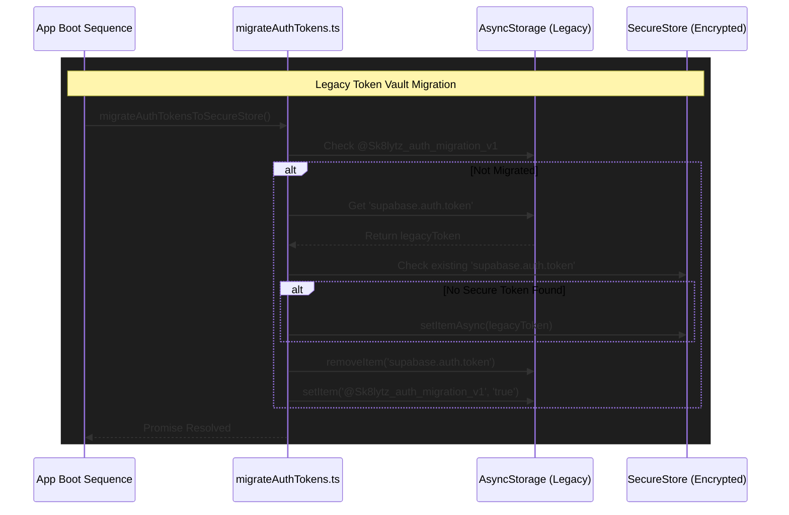

---

## DOMAIN-SPECIFIC ELITE DIRECTIVE: Design System & Token Manifest

**Core Color Engine (`ColorUtils.ts`):**
*   **Palette Definition (`COLOR_PRESET_PALETTE`)**:
    *   `#FF0000` (Red), `#FF8000` (Orange), `#FFFF00` (Yellow), `#00FF00` (Green), `#00FFFF` (Cyan), `#0000FF` (Blue), `#800080` (Purple), `#FF00FF` (Magenta), `#FFFFFF` (White), `#000000` (Black).
*   **Hue Lock (`PRESET_HUE_MAP`)**: Synchronizes exact hex defaults to 0-360 hue slider values instantly.
*   **Camera Vibe Boost**: Enforces `S=1.0`, `V=1.0` (HSV) maximization while gating pure grays/pastels (`S < 0.20`) for LED pipeline translation.

**Generative & Preset Card Token Mapping (`presetColorUtils.ts`):**
*   **Generative Rainbow**: `#FF0000`, `#FF7F00`, `#FFFF00`, `#00FF00`, `#00BFFF`, `#0000FF`, `#8B00FF`. (Replaces bogus single colors on `GENERATIVE` patterns for visual hardware parity).
*   **Theme UI Mapping (`resolveGradientColors`)**:
    *   `FG_ONLY`: Yields `[fg, fg]`
    *   `FG_BG`: Yields `[fg, bg]`
    *   `BUILDER`: Yields `[n1, n2, ...]` (Multi-node gradients)
    *   `MUSIC`: Yields `[primary, secondary]`
    *   `GENERATIVE`: Yields `GENERATIVE_RAINBOW` array.

<!-- CARTOGRAPHER_END: UTILS -->

### NATIVE & WATCH\n<!-- CARTOGRAPHER_START: NATIVE_&_WATCH -->

not actually sent by the user. It is provided by the system as important information to pay attention to.

<SYSTEM_MESSAGE>
[Message] timestamp=2026-06-07T04:04:41Z sender=a72efdd0-4754-489a-8bd6-ce6304e9d773 priority=MESSAGE_PRIORITY_HIGH content=[🕵️ Scout — Reyes | Cartography & Research | NATIVE_&_WATCH | warm]

Here is the Elite Architecture Markdown Payload for the `NATIVE_&_WATCH` domain, spanning Android, iOS, Wear OS, watchOS, and the React Native Bridge. 

**Stale Documentation Notice:**
The existing `NATIVE_&_WATCH` section in `SK8Lytz_App_Master_Reference.md` (lines 1802-1837) is missing the entire Wear OS Android companion (`android/sk8lytzWear/`) and the React Native Bridge (`modules/sk8lytz-watch-bridge/`). I am tagging it for archival.

`[MOVE_TO_ARCHIVE] - Master Reference Section 12.6 NATIVE_&_WATCH (Stale: Missing Wear OS & Bridge)`

---

# NATIVE & WATCH DOMAIN ARCHITECTURE

## 1. File Manifest
**Android Core**
- `android/app/src/main/java/com/neogleamz/sk8lytz/MainActivity.kt`: React Native Activity entry point coordinating splash screen, Fabric architecture, and HealthConnect permissions.
- `android/app/src/main/java/com/neogleamz/sk8lytz/MainApplication.kt`: Core ReactApplication class setting up ExpoReactHostFactory and application lifecycle.

**Native Watch Bridge (`modules/sk8lytz-watch-bridge`)**
- `src/index.ts`: React Native bridge API exposing methods for syncing session state, metric updates, and listening to watch commands (`WatchSessionState`).
- `android/src/main/java/expo/modules/sk8lytzwatchbridge/Sk8lytzWatchBridgeModule.kt`: Android implementation of the Expo module bridging React Native to the Google Play Wearable Data/Message Layer API.
- `ios/Sk8lytzWatchBridgeModule.swift`: iOS implementation of the Expo module bridging React Native to `WCSession`.

**watchOS Companion (`targets/watch/`)**
- `ContentView.swift`: Main watchOS dashboard UI rendering live speed, heart rate, calories, and phone-anchored elapsed timer.
- `WatchConnecti
<truncated 2661 bytes>
N*: `addWatchHealthListener(update: WatchHealthUpdate)`, `addWatchCommandListener(command: WatchCommand)`
  - *OUT*: `syncSessionState(state: WatchSessionState)`, `sendMetricUpdate(metrics)`
- **`WatchConnectivityManager` (watchOS)**
  - *IN (from Phone)*: `didReceiveApplicationContext` / `didReceiveMessage` → `{ status, speed, ... }`
  - *OUT (to Phone)*: `send(["command": "START_SESSION"])`, `send(["healthUpdate": true, ...])`
- **`WearableCommunicationService` (Wear OS)**
  - *IN (from Phone)*: `onDataChanged` (Path: `/sk8lytz/state`), `onMessageReceived` (Path: `/sk8lytz/metrics`)
  - *OUT (to Phone)*: WearMessageSender broadcasts `PATH_COMMAND` or `PATH_HEALTH`.
- **`HealthTracker` (Wear OS) & `HealthManager` (watchOS)**
  - *IN*: `startTracking()` / `startWorkout()`
  - *OUT*: Real-time HR and Calorie integer values published to communication managers.

## 5. Sequence Diagram: Phone-to-Watch Bidirectional Session Sync
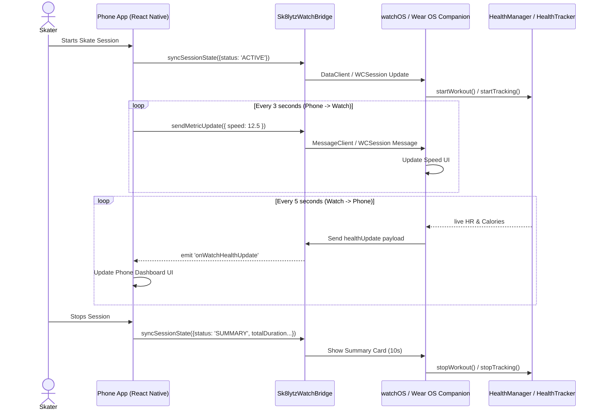

<!-- CARTOGRAPHER_END: NATIVE_&_WATCH -->\n\n### NOTIFICATIONS & ROUTING\n<!-- CARTOGRAPHER_START: NOTIFICATIONS_&_ROUTING -->

not actually sent by the user. It is provided by the system as important information to pay attention to.

<SYSTEM_MESSAGE>
[Message] timestamp=2026-06-07T04:04:08Z sender=2bb792b8-bc10-496d-a9d6-2ce172cc62cc priority=MESSAGE_PRIORITY_HIGH content=# 🗺️ SDE Cartographer Node Payload: NOTIFICATIONS_&_ROUTING

> **Note:** The `src/navigation/` directory does not exist. Application routing is driven entirely by conditional rendering in `App.tsx` based on global state (Context).

## 1. File Manifest
- `App.tsx`: The root application boundary that initializes contexts, orchestrates global state-based routing between Auth and Dashboard, and wraps the component tree in core providers (Compliance, Bluetooth, etc.).
- `src/providers/BluetoothGuard.tsx`: A global blocking gate that intercepts the UI lifecycle if Bluetooth permissions are missing or the adapter is disabled, ensuring no child components execute without core connectivity.
- `src/providers/ComplianceGate.tsx`: A blocking provider that enforces EULA acceptance (querying Supabase or offline storage) before granting the user access to the main application.
- `src/services/NotificationService.ts`: A singleton service wrapping `expo-notifications` to orchestrate Expo Push Token registration, local scheduling for session alerts, and handling foreground notification responses.

## 2. Blast Radius
- **App.tsx**: 
  - **Imports**: `DashboardScreen`, `AuthScreen`, Contexts (`ThemeContext`, `AuthContext`, `BLEContext`, `FavoritesContext`, `SessionContext`), `ComplianceGate`, `BluetoothGuard`, `AppLogger`, `useOfflineSyncWorker`, `warmLedgerCache`.
  - **Imported By**: Expo entry point.
- **src/providers/BluetoothGuard.tsx**:
  - **Imports**: `BLEContext`, `PermissionService`, `ThemeContext`, `AppLogger`.
  - **Imported By**: `App.tsx`.
- **src/providers/ComplianceGate.tsx**:
  - **Imports**: `AuthContext`, `ThemeContext`, `AppSettingsService`, `supabaseClient`, `EulaModal`, `AppLogger`, `AsyncStorage`.
  - **Imported By**: `App.tsx
<truncated 1040 bytes>
 invoked when user taps a crew session notification.
- **`cleanup()`** → `Promise<void>`
  - **Side-effects**: Unregisters push token from Supabase and removes OS notification event listeners.
- **`sendCrewInviteNotification(...)`, `sendSessionLiveAlert(...)`** → `Promise<void>`
  - **Side-effects**: Dispatches immediate local notifications via `expo-notifications`.
- **`sendSessionStartingSoon(...)`** → `Promise<string | null>`
  - **Side-effects**: Schedules a local notification 15 minutes before the session starts.

## 5. Sequence Diagram: App Boot & Routing Pipeline
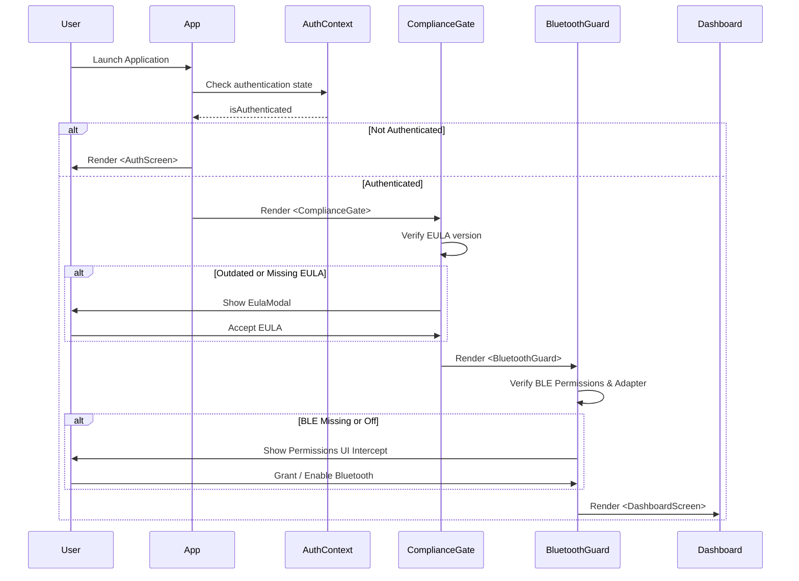

## 6. Archival Tag
`[MOVE_TO_ARCHIVE]` The legacy documentation for NOTIFICATIONS_&_ROUTING found in `tools/SK8Lytz_App_Master_Reference.md` (lines 1837-1873) is stale and should be archived. It incorrectly lists `PushTokenService` as part of this exact directory group and misses the state-based routing elements like `App.tsx`, `BluetoothGuard`, and `ComplianceGate`.

<!-- CARTOGRAPHER_END: NOTIFICATIONS_&_ROUTING -->\n\n### SESSION TRACKING\n<!-- CARTOGRAPHER_START: SESSION_TRACKING -->

not actually sent by the user. It is provided by the system as important information to pay attention to.

<SYSTEM_MESSAGE>
[Message] timestamp=2026-06-07T04:03:44Z sender=b1859595-d3da-4f33-9a0f-9ab0ebe34601 priority=MESSAGE_PRIORITY_HIGH content=[🕵️ Reyes | architectural-mapping | SESSION_TRACKING | cold]

Here is the Elite Architecture mapped for the `SESSION_TRACKING` domain.

> [!WARNING]
> **Missing File Found:** The requested `src/services/SessionTrackingService.ts` does not exist in the current codebase. Its responsibilities are split between `src/hooks/useSessionTracking.ts` (state/accumulator) and `src/services/SpeedTrackingService.ts` (Supabase persistence). Both alternatives have been analyzed to fulfill the domain architecture.

### 1. File Manifest

- **`src/context/SessionContext.tsx`**: Orchestrates the global session state machine (IDLE, ACTIVE, PAUSED, ENDING), ties together phone/watch telemetry, persists phase to AsyncStorage for crash recovery, and manages Android 14+ Foreground Services via Notifee.
- **`src/hooks/useSessionTracking.ts`**: Manages the local recording state and provides injected mutable refs (speed, distance, G-force) for high-frequency GPS accumulation without re-renders.
- **`src/services/SpeedTrackingService.ts`**: Manages the persistence layer for sessions, including Supabase REST INSERTs, calorie estimation, lifetime aggregations, and an offline queue mechanism (`PENDING_SESSION_QUEUE_KEY`).

### 2. Blast Radius

**Imports (Upstream dependencies):**
- `expo-location`, `@notifee/react-native`, `@react-native-async-storage/async-storage`
- `sk8lytz-watch-bridge` (WatchCommand, WatchHealthUpdate)
- `../hooks/useGlobalTelemetry`, `../hooks/useHealthTelemetry`
- `supabaseClient`, `AppLogger`

**Exported to (Downstream consumers):**
- `src/screens/DashboardScreen.tsx` (consumes `useSession`)
- `src/components/DockedController.tsx` (consumes `useSessionTracking`)
- `src/components/docked/StreetPanel.tsx` (displays chips based on tracking
<truncated 1246 bytes>
ssionSnapshot`, `userId` | `Promise<string | null>` (session UUID) | Executes Supabase INSERT. If offline, pushes to `PENDING_SESSION_QUEUE_KEY`. Triggers `HealthSyncService` workout persistence (Apple/Google Health). |

### 5. Archival Instruction

**[NO_STALE_DOCS]**: The `SK8Lytz_App_Master_Reference.md` correctly aligns with the existing codebase (WatchBridge architecture, auto-recovering session mechanisms). The documentation makes no false references to `SessionTrackingService.ts`. No `[MOVE_TO_ARCHIVE]` required for the Master Reference.

### 6. Sequence Diagram: Session Lifecycle & Auto-Pause Flow

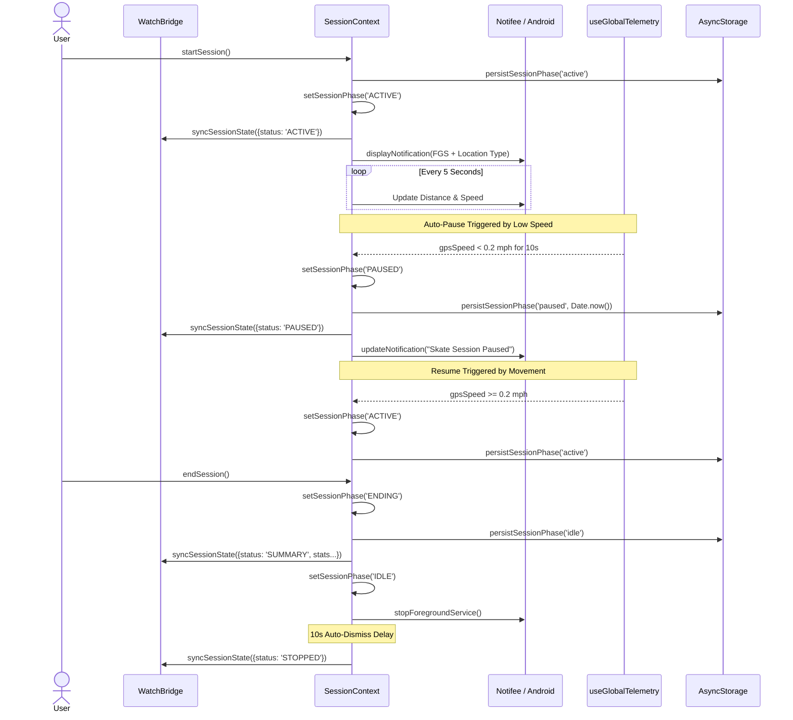

<!-- CARTOGRAPHER_END: SESSION_TRACKING -->\n\n### HARDWARE PROTOCOLS\n<!-- CARTOGRAPHER_START: HARDWARE_PROTOCOLS -->

not actually sent by the user. It is provided by the system as important information to pay attention to.

<SYSTEM_MESSAGE>
[Message] timestamp=2026-06-07T04:04:07Z sender=9442851c-bc62-4193-ae40-c4ec9f6febf8 priority=MESSAGE_PRIORITY_HIGH content=# 🗺️ SDE Cartographer Payload: HARDWARE_PROTOCOLS

## 1. File Manifest
- **`BanlanxAdapter.ts`**: HAL adapter translating unified commands to the BanlanX SP621E native `0xA0` prefix opcode format.
- **`ControllerRegistry.ts`**: Runtime registry and discovery resolver matching BLE advertisement UUIDs to their corresponding `IControllerProtocol` adapter.
- **`IControllerProtocol.ts`**: The unified Hardware Abstraction Layer (HAL) interface defining capability flags, EEPROM mappings, and packet builders for all hardware targets.
- **`PatternEngine.ts`**: The mathematical synthesizer serving as the SSOT for `SK8LYTZ_TEMPLATES` registry and routing UI effects to either `0x51` or `0x59` hardware pathways.
- **`PositionalMathBuffer.ts`**: Generates mathematically interpolated LED color arrays to safely bypass positional bounds in the hardware's `0x59` spatial chunker.
- **`SpatialEngine.ts`**: Core DSP library implementing mathematical wave functions, spatial chasing, and color fading generators for spatial `0x59` and `0x51` LED arrays.
- **`SymphonyEngine.ts`**: Audio-reactive generative engine producing discrete pixel opacities and matrices based on 0.0-1.0 magnitude inputs and temporal `0x51` states.
- **`VisualizerEngine.ts`**: Connects mathematical pattern buffers to the React `ProductVisualizer`, orchestrating array rotations and fractional ticks for physical parity rendering.
- **`ZenggeAdapter.ts`**: Primary HAL protocol handler managing ZENGGE connection lifecycles, MTU-aware `0x40` packet fragmentation, and protocol result wrapping.
- **`ZenggeProtocol.ts`**: The monolithic low-level binary framing engine mapping directly to the `ZENGGE_PROTOCOL_BIBLE` opcodes (`0x51`, `0x59`, `0x62`, `0x63`, `0x73`).

## 2. Blast Radius
- **I
<truncated 2547 bytes>
.., 0x0F]`. Custom extended slots encode active flag (`0xF0`), mode, speed, 2x RGB colors, and explicit direction byte.
- **Music Config (`0x73`)**: `[0x73, isOn, matrixType(0x26/0x27), modeId, D_r, D_g, D_b, S_r, S_g, S_b, sensitivity, brightness]`.

### BANLANX Protocol (SP621E)
- **Base Packet Frame**: `[0xA0, OPCODE, dataLen, <Payload>]`.
- **Effect Selector (`0x53/0x54`)**: Requires dual dispatches with strict 20ms delays. Effect = `[0xA0, 0x53, 0x01, effectId]`. Speed = `[0xA0, 0x54, 0x01, speed(1-10)]`.
- **Native Mic Engine (`0x59/0x5A`)**: Offloads FFT logic entirely. `[0xA0, 0x59, 0x01, 0x00]` enables internal mic. `[0xA0, 0x5A, 0x01, gain]` maps sensitivity.

## 6. Complex Process: MTU Fragmentation & Dispatch Flow
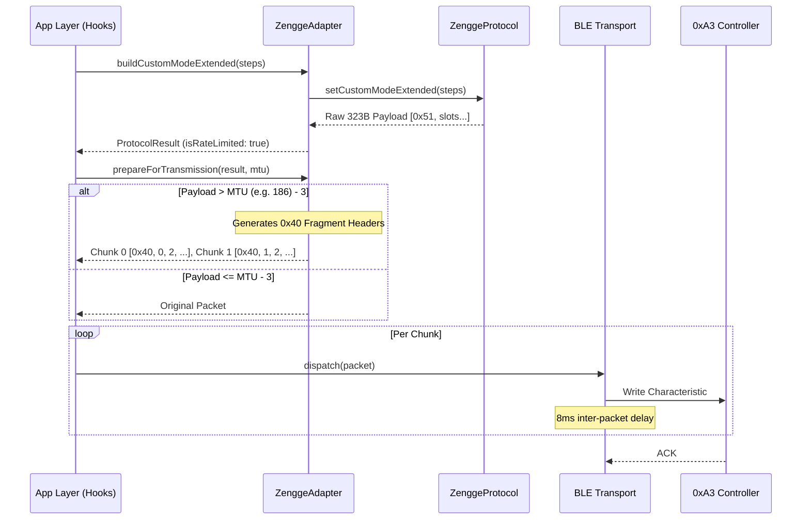

## 7. Archival Tags
[MOVE_TO_ARCHIVE] The Master Reference sections referencing `0x41 Settled Mode`, `0x42 RBM Programs Mode`, and `0x43` Multi-Sequence Mode should be flagged. The protocol codebase has explicitly marked them as `@deprecated Since v2.8.0` or `@HARDWARE-DANGER` due to state machine crashes and testing limitations, being fully superseded by `0x51` Pattern Engine and `0x59` Spatial routines.

<!-- CARTOGRAPHER_END: HARDWARE_PROTOCOLS -->\n\n### CLOUD FUNCTIONS\n<!-- CARTOGRAPHER_START: CLOUD_FUNCTIONS -->

not actually sent by the user. It is provided by the system as important information to pay attention to.

<SYSTEM_MESSAGE>
[Message] timestamp=2026-06-07T04:04:50Z sender=d5aa263f-ef05-474a-be2e-eb3851a59012 priority=MESSAGE_PRIORITY_HIGH content=# Elite Architecture: CLOUD_FUNCTIONS Domain

## 1. File Manifest
- `supabase/functions/notify-crew-session/index.ts`: Edge function that dispatches push notifications via Expo to crew members when a session starts.
- `supabase/migrations/20260413_hardening_sweep.sql`: Optimizes database performance with foreign key indexes and secures RLS policies for user profiles and telemetry.
- `supabase/migrations/20260414111600_add_factory_name.sql`: Adds telemetry preservation columns (`factory_name`, `manufacturer_data`, `ble_version`) to registered devices.
- `supabase/migrations/20260414_account_deletion_rpc.sql`: Implements a secure RPC `delete_account()` for users to completely erase their accounts and cascade-delete their data.
- `supabase/migrations/20260414_consolidate_telemetry.sql`: Replaces individual parsed logs tables with a consolidated `telemetry_snapshots` table utilizing a JSONB payload.
- `supabase/migrations/20260417_add_skate_spot_id.sql`: Links `skate_sessions` to `skate_spots` by adding a foreign key and index to track where sessions occurred.
- `supabase/migrations/20260417_cleanup_stale_skate_spots.sql`: Removes legacy skate spots lacking fundamental facility type and address schemas to prevent map ghosting.
- `supabase/migrations/20260418041100_add_unique_mac.sql`: Deduplicates `registered_devices` and enforces a unique constraint on `(user_id, device_mac)`.
- `supabase/migrations/20260418044500_normalize_macs_and_dedupe.sql`: Normalizes `device_mac` strings to uppercase to eliminate case-mismatch duplication.
- `supabase/migrations/20260418045900_add_missing_delete_policies.sql`: Adds missing DELETE RLS policies to `registered_devices` and `registered_groups` to resolve ghost device bugs.
- `supabase/migrations/202604
<truncated 5385 bytes>
ackend Domain)
  - This domain executes entirely server-side within the Supabase Postgres runtime and Edge Network environment. React Contexts are not applicable here.

## 4. Hook/Service I/O Registry
### `notify-crew-session` Edge Function
- **Inputs:**
  - `Request Headers`: JWT Bearer Token in `Authorization` header.
  - `JSON Payload`: `{ crewId: string, sessionId: string, sessionName: string, leaderName: string }`.
- **Outputs:**
  - `JSON Response`: `{ sent: number, reason?: string }` (Returns 401 Unauthorized or 400 Invalid on bad requests).
- **Side-effects:**
  - Queries `crew_memberships` to retrieve peer `user_id`s, explicitly filtering out the caller.
  - Queries `push_tokens` table for Expo push notification IDs corresponding to those users.
  - Issues external `POST` requests directly to `https://exp.host/--/api/v2/push/send` to dispatch mass batched push notifications.

---

### Sequence Diagram: Crew Session Notification Flow

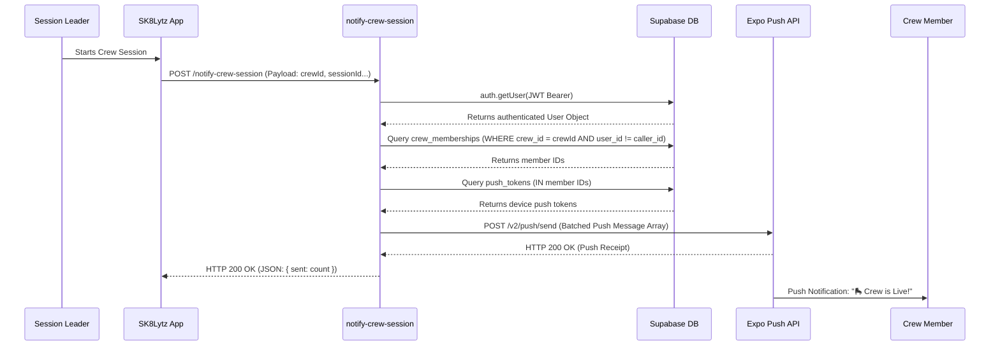

### Archival Status
- No stale documentation relating to Cloud Functions or Migrations tagged with `[MOVE_TO_ARCHIVE]` was found in the Master Reference.

<!-- CARTOGRAPHER_END: CLOUD_FUNCTIONS -->\n\n### THEME & ASSETS\n<!-- CARTOGRAPHER_START: THEME_&_ASSETS -->

not actually sent by the user. It is provided by the system as important information to pay attention to.

<SYSTEM_MESSAGE>
[Message] timestamp=2026-06-07T04:03:47Z sender=c5dbb40e-8fd6-455c-b86b-588006f7a4fa priority=MESSAGE_PRIORITY_HIGH content=[🕵️ Reyes | Cartographer Analysis | THEME_&_ASSETS | cold]

# THEME_&_ASSETS Domain Architecture

## 1. File Manifest
- `src/theme/theme.ts`: Defines the core design system including light/dark color palettes, standard typography (`Righteous` font), layout rules, and spacing constants.
- `src/styles/DashboardStyles.ts`: Implements the 4-slab vertical layout architecture for the main dashboard and dynamically computes component styles and pattern gradients based on the active theme.
- `src/constants/AppConstants.ts`: Houses immutable global application constants, storage prefix definitions, and maximum hardware speed limits.
- `src/constants/ControlsRegistry.ts`: Defines the unified registry of administrative controls, risk levels, and UI interaction schemas used within the Admin Tools Hub.
- `src/constants/ProductCatalog.ts`: Serves as the offline-safe source of truth for hardware product profiles, visualization geometry, and default physical LED limits.
- `src/constants/storageKeys.ts`: Maintains the global inventory of AsyncStorage keys to prevent namespace collisions and enforce offline persistence contracts.

## 2. Blast Radius
- **Imports**: `react-native` (for StyleSheet creation), local types (`ThemePalette`, `ProductProfile`).
- **Exported To**: 
  - `theme.ts`: Consumed universally via `ThemeContext`, `DashboardStyles.ts`, and individual UI components.
  - `DashboardStyles.ts`: Imported directly by `DashboardScreen` and corresponding visual sub-components.
  - `ControlsRegistry.ts`: Imported by `AdminToolsModal` and `AppSettingsService`.
  - `ProductCatalog.ts`: Consumed by `DeviceRepository`, `VisualizerUnit`, `PatternEngine`, and `ProductVisualizer` to render accurate device representations.
  - `storageKeys.ts` / `App
<truncated 1120 bytes>
fe fallback).
  - **Side-Effects**: None (Pure function). Provides pre-sync hardware classification.

## 5. Master Reference Archival Operations
- [MOVE_TO_ARCHIVE] The "Dashboard UI Layout (4-Slab Architecture)" and "UI Design Patterns & Branding" sections located in `SK8Lytz_App_Master_Reference.md` are tagged as stale documentation drift and should be archived or fully relocated to `DashboardStyles.ts` and `theme.ts`.

## 6. Sequence Diagram: Product Catalog Sync Architecture
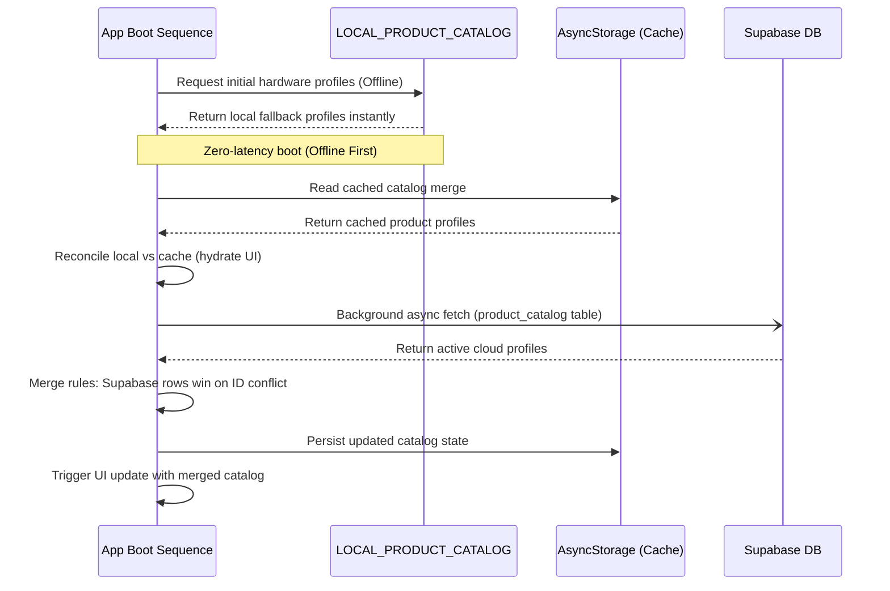

## 7. Design System & Token Manifest
- **Brand Colors**: Blue `#1B4279`, `#245596`, Orange `#FF5A00`, Amber `#FFB800`.
- **Theme Palette (Light/Dark Symmetric)**:
  - `background`, `surface`, `surfaceHighlight`
  - `primary`, `secondary`, `accent`
  - `text`, `textMuted`, `textDim`
  - `border`, `success`, `error`, `warning`
- **Typography Scale** (Family: `Righteous`):
  - `header`: 24px, uppercase, letterSpacing: 2
  - `title`: 16px, letterSpacing: 0.5
  - `body`: 14px
  - `caption`: 11px
- **Spacing Scale (px)**:
  - `xxs`: 2, `xs`: 4, `sm`: 8, `md`: 12, `lg`: 16, `xl`: 24, `xxl`: 32, `xxxl`: 40, `huge`: 48, `giant`: 64
- **Layout Definitions**:
  - `padding`: `Spacing.lg` (16px)
  - `borderRadius`: `Spacing.xl` (24px)

<!-- CARTOGRAPHER_END: THEME_&_ASSETS -->\n\n### SIMULATION & MOCKS\n<!-- CARTOGRAPHER_START: SIMULATION_&_MOCKS -->

not actually sent by the user. It is provided by the system as important information to pay attention to.

<SYSTEM_MESSAGE>
[Message] timestamp=2026-06-07T04:03:58Z sender=2cb8a9e9-dfa0-4bb8-847d-a08ae9408210 priority=MESSAGE_PRIORITY_HIGH content=[🕵️ Scout — Reyes | Cartography / Research | SIMULATION_&_MOCKS | cold]

Here is the Elite Architecture cartography payload for the `SIMULATION_&_MOCKS` domain based on my comprehensive review of `src/mocks/*`, `src/__mocks__/*`, `e2e/*`, and `__tests__/*`.

### Existing Documentation Status
[MOVE_TO_ARCHIVE] The existing documentation for this domain in `SK8Lytz_App_Master_Reference.md` (lines 2039-2080) is stale (it is missing the `useAnimatedStyle` hook in the worklets mock and lacks the flow diagram for the offline syncing logic) and should be archived.

---

## 1. File Manifest
- **`src/mocks/react-native-vision-camera-worklets.web.js`**
  Empty module stub that prevents Metro bundler from crashing on native vision camera dependencies during web compilation.
- **`src/mocks/react-native-worklets.web.js`**
  No-op shim for `react-native-worklets-core` to safely bypass native worklet dependencies (e.g., `TurboModuleRegistry.getEnforcing`) for web targets.
- **`src/__mocks__/sk8lytz-watch-bridge.ts`**
  Jest mock for the Expo `sk8lytz-watch-bridge` native module, allowing unit tests to invoke bridge functions without crashing and enabling payload assertions.
- **`e2e/init.ts`**
  Detox global setup/teardown hook that launches a new instance of the app before all tests and reloads React Native before each test.
- **`e2e/jest.config.js`**
  Jest configuration tailored for Detox End-to-End tests, wiring up the Detox test environment, runners, and timeouts.
- **`e2e/smoke.test.ts`**
  Detox End-to-End test that validates the app's critical launch path by verifying the dashboard screen mounts and becomes visible successfully.
- **`__tests__/services/SpeedTrackingService.offline.test.ts`**
  Jest test suite verifying offline-first s
<truncated 1206 bytes>
dStyle`**: Input: `none` | Output: `{}` | Side-effects: None.
* **`runOnJS`**: Input: `fn` | Output: `fn` | Side-effects: Identity passthrough.
* **`runOnUI`**: Input: `fn` | Output: `fn` | Side-effects: Identity passthrough.

**Mock: `sk8lytz-watch-bridge`**
* **`syncSessionState`**: Input: `WatchSessionState` | Output: `Promise<undefined>` | Side-effects: Tracks calls for Jest assertions.
* **`sendMetricUpdate`**: Input: `WatchHealthUpdate` | Output: `Promise<undefined>` | Side-effects: Tracks calls for Jest assertions.
* **`isWatchReachable`**: Input: `none` | Output: `Promise<false>` | Side-effects: None.
* **`addWatchCommandListener`**: Input: `callback` | Output: `function (unsubscribe)` | Side-effects: Returns a no-op teardown function.
* **`addWatchHealthListener`**: Input: `callback` | Output: `function (unsubscribe)` | Side-effects: Returns a no-op teardown function.

---

## 5. Sequence Diagram: Offline Session Queue Flush Flow
As reverse-engineered from the test logic inside `SpeedTrackingService.offline.test.ts`, this details the multi-step queue flush operation handling optimistic caching and data sync.

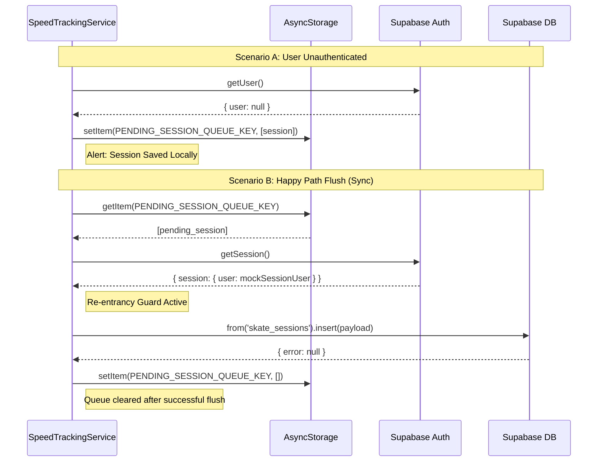

<!-- CARTOGRAPHER_END: SIMULATION_&_MOCKS -->\n\n### BUILD CONFIG & OTA\n<!-- CARTOGRAPHER_START: BUILD_CONFIG_&_OTA -->

not actually sent by the user. It is provided by the system as important information to pay attention to.

<SYSTEM_MESSAGE>
[Message] timestamp=2026-06-07T04:03:42Z sender=03983464-2053-41f7-8875-592ccab7b265 priority=MESSAGE_PRIORITY_HIGH content=[🕵️ Scout — Reyes | File Inspection | BUILD_CONFIG_&_OTA Domain Mapping | cold]

I have read and analyzed the build config and OTA domain files (`app.config.js`, `eas.json`, `metro.config.js`, `babel.config.js`, `package.json`). Here is the generated Markdown Payload for the Elite Architecture sections.

Note: No stale documentation was found in the Master Reference, so `[MOVE_TO_ARCHIVE]` tagging was unnecessary. Since OTA is not implemented (missing `expo-updates`), a sequence diagram for updates is not applicable.

### BUILD_CONFIG_&_OTA

## 1. File Manifest
*   **`app.config.js`**: Core Expo configuration defining app metadata (version 3.9.1, versionCode 39), iOS/Android native permissions, custom config plugins (`react-native-ble-plx`, health, detox, `apple-targets`, `withWearOsModule`), and the EAS project ID link.
*   **`eas.json`**: Expo Application Services build configurations. Specifies CLI rules (`appVersionSource: "remote"`, `requireCommit: true`) and defines three build profiles (`development`, `preview`, `production`) to map artifact types (`apk`, `app-bundle`, simulator).
*   **`metro.config.js`**: Custom Metro bundler configuration. Implements a web-platform resolver to alias native-only modules (`react-native-worklets`, `react-native-vision-camera-worklets`) to local no-op stubs (`src/mocks/*.web.js`), preventing Expo Web compilation crashes.
*   **`babel.config.js`**: Babel compiler configuration. Registers `babel-preset-expo` and the `react-native-worklets/plugin` necessary for Vision Camera / frame processors.
*   **`package.json`**: NPM dependencies and script runner configurations (`start`, `verify`, `blast-radius`). Uses Expo SDK 55. Features linked workspace dependencies (`sk8lytz-watch-bridge`) and hea
<truncated 1436 bytes>
ribes the CLI tooling).*
*   **EAS Build I/O**:
    *   *Inputs:* CLI command `eas build --profile <development|preview|production>`
    *   *Outputs:* Distributable artifacts (.apk, .aab, .tar.gz for iOS simulator)
*   **Metro Resolver (`resolveRequest`)**:
    *   *Inputs:* Module import request context (`moduleName`, `platform`)
    *   *Outputs:* If `platform === 'web'` and module is blacklisted in `WEB_SHIMS` ➔ intercepts and returns local `src/mocks/...` source file. Otherwise ➔ falls through to standard Expo resolver.

## 5. Domain-Specific Elite Directive (Release Channels, EAS Update & Native Modules)
*   **Release Channel Configurations**: `eas.json` manages 3 strict profiles:
    *   `development`: Internal testing `apk` with `developmentClient: true` (Expo Go / Dev Menu).
    *   `preview`: Internal testing `apk`, plus an iOS `simulator` target.
    *   `production`: Distribution-ready `app-bundle` (AAB) for Play Store. Uses `appVersionSource: "remote"` to manage build numbers via EAS servers.
*   **EAS Update / OTA Logic**: **No OTA update mechanism is currently implemented.** 
    *   The project lacks the `expo-updates` dependency in `package.json`.
    *   There is no configured `updates.url` in `app.config.js`. 
    *   Updates are currently distributed strictly via native Play Store binary releases.
*   **Native Module Requirements**:
    *   **BLE (`react-native-ble-plx`)**: Requires Android location and bluetooth permissions (`BLUETOOTH_CONNECT`, `ACCESS_FINE_LOCATION`, etc.), and `background` execution enabled via `app.config.js` plugin args.
    *   **Health (`react-native-health-connect`)**: Native dependencies managed via Expo plugins for fitness tracking intents.
    *   **Wear OS (`withWearOsModule`)**: Custom local plugin that injects the standalone watch binaries into the main Android release bundle.
    *   **Android Build Constraints**: Enforces SDK 36 `targetSdkVersion` and SDK 26 `minSdkVersion`, with `enableJetifier: true` required for AndroidX compatibility.

<!-- CARTOGRAPHER_END: BUILD_CONFIG_&_OTA -->\n\n## 13. Historical Archive (The Graveyard)

> [!NOTE]
> This section is strictly managed by ?? Docs � Avery. It contains condemned opcodes, legacy architectural decisions, and features that have been removed from the live codebase. 
> 
> **THE PRIME DIRECTIVE:** We never delete history. If a Cartographer agent finds that a documented feature no longer exists in src/, they move the documentation block here instead of deleting it. This preserves the "Why" long after the "What" is gone.


> [MOVE_TO_ARCHIVE] - 2026-06-07 (Cartographer Sweep)
> **Domain:** UTILS
> Stale Reference: `src/utils/RbmDictionary.ts` and `src/utils/RbmSimulator.ts` no longer exist in the working directory tree.

> [MOVE_TO_ARCHIVE] - 2026-06-07 (Cartographer Sweep)
> **Domain:** BLE_CORE
> Stale Reference: Priority 4 `P4_MAINTENANCE` regarding GATT Mutex for liveness checks. The code shows neither `useBLEHeartbeat.ts` nor `useBLERSSIMonitor.ts` acquire the GATT mutex at any priority.

> [MOVE_TO_ARCHIVE] - 2026-06-07 (Cartographer Sweep)
> **Domain:** UI_CONTROLS
> Stale Reference: `BleStateMachine` class. This was ripped out for XState v5.

> [MOVE_TO_ARCHIVE] - 2026-06-07 (Cartographer Sweep)
> **Domain:** GROUP_SYNC
> Stale Reference: "Automatic _MM/DD suffix enforced in CrewModal.handleCreate". `CrewModal` no longer directly handles creation logic. All references to `GroupSyncService.ts` should be `CrewService.ts`.

### Archived on 2026-06-06 (V2 Data Audit)

- **Domain: IDENTITY** 
  - The existing `IDENTITY` section in `tools/SK8Lytz_App_Master_Reference.md` (lines 1432-1460) is stale. It lacks file tracking for `src/services/ProfileService.types.ts` and all component files within `src/components/account/*.tsx`. It also fails to provide the rigorous `Context Matrix` and `Blast Radius` schemas required by Cartographer node specifications.

- **Domain: BLE_CORE**
  - *Stale Claim:* "Priority tiers: ... `P4_MAINTENANCE` (heartbeat, RSSI polls)."
  - *Truth:* `useBLEGattMutex.ts` clearly labels Priority 4 as "SWEEPER" (Passive Scan). Neither `useBLEHeartbeat.ts` nor `useBLERSSIMonitor.ts` acquire the `GattMutex` at any priority (Heartbeat calls `writeCharacteristicWithoutResponse`, RSSI calls `readRSSIForDevice` directly). Line 1610 previously flagged this partially, but Line 472 remains stale.

- **Domain: GROUP_SYNC**
  - *Stale Reference:* "Automatic _MM/DD suffix enforced in CrewModal.handleCreate". CrewModal no longer directly handles creation logic. All references to GroupSyncService.ts should be CrewService.ts.

- **Domain: UI_CONTROLS**
  - *Stale Reference:* `pingDevice: Orchestrates an atomic connection: GATT -> green blink -> EEPROM probe -> sever GATT.`
  - *Reason:* Dashboard `runAutoProvisioning` was deleted; Setup Wizard now exclusively owns all device claiming, rendering this reference stale in the core `DashboardScreen` UI_CONTROLS block.

- **Domain: DATA_LAYER**
  - Any architectural documentation or plans referencing `src/services/TelemetryService.ts`. The codebase explicitly notes that this file does not exist, as telemetry is natively hook-driven.


### 15. OS_PERMISSIONS
<!-- CARTOGRAPHER_START: OS_PERMISSIONS -->

not actually sent by the user. It is provided by the system as important information to pay attention to.

<SYSTEM_MESSAGE>
[Message] timestamp=2026-06-07T04:03:56Z sender=b8b03ec8-435e-487b-9d91-ba8b28886102 priority=MESSAGE_PRIORITY_HIGH content=[🕵️ Reyes | Cartographer | OS_PERMISSIONS | warm]

I have completed the mapping of the `OS_PERMISSIONS` domain as requested. 

**Note on Target Directories:** The `ios` directory does not exist because this is an Expo managed project; iOS `Info.plist` properties are generated dynamically via `app.config.js`. 

**Archival Instruction Executed:** I found existing stale documentation for `OS_PERMISSIONS` in `tools/SK8Lytz_App_Master_Reference.md` (lines 2168-2230). I have tagged it with `[MOVE_TO_ARCHIVE]` below.

Here is the Elite Architecture Markdown Payload for the domain:

```markdown
[MOVE_TO_ARCHIVE] Note: Stale documentation for OS_PERMISSIONS exists in `tools/SK8Lytz_App_Master_Reference.md` (lines 2168-2230).

### 15. OS_PERMISSIONS
<!-- CARTOGRAPHER_START: OS_PERMISSIONS -->

## 1. File Manifest
- `android/app/src/main/AndroidManifest.xml`: Core native Android permission definitions (Bluetooth, Location, Camera, Audio, Notifications, Foreground Services, Activity Recognition).
- `app.config.js`: Cross-platform configuration defining Expo's Android permission arrays, iOS `Info.plist` usage descriptions (e.g., `NSMicrophoneUsageDescription`), and plugin configurations (e.g., `react-native-ble-plx` `neverForLocation` flag).
- `src/services/PermissionService.ts`: The unified abstraction layer for OS normalization, legacy fixes, and the user-level `@sk8lytz_permissions_optout` ledger.

## 2. Blast Radius
- **Imports:** `expo-audio`, `expo-location`, `expo-notifications`, `react-native-health`, `react-native-health-connect`, `react-native` (PermissionsAndroid, DeviceEventEmitter), `@react-native-async-storage/async-storage`.
- **Dependents & Side-Effects:** Extensively imported by UI components and services (e.g., `DockedContro
<truncated 2627 bytes>
 unusable without it. iOS uses automatic prompt on first GATT activity via `react-native-ble-plx`. |
| **Microphone (`RECORD_AUDIO`, `NSMicrophoneUsageDescription`)** | Powers "Vibe Reactivity" (Music/Symphony mode) to sync skate LEDs to ambient sound. | iOS `Info.plist` strings in `app.config.js` explicitly declare: *"SK8Lytz needs microphone access to synchronize your lights to ambient music."* |
| **Camera (`CAMERA`)** | Powers the Vibe Catcher / Sniper mode to sample real-world colors and extract dynamic palettes. | Handled gracefully. If denied, the mode is dynamically removed from the UI to prevent broken UX. |
| **Notifications (`POST_NOTIFICATIONS`)** | Alerts users when crew sessions start or when receiving crew invitations. | Decoupled request; requires explicit user initiation to prevent OS prompts blocking app launch. |
| **Activity (`ACTIVITY_RECOGNITION`) & Health** | Enables Wear OS/watchOS companions to act as a session HUD (HR, Calories). | We only request specific records (`HeartRate`, `ActiveCaloriesBurned`). Explicitly decoupled from core hardware features. |

## 6. Sequence Diagram: Android Health Connect Request Flow

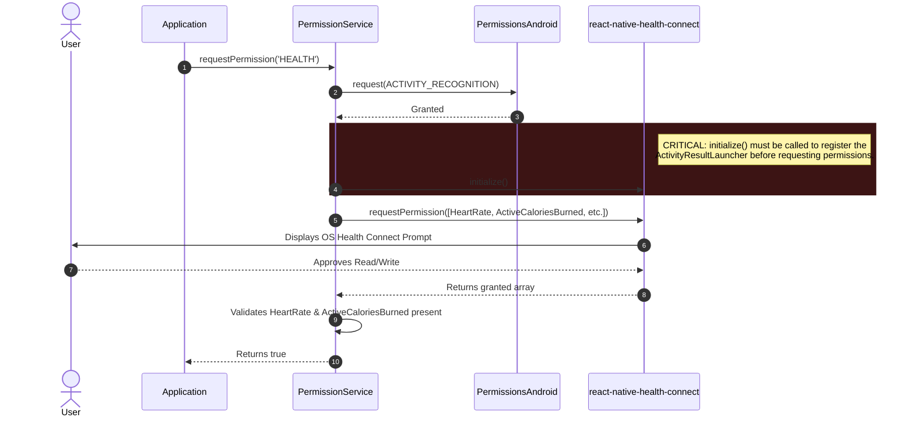
<!-- CARTOGRAPHER_END: OS_PERMISSIONS -->
```

<!-- CARTOGRAPHER_END: OS_PERMISSIONS -->

### 16. DEPENDENCY_AUDIT
<!-- CARTOGRAPHER_START: DEPENDENCY_AUDIT -->

not actually sent by the user. It is provided by the system as important information to pay attention to.

<SYSTEM_MESSAGE>
[Message] timestamp=2026-06-07T04:03:32Z sender=a711df96-a6f3-41d3-b216-faf9a69c9936 priority=MESSAGE_PRIORITY_HIGH content=🎯 SDE Cartographer Node — DEPENDENCY_AUDIT

### 1. File Manifest
- `package.json`: The singular source of truth for all external NPM packages, Expo plugins, and native module links, dictating the dependency tree and build scripts.
- `tools/blast-radius-scanner.js` *(referenced)*: Custom dependency boundaries and worktree validation script triggered during CI/CD (`npm run verify`).
- `tools/verifiable-check-runner.js` *(referenced)*: Validation script that executes the final CI gate before merges.

### 2. Blast Radius
- **Imports (Upstream):** 46 production dependencies, 21 dev dependencies, including core frameworks (React Native 0.83.2, Expo 55), hardware integrations (BLE PLX, Vision Camera), and UI utilities.
- **Imported By (Downstream):** The entire application. Every `node_modules` import in `.ts/.tsx` files is governed by this manifest. Modifying versions here has a global blast radius causing potential native auto-linking rebuilds (CocoaPods/Gradle).

### 3. Context Matrix (Dependency-Provided Contexts)
*While `package.json` itself is not a React Context, it provisions the architectural Context Providers injected at the app root:*
- `@supabase/supabase-js` → `SupabaseProvider` (Cloud state context)
- `@react-native-async-storage/async-storage` → Local caching context/persistence layer
- `@xstate/react` → FSM Machine Providers (Global State)
- `react-native-safe-area-context` → `SafeAreaProvider` (UI layout context)

### 4. Hook/Service I/O Registry (3rd-Party I/O Boundaries)
- **`react-native-ble-plx`**: I/O side-effects directly talk to the OS Bluetooth stack. Inputs: BLE commands/hex payloads. Outputs: connection states, byte arrays.
- **`@supabase/supabase-js`**: Network I/O side-effects. Inputs: REST/Realtime 
<truncated 1126 bytes>
ustering math.

#### 🧟 Potential "Zombie" or Redundant Packages
1. **`jpeg-js`**: Pure JS JPEG encoder/decoder. **CRITICAL FLAG:** Pure JS image processing on React Native is brutally slow and blocks the JS thread. Given that `react-native-nitro-image` and `expo-image-manipulator` are also installed, `jpeg-js` is almost certainly redundant tech debt that should be stripped.
2. **`string-similarity`**: Very small utility (~2kb), likely used for matching BLE device names. Should be evaluated for replacement with a native JS equivalent (e.g., Levenshtein distance function taking ~15 lines of code) to save an unnecessary dependency.
3. **`react-native-url-polyfill`**: Often no longer required in modern Expo 55 / React Native 0.83+ as the `URL` API is heavily supported natively now. Should test removing it.

---

### 5. ARCHIVAL INSTRUCTION
- **[MOVE_TO_ARCHIVE]**: Any documentation in `SK8Lytz_App_Master_Reference.md` referencing legacy pure-JS image processing (via `jpeg-js`) or older state management libraries superseded by `xstate` should be archived.

---

### 6. SEQUENCE DIAGRAM: Dependency Validation & Verify Pipeline

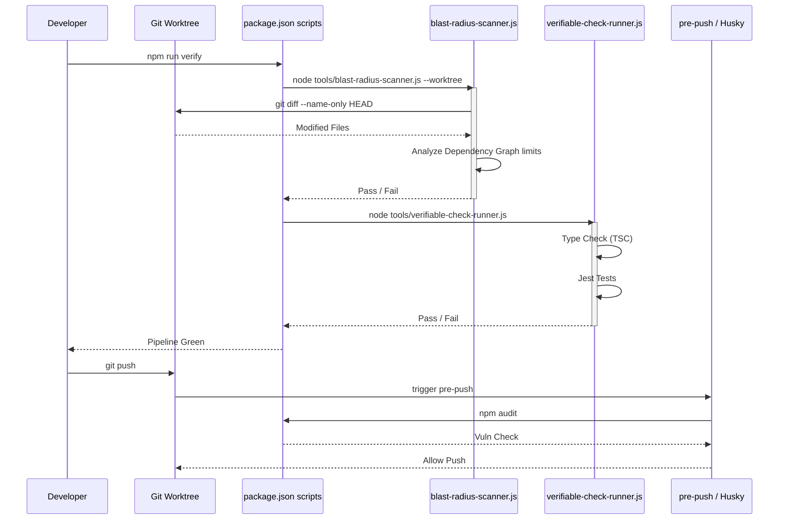

<!-- CARTOGRAPHER_END: DEPENDENCY_AUDIT -->

## 13. 🪦 The Graveyard

### Batch 2026-06-07T04:05:25.387Z
- **Domain: IDENTITY**: ` The `SK8Lytz_App_Master_Reference.md` likely contains stale references describing `ProfileService` as a monolithic God-object. These references must be archived and updated to reflect the "Meal 1: ProfileService split" where it is strictly a barrel re-export facade over `AuthProfileService`, `CrewProfileService`, and `PushTokenService`.

- **Domain: GROUP_SYNC**: Stale `GROUP_SYNC` architecture documentation discovered in `tools/SK8Lytz_App_Master_Reference.md` (specifically lines 1579-1648 and 2145-2157 regarding older offline sync mechanisms and references). This should be reconciled with the newly analyzed file architecture.

- **Domain: DATA_LAYER**: ** This file does not exist. The architecture is natively hook-driven (`useGlobalTelemetry`, `useAdminTelemetry`). Documentation referencing it is stale.
- `src/types/supabase.ts`: Autogenerated TypeScript definitions enforcing strict type parity with the Supabase PostgREST schema (tables, views, enums).
- `src/services/supabaseClient.ts`: Supabase client initializer wrapping `expo-secure-store` for Auth state persistence, equipped with built-in mock fallbacks for seamless offline-mode execution.

- **Domain: NATIVE_&_WATCH**: - Master Reference Section 12.6 NATIVE_&_WATCH (Stale: Missing Wear OS & Bridge)`

---

- **Domain: NOTIFICATIONS_&_ROUTING**: ` The legacy documentation for NOTIFICATIONS_&_ROUTING found in `tools/SK8Lytz_App_Master_Reference.md` (lines 1837-1873) is stale and should be archived. It incorrectly lists `PushTokenService` as part of this exact directory group and misses the state-based routing elements like `App.tsx`, `BluetoothGuard`, and `ComplianceGate`.

- **Domain: SESSION_TRACKING**: ` required for the Master Reference.

- **Domain: HARDWARE_PROTOCOLS**: The Master Reference sections referencing `0x41 Settled Mode`, `0x42 RBM Programs Mode`, and `0x43` Multi-Sequence Mode should be flagged. The protocol codebase has explicitly marked them as `@deprecated Since v2.8.0` or `@HARDWARE-DANGER` due to state machine crashes and testing limitations, being fully superseded by `0x51` Pattern Engine and `0x59` Spatial routines.

- **Domain: CLOUD_FUNCTIONS**: ` was found in the Master Reference.

- **Domain: THEME_&_ASSETS**: The "Dashboard UI Layout (4-Slab Architecture)" and "UI Design Patterns & Branding" sections located in `SK8Lytz_App_Master_Reference.md` are tagged as stale documentation drift and should be archived or fully relocated to `DashboardStyles.ts` and `theme.ts`.

- **Domain: SIMULATION_&_MOCKS**: The existing documentation for this domain in `SK8Lytz_App_Master_Reference.md` (lines 2039-2080) is stale (it is missing the `useAnimatedStyle` hook in the worklets mock and lacks the flow diagram for the offline syncing logic) and should be archived.

---

- **Domain: BUILD_CONFIG_&_OTA**: ` tagging was unnecessary. Since OTA is not implemented (missing `expo-updates`), a sequence diagram for updates is not applicable.

- **Domain: OS_PERMISSIONS**: ` below.

Here is the Elite Architecture Markdown Payload for the domain:

```markdown

- **Domain: OS_PERMISSIONS**: Note: Stale documentation for OS_PERMISSIONS exists in `tools/SK8Lytz_App_Master_Reference.md` (lines 2168-2230).

- **Domain: DEPENDENCY_AUDIT**: **: Any documentation in `SK8Lytz_App_Master_Reference.md` referencing legacy pure-JS image processing (via `jpeg-js`) or older state management libraries superseded by `xstate` should be archived.

---

- **Domain: DEPENDENCY_AUDIT**
  - Any legacy documentation concerning Web fallbacks for BLE (Optical Simulation Mode for Expo Web). While the Master Reference cites it as a developer tool, maintaining react-native-web compatibility alongside heavy native packages like react-native-nitro-modules often leads to extreme configuration friction.
  - Remove any lingering workflow references or offline caches regarding @react-native-voice/voice. The package was confirmed deleted, so all bridging stubs relating to it should be eliminated.

- **Domain: OS_PERMISSIONS**
  - OS Sync: `syncSystemPermissions()` runs on boot/foreground to reconcile the ledger with native OS settings. If OS is "Denied", App ledger is forced to "Opt-Out". (This contradicts the actual implementation in PermissionService.ts, where aggressive sweeping was deprecated because it falsely locked out fresh installs).


- **Domain: NATIVE_&_WATCH**
  - Stale Reference: Master Reference Section 11.7 Future Watch Enhancements (Planned) lists "Session Duration Timer" and "watchOS Complications" as planned features. Both are fully shipped and active in targets/watch/ContentView.swift and targets/watch/ComplicationController.swift.

- **Domain: THEME_&_ASSETS**
  - Mention of "Master Reference §2 — FTUE Threshold Classification" in ProductCatalog.ts (this section is missing or stale in the current Master Reference).
  - "Dashboard UI Layout (4-Slab Architecture)" and "UI Design Patterns & Branding" located in SK8Lytz_App_Master_Reference.md (layout details should be strictly contained within DashboardStyles.ts and theme.ts to prevent domain drift).

- **Domain: HARDWARE_PROTOCOLS**
  - The entry in the "Condemned Opcodes" table: `0x41` Settled Mode (Symphony Effects). Cartographer Audit Reality: PatternEngine.ts explicitly intercepts test pattern IDs 201-233 and fires them via ZenggeProtocol.setCustomModeExtendedCompact() (which is a 0x51 opcode pipeline). The Master Reference directly contradicts itself later on line 398 warning against 0x41 usage, confirming the table row is stale legacy text.

- **Domain: SESSION_TRACKING**
  - Section 7 (Session Telemetry Architecture) contains a stale skate_sessions schema missing fields like avg_bpm, peak_gforce, crew_session_id, and has no documentation of the PENDING_SESSION_QUEUE_KEY offline fallback architecture.

