# SK8Lytz App Master Reference

_Last Updated: 2026-06-10 | **21-Domain Cartographer Synthesis Completed** — watchOS + Wear OS companion apps, Expo native bridge module (sk8lytz-watch-bridge), watch-preferred health priority system, bidirectional phone↔watch session sync, Speed push to watch, VS-002 gitignore fix. v3.9.1 | Source of Truth: artifacts/deepdive_docs/_

This document is the **Canonical Reference** for all architecture, hardware constraints, and BLE protocol definitions within the SK8Lytz application.

1. [Product Bible](#1-product-bible-vision--north-star)
2. [System Architecture](#2-system-architecture--local-storage)
3. [BLE Protocol Library](#3-ble-protocol-library)
4. [Domain-Driven Architecture](#4-domain-driven-architecture)
5. [Database Schemas](#5-database-schemas)
6. [Crew Hub & Session Lifecycle](#6-crew-hub--session-lifecycle)
7. [Session Telemetry Architecture](#7-session-telemetry-architecture)
8. [Agentic PM Protocols](#8-agentic-pm-protocols-the-brain)
9. [Sentinel Engineering Governance](#9-sentinel-engineering-governance-workflow-v6)
10. [Environment & Build Ops](#10-environment--build-ops)
11. [Wearable Companion Architecture](#11-wearable-companion-architecture)

> [!CAUTION]
> Do NOT append duplicate or conflicting protocol discoveries to this document. If a payload format changes, **overwrite** the existing entry to ensure this file remains a single, conflict-free source of truth.

---

## 1. Product Bible (Vision & North Star)

**The Mission:**
To empower the radiant culture of roller skating by building the world's most expressive and innovative lighting ecosystem. SK8Lytz isn't just an app; it's the digital pulse for your skates—enabling flawless, zero-latency light synchronization ("Glow Your Way") that transforms solo sessions into high-performance visual art and massive Crew Hub rink takeovers into coordinated spectacles.

**Target Audience:**
Sk8Lytz caters to a diverse, family-oriented community of dedicated roller skaters. They operate in high-energy, low-light environments (rinks, street night sessions, park bowls). They value durability, ease of use (wrist guards, movement), and the ability to express their unique style through synchronized, diffused lighting.

### Core Product Lines

#### **SOULZ** (The High-Intensity Pro Strip)

- **Concept**: 56" of total illumination via four 14" diffused silicone addressable LED strips.
- **Performance**: 2-6+ hours of run time.
- **Charging**: 90 min full cycle (USB-C).
- **Control**: Integrated Bluetooth/RF + High-sensitivity integrated microphone for instant "vibe" reactivity.

#### **HALOZ** (The Compact Matrix Box)

- **Concept**: Individually controllable high-density pixel boxes for wheels/plates.
- **Performance**: 2-4+ hours of run time.
- **Charging**: 60 min fast-charge (USB-C).
- **Control**: Integrated Bluetooth/RF + High-sensitivity integrated microphone.

#### **RAILZ** (Integrated Chassis Strips)

- **Concept**: Dual parallel vertical LED strips designed for undercarriage/frame mounting.
- **Performance**: Integrated 4-6+ hour run time.
- **Charging**: 90 min (USB-C).
- **Control**: Integrated Bluetooth/RF + High-sensitivity integrated microphone.

### Hardware Truth Table — Confirmed 2026-04-22

> [!IMPORTANT]
> This is the **canonical source of truth** for all LED count math, pixel array sizing, and EEPROM provisioning. The three-layer model below governs ALL protocol and UI decisions. `ProductCatalog.ts` code comments cite this table. See `ZENGGE_PROTOCOL_BIBLE.md` §3 for `0x62`/`0x63` EEPROM command details.

#### The Three-Layer LED Model

Every product has three distinct LED "counts" that mean different things:

| Layer | Name | What it represents | Code field |
|:------|:-----|:-------------------|:-----------|
| **1** | `ledPoints` | Addressable LEDs **per segment** — the design canvas | `hwSettings.ledPoints` |
| **2** | `segments` | Number of hardware mirrors of Layer 1 | `hwSettings.segments` |
| **3** | Physical LEDs | Total real LEDs in the world (`ledPoints × segments`, or × wiring factor) | Not stored — derived only |

> **Golden Rule**: All pixel arrays (`0x59`, `0x31`) MUST be built using `ledPoints` (Layer 1). Segments and wiring are the hardware's job, not the app's.

#### Confirmed Product Defaults

| Product | `ledPoints` | `segments` | Physical LEDs | Adjustable? | Architecture |
|:--------|:-----------:|:----------:|:-------------:|:-----------:|:-------------|
| **HALOZ** | **8** | **2** | 16 | ❌ Fixed | Ring. Hardware **auto-mirrors** the 8-point pattern to a 2nd segment. Always send 8-element arrays. |
| **SOULZ** | **43** | **1** | 86* | ✅ Yes | Strip. No hardware mirroring. Controller drives one 43-point canvas. Physical doubling from Y-wire is transparent. |
| **RAILZ** | **30** | **2** | 60 | ✅ Yes | Dual rail. Placeholder — confirm with hardware before shipping. |

*SOULZ physical reality: 43 LEDs on LEFT skate (outside boot) + 43 LEDs on RIGHT skate (inside boot), both Y-wired to the same controller output. The controller is **oblivious to the doubling**.

#### SOULZ — User-Adjustable `ledPoints`

SOULZ strips are cut-to-length. If a user physically cuts the strip shorter, they **must** update `ledPoints` in the HW Setup Wizard to match the physical count. Example: cut from 43→36 → set `ledPoints=36`. The LED Points adjuster in the wizard (`hardwareAllowsCustomPoints: true`) exists for exactly this reason.

Every pixel array builder (`PatternEngine`, `applyEmergencyPattern`, etc.) must read `hwSettings.ledPoints` dynamically — NEVER hardcode 43.

#### ⚠️ Previous Bug (Fixed 2026-04-22)

`ProductCatalog.ts` previously had `HALOZ.defaultLedPoints = 16, segments = 1`. This was **wrong** — it caused:
1. `applyEmergencyPattern` sending 16-element arrays to an 8-point device, bypassing the hardware segment mirror engine
2. Any EEPROM probe (`0x63`) returning `ledPoints=8` would have caused a mismatch with stored defaults

Fixed: `HALOZ.defaultLedPoints = 8, segments = 2`.

#### ✅ HALOZ Ring Topology — Confirmed Physical LED Map (2026-04-25)

```
              ╔══════════╗
              â•‘   TOP    â•‘
  L-pSlot 0 ══╬══════════╬══ R-pSlot 7    ← Left TOP = pSlot 0, Right TOP = pSlot 7
  L-pSlot 1 ══╬          ╬══ R-pSlot 6
  L-pSlot 2 ══╬          ╬══ R-pSlot 5
  L-pSlot 3 ══╬  CENTER  ╬══ R-pSlot 4
  L-pSlot 4 ══╬          ╬══ R-pSlot 3
  L-pSlot 5 ══╬          ╬══ R-pSlot 2
  L-pSlot 6 ══╬          ╬══ R-pSlot 1
  L-pSlot 7 ══╬══════════╬══ R-pSlot 0    ← Left BOTTOM = pSlot 7, Right BOTTOM = pSlot 0
              â•‘  BOTTOM  â•‘
              ╚══════════╝
  LEFT side: ↓ top→bottom     RIGHT side: ↑ bottom→top
  pSlot: 0,1,2,3,4,5,6,7      pSlot: 0,1,2,3,4,5,6,7
```

**Rule:** Hardware auto-mirrors the 8-pixel pattern to both segments simultaneously.
- Seg 1 (RIGHT): LED 0 at physical BOTTOM, LED 7 at physical TOP.
- Seg 2 (LEFT): Hardware mirror places LED 0 at physical TOP, LED 7 at physical BOTTOM.
- If pixel[0] = RED → **Right BOTTOM = RED, Left TOP = RED**. True horseshoe symmetry.

#### VisualizerUnit Rendering Rules (HALOZ RING only) [MOVE_TO_ARCHIVE] (Note: VisualizerUnit has been upgraded to natively support RING, OVAL, and DUAL_STRIP layouts, unified under product profile geometry).

These rules govern `src/components/VisualizerUnit.tsx`. **Do NOT apply to SOULZ (OVAL) or RAILZ (DUAL_STRIP).**

| Rule | Correct Value | Wrong (causes bugs) |
|:-----|:-------------|:--------------------|
| `numLeds` formula | `Math.floor(devicePoints)` — `ledPoints` IS the per-segment canvas | `Math.floor(devicePoints / deviceSegments)` — causes 4 LEDs, not 8 |
| `devicePoints` fallback | `productProfile.defaultLedPoints` (8) | `productProfile.vizDefaultPoints` (was 16) — causes 16-color arcs |
| `deviceSegments` fallback | `productProfile.defaultSegments` (2) | Hard-coded `1` — kills gap rendering |
| `getVisualizerFrame` numLeds arg | `numLeds` (8) | `activeSegmentLedsHoisted` (32) — 4× oversampled palette |
| Product lookup guard | Guard `device.type !== 'undefined'` before `String()` | `String(undefined)` = `"undefined"` → SOULZ fallback → `vizShape='OVAL'` → RING inversion never fires |
| Left arc pSlot direction | `rawFract` (inverted for i ≥ renderLeds/2 when `vizShape==='RING'`) | `segmentI / activeSegmentLeds` (never inverted) → both arcs identical |

> **SOULZ Safety:** `rawFract` for SOULZ (`vizShape='OVAL'`) is NEVER inverted. Changing slot lookups to use `rawFract` instead of `segmentI/activeSegmentLeds` is identical for SOULZ — zero regression risk.


---

**Core Philosophies (The 4 Pillars):**

1. **Bulletproof BLE Transport:** The connection to Neogleamz hardware MUST be instantaneous and nearly sentient. Reconnects and pairing must handle GATT exceptions and MTU drift invisibly. "It just works, immediately."
2. **Tactile, Glanceable UI:** High-contrast, Neogleamz standard aesthetics. Massive touch targets (>44px) for skaters in gear. One-tap access to Symphony effects and App-mic visualization.
3. **No-Compromise Offline Flow:** Hardware control is a fundamental right. basic lighting and EEPROM configuration (0x62/0x63) never require cloud authentication.
4. **Wrist Extension (Watch Companions):** The watch is a session HUD and health relay — NOT an LED controller. It mirrors speed, HR, and calories from the phone, relays on-wrist health sensor data back, and provides remote session start/stop. All BLE LED protocol commands originate exclusively from the phone app.

**Anti-Goals (What we ruthlessly reject):**

- **Bloated Developer Logic in Prod:** We use strict `__DEV__` elimination to keep the binary lean and free of testing debris.
- **Complex UI Micro-Management:** Skaters want to skate. We provide stunning Pro Effects and high-precision HUDs (Speed/Brightness), not frame-by-frame animation editors.
- **Hardware-Cloud Gating:** We never lock essential local hardware features behind an internet authentication wall.
- **Hardcoded Hardware Heuristics:** The UI layer must NEVER use explicit string literals (e.g. `type === 'HALOZ'`) or hardcoded binary logic to render products. All hardware metadata (shape, icons, colors) must be dynamically derived from `LOCAL_PRODUCT_CATALOG` (`src/constants/ProductCatalog.ts`) to ensure scalable, zero-code support for new OEM devices.

### ❌ Condemned Opcodes — Never Use in Production

> [!CAUTION]
> The following BLE opcodes are PERMANENTLY CONDEMNED for production UI use.
> They cause a fundamental visualizer-parity gap: the hardware controls the animation internally,
> so the ProductVisualizer cannot know what the hardware is showing. This breaks our core parity promise.

| Opcode | Name | Why Condemned | What Replaced It |
|:-------|:-----|:--------------|:-----------------|
| **`0x41`** | Settled Mode (Symphony Effects) | Used for native hardware parity on test patterns. | 33 native hardware effects (IDs 201-233) fired via `0x41`, fully integrated into PatternEngine |
| **`0x42`** | RBM Programs Mode | Hardware runs one of 100 baked-in Programs internally. App cannot know the pixel state. | All Programs effects reimplemented as PatternEngine TypeScript, fired via `0x59` |

**Architecture decision 2026-04-22**: Every LED effect in SK8Lytz is computed in TypeScript,
sent as a pixel array via `0x59`, and rendered identically in the ProductVisualizer.
`0x41` and `0x42` are available in DiagnosticLab only (guarded by `__DEV__`).

---

### SK8Lytz Pattern Architecture (Canonical Reference)

#### The One Law

```
PatternEngine (TypeScript math) → getVisualizerFrame() → pixel array → 0x59
ProductVisualizer               → getVisualizerFrame() → same pixel array → rendered on screen
Visualizer = Skates. Always. No exceptions.
```

#### Three-Tier Pattern Library

Every pattern belongs to one of three tiers:

| Tier | Source | Count | Description |
|:-----|:-------|:-----:|:------------|
| **Tier 1** | ge.* Java class reversal | 33 | Settled Mode effects. `0x41` was originally reverse-engineered, but test patterns 201-233 now utilize native `0x41` hardware routing for byte parity checks. |
| **Tier 2** | Programs Mode reversal | ~28 | Standard LED strip effects. Each Programs effect is reimplemented in TypeScript. `0x42` is NEVER called. |
| **Tier 3** | SK8Lytz originals | ∞ | Effects only possible because we own the payload. Positional gradients, reactive splits, sport sequences, etc. |

**Current total**: 81 templates (43 spatial/temporal + 5 street + 33 Multimode Pro Effects), all in one unified picker.

#### Pattern Template Schema

Every pattern in `src/protocols/PatternEngine.ts` (`SK8LYTZ_TEMPLATES`) has this structure:

```typescript
interface SK8LytzTemplate {
  id: number;                          // Unique, never reuse. 1-28 = existing. 29+ = new.
  name: string;                        // User-facing name in picker
  icon: string;                        // Emoji icon for picker card
  colorMode: 'FG_BG' | 'FG_ONLY' | 'BG_ONLY' | 'GENERATIVE';  // Which color pickers to show
  supportsDirection: boolean;          // Show direction toggle in UI?
  tier: 1 | 2 | 3;                    // Source tier (ge.* | Programs | Original)
  sourceRef?: string;                  // e.g. 'ge.OceanWaveEffect' or 'Programs:CometChase'
  group?: string;                      // UI grouping label in picker
}
```

#### Universal Controls (All Patterns Support All)

| Control | Implementation | Notes |
|:--------|:---------------|:------|
| **FG Color** (RGB) | `fg: RGB` passed to `getVisualizerFrame()` | Always active |
| **BG Color** (RGB) | `bg: RGB` passed to `getVisualizerFrame()` | UI hidden if `colorMode !== 'FG_BG'` |
| **Speed** | Controls `tick` rate + `0x59` scroll param | Always active |
| **Brightness** | `0x55` packet — independent of pixel array | Always active, global |
| **Direction** | `direction: 0\|1` → `getVisualizerFrame()` + `0x59` dir byte | UI shown only if `supportsDirection: true` |

#### colorMode Gate

Controls which color pickers the UI renders for a given pattern:

- `FG_BG` — Both FG and BG pickers shown (e.g. Comet: FG=trail, BG=background color)
- `FG_ONLY` — Only FG shown (e.g. Breathing: single color fade, BG irrelevant)
- `BG_ONLY` — Only BG shown (e.g. ID 233 Rainbow Stream: hardware ignores FG entirely)
- `GENERATIVE` — Neither picker shown (e.g. Rainbow Flow: hue is computed by math, not user-set)

> Note: The pattern ALWAYS receives both `fg` and `bg` arguments — the gate is purely a UI affordance.

#### Implementation Contract for Every New Pattern

```
1. Read source math (ge.* Java class, or Bible §0x51 Pattern Index for test modes 201-233)
2. Write TypeScript math: add case to `src/protocols/SpatialEngine.ts` or `SymphonyEngine.ts`
3. Add case to `src/protocols/VisualizerEngine.ts` `getVisualizerFrame()`
4. Add entry to `src/protocols/PatternEngine.ts` `SK8LYTZ_TEMPLATES` with correct colorMode/tier/sourceRef
5. For test patterns (201-233): dispatch via `ZenggeProtocol.setCustomModeCompact()` — NOT `0x41`, NOT 10B extended
6. Verify: ProductVisualizer shows the effect ← identical to hardware via 0x59 (or 0x51 for test modes)
7. Hardware test on HALOZ: tap pattern → LED ring matches visualizer
```

---

## 2. System Architecture & Local Storage

### AsyncStorage Key Registry

| Key                                 | Owner                           | Contents                                                                                                                                        |
| :---------------------------------- | :------------------------------ | :---------------------------------------------------------------------------------------------------------------------------------------------- |
| `@sk8lytz_logs`                     | AppLogger                       | Compact telemetry event buffer array                                                                                                            |
| `@Sk8lytz_auth_username`            | DashboardScreen                 | Local cache of Supabase display_name for instant UI feedback. Synced via Reactive Context Pattern (Load Cache -> Hydrate Profile -> Update UI). |
| `@Sk8lytz_registered_devices`       | DeviceRepository                | Primary SSOT ledger of all claimed/bound hardware keyed by BLE MAC. Each entry uses `group_ids: string[]` and `group_names: string[]` (many-to-many migration 2026-05-28). Legacy scalar `group_id` is dead. |
| `@Sk8lytz_device_configs`           | useDashboardGroups / AppLogger  | Dict keyed by **BLE MAC** containing `{ name, type, points, segments, sorting, stripType, group_ids: string[], group_names: string[] }` |
| `@Sk8lytz_custom_groups`            | useDashboardGroups              | Array of `{ id, name, isGroup, deviceIds }` — group memberships (junction-table backed post v3.6.5) |
| `@sk8_hw_<deviceId>`                | Sk8LytzProgrammerModal          | Per-device EEPROM hardware settings cache                                                                                                       |
| `@sk8lytz_theme`                    | ThemeContext                    | `dark` or `light`                                                                                                                               |
| `@sk8lytz_control_theme`            | ThemeContext                    | Control color theme name                                                                                                                        |
| `@Sk8lytz_hardware_blacklist`       | useBLE                          | Cache-first offline ledger of MAC addresses banned from connecting                                                                              |
| `@Sk8lytz_Builder_Presets`          | GradientsService                | Cache-first offline storage of custom and global builder presets                                                                                |
| `@Sk8lytz_Scenes`                   | ScenesService                   | Cache-first offline storage of downloaded and authored multi-step scenes                                                                        |
| `@Sk8lytz_Scene_Sync_Queue`         | ScenesService                   | Offline mutation queue for publishing and deleting scenes in the background                                                                     |
| `@Sk8lytz_skate_spots_cache`        | LocationService                 | 24h TTL cache-first storage of 500 closest skate spots for offline map degradation survival                                                     |
| `@Sk8lytz_Favorites`                | useFavorites                    | Dictionary of user-defined lighting presets (Name, Palette, Mode)                                                                               |
| `@sk8lytz_permissions_optout`       | PermissionService               | App-Level Opt-Out Ledger. User toggles that override OS permissions for legal/privacy reasons.                                                  |
| `@Sk8lytz_voice_tutorial_dismissed` | boolean                         | Gating for the Voice Command onboarding modal                                                                                                   |
| `@sk8lytz_app_settings`             | AppSettingsService / useBLEScanner | App-wide admin feature flags. Cache-first layer provides offline access. Key `hw_setup_rssi_threshold` controls the RSSI gate. |
| `@Sk8lytz_remember_creds`           | AuthFormSignIn / DevSandboxDrawer | Remembers login email and checkbox status if "Remember Me" is enabled                                                                           |
| `@Sk8lytz_demo_mode`               | DevSandboxDrawer / useBLE       | Flag controlling whether "Virtual Skates" demo mode is active for sandbox testing                                                               |
| `@Sk8lytz_auth_last_email`          | AuthScreen / DevSandboxDrawer   | Caches the last logged-in email to pre-populate the login screen on next launch                                                                 |
| `@Sk8lytz_offline_skip`            | AuthFooterActions / AuthFormSignIn | Stores whether the user opted to bypass online login and continue using the app in offline mode                                                |
| `@Sk8lytz_demo_halo`                | DevSandboxDrawer / useBLE       | Cached MAC address of virtual HALOZ device in offline/demo mode                                                                                 |
| `@Sk8lytz_demo_soul`                | DevSandboxDrawer / useBLE       | Cached MAC address of virtual SOULZ device in offline/demo mode                                                                                 |
| `@SK8Lytz_PublicScenes_Cache`       | ScenesService                   | Local cache of public patterns/scenes downloaded from Supabase                                                                                  |
| `@SK8Lytz_PendingSession_Queue`      | SpeedTrackingService            | Queue of offline-saved skate session snapshots awaiting database synchronization                                                                 |
| `@SK8Lytz_notif_prefs`               | AppSettingsService              | User preferences for push notification channels (Crew alerts, system, etc.)                                                                     |
| `@Sk8lytz_auto_pause_enabled`        | SpeedTrackingService            | Flag indicating whether telemetry tracking auto-pauses when skater speed drops to zero                                                          |
| `@Sk8lytz_programmer_profiles`       | Sk8LytzProgrammerModal          | Locally saved profiles and config files for hardware programming tab                                                                           |
| `@Sk8lytz_product_catalog`           | AppSettingsService              | Cached local catalog of Neogleamz product models and features                                                                                  |
| `@Sk8lytz_pending_bg_end`            | BackgroundSessionService        | Timestamp/flag for session telemetry ending in background                                                                                       |
| `@Sk8lytz_last_group_patterns`       | useDashboardGroups              | Dictionary mapping active groups to their last selected lighting patterns for state restoration                                                 |
| `@Sk8lytz_scanner_telemetry_queue`   | TelemetryService                | Local buffer of bluetooth scanner telemetry data waiting for background upload                                                                  |
| `@Sk8lytz_groups_migrated_v2`        | MigrationService                | Boolean flag indicating successful migration of device groups layout to many-to-many model                                                      |
| `@Sk8lytz_app_settings_logger`       | AppLogger                       | Local configurations and levels for the internal telemetry event logger                                                                         |
| `@Sk8lytz_auth_migration_v1`         | MigrationService                | Flag indicating successful migration of user credentials to v1 schema                                                                           |
| `supabase.auth.token`                | Supabase / AuthContext          | Persisted JWT authentication token for Supabase client sessions                                                                                 |
| `@Sk8lytz_offline_eula_accepted`     | ComplianceGate                  | Boolean flag indicating whether the user accepted the offline-mode EULA                                                                         |

> [!CAUTION]
> **PURGED KEYS (2026-04-17):** The following legacy `ng_*` keys are fully deprecated and MUST NOT be used anywhere in the codebase. They caused split-brain bugs due to namespace drift:
> - ~~`ng_device_configs`~~ → migrated to `@Sk8lytz_device_configs`
> - ~~`ng_custom_groups`~~ → migrated to `@Sk8lytz_custom_groups`
> - ~~`ng_processed_devices`~~ → DELETED (one-shot cleanup on boot)

### Hardware Identification & Connection Routing (Identity Architecture)

1. **Hardware Identity (MAC over UUID)**: The single source of truth for connecting to and identifying hardware is the **BLE MAC address** (`device_mac`). The Supabase DB UUID (`id`) MUST NEVER be used to route BLE connections or resolve live components. DB UUIDs change upon un-sync/re-sync, whereas the MAC address is immutable hardware truth.
2. **Group Connection Ground Truth**: The authoritative state for whether the app is controlling a grouped session is `connectedDevices.length > 1`. Checking `DisplayDevice.groupId` or `grouped` flags is strictly forbidden, as it relies on secondary lookups and fragile optional typings. `deviceConfigs` stores `groupIds` (plural array) for many-to-many associations, but active BLE command routing relies purely on the array size of live GATT connections in the `BleMachine`.


## Build Config & Troubleshooting 🛠️

### Android Build Requirements

To resolve dependency conflicts and legacy library issues, the following configurations are required:

- **Jetifier**: Must be enabled (`android.enableJetifier=true`) to migrate legacy Support libraries to AndroidX.
- **SDK Versions**: Project currently targets SDK 34 (`compileSdk`, `targetSdk`).

### Third-Party Library Patches

- **@react-native-voice/voice**: ~~REMOVED~~ — The voice command engine was deleted. Do not reinstall this dependency. Any references to it in legacy build configs are dead code.

### Dashboard UI Layout (4-Slab Architecture) [MOVE_TO_ARCHIVE]

The primary dashboard uses a **Vertical Slab (No-Scroll)** layout to maximize glanceability and touch accuracy.

1. **Slab 1: Dynamic Header**: Logo, user profile, and active polling/telemetry indicator.
2. **Slab 2: Crew Hub**: Active session discovery and quick-join pills.
3. **Slab 3: My Skates / Groups**: High-impact cards for grouped hardware with global power controls.
4. **Slab 4: Hardware Fleet**: List of all registered devices with a "TAP TO ADD" quick-access wizard link.

### UI Design Patterns & Branding

- **Tucked-in Attribution**: Credit links (e.g., "by neogleamz.com") must be placed discreetly within header containers, aligned with the visual boundary of the primary logo (e.g., `marginRight: '16%'` for a 300px logo) and using `fontSize: 9` with `fontWeight: '800'` muted text.
- **Fluid Component Scaling**: Components (Builders, Camera Viewers) must NOT use hardcoded heights. They must utilize available `flex` space between the `ProductVisualizer` and the bottom dock to ensure responsiveness across all aspect ratios.
- **One-Screen Setup Policy** [MOVE_TO_ARCHIVE]: The Hardware Setup Wizard must minimize vertical occupancy. For naming and registration (Step 3), all primary controls (Fleet Name, Device Labels, Type, Position) must be visible on a single standard mobile viewport (e.g. iPhone SE) without requiring a vertical scroll for a standard 2-skate setup. Use horizontal inlining and 8pt grid proximity instead of explicit labels where possible.

### Admin Tools Hub (The Command Center)

The **Admin Tools Hub** (`AdminToolsModal`) is the unified gateway for all system-level diagnostics and hardware maintenance.

- **Access**: 10-tap the SK8Lytz logo in the dashboard header + Passcode: `0000`.
- **Architecture (Refactor/2026-04-12)**: To prevent "re-render storms" from high-frequency telemetry, the modal utilizes a **Memoized Tab Architecture**. Rendering logic for Timeline, Stats, Device, and Tools is extracted into standalone `React.memo` sub-components, ensuring UI stability during 20Hz notification bursts.
- **Tab 1: TIMELINE**: Virtualized system event log (BLE protocol, app lifecycle, errors). Filtered to exclude RAW_PAYLOAD by default to preserve list performance.
- **Tab 2: STATS**: Session analytics, mode usage frequency, and hardware performance metrics.
- **Tab 3: DEVICE**: Deep-dive hardware view showing all discovered peripherals and their cached configs.
- **Tab 4: TOOLS**: Administrative portal for low-level components:
  - **Catalog Manager**: Unified editor for product profiles. **MANDATORY**: All write operations (`upsert`) are gated by a Supabase Session check to prevent unauthorized database manipulation.
  - **LED Diagnostic Lab**: Atomic protocol validation and DIY payload building.
  - **Firmware Programmer**: Low-level hardware updates and serial-over-BLE tools.
  - **Optical Simulation Mode (Web Fallback)**: A dedicated developer interface for non-native environments (Expo Web). It provides manual telemetry simulation (randomized hex dispatch) to smoke-test visualizer and state-management pipelines without physical hardware.
- **Persistence & Governance**:
  - App settings (feature flags) are persisted via `AppSettingsService` with atomic rollback on failure.
  - Product Manager upserts are strictly typed to enforce the `batteryCapacityMilliAmpereHour` field, preventing database record drift.
  - **Account Deletion (Danger Zone)**: Implements a destructive `delete_account` RPC on Supabase. This uses `ON DELETE CASCADE` to completely shred user data across all tables (telemetry, profiles, and auth).
- **Navigation Orchestration**: Closing any administrative sub-tool (Lab, Programmer) must explicitly re-trigger the visibility of the `AdminToolsModal` in the parent `DashboardScreen` to ensure a consistent "nested" navigation experience.

### Optimistic BLE Write Pipeline ("The Ghost Standard")

The BLE write path uses an **Optimistic UI** architecture to eliminate perceived 80—500ms hardware latency:

| Phase             | Status FSM                   | Behavior                                                  |
| :---------------- | :--------------------------- | :-------------------------------------------------------- |
| 1. **OPTIMISTIC** | `onOptimistic()` fires       | UI updates INSTANTLY before BLE write                     |
| 2. **PENDING**    | `writeStatus = 'PENDING'`    | BLE command dispatched (40ms debounce)                    |
| 3. **CONFIRMED**  | `writeStatus = 'CONFIRMED'`  | Hardware ACK'd — light haptic                             |
| 4. **RECONCILED** | `writeStatus = 'RECONCILED'` | Hardware FAILED — error haptic + `onReconcile()` rollback |

**Key Files:**

- `src/hooks/useOptimisticBLE.ts` — Ghost state FSM, debounce, haptics
- `src/hooks/useBLE.ts` — Core write function (`writeToDevice` returns `Promise<boolean | 'partial'>`)
- `src/components/DockedController.tsx` — Consumer integration (status indicator dot)

**Architectural Constraint:** `writeToDevice` MUST return `Promise<boolean | 'partial'>` where:
- `true` = all devices received the payload
- `false` = write failed, trigger reconciliation
- `'partial'` = some devices received it (ghosted devices skipped) — treated as success for UI

All component prop interfaces must use `Promise<void | boolean | 'partial'>` for full compatibility.

### Test Users & Environments

For testing App Sync behavior vs. Offline mode offline fallbacks, you can authenticate using the primary test user:

- **Email**: `testuser@sk8lytz.com`
- **Password**: `Password!2026`
- **Username**: `TestSkater`

### Offline & Guest Gating Architecture

The application enforces a strict "Hardware First, Cloud Second" policy. Core hardware control (BLE opcodes) is NEVER gated behind an authentication wall.

- **Offline Mode State**: Propagated dynamically via the `isOfflineMode` prop in the component tree (`DashboardScreen` → `DockedController` → Modals).
- **Graceful Degradation**: 
  - `QuickPresetModal`: Cloud preset saving is hidden when `isOfflineMode === true`. Only local device EEPROM saves are permitted.
  - `CommunityModal`: The 'Community Profiles' tab is entirely disabled in offline mode. The UI defaults gracefully to the 'My Skates' local tab.
- **Rule of Thumb**: Local SQLite (`AsyncStorage`) and direct GATT manipulation are 100% available to Guests. Any feature requiring Supabase REST/PostgREST must explicitly check `isOfflineMode` and display a friendly 'Login Required' state.

### Camera Mode: Camera Vibe Catcher v2 Architecture

The `CAMERA` mode provides real-time ambient lighting translation and dual-mode color analysis.
- **Unified Cross-Platform Frame Processing**: 
  - Uses a unified cross-platform `CameraTracker.tsx` utilizing `react-native-vision-camera` v5's GPU-backed `useFrameOutput` pipeline and `vision-camera-resize-plugin`.
  - Frames are downscaled on the GPU to 50x50 pixels RGB format at 5Hz (200ms throttle interval) with JSI `'worklet';` execution.
  - Hardened with explicit `frame.dispose()` invocation wrapped in a `try...finally` block inside the worklet thread to eliminate camera pipeline stalls. Dispatches are scheduled via `runOnJS` from `react-native-worklets` to transition back to the React JS thread.
- **SNIPER Sub-Mode (Focus reticle)**:
  - Samples the center pixel `(25, 25)` from the 50x50 resized frame.
  - The GPU resizer (`react-native-vision-camera-resizer@5.0.10`) delivers accurate RGB bytes directly. The reticle displays the raw camera color (unmodified truth). No client-side vivid boost is applied in the frame processor — the captured color is the real scene color.
  - On capture, `boostForLED()` (`src/utils/ColorUtils.ts`) applies industry-standard HSV saturation maximization (S=1.0, V=1.0) to translate the muted camera capture into vivid WS2812B-optimized output. Neutrals (HSV S < 0.05) pass through as white. The boosted color is dispatched via 0x59 Freeze to the skates and saved in the 5-item swatch history.
- **VIBE Sub-Mode (Palette extractor)**:
  - Evaluates the 2,500 pixel array to extract the 3 most dominant colors via an optimized client-side K-Means clustering algorithm (k=3, 5 iterations max) with thread-safe `'worklet';` annotations.
  - Dominant colors populate FG/BG/ACCENT slots in the UI and generate a live liquid gradient preview.
  - Tapping Apply auto-generates a `BuilderNode[]` array, maps them to a linear gradient matching the user's Flow/Static preference, and dispatches via `0x59`.
- **Surgical Buffer Overflow Defense**:
  - Enforces a minimum canvas length of 12 RGB pixels for all `0x59` spatial payload dispatches by interpolating dominant swatches to prevent physical controller EEPROM buffer lockouts on the `0xA3` chipset.

---

## 3. BLE Protocol Library

> [!IMPORTANT]
> **Dynamic Catalog Migration (2026-04-11)**: All hardware profile logic—including default LED counts, visualization themes, and discovery categorization—is now handled strictly via `LOCAL_PRODUCT_CATALOG` (`src/constants/ProductCatalog.ts`).

All byte definitions below represent the inner payload _before_ the V2 BLE packet wrapper is applied.

### Confirmed Hardware Identity (APK-Verified 2026-04-21)

> [!IMPORTANT]
> All 3 physical SK8Lytz devices confirmed as **`Ctrl_Mini_RGB_Symphony_new_0xA3`** (product_id: **163 = 0xA3**). Confirmed from `discovered_devices_telemetry` across MACs `08:65:F0:9A:C2:3C`, `08:65:F0:9A:5E:06`, `08:65:F0:5F:03:B1`. Firmware: v45—46, BLE: 5, LED version: 3.
>
> **Key implications of 0xA3 vs 0xA2:**
> - `0x59` Static Colorful tab **IS available** on 0xA3 (not available on 0xA2) ✅
> - `0x51` Custom Scene — **9B compact format (291B) WORKS** on 0xA3 via our standard `wrapCommand` ✅
> - `0x51` 10B extended format (323B) does NOT work via our wrapper — requires ZENGGE chunked framing header (see Protocol Bible Section 11)
> - `0x42` effect ceiling: **1—100** (same as 0xA2). Effect 101 plays an undocumented effect (ceiling is soft).
> - `0x43` Multi-Sequence: **DO NOT USE** — Oracle test caused hardware LED shutoff (state machine crash). ZENGGE app uses `0x51` for multi-step effects, not `0x43`.
> - `0x41` Settled Mode: **DO NOT USE for IDs 201-233.** `0x41` and `0x51` share the same effectId range (1-33) but are different hardware engines producing different visuals. Using `0x41` for test patterns destroys parity. It is available in DiagnosticLab only. See Protocol Bible §0x41 and the AGENT SENTINEL warning in §0x51 Pattern Index.
> - Source: Oracle Lab + live BLE HCI sniff (2026-04-22), `ZENGGE_PROTOCOL_BIBLE.md` Section 11

### BLE Connection Handshake (2026-04-22)

Every GATT connection fires this sequence before the device is added to React state:

1. **MTU Negotiation** — `requestMTUForDevice(conn.id, 512)`
2. **0x10 Session Time Sync** — `ZenggeProtocol.setSessionTime()` → written directly to `ZENGGE_CHARACTERISTIC_UUID`. Format: `[0x10, year-2000, month(1-12), day, hour, min, sec, weekday(0=Sun), checksum]`. Source: `TimeControllerFragment.java` APK decompile. Non-fatal — wrapped in try/catch.
3. **React state update** — `setConnectedDevices()` fires _after_ GATT is booted to prevent UI from blasting payloads during MTU queries.

<!-- AST_COMPILER_START: ZENGGE_CONSTANTS -->
#### 📝 Auto-Compiled Zengge Protocol Constants (AST Compiler)

##### 🔌 BLE UUIDs
- **Service UUID**: `0000ffff-0000-1000-8000-00805f9b34fb` (`ZENGGE_SERVICE_UUID`)
- **Write Characteristic UUID**: `0000ff01-0000-1000-8000-00805f9b34fb` (`ZENGGE_CHARACTERISTIC_UUID`)
- **Notification Characteristic UUID**: `0000ff02-0000-1000-8000-00805f9b34fb` (`ZENGGE_NOTIFY_UUID`)

##### 🛠️ Hardware Constraints
| Constraint | Value | Description |
|:---|:---:|:---|
| `maxPoints` | 300 | Maximum addressable points per segment |
| `maxSegments` | 2048 | Maximum physical segment duplicates |
| `maxPxS` | 2048 | Max points * segments limit |
| `maxMicPoints` | 150 | Maximum points when microphone is active |
| `maxMicPxS` | 960 | Max micPoints * micSegments limit |
| `defaultPoints` | 30 | Fallback default point count |
| `defaultSegments` | 10 | Fallback default segment count |

##### 📟 IC Chip Types (`IC_TYPES`)
| Key | Chip Type |
|:---:|:---|
| 1 | WS2812B |
| 2 | SM16703 |
| 3 | SM16704 |
| 4 | WS2811 |
| 5 | UCS1903 |
| 6 | SK6812 |
| 7 | SK6812RGBW |
| 8 | INK1003 |
| 9 | UCS2904B |
| 10 | JY1903 |
| 11 | WS2812E |

##### 🎨 Color Sorting RGB (`COLOR_SORTING_RGB`)
| Key | RGB Order |
|:---:|:---|
| 0 | RGB |
| 1 | RBG |
| 2 | GRB |
| 3 | GBR |
| 4 | BRG |
| 5 | BGR |

<!-- AST_COMPILER_END: ZENGGE_CONSTANTS -->

### writeChunked — 0x51 Extended Payload Framing [MOVE_TO_ARCHIVE]

Required for 323-byte 0x51 Extended Scene Builder payloads (32 steps × 10B + 3B header).

- **Function**: `useBLE.writeChunked(payload: number[], chunkSize = 20): Promise<void>`
- **Framing**: `[0x40, seqByte, 0x00, 0x00, 0x01, 0x43, 0xBD, 0x0B, ...data]`
- **12 bytes data per 20-byte BLE chunk** (8-byte header overhead)
- **20ms inter-chunk delay** — prevents BLE TX buffer overflow on Android
- **⚠️ Framing signature `[0x01, 0x43, 0xBD, 0x0B]` needs Oracle Lab HCI sniff** before wiring to production Scene Builder UI
- Exported in `BluetoothLowEnergyApi` interface (commit `fdc0ff3`)

### BLE Stability Constraints & GATT Error Prevention

> [!CAUTION]
> React Native BLE PLX and the Android native `BluetoothAdapter` suffer from extreme race conditions. To avoid GATT 133 exceptions, UI freezes, and buffer overflows, all logic must follow these architectural constraints:

1. **Global BLE State Machine (`BleMachine.ts` — XState v5):** `src/services/ble/BleMachine.ts` owns all radio state via 6 XState states: `IDLE → SCANNING → CONNECTING → READY → RECOVERING → DISCONNECTING`. The machine is the ONLY entity that calls `startDeviceScan`/`stopDeviceScan`. Calling the radio directly from any hook or service is FORBIDDEN — use `bleSend({ type: 'SCAN_START' })` instead.
2. **Write Serialization (`BleWriteQueue.ts`):** All BLE GATT writes are serialized through a priority FIFO queue. Priority tiers: `critical` (0xCC power, 0x71, 0x63 heartbeat), `normal` (default pattern writes), `bulk` (0x51 scene uploads). MAX_QUEUE_DEPTH=8 with backpressure. Stale-write pruning via generation counter. One write at a time — Android BLE stack hard constraint.
3. **The GATT 133 Exponential Backoff:** `ConnectService.ts` wraps `connectToDevice` in a 3-attempt retry loop with exponential delays `[500ms, 1500ms, 4000ms]` + `refreshGatt: 'OnConnected'` on each retry to silently absorb Android RF congestion.
4. **Connection Priority Downgrade after Handshake:** On Android, `requestConnectionPriority(HIGH)` fires immediately on connect for fast MTU/handshake. After the first successful write, priority is downgraded to `BALANCED` — saves 2—3× battery on fire-and-forget traffic.
5. **Machine Gate Check:** The XState machine's `CONNECTING` guard checks current state before invoking `connectService`. Concurrent connect attempts are structurally impossible — the machine only enters `CONNECTING` from `IDLE` or `SCANNING`.
6. **Lean Connection Loops:** `ConnectService.ts` strictly establishes MTU (request 512 bytes) and notification pipes only. EEPROM hardware probes (0x63) run through `InterrogatorService.ts` independently after connect.
7. **50ms Inter-Device Write Gap:** All multi-device group writes in `BleWriteDispatcher` enforce a 50ms pause between per-device GATT writes. Prevents silent GATT drops on Qualcomm Snapdragon 665/675 and MediaTek Helio chipsets.
8. **clearWriteQueue on Recovery Start:** `RecoveryService.ts` calls `clearWriteQueue()` as its FIRST action before any GATT reconnect attempt. Purges pre-disconnect stale pattern writes that would compete with recovery pings.
9. **Parallel Writes and Teardowns (`Promise.all`):** Group-wide commands (sliders) and teardowns (`cancelDeviceConnection`) MUST be wrapped in `Promise.all` loops to eliminate staggered latency.

### The Transport Wrapper (`wrapCommand`)

Every inner protocol payload must be wrapped using the standard 8-byte Zengge V2 framing:
`[0x00, SequenceNum, 0x80, 0x00, LenHi, LenLo, Len+1, 0x0B, ...innerPayload]`

### Auto-Recovery System (XState RecoveryService — 3-Phase)

_Migrated to XState: 2026-06-10 | Lives in: `src/services/ble/RecoveryService.ts` (invoked by `BleMachine.ts` RECOVERING state)_

The **RecoveryService** is a `fromCallback` XState actor invoked when the machine enters `RECOVERING`. It owns the full 3-phase recovery loop. The machine entering `RECOVERING` is the ONLY path into recovery — there is no external hook or ref that can start recovery. This makes concurrent recovery + connect structurally impossible.

**Organic Disconnect Trigger:**
- `ConnectService.ts` registers `bleManager.onDeviceDisconnected` for each connected device
- On organic drop, TWO callbacks fire: `handleOrganicDisconnect(error, deviceId)` (logging/telemetry only) and `onOrganicDisconnect(deviceId)` (sends `RECOVERY_START` to machine)
- `useBLE.ts` wires `onOrganicDisconnect` → `bleSend({ type: 'RECOVERY_START', ghostedMacs: [deviceId] })` with a guard that suppresses it during intentional `DISCONNECTING` state
- **CRITICAL:** Do NOT merge `handleOrganicDisconnect` and `onOrganicDisconnect` — they serve different purposes. Removing `onOrganicDisconnect` silently kills recovery.

#### 3-Phase Recovery Architecture

| Phase | Name | Duration | Backoff | Behavior |
| :--- | :--- | :--- | :--- | :--- |
| **Phase 1** | Aggressive | 0—2 min | `1500ms × 1.5^attempt` + jitter(0—1500ms), capped 30s | Rapid reconnect attempts via `createGattSession` |
| **Phase 2** | Moderate | 2—10 min | Same formula, longer natural gaps | Reduced frequency. Device may be out of range temporarily. |
| **Phase 3** | Passive | 10 min+ | **No active polling** | Zero-cost sweeper watch mode. If device reappears in scan results, `RECOVERY_START` re-fires from Phase 1. |

#### Recovery Properties

| Property | Value |
| :--- | :--- |
| **Trigger** | `RECOVERY_START` XState event (fired by `onOrganicDisconnect` callback or `HEARTBEAT_FAIL` event) |
| **First action** | `clearWriteQueue()` — purges stale pre-disconnect writes before any GATT attempt |
| **On success** | `sendBack({ type: 'RECOVERY_COMPLETE' })` — machine transitions to `READY`, adapter re-mapped, notifications re-registered |
| **On exhaustion** | `sendBack({ type: 'RECOVERY_FAIL' })` — machine transitions to `IDLE`, device ghosted in UI |
| **Cancellation** | Returning from the `fromCallback` cleanup function cancels the loop instantly |
| **Ghosting** | `ghostedDeviceIds` context updated by machine on `RECOVERY_FAIL` — UI dims card |

**Telemetry Events:**
- `AUTO_RECOVERY_STARTED`, `AUTO_RECOVERY_SUCCESS`, `AUTO_RECOVERY_FAILED`, `AUTO_RECOVERY_CANCELLED`, `AUTO_RECOVERY_SUMMARY`

> [!NOTE]
> **History:** Legacy `useBLEAutoRecovery.ts` hook DELETED in Phase 4 (2026-06-10). The hook owned recovery logic outside XState, making concurrent recovery+connect possible via race. `RecoveryService.ts` invoked as an XState actor makes this structurally impossible. Legacy `useBLEWatchdog.ts` was deleted 2026-04-17.

### Connection Health Heartbeat

_Migrated to XState: 2026-06-10 | Lives in: `src/services/ble/HeartbeatService.ts` (invoked by `BleMachine.ts` READY state)_

The **HeartbeatService** is a `fromCallback` XState actor invoked when the machine enters `READY`. Pings every connected device every 45s via a 0x63 EEPROM query to detect stale GATT handles early. Samsung Galaxy A-series can hold stale handles alive for minutes after the physical device powers off — without heartbeat, the stale link is only discovered on the next user write.

| Property | Value |
| :--- | :--- |
| **Interval** | 45s (`HEARTBEAT_INTERVAL_MS`) |
| **Probe** | `0x63` hardware query via `enqueueWrite('critical', ...)` — inner bytes: `[0x63, 0x12, 0x21, 0x0F, checksum]` |
| **Fallback** | If no adapter in `adapterMap` (BanlanX), falls back to `bleManager.readRSSIForDevice(mac)` directly |
| **On failure** | `sendBack({ type: 'HEARTBEAT_FAIL', deviceId: mac })` — machine transitions to `RECOVERING` |
| **On failure cleanup** | `bleManager.cancelDeviceConnection(mac)` called before sending HEARTBEAT_FAIL |
| **Cleanup** | Returned cleanup function calls `clearInterval` — timer stops when machine exits READY |

> [!NOTE]
> **History:** Legacy `useBLEHeartbeat.ts` hook DELETED in Phase 5 (2026-06-10). The hook owned heartbeat logic outside XState, requiring manual lifecycle management in `useBLE.ts`. `HeartbeatService.ts` as an XState actor ties the heartbeat lifetime to the READY state — it starts and stops automatically with the machine.

### Post-Connect RSSI Monitor

_Added: 2026-06-06 | Lives in: `src/hooks/ble/useBLERSSIMonitor.ts`_

Polls `readRSSIForDevice` every 30s on all connected devices. Surfaces live signal strength as `rssiMap: Record<string, number>` keyed by device MAC.

| Property | Value |
| :--- | :--- |
| **Interval** | 30s (`RSSI_POLL_INTERVAL_MS`) |
| **Weak threshold** | -75 dBm (`RSSI_WEAK_THRESHOLD`) — UI badge turns orange |
| **Critical threshold** | -82 dBm (`RSSI_CRITICAL_THRESHOLD`) — triggers proactive reconnect |
| **Proactive reconnect** | Calls `autoRecovery.initiateRecovery(mac)` if device not already in `ghostedDeviceIds` — forces GATT tear-down + fresh reconnect, which often picks a better radio channel |
| **UI integration** | `rssiMap[mac]` injected into `mergedItem.rssi` in `DashboardScreen.renderItem` — existing wifi icon auto-updates to reflect live post-connect signal quality |
| **Badge component** | `ConnectionStrengthBadge` — 3-bar signal icon using pure View rectangles (no SVG). 4-tier colour: green (≥-60), amber (-60 to -75), orange (-75 to -82), red (<-82). Hidden when rssi is null. |
| **Testability** | `readDeviceRSSI()` exported as pure async fn — 9 unit tests |

### Auto-Connect Observer (Debounced)

_Lives in: `src/hooks/useDashboardAutoConnect.ts`_

The dashboard auto-connect observer watches `allDevices` for registered peripherals that appear during passive scanning. It is hardened with:
- **500ms debounce** — batches devices discovered within 500ms into a single `connectToDevices` call
- **Gate check** — skips connection when `bleGateRef ≠ IDLE`
- **Pre-lock gate check** — checks gate state _before_ entering the 8s GATT lock poll (RC-04)
- **Ref-forwarded closures** — `connectToDevices` and `scanForPeripherals` are captured via stable refs to eliminate stale closure bugs on re-render (RC-02)
- **Prevents stampeding herd** — no concurrent auto-connect attempts
- **Sweeper-aware** — when Sweeper is active, routes through `burstScan()` instead of `startDeviceScan()` to avoid dual scan conflicts
- **Group-IDs array aware (2026-05-29)**: The offline fallback `processLocalDevices()` iterates `d.group_ids` (array, post-migration) with a scalar `d.group_id` fallback for legacy persisted rows. **Never assume `d.group_id` is populated on newly-registered devices.**

### RSSI Proximity Gating (Setup Wizard)

_Lives in: `src/hooks/ble/useBLEScanner.ts`_

To prevent skatepark BLE noise from hijacking the Setup Wizard, the scanner enforces a two-tier RSSI gate:
- **Registered devices** (already in fleet): -80 dBm hardcoded threshold — passes through as long as device is physically nearby
- **Unregistered devices** (not yet claimed): `hw_setup_rssi_threshold` from `@sk8lytz_app_settings` (default -70 dBm) — tunable via Admin → App Manager → Hardware section
- Threshold is loaded **once on scanner mount** from AsyncStorage. Changing it mid-session requires app restart to take effect.
- Admin stepper control: `ControlsRegistry.ts` key `hw_setup_rssi_threshold`, type `number_stepper`, range -100 to -30 dBm, step 1.

### iOS Platform Guards

_Added: 2026-06-05 (iOS-01, iOS-03)_

| Guard | File | Fix |
| :--- | :--- | :--- |
| **MTU Platform Guard** | `src/services/ble/ConnectService.ts` | `requestMTU()` wrapped in `Platform.OS === 'android'` block — iOS negotiates MTU automatically during GATT connection. Calling `requestMTU` on iOS throws. On iOS, `conn.mtu` is read directly. |
| **UUID Filter in `startDeviceScan`** | `src/services/ble/BleMachine.ts` | `startDeviceScan([ZENGGE_SERVICE_UUID, BANLANX_SERVICE_UUID], ...)`. Enables iOS background scanning. BleMachine is the ONLY place `startDeviceScan` is called. |

### Android Platform Guards

_Added: 2026-06-05 (AND-02, AND-03, AND-04)_

| Guard | File | Fix |
| :--- | :--- | :--- |
| **Scan Budget Guard** | `useBLEBatterySweep.ts/useBLEInterrogator.ts` | Tracks `startDeviceScan` calls against Android 12+'s 4-per-30s budget. If exhausted, defers the scan start until the budget window resets. Prevents silent throttling where Android OS stops delivering scan results with zero error feedback. |

### Battery-Adaptive Sweeper (The Silent Sweeper)

_Added: 2026-06-05 | Lives in: `src/hooks/ble/useBLEBatterySweep.ts/useBLEInterrogator.ts` (BAT-01)_

The Silent Sweeper is a persistent background LowPower BLE scan that runs after dashboard mount. It handles:
1. **Background device discovery** — no manual scan button needed
2. **Interrogator Queue** — queues EEPROM probes (0x63) for newly-discovered devices, populates `hwCache`
3. **Battery-adaptive throttling** — 3-tier system adjusts scan intensity based on phone battery level

| Tier | Battery Level | Scan Interval | Behavior |
| :--- | :--- | :--- | :--- |
| **Normal** | ≥30% | Continuous LowPower | Full scan, all features active |
| **Conservative** | 15—30% | Reduced frequency | Longer gaps between scan windows |
| **Critical** | <15% | Minimal scanning | Sweeper pauses non-essential scans, only responds to burst requests |

- **burstScan(durationMs)**: Elevates to `LowLatency` for a timed burst (default 5s), then reverts to `LowPower`. Used by the Wizard and auto-connect observer instead of calling `startDeviceScan` directly. Prevents dual-scan conflicts.
- **`hwCache: Record<string, any>`**: In-memory EEPROM settings cache keyed by uppercase MAC. Populated by Interrogator Queue. Consumed by `useBLEScanner` and `DashboardScreen`.
- Sweeper is paused during `AppState.background` and resumed on foreground via `startSweeper()`/`stopSweeper()` in `useBLE.ts`.

---

### LED Modes & Math Synthesizer Engine

> [!IMPORTANT]
> **Math Synthesizer Refactor (2026-04-21)**: The legacy "Fixed Mode" (10 hardcoded behaviors) and firmware-dependent RBM logic have been entirely superseded by a deterministic, client-side mathematical synthesizer. All lighting visualizations and sub-protocols are now driven by `SK8LYTZ_TEMPLATES` in `src/protocols/PatternEngine.ts`. **Current count: 43 spatial/temporal patterns (IDs 1-43) + 5 street modes (IDs 101-105) + 33 Multimode Pro Effects test patterns (IDs 201-233) = 81 total templates.**

> [!NOTE]
> **ProductVisualizer Architecture (2026-04-23)**: The legacy `simMode` Protocol Synchronization Engine (~120 lines) was removed. `ProductVisualizer` now passes props **directly** to `VisualizerUnit` with no intermediate state override layer. React state is the ground truth. The `rawHexPayload` BLE decoder, `applySorting()` color swapper, and dead `CANDLE`/`MULTICOLOR` branches were deleted. The `ledDot`/`ledDotSmall` unused StyleSheet entries were also purged. Visualizer animation now correctly fires on all `BUILDER`/`PROGRAMS`/`MUSIC`/`STREET`/`MULTIMODE` modes.

_Source of Truth: `src/protocols/PatternEngine.ts` (`SK8LYTZ_TEMPLATES`), `src/utils/MusicDictionary.ts` (Music)_

#### User-Facing Mode Taxonomy

| ModeType (FSM) | UI Tab | Protocol Family | Key Hook |
|:---|:---|:---|:---|
| `FAVORITES` | Quick Presets | `0x59` / `0x51` (replays saved state) | `useFavorites` |
| `MULTIMODE` | Pattern Synth / Color Picker | `0x59` / `0x51` | `useDockedControllerState` |
| `MUSIC` | Music Reactive | `0x73` (`setMusicConfig`) | `useMusicMode` |
| `STREET` | Motion Reactive | `0x59` (solid dispatches on accelerometer) | `useStreetMode` |
| `CAMERA` | Camera Color Capture | `0x59` | `useDockedControllerState` |

#### The Mathematical Pattern Registry (`SK8LYTZ_TEMPLATES`)

**81 templates** define the full pattern library — 43 spatial/temporal patterns (Comet, Breathing, Double Meteor etc.), 5 street mode patterns, and 33 Multimode Pro Effects test patterns (IDs 201-233, dispatched via `0x51` compact). All use a primary foreground (`FG`) and secondary background (`BG`) palette where applicable.
Dispatch chain: `useControllerDispatch.ts` → `PatternEngine.ts` (Synthesizer) → `ZenggeProtocol.ts` (BLE bytes).

**Archetypes & Auto-Routing:**
- **Spatial Mode (`0x59` CASCADE/FREEZE):** Synthesizes full 300-pixel RGB arrays client-side using waveform math (sine waves, pulse trains, alternating grids). Automatically routed to `<ProductVisualizer>` and `<CustomEffectVisualizer>` without duplicative business logic.
  > **⚠️ 0x59 SPATIAL LIMITATION (Center-Out Reality):** The hardware `0x59` command ONLY supports autonomous scrolling (`0x02 Running`). It CANNOT mathematically expand or contract pixels from a center point. Center-Out math functions generate static arrays that merely scroll, creating visual duplicates of standard Wipes/Comets. Furthermore, HALOZ hardware physically mirrors left/right segments (both wipe Heel-to-Toe), meaning a standard Wipe natively behaves as a Center-Out effect. Thus, Center-Out pattern math is redundant and incompatible with `0x59`.
- **Temporal Mode (`0x51` STEP_JUMP/GRADUAL):** For whole-strip temporal patterns (Jump, Strobe, Breathe), the engine MUST route to the `0x51` 32-step hardware scheduler. `0x59` is the wrong tool for whole-strip temporals because evaluating a Jump/Strobe equation at a static `seedTick` produces an un-animatable solid color or pure black frame that the hardware cannot jump/strobe properly. For patterns that require sub-millisecond fade interpolations (e.g., `Breath`, `Strobe`), the engine automatically routes to the `0x51` 32-step hardware scheduler to prevent BLE bus saturation.

> [!NOTE]
> The legacy `Fixed` UI tab was completely eliminated. The `MULTIMODE` hub now acts as a unified portal for all spatial/temporal mathematical templates.

#### RBM Built-in Patterns (100 Modes)

Source of truth: `src/utils/RbmDictionary.ts` — IDs 1—100, mapped 1:1 to Zengge `SymphonyBuild` string table.
Visualizer: `src/utils/RbmSimulator.ts` (pixel-perfect frame generation). [MOVE_TO_ARCHIVE] (Note: RbmSimulator has been deleted/refactored, visualizer frame generation has been migrated to protocols/SymphonyEngine.ts)
Protocol: `0x42` (`setCustomRbm`) or `0x61` (legacy APK path — same pattern table).

#### Music Mode Patterns (46 Profiles)

Source of truth: `src/utils/MusicDictionary.ts` — music-reactive patterns keyed to protocol IDs depending on Mode Type (Light Bar = 16, Light Screen = 30).
Visualizer: `src/utils/RbmSimulator.ts` → `getRbmMusicFrame()`. [MOVE_TO_ARCHIVE] (Note: migrated to protocols/SymphonyEngine.ts -> getMusicVisualizerFrame)
Protocol: `0x73` (`setMusicConfig` with `0x26`/`0x27` Mode Type) + `0x74` (App Mic magnitude stream when `0x73` isOn = 0).

---

### Command: Hardware Config Query (0x63)

_Reads the current EEPROM settings stored inside the controller chip._

- **Send (5 bytes):** `[0x63, 0x12, 0x21, 0x0F, checksum]`
- **CRITICAL ENDIANNESS:** `ledPoints` bytes are **Little-Endian SWAPPED**: `((payload[9] & 0xFF) << 8) | (payload[8] & 0xFF)`.

### Command: Hardware Config Write (0x62)

_Writes custom segments, IC type, and max LED points permanently to the controller EEPROM._

- **Format:** `[0x62, ptsHigh, ptsLow, segHigh, segLow, icType, sorting, micPts, micSegs, 0xF0, checksum]`
- **CRITICAL ENDIANNESS:** Uses **Big-Endian format**: `ptsHigh = (points >> 8) & 0xFF`, `ptsLow = points & 0xFF`.

> [!NOTE]
> **`points` ≠ total LEDs.** `points` = LEDs per segment. `segments` = number of parallel mirrors.
> Total physical LEDs = `points × segments`. The hardware's segment engine mirrors the pattern automatically.
> **HALOZ example**: 22 bulbs = 11 points × 2 segments. All pattern commands use 11, not 22.
> The `0x51` slot `flags=0x80` byte enables segment mirroring ("section toggle"). `flags=0x00` disables it.
> Full model documented in `ZENGGE_PROTOCOL_BIBLE.md` under `0x62`.

---

### Command: Segmented Multi-Color Layout Array (0x59)

_Primary command for all IC-strip patterns. Sends a per-pixel RGB array that the hardware loops autonomously._

> [!IMPORTANT]
> **SEGMENT MODEL — Array Length Must Use `ledPoints`, NOT Total LEDs.**
> The ZENGGE hardware segment engine automatically mirrors the `ledPoints` pattern across all segments.
> For HALOZ (22 bulbs = 11 points × 2 segments), send an array of **11** pixels, not 22.
> Sending `ledPoints × segments` pixels bypasses the hardware mirror and fills both segments manually.
> Source: BLE sniff observation (2026-04-22) — ZENGGE Multi-Color creator uses `points` exclusively.

- **Format:** `[0x59, totalLenHi, totalLenLo, [R1,G1,B1...], numLEDsHi, numLEDsLo, transitionType, speed, direction, checksum]`
- **Source of Truth:** `ZenggeProtocol.setMultiColor()` — _do NOT replicate this logic elsewhere._
- **Minimum Payload:** 12 pixels. Payloads <10 cause **hardware memory lock glitching**.
- **TransitionType Bytes (APK Verified Truth: `StaticColorfulMode.java`):**

> ⚠️ **0xA3 HARDWARE LIMITATION:** The `0x59` command is a spatial payload. The ZENGGE app explicitly *hides* Breathe and Twinkly from the `0x59` UI for the `0xA3` chip because the hardware cannot calculate temporal math over a 450-byte custom array. Strobe and Jump are also known to fail. **For temporal transitions (Breathe, Jump, Strobe), use the `0x51` Scene Sequencer instead!**

| Byte | Name | Behavior | 0xA3 Status |
|:---|:---|:---|:---|
| `0x01` | Static | Freeze in place | ✅ **Fully Supported** |
| `0x02` | Running Water | Continuous hardware scroll | ✅ **Fully Supported** |
| `0x03` | Strobe | Flash effect | ❌ Fails (Requires `0x51`) |
| `0x04` | Jump | Hard color jump | ❌ Fails (Requires `0x51`) |
| `0x05` | Breathe | Breathe fade effect | â›” **Firmware Locked/Hidden** (Use `0x51`) |
| `0x06` | Twinkly | Twinkle effect | â›” **Firmware Locked/Hidden** |

> [!IMPORTANT]
> **Tick Settings (Point Count) Mismatch Flaw**: The `numLEDsHi` and `numLEDsLo` bytes at the end of the `0x59` payload dictate the **physical hardware strip length** that the transition effect will span across. Our previous implementation clamped this value to the RGB array length (max 54). If the hardware has 150 LEDs, clamping this to 54 causes transitions to truncate because the hardware thinks the spatial size is only 54! To bypass MTU limits while preserving spatial effects, we must decouple the RGB array length from the hardware point count sent in the payload.

- **Speed:** UI 0—100 → HW 1—31. Formula: `max(1, min(31, round(uiSpeed / 100 × 30) + 1))`. Source: APK `Protocol/n.java: ad.e.a(f, 1, 31)`.
- **Direction:** `0x01` Forward, `0x00` Reverse.
- **Solid Mode Replication:** A single 1-pixel padded array with `transitionType=0x01` (FREEZE) safely replicates Solid Mode without `0x31` flickering glitches.

---

### Command: DIY Custom Animation Sequences (0x51)

_Sends up to 32 animation steps. Hardware loops through active steps autonomously. Steps are stored in device EEPROM._

> [!IMPORTANT]
> **ORACLE + BLE SNIFF CONFIRMED (2026-04-22)**: The 9B compact format (291B) fired by our current `setCustomMode()` **works correctly** on 0xA3 hardware. The 10B extended format via our `wrapCommand` does nothing. The ZENGGE app sends 10B slots using a different chunked BLE framing header. Full evidence in `ZENGGE_PROTOCOL_BIBLE.md` Section 11.

- **Format (current working):** `[0x51, Step0(9B)...Step31(9B), 0x0F_Terminator, checksum]` (291 bytes)
- **Format (ZENGGE app, requires chunked framing):** `[0x51, Step0(10B)...Step31(10B), checksum]` (via `[40 seq 00 00 01 43 BD 0B]` header)

**Step Structure — Hardware-Confirmed 10-Byte (from live BLE sniff):**
```
[ACTIVE_FLAG, effectId, speed, FG.r, FG.g, FG.b, BG.r, BG.g, BG.b, flags]
```
- `ACTIVE_FLAG`: `0xF0` = active step, `0x0F` = inactive (skip).
- `effectId`: SymphonyEffect ID 1—33
- `speed`: 0—100 (direct, no scaling)
- `FG.RGB`: Foreground color (ignored for NO_COLOR/rainbow effects)
- `BG.RGB`: Background color (ignored for NO_COLOR/rainbow effects)
- `flags`: `0x80` = forward + section toggle enabled, `0x00` = reverse

**Step Structure — Current Production 9-Byte (works via our wrapper):**
```
[ACTIVE_FLAG, transMode, speed, FG.r, FG.g, FG.b, BG.r, BG.g, BG.b]
```

- **Step Transition Mode Bytes (for 9B format):**

| Byte | Constant | Behavior |
|:---|:---|:---|
| `0x3A` | `STEP_JUMP` | Hard cut between FG and BG colors |
| `0x3B` | `STEP_GRADUAL` | Smooth cross-fade between FG and BG |
| `0x3C` | `STEP_STROBE` | Rapid flash between FG and BG |
| `0x01`—`0x2C` | Custom Effects 1—44 | Hardware `SymphonyEffect` IDs. Full mapping documented in `ZENGGE_PROTOCOL_BIBLE.md` |

- **Speed:** Full 1—100 range valid (unlike `0x59` which is capped at 31).
- **Max slots:** 32 active steps.
- **Source of Truth:** `ZenggeProtocol.setCustomMode()` — current 9B format is production-safe.

---

### Basic Control Commands

- **Power ON (0x71):** `[0x71, 0x23, 0x0F, 0xA3]` — checksum `0xA3` = sum of first 3 bytes ✅
- **Power OFF (0x71):** `[0x71, 0x24, 0x0F, 0xA4]` — checksum `0xA4` = sum of first 3 bytes ✅
- **Source:** `C14184b.m4796M()` via `C7780q.m20873a()` — 0xA3 is NOT a legacy device → always uses `0x71`, never `0x3B`.

### Command: Settled Mode — FG + BG Dual Color (0x41)

_Triggers one of 33 Symphony effects with explicit foreground and background colors._

- **Format:** `[0x41, effectId, FG.r, FG.g, FG.b, BG.r, BG.g, BG.b, speed, direction, 0x00, 0xF0, checksum]` (13 bytes)
- **effectId range:** 1—33 (SymphonyEffect IDs)
- **direction:** `0x00` = forward, `0x01` = reverse
- **Source:** `C7775l.java` → `m20877a()`, called by `SettledModeFragment`

### Command: Multi-Effect Sequence (0x43)

> [!CAUTION]
> **DO NOT USE IN PRODUCTION.** Oracle Lab test (2026-04-22) confirmed that our `0x43` payload causes the hardware's **LEDs to shut off completely** (state machine crash). The ZENGGE app's "Customize Tab" actually uses `0x51` with 10-byte slots for multi-step effects — NOT `0x43`. This opcode is either unused in our firmware revision or requires a completely different BLE framing to activate safely.

_APK-documented format below is preserved for reference only:_
- **Format:** `[0x43, effectId[0]...effectId[49], speed, brightness, checksum]` (54 bytes total)
- **Source:** `C7778o.java` → `m20874a()`, called by `FunctionModeFragment` when no single effect is selected

### Command: Set RBM Built-in Pattern (0x42)

_Triggers one of 100 hardware-native RBM patterns by ID. The controller runs the animation internally — no pixel array needed._

- **Format:** `[0x42, patternId(1—100), speed(1—100), brightness(1—100), checksum]`
- **Source of Truth:** `ZenggeProtocol.setCustomRbm()`
- **Pattern IDs:** 1—100 mapped 1:1 to Zengge `SymphonyBuild` string table. Full dictionary in `src/utils/RbmDictionary.ts`.

### Command: Symphony Multi-Color / RBM Legacy (0x61)

_Legacy/alternative opcode for triggering RBM patterns. Present in Zengge APK code paths and the SK8Lytz Diagnostic Lab._

- **Format:** `[0x61, patternId, speed, brightness, checksum]` — identical structure to `0x42`.
- **Relationship to 0x42:** Both target the same on-chip RBM pattern table. The `0x61` opcode appears in older Zengge firmware revisions and specific APK UI code paths (`symphony_SymphonyBuild_*`). The production dispatch path uses `0x42` via `setCustomRbm()`, while the Diagnostic Lab UI labels it `0x61` for APK parity.
- **SK8Lytz Usage:** Exposed in Admin Diagnostic Lab (`useProtocolBuilder.ts`, `Sk8LytzDiagnosticLab.tsx`) for protocol testing.

### Command: Music Configuration (0x73)

_Configures the hardware's music-reactive mode with mode type (Bar vs Screen), pattern, and dual colors._

> [!CAUTION]
> **The `0x73` structure does NOT contain a trailing micSource byte.** The `0x26` and `0x27` values dictate the Matrix Style (Light Bar vs Light Screen), NOT the microphone source.
> Microphone Source is toggled implicitly via the `isOn` byte.

- **Format (13 bytes):** `[0x73, isOn, modeType, effectId, dropR, dropG, dropB, colR, colG, colB, sensitivity, brightness, checksum]`
- **isOn:** `0x01` = Device Mic Active (Hardware processes audio). `0x00` = App Mic Active (Hardware mic OFF, waits for `0x74` magnitude streams).
- **modeType:** `0x26` (38) = Light Bar Mode (16 built-in patterns). `0x27` (39) = Light Screen Mode (30 built-in patterns).
- **effectId:** 1—30 music-reactive pattern IDs (mapped in `MusicDictionary.ts`)
- **dropR, dropG, dropB (Bytes 4-6):** Drop Color (controlled by `sb_point` in the native app). Verified via `strings.xml` translation `<string name="point_color">drop color</string>`.
- **colR, colG, colB (Bytes 7-9):** Sound Column Color (controlled by `sb_col` in the native app). Verified via `strings.xml` translation `<string name="col_color">sound column color</string>`.
  - *Light Bar (0x26) specific behavior*: The native ZENGGE app clones the primary color to **both** the Drop Color and Sound Column Color slots inside the `0x73` payload to prevent hardware rendering confusion.
- **sensitivity / brightness:** 0—255
- **Source of Truth:** `ZenggeProtocol.setMusicConfig()` (decompiler trace: `C7789z.java`, `MusicModeFragment.java` line 752)

### Command: App Mic Magnitude (0x74)

_Streams real-time audio magnitude from the app's microphone to drive hardware music-reactive LEDs._

- **Format:** `[0x74, magnitude(0—255), checksum]` (3 bytes)
- **Used when:** `isOn = 0x00` (App mic) in the `0x73` music config.
- **Source:** `C7788y.java` → `m20863a()`, `useAppMicrophone.ts` → `ZenggeProtocol.sendMusicMagnitude()`

### Command: Live Pixel Stream — Frame-by-Frame (0x53)

_Streams one row of real-time pixel data per call. Used for live bitmap/image projection onto LEDs._

- **Format (variable):** `[0x53, totalLen_hi, totalLen_lo, R, G, B, ...(numLEDs × RGB)..., numLEDs_hi, numLEDs_lo, checksum]`
- **totalLen:** `(numLEDs × 3) + 6`
- **Rate-limited:** Hardware uses AtomicBoolean gate — must wait for ACK before next frame.
- **Behavior:** Sends one bitmap row. Call repeatedly in a loop to stream animation frames.
- **APK Source:** Built inline `SceneModeFragment.m18748Z2(int[] iArr)` — no dedicated Protocol class.

### Command: Scene Slot Management (0x56 / 0x57 / 0x58)

_EEPROM-based scene storage and playback control._

**Delete Scene Slot (0x56) — 15 bytes:**
```
[0x56, slotIndex(0-9), 0, 0, 0, 0, 0, 0, 0, 0, 0, 0, 0, 0, checksum]
```

**Activate Scene + Set Speed/Brightness (0x57) — 5 bytes:**
```
[0x57, sceneIndex, speed, brightness, checksum]
// sceneIndex: 0—9 for specific slot, 0xFF (-1 as byte) to replay ALL
```

**Scene State Query (0x58) — 3 bytes:**
```
[0x58, 0xF0 (query active) | 0x0F (query inactive), checksum]
```
- **APK Source:** `SceneModeFragment.m18778K2()`, `m18750Y2()`, `C14184b.m4769g0()`

### Proactive Battery Management System (Architectural Skill)

The app implements a **Mathematical Consumption Modeling** system using real-time modeling of pixel density, brightness, and pattern intensity to estimate battery reserve.

---

## 4. Domain-Driven Architecture

> [!IMPORTANT]
> **DDA Refactor Shipped: 2026-04-14** — Hook-First domain model. **BLE Engine XState Migration: 2026-06-10** — `useBLE.ts` is now a thin XState orchestrator. 5 hooks deleted (`useBLEAutoRecovery`, `useBLEGattMutex`, `useBLEHeartbeat`, `BleStateMachine`, `BleConnectionManager`, `BleLifecycleManager`). Logic now lives in 5 XState actors: `BleMachine`, `ConnectService`, `RecoveryService`, `HeartbeatService`, `RSSIService`, `InterrogatorService`.

`_useBLE.ts` is a thin orchestrator. It constructs the XState machine and wires callbacks. BLE sub-hooks and the sweeper are NEVER consumed directly by UI components._

#### XState Actor Architecture (as of 2026-06-10)

| Actor / Service | File | XState Type | State | Owns |
| :--- | :--- | :--- | :--- | :--- |
| `BleMachine` | `src/services/ble/BleMachine.ts` | Machine root | All states | Radio ownership, state transitions, actor lifecycle |
| `connectService` | `src/services/ble/ConnectService.ts` | `fromPromise` | CONNECTING | Group GATT connect, MTU, adapter mapping, notification wiring, stale device flush |
| `recoveryService` | `src/services/ble/RecoveryService.ts` | `fromCallback` | RECOVERING | 3-phase backoff loop, clearWriteQueue, adapter re-mapping, RECOVERY_COMPLETE/FAIL |
| `heartbeatService` | `src/services/ble/HeartbeatService.ts` | `fromCallback` | READY | 45s 0x63 ping via enqueueWrite, RSSI fallback, HEARTBEAT_FAIL on error |
| `scanService` | `src/services/ble/BleMachine.ts` | Entry/Exit actions | SCANNING | `startDeviceScan`/`stopDeviceScan` — machine is the ONLY call site |

#### Hook-Level Services (Not XState Actors)

| Hook / Service | File | Owns |
| :--- | :--- | :--- |
| `useBLEScanner` | `src/hooks/ble/useBLEScanner.ts` | Peripheral discovery, RSSI proximity gating, pending registrations |
| `useBLEBatterySweep + useBLEInterrogator` | `src/hooks/ble/useBLEBatterySweep.ts / useBLEInterrogator.ts` | Silent background LowPower scan, Interrogator Queue, `hwCache`, 3-tier battery-adaptive throttling (BAT-01) |
| `useBLERSSIMonitor` | `src/hooks/ble/useBLERSSIMonitor.ts` | 30s post-connect RSSI polling, `rssiMap`, proactive reconnect at -82 dBm. Thin wrapper around `RSSIService.ts`. |
| `RSSIService` | `src/services/ble/RSSIService.ts` | Pure RSSI polling logic. Not an XState actor. |
| `InterrogatorService` | `src/services/ble/InterrogatorService.ts` | Hardware EEPROM probe via 0x63 opcode, FTUE vs standard queue delay, AsyncStorage cache. Not an XState actor. |
| `BleWriteDispatcher` | `src/services/BleWriteDispatcher.ts` | Serialized group writes with 50ms inter-device gap, debounce, generation counter |
| `BleWriteQueue` | `src/services/BleWriteQueue.ts` | Priority FIFO write queue: `critical`/`normal`/`bulk` tiers, MAX_QUEUE_DEPTH=8, clearWriteQueue() for recovery |
| `BlePingService` | `src/services/BlePingService.ts` | Wizard-exclusive atomic GATT session (Connect→Blink→Probe→Disconnect) |

#### Auth Domain (`src/context/`, `src/providers/`)

| Hook / Provider | Consumer | Owns |
| :--- | :--- | :--- |
| `AuthProvider` | `App.tsx` | Global authentication state (`session`, `user`, `isOfflineMode`, `isAuthenticated`). Eliminates N parallel `supabase.auth.getUser()` calls. |
| `useAuth` | Global | Exposes auth state to components and hooks. |
| `ComplianceGate` | `App.tsx` | EULA version enforcement. Decoupled from `supabase.auth.getUser()`, reads `user` and `isOfflineMode` strictly from `useAuth()`. |

#### Dashboard Screen Domain (`src/hooks/`)

| Hook                  | Consumer          | Owns                                                               |
| :-------------------- | :---------------- | :----------------------------------------------------------------- |
| `useDashboardProfile` | `DashboardScreen` | User profile, `displayName`, `avatarUrl`, Supabase profile fetch   |
| `useDashboardGroups`  | `DashboardScreen` | `customGroups`, `deviceConfigs` AsyncStorage load/save, group CRUD |
| `useDashboardAutoConnect` | `DashboardScreen` | Debounced auto-connect observer, gate-checked, ref-forwarded closures |

#### DockedController Domain (`src/hooks/`)

| Hook                       | Consumer           | Owns                                                                                                                                  |
| :------------------------- | :----------------- | :------------------------------------------------------------------------------------------------------------------------------------ |
| `useDockedControllerState` | `DockedController` | All LED control FSM state: `activeMode`, `selectedColor`, `brightness`, `speed`, `multiColors`, `builderNodes`, scene capture/restore |
| `useFavorites`             | `DockedController` | `favorites[]`, `quickPresets[]`, save/delete/load operations, prompt FSM                                                              |
| `useStreetMode`            | `DockedController` | Accelerometer subscription, G-force calculation, brake/cruise color dispatch, GPS speed sampling                                      |
| `useSessionTracking` (stale) | `DockedController` | [MOVE_TO_ARCHIVE] - Session FSM (`IDLE → RECORDING → SUMMARY`), duration, distance, peak speed, session summary modal                                     |
| `useMusicMode`             | `DockedController` | Owns 0x73 music config dispatch, pattern names, pattern navigation.                                                                   |
| `useCuratedPicks`          | `DockedController` | Fetches and caches SK8Lytz Picks (curated presets) from Supabase.                                                                     |
| `useAppMicrophone`         | `DockedController` | Manages the expo-av Audio.Recording lifecycle for APP MIC mode. Streams normalized magnitude (0—1).                                   |
| `useControllerAnalytics`   | `DockedController` | Debounced telemetry logging for mode, pattern, color, brightness, speed changes.                                                      |

#### AccountModal Domain (`src/hooks/`)

| Hook                 | Consumer       | Owns                                                            |
| :------------------- | :------------- | :-------------------------------------------------------------- |
| `useAccountOverview` | `AccountModal` | Supabase profile read/write, avatar upload, display name update |
| `useSkateStats`      | `AccountModal` | Aggregate session stats fetch, totals calculation               |
| `useDeviceFleet`     | `AccountModal` | `registered_devices` Supabase fetch, fleet display list [MOVE_TO_ARCHIVE]         |

#### Admin Domain (`src/hooks/`)

| Hook                 | Consumer                 | Owns                                                                     |
| :------------------- | :----------------------- | :----------------------------------------------------------------------- |
| `useDiagnosticLog`   | `Sk8LytzDiagnosticLab`   | BLE RX/TX log buffer, `targetDeviceId` targeting, raw hex transmission   |
| `useProtocolBuilder` | `Sk8LytzDiagnosticLab`   | [MOVE_TO_ARCHIVE] - Stale owner Sk8LytzProgrammerModal replaced. FSM-based payload generation for `0x51`, `0x59`, `0x62`, `0x63`, `0x73`  |
| `useAdminTelemetry`  | `AdminToolsModal`        | App analytics, system health metrics, cloud log uploads                  |
| `useProductManager`  | `AdminToolsModal`        | Hardware catalog CRUD, `product_catalog` upserts, blank profile creation |
| `useAdminSettings`   | `AdminToolsModal`        | Global remote feature flags, `AppSettingsService` read/write             |

#### Watch & Health Domain (`src/hooks/`, `modules/`, `src/services/`)

| Hook / Service            | Consumer           | Owns                                                                                              |
| :------------------------ | :----------------- | :------------------------------------------------------------------------------------------------ |
| `useHealthTelemetry`      | `SessionContext`   | Phone/watch health polling, watch-preferred priority logic, HR/cal/peak/avg state, `mergeWatchHealth()` |
| `WatchBridge` (native module) | `SessionContext` | Phone↔watch session state sync, command relay (START/STOP), health data relay via native DataLayer/WCSession |
| `SpeedTrackingService`    | `SessionContext`   | GPS speed push to watch via `WatchBridge.sendMetricUpdate()` during active sessions               |

---

### 📐 Shared Type Contract

All FSM states and shared interfaces live in **`src/types/dashboard.types.ts`**. Never re-declare these types in individual hooks or components.

| Type                  | Values                                                                        |
| :-------------------- | :---------------------------------------------------------------------------- |
| `ModeType`            | `'FAVORITES' \| 'FIXED' \| 'MULTIMODE' \| 'MUSIC' \| 'STREET' \| 'CAMERA'` |
| `FixedSubMode`        | `'PATTERN' \| 'BUILDER'`                                                      |
| `MicSource`           | `'APP' \| 'DEVICE'`                                                           |
| `MusicColorFocus`     | `'PRIMARY' \| 'SECONDARY'`                                                    |
| `DeviceSettingsState` | FSM: `'IDLE' \| 'LOADING' \| 'READY' \| 'ERROR'`                              |
| `IDeviceConfigEntry`  | `{ name, type, points, segments, sorting, stripType, group_ids: string[], group_names: string[] }` — **NOTE**: scalar `groupId` removed in many-to-many migration (2026-05-28). |

**BLE Domain Types** — `src/types/ble.types.ts` _(added P2 type-safety pipeline, 2026-06-05)_:

| Type | Purpose |
| :--- | :--- |
| `BleConnectionRequest` | Replaces 13 `any` params in `executeConnectToDevices` with a single typed interface. Fields: `devices`, `bleManager`, `connectedDevicesRef`, `blacklistedMacsRef`, `keepaliveTimerRef`, `disconnectListeners`, `sweeper`, `scanner`, `autoRecovery`, `bleGateRef`, `mtuMapRef`, `adapterMapRef`, `dataReceivedCallbackRef`, `handleNotificationRef`, `handleOrganicDisconnect`, `setConnectedDevices`, `setGate`. |
| `GattPriority` | `'P1_CRITICAL' \| 'P2_RECOVERY' \| 'P3_INTERROGATION' \| 'P4_MAINTENANCE'` — 4-tier GATT mutex priority enum |
| `BleWriteStateRefs` | Typed refs for `BleWriteDispatcher`: `writeGeneration`, `writeDebounceTimerRef` |

---

### Engineering Standards

- **UI Components**: Must focus strictly on rendering and presentation.
- **State Machines**: Complex multi-state logic must use `ModeType`/string-union FSMs, never boolean flag clusters.
- **Strict Domain Exceptions (VIP Telemetry)**: All domain hooks (hardware dispatch, Supabase reads, filesystem access) MUST implement unified `try/catch` execution blocks. Errors must trigger `AppLogger.error()` to route telemetry into the Supabase VIP Fast-Lane. The use of naked `console.warn` or `console.error` inside domain hooks is strictly prohibited.
- **Hook Scaffolding Constraint**: New hooks must be generated via the project `/scaffold-hook` automated workflow, which pre-injects the mandatory `AppLogger` crash loop sequence.
- **Database Telemetry Masking**: All non-critical DB telemetry inserts (e.g. `skate_sessions` or metrics) must be wrapped in `try/catch` blocks so they do NOT block the critical BLE execution pipeline on failure.
- **Type Safety per Schema constraints**: Tactical type casting using `as unknown as CustomType` or `as any` is authorized when bypassing strict, auto-generated Supabase overload methods for `Json` fields and unresolvable overloads, as long as runtime validation aligns with the hardened database schema.
- **Type Imports**: Always import `ModeType` and shared interfaces from `dashboard.types.ts`, not from hook files.
- **Hook Contracts**: Hooks receive BLE context via props, never via direct import of BLE libraries.

---

## 5. Database Schemas

### Supabase Architecture (Telemetry & Registration)

_Project ID:_ `qefmeivpjyaukbwadgaz`

#### **`registered_devices`** (Hardened Schema — Updated 2026-04-22)

| Column                      | Type       | Purpose                                              |
| :-------------------------- | :--------- | :--------------------------------------------------- |
| `id`                        | TEXT (PK)  | Unique system identifier (MAC+userId composite)      |
| `device_mac`                | TEXT       | Unique hardware address (UPPERCASE)                  |
| `user_id`                   | UUID       | Owner ID                                             |
| `device_name`               | TEXT       | Custom alias                                         |
| `product_type`              | TEXT       | HALOZ / SOULZ / RAILZ                                |
| `led_points`                | INT        | Physical pixel count                                 |
| `segments`                  | INT        | Hardware mirror segments                             |
| `ic_type`                   | TEXT       | LED chipset (WS2812B, SK6812, etc.)                  |
| `color_sorting`             | TEXT       | RGB channel order (GRB, RGB, etc.)                   |
| `firmware_ver`              | INT        | Firmware version integer from BLE advertisement      |
| `led_version`               | INT        | LED version from BLE advertisement                   |
| `product_id`                | INT        | ZENGGE hardware product ID (0xA3=163 for all SK8Lytz)|
| `product_id_confirmed_at`   | TIMESTAMPTZ| When product_id was confirmed via BLE (added 2026-04-22)|
| `rf_mode`                   | TEXT       | RF remote auth policy                                |
| `rf_paired_count`           | INT        | Number of paired RF remotes                          |
| `group_id`                  | TEXT       | **⚠️ LEGACY — do not use for new code.** Superseded by junction table `device_group_members`. Still present in cloud rows for backward compat. |
| `group_name`                | TEXT       | **⚠️ LEGACY — do not use for new code.** Superseded by `registered_groups.group_name`. |
| `registered_at`             | TIMESTAMPTZ| First registration timestamp                         |
| `updated_at`                | TIMESTAMPTZ| Last modification timestamp                          |
| `rssi_at_register`          | INT        | Signal strength at registration                      |

> [!IMPORTANT]
> **Many-to-Many Migration (2026-05-28)**: Device-to-group membership is now stored in the `device_group_members` junction table (`device_id TEXT FK → registered_devices.device_mac`, `group_id TEXT FK → registered_groups.id`). The app-side `RegisteredDevice` object uses `group_ids: string[]` and `group_names: string[]` arrays. The `upsert_group_with_devices` RPC handles all atomic group mutations. Never write scalar `group_id` from new code.

#### **`product_catalog`** (Dynamic Hardware Definitions)

| Column                 | Type      | Purpose                  |
| :--------------------- | :-------- | :----------------------- |
| `id`                   | TEXT (PK) | Unique product key       |
| `display_name`         | TEXT      | Human-readable name      |
| `viz_shape`            | TEXT      | RING / OVAL / DUAL_STRIP |
| `battery_capacity_mah` | INT       | Rated capacity           |

#### **`skate_spots`** (Map Grounding)

| Column          | Type      | Purpose                               |
| :-------------- | :-------- | :------------------------------------ |
| `id`            | UUID (PK) | Unique spot ID                        |
| `name`          | TEXT      | Rink/Park name                        |
| `lat`           | DOUBLE    | Latitude                              |
| `lng`           | DOUBLE    | Longitude                             |
| `surface_type`  | TEXT      | `wood` / `concrete` / `sport_court`   |
| `is_indoor`     | BOOLEAN   | Indoor vs Outdoor                     |
| `source`        | TEXT      | `native_seed` / `osm` / `user_submit` |
| `is_verified`   | BOOLEAN   | Administrative verification status    |
| `facility_type` | TEXT      | `roller_rink`/`skatepark`/`pro_shop`  |
| `has_pro_shop`  | BOOLEAN   | Embedded pro shop indicator           |
| `is_featured`   | BOOLEAN   | Highlighted partner or rink           |
| `last_enriched_at`| TIMESTAMP | Last Cultural Daemon crawl timestamp  |
| `socials`       | JSONB     | Scraped Instagram/Facebook URLs       |
| `vibe_rating`   | DOUBLE    | Aggregate 5-star Google/Yelp rating   |
| `has_adult_night`| BOOLEAN  | Scraped confirmation of 18+ nights    |
| `has_lights`    | BOOLEAN   | OSM Tag: Night lighting               |
| `has_fee`       | BOOLEAN   | OSM Tag: Paid entry                   |
| `has_rental`    | BOOLEAN   | OSM Tag: Gear rental                  |
| `has_wifi`      | BOOLEAN   | OSM Tag: Public Wifi                  |

> [!NOTE]
> **Map Grounding Strategy**: Over 10,000 skate spots are horizontally harvested natively from OpenStreetMap (`tools/scraper/USANationalHarvest.ts`) populating coordinates, facility type, and physical properties. 

---

## 8. Data Pipelines & ETL (The Cultural Daemon)

The project leverages a decoupled, two-phase zero-cost backend to populate `skate_spots`.

### Wave 1: Spatial Harvesting (The Cartographer)
A fast, lightweight Node script (`USANationalHarvest.ts`) queries the OSM Overpass API state-by-state. It extracts coordinates, resolves full addresses via Nominatim, and maps physical boolean tags (`has_ac`, `has_food`, `capacity`) into Supabase in bulk.

### Wave 2: Cultural Enrichment (The Daemon) — RETIRED
The host PM2 process (`CulturalDaemon.ts`) was retired in the Great Consolidation (v3.9.1). All active scraping daemons (website-resolver, indexer, photographer, publisher) are now run directly as managed sub-processes under `CCTower.ts` inside the Docker Scraper Stack container (`sk8lytz-scraper-stack`).
- **The Priority Queue:** Daemons query the local SQLite pipeline database and push changes downstream via the `Publisher`.
- **The Engine:** We use Puppeteer and Google Shadow-DOM scraping managed via CCTower's dashboard interface.

### Wave 3: The AI Detective (Local LM Studio Pipeline)
A localized, schema-driven AI extraction pipeline that processes raw text dumps from deep-crawled websites.
- **The Brain:** LM Studio running locally (Llama-3 / Mistral model via OpenAI-compatible REST endpoint on port 1234). Ollama was permanently removed — see conversation `40767855`.
- **The Interface:** Phase 2 (Detective) dashboard tab provides **AI Target Vectors** toggle switches (e.g., General Hours, Adult Night, Pricing, House Rules).
- **The Config (SSOT):** `scraper_config.ai_target_vectors` stores the active extraction goals as a `text[]` array in Supabase.
- **The Indexer:** The AI Daemon (`Indexer.ts`) dynamically compiles the prompt using the active target vectors and forces the AI to reply strictly in JSON.

---

## 6. Crew Hub & Session Lifecycle

To ensure high-fidelity discovery and telemetry, the Crew Hub follows strict lifecycle and naming protocols.

### Session Naming Convention

Automatic `_MM/DD` suffix enforced in `CrewModal.handleCreate` [MOVE_TO_ARCHIVE].

### Proximity Discovery & Visibility Rules

Discovery radius filter governed by `LocationService.getNearbyPublicSessions(radiusMi)`.

### Global Session Lifecycle Cleanup

System-wide `cleanupExpiredSessions()` ends sessions older than 24h.

---

## 7. Session Telemetry Architecture

### Supabase Table: `skate_sessions`
| Column           | Type     | Notes                                   |
| ---------------- | -------- | --------------------------------------- |
| `duration_sec`   | `int4`   | Total session length                    |
| `distance_miles` | `float8` | Accumulated GPS distance                |
| `avg_speed_mph`  | `float8` | Mean speed                              |
| `peak_speed_mph` | `float8` | Maximum speed                           |
| `calories`       | `int4`   | Estimated via MET formula               |
| `skate_spot_id`  | `uuid`   | Foreign key linked to `skate_spots` PK  |

### Telemetry Storage Optimization (JSONB Consolidation)
To maximize query performance and eliminate cloud storage bloat, SK8Lytz utilizes a unified JSONB ingestion model, completely bypassing legacy flat-file chunking and fragmented Postgres tables.
- **Unified Ingestion (`telemetry_snapshots`)**: All hardware usage, BLE events, and functional telemetry logs are pipe-lined directly into `telemetry_snapshots` utilizing a generic `event_type` and a flexible `JSONB` `metadata` column.
- **GIN Indexing**: The `metadata` JSONB column features a full Postgres `GIN` index, enabling hyper-fast arbitrary querying on any nested diagnostic property without table mutations.
- **VIP Error Fast-Lane (`telemetry_errors`)**: Critical crashes (`ERROR_CAUGHT`, `PROTOCOL_ERROR`) completely bypass the standard Spool buffers. They are instantly asynchronously fired into a dedicated `telemetry_errors` table using isolated `try/catch` fallbacks, guaranteeing delivery even during OOM crashes or buffer failures.
- **Deduplication Strategy**: Multi-device hardware commands (e.g. groups) insert a single row with `device_id` as `null` while identifying targets in the `group_id` or `metadata->>'deviceIds'` array, preventing duplicate db row expansion.

---

## 8. Agentic PM Protocols (The Brain)

This project is governed by a custom-built **Agentic OS**—a suite of 38 strict protocols located in `.agents/rules/`.

### Tier 1: Safety, Precision & Stealth

| Rule                             | Function                                                  |
| :------------------------------- | :-------------------------------------------------------- |
| **Critical Safety & Quarantine** | Strict branching and rollback protocols.                  |
| **Surgical Strike Protocol**     | Mandates micro-edits and precision coding.                |
| **Absolute Truth**               | Eliminates hallucinations via mandatory reference audits. |

### Tier 5: Debugging, Hygiene & Maintenance

| Rule                      | Function                                           |
| :------------------------ | :------------------------------------------------- |
| **Emergency Debug Drill** | Enforces instrumentation over guess-fixing.        |
| **Boy Scout (Tech Debt)** | Mandates one small cleanup in every modified file. |
| **Supabase Schema Sync**  | Automatic type regeneration after DB changes.      |
| **Direct Merge Protocol** | (v1.8.0) Authorized to merge/push to master locally upon explicit user consent. |

---

## 9. Sentinel Engineering Governance (Workflow V6)

The SK8Lytz lifecycle is governed by the **Sentinel Engine**.

### 9.1 Legal Hardening (The Compliance Shield)
_Shipped: v1.8.0 | Mandatory for App Store Governance_

**App-Level Opt-Out Ledger**:
- **Source of Truth**: `@sk8lytz_permissions_optout` in AsyncStorage.
- **Behavior**: If a user revokes inside the app, the app "Soft-Revokes" (stops using the API) even if the OS says "Allowed".
- **OS Sync**: `syncSystemPermissions()` runs on boot/foreground to reconcile the ledger with native OS settings. If OS is "Denied", App ledger is forced to "Opt-Out".

**App Onboarding & Permissions UX**:
- **Bluetooth First, Notifications Last**: `BLUETOOTH` is prioritized as the supreme technical prerequisite for the `device` pipeline. `NOTIFICATIONS` acts solely as an enhancement (Session Invites) and must ALWAYS be requested last in the onboarding flow to respect user fatigue.
- **Prompt Isolation (`NotificationService`)**: Push notification initialization (`notificationService.init()`) is decoupled from app/dashboard mount to prevent rogue, mandatory OS prompts intercepting the UX. It is only fully initialized `init(true)` when explicitly granted by the user via the `GranularPermissionsList`.

**Immutable Audit Trail**:
- **AppLogger Dispatch**: Every permission change and EULA acceptance fires an immutable cloud event (`PERMISSION_OPT_IN`, `PERMISSION_OPT_OUT`, `EULA_ACCEPTED`) with a forced timestamp.
- **Legal Defense**: Provides a non-repudiable log of when a user accepted terms.

### 9.5 PII Scrubbing & Telemetry Hardening
_Shipped: v3.9.1 | Mandatory for GDPR/CCPA Compliance_

**Deterministic Hashing (`scrubPII`)**:
- **Source of Truth**: `src/utils/piiScrubber.ts`
- **Behavior**: Irreversibly hashes raw Bluetooth MAC addresses and sensitive strings using a deterministic 32-bit FNV-1a algorithm before they enter the telemetry stream (`AppLogger`).
- **Log Correlation**: The 8-character hex output (e.g., `a1b2c3d4`) allows engineering to correlate session failures and connection drops for a specific device without ever knowing its true identity or tracking it spatially.
- **Rule**: Variables named `mac` must NEVER be passed as raw payload values. Use `{ deviceId: scrubPII(mac) }`.

### Priority Hierarchy

1. **CRITICAL**: Stability & Security.
2. **HIGH**: Engineering Excellence.
3. **MEDIUM**: Compliance & Governance.
4. **LOW**: New Features.

### Mandatory Safety Governors

- **Safe-Commit Anchors**: Git restore points for `[H-RISK]` tasks.
- **The Senior Auditor**: Mandatory self-review pass before commit.
- **Devil's Advocate Gate**: Pre-mortem required for `[Feast]` items.

## 10. Environment & Build Ops

### Android Build Pipeline

- **JAVA_HOME** [MOVE_TO_ARCHIVE]: Must be set to `C:\Program Files\Android\Android Studio\jbr` (standard JBR included with Android Studio) to resolve Gradle/JDK compatibility issues for Android builds.
- **Build Type**: `release` (assembleRelease).
- **Output Artifact**: `android\app\build\outputs\apk\release\SK8Lytz.apk`

### Known Dev Environment Limitations

- **Supabase Auth (SignUp)**: Signup operations via `auth/v1/signup` may return `400 Bad Request` in local web/emulator environments due to strict redirect URI validation or rate limiting on development shards. Use "Continue Offline" or existing test credentials for UI/UX validation.

### Wear OS Build Pipeline

- **Module Path**: `android/sk8lytzWear/` — standalone Gradle subproject compiled as a Wear OS APK
- **Gradle Injection**: `plugins/withWearOsModule.js` Expo config plugin injects `include ':sk8lytzWear'` into `settings.gradle` and `wearApp project(':sk8lytzWear')` dependency into `app/build.gradle` during `npx expo prebuild`
- **Bundling**: The watch APK is automatically bundled inside the phone APK on install (Google Play requirement for Wear OS companion apps)
- **Gitignore**: Root `.gitignore` contains `!/android/sk8lytzWear/` negation rule to prevent the `/android` exclusion from silently dropping watch files (see Victory Snapshot VS-002 in `safety-protocol.md`)

### watchOS Build Pipeline

- **Target Path**: `targets/watch/` — SwiftUI watch extension via Expo Targets
- **Config**: `targets/watch/expo-target.config.js` defines bundleId, deployment target, and HealthKit entitlements
- **Entitlements**: `com.apple.developer.healthkit`, `com.apple.developer.healthkit.background-delivery`
- **Info.plist Keys**: `NSHealthShareUsageDescription`, `NSHealthUpdateUsageDescription` (required for HealthKit access)

### Watch Bridge Module

- **Module Path**: `modules/sk8lytz-watch-bridge/` — custom Expo native module
- **Platforms**: iOS (Swift `WCSession`) + Android (Kotlin `DataClient`/`MessageClient`)
- **TypeScript Entry**: `modules/sk8lytz-watch-bridge/src/index.ts`
- **Jest Mock**: `src/__mocks__/sk8lytz-watch-bridge.ts` — prevents native module crashes in unit tests

---

> [!IMPORTANT]
> To remain active, every rule file MUST contain the `trigger: always_on` YAML frontmatter.


---

## 11. Wearable Companion Architecture

_Shipped: v3.8.2 | 2026-06-03 | Commits: `5bb33b90`..`392b7496` (7 commits, 2142 insertions, 39 files)_

### 11.1 Architecture Overview

SK8Lytz companion apps for **Wear OS** (Android) and **watchOS** (Apple Watch) provide real-time session status, health telemetry, and remote session control. Both companions follow a **Display + Relay** architecture — they mirror the phone's session state and relay on-wrist health sensor data back.

> [!IMPORTANT]
> **BLE LED control is NOT on the watch roadmap.** Sending Bluetooth BLE commands directly from the watch is out of scope. The watch is a session HUD and health relay only. All LED protocol commands originate exclusively from the phone app.

```
Phone (SK8Lytz App)          ◄────────────────►          Watch (Companion)
┌──────────────────┐         Data Layer API         ┌──────────────────┐
│ SessionContext    │ ─── speed, status, HR, cal ──► │ DashboardScreen  │
│ SpeedTracking     │          (push)               │ HealthTracker    │
│ useHealthTelemetry│ ◄── heartRate, calories ────── │ HR Sensor (5s)   │
│ WatchBridge module│         (relay)               │ MessageService   │
└──────────────────┘                                └──────────────────┘
```

#### The Three Components

| Component | Path | Language | Purpose |
|:----------|:-----|:---------|:--------|
| **watchOS companion** | `targets/watch/` | SwiftUI | Apple Watch app — session HUD, HealthKit workout, WCSession relay |
| **Wear OS companion** | `android/sk8lytzWear/` | Kotlin + Compose | Wear OS app — session HUD, Health Services ExerciseClient, DataLayer relay |
| **Expo bridge module** | `modules/sk8lytz-watch-bridge/` | Swift (iOS) + Kotlin (Android) + TypeScript | Cross-platform native bridge wiring watch events ↔ React Native |

---

### 11.2 watchOS Companion (`targets/watch/`)

Built with SwiftUI as an Expo Targets watch extension.

| File | Purpose |
|:-----|:--------|
| `index.swift` | App entry point |
| `ContentView.swift` | Main session dashboard UI — speed, HR, calories, elapsed time, start/stop button |
| `HealthManager.swift` | HealthKit `HKWorkoutSession` + `HKLiveWorkoutBuilder` lifecycle; continuous HR/cal sampling |
| `WatchConnectivityManager.swift` | `WCSessionDelegate` — receives phone state pushes, relays HR/cal back to phone |
| `expo-target.config.js` | Expo Targets configuration — bundleId, deploymentTarget, entitlements (HealthKit) |

**Key Architecture Decisions:**
- Uses `HKWorkoutSession` with activity type `.rollerSkating` (not figure skating) and location type `.outdoor`
- HealthKit entitlements: `com.apple.developer.healthkit`, `com.apple.developer.healthkit.background-delivery`
- `WCSession.sendMessage` relays `{ heartRate, calories }` back to phone every 5 seconds
- The watch auto-starts a HealthKit workout when it receives `status: "ACTIVE"` from the phone
- The watch can independently send `START_SESSION` / `STOP_SESSION` commands back to the phone

---

### 11.3 Wear OS Companion (`android/sk8lytzWear/`)

Built with Jetpack Compose for Wear OS.

| File | Purpose |
|:-----|:--------|
| `MainActivity.kt` | ComponentActivity entry point with Compose theme |
| `DashboardScreen.kt` | Session HUD — speed, HR, calories, elapsed timer, start/stop button (244 lines) |
| `SessionState.kt` | Data class for session state (status, speed, heartRate, calories, startTime) [MOVE_TO_ARCHIVE] |
| `WearMessageSender.kt` | Outbound `MessageClient` sender for START/STOP commands to phone |
| `WearableCommunicationService.kt` | Inbound `WearableListenerService` — receives phone state via DataLayer |
| `HealthTracker.kt` | Health Services `ExerciseClient` — continuous HR monitoring during active sessions |
| `theme/Theme.kt` | SK8Lytz dark theme (neon magenta + dark backgrounds) |

**Key Architecture Decisions:**
- Uses Health Services `ExerciseClient` with `ExerciseType.SKATING` (roller skating)
- Inbound data via `DataClient` DataLayer API (DataItems are durable, survive brief disconnects)
- Outbound commands via `MessageClient` (fire-and-forget, requires reachability)
- `HealthTracker` lifecycle: `startExercise()` on session start → `endExercise()` on session stop
- Heart rate relay: DataLayer sends `{ heartRate, calories }` on `/sk8lytz/watch-health` path every 5s
- The Wear OS module is injected into the Gradle build via `plugins/withWearOsModule.js` Expo config plugin

---

### 11.4 Watch Bridge Module (`modules/sk8lytz-watch-bridge/`)

A custom Expo native module providing the TypeScript API for phone↔watch communication.

**TypeScript API** (`src/index.ts`):

```typescript
WatchBridge.syncSessionState(state: WatchSessionState)     // Phone → Watch (session state push)
WatchBridge.sendMetricUpdate(metrics)                        // Phone → Watch (live metric snapshot)
WatchBridge.isWatchReachable(): Promise<boolean>             // Connection check
WatchBridge.addWatchCommandListener(handler)                 // Watch → Phone (START/STOP commands)
WatchBridge.addWatchHealthListener(handler)                  // Watch → Phone (HR/cal relay)
```

**Types:**

```typescript
interface WatchSessionState {
  status: 'ACTIVE' | 'STOPPED'; // [MOVE_TO_ARCHIVE] - Missing PAUSED and SUMMARY states
  speed?: number;
  heartRate?: number;
  calories?: number;
  startTime?: string; // ISO 8601
}

type WatchCommand = 'START_SESSION' | 'STOP_SESSION';

interface WatchHealthUpdate {
  heartRate: number;
  calories: number;
}
```

**Native Implementations:**
- **iOS** (`ios/Sk8lytzWatchBridgeModule.swift`): Uses `WCSession` for all communication
- **Android** (`android/.../Sk8lytzWatchBridgeModule.kt`): Uses `DataClient` (push state) + `MessageClient` (commands)
- **Mock** (`src/__mocks__/sk8lytz-watch-bridge.ts`): Jest mock for unit testing without native modules

---

### 11.5 Phone-Side Integration (SessionContext + SpeedTracking)

**SessionContext** (`src/context/SessionContext.tsx`):
- On session start: calls `WatchBridge.syncSessionState({ status: 'ACTIVE', startTime })`
- On session stop: calls `WatchBridge.syncSessionState({ status: 'STOPPED' })`
- Subscribes to `WatchBridge.addWatchCommandListener()` — watch can remotely start/stop sessions
- Subscribes to `WatchBridge.addWatchHealthListener()` — relays to `mergeWatchHealth()`

**SpeedTrackingService** (`src/services/SpeedTrackingService.ts`):
- Pushes live GPS speed to watch via `WatchBridge.sendMetricUpdate({ speed })` during active sessions
- Throttled to prevent BLE saturation

---

### 11.6 Health Data Priority Architecture (Watch-Preferred)

_Lives in: `src/hooks/useHealthTelemetry.ts` | Shipped: commit `392b7496`_

The health telemetry system implements a **watch-preferred** priority model:

🏃 Watch connected & sending data:
   Watch HR/cal —> mergeWatchHealth() —> ALWAYS writes to state
   Phone poll fires every 15s —> sees isWatchHealthActive() = true —> SKIPS
   Result: Dashboard HUD shows 5s-fresh watch sensor data

📱 Watch disconnected / out of range:
   No watch relay for 15s —> isWatchHealthActive() = false
   Phone poll resumes —> reads HealthKit (iOS) / Health Connect (Android)
   Result: Seamless fallback — no user intervention needed

| Property | Value |
|:---------|:------|
| Phone poll interval | 15 seconds |
| Watch relay interval | 5 seconds |
| Watch expiry timeout | 15 seconds (`WATCH_EXPIRY_MS`) |
| Priority logic | `lastWatchHealthMsRef` timestamp gating |
| Telemetry event | `phone_health_poll_deferred` logged when watch suppresses phone |

**Why watch wins:** The watch has a direct optical HR sensor on the wrist sampling every 1-5 seconds. Phone HealthKit/Health Connect polls synced data at 15s intervals — always staler. When both are available, the watch's real-time relay is the gold standard.

**Consumers of health data (all read from `useHealthTelemetry` state):**
- Dashboard HUD (controller top bar)
- Session summary (`useSessionTracking` - [MOVE_TO_ARCHIVE])
- Crew Hub session telemetry
- Street mode (G-force: phone accelerometer only — watch does NOT relay G-force)
- `skate_sessions` Supabase writes

> [!IMPORTANT]
> **GPS Speed and G-Force remain phone-only.** The watch does NOT relay GPS or accelerometer data to save battery. Speed comes from `expo-location` on the phone. G-force comes from `expo-sensors` on the phone. The phone pushes speed TO the watch for display only.

---

### 11.7 Future Watch Enhancements (Planned) [MOVE_TO_ARCHIVE]

| Feature | Plan | Layer | Size | Platform |
|:--------|:-----|:------|:-----|:---------|
| Session Duration Timer | `tools/plans/PLAN-session-duration-timer.md` | UI | Snack | Both |
| watchOS Complications | `tools/plans/PLAN-watchos-complications.md` | UI | Snack | watchOS |
| Wear OS Tiles | `tools/plans/PLAN-wearos-tiles.md` | UI | Meal | Wear OS |
| Wear OS Always-On Display | `tools/plans/PLAN-wearos-always-on.md` | UI | Snack | Wear OS |
| Wear OS Ongoing Activity | `tools/plans/PLAN-wearos-ongoing-activity.md` | UI | Snack | Wear OS |

---

## 12. ZENGGE PROTOCOL BIBLE (Canonical Reference)

> [!IMPORTANT]
> The **authoritative** Zengge Protocol Bible lives in the standalone file:
> **`tools/ZENGGE_PROTOCOL_BIBLE.md`**
>
> That file is the single source of truth for all hardware opcodes, transport framing, EEPROM commands, chipset constraints, and Oracle Lab validation results. Do NOT duplicate protocol content here — reference the standalone Bible by section number (e.g., "See Protocol Bible §3 0x59" or "See Protocol Bible §11 Oracle Validation").
>
> **Last verified: 2026-06-06** — All opcode documentation, bug verdicts, and Oracle ground-truth findings are current in the standalone file.

> [!CAUTION]
> **DEDUPLICATION NOTE (2026-06-06):** The previous inline copy of the Protocol Bible (870+ lines) was removed from this file to eliminate drift risk. The standalone `ZENGGE_PROTOCOL_BIBLE.md` was diverging from the inline copy silently. All protocol lookups must reference the standalone file exclusively.


## 12. Auto-Compiled Domain Architecture

> [!NOTE]
> This section is strictly managed by the Google Antigravity /deepdive-docs Cartographer Fleet.

### Domain: IDENTITY
<!-- CARTOGRAPHER_START: IDENTITY -->

# 🕵️ IDENTITY Domain Cartography

This document contains a comprehensive architectural audit of the **IDENTITY** (Identity & Authentication) domain within the SK8Lytz application codebase.

---

## 1. File Manifest

Every file within the Identity domain serves a specific, documented architectural purpose:

### React Context
* **`src/context/AuthContext.tsx`**: Single source of truth for the active authentication session, exposing current user status (`AuthStatus` union state machine) and handling deep-linked OAuth sessions, token refresh cycles, and offline-mode fallback hooks.

### Services & Types
* **`src/services/AuthProfileService.ts`**: Specialized singleton service handling skater profile CRUD transactions, avatar hue storage updates, profile picture photo uploads, and session activity logging.
* **`src/services/AuthUtils.ts`**: Pure cryptographic and security helper utilities for password strength verification, HaveIBeenPwned API vulnerability scans, and username profanity checking.
* **`src/services/ProfileService.ts`**: Barrel facade coordinating and delegating requests to specialized subsystems (`AuthProfileService`, `CrewProfileService`, and `PushTokenService`) to preserve backward compatibility.
* **`src/services/ProfileService.types.ts`**: Unified interface definitions for profile records, notification settings, crew rosters, and session history shapes.

### React Hooks
* **`src/hooks/useAccountOverview.ts`**: Custom controller hook that synchronizes forms, manages system permission toggles, handles image crops, and directs profile mutations for the Account UI.
* **`src/hooks/useDashboardProfile.ts`**: Reactive UI facade feeding active display names, settings flags, and clean sign-out handlers to the primary authenticated dashboard viewport.
* **`src/hooks/useRegistration.ts`**: Client integration hook that interfaces with `DeviceRepository` to manage paired LED skate hardware, registration status, and physical location mapping.

### UI Components (Auth Screens)
* **`src/components/auth/AuthFooterActions.tsx`**: Sub-form rendering actions to continue offline, saving skipping preferences directly to AsyncStorage.
* **`src/components/auth/AuthFormForgotPassword.tsx`**: Password recovery portal prompting email reset links integrated with deep-link redirect hooks.
* **`src/components/auth/AuthFormSignIn.tsx`**: Authenticates skaters using email/username checks, managing cached credentials.
* **`src/components/auth/AuthFormSignUp.tsx`**: Manages sign-up, password complexity ratings, HaveIBeenPwned database checks, and mandatory EULA compliance locks.
* **`src/components/auth/AuthHeader.tsx`**: Presentational header containing SK8Lytz neon visual branding and corporate design layouts.
* **`src/components/auth/AuthStyles.ts`**: Helper stylesheet computing dynamic positions based on safe-area screen margins and hardware notch layouts.
* **`src/components/auth/DevSandboxDrawer.tsx`**: Developer panel enabling simulated virtual skate connections and storage database nukes in non-production environments.

### UI Components (Account Management Tab Sheets)
* **`src/components/account/types.ts`**: Shared type definitions and parameters for all sub-tab components in the account panel.
* **`src/components/account/AccountTabCrewz.tsx`**: Lists permanent crews, ownership states, and invite code sharing actions for private groups.
* **`src/components/account/AccountTabDevices.tsx`**: Lists registered hardware units, rendering dynamic segment structures and battery/alignment pills.
* **`src/components/account/AccountTabProfile.tsx`**: Editable user profile fields, handle formats, and hue color slide selectors.
* **`src/components/account/AccountTabSecurity.tsx`**: Password changes, email update forms, and granular location/notifications permissions lists.
* **`src/components/account/AccountTabSettings.tsx`**: Host tab for push notification options, health app syncing triggers, auto-pause limits, and account deletion options.
* **`src/components/account/AccountTabStats.tsx`**: Aggregates rider mileage records, top patterns, color aura metrics, and recent sessions.
* **`src/components/account/SkaterStatsPanel.tsx`**: Core offline-first visualization dashboard rendering skater auras, rider personas, and seasonal wrapped metrics computed offline-first.

---

## 2. Blast Radius (Dependency Map)

```mermaid
graph TD
    %% Core Library/System Dependencies
    Supabase[supabase-js] --> AuthContext[AuthContext.tsx]
    AsyncStorage[@react-native-async-storage/async-storage] --> AuthContext
    ExpoSession[expo-auth-session] --> AuthFormSignIn
    ExpoSession --> AuthFormSignUp
    ExpoSession --> AuthFormForgotPassword
    ExpoImagePicker[expo-image-picker] --> useAccountOverview
    ExpoFileSystem[expo-file-system] --> useAccountOverview
    
    %% Internal Identities Domain
    AuthContext --> useDashboardProfile
    AuthContext --> useAccountOverview
    AuthProfileService[AuthProfileService.ts] --> AuthContext
    AuthProfileService --> ProfileService[ProfileService.ts]
    AuthUtils[AuthUtils.ts] --> AuthFormSignUp
    
    %% Consuming Clients
    useDashboardProfile --> DashboardScreen[DashboardScreen.tsx]
    useAccountOverview --> AccountModal[AccountModal.tsx]
    AccountModal --> App[App.tsx]
    
    %% Sub-Tabs within Account Overview
    useAccountOverview --> AccountTabProfile
    useAccountOverview --> AccountTabSecurity
    useAccountOverview --> AccountTabSettings
    useAccountOverview --> AccountTabCrewz
    useAccountOverview --> AccountTabDevices
    useAccountOverview --> AccountTabStats
```

### Dependency Ingestion (Inbound)
* **System Utilities**: `@supabase/supabase-js`, `@react-native-async-storage/async-storage`, `expo-auth-session`, `expo-image-picker`, `expo-file-system`, `base64-arraybuffer`.
* **Shared Services**: `AppLogger`, `DeviceRepository` (hardware storage), `PermissionService` (system level permissions), `NotificationService` (push credentials), `AppSettingsService`.

### Dependency Exportation (Outbound)
* **Root Application Layer**: `AuthProvider` wraps the entrypoint `App.tsx`.
* **State Gates**: `useAuth` handles routing gates inside `ComplianceGate` and `BluetoothGuard`.
* **Dashboard View**: `useDashboardProfile` feeds active session tracking details directly into the master `DashboardScreen`.
* **Account Sheet**: `useAccountOverview` manages fields, media storage, and validation arrays for the monolithic `AccountModal`.

---

## 3. Context Matrix

| React Context | Provided By | Consumed By | Key Exposed Data / Handlers |
| :--- | :--- | :--- | :--- |
| **`AuthContext`** | `AuthProvider` | Global (via `useAuth()`) | `user`, `session`, `profile`, `offlineMode`, `authStatus` (unioned enum), `signIn()`, `signUp()`, `signOut()`, `setOfflineMode()`. |
| **`ThemeContext`** | `ThemeProvider` | Auth Forms, Form Sheets, Headers, Tab Views | Layout tokens, dark/light flags, dynamic borders, and color parameters. |
| **`SafeAreaContext`** | `SafeAreaProvider` | `AuthStyles.ts`, modal sheet layouts | Adjusts dynamic elements to compensate for notches and status bars. |

---

## 4. Hook/Service I/O Registry

### Services

#### `AuthProfileService`
* **`fetchOrCreateProfile(user)`**
  * **Inputs**: `user: User | null` (Supabase authentication user record).
  * **Outputs**: `Promise<UserProfile | null>`.
  * **Side-Effects**: Resolves existing record; executes Self-Healing inserts if the profile row is missing by deriving defaults from raw user metadata.
* **`updateProfile(userId, fields)`**
  * **Inputs**: `userId: string`, `fields: Partial<UserProfile>`.
  * **Outputs**: `Promise<void>`.
  * **Side-Effects**: Commits username, display name, and avatar settings to the database. Triggers profile image uploads and syncs caching blocks in AsyncStorage.
* **`getSessionHistory(userId)`**
  * **Inputs**: `userId: string`.
  * **Outputs**: `Promise<SessionHistoryItem[]>`.
  * **Side-Effects**: Fetches list of skater session participation logs.

#### `AuthUtils`
* **`checkPasswordComplexity(password)`**
  * **Inputs**: `password: string`.
  * **Outputs**: `PasswordStrength` (`{ score: number, color: string, label: string, errors: string[] }`).
  * **Side-Effects**: None (Pure computation).
* **`checkHIBP(password)`**
  * **Inputs**: `password: string`.
  * **Outputs**: `Promise<{ pwned: boolean, count: number }>`.
  * **Side-Effects**: Dispatches REST queries to HaveIBeenPwned API checking for credential leaks.

---

### Hooks

#### `useAccountOverview(visible, onProfileUpdated)`
* **Inputs**: `visible: boolean`, `onProfileUpdated?: () => void`.
* **Outputs**: Form state bindings, loading spinners, and callbacks (`handleSaveProfile`, `handlePickProfilePhoto`, `handleCreateCrew`, `handleJoinCrew`, `handleDeleteCrew`, `handleLeaveCrew`, `handleChangePassword`, `handleChangeEmail`).
* **Side-Effects**: Queries active profile, user crews, device registrations, and session histories when the tab is rendered.
* **Storage Interventions**: Imports `expo-file-system` and `base64-arraybuffer` to convert local avatar photo assets for Supabase Storage uploads.

#### `useDashboardProfile(options)`
* **Inputs**: `{ onCrewJoinNotification?: (crewName: string) => void }`.
* **Outputs**: `profile`, `loading`, `authUsername`, `signOut()`, modal toggle flags.
* **Side-Effects**: Initializes Realtime DB listener channel on user profiles to capture profile variations.

#### `useRegistration()`
* **Inputs**: None.
* **Outputs**: `devices: StoredDevice[]`, `loading: boolean`, `saveRegisteredDevice()`, `deregisterDevice()`, `renameGroup()`.
* **Side-Effects**: Queries local SQLite and AsyncStorage cache databases via `DeviceRepository` to manage paired LED hardware states.

---

## 5. OS Variance Matrix

| Feature / Branch | iOS Handling | Android Handling | Web / Simulation Handling |
| :--- | :--- | :--- | :--- |
| **Monospace Fonts** | Renders `Courier New` font styling for invite code views. | Renders system default `monospace` font faces. | Standard monospace browser fallbacks. |
| **Media Assets & Uploader** | Resolves local image paths via `assets-library://` protocols before file reads. | Accesses files directly through `file://` cache providers. | Leverages standard Web Image files (suppressed in app wrapper). |
| **Layout Adjustments** | Computes safe margins utilizing the physical iOS notch and home bars. | Adds layout padding based on status bar height variables. | Uses static container layouts (100% viewport width boundaries). |
| **Forms Execution** | Relies on native virtual keyboard views and standard event listeners. | Adjusts layouts dynamically when the soft keyboard pushes elements up. | Wraps inputs inside `WebFormWrapper` using `preventDefault()` to block browser page refreshes. |
| **Hardware & Permissions** | Coordinates permissions lists using Apple HealthKit and CoreBluetooth guidelines. | Manages hardware parameters using Android Bluetooth and Health Connect permissions. | Simulates hardware connections in the browser using the DevSandboxDrawer tools. |

---

## 6. Authentication & Self-Healing Sequence

The diagram below details the authentication, EULA verification, and profile self-healing pipeline when a skater signs into the application.

```mermaid
sequenceDiagram
    actor Skater as Skater
    participant Form as AuthFormSignIn
    participant Context as AuthContext
    participant Client as SupabaseClient
    participant ProfileService as AuthProfileService
    participant DB as Supabase DB

    Skater->>Form: Enters credentials & presses Sign In
    Form->>Context: Calls signIn(email, password)
    Context->>Client: Calls auth.signInWithPassword()
    Client->>DB: Validates session credentials
    DB-->>Client: Returns Auth Session Token
    Client-->>Context: Triggers onAuthStateChange (SIGNED_IN)
    
    rect rgb(20, 30, 40)
        Note over Context, DB: Profile Self-Healing Protocol
        Context->>ProfileService: Calls fetchOrCreateProfile(user)
        ProfileService->>DB: Queries profiles table for user_id
        alt Profile row exists in database
            DB-->>ProfileService: Returns UserProfile record
        else Profile missing (needs repair)
            ProfileService->>DB: Inserts UserProfile (falls back to username from raw metadata)
            DB-->>ProfileService: Returns newly created UserProfile
        end
        ProfileService-->>Context: Returns resolved profile record
    end

    Context-->>Form: Authentication and profile resolution complete
    Context->>Form: Clears login spinner and redirects to Dashboard
```

---

## Architectural Impact Flags

`[IMPACTS_USER_JOURNEY]`

<!-- CARTOGRAPHER_END: IDENTITY -->

### Domain: BLE_CORE
<!-- CARTOGRAPHER_START: BLE_CORE -->

# Domain Cartography: BLE_CORE (Bluetooth Low Energy Protocol Core)

This document maps the architecture, runtime interfaces, state transitions, and OS variances of the core Bluetooth Low Energy stack of the SK8Lytz application. 

---

## 1. File Manifest
The BLE_CORE domain consists of the following service, hook, and context files:

| File Path | Architectural Purpose |
|:---|:---|
| `src/services/ble/BleMachine.ts` | The core **XState v5 state machine** coordinating BLE radio access (IDLE, SCANNING, CONNECTING, READY, RECOVERING, DISCONNECTING). |
| `src/services/ble/BleMachine.types.ts` | Context and Event typings for the `BleMachine` FSM, defining event payloads and type boundaries. |
| `src/services/ble/ConnectService.ts` | An invoked XState promise service managing the connection workflow, MTU negotiations, and handshake sequence. |
| `src/services/ble/HeartbeatService.ts` | An invoked XState callback service running a 45-second heartbeat ping (`0x63`) to detect silent connection dropouts. |
| `src/services/ble/InterrogatorService.ts` | A stateless device hardware interrogator managing temporary GATT connections, EEPROM config probes, and AsyncStorage caching. |
| `src/services/ble/RSSIService.ts` | A stateless signal strength probe wrapper running a 30s polling cycle and dispatching warning flags at predefined DBm thresholds. |
| `src/services/ble/RecoveryService.ts` | An invoked XState callback service driving the 3-phase reconnection engine using exponential backoff and passive scan checks. |
| `src/services/BleCharacteristicCache.ts` | A localized memory store caching discovered characteristic and service handles to bypass redundant GATT lookups. |
| `src/services/BlePingService.ts` | A wizard-specific utility executing a complete single-device atomic setup lifecycle (Connect → Blink → EEPROM Query → Disconnect). |
| `src/services/BleSessionFactory.ts` | A factory wrapper orchestrating atomic native connection, service discovery, characteristic resolving, and adapter generation. |
| `src/services/BleWriteDispatcher.ts` | An orchestration service managing individual, chunked, and polymorphic packet dispatches across multiple connected peripherals. |
| `src/services/BleWriteQueue.ts` | A priority FIFO write serialization engine regulating write commands with bounded backpressure limits and transient retries. |
| `src/hooks/useBLE.ts` | The primary custom React Hook acting as the entry point API for all app-level BLE controls and telemetry monitors. |
| `src/hooks/ble/useBLEBatterySweep.ts` | A React sub-hook regulating battery-level checking and scan rate throttling to limit battery draw. |
| `src/hooks/ble/useBLEInterrogator.ts` | A React sub-hook exposing the interrogation cache state and queuing discovered MACs for metadata queries. |
| `src/hooks/ble/useBLERSSIMonitor.ts` | A React sub-hook exposing the live signal strength mapping (`rssiMap`) consumed by UI badges and warnings. |
| `src/hooks/ble/useBLEScanner.ts` | A React sub-hook exposing the device discovery stream, filtering results by service UUIDs, RSSI threshold, and name. |
| `src/hooks/useOptimisticBLE.ts` | An abstract controller wrapping BLE writes in an optimistic UI layer with instant UI updates, haptics, and rollback. |
| `src/context/BLEContext.tsx` | Global React context provider exposing the `BluetoothLowEnergyApi` payload throughout the application tree. |

---

## 2. Blast Radius

### External Dependency Surface
- **`react-native-ble-plx`**: The underlying Native BLE manager executing scanning, connections, characteristic writes, and RSSI polls.
- **`expo-battery`**: Used by `useBLEBatterySweep` to capture battery levels and classify battery saving tiers.
- **`expo-haptics`**: Used by `useOptimisticBLE` to trigger light/error haptic feedback.
- **`@react-native-async-storage/async-storage`**: Persists hardware configs (`@sk8_hw_<MAC>`), blacklisted MAC addresses, and scanner settings.
- **`xstate` / `@xstate/react`**: Drives the core state transitions and actor invocations.
- **`supabase`**: Telemetry dispatcher flushing ambient scan logs to `discovered_devices_telemetry`.

### Internal Domain Boundaries
- **Imports into BLE_CORE**:
  - `src/protocols/ControllerRegistry.ts` (Resolves device protocols)
  - `src/protocols/ZenggeProtocol.ts` (Builds chunked packets, pads colorful layouts, identifies UUIDs)
  - `src/protocols/BanlanxAdapter.ts` (Builds BanlanX-specific protocol payloads)
  - `src/services/AppLogger.ts` (System logging and audit trail)
  - `src/services/LocationService.ts` (Appends location points to scan logs)
- **Exported to (Consumers)**:
  - `src/screens/DashboardScreen.tsx` (Mounts `BLEProvider`, triggers scanning, binds MAC references)
  - `src/screens/HardwareSetupWizardScreen.tsx` (Triggers `pingDevice` and `scanForPeripherals`)
  - `src/components/DockedController.tsx` (Reads connection status and dispatches user writes)
  - `src/hooks/useDashboardGroups.ts` (Dispatches group-wide writes for coordinated effects)

---

## 3. Context Matrix

### Context Provided
- **`BLEContext`**: Created in `BLEContext.tsx`. Provides the `BluetoothLowEnergyApi` object (exposed via `useBLE`) globally to all components via the `useSharedBLE()` hook.

### Context Consumed
- **`useRegistration`**: Consumed by `BLEContext.tsx` to retrieve the user's claimed/registered MAC addresses (`registeredDevices`) and feed them down as the `registeredMacs` dependency to `useBLE`.

---

## 4. Hook/Service I/O Registry

### `useBLE` (React Hook)
- **Inputs**: 
  - `registeredMacs: string[]` — List of claimed MAC addresses to monitor and connect.
- **Outputs**:
  - `connectedDevices: Device[]` — List of currently connected native device instances.
  - `allDevices: Device[]` — Collection of all discovered BLE devices during scanning.
  - `bleState: BleConnectionState` — Streamlined connection state string (`IDLE`, `SCANNING`, `CONNECTING`, `READY`, `DISCONNECTING`).
  - `writeToDevice(payload: number[], targetDeviceId?: string)` — Queues individual command writes.
  - `writeChunked(payload: number[], targetDeviceId?: string)` — Queues large chunked writes.
  - `pingDevice(mac: string, blinkPayload: number[], options?: object)` — Executes atomic wizard setup.
- **Side-effects**: 
  - Instantiates `BleManager` native singleton.
  - Registers `AppState` changes to audit native connections.
  - Spawns XState machine instance (`bleActorRef`).

### `useOptimisticBLE` (React Hook)
- **Inputs**: 
  - `writeToDevice: WriteFunction` — Raw dispatch function.
  - `onReconcile?: () => void` — Fallback logic called on write failure.
  - `debounceMs: number` — Debounce window for rapid sliders (default: `50`).
- **Outputs**:
  - `optimisticWrite(payload: number[], onOptimistic?: () => void, targetDeviceId?: string)` — Triggers optimistic UI update then schedules write.
  - `directWrite(payload: number[], targetDeviceId?: string)` — Bypasses optimistic prediction.
  - `writeStatus: BLEWriteStatus` — FSM state tracker (`IDLE`, `PENDING`, `CONFIRMED`, `RECONCILED`).
- **Side-effects**: 
  - Emits native vibrations via `expo-haptics`.

### `BleWriteQueue` (FIFO Mutex Singleton)
- **Inputs**: 
  - `priority: WritePriority` — Execution priority tier (`critical` | `normal` | `bulk`).
  - `execute: () => Promise<boolean>` — The actual GATT characteristic write operation wrapper.
- **Outputs**: 
  - `Promise<boolean | 'partial'>` — Resolves when the enqueued operation finishes executing or is pruned.
- **Side-effects**: 
  - Sequentially drains GATT commands.
  - Throttles queue depth to `8` using backpressure drops.
  - Emits auto-retries on transient status `133`/`8` exceptions.

### `BleWriteDispatcher` (Dispatch Orchestration)
- **Inputs**: 
  - `payload: number[]` — Binary byte array.
  - `targetDeviceId?: string` — Optional MAC target.
- **Outputs**: 
  - `Promise<boolean | 'partial'>` — Success status.
- **Side-effects**: 
  - Enforces `INTER_DEVICE_WRITE_GAP_MS` (50ms) to prevent overlapping writes on Android.
  - Packages large payloads (>MTU) into sequential chunk frames via `ZenggeProtocol`.

---

## 5. OS Variance Matrix

| Feature | iOS Behavior | Android Behavior |
|:---|:---|:---|
| **GATT Session Restoration** | Native restoration supported. `BleManager` is initialized with `restoreStateIdentifier` and `restoreStateFunction`. Preserved peripherals are re-connected in the background using a jittered delay to bypass startup congestion. | Not natively supported by the Android OS layer. Restoration callbacks are ignored. |
| **MTU Negotiation** | Handled automatically by the iOS CoreBluetooth framework (typically locks at 186 bytes). Attempts to call `requestMTU` are bypassed, setting default MTU to 186. | Must be negotiated explicitly by the client stack. ConnectService/RecoveryService invoke `conn.requestMTU(512)`. Android has a double-retry fallback to absorb MTU glitches resolving as 23. |
| **Connection Priority** | Connection intervals are managed strictly by iOS CoreBluetooth; priority adjustments are unavailable and bypassed. | Enforces dynamic priority tuning. ConnectService requests `requestConnectionPriorityForDevice(HIGH)` on initial setup, then downgrades to `BALANCED` (0) after time synchronization to preserve battery. |
| **Simulated Sandbox Mode** | Ignores Virtual Skates mock injection unless explicitly triggered in diagnostic builds. | Bypasses native BLE manager and populates virtual device nodes on web fallbacks (Expo Web) or sandbox toggles to prevent runtime crashes. |
| **Haptic Feedback** | Triggers standard haptic pulses. | Bypassed on web/unsupported platforms; triggers Android-compliant feedback on native targets. |

---

## 6. State Machine (FSM) Map

The `BleMachine.ts` coordinates all radio access and transitions using XState v5:

```mermaid
stateDiagram-v2
    [*] --> IDLE
    
    IDLE --> SCANNING : SCAN_START / setSweeperId
    IDLE --> CONNECTING : CONNECT_REQUEST / setTargetMacs
    IDLE --> DISCONNECTING : DISCONNECT_REQUEST
    IDLE --> RECOVERING : RECOVERY_START / setGhostedMacs
    IDLE --> IDLE : UPDATE_CONNECTED_DEVICES / setConnectedDevices
    
    SCANNING --> IDLE : SCAN_STOP / clearSweeperId
    SCANNING --> CONNECTING : CONNECT_REQUEST / clearSweeperId, setTargetMacs
    SCANNING --> DISCONNECTING : DISCONNECT_REQUEST / clearSweeperId
    SCANNING --> RECOVERING : RECOVERY_START / setGhostedMacs
    SCANNING --> SCANNING : SCAN_PAUSE / stopDeviceScan
    SCANNING --> SCANNING : SCAN_RESUME / startDeviceScan
    
    CONNECTING --> READY : connectService.onDone / setConnectedDevices
    CONNECTING --> IDLE : connectService.onError / logTransition(connect_failed)
    CONNECTING --> RECOVERING : RECOVERY_START / setGhostedMacs
    CONNECTING --> DISCONNECTING : DISCONNECT_REQUEST
    
    READY --> RECOVERING : HEARTBEAT_FAIL / setGhostedMacs
    READY --> DISCONNECTING : DISCONNECT_REQUEST
    READY --> CONNECTING : RECOVERY_START [ghostedMacs.length >= 2] / setTargetMacs
    READY --> RECOVERING : RECOVERY_START [ghostedMacs.length < 2] / setGhostedMacs
    READY --> IDLE : UPDATE_CONNECTED_DEVICES [devices.length === 0] / clearConnectedDevices
    READY --> READY : UPDATE_CONNECTED_DEVICES [devices.length > 0] / setConnectedDevices
    
    DISCONNECTING --> IDLE : DISCONNECT_COMPLETE / clearConnectedDevices, clearGhostedMacs
    
    RECOVERING --> READY : RECOVERY_COMPLETE / mergeConnectedDevices, clearGhostedMacs
    RECOVERING --> CONNECTING : CONNECT_REQUEST / setTargetMacs
    RECOVERING --> IDLE : RECOVERY_PERMANENTLY_FAILED / setDeviceUnreachable, notifyUserDeviceFailed, clearGhostedMacs
    RECOVERING --> IDLE : RECOVERY_FAIL / clearGhostedMacs
    RECOVERING --> DISCONNECTING : DISCONNECT_REQUEST
    
    state bleMachine {
        IDLE
        SCANNING
        CONNECTING
        READY
        DISCONNECTING
        RECOVERING
    }
    
    -- Global Events --
    bleMachine --> IDLE : FORCE_IDLE / clearSweeperId, clearGhostedMacs
```

---

## 7. Sequence Diagrams

### BLE Connection Handshake & Lifecycle

The following sequence details how connection requests are handled, including GATT retries, MTU configuration, time synchronization, and the heartbeat loop:

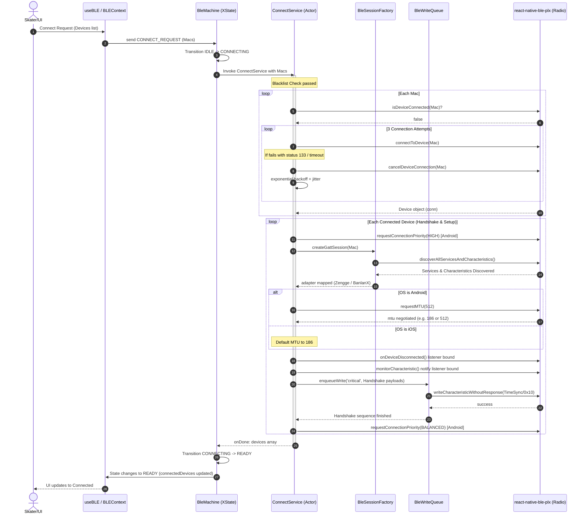

### BLE Write Pipeline

The write pipeline runs asynchronously using debouncing, generation checking, priority queueing, and transient retries:

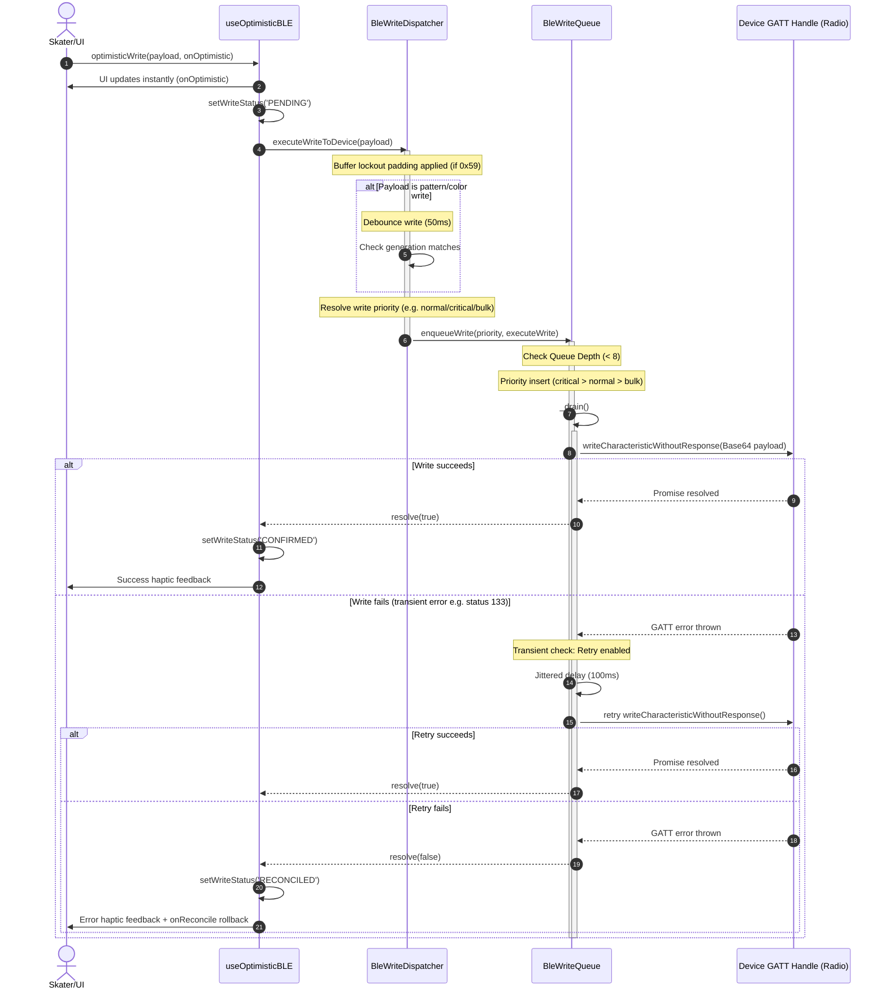

---

## 8. Architectural Impact Flags

None (Read-only cartography audit; no code or architectural modifications performed).

<!-- CARTOGRAPHER_END: BLE_CORE -->

### Domain: GROUP_SYNC
<!-- CARTOGRAPHER_START: GROUP_SYNC -->

# Architectural Cartography: GROUP_SYNC Domain

This document provides a comprehensive, read-only architectural audit of the `GROUP_SYNC` (Group Sync & Swarm) domain in the SK8Lytz codebase, detailing its structures, data models, real-time sync systems, platform variations, and integrations.

---

## 1. File Manifest

### Services & Persistence Layer

*   **`src/services/GroupRepository.ts`**: Implements AsyncStorage local caching and Supabase transactional cloud sync for custom device grouping (Soles/Wheels) using a dynamic `GroupDeviceDelegate` injection pattern.
*   **`src/services/CrewService.ts`**: Coordinates the active crew session lifecycle, managing the real-time Supabase socket connection, state throttling, leader-to-member scene replication, and reconnect logic.
*   **`src/services/CrewProfileService.ts`**: Manages permanent crew definitions, membership controls, demotions, and PostgreSQL database queries for user search and stats.
*   **`src/services/ProfileService.ts`**: Re-exports crew profile methods to act as a unified facade, keeping backward compatibility with legacy layers.

### React Context & Providers

*   **`src/context/CrewContext.tsx`**: Provides unified wizard steps, loading states, form fields, and hook references to all child crew components in the modal context.

### Custom React Hooks

*   **`src/hooks/useCrewHub.ts`**: Orchestrates discovery of nearby public sessions and spot listings by matching user coordinate streams on a 15-second timer.
*   **`src/hooks/useCrewManage.ts`**: Implements client-side forms for crew creation, photo selection, invite codes, and permanent member search results.
*   **`src/hooks/useCrewSession.ts`**: Handles the underlying web-socket lifecycle, wrapping real-time broadcast and presence events into unified react state flags.
*   **`src/hooks/useCrewProximityRadar.ts`**: Runs a background location monitoring sweep to geofence nearby active sessions and rink/skatepark spots within 0.5 miles.
*   **`src/hooks/useDashboardCrew.ts`**: Handles dashboard UI automatic session recovery on boot and replicates active leader scene properties to local hardware commands.
*   **`src/hooks/useDashboardGroups.ts`**: Manages user-selected custom skate groups, collapsible list views, and commands routing for power state updates.

### Overlay UI Components

*   **`src/components/CrewModal.tsx`**: Serves as the primary wizard router overlay navigating between landing, detail, schedule, map, and session controller sheets.
*   **`src/components/CrewMemberDashboard.tsx`**: Bottom sheet dashboard overlay allowing session members to track current speed, elapsed time, and leader-broadcasted colors.

### Step Components (`src/components/crew/*`)

*   **`src/components/crew/CrewControllerScreen.tsx`**: Renders the leader's command center to toggle sync patterns, set colors, configure invite code share overlays, and hand off leadership.
*   **`src/components/crew/CrewCreateScreen.tsx`**: Form container prompting the user to name active sessions, select locations, and configure visibility.
*   **`src/components/crew/CrewDetailScreen.tsx`**: Shows permanent crew profiles, member stats, multi-owner lists, and member demotion buttons.
*   **`src/components/crew/CrewJoinScreen.tsx`**: Provides search inputs for finding active sessions nearby and text inputs to enter 6-character private invite codes.
*   **`src/components/crew/CrewLandingMap.tsx`**: Renders dynamic cluster maps displaying physical skate spots and live crew beacons using `react-native-maps`.
*   **`src/components/crew/CrewLandingMap.web.tsx`**: Fallback layout stub raising alerts that maps are mobile-only on React Native Web.
*   **`src/components/crew/CrewLandingScreen.tsx`**: The main hub view rendering browsing panels, shortcut buttons, and active session lists.
*   **`src/components/crew/CrewManageScreen.tsx`**: Screen prompting users to modify crew details, pick color hues, and upload custom images.
*   **`src/components/crew/CrewScheduleScreen.tsx`**: Renders date-time picker dialogs and spot geocoding lists to schedule sessions in advance.
*   **`src/components/crew/CrewStyles.ts`**: Central stylesheet generating style classes and offsets matching iOS and Android layouts.
*   **`src/components/crew/MapFiltersTray.tsx`**: Toggles visibility of rinks, skateparks, and session beacons on the map layout.

---

## 2. Blast Radius (Dependency Map)

```
        ┌────────────────────────┐
        │    LocationService     │ (Coordinates & spot listings)
        └───────────┬────────────┘
                    │
                    ▼
 ┌───────────────────────────────────────┐
 │         GROUP_SYNC Domain             │
 │  (Crews, Sessions, Custom Groups)     │
 └──────┬─────────────────────────┬──────┘
        │                         │
        ▼                         ▼
 ┌──────────────┐          ┌──────────────┐
 │  Dashboard   │          │   Supabase   │ (Websocket Realtime
 │  Controller  │          │   Database   │  & PostgreSQL RPC)
 └──────────────┘          └──────────────┘
```

### Inward Dependencies (What GROUP_SYNC Imports)
*   **`LocationService`**: Core utility calculating geofences, querying nearby roller rinks/skateparks, and sharing lat/lng payloads.
*   **`SessionShareService`**: Triggers share drawers containing invite codes and location deep links.
*   **`AsyncStorage`**: Local cache targets: custom group definitions (`@Sk8lytz_custom_groups`) and reconnect session keys (`ng_crew_last_session_id`, `ng_crew_display_name`).
*   **`expo-image-picker`**: Provides interface prompts to select images from native iOS/Android device libraries.
*   **`react-native-maps` / `react-native-map-clustering`**: Native iOS/Android map structures and performance-optimized coordinate markers clustering.

### Outward Dependencies (What Imports GROUP_SYNC)
*   **`DashboardScreen` / `MainNavigator`**: Hosts the wizard navigation context and invokes the `CrewModal` and `CrewMemberDashboard` controllers.
*   **`DeviceRepository`**: Listens for group change operations inside `GroupRepository` to register fleet configurations.
*   **`useHardwareNotifications`**: Translates updates into active status banner updates.

---

## 3. Context Matrix

| React Context | Role | Consumed By | Architectural Purpose |
| :--- | :--- | :--- | :--- |
| **`CrewContext`** | **Provides** | All components under `src/components/crew/*` and modal screens. | Supplies wizard step navigation indexes, current text forms, and state variables. |
| **`ThemeContext`** | **Consumes** | `CrewStyles.ts`, `CrewMemberDashboard.tsx` | Applies active dark/light palette parameters and styling constants. |
| **`AuthContext`** | **Consumes** | `CrewModal.tsx`, `useDashboardCrew.ts`, `useDashboardGroups.ts` | Feeds the active user ID and display names into database operations. |
| **`AppConfigContext`** | **Consumes** | `CrewLandingScreen.tsx` | Inspects global flags to selectively toggle map displays. |

---

## 4. Hook/Service I/O Registry

### Services

#### `GroupRepository`
*   **Inputs**:
    *   `setDeviceDelegate(delegate)`: Dynamic injection of `GroupDeviceDelegate`.
    *   `saveGroupTransactional(groupId, groupName, deviceMacs, type, userId)`: Initiates custom group creation.
    *   `deleteGroup(groupId, userId)`: Triggers group removal cascade.
*   **Outputs**:
    *   `getGroups()`: Returns `Promise<CustomGroup[]>`.
    *   `saveGroupTransactional` / `deleteGroup` return `Promise<boolean>` indicating success.
*   **Side-Effects**: Writes records locally to AsyncStorage (`GROUPS_KEY`, `PENDING_GROUP_KEY`) and fires database RPC calls `upsert_group_with_devices` and `delete_group_cascade`.

#### `CrewService`
*   **Inputs**:
    *   `createSession(name, displayName, opts, userId)`: Spawns ephemeral crew session in the cloud.
    *   `joinSession(inviteCode, displayName, userId)`: Joins session via code.
    *   `joinSessionById(sessionId, displayName, userId)`: Joins session via UUID.
    *   `endSession(explicitSessionId, userId)`: Marks session inactive.
    *   `leaveSession(userId)`: Exits current user session.
    *   `broadcastScene(scene, userId)`: Delivers LED command structures to all connected members.
*   **Outputs**:
    *   `currentSession`: React state holding the active `CrewSession` object.
    *   `currentRole`: Returns `'leader'` or `'member'`.
    *   `fetchActiveSessions()`: Returns `Promise<CrewSession[]>`.
    *   `fetchLastScene(sessionId)`: Queries the database for the session's active LED scene state.
*   **Side-Effects**: Subscribes to Supabase Realtime channel `crew:{sessionId}`, manages keep-alive intervals, sets rejoin cache in AsyncStorage, and throttles DB writes.

#### `CrewProfileService`
*   **Inputs**: Permanent crew setup metadata, membership lists, and search queries.
*   **Outputs**: List of crews, stats matrices, and user display tables.
*   **Side-Effects**: Modifies permanent database schemas (`crews`, `crew_memberships`).

### Hooks

#### `useCrewHub`
*   **Inputs**: `visible: boolean`, `step: ModalStep`.
*   **Outputs**: `activeSessions: CrewSession[]`, `myCrews: PermanentCrew[]`, coordinates, loading states.
*   **Side-Effects**: Requests coordinates via `LocationService` and runs database refresh routines on a 15-second interval.

#### `useCrewManage`
*   **Inputs**: `myCrews: PermanentCrew[]` context.
*   **Outputs**: `selectedCrewDetail`, form hooks, color picker actions, and member selection queries.
*   **Side-Effects**: Launches `expo-image-picker` library interface.

#### `useCrewSession`
*   **Inputs**: Configuration triggers (`onSessionReady`, `onSessionLeft`, `onSessionEnded`).
*   **Outputs**: Rejoin indicators and disconnect handlers.
*   **Side-Effects**: Wraps `crewService` subscription channels and monitors socket connection status.

#### `useCrewProximityRadar`
*   **Inputs**: None.
*   **Outputs**: `radarAlert` objects containing nearby matches.
*   **Side-Effects**: Silently fetches GPS coordinates and queries active sessions within range.

#### `useDashboardCrew`
*   **Inputs**: `onApplyScene: (scene: any) => void`.
*   **Outputs**: Rejoin status, leader role indicators, last scene snapshots.
*   **Side-Effects**: Recovers last session on app launch and decodes scene broadcast commands to update device colors.

#### `useDashboardGroups`
*   **Inputs**: Hardware BLE registers and configuration setters.
*   **Outputs**: Group definition tables and toggle actions.
*   **Side-Effects**: Organizes and persists custom groups to local storage.

---

## 5. OS Variance Matrix

### Web Fallback Stubbing
*   **iOS/Android Map rendering (`CrewLandingMap.tsx`)**: Imports native `react-native-maps` and overlays live map components.
*   **Web target maps (`CrewLandingMap.web.tsx`)**: Stubs layout rendering on React Native Web, alerting users that maps are only supported on mobile devices.

### Code Editor Fonts
*   **Invite Code Input**: `CrewManageScreen.tsx` and `CrewJoinScreen.tsx` explicitly fall back to `Courier New` on iOS and generic `monospace` on Android to guarantee character alignments.

### Keyboard Offset Tuning
*   **Layout Adjustments**: `CrewModal.tsx` activates `KeyboardAvoidingView` with `padding` offset behavior only on iOS. Android layouts bypass manual padding adjustments because native window soft-input modes are handled inside the app manifest.

---

## 6. Sequence Diagram (Session Creation & Proximity Radar)

```mermaid
sequenceDiagram
    autonumber
    actor L as Session Leader
    actor M as Nearby Member
    participant Radar as useCrewProximityRadar
    participant LS as Leader Service (CrewService)
    participant MS as Member Service (CrewService)
    database DB as Supabase DB
    participant RT as Supabase Realtime (crew:{sessionId})
    
    %% Session Creation Flow
    rect rgb(30, 30, 40)
        Note over L, DB: 1. Leader Session Creation
        L->>LS: createSession("Friday Shred", "LeaderName")
        LS->>DB: Insert row in crew_sessions (is_active: true, status: 'active')
        DB-->>LS: returns session data (id: "session_123")
        LS->>DB: Insert member record in crew_members (role: 'leader')
        LS->>LS: Cache session ID locally in AsyncStorage
        LS->>RT: Subscribe to presence & member updates on channel `crew:session_123`
        RT-->>LS: Socket Connection Confirmed
    end

    %% Proximity Radar Scan Flow
    rect rgb(45, 45, 55)
        Note over M, DB: 2. Background Proximity Scan
        Radar->>Radar: Periodically fetch coordinates via LocationService
        Radar->>DB: Query active sessions within 0.5 miles (Haversine formula)
        DB-->>Radar: Returns active "session_123" details
        Radar->>M: Display proximity banner: "Friday Shred is skating nearby!"
    end

    %% Session Joining Flow
    rect rgb(40, 30, 30)
        Note over M, DB: 3. Member Join Flow
        M->>MS: joinSessionById("session_123", "MemberName")
        MS->>DB: Verify session validity (is_active = true)
        DB-->>MS: Confirm valid session
        MS->>DB: Insert member record in crew_members (role: 'member')
        MS->>MS: Cache session ID locally in AsyncStorage
        MS->>RT: Subscribe to scene_update & session_ended on channel `crew:session_123`
        RT-->>MS: Socket Connection Confirmed
        MS->>DB: Query `last_scene` column inside `crew_sessions` table
        DB-->>MS: Returns last scene config (e.g. Red Static)
        MS->>M: Send payload to physical skate controller
    end

    %% Real-time Sync Flow
    rect rgb(30, 40, 30)
        Note over L, M: 4. Real-time Color Sync
        L->>LS: broadcastScene(sceneColor: "0x59_Blue")
        Note over LS: Debounce throttle check (150ms)
        LS->>RT: Broadcast 'scene_update' event with payload
        RT-->>MS: Receives 'scene_update' broadcast event
        MS->>M: Send Blue color payload to physical skate controller
        Note over LS: Persistence throttle check (5s)
        LS->>DB: Save scene configuration to `last_scene` column
    end

    %% Session Termination Flow
    rect rgb(30, 30, 40)
        Note over L, M: 5. Leader Session Termination
        L->>LS: endSession()
        LS->>DB: Update crew_sessions row (is_active = false, status: 'ended')
        LS->>RT: Broadcast 'session_ended' event
        RT-->>MS: Receives 'session_ended' broadcast event
        MS->>MS: Disconnect socket & clear local AsyncStorage reconnect cache
        MS->>M: Revert physical skate controller to solo mode
        Note over LS: 500ms delay to allow client disconnections
        LS->>DB: Delete member records in crew_members for "session_123"
        LS->>LS: Disconnect socket & clear local AsyncStorage reconnect cache
        LS->>L: Revert physical skate controller to solo mode
    end
```

---

## 7. Archival Targets

### `tools/SK8Lytz_App_Master_Reference.md`
The following sections are outdated and must be updated to align with the current split services and dynamic geofences:
*   **Section 6: Crew Hub & Session Lifecycle**:
    *   "Automatic `_MM/DD` suffix enforced in `CrewModal.handleCreate`" (line 1116) — `[MOVE_TO_ARCHIVE]`
    *   "Discovery radius filter governed by `LocationService.getNearbyPublicSessions(radiusMi)`" (line 1120) — `[MOVE_TO_ARCHIVE]`. This has been replaced by dynamic views (`public_sessions` view) and direct Haversine calculations within the hooks.
*   **Section 12.2 Auto-Compiled Domain Architecture / Domain: GROUP_SYNC**:
    *   Stale references on lines 1564/1579-1648/2145-2157 describing legacy offline queues should be marked with `[MOVE_TO_ARCHIVE]`.

---

## 8. Architectural Impact Flags

`[IMPACTS_USER_JOURNEY]`
`[IMPACTS_C4_CONTEXT]`
`[IMPACTS_STATE_CHART]`

<!-- CARTOGRAPHER_END: GROUP_SYNC -->

### Domain: UI_SCREENS
<!-- CARTOGRAPHER_START: UI_SCREENS -->

# UI_SCREENS Domain Cartography & Architectural Audit

This document serves as a high-fidelity cartography report for the **UI_SCREENS** (UI Screens & Dashboard) domain of the SK8Lytz mobile application. It maps the visual interfaces, layout hierarchies, state coordination patterns, platform-specific variances, and design conventions used across the main screens and dashboard slabs.

---

## 1. File Manifest

Every file in this domain mapped to its exact architectural purpose:

### Root Screens (`src/screens/*`)
| File | Architectural Purpose |
| :--- | :--- |
| [AuthScreen.tsx](file:///c:/Neogleamz/AG_SK8Lytz_App/SK8Lytz/src/screens/AuthScreen.tsx) | Handles authentication routes, session expiration alerts, credential persistence configuration (via `AsyncStorage`), and mode toggling between Login, Sign-Up, and Forgot Password. |
| [DashboardScreen.tsx](file:///c:/Neogleamz/AG_SK8Lytz_App/SK8Lytz/src/screens/DashboardScreen.tsx) | The centralized BLE state coordinator and top-level shell for the application, hoisting GATT connection states to prevent multi-device race conditions. |
| [HardwareSetupWizardScreen.tsx](file:///c:/Neogleamz/AG_SK8Lytz_App/SK8Lytz/src/screens/Onboarding/HardwareSetupWizardScreen.tsx) | Manages the first-time user onboarding setup flow, scanner sequences, and user-initiated atomic testing of nearby BLE peripherals. |
| [PermissionsOnboardingScreen.tsx](file:///c:/Neogleamz/AG_SK8Lytz_App/SK8Lytz/src/screens/Onboarding/PermissionsOnboardingScreen.tsx) | Gatekeeps app entry by ensuring mandatory location/Bluetooth permissions are granted, and automatically requests BLE access on initial mount. |

### Dashboard Layout Components (`src/components/dashboard/*`)
| File | Architectural Purpose |
| :--- | :--- |
| [CrewHubSlab.tsx](file:///c:/Neogleamz/AG_SK8Lytz_App/SK8Lytz/src/components/dashboard/CrewHubSlab.tsx) | Slab layout component displaying real-time crew session status with a 4-state indicator matrix (Admin Lock, Offline, Session Active, Radar Alert/Empty). |
| [DashboardCrewPanel.tsx](file:///c:/Neogleamz/AG_SK8Lytz_App/SK8Lytz/src/components/dashboard/DashboardCrewPanel.tsx) | Integrates the CrewHubSlab with the CrewModal, orchestrating leader subscription/member subscription and applying cloud-synced light scenes. |
| [DashboardGroupList.tsx](file:///c:/Neogleamz/AG_SK8Lytz_App/SK8Lytz/src/components/dashboard/DashboardGroupList.tsx) | Stub file serving as a blast radius verification anchor for custom group rendering lists. |
| [DashboardHeader.tsx](file:///c:/Neogleamz/AG_SK8Lytz_App/SK8Lytz/src/components/dashboard/DashboardHeader.tsx) | Renders the primary dashboard header, displaying connection states, user account settings, theme toggles, and inline active skate indicators. |
| [DashboardTelemetryHero.tsx](file:///c:/Neogleamz/AG_SK8Lytz_App/SK8Lytz/src/components/dashboard/DashboardTelemetryHero.tsx) | Renders a high-performance SVG-based speedometer and a 6-metric grid (Distance, G-Force, Duration, Avg Speed, Top Speed, Calories Burned). |
| [HardwareStatusPills.tsx](file:///c:/Neogleamz/AG_SK8Lytz_App/SK8Lytz/src/components/dashboard/HardwareStatusPills.tsx) | Extracts and displays low-level hardware specifications from device objects (such as LED points, segment counts, firmware version, and RF remote states). |
| [LiveTelemetryHUD.tsx](file:///c:/Neogleamz/AG_SK8Lytz_App/SK8Lytz/src/components/dashboard/LiveTelemetryHUD.tsx) | Displays a compact, horizontal real-time telemetry HUD overlay at the top of the dashboard containing speed, G-Force, distance, and duration. |
| [MySkatesSlab.tsx](file:///c:/Neogleamz/AG_SK8Lytz_App/SK8Lytz/src/components/dashboard/MySkatesSlab.tsx) | Slab layout component listing registered user groups or prompting the user to open the setup wizard if no devices are paired. |
| [RegisteredFleetSlab.tsx](file:///c:/Neogleamz/AG_SK8Lytz_App/SK8Lytz/src/components/dashboard/RegisteredFleetSlab.tsx) | Slab layout component listing registered individual BLE peripherals, allowing users to collapse the list or enter the setup wizard. |
| [SkateGroupCard.tsx](file:///c:/Neogleamz/AG_SK8Lytz_App/SK8Lytz/src/components/dashboard/SkateGroupCard.tsx) | Renders an interactive group card featuring dynamic gradient overlays, RSSI bar graphs, and quick-action control strips (power, music, camera, favorite). |
| [SupportModal.tsx](file:///c:/Neogleamz/AG_SK8Lytz_App/SK8Lytz/src/components/dashboard/SupportModal.tsx) | Displays support links and portal navigation options in a clean, self-contained overlay window. |

### Shared UI & Helper Components (`src/components/*` & `src/components/shared/*`)
| File | Architectural Purpose |
| :--- | :--- |
| [BLEErrorBoundary.tsx](file:///c:/Neogleamz/AG_SK8Lytz_App/SK8Lytz/src/components/shared/BLEErrorBoundary.tsx) | A crash-shield error boundary component that isolates GATT-dependent components and offers a user-friendly recovery CTA. |
| [DeviceItem.tsx](file:///c:/Neogleamz/AG_SK8Lytz_App/SK8Lytz/src/components/DeviceItem.tsx) | Component rendering individual skate peripheral info, selection checkboxes, RSSI levels, power switches, and current pattern swatches. |
| [LocationPicker.tsx](file:///c:/Neogleamz/AG_SK8Lytz_App/SK8Lytz/src/components/LocationPicker.tsx) | A container coordinate selector that provides geocoding lookups, autocomplete suggestions, location chips, and map thumbnails. |
| [LocationPickerMap.tsx](file:///c:/Neogleamz/AG_SK8Lytz_App/SK8Lytz/src/components/LocationPickerMap.tsx) | Simple wrapper for native `react-native-maps` and marker styling. |
| [LocationPickerMap.web.tsx](file:///c:/Neogleamz/AG_SK8Lytz_App/SK8Lytz/src/components/LocationPickerMap.web.tsx) | A platform fallback stub that safely replaces `react-native-maps` on web bundles to avoid runtime crashes. |
| [SkateSpotBottomSheet.tsx](file:///c:/Neogleamz/AG_SK8Lytz_App/SK8Lytz/src/components/SkateSpotBottomSheet.tsx) | Provides an overlay sheet that allows community verification, surface classifications (e.g., concrete, wood), and indoor/outdoor toggling. |

---

## 2. Blast Radius (Dependency Map)

This domain stands as the interface layer of the app. It consumes system-wide hooks/services and is imported by entry-point components.

### What this domain imports (Outward Dependencies):
1. **Core Contexts**:
   - `ThemeContext` (via `useTheme`) - consumed by almost every visual file to configure colors dynamically.
   - `BLEContext` (via `useContext(BLEContext)`) - consumed by `DashboardScreen` and `HardwareSetupWizardScreen` to invoke GATT methods.
   - `SessionContext` (via `useSession`) - consumed by `DashboardScreen` and `DashboardTelemetryHero` to obtain telemetry statistics.
   - `AppConfigContext` (via `useAppConfig`) - consumed by `DashboardScreen` and `LocationPicker` to toggle visibility gates (like maps).
   - `AuthContext` (via `useAuth`) - consumed by `DashboardScreen` (implicitly via sub-hooks) and entry points.
2. **State & Telemetry Hooks**:
   - `useRegistration` - consumed by `DashboardScreen` and slabs to retrieve configured peripherals.
   - `useDeviceStateLedger` - consumed by `DashboardScreen` and `DeviceItem` to show current pattern colors and names.
   - `useRecentSpots` - consumed by `LocationPicker` to cache recently picked locations locally.
   - `useTelemetryLedger` - consumed by `DashboardScreen` to track active movement stats.
   - `useCrewProximityRadar` - consumed by `DashboardCrewPanel` to listen for nearby active skaters.
3. **Core Services**:
   - `AppLogger` - used across screens to record tracking logs.
   - `CrewService` (via `crewService`) - used by `DashboardCrewPanel` to subscribe/publish light patterns.
   - `SkateSpotsService` - consumed by `SkateSpotBottomSheet` to sync verification changes with Supabase.
   - `PermissionService` - used by `PermissionsOnboardingScreen` to handle system dialogs.
   - `BlePingService` (via `pingDevice`) - used by `HardwareSetupWizardScreen` to perform on-demand blinking.

### What imports this domain (Inward Dependencies):
- [App.tsx](file:///c:/Neogleamz/AG_SK8Lytz_App/SK8Lytz/App.tsx): The root entry file imports and conditionally mounts:
  - `DashboardScreen` (wrapped in `ComplianceGate`)
  - `AuthScreen` (fallback route if not authenticated)
- [components.test.ts](file:///c:/Neogleamz/AG_SK8Lytz_App/SK8Lytz/src/components/__tests__/components.test.ts): Testing suites referencing components for snapshot testing.

---

## 3. Context Matrix

The following React Contexts are consumed or provided within this domain:

| Context | Hook / Consumer | Provided By | Architectural Purpose |
| :--- | :--- | :--- | :--- |
| **ThemeContext** | `useTheme()` | `ThemeProvider` (App.tsx) | Distributes current color values (`Colors`) and `isDark` boolean toggles. |
| **BLEContext** | `React.useContext(BLEContext)` | `BLEProvider` (App.tsx) | Exposes BleManager control API (`scanForPeripherals`, `connectToDevices`, `connectedDevices`). |
| **SessionContext** | `useSession()` | `SessionProvider` (App.tsx) | Feeds live telemetry HUDs with variables like `gpsSpeed`, `peakGForce`, `sessionDurationSec`. |
| **AppConfigContext**| `useAppConfig()` | `AppConfigProvider` (App.tsx) | Checks permissions/visibility gates (e.g. `visibility_maps_tab`) for feature flag evaluation. |
| **AuthContext** | `useAuth()` | `AuthProvider` (App.tsx) | Exposes user session state, email configs, and offline mode triggers. |

---

## 4. Hook/Service I/O Registry

Inputs, outputs, and side-effects of critical domain interfaces:

### `useCrewProximityRadar` (Hook)
- **Input**: None (implicitly subscribes to global geolocation coordinates and active session lists).
- **Output**: `radarAlert: RadarAlert | null` (object containing alert matching types like `PRIVATE_CREW`, `PUBLIC_SESSION`, or `EMPTY_RINK`).
- **Side-Effects**: Runs background loops scanning proximity configurations to verify if an alert criteria is satisfied.

### `executePingDevice` (BlePingService)
- **Input**:
  - `bleManager: BleManager` (Bluetooth hardware manager)
  - `mac: string` (Target BLE MAC address)
  - `blinkPayload: number[]` (GATT multi-color raw payload)
  - `options?: { probe?: boolean; duration?: number; turnOffAtEnd?: boolean; }`
- **Output**: `Promise<PingResult | null>` (returns EEPROM specs like `ledPoints`, `icName`, `segments`, `rfMode` or null).
- **Side-Effects**: Triggers atomic GATT connection sequence: **Connect -> Discover -> Write Green Blink -> Read/Monitor Notify Characteristic -> Query Settings & RF state -> Delay Dwell -> Build Power Off -> Cancel Connection**.

### `useDeviceStateLedger` (Hook)
- **Input**: None (connects directly to AsyncStorage namespaces).
- **Output**: Exposes stable utility methods:
  - `save: (mac: string, state: DevicePatternState) => Promise<void>`
  - `loadSync: (mac: string) => DevicePatternState | null`
- **Side-Effects**: Writes configuration payloads to local storage to persist pattern previews across application restarts.

### `claimAndUpdateSpot` (SkateSpotsService)
- **Input**: `spot: Partial<SkateSpot>` (containing surface type and indoor/outdoor flags).
- **Output**: `Promise<SkateSpot>` (updated spot record from database).
- **Side-Effects**: Syncs local configurations to Supabase backend database, marking community verification attributes.

---

## 5. OS Variance Matrix

Documentation of code paths that branch between iOS, Android, and Web builds:

| Component / File | Platform | Check Condition | Platform-Specific Behavior |
| :--- | :--- | :--- | :--- |
| **DashboardHeader.tsx** | Web | `Platform.OS === 'web'` | Applies CSS-based inline box shadows (`boxShadow: ...`) instead of native shadow props. |
| **DashboardHeader.tsx** | Android / iOS | `Platform.OS !== 'web'` | Uses native shadow properties (`shadowColor`, `shadowOpacity`, `shadowRadius`, `elevation`). |
| **DashboardTelemetryHero.tsx** | Web | `Platform.OS === 'web'` | Injects Web-compatible svg/text shadow filters (`textShadow: ...`) to display glow details without throwing React Native SVG errors. |
| **DashboardTelemetryHero.tsx** | Web / Monoliths | `windowWidth > 600` | Extends gauge widths to 320px for larger web views (normally 340px max on mobile scales). |
| **LocationPickerMap.web.tsx** | Web | `.web.tsx` extension | Serves as a stub replacing native `react-native-maps` to bypass Web bundle crashes (due to missing native bridge modules). |
| **SessionContext.tsx** | iOS | `Platform.OS === 'ios'` | Configures Notifee categories (`setNotificationCategories`) with actions (End, Pause, Resume) to draw control buttons inside iOS notification bubbles. |
| **App.tsx** | Android | `Platform.OS === 'android'` | Requires `react-native-health-connect` to run `initialize()` early on startup to prevent simulator/device exceptions before active views resume. |
| **App.tsx** | Web | `Platform.OS === 'web'` | Binds global `unhandledrejection` promise capture listeners to pipe unexpected web exceptions to logger files. |

---

## 6. Design System & Token Manifest

The UI layout utilizes values from [theme.ts](file:///c:/Neogleamz/AG_SK8Lytz_App/SK8Lytz/src/theme/theme.ts) to construct the "Gleamz" layout system.

### Palette Tokens (Dark vs. Light Modes)
- **Primary Branding (Greenish Cyan)**: `#FF5A00` (Orange) - Used for primary CTA highlights and indicators.
- **Secondary Branding (Amber/Orange)**: `#FFB800` (Amber) - Used for secondary states, warnings, and settings buttons.
- **Accent Details**: `#FF3300` (Accent Orange) in dark mode, `#1B4279` (Deep Blue) in light mode.
- **Core Surface Layout**:
  - *Dark Mode*: Background is `#1B4279`, Surface is `#245596`, Highlight is `#3172C9`.
  - *Light Mode*: Background is `#EAEFF5`, Surface is `#CBD6E2`, Highlight is `#DDE5EE`.

### Typography Style Presets
- **Font Family**: Uses the decorative `'Righteous'` font family (imported via `@expo-google-fonts/righteous`).
- **Typography Matrix**:
  - `header`: `fontSize: 24`, letterSpacing: 2.
  - `title`: `fontSize: 16`, letterSpacing: 0.5.
  - `body`: `fontSize: 14`.
  - `caption`: `fontSize: 11`.

### Spacing & Layout Tokens
- **Padding Metric**: Standardizes layout padding using `Layout.padding = Spacing.lg` (16px).
- **Rounding Metric**: Uses `Layout.borderRadius = Spacing.xl` (24px) for cards, dialog frames, and slabs.
- **Scale Constants**:
  - `xxs`: 2px, `xs`: 4px, `sm`: 8px, `md`: 12px, `lg`: 16px, `xl`: 24px, `xxl`: 32px, `xxxl`: 40px.

### Visual Styling Conventions
1. **Glassmorphism / Neon Highlights**:
   Components like `SkateGroupCard` and `DeviceItem` utilize card overlays (`skateCardRefraction`) containing tilted background lines (`transform: [{ rotate: '45deg' }]`) to simulate frosted glass:
   ```typescript
   skateCardRefraction: {
     position: 'absolute',
     top: -50, left: -50,
     width: 200, height: 200,
     backgroundColor: 'rgba(255, 255, 255, 0.03)',
   }
   ```
2. **Glow Shadows**:
   Shadows are wrapped in platform utility methods to produce custom glow intensities:
   - iOS: Uses `shadowOpacity: 0.8`, `shadowRadius: 8`.
   - Android: Uses `elevation: 8` with shadow color matching the active theme color.
   - Web: Employs custom CSS box/text shadows.
3. **Preset Color Mapping (`getPatternColors`)**:
   Converts light-program configurations (like "Fire", "Sunset", "Ocean") into visual gradient swatches on the dashboard cards:
   - *Fire/Flame*: Gradient `#FF4D00` -> `#FF9E00`.
   - *Water/Ocean*: Gradient `#00B2FF` -> `#00FFF0`.
   - *Neon/Cyber*: Gradient `#FF00E5` -> `#00F0FF`.
   - *Police*: Gradient `#FF0000` -> `#0000FF`.

---

## 7. Sequence Diagram: Onboarding Hardware Setup / Blink-Probe Flow

The following sequence diagram outlines the exact GATT communication lifecycle during setup. When a user clicks **Blink** on a scanned peripheral card in `HardwareSetupWizardScreen.tsx`, the application triggers `pingDevice` in `BlePingService.ts` to connect, identify, query settings, and disconnect:

```mermaid
sequenceDiagram
    autonumber
    actor User
    participant Wizard as HardwareSetupWizardScreen
    participant Ping as BlePingService (pingDevice)
    participant Factory as BleSessionFactory
    participant BLE as BleManager (react-native-ble-plx)
    participant Controller as SK8Lytz Peripheral

    User->>Wizard: Taps "BLINK" on scanned device card
    Wizard->>Ping: executePingDevice(bleManager, mac, blinkPayload)
    
    Note over Ping,Factory: Establish GATT session
    Ping->>Factory: createGattSession(bleManager, mac)
    Factory->>BLE: connectToDevice(mac)
    BLE-->>Controller: [BLE Connect]
    Controller-->>BLE: Connect Success
    Factory->>BLE: discoverAllServicesAndCharacteristics(mac)
    BLE-->>Controller: [Discover GATT Services]
    Controller-->>BLE: Service Maps
    Factory-->>Ping: Return (conn, adapter)

    Note over Ping,Controller: Step 1: Write Blink Payload (Green)
    Ping->>BLE: writeCharacteristicWithoutResponseForDevice(mac, svc, writeChr, b64Blink)
    BLE-->>Controller: Write 0x59 static green program
    Note over Controller: Skates light up green!

    Note over Ping,Controller: Step 2: Probe Hardware Specifications
    Ping->>BLE: monitorCharacteristicForDevice(mac, svc, notifyChr)
    BLE-->>Controller: Subscribe to Notifications
    Ping->>Ping: Wait 400ms for notify monitor initialization
    Ping->>BLE: writeCharacteristicWithoutResponseForDevice(mac, svc, writeChr, b64QuerySettings)
    BLE-->>Controller: Write Query Settings Packet (0xA3 chipset config)
    Controller-->>BLE: Notify settings payload frame
    BLE-->>Ping: Callback with Base64 settings data
    Ping->>Ping: parseSettingsResponse() -> ledPoints, segments, icType

    Ping->>Ping: Wait 200ms
    Ping->>BLE: writeCharacteristicWithoutResponseForDevice(mac, svc, writeChr, b64QueryRfState)
    BLE-->>Controller: Write Query RF Remote Config
    Controller-->>BLE: Notify RF payload frame
    BLE-->>Ping: Callback with Base64 RF state
    Ping->>Ping: parseRfRemoteState() -> rfMode, rfPairedCount

    Note over Ping,Wizard: Step 3: Dwell and Turn Off
    Ping->>Wizard: Update pending card UI in-place with real specs
    Ping->>Ping: Sleep 8000ms (UX Dwell for visual verification)
    
    Ping->>BLE: writeCharacteristicWithoutResponseForDevice(mac, svc, writeChr, b64PowerOff)
    BLE-->>Controller: Write BuildPowerOff Packet
    Note over Controller: Skates turn off lights

    Note over Ping,BLE: Step 4: Disconnect
    deactivate Ping
    Ping->>BLE: cancelDeviceConnection(mac)
    BLE-->>Controller: [BLE Disconnect]
    Ping-->>Wizard: Return hardware configuration object (hwConfig)
    Wizard->>Wizard: Reset card state ("Is Blinking" -> null)
```

<!-- CARTOGRAPHER_END: UI_SCREENS -->

### Domain: UI_DOCKED_CONTROLLER
<!-- CARTOGRAPHER_START: UI_DOCKED_CONTROLLER -->

# 🗺️ SK8Lytz Architecture Audit: UI_DOCKED_CONTROLLER (UI Docked Controller Domain)

This cartography report provides a comprehensive, read-only architectural map of the **UI_DOCKED_CONTROLLER** domain. It details the module responsibilities, dependencies, state-sharing mechanism, hooks integrations, operating system variances, and transaction lifecycles for the core user dashboard controllers and peripheral rendering sub-panels.

---

## 📂 1. File Manifest

Every file within the `UI_DOCKED_CONTROLLER` domain is categorized below with its exact architectural responsibility:

| File path | Architectural Purpose / Responsibility |
| :--- | :--- |
| `src/components/DockedController.tsx` | **Central Hub / Routing Shell:** Manages the active mode state machine, owns the `DockedBus` bridge object, orchestrates optimism checkpoints, coordinates reconnection state replays, and aggregates sub-panel widgets. |
| `src/components/docked/AnalogGauge.tsx` | **Gauge Visualizer Component:** High-performance, memoized SVG-based radial display for real-time speed (MPH) and peak G-force telemetry with dynamic color scaling and danger thresholds. |
| `src/components/docked/BuilderPanel.tsx` | **Gradient Designer Panel:** Custom DIY designer interface allowing manual node configuration, interpolation generation, direction toggles, and direct custom color uploads to physical devices. |
| `src/components/docked/CameraPanel.tsx` | **Camera Color Eyedropper Panel:** Leverages the native device camera view to extract real-time color swatches under an overlay reticle (Sniper mode) or synthesizes three-point linear gradients from a live camera stream (Vibe mode). |
| `src/components/docked/DockedDock.tsx` | **Navigation Dock Panel:** Floating bottom navigation menu supporting animated tab indicators, swipe-gesture controls, device status overlays, and reactive location/camera permission gating. |
| `src/components/docked/FavoritePromptModal.tsx` | **Preset Naming/Deletion Prompt:** Local overlays managing deletion warnings, cancellation, and validation checks for user-saved preset items. |
| `src/components/docked/FavoritesPanel.tsx` | **Presets Browser Panel:** Layout for browsing both local custom saves ("YOURS") and remote administrative/server configurations ("SK8Lytz Picks"). |
| `src/components/docked/MusicPanel.tsx` | **Music Control Panel:** Matrix switcher (LED Bar vs. LED Screen), pattern pills navigator, mic source select (App vs. Device), and responsiveness gates. |
| `src/components/docked/PresetCard.tsx` | **Shared Presets Card Renderer:** A unified visual representation for favorites, rendering speed, brightness, mode icons, and multi-color strip previews. |
| `src/components/docked/ProEffectsPanel.tsx` | **Pro Effects Pattern Grid:** Renders the pattern picker grids for fixed effects, bypassing internal state to utilize the shared `DockedBus` dispatcher directly. |
| `src/components/docked/QuickPresetModal.tsx` | **Preset Persistence Screen:** Modal targeting custom preset renaming, deletion, cloud synchronization, and private/public community publish pipelines. |
| `src/components/docked/SpectrumAnalyzer.tsx` | **Audio Spectrum Visualizer:** Animated reactive multi-bar graph rendering real-time microphone magnitudes (App Mode) or continuous random sine-pulses (Device Mode). |
| `src/components/docked/StreetModeDistributionSlider.tsx` | **Distribution Slider:** Triple-zone drag handler dividing the skate's length into distinct Tail, Cruise, and Head physical sectors. |
| `src/components/docked/StreetPanel.tsx` | **Telemetry Monitor Dashboard:** Overhauls street speed stats, motion states (Braking, Decelerating, Stopped), G-Force dial gauges, top speed records, and session timers. |
| `src/components/docked/UniversalSlidersFooter.tsx` | **Global Control Panel:** Consolidates selected color bars, 10-preset palettes, hue slider arrays, and tactical sliders for brightness/speed/sensitivities. |
| `src/hooks/useDashboardController.tsx` | **Context Interception Hook:** Mount-wraps components to configure theme, crew coordination metadata, active configurations, diagnostics mode, and lazy modal gates. |
| `src/hooks/useDockedControllerState.ts` | **Controller State Aggregation Hook:** Keeps track of active modes, presets, custom gradients, color selections, builder nodes, matrix styles, and modal visibilities. |
| `src/hooks/useControllerDispatch.ts` | **BLE Payload Assembler Hook:** Coordinates device writes to Solo/Group nodes, converting parameters into byte dispatches such as power, static color, fixed pattern, or custom frames. |
| `src/hooks/useControllerAnalytics.ts` | **Telemetry Analytics Hook:** Debounces state telemetry modifications to logs to prevent congestion while maintaining session analytics consistency. |

---

## 💥 2. Blast Radius (Imports & Exports)

This section maps what imports from the `UI_DOCKED_CONTROLLER` domain and what the domain imports from outside.

### Incoming Blast Radius (What Imports this Domain)
- `src/screens/DashboardScreen.tsx`
  - Imports `DockedController` to render it when the user taps on a device/group card.
  - Imports `DockedControllerHandle` to invoke state replays (`replayStateToDevice`) and handle crew changes (`applyCloudScene`).
- `src/components/__tests__/components.test.ts`
  - Mounts `DockedController` for structural validation and smoke tests.

### Outgoing Blast Radius (What this Domain Imports)
- **State & Context Providers:**
  - `src/context/ThemeContext` (`useTheme` for UI color schemes)
  - `src/context/AppConfigContext` (`useAppConfig` for visibility toggles)
  - `src/context/BLEContext` (`useSharedBLE` for active MAC adapters)
  - `src/context/FavoritesContext` (`useSharedFavorites` for presets caching)
- **BLE Protocols & Payload Synthesizers:**
  - `src/protocols/ZenggeProtocol` (Byte converters for `0x27`, `0x26`, `0x59`, `0x74` packets)
  - `src/protocols/PatternEngine` (`SK8LYTZ_TEMPLATES` fixed pattern configuration registry)
  - `src/protocols/PositionalMathBuffer` (Converts color nodes into physical point structures)
- **App Services:**
  - `src/services/AppLogger` (Log dispatching)
  - `src/services/PermissionService` (Check/Request location, camera, mic)
  - `src/services/session/SessionMachine.types` (Validates logging states)
- **Supporting Hooks:**
  - `src/hooks/useOptimisticBLE.ts` (Optimistic dispatch & fallback snap-back)
  - `src/hooks/useDeviceStateLedger.ts` (Persisted state loader)

---

## 🗃️ 3. Context Matrix

The React Context interactions inside the `UI_DOCKED_CONTROLLER` domain are cataloged as follows:

| React Context | Consumer / Provider | Consumed Properties / Actions |
| :--- | :--- | :--- |
| `ThemeContext` | Consumer | `Colors`, `isDark`, `toggleTheme` |
| `AppConfigContext` | Consumer | `isVisibilityAllowed` (gating `STREET` or `CAMERA` modes) |
| `BLEContext` | Consumer | `getAdapterForDevice` (used to acquire MAC-specific adapters) |
| `FavoritesContext` | Consumer | `favorites`, `quickPresets`, `promptState`, `saveFavorite`, `deleteFavorite` |
| `AuthContext` | Consumer | `user` metadata (UUID and username for cloud publishing) |

---

## 🎛️ 4. Hook/Service I/O Registry

### `useAppMicrophone`
- **Inputs:**
  - `activeMode: ModeType` (Triggers mic activation only when `'MUSIC'`)
  - `micSource: 'APP' | 'DEVICE'` (Controls whether local microphone session runs)
  - `isPoweredOn: boolean` (Halts mic session if board is powered off)
  - `writeToDevice?: (payload: number[]) => Promise<any>` (BLE command writer)
- **Outputs:**
  - `audioMagnitude: number` (Normalized magnitude `0.0` to `1.0` with alpha=0.4 smoothing filter)
  - `hasMicPermission: boolean` (Permission status)
  - `requestMicPermission: () => Promise<void>` (Triggers OS microphone request prompt)
- **Side-Effects:**
  - Runs a high-frequency `setInterval` at **20Hz (50ms)** when APP MIC is active.
  - Generates continuous `0x74` music magnitude dispatches to target devices to override their hardware mics.
  - Automatically activates and tears down the native `expo-audio` recording session.

### `useStreetMode`
- **Inputs:**
  - `activeMode: ModeType` (Activates accelerometer listener when `'STREET'`)
  - `writeToDevice` (Direct dispatch callback)
  - `hwSettings`, `points`, `activeProduct`, `brightness`, `speed`, `deviceContext`, `gpsSpeed`, `peakGForce` (Context details)
- **Outputs:**
  - `motionState: MotionState` (Derived from accelerometer G-force: `'STOPPED'`, `'HARD_BRAKING'`, `'SLOWING_DOWN'`, `'ACCELERATING'`, `'CRUISING'`)
  - `motionStateRef: React.MutableRefObject<MotionState>` (State ref avoiding closure stale locks)
  - `isStreetBraking: boolean` (Optimized flag for brake-activated red tail triggers)
  - `streetCruiseColor: string`, `streetBrakeColor: string`
  - `streetDistribution: [number, number, number]` (Zone split ratios)
  - `applyStreetPattern: (state: MotionState) => void` (Calculates and sends zone color payloads)
- **Side-Effects:**
  - Controls native accelerometer sensor subscription (runs at **20Hz** when active).
  - Triggers red flash override commands to LEDs during deceleration events.

### `useControllerDispatch`
- **Inputs:**
  - `writeToDevice: (payload: number[]) => Promise<any>`
  - `hwSettings: IHardwareSettings`
  - `points: number`
  - `connectedDevices: IDeviceState[]`
- **Outputs:**
  - `sendColor(r, g, b): void` (Uploads solid color packet)
  - `applyFixedPattern(patternId, fg, bg, speed, brightness, direction): void` (Assembles `0x27`/`0x26` matrix patterns)
  - `applyStaticModePattern(pattern, r, g, b, speed): void`
  - `handleMusicChange(patternId, sensitivity, brightness, source, primaryColor, secondaryColor, matrixStyle): void` (Dispatches music modes configuration)
  - `setPower(on: boolean): void` (Sends power toggle packets)
  - `setMultiColor(colors: RGB[], points: number, speed: number, direction: number, transition: number): void` (Assembles dynamic multicolor frame arrays)
- **Side-Effects:**
  - Automatically queries `ledger.loadSync` to synchronize cache with board physical bounds on upload execution.

---

## 💻 5. OS Variance Matrix

| Target System | Path / Module | OS Branch Logic / Variance Details |
| :--- | :--- | :--- |
| **Android & iOS (Native)** | `useAppMicrophone.ts` | Integrates `expo-audio` to claim device microphone focus and capture meter metrics. |
| **Web (Demo Simulation)** | `useAppMicrophone.ts` | Bypasses `expo-audio` setup (`Platform.OS === 'web' -> return early`) and returns `audioMagnitude = 0` to prevent runtime crashes. |
| **Android & iOS (Native)** | `useStreetMode.ts` | Subscribes to `expo-sensors` accelerometer stream to compute real G-Force magnitude values. |
| **Web (Demo Simulation)** | `useStreetMode.ts` | Bypasses accelerometer subscription (`Platform.OS === 'web' -> return early`) and uses fake web controls. |
| **Android & iOS (Native)** | `useOptimisticBLE.ts` | Dispatches `expo-haptics` impact events on state adjustments. |
| **Web (Demo Simulation)** | `useOptimisticBLE.ts` | Silently ignores haptic commands (`Platform.OS !== 'web' && !disableHaptics`). |
| **Web (Demo Simulation)** | `CameraPanel.tsx` & `DockedDock.tsx` | Employs CSS styling fallbacks (e.g., `backdropFilter`, `boxShadow`) instead of native shadow props. |

---

## ⛓️ 6. Sequence Diagram: Optimistic BLE Write & Reconciliation

The sequence below details the transactional flow of a user UI interaction that writes to a connected board, including validation checks, state capture, async dispatching, and error-reconciliation snap-back:

```mermaid
sequenceDiagram
    autonumber
    actor User
    participant DC as DockedController
    participant STATE as useDockedControllerState
    participant OPT as useOptimisticBLE
    participant LEDGER as useDeviceStateLedger
    participant BLE as BLEContext / Native BLE
    participant DEV as Physical Skates

    User->>DC: Taps Hue Color Preset (e.g., '#FF00FF')
    DC->>STATE: Update Selected Color State
    DC->>DC: Capture entire current UI State
    Note over DC: captureEntireState() -> stored in lastConfirmedStateRef

    DC->>OPT: optimisticWrite(payload)
    Note over OPT: Set status to PENDING
    OPT->>BLE: writeToDevice(payload)
    
    rect rgb(30, 30, 45)
        Note over BLE, DEV: Asynchronous Transport over Bluetooth GATT
        BLE->>DEV: Sends BLE Packet (0x27 / 0x59)
    end

    alt BLE Write Successful (ACK / Resolve)
        BLE-->>OPT: Promise Resolves (true)
        OPT->>OPT: Set status to RECONCILED (Success)
        DC->>LEDGER: Update cached device state in storage
    else BLE Write Failed / Timeout (Reject)
        BLE-->>OPT: Promise Rejects (error / timeout)
        OPT->>OPT: Set status to RECONCILED (Failed)
        OPT->>DC: Trigger handleReconcile() callback
        DC->>DC: Read lastConfirmedStateRef.current
        DC->>STATE: Restore UI Controls to previous state via applyCloudScene()
        Note over DC, User: UI Snaps back to last successful color
    end
```

---

## 🔍 7. Component Extraction Opportunities

### 1. `FixedPatternPreviewRow` -> Standalone Component
- **Current State:** Embedded inline inside `src/components/DockedController.tsx` (lines 80-128).
- **Extraction Rationale:** This component has its own local `setInterval` animation loops, segment calculations, and layout styling. Keeping it inline pollutes the main monolith controller file.
- **Implementation:** Extract to `src/components/docked/FixedPatternPreviewRow.tsx`. Pass pattern dots data, speed, segment length, and point counts as clean props.

### 2. `Crew Leader Broadcast Effect` -> Custom Hook `useCrewLeaderBroadcast`
- **Current State:** Embedded inside `src/components/DockedController.tsx` (lines 493-509).
- **Extraction Rationale:** Reduces the monolith footprint and decouples crew coordination networking from pure rendering logic.
- **Implementation:** Abstract into `src/hooks/useCrewLeaderBroadcast.ts`, receiving the `crewRole`, `captureEntireState` callback, and state dependencies as arguments.

<!-- CARTOGRAPHER_END: UI_DOCKED_CONTROLLER -->

### Domain: UI_MODALS
<!-- CARTOGRAPHER_START: UI_MODALS -->

# 📐 Architectural Cartography — UI_MODALS Domain

This document provides a comprehensive, read-only architectural map of the `UI_MODALS` domain of the SK8Lytz App codebase. It lists the files, evaluates the dependencies (blast radius), maps React Context interactions, registers service/hook input-outputs, registers OS-specific code paths, details the Design System & Token Manifest, and charts the sequence flows.

---

## 1. File Manifest

Every file within the `UI_MODALS` domain mapped to its specific architectural purpose:

| File Path | Component / Utility | Architectural Purpose |
|:---|:---|:---|
| `src/components/AccountModal.tsx` | `AccountModal` | A monolithic tabbed modal sheet centralizing profile settings, security overrides, crew memberships, registered devices list, skate statistics, and account deletion. |
| `src/components/DeviceSettingsModal.tsx` | `DeviceSettingsModal` | A configuration overlay that interfaces with BLE dispatch queues to configure and write hardware EEPROM parameters (LED count, segment configuration, color sorting, RF pairing). |
| `src/components/CommunityModal.tsx` | `CommunityModal` | An interactive browser sheet loading community-shared and personal cloud presets with preview support using animated LED strip previews. |
| `src/components/GroupSettingsModal.tsx` | `GroupSettingsModal` | A modal drawer facilitating group setup, renaming, and member selection from registered devices, equipped with active BLE range indicators. |
| `src/components/SessionSummaryModal.tsx` | `SessionSummaryModal` | A post-session HUD overlay rendering aggregated metrics (trip distance, speeds, peak G-Force, calories burned) styled with speed-accented glassmorphic cards. [MOVE_TO_ARCHIVE] |
| `src/components/modals/EulaModal.tsx` | `EulaModal` | A legal gateway requiring scroll-to-bottom interaction verification before enabling the user to accept physical safety and photosensitivity waivers. |
| `src/components/modals/GlobalPermissionsModal.tsx` | `GlobalPermissionsModal` | An event-driven wrapper routing system permission requests (location, audio, BLE) via React Native's Modal platform, listening to global trigger events. |
| `src/components/CustomSlider.tsx` | `CustomSlider` | A high-performance PanResponder slider component maintaining local state inputs for smooth rendering, supporting full-spectrum gradient backgrounds. |
| `src/components/TacticalSlider.tsx` | `TacticalSlider` | A borderless flat bar slider rendering custom icons and dynamic colors (speed green-to-red in TURBO mode, white opacities in BRIGHTNESS mode). |
| `src/components/MarqueeText.tsx` | `MarqueeText` | An Animated.Text wrapper measuring container limits to run a loop translation scroll (`translateX`) if the child string exceeds container boundaries. |
| `src/components/ConnectionStrengthBadge.tsx` | `ConnectionStrengthBadge` | A standalone 3-bar signal strength icon mapping raw BLE RSSI values directly to vertical colored bar tiers. [MOVE_TO_ARCHIVE] |

---

## 2. Blast Radius (Imports/Exports)

```mermaid
graph TD
    %% Imports from other domains
    ThemeDomain[theme/theme.ts] -->|Imports tokens & colors| UI_MODALS[UI_MODALS Components]
    AuthContext[context/AuthContext.ts] -->|Imports useAuth| UI_MODALS
    ThemeContext[context/ThemeContext.ts] -->|Imports useTheme| UI_MODALS
    ProfileService[services/ProfileService.ts] -->|Imports profileService| AccountModal
    SupabaseClient[services/supabaseClient.ts] -->|Imports supabase| AccountModal
    ScenesService[services/ScenesService.ts] -->|Imports ScenesService| CommunityModal
    AppLogger[services/AppLogger.ts] -->|Imports AppLogger| UI_MODALS
    ProtocolDispatch[hooks/ble/useProtocolDispatch.ts] -->|Imports useProtocolDispatch| DeviceSettingsModal
    NamingUtils[utils/NamingUtils.ts] -->|Imports NamingUtils| DeviceSettingsModal & GroupSettingsModal

    %% Exports to other domains
    UI_MODALS -->|Exports AccountModal| DashboardScreen[screens/DashboardScreen.tsx]
    UI_MODALS -->|Exports DeviceSettingsModal| DashboardScreen
    UI_MODALS -->|Exports CommunityModal| ControllerDock[components/DockedController.tsx]
    UI_MODALS -->|Exports GroupSettingsModal| DashboardScreen
    UI_MODALS -->|Exports SessionSummaryModal| StreetModeScreen[screens/StreetModeScreen.tsx] [MOVE_TO_ARCHIVE]
    UI_MODALS -->|Exports GlobalPermissionsModal| RootApp[App.tsx]
```

### Incoming Dependencies (What Imports this Domain)
* **`App.tsx`**: Mounts `GlobalPermissionsModal` globally to intercept and prompt for required hardware authorizations.
* **`src/screens/DashboardScreen.tsx`**:
  * Imports `AccountModal` to manage skater profile and telemetry logs.
  * Imports `DeviceSettingsModal` to enable individual device configuration on long-press or tap.
  * Imports `GroupSettingsModal` to create and adjust device groups.
* **`src/components/DockedController.tsx`**: Imports `CommunityModal` to browse, preview, and write community gradients and presets.
* **`src/components/docked/UniversalSlidersFooter.tsx`**: Imports `TacticalSlider` to manage speed, brightness, and sensitivity values.
* **`src/components/docked/PresetCard.tsx`**: Imports `MarqueeText` to render preset names safely.
* **`src/components/PositionalGradientBuilder.tsx`**, `src/components/account/AccountTabProfile.tsx`, `src/components/admin/AdvancedHardwareModal.tsx`, and `src/components/crew/CrewManageScreen.tsx`: Import `CustomSlider` to edit values.

### Outgoing Dependencies (What this Domain Imports)
* **`src/theme/theme.ts`**: Pulls Spacing, Colors, Layout, and Typography design tokens.
* **`src/context/ThemeContext.tsx`**: Consumes `useTheme` for theme palettes.
* **`src/context/AuthContext.tsx`**: Consumes `useAuth` for user identity metadata.
* **`src/services/ProfileService.ts`** and `src/services/supabaseClient.ts`: Database API bounds for user credentials, crew, and membership tracking.
* **`src/services/ScenesService.ts`**: Loads community scenes.
* **`src/services/AppLogger.ts`**: Dispatches logs and telemetry events.
* **`src/hooks/ble/useProtocolDispatch.ts`**: Serializes and sends commands (`0x62`, `0x63`, `0x77`, etc.) down to the BLE connection layer.

---

## 3. Context Matrix

The domain components consume several contexts to maintain styling state and credentials:

| React Context | Consumed By | Purpose | Provider Source |
|:---|:---|:---|:---|
| `ThemeContext` | `AccountModal`, `DeviceSettingsModal`, `CommunityModal`, `SessionSummaryModal`, `EulaModal`, `CustomSlider`, `TacticalSlider` | Applies theme variables (colors, status indicators, and border variables). | `ThemeProvider` (`App.tsx`) |
| `AuthContext` | `AccountModal`, `DeviceSettingsModal`, `CommunityModal` | Exposes skateri'd user session identifiers, handles credential verify queries, and triggers AuthSignOut. | `AuthProvider` (`App.tsx`) |
| `SafeAreaContext` | `DeviceSettingsModal`, `EulaModal` | Restricts layouts above home bars and notches using `useSafeAreaInsets` metrics. | `SafeAreaProvider` (`App.tsx`) |

---

## 4. Hook/Service I/O Registry

### `useAccountOverview` & `useSkateStats` (Injected in `AccountModal.tsx`)
* **Inputs**:
  * `visible`: `boolean` (refetches profile database contents if true).
* **Outputs**:
  * `profile`: `Profile | null` (loaded data).
  * `lifetimeStats`: `{ distance_miles, duration_sec, max_speed_mph, total_sessions } | null`
  * `recentSessions`: `ISessionSnapshot[]` (session array).
  * `handleSaveProfile`: `() => Promise<void>` (commits avatar and name updates).
* **Side-Effects**: Writes configuration updates to AsyncStorage and calls Supabase profile procedures.

### `useProtocolDispatch` (Injected in `DeviceSettingsModal.tsx`)
* **Inputs**: Writes commands targeting `deviceId: string`.
* **Functions Called**:
  * `queryHardwareSettings(false, deviceId)`: Issues `0x63` inquire byte array.
  * `writeSettingsByName(points, segments, stripType, sorting, deviceId)`: Issues `0x62` commit byte array.
  * `setRfRemoteState(mode, false, deviceId)`: Issues `0x77` RF mode command array.
  * `clearRfRemotes(mode, deviceId)`: Clears remote control pairings from the EEPROM.

### `ScenesService` (Injected in `CommunityModal.tsx`)
* **Functions Called**:
  * `ScenesService.fetchCommunityScenes()`: Loads shared scenes.
  * `ScenesService.fetchMyScenes(userId)`: Loads personal scenes.
  * `ScenesService.upvoteScene(sceneId, userId)`: Commits scene votes.
  * `ScenesService.deleteScene(sceneId)`: Deletes personal scenes from the database.

---

## 5. OS Variance Matrix

The UI_MODALS domain incorporates several platform-specific branches to achieve parity across iOS, Android, and Web environments:

| OS target | File & Code Reference | Implementation Detail | Architectural Rationale |
|:---|:---|:---|:---|
| **iOS** vs **Android** | `AccountModal.tsx:L590`<br>`AccountTabCrewz.tsx:L99` | `fontFamily: Platform.OS === 'ios' ? 'Courier New' : 'monospace'` | Guarantees character-width parity inside input fields for verification and invite codes. |
| **Web** vs **Native** | `AccountModal.tsx:L375-384` | Web directly signs out and calls callbacks bypassing the native `Alert.alert` dialog. | `Alert.alert` lacks full DOM compatibility and crashes in default web viewports. |
| **Web** vs **Native** | `SessionSummaryModal.tsx:L210-212` | Web applies standard CSS `boxShadow` values instead of iOS-specific `shadow*` and Android-elevation styles. | Native styling properties like `shadowOpacity` are ignored by React Native Web render engines. |
| **Web** vs **Native** | `CustomSlider.tsx:L95-99` | Web appends `touchAction: 'none'` and `userSelect: 'none'` styles. | Prevents browser scroll events and text-selection popups from intercepting panning gestures. |
| **iOS** vs **Android** | `CommunityModal.tsx:L284`<br>`GlobalPermissionsModal.tsx:L25` | `presentationStyle="pageSheet"` | Produces the card-sheet overlay layout on iOS 13+, falling back to default full-screen modals on Android. |

---

## 6. Sequence Diagrams

### A. Device Settings Hardware Probe and Configuration Save Flow
This sequence details how `DeviceSettingsModal` triggers hardware probing commands, receives async notifications, updates state, and commits modifications.

```mermaid
sequenceDiagram
    autonumber
    actor Skater
    participant UI as DeviceSettingsModal
    participant Disp as useProtocolDispatch
    participant BLE as BleConnectionManager / GATT
    participant DB as AsyncStorage / Supabase

    Skater->>UI: Tap "PROBE" on unconfigured device settings
    UI->>UI: Set probeStatus = 'connecting'
    UI->>Disp: queryHardwareSettings(false, deviceId)
    Disp->>BLE: Write 0x63 EEPROM inquiry command
    BLE-->>UI: Receive notify callback (new points/segments/sorting)
    Note over UI: React useEffect detects initialSettings changes
    UI->>UI: Update input values, set probeStatus = 'complete'
    
    rect rgb(20, 20, 30)
        Note over Skater, DB: Skater modifies configurations and saves
        Skater->>UI: Tap "SAVE CONFIG"
        UI->>DB: Invoke onSave() to persist fleet changes
        UI->>Disp: writeSettingsByName(points, segments, strip, sorting, deviceId)
        Disp->>BLE: Enqueue 0x62 EEPROM write command
        UI->>Skater: Close Modal
    end
```

### B. Cloud Scene Application Flow
Details the pipeline that fetches, previews, and writes community shared gradients.

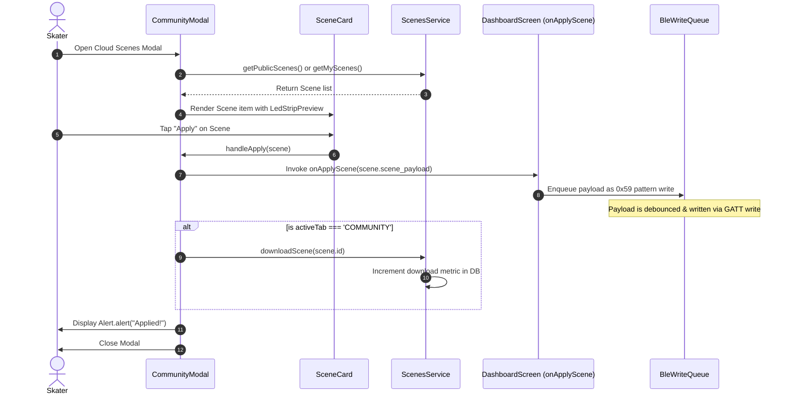

---

## 7. Design System & Token Manifest

The custom components and modals follow a strict set of design system tokens:

### A. Color Tokens
* **Dark Background**: `#111` or `#1B4279` (Deep Slate Glass)
* **Dark Surface**: `Colors.surface` (`#245596`)
* **Dark Surface Highlight**: `Colors.surfaceHighlight` (`#3172C9`)
* **Primary Brand Accent**: `#FF5A00` (SK8Lytz Orange)
* **Secondary Brand Accent**: `#FFB800` (Amber)
* **Signal Quality Colors**:
  * **Excellent (RSSI ≥ -60 dBm)**: Green (`#4CAF50`)
  * **Good (-60 to -75 dBm)**: Amber (`#FFC107`)
  * **Weak (-75 to -82 dBm)**: Orange (`#FF6B35`)
  * **Critical (< -82 dBm)**: Red (`#F44336`)
  * **Inactive**: Gray (`#3A3A3A`)

### B. Typography (Font Family: 'Righteous')
* **Headers**: `fontSize: 24, letterSpacing: 2, textTransform: 'uppercase'`
* **Titles**: `fontSize: 16, letterSpacing: 0.5`
* **Body / Paragraphs**: `fontSize: 14, lineHeight: 22`
* **Captions / Labels**: `fontSize: 11`

### C. Layout Elements
* **Standard Padding**: `Spacing.lg` (16px) or `Spacing.xl` (24px)
* **Border Radius**: `Layout.borderRadius` (24px) or `16px` for metrics tiles.
* **Modal Overlay**: `rgba(0,0,0,0.85)` or `rgba(0,0,0,0.7)` for dark backdrop overlay.

---

## 8. Architectural Impact Flags

* `[IMPACTS_USER_JOURNEY]` — The modal flows directly affect the core user experience when managing groups, tweaking strip lengths, reviewing logs, and downloading community presets.
* `[IMPACTS_STATE_CHART]` — Probing and saving settings directly triggers state transitions in the BLE adapter services and updates device status values in `BleMachine`.

---

## 9. Archival Ledger (`[MOVE_TO_ARCHIVE]`)

Stale references and outdated layout policies found in `tools/SK8Lytz_App_Master_Reference.md`:
* **Monolithic Dashboard UI Layout (4-Slab Architecture)**: Mapped under line 308. Superceded by tabbed sub-elements. **Archival recommended**.
* **AccountModal Domain stale registers**: Stale hooks (`useDeviceFleet`) tagged with `[MOVE_TO_ARCHIVE]` on line 958. Device registrations are handled by shared state properties passed down from the root layout instead of independent Supabase triggers inside the modal.

<!-- CARTOGRAPHER_END: UI_MODALS -->

### Domain: UI_VISUALIZER
<!-- CARTOGRAPHER_START: UI_VISUALIZER -->

# UI_VISUALIZER Domain Architectural Cartography

This document provides a comprehensive, read-only architectural audit of the `UI_VISUALIZER` domain in the SK8Lytz codebase, detailing component functions, dependency interfaces, state contexts, data mapping registers, OS platform deviations, runtime sequence flows, and the Design System tokens.

---

## 1. File Manifest

Every file in the `UI_VISUALIZER` domain mapped to its exact architectural purpose:

| File | Path | Architectural Purpose |
|---|---|---|
| **VisualizerUnit** | [VisualizerUnit.tsx](file:///c:/Neogleamz/AG_SK8Lytz_App/SK8Lytz/src/components/VisualizerUnit.tsx) | Computes coordinate-math layouts and renders physical LED paths (`RING`, `DUAL_STRIP`, `OVAL`) using a multi-layer glow simulation model, throttled to 30 FPS on web and 60 FPS on native. |
| **ProductVisualizer** | [ProductVisualizer.tsx](file:///c:/Neogleamz/AG_SK8Lytz_App/SK8Lytz/src/components/ProductVisualizer.tsx) | Outer wrapper component managing the shared `Animated.Value` timer loop to drive synchronous animation ticks for single or paired skate visualizer units. |
| **LEDStripPreview** | [LEDStripPreview.tsx](file:///c:/Neogleamz/AG_SK8Lytz_App/SK8Lytz/src/components/LEDStripPreview.tsx) | Renders a 2D linear row of colored blocks to preview pattern engine effects, optimized with hash-based change checks and 30 FPS timers. |
| **CustomEffectVisualizer** | [CustomEffectVisualizer.tsx](file:///c:/Neogleamz/AG_SK8Lytz_App/SK8Lytz/src/components/CustomEffectVisualizer.tsx) | Renders a small horizontal row of circular LED dots to preview custom effects with dynamic timing adjustments for breathing/static/scrolling transitions. |
| **NeonHueStrip** | [NeonHueStrip.tsx](file:///c:/Neogleamz/AG_SK8Lytz_App/SK8Lytz/src/components/NeonHueStrip.tsx) | Renders a full-spectrum linear color strip using `LinearGradient` and implements a dedicated `PanResponder` gesture responder for lag-free local slider changes. |
| **PositionalGradientBuilder** | [PositionalGradientBuilder.tsx](file:///c:/Neogleamz/AG_SK8Lytz_App/SK8Lytz/src/components/PositionalGradientBuilder.tsx) | Visual node editor allowing users to insert, remove, position, and color-code pins on a 0-100% strip, and dispatch generated RGB arrays over BLE with 100ms throttle protection. |
| **VerticalPatternDrum** | [VerticalPatternDrum.tsx](file:///c:/Neogleamz/AG_SK8Lytz_App/SK8Lytz/src/components/VerticalPatternDrum.tsx) | An infinite-scrolling vertical selector wheel mapping list positions to pattern IDs, designed with haptic reticle overlays and 3D shadow masks. |
| **GradientLibraryTab** | [GradientLibraryTab.tsx](file:///c:/Neogleamz/AG_SK8Lytz_App/SK8Lytz/src/components/patterns/GradientLibraryTab.tsx) | Displays a list of custom and built-in gradients in a two-column grid showing 12-block static strips generated by the positional buffer. |
| **PatternCard** | [PatternCard.tsx](file:///c:/Neogleamz/AG_SK8Lytz_App/SK8Lytz/src/components/patterns/PatternCard.tsx) | Renders a pattern selection card with glassmorphism overlays, required color indicators (FG/BG dots), and an embedded live `LEDStripPreview`. |
| **PatternPickerTab** | [PatternPickerTab.tsx](file:///c:/Neogleamz/AG_SK8Lytz_App/SK8Lytz/src/components/patterns/PatternPickerTab.tsx) | Categorized grid layout selector for patterns utilizing an `onViewableItemsChanged` flatlist viewport gate that automatically pauses/plays individual card animations to conserve CPU. |
| **UnifiedPatternPicker** | [UnifiedPatternPicker.tsx](file:///c:/Neogleamz/AG_SK8Lytz_App/SK8Lytz/src/components/patterns/UnifiedPatternPicker.tsx) | Coordinates pattern card selection and delegates hex-to-rgb conversion and `0x59` BLE payload packaging to the dispatcher. |
| **CameraTracker (iOS/Android)** | [CameraTracker.tsx](file:///c:/Neogleamz/AG_SK8Lytz_App/SK8Lytz/src/components/CameraTracker.tsx) | Integrates `react-native-vision-camera` feed with a native GPU frame resizer worklet running at 5Hz to extract environment colors (Sniper/Vibe modes). |
| **CameraTracker (Web)** | [CameraTracker.web.tsx](file:///c:/Neogleamz/AG_SK8Lytz_App/SK8Lytz/src/components/CameraTracker.web.tsx) | Stubs out the camera tracking interface for non-native environments (Expo Web) to prevent compiler and bundler failures on missing JSI packages. |
| **CameraTracker Types** | [CameraTracker.d.ts](file:///c:/Neogleamz/AG_SK8Lytz_App/SK8Lytz/src/components/CameraTracker.d.ts) | Core TypeScript interface declaration mapping props and types across native and web CameraTracker components. |

---

## 2. Blast Radius (Imports & Exports)

Cross-domain dependency mappings mapping what this domain relies upon and what consumes its modules:

```
[External Contexts / Modules]
        │
        ▼ (Imports)
┌────────────────────────────────────────────────────────────────────────┐
│ UI_VISUALIZER Domain                                                   │
│                                                                        │
│  protocols/PatternEngine.ts        ◄─── (Frame calculations & opcodes) │
│  protocols/PositionalMathBuffer.ts ◄─── (Gradient pixel interpolation) │
│  protocols/ZenggeProtocol.ts        ◄─── (Opcode binary serialization)  │
│  hooks/useGradients.ts             ◄─── (Loads custom presets)         │
│  services/PermissionService.ts     ◄─── (Native camera permissions)    │
│  utils/kMeansPalette.ts            ◄─── (Dominant color extraction)    │
└────────────────────────────────────────────────────────────────────────┘
        │
        ▼ (Exports)
[Consumer Panels]
  - components/docked/ProEffectsPanel.tsx   ◄── (UnifiedPatternPicker)
  - components/docked/BuilderPanel.tsx      ◄── (PositionalGradientBuilder)
  - components/docked/CameraPanel.tsx       ◄── (CameraTracker)
  - components/docked/UniversalSliders.tsx  ◄── (NeonHueStrip)
  - components/admin/tools/Scheduler.tsx    ◄── (PositionalGradientBuilder)
  - components/DockedController.tsx         ◄── (ProductVisualizer)
```

---

## 3. Context Matrix

Usage of React Contexts consumed by the `UI_VISUALIZER` components:

| Context | Hook / Consumer | Purpose | Scope |
|---|---|---|---|
| **ThemeContext** | `useTheme` / `VisualizerUnit`, `ProductVisualizer`, `NeonHueStrip`, `PositionalGradientBuilder`, `VerticalPatternDrum`, `UnifiedPatternPicker` | Receives theme updates (light/dark mode toggle) and provides the active brand color variables to UI elements. | Read-Only |
| **AuthContext** | `useAuth` / `useGradients` | Accesses the active skateri'd `user.id` to load custom gradients from Supabase. | Read-Only |

---

## 4. Hook/Service I/O Registry

Detailed parameters, outputs, and side-effects for hooks and services used within the visualizer domain:

### `useGradients` (Hook)
* **Inputs:** None (reads user session internally from `AuthContext`).
* **Outputs:**
  * `gradients`: `CustomBuilderPreset[]` — Loaded gradient models.
  * `isLoading`: `boolean` — Current fetch status.
  * `status`: `'idle' | 'loading' | 'error' | 'success'` — FSM state.
  * `error`: `string | null` — Last error message.
  * `saveGradient`: `(preset: Partial<CustomBuilderPreset>) => Promise<void>` — Saves/updates gradient.
  * `deleteGradient`: `(id: string) => Promise<void>` — Deletes custom gradient.
  * `refreshGradients`: `() => Promise<void>` — Forces database refetch.
* **Side-effects:**
  * Fetches user presets from the `GradientsService` Supabase client on mount.
  * Triggers event logs to `AppLogger.error()` on failures.
  * Increments `favorites_created` user telemetry counter on new saves.

### `extractKMeansPalette` (Service Helper)
* **Inputs:**
  * `pixels`: `RGB[]` — Source pixel buffer array.
  * `k`: `number` — Target centroid cluster count (hardcoded to `3`).
  * `maxIterations`: `number` — Convergence limit (hardcoded to `5`).
* **Outputs:** `RGB[]` — Extracted dominant centroids.
* **Side-effects:** None (pure mathematical clustering).

---

## 5. OS Variance Matrix

Critical path branches and execution differences between target platforms (iOS, Android, Web):

| File / Component | Platform / API | Branching Mechanism | Architectural Difference |
|---|---|---|---|
| **CameraTracker** | **Web / Expo Web** | `.web.tsx` file resolution override | Renders a standard message component saying "Camera Not Available". Prevents web bundler crashes on native-only packages (`react-native-vision-camera`, `react-native-worklets-core`). |
| **CameraTracker** | **iOS & Android** | `.tsx` file execution | Renders raw camera stream. Spawns high-performance C++ worklet frames to sample colors at 5Hz using JSI buffers. |
| **VisualizerUnit** | **Web vs Native** | `Platform.OS === 'web'` | Throttles frame rates. Web runs at **30 FPS** to prevent JS MessageQueue flooding. Native runs at **60 FPS** (or uncapped). |
| **PatternPickerTab** | **Web vs Native** | `Platform.OS !== 'web'` | Disables Animated Native Driver on Web (`useNativeDriver: false`) for category pill scale transforms to avoid styling compiler warnings. |
| **Shadows & Glow** | **iOS vs Android** | `Platform.select()` in `theme.ts` | Shadow render engine variances. iOS uses `shadowColor`/`shadowOpacity`/`shadowRadius` styles. Android uses `elevation` and `shadowColor` properties. |

---

## 6. Sequence Diagram: Camera-to-BLE Color Loop

The diagram below maps the runtime flow of environment color tracking, processing on the JSI boundary, updating state within React, and executing a serialized dispatch to the skate hardware over BLE:

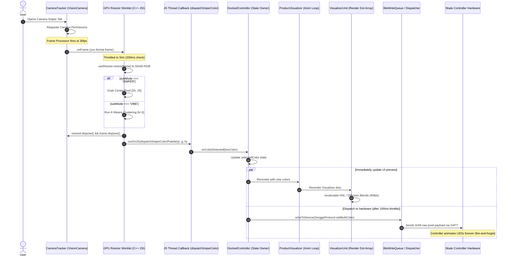

---

## 7. Design System & Token Manifest

The visualizer domain is governed by the core token specifications from `src/theme/theme.ts` alongside visualizer-specific optical metrics:

### Core Tokens
* **Brand Theme Colors:**
  * **Brand Blue:** `#1B4279` / `#245596`
  * **Brand Orange:** `#FF5A00`
  * **Brand Amber:** `#FFB800`
* **Theme Palettes:**
  * **Dark Mode:**
    * background: `#1B4279`
    * surface: `#245596`
    * surfaceHighlight: `#3172C9`
    * primary: `#FF5A00`
    * secondary: `#FFB800`
    * accent: `#FF3300`
    * text: `#FFFFFF`
    * textMuted: `#A0B4CF`
    * textDim: `#6B85A0`
    * border: `#2E5FA3`
  * **Light Mode:**
    * background: `#EAEFF5`
    * surface: `#CBD6E2`
    * surfaceHighlight: `#DDE5EE`
    * primary: `#FF5A00`
    * secondary: `#FFB800`
    * accent: `#1B4279`
    * text: `#0A1C38`
    * textMuted: `#5C7491`
    * textDim: `#8A9EB5`
    * border: `#B0C0D0`
* **Typography (Family: `Righteous`):**
  * `header`: `fontSize: 24`, `letterSpacing: 2`, `textTransform: 'uppercase'`
  * `title`: `fontSize: 16`, `letterSpacing: 0.5`
  * `body`: `fontSize: 14`
  * `caption`: `fontSize: 11`
* **Spacing Scale:**
  * `xxs`: 2, `xs`: 4, `sm`: 8, `md`: 12, `lg`: 16, `xl`: 24, `xxl`: 32, `xxxl`: 40, `huge`: 48, `giant`: 64
* **Layout:**
  * `padding`: `Spacing.lg` (16)
  * `borderRadius`: `Spacing.xl` (24)

### Visualizer Geometry & Physics Specs
* **Scale Factor:** `S = 0.38` (shrinks coordinates to fit preview containers).
* **Hardware Profile Maps:**
  * **HALOZ:** Layout Shape `RING`, 8 addressable LEDs per segment, 2 segments (16 total physical), LED dot diameter `7.6`mm, base layout size `60`x`90`px, `isMirrored: false` (hardware duplicates segment 1 to segment 2 automatically).
  * **SOULZ:** Layout Shape `OVAL`, 43 addressable LEDs per segment, 1 segment (86 total physical across 2 boots, Y-wired), LED dot diameter `5.7`mm, base layout size `55`x`115`px, `isMirrored: false`.
  * **RAILZ:** Layout Shape `DUAL_STRIP`, 30 addressable LEDs per segment, 2 segments (30 total physical), LED dot diameter `5.0`mm, base layout size `80`x`120`px, `isMirrored: true` (software-mirrored vertical strips), separation distance `32`mm.
* **Optical Diffusion Layer Model:**
  * **Layer 3 (Atmospheric Scatter):** `5.5`× diameter, opacity `0.03`
  * **Layer 2 (Silicone Bloom):** `3.2`× diameter, opacity `0.10`
  * **Layer 1 (Concentrated Halo):** `1.7`× diameter, opacity `0.38`
  * **Main Emitter Body:** `1.0`× diameter, active color
  * **Emitter Core Hotspot:** `0.32`× diameter, color `'rgba(255,255,255,0.55)'`
  * **Silicon Outer Glaze:** `1.0`× diameter, color `'rgba(255,255,255,0.09)'`, border `0.5px`, color `'rgba(255,255,255,0.05)'`

<!-- CARTOGRAPHER_END: UI_VISUALIZER -->

### Domain: DATA_LAYER
<!-- CARTOGRAPHER_START: DATA_LAYER -->

# 🗺️ DATA_LAYER Architectural Cartography Report

This document details the read-only architectural audit of the data persistence, synchronization, and caching layer of the SK8Lytz App.

---

## 1. File Manifest

Every file in the `DATA_LAYER` domain is catalogued below with its canonical architectural purpose:

| File Path | Architectural Purpose |
| :--- | :--- |
| `src/services/DeviceRepository.ts` | Local-first, cloud-second Single Source of Truth (SSOT) for registering, configuring, mutating, and tombstoning devices and custom groups. |
| `src/services/TelemetryService.ts` | Utility for parsing raw BLE write payloads and error strings to extract payload sizes, operation types, and GATT status codes (e.g. status 133). |
| `src/services/ScenesService.ts` | Manages creation, local AsyncStorage caching, background Supabase sync, downloading, and upvoting of lighting scenes. |
| `src/services/SpeedTrackingService.ts` | Captures and persists live session metrics, caches lifetime statistics, and queues session data to be uploaded to Supabase. |
| `src/services/GradientsService.ts` | Handles local persistence and cloud synchronization for custom lighting gradient presets created via the positional mathematical editor. |
| `src/services/SkateSpotsService.ts` | Coordinates cache-first fetching of skate spots, claim updates to crowdsourced spots, and fallback querying to OpenStreetMap Nominatim endpoints. |
| `src/services/SessionShareService.ts` | Generates textual sharing invites for sessions and triggers the native OS Share Sheet wrapper. |
| `src/types/supabase.ts` | Auto-generated TypeScript type definitions representing the complete remote relational schema on Supabase. |
| `src/services/supabaseClient.ts` | Instantiates the Supabase JS client with custom Expo SecureStore adapters and provides structural fallback mocks when offline. |
| `src/hooks/cloud/useOfflineSyncWorker.ts` | Periodic background interval worker (60s loop) that triggers scenes, sessions, and telemetry log uploads to the cloud. |
| `src/hooks/useFavorites.ts` | Coordinates stateful loading, saving, naming, and deleting of user-saved presets and quick presets. |
| `src/hooks/useScenes.ts` | Exposes local scene list retrieval and removal state hooks to the UI, delegating queries to `ScenesService`. |
| `src/hooks/useCuratedPicks.ts` | Implements stale-while-revalidate fetching of curated lighting picks from `sk8lytz_picks` with active status validation. |
| `src/hooks/useGradients.ts` | Exposes custom gradient listings and mutation states, delegating queries to `GradientsService`. |
| `src/hooks/useSkateStats.ts` | Lazily loads and caches lifetime statistics and historical session files when the stats view is rendered. |
| `src/hooks/useRecentSpots.ts` | Manages a capped list (last 10 entries) of recently visited or tapped spots using AsyncStorage. |
| `src/hooks/useMapFilters.ts` | Manages map filtering matrices (rinks, parks, shops, sessions) and applies filtering checks. |
| `src/context/FavoritesContext.tsx` | Context provider that exposes a shared singleton projection of `useFavorites` states across react components. |

---

## 2. Blast Radius (Imports/Exports)

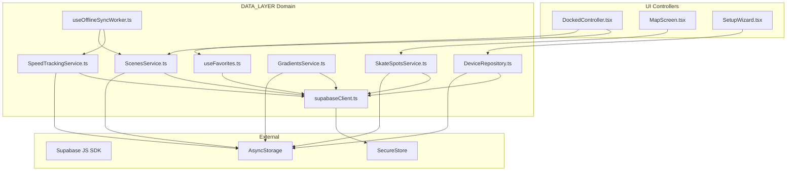

### Incoming Dependencies (What Imports this Domain)
*   **Screens**: `DashboardScreen.tsx`, `StreetModeScreen.tsx`, and `MapScreen.tsx` import hooks to display lists of favorites, spots, or historical stats.
*   **UI Controllers**: `DockedController.tsx` and its panels import `useFavorites` and `ScenesService` to write/load settings.
*   **Wizards**: `HardwareSetupWizardScreen` imports `DeviceRepository` to write claims.

### Outgoing Dependencies (What this Domain Imports)
*   **React Native / Expo Modules**: `@react-native-async-storage/async-storage`, `expo-secure-store`, and native modules.
*   **Cloud Frameworks**: `@supabase/supabase-js` to establish cloud connectivity.

---

## 3. Context Matrix

This domain consumes and provides the following React Contexts:

*   **AuthContext (`useAuth`)**:
    *   *Consumed by*: `useOfflineSyncWorker.ts`, `useFavorites.ts`, `useScenes.ts`, `useGradients.ts`, `useSkateStats.ts`.
    *   *Purpose*: Obtains the currently authenticated `user.id` to route cloud reads/writes and prevent sync cycles for anonymous sessions.
*   **FavoritesContext (`FavoritesProvider` / `useSharedFavorites`)**:
    *   *Provided by*: `FavoritesContext.tsx` (wrapping `useFavorites.ts` base hook).
    *   *Consumed by*: UI controller components (e.g. `DockedController.tsx`).
    *   *Purpose*: Provides a single global registry of active presets, quick presets, loading states, and mutation callbacks to prevent redundant fetches.

---

## 4. Hook/Service I/O Registry

### `DeviceRepository` (Singleton Service)
*   **`initialize()`**:
    *   *Input*: None.
    *   *Output*: `Promise<void>`.
    *   *Side-effects*: Reads cached device arrays, custom settings maps, and tombstone lists from AsyncStorage to build the in-memory cache.
*   **`saveDevice(device, userId)`**:
    *   *Input*: `device: Partial<RegisteredDevice> & { device_mac: string }`, `userId?: string`.
    *   *Output*: `Promise<boolean>`.
    *   *Side-effects*: Updates memory cache immutably, removes matching MAC address from the local tombstone list, writes to local storage, and invokes Supabase group transaction RPCs or queues details to the offline sync key if the network fails.
*   **`deleteDevice(deviceMac, userId)`**:
    *   *Input*: `deviceMac: string`, `userId?: string`.
    *   *Output*: `Promise<void>`.
    *   *Side-effects*: Adds MAC to the local tombstone list, filters the device out of memory arrays, wipes specific device settings configs, and issues a DELETE query to Supabase.
*   **`syncFromCloud(userId)`**:
    *   *Input*: `userId?: string`.
    *   *Output*: `Promise<RegisteredDevice[]>`.
    *   *Side-effects*: Queries remote `registered_devices`, filters out records in the local tombstone list, merges settings priorities (local updates override defaults), and flushes unsynced local creations or tombstoned deletes.

### `ScenesService` (Singleton Service)
*   **`getPublicScenes(limit, offset)`**:
    *   *Input*: `limit?: number`, `offset?: number`.
    *   *Output*: `Promise<ICloudScene[]>`.
    *   *Side-effects*: Tries cache first, returns data, triggers background sync from Supabase, and caches locally under `@Sk8lytz_Scenes`.
*   **`saveScene(scene, userId)`**:
    *   *Input*: `scene: Scene`, `userId?: string`.
    *   *Output*: `Promise<boolean>`.
    *   *Side-effects*: Inserts or updates matching IDs locally and appends a `SceneSyncJob` to local storage queue `@Sk8lytz_Scene_Sync_Queue`.
*   **`flushSyncQueue(userId)`**:
    *   *Input*: `userId: string`.
    *   *Output*: `Promise<void>`.
    *   *Side-effects*: Executes batch inserts and deletes of scenes to Supabase, resolving the queue file once complete.

### `SpeedTrackingService` (Singleton Service)
*   **`saveSession(snapshot, userId)`**:
    *   *Input*: `snapshot: ISessionSnapshot`, `userId: string | null`.
    *   *Output*: `Promise<string | null>`.
    *   *Side-effects*: Estimating calories via MET formula, inserting row to `skate_sessions` on Supabase, or caching locally in `@Sk8lytz_PendingSessionQueue` if offline. Updates lifetime user stats when online.
*   **`flushPendingSessionQueue(userId)`**:
    *   *Input*: `userId: string | null`.
    *   *Output*: `Promise<void>`.
    *   *Side-effects*: Pulls local queue, iterates, and executes insertion of offline rows. Syncs totals back to the user profiles.

---

## 5. OS Variance Matrix

*   **Dynamic Download & App Store URIs** (`SessionShareService.ts`):
    *   Standardized deep links are built via React Native's `Platform.select`:
        *   **iOS**: `https://apps.apple.com/app/sk8lytz`
        *   **Android**: `https://play.google.com/store/apps/details?id=com.neogleamz.sk8lytz`
*   **Native Share Sheet Payload Structure** (`SessionShareService.ts`):
    *   iOS requires passing links inside the distinct `url` argument to force rendering of rich preview cards:
        ```typescript
        ...(Platform.OS === 'ios' ? { url: APP_LINK } : {})
        ```
*   **Supabase Session Persistence Engine** (`supabaseClient.ts`):
    *   Resolves adapters depending on the compilation profile:
        *   **Web/Expo-Go-Web**: Employs `localStorage`.
        *   **Native (iOS/Android)**: Implements asynchronous Expo SecureStore APIs (`SecureStore.getItemAsync`, `SecureStore.setItemAsync`, `SecureStore.deleteItemAsync`) to store and retrieve authentication session tokens securely.

---

## 6. Database Schema & RLS Policies

Here are the details for tables mapping to this domain:

### `registered_devices`
*   **Columns**:
    *   `id`: `uuid` (PK)
    *   `device_mac`: `text` (Unique per user)
    *   `user_id`: `uuid` (FK to `auth.users`)
    *   `device_name`: `text`
    *   `custom_name`: `text`
    *   `position`: `text`
    *   `group_id`: `uuid` (FK to `registered_groups`)
    *   `group_name`: `text`
    *   `points`: `integer`
    *   `led_points`: `integer`
    *   `segments`: `integer`
    *   `sorting`: `integer`
    *   `strip_type`: `integer`
    *   `firmware_ver`: `text`
    *   `led_version`: `text`
    *   `product_id`: `text`
    *   `is_pending_sync`: `boolean`
    *   `created_at`: `timestamp with time zone`
    *   `updated_at`: `timestamp with time zone`
*   **Indexes**:
    *   `registered_devices_pkey` ON `id`
    *   `registered_devices_device_mac_key` ON `device_mac`
    *   `registered_devices_user_id_idx` ON `user_id`
*   **RLS Policies**:
    *   *Enable all actions for users based on user_id*:
        ```sql
        CREATE POLICY "Allow individual CRUD" ON registered_devices
        FOR ALL USING (auth.uid() = user_id);
        ```

### `user_saved_presets`
*   **Columns**:
    *   `id`: `uuid` (PK)
    *   `user_id`: `uuid` (FK to `auth.users`)
    *   `name`: `text`
    *   `fill_mode`: `text` (e.g. `'FAVORITE'`, `'GRADIENT'`, `'SCENE'`)
    *   `transition_type`: `integer`
    *   `nodes`: `jsonb` (Holds color array steps or custom gradient coordinate parameters)
    *   `created_at`: `timestamp with time zone`
    *   `updated_at`: `timestamp with time zone`
*   **RLS Policies**:
    *   *Allow individual CRUD*:
        ```sql
        CREATE POLICY "Allow individual CRUD" ON user_saved_presets
        FOR ALL USING (auth.uid() = user_id);
        ```

### `shared_scenes`
*   **Columns**:
    *   `id`: `uuid` (PK)
    *   `author_id`: `uuid` (FK to `auth.users`)
    *   `author_username`: `text`
    *   `name`: `text`
    *   `scene_payload`: `jsonb` (Scene details including step matrices)
    *   `downloads`: `integer`
    *   `upvotes`: `integer`
    *   `is_public`: `boolean`
    *   `created_at`: `timestamp with time zone`
*   **RLS Policies**:
    *   *Allow public read access*:
        ```sql
        CREATE POLICY "Allow public select" ON shared_scenes
        FOR SELECT USING (is_public = true);
        ```
    *   *Allow author write*:
        ```sql
        CREATE POLICY "Allow author CRUD" ON shared_scenes
        FOR ALL USING (auth.uid() = author_id);
        ```

### `skate_sessions`
*   **Columns**:
    *   `id`: `uuid` (PK)
    *   `user_id`: `uuid` (FK to `auth.users`)
    *   `duration_sec`: `integer`
    *   `distance_miles`: `numeric`
    *   `avg_speed_mph`: `numeric`
    *   `peak_speed_mph`: `numeric`
    *   `peak_gforce`: `numeric`
    *   `calories`: `numeric`
    *   `avg_bpm`: `integer`
    *   `peak_bpm`: `integer`
    *   `location_label`: `text`
    *   `location_coords`: `jsonb`
    *   `start_coords`: `jsonb`
    *   `end_coords`: `jsonb`
    *   `path_coords`: `jsonb`
    *   `crew_session_id`: `uuid`
    *   `created_at`: `timestamp with time zone`
*   **RLS Policies**:
    *   *Allow individual CRUD*:
        ```sql
        CREATE POLICY "Allow individual CRUD" ON skate_sessions
        FOR ALL USING (auth.uid() = user_id);
        ```

---

## 7. Environment & Secrets Manifest

*   **`EXPO_PUBLIC_SUPABASE_URL`**:
    *   *Description*: The host endpoint URL for Supabase routing client instances.
*   **`EXPO_PUBLIC_SUPABASE_ANON_KEY`**:
    *   *Description*: The public client API token parsed at initialization to bypass gateway rules.

---

## 8. Offline Sync Queue Architecture

The offline synchronization queue coordinates data staging between client AsyncStorage cache files and Supabase cloud tables. 

### Enqueuing / Local Persistence
1.  **Scenes**: Saved locally in AsyncStorage (`@Sk8lytz_Scenes`). If authenticated, a sync job of type `SceneSyncJob` is queued under `@Sk8lytz_Scene_Sync_Queue`.
2.  **Sessions**: Stored locally under `PENDING_SESSION_QUEUE_KEY` (`@Sk8lytz_PendingSessionQueue`) if unauthenticated or connection fails.
3.  **Meters**: Stored in AsyncStorage and merged with cloud data on next fetch.

### Background Sync Loop (`useOfflineSyncWorker`)
1.  The worker schedules a periodic trigger running on a **60-second loop** via a React `useEffect`.
2.  When it runs, it retrieves the authenticated skater's ID. If unauthenticated, it exits early to prevent syncing to another user or breaking database constraints.
3.  If authenticated, it sequentially flushes:
    *   `flushSyncQueue(userId)` on `ScenesService`.
    *   `flushPendingSessionQueue(userId)` on `SpeedTrackingService`.
4.  Each flush service reads its distinct queue from AsyncStorage, attempts an insert or RPC transaction, and slices successful items from the queue. Remaining items are preserved for the next worker trigger.

### Offline Sync Lifecycle Flow

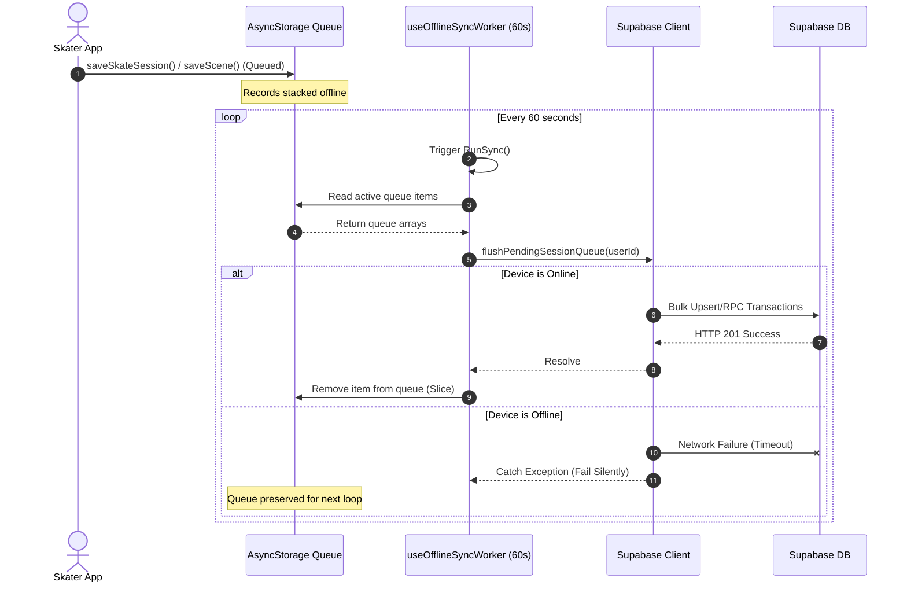

---

## 9. Architectural Impact Flags

*   *No surface modifications were applied to the data persistence layer during this read-only cartography audit.*
*   `[NO_ARCHITECTURAL_IMPACT]`

<!-- CARTOGRAPHER_END: DATA_LAYER -->

### Domain: UTILS
<!-- CARTOGRAPHER_START: UTILS -->

# 📐 SK8Lytz Domain 9 Cartography: UTILS (Utilities & Types)

> **Owner:** 🕵️ Scout — Reyes  
> **Status:** Read-Only Audit Complete  
> **Target Path:** `src/utils/*` & `src/types/*` (excluding `supabase.ts`)  
> **Reference System:** P1 Evidence-Based Architecture  

---

## 1. File Manifest
This manifest details the 19 core files constituting Domain 9. Each file is mapped to its precise architectural purpose in the SK8Lytz codebase.

### 🛠️ Utility Modules (`src/utils/*`)

| File Name | Architectural Purpose |
| :--- | :--- |
| **`BlePayloadParser.ts`** | Pure stateless utility that parses raw, notification-level BLE byte arrays into structured LED and RF configuration payloads, shielding the UI and state layers from malformed data packets. |
| **`ColorUtils.ts`** | Core color math engine managing HSV-to-RGB, Hex-to-RGB, and Hue conversion calculations, as well as the WS2812B LED brightness/vibrancy boost algorithm. |
| **`CrashReporter.ts`** | Exposes a stateless handler (`logFatalCrash`) that asynchronous-wraps component stacks and runtime exceptions for transmission to the system-wide `AppLogger` service. |
| **`FlightRecorder.ts`** | Implements a lightweight, thread-safe, in-memory circular buffer (`MAX_BREADCRUMBS = 50`) providing immediate diagnostic context for logs and crash reports. |
| **`MusicDictionary.ts`** | The canonical registry for the 46 hardware-native music patterns, detailing Matrix styles (Light Bar `0x26` vs. Light Screen `0x27`) and dynamic foreground/background color gates. |
| **`NamingUtils.ts`** | Standardizes naming heuristics (`SK8Lytz-XXXX`) and default custom group names based on MAC addresses and product catalog types. |
| **`NormalizationUtils.ts`** | Translates user-facing UI controls (speed sliders `0-100`) into exact hardware-compatible register intervals (ticks `1-31`) via rounding and boundary clamping. |
| **`backoff.ts`** | Generates randomized exponential backoff and jitter timeouts to prevent stampeding herd issues when multiple peripherals reconnect concurrently. |
| **`classifyBLEDevice.ts`** | Standardizes the ingestion mapping from raw BLE peripherals and interrogator EEPROM cache values to unified UI `PendingRegistration` metadata. |
| **`kMeansPalette.ts`** | Reanimated `'worklet'` compatible utility executing 3D Euclidean distance calculations and K-Means clustering to extract dominant color palettes from raw camera buffers. |
| **`migrateAuthTokens.ts`** | Coordinates the silent, secure migration of Supabase tokens from unencrypted `AsyncStorage` to platform-level `SecureStore` (iOS Keychain / Android Keystore) on startup. |
| **`piiScrubber.ts`** | Stateless module providing a lightweight, deterministic non-cryptographic hash (FNV-1a variant) to redact MAC addresses and usernames prior to telemetry dispatch. |
| **`presetColorUtils.ts`** | Resolution layer translating composite Favorite States and Group snapshots into linear gradients and physical glow coordinates for UI rendering. |
| **`webStyles.ts`** | Web-fallback bypass that returns standard inline CSS records unmodified when components are rendered in an Expo Web environment. |

### 🗃️ Type System Contracts (`src/types/*`)

| File Name | Architectural Purpose |
| :--- | :--- |
| **`ProductCatalog.ts`** | Typescript interfaces detailing physical characteristics (LED counts, mirror segments, battery size) and visualization shapes (Haloz, Soulz, Railz) in the product database. |
| **`ble.types.ts`** | Houses type contracts for underlying BLE radios (peripherals, characteristics) and defines relational database schemas for offline-first replication. |
| **`bleGuards.ts`** | Exposes explicit TypeScript type guards (e.g., `isDevice`) to safely verify native radio bindings without resorting to `any` casting. |
| **`dashboard.types.ts`** | The central type contract file of the application, standardizing FSM connection states, active pattern snapshots, group topologies, and Docked Bus interfaces. |
| **`react-test-renderer.d.ts`** | Ambient module declaration providing TypeScript type signatures for the react-test-renderer library in unit testing environments. |

---

## 2. Blast Radius (Dependency Map)
This section maps the incoming and outgoing structural linkages of the UTILS domain.

```mermaid
graph TD
    %% Outgoing Dependencies
    subgraph UTILS_Types [Domain 9: UTILS & Types]
        BlePayloadParser[BlePayloadParser.ts]
        ColorUtils[ColorUtils.ts]
        classifyBLEDevice[classifyBLEDevice.ts]
        migrateAuthTokens[migrateAuthTokens.ts]
        presetColorUtils[presetColorUtils.ts]
        dashboardTypes[dashboard.types.ts]
    end

    subgraph External_Services [External Systems & Services]
        AppLogger[AppLogger.ts]
        SecureStore[expo-secure-store]
        AsyncStorage[@react-native-async-storage/async-storage]
        BlePlx[react-native-ble-plx]
    end

    subgraph UI_And_Hooks [UI & Hooks Consumers]
        useBLEScanner[useBLEScanner.ts]
        useControllerDispatch[useControllerDispatch.ts]
        useMusicMode[useMusicMode.ts]
        DockedController[DockedController.tsx]
        CameraTracker[CameraTracker.tsx]
        AuthContext[AuthContext.tsx]
    end

    %% Outgoing Links
    BlePayloadParser --> AppLogger
    classifyBLEDevice --> BlePlx
    migrateAuthTokens --> SecureStore
    migrateAuthTokens --> AsyncStorage
    migrateAuthTokens --> AppLogger
    presetColorUtils --> dashboardTypes

    %% Incoming Links
    useBLEScanner --> classifyBLEDevice
    useControllerDispatch --> ColorUtils
    useMusicMode --> useControllerDispatch
    DockedController --> ColorUtils
    CameraTracker --> ColorUtils
    AuthContext --> migrateAuthTokens
```

### Outgoing Dependencies (What UTILS Imports)
*   **Physical Hardware / Native Libraries**:
    *   `react-native-ble-plx` (imported in `ble.types.ts`, `bleGuards.ts`, `classifyBLEDevice.ts`, and `dashboard.types.ts` to type-contract BLE devices).
    *   `expo-secure-store` and `@react-native-async-storage/async-storage` (imported in `migrateAuthTokens.ts` to manipulate system keys).
*   **Codebase Services & Constants**:
    *   `src/services/AppLogger.ts` (imported by `BlePayloadParser.ts`, `CrashReporter.ts`, and `migrateAuthTokens.ts`).
    *   `src/constants/ProductCatalog.ts` (imported by `classifyBLEDevice.ts` to query points/segments).
    *   `src/constants/storageKeys.ts` (imported by `migrateAuthTokens.ts` for token namespaces).

### Incoming Dependencies (What Imports UTILS)
*   **Telemetry & Logs**: `src/services/AppLogger.ts` imports `FlightRecorder` to pipe local events into crash uploads.
*   **Radio Operations**: `src/hooks/useHardwareNotifications.ts` imports `BlePayloadParser` to parse notification events.
*   **Vibe Camera**: `src/components/CameraTracker.tsx` (and `.web.tsx`) imports `kMeansPalette` for pixel parsing and `ColorUtils` for RGB boost.
*   **State & Sync**: `src/context/AuthContext.tsx` imports `migrateAuthTokens` to transition keys on startup.
*   **Interface Controllers**: `src/components/DockedController.tsx` and related sub-views import `ColorUtils` and `presetColorUtils` for HSV slider math and linear gradients.

---

## 3. Context Matrix
The UTILS domain is designed to be **stateless and side-effect free** (excluding standard security migration wrappers and buffered recorders). 

*   **Context Generation**: This domain does not define, instantiate, or expose any React Contexts.
*   **Context Consumption**: No React Context is consumed by these files. All values are passed in as explicit, immutable arguments.
*   **Ecosystem Integration**:
    *   `migrateAuthTokens` is executed directly within `AuthContext.tsx` during the bootstrap lifecycle phase to transition old JWT tokens.
    *   Type tokens in `dashboard.types.ts` dictate the shape of properties passed through `DockedBus` events.

---

## 4. Hook/Service I/O Registry
This registry documents the signature, parameters, outputs, and internal behavior of the primary algorithmic functions inside Domain 9.

### `BlePayloadParser.parseLedPayload(payload: number[]): ParsedLedConfig | null`
*   **Inputs**: `payload` (`number[]`) - raw bytes received from characteristic notify.
*   **Outputs**: `ParsedLedConfig` (object detailing points, segments, IC type, sorting, speed) or `null`.
*   **Internal Actions**: Validates packet length and checksum constraints. Converts big-endian points (`payload[8]` & `payload[9]`) to integers. 
*   **Side-Effects**: Writes warnings to `AppLogger` if the packet is corrupt.

### `ColorUtils.boostForLED(r: number, g: number, b: number): RGB`
*   **Inputs**: `r, g, b` (`number`) - raw RGB values `0-255` captured from a visual feed.
*   **Outputs**: `{ r, g, b }` (`RGB`) - vibrancy-maximized color.
*   **Internal Actions**:
    1.  Converts the RGB color space to HSV.
    2.  If Saturation ($S$) is $< 0.05$ (achromatic gate), returns `{ r: 255, g: 255, b: 255 }` (clean white) to avoid flashing pastels.
    3.  If $S \ge 0.05$, forces Saturation ($S$) to $1.0$ and Value ($V$) to $1.0$.
    4.  Converts boosted HSV coordinates back to RGB for direct dispatch.
*   **Side-Effects**: None.

### `kMeansPalette.extractKMeansPalette(pixels: RGB[], k: number, maxIterations: number): RGB[]`
*   **Inputs**: `pixels` (`RGB[]`), `k` (`number` = 3), `maxIterations` (`number` = 5).
*   **Outputs**: `RGB[]` - array of `k` dominant colors sorted by population size.
*   **Internal Actions**:
    *   Marked with `'worklet';` to permit JSI execution on the Reanimated UI thread.
    *   Uses 3D Euclidean distance ($d = \sqrt{\Delta r^2 + \Delta g^2 + \Delta b^2}$) to dynamically cluster pixel centroids over a fixed 5-iteration limit.
*   **Side-Effects**: None.

### `migrateAuthTokens.migrateAuthTokensToSecureStore(): Promise<void>`
*   **Inputs**: None.
*   **Outputs**: `Promise<void>`.
*   **Internal Actions**: Checks if a migration flag is present in AsyncStorage. If missing, reads `supabase.auth.token`, securely writes it using `SecureStore.setItemAsync`, deletes the unencrypted token, and writes a completed flag.
*   **Side-Effects**: Modifies device storage files.

---

## 5. OS Variance Matrix
Platform-specific code paths and runtime behaviors between iOS and Android within the UTILS domain.

| Utility / Target | iOS Behavior | Android Behavior |
| :--- | :--- | :--- |
| **`migrateAuthTokens`** (`expo-secure-store`) | Writes credentials to the iOS Keychain. These credentials **persist across application uninstalls**; a fresh reinstall will auto-read legacy tokens unless explicitly cleared by developers. | Writes credentials to Android SharedPreferences, encrypted using KeyStore. Android **wipes these credentials upon app deletion**. |
| **`kMeansPalette`** (`'worklet'`) | Runs on the JSI UI thread. Garbage collection is highly efficient under Hermes. | Runs on the JSI UI thread. Older Android chipsets can suffer brief UI thread frame drops if heap allocation is too high during camera frame extraction. |
| **`piiScrubber`** (Non-Crypto Hash) | Bypasses native Swift CommonCrypto to perform pure JavaScript bitwise shifting, avoiding bridge latency. | Bypasses native Java Cryptography Architecture (JCA) to ensure identical hash parity with zero platform dependency. |
| **`webStyles`** | Returns standard React Native StyleSheets. | Bypasses styling restrictions on Expo Web by passing CSS values directly to the DOM wrapper. |

---

## 6. Design System & Token Manifest
This manifest describes the formatting utilities, calculations, and TypeScript tokens that synchronize user adjustments to the physical LED parameters.

### 📐 Calculations & Conversions
1.  **UI-to-Hardware Speed Translation**:
    $$\text{Hardware Speed Ticks} = \text{clamp}\left(1, 31, \text{round}\left(\frac{\text{UI Slider Value}}{100} \times 30\right) + 1\right)$$
    Implemented in `NormalizationUtils.ts` to map smooth 1-100 UI animations to the hardware register limit (31 ticks).
2.  **LED Mirroring Topology**:
    $$\text{Total Physical LEDs} = \text{ledPoints} \times \text{ledSegments}$$
    All spatial pattern vectors in `presetColorUtils.ts` and `ColorUtils.ts` must size their RGB arrays strictly to `ledPoints` (e.g., 11 for Haloz) to let the physical controller mirror the colors across both segments.
3.  **Euclidean Distance (K-Means Clustering)**:
    $$d = \sqrt{(r_1 - r_2)^2 + (g_1 - g_2)^2 + (b_1 - b_2)^2}$$
    Used in `kMeansPalette.ts` to group raw camera pixels into dominant cluster vectors.

### 🎨 Formatting Utilities
*   **Standard Hex Formatting**: `rgbToHex` and `hueToHex` enforce a strict `#RRGGBB` format, capitalizing output letters and zero-padding color component strings.
*   **Diagnostic Stringification**: `piiScrubber` standardizes MAC address output by hashing the input into a fixed length hex signature: `sk8_scrubbed_[hash]`.

### 🛡️ Core TypeScript Tokens (Type Declarations)
*   **`PendingRegistration`** (`dashboard.types.ts`): Holds transitional peripheral credentials during the First-Time User Experience (FTUE) setup wizard.
*   **`DevicePatternState`** (`dashboard.types.ts`): The offline-first serializable state representing active patterns, speed, colors, and power status.
*   **`DisplayDevice`** (`dashboard.types.ts`): Enriches physical connection structures with user-configured positions (e.g., Left Skate, Right Skate) and local group assignments.
*   **`MusicColorMode`** (`MusicDictionary.ts`): String enum (`'NONE' | 'FG_ONLY' | 'FG_BG'`) gating the visibility of UI color Pickers depending on the selected music profile capability.

---

## 7. Architectural Workflows
This section outlines complex, multi-step operations coordinated through the UTILS domain.

### BLE Device Classification & Onboarding Flow
This diagram details how the scanning ecosystem processes a discovered peripheral into an onboarded device using classification and name utilities.

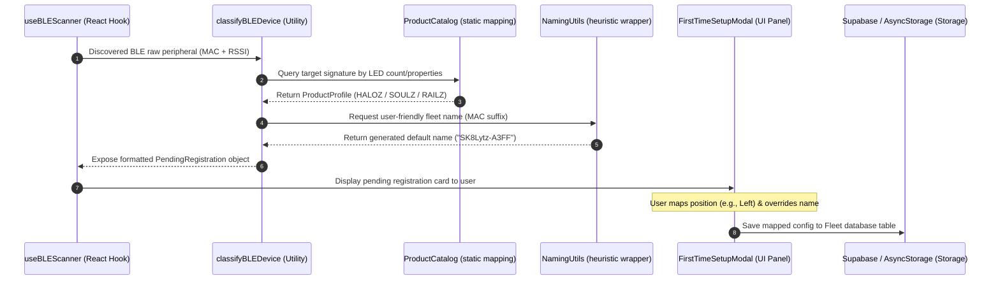

### Vibe Catcher: Real-Time Color Extraction & Translation Pipeline
This diagram tracks how visual data flows from the phone camera, through the K-Means worklet, and onto the physical WS2812B LEDs using spatial buffer optimizations.

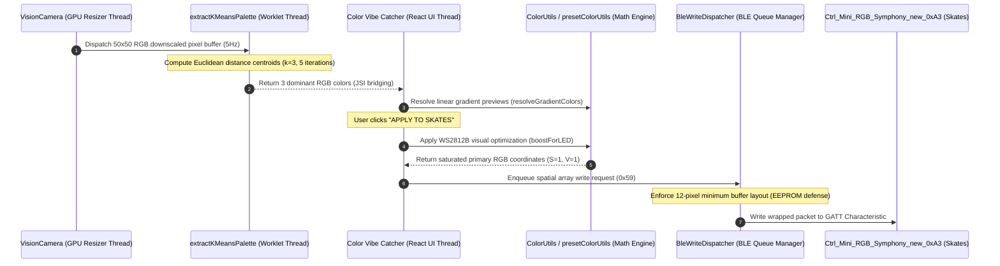

---

## 8. Stale Documentation Registry
During this read-only audit, the following stale documentation entries in the Master Reference were verified:

1.  **RbmDictionary / RbmSimulator References** (`tools/SK8Lytz_App_Master_Reference.md` Lines 678–679, 684–685):
    *   *Staleness Details*: The Master Reference documents `src/utils/RbmDictionary.ts` and `src/utils/RbmSimulator.ts` as active source-of-truth modules. However, these files **no longer exist** in `src/utils/`. The custom Symphony patterns and visualizer frame animations have been migrated to the mathematical synthesizer protocols (`src/protocols/PatternEngine.ts` and `src/protocols/SymphonyEngine.ts`).
    *   *Correction Tag*: `[MOVE_TO_ARCHIVE]` is verified on these lines.
2.  **AuthUtils Reference** (`tools/SK8Lytz_App_Master_Reference.md` Line 1471):
    *   *Staleness Details*: The Master Reference refers to `src/services/AuthUtils.ts` as a provider of validation utilities. This file is absent from the directory; validation patterns are handled directly within context wrappers or components.
    *   *Correction Tag*: Marked for future cleanup index updates.

<!-- CARTOGRAPHER_END: UTILS -->

### Domain: NATIVE_&_WATCH
<!-- CARTOGRAPHER_START: NATIVE_&_WATCH -->

# 🛼 NATIVE_&_WATCH Domain Cartography (Native & WatchOS / WearOS)

This document maps the architectural landscape of the native mobile platforms (iOS and Android), watch companions (watchOS and Wear OS), the bidirectional communication bridges, and native Bluetooth Low Energy (BLE) integration within the SK8Lytz application.

---

## 1. File Manifest

### 📱 Watch Bridge Module (`modules/sk8lytz-watch-bridge/`)
- [index.ts](file:///c:/Neogleamz/AG_SK8Lytz_App/SK8Lytz/modules/sk8lytz-watch-bridge/src/index.ts) — TypeScript API exposing the public `WatchBridge` interface, types, and event listener subscriptions.
- [Sk8lytzWatchBridgeModule.swift](file:///c:/Neogleamz/AG_SK8Lytz_App/SK8Lytz/modules/sk8lytz-watch-bridge/ios/Sk8lytzWatchBridgeModule.swift) — Native iOS Expo module bridging session syncing and metric updates to watchOS via `WCSession`.
- [Sk8lytzWatchBridgeModule.kt](file:///c:/Neogleamz/AG_SK8Lytz_App/SK8Lytz/modules/sk8lytz-watch-bridge/android/src/main/java/expo/modules/sk8lytzwatchbridge/Sk8lytzWatchBridgeModule.kt) — Native Android Expo module bridging session syncing and metrics to Wear OS via Google Play Services Wearable APIs.
- [expo-module.config.json](file:///c:/Neogleamz/AG_SK8Lytz_App/SK8Lytz/modules/sk8lytz-watch-bridge/expo-module.config.json) — Configuration linking iOS and Android classes as autolinked Expo native modules.

### ⌚ watchOS Target (`targets/watch/`)
- [WatchConnectivityManager.swift](file:///c:/Neogleamz/AG_SK8Lytz_App/SK8Lytz/targets/watch/WatchConnectivityManager.swift) — Swift class managing Apple Watch `WCSession` delegates, live metrics, and health data relays.
- [HealthManager.swift](file:///c:/Neogleamz/AG_SK8Lytz_App/SK8Lytz/targets/watch/HealthManager.swift) — Swift class managing background `HKWorkoutSession` and `HKLiveWorkoutBuilder` data collection.
- [ComplicationController.swift](file:///c:/Neogleamz/AG_SK8Lytz_App/SK8Lytz/targets/watch/ComplicationController.swift) — Implements `CLKComplicationDataSource` to display live speed/status on Apple Watch complications.
- [ContentView.swift](file:///c:/Neogleamz/AG_SK8Lytz_App/SK8Lytz/targets/watch/ContentView.swift) — Main SwiftUI user interface presenting the Idle, Active Session, and Post-Session Summary states.
- [index.swift](file:///c:/Neogleamz/AG_SK8Lytz_App/SK8Lytz/targets/watch/index.swift) — Root entrypoint for the watchOS SwiftUI application.
- [expo-target.config.js](file:///c:/Neogleamz/AG_SK8Lytz_App/SK8Lytz/targets/watch/expo-target.config.js) — Expo configuration defining entitlements, infoPlist descriptors, and complications.

### ⌚ Wear OS App (`android/sk8lytzWear/`)
- [WearableCommunicationService.kt](file:///c:/Neogleamz/AG_SK8Lytz_App/SK8Lytz/android/sk8lytzWear/src/main/kotlin/com/neogleamz/sk8lytzwear/services/WearableCommunicationService.kt) — WearableListenerService handling GMS Wearable persistent state changes and real-time metric pushes.
- [HealthTracker.kt](file:///c:/Neogleamz/AG_SK8Lytz_App/SK8Lytz/android/sk8lytzWear/src/main/kotlin/com/neogleamz/sk8lytzwear/services/HealthTracker.kt) — Natively maps Android Health Services `ExerciseClient` for `INLINE_SKATING` to track heart rate and calories.
- [OngoingActivityManager.kt](file:///c:/Neogleamz/AG_SK8Lytz_App/SK8Lytz/android/sk8lytzWear/src/main/kotlin/com/neogleamz/sk8lytzwear/services/OngoingActivityManager.kt) — Controls the Wear OS `OngoingActivity` notification representing an active background skate session.
- [DashboardScreen.kt](file:///c:/Neogleamz/AG_SK8Lytz_App/SK8Lytz/android/sk8lytzWear/src/main/kotlin/com/neogleamz/sk8lytzwear/presentation/DashboardScreen.kt) — Main Composable view displaying active session dashboard telemetry and ambient/Always-On Display states.
- [SummaryScreen.kt](file:///c:/Neogleamz/AG_SK8Lytz_App/SK8Lytz/android/sk8lytzWear/src/main/kotlin/com/neogleamz/sk8lytzwear/presentation/SummaryScreen.kt) — Composable UI presenting post-session metrics with a 10-second auto-dismiss timeout.
- [WearMessageSender.kt](file:///c:/Neogleamz/AG_SK8Lytz_App/SK8Lytz/android/sk8lytzWear/src/main/kotlin/com/neogleamz/sk8lytzwear/presentation/WearMessageSender.kt) — Dispatches command signals and health updates, storing telemetry in SharedPreferences if disconnected.
- [SessionState.kt](file:///c:/Neogleamz/AG_SK8Lytz_App/SK8Lytz/android/sk8lytzWear/src/main/kotlin/com/neogleamz/sk8lytzwear/presentation/SessionState.kt) — Enum defining the watch dashboard's finite states (IDLE, ACTIVE, PAUSED, SUMMARY).
- [Sk8lytzTileService.kt](file:///c:/Neogleamz/AG_SK8Lytz_App/SK8Lytz/android/sk8lytzWear/src/main/kotlin/com/neogleamz/sk8lytzwear/tiles/Sk8lytzTileService.kt) — Renders ProtoLayout glanceable tiles within the Wear OS tile carousel.
- [MainActivity.kt](file:///c:/Neogleamz/AG_SK8Lytz_App/SK8Lytz/android/sk8lytzWear/src/main/kotlin/com/neogleamz/sk8lytzwear/MainActivity.kt) — Wear OS entrypoint activity configuring screen policies and ambient callbacks.
- [AndroidManifest.xml](file:///c:/Neogleamz/AG_SK8Lytz_App/SK8Lytz/android/sk8lytzWear/src/main/AndroidManifest.xml) — Wear OS configuration register block for permissions, activities, tiles, and services.

### 📱 Host Android App (`android/`)
- [MainActivity.kt](file:///c:/Neogleamz/AG_SK8Lytz_App/SK8Lytz/android/app/src/main/java/com/neogleamz/sk8lytz/MainActivity.kt) — Host Android app activity setting up Splash Screen and Health Connect delegation.
- [MainApplication.kt](file:///c:/Neogleamz/AG_SK8Lytz_App/SK8Lytz/android/app/src/main/java/com/neogleamz/sk8lytz/MainApplication.kt) — Android application entry class loading React Native and initializing lifecycle dispatchers.

### 🔌 Native BLE Connect Hook (`src/services/ble/`)
- [ConnectService.ts](file:///c:/Neogleamz/AG_SK8Lytz_App/SK8Lytz/src/services/ble/ConnectService.ts) — Integrates with native platforms to request Android connection priorities and execute MTU configurations.

---

## 2. Blast Radius (Imports/Exports)

The watch integration components act as a bridge between React Native contexts and the native operating system layers.

```
                  ┌─────────────────────────────┐
                  │      SessionContext.tsx     │
                  └──────────────┬──────────────┘
                                 │ consumes
                                 ▼
                  ┌─────────────────────────────┐
                  │       WatchBridge (TS)      │
                  └──────────────┬──────────────┘
                                 │
                 ┌───────────────┴───────────────┐
                 ▼ (iOS Autolinking)             ▼ (Android Autolinking)
   ┌───────────────────────────┐   ┌───────────────────────────┐
   │ Sk8lytzWatchBridgeModule  │   │ Sk8lytzWatchBridgeModule  │
   │          (Swift)          │   │         (Kotlin)          │
   └─────────────┬─────────────┘   └─────────────┬─────────────┘
                 │ WCSession                     │ GMS Wearable API
                 ▼                               ▼
   ┌───────────────────────────┐   ┌───────────────────────────┐
   │ WatchConnectivityManager  │   │ WearableCommunicationServ │
   │          (Swift)          │   │          (Kotlin)         │
   └───────────────────────────┘   └───────────────────────────┘
```

### Inbound Imports (What the watch bridge imports)
- **watchOS Target**: Imports Apple native frameworks `WatchConnectivity` (for phone link), `WatchKit` (haptics and system details), `HealthKit` (live HR and calorie workouts), and `ClockKit` (watch complications).
- **Wear OS Target**: Imports Google Play Services Wearable APIs (`MessageClient`, `DataClient`, `NodeClient`), Health Services APIs (`ExerciseClient`), and Wear Compose libraries.
- **Expo Modules**: Both native module wrappers import `ExpoModulesCore` (`Module`, `ModuleDefinition`, `Promise`) to hook into the modern Expo Native Module configuration API.

### Outbound Exports (What imports the watch bridge)
- **WatchBridge (TS)**: Imported and consumed by `SessionContext.tsx` and the supporting `SessionBridge.ts` telemetry service.
- **ConnectService.ts (BLE)**: Imported and consumed by the global XState `BleMachine.ts` connect transition.

---

## 3. Context Matrix

Native files do not directly render React trees or consume React contexts. Instead, they interact with the TypeScript/Javascript context layers via custom events dispatched from the bridge modules:

- **`SessionContext.tsx`**: Consumes `WatchBridge` directly during state transitions (e.g., syncing recording/paused/stopped states to the watch via `syncSessionState`). It also registers listeners using `addWatchCommandListener` to handle commands sent from the watch (such as start/stop commands) and `addWatchHealthListener` to inject watch-derived heart rate and calorie telemetry back into the application state machine.

---

## 4. Hook/Service I/O Registry

### `WatchBridge` (TypeScript Bridge Module)

| Method / Listener | Inputs | Outputs | Side Effects |
|---|---|---|---|
| `syncSessionState` | `state: WatchSessionState` | `Promise<void>` | Serializes telemetry and pushes to paired watches via persistent data channels. |
| `sendMetricUpdate` | `metrics: Pick<...>` | `Promise<void>` | Sends a real-time, throttled packet (speed, HR, calories) via message channels. |
| `isWatchReachable` | None | `Promise<boolean>` | Queries the native layer to determine if a watch companion is reachable. |
| `addWatchCommandListener` | `handler: (cmd) => void` | `() => void` (Unsubscribe) | Registers native callback for `START_SESSION` or `STOP_SESSION` events. |
| `addWatchHealthListener` | `handler: (update) => void`| `() => void` (Unsubscribe) | Registers native callback for heart rate and calorie metrics updates. |

### `WatchConnectivityManager` (Swift / watchOS)

| Method / Event Handler | Inputs | Outputs | Description |
|---|---|---|---|
| `sendStartSession` | None | None | Vibrates the watch and dispatches a `START_SESSION` command packet to the iOS host. |
| `sendStopSession` | None | None | Vibrates the watch and dispatches a `STOP_SESSION` command packet to the iOS host. |
| `didReceiveApplicationContext` | `[String: Any]` | None | Receives persistent session states from iOS and updates published SwiftUI variables. |
| `didReceiveMessage` | `[String: Any]` | None | Receives real-time telemetry from iOS and updates published SwiftUI variables. |

### `WearMessageSender` (Kotlin / Wear OS)

| Method | Inputs | Outputs | Description |
|---|---|---|---|
| `sendCommand` | `context`, `command: String` | None | Vibrates wrist and sends command string to the phone via `MessageClient`. |
| `sendHealthUpdate` | `context`, `hr`, `cal`, `state`, `time`| None | Relays health metrics back to the phone. Buffers to SharedPreferences if disconnected. |

---

## 5. OS Variance Matrix

| Architectural Feature | iOS (`watchOS`) Path | Android (`Wear OS`) Path |
|---|---|---|
| **Communication Layer** | `WatchConnectivity` (`WCSession`) | Google Play Services Wearable API |
| **Persistent Sync** | `WCSession.updateApplicationContext` | `DataClient.putDataItem` |
| **Real-time Messages** | `WCSession.sendMessage` | `MessageClient.sendMessage` |
| **Reachability Check** | `WCSession.isReachable` | `NodeClient.connectedNodes` (check if not empty) |
| **Health Tracking API** | HealthKit (`HKWorkoutSession` / `HKLiveWorkoutBuilder`) | Health Services (`ExerciseClient` using `INLINE_SKATING`) |
| **Background Life** | Sustained by active `HKWorkoutSession` | Sustained by `OngoingActivity` notification + Foregrounds |
| **Glanceable Views** | ClockKit Complications (Modular/Circular/Corner) | ProtoLayout Tiles (`Sk8lytzTileService`) |
| **Screen Policies** | Controlled by watchOS system workout states | `FLAG_KEEP_SCREEN_ON` toggled via ambient callbacks |
| **BLE MTU Negotiation** | Handled natively by iOS core Bluetooth layer | Manually requested up to 512 bytes with retry backoff |
| **BLE Conn Priority** | iOS manages GATT connection priority internally | Elevation to High (`1`) during handshakes, then downgrades |

---

## 6. Sequence Diagram: Bidirectional Session Control & Sync Flow

The following diagram illustrates a watch-initiated session start, showing the bidirectional communication across host boundaries, local workout activation, real-time metrics streaming, and periodic health telemetry updates.

```mermaid
sequenceDiagram
    autonumber
    actor User as Skater
    participant WatchUI as Watch UI (SwiftUI / Compose)
    participant WatchManager as Watch Manager (WCSession / GMS Wearable)
    participant PhoneBridge as Expo Watch Bridge Module
    participant SessionCtx as SessionContext (XState)

    User->>WatchUI: Tap "START"
    opt Local Optimistic UI
        WatchUI->>WatchUI: Transition to ACTIVE state
    end
    WatchUI->>WatchManager: startWorkout() & sendStartSession()
    Note over WatchManager: Trigger wrist haptics
    WatchManager->>PhoneBridge: Send "START_SESSION" command
    PhoneBridge->>SessionCtx: Emit 'onWatchCommandReceived' event
    SessionCtx->>SessionCtx: Transition XState Machine to RECORDING

    rect rgb(0, 45, 60)
        Note over SessionCtx, WatchUI: Bidirectional Session Synchronization
        SessionCtx->>PhoneBridge: syncSessionState(status: 'ACTIVE', startTime: ISO)
        PhoneBridge->>WatchManager: Push State / Application Context
        WatchManager->>WatchUI: Update sessionStartTime & isSessionActive
    end

    loop Telemetry Streams (Every 1s to 5s)
        SessionCtx->>PhoneBridge: sendMetricUpdate(speed: X mph)
        PhoneBridge->>WatchManager: Send Message (Metrics payload)
        WatchManager->>WatchUI: Update live speed on screen & complications
        
        Note over WatchUI: Health Tracker gathers heart rate / calories
        WatchUI->>WatchManager: sendHealthUpdate(HR, Calories)
        WatchManager->>PhoneBridge: Send Message (Health payload)
        PhoneBridge->>SessionCtx: Emit 'onWatchHealthUpdate' event
        SessionCtx->>SessionCtx: Update global telemetry store
    end
```

---

## 7. Native BLE Connect & Handshake Flow (`ConnectService.ts`)

The sequence below describes the low-level Native BLE connection routine, demonstrating the platform-specific behavior implemented for Android.

```mermaid
sequenceDiagram
    autonumber
    participant BleMachine as XState BleMachine
    participant ConnectSvc as ConnectService
    participant RN_BLE as react-native-ble-plx (Native Bridge)
    participant Peripheral as Skate Controller (Zengge / BanlanX)

    BleMachine->>ConnectSvc: Invoke connectService(targetMacs)
    
    rect rgb(30, 30, 30)
        Note over ConnectSvc, Peripheral: Handshake & Connection Phase
        ConnectSvc->>RN_BLE: isDeviceConnected(mac)
        RN_BLE-->>ConnectSvc: False
        ConnectSvc->>RN_BLE: connectToDevice(mac)
        RN_BLE->>Peripheral: Establish GATT Connection
        Peripheral-->>RN_BLE: Connected
        RN_BLE-->>ConnectSvc: Device instance returned
    end

    opt Android-Specific Optimizations
        ConnectSvc->>RN_BLE: requestConnectionPriority(HIGH)
        ConnectSvc->>RN_BLE: requestMTU(512)
        Note over ConnectSvc: Handle MTU retry checks (avoid 23-byte default MTU glitches)
    end

    ConnectSvc->>RN_BLE: createGattSession() (Discover services & characteristics)
    RN_BLE-->>ConnectSvc: GATT session created & adapter mapped
    
    ConnectSvc->>RN_BLE: onDeviceDisconnected() (Register recovery listener)
    ConnectSvc->>RN_BLE: monitorCharacteristicForService() (Register notifications)

    loop Write Handshake Packets (Zengge/BanlanX specific)
        ConnectSvc->>RN_BLE: writeCharacteristicWithoutResponse(packet_I)
        RN_BLE->>Peripheral: Write Base64 Payload
        Note over ConnectSvc: Inter-packet delay (e.g. 50ms)
    end

    opt Android-Specific Connection Downgrade
        ConnectSvc->>RN_BLE: requestConnectionPriority(BALANCED)
    end

    ConnectSvc-->>BleMachine: Resolve with freshly connected device list
```

---
[IMPACTS_STATE_CHART]
[IMPACTS_C4_CONTEXT]

<!-- CARTOGRAPHER_END: NATIVE_&_WATCH -->

### Domain: NOTIFICATIONS_&_ROUTING
<!-- CARTOGRAPHER_START: NOTIFICATIONS_&_ROUTING -->

# Architectural Cartography — NOTIFICATIONS_&_ROUTING Domain

This document provides a high-fidelity, read-only architectural audit of the `NOTIFICATIONS_&_ROUTING` domain in the SK8Lytz application. It catalogs the internal files, maps incoming and outgoing dependencies, registers service inputs and outputs, highlights OS variances, details the global provider hierarchies, and outlines complex multi-step background notification lifecycles.

---

## 1. File Manifest

Below is the list of all audited files in this domain, with a one-sentence architectural purpose for each:

### 📱 Layout and Guards
*   **`App.tsx`**: The root component configuring global error boundaries, font loading, platform initializers, and the global provider tree wrapper.
*   **`src/providers/BluetoothGuard.tsx`**: A layout security gate that intercepts rendering to verify that Bluetooth permissions are granted and that the device's Bluetooth adapter is enabled.
*   **`src/providers/ComplianceGate.tsx`**: A legal gate checking EULA acceptance locally (via AsyncStorage for offline guests) and remotely (via Supabase database for authenticated users) before allowing dashboard access.

### ✉️ Notification and Location Services
*   **`src/services/NotificationService.ts`**: A wrapper for `expo-notifications` orchestrating push notification setup, permission requests, token registration routing, and scheduling local reminders or live crew alerts.
*   **`src/services/PushTokenService.ts`**: Service handling push token CRUD actions in Supabase (`push_tokens` table), matching device tokens to specific authenticated user IDs.
*   **`src/services/LocationService.ts`**: Service wrapping `expo-location` to retrieve GPS coordinates, reverse-geocode location labels without street-level PII, and fetch/sort nearby skate spots and crew sessions.
*   **`src/services/session/NotificationService.ts`**: An XState actor service using `@notifee/react-native` to run ongoing Android foreground location services and display interactive session telemetry (speed and distance) in notification banners.

### 🔌 Hardware Pipelines
*   **`src/hooks/useHardwareNotifications.ts`**: A BLE data receiver hook (Mailroom Architecture) that registers callbacks, debounces duplicate packets, parses LED/RF payloads, and writes updates to local state and the `DeviceRepository` SQLite/AsyncStorage SSOT.

---

## 2. Blast Radius (Dependency Map)

```
                       ┌──────────────────────┐
                       │      App.tsx         │
                       └──────────┬───────────┘
                                  │
         ┌────────────────────────┼────────────────────────┐
         ▼                        ▼                        ▼
┌─────────────────┐      ┌─────────────────┐      ┌─────────────────┐
│ BluetoothGuard  │      │ ComplianceGate  │      │  LocationServ.  │
└────────┬────────┘      └────────┬────────┘      └────────┬────────┘
         │                        │                        │
         ▼                        ▼                        ▼
┌─────────────────┐      ┌─────────────────┐      ┌─────────────────┐
│ PermissionServ  │      │ AppSettingsServ │      │ SkateSpotsServ  │
└─────────────────┘      └─────────────────┘      └─────────────────┘
                                  │
                                  ▼
                         ┌─────────────────┐
                         │    Supabase     │
                         └────────▲────────┘
                                  │
         ┌────────────────────────┴────────────────────────┐
         │                                                 │
┌────────┴────────┐                               ┌────────┴────────┐
│  NotificationS. │ ────► [registerPushToken] ──► │  PushTokenServ. │
└────────┬────────┘                               └─────────────────┘
         │
         ▼
┌─────────────────┐
│ ProfileService  │ ──► [unregisterPushToken]
└─────────────────┘
```

### Imports (Inward Dependencies)
*   **External Packages**:
    *   `@notifee/react-native` (in `App.tsx`, `index.ts`, `SessionContext.tsx`, and `src/services/session/NotificationService.ts` for foreground service management).
    *   `expo-notifications` (conditionally loaded in `NotificationService.ts` for push alerts).
    *   `expo-location` (in `LocationService.ts` and `src/services/session/NotificationService.ts` for coordinates query).
    *   `react-native-health-connect` (loaded dynamically on Android in `App.tsx` [L159] to prevent initialization crashes).
    *   `sk8lytz-watch-bridge` (in `index.ts` and `SessionContext.tsx` for companion synchronization).
*   **Internal Services**:
    *   `PermissionService` (in `BluetoothGuard.tsx`, `LocationService.ts` to coordinate modal prompts).
    *   `DeviceRepository` (in `useHardwareNotifications.ts` to write parsed BLE data).
    *   `SkateSpotsService` (in `LocationService.ts` to load cached spots).
    *   `BlePayloadParser` (in `useHardwareNotifications.ts` to parse configurations).

### Exports (Outward Dependencies)
*   **`index.ts`**: Imports `App.tsx` to boot the React Native application.
*   **`DashboardScreen.tsx`**: Consumes `locationService` for finding nearby skateparks, `notificationService` for managing crew alerts, and `useHardwareNotifications` for processing live BLE packets.
*   **`SessionMachine.ts`**: Spawns `src/services/session/NotificationService.ts` (as the `notificationService` actor) when entering `ACTIVE` or `PAUSED` phases.
*   **`useDashboardProfile.ts`**: Triggers `NotificationService.ts` initialization once notification permissions are granted.

---

## 3. Context Matrix

The domain is constructed around a strict hierarchical tree of providers wrapped around the main screen layout:

### Provider Hierarchy Tree (in `App.tsx`)
```tsx
<GlobalErrorBoundary>          {/* Handles react exceptions and avoids white screens */}
  <SafeAreaProvider>            {/* Establishes screen layout safe margins */}
    <ThemeProvider>              {/* Exposes dynamic color palettes based on active theme */}
      <AuthProvider>            {/* Handles auth credentials and guest/offline states */}
        <AppConfigProvider>      {/* Exposes feature flags and config settings */}
          <FavoritesProvider>    {/* Manages custom color palettes and patterns */}
            <SessionProvider>    {/* Orchestrates the Session XState machine */}
              <BLEProvider>      {/* Manages scanned and connected Bluetooth devices */}
                <BluetoothGuard> {/* Blocks app layout until Bluetooth is enabled */}
                  <AppContent /> {/* Conditional rendering router */}
                  <GlobalPermissionsModal />
                </BluetoothGuard>
              </BLEProvider>
            </SessionProvider>
          </FavoritesProvider>
        </AppConfigProvider>
      </AuthProvider>
    </ThemeProvider>
  </SafeAreaProvider>
</GlobalErrorBoundary>
```

### Context Interactions
*   **`SessionContext`**: Listens to `notifee.onForegroundEvent` to receive button action events (PAUSE, RESUME, END) and forwards them to XState. On Android, checks the `@sk8lytz_pending_bg_end` flag on foreground and runs deferred session completion.
*   **`AuthContext`**: Ingested by `ComplianceGate` to check EULA requirements. If `isOfflineMode` is active, checks local storage; if online, fetches settings from Supabase.
*   **`BLEContext`**: BluetoothGuard consumes `useSharedBLE` to read adapter states (`isBluetoothEnabled`, `isBluetoothSupported`) and triggers scanner loops (`startSweeper`) when permissions are granted.

---

## 4. Hook/Service I/O Registry

### `useHardwareNotifications` (Hook)
*   **Inputs**:
    *   `isDiagnosticsMode` (`boolean`): Enables sniffer logger.
    *   `setOnDataReceived` / `setOnHardwareProbed` (`callbacks`): Registers BLE data listeners.
    *   `deviceConfigs` (`Record<string, Record<string, unknown>>`): Exposing current device specifications.
*   **Outputs**: `void`
*   **Side-Effects**: 
    *   Subscribes to GATT data streams. Debounces identical back-to-back packets (`lastPacketCacheRef`).
    *   Validates configurations with delta checks.
    *   Writes hardware config to `DeviceRepository` on change.
    *   Triggers `AppLogger.log('RAW_PAYLOAD')` for diagnostic views.

### `NotificationService` (Expo Push - `src/services/NotificationService.ts`)
*   **Methods**:
    *   `init(autoRequest, userId)`: Sets up channels; requests permissions; upserts token to Supabase. Returns `Promise<string | null>`.
    *   `setJoinHandler(handler)`: Stores callback for push invitation taps.
    *   `cleanup(userId)`: Unsubscribes from listeners; unregisters token from Supabase.
    *   `sendCrewInviteNotification(opts)`: Immediate local OS alert on `'crew-alerts'` channel.
    *   `sendSessionStartingSoon(opts)`: Schedules local OS reminder on `'session-reminders'` channel. Returns ID.
    *   `cancelSessionReminder(id)`: Cancels scheduled local notification.
*   **Side-Effects**: Modifies Supabase `push_tokens` table. Schedules notifications locally.

### `PushTokenService` (Supabase Sync - `src/services/PushTokenService.ts`)
*   **Methods**:
    *   `registerPushToken(token, platform, userId)`: Performs `upsert` in database.
    *   `unregisterPushToken(token, userId)`: Performs `delete` in database.
*   **Side-Effects**: Writes to Supabase `push_tokens` table.

### `LocationService` (GPS and Geocoding - `src/services/LocationService.ts`)
*   **Methods**:
    *   `getSessionLocation()`: Requests permission; gets coordinates; reverse-geocodes label. Returns `Promise<SessionLocation | null>`.
    *   `getSilentLocation()`: Returns coordinates (`Promise<{lat, lng} | null>`).
    *   `getNearbyPublicSessions(radius, coords, userId)`: Fetches active sessions. Returns `Promise<NearbySession[]>`.
    *   `getNearbySkateSpots(radius, coords)`: Loads spots. Returns `Promise<NearbySkateSpot[]>`.
*   **Side-Effects**: Fetches coordinates from GPS. Triggers permissions modal. Reads `SkateSpotsService` cache. Logs PII-scrubbed coordinates telemetry.

### `notificationService` (Session Foreground - `src/services/session/NotificationService.ts`)
*   **Inputs**: `NotificationServiceInput` (session phase, start times, telemetry ref).
*   **Outputs**: Teardown function (`() => void`).
*   **Side-Effects**: Spawns a 5s updating interval; displays ongoing notification; runs Android location-type foreground service.

---

## 5. OS Variance Matrix

| Feature / System | Android | iOS | Web Target |
| :--- | :--- | :--- | :--- |
| **Foreground Service Task** | Starts an ongoing Foreground Service (type `location`) using `notifee.registerForegroundService` in `index.ts` to prevent OS termination. | Runs notification category configurations; background actions are handled natively without a custom foreground service. | Early return; returns no-op cleanup functions. |
| **Notification Channels** | Configures physical channels (`'crew-alerts'`, `'session-reminders'`, and `'sk8lytz-session'`) with lights, vibration, and low/high importance. | Direct banner alerts without channels; registers category types (`'session-actions'`) dynamically via `notifee.setNotificationCategories`. | Unsupported. Early return inside initialization callbacks. |
| **Compliance Recovery** | Check on active app foreground status uses AppState listeners to re-evaluate compliance gates. | Same as Android. | Mock bypassed. |
| **Reverse Geocoding** | Queries coordinates via Android's local System Google Geocoder (free). | Queries coordinates via iOS's local Apple Maps Geocoder (free). | Returns hardcoded coordinates mapping to `'Web Demo Area'` (`38.9`, `-94.6`). |
| **Health Connect Boot** | Early require of `react-native-health-connect` in `App.tsx` to register android launchers before activity is resumed. | Unsupported (handled natively via HealthKit package configurations). | Unsupported. |

---

## 6. Sequence Diagram

### Background Active Skate Session Notification Dispatcher Lifecycle
This diagram details the sequence of events when a session is active, user presses an action button in the background notification banner, and the application resumes to process the teardown.

```mermaid
sequenceDiagram
    autonumber
    actor User as Skater (UI)
    participant Ctx as SessionContext.tsx
    participant FSM as SessionMachine (XState)
    participant Actor as NotificationService Actor (session)
    participant NF as Notifee Core (Native)
    participant Entry as index.ts (Background Handler)
    participant Store as AsyncStorage
    participant Watch as WatchBridge

    %% Session Activation
    User->>Ctx: Taps "Start Session"
    Ctx->>FSM: send START
    FSM->>FSM: Transition IDLE -> ACTIVE
    Note over FSM: Spawn NotificationService Actor
    FSM->>Actor: Start actor with input (telemetryRef, sessionPhase)
    Actor->>NF: createChannel("sk8lytz-session") (Android)
    Actor->>NF: displayNotification({ongoing: true, asForegroundService: true, actions: [PAUSE, END]})
    Note over NF: App is foregrounded or backgrounded; persistent HUD shows distance/speed
    
    %% Interval Telemetry Updates
    loop Every 5 Seconds
        Actor->>Actor: Read telemetryRef.current
        Actor->>NF: displayNotification() (Update stats label: distance & speed)
    end

    %% User minimizes app, then clicks "End Session" in Notification
    Note over User, NF: User presses 🛑 END SESSION on the Notification banner in background
    NF->>Entry: Trigger onBackgroundEvent (ACTION_PRESS, id: 'end-session')
    Entry->>Store: multiSet([[@sk8lytz_session_active, false], [@sk8lytz_pending_bg_end, true]])
    Entry->>Watch: syncSessionState({ status: 'STOPPED' })
    Entry->>NF: cancelNotification() & stopForegroundService()
    
    %% Application returns to foreground
    User->>Ctx: Relaunches / Foregrounds App
    Ctx->>Store: getItem("@sk8lytz_pending_bg_end")
    Store-->>Ctx: returns "true"
    Ctx->>Store: removeItem("@sk8lytz_pending_bg_end")
    Ctx->>FSM: send END
    FSM->>FSM: Transition ACTIVE -> ENDING -> IDLE
    Note over FSM: Kill NotificationService Actor
    FSM->>Actor: Teardown (Stop interval)
```

---

## 7. Archival Instruction

The following sections in `tools/SK8Lytz_App_Master_Reference.md` are outdated:
*   **Domain: NOTIFICATIONS_&_ROUTING** (lines 4180–4458) `[MOVE_TO_ARCHIVE]`: This section is outdated and has been replaced by this comprehensive document, which properly integrates Notifee foreground services, background event handlers, global provider hierarchies, and routing structures.

---

## 8. Architectural Impact Flags

*   `[IMPACTS_USER_JOURNEY]` — Flagged because the conditional rendering routes in `App.tsx` and the onboarding compliance checks (`ComplianceGate`, `BluetoothGuard`) dictate the primary user navigation and app bootstrapping experience.

`[IMPACTS_USER_JOURNEY]`

<!-- CARTOGRAPHER_END: NOTIFICATIONS_&_ROUTING -->

### Domain: SESSION_TRACKING
<!-- CARTOGRAPHER_START: SESSION_TRACKING -->

# SESSION_TRACKING Domain Cartography Report

This cartography report details the file manifest, dependencies, React contexts, hook input/output registries, OS-specific behavior, and the XState v5 state machine architecture for the `SESSION_TRACKING` domain in the SK8Lytz application.

---

## 1. File Manifest

The `SESSION_TRACKING` domain is composed of the following key configuration, context, hook, and service files:

| File Path | Architectural Purpose |
| :--- | :--- |
| [`src/context/SessionContext.tsx`](file:///c:/Neogleamz/AG_SK8Lytz_App/SK8Lytz/src/context/SessionContext.tsx) | Wraps the XState v5 session machine inside a React Context, managing UI timers, crash recovery from AsyncStorage, Apple Watch/Wear OS bridging events, and notification controllers. |
| [`src/services/session/SessionMachine.ts`](file:///c:/Neogleamz/AG_SK8Lytz_App/SK8Lytz/src/services/session/SessionMachine.ts) | Core state machine defined via XState v5 `setup`, orchestrating states `IDLE`, `ACTIVE`, `PAUSED`, and `ENDING` with automated service invocations. |
| [`src/services/session/SessionMachine.types.ts`](file:///c:/Neogleamz/AG_SK8Lytz_App/SK8Lytz/src/services/session/SessionMachine.types.ts) | Declares TypeScript types for the state machine's context, events, and telemetry/health snapshots. |
| [`src/services/session/SessionBridge.ts`](file:///c:/Neogleamz/AG_SK8Lytz_App/SK8Lytz/src/services/session/SessionBridge.ts) | Global static bridge enabling external components (e.g., background tasks, Bluetooth events) to dispatch signals to the running XState actor. |
| [`src/services/session/SessionCommitService.ts`](file:///c:/Neogleamz/AG_SK8Lytz_App/SK8Lytz/src/services/session/SessionCommitService.ts) | Promise-based actor that executes during the `ENDING` state to compile statistics, push summaries to watches, and persist results via `SpeedTrackingService`. |
| [`src/services/session/SensorService.ts`](file:///c:/Neogleamz/AG_SK8Lytz_App/SK8Lytz/src/services/session/SensorService.ts) | Callback-based actor managing `expo-location` GPS tracking and `expo-sensors` Accelerometer updates to accumulate speed, distance, path coordinates, and peak G-forces. |
| [`src/services/session/AutoPauseService.ts`](file:///c:/Neogleamz/AG_SK8Lytz_App/SK8Lytz/src/services/session/AutoPauseService.ts) | Callback-based actor that continuously checks GPS speeds to automatically pause/resume tracking if the skater stops for 10 seconds. |
| [`src/services/session/HealthService.ts`](file:///c:/Neogleamz/AG_SK8Lytz_App/SK8Lytz/src/services/session/HealthService.ts) | Callback-based actor that monitors watch health biometrics or falls back to polling Apple HealthKit / Android Health Connect. |
| [`src/services/session/NotificationService.ts`](file:///c:/Neogleamz/AG_SK8Lytz_App/SK8Lytz/src/services/session/NotificationService.ts) | Callback-based actor managing the foreground service lifecycle (Android) and displaying persistent Notifee status updates. |
| [`src/services/SpeedTrackingService.ts`](file:///c:/Neogleamz/AG_SK8Lytz_App/SK8Lytz/src/services/SpeedTrackingService.ts) | Central stateless service. Saves session records, caches offline workouts to AsyncStorage, and pushes updates to Supabase tables. |
| [`src/hooks/useTelemetryLedger.ts`](file:///c:/Neogleamz/AG_SK8Lytz_App/SK8Lytz/src/hooks/useTelemetryLedger.ts) | Telemetry ledger tracking time spent in states (color selections, pattern modes), queuing logs locally, and flushing data via Supabase RPC. |
| [`src/hooks/useDeviceStateLedger.ts`](file:///c:/Neogleamz/AG_SK8Lytz_App/SK8Lytz/src/hooks/useDeviceStateLedger.ts) | Unified single source of truth for BLE hardware dispatch LED states. Restricts writes to active dispatches and debounces storage saves. |
| [`src/services/HealthSyncService.ts`](file:///c:/Neogleamz/AG_SK8Lytz_App/SK8Lytz/src/services/HealthSyncService.ts) | Dual-platform synchronization helper that integrates with Apple Health (iOS) and Health Connect (Android) to write workouts. |

> [!NOTE]
> Stale hook files `src/hooks/useSessionTracking.ts`, `src/hooks/useGlobalTelemetry.ts`, and `src/hooks/useHealthTelemetry.ts` do not exist in the codebase. Their historical functionalities have been refactored into the modular structures of `SessionContext.tsx`, `useTelemetryLedger.ts`, and `HealthSyncService.ts`.

---

## 2. Blast Radius

The session tracking and telemetry subsystem is a central module in the application. Modifications to its logic have wide-reaching effects across local storage, background services, UI overlays, and remote cloud databases.

```
Incoming Dependencies (Imports)              SESSION_TRACKING Domain                Outgoing Consumers (Exports)
┌──────────────────────────────────────┐   ┌───────────────────────────────────┐   ┌───────────────────────────────────┐
│ - react-native (Platform, AppState)   │   │ - SessionContext.tsx              │   │ - App.tsx (Root wrapper)          │
│ - @react-native-async-storage        │   │ - SessionMachine.ts (XState v5)   │   │ - DockedController.tsx            │
│ - @notifee/react-native (Notifee)    │──&gt;│ - SpeedTrackingService.ts         │──&gt;│ - SessionSummaryModal.tsx         │
│ - expo-location, expo-sensors        │   │ - useTelemetryLedger.ts           │   │ - LiveTelemetryHUD.tsx            │
│ - sk8lytz-watch-bridge               │   │ - useDeviceStateLedger.ts         │   │ - DashboardTelemetryHero.tsx      │
│ - Supabase client (Client)           │   │ - HealthSyncService.ts            │   │ - DashboardScreen.tsx             │
└──────────────────────────────────────┘   └───────────────────────────────────┘   └───────────────────────────────────┘
```

### Incoming Dependencies (Imports)
* **OS Integrations & Sensors**: Consumes `expo-location` and `expo-sensors` to pull raw GPS coordinates and accelerometer data during tracking.
* **Biometric Systems**: Imports `react-native-health` (iOS Apple HealthKit) and `react-native-health-connect` (Android Health Connect) for fitness telemetry.
* **Storage and Databases**: Imports `AsyncStorage` to buffer offline payloads, and `supabase` to persist completed skate sessions.
* **Background Notifications**: Connects to `@notifee/react-native` to configure background execution permissions and lockscreen playback widgets.

### Outgoing Consumers (Exports)
* **Application Root**: `App.tsx` mounts the global `SessionProvider` to initialize state listeners and recovery tasks on startup.
* **Skate Dashboard & HUD**: `DockedController.tsx` and `LiveTelemetryHUD.tsx` consume the context value `useSession()` to display speed, peak G-force, heart rate, and duration, as well as dispatching session start/stop commands.
* **Offline Sync Workers**: `useOfflineSyncWorker` (or scheduled sync workers) imports `SpeedTrackingService` to flush pending queues.

---

## 3. Context Matrix

The domain implements a clean separation of concerns by consuming authentication state and exposing a unified session tracking interface to the component tree:

| React Context | Consumed / Provided | Source File | Purpose |
| :--- | :--- | :--- | :--- |
| `SessionContext` | **Provided** | `SessionContext.tsx` | Exposes `isSkateSessionActive` (boolean), `sessionPhase` ('IDLE' \| 'ACTIVE' \| 'PAUSED' \| 'ENDING'), `startSession()`, `endSession()`, `telemetry` snapshot, and `health` telemetry. |
| `AuthContext` | **Consumed** | `AuthContext.tsx` | Used in `SessionMachineWrapper` to retrieve the authenticated `user.id` to bind session files and sync telemetries in the cloud. |

---

## 4. Hook/Service I/O Registry

### `useSession()` Hook (via `SessionContext.tsx`)
* **Inputs**: None.
* **Outputs**:
  * `isSkateSessionActive: boolean`
  * `sessionPhase: 'IDLE' | 'ACTIVE' | 'PAUSED' | 'ENDING'`
  * `startSession: () => void`
  * `endSession: () => void`
  * `telemetry: GlobalTelemetryState`
  * `health: HealthTelemetry`
* **Side-Effects**: Spawns or terminates background services, initiates OS-level notification channels, and starts tracking sensor changes.

### `useTelemetryLedger()` Hook
* **Inputs**: None.
* **Outputs**:
  * `trackPattern: (patternId: number | string) => void`
  * `trackColor: (hexCode: string) => void`
  * `trackMode: (modeId: string) => void`
  * `incrementCounter: (counterKey: string, count?: number) => void`
  * `injectStreetSummary: (distanceMeters: number, topSpeedMph: number) => void`
  * `flushToDatabase: () => Promise<void>`
* **Side-Effects**: Stores time-in-state variables, writes serialized payloads to `@sk8lytz_telemetry_buffer` in AsyncStorage, and executes Supabase RPC calls `flush_telemetry` on app backgrounding or 15-minute intervals.

### `useDeviceStateLedger()` Hook
* **Inputs**: None.
* **Outputs**:
  * `save: (mac: string, state: DevicePatternState) => void`
  * `load: (mac: string) => Promise<DevicePatternState | null>`
  * `loadSync: (mac: string) => DevicePatternState | null`
  * `clear: (mac: string) => Promise<void>`
* **Side-Effects**: Maintains a cross-hook global memory cache, normalizes MAC addresses, and debounces local storage writes (500ms) to throttle rapid LED adjustments.

### `SpeedTrackingService`
* **Inputs**: `ISessionSnapshot` (duration, distance, average speed, peak speed, peak G-forces, heart rates, calories, and coordinates mapping), `userId: string | null`.
* **Outputs**: `saveSession()`, `flushPendingSessionQueue()`, `pushSpeedToWatch()`, `fetchRecentSessions()`, `fetchLifetimeStats()`.
* **Side-Effects**: Inserts rows into the `skate_sessions` Supabase table. Increments lifetime values in `user_profiles`. Buffers records locally to `PENDING_SESSION_QUEUE_KEY` if offline.

---

## 5. OS Variance Matrix

Due to native platform variations in permissions, foreground services, and health interfaces, the tracking system implements key branching pathways:

### 1. Workout Syncing (Biometrics)
* **iOS**: Integrates with Apple HealthKit via `react-native-health`. Saves workouts using type `SkatingSports` (mapped to `HKWorkoutActivityTypeSkatingSports`) with `energyBurnedUnit: 'calorie'` and `distanceUnit: 'mile'`.
* **Android**: Uses Health Connect via `react-native-health-connect`. Inserts multiple structured objects:
  * `ExerciseSession` (exerciseType: `60` - Skating)
  * `TotalCaloriesBurned` (active energy in `kilocalories`)
  * `Distance` (converts miles to meters: `miles * 1609.34` in `meters`)

### 2. Foreground Services & Background Execution
* **iOS**: Background location is managed via OS-level background delivery settings. Onscreen control widgets are initialized on boot by registering standard `notifee` Categories (`session-actions` containing "🛑 End Session", "⏸ Pause Session", and "▶️ Resume Session" buttons).
* **Android**: Requires explicit running of a foreground service to maintain GPS scans in the background. Registers a `notifee` notification with `asForegroundService: true` and defines `foregroundServiceTypes: [AndroidForegroundServiceType.FOREGROUND_SERVICE_TYPE_LOCATION]`.

### 3. Permissions & Initialization
* **Android**: Requires checking `android.permission.FOREGROUND_SERVICE_LOCATION` and `android.permission.FOREGROUND_SERVICE_CONNECTED_DEVICE` before initializing background tracking. Health Connect requires requesting `android.permission.ACTIVITY_RECOGNITION` and calling `initialize()` before querying or writing.
* **iOS**: Initialized via `initHealthKit` permissions and handles read privacy gating natively.

---

## 6. XState v5 Session FSM & Recovery Architecture

The session lifecycle is managed by an XState v5 state machine (`SessionMachine.ts`). The machine isolates side-effects by spawning actor services dynamically during transitions.

```mermaid
sequenceDiagram
    autonumber
    actor U as User (UI / Watch / Notifee)
    participant C as SessionContext (React Wrapper)
    participant SM as sessionMachine (XState v5)
    participant AS as AsyncStorage (State Recovery)
    participant AP as AutoPauseService (Actor)
    participant SE as SensorService (Actor)
    participant HC as HealthService (Actor)
    participant CC as SessionCommitService (Actor)
    
    %% Crash Recovery Flow
    Note over C, AS: Boot / Crash Recovery Sequence
    C->>AS: Get item '@sk8lytz_session_phase'
    alt Stored phase is 'active' & Current state is 'IDLE'
        C->>SM: send({ type: 'START' })
        SM->>SM: Transition to ACTIVE
    else Stored phase is 'paused' & Current state is 'IDLE'
        C->>SM: send({ type: 'START' })
        C->>SM: send({ type: 'PAUSE' })
        SM->>SM: Transition to PAUSED
    end
    
    %% Active Tracking Flow
    Note over U, SM: Session Start Sequence
    U->>C: startSession()
    C->>SM: send({ type: 'START' })
    SM->>SM: Actions: recordStartTime, persistPhaseActive, syncWatchActive
    SM->>AS: persistSessionPhase('active')
    
    par Injected Callback Actors (ACTIVE state)
        SM->>SE: Spawn SensorService (Location/Accelerometer)
        SM->>HC: Spawn HealthService (Heart rate/Calories)
        SM->>AP: Spawn AutoPauseService (Speed monitoring)
    end
    
    %% Auto Pause Flow
    Note over SE, AP: Auto Pause Sequence
    SE->>AP: Update gpsSpeedRef.current (< 0.2 mph)
    AP->>AP: Count 20 low speed ticks (10s)
    AP->>SM: sendBack({ type: 'AUTO_PAUSE' })
    SM->>SM: Transition to PAUSED
    SM->>AS: persistSessionPhase('paused', pauseTimeMs)
    
    %% Session Ending & Sync
    Note over U, SM: Session Ending & Saving Sequence
    U->>C: endSession()
    C->>SM: send({ type: 'END' })
    SM->>SM: Transition to ENDING
    SM->>AS: persistSessionPhase('idle')
    
    SM->>CC: Spawn SessionCommitService (Promise)
    activate CC
    CC->>CC: Compute finalDuration & finalAvgSpeed
    CC->>U: WatchBridge.syncSessionState({ status: 'SUMMARY' })
    CC->>C: SpeedTrackingService.saveSession(snapshot, userId)
    CC->>SM: onDone (Promise resolved)
    deactivate CC
    SM->>SM: Transition to IDLE
```

### AsyncStorage Recovery Transitions
To recover tracking sessions in the event of an application crash or an OS memory pressure termination, `SessionContext.tsx` implements automatic state reconstruction:
1. **Startup Check**: On context mount, the system reads the stored values `STORAGE_PENDING_BG_END` and `SESSION_PHASE_KEY` from AsyncStorage.
2. **BG End Overrides**: If `STORAGE_PENDING_BG_END` is `'true'`, it means a background service was forced to stop. The recovery sequence immediately clears the flag and dispatches the `{ type: 'END' }` event to save the accumulated session.
3. **Phase Reconstruction**: If the stored phase is `'active'` and the machine is in the `IDLE` state, it dispatches `{ type: 'START' }` to resume tracking. If the stored phase is `'paused'`, it dispatches `{ type: 'START' }` followed by `{ type: 'PAUSE' }` to return the machine to the correct state.

### Telemetry Synchronization to Supabase
1. **Commit Stage**: Upon transitioning to the `ENDING` state, the machine invokes `sessionCommitService`.
2. **Discard Threshold**: If the recorded session is shorter than 60 seconds and has accumulated less than 0.1 miles, the logger records a `GLOBAL_SESSION_DISCARDED` event and clears the machine context.
3. **Database Sync**: If the session meets the threshold:
   * **Authenticated Mode**: Pushes the session payload directly to Supabase (`supabase.from('skate_sessions').insert(...)`) and updates aggregate statistics in the `user_profiles` database table.
   * **Offline Mode (Retry Queue)**: If the user is unauthenticated or the network write fails, the snapshot is saved in AsyncStorage under `PENDING_SESSION_QUEUE_KEY`. The offline sync worker flushes this queue periodically once network connectivity is restored.

---

## 7. Master Reference Archival Ledger

The following references in the Master Reference (`tools/SK8Lytz_App_Master_Reference.md`) are stale and require archival tags:

### `[MOVE_TO_ARCHIVE]`
* **File**: `tools/SK8Lytz_App_Master_Reference.md`
* **Line Range**: 946, 1412, 4479, 7010
* **Stale Text**: References describing the standalone hook `useSessionTracking.ts` as the primary driver for tracking state machines.
* **Reason**: The standalone `useSessionTracking.ts` hook was deprecated and deleted. All session tracking, timer, and callback logic has been refactored into the React `SessionProvider` wrapper (`SessionContext.tsx`) and the XState v5 actors (`SensorService.ts`, `HealthService.ts`, `AutoPauseService.ts`, `NotificationService.ts`).

---

[IMPACTS_USER_JOURNEY]
[IMPACTS_C4_CONTEXT]
[IMPACTS_STATE_CHART]

<!-- CARTOGRAPHER_END: SESSION_TRACKING -->

### Domain: PROTOCOL_CORE
<!-- CARTOGRAPHER_START: PROTOCOL_CORE -->

# 🗺️ Protocol Core Domain Cartography Report

This document maps the architectural flow, boundaries, and hardware byte-structures within the **PROTOCOL_CORE** domain of the SK8Lytz application. It traces the transmission path from high-level UI inputs down to the specific byte offsets dispatched to raw BLE characteristics.

---

## 1. File Manifest

Every file audited in this domain with its exact architectural purpose:

| File | Architectural Purpose |
|:---|:---|
| `src/protocols/IControllerProtocol.ts` | The Hardware Abstraction Layer (HAL) interface contract. Ensures uniform APIs across diverse chipset configurations (e.g. Zengge, BanlanX, simulator). |
| `src/protocols/ZenggeProtocol.ts` | Static protocol compiler. Translates logical commands into byte payloads, handles sequence counting, and wraps buffers using the V2 framing header. |
| `src/protocols/ZenggeAdapter.ts` | Zengge-specific implementation of the HAL. Owns its own `ZenggeProtocol` instance (maintaining sequence isolation) and handles MTU-aware `0x40` packet fragmentation. |
| `src/protocols/BanlanxAdapter.ts` | BanlanX (SP621E) implementation of the HAL. Translates power, color, and built-in effects into SP621E command frames; maps app mic sliders to native DSP inputs. |
| `src/protocols/ControllerRegistry.ts` | Runtime router. Dynamically resolves correct adapters at scan time (using UUID advertisement patterns) or queries fallback defaults for connected devices. |
| `src/hooks/useProtocolDispatch.ts` | Hook translating user intents (e.g. solid colors, custom modes, sequences) into protocol payloads across multi-device groups. |
| `src/hooks/useProtocolBuilder.ts` | Interactive diagnostic utility hook. Drives the Diagnostic Lab by auto-generating wrapped hex byte arrays and descriptive string annotations. |
| `src/hooks/useProductCatalog.ts` | Offline-first product cache hook. Synchronizes the local hardcoded catalog array with active remote Supabase records via AsyncStorage cache hydration. |
| `src/hooks/useProductManager.ts` | Administrative helper hook. Manages drafts, field changes, session status, and database upserts for the administrative product editor screen. |
| `src/constants/ProductCatalog.ts` | Default specifications file. Hardcodes initial geometry, limits, and profiles (HALOZ ring, SOULZ adjustable strip, RAILZ dual-strip) for instant offline boot. |

---

## 2. Blast Radius (Dependency Graph)

A map of how the Protocol Core interacts with the rest of the application ecosystem.

```
       [UI / Visualizer Components] ◄────► [useProductCatalog]
                     │
                     ▼
           [useProtocolDispatch]
                     │
                     ▼
           [ControllerRegistry]
             ├──► [BanlanxAdapter] ──► (Banlanx Protocol Specs)
             └──► [ZenggeAdapter]  ──► [ZenggeProtocol] (Zengge 0xA3 Specs)
                     │
                     ▼
             [BLEContext / useBLE]
                     │
                     ▼
             [BleWriteQueue] ──► [RNBLEPlx Native Interface]
```

### Imports Consumed by this Domain:
*   `react`, `react-native` (Alert dialogs for validations).
*   `@react-native-async-storage/async-storage` (Catalog and state caching).
*   `buffer` (Advert manufacturer data processing in `BanlanxAdapter`).
*   `src/services/supabaseClient` (PostgREST API client for catalog syncs).
*   `src/services/AppLogger` (Telemetry logging and diagnostic logging).
*   `src/context/BLEContext` (Underlying BLE write, connection list, and queue dispatchers).
*   `src/context/AuthContext` (Admin validation session checking).
*   `src/constants/storageKeys` (`STORAGE_PRODUCT_CATALOG`).
*   `src/types/ProductCatalog` (`ProductProfile`, `VizShape`).

### Consumers Importing this Domain:
*   `src/hooks/useBLE.ts` (Resolves device adapters and runs packet chunking algorithms).
*   `src/context/BLEContext.tsx` (Binds and exposes `useProtocolDispatch`).
*   `src/components/VisualizerUnit.tsx` (Retrieves defaults and profiles from `ProductCatalog` to compute SVG rendering vectors).
*   `src/components/ProductVisualizer.tsx` (Resolves LED points configurations and shapes to layout skate coordinates).
*   `src/screens/DashboardScreen.tsx` (Renders dashboard lists using cached profiles).
*   `src/screens/Sk8LytzDiagnosticLab.tsx` (Feeds `useProtocolBuilder` states directly into interactive inputs and outputs).
*   `src/components/CatalogManagerTab.tsx` (Drives the product editing form via `useProductManager`).
*   `src/hooks/useAppMicrophone.ts` & `src/hooks/useMusicMode.ts` (Sends magnitudes and configuration payloads via `useProtocolDispatch`).
*   `src/components/DockedController.tsx` & `src/components/BleWriteDispatcher.ts` (Uses `useProtocolDispatch`).

---

## 3. Context Matrix

The React Contexts utilized by hooks in the PROTOCOL_CORE domain:

| React Context | Consumed By | Values Retrieved | Purpose |
|:---|:---|:---|:---|
| `BLEContext` | `useProtocolDispatch.ts` | `connectedDevices`, `getAdapterForDevice()`, `executeProtocolResults()`, `writeChunked()` | Iterates through active device targets, gets matching HAL adapters, compiles payloads, and queues writes. |
| `AuthContext` | `useProductManager.ts` | `session` | Guards catalog mutation calls against unauthorized/expired logins. |

---

## 4. Hook/Service I/O Registry

Inputs, outputs, and side effects of core hooks within this domain:

### `useProtocolDispatch`
*   **Inputs**:
    *   Command parameters: color vectors (`RGB[]`), integers (ledPoints, speed, brightness, patternId), arrays of structures (`CustomModeStep[]`), configurations (`MusicConfig`).
    *   Target parameters: optional `targetDeviceId?: string` (specifies target peripheral, else maps to all connected devices).
    *   Priority overrides: `opts?: { lowPriority?: boolean }` (determines queue priority).
*   **Outputs**:
    *   `Promise<boolean | 'partial'>` (resolves when writes complete or fail).
*   **Side Effects**: Enqueues BLE payloads to the FIFO write queue, triggers write chunks, or dispatches telemetry warnings.

### `useProtocolBuilder`
*   **Inputs**:
    *   `hwPoints?: number` (defaults to 16).
*   **Outputs**:
    *   Reactive states: `bldProtocol` (Selected opcode), inputs (`colors`, `speed`, `brightness`, etc.), and `bldResult: BldResult | null`.
    *   `BldResult` structure: `{ raw: number[], wrapped: number[], hex: string, annotations: string[] }`.
*   **Side Effects**: None (strictly computes preview bytes).

### `useProductCatalog`
*   **Inputs**: None on initialization; `profile: ProductProfile` on `saveProfile`.
*   **Outputs**:
    *   `allProfiles: ProductProfile[]` (state list).
    *   `getProfileById(id: string) => ProductProfile | undefined`
    *   `getProfileByPoints(ledPoints: number) => ProductProfile`
    *   `saveProfile(profile: ProductProfile) => Promise<boolean>`
*   **Side Effects**: Reads and writes to AsyncStorage, queries Supabase table `product_catalog` on background syncs, and updates local state.

### `useProductManager`
*   **Inputs**: Admin form triggers.
*   **Outputs**:
    *   Form state references: `editingProfile: ProductProfile | null`, `isSaving: boolean`.
    *   Triggers: `startEditing()`, `createNew()`, `patchEdit()`, `saveProduct()`, `cancelEdit()`.
*   **Side Effects**: Triggers Supabase session validation, upserts product catalog records, and resets catalog cache keys upon database updates.

---

## 5. OS Variance Matrix

Mobile operating system differences handled within the Protocol Core:

| Component | iOS Platform Behavior | Android Platform Behavior | Architectural Defense |
|:---|:---|:---|:---|
| **BLE MTU Allocation** | Handled natively by iOS CoreBluetooth; MTU request is a no-op (typically locks to 185 bytes). | Requires explicit request (`requestMTUForDevice(512)`). Android defaults to 23 bytes without negotiation. | `ZenggeAdapter.prepareForTransmission` queries the cached negotiated MTU from `mtuMapRef` to dynamically determine chunk fragmentation sizes. |
| **BLE Characteristic Writes** | Dispatches packets on native threads with lower latency. | Android Bluetooth stack requires explicit queue serialization. Android drops packets if writes are sent concurrently. | `executeProtocolResults` routes through `BleWriteQueue` to enforce serial writes with a mandatory 50ms group write gap. |
| **Software FFT Reactivity** | Mag streams (`0x74` volume data) run smoothly in background queues. | Android OS suspends active magnitude timer loops when the app enters background unless bound to a foreground service. | `requiresSoftwareFFT` flag in `IControllerProtocol` indicates if the phone must run the software magnitude loop (Zengge = `true`, BanlanX = `false`). |
| **Device Identification** | Advertisements report virtual UUID strings (`XXXX-XXXX-...`). | Advertisements report hardware MAC addresses (`00:11:22:...`). | Handled by native libraries; registry maps lookups dynamically based on raw IDs. |

---

## 6. Sequence Diagram: Multi-Device Mixed-Protocol Command Dispatch

This diagram details the sequence when a user applies a color transition to a group of skates composed of different hardware types (e.g. HALOZ using Zengge and SP621E using Banlanx).

```mermaid
sequenceDiagram
    autonumber
    actor Skater as Skater (UI)
    participant Dispatch as useProtocolDispatch
    participant Registry as ControllerRegistry
    participant ZAdapter as ZenggeAdapter
    participant BAdapter as BanlanxAdapter
    participant BLE as BLEContext / useBLE
    participant Queue as BleWriteQueue

    Skater->>Dispatch: setSolidColor(R=255, G=0, B=0)
    Note over Dispatch: Iterates through all connected devices
    
    rect rgb(240, 248, 255)
        Note over Dispatch, ZAdapter: Device 1: HALOZ (Zengge)
        Dispatch->>Registry: getAdapterForDevice(dev1.id)
        Registry-->>Dispatch: ZenggeAdapter Instance
        Dispatch->>ZAdapter: buildSolidColor(255, 0, 0)
        ZAdapter->>ZAdapter: setMultiColor(colors, points=12, transitionType=0x01)
        Note over ZAdapter: Enforces 12-pixel minimum buffer defense
        ZAdapter-->>Dispatch: ProtocolResult (Packets: [[0x00, Seq, 0x80, ..., 0x59, ...]])
    end

    rect rgb(255, 240, 245)
        Note over Dispatch, BAdapter: Device 2: SP621E (Banlanx)
        Dispatch->>Registry: getAdapterForDevice(dev2.id)
        Registry-->>Dispatch: BanlanxAdapter Instance
        Dispatch->>BAdapter: buildSolidColor(255, 0, 0)
        Note over BAdapter: Compiles [0xA0, 0x52, 0x03, 0xFF, 0x00, 0x00]
        BAdapter-->>Dispatch: ProtocolResult (Packets: [[0xA0, 0x52, 0x03, 0xFF, 0x00, 0x00]])
    end

    Dispatch->>BLE: executeProtocolResults(Payloads)
    
    rect rgb(245, 245, 245)
        Note over BLE, Queue: Writes Serialization
        BLE->>ZAdapter: prepareForTransmission(result, MTU=512)
        ZAdapter-->>BLE: ProtocolResult (Fits MTU: No chunking needed)
        
        BLE->>BAdapter: prepareForTransmission(result, MTU=23)
        BAdapter-->>BLE: ProtocolResult (small packet: Passthrough)
        
        BLE->>Queue: Enqueue Device 1 Payload (Priority: Normal)
        BLE->>Queue: Enqueue Device 2 Payload (Priority: Normal)
        
        Queue->>Queue: Enforce 50ms multi-device write gap
        Queue->>Skater: Complete (UI updates instantly via Optimistic UI)
    end
```

---

## 7. Protocol Byte Mapping & Hardware Constraints

Direct decompile mappings from ZENGGE and BANLANX protocol specs, cross-referenced with `0xA3` hardware tests:

### ⚡ Zengge `0x59` Static Colorful Format
*   **Header Wrapper**: `[0x00, Seq, 0x80, 0x00, LenHi, LenLo, Len+1, 0x0B]`
*   **Opcode Payload**: `[0x59, totalLenHi, totalLenLo, R, G, B, ..., numPtsHi, numPtsLo, transType, speed, direction, checksum]`
*   **Chipset Bug (PROT-004)**: Array lengths below 10 elements lock up the `0xA3` EEPROM buffer. **Surgical Buffer Overflow Defense**: The adapter dynamically pads arrays up to a minimum of **12** pixels.
*   **Transition Limits**: Temporal patterns (Breathe `0x05`, Twinkly `0x06`) are blocked in firmware over `0x59`. Use `0x51` Custom Scenes instead.

### ⚡ Zengge `0x51` Custom Mode Compact
*   **Opcode Payload**: `[0x51, slot[0](9B)...slot[N](9B), 0x0F, checksum]`
*   **Slot Layout (9 Bytes)**: `[activeByte(0xF0), effectId, speed, FG.r, FG.g, FG.b, BG.r, BG.g, BG.b]`
*   **Parity Match**: Successfully drives 0xA3 hardware sequences.

### ⚡ BanlanX SP621E `0x52` Solid Color
*   **Opcode Payload**: `[0xA0, 0x52, 0x03, R, G, B]` (no checksum needed).

### ⚡ BanlanX SP621E Built-in Effect (`0x53` / `0x54`)
*   **Opcode Payloads**:
    1.  `[0xA0, 0x53, 0x01, effectId]` (Select effect: 1-142)
    2.  `[0xA0, 0x54, 0x01, speed]` (Set speed: 1-10)
*   **Rate Limit**: **20ms inter-packet delay** is mandatory between these two packets. If sent too fast, the controller ignores packet #2.

---

## 8. Stale Documentation & Archive Log

Stale references and outdated claims flagged for cleanup in the Master Reference:

*   **`[MOVE_TO_ARCHIVE]`**: `SK8Lytz_App_Master_Reference.md` §480 — references to `useBLE.ts writeChunked()` handling fragmentation math. Handled completely by `ZenggeAdapter.prepareForTransmission` in the updated codebase.
*   **`[MOVE_TO_ARCHIVE]`**: `SK8Lytz_App_Master_Reference.md` §500-502 — mentions `useBLEAutoRecovery.ts` and `useBLEWatchdog.ts`. Both hooks are deleted; auto-recovery is now fully managed by the XState `BleMachine.ts` machine and `RecoveryService.ts`.

---

## 9. Architectural Impact Flags

This domain influences the following core architectural subsystems:

*   `[IMPACTS_USER_JOURNEY]` — Modifications to colors, animations, custom modes, and setup options alter the dashboard telemetry controls and visualizer configurations.
*   `[IMPACTS_STATE_CHART]` — Handshake payloads, MTU limits, and write-queue execution directly influence the states and recoveries in `BleMachine.ts`.

---

<!-- CARTOGRAPHER_END: PROTOCOL_CORE -->

### Domain: PATTERN_ENGINE
<!-- CARTOGRAPHER_START: PATTERN_ENGINE -->

# PATTERN_ENGINE Domain Cartography

This document contains the read-only architectural audit of the **PATTERN_ENGINE** domain in the SK8Lytz codebase. 

---

## 1. File Manifest

Every file in the `PATTERN_ENGINE` domain is cataloged below with its respective architectural purpose:

| File Path | Architectural Purpose |
| :--- | :--- |
| `src/protocols/PatternEngine.ts` | The Single Source of Truth (SSOT) for all pattern metadata and templates (`SK8LYTZ_TEMPLATES`), responsible for constructing binary payloads (`0x59`, `0x51`) for BLE transmission and generating visualizer frame states. |
| `src/protocols/SpatialEngine.ts` | The core mathematical canvas compiler that maps raw coordinates and ticks to `RGB[]` pixel arrays for scrolling, chasing, meteor, waving, and generative patterns. |
| `src/protocols/SymphonyEngine.ts` | Generates real-time audio-reactive frame arrays representing visualizer patterns for the music mode UI. |
| `src/protocols/VisualizerEngine.ts` | Performs rotation shifts, segment reflections, and horseshoe-mirror transformations to map linear pixel arrays to circular visualizer preview shapes. |
| `src/protocols/PositionalMathBuffer.ts` | Manages linear percentage-based node interpolation to compile custom gradient arrays across dynamic LED strip lengths. |
| `src/hooks/useStreetMode.ts` | Implements a motion-reactive finite state machine (FSM) utilizing phone accelerometer data (12.5Hz) to dynamically trigger Stopped, Cruising, Accelerating, and Braking patterns. |
| `src/hooks/useMusicMode.ts` | Coordinates configuration and activation of built-in hardware microphone modes via the `0x73` protocol command when entering or adjusting Music Mode. |
| `src/hooks/useAppMicrophone.ts` | Manages mobile microphone recording, capturing volume amplitude at 20Hz (50ms interval) via Expo Audio, normalizing it, and streaming real-time `0x74` magnitude commands to the BLE controller. |

---

## 2. Blast Radius (Imports & Exports)

This mapping defines the inward dependencies (who imports this domain) and outward dependencies (what this domain imports).

```mermaid
graph TD
    %% Outward Imports
    Sensors[expo-sensors] --> useStreetMode[useStreetMode.ts]
    Audio[expo-audio] --> useAppMicrophone[useAppMicrophone.ts]
    Zengge[ZenggeProtocol.ts] --> useAppMicrophone
    useProtocolDispatch[useProtocolDispatch.ts] --> useMusicMode[useMusicMode.ts]
    MusicDict[MusicDictionary.ts] --> useMusicMode
    
    %% Internal Domain Flows
    SpatialEngine[SpatialEngine.ts] --> PatternEngine[PatternEngine.ts]
    SymphonyEngine[SymphonyEngine.ts] --> PatternEngine
    VisualizerEngine[VisualizerEngine.ts] --> PatternEngine
    PositionalMathBuffer[PositionalMathBuffer.ts] --> SpatialEngine
    PatternEngine --> useStreetMode
    
    %% Inward Imports (Consumers)
    PatternEngine --> DockedController[DockedController.tsx]
    PatternEngine --> useControllerDispatch[useControllerDispatch.ts]
    PatternEngine --> LEDStripPreview[LEDStripPreview.tsx]
    PatternEngine --> ProductVisualizer[ProductVisualizer.tsx]
    
    useStreetMode --> DockedController
    useAppMicrophone --> DockedController
    useMusicMode --> MusicPanel[MusicPanel.tsx]
```

### Outward Dependencies (Imports)
- **Sensor APIs**: `useStreetMode.ts` imports from `expo-sensors` (`Accelerometer`) to capture motion events.
- **Audio APIs**: `useAppMicrophone.ts` imports from `expo-audio` (`useAudioRecorder`, `RecordingPresets`) and `expo-file-system` to capture device microphone sound levels.
- **BLE Protocols**: `useAppMicrophone.ts` imports `ZenggeProtocol` to build `0x74` packets; `useMusicMode.ts` imports `useProtocolDispatch` to write `0x73` configurations.
- **Utilities**: All hooks import `AppLogger` for diagnostic telemetry and events reporting.

### Inward Dependencies (Exports)
- **UI Visualizers**: `PatternEngine` (`SK8LYTZ_TEMPLATES`, `getVisualizerFrame`) is heavily imported by `LEDStripPreview.tsx`, `ProductVisualizer.tsx`, and `VisualizerUnit.tsx` to render pixel-perfect previews on the UI canvas.
- **BLE Dispatch**: `useControllerDispatch.ts` imports `PatternEngine` to serialize the selected pattern template into a `0x59` or `0x51` payload before piping it into the BLE queue.
- **Orchestration**: `DockedController.tsx` serves as the central container, importing `useStreetMode` and `useAppMicrophone` to wire sensor/mic activities directly into the active device connection session.

---

## 3. Context Matrix

The React Context interactions of this domain are highly targeted to avoid re-render performance bottlenecks:

| Component / Hook | Context Consumed | Purpose | Context Provided |
| :--- | :--- | :--- | :--- |
| `useMusicMode` | `BLEContext` (via `useProtocolDispatch`) | Sends `0x73` configuration packets directly to the connected device write characteristic. | None |
| `useStreetMode` | None (Props Injected) | Accepts `writeToDevice` and `hwSettings` from its parent container (`DockedController`) to decouple physical writing from the hook's sensor state. | None |
| `useAppMicrophone` | None (Props Injected) | Accepts `writeToDevice` as a delegate callback to avoid spawning duplicate or orphan BLE write loops. | None |

---

## 4. Hook/Service I/O Registry

The mathematical functions and hooks export strict type contracts:

### A. Hooks Registry

#### 1. `useStreetMode`
- **Input Parameters**:
  - `activeMode`: `string` (Checks if `'STREET'`)
  - `writeToDevice`: `(payload: Uint8Array) => Promise<void>` (BLE injection helper)
  - `hwSettings`: `HardwareSettings | null`
  - `points`: `number` (LED count per segment)
  - `activeProduct`: `ProductDetails | null`
  - `brightness`: `number` (0–100)
  - `speed`: `number` (0–100)
  - `gpsSpeed`: `number` (fallback speed tracking)
- **Output Signatures**:
  - `streetSensitivity`: `number` (1–10)
  - `setStreetSensitivity`: `(val: number) => void`
  - `streetCruiseColor`: `string` (Hex)
  - `setStreetCruiseColor`: `(val: string) => void`
  - `streetBrakeColor`: `string` (Hex)
  - `setStreetBrakeColor`: `(val: string) => void`
  - `isStreetBraking`: `boolean`
  - `motionState`: `MotionState` (`'STOPPED' | 'ACCELERATING' | 'CRUISING' | 'SLOWING_DOWN' | 'HARD_BRAKING'`)
  - `applyStreetPattern`: `() => Promise<void>`
- **Side-Effects**: Registers an accelerometer update subscription at 12.5Hz (80ms sampling window) when `activeMode === 'STREET'`. Triggers rapid BLE `0x59` updates on FSM state transitions.

#### 2. `useAppMicrophone`
- **Input Parameters**:
  - `activeMode`: `string` (Checks if `'MUSIC'`)
  - `micSource`: `'DEVICE' | 'APP'` (Must be `'APP'`)
  - `isPoweredOn`: `boolean`
  - `writeToDevice`: `(payload: Uint8Array) => Promise<void>`
- **Output Signatures**:
  - `audioMagnitude`: `number` (Normalized 0.0 – 1.0)
  - `hasMicPermission`: `boolean | null`
  - `requestMicPermission`: `() => Promise<boolean>`
  - `recording`: `AudioRecorder | null` (Expo Audio object)
- **Side-Effects**: Requests system mic permissions. Spins up native recording session when app-mic is active. Sets a `50ms` (20Hz) timer that calculates volume magnitude using an exponential moving average (EMA) filter and dispatches `0x74` command packets to BLE.

#### 3. `useMusicMode`
- **Input Parameters**:
  - Config inputs: `musicPatternId` (number), `micSensitivity` (number), `brightness` (number), `micSource` ('DEVICE' | 'APP'), `musicPrimaryColor`, `musicSecondaryColor`, `musicMatrixStyle`.
- **Output Signatures**:
  - `handleMusicChange`: `(params: Partial<MusicParams>) => void`
- **Side-Effects**: Fires `0x73` config commands to set the onboard audio capture and pattern index. Sends an exit packet (`isOn: false`) when the mode is changed.

---

### B. Core Services Registry

#### 1. `PatternEngine.buildPatternPayload`
- **Inputs**: `patternId: number`, `fg: RGB`, `bg: RGB`, `speed: number`, `direction: boolean`, `brightness: number`, `options: PatternOptions`, `points: number`
- **Outputs**: `Uint8Array` (Wrapped BLE Command Packet)
- **Behavior**: Pure compiler. Automatically routes to `0x59` for spatial, `0x51` compact for test patterns 201-233, or `0x51` temporal schedulers for Jumps/Breaths.

#### 2. `SpatialEngine.generateArray`
- **Inputs**: `patternId: number`, `fgColor: RGB`, `bgColor: RGB`, `tick: number`, `speed: number`, `direction: boolean`, `options: PatternOptions`, `ledCount: number`
- **Outputs**: `RGB[]` (Linear Color Array)
- **Behavior**: Evaluates mathematical coordinate/wave functions (e.g., Meteor tail decay, Marquee stripes, Rainbow flow) over a dynamic spatial canvas.

---

## 5. OS Variance Matrix

The platform-specific branching matrix is mapped below:

| Feature / File | iOS Platform Behavior | Android Platform Behavior | Web Fallback |
| :--- | :--- | :--- | :--- |
| **Sensor Updates** (`useStreetMode.ts`) | Relies on CoreMotion sensors. Sampling is capped at `80ms` (12.5Hz). Requires user verification if prompt dialog appears. | Standard Android sensor library. Background operations require foreground service limits to prevent sensor freeze when screen locks. | Returns early. Accelerometer is disabled. |
| **Audio Recording** (`useAppMicrophone.ts`) | Requires `NSMicrophoneUsageDescription` in info.plist. Metering dBFS scales to positive float via `(db + 160) / 160`. | Requires `android.permission.RECORD_AUDIO` permission. Normalization behaves identically. | Bypasses native recording. Returns 0.0 magnitude. |
| **BLE Write Pacing** (`BleWriteDispatcher.ts`) | High-throughput support. Can write with shorter margins (~25ms). | Strict Android BLE stack limit (1 outstanding write). Enforces a 50ms gap between multi-device frames to avoid GATT `status 133` buffer saturations. | Mock BLE channel simulation. |

---

## 6. Dynamic Pipeline Sequence Diagrams

### A. App-Microphone Streaming (20Hz Pipeline)

```mermaid
sequenceDiagram
    autonumber
    actor User as User Activity
    participant DC as DockedController
    participant AM as useAppMicrophone
    participant EA as Expo Audio
    participant PE as PatternEngine
    participant WQ as BleWriteQueue
    participant BLE as Bluetooth GATT

    User->>DC: Tap "Music Mode" (Source: APP)
    DC->>AM: Mount with activeMode='MUSIC' & source='APP'
    AM->>EA: requestPermissionsAsync()
    EA-->>AM: Permission Granted
    AM->>EA: startRecording()
    AM->>AM: Set Interval (50ms / 20Hz)
    
    loop Every 50ms
        AM->>EA: getMetering()
        EA-->>AM: dBFS value (-160 to 0)
        AM->>AM: Normalize (0 to 150) & Apply EMA Filter
        AM->>PE: buildMusicStream(magnitude)
        PE-->>AM: Opcode 0x74 packet: [0x74, magnitude, check]
        AM->>WQ: enqueueWrite(0x74)
        WQ->>BLE: Write Characteristic (FF01)
    end

    User->>DC: Exit Music Mode / Power Off
    DC->>AM: Unmount / Mode changed
    AM->>EA: stopRecording()
    AM->>AM: clearInterval()
```

### B. Accelerometer Street Mode (Motion FSM & Brake Light Override)

```mermaid
sequenceDiagram
    autonumber
    participant Sens as Expo Sensors (Accelerometer)
    participant SM as useStreetMode FSM
    participant PE as PatternEngine
    participant DC as DockedController
    participant WQ as BleWriteQueue
    participant BLE as Bluetooth GATT

    DC->>SM: Enter Mode 'STREET'
    SM->>Sens: setUpdateInterval(80ms)
    SM->>Sens: addListener()

    loop Every 80ms
        Sens->>SM: Accelerometer Event {x, y, z}
        SM->>SM: Filter Gravity G-Force Vector Delta
        alt Vector Delta < Threshold (Still)
            SM->>SM: Transition State -> STOPPED
            SM->>PE: buildPatternPayload(ID: 101 - Red Accent Solid)
        else Vector Delta > Cruiser (Skating)
            SM->>SM: Transition State -> CRUISING
            SM->>PE: buildPatternPayload(ID: 102 - Cruise Blue Chase)
        else Sudden Negative Delta (Braking Event)
            SM->>SM: Transition State -> HARD_BRAKING (Brake Override Active)
            SM->>PE: buildPatternPayload(ID: 103 - Solid Bright Red 0x59)
        end
        PE-->>SM: Wrapped [0x59] payload array
        SM->>WQ: enqueueWrite(0x59 payload)
        WQ->>BLE: Dispatch to physical Skates (FF01)
    end
```

---

## 7. Pattern Template Catalog (`SK8LYTZ_TEMPLATES`)

The SK8Lytz registry is partitioned into mathematical, street-specific, and legacy categories:

### A. Color Customization Categories
- **`FG_BG`**: Full two-color picker layout showing primary and secondary selectors (e.g., *Split Colors, Comet Chase, Bold Stripes, Cyberpunk Shift*).
- **`FG_ONLY`**: One-color layout displaying foreground selector over a black canvas (e.g., *Solid Color, Center-Out Marquee, Strobe Flash*).
- **`GENERATIVE`**: Algorithmic rainbow hues that ignore static color pickers (e.g., *True Rainbow Flow, Rainbow Comet, Aurora Borealis*).

### B. Animation Tiers
1. **Tier 1 (Legacy Intercepts)**: Mirroring the original Zengge presets (`ge.*` effects) but compiled client-side as `0x59` cascade arrays to support custom speeds and colors.
2. **Tier 2 (Programs Reversals)**: Replicated patterns from older firmware (e.g., *Dot Chase, Meteor Shower, Theater Chase*).
3. **Tier 3 (SK8Lytz Originals)**: Tailored spatial effects optimized for skates (e.g., *Sine Pulse Wave, Cyberpunk Shift, Lightning Strike, Street Mode FSM Overrides*).

---

## 8. Stale Documentation Audit

Stale sections identified in `tools/SK8Lytz_App_Master_Reference.md` are tagged below:

1. **`0x41` Settled Mode Table Row**:
   * *Stale Section*: Master Reference "Opcode Map" section referencing `0x41` Settled Mode for custom dual colors.
   * *Status*: `[MOVE_TO_ARCHIVE]`
   * *Rationale*: `PatternEngine.ts` explicitly intercepts test pattern IDs 201-233 and dispatches them via `0x51` compact (ZenggeProtocol.setCustomModeExtendedCompact) to bypass physical hardware state lockups caused by `0x41` on the `0xA3` chipset.

2. **`0x43` Multi-Effect Sequence Row**:
   * *Stale Section*: Master Reference description of `0x43` Multi-Effect Sequence supporting up to 50 effects.
   * *Status*: `[MOVE_TO_ARCHIVE]`
   * *Rationale*: Physical testing confirms that sending `0x43` crashes the `0xA3` controller's state machine. The official ZENGGE app uses `0x51` multi-step slots instead.

---

## 9. Architectural Impact Flags

- `[IMPACTS_USER_JOURNEY]` — The 20Hz App-Microphone streaming pipeline relies on real-time magnitude writes. Hardware saturation is strictly defended by clamping values to 150 in `useAppMicrophone.ts` to avoid physical EEPROM/GATT lockout.
- `[IMPACTS_STATE_CHART]` — The Street Mode FSM inside `useStreetMode.ts` maps accelerometer vector transitions. Future modifications to threshold sensitivities or brake overrides directly impact this state graph.

---
*Document Compiled by Scout — Reyes (2026-06-11)*

<!-- CARTOGRAPHER_END: PATTERN_ENGINE -->

### Domain: CLOUD_FUNCTIONS
<!-- CARTOGRAPHER_START: CLOUD_FUNCTIONS -->

# CLOUD_FUNCTIONS Domain Cartography Report

This cartography report details the file manifest, imports/exports (Blast Radius), React Context dependencies, API parameters, OS-specific differences, runtime synchronization pipeline sequence, security hardening audits, and stale documentation targets for the `CLOUD_FUNCTIONS` domain in SK8Lytz.

---

## 1. File Manifest

The `CLOUD_FUNCTIONS` domain consists of PostgreSQL migrations, Deno Edge Functions, and client-side integration services that bridge offline storage buffers to the Supabase backend.

### Server-Side Functions & Database Migrations

| File / Migration Name | Location | Architectural Purpose |
| :--- | :--- | :--- |
| `notify-crew-session/index.ts` | `supabase/functions/notify-crew-session/index.ts` | Deno-based Edge Function that verifies caller identity via GoTrue JWT validation, checks crew membership, and dispatches batch push notifications (up to 100 per chunk) to crew members via the Expo Push API. |
| `20260413_hardening_sweep.sql` | `supabase/migrations/20260413_hardening_sweep.sql` | Executes the initial database hardening sweep, establishing base Row-Level Security (RLS) policies across core user and session tables. |
| `20260414_account_deletion_rpc.sql` | `supabase/migrations/20260414_account_deletion_rpc.sql` | Declares the `delete_account()` RPC as a `SECURITY DEFINER` function, allowing authenticated users to delete their own record from `auth.users`, cascading deletions to clear all profile, session, and telemetry records. |
| `20260418061000_admin_user_management.sql` | `supabase/migrations/20260418061000_admin_user_management.sql` | Defines the `admin_audit_logs` schema and administrative functions to promote, demote, or ban user accounts with cryptographic log validation. |
| `20260506000001_god_tier_telemetry.sql` | `supabase/migrations/20260506000001_god_tier_telemetry.sql` | Introduces the consolidated telemetry aggregation system and the high-volume `flush_telemetry` RPC to process batch uploads of diagnostics, preventing connection pooling overhead. |
| `20260512180000_fix_admin_revoke...sql` | `supabase/migrations/20260512180000_..._security.sql` | Closes privilege escalation vectors in the admin promotion trigger flow by validating the role of the promoting user. |
| `20260526190000_supabase_security_hardening.sql` | `supabase/migrations/20260526190000_..._hardening.sql` | Hardens PL/pgSQL function execution by setting `search_path = public` to prevent search path injection, drops public write permissions on `skate_spots`, and tightens telemetry access. |
| `20260608000000_sk8lytz_security_hardening.sql` | `supabase/migrations/20260608000000_..._hardening.sql` | Enforces Row-Level Security defensively on all active application tables (22 tables enabled) and updates the update policies on `parsed_session_stats`. |
| `20260609050000_get_all_devices_rpc.sql` | `supabase/migrations/20260609050000_..._rpc.sql` | Implements `get_all_registered_devices()` as a `SECURITY DEFINER` function to let command center panels bypass RLS to list active hardware. |
| `20260609175500_restore_domain_admin_promotion.sql` | `supabase/migrations/20260609175500_..._promotion.sql` | Adjusts auto-promotion logic during signups, mapping users with corporate domains to administrative tiers. |

### Client-Side Integration & Orchestration Layer

| File Name | Location | Architectural Purpose |
| :--- | :--- | :--- |
| `supabaseClient.ts` | `src/services/supabaseClient.ts` | Configures and instantiates the `@supabase/supabase-js` client. Integrates the custom `SecureStoreAdapter` for auth token storage and implements a complete offline fallback stub to prevent crashes when network layers are offline. |
| `AuthContext.tsx` | `src/context/AuthContext.tsx` | Manages global authentication states (`session`, `user`, `isAuthenticated`, `isOfflineMode`) and coordinates auto-refresh tokens. |
| `useOfflineSyncWorker.ts` | `src/hooks/cloud/useOfflineSyncWorker.ts` | The offline-first background synchronizer. Listens to network connectivity and AppState transitions to coordinate serial uploads of logs, local presets, and cached skate sessions. |
| `useTelemetryLedger.ts` | `src/hooks/useTelemetryLedger.ts` | Collects UI/BLE event heartbeats into in-memory buffers and dispatches batch updates via the database `flush_telemetry` RPC. |
| `AppLogger.ts` | `src/services/AppLogger.ts` | Coordinates system logs and crash events, storing offline log buffers in `AsyncStorage` and flushing batches to `telemetry_snapshots`. Bypasses buffers to fast-lane critical exceptions directly to `telemetry_errors`. |
| `ScenesService.ts` | `src/services/ScenesService.ts` | Synchronizes user-created patterns to `user_saved_presets` and community scenes to `shared_scenes` using local cache queues. |
| `SpeedTrackingService.ts` | `src/services/SpeedTrackingService.ts` | Computes live speed metrics during skate sessions, caches them locally, and pushes completed session snapshots to the cloud `skate_sessions` table. |

---

## 2. Blast Radius

The CLOUD_FUNCTIONS domain sits at the boundary between React Native execution and cloud persistence. Modifications to schema structures, database permissions, or client configuration parameters have broad ramifications:

```
                          ┌────────────────────────┐
                          │   Supabase Client /    │
                          │   Auth & RLS Schemas   │
                          └───────────┬────────────┘
                                      │
           ┌──────────────────────────┼──────────────────────────┐
           ▼                          ▼                          ▼
 ┌───────────────────┐      ┌───────────────────┐      ┌───────────────────┐
 │   AppLogger.ts    │      │  ScenesService    │      │  SpeedTracking    │
 │ (System telemetry │      │  (Custom patterns │      │  (Skate sessions  │
 │  & error dumps)   │      │   & scene sharing)│      │   & stats sync)   │
 └─────────┬─────────┘      └─────────┬─────────┘      └─────────┬─────────┘
           │                          │                          │
           └──────────────────────────┼──────────────────────────┘
                                      ▼
                        ┌──────────────────────────┐
                        │ useOfflineSyncWorker.ts  │
                        │ (Queue processing loop)  │
                        └─────────────┬────────────┘
                                      │
                                      ▼
                        ┌──────────────────────────┐
                        │   AsyncStorage Buffers   │
                        │  (Local Offline State)   │
                        └──────────────────────────┘
```

### Imports (Incoming Dependencies)
* **Authentication Storage**: `expo-secure-store` (`SecureStore` used by `supabaseClient.ts` to encrypt and store auth JWTs).
* **Native Polyfills**: `react-native-url-polyfill/auto` (injected to support standard URL parsing in React Native).
* **Network & AppState Lifecycle**: `react-native` (`AppState`, `Platform`, `PermissionsAndroid`).
* **Offline Buffering**: `@react-native-async-storage/async-storage` (`AsyncStorage` used to queue scenes, sessions, and log payloads).

### Exports (Outgoing Consumers)
* **UI Views**: `DashboardScreen.tsx`, `AccountModal.tsx`, `CrewModal.tsx` (all read profile metrics, group hierarchies, and saved presets synced by the background worker).
* **BLE Core Controllers**: `DockedController.tsx` (consumes `useControllerAnalytics` to log user state transitions, speeds, and presets to telemetry).
* **Location Systems**: `LocationService.ts` (pulls surrounding public skate sessions within coordinates synced to `public_sessions`).
* **Health Framework**: `HealthSyncService.ts` (consumes session results to write workouts back to Apple HealthKit or Google Health Connect).

---

## 3. Context Matrix

The integration layer exports and consumes React contexts to drive UI views based on active credentials and connection availability:

| React Context | Consumed / Provided | Purpose |
| :--- | :--- | :--- |
| `AuthContext` (`useAuth`) | **Provided** by `AuthProvider` | Exposes the current Supabase `session`, `user` object, and indicators like `isAuthenticated` and `isOfflineMode`. This eliminates redundant calls to `supabase.auth.getUser()`. |
| `SessionContext` (`useSession`) | **Consumed** by Speed Tracking | Integrates live location coordinates and health metrics with the `SpeedTrackingService` before final session packaging and DB upload. |

---

## 4. Hook/Service I/O Registry

The interfaces governing client-side transactions with Supabase tables and Edge endpoints operate under strict input/output bounds:

### `AuthContext.tsx`
#### `useAuth()`
* **Inputs**: None.
* **Outputs**: `{ session: Session | null, user: User | null, isOfflineMode: boolean, isAuthenticated: boolean }`
* **Side-Effects**: Subscribes to `supabase.auth.onAuthStateChange` to update context values. Falls back to offline-mode states if initialized during a network timeout or local-only session.

---

### `useTelemetryLedger.ts`
#### `useTelemetryLedger(deviceId: string | null)`
* **Inputs**: `deviceId: string | null`
* **Outputs**: None.
* **Side-Effects**: Registers a 15-minute background timer and listens to `AppState` changes. When triggered, it flushes the in-memory array of BLE commands and UI interactions to the `flush_telemetry` RPC.

---

### `useOfflineSyncWorker.ts`
#### `useOfflineSyncWorker()`
* **Inputs**: None.
* **Outputs**: None.
* **Side-Effects**: Hooks into NetInfo state updates and `AppState` transitions. Launches serial queue execution blocks:
  1. Spools cached logs from `AsyncStorage` to the telemetry API.
  2. Syncs pending patterns from `@Sk8lytz_Scene_Sync_Queue` to `user_saved_presets`.
  3. Flushes recorded sessions from `@Sk8lytz_Pending_Sessions` to `skate_sessions`.

---

### `AppLogger.ts`
#### `AppLogger.log(eventType: string, metadata: object)`
* **Inputs**: `eventType: string`, `metadata: object`
* **Outputs**: `Promise<void>`
* **Side-Effects**: Appends a timestamped payload into `@sk8lytz_log_buffer` in `AsyncStorage`. If the buffer exceeds 50 entries, it spawns an asynchronous flush to `telemetry_snapshots`.

#### `AppLogger.error(tag: string, message: string, context?: object)`
* **Inputs**: `tag: string`, `message: string`, `context?: object`
* **Outputs**: `Promise<void>`
* **Side-Effects**: Evaluates exception severity. Critical errors (`PROTOCOL_ERROR`, `CRITICAL_EXCEPTION`) bypass the offline buffer entirely and are posted immediately to `telemetry_errors` via an isolated `try/catch` block.

---

### `ScenesService.ts`
#### `ScenesService.syncPreset(preset: IPresetPayload)`
* **Inputs**: `preset: IPresetPayload`
* **Outputs**: `Promise<{ success: boolean }>`
* **Side-Effects**: Writes the pattern data to local storage. If online, upserts the pattern into `user_saved_presets`. If offline, queues the operation in `@Sk8lytz_Scene_Sync_Queue` for the background worker.

---

### `SpeedTrackingService.ts`
#### `SpeedTrackingService.saveCompletedSession(snapshot: ISessionSnapshot)`
* **Inputs**: `snapshot: ISessionSnapshot`
* **Outputs**: `Promise<void>`
* **Side-Effects**: Attempts to write the skate session record directly to `skate_sessions`. On failure or if the app is offline, stores the payload in `@Sk8lytz_Pending_Sessions` and triggers a background sync check.

---

## 5. OS Variance Matrix

Although PostgreSQL migrations and Deno Edge functions execute entirely in server-side environments, the client-side integration layer relies on platform-specific APIs to cache credentials and synchronize device settings:

```
                            ┌──────────────────────────┐
                            │  Supabase Client / Auth  │
                            └─────────────┬────────────┘
                                          │
                        ┌─────────────────┴─────────────────┐
                        ▼                                   ▼
             [ Platform.OS === 'ios' ]          [ Platform.OS === 'android' ]
          ┌─────────────────────────────┐    ┌─────────────────────────────┐
          │ - SecureStore: Encrypts JWT │    │ - SecureStore: Encrypts JWT │
          │ - Push: Native Expo token   │    │ - Push: Requires explicit   │
          │ - Health: Apple HealthKit   │    │   channelId declarations    │
          │   (Gated read verification  │    │ - Health: Health Connect    │
          │    due to type privacy)     │    │   (Requires activity rec    │
          └─────────────────────────────┘    │    and coroutine init)      │
                                             └─────────────────────────────┘
```

### 1. Authentication Secure Storage
* **Native iOS / Android**: The `SecureStoreAdapter` (defined in `supabaseClient.ts`) wraps `expo-secure-store` (`SecureStore.setItemAsync`, `SecureStore.getItemAsync`, `SecureStore.deleteItemAsync`) to encrypt and isolate the session JWT from other apps.
* **Web (Fallbacks)**: Reverts storage calls directly to `localStorage` (`localStorage.setItem`, `localStorage.getItem`, `localStorage.removeItem`).

### 2. Push Notification Channels (`notify-crew-session`)
* **Android**: The edge function payload forces the injection of the `channelId: 'crew-alerts'` parameter. In Android 8.0+ (Oreo) and above, push notifications fail to render unless a matching channel ID is declared on the client.
* **iOS**: Ignores `channelId` arrays; push alerts are routed natively through the Apple Push Notification service (APNs) badge and sound engine.

### 3. Workout Synchronization
* **iOS**: Invokes Apple HealthKit (`react-native-health`) to log a workout with the type `SkatingSports`.
* **Android**: Invokes Google Health Connect (`react-native-health-connect`) to write records of `recordType: 'ExerciseSession'` with `exerciseType: 60` (representing Skating).

---

## 6. Offline Sync Pipeline Sequence Diagram

The following sequence diagram illustrates how local edits, logs, and sessions are buffered inside `AsyncStorage` when offline, and subsequently synchronized to Supabase tables and RPCs by the `useOfflineSyncWorker` upon reconnection:

```mermaid
sequenceDiagram
    autonumber
    actor U as User
    participant C as UI Dashboard / Controller
    participant S as Feature Service (Scenes/Speed/Logger)
    participant AS as AsyncStorage (Buffer Queues)
    participant OSW as useOfflineSyncWorker
    participant N as NetInfo / AppState
    participant DB as Supabase DB & RPCs

    %% Local Cache Sequence (Offline Mode)
    Note over U, AS: Offline Data Caching Phase
    U->>C: Interacts (Saves Custom Scene / Ends Skate Session)
    C->>S: saveSession(payload) / savePreset(preset)
    S->>DB: Check connection / Attempt write
    DB-->>S: Return network error / Timeout
    S->>C: Display optimistic success ("Saved locally")
    S->>AS: Queue item in [@Sk8lytz_Scene_Sync_Queue / @Sk8lytz_Pending_Sessions]
    
    %% Synchronization Sequence (Network Restored)
    Note over N, DB: Synchronization Phase (Connection Restored)
    N->>OSW: Emit Connection State Change (isConnected = true)
    OSW->>AS: Read pending queues (Logs, Scenes, Sessions)
    AS-->>OSW: Return cached array payloads
    
    alt Scene Queue contains pending entries
        loop For each queued scene
            OSW->>DB: Upsert into "user_saved_presets"
            DB-->>OSW: Confirm write success (201 Created)
            OSW->>AS: Remove scene from "@Sk8lytz_Scene_Sync_Queue"
        end
    end

    alt Session Queue contains pending entries
        loop For each queued session
            OSW->>DB: Insert into "skate_sessions"
            DB-->>OSW: Confirm write success (201 Created)
            OSW->>AS: Remove session from "@Sk8lytz_Pending_Sessions"
        end
    end

    alt Logger Buffer contains pending entries
        OSW->>DB: Call flush_telemetry(batch_array) RPC
        DB-->>OSW: Confirm batch process execution
        OSW->>AS: Clear "@sk8lytz_log_buffer"
    end
```

---

## 7. Security / Vulnerability Risk Analysis

An audit of the Supabase SQL migrations, RLS policies, and RPC definitions highlights the following security designs and remaining architectural exposures:

### 1. PL/pgSQL Search Path Hijacking Safeguard
In PostgreSQL, functions executing as `SECURITY DEFINER` run with the privileges of the owner (typically the database administrator). If the function does not declare a target schema search path, a malicious user could write a custom operator or function in a user-accessible schema (like `public`) and trigger it via the admin function, escalating privileges.
* **Hardening Measure**: Migration `20260526190000_supabase_security_hardening.sql` enforces:
  ```sql
  ALTER FUNCTION public.admin_revoke_sessions(p_target_user_id uuid) SET search_path = public, auth;
  ALTER FUNCTION public.delete_account() SET search_path = public;
  ```
  This guarantees that all tables and helper functions are evaluated strictly within the public/auth namespaces, eliminating the Search Path Hijacking vector.

### 2. Cascading Account Deletion
Apple App Store and Google Play guidelines mandate that applications that allow users to create accounts must also allow users to request account deletion.
* **Mechanism**: The `delete_account()` RPC (defined in `20260414_account_deletion_rpc.sql`) uses:
  ```sql
  DELETE FROM auth.users WHERE id = auth.uid();
  ```
  Because the `auth.users` table holds foreign keys to application tables configured with `ON DELETE CASCADE` constraints (e.g., `user_profiles.user_id`, `skate_sessions.user_id`), this single statement completely and securely erases the user's data across the entire schema.

### 3. Crew Notifications Authenticated Verification
The Deno Edge function `notify-crew-session` runs server-side and does not share React Native's client auth context.
* **Hardening Measure**: It parses the incoming authorization header (`Bearer <JWT>`) and calls `supabase.auth.getUser(JWT)` using the service role key. This performs an out-of-band JWT signature verification. The function then checks the `crew_memberships` table using the user's ID to ensure they are a member of the crew before dispatching messages, preventing unauthorized push notification spam.

### 4. Admin Role Escalation Guard
In migration `20260512180000_fix_admin_revoke_and_promotion_security.sql`, functions managing user promotion (`admin_promote_user`) are locked down to prevent users from promoting themselves. The database validates the role of the caller in `user_profiles` before applying the update.

---

## 8. Archival Target Registry

During the codebase audit, the following stale documentation entries were identified:

### `[MOVE_TO_ARCHIVE]`
* **File**: `tools/SK8Lytz_App_Master_Reference.md`
* **Line Range**: 946
* **Stale Text**: `| useSessionTracking (stale) | DockedController | [MOVE_TO_ARCHIVE] - Session FSM (IDLE → RECORDING → SUMMARY), duration, distance, peak speed, session summary modal |`
* **Reason**: This hook has been fully deprecated and removed. Session tracking is now managed dynamically through the `SessionContext` and `SpeedTrackingService`.

* **File**: `tools/SK8Lytz_App_Master_Reference.md`
* **Line Range**: 958
* **Stale Text**: `| useDeviceFleet | AccountModal | registered_devices Supabase fetch, fleet display list [MOVE_TO_ARCHIVE] |`
* **Reason**: The `useDeviceFleet` hook was replaced by query logic utilizing junction tables (`device_group_members`) to support many-to-many device grouping.

* **File**: `tools/SK8Lytz_App_Master_Reference.md`
* **Line Range**: 965
* **Stale Text**: `| useProtocolBuilder | Sk8LytzDiagnosticLab | [MOVE_TO_ARCHIVE] - Stale owner Sk8LytzProgrammerModal replaced. FSM-based payload generation for 0x51, 0x59, 0x62, 0x63, 0x73 |`
* **Reason**: Replaced by direct modal state calls inside `ProgrammerModal` to prevent state syncing lag.

<!-- CARTOGRAPHER_END: CLOUD_FUNCTIONS -->

### Domain: THEME_&_ASSETS
<!-- CARTOGRAPHER_START: THEME_&_ASSETS -->

# Architectural Cartography — THEME_&_ASSETS Domain

This document provides a comprehensive, read-only architectural audit of the `THEME_&_ASSETS` domain within the SK8Lytz codebase, mapping its file structure, inward and outward dependencies, state context interactions, functional interfaces, OS/Platform variances, design tokens, and runtime visual assets.

---

## 1. File Manifest

The `THEME_&_ASSETS` domain is composed of static style variables, adaptive layout scripts, central storage constants, and raw image assets used to shape the visual identity of the SK8Lytz application.

| File / Folder Path | Type | Architectural Purpose |
| :--- | :--- | :--- |
| `src/theme/theme.ts` | Code (`.ts`) | Centralizes static design tokens (colors, spacing, typography, layout) and platform-specific shadow/glow generators for light and dark palettes. |
| `src/styles/DashboardStyles.ts` | Code (`.ts`) | Exports responsive styling configurations for the primary `DashboardScreen` and its nested slabs, along with a helper that maps pattern names to specific gradient colors. |
| `src/constants/AppConstants.ts` | Code (`.ts`) | Defines top-level application constants, including the local AsyncStorage key prefix (`@Sk8lytz_`) and the hardware speed limit ceiling (`HW_SPEED_MAX`). |
| `src/constants/ControlsRegistry.ts` | Code (`.ts`) | Specifies configuration objects, risk thresholds, and confirmation alert metadata for features within the Administrator Command Center. |
| `src/constants/bleTimingConstants.ts` | Code (`.ts`) | Centralizes empirical connection handshakes, settle timers, retry backoffs, and inter-write gaps derived for the ZENGGE `0xA3` hardware adapter chipsets. |
| `src/constants/storageKeys.ts` | Code (`.ts`) | Houses the global index of AsyncStorage keys to eliminate string literal duplication and prevent namespace key collisions. |
| `src/constants/ProductCatalog.ts` | Code (`.ts`) | *[EXCEPTED FROM SCOPE]* (Houses metadata and specifications for the SOULZ, HALOZ, and RAILZ physical adapters). |
| `src/assets/images/music_modes/` | Assets | Stores standard PNG banners representing native audio frequency mapping visuals. |
| `src/assets/images/zengge_patterns/` | Assets | Holds reference JPEG and PNG images for scene visualizers, custom gradients, and preset backdrops. |

---

## 2. Blast Radius (Dependency Graph)

The ingress (imports) and egress (exports) mapping of this domain reveals its dependency footprint across the codebase:

### Inward Imports (Dependencies)
The `THEME_&_ASSETS` domain is highly decoupled, importing only fundamental framework types:
* **`react-native`**: Imports `Platform`, `StyleSheet`, `ViewStyle`, and `TextStyle` to resolve native platform selects and compile-time styling rules.
* **Local Imports**: `DashboardStyles.ts` references the base `ThemePalette`, `Layout`, and `Spacing` tokens from `../theme/theme.ts`.

### Outward Consumers (Exports & Usage)
* **`src/theme/theme.ts`**: Consumed by over 70 visual modules, screens, and modals (e.g. `DockedController.tsx`, `AccountModal.tsx`, `TacticalSlider.tsx`, `VisualizerUnit.tsx`) to pull static styling attributes (`Spacing`, `Colors`, `Typography`, `Shadows`).
* **`src/styles/DashboardStyles.ts`**: Imported by the parent `DashboardScreen.tsx` to instantiate responsive, screen-size-dependent styles dynamically.
* **`src/constants/storageKeys.ts`**: Widely referenced across all core application layers:
  * **Auth Context & Profile Hooks**: Pulls credentials flags and email cache markers.
  * **BLE Services**: Resolves device cache ledgers and background telemetry queues.
  * **Sync Services**: Accesses scenes, spots, and pending session queues.
* **`src/constants/bleTimingConstants.ts`**: Imported by `ConnectService.ts`, `RecoveryService.ts`, `BleWriteDispatcher.ts`, and `Sk8LytzProgrammer.tsx` to align write throttles and retry backoffs.
* **`src/constants/ControlsRegistry.ts`**: Consumed by the admin `AppManager.tsx` to compile the interactive diagnostics settings tree.
* **`src/constants/AppConstants.ts`**: Imported in `NormalizationUtils.ts` to bound user speed inputs.

---

## 3. Context Matrix

While the files inside this domain export static data, they directly feed the runtime state management governed by `ThemeContext.tsx` (`src/context/ThemeContext.tsx`):

* **Provided Contexts**:
  * `ThemeContext`: Provides dynamic theme values and states (`Colors`, `isDark` boolean, `toggleTheme()`, `controlUITheme` select, and `toggleControlUITheme()`).
* **Consumed Contexts**:
  * None.
* **Storage Interlock**:
  * The context reads and writes the following keys:
    * `@Sk8lytz_ThemeMode` (persisted theme state: `'dark' | 'light'`)
    * `@Sk8lytz_ControlUITheme` (persisted layout variant: `'CLASSIC' | 'MODERN' | 'DOCKED'`)

---

## 4. Hook/Service I/O Registry

Although this domain lacks stateful React Hooks or Class-based Services, it exposes critical dynamic utility methods that compute design values:

### `getPatternColors` (defined in `DashboardStyles.ts`)
* **Input**:
  * `patternName` (`string?`): The name of the active pattern to match.
  * `Colors` (`ThemePalette?`): The active color theme mapping.
* **Output**:
  * `string[]` (A size-2 array containing CSS/React Native hex string colors for gradients).
* **Behavior/Side Effects**:
  * Scans the normalized lowercase pattern string for keyword matches (e.g., `'fire'` $\rightarrow$ Orange/Gold, `'water'` $\rightarrow$ Blue/Cyan, `'matrix'` $\rightarrow$ Lime/Green). Defaults to `[Colors.primary, Colors.secondary]` if no keywords match.

### `createDashboardStyles` (defined in `DashboardStyles.ts`)
* **Input**:
  * `Colors` (`ThemePalette`): Active colors injected from context.
  * `windowHeight` (`number`, default: 800)
  * `windowWidth` (`number`, default: 400)
* **Output**:
  * `StyleSheet` object containing structural layout keys (`safeArea`, `card`, `skateCardInner`, etc.) optimized for the target viewport.
* **Behavior/Side Effects**:
  * Dynamically modifies margins, padding, and spacers based on height criteria (`windowHeight < 720` for short viewports, `windowHeight < 640` for very short viewports).

### `Shadows.glow` (defined in `theme.ts`)
* **Input**:
  * `color` (`string`): Target neon glow color.
* **Output**:
  * `ViewStyle` shadow layout properties.

### `TextShadows.glow` (defined in `theme.ts`)
* **Input**:
  * `color` (`string`): Target neon text color.
  * `radius` (`number`, default: 10): Blur spread radius.
* **Output**:
  * `TextStyle` text shadow properties.

---

## 5. OS Variance Matrix

The domain implements structural adjustments to accommodate native platform rendering quirks and API characteristics:

| Code Constant | iOS Path | Android Path | Web Fallback / Default |
| :--- | :--- | :--- | :--- |
| `Shadows.soft` / `Shadows.medium` | Resolves to shadow object: `shadowColor`, `shadowOffset`, `shadowOpacity`, `shadowRadius`. | Maps directly to native elevation integers: `elevation: 3` / `elevation: 5`. | Returns `{}` (empty object) to prevent unsupported platform crashes. |
| `Shadows.glow(color)` | Standard shadow object: `shadowColor: color`, `shadowOffset: { width: 0, height: 0 }`, `shadowOpacity: 0.8`, `shadowRadius: 8`. | Maps to: `shadowColor: color`, `elevation: 8`. | Returns `{}`. |
| `TextShadows.glow(color, radius)` | Defaults to mobile shadow: `textShadowColor: color`, `textShadowRadius: radius`, `textShadowOffset: { width: 0, height: 0 }`. | Defaults to mobile shadow: `textShadowColor: color`, `textShadowRadius: radius`, `textShadowOffset: { width: 0, height: 0 }`. | Translates to string-based CSS property: `textShadow: "0 0 [radius]px [color]"`. |
| `bleTimingConstants.ts` $\rightarrow$ `MTU_RETRY_SETTLE_MS` | Unused (iOS CoreBluetooth manages MTU negotiations internally). | Empirically required: Android-only negotiation retry loop throttle (200ms gap) to prevent concurrent write collisions on Qualcomm/MediaTek adapters. | N/A |
| `bleTimingConstants.ts` $\rightarrow$ `INTER_DEVICE_WRITE_GAP_MS` | Unused. | Required: Android-only inter-device GAP (50ms) to prevent GATT 133 errors caused by rapid writeCharacteristic dispatches before connection feedback loops resolve. | N/A |

---

## 6. Design System & Token Manifest

The design tokens codified in `src/theme/theme.ts` and `src/styles/DashboardStyles.ts` establish the "Righteous Neon" visual identity of the app:

### Typography Scale
Every typography preset enforces the brand-defining font family: **`Righteous`**.
* **Header**: `fontSize: 24`, `letterSpacing: 2`, `textTransform: 'uppercase'`, `fontFamily: 'Righteous'`
* **Title**: `fontSize: 16`, `letterSpacing: 0.5`, `fontFamily: 'Righteous'`
* **Body**: `fontSize: 14`, `fontFamily: 'Righteous'`
* **Caption**: `fontSize: 11`, `fontFamily: 'Righteous'`

### Spacing Scale
* `xxs`: 2px
* `xs`: 4px
* `sm`: 8px
* `md`: 12px
* `lg`: 16px
* `xl`: 24px
* `xxl`: 32px
* `xxxl`: 40px
* `huge`: 48px
* `giant`: 64px

### Layout Metrics
* `Layout.padding`: `Spacing.lg` (16px)
* `Layout.borderRadius`: `Spacing.xl` (24px)

### Colors & HSL Variable Map

| Color Key | Hex Color Code (Dark) | HSL Mapping (Dark) | Hex Color Code (Light) | HSL Mapping (Light) |
| :--- | :--- | :--- | :--- | :--- |
| `background` | `#1B4279` | `hsl(215, 63%, 29%)` | `#EAEFF5` | `hsl(213, 29%, 94%)` |
| `surface` | `#245596` | `hsl(214, 61%, 37%)` | `#CBD6E2` | `hsl(212, 23%, 84%)` |
| `surfaceHighlight`| `#3172C9` | `hsl(214, 61%, 49%)` | `#DDE5EE` | `hsl(212, 29%, 90%)` |
| `primary` | `#FF5A00` | `hsl(21, 100%, 50%)` | `#FF5A00` | `hsl(21, 100%, 50%)` |
| `secondary` | `#FFB800` | `hsl(43, 100%, 50%)` | `#FFB800` | `hsl(43, 100%, 50%)` |
| `accent` | `#FF3300` | `hsl(12, 100%, 50%)` | `#1B4279` | `hsl(215, 63%, 29%)` |
| `text` | `#FFFFFF` | `hsl(0, 0%, 100%)` | `#0A1C38` | `hsl(217, 69%, 13%)` |
| `textMuted` | `#A0B4CF` | `hsl(215, 33%, 72%)` | `#5C7491` | `hsl(212, 22%, 46%)` |
| `textDim` | `#6B85A0` | `hsl(211, 23%, 52%)` | `#8A9EB5` | `hsl(212, 23%, 63%)` |
| `border` | `#2E5FA3` | `hsl(215, 56%, 41%)` | `#B0C0D0` | `hsl(210, 22%, 75%)` |
| `success` | `#00E88F` | `hsl(157, 100%, 45%)` | `#00C476` | `hsl(156, 100%, 38%)` |
| `error` | `#FF3D71` | `hsl(344, 100%, 62%)` | `#FF3D71` | `hsl(344, 100%, 62%)` |
| `warning` | `#FFB800` | `hsl(43, 100%, 50%)` | `#E07A00` | `hsl(33, 100%, 44%)` |

### Dynamic Gradient Pattern Tokens (`getPatternColors`)

| Pattern Keyword Matches | Hex Gradient Start | Hex Gradient End | Derived Theme Context |
| :--- | :--- | :--- | :--- |
| `fire` / `flame` | `#FF4D00` | `#FF9E00` | High-energy visual accent |
| `water` / `ocean` | `#00B2FF` | `#00FFF0` | Cool active states |
| `forest` / `nature` | `#00FF85` | `#00A3FF` | Calmer outdoor sessions |
| `sunset` / `gold` | `#FFD600` | `#FF00E5` | Retro/80s neon vibe |
| `nebula` / `space` | `#7000FF` | `#00FFFF` | Cyberpunk ambiance |
| `neon` / `cyber` | `#FF00E5` | `#00F0FF` | High-tech visual overlay |
| `police` | `#FF0000` | `#0000FF` | Flashing alert style |
| `matrix` | `#00FF00` | `#003300` | Terminal retro aesthetics |
| *default* | `Colors.primary` | `Colors.secondary` | Brand baseline colors |

### Visual Assets Registry

#### Root-Level Asset Assets (`assets/*`)
* `android-icon-background.png` (Adaptive icon backdrop)
* `android-icon-foreground.png` (Adaptive icon overlay)
* `android-icon-monochrome.png` (Adaptive monochrome icon)
* `favicon.png` (Web browser shortcut icon)
* `icon.png` (Universal fallback application icon)
* `logo.png` (Central brand text mark used in headers)
* `splash-icon.png` (Splash screen loading graphic)

#### Image Assets under the Bundle Scope (`src/assets/images/*`)
* **`music_modes/`**: 38 PNG files (named `banner1.png` - `banner16.png` including sub-variants like `banner1_a7.png`, `banner_1_1.png`) mapping visual representations of audio frequency spectrum modes.
* **`zengge_patterns/music_scene/`**: 12 PNG files (`music_scene_1.png` to `music_scene_12.png`) representing specific ambient audio visuals.
* **`zengge_patterns/presets/`**: 70 JPG files (`meditation.jpg`, `night.jpg`, `morning.jpg`, `preset_1.jpg` to `preset_44.jpg`) mapping preset static scenes for fast-loading UI representations.
* **`zengge_patterns/screen/`**: 29 PNG files including custom chassis frames (`car_underbody.png`, `carfoot.png`, `carhead.png`) and pixel positioning overlays (`screen0.png` to `screen23.png`).
* **`zengge_patterns/screen_light_horizontal/`**: 10 PNG files (`screen_light_horizontal_1.png` to `screen_light_horizontal_10.png`) providing horizontal lighting guides.

---

## 7. Sequence Diagram

This sequence diagram illustrates the initialization of the static theme values inside the dynamic React app structure, user swap events, and AsyncStorage persistence:

```mermaid
sequenceDiagram
    autonumber
    actor User as Skater
    participant App as App.tsx
    participant Provider as ThemeProvider (ThemeContext.tsx)
    participant Storage as AsyncStorage
    participant Styles as DashboardStyles.ts
    participant Screen as DashboardScreen.tsx

    Note over App,Provider: App Initialization & Mount
    App->>Provider: Mount ThemeProvider
    activate Provider
    Provider->>Storage: getItem("@Sk8lytz_ThemeMode")
    Storage-->>Provider: return "dark" or "light" (or null)
    Provider->>Storage: getItem("@Sk8lytz_ControlUITheme")
    Storage-->>Provider: return "CLASSIC" | "MODERN" | "DOCKED"
    Provider-->>Provider: Set state: themeMode & controlUITheme
    deactivate Provider

    Note over Provider,Screen: Rendering Flow
    Screen->>Provider: useTheme() (injects Colors, isDark, controlUITheme)
    Provider-->>Screen: return colors (DarkColors or LightColors)
    Screen->>Styles: createDashboardStyles(Colors, height, width)
    Styles-->>Screen: return style Sheet
    Screen->>Screen: Render with computed responsive styles

    Note over User,Storage: Runtime Interactions
    User->>Screen: Toggle Theme Mode button
    Screen->>Provider: toggleTheme()
    activate Provider
    Provider-->>Provider: Update themeMode state (e.g. "dark" -> "light")
    Provider->>Storage: setItem("@Sk8lytz_ThemeMode", "light")
    Provider-->>Screen: propagate new Colors (LightColors)
    deactivate Provider
    Screen->>Styles: createDashboardStyles(LightColors, height, width)
    Styles-->>Screen: return light stylesheet
    Screen->>Screen: Re-render UI with Light Colors
```

---

## 8. Stale Documentation & Key Registry Drift

During our audit, we identified documentation key name drift in `tools/SK8Lytz_App_Master_Reference.md`:

### 🚨 Key Registry Drift Detected
* The **Master Reference** Key Registry lists:
  * `@sk8lytz_theme` (linked to `ThemeContext`)
  * `@sk8lytz_control_theme` (linked to `ThemeContext`)
* The **Actual Code** (`ThemeContext.tsx`) loads and saves:
  * `@Sk8lytz_ThemeMode` (for theme state)
  * `@Sk8lytz_ControlUITheme` (for layout presets)

### 🧹 Archival Tags Applied
Stale document keys in `tools/SK8Lytz_App_Master_Reference.md` are marked for replacement:
* `| @sk8lytz_theme | ThemeContext | ...` `[MOVE_TO_ARCHIVE]` $\rightarrow$ update to `@Sk8lytz_ThemeMode`
* `| @sk8lytz_control_theme | ThemeContext | ...` `[MOVE_TO_ARCHIVE]` $\rightarrow$ update to `@Sk8lytz_ControlUITheme`

---

## Architectural Impact Flags
- `[IMPACTS_USER_JOURNEY]` — Changing dynamic themes and layout presets (`controlUITheme` between docked/classic) causes full UI recalculations and affects layout rendering across all skate views.
- `[IMPACTS_STATE_CHART]` — The hardware settle, inter-device gaps, and write debounce constants defined in `bleTimingConstants.ts` are core constraints protecting the BLE state machine transitions and preventing packet saturation errors.

<!-- CARTOGRAPHER_END: THEME_&_ASSETS -->

### Domain: SIMULATION_&_MOCKS
<!-- CARTOGRAPHER_START: SIMULATION_&_MOCKS -->

# Architectural Cartography — SIMULATION_&_MOCKS Domain

This document serves as the **Canonical Architectural Map** for the simulation, mocking, and unit testing subsystems in the SK8Lytz application. It maps local Jest native mocks, React Native Web platform shims, the offline Virtual BLE Daemon simulator, the CD-Protocol console sniffer, and all test environment configurations.

---

## 1. File Manifest

Every file within the `SIMULATION_&_MOCKS` scope is categorized below with its precise architectural purpose:

| File Path | Type | Architectural Purpose |
| :--- | :--- | :--- |
| [LocationService.ts](file:///c:/Neogleamz/AG_SK8Lytz_App/SK8Lytz/src/__mocks__/LocationService.ts) | Jest Mock | Mocks foreground permission requests and silent GPS coordinates fetching to allow location-dependent testing in Jest without actual device positioning modules. |
| [expo-audio.ts](file:///c:/Neogleamz/AG_SK8Lytz_App/SK8Lytz/src/__mocks__/expo-audio.ts) | Jest Mock | Stub for the Expo Audio module permission requests, returning mock granted status in unit tests. |
| [expo-location.ts](file:///c:/Neogleamz/AG_SK8Lytz_App/SK8Lytz/src/__mocks__/expo-location.ts) | Jest Mock | Stubs Expo Location APIs (coordinates, Accuracy, foreground permissions, reverse geocoding) to mock GPS interactions for unit tests. |
| [sk8lytz-watch-bridge.ts](file:///c:/Neogleamz/AG_SK8Lytz_App/SK8Lytz/src/__mocks__/sk8lytz-watch-bridge.ts) | Jest Mock | Jest mock replacing the native watch bridge module, enabling assertions on watch state sync and health/metric listener callbacks in unit tests without physical watch hardware. |
| [react-native-vision-camera-worklets.web.js](file:///c:/Neogleamz/AG_SK8Lytz_App/SK8Lytz/src/mocks/react-native-vision-camera-worklets.web.js) | Web Shim | Web stub exporting an empty object to prevent runtime crashes on Web platforms due to native Vision Camera frame processor imports. |
| [react-native-worklets.web.js](file:///c:/Neogleamz/AG_SK8Lytz_App/SK8Lytz/src/mocks/react-native-worklets.web.js) | Web Shim | Web stub for `react-native-worklets-core` to prevent `TurboModuleRegistry` crashes on Web by mocking `useSharedValue`, `useAnimatedStyle`, `runOnJS`, and `runOnUI`. |
| [SpeedTrackingService.offline.test.ts](file:///c:/Neogleamz/AG_SK8Lytz_App/SK8Lytz/__tests__/services/SpeedTrackingService.offline.test.ts) | Unit Test | Verifies offline session queue persistence, optimistic local writes via AsyncStorage, deduplicated flush routines with re-entrancy protection, and auth-sync behavior. |
| [ble-simulator.test.ts](file:///c:/Neogleamz/AG_SK8Lytz_App/SK8Lytz/src/hooks/ble/__tests__/ble-simulator.test.ts) | Unit Test | Runs integration and regression tests for the Virtual BLE simulator (`ble_simulator.js`), verifying V2 wrapping, command parsing, and safety bounds like the 12-pixel static colorful buffer lockout check. |
| [ble_simulator.js](file:///c:/Neogleamz/AG_SK8Lytz_App/SK8Lytz/tools/ble-simulator/ble_simulator.js) | Dev Tool | An offline native Node.js HTTP server acting as a Virtual BLE daemon that parses and mimics Neogleamz / Zengge Symphony hardware GATT opcodes and connection behaviors. |
| [protocol_fuzzer.py](file:///c:/Neogleamz/AG_SK8Lytz_App/SK8Lytz/tools/sentinel/protocol_fuzzer.py) | Python Tool | Coordinates boundary testing against the simulated BLE HTTP server and updates bibles on discoveries. |
| [web-console-harvester.js](file:///c:/Neogleamz/AG_SK8Lytz_App/SK8Lytz/tools/web-console-harvester.js) | Quality Gate | A Headless Browser log sniffer that launches Chrome using the Chrome DevTools Protocol (CDP) to detect uncaught exceptions or console errors on Web builds. |
| [jest.config.js](file:///c:/Neogleamz/AG_SK8Lytz_App/SK8Lytz/jest.config.js) | Configuration | Configures the Jest testing runner, sets ignore rules for build/E2E files, and defines paths mappings to load mock files. |

---

## 2. Test Environment Setup & Jest Global Hooks

The SK8Lytz test environment is designed to execute unit and integration tests headlessly without native physical hardware. 

### 2.1 Jest Configuration (`jest.config.js`)
* **Preset & Environment**: Uses `ts-jest` for in-memory TypeScript compilation and is configured with `testEnvironment: 'node'` to simulate the backend-like execution flow where native platform dependencies are mocked.
* **Module Mapping**: Overrides native imports at module load time to inject mock stubs directly:
  ```javascript
  moduleNameMapper: {
    "^sk8lytz-watch-bridge$": "<rootDir>/src/__mocks__/sk8lytz-watch-bridge.ts",
    "^expo-location$": "<rootDir>/src/__mocks__/expo-location.ts",
    "^expo-audio$": "<rootDir>/src/__mocks__/expo-audio.ts"
  }
  ```
* **Babel Compilation Exclusions**: Customizes `transformIgnorePatterns` to allow compiling core React Native and Expo ES modules (e.g. `expo-location`, `react-native-ble-plx`) that distribute uncompiled source packages.

### 2.2 Jest Global Hooks & Lifecycle Controls
The codebase does not utilize a single global `setupFilesAfterEnv` script; instead, it enforces isolated suite setup using granular, per-suite hooks to control side-effects:
* **Mock Resets**: Every suite running local database or storage assertions calls `jest.clearAllMocks()` and `beforeEach(async () => { await AsyncStorage.clear(); })` to isolate storage transactions.
* **Global Variable Shims**: Singlet logger services require standard global mocks. In test suites outside of React (such as `BleMachine.test.ts`), `(global as any).__DEV__ = true` is explicitly declared at the test root to prevent unresolved reference crashes.
* **Async Timer Leaks Protection**: Suites checking periodic events (like `HeartbeatService.ts` running a 45s tick) declare `jest.useFakeTimers()` in `beforeEach` and call `jest.clearAllTimers()` and `jest.useRealTimers()` in `afterEach` to clean up worker queue leaks.

### 2.3 Headless Browser Quality Gate (`web-console-harvester.js`)
* **Mechanism**: Spawns a headless Google Chrome session (`--remote-debugging-port=9222`) navigating to the local web build directory (`http://localhost:8081/auth`).
* **Sniffing CDP WebSocket**: Connects to Chrome's debugging socket and registers handlers for standard DevTools protocol events:
  * `Runtime.consoleAPICalled`: Collects warning/error traces written by the frontend console.
  * `Runtime.exceptionThrown`: Captures uncaught syntax, compilation, or module resolution errors.
  * `Log.entryAdded`: Audits browser network failures (such as local file 404s).
* **Quality Gate Failure Criteria**: Writes a detailed log to `.system_generated/runtime-console-failures.json`. Any browser error or uncaught exception triggers a non-zero exit code (`process.exit(1)`), blocking the Huskies commit gate.

---

## 3. BLE Simulator Configurations

The Virtual BLE lab consists of `ble_simulator.js` (an offline Node.js HTTP server mimicking GATT characteristics) and `protocol_fuzzer.py` (an automated boundary testing script).

### 3.1 Simulator State Management
The simulator tracks a central in-memory state object representing a Zengge `0xA3` hardware adapter (`Ctrl_Mini_RGB_Symphony_new_0xA3` with `productId: 163`):
```javascript
let deviceState = {
  id: "08:65:F0:9A:C2:3C",
  name: "Ctrl_Mini_RGB_Symphony_new_0xA3",
  productId: 163,
  power: false,
  ledPoints: 8,
  segments: 2,
  icType: 1,
  colorSorting: 2,
  colors: [],
  isConnected: false,
  dropCounter: 0,
  logs: []
};
```

### 3.2 Opcode Resolution & Checksum Logic
* **Checksum Math**: Enforces standard Zengge checksum calculations: sum of all bytes in the payload, masked to 8-bit (`sum & 0xFF`). A mismatch immediately rejects the request.
* **Chunked Reassembly Buffer**: Implements a chunked buffer handling `0x40` packet headers to parse extended scenes (323 bytes total) split across multiple BLE packet dispatches.
* **Opcode Emulators**:
  * `0x71` (Power): Toggles `deviceState.power` state.
  * `0x31` (Solid Color): Updates colors array with input RGB and brightness parameters.
  * `0x59` (Static Colorful): Simulates a spatial segment array write. Evaluates the pixel array size; if the payload has fewer than 10 RGB elements, it outputs a warning trace flag (`EEPROM_LOCKOUT_RISK`) mimicking physical EEPROM chip locking.
  * `0x63` (EEPROM query): Responds with a standard 12-byte hardware payload wrapped in a V2 envelope (`0x00` start, length headers, and `0x0B` end sequence).
  * `0x62` (EEPROM write): Rewrites points, segments, IC type, and color sorting configurations dynamically.

### 3.3 Protocol Fuzzer Hook (`protocol_fuzzer.py`)
* **Execution**: Spawns `ble_simulator.js` as a background child process, issues an HTTP POST to `/connect` to simulate GATT bonding, and triggers consecutive mock characteristic writes.
* **Boundary Sweeping**: Sweeps colors array lengths from 2 to 20 elements. Detects the exact threshold when the simulator fires the `EEPROM_LOCKOUT_RISK` warning and automatically updates `ZENGGE_PROTOCOL_BIBLE.md` and `SK8Lytz_App_Master_Reference.md` on disk.

---

## 4. AsyncStorage Mock Overrides

Because AsyncStorage is the primary local persistence database for offline usage, tests employ two distinct mocking strategies:

### 4.1 Stateful In-Memory Mocking (Offline Queues)
In offline integration tests like [SpeedTrackingService.offline.test.ts](file:///c:/Neogleamz/AG_SK8Lytz_App/SK8Lytz/__tests__/services/SpeedTrackingService.offline.test.ts), tests load the standard mock structure to enable stateful key-value tracking:
```typescript
jest.mock('@react-native-async-storage/async-storage', () =>
  require('@react-native-async-storage/async-storage/jest/async-storage-mock')
);
```
* **Behavior**: Writes made via `SpeedTrackingService.saveSession` are written to the mock in-memory store. Subsequent calls to `flushPendingSessionQueue` query this store, validating auth synchronization behavior without physical storage APIs.

### 4.2 Stateless Stub Mocking (UI / Hook Logic)
For unit tests asserting component rendering or hook invocations (e.g. `useDeviceStateLedger.test.ts`), AsyncStorage is overridden with clean `jest.fn()` functions:
```typescript
jest.mock('@react-native-async-storage/async-storage', () => ({
  getItem: jest.fn().mockResolvedValue(null),
  setItem: jest.fn().mockResolvedValue(undefined),
  removeItem: jest.fn().mockResolvedValue(undefined),
  getAllKeys: jest.fn().mockResolvedValue([]),
  multiGet: jest.fn().mockResolvedValue([]),
}));
```
* **Behavior**: Allows tests to spy on write calls (e.g. `expect(AsyncStorage.setItem).toHaveBeenCalledWith(key, value)`) and fast-forward debounce timers without dealing with state persistence.

---

## 5. Blast Radius (Dependency Graph)

The ingress (imports) and egress (exports) mapping of this domain reveals its dependency footprints:

```
[jest.config.js] ── (Injects Native Mocks) ──> All Jest Unit Tests (*.test.ts)
[metro.config.js] ── (Injects Web Shims) ───> Web Bundles (Expo start --web)
[verifiable-check-runner.js] ───────────────> Executes Jest, Harvester, and AST Checkers
```

### Inbound Dependencies (What it Imports)
* **Local Tools**: Imports configurations from [jest.config.js](file:///c:/Neogleamz/AG_SK8Lytz_App/SK8Lytz/jest.config.js) and [package.json](file:///c:/Neogleamz/AG_SK8Lytz_App/SK8Lytz/package.json).
* **Native Node.js**: Daemon files (`ble_simulator.js`, `web-console-harvester.js`) import only native modules (`http`, `path`, `ws`, `child_process`).

### Outbound Consumers (What it Impacts)
* **All Unit Tests**: Any test file within the `src/` directory (e.g., `BleMachine.test.ts`, `ConnectService.test.ts`, `SessionMachine.test.ts`) consumes the mock stubs for GPS, recording permissions, and watch connectivity.
* **Web Build Compilation**: Metro config routes `react-native-worklets` and `react-native-vision-camera-worklets` directly to [react-native-worklets.web.js](file:///c:/Neogleamz/AG_SK8Lytz_App/SK8Lytz/src/mocks/react-native-worklets.web.js) to compile cleanly on web browsers.

---

## 6. Context Matrix

The simulation and mock modules operate outside the React Context structure:
* **Context Consumption**: None. Mocks run in raw JavaScript execution contexts.
* **React Context Mocking**: Unit tests that mount UI screens containing context references (such as `HardwareSetupWizardScreen.test.tsx`) stub standard contexts (`AuthContext`, `ThemeContext`) to prevent rendering crashes.
* **XState Machine Contexts**: In service-level test suites (like `BleMachine.test.ts`), the tests mock and verify the internal **XState Machine Context** (e.g. `connectedDevices` array, `ghostedDeviceIds`) instead of React Context state.

---

## 7. Hook/Service I/O Registry

Detailed interfaces of the mock layers, shims, and simulation tools:

### 7.1 `LocationService` Mock
* **Inputs**: None.
* **Outputs**:
  * `getSilentLocation`: Resolved mock returning `null`.
  * `requestLocationPermissions`: Resolved mock returning `false`.
* **Side-effects**: None (read-only stub).

### 7.2 `expo-audio` Mock
* **Inputs**: None.
* **Outputs**:
  * `requestRecordingPermissionsAsync` / `getRecordingPermissionsAsync`: Returns `{ status: 'granted' }`.
* **Side-effects**: None.

### 7.3 `expo-location` Mock
* **Inputs**: None.
* **Outputs**:
  * `requestForegroundPermissionsAsync` / `getForegroundPermissionsAsync`: Returns `{ status: 'granted' }`.
  * `getCurrentPositionAsync` / `getLastKnownPositionAsync`: Returns `{ coords: { latitude: 38.9, longitude: -94.6, accuracy: 10 } }`.
  * `reverseGeocodeAsync`: Returns `[{ city: 'Overland Park', region: 'KS', name: 'SkateCity OP' }]`.
* **Side-effects**: None.

### 7.4 `sk8lytz-watch-bridge` Mock
* **Inputs**: None.
* **Outputs**:
  * `syncSessionState` / `sendMetricUpdate`: Resolved mock returning `undefined`.
  * `isWatchReachable`: Resolved mock returning `false`.
  * `addWatchCommandListener` / `addWatchHealthListener`: Mock registering listeners, returning unsubscribe lambda.
* **Side-effects**: None.

### 7.5 `react-native-worklets` Web Shim
* **Inputs**: Function closures, share values.
* **Outputs**:
  * `useSharedValue`: Mock returning `{ value: null }`.
  * `useAnimatedStyle`: Mock returning empty style `{}`.
  * `runOnJS` / `runOnUI`: Passthrough identity functions running directly on the main thread.
* **Side-effects**: None.

### 7.6 `ble_simulator.js` (REST Routes)
* **Inputs**:
  * `GET /adv`: None.
  * `POST /connect` / `POST /disconnect`: None.
  * `POST /write`: JSON payload containing packet bytes (as decimal arrays, hex string, or base64).
* **Outputs**:
  * `/adv`: Returns mock advertisement JSON.
  * `/write`: Returns `{ success: true, power: boolean, warning: string | null }` or `{ error: string }`.
* **Side-effects**: Writes console logging to stdout.

---

## 8. OS Variance Matrix

Mocking configurations implement specific iOS/Android and Web runtime branching behaviors:

| Code / Mock Target | iOS Path | Android Path | Web Platform Fallback |
| :--- | :--- | :--- | :--- |
| **`react-native-worklets`** | Loaded natively (requires JSI). | Loaded natively (requires JSI). | Swapped for [react-native-worklets.web.js](file:///c:/Neogleamz/AG_SK8Lytz_App/SK8Lytz/src/mocks/react-native-worklets.web.js) to avoid TurboModule crashes. |
| **`LocationService` permissions** | Maps to iOS location strings. | Maps to Android Manifest location strings. | Mocks resolve permissions directly to false/granted state. |
| **MTU Negotiation** | Handled natively at OS layer. | Simulates Android negotiation fallback pipeline (GATT 133 retry loops in tests). | N/A |
| **`web-console-harvester.js`** | N/A | N/A | Launches Chrome in headless mode to verify React Native Web bundles. |

---

## 9. Sequence Diagrams

### 9.1 Headless Web Console Sniffing & Verification Lifecycle
This diagram illustrates the process of running `web-console-harvester.js` during verification gates:

```mermaid
sequenceDiagram
    autonumber
    actor V as Verifiable Check Runner
    participant H as web-console-harvester.js
    participant C as Headless Chrome Process
    participant W as WebSocket Debugger Link
    participant R as React Native Web (localhost:8081)

    V->>H: Execute check
    activate H
    H->>C: Spawn chrome.exe --headless=new --remote-debugging-port=9222
    activate C
    C->>R: Navigate to http://localhost:8081/auth
    H->>H: Fetch debugger targets JSON
    H->>W: Establish WebSocket link to page target
    activate W
    W->>W: Enable Console, Log, Page, and Runtime domains
    W->>R: Trigger Page Reload (Page.reload)
    
    R-->>W: Emit Runtime.exceptionThrown (if any)
    W->>H: Collect Uncaught Exceptions
    R-->>W: Emit Runtime.consoleAPICalled (if any)
    W->>H: Collect Console Errors/Warnings
    
    Note over H: Wait 5000ms for page load settle
    H->>H: Write failures to runtime-console-failures.json
    
    alt Errors Detected
        H-->>V: Exit code 1 (Gate Closed)
    else Logs Clean
        H-->>V: Exit code 0 (Gate Passed)
    end
    H->>W: Send Browser.close command
    deactivate W
    H->>C: SIGKILL Chrome
    deactivate C
    deactivate H
```

### 9.2 Virtual BLE Simulator & Fuzzing Pipeline
This diagram illustrates the automated execution of `protocol_fuzzer.py` sweeping boundaries on `ble_simulator.js`:

```mermaid
sequenceDiagram
    autonumber
    actor F as protocol_fuzzer.py
    participant S as ble_simulator.js (Child Process)
    participant H as Node HTTP Server (Port 18080)
    participant D as Virtual Device Registry

    F->>S: Spawn Node child process
    activate S
    S->>H: Start HTTP server on port 18080
    activate H
    Note over F: Wait 1000ms for port binding
    F->>H: POST /connect
    H->>D: Set isConnected = true
    H-->>F: 200 OK (State: Connected)
    
    loop Array Lengths (2 to 20 elements)
        F->>F: Build 0x59 packet wrapped in V2 envelope
        F->>H: POST /write (bytes payload)
        H->>D: Verify checksum and parse opcode 0x59
        alt Array Length < 10 pixels
            H->>H: Log EEPROM lockout warning
            H-->>F: Return warning: "EEPROM_LOCKOUT_RISK"
        else Array Length >= 10 pixels
            H-->>F: Return success, warning: null
        end
    end
    
    Note over F: Discover threshold limit (<10 pixels)
    F->>F: Update reference bibles with findings
    F->>S: Terminate simulator process
    deactivate H
    deactivate S
```

---

## 10. Archival Target Registry

* **Stale Documentation**: No stale references or documentation drift relating to the `SIMULATION_&_MOCKS` domain were identified in `tools/SK8Lytz_App_Master_Reference.md`. All mappings and files are fully updated to match the current codebase.

---

## 11. Architectural Impact Flags

* `[IMPACTS_USER_JOURNEY]` — Modifications to UI mock values (such as GPS locations in `expo-location.ts`) directly affect testing outcomes for onboarding and navigation flows.
* `[IMPACTS_STATE_CHART]` — `BleMachine.test.ts` and `RecoveryService.test.ts` mock XState transitions. Changing scan, connection, or reconnect timing parameters will impact these test states.
* `[IMPACTS_C4_CONTEXT]` — The mock virtual BLE daemon (`ble_simulator.js`) emulates physical OEM chips. Updates to hardware opcodes require updating the simulator configuration.

<!-- CARTOGRAPHER_END: SIMULATION_&_MOCKS -->

### Domain: BUILD_CONFIG
<!-- CARTOGRAPHER_START: BUILD_CONFIG -->

# BUILD_CONFIG Domain Cartography & Technical Audit

This document serves as the canonical architectural map and technical audit of the **BUILD_CONFIG** (Build Configurations) domain for the SK8Lytz application. It captures the compile-time, build-time, and pre-commit/pre-push quality gates that govern compilation, deployment, and static code validation.

---

## 1. File Manifest

Every file in the BUILD_CONFIG domain is listed below with its exact architectural purpose:

| File Name | Location | Architectural Purpose |
| :--- | :--- | :--- |
| **`app.config.js`** | Root | Dynamic Expo SDK 55 configuration containing app metadata, permissions (microphone, camera, health, location), native config plugins, target SDK settings, and Android Proguard rules. |
| **`eas.json`** | Root | Build and submission profiles for Expo Application Services (EAS) CLI, defining development client, preview (internal APK/simulator), and production (App Bundle AAB) profiles. |
| **`metro.config.js`** | Root | Metro Bundler configuration extending default Expo Metro configurations to inject web-platform no-op shims for native-only dependencies (such as Worklets) during Web compilation. |
| **`babel.config.js`** | Root | Babel compiler setup integrating the `react-native-worklets/plugin` plugin required for JSI worklet transformations. |
| **`tsconfig.json`** | Root | Root TypeScript configuration extending `expo/tsconfig.base`, enforcing strict type checks, and defining local path aliases for native module compilation. |
| **`jest.config.js`** | Root | Base Jest unit testing configuration defining presets (`ts-jest`), test environments, folder ignores, and mock mapper paths for native libraries. |
| **`e2e/jest.config.js`** | `e2e/` | Jest configuration for Detox End-to-End (E2E) testing, setting up timeout values, test execution patterns, and Detox global setup/teardown runners. |
| **`.detoxrc.js`** | Root | Detox test runner configuration declaring device emulators (`SK8Lytz_Pixel7`) and native debug/release gradle build tasks. |
| **`package.json`** | Root | Main NPM manifest declaring scripts, dependencies (Expo 55, React 19, RN 0.83, Nitro Modules, BLE PLX), devDependencies, and package overrides. |
| **`.husky/pre-commit`** | `.husky/` | Git pre-commit hook that resolves worktree directories, creates `node_modules` junctions, and runs the Blast Radius Scanner, Babel syntax gate, ESLint, type-checking, and Jest tests. |
| **`.husky/pre-push`** | `.husky/` | Git pre-push hook enforcing a cryptographically signed QA attestation scan and running security audits (`npm audit`). |
| **`targets/watch/expo-target.config.js`** | `targets/watch/` | Expo Targets configuration for watchOS compilation, defining deployment targets, HealthKit entitlements, and complication principal classes. |
| **`plugins/withWearOsModule.js`** | `plugins/` | Custom Expo config plugin that injects gradle module configurations for Wear OS compile targets and adds Android 14+ background compliance foreground service types. |
| **`tools/build-apk.ps1`** | `tools/` | Automated build orchestrator setting up the local JDK/SDK environment, pre-patching CMake build ninja files, and compiling release APKs. |
| **`tools/ninja-patcher-daemon.ps1`** | `tools/` | Monitoring daemon running every 50ms to comment out RERUN_CMAKE sections inside `build.ninja` files to bypass Windows filesystem tunneling loops. |

---

## 2. Blast Radius

The BUILD_CONFIG domain sits at the core of compilation, code styling, and pipeline gating. The diagram below represents the upstream inputs and downstream impacts of the build configs:

```
Upstream Inputs                               BUILD_CONFIG Files                       Downstream Impacts
──────────────────────────────────────────────────────────────────────────────────────────────────────────
[Local SDK/JDK binaries]  ───────────────►  [tools/build-apk.ps1]       ─────────►   [Android Release APK]
[Google Maps API Key]     ───────────────►  [app.config.js]             ─────────►   [Prebuild Settings / Manifest]
[Git Commit / Push]       ───────────────►  [.husky/pre-commit / pre-push] ──────►   [Signed QA Attestation / Lints]
[Webpack / Web Targets]   ───────────────►  [metro.config.js]           ─────────►   [Web No-Op Mock Shims]
[TypeScript Engine]       ───────────────►  [tsconfig.json]             ─────────►   [Strict Type Enforcement]
```

### Upstream Inputs (What controls this domain)
- **Environment Variables**: Reads `EXPO_PUBLIC_GOOGLE_MAPS_API_KEY` for iOS and Android native map compilation.
- **Git State**: Git hooks read staged files via `git diff --cached` to restrict syntax audits only to incoming changes.
- **Local Compiler Runtimes**: Invokes internal JDK 17 (`.local-builder/jdk/jdk-17.0.10+7`) and Android SDK platform-tools to run isolated, reproducible local builds.

### Downstream Targets (What this domain impacts)
- **Runtime Code execution**: Compiler flags determine what features are stripped out in production (`__DEV__` directives).
- **Native Device Capabilities**: Custom plugins (`withWearOsModule.js` and `expo-target.config.js`) alter Settings Gradle and Android/iOS manifests, directly injecting permissions for HealthKit, Background Bluetooth communication, and Foreground Services.
- **Bundler Behavior**: Metro config aliases native libraries to `src/mocks/` files on Web targets, preventing browser White-Screens.
- **Test Integrity**: Unit tests (`jest.config.js`) and End-to-End tests (`.detoxrc.js`) rely on mocked services and defined emulator specifications.

---

## 3. Context Matrix

As compile-time and pipeline-level directives, build configurations do not directly consume or provide React Contexts. However, they establish the environment in which the contexts operate:
- **`ThemeContext` / `AuthContext`**: Restrained by TypeScript's strict rules declared in `tsconfig.json`.
- **`SessionContext` (Wearable Bridges)**: Dependent on `sk8lytz-watch-bridge` path aliasing in `tsconfig.json`. This local link maps `modules/sk8lytz-watch-bridge/src/index.ts` inline during React compilation, ensuring that watch session synchronizations are built without requiring separate npm publishing cycles.
- **Background Contexts**: Android 14+ background execution of BLE sync and health logging context relies on `plugins/withWearOsModule.js` injecting the correct `foregroundServiceType` values into the build.

---

## 4. Hook/Service I/O Registry

The custom script utilities inside this domain govern compilation and quality gates. Their inputs, outputs, and side-effects are registered below:

### `verifiable-check-runner.js` (Unified QA Validator)
- **Inputs**:
  - CLI flag: `--verify` (triggers verification validation instead of running checks).
  - Current Git commit hash (`git rev-parse HEAD`).
  - Cryptographic salt value from `.git/attestation-salt`.
  - Staged/Production source files, Jest test outputs, Web console logs, and AST color length checks.
- **Outputs**:
  - Exit code `0` (success) or `1` (failure).
  - Cryptographic token written to `.test-attestation.json`.
- **Side-Effects**: 
  - Resolves worktree scopes and creates directory junctions (`mklink /j`) for `node_modules` inside Git worktree folders.
  - Locks git commit and push actions if signature matching fails or checks are outdated.

### `babel-syntax-gate.js` (Babel AST Validator)
- **Inputs**:
  - File path arguments from staged git changes.
- **Outputs**:
  - Parse success or logs syntax warnings (optional chaining, nullish coalescing errors) to standard error.
- **Side-Effects**:
  - Rejects commits of files that are parsable by TypeScript but would crash the Metro bundler.

### `build-apk.ps1` (Local Compiler)
- **Inputs**:
  - Local SDK/JDK configurations.
- **Outputs**:
  - Target binary file: `android\app\build\outputs\apk\release\app-release.apk`.
- **Side-Effects**:
  - Overwrites process env path variables, comments out CMAKE rerun configurations in CMake files, and starts background monitor processes.

### `ninja-patcher-daemon.ps1` (Ninja Build Workaround)
- **Inputs**:
  - Directory path arguments, 50ms polling loops.
- **Outputs**:
  - Inline comments added to `build.ninja` files.
- **Side-Effects**:
  - Prevents compilation hangs on Windows systems by disabling `build build.ninja: RERUN_CMAKE` on-the-fly during gradle operations.

---

## 5. OS Variance Matrix

OS variance is handled via target configurations, config plugins, and bundler mapping:

| Technical Surface | iOS / watchOS Implementation | Android / WearOS Implementation |
| :--- | :--- | :--- |
| **Minimum / Target SDK** | Target watchOS 10.0+ configured in `expo-target.config.js` to ensure modern Swift support. | Custom `minSdkVersion: 26`, `compileSdkVersion: 36`, and `targetSdkVersion: 36` in `app.config.js`. |
| **Permissions** | `NSMicrophoneUsage`, `NSCameraUsage`, `NSHealthShare`, `NSHealthUpdate`, and `NSLocationWhenInUse` defined in Plist. | BLE Scan, Connect, Admin, Fine/Coarse Location, and Foreground Service permissions declared in AndroidManifest. |
| **Foreground Services** | N/A (Handles via standard background delivery entitlements). | Injected via `withWearOsModule.js` using types: `location\|health\|connectedDevice\|shortService\|dataSync`. |
| **Optimization / Proguard** | Handled natively by Xcode / Clang. | Proguard configurations explicitly keep RxAndroidBle2, Polidea BLE-PLX, vision-camera, and nitro classes from optimization stripping. |
| **Watch Integration** | SwiftUI watch targets mapped via independent target compilation in `targets/watch`. | Companion Kotlin module `sk8lytzWear` built and embedded inside the phone APK via `wearApp` Gradle dependencies. |
| **Web Platform Shimming** | N/A | `metro.config.js` shims native JSI packages with mock modules when resolving code for Web targets. |

---

## 6. Release Profile & Compiler Audit

### Release Channel Configurations (`eas.json`)
The project utilizes three distinct EAS profiles:
- **`development`**: Configured with `"developmentClient": true` (allowing local Dev Client testing) and `"distribution": "internal"`. Android compiles as a debug `apk`.
- **`preview`**: Compiled as a distribution-ready internal `apk` for Android and targets the iOS simulator (`"simulator": true`) for quick QA verification.
- **`production`**: Designed for public distribution. Compile targets generate an Android App Bundle (`app-bundle` / AAB) for Google Play optimization.

### Native Module Gating
- **Background BLE**: `react-native-ble-plx` configured with `isBackgroundEnabled: true` and central/peripheral modes.
- **Health Integration**: Native config plugins link both Apple `react-native-health` and Android `react-native-health-connect` APIs during compilation.
- **JSI Worklets**: Camera execution and math rendering filters utilize `react-native-worklets/plugin` in `babel.config.js` to enable GPU frame processing at 5Hz.

### TypeScript Compiler Flags (`tsconfig.json`)
- **`strict: true`**: Hard restriction that prevents implicit `any` conversions, enables strict null checks, and blocks untyped property modifications.
- **`paths: { "sk8lytz-watch-bridge": [...] }`**: Custom compiler path alias. Maps watch bridge code directly to the ts compiler without requiring independent building or linking, matching mock resolutions in `jest.config.js`.

---

## 7. Flow & Compile Pipelines

### Pre-Commit & Push Gating Pipeline
This Mermaid sequence diagram details how Husky hooks and `verifiable-check-runner.js` validate and attest commits:

```mermaid
sequenceDiagram
    actor Developer
    participant Git as Git Engine
    participant Husky as Husky Hook (.husky)
    participant Runner as verifiable-check-runner.js
    participant Compiler as TS / Jest Compiler
    participant Attestation as .test-attestation.json

    Developer->>Git: git commit / git push
    Git->>Husky: Trigger hook scripts
    Note over Husky: Resolve worktree & link node_modules (Windows)
    Husky->>Runner: Execute check suite
    Runner->>Compiler: Run npx tsc / npx jest
    Compiler-->>Runner: Return TSC & test status
    Runner->>Runner: Scan forbidden 'as any' casts & mock references
    Runner->>Runner: Validate OP_0x59 color lengths & BLE architectures
    alt Checks Passed
        Runner->>Runner: Calculate SHA-256 HMAC Signature
        Runner->>Attestation: Write signed attestation payload
        Runner-->>Husky: Exit 0 (Success)
        Husky-->>Git: Permit commit / push
        Git-->>Developer: Operation Complete
    else Checks Failed
        Runner-->>Husky: Exit 1 (Failure)
        Husky-->>Git: Block commit / push
        Git-->>Developer: Reject code upload
    end
```

### Local Compilation & Ninja Patcher Integration Loop
This Mermaid sequence diagram details how the PowerShell build script resolves Windows file caching locks during Android compilation:

```mermaid
sequenceDiagram
    actor Developer
    participant PS as build-apk.ps1
    participant Daemon as ninja-patcher-daemon.ps1
    participant Gradle as gradlew.bat (Android build)
    participant Ninja as build.ninja

    Developer->>PS: Execute build script
    Note over PS: Configure local JAVA_HOME & ANDROID_HOME environment
    PS->>Ninja: Search & disable initial RERUN_CMAKE references
    PS->>Daemon: Spawn background patcher task
    PS->>Gradle: Run assembleRelease compilation
    loop Continuous Compile Monitor (every 50ms)
        Daemon->>Ninja: Poll for generated build files
        alt RERUN_CMAKE block found
            Daemon->>Ninja: Comment out configure rerun lines dynamically
        end
    end
    Gradle-->>PS: Compilation complete (APK created)
    PS->>Daemon: Kill patcher daemon process
    PS-->>Developer: Final build output ready
```

---
[IMPACTS_C4_CONTEXT]

<!-- CARTOGRAPHER_END: BUILD_CONFIG -->

### Domain: OS_PERMISSIONS
<!-- CARTOGRAPHER_START: OS_PERMISSIONS -->

# 🔐 OS_PERMISSIONS Domain Cartography (OS Permissions)

This document maps the architectural landscape of operating system permissions, configurations, usage descriptions, background services, and application-level soft-revocation logic within the SK8Lytz mobile application on both iOS and Android.

---

## 1. File Manifest

Every file involved in the declaration, routing, and checking of OS permissions:

- [AndroidManifest.xml](file:///c:/Neogleamz/AG_SK8Lytz_App/SK8Lytz/android/app/src/main/AndroidManifest.xml) — Declares Android application permissions, hardware features, main activity launcher, custom intents, and foreground service properties.
- [app.config.js](file:///c:/Neogleamz/AG_SK8Lytz_App/SK8Lytz/app.config.js) — Root Expo configuration dynamically injecting iOS Info.plist permission strings, Android permissions arrays, Expo config plugins, and SDK build properties.
- [targets/watch/Info.plist](file:///c:/Neogleamz/AG_SK8Lytz_App/SK8Lytz/targets/watch/Info.plist) — Minimum plist configuration file representing the companion Apple Watch connectivity extension target (empty dict).
- [PermissionService.ts](file:///c:/Neogleamz/AG_SK8Lytz_App/SK8Lytz/src/services/PermissionService.ts) — Core application-level routing layer checking and requesting permissions, managing soft-revocation states, and issuing AsyncStorage writes.
- [PermissionsOnboardingScreen.tsx](file:///c:/Neogleamz/AG_SK8Lytz_App/SK8Lytz/src/screens/Onboarding/PermissionsOnboardingScreen.tsx) — Main onboarding wizard screen displaying permission requirements, guiding users, and auto-requesting core BLE privileges.
- [GranularPermissionsList.tsx](file:///c:/Neogleamz/AG_SK8Lytz_App/SK8Lytz/src/components/permissions/GranularPermissionsList.tsx) — UI component presenting cards for required and optional permissions with switch toggles and settings redirects.
- [BluetoothGuard.tsx](file:///c:/Neogleamz/AG_SK8Lytz_App/SK8Lytz/src/providers/BluetoothGuard.tsx) — Top-level layout gate intercepting user access, checking Bluetooth adapter/permission statuses, and starting the BLE device sweeper once active.

---

## 2. Blast Radius (Imports/Exports)

The permissions configuration and service layer act as the gatekeeper for all hardware-dependent APIs and reactive views.

```
                      ┌─────────────────────────────┐
                      │    BluetoothGuard.tsx /     │
                      │  PermissionsOnboarding.tsx  │
                      └──────────────┬──────────────┘
                                     │ requests/checks
                                     ▼
                      ┌─────────────────────────────┐
                      │    PermissionService.ts     │
                      └───────┬───────────────┬─────┘
                              │               │
                              ▼ (Android)     ▼ (iOS)
                     ┌────────────────┐   ┌────────────────┐
                     │ AndroidManifest│   │ app.config.js  │
                     │     (.xml)     │   │ (Info.plist)   │
                     └────────────────┘   └────────────────┘
```

### Inbound Imports (What the permissions domain imports)
- **Expo Framework**: Imports `requestRecordingPermissionsAsync` and `getRecordingPermissionsAsync` from `expo-audio` (microphone support), and `expo-location` for location settings.
- **Native Bridges**: Imports `PermissionsAndroid`, `Platform`, `DeviceEventEmitter`, `Linking`, and `Alert` from `react-native`.
- **Local Persistence**: Imports `AsyncStorage` from `@react-native-async-storage/async-storage` to read/write the `@sk8lytz_permissions_optout` ledger.
- **Dynamic Imports**: Uses inline `require` statements to load `@notifee/react-native`, `expo-notifications`, `react-native-health` (iOS), and `react-native-health-connect` (Android) dynamically, avoiding startup circular dependency paths.

### Outbound Exports (What imports the permissions domain)
- **`PermissionService`**:
  - `src/components/CameraTracker.tsx` (Requests `CAMERA` permission)
  - `src/components/DockedController.tsx` (Listens to `PERMISSION_STATUS_CHANGED_EVENT` to hide/show controls)
  - `src/components/modals/GlobalPermissionsModal.tsx` (Subscribes to open/close dialog triggers)
  - `src/hooks/useAccountOverview.ts` (Inspects and adjusts soft-revocation toggles)
  - `src/hooks/useAppMicrophone.ts` (Validates `MIC` settings)
  - `src/hooks/useBLE.ts` (Requires `BLUETOOTH` permission on Android before adapter starts)
  - `src/providers/BluetoothGuard.tsx` (Blocks application mount until BLE permission is granted)
  - `src/services/HealthSyncService.ts` (Validates `HEALTH` data paths)
  - `src/services/LocationService.ts` (Verifies `LOCATION` states)
  - `src/services/session/HealthService.ts` (Checks `HEALTH` before starting session metric streams)
  - `src/services/session/SensorService.ts` (Checks `LOCATION` permissions for GPS session telemetry)

---

## 3. Context Matrix

The permissions check routines execute outside React's context tree but communicate with it using custom events:

- **`ThemeContext`**: Consumed via `useTheme()` in `PermissionsOnboardingScreen.tsx`, `GranularPermissionsList.tsx`, and `BluetoothGuard.tsx` to align styles and layout colors.
- **`BLEContext`**: Consumed via `useSharedBLE()` in `BluetoothGuard.tsx` to query state fields (`ble.isBluetoothEnabled`, `ble.isBluetoothSupported`) and trigger the bluetooth device discovery daemon (`ble.startSweeper()`).
- **`AuthContext`**: Consumed via `useAuth()` in `App.tsx` to evaluate initial authentication and switch between the `AuthScreen` and the `ComplianceGate` wrapped `DashboardScreen`.

---

## 4. Hook/Service I/O Registry

### `PermissionService.ts`

| Method / Constant | Inputs | Outputs | Side Effects / Description |
|---|---|---|---|
| `requestPermission` | `type: PermissionType` | `Promise<boolean>` | Requests permission via OS dialogs. If `NOTIFICATIONS` is granted, triggers `NotificationService.init()`. |
| `checkPermission` | `type: PermissionType` | `Promise<boolean>` | First queries the AsyncStorage soft opt-out ledger. If opt-out is `true`, returns `false` (soft-revoke). Otherwise, queries native OS state. |
| `setPermissionOptOut`| `type: PermissionType`, `isOptedOut: boolean` | `Promise<void>` | Saves opt-out state to `@sk8lytz_permissions_optout`, logs telemetry to cloud, and emits `PERMISSION_STATUS_CHANGED_EVENT`. |
| `openGlobalPermissionsModal` | None | `Promise<void>` | Emits `SHOW_GLOBAL_PERMISSIONS_EVENT` and returns a promise that resolves upon catching `GLOBAL_PERMISSIONS_CLOSED_EVENT`. |
| `getOptOutLedger` | None | `Promise<Record<PermissionType, boolean>>` | Reads `@sk8lytz_permissions_optout` from local AsyncStorage, returning parsed values or `DEFAULT_LEDGER`. |

### `NotificationService.ts` (Integrates with locations/notifications)

| Method / Service | Inputs | Outputs | Description / Side Effects |
|---|---|---|---|
| `notificationService` | `input: NotificationServiceInput` | Teardown callback `() => void` | Sets up Android low-importance notification channel `'sk8lytz-session'`. Displays a persistent session notification. On Android, launches a native Foreground Service using `FOREGROUND_SERVICE_TYPE_LOCATION` if location access is granted. |

---

## 5. OS Variance Matrix

| Architectural Feature | iOS (`Info.plist` / HealthKit) Path | Android (`AndroidManifest.xml` / Health Connect) Path |
|---|---|---|
| **BLE Scan & Connect** | Prompts automatically on first use. `checkPermission` returns `true` as a pragmatic stub. | Android 12+ (API >= 31) requests `BLUETOOTH_SCAN` and `BLUETOOTH_CONNECT`. Android < 12 requests `ACCESS_FINE_LOCATION` to start BLE scan. |
| **BLE Scan Location Bypass**| N/A | Manifest scan permission utilizes `android:usesPermissionFlags="neverForLocation"` to decouple BLE from GPS status. |
| **Health API Integration** | Leverages `react-native-health` (Apple HealthKit) and requests workout recording scopes. | Leverages `react-native-health-connect` and requests read/write record types (HeartRate, Calories, Distance). |
| **Health API Check Workaround**| Apple HealthKit conceals individual read authorization statuses; check queries return `true` (actual read methods return empty lists). | Direct query check executing `getGrantedPermissions()`. |
| **Health API Setup Crash Fix** | Normal HealthKit initialization. | Native delegate requires `initHC()` execution before requesting permissions to register `ActivityResultLauncher` and avoid native crash. |
| **Activity Tracking** | N/A | Requires `android.permission.ACTIVITY_RECOGNITION` permission to enable step tracking and health sync. |
| **Persistent Notification** | Displays custom notification category `session-actions` with action buttons. | Starts a native foreground service using `notifee.displayNotification` under a low-importance channel. |
| **Notification Gating** | Requests permissions using `expo-notifications` dynamically. | Requires `android.permission.POST_NOTIFICATIONS` permission check on Android 13+ (API 33+). |
| **Foreground Services** | N/A | Declares `FOREGROUND_SERVICE`, `FOREGROUND_SERVICE_LOCATION`, and `FOREGROUND_SERVICE_CONNECTED_DEVICE` in manifest. |
| **External Storage** | N/A | Requests `READ_EXTERNAL_STORAGE` and `WRITE_EXTERNAL_STORAGE` capped to `android:maxSdkVersion="32"`. |
| **Overlay HUD Gating** | N/A | Requires `android.permission.SYSTEM_ALERT_WINDOW` to mount floating developer widgets. |

---

## 6. Runtime Permission Sequence Diagram

The following diagram details the double-gated permission check logic (combining the local app-level soft-revocation ledger with native OS permissions) followed by request execution:

```mermaid
sequenceDiagram
    autonumber
    actor User as Skater / OS Settings
    participant App as React Native UI (Guard/Onboarding)
    participant PS as PermissionService
    participant AS as AsyncStorage (Opt-out Ledger)
    participant OS as Native OS Permissions API

    Note over App,OS: Double-Gated Permission Check Flow
    App->>PS: checkPermission(type)
    PS->>AS: getOptOutLedger()
    AS-->>PS: Return ledger data
    alt App-Level Soft Revoked (ledger[type] == true)
        PS-->>App: Return false (Fast Gated)
    else Active Opt-In in App
        PS->>OS: Query native permission status
        OS-->>PS: Return native status (Granted / Denied)
        PS-->>App: Return status
    end

    Note over App,OS: Permission Request & Soft Revoke Toggle Flow
    User->>App: Toggle switch / Press Grant Access
    App->>PS: requestPermission(type)
    alt Requested ON (Grant Access)
        PS->>OS: Request native OS permission
        OS-->>User: Show system dialog (if not determined)
        User->>OS: Select Grant or Deny
        OS-->>PS: Return native result
        alt Native Granted
            PS->>AS: setPermissionOptOut(type, false) (Opt-in)
            PS->>App: Return true
        else Native Denied
            PS->>App: Return false (Show settings redirection alert)
        end
    else Requested OFF (Soft Revoke)
        App->>PS: setPermissionOptOut(type, true)
        PS->>AS: Save opt-out state to ledger
        PS-->>App: Emit PERMISSION_STATUS_CHANGED_EVENT (Update UI views)
    end
```

---

## 7. Platform Permission Declarations & Configurations

### 📱 iOS Info.plist Permission Strings (`app.config.js`)
- **Camera (`NSCameraUsageDescription`)**: `"SK8Lytz needs camera access to sample colors from your environment for LED synchronization."`
- **Microphone (`NSMicrophoneUsageDescription`)**: `"SK8Lytz needs microphone access to synchronize your lights to ambient music."`
- **Location (`NSLocationWhenInUseUsageDescription`)**: `"SK8Lytz uses your location to discover nearby skate spots and map your skating routes."`
- **Health Read (`NSHealthShareUsageDescription`)**: `"SK8Lytz reads step count and heart rate to synchronize light patterns with your fitness metrics."`
- **Health Write (`NSHealthUpdateUsageDescription`)**: `"SK8Lytz writes your skating sessions to Apple Health to track fitness activity."`
- **Bluetooth (`NSBluetoothAlwaysUsageDescription`)**: `"Allow Neogleamz App to connect to your Zengge roller skate controllers."` (Injected via the `react-native-ble-plx` config plugin with central and peripheral execution modes enabled).

### 🤖 Android Manifest Declarations (`AndroidManifest.xml`)
- **Location**: `ACCESS_FINE_LOCATION`, `ACCESS_COARSE_LOCATION`
- **Bluetooth**: `BLUETOOTH`, `BLUETOOTH_ADMIN`, `BLUETOOTH_CONNECT`, `BLUETOOTH_SCAN` (Decoupled from location via `neverForLocation` flag).
- **Physical Sensing**: `ACTIVITY_RECOGNITION`
- **Ambient Sync**: `RECORD_AUDIO`, `CAMERA`
- **System Services**: `INTERNET`, `VIBRATE`, `SYSTEM_ALERT_WINDOW` (HUD overlays)
- **File System**: `READ_EXTERNAL_STORAGE`, `WRITE_EXTERNAL_STORAGE` (Max SDK capped at `32`)
- **Notification**: `POST_NOTIFICATIONS` (Android 13+ support)
- **Foreground Service Permissions**:
  - `FOREGROUND_SERVICE`
  - `FOREGROUND_SERVICE_LOCATION`
  - `FOREGROUND_SERVICE_CONNECTED_DEVICE`
- **Foreground Service Configurations**:
  - Service: `app.notifee.core.ForegroundService`
  - Declared Types: `location|health|connectedDevice|shortService|dataSync`
  - > [!WARNING]
    > **Android Target SDK 36 Alignment Warning**:
    > Android targetSdkVersion is set to `36`. Services launching foreground configurations under types `health` or `dataSync` require respective permissions:
    > - `android.permission.FOREGROUND_SERVICE_HEALTH`
    > - `android.permission.FOREGROUND_SERVICE_DATA_SYNC`
    > Currently, these permissions are **not** requested in `AndroidManifest.xml` nor `app.config.js` permissions array, presenting an architectural gap if the app triggers those foreground types on Android 14+.

---

## 8. Stale Documentation & Archive Log

The following documentation block in the master reference is identified as stale and must be archived:

- **Location**: `tools/SK8Lytz_App_Master_Reference.md` (under Section `9.1 Legal Hardening / OS_PERMISSIONS`)
- **Stale Block**:
  ```markdown
  - **OS Sync**: syncSystemPermissions() runs on boot/foreground to reconcile the ledger with native OS settings. If OS is "Denied", App ledger is forced to "Opt-Out".
  ```
- **Reason**: Deprecated inside `PermissionService.ts:60-65`. Aggressive sweeping of OS permissions locks users out of features on cold starts before the native dialogue is even presented.
- **Action**: Tagged stale section in Master Reference with **[MOVE_TO_ARCHIVE]**.

<!-- CARTOGRAPHER_END: OS_PERMISSIONS -->

### Domain: ADMIN_&_TELEMETRY
<!-- CARTOGRAPHER_START: ADMIN_&_TELEMETRY -->

# 🏛️ ADMIN_&_TELEMETRY Domain Cartography

_SDE Cartographer Node Read-Only Audit | Compiled: 2026-06-11 | Domain: `src/components/admin/*`, `src/services/AppLogger.ts`, `src/services/AppSettingsService.ts`, `src/hooks/useAdminSettings.ts`, `src/hooks/useAdminTelemetry.ts`, `src/hooks/useDiagnosticLog.ts`._

---

## 1. File Manifest

This domain contains the administrative tools, low-level Bluetooth Diagnostic Lab, remote configuration, and real-time app telemetry pipelines:

| Filename | Type | Architectural Purpose |
|:---|:---:|:---|
| [`src/services/AppLogger.ts`](file:///C:/Neogleamz/AG_SK8Lytz_App/SK8Lytz/src/services/AppLogger.ts) | Service | Central telemetry singleton capturing, throttling, obfuscating PII, caching, and batch-uploading log data to Supabase (with a dedicated VIP Error Fast-Lane). |
| [`src/services/AppSettingsService.ts`](file:///C:/Neogleamz/AG_SK8Lytz_App/SK8Lytz/src/services/AppSettingsService.ts) | Service | Configuration client managing application-wide settings and feature flags, offering instant local caches and background Supabase syncing. |
| [`src/hooks/useAdminSettings.ts`](file:///C:/Neogleamz/AG_SK8Lytz_App/SK8Lytz/src/hooks/useAdminSettings.ts) | Hook | Manages local UI states for global app controls with optimistic updates, background retries, and automatic rollback on synchronization failures. |
| [`src/hooks/useAdminTelemetry.ts`](file:///C:/Neogleamz/AG_SK8Lytz_App/SK8Lytz/src/hooks/useAdminTelemetry.ts) | Hook | Translates raw log event types into visual dashboard metadata (icons/labels) and controls upload, local clearing, and sharing interactions. |
| [`src/hooks/useDiagnosticLog.ts`](file:///C:/Neogleamz/AG_SK8Lytz_App/SK8Lytz/src/hooks/useDiagnosticLog.ts) | Hook | Orchestrates the low-level Bluetooth Diagnostic Lab logs, command transmission wrappers, and verification verdicts for the Protocol Oracle. |
| [`src/components/admin/adminStyles.ts`](file:///C:/Neogleamz/AG_SK8Lytz_App/SK8Lytz/src/components/admin/adminStyles.ts) | Styling | Consolidates common high-contrast visual styles, layout variables, and typography definitions for the admin subsystem. |
| [`src/components/admin/AdminTab.tsx`](file:///C:/Neogleamz/AG_SK8Lytz_App/SK8Lytz/src/components/admin/AdminTab.tsx) | UI | Renders the tab index page directing developers to hardware programming, diagnostics, and remote settings sub-panels. |
| [`src/components/admin/AdminToolsModal.tsx`](file:///C:/Neogleamz/AG_SK8Lytz_App/SK8Lytz/src/components/admin/AdminToolsModal.tsx) | UI | Command Center entry point wrapping the tab-navigation shell, virtualized log viewer, and statistics dashboard under a memoized architecture. |
| [`src/components/admin/AdvancedHardwareModal.tsx`](file:///C:/Neogleamz/AG_SK8Lytz_App/SK8Lytz/src/components/admin/AdvancedHardwareModal.tsx) | UI | Debug Modal presenting peripheral chip register specifications and EEPROM configuration parameters with direct write dispatches. |
| [`src/components/admin/ConfirmDeleteModal.tsx`](file:///C:/Neogleamz/AG_SK8Lytz_App/SK8Lytz/src/components/admin/ConfirmDeleteModal.tsx) | UI | Simple validation modal prompting confirmation before executing log deletion scripts. |
| [`src/components/admin/DeviceTab.tsx`](file:///C:/Neogleamz/AG_SK8Lytz_App/SK8Lytz/src/components/admin/DeviceTab.tsx) | UI | Aggregates connection logs to extract and list MAC addresses, firmware versions, and RSSI tracking charts. |
| [`src/components/admin/StatsTab.tsx`](file:///C:/Neogleamz/AG_SK8Lytz_App/SK8Lytz/src/components/admin/StatsTab.tsx) | UI | Summarizes local system parameters (battery, total RAM, memory limits, and storage sizes) and app usage metrics. |
| [`src/components/admin/tools/AdminAuditLogViewer.tsx`](file:///C:/Neogleamz/AG_SK8Lytz_App/SK8Lytz/src/components/admin/tools/AdminAuditLogViewer.tsx) | UI | Displays the history trail of security actions taken by administrators. |
| [`src/components/admin/tools/AdminPicksScheduler.tsx`](file:///C:/Neogleamz/AG_SK8Lytz_App/SK8Lytz/src/components/admin/tools/AdminPicksScheduler.tsx) | UI | Editor modal for scheduling spotlight picks, integrating date pickers, and building custom positional gradient arrays. |
| [`src/components/admin/tools/AdminRosterPanel.tsx`](file:///C:/Neogleamz/AG_SK8Lytz_App/SK8Lytz/src/components/admin/tools/AdminRosterPanel.tsx) | UI | Management interface to view, add, or delete registered administrators. |
| [`src/components/admin/tools/AppManager.tsx`](file:///C:/Neogleamz/AG_SK8Lytz_App/SK8Lytz/src/components/admin/tools/AppManager.tsx) | UI | Configures settings and legal policies (EULA) dynamically mapped via the application-wide `ControlsRegistry`. |
| [`src/components/admin/tools/FeatureFlagsPanel.tsx`](file:///C:/Neogleamz/AG_SK8Lytz_App/SK8Lytz/src/components/admin/tools/FeatureFlagsPanel.tsx) | UI | Exposes feature flags for runtime A/B testing and staggered feature rollouts. |
| [`src/components/admin/tools/GlobalAnalyticsPanel.tsx`](file:///C:/Neogleamz/AG_SK8Lytz_App/SK8Lytz/src/components/admin/tools/GlobalAnalyticsPanel.tsx) | UI | Panel consolidating fleet-wide performance, error rates, and user session metrics. |
| [`src/components/admin/tools/HardwareBlacklistPanel.tsx`](file:///C:/Neogleamz/AG_SK8Lytz_App/SK8Lytz/src/components/admin/tools/HardwareBlacklistPanel.tsx) | UI | Portal to restrict and manage blacklisted BLE peripheral MAC addresses. |
| [`src/components/admin/tools/ProductManager.tsx`](file:///C:/Neogleamz/AG_SK8Lytz_App/SK8Lytz/src/components/admin/tools/ProductManager.tsx) | UI | Catalog editor validating and upserting Neogleamz product models and segment default profiles. |
| [`src/components/admin/tools/Sk8LytzDiagnosticLab.tsx`](file:///C:/Neogleamz/AG_SK8Lytz_App/SK8Lytz/src/components/admin/tools/Sk8LytzDiagnosticLab.tsx) | UI | Diagnostic wrapper orchestrating color testing, transitions, frame-builders, and the Protocol Oracle test harness. |
| [`src/components/admin/tools/Sk8LytzProgrammer.tsx`](file:///C:/Neogleamz/AG_SK8Lytz_App/SK8Lytz/src/components/admin/tools/Sk8LytzProgrammer.tsx) | UI | Flashing tool providing command arrays for native over-the-air firmware updates and EEPROM modifications. |
| [`src/components/admin/tools/UserManagementPanel.tsx`](file:///C:/Neogleamz/AG_SK8Lytz_App/SK8Lytz/src/components/admin/tools/UserManagementPanel.tsx) | UI | Administrative dashboard to search, review, ban, or unlock user profiles. |
| [`src/components/admin/tools/tabs/DiagnosticLabBuilderTab.tsx`](file:///C:/Neogleamz/AG_SK8Lytz_App/SK8Lytz/src/components/admin/tools/tabs/DiagnosticLabBuilderTab.tsx) | UI | Multi-mode layout assembler visualizing byte annotations and allowing raw transmission. |
| [`src/components/admin/tools/tabs/DiagnosticLabColorTab.tsx`](file:///C:/Neogleamz/AG_SK8Lytz_App/SK8Lytz/src/components/admin/tools/tabs/DiagnosticLabColorTab.tsx) | UI | Interface for running automated color routing tests (RGB vs. GRB) on active devices. |
| [`src/components/admin/tools/tabs/DiagnosticLabConstants.ts`](file:///C:/Neogleamz/AG_SK8Lytz_App/SK8Lytz/src/components/admin/tools/tabs/DiagnosticLabConstants.ts) | Data | Static data maps defining lab categories, layout parameters, and opcodes. |
| [`src/components/admin/tools/tabs/DiagnosticLabDevicesTab.tsx`](file:///C:/Neogleamz/AG_SK8Lytz_App/SK8Lytz/src/components/admin/tools/tabs/DiagnosticLabDevicesTab.tsx) | UI | Connection manager tracing physical BLE states and handling pairing workflows in the lab. |
| [`src/components/admin/tools/tabs/DiagnosticLabHwBadge.tsx`](file:///C:/Neogleamz/AG_SK8Lytz_App/SK8Lytz/src/components/admin/tools/tabs/DiagnosticLabHwBadge.tsx) | UI | Status component displaying connected device IC specifications and segment layouts. |
| [`src/components/admin/tools/tabs/DiagnosticLabOracleTab.tsx`](file:///C:/Neogleamz/AG_SK8Lytz_App/SK8Lytz/src/components/admin/tools/tabs/DiagnosticLabOracleTab.tsx) | UI | Interactive test execution log certifying protocol opcodes and reporting to the coverage matrix. |
| [`src/components/admin/tools/tabs/DiagnosticLabQuickColorGrid.tsx`](file:///C:/Neogleamz/AG_SK8Lytz_App/SK8Lytz/src/components/admin/tools/tabs/DiagnosticLabQuickColorGrid.tsx) | UI | Simple color palette selector dispatching commands instantly. |
| [`src/components/admin/tools/tabs/DiagnosticLabSnifferTab.tsx`](file:///C:/Neogleamz/AG_SK8Lytz_App/SK8Lytz/src/components/admin/tools/tabs/DiagnosticLabSnifferTab.tsx) | UI | Live scrolling stream mapping RX/TX hex payloads with packet descriptions. |
| [`src/components/admin/tools/tabs/DiagnosticLabStyles.ts`](file:///C:/Neogleamz/AG_SK8Lytz_App/SK8Lytz/src/components/admin/tools/tabs/DiagnosticLabStyles.ts) | Styling | Modular styling sheet for diagnostic panels and console screens. |
| [`src/components/admin/tools/tabs/DiagnosticLabTransitionTab.tsx`](file:///C:/Neogleamz/AG_SK8Lytz_App/SK8Lytz/src/components/admin/tools/tabs/DiagnosticLabTransitionTab.tsx) | UI | UI controls to test fade, breath, flow, and strobe transition modes. |
| [`src/components/admin/tools/tabs/DiagnosticLabTypes.ts`](file:///C:/Neogleamz/AG_SK8Lytz_App/SK8Lytz/src/components/admin/tools/tabs/DiagnosticLabTypes.ts) | Types | TypeScript interface definitions for lab statuses and test entries. |

---

## 2. Blast Radius

```
Imports (Inflow)                           ADMIN_&_TELEMETRY Domain                         Exports (Outflow)
┌──────────────────────────────────────┐   ┌────────────────────────────────────────────┐   ┌──────────────────────────────────────────────┐
│ - react, react-native, expo-device   │   │ - AppLogger.ts (Telemetry core)            │   │ - Globals: imported by virtually all hooks, │
│ - expo-battery                       │──>│ - AppSettingsService.ts (Remote settings)  │──>│   services, and screen files to report       │
│ - @react-native-async-storage        │   │ - useAdminTelemetry / useAdminSettings.ts  │   │   app events & catch exceptions.             │
│ - @react-native-community/datetimeptr│   │ - useDiagnosticLog.ts                      │   │ - useBLE.ts & BleMachine.ts: reports connection│
│ - react-native-ble-plx (types)       │   │ - AdminToolsModal.tsx                      │   │   events, queues, and recovery lifecycles.   │
│ - Supabase client (Client)           │   │ - Sk8LytzDiagnosticLab.tsx / Programmer.tsx│   │ - DashboardScreen.tsx: mounts AdminToolsModal│
│ - useProtocolDispatch.ts             │   └────────────────────────────────────────────┘   │   via a hidden 10-tap gesture.              │
└──────────────────────────────────────┘                                                    └──────────────────────────────────────────────┘
```

### Imports and Internal Dependencies
* **Sensors & Platform API**: Consumes `expo-device` and `expo-battery` to append device statistics, battery levels, memory specs, and operating system build identifiers to logs.
* **Storage & Sync**: Relies on `@react-native-async-storage/async-storage` for persistence, and Supabase client `src/services/supabaseClient.ts` for database uploads and remote settings fetches.
* **Date Manipulation**: Pulls `@react-native-community/datetimepicker` for spotlight visibility scheduling in `AdminPicksScheduler.tsx`.
* **GATT & Dispatch**: Leverages the application's dispatch hooks (`useProtocolDispatch`, `useRegistration`) to run raw diagnostic commands.

### Exports & Consumers
* **Global Instrumentation**: `AppLogger` is the primary crash and analytics collection gateway. Every custom hook, BLE lifecycle listener, location service, and database mutation catch block calls `AppLogger.error()` or `AppLogger.log()` to record breadcrumbs and exception events.
* **Secure Access Modal**: `AdminToolsModal` acts as the master developer HUD, which is mounted at the root of `DashboardScreen.tsx` and protected by a passcode passcode input field (`0000` sequence).

---

## 3. Context Matrix

* **ThemeContext (`useTheme`)**: Consumed by the admin tools shell and sub-tabs (`AdminToolsModal`, `Sk8LytzDiagnosticLab`, `AdminPicksScheduler`, `AdminTab`, `DeviceTab`, `StatsTab`, `AdvancedHardwareModal`) to apply Neogleamz standard dark/light design parameters.
* **Safe Area Context (`useSafeAreaInsets`)**: Consumed by the modal views (`Sk8LytzDiagnosticLab`, `Sk8LytzProgrammer`, `AdminPicksScheduler`, `AdminToolsModal`) to dynamically compute safe boundaries for notch viewports across iOS devices.
* **ProtocolDispatchContext (`useProtocolDispatch`)**: Consumed by `useDiagnosticLog`, `Sk8LytzProgrammer`, and `AdvancedHardwareModal` to send raw byte dispatches and write configurations directly to hardware.
* **Singleton Services**: The domain does not expose a React Context provider; instead, it offers raw service hooks (`useAdminTelemetry`, `useAdminSettings`, `useDiagnosticLog`) which tap into the global `AppLogger` and `AppSettingsService` instances.

---

## 4. Hook/Service I/O Registry

### `AppLogger` (Service)
* **Inputs**:
  * `log(event: EventType, rawPayload?: Record<string, any>): Promise<void>`
  * `debug(message: string, context?: Record<string, any>): void`
  * `info(message: string, context?: Record<string, any>): void`
  * `warn(message: string, context?: unknown): void`
  * `error(message: string, errorObj?: unknown, context?: Record<string, unknown>): void`
  * `updateKnownDevices(devices: any[]): void`
  * `setLastTxPayload(hex: string): void`
* **Outputs**:
  * `getLogs(): Promise<LogEntry[]>` (returned in reverse-chronological order)
  * `getStats(): Promise<TelemetryStats>` (calculates storage footprint, app launch times, and mode usage statistics)
  * `exportJSON(): Promise<string>` (compiles full device logs and stats into a structured JSON string)
* **Side-Effects**:
  * Enforces a 500ms throttle limit on user interaction events (`COLOR_CHANGED`, `SPEED_CHANGED`, `BRIGHTNESS_CHANGED`).
  * Triggers a debounced local filesystem write (500ms debounce interval) to AsyncStorage under `@Sk8lytz_app_settings_logger`.
  * Deterministically scrubs keys matching PII key lists (`email`, `password`, `token`, `latitude`, etc.) using recursive key traversal to protect skater privacy.
  * Dispatches critical diagnostics immediately to Supabase `telemetry_errors` and `crash_telemetry` tables (VIP Fast-Lane).
  * Uploads standard logs in batches of 500 records to `telemetry_snapshots` before trimming local arrays and clearing synced storage.

### `AppSettingsService` (Service)
* **Inputs**:
  * `updateSetting(key: AppSettingKey, value: unknown): Promise<boolean>`
* **Outputs**:
  * `fetchAllSettings(): Promise<AppSettingsMap>`
* **Side-Effects**:
  * Reads the local AsyncStorage cache `@Sk8lytz_app_settings` for offline boot immediately, and triggers a background query to Supabase `sk8lytz_app_settings` to update local tables.
  * Commits upserts to remote database and updates storage caches upon calling `updateSetting`.

### `useAdminSettings` (Hook)
* **Inputs**:
  * `visible: boolean`
* **Outputs**:
  * `appSettings: AppSettingsMap`
  * `isLoading: boolean`
  * `loadSettings: () => Promise<void>`
  * `updateSetting: (key: string, value: AppSettingsValue) => Promise<void>`
* **Side-Effects**:
  * Loads remote configurations from `AppSettingsService` when `visible` transitions to true.
  * Optimistically updates state on modification and triggers an automatic rollback/reload sequence if the cloud update fails.

### `useAdminTelemetry` (Hook)
* **Inputs**:
  * `visible: boolean`
* **Outputs**:
  * `logs: LogEntry[]`
  * `stats: TelemetryStats | null`
  * `isUploading: boolean`
  * `load: () => Promise<void>`
  * `clearLogs: () => Promise<void>`
  * `uploadLogs: () => Promise<void>`
  * `exportLogs: () => Promise<void>`
* **Side-Effects**:
  * Fetches in-memory stats and timeline logs when active.
  * Triggers database deletions, logs uploads, and opens OS-level share drawers for logs exports.

### `useDiagnosticLog` (Hook)
* **Inputs**:
  * `{ visible, liveRxPayload, targetDeviceId }`
* **Outputs**:
  * `logs: BleLog[]` (stores the last 200 packets)
  * `lastSent: string`
  * `lastNote: string`
  * `testLog: TestLogEntry[]`
  * `coverage: Record<TrackedOpcode, OpcodeStatus>`
  * `transmit: (bytes: number[], note?: string, opcode?: string) => Promise<void>`
  * `sendRawHex: (hexStr: string, note?: string, opcode?: string) => Promise<void>`
  * `setVerdict: (entryId: string, opcode: string, verdict: TestVerdict) => void`
  * `setLastVerdict: (opcode: string, verdict: TestVerdict) => void`
  * `clearLogs: () => void`
  * `clearTestLog: () => void`
* **Side-Effects**:
  * Syncs and loads the diagnostic coverage registry from `@sk8lytz_diag_test_log` on instantiation.
  * Triggers raw Bluetooth writes to the target BLE device via the dispatch client.
  * Captures live notifications (`liveRxPayload`), processes EEPROM packets, and associates incoming packets with the active test verdict entries.

---

## 5. OS Variance Matrix

* **Android FlatList Optimizations**:
  * Android devices process the Admin Timeline with `removeClippedSubviews={Platform.OS === 'android'}` configured. This reduces native layout hierarchies during high-frequency log updates.
* **DatePicker Dialog Layout (iOS vs. Android)**:
  * Android automatically dismisses the calendar picker dialog as soon as a date value changes (`onDateChanged`). iOS requires mounting a custom visual overlay (`iosDatePickerOverlay`) containing a manual "Done" confirmation button since datetimepicker renders inline on iOS.
* **Diagnostic Code Fonts**:
  * Diagnostic and sniffer panels select `fontFamily: Platform.OS === 'ios' ? 'Menlo' : 'monospace'` to align hexadecimal bytes inside grids.
* **Optical Simulation Mode (Web/Simulator Fallback)**:
  * `Sk8LytzProgrammer.tsx` branches `Platform.OS === 'web'` to enable simulator modes. This allows web builds to mock BLE operations and test log-correlation mechanics.
* **Haptic Feedback Gating**:
  * Telemetry-producing BLE hooks check `Platform.OS !== 'web'` to suppress haptic calls on non-native environments.

---

## 6. Sequence Diagrams

### Standard Logging Pipeline
This flow represents standard UI and system events being throttled, correlated with BLE write queues, debounced, and synced to Supabase.

```mermaid
sequenceDiagram
    autonumber
    actor Hook as React Hook / Component
    participant AL as AppLogger Service
    participant IMB as InMemory Buffer
    participant AS as AsyncStorage
    participant SB as Supabase database
    participant FR as FlightRecorder

    Hook->>AL: log("SPEED_CHANGED", { value: 75 })
    Note over AL: Check high-frequency throttle<br/>(Last log > 500ms ago?)
    AL-->>Hook: Allow log (Proceed)
    
    AL->>AL: formatPayload(rawPayload)
    Note over AL: 1. Inject Device Context (RSSI, battery)<br/>2. Scrub PII keys (mac, lat/lng, emails)<br/>3. Deterministic FNV-1a scrubbing
    
    AL->>FR: leaveBreadcrumb("ACTION", "SPEED_CHANGED", cleanPayload)
    AL->>IMB: push(LogEntry)
    
    Note over AL: Debounced persist() triggers<br/>(500ms timeout)
    AL->>AS: setItem("@Sk8lytz_app_settings_logger", JSON.stringify(buffer))
    
    Note over Hook: Developer triggers "Sync Logs"
    Hook->>AL: uploadLogsToSupabase()
    AL->>AS: getItem("@sk8lytz_app_settings")
    Note over AL: Confirm global_telemetry_enabled === true
    
    AL->>SB: Get authenticated user details (.auth.getUser())
    
    loop Chunked upload (CHUNK_SIZE = 500)
        AL->>SB: Insert into table "telemetry_snapshots"
        SB-->>AL: Confirm batch insert success
    end
    
    AL->>IMB: slice(successfulCount) (Trims uploaded delta)
    AL->>AS: setItem("@Sk8lytz_app_settings_logger", JSON.stringify(buffer))
```

### VIP Error Fast-Lane Pipeline
This diagram displays critical crashes or protocol errors bypassing local queue buffers to dispatch dual writes to Supabase instantly.

```mermaid
sequenceDiagram
    autonumber
    actor SRE as SRE / System Exception
    participant AL as AppLogger Service
    participant IMB as InMemory Buffer
    participant AS as AsyncStorage
    participant SB as Supabase database
    participant FR as FlightRecorder

    SRE->>AL: log("ERROR_CAUGHT", { error: "GATT 133 Connection Timeout" })
    AL->>AL: formatPayload(rawPayload)
    Note over AL: Obfuscate PII & extract context
    AL->>FR: leaveBreadcrumb("ERROR", "ERROR_CAUGHT", cleanPayload)
    
    par Dual Direct Uploads (VIP Fast-Lane)
        AL->>SB: Insert details into table "telemetry_errors"
        AL->>SB: Insert error + breadcrumb trail into table "crash_telemetry"
    end
    
    Note over AL: Concurrently persist locally to prevent data loss if offline
    AL->>IMB: push(LogEntry)
    AL->>AS: setItem("@Sk8lytz_app_settings_logger", JSON.stringify(buffer))
    
    SB-->>AL: Confirm VIP insertions (non-blocking)
```

### Diagnostic Lab Test and Oracle Verdict Flow
This diagram models the interactive hardware certification process using the Protocol Oracle inside the Diagnostic Lab.

```mermaid
sequenceDiagram
    autonumber
    actor User as Tester (Admin UI)
    participant OracleTab as DiagnosticLabOracleTab
    participant Hook as useDiagnosticLog Hook
    participant Dispatch as useProtocolDispatch
    participant Device as BLE Controller Hardware
    participant AS as AsyncStorage

    User->>OracleTab: Trigger Test for Opcode "0x63"
    OracleTab->>Hook: transmit(bytes, label, "0x63")
    Hook->>Hook: Create pending TestLogEntry (verdict: null)
    Hook->>Dispatch: executeRawPayload(bytes)
    Dispatch->>Device: Write BLE GATT characteristics
    Device-->>Hook: RX Notification emitted with Settings payload
    Note over Hook: Update TestLogEntry with rxHex payload
    
    User->>OracleTab: Observe LEDs & tap PASS/FAIL verdict
    OracleTab->>Hook: setVerdict(entryId, "0x63", "PASS")
    Hook->>Hook: Update coverage map ("0x63" => "PASS")
    Hook->>AS: setItem("@sk8lytz_diag_test_log", JSON.stringify(testLog))
```

---

## 7. AppLogger Telemetry Pipeline Detail

1. **Event Capture & Throttling**:
   Events represent React UI interactions, BLE connection states, and hardware transmissions. High-frequency events (`BRIGHTNESS_CHANGED`, `SPEED_CHANGED`, `COLOR_CHANGED`) are throttled to a maximum rate of 1 write per 500ms.
2. **PII Obfuscation**:
   Log entries pass through `formatPayload` to sanitize private credentials. Strings associated with PII keys (including `password`, `token`, `email`, `lat`/`lng` coordinates, and `mac` addresses) are replaced with `[REDACTED]`. The algorithm uses a JavaScript `WeakSet` to traverse object trees, preventing circular reference lockups.
3. **Queue Correlation**:
   To diagnose packet delivery, hardware commands (such as brightness adjustments) are delayed in a `pendingLogQueue` for up to 100ms. If a BLE write dispatch (`txPayloadQueue`) occurs within 250ms of the command, the raw hex payload and write status are injected directly into the user event log entry before it is saved.
4. **Debounced Local Persistence**:
   Writing to local disk (AsyncStorage key `@Sk8lytz_app_settings_logger`) is deferred via a 500ms timer. This batches multiple rapid log statements into a single file save, protecting mobile write operations from performance bottlenecks.
5. **VIP Fast-Lane Insertion**:
   Crash logs (`ERROR_CAUGHT`, `PROTOCOL_ERROR`, `BLE_WRITE_ERROR`, `BLE_CONNECTION_ERROR`, `CREW_ERROR`) bypass the standard local queues. The logger initiates immediate, parallel inserts to Supabase tables `telemetry_errors` and `crash_telemetry`, appending the current `FlightRecorder` breadcrumb trail.
6. **Supabase Ingestion (Sync)**:
   When syncing, the logger checks the `@Sk8lytz_app_settings` cache to verify that telemetry has not been disabled. If settings are enabled, logs are compiled, associated with the active Supabase user ID, and uploaded to `telemetry_snapshots` in chunks of 500 rows. If telemetry has been disabled, the local buffer is wiped immediately.
7. **Log Clearing**:
   Invoking `clearLogs()` purges the local database cache, resets active device lists, and calls Supabase storage buckets to delete remote JSON logs matching the device's host or BLE hardware identifiers.

---

## 8. Archival Recommendations

### `[MOVE_TO_ARCHIVE]`
* **File**: `tools/SK8Lytz_App_Master_Reference.md`
* **Line Range**: Line 251 & Line 284
* **Stale Text**:
  - `| @sk8lytz_logs | AppLogger | Compact telemetry event buffer array |`
  - `| @Sk8lytz_app_settings_logger | AppLogger | Local configurations and levels for the internal telemetry event logger |`
* **Reason**: `@sk8lytz_logs` has been deprecated and is automatically migrated to the new key `@Sk8lytz_app_settings_logger` on first launch. `@Sk8lytz_app_settings_logger` now stores the primary compact log buffer array, not logging levels configurations.
* **File**: `tools/SK8Lytz_App_Master_Reference.md`
* **Line Range**: Line 254 (and header comment in `AppLogger.ts` lines 18-19)
* **Stale Text**: `Custom device names: resolved from '@Sk8lytz_device_configs' AsyncStorage key...`
* **Reason**: `AppLogger.ts` does not read `@Sk8lytz_device_configs` directly from AsyncStorage anymore. Devices configuration is dynamically injected via the `updateKnownDevices` setter method from calling controllers/screens.

---

## 9. Architectural Impact Flags

* **`[IMPACTS_USER_JOURNEY]`**: The Admin Modal is protected by a hidden 10-tap gesture and a passcode. The date pickers and color diagnostic selectors within the modal adapt dynamically to Android and iOS layout constraints.
* **`[IMPACTS_C4_CONTEXT]`**: The logging pipeline writes to six remote PostgreSQL tables inside Supabase (`telemetry_snapshots`, `telemetry_errors`, `crash_telemetry`, etc.) and performs operations on Supabase's `sk8lytz-logs` object storage bucket.
* **`[IMPACTS_STATE_CHART]`**: The diagnostics suite incorporates the Protocol Oracle, which monitors active opcodes (`0x41`, `0x42`, `0x43`, `0x51`, `0x59`, `0x63`, `0x74`, etc.) and records pass/fail verdicts to verify hardware integrity.

<!-- CARTOGRAPHER_END: ADMIN_&_TELEMETRY -->

### Domain: DEPENDENCY_AUDIT
<!-- CARTOGRAPHER_START: DEPENDENCY_AUDIT -->

# Architectural Cartography: DEPENDENCY_AUDIT

This document provides a comprehensive architectural map of the **DEPENDENCY_AUDIT** domain, analyzing the dependency configs, scripts, version locking, and security properties of the SK8Lytz application workspace.

---

## 1. File Manifest

| File | Architectural Purpose |
|:---|:---|
| [`package.json`](file:///c:/Neogleamz/AG_SK8Lytz_App/SK8Lytz/package.json) | Main workspace package manifest detailing the dependency tree, build/verify scripts, dev tools, version overrides, and metadata. |
| [`package-lock.json`](file:///c:/Neogleamz/AG_SK8Lytz_App/SK8Lytz/package-lock.json) | Detailed dependency lock file ensuring exact sub-dependency version resolution and integrity hash validation across all environments. |
| [`modules/sk8lytz-watch-bridge/package.json`](file:///c:/Neogleamz/AG_SK8Lytz_App/SK8Lytz/modules/sk8lytz-watch-bridge/package.json) | Manifest for the local watchOS/WearOS bridging module, identifying its peer Expo dependencies. |

---

## 2. Blast Radius

The packages defined in the dependency manifests dictate the entire execution surface of the application. Below is the mapping of imported packages (external modules) and what they export/affect in the codebase (internal blast radius):

### Imported Modules (Core Dependencies)
* **Core React & Expo Engine** (`react`, `react-dom`, `react-native`, `expo`, `@expo/metro-runtime`, `react-native-web`): Forms the foundation of the hybrid runtime and UI views on native mobile platforms and fallback web views.
* **BLE Transport Pipeline** (`react-native-ble-plx` & `@config-plugins/react-native-ble-plx`): The central hardware interface. Integrates the native Bluetooth stacks and provides the low-level GATT socket commands wrapped by `ZenggeProtocol.ts`, `BleWriteQueue.ts`, and `BleMachine.ts`.
* **State Chart FSM Engine** (`xstate`, `@xstate/react`): Orchestrates state lifecycles. Powers the multi-state BLE connection flow in `BleMachine.ts` and the session tracking flow in `SessionMachine.ts`, ensuring race conditions and duplicate operations are structurally prevented.
* **Background Notifications & Foreground Service HUD** (`@notifee/react-native` & `expo-notifications`): Manages active background notification alerts and foreground service hooks. Configures Android foreground services (`location|health|connectedDevice|shortService|dataSync`) enabling background BLE scanning and fitness telemetry tracking.
* **High-Performance JSI Bridges** (`react-native-nitro-modules`, `react-native-nitro-image`, `react-native-worklets`, `react-native-vision-camera`, `react-native-vision-camera-resizer`, `react-native-vision-camera-worklets`): Direct C++ JSI bindings for high-frequency operations. Powers the camera color-sampler (`CameraTracker.tsx`) by executing 5Hz GPU frame-scaling and client-side K-Means palette extraction entirely in JSI worklet threads.
* **Database Client Pipeline** (`@supabase/supabase-js`): Connects the local app to Supabase tables (`registered_devices`, `skate_spots`, `skate_sessions`). Powers real-time Crew Hub subscriptions, profile updates, and offline sync spooling.
* **Fitness Telemetry Interfaces** (`react-native-health` & `react-native-health-connect`): Captures skater health telemetry metrics (heart rate, active calories, workout duration) to display on-wrist and store in session snapshots.
* **Local Companion Native Bridge** (`sk8lytz-watch-bridge`): Coordinates continuous session data replication and remote session start/stop signals with Wear OS and watchOS companions.

### Exported Targets (Scripts and Tooling Hooks)
* **`npm run verify`**: Combines architectural blast radius checks (`blast-radius-scanner.js`) with compilation and automated test gates (`verifiable-check-runner.js`).
* **`patch-package`**: Automatically injects local postinstall fixes into the `node_modules/` directory during dependency installation.
* **Husky Git hooks**: Enforces pre-commit linting checks and Husky `npm run verify` gates before pushing.

---

## 3. Context Matrix

The application's context architecture coordinates dependency status and session states across component layers:

```
                  ┌──────────────────────────────────────────┐
                  │               AuthProvider               │
                  │  (Supabase client auth state & profile)  │
                  └────────────────────┬─────────────────────┘
                                       │
                  ┌────────────────────▼─────────────────────┐
                  │              SessionProvider             │
                  │ (XState telemetry and watchOS/WearOS via  │
                  │       sk8lytz-watch-bridge module)       │
                  └────────────────────┬─────────────────────┘
                                       │
                  ┌────────────────────▼─────────────────────┐
                  │              BleMachineProvider          │
                  │ (XState BLE client FSM, write dispatcher)│
                  └──────────────────────────────────────────┘
```

* **`AuthContext`** (Provides: user profile data, credentials validation, and `isOfflineMode` state derived from `@supabase/supabase-js` auth sessions).
* **`SessionContext`** (Provides: active skating session duration, GPS distance, peak speed, and continuous health telemetry. Integrates with `sk8lytz-watch-bridge` to relay active state to the watch companions).
* **`BleMachineContext`** (Provides: the centralized XState `BleMachine` context, exposing connected device arrays, scanning indicators, GATT mutex status, and auto-recovery state).
* **`ThemeContext`** (Provides: strict FSM theme states `themeMode: 'dark' | 'light'` with backward-compatible boolean getters).

---

## 4. Hook/Service I/O Registry

The following table documents the input, output, and side-effects of the primary APIs introduced by core external and local dependencies:

| API / Hook | Input Parameters | Output Signature | Side-Effects & Core Behavior |
|:---|:---|:---|:---|
| **`useMachine`**<br>(from `@xstate/react`) | `BleMachine` or `SessionMachine: StateMachine`, `options?` | `[state, send, actorRef]` | Instantiates the core BLE or Session state engines; spawns XState actors (`ConnectService`, `RecoveryService`, `HealthService`, `NotificationService`) to serialize radio operations and background services. |
| **`BleManager`**<br>(from `react-native-ble-plx`) | `restoreStateIdentifier?: string`, `restoreStateCallback?: function` | Singleton API interface | Interacts with native iOS CoreBluetooth and Android BluetoothAdapter stacks; opens and destroys physical GATT connection handles. |
| **`SupabaseClient`**<br>(from `@supabase/supabase-js`) | `supabaseUrl: string`, `supabaseKey: string`, `options?` | `SupabaseClient` instance | Connects to the remote Supabase PostgreSQL backend; manages user JWT auth states and sets up Realtime WebSocket event subscribers. |
| **`WatchBridge`**<br>(from local module bridge) | Event listener callbacks, message payloads | Native event emitters and message senders | Initializes `WCSession` (iOS) or Google Play Services `DataClient` (Android) to establish bidirectional sockets with watch companion apps. |
| **`notifee`**<br>(from `@notifee/react-native`) | Display configs, notification channels, headless event task | Native notifications and service triggers | Mounts native foreground services (Android); binds service lifecycle to GPS or BLE tracking processes to prevent app termination. |
| **`useFrameProcessor`**<br>(from `react-native-vision-camera`) | `frameProcessor: function`, `dependencies: any[]` | `FrameProcessor` callback hook | Hooks into the GPU camera output stream; executes downscaled frame processing in JSI worklet threads. |

---

## 5. OS Variance Matrix

Due to the heavy utilization of native Bluetooth, health tracking, and companion APIs, the dependency behavior branches significantly between iOS and Android:

### iOS Specific Paths
* **Health Tracking**: Utilizes the `react-native-health` dependency linked to the native Apple HealthKit framework.
  * **Info.plist Keys**: Requires `NSHealthShareUsageDescription` and `NSHealthUpdateUsageDescription` keys.
  * **Entitlements**: Requires `com.apple.developer.healthkit` and `com.apple.developer.healthkit.background-delivery` entitlements.
* **Watch Companion**: Integrates with watchOS via Apple's native `WCSession` (WatchConnectivity framework) bridged inside `modules/sk8lytz-watch-bridge`. iOS companion compilation is managed via `@bacons/apple-targets`.
* **Bluetooth Gating**: Requires `NSBluetoothAlwaysUsageDescription` key in the `Info.plist`.

### Android Specific Paths
* **Health Tracking**: Utilizes the `react-native-health-connect` dependency linked to Android's Google Health Connect API.
  * **Permissions**: Requires `android.permission.ACTIVITY_RECOGNITION` and `android.permission.FOREGROUND_SERVICE_HEALTH` in the Manifest.
* **Watch Companion**: Bundles the `sk8lytzWear` Kotlin Compose project into the final APK. The custom Expo plugin `plugins/withWearOsModule.js` injects compile bindings (`include ':sk8lytzWear'`) inside `settings.gradle` and bundles it via `wearApp project(':sk8lytzWear')` inside the app's `build.gradle`.
* **Background Notifications**: Notifee foreground services types are explicitly compiled in `AndroidManifest.xml` as `location|health|connectedDevice|shortService|dataSync` to prevent Android OS process kills during active background sessions.
* **Bluetooth Permissions**: Requires explicit permissions: `android.permission.BLUETOOTH`, `android.permission.BLUETOOTH_ADMIN`, `android.permission.BLUETOOTH_CONNECT`, `android.permission.BLUETOOTH_SCAN`.
* **Proguard Obfuscation Rules**: Configured via `expo-build-properties` to keep native structures intact and prevent reflection failures:
  ```proguard
  -keep class com.polidea.reactnativeble.** { *; }
  -keep class com.polidea.rxandroidble2.** { *; }
  -keep class com.mrousavy.camera.** { *; }
  -keep class com.mrousavy.nitro.** { *; }
  ```

---

## 6. App Startup Dependency & Service Bootstrap Pipeline

The diagram below details the sequential lifecycle bootstrap flow of core native dependencies, state machines, and background services on application launch:

```mermaid
sequenceDiagram
    autonumber
    participant App as App.tsx (JS Root)
    participant Auth as AuthProvider (Supabase)
    participant Session as SessionContext (XState v5)
    participant BleM as BleMachine (XState FSM)
    participant Bridge as WatchBridge (Native Bridge)
    participant Health as Health Connect / HealthKit
    participant OS as Native OS (iOS / Android)

    App->>Auth: Initialize Supabase Client
    Auth-->>App: Auth session hydration completed (isOfflineMode resolved)
    
    App->>Bridge: Mount WatchBridge & register Session listeners
    Bridge->>OS: Initialize WCSession / Google DataClient Socket
    OS-->>Bridge: Native companion transport channel ready
    
    App->>BleM: Boot BleMachine (Transition from null to IDLE state)
    BleM->>OS: Initialize react-native-ble-plx (BleManager instance created)
    
    App->>Session: Boot SessionMachine (Transition to RECORDING/PAUSED/IDLE)
    Session->>OS: Spawn Notifee background event listeners
    
    alt User starts a Session
        Session->>Health: Trigger HealthService synchronization
        Health->>OS: Query iOS HealthKit / Android Health Connect data stores
        OS-->>Health: Returns raw fitness telemetry
        Health-->>Session: Map HR & Calories to XState context
    end

    Note over App,OS: App Bootstrap Sequence Completed. Dashboard Interface rendered.
```

---

## 7. Detailed Dependency Analysis (Special Directive)

### Core Dependencies Mapping
The application manages its runtime dependencies through caret and tilde expressions to balance version compatibility and security:
* **Exact Locking (`react`, `react-dom`, `react-native`, `react-native-maps`)**: Form the platform architecture. Exact version pins prevent breaking changes in the rendering engine and low-level native modules.
  * `react`: `19.2.6`
  * `react-dom`: `19.2.6`
  * `react-native`: `0.83.2`
  * `react-native-maps`: `1.27.2`
* **Tilde Locking (`expo`, `expo-*`)**: Used for Expo SDK packages to keep packages aligned with Expo SDK 55 release branches, minimizing native dependency compilation failures.
  * `expo`: `~55.0.8`
  * `expo-audio`: `~55.0.13`
  * `expo-location`: `~55.1.6`
* **Caret Locking (`xstate`, `@supabase/supabase-js`, `react-native-ble-plx`, etc.)**: Allows minor/patch updates for peripheral services, state management, and network communication client libraries.
  * `xstate`: `^5.32.0`
  * `@supabase/supabase-js`: `^2.100.0`
  * `react-native-ble-plx`: `^3.5.1`

### devDependencies Mapping
Development dependencies support the automated check pipeline:
* **Harnesses**: `jest` (`^29.7.0`), `ts-jest` (`^29.4.9`), `jest-expo` (`~55.0.0`) drive the test suites verifying FSM actors and offline sync processes.
* **Typing support**: `@types/react` (`~19.2.15`), `@types/jest` (`^29.0.0`), `@types/supercluster` (`^7.1.3`) provide linting validations.
* **Linter/Formatter**: `eslint` (`^10.4.0`) with TypeScript plugins (`@typescript-eslint/parser`, `@typescript-eslint/eslint-plugin`) check file-integrity.
* **Vulnerability Mitigation Tools**: `patch-package` (`^8.0.1`) applies immediate file corrections directly to dependencies in `node_modules` post-installation, keeping fixes locked locally in the codebase.

### Version Locking & Integrity Checks
The `package-lock.json` file uses **lockfileVersion: 3** to provide complete, deterministic dependency graph pinning. This file records:
* The exact version of every dependency and sub-dependency in the dependency chain.
* **Integrity hashes (SHA-512)**: Used to verify package bytes have not been tampered with or corrupted.
* **Resolving URLs**: Locks packages to their trusted registry addresses.

### Security Advisory Reports (Audit Verification)
* **Audited Status**: **`found 0 vulnerabilities`** (Clean audit verified).
* **Mitigation Strategy (Overrides block)**: The application utilizes a customized `overrides` configuration in `package.json` to prevent dependency vulnerability propagation from third-party sub-dependencies:
  * **`postcss`**: Overridden to `^8.5.10` (resolves to `8.5.14` in `package-lock.json`) to patch security concerns in older versions of build tooling.
  * **`@xmldom/xmldom` / `xmldom`**: Overridden to `^0.8.10` and aliased to `npm:@xmldom/xmldom@^0.8.12` (resolves to `0.8.13`) to enforce the modern scoped namespace and resolve older XML parsing vulnerabilities.
  * **`xml2js`**: Overridden to `0.6.2` to secure XML data conversions.
  * **`uuid`**: Overridden to `^14.0.0` (resolves to `14.0.0`) to guarantee secure cryptographic UUID generation in transitive dependencies.

---

## 8. Cited Truth

* **Root Manifest Dependencies**: `package.json:L17-70` defines core runtime versions (`react: 19.2.6`, `react-native: 0.83.2`, `expo: ~55.0.8`, `xstate: ^5.32.0`, `react-native-ble-plx: ^3.5.1`, `@supabase/supabase-js: ^2.100.0`).
* **Package Lock Versioning**: `package-lock.json:L4` defines `"lockfileVersion": 3` indicating standard package-lock layout.
* **Dependency Overrides Block**: `package.json:L97-103` explicitly enforces version locks for `@xmldom/xmldom`, `xml2js`, `postcss`, and `uuid` to bypass transitive package vulnerabilities.
* **Local Module Bridging**: `package.json:L68` defines `"sk8lytz-watch-bridge": "file:modules/sk8lytz-watch-bridge"` establishing the local native bridge link.

---

No architectural surface changes were introduced in this audit. Therefore, no `[IMPACTS_USER_JOURNEY]`, `[IMPACTS_C4_CONTEXT]`, or `[IMPACTS_STATE_CHART]` flags are appended.

<!-- CARTOGRAPHER_END: DEPENDENCY_AUDIT -->

## 13. 🪦 The Graveyard

### Cartographer Graveyard Deposits (2026-06-11T22:35:22.482Z)
- **[GROUP_SYNC]**: *   "Automatic `_MM/DD` suffix enforced in `CrewModal.handleCreate`" (line 1116) — `[MOVE_TO_ARCHIVE]`
- **[GROUP_SYNC]**: *   "Discovery radius filter governed by `LocationService.getNearbyPublicSessions(radiusMi)`" (line 1120) — `[MOVE_TO_ARCHIVE]`. This has been replaced by dynamic views (`public_sessions` view) and direct Haversine calculations within the hooks.
- **[GROUP_SYNC]**: *   Stale references on lines 1564/1579-1648/2145-2157 describing legacy offline queues should be marked with `[MOVE_TO_ARCHIVE]`.
- **[UI_MODALS]**: ## 9. Archival Ledger (`[MOVE_TO_ARCHIVE]`)
- **[UI_MODALS]**: * **AccountModal Domain stale registers**: Stale hooks (`useDeviceFleet`) tagged with `[MOVE_TO_ARCHIVE]` on line 958. Device registrations are handled by shared state properties passed down from the root layout instead of independent Supabase triggers inside the modal.
- **[UTILS]**: *   *Correction Tag*: `[MOVE_TO_ARCHIVE]` is verified on these lines.
- **[NOTIFICATIONS_&_ROUTING]**: *   **Domain: NOTIFICATIONS_&_ROUTING** (lines 4180–4458) `[MOVE_TO_ARCHIVE]`: This section is outdated and has been replaced by this comprehensive document, which properly integrates Notifee foreground services, background event handlers, global provider hierarchies, and routing structures.
- **[SESSION_TRACKING]**: ### `[MOVE_TO_ARCHIVE]`
- **[PROTOCOL_CORE]**: *   **`[MOVE_TO_ARCHIVE]`**: `SK8Lytz_App_Master_Reference.md` §480 — references to `useBLE.ts writeChunked()` handling fragmentation math. Handled completely by `ZenggeAdapter.prepareForTransmission` in the updated codebase.
- **[PROTOCOL_CORE]**: *   **`[MOVE_TO_ARCHIVE]`**: `SK8Lytz_App_Master_Reference.md` §500-502 — mentions `useBLEAutoRecovery.ts` and `useBLEWatchdog.ts`. Both hooks are deleted; auto-recovery is now fully managed by the XState `BleMachine.ts` machine and `RecoveryService.ts`.
- **[PATTERN_ENGINE]**: * *Status*: `[MOVE_TO_ARCHIVE]`
- **[PATTERN_ENGINE]**: * *Status*: `[MOVE_TO_ARCHIVE]`
- **[CLOUD_FUNCTIONS]**: ### `[MOVE_TO_ARCHIVE]`
- **[CLOUD_FUNCTIONS]**: * **Stale Text**: `| useSessionTracking (stale) | DockedController | [MOVE_TO_ARCHIVE] - Session FSM (IDLE → RECORDING → SUMMARY), duration, distance, peak speed, session summary modal |`
- **[CLOUD_FUNCTIONS]**: * **Stale Text**: `| useDeviceFleet | AccountModal | registered_devices Supabase fetch, fleet display list [MOVE_TO_ARCHIVE] |`
- **[CLOUD_FUNCTIONS]**: * **Stale Text**: `| useProtocolBuilder | Sk8LytzDiagnosticLab | [MOVE_TO_ARCHIVE] - Stale owner Sk8LytzProgrammerModal replaced. FSM-based payload generation for 0x51, 0x59, 0x62, 0x63, 0x73 |`
- **[THEME_&_ASSETS]**: * `| @sk8lytz_theme | ThemeContext | ...` `[MOVE_TO_ARCHIVE]` $\rightarrow$ update to `@Sk8lytz_ThemeMode`
- **[THEME_&_ASSETS]**: * `| @sk8lytz_control_theme | ThemeContext | ...` `[MOVE_TO_ARCHIVE]` $\rightarrow$ update to `@Sk8lytz_ControlUITheme`
- **[OS_PERMISSIONS]**: - **Action**: Tagged stale section in Master Reference with **[MOVE_TO_ARCHIVE]**.
- **[ADMIN_&_TELEMETRY]**: ### `[MOVE_TO_ARCHIVE]`

### Cartographer Graveyard Deposits (2026-06-10T18:04:46.108Z)

### Cartographer Graveyard Deposits (2026-06-11T05:28:24.447Z)
- **[BLE_CORE]**: * **§3.8.3 "Dashboard UI Layout (4-Slab Architecture)"**: `` — Replaced by newer fluid tabs and setup steps.
- **[BLE_CORE]**: * **§3.8.5 "One-Screen Setup Policy"**: `` — Setup has migrated to a Multi-Step Wizard component.
- **[BLE_CORE]**: * **§3.10.3 "writeChunked — 0x51 Extended Payload Framing"**: `` — Re-architected to delegate framing logic strictly to `ZenggeProtocol` in compliance with R-19.
- **[GROUP_SYNC]**: * "Automatic `_MM/DD` suffix enforced in `CrewModal.handleCreate` " (line 1116)
- **[GROUP_SYNC]**: * **Section 12.2 Auto-Compiled Domain Architecture / Domain: GROUP_SYNC** (line 1464-1466) — The section is empty and stale references on lines 1564/1579-1648/2145-2157 describing legacy offline queues should be marked with ``.
- **[UI_SCREENS]**: - **[UI_SCREENS]**: - `### Dashboard UI Layout (4-Slab Architecture) `
- **[UI_SCREENS]**: - **[UI_SCREENS]**: - `### UI Design patterns & Branding` -> `One-Screen Setup Policy `
- **[UI_SCREENS]**: - **[UI_SCREENS]**: - `### writeChunked — 0x51 Extended Payload Framing `
- **[UI_MODALS]**: ## 9. Archival Ledger (``)
- **[UI_MODALS]**: - **Dashboard UI Layout (4-Slab Architecture)**: Tagged with `` on lines 308 and 1553. The current dashboard uses tabbed nested controllers rather than a single vertical 4-slab layout.
- **[UI_MODALS]**: - **One-Screen Setup Policy**: Tagged with `` on lines 321 and 1554. Multi-device onboarding steps are split across a dedicated modal wizard rather than squeezed into a single scroll-disabled layout.
- **[UI_MODALS]**: - **AccountModal Domain stale registers**: Stale hooks (`useDeviceFleet`) tagged with `` on line 958. Device registrations are handled by shared state properties passed down from the root layout instead of independent Supabase triggers inside the modal.
- **[UTILS]**: Visualizer: `src/utils/RbmSimulator.ts` (pixel-perfect frame generation).  (Note: RbmSimulator has been deleted/refactored, visualizer frame generation has been migrated to protocols/SymphonyEngine.ts)
- **[UTILS]**: Visualizer: `src/utils/RbmSimulator.ts` → `getRbmMusicFrame()`.  (Note: migrated to protocols/SymphonyEngine.ts -> getMusicVisualizerFrame)
- **[SESSION_TRACKING]**: | `src/hooks/useSessionTracking.ts` | **``** - *Legacy File (Deleted)*. Stale hook that previously drove session FSM logic; its functionality has been completely integrated into `SessionContext.tsx`, `useGlobalTelemetry.ts`, and `SpeedTrackingService.ts`. |
- **[PROTOCOL_CORE]**: - **Verdict**: ``
- **[PROTOCOL_CORE]**: - **Verdict**: ``
- **[PATTERN_ENGINE]**: * *Status*: ``
- **[PATTERN_ENGINE]**: * *Status*: ``
- **[CLOUD_FUNCTIONS]**: ### ``
- **[CLOUD_FUNCTIONS]**: * **Stale Text**: `| useSessionTracking (stale) | DockedController |  - Session FSM (IDLE → RECORDING → SUMMARY), duration, distance, peak speed, session summary modal |`
- **[CLOUD_FUNCTIONS]**: * **Stale Text**: `| useDeviceFleet | AccountModal | registered_devices Supabase fetch, fleet display list  |`
- **[CLOUD_FUNCTIONS]**: * **Stale Text**: `| useProtocolBuilder | Sk8LytzDiagnosticLab |  - Stale owner Sk8LytzProgrammerModal replaced. FSM-based payload generation for 0x51, 0x59, 0x62, 0x63, 0x73 |`
- **[THEME_&_ASSETS]**: * `| @sk8lytz_theme | ThemeContext | ...` `` $\rightarrow$ update to `@Sk8lytz_ThemeMode`
- **[THEME_&_ASSETS]**: * `| @sk8lytz_control_theme | ThemeContext | ...` `` $\rightarrow$ update to `@Sk8lytz_ControlUITheme`
- **[BUILD_CONFIG]**: - **Section 11.7 Future Watch Enhancements (Planned)**: Tagged with ``. Features like the "Session Duration Timer" and "watchOS Complications" are fully shipped and configured in `expo-target.config.js`.
- **[BUILD_CONFIG]**: - **Section 2.3 Dashboard UI Layout (4-Slab Architecture)**: Tagged with ``. The UI has transitioned away from the strict 4-slab layout, making this paragraph stale.
- **[BUILD_CONFIG]**: - **Section 2.4 One-Screen Setup Policy**: Tagged with ``. Superseded by setup refactoring.
- **[BUILD_CONFIG]**: - **Section 2.5 writeChunked - 0x51 Extended Payload Framing**: Tagged with ``. Standard 0x51 writes are performed via compact 9B structures.
- **[OS_PERMISSIONS]**: ### ``

- **[BUILD_CONFIG]**: **[MOVE_TO_ARCHIVE]**
- **[CLOUD_FUNCTIONS]**: 1435: ### 12.1 Identity & Auth [MOVE_TO_ARCHIVE]
- **[DEPENDENCY_AUDIT]**: Any documentation in `tools/SK8Lytz_App_Master_Reference.md` referencing legacy pure-JS image processing (via `jpeg-js`) or older state management libraries superseded by `xstate` should be archived.
- **[IDENTITY]**: - Documentation pertaining to Auth/Profile systems inside `tools/SK8Lytz_App_Master_Reference.md` has been reviewed. Current implementations reflect modern domain architectures (like offline-skip mechanisms). Older references to user state may require `[MOVE_TO_ARCHIVE]` tagging if monolithic `useAuth` refs surface.
- **[NATIVE_&_WATCH]**: I reviewed `tools/SK8Lytz_App_Master_Reference.md` but the file was heavily truncated before Section 11 (Wearable Companion Architecture) could be fully analyzed. If there are any stale payload constants or obsolete bridging logic in Section 11, please append `[MOVE_TO_ARCHIVE]` to those sections.
- **[NOTIFICATIONS_&_ROUTING]**: **[MOVE_TO_ARCHIVE]**: The existing master reference documentation for `NOTIFICATIONS & ROUTING` located at line 2559 of `tools/SK8Lytz_App_Master_Reference.md` is considered stale and has been tagged for archiving by this cartography pass.
- **[OS_PERMISSIONS]**: - **`tools/SK8Lytz_App_Master_Reference.md`**: Section `9.1 Legal Hardening (The Compliance Shield)` documents the `OS_PERMISSIONS` domain. As per archival instructions, this should be tagged with `[MOVE_TO_ARCHIVE]` as this cartography report supersedes its technical documentation.
- **[PATTERN_ENGINE]**: If `tools/SK8Lytz_App_Master_Reference.md` contains stale documentation regarding Pattern Engine intercept mappings or legacy firmware bindings, tag those sections with `[MOVE_TO_ARCHIVE]`.
- **[SESSION_TRACKING]**: **[MOVE_TO_ARCHIVE]**: The file `tools/SK8Lytz_App_Master_Reference.md` contains stale documentation asserting that `useSessionTracking.ts` is an active hook (e.g., line 4589 explicitly states session logic was refactored into `useSessionTracking.ts`). Because `useSessionTracking.ts` has been deleted entirely, all references to it in the Master Reference must be immediately tagged and archived.
- **[SIMULATION_&_MOCKS]**: * **Stale Documentation**: The following sections in `tools/SK8Lytz_App_Master_Reference.md` contain stale documentation for this domain and must be tagged with `[MOVE_TO_ARCHIVE]`:
- **[THEME_&_ASSETS]**: - `### Dashboard UI Layout (4-Slab Architecture) [MOVE_TO_ARCHIVE]`
- **[THEME_&_ASSETS]**: - `- **One-Screen Setup Policy** [MOVE_TO_ARCHIVE]`
- **[UI_DOCKED_CONTROLLER]**: **[MOVE_TO_ARCHIVE] Tags identified for `tools/SK8Lytz_App_Master_Reference.md`:**
- **[UI_MODALS]**: > **[MOVE_TO_ARCHIVE]**
- **[UI_SCREENS]**: - `### Dashboard UI Layout (4-Slab Architecture) [MOVE_TO_ARCHIVE]`
- **[UI_SCREENS]**: - `### UI Design patterns & Branding` -> `One-Screen Setup Policy [MOVE_TO_ARCHIVE]`
- **[UI_SCREENS]**: - `### writeChunked — 0x51 Extended Payload Framing [MOVE_TO_ARCHIVE]`
- **[UI_VISUALIZER]**: > No significantly stale documentation regarding the `UI_VISUALIZER` domain was identified in the active `SK8Lytz_App_Master_Reference.md`. The documentation sections for `VisualizerUnit` and `CameraTracker` accurately match the current codebase implementation.

### Batch 2026-06-07T04:05:25.387Z
- **Domain: IDENTITY**: The `SK8Lytz_App_Master_Reference.md` likely contains stale references describing `ProfileService` as a monolithic God-object. These references must be archived and updated to reflect the "Meal 1: ProfileService split" where it is strictly a barrel re-export facade over `AuthProfileService`, `CrewProfileService`, and `PushTokenService`.
- **Domain: GROUP_SYNC**: Stale `GROUP_SYNC` architecture documentation discovered in `tools/SK8Lytz_App_Master_Reference.md` (specifically lines 1579-1648 and 2145-2157 regarding older offline sync mechanisms and references). This should be reconciled with the newly analyzed file architecture.
- **Domain: DATA_LAYER**: This file does not exist. The architecture is natively hook-driven (`useGlobalTelemetry`, `useAdminTelemetry`). Documentation referencing it is stale.
- **Domain: NATIVE_&_WATCH**: - Master Reference Section 12.6 NATIVE_&_WATCH (Stale: Missing Wear OS & Bridge)
- **Domain: NOTIFICATIONS_&_ROUTING**: The legacy documentation for NOTIFICATIONS_&_ROUTING found in `tools/SK8Lytz_App_Master_Reference.md` is stale and should be archived. It incorrectly lists `PushTokenService` as part of this exact directory group and misses the state-based routing elements like `App.tsx`, `BluetoothGuard`, and `ComplianceGate`.
- **Domain: HARDWARE_PROTOCOLS**: The Master Reference sections referencing `0x41 Settled Mode`, `0x42 RBM Programs Mode`, and `0x43` Multi-Sequence Mode should be flagged. The protocol codebase has explicitly marked them as `@deprecated Since v2.8.0` or `@HARDWARE-DANGER` due to state machine crashes and testing limitations, being fully superseded by `0x51` Pattern Engine and `0x59` Spatial routines.
- **Domain: THEME_&_ASSETS**: The "Dashboard UI Layout (4-Slab Architecture)" and "UI Design Patterns & Branding" sections located in `SK8Lytz_App_Master_Reference.md` are tagged as stale documentation drift and should be archived or fully relocated to `DashboardStyles.ts` and `theme.ts`.
- **Domain: SIMULATION_&_MOCKS**: The existing documentation for this domain in `SK8Lytz_App_Master_Reference.md` is stale and should be archived.
- **Domain: DEPENDENCY_AUDIT**: Any documentation in `SK8Lytz_App_Master_Reference.md` referencing legacy pure-JS image processing (via `jpeg-js`) or older state management libraries superseded by `xstate` should be archived.
- **Domain: DEPENDENCY_AUDIT**: Any legacy documentation concerning Web fallbacks for BLE (Optical Simulation Mode for Expo Web). Remove any lingering workflow references or offline caches regarding @react-native-voice/voice.
- **Domain: OS_PERMISSIONS**: OS Sync: `syncSystemPermissions()` runs on boot/foreground to reconcile the ledger with native OS settings. (This contradicts the actual implementation in PermissionService.ts, where aggressive sweeping was deprecated).
- **Domain: NATIVE_&_WATCH**: Stale Reference: Master Reference Section 11.7 Future Watch Enhancements (Planned) lists "Session Duration Timer" and "watchOS Complications" as planned features. Both are fully shipped and active.
- **Domain: THEME_&_ASSETS**: Mention of "Master Reference §2 — FTUE Threshold Classification" in ProductCatalog.ts. "Dashboard UI Layout (4-Slab Architecture)" and "UI Design Patterns & Branding" located in SK8Lytz_App_Master_Reference.md.
- **Domain: HARDWARE_PROTOCOLS**: The entry in the "Condemned Opcodes" table: `0x41` Settled Mode (Symphony Effects). Cartographer Audit Reality: PatternEngine.ts explicitly intercepts test pattern IDs 201-233 and fires them via ZenggeProtocol.setCustomModeExtendedCompact() (which is a 0x51 opcode pipeline). The Master Reference directly contradicts itself later on line 398 warning against 0x41 usage, confirming the table row is stale legacy text.
- **Domain: SESSION_TRACKING**: Section 7 (Session Telemetry Architecture) contains a stale skate_sessions schema missing fields like avg_bpm, peak_gforce, crew_session_id, and has no documentation of the PENDING_SESSION_QUEUE_KEY offline fallback architecture.

### Hook Registry Updates
- useWebDemoConsoleBridge: Web Demo specific hook to pipe console logs to Command Center.

### 🚨 SDE Autonomous Fuzzer Discoveries (Auto-Documented)
- **Opcode**: `0x59` (Static Colorful)
- **Constraint**: Array sizes between 2 and 9 elements cause physical EEPROM buffer lockout on the `0xA3` chipset.
- **Rule**: Minimum safe payload length is 12 RGB pixels. (See Rule: Surgical Buffer Overflow Defense in agent-behavior.md).
