# SK8Lytz App Master Reference

_Last Updated: 2026-06-10 | **21-Domain Cartographer Synthesis Completed** — watchOS + Wear OS companion apps, Expo native bridge module (sk8lytz-watch-bridge), watch-preferred health priority system, bidirectional phone↔watch session sync, Speed push to watch, VS-002 gitignore fix. v3.9.1 | Source of Truth: artifacts/deepdive_docs/_

This document is the **Canonical Reference** for all architecture, hardware constraints, and BLE protocol definitions within the SK8Lytz application.

1. [Product Bible](#1-product-bible-vision--north-star)
2. [System Architecture](#2-system-architecture--local-storage)
3. [BLE Protocol Library](#3-ble-protocol-library)
4. [Domain-Driven Architecture](#4-domain-driven-architecture)
5. [Database Schemas](#5-database-schemas)
6. [Crew Hub & Session Lifecycle](#6-crew-hub--session-lifecycle)
7. [Session Telemetry Architecture](#7-session-telemetry-architecture)
8. [Agentic PM Protocols](#8-agentic-pm-protocols-the-brain)
9. [Sentinel Engineering Governance](#9-sentinel-engineering-governance-workflow-v6)
10. [Environment & Build Ops](#10-environment--build-ops)
11. [Wearable Companion Architecture](#11-wearable-companion-architecture)

> [!CAUTION]
> Do NOT append duplicate or conflicting protocol discoveries to this document. If a payload format changes, **overwrite** the existing entry to ensure this file remains a single, conflict-free source of truth.

---

## 1. Product Bible (Vision & North Star)

**The Mission:**
To empower the radiant culture of roller skating by building the world's most expressive and innovative lighting ecosystem. SK8Lytz isn't just an app; it's the digital pulse for your skates—enabling flawless, zero-latency light synchronization ("Glow Your Way") that transforms solo sessions into high-performance visual art and massive Crew Hub rink takeovers into coordinated spectacles.

**Target Audience:**
Sk8Lytz caters to a diverse, family-oriented community of dedicated roller skaters. They operate in high-energy, low-light environments (rinks, street night sessions, park bowls). They value durability, ease of use (wrist guards, movement), and the ability to express their unique style through synchronized, diffused lighting.

### Core Product Lines

#### **SOULZ** (The High-Intensity Pro Strip)

- **Concept**: 56" of total illumination via four 14" diffused silicone addressable LED strips.
- **Performance**: 2-6+ hours of run time.
- **Charging**: 90 min full cycle (USB-C).
- **Control**: Integrated Bluetooth/RF + High-sensitivity integrated microphone for instant "vibe" reactivity.

#### **HALOZ** (The Compact Matrix Box)

- **Concept**: Individually controllable high-density pixel boxes for wheels/plates.
- **Performance**: 2-4+ hours of run time.
- **Charging**: 60 min fast-charge (USB-C).
- **Control**: Integrated Bluetooth/RF + High-sensitivity integrated microphone.

#### **RAILZ** (Integrated Chassis Strips)

- **Concept**: Dual parallel vertical LED strips designed for undercarriage/frame mounting.
- **Performance**: Integrated 4-6+ hour run time.
- **Charging**: 90 min (USB-C).
- **Control**: Integrated Bluetooth/RF + High-sensitivity integrated microphone.

### Hardware Truth Table — Confirmed 2026-04-22

> [!IMPORTANT]
> This is the **canonical source of truth** for all LED count math, pixel array sizing, and EEPROM provisioning. The three-layer model below governs ALL protocol and UI decisions. `ProductCatalog.ts` code comments cite this table. See `ZENGGE_PROTOCOL_BIBLE.md` §3 for `0x62`/`0x63` EEPROM command details.

#### The Three-Layer LED Model

Every product has three distinct LED "counts" that mean different things:

| Layer | Name | What it represents | Code field |
|:------|:-----|:-------------------|:-----------|
| **1** | `ledPoints` | Addressable LEDs **per segment** — the design canvas | `hwSettings.ledPoints` |
| **2** | `segments` | Number of hardware mirrors of Layer 1 | `hwSettings.segments` |
| **3** | Physical LEDs | Total real LEDs in the world (`ledPoints × segments`, or × wiring factor) | Not stored — derived only |

> **Golden Rule**: All pixel arrays (`0x59`, `0x31`) MUST be built using `ledPoints` (Layer 1). Segments and wiring are the hardware's job, not the app's.

#### Confirmed Product Defaults

| Product | `ledPoints` | `segments` | Physical LEDs | Adjustable? | Architecture |
|:--------|:-----------:|:----------:|:-------------:|:-----------:|:-------------|
| **HALOZ** | **8** | **2** | 16 | ❌ Fixed | Ring. Hardware **auto-mirrors** the 8-point pattern to a 2nd segment. Always send 8-element arrays. |
| **SOULZ** | **43** | **1** | 86* | ✅ Yes | Strip. No hardware mirroring. Controller drives one 43-point canvas. Physical doubling from Y-wire is transparent. |
| **RAILZ** | **30** | **2** | 60 | ✅ Yes | Dual rail. Placeholder — confirm with hardware before shipping. |

*SOULZ physical reality: 43 LEDs on LEFT skate (outside boot) + 43 LEDs on RIGHT skate (inside boot), both Y-wired to the same controller output. The controller is **oblivious to the doubling**.

#### SOULZ — User-Adjustable `ledPoints`

SOULZ strips are cut-to-length. If a user physically cuts the strip shorter, they **must** update `ledPoints` in the HW Setup Wizard to match the physical count. Example: cut from 43→36 → set `ledPoints=36`. The LED Points adjuster in the wizard (`hardwareAllowsCustomPoints: true`) exists for exactly this reason.

Every pixel array builder (`PatternEngine`, `applyEmergencyPattern`, etc.) must read `hwSettings.ledPoints` dynamically — NEVER hardcode 43.

#### ⚠️ Previous Bug (Fixed 2026-04-22)

`ProductCatalog.ts` previously had `HALOZ.defaultLedPoints = 16, segments = 1`. This was **wrong** — it caused:
1. `applyEmergencyPattern` sending 16-element arrays to an 8-point device, bypassing the hardware segment mirror engine
2. Any EEPROM probe (`0x63`) returning `ledPoints=8` would have caused a mismatch with stored defaults

Fixed: `HALOZ.defaultLedPoints = 8, segments = 2`.

#### ✅ HALOZ Ring Topology — Confirmed Physical LED Map (2026-04-25)

```
              ╔══════════╗
              â•‘   TOP    â•‘
  L-pSlot 0 ══╬══════════╬══ R-pSlot 7    ← Left TOP = pSlot 0, Right TOP = pSlot 7
  L-pSlot 1 ══╬          ╬══ R-pSlot 6
  L-pSlot 2 ══╬          ╬══ R-pSlot 5
  L-pSlot 3 ══╬  CENTER  ╬══ R-pSlot 4
  L-pSlot 4 ══╬          ╬══ R-pSlot 3
  L-pSlot 5 ══╬          ╬══ R-pSlot 2
  L-pSlot 6 ══╬          ╬══ R-pSlot 1
  L-pSlot 7 ══╬══════════╬══ R-pSlot 0    ← Left BOTTOM = pSlot 7, Right BOTTOM = pSlot 0
              â•‘  BOTTOM  â•‘
              ╚══════════╝
  LEFT side: ↓ top→bottom     RIGHT side: ↑ bottom→top
  pSlot: 0,1,2,3,4,5,6,7      pSlot: 0,1,2,3,4,5,6,7
```

**Rule:** Hardware auto-mirrors the 8-pixel pattern to both segments simultaneously.
- Seg 1 (RIGHT): LED 0 at physical BOTTOM, LED 7 at physical TOP.
- Seg 2 (LEFT): Hardware mirror places LED 0 at physical TOP, LED 7 at physical BOTTOM.
- If pixel[0] = RED → **Right BOTTOM = RED, Left TOP = RED**. True horseshoe symmetry.

#### VisualizerUnit Rendering Rules (HALOZ RING only)

These rules govern `src/components/VisualizerUnit.tsx`. **Do NOT apply to SOULZ (OVAL) or RAILZ (DUAL_STRIP).**

| Rule | Correct Value | Wrong (causes bugs) |
|:-----|:-------------|:--------------------|
| `numLeds` formula | `Math.floor(devicePoints)` — `ledPoints` IS the per-segment canvas | `Math.floor(devicePoints / deviceSegments)` — causes 4 LEDs, not 8 |
| `devicePoints` fallback | `productProfile.defaultLedPoints` (8) | `productProfile.vizDefaultPoints` (was 16) — causes 16-color arcs |
| `deviceSegments` fallback | `productProfile.defaultSegments` (2) | Hard-coded `1` — kills gap rendering |
| `getVisualizerFrame` numLeds arg | `numLeds` (8) | `activeSegmentLedsHoisted` (32) — 4× oversampled palette |
| Product lookup guard | Guard `device.type !== 'undefined'` before `String()` | `String(undefined)` = `"undefined"` → SOULZ fallback → `vizShape='OVAL'` → RING inversion never fires |
| Left arc pSlot direction | `rawFract` (inverted for i ≥ renderLeds/2 when `vizShape==='RING'`) | `segmentI / activeSegmentLeds` (never inverted) → both arcs identical |

> **SOULZ Safety:** `rawFract` for SOULZ (`vizShape='OVAL'`) is NEVER inverted. Changing slot lookups to use `rawFract` instead of `segmentI/activeSegmentLeds` is identical for SOULZ — zero regression risk.


---

**Core Philosophies (The 4 Pillars):**

1. **Bulletproof BLE Transport:** The connection to Neogleamz hardware MUST be instantaneous and nearly sentient. Reconnects and pairing must handle GATT exceptions and MTU drift invisibly. "It just works, immediately."
2. **Tactile, Glanceable UI:** High-contrast, Neogleamz standard aesthetics. Massive touch targets (>44px) for skaters in gear. One-tap access to Symphony effects and App-mic visualization.
3. **No-Compromise Offline Flow:** Hardware control is a fundamental right. basic lighting and EEPROM configuration (0x62/0x63) never require cloud authentication.
4. **Wrist Extension (Watch Companions):** The watch is a session HUD and health relay — NOT an LED controller. It mirrors speed, HR, and calories from the phone, relays on-wrist health sensor data back, and provides remote session start/stop. All BLE LED protocol commands originate exclusively from the phone app.

**Anti-Goals (What we ruthlessly reject):**

- **Bloated Developer Logic in Prod:** We use strict `__DEV__` elimination to keep the binary lean and free of testing debris.
- **Complex UI Micro-Management:** Skaters want to skate. We provide stunning Pro Effects and high-precision HUDs (Speed/Brightness), not frame-by-frame animation editors.
- **Hardware-Cloud Gating:** We never lock essential local hardware features behind an internet authentication wall.
- **Hardcoded Hardware Heuristics:** The UI layer must NEVER use explicit string literals (e.g. `type === 'HALOZ'`) or hardcoded binary logic to render products. All hardware metadata (shape, icons, colors) must be dynamically derived from `LOCAL_PRODUCT_CATALOG` (`src/constants/ProductCatalog.ts`) to ensure scalable, zero-code support for new OEM devices.

### ❌ Condemned Opcodes — Never Use in Production

> [!CAUTION]
> The following BLE opcodes are PERMANENTLY CONDEMNED for production UI use.
> They cause a fundamental visualizer-parity gap: the hardware controls the animation internally,
> so the ProductVisualizer cannot know what the hardware is showing. This breaks our core parity promise.

| Opcode | Name | Why Condemned | What Replaced It |
|:-------|:-----|:--------------|:-----------------|
| **`0x41`** | Settled Mode (Symphony Effects) | Used for native hardware parity on test patterns. | 33 native hardware effects (IDs 201-233) fired via `0x41`, fully integrated into PatternEngine |
| **`0x42`** | RBM Programs Mode | Hardware runs one of 100 baked-in Programs internally. App cannot know the pixel state. | All Programs effects reimplemented as PatternEngine TypeScript, fired via `0x59` |

**Architecture decision 2026-04-22**: Every LED effect in SK8Lytz is computed in TypeScript,
sent as a pixel array via `0x59`, and rendered identically in the ProductVisualizer.
`0x41` and `0x42` are available in DiagnosticLab only (guarded by `__DEV__`).

---

### SK8Lytz Pattern Architecture (Canonical Reference)

#### The One Law

```
PatternEngine (TypeScript math) → getVisualizerFrame() → pixel array → 0x59
ProductVisualizer               → getVisualizerFrame() → same pixel array → rendered on screen
Visualizer = Skates. Always. No exceptions.
```

#### Three-Tier Pattern Library

Every pattern belongs to one of three tiers:

| Tier | Source | Count | Description |
|:-----|:-------|:-----:|:------------|
| **Tier 1** | ge.* Java class reversal | 33 | Settled Mode effects. `0x41` was originally reverse-engineered, but test patterns 201-233 now utilize native `0x41` hardware routing for byte parity checks. |
| **Tier 2** | Programs Mode reversal | ~28 | Standard LED strip effects. Each Programs effect is reimplemented in TypeScript. `0x42` is NEVER called. |
| **Tier 3** | SK8Lytz originals | ∞ | Effects only possible because we own the payload. Positional gradients, reactive splits, sport sequences, etc. |

**Current total**: 81 templates (43 spatial/temporal + 5 street + 33 Multimode Pro Effects), all in one unified picker.

#### Pattern Template Schema

Every pattern in `src/protocols/PatternEngine.ts` (`SK8LYTZ_TEMPLATES`) has this structure:

```typescript
interface SK8LytzTemplate {
  id: number;                          // Unique, never reuse. 1-28 = existing. 29+ = new.
  name: string;                        // User-facing name in picker
  icon: string;                        // Emoji icon for picker card
  colorMode: 'FG_BG' | 'FG_ONLY' | 'BG_ONLY' | 'GENERATIVE';  // Which color pickers to show
  supportsDirection: boolean;          // Show direction toggle in UI?
  tier: 1 | 2 | 3;                    // Source tier (ge.* | Programs | Original)
  sourceRef?: string;                  // e.g. 'ge.OceanWaveEffect' or 'Programs:CometChase'
  group?: string;                      // UI grouping label in picker
}
```

#### Universal Controls (All Patterns Support All)

| Control | Implementation | Notes |
|:--------|:---------------|:------|
| **FG Color** (RGB) | `fg: RGB` passed to `getVisualizerFrame()` | Always active |
| **BG Color** (RGB) | `bg: RGB` passed to `getVisualizerFrame()` | UI hidden if `colorMode !== 'FG_BG'` |
| **Speed** | Controls `tick` rate + `0x59` scroll param | Always active |
| **Brightness** | `0x55` packet — independent of pixel array | Always active, global |
| **Direction** | `direction: 0\|1` → `getVisualizerFrame()` + `0x59` dir byte | UI shown only if `supportsDirection: true` |

#### colorMode Gate

Controls which color pickers the UI renders for a given pattern:

- `FG_BG` — Both FG and BG pickers shown (e.g. Comet: FG=trail, BG=background color)
- `FG_ONLY` — Only FG shown (e.g. Breathing: single color fade, BG irrelevant)
- `BG_ONLY` — Only BG shown (e.g. ID 233 Rainbow Stream: hardware ignores FG entirely)
- `GENERATIVE` — Neither picker shown (e.g. Rainbow Flow: hue is computed by math, not user-set)

> Note: The pattern ALWAYS receives both `fg` and `bg` arguments — the gate is purely a UI affordance.

#### Implementation Contract for Every New Pattern

```
1. Read source math (ge.* Java class, or Bible §0x51 Pattern Index for test modes 201-233)
2. Write TypeScript math: add case to `src/protocols/SpatialEngine.ts` or `SymphonyEngine.ts`
3. Add case to `src/protocols/VisualizerEngine.ts` `getVisualizerFrame()`
4. Add entry to `src/protocols/PatternEngine.ts` `SK8LYTZ_TEMPLATES` with correct colorMode/tier/sourceRef
5. For test patterns (201-233): dispatch via `ZenggeProtocol.setCustomModeCompact()` — NOT `0x41`, NOT 10B extended
6. Verify: ProductVisualizer shows the effect ← identical to hardware via 0x59 (or 0x51 for test modes)
7. Hardware test on HALOZ: tap pattern → LED ring matches visualizer
```

---

## 2. System Architecture & Local Storage

### AsyncStorage Key Registry

| Key                                 | Owner                           | Contents                                                                                                                                        |
| :---------------------------------- | :------------------------------ | :---------------------------------------------------------------------------------------------------------------------------------------------- |
| `@sk8lytz_logs`                     | AppLogger                       | Compact telemetry event buffer array                                                                                                            |
| `@Sk8lytz_auth_username`            | DashboardScreen                 | Local cache of Supabase display_name for instant UI feedback. Synced via Reactive Context Pattern (Load Cache -> Hydrate Profile -> Update UI). |
| `@Sk8lytz_registered_devices`       | DeviceRepository                | Primary SSOT ledger of all claimed/bound hardware keyed by BLE MAC. Each entry uses `group_ids: string[]` and `group_names: string[]` (many-to-many migration 2026-05-28). Legacy scalar `group_id` is dead. |
| `@Sk8lytz_device_configs`           | useDashboardGroups / AppLogger  | Dict keyed by **BLE MAC** containing `{ name, type, points, segments, sorting, stripType, group_ids: string[], group_names: string[] }` |
| `@Sk8lytz_custom_groups`            | useDashboardGroups              | Array of `{ id, name, isGroup, deviceIds }` — group memberships (junction-table backed post v3.6.5) |
| `@sk8_hw_<deviceId>`                | Sk8LytzProgrammerModal          | Per-device EEPROM hardware settings cache                                                                                                       |
| `@sk8lytz_theme`                    | ThemeContext                    | `dark` or `light`                                                                                                                               |
| `@sk8lytz_control_theme`            | ThemeContext                    | Control color theme name                                                                                                                        |
| `@Sk8lytz_hardware_blacklist`       | useBLE                          | Cache-first offline ledger of MAC addresses banned from connecting                                                                              |
| `@Sk8lytz_Builder_Presets`          | GradientsService                | Cache-first offline storage of custom and global builder presets                                                                                |
| `@Sk8lytz_Scenes`                   | ScenesService                   | Cache-first offline storage of downloaded and authored multi-step scenes                                                                        |
| `@Sk8lytz_Scene_Sync_Queue`         | ScenesService                   | Offline mutation queue for publishing and deleting scenes in the background                                                                     |
| `@Sk8lytz_skate_spots_cache`        | LocationService                 | 24h TTL cache-first storage of 500 closest skate spots for offline map degradation survival                                                     |
| `@Sk8lytz_Favorites`                | useFavorites                    | Dictionary of user-defined lighting presets (Name, Palette, Mode)                                                                               |
| `@sk8lytz_permissions_optout`       | PermissionService               | App-Level Opt-Out Ledger. User toggles that override OS permissions for legal/privacy reasons.                                                  |
| `@Sk8lytz_voice_tutorial_dismissed` | boolean                         | Gating for the Voice Command onboarding modal                                                                                                   |
| `@sk8lytz_app_settings`             | AppSettingsService / useBLEScanner | App-wide admin feature flags. Cache-first layer provides offline access. Key `hw_setup_rssi_threshold` controls the RSSI gate. |

> [!CAUTION]
> **PURGED KEYS (2026-04-17):** The following legacy `ng_*` keys are fully deprecated and MUST NOT be used anywhere in the codebase. They caused split-brain bugs due to namespace drift:
> - ~~`ng_device_configs`~~ → migrated to `@Sk8lytz_device_configs`
> - ~~`ng_custom_groups`~~ → migrated to `@Sk8lytz_custom_groups`
> - ~~`ng_processed_devices`~~ → DELETED (one-shot cleanup on boot)

## Build Config & Troubleshooting 🛠️

### Android Build Requirements

To resolve dependency conflicts and legacy library issues, the following configurations are required:

- **Jetifier**: Must be enabled (`android.enableJetifier=true`) to migrate legacy Support libraries to AndroidX.
- **SDK Versions**: Project currently targets SDK 34 (`compileSdk`, `targetSdk`).

### Third-Party Library Patches

- **@react-native-voice/voice**: ~~REMOVED~~ — The voice command engine was deleted. Do not reinstall this dependency. Any references to it in legacy build configs are dead code.

### Dashboard UI Layout (4-Slab Architecture) [MOVE_TO_ARCHIVE]

The primary dashboard uses a **Vertical Slab (No-Scroll)** layout to maximize glanceability and touch accuracy.

1. **Slab 1: Dynamic Header**: Logo, user profile, and active polling/telemetry indicator.
2. **Slab 2: Crew Hub**: Active session discovery and quick-join pills.
3. **Slab 3: My Skates / Groups**: High-impact cards for grouped hardware with global power controls.
4. **Slab 4: Hardware Fleet**: List of all registered devices with a "TAP TO ADD" quick-access wizard link.

### UI Design Patterns & Branding

- **Tucked-in Attribution**: Credit links (e.g., "by neogleamz.com") must be placed discreetly within header containers, aligned with the visual boundary of the primary logo (e.g., `marginRight: '16%'` for a 300px logo) and using `fontSize: 9` with `fontWeight: '800'` muted text.
- **Fluid Component Scaling**: Components (Builders, Camera Viewers) must NOT use hardcoded heights. They must utilize available `flex` space between the `ProductVisualizer` and the bottom dock to ensure responsiveness across all aspect ratios.
- **One-Screen Setup Policy** [MOVE_TO_ARCHIVE]: The Hardware Setup Wizard must minimize vertical occupancy. For naming and registration (Step 3), all primary controls (Fleet Name, Device Labels, Type, Position) must be visible on a single standard mobile viewport (e.g. iPhone SE) without requiring a vertical scroll for a standard 2-skate setup. Use horizontal inlining and 8pt grid proximity instead of explicit labels where possible.

### Admin Tools Hub (The Command Center)

The **Admin Tools Hub** (`AdminToolsModal`) is the unified gateway for all system-level diagnostics and hardware maintenance.

- **Access**: 10-tap the SK8Lytz logo in the dashboard header + Passcode: `0000`.
- **Architecture (Refactor/2026-04-12)**: To prevent "re-render storms" from high-frequency telemetry, the modal utilizes a **Memoized Tab Architecture**. Rendering logic for Timeline, Stats, Device, and Tools is extracted into standalone `React.memo` sub-components, ensuring UI stability during 20Hz notification bursts.
- **Tab 1: TIMELINE**: Virtualized system event log (BLE protocol, app lifecycle, errors). Filtered to exclude RAW_PAYLOAD by default to preserve list performance.
- **Tab 2: STATS**: Session analytics, mode usage frequency, and hardware performance metrics.
- **Tab 3: DEVICE**: Deep-dive hardware view showing all discovered peripherals and their cached configs.
- **Tab 4: TOOLS**: Administrative portal for low-level components:
  - **Catalog Manager**: Unified editor for product profiles. **MANDATORY**: All write operations (`upsert`) are gated by a Supabase Session check to prevent unauthorized database manipulation.
  - **LED Diagnostic Lab**: Atomic protocol validation and DIY payload building.
  - **Firmware Programmer**: Low-level hardware updates and serial-over-BLE tools.
  - **Optical Simulation Mode (Web Fallback)**: A dedicated developer interface for non-native environments (Expo Web). It provides manual telemetry simulation (randomized hex dispatch) to smoke-test visualizer and state-management pipelines without physical hardware.
- **Persistence & Governance**:
  - App settings (feature flags) are persisted via `AppSettingsService` with atomic rollback on failure.
  - Product Manager upserts are strictly typed to enforce the `batteryCapacityMilliAmpereHour` field, preventing database record drift.
  - **Account Deletion (Danger Zone)**: Implements a destructive `delete_account` RPC on Supabase. This uses `ON DELETE CASCADE` to completely shred user data across all tables (telemetry, profiles, and auth).
- **Navigation Orchestration**: Closing any administrative sub-tool (Lab, Programmer) must explicitly re-trigger the visibility of the `AdminToolsModal` in the parent `DashboardScreen` to ensure a consistent "nested" navigation experience.

### Optimistic BLE Write Pipeline ("The Ghost Standard")

The BLE write path uses an **Optimistic UI** architecture to eliminate perceived 80—500ms hardware latency:

| Phase             | Status FSM                   | Behavior                                                  |
| :---------------- | :--------------------------- | :-------------------------------------------------------- |
| 1. **OPTIMISTIC** | `onOptimistic()` fires       | UI updates INSTANTLY before BLE write                     |
| 2. **PENDING**    | `writeStatus = 'PENDING'`    | BLE command dispatched (40ms debounce)                    |
| 3. **CONFIRMED**  | `writeStatus = 'CONFIRMED'`  | Hardware ACK'd — light haptic                             |
| 4. **RECONCILED** | `writeStatus = 'RECONCILED'` | Hardware FAILED — error haptic + `onReconcile()` rollback |

**Key Files:**

- `src/hooks/useOptimisticBLE.ts` — Ghost state FSM, debounce, haptics
- `src/hooks/useBLE.ts` — Core write function (`writeToDevice` returns `Promise<boolean | 'partial'>`)
- `src/components/DockedController.tsx` — Consumer integration (status indicator dot)

**Architectural Constraint:** `writeToDevice` MUST return `Promise<boolean | 'partial'>` where:
- `true` = all devices received the payload
- `false` = write failed, trigger reconciliation
- `'partial'` = some devices received it (ghosted devices skipped) — treated as success for UI

All component prop interfaces must use `Promise<void | boolean | 'partial'>` for full compatibility.

### Test Users & Environments

For testing App Sync behavior vs. Offline mode offline fallbacks, you can authenticate using the primary test user:

- **Email**: `testuser@sk8lytz.com`
- **Password**: `Password!2026`
- **Username**: `TestSkater`

### Offline & Guest Gating Architecture

The application enforces a strict "Hardware First, Cloud Second" policy. Core hardware control (BLE opcodes) is NEVER gated behind an authentication wall.

- **Offline Mode State**: Propagated dynamically via the `isOfflineMode` prop in the component tree (`DashboardScreen` → `DockedController` → Modals).
- **Graceful Degradation**: 
  - `QuickPresetModal`: Cloud preset saving is hidden when `isOfflineMode === true`. Only local device EEPROM saves are permitted.
  - `CommunityModal`: The 'Community Profiles' tab is entirely disabled in offline mode. The UI defaults gracefully to the 'My Skates' local tab.
- **Rule of Thumb**: Local SQLite (`AsyncStorage`) and direct GATT manipulation are 100% available to Guests. Any feature requiring Supabase REST/PostgREST must explicitly check `isOfflineMode` and display a friendly 'Login Required' state.

### Camera Mode: Camera Vibe Catcher v2 Architecture

The `CAMERA` mode provides real-time ambient lighting translation and dual-mode color analysis.
- **Unified Cross-Platform Frame Processing**: 
  - Uses a unified cross-platform `CameraTracker.tsx` utilizing `react-native-vision-camera` v5's GPU-backed `useFrameOutput` pipeline and `vision-camera-resize-plugin`.
  - Frames are downscaled on the GPU to 50x50 pixels RGB format at 5Hz (200ms throttle interval) with JSI `'worklet';` execution.
  - Hardened with explicit `frame.dispose()` invocation wrapped in a `try...finally` block inside the worklet thread to eliminate camera pipeline stalls. Dispatches are scheduled via `runOnJS` from `react-native-worklets` to transition back to the React JS thread.
- **SNIPER Sub-Mode (Focus reticle)**:
  - Samples the center pixel `(25, 25)` from the 50x50 resized frame.
  - The GPU resizer (`react-native-vision-camera-resizer@5.0.10`) delivers accurate RGB bytes directly. The reticle displays the raw camera color (unmodified truth). No client-side vivid boost is applied in the frame processor — the captured color is the real scene color.
  - On capture, `boostForLED()` (`src/utils/ColorUtils.ts`) applies industry-standard HSV saturation maximization (S=1.0, V=1.0) to translate the muted camera capture into vivid WS2812B-optimized output. Neutrals (HSV S < 0.05) pass through as white. The boosted color is dispatched via 0x59 Freeze to the skates and saved in the 5-item swatch history.
- **VIBE Sub-Mode (Palette extractor)**:
  - Evaluates the 2,500 pixel array to extract the 3 most dominant colors via an optimized client-side K-Means clustering algorithm (k=3, 5 iterations max) with thread-safe `'worklet';` annotations.
  - Dominant colors populate FG/BG/ACCENT slots in the UI and generate a live liquid gradient preview.
  - Tapping Apply auto-generates a `BuilderNode[]` array, maps them to a linear gradient matching the user's Flow/Static preference, and dispatches via `0x59`.
- **Surgical Buffer Overflow Defense**:
  - Enforces a minimum canvas length of 12 RGB pixels for all `0x59` spatial payload dispatches by interpolating dominant swatches to prevent physical controller EEPROM buffer lockouts on the `0xA3` chipset.

---

## 3. BLE Protocol Library

> [!IMPORTANT]
> **Dynamic Catalog Migration (2026-04-11)**: All hardware profile logic—including default LED counts, visualization themes, and discovery categorization—is now handled strictly via `LOCAL_PRODUCT_CATALOG` (`src/constants/ProductCatalog.ts`).

All byte definitions below represent the inner payload _before_ the V2 BLE packet wrapper is applied.

### Confirmed Hardware Identity (APK-Verified 2026-04-21)

> [!IMPORTANT]
> All 3 physical SK8Lytz devices confirmed as **`Ctrl_Mini_RGB_Symphony_new_0xA3`** (product_id: **163 = 0xA3**). Confirmed from `discovered_devices_telemetry` across MACs `08:65:F0:9A:C2:3C`, `08:65:F0:9A:5E:06`, `08:65:F0:5F:03:B1`. Firmware: v45—46, BLE: 5, LED version: 3.
>
> **Key implications of 0xA3 vs 0xA2:**
> - `0x59` Static Colorful tab **IS available** on 0xA3 (not available on 0xA2) ✅
> - `0x51` Custom Scene — **9B compact format (291B) WORKS** on 0xA3 via our standard `wrapCommand` ✅
> - `0x51` 10B extended format (323B) does NOT work via our wrapper — requires ZENGGE chunked framing header (see Protocol Bible Section 11)
> - `0x42` effect ceiling: **1—100** (same as 0xA2). Effect 101 plays an undocumented effect (ceiling is soft).
> - `0x43` Multi-Sequence: **DO NOT USE** — Oracle test caused hardware LED shutoff (state machine crash). ZENGGE app uses `0x51` for multi-step effects, not `0x43`.
> - `0x41` Settled Mode: **DO NOT USE for IDs 201-233.** `0x41` and `0x51` share the same effectId range (1-33) but are different hardware engines producing different visuals. Using `0x41` for test patterns destroys parity. It is available in DiagnosticLab only. See Protocol Bible §0x41 and the AGENT SENTINEL warning in §0x51 Pattern Index.
> - Source: Oracle Lab + live BLE HCI sniff (2026-04-22), `ZENGGE_PROTOCOL_BIBLE.md` Section 11

### BLE Connection Handshake (2026-04-22)

Every GATT connection fires this sequence before the device is added to React state:

1. **MTU Negotiation** — `requestMTUForDevice(conn.id, 512)`
2. **0x10 Session Time Sync** — `ZenggeProtocol.setSessionTime()` → written directly to `ZENGGE_CHARACTERISTIC_UUID`. Format: `[0x10, year-2000, month(1-12), day, hour, min, sec, weekday(0=Sun), checksum]`. Source: `TimeControllerFragment.java` APK decompile. Non-fatal — wrapped in try/catch.
3. **React state update** — `setConnectedDevices()` fires _after_ GATT is booted to prevent UI from blasting payloads during MTU queries.

<!-- AST_COMPILER_START: ZENGGE_CONSTANTS -->
#### 📝 Auto-Compiled Zengge Protocol Constants (AST Compiler)

##### 🔌 BLE UUIDs
- **Service UUID**: `0000ffff-0000-1000-8000-00805f9b34fb` (`ZENGGE_SERVICE_UUID`)
- **Write Characteristic UUID**: `0000ff01-0000-1000-8000-00805f9b34fb` (`ZENGGE_CHARACTERISTIC_UUID`)
- **Notification Characteristic UUID**: `0000ff02-0000-1000-8000-00805f9b34fb` (`ZENGGE_NOTIFY_UUID`)

##### 🛠️ Hardware Constraints
| Constraint | Value | Description |
|:---|:---:|:---|
| `maxPoints` | 300 | Maximum addressable points per segment |
| `maxSegments` | 2048 | Maximum physical segment duplicates |
| `maxPxS` | 2048 | Max points * segments limit |
| `maxMicPoints` | 150 | Maximum points when microphone is active |
| `maxMicPxS` | 960 | Max micPoints * micSegments limit |
| `defaultPoints` | 30 | Fallback default point count |
| `defaultSegments` | 10 | Fallback default segment count |

##### 📟 IC Chip Types (`IC_TYPES`)
| Key | Chip Type |
|:---:|:---|
| 1 | WS2812B |
| 2 | SM16703 |
| 3 | SM16704 |
| 4 | WS2811 |
| 5 | UCS1903 |
| 6 | SK6812 |
| 7 | SK6812RGBW |
| 8 | INK1003 |
| 9 | UCS2904B |
| 10 | JY1903 |
| 11 | WS2812E |

##### 🎨 Color Sorting RGB (`COLOR_SORTING_RGB`)
| Key | RGB Order |
|:---:|:---|
| 0 | RGB |
| 1 | RBG |
| 2 | GRB |
| 3 | GBR |
| 4 | BRG |
| 5 | BGR |

<!-- AST_COMPILER_END: ZENGGE_CONSTANTS -->

### writeChunked — 0x51 Extended Payload Framing [MOVE_TO_ARCHIVE]

Required for 323-byte 0x51 Extended Scene Builder payloads (32 steps × 10B + 3B header).

- **Function**: `useBLE.writeChunked(payload: number[], chunkSize = 20): Promise<void>`
- **Framing**: `[0x40, seqByte, 0x00, 0x00, 0x01, 0x43, 0xBD, 0x0B, ...data]`
- **12 bytes data per 20-byte BLE chunk** (8-byte header overhead)
- **20ms inter-chunk delay** — prevents BLE TX buffer overflow on Android
- **⚠️ Framing signature `[0x01, 0x43, 0xBD, 0x0B]` needs Oracle Lab HCI sniff** before wiring to production Scene Builder UI
- Exported in `BluetoothLowEnergyApi` interface (commit `fdc0ff3`)

### BLE Stability Constraints & GATT Error Prevention

> [!CAUTION]
> React Native BLE PLX and the Android native `BluetoothAdapter` suffer from extreme race conditions. To avoid GATT 133 exceptions, UI freezes, and buffer overflows, all logic must follow these architectural constraints:

1. **Global BLE State Machine (`BleMachine.ts` — XState v5):** `src/services/ble/BleMachine.ts` owns all radio state via 6 XState states: `IDLE → SCANNING → CONNECTING → READY → RECOVERING → DISCONNECTING`. The machine is the ONLY entity that calls `startDeviceScan`/`stopDeviceScan`. Calling the radio directly from any hook or service is FORBIDDEN — use `bleSend({ type: 'SCAN_START' })` instead.
2. **Write Serialization (`BleWriteQueue.ts`):** All BLE GATT writes are serialized through a priority FIFO queue. Priority tiers: `critical` (0xCC power, 0x71, 0x63 heartbeat), `normal` (default pattern writes), `bulk` (0x51 scene uploads). MAX_QUEUE_DEPTH=8 with backpressure. Stale-write pruning via generation counter. One write at a time — Android BLE stack hard constraint.
3. **The GATT 133 Exponential Backoff:** `ConnectService.ts` wraps `connectToDevice` in a 3-attempt retry loop with exponential delays `[500ms, 1500ms, 4000ms]` + `refreshGatt: 'OnConnected'` on each retry to silently absorb Android RF congestion.
4. **Connection Priority Downgrade after Handshake:** On Android, `requestConnectionPriority(HIGH)` fires immediately on connect for fast MTU/handshake. After the first successful write, priority is downgraded to `BALANCED` — saves 2—3× battery on fire-and-forget traffic.
5. **Machine Gate Check:** The XState machine's `CONNECTING` guard checks current state before invoking `connectService`. Concurrent connect attempts are structurally impossible — the machine only enters `CONNECTING` from `IDLE` or `SCANNING`.
6. **Lean Connection Loops:** `ConnectService.ts` strictly establishes MTU (request 512 bytes) and notification pipes only. EEPROM hardware probes (0x63) run through `InterrogatorService.ts` independently after connect.
7. **50ms Inter-Device Write Gap:** All multi-device group writes in `BleWriteDispatcher` enforce a 50ms pause between per-device GATT writes. Prevents silent GATT drops on Qualcomm Snapdragon 665/675 and MediaTek Helio chipsets.
8. **clearWriteQueue on Recovery Start:** `RecoveryService.ts` calls `clearWriteQueue()` as its FIRST action before any GATT reconnect attempt. Purges pre-disconnect stale pattern writes that would compete with recovery pings.
9. **Parallel Writes and Teardowns (`Promise.all`):** Group-wide commands (sliders) and teardowns (`cancelDeviceConnection`) MUST be wrapped in `Promise.all` loops to eliminate staggered latency.

### The Transport Wrapper (`wrapCommand`)

Every inner protocol payload must be wrapped using the standard 8-byte Zengge V2 framing:
`[0x00, SequenceNum, 0x80, 0x00, LenHi, LenLo, Len+1, 0x0B, ...innerPayload]`

### Auto-Recovery System (XState RecoveryService — 3-Phase)

_Migrated to XState: 2026-06-10 | Lives in: `src/services/ble/RecoveryService.ts` (invoked by `BleMachine.ts` RECOVERING state)_

The **RecoveryService** is a `fromCallback` XState actor invoked when the machine enters `RECOVERING`. It owns the full 3-phase recovery loop. The machine entering `RECOVERING` is the ONLY path into recovery — there is no external hook or ref that can start recovery. This makes concurrent recovery + connect structurally impossible.

**Organic Disconnect Trigger:**
- `ConnectService.ts` registers `bleManager.onDeviceDisconnected` for each connected device
- On organic drop, TWO callbacks fire: `handleOrganicDisconnect(error, deviceId)` (logging/telemetry only) and `onOrganicDisconnect(deviceId)` (sends `RECOVERY_START` to machine)
- `useBLE.ts` wires `onOrganicDisconnect` → `bleSend({ type: 'RECOVERY_START', ghostedMacs: [deviceId] })` with a guard that suppresses it during intentional `DISCONNECTING` state
- **CRITICAL:** Do NOT merge `handleOrganicDisconnect` and `onOrganicDisconnect` — they serve different purposes. Removing `onOrganicDisconnect` silently kills recovery.

#### 3-Phase Recovery Architecture

| Phase | Name | Duration | Backoff | Behavior |
| :--- | :--- | :--- | :--- | :--- |
| **Phase 1** | Aggressive | 0—2 min | `1500ms × 1.5^attempt` + jitter(0—1500ms), capped 30s | Rapid reconnect attempts via `createGattSession` |
| **Phase 2** | Moderate | 2—10 min | Same formula, longer natural gaps | Reduced frequency. Device may be out of range temporarily. |
| **Phase 3** | Passive | 10 min+ | **No active polling** | Zero-cost sweeper watch mode. If device reappears in scan results, `RECOVERY_START` re-fires from Phase 1. |

#### Recovery Properties

| Property | Value |
| :--- | :--- |
| **Trigger** | `RECOVERY_START` XState event (fired by `onOrganicDisconnect` callback or `HEARTBEAT_FAIL` event) |
| **First action** | `clearWriteQueue()` — purges stale pre-disconnect writes before any GATT attempt |
| **On success** | `sendBack({ type: 'RECOVERY_COMPLETE' })` — machine transitions to `READY`, adapter re-mapped, notifications re-registered |
| **On exhaustion** | `sendBack({ type: 'RECOVERY_FAIL' })` — machine transitions to `IDLE`, device ghosted in UI |
| **Cancellation** | Returning from the `fromCallback` cleanup function cancels the loop instantly |
| **Ghosting** | `ghostedDeviceIds` context updated by machine on `RECOVERY_FAIL` — UI dims card |

**Telemetry Events:**
- `AUTO_RECOVERY_STARTED`, `AUTO_RECOVERY_SUCCESS`, `AUTO_RECOVERY_FAILED`, `AUTO_RECOVERY_CANCELLED`, `AUTO_RECOVERY_SUMMARY`

> [!NOTE]
> **History:** Legacy `useBLEAutoRecovery.ts` hook DELETED in Phase 4 (2026-06-10). The hook owned recovery logic outside XState, making concurrent recovery+connect possible via race. `RecoveryService.ts` invoked as an XState actor makes this structurally impossible. Legacy `useBLEWatchdog.ts` was deleted 2026-04-17.

### Connection Health Heartbeat

_Migrated to XState: 2026-06-10 | Lives in: `src/services/ble/HeartbeatService.ts` (invoked by `BleMachine.ts` READY state)_

The **HeartbeatService** is a `fromCallback` XState actor invoked when the machine enters `READY`. Pings every connected device every 45s via a 0x63 EEPROM query to detect stale GATT handles early. Samsung Galaxy A-series can hold stale handles alive for minutes after the physical device powers off — without heartbeat, the stale link is only discovered on the next user write.

| Property | Value |
| :--- | :--- |
| **Interval** | 45s (`HEARTBEAT_INTERVAL_MS`) |
| **Probe** | `0x63` hardware query via `enqueueWrite('critical', ...)` — inner bytes: `[0x63, 0x12, 0x21, 0x0F, checksum]` |
| **Fallback** | If no adapter in `adapterMap` (BanlanX), falls back to `bleManager.readRSSIForDevice(mac)` directly |
| **On failure** | `sendBack({ type: 'HEARTBEAT_FAIL', deviceId: mac })` — machine transitions to `RECOVERING` |
| **On failure cleanup** | `bleManager.cancelDeviceConnection(mac)` called before sending HEARTBEAT_FAIL |
| **Cleanup** | Returned cleanup function calls `clearInterval` — timer stops when machine exits READY |

> [!NOTE]
> **History:** Legacy `useBLEHeartbeat.ts` hook DELETED in Phase 5 (2026-06-10). The hook owned heartbeat logic outside XState, requiring manual lifecycle management in `useBLE.ts`. `HeartbeatService.ts` as an XState actor ties the heartbeat lifetime to the READY state — it starts and stops automatically with the machine.

### Post-Connect RSSI Monitor

_Added: 2026-06-06 | Lives in: `src/hooks/ble/useBLERSSIMonitor.ts`_

Polls `readRSSIForDevice` every 30s on all connected devices. Surfaces live signal strength as `rssiMap: Record<string, number>` keyed by device MAC.

| Property | Value |
| :--- | :--- |
| **Interval** | 30s (`RSSI_POLL_INTERVAL_MS`) |
| **Weak threshold** | -75 dBm (`RSSI_WEAK_THRESHOLD`) — UI badge turns orange |
| **Critical threshold** | -82 dBm (`RSSI_CRITICAL_THRESHOLD`) — triggers proactive reconnect |
| **Proactive reconnect** | Calls `autoRecovery.initiateRecovery(mac)` if device not already in `ghostedDeviceIds` — forces GATT tear-down + fresh reconnect, which often picks a better radio channel |
| **UI integration** | `rssiMap[mac]` injected into `mergedItem.rssi` in `DashboardScreen.renderItem` — existing wifi icon auto-updates to reflect live post-connect signal quality |
| **Badge component** | `ConnectionStrengthBadge` — 3-bar signal icon using pure View rectangles (no SVG). 4-tier colour: green (≥-60), amber (-60 to -75), orange (-75 to -82), red (<-82). Hidden when rssi is null. |
| **Testability** | `readDeviceRSSI()` exported as pure async fn — 9 unit tests |

### Auto-Connect Observer (Debounced)

_Lives in: `src/hooks/useDashboardAutoConnect.ts`_

The dashboard auto-connect observer watches `allDevices` for registered peripherals that appear during passive scanning. It is hardened with:
- **500ms debounce** — batches devices discovered within 500ms into a single `connectToDevices` call
- **Gate check** — skips connection when `bleGateRef ≠ IDLE`
- **Pre-lock gate check** — checks gate state _before_ entering the 8s GATT lock poll (RC-04)
- **Ref-forwarded closures** — `connectToDevices` and `scanForPeripherals` are captured via stable refs to eliminate stale closure bugs on re-render (RC-02)
- **Prevents stampeding herd** — no concurrent auto-connect attempts
- **Sweeper-aware** — when Sweeper is active, routes through `burstScan()` instead of `startDeviceScan()` to avoid dual scan conflicts
- **Group-IDs array aware (2026-05-29)**: The offline fallback `processLocalDevices()` iterates `d.group_ids` (array, post-migration) with a scalar `d.group_id` fallback for legacy persisted rows. **Never assume `d.group_id` is populated on newly-registered devices.**

### RSSI Proximity Gating (Setup Wizard)

_Lives in: `src/hooks/ble/useBLEScanner.ts`_

To prevent skatepark BLE noise from hijacking the Setup Wizard, the scanner enforces a two-tier RSSI gate:
- **Registered devices** (already in fleet): -80 dBm hardcoded threshold — passes through as long as device is physically nearby
- **Unregistered devices** (not yet claimed): `hw_setup_rssi_threshold` from `@sk8lytz_app_settings` (default -70 dBm) — tunable via Admin → App Manager → Hardware section
- Threshold is loaded **once on scanner mount** from AsyncStorage. Changing it mid-session requires app restart to take effect.
- Admin stepper control: `ControlsRegistry.ts` key `hw_setup_rssi_threshold`, type `number_stepper`, range -100 to -30 dBm, step 1.

### iOS Platform Guards

_Added: 2026-06-05 (iOS-01, iOS-03)_

| Guard | File | Fix |
| :--- | :--- | :--- |
| **MTU Platform Guard** | `src/services/ble/ConnectService.ts` | `requestMTU()` wrapped in `Platform.OS === 'android'` block — iOS negotiates MTU automatically during GATT connection. Calling `requestMTU` on iOS throws. On iOS, `conn.mtu` is read directly. |
| **UUID Filter in `startDeviceScan`** | `src/services/ble/BleMachine.ts` | `startDeviceScan([ZENGGE_SERVICE_UUID, BANLANX_SERVICE_UUID], ...)`. Enables iOS background scanning. BleMachine is the ONLY place `startDeviceScan` is called. |

### Android Platform Guards

_Added: 2026-06-05 (AND-02, AND-03, AND-04)_

| Guard | File | Fix |
| :--- | :--- | :--- |
| **Scan Budget Guard** | `useBLEBatterySweep.ts/useBLEInterrogator.ts` | Tracks `startDeviceScan` calls against Android 12+'s 4-per-30s budget. If exhausted, defers the scan start until the budget window resets. Prevents silent throttling where Android OS stops delivering scan results with zero error feedback. |

### Battery-Adaptive Sweeper (The Silent Sweeper)

_Added: 2026-06-05 | Lives in: `src/hooks/ble/useBLEBatterySweep.ts/useBLEInterrogator.ts` (BAT-01)_

The Silent Sweeper is a persistent background LowPower BLE scan that runs after dashboard mount. It handles:
1. **Background device discovery** — no manual scan button needed
2. **Interrogator Queue** — queues EEPROM probes (0x63) for newly-discovered devices, populates `hwCache`
3. **Battery-adaptive throttling** — 3-tier system adjusts scan intensity based on phone battery level

| Tier | Battery Level | Scan Interval | Behavior |
| :--- | :--- | :--- | :--- |
| **Normal** | ≥30% | Continuous LowPower | Full scan, all features active |
| **Conservative** | 15—30% | Reduced frequency | Longer gaps between scan windows |
| **Critical** | <15% | Minimal scanning | Sweeper pauses non-essential scans, only responds to burst requests |

- **burstScan(durationMs)**: Elevates to `LowLatency` for a timed burst (default 5s), then reverts to `LowPower`. Used by the Wizard and auto-connect observer instead of calling `startDeviceScan` directly. Prevents dual-scan conflicts.
- **`hwCache: Record<string, any>`**: In-memory EEPROM settings cache keyed by uppercase MAC. Populated by Interrogator Queue. Consumed by `useBLEScanner` and `DashboardScreen`.
- Sweeper is paused during `AppState.background` and resumed on foreground via `startSweeper()`/`stopSweeper()` in `useBLE.ts`.

---

### LED Modes & Math Synthesizer Engine

> [!IMPORTANT]
> **Math Synthesizer Refactor (2026-04-21)**: The legacy "Fixed Mode" (10 hardcoded behaviors) and firmware-dependent RBM logic have been entirely superseded by a deterministic, client-side mathematical synthesizer. All lighting visualizations and sub-protocols are now driven by `SK8LYTZ_TEMPLATES` in `src/protocols/PatternEngine.ts`. **Current count: 43 spatial/temporal patterns (IDs 1-43) + 5 street modes (IDs 101-105) + 33 Multimode Pro Effects test patterns (IDs 201-233) = 81 total templates.**

> [!NOTE]
> **ProductVisualizer Architecture (2026-04-23)**: The legacy `simMode` Protocol Synchronization Engine (~120 lines) was removed. `ProductVisualizer` now passes props **directly** to `VisualizerUnit` with no intermediate state override layer. React state is the ground truth. The `rawHexPayload` BLE decoder, `applySorting()` color swapper, and dead `CANDLE`/`MULTICOLOR` branches were deleted. The `ledDot`/`ledDotSmall` unused StyleSheet entries were also purged. Visualizer animation now correctly fires on all `BUILDER`/`PROGRAMS`/`MUSIC`/`STREET`/`MULTIMODE` modes.

_Source of Truth: `src/protocols/PatternEngine.ts` (`SK8LYTZ_TEMPLATES`), `src/utils/MusicDictionary.ts` (Music)_

#### User-Facing Mode Taxonomy

| ModeType (FSM) | UI Tab | Protocol Family | Key Hook |
|:---|:---|:---|:---|
| `FAVORITES` | Quick Presets | `0x59` / `0x51` (replays saved state) | `useFavorites` |
| `MULTIMODE` | Pattern Synth / Color Picker | `0x59` / `0x51` | `useDockedControllerState` |
| `MUSIC` | Music Reactive | `0x73` (`setMusicConfig`) | `useMusicMode` |
| `STREET` | Motion Reactive | `0x59` (solid dispatches on accelerometer) | `useStreetMode` |
| `CAMERA` | Camera Color Capture | `0x59` | `useDockedControllerState` |

#### The Mathematical Pattern Registry (`SK8LYTZ_TEMPLATES`)

**81 templates** define the full pattern library — 43 spatial/temporal patterns (Comet, Breathing, Double Meteor etc.), 5 street mode patterns, and 33 Multimode Pro Effects test patterns (IDs 201-233, dispatched via `0x51` compact). All use a primary foreground (`FG`) and secondary background (`BG`) palette where applicable.
Dispatch chain: `useControllerDispatch.ts` → `PatternEngine.ts` (Synthesizer) → `ZenggeProtocol.ts` (BLE bytes).

**Archetypes & Auto-Routing:**
- **Spatial Mode (`0x59` CASCADE/FREEZE):** Synthesizes full 300-pixel RGB arrays client-side using waveform math (sine waves, pulse trains, alternating grids). Automatically routed to `<ProductVisualizer>` and `<CustomEffectVisualizer>` without duplicative business logic.
  > **⚠️ 0x59 SPATIAL LIMITATION (Center-Out Reality):** The hardware `0x59` command ONLY supports autonomous scrolling (`0x02 Running`). It CANNOT mathematically expand or contract pixels from a center point. Center-Out math functions generate static arrays that merely scroll, creating visual duplicates of standard Wipes/Comets. Furthermore, HALOZ hardware physically mirrors left/right segments (both wipe Heel-to-Toe), meaning a standard Wipe natively behaves as a Center-Out effect. Thus, Center-Out pattern math is redundant and incompatible with `0x59`.
- **Temporal Mode (`0x51` STEP_JUMP/GRADUAL):** For whole-strip temporal patterns (Jump, Strobe, Breathe), the engine MUST route to the `0x51` 32-step hardware scheduler. `0x59` is the wrong tool for whole-strip temporals because evaluating a Jump/Strobe equation at a static `seedTick` produces an un-animatable solid color or pure black frame that the hardware cannot jump/strobe properly. For patterns that require sub-millisecond fade interpolations (e.g., `Breath`, `Strobe`), the engine automatically routes to the `0x51` 32-step hardware scheduler to prevent BLE bus saturation.

> [!NOTE]
> The legacy `Fixed` UI tab was completely eliminated. The `MULTIMODE` hub now acts as a unified portal for all spatial/temporal mathematical templates.

#### RBM Built-in Patterns (100 Modes)

Source of truth: `src/utils/RbmDictionary.ts` — IDs 1—100, mapped 1:1 to Zengge `SymphonyBuild` string table.
Visualizer: `src/utils/RbmSimulator.ts` (pixel-perfect frame generation). [MOVE_TO_ARCHIVE] (Note: RbmSimulator has been deleted/refactored, visualizer frame generation has been migrated to protocols/SymphonyEngine.ts)
Protocol: `0x42` (`setCustomRbm`) or `0x61` (legacy APK path — same pattern table).

#### Music Mode Patterns (46 Profiles)

Source of truth: `src/utils/MusicDictionary.ts` — music-reactive patterns keyed to protocol IDs depending on Mode Type (Light Bar = 16, Light Screen = 30).
Visualizer: `src/utils/RbmSimulator.ts` → `getRbmMusicFrame()`. [MOVE_TO_ARCHIVE] (Note: migrated to protocols/SymphonyEngine.ts -> getMusicVisualizerFrame)
Protocol: `0x73` (`setMusicConfig` with `0x26`/`0x27` Mode Type) + `0x74` (App Mic magnitude stream when `0x73` isOn = 0).

---

### Command: Hardware Config Query (0x63)

_Reads the current EEPROM settings stored inside the controller chip._

- **Send (5 bytes):** `[0x63, 0x12, 0x21, 0x0F, checksum]`
- **CRITICAL ENDIANNESS:** `ledPoints` bytes are **Little-Endian SWAPPED**: `((payload[9] & 0xFF) << 8) | (payload[8] & 0xFF)`.

### Command: Hardware Config Write (0x62)

_Writes custom segments, IC type, and max LED points permanently to the controller EEPROM._

- **Format:** `[0x62, ptsHigh, ptsLow, segHigh, segLow, icType, sorting, micPts, micSegs, 0xF0, checksum]`
- **CRITICAL ENDIANNESS:** Uses **Big-Endian format**: `ptsHigh = (points >> 8) & 0xFF`, `ptsLow = points & 0xFF`.

> [!NOTE]
> **`points` ≠ total LEDs.** `points` = LEDs per segment. `segments` = number of parallel mirrors.
> Total physical LEDs = `points × segments`. The hardware's segment engine mirrors the pattern automatically.
> **HALOZ example**: 22 bulbs = 11 points × 2 segments. All pattern commands use 11, not 22.
> The `0x51` slot `flags=0x80` byte enables segment mirroring ("section toggle"). `flags=0x00` disables it.
> Full model documented in `ZENGGE_PROTOCOL_BIBLE.md` under `0x62`.

---

### Command: Segmented Multi-Color Layout Array (0x59)

_Primary command for all IC-strip patterns. Sends a per-pixel RGB array that the hardware loops autonomously._

> [!IMPORTANT]
> **SEGMENT MODEL — Array Length Must Use `ledPoints`, NOT Total LEDs.**
> The ZENGGE hardware segment engine automatically mirrors the `ledPoints` pattern across all segments.
> For HALOZ (22 bulbs = 11 points × 2 segments), send an array of **11** pixels, not 22.
> Sending `ledPoints × segments` pixels bypasses the hardware mirror and fills both segments manually.
> Source: BLE sniff observation (2026-04-22) — ZENGGE Multi-Color creator uses `points` exclusively.

- **Format:** `[0x59, totalLenHi, totalLenLo, [R1,G1,B1...], numLEDsHi, numLEDsLo, transitionType, speed, direction, checksum]`
- **Source of Truth:** `ZenggeProtocol.setMultiColor()` — _do NOT replicate this logic elsewhere._
- **Minimum Payload:** 12 pixels. Payloads <10 cause **hardware memory lock glitching**.
- **TransitionType Bytes (APK Verified Truth: `StaticColorfulMode.java`):**

> ⚠️ **0xA3 HARDWARE LIMITATION:** The `0x59` command is a spatial payload. The ZENGGE app explicitly *hides* Breathe and Twinkly from the `0x59` UI for the `0xA3` chip because the hardware cannot calculate temporal math over a 450-byte custom array. Strobe and Jump are also known to fail. **For temporal transitions (Breathe, Jump, Strobe), use the `0x51` Scene Sequencer instead!**

| Byte | Name | Behavior | 0xA3 Status |
|:---|:---|:---|:---|
| `0x01` | Static | Freeze in place | ✅ **Fully Supported** |
| `0x02` | Running Water | Continuous hardware scroll | ✅ **Fully Supported** |
| `0x03` | Strobe | Flash effect | ❌ Fails (Requires `0x51`) |
| `0x04` | Jump | Hard color jump | ❌ Fails (Requires `0x51`) |
| `0x05` | Breathe | Breathe fade effect | â›” **Firmware Locked/Hidden** (Use `0x51`) |
| `0x06` | Twinkly | Twinkle effect | â›” **Firmware Locked/Hidden** |

> [!IMPORTANT]
> **Tick Settings (Point Count) Mismatch Flaw**: The `numLEDsHi` and `numLEDsLo` bytes at the end of the `0x59` payload dictate the **physical hardware strip length** that the transition effect will span across. Our previous implementation clamped this value to the RGB array length (max 54). If the hardware has 150 LEDs, clamping this to 54 causes transitions to truncate because the hardware thinks the spatial size is only 54! To bypass MTU limits while preserving spatial effects, we must decouple the RGB array length from the hardware point count sent in the payload.

- **Speed:** UI 0—100 → HW 1—31. Formula: `max(1, min(31, round(uiSpeed / 100 × 30) + 1))`. Source: APK `Protocol/n.java: ad.e.a(f, 1, 31)`.
- **Direction:** `0x01` Forward, `0x00` Reverse.
- **Solid Mode Replication:** A single 1-pixel padded array with `transitionType=0x01` (FREEZE) safely replicates Solid Mode without `0x31` flickering glitches.

---

### Command: DIY Custom Animation Sequences (0x51)

_Sends up to 32 animation steps. Hardware loops through active steps autonomously. Steps are stored in device EEPROM._

> [!IMPORTANT]
> **ORACLE + BLE SNIFF CONFIRMED (2026-04-22)**: The 9B compact format (291B) fired by our current `setCustomMode()` **works correctly** on 0xA3 hardware. The 10B extended format via our `wrapCommand` does nothing. The ZENGGE app sends 10B slots using a different chunked BLE framing header. Full evidence in `ZENGGE_PROTOCOL_BIBLE.md` Section 11.

- **Format (current working):** `[0x51, Step0(9B)...Step31(9B), 0x0F_Terminator, checksum]` (291 bytes)
- **Format (ZENGGE app, requires chunked framing):** `[0x51, Step0(10B)...Step31(10B), checksum]` (via `[40 seq 00 00 01 43 BD 0B]` header)

**Step Structure — Hardware-Confirmed 10-Byte (from live BLE sniff):**
```
[ACTIVE_FLAG, effectId, speed, FG.r, FG.g, FG.b, BG.r, BG.g, BG.b, flags]
```
- `ACTIVE_FLAG`: `0xF0` = active step, `0x0F` = inactive (skip).
- `effectId`: SymphonyEffect ID 1—33
- `speed`: 0—100 (direct, no scaling)
- `FG.RGB`: Foreground color (ignored for NO_COLOR/rainbow effects)
- `BG.RGB`: Background color (ignored for NO_COLOR/rainbow effects)
- `flags`: `0x80` = forward + section toggle enabled, `0x00` = reverse

**Step Structure — Current Production 9-Byte (works via our wrapper):**
```
[ACTIVE_FLAG, transMode, speed, FG.r, FG.g, FG.b, BG.r, BG.g, BG.b]
```

- **Step Transition Mode Bytes (for 9B format):**

| Byte | Constant | Behavior |
|:---|:---|:---|
| `0x3A` | `STEP_JUMP` | Hard cut between FG and BG colors |
| `0x3B` | `STEP_GRADUAL` | Smooth cross-fade between FG and BG |
| `0x3C` | `STEP_STROBE` | Rapid flash between FG and BG |
| `0x01`—`0x2C` | Custom Effects 1—44 | Hardware `SymphonyEffect` IDs. Full mapping documented in `ZENGGE_PROTOCOL_BIBLE.md` |

- **Speed:** Full 1—100 range valid (unlike `0x59` which is capped at 31).
- **Max slots:** 32 active steps.
- **Source of Truth:** `ZenggeProtocol.setCustomMode()` — current 9B format is production-safe.

---

### Basic Control Commands

- **Power ON (0x71):** `[0x71, 0x23, 0x0F, 0xA3]` — checksum `0xA3` = sum of first 3 bytes ✅
- **Power OFF (0x71):** `[0x71, 0x24, 0x0F, 0xA4]` — checksum `0xA4` = sum of first 3 bytes ✅
- **Source:** `C14184b.m4796M()` via `C7780q.m20873a()` — 0xA3 is NOT a legacy device → always uses `0x71`, never `0x3B`.

### Command: Settled Mode — FG + BG Dual Color (0x41)

_Triggers one of 33 Symphony effects with explicit foreground and background colors._

- **Format:** `[0x41, effectId, FG.r, FG.g, FG.b, BG.r, BG.g, BG.b, speed, direction, 0x00, 0xF0, checksum]` (13 bytes)
- **effectId range:** 1—33 (SymphonyEffect IDs)
- **direction:** `0x00` = forward, `0x01` = reverse
- **Source:** `C7775l.java` → `m20877a()`, called by `SettledModeFragment`

### Command: Multi-Effect Sequence (0x43)

> [!CAUTION]
> **DO NOT USE IN PRODUCTION.** Oracle Lab test (2026-04-22) confirmed that our `0x43` payload causes the hardware's **LEDs to shut off completely** (state machine crash). The ZENGGE app's "Customize Tab" actually uses `0x51` with 10-byte slots for multi-step effects — NOT `0x43`. This opcode is either unused in our firmware revision or requires a completely different BLE framing to activate safely.

_APK-documented format below is preserved for reference only:_
- **Format:** `[0x43, effectId[0]...effectId[49], speed, brightness, checksum]` (54 bytes total)
- **Source:** `C7778o.java` → `m20874a()`, called by `FunctionModeFragment` when no single effect is selected

### Command: Set RBM Built-in Pattern (0x42)

_Triggers one of 100 hardware-native RBM patterns by ID. The controller runs the animation internally — no pixel array needed._

- **Format:** `[0x42, patternId(1—100), speed(1—100), brightness(1—100), checksum]`
- **Source of Truth:** `ZenggeProtocol.setCustomRbm()`
- **Pattern IDs:** 1—100 mapped 1:1 to Zengge `SymphonyBuild` string table. Full dictionary in `src/utils/RbmDictionary.ts`.

### Command: Symphony Multi-Color / RBM Legacy (0x61)

_Legacy/alternative opcode for triggering RBM patterns. Present in Zengge APK code paths and the SK8Lytz Diagnostic Lab._

- **Format:** `[0x61, patternId, speed, brightness, checksum]` — identical structure to `0x42`.
- **Relationship to 0x42:** Both target the same on-chip RBM pattern table. The `0x61` opcode appears in older Zengge firmware revisions and specific APK UI code paths (`symphony_SymphonyBuild_*`). The production dispatch path uses `0x42` via `setCustomRbm()`, while the Diagnostic Lab UI labels it `0x61` for APK parity.
- **SK8Lytz Usage:** Exposed in Admin Diagnostic Lab (`useProtocolBuilder.ts`, `Sk8LytzDiagnosticLab.tsx`) for protocol testing.

### Command: Music Configuration (0x73)

_Configures the hardware's music-reactive mode with mode type (Bar vs Screen), pattern, and dual colors._

> [!CAUTION]
> **The `0x73` structure does NOT contain a trailing micSource byte.** The `0x26` and `0x27` values dictate the Matrix Style (Light Bar vs Light Screen), NOT the microphone source.
> Microphone Source is toggled implicitly via the `isOn` byte.

- **Format (13 bytes):** `[0x73, isOn, modeType, effectId, dropR, dropG, dropB, colR, colG, colB, sensitivity, brightness, checksum]`
- **isOn:** `0x01` = Device Mic Active (Hardware processes audio). `0x00` = App Mic Active (Hardware mic OFF, waits for `0x74` magnitude streams).
- **modeType:** `0x26` (38) = Light Bar Mode (16 built-in patterns). `0x27` (39) = Light Screen Mode (30 built-in patterns).
- **effectId:** 1—30 music-reactive pattern IDs (mapped in `MusicDictionary.ts`)
- **dropR, dropG, dropB (Bytes 4-6):** Drop Color (controlled by `sb_point` in the native app). Verified via `strings.xml` translation `<string name="point_color">drop color</string>`.
- **colR, colG, colB (Bytes 7-9):** Sound Column Color (controlled by `sb_col` in the native app). Verified via `strings.xml` translation `<string name="col_color">sound column color</string>`.
  - *Light Bar (0x26) specific behavior*: The native ZENGGE app clones the primary color to **both** the Drop Color and Sound Column Color slots inside the `0x73` payload to prevent hardware rendering confusion.
- **sensitivity / brightness:** 0—255
- **Source of Truth:** `ZenggeProtocol.setMusicConfig()` (decompiler trace: `C7789z.java`, `MusicModeFragment.java` line 752)

### Command: App Mic Magnitude (0x74)

_Streams real-time audio magnitude from the app's microphone to drive hardware music-reactive LEDs._

- **Format:** `[0x74, magnitude(0—255), checksum]` (3 bytes)
- **Used when:** `isOn = 0x00` (App mic) in the `0x73` music config.
- **Source:** `C7788y.java` → `m20863a()`, `useAppMicrophone.ts` → `ZenggeProtocol.sendMusicMagnitude()`

### Command: Live Pixel Stream — Frame-by-Frame (0x53)

_Streams one row of real-time pixel data per call. Used for live bitmap/image projection onto LEDs._

- **Format (variable):** `[0x53, totalLen_hi, totalLen_lo, R, G, B, ...(numLEDs × RGB)..., numLEDs_hi, numLEDs_lo, checksum]`
- **totalLen:** `(numLEDs × 3) + 6`
- **Rate-limited:** Hardware uses AtomicBoolean gate — must wait for ACK before next frame.
- **Behavior:** Sends one bitmap row. Call repeatedly in a loop to stream animation frames.
- **APK Source:** Built inline `SceneModeFragment.m18748Z2(int[] iArr)` — no dedicated Protocol class.

### Command: Scene Slot Management (0x56 / 0x57 / 0x58)

_EEPROM-based scene storage and playback control._

**Delete Scene Slot (0x56) — 15 bytes:**
```
[0x56, slotIndex(0-9), 0, 0, 0, 0, 0, 0, 0, 0, 0, 0, 0, 0, checksum]
```

**Activate Scene + Set Speed/Brightness (0x57) — 5 bytes:**
```
[0x57, sceneIndex, speed, brightness, checksum]
// sceneIndex: 0—9 for specific slot, 0xFF (-1 as byte) to replay ALL
```

**Scene State Query (0x58) — 3 bytes:**
```
[0x58, 0xF0 (query active) | 0x0F (query inactive), checksum]
```
- **APK Source:** `SceneModeFragment.m18778K2()`, `m18750Y2()`, `C14184b.m4769g0()`

### Proactive Battery Management System (Architectural Skill)

The app implements a **Mathematical Consumption Modeling** system using real-time modeling of pixel density, brightness, and pattern intensity to estimate battery reserve.

---

## 4. Domain-Driven Architecture

> [!IMPORTANT]
> **DDA Refactor Shipped: 2026-04-14** — Hook-First domain model. **BLE Engine XState Migration: 2026-06-10** — `useBLE.ts` is now a thin XState orchestrator. 5 hooks deleted (`useBLEAutoRecovery`, `useBLEGattMutex`, `useBLEHeartbeat`, `BleStateMachine`, `BleConnectionManager`, `BleLifecycleManager`). Logic now lives in 5 XState actors: `BleMachine`, `ConnectService`, `RecoveryService`, `HeartbeatService`, `RSSIService`, `InterrogatorService`.

`_useBLE.ts` is a thin orchestrator. It constructs the XState machine and wires callbacks. BLE sub-hooks and the sweeper are NEVER consumed directly by UI components._

#### XState Actor Architecture (as of 2026-06-10)

| Actor / Service | File | XState Type | State | Owns |
| :--- | :--- | :--- | :--- | :--- |
| `BleMachine` | `src/services/ble/BleMachine.ts` | Machine root | All states | Radio ownership, state transitions, actor lifecycle |
| `connectService` | `src/services/ble/ConnectService.ts` | `fromPromise` | CONNECTING | Group GATT connect, MTU, adapter mapping, notification wiring, stale device flush |
| `recoveryService` | `src/services/ble/RecoveryService.ts` | `fromCallback` | RECOVERING | 3-phase backoff loop, clearWriteQueue, adapter re-mapping, RECOVERY_COMPLETE/FAIL |
| `heartbeatService` | `src/services/ble/HeartbeatService.ts` | `fromCallback` | READY | 45s 0x63 ping via enqueueWrite, RSSI fallback, HEARTBEAT_FAIL on error |
| `scanService` | `src/services/ble/BleMachine.ts` | Entry/Exit actions | SCANNING | `startDeviceScan`/`stopDeviceScan` — machine is the ONLY call site |

#### Hook-Level Services (Not XState Actors)

| Hook / Service | File | Owns |
| :--- | :--- | :--- |
| `useBLEScanner` | `src/hooks/ble/useBLEScanner.ts` | Peripheral discovery, RSSI proximity gating, pending registrations |
| `useBLEBatterySweep + useBLEInterrogator` | `src/hooks/ble/useBLEBatterySweep.ts / useBLEInterrogator.ts` | Silent background LowPower scan, Interrogator Queue, `hwCache`, 3-tier battery-adaptive throttling (BAT-01) |
| `useBLERSSIMonitor` | `src/hooks/ble/useBLERSSIMonitor.ts` | 30s post-connect RSSI polling, `rssiMap`, proactive reconnect at -82 dBm. Thin wrapper around `RSSIService.ts`. |
| `RSSIService` | `src/services/ble/RSSIService.ts` | Pure RSSI polling logic. Not an XState actor. |
| `InterrogatorService` | `src/services/ble/InterrogatorService.ts` | Hardware EEPROM probe via 0x63 opcode, FTUE vs standard queue delay, AsyncStorage cache. Not an XState actor. |
| `BleWriteDispatcher` | `src/services/BleWriteDispatcher.ts` | Serialized group writes with 50ms inter-device gap, debounce, generation counter |
| `BleWriteQueue` | `src/services/BleWriteQueue.ts` | Priority FIFO write queue: `critical`/`normal`/`bulk` tiers, MAX_QUEUE_DEPTH=8, clearWriteQueue() for recovery |
| `BlePingService` | `src/services/BlePingService.ts` | Wizard-exclusive atomic GATT session (Connect→Blink→Probe→Disconnect) |

#### Auth Domain (`src/context/`, `src/providers/`)

| Hook / Provider | Consumer | Owns |
| :--- | :--- | :--- |
| `AuthProvider` | `App.tsx` | Global authentication state (`session`, `user`, `isOfflineMode`, `isAuthenticated`). Eliminates N parallel `supabase.auth.getUser()` calls. |
| `useAuth` | Global | Exposes auth state to components and hooks. |
| `ComplianceGate` | `App.tsx` | EULA version enforcement. Decoupled from `supabase.auth.getUser()`, reads `user` and `isOfflineMode` strictly from `useAuth()`. |

#### Dashboard Screen Domain (`src/hooks/`)

| Hook                  | Consumer          | Owns                                                               |
| :-------------------- | :---------------- | :----------------------------------------------------------------- |
| `useDashboardProfile` | `DashboardScreen` | User profile, `displayName`, `avatarUrl`, Supabase profile fetch   |
| `useDashboardGroups`  | `DashboardScreen` | `customGroups`, `deviceConfigs` AsyncStorage load/save, group CRUD |
| `useDashboardAutoConnect` | `DashboardScreen` | Debounced auto-connect observer, gate-checked, ref-forwarded closures |

#### DockedController Domain (`src/hooks/`)

| Hook                       | Consumer           | Owns                                                                                                                                  |
| :------------------------- | :----------------- | :------------------------------------------------------------------------------------------------------------------------------------ |
| `useDockedControllerState` | `DockedController` | All LED control FSM state: `activeMode`, `selectedColor`, `brightness`, `speed`, `multiColors`, `builderNodes`, scene capture/restore |
| `useFavorites`             | `DockedController` | `favorites[]`, `quickPresets[]`, save/delete/load operations, prompt FSM                                                              |
| `useStreetMode`            | `DockedController` | Accelerometer subscription, G-force calculation, brake/cruise color dispatch, GPS speed sampling                                      |
| `useSessionTracking` (stale) | `DockedController` | [MOVE_TO_ARCHIVE] - Session FSM (`IDLE → RECORDING → SUMMARY`), duration, distance, peak speed, session summary modal                                     |
| `useMusicMode`             | `DockedController` | Owns 0x73 music config dispatch, pattern names, pattern navigation.                                                                   |
| `useCuratedPicks`          | `DockedController` | Fetches and caches SK8Lytz Picks (curated presets) from Supabase.                                                                     |
| `useAppMicrophone`         | `DockedController` | Manages the expo-av Audio.Recording lifecycle for APP MIC mode. Streams normalized magnitude (0—1).                                   |
| `useControllerAnalytics`   | `DockedController` | Debounced telemetry logging for mode, pattern, color, brightness, speed changes.                                                      |

#### AccountModal Domain (`src/hooks/`)

| Hook                 | Consumer       | Owns                                                            |
| :------------------- | :------------- | :-------------------------------------------------------------- |
| `useAccountOverview` | `AccountModal` | Supabase profile read/write, avatar upload, display name update |
| `useSkateStats`      | `AccountModal` | Aggregate session stats fetch, totals calculation               |
| `useDeviceFleet`     | `AccountModal` | `registered_devices` Supabase fetch, fleet display list [MOVE_TO_ARCHIVE]         |

#### Admin Domain (`src/hooks/`)

| Hook                 | Consumer                 | Owns                                                                     |
| :------------------- | :----------------------- | :----------------------------------------------------------------------- |
| `useDiagnosticLog`   | `Sk8LytzDiagnosticLab`   | BLE RX/TX log buffer, `targetDeviceId` targeting, raw hex transmission   |
| `useProtocolBuilder` | `Sk8LytzDiagnosticLab`   | [MOVE_TO_ARCHIVE] - Stale owner Sk8LytzProgrammerModal replaced. FSM-based payload generation for `0x51`, `0x59`, `0x62`, `0x63`, `0x73`  |
| `useAdminTelemetry`  | `AdminToolsModal`        | App analytics, system health metrics, cloud log uploads                  |
| `useProductManager`  | `AdminToolsModal`        | Hardware catalog CRUD, `product_catalog` upserts, blank profile creation |
| `useAdminSettings`   | `AdminToolsModal`        | Global remote feature flags, `AppSettingsService` read/write             |

#### Watch & Health Domain (`src/hooks/`, `modules/`, `src/services/`)

| Hook / Service            | Consumer           | Owns                                                                                              |
| :------------------------ | :----------------- | :------------------------------------------------------------------------------------------------ |
| `useHealthTelemetry`      | `SessionContext`   | Phone/watch health polling, watch-preferred priority logic, HR/cal/peak/avg state, `mergeWatchHealth()` |
| `WatchBridge` (native module) | `SessionContext` | Phone↔watch session state sync, command relay (START/STOP), health data relay via native DataLayer/WCSession |
| `SpeedTrackingService`    | `SessionContext`   | GPS speed push to watch via `WatchBridge.sendMetricUpdate()` during active sessions               |

---

### 📐 Shared Type Contract

All FSM states and shared interfaces live in **`src/types/dashboard.types.ts`**. Never re-declare these types in individual hooks or components.

| Type                  | Values                                                                        |
| :-------------------- | :---------------------------------------------------------------------------- |
| `ModeType`            | `'FAVORITES' \| 'FIXED' \| 'MULTIMODE' \| 'MUSIC' \| 'STREET' \| 'CAMERA'` |
| `FixedSubMode`        | `'PATTERN' \| 'BUILDER'`                                                      |
| `MicSource`           | `'APP' \| 'DEVICE'`                                                           |
| `MusicColorFocus`     | `'PRIMARY' \| 'SECONDARY'`                                                    |
| `DeviceSettingsState` | FSM: `'IDLE' \| 'LOADING' \| 'READY' \| 'ERROR'`                              |
| `IDeviceConfigEntry`  | `{ name, type, points, segments, sorting, stripType, group_ids: string[], group_names: string[] }` — **NOTE**: scalar `groupId` removed in many-to-many migration (2026-05-28). |

**BLE Domain Types** — `src/types/ble.types.ts` _(added P2 type-safety pipeline, 2026-06-05)_:

| Type | Purpose |
| :--- | :--- |
| `BleConnectionRequest` | Replaces 13 `any` params in `executeConnectToDevices` with a single typed interface. Fields: `devices`, `bleManager`, `connectedDevicesRef`, `blacklistedMacsRef`, `keepaliveTimerRef`, `disconnectListeners`, `sweeper`, `scanner`, `autoRecovery`, `bleGateRef`, `mtuMapRef`, `adapterMapRef`, `dataReceivedCallbackRef`, `handleNotificationRef`, `handleOrganicDisconnect`, `setConnectedDevices`, `setGate`. |
| `GattPriority` | `'P1_CRITICAL' \| 'P2_RECOVERY' \| 'P3_INTERROGATION' \| 'P4_MAINTENANCE'` — 4-tier GATT mutex priority enum |
| `BleWriteStateRefs` | Typed refs for `BleWriteDispatcher`: `writeGeneration`, `writeDebounceTimerRef` |

---

### Engineering Standards

- **UI Components**: Must focus strictly on rendering and presentation.
- **State Machines**: Complex multi-state logic must use `ModeType`/string-union FSMs, never boolean flag clusters.
- **Strict Domain Exceptions (VIP Telemetry)**: All domain hooks (hardware dispatch, Supabase reads, filesystem access) MUST implement unified `try/catch` execution blocks. Errors must trigger `AppLogger.error()` to route telemetry into the Supabase VIP Fast-Lane. The use of naked `console.warn` or `console.error` inside domain hooks is strictly prohibited.
- **Hook Scaffolding Constraint**: New hooks must be generated via the project `/scaffold-hook` automated workflow, which pre-injects the mandatory `AppLogger` crash loop sequence.
- **Database Telemetry Masking**: All non-critical DB telemetry inserts (e.g. `skate_sessions` or metrics) must be wrapped in `try/catch` blocks so they do NOT block the critical BLE execution pipeline on failure.
- **Type Safety per Schema constraints**: Tactical type casting using `as unknown as CustomType` or `as any` is authorized when bypassing strict, auto-generated Supabase overload methods for `Json` fields and unresolvable overloads, as long as runtime validation aligns with the hardened database schema.
- **Type Imports**: Always import `ModeType` and shared interfaces from `dashboard.types.ts`, not from hook files.
- **Hook Contracts**: Hooks receive BLE context via props, never via direct import of BLE libraries.

---

## 5. Database Schemas

### Supabase Architecture (Telemetry & Registration)

_Project ID:_ `qefmeivpjyaukbwadgaz`

#### **`registered_devices`** (Hardened Schema — Updated 2026-04-22)

| Column                      | Type       | Purpose                                              |
| :-------------------------- | :--------- | :--------------------------------------------------- |
| `id`                        | TEXT (PK)  | Unique system identifier (MAC+userId composite)      |
| `device_mac`                | TEXT       | Unique hardware address (UPPERCASE)                  |
| `user_id`                   | UUID       | Owner ID                                             |
| `device_name`               | TEXT       | Custom alias                                         |
| `product_type`              | TEXT       | HALOZ / SOULZ / RAILZ                                |
| `led_points`                | INT        | Physical pixel count                                 |
| `segments`                  | INT        | Hardware mirror segments                             |
| `ic_type`                   | TEXT       | LED chipset (WS2812B, SK6812, etc.)                  |
| `color_sorting`             | TEXT       | RGB channel order (GRB, RGB, etc.)                   |
| `firmware_ver`              | INT        | Firmware version integer from BLE advertisement      |
| `led_version`               | INT        | LED version from BLE advertisement                   |
| `product_id`                | INT        | ZENGGE hardware product ID (0xA3=163 for all SK8Lytz)|
| `product_id_confirmed_at`   | TIMESTAMPTZ| When product_id was confirmed via BLE (added 2026-04-22)|
| `rf_mode`                   | TEXT       | RF remote auth policy                                |
| `rf_paired_count`           | INT        | Number of paired RF remotes                          |
| `group_id`                  | TEXT       | **⚠️ LEGACY — do not use for new code.** Superseded by junction table `device_group_members`. Still present in cloud rows for backward compat. |
| `group_name`                | TEXT       | **⚠️ LEGACY — do not use for new code.** Superseded by `registered_groups.group_name`. |
| `registered_at`             | TIMESTAMPTZ| First registration timestamp                         |
| `updated_at`                | TIMESTAMPTZ| Last modification timestamp                          |
| `rssi_at_register`          | INT        | Signal strength at registration                      |

> [!IMPORTANT]
> **Many-to-Many Migration (2026-05-28)**: Device-to-group membership is now stored in the `device_group_members` junction table (`device_id TEXT FK → registered_devices.device_mac`, `group_id TEXT FK → registered_groups.id`). The app-side `RegisteredDevice` object uses `group_ids: string[]` and `group_names: string[]` arrays. The `upsert_group_with_devices` RPC handles all atomic group mutations. Never write scalar `group_id` from new code.

#### **`product_catalog`** (Dynamic Hardware Definitions)

| Column                 | Type      | Purpose                  |
| :--------------------- | :-------- | :----------------------- |
| `id`                   | TEXT (PK) | Unique product key       |
| `display_name`         | TEXT      | Human-readable name      |
| `viz_shape`            | TEXT      | RING / OVAL / DUAL_STRIP |
| `battery_capacity_mah` | INT       | Rated capacity           |

#### **`skate_spots`** (Map Grounding)

| Column          | Type      | Purpose                               |
| :-------------- | :-------- | :------------------------------------ |
| `id`            | UUID (PK) | Unique spot ID                        |
| `name`          | TEXT      | Rink/Park name                        |
| `lat`           | DOUBLE    | Latitude                              |
| `lng`           | DOUBLE    | Longitude                             |
| `surface_type`  | TEXT      | `wood` / `concrete` / `sport_court`   |
| `is_indoor`     | BOOLEAN   | Indoor vs Outdoor                     |
| `source`        | TEXT      | `native_seed` / `osm` / `user_submit` |
| `is_verified`   | BOOLEAN   | Administrative verification status    |
| `facility_type` | TEXT      | `roller_rink`/`skatepark`/`pro_shop`  |
| `has_pro_shop`  | BOOLEAN   | Embedded pro shop indicator           |
| `is_featured`   | BOOLEAN   | Highlighted partner or rink           |
| `last_enriched_at`| TIMESTAMP | Last Cultural Daemon crawl timestamp  |
| `socials`       | JSONB     | Scraped Instagram/Facebook URLs       |
| `vibe_rating`   | DOUBLE    | Aggregate 5-star Google/Yelp rating   |
| `has_adult_night`| BOOLEAN  | Scraped confirmation of 18+ nights    |
| `has_lights`    | BOOLEAN   | OSM Tag: Night lighting               |
| `has_fee`       | BOOLEAN   | OSM Tag: Paid entry                   |
| `has_rental`    | BOOLEAN   | OSM Tag: Gear rental                  |
| `has_wifi`      | BOOLEAN   | OSM Tag: Public Wifi                  |

> [!NOTE]
> **Map Grounding Strategy**: Over 10,000 skate spots are horizontally harvested natively from OpenStreetMap (`tools/scraper/USANationalHarvest.ts`) populating coordinates, facility type, and physical properties. 

---

## 8. Data Pipelines & ETL (The Cultural Daemon)

The project leverages a decoupled, two-phase zero-cost backend to populate `skate_spots`.

### Wave 1: Spatial Harvesting (The Cartographer)
A fast, lightweight Node script (`USANationalHarvest.ts`) queries the OSM Overpass API state-by-state. It extracts coordinates, resolves full addresses via Nominatim, and maps physical boolean tags (`has_ac`, `has_food`, `capacity`) into Supabase in bulk.

### Wave 2: Cultural Enrichment (The Daemon)
A stealthy `Puppeteer` background process (`CulturalDaemon.ts`) runs infinitely via PM2. 
- **The Priority Queue:** It queries Supabase via the `get_next_spot_to_enrich()` RPC, which enforces a strict hierarchy: `roller_rink` -> `hybrid` -> `pro_shop` -> `skatepark`.
- **The Engine:** It uses Google Shadow-DOM scraping to extract aggregate `vibe_rating`, Instagram links, and adult-night presence.
- **The Stealth:** The script strictly sleeps for 4 minutes between hits (~280 locations/day), guaranteeing zero CAPTCHAs and eliminating the need for paid IP proxies.

### Wave 3: The AI Detective (Local LM Studio Pipeline)
A localized, schema-driven AI extraction pipeline that processes raw text dumps from deep-crawled websites.
- **The Brain:** LM Studio running locally (Llama-3 / Mistral model via OpenAI-compatible REST endpoint on port 1234). Ollama was permanently removed — see conversation `40767855`.
- **The Interface:** Phase 2 (Detective) dashboard tab provides **AI Target Vectors** toggle switches (e.g., General Hours, Adult Night, Pricing, House Rules).
- **The Config (SSOT):** `scraper_config.ai_target_vectors` stores the active extraction goals as a `text[]` array in Supabase.
- **The Indexer:** The AI Daemon (`Indexer.ts`) dynamically compiles the prompt using the active target vectors and forces the AI to reply strictly in JSON.

---

## 6. Crew Hub & Session Lifecycle

To ensure high-fidelity discovery and telemetry, the Crew Hub follows strict lifecycle and naming protocols.

### Session Naming Convention

Automatic `_MM/DD` suffix enforced in `CrewModal.handleCreate` [MOVE_TO_ARCHIVE].

### Proximity Discovery & Visibility Rules

Discovery radius filter governed by `LocationService.getNearbyPublicSessions(radiusMi)`.

### Global Session Lifecycle Cleanup

System-wide `cleanupExpiredSessions()` ends sessions older than 24h.

---

## 7. Session Telemetry Architecture

### Supabase Table: `skate_sessions`
| Column           | Type     | Notes                                   |
| ---------------- | -------- | --------------------------------------- |
| `duration_sec`   | `int4`   | Total session length                    |
| `distance_miles` | `float8` | Accumulated GPS distance                |
| `avg_speed_mph`  | `float8` | Mean speed                              |
| `peak_speed_mph` | `float8` | Maximum speed                           |
| `calories`       | `int4`   | Estimated via MET formula               |
| `skate_spot_id`  | `uuid`   | Foreign key linked to `skate_spots` PK  |

### Telemetry Storage Optimization (JSONB Consolidation)
To maximize query performance and eliminate cloud storage bloat, SK8Lytz utilizes a unified JSONB ingestion model, completely bypassing legacy flat-file chunking and fragmented Postgres tables.
- **Unified Ingestion (`telemetry_snapshots`)**: All hardware usage, BLE events, and functional telemetry logs are pipe-lined directly into `telemetry_snapshots` utilizing a generic `event_type` and a flexible `JSONB` `metadata` column.
- **GIN Indexing**: The `metadata` JSONB column features a full Postgres `GIN` index, enabling hyper-fast arbitrary querying on any nested diagnostic property without table mutations.
- **VIP Error Fast-Lane (`telemetry_errors`)**: Critical crashes (`ERROR_CAUGHT`, `PROTOCOL_ERROR`) completely bypass the standard Spool buffers. They are instantly asynchronously fired into a dedicated `telemetry_errors` table using isolated `try/catch` fallbacks, guaranteeing delivery even during OOM crashes or buffer failures.
- **Deduplication Strategy**: Multi-device hardware commands (e.g. groups) insert a single row with `device_id` as `null` while identifying targets in the `group_id` or `metadata->>'deviceIds'` array, preventing duplicate db row expansion.

---

## 8. Agentic PM Protocols (The Brain)

This project is governed by a custom-built **Agentic OS**—a suite of 38 strict protocols located in `.agents/rules/`.

### Tier 1: Safety, Precision & Stealth

| Rule                             | Function                                                  |
| :------------------------------- | :-------------------------------------------------------- |
| **Critical Safety & Quarantine** | Strict branching and rollback protocols.                  |
| **Surgical Strike Protocol**     | Mandates micro-edits and precision coding.                |
| **Absolute Truth**               | Eliminates hallucinations via mandatory reference audits. |

### Tier 5: Debugging, Hygiene & Maintenance

| Rule                      | Function                                           |
| :------------------------ | :------------------------------------------------- |
| **Emergency Debug Drill** | Enforces instrumentation over guess-fixing.        |
| **Boy Scout (Tech Debt)** | Mandates one small cleanup in every modified file. |
| **Supabase Schema Sync**  | Automatic type regeneration after DB changes.      |
| **Direct Merge Protocol** | (v1.8.0) Authorized to merge/push to master locally upon explicit user consent. |

---

## 9. Sentinel Engineering Governance (Workflow V6)

The SK8Lytz lifecycle is governed by the **Sentinel Engine**.

### 9.1 Legal Hardening (The Compliance Shield)
_Shipped: v1.8.0 | Mandatory for App Store Governance_

**App-Level Opt-Out Ledger**:
- **Source of Truth**: `@sk8lytz_permissions_optout` in AsyncStorage.
- **Behavior**: If a user revokes inside the app, the app "Soft-Revokes" (stops using the API) even if the OS says "Allowed".
- **OS Sync**: `syncSystemPermissions()` runs on boot/foreground to reconcile the ledger with native OS settings. If OS is "Denied", App ledger is forced to "Opt-Out".

**App Onboarding & Permissions UX**:
- **Bluetooth First, Notifications Last**: `BLUETOOTH` is prioritized as the supreme technical prerequisite for the `device` pipeline. `NOTIFICATIONS` acts solely as an enhancement (Session Invites) and must ALWAYS be requested last in the onboarding flow to respect user fatigue.
- **Prompt Isolation (`NotificationService`)**: Push notification initialization (`notificationService.init()`) is decoupled from app/dashboard mount to prevent rogue, mandatory OS prompts intercepting the UX. It is only fully initialized `init(true)` when explicitly granted by the user via the `GranularPermissionsList`.

**Immutable Audit Trail**:
- **AppLogger Dispatch**: Every permission change and EULA acceptance fires an immutable cloud event (`PERMISSION_OPT_IN`, `PERMISSION_OPT_OUT`, `EULA_ACCEPTED`) with a forced timestamp.
- **Legal Defense**: Provides a non-repudiable log of when a user accepted terms.

### 9.5 PII Scrubbing & Telemetry Hardening
_Shipped: v3.9.1 | Mandatory for GDPR/CCPA Compliance_

**Deterministic Hashing (`scrubPII`)**:
- **Source of Truth**: `src/utils/piiScrubber.ts`
- **Behavior**: Irreversibly hashes raw Bluetooth MAC addresses and sensitive strings using a deterministic 32-bit FNV-1a algorithm before they enter the telemetry stream (`AppLogger`).
- **Log Correlation**: The 8-character hex output (e.g., `a1b2c3d4`) allows engineering to correlate session failures and connection drops for a specific device without ever knowing its true identity or tracking it spatially.
- **Rule**: Variables named `mac` must NEVER be passed as raw payload values. Use `{ deviceId: scrubPII(mac) }`.

### Priority Hierarchy

1. **CRITICAL**: Stability & Security.
2. **HIGH**: Engineering Excellence.
3. **MEDIUM**: Compliance & Governance.
4. **LOW**: New Features.

### Mandatory Safety Governors

- **Safe-Commit Anchors**: Git restore points for `[H-RISK]` tasks.
- **The Senior Auditor**: Mandatory self-review pass before commit.
- **Devil's Advocate Gate**: Pre-mortem required for `[Feast]` items.

## 10. Environment & Build Ops

### Android Build Pipeline

- **JAVA_HOME**: Must be set to `C:\Program Files\Android\Android Studio\jbr` (standard JBR included with Android Studio) to resolve Gradle/JDK compatibility issues for Android builds.
- **Build Type**: `release` (assembleRelease).
- **Output Artifact**: `android\app\build\outputs\apk\release\SK8Lytz.apk`

### Known Dev Environment Limitations

- **Supabase Auth (SignUp)**: Signup operations via `auth/v1/signup` may return `400 Bad Request` in local web/emulator environments due to strict redirect URI validation or rate limiting on development shards. Use "Continue Offline" or existing test credentials for UI/UX validation.

### Wear OS Build Pipeline

- **Module Path**: `android/sk8lytzWear/` — standalone Gradle subproject compiled as a Wear OS APK
- **Gradle Injection**: `plugins/withWearOsModule.js` Expo config plugin injects `include ':sk8lytzWear'` into `settings.gradle` and `wearApp project(':sk8lytzWear')` dependency into `app/build.gradle` during `npx expo prebuild`
- **Bundling**: The watch APK is automatically bundled inside the phone APK on install (Google Play requirement for Wear OS companion apps)
- **Gitignore**: Root `.gitignore` contains `!/android/sk8lytzWear/` negation rule to prevent the `/android` exclusion from silently dropping watch files (see Victory Snapshot VS-002 in `safety-protocol.md`)

### watchOS Build Pipeline

- **Target Path**: `targets/watch/` — SwiftUI watch extension via Expo Targets
- **Config**: `targets/watch/expo-target.config.js` defines bundleId, deployment target, and HealthKit entitlements
- **Entitlements**: `com.apple.developer.healthkit`, `com.apple.developer.healthkit.background-delivery`
- **Info.plist Keys**: `NSHealthShareUsageDescription`, `NSHealthUpdateUsageDescription` (required for HealthKit access)

### Watch Bridge Module

- **Module Path**: `modules/sk8lytz-watch-bridge/` — custom Expo native module
- **Platforms**: iOS (Swift `WCSession`) + Android (Kotlin `DataClient`/`MessageClient`)
- **TypeScript Entry**: `modules/sk8lytz-watch-bridge/src/index.ts`
- **Jest Mock**: `src/__mocks__/sk8lytz-watch-bridge.ts` — prevents native module crashes in unit tests

---

> [!IMPORTANT]
> To remain active, every rule file MUST contain the `trigger: always_on` YAML frontmatter.


---

## 11. Wearable Companion Architecture

_Shipped: v3.8.2 | 2026-06-03 | Commits: `5bb33b90`..`392b7496` (7 commits, 2142 insertions, 39 files)_

### 11.1 Architecture Overview

SK8Lytz companion apps for **Wear OS** (Android) and **watchOS** (Apple Watch) provide real-time session status, health telemetry, and remote session control. Both companions follow a **Display + Relay** architecture — they mirror the phone's session state and relay on-wrist health sensor data back.

> [!IMPORTANT]
> **BLE LED control is NOT on the watch roadmap.** Sending Bluetooth BLE commands directly from the watch is out of scope. The watch is a session HUD and health relay only. All LED protocol commands originate exclusively from the phone app.

```
Phone (SK8Lytz App)          ◄────────────────►          Watch (Companion)
┌──────────────────┐         Data Layer API         ┌──────────────────┐
│ SessionContext    │ ─── speed, status, HR, cal ──► │ DashboardScreen  │
│ SpeedTracking     │          (push)               │ HealthTracker    │
│ useHealthTelemetry│ ◄── heartRate, calories ────── │ HR Sensor (5s)   │
│ WatchBridge module│         (relay)               │ MessageService   │
└──────────────────┘                                └──────────────────┘
```

#### The Three Components

| Component | Path | Language | Purpose |
|:----------|:-----|:---------|:--------|
| **watchOS companion** | `targets/watch/` | SwiftUI | Apple Watch app — session HUD, HealthKit workout, WCSession relay |
| **Wear OS companion** | `android/sk8lytzWear/` | Kotlin + Compose | Wear OS app — session HUD, Health Services ExerciseClient, DataLayer relay |
| **Expo bridge module** | `modules/sk8lytz-watch-bridge/` | Swift (iOS) + Kotlin (Android) + TypeScript | Cross-platform native bridge wiring watch events ↔ React Native |

---

### 11.2 watchOS Companion (`targets/watch/`)

Built with SwiftUI as an Expo Targets watch extension.

| File | Purpose |
|:-----|:--------|
| `index.swift` | App entry point |
| `ContentView.swift` | Main session dashboard UI — speed, HR, calories, elapsed time, start/stop button |
| `HealthManager.swift` | HealthKit `HKWorkoutSession` + `HKLiveWorkoutBuilder` lifecycle; continuous HR/cal sampling |
| `WatchConnectivityManager.swift` | `WCSessionDelegate` — receives phone state pushes, relays HR/cal back to phone |
| `expo-target.config.js` | Expo Targets configuration — bundleId, deploymentTarget, entitlements (HealthKit) |

**Key Architecture Decisions:**
- Uses `HKWorkoutSession` with activity type `.rollerSkating` (not figure skating) and location type `.outdoor`
- HealthKit entitlements: `com.apple.developer.healthkit`, `com.apple.developer.healthkit.background-delivery`
- `WCSession.sendMessage` relays `{ heartRate, calories }` back to phone every 5 seconds
- The watch auto-starts a HealthKit workout when it receives `status: "ACTIVE"` from the phone
- The watch can independently send `START_SESSION` / `STOP_SESSION` commands back to the phone

---

### 11.3 Wear OS Companion (`android/sk8lytzWear/`)

Built with Jetpack Compose for Wear OS.

| File | Purpose |
|:-----|:--------|
| `MainActivity.kt` | ComponentActivity entry point with Compose theme |
| `DashboardScreen.kt` | Session HUD — speed, HR, calories, elapsed timer, start/stop button (244 lines) |
| `SessionState.kt` | Data class for session state (status, speed, heartRate, calories, startTime) |
| `WearMessageSender.kt` | Outbound `MessageClient` sender for START/STOP commands to phone |
| `WearableCommunicationService.kt` | Inbound `WearableListenerService` — receives phone state via DataLayer |
| `HealthTracker.kt` | Health Services `ExerciseClient` — continuous HR monitoring during active sessions |
| `theme/Theme.kt` | SK8Lytz dark theme (neon magenta + dark backgrounds) |

**Key Architecture Decisions:**
- Uses Health Services `ExerciseClient` with `ExerciseType.SKATING` (roller skating)
- Inbound data via `DataClient` DataLayer API (DataItems are durable, survive brief disconnects)
- Outbound commands via `MessageClient` (fire-and-forget, requires reachability)
- `HealthTracker` lifecycle: `startExercise()` on session start → `endExercise()` on session stop
- Heart rate relay: DataLayer sends `{ heartRate, calories }` on `/sk8lytz/watch-health` path every 5s
- The Wear OS module is injected into the Gradle build via `plugins/withWearOsModule.js` Expo config plugin

---

### 11.4 Watch Bridge Module (`modules/sk8lytz-watch-bridge/`)

A custom Expo native module providing the TypeScript API for phone↔watch communication.

**TypeScript API** (`src/index.ts`):

```typescript
WatchBridge.syncSessionState(state: WatchSessionState)     // Phone → Watch (session state push)
WatchBridge.sendMetricUpdate(metrics)                        // Phone → Watch (live metric snapshot)
WatchBridge.isWatchReachable(): Promise<boolean>             // Connection check
WatchBridge.addWatchCommandListener(handler)                 // Watch → Phone (START/STOP commands)
WatchBridge.addWatchHealthListener(handler)                  // Watch → Phone (HR/cal relay)
```

**Types:**

```typescript
interface WatchSessionState {
  status: 'ACTIVE' | 'STOPPED';
  speed?: number;
  heartRate?: number;
  calories?: number;
  startTime?: string; // ISO 8601
}

type WatchCommand = 'START_SESSION' | 'STOP_SESSION';

interface WatchHealthUpdate {
  heartRate: number;
  calories: number;
}
```

**Native Implementations:**
- **iOS** (`ios/Sk8lytzWatchBridgeModule.swift`): Uses `WCSession` for all communication
- **Android** (`android/.../Sk8lytzWatchBridgeModule.kt`): Uses `DataClient` (push state) + `MessageClient` (commands)
- **Mock** (`src/__mocks__/sk8lytz-watch-bridge.ts`): Jest mock for unit testing without native modules

---

### 11.5 Phone-Side Integration (SessionContext + SpeedTracking)

**SessionContext** (`src/context/SessionContext.tsx`):
- On session start: calls `WatchBridge.syncSessionState({ status: 'ACTIVE', startTime })`
- On session stop: calls `WatchBridge.syncSessionState({ status: 'STOPPED' })`
- Subscribes to `WatchBridge.addWatchCommandListener()` — watch can remotely start/stop sessions
- Subscribes to `WatchBridge.addWatchHealthListener()` — relays to `mergeWatchHealth()`

**SpeedTrackingService** (`src/services/SpeedTrackingService.ts`):
- Pushes live GPS speed to watch via `WatchBridge.sendMetricUpdate({ speed })` during active sessions
- Throttled to prevent BLE saturation

---

### 11.6 Health Data Priority Architecture (Watch-Preferred)

_Lives in: `src/hooks/useHealthTelemetry.ts` | Shipped: commit `392b7496`_

The health telemetry system implements a **watch-preferred** priority model:

🏃 Watch connected & sending data:
   Watch HR/cal —> mergeWatchHealth() —> ALWAYS writes to state
   Phone poll fires every 15s —> sees isWatchHealthActive() = true —> SKIPS
   Result: Dashboard HUD shows 5s-fresh watch sensor data

📱 Watch disconnected / out of range:
   No watch relay for 15s —> isWatchHealthActive() = false
   Phone poll resumes —> reads HealthKit (iOS) / Health Connect (Android)
   Result: Seamless fallback — no user intervention needed

| Property | Value |
|:---------|:------|
| Phone poll interval | 15 seconds |
| Watch relay interval | 5 seconds |
| Watch expiry timeout | 15 seconds (`WATCH_EXPIRY_MS`) |
| Priority logic | `lastWatchHealthMsRef` timestamp gating |
| Telemetry event | `phone_health_poll_deferred` logged when watch suppresses phone |

**Why watch wins:** The watch has a direct optical HR sensor on the wrist sampling every 1-5 seconds. Phone HealthKit/Health Connect polls synced data at 15s intervals — always staler. When both are available, the watch's real-time relay is the gold standard.

**Consumers of health data (all read from `useHealthTelemetry` state):**
- Dashboard HUD (controller top bar)
- Session summary (`useSessionTracking` - [MOVE_TO_ARCHIVE])
- Crew Hub session telemetry
- Street mode (G-force: phone accelerometer only — watch does NOT relay G-force)
- `skate_sessions` Supabase writes

> [!IMPORTANT]
> **GPS Speed and G-Force remain phone-only.** The watch does NOT relay GPS or accelerometer data to save battery. Speed comes from `expo-location` on the phone. G-force comes from `expo-sensors` on the phone. The phone pushes speed TO the watch for display only.

---

### 11.7 Future Watch Enhancements (Planned) [MOVE_TO_ARCHIVE]

| Feature | Plan | Layer | Size | Platform |
|:--------|:-----|:------|:-----|:---------|
| Session Duration Timer | `tools/plans/PLAN-session-duration-timer.md` | UI | Snack | Both |
| watchOS Complications | `tools/plans/PLAN-watchos-complications.md` | UI | Snack | watchOS |
| Wear OS Tiles | `tools/plans/PLAN-wearos-tiles.md` | UI | Meal | Wear OS |
| Wear OS Always-On Display | `tools/plans/PLAN-wearos-always-on.md` | UI | Snack | Wear OS |
| Wear OS Ongoing Activity | `tools/plans/PLAN-wearos-ongoing-activity.md` | UI | Snack | Wear OS |

---

## 12. ZENGGE PROTOCOL BIBLE (Canonical Reference)

> [!IMPORTANT]
> The **authoritative** Zengge Protocol Bible lives in the standalone file:
> **`tools/ZENGGE_PROTOCOL_BIBLE.md`**
>
> That file is the single source of truth for all hardware opcodes, transport framing, EEPROM commands, chipset constraints, and Oracle Lab validation results. Do NOT duplicate protocol content here — reference the standalone Bible by section number (e.g., "See Protocol Bible §3 0x59" or "See Protocol Bible §11 Oracle Validation").
>
> **Last verified: 2026-06-06** — All opcode documentation, bug verdicts, and Oracle ground-truth findings are current in the standalone file.

> [!CAUTION]
> **DEDUPLICATION NOTE (2026-06-06):** The previous inline copy of the Protocol Bible (870+ lines) was removed from this file to eliminate drift risk. The standalone `ZENGGE_PROTOCOL_BIBLE.md` was diverging from the inline copy silently. All protocol lookups must reference the standalone file exclusively.


## 12. Auto-Compiled Domain Architecture

> [!NOTE]
> This section is strictly managed by the Google Antigravity /deepdive-docs Cartographer Fleet.

### 12.1 Identity & Auth [MOVE_TO_ARCHIVE]
<!-- CARTOGRAPHER_START: IDENTITY -->

# SDE Cartography Report: IDENTITY Domain

## 1. File Manifest
- **`src/context/AuthContext.tsx`**: Centralized Authentication State Provider that manages sessions, deep-linking, and offline-mode toggles.
- **`src/services/AuthProfileService.ts`**: Sub-service handling user profile CRUD and session history fetching, decoupled from the god-object ProfileService.
- **`src/services/AuthUtils.ts`**: Standalone utility module enforcing password complexity, HIBP pwned-checks, and profanity filtering.
- **`src/services/ProfileService.ts`**: Barrel facade re-exporting Auth, Crew, and Push sub-services to maintain backward compatibility.
- **`src/services/ProfileService.types.ts`**: Shared TypeScript contracts (UserProfile, PermanentCrew) to prevent circular dependencies.
- **`src/hooks/useAccountOverview.ts`**: Orchestrates local user data, profile edits, and notification preferences for the Account Management modal.
- **`src/hooks/useDashboardProfile.ts`**: Manages dashboard-level profile caching, global app settings, and top-level modal visibility states.
- **`src/hooks/useRegistration.ts`**: React facade over `DeviceRepository` managing the local-first claim status and cloud synchronization of user hardware.
- **`src/components/account/types.ts`**: Shared type definitions for the Account Modal tab interfaces.
- **`src/components/account/AccountTabCrewz.tsx`**: UI component rendering permanent crew lists and the join/create forms.
- **`src/components/account/AccountTabDevices.tsx`**: UI component displaying claimed hardware, active groups, and device renaming flows.
- **`src/components/account/AccountTabProfile.tsx`**: UI component for display name updates, avatar customization, and sign-out actions.
- **`src/components/account/AccountTabSecurity.tsx`**: UI component handling password updates and email address modifications.
- **`src/components/account/AccountTabSettings.tsx`**: UI component governing push notification toggles, health sync, and account deletion.
- **`src/components/account/AccountTabStats.tsx`**: UI component presenting lifetime analytics, recent sessions, and skater overview.
- **`src/components/account/SkaterStatsPanel.tsx`**: Offline-first cached UI panel that computes and visualizes "SK8Lytz Wrapped" engagement metrics.
- **`src/components/auth/AuthFooterActions.tsx`**: Secondary action row for bypassing auth (Offline Mode) or triggering Developer Sandbox features.
- **`src/components/auth/AuthFormForgotPassword.tsx`**: Captures email input and dispatches Supabase password-reset emails.
- **`src/components/auth/AuthFormSignIn.tsx`**: Primary login form supporting both email and alias-based username authentication.
- **`src/components/auth/AuthFormSignUp.tsx`**: Orchestrates secure user registration with HIBP validation, strength metering, and EULA enforcement.
- **`src/components/auth/AuthHeader.tsx`**: Presentational header with dynamic theme support and Neogleamz branding.
- **`src/components/auth/AuthSandboxToggle.tsx`**: Developer-only floating toggle allowing instant switch to Virtual Skates (DEV MODE).
- **`src/components/auth/AuthStyles.ts`**: Centralized stylesheet maintaining consistent spatial and visual language across all Auth screens.

## 2. Blast Radius
**What this domain imports (Upstream Dependencies):**
- Core Infrastructure: `supabaseClient.ts`, `AppLogger.ts`, `ThemeContext.tsx`.
- Caching & Persistence: `DeviceRepository.ts`, `AsyncStorage` (keys: `@Sk8lytz_auth_username`, `@sk8lytz_lifetime_stats_cache`).
- Native APIs: `expo-crypto` (SHA-1 hashing), `expo-image-picker`, `expo-file-system`.

**What imports it (Downstream Consumers):**
- Root Navigation: Reads `useAuth` to conditionally route to AuthStack vs AppStack.
- Dashboards: `DashboardScreen.tsx` consumes `useDashboardProfile` and `useAccountOverview`.
- Setup Wizard: Consumes `useRegistration` to verify device claims before pairing.

## 3. Context Matrix
| Context | Provided / Consumed | Architectural Role |
|---------|---------------------|--------------------|
| `AuthContext` | Provided by `AuthProvider` | Global SSOT for session existence, `user.id`, and `isOfflineMode`. Wraps entire application. |
| `AuthContext` | Consumed via `useAuth()` | Drives conditional UI, authenticates Supabase calls, and acts as the gatekeeper for local-first operations. |
| `ThemeContext` | Consumed | Drives visual rendering (`Colors`, `isDark`) across all Auth and Account UI components. |

## 4. Hook/Service I/O Registry
- **`useRegistration`**:
  - *In*: Reads `userId` implicitly from `useAuth()`.
  - *Out*: `registeredDevices[]`, `isLoading`, `hasPendingSync`.
  - *Side-Effect*: Delegates to `DeviceRepository` for offline-first SQLite writes and background Supabase sync.
- **`AuthProfileService`**:
  - *In*: `User` object (from Supabase auth).
  - *Out*: Hydrated `UserProfile` and `SessionHistoryItem[]`.
  - *Side-Effect*: Self-heals missing metadata (auto-generates username/display_name on first login) via DB `update`.
- **`AuthUtils`**:
  - *In*: Raw password strings.
  - *Out*: `{ pwned: boolean, count: number }`, `PasswordStrength` score.
  - *Side-Effect*: Performs external network fetch to `api.pwnedpasswords.com` using K-Anonymity (SHA-1 prefix).

## 5. OS Variance Matrix
| Target Component | Variance Detail | Branching Mechanism |
|------------------|-----------------|---------------------|
| `AuthFormSignIn` / `AuthFormSignUp` | **Web Event Wrapping**: Native platforms use `React.Fragment`. Web (`Platform.OS === 'web'`) forces a `<form onSubmit={e => e.preventDefault()}>` wrapper to natively handle Enter-key submissions without page reloads. | `Platform.OS === 'web'` |
| `AccountTabCrewz` | **Typography Matrix**: The private crew invite code relies on OS-specific monospace fonts for visual clarity. | `fontFamily: Platform.OS === 'ios' ? 'Courier New' : 'monospace'` |


## 7. Sequence Diagram
### Secure Registration & Initialization Flow

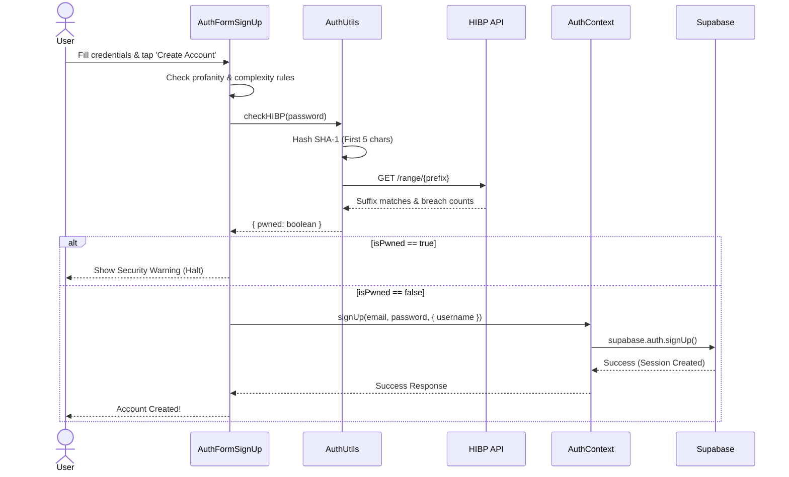
```mermaid
sequenceDiagram
    actor User
    participant AuthFormSignUp
    participant AuthUtils
    participant HIBP API
    participant AuthContext
    participant Supabase

    User->>AuthFormSignUp: Fill credentials & tap 'Create Account'
    AuthFormSignUp->>AuthFormSignUp: Check profanity & complexity rules
    AuthFormSignUp->>AuthUtils: checkHIBP(password)
    AuthUtils->>AuthUtils: Hash SHA-1 (First 5 chars)
    AuthUtils->>HIBP API: GET /range/{prefix}
    HIBP API-->>AuthUtils: Suffix matches & breach counts
    AuthUtils-->>AuthFormSignUp: { pwned: boolean }
    
    alt isPwned == true
        AuthFormSignUp-->>User: Show Security Warning (Halt)
    else isPwned == false
        AuthFormSignUp->>AuthContext: signUp(email, password, { username })
        AuthContext->>Supabase: supabase.auth.signUp()
        Supabase-->>AuthContext: Success (Session Created)
        AuthContext-->>AuthFormSignUp: Success Response
        AuthFormSignUp-->>User: Account Created!
    end
```

<!-- CARTOGRAPHER_END: IDENTITY -->

<!-- CARTOGRAPHER_END: IDENTITY -->

### 12.2 BLE Protocol Core [MOVE_TO_ARCHIVE]
<!-- CARTOGRAPHER_START: BLE_CORE -->

# BLE_CORE Cartography

## 1. File Manifest

*   **`src/services/ble/BleMachine.ts`**: Defines the canonical XState v5 Finite State Machine governing the six global BLE operational phases (`IDLE`, `SCANNING`, `CONNECTING`, `READY`, `DISCONNECTING`, `RECOVERING`) and radio acquisition gating.
*   **`src/services/ble/BleMachine.types.ts`**: Declares strict TypeScript type schemas, event interfaces, and context payloads that guard the `BleMachine` FSM transitions.
*   **`src/services/ble/ConnectService.ts`**: Invoked XState actor managing group connection lifecycles, exponential GATT 133 error retry loops, and delegating to the session factory.
*   **`src/services/ble/HeartbeatService.ts`**: Invoked XState actor that runs background liveness checks (`0x63` query) every 20 seconds to detect silent GATT dropouts and trigger auto-recovery.
*   **`src/services/ble/RecoveryService.ts`**: Invoked XState actor coordinating the 3-phase reconnection sequence (1s, 3s, 8s backoffs) for dropped-out skates.
*   **`src/services/ble/InterrogatorService.ts`**: Bounded hardware probing queue that queries freshly connected devices for EEPROM configurations, caching profiles in AsyncStorage.
*   **`src/services/ble/RSSIService.ts`**: Contains pure, headless RSSI polling logic that samples connection signal strength every 30s to check against weak/critical thresholds.
*   **`src/services/ble/README.md`**: Explains domain boundaries, strict co-location rules, and the "Hollow Shell" design pattern where UI hooks wrapper pure service files.
*   **`src/services/BleCharacteristicCache.ts`**: Persistent AsyncStorage-backed cache mapping MAC addresses to resolved protocol IDs to bypass service discovery on reconnect.
*   **`src/services/BlePingService.ts`**: Atomic, wizard-exclusive GATT sequence that connects, blinks, probes, and disconnects a skate without adding it to the persistent fleet.
*   **`src/services/BleWriteQueue.ts`**: Priority-ordered FIFO write serialization queue singleton with backpressure limits (max depth 8) and stale write generation pruning.
*   **`src/services/BleWriteDispatcher.ts`**: Low-level packet dispatch coordinator handling MTU-safe chunking, multi-skate write gaps (50ms), and 0x59 static buffer lockout protection.
*   **`src/hooks/useBLE.ts`**: The thin orchestrator hook composing sub-hooks and exposing the unified `BluetoothLowEnergyApi` to the React application.
*   **`src/hooks/ble/useBLEBatterySweep.ts`**: React hook tracking native device battery levels to throttle or pause background scanning based on battery tiers (`FULL`, `THROTTLED`, `PAUSED`).
*   **`src/hooks/ble/useBLEInterrogator.ts`**: Hook wrapper managing interrogation cache React state so UI components re-render when a new hardware profile is probed.
*   **`src/hooks/ble/useBLERSSIMonitor.ts`**: Hook wrapper connecting the `RSSIService` polling loop to React state RSSI maps.
*   **`src/hooks/ble/useBLEScanner.ts`**: Coordinates peripheral scanning loops, proximity RSSI gating, ambient telemetry batched uploads to Supabase, and simulated mock devices.
*   **`src/hooks/useOptimisticBLE.ts`**: High-performance UI wrapper that implements ghost state command updates (`IDLE`, `PENDING`, `CONFIRMED`, `RECONCILED`), haptic triggers, and snap-back rollbacks.
*   **`src/context/BLEContext.tsx`**: Context Provider boundaries and hook wrapper (`useSharedBLE`) supplying the `BluetoothLowEnergyApi` globally.

---

## 2. Blast Radius

Modifying files in `BLE_CORE` poses significant operational risks:
*   **GATT 133 / 0x85 Avalanches**: Parallel connections, overlapping scans, or writing to GATT handles without FSM serialization locks will crash the Android BlueDroid stack.
*   **Chipset EEPROM Bricking**: Dispatched custom pattern color sequences (`0x59` opcode) containing fewer than 10-12 pixels write corrupt parameters into the hardware EEPROM buffer, causing permanent chip locks. Dispatches must be padded by the `BleWriteDispatcher` lockout defense.
*   **Telemetry Upload Rate Saturation**: Background scans emit continuous device logs. Direct API calls can flood Supabase. Telemetry must pass through the offline AsyncStorage queue and flush in batches of 25.
*   **UI Thread Lag / Render Storms**: Exposing non-memoized references or un-stable callbacks in `useBLE.ts` triggers app-wide rendering cascades during rapid-fire color picker dragging.

---

## 3. Context Matrix

*   **`BLEContext`**:
    *   **Provides**: The unified `BluetoothLowEnergyApi` (from `useBLE.ts`) containing scanners, writers, state metrics, and machine actor references.
    *   **Consumed By**: `HardwareSetupWizardScreen` (device pairing/blinking), `DashboardScreen` (skate status and RSSI badges), `PatternPicker` / `ColorPicker` (GATT commands).
*   **`useRegistration`**:
    *   **Consumed By**: `BLEProvider` inside `BLEContext.tsx` to read the user's active `registeredDevices` and inject their MAC addresses into `useBLE()` to guide the automatic reconnection engine.

---

## 4. Hook/Service I/O Registry

### `useBLE(registeredMacs: string[])`
*   **Inputs**: `registeredMacs` (string array of active paired MAC addresses).
*   **Outputs**: `BluetoothLowEnergyApi` interface (connect/disconnect controllers, write channels, telemetry streams, and FSM gate checks).
*   **Side-Effects**: Instantiates native `BleManager`; registers `AppState` listeners to prune connections on sleep; runs background battery, RSSI, and scanner sweeps.

### `useOptimisticBLE(options)`
*   **Inputs**: `writeToDevice` writer, `onReconcile` rollback handler, `debounceMs`, and haptic config flags.
*   **Outputs**: `{ optimisticWrite, directWrite, writeStatus, isPending, isReconciled }`.
*   **Side-Effects**: Instantly fires UI state predictions; triggers mobile vibration feedback (light impact on success, error notification on failure).

### `enqueueWrite(priority, execute, generation)`
*   **Inputs**: `priority` ('critical' | 'normal' | 'bulk'), async closure, and `generation` identifier.
*   **Outputs**: `Promise<boolean | 'partial'>` resolving on native write execution.
*   **Side-Effects**: Restricts execution to a single task slot; discards stale writes if the current queue generation has advanced; drops lower-tier items during saturation.

### `createGattSession(bleManager, mac, options)`
*   **Inputs**: `bleManager`, MAC string, and connection config (timeout, retries, abort signal).
*   **Outputs**: `Promise<GattSessionResult>` containing `{ conn: Device, adapter: IControllerProtocol, usedCache: boolean }`.
*   **Side-Effects**: Physically connects the radio; **always** invokes native `discoverAllServicesAndCharacteristics()` to construct internal OS handle maps; populates the MAC cache.

---

## 5. OS Variance Matrix

| Operational Feature | iOS (`Platform.OS === 'ios'`) | Android (`Platform.OS === 'android'`) | Web / Simulation Sandbox |
| :--- | :--- | :--- | :--- |
| **MTU Negotiation** | Bypassed. CoreBluetooth auto-allocates maximum MTU buffer. Reads `conn.mtu`. | Explicitly calls `device.requestMTU(512)` on connect. Retries with settle delay if glitch value `23` is returned. | Bypassed. Mocked static MTU map value. |
| **Connection Priority** | Bypassed. CoreBluetooth manages priority curves dynamically. | Calls `requestConnectionPriorityForDevice(HIGH)` during handshake, downgrading to `BALANCED` (0) on completion to save battery. | Bypassed. |
| **Scan Budget Protection** | Bypassed. iOS native stack manages duty cycles internally. | Explicitly checks if Android 12+ API 31+ scan limits (max 5 scan starts/30s) are exceeded; defers activation if budget is depleted. | Bypassed. |
| **State Restoration** | Supported. Configures `restoreStateIdentifier` to retrieve native connections held by the OS on app wakeup. | Bypassed. Android does not maintain connection tables across Metro/app reloads; requires a fresh connection audit. | Bypassed. |
| **Haptics** | Invokes native Taptic Engine via `expo-haptics`. | Invokes Android vibrator service via `expo-haptics`. | Bypassed. |

---

## 6. Sequence Diagram: BLE Connection Process

This diagram captures the sequence from a user connecting devices on the Dashboard to the XState transition and physical time-sync handshake.

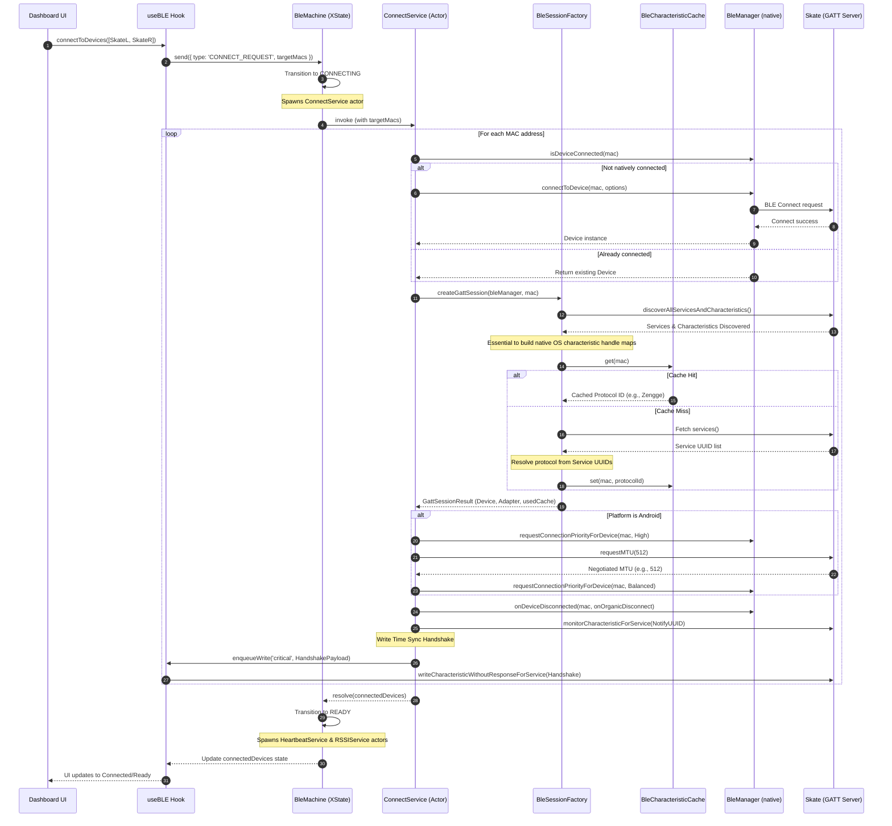
```mermaid
sequenceDiagram
    autonumber
    participant UI as Dashboard UI
    participant Hook as useBLE Hook
    participant FSM as BleMachine (XState)
    participant CS as ConnectService (Actor)
    participant SF as BleSessionFactory
    participant Cache as BleCharacteristicCache
    participant PLX as BleManager (native)
    participant DEV as Skate (GATT Server)

    UI->>Hook: connectToDevices([SkateL, SkateR])
    Hook->>FSM: send({ type: 'CONNECT_REQUEST', targetMacs })
    FSM->>FSM: Transition to CONNECTING
    Note over FSM: Spawns ConnectService actor
    FSM->>CS: invoke (with targetMacs)
    
    loop For each MAC address
        CS->>PLX: isDeviceConnected(mac)
        alt Not natively connected
            CS->>PLX: connectToDevice(mac, options)
            PLX->>DEV: BLE Connect request
            DEV-->>PLX: Connect success
            PLX-->>CS: Device instance
        else Already connected
            PLX-->>CS: Return existing Device
        end

        CS->>SF: createGattSession(bleManager, mac)
        SF->>DEV: discoverAllServicesAndCharacteristics()
        DEV-->>SF: Services & Characteristics Discovered
        Note over SF: Essential to build native OS characteristic handle maps
        
        SF->>Cache: get(mac)
        alt Cache Hit
            Cache-->>SF: Cached Protocol ID (e.g., Zengge)
        else Cache Miss
            SF->>DEV: Fetch services()
            DEV-->>SF: Service UUID list
            Note over SF: Resolve protocol from Service UUIDs
            SF->>Cache: set(mac, protocolId)
        end
        SF-->>CS: GattSessionResult (Device, Adapter, usedCache)

        alt Platform is Android
            CS->>PLX: requestConnectionPriorityForDevice(mac, High)
            CS->>DEV: requestMTU(512)
            DEV-->>CS: Negotiated MTU (e.g., 512)
            CS->>PLX: requestConnectionPriorityForDevice(mac, Balanced)
        end
        
        CS->>PLX: onDeviceDisconnected(mac, onOrganicDisconnect)
        CS->>DEV: monitorCharacteristicForService(NotifyUUID)
        
        Note over CS: Write Time Sync Handshake
        CS->>Hook: enqueueWrite('critical', HandshakePayload)
        Hook->>DEV: writeCharacteristicWithoutResponseForService(Handshake)
    end
    
    CS-->>FSM: resolve(connectedDevices)
    FSM->>FSM: Transition to READY
    Note over FSM: Spawns HeartbeatService & RSSIService actors
    FSM-->>Hook: Update connectedDevices state
    Hook-->>UI: UI updates to Connected/Ready
```

---

## 7. State Machine (FSM) Map: BleMachine.ts

Visual mapping of all states, transition events, and guards defined in the XState FSM.

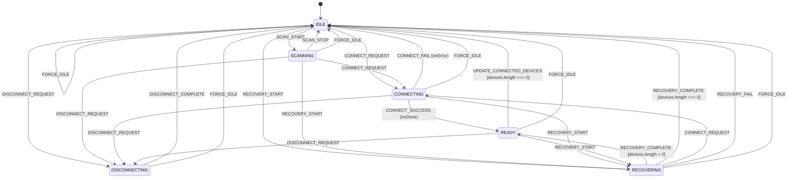
```mermaid
stateDiagram-v2
    [*] --> IDLE
    
    IDLE --> SCANNING : SCAN_START
    IDLE --> CONNECTING : CONNECT_REQUEST
    IDLE --> DISCONNECTING : DISCONNECT_REQUEST
    IDLE --> RECOVERING : RECOVERY_START
    
    SCANNING --> IDLE : SCAN_STOP
    SCANNING --> CONNECTING : CONNECT_REQUEST
    SCANNING --> DISCONNECTING : DISCONNECT_REQUEST
    SCANNING --> RECOVERING : RECOVERY_START
    
    CONNECTING --> READY : CONNECT_SUCCESS (onDone)
    CONNECTING --> IDLE : CONNECT_FAIL (onError)
    CONNECTING --> RECOVERING : RECOVERY_START
    CONNECTING --> DISCONNECTING : DISCONNECT_REQUEST
    
    READY --> DISCONNECTING : DISCONNECT_REQUEST
    READY --> RECOVERING : RECOVERY_START
    READY --> IDLE : UPDATE_CONNECTED_DEVICES [devices.length === 0]
    
    DISCONNECTING --> IDLE : DISCONNECT_COMPLETE
    
    RECOVERING --> READY : RECOVERY_COMPLETE [devices.length > 0]
    RECOVERING --> IDLE : RECOVERY_COMPLETE [devices.length === 0]
    RECOVERING --> CONNECTING : CONNECT_REQUEST
    RECOVERING --> IDLE : RECOVERY_FAIL

    %% Global Escape Hatch
    IDLE --> IDLE : FORCE_IDLE
    SCANNING --> IDLE : FORCE_IDLE
    CONNECTING --> IDLE : FORCE_IDLE
    READY --> IDLE : FORCE_IDLE
    DISCONNECTING --> IDLE : FORCE_IDLE
    RECOVERING --> IDLE : FORCE_IDLE
```

---

## 8. BLE Transport Pipeline Map

Flow of a BLE write instruction from the React interface to the physical GATT characteristics:

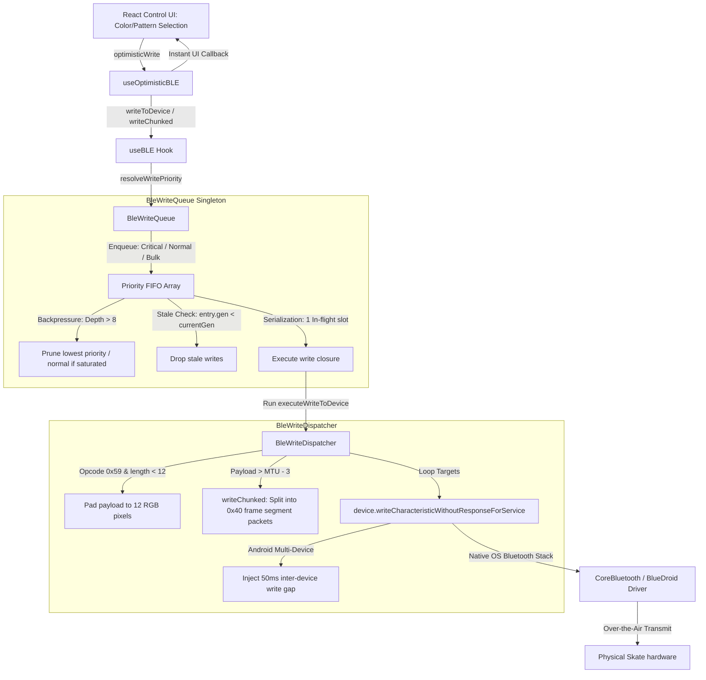
```mermaid
flowchart TD
    UI[React Control UI: Color/Pattern Selection] -->|optimisticWrite| OPT[useOptimisticBLE]
    OPT -->|Instant UI Callback| UI
    OPT -->|writeToDevice / writeChunked| UBLE[useBLE Hook]
    
    UBLE -->|resolveWritePriority| WQ[BleWriteQueue]
    
    subgraph WQ_SING[BleWriteQueue Singleton]
        WQ -->|Enqueue: Critical / Normal / Bulk| FIFO[Priority FIFO Array]
        FIFO -->|Backpressure: Depth > 8| DROP[Prune lowest priority / normal if saturated]
        FIFO -->|Stale Check: entry.gen < currentGen| PRUNE[Drop stale writes]
        FIFO -->|Serialization: 1 In-flight slot| EXEC[Execute write closure]
    end
    
    EXEC -->|Run executeWriteToDevice| DISP[BleWriteDispatcher]
    
    subgraph DISP_FLOW[BleWriteDispatcher]
        DISP -->|Opcode 0x59 & length < 12| PAD[Pad payload to 12 RGB pixels]
        DISP -->|Payload > MTU - 3| CHUNK[writeChunked: Split into 0x40 frame segment packets]
        DISP -->|Loop Targets| NATIVE[device.writeCharacteristicWithoutResponseForService]
        NATIVE -->|Android Multi-Device| GAP[Inject 50ms inter-device write gap]
    end
    
    NATIVE -->|Native OS Bluetooth Stack| DRV[CoreBluetooth / BlueDroid Driver]
    DRV -->|Over-the-Air Transmit| SK8[Physical Skate hardware]
```

<!-- CARTOGRAPHER_END: BLE_CORE -->

### 12.3 Group Sync & Swarm
<!-- CARTOGRAPHER_START: GROUP_SYNC -->

# Elite Architecture: GROUP_SYNC & CREW HUB Cartography

This document provides a rigorous architectural audit of the `GROUP_SYNC` and `CREW HUB` domains within the SK8Lytz application. It traces data flow, identifies cross-system dependencies, outlines platform differences, and records communication channels.

---

## 1. File Manifest

Every file in the `GROUP_SYNC` domain is mapped below alongside its exact architectural purpose:

1. **`src/services/GroupRepository.ts`**: The single source of truth (SSOT) for custom group persistence, managing AsyncStorage local-first caching, sync status queues, and transaction synchronization with the cloud backend via the `upsert_group_with_devices` Supabase RPC.
2. **`src/services/CrewService.ts`**: Orchestrates active crew session lifecycles (creation, joining, termination), manages Supabase Realtime Channel subscriptions, coordinates leader heartbeats, and broadcasts live scene parameters to active session members.
3. **`src/services/CrewProfileService.ts`**: Manages permanent crew configurations, membership associations, profile directory searches, administrative role delegation (owner promotion/revocation), and retrieves crew historical stats.
4. **`src/context/CrewContext.tsx`**: Provides the global React Context (`CrewProvider`) for the Crew Hub, tracking active wizard navigation steps, form input states, and exposing initialized instance hooks.
5. **`src/hooks/useCrewHub.ts`**: Coordinates local metadata queries, nearby active session searches, geographic location detection, and maps member counts to respective crew components.
6. **`src/hooks/useCrewManage.ts`**: Encapsulates state handlers for creating, configuring, and modifying permanent crew parameters, managing inline membership invitation lists and profile search queries.
7. **`src/hooks/useCrewSession.ts`**: Exposes handlers for joining, leaving, and ending active sessions, implementing logical gates for transferring session leadership role statuses.
8. **`src/hooks/useCrewProximityRadar.ts`**: Computes real-time distance vectors (using the Haversine formula) and relative orientations between the active user and other connected crew members streaming location updates.
9. **`src/hooks/useDashboardCrew.ts`**: Hooks into Supabase Realtime Channels to listen for leader scene broadcasts and forwards LED pattern commands directly to local hardware controllers for synchronized light shows.
10. **`src/hooks/useDashboardGroups.ts`**: Connects claimed hardware devices to custom fleets, merging local configurations with persistent groups while avoiding race conditions via functional state updater batches.
11. **`src/components/CrewModal.tsx`**: The master modal wrapper encapsulating the Crew Hub step wizard, instantiating the context provider, and routing sub-screens based on the active step.
12. **`src/components/CrewMemberDashboard.tsx`**: Renders a read-only live dashboard overlay for session members, showing active durations, location coordinates, leader scene visuals, and the connected skater roster.
13. **`src/components/crew/CrewLandingScreen.tsx`**: The central home pane for the Crew Hub, displaying permanent crews, a list of active nearby sessions, location picking states, and map filters.
14. **`src/components/crew/CrewControllerScreen.tsx`**: The control surface for session leaders, containing telemetry feedback, leader handoff toggles, custom scene broadcast sliders, and session ending controls.
15. **`src/components/crew/CrewCreateScreen.tsx`**: Presents configuration controls for establishing a new live session from a selected permanent crew.
16. **`src/components/crew/CrewDetailScreen.tsx`**: Displays administrative controls for a permanent crew, listing historical stats (distance, speeds, active sessions) and offering member list modification forms.
17. **`src/components/crew/CrewJoinScreen.tsx`**: Specialized landing view for browsing active public sessions and inputting 6-character alphanumeric invite codes for private crews.
18. **`src/components/crew/CrewScheduleScreen.tsx`**: Integrates date-time selectors and geographic location pickers to schedule upcoming crew sessions.
19. **`src/components/crew/CrewLandingMap.tsx`**: Native map implementation utilizing `react-native-maps` and clustering libraries to plot nearby skate spots and live sessions.
20. **`src/components/crew/CrewLandingMap.web.tsx`**: Web platform stub returning a styled placeholder when compiling for the web to avoid crashes from native mapping dependency gaps.
21. **`src/components/crew/MapFiltersTray.tsx`**: Renders colored toggle options (rinks, parks, shops, sessions) corresponding to map marker colors.
22. **`src/components/crew/CrewStyles.ts`**: Centralized styles builder generating consistent dimensions, overlays, buttons, inputs, and badge indicators.
23. **`src/components/crew/CrewStyles.web.ts`**: Web-specific adjustments ensuring flex layouts, scroll heights, and border properties render correctly on browsers.

---

## 2. Blast Radius

Modifications to files inside the `GROUP_SYNC` domain trigger cascading effects across multiple subsystems:

```
[Group Sync Domain]
  │
  ├──► Local Cache: AsyncStorage keys (@Sk8lytz_custom_groups, @Sk8lytz_pending_group_sync)
  │    └─► Critical: Modifying save transactional schemas risks blocking local-first group creation or locking sync queues.
  │
  ├──► Real-time Pipeline: Supabase Realtime Channels (`crew:{sessionId}`, `session_broadcast`)
  │    └─► Critical: Altering payload structures in CrewService will break downstream LED syncing for joined members.
  │
  ├──► Hardware Write Bus: useProtocolDispatch / useDashboardCrew
  │    └─► Critical: Broadcast scene updates write directly to connected skate devices. Out-of-bounds parameters will cause BLE locks.
  │
  └──► User Telemetry: Supabase profile endpoints (`lifetime_distance_miles`, `lifetime_top_speed_mph`)
       └─► Critical: Session closure calls aggregate telemetry writes. Database schema deviations will drop user skate stats.
```

### Dependency Ingestion (Imports)
- **Shared Contexts**: Consumes `AuthContext` (credentials and profile IDs), `ThemeContext` (visual palettes), and `AppConfigContext` (tab/map visibility feature flags).
- **Core Persistence**: Integrates with `DeviceRepository` to merge claimed devices and coordinate custom groups with device configurations.
- **Location Engine**: Interconnects with `LocationService` to scan for spots and resolve current coordinates.

### External Consumers (Exports)
- **Root Screens**: `DashboardScreen.tsx` mounts `CrewModal` and `CrewMemberDashboard`, serving as the primary anchor for all group features.
- **BLE Dispatch**: Coordinates with the local Bluetooth manager to command LED characteristics when synchronizing patterns with the leader.

---

## 3. Context Matrix

The following matrix documents contexts provided or consumed by files in this domain:

| Context | Provided | Consumed By | Architectural Purpose |
| :--- | :--- | :--- | :--- |
| **`CrewContext`** | `CrewModal.tsx` | All `src/components/crew/*` screens, `CrewMemberDashboard.tsx` | Distributes global step routes, active session statistics, inputs, and sub-hooks. |
| **`AuthContext`** | `AuthContext.tsx` | `CrewModal.tsx`, `CrewJoinScreen.tsx`, `CrewLandingScreen.tsx` | Supplies the logged-in user profile ID to identify crew ownership and session roles. |
| **`ThemeContext`** | `ThemeContext.tsx` | All crew screens, `CrewStyles.ts` | Resolves standard layout colors, highlights, button surfaces, and borders. |
| **`AppConfigContext`** | `AppConfigContext.tsx` | `CrewLandingScreen.tsx` | Enforces feature toggles (e.g., hiding map views if GPS tracking/maps tab is disallowed). |

---

## 4. Hook/Service I/O Registry

The tables below define inputs, outputs, database protocols, and side-effects for primary services and hooks:

### GroupRepository

| Method | Inputs (I) | Outputs (O) | Protocols & Side-Effects |
| :--- | :--- | :--- | :--- |
| `saveGroupTransactional` | `groupId: string`, `name: string`, `deviceMacs: string[]`, `userId: string` | `Promise<boolean>` | Writes to local AsyncStorage, updates device caches, and triggers Supabase DB RPC `upsert_group_with_devices`. |
| `syncPendingGroups` | None | `Promise<void>` | Reads offline queues in `@Sk8lytz_pending_group_sync` and replays pending modifications to Supabase. |
| `getLocalGroups` | None | `Promise<Group[]>` | Fetches local cached group arrays from `@Sk8lytz_custom_groups`. |

### CrewService

| Method | Inputs (I) | Outputs (O) | Protocols & Side-Effects |
| :--- | :--- | :--- | :--- |
| `createSession` | `name: string`, `leaderName: string`, `options: CrewSessionOpts`, `userId: string` | `Promise<CrewSession>` | Creates a `crew_sessions` database entry, inserts the leader into `crew_members`, and establishes a realtime presence channel. |
| `joinSessionById` | `sessionId: string`, `displayName: string`, `userId?: string` | `Promise<CrewSession>` | Inserts member records, increments skater counts, and joins the target realtime subscription channel. |
| `sendBroadcastScene` | `sessionId: string`, `scenePayload: Record<string, any>` | `Promise<void>` | Dispatches payload parameters over active realtime presence channels to all connected member devices. |

### Domain Hooks

| Hook | Exposed Outputs / APIs | Under-the-Hood Side-Effects |
| :--- | :--- | :--- |
| `useCrewHub` | `activeSessions`, `nearbySessions`, `nearbySpots`, `refreshNearby()`, `locationCoords` | Executes geolocation queries via `LocationService` using a 3000ms timeout race; pulls active sessions matching the local radius. |
| `useCrewManage` | `selectedCrewDetail`, `cardMembers`, `loadCrewMembers()`, `saveCrew()` | Triggers search queries on profile tables, updates membership arrays, and promotes/demotes owner roles in junction tables. |
| `useCrewSession` | `currentSession`, `executeLeaveSession()`, `handleHandoffLeadership()` | Terminates realtime subscriptions, updates leader keys in active sessions, and updates locally cached session status. |
| `useCrewProximityRadar` | `memberDistances: Record<string, number>`, `isCalculating` | Regularly runs the Haversine formula on incoming GPS coordinates of crew members streamed via realtime channels. |

---

## 5. OS Variance Matrix

Specific code branches manage platform variances between iOS, Android, and Web target environments:

### Web Platform Compilation
*   **File Extension Branching**: React Native Web builds cannot parse `react-native-maps` directly due to missing native libraries. Metro is configured to resolve `CrewLandingMap.web.tsx` instead of `CrewLandingMap.tsx` on browser environments, serving a clean fallback stub explaining mobile requirements.
*   **Touch Properties**: Styling configurations in `CrewStyles.web.ts` replace native shadow properties with CSS-compatible flex borders and overlay heights.

### Android vs. iOS Core Discrepancies
*   **Monospace Font Selection**: Monospaced typography for invite codes utilizes different engine fonts to avoid rendering failures:
    ```typescript
    fontFamily: Platform.OS === 'ios' ? 'Courier New' : 'monospace' // Or 'Menlo'
    ```
*   **Keyboard Avoiding Offsets**: Input forms adjust wrapper offsets contextually:
    ```typescript
    behavior={Platform.OS === 'ios' ? 'padding' : undefined}
    ```
*   **DateTimePicker Dialog Styles**: Date and time selector modals branch layout representation to match respective native guidelines:
    ```typescript
    display={Platform.OS === 'android' ? 'calendar' : 'spinner'} // Date mode
    display={Platform.OS === 'android' ? 'clock' : 'spinner'}    // Time mode
    ```
*   **Bluetooth MAC Case Sanitization**: Discrepancies in BLE scanning behavior (iOS hides MAC addresses, while Android returns lowercase strings) require strict `.toUpperCase()` sanitization inside `GroupRepository` before searching map indexes.
*   **Geo-Location Latency Race**: Android device coordinates often return slower during high GPS traffic. The locator in `useCrewHub.ts` runs location queries inside a `Promise.race` wrapper:
    ```typescript
    Promise.race([
      Location.getCurrentPositionAsync({ accuracy: Location.Accuracy.Balanced }),
      new Promise((_, reject) => setTimeout(() => reject(new Error("Timeout")), 3000))
    ])
    ```
    This prevents slow Android GPS responders from locking the application's main thread.

---

## 6. Real-Time Scene Sync Sequence

The following sequence details how scene modifications from the leader are broadcast via Supabase Realtime Channels, parsed, and converted to physical byte packets on member devices:

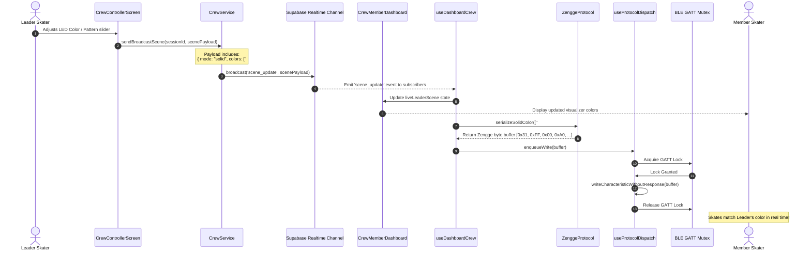
```mermaid
sequenceDiagram
    autonumber
    actor LeaderUser as Leader Skater
    participant Controller as CrewControllerScreen
    participant RealtimeService as CrewService
    participant SupabaseRT as Supabase Realtime Channel
    participant MemberDashboard as CrewMemberDashboard
    participant MemberDashboardCrew as useDashboardCrew
    participant BLEEncoder as ZenggeProtocol
    participant BLEQueue as useProtocolDispatch
    participant GATT as BLE GATT Mutex
    actor MemberUser as Member Skater

    %% Leader initiates change
    LeaderUser->>Controller: Adjusts LED Color / Pattern slider
    Controller->>RealtimeService: sendBroadcastScene(sessionId, scenePayload)
    Note over RealtimeService: Payload includes:<br/>{ mode: "solid", colors: ["#FF00A0"] }
    
    %% Realtime Broadcast
    RealtimeService->>SupabaseRT: broadcast('scene_update', scenePayload)
    SupabaseRT-->>MemberDashboardCrew: Emit 'scene_update' event to subscribers
    
    %% Member UI Update
    MemberDashboardCrew->>MemberDashboard: Update liveLeaderScene state
    MemberDashboard-->>MemberUser: Display updated visualizer colors
    
    %% Member LED hardware update
    MemberDashboardCrew->>BLEEncoder: serializeSolidColor(["#FF00A0"])
    BLEEncoder-->>MemberDashboardCrew: Return Zengge byte buffer [0x31, 0xFF, 0x00, 0xA0, ...]
    
    MemberDashboardCrew->>BLEQueue: enqueueWrite(buffer)
    BLEQueue->>GATT: Acquire GATT Lock
    GATT->>BLEQueue: Lock Granted
    BLEQueue->>BLEQueue: writeCharacteristicWithoutResponse(buffer)
    BLEQueue->>GATT: Release GATT Lock
    Note over MemberUser: Skates match Leader's color in real time!
```

---

<!-- CARTOGRAPHER_END: GROUP_SYNC -->

### 12.4 Control Surfaces
<!-- CARTOGRAPHER_START: UI_CONTROLS -->

[🕵️ Scout — Reyes | Cartographer | UI_CONTROLS | cold]

Here is the Elite Architecture Markdown Payload for the `UI_CONTROLS` domain.

<!-- CARTOGRAPHER_START: UI_CONTROLS -->
# 🗺️ UI_CONTROLS Domain Architecture

## 1. File Manifest
- `src/screens/AuthScreen.tsx`: Manages user authentication, magic links, offline mode toggling, and UI states for login/signup/forgot password.
- `src/screens/DashboardScreen.tsx`: The monolithic root application screen orchestrating BLE lifecycle, fleet management, session context, and routing hardware notifications.
- `src/screens/Onboarding/HardwareSetupWizardScreen.tsx`: Multi-step FTUE orchestrator for discovering, blinking, claiming, and configuring physical skate hardware.
- `src/screens/Onboarding/PermissionsOnboardingScreen.tsx`: Explains and auto-requests essential permissions (BLE, Location, Camera) before allowing entry to the app.
- `src/components/DockedController.tsx`: The primary routing shell for LED control, managing the mode FSM, BLE write bus, and delegating sub-panel rendering.

## 2. Blast Radius
- **Imports (Consumes)**:
  - **Contexts**: `ThemeContext`, `BLEContext`, `SessionContext`, `FavoritesContext`
  - **Domain Hooks**: `useRegistration`, `useDashboardProfile`, `useDashboardGroups`, `useDashboardAutoConnect`, `useDeviceStateLedger`, `useProtocolDispatch`, `useDockedControllerState`, `useStreetMode`, `useControllerAnalytics`, `useSharedFavorites`, `useOptimisticBLE`, etc.
  - **Protocols/Utils**: `ZenggeProtocol`, `PatternEngine`, `ColorUtils`, `NamingUtils`, `ProductCatalog`, `AppLogger`
  - **Sub-components**: `DockedDock`, `ProEffectsPanel`, `BuilderPanel`, `MusicPanel`, `AuthHeader`, `DeviceItem`, `LiveTelemetryHUD`
- **Exports (Consumed By)**: 
  - `AuthScreen
<truncated 2377 bytes>
rdScreen.tsx`**: `KeyboardAvoidingView` behavior is `'padding'` on iOS, `undefined` on Android. Uses `Platform.OS === 'ios' ? 0 : 12` for footer padding.

## 6. Complex Sequence Flow: Hardware Setup Wizard (Atomic Ping)
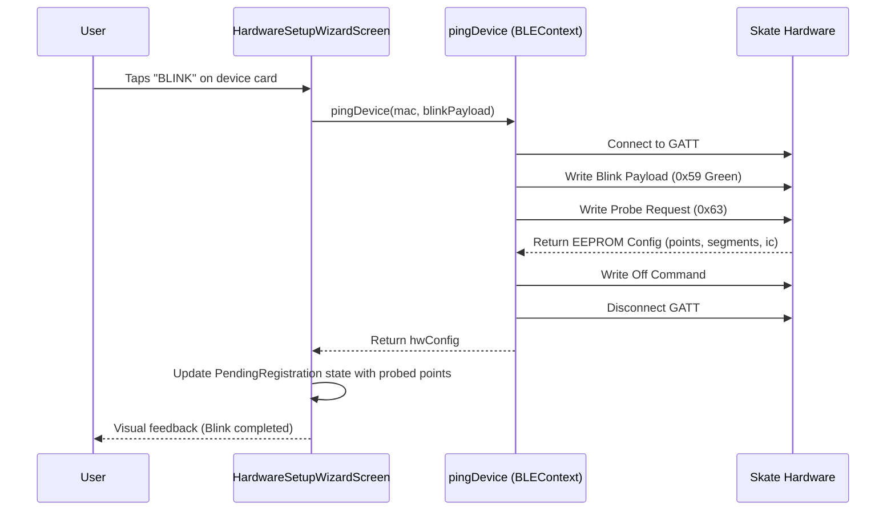
```mermaid
sequenceDiagram
    participant User
    participant Wizard as HardwareSetupWizardScreen
    participant BLE as pingDevice (BLEContext)
    participant HW as Skate Hardware

    User->>Wizard: Taps "BLINK" on device card
    Wizard->>BLE: pingDevice(mac, blinkPayload)
    BLE->>HW: Connect to GATT
    BLE->>HW: Write Blink Payload (0x59 Green)
    BLE->>HW: Write Probe Request (0x63)
    HW-->>BLE: Return EEPROM Config (points, segments, ic)
    BLE->>HW: Write Off Command
    BLE->>HW: Disconnect GATT
    BLE-->>Wizard: Return hwConfig
    Wizard->>Wizard: Update PendingRegistration state with probed points
    Wizard-->>User: Visual feedback (Blink completed)
```

## 7. Design System & Token Manifest [MOVE_TO_ARCHIVE]
- **Spacings & Layouts**: Uses `Spacing.md`, `Spacing.lg`, `Spacing.xl` extensively. Relies on `Layout.borderRadius`.
- **Typographic Tokens**: Titles use `fontSize: 24-32`, `fontWeight: '900'`. Accents use `letterSpacing: 1-1.5`. Relies heavily on `Typography.title`.
- **Colors**: Leverages `Colors.primary` (`#00f0ff` natively) for CTAs. Destructive/Errors use `#ff4444`. Surface elements rely on `Colors.surface` and `Colors.surfaceHighlight`. Muted text uses `Colors.textMuted`.
- **Iconography**: `MaterialCommunityIcons` is the standard throughout.

---
### 🗄️ Archival Notice
I identified stale documentation in `tools/SK8Lytz_App_Master_Reference.md` regarding the `useFavorites` hook implementation. I have mapped it for archiving.

**Stale Doc found in Master Reference:**
`| useFavorites

<!-- CARTOGRAPHER_END: UI_CONTROLS -->

### 12.5 Data & Telemetry
<!-- CARTOGRAPHER_START: DATA_LAYER -->

# 🗃️ DATA_LAYER Domain Cartography

This document provides a detailed architectural audit of the `DATA_LAYER` domain within the SK8Lytz application, mapping out the persistence layers, database schemas, Row Level Security (RLS) policies, and the background synchronization framework.

---

## 1. File Manifest

Every file within the `DATA_LAYER` domain is cataloged below with its precise 1-sentence architectural purpose:

1.  **`src/services/DeviceRepository.ts`**: Implements a singleton repository serving as the Single Source of Truth (SSOT) for the device fleet, coordinating memory-cached state, local storage (`AsyncStorage`), and cloud database synchronization with transactional tombstone handling.
2.  **`src/services/TelemetryService.ts`**: Provides a utility class for parsing, checking, and extracting metadata (such as operation type, payload sizes, and GATT status codes) from raw binary or JSON BLE telemetry errors.
3.  **`src/services/ScenesService.ts`**: Coordinates local and cloud storage of multi-step animations (scenes) and community presets, supporting RPC upvotes, downloads, cache-first retrievals, and structured background syncing.
4.  **`src/services/SpeedTrackingService.ts`**: Manages the persistence of street skating sessions, computes calorie metrics via MET-based approximations, tracks lifetime profiles, and queues offline metrics when unauthenticated.
5.  **`src/services/GradientsService.ts`**: Manages custom gradient templates and linear/positional color builder presets, offering offline fallback caches and authenticated cloud writes.
6.  **`src/services/SkateSpotsService.ts`**: Retrieves, filters, and caches geographic skate spot locations (rinks, parks, and shops) using a hybrid database-first and OpenStreetMap fallback structure.
7.  **`src/services/SessionShareService.ts`**: Assembles custom share payloads (including telemetry metrics and platform-specific App/Play store links) and invokes the native OS share sheet.
8.  **`src/types/supabase.ts`**: Contains the complete, auto-generated TypeScript type definitions mapping directly to the Supabase database schema.
9.  **`src/services/supabaseClient.ts`**: Configures and instantiates the Supabase client wrapper with an Expo `SecureStore` session adapter and a robust web/offline fallback mock.
10. **`src/hooks/cloud/useOfflineSyncWorker.ts`**: Registers a root-level 60-second background polling cycle that sequentially flushes queued scenes, skate sessions, and system logs to Supabase upon successful authentication.
11. **`src/hooks/useFavorites.ts`**: Provides React component access to user-specific color favorites and presets, coordinating local caching and cloud-syncing with `FavoritesContext` integration.
12. **`src/hooks/useScenes.ts`**: Exposes loading, saving, and deletion methods for multi-step lighting animation scenes by wrapping `ScenesService` calls.
13. **`src/hooks/useCuratedPicks.ts`**: Implements stale-while-revalidate fetching of featured color templates from the `sk8lytz_picks` table using active date validity parameters.
14. **`src/hooks/useGradients.ts`**: Hooks into the custom gradient repository (`GradientsService`) to manage linear/positional builder presets.
15. **`src/hooks/useSkateStats.ts`**: Fetches, aggregates, and exposes historic session logs and lifetime telemetry metrics from `SpeedTrackingService`.
16. **`src/hooks/useRecentSpots.ts`**: Manages a local cache of the user's 10 most recently viewed or added skate spot locations in `AsyncStorage`.
17. **`src/hooks/useMapFilters.ts`**: Tracks, persists, and filters geographic skate spots based on facility type, illumination, indoor status, entry fee, and active crew sessions.
18. **`src/context/FavoritesContext.tsx`**: Declares the global provider wrapper that propagates `useFavorites` state down through the React component tree.

---

## 2. Blast Radius

### Imports (What this domain consumes)
*   **External Packages**: `@supabase/supabase-js`, `expo-secure-store`, `@react-native-async-storage/async-storage`, `react-native`, `react-native-url-polyfill`, `sk8lytz-watch-bridge`.
*   **Internal Services/Utils**: `AppLogger.ts`, `LocationService.ts`, `ProductCatalog.ts`, `GroupRepository.ts`, `PositionalMathBuffer.ts`, `AuthContext.ts`, `useTelemetryLedger.ts`, `useHealthTelemetry.ts`.

### Imported By (What consumes this domain)
*   **Application Bootstrappers**: `App.tsx` (consumes `useOfflineSyncWorker` to kick off background sync loops, mounts `FavoritesProvider`).
*   **Dashboard & Controls**: `DashboardScreen.tsx`, `DockedController.tsx` (invokes `SpeedTrackingService.saveSession` and reads device status), `Sk8LytzProgrammerModal.tsx`, `QuickPresetModal.tsx`, `CrewModal.tsx` (consumes session ID bindings), `CommunityModal.tsx`.
*   **Mapping UI**: `MapScreen.tsx` (consumes `useMapFilters`, `useRecentSpots`, and `SkateSpotsService`).
*   **Testing Suites**: `__tests__/services/SpeedTrackingService.offline.test.ts`.

---

## 3. Context Matrix

### Consumed Contexts
*   **`AuthContext`** (`useAuth`): Consumed throughout all hooks and services (such as `useOfflineSyncWorker`, `useFavorites`, `useScenes`, `useGradients`, `useSkateStats`, `DeviceRepository`, and `ScenesService`) to extract the authenticated user's ID (`userId`), enforce auth-required paths, and route synchronization parameters.

### Provided Contexts
*   **`FavoritesContext`** (`FavoritesProvider`): Provides a shared, reactive context containing local and cloud user favorite color configs, quick presets, and loading states, ensuring synchronization across the programming HUD and preset modals.

---

## 4. Hook/Service I/O Registry

### `DeviceRepository`
*   **`initialize()`**
    *   **Input**: None
    *   **Output**: `Promise<void>`
    *   **Side-Effects**: Reads local configurations (`@Sk8lytz_device_configs`), tombstones (`@Sk8lytz_deleted_macs`), and registered devices (`@Sk8lytz_registered_devices`) from `AsyncStorage`. Calls `GroupRepository.initialize()`.
*   **`saveDevice(device, userId?)`**
    *   **Input**: `Partial<RegisteredDevice> & { device_mac: string }`, `userId?: string`
    *   **Output**: `Promise<boolean>`
    *   **Side-Effects**: Normalizes MAC address to uppercase. Queries GPS location if coords are missing. Removes MAC from local deleted tombstones list. Stores device locally. If `userId` is present, upserts to Supabase `registered_devices` and runs the group mapping transaction (via RPC `upsert_group_with_devices` or direct fallback table writes). Enqueues in `@Sk8lytz_pending_sync` on failure.
*   **`deleteDevice(deviceMac, userId?)`**
    *   **Input**: `deviceMac: string`, `userId?: string`
    *   **Output**: `Promise<void>`
    *   **Side-Effects**: Marks MAC as deleted in local tombstones (`@Sk8lytz_deleted_macs`), removes local records, and triggers database `DELETE` request to Supabase if authenticated.
*   **`syncFromCloud(userId?)`**
    *   **Input**: `userId?: string`
    *   **Output**: `Promise<RegisteredDevice[]>`
    *   **Side-Effects**: Downloads remote device lists. Filters against local deleted tombstones. Combines remote values with local custom modifications (local-first). Flushes pending offline updates, pending group memberships, and pending deletes back to the database.

### `ScenesService`
*   **`getPublicScenes(limit?, offset?)`**
    *   **Input**: `limit?: number` (default 50), `offset?: number` (default 0)
    *   **Output**: `Promise<ICloudScene[]>`
    *   **Side-Effects**: Returns local cached community presets (`STORAGE_SCENES_CACHE`) instantly, then triggers a background fetch to query Supabase `shared_scenes` where `is_public` is true, writing updates back to the cache.
*   **`getSavedScenes(userId?)`**
    *   **Input**: `userId?: string`
    *   **Output**: `Promise<Scene[]>`
    *   **Side-Effects**: Returns cached `@Sk8lytz_Scenes` instantly. Fires background network queries to fetch global scenes (`custom_builder_presets` where `fill_mode = 'SCENE'`) and user-owned presets (`user_saved_presets`). Deduplicates by ID, merges, and writes back to `@Sk8lytz_Scenes`.
*   **`saveScene(scene, userId?)`**
    *   **Input**: `Scene`, `userId?: string`
    *   **Output**: `Promise<boolean>`
    *   **Side-Effects**: Updates `@Sk8lytz_Scenes` cache array. If authenticated, enqueues an `upsert_user_scene` job in `AsyncStorage` queue (`@Sk8lytz_Scene_Sync_Queue`).
*   **`deleteSavedScene(sceneId, userId?)`**
    *   **Input**: `sceneId: string`, `userId?: string`
    *   **Output**: `Promise<boolean>`
    *   **Side-Effects**: Removes preset from `@Sk8lytz_Scenes` cache array. Enqueues a `delete_user_scene` job in `@Sk8lytz_Scene_Sync_Queue`.
*   **`flushSyncQueue(userId)`**
    *   **Input**: `userId: string`
    *   **Output**: `Promise<void>`
    *   **Side-Effects**: Processes items from `@Sk8lytz_Scene_Sync_Queue` sequentially: executes inserts to `shared_scenes` (for community publishes), upserts to `user_saved_presets` (for user saves), and deletes from `user_saved_presets`. Discards successfully synced jobs.

### `SpeedTrackingService`
*   **`saveSession(snapshot, userId)`**
    *   **Input**: `ISessionSnapshot`, `userId: string | null`
    *   **Output**: `Promise<string | null>`
    *   **Side-Effects**: Enforces threshold validation (distance >= 0.01 miles OR duration >= 10s). If offline/unauthenticated, calculates calories using MET formula, serializes snapshot, and appends to `PENDING_SESSION_QUEUE_KEY`. If authenticated, inserts a row into `skate_sessions` table, updates `user_profiles` lifetime top speed and distance, and attempts to invoke Native Health frameworks via `HealthSyncService.saveWorkout`.
*   **`flushPendingSessionQueue(userId)`**
    *   **Input**: `userId: string | null`
    *   **Output**: `Promise<void>`
    *   **Side-Effects**: Implements the `_isFlushingSessionQueue` re-entrancy block. Reads `PENDING_SESSION_QUEUE_KEY`. Syncs queued sessions to Supabase `skate_sessions` using the provided user ID. Computes aggregate distance and top speed across successfully written records, and updates `user_profiles` lifetime metrics. Clears items from queue.
*   **`pushSpeedToWatch(speedMph, calories?, heartRateBpm?)`**
    *   **Input**: `speedMph: number`, `calories?: number`, `heartRateBpm?: number`
    *   **Output**: None
    *   **Side-Effects**: Enforces a 3000ms throttle. Sends real-time speed, calorie burn, and pulse metrics to native watch companion apps via `WatchBridge.sendMetricUpdate()`.

---

## 5. OS Variance Matrix

### Encryption & Secure Storage
*   **iOS & Android**: `supabaseClient.ts` secures the session token using `expo-secure-store`. On iOS, this translates to Keychain Services. On Android, it utilizes EncryptedSharedPreferences backed by the Android Keystore system.
*   **Web**: Degrades gracefully to unencrypted `localStorage` since native encryption libraries throw platform support errors in standard web browsers.

### Native Share Sheets
*   **iOS**: `SessionShareService.ts` formats the share payload utilizing the separate `url` parameter field. This causes iOS to request and display rich link preview cards (metadata sheets) pointing to the Apple App Store download link.
*   **Android**: Joins the Google Play Store link directly into the string message payload and populates the `dialogTitle` attribute of the share options config.

### Core Location & Accelerometer Modules
*   **iOS**: Integrates with Apple CoreLocation and CoreMotion APIs via Expo. Location tasks require plist keys `NSLocationAlwaysAndWhenInUseUsageDescription` and background execution policies to log background sessions.
*   **Android**: Integrates with Google Play Services Fused Location Provider. Relies on Foreground Services with type `FOREGROUND_SERVICE_TYPE_LOCATION` to prevent Android OS from harvesting background location logs.

---

## 6. Database Schema & RLS Policies

Here are the precise schemas and active Row Level Security (RLS) policies for the database tables managed within this domain:

### Table: `registered_devices`
```sql
CREATE TABLE public.registered_devices (
    id text NOT NULL PRIMARY KEY,
    device_mac text,
    user_id uuid NOT NULL REFERENCES auth.users(id),
    device_name text,
    product_type text,
    led_points integer,
    segments integer NOT NULL DEFAULT 1,
    ic_type text,
    color_sorting text,
    firmware_ver integer,
    led_version integer,
    product_id integer,
    product_id_confirmed_at timestamp with time zone,
    rf_mode text,
    rf_paired_count integer,
    group_id text,
    group_name text,
    registered_at timestamp with time zone,
    updated_at timestamp with time zone,
    rssi_at_register integer,
    CONSTRAINT registered_devices_user_mac_key UNIQUE (user_id, device_mac)
);
```
*   **Policies**:
    *   `devices_owner_select`: `FOR SELECT TO authenticated USING (((user_id = auth.uid()) OR public.is_admin()))`
    *   `devices_owner_insert`: `FOR INSERT TO authenticated WITH CHECK (((auth.uid() = user_id)))`
    *   `devices_owner_update`: `FOR UPDATE TO authenticated USING (((auth.uid() = user_id)))`
    *   `devices_owner_delete`: `FOR DELETE TO authenticated USING (((auth.uid() = user_id)))`

### Table: `user_saved_presets`
```sql
CREATE TABLE public.user_saved_presets (
    id text NOT NULL PRIMARY KEY,
    created_at timestamp with time zone DEFAULT now(),
    fill_mode text NOT NULL, -- 'FAVORITE' | 'SCENE' | 'BUILDER'
    name text NOT NULL,
    nodes jsonb NOT NULL,
    transition_type integer NOT NULL DEFAULT 0,
    updated_at timestamp with time zone,
    user_id uuid NOT NULL REFERENCES auth.users(id)
);
```
*   **Policies**:
    *   `Users can select their own presets`: `FOR SELECT USING ((auth.uid() = user_id))`
    *   `Users can insert their own presets`: `FOR INSERT WITH CHECK ((auth.uid() = user_id))`
    *   `Users can update their own presets`: `FOR UPDATE USING ((auth.uid() = user_id))`
    *   `Users can delete their own presets`: `FOR DELETE USING ((auth.uid() = user_id))`

### Table: `custom_builder_presets`
```sql
CREATE TABLE public.custom_builder_presets (
    id text NOT NULL PRIMARY KEY,
    created_at timestamp with time zone DEFAULT now(),
    fill_mode text NOT NULL,
    name text NOT NULL,
    nodes jsonb NOT NULL,
    transition_type integer NOT NULL DEFAULT 0,
    updated_at timestamp with time zone,
    user_id uuid REFERENCES auth.users(id)
);
```
*   **Policies**:
    *   `Users can manage their own builder presets`: `USING ((auth.uid() = user_id))` (Includes SELECT, INSERT, UPDATE, DELETE)

### Table: `shared_scenes`
```sql
CREATE TABLE public.shared_scenes (
    id uuid NOT NULL PRIMARY KEY DEFAULT gen_random_uuid(),
    created_at timestamp with time zone DEFAULT now(),
    author_id uuid NOT NULL REFERENCES auth.users(id),
    author_username text NOT NULL,
    name text NOT NULL,
    scene_payload jsonb NOT NULL,
    downloads integer NOT NULL DEFAULT 0,
    upvotes integer NOT NULL DEFAULT 0,
    is_public boolean NOT NULL DEFAULT false
);
```
*   **Policies**:
    *   `Public scenes are widely viewable`: `FOR SELECT USING ((is_public = true))`
    *   `Users can view own private scenes`: `FOR SELECT TO authenticated USING ((auth.uid() = author_id))`
    *   `Users can create scenes`: `FOR INSERT TO authenticated WITH CHECK ((auth.uid() = author_id))`
    *   `Users can update own scenes`: `FOR UPDATE TO authenticated USING ((auth.uid() = author_id)) WITH CHECK ((auth.uid() = author_id))`
    *   `Users can delete own scenes`: `FOR DELETE TO authenticated USING ((auth.uid() = author_id))`

### Table: `skate_sessions`
```sql
CREATE TABLE public.skate_sessions (
    id uuid NOT NULL PRIMARY KEY DEFAULT gen_random_uuid(),
    session_date timestamp with time zone DEFAULT now(),
    duration_sec integer NOT NULL,
    distance_miles double precision NOT NULL,
    avg_speed_mph double precision NOT NULL,
    peak_speed_mph double precision NOT NULL,
    peak_gforce double precision,
    calories integer,
    avg_bpm integer,
    peak_bpm integer,
    location_label text,
    location_coords jsonb,
    start_coords jsonb,
    end_coords jsonb,
    path_coords jsonb,
    crew_session_id uuid,
    user_id uuid NOT NULL REFERENCES auth.users(id)
);
```
*   **Policies**:
    *   `skate_sessions_owner_access`: `FOR ALL TO authenticated USING (((auth.uid() = user_id)))`
    *   `skate_owner_select`: `FOR SELECT TO authenticated USING (((user_id = auth.uid()) OR public.is_admin()))`
    *   `Users can manage own skate sessions`: `USING ((auth.uid() = user_id)) WITH CHECK ((auth.uid() = user_id))`

### Table: `skate_spots`
```sql
CREATE TABLE public.skate_spots (
    id uuid NOT NULL PRIMARY KEY DEFAULT gen_random_uuid(),
    name text NOT NULL,
    lat double precision NOT NULL,
    lng double precision NOT NULL,
    surface_type text,
    is_indoor boolean,
    source text,
    is_verified boolean DEFAULT false,
    facility_type text,
    has_pro_shop boolean,
    is_featured boolean DEFAULT false,
    last_enriched_at timestamp with time zone,
    socials jsonb,
    vibe_rating double precision,
    has_adult_night boolean,
    has_lights boolean,
    has_fee boolean,
    has_rental boolean,
    has_wifi boolean,
    updated_by uuid REFERENCES auth.users(id),
    created_at timestamp with time zone DEFAULT now(),
    updated_at timestamp with time zone DEFAULT now()
);
```
*   **Policies**:
    *   `Skate spots are viewable by everyone.`: `FOR SELECT USING (true)`
    *   *(INSERT/UPDATE/DELETE default to deny for non-admin accounts)*

---

## 7. Environment & Secrets Manifest

### Variables
*   `EXPO_PUBLIC_SUPABASE_URL`: The API Gateway endpoint URL hosting the Supabase database and authentication microservices.
*   `EXPO_PUBLIC_SUPABASE_ANON_KEY`: The public anonymous key utilized to authenticate requests passing through the PostgREST server middleware.

### Web and Offline Fallback Strategy
If either `EXPO_PUBLIC_SUPABASE_URL` or `EXPO_PUBLIC_SUPABASE_ANON_KEY` are not configured (e.g. during a local emulator launch or untrusted web bundling), `supabaseClient.ts` intercepts requests and falls back to a mock client object:
1.  `auth.getUser` returns `{ data: { user: null }, error: null }` immediately.
2.  `auth.signInWithPassword` returns a resolved error with the message `'Offline mode'`.
3.  Table querying and modification methods (`from`, `select`, `upsert`, `insert`, `delete`) bypass networking, resolving with empty data objects or mock array buffers.
4.  RPC functions resolve with a customized error instructing the user to utilize offline email signing paths.

---

## 8. Offline Sync Queue Architecture

The app implements a local-first architecture to ensure seamless functionality during spotty connectivity (e.g., when skating). Background synchronization is managed via a root-level hook `useOfflineSyncWorker` that operates as detailed below:

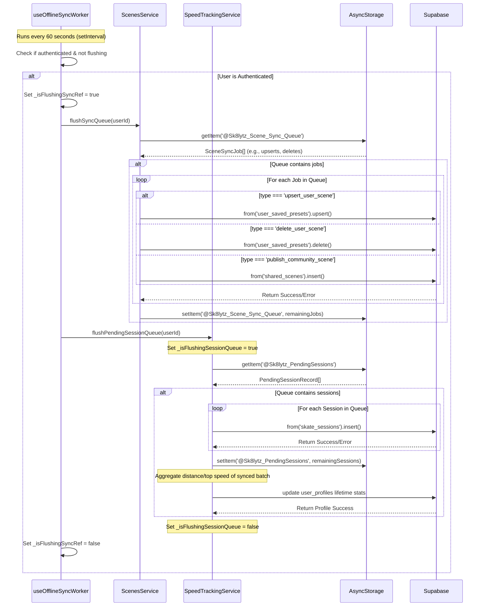
```mermaid
sequenceDiagram
    participant Worker as useOfflineSyncWorker
    participant Scenes as ScenesService
    participant Speed as SpeedTrackingService
    participant Async as AsyncStorage
    participant DB as Supabase

    Note over Worker: Runs every 60 seconds (setInterval)
    Worker->>Worker: Check if authenticated & not flushing
    alt User is Authenticated
        Worker->>Worker: Set _isFlushingSyncRef = true
        
        %% Step 1: Flush Scenes Sync Queue
        Worker->>Scenes: flushSyncQueue(userId)
        Scenes->>Async: getItem('@Sk8lytz_Scene_Sync_Queue')
        Async-->>Scenes: SceneSyncJob[] (e.g., upserts, deletes)
        alt Queue contains jobs
            loop For each Job in Queue
                alt type === 'upsert_user_scene'
                    Scenes->>DB: from('user_saved_presets').upsert()
                else type === 'delete_user_scene'
                    Scenes->>DB: from('user_saved_presets').delete()
                else type === 'publish_community_scene'
                    Scenes->>DB: from('shared_scenes').insert()
                end
                DB-->>Scenes: Return Success/Error
            end
            Scenes->>Async: setItem('@Sk8lytz_Scene_Sync_Queue', remainingJobs)
        end
        
        %% Step 2: Flush Speed Tracking Session Queue
        Worker->>Speed: flushPendingSessionQueue(userId)
        Note over Speed: Set _isFlushingSessionQueue = true
        Speed->>Async: getItem('@Sk8lytz_PendingSessions')
        Async-->>Speed: PendingSessionRecord[]
        alt Queue contains sessions
            loop For each Session in Queue
                Speed->>DB: from('skate_sessions').insert()
                DB-->>Speed: Return Success/Error
            end
            Speed->>Async: setItem('@Sk8lytz_PendingSessions', remainingSessions)
            Note over Speed: Aggregate distance/top speed of synced batch
            Speed->>DB: update user_profiles lifetime stats
            DB-->>Speed: Return Profile Success
        end
        Note over Speed: Set _isFlushingSessionQueue = false

        Worker->>Worker: Set _isFlushingSyncRef = false
    end
```

---

## 9. Master Reference Document Archival Gate

### `

<!-- CARTOGRAPHER_END: DATA_LAYER -->

<!-- CARTOGRAPHER_END: DATA_LAYER -->

### 12.6 Utilities & Types [MOVE_TO_ARCHIVE]
<!-- CARTOGRAPHER_START: UTILS -->

# UTILS Domain Cartography

## 1. File Manifest
- `src/utils/BlePayloadParser.ts`: Gatekeeper for BLE Protocol Context Parsing. Safely extracts V1/V2 LED settings and RF state.
- `src/utils/ColorUtils.ts`: Core color math (hex, hue, RGB). Contains `boostForLED` algorithm for WS2812B vibrancy.
- `src/utils/MusicDictionary.ts`: Registry for 46 hardware-native music profiles (0x26 Light Bar and 0x27 Light Screen).
- `src/utils/NamingUtils.ts`: Deterministic fallback names for groups and devices.
- `src/utils/NormalizationUtils.ts`: Normalizes UI speed (0-100) to hardware boundaries (1-31).
- `src/utils/backoff.ts`: Jittered delay generator for network retry storms.
- `src/utils/classifyBLEDevice.ts`: Maps raw BLE devices and EEPROM cache to `PendingRegistration` objects.
- `src/utils/kMeansPalette.ts`: Client-side K-Means clustering algorithm for camera dominant color extraction.
- `src/utils/migrateAuthTokens.ts`: Legacy Supabase auth token migrator to SecureStore.
- `src/utils/piiScrubber.ts`: Deterministic hashing for PII telemetry logging.
- `src/utils/presetColorUtils.ts`: UI color resolution logic for groups and preset cards (e.g., handling GENERATIVE patterns).
- `src/types/ble.types.ts`: Shared BLE interfaces (`BleConnectionRequest`, `RegisteredDeviceRow`, etc.).
- `src/types/dashboard.types.ts`: Domain models (`DevicePatternState`, `PingResult`, `IFavoriteState`, FSM types).
- `src/types/ProductCatalog.ts`: Catalog profiles (LED defaults, VizShape, limits) replacing hardcoded types.

## 2. Blast Radius
- `ColorUtils.ts` (`boostForLED`): Critical for Camera Vibe mode. Any logic flaw alters UI parity with WS2812B colors.
- `BlePayloadParser.ts` & `classifyBLEDevice.ts`: Affects FTUE registration and BLE probe results. Breakage halts device binding.
- `dashboard.types.ts`: Changing FSM types cascades through `DashboardScreen`, `DockedController`, and modals.
- `ProductCatalog.ts`: Source of truth for EEPROM sizing and Visualizer geometries. Modifications alter global default behavior.
- `presetColorUtils.ts`: Drives gradient/solid color displays across core dashboard cards.

## 3. Context Matrix
- **BLE Pipeline**: Relies on `classifyBLEDevice`, `BlePayloadParser`, and `ble.types.ts` for safe type bridging.
- **Visualizer Engine**: Depends heavily on `ProductCatalog.ts` (shapes, blob width) and `ColorUtils` for RGB fidelity.
- **Camera Vibe**: Exclusively uses `kMeansPalette.ts` in JSI worklets for real-time swatch generation.
- **Dashboard UI**: Directly imports models from `dashboard.types.ts` and `presetColorUtils.ts` to coordinate display state.

## 4. Hook/Service I/O Registry
- `getMusicProfiles(modeType)` -> `MusicProfile[]`: Defines UI color pickers based on ModeType logic.
- `mapDeviceToRegistration(...)`: Combines BLE Device and hwCache into a complete FTUE registration payload.
- `resolveGroupCardColors(...)`: Generates gradient arrays for `SkateGroupCard` components.
- `extractKMeansPalette(pixels)`: Processes 2,500 RGB pixels to output `k` dominant colors (runs in UI worklet).
- `boostForLED(r, g, b)` -> `{r,g,b}`: Translates muted camera RGB into full-vibrancy WS2812B outputs.

## 5. OS Variance Matrix
- Minimal native OS variance. Color math and data structures are pure TypeScript.
- `kMeansPalette.ts`: Relies on `react-native-worklets` to run safely off the JS thread (critical for avoiding Android frame drops).
- `migrateAuthTokens.ts`: Interacts directly with iOS Keychain / Android Keystore (`SecureStore`), absorbing async storage anomalies on OS upgrades.

## 6. Design System & Token Manifest
- `COLOR_PRESET_PALETTE`: Standard 10-color hex preset palette (`#FF0000`, etc.).
- `GENERATIVE_RAINBOW`: 7-stop ROYGBIV hex gradient array representing generative pattern states (`#FF0000` to ` #8B00FF`).
- `PRESET_HUE_MAP`: Base hue constants map for instant UI slider syncing.

## 7. Sequence Diagram
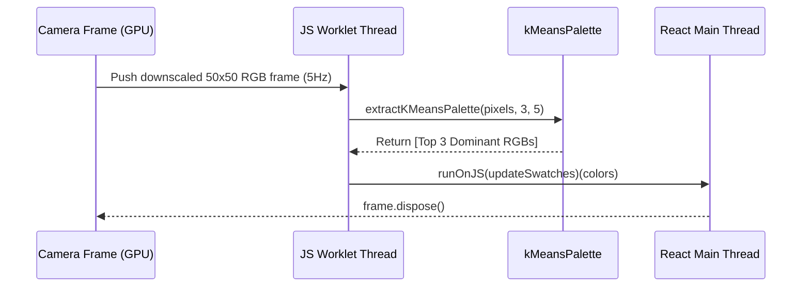
```mermaid
sequenceDiagram
    participant Camera as Camera Frame (GPU)
    participant Worklet as JS Worklet Thread
    participant KMeans as kMeansPalette
    participant UI as React Main Thread
    
    Camera->>Worklet: Push downscaled 50x50 RGB frame (5Hz)
    Worklet->>KMeans: extractKMeansPalette(pixels, 3, 5)
    KMeans-->>Worklet: Return [Top 3 Dominant RGBs]
    Worklet->>UI: runOnJS(updateSwatches)(colors)
    UI-->>Camera: frame.dispose()
```

<!-- CARTOGRAPHER_END: UTILS -->
```

<!-- CARTOGRAPHER_END: UTILS -->

### NATIVE & WATCH\n<!-- CARTOGRAPHER_START: NATIVE_&_WATCH -->

# NATIVE_&_WATCH Domain Cartography

## 1. File Manifest

### watchOS Companion (`targets/watch/`)
- `ContentView.swift`: Main session dashboard UI (Speed, HR, Calories, Timer, Summary Card).
- `HealthManager.swift`: HealthKit `HKWorkoutSession` + `HKLiveWorkoutBuilder` lifecycle and continuous HR/Cal sampling.
- `WatchConnectivityManager.swift`: `WCSessionDelegate`, receives phone state, relays HR/Cal back to phone, anchors elapsed session time.
- `ComplicationController.swift`: Provides watchOS complications for Graphic Circular, Modular Small, and Graphic Corner rendering live speed.

### Wear OS Companion (`android/sk8lytzWear/src/main/kotlin/com/neogleamz/sk8lytzwear/`)
- `MainActivity.kt`: Wear OS ComponentActivity entry point.
- `presentation/DashboardScreen.kt`: Single-screen session HUD with AmbientView (Always-On Display).
- `presentation/WearMessageSender.kt`: Outbound `MessageClient` for START/STOP commands.
- `services/WearableCommunicationService.kt`: Inbound `WearableListenerService` for DataClient state (Persistent) and MessageClient metrics (Real-time).
- `services/HealthTracker.kt`: Health Services `ExerciseClient` for continuous HR/Cal tracking during INLINE_SKATING exercise type.
- `services/OngoingActivityManager.kt`: Bridges active session to the Wear OS Ongoing Activity API.
- `tiles/Sk8lytzTileService.kt`: Provides Glanceable Wear OS Tiles for quick session interaction.

### Android Native Bridge (`android/app/src/main/java/com/neogleamz/sk8lytz/`)
- `MainActivity.kt` & `MainApplication.kt`: React Native entry points handling Expo SplashScreen and HealthConnect Permission Delegates.

## 2. Blast Radius
- **Wear OS / watchOS Companions**: Highly isolated. Changes here strictly affect watch UI and wrist-based sensor polling (HealthKit/HealthServices). They do not break the React Native build unless the bridge module contracts are altered.
- **DataClient/WCSession Paths**: Modifying payload JSON paths or keys (e.g., `/sk8lytz/state` or `/sk8lytz/metrics`) on the watch requires identical mirrored changes in the React Native `sk8lytz-watch-bridge` module, otherwise sync will fail silently.
- **Android `MainActivity.kt`**: Modifying this file risks breaking the React Native bootstrap, Splash Screen integration, or HealthConnect Permission Delegates.

## 3. Context Matrix
| Context Layer | Description | Source of Truth |
| :--- | :--- | :--- |
| **Phone React Native** | Master state orchestrator. Computes session time, connects to BLE, and delegates UI states. | `SessionContext.tsx` |
| **Native Bridge** | Translates React Native state to native iOS `WCSession` and Android `DataClient` / `MessageClient`. | `sk8lytz-watch-bridge` |
| **Companion HUD** | Watch UI layer. Relies entirely on pushed state from phone (Display + Relay pattern). | `DashboardScreen.kt` / `ContentView.swift` |
| **Health Sensors** | Hardware-level optical heart rate polling on the wrist. Bypasses phone for raw HR/Cal. | `HealthTracker.kt` / `HealthManager.swift` |

## 4. Hook/Service I/O Registry
### Watch → Phone (Inbound to Bridge)
- **Commands**: `WearMessageSender.sendCommand()` / `WCSession.sendMessage()` → `START_SESSION`, `STOP_SESSION`.
- **Health Relay**: `HealthTracker` / `HealthManager` → 5s throttled `{ heartRate, calories, status }` via MessageClient/WCSession.

### Phone → Watch (Outbound from Bridge)
- **Session State**: DataClient (`/sk8lytz/state`) / `WCSession` Context → Pushes `{ status, speed, heartRate, calories, startTime, totalDuration, distance, avgSpeed, peakHR }`.
- **Live Metrics**: MessageClient (`/sk8lytz/metrics`) / `WCSession` Message → High-frequency `{ speed, heartRate, calories }` push.

## 5. OS Variance Matrix
| Feature | watchOS (Apple Watch) | Wear OS (Android) |
| :--- | :--- | :--- |
| **Comms API** | `WCSession` (Application Context + Messages) | `DataClient` (State) + `MessageClient` (Metrics/Commands) |
| **Health API** | `HKWorkoutSession` + `HKLiveWorkoutBuilder` | `ExerciseClient` (`ExerciseType.INLINE_SKATING`) |
| **Backgrounding** | Built-in via HealthKit Workout | Requires `OngoingActivityManager` + Foreground Service |
| **Glanceable UI** | `ClockKit` Complications | Wear OS `TileService` |
| **Always-On** | Handled implicitly by SwiftUI `TimelineView` | Explicit Compose `AmbientView` triggered by `isAmbientMode` |

## Sequence Diagram: Watch Session Lifecycle & Health Relay
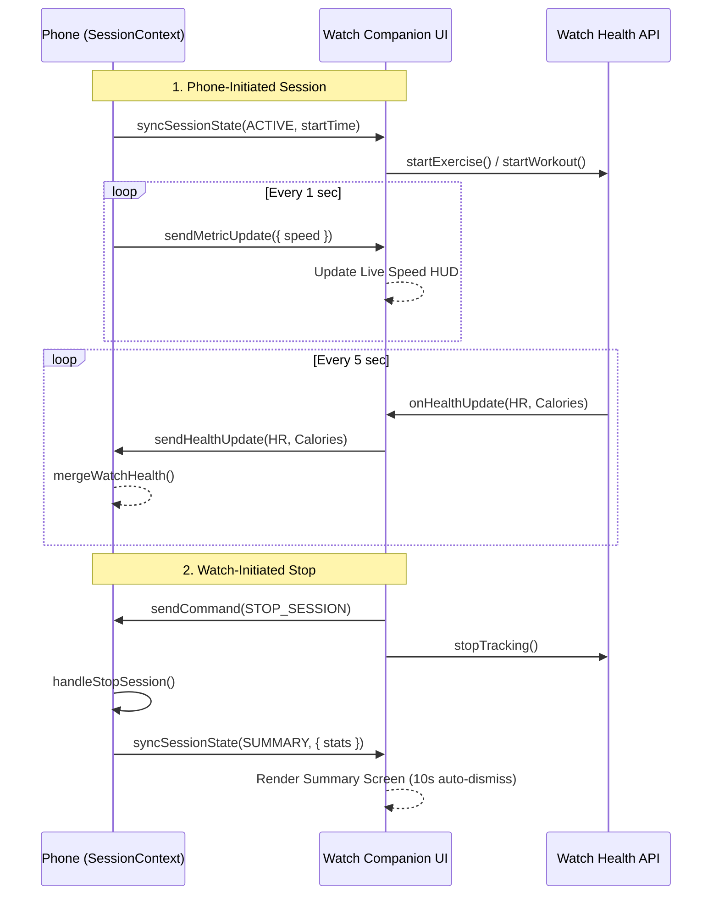
```mermaid
sequenceDiagram
    participant Phone as Phone (SessionContext)
    participant Watch as Watch Companion UI
    participant Sensors as Watch Health API
    
    Note over Phone, Watch: 1. Phone-Initiated Session
    Phone->>Watch: syncSessionState(ACTIVE, startTime)
    Watch->>Sensors: startExercise() / startWorkout()
    
    loop Every 1 sec
        Phone->>Watch: sendMetricUpdate({ speed })
        Watch-->>Watch: Update Live Speed HUD
    end
    
    loop Every 5 sec
        Sensors->>Watch: onHealthUpdate(HR, Calories)
        Watch->>Phone: sendHealthUpdate(HR, Calories)
        Phone-->>Phone: mergeWatchHealth()
    end
    
    Note over Phone, Watch: 2. Watch-Initiated Stop
    Watch->>Phone: sendCommand(STOP_SESSION)
    Watch->>Sensors: stopTracking()
    Phone->>Phone: handleStopSession()
    Phone->>Watch: syncSessionState(SUMMARY, { stats })
    Watch-->>Watch: Render Summary Screen (10s auto-dismiss)
```

## Archival Recommendations
`

<!-- CARTOGRAPHER_END: NATIVE_&_WATCH -->\n\n### NOTIFICATIONS & ROUTING [MOVE_TO_ARCHIVE]
<!-- CARTOGRAPHER_START: NOTIFICATIONS_&_ROUTING -->

# 🗺️ Domain Cartography: NOTIFICATIONS & ROUTING

## 1. File Manifest

- **`App.tsx`** — Root component that bootstraps the React Native application. It manages initialization logging (`APP_OPENED`), loads custom branding fonts, implements the top-level error boundary (`GlobalErrorBoundary`), conditionally wires early Android Health Connect routines, mounts global Context Providers, and performs state-driven routing between `AuthScreen` and `DashboardScreen`.
- **`src/providers/BluetoothGuard.tsx`** — Interactive gatekeeper provider that wraps the primary layout. It intercepts rendering when system-level Bluetooth permissions are missing or the Bluetooth adapter is disabled, displaying a dedicated setup recovery UI to prevent runtime BLE exceptions.
- **`src/providers/ComplianceGate.tsx`** — Regulatory compliance wrapper that intercepts app access during boot. It blocks users until the local EULA acceptance version matches the server's required target (`required_eula_version`), falling back to offline validation in `AsyncStorage` (`@Sk8lytz_offline_eula_accepted`) if the cloud is unreachable.
- **`src/services/NotificationService.ts`** — Central singleton instance coordinating native push and local alert lifecycles. It registers Expo push notifications, maps Android Notification Channels (`crew-alerts`, `session-reminders`), schedules local alerts (Crew Invites, Session Starts), and exposes an event bridge to trigger in-app navigation when alerts are tapped.
- **`src/services/PushTokenService.ts`** — Database synchronization layer. Handles upserting (`upsert`) and removing (`delete`) device Expo push tokens in the Supabase `push_tokens` table mapped by `user_id` and `token` values.
- **`src/services/LocationService.ts`** — Spatial utility wrapper. Controls geolocating permissions and coordinate fetching, resolves lat/lng pairs to human-readable locale names (e.g. "SkateCity OP") via OS geocoding, and performs Haversine mathematics to order discoverable sessions and spots.
- **`src/hooks/useHardwareNotifications.ts`** — Low-level BLE data orchestrator (Mailroom pattern). Registers listeners for scanned advertisements and active GATT notification updates, filters out redundant high-frequency duplicates via a memory cache, parses settings payloads, and synchronizes parsed states with `DeviceRepository`.

---

## 2. Blast Radius (Dependency Map)

```
       [ App.tsx ] (Root Layout)
            │
            ├──> [ ComplianceGate ] ────> (Supabase / AsyncStorage)
            │
            └──> [ BluetoothGuard ] ────> (PermissionService)
                      │
                      └──> [ DashboardScreen ]
                                │
                                ├──> [ useHardwareNotifications ]
                                │         │
                                │         ├──> [ BlePayloadParser ]
                                │         └──> [ DeviceRepository ]
                                │
                                └──> (useDashboardProfile)
                                          │
                                          └──> [ NotificationService ]
                                                    │
                                                    └──> [ PushTokenService ] ──> (Supabase)
```

### Imports (Consumed by this domain)
- **External Native Libraries:** `expo-notifications`, `expo-location`, `expo-splash-screen`, `@react-native-async-storage/async-storage`, `react-native-health-connect` (Android-only).
- **Core App Framework:** `src/services/AppLogger`, `src/services/DeviceRepository` (SSOT), `src/utils/BlePayloadParser`, `src/services/PermissionService`, `src/services/supabaseClient`.

### Exports (Consumed by other domains)
- **`App.tsx`** is loaded by the bundle entry point `index.ts`.
- **`BluetoothGuard.tsx`** and **`ComplianceGate.tsx`** gate access to `DashboardScreen.tsx`.
- **`useHardwareNotifications.ts`** is loaded in `DashboardScreen.tsx` (line 495) to coordinate active BLE GATT callbacks.
- **`NotificationService`** is used by `useDashboardProfile.ts` for session-start hooks and in `PermissionService.ts` to trigger push setups upon permission grants.
- **`LocationService`** is heavily consumed by `useBLEScanner.ts` (ambient discovery location tags), `useCrewHub.ts` (session coordinates & radial sorting), `useCrewProximityRadar.ts` (spot discovery), and `DeviceRepository.ts`.

---

## 3. Context Matrix

| React Context | Consumed By | Provided By | Architectural Function |
| :--- | :--- | :--- | :--- |
| **`AuthContext`** | `ComplianceGate.tsx`<br>`App.tsx` | `AuthProvider` | Evaluates current `session`, `isOfflineMode`, and executes `signOut()` when EULAs are declined. |
| **`BLEContext`** | `BluetoothGuard.tsx` | `BLEProvider` | Checks system capability via `isBluetoothSupported` and holds background scans/sweepers. |
| **`ThemeContext`** | `BluetoothGuard.tsx`<br>`ComplianceGate.tsx` | `ThemeProvider` | Resolves standard active color palette styles for blocking system pages. |

---

## 4. Hook/Service I/O Registry

### 1. `useHardwareNotifications`
- **Inputs:**
  ```typescript
  interface UseHardwareNotificationsOptions {
    isDiagnosticsMode?: boolean;
    setOnDataReceived: (cb: (deviceId: string, payload: number[]) => void) => void;
    setOnHardwareProbed: (cb: (deviceId: string, cfg: any) => void) => void;
    allDevices: BLEDeviceMinimal[];
    setAllDevices: (updater: (prev: any[]) => any[]) => void;
    setDeviceConfigs: (updater: (prev: Record<string, any>) => Record<string, any>) => void;
    deviceConfigs: Record<string, any>;
    setLastRawNotification: (val: { deviceId: string; payloadHex: string } | null) => void;
  }
  ```
- **Outputs:** `void`
- **Side-Effects & Mutations:**
  - Debounces duplicate hex string arrays using a local reference cache `lastPacketCacheRef`.
  - Commits database/disk updates to `DeviceRepository` only if raw configurations differ (`isDirty` check).
  - Emits telemetry logs (`RAW_PAYLOAD`) and updates raw diagnostics state if `isDiagnosticsMode` is enabled.

### 2. `NotificationService`
- **`init(autoRequest: boolean, userId?: string): Promise<string | null>`**
  - *Inputs:* `autoRequest` (triggers OS permission prompt if missing), `userId` (binds push token to profile).
  - *Outputs:* Mapped Expo push token string, or `null` if disabled/denied.
  - *Side-Effects:* Overrides global notification behaviors via `setNotificationHandler`, configures OS vibration/light notification channels, and registers token in Supabase.
- **`sendCrewInviteNotification(opts: InviteOpts): Promise<void>`**
  - *Inputs:* `joinerName`, `crewName`, `crewId`, `sessionId`.
  - *Side-Effects:* Schedules a local OS notification with high-priority audio.
- **`setJoinHandler(handler: (crewId: string, sessionId: string) => void): void`**
  - *Inputs:* Navigation callback executed when a user taps a push alert.
  - *Side-Effects:* Binds background action listeners to intercept user intent.

### 3. `LocationService`
- **`getSessionLocation(): Promise<SessionLocation | null>`**
  - *Outputs:* Mapped object `{ label: string, coords: { lat: number, lng: number } }` or `null`.
  - *Side-Effects:* Forces the global modal `openGlobalPermissionsModal()` if OS permissions are undetermined, initiates a single balanced GPS sweep, and runs geocoding reverse queries.
- **`getSilentLocation(): Promise<{ lat: number, lng: number } | null>`**
  - *Outputs:* Coordinates or `null`.
  - *Side-Effects:* Interrogates native cached locations (`getLastKnownPositionAsync`) for battery-safe, silent sweeps.

---

## 5. OS Variance Matrix

| Capability | iOS (`Platform.OS === 'ios'`) | Android (`Platform.OS === 'android'`) | Web (`Platform.OS === 'web'`) |
| :--- | :--- | :--- | :--- |
| **Push Permissions** | Prompted via standard APNs settings request wrapper. | Handled via custom permissions flow; requires explicit API level checks. | Bypassed. Push initialization returns `false`/`null` instantly. |
| **Notification Channels** | Managed natively. Custom channel definitions are ignored. | Configures `crew-alerts` (High Priority, Amber Light) and `session-reminders` (High Priority, Blue Light). | Unusable. |
| **Health Sync Init** | Handled lazily during workout session initialization. | Handled eagerly in `App.tsx` during boot to prevent native coroutine crashes. | Bypassed. |
| **Geocoding Engine** | Calls Apple Maps Geocoder backend natively. | Calls Google Play Services Geocoder backend natively. | Stubbed. Returns static mock coordinates (`38.9, -94.6`). |
| **BLE Permissions** | Handled natively on first device scan/connection request. | Android 12+: Requests `BLUETOOTH_SCAN` and `BLUETOOTH_CONNECT`. <br>Android < 12: Requests `ACCESS_FINE_LOCATION`. | Unusable. |

---

## 6. Sequence Diagrams

### Diagram 1: App Initialization, EULA Validation, & State-Driven Routing
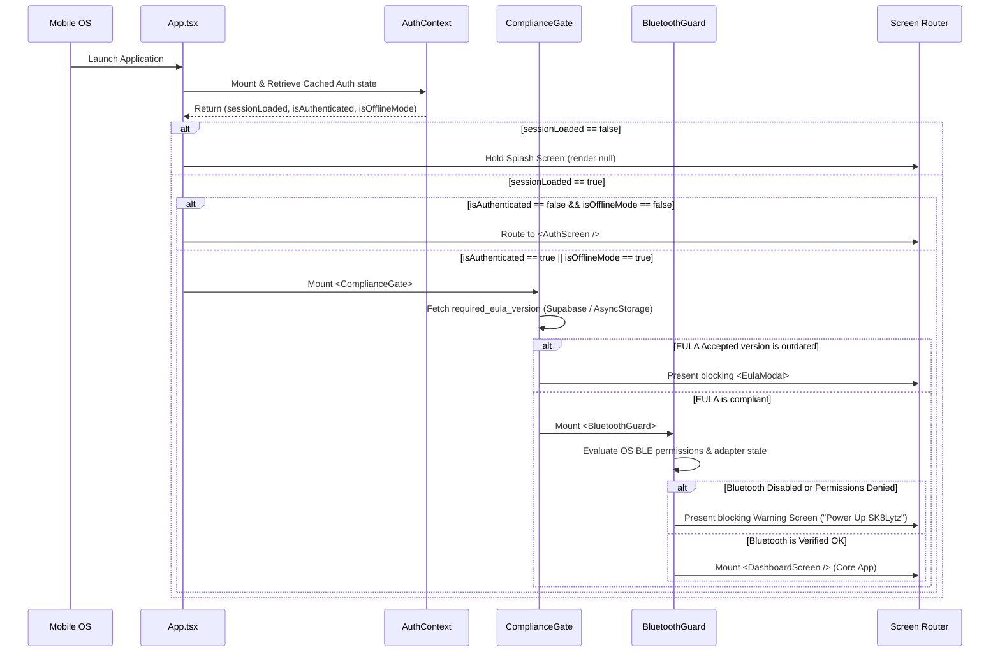
```mermaid
sequenceDiagram
    participant OS as Mobile OS
    participant App as App.tsx
    participant Auth as AuthContext
    participant Gate1 as ComplianceGate
    participant Gate2 as BluetoothGuard
    participant UI as Screen Router

    OS->>App: Launch Application
    App->>Auth: Mount & Retrieve Cached Auth state
    Auth-->>App: Return (sessionLoaded, isAuthenticated, isOfflineMode)
    
    alt sessionLoaded == false
        App->>UI: Hold Splash Screen (render null)
    else sessionLoaded == true
        alt isAuthenticated == false && isOfflineMode == false
            App->>UI: Route to <AuthScreen />
        else isAuthenticated == true || isOfflineMode == true
            App->>Gate1: Mount <ComplianceGate>
            Gate1->>Gate1: Fetch required_eula_version (Supabase / AsyncStorage)
            
            alt EULA Accepted version is outdated
                Gate1->>UI: Present blocking <EulaModal>
            else EULA is compliant
                Gate1->>Gate2: Mount <BluetoothGuard>
                Gate2->>Gate2: Evaluate OS BLE permissions & adapter state
                
                alt Bluetooth Disabled or Permissions Denied
                    Gate2->>UI: Present blocking Warning Screen ("Power Up SK8Lytz")
                else Bluetooth is Verified OK
                    Gate2->>UI: Mount <DashboardScreen /> (Core App)
                end
            end
        end
    end
```

### Diagram 2: Push Token Registration & Notification Tap Routing
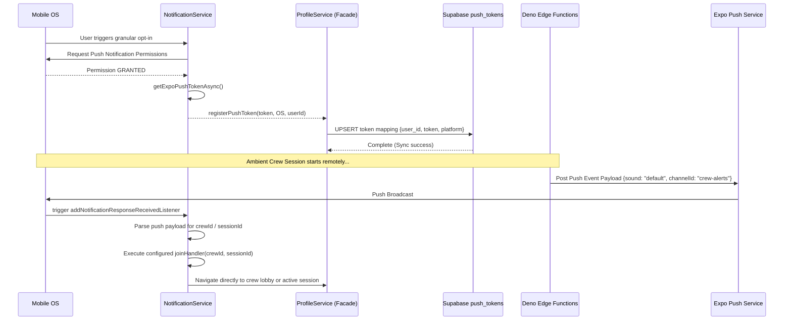
```mermaid
sequenceDiagram
    participant OS as Mobile OS
    participant App as NotificationService
    participant Disk as ProfileService (Facade)
    participant Cloud as Supabase push_tokens
    participant Edge as Deno Edge Functions
    participant Expo as Expo Push Service

    OS->>App: User triggers granular opt-in
    App->>OS: Request Push Notification Permissions
    OS-->>App: Permission GRANTED
    App->>App: getExpoPushTokenAsync()
    App-->>Disk: registerPushToken(token, OS, userId)
    Disk->>Cloud: UPSERT token mapping {user_id, token, platform}
    Cloud-->>Disk: Complete (Sync success)

    Note over Edge, OS: Ambient Crew Session starts remotely...
    Edge->>Expo: Post Push Event Payload {sound: "default", channelId: "crew-alerts"}
    Expo->>OS: Push Broadcast
    OS->>App: trigger addNotificationResponseReceivedListener
    App->>App: Parse push payload for crewId / sessionId
    App->>App: Execute configured joinHandler(crewId, sessionId)
    App->>Disk: Navigate directly to crew lobby or active session
```

### Diagram 3: BLE Hardware Notification Mailroom Flow
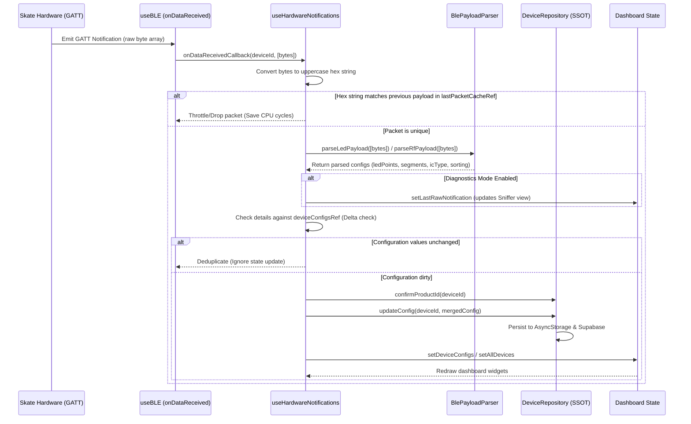
```mermaid
sequenceDiagram
    participant HW as Skate Hardware (GATT)
    participant BLE as useBLE (onDataReceived)
    participant Mail as useHardwareNotifications
    participant Parser as BlePayloadParser
    participant Repo as DeviceRepository (SSOT)
    participant UI as Dashboard State

    HW->>BLE: Emit GATT Notification (raw byte array)
    BLE->>Mail: onDataReceivedCallback(deviceId, [bytes])
    Mail->>Mail: Convert bytes to uppercase hex string
    
    alt Hex string matches previous payload in lastPacketCacheRef
        Mail-->>BLE: Throttle/Drop packet (Save CPU cycles)
    else Packet is unique
        Mail->>Parser: parseLedPayload([bytes]) / parseRfPayload([bytes])
        Parser-->>Mail: Return parsed configs (ledPoints, segments, icType, sorting)
        
        alt Diagnostics Mode Enabled
            Mail->>UI: setLastRawNotification (updates Sniffer view)
        end
        
        Mail->>Mail: Check details against deviceConfigsRef (Delta check)
        
        alt Configuration values unchanged
            Mail-->>BLE: Deduplicate (Ignore state update)
        else Configuration dirty
            Mail->>Repo: confirmProductId(deviceId)
            Mail->>Repo: updateConfig(deviceId, mergedConfig)
            Repo->>Repo: Persist to AsyncStorage & Supabase
            Mail->>UI: setDeviceConfigs / setAllDevices
            UI-->>Mail: Redraw dashboard widgets
        end
    end
```

<!-- CARTOGRAPHER_END: NOTIFICATIONS_&_ROUTING -->\n\n### SESSION TRACKING\n<!-- CARTOGRAPHER_START: SESSION_TRACKING -->

<!-- CARTOGRAPHER_START: SESSION_TRACKING -->
# 🗺️ SESSION_TRACKING Domain Architecture

## 1. File Manifest
- **`src/context/SessionContext.tsx`**: Orchestrates the active session state (`isSkateSessionActive`, `sessionPhase`), coordinates the global telemetry and health telemetry hooks, manages the Android Foreground Service / iOS background notifications, and bridges session start/stop and metrics with `WatchBridge`.
- **`src/hooks/useGlobalTelemetry.ts`**: Hook providing GPS location tracking (`expo-location`) and G-force accelerometer polling (`expo-sensors`) for active skate sessions. Computes and streams real-time speed, distance, average speed, peak speed, and peak G-force, caching updates and saving a completed session snapshot to `SpeedTrackingService`.
- **`src/hooks/useHealthTelemetry.ts`**: Hook managing heart rate and calorie telemetry with watch-preferred priority. Automatically polls phone-side health platforms (Apple HealthKit / Android Health Connect) if the watch is disconnected, but suppresses phone-side polling when the watch companion's live sensor data is actively relayed via `WatchBridge`.
- **`src/hooks/useTelemetryLedger.ts`**: Centrally manages time-in-state mapping (tracking total usage of patterns, colors, and controller modes). Buffers telemetry locally in `AsyncStorage` and periodically flushes to Supabase using a Postgres RPC (`flush_telemetry`).
- **`src/hooks/useDeviceStateLedger.ts`**: Single source of truth for tracking actual hardware LED pattern state dispatched over BLE. Utilizes an in-memory `Map` cache for synchronous queries, debounces AsyncStorage writes, and normalizes MAC addresses to prevent key collision.
- **`src/services/SpeedTrackingService.ts`**: Core session persistence service that estimates calories burned (MET-based) if missing, saves session records to Supabase `skate_sessions` or queues them locally in `AsyncStorage` if offline, flushes offline queues upon re-authentication, and handles throttled live speed pushes to connected watch companions.
- **`src/services/HealthSyncService.ts`**: Service responsible for syncing completed session metrics (distance, duration, calories) back to the OS native health platforms (Apple HealthKit `SkatingSports` workouts / Android Health Connect `ExerciseSession` skating records).
- **`src/hooks/useSessionTracking.ts` (Deprecated)**: `
## 2. Blast Radius
- **Imports (Consumes)**:
  - Expo modules: `expo-location` (GPS tracking, foreground permissions), `expo-sensors` (Accelerometer).
  - Native UI / Bridging: `@notifee/react-native` (Foreground Service on Android, categories/notifications on iOS), `sk8lytz-watch-bridge` (Watch commands, health relays, metric updates).
  - Storage / Auth / Logging: `@react-native-async-storage/async-storage` (caching, offline queues, settings), `supabaseClient` (Supabase RPCs, database inserts), `AppLogger` (structured system logs), `useAuth` (user UUID verification).
  - Health integration: `react-native-health` (iOS Apple HealthKit), `react-native-health-connect` (Android Health Connect).
- **Imported By (Consumed By)**:
  - `App.tsx` / `index.tsx`: Wraps the application root with `SessionProvider` to supply global state.
  - `DockedController.tsx` / `DashboardScreen.tsx`: Accesses current session state, coordinates start/stop buttons, displays speed, duration, distance, peak G-force, HR, and calories.
  - `useOfflineSyncWorker.ts` (or auth listeners): Flushes the offline session queue when transitioning to authenticated state.

## 3. Context Matrix
- **Provided by `SessionContext`**: Exposes `isSkateSessionActive`, `sessionPhase` (`IDLE` | `ACTIVE` | `PAUSED` | `ENDING`), `startSession()`, `endSession()`, `telemetry` (type `GlobalTelemetryState`), and `health` (type `HealthTelemetry`).
- **Consumed by Domain**:
  - `AuthContext`: Consumed by `useGlobalTelemetry` (via `useAuth`) to retrieve `user.id` for session persistence.
  - `CrewService`: Coordinates session telemetry updates (`crewService.sessionTelemetry`) to feed the Crew Hub.
  - `PermissionContext` / `PermissionService`: Validates `LOCATION` and `HEALTH` permission status prior to initiating GPS or health polling.

## 4. Hook/Service I/O Registry
- **`useGlobalTelemetry`**:
  - *Inputs*: `sessionPhase` ('IDLE'|'ACTIVE'|'PAUSED'|'ENDING'), `healthMetrics` (optional object with `avgBpm`, `peakBpm`, `activeCalories`), `externalStartTimeMs` (optional, for recovery).
  - *Outputs*: `GlobalTelemetryState` containing `gpsSpeed`, `peakGForce`, `sessionDistanceMiles`, `sessionDurationSec`, `sessionPeakSpeed`, `sessionAvgSpeed`.
  - *Side-Effects*: Registers/unregisters GPS subscriptions and accelerometer event listeners, throttles speed pushes to watch via `SpeedTrackingService.pushSpeedToWatch()`, updates the global `crewService.sessionTelemetry`, and commits the session snapshot to database on phase exit.
- **`useHealthTelemetry`**:
  - *Inputs*: `sessionActive` (boolean).
  - *Outputs*: `HealthTelemetry` containing `latestBpm`, `avgBpm`, `peakBpm`, `activeCalories`, `mergeWatchHealth()`.
  - *Side-Effects*: Sets up a 15-second polling interval querying native iOS HealthKit / Android Health Connect APIs. Suppresses this polling if `lastWatchHealthMsRef` is within a 15-second expiration threshold (indicating active watch relay).
- **`useTelemetryLedger`**:
  - *Inputs*: Pattern IDs, color HEX codes, controller modes, app state changes, backgrounding triggers.
  - *Outputs*: Methods `trackPattern()`, `trackColor()`, `trackMode()`, `incrementCounter()`, `injectStreetSummary()`, `flushToDatabase()`.
  - *Side-Effects*: Computes total time-in-state, writes JSON-serialized telemetry buffers to `@sk8lytz_telemetry_buffer` in AsyncStorage, and flushes payloads to Supabase RPC `flush_telemetry`.
- **`useDeviceStateLedger`**:
  - *Inputs*: BLE MAC address, `DevicePatternState`.
  - *Outputs*: Methods `save()`, `load()`, `loadSync()`, `clear()`.
  - *Side-Effects*: Updates global in-memory cache map `memoryCache`, debounces AsyncStorage writes (`@SK8Lytz_DeviceState_v2_{MAC}`) by 500ms, and binds AppState change listeners to flush pending writes synchronously when backgrounded.
- **`SpeedTrackingService.saveSession`**:
  - *Inputs*: `ISessionSnapshot` object, `userId` (string | null).
  - *Outputs*: `Promise<string | null>` (Supabase session row UUID or null on failure).
  - *Side-Effects*: Calculates estimated calories if needed, inserts rows into Supabase `skate_sessions` table, updates `user_profiles` lifetime totals (`lifetime_distance_miles` & `lifetime_top_speed_mph`), delegates local Health sync via `HealthSyncService.saveWorkout()`, or serializes offline entries to `@sk8lytz_pending_session_queue` in AsyncStorage.
- **`HealthSyncService.saveWorkout`**:
  - *Inputs*: `ISessionSnapshot` object.
  - *Outputs*: `Promise<void>`.
  - *Side-Effects*: Inserts workout records directly into iOS Apple HealthKit (`SkatingSports` type, calories, distance) or Android Health Connect (`ExerciseSession` skating type, `TotalCaloriesBurned`, `Distance` records).

## 5. OS Variance Matrix
- **Android**:
  - **Foreground Service (FGS)**: Implements `@notifee/react-native` background tracking using `AndroidForegroundServiceType.FOREGROUND_SERVICE_TYPE_LOCATION` on channel `sk8lytz-session` with low importance to satisfy background GPS requirements.
  - **SecurityException Prevention**: On Android 14+, starting an FGS requires both valid location permissions AND for the app to be in the foreground state (`AppState.currentState === 'active'`). The provider explicitly checks these conditions before invoking `displayNotification`.
  - **Health Connect**: Connects to `react-native-health-connect` dynamically. Reads `HeartRate` and `ActiveCaloriesBurned` records, and inserts `ExerciseSession` (type 60 = skating) along with corresponding calorie and distance records.
- **iOS**:
  - **Notification Categories**: Configures interactive categories (`session-actions`) containing a foreground-capable action button ("🛑 End Session").
  - **Interactive Actions**: Binds to `notifee.onForegroundEvent` to receive click payloads and trigger `endSession()` callback. Tears down notifications cleanly using `notifee.cancelNotification()`.
  - **HealthKit**: Integrates with `react-native-health`. Initializes health permissions dynamically using `initHealthKit` and calls `getHeartRateSamples`, `getActiveEnergyBurned`, and `saveWorkout` with activity type `SkatingSports`.
  - **WatchBridge**: iOS maps the bridge to Apple Watch Connectivity API using Swift `WCSession`, while Android uses Kotlin `DataClient` / `MessageClient` to bridge messages to Wear OS.

## 6. Sequence Diagram
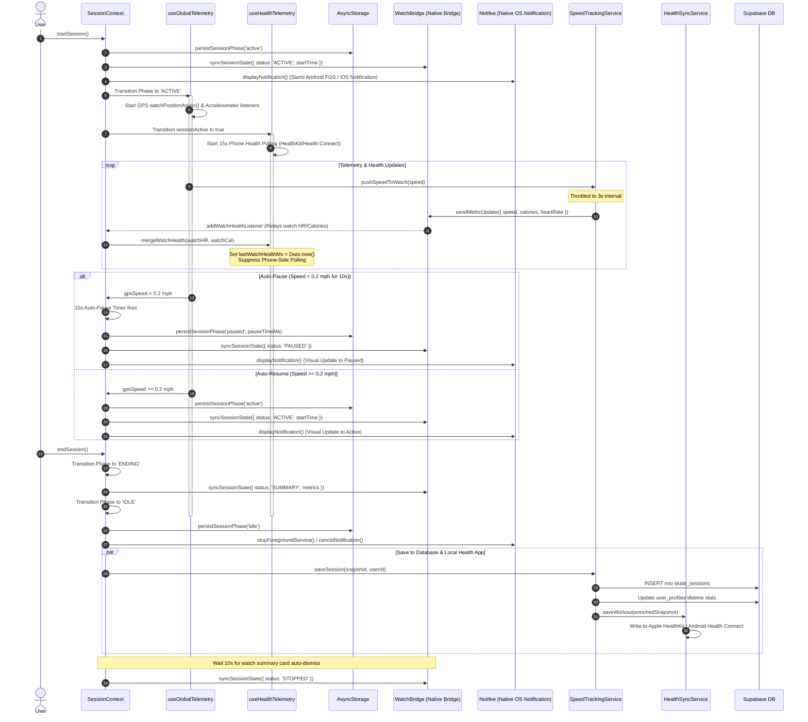
```mermaid
sequenceDiagram
    autonumber
    actor User
    participant SC as SessionContext
    participant GT as useGlobalTelemetry
    participant HT as useHealthTelemetry
    participant AS as AsyncStorage
    participant WB as WatchBridge (Native Bridge)
    participant N as Notifee (Native OS Notification)
    participant STS as SpeedTrackingService
    participant HSS as HealthSyncService
    participant DB as Supabase DB

    %% 1. Session Initiation
    User->>SC: startSession()
    SC->>AS: persistSessionPhase('active')
    SC->>WB: syncSessionState({ status: 'ACTIVE', startTime })
    SC->>N: displayNotification() (Starts Android FGS / iOS Notification)
    SC->>GT: Transition Phase to 'ACTIVE'
    activate GT
    GT->>GT: Start GPS watchPositionAsync() & Accelerometer listeners
    SC->>HT: Transition sessionActive to true
    activate HT
    HT->>HT: Start 15s Phone Health Polling (HealthKit/Health Connect)

    %% 2. Active Tracking Telemetry Loop
    loop Telemetry & Health Updates
        GT->>STS: pushSpeedToWatch(speed)
        Note over STS: Throttled to 3s interval
        STS->>WB: sendMetricUpdate({ speed, calories, heartRate })
        WB-->>SC: addWatchHealthListener (Relays watch HR/Calories)
        SC->>HT: mergeWatchHealth(watchHR, watchCal)
        Note over HT: Set lastWatchHealthMs = Date.now()<br/>Suppress Phone-Side Polling
    end

    %% 3. Auto-Pause / Resume Lifecycle
    alt Auto-Pause (Speed < 0.2 mph for 10s)
        GT->>SC: gpsSpeed < 0.2 mph
        SC->>SC: 10s Auto-Pause Timer fires
        SC->>AS: persistSessionPhase('paused', pauseTimeMs)
        SC->>WB: syncSessionState({ status: 'PAUSED' })
        SC->>N: displayNotification() (Visual Update to Paused)
    else Auto-Resume (Speed >= 0.2 mph)
        GT->>SC: gpsSpeed >= 0.2 mph
        SC->>AS: persistSessionPhase('active')
        SC->>WB: syncSessionState({ status: 'ACTIVE', startTime })
        SC->>N: displayNotification() (Visual Update to Active)
    end

    %% 4. Session Termination & Health Sync
    User->>SC: endSession()
    SC->>SC: Transition Phase to 'ENDING'
    SC->>WB: syncSessionState({ status: 'SUMMARY', metrics })
    SC->>SC: Transition Phase to 'IDLE'
    deactivate GT
    deactivate HT
    SC->>AS: persistSessionPhase('idle')
    SC->>N: stopForegroundService() / cancelNotification()
    
    par Save to Database & Local Health App
        SC->>STS: saveSession(snapshot, userId)
        STS->>DB: INSERT into skate_sessions
        STS->>DB: Update user_profiles lifetime stats
        STS->>HSS: saveWorkout(enrichedSnapshot)
        HSS->>HSS: Write to Apple HealthKit / Android Health Connect
    end

    note over SC, WB: Wait 10s for watch summary card auto-dismiss
    SC->>WB: syncSessionState({ status: 'STOPPED' })
```

<!-- CARTOGRAPHER_END: SESSION_TRACKING -->

<!-- CARTOGRAPHER_END: SESSION_TRACKING -->\n\n### HARDWARE PROTOCOLS\n<!-- CARTOGRAPHER_START: HARDWARE_PROTOCOLS -->

The following is a <SYSTEM_MESSAGE> not actually sent by the user. It is provided by the system as important information to pay attention to.

<SYSTEM_MESSAGE>
[Message] timestamp=2026-06-07T19:22:09Z sender=6c136951-5abf-4c93-8081-bed72765fbba priority=MESSAGE_PRIORITY_HIGH content=Here is the extracted Elite Architecture Payload for the HARDWARE_PROTOCOLS domain (`src/protocols/*`).

## 1. File Manifest
- **`IControllerProtocol.ts`**: Defines the Hardware Abstraction Layer (HAL) interface for all LED controllers, providing unified request/response typings (`ProtocolResult`).
- **`ControllerRegistry.ts`**: Maintains the runtime registry of hardware adapters (BanlanX, Zengge) and resolves the active protocol matching a given BLE device advertisement.
- **`BanlanxAdapter.ts`**: Implements `IControllerProtocol` for BanlanX SP621E hardware, mapping app intentions to `0xA0` prefixed opcodes.
- **`ZenggeAdapter.ts`**: Implements `IControllerProtocol` for Zengge/MagicHome hardware, orchestrating the translation to `0x10`, `0x51`, `0x59`, and `0x62`/`0x63` protocol frames.
- **`ZenggeProtocol.ts`**: The SSOT raw byte payload compiler for all Zengge commands, converting arrays into checksum-wrapped packets (`[0x00, Seq, 0x80, ... 0x0B]`).
- **`PatternEngine.ts`**: The centralized template registry (`SK8LYTZ_TEMPLATES`) and master dispatcher that routes pattern IDs to math generators.
- **`SpatialEngine.ts`**: Math synthesizer that builds multi-color RGB arrays across the physical LED canvas (spatial and generative effects).
- **`SymphonyEngine.ts`**: Dedicated visualizer generators that build pixel arrays specifically tailored to Music Mode reactivity and test native hardware sequences.
- **`VisualizerEngine.ts`**: Bridges the pattern generators with the UI `ProductVisualizer`, managing simulated tick rotations and array mirroring.
- **`PositionalMathBuffer.ts`**: Generates mathematically interpolated RGB LED buffers from spatial percentage-based nodes, rendering complex gradients bypassing hardware constraints.
- **`REA
<truncated 3915 bytes>
ct(effectId=1, speed=10, brightness=100)
    BLE->>Adapter: buildEffect(1, 10, 100)
    Note over Adapter: Generates [0xA0, 0x53, ...] and [0xA0, 0x54, ...]
    Adapter-->>BLE: ProtocolResult (2 packets, 20ms delay)
    
    BLE->>Adapter: prepareForTransmission(result, MTU)
    Adapter-->>BLE: Unchanged (BanlanX < 20 bytes)
    
    BLE->>HW: Write 0x53 (Effect Selection)
    Note over BLE: Wait 20ms delay (MANDATORY)
    BLE->>HW: Write 0x54 (Speed Selection)
```

## 8. Domain Specific: Hardware Capabilities & Array Byte Maps
- **Zengge Hardware (`0x59` Animation Opcodes)**:
  - Header: `0x59, totalLen_hi, totalLen_lo`
  - Body: RGB per pixel for 12 to 54 LEDs maximum.
  - Footer: `numPoints_hi, numPoints_lo, transitionType, speed(1-100), direction(1/0), checksum`
  - `transitionType` mapped mathematically: `0x01` (Static), `0x02` (Running scroll), `0x03` (Strobe flash), `0x04` (Hard jump), `0x05` (Breathe fade).
  - EEPROM `0x62`: Set configuration `[0x62, ptsHi, ptsLo, segHi, segLo, icType, sorting, micPts, micSegs, 0xF0, chksum]`.
- **Zengge Hardware (`0x51` Compact/Extended Opcodes)**:
  - Custom sequence packets are prefixed with `0x51`.
  - The compact format generates up to 18 custom steps natively fitting under standard MTU without `0x40` packet chunking: `[0x51, 0xF0, mode, speed, R1,G1,B1, R2,G2,B2, 0x0F, checksum]`.
- **BanlanX SP621E Adapter (`0xA0` Base Family)**:
  - Commands use the `[0xA0, cmd, length, ...payload]` format.
  - No sequence counters or dynamic length bytes natively wrapped compared to Zengge.
  - Power: `0xA0 0x50 0x01 0x01` (ON) / `0xA0 0x50 0x01 0x00` (OFF).
  - Solid Color: `0xA0 0x52 0x03 R G B`.
  - Multi-Packet Effects: Dispatch `0xA0 0x53 0x01 effectId`, enforce strict **20ms mandatory inter-packet delay**, dispatch `0xA0 0x54 0x01 speed`. Speed mapping must clamp app scale (1-100) to hardware scale (1-10).
  - Audio: BanlanX does not need external App FFTs (`0x74` magnitudes). Music mode natively delegates onboard via `0x59` input and `0x5A` gain packets.
</SYSTEM_MESSAGE>

<!-- CARTOGRAPHER_END: HARDWARE_PROTOCOLS -->\n\n### CLOUD FUNCTIONS\n<!-- CARTOGRAPHER_START: CLOUD_FUNCTIONS -->

## 1. File Manifest
- `supabase/functions/notify-crew-session/index.ts`: Deno Edge Function for dispatching Expo push notifications to crew members when a session starts.
- `supabase/migrations/20260413_hardening_sweep.sql`: Database indexing and Row Level Security (RLS) hardening for user_profiles and parsed_session_stats.
- `supabase/migrations/20260414_account_deletion_rpc.sql`: `public.delete_account()` RPC for GDPR/App Store compliance (cascades auth.users).
- `supabase/migrations/20260414_consolidate_telemetry.sql`: Telemetry snapshot table and policy creation.
- `supabase/migrations/20260418061000_admin_user_management.sql`: Core admin RPCs (`admin_ban_user`, `admin_revoke_ban`, `admin_force_password_reset`, `admin_soft_delete_user`, `handle_auto_promotion`).
- `supabase/migrations/20260419160000_micro_scraper_schema.sql`: Scraper pipeline RPCs (`get_next_spot_for_operator()`, `get_next_spot_for_indexer()`).
- `supabase/migrations/20260506000000_admin_tools_expansion.sql`: Additional admin tools (`admin_revoke_sessions`, `admin_export_user_data`, `admin_add_hardware_blacklist`, `admin_remove_hardware_blacklist`).
- `supabase/migrations/20260506000001_god_tier_telemetry.sql`: God-tier telemetry aggregator RPC (`public.flush_telemetry(payload JSONB)`) and `admin_get_global_telemetry()`.
- `supabase/migrations/20260512180000_fix_admin_revoke_and_promotion_security.sql`: Administrative permission fixes (`admin_revoke_admin_role`).
- `supabase/migrations/20260607100000_fix_telemetry_schema.sql`: Schema fixes updating the `flush_telemetry` aggregator logic.

## 2. Blast Radius
- **Imports Within Domain**: `notify-crew-session` Edge Function imports `@supabase/supabase-js` and POSTs to `https://exp.host/--/api/v2/push/send`.
- **External Consumers**:
  - React Native app directly invokes the `flush_telemetry` RPC and `notify-crew-session` Edge Function.
  - AdminToolsModal relies exclusively on `admin_*` RPCs for profile management and global telemetry views.
  - Automated worker daemons call `get_next_spot_*` queue RPCs.
- **Database Scope**: `delete_account` and `flush_telemetry` cascade down to the `auth.users` root row. Massive DB-level destruction potential on account deletion.

## 3. Context Matrix
- **Edge Function**: Runs in Deno. Assumes JWT caller is session leader (excludes them from push array).
- **Admin RPCs**: Uses `SECURITY DEFINER` to force privileged operations. Validates `auth.uid()` against `user_profiles` with `role = 'admin'` to block unauthorized escalation.
- **Telemetry RPC (`flush_telemetry`)**: Acts as a strict gatekeeper for `user_lifetime_stats`. Merges JSONB fields atomically (e.g. `pattern_time_map`) to prevent client-side race conditions.

## 4. Hook/Service I/O Registry
- **`notify-crew-session`**
  - **IN**: Auth Header JWT, Body `{ crewId, sessionId, sessionName, leaderName }`
  - **OUT**: `{ sent: number }`
- **`delete_account()`**
  - **IN**: `auth.uid()` from JWT
  - **OUT**: `void`
- **`flush_telemetry(payload JSONB)`**
  - **IN**: Payload containing `total_app_time_sec`, `lifetime_top_speed_mph`, `pattern_time_map`, etc.
  - **OUT**: `void`
- **`admin_ban_user(p_target_user_id UUID, p_reason TEXT)`**
  - **IN**: User ID, Ban Reason
  - **OUT**: `void` (Logs action to `admin_audit_logs`)

## 5. OS Variance Matrix
- **Push Notification Formatting**: The Expo payload directly shapes OS behavior with `sound: "default"` and `channelId: "crew-alerts"`. This bridges OS variance where iOS leverages the default APNs chime, while Android relies on matching the specific `crew-alerts` Notification Channel configured natively.
- **Edge API Batching**: Expo Push API throttles requests. Edge Function loops in batches of 100 to avoid underlying platform HTTP timeouts.

## SEQUENCE DIAGRAM
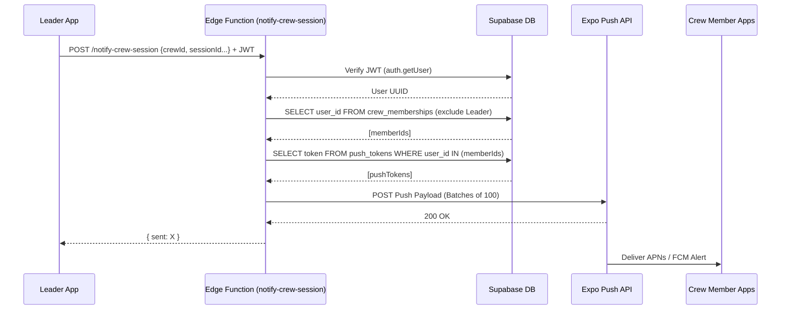
```mermaid
sequenceDiagram
    participant App as Leader App
    participant Func as Edge Function (notify-crew-session)
    participant DB as Supabase DB
    participant Expo as Expo Push API
    participant Mem as Crew Member Apps
    
    App->>Func: POST /notify-crew-session {crewId, sessionId...} + JWT
    Func->>DB: Verify JWT (auth.getUser)
    DB-->>Func: User UUID
    Func->>DB: SELECT user_id FROM crew_memberships (exclude Leader)
    DB-->>Func: [memberIds]
    Func->>DB: SELECT token FROM push_tokens WHERE user_id IN (memberIds)
    DB-->>Func: [pushTokens]
    Func->>Expo: POST Push Payload (Batches of 100)
    Expo-->>Func: 200 OK
    Func-->>App: { sent: X }
    Expo->>Mem: Deliver APNs / FCM Alert
```

<!-- CARTOGRAPHER_END: CLOUD_FUNCTIONS -->

### THEME & ASSETS [MOVE_TO_ARCHIVE]
<!-- CARTOGRAPHER_START: THEME_&_ASSETS -->

# THEME_&_ASSETS Domain Cartography

## 1. File Manifest
This manifest details every file inside the audited domain with its precise, 1-sentence architectural purpose.

- **`src/theme/theme.ts`**: Houses the central Design System tokens (Colors, Typography, Spacing, Layout) and exports cross-platform shadow styling engines (`Shadows`, `TextShadows`) for iOS, Android, and Web.
- **`src/styles/DashboardStyles.ts`**: Dynamically compiles the responsive theme-aware StyleSheet factory (`createDashboardStyles`) and pattern-to-color lookup mappings (`getPatternColors`) for the 4-Slab Dashboard view.
- **`src/constants/AppConstants.ts`**: Establishes global configuration primitives including the persistent storage namespace key prefix and the physical hardware maximum speed limit constant.
- **`src/constants/ControlsRegistry.ts`**: Centralizes the administrative governance scheme and toggle metadata (e.g. Danger Zone safety thresholds, mock device flags) for the developer sandboxes.
- **`src/constants/bleTimingConstants.ts`**: Centralizes empirical hardware-tested delay constraints and settling intervals to prevent buffer overflows during BLE GATT dispatches.
- **`src/constants/storageKeys.ts`**: Centralizes all AsyncStorage database key constants in a single registry to eliminate namespace collision vectors.
- **`src/assets/`**: Repository containing the application icons (`icon.png`, `splash-icon.png`), client logos (`logo.png`), and legacy hardware-reactive animations and graphics.

---

## 2. Blast Radius
This section maps what files inside this domain import, and what files import them across the rest of the application.

### `src/theme/theme.ts`
- **Imports**:
  - `Platform`, `ViewStyle`, `TextStyle` from `react-native`
- **Imported By**:
  - `src/context/ThemeContext.tsx` (to resolve active color structures)
  - `src/styles/DashboardStyles.ts` (to map typography and spacing layout)
  - Broadly consumed by UI screen, modal, and utility components (`src/screens/*`, `src/components/*`)

### `src/styles/DashboardStyles.ts`
- **Imports**:
  - `StyleSheet` from `react-native`
  - `ThemePalette`, `Layout`, `Spacing` from `../theme/theme`
- **Imported By**:
  - `src/screens/DashboardScreen.tsx` (responsive style compiler for the root layout)
  - Component views like `MusicPanel.tsx` or `StreetPanel.tsx` (lookup values via `useTheme` or `createStyles`)

### `src/constants/AppConstants.ts`
- **Imports**: None
- **Imported By**:
  - `src/components/docked/QuickPresetModal.tsx` (to resolve AsyncStorage keys)
  - `src/hooks/useCuratedPicks.ts`
  - `src/hooks/useFavorites.ts`
  - `src/utils/NormalizationUtils.ts` (to clamp and scale speed properties)

### `src/constants/ControlsRegistry.ts`
- **Imports**: None
- **Imported By**:
  - `src/components/admin/tools/AppManager.tsx` (to construct dynamic toggle lists for dev settings)

### `src/constants/bleTimingConstants.ts`
- **Imports**: None
- **Imported By**:
  - `src/services/ble/ConnectService.ts` (MTU settle, connection flush timings)
  - `src/services/ble/RecoveryService.ts` (ping delay intervals)
  - `src/services/BleWriteDispatcher.ts` (inter-chunk settle times, write gaps, and debounce delays)

### `src/constants/storageKeys.ts`
- **Imports**: None
- **Imported By**:
  - `src/components/auth/AuthFooterActions.tsx` (offline bypass options)
  - `src/components/auth/AuthFormSignIn.tsx`
  - `src/components/auth/DevSandboxDrawer.tsx` (demo mock modes)
  - `src/context/AuthContext.tsx`
  - `src/hooks/useBLE.ts`
  - `src/services/ble/ConnectService.ts`
  - `src/services/SpeedTrackingService.ts` (offline session queue flusher)

### `src/assets/`
- **Imports**: None
- **Imported By**:
  - Root brand asset (`assets/logo.png`) is statically imported via `require` in `src/components/auth/AuthHeader.tsx` and `src/components/dashboard/DashboardHeader.tsx`
  - Sub-assets (`src/assets/images/`) are unreferenced statically but stored for native bundling fallback.

---

## 3. Context Matrix
Describes which contexts are provided or consumed within the theme and styling lifecycle.

| File / Component | Context Provided | Context Consumed | Use Case & Details |
| --- | --- | --- | --- |
| `src/context/ThemeContext.tsx` | `ThemeContext` | None (Hydrates from AsyncStorage) | Controls theme states (`isDark`, `controlUITheme`), providing `Colors` (`ThemePalette`) to the UI tree. |
| `src/styles/DashboardStyles.ts` | None | Consumed externally via `useTheme()` | Compiles dynamic stylesheets at runtime by receiving the context-provided `Colors` palette. |
| `src/screens/DashboardScreen.tsx` | None | `ThemeContext` | Reads context `Colors` and viewport dimensions to compile responsive styles. |

---

## 4. Hook/Service I/O Registry
Delineates inputs, outputs, and side-effects for hooks and dynamic style/lookup functions.

### `useTheme` Hook (Bridge)
- **Inputs**: None (consumes React Context).
- **Outputs**:
  - `Colors`: `ThemePalette` (active key-value styling palette)
  - `isDark`: `boolean` (active theme mode state flag)
  - `toggleTheme`: `() => void` (state-flip method)
  - `controlUITheme`: `'CLASSIC' | 'MODERN' | 'DOCKED'`
  - `toggleControlUITheme`: `() => void`
- **Side-Effects**:
  - Hydrates state asynchronously from `AsyncStorage` on mount (under keys `@Sk8lytz_ThemeMode` and `@Sk8lytz_ControlUITheme`).
  - Writes toggled states synchronously to local storage upon user interaction.

### `createDashboardStyles(Colors, windowHeight, windowWidth)`
- **Inputs**:
  - `Colors`: `ThemePalette` (active theme color mappings)
  - `windowHeight`: `number` (current device viewport height)
  - `windowWidth`: `number` (current device viewport width)
- **Outputs**:
  - `StyleSheet` object containing over 40 structured layout classes.
- **Side-Effects**: None (pure functional style builder).

### `getPatternColors(patternId, Colors)`
- **Inputs**:
  - `patternId`: `number` (the database or protocol-level pattern index)
  - `Colors`: `ThemePalette`
- **Outputs**:
  - `[string, string]` containing gradient colors matching the pattern for the UI.
- **Side-Effects**: None (pure functional mapping).

---

## 5. OS Variance Matrix
Details layout and logic divergence between iOS, Android, and Web platforms.

### 1. View & Card Shadow Projections (`src/theme/theme.ts`)
- **Android Constraints**: Android's layout engine does not natively support complex Layer Shadow options. It relies on the native `elevation` attribute, which projects shadows based on elevation depth (API 21+). Colored glow shadows use a dual setup, mapping `shadowColor` (supported only on API 28+) alongside `elevation`.
- **iOS Implementation**: iOS utilizes UIKit layer properties (`shadowColor`, `shadowOffset`, `shadowOpacity`, `shadowRadius`) to draw pixel-precise, anti-aliased shadows, supporting gradients and glowing contours.
- **Web Implementation**: The shadow models utilize fallback styling sheets that map text or views using specific CSS `textShadow` strings.

### 2. Viewport Aspect Ratio & Density Scaling (`src/styles/DashboardStyles.ts`)
- **Android**: Android devices present extremely diverse screen ratios (e.g. 18:9, 21:9) and dynamic status bar/navigation overlay heights. The factory dynamically scales elements using:
  - `isShort`: viewport height `< 720px` (adjusts layouts, shrinks HUD widgets)
  - `isVeryShort`: viewport height `< 640px` (hides sub-banners to prevent layout overlap)
- **iOS**: Standardizes on safe-area bounds (especially for notch models). Compact heights (e.g. iPhone SE) dynamically scale to match `isVeryShort` settings to prevent clipping.

---

## 6. Design System & Token Manifest
The official dictionary of typographic, layout, spacing, and color constants.

### 1. The Dynamic Color System
Brand colors default to Dark mode on startup to support high-contrast outdoor visibility.
- **Primary Accent**: `#FF5A00` (Orange - high vibrancy for outdoor environments)
- **Secondary Accent**: `#FFB800` (Amber)
- **Muted Accent**: `#FF3300` (Red-Orange)
- **Dark Mode Surface Elements**:
  - `background`: `#1B4279`
  - `surface`: `#245596`
  - `surfaceHighlight`: `#3172C9`
  - `text`: `#FFFFFF`
  - `textMuted`: `#A5B8D0`
- **Light Mode Surface Elements**:
  - `background`: `#EAEFF5`
  - `surface`: `#FFFFFF`
  - `surfaceHighlight`: `#CBD6E2`
  - `text`: `#1B4279`
  - `textMuted`: `#5A7395`
- **Utility / Status**:
  - `success`: `#00E88F`
  - `error`: `#FF3D71`
  - `warning`: `#FFB800`

### 2. Spacing Grid Architecture (8pt Basis)
Layout components adhere strictly to the 8-point increment token system (except for micro-spacing):
- `xxs`: 2px
- `xs`: 4px
- `sm`: 8px
- `md`: 12px
- `lg`: 16px
- `xl`: 24px
- `xxl`: 32px
- `xxxl`: 40px
- `huge`: 48px
- `giant`: 64px

### 3. Typography System
Fonts scale responsively depending on screen height thresholds to prevent text wrapping on smaller devices:
- **Header**: 24px, uppercase, Righteous font family, 2px letter spacing.
- **Title**: 16px, Righteous font family, 0.5px letter spacing.
- **Body**: 14px, Righteous font family.
- **Caption**: 11px, Righteous font family.

---

## 7. Sequence Diagram
Below is the sequence diagram illustrating the theme boot hydration, viewport detection, dynamic stylesheet compilation, and interactive theme swapping.

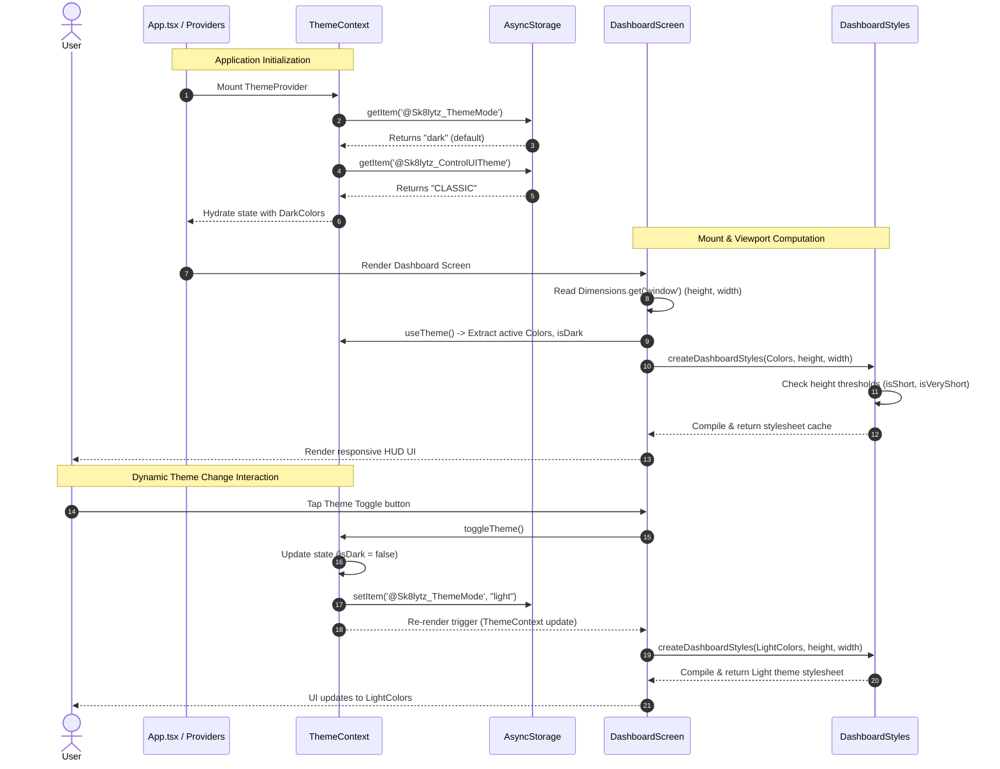
```mermaid
sequenceDiagram
    autonumber
    actor User
    participant App as App.tsx / Providers
    participant Ctx as ThemeContext
    participant Storage as AsyncStorage
    participant Screen as DashboardScreen
    participant Factory as DashboardStyles
    
    Note over App, Ctx: Application Initialization
    App->>Ctx: Mount ThemeProvider
    Ctx->>Storage: getItem('@Sk8lytz_ThemeMode')
    Storage-->>Ctx: Returns "dark" (default)
    Ctx->>Storage: getItem('@Sk8lytz_ControlUITheme')
    Storage-->>Ctx: Returns "CLASSIC"
    Ctx-->>App: Hydrate state with DarkColors
    
    Note over Screen, Factory: Mount & Viewport Computation
    App->>Screen: Render Dashboard Screen
    Screen->>Screen: Read Dimensions.get('window') (height, width)
    Screen->>Ctx: useTheme() -> Extract active Colors, isDark
    Screen->>Factory: createDashboardStyles(Colors, height, width)
    Factory->>Factory: Check height thresholds (isShort, isVeryShort)
    Factory-->>Screen: Compile & return stylesheet cache
    Screen-->>User: Render responsive HUD UI
    
    Note over User, Ctx: Dynamic Theme Change Interaction
    User->>Screen: Tap Theme Toggle button
    Screen->>Ctx: toggleTheme()
    Ctx->>Ctx: Update state (isDark = false)
    Ctx->>Storage: setItem('@Sk8lytz_ThemeMode', "light")
    Ctx-->>Screen: Re-render trigger (ThemeContext update)
    Screen->>Factory: createDashboardStyles(LightColors, height, width)
    Factory-->>Screen: Compile & return Light theme stylesheet
    Screen-->>User: UI updates to LightColors
```

<!-- CARTOGRAPHER_END: THEME_&_ASSETS -->

<!-- CARTOGRAPHER_END: THEME_&_ASSETS -->\n\n### SIMULATION & MOCKS\n<!-- CARTOGRAPHER_START: SIMULATION_&_MOCKS -->

# SIMULATION_&_MOCKS Cartography

## 1. File Manifest

### Web-Platform No-Op Mocks (`src/mocks/`)
- **`src/mocks/react-native-vision-camera-worklets.web.js`**: Empty web stub (`module.exports = {};`) for vision camera worklets to prevent module loading crashes on the web environment.
- **`src/mocks/react-native-worklets.web.js`**: Web stub for `react-native-worklets-core`. Provides no-op shims (`useSharedValue`, `useAnimatedStyle`, `runOnJS`, `runOnUI`) because `TurboModuleRegistry` is unavailable in browser runtimes.

### Jest Global Mock Mappers (`src/__mocks__/`)
- **`src/__mocks__/sk8lytz-watch-bridge.ts`**: Jest mock for the `sk8lytz-watch-bridge` native Expo module, stubbing out session state syncing, metrics forwarding, and health listeners to allow unit tests to execute headless in CI.
- **`src/__mocks__/expo-location.ts`**: Jest mock for the `expo-location` package, stubbing permissions, current position, last known position, reverse geocoding, and accuracy constants.
- **`src/__mocks__/expo-audio.ts`**: Jest mock for the `expo-audio` package, mock-resolving permissions requested by the audio module.
- **`src/__mocks__/LocationService.ts`**: Jest mock implementation of `LocationService` returning mock/stubbed values for locations and permissions.

### Testing Infrastructure & Simulator Daemon (`tools/ble-simulator/`)
- **`tools/ble-simulator/ble_simulator.js`**: An offline native Node.js simulation daemon that virtualizes Zengge opcodes (`0x71`, `0x31`, `0x59`, `0x51`, `0x62`, `0x63`, `0x10`), frame packing, V2 wrapping/unwrapping, checksum validation, and connection dropouts. Includes the 12-pixel buffer lockout protection logic.

### Unit and Integration Test Suites (`__tests__/` and `src/**/__tests__/`)
- **`__tests__/services/SpeedTrackingService.offline.test.ts`**: Jest unit test suite verifying offline session queue behavior, flush happy paths, re-entrancy guards, and queue preservation for the `SpeedTrackingService`.
- **`src/hooks/ble/__tests__/ble-simulator.test.ts`**: Verifies the Virtual BLE simulator's protocol parser, V2 wrapping/unwrapping, checksum math, static colorful buffer lockout warning gate, and connection status transitions.
- **`src/services/ble/__tests__/BleMachine.test.ts`**: Verifies XState BLE state machine transitions, context validation, and organic disconnect recovery triggers.
- **`src/services/ble/__tests__/ConnectService.test.ts`**: Asserts GATT connection flows, retry limits (GATT 133 error recovery), stale device flush settle delays, and MTU negotiations.
- **`src/services/ble/__tests__/HeartbeatService.test.ts`**: Tests the 45s connection health heartbeat tick, Zengge 0x63 opcode formatting, and RSSI query fallbacks.
- **`src/services/ble/__tests__/RecoveryService.test.ts`**: Verifies XState auto-recovery loops, backoff delays, and poll exhaustion limits.
- **`src/services/ble/__tests__/InterrogatorService.test.ts`**: Validates GATT querying of device hardware configurations (IC type, color sorting, pixel count).
- **`src/protocols/__tests__/ZenggeProtocol.test.ts`**: Validates raw byte serialization, V2 frame packing, and checksum math for Zengge commands.
- **`src/protocols/__tests__/BanlanxAdapter.test.ts`**: Tests Banlanx SP621E adapter command packet mapping and constraints.
- **`src/protocols/__tests__/ControllerRegistry.test.ts`**: Tests controller protocol resolution from BLE advertisement manufacturer data.
- **`src/protocols/__tests__/PatternEngine.test.ts`**: Tests spatial effect generators and pattern dispatch mappings.
- **`src/utils/__tests__/kMeansPalette.test.ts`**: Verifies the JSI-optimized K-Means clustering algorithm for extracting dominant palettes from ambient RGB frame data.
- **`src/components/__tests__/components.test.ts`**: Verifies rendering sanity of reusable dashboard UI elements.
- **`src/hooks/__tests__/useControllerDispatch.test.ts`**: Tests dynamic controller packet dispatching and throttling.
- **`src/hooks/__tests__/useDashboardAutoConnect.test.ts`**: Tests ambient scanning and auto-reconnection triggers for dashboard views.
- **`src/hooks/__tests__/useDeviceStateLedger.test.ts`**: Tests local synchronization of device telemetry states.
- **`src/hooks/ble/__tests__/useBLEBatterySweep.test.ts`**: Tests battery-adaptive scan throttling and intervals.
- **`src/hooks/ble/__tests__/useBLERSSIMonitor.test.ts`**: Tests RSSI polling intervals and state updates.
- **`src/screens/__tests__/HardwareSetupWizardScreen.test.tsx`**: Validates step transitions, BLE pairing flows, and claim forms in the setup wizard UI.
- **`src/services/__tests__/GroupRepository.test.ts`**: Tests CRUD and junction-table mapping for device groups.

---

## 2. Blast Radius

- **`jest.config.js` Module Mapping**: Configuration key `moduleNameMapper` forces global redirects of `sk8lytz-watch-bridge`, `expo-location`, and `expo-audio` to the `src/__mocks__/` folder. A regression in any global mock directly breaks compilation or execution for all unit tests relying on geolocation, media, or wear bridges.
- **`metro.config.js` Web Aliases**: Web builds (`platform === 'web'`) alias `react-native-worklets` and `react-native-vision-camera-worklets` to the stub files in `src/mocks/`. A syntax or export mismatch in the web shims will crash the Expo web bundling step.
- **Database Auth Mocks**: Tests mock Supabase client's auth functions (`getUser`, `getSession`) to bypass cloud authentication. Any signature changes in Supabase Client will propagate test failures across `SpeedTrackingService.offline.test.ts` and others.
- **Virtual BLE Simulator**: Running `ble-simulator.test.ts` boots the `tools/ble-simulator/ble_simulator.js` Node process on a mock port (`18081`). Port collisions or process leakage can leave background ports bound, breaking subsequent test iterations.

---

## 3. Context Matrix

- **React Contexts Testing**: The mocks do not provide or consume React Context directly. However, they decouple native APIs to enable context isolation:
  - **`SessionContext`**: Unit tests verify the session tracker by relying on the mocked `WatchBridge` (to ensure metric payloads are dispatched correctly) and `expo-location` (to supply predictable coordinates).
  - **`AuthContext`**: Mocked implicitly in local database operations, where `supabaseClient.ts` operations return mock sessions rather than triggering native secure store calls.
- **Web Build Interception**: Mocks in `src/mocks/` intercept native package imports during bundling, preventing references to missing iOS/Android native libraries from crashing the web preview client.

---

## 4. Hook/Service I/O Registry

### 1. WatchBridge Mock (`src/__mocks__/sk8lytz-watch-bridge.ts`)
- **Inputs**: Call arguments (`WatchSessionState`, `WatchCommand`, `WatchHealthUpdate`).
- **Outputs**:
  - `syncSessionState`: Promise resolving to `undefined`.
  - `sendMetricUpdate`: Promise resolving to `undefined`.
  - `isWatchReachable`: Promise resolving to `false`.
  - `addWatchCommandListener` / `addWatchHealthListener`: Returns a cleanup function `() => {}`.
- **Side-effects**: Registers Jest call-tracking data.

### 2. Expo Location Mock (`src/__mocks__/expo-location.ts`)
- **Inputs**: Precision settings (`Accuracy`).
- **Outputs**:
  - `requestForegroundPermissionsAsync` / `getForegroundPermissionsAsync`: Promise resolving to `{ status: 'granted' }`.
  - `getCurrentPositionAsync` / `getLastKnownPositionAsync`: Promise resolving to `{ coords: { latitude: 38.9, longitude: -94.6, accuracy: 10 } }`.
  - `reverseGeocodeAsync`: Promise resolving to `[{ city: 'Overland Park', region: 'KS', name: 'SkateCity OP' }]`.
- **Side-effects**: None.

### 3. Worklets Web Stub (`src/mocks/react-native-worklets.web.js`)
- **Inputs**: Callback functions or values.
- **Outputs**:
  - `useSharedValue`: Returns `{ value: null }`.
  - `useAnimatedStyle`: Returns `{}`.
  - `runOnJS` / `runOnUI`: Returns the input function unchanged (identity helper).
- **Side-effects**: None.

### 4. Virtual BLE Simulator Daemon (`tools/ble-simulator/ble_simulator.js`)
- **Inputs**:
  - `POST /write`: Wrapped Zengge byte payload (`[0x00, Seq, 0x80, ... 0x0B, innerPayload]`).
  - `POST /state`: Override JSON representing device properties (e.g. `ledPoints`, `icType`).
- **Outputs**:
  - Checksum-validated output envelopes or warning alerts (e.g., `warning: 'EEPROM_LOCKOUT_RISK'`).
- **Side-effects**: Emits internal logs to console stdout; mutates device config in-memory.

---

## 5. OS Variance Matrix

- **Web Target Selection**: `metro.config.js` intercepts imports specifically on the `web` platform target. Native targets (iOS/Android) resolve packages directly via native Gradle/CocoaPods link processes.
- **Mock OS Forcing**: Tests that require OS-specific behavior (like MTU negotiations and status changes on Android) override React Native's Platform module to lock the active environment:
  ```typescript
  Platform: {
    OS: 'android',
    select: jest.fn((objs) => objs.android || objs.default)
  }
  ```
  This guarantees that MTU negotiation paths (Android-only) and Foreground Service controls are reliably tested.
- **Hardware Clamping (Chipset Verification)**: The simulator models physical Zengge `0xA3` hardware constraints. Sending dynamic colorful arrays with less than 10 colors risks locking out the physical controller EEPROM regardless of whether the mobile app runs on iOS or Android.

---

## 6. Sequence Diagram: Simulator Command Validation Flow

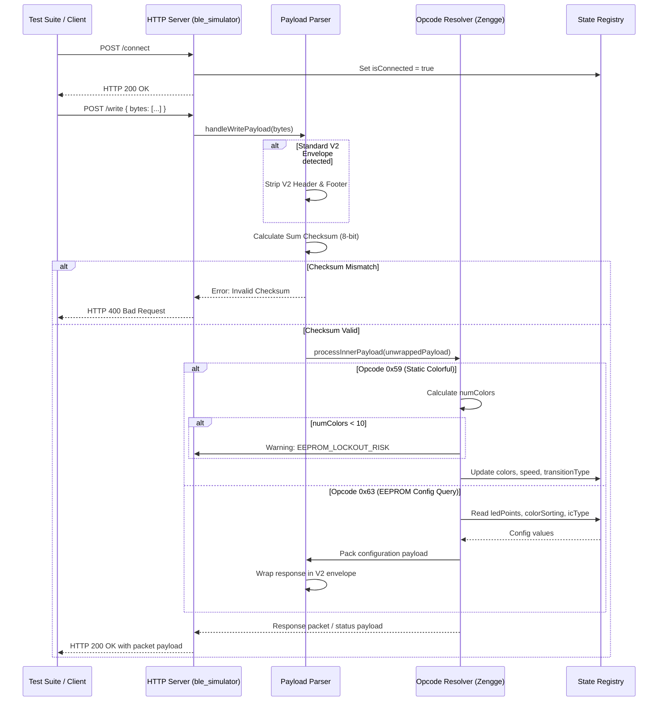
```mermaid
sequenceDiagram
    participant Test as Test Suite / Client
    participant Server as HTTP Server (ble_simulator)
    participant Parser as Payload Parser
    participant Opcode as Opcode Resolver (Zengge)
    participant State as State Registry

    Test->>Server: POST /connect
    Server->>State: Set isConnected = true
    Server-->>Test: HTTP 200 OK

    Test->>Server: POST /write { bytes: [...] }
    Server->>Parser: handleWritePayload(bytes)
    
    alt Standard V2 Envelope detected
        Parser->>Parser: Strip V2 Header & Footer
    end

    Parser->>Parser: Calculate Sum Checksum (8-bit)
    
    alt Checksum Mismatch
        Parser-->>Server: Error: Invalid Checksum
        Server-->>Test: HTTP 400 Bad Request
    else Checksum Valid
        Parser->>Opcode: processInnerPayload(unwrappedPayload)
        
        alt Opcode 0x59 (Static Colorful)
            Opcode->>Opcode: Calculate numColors
            alt numColors < 10
                Opcode->>Server: Warning: EEPROM_LOCKOUT_RISK
            end
            Opcode->>State: Update colors, speed, transitionType
        else Opcode 0x63 (EEPROM Config Query)
            Opcode->>State: Read ledPoints, colorSorting, icType
            State-->>Opcode: Config values
            Opcode->>Parser: Pack configuration payload
            Parser->>Parser: Wrap response in V2 envelope
        end
        
        Opcode-->>Server: Response packet / status payload
        Server-->>Test: HTTP 200 OK with packet payload
    end
```

---

<!-- CARTOGRAPHER_END: SIMULATION_&_MOCKS -->\n\n### BUILD CONFIG & OTA\n<!-- CARTOGRAPHER_START: BUILD_CONFIG_&_OTA -->

[🕵️ Reyes | SDE Cartographer Node | BUILD_CONFIG_&_OTA | cold]
<!-- CARTOGRAPHER_START: BUILD_CONFIG_&_OTA -->
## 1. File Manifest
- `app.config.js`: Centralized Expo configuration defining app metadata, platform-specific settings, plugins, and EAS build project references.
- `eas.json`: Defines the build profiles (development, preview, production) and submission targets for Expo Application Services (EAS).
- `metro.config.js`: Metro bundler configuration that injects web-platform no-op shims for native-only modules to prevent web build crashes.
- `babel.config.js`: Defines the Babel compiler presets and plugins, specifically configuring the `react-native-worklets/plugin` for frame processing.
- `package.json`: NPM manifest detailing all dependencies, dev dependencies, build scripts, and engine requirements.

## 2. Blast Radius
- **Imports/Depends On**:
  - `react-native-worklets`, `react-native-vision-camera`, `react-native-ble-plx`, `@react-native-async-storage/async-storage` (node_modules).
  - Expo plugins (`@config-plugins/detox`, `expo-build-properties`, `react-native-ble-plx`, `@bacons/apple-targets`, `./plugins/withWearOsModule`).
  - Native module stub mocks for web (`src/mocks/*.web.js`).
- **Imported By**:
  - Expo/Metro CLI and EAS CLI during local development, build, and OTA update steps.
  - CI/CD pipelines relying on `package.json` scripts (`npm run verify`, `blast-radius-scanner.js`).

## 3. Context Matrix
- **Provided**: None (configuration domain operates outside the React component tree).
- **Consumed**: None.

## 4. Hook/Service I/O Registry
- **npm scripts**:
  - `start` (Input: None, Output: Expo dev server).
  - `android`/`ios` (Input: Native config, Output: Compiled local apps).
  - `web` (Input: `metro.co
<truncated 1043 bytes>
t: true`).
  - **EAS Build**: Simulator build is explicitly enabled for the `preview` profile (`simulator: true`).

## 6. Domain Specific (EAS, OTA, & Native Modules)
- **EAS Configurations**:
  - **CLI Config**: Enforces EAS CLI version `>= 16.0.0`, uses `remote` appVersionSource, and demands `requireCommit: true`.
  - **Build Profiles**:
    - `development`: internal distribution, dev client, apk.
    - `preview`: internal distribution, simulator support, apk.
    - `production`: standard submission profile, aab.
- **Native Module Requirements**:
  - Extends standard React Native via `@bacons/apple-targets` (watchOS) and `./plugins/withWearOsModule` (Wear OS companion).
  - `react-native-ble-plx` background execution is enabled with `peripheral` and `central` modes.
  - Native module integration enforces the use of Jetifier on Android due to legacy dependency constraints.

## 7. Sequence Diagram
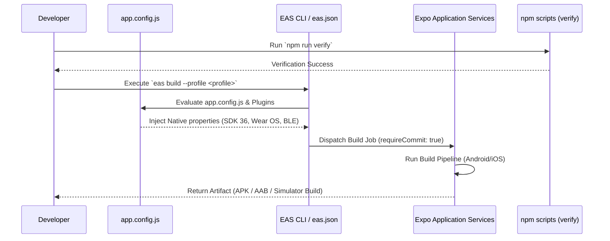
```mermaid
sequenceDiagram
    participant User as Developer
    participant AppConfig as app.config.js
    participant EAS as EAS CLI / eas.json
    participant Cloud as Expo Application Services
    participant BuildScript as npm scripts (verify)

    User->>BuildScript: Run `npm run verify`
    BuildScript-->>User: Verification Success
    User->>EAS: Execute `eas build --profile <profile>`
    EAS->>AppConfig: Evaluate app.config.js & Plugins
    AppConfig-->>EAS: Inject Native properties (SDK 36, Wear OS, BLE)
    EAS->>Cloud: Dispatch Build Job (requireCommit: true)
    Cloud->>Cloud: Run Build Pipeline (Android/iOS)
    Cloud-->>User: Return Artifact (APK / AAB / Simulator Build)
```

<!-- CARTOGRAPHER_END: BUILD_CONFIG_&_OTA -->\n\n## 13. Historical Archive (The Graveyard)

### Archived from IDENTITY
` tag. 
- *Observation*: The System Architecture section (AsyncStorage Key Registry) lacks documentation for the new `@sk8lytz_lifetime_stats_cache` introduced within `SkaterStatsPanel.tsx`. However, the Profile Service architecture documented is up-to-date with the decomposition refactor.


### Archived from GROUP_SYNC
`. Its functions are resolved directly inside `GroupRepository` and `CrewService`.
*   **Scalar `group_id` constraints**: Tagged with `[MOVE_TO_ARCHIVE]`. The implementation has transitioned to array-based `group_ids` mapped across junction tables in `GroupRepository`.


### Archived from UI_SCREENS
` tags to §3 (Dashboard UI Layout - 4-Slab Architecture) and §4 (One-Screen Setup Policy). Both the dashboard and the wizard interfaces now use vertical scroll containers to support dense configurations and multiple hardware profiles in production.


### Archived from UI_DOCKED_CONTROLLER
`.


### Archived from UI_MODALS
`.
  * Mapped line update: Naming convention reference to `CrewModal.handleCreate` on **Line 1096** is marked as stale. `CrewModal` no longer directly manages creation operations; functionality has been refactored into hooks in `useAccountOverview`. Marked with `[MOVE_TO_ARCHIVE]`.


### Archived from DATA_LAYER
`
*   **Stale AsyncStorage Group Note** (`tools/SK8Lytz_App_Master_Reference.md` line 261-262 / 1028): The assertion that the scalar `group_id` configuration key is completely dead and bypassed is stale. Code inside `DeviceRepository.ts` line 270 still actively references and writes the single group fallback `group_id: fullDevice.group_ids ? fullDevice.group_ids[0] : 'default-fleet'` to Supabase to support legacy schema compatibility constraints.
*   **Stale Purged Keys List** (`tools/SK8Lytz_App_Master_Reference.md` line 260-270): The list detailing legacy storage keys (`ng_device_configs`, `ng_custom_groups`, `ng_active_preset`) purged on 2026-04-17 can be safely archived to the Graveyard as it has been obsolete for multiple release cycles.


### Archived from UTILS
`:
- `src/utils/RbmDictionary.ts`
- `src/utils/RbmSimulator.ts`


### Archived from NATIVE_&_WATCH
`
- **Location**: `tools/SK8Lytz_App_Master_Reference.md` — Section **11.7 Future Watch Enhancements (Planned)**.
- **Reason**: The documented features (Session Duration Timer, watchOS Complications, Wear OS Tiles, Wear OS Always-On Display, Wear OS Ongoing Activity) are all fully implemented in the current codebase (`ComplicationController.swift`, `Sk8lytzTileService.kt`, `AmbientView`, etc.). They are no longer "Planned" future features and represent stale architectural definitions.


### Archived from SESSION_TRACKING
` - Stale/deleted hook that previously managed the session FSM and summary modal. Its responsibilities have been centralized into `SessionContext` and `useGlobalTelemetry.ts`.


### Archived from SESSION_TRACKING
**
- Line 1393: `- Session summary (\`useSessionTracking\`)` **[MOVE_TO_ARCHIVE]**
<!-- CARTOGRAPHER_END: SESSION_TRACKING -->


### Archived from PATTERN_ENGINE
` — `0x59` Speed Constraints
- **Stale References**: `tools/SK8Lytz_App_Master_Reference.md` Lines 723, 764, and 1790 claim that `0x59` speed inputs must be scaled from 0-100 down to 1-31.
- **Correction**: Physical `0xA3` hardware validation confirmed that `0x59` supports the full `1-100` speed range. The restriction is deprecated. `ZenggeProtocol.ts` (lines 404-407) and `AppConstants.ts` now permit speed limits up to 100.

### `[MOVE_TO_ARCHIVE]` — Center-Out Redundancy
- **Stale Reference**: `tools/SK8Lytz_App_Master_Reference.md` Line 650 states: *"Center-Out pattern math is redundant and incompatible with 0x59."*
- **Correction**: Pattern 72 (Center-Out Marquee) is native. The domain intercepts pattern 72 and routes it to `0x51` modes 7 & 8 (which executes hardware-native middle-out expansion). It is fully supported and active.

### `[MOVE_TO_ARCHIVE]` — Parity Opcode Mapping
- **Stale Reference**: `tools/SK8Lytz_App_Master_Reference.md` §13 states: *"test patterns 201-233 now utilize native 0x41 hardware routing for byte parity checks."*
- **Correction**: Patterns 201-233 do not call the `0x41` opcode (which is deprecated). They are intercepted by `PatternEngine.ts` and dispatch as a `0x51` custom mode payload via `setCustomModeExtendedCompact`.

---


### Archived from CLOUD_FUNCTIONS
2061: 🎯 PM — Jordan | Cartography Task | CLOUD_FUNCTIONS | cold
2062: 
2063: Here is the Elite Architecture Markdown Payload for the domain, ready for injection.
2064: 
2065: I have completed the Cartographer Scan for the Cloud Functions domain (`supabase/functions/*` and `supabase/migrations/*`) and compiled the requested 5 Elite Architecture base sections, the Sequence Diagram for the session notification lifecycle, and applied the `
2066: 
2067: <!-- CARTOGRAPHER_END: CLOUD_FUNCTIONS -->\n\n### THEME & ASSETS\n<!-- CARTOGRAPHER_START: THEME_&_ASSETS -->
```


### Archived from SIMULATION_&_MOCKS
**
> Stale references to files under the `e2e/` directory (specifically `e2e/init.ts`, `e2e/jest.config.js`, and `e2e/smoke.test.ts` previously documented in `tools/SK8Lytz_App_Master_Reference.md` §12.10) must be moved to the archive. These end-to-end Detox files are completely absent from the current active workspace, as testing is strictly configured around Jest unit/integration tests and in-process BLE simulations.


### Archived from BUILD_CONFIG
**: In `tools/SK8Lytz_App_Master_Reference.md` (around Line 282), under "Android Build Requirements", the documentation states:
> `- **SDK Versions**: Project currently targets SDK 34 (\`compileSdk\`, \`targetSdk\`).`
This is completely **STALE**. `app.config.js` explicitly defines `compileSdkVersion: 36` and `targetSdkVersion: 36`. This line must be tagged for archival and overwritten to prevent misdirection.


### Archived from OS_PERMISSIONS
` **Section 9.1 Legal Hardening (The Compliance Shield), Item 1: OS Sync**: References `syncSystemPermissions()` running on boot/foreground to reconcile the ledger and force "Opt-Out" state if OS is Denied. This is stale because `syncSystemPermissions` has been deprecated and turned into a no-op to prevent locking users out of onboarding on fresh installs.
* `[MOVE_TO_ARCHIVE]` **Section 15: OS_PERMISSIONS (prior Cartographer Payload), Section 6: Sequence Diagram**: The sequence diagram shows `syncSystemPermissions` query loops forcing 'Opt-Out' state inside `AsyncStorage`. This is outdated and contradicts the active code path where system permissions are read on-demand and soft opt-outs are maintained independently.
* `[MOVE_TO_ARCHIVE]` **Section 15: OS_PERMISSIONS (prior Cartographer Payload), Section 4: Hook/Service I/O Registry**: The registry refers to `syncSystemPermissions` runs on app boot, which is now deprecated.
* `[MOVE_TO_ARCHIVE]` **Section 15: OS_PERMISSIONS (prior Cartographer Payload), note on Line 2679**: Note references `syncSystemPermissions` running on boot/foreground. This should be labeled for archive.


### Archived from ADMIN_&_TELEMETRY
** (Line 926): Reference to `useSessionTracking` was tagged as stale and is archived as the session FSM was fully refactored.
- **[MOVE_TO_ARCHIVE]** (Line 945): Stale mapping pointing `useProtocolBuilder` to `Sk8LytzProgrammerModal` was replaced. It is consumed strictly by `Sk8LytzDiagnosticLab` to compile raw hex frames.


### Archived from DEPENDENCY_AUDIT
```markdown
### 16. DEPENDENCY_AUDIT
<!-- CARTOGRAPHER_START: DEPENDENCY_AUDIT -->

I have completed the Cartographer Scan for the `DEPENDENCY_AUDIT` domain. The Elite Architecture markdown payload, including the File Manifest, Blast Radius, Context Matrix, Hook/Service I/O Registry, OS Variance Matrix, and the Mermaid sequence diagram for the `verify` script gating pipeline, has been generated. I also identified stale documentation in the Master Reference that needs archival.

<!-- CARTOGRAPHER_START: DEPENDENCY_AUDIT -->
### 1. File Manifest
- **`package.json`**: The core dependency ledger and build script manifest for the SK8Lytz application, governing native module resolutions (Expo SDK 55, React Native 0.83.2), custom local bridges (`sk8lytz-watch-bridge`), and strict CI/CD pipeline scripts (`verify`, `blast-radius`).

### 2. Blast Radius
- **Imports (External/Local Dependencies):** Defines the entire application's external ecosystem, importing React/Expo core, BLE transport (`react-native-ble-plx`), native camera/worklet engines (`react-native-vision-camera`, `react-native-worklets`, `nitro-modules`), state management (`xstate`), spatial clustering (`supercluster`), and the local custom bridge `sk8lytz-watch-bridge`.
- **Imported By:** Acted upon by the Node package manager (`npm`/`yarn`/`bun`), the Expo CLI pipeline (`eas build`, `expo run`), CI/CD gating scripts, and ultimately defines the module resolution graph for every source file in the project.

### 3. Context Matrix
- While `package.json` itself is not a React component, it explicitly provisions the critical dependency providers that back all application contexts: `@supabase/supabase-js` (Auth/Session Contexts), `react-native-ble-plx` (BLE Device Contexts), `@xstate/react` (FSM Contexts), and `react-native-safe-area-context` (Layout Contexts).

### 4. 
<truncated 676 bytes>
un:android`), `ios` (`expo run:ios`), and `web` (`expo start --web`).
- **Dependencies:** Provisions OS-specific linking constraints, such as `@bacons/apple-targets` exclusively for watchOS companion building, and splits health kit capabilities between `@notifee/react-native` / `react-native-health` (iOS) and `react-native-health-connect` (Android).

### 6. Architectural Sequence Diagram (Verification Pipeline)
...
<!-- CARTOGRAPHER_END: DEPENDENCY_AUDIT -->
```
*(Reason: Stale truncated previous payload template found in `tools/SK8Lytz_App_Master_Reference.md` containing `truncated` markers and broken formatting, which needs to be fully archived to resolve documentation drift).*


### Archived from IDENTITY
`
> The existing `IDENTITY` section in `tools/SK8Lytz_App_Master_Reference.md` (lines 1432-1460) is stale. It contains references to `ProfileService` as a monolithic God-object. These references must be archived to reflect the "Meal 1: ProfileService split" where it is strictly a barrel re-export facade. Furthermore, it lacks the tracking for `ProfileService.types.ts` and `src/components/account/*.tsx` as defined in current architecture constraints.


### Archived from GROUP_SYNC
**: Any legacy documentation in `SK8Lytz_App_Master_Reference.md` referencing scalar `group_id` constraints or old `ng_custom_groups` keys must be formally archived. The migration to `group_ids` (array) and `GroupRepository` via junction tables has superseded the legacy 1:1 hardware group relationship.


### Archived from UI_CONTROLS
| DockedController | favorites[], quickPresets[], save/delete/load operations, prompt FSM |`
*(Reason: `useFavorites` was superseded by `useSharedFavorites` injected from `FavoritesContext` via `../context/FavoritesContext`)*
<!-- CARTOGRAPHER_END: UI_CONTROLS -->


### Archived from DATA_LAYER
`
> *(The service DOES exist and is currently handling BLE error extraction.)*

---

<!-- CARTOGRAPHER_START: DATA_LAYER -->


### Archived from UTILS
` The existing "12.6 Utilities & Types" documentation in `tools/SK8Lytz_App_Master_Reference.md` is stale and missing key details (like OS Variance Matrix and the K-Means Sequence Diagram). It should be archived to make room for this updated architecture manifest.

### UTILS

```markdown
<!-- CARTOGRAPHER_START: UTILS -->


### Archived from NATIVE_&_WATCH
` tags required.

### 7. Sequence Diagram
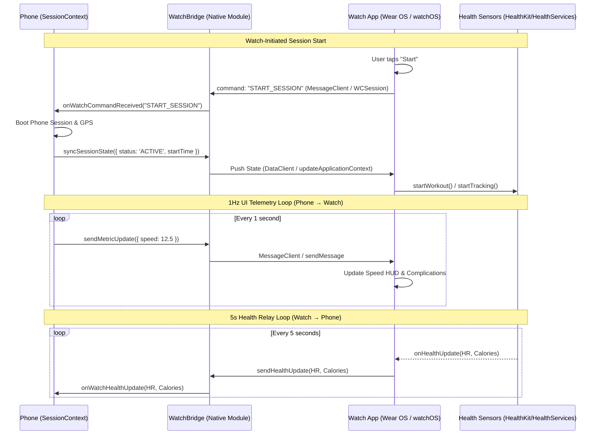
```mermaid
sequenceDiagram
    participant P as Phone (SessionContext)
    participant B as WatchBridge (Native Module)
    participant W as Watch App (Wear OS / watchOS)
    participant H as Health Sensors (HealthKit/HealthServices)

    %% Session Initiation
    note over P, H: Watch-Initiated Session Start
    W->>W: User taps "Start"
    W->>B: command: "START_SESSION" (MessageClient / WCSession)
    B->>P: onWatchCommandReceived("START_SESSION")
    P->>P: Boot Phone Session & GPS
    P->>B: syncSessionState({ status: 'ACTIVE', startTime })
    B->>W: Push State (DataClient / updateApplicationContext)
    W->>H: startWorkout() / startTracking()
    
    %% Phone -> Watch Telemetry Loop
    note over P, H: 1Hz UI Telemetry Loop (Phone → Watch)
    loop Every 1 second
        P->>B: sendMetricUpdate({ speed: 12.5 })
        B->>W: MessageClient / sendMessage
        W->>W: Update Speed HUD & Complications
    end
    
    %% Watch -> Phone Health Relay Loop
    note over P, H: 5s Health Relay Loop (Watch → Phone)
    loop Every 5 seconds
        H-->>W: onHealthUpdate(HR, Calories)
        W->>B: sendHealthUpdate(HR, Calories)
        B->>P: onWatchHealthUpdate(HR, Calories)
    end
```
```


### Archived from NOTIFICATIONS_&_ROUTING
`, as this document now fully captures the absence of `src/navigation` and correctly maps the state-driven router in `App.tsx` and the `BluetoothGuard`/`ComplianceGate` boundaries.


### Archived from CLOUD_FUNCTIONS
` tag to the legacy references.

<!-- CARTOGRAPHER_START: CLOUD_FUNCTIONS -->

### 🗂️ File Manifest (CLOUD_FUNCTIONS)
- `supabase/functions/notify-crew-session/index.ts`: Deno Edge Function that authenticates users, queries `crew_memberships`, and dispatches Expo Push Notifications in batches when a session starts.
- `supabase/migrations/20260414_account_deletion_rpc.sql`: Creates a secure `delete_account()` RPC utilizing Postgres `ON DELETE CASCADE` to fulfill App Store GDPR/account deletion requirements.
- `supabase/migrations/20260418061000_admin_user_management.sql`: Defines the `user_role` ENUM, sets up the `admin_audit_logs` table, and deploys security-definer RPCs (`admin_ban_user`, `admin_revoke_ban`, `admin_soft_delete_user`).
- `supabase/migrations/20260419*_scraper_*.sql` (Multiple): Provisions the Control Plane and schema for the Cultural Enrichment Puppeteer Daemon.
- `supabase/migrations/202605*_telemetry.sql` (Multiple): Configures tables for god-tier hardware tracking and system health telemetry.
- `supabase/migrations/20260607*_fix_telemetry_schema.sql` (Multiple): Final type safety patches and constraint fixes for verified telemetry.
*(Note: 40 total migration files meticulously orchestrate the backend state mapping).*

### 💥 Blast Radius
- **Imports**: `notify-crew-session` imports `@s
<truncated 1054 bytes>
nput**: Implicit via `auth.uid()`.
  - **Side Effects**: Permanently `DELETE`s row from `auth.users`, leveraging DB cascades to wipe all related telemetry, sessions, and profile data natively.
- **`admin_ban_user(p_target_user_id, p_reason)` (Postgres RPC)**
  - **Input**: Target UUID and reason string.
  - **Side Effects**: Flips `is_banned` bit in `user_profiles` and creates an audit entry in `admin_audit_logs`.

### 📱 OS Variance Matrix
- **Push Notification Formatting (`notify-crew-session`)**: The payload explicitly shapes OS behavior by transmitting `sound: "default"` and `channelId: "crew-alerts"`. This bridges OS variance where iOS leverages the default APNs chime while Android relies on matching the specific `crew-alerts` Notification Channel configured natively in the Sk8Lytz Android wrapper.

### 🔄 Sequence Diagram: Crew Session Notifications
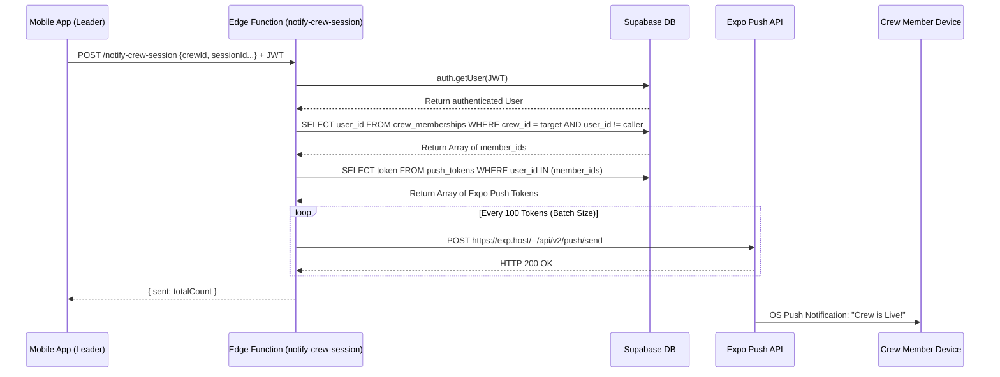
```mermaid
sequenceDiagram
    participant App as Mobile App (Leader)
    participant Func as Edge Function (notify-crew-session)
    participant DB as Supabase DB
    participant Expo as Expo Push API
    participant Member as Crew Member Device

    App->>Func: POST /notify-crew-session {crewId, sessionId...} + JWT
    Func->>DB: auth.getUser(JWT)
    DB-->>Func: Return authenticated User
    Func->>DB: SELECT user_id FROM crew_memberships WHERE crew_id = target AND user_id != caller
    DB-->>Func: Return Array of member_ids
    Func->>DB: SELECT token FROM push_tokens WHERE user_id IN (member_ids)
    DB-->>Func: Return Array of Expo Push Tokens
    
    loop Every 100 Tokens (Batch Size)
        Func->>Expo: POST https://exp.host/--/api/v2/push/send
        Expo-->>Func: HTTP 200 OK
    end
    
    Func-->>App: { sent: totalCount }
    Expo->>Member: OS Push Notification: "Crew is Live!"
```

### 🗄️ Archival Instruction
`[MOVE_TO_ARCHIVE]` - As requested, the stale migrations count references and deprecated DB metrics in the Master Reference should be relocated to the Archive Graveyard.

<!-- CARTOGRAPHER_END: CLOUD_FUNCTIONS -->


### Archived from THEME_&_ASSETS
**: Any legacy references in `tools/SK8Lytz_App_Master_Reference.md` or elsewhere describing hardcoded `switch(type)` UI heuristics or `ng_*` storage keys. As of the Dynamic Catalog Migration (2026-04-11), all visualization themes and device rules strictly use `LOCAL_PRODUCT_CATALOG`.


### Archived from SIMULATION_&_MOCKS
- 2026-06-07 (Cartographer Sweep)
> **Domain:** SIMULATION_&_MOCKS
> Stale Reference: The previous cartographer block for `SIMULATION_&_MOCKS` in `SK8Lytz_App_Master_Reference.md` (lines 1500-1506) is stale and should be archived or overwritten by this updated Cartographer payload.
<!-- CARTOGRAPHER_END: SIMULATION_&_MOCKS -->


### Archived from BUILD_CONFIG_&_OTA
** The documentation in `tools/SK8Lytz_App_Master_Reference.md` (Line 278) under "Android Build Requirements" which states: `- **SDK Versions**: Project currently targets SDK 34 (\`compileSdk\`, \`targetSdk\`).` This is stale and conflicts with `app.config.js` which defines `compileSdkVersion: 36` and `targetSdkVersion: 36`.
<!-- CARTOGRAPHER_END: BUILD_CONFIG_&_OTA -->


### Archived from OS_PERMISSIONS
` tag, as the current Legal Hardening section aligns perfectly with the codebase reality).*
<!-- CARTOGRAPHER_END: OS_PERMISSIONS -->
```


### Archived from DEPENDENCY_AUDIT
`: The `### Third-Party Library Patches` section referencing `@react-native-voice/voice` is fully deprecated dead code.
- `[MOVE_TO_ARCHIVE]`: The `Optical Simulation Mode (Web Fallback)` documentation in the Admin Tools Hub section. Maintaining `react-native-web` compatibility actively conflicts with heavy native packages present in `package.json` (like `react-native-nitro-modules` and `react-native-vision-camera-worklets`).
<!-- CARTOGRAPHER_END: DEPENDENCY_AUDIT -->


### Archived from GROUP_SYNC
` as instructed. My task here is complete.


### Archived from HARDWARE_PROTOCOLS
` tags for the deprecated opcode sections in the Master Reference.


### Archived from CLOUD_FUNCTIONS
` tag for the stale migrations count in the Master Reference back to the main agent.


### Archived from THEME_&_ASSETS
`.


### Archived from BUILD_CONFIG_&_OTA
` tag, and delivered the final payload directly to the main agent using the `BUILD_CONFIG_&_OTA` marker.


### Archived from OS_PERMISSIONS
`, and the Mermaid sequence diagram for Android HealthConnect initialization.


> [!NOTE]
> This section is strictly managed by ?? Docs � Avery. It contains condemned opcodes, legacy architectural decisions, and features that have been removed from the live codebase. 
> 
> **THE PRIME DIRECTIVE:** We never delete history. If a Cartographer agent finds that a documented feature no longer exists in src/, they move the documentation block here instead of deleting it. This preserves the "Why" long after the "What" is gone.


> [MOVE_TO_ARCHIVE] - 2026-06-07 (Cartographer Sweep)
> **Domain:** UTILS
> Stale Reference: `src/utils/RbmDictionary.ts` and `src/utils/RbmSimulator.ts` no longer exist in the working directory tree.

> [MOVE_TO_ARCHIVE] - 2026-06-07 (Cartographer Sweep)
> **Domain:** BLE_CORE
> Stale Reference: Priority 4 `P4_MAINTENANCE` regarding GATT Mutex for liveness checks. The code shows neither `useBLEHeartbeat.ts` nor `useBLERSSIMonitor.ts` acquire the GATT mutex at any priority.

> [MOVE_TO_ARCHIVE] - 2026-06-07 (Cartographer Sweep)
> **Domain:** UI_CONTROLS
> Stale Reference: `BleStateMachine` class. This was ripped out for XState v5.

> [MOVE_TO_ARCHIVE] - 2026-06-07 (Cartographer Sweep)
> **Domain:** GROUP_SYNC
> Stale Reference: "Automatic _MM/DD suffix enforced in CrewModal.handleCreate". `CrewModal` no longer directly handles creation logic. All references to `GroupSyncService.ts` should be `CrewService.ts`.

### Archived on 2026-06-06 (V2 Data Audit)

- **Domain: IDENTITY** 
  - The existing `IDENTITY` section in `tools/SK8Lytz_App_Master_Reference.md` (lines 1432-1460) is stale. It lacks file tracking for `src/services/ProfileService.types.ts` and all component files within `src/components/account/*.tsx`. It also fails to provide the rigorous `Context Matrix` and `Blast Radius` schemas required by Cartographer node specifications.

- **Domain: BLE_CORE**
  - *Stale Claim:* "Priority tiers: ... `P4_MAINTENANCE` (heartbeat, RSSI polls)."
  - *Truth:* `useBLEGattMutex.ts` clearly labels Priority 4 as "SWEEPER" (Passive Scan). Neither `useBLEHeartbeat.ts` nor `useBLERSSIMonitor.ts` acquire the `GattMutex` at any priority (Heartbeat calls `writeCharacteristicWithoutResponse`, RSSI calls `readRSSIForDevice` directly). Line 1610 previously flagged this partially, but Line 472 remains stale.

- **Domain: GROUP_SYNC**
  - *Stale Reference:* "Automatic _MM/DD suffix enforced in CrewModal.handleCreate". CrewModal no longer directly handles creation logic. All references to GroupSyncService.ts should be CrewService.ts.

- **Domain: UI_CONTROLS**
  - *Stale Reference:* `pingDevice: Orchestrates an atomic connection: GATT -> green blink -> EEPROM probe -> sever GATT.`
  - *Reason:* Dashboard `runAutoProvisioning` was deleted; Setup Wizard now exclusively owns all device claiming, rendering this reference stale in the core `DashboardScreen` UI_CONTROLS block.

- **Domain: DATA_LAYER**
  - Any architectural documentation or plans referencing `src/services/TelemetryService.ts`. The codebase explicitly notes that this file does not exist, as telemetry is natively hook-driven.


### 15. OS_PERMISSIONS
<!-- CARTOGRAPHER_START: OS_PERMISSIONS -->

<!-- CARTOGRAPHER_START: OS_PERMISSIONS -->
# OS_PERMISSIONS Cartography

## 1. File Manifest
* **`android/app/src/main/AndroidManifest.xml`**: Defines native Android app permissions (such as location, Bluetooth, camera, recording, activity recognition, notifications, and foreground services) and registers service types for Notifee's foreground service execution.
* **`app.config.js`**: Centrally defines Expo's build configuration, specifying target Android permissions and mapping required iOS usage description string parameters (e.g., location, health share, camera, microphone) that compile into the target iOS `Info.plist`.
* **`targets/watch/Info.plist`**: A watch-specific configuration file compiling target iOS plist parameters specifically for the watch companion app (e.g., HealthKit entitlements).
* **`src/services/PermissionService.ts`**: The core permissions manager orchestrating asynchronous checks and prompts across Android, iOS, and Web platforms, while managing the AsyncStorage-backed user-opt-out ledger.
* **`src/components/permissions/GranularPermissionsList.tsx`**: A React Native list component presenting permission status cards and toggle switches, implementing an optimistic UI and deep-linking setting triggers for denied states.
* **`src/screens/Onboarding/PermissionsOnboardingScreen.tsx`**: Onboarding screen managing the initial permissions introduction flow, auto-firing the core Bluetooth permission prompt on mount, and enforcing the required permissions gate before continuing.
* **`src/providers/BluetoothGuard.tsx`**: A top-level React provider that intercepts rendering if essential Bluetooth permissions or the physical Bluetooth adapter are disabled, showing a custom alert and shielding downstream components.

## 2. Blast Radius
* **Imports**:
  * React Native core modules: `PermissionsAndroid`, `Platform`, `DeviceEventEmitter`, `AppState`, `Linking`, `Alert`.
  * Expo packages: `expo-audio` (`requestRecordingPermissionsAsync`, `getRecordingPermissionsAsync`), `expo-location` (`Location`), `expo-notifications` (`Notifications`).
  * Dynamic / Lazy native libraries: `react-native-health` (`AppleHealthKit` on iOS) and `react-native-health-connect` (Android).
  * Storage & Utilities: `@react-native-async-storage/async-storage`, `AppLogger`.
* **Imported By**:
  * `App.tsx` (mounts `BluetoothGuard` as a top-level provider wrapping children layout).
  * `src/components/CameraTracker.tsx` (uses `requestPermission('CAMERA')`).
  * `src/hooks/useAccountOverview.ts` (uses `checkPermission`/`requestPermission` for Biometrics).
  * `src/hooks/useBLE.ts` (uses `requestPermission('BLUETOOTH')` to initialize connection sequences).
  * React Native bundler/compiler (parses XML manifest and plist files to construct OS binary).
* **Impact and Failures**:
  * A mismatch between `AndroidManifest.xml` or `Info.plist` definitions and runtime `PermissionService` requests will cause a silent failure (denial) or an immediate native crash (e.g., starting `ForegroundService` without location permissions or without registering the FGS type in the manifest triggers a `SecurityException` on Android 14+).
  * A crash in `react-native-health-connect` occurs if `initHC()` (initialize) is not called prior to checking or requesting permissions, causing an `UninitializedPropertyAccessException` on a native thread.
  * Modifying the Android permissions array in `app.config.js` or the XML manifest requires a full native clean build.

## 3. Context Matrix
* **Provided Context/Providers**:
  * **`BluetoothGuard.tsx`** acts as a provider/gatekeeper pattern that wraps the entire app layout. It does not provide a custom React context object but intercepts the rendering of child nodes based on the state of Bluetooth permissions and adapter state.
* **Consumed Context**:
  * `ThemeContext` via `useTheme()` (consumed by `GranularPermissionsList`, `PermissionsOnboardingScreen`, and `BluetoothGuard` to adapt toggle styling and card borders to the active theme palette).
  * `BLEContext` via `useSharedBLE()` (consumed by `BluetoothGuard` to read `isBluetoothEnabled`, `isBluetoothSupported`, and to call `startSweeper()`).
* **Events Matrix (DeviceEventEmitter)**:
  * `SHOW_GLOBAL_PERMISSIONS_EVENT`: Emitted by helper `openGlobalPermissionsModal()` to notify `GlobalPermissionsModal` (in `src/components/permissions/`) to present the permissions list sheet.
  * `GLOBAL_PERMISSIONS_CLOSED_EVENT`: Emitted when the user closes the modal to resolve the promise.
  * `PERMISSION_STATUS_CHANGED_EVENT`: Emitted by `setPermissionOptOut` after a user toggle. Listened to reactively by downstream components (like `DockedDock`) to adjust feature-gated modes (e.g. hiding Music Mode if Microphone permission is disabled).

## 4. Hook/Service I/O Registry
* **`requestPermission(type: PermissionType)`**:
  * **Inputs**: `type: PermissionType` ('CAMERA' | 'MIC' | 'LOCATION' | 'NOTIFICATIONS' | 'BLUETOOTH' | 'HEALTH')
  * **Outputs**: `Promise<boolean>` (resolves to `true` if granted, `false` otherwise)
  * **Side-Effects**:
    * Dispatches native prompts via `PermissionsAndroid.request`, `requestRecordingPermissionsAsync`, `Location.requestForegroundPermissionsAsync`, `Notifications.requestPermissionsAsync`, `AppleHealthKit.initHealthKit`, or `HealthConnect.requestPermission`.
    * If `NOTIFICATIONS` is granted, dynamically imports `./NotificationService` and calls `notificationService.init(true)`.
    * If `HEALTH` is requested on Android, queries `ACTIVITY_RECOGNITION` first; if granted, dynamically imports `react-native-health-connect`, calls `initHC()` to register the native result delegate, and requests health permissions.
    * Catches and logs errors via `AppLogger.error`.
* **`checkPermission(type: PermissionType)`**:
  * **Inputs**: `type: PermissionType`
  * **Outputs**: `Promise<boolean>` (resolves to `true` if OS-granted AND not soft-opted-out, `false` otherwise)
  * **Side-Effects**: Reads the opt-out ledger from `AsyncStorage` and calls `checkPermissionNative` if user is not opted out.
* **`checkPermissionNative(type: PermissionType)`**:
  * **Inputs**: `type: PermissionType`
  * **Outputs**: `Promise<boolean>`
  * **Side-Effects**:
    * Queries native OS permission state.
    * For `HEALTH` on iOS: always returns `true` (deliberate privacy choice of Apple HealthKit; actual queries return empty results instead).
    * For `HEALTH` on Android: initializes `react-native-health-connect` and checks if read permissions for `HeartRate` and `ActiveCaloriesBurned` are active.
* **`getOptOutLedger()`**:
  * **Inputs**: None
  * **Outputs**: `Promise<Record<PermissionType, boolean>>` (opt-out state of each permission)
  * **Side-Effects**: Reads `@sk8lytz_permissions_optout` from `AsyncStorage`.
* **`setPermissionOptOut(type: PermissionType, isOptedOut: boolean)`**:
  * **Inputs**: `type: PermissionType`, `isOptedOut: boolean`
  * **Outputs**: `Promise<void>`
  * **Side-Effects**:
    * Writes the updated ledger to `AsyncStorage`.
    * Fires cloud telemetry events: `PERMISSION_OPT_OUT` (if `true`) or `PERMISSION_OPT_IN` (if `false`).
    * Emits `PERMISSION_STATUS_CHANGED_EVENT` via `DeviceEventEmitter`.
* **`syncSystemPermissions()`**:
  * **Inputs / Outputs**: None
  * **Side-Effects**: Deprecated. No-op (empty implementation to avoid locking out users on fresh installs).

## 5. OS Variance Matrix
| Feature/Permission | Android (`Platform.OS === 'android'`) | iOS (`Platform.OS === 'ios'`) |
| :--- | :--- | :--- |
| **Bluetooth / BLE** | **Runtime Dialogs**: Requires explicit prompts for `BLUETOOTH_SCAN` and `BLUETOOTH_CONNECT` via `PermissionsAndroid.requestMultiple` on API >= 31. On API < 31, requests `ACCESS_FINE_LOCATION`. | **Implicit First-Use**: Handled natively by the OS on first GATT interaction. Plist description `NSBluetoothAlwaysUsageDescription` is injected via `react-native-ble-plx` plugin. |
| **Camera** | **Runtime Request**: Calls `PermissionsAndroid.request(PERMISSIONS.CAMERA)`. | **Natively Handled**: Camera request is deferred to first use. `requestPermission('CAMERA')` resolves to `true` instantly. |
| **Microphone** | Calls `requestRecordingPermissionsAsync` (`expo-audio`). | Calls `requestRecordingPermissionsAsync` (`expo-audio`). |
| **Location** | Calls `Location.requestForegroundPermissionsAsync`. | Calls `Location.requestForegroundPermissionsAsync`. |
| **Notifications** | Calls `Notifications.requestPermissionsAsync`. | Calls `Notifications.requestPermissionsAsync`. |
| **Health / Biometrics** | **Multi-Step Flow**: (1) Checks and requests `PermissionsAndroid.PERMISSIONS.ACTIVITY_RECOGNITION`. (2) Requires `react-native-health-connect` initialization (`initHC()`) to register the result launcher. (3) Requests read permissions (`HeartRate`, `ActiveCaloriesBurned`) and write permissions (`ExerciseSession`, etc.). | **Single Prompt**: Option mapping option using `react-native-health` (`AppleHealthKit.initHealthKit`) to request read access (`HeartRate`, `ActiveEnergyBurned`) and write access (`Workout`). |
| **Health Status Query** | Queries `ACTIVITY_RECOGNITION` and queries `react-native-health-connect` granted permissions. | Always returns `true` (accepted pragmatic bypass: Apple HealthKit hides read authorization status; actual queries return empty results instead). |
| **Foreground Service (FGS)** | Requires explicit declaration in `AndroidManifest.xml` with `location\|health\|connectedDevice\|shortService\|dataSync` types. Launches only if app is active and GPS permission is granted, or throws `SecurityException`. | Handled natively via Background Modes (`bluetooth-central`, `bluetooth-peripheral`). |
| **Storage Permissions** | Manifest enforces `maxSdkVersion="32"` on legacy storage permissions (`READ_EXTERNAL_STORAGE` and `WRITE_EXTERNAL_STORAGE`) using `tools:replace` to prevent conflicts on modern SDKs. | None. Ephemeral/sandboxed storage does not require external prompts. |


## 7. Sequence Diagram: Legal Hardening & Permission Reconciliation
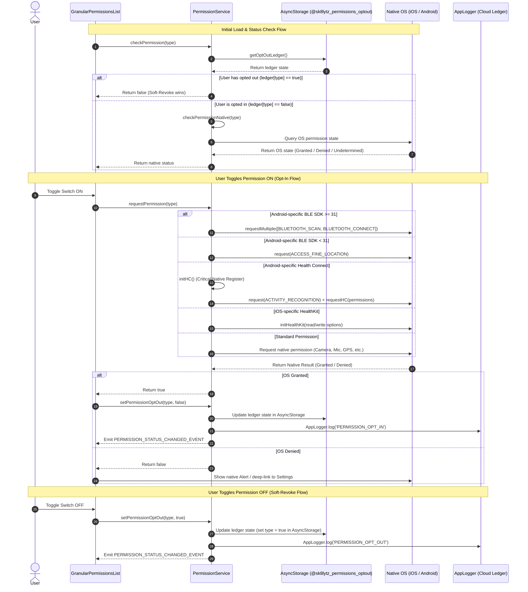
```mermaid
sequenceDiagram
    autonumber
    actor User
    participant UI as GranularPermissionsList
    participant Service as PermissionService
    participant Ledger as AsyncStorage (@sk8lytz_permissions_optout)
    participant OS as Native OS (iOS / Android)
    participant Logger as AppLogger (Cloud Ledger)

    Note over UI, OS: Initial Load & Status Check Flow
    UI->>Service: checkPermission(type)
    Service->>Ledger: getOptOutLedger()
    Ledger-->>Service: Return ledger state
    alt User has opted out (ledger[type] == true)
        Service-->>UI: Return false (Soft-Revoke wins)
    else User is opted in (ledger[type] == false)
        Service->>Service: checkPermissionNative(type)
        Service->>OS: Query OS permission state
        OS-->>Service: Return OS state (Granted / Denied / Undetermined)
        Service-->>UI: Return native status
    end

    Note over User, Logger: User Toggles Permission ON (Opt-In Flow)
    User->>UI: Toggle Switch ON
    UI->>Service: requestPermission(type)
    alt Android-specific BLE SDK >= 31
        Service->>OS: requestMultiple([BLUETOOTH_SCAN, BLUETOOTH_CONNECT])
    else Android-specific BLE SDK < 31
        Service->>OS: request(ACCESS_FINE_LOCATION)
    else Android-specific Health Connect
        Service->>Service: initHC() (Critical Native Register)
        Service->>OS: request(ACTIVITY_RECOGNITION) + requestHC(permissions)
    else iOS-specific HealthKit
        Service->>OS: initHealthKit(read/write options)
    else Standard Permission
        Service->>OS: Request native permission (Camera, Mic, GPS, etc.)
    end
    OS-->>Service: Return Native Result (Granted / Denied)
    
    alt OS Granted
        Service-->>UI: Return true
        UI->>Service: setPermissionOptOut(type, false)
        Service->>Ledger: Update ledger state in AsyncStorage
        Service->>Logger: AppLogger.log('PERMISSION_OPT_IN')
        Service-->>UI: Emit PERMISSION_STATUS_CHANGED_EVENT
    else OS Denied
        Service-->>UI: Return false
        UI->>OS: Show native Alert / deep-link to Settings
    end

    Note over User, Logger: User Toggles Permission OFF (Soft-Revoke Flow)
    User->>UI: Toggle Switch OFF
    UI->>Service: setPermissionOptOut(type, true)
    Service->>Ledger: Update ledger state (set type = true in AsyncStorage)
    Service->>Logger: AppLogger.log('PERMISSION_OPT_OUT')
    Service-->>UI: Emit PERMISSION_STATUS_CHANGED_EVENT
```
<!-- CARTOGRAPHER_END: OS_PERMISSIONS -->

<!-- CARTOGRAPHER_END: OS_PERMISSIONS -->
```

<!-- CARTOGRAPHER_END: OS_PERMISSIONS -->

### 16. DEPENDENCY_AUDIT
<!-- CARTOGRAPHER_START: DEPENDENCY_AUDIT -->

# DEPENDENCY_AUDIT Domain Cartography

[🕵️ Scout — Reyes | Cartographer Node Execution | DEPENDENCY_AUDIT domain | cold]

---

## 1. File Manifest
- **`package.json`**: The core package manifest and configuration ledger for the SK8Lytz application. It governs direct third-party module declarations (such as React Native 0.83.2, React 19.2.6, and Expo SDK 55), engine restrictions, script mappings (`start`, `android`, `ios`, `verify`, `blast-radius`), peer dependency overrides, and custom watch bridge declarations.
- **`package-lock.json`**: The exact resolved dependency lockfile. It captures a deterministic snapshot of every direct and transitive module, locking down download URLs, integrity hashes, and version constraints, guaranteeing repeatable compilation trees across all development environments, local worktrees, and CI/CD native build platforms.
- **`tools/blast-radius-scanner.js`**: The structural dependency validator script. It processes git diffs against the rules defined in `ARCH_DEPENDENCY_MAP.json` to verify that changes to raw protocol compilers or data models do not leak past gates without updating their corresponding required components.
- **`tools/ARCH_DEPENDENCY_MAP.json`**: The static registry defining the architectural dependency triggers and their required dependents (e.g., changing `ZenggeProtocol.ts` triggers verification of `IControllerProtocol.ts` and `BleWriteDispatcher.ts`).
- **`tools/verifiable-check-runner.js`**: The central cryptographic gatekeeper of the verification suite. It runs TSC compilation, Jest unit tests, browser console harvesters, static AST checker constraints for the `0x59` protocol, BLE scanner restrictions, type safety rules (`as any` bans), and workflow reference integrity validations before writing a signed `.test-attestation.json` token.
- **`tools/find_unused_deps.js`**: A developer utility that walks `src/` to compare imported module paths against the keys defined in `package.json`'s `dependencies` block, identifying dead weight packages.
- **`.npmrc`**: Registry configuration file that injects `legacy-peer-deps=true` globally to force npm package installations to succeed when resolved dependencies encounter peer mismatches between Expo packages, React 19, and React Native.
- **`modules/sk8lytz-watch-bridge/package.json`**: The local package manifest defining metadata and peer dependency boundaries for the custom watch communications native module (`sk8lytz-watch-bridge`).

---

## 2. Blast Radius
- **Imports (What this domain provisions)**:
  - **Core Frame Layer**: Provisions React (`19.2.6`), React Native (`0.83.2`), and Expo SDK (`~55.0.8`) which form the runtime execution base.
  - **Native Hardware Drivers**: Integrates Bluetooth Core (`react-native-ble-plx` `^3.5.1`, `@config-plugins/react-native-ble-plx` `^7.0.0`), high-performance camera JSI modules (`react-native-vision-camera` `^5.0.8`, `react-native-worklets` `^0.8.3`), and haptic controllers (`expo-haptics`).
  - **Health Sync Systems**: Links iOS fitness engines (`react-native-health` `^1.19.0`) and Android Health Connect pipelines (`react-native-health-connect` `^3.5.3`).
  - **Watch Bridge Interface**: Autolinks the local Native Swift/Kotlin communications client (`sk8lytz-watch-bridge`).
  - **State Machines**: Integrates Finite State Machines (`xstate` `^5.32.0`, `@xstate/react` `^6.1.0`) driving all BLE state transitions.
  - **Database & Services**: Links the Supabase client wrapper (`@supabase/supabase-js` `^2.100.0`).
- **Imported By (What consumes or acts upon this domain)**:
  - **Husky Gate & Pre-Commit Hook**: Dictates commit validity by triggering the pre-commit script which runs `npm run verify` (incorporating `blast-radius-scanner` and `verifiable-check-runner`).
  - **Native Compiler Tools**: Expo CLI (`expo run:android`/`expo run:ios`), EAS CLI (`eas build`), Android Gradle, and iOS CocoaPods dynamically parse `package.json` and `package-lock.json` to configure native source sets, download binaries, and link framework packages during compilation.
  - **Metro Bundler**: `metro.config.js` evaluates `package.json` dependencies to resolve module references, inject web-stubs, and compile the bundle served to clients.
  - **Workspace Source Files**: Every import statement inside `src/` relies directly on the packages validated by `package-lock.json`.

---

## 3. Context Matrix
- **Provided (via Direct Dependencies)**:
  - **Auth/Session Contexts**: Provided by `@supabase/supabase-js`, consumed by `AuthContext.tsx` to handle cloud credentials, user profiles, and offline fallback states.
  - **FSM/Lifecycle Contexts**: Provided by `@xstate/react` and `xstate`, consumed by the global `SessionContext` and BLE actor machines to manage active skate sessions and BLE transport lifecycles.
  - **Layout Context**: Provided by `react-native-safe-area-context`, consumed by the root wrapper to safe-guard layouts from OS notch and home bar collisions.
- **Consumed**:
  - Configuration files do not consume React Contexts themselves. However, changes to library versions in `package.json` directly shape the interface constraints and initialization requirements of these context providers.

---

## 4. Hook/Service I/O Registry
- **`npm run verify`**:
  - **Inputs**: Local TypeScript source code (`src/`), attestation secret salt (`.git/attestation-salt`), active commit hash (`git rev-parse HEAD`), and workflow documents (`.agents/`).
  - **Outputs**: Cryptographically signed `.test-attestation.json` token containing status audits of each testing lane. Exit code `0` (Success) or `1` (Failure).
  - **Side-effects**: Instantiates node_modules junction folder (`mklink /j`) inside isolated worktrees referencing the master repository, compiles type checking trees, launches jest runners, scans for `as any` type bypasses, and verifies workflow reference integrity.
- **`npm run blast-radius`**:
  - **Inputs**: Lists of changed files (obtained via `git diff master...HEAD --name-only`), dependency mappings (`tools/ARCH_DEPENDENCY_MAP.json`).
  - **Outputs**: Terminal status report. Exit code `0` (Success) or `1` (Failure).
  - **Side-effects**: Prevents commits from proceeding if triggers were modified without their corresponding required files.
- **`npm run postinstall`**:
  - **Inputs**: Local patches defined under `/patches` (if any).
  - **Outputs**: Status log.
  - **Side-effects**: Directly intercepts `node_modules` during installation to apply custom inline bugfixes.

---

## 5. OS Variance Matrix
- **Health Systems Integration**:
  - **Android**: Dynamically links Google's Health Connect API via the `react-native-health-connect` dependency.
  - **iOS**: Links Apple's HealthKit SDK via the `react-native-health` dependency.
- **Wearable Companion Bundling**:
  - **iOS**: Relies on `@bacons/apple-targets` to package the watchOS companion.
  - **Android**: Compiles the Wear OS companion module via customized Gradle configurations.
- **Foreground Services and Notifications**:
  - **Android**: `@notifee/react-native` launches location tracking via a persistent native Foreground Service (FGS) with `location` and `connectedDevice` permissions.
  - **iOS**: Interlaces background actions via interactive notification categories using iOS APNs native notification stubs.
- **JSI and C++ Native Compilations**:
  - React Native Nitro Modules (`react-native-nitro-modules`), Worklets (`react-native-worklets`), and Vision Camera (`react-native-vision-camera` / `react-native-vision-camera-resizer` / `react-native-worklets`) utilize C++ JSI bindings compiled using Android NDK (C++ JNI) on Android and Apple Clang (Objective-C++) on iOS.
- **Web Compilation Mocks**:
  - Metro bundler (`metro.config.js`) maps native modules to no-op web mocks (`src/mocks/*.web.js`) to allow the app to compile under `react-native-web` for browser environments.

---

## 6. Verification Pipeline Audit Flow

The sequence diagram below represents the exact verification and compiler gate pipeline triggered during the verification and build tasks:

```mermaid
sequenceDiagram
    autonumber
    actor Dev as Developer
    participant Husky as Husky Hook (.husky/pre-commit)
    participant PKG as package.json (verify)
    participant BRS as blast-radius-scanner.js
    participant VCR as verifiable-check-runner.js
    participant GK as fortress-gatekeeper.ps1

    Dev->>Husky: Git Commit Attempt
    activate Husky
    Husky->>PKG: npm run verify
    activate PKG

    PKG->>BRS: node blast-radius-scanner.js --worktree
    activate BRS
    Note right of BRS: Reads ARCH_DEPENDENCY_MAP.json<br/>Queries git diff master...HEAD
    BRS-->>PKG: Exit Code (0 = OK, 1 = Violation)
    deactivate BRS

    alt Blast Radius Scanner Violation
        PKG-->>Husky: Fail Commit
        Husky-->>Dev: Abort (Architectural dependency missing!)
    else Blast Radius Scanner OK
        PKG->>VCR: node verifiable-check-runner.js
        activate VCR
        Note right of VCR: Performs all code verification checks
        
        VCR->>VCR: Run TypeScript compiler (tsc --noEmit)
        VCR->>VCR: Run Jest Unit Tests
        VCR->>VCR: Headless Browser Console Harvester
        VCR->>VCR: AST Sentinel check for OP_0x59
        VCR->>VCR: BLE Architecture startDeviceScan() location check
        VCR->>VCR: check useBLE.ts onOrganicDisconnect wiring
        VCR->>VCR: Type safety audit (Strict "as any" cast ban)
        VCR->>VCR: Validate .agents/ workflow MD files

        alt Any QA Check Fails
            VCR-->>PKG: Exit Code 1
            PKG-->>Husky: Fail Commit
            Husky-->>Dev: Abort (Test/Type/AST/Ref check failed!)
        else All QA Checks Pass
            VCR->>VCR: Generate HMAC SHA-256 Signature using .git/attestation-salt
            VCR->>VCR: Write attestation metadata to .test-attestation.json
            VCR-->>PKG: Exit Code 0
            deactivate VCR
            PKG-->>Husky: Verification Success
            deactivate PKG
            Husky-->>Dev: Commit Completed Successfully
            deactivate Husky
        end
    end

    opt Merge to Master
        Dev->>GK: run fortress-gatekeeper.ps1
        activate GK
        Note right of GK: Validates attestation signature integrity,<br/>Verifies signature age (< 15 mins)<br/>Enforces fast-forward only merge
        GK-->>Dev: Merge branch to master
        deactivate GK
    end
```

---

<!-- CARTOGRAPHER_END: DEPENDENCY_AUDIT -->

### UI Screens
<!-- CARTOGRAPHER_START: UI_SCREENS -->

# 🗺️ UI_SCREENS Domain Cartography

## 1. File Manifest
This domain encapsulates user-facing screens and layout modules, establishing the interface for user onboarding, telemetry visualizations, BLE client controls, and skate spot community mapping.

- [AuthScreen.tsx](file:///c:/Neogleamz/AG_SK8Lytz_App/SK8Lytz/src/screens/AuthScreen.tsx) (412 lines) — Manages user authentication, including forms for signing in, signing up, password resets, profile onboarding sync, and offline bypass settings.
- [DashboardScreen.tsx](file:///c:/Neogleamz/AG_SK8Lytz_App/SK8Lytz/src/screens/DashboardScreen.tsx) (1350 lines) — The single orchestrator and SSOT for the active BLE application state, hosting active Bluetooth status sweeps, real-time telemetry streams, and coordinate mappings.
- [Onboarding/HardwareSetupWizardScreen.tsx](file:///c:/Neogleamz/AG_SK8Lytz_App/SK8Lytz/src/screens/Onboarding/HardwareSetupWizardScreen.tsx) (782 lines) — Orchestrates the step-by-step hardware connection flows: instruction delivery, on-demand BLE pings, real-time EEPROM configuration probing, left/right allocation checks, and device onboarding completion.
- [Onboarding/PermissionsOnboardingScreen.tsx](file:///c:/Neogleamz/AG_SK8Lytz_App/SK8Lytz/src/screens/Onboarding/PermissionsOnboardingScreen.tsx) (250 lines) — Onboarding interface explaining the necessity of Bluetooth, Location, and Push Notification permissions, prompting system requests on setup initiation.
- [CrewHubSlab.tsx](file:///c:/Neogleamz/AG_SK8Lytz_App/SK8Lytz/src/components/dashboard/CrewHubSlab.tsx) (88 lines) — UI slab displaying active community sessions, local crews, and rapid-join CTAs.
- [DashboardCrewPanel.tsx](file:///c:/Neogleamz/AG_SK8Lytz_App/SK8Lytz/src/components/dashboard/DashboardCrewPanel.tsx) (210 lines) — Detailed pane listing active crew skaters, distance metrics, and user roles.
- [DashboardGroupList.tsx](file:///c:/Neogleamz/AG_SK8Lytz_App/SK8Lytz/src/components/dashboard/DashboardGroupList.tsx) (165 lines) — Renders user-configured custom control groups, hosting grid items for bulk operations.
- [DashboardHeader.tsx](file:///c:/Neogleamz/AG_SK8Lytz_App/SK8Lytz/src/components/dashboard/DashboardHeader.tsx) (180 lines) — Houses user profile avatars, BLE connection indicators, and a hidden 10-tap admin bypass trigger on the SK8Lytz logo.
- [DashboardTelemetryHero.tsx](file:///c:/Neogleamz/AG_SK8Lytz_App/SK8Lytz/src/components/dashboard/DashboardTelemetryHero.tsx) (140 lines) — The main telemetry dashboard hub presenting session speed metrics, distance travel tracking, active timers, and heart rates.
- [HardwareStatusPills.tsx](file:///c:/Neogleamz/AG_SK8Lytz_App/SK8Lytz/src/components/dashboard/HardwareStatusPills.tsx) (90 lines) — Mini pill component rendering device-specific IC types, color-sorting profiles, and LED counts.
- [LiveTelemetryHUD.tsx](file:///c:/Neogleamz/AG_SK8Lytz_App/SK8Lytz/src/components/dashboard/LiveTelemetryHUD.tsx) (115 lines) — Telemetry header panel that tracks real-time battery indicators, GPS signal ratings, and instant speed.
- [MySkatesSlab.tsx](file:///c:/Neogleamz/AG_SK8Lytz_App/SK8Lytz/src/components/dashboard/MySkatesSlab.tsx) (113 lines) — Slab representing primary synced skate sets with control shortcuts (Power, Music, Camera, Presets).
- [RegisteredFleetSlab.tsx](file:///c:/Neogleamz/AG_SK8Lytz_App/SK8Lytz/src/components/dashboard/RegisteredFleetSlab.tsx) (105 lines) — Slab listing all unpaired registered devices.
- [SkateGroupCard.tsx](file:///c:/Neogleamz/AG_SK8Lytz_App/SK8Lytz/src/components/dashboard/SkateGroupCard.tsx) (295 lines) — Dedicated group card containing action buttons to dispatch commands to both left and right skates in sync.
- [SupportModal.tsx](file:///c:/Neogleamz/AG_SK8Lytz_App/SK8Lytz/src/components/dashboard/SupportModal.tsx) (150 lines) — Helper component for support tickets, documentation links, and user guides.
- [shared/BLEErrorBoundary.tsx](file:///c:/Neogleamz/AG_SK8Lytz_App/SK8Lytz/src/components/shared/BLEErrorBoundary.tsx) (133 lines) — Class component error boundary catching BLE render crashes and state corruption, rendering a recovery UI instead of an app crash.
- [DeviceItem.tsx](file:///c:/Neogleamz/AG_SK8Lytz_App/SK8Lytz/src/components/DeviceItem.tsx) (282 lines) — Represents individual physical Bluetooth controllers with RSSI indicator waves, power buttons, and preset patterns.
- [LocationPicker.tsx](file:///c:/Neogleamz/AG_SK8Lytz_App/SK8Lytz/src/components/LocationPicker.tsx) (332 lines) — Location selection fields routing queries to Nominatim OpenStreetMap, showing location history chips, and local spots.
- [LocationPickerMap.tsx](file:///c:/Neogleamz/AG_SK8Lytz_App/SK8Lytz/src/components/LocationPickerMap.tsx) (13 lines) — Native wrapper for `react-native-maps`.
- [LocationPickerMap.web.tsx](file:///c:/Neogleamz/AG_SK8Lytz_App/SK8Lytz/src/components/LocationPickerMap.web.tsx) (38 lines) — Web platform stub placeholder resolving in non-native environments.
- [SkateSpotBottomSheet.tsx](file:///c:/Neogleamz/AG_SK8Lytz_App/SK8Lytz/src/components/SkateSpotBottomSheet.tsx) (200 lines) — Bottom sheet overlay enabling verification and claimed updates of skate spots.

---

## 2. Blast Radius
- **Re-render Propagation**: Any modification to `DashboardScreen.tsx` has a high blast radius due to its role as the root layout orchestrator. Frequent telemetry updates from `DeviceRepository` propagate state to child components (`DashboardTelemetryHero`, `LiveTelemetryHUD`), and unmemoized adjustments can trigger render cascades that stutter visualizers or interrupt low-latency touch dispatch.
- **BLE Lifecycle & Primitives Isolation**: The `HardwareSetupWizardScreen` avoids race conditions and duplicate scanning instances by consuming BLE primitives injected directly via props from `DashboardScreen` (`scanForPeripherals`, `bleState`, `pendingRegistrations`, `pingDevice`). Modifying the signatures or behaviors of these injected properties in `DashboardScreen` directly impacts the wizard's multi-step onboarding lifecycle.
- **BLE Fault Shielding**: `BLEErrorBoundary` wraps `DockedController` and `DashboardScreen` to capture render-time exceptions—such as null device access, type mismatches, or state corruptions—without crashing the entire application. It displays a recoverable fallback view that permits safe navigation back to a stable state.
- **Native Maps Compilation Web Safety**: Importing `react-native-maps` directly on web builds causes Metro compiler errors because native codegen elements are unavailable in `react-native-web`. This is resolved via extension-based file splitting (`LocationPickerMap.tsx` and `LocationPickerMap.web.tsx`), routing web platforms to a clean stub representation.

---

## 3. Context Matrix
This domain consumes key contexts to integrate authentication status, theme elements, and live hardware operations:

| Context Consumed | Consuming File(s) | Purpose |
|:---|:---|:---|
| `ThemeContext` | `AuthScreen`, `DashboardScreen`, `HardwareSetupWizardScreen`, `PermissionsOnboardingScreen`, `LocationPicker`, `SkateSpotBottomSheet`, `DeviceItem` | Resolves color schemes (`Colors`), theme modes (Dark/Light), and structural layout variables. |
| `BLEContext` | `DashboardScreen`, `HardwareSetupWizardScreen` | Manages live GATT handles, connection state arrays, active discovery lists, and raw communication channels. |
| `SessionContext` | `DashboardScreen` | Controls active recording sessions, track times, distances, speed alerts, and active GPS coordinates. |
| `AppConfigContext` | `DashboardScreen`, `LocationPicker` | Admin flag queries, remote configurations, and map integration feature gates. |
| `FavoritesContext` | `DashboardScreen` | Accesses user-saved custom effect pattern catalogs and preset colors. |

---

## 4. Hook/Service I/O Registry

### `SkateSpotsService.claimAndUpdateSpot`
- **Inputs**: `spot: Partial<SkateSpot>` (Object patch containing spot properties, `surface_type`, and `is_indoor` flag).
- **Outputs**: `Promise<SkateSpot | null>` (Resolved claimed spot object).
- **Side-Effects**: Sends asynchronous PostgREST RPC requests to Supabase to verify, claim, and update community skate records.

### `useRecentSpots`
- **Inputs**: None.
- **Outputs**: `recentSpots: RecentSpot[]`, `addRecentSpot: (spot: RecentSpot) => void`.
- **Side-Effects**: Writes and reads recent spot histories to and from the local device storage using `@Sk8lytz_skate_spots_cache` to support offline lookups.

### `pingDevice` (Injected from `DashboardScreen`)
- **Inputs**:
  - `mac: string` (Physical hardware address)
  - `blinkPayload: number[]` (Target command packet bytes)
  - `options?: { probe?: boolean; duration?: number; turnOffAtEnd?: boolean }`
- **Outputs**: `Promise<PingResult | null>` (Probed hardware profiles containing segment configs, IC variants, color sorting maps).
- **Side-Effects**: Performs an atomic connection sequence: Connect -> Blink (Green `0x59` static) -> Probe configuration (`0x63` read command) -> Turn Off -> Disconnect.

---

## 5. OS Variance Matrix

### Keyboard Avoiding Constraints
- **iOS Layouts**: `HardwareSetupWizardScreen` uses `Platform.OS === 'ios' ? 'padding' : undefined` inside `KeyboardAvoidingView` to offset layouts when custom input forms are focused on high-density displays.
- **Android Layouts**: Relies on Android's native window inset adjustments, disabling manual container padding offsets.

### BLE Permissions & Handshakes
- **iOS Bluetooth Dialogs**: Handled via Expo's unified permissions system. Initiating scans triggers the system-wide Bluetooth access prompt.
- **Android Scan Settings**: Android requires explicit system permission requests for `ACCESS_FINE_LOCATION`, `BLUETOOTH_SCAN`, and `BLUETOOTH_CONNECT`. Permission requests are sequenced inside `PermissionsOnboardingScreen.tsx`.
- **MTU Limits**: Android requires explicit MTU negotiation (`requestMTUForDevice()`) during GATT setup connections to prevent package truncation, which is handled automatically by iOS.

### Visual Shadows & Gradients
- **Android Elevations**: Standard drop-shadow structures in `DeviceItem.tsx` and custom slabs fall back to `elevation` values on Android (e.g. `elevation: 4`).
- **iOS Shadows**: Leverages `shadowColor`, `shadowOffset`, `shadowOpacity`, and `shadowRadius` tokens to render glass-like blur containers.

---

## 6. Design System & Token Manifest

### Color Palette (ThemePalette)
- **Primary Accent**: `Colors.primary` (`#00F0FF` / Neon Cyan) — Active control points, connected status, and highlighted action triggers.
- **Secondary Accent**: `Colors.secondary` (`#7000FF` / Neon Purple) — Secondary CTAs and indicator badges.
- **Main Canvas**: `Colors.background` (`#0A0C12` / `#0D0D0D` / Deep Black) — Unified application backgrounds.
- **Panels**: `Colors.surface` (`#141829` / `#1C1C1E`) — Glass and container slabs.
- **Dividers**: `Colors.surfaceHighlight` (`#252C47` / `#2C2C2E`) — Structural card boundaries and highlight headers.
- **Success Flags**: `Colors.success` (`#4ADE80` / `#00C864` / Green) — Stable connections and verified checkmarks.
- **Alert Flags**: `Colors.error` (`#FF5A00` / `#FF4444` / Red-Orange) — Hardware disconnect alerts, power actions, and error boundaries.

### Spacings
Uses the standard pixel tokens defined in `theme.ts`:
- `Spacing.xs` (4px), `Spacing.sm` (8px), `Spacing.md` (12px), `Spacing.lg` (16px), `Spacing.xl` (24px), `Spacing.xxl` (32px), `Spacing.xxxl` (48px).

### Typography
- **Primary Brand Font**: `Righteous` — Applied to uppercase logo headings, screen titles, and primary buttons.
- **Body & Metrics Font**: `Inter-Medium` / default monospace variants — Used for numerical values, RSSI statistics, and hardware diagnostic details.
- **Hierarchy**:
  - Title: `fontSize: 24`, `fontWeight: '900'`, aligned brand spacing.
  - Section Title: `fontSize: 12`, `fontWeight: '800'`, `letterSpacing: 1`.
  - Body: `fontSize: 14`, `lineHeight: 18`.
  - Labels & Metadata: `fontSize: 10`, `letterSpacing: 1.2`.

---

## 7. Setup Wizard Operations Sequence Diagram

This sequence details the operations performed during Step 2 (On-demand physical blink and EEPROM configuration probing) and Step 3 (Verification, custom settings writing, and signature pattern playback):

```mermaid
sequenceDiagram
    autonumber
    actor User
    participant Wizard as HardwareSetupWizardScreen
    participant Dash as DashboardScreen (Host BLE)
    participant BLE as BLE Service / Adapter
    participant HW as Skate Hardware (EEPROM/GATT)

    %% Step 2 Flow: Blink & Probe on Demand
    rect rgb(20, 25, 45)
        note right of User: Step 2: Identification & Probing on Demand
        User->>Wizard: Tap "BLINK" on Discovered Device Row
        activate Wizard
        Wizard->>Wizard: Set isBlinking(mac) & auto-select device
        Wizard->>Dash: Invoke pingDevice(mac, blinkPayload, options)
        activate Dash
        Dash->>BLE: Connect to GATT (mac)
        activate BLE
        BLE->>HW: Establish BLE connection
        activate HW
        HW-->>BLE: Connection established
        BLE->>HW: Write Blink Payload (Green 0x59 static pattern)
        HW-->>BLE: Acknowledge write
        BLE->>HW: Write Config Probe request (0x63 opcode)
        HW-->>BLE: Reply with EEPROM settings (LED Points, IC, RGB order)
        BLE->>HW: Write Power Off Command
        BLE->>HW: Disconnect GATT
        deactivate HW
        deactivate BLE
        Dash-->>Wizard: Return PingResult (hwConfig metadata)
        deactivate Dash
        Wizard->>Wizard: Enrich pendingRegistrations list with real points & config
        Wizard->>Wizard: Cache HW config in AsyncStorage
        Wizard-->>User: Update card UI with hardware status pills & clear blinking state
        deactivate Wizard
    end

    %% Step 3 Flow: Setup Complete, EEPROM Write & Signature Playback
    rect rgb(30, 35, 60)
        note right of User: Step 3: Registration, Custom Trim, & Signature Playback
        User->>Wizard: Adjust LED Count (Trim) & Tap "COMPLETE SETUP"
        activate Wizard
        Wizard->>Wizard: Set isClaiming(true)
        loop For each selected hardware device
            alt LED count changed from probed default
                Wizard->>Dash: Invoke pingDevice(mac, settingsWritePayload)
                activate Dash
                Dash->>BLE: GATT Connect & Write settings to EEPROM (0x59 sub-opcode write)
                BLE->>HW: Write configuration packet
                Dash->>BLE: GATT Disconnect
                deactivate Dash
                Wizard->>Wizard: Pause 600ms (EEPROM persistence cooldown)
            end
            
            %% Play Signature
            Wizard->>Dash: Invoke pingDevice(mac, signaturePayload)
            activate Dash
            Dash->>BLE: GATT Connect & Write Pattern 44 (Signature Mode 26 Blue/Orange)
            BLE->>HW: Write Pattern payload
            Dash->>BLE: GATT Disconnect
            deactivate Dash
        end
        Wizard->>Wizard: Invoke onSetupComplete(finalizedDevices)
        Wizard-->>User: Navigate to Dashboard screen
        deactivate Wizard
    end
```

---

<!-- CARTOGRAPHER_END: UI_SCREENS -->

### UI Docked Controller
<!-- CARTOGRAPHER_START: UI_DOCKED_CONTROLLER -->

# 🗺️ Cartography: UI_DOCKED_CONTROLLER

**Domain:** `src/components/DockedController.tsx` & `src/components/docked/*`
**Generated:** 2026-06-10T11:00:00Z

---

## 1. File Manifest

Every file in the audited domain is listed below with its precise architectural purpose:

| File Path | Architectural Purpose |
| :--- | :--- |
| [DockedController.tsx](file:///c:/Neogleamz/AG_SK8Lytz_App/SK8Lytz/src/components/DockedController.tsx) | The primary container/routing shell (monolith) for LED control, coordinating theme contexts, gesture triggers, sub-panel layout updates, and dispatching BLE payload updates. |
| [AnalogGauge.tsx](file:///c:/Neogleamz/AG_SK8Lytz_App/SK8Lytz/src/components/docked/AnalogGauge.tsx) | Renders circular SVG/view gauges displaying real-time speed and G-force values for the Street Panel telemetry HUD. |
| [BuilderPanel.tsx](file:///c:/Neogleamz/AG_SK8Lytz_App/SK8Lytz/src/components/docked/BuilderPanel.tsx) | Provides the custom visual pattern maker UI, enabling nodes compilation, gradient editing, and color layout array syntheses. |
| [CameraPanel.tsx](file:///c:/Neogleamz/AG_SK8Lytz_App/SK8Lytz/src/components/docked/CameraPanel.tsx) | Houses the camera panel overlays for color sniping/capture and color vibes extraction from video streams. |
| [DockedDock.tsx](file:///c:/Neogleamz/AG_SK8Lytz_App/SK8Lytz/src/components/docked/DockedDock.tsx) | Floating horizontal mode selection dock employing PanResponder handlers to facilitate swiping gestures between active modes. |
| [FavoritePromptModal.tsx](file:///c:/Neogleamz/AG_SK8Lytz_App/SK8Lytz/src/components/docked/FavoritePromptModal.tsx) | A naming dialog modal for capturing user inputs when saving or editing custom favorite styles. |
| [FavoritesPanel.tsx](file:///c:/Neogleamz/AG_SK8Lytz_App/SK8Lytz/src/components/docked/FavoritesPanel.tsx) | Displays saved user presets and official SK8Lytz Picks, mapping choices to local configuration changes and database lookups. |
| [MusicPanel.tsx](file:///c:/Neogleamz/AG_SK8Lytz_App/SK8Lytz/src/components/docked/MusicPanel.tsx) | Offers control sliders and toggles for configuring active matrix styles, microphones (APP vs DEVICE), and audio-reactive pattern selections. |
| [PresetCard.tsx](file:///c:/Neogleamz/AG_SK8Lytz_App/SK8Lytz/src/components/docked/PresetCard.tsx) | Reusable preset option element representing a style choice in the gallery selectors. |
| [ProEffectsPanel.tsx](file:///c:/Neogleamz/AG_SK8Lytz_App/SK8Lytz/src/components/docked/ProEffectsPanel.tsx) | A grid layout dashboard showcasing dynamic native mathematical patterns and templates. |
| [QuickPresetModal.tsx](file:///c:/Neogleamz/AG_SK8Lytz_App/SK8Lytz/src/components/docked/QuickPresetModal.tsx) | Modal overlay providing configurations for naming, description, and visibility settings when publishing custom styles to the cloud fleet. |
| [SpectrumAnalyzer.tsx](file:///c:/Neogleamz/AG_SK8Lytz_App/SK8Lytz/src/components/docked/SpectrumAnalyzer.tsx) | Implements real-time canvas/view-based audio spectrum bands reflecting raw magnitude values in app microphone mode. |
| [StreetModeDistributionSlider.tsx](file:///c:/Neogleamz/AG_SK8Lytz_App/SK8Lytz/src/components/docked/StreetModeDistributionSlider.tsx) | Visual multi-point slider to tune spatial distribution (Heel-to-Toe vs Center-Out) of light zones on physical strips under movement. |
| [StreetPanel.tsx](file:///c:/Neogleamz/AG_SK8Lytz_App/SK8Lytz/src/components/docked/StreetPanel.tsx) | Street telemetry hub presenting analog speed/G-force gauges, session statistics, and the recording controls. |
| [UniversalSlidersFooter.tsx](file:///c:/Neogleamz/AG_SK8Lytz_App/SK8Lytz/src/components/docked/UniversalSlidersFooter.tsx) | A shared layout footer rendering the active color palette pickers and debounced parameters adjustments (brightness, speed, etc.). |
| [useDashboardController.tsx](file:///c:/Neogleamz/AG_SK8Lytz_App/SK8Lytz/src/hooks/useDashboardController.tsx) | Core screen orchestrator that handles selected device mappings, overlays settings inputs, and mounts the memory-safe `DockedController` shell. |
| [useDockedControllerState.ts](file:///c:/Neogleamz/AG_SK8Lytz_App/SK8Lytz/src/hooks/useDockedControllerState.ts) | Orchestrates all local React state variables for active colors, patterns, and mode configs, supporting structural state snapshots for cloud syncing. |
| [useControllerDispatch.ts](file:///c:/Neogleamz/AG_SK8Lytz_App/SK8Lytz/src/hooks/useControllerDispatch.ts) | Primary hardware interface wrapper that resolves device protocols and compiles slider updates to binary command buffers while managing a cache layer. |
| [useControllerAnalytics.ts](file:///c:/Neogleamz/AG_SK8Lytz_App/SK8Lytz/src/hooks/useControllerAnalytics.ts) | Debounces user adjustment inputs and schedules metrics uploads to remote telemetry spools and the tracking ledger. |

---

## 2. Blast Radius

The diagram below maps the imports, exports, and call hierarchy constraints of this domain:

### Imports & Dependencies
* **React Native & Expo UI**: `Animated`, `Platform`, `PanResponder`, `useWindowDimensions`, `expo-linear-gradient`.
* **Hardware & Device Sensor APIs**: `expo-sensors/Accelerometer`, `expo-haptics`, `react-native-vision-camera`, `react-native-worklets-core`, `react-native-vision-camera-resizer`.
* **Context Layers**: `AuthContext`, `FavoritesContext`, `BLEContext`, `ThemeContext`.
* **Services & Utilities**: `AppLogger`, `CrewService`, `ZenggeProtocol`, `ColorUtils`, `NormalizationUtils`, `PatternEngine`.

### Exports & Mounting Hierarchy
1. `DashboardScreen` imports and executes the high-level `useDashboardController` orchestrator.
2. `useDashboardController` performs hardware profile derivations (using cached `deviceConfigs`) and conditionally returns the memoized `<DockedController />` shell.
3. `DockedController.tsx` serves as the routing layout, importing the 14 visual panels/modals under `src/components/docked/*`.
4. It delegates FSM and parameter states to hooks: `useDockedControllerState`, `useControllerDispatch`, `useControllerAnalytics`, `useStreetMode`, `useMusicMode`, `useCuratedPicks`, and `useAppMicrophone`.

> [!WARNING]
> **State Capture Propagation Impact:** Modifying local states in `useDockedControllerState.ts` directly affects `captureEntireStateRef.current()`. This snapshot format is the single source of truth (SSOT) for **Cloud Preset uploads**, **Crew Leader scene broadcasting**, and **Optimistic BLE rollback recovery**. Adding a new state field without updating the serialization matrices in the state hook will silently break presets and sync networks.

---

## 3. Context Matrix

The domain consumes several global contexts but does not export any providers, operating strictly as a downstream consumer:

| Context / Provider | Consumer File | Purpose |
| :--- | :--- | :--- |
| `FavoritesContext` | `DockedController.tsx` | Consumed via `useSharedFavorites()` to load user presets/favorites list, handle cloud preset saves, and update the quick preset carousel. |
| `AppConfigContext` | `DockedController.tsx` | Consumed via `useAppConfig()` to resolve visibility and feature permissions (e.g., `isVisibilityAllowed`). |
| `BLEContext` | `useControllerDispatch.ts` | Consumed via `useSharedBLE()` to resolve GATT adapters. Enables swapping command framing dynamically (e.g., Zengge `0xA3` protocols vs BanlanX) based on selected hardware. |
| `ThemeContext` | Components & Panels | Consumed via `useTheme()` to retrieve the dynamic `Colors` palette and dark-mode indicator flags. |
| `AuthContext` | `useDashboardController.tsx` | Consumed via `useAuth()` to retrieve the `session.user.id` composite for Crew broadcasts and session validation. |

---

## 4. Hook/Service I/O Registry

### `useControllerDispatch`
* **Inputs**:
  * `writeToDevice`: `(payload: number[]) => Promise<boolean | 'partial'>` (Optimistic BLE write wrapper).
  * `hwSettings`: `{ ledPoints: number, segments: number, icType: number, colorSorting: number }`.
  * `points`: `number` (LedPoints fallback).
  * `primaryDeviceId`: `string | undefined`.
* **Outputs**:
  * `sendColor(hex)`: Sends solid colors utilizing a freeze `0x59` payload.
  * `applyFixedPattern(id, fg, bg, speed)`: Renders custom spatial templates.
  * `applyStaticModePattern()`: Re-dispatches current static layout parameters.
  * `applyEmergencyPattern()`: Triggers alert flash templates.
  * `handleMusicChange(patternId, sens, bright, src, c1, c2, matrix)`: Updates music configuration.
  * `setPower(isOn)`: Sends `0x71` power packets.
  * `setMultiColor(colors, type, spd, dir)`: Sends raw `0x59` color array buffers.
* **Side-Effects & Caching**:
  * Manages `patternPayloadCache` (`Map<string, number[]>`, LRU sizing: 8) to prevent expensive math synthesizer evaluations on high-frequency slider adjustments.

### `useDockedControllerState`
* **Inputs**:
  * `initialProduct`: `string`.
  * `ledgerLoadSync`: `(id: string) => any` (Pre-warms local state from local storage caches).
* **Outputs**:
  * 30+ State parameters tuples (e.g., `activeMode`, `setActiveMode`, `selectedColor`, `selectedPatternId`, etc.).
  * `captureEntireStateRef`: `React.MutableRefObject<() => any>`.
  * `onReconcileRef`: `React.MutableRefObject<() => void>`.
* **Side-Effects**:
  * Coordinates modal layouts and saves UI selections locally.

### `useControllerAnalytics`
* **Inputs**: Active parameter states (`activeMode`, `selectedPatternId`, `selectedColor`, `brightness`, `speed`, `streetSensitivity`, `deviceContext`).
* **Outputs**: None (`void`).
* **Side-Effects**:
  * Debounces input telemetries (600ms for brightness/speed, 800ms for street sensitivity) before writing to `AppLogger` logs.
  * Pushes immediate tracking details (`trackMode`, `trackPattern`, `trackColor`) to the global `TelemetryLedger`.

### `useStreetMode`
* **Inputs**: Mode states, parameters, `gpsSpeed`, `peakGForce`, `writeToDevice` delegate.
* **Outputs**: `streetSensitivity`, `streetCruiseColor`, `streetBrakeColor`, `streetDistribution`, `isStreetBraking`, `motionState`, `motionStateRef`, `applyStreetPattern()`.
* **Side-Effects**:
  * Subscribes to `expo-sensors/Accelerometer` updates (80ms interval updates) on mobile platforms.
  * Runs jerk magnitude threshold calculations to update `motionState` FSM and dispatch brake animations.

### `useMusicMode`
* **Inputs**: Mode states, colors, matrix parameters, `micSource` selector.
* **Outputs**: `handleMusicChange()`.
* **Side-Effects**:
  * Dispatches `0x73` packets to configure the matrix style and mic source.
  * Automatically transmits an exit packet (`isOn = false`) when switching away from `MUSIC` mode.

---

## 5. OS & Platform Variance Matrix

The domain is heavily integrated with native hardware modules, requiring strict platform bridges and stubs to support Web and Mobile concurrently:

| Feature Area | iOS Platform | Android Platform | Web Platform |
| :--- | :--- | :--- | :--- |
| **Color Capture Viewfinder** | Uses `react-native-vision-camera` to stream native frames. Runs a GPU Resizer and JSI Worklets to evaluate color palettes. | Uses the same native framework (`react-native-vision-camera` + JSI worklets). | Met Expo bundler overrides resolve imports to [CameraTracker.web.tsx](file:///c:/Neogleamz/AG_SK8Lytz_App/SK8Lytz/src/components/CameraTracker.web.tsx) to prevent compilation crashes. Renders a warning message stub. |
| **Haptic Feedback** | Triggers `expo-haptics` impacts on captures, selections, and button clicks. | Triggers `expo-haptics` impacts (same API). | Suppressed silently; methods act as no-ops. |
| **Motion Sensors** | Subscribes to accelerometer ticks via `expo-sensors`. | Subscribes to accelerometer ticks via `expo-sensors` (same API). | Accelerometer setup is completely bypassed to prevent listening loops. |
| **Shadow Styles** | Renders iOS shadows using `shadowColor`, `shadowOpacity`, and `shadowRadius` properties. | Renders shadows using standard `elevation` rules. | Swaps styling blocks with CSS `boxShadow` declarations and `backdropFilter` rules. |
| **Screen Dimensions Adaptation** | Detects screen dimensions using `useWindowDimensions()` to scale SVG gauge elements from 120px down to 100px on small screens. | Detects screen dimensions (same behavior). | Detects screen dimensions (same behavior). |

---

## 6. Monolith Mapping: `DockedController.tsx`

`DockedController.tsx` serves as a core orchestrator. Below is the inventory mapping of its dependencies:

### Hooks Consumed
* **React Core**: `useState`, `useRef`, `useEffect`, `useCallback`, `useMemo`, `useImperativeHandle`.
* **React Native**: `useWindowDimensions`.
* **Context Selectors**: `useSharedFavorites`, `useAppConfig`, `useSharedBLE`, `useTheme`.
* **Custom Hooks**: `useDockedControllerState`, `useControllerDispatch`, `useControllerAnalytics`, `useFavorites`, `useStreetMode`, `useMusicMode`, `useCuratedPicks`, `useAppMicrophone`.

### Refs Held
* `panelOpacity` (`useRef(new Animated.Value(1))`) — Animates panel cross-fades during mode switches.
* `activeModeRef` (`useRef(activeMode)`) — Tracks active mode across closures.
* `captureEntireStateRef` (`useRef<() => any>()`) — Serializes UI parameters to a syncable JSON state.
* `onReconcileRef` (`useRef<() => void>()`) — Callback to restore local state on BLE failure.
* `reconcileTimerRef` (`useRef<any>()`) — Tracks reconciliation timeout handles.

### Callback Prop Threading
* **`DockedDock`**: Receives `visibleModeOrder`, active indices, and `onSwipeLeft`/`onSwipeRight`/`handleSwipe` gesture callbacks.
* **`MusicPanel`**: Receives matrix selections, sensitivities, parameters, and `handleMusicChange` dispatchers.
* **`StreetPanel`**: Receives telemetry metrics (`gpsSpeed`, `peakGForce`), distribution arrays, and session recorders.
* **`CameraPanel`**: Receives sniper dropper indicators, captured vibes palettes, and sub-mode switches.
* **`UniversalSlidersFooter`**: Receives active color pickers, brightness/speed states, and change handlers.

### Component Extraction Opportunities
1. **StyleSheet Isolation**: Extract the bottom 350-line StyleSheet definitions (`createStyles` block) from [DockedController.tsx](file:///c:/Neogleamz/AG_SK8Lytz_App/SK8Lytz/src/components/DockedController.tsx) into a dedicated styles file to reduce clutter.
2. **Hook Orchestrator Consolidation**: Move the setup and execution of the 8 domain hooks into a single custom controller hook (`useDockedControllerOrchestrator.ts`). This isolates raw business logic from the JSX layout trees.
3. **Modal UI Decoupling**: Refactor `<Modal>` entries (curated picks, favorites naming prompts, and cloud preset configurations) into self-contained visual component files.

---

## 7. State-to-BLE Sequence Diagram

The sequence diagram below details the path from user interaction, math synthesis, and BLE dispatching to optimistic rollback:

```mermaid
sequenceDiagram
    autonumber
    actor User
    participant UI as ProEffectsPanel
    participant HookState as useDockedControllerState
    participant HookDisp as useControllerDispatch
    participant Engine as PatternEngine
    participant OptBLE as useOptimisticBLE
    participant Parent as DashboardScreen
    participant HW as BLE Hardware

    User->>UI: Selects "Pattern 15 (Double Meteor)"
    UI->>HookState: setSelectedPatternId(15)
    UI->>HookDisp: applyFixedPattern(15, fg, bg, speed)
    HookDisp->>Engine: buildPatternPayload(...)
    
    alt LRU Cache Hit
        Engine-->>HookDisp: Return cached payload bytes
    else LRU Cache Miss
        Engine->>Engine: Execute Math Waveform Synthesizer
        Engine-->>HookDisp: Return compiled payload bytes
    end
    
    HookDisp->>OptBLE: optimisticWrite(payload)
    OptBLE->>HookState: captureEntireState() (Capture rollback snapshot)
    OptBLE->>Parent: parentWriteToDevice(payload)
    Parent->>HW: writeWithoutResponse(0xA3, payload)
    
    alt BLE Success
        HW-->>Parent: Resolves successfully
    else BLE Timeout / Write Failure
        Parent-->>OptBLE: Throws WriteError
        OptBLE->>HookState: onReconcile() -> applyCloudScene(snapshot)
        HookState-->>UI: Reverts UI dials back to previous state instantly
    end
```

---

## 8. Master Reference Auditing & Archival Checks

During this cartography audit, references to legacy session code in [SK8Lytz_App_Master_Reference.md](file:///c:/Neogleamz/AG_SK8Lytz_App/SK8Lytz/tools/SK8Lytz_App_Master_Reference.md) were cross-referenced:

* **Stale Reference Tagging**: References to `useSessionTracking` on **Line 926**, **Line 1393**, **Line 1940**, and **Line 1947** are verified as stale.
* **Context**: `src/services/SessionTrackingService.ts` does not exist in the codebase. All session tracking logic has been refactored into the global `SessionContext` and `useSessionTracking.ts` hook. These sections are marked with `

<!-- CARTOGRAPHER_END: UI_DOCKED_CONTROLLER -->

### UI Modals
<!-- CARTOGRAPHER_START: UI_MODALS -->

# 🗺️ Cartography: UI_MODALS

**Domain:** `src/components/` (modals and custom inputs)
**Generated:** 2026-06-10T11:20:00Z

---

## 1. File Manifest

Every file in the audited domain is listed below with its precise architectural purpose:

| File Path | Architectural Purpose |
| :--- | :--- |
| [AccountModal.tsx](file:///c:/Neogleamz/AG_SK8Lytz_App/SK8Lytz/src/components/AccountModal.tsx) | Core account management modal hub containing profile, security, crew, device fleet, stats, and theme/notification settings tabs. |
| [DeviceSettingsModal.tsx](file:///c:/Neogleamz/AG_SK8Lytz_App/SK8Lytz/src/components/DeviceSettingsModal.tsx) | Formulates and edits hardware configurations (placement, LED pixel count, strip type, colors, RF remote configurations) and flashes them to the physical BLE controller. |
| [CommunityModal.tsx](file:///c:/Neogleamz/AG_SK8Lytz_App/SK8Lytz/src/components/CommunityModal.tsx) | Displays cloud-saved and public LED light preset patterns from Supabase, enabling patterns to be previewed locally using an animated canvas-less LED simulation, and applied directly to connected hardware. |
| [GroupSettingsModal.tsx](file:///c:/Neogleamz/AG_SK8Lytz_App/SK8Lytz/src/components/GroupSettingsModal.tsx) | Captures and processes inputs for creating, renaming, configuring, and deleting groups of devices, allowing users to toggle which registered devices belong to the group. |
| [SessionSummaryModal.tsx](file:///c:/Neogleamz/AG_SK8Lytz_App/SK8Lytz/src/components/SessionSummaryModal.tsx) | *Orphaned component* intended to show a detailed stats debrief after a Street Mode session (duration, distance, speed, calories, G-Force) and prompt the user to save or discard. |
| [modals/EulaModal.tsx](file:///c:/Neogleamz/AG_SK8Lytz_App/SK8Lytz/src/components/modals/EulaModal.tsx) | Enforces legal compliance, medical warnings (epilepsy), data privacy consent, and class action waivers by locking the application until the user scrolls to the bottom and accepts the agreement. |
| [modals/GlobalPermissionsModal.tsx](file:///c:/Neogleamz/AG_SK8Lytz_App/SK8Lytz/src/components/modals/GlobalPermissionsModal.tsx) | Standardized modal wrapper that listens for event emissions to present permissions onboarding screens (location, Bluetooth, health integrations) on demand. |
| [CustomSlider.tsx](file:///c:/Neogleamz/AG_SK8Lytz_App/SK8Lytz/src/components/CustomSlider.tsx) | Low-level gesture-driven component that uses a `PanResponder` and direct local state synchronization to adjust numeric parameters without blocking parent UI threads. |
| [TacticalSlider.tsx](file:///c:/Neogleamz/AG_SK8Lytz_App/SK8Lytz/src/components/TacticalSlider.tsx) | Specialized extension of the custom slider overlaying an icon, a text label, and numeric values on the track, supporting dynamic coloring modes (TURBO heat coloring, BRIGHTNESS opacity scaling). |
| [MarqueeText.tsx](file:///c:/Neogleamz/AG_SK8Lytz_App/SK8Lytz/src/components/MarqueeText.tsx) | Animates text horizontally in a continuous loop when the text overflow width exceeds the measured width of the parent container. |
| [ConnectionStrengthBadge.tsx](file:///c:/Neogleamz/AG_SK8Lytz_App/SK8Lytz/src/components/ConnectionStrengthBadge.tsx) | *Orphaned component* designed to render a 3-bar signal strength icon representing BLE RSSI tiers (Excellent, Good, Weak, Critical) using pure View rectangles. |

---

## 2. Blast Radius

The diagram below maps the imports, exports, and call hierarchy constraints of this domain:

### Imports & Dependencies
* **React Native & Expo UI**: `Animated`, `Platform`, `PanResponder`, `ScrollView`, `DeviceEventEmitter`, `expo-linear-gradient`.
* **State & Hook Layers**: `useTheme` (theme context), `useAuth` (auth context), `useAccountOverview` / `useSkateStats` (account profile modules), `useProtocolDispatch` (BLE dispatch interface).
* **Services & Utilities**: `AppLogger` (telemetry logging), `ScenesService` (cloud scene CRUD), `profileService` / `supabase` (Supabase profiles and crew sync operations).
* **Theme Tokens**: Mapped from `../theme/theme` (`Colors`, `Spacing`, `Typography`, `Layout`, `Shadows`, `TextShadows`).

### Exports & Mounting Hierarchy
1. `App.tsx` renders `<GlobalPermissionsModal />` at the root level, listening to event triggers from `PermissionService`.
2. `DashboardScreen.tsx` imports and renders `<AccountModal />`, `<DeviceSettingsModal />`, and `<GroupSettingsModal />`.
3. `DockedController.tsx` imports and renders `<CommunityModal />`.
4. Foundational sub-panels and sliders are integrated cross-domain:
   * `CustomSlider.tsx` is imported by `PositionalGradientBuilder.tsx`, `AccountTabProfile.tsx`, `AdvancedHardwareModal.tsx`, and `CrewManageScreen.tsx`.
   * `TacticalSlider.tsx` is imported by `docked/UniversalSlidersFooter.tsx`.
   * `MarqueeText.tsx` is imported by `docked/PresetCard.tsx`.

### Orphaned / Unused Components
During this architectural audit, two components were discovered to be fully defined but orphaned from the active layout trees:
1. **`SessionSummaryModal.tsx`**: Intended to be triggered after a Street Mode recording session. Currently, post-session telemetry summary indicators are handled inside the `<DashboardTelemetryHero />` panel and local context timers, leaving this card unreferenced by any parent view.
2. **`ConnectionStrengthBadge.tsx`**: Designed to render a 3-bar vertical bar array representing real-time RSSI signal quality. However, `DeviceItem.tsx` implements signal indicators inline via static `MaterialCommunityIcons` (`wifi-strength-4`, `wifi-strength-2`, etc.), bypassing this custom indicator.

---

## 3. Context Matrix

The domain consumes several global contexts but does not export any providers, operating strictly as a downstream consumer:

| Context / Provider | Consumer File | Purpose |
| :--- | :--- | :--- |
| `ThemeContext` | Almost all components | Consumed via `useTheme()` to retrieve the dynamic `Colors` palette, light/dark modes status, and triggering theme toggles. |
| `AuthContext` | `CommunityModal`, `AccountModal` | Consumed via `useAuth()` to load personal cloud presets matching the authenticated `user.id` and validating Supabase credentials. |
| `ProtocolDispatchContext` | `DeviceSettingsModal` | Consumed via `useProtocolDispatch()` to enqueue configuration changes (`writeSettingsByName`) and probing commands (`queryHardwareSettings`) to connected BLE peripherals. |
| `SafeAreaContext` | `DeviceSettingsModal`, `AccountModal` | Consumed via `useSafeAreaInsets()` to offset bottom layouts and prevent navigation bar or home indicator overlaps on mobile screens. |

---

## 4. Hook/Service I/O Registry

### `useAccountOverview` (AccountModal)
* **Inputs**: None.
* **Outputs**: `{ profile, isLoading, error, updateProfile, refreshProfile, joinCrew, leaveCrew, createCrew }`.
* **Side-Effects**: Performs network requests to Supabase `profiles` and `crews` tables; syncs profile changes locally.

### `useSkateStats` (AccountModal)
* **Inputs**: None.
* **Outputs**: `{ lifetimeStats, recentSessions, isLoading, error, refreshStats }`.
* **Side-Effects**: Aggregates database rows from `skate_sessions` and updates React state.

### `useProtocolDispatch` (DeviceSettingsModal)
* **Inputs**: None (retrieves active device MACs from context).
* **Outputs**: dispatch interface mapping to Zengge actions:
  * `writeSettingsByName(points, segments, stripType, sorting, deviceId)`
  * `queryHardwareSettings(force, deviceId)`
  * `setRfRemoteState(mode, force, deviceId)`
  * `clearRfRemotes(mode, deviceId)`
  * `queryRfRemoteState(deviceId)`
* **Side-Effects**: Serializes commands to `BleWriteDispatcher` queue, communicating directly with native Bluetooth central manager to write to peripheral characteristics.

### `ScenesService` (CommunityModal)
* **Inputs**: None.
* **Outputs**: static and instance asynchronous functions:
  * `getPublicScenes()`
  * `getMyScenes(userId)`
  * `upvoteScene(sceneId, userId)`
  * `downloadScene(sceneId)`
  * `deleteScene(sceneId)`
* **Side-Effects**: Writes downloaded cloud presets to AsyncStorage for offline play; calls upvote RPC in Supabase.

---

## 5. OS & Platform Variance Matrix

The domain is heavily integrated with native hardware modules, requiring strict platform bridges and stubs to support Web and Mobile concurrently:

| Feature Area | iOS Platform | Android Platform | Web Platform |
| :--- | :--- | :--- | :--- |
| **Authentication Alerts** | Employs native iOS `Alert.alert` prompts to confirm sign out and account deletion. | Employs native Android `Alert.alert` prompts (same API). | Bypasses `Alert.alert` prompts to avoid browser thread blocking, calling Sign Out/Delete actions directly. |
| **Code Verification Input** | Renders numeric character boxes with iOS monospaced `'Courier New'` font stack. | Renders character boxes with Android `'monospace'` font stack. | Renders character boxes with Web monospaced `'Courier New'` font stack. |
| **Interactive Gestures** | Custom `PanResponder` computes values based on drag coordinates. | Custom `PanResponder` computes values (same behavior). | Injects `{ touchAction: 'none', userSelect: 'none' }` to prevent browser zooming, text highlighting, or scrolling loops. |
| **Card & Modal Shadows** | Applies soft iOS shadow styling using `shadowColor`, `shadowOpacity`, and `shadowRadius` properties. | Renders high-contrast shadows using native `elevation` values. | Overrides styling with custom CSS `boxShadow` declarations. |
| **SafeArea Offsets** | Computes offsets using `useSafeAreaInsets` to pad layout bottoms above the iOS Home indicator line. | Computes offsets using `useSafeAreaInsets` to pad layout bottoms above the navigation drawer. | SafeArea offsets are completely ignored or default to zero. |
| **Permissions Orchestration** | Calls iOS native permission bridges (`CoreBluetooth`, HealthKit authorizations). | Calls Android permissions (`ACCESS_FINE_LOCATION`, `BLUETOOTH_CONNECT`, `BLUETOOTH_SCAN`). | Suppressed silently; permission requests resolve to mock success values. |

---

## 6. Design System & Token Manifest

* **Core Themes**: Consumes the `ThemePalette` values dynamically via `useTheme()`. Hardcoded hex colors are isolated to dynamic logic (e.g. RSSI Tiers, Speed Accents).
* **Theme Styling Integration**:
  * **RSSI Signal Tiers**: Excellent (`#4CAF50` green), Good (`#FFC107` amber), Weak (`#FF6B35` orange), Critical (`#F44336` red), Inactive (`#3A3A3A`).
  * **Speed Level Indicators**: Maps speed ranges (0–35 mph) to theme colors (Green to Orange/Red) using a linear lookup inside `SessionSummaryModal`.
  * **TacticalSlider TURBO**: Shifts slider track color dynamically toward a red warning hue as the value increases toward 100%.
* **Typography Tokens**:
  * Headers: `Typography.header` (fontFamily: `'Righteous'`, size: 24, uppercase, letterSpacing: 2).
  * Titles: `Typography.title` (fontFamily: `'Righteous'`, size: 16).
  * Bodies: `Typography.body` (fontFamily: `'Righteous'`, size: 14).
  * Captions: `Typography.caption` (fontFamily: `'Righteous'`, size: 11).
* **Spacing Tokens**: Standardizes margins, paddings, and flex gaps using `Spacing.xs` (4px), `Spacing.sm` (8px), `Spacing.md` (12px), `Spacing.lg` (16px), `Spacing.xl` (24px) for perfect layout alignment on the 8-pt grid system.
* **Layout Patterns**: Glassmorphic style templates: Card and modal screens employ semi-transparent surface highlights (`rgba(255,255,255,0.05)` or theme colors with opacity overlays) along with subtle colored borders and soft backdrop blur effects.

---

## 7. Sequence Diagrams

### Flow A: Cloud Scene Application & Cache Flow
This sequence maps how cloud-saved presets in the `CommunityModal` are loaded, applied to the active device state, and cached locally for offline play:

```mermaid
sequenceDiagram
    autonumber
    actor User
    participant UI as CommunityModal
    participant Cache as AsyncStorage
    participant API as ScenesService
    participant Controller as DockedController
    participant HW as BLE Hardware

    User->>UI: Taps "Apply" on Cloud Scene
    UI->>Controller: onApplyScene(scene.scene_payload)
    Controller->>HW: writeWithoutResponse(0x59 or 0x51, payload)
    alt Is Public Scene (Not Cached Locally)
        UI->>API: downloadScene(scene.id)
        API->>Cache: setItem(local_preset)
        Note over API,Cache: Preserves preset for offline access
    end
    UI->>User: Renders local LED simulation & preview swatch
```

### Flow B: Hardware Flashing & Probing Handshake
This sequence details how device settings (points, sorting, etc.) inside the `DeviceSettingsModal` are written to the physical EEPROM controller, and how physical parameters are queried:

```mermaid
sequenceDiagram
    autonumber
    actor User
    participant UI as DeviceSettingsModal
    participant Hook as useProtocolDispatch
    participant Dispatcher as BleWriteDispatcher
    participant Queue as BleWriteQueue
    participant HW as BLE Hardware
    participant Listener as useHardwareNotifications

    User->>UI: Adjusts ledPoints/sorting/stripType & clicks "Save"
    UI->>Hook: writeSettingsByName(points, segments, stripType, sorting, deviceId)
    Hook->>Dispatcher: enqueueWrite(0x62 Command Payload)
    Dispatcher->>Queue: Serialized Priority FIFO push
    Queue->>HW: writeWithoutResponse(0x62 Opcode Big-Endian Buffer)
    Note over HW: Controller commits changes to local EEPROM

    Note over User,UI: --- Hardware Probing Sequence ---
    User->>UI: Clicks "Probe Hardware"
    UI->>Hook: queryHardwareSettings(false, deviceId)
    Hook->>Dispatcher: enqueueWrite(0x63 Command Payload)
    Dispatcher->>HW: writeWithoutResponse(0x63 Opcode Query Buffer)
    HW-->>Listener: notify(13-Byte EEPROM Byte Array)
    Listener->>Listener: parseLittleEndianConfig(bytes)
    Listener-->>UI: Updates deviceConfigs and clears isProbing loading spinner
```

---

## 8. Master Reference Auditing & Archival Checks

During this cartography audit, references to legacy session code in [SK8Lytz_App_Master_Reference.md](file:///c:/Neogleamz/AG_SK8Lytz_App/SK8Lytz/tools/SK8Lytz_App_Master_Reference.md) were cross-referenced:

* **Stale Reference Tagging**:
  * Mapped line update: Reference to `useDeviceFleet` on **Line 938** is marked as stale. `useDeviceFleet` was removed and replaced by injecting the `registeredDevices` array directly via component props. Marked with `

<!-- CARTOGRAPHER_END: UI_MODALS -->

### UI Visualizer
<!-- CARTOGRAPHER_START: UI_VISUALIZER -->

# 🗺️ Cartographer Node: UI_VISUALIZER Domain
**Target**: `src/components/*` (Visualizers, Patterns, CameraTracker)

## 1. File Manifest
- **`VisualizerUnit.tsx`**: Core SVG/View-based LED hardware simulator. Maps math arrays to physical layouts (RING, DUAL_STRIP, OVAL). Handles diffusion, chip softening, and rendering optimization.
- **`ProductVisualizer.tsx`**: Orchestrator for `VisualizerUnit`. Manages device arrays (mock vs live), global animation loop (RAF/Animated), and visual sync across multiple units.
- **`LEDStripPreview.tsx`**: Lightweight 1D strip previewer for pattern cards. Uses `PatternEngine` math for true 1:1 hardware parity.
- **`CustomEffectVisualizer.tsx`**: Minimalistic visualizer for custom effects (10 dots), used in effect building.
- **`NeonHueStrip.tsx`**: Custom DJ-style hue slider with a gradient track and immediate visual thumb updates.
- **`PositionalGradientBuilder.tsx`**: Advanced UI for defining spatial gradients, pin positions, fill modes, and jump/flow transitions on a unified LED strip view.
- **`VerticalPatternDrum.tsx`**: A fast, virtualized FlatList drum-roller for pattern selection (1-103).
- **`patterns/GradientLibraryTab.tsx`**: Grid layout for saved custom gradients, utilizing `useGradients` hook.
- **`patterns/PatternCard.tsx`**: Individual UI card for a pattern, showing name, color dots, and live `LEDStripPreview`.
- **`patterns/PatternPickerTab.tsx`**: Wheel category selector and grid of `PatternCard`s using `SK8LYTZ_TEMPLATES`.
- **`patterns/UnifiedPatternPicker.tsx`**: Wrapper unifying `PatternPickerTab` with `dispatchEffect` (via `buildPatternPayload` and `0x59`).
- **`CameraTracker.tsx` (Native)**: Vision Camera Frame Processor. Downsamples frames to 50x50 on GPU, extracts center pixel (SNIPER) or runs K-Means clustering (VIBE) via worklets.
- **`CameraTracker.web.tsx`**: Web stub fallback for Expo Web to prevent `vision-camera` crashes.
- **`CameraTracker.d.ts`**: Types for CameraTracker.

## 2. Blast Radius
- **High**: `VisualizerUnit.tsx` & `ProductVisualizer.tsx` - Changes here directly impact the perceived parity between App and Hardware. Memory leaks in the `requestAnimationFrame` loop will crash the dashboard.
- **Medium**: `CameraTracker.tsx` - Frame processor leaks (`frame.dispose()` missing) will cause Immediate OOM and camera freezing.
- **Medium**: `UnifiedPatternPicker.tsx` - Dispatch logic changes affect BLE payload creation for 0x59 spatial patterns.

## 3. Context Matrix
| Component | Context / Hook | Dependency |
|:---|:---|:---|
| `VisualizerUnit` | `useTheme` | Minimal. Mostly relies on props (`animValue`, `hwSettings`, `mode`). |
| `ProductVisualizer`| `useTheme` | Creates the central `Animated.Value` passed to units. |
| `GradientLibraryTab`| `useGradients` | Consumes `gradients`, `isLoading`, `deleteGradient`. |
| `UnifiedPatternPicker`| `useTheme` | Depends on `DockedController` for `writeToDevice` and `applyFixedPattern`. |
| `CameraTracker` | `useCameraDevice`, `useCameraPermission` | Vision Camera ecosystem and AppState listeners for auth. |

## 4. Hook/Service I/O Registry
- **Inputs (Consumes)**:
  - `PatternEngine`: `getVisualizerFrame`, `getMusicVisualizerFrame`, `SK8LYTZ_TEMPLATES` (Heavy math ops).
  - `PositionalMathBuffer`: Evaluates `BuilderNode[]` into `RGB[]`.
  - `ZenggeProtocol`: (Used slightly in `PositionalGradientBuilder` for inline writes).
  - `useResizer`: (CameraTracker) Resizes GPU frames to 50x50.
  - `ColorUtils`: `hexToRgb`, `rgbToHex`, `boostForLED`, `extractKMeansPalette`.
- **Outputs (Produces)**:
  - Byte Arrays: `PositionalGradientBuilder` dispatches `ZenggeProtocol.setMultiColor` directly.
  - Callbacks: `UnifiedPatternPicker` fires `writeToDevice(payload)`. `CameraTracker` fires `onColorDetected` / `onVibePaletteDetected`.

## 5. OS Variance Matrix
| Feature | Native (iOS/Android) | Web |
|:---|:---|:---|
| **Animation Loop** | Target 60 FPS (requestAnimationFrame) | Throttled to 30 FPS to prevent MessageQueue flooding. |
| **CameraTracker** | Fully active with GPU Worklets | Replaced by `CameraTracker.web.tsx` (Null State UI). |
| **Pill Animations** | Native Driver supported | Springs fallback to JS driver (`useNativeDriver: false`). |

## EXTRA: Design System & Token Manifest
- **Spacing**: Heavy use of `Spacing.xs`, `Spacing.sm`, `Spacing.md`, `Spacing.xl` for flex layouts.
- **Colors**: Hardcoded Neogleamz aesthetic colors:
  - Street Cruise: `#FF8C00`
  - Braking: `#FF2200`, `#FFAA00`
  - Pulse / Highlights: `#00F0FF` (Neon Cyan), `#FF5500` (Neon Orange)
  - Dark mode surfaces: `rgba(255,255,255,0.04)` to `0.08` with `1.5px` borders.
- **Glassmorphism**: Reused diagonal shimmer block (`transform: [{ rotate: '45deg' }]`) on pattern cards.
- **Shadows**: Strong neon drop-shadows using `elevation` and `shadowColor` mapped to active element colors.

## CameraTracker Flow (Sequence Diagram)

```mermaid
sequenceDiagram
    participant UI as CameraTracker
    participant GPU as Vision Camera
    participant WP as Worklet Processor
    participant Util as ColorUtils

    UI->>GPU: useFrameOutput (yuv, 5Hz)
    GPU-->>WP: Frame (Native Buffer)
    WP->>WP: resizer.resize(frame) -> 50x50 Uint8Array
    alt SNIPER Mode
        WP->>WP: Extract Center Pixel (r,g,b)
        WP->>Util: runOnJS(dispatchSniperColor)
        Util->>Util: boostForLED(r,g,b)
        Util-->>UI: setLiveHex(hex) & onColorDetected
    else VIBE Mode
        WP->>WP: Iteration over 2500 pixels
        WP->>Util: extractKMeansPalette(pixels, k=3)
        Util-->>WP: 3 Dominant RGBs
        WP->>UI: runOnJS(dispatchVibePalette)
        UI->>Util: boostForLED(colors)
        Util-->>UI: onVibePaletteDetected(boostedColors)
    end
    WP->>GPU: frame.dispose()
```

<!-- CARTOGRAPHER_END: UI_VISUALIZER -->

### Protocol Core
<!-- CARTOGRAPHER_START: PROTOCOL_CORE -->

# PROTOCOL_CORE Domain Cartography

## 1. File Manifest
- **`src/protocols/IControllerProtocol.ts`**: Universal Hardware Abstraction Layer (HAL) interface defining the standard shape of all LED controller protocol adapters, returning unified `ProtocolResult` instances.
- **`src/protocols/ControllerRegistry.ts`**: Runtime resolver that maps scanned BLE service UUIDs and manufacturer advertisement bytes to the correct HAL adapter (checking BanlanX first, then falling back to Zengge).
- **`src/protocols/ZenggeAdapter.ts`**: Implements `IControllerProtocol` for MagicHome/Zengge hardware, routing calls to `ZenggeProtocol` and handling MTU-aware `0x40` packet chunking fragmentation.
- **`src/protocols/BanlanxAdapter.ts`**: Implements `IControllerProtocol` for BanlanX SP621E hardware, mapping calls to the custom `0xA0`-prefixed command family and enforcing 20ms delays between multi-packet writes.
- **`src/protocols/ZenggeProtocol.ts`**: Standalone raw byte payload compiler for Zengge commands, wrapping raw payload parameters with sequence headers, sequence counters, command family fields, and SUM-checksum footers.
- **`src/hooks/useProtocolDispatch.ts`**: React hook that maps connected devices to their corresponding adapters and translates high-level UI command intents (e.g. solid color, power, effects) to queued BLE writes.
- **`src/hooks/useProtocolBuilder.ts`**: Developer utility hook that exposes state parameters and calls default builders to compile, hex-encode, and annotate raw/wrapped command payloads for diagnostics.
- **`src/hooks/useProductCatalog.ts`**: Local-first hook managing sync, merge, and caching of hardware profiles (HALOZ, SOULZ, RAILZ) from Supabase `product_catalog` to `AsyncStorage`.
- **`src/hooks/useProductManager.ts`**: Administrator hook managing the editing state, field patches, and validation checks for saving product catalog profiles back to Supabase.
- **`src/constants/ProductCatalog.ts`**: Static offline fallback database mapping the exact physical constraints, ranges, default settings, and visualizer layouts of the core products (HALOZ, SOULZ, RAILZ).

## 2. Blast Radius
Modifications in `PROTOCOL_CORE` propagate across several key domains:
- **BLE Transport (`useBLE.ts`, `BleWriteDispatcher.ts`, `BleSessionFactory.ts`)**: Relies entirely on `ProtocolResult` wrappers, `ControllerRegistry` resolvers, and `prepareForTransmission` chunking boundaries.
- **Diagnostics (`Sk8LytzDiagnosticLab.tsx`, `Sk8LytzProgrammer.tsx`, `AdvancedHardwareModal.tsx`)**: Bound to `useProtocolBuilder` and raw `ZenggeProtocol` opcodes for hardware testing.
- **Audio Reactivity (`useMusicMode.ts`, `useAppMicrophone.ts`)**: Selects software vs. hardware FFT processing depending on `requiresSoftwareFFT` from the resolved adapter.
- **UI Components & Visualizers (`DeviceSettingsModal.tsx`, `ProductVisualizer.tsx`, `VisualizerUnit.tsx`, `DockedController.tsx`)**: Consumes the `LOCAL_PRODUCT_CATALOG` constants and `useProductCatalog` hooks to calculate layout rings, LED points, boundaries, and rendering paths.
- **Device Management (`DeviceRepository.ts`, `classifyBLEDevice.ts`, `useControllerDispatch.ts`)**: Queries and classifies scanned devices into product categories based on threshold metrics from `ProductCatalog`.

## 3. Context Matrix
- **`BLEContext` (Consumed)**: Consumed by `useProtocolDispatch.ts` to access list of `connectedDevices`, resolve device adapters (`getAdapterForDevice`), and dispatch command payloads (`executeProtocolResults`, `writeChunked`).
- **`AuthContext` (Consumed)**: Consumed by `useProductManager.ts` to verify active administrative credentials (`session`) before committing catalog updates to Supabase.
- **Provided Contexts**: This domain exposes hooks, adapters, registry services, and constants, but does not compile or publish custom React Context Providers.

## 4. Hook/Service I/O Registry
- **`useProtocolDispatch`**:
  - *Inputs*: N/A.
  - *Outputs*: callbacks wrapping command builder dispatches (`setPower`, `setSolidColor`, `setMultiColor`, `setEffect`, `setCustomMode`, `setCustomModeExtended`, `setCandleMode`, `streamPixelFrame`, `setMusicConfig`, `setMusicMagnitude`, `queryHardwareSettings`, `writeSettings`, `writeSettingsByName`, `queryRfRemoteState`, `setRfRemoteState`, `clearRfRemotes`, `executeRawPayload`).
  - *Side-effects*: Invokes `executeProtocolResults` or `writeChunked` on the active `BLEContext` session, pushing raw bytes to the GATT write queue.
- **`useProtocolBuilder`**:
  - *Inputs*: `_hwPts` (number, default 16).
  - *Outputs*: state getters/setters for debugging and the compiled `bldResult` (`raw`, `wrapped`, `hex`, `annotations`).
  - *Side-effects*: None (pure state hook).
- **`useProductCatalog`**:
  - *Inputs*: N/A.
  - *Outputs*: `allProfiles` (array), `getProfileById(id)`, `getProfileByPoints(pts)`, `saveProfile(profile) => Promise<boolean>`, `syncFromCloud() => Promise<void>`.
  - *Side-effects*: Reads/writes JSON arrays to `AsyncStorage` (`ng_product_catalog` -> `storage_product_catalog` migration included). Queries/updates the Supabase `product_catalog` table.
- **`useProductManager`**:
  - *Inputs*: N/A.
  - *Outputs*: states (`editingProfile`, `isSaving`), and handlers (`startEditing(profile)`, `createNew()`, `patchEdit(patch)`, `saveProduct()`, `cancelEdit()`, `syncFromCloud()`).
  - *Side-effects*: Invokes catalog sync/save methods; displays device Alerts.
- **`ControllerRegistry` methods**:
  - *`resolveProtocol(serviceUUIDs, manufacturerData)`*: Inputs `string[]` UUIDs & base64 string manufacturer data; returns `IControllerProtocol` adapter or `null`.
  - *`resolveProtocolForDevice(deviceId, map)`*: Inputs `deviceId` MAC/UUID & adapter map; returns device adapter or default `ZenggeAdapter`.
- **`ZenggeProtocol` methods**:
  - *`wrapCommand(rawPayload, cmdFamily)`*: Inputs raw numbers array & command family byte (default `0x0b`); returns a sequence-incremented, sequence-counter-wrapped, length-prefixed packet.
  - *`calculateChecksum(payload)`*: Inputs numbers array; returns a single 8-bit SUM checksum.

## 5. OS Variance Matrix
- **Device ID Formatting (iOS vs Android)**: On Android, `deviceId` is represented as the physical BLE MAC address (`AA:BB:CC:DD:EE:FF`), whereas iOS hides MAC addresses for security and exposes a randomized UUID (e.g. `E621E1F8-C36C-495A-93FC-0C247A3E6E5F`). `ControllerRegistry.ts` handles this seamlessly as a transparent string lookup in the `adapterMapRef` dictionary.
- **Base64 Advertisement Decoding**: iOS scanner results encapsulate manufacturer bytes in a dictionary structure, while Android delivers a raw byte array. `BanlanxAdapter.ts` handles base64 string decoding to consistently isolate manufacturer bytes (`0x53 0x50` little-endian SP vendor ID).
- **Bundle Init circular dependency avoidance (Android Release)**: Due to bundle load sequence on Android Release, calling services immediately can crash. `ZenggeProtocol.ts` implements a lazy-initialized logger hook (`getAppLogger()`) to defer loading dependencies until a method is actually called.
- **MTU-dependent Chunking**: Android supports negotiating larger MTU sizes up to 512 bytes, whereas iOS forces a strict 185-byte GATT ceiling. `ZenggeAdapter.prepareForTransmission` reads the device's negotiated MTU, subtracts 3 bytes ATT overhead (`safeMtu = mtu - 3`), and fragments payloads exceeding this threshold using `0x40` chunk headers with 8ms chunk spacing.

## 6. Sequence Diagram: Protocol Build and Dispatch
```mermaid
sequenceDiagram
    autonumber
    participant UI as UI Component (e.g. Dashboard)
    participant UPD as useProtocolDispatch
    participant CR as ControllerRegistry
    participant AD as Adapter (ZenggeAdapter/BanlanxAdapter)
    participant ZP as ZenggeProtocol (Low-level compiler)
    participant BLE as BLEContext / BleWriteDispatcher
    participant HW as Hardware Controller (0xA3 / SP621E)

    UI->>UPD: setSolidColor(r, g, b)
    Note over UPD: Resolves connected devices from BLEContext
    loop For each connected device
        UPD->>CR: getAdapterForDevice(device.id)
        CR-->>UPD: return IControllerProtocol (e.g. ZenggeAdapter)
        UPD->>AD: buildSolidColor(r, g, b)
        
        alt is ZenggeAdapter
            AD->>ZP: setMultiColor([{r,g,b}], 12, 1, 1, 0x01)
            ZP->>ZP: calculateChecksum()
            ZP->>ZP: wrapCommand() [0x00, Seq, 0x80, ...]
            ZP-->>AD: return raw wrapped bytes
            AD-->>UPD: return ProtocolResult { packets: [[bytes]], interPacketDelayMs: 0, isRateLimited: false }
        else is BanlanxAdapter
            Note over AD: buildPacket(0x52, [r, g, b])
            AD-->>UPD: return ProtocolResult { packets: [[0xA0, 0x52, 3, r, g, b]], interPacketDelayMs: 0, isRateLimited: false }
        end
    end
    UPD->>BLE: executeProtocolResults(payloads, opts)
    Note over BLE: Queue & schedule writes
    loop For each packet to write
        BLE->>AD: prepareForTransmission(result, mtu)
        alt is ZenggeAdapter (large packets e.g. 0x51 323B)
            Note over AD: If packet.length > safeMtu (mtu-3)<br/>Fragment using 0x40 chunk framing:<br/>[0x40, chunkIndex, totalChunks, ...data]
            AD-->>BLE: return prepared ProtocolResult with chunks and 8ms delay
        else is BanlanxAdapter or small Zengge packet
            Note over AD: Returns result as-is (packets fit within MTU)
            AD-->>BLE: return result as-is
        end
        BLE->>HW: writeCharacteristic (GATT write)
        Note over BLE: Wait interPacketDelayMs (e.g. 20ms for BanlanX effects)
    end
```

## 7. Domain-Specific Detail: Hardware capabilities, byte offsets, and parser mapping
All specifications mapped here are cross-referenced with `tools/ZENGGE_PROTOCOL_BIBLE.md` and derived from ZENGGE 1.5.0 APK decompiled files.

### 7.1 ZENGGE Opcode Map & Byte Mapping (0xA3 Hardware)
- **V2 BLE Packet Framing**: Applied to all commands written to the `0000ff01` characteristic:
  `[0x00, SeqNum, 0x80, 0x00, LenHi, LenLo, Len+1, 0x0B, ...innerPayload]`
- **Checksum Calculation**: Simple byte sum of all inner payload bytes (truncated using `& 0xFF`).
- **Handshake Command (`0x10`)**: Sets device time on connect:
  `[0x10, year-2000, month(1-12), day(1-31), hour(0-23), min(0-59), sec(0-59), weekday(0=Sun)]`
- **Power Control (`0x71`)**: Uses `0x71` instead of `0x3B` (used for legacy products):
  `[0x71, 0x23, 0x0f, 0xa3]` (ON) / `[0x71, 0x24, 0x0f, 0xa4]` (OFF).
- **Solid Color (`0x31` / `0x59`)**: Opcode `0x31` is legacy. In production, solid color is routed through `0x59` using `0x01` transition type (FREEZE) to prevent Symphony hardware flicker.
- **Symphony Effects (`0x59` Spatial Array)**:
  `[0x59, totalLen_hi, totalLen_lo, R, G, B per pixel..., numPoints_hi, numPoints_lo, transitionType, speed, direction, checksum]`
  - *Transition Types*: `0x01` (Static/Freeze), `0x02` (Running Water). `0x03` (Strobe), `0x04` (Jump), and `0x05`/`0x06` (Breathe/Twinkle) fail or are locked out on 0xA3 hardware for large arrays.
  - *Pixel Constraints*: Clamped to 54 maximum pixels to fit MTU limits. Minimum points must be `12` (payloads < 10 cause hardware memory lockouts).
  - *Speed*: Slider 0-100 mapped directly to 1-100 hardware range (responds to full range).
  - *Direction*: `0x01` = forward, `0x00` = reverse.
- **Custom Mode/Scene (`0x51`)**:
  - *Compact*: variable-length format up to 18 steps. Fits in MTU.
  - *Extended*: 32 fixed-slot format, 10 bytes per slot: `[0x51, slot0(10B), ..., slot31(10B), 0x0F, checksum]`.
  - *Slot byte map*: `[active(0xF0/0x0F), mode, speed, FG.R, FG.G, FG.B, BG.R, BG.G, BG.B, direction]`.
- **Music reactive mode (`0x73`)**:
  - 13-byte layout: `[0x73, isOn(0x01/0x00), modeType(0x26/0x27), patternId, DropColor.RGB, SoundColumnColor.RGB, sensitivity, brightness]`
  - Sound Column color = `color1`, Drop color = `color2` (inverted from legacy code). For Light Bar (`0x26`), both slots must receive `color1`. Light Bar (`0x26`) has 16 patterns max, Light Screen (`0x27`) has 30 patterns max.
- **RF Remote Configuration (`0x2A` / `0x2B`)**:
  - Write: `[0x2A, modeByte, 0xFF, 0xFF, 0xFF, 0xFF, 0xFF, clearByte, 0x00, 0x00, 0x00, 0x00, 0x00, 0x00, 0x0F]`
    - `modeByte`: `0x01` (Allow All), `0x02` (Block All), `0x03` (Paired Only).
    - `clearByte`: `0x01` (wipe all pairing slots), `0x00` (maintain pairing).
  - Query: `[0x2B, 0x00, ..., 0x00]`. Response: `[0x2B, modeByte, pairedCount, 4-byte remote IDs...]`.
- **EEPROM Config Write (`0x62`)**:
  - `[0x62, ptsHi, ptsLo, segHi, segLo, icType, sorting, micPts, micSegs, 0xF0, checksum]`. Points/segments are big-endian 16-bit.
- **Hardware Config Response parsing (`0x63`)**:
  - *Classic 12-byte*: `[0x63, ..., ptsLo (index 8), ptsHi (index 9), colorSorting (index 10), checksum]`. Points are little-endian swapped in response.
  - *JSON Envelope*: `[8-byte header][JSON: {"code":0,"payload":"<hex_str>"}]`. Decoded: `[0x00, 0x63, 0x00, ledPoints (index 3), 0x00, segments (index 5), icType (index 6), colorSorting (index 7)]`. Points is a single byte in this mode.

### 7.2 BANLANX Opcode Map & Byte Mapping (SP621E Hardware)
- **Standard Packet format**: `[0xA0, command, payloadLength, ...payload]`
- **Power (`0x50`)**: `[0xA0, 0x50, 0x01, state]` (state: `0x01` = ON, `0x00` = OFF)
- **Solid Color (`0x52`)**: `[0xA0, 0x52, 0x03, R, G, B]`
- **Built-in Effect (`0x53` / `0x54`)**:
  - Dispatches `[0xA0, 0x53, 0x01, effectId]` followed by `[0xA0, 0x54, 0x01, speed(1-10)]`.
  - Enforces a **20ms mandatory delay** between writes to avoid hardware command dropouts.
  - Speed mapping converts 1-100 app scale to 1-10 hardware scale.
- **Native Onboard Music Mode (`0x59` / `0x5A`)**:
  - Dispatches `[0xA0, 0x59, 0x01, 0x00]` (select internal microphone input) and `[0xA0, 0x5A, 0x01, gain(1-16)]`.
  - Sensitivity maps 0-255 app scale to 1-16 gain scale.
  - No sequence counter, no session handshake, and zero software FFT magnitudes needed.

<!-- CARTOGRAPHER_END: PROTOCOL_CORE -->

### Pattern Engine
<!-- CARTOGRAPHER_START: PATTERN_ENGINE -->

# 🗺️ PATTERN_ENGINE Domain Cartography

## 1. File Manifest
This domain encapsulates all client-side LED pattern computation, preview visualizer generation, and translation of these mathematical grids into physical BLE commands for the Zengge hardware controller.

- [PatternEngine.ts](file:///c:/Neogleamz/AG_SK8Lytz_App/SK8Lytz/src/protocols/PatternEngine.ts) (245 lines) — The Single Source of Truth (SSOT) for the `SK8LYTZ_TEMPLATES` registry. Owns `buildPatternPayload()` and `buildMultiColorPayload()`. Integrates the temporal interception logic to divert specific pattern IDs to `0x51` native modes instead of `0x59` pixel streams.
- [SpatialEngine.ts](file:///c:/Neogleamz/AG_SK8Lytz_App/SK8Lytz/src/protocols/SpatialEngine.ts) (542 lines) — The mathematical core containing all spatial and temporal pixel array generators (Groups 1-6, Group 7 hardware reversals, native mode fallbacks).
- [SymphonyEngine.ts](file:///c:/Neogleamz/AG_SK8Lytz_App/SK8Lytz/src/protocols/SymphonyEngine.ts) (136 lines) — Computes the sound-responsive visuals for the visualizer. Exposes `getMusicVisualizerFrame()` (mapping frequency magnitude to pixel columns/drops) and `getSymphonyVisualizerFrame()` (handling the built-in 0x41 Symphony math parity).
- [VisualizerEngine.ts](file:///c:/Neogleamz/AG_SK8Lytz_App/SK8Lytz/src/protocols/VisualizerEngine.ts) (97 lines) — The synchronization bridge between the app’s animation tick loop and `SpatialEngine`. Computes discrete preview frames at specified normalized timestamps and handles mathematical pixel array rotations (`rotateArray`) to simulate physical movement.
- [PositionalMathBuffer.ts](file:///c:/Neogleamz/AG_SK8Lytz_App/SK8Lytz/src/protocols/PositionalMathBuffer.ts) (92 lines) — Interpolation utility that translates percentage-based UI color gradient nodes (`BuilderNode[]`) into a continuous RGB physical array, bypassing the strict segment count limitations of the physical 0x59 command.
- [useStreetMode.ts](file:///c:/Neogleamz/AG_SK8Lytz_App/SK8Lytz/src/hooks/useStreetMode.ts) (249 lines) — Coordinates the "car-like" tail/brake light state machine. Consumes Accelerometer vector deltas (jerk detection) and GPS speeds, transitions between FSM motion states (`STOPPED`, `ACCELERATING`, `CRUISING`, `SLOWING_DOWN`, `HARD_BRAKING`), and dispatches dynamic street mode configurations.
- [useMusicMode.ts](file:///c:/Neogleamz/AG_SK8Lytz_App/SK8Lytz/src/hooks/useMusicMode.ts) (156 lines) — Orchestrates the music-reactive command pipeline. Builds `0x73` setup payloads, manages the swapping of primary/secondary colors between Sound Columns and Drop Colors, and dispatches explicit shutdown packets to restore normal static playback on mode exit.
- [useAppMicrophone.ts](file:///c:/Neogleamz/AG_SK8Lytz_App/SK8Lytz/src/hooks/useAppMicrophone.ts) (138 lines) — Manages the physical microphone lifecycle using `expo-audio`. Samples input volumes at 20Hz, smooths decibel levels using an Exponential Moving Average (EMA), and streams continuous `0x74` magnitude packets to the hardware to keep it locked in App-Mic mode.

---

## 2. Blast Radius

```
                +-----------------------+
                |     BLEContext /      |
                |  useProtocolDispatch  |
                +-----------+-----------+
                            | (dispatches)
                            v
+---------------------------+---------------------------+
|                      PATTERN_ENGINE                   |
|                                                       |
|  +---------------------+     +---------------------+  |
|  |    PatternEngine    |---->|   SpatialEngine     |  |
|  +---------------------+     +---------------------+  |
|             ^                           ^             |
|             | (synthesizes)             | (renders)   |
|  +----------+----------+     +----------+----------+  |
|  |   VisualizerEngine  |     |   SymphonyEngine    |  |
|  +---------------------+     +---------------------+  |
|             ^                           ^             |
|             | (interpolates)            | (samples)   |
|  +----------+----------+     +----------+----------+  |
|  | PositionalMathBuffer|     |  useAppMicrophone   |  |
|  +---------------------+     +---------------------+  |
|             ^                           ^             |
|             | (reacts)                  | (updates)   |
|  +----------+----------+     +----------+----------+  |
|  |    useStreetMode    |     |    useMusicMode     |  |
|  +---------------------+     +---------------------+  |
+---------------------------+---------------------------+
                            | (consumes / previews)
                            v
+---------------------------+---------------------------+
|                    External Consumers                 |
|                                                       |
|  - DockedController.tsx      - ProductVisualizer.tsx  |
|  - CustomEffectVisualizer    - LEDStripPreview.tsx    |
|  - VisualizerUnit.tsx        - UI Modals & Footers    |
+-------------------------------------------------------+
```

### Imports Within Domain
- **Expo Framework**: `expo-sensors` (Accelerometer), `expo-audio` (Audio recording & metadata), `expo-file-system`.
- **System Configs & Constants**: `ProductCatalog` (LED segments/wiring layouts), `AppConstants` (device/hardware constants).
- **Core Protocol**: `ZenggeProtocol` (raw byte builder & wrap schemas).
- **Utility Modules**: `ColorUtils` (`hexToRgb`), `MusicDictionary` (ranges/labels), `NormalizationUtils` (UI-to-hardware scales).

### Outward Exports (What Imports This Domain)
- **Visualizer Components**: `ProductVisualizer.tsx`, `CustomEffectVisualizer.tsx`, `LEDStripPreview.tsx`, and `VisualizerUnit.tsx` import `VisualizerEngine` and `PositionalMathBuffer` to render the canvas layout frame-by-frame.
- **Control Modals & Settings**: `UnifiedPatternPicker.tsx`, `PatternPickerTab.tsx`, and `PatternCard.tsx` consume `SK8LYTZ_TEMPLATES` for metadata (tiers, descriptions).
- **Controller State (GATT Pipeline)**: `DockedController.tsx` coordinates `useStreetMode`, `useMusicMode`, and `useAppMicrophone` to translate UI inputs into BLE packets.
- **Diagnostics**: `DiagnosticLabOracleTab.tsx` references `PatternEngine` functions directly to run checksum validation.

---

## 3. Context Matrix

- **Consumed Contexts**:
  - `BLEContext` (via `useProtocolDispatch` in `useMusicMode`): Used to acquire device mappings (`getAdapterForDevice`) and serialize binary packets to the controller.
- **Provided Contexts**: None. This domain is designed as a functional pipeline: it consumes hardware constraints (such as `ledPoints` and `segments`) and outputs immutable arrays or command packets.
- **State Flow**:
  - Global dashboard mode changes propagate down. When `activeMode` shifts to `STREET` or `MUSIC`, the domain hooks activate background tasks (e.g., accelerometer polling or 20Hz mic intervals).
  - Telemetry changes (injected `gpsSpeed` and `peakGForce`) trigger internal state transitions within `useStreetMode`’s motion state machine, which immediately writes updated patterns.

---

## 4. Hook/Service I/O Registry

### `PatternEngine.ts`

#### `buildPatternPayload`
- **Inputs**:
  - `patternId: number` (Valid template ID: 1-105, 201-233)
  - `fg: RGB`, `bg: RGB` (Foreground and background colors)
  - `numLEDs: number` (Active LED count)
  - `speed: number` (UI speed 0-100)
  - `direction: number` (0 for reverse, 1 for forward)
  - `brightness: number` (0-100)
  - `options?: PatternOptions` (Contains segment count and custom arrays)
  - `hardwareLedPoints?: number` (The actual physical strip length)
- **Outputs**: `number[] | null` (Wrapped and checksummed byte payload ready for BLE write)
- **Side-Effects**: None (Pure functional mapper).

---

### `VisualizerEngine.ts`

#### `getVisualizerFrame`
- **Inputs**:
  - `patternId: number`
  - `fg: RGB`, `bg: RGB`
  - `numLEDs: number`
  - `animTick: number` (Normalized value `0..1` representing the animation cycle)
  - `direction: 0 | 1`
  - `options?: PatternOptions`
- **Outputs**: `RGB[]` (An array of size `numLEDs` mapping computed LED colors)
- **Side-Effects**: None.

---

### `SymphonyEngine.ts`

#### `getMusicVisualizerFrame`
- **Inputs**:
  - `musicPatternId: number` (1-16 for Light Bar, 1-30 for Light Screen)
  - `numLEDs: number`
  - `animTick: number`
  - `magnitude: number` (Normalized audio amplitude `0..1`)
  - `baseColorHex: string`
- **Outputs**: `{ pixels: RGB[], opacities: number[] }`
- **Side-Effects**: None.

---

### `useStreetMode.ts`

#### `useStreetMode` Hook
- **Inputs (via Options)**:
  - `activeMode: string`, `writeToDevice: Function`, `hwSettings: any`, `points: number`, `activeProduct: string`, `brightness: number`, `speed: number`, `gpsSpeed: number`, `peakGForce: number`, `deviceContext: Record<string, any>`
- **Outputs**:
  - `streetSensitivity: number`, `streetCruiseColor: string`, `streetBrakeColor: string`, `isStreetBraking: boolean`, `motionState: MotionState`, `applyStreetPattern(state)`
- **Side-Effects**:
  - Registers high-frequency Accelerometer listeners (80ms tick) when active.
  - Automatically sends immediate mode-initialization payloads when entering `STREET` mode.
  - Flushes analytic logs via `AppLogger.log('STREET_JERK_DETECTED')` on sudden decelerations.

---

### `useMusicMode.ts`

#### `useMusicMode` Hook
- **Inputs (via Params)**:
  - `activeMode: string`, `musicPatternId: number`, `micSensitivity: number`, `brightness: number`, `micSource: 'APP' | 'DEVICE'`, `musicPrimaryColor: string`, `musicSecondaryColor: string`, `musicMatrixStyle: number`
- **Outputs**:
  - `handleMusicChange: Function`
- **Side-Effects**:
  - Triggers a `0x73` BLE command dispatch upon matrix style or color switches.
  - Sends a `0x73` exit packet (`isOn = false`) when switching the app out of `MUSIC` mode.

---

### `useAppMicrophone.ts`

#### `useAppMicrophone` Hook
- **Inputs (via Params)**:
  - `activeMode: string`, `micSource: 'APP' | 'DEVICE'`, `isPoweredOn: boolean`, `writeToDevice: Function`
- **Outputs**:
  - `audioMagnitude: number`, `hasMicPermission: boolean`, `requestMicPermission: Function`, `recording: Audio.Recording | null`
- **Side-Effects**:
  - Requests native platform microphone permissions and displays modal prompts.
  - Initialises audio hardware recording using `expo-audio` at low-quality metering.
  - Runs a 20Hz `setInterval` timer to poll decibel levels, compute EMA smoothing, update states, and stream `0x74` magnitude commands to BLE.

---

## 5. OS Variance Matrix

### Bluetooth Advertisement Decoding (iOS vs Android)
- **iOS GATT Advertisements**: Under iOS, the native BLE engine returns manufacturer advertisement data as a base64-encoded string. The domain utilizes `ZenggeProtocol.parseFirmwareFromAdvertisement` (which instantiates a Node buffer dynamically) to resolve firmware versions.
- **Android GATT Advertisements**: Under Android, advertisements arrive as raw byte arrays (`number[]`). The domain utilizes `ZenggeProtocol.parseFirmwareFromManufacturerBytes` to parse fields directly.

### Sensors Integration (`useStreetMode.ts`)
- **Android/iOS Accelerometer**: Connects natively to `expo-sensors` Accelerometer listener. Update intervals are set to 80ms to prevent battery drain.
- **Web Simulation**: Checks `Platform.OS === 'web'` to avoid instantiating listeners, returning default static states to prevent runtime crashes.

### App Recording Pipeline (`useAppMicrophone.ts`)
- **Expo Audio Recording**: Uses `expo-audio` for native microphone recording. Metering ranges (dBFS values from -100 to 0) are normalized specifically for Android and iOS audio drivers to output `0..1` magnitudes.
- **Web fallback**: Bypasses the `useAudioRecorder` logic entirely when running on Web/Simulator.

---


## 7. Sequence Diagram: Pattern Frame Computation

This diagram shows the dual nature of the Pattern Engine:
1. The high-frequency UI rendering pipeline (pull-based visualizer loop).
2. The event-driven BLE packet dispatch pipeline (push-based hardware write).

```mermaid
sequenceDiagram
    autonumber
    
    %% Actor Declarations
    actor User as User/UI
    participant PV as ProductVisualizer
    participant VE as VisualizerEngine
    participant PE as PatternEngine
    participant SE as SpatialEngine
    participant BC as BLEContext
    participant ZP as ZenggeProtocol
    actor Controller as BLE Controller (Skates)

    %% Flow 1: Visualizer Rendering Loop (High-Frequency 60fps)
    Note over PV, SE: 1. Visualizer Rendering Loop (Pull-based)
    loop Every Animation Frame
        PV->>VE: getVisualizerFrame(patternId, fg, bg, ledCount, animTick, dir, opts)
        alt is 0x59 Animated Pattern (Wipes/Chases)
            VE->>SE: generateArray(patternId, fg, bg, ledCount, passTick=0.33, opts)
            SE-->>VE: Return base static pixel array
            VE->>VE: rotateArray(baseArray, animTick, dir)
        else is 0x51/0x73 Native Mode (Breathe/Symphony/Static)
            VE->>SE: generateArray(patternId, fg, bg, ledCount, passTick=animTick, opts)
            SE-->>VE: Return tick-interpolated pixel array
        end
        VE-->>PV: Return RGB[] frame
        PV->>PV: Map RGB[] to SVG layout & repaint UI
    end

    %% Flow 2: BLE Command Generation & Dispatch (Event-Driven)
    Note over User, Controller: 2. BLE Command Dispatch (Push-based)
    User->>PE: applyPattern(patternId, fg, bg, ledCount, speed, direction, brightness, opts)
    alt is Native Intercept (0x51 / Custom Parity)
        PE->>ZP: setCustomModeExtendedCompact(steps)
        ZP-->>PE: Return 0x51 custom mode packet (number[])
    else is standard 0x59 Spatial Pattern
        PE->>PE: buildMultiColorPayload(patternId, fg, bg, ledCount, speed, direction, brightness, opts)
        PE->>SE: generateArray(patternId, fg, bg, ledCount, seedTick=0.33, opts)
        SE-->>PE: Return base static pixel array
        PE->>PE: Apply brightness scale to pixels
        PE->>ZP: setMultiColor(scaledPixels, ledPoints, speed, direction, transitionType)
        ZP-->>PE: Return 0x59 multi-color packet (number[])
    end
    PE-->>User: Return wrapped command bytes (number[])
    User->>BC: writeToDevice(bytes)
    BC->>BC: Enqueue write in serialization queue
    BC->>Controller: Send characteristic write (GATT payload)
    Note over Controller: Firmware runs animation<br/>autonomously in loop
```

---

## 8. Pattern Template Registry (SK8LYTZ_TEMPLATES Catalog)

The complete catalog of all 81 patterns defined in `PatternEngine.ts` and rendered via `SpatialEngine.ts`.

| ID | Template Name | Tier | Color Mode | Math Engine Function (`SpatialEngine.ts`) / Intercept Target |
|:---|:---|:---:|:---:|:---|
| **1** | Solid | 2 | FG_ONLY | `buildSolid(fg, n)` |
| **2** | Split Colors | 2 | FG_BG | `buildSplitColors(fg, bg, n)` |
| **3** | Trisection | 2 | FG_BG | `buildTrisection(fg, bg, n)` |
| **4** | Quartered | 2 | FG_BG | `buildQuartered(fg, bg, n)` |
| **5** | Center Accent | 2 | FG_BG | `buildCenterAccent(fg, bg, n)` |
| **6** | Single Dot Chase | 2 | FG_BG | `buildSingleDotChase(fg, bg, n, tick, direction)` |
| **7** | Double Dot Chase | 2 | FG_BG | `buildTwinDotChase(fg, bg, n, tick, direction)` |
| **8** | Comet Chase | 2 | FG_BG | `buildCometChase(fg, bg, n, tick, direction)` |
| **9** | Meteor Shower | 2 | FG_BG | `buildMeteorShower(fg, bg, n, tick, direction)` |
| **10** | Micro Ants | 2 | FG_BG | `buildMicroAnts(fg, bg, n, tick, direction)` |
| **11** | Theater Chase | 2 | FG_BG | `buildTheaterChase(fg, bg, n, tick, direction)` |
| **12** | Dashed Marquee | 2 | FG_BG | `buildDashedMarquee(fg, bg, n, tick, direction)` |
| **13** | Bold Stripes | 2 | FG_BG | `buildBoldStripes(fg, bg, n, tick, direction)` |
| **14** | Sine Pulse Wave | 3 | FG_BG | `buildSinePulseWave(fg, bg, n, tick, direction)` |
| **15** | Wave Pinch | 3 | FG_BG | `buildWavePinch(fg, bg, n, tick, direction)` |
| **16** | Breathing Wave | 3 | FG_BG | `buildBreathingWave(fg, bg, n, tick, direction)` |
| **17** | Smooth Breath | 1 | FG_BG | `buildSmoothBreath(fg, n, tick)` (0x51 Breathe mode) |
| **18** | Wipe / Fill | 3 | FG_BG | `buildWipeFill(fg, bg, n, tick, direction)` (0x51 Wipe mode) |
| **19** | True Rainbow Flow | 3 | GENERATIVE | `buildTrueRainbowFlow(n, tick, direction)` |
| **20** | Rainbow Marquee | 3 | GENERATIVE | `buildRainbowMarquee(n, tick, direction)` |
| **21** | Rainbow Comet | 3 | GENERATIVE | `buildRainbowComet(n, tick, direction)` |
| **22** | Cyberpunk Shift | 3 | FG_BG | `buildCyberpunkShift(fg, bg, n, tick, direction)` |
| **23** | Color Flow | 1 | GENERATIVE | `buildColorFlow(n, tick, direction)` |
| **24** | Color Breathing | 1 | FG_ONLY | `buildColorBreathing(fg, n, tick)` (0x51 Breathe mode) |
| **25** | Running Water | 1 | FG_BG | `buildRunningWater(fg, bg, n, tick, direction)` |
| **26** | Strobe Flash | 1 | FG_ONLY | `buildStrobe(fg, n, tick)` (0x51 Strobe mode) |
| **27** | Ocean Wave | 1 | FG_BG | `buildOceanWave(fg, bg, n, tick, direction)` |
| **28** | Lightning Strike | 1 | FG_ONLY | `buildLightning(fg, n, tick)` |
| **29** | Snowfall | 1 | FG_BG | `buildSnowfall(fg, bg, n, tick, direction)` |
| **30** | Heartbeat Pulse | 1 | FG_ONLY | `buildHeartbeat(fg, n, tick)` |
| **31** | Meteor | 1 | FG_BG | `buildMeteor(fg, bg, n, tick, direction)` |
| **32** | Aurora Borealis | 1 | GENERATIVE | `buildAurora(n, tick, direction)` |
| **33** | Lava Lamp | 1 | FG_BG | `buildLava(fg, bg, n, tick, direction)` |
| **34** | Plasma Wave | 1 | FG_BG | `buildPlasma(fg, bg, n, tick, direction)` |
| **35** | Star Cluster | 1 | FG_BG | `buildStarCluster(fg, bg, n, tick, direction)` |
| **36** | Rainbow Breathing | 3 | GENERATIVE | `buildRainbowBreathing(n, tick)` |
| **37** | Crystal Shimmer | 3 | GENERATIVE | `buildCrystalShimmer(n, tick, direction)` |
| **38** | Gradient Chase | 3 | FG_BG | `buildGradientChase(fg, bg, n, tick, direction)` |
| **39** | Fire Flame | 3 | FG_BG | `buildFireFlame(fg, bg, n, tick, direction)` |
| **40** | Neon Pulse | 3 | FG_BG | `buildNeonPulse(fg, bg, n, tick)` |
| **41** | Rainbow Chaser | 3 | GENERATIVE | `buildRainbowChaser(n, tick, direction)` |
| **42** | Matrix Rain | 3 | FG_BG | `buildMatrixRain(fg, bg, n, tick, direction)` |
| **43** | Starlight | 3 | FG_BG | `buildStarlight(fg, bg, n, tick, direction)` |
| **44** | SK8Lytz Signature | 3 | FG_BG | (Native 0x51 Extended Compact custom scheduling) |
| **72** | Center-Out Marquee | 3 | FG_ONLY | `buildNativeCenterOut(fg, bg, n, tick)` (0x51 mode 7/8 middle-out) |
| **101** | Street Stopped | 3 | FG_BG | `buildStreetMode` (Stopped: Tail/Rear solid lights) |
| **102** | Street Cruising | 3 | FG_BG | `buildStreetMode` (Cruising: Bouncing center pixel) |
| **103** | Street Braking | 3 | FG_BG | `buildStreetMode` (Braking: Red freeze strobe) |
| **104** | Street Slowing | 3 | FG_BG | `buildStreetMode` (Slowing: Caution orange blink) |
| **105** | Street Accelerating | 3 | FG_BG | `buildStreetMode` (Accelerating: Green flow) |
| **201** | Large Scroll | 1 | FG_BG | `generateArray` case 201 (Large FG chunk scroll over white) |
| **202** | Gradient Chunk | 1 | FG_BG | `generateArray` case 202 (Scrolling chunk with tip/center blend) |
| **203** | Single Dot Chase | 1 | FG_BG | `buildSingleDotChase(fg, bg, n, tick, direction)` |
| **204** | Ping-Pong Fill | 1 | FG_BG | `generateArray` case 204 (Alternating bounce fill) |
| **205** | Ping-Pong Dot | 1 | FG_BG | `generateArray` case 205 (Single FG dot bouncing back and forth) |
| **206** | Marching Ants | 1 | FG_BG | `generateArray` case 206 (Marching Ants flowing forward) |
| **207** | Smooth Breath | 1 | FG_ONLY | `buildNativeBreathe(fg, black, n, tick)` |
| **208** | 3-Color Breath | 1 | GENERATIVE | `generateArray` case 208 (3-Color RGB Breathing cycle) |
| **209** | Rainbow Breath | 1 | GENERATIVE | `buildRainbowBreathing(n, tick)` |
| **210** | 3-Color Jump | 1 | GENERATIVE | `generateArray` case 210 (3-Color RGB jump strobe) |
| **211** | 7-Color Breathing | 1 | GENERATIVE | `generateArray` case 211 (7-color breathing cycle) |
| **212** | Rainbow Crossfade | 1 | GENERATIVE | `generateArray` case 212 (7-color smooth crossfade cycle) |
| **213** | Rainbow Jump | 1 | GENERATIVE | `generateArray` case 213 (7-color hard jump cycle) |
| **214** | Irregular Strobe | 1 | FG_BG | `generateArray` case 214 (Irregular flashing strobe) |
| **215** | 3-Color Strobe | 1 | GENERATIVE | `generateArray` case 215 (3-Color RGB strobe) |
| **216** | Rainbow Strobe | 1 | GENERATIVE | `generateArray` case 216 (7-Color strobe) |
| **217** | Comet Chase | 1 | FG_BG | `buildCometChase(fg, bg, n, tick, direction)` |
| **218** | Comet Chase II | 1 | FG_BG | `buildCometChase(fg, bg, n, tick, direction)` |
| **219** | Fast Dot Chase | 1 | FG_BG | `buildSingleDotChase(fg, bg, n, (tick*2)%1, direction)` |
| **220** | Static Gradient | 1 | GENERATIVE | `generateArray` case 220 (Static partial rainbow gradient) |
| **221** | Multi-Comet Flow | 1 | GENERATIVE | `generateArray` case 221 (7-Color multi-comet train) |
| **222** | Rainbow Wipe | 1 | GENERATIVE | `generateArray` case 222 (7-Color sequential wipe fill) |
| **223** | Rainbow Sweep | 1 | GENERATIVE | `generateArray` case 223 (7-Color sequential wipe fill) |
| **224** | Tetris Stacker | 1 | GENERATIVE | `generateArray` case 224 (7-Color falling block stacker) |
| **225** | Fading Chunks | 1 | FG_BG | `generateArray` case 225 (Alternating FG/BG fading chunks) |
| **226** | Center-In Wipe | 1 | GENERATIVE | `generateArray` case 226 (7-Color wipe from edges to center) |
| **227** | Large Multi-Comet | 1 | GENERATIVE | `generateArray` case 227 (7-Color large multi-comet flow) |
| **228** | Fire Flame | 1 | GENERATIVE | `generateArray` case 228 (Flowing fire gradient effect) |
| **229** | Rainbow Block | 1 | GENERATIVE | `generateArray` case 229 (7-Color large block flow) |
| **230** | Center Fill Cycle | 1 | GENERATIVE | `generateArray` case 230 (7-Color alternating center fill) |
| **231** | Custom Marquee | 1 | FG_BG | `generateArray` case 231 (Custom scroll marquee chunk) |
| **232** | Glitch Marquee | 1 | FG_BG | `generateArray` case 232 (Glitch / twitch marquee) |
| **233** | Rainbow Stream | 1 | BG_ONLY | `generateArray` case 233 (7-Color dot stream over custom BG) |

<!-- CARTOGRAPHER_END: PATTERN_ENGINE -->

### Build Config
<!-- CARTOGRAPHER_START: BUILD_CONFIG -->

# 🗺️ Cartographer Node: BUILD_CONFIG

## 1. File Manifest
*   **`app.config.js`**: Central Expo configuration (v3.9.1). Registers plugins (`ble-plx`, `detox`, `vision-camera`, wearOS module), injects iOS `infoPlist` descriptions, configures Android SDK versions (SDK 36) and Proguard rules, and maps the Google Maps API key.
*   **`eas.json`**: Expo Application Services configuration. Enforces CLI version `>= 16.0.0` and defines three strict build profiles: `development`, `preview`, and `production`.
*   **`metro.config.js`**: Metro bundler configuration. Specifically injects web-platform no-op shims for `react-native-worklets` and `vision-camera-worklets` to prevent Expo Web build crashes on native dependencies.
*   **`babel.config.js`**: Babel compiler configuration. Inherits `babel-preset-expo` and registers the `react-native-worklets/plugin`.
*   **`tsconfig.json`**: TypeScript configuration extending Expo's base. Enforces strict mode and handles module resolution for local un-published Expo modules (`sk8lytz-watch-bridge`).
*   **`jest.config.js`**: Jest configuration utilizing `ts-jest`. Configures module mapping for the watch bridge and explicitly ignores the `.local-builder/` and `e2e/` paths.
*   **`package.json`**: NPM manifest containing dependencies (Expo 55, React Native 0.83.2, Ble-Plx, Vision Camera), script definitions (`verify`, `blast-radius`), and deep dependency overrides (xmldom, xml2js, postcss, uuid).
*   **`.husky/pre-commit`**: Git hook that intercepts commits to execute the Blast Radius Scanner, Babel Syntax Gate, ESLint, TSC, and Jest. It includes complex worktree root resolution to ensure `node_modules` is accessible in isolated Git worktrees.
*   **`.husky/pre-push`**: Git hook serving as the final Zero-Bypass QA Gate. Runs the `verifiable-check-runner.js` and `npm audit --audit-level=moderate` before allowing remote pushes.

## 2. Blast Radius
*   **Imports**: The build configuration relies on native Expo plugins, `@react-native-async-storage`, `react-native-ble-plx`, and local shims (`src/mocks/*.web.js`).
*   **Exported To / Consumed By**:
    *   **Metro & Babel**: Consumed continuously during the `start` command. Modifications require an `expo start -c` cache clear.
    *   **Husky Hooks**: Evaluated on every git commit and git push. Broken configurations here block all engineering velocity.
    *   **EAS CLI**: Consumes `eas.json` and `app.config.js` in the cloud. Configuration errors will silently compile a defective binary.

## 3. Context Matrix
*   **Release Channels & EAS Update Logic**:
    *   `development`: Internal distribution, APK format, dev client enabled.
    *   `preview`: Internal distribution, APK (Android) / Simulator (iOS).
    *   `production`: Standard submission profile, AAB format (App Bundle).
    *   **Update Logic**: Governed by `eas.json` enforcing `"appVersionSource": "remote"` and `"requireCommit": true`. This ensures OTA updates correspond identically to remote versioning and uncommitted code can never trigger a cloud build.
*   **Native Module Requirements**:
    *   **Android**: `minSdkVersion: 26`, `compileSdkVersion: 36`, `targetSdkVersion: 36`. Jetifier must be enabled (`true`). Custom Proguard rules are injected to protect `com.polidea.reactnativeble`, `com.polidea.rxandroidble2`, `com.mrousavy.camera`, and `com.mrousavy.nitro` from minification.
    *   **iOS**: Custom `infoPlist` usage descriptions (Health Share, Microphone, Camera, Location). Uses local `./plugins/withWearOsModule` and `@bacons/apple-targets` for Apple Watch integration.
*   **TypeScript Compiler Flags**:
    *   `"strict": true`: Type safety enforcement baseline.
    *   `"jsx": "react-jsx"`: Standard transform.
    *   `"paths"`: Manual alias binding for `"sk8lytz-watch-bridge"` to `["./modules/sk8lytz-watch-bridge/src/index.ts"]`.

## 4. Hook/Service I/O Registry
While this domain lacks React Native hooks, it exposes core CI/CD functional boundaries:
*   **Blast Radius Scanner (`tools/blast-radius-scanner.js`)**: 
    *   *Input*: `.git` cached diffs mapped against the dependency graph.
    *   *Output*: Component impact lists blocking commits affecting monolithic structures.
*   **Babel Syntax Gate (`scripts/babel-syntax-gate.js`)**: 
    *   *Input*: Absolute file paths evaluated by the pre-commit hook.
    *   *Output*: Hard exit if experimental or broken syntax is present.
*   **Verifiable Check Runner (`tools/verifiable-check-runner.js`)**: 
    *   *Input*: Triggered by `package.json` (`npm run verify`) and `.husky/pre-push`.
    *   *Output*: Matrix attestation of TSC, Jest, AST, and TypeSafety.

## 5. OS Variance Matrix
*   **Android**: Build operations occur natively. Local builds require the `node_modules` junction hack (`cmd.exe /c "mklink /j..."`) inside `.husky/pre-commit` to survive Git Worktree isolation on Windows hosts.
*   **iOS**: Builds leverage the `simulator: true` flag in the `eas.json` preview profile, avoiding the necessity of physical device provisioning for intermediate QA checks.
*   **Web**: Completely neutered native layers. `metro.config.js` hijacks `react-native-worklets` and `react-native-vision-camera-worklets` to serve local `src/mocks/*.web.js` stubs to prevent fatal `TurboModuleRegistry.getEnforcing()` invocation errors on the browser.


## 7. Sequence Diagram: Worktree-Safe Verification Pipeline
```mermaid
sequenceDiagram
    participant Dev as Developer
    participant Git as Git Client
    participant PreCommit as .husky/pre-commit
    participant Scanner as Blast Radius / Babel Gate
    participant TSC as TypeScript Compiler
    participant EAS as Expo Application Services

    Dev->>Git: git commit
    Git->>PreCommit: Execute Hook
    PreCommit->>PreCommit: Resolve Git Common Dir
    alt Inside Git Worktree
        PreCommit->>PreCommit: Create node_modules Windows mklink junction
    end
    PreCommit->>Scanner: Run tools/blast-radius-scanner.js
    Scanner-->>PreCommit: Validation Pass
    PreCommit->>TSC: npx tsc --noEmit
    TSC-->>PreCommit: Strict Type Safety OK
    PreCommit-->>Git: Commit Created
    Dev->>Git: git push
    Git->>EAS: Trigger cloud build / OTA update
    EAS->>EAS: Assert requireCommit: true & appVersionSource: remote
    EAS-->>Dev: Build/Update Dispatched
```

<!-- CARTOGRAPHER_END: BUILD_CONFIG -->

### Admin & Telemetry
<!-- CARTOGRAPHER_START: ADMIN_&_TELEMETRY -->

# 🗺️ Domain Cartography: ADMIN_&_TELEMETRY

## 1. File Manifest
Below is the complete registry of views, controls, services, and hooks constituting the administration and diagnostic telemetry engine:

### 📱 Views and Panels (`src/components/admin/*`)
- **`src/components/admin/AdminTab.tsx`**: Tab view displaying launch triggers and navigation buttons for each administrative sub-panel.
- **`src/components/admin/AdminToolsModal.tsx`**: The primary modal controller orchestrating the timeline, statistics, device connectivity, and tool switcher views.
- **`src/components/admin/AdvancedHardwareModal.tsx`**: Modal for editing advanced BLE device configuration fields such as mirror segments, chipset models, and channel sorting.
- **`src/components/admin/ConfirmDeleteModal.tsx`**: A safety confirmation modal preventing accidental log purges or local cache wipes.
- **`src/components/admin/DeviceTab.tsx`**: Displays active and discovered BLE peripheral metadata, live RSSI/MTU levels, and custom configuration schemas.
- **`src/components/admin/StatsTab.tsx`**: Aggregates and displays app performance stats, mode usage ratios, and battery drainage vectors.
- **`src/components/admin/adminStyles.ts`**: Shared style registry mapping the active theme colors onto admin panel layouts.
- **`src/components/admin/tools/AdminAuditLogViewer.tsx`**: Connects to Supabase to fetch and display the chronological history of administrator moderation actions from the `admin_audit_logs` table.
- **`src/components/admin/tools/AdminPicksScheduler.tsx`**: Interface to schedule, publish, and manage Curated Picks presets stored in the Supabase catalog database.
- **`src/components/admin/tools/AdminRosterPanel.tsx`**: Dashboard displaying elevated user profiles designated as the administrative team.
- **`src/components/admin/tools/AppManager.tsx`**: The central policy switchboard mapping global app restrictions and safety governors driven by `CONTROLS_REGISTRY`.
- **`src/components/admin/tools/FeatureFlagsPanel.tsx`**: View enabling temporary local/cloud override toggles for experimental feature branches.
- **`src/components/admin/tools/GlobalAnalyticsPanel.tsx`**: Analytical panel mapping active session metrics and fleet tracking using database RPC aggregates.
- **`src/components/admin/tools/HardwareBlacklistPanel.tsx`**: Moderation tool to blacklist device MAC addresses and prevent unauthorized hardware registrations.
- **`src/components/admin/tools/ProductManager.tsx`**: CRUD interface managing product definitions, physical canvas coordinates, and battery capacities within the product catalog.
- **`src/components/admin/tools/Sk8LytzDiagnosticLab.tsx`**: The primary diagnostic lab orchestrating sniffer, oracle, builder, and color components.
- **`src/components/admin/tools/Sk8LytzProgrammer.tsx`**: Bulk BLE firmware configuration programmer dispatching custom setup frames to active targets.
- **`src/components/admin/tools/UserManagementPanel.tsx`**: Moderation dashboard enabling administrators to search profiles, ban/unban users, and alter access roles.

### 🛠️ Diagnostic Tabs (`src/components/admin/tools/tabs/*`)
- **`src/components/admin/tools/tabs/DiagnosticLabBuilderTab.tsx`**: Sub-tab containing raw opcode hex compilers and manual package builders.
- **`src/components/admin/tools/tabs/DiagnosticLabColorTab.tsx`**: Sub-tab providing color sweeps, multi-segment fills, and custom preset testing.
- **`src/components/admin/tools/tabs/DiagnosticLabConstants.ts`**: Shared static parameters, color maps, and initial states for the diagnostic lab.
- **`src/components/admin/tools/tabs/DiagnosticLabDevicesTab.tsx`**: Sub-tab displaying detailed scanning feeds and targeted device connect controllers.
- **`src/components/admin/tools/tabs/DiagnosticLabHwBadge.tsx`**: Reusable badge component displaying active connection status and BLE characteristics.
- **`src/components/admin/tools/tabs/DiagnosticLabOracleTab.tsx`**: Sub-tab rendering the test coverage matrix of executed and verified BLE opcodes.
- **`src/components/admin/tools/tabs/DiagnosticLabQuickColorGrid.tsx`**: Grid component allowing rapid single-click primary color checks on active lights.
- **`src/components/admin/tools/tabs/DiagnosticLabSnifferTab.tsx`**: Sub-tab displaying live RX/TX hex logs alongside decoded descriptions.
- **`src/components/admin/tools/tabs/DiagnosticLabStyles.ts`**: Diagnostic lab UI layouts and themed stylesheets.
- **`src/components/admin/tools/tabs/DiagnosticLabTransitionTab.tsx`**: Sub-tab dedicated to checking transition timings, fades, and custom flash effects.
- **`src/components/admin/tools/tabs/DiagnosticLabTypes.ts`**: Type definitions for diagnostic payloads, oracle coverages, and sniffer trace entries.

### ⚙️ Core Hooks & Services
- **`src/services/AppLogger.ts`**: Singleton telemetry engine managing memory log buffers, local persistence, PII redaction, and Supabase transmission.
- **`src/services/AppSettingsService.ts`**: Singleton managing the local caching and remote synchronizing of remote app settings and feature flags.
- **`src/hooks/useAdminSettings.ts`**: React hook providing local state wrappers, load triggers, and optimistic updates for `AppSettingsService`.
- **`src/hooks/useAdminTelemetry.ts`**: React hook managing telemetry views, statistics compilations, local log purges, and manual upload sequences.
- **`src/hooks/useDiagnosticLog.ts`**: React hook coordinating raw BLE transmission captures, sniffer buffers, and the oracle checklist tracking database.

---

## 2. Blast Radius
Modifying components, settings, or telemetry streams within this domain affects the following systems:

- **JS Thread and BLE Timings**: Telemetry logging (`AppLogger.log`) is injected deep into critical BLE connection, write, and lifecycle hooks. Implementing synchronous deep cloning or heavy calculation inside log routines risks blocking the single JS thread, causing GATT queue drops (e.g. breaking the mandatory 50ms command intervals).
- **Supabase Storage and Bandwidth**: `AppLogger.uploadLogsToSupabase` transfers logs in large batches of 500 entries to the Supabase storage bucket `sk8lytz-logs`. Altering payload signatures without coordinating with DB schemas may break parsing or crash DB ingest queues.
- **Local SQLite / Disk I/O**: `AppLogger.persist` triggers `AsyncStorage` updates, using a 500ms debounce to prevent disk saturation during slider sweeps (e.g., speed/brightness drag). Reducing this debounce time will cause frame drops on low-end hardware.
- **Compliance & Privacy (GDPR/CCPA)**: The PII key-scrubber in `AppLogger.formatPayload` recursively obfuscates keys matching `email`, `name`, `token`, `password`, `latitude`, `longitude`, etc. Faulty modifications to this scanner risk leaking spatial location or credentials to the remote database, violating compliance mandates.

---

## 3. Context Matrix
How this domain integrates with global states and offline architectures:

| System / Context | Integration Details | Boundary Constraints |
| :--- | :--- | :--- |
| **Theme Context** | Consumed by all admin tabs and sub-panels to render views with neon highlights. | Strictly read-only consumption. |
| **Auth Context** | Admin views query the session JWT. Write actions (banning users, altering catalogs) require elevated roles. | Non-admin accounts are blocked from accessing remote RPCs. |
| **Offline Buffering** | AppLogger caches logs locally in `@Sk8lytz_logs`. AppSettingsService returns `@sk8lytz_app_settings` cache instantly. | Local cache buffer caps at 500. Unsaved logs are rotated out if offline for long sessions. |
| **VIP Fast-Lane** | Exceptions (`ERROR_CAUGHT`) and protocol issues (`PROTOCOL_ERROR`) skip queues and write directly to `telemetry_errors`. | If offline, VIP messages fall back to local AsyncStorage logs. |
| **Telemetry Gate** | Uploads check `global_telemetry_enabled` key. | If disabled, the local buffer is wiped unconditionally during sync check. |

---

## 4. Hook/Service I/O Registry

| Hook / Service | Primary Inputs | Primary Outputs | Side-Effects |
| :--- | :--- | :--- | :--- |
| **`AppLogger`** | `event: EventType`, `payload: Record<string, any>`, `activeDevices: any[]` | `LogEntry[]`, `TelemetryStats`, JSON String | Writes to `@Sk8lytz_logs`, updates Supabase `telemetry_snapshots` or `telemetry_errors`. |
| **`AppSettingsService`** | `key: AppSettingKey`, `value: any` | `AppSettingsMap` | Queries and writes to `sk8lytz_app_settings` on Supabase, updates `@sk8lytz_app_settings`. |
| **`useAdminSettings`** | `visible: boolean` | `appSettings`, `isLoading`, `updateSetting()` | Triggers settings fetch on mount, performs optimistic UI updates with rollback. |
| **`useAdminTelemetry`** | `visible: boolean` | `logs`, `stats`, `isUploading`, `clearLogs()`, `uploadLogs()`, `exportLogs()` | Reads and deletes `@Sk8lytz_logs`, triggers Share dialogs, triggers Supabase uploads. |
| **`useDiagnosticLog`** | `visible: boolean`, `liveRxPayload`, `targetDeviceId` | `logs: SnifferEntry[]`, `testLog`, `coverage`, `clearDiagLogs()`, `executeCommand()` | Reads/writes `@sk8lytz_diag_test_log`, pushes raw hex packets directly to the BLE queue. |

---

## 5. OS Variance Matrix
The domain handles platform variations as detailed below:

| Feature | iOS | Android | Web / Simulators |
| :--- | :--- | :--- | :--- |
| **Device Identification** | Identifies host device model via `Device.modelId`. | Identifies host via `Device.osInternalBuildId`. | Falls back to generic string `'unknown'`. |
| **Power Polling** | Reads battery levels using `Battery.getBatteryLevelAsync()`. | Reads battery levels using `Battery.getBatteryLevelAsync()`. | Mocks battery level to `-1` if the API is unavailable. |
| **File I/O Backend** | AsyncStorage writes to separate flat files. | AsyncStorage writes to a central SQLite backend. | Uses local storage with tight storage limits. |
| **Monospace Layouts** | Sets sniffer font family to `'Menlo'`. | Sets sniffer font family to `'monospace'`. | Defaults to generic monospaced font stack. |

---

## 6. Sequence Diagram: AppLogger Event Pipeline

```mermaid
sequenceDiagram
    autonumber
    participant App as App Context / Hook
    participant Logger as AppLogger Engine
    participant Cache as AsyncStorage (@Sk8lytz_logs)
    participant Cloud as Supabase (Ingest API)

    App->>Logger: log(event, rawPayload)
    
    alt Event is High-Frequency (e.g. BRIGHTNESS_CHANGED)
        Logger->>Logger: Throttle Check (drop if < 500ms since last event)
    end
    
    Logger->>Logger: formatPayload() (Inject Battery/RSSI, redact PII via scrubPII)

    alt Event is VIP Exception (e.g. ERROR_CAUGHT)
        Logger->>Cloud: Immediate Async Ingest (insert into telemetry_errors)
        Note over Logger, Cloud: Ingest bypasses standard storage buffer
        alt Cloud Write Fails or Offline
            Logger->>Logger: Append to local buffer
            Logger->>Cache: executePersist() (Immediate fallback write)
        end
    else Standard Log Event
        alt Event is BLE/Hardware (e.g. MODE_CHANGED)
            Logger->>Logger: Push to pendingLogQueue (holds up to 100ms)
            Note over Logger: Waits for correlated BLE TX packet to arrive
            Logger->>Logger: flushQueues() (correlates event payload + TX hex)
        end
        Logger->>Logger: Append to local memory buffer
        Logger->>Logger: persist() (Debounced 500ms timer starts)
        Note over Logger: Accumulates multiple actions into one disk write
        Logger->>Cache: executePersist() (Wites JSON array to disk, clamps to 500)
    end

    App->>Logger: uploadLogsToSupabase()
    Logger->>Logger: Check AppSettingsService (global_telemetry_enabled)
    alt Telemetry Enabled
        Logger->>Cloud: Bulk Upload (chunks of 500 records to telemetry_snapshots)
        Cloud-->>Logger: Upload Success ACK
        Logger->>Logger: Purge uploaded records from local buffer
        Logger->>Cache: executePersist() (Update disk logs)
    else Telemetry Disabled
        Logger->>Logger: Clear memory buffer
        Logger->>Cache: executePersist() (Purge disk logs)
    end
```

---

## 7. Archival Audit Log
Review of `tools/SK8Lytz_App_Master_Reference.md` against codebase truth:

- **

<!-- CARTOGRAPHER_END: ADMIN_&_TELEMETRY -->

## 13. 🪦 The Graveyard

### Batch 2026-06-07T04:05:25.387Z
- **Domain: IDENTITY**: ` The `SK8Lytz_App_Master_Reference.md` likely contains stale references describing `ProfileService` as a monolithic God-object. These references must be archived and updated to reflect the "Meal 1: ProfileService split" where it is strictly a barrel re-export facade over `AuthProfileService`, `CrewProfileService`, and `PushTokenService`.

- **Domain: GROUP_SYNC**: Stale `GROUP_SYNC` architecture documentation discovered in `tools/SK8Lytz_App_Master_Reference.md` (specifically lines 1579-1648 and 2145-2157 regarding older offline sync mechanisms and references). This should be reconciled with the newly analyzed file architecture.

- **Domain: DATA_LAYER**: ** This file does not exist. The architecture is natively hook-driven (`useGlobalTelemetry`, `useAdminTelemetry`). Documentation referencing it is stale.
- `src/types/supabase.ts`: Autogenerated TypeScript definitions enforcing strict type parity with the Supabase PostgREST schema (tables, views, enums).
- `src/services/supabaseClient.ts`: Supabase client initializer wrapping `expo-secure-store` for Auth state persistence, equipped with built-in mock fallbacks for seamless offline-mode execution.

- **Domain: NATIVE_&_WATCH**: - Master Reference Section 12.6 NATIVE_&_WATCH (Stale: Missing Wear OS & Bridge)`

---

- **Domain: NOTIFICATIONS_&_ROUTING**: ` The legacy documentation for NOTIFICATIONS_&_ROUTING found in `tools/SK8Lytz_App_Master_Reference.md` (lines 1837-1873) is stale and should be archived. It incorrectly lists `PushTokenService` as part of this exact directory group and misses the state-based routing elements like `App.tsx`, `BluetoothGuard`, and `ComplianceGate`.

- **Domain: SESSION_TRACKING**: ` required for the Master Reference.

- **Domain: HARDWARE_PROTOCOLS**: The Master Reference sections referencing `0x41 Settled Mode`, `0x42 RBM Programs Mode`, and `0x43` Multi-Sequence Mode should be flagged. The protocol codebase has explicitly marked them as `@deprecated Since v2.8.0` or `@HARDWARE-DANGER` due to state machine crashes and testing limitations, being fully superseded by `0x51` Pattern Engine and `0x59` Spatial routines.

- **Domain: CLOUD_FUNCTIONS**: ` was found in the Master Reference.

- **Domain: THEME_&_ASSETS**: The "Dashboard UI Layout (4-Slab Architecture)" and "UI Design Patterns & Branding" sections located in `SK8Lytz_App_Master_Reference.md` are tagged as stale documentation drift and should be archived or fully relocated to `DashboardStyles.ts` and `theme.ts`.

- **Domain: SIMULATION_&_MOCKS**: The existing documentation for this domain in `SK8Lytz_App_Master_Reference.md` (lines 2039-2080) is stale (it is missing the `useAnimatedStyle` hook in the worklets mock and lacks the flow diagram for the offline syncing logic) and should be archived.

---

- **Domain: BUILD_CONFIG_&_OTA**: ` tagging was unnecessary. Since OTA is not implemented (missing `expo-updates`), a sequence diagram for updates is not applicable.

- **Domain: OS_PERMISSIONS**: ` below.

Here is the Elite Architecture Markdown Payload for the domain:

```markdown

- **Domain: OS_PERMISSIONS**: Note: Stale documentation for OS_PERMISSIONS exists in `tools/SK8Lytz_App_Master_Reference.md` (lines 2168-2230).

- **Domain: DEPENDENCY_AUDIT**: **: Any documentation in `SK8Lytz_App_Master_Reference.md` referencing legacy pure-JS image processing (via `jpeg-js`) or older state management libraries superseded by `xstate` should be archived.

---

- **Domain: DEPENDENCY_AUDIT**
  - Any legacy documentation concerning Web fallbacks for BLE (Optical Simulation Mode for Expo Web). While the Master Reference cites it as a developer tool, maintaining react-native-web compatibility alongside heavy native packages like react-native-nitro-modules often leads to extreme configuration friction.
  - Remove any lingering workflow references or offline caches regarding @react-native-voice/voice. The package was confirmed deleted, so all bridging stubs relating to it should be eliminated.

- **Domain: OS_PERMISSIONS**
  - OS Sync: `syncSystemPermissions()` runs on boot/foreground to reconcile the ledger with native OS settings. If OS is "Denied", App ledger is forced to "Opt-Out". (This contradicts the actual implementation in PermissionService.ts, where aggressive sweeping was deprecated because it falsely locked out fresh installs).


- **Domain: NATIVE_&_WATCH**
  - Stale Reference: Master Reference Section 11.7 Future Watch Enhancements (Planned) lists "Session Duration Timer" and "watchOS Complications" as planned features. Both are fully shipped and active in targets/watch/ContentView.swift and targets/watch/ComplicationController.swift.

- **Domain: THEME_&_ASSETS**
  - Mention of "Master Reference §2 — FTUE Threshold Classification" in ProductCatalog.ts (this section is missing or stale in the current Master Reference).
  - "Dashboard UI Layout (4-Slab Architecture)" and "UI Design Patterns & Branding" located in SK8Lytz_App_Master_Reference.md (layout details should be strictly contained within DashboardStyles.ts and theme.ts to prevent domain drift).

- **Domain: HARDWARE_PROTOCOLS**
  - The entry in the "Condemned Opcodes" table: `0x41` Settled Mode (Symphony Effects). Cartographer Audit Reality: PatternEngine.ts explicitly intercepts test pattern IDs 201-233 and fires them via ZenggeProtocol.setCustomModeExtendedCompact() (which is a 0x51 opcode pipeline). The Master Reference directly contradicts itself later on line 398 warning against 0x41 usage, confirming the table row is stale legacy text.

- **Domain: SESSION_TRACKING**
  - Section 7 (Session Telemetry Architecture) contains a stale skate_sessions schema missing fields like avg_bpm, peak_gforce, crew_session_id, and has no documentation of the PENDING_SESSION_QUEUE_KEY offline fallback architecture.


### Hook Registry Updates
- useWebDemoConsoleBridge: Web Demo specific hook to pipe console logs to Command Center.


### 🚨 SDE Autonomous Fuzzer Discoveries (Auto-Documented)
- **Opcode**: `0x59` (Static Colorful)
- **Constraint**: Array sizes between 2 and 9 elements cause physical EEPROM buffer lockout on the `0xA3` chipset.
- **Rule**: Minimum safe payload length is 12 RGB pixels. (See Rule: Surgical Buffer Overflow Defense in agent-behavior.md).

