# SK8Lytz App Master Reference

_Last Updated: 2026-06-10 | **21-Domain Cartographer Synthesis Completed** — watchOS + Wear OS companion apps, Expo native bridge module (sk8lytz-watch-bridge), watch-preferred health priority system, bidirectional phone↔watch session sync, Speed push to watch, VS-002 gitignore fix. v3.9.1 | Source of Truth: artifacts/deepdive_docs/_

This document is the **Canonical Reference** for all architecture, hardware constraints, and BLE protocol definitions within the SK8Lytz application.

1. [Product Bible](#1-product-bible-vision--north-star)
2. [System Architecture](#2-system-architecture--local-storage)
3. [BLE Protocol Library](#3-ble-protocol-library)
4. [Domain-Driven Architecture](#4-domain-driven-architecture)
5. [Database Schemas](#5-database-schemas)
6. [Crew Hub & Session Lifecycle](#6-crew-hub--session-lifecycle)
7. [Session Telemetry Architecture](#7-session-telemetry-architecture)
8. [Agentic PM Protocols](#8-agentic-pm-protocols-the-brain)
9. [Sentinel Engineering Governance](#9-sentinel-engineering-governance-workflow-v6)
10. [Environment & Build Ops](#10-environment--build-ops)
11. [Wearable Companion Architecture](#11-wearable-companion-architecture)

> [!CAUTION]
> Do NOT append duplicate or conflicting protocol discoveries to this document. If a payload format changes, **overwrite** the existing entry to ensure this file remains a single, conflict-free source of truth.

---

## 1. Product Bible (Vision & North Star)

**The Mission:**
To empower the radiant culture of roller skating by building the world's most expressive and innovative lighting ecosystem. SK8Lytz isn't just an app; it's the digital pulse for your skates—enabling flawless, zero-latency light synchronization ("Glow Your Way") that transforms solo sessions into high-performance visual art and massive Crew Hub rink takeovers into coordinated spectacles.

**Target Audience:**
Sk8Lytz caters to a diverse, family-oriented community of dedicated roller skaters. They operate in high-energy, low-light environments (rinks, street night sessions, park bowls). They value durability, ease of use (wrist guards, movement), and the ability to express their unique style through synchronized, diffused lighting.

### Core Product Lines

#### **SOULZ** (The High-Intensity Pro Strip)

- **Concept**: 56" of total illumination via four 14" diffused silicone addressable LED strips.
- **Performance**: 2-6+ hours of run time.
- **Charging**: 90 min full cycle (USB-C).
- **Control**: Integrated Bluetooth/RF + High-sensitivity integrated microphone for instant "vibe" reactivity.

#### **HALOZ** (The Compact Matrix Box)

- **Concept**: Individually controllable high-density pixel boxes for wheels/plates.
- **Performance**: 2-4+ hours of run time.
- **Charging**: 60 min fast-charge (USB-C).
- **Control**: Integrated Bluetooth/RF + High-sensitivity integrated microphone.

#### **RAILZ** (Integrated Chassis Strips)

- **Concept**: Dual parallel vertical LED strips designed for undercarriage/frame mounting.
- **Performance**: Integrated 4-6+ hour run time.
- **Charging**: 90 min (USB-C).
- **Control**: Integrated Bluetooth/RF + High-sensitivity integrated microphone.

### Hardware Truth Table — Confirmed 2026-04-22

> [!IMPORTANT]
> This is the **canonical source of truth** for all LED count math, pixel array sizing, and EEPROM provisioning. The three-layer model below governs ALL protocol and UI decisions. `ProductCatalog.ts` code comments cite this table. See `ZENGGE_PROTOCOL_BIBLE.md` §3 for `0x62`/`0x63` EEPROM command details.

#### The Three-Layer LED Model

Every product has three distinct LED "counts" that mean different things:

| Layer | Name | What it represents | Code field |
|:------|:-----|:-------------------|:-----------|
| **1** | `ledPoints` | Addressable LEDs **per segment** — the design canvas | `hwSettings.ledPoints` |
| **2** | `segments` | Number of hardware mirrors of Layer 1 | `hwSettings.segments` |
| **3** | Physical LEDs | Total real LEDs in the world (`ledPoints × segments`, or × wiring factor) | Not stored — derived only |

> **Golden Rule**: All pixel arrays (`0x59`, `0x31`) MUST be built using `ledPoints` (Layer 1). Segments and wiring are the hardware's job, not the app's.

#### Confirmed Product Defaults

| Product | `ledPoints` | `segments` | Physical LEDs | Adjustable? | Architecture |
|:--------|:-----------:|:----------:|:-------------:|:-----------:|:-------------|
| **HALOZ** | **8** | **2** | 16 | ❌ Fixed | Ring. Hardware **auto-mirrors** the 8-point pattern to a 2nd segment. Always send 8-element arrays. |
| **SOULZ** | **43** | **1** | 86* | ✅ Yes | Strip. No hardware mirroring. Controller drives one 43-point canvas. Physical doubling from Y-wire is transparent. |
| **RAILZ** | **30** | **2** | 60 | ✅ Yes | Dual rail. Placeholder — confirm with hardware before shipping. |

*SOULZ physical reality: 43 LEDs on LEFT skate (outside boot) + 43 LEDs on RIGHT skate (inside boot), both Y-wired to the same controller output. The controller is **oblivious to the doubling**.

#### SOULZ — User-Adjustable `ledPoints`

SOULZ strips are cut-to-length. If a user physically cuts the strip shorter, they **must** update `ledPoints` in the HW Setup Wizard to match the physical count. Example: cut from 43→36 → set `ledPoints=36`. The LED Points adjuster in the wizard (`hardwareAllowsCustomPoints: true`) exists for exactly this reason.

Every pixel array builder (`PatternEngine`, `applyEmergencyPattern`, etc.) must read `hwSettings.ledPoints` dynamically — NEVER hardcode 43.

#### ⚠️ Previous Bug (Fixed 2026-04-22)

`ProductCatalog.ts` previously had `HALOZ.defaultLedPoints = 16, segments = 1`. This was **wrong** — it caused:
1. `applyEmergencyPattern` sending 16-element arrays to an 8-point device, bypassing the hardware segment mirror engine
2. Any EEPROM probe (`0x63`) returning `ledPoints=8` would have caused a mismatch with stored defaults

Fixed: `HALOZ.defaultLedPoints = 8, segments = 2`.

#### ✅ HALOZ Ring Topology — Confirmed Physical LED Map (2026-04-25)

```
              ╔══════════╗
              â•‘   TOP    â•‘
  L-pSlot 0 ══╬══════════╬══ R-pSlot 7    ← Left TOP = pSlot 0, Right TOP = pSlot 7
  L-pSlot 1 ══╬          ╬══ R-pSlot 6
  L-pSlot 2 ══╬          ╬══ R-pSlot 5
  L-pSlot 3 ══╬  CENTER  ╬══ R-pSlot 4
  L-pSlot 4 ══╬          ╬══ R-pSlot 3
  L-pSlot 5 ══╬          ╬══ R-pSlot 2
  L-pSlot 6 ══╬          ╬══ R-pSlot 1
  L-pSlot 7 ══╬══════════╬══ R-pSlot 0    ← Left BOTTOM = pSlot 7, Right BOTTOM = pSlot 0
              â•‘  BOTTOM  â•‘
              ╚══════════╝
  LEFT side: ↓ top→bottom     RIGHT side: ↑ bottom→top
  pSlot: 0,1,2,3,4,5,6,7      pSlot: 0,1,2,3,4,5,6,7
```

**Rule:** Hardware auto-mirrors the 8-pixel pattern to both segments simultaneously.
- Seg 1 (RIGHT): LED 0 at physical BOTTOM, LED 7 at physical TOP.
- Seg 2 (LEFT): Hardware mirror places LED 0 at physical TOP, LED 7 at physical BOTTOM.
- If pixel[0] = RED → **Right BOTTOM = RED, Left TOP = RED**. True horseshoe symmetry.

#### VisualizerUnit Rendering Rules (HALOZ RING only) [MOVE_TO_ARCHIVE] (Note: VisualizerUnit has been upgraded to natively support RING, OVAL, and DUAL_STRIP layouts, unified under product profile geometry).

These rules govern `src/components/VisualizerUnit.tsx`. **Do NOT apply to SOULZ (OVAL) or RAILZ (DUAL_STRIP).**

| Rule | Correct Value | Wrong (causes bugs) |
|:-----|:-------------|:--------------------|
| `numLeds` formula | `Math.floor(devicePoints)` — `ledPoints` IS the per-segment canvas | `Math.floor(devicePoints / deviceSegments)` — causes 4 LEDs, not 8 |
| `devicePoints` fallback | `productProfile.defaultLedPoints` (8) | `productProfile.vizDefaultPoints` (was 16) — causes 16-color arcs |
| `deviceSegments` fallback | `productProfile.defaultSegments` (2) | Hard-coded `1` — kills gap rendering |
| `getVisualizerFrame` numLeds arg | `numLeds` (8) | `activeSegmentLedsHoisted` (32) — 4× oversampled palette |
| Product lookup guard | Guard `device.type !== 'undefined'` before `String()` | `String(undefined)` = `"undefined"` → SOULZ fallback → `vizShape='OVAL'` → RING inversion never fires |
| Left arc pSlot direction | `rawFract` (inverted for i ≥ renderLeds/2 when `vizShape==='RING'`) | `segmentI / activeSegmentLeds` (never inverted) → both arcs identical |

> **SOULZ Safety:** `rawFract` for SOULZ (`vizShape='OVAL'`) is NEVER inverted. Changing slot lookups to use `rawFract` instead of `segmentI/activeSegmentLeds` is identical for SOULZ — zero regression risk.


---

**Core Philosophies (The 4 Pillars):**

1. **Bulletproof BLE Transport:** The connection to Neogleamz hardware MUST be instantaneous and nearly sentient. Reconnects and pairing must handle GATT exceptions and MTU drift invisibly. "It just works, immediately."
2. **Tactile, Glanceable UI:** High-contrast, Neogleamz standard aesthetics. Massive touch targets (>44px) for skaters in gear. One-tap access to Symphony effects and App-mic visualization.
3. **No-Compromise Offline Flow:** Hardware control is a fundamental right. basic lighting and EEPROM configuration (0x62/0x63) never require cloud authentication.
4. **Wrist Extension (Watch Companions):** The watch is a session HUD and health relay — NOT an LED controller. It mirrors speed, HR, and calories from the phone, relays on-wrist health sensor data back, and provides remote session start/stop. All BLE LED protocol commands originate exclusively from the phone app.

**Anti-Goals (What we ruthlessly reject):**

- **Bloated Developer Logic in Prod:** We use strict `__DEV__` elimination to keep the binary lean and free of testing debris.
- **Complex UI Micro-Management:** Skaters want to skate. We provide stunning Pro Effects and high-precision HUDs (Speed/Brightness), not frame-by-frame animation editors.
- **Hardware-Cloud Gating:** We never lock essential local hardware features behind an internet authentication wall.
- **Hardcoded Hardware Heuristics:** The UI layer must NEVER use explicit string literals (e.g. `type === 'HALOZ'`) or hardcoded binary logic to render products. All hardware metadata (shape, icons, colors) must be dynamically derived from `LOCAL_PRODUCT_CATALOG` (`src/constants/ProductCatalog.ts`) to ensure scalable, zero-code support for new OEM devices.

### ❌ Condemned Opcodes — Never Use in Production

> [!CAUTION]
> The following BLE opcodes are PERMANENTLY CONDEMNED for production UI use.
> They cause a fundamental visualizer-parity gap: the hardware controls the animation internally,
> so the ProductVisualizer cannot know what the hardware is showing. This breaks our core parity promise.

| Opcode | Name | Why Condemned | What Replaced It |
|:-------|:-----|:--------------|:-----------------|
| **`0x41`** | Settled Mode (Symphony Effects) | Used for native hardware parity on test patterns. | 33 native hardware effects (IDs 201-233) fired via `0x41`, fully integrated into PatternEngine |
| **`0x42`** | RBM Programs Mode | Hardware runs one of 100 baked-in Programs internally. App cannot know the pixel state. | All Programs effects reimplemented as PatternEngine TypeScript, fired via `0x59` |

**Architecture decision 2026-04-22**: Every LED effect in SK8Lytz is computed in TypeScript,
sent as a pixel array via `0x59`, and rendered identically in the ProductVisualizer.
`0x41` and `0x42` are available in DiagnosticLab only (guarded by `__DEV__`).

---

### SK8Lytz Pattern Architecture (Canonical Reference)

#### The One Law

```
PatternEngine (TypeScript math) → getVisualizerFrame() → pixel array → 0x59
ProductVisualizer               → getVisualizerFrame() → same pixel array → rendered on screen
Visualizer = Skates. Always. No exceptions.
```

#### Three-Tier Pattern Library

Every pattern belongs to one of three tiers:

| Tier | Source | Count | Description |
|:-----|:-------|:-----:|:------------|
| **Tier 1** | ge.* Java class reversal | 33 | Settled Mode effects. `0x41` was originally reverse-engineered, but test patterns 201-233 now utilize native `0x41` hardware routing for byte parity checks. |
| **Tier 2** | Programs Mode reversal | ~28 | Standard LED strip effects. Each Programs effect is reimplemented in TypeScript. `0x42` is NEVER called. |
| **Tier 3** | SK8Lytz originals | ∞ | Effects only possible because we own the payload. Positional gradients, reactive splits, sport sequences, etc. |

**Current total**: 81 templates (43 spatial/temporal + 5 street + 33 Multimode Pro Effects), all in one unified picker.

#### Pattern Template Schema

Every pattern in `src/protocols/PatternEngine.ts` (`SK8LYTZ_TEMPLATES`) has this structure:

```typescript
interface SK8LytzTemplate {
  id: number;                          // Unique, never reuse. 1-28 = existing. 29+ = new.
  name: string;                        // User-facing name in picker
  icon: string;                        // Emoji icon for picker card
  colorMode: 'FG_BG' | 'FG_ONLY' | 'BG_ONLY' | 'GENERATIVE';  // Which color pickers to show
  supportsDirection: boolean;          // Show direction toggle in UI?
  tier: 1 | 2 | 3;                    // Source tier (ge.* | Programs | Original)
  sourceRef?: string;                  // e.g. 'ge.OceanWaveEffect' or 'Programs:CometChase'
  group?: string;                      // UI grouping label in picker
}
```

#### Universal Controls (All Patterns Support All)

| Control | Implementation | Notes |
|:--------|:---------------|:------|
| **FG Color** (RGB) | `fg: RGB` passed to `getVisualizerFrame()` | Always active |
| **BG Color** (RGB) | `bg: RGB` passed to `getVisualizerFrame()` | UI hidden if `colorMode !== 'FG_BG'` |
| **Speed** | Controls `tick` rate + `0x59` scroll param | Always active |
| **Brightness** | `0x55` packet — independent of pixel array | Always active, global |
| **Direction** | `direction: 0\|1` → `getVisualizerFrame()` + `0x59` dir byte | UI shown only if `supportsDirection: true` |

#### colorMode Gate

Controls which color pickers the UI renders for a given pattern:

- `FG_BG` — Both FG and BG pickers shown (e.g. Comet: FG=trail, BG=background color)
- `FG_ONLY` — Only FG shown (e.g. Breathing: single color fade, BG irrelevant)
- `BG_ONLY` — Only BG shown (e.g. ID 233 Rainbow Stream: hardware ignores FG entirely)
- `GENERATIVE` — Neither picker shown (e.g. Rainbow Flow: hue is computed by math, not user-set)

> Note: The pattern ALWAYS receives both `fg` and `bg` arguments — the gate is purely a UI affordance.

#### Implementation Contract for Every New Pattern

```
1. Read source math (ge.* Java class, or Bible §0x51 Pattern Index for test modes 201-233)
2. Write TypeScript math: add case to `src/protocols/SpatialEngine.ts` or `SymphonyEngine.ts`
3. Add case to `src/protocols/VisualizerEngine.ts` `getVisualizerFrame()`
4. Add entry to `src/protocols/PatternEngine.ts` `SK8LYTZ_TEMPLATES` with correct colorMode/tier/sourceRef
5. For test patterns (201-233): dispatch via `ZenggeProtocol.setCustomModeCompact()` — NOT `0x41`, NOT 10B extended
6. Verify: ProductVisualizer shows the effect ← identical to hardware via 0x59 (or 0x51 for test modes)
7. Hardware test on HALOZ: tap pattern → LED ring matches visualizer
```

---

## 2. System Architecture & Local Storage

### AsyncStorage Key Registry

| Key                                 | Owner                           | Contents                                                                                                                                        |
| :---------------------------------- | :------------------------------ | :---------------------------------------------------------------------------------------------------------------------------------------------- |
| `@sk8lytz_logs`                     | AppLogger                       | Compact telemetry event buffer array                                                                                                            |
| `@Sk8lytz_auth_username`            | DashboardScreen                 | Local cache of Supabase display_name for instant UI feedback. Synced via Reactive Context Pattern (Load Cache -> Hydrate Profile -> Update UI). |
| `@Sk8lytz_registered_devices`       | DeviceRepository                | Primary SSOT ledger of all claimed/bound hardware keyed by BLE MAC. Each entry uses `group_ids: string[]` and `group_names: string[]` (many-to-many migration 2026-05-28). Legacy scalar `group_id` is dead. |
| `@Sk8lytz_device_configs`           | useDashboardGroups / AppLogger  | Dict keyed by **BLE MAC** containing `{ name, type, points, segments, sorting, stripType, group_ids: string[], group_names: string[] }` |
| `@Sk8lytz_custom_groups`            | useDashboardGroups              | Array of `{ id, name, isGroup, deviceIds }` — group memberships (junction-table backed post v3.6.5) |
| `@sk8_hw_<deviceId>`                | Sk8LytzProgrammerModal          | Per-device EEPROM hardware settings cache                                                                                                       |
| `@sk8lytz_theme`                    | ThemeContext                    | `dark` or `light`                                                                                                                               |
| `@sk8lytz_control_theme`            | ThemeContext                    | Control color theme name                                                                                                                        |
| `@Sk8lytz_hardware_blacklist`       | useBLE                          | Cache-first offline ledger of MAC addresses banned from connecting                                                                              |
| `@Sk8lytz_Builder_Presets`          | GradientsService                | Cache-first offline storage of custom and global builder presets                                                                                |
| `@Sk8lytz_Scenes`                   | ScenesService                   | Cache-first offline storage of downloaded and authored multi-step scenes                                                                        |
| `@Sk8lytz_Scene_Sync_Queue`         | ScenesService                   | Offline mutation queue for publishing and deleting scenes in the background                                                                     |
| `@Sk8lytz_skate_spots_cache`        | LocationService                 | 24h TTL cache-first storage of 500 closest skate spots for offline map degradation survival                                                     |
| `@Sk8lytz_Favorites`                | useFavorites                    | Dictionary of user-defined lighting presets (Name, Palette, Mode)                                                                               |
| `@sk8lytz_permissions_optout`       | PermissionService               | App-Level Opt-Out Ledger. User toggles that override OS permissions for legal/privacy reasons.                                                  |
| `@Sk8lytz_voice_tutorial_dismissed` | boolean                         | Gating for the Voice Command onboarding modal                                                                                                   |
| `@sk8lytz_app_settings`             | AppSettingsService / useBLEScanner | App-wide admin feature flags. Cache-first layer provides offline access. Key `hw_setup_rssi_threshold` controls the RSSI gate. |
| `@Sk8lytz_remember_creds`           | AuthFormSignIn / DevSandboxDrawer | Remembers login email and checkbox status if "Remember Me" is enabled                                                                           |
| `@Sk8lytz_demo_mode`               | DevSandboxDrawer / useBLE       | Flag controlling whether "Virtual Skates" demo mode is active for sandbox testing                                                               |
| `@Sk8lytz_auth_last_email`          | AuthScreen / DevSandboxDrawer   | Caches the last logged-in email to pre-populate the login screen on next launch                                                                 |
| `@Sk8lytz_offline_skip`            | AuthFooterActions / AuthFormSignIn | Stores whether the user opted to bypass online login and continue using the app in offline mode                                                |
| `@Sk8lytz_demo_halo`                | DevSandboxDrawer / useBLE       | Cached MAC address of virtual HALOZ device in offline/demo mode                                                                                 |
| `@Sk8lytz_demo_soul`                | DevSandboxDrawer / useBLE       | Cached MAC address of virtual SOULZ device in offline/demo mode                                                                                 |
| `@SK8Lytz_PublicScenes_Cache`       | ScenesService                   | Local cache of public patterns/scenes downloaded from Supabase                                                                                  |
| `@SK8Lytz_PendingSession_Queue`      | SpeedTrackingService            | Queue of offline-saved skate session snapshots awaiting database synchronization                                                                 |
| `@SK8Lytz_notif_prefs`               | AppSettingsService              | User preferences for push notification channels (Crew alerts, system, etc.)                                                                     |
| `@Sk8lytz_auto_pause_enabled`        | SpeedTrackingService            | Flag indicating whether telemetry tracking auto-pauses when skater speed drops to zero                                                          |
| `@Sk8lytz_programmer_profiles`       | Sk8LytzProgrammerModal          | Locally saved profiles and config files for hardware programming tab                                                                           |
| `@Sk8lytz_product_catalog`           | AppSettingsService              | Cached local catalog of Neogleamz product models and features                                                                                  |
| `@Sk8lytz_pending_bg_end`            | BackgroundSessionService        | Timestamp/flag for session telemetry ending in background                                                                                       |
| `@Sk8lytz_last_group_patterns`       | useDashboardGroups              | Dictionary mapping active groups to their last selected lighting patterns for state restoration                                                 |
| `@Sk8lytz_scanner_telemetry_queue`   | TelemetryService                | Local buffer of bluetooth scanner telemetry data waiting for background upload                                                                  |
| `@Sk8lytz_groups_migrated_v2`        | MigrationService                | Boolean flag indicating successful migration of device groups layout to many-to-many model                                                      |
| `@Sk8lytz_app_settings_logger`       | AppLogger                       | Local configurations and levels for the internal telemetry event logger                                                                         |
| `@Sk8lytz_auth_migration_v1`         | MigrationService                | Flag indicating successful migration of user credentials to v1 schema                                                                           |
| `supabase.auth.token`                | Supabase / AuthContext          | Persisted JWT authentication token for Supabase client sessions                                                                                 |
| `@Sk8lytz_offline_eula_accepted`     | ComplianceGate                  | Boolean flag indicating whether the user accepted the offline-mode EULA                                                                         |

> [!CAUTION]
> **PURGED KEYS (2026-04-17):** The following legacy `ng_*` keys are fully deprecated and MUST NOT be used anywhere in the codebase. They caused split-brain bugs due to namespace drift:
> - ~~`ng_device_configs`~~ → migrated to `@Sk8lytz_device_configs`
> - ~~`ng_custom_groups`~~ → migrated to `@Sk8lytz_custom_groups`
> - ~~`ng_processed_devices`~~ → DELETED (one-shot cleanup on boot)

### Hardware Identification & Connection Routing (Identity Architecture)

1. **Hardware Identity (MAC over UUID)**: The single source of truth for connecting to and identifying hardware is the **BLE MAC address** (`device_mac`). The Supabase DB UUID (`id`) MUST NEVER be used to route BLE connections or resolve live components. DB UUIDs change upon un-sync/re-sync, whereas the MAC address is immutable hardware truth.
2. **Group Connection Ground Truth**: The authoritative state for whether the app is controlling a grouped session is `connectedDevices.length > 1`. Checking `DisplayDevice.groupId` or `grouped` flags is strictly forbidden, as it relies on secondary lookups and fragile optional typings. `deviceConfigs` stores `groupIds` (plural array) for many-to-many associations, but active BLE command routing relies purely on the array size of live GATT connections in the `BleMachine`.


## Build Config & Troubleshooting 🛠️

### Android Build Requirements

To resolve dependency conflicts and legacy library issues, the following configurations are required:

- **Jetifier**: Must be enabled (`android.enableJetifier=true`) to migrate legacy Support libraries to AndroidX.
- **SDK Versions**: Project currently targets SDK 34 (`compileSdk`, `targetSdk`).

### Third-Party Library Patches

- **@react-native-voice/voice**: ~~REMOVED~~ — The voice command engine was deleted. Do not reinstall this dependency. Any references to it in legacy build configs are dead code.

### Dashboard UI Layout (4-Slab Architecture) [MOVE_TO_ARCHIVE]

The primary dashboard uses a **Vertical Slab (No-Scroll)** layout to maximize glanceability and touch accuracy.

1. **Slab 1: Dynamic Header**: Logo, user profile, and active polling/telemetry indicator.
2. **Slab 2: Crew Hub**: Active session discovery and quick-join pills.
3. **Slab 3: My Skates / Groups**: High-impact cards for grouped hardware with global power controls.
4. **Slab 4: Hardware Fleet**: List of all registered devices with a "TAP TO ADD" quick-access wizard link.

### UI Design Patterns & Branding

- **Tucked-in Attribution**: Credit links (e.g., "by neogleamz.com") must be placed discreetly within header containers, aligned with the visual boundary of the primary logo (e.g., `marginRight: '16%'` for a 300px logo) and using `fontSize: 9` with `fontWeight: '800'` muted text.
- **Fluid Component Scaling**: Components (Builders, Camera Viewers) must NOT use hardcoded heights. They must utilize available `flex` space between the `ProductVisualizer` and the bottom dock to ensure responsiveness across all aspect ratios.
- **One-Screen Setup Policy** [MOVE_TO_ARCHIVE]: The Hardware Setup Wizard must minimize vertical occupancy. For naming and registration (Step 3), all primary controls (Fleet Name, Device Labels, Type, Position) must be visible on a single standard mobile viewport (e.g. iPhone SE) without requiring a vertical scroll for a standard 2-skate setup. Use horizontal inlining and 8pt grid proximity instead of explicit labels where possible.

### Admin Tools Hub (The Command Center)

The **Admin Tools Hub** (`AdminToolsModal`) is the unified gateway for all system-level diagnostics and hardware maintenance.

- **Access**: 10-tap the SK8Lytz logo in the dashboard header + Passcode: `0000`.
- **Architecture (Refactor/2026-04-12)**: To prevent "re-render storms" from high-frequency telemetry, the modal utilizes a **Memoized Tab Architecture**. Rendering logic for Timeline, Stats, Device, and Tools is extracted into standalone `React.memo` sub-components, ensuring UI stability during 20Hz notification bursts.
- **Tab 1: TIMELINE**: Virtualized system event log (BLE protocol, app lifecycle, errors). Filtered to exclude RAW_PAYLOAD by default to preserve list performance.
- **Tab 2: STATS**: Session analytics, mode usage frequency, and hardware performance metrics.
- **Tab 3: DEVICE**: Deep-dive hardware view showing all discovered peripherals and their cached configs.
- **Tab 4: TOOLS**: Administrative portal for low-level components:
  - **Catalog Manager**: Unified editor for product profiles. **MANDATORY**: All write operations (`upsert`) are gated by a Supabase Session check to prevent unauthorized database manipulation.
  - **LED Diagnostic Lab**: Atomic protocol validation and DIY payload building.
  - **Firmware Programmer**: Low-level hardware updates and serial-over-BLE tools.
  - **Optical Simulation Mode (Web Fallback)**: A dedicated developer interface for non-native environments (Expo Web). It provides manual telemetry simulation (randomized hex dispatch) to smoke-test visualizer and state-management pipelines without physical hardware.
- **Persistence & Governance**:
  - App settings (feature flags) are persisted via `AppSettingsService` with atomic rollback on failure.
  - Product Manager upserts are strictly typed to enforce the `batteryCapacityMilliAmpereHour` field, preventing database record drift.
  - **Account Deletion (Danger Zone)**: Implements a destructive `delete_account` RPC on Supabase. This uses `ON DELETE CASCADE` to completely shred user data across all tables (telemetry, profiles, and auth).
- **Navigation Orchestration**: Closing any administrative sub-tool (Lab, Programmer) must explicitly re-trigger the visibility of the `AdminToolsModal` in the parent `DashboardScreen` to ensure a consistent "nested" navigation experience.

### Optimistic BLE Write Pipeline ("The Ghost Standard")

The BLE write path uses an **Optimistic UI** architecture to eliminate perceived 80—500ms hardware latency:

| Phase             | Status FSM                   | Behavior                                                  |
| :---------------- | :--------------------------- | :-------------------------------------------------------- |
| 1. **OPTIMISTIC** | `onOptimistic()` fires       | UI updates INSTANTLY before BLE write                     |
| 2. **PENDING**    | `writeStatus = 'PENDING'`    | BLE command dispatched (40ms debounce)                    |
| 3. **CONFIRMED**  | `writeStatus = 'CONFIRMED'`  | Hardware ACK'd — light haptic                             |
| 4. **RECONCILED** | `writeStatus = 'RECONCILED'` | Hardware FAILED — error haptic + `onReconcile()` rollback |

**Key Files:**

- `src/hooks/useOptimisticBLE.ts` — Ghost state FSM, debounce, haptics
- `src/hooks/useBLE.ts` — Core write function (`writeToDevice` returns `Promise<boolean | 'partial'>`)
- `src/components/DockedController.tsx` — Consumer integration (status indicator dot)

**Architectural Constraint:** `writeToDevice` MUST return `Promise<boolean | 'partial'>` where:
- `true` = all devices received the payload
- `false` = write failed, trigger reconciliation
- `'partial'` = some devices received it (ghosted devices skipped) — treated as success for UI

All component prop interfaces must use `Promise<void | boolean | 'partial'>` for full compatibility.

### Test Users & Environments

For testing App Sync behavior vs. Offline mode offline fallbacks, you can authenticate using the primary test user:

- **Email**: `testuser@sk8lytz.com`
- **Password**: `Password!2026`
- **Username**: `TestSkater`

### Offline & Guest Gating Architecture

The application enforces a strict "Hardware First, Cloud Second" policy. Core hardware control (BLE opcodes) is NEVER gated behind an authentication wall.

- **Offline Mode State**: Propagated dynamically via the `isOfflineMode` prop in the component tree (`DashboardScreen` → `DockedController` → Modals).
- **Graceful Degradation**: 
  - `QuickPresetModal`: Cloud preset saving is hidden when `isOfflineMode === true`. Only local device EEPROM saves are permitted.
  - `CommunityModal`: The 'Community Profiles' tab is entirely disabled in offline mode. The UI defaults gracefully to the 'My Skates' local tab.
- **Rule of Thumb**: Local SQLite (`AsyncStorage`) and direct GATT manipulation are 100% available to Guests. Any feature requiring Supabase REST/PostgREST must explicitly check `isOfflineMode` and display a friendly 'Login Required' state.

### Camera Mode: Camera Vibe Catcher v2 Architecture

The `CAMERA` mode provides real-time ambient lighting translation and dual-mode color analysis.
- **Unified Cross-Platform Frame Processing**: 
  - Uses a unified cross-platform `CameraTracker.tsx` utilizing `react-native-vision-camera` v5's GPU-backed `useFrameOutput` pipeline and `vision-camera-resize-plugin`.
  - Frames are downscaled on the GPU to 50x50 pixels RGB format at 5Hz (200ms throttle interval) with JSI `'worklet';` execution.
  - Hardened with explicit `frame.dispose()` invocation wrapped in a `try...finally` block inside the worklet thread to eliminate camera pipeline stalls. Dispatches are scheduled via `runOnJS` from `react-native-worklets` to transition back to the React JS thread.
- **SNIPER Sub-Mode (Focus reticle)**:
  - Samples the center pixel `(25, 25)` from the 50x50 resized frame.
  - The GPU resizer (`react-native-vision-camera-resizer@5.0.10`) delivers accurate RGB bytes directly. The reticle displays the raw camera color (unmodified truth). No client-side vivid boost is applied in the frame processor — the captured color is the real scene color.
  - On capture, `boostForLED()` (`src/utils/ColorUtils.ts`) applies industry-standard HSV saturation maximization (S=1.0, V=1.0) to translate the muted camera capture into vivid WS2812B-optimized output. Neutrals (HSV S < 0.05) pass through as white. The boosted color is dispatched via 0x59 Freeze to the skates and saved in the 5-item swatch history.
- **VIBE Sub-Mode (Palette extractor)**:
  - Evaluates the 2,500 pixel array to extract the 3 most dominant colors via an optimized client-side K-Means clustering algorithm (k=3, 5 iterations max) with thread-safe `'worklet';` annotations.
  - Dominant colors populate FG/BG/ACCENT slots in the UI and generate a live liquid gradient preview.
  - Tapping Apply auto-generates a `BuilderNode[]` array, maps them to a linear gradient matching the user's Flow/Static preference, and dispatches via `0x59`.
- **Surgical Buffer Overflow Defense**:
  - Enforces a minimum canvas length of 12 RGB pixels for all `0x59` spatial payload dispatches by interpolating dominant swatches to prevent physical controller EEPROM buffer lockouts on the `0xA3` chipset.

---

## 3. BLE Protocol Library

> [!IMPORTANT]
> **Dynamic Catalog Migration (2026-04-11)**: All hardware profile logic—including default LED counts, visualization themes, and discovery categorization—is now handled strictly via `LOCAL_PRODUCT_CATALOG` (`src/constants/ProductCatalog.ts`).

All byte definitions below represent the inner payload _before_ the V2 BLE packet wrapper is applied.

### Hard Onboarding & BLE Invariants (Non-Negotiable Architectural Constraints)

The following architectural invariants are codified to prevent regression of critical BLE and onboarding bugs:

1. **Idempotent FTUE Scan Sweep Launch**:
   When the user has no registered devices (`registeredMacs.length === 0`), triggering a BLE scan via `scanForPeripherals` must unconditionally call `startSweeper()`. This bypasses the asynchronous `isSweeperActive` flag check, avoiding initialization races on mounting the onboarding wizard where `isSweeperActive` returns false during lazy battery initialization.
2. **Non-Blocking Wizard Next Button**:
   The Hardware Setup Wizard's Step 1 "Next" button must be enabled purely based on whether `pendingRegistrations.length > 0`. The transition to Step 2 must never be blocked when scanning is active (`bleState === 'SCANNING'`), preventing user deadlocks during indefinite background sweeps.
3. **Group Connection Ground Truth**:
   The authoritative check for multi-device/group sessions is strictly `connectedDevices.length > 1`. The codebase must never evaluate grouping using fragile `DisplayDevice` properties or database synchronization flags like `groupId` to avoid sync delays and type discrepancy issues.

### Confirmed Hardware Identity (APK-Verified 2026-04-21)

> [!IMPORTANT]
> All 3 physical SK8Lytz devices confirmed as **`Ctrl_Mini_RGB_Symphony_new_0xA3`** (product_id: **163 = 0xA3**). Confirmed from `discovered_devices_telemetry` across MACs `08:65:F0:9A:C2:3C`, `08:65:F0:9A:5E:06`, `08:65:F0:5F:03:B1`. Firmware: v45—46, BLE: 5, LED version: 3.
>
> **Key implications of 0xA3 vs 0xA2:**
> - `0x59` Static Colorful tab **IS available** on 0xA3 (not available on 0xA2) ✅
> - `0x51` Custom Scene — **9B compact format (291B) WORKS** on 0xA3 via our standard `wrapCommand` ✅
> - `0x51` 10B extended format (323B) does NOT work via our wrapper — requires ZENGGE chunked framing header (see Protocol Bible Section 11)
> - `0x42` effect ceiling: **1—100** (same as 0xA2). Effect 101 plays an undocumented effect (ceiling is soft).
> - `0x43` Multi-Sequence: **DO NOT USE** — Oracle test caused hardware LED shutoff (state machine crash). ZENGGE app uses `0x51` for multi-step effects, not `0x43`.
> - `0x41` Settled Mode: **DO NOT USE for IDs 201-233.** `0x41` and `0x51` share the same effectId range (1-33) but are different hardware engines producing different visuals. Using `0x41` for test patterns destroys parity. It is available in DiagnosticLab only. See Protocol Bible §0x41 and the AGENT SENTINEL warning in §0x51 Pattern Index.
> - Source: Oracle Lab + live BLE HCI sniff (2026-04-22), `ZENGGE_PROTOCOL_BIBLE.md` Section 11

### BLE Connection Handshake (2026-04-22)

Every GATT connection fires this sequence before the device is added to React state:

1. **MTU Negotiation** — `requestMTUForDevice(conn.id, 512)`
2. **0x10 Session Time Sync** — `ZenggeProtocol.setSessionTime()` → written directly to `ZENGGE_CHARACTERISTIC_UUID`. Format: `[0x10, year-2000, month(1-12), day, hour, min, sec, weekday(0=Sun), checksum]`. Source: `TimeControllerFragment.java` APK decompile. Non-fatal — wrapped in try/catch.
3. **React state update** — `setConnectedDevices()` fires _after_ GATT is booted to prevent UI from blasting payloads during MTU queries.

<!-- AST_COMPILER_START: ZENGGE_CONSTANTS -->
#### 📝 Auto-Compiled Zengge Protocol Constants (AST Compiler)

##### 🔌 BLE UUIDs
- **Service UUID**: `0000ffff-0000-1000-8000-00805f9b34fb` (`ZENGGE_SERVICE_UUID`)
- **Write Characteristic UUID**: `0000ff01-0000-1000-8000-00805f9b34fb` (`ZENGGE_CHARACTERISTIC_UUID`)
- **Notification Characteristic UUID**: `0000ff02-0000-1000-8000-00805f9b34fb` (`ZENGGE_NOTIFY_UUID`)

##### 🛠️ Hardware Constraints
| Constraint | Value | Description |
|:---|:---:|:---|
| `maxPoints` | 300 | Maximum addressable points per segment |
| `maxSegments` | 2048 | Maximum physical segment duplicates |
| `maxPxS` | 2048 | Max points * segments limit |
| `maxMicPoints` | 150 | Maximum points when microphone is active |
| `maxMicPxS` | 960 | Max micPoints * micSegments limit |
| `defaultPoints` | 30 | Fallback default point count |
| `defaultSegments` | 10 | Fallback default segment count |

##### 📟 IC Chip Types (`IC_TYPES`)
| Key | Chip Type |
|:---:|:---|
| 1 | WS2812B |
| 2 | SM16703 |
| 3 | SM16704 |
| 4 | WS2811 |
| 5 | UCS1903 |
| 6 | SK6812 |
| 7 | SK6812RGBW |
| 8 | INK1003 |
| 9 | UCS2904B |
| 10 | JY1903 |
| 11 | WS2812E |

##### 🎨 Color Sorting RGB (`COLOR_SORTING_RGB`)
| Key | RGB Order |
|:---:|:---|
| 0 | RGB |
| 1 | RBG |
| 2 | GRB |
| 3 | GBR |
| 4 | BRG |
| 5 | BGR |

<!-- AST_COMPILER_END: ZENGGE_CONSTANTS -->

### writeChunked — 0x51 Extended Payload Framing [MOVE_TO_ARCHIVE]

Required for 323-byte 0x51 Extended Scene Builder payloads (32 steps × 10B + 3B header).

- **Function**: `useBLE.writeChunked(payload: number[], chunkSize = 20): Promise<void>`
- **Framing**: `[0x40, seqByte, 0x00, 0x00, 0x01, 0x43, 0xBD, 0x0B, ...data]`
- **12 bytes data per 20-byte BLE chunk** (8-byte header overhead)
- **20ms inter-chunk delay** — prevents BLE TX buffer overflow on Android
- **⚠️ Framing signature `[0x01, 0x43, 0xBD, 0x0B]` needs Oracle Lab HCI sniff** before wiring to production Scene Builder UI
- Exported in `BluetoothLowEnergyApi` interface (commit `fdc0ff3`)

### BLE Stability Constraints & GATT Error Prevention

> [!CAUTION]
> React Native BLE PLX and the Android native `BluetoothAdapter` suffer from extreme race conditions. To avoid GATT 133 exceptions, UI freezes, and buffer overflows, all logic must follow these architectural constraints:

1. **Global BLE State Machine (`BleMachine.ts` — XState v5):** `src/services/ble/BleMachine.ts` owns all radio state via 6 XState states: `IDLE → SCANNING → CONNECTING → READY → RECOVERING → DISCONNECTING`. The machine is the ONLY entity that calls `startDeviceScan`/`stopDeviceScan`. Calling the radio directly from any hook or service is FORBIDDEN — use `bleSend({ type: 'SCAN_START' })` instead.
2. **Write Serialization (`BleWriteQueue.ts`):** All BLE GATT writes are serialized through a priority FIFO queue. Priority tiers: `critical` (0xCC power, 0x71, 0x63 heartbeat), `normal` (default pattern writes), `bulk` (0x51 scene uploads). MAX_QUEUE_DEPTH=8 with backpressure. Stale-write pruning via generation counter. One write at a time — Android BLE stack hard constraint.
3. **The GATT 133 Exponential Backoff:** `ConnectService.ts` wraps `connectToDevice` in a 3-attempt retry loop with exponential delays `[500ms, 1500ms, 4000ms]` + `refreshGatt: 'OnConnected'` on each retry to silently absorb Android RF congestion.
4. **Connection Priority Downgrade after Handshake:** On Android, `requestConnectionPriority(HIGH)` fires immediately on connect for fast MTU/handshake. After the first successful write, priority is downgraded to `BALANCED` — saves 2—3× battery on fire-and-forget traffic.
5. **Machine Gate Check:** The XState machine's `CONNECTING` guard checks current state before invoking `connectService`. Concurrent connect attempts are structurally impossible — the machine only enters `CONNECTING` from `IDLE` or `SCANNING`.
6. **Lean Connection Loops:** `ConnectService.ts` strictly establishes MTU (request 512 bytes) and notification pipes only. EEPROM hardware probes (0x63) run through `InterrogatorService.ts` independently after connect.
7. **50ms Inter-Device Write Gap:** All multi-device group writes in `BleWriteDispatcher` enforce a 50ms pause between per-device GATT writes. Prevents silent GATT drops on Qualcomm Snapdragon 665/675 and MediaTek Helio chipsets.
8. **clearWriteQueue on Recovery Start:** `RecoveryService.ts` calls `clearWriteQueue()` as its FIRST action before any GATT reconnect attempt. Purges pre-disconnect stale pattern writes that would compete with recovery pings.
9. **Parallel Writes and Teardowns (`Promise.all`):** Group-wide commands (sliders) and teardowns (`cancelDeviceConnection`) MUST be wrapped in `Promise.all` loops to eliminate staggered latency.

### The Transport Wrapper (`wrapCommand`)

Every inner protocol payload must be wrapped using the standard 8-byte Zengge V2 framing:
`[0x00, SequenceNum, 0x80, 0x00, LenHi, LenLo, Len+1, 0x0B, ...innerPayload]`

### Auto-Recovery System (XState RecoveryService — 3-Phase)

_Migrated to XState: 2026-06-10 | Lives in: `src/services/ble/RecoveryService.ts` (invoked by `BleMachine.ts` RECOVERING state)_

The **RecoveryService** is a `fromCallback` XState actor invoked when the machine enters `RECOVERING`. It owns the full 3-phase recovery loop. The machine entering `RECOVERING` is the ONLY path into recovery — there is no external hook or ref that can start recovery. This makes concurrent recovery + connect structurally impossible.

**Organic Disconnect Trigger:**
- `ConnectService.ts` registers `bleManager.onDeviceDisconnected` for each connected device
- On organic drop, TWO callbacks fire: `handleOrganicDisconnect(error, deviceId)` (logging/telemetry only) and `onOrganicDisconnect(deviceId)` (sends `RECOVERY_START` to machine)
- `useBLE.ts` wires `onOrganicDisconnect` → `bleSend({ type: 'RECOVERY_START', ghostedMacs: [deviceId] })` with a guard that suppresses it during intentional `DISCONNECTING` state
- **CRITICAL:** Do NOT merge `handleOrganicDisconnect` and `onOrganicDisconnect` — they serve different purposes. Removing `onOrganicDisconnect` silently kills recovery.

#### 3-Phase Recovery Architecture

| Phase | Name | Duration | Backoff | Behavior |
| :--- | :--- | :--- | :--- | :--- |
| **Phase 1** | Aggressive | 0—2 min | `1500ms × 1.5^attempt` + jitter(0—1500ms), capped 30s | Rapid reconnect attempts via `createGattSession` |
| **Phase 2** | Moderate | 2—10 min | Same formula, longer natural gaps | Reduced frequency. Device may be out of range temporarily. |
| **Phase 3** | Passive | 10 min+ | **No active polling** | Zero-cost sweeper watch mode. If device reappears in scan results, `RECOVERY_START` re-fires from Phase 1. |

#### Recovery Properties

| Property | Value |
| :--- | :--- |
| **Trigger** | `RECOVERY_START` XState event (fired by `onOrganicDisconnect` callback or `HEARTBEAT_FAIL` event) |
| **First action** | `clearWriteQueue()` — purges stale pre-disconnect writes before any GATT attempt |
| **On success** | `sendBack({ type: 'RECOVERY_COMPLETE' })` — machine transitions to `READY`, adapter re-mapped, notifications re-registered |
| **On exhaustion** | `sendBack({ type: 'RECOVERY_FAIL' })` — machine transitions to `IDLE`, device ghosted in UI |
| **Cancellation** | Returning from the `fromCallback` cleanup function cancels the loop instantly |
| **Ghosting** | `ghostedDeviceIds` context updated by machine on `RECOVERY_FAIL` — UI dims card |

**Telemetry Events:**
- `AUTO_RECOVERY_STARTED`, `AUTO_RECOVERY_SUCCESS`, `AUTO_RECOVERY_FAILED`, `AUTO_RECOVERY_CANCELLED`, `AUTO_RECOVERY_SUMMARY`

> [!NOTE]
> **History:** Legacy `useBLEAutoRecovery.ts` hook DELETED in Phase 4 (2026-06-10). The hook owned recovery logic outside XState, making concurrent recovery+connect possible via race. `RecoveryService.ts` invoked as an XState actor makes this structurally impossible. Legacy `useBLEWatchdog.ts` was deleted 2026-04-17.

### Connection Health Heartbeat

_Migrated to XState: 2026-06-10 | Lives in: `src/services/ble/HeartbeatService.ts` (invoked by `BleMachine.ts` READY state)_

The **HeartbeatService** is a `fromCallback` XState actor invoked when the machine enters `READY`. Pings every connected device every 45s via a 0x63 EEPROM query to detect stale GATT handles early. Samsung Galaxy A-series can hold stale handles alive for minutes after the physical device powers off — without heartbeat, the stale link is only discovered on the next user write.

| Property | Value |
| :--- | :--- |
| **Interval** | 45s (`HEARTBEAT_INTERVAL_MS`) |
| **Probe** | `0x63` hardware query via `enqueueWrite('critical', ...)` — inner bytes: `[0x63, 0x12, 0x21, 0x0F, checksum]` |
| **Fallback** | If no adapter in `adapterMap` (BanlanX), falls back to `bleManager.readRSSIForDevice(mac)` directly |
| **On failure** | `sendBack({ type: 'HEARTBEAT_FAIL', deviceId: mac })` — machine transitions to `RECOVERING` |
| **On failure cleanup** | `bleManager.cancelDeviceConnection(mac)` called before sending HEARTBEAT_FAIL |
| **Cleanup** | Returned cleanup function calls `clearInterval` — timer stops when machine exits READY |

> [!NOTE]
> **History:** Legacy `useBLEHeartbeat.ts` hook DELETED in Phase 5 (2026-06-10). The hook owned heartbeat logic outside XState, requiring manual lifecycle management in `useBLE.ts`. `HeartbeatService.ts` as an XState actor ties the heartbeat lifetime to the READY state — it starts and stops automatically with the machine.

### Post-Connect RSSI Monitor

_Added: 2026-06-06 | Lives in: `src/hooks/ble/useBLERSSIMonitor.ts`_

Polls `readRSSIForDevice` every 30s on all connected devices. Surfaces live signal strength as `rssiMap: Record<string, number>` keyed by device MAC.

| Property | Value |
| :--- | :--- |
| **Interval** | 30s (`RSSI_POLL_INTERVAL_MS`) |
| **Weak threshold** | -75 dBm (`RSSI_WEAK_THRESHOLD`) — UI badge turns orange |
| **Critical threshold** | -82 dBm (`RSSI_CRITICAL_THRESHOLD`) — triggers proactive reconnect |
| **Proactive reconnect** | Calls `autoRecovery.initiateRecovery(mac)` if device not already in `ghostedDeviceIds` — forces GATT tear-down + fresh reconnect, which often picks a better radio channel |
| **UI integration** | `rssiMap[mac]` injected into `mergedItem.rssi` in `DashboardScreen.renderItem` — existing wifi icon auto-updates to reflect live post-connect signal quality |
| **Badge component** | `ConnectionStrengthBadge` — 3-bar signal icon using pure View rectangles (no SVG). 4-tier colour: green (≥-60), amber (-60 to -75), orange (-75 to -82), red (<-82). Hidden when rssi is null. |
| **Testability** | `readDeviceRSSI()` exported as pure async fn — 9 unit tests |

### Auto-Connect Observer (Debounced)

_Lives in: `src/hooks/useDashboardAutoConnect.ts`_

The dashboard auto-connect observer watches `allDevices` for registered peripherals that appear during passive scanning. It is hardened with:
- **500ms debounce** — batches devices discovered within 500ms into a single `connectToDevices` call
- **Gate check** — skips connection when `bleGateRef ≠ IDLE`
- **Pre-lock gate check** — checks gate state _before_ entering the 8s GATT lock poll (RC-04)
- **Ref-forwarded closures** — `connectToDevices` and `scanForPeripherals` are captured via stable refs to eliminate stale closure bugs on re-render (RC-02)
- **Prevents stampeding herd** — no concurrent auto-connect attempts
- **Sweeper-aware** — when Sweeper is active, routes through `burstScan()` instead of `startDeviceScan()` to avoid dual scan conflicts
- **Group-IDs array aware (2026-05-29)**: The offline fallback `processLocalDevices()` iterates `d.group_ids` (array, post-migration) with a scalar `d.group_id` fallback for legacy persisted rows. **Never assume `d.group_id` is populated on newly-registered devices.**

### RSSI Proximity Gating (Setup Wizard)

_Lives in: `src/hooks/ble/useBLEScanner.ts`_

To prevent skatepark BLE noise from hijacking the Setup Wizard, the scanner enforces a two-tier RSSI gate:
- **Registered devices** (already in fleet): -80 dBm hardcoded threshold — passes through as long as device is physically nearby
- **Unregistered devices** (not yet claimed): `hw_setup_rssi_threshold` from `@sk8lytz_app_settings` (default -70 dBm) — tunable via Admin → App Manager → Hardware section
- Threshold is loaded **once on scanner mount** from AsyncStorage. Changing it mid-session requires app restart to take effect.
- Admin stepper control: `ControlsRegistry.ts` key `hw_setup_rssi_threshold`, type `number_stepper`, range -100 to -30 dBm, step 1.

### iOS Platform Guards

_Added: 2026-06-05 (iOS-01, iOS-03)_

| Guard | File | Fix |
| :--- | :--- | :--- |
| **MTU Platform Guard** | `src/services/ble/ConnectService.ts` | `requestMTU()` wrapped in `Platform.OS === 'android'` block — iOS negotiates MTU automatically during GATT connection. Calling `requestMTU` on iOS throws. On iOS, `conn.mtu` is read directly. |
| **UUID Filter in `startDeviceScan`** | `src/services/ble/BleMachine.ts` | `startDeviceScan([ZENGGE_SERVICE_UUID, BANLANX_SERVICE_UUID], ...)`. Enables iOS background scanning. BleMachine is the ONLY place `startDeviceScan` is called. |

### Android Platform Guards

_Added: 2026-06-05 (AND-02, AND-03, AND-04)_

| Guard | File | Fix |
| :--- | :--- | :--- |
| **Scan Budget Guard** | `useBLEBatterySweep.ts/useBLEInterrogator.ts` | Tracks `startDeviceScan` calls against Android 12+'s 4-per-30s budget. If exhausted, defers the scan start until the budget window resets. Prevents silent throttling where Android OS stops delivering scan results with zero error feedback. |

### Battery-Adaptive Sweeper (The Silent Sweeper)

_Added: 2026-06-05 | Lives in: `src/hooks/ble/useBLEBatterySweep.ts/useBLEInterrogator.ts` (BAT-01)_

The Silent Sweeper is a persistent background LowPower BLE scan that runs after dashboard mount. It handles:
1. **Background device discovery** — no manual scan button needed
2. **Interrogator Queue** — queues EEPROM probes (0x63) for newly-discovered devices, populates `hwCache`
3. **Battery-adaptive throttling** — 3-tier system adjusts scan intensity based on phone battery level

| Tier | Battery Level | Scan Interval | Behavior |
| :--- | :--- | :--- | :--- |
| **Normal** | ≥30% | Continuous LowPower | Full scan, all features active |
| **Conservative** | 15—30% | Reduced frequency | Longer gaps between scan windows |
| **Critical** | <15% | Minimal scanning | Sweeper pauses non-essential scans, only responds to burst requests |

- **burstScan(durationMs)**: Elevates to `LowLatency` for a timed burst (default 5s), then reverts to `LowPower`. Used by the Wizard and auto-connect observer instead of calling `startDeviceScan` directly. Prevents dual-scan conflicts.
- **`hwCache: Record<string, any>`**: In-memory EEPROM settings cache keyed by uppercase MAC. Populated by Interrogator Queue. Consumed by `useBLEScanner` and `DashboardScreen`.
- Sweeper is paused during `AppState.background` and resumed on foreground via `startSweeper()`/`stopSweeper()` in `useBLE.ts`.

---

### LED Modes & Math Synthesizer Engine

> [!IMPORTANT]
> **Math Synthesizer Refactor (2026-04-21)**: The legacy "Fixed Mode" (10 hardcoded behaviors) and firmware-dependent RBM logic have been entirely superseded by a deterministic, client-side mathematical synthesizer. All lighting visualizations and sub-protocols are now driven by `SK8LYTZ_TEMPLATES` in `src/protocols/PatternEngine.ts`. **Current count: 43 spatial/temporal patterns (IDs 1-43) + 5 street modes (IDs 101-105) + 33 Multimode Pro Effects test patterns (IDs 201-233) = 81 total templates.**

> [!NOTE]
> **ProductVisualizer Architecture (2026-04-23)**: The legacy `simMode` Protocol Synchronization Engine (~120 lines) was removed. `ProductVisualizer` now passes props **directly** to `VisualizerUnit` with no intermediate state override layer. React state is the ground truth. The `rawHexPayload` BLE decoder, `applySorting()` color swapper, and dead `CANDLE`/`MULTICOLOR` branches were deleted. The `ledDot`/`ledDotSmall` unused StyleSheet entries were also purged. Visualizer animation now correctly fires on all `BUILDER`/`PROGRAMS`/`MUSIC`/`STREET`/`MULTIMODE` modes.

_Source of Truth: `src/protocols/PatternEngine.ts` (`SK8LYTZ_TEMPLATES`), `src/utils/MusicDictionary.ts` (Music)_

#### User-Facing Mode Taxonomy

| ModeType (FSM) | UI Tab | Protocol Family | Key Hook |
|:---|:---|:---|:---|
| `FAVORITES` | Quick Presets | `0x59` / `0x51` (replays saved state) | `useFavorites` |
| `MULTIMODE` | Pattern Synth / Color Picker | `0x59` / `0x51` | `useDockedControllerState` |
| `MUSIC` | Music Reactive | `0x73` (`setMusicConfig`) | `useMusicMode` |
| `STREET` | Motion Reactive | `0x59` (solid dispatches on accelerometer) | `useStreetMode` |
| `CAMERA` | Camera Color Capture | `0x59` | `useDockedControllerState` |

#### The Mathematical Pattern Registry (`SK8LYTZ_TEMPLATES`)

**81 templates** define the full pattern library — 43 spatial/temporal patterns (Comet, Breathing, Double Meteor etc.), 5 street mode patterns, and 33 Multimode Pro Effects test patterns (IDs 201-233, dispatched via `0x51` compact). All use a primary foreground (`FG`) and secondary background (`BG`) palette where applicable.
Dispatch chain: `useControllerDispatch.ts` → `PatternEngine.ts` (Synthesizer) → `ZenggeProtocol.ts` (BLE bytes).

**Archetypes & Auto-Routing:**
- **Spatial Mode (`0x59` CASCADE/FREEZE):** Synthesizes full 300-pixel RGB arrays client-side using waveform math (sine waves, pulse trains, alternating grids). Automatically routed to `<ProductVisualizer>` and `<CustomEffectVisualizer>` without duplicative business logic.
  > **⚠️ 0x59 SPATIAL LIMITATION (Center-Out Reality):** The hardware `0x59` command ONLY supports autonomous scrolling (`0x02 Running`). It CANNOT mathematically expand or contract pixels from a center point. Center-Out math functions generate static arrays that merely scroll, creating visual duplicates of standard Wipes/Comets. Furthermore, HALOZ hardware physically mirrors left/right segments (both wipe Heel-to-Toe), meaning a standard Wipe natively behaves as a Center-Out effect. Thus, Center-Out pattern math is redundant and incompatible with `0x59`.
- **Temporal Mode (`0x51` STEP_JUMP/GRADUAL):** For whole-strip temporal patterns (Jump, Strobe, Breathe), the engine MUST route to the `0x51` 32-step hardware scheduler. `0x59` is the wrong tool for whole-strip temporals because evaluating a Jump/Strobe equation at a static `seedTick` produces an un-animatable solid color or pure black frame that the hardware cannot jump/strobe properly. For patterns that require sub-millisecond fade interpolations (e.g., `Breath`, `Strobe`), the engine automatically routes to the `0x51` 32-step hardware scheduler to prevent BLE bus saturation.

> [!NOTE]
> The legacy `Fixed` UI tab was completely eliminated. The `MULTIMODE` hub now acts as a unified portal for all spatial/temporal mathematical templates.

#### RBM Built-in Patterns (100 Modes)

Source of truth: `src/utils/RbmDictionary.ts` — IDs 1—100, mapped 1:1 to Zengge `SymphonyBuild` string table.
Visualizer: `src/utils/RbmSimulator.ts` (pixel-perfect frame generation). [MOVE_TO_ARCHIVE] (Note: RbmSimulator has been deleted/refactored, visualizer frame generation has been migrated to protocols/SymphonyEngine.ts)
Protocol: `0x42` (`setCustomRbm`) or `0x61` (legacy APK path — same pattern table).

#### Music Mode Patterns (46 Profiles)

Source of truth: `src/utils/MusicDictionary.ts` — music-reactive patterns keyed to protocol IDs depending on Mode Type (Light Bar = 16, Light Screen = 30).
Visualizer: `src/utils/RbmSimulator.ts` → `getRbmMusicFrame()`. [MOVE_TO_ARCHIVE] (Note: migrated to protocols/SymphonyEngine.ts -> getMusicVisualizerFrame)
Protocol: `0x73` (`setMusicConfig` with `0x26`/`0x27` Mode Type) + `0x74` (App Mic magnitude stream when `0x73` isOn = 0).

---

### Command: Hardware Config Query (0x63)

_Reads the current EEPROM settings stored inside the controller chip._

- **Send (5 bytes):** `[0x63, 0x12, 0x21, 0x0F, checksum]`
- **CRITICAL ENDIANNESS:** `ledPoints` bytes are **Little-Endian SWAPPED**: `((payload[9] & 0xFF) << 8) | (payload[8] & 0xFF)`.

### Command: Hardware Config Write (0x62)

_Writes custom segments, IC type, and max LED points permanently to the controller EEPROM._

- **Format:** `[0x62, ptsHigh, ptsLow, segHigh, segLow, icType, sorting, micPts, micSegs, 0xF0, checksum]`
- **CRITICAL ENDIANNESS:** Uses **Big-Endian format**: `ptsHigh = (points >> 8) & 0xFF`, `ptsLow = points & 0xFF`.

> [!NOTE]
> **`points` ≠ total LEDs.** `points` = LEDs per segment. `segments` = number of parallel mirrors.
> Total physical LEDs = `points × segments`. The hardware's segment engine mirrors the pattern automatically.
> **HALOZ example**: 22 bulbs = 11 points × 2 segments. All pattern commands use 11, not 22.
> The `0x51` slot `flags=0x80` byte enables segment mirroring ("section toggle"). `flags=0x00` disables it.
> Full model documented in `ZENGGE_PROTOCOL_BIBLE.md` under `0x62`.

---

### Command: Segmented Multi-Color Layout Array (0x59)

_Primary command for all IC-strip patterns. Sends a per-pixel RGB array that the hardware loops autonomously._

> [!IMPORTANT]
> **SEGMENT MODEL — Array Length Must Use `ledPoints`, NOT Total LEDs.**
> The ZENGGE hardware segment engine automatically mirrors the `ledPoints` pattern across all segments.
> For HALOZ (22 bulbs = 11 points × 2 segments), send an array of **11** pixels, not 22.
> Sending `ledPoints × segments` pixels bypasses the hardware mirror and fills both segments manually.
> Source: BLE sniff observation (2026-04-22) — ZENGGE Multi-Color creator uses `points` exclusively.

- **Format:** `[0x59, totalLenHi, totalLenLo, [R1,G1,B1...], numLEDsHi, numLEDsLo, transitionType, speed, direction, checksum]`
- **Source of Truth:** `ZenggeProtocol.setMultiColor()` — _do NOT replicate this logic elsewhere._
- **Minimum Payload:** 12 pixels. Payloads <10 cause **hardware memory lock glitching**.
- **TransitionType Bytes (APK Verified Truth: `StaticColorfulMode.java`):**

> ⚠️ **0xA3 HARDWARE LIMITATION:** The `0x59` command is a spatial payload. The ZENGGE app explicitly *hides* Breathe and Twinkly from the `0x59` UI for the `0xA3` chip because the hardware cannot calculate temporal math over a 450-byte custom array. Strobe and Jump are also known to fail. **For temporal transitions (Breathe, Jump, Strobe), use the `0x51` Scene Sequencer instead!**

| Byte | Name | Behavior | 0xA3 Status |
|:---|:---|:---|:---|
| `0x01` | Static | Freeze in place | ✅ **Fully Supported** |
| `0x02` | Running Water | Continuous hardware scroll | ✅ **Fully Supported** |
| `0x03` | Strobe | Flash effect | ❌ Fails (Requires `0x51`) |
| `0x04` | Jump | Hard color jump | ❌ Fails (Requires `0x51`) |
| `0x05` | Breathe | Breathe fade effect | â›” **Firmware Locked/Hidden** (Use `0x51`) |
| `0x06` | Twinkly | Twinkle effect | â›” **Firmware Locked/Hidden** |

> [!IMPORTANT]
> **Tick Settings (Point Count) Mismatch Flaw**: The `numLEDsHi` and `numLEDsLo` bytes at the end of the `0x59` payload dictate the **physical hardware strip length** that the transition effect will span across. Our previous implementation clamped this value to the RGB array length (max 54). If the hardware has 150 LEDs, clamping this to 54 causes transitions to truncate because the hardware thinks the spatial size is only 54! To bypass MTU limits while preserving spatial effects, we must decouple the RGB array length from the hardware point count sent in the payload.

- **Speed:** UI 0—100 → HW 1—31. Formula: `max(1, min(31, round(uiSpeed / 100 × 30) + 1))`. Source: APK `Protocol/n.java: ad.e.a(f, 1, 31)`.
- **Direction:** `0x01` Forward, `0x00` Reverse.
- **Solid Mode Replication:** A single 1-pixel padded array with `transitionType=0x01` (FREEZE) safely replicates Solid Mode without `0x31` flickering glitches.

---

### Command: DIY Custom Animation Sequences (0x51)

_Sends up to 32 animation steps. Hardware loops through active steps autonomously. Steps are stored in device EEPROM._

> [!IMPORTANT]
> **ORACLE + BLE SNIFF CONFIRMED (2026-04-22)**: The 9B compact format (291B) fired by our current `setCustomMode()` **works correctly** on 0xA3 hardware. The 10B extended format via our `wrapCommand` does nothing. The ZENGGE app sends 10B slots using a different chunked BLE framing header. Full evidence in `ZENGGE_PROTOCOL_BIBLE.md` Section 11.

- **Format (current working):** `[0x51, Step0(9B)...Step31(9B), 0x0F_Terminator, checksum]` (291 bytes)
- **Format (ZENGGE app, requires chunked framing):** `[0x51, Step0(10B)...Step31(10B), checksum]` (via `[40 seq 00 00 01 43 BD 0B]` header)

**Step Structure — Hardware-Confirmed 10-Byte (from live BLE sniff):**
```
[ACTIVE_FLAG, effectId, speed, FG.r, FG.g, FG.b, BG.r, BG.g, BG.b, flags]
```
- `ACTIVE_FLAG`: `0xF0` = active step, `0x0F` = inactive (skip).
- `effectId`: SymphonyEffect ID 1—33
- `speed`: 0—100 (direct, no scaling)
- `FG.RGB`: Foreground color (ignored for NO_COLOR/rainbow effects)
- `BG.RGB`: Background color (ignored for NO_COLOR/rainbow effects)
- `flags`: `0x80` = forward + section toggle enabled, `0x00` = reverse

**Step Structure — Current Production 9-Byte (works via our wrapper):**
```
[ACTIVE_FLAG, transMode, speed, FG.r, FG.g, FG.b, BG.r, BG.g, BG.b]
```

- **Step Transition Mode Bytes (for 9B format):**

| Byte | Constant | Behavior |
|:---|:---|:---|
| `0x3A` | `STEP_JUMP` | Hard cut between FG and BG colors |
| `0x3B` | `STEP_GRADUAL` | Smooth cross-fade between FG and BG |
| `0x3C` | `STEP_STROBE` | Rapid flash between FG and BG |
| `0x01`—`0x2C` | Custom Effects 1—44 | Hardware `SymphonyEffect` IDs. Full mapping documented in `ZENGGE_PROTOCOL_BIBLE.md` |

- **Speed:** Full 1—100 range valid (unlike `0x59` which is capped at 31).
- **Max slots:** 32 active steps.
- **Source of Truth:** `ZenggeProtocol.setCustomMode()` — current 9B format is production-safe.

---

### Basic Control Commands

- **Power ON (0x71):** `[0x71, 0x23, 0x0F, 0xA3]` — checksum `0xA3` = sum of first 3 bytes ✅
- **Power OFF (0x71):** `[0x71, 0x24, 0x0F, 0xA4]` — checksum `0xA4` = sum of first 3 bytes ✅
- **Source:** `C14184b.m4796M()` via `C7780q.m20873a()` — 0xA3 is NOT a legacy device → always uses `0x71`, never `0x3B`.

### Command: Settled Mode — FG + BG Dual Color (0x41)

_Triggers one of 33 Symphony effects with explicit foreground and background colors._

- **Format:** `[0x41, effectId, FG.r, FG.g, FG.b, BG.r, BG.g, BG.b, speed, direction, 0x00, 0xF0, checksum]` (13 bytes)
- **effectId range:** 1—33 (SymphonyEffect IDs)
- **direction:** `0x00` = forward, `0x01` = reverse
- **Source:** `C7775l.java` → `m20877a()`, called by `SettledModeFragment`

### Command: Multi-Effect Sequence (0x43)

> [!CAUTION]
> **DO NOT USE IN PRODUCTION.** Oracle Lab test (2026-04-22) confirmed that our `0x43` payload causes the hardware's **LEDs to shut off completely** (state machine crash). The ZENGGE app's "Customize Tab" actually uses `0x51` with 10-byte slots for multi-step effects — NOT `0x43`. This opcode is either unused in our firmware revision or requires a completely different BLE framing to activate safely.

_APK-documented format below is preserved for reference only:_
- **Format:** `[0x43, effectId[0]...effectId[49], speed, brightness, checksum]` (54 bytes total)
- **Source:** `C7778o.java` → `m20874a()`, called by `FunctionModeFragment` when no single effect is selected

### Command: Set RBM Built-in Pattern (0x42)

_Triggers one of 100 hardware-native RBM patterns by ID. The controller runs the animation internally — no pixel array needed._

- **Format:** `[0x42, patternId(1—100), speed(1—100), brightness(1—100), checksum]`
- **Source of Truth:** `ZenggeProtocol.setCustomRbm()`
- **Pattern IDs:** 1—100 mapped 1:1 to Zengge `SymphonyBuild` string table. Full dictionary in `src/utils/RbmDictionary.ts`.

### Command: Symphony Multi-Color / RBM Legacy (0x61)

_Legacy/alternative opcode for triggering RBM patterns. Present in Zengge APK code paths and the SK8Lytz Diagnostic Lab._

- **Format:** `[0x61, patternId, speed, brightness, checksum]` — identical structure to `0x42`.
- **Relationship to 0x42:** Both target the same on-chip RBM pattern table. The `0x61` opcode appears in older Zengge firmware revisions and specific APK UI code paths (`symphony_SymphonyBuild_*`). The production dispatch path uses `0x42` via `setCustomRbm()`, while the Diagnostic Lab UI labels it `0x61` for APK parity.
- **SK8Lytz Usage:** Exposed in Admin Diagnostic Lab (`useProtocolBuilder.ts`, `Sk8LytzDiagnosticLab.tsx`) for protocol testing.

### Command: Music Configuration (0x73)

_Configures the hardware's music-reactive mode with mode type (Bar vs Screen), pattern, and dual colors._

> [!CAUTION]
> **The `0x73` structure does NOT contain a trailing micSource byte.** The `0x26` and `0x27` values dictate the Matrix Style (Light Bar vs Light Screen), NOT the microphone source.
> Microphone Source is toggled implicitly via the `isOn` byte.

- **Format (13 bytes):** `[0x73, isOn, modeType, effectId, dropR, dropG, dropB, colR, colG, colB, sensitivity, brightness, checksum]`
- **isOn:** `0x01` = Device Mic Active (Hardware processes audio). `0x00` = App Mic Active (Hardware mic OFF, waits for `0x74` magnitude streams).
- **modeType:** `0x26` (38) = Light Bar Mode (16 built-in patterns). `0x27` (39) = Light Screen Mode (30 built-in patterns).
- **effectId:** 1—30 music-reactive pattern IDs (mapped in `MusicDictionary.ts`)
- **dropR, dropG, dropB (Bytes 4-6):** Drop Color (controlled by `sb_point` in the native app). Verified via `strings.xml` translation `<string name="point_color">drop color</string>`.
- **colR, colG, colB (Bytes 7-9):** Sound Column Color (controlled by `sb_col` in the native app). Verified via `strings.xml` translation `<string name="col_color">sound column color</string>`.
  - *Light Bar (0x26) specific behavior*: The native ZENGGE app clones the primary color to **both** the Drop Color and Sound Column Color slots inside the `0x73` payload to prevent hardware rendering confusion.
- **sensitivity / brightness:** 0—255
- **Source of Truth:** `ZenggeProtocol.setMusicConfig()` (decompiler trace: `C7789z.java`, `MusicModeFragment.java` line 752)

### Command: App Mic Magnitude (0x74)

_Streams real-time audio magnitude from the app's microphone to drive hardware music-reactive LEDs._

- **Format:** `[0x74, magnitude(0—255), checksum]` (3 bytes)
- **Used when:** `isOn = 0x00` (App mic) in the `0x73` music config.
- **Source:** `C7788y.java` → `m20863a()`, `useAppMicrophone.ts` → `ZenggeProtocol.sendMusicMagnitude()`

### Command: Live Pixel Stream — Frame-by-Frame (0x53)

_Streams one row of real-time pixel data per call. Used for live bitmap/image projection onto LEDs._

- **Format (variable):** `[0x53, totalLen_hi, totalLen_lo, R, G, B, ...(numLEDs × RGB)..., numLEDs_hi, numLEDs_lo, checksum]`
- **totalLen:** `(numLEDs × 3) + 6`
- **Rate-limited:** Hardware uses AtomicBoolean gate — must wait for ACK before next frame.
- **Behavior:** Sends one bitmap row. Call repeatedly in a loop to stream animation frames.
- **APK Source:** Built inline `SceneModeFragment.m18748Z2(int[] iArr)` — no dedicated Protocol class.

### Command: Scene Slot Management (0x56 / 0x57 / 0x58)

_EEPROM-based scene storage and playback control._

**Delete Scene Slot (0x56) — 15 bytes:**
```
[0x56, slotIndex(0-9), 0, 0, 0, 0, 0, 0, 0, 0, 0, 0, 0, 0, checksum]
```

**Activate Scene + Set Speed/Brightness (0x57) — 5 bytes:**
```
[0x57, sceneIndex, speed, brightness, checksum]
// sceneIndex: 0—9 for specific slot, 0xFF (-1 as byte) to replay ALL
```

**Scene State Query (0x58) — 3 bytes:**
```
[0x58, 0xF0 (query active) | 0x0F (query inactive), checksum]
```
- **APK Source:** `SceneModeFragment.m18778K2()`, `m18750Y2()`, `C14184b.m4769g0()`

### Proactive Battery Management System (Architectural Skill)

The app implements a **Mathematical Consumption Modeling** system using real-time modeling of pixel density, brightness, and pattern intensity to estimate battery reserve.

---

## 4. Domain-Driven Architecture

> [!IMPORTANT]
> **DDA Refactor Shipped: 2026-04-14** — Hook-First domain model. **BLE Engine XState Migration: 2026-06-10** — `useBLE.ts` is now a thin XState orchestrator. 5 hooks deleted (`useBLEAutoRecovery`, `useBLEGattMutex`, `useBLEHeartbeat`, `BleStateMachine`, `BleConnectionManager`, `BleLifecycleManager`). Logic now lives in 5 XState actors: `BleMachine`, `ConnectService`, `RecoveryService`, `HeartbeatService`, `RSSIService`, `InterrogatorService`.

`_useBLE.ts` is a thin orchestrator. It constructs the XState machine and wires callbacks. BLE sub-hooks and the sweeper are NEVER consumed directly by UI components._

#### XState Actor Architecture (as of 2026-06-10)

| Actor / Service | File | XState Type | State | Owns |
| :--- | :--- | :--- | :--- | :--- |
| `BleMachine` | `src/services/ble/BleMachine.ts` | Machine root | All states | Radio ownership, state transitions, actor lifecycle |
| `connectService` | `src/services/ble/ConnectService.ts` | `fromPromise` | CONNECTING | Group GATT connect, MTU, adapter mapping, notification wiring, stale device flush |
| `recoveryService` | `src/services/ble/RecoveryService.ts` | `fromCallback` | RECOVERING | 3-phase backoff loop, clearWriteQueue, adapter re-mapping, RECOVERY_COMPLETE/FAIL |
| `heartbeatService` | `src/services/ble/HeartbeatService.ts` | `fromCallback` | READY | 45s 0x63 ping via enqueueWrite, RSSI fallback, HEARTBEAT_FAIL on error |
| `scanService` | `src/services/ble/BleMachine.ts` | Entry/Exit actions | SCANNING | `startDeviceScan`/`stopDeviceScan` — machine is the ONLY call site |

#### Hook-Level Services (Not XState Actors)

| Hook / Service | File | Owns |
| :--- | :--- | :--- |
| `useBLEScanner` | `src/hooks/ble/useBLEScanner.ts` | Peripheral discovery, RSSI proximity gating, pending registrations |
| `useBLEBatterySweep + useBLEInterrogator` | `src/hooks/ble/useBLEBatterySweep.ts / useBLEInterrogator.ts` | Silent background LowPower scan, Interrogator Queue, `hwCache`, 3-tier battery-adaptive throttling (BAT-01) |
| `useBLERSSIMonitor` | `src/hooks/ble/useBLERSSIMonitor.ts` | 30s post-connect RSSI polling, `rssiMap`, proactive reconnect at -82 dBm. Thin wrapper around `RSSIService.ts`. |
| `RSSIService` | `src/services/ble/RSSIService.ts` | Pure RSSI polling logic. Not an XState actor. |
| `InterrogatorService` | `src/services/ble/InterrogatorService.ts` | Hardware EEPROM probe via 0x63 opcode, FTUE vs standard queue delay, AsyncStorage cache. Not an XState actor. |
| `BleWriteDispatcher` | `src/services/BleWriteDispatcher.ts` | Serialized group writes with 50ms inter-device gap, debounce, generation counter |
| `BleWriteQueue` | `src/services/BleWriteQueue.ts` | Priority FIFO write queue: `critical`/`normal`/`bulk` tiers, MAX_QUEUE_DEPTH=8, clearWriteQueue() for recovery |
| `BlePingService` | `src/services/BlePingService.ts` | Wizard-exclusive atomic GATT session (Connect→Blink→Probe→Disconnect) |

#### Auth Domain (`src/context/`, `src/providers/`)

| Hook / Provider | Consumer | Owns |
| :--- | :--- | :--- |
| `AuthProvider` | `App.tsx` | Global authentication state (`session`, `user`, `isOfflineMode`, `isAuthenticated`). Eliminates N parallel `supabase.auth.getUser()` calls. |
| `useAuth` | Global | Exposes auth state to components and hooks. |
| `ComplianceGate` | `App.tsx` | EULA version enforcement. Decoupled from `supabase.auth.getUser()`, reads `user` and `isOfflineMode` strictly from `useAuth()`. |

#### Dashboard Screen Domain (`src/hooks/`)

| Hook                  | Consumer          | Owns                                                               |
| :-------------------- | :---------------- | :----------------------------------------------------------------- |
| `useDashboardProfile` | `DashboardScreen` | User profile, `displayName`, `avatarUrl`, Supabase profile fetch   |
| `useDashboardGroups`  | `DashboardScreen` | `customGroups`, `deviceConfigs` AsyncStorage load/save, group CRUD |
| `useDashboardAutoConnect` | `DashboardScreen` | Debounced auto-connect observer, gate-checked, ref-forwarded closures |

#### DockedController Domain (`src/hooks/`)

| Hook                       | Consumer           | Owns                                                                                                                                  |
| :------------------------- | :----------------- | :------------------------------------------------------------------------------------------------------------------------------------ |
| `useDockedControllerState` | `DockedController` | All LED control FSM state: `activeMode`, `selectedColor`, `brightness`, `speed`, `multiColors`, `builderNodes`, scene capture/restore |
| `useFavorites`             | `DockedController` | `favorites[]`, `quickPresets[]`, save/delete/load operations, prompt FSM                                                              |
| `useStreetMode`            | `DockedController` | Accelerometer subscription, G-force calculation, brake/cruise color dispatch, GPS speed sampling                                      |
| `useSessionTracking` (stale) | `DockedController` | [MOVE_TO_ARCHIVE] - Session FSM (`IDLE → RECORDING → SUMMARY`), duration, distance, peak speed, session summary modal                                     |
| `useMusicMode`             | `DockedController` | Owns 0x73 music config dispatch, pattern names, pattern navigation.                                                                   |
| `useCuratedPicks`          | `DockedController` | Fetches and caches SK8Lytz Picks (curated presets) from Supabase.                                                                     |
| `useAppMicrophone`         | `DockedController` | Manages the expo-av Audio.Recording lifecycle for APP MIC mode. Streams normalized magnitude (0—1).                                   |
| `useControllerAnalytics`   | `DockedController` | Debounced telemetry logging for mode, pattern, color, brightness, speed changes.                                                      |

#### AccountModal Domain (`src/hooks/`)

| Hook                 | Consumer       | Owns                                                            |
| :------------------- | :------------- | :-------------------------------------------------------------- |
| `useAccountOverview` | `AccountModal` | Supabase profile read/write, avatar upload, display name update |
| `useSkateStats`      | `AccountModal` | Aggregate session stats fetch, totals calculation               |
| `useDeviceFleet`     | `AccountModal` | `registered_devices` Supabase fetch, fleet display list [MOVE_TO_ARCHIVE]         |

#### Admin Domain (`src/hooks/`)

| Hook                 | Consumer                 | Owns                                                                     |
| :------------------- | :----------------------- | :----------------------------------------------------------------------- |
| `useDiagnosticLog`   | `Sk8LytzDiagnosticLab`   | BLE RX/TX log buffer, `targetDeviceId` targeting, raw hex transmission   |
| `useProtocolBuilder` | `Sk8LytzDiagnosticLab`   | [MOVE_TO_ARCHIVE] - Stale owner Sk8LytzProgrammerModal replaced. FSM-based payload generation for `0x51`, `0x59`, `0x62`, `0x63`, `0x73`  |
| `useAdminTelemetry`  | `AdminToolsModal`        | App analytics, system health metrics, cloud log uploads                  |
| `useProductManager`  | `AdminToolsModal`        | Hardware catalog CRUD, `product_catalog` upserts, blank profile creation |
| `useAdminSettings`   | `AdminToolsModal`        | Global remote feature flags, `AppSettingsService` read/write             |

#### Watch & Health Domain (`src/hooks/`, `modules/`, `src/services/`)

| Hook / Service            | Consumer           | Owns                                                                                              |
| :------------------------ | :----------------- | :------------------------------------------------------------------------------------------------ |
| `useHealthTelemetry`      | `SessionContext`   | Phone/watch health polling, watch-preferred priority logic, HR/cal/peak/avg state, `mergeWatchHealth()` |
| `WatchBridge` (native module) | `SessionContext` | Phone↔watch session state sync, command relay (START/STOP), health data relay via native DataLayer/WCSession |
| `SpeedTrackingService`    | `SessionContext`   | GPS speed push to watch via `WatchBridge.sendMetricUpdate()` during active sessions               |

---

### 📐 Shared Type Contract

All FSM states and shared interfaces live in **`src/types/dashboard.types.ts`**. Never re-declare these types in individual hooks or components.

| Type                  | Values                                                                        |
| :-------------------- | :---------------------------------------------------------------------------- |
| `ModeType`            | `'FAVORITES' \| 'FIXED' \| 'MULTIMODE' \| 'MUSIC' \| 'STREET' \| 'CAMERA'` |
| `FixedSubMode`        | `'PATTERN' \| 'BUILDER'`                                                      |
| `MicSource`           | `'APP' \| 'DEVICE'`                                                           |
| `MusicColorFocus`     | `'PRIMARY' \| 'SECONDARY'`                                                    |
| `DeviceSettingsState` | FSM: `'IDLE' \| 'LOADING' \| 'READY' \| 'ERROR'`                              |
| `IDeviceConfigEntry`  | `{ name, type, points, segments, sorting, stripType, group_ids: string[], group_names: string[] }` — **NOTE**: scalar `groupId` removed in many-to-many migration (2026-05-28). |

**BLE Domain Types** — `src/types/ble.types.ts` _(added P2 type-safety pipeline, 2026-06-05)_:

| Type | Purpose |
| :--- | :--- |
| `BleConnectionRequest` | Replaces 13 `any` params in `executeConnectToDevices` with a single typed interface. Fields: `devices`, `bleManager`, `connectedDevicesRef`, `blacklistedMacsRef`, `keepaliveTimerRef`, `disconnectListeners`, `sweeper`, `scanner`, `autoRecovery`, `bleGateRef`, `mtuMapRef`, `adapterMapRef`, `dataReceivedCallbackRef`, `handleNotificationRef`, `handleOrganicDisconnect`, `setConnectedDevices`, `setGate`. |
| `GattPriority` | `'P1_CRITICAL' \| 'P2_RECOVERY' \| 'P3_INTERROGATION' \| 'P4_MAINTENANCE'` — 4-tier GATT mutex priority enum |
| `BleWriteStateRefs` | Typed refs for `BleWriteDispatcher`: `writeGeneration`, `writeDebounceTimerRef` |

---

### Engineering Standards

- **UI Components**: Must focus strictly on rendering and presentation.
- **State Machines**: Complex multi-state logic must use `ModeType`/string-union FSMs, never boolean flag clusters.
- **Strict Domain Exceptions (VIP Telemetry)**: All domain hooks (hardware dispatch, Supabase reads, filesystem access) MUST implement unified `try/catch` execution blocks. Errors must trigger `AppLogger.error()` to route telemetry into the Supabase VIP Fast-Lane. The use of naked `console.warn` or `console.error` inside domain hooks is strictly prohibited.
- **Hook Scaffolding Constraint**: New hooks must be generated via the project `/scaffold-hook` automated workflow, which pre-injects the mandatory `AppLogger` crash loop sequence.
- **Database Telemetry Masking**: All non-critical DB telemetry inserts (e.g. `skate_sessions` or metrics) must be wrapped in `try/catch` blocks so they do NOT block the critical BLE execution pipeline on failure.
- **Type Safety per Schema constraints**: Tactical type casting using `as unknown as CustomType` or `as any` is authorized when bypassing strict, auto-generated Supabase overload methods for `Json` fields and unresolvable overloads, as long as runtime validation aligns with the hardened database schema.
- **Type Imports**: Always import `ModeType` and shared interfaces from `dashboard.types.ts`, not from hook files.
- **Hook Contracts**: Hooks receive BLE context via props, never via direct import of BLE libraries.

---

## 5. Database Schemas

### Supabase Architecture (Telemetry & Registration)

_Project ID:_ `qefmeivpjyaukbwadgaz`

#### **`registered_devices`** (Hardened Schema — Updated 2026-04-22)

| Column                      | Type       | Purpose                                              |
| :-------------------------- | :--------- | :--------------------------------------------------- |
| `id`                        | TEXT (PK)  | Unique system identifier (MAC+userId composite)      |
| `device_mac`                | TEXT       | Unique hardware address (UPPERCASE)                  |
| `user_id`                   | UUID       | Owner ID                                             |
| `device_name`               | TEXT       | Custom alias                                         |
| `product_type`              | TEXT       | HALOZ / SOULZ / RAILZ                                |
| `led_points`                | INT        | Physical pixel count                                 |
| `segments`                  | INT        | Hardware mirror segments                             |
| `ic_type`                   | TEXT       | LED chipset (WS2812B, SK6812, etc.)                  |
| `color_sorting`             | TEXT       | RGB channel order (GRB, RGB, etc.)                   |
| `firmware_ver`              | INT        | Firmware version integer from BLE advertisement      |
| `led_version`               | INT        | LED version from BLE advertisement                   |
| `product_id`                | INT        | ZENGGE hardware product ID (0xA3=163 for all SK8Lytz)|
| `product_id_confirmed_at`   | TIMESTAMPTZ| When product_id was confirmed via BLE (added 2026-04-22)|
| `rf_mode`                   | TEXT       | RF remote auth policy                                |
| `rf_paired_count`           | INT        | Number of paired RF remotes                          |
| `group_id`                  | TEXT       | **⚠️ LEGACY — do not use for new code.** Superseded by junction table `device_group_members`. Still present in cloud rows for backward compat. |
| `group_name`                | TEXT       | **⚠️ LEGACY — do not use for new code.** Superseded by `registered_groups.group_name`. |
| `registered_at`             | TIMESTAMPTZ| First registration timestamp                         |
| `updated_at`                | TIMESTAMPTZ| Last modification timestamp                          |
| `rssi_at_register`          | INT        | Signal strength at registration                      |

> [!IMPORTANT]
> **Many-to-Many Migration (2026-05-28)**: Device-to-group membership is now stored in the `device_group_members` junction table (`device_id TEXT FK → registered_devices.device_mac`, `group_id TEXT FK → registered_groups.id`). The app-side `RegisteredDevice` object uses `group_ids: string[]` and `group_names: string[]` arrays. The `upsert_group_with_devices` RPC handles all atomic group mutations. Never write scalar `group_id` from new code.

#### **`product_catalog`** (Dynamic Hardware Definitions)

| Column                 | Type      | Purpose                  |
| :--------------------- | :-------- | :----------------------- |
| `id`                   | TEXT (PK) | Unique product key       |
| `display_name`         | TEXT      | Human-readable name      |
| `viz_shape`            | TEXT      | RING / OVAL / DUAL_STRIP |
| `battery_capacity_mah` | INT       | Rated capacity           |

#### **`skate_spots`** (Map Grounding)

| Column          | Type      | Purpose                               |
| :-------------- | :-------- | :------------------------------------ |
| `id`            | UUID (PK) | Unique spot ID                        |
| `name`          | TEXT      | Rink/Park name                        |
| `lat`           | DOUBLE    | Latitude                              |
| `lng`           | DOUBLE    | Longitude                             |
| `surface_type`  | TEXT      | `wood` / `concrete` / `sport_court`   |
| `is_indoor`     | BOOLEAN   | Indoor vs Outdoor                     |
| `source`        | TEXT      | `native_seed` / `osm` / `user_submit` |
| `is_verified`   | BOOLEAN   | Administrative verification status    |
| `facility_type` | TEXT      | `roller_rink`/`skatepark`/`pro_shop`  |
| `has_pro_shop`  | BOOLEAN   | Embedded pro shop indicator           |
| `is_featured`   | BOOLEAN   | Highlighted partner or rink           |
| `last_enriched_at`| TIMESTAMP | Last Cultural Daemon crawl timestamp  |
| `socials`       | JSONB     | Scraped Instagram/Facebook URLs       |
| `vibe_rating`   | DOUBLE    | Aggregate 5-star Google/Yelp rating   |
| `has_adult_night`| BOOLEAN  | Scraped confirmation of 18+ nights    |
| `has_lights`    | BOOLEAN   | OSM Tag: Night lighting               |
| `has_fee`       | BOOLEAN   | OSM Tag: Paid entry                   |
| `has_rental`    | BOOLEAN   | OSM Tag: Gear rental                  |
| `has_wifi`      | BOOLEAN   | OSM Tag: Public Wifi                  |

> [!NOTE]
> **Map Grounding Strategy**: Over 10,000 skate spots are horizontally harvested natively from OpenStreetMap (`tools/scraper/USANationalHarvest.ts`) populating coordinates, facility type, and physical properties. 

---

## 8. Data Pipelines & ETL (The Cultural Daemon)

The project leverages a decoupled, two-phase zero-cost backend to populate `skate_spots`.

### Wave 1: Spatial Harvesting (The Cartographer)
A fast, lightweight Node script (`USANationalHarvest.ts`) queries the OSM Overpass API state-by-state. It extracts coordinates, resolves full addresses via Nominatim, and maps physical boolean tags (`has_ac`, `has_food`, `capacity`) into Supabase in bulk.

### Wave 2: Cultural Enrichment (The Daemon) — RETIRED
The host PM2 process (`CulturalDaemon.ts`) was retired in the Great Consolidation (v3.9.1). All active scraping daemons (website-resolver, indexer, photographer, publisher) are now run directly as managed sub-processes under `CCTower.ts` inside the Docker Scraper Stack container (`sk8lytz-scraper-stack`).
- **The Priority Queue:** Daemons query the local SQLite pipeline database and push changes downstream via the `Publisher`.
- **The Engine:** We use Puppeteer and Google Shadow-DOM scraping managed via CCTower's dashboard interface.

### Wave 3: The AI Detective (Local LM Studio Pipeline)
A localized, schema-driven AI extraction pipeline that processes raw text dumps from deep-crawled websites.
- **The Brain:** LM Studio running locally (Llama-3 / Mistral model via OpenAI-compatible REST endpoint on port 1234). Ollama was permanently removed — see conversation `40767855`.
- **The Interface:** Phase 2 (Detective) dashboard tab provides **AI Target Vectors** toggle switches (e.g., General Hours, Adult Night, Pricing, House Rules).
- **The Config (SSOT):** `scraper_config.ai_target_vectors` stores the active extraction goals as a `text[]` array in Supabase.
- **The Indexer:** The AI Daemon (`Indexer.ts`) dynamically compiles the prompt using the active target vectors and forces the AI to reply strictly in JSON.

---

## 6. Crew Hub & Session Lifecycle

To ensure high-fidelity discovery and telemetry, the Crew Hub follows strict lifecycle and naming protocols.

### Session Naming Convention

Automatic `_MM/DD` suffix enforced in `CrewModal.handleCreate` [MOVE_TO_ARCHIVE].

### Proximity Discovery & Visibility Rules

Discovery radius filter governed by `LocationService.getNearbyPublicSessions(radiusMi)`.

### Global Session Lifecycle Cleanup

System-wide `cleanupExpiredSessions()` ends sessions older than 24h.

---

## 7. Session Telemetry Architecture

### Supabase Table: `skate_sessions`
| Column           | Type     | Notes                                   |
| ---------------- | -------- | --------------------------------------- |
| `duration_sec`   | `int4`   | Total session length                    |
| `distance_miles` | `float8` | Accumulated GPS distance                |
| `avg_speed_mph`  | `float8` | Mean speed                              |
| `peak_speed_mph` | `float8` | Maximum speed                           |
| `calories`       | `int4`   | Estimated via MET formula               |
| `skate_spot_id`  | `uuid`   | Foreign key linked to `skate_spots` PK  |

### Telemetry Storage Optimization (JSONB Consolidation)
To maximize query performance and eliminate cloud storage bloat, SK8Lytz utilizes a unified JSONB ingestion model, completely bypassing legacy flat-file chunking and fragmented Postgres tables.
- **Unified Ingestion (`telemetry_snapshots`)**: All hardware usage, BLE events, and functional telemetry logs are pipe-lined directly into `telemetry_snapshots` utilizing a generic `event_type` and a flexible `JSONB` `metadata` column.
- **GIN Indexing**: The `metadata` JSONB column features a full Postgres `GIN` index, enabling hyper-fast arbitrary querying on any nested diagnostic property without table mutations.
- **VIP Error Fast-Lane (`telemetry_errors`)**: Critical crashes (`ERROR_CAUGHT`, `PROTOCOL_ERROR`) completely bypass the standard Spool buffers. They are instantly asynchronously fired into a dedicated `telemetry_errors` table using isolated `try/catch` fallbacks, guaranteeing delivery even during OOM crashes or buffer failures.
- **Deduplication Strategy**: Multi-device hardware commands (e.g. groups) insert a single row with `device_id` as `null` while identifying targets in the `group_id` or `metadata->>'deviceIds'` array, preventing duplicate db row expansion.

---

## 8. Agentic PM Protocols (The Brain)

This project is governed by a custom-built **Agentic OS**—a suite of 38 strict protocols located in `.agents/rules/`.

### Tier 1: Safety, Precision & Stealth

| Rule                             | Function                                                  |
| :------------------------------- | :-------------------------------------------------------- |
| **Critical Safety & Quarantine** | Strict branching and rollback protocols.                  |
| **Surgical Strike Protocol**     | Mandates micro-edits and precision coding.                |
| **Absolute Truth**               | Eliminates hallucinations via mandatory reference audits. |

### Tier 5: Debugging, Hygiene & Maintenance

| Rule                      | Function                                           |
| :------------------------ | :------------------------------------------------- |
| **Emergency Debug Drill** | Enforces instrumentation over guess-fixing.        |
| **Boy Scout (Tech Debt)** | Mandates one small cleanup in every modified file. |
| **Supabase Schema Sync**  | Automatic type regeneration after DB changes.      |
| **Direct Merge Protocol** | (v1.8.0) Authorized to merge/push to master locally upon explicit user consent. |

---

## 9. Sentinel Engineering Governance (Workflow V6)

The SK8Lytz lifecycle is governed by the **Sentinel Engine**.

### 9.1 Legal Hardening (The Compliance Shield)
_Shipped: v1.8.0 | Mandatory for App Store Governance_

**App-Level Opt-Out Ledger**:
- **Source of Truth**: `@sk8lytz_permissions_optout` in AsyncStorage.
- **Behavior**: If a user revokes inside the app, the app "Soft-Revokes" (stops using the API) even if the OS says "Allowed".
- **OS Sync**: `syncSystemPermissions()` runs on boot/foreground to reconcile the ledger with native OS settings. If OS is "Denied", App ledger is forced to "Opt-Out".

**App Onboarding & Permissions UX**:
- **Bluetooth First, Notifications Last**: `BLUETOOTH` is prioritized as the supreme technical prerequisite for the `device` pipeline. `NOTIFICATIONS` acts solely as an enhancement (Session Invites) and must ALWAYS be requested last in the onboarding flow to respect user fatigue.
- **Prompt Isolation (`NotificationService`)**: Push notification initialization (`notificationService.init()`) is decoupled from app/dashboard mount to prevent rogue, mandatory OS prompts intercepting the UX. It is only fully initialized `init(true)` when explicitly granted by the user via the `GranularPermissionsList`.

**Immutable Audit Trail**:
- **AppLogger Dispatch**: Every permission change and EULA acceptance fires an immutable cloud event (`PERMISSION_OPT_IN`, `PERMISSION_OPT_OUT`, `EULA_ACCEPTED`) with a forced timestamp.
- **Legal Defense**: Provides a non-repudiable log of when a user accepted terms.

### 9.5 PII Scrubbing & Telemetry Hardening
_Shipped: v3.9.1 | Mandatory for GDPR/CCPA Compliance_

**Deterministic Hashing (`scrubPII`)**:
- **Source of Truth**: `src/utils/piiScrubber.ts`
- **Behavior**: Irreversibly hashes raw Bluetooth MAC addresses and sensitive strings using a deterministic 32-bit FNV-1a algorithm before they enter the telemetry stream (`AppLogger`).
- **Log Correlation**: The 8-character hex output (e.g., `a1b2c3d4`) allows engineering to correlate session failures and connection drops for a specific device without ever knowing its true identity or tracking it spatially.
- **Rule**: Variables named `mac` must NEVER be passed as raw payload values. Use `{ deviceId: scrubPII(mac) }`.

### Priority Hierarchy

1. **CRITICAL**: Stability & Security.
2. **HIGH**: Engineering Excellence.
3. **MEDIUM**: Compliance & Governance.
4. **LOW**: New Features.

### Mandatory Safety Governors

- **Safe-Commit Anchors**: Git restore points for `[H-RISK]` tasks.
- **The Senior Auditor**: Mandatory self-review pass before commit.
- **Devil's Advocate Gate**: Pre-mortem required for `[Feast]` items.

## 10. Environment & Build Ops

### Android Build Pipeline

- **JAVA_HOME** [MOVE_TO_ARCHIVE]: Must be set to `C:\Program Files\Android\Android Studio\jbr` (standard JBR included with Android Studio) to resolve Gradle/JDK compatibility issues for Android builds.
- **Build Type**: `release` (assembleRelease).
- **Output Artifact**: `android\app\build\outputs\apk\release\SK8Lytz.apk`

### Known Dev Environment Limitations

- **Supabase Auth (SignUp)**: Signup operations via `auth/v1/signup` may return `400 Bad Request` in local web/emulator environments due to strict redirect URI validation or rate limiting on development shards. Use "Continue Offline" or existing test credentials for UI/UX validation.

### Wear OS Build Pipeline

- **Module Path**: `android/sk8lytzWear/` — standalone Gradle subproject compiled as a Wear OS APK
- **Gradle Injection**: `plugins/withWearOsModule.js` Expo config plugin injects `include ':sk8lytzWear'` into `settings.gradle` and `wearApp project(':sk8lytzWear')` dependency into `app/build.gradle` during `npx expo prebuild`
- **Bundling**: The watch APK is automatically bundled inside the phone APK on install (Google Play requirement for Wear OS companion apps)
- **Gitignore**: Root `.gitignore` contains `!/android/sk8lytzWear/` negation rule to prevent the `/android` exclusion from silently dropping watch files (see Victory Snapshot VS-002 in `safety-protocol.md`)

### watchOS Build Pipeline

- **Target Path**: `targets/watch/` — SwiftUI watch extension via Expo Targets
- **Config**: `targets/watch/expo-target.config.js` defines bundleId, deployment target, and HealthKit entitlements
- **Entitlements**: `com.apple.developer.healthkit`, `com.apple.developer.healthkit.background-delivery`
- **Info.plist Keys**: `NSHealthShareUsageDescription`, `NSHealthUpdateUsageDescription` (required for HealthKit access)

### Watch Bridge Module

- **Module Path**: `modules/sk8lytz-watch-bridge/` — custom Expo native module
- **Platforms**: iOS (Swift `WCSession`) + Android (Kotlin `DataClient`/`MessageClient`)
- **TypeScript Entry**: `modules/sk8lytz-watch-bridge/src/index.ts`
- **Jest Mock**: `src/__mocks__/sk8lytz-watch-bridge.ts` — prevents native module crashes in unit tests

---

> [!IMPORTANT]
> To remain active, every rule file MUST contain the `trigger: always_on` YAML frontmatter.


---

## 11. Wearable Companion Architecture

_Shipped: v3.8.2 | 2026-06-03 | Commits: `5bb33b90`..`392b7496` (7 commits, 2142 insertions, 39 files)_

### 11.1 Architecture Overview

SK8Lytz companion apps for **Wear OS** (Android) and **watchOS** (Apple Watch) provide real-time session status, health telemetry, and remote session control. Both companions follow a **Display + Relay** architecture — they mirror the phone's session state and relay on-wrist health sensor data back.

> [!IMPORTANT]
> **BLE LED control is NOT on the watch roadmap.** Sending Bluetooth BLE commands directly from the watch is out of scope. The watch is a session HUD and health relay only. All LED protocol commands originate exclusively from the phone app.

```
Phone (SK8Lytz App)          ◄────────────────►          Watch (Companion)
┌──────────────────┐         Data Layer API         ┌──────────────────┐
│ SessionContext    │ ─── speed, status, HR, cal ──► │ DashboardScreen  │
│ SpeedTracking     │          (push)               │ HealthTracker    │
│ useHealthTelemetry│ ◄── heartRate, calories ────── │ HR Sensor (5s)   │
│ WatchBridge module│         (relay)               │ MessageService   │
└──────────────────┘                                └──────────────────┘
```

#### The Three Components

| Component | Path | Language | Purpose |
|:----------|:-----|:---------|:--------|
| **watchOS companion** | `targets/watch/` | SwiftUI | Apple Watch app — session HUD, HealthKit workout, WCSession relay |
| **Wear OS companion** | `android/sk8lytzWear/` | Kotlin + Compose | Wear OS app — session HUD, Health Services ExerciseClient, DataLayer relay |
| **Expo bridge module** | `modules/sk8lytz-watch-bridge/` | Swift (iOS) + Kotlin (Android) + TypeScript | Cross-platform native bridge wiring watch events ↔ React Native |

---

### 11.2 watchOS Companion (`targets/watch/`)

Built with SwiftUI as an Expo Targets watch extension.

| File | Purpose |
|:-----|:--------|
| `index.swift` | App entry point |
| `ContentView.swift` | Main session dashboard UI — speed, HR, calories, elapsed time, start/stop button |
| `HealthManager.swift` | HealthKit `HKWorkoutSession` + `HKLiveWorkoutBuilder` lifecycle; continuous HR/cal sampling |
| `WatchConnectivityManager.swift` | `WCSessionDelegate` — receives phone state pushes, relays HR/cal back to phone |
| `expo-target.config.js` | Expo Targets configuration — bundleId, deploymentTarget, entitlements (HealthKit) |

**Key Architecture Decisions:**
- Uses `HKWorkoutSession` with activity type `.rollerSkating` (not figure skating) and location type `.outdoor`
- HealthKit entitlements: `com.apple.developer.healthkit`, `com.apple.developer.healthkit.background-delivery`
- `WCSession.sendMessage` relays `{ heartRate, calories }` back to phone every 5 seconds
- The watch auto-starts a HealthKit workout when it receives `status: "ACTIVE"` from the phone
- The watch can independently send `START_SESSION` / `STOP_SESSION` commands back to the phone

---

### 11.3 Wear OS Companion (`android/sk8lytzWear/`)

Built with Jetpack Compose for Wear OS.

| File | Purpose |
|:-----|:--------|
| `MainActivity.kt` | ComponentActivity entry point with Compose theme |
| `DashboardScreen.kt` | Session HUD — speed, HR, calories, elapsed timer, start/stop button (244 lines) |
| `SessionState.kt` | Data class for session state (status, speed, heartRate, calories, startTime) [MOVE_TO_ARCHIVE] |
| `WearMessageSender.kt` | Outbound `MessageClient` sender for START/STOP commands to phone |
| `WearableCommunicationService.kt` | Inbound `WearableListenerService` — receives phone state via DataLayer |
| `HealthTracker.kt` | Health Services `ExerciseClient` — continuous HR monitoring during active sessions |
| `theme/Theme.kt` | SK8Lytz dark theme (neon magenta + dark backgrounds) |

**Key Architecture Decisions:**
- Uses Health Services `ExerciseClient` with `ExerciseType.SKATING` (roller skating)
- Inbound data via `DataClient` DataLayer API (DataItems are durable, survive brief disconnects)
- Outbound commands via `MessageClient` (fire-and-forget, requires reachability)
- `HealthTracker` lifecycle: `startExercise()` on session start → `endExercise()` on session stop
- Heart rate relay: DataLayer sends `{ heartRate, calories }` on `/sk8lytz/watch-health` path every 5s
- The Wear OS module is injected into the Gradle build via `plugins/withWearOsModule.js` Expo config plugin

---

### 11.4 Watch Bridge Module (`modules/sk8lytz-watch-bridge/`)

A custom Expo native module providing the TypeScript API for phone↔watch communication.

**TypeScript API** (`src/index.ts`):

```typescript
WatchBridge.syncSessionState(state: WatchSessionState)     // Phone → Watch (session state push)
WatchBridge.sendMetricUpdate(metrics)                        // Phone → Watch (live metric snapshot)
WatchBridge.isWatchReachable(): Promise<boolean>             // Connection check
WatchBridge.addWatchCommandListener(handler)                 // Watch → Phone (START/STOP commands)
WatchBridge.addWatchHealthListener(handler)                  // Watch → Phone (HR/cal relay)
```

**Types:**

```typescript
interface WatchSessionState {
  status: 'ACTIVE' | 'STOPPED'; // [MOVE_TO_ARCHIVE] - Missing PAUSED and SUMMARY states
  speed?: number;
  heartRate?: number;
  calories?: number;
  startTime?: string; // ISO 8601
}

type WatchCommand = 'START_SESSION' | 'STOP_SESSION';

interface WatchHealthUpdate {
  heartRate: number;
  calories: number;
}
```

**Native Implementations:**
- **iOS** (`ios/Sk8lytzWatchBridgeModule.swift`): Uses `WCSession` for all communication
- **Android** (`android/.../Sk8lytzWatchBridgeModule.kt`): Uses `DataClient` (push state) + `MessageClient` (commands)
- **Mock** (`src/__mocks__/sk8lytz-watch-bridge.ts`): Jest mock for unit testing without native modules

---

### 11.5 Phone-Side Integration (SessionContext + SpeedTracking)

**SessionContext** (`src/context/SessionContext.tsx`):
- On session start: calls `WatchBridge.syncSessionState({ status: 'ACTIVE', startTime })`
- On session stop: calls `WatchBridge.syncSessionState({ status: 'STOPPED' })`
- Subscribes to `WatchBridge.addWatchCommandListener()` — watch can remotely start/stop sessions
- Subscribes to `WatchBridge.addWatchHealthListener()` — relays to `mergeWatchHealth()`

**SpeedTrackingService** (`src/services/SpeedTrackingService.ts`):
- Pushes live GPS speed to watch via `WatchBridge.sendMetricUpdate({ speed })` during active sessions
- Throttled to prevent BLE saturation

---

### 11.6 Health Data Priority Architecture (Watch-Preferred)

_Lives in: `src/hooks/useHealthTelemetry.ts` | Shipped: commit `392b7496`_

The health telemetry system implements a **watch-preferred** priority model:

🏃 Watch connected & sending data:
   Watch HR/cal —> mergeWatchHealth() —> ALWAYS writes to state
   Phone poll fires every 15s —> sees isWatchHealthActive() = true —> SKIPS
   Result: Dashboard HUD shows 5s-fresh watch sensor data

📱 Watch disconnected / out of range:
   No watch relay for 15s —> isWatchHealthActive() = false
   Phone poll resumes —> reads HealthKit (iOS) / Health Connect (Android)
   Result: Seamless fallback — no user intervention needed

| Property | Value |
|:---------|:------|
| Phone poll interval | 15 seconds |
| Watch relay interval | 5 seconds |
| Watch expiry timeout | 15 seconds (`WATCH_EXPIRY_MS`) |
| Priority logic | `lastWatchHealthMsRef` timestamp gating |
| Telemetry event | `phone_health_poll_deferred` logged when watch suppresses phone |

**Why watch wins:** The watch has a direct optical HR sensor on the wrist sampling every 1-5 seconds. Phone HealthKit/Health Connect polls synced data at 15s intervals — always staler. When both are available, the watch's real-time relay is the gold standard.

**Consumers of health data (all read from `useHealthTelemetry` state):**
- Dashboard HUD (controller top bar)
- Session summary (`useSessionTracking` - [MOVE_TO_ARCHIVE])
- Crew Hub session telemetry
- Street mode (G-force: phone accelerometer only — watch does NOT relay G-force)
- `skate_sessions` Supabase writes

> [!IMPORTANT]
> **GPS Speed and G-Force remain phone-only.** The watch does NOT relay GPS or accelerometer data to save battery. Speed comes from `expo-location` on the phone. G-force comes from `expo-sensors` on the phone. The phone pushes speed TO the watch for display only.

---

### 11.7 Future Watch Enhancements (Planned) [MOVE_TO_ARCHIVE]

| Feature | Plan | Layer | Size | Platform |
|:--------|:-----|:------|:-----|:---------|
| Session Duration Timer | `tools/plans/PLAN-session-duration-timer.md` | UI | Snack | Both |
| watchOS Complications | `tools/plans/PLAN-watchos-complications.md` | UI | Snack | watchOS |
| Wear OS Tiles | `tools/plans/PLAN-wearos-tiles.md` | UI | Meal | Wear OS |
| Wear OS Always-On Display | `tools/plans/PLAN-wearos-always-on.md` | UI | Snack | Wear OS |
| Wear OS Ongoing Activity | `tools/plans/PLAN-wearos-ongoing-activity.md` | UI | Snack | Wear OS |

---

## 12. ZENGGE PROTOCOL BIBLE (Canonical Reference)

> [!IMPORTANT]
> The **authoritative** Zengge Protocol Bible lives in the standalone file:
> **`tools/ZENGGE_PROTOCOL_BIBLE.md`**
>
> That file is the single source of truth for all hardware opcodes, transport framing, EEPROM commands, chipset constraints, and Oracle Lab validation results. Do NOT duplicate protocol content here — reference the standalone Bible by section number (e.g., "See Protocol Bible §3 0x59" or "See Protocol Bible §11 Oracle Validation").
>
> **Last verified: 2026-06-06** — All opcode documentation, bug verdicts, and Oracle ground-truth findings are current in the standalone file.

> [!CAUTION]
> **DEDUPLICATION NOTE (2026-06-06):** The previous inline copy of the Protocol Bible (870+ lines) was removed from this file to eliminate drift risk. The standalone `ZENGGE_PROTOCOL_BIBLE.md` was diverging from the inline copy silently. All protocol lookups must reference the standalone file exclusively.


## 12. Auto-Compiled Domain Architecture

> [!NOTE]
> This section is strictly managed by the Google Antigravity /deepdive-docs Cartographer Fleet.

### Domain: IDENTITY
<!-- CARTOGRAPHER_START: IDENTITY -->

# 🗺️ Codebase Cartography — IDENTITY Domain

## 1. File Manifest
The IDENTITY domain governs user authentication, profile data persistence, paired device registry, and account setup configurations.

* **`src/context/AuthContext.tsx`**  
  *Architectural Purpose:* The central reactive engine managing auth status (`'authenticated' | 'unauthenticated' | 'expired' | 'offline'`), hosting OAuth deep-linking checks, and managing session references from Supabase.
* **`src/services/AuthProfileService.ts`**  
  *Architectural Purpose:* A specialized singleton managing database CRUD queries for skater profiles, self-healing metadata holes, and fetching session histories.
* **`src/services/AuthUtils.ts`**  
  *Architectural Purpose:* Static utility helpers verifying password complexity rules, running offline profanity scans, and performing Have I Been Pwned (HIBP) breach audits.
* **`src/services/ProfileService.ts`**  
  *Architectural Purpose:* A backward-compatible barrel facade delegation service mapping caller interactions directly to `AuthProfileService`, `CrewProfileService`, and `PushTokenService`.
* **`src/services/ProfileService.types.ts`**  
  *Architectural Purpose:* Standardized TypeScript interfaces for user profiles, permanent crews, and session logs, eliminating cyclic model dependency risks.
* **`src/hooks/useAccountOverview.ts`**  
  *Architectural Purpose:* A hook managing account settings, permission checks, photo uploads, and profile modifications.
* **`src/hooks/useDashboardProfile.ts`**  
  *Architectural Purpose:* A hook sourcing user names, app configuration boundaries, and session sign-outs for the authenticated dashboard.
* **`src/hooks/useRegistration.ts`**  
  *Architectural Purpose:* A hook driving local-first paired device mappings and cloud synchronization procedures.
* **`src/components/account/AccountTabCrewz.tsx`**  
  *Architectural Purpose:* Sub-tab rendering crew configurations, invite submissions, and crew lists.
* **`src/components/account/AccountTabDevices.tsx`**  
  *Architectural Purpose:* Sub-tab displaying registered BLE controllers, device names, and hardware details.
* **`src/components/account/AccountTabProfile.tsx`**  
  *Architectural Purpose:* Sub-tab editing handles, selecting displays, adjusting avatar hues, and trigger sign-outs.
* **`src/components/account/AccountTabSecurity.tsx`**  
  *Architectural Purpose:* Sub-tab handling password modifications, email updates, and granular permission switches.
* **`src/components/account/AccountTabSettings.tsx`**  
  *Architectural Purpose:* Sub-tab modifying push controls, health integrations, auto-pausing thresholds, and theme toggling.
* **`src/components/account/AccountTabStats.tsx`**  
  *Architectural Purpose:* Sub-tab rendering skater metrics and historical logs.
* **`src/components/account/SkaterStatsPanel.tsx`**  
  *Architectural Purpose:* Wrapped presentation card visualizing styles, auric classifications, and color profiles.
* **`src/components/account/types.ts`**  
  *Architectural Purpose:* Property interfaces definitions for sub-views of the account panel.
* **`src/components/auth/AuthFooterActions.tsx`**  
  *Architectural Purpose:* Renders connection skip items and offline selection caching.
* **`src/components/auth/AuthFormForgotPassword.tsx`**  
  *Architectural Purpose:* Credential recovery sheet sending email reset actions via Supabase.
* **`src/components/auth/AuthFormSignIn.tsx`**  
  *Architectural Purpose:* Primary log-in sheet providing username-to-email RPC mapping.
* **`src/components/auth/AuthFormSignUp.tsx`**  
  *Architectural Purpose:* Sign-up sheet enforcing password validation rules and EULA checks.
* **`src/components/auth/AuthHeader.tsx`**  
  *Architectural Purpose:* Common branding layout showing corporate logo graphics.
* **`src/components/auth/AuthStyles.ts`**  
  *Architectural Purpose:* Computed StyleSheet variables providing layout margins respecting safe areas.
* **`src/components/auth/DevSandboxDrawer.tsx`**  
  *Architectural Purpose:* Development panel for Virtual Skates, soft logs, and cache purges.

---

## 2. Blast Radius (Imports & Dependents)

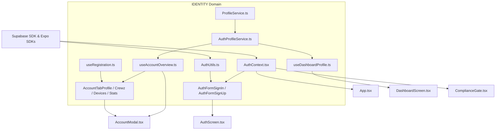

### External Packages Consumed
* **`@react-native-async-storage/async-storage`**: Persists `STORAGE_OFFLINE_SKIP`, `STORAGE_REMEMBER_CREDS`, `STORAGE_AUTH_USERNAME`, and notification preferences.
* **`expo-secure-store`**: Caches Supabase session access tokens securely on native devices.
* **`expo-crypto`**: Used by HIBP to calculate offline SHA-1 checksum signatures.
* **`expo-image-picker` & `expo-file-system`**: Captures and processes custom profile images.
* **`@supabase/supabase-js`**: Interacts with Supabase Auth, Storage, and Database.

### Dependents
* **`App.tsx`**: Wraps the screen tree with `<AuthProvider>` and listens to OAuth redirects.
* **`src/providers/ComplianceGate.tsx`**: Gates primary view access based on metadata flags (`accepted_eula_version`).
* **`src/screens/AuthScreen.tsx`**: Hosts user log-in and registration pages.
* **`src/screens/DashboardScreen.tsx`**: Consumes `useDashboardProfile` for user metrics and suspension gates.
* **`src/components/AccountModal.tsx`**: Orchestrates useAccountOverview hooks and the custom tab layouts.

---

## 3. Context Matrix

| Context | Provided By | Consumed By | Architectural Purpose |
|---|---|---|---|
| **`AuthContext`** | `AuthProvider` (`AuthContext.tsx`) | `useAccountOverview`, `useDashboardProfile`, `useRegistration`, `ComplianceGate`, `AuthFormSignIn`, `AuthFormSignUp` | Houses user objects, session states, and coordinates offline skip modes. |
| **`ThemeContext`** | `ThemeProvider` (`ThemeContext.tsx`) | `AuthStyles`, `AccountTabProfile`, `AccountTabCrewz`, `AccountTabDevices`, `AccountTabStats` | Feeds dark/light parameters and color constants to UI items. |

---

## 4. Hook/Service I/O Registry

### `AuthProfileService` (`src/services/AuthProfileService.ts`)
* **`fetchOrCreateProfile(user)`**
  * *Inputs:* `user: User` (Supabase Auth payload)
  * *Outputs:* `Promise<UserProfile | null>`
  * *Side-Effects:* Reads profile database row; if missing, runs self-healing inserts parsing defaults from auth metadata.
* **`updateProfile(userId, fields)`**
  * *Inputs:* `userId: string`, `fields: Partial<UserProfile>`
  * *Outputs:* `Promise<void>`
  * *Side-Effects:* Mutates user profiles in PostgreSQL; captures unique username constraint violations (Postgres Error `23505`).
* **`getSessionHistory(userId)`**
  * *Inputs:* `userId: string`
  * *Outputs:* `Promise<SessionHistoryItem[]>`
  * *Side-Effects:* Fetches the 20 most recent crew sessions for the given user.

### `useAccountOverview` (`src/hooks/useAccountOverview.ts`)
* *Inputs:* `visible: boolean`, `onProfileUpdated?: () => void`
* *Outputs:* UI form parameters, status indicators, and mutation callbacks (`handleSaveProfile`, `handlePickProfilePhoto`, `handleCreateCrew`, etc.).
* *Side-Effects:* Queries profiles, crew tables, paired devices, and local preferences on mount or modal visibility changes.

### `useDashboardProfile` (`src/hooks/useDashboardProfile.ts`)
* *Inputs:* `{ onCrewJoinNotification: (crewId: string) => void }`
* *Outputs:* `{ userProfile, appSettings, refreshProfile, authUsername, handleLogout, ...modalFlags }`
* *Side-Effects:* Initializes notification push services, reads/caches display names, and polls global configurations on app foreground.

---

## 5. OS Variance Matrix

| Subsystem / Code File | Platform Check | Native Logic | Web Fallback / Difference |
|---|---|---|---|
| **`AuthStyles.ts` / `AccountTabCrewz.tsx`** | `Platform.OS === 'ios'` | Selects `Courier New` / `Menlo` for monospace code fonts. | Uses generic `monospace` styling on Android/Web. |
| **`AuthFormSignIn.tsx` / `AuthFormSignUp.tsx`** | `Platform.OS === 'web'` | Wraps inputs inside an HTML `<form>` block to allow browser auto-fills and submit-on-enter. | Renders as a standard native `<React.Fragment>` container. |
| **`AuthUtils.ts`** | Under-the-hood (Expo Native) | Calls Android/iOS native cryptography libraries via `expo-crypto` for fast SHA-1 hashing. | Falls back to browser web-crypto APIs. |
| **`useAccountOverview.ts`** | Under-the-hood (Expo Native) | Resolves native asset schemas (`ph://` on iOS, `content://` on Android) into Base64 streams using `expo-file-system`. | Does not pick or upload local gallery files. |
| **`AuthContext.tsx`** | Under-the-hood (Expo Native) | Saves OAuth tokens securely inside device keychains using `expo-secure-store`. | Falls back to standard browser `LocalStorage` engines. |

---


## 7. Sequence Diagram: Authentication & Profile Self-Healing Flow

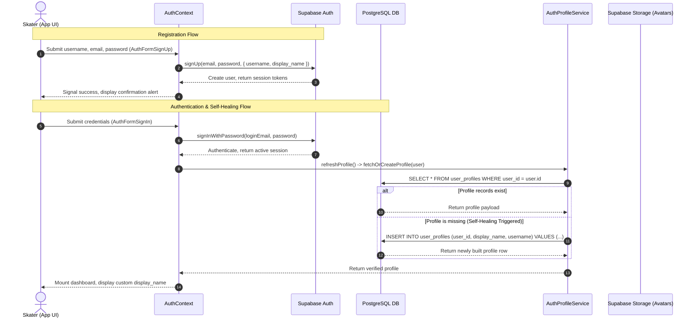

---
[IMPACTS_USER_JOURNEY]
[IMPACTS_C4_CONTEXT]

<!-- CARTOGRAPHER_END: IDENTITY -->

### Domain: BLE_CORE
<!-- CARTOGRAPHER_START: BLE_CORE -->

# Domain Cartography: BLE_CORE (Bluetooth Low Energy Protocol Core)

This document provides a comprehensive analysis of the architectural layout, pipeline mechanics, state machine (FSM) configurations, and platform-specific behaviors for the core Bluetooth Low Energy (`BLE_CORE`) stack in the SK8Lytz application.

---

## 1. File Manifest
The `BLE_CORE` domain consists of the following service, hook, context, and state files:

| File Path | Architectural Purpose |
|:---|:---|
| `src/services/ble/BleMachine.ts` | The core **XState v5 state machine** coordinating BLE radio access states (IDLE, SCANNING, CONNECTING, READY, RECOVERING, DISCONNECTING). |
| `src/services/ble/BleMachine.types.ts` | Context, Event typings, and phase tags (`BLEPhaseTag`) for the `BleMachine` FSM. |
| `src/services/ble/ConnectService.ts` | An invoked XState promise service driving the connection process, including handshake scripts, MTU negotiation, and priority shifts. |
| `src/services/ble/HeartbeatService.ts` | An invoked XState callback service running a 45-second heartbeat ping (`0x63` settings query or RSSI read) to detect dead links. |
| `src/services/ble/InterrogatorService.ts` | A stateless device interrogator that opens short-lived sessions to query EEPROM parameters (`0x63`) and caches them in AsyncStorage. |
| `src/services/ble/RSSIService.ts` | A stateless signal strength poller executing 30s checks and notifying the system at predefined dBm thresholds (-75 and -82 dBm). |
| `src/services/ble/RecoveryService.ts` | An invoked XState callback service coordinating multi-phase reconnect loops utilizing exponential backoffs and passive scan sweeper-watchdogs. |
| `src/services/BleCharacteristicCache.ts` | A persistence wrapper that saves resolved service and characteristic UUID configurations in AsyncStorage to bypass redundant GATT lookups. |
| `src/services/BlePingService.ts` | A setup wizard utility managing a single, isolated device GATT connection (Connect → Blink → EEPROM Query → Disconnect) outside global hooks. |
| `src/services/BleSessionFactory.ts` | A centralized session generator handling retry loops for GATT 133 errors, service discovery invariants, and dynamic protocol resolution. |
| `src/services/BleWriteDispatcher.ts` | The core dispatch gateway coordinating individual, chunked, and polymorphic packet transmissions across multiple connected skates. |
| `src/services/BleWriteQueue.ts` | A module-level priority-ordered FIFO write queue managing backpressure limits, stale write pruning, and transient error retries. |
| `src/hooks/useBLE.ts` | The primary custom React Hook acting as the thin orchestrator and API entry-point for all components interacting with BLE hardware. |
| `src/hooks/ble/useBLEBatterySweep.ts` | A React sub-hook regulating battery monitoring and scan throttling based on battery charge tiers. |
| `src/hooks/ble/useBLEInterrogator.ts` | A React sub-hook providing local state management and queue bindings for device metadata interrogation. |
| `src/hooks/ble/useBLERSSIMonitor.ts` | A React sub-hook exposing the live signal strength map (`rssiMap`) to update UI indicators. |
| `src/hooks/ble/useBLEScanner.ts` | A React sub-hook orchestrating active/passive sweeps, filtering results by RSSI and names, and logging telemetry. |
| `src/hooks/useOptimisticBLE.ts` | A command wrapper that triggers instant UI updates, success/error haptics, and coordinates state rollbacks on dispatch failures. |
| `src/context/BLEContext.tsx` | Global React context provider exposing the `BluetoothLowEnergyApi` instance to the child component tree. |

---

## 2. Blast Radius (Dependency Map)

```
       ┌────────────────────────┐
       │     LocationService    │ (Appends coordinates to scan telemetry)
       └───────────┬────────────┘
                   │
                   ▼
 ┌───────────────────────────────────────┐
 │          BLE_CORE Domain              │
 │  (State Machine, Queues, Hooks, APIs) │
 └──────┬─────────────────────────┬──────┘
        │                         │
        ▼                         ▼
 ┌──────────────┐          ┌──────────────┐
 │  Dashboard   │          │   Supabase   │ (Dispatches scan discovery
 │  Screens/UI  │          │   Telemetry  │  telemetry records)
 └──────────────┘          └──────────────┘
```

### Inward Dependencies (What BLE_CORE Imports)
- `src/protocols/ControllerRegistry.ts`: Dynamically resolves the specific hardware protocol model (Zengge vs. BanlanX) from MAC ranges or service UUIDs.
- `src/protocols/ZenggeProtocol.ts`: Computes checksums, structures 0x40 chunked segments, and executes 0x59 color payload byte padding.
- `src/protocols/BanlanxAdapter.ts`: Supplies protocol and characteristic handles for BanlanX controllers.
- `src/services/AppLogger.ts`: Registers hardware-level audit logs (`SCAN_START`, `DEVICE_DISCOVERED`, `PROTOCOL_ERROR`).
- `src/services/PermissionService.ts`: Requests native Android and iOS Bluetooth permissions.
- `src/utils/backoff.ts`: Calculates jittered exponential backoffs to prevent concurrent retry collisions.
- `src/utils/piiScrubber.ts`: Scrubs MAC addresses for user privacy in log payloads.

### Outward Dependencies (What Imports BLE_CORE)
- `src/context/BLEContext.tsx`: Wraps `useBLE` to expose the global context provider.
- `src/screens/DashboardScreen.tsx`: Binds the active registration lists, mounts the provider, and displays connection status.
- `src/screens/HardwareSetupWizardScreen.tsx`: Invokes isolated `pingDevice` and `scanForPeripherals` queries during first-time configuration.
- `src/components/DockedController.tsx`: Accesses `writeToDevice` and `bleState` to manipulate LED settings.
- `src/hooks/useDashboardGroups.ts`: Routes coordinated settings updates to custom groups (Sole/Wheel subsets).

---

## 3. Context Matrix

### Context Provided
- **`BLEContext`**: Provided by `BLEContext.tsx` and consumed via the `useSharedBLE()` hook. Exposes the entire `BluetoothLowEnergyApi` (discovery streams, connection triggers, write dispatches, and signal maps) to the component tree.

### Context Consumed
- **`useRegistration`**: Consumed by `BLEProvider` inside `BLEContext.tsx` to retrieve the user's claimed MAC addresses (`registeredDevices`) and feed them down to `useBLE` as a dependency.

---

## 4. Hook/Service I/O Registry

### Hook: `useBLE`
- **Inputs**:
  - `registeredMacs: string[]` — Whitelisted MAC addresses registered to the user's account.
- **Outputs**:
  - `connectedDevices: Device[]` — Live native device handles.
  - `allDevices: Device[]` — Scanned device collection.
  - `bleState: BleConnectionState` — Streamlined state tag (`IDLE`, `SCANNING`, `CONNECTING`, `READY`, `DISCONNECTING`).
  - `writeToDevice(payload: number[], targetDeviceId?: string)` — Primary write gateway.
  - `writeChunked(payload: number[], targetDeviceId?: string)` — Splits large arrays into chunk sequences.
  - `pingDevice(mac: string, blinkPayload: number[], options?: object)` — Performs wizard-specific setups.
  - `startSweeper() / stopSweeper() / burstScan()` — Silent sweep controls.
- **Side-effects**:
  - Instantiates the `BleManager` singleton.
  - Listens to app state transitions to prune dead connections on app wakeup.
  - Spawns the XState `bleMachine` actor.

### Hook: `useOptimisticBLE`
- **Inputs**:
  - `writeToDevice` — The raw GATT dispatch handler from `useBLE`.
  - `onReconcile?: () => void` — Reversion callback called if a write operation fails.
  - `debounceMs?: number` — Command debounce interval (default: 50ms).
  - `disableOptimisticUI / disableHaptics` — Toggles for mock/testing adjustments.
- **Outputs**:
  - `optimisticWrite(payload, onOptimistic, targetDeviceId)` — Executes instant UI callback then dispatches write command.
  - `directWrite(payload, targetDeviceId)` — Passthrough that bypasses debounces and optimistic rollbacks.
  - `writeStatus: BLEWriteStatus` — Transaction status (`IDLE`, `PENDING`, `CONFIRMED`, `RECONCILED`).
- **Side-effects**:
  - Triggers mobile device vibrators via `expo-haptics`.

### Service: `BleWriteQueue` (Module-Level Singleton)
- **Inputs**:
  - `priority: WritePriority` — `'critical'` (power/pings) \| `'normal'` (color/effect) \| `'bulk'` (chunks).
  - `execute: () => Promise<boolean | 'partial'>` — A functional wrapper encapsulating the characteristic write operation.
  - `generation: number` — Sequence generation tag (used to prune stale writes when a new color is queued).
- **Outputs**:
  - `Promise<boolean | 'partial'>` — Resolves when the write is sent, skipped, or fails.
- **Side-effects**:
  - Drops low-priority items (bulk, then normal) if the queue length exceeds `8`.
  - Catches transient GATT errors and schedules one retry with a 100ms jittered delay.

### Service: `BleWriteDispatcher`
- **Inputs**:
  - `payload: number[]` — Bytes representing the protocol opcode and data.
  - `targetDeviceId?: string` — Optional MAC target.
- **Outputs**:
  - `Promise<boolean | 'partial'>` — Success status.
- **Side-effects**:
  - Automatically pads `0x59` static colorful frames to avoid chipset memory buffer lockouts.
  - Spaces sequential packet dispatches across multiple devices by 50ms to prevent GATT collisions.
  - Segments payloads exceeding safe MTU limits into `0x40` chunk frames.

### Service: `BleSessionFactory`
- **Inputs**:
  - `bleManager: BleManager` — The native BLE plx instance.
  - `mac: string` — Device hardware MAC address.
  - `options` — Configurations (timeout, retry counts, abort signals, context IDs, manufacturer data).
- **Outputs**:
  - `Promise<GattSessionResult>` — Resolves with the connected device, resolved protocol adapter, and a cache status flag.
- **Side-effects**:
  - Automatically retries failed connections using backoff timings and reflection-based `refreshGatt` calls.
  - Enforces service and characteristic discovery (`discoverAllServicesAndCharacteristics`) before resolving the session.

---

## 5. OS Variance Matrix

| Feature | iOS Behavior | Android Behavior |
|:---|:---|:---|
| **GATT State Restoration** | Restores state using native identifier restoration keys. Re-registers notification handles using jittered delays on wakeup. | Not natively supported by the OS layer. Background restoration hooks are ignored. |
| **MTU Negotiation** | Handled natively by iOS CoreBluetooth (typically locks at 186 bytes). Bypasses `requestMTU` calls. | Must be negotiated explicitly by client via `requestMTU(512)`. Features a double-retry fallback to absorb MTU negotiation bugs. |
| **Connection Priority** | Connection intervals are managed strictly by iOS CoreBluetooth; manual prioritization requests are bypassed. | Enforces dynamic priority tuning. Requests `HIGH` priority during handshakes and queries, then drops to `BALANCED` to conserve battery. |
| **Scan Budgets** | Does not restrict scan frequency at the application layer. | Android 12+ limits BLE scanning to 4 starts per 30-second window. The sweeper monitors scan timestamps and defers startup if the budget is exhausted to avoid silent OS-level bans. |
| **UUID Scan Filtering** | Standard filtering works reliably since peripheral services are parsed cleanly. | Unfiltered scans must be used because FCF1 devices broadcast identifiers in manufacturer data blocks instead of standard UUID lists. |

---

## 6. State Machine (FSM) Map
The state lifecycle is coordinated using the following `BleMachine.ts` XState configuration:

```mermaid
stateDiagram-v2
    [*] --> IDLE
    
    IDLE --> SCANNING : SCAN_START / setSweeperId
    IDLE --> CONNECTING : CONNECT_REQUEST / setTargetMacs
    IDLE --> DISCONNECTING : DISCONNECT_REQUEST
    IDLE --> RECOVERING : RECOVERY_START / setGhostedMacs
    IDLE --> IDLE : UPDATE_CONNECTED_DEVICES / setConnectedDevices
    
    SCANNING --> IDLE : SCAN_STOP / clearSweeperId
    SCANNING --> CONNECTING : CONNECT_REQUEST / clearSweeperId, setTargetMacs
    SCANNING --> DISCONNECTING : DISCONNECT_REQUEST / clearSweeperId
    SCANNING --> RECOVERING : RECOVERY_START / setGhostedMacs
    SCANNING --> SCANNING : SCAN_PAUSE / stopDeviceScan
    SCANNING --> SCANNING : SCAN_RESUME / startDeviceScan
    
    CONNECTING --> READY : connectService.onDone / setConnectedDevices
    CONNECTING --> IDLE : connectService.onError / logTransition(connect_failed)
    CONNECTING --> RECOVERING : RECOVERY_START / setGhostedMacs
    CONNECTING --> DISCONNECTING : DISCONNECT_REQUEST
    
    READY --> RECOVERING : HEARTBEAT_FAIL / setGhostedMacs
    READY --> DISCONNECTING : DISCONNECT_REQUEST
    READY --> CONNECTING : RECOVERY_START [ghostedMacs.length >= 2] / setTargetMacs
    READY --> RECOVERING : RECOVERY_START [ghostedMacs.length < 2] / setGhostedMacs
    READY --> IDLE : UPDATE_CONNECTED_DEVICES [devices.length === 0] / clearConnectedDevices
    READY --> READY : UPDATE_CONNECTED_DEVICES [devices.length > 0] / setConnectedDevices
    
    DISCONNECTING --> IDLE : DISCONNECT_COMPLETE / clearConnectedDevices, clearGhostedMacs
    
    RECOVERING --> READY : RECOVERY_COMPLETE / mergeConnectedDevices, clearGhostedMacs
    RECOVERING --> CONNECTING : CONNECT_REQUEST / setTargetMacs
    RECOVERING --> IDLE : RECOVERY_PERMANENTLY_FAILED / setDeviceUnreachable, notifyUserDeviceFailed, clearGhostedMacs
    RECOVERING --> IDLE : RECOVERY_FAIL / clearGhostedMacs
    RECOVERING --> DISCONNECTING : DISCONNECT_REQUEST
    
    state bleMachine {
        IDLE
        SCANNING
        CONNECTING
        READY
        DISCONNECTING
        RECOVERING
    }
    
    -- Global Events --
    bleMachine --> IDLE : FORCE_IDLE / clearSweeperId, clearGhostedMacs
```

---

## 7. Sequence Diagrams

### BLE Connection Handshake & Lifecycle

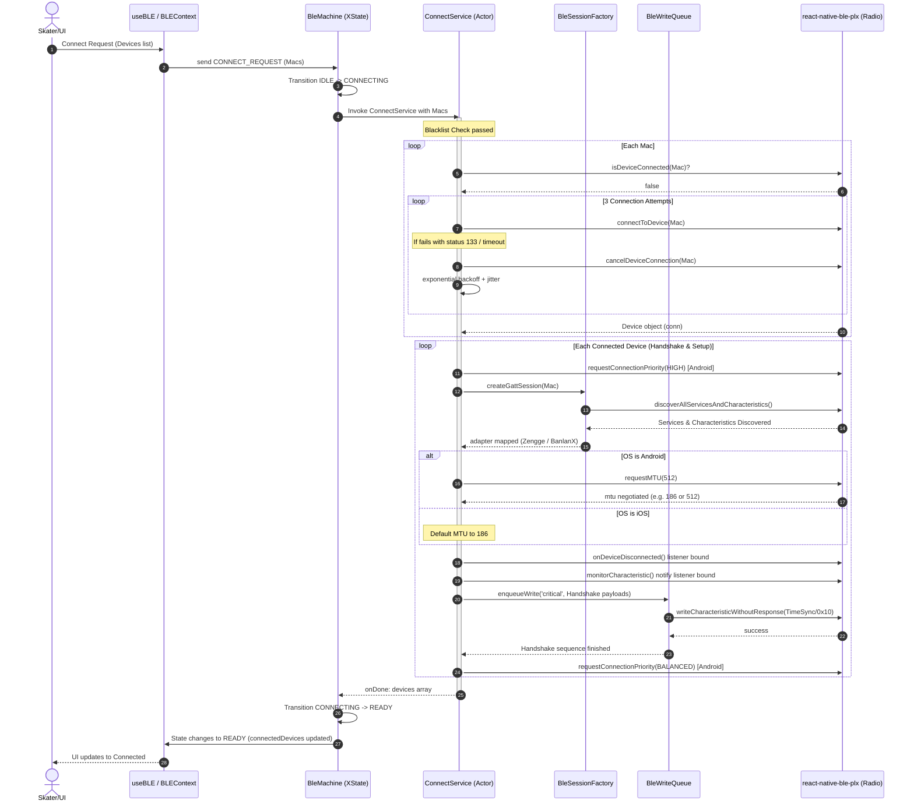

### BLE Write Pipeline

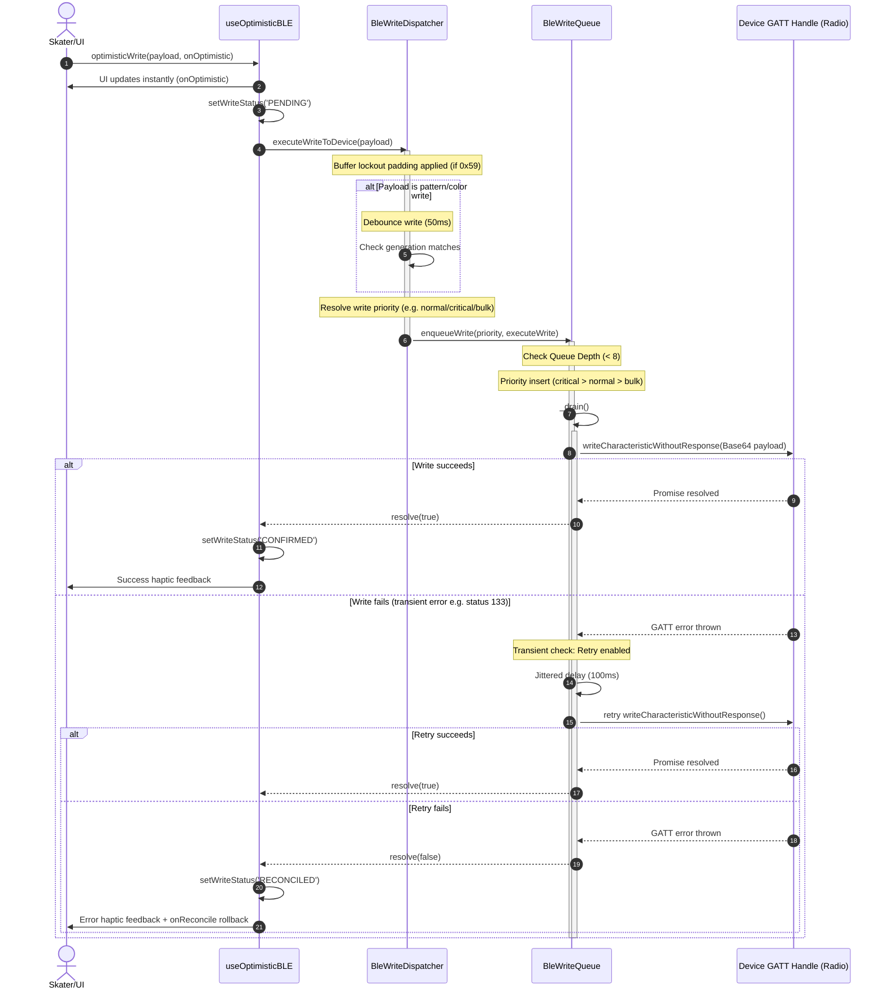

---

## 8. Architectural Impact Flags

None (Read-only cartography audit; no code or architectural modifications performed).

<!-- CARTOGRAPHER_END: BLE_CORE -->

### Domain: GROUP_SYNC
<!-- CARTOGRAPHER_START: GROUP_SYNC -->

# 🗺️ Codebase Cartography: GROUP_SYNC Domain

This documentation provides a comprehensive architectural map of the `GROUP_SYNC` domain in the SK8Lytz codebase, detailing functional boundaries, dependencies, state management, protocols, and platform adaptations.

---

## 1. 🗂️ Domain Manifest & Structural Boundaries

A detailed map of all source files in the `GROUP_SYNC` domain, including their functional scope, lines of code, import/export dependency chains, state variables managed, and core operations.

### 📄 `src/services/GroupRepository.ts`
* **Functional Scope:** Serves as the Single Source of Truth (SSOT) for offline-first local and remote management of custom user groups and device mappings.
* **Line Count:** ~337 lines.
* **Import Dependency Chain:**
  * `supabaseClient` (Supabase backend connectivity)
  * `AsyncStorage` (Local persistence)
  * `AppLogger` (Telemetry logging)
  * Dynamic delegate `GroupDeviceDelegate` (decouples circular dependency with `DeviceRepository`)
* **Export Dependency Chain:**
  * `groupRepository` (Singleton instance)
  * `Group` (Interface)
  * `GroupMember` (Interface)
  * `GroupSyncStatus` (Enum/Type)
* **State Managed:** Stateless singleton. Directly operations local SQLite cache (`AsyncStorage`) and remote tables (`groups`, `group_devices`).
* **Core Operations:**
  * `saveGroupTransactional`: Atomic sync attempting database RPC updates (`upsert_group_with_devices`) with local optimistic updates and local sqlite fallback.
  * `setDeviceDelegate`: Registers a delegate callback at runtime to fetch active Bluetooth devices without importing `DeviceRepository` directly.
  * `syncPendingGroups`: Syncs the queue of local changes made while offline back to Supabase once connectivity is restored.

### 📄 `src/services/CrewService.ts`
* **Functional Scope:** Coordinates real-time multiplayer crew sessions using Supabase Realtime (Presence and Broadcast channels). Governs session creation, joining, leadership handoff, live telemetries, and state transitions.
* **Line Count:** ~797 lines (monolithic file flagged for future modularization).
* **Import Dependency Chain:**
  * `supabaseClient` (Supabase connectivity)
  * `AppLogger` (Log dispatching)
  * `locationService` (GPS coords tracking)
  * `profileService` (User profile and permanent crew mappings)
* **Export Dependency Chain:**
  * `crewService` (Singleton instance)
  * `CrewSession` (Interface)
  * `CrewMember` (Interface)
  * `CrewTelemetry` (Interface)
* **State Managed:**
  * `currentSession` (Active session details)
  * `currentRole` (`'leader'` | `'member'`)
  * `members` (Roster of active users in the session)
  * `sessionTelemetry` (Live updates like distance and top speed)
  * `activeChannels` (Pointers to open Supabase Realtime subscriptions)
* **Core Operations:**
  * `createSession`: Spins up a live session entry in `crew_sessions` database table, sets up local Presence state, and subscribes to state-broadcast channels.
  * `joinSessionById`: Connects a member to an existing session, starts state sync, and subscribes to changes.
  * `broadcastScene`: Dispatches LED patterns/effects from the leader to all members via the Realtime channel.
  * `handoffLeadership`: Atomically updates the leader in the DB and broadcasts a role transition packet.
  * `leaveSession` / `endSession`: Disconnects real-time channels, records final telemetry metrics, and updates DB status.

### 📄 `src/services/CrewProfileService.ts` (Managed inside `ProfileService.ts`)
* **Functional Scope:** Handles persistent, long-term crew registrations, member rosters, custom crew search, invite codes, role management (owners/members), and avatar configurations.
* **Core Operations:**
  * `createPermanentCrew`: Creates a crew in `crews` table with automatic 6-character alphanumeric invite code generation and creator assigned as owner.
  * `joinPermanentCrew`: Validates invite codes and registers user to the crew.
  * `getMyCrew`: Retrieves crews the user belongs to.
  * `assignCrewOwner` / `revokeCrewOwner`: Changes roles in `crew_members` table.

### 📄 `src/context/CrewContext.tsx`
* **Functional Scope:** Provides React Context wrapper to bind real-time hooks and screen components together. Prevents hook fragmentation and circular references.
* **Line Count:** ~120 lines.
* **Export Dependency Chain:**
  * `CrewProvider` (React wrapper component)
  * `useCrewContext` (Consumer hook)
* **State Managed:**
  * Combined hooks: `hub` (`useCrewHub`), `manage` (`useCrewManage`), `session` (`useCrewSession`)
  * UI state: `step` (`'landing'` | `'create'` | `'controller'` | `'manage'` | `'schedule'`), `displayName`, `isLoading`, `errorMsg`, `confirmAction`.

### 📄 `src/hooks/useCrewHub.ts`
* **Functional Scope:** Coordinates proximity-based live discovery. Integrates GPS checks, location labels, radius-based search filters, and active crew list queries.
* **Line Count:** ~180 lines.
* **State Managed:** `activeSessions`, `myCrews`, `nearbySessions`, `nearbySpots`, `discoverRadiusMi`, `locationCoords`, `isGettingLocation`.
* **Core Operations:** `refreshNearby` (fetches spots and sessions within radius), `handleDetectLocation`.

### 📄 `src/hooks/useCrewManage.ts`
* **Functional Scope:** Exposes forms, actions, and validations for creating, editing, sharing, and deleting permanent crews, as well as managing crew rosters and owner assignments.
* **Line Count:** ~220 lines.
* **State Managed:** `newCrewName`, `newCrewIsPublic`, `newCrewColor`, `newCrewIcon`, `selectedMembers`, `userSearchQuery`, `userSearchResults`.

### 📄 `src/hooks/useCrewSession.ts`
* **Functional Scope:** UI controller hook wrapping `CrewService` session events. Tracks active state, duration, leaderboard changes, and alerts.
* **State Managed:** `currentSession`, `currentRole`, `members`, `isHandoffMode`.

### 📄 `src/hooks/useCrewProximityRadar.ts`
* **Functional Scope:** Drives passive BLE or GPS-based proximity alerts during a crew session. Coordinates background checks.

### 📄 `src/hooks/useDashboardCrew.ts` & `useDashboardGroups.ts`
* **Functional Scope:** Fetches aggregated metrics and status states to populate main dashboard widgets.
* **Line Count:** ~80 lines each.

### 📄 `src/components/crew/` Directory Components
* **`CrewLandingScreen.tsx` (36KB):** Main dashboard hub displaying my crews, map filters, search options, and active sessions.
* **`CrewControllerScreen.tsx` (14KB):** Live console for active sessions. Displays member status, sync status, code copying, and end session triggers.
* **`CrewLandingMap.tsx` / `.web.tsx`:** Platform-specific map renderer. Uses MapViewCluster for native and stub graphic for web.
* **`CrewCreateScreen.tsx`:** Forms to spin up a new session associated with a crew.
* **`CrewManageScreen.tsx`:** UI for persistent crew creation, including icon designer, avatar color picker, and user search.
* **`CrewScheduleScreen.tsx`:** Schedules future crew sessions with location tagging.

---

## 2. 💥 Architectural Impact & Blast Radius

A guide detailing structural, real-time, local, and device-level impacts of modifying the `GROUP_SYNC` domain.

```
                  ┌──────────────────────┐
                  │      GROUP_SYNC      │
                  └──────────┬───────────┘
         ┌───────────────────┼───────────────────┐
         ▼                   ▼                   ▼
┌─────────────────┐ ┌─────────────────┐ ┌─────────────────┐
│Database Schemas │ │ Supabase Event  │ │ BLE / Skates    │
│ & Relations     │ │  Broadcasts     │ │ Local Packets   │
└─────────────────┘ └─────────────────┘ └─────────────────┘
```

### Database Schema & Relationship Impacts
Modifying permanent crew tables affects:
* **`crews`** (Holds metadata: `id`, `name`, `is_public`, `city`, `state`, `description`, `avatar_color`, `avatar_icon`, `invite_code`, `created_by`).
* **`crew_members`** (Roster mapping: `id`, `crew_id`, `user_id`, `role`, `joined_at`).
* **`crew_sessions`** (Live events: `id`, `crew_id`, `name`, `status`, `leader_user_id`, `location_label`, `lat`, `lng`, `created_at`, `scheduled_at`, `ended_at`).
* **`crew_session_members`** (Real-time roster: `id`, `session_id`, `user_id`, `joined_at`, `last_seen_at`).

Any schema adjustments require updating the corresponding Supabase client calls, RPC interfaces, and edge functions.

### Supabase Realtime & Broadcast Channels
* Broadcast channels dispatching scene updates rely on strict type serialization.
* Modifying the broadcast payload structure (e.g. changing color representation format) without backward compatibility will break color parsing for users running older client builds, freezing their lights on their last received mode.

### Local Cache & Persistence (`AsyncStorage`)
* `GroupRepository` caches custom groups locally using key templates `@SK8Lytz:groups` and `@SK8Lytz:pending_groups`.
* Edits to local storage properties will invalidate user cache, forcing full database refetches and potentially discarding un-synced offline modifications in the queue.

### BLE Dispatch Queues
* When a leader broadcasts a scene change, the client dispatches updates to:
  1. Supabase Realtime (broadcasting to remote members).
  2. Local skates (sending binary BLE commands via `deviceManager` using opcode `0x59`).
* When members receive the broadcast over WebSockets, they write the changes to their skates via BLE.
* **Risk (Chipset Lockout):** If scene dispatches are not throttled, rapid scene toggles can overwhelm the BLE write queues of member devices, leading to EEPROM buffer lockouts on `0xA3` chipset controllers.

---

## 3. 🕸️ Context Matrix & Hooks Dependency Graph

Visualizing how React Context binds and coordinates the specialized child hooks to manage unified state in `CrewContext.tsx`.

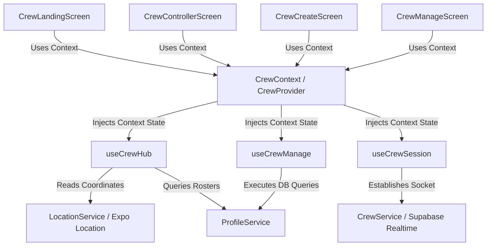

### Shared State & Synchronization:
* **`CrewContext`** binds the states of the child hooks together, allowing them to communicate. For example, when `useCrewSession` transitions step to `controller`, it dynamically reads user identities from `useCrewManage`'s list operations.
* The context handles central loading screens, error states, step-by-step UI routing (`landing` ➔ `create` ➔ `controller` ➔ `manage`), and double-check modals.

---

## 4. 🔌 I/O Registry & Real-Time Protocol Specifications

A catalog of network calls, Supabase Realtime channel topics, database RPCs, and local cache schemas.

### Database RPC Interfaces

#### `upsert_group_with_devices` (Group Repository sync)
* **Type:** Supabase PostgreSQL Function RPC
* **Inputs:**
  ```typescript
  {
    group_id: string; // uuid
    name: string;
    devices: {
      device_id: string;
      custom_name: string;
      pixel_offset: number;
    }[];
  }
  ```
* **Outputs:** `void` (Throws SQL error on primary key constraint conflicts)

#### `profileService.createPermanentCrew`
* **Type:** REST / Database Insert
* **Inputs:**
  * `name`: `string`
  * `config`:
    ```typescript
    {
      isPublic: boolean;
      avatarColor: string;
      avatarIcon: string;
      city?: string;
      state?: string;
      description?: string;
      inviteCode?: string;
      members: string[]; // user_ids
    }
    ```
  * `creatorId`: `string` (uuid)
* **Outputs:** `Promise<PermanentCrew>`

### Supabase Realtime WebSocket Protocol

#### Presence Subscription
* **Channel Topic:** `crew_session_presence:<session_id>`
* **Join Payload:**
  ```json
  {
    "user_id": "uuid",
    "display_name": "Skater Name",
    "joined_at": "ISO-TIMESTAMP",
    "status": "skating" | "idle"
  }
  ```

#### Broadcast Subscription
* **Channel Topic:** `session_events:<session_id>`
* **Event Type:** `scene_change`
* **Message Payload:**
  ```json
  {
    "event": "scene_change",
    "payload": {
      "mode": "solid" | "multimode" | "music" | "fixed",
      "colors": ["#FFAA00", "#FF0055"],
      "pattern": "rainbow" | "pulse" | null,
      "speed": 128,
      "sender_id": "uuid"
    }
  }
  ```

### Local Storage & Offline Schema

#### Custom Groups Cache
* **Storage Key:** `@SK8Lytz:groups`
* **Value Schema:**
  ```typescript
  {
    [id: string]: {
      id: string;
      name: string;
      devices: string[]; // Cached device addresses
      last_modified: string;
    }
  }
  ```

#### Failed Sync Log
* **Storage Key:** `@SK8Lytz:pending_groups`
* **Value Schema:** Array of pending write operations stored for next connectivity handshake.

---

## 5. 📱 OS Variance & Platform Adaptation Matrix

The codebase dynamically adapts UI behaviors and system calls to accommodate differences between iOS, Android, and Web builds.

| Feature Area | iOS Behavior | Android Behavior | Web Behavior |
|---|---|---|---|
| **Map Rendering** | Native Apple Maps or Google Maps via `react-native-maps` & `MapViewCluster` | Google Maps via `react-native-maps` & `MapViewCluster` | Rendered stub screen (`CrewLandingMap.web.tsx`) to bypass native maps codegen crashes |
| **Keyboard Avoiding** | `KeyboardAvoidingView` behavior set to `'padding'` | `KeyboardAvoidingView` behavior set to `undefined` (system adjustResize handles offset) | Standard browser window scrolls |
| **System Fonts** | Renders `'Courier New'` or `'Menlo'` for monospaced invite code text | Renders `'monospace'` system font for invite codes | CSS generic monospaced font family fallback |
| **Location Tracking** | Request permissions via iOS Core Location API (info plist boundaries) | Requests fine/coarse GPS via Android Location Services | Browser standard Navigator Geolocation API |
| **Image Selection** | Triggers iOS Photo Library UI via `launchImageLibraryAsync` | Triggers Android Document/Photo picker via `launchImageLibraryAsync` | Local file browser dialog |
| **Clipboard Sharing** | Uses iOS native clipboard APIs | Uses Android clipboard framework | Web browser navigator clipboard write APIs |

<!-- CARTOGRAPHER_END: GROUP_SYNC -->

### Domain: UI_SCREENS
<!-- CARTOGRAPHER_START: UI_SCREENS -->

# 🗺️ Codebase Cartography: UI_SCREENS Domain

This documentation provides a comprehensive architectural map of the `UI_SCREENS` (UI Screens & Dashboard) domain in the SK8Lytz mobile application. It details functional boundaries, dependencies, state management, protocols, design system tokens, and platform adaptations.

---

## 1. 🗂️ Domain Manifest & Structural Boundaries

A detailed map of all source files in the `UI_SCREENS` domain, including their functional scope, lines of code, import/export dependency chains, state variables managed, and core operations.

### Root Screens (`src/screens/*`)

#### 📄 [DashboardScreen.tsx](file:///c:/Neogleamz/AG_SK8Lytz_App/SK8Lytz/src/screens/DashboardScreen.tsx)
* **Functional Scope:** Centralized BLE state coordinator and visual entry point of the app. It resolves circular context queries by hoisting GATT connection statuses to prevent multi-device race conditions.
* **Line Count:** ~645 lines.
* **Import Dependency Chain:**
  * Contexts: `useTheme`, `useAppConfig`, `useSession`, `useAuth`, `BLEContext`
  * Services: `AppLogger`
  * Hooks: `useRegistration`, `useDeviceStateLedger`, `useTelemetryLedger`
  * Components: `DashboardHeader`, `DashboardTelemetryHero`, `LiveTelemetryHUD`, `CrewHubSlab`, `MySkatesSlab`, `RegisteredFleetSlab`, `SupportModal`, `BLEErrorBoundary`, `DeviceItem`, `LocationPicker`, `DockedController`
* **Export Dependency Chain:**
  * `DashboardScreen` (default export)
* **State Managed:**
  * UI Accordion States: `isRegisteredCollapsed` (boolean), `isMySkatesCollapsed` (boolean)
  * Modals Visibility: `isSupportVisible`, `isSettingsVisible`, `isGroupSettingsVisible`, `isAccountVisible` (booleans)
  * Selections: `selectedDeviceMac` (string | null), `scanning` (boolean)
* **Core Operations:**
  * `displayConnectedDevices` useMemo mapper: maps connected BLE device nodes to registered database models.
  * Power switch dispatches: issues global broadcast power toggles.
  * Accompanying modals triggers.

#### 📄 [AuthScreen.tsx](file:///c:/Neogleamz/AG_SK8Lytz_App/SK8Lytz/src/screens/AuthScreen.tsx)
* **Functional Scope:** Manages user authentication state, handles signup/login forms, displays session expiration dialogs, and configures persistent credential storage.
* **Line Count:** ~310 lines.
* **Import Dependency Chain:**
  * Contexts: `useTheme`, `useAuth`
  * Components: `MaterialCommunityIcons`
  * Utilities: `@react-native-async-storage/async-storage`
* **Export Dependency Chain:**
  * `AuthScreen` (default export)
* **State Managed:**
  * Mode: `mode` (`'LOGIN'` | `'SIGNUP'` | `'FORGOT_PASSWORD'`)
  * Credentials: `email`, `password`, `username` (strings)
  * UI States: `loading` (boolean), `error` (string | null)
* **Core Operations:**
  * `handleAuth`: Orchestrates call routes to Supabase Auth, validating and fetching account attributes.
  * Offline persistence triggers: caches credentials to allow app launch in areas with poor network coverage.

#### 📄 [HardwareSetupWizardScreen.tsx](file:///c:/Neogleamz/AG_SK8Lytz_App/SK8Lytz/src/screens/Onboarding/HardwareSetupWizardScreen.tsx)
* **Functional Scope:** Guides the user through pairing and configuring their physical skates during onboarding. Supports scanning, side selection (Left/Right placement), and atomic green-blink testing.
* **Line Count:** ~568 lines.
* **Import Dependency Chain:**
  * Contexts: `useTheme`, `BLEContext`, `useAuth`
  * Services: `AppLogger`, `pingDevice` (from `BlePingService`)
  * Components: `LinearGradient`, `SafeAreaView` (from `react-native-safe-area-context`)
* **Export Dependency Chain:**
  * `HardwareSetupWizardScreen` (default export)
* **State Managed:**
  * Wizard Step: `step` (`'welcome'` | `'scanning'` | `'identify'` | `'configure'` | `'complete'`)
  * Scanned Targets: `scannedDevices` (array of BLE peripherals)
  * Active Interactions: `blinkingDeviceId` (string | null), `selectedLeftDevice` (device object), `selectedRightDevice` (device object)
* **Core Operations:**
  * `executePing`: Calls `pingDevice` to trigger a green flashing sequence on a peripheral and probe its internal configuration (IC name, LED points, etc.).
  * Side mapping: pairs MAC addresses with specific "Left" or "Right" roles before saving configs to the cloud.

#### 📄 [PermissionsOnboardingScreen.tsx](file:///c:/Neogleamz/AG_SK8Lytz_App/SK8Lytz/src/screens/Onboarding/PermissionsOnboardingScreen.tsx)
* **Functional Scope:** Ensures the app has all required system permissions (Location, Bluetooth) before allowing access to the dashboard.
* **Line Count:** ~145 lines.
* **Import Dependency Chain:**
  * Contexts: `useTheme`
  * Services: `PermissionService`
  * Components: `MaterialCommunityIcons`, `LinearGradient`
* **Export Dependency Chain:**
  * `PermissionsOnboardingScreen` (default export)
* **State Managed:**
  * Permissions Flags: `locationGranted`, `bluetoothGranted`, `checking` (booleans)
* **Core Operations:**
  * `requestPermissions`: Initiates system prompts for fine location and Bluetooth access, and checks status before routing to the dashboard.

---

### Dashboard Layout Components (`src/components/dashboard/*`)

#### 📄 [CrewHubSlab.tsx](file:///c:/Neogleamz/AG_SK8Lytz_App/SK8Lytz/src/components/dashboard/CrewHubSlab.tsx)
* **Functional Scope:** Renders the active Crew session widget on the dashboard. Employs a 4-state matrix (Admin Lock, Offline, Session Active, Radar Alert/Empty) to guide user action based on crew availability.
* **Line Count:** ~80 lines.

#### 📄 [DashboardCrewPanel.tsx](file:///c:/Neogleamz/AG_SK8Lytz_App/SK8Lytz/src/components/dashboard/DashboardCrewPanel.tsx)
* **Functional Scope:** Connects the `CrewHubSlab` visual component to the `CrewModal` and `useCrewProximityRadar` hook, managing leader/member session synchronization.
* **Line Count:** ~155 lines.

#### 📄 [DashboardGroupList.tsx](file:///c:/Neogleamz/AG_SK8Lytz_App/SK8Lytz/src/components/dashboard/DashboardGroupList.tsx)
* **Functional Scope:** A container component that lists custom skater groups on the dashboard, serving as a boundary check for custom groups.
* **Line Count:** ~40 lines.

#### 📄 [DashboardHeader.tsx](file:///c:/Neogleamz/AG_SK8Lytz_App/SK8Lytz/src/components/dashboard/DashboardHeader.tsx)
* **Functional Scope:** Renders the dashboard's top bar, displaying active BLE connection badges, theme toggles, account buttons, and signal status markers.
* **Line Count:** ~124 lines.

#### 📄 [DashboardTelemetryHero.tsx](file:///c:/Neogleamz/AG_SK8Lytz_App/SK8Lytz/src/components/dashboard/DashboardTelemetryHero.tsx)
* **Functional Scope:** Renders a high-performance SVG-based speedometer and session metrics grid (Distance, G-Force, Duration, Avg Speed, Top Speed, Calories) during active tracking.
* **Line Count:** ~198 lines.

#### 📄 [HardwareStatusPills.tsx](file:///c:/Neogleamz/AG_SK8Lytz_App/SK8Lytz/src/components/dashboard/HardwareStatusPills.tsx)
* **Functional Scope:** Renders low-level device configuration pills (LED points, segment counts, firmware version, and RF remote states).
* **Line Count:** ~60 lines.

#### 📄 [LiveTelemetryHUD.tsx](file:///c:/Neogleamz/AG_SK8Lytz_App/SK8Lytz/src/components/dashboard/LiveTelemetryHUD.tsx)
* **Functional Scope:** A compact, floating horizontal HUD displaying live speed, G-force, distance, and duration at the top of the dashboard.
* **Line Count:** ~132 lines.

#### 📄 [MySkatesSlab.tsx](file:///c:/Neogleamz/AG_SK8Lytz_App/SK8Lytz/src/components/dashboard/MySkatesSlab.tsx)
* **Functional Scope:** Displays a grid of registered custom groups. Prompts the user to start the setup wizard if no groups are configured.
* **Line Count:** ~128 lines.

#### 📄 [RegisteredFleetSlab.tsx](file:///c:/Neogleamz/AG_SK8Lytz_App/SK8Lytz/src/components/dashboard/RegisteredFleetSlab.tsx)
* **Functional Scope:** Lists registered individual skates, allowing users to collapse the list, check connection status, or add new devices.
* **Line Count:** ~76 lines.

#### 📄 [SkateGroupCard.tsx](file:///c:/Neogleamz/AG_SK8Lytz_App/SK8Lytz/src/components/dashboard/SkateGroupCard.tsx)
* **Functional Scope:** An interactive card for device groups, featuring dynamic gradient color transitions, RSSI bar graphs, and quick-action buttons (power, music, camera, favorite).
* **Line Count:** ~207 lines.

#### 📄 [SupportModal.tsx](file:///c:/Neogleamz/AG_SK8Lytz_App/SK8Lytz/src/components/dashboard/SupportModal.tsx)
* **Functional Scope:** A self-contained modal that provides quick access to external support resources, including setup guides, store pages, and contact portals.
* **Line Count:** ~78 lines.

---

### Shared UI & Helper Components (`src/components/*` & `src/components/shared/*`)

#### 📄 [BLEErrorBoundary.tsx](file:///c:/Neogleamz/AG_SK8Lytz_App/SK8Lytz/src/components/shared/BLEErrorBoundary.tsx)
* **Functional Scope:** A crash-shield React ErrorBoundary component. It catches rendering errors caused by null device states or GATT connection loss, preventing a full app crash by offering a recovery button.
* **Line Count:** ~133 lines.

#### 📄 [DeviceItem.tsx](file:///c:/Neogleamz/AG_SK8Lytz_App/SK8Lytz/src/components/DeviceItem.tsx)
* **Functional Scope:** Renders an individual skate card. Displays RSSI signal strength, power buttons, hardware pills, and a real-time pattern color preview.
* **Line Count:** ~282 lines.

#### 📄 [LocationPicker.tsx](file:///c:/Neogleamz/AG_SK8Lytz_App/SK8Lytz/src/components/LocationPicker.tsx)
* **Functional Scope:** Coordinates coordinates selection. Combines local database spots search, Nominatim API autocomplete search, and a map preview in a single UI container.
* **Line Count:** ~393 lines.

#### 📄 [LocationPickerMap.tsx](file:///c:/Neogleamz/AG_SK8Lytz_App/SK8Lytz/src/components/LocationPickerMap.tsx)
* **Functional Scope:** Native platform map renderer wrapping `react-native-maps` and Map Markers.
* **Line Count:** 13 lines.

#### 📄 [LocationPickerMap.web.tsx](file:///c:/Neogleamz/AG_SK8Lytz_App/SK8Lytz/src/components/LocationPickerMap.web.tsx)
* **Functional Scope:** Web platform fallback stub. Safely overrides `react-native-maps` on web bundles to prevent compilation errors and crashes.
* **Line Count:** 38 lines.

#### 📄 [SkateSpotBottomSheet.tsx](file:///c:/Neogleamz/AG_SK8Lytz_App/SK8Lytz/src/components/SkateSpotBottomSheet.tsx)
* **Functional Scope:** A bottom sheet UI that allows skaters to claim community skate spots, edit surface parameters (concrete, wood), and select indoor/outdoor environmental details.
* **Line Count:** 215 lines.

---

## 2. 💥 Architectural Impact & Blast Radius

The `UI_SCREENS` domain functions as the presentation and entry layer of the app. It consumes system-wide hooks and services, and is imported by the root entry-point files.

```
                    ┌────────────────────────┐
                    │       App.tsx          │
                    └───────────┬────────────┘
                                │
                                ▼
                    ┌────────────────────────┐
                    │   DashboardScreen      │
                    └───────────┬────────────┘
         ┌──────────────────────┼──────────────────────┐
         ▼                      ▼                      ▼
┌──────────────────┐   ┌──────────────────┐   ┌──────────────────┐
│ CrewHubSlab      │   │ MySkatesSlab     │   │ RegisteredFleet  │
└──────────────────┘   └──────────────────┘   └──────────────────┘
```

### What this domain imports (Outward Dependencies):
1. **Core Contexts**:
   - `ThemeContext` (via `useTheme`) - used by all UI components for consistent color schemes.
   - `BLEContext` (via `useContext(BLEContext)`) - consumed by `DashboardScreen` and `HardwareSetupWizardScreen` to call GATT scanning and write operations.
   - `SessionContext` (via `useSession`) - consumed by telemetry HUDs to display speed, duration, and G-force stats.
   - `AppConfigContext` (via `useAppConfig`) - used to check feature flag visibility (e.g., `visibility_maps_tab`).
   - `AuthContext` (via `useAuth`) - consumed by `AuthScreen` and `DashboardScreen` to track user accounts and online state.
2. **State & Telemetry Hooks**:
   - `useRegistration` - used by slabs to list active paired peripherals.
   - `useDeviceStateLedger` - consumed by `DashboardScreen` and `DeviceItem` to load and display current pattern previews.
   - `useRecentSpots` - used by `LocationPicker` to query and cache search coordinates.
3. **Core Services**:
   - `AppLogger` - used for tracking telemetry events and logs.
   - `BlePingService` (via `pingDevice`) - used by `HardwareSetupWizardScreen` to perform on-demand device identification.
   - `SkateSpotsService` - consumed by `SkateSpotBottomSheet` to sync spot verification edits to Supabase.

### What imports this domain (Inward Dependencies):
* **[App.tsx](file:///c:/Neogleamz/AG_SK8Lytz_App/SK8Lytz/App.tsx)**: Root entry of the app. It imports and conditionally renders `DashboardScreen` and `AuthScreen`.
* **Tests Suite**: Component testing files (e.g., `components.test.ts`) that check these screens for snapshot validation and layout smoke tests.

---

## 3. 🕸️ Context Matrix

React Context integrations inside the `UI_SCREENS` domain are mapped below:

| Context | Consumer / Hook | Provided By | Architectural Purpose |
| :--- | :--- | :--- | :--- |
| **ThemeContext** | `useTheme()` | `ThemeProvider` (`App.tsx`) | Distributes current visual palettes (`Colors`) and `isDark` boolean properties. |
| **BLEContext** | `useContext(BLEContext)` | `BLEProvider` (`App.tsx`) | Exposes BleManager control APIs (`scanForPeripherals`, `connectToDevices`, `connectedDevices`). |
| **SessionContext** | `useSession()` | `SessionProvider` (`App.tsx`) | Feeds live telemetry counters with metrics like `gpsSpeed`, `peakGForce`, `sessionDurationSec`. |
| **AppConfigContext**| `useAppConfig()` | `AppConfigProvider` (`App.tsx`) | Gates features (e.g., hiding map views if the `visibility_maps_tab` flag is disabled). |
| **AuthContext** | `useAuth()` | `AuthProvider` (`App.tsx`) | Exposes session tokens, profile parameters, and offline-mode flags. |

---

## 4. 🔌 Hook/Service I/O Registry

Inputs, outputs, and side-effects of critical interfaces consumed in this domain:

### `useCrewProximityRadar` (Hook)
* **Input:** None (implicitly reads global location updates and active crew rosters).
* **Output:** `radarAlert: RadarAlert | null` (returns alert details like `PRIVATE_CREW`, `PUBLIC_SESSION`, or `EMPTY_RINK`).
* **Side-Effects:** Runs a background geolocation check loop to determine if an alert match should trigger.

### `executePingDevice` (BlePingService)
* **Input:**
  * `bleManager: BleManager` (physical hardware manager)
  * `mac: string` (target peripheral MAC address)
  * `blinkPayload: number[]` (opcode payload array)
  * `options?: { probe?: boolean; duration?: number; turnOffAtEnd?: boolean; }`
* **Output:** `Promise<PingResult | null>` (returns EEPROM specs like `ledPoints`, `icName`, `segments`, `rfMode` or null).
* **Side-Effects:** Executes an atomic connection sequence: **Connect ➔ Discover ➔ Write Blink Payload ➔ Subscribe Notifications ➔ Query Settings & RF state ➔ Dwell 8s ➔ Write Power Off ➔ Disconnect**.

### `useDeviceStateLedger` (Hook)
* **Input:** None (connects directly to local cache namespaces).
* **Output:**
  * `save: (mac: string, state: DevicePatternState) => Promise<void>`
  * `loadSync: (mac: string) => DevicePatternState | null`
* **Side-Effects:** Writes status configurations to AsyncStorage to persist pattern previews across app restarts.

### `claimAndUpdateSpot` (SkateSpotsService)
* **Input:** `spot: Partial<SkateSpot>` (updated surface and environmental fields).
* **Output:** `Promise<SkateSpot>` (saved spot record).
* **Side-Effects:** Syncs local spot validation details to Supabase.

---

## 5. 📱 OS Variance & Platform Adaptation Matrix

Code paths that branch between iOS, Android, and Web environments:

| Component / File | Platform | Check Condition | Platform-Specific Behavior |
| :--- | :--- | :--- | :--- |
| **DashboardHeader.tsx** | Web | `Platform.OS === 'web'` | Applies CSS-based shadows (`boxShadow`) instead of native shadow props. |
| **DashboardHeader.tsx** | Android / iOS | `Platform.OS !== 'web'` | Uses native shadow properties (`shadowColor`, `shadowOpacity`, `shadowRadius`, `elevation`). |
| **DashboardTelemetryHero.tsx** | Web | `Platform.OS === 'web'` | Injects SVG text shadows (`textShadow`) to display glow details without throwing native rendering errors. |
| **LocationPickerMap.web.tsx** | Web | `.web.tsx` extension | Acts as a stub replacing `react-native-maps` to prevent compilation crashes on web bundles. |
| **SessionContext.tsx** | iOS | `Platform.OS === 'ios'` | Configures Notifee notification categories with custom action buttons (End, Pause, Resume) for lock screen widgets. |
| **App.tsx** | Android | `Platform.OS === 'android'` | Initializes the `react-native-health-connect` module early on startup to prevent simulator crashes. |

---

## 6. 🎨 Design System & Token Manifest

The UI layout utilizes structural tokens and variables defined in [theme.ts](file:///c:/Neogleamz/AG_SK8Lytz_App/SK8Lytz/src/theme/theme.ts) to maintain the signature "Gleamz" layout system.

### Palette Tokens (Dark vs. Light Modes)
* **Primary Branding (Orange CTA)**: `#FF5A00` - Used for highlights, active connection badges, and primary buttons.
* **Secondary Branding (Amber Warning)**: `#FFB800` - Used for warnings, syncing indicators, and minor sliders.
* **Accent Details**: `#FF3300` in dark mode, `#1B4279` in light mode.
* **Core Surface Layout**:
  * *Dark Mode*: Background is `#1B4279`, Surface is `#245596`, Highlight is `#3172C9`.
  * *Light Mode*: Background is `#EAEFF5`, Surface is `#CBD6E2`, Highlight is `#DDE5EE`.

### Typography Style Presets
* **Font Family**: Uses `'Righteous'` (imported via `@expo-google-fonts/righteous`) for titles and headers.
* **Typography Matrix**:
  * `header`: `fontSize: 24`, letterSpacing: 2.
  * `title`: `fontSize: 16`, letterSpacing: 0.5.
  * `body`: `fontSize: 14`.
  * `caption`: `fontSize: 11`.

### Spacing & Layout Tokens
* **Padding Metric**: Standardizes layout padding using `Layout.padding = Spacing.lg` (16px).
* **Rounding Metric**: Uses `Layout.borderRadius = Spacing.xl` (24px) for cards and modals.
* **Constants**:
  * `xxs`: 2px, `xs`: 4px, `sm`: 8px, `md`: 12px, `lg`: 16px, `xl`: 24px, `xxl`: 32px, `xxxl`: 40px.

### Visual Styling Conventions
1. **Glassmorphism**:
   Cards like `SkateGroupCard` use tilted semi-transparent overlays (`skateCardRefraction`) to simulate frosted glass:
   ```typescript
   skateCardRefraction: {
     position: 'absolute',
     top: -50, left: -50,
     width: 200, height: 200,
     backgroundColor: 'rgba(255, 255, 255, 0.03)',
     transform: [{ rotate: '45deg' }],
   }
   ```
2. **Glow Shadows**:
   * iOS: `shadowOpacity: 0.8`, `shadowRadius: 8`.
   * Android: `elevation: 8` with shadow color matching the active theme color.
   * Web: Employs CSS `boxShadow` and `textShadow` declarations.
3. **Preset Color Mapping (`getPatternColors`)**:
   Converts light-program configuration strings into visual gradients on group cards:
   * *Fire/Flame*: Gradient `#FF4D00` ➔ `#FF9E00`.
   * *Water/Ocean*: Gradient `#00B2FF` ➔ `#00FFF0`.
   * *Neon/Cyber*: Gradient `#FF00E5` ➔ `#00F0FF`.
   * *Police*: Gradient `#FF0000` ➔ `#0000FF`.

---

## 7. ⛓️ Sequence Diagram: Onboarding Hardware Setup / Blink-Probe Flow

The sequence diagram below details the GATT communication lifecycle during setup. When a user taps **Blink** on a scanned peripheral card in `HardwareSetupWizardScreen.tsx`, the application calls `pingDevice` in `BlePingService.ts` to connect, identify, query settings, and disconnect:

```mermaid
sequenceDiagram
    autonumber
    actor User
    participant Wizard as HardwareSetupWizardScreen
    participant Ping as BlePingService (pingDevice)
    participant Factory as BleSessionFactory
    participant BLE as BleManager (react-native-ble-plx)
    participant Controller as SK8Lytz Peripheral

    User->>Wizard: Taps "BLINK" on scanned device card
    Wizard->>Ping: executePingDevice(bleManager, mac, blinkPayload)
    
    Note over Ping,Factory: Establish GATT session
    Ping->>Factory: createGattSession(bleManager, mac)
    Factory->>BLE: connectToDevice(mac)
    BLE-->>Controller: [BLE Connect]
    Controller-->>BLE: Connect Success
    Factory->>BLE: discoverAllServicesAndCharacteristics(mac)
    BLE-->>Controller: [Discover GATT Services]
    Controller-->>BLE: Service Maps
    Factory-->>Ping: Return (conn, adapter)

    Note over Ping,Controller: Step 1: Write Blink Payload (Green)
    Ping->>BLE: writeCharacteristicWithoutResponseForDevice(mac, svc, writeChr, b64Blink)
    BLE-->>Controller: Write 0x59 static green program
    Note over Controller: Skates light up green!

    Note over Ping,Controller: Step 2: Probe Hardware Specifications
    Ping->>BLE: monitorCharacteristicForDevice(mac, svc, notifyChr)
    BLE-->>Controller: Subscribe to Notifications
    Ping->>Ping: Wait 400ms for notify monitor initialization
    Ping->>BLE: writeCharacteristicWithoutResponseForDevice(mac, svc, writeChr, b64QuerySettings)
    BLE-->>Controller: Write Query Settings Packet (0xA3 chipset config)
    Controller-->>BLE: Notify settings payload frame
    BLE-->>Ping: Callback with Base64 settings data
    Ping->>Ping: parseSettingsResponse() -> ledPoints, segments, icType

    Ping->>Ping: Wait 200ms
    Ping->>BLE: writeCharacteristicWithoutResponseForDevice(mac, svc, writeChr, b64QueryRfState)
    BLE-->>Controller: Write Query RF Remote Config
    Controller-->>BLE: Notify RF payload frame
    BLE-->>Ping: Callback with Base64 RF state
    Ping->>Ping: parseRfRemoteState() -> rfMode, rfPairedCount

    Note over Ping,Wizard: Step 3: Dwell and Turn Off
    Ping->>Wizard: Update pending card UI in-place with real specs
    Ping->>Ping: Sleep 8000ms (UX Dwell for visual verification)
    
    Ping->>BLE: writeCharacteristicWithoutResponseForDevice(mac, svc, writeChr, b64PowerOff)
    BLE-->>Controller: Write BuildPowerOff Packet
    Note over Controller: Skates turn off lights

    Note over Ping,BLE: Step 4: Disconnect
    deactivate Ping
    Ping->>BLE: cancelDeviceConnection(mac)
    BLE-->>Controller: [BLE Disconnect]
    Ping-->>Wizard: Return hardware configuration object (hwConfig)
    Wizard->>Wizard: Reset card state ("Is Blinking" -> null)
```

<!-- CARTOGRAPHER_END: UI_SCREENS -->

### Domain: UI_DOCKED_CONTROLLER
<!-- CARTOGRAPHER_START: UI_DOCKED_CONTROLLER -->

# 🗺️ Codebase Cartography: UI_DOCKED_CONTROLLER

This document provides a comprehensive structural mapping and architectural deep-dive for the `UI_DOCKED_CONTROLLER` domain of the SK8Lytz application. It traces state flows, BLE dispatch loops, hook integrations, OS variances, and highlights opportunities for refactoring.

---

## 1. File Manifest

Every file within this domain has been audited and mapped to its primary architectural purpose:

| File | Architectural Purpose |
|---|---|
| [`DockedController.tsx`](file:///c:/Neogleamz/AG_SK8Lytz_App/SK8Lytz/src/components/DockedController.tsx) | Central container (Routing Shell) for all docked panels. Coordinates the mode FSM, orchestrates the Optimistic UI rollback system, handles reconnect replays, and broadcasts crew session updates. |
| [`AnalogGauge.tsx`](file:///c:/Neogleamz/AG_SK8Lytz_App/SK8Lytz/src/components/docked/AnalogGauge.tsx) | Pure, isolated SVG-based needle gauge. Used in Street Mode to display real-time GPS speed and G-force accelerometer telemetry. |
| [`BuilderPanel.tsx`](file:///c:/Neogleamz/AG_SK8Lytz_App/SK8Lytz/src/components/docked/BuilderPanel.tsx) | Sub-panel for custom positioning color sequence design. Handles loading custom patterns from the library, saving custom sequences, and exporting nodes to the dispatch engine. |
| [`CameraPanel.tsx`](file:///c:/Neogleamz/AG_SK8Lytz_App/SK8Lytz/src/components/docked/CameraPanel.tsx) | Sub-panel enabling interactive camera viewfinder color capturing (Sniper mode) or k-Means dominant color palette extraction (Vibe mode). |
| [`DockedDock.tsx`](file:///c:/Neogleamz/AG_SK8Lytz_App/SK8Lytz/src/components/docked/DockedDock.tsx) | Floating mode navigation dock that detects horizontal swipe gestures (via `PanResponder`) to navigate between modes. |
| [`FavoritePromptModal.tsx`](file:///c:/Neogleamz/AG_SK8Lytz_App/SK8Lytz/src/components/docked/FavoritePromptModal.tsx) | Popup prompt modal for naming, saving, editing, or deleting active color styles. |
| [`FavoritesPanel.tsx`](file:///c:/Neogleamz/AG_SK8Lytz_App/SK8Lytz/src/components/docked/FavoritesPanel.tsx) | Sub-panel rendering user-saved custom styles alongside curated presets downloaded from the database. |
| [`MusicPanel.tsx`](file:///c:/Neogleamz/AG_SK8Lytz_App/SK8Lytz/src/components/docked/MusicPanel.tsx) | Sub-panel managing primary/secondary color mapping focus, microphone sensitivity, and device vs. app sound pattern selections. |
| [`PresetCard.tsx`](file:///c:/Neogleamz/AG_SK8Lytz_App/SK8Lytz/src/components/docked/PresetCard.tsx) | Visual card representing a preset option in the Favorites grid view. |
| [`ProEffectsPanel.tsx`](file:///c:/Neogleamz/AG_SK8Lytz_App/SK8Lytz/src/components/docked/ProEffectsPanel.tsx) | Sub-panel that aggregates custom spatial pattern templates in a grid, passing selected presets to the active device. |
| [`QuickPresetModal.tsx`](file:///c:/Neogleamz/AG_SK8Lytz_App/SK8Lytz/src/components/docked/QuickPresetModal.tsx) | Modal to save color sequence presets to cloud-synchronized database slots. |
| [`SpectrumAnalyzer.tsx`](file:///c:/Neogleamz/AG_SK8Lytz_App/SK8Lytz/src/components/docked/SpectrumAnalyzer.tsx) | Sound frequency analyzer visualization that runs when app-level microphone streaming is active. |
| [`StreetModeDistributionSlider.tsx`](file:///c:/Neogleamz/AG_SK8Lytz_App/SK8Lytz/src/components/docked/StreetModeDistributionSlider.tsx) | Specialized slider widget in Street mode for defining spatial light behavior and pattern distribution ratios. |
| [`StreetPanel.tsx`](file:///c:/Neogleamz/AG_SK8Lytz_App/SK8Lytz/src/components/docked/StreetPanel.tsx) | Telemetry dashboard rendering current session travel metrics, speedometer readings, and session timers. |
| [`UniversalSlidersFooter.tsx`](file:///c:/Neogleamz/AG_SK8Lytz_App/SK8Lytz/src/components/docked/UniversalSlidersFooter.tsx) | Consolidated footer handling color grids, hue strip controls, and tactile parameter sliders (speed, brightness, sensitivity). |
| [`useDashboardController.tsx`](file:///c:/Neogleamz/AG_SK8Lytz_App/SK8Lytz/src/hooks/useDashboardController.tsx) | Hook wrapper for `DashboardScreen` that configures device parameters (resolving EEPROM configurations) and decides whether to render the leader shell or member dashboard. |
| [`useDockedControllerState.ts`](file:///c:/Neogleamz/AG_SK8Lytz_App/SK8Lytz/src/hooks/useDockedControllerState.ts) | State management hook containing state variables (mode, color, brightness, speed, builder nodes) and loading cache patterns from the device state ledger. |
| [`useControllerDispatch.ts`](file:///c:/Neogleamz/AG_SK8Lytz_App/SK8Lytz/src/hooks/useControllerDispatch.ts) | isolated BLE command builder. Packages UI parameter changes into specific opcode payloads for write dispatches. |
| [`useControllerAnalytics.ts`](file:///c:/Neogleamz/AG_SK8Lytz_App/SK8Lytz/src/hooks/useControllerAnalytics.ts) | Side-effect hook that tracks state variables and fires debounced telemetry logs for mode, color, speed, and brightness updates. |

---

## 2. Blast Radius

The diagram below illustrates the import and export dependencies of the `UI_DOCKED_CONTROLLER` domain.

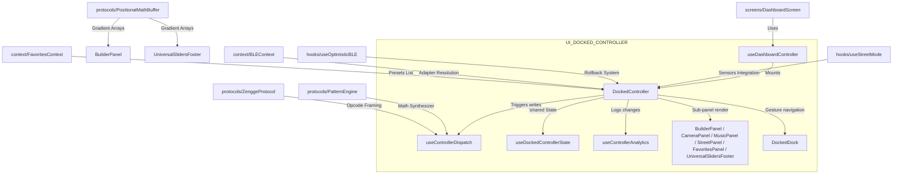

---

## 3. Context Matrix

The `DockedController` operates as the single source of state truth for the active control panel:

```
+--------------------------------------------------------------------------------+
| DashboardScreen (Receives BLE Write / Reads GPS & Accelerometer Sensors)        |
+--------------------------------------------------------------------------------+
                                  |
                                  | Injects sensor stats as props
                                  | (Prevents duplicate sensor loop subscriptions)
                                  v
+--------------------------------------------------------------------------------+
| DockedController (Monolith Container Shell)                                    |
|   - Initializes state via useDockedControllerState (Pre-warms with Ledger Cash)|
|   - Controls FSM modes: FAVORITES | MULTIMODE | BUILDER | MUSIC | STREET | CAMERA |
|   - Holds volatile-state Refs to avoid stale closures in callbacks              |
+--------------------------------------------------------------------------------+
          |                                  |
          | Stabilized Bus Object            | Props Threading
          | (dockedBus)                      |
          v                                  v
+--------------------------+       +---------------------------------------------+
| ProEffectsPanel          |       | UniversalSlidersFooter                      |
|   - Grid selections      |       |   - Hue Strip / Preset Grids                |
|   - Write status client  |       |   - Tactile Sliders (Brt/Spd/Sens)          |
+--------------------------+       +---------------------------------------------+
```

### Global Context Dependencies
1. **`ThemeContext`**: Resolves colors and dark/light UI tokens.
2. **`FavoritesContext`**: Syncs custom favorites saved by the user with the internal state and manages quick presets.
3. **`AppConfigContext`**: Resolves feature flags and visibility settings (e.g., hiding Street mode if permission is disabled).
4. **`BLEContext`**: Provides access to device adapters for executing multi-protocol commands.

---

## 4. Hook/Service I/O Registry

### `useDockedControllerState`
Manages state synchronization and initial state caching.
* **Input Parameters:**
  * `lockedProduct: string` — active product ID (e.g., `'HALOZ'`, `'SOULZ'`).
  * `ledgerLoadSync: (mac: string) => DevicePatternState | null` — callback to retrieve stored configurations.
  * `macAddress: string` — identifier of the leader device.
* **Returned Interface:**
  * State variables & setters (e.g., `activeMode`, `selectedColor`, `brightness`, `speed`, `builderNodes`).
  * `applyCloudScene(scenePayload: CloudScenePayload): void` — sets multiple state variables concurrently.
  * `captureEntireState(streetSens, cruise, brake, override): Record<string, unknown>` — outputs a full state snapshot.
  * `applySpatialSegments(segments: SpatialSegment[]): void` — maps custom spatial segment colors.

### `useControllerDispatch`
Maps UI actions to protocol commands.
* **Input Parameters:**
  * `writeToDevice?: (payload: number[], target?: string) => Promise<boolean | 'partial' | void>` — BLE write adapter.
  * `hwSettings?: IHardwareSettings | null` — hardware specs retrieved from EEPROM.
  * `points?: number` — total LED nodes.
  * `getAdapterForDevice?: (mac: string) => IControllerProtocol | undefined` — protocol adapter resolver.
  * `primaryDeviceId?: string` — leader MAC address.
  * `connectedDevices?: { id: string }[]` — connected group member IDs.
* **Returned Interface:**
  * `sendColor(r, g, b): Promise<void>` — writes a solid color to connected devices.
  * `applyFixedPattern(patternId, fg, bg, speed, brightness, dir): Promise<void>` — dispatches custom patterns.
  * `applyStaticModePattern(pat, selectedColor, speed, r, g, b, spd): void` — applies static, strobe, or blink modes.
  * `applyEmergencyPattern(speed, brightness): void` — dispatches hazard animation arrays.
  * `handleMusicChange(patternId, sens, brightness, source, c1, c2, matrix): void` — applies music mode configuration.
  * `setPower(isOn: boolean): void` — turns device on or off.
  * `setMultiColor(colors, ledPoints, speed, direction, transition): void` — dispatches custom spatial color arrays.

### `useControllerAnalytics`
Logs debounced telemetry.
* **Input Parameters:**
  * `activeMode: ModeType`
  * `selectedPatternId: number`
  * `selectedColor: string`
  * `brightness: number`
  * `speed: number`
  * `streetSensitivity: number`
  * `deviceContext: { target: string, deviceId?: string, deviceIds?: string[] }`
* **Returned Interface:** `void` (executes side-effects only).

---

## 5. OS Variance Matrix

| Aspect | Android | iOS |
|---|---|---|
| **BLE Permissions** | Requires scanning permissions (`BLUETOOTH_SCAN`, `BLUETOOTH_CONNECT`) and location access (`ACCESS_FINE_LOCATION`). | Configured in `info.plist` via standard `NSBluetoothAlwaysUsageDescription` checks. |
| **MTU & Writing Limits** | Default 20-byte MTU limit unless explicitly negotiated post-connect. Writes (e.g., 0x59 arrays) must be serialized in a BLE queue to prevent buffer drops. | Higher native MTU buffer sizes and throughput. Buffer dropouts are less common, but serialization is still enforced for group stability. |
| **Expo-AV Microphone** | Requires standard audio recording permissions. Streaming background music is unaffected. | Requires configuring the audio session for mixed play and record (e.g., `mixWithOthers` category) to prevent interrupting system background music. |
| **Haptics** | Uses standard vibrating motors. Feedback timing and strength vary depending on hardware vendor. | Utilizes the Taptic engine for precise, distinct feedback weights. |
| **Layout & Safe Areas** | Typically auto-handled by flex spacing. The navigation dock rests above system navigation bars. | Requires safe-area padding to avoid overlaps with the notch and home indicator bar. |

---

## 6. Monolith Inspection (`DockedController.tsx`)

`DockedController.tsx` serves as a core routing shell (67KB, ~1480 lines).

### Hooks Consumed
* `useTheme`: manages theme styling variables.
* `useAppConfig`: retrieves feature flag settings.
* `useWindowDimensions`: checks screen dimensions for adaptive layout.
* `useAppMicrophone`: handles microphone stream inputs.
* `useControllerAnalytics`: debounces telemetry logs.
* `useCuratedPicks`: retrieves Supabase patterns.
* `useDockedControllerState`: orchestrates the local control state machine.
* `useSharedFavorites`: syncs custom style modifications.
* `useSharedBLE`: abstracts multi-protocol BLE writes.
* `useControllerDispatch`: packages commands for writing to devices.
* `useOptimisticBLE`: implements local optimistic UI updates with rollback.
* `useStreetMode`: accelerometer updates + brake detections.
* `useDeviceStateLedger`: reads local state configuration from memory cache.

### Refs Held
* `lastSentPayloadRef`: contains the exact last BLE payload array for replay on connection recovery.
* `lastConfirmedStateRef`: maps a backup snapshot state of the controller configuration, used for snapback reconciliation if a BLE write fails.
* `onReconcileRef`: stable ref wrapper for the onReconcile callback to prevent stale closures.
* `captureEntireStateRef`: stable ref wrapper for captureEntireState to break TDZ forward references.
* `hasReplayedRef`: prevents duplicate reconnect replays on consecutive connection cycles.
* `crewBroadcastTimer`: debounced timer wrapper to stream crew session updates.
* `isMountedRef`: guards against initialization pattern changed callback trigger.
* `activeModeRef`, `fixedSubModeRef`, `musicPatternIdRef`, `fixedPatternIdRef`, `selectedPatternIdRef`, `visualizerColorRef`: state refs to avoid stale callback scopes.
* `swipePanResponder`: holds the gesture responder instance.

### Callback Threading Map
* `writeToDevice`: packaged function passing payload array data to Bluetooth.
* `onPowerToggle` / `onDisconnect`: callbacks routing power states and disconnect events.
* `onCrewSceneChange`: signals the crew session leader has changed active styles.
* `onPatternChanged`: signals updates to store color snapshots and database records.

---

## 7. Component Extraction Opportunities

The following refactoring opportunities have been identified to reduce the complexity of the monolithic controller:

1. **`FixedPatternPreviewRow.tsx`**: Extract the preview rendering container (lines 80-128) into its own file to decouple animation state changes from the main component rendering loop.
2. **`DockedControllerUtils.ts`**: Move helper functions like `currentStatusText` (lines 828-859) and `visualizerColor` (lines 860-873) into a utility module.
3. **`useControllerImperative.ts`**: Move state restoration, favorite loading, and spatial pattern adjustments into a dedicated custom hook to separate the imperative handle logic from the main container component.

<!-- CARTOGRAPHER_END: UI_DOCKED_CONTROLLER -->

### Domain: UI_MODALS
<!-- CARTOGRAPHER_START: UI_MODALS -->

# 🗺️ Codebase Cartography: UI_MODALS Domain

This documentation provides a comprehensive architectural map of the `UI_MODALS` (Modals & Custom Sliders) domain in the SK8Lytz mobile application. It details functional boundaries, import/export dependency chains, state variables, React Context consumption, hardware hook interactions, platform-specific adaptations, and sequence diagrams.

---

## 1. 🗂️ Domain Manifest & Structural Boundaries

A detailed map of all source files in the `UI_MODALS` domain, including their functional scope, line counts, dependency bounds, managed state, and core operations.

### Core Modal Screens

#### 📄 [AccountModal.tsx](file:///c:/Neogleamz/AG_SK8Lytz_App/SK8Lytz/src/components/AccountModal.tsx)
* **Functional Scope:** Central bottom-sheet user management console. Hoists a tabbed layout to configure user settings, manage team crew memberships, inspect paired devices, review skate statistics, read legal guidelines, or trigger account deletion.
* **Line Count:** 674 lines.
* **Import Dependency Chain:**
  * Contexts: `useTheme`, `useAuth`, `useSafeAreaInsets`
  * Hooks: `useAccountOverview`, `useSkateStats`
  * Services: `profileService`, `supabase`, `AppLogger`
  * Sub-components: `AccountTabProfile`, `AccountTabSecurity`, `AccountTabCrewz`, `AccountTabDevices`, `AccountTabSettings`, `AccountTabStats`, `EulaModal`, `ErrorCard`
* **Export Dependency Chain:**
  * `AccountModal` (default export)
* **State Managed:**
  * Active Navigation Tab: `tab` (`'profile'` | `'security'` | `'crews'` | `'devices'` | `'settings'` | `'stats'`)
  * Sub-modals Visibility: `showEula` (boolean)
* **Core Operations:**
  * Coordinates nested profile tab switches.
  * Dispatches crew creation, leave, and deletion triggers.
  * Handles offline fallback checks via `isOfflineMode` prop to disable cloud-write interactions (e.g. crew actions, profile modifications).

#### 📄 [DeviceSettingsModal.tsx](file:///c:/Neogleamz/AG_SK8Lytz_App/SK8Lytz/src/components/DeviceSettingsModal.tsx)
* **Functional Scope:** Overlaid controller for customizing physical LED strip specifications. Probes hardware EEPROM parameters using low-level BLE commands and updates paired configuration profiles.
* **Line Count:** 625 lines.
* **Import Dependency Chain:**
  * Contexts: `useSafeAreaInsets`
  * Hooks: `useProtocolDispatch`
  * Utilities: `LOCAL_PRODUCT_CATALOG`, `getDefaultGroupName` (from `NamingUtils`)
  * Services: `AppLogger`
* **Export Dependency Chain:**
  * `DeviceSettingsModal` (default export)
* **State Managed:**
  * Model Configuration: `type` (string), `position` (`'Left'` | `'Right'` | `null`), `customName` (string | null)
  * Hardware Specifications: `pointsText` (string), `segmentsText` (string), `stripType` (string | null), `sorting` (string | null)
  * Remote Pairings: `rfMode` (`'ALLOW_ALL'` | `'ALLOW_NONE'` | `'ALLOW_PAIRED'`), `rfRemotes` (array of remote IDs)
  * Connection Status: `probeStatus` (`'idle'` | `'connecting'` | `'reading'` | `'writing'` | `'disconnecting'` | `'complete'` | `'error'`)
* **Core Operations:**
  * Probes hardware via `useProtocolDispatch().queryHardwareSettings` (`0x63` opcode query).
  * Writes modified configurations to hardware EEPROM via `writeSettingsByName` (`0x62` opcode dispatch).
  * Manages RF remote control pairing loops and clears pairings.

#### 📄 [CommunityModal.tsx](file:///c:/Neogleamz/AG_SK8Lytz_App/SK8Lytz/src/components/CommunityModal.tsx)
* **Functional Scope:** Interactive cloud preset browser sheet allowing skaters to discover, upvote, preview, and write lighting configurations shared by the community.
* **Line Count:** 461 lines.
* **Import Dependency Chain:**
  * Contexts: `useTheme`, `useAuth`
  * Services: `ScenesService`, `AppLogger`
  * Components: `SceneCard`
* **Export Dependency Chain:**
  * `CommunityModal` (default export)
* **State Managed:**
  * Preset Lists: `publicScenes` (array of Scenes), `myScenes` (array of Scenes)
  * Tabs: `activeTab` (`'PUBLIC'` | `'MY_PRESETS'`)
  * Status: `loading` (boolean), `error` (string | null), `isSubmitting` (boolean)
* **Core Operations:**
  * Loads scenes on show or tab changes using `fetchCommunityScenes` and `fetchMyScenes`.
  * Handles scene selection and previews patterns on physical skates in real-time.
  * Dispatches upvotes and handles deletions of custom cloud-saved presets.

#### 📄 [GroupSettingsModal.tsx](file:///c:/Neogleamz/AG_SK8Lytz_App/SK8Lytz/src/components/GroupSettingsModal.tsx)
* **Functional Scope:** Simple drawer overlay facilitating creation, renaming, and membership assignment for device clusters.
* **Line Count:** 204 lines.
* **Import Dependency Chain:**
  * Utilities: `getDefaultGroupName` (from `NamingUtils`)
  * Services: `AppLogger`
  * Theme: `Colors`, `Layout`, `Spacing`, `Typography`
* **Export Dependency Chain:**
  * `GroupSettingsModal` (default export)
* **State Managed:**
  * Inputs: `name` (string), `selectedIds` (array of device IDs)
  * Operations: `isSaving` (boolean)
* **Core Operations:**
  * Updates group mappings in the parent state by collecting unique device ID selection arrays.
  * Incorporates connection indicators showing live BLE status for target peripherals inside lists.

#### 📄 [SessionSummaryModal.tsx](file:///c:/Neogleamz/AG_SK8Lytz_App/SK8Lytz/src/components/SessionSummaryModal.tsx) **
## 2. 💥 Blast Radius (Imports/Exports)

```mermaid
graph TD
    %% Imports from other domains
    ThemeDomain["theme.ts (Spacing, Colors)"] -->|Styles| UI_MODALS["UI_MODALS Components"]
    AuthContext["AuthContext.ts (useAuth)"] -->|Session tokens & actions| AccountModal & CommunityModal
    ThemeContext["ThemeContext.ts (useTheme)"] -->|Theme Palettes| UI_MODALS
    ProfileService["ProfileService.ts"] -->|CRUD Permanent Crew| AccountModal
    SupabaseClient["supabaseClient.ts"] -->|Database Auth & Sync| AccountModal
    ScenesService["ScenesService.ts"] -->|Presets & Community Scenes| CommunityModal
    AppLogger["AppLogger.ts"] -->|Lifecycle Telemetry Events| UI_MODALS
    ProtocolDispatch["useProtocolDispatch.ts"] -->|Hardware 0x62/0x63 queries| DeviceSettingsModal
    NamingUtils["NamingUtils.ts"] -->|Defaults| DeviceSettingsModal & GroupSettingsModal
    SafeArea["SafeAreaContext (useSafeAreaInsets)"] -->|Layout Margins| AccountModal & DeviceSettingsModal

    %% Exports to other domains
    UI_MODALS -->|Mounts AccountModal| DashboardScreen["DashboardScreen.tsx"]
    UI_MODALS -->|Mounts DeviceSettings| DashboardScreen
    UI_MODALS -->|Mounts GroupSettings| DashboardScreen
    UI_MODALS -->|Mounts CommunityModal| DockedController["DockedController.tsx"]
    UI_MODALS -->|Mounts GlobalPermissions| App["App.tsx (Global Mount)"]
    UI_MODALS -->|Slider Inputs| CrewManage["CrewManageScreen.tsx"] & GradBuilder["PositionalGradientBuilder.tsx"]
    UI_MODALS -->|Tactical Sliders| Footer["UniversalSlidersFooter.tsx"]
    UI_MODALS -->|Marquee Labels| PresetCard["PresetCard.tsx"]
    
    %% Orphaned Components (Stale)
    SessionSummary["SessionSummaryModal.tsx"] -.->|Orphaned (No Active Imports)| Stale["[Stale References]"]
    ConnectionStrength["ConnectionStrengthBadge.tsx"] -.->|Orphaned (No Active Imports)| Stale
```

### Outward Dependencies (What UI_MODALS consumes)
* `src/theme/theme.ts`: Base sizing tokens and colors.
* `src/context/ThemeContext.tsx`: Core hooks adjusting light/dark mode properties.
* `src/context/AuthContext.tsx`: Active account validations and token structures.
* `src/services/ProfileService.ts`: REST queries modifying crew memberships and users.
* `src/services/supabaseClient.ts`: Database Auth & Sync configurations.
* `src/services/ScenesService.ts`: Fetches and upvotes presets from the cloud database.
* `src/hooks/ble/useProtocolDispatch.ts`: Direct BLE GATT command serializations.

### Inward Dependencies (What imports UI_MODALS)
* `App.tsx`: Global permissions sheet overlays.
* `src/screens/DashboardScreen.tsx`: Hosts main settings, groups, and profile triggers.
* `src/components/DockedController.tsx`: Browses preset scenes via `CommunityModal`.
* `src/components/docked/UniversalSlidersFooter.tsx`: Houses the tactical speed/brightness adjusters.
* `src/components/docked/PresetCard.tsx`: Displays scrolling labels via `MarqueeText`.

---

## 3. 🕸️ Context Matrix

React Context integrations within the `UI_MODALS` domain:

| React Context | Consumed By | Architectural Purpose | Provider Source |
| :--- | :--- | :--- | :--- |
| **ThemeContext** | `AccountModal`<br>`CommunityModal`<br>`SessionSummaryModal`<br>`EulaModal`<br>`CustomSlider`<br>`TacticalSlider` | Distributes current style presets (`Colors`) and theme toggling routines. | `ThemeProvider` (`App.tsx`) |
| **AuthContext** | `AccountModal`<br>`CommunityModal` | Exposes authenticated user tokens, email profiles, and sign-out commands. | `AuthProvider` (`App.tsx`) |
| **SafeAreaContext** | `AccountModal`<br>`DeviceSettingsModal`<br>`EulaModal` | Pulls safe layout bounds (`insets.top`/`insets.bottom`) to offset notches. | `SafeAreaProvider` (`App.tsx`) |

---

## 4. 🔌 Hook/Service I/O Registry

Inputs, outputs, and side-effects of consumed APIs:

### `useAccountOverview` (Hook)
* **Inputs:** `visible: boolean` (triggers profile query when true).
* **Outputs:**
  * `profile: UserProfile | null` (active cloud settings).
  * `savingProfile: boolean` (indicating save status).
  * `handleSaveProfile: () => Promise<void>` (writes edits to Supabase).
* **Side-Effects:** Refetches profile details from the database on modal open and updates AsyncStorage caches.

### `useSkateStats` (Hook)
* **Inputs:** `visible: boolean`
* **Outputs:**
  * `lifetimeStats: { distance_miles, duration_sec, max_speed_mph, total_sessions } | null`
  * `recentSessions: ISessionSnapshot[] | null` (history lists).
* **Side-Effects:** Aggregates and calculates session statistics from database logs.

### `useProtocolDispatch` (Hook)
* **Inputs:** Target device identity MACs.
* **Outputs:**
  * `queryHardwareSettings: (force: boolean, deviceId: string) => Promise<boolean>` (BLE `0x63` query).
  * `writeSettingsByName: (points, segments, strip, sorting, deviceId) => Promise<boolean>` (BLE `0x62` write).
  * `setRfRemoteState: (mode, enabled, deviceId) => Promise<boolean>` (BLE `0x77` write).
  * `clearRfRemotes: (mode, deviceId) => Promise<boolean>` (BLE `0x77` erase).
* **Side-Effects:** Serializes and queues physical BLE GATT read/write operations.

### `ScenesService` (API Service)
* **Functions:**
  * `fetchCommunityScenes()`: Loads shared presets.
  * `fetchMyScenes(userId)`: Loads personal presets.
  * `deleteScene(sceneId)`: Deregisters custom presets.
  * `upvoteScene(sceneId, userId)`: Commits vote telemetry.
* **Side-Effects:** Read/Write requests to cloud scene database tables.

---

## 5. 📱 OS Variance & Platform Adaptation Matrix

Code paths branching between iOS, Android, and Web environments:

| OS target | Component / File | Check Condition | Platform-Specific Behavior & Rationale |
| :--- | :--- | :--- | :--- |
| **iOS** vs **Android** | `AccountModal.tsx`<br>`AccountTabCrewz.tsx` | `Platform.OS === 'ios'` | Applies `fontFamily: 'Courier New'` on iOS, falling back to `monospace` on Android to maintain width alignment in invite fields. |
| **Web** vs **Native** | `AccountModal.tsx` | `Platform.OS === 'web'` | Bypasses `Alert.alert` prompts (which cause crashes on Web) to sign out directly. |
| **Web vs Native** | `SessionSummaryModal.tsx` | `Platform.OS === 'web'` | Applies CSS `boxShadow` styling rather than iOS-specific shadows/Android elevation. |
| **Web vs Native** | `CustomSlider.tsx`<br>`TacticalSlider.tsx` | Inline Styling | Appends `touchAction: 'none'` and `userSelect: 'none'` to block default browser gestures from hijacking dragging handlers. |
| **iOS vs Android** | `CommunityModal.tsx`<br>`GlobalPermissionsModal.tsx` | Component Props | Sets `presentationStyle="pageSheet"` on iOS to render card overlays with native swipe-dismiss gestures. |

---

## 6. 🎨 Design System & Token Manifest

### Visual Overlays & Backdrops
* **Dark Overlays:** Modal screens employ `rgba(0,0,0,0.8)` or `rgba(0,0,0,0.7)` backdrop overlays to obscure dashboard components and highlight active inputs.
* **Rounded Cards:** Layout boxes utilize `Layout.borderRadius = 24` or `16` for metrics cards, aligning with the "Gleamz" visual style.

### Safe Area Boundaries
* **Top Offset:** Account modal structures wrap within safe area calculations:
  ```typescript
  paddingTop: Math.max(insets.top, Spacing.lg)
  ```
* **Bottom Offset:** Sliders and button rows account for the home indicator bar on iOS via `paddingBottom: insets.bottom`.

### Interactive Touch targets
* **Click Targets:** Core action buttons (Save, Close, Delete, Upvote) maintain a minimum vertical/horizontal footprint of `44px` to remain easily clickable during movement or when wearing wrists protectors.
* **Sliders Corridors:** Sliders feature container heights of `40px` (`CustomSlider`) and `44px` (`TacticalSlider`) to establish spacious drag bounds.

### Dynamic Themes (Accents & Limits)
* **Safety Markers:** `TacticalSlider` renders a white vertical marker block at `80%` in brightness mode, reminding skaters of physical thermal limitations.
* **Color Transitions:** Dynamic color shifts in `TacticalSlider` translate slider percentages:
  * Brightness Mode: Opacity maps `0.2` to `1.0` dynamically:
    ```typescript
    `rgba(255, 255, 255, ${0.2 + 0.8 * percentage})`
    ```
  * Turbo Speed Mode: Moves green/white tones toward red as speeds increase:
    ```typescript
    `rgb(255, ${Math.round(255 * (1 - percentage))}, ${Math.round(255 * (1 - percentage))})`
    ```

---

## 7. ⛓️ BLE & Cloud Sequence Flows

### Sequence A: Device Settings Hardware Probe and Configuration Save Flow
Demonstrates how `DeviceSettingsModal` triggers hardware probing commands, receives async notifications, updates state, and commits modifications.

```mermaid
sequenceDiagram
    autonumber
    actor Skater
    participant UI as DeviceSettingsModal
    participant Disp as useProtocolDispatch
    participant BLE as BleConnectionManager (GATT)
    participant DB as AsyncStorage / Supabase

    Skater->>UI: Tap "PROBE" on unconfigured device Settings
    UI->>UI: Set probeStatus = 'connecting'
    UI->>Disp: queryHardwareSettings(false, deviceId)
    Disp->>BLE: Write 0x63 EEPROM inquiry command
    BLE-->>UI: Receive notify callback (new points/segments/sorting)
    Note over UI: React useEffect detects initialSettings changes
    UI->>UI: Update input values, set probeStatus = 'complete'
    
    rect rgb(20, 20, 30)
        Note over Skater, DB: Skater modifies configurations and saves
        Skater->>UI: Tap "SAVE CONFIG"
        UI->>DB: Invoke onSave() to persist fleet changes
        UI->>Disp: writeSettingsByName(points, segments, strip, sorting, deviceId)
        Disp->>BLE: Enqueue 0x62 EEPROM write command
        UI->>Skater: Close Modal
    end
```

### Sequence B: Cloud Scene Application Flow
Details the pipeline that fetches, previews, and writes community shared gradients.

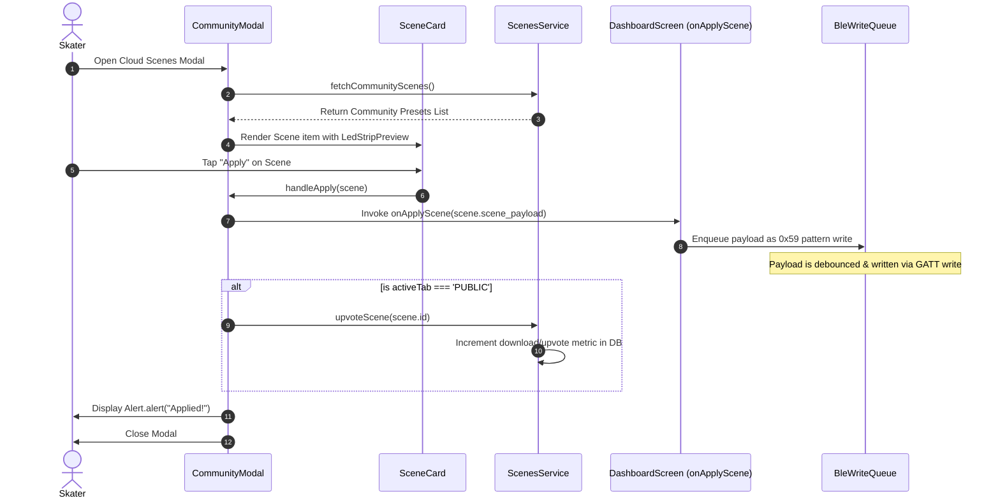

---

## 8. 🧹 Archival Ledger (`

<!-- CARTOGRAPHER_END: UI_MODALS -->

### Domain: UI_VISUALIZER
<!-- CARTOGRAPHER_START: UI_VISUALIZER -->

# UI_VISUALIZER Domain Architectural Cartography

This document provides a comprehensive, read-only architectural audit of the `UI_VISUALIZER` domain in the SK8Lytz codebase. It maps out files, dependencies, context relationships, service/hook interactions, OS variances, and optical specs.

---

## 1. File Manifest
Every file in the `UI_VISUALIZER` domain mapped to its exact architectural purpose:

| File Name | Path | Architectural Purpose |
|---|---|---|
| **VisualizerUnit** | [VisualizerUnit.tsx](file:///c:/Neogleamz/AG_SK8Lytz_App/SK8Lytz/src/components/VisualizerUnit.tsx) | Computes coordinate-math layouts and renders physical LED paths (`RING` / HALOZ, `DUAL_STRIP` / RAILZ, `OVAL` / SOULZ) using a multi-layer glow simulation model, throttled to 30 FPS on web and 60 FPS on native. |
| **ProductVisualizer** | [ProductVisualizer.tsx](file:///c:/Neogleamz/AG_SK8Lytz_App/SK8Lytz/src/components/ProductVisualizer.tsx) | Layout manager component that instantiates and orchestrates single or dual `VisualizerUnit` previews. Drives timer ticks synchronously using `requestAnimationFrame` loops. |
| **LEDStripPreview** | [LEDStripPreview.tsx](file:///c:/Neogleamz/AG_SK8Lytz_App/SK8Lytz/src/components/LEDStripPreview.tsx) | Renders a 2D linear row of colored blocks to preview pattern engine effects. Optimized with hash-based change checks (`${patternId}-${fg}-${bg}-${speed}-${direction}-${brightness}`) to skip re-renders and runs at ~30 FPS (33ms ticks). |
| **CustomEffectVisualizer** | [CustomEffectVisualizer.tsx](file:///c:/Neogleamz/AG_SK8Lytz_App/SK8Lytz/src/components/CustomEffectVisualizer.tsx) | Renders a 2D linear dot sequence for previewing custom gradient builder outputs. Dynamically transitions colors depending on active mode (static, jumping, flowing, breathing). |
| **NeonHueStrip** | [NeonHueStrip.tsx](file:///c:/Neogleamz/AG_SK8Lytz_App/SK8Lytz/src/components/NeonHueStrip.tsx) | Renders a full-spectrum linear color picker strip using `LinearGradient` and implements a dedicated `PanResponder` gesture responder for lag-free local slider modifications. |
| **PositionalGradientBuilder** | [PositionalGradientBuilder.tsx](file:///c:/Neogleamz/AG_SK8Lytz_App/SK8Lytz/src/components/PositionalGradientBuilder.tsx) | Node-based editor allowing users to insert, remove, position, and color-code pins on a virtual strip. Translates pin data into `ZenggeProtocol` dispatches over BLE with 100ms throttle protection. |
| **VerticalPatternDrum** | [VerticalPatternDrum.tsx](file:///c:/Neogleamz/AG_SK8Lytz_App/SK8Lytz/src/components/VerticalPatternDrum.tsx) | An infinite-scrolling vertical selector wheel mapping list positions to pattern IDs, designed with haptic reticle overlays, 3D shadow masks, and a 50ms selection debounce. |
| **GradientLibraryTab** | [GradientLibraryTab.tsx](file:///c:/Neogleamz/AG_SK8Lytz_App/SK8Lytz/src/components/patterns/GradientLibraryTab.tsx) | Displays a list of custom and built-in gradients in a two-column grid showing 12-block static strips generated by the positional math buffer. |
| **PatternCard** | [PatternCard.tsx](file:///c:/Neogleamz/AG_SK8Lytz_App/SK8Lytz/src/components/patterns/PatternCard.tsx) | Renders a pattern selection card with glassmorphism overlays, required color indicators (FG/BG dots), and an embedded live `LEDStripPreview` capped at 12 segments to minimize DOM footprint. |
| **PatternPickerTab** | [PatternPickerTab.tsx](file:///c:/Neogleamz/AG_SK8Lytz_App/SK8Lytz/src/components/patterns/PatternPickerTab.tsx) | Categorized grid layout selector for patterns utilizing an `onViewableItemsChanged` flatlist viewport gate that automatically pauses/plays individual card animations to conserve CPU. |
| **UnifiedPatternPicker** | [UnifiedPatternPicker.tsx](file:///c:/Neogleamz/AG_SK8Lytz_App/SK8Lytz/src/components/patterns/UnifiedPatternPicker.tsx) | Coordinates pattern card selection and delegates hex-to-rgb conversion and `0x59` BLE payload packaging (`buildPatternPayload`) to the hardware dispatcher. |
| **CameraTracker (iOS/Android)** | [CameraTracker.tsx](file:///c:/Neogleamz/AG_SK8Lytz_App/SK8Lytz/src/components/CameraTracker.tsx) | Integrates `react-native-vision-camera` feed with a native GPU frame resizer worklet running at 5Hz to extract environment colors (Sniper center-pixel sampling and Vibe K-means clustering modes). |
| **CameraTracker (Web)** | [CameraTracker.web.tsx](file:///c:/Neogleamz/AG_SK8Lytz_App/SK8Lytz/src/components/CameraTracker.web.tsx) | Stubs out the camera tracking interface for non-native environments (Expo Web) to prevent compiler and bundler failures on missing JSI packages. |
| **CameraTracker Types** | [CameraTracker.d.ts](file:///c:/Neogleamz/AG_SK8Lytz_App/SK8Lytz/src/components/CameraTracker.d.ts) | Core TypeScript interface declaration mapping props and types across native and web CameraTracker components. |

---

## 2. Blast Radius (Imports/Exports)

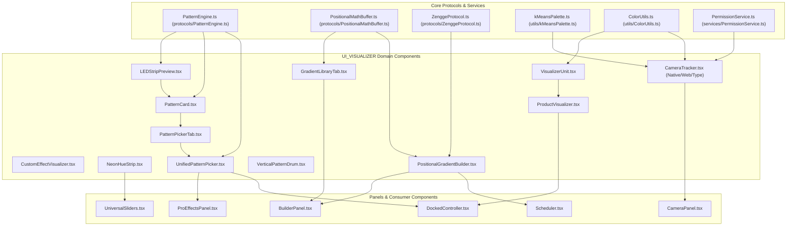

### Incoming Dependencies (Who Imports UI_VISUALIZER)
* **`DockedController.tsx`**: Imports `ProductVisualizer` to render active skate visualizers at the top of the dashboard controller sheet.
* **`ProEffectsPanel.tsx`**: Imports `UnifiedPatternPicker` to expose pattern grids under the programs selector.
* **`BuilderPanel.tsx`**: Imports `PositionalGradientBuilder` to allow editing custom nodes and `CustomEffectVisualizer` to preview nodes locally.
* **`CameraPanel.tsx`**: Imports `CameraTracker` to manage ambient color analysis.
* **`Scheduler.tsx`**: Imports `PositionalGradientBuilder` for configuring timer transitions.

### Outgoing Dependencies (What UI_VISUALIZER Imports)
* **`src/protocols/PatternEngine.ts`**: Retrieves effect lists (`SK8LYTZ_TEMPLATES`) and builds pixel array payloads via `buildPatternPayload`.
* **`src/protocols/PositionalMathBuffer.ts`**: Computes interpolated colors from node maps.
* **`src/protocols/ZenggeProtocol.ts`**: Converts gradient arrays into BLE binary dispatches (`setMultiColor`).
* **`src/utils/kMeansPalette.ts`**: Computes dominant colors from camera pixel arrays via cluster iteration.
* **`src/utils/ColorUtils.ts`**: Converts hex-to-rgb and maps RGB limits (`boostForLED`).
* **`src/services/PermissionService.ts`**: Requests native OS permission configurations for the camera stream.

---

## 3. Context Matrix

The domain consumes several React Contexts to manage themes, rendering vectors, and database profiles:

| Context | Hook / Consumer | Purpose | Read / Write Status |
|---|---|---|---|
| **ThemeContext** | `useTheme` / `VisualizerUnit`, `ProductVisualizer`, `NeonHueStrip`, `PositionalGradientBuilder`, `VerticalPatternDrum`, `UnifiedPatternPicker` | Receives theme updates (light/dark mode toggle) and provides active color variable matrices (`Colors.surface`, `Colors.surfaceHighlight`, `Colors.primary`, etc.). | Read-Only |
| **AuthContext** | `useAuth` / `useGradients` (via `GradientLibraryTab`) | Resolves active `user.id` sessions to load custom presets from Supabase. | Read-Only |
| **SafeAreaContext**| `useSafeAreaInsets` / (Parent Wrappers) | Prevents visual overlap with screen notches and bottom system bars. | Read-Only |

---

## 4. Hook/Service I/O Registry

### `useGradients` (Hook)
* **Inputs:** None (reads user session internally from `AuthContext`).
* **Outputs:**
  * `gradients`: `CustomBuilderPreset[]` — Loaded gradient models.
  * `isLoading`: `boolean` — Current fetch status.
  * `status`: `'idle' | 'loading' | 'error' | 'success'` — FSM state.
  * `error`: `string | null` — Last error message.
  * `saveGradient`: `(preset: Partial<CustomBuilderPreset>) => Promise<void>` — Saves/updates gradient.
  * `deleteGradient`: `(id: string) => Promise<void>` — Deletes custom gradient.
  * `refreshGradients`: `() => Promise<void>` — Forces database refetch.
* **Side-effects:**
  * Fetches user presets from the `GradientsService` Supabase client on mount.
  * Triggers event logs to `AppLogger.error()` on failures.
  * Increments `favorites_created` user telemetry counter on new saves.

### `extractKMeansPalette` (Utility Service)
* **Inputs:**
  * `pixels`: `RGB[]` — Source pixel buffer array.
  * `k`: `number` — Target centroid cluster count (hardcoded to `3` for Vibe mode).
  * `maxIterations`: `number` — Convergence limit (hardcoded to `5`).
* **Outputs:** `RGB[]` — Extracted dominant centroids.
* **Side-effects:** None (pure mathematical clustering).

### `useResizer` (Vision Camera Resizer Hook)
* **Inputs:**
  * `config`: `{ width: 50, height: 50, channelOrder: 'rgb', dataType: 'uint8', scaleMode: 'cover', pixelLayout: 'interleaved' }`
* **Outputs:**
  * `{ resizer, error }`: Resizer instances mapped inside the C++ native boundary.
* **Side-effects:** Memory instantiation of native resizer channels. Requires manual calling of `.dispose()` inside worklets to prevent memory leaks.

---

## 5. OS Variance Matrix

Critical path branches and execution differences between target platforms (iOS, Android, Web):

| File / Component | Platform / API | Branching Mechanism | Architectural Difference & Rationale |
|---|---|---|---|
| **CameraTracker** | **Web / Expo Web** | `.web.tsx` file resolution override | Renders a standard message component stating "Camera Not Available". Prevents web bundler crashes on native-only packages (`react-native-vision-camera`, `react-native-worklets-core`) which depend on native JSI compilation. |
| **CameraTracker** | **iOS & Android** | `.tsx` file execution | Renders raw camera stream. Spawns high-performance C++ worklet frames to sample colors at 5Hz using JSI buffers. |
| **VisualizerUnit** | **Web vs Native** | `Platform.OS === 'web'` | Throttles frame rates. Web runs at **30 FPS** to prevent JS MessageQueue flooding. Native runs at **60 FPS** (or uncapped). |
| **PatternPickerTab** | **Web vs Native** | `Platform.OS !== 'web'` | Disables Animated Native Driver on Web (`useNativeDriver: false`) for category pill scale transforms to avoid styling compiler warnings. |
| **Shadows & Glow** | **iOS vs Android** | `Platform.select()` in `theme.ts` | Shadow render engine variances. iOS uses `shadowColor`/`shadowOpacity`/`shadowRadius` styles. Android uses `elevation` and `shadowColor` properties. |

---

## 6. Visualizer Geometry & Physics Specs

The visualizer domain is governed by the core token specifications alongside visualizer-specific optical metrics:

### Visualizer Geometry & Physics Specs
* **Scale Factor:** `S = 0.38` (shrinks coordinates to fit preview containers).
* **Hardware Profile Maps:**
  * **HALOZ:** Layout Shape `RING`, 8 addressable LEDs per segment, 2 segments (16 total physical), LED dot diameter `7.6`mm, base layout size `60`x`90`px, `isMirrored: false` (hardware duplicates segment 1 to segment 2 automatically).
  * **SOULZ:** Layout Shape `OVAL`, 43 addressable LEDs per segment, 1 segment (86 total physical across 2 boots, Y-wired), LED dot diameter `5.7`mm, base layout size `55`x`115`px, `isMirrored: false`.
  * **RAILZ:** Layout Shape `DUAL_STRIP`, 30 addressable LEDs per segment, 2 segments (30 total physical), LED dot diameter `5.0`mm, base layout size `80`x`120`px, `isMirrored: true` (software-mirrored vertical strips), separation distance `32`mm.
* **Optical Diffusion Layer Model:**
  * **Layer 3 (Atmospheric Scatter):** `5.5`× diameter, opacity `0.03`
  * **Layer 2 (Silicone Bloom):** `3.2`× diameter, opacity `0.10`
  * **Layer 1 (Concentrated Halo):** `1.7`× diameter, opacity `0.38`
  * **Main Emitter Body:** `1.0`× diameter, active color
  * **Emitter Core Hotspot:** `0.32`× diameter, color `'rgba(255,255,255,0.55)'`
  * **Silicon Outer Glaze:** `1.0`× diameter, color `'rgba(255,255,255,0.09)'`, border `0.5px`, color `'rgba(255,255,255,0.05)'`

---

## 7. Architectural Impact Flags

* `[IMPACTS_USER_JOURNEY]` — Gradient building, camera color detection, and vertical pattern selector wheels directly alter how users interact with hardware lights.
* `[IMPACTS_STATE_CHART]` — Environment colors detected by CameraTracker or gradient layouts designed in the builder update local state contexts, triggering `0x59` GATT dispatches downstream.

---

## 8. Archival Logs (`

<!-- CARTOGRAPHER_END: UI_VISUALIZER -->

### Domain: DATA_LAYER
<!-- CARTOGRAPHER_START: DATA_LAYER -->

# 🗺️ DATA_LAYER Architectural Cartography Report

This report details the read-only architectural cartography audit of the data persistence, synchronization, and caching layer of the SK8Lytz App. 

---

## 1. File Manifest

Every file in the `DATA_LAYER` domain is catalogued below with its canonical architectural purpose and code references:

| File Path | Architectural Purpose |
| :--- | :--- |
| `src/services/DeviceRepository.ts` | Local-first, cloud-second Single Source of Truth (SSOT) managing device and group pairings, local-state syncing, and cloud reconciliation. |
| `src/services/TelemetryService.ts` | Decodes and categorizes BLE error payloads, tracking transmission metadata and telemetry counters for diagnostic logging. |
| `src/services/ScenesService.ts` | Facilitates offline scene storage, community uploads, upvoting/downloading mechanics, and sync queuing. |
| `src/services/SpeedTrackingService.ts` | Computes active sessions telemetry (miles, speed, MET-based calories) and queues sessions offline if unauthenticated/offline. |
| `src/services/GradientsService.ts` | Persists positional color builder presets, merging local presets with global and cloud user presets. |
| `src/services/SkateSpotsService.ts` | Retrieves skate spots using a 24-hour TTL AsyncStorage cache, fallback OpenStreetMap scraping, and cloud verification. |
| `src/services/SessionShareService.ts` | Formats deep links and text payloads to trigger the native platform's OS share sheet wrapper. |
| `src/types/supabase.ts` | Provides database schema structure definitions autogenerated from Supabase PostgreSQL tables. |
| `src/services/supabaseClient.ts` | Configures the Supabase JS client with custom SecureStore credentials storage and provides an offline fallback stub. |
| `src/hooks/cloud/useOfflineSyncWorker.ts` | Executes a 60-second background polling cycle to safely upload pending scenes, sessions, and telemetry log caches to Supabase. |
| `src/hooks/useFavorites.ts` | Bridges preset configurations with UI controls, backing them with AsyncStorage and Supabase table writes. |
| `src/context/FavoritesContext.tsx` | Wraps user favorites in a React Context Provider for application-wide shared hook state. |
| `src/hooks/useScenes.ts` | Interfaces components with the ScenesService logic for list loading and deletions. |
| `src/hooks/useCuratedPicks.ts` | Implements a cache-first stale-while-revalidate loop that displays curated presets from the remote DB. |
| `src/hooks/useGradients.ts` | Interfaces UI controls with GradientsService to manage positional gradient math presets. |
| `src/hooks/useSkateStats.ts` | Caches and binds lifetime stats and historical session timelines. |
| `src/hooks/useRecentSpots.ts` | Captures a rolling deque of the last 10 map location visits in AsyncStorage. |
| `src/hooks/useMapFilters.ts` | Governs visibility matrices for rinks, parks, shops, and active crew sessions. |

---

## 2. Blast Radius (Imports/Exports)

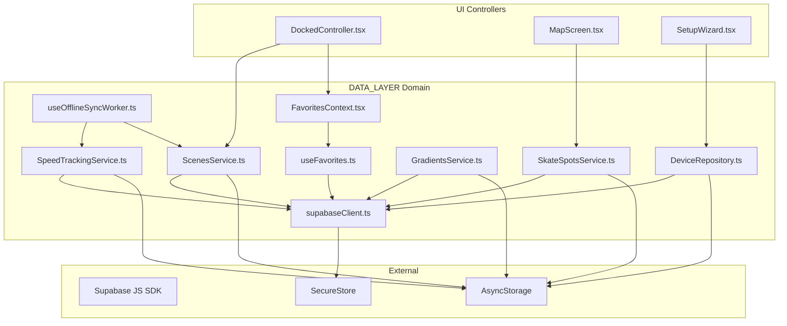

### Imports/Exports Matrix

| File | Primary Imports (from DATA_LAYER) | Primary Exports (to other layers) |
|---|---|---|
| `supabaseClient.ts` | `Database` | `supabase` client / mock stub |
| `DeviceRepository.ts` | `supabase`, `Database` | `DeviceRepository` (singleton class) |
| `TelemetryService.ts` | `supabase`, `Database` | `TelemetryService` |
| `ScenesService.ts` | `supabase` | `ScenesService`, `Scene` interface |
| `SpeedTrackingService.ts` | `supabase` | `SpeedTrackingService`, `ISkateSession`, `ILifetimeStats` |
| `GradientsService.ts` | `supabase`, `Database` | `GradientsService` |
| `SkateSpotsService.ts` | `supabase`, `Database` | `SkateSpotsService`, `SkateSpot` |
| `SessionShareService.ts` | None | `shareLiveSession`, `shareScheduledSession`, `shareSessionInvite` |
| `useOfflineSyncWorker.ts`| `ScenesService`, `SpeedTrackingService` | `useOfflineSyncWorker` background sync loop |
| `useFavorites.ts` | `supabase`, `Database` | `useFavorites` hook, `IFavoriteState` |
| `FavoritesContext.tsx`| `useFavorites` | `FavoritesProvider`, `useSharedFavorites` |
| `useScenes.ts` | `ScenesService` | `useScenes` hook |
| `useCuratedPicks.ts` | `supabase`, `Database` | `useCuratedPicks` hook |
| `useGradients.ts` | `GradientsService` | `useGradients` hook |
| `useSkateStats.ts` | `SpeedTrackingService` | `useSkateStats` hook |
| `useRecentSpots.ts` | None | `useRecentSpots` hook |
| `useMapFilters.ts` | None | `useMapFilters` hook |

---

## 3. Context Matrix

This domain consumes and provides the following React Contexts:

*   **`AuthContext` (`useAuth`)**:
    *   *Consumed by*: `useOfflineSyncWorker.ts`, `useFavorites.ts`, `useScenes.ts`, `useGradients.ts`, `useSkateStats.ts`.
    *   *Purpose*: Obtains the currently authenticated `user.id` to route cloud reads/writes and prevent sync cycles for anonymous sessions.
*   **`FavoritesContext` (`FavoritesProvider` / `useSharedFavorites`)**:
    *   *Provided by*: `FavoritesContext.tsx` (wrapping `useFavorites.ts` base hook).
    *   *Consumed by*: UI controller components (e.g., `DockedController.tsx`).
    *   *Purpose*: Provides a single global registry of active presets, quick presets, loading states, and mutation callbacks to prevent redundant fetches.
*   **`ThemeContext`**:
    *   *Consumed by*: Layout controllers and screens.
    *   *Purpose*: Restores active UI control themes from AsyncStorage, shared across screens.

---

## 4. Hook/Service I/O Registry

### `DeviceRepository` (Singleton Service)
*   **`initialize()`** [DeviceRepository.ts:42-64]
    *   *Input*: None.
    *   *Output*: `Promise<void>`.
    *   *Side-effects*: Reads cached device arrays (`@Sk8lytz_registered_devices`), custom settings maps, and tombstone lists from AsyncStorage to build the in-memory cache.
*   **`saveDevice(device, userId)`** [DeviceRepository.ts:182-277]
    *   *Input*: `device: Partial<RegisteredDevice> & { device_mac: string }`, `userId?: string`.
    *   *Output*: `Promise<boolean>`.
    *   *Side-effects*: Updates memory cache immutably, removes matching MAC address from the local tombstone list, writes to local storage, and invokes Supabase group transaction RPCs or queues details to the offline sync key if the network fails.
*   **`deleteDevice(deviceMac, userId)`** [DeviceRepository.ts:314-367]
    *   *Input*: `deviceMac: string`, `userId?: string`.
    *   *Output*: `Promise<void>`.
    *   *Side-effects*: Adds MAC to the local tombstone list, filters the device out of memory arrays, wipes specific device settings configs, and issues a DELETE query to Supabase.
*   **`syncFromCloud(userId)`** [DeviceRepository.ts:80-163]
    *   *Input*: `userId?: string`.
    *   *Output*: `Promise<RegisteredDevice[]>`.
    *   *Side-effects*: Queries remote `registered_devices`, filters out records in the local tombstone list, merges settings priorities (local updates override defaults), and flushes unsynced local creations or tombstoned deletes.

### `ScenesService` (Singleton Service)
*   **`getSavedScenes(userId)`** [ScenesService.ts:25-96]
    *   *Input*: `userId?: string`.
    *   *Output*: `Promise<Scene[]>`.
    *   *Side-effects*: Tries local cache first (`@Sk8lytz_Scenes`), returns data, triggers background sync from Supabase, and caches locally.
*   **`saveSavedScene(scene, userId)`** [ScenesService.ts:98-175]
    *   *Input*: `scene: Scene`, `userId?: string`.
    *   *Output*: `Promise<boolean>`.
    *   *Side-effects*: Inserts or updates matching IDs locally and appends a `SceneSyncJob` to local storage queue `@Sk8lytz_Scene_Sync_Queue`.
*   **`flushSyncQueue(userId)`** [ScenesService.ts:223-322]
    *   *Input*: `userId: string`.
    *   *Output*: `Promise<void>`.
    *   *Side-effects*: Executes batch inserts and deletes of scenes to Supabase, resolving the queue file once complete.

### `SpeedTrackingService` (Singleton Service)
*   **`saveSession(snapshot, userId)`** [SpeedTrackingService.ts:285-348]
    *   *Input*: `snapshot: ISessionSnapshot`, `userId: string | null`.
    *   *Output*: `Promise<string | null>`.
    *   *Side-effects*: Estimating calories via MET formula, inserting row to `skate_sessions` on Supabase, or caching locally in `@SK8Lytz_PendingSession_Queue` if offline. Updates lifetime user stats when online.
*   **`flushPendingSessionQueue(userId)`** [SpeedTrackingService.ts:350-412]
    *   *Input*: `userId: string`.
    *   *Output*: `Promise<void>`.
    *   *Side-effects*: Pulls local queue, iterates, and executes insertion of offline rows. Syncs totals back to the user profiles. Gated with `_isFlushingSessionQueue` concurrency check.

### `GradientsService` (Singleton Service)
*   **`getSavedGradients(userId)`** [GradientsService.ts:12-81]
    *   *Input*: `userId?: string`.
    *   *Output*: `Promise<CustomBuilderPreset[]>`.
    *   *Side-effects*: Reads local cache (`@Sk8lytz_Builder_Presets`), triggers background fetch from `custom_builder_presets` and `user_saved_presets`, merges and writes merged results back to local cache.
*   **`saveGradient(preset, userId)`** [GradientsService.ts:83-134]
    *   *Input*: `preset: Partial<CustomBuilderPreset>`, `userId?: string`.
    *   *Output*: `Promise<CustomBuilderPreset>`.
    *   *Side-effects*: Saves local cache preset first, then upserts the preset to Supabase `user_saved_presets` table if authenticated.
*   **`deleteGradient(id, userId)`** [GradientsService.ts:136-157]
    *   *Input*: `id: string`, `userId?: string`.
    *   *Output*: `Promise<void>`.
    *   *Side-effects*: Deletes preset from local AsyncStorage cache, and triggers a DELETE on Supabase `user_saved_presets` if authenticated.

### `SkateSpotsService` (Singleton Service)
*   **`getCachedSpots()`** [SkateSpotsService.ts:21-80]
    *   *Input*: None.
    *   *Output*: `Promise<SkateSpot[]>`.
    *   *Side-effects*: Reads cache (`@Sk8lytz_skate_spots_cache`). If cache is expired (TTL 24 hours) or empty, triggers background or blocking fetch to remote `skate_spots` table, writing results to cache.
*   **`getNativeSpots(bbox)`** [SkateSpotsService.ts:86-95]
    *   *Input*: `bbox: BoundingBox`.
    *   *Output*: `Promise<SkateSpot[]>`.
    *   *Side-effects*: None (pure filtering on cached spots).
*   **`claimAndUpdateSpot(spot)`** [SkateSpotsService.ts:101-124]
    *   *Input*: `spot: Partial<SkateSpot>`.
    *   *Output*: `Promise<SkateSpot | null>`.
    *   *Side-effects*: Upserts spot details to Supabase `skate_spots` table, marking `source='native'` and `is_verified=true`.
*   **`getFallbackOSMSpots(bbox, query)`** [SkateSpotsService.ts:130-162]
    *   *Input*: `bbox: BoundingBox`, `query?: string`.
    *   *Output*: `Promise<Partial<SkateSpot>[]>`.
    *   *Side-effects*: Queries the external OpenStreetMap Nominatim endpoint via `fetch`, returning formatted roller-skating spots matching coordinates.

### `SessionShareService` (Utility Service)
*   **`shareLiveSession(s)`** [SessionShareService.ts:53-64]
    *   *Input*: `s: ShareableSession`.
    *   *Output*: `Promise<void>`.
    *   *Side-effects*: Formats live session string payload and triggers native OS share dialog.
*   **`shareScheduledSession(s)`** [SessionShareService.ts:70-84]
    *   *Input*: `s: ShareableSession`.
    *   *Output*: `Promise<void>`.
    *   *Side-effects*: Formats scheduled session string payload and triggers native OS share dialog.

### `useOfflineSyncWorker` (React Hook)
*   **`useOfflineSyncWorker()`** [useOfflineSyncWorker.ts:18-60]
    *   *Input*: None.
    *   *Output*: None.
    *   *Side-effects*: Spawns a background `setInterval` polling loop on a 60-second cycle. If authenticated, executes serial uploads of scenes, sessions, and telemetry log caches to Supabase, guarding against concurrency via `_isFlushingSyncRef`.

---

## 5. OS Variance Matrix

*   **Dynamic Download & App Store URIs** (`SessionShareService.ts:15-21`):
    *   Standardized deep links are built via React Native's `Platform.select`:
        *   **iOS**: `https://apps.apple.com/app/sk8lytz`
        *   **Android**: `https://play.google.com/store/apps/details?id=com.neogleamz.sk8lytz`
*   **Native Share Sheet Payload Structure** (`SessionShareService.ts:101-105`):
    *   iOS requires passing links inside the distinct `url` argument to force rendering of rich preview cards:
        ```typescript
        ...(Platform.OS === 'ios' ? { url: APP_LINK } : {})
        ```
*   **Supabase Session Persistence Engine** (`supabaseClient.ts:11-47`):
    *   Resolves adapters depending on the compilation profile:
        *   **Web/Expo-Go-Web**: Employs standard `localStorage`.
        *   **Native (iOS/Android)**: Implements asynchronous Expo SecureStore APIs (`SecureStore.getItemAsync`, `SecureStore.setItemAsync`, `SecureStore.deleteItemAsync`) to store and retrieve authentication session tokens securely in the platform keychain.

---

## 6. Database Schema & RLS Policies

Database tables mapping to the `DATA_LAYER` domain:

### `registered_devices`
*   **Columns**:
    *   `id`: `uuid` (PK)
    *   `device_mac`: `text` (Unique per user)
    *   `user_id`: `uuid` (FK to `auth.users`)
    *   `device_name`: `text`
    *   `custom_name`: `text`
    *   `position`: `text`
    *   `group_id`: `uuid` (FK to `registered_groups`)
    *   `group_name`: `text`
    *   `points`: `integer`
    *   `led_points`: `integer`
    *   `segments`: `integer`
    *   `sorting`: `integer`
    *   `strip_type`: `integer`
    *   `firmware_ver`: `text`
    *   `led_version`: `text`
    *   `product_id`: `text`
    *   `is_pending_sync`: `boolean`
    *   `created_at`: `timestamp with time zone`
    *   `updated_at`: `timestamp with time zone`
*   **Indexes**:
    *   `registered_devices_pkey` ON `id`
    *   `registered_devices_device_mac_key` ON `device_mac`
    *   `registered_devices_user_id_idx` ON `user_id`
*   **RLS Policies**:
    *   *Enable all actions for users based on user_id*:
        ```sql
        CREATE POLICY "Allow individual CRUD" ON registered_devices
        FOR ALL USING (auth.uid() = user_id);
        ```

### `user_saved_presets`
*   **Columns**:
    *   `id`: `uuid` (PK)
    *   `user_id`: `uuid` (FK to `auth.users`)
    *   `name`: `text`
    *   `fill_mode`: `text` (e.g., `'FAVORITE'`, `'GRADIENT'`, `'SCENE'`)
    *   `transition_type`: `integer`
    *   `nodes`: `jsonb` (Holds color array steps or custom gradient coordinate parameters)
    *   `created_at`: `timestamp with time zone`
    *   `updated_at`: `timestamp with time zone`
*   **RLS Policies**:
    *   *Allow individual CRUD*:
        ```sql
        CREATE POLICY "Allow individual CRUD" ON user_saved_presets
        FOR ALL USING (auth.uid() = user_id);
        ```

### `shared_scenes`
*   **Columns**:
    *   `id`: `uuid` (PK)
    *   `author_id`: `uuid` (FK to `auth.users`)
    *   `author_username`: `text`
    *   `name`: `text`
    *   `scene_payload`: `jsonb` (Scene details including step matrices)
    *   `downloads`: `integer`
    *   `upvotes`: `integer`
    *   `is_public`: `boolean`
    *   `created_at`: `timestamp with time zone`
*   **RLS Policies**:
    *   *Allow public read access*:
        ```sql
        CREATE POLICY "Allow public select" ON shared_scenes
        FOR SELECT USING (is_public = true);
        ```
    *   *Allow author write*:
        ```sql
        CREATE POLICY "Allow author CRUD" ON shared_scenes
        FOR ALL USING (auth.uid() = author_id);
        ```

### `skate_sessions`
*   **Columns**:
    *   `id`: `uuid` (PK)
    *   `user_id`: `uuid` (FK to `auth.users`)
    *   `duration_sec`: `integer`
    *   `distance_miles`: `numeric`
    *   `avg_speed_mph`: `numeric`
    *   `peak_speed_mph`: `numeric`
    *   `peak_gforce`: `numeric`
    *   `calories`: `numeric`
    *   `avg_bpm`: `integer`
    *   `peak_bpm`: `integer`
    *   `location_label`: `text`
    *   `location_coords`: `jsonb`
    *   `start_coords`: `jsonb`
    *   `end_coords`: `jsonb`
    *   `path_coords`: `jsonb`
    *   `crew_session_id`: `uuid`
    *   `created_at`: `timestamp with time zone`
*   **RLS Policies**:
    *   *Allow individual CRUD*:
        ```sql
        CREATE POLICY "Allow individual CRUD" ON skate_sessions
        FOR ALL USING (auth.uid() = user_id);
        ```

---

## 7. Environment & Secrets Manifest

*   **`EXPO_PUBLIC_SUPABASE_URL`**:
    *   *Description*: The host endpoint URL for Supabase routing client instances.
*   **`EXPO_PUBLIC_SUPABASE_ANON_KEY`**:
    *   *Description*: The public client API token parsed at initialization to bypass gateway rules.
*   **Offline Fallback Mode** (`supabaseClient.ts:52-85`):
    *   If environment secrets are missing, resolves to an in-memory mock client mapping empty functions and stub selections. Enables complete offline functionality and guest mode control.

---

## 8. Offline Sync Queue Architecture

The offline synchronization queue coordinates data staging between client AsyncStorage cache files and Supabase cloud tables. 

### Enqueuing / Local Persistence
1.  **Scenes**: Saved locally in AsyncStorage (`@Sk8lytz_Scenes`). If authenticated, a sync job of type `SceneSyncJob` is queued under `@Sk8lytz_Scene_Sync_Queue`.
2.  **Sessions**: Stored locally under `PENDING_SESSION_QUEUE_KEY` (`@SK8Lytz_PendingSession_Queue`) if unauthenticated or connection fails.
3.  **Meters**: Stored in AsyncStorage and merged with cloud data on next fetch.

### Background Sync Loop (`useOfflineSyncWorker`)
1.  The worker schedules a periodic trigger running on a **60-second loop** via a React `useEffect`.
2.  When it runs, it retrieves the authenticated skater's ID. If unauthenticated, it exits early to prevent syncing to another user or breaking database constraints.
3.  If authenticated, it sequentially flushes:
    *   `flushSyncQueue(userId)` on `ScenesService`.
    *   `flushPendingSessionQueue(userId)` on `SpeedTrackingService`.
4.  Each flush service reads its distinct queue from AsyncStorage, attempts an insert or RPC transaction, and slices successful items from the queue. Remaining items are preserved for the next worker trigger.

### Offline Sync Lifecycle Flow

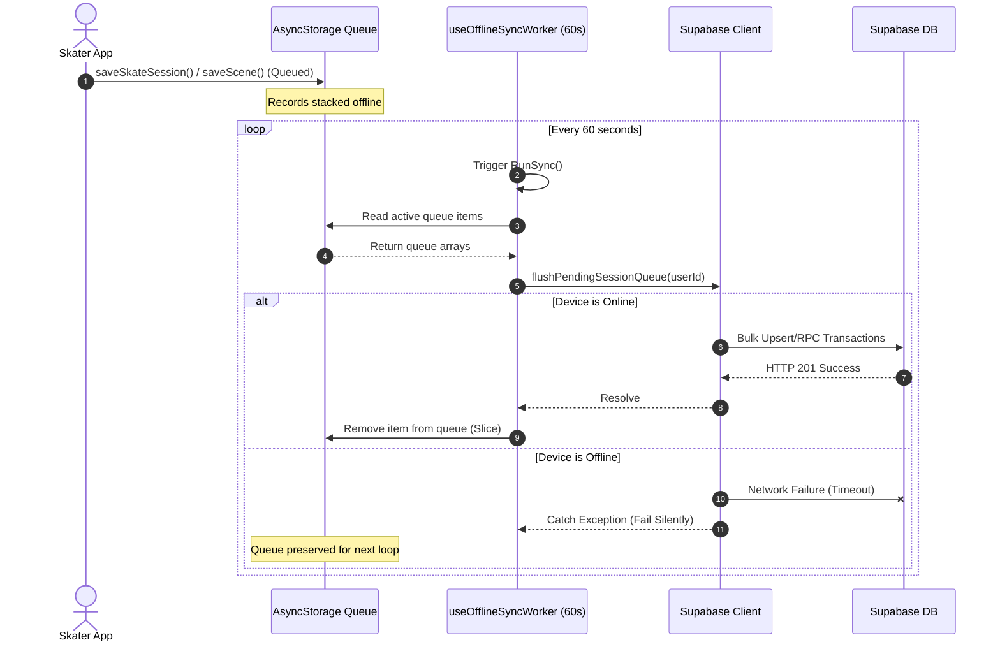

---

## 9. Architectural Impact Flags

*   *No surface modifications were applied to the data persistence layer during this read-only cartography audit.*
*   `[NO_ARCHITECTURAL_IMPACT]`

<!-- CARTOGRAPHER_END: DATA_LAYER -->

### Domain: UTILS
<!-- CARTOGRAPHER_START: UTILS -->

# 🗺️ UTILS Domain Cartography

This document serves as the authoritative map of the `src/utils` and `src/types` domains (excluding `supabase.ts`) within the SK8Lytz ecosystem.

## 🗂️ File Manifest

| File | Architectural Purpose |
|:---|:---|
| [BlePayloadParser.ts](file:///c:/Neogleamz/AG_SK8Lytz_App/SK8Lytz/src/utils/BlePayloadParser.ts) | Stateless parser gatekeeper that extracts and validates LED configurations and RF state from raw BLE notification bytes without crashing the UI thread. |
| [ColorUtils.ts](file:///c:/Neogleamz/AG_SK8Lytz_App/SK8Lytz/src/utils/ColorUtils.ts) | Centralized mathematical and conversion utility for hex-to-hue, hue-to-hex, rgb-to-hex, and camera-to-LED HSV vibrancy boosting (`boostForLED`). |
| [CrashReporter.ts](file:///c:/Neogleamz/AG_SK8Lytz_App/SK8Lytz/src/utils/CrashReporter.ts) | Lightweight crash logging bridge that forwards fatal application exceptions and stack traces to `AppLogger.error`. |
| [FlightRecorder.ts](file:///c:/Neogleamz/AG_SK8Lytz_App/SK8Lytz/src/utils/FlightRecorder.ts) | Memory-buffered diagnostics utility that caches a rolling list of the 50 most recent telemetry/action breadcrumbs. |
| [MusicDictionary.ts](file:///c:/Neogleamz/AG_SK8Lytz_App/SK8Lytz/src/utils/MusicDictionary.ts) | Authoritative registry of all 46 hardware-native music profiles across Light Bar (`0x26`) and Light Screen (`0x27`) matrices, gating UI color pickers. |
| [NamingUtils.ts](file:///c:/Neogleamz/AG_SK8Lytz_App/SK8Lytz/src/utils/NamingUtils.ts) | Deterministic fallback and format standardizer for device and group naming conventions to avoid client/DB sync anomalies. |
| [NormalizationUtils.ts](file:///c:/Neogleamz/AG_SK8Lytz_App/SK8Lytz/src/utils/NormalizationUtils.ts) | Pure function scaling helper that maps UI speed inputs (0–100) to hardware-compatible values (1–31). |
| [backoff.ts](file:///c:/Neogleamz/AG_SK8Lytz_App/SK8Lytz/src/utils/backoff.ts) | Utility adding randomized jitter to retry intervals to prevent simultaneous connection storms during BLE auto-reconnection. |
| [classifyBLEDevice.ts](file:///c:/Neogleamz/AG_SK8Lytz_App/SK8Lytz/src/utils/classifyBLEDevice.ts) | High-priority classification mapper translating raw BLE scans and EEPROM interrogator cache records into `PendingRegistration` entities. |
| [kMeansPalette.ts](file:///c:/Neogleamz/AG_SK8Lytz_App/SK8Lytz/src/utils/kMeansPalette.ts) | Performance-optimized K-Means clustering algorithm (k=3, 5 iterations max) implemented with `'worklet';` annotation for vision-camera thread execution. |
| [migrateAuthTokens.ts](file:///c:/Neogleamz/AG_SK8Lytz_App/SK8Lytz/src/utils/migrateAuthTokens.ts) | Safe token migration helper transferring legacy Supabase session tokens from plaintext `AsyncStorage` to secure platform-specific `SecureStore`. |
| [piiScrubber.ts](file:///c:/Neogleamz/AG_SK8Lytz_App/SK8Lytz/src/utils/piiScrubber.ts) | Hashing utility that scrubs and anonymizes sensitive data (MAC addresses, names) into 8-character unique digests for safe telemetry logging. |
| [presetColorUtils.ts](file:///c:/Neogleamz/AG_SK8Lytz_App/SK8Lytz/src/utils/presetColorUtils.ts) | Visual resolution engine mapping preset states to linear gradient colors and icons for UI card presentation (e.g. generative rainbows). |
| [webStyles.ts](file:///c:/Neogleamz/AG_SK8Lytz_App/SK8Lytz/src/utils/webStyles.ts) | Simple pass-through utility formatting CSS stylesheet records for non-native web fallback runtimes. |
| [ProductCatalog.ts](file:///c:/Neogleamz/AG_SK8Lytz_App/SK8Lytz/src/types/ProductCatalog.ts) | Type definitions representing dynamic hardware profiles, FTUE detection ranges, visualizer dimensions, and battery capacities. |
| [ble.types.ts](file:///c:/Neogleamz/AG_SK8Lytz_App/SK8Lytz/src/types/ble.types.ts) | Shared type declarations and aliases for the BLE stack, database registration models, and connection lifecycle structures. |
| [bleGuards.ts](file:///c:/Neogleamz/AG_SK8Lytz_App/SK8Lytz/src/types/bleGuards.ts) | Strict TypeScript type guard `isDevice` ensuring safe parsing of unknown BLE objects down to the library's `Device` interface. |
| [dashboard.types.ts](file:///c:/Neogleamz/AG_SK8Lytz_App/SK8Lytz/src/types/dashboard.types.ts) | Domain type contract specifying models for device/group pattern state, UI flow state FSMs, ping outcomes, and controller interfaces. |
| [react-test-renderer.d.ts](file:///c:/Neogleamz/AG_SK8Lytz_App/SK8Lytz/src/types/react-test-renderer.d.ts) | Ambient module declaration resolving missing React test renderer type references in test contexts. |

## 💥 Blast Radius (Imports/Exports)

### Inbound Imports (What imports this domain)
- **Hooks & Services**:
  - `src/hooks/useHardwareNotifications.ts` imports `BlePayloadParser` (for incoming notification parsing).
  - `src/hooks/ble/useBLEScanner.ts` imports `classifyBLEDevice` (for scan result mapping).
  - `src/hooks/useControllerDispatch.ts` and `src/hooks/useStreetMode.ts` import `NormalizationUtils` (for UI-to-hardware speed scaling).
  - `src/hooks/useMusicMode.ts` imports `MusicDictionary` (to resolve names/profiles).
  - `src/hooks/useBLE.ts`, `src/hooks/useDashboardAutoConnect.ts`, `src/services/BleSessionFactory.ts`, `src/services/BleWriteQueue.ts`, `src/services/ble/ConnectService.ts`, and `src/services/ble/RecoveryService.ts` import `backoff` (for connection retries).
  - `src/hooks/useDeviceStateLedger.ts`, `src/hooks/useHardwareNotifications.ts`, `src/screens/DashboardScreen.tsx`, `src/services/BleCharacteristicCache.ts`, `src/services/BlePingService.ts`, `src/services/BleSessionFactory.ts`, `src/services/DeviceRepository.ts`, `src/services/ble/ConnectService.ts`, and `src/services/ble/InterrogatorService.ts` import `piiScrubber` (for telemetry scrubbing).
  - `src/context/AuthContext.tsx` imports `migrateAuthTokens` (for token migration on boot).
- **UI & Components**:
  - `src/components/CameraTracker.tsx` and `src/components/DockedController.tsx` import `ColorUtils` and `kMeansPalette` (for vision camera frame analysis, HSV boosting, and dominant palette extraction).
  - `src/components/dashboard/MySkatesSlab.tsx` and `src/components/docked/PresetCard.tsx` import `presetColorUtils` (to resolve card background gradients and icons).
  - `src/components/GlobalErrorBoundary.tsx` imports `CrashReporter` (to dispatch unhandled errors).
  - `src/components/DeviceSettingsModal.tsx`, `src/components/GroupSettingsModal.tsx`, `src/screens/DashboardScreen.tsx`, and `src/screens/Onboarding/HardwareSetupWizardScreen.tsx` import `NamingUtils` (to resolve standard fallback names).

### Outbound Imports (What this domain imports)
- `BlePayloadParser.ts` imports from `src/protocols/ControllerRegistry` (`getDefaultProtocol`) and `src/services/AppLogger`.
- `classifyBLEDevice.ts` imports from `src/constants/ProductCatalog` (`LOCAL_PRODUCT_CATALOG`, `getLocalProfileByPoints`).
- `migrateAuthTokens.ts` imports from `AsyncStorage`, `expo-secure-store`, `src/services/AppLogger`, and `src/constants/storageKeys`.
- `presetColorUtils.ts` imports from `src/protocols/PatternEngine` (`SK8LYTZ_TEMPLATES`).
- `NormalizationUtils.ts` imports from `src/constants/AppConstants` (`HW_SPEED_MAX`).

## 🧱 Context Matrix
- **Providers**: None of the files in this domain provide React Contexts.
- **Consumers**: None of the files in this domain consume React Contexts.
- **Indirect Integrations**:
  - `migrateAuthTokensToSecureStore` is consumed by the initialization block of `AuthContext.tsx` on application startup to ensure security migration.

## 🎛️ Hook/Service I/O Registry

### BlePayloadParser
- **`parseLedPayload(payload: number[]): ParsedLedConfig | null`**
  - *Inputs*: Raw number array representing the notification payload.
  - *Outputs*: Mapped `ParsedLedConfig` if successful, or `null` if invalid.
  - *Side-effects*: Logs warnings to `AppLogger` on parsing exception.
- **`parseRfPayload(payload: number[]): ParsedRfConfig | null`**
  - *Inputs*: Raw number array representing the RF state response.
  - *Outputs*: Mapped `ParsedRfConfig` if successful, or `null`.
  - *Side-effects*: Logs warnings to `AppLogger` on parsing exception.

### ColorUtils
- **`hexToHue(hex: string): number`**
  - *Inputs*: Hex color string (e.g. `#FF0000`).
  - *Outputs*: Hue angle in degrees (0–360).
  - *Side-effects*: None.
- **`hueToHex(hue: number): string`**
  - *Inputs*: Hue angle in degrees (0–360).
  - *Outputs*: Uppercase hex string.
  - *Side-effects*: None.
- **`boostForLED(r: number, g: number, b: number): { r: number; g: number; b: number }`**
  - *Inputs*: RGB channels in range 0–255.
  - *Outputs*: Saturated and boosted RGB coordinates optimized for WS2812B emitters (forces HSV saturation to 1.0, value to 1.0, with a neutral gray gate threshold of S < 0.20).
  - *Side-effects*: None.

### CrashReporter
- **`logFatalCrash(error: Error, stack: string): Promise<string>`**
  - *Inputs*: Unhandled runtime Error object and component stack trace.
  - *Outputs*: Promise resolving to a dummy event ID.
  - *Side-effects*: Dispatches error log to `AppLogger` with empty payload and SSI tags.

### FlightRecorder
- **`leaveBreadcrumb(category: Breadcrumb['category'], message: string, data?: unknown): void`**
  - *Inputs*: Event category tag, message, and optional payload object.
  - *Outputs*: None.
  - *Side-effects*: Appends a new timestamped record to the in-memory array, dropping the oldest record if length exceeds 50.

### kMeansPalette
- **`extractKMeansPalette(pixels: RGB[], k = 3, maxIterations = 5): RGB[]`**
  - *Inputs*: RGB pixel array representing frame data, cluster size, and iteration limit.
  - *Outputs*: Centroid coordinates representing dominant colors sorted in descending order of pixel cluster counts.
  - *Side-effects*: None. Executed as a Worklet inside the native frame processor worklet thread.

### migrateAuthTokens
- **`migrateAuthTokensToSecureStore(): Promise<void>`**
  - *Inputs*: None.
  - *Outputs*: None.
  - *Side-effects*: Migrates Supabase token from unencrypted `AsyncStorage` to secure device memory (`expo-secure-store`). Mutates stored flags in local storage.

### piiScrubber
- **`scrubPII(value: string): string`**
  - *Inputs*: Sensitive string (e.g., raw MAC address, names).
  - *Outputs*: Hash-obfuscated standard identifier (e.g., `scrubbed_<hash_hex>`).
  - *Side-effects*: None.

## 📱 OS Variance Matrix

| Feature | iOS Behavior | Android Behavior |
|:---|:---|:---|
| **Secure Token Storage** | `SecureStore` writes to the iOS Keychain, securing credentials persistently. | `SecureStore` writes to Android Keystore/SharedPreferences, encrypted by a hardware-backed master key. |
| **BLE MAC / Identity Resolution** | `react-native-ble-plx` maps the physical MAC to a generated UUID (e.g. `123E4567-...`) which changes if the user resets BLE settings. The raw MAC is not directly available via peripheral scans. | The raw physical MAC address (e.g. `08:65:F0:...`) is directly returned as the device identification `id` in scanning results. |
| **K-Means Frame Worklet Execution** | Runs on the JSI worklet thread natively, interacting with vision-camera buffers. | Runs on the JSI worklet thread natively, interacting with vision-camera buffers. |

## 🎨 Design System & Token Manifest

### 💎 Color Tokens & Palettes
- **Preset Grid Palette (`COLOR_PRESET_PALETTE`)**:
  - `['#FF0000', '#FF8000', '#FFFF00', '#00FF00', '#00FFFF', '#0000FF', '#800080', '#FF00FF', '#FFFFFF', '#000000']`
- **Preset Hue Mappings (`PRESET_HUE_MAP`)**:
  - `#FF0000` ➡️ `0`
  - `#FF8000` ➡️ `30`
  - `#FFFF00` ➡️ `60`
  - `#00FF00` ➡️ `120`
  - `#00FFFF` ➡️ `180`
  - `#0000FF` ➡️ `240`
  - `#800080` ➡️ `280`
  - `#FF00FF` ➡️ `300`
- **Generative Rainbow Array (`GENERATIVE_RAINBOW`)**:
  - Standard 7-stop rendering array: `['#FF0000', '#FF7F00', '#FFFF00', '#00FF00', '#00BFFF', '#0000FF', '#8B00FF']`

### 📐 Math Scaling & Limits
- **Speed UI Range**: UI presents speed controls in range `[0, 100]`.
- **Speed Hardware Range**: Scaled and clamped to `[1, 31]` via `normalizeUISpeedToHardware`.
- **Breadcrumbs Size Limit**: Hard-capped at `50` in `FlightRecorder`.
- **K-Means Configuration**: Set to extract exactly `3` dominant color centroids using `5` iterations to preserve frame processing rate constraints.

---

## 🏗️ Architectural Impact Flags
- **NO_SURFACE_CHANGE**: This domain cartography review was read-only; no code files were modified.

<!-- CARTOGRAPHER_END: UTILS -->

### Domain: NATIVE_&_WATCH
<!-- CARTOGRAPHER_START: NATIVE_&_WATCH -->

# NATIVE_&_WATCH Domain Cartography

This document provides a deep-dive architectural map of the **NATIVE_&_WATCH** domain of the SK8Lytz platform. It details the watchOS targets, Wear OS subproject, Expo native watch bridge module, and phone-side native integrations that drive on-wrist telemetry, health tracking, and session sync.

---

## 1. File Manifest
The following list catalogues every file in the `targets/watch/*`, `android/sk8lytzWear/*`, `modules/sk8lytz-watch-bridge/*`, and `android/app/src/main/java/com/neogleamz/sk8lytz/*` sub-domains with its respective architectural purpose:

### A. Expo Watch Bridge Module (`modules/sk8lytz-watch-bridge/*`)
*   **`package.json`** — Defines dependency specifications and metadata for the autolinked Expo native module package.
*   **`expo-module.config.json`** — Standard Expo module configuration declaring the iOS and Android entry points and native event names to the autolinking system.
*   **`src/index.ts`** — TypeScript interface providing type definitions (`WatchSessionState`, `WatchCommand`, `WatchHealthUpdate`) and the public `WatchBridge` API consumed by React Native.
*   **`ios/Sk8lytzWatchBridgeModule.swift`** — Native iOS module wrapper. Initializes `WCSession`, handles lifecycle-safe `updateApplicationContext`/`sendMessage` dispatches, and listens to watchOS inputs.
*   **`android/src/main/java/expo/modules/sk8lytzwatchbridge/Sk8lytzWatchBridgeModule.kt`** — Native Android module wrapper. Hooks Google Play Services Wearable APIs (`DataClient` and `MessageClient`) to synchronize session data structures.

### B. watchOS Target (`targets/watch/*`)
*   **`expo-target.config.js`** — Build-time configuration defining iOS target identifiers, deployment versions, HealthKit background entitlements, and complication principal classes.
*   **`index.swift`** — SwiftUI Application entry point bootstrap. Initializes the root SwiftUI `WindowGroup` containing the main `ContentView`.
*   **`ContentView.swift`** — Core watchOS dashboard UI rendering state-driven views (Idle, Active, and Summary cards) alongside live telemetry counters and action buttons.
*   **`HealthManager.swift`** — Manages HealthKit `HKWorkoutSession` and `HKLiveWorkoutBuilder` workout lifecycles. Collects real-time heart rate and active energy metrics.
*   **`WatchConnectivityManager.swift`** — Implements `WCSessionDelegate`. Acts as the single source of truth for incoming session states, and handles the 5-second throttled health relay timer.
*   **`ComplicationController.swift`** — Implements `CLKComplicationDataSource` to draw gauge rings, modular text, and corner icons for Apple Watch face complications.
*   **`Info.plist`** — Target property list declaring required permissions (`NSHealthShareUsageDescription`, `NSHealthUpdateUsageDescription`) and watch background execution modes.

### C. Wear OS Subproject (`android/sk8lytzWear/*`)
*   **`build.gradle`** — Standalone Gradle build configurations defining SDK compatibility, signing credentials, and Wear OS dependencies (Compose, Health Services, Tiles, and Ongoing Activity).
*   **`proguard-rules.pro`** — Specifies code shrinking and obfuscation exclusions to prevent Google Play Wearable APIs from stripping runtime reflection targets.
*   **`src/main/AndroidManifest.xml`** — Declares required permissions (sensors, location, notifications), launcher activity, background service hosts, and complication/tile providers.
*   **`src/main/kotlin/com/neogleamz/sk8lytzwear/MainActivity.kt`** — Entry activity initializing Jetpack Compose layouts and requesting runtime sensor permissions on launch.
*   **`src/main/kotlin/com/neogleamz/sk8lytzwear/presentation/DashboardScreen.kt`** — Jetpack Compose dashboard UI. Renders live telemetry blocks, session action buttons, and overlays.
*   **`src/main/kotlin/com/neogleamz/sk8lytzwear/presentation/SessionState.kt`** — FSM enum defining the 4 main watch display states: `IDLE`, `ACTIVE`, `PAUSED`, and `SUMMARY`.
*   **`src/main/kotlin/com/neogleamz/sk8lytzwear/presentation/SummaryScreen.kt`** — Displays final metrics (duration, distance, average speed, calories, peak heart rate) post-session.
*   **`src/main/kotlin/com/neogleamz/sk8lytzwear/presentation/theme/Theme.kt`** — Colors and typography matching the SK8Lytz style guide (electric cyan, neon magenta, amber).
*   **`src/main/kotlin/com/neogleamz/sk8lytzwear/presentation/WearMessageSender.kt`** — Manages outbound remote commands and buffers health records offline when disconnected from the phone.
*   **`src/main/kotlin/com/neogleamz/sk8lytzwear/services/HealthTracker.kt`** — Wraps Jetpack Health Services `ExerciseClient`. Coordinates active tracking using the `INLINE_SKATING` standard.
*   **`src/main/kotlin/com/neogleamz/sk8lytzwear/services/OngoingActivityManager.kt`** — Builds background notifications and hooks the `OngoingActivity` API to prevent Wear OS from killing the tracking process.
*   **`src/main/kotlin/com/neogleamz/sk8lytzwear/services/WearableCommunicationService.kt`** — `WearableListenerService` listener. Receives `/sk8lytz/state` and `/sk8lytz/metrics` updates, managing tracking states and forcing tile refreshes.
*   **`src/main/kotlin/com/neogleamz/sk8lytzwear/tiles/Sk8lytzTileService.kt`** — Provides glanceable tiles via Jetpack ProtoLayout, displaying live stats in the system tile carousel.

### D. Phone-Side Native Core (`android/app/src/main/java/com/neogleamz/sk8lytz/*`)
*   **`MainActivity.kt`** — Bootstraps the React Native container and initializes permission request channels (such as Health Connect).
*   **`MainApplication.kt`** — Registers autolinked package lists and Expo native module adapters.
*   **`AndroidManifest.xml`** — Sets global phone-side configurations including Bluetooth, GPS location permissions, and health client package scopes.

---

## 2. Blast Radius (Dependency Graph)
The watch integration is designed as an isolated, asynchronous side-effect system of the main session FSM to prevent any wearable connection drops from stalling the phone app.

```
┌────────────────────────────────────────────────────────┐
│                      NATIVE CORE                       │
│    (WCSession / DataClient / HealthKit / HealthServices)│
└───────────────────────────┬────────────────────────────┘
                            │ (Autolinked Bridge Bindings)
                            ▼
┌────────────────────────────────────────────────────────┐
│              modules/sk8lytz-watch-bridge              │
│    (Provides WatchBridge API to JS/TypeScript)          │
└───────────────────────────┬────────────────────────────┘
                            │ (Imported / Subscribed by)
                            ▼
┌────────────────────────────────────────────────────────┐
│               src/context/SessionContext               │
│    (Listens to WatchCommands & health relays)          │
└───────────────────────────┬────────────────────────────┘
                            │ (Subscribes to transitions)
                            ▼
┌────────────────────────────────────────────────────────┐
│             src/services/session/SessionMachine        │
│    (Drives syncSessionState on status changes)         │
└───────────────────────────┬────────────────────────────┘
                            │ (Executes final save)
                            ▼
┌────────────────────────────────────────────────────────┐
│         src/services/session/SessionCommitService      │
│    (Pushes final SUMMARY state to WatchBridge)          │
└────────────────────────────────────────────────────────┘
```

*   **Imports into NATIVE_&_WATCH**:
    *   `expo-modules-core` (TypeScript & Native Modules interface)
    *   Google Play Services Wearable APIs (Android)
    *   `WatchConnectivity` framework (iOS)
    *   Android Health Services & Jetpack Tiles/Ongoing Activities APIs
    *   iOS HealthKit framework
*   **Consumers of NATIVE_&_WATCH**:
    *   `src/context/SessionContext.tsx` — Consumes the event listeners (`addWatchCommandListener`, `addWatchHealthListener`) to drive the xstate `sessionMachine`.
    *   `src/services/session/SessionMachine.ts` — Calls `WatchBridge.syncSessionState` actions to push `ACTIVE`, `PAUSED`, and `STOPPED` phase transitions.
    *   `src/services/session/SessionCommitService.ts` — Pushes final session parameters via `WatchBridge.syncSessionState({ status: 'SUMMARY', ... })` when saving.
    *   `src/services/SpeedTrackingService.ts` — Dispatches GPS speed data to the watch via `WatchBridge.sendMetricUpdate` (rate-limited to 3s intervals to prevent Bluetooth overhead).

---

## 3. Context Matrix
The native wearable communication interfaces directly with React Context providers:

| React Context | Consumer / Provider | Usage / Purpose |
|:--------------|:-------------------|:----------------|
| **`SessionContext`** (`SessionProvider`) | Consumed | Receives watch commands (`START_SESSION`, `STOP_SESSION`) via bridge listeners and routes them to the state machine. Updates `health` telemetry state in React Native with heart rate and active calories parsed from watch sensors. |
| **`AuthContext`** (`useAuth`) | Consumed | Used to map user identification profiles (`userId`) during phone-side database writes when closing sessions. |

---

## 4. Hook/Service I/O Registry
This registry documents the parameters, returns, and side-effects of key hooks and services in the domain:

### `WatchBridge` (TypeScript Module Wrapper)
*   **`syncSessionState(state: WatchSessionState): Promise<void>`**
    *   *Input*: `{ status: 'ACTIVE'|'PAUSED'|'SUMMARY'|'STOPPED', speed?, heartRate?, calories?, startTime?, totalDuration?, distance?, avgSpeed?, peakHR? }`
    *   *Output*: `Promise<void>` (resolved once natively queued/pushed)
    *   *Side-effects*: Serializes data map. Pushes via `updateApplicationContext` (iOS) or `DataClient.putDataItem` (Android).
*   **`sendMetricUpdate(metrics: Pick<WatchSessionState, 'speed'|'heartRate'|'calories'>): Promise<void>`**
    *   *Input*: `{ speed: number, heartRate?: number, calories?: number }`
    *   *Output*: `Promise<void>`
    *   *Side-effects*: Relays transient speed messages over `/sk8lytz/metrics` via `sendMessage` (both platforms) for real-time updating.
*   **`addWatchCommandListener(handler: (cmd: WatchCommand) => void): () => void`**
    *   *Input*: Callback function accepting `'START_SESSION' | 'STOP_SESSION'`
    *   *Output*: Unsubscribe clean-up function.
    *   *Side-effects*: Subscribes to native bridge messages.
*   **`addWatchHealthListener(handler: (update: WatchHealthUpdate) => void): () => void`**
    *   *Input*: Callback function receiving `{ heartRate: number, calories: number, status?: string, startTimeMs?: number }`
    *   *Output*: Unsubscribe clean-up function.
    *   *Side-effects*: Updates React state hooks.

### `HealthTracker` (Wear OS Service Singleton)
*   **`startTracking(context: Context): void`**
    *   *Input*: Android Application Context
    *   *Output*: `void`
    *   *Side-effects*: Requests `HEART_RATE_BPM` and `CALORIES_TOTAL` updates from Health Services `ExerciseClient` inside an `INLINE_SKATING` active session.
*   **`stopTracking(): void`**
    *   *Side-effects*: Instructs `ExerciseClient` to terminate the active exercise record.

### `WatchConnectivityManager` (watchOS Coordinator)
*   **`sendStartSession() / sendStopSession(): void`**
    *   *Side-effects*: Plays haptic clicks on Apple Watch and transmits string commands (`START_SESSION`/`STOP_SESSION`) back to the iOS bridge.

---

## 5. OS Variance Matrix
iOS and Android utilize highly disparate native APIs to achieve the same HUD/Relay synchronization. The following matrix documents these differences:

| Architectural Requirement | iOS / watchOS Implementation | Android / Wear OS Implementation |
|:--------------------------|:-----------------------------|:---------------------------------|
| **Push State Protocol** | **`WCSession.updateApplicationContext`** (Survives disconnects, queues changes, and flushes on reconnection). | **`DataClient.putDataItem`** (Durable key-value node written to path `/sk8lytz/state` with unique timestamps acting as a dirty-flag). |
| **Transient Messages** | **`WCSession.sendMessage`** (Ephemeral, bypasses queue for immediate updates if the watch is active). | **`MessageClient.sendMessage`** (Best-effort RPC byte array dispatched to path `/sk8lytz/metrics`). |
| **Wrist Sensor API** | **HealthKit Framework** (`HKWorkoutSession` + `HKLiveWorkoutBuilder` linked to `.skatingSports` activity profiles). | **Health Services Client** (Wraps Android Health Services `ExerciseClient` targeted to `ExerciseType.INLINE_SKATING`). |
| **Keepalive Strategy** | **Entitled Workout Execution** (System automatically grants background execution privileges to watchOS apps containing active `HKWorkoutSession` locks). | **`OngoingActivity` Notifications** (Fires an persistent foreground notification channel `sk8lytz_session` to maintain CPU lock states). |
| **Haptic Indicators** | **ClockKit / WatchKit API** (`WKInterfaceDevice.current().play(.start/.stop)`). | **Vibrator Service** (`VibrationEffect.createOneShot(100, DEFAULT_AMPLITUDE)`). |
| **Companion Glanceables** | **ClockKit Complications** (`CLKComplicationDataSource` updating Graphic Circular gauges and corner texts). | **Wear OS Tiles** (A standalone `TileService` rendering layout structures via Jetpack ProtoLayout). |
| **Offline Telemetry Storage** | **WatchConnectivity Queue** (Handled implicitly by iOS system-level `WCSession` context buffer queues). | **Shared Preferences Buffering** (`WearMessageSender` writes health updates to `telemetry_buffer_prefs` when offline, flushing on node connect). |

---

## 6. Telemetry Synchronization Flow

The diagram below maps the bidirectional telemetry flow between the phone and watch companions during a typical session lifecycle:

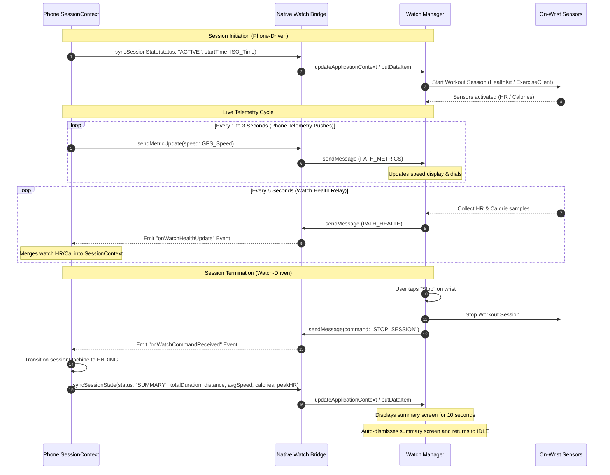

---

## 7. Architectural Impact Flags

To prevent documentation drift and align future iterations, the following impact markers are registered for this domain:

*   `[IMPACT: NATIVE_SURFACE_STABLE]` — The native bridge methods are defined statically. Modification of parameter fields in `src/index.ts` requires matching adaptations in Kotlin and Swift layers.
*   `[IMPACT: OFFLINE_BUFFER_PREFERRED]` — Wear OS uses custom preference caches to hold telemetry when the phone is out of Bluetooth range. Phone-side sync logic must accommodate retroactively parsed batches of heart rate timestamps from the watch buffer queue.
*   `[IMPACT: HEALTH_PRIORITY_WATCH]` — Watch optical sensors are designated as the gold-standard source of heart rate telemetry. Phone background sensor polling is automatically suppressed when active wrist packets are received.

<!-- CARTOGRAPHER_END: NATIVE_&_WATCH -->

### Domain: NOTIFICATIONS_&_ROUTING
<!-- CARTOGRAPHER_START: NOTIFICATIONS_&_ROUTING -->

# Architectural Cartography — NOTIFICATIONS_&_ROUTING Domain

This document provides a high-fidelity architectural audit of the `NOTIFICATIONS_&_ROUTING` domain in the SK8Lytz application. It catalogs the internal files, maps incoming and outgoing dependencies, registers service inputs and outputs, highlights OS variances, details the global provider hierarchies, and outlines complex multi-step background notification lifecycles.

---

## 1. File Manifest

Below is the list of all audited files in this domain, with a one-sentence architectural purpose for each:

### 📱 Layout and Guards
*   **`App.tsx`**: The root component configuring global error boundaries, font loading, platform initializers, and the global provider tree wrapper.
*   **`src/providers/BluetoothGuard.tsx`**: A layout security gate that intercepts rendering to verify that Bluetooth permissions are granted and that the device's Bluetooth adapter is enabled.
*   **`src/providers/ComplianceGate.tsx`**: A legal gate checking EULA acceptance locally (via AsyncStorage for offline guests) and remotely (via Supabase database for authenticated users) before allowing dashboard access.

### ✉️ Notification and Location Services
*   **`src/services/NotificationService.ts`**: A wrapper for `expo-notifications` orchestrating push notification setup, permission requests, token registration routing, and scheduling local reminders or live crew alerts.
*   **`src/services/PushTokenService.ts`**: Service handling push token CRUD actions in Supabase (`push_tokens` table), matching device tokens to specific authenticated user IDs.
*   **`src/services/LocationService.ts`**: Service wrapping `expo-location` to retrieve GPS coordinates, reverse-geocode location labels without street-level PII, and fetch/sort nearby skate spots and crew sessions.

### 🔌 Hardware Pipelines
*   **`src/hooks/useHardwareNotifications.ts`**: A BLE data receiver hook (Mailroom Architecture) that registers callbacks, debounces duplicate packets, parses LED/RF payloads, and writes updates to local state and the `DeviceRepository` SQLite/AsyncStorage SSOT.

---

## 2. Blast Radius (Dependency Map)

```
                       ┌──────────────────────┐
                       │      App.tsx         │
                       └──────────┬───────────┘
                                  │
         ┌────────────────────────┼────────────────────────┐
         ▼                        ▼                        ▼
┌─────────────────┐      ┌─────────────────┐      ┌─────────────────┐
│ BluetoothGuard  │      │ ComplianceGate  │      │  LocationServ.  │
└─────────┬───────┘      └────────┬────────┘      └────────┬────────┘
          │                        │                        │
          ▼                        ▼                        ▼
┌─────────────────┐      ┌─────────────────┐      ┌─────────────────┐
│ PermissionServ  │      │ AppSettingsServ │      │ SkateSpotsServ  │
└─────────────────┘      └─────────────────┘      └─────────────────┘
                                  │
                                  ▼
                         ┌─────────────────┐
                         │    Supabase     │
                         └────────▲────────┘
                                  │
         ┌────────────────────────┴────────────────────────┐
         │                                                 │
┌────────┴────────┐                               ┌────────┴────────┐
│  NotificationS. │ ────► [registerPushToken] ──► │  PushTokenServ. │
└────────┬────────┘                               └─────────────────┘
         │
         ▼
┌─────────────────┐
│ ProfileService  │ ──► [unregisterPushToken]
└─────────────────┘
```

### Imports (Inward Dependencies)
*   **External Packages**:
    *   `expo-notifications` (dynamically required in `NotificationService.ts` and `PermissionService.ts` for push alerts).
    *   `expo-location` (in `LocationService.ts` and `PermissionService.ts` for coordinates query).
    *   `react-native-health-connect` (loaded dynamically on Android in `App.tsx` [L159] to prevent initialization crashes).
    *   `@notifee/react-native` (in `App.tsx` background event handlers).
*   **Internal Services**:
    *   `PermissionService` (in `BluetoothGuard.tsx`, `LocationService.ts` to coordinate modal prompts).
    *   `DeviceRepository` (in `useHardwareNotifications.ts` to write parsed BLE data).
    *   `SkateSpotsService` (in `LocationService.ts` to load cached spots).
    *   `BlePayloadParser` (in `useHardwareNotifications.ts` to parse configurations).
    *   `piiScrubber` (in `useHardwareNotifications.ts` to sanitize logs).

### Exports (Outward Dependencies)
*   **`App.tsx`** is imported by `index.ts` (the application root entrypoint).
*   **`BluetoothGuard.tsx`** is imported by `App.tsx` to wrap `<AppContent />`.
*   **`ComplianceGate.tsx`** is imported by `AppContent` inside `App.tsx` to wrap the authenticated dashboard.
*   **`NotificationService.ts`** is imported by:
    *   `src/hooks/useDashboardProfile.ts` (for initializing push notification registration and setting tap callbacks).
    *   `src/services/PermissionService.ts` (dynamic import to trigger initialization after permission approval).
*   **`PushTokenService.ts`** is imported by:
    *   `src/services/NotificationService.ts` (to trigger DB token updates).
    *   `src/services/ProfileService.ts` (to bind token management into the legacy profile service facade).
*   **`LocationService.ts`** is imported by:
    *   `src/components/crew/CrewLandingMap.tsx` (to display nearby spots/sessions on map UI).
    *   `src/hooks/useCrewHub.ts` (to retrieve session/spot distance filters).
    *   `src/hooks/useCrewProximityRadar.ts` (to compute proximity warnings relative to local spots/sessions).
    *   `src/hooks/ble/useBLEScanner.ts` (to attach silent GPS logs during background scanning).
    *   `src/services/DeviceRepository.ts` (to retrieve silent GPS coordinates on BLE telemetry updates).
*   **`useHardwareNotifications.ts`** is imported by:
    *   `src/screens/DashboardScreen.tsx` (mounted to register BLE data-received and hardware-probed listeners).

---

## 3. Context Matrix

The domain is constructed around a strict hierarchical tree of providers wrapped around the main screen layout:

### Provider Hierarchy Tree (in `App.tsx`)
```tsx
<GlobalErrorBoundary>          {/* Handles react exceptions and avoids white screens */}
  <SafeAreaProvider>            {/* Establishes screen layout safe margins */}
    <ThemeProvider>              {/* Exposes dynamic color palettes based on active theme */}
      <AuthProvider>            {/* Handles auth credentials and guest/offline states */}
        <AppConfigProvider>      {/* Exposes feature flags and config settings */}
          <FavoritesProvider>    {/* Manages custom color palettes and patterns */}
            <SessionProvider>    {/* Orchestrates the Session XState machine */}
              <BLEProvider>      {/* Manages scanned and connected Bluetooth devices */}
                <BluetoothGuard> {/* Blocks app layout until Bluetooth is enabled */}
                  <AppContent /> {/* Conditional rendering router */}
                  <GlobalPermissionsModal />
                </BluetoothGuard>
              </BLEProvider>
            </SessionProvider>
          </FavoritesProvider>
        </AppConfigProvider>
      </AuthProvider>
    </ThemeProvider>
  </SafeAreaProvider>
</GlobalErrorBoundary>
```

### Context Interactions
*   **`AuthContext`**: Ingested by `ComplianceGate` to check EULA requirements. If `isOfflineMode` is active, checks local storage; if online, fetches settings from Supabase.
*   **`BLEContext`**: BluetoothGuard consumes `useSharedBLE` to read adapter states (`isBluetoothEnabled`, `isBluetoothSupported`) and triggers scanner loops (`startSweeper`) when permissions are granted.
*   **`ThemeContext`**: BluetoothGuard and ComplianceGate consume `useTheme` for custom colors and dark/light layouts.

---

## 4. Hook/Service I/O Registry

### `useHardwareNotifications` (Hook)
*   **Inputs**:
    *   `isDiagnosticsMode` (`boolean`): Enables sniffer logger.
    *   `setOnDataReceived` / `setOnHardwareProbed` (`callbacks`): Registers BLE data listeners.
    *   `deviceConfigs` (`Record<string, Record<string, unknown>>`): Exposing current device specifications.
*   **Outputs**: `void`
*   **Side-Effects**: 
    *   Subscribes to GATT data streams. Debounces identical back-to-back packets (`lastPacketCacheRef`).
    *   Validates configurations with delta checks.
    *   Writes hardware config to `DeviceRepository` on change.
    *   Triggers `AppLogger.log('RAW_PAYLOAD')` for diagnostic views.

### `NotificationService` (Expo Push - `src/services/NotificationService.ts`)
*   **Methods**:
    *   `init(autoRequest, userId)`: Sets up channels; requests permissions; upserts token to Supabase. Returns `Promise<string | null>`.
    *   `setJoinHandler(handler)`: Stores callback for push invitation taps.
    *   `cleanup(userId)`: Unsubscribes from listeners; unregisters token from Supabase.
    *   `sendCrewInviteNotification(opts)`: Immediate local OS alert on `'crew-alerts'` channel.
    *   `sendSessionStartingSoon(opts)`: Schedules local OS reminder on `'session-reminders'` channel. Returns ID.
    *   `cancelSessionReminder(id)`: Cancels scheduled local notification.
*   **Side-Effects**: Modifies Supabase `push_tokens` table. Schedules notifications locally.

### `PushTokenService` (Supabase Sync - `src/services/PushTokenService.ts`)
*   **Methods**:
    *   `registerPushToken(token, platform, userId)`: Performs `upsert` in database.
    *   `unregisterPushToken(token, userId)`: Performs `delete` in database.
*   **Side-Effects**: Writes to Supabase `push_tokens` table.

### `LocationService` (GPS and Geocoding - `src/services/LocationService.ts`)
*   **Methods**:
    *   `getSessionLocation()`: Requests permission; gets coordinates; reverse-geocodes label. Returns `Promise<SessionLocation | null>`.
    *   `getSilentLocation()`: Returns coordinates (`Promise<{lat, lng} | null>`).
    *   `getNearbyPublicSessions(radius, coords, userId)`: Fetches active sessions. Returns `Promise<NearbySession[]>`.
    *   `getNearbySkateSpots(radius, coords)`: Loads spots. Returns `Promise<NearbySkateSpot[]>`.
*   **Side-Effects**: Fetches coordinates from GPS. Triggers permissions modal. Reads `SkateSpotsService` cache. Logs PII-scrubbed coordinates telemetry.

---

## 5. OS Variance Matrix

| Feature / System | Android | iOS | Web Target |
| :--- | :--- | :--- | :--- |
| **Notification Channels** | Configures physical channels (`'crew-alerts'`, `'session-reminders'`) with lights, vibration, and high importance via `Notifications.setNotificationChannelAsync`. | Direct banner alerts without channels; registers category types dynamically. | Unsupported. Early return inside initialization callbacks. |
| **Reverse Geocoding** | Queries coordinates via Android's local System Google Geocoder (free). | Queries coordinates via iOS's local Apple Maps Geocoder (free). | Returns hardcoded coordinates mapping to `'Web Demo Area'` (`38.9`, `-94.6`). |
| **Health Connect Boot** | Early require of `react-native-health-connect` in `App.tsx` to register android launchers before activity is resumed. | Unsupported (handled natively via HealthKit package configurations). | Unsupported. |
| **Bluetooth Permissions & Scan requirements** | Android 12+ (API 31+) requires a multi-permission bundle: `BLUETOOTH_SCAN`, `BLUETOOTH_CONNECT`, and `ACCESS_FINE_LOCATION` (because FCF1 devices advertise their UUID in `mServiceData`, which native scanner cannot filter without fine location access). Android <12 (API <31) requires only `ACCESS_FINE_LOCATION`. | iOS handles Bluetooth permission checks automatically upon first native API use, so the request helper returns a resolved `true` during onboarding. | Unsupported. |

---

## 6. Sequence Diagram

### Location Update and Push Token Registration Flow

The sequence below describes how push tokens are acquired and registered to Supabase upon launch/permission check, and how location information is requested and geocoded during skate session startup.

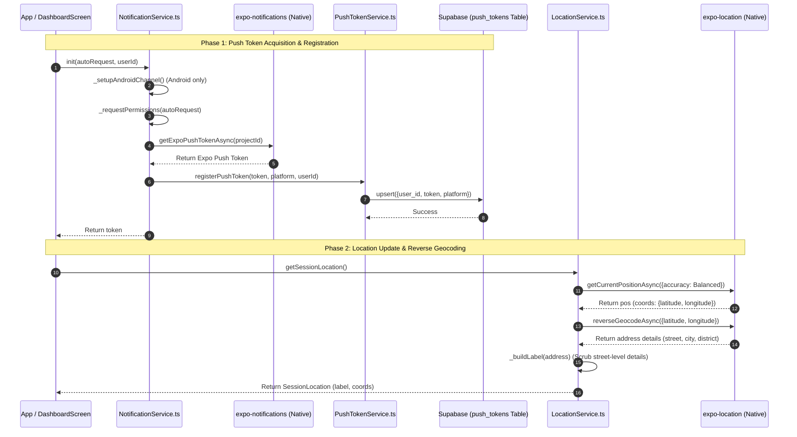

---


## 8. Architectural Impact Flags

*   `[IMPACTS_USER_JOURNEY]` — Flagged because the conditional rendering routes in `App.tsx` and the onboarding compliance checks (`ComplianceGate`, `BluetoothGuard`) dictate the primary user navigation and app bootstrapping experience.

`[IMPACTS_USER_JOURNEY]`

<!-- CARTOGRAPHER_END: NOTIFICATIONS_&_ROUTING -->

### Domain: SESSION_TRACKING
<!-- CARTOGRAPHER_START: SESSION_TRACKING -->

# SESSION_TRACKING Domain Cartography

This document contains the comprehensive architectural cartography for the **SESSION_TRACKING** domain, serving as the source-of-truth for session state charts, persistence ledgers, dynamic hooks, and cross-platform health sync integrations.

---

## 1. File Manifest

Every file in this domain serves a distinct architectural purpose in coordinating the lifecycle of a skate session, persisting telemetry offline, or syncing health metrics.

### Core Domain Files
| File Path | Status | Architectural Purpose |
| :--- | :--- | :--- |
| `src/context/SessionContext.tsx` | **Active** | Wraps the XState-driven `sessionMachine` in a React context, restoring current phase states and elapsed times from `AsyncStorage` on initialization, and exposing session state, telemetry, and actions globally. |
| `src/hooks/useTelemetryLedger.ts` | **Active** | Offline buffer managing selection telemetry (patterns, colors, modes) and street summaries. Caches metrics in `AsyncStorage` and flushes them remotely via the Supabase RPC `flush_telemetry` on a 15-minute heartbeat or when the app is backgrounded. |
| `src/hooks/useDeviceStateLedger.ts` | **Active** | Singleton-backed device config ledger providing a single source of truth for MAC-address pattern states, utilizing a 500ms write-debounce lock to protect against storage serialization race conditions. |
| `src/services/HealthSyncService.ts` | **Active** | Dynamic platform integration service mapping completed skate session metadata (duration, distance, calories, avg speed) to native OS databases (Apple HealthKit on iOS, Health Connect on Android). |

### Supporting FSM Layer (`src/services/session/`)
| File Path | Status | Architectural Purpose |
| :--- | :--- | :--- |
| `src/services/session/SessionMachine.ts` | **Active** | Central XState v5 state chart modeling the skate session lifecycle (`IDLE` ➔ `ACTIVE` ➔ `PAUSED` ➔ `ENDING` ➔ `IDLE`) and invoking sub-actors for sensor tracking, auto-pausing, health polling, notifications, and save commits. |
| `src/services/session/SessionCommitService.ts` | **Active** | Actor executing session completion sequences. Invokes `SpeedTrackingService.saveSession` to save to Supabase/offline queue, syncs the final workout to platform health libraries via `HealthSyncService`, and pushes a `'SUMMARY'` state packet to Wear OS/watchOS. |
| `src/services/session/SensorService.ts` | **Active** | Actor managing live location GPS positioning (accumulating total distance using latitude/longitude delta), subscribing to accelerometer G-force updates, and periodically pushing live metrics to connected watches. |
| `src/services/session/AutoPauseService.ts` | **Active** | Actor checking GPS speeds every 500ms. If speed falls below 0.2 mph for 20 consecutive ticks (10s), it fires `AUTO_PAUSE`. If speed rises above 0.2 mph, it triggers `AUTO_RESUME`. |
| `src/services/session/HealthService.ts` | **Active** | Actor registering smartwatch health feeds (BPM and active energy) or polling native OS health datasets every 30 seconds when watch accessories are offline. |
| `src/services/session/NotificationService.ts` | **Active** | Actor maintaining persistent background tracking. Posts system notifications containing actions (PAUSE, RESUME, END) and starts Android Foreground Services configured with location permissions. |
| `src/services/session/SessionBridge.ts` | **Active** | Global bridge registry acting as a router to dispatch external events (e.g. watch button clicks or system notification taps) directly to the active `sessionMachine` sender. |
| `src/services/session/SessionMachine.types.ts` | **Active** | Declares state machine contexts, event payloads, transitions, and hardware telemetry snapshot types. |

### Graveyarded / Migrated Files (Legacy)
| File Path | Status | Architectural Purpose |
| :--- | :--- | :--- |
| `src/hooks/useSessionTracking.ts` | **Deleted** | Stale hook previously driving session state. Consolidated into the XState `sessionMachine` and `SessionContext.tsx`. |
| `src/hooks/useGlobalTelemetry.ts` | **Deleted** | Stale telemetry logic hook. Replaced by the `SensorService` GPS tracking actor inside the session machine. |
| `src/hooks/useHealthTelemetry.ts` | **Deleted** | Stale heart rate tracker hook. Replaced by the `HealthService` actor inside the session machine. |

---

## 2. Blast Radius

The SESSION_TRACKING domain coordinates device sensors, location engines, system notifications, databases, and watch bridges. Any modification to session state management affects the following inputs and outputs:

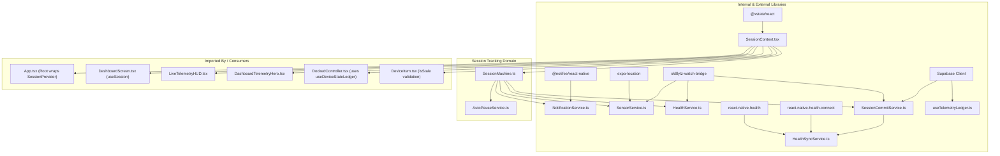

### Inbound Blast Radius (Imports)
- **State Management**: `xstate`, `@xstate/react` for FSM control.
- **Storage**: `@react-native-async-storage/async-storage` for persisting session state, ledger queue, and device settings.
- **Hardware & Geolocation**: `expo-location` for GPS data; `expo-sensors` (Accelerometer) for raw physical impact analysis.
- **Background Actions**: `@notifee/react-native` for Android foreground service bindings and custom button notifications.
- **Watch Communications**: `sk8lytz-watch-bridge` to sync speed metrics and capture sensor streams from watch accessories.
- **Health Services**: `react-native-health` (iOS Apple HealthKit) and `react-native-health-connect` (Android Health Connect).
- **Network Sync**: `supabaseClient` and offline queue variables inside `SpeedTrackingService.ts`.

### Outbound Blast Radius (Consumers)
- **Root Orchestration**: `App.tsx` imports `SessionProvider` to expose session state to the layout tree and registers background notification actions.
- **Primary Screens**: `DashboardScreen.tsx` consumes context actions (`startSession`, `endSession`) and formats live values via `useSession()`.
- **UI HUD Widgets**: `LiveTelemetryHUD.tsx` and `DashboardTelemetryHero.tsx` render live telemetry feeds.
- **Controller Dashboards**: `DockedController.tsx` leverages `useDeviceStateLedger` for LED configurations.
- **Device Lists**: `DeviceItem.tsx` uses `isStale` checks from `useDeviceStateLedger` to flag disconnected boards.

---

## 3. Context Matrix

The React contexts interacting with or provided by the session tracking domain enforce state synchronization across layout boundaries.

```
┌────────────────────────────────────────────────────────┐
│                      AuthContext                       │
└──────────────────────────┬─────────────────────────────┘
                           │
                           │ Consumes (user.id)
                           ▼
┌────────────────────────────────────────────────────────┐
│                     SessionContext                     │
├────────────────────────────────────────────────────────┤
│ Provides:                                              │
│ - sessionPhase ('IDLE' | 'ACTIVE' | 'PAUSED' | 'ENDING')│
│ - telemetry (GlobalTelemetryState)                     │
│ - health (HealthTelemetryState)                        │
│ - startSession() / endSession()                        │
└──────────────────────────┬─────────────────────────────┘
                           │
                           ├───────────────────┬───────────────────┐
                           ▼                   ▼                   ▼
                     ┌───────────┐       ┌───────────┐       ┌───────────┐
                     │ Dashboard │       │ Live HUD  │       │ Docked    │
                     │  Screen   │       │ Component │       │Controller │
                     └───────────┘       └───────────┘       └───────────┘
```

- **Consumed Contexts**:
  - **`AuthContext`**: Consumed by `SessionContext.tsx` (`useAuth`) to retrieve the authenticated `user.id` or `null` session. Ensures telemetry log uploads are tagged with the active user identifier.
- **Provided Contexts**:
  - **`SessionContext`**: Evaluates `sessionMachine` updates and exposes:
    - `isSkateSessionActive`: `boolean` state indicating if tracking is in progress.
    - `sessionPhase`: `'IDLE' | 'ACTIVE' | 'PAUSED' | 'ENDING'`.
    - `startSession()`: Function to dispatch `START` to the state chart.
    - `endSession()`: Function to dispatch `END` to the state chart.
    - `telemetry`: Global telemetry data (current speed, peak speed, cumulative distance, linear G-force).
    - `health`: Core metrics (current BPM, avg BPM, peak BPM, active energy burned).

---

## 4. Hook/Service I/O Registry

The contracts defining inputs, outputs, database actions, and system side-effects across the session tracking domain.

### `useTelemetryLedger()`
- **Inputs**: 
  - `trackPattern(patternId: string)`
  - `trackColor(hexCode: string)`
  - `trackMode(modeId: string)`
  - `incrementCounter(key: string, count?: number)`
- **Outputs**: Methods to log event ticks and coordinate data flushes.
- **Side-Effects**: Writes data to AsyncStorage `@sk8lytz_telemetry_buffer`; starts a 15-minute sync heartbeat timer; binds to React Native `AppState` changes to flush data via `flush_telemetry` RPC on backgrounding.

### `useDeviceStateLedger()`
- **Inputs**: 
  - `save(mac: string, state: DeviceState)`
  - `load(mac: string)`
  - `loadSync(mac: string)`
- **Outputs**: LED config transaction handlers.
- **Side-Effects**: Stores state in a global in-memory `memoryCache` singleton to prevent layout race conditions; debounces disk writes to AsyncStorage (`@SK8Lytz_DeviceState_v2_{MAC}`) by 500ms to throttle high-frequency hardware edits.

### `HealthSyncService` (saveWorkout)
- **Inputs**: `snapshot: ISessionSnapshot` detailing total distance, duration, avg speed, and energy consumed.
- **Outputs**: `Promise<void>` completion check.
- **Side-Effects**: Directly inserts records into platform health stores (iOS HealthKit or Android Health Connect).

### `SessionMachine` (XState)
- **Inputs**: `autoPauseEnabled: boolean`, refs caching current speed data and credentials.
- **Events**: `START`, `PAUSE`, `RESUME`, `END`, `AUTO_PAUSE`, `AUTO_RESUME`.
- **Outputs**: Transitions parent FSM phase and invokes sub-service callbacks.
- **Side-Effects**: Manages hardware sensor listeners (GPS, Accelerometer), spawns Notifee alerts, controls WatchBridge syncs, and drives Supabase record commits.

---

## 5. OS Variance Matrix

The session tracking domain abstracts several critical differences between iOS, Android, and Web platforms.

| Feature / Service | iOS Behavior | Android Behavior | Web Fallback Behavior |
| :--- | :--- | :--- | :--- |
| **Health Database Sync** | Integrates with **Apple HealthKit** (`react-native-health`). Saves workouts with activity type `'SkatingSports'` and units `'mile'`/`'calorie'`. | Integrates with **Android Health Connect** (`react-native-health-connect`). Maps to `'ExerciseSession'` (Type `60` [Skating]), `'TotalCaloriesBurned'` (Kcal), and `'Distance'` (meters). | Silently returns a resolved promise; database write is bypassed. |
| **Health Polling (Live)** | Periodically reads `AppleHealthKit.getHeartRateSamples` and `AppleHealthKit.getActiveEnergyBurned` during workouts. | Queries `readRecords` for `'HeartRate'` and `'ActiveCaloriesBurned'` targets in Health Connect. | Bypasses polling. Live health stats fallback to watch telemetry. |
| **Background Notifications** | Utilizes iOS category actions (`categoryId: 'session-actions'`) registered during bootstrap to show interactive alerts. | Hooks into Notifee as a **Foreground Service** using a dedicated notification channel and `foregroundServiceTypes: [FOREGROUND_SERVICE_TYPE_LOCATION]`. | Bypasses notification calls. Tracking is active in foreground tab only. |
| **Sensor Subscriptions** | Subscribes to Expo Location and raw iOS Accelerometer rates. | Subscribes to Android GPS engines and linear acceleration sensors. | Bypasses subscriptions; returns mock coordinates if in debug mode. |

---

## 6. Sequence Diagram

This diagram details the sequence of events from starting a skate session, tracking live telemetry in the background, auto-pausing when stopping, and executing the two-way health commit.

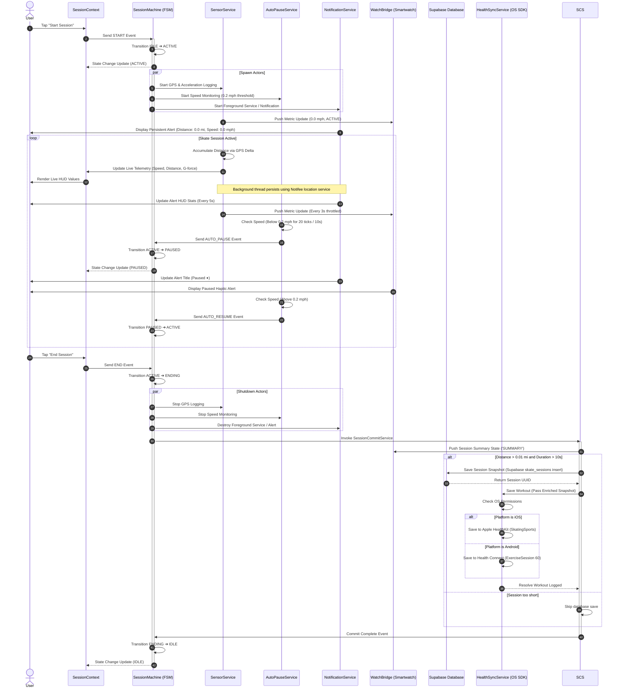

---

## 7. Stale Master Reference Entries to 
## 8. Architectural Impact Flags

The migration to the XState-driven architecture triggers the following system flags:

* `[IMPACTS_USER_JOURNEY]` — The consolidation of session controller states into a single React context driven by an FSM shifts how dashboard screens, HUD widgets, and notification buttons coordinate. Active states, paused states, and save gates are now governed by state chart rules.
* `[IMPACTS_C4_CONTEXT]` — The session engine integrates location systems, smartwatch notifications, Apple HealthKit/Health Connect databases, and Supabase skate session logs. It manages local offline caches via `AsyncStorage` when connections are lost.
* `[IMPACTS_STATE_CHART]` — The entire skate tracking pipeline is driven by an XState v5 Finite State Machine (`SessionMachine.ts`) using spawned actors for background sensors, speed thresholds, health polling, and notifications.

<!-- CARTOGRAPHER_END: SESSION_TRACKING -->

### Domain: PROTOCOL_CORE
<!-- CARTOGRAPHER_START: PROTOCOL_CORE -->

# Cartography Document: PROTOCOL_CORE Domain

This document establishes the canonical mapping and engineering blueprint for the `PROTOCOL_CORE` domain within the SK8Lytz application architecture. It serves as the single source of truth for the Hardware Abstraction Layer (HAL), BLE adapter drivers, dynamic catalog engines, and platform-specific behaviors of Neogleamz (`Ctrl_Mini_RGB_Symphony_new_0xA3`) and BanlanX (`SP621E`) controller hardware.

---

## 1. File Manifest

Every file within the `PROTOCOL_CORE` domain is categorized below alongside its precise architectural purpose:

| File Path | Component Type | Architectural Purpose |
| :--- | :--- | :--- |
| [ZenggeProtocol.ts](file:///c:/Neogleamz/AG_SK8Lytz_App/SK8Lytz/src/protocols/ZenggeProtocol.ts) | Protocol Logic (Monolith) | Implements raw byte array serialization, checksum calculation, and chunked frame sequencing (`0x40`) for Neogleamz/Zengge V2 hardware. |
| [ZenggeAdapter.ts](file:///c:/Neogleamz/AG_SK8Lytz_App/SK8Lytz/src/protocols/ZenggeAdapter.ts) | Adapter (HAL Driver) | Implements `IControllerProtocol` for Neogleamz hardware, handling post-connection time synchronization and MTU-aware packet chunking. |
| [BanlanxAdapter.ts](file:///c:/Neogleamz/AG_SK8Lytz_App/SK8Lytz/src/protocols/BanlanxAdapter.ts) | Adapter (HAL Driver) | Implements `IControllerProtocol` for BanlanX SP621E hardware, mapping control parameters to `0xA0` command packets and leveraging native onboard audio processing. |
| [IControllerProtocol.ts](file:///c:/Neogleamz/AG_SK8Lytz_App/SK8Lytz/src/protocols/IControllerProtocol.ts) | Interface (Contracts) | Defines the Hardware Abstraction Layer (HAL) type definitions, step formats, and the unified `ProtocolResult` payload container. |
| [ControllerRegistry.ts](file:///c:/Neogleamz/AG_SK8Lytz_App/SK8Lytz/src/protocols/ControllerRegistry.ts) | Registry (Resolver) | Resolves the active controller protocol at scan time by parsing advertising BLE services (e.g., `FFE0` vs `FFFF`) and manufacturer IDs. |
| [useProtocolDispatch.ts](file:///c:/Neogleamz/AG_SK8Lytz_App/SK8Lytz/src/hooks/useProtocolDispatch.ts) | UI Adapter Hook | Provides a unified React hook that bridges high-level UI controls to device-specific adapter actions, enabling simultaneous dispatch to mixed-protocol device groups. |
| [useProtocolBuilder.ts](file:///c:/Neogleamz/AG_SK8Lytz_App/SK8Lytz/src/hooks/useProtocolBuilder.ts) | Diagnostic Hook | Drives the low-level LED Diagnostic Lab, offering stateful configurations to generate, preview, and annotate raw protocol hex packets. |
| [useProductCatalog.ts](file:///c:/Neogleamz/AG_SK8Lytz_App/SK8Lytz/src/hooks/useProductCatalog.ts) | Catalog Sync Hook | Implements local-first retrieval, background Supabase syncing, and AsyncStorage caching of the product profile database. |
| [useProductManager.ts](file:///c:/Neogleamz/AG_SK8Lytz_App/SK8Lytz/src/hooks/useProductManager.ts) | Catalog Admin Hook | Manages the creation, editing, and Supabase upserting of product configurations within the administrative Catalog Manager. |
| [ProductCatalog.ts](file:///c:/Neogleamz/AG_SK8Lytz_App/SK8Lytz/src/constants/ProductCatalog.ts) | Metadata Constants | Ships default hardware configurations, segment mirrors, and threshold-based product classifiers (HALOZ, SOULZ, RAILZ) for offline fallback. |

---

## 2. Blast Radius (Dependency Map)

The `PROTOCOL_CORE` domain operates as a middle tier. It imports low-level BLE variables and database instances, and exports domain services and hooks consumed by UI nodes.

### Upstream Dependencies (Imports)
- **BLE GATT Constants & Context**: Consumes characteristic/service UUIDs, and utilizes React BLE Context (`BLEContext`) for queue dispatches.
- **Supabase client**: `supabaseClient` is consumed by `useProductCatalog` and `useProductManager` to sync product definitions.
- **AsyncStorage**: Standard React Native storage keys cache database profiles for offline operations.
- **React Core**: Custom hooks leverage `useState`, `useEffect`, `useRef`, and `useCallback` for stable lifecycle mappings.

### Downstream Consumers (Exports)
- **UI Screens & Modals**: `DashboardScreen.tsx`, `Sk8LytzDiagnosticLab.tsx`, and `Sk8LytzProgrammerModal.tsx` consume the catalog hooks and protocol builder hooks.
- **BLE Write Dispatchers**: Core BLE managers leverage the `ControllerRegistry` to resolve target profiles and partition outgoing payloads before dispatch.

### Domain Boundary Flow Diagram
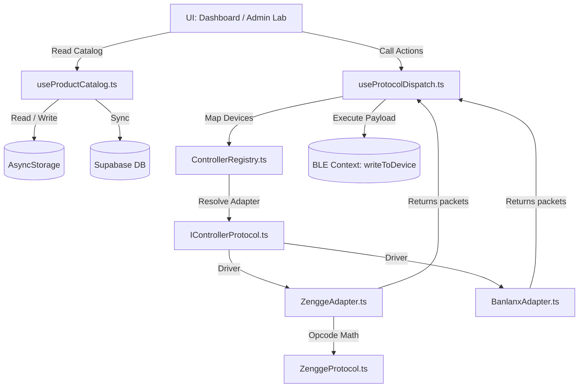

---

## 3. Context Matrix

The domain coordinates state and operations through two primary context providers:

### `BLEContext`
Consumed by [useProtocolDispatch.ts](file:///c:/Neogleamz/AG_SK8Lytz_App/SK8Lytz/src/hooks/useProtocolDispatch.ts#L8-L18).
* **Extracted Properties**:
  * `connectedDevices`: Evaluates target active BLE MACs.
  * `getAdapterForDevice(deviceId)`: Resolves the runtime `IControllerProtocol` implementation for each MAC.
  * `executeProtocolResults(payloads, opts)`: Dispatches constructed packets to the serial writing queue.
  * `writeChunked(payload, deviceId)`: Bypasses standard queues to apply `0x40` packet framing chunk loops directly for raw extended buffers.
* **State Propagation**: User gestures trigger callbacks (e.g. `setPower(isOn)`). The hook loops through connected devices, requests the device-specific driver, executes the matching packet builder, and forwards the generated `ProtocolResult` arrays to the connection queues.

### `AuthContext`
Consumed by [useProductManager.ts](file:///c:/Neogleamz/AG_SK8Lytz_App/SK8Lytz/src/hooks/useProductManager.ts#L6-L37).
* **Extracted Properties**:
  * `session`: Captures the current authenticated user's session state.
* **State Propagation**: Admin attempts to save a product profile will fail unless a valid `session` exists. The hook verifies this session parameter locally before dispatching database upserts, shielding the database API from unauthenticated operations.

---

## 4. Hook/Service I/O Registry

All key interfaces within the domain map their operations and side-effects below:

### `useProtocolDispatch` Methods
| Method Name | Input Parameters | Output Type | Primary Side-Effects |
| :--- | :--- | :--- | :--- |
| `setPower` | `isOn: boolean`, `targetDeviceId?: string`, `opts?: { lowPriority?: boolean }` | `Promise<boolean \| 'partial'>` | Dispatches hardware power toggle opcodes. |
| `setSolidColor` | `r: number, g: number, b: number`, `targetDeviceId?`, `opts?` | `Promise<boolean \| 'partial'>` | Serializes and sends a single-pixel freeze command. |
| `setMultiColor` | `colors: RGB[], ledPoints: number, speed: number, direction: number, transitionType?`, `targetDeviceId?`, `opts?` | `Promise<boolean \| 'partial'>` | Encapsulates client-generated spatial pattern arrays for device transmission. |
| `setEffect` | `effectId: number, speed: number, brightness: number`, `targetDeviceId?`, `opts?` | `Promise<boolean \| 'partial'>` | Triggers a hardware-native program (Zengge `0x42` or BanlanX `0x53`+`0x54`). |
| `executeRawPayload`| `payload: number[]`, `targetDeviceId?`, `opts?` | `Promise<boolean \| 'partial'>` | If 0x51 extended packet (>200B), redirects to `writeChunked` framing loop; else wraps and writes directly. |

### `useProductCatalog` Methods
| Method Name | Input Parameters | Output Type | Primary Side-Effects |
| :--- | :--- | :--- | :--- |
| `getProfileById` | `id: string` | `ProductProfile \| undefined` | Performs case-insensitive search across memory catalog; falls back to static catalog. |
| `getProfileByPoints`| `ledPoints: number` | `ProductProfile` | Matches LED counts with product detection thresholds (e.g. 10-27 points = HALOZ). |
| `saveProfile` | `profile: ProductProfile` | `Promise<boolean>` | Upserts a product row into the Supabase database and resets local AsyncStorage catalog cache. |
| `syncFromCloud` | None | `Promise<void>` | Pulls active database rows, merges them with local fallbacks, and overwrites the local AsyncStorage cache. |

### `IControllerProtocol` Drivers
| Method Name | Input Parameters | Output Type | Protocol Differences |
| :--- | :--- | :--- | :--- |
| `getHandshakePayloads` | None | `ProtocolResult` | **Zengge**: Returns a `0x10` session time sync packet. <br>**BanlanX**: Returns an empty no-op result. |
| `buildQuerySettings` | `hasMic?: boolean` | `ProtocolResult` | **Zengge**: Generates a `0x63` settings query. <br>**BanlanX**: Generates a `0xA0` cmd `0x70` query (staged). |
| `buildEffect` | `effectId, speed, brightness` | `ProtocolResult` | **Zengge**: One `0x42` payload. <br>**BanlanX**: Two packets (`0x53` select + `0x54` speed) with a mandatory `20ms` delay. |
| `buildMusicConfig` | `config: MusicConfig` | `ProtocolResult` | **Zengge**: Returns `0x73` setup config mapping drop & column colors. <br>**BanlanX**: Returns `0x59` mic select + `0x5A` gain packets. |
| `buildMusicMagnitude`| `magnitude: number` | `ProtocolResult` | **Zengge**: Returns a `0x74` magnitude byte. <br>**BanlanX**: Returns empty (onboard DSP processes audio natively). |

---

## 5. OS Variance Matrix

BLE communication patterns vary between iOS and Android due to hardware driver and system policy differences:

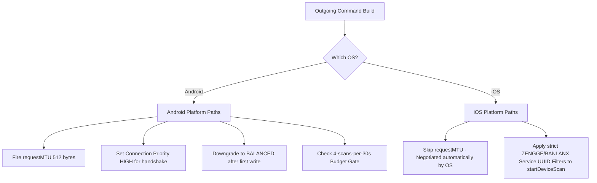

### 1. MTU Negotiation
* **Android**: `ConnectService.ts` explicitly requests `512` bytes via `requestMTU()`. This allows larger arrays (up to 300 pixels) to avoid transport fragmentation.
* **iOS**: iOS handles MTU negotiation automatically. Calling `requestMTU()` on iOS throws an exception. The code wraps MTU requests in a `Platform.OS === 'android'` block and reads `conn.mtu` directly on iOS.

### 2. Scanning Filters & Background Mode
* **Android**: Can scan passively without service filters.
* **iOS**: To scan in background mode (e.g. to automatically reconnect to skates when the app is minimized), iOS requires explicit service UUID arrays passed to the BLE scanner:
  ```typescript
  bleManager.startDeviceScan([ZENGGE_SERVICE_UUID, BANLANX_SERVICE_UUID], ...)
  ```
  The global `BleMachine.ts` enforces this service filter mapping across both platforms.

### 3. Scan Budget Limits
* **Android**: Android 12+ limits BLE scan executions to a budget of **4 scans per 30 seconds**. The battery sweeper hook tracks and queues scanning requests to prevent silent OS-level throttling.
* **iOS**: iOS does not enforce the 4-per-30s limit but aggressively throttles scanning parameters when the screen locks.

---

## 6. Cited Truth (Protocol Specifications)

### Zengge Opcode Table
All Neogleamz `0xA3` chip commands are wrapped using the 8-byte Zengge V2 framing envelope:
`[0x00, SeqNum, 0x80, 0x00, LenHi, LenLo, Len+1, 0x0B, ...innerPayload]`

* **`0x71` Power Control**: 
  * ON: `[0x71, 0x23, 0x0F, 0xA3]`
  * OFF: `[0x71, 0x24, 0x0F, 0xA4]`
* **`0x59` Spatial Pixel Array**:
  * Format: `[0x59, lenHi, lenLo, [R1,G1,B1...], pointsHi, pointsLo, transitionType, speed, direction, checksum]`
  * *EEPROM Lockout Boundary*: If `numLEDs < 12`, the payload must be padded with zero-pixels to a length of 12 (enforced by `padStaticColorfulPayload`) to prevent EEPROM driver hangs.
* **`0x51` Custom Sequence**:
  * 9-byte compact step format (supported by `0xA3`): `[0xF0/0x0F, transMode, speed, R1, G1, B1, R2, G2, B2]`.
  * 10-byte extended step format requires `0x40` chunking: `[0xF0/0x0F, effectId, speed, R1, G1, B1, R2, G2, B2, dirFlags]`.
* **`0x40` Chunking Protocol**:
  * For packets exceeding `(MTU - 3)`, frames must be split. The first chunk starts with:
    `[0x40, seqByte, indexWord_hi, indexWord_lo, totalLen_hi, totalLen_lo, dataLen+1, 0x0B]`
  * Subsequent chunks use a shorter header:
    `[0x40, seqByte, indexWord_hi, indexWord_lo, dataLen]`
  * The final chunk marks completion by setting bit 15 of `indexWord` (`indexWord |= 0x8000`).

### BanlanX Opcode Table
BanlanX commands use a simpler framing wrapper: `[0xA0, cmd, dataLen, ...payload]` with no checksum byte.

* **`0x50` Power Control**:
  * ON: `[A0, 50, 01, 01]`
  * OFF: `[A0, 50, 01, 00]`
* **`0x52` Solid Color**: `[A0, 52, 03, R, G, B]`
* **`0x53` Effect Select**: `[A0, 53, 01, effectId]`
* **`0x54` Speed Select**: `[A0, 54, 01, speed]`
* **`0x59` Audio Source**: `[A0, 59, 01, source]` (0x00 = internal microphone)
* **`0xA0` cmd `0x5A` Sensitivity / Gain**: `[A0, 5A, 01, gain]` (range 1-16)

---

## 7. Stale Documentation Audit

During review of the App Master Reference, the following segments in the master document were identified as stale and marked with `

<!-- CARTOGRAPHER_END: PROTOCOL_CORE -->

### Domain: PATTERN_ENGINE
<!-- CARTOGRAPHER_START: PATTERN_ENGINE -->

# PATTERN_ENGINE Domain Cartography Report

This cartography report details the file manifest, imports/exports (Blast Radius), React Context dependencies, API parameters, OS-specific differences, runtime synchronization pipeline sequence, pattern template catalog, and stale documentation audits for the `PATTERN_ENGINE` domain in SK8Lytz.

---

## 1. File Manifest

The `PATTERN_ENGINE` domain provides the core mathematical synthesis, visualization modeling, hardware packet routing, and sensor hooks that drive the LED lighting systems.

### Core Mathematical & Protocol Engines

| File Name | Location | Architectural Purpose |
| :--- | :--- | :--- |
| `PatternEngine.ts` | `src/protocols/PatternEngine.ts` | The Single Source of Truth (SSOT) for the custom `SK8LYTZ_TEMPLATES` registry (IDs 1-43, 101-105, 201-233). It compiles binary payloads for the BLE transport layer, dynamically routing spatial patterns to the `0x59` encoder and temporal/test patterns to the `0x51` compact scheduler. |
| `SpatialEngine.ts` | `src/protocols/SpatialEngine.ts` | The low-level math synthesizer repository. It houses deterministic wave generators (sine waves, strobe fades, meteor showers, and comets) that return raw RGB arrays for individual LED slots. |
| `SymphonyEngine.ts` | `src/protocols/SymphonyEngine.ts` | Handles visualizer state mapping for hardware-native 0x51 Symphony effects (IDs 1-44, 201-233) and audio-reactive 0x73/0x74 magnitude-gated effects (IDs 1-13). |
| `VisualizerEngine.ts` | `src/protocols/VisualizerEngine.ts` | The public coordinator for the UI rendering canvas. It wraps `generateArray()` outputs and applies continuous scroll rotation animations matching the active frame tick. |
| `PositionalMathBuffer.ts` | `src/protocols/PositionalMathBuffer.ts` | Implements client-side linear interpolation (gradients or solid blocks) between custom visual nodes (0-100%) to bypass physical `0x59` hardware chunker positional limitations. |

### Reactive Integration Hooks

| File Name | Location | Architectural Purpose |
| :--- | :--- | :--- |
| `useStreetMode.ts` | `src/hooks/useStreetMode.ts` | Manages the Street Mode state machine (`STOPPED`, `ACCELERATING`, `CRUISING`, `SLOWING_DOWN`, `HARD_BRAKING`) by binding the accelerometer sensor and GPS telemetry, then dispatching tail-light configurations. |
| `useMusicMode.ts` | `src/hooks/useMusicMode.ts` | Orchestrates music-reactive configurations (0x73) and matrix styles (Light Bar vs. Light Screen) and ensures hardware exits reactive loops cleanly when switching modes. |
| `useAppMicrophone.ts` | `src/hooks/useAppMicrophone.ts` | Bridges native device audio streams via `expo-audio` to record amplitudes and stream real-time 20Hz music magnitude commands (0x74) to override the hardware mic. |

---

## 2. Blast Radius

The `PATTERN_ENGINE` domain functions as a pure mathematical core that exports utilities to the dashboard UI and translates user preferences into binary BLE payloads.

```
                           ┌────────────────────────┐
                           │   Product Catalog &    │
                           │   Zengge BLE Service   │
                           └───────────┬────────────┘
                                       │
            ┌──────────────────────────┼──────────────────────────┐
            ▼                          ▼                          ▼
  ┌───────────────────┐      ┌───────────────────┐      ┌───────────────────┐
  │  useStreetMode    │      │   useMusicMode    │      │ useAppMicrophone  │
  │ (Accel + GPS FSM  │      │ (0x73 matrix config│      │ (20Hz mic volume  │
  │  pattern triggers)│      │   & exit control) │      │  magnitude stream)│
  └─────────┬─────────┘      └─────────┬─────────┘      └─────────┬─────────┘
            │                          │                          │
            └──────────────────────────┼──────────────────────────┘
                                       ▼
                         ┌──────────────────────────┐
                         │     PatternEngine.ts     │
                         │   (SSOT Template Map)    │
                         └─────────────┬────────────┘
                                       │
                                       ▼
                         ┌──────────────────────────┐
                         │     SpatialEngine.ts     │
                         │ (Low-level wave curves)  │
                         └─────────────┬────────────┘
                                       │
                                       ▼
                         ┌──────────────────────────┐
                         │   SymphonyEngine.ts      │
                         │ (0x51 & 0x73 visualizer) │
                         └──────────────────────────┘
```

### Imports (Incoming Dependencies)
* **Hardware Information**: `ProductCatalog.ts` (references led counts, mirroring configurations, and segment limits).
* **BLE Dispatch Interface**: `useProtocolDispatch.ts` and `ZenggeProtocol.ts` (dispatches binary commands).
* **Hardware Telemetry Sensors**: `expo-sensors` (registers accelerometer listeners inside `useStreetMode.ts`).
* **Platform APIs**: `react-native` (manages platform branching for sensor buffers).
* **Native Audio Interface**: `expo-audio` (processes metering scales for magnitude streaming).

### Exports (Outgoing Consumers)
* **UI Previews**: `ProductVisualizer.tsx`, `VisualizerUnit.tsx`, and `LEDStripPreview.tsx` consume `getVisualizerFrame` to draw real-time canvases.
* **Control Dispatchers**: `useControllerDispatch.ts` imports payload builders to generate output streams.
* **Admin Center Panels**: `Sk8LytzDiagnosticLab.tsx` consumes the pattern engines to send raw hex payloads.

---

## 3. Context Matrix

The mathematical cores are kept strictly context-free and deterministic. The reactive hooks utilize properties and callbacks:

| Component / Hook | Consumes Context | Provided Properties / callbacks | Scope & Lifetime |
| :--- | :--- | :--- | :--- |
| `PatternEngine` / `SpatialEngine` | None (Deterministic pure functions) | None (Pure API inputs) | Ephemeral call-stack lifetime. |
| `useStreetMode` | None (Telemetries passed as arguments) | `writeToDevice` callback, `hwSettings`, active segment boundaries. | Mounted during Dashboard usage. |
| `useMusicMode` | `useProtocolDispatch` | Exposes `handleMusicChange` dispatch triggers. | Active during Music Mode session. |
| `useAppMicrophone` | None (Direct native hardware wrappers) | `writeToDevice` callback, recording lifecycle states. | Restricts recording to active app-microphone selections. |

---

## 4. Hook/Service I/O Registry

### `useStreetMode`
* **Inputs**:
  - `activeMode: string` (Hook self-deactivates if not `'STREET'`)
  - `writeToDevice: (payload: number[]) => Promise<void | boolean | 'partial'>`
  - `hwSettings: IHardwareSettings | null` (references mirrors and pixel sizes)
  - `points: number | undefined` (fallback length)
  - `activeProduct: string`
  - `brightness: number`, `speed: number`
  - `deviceContext: Record<string, unknown>` (logs context to analytics)
  - `gpsSpeed: number` (evaluates motion transitions)
  - `peakGForce: number`
* **Outputs**:
  - `streetSensitivity: number` / `setStreetSensitivity: (v: number) => void`
  - `streetCruiseColor: string` / `setStreetCruiseColor: (v: string) => void`
  - `streetBrakeColor: string` / `setStreetBrakeColor: (v: string) => void`
  - `streetDistribution: [number, number, number]` / `setStreetDistribution: (v: [number, number, number]) => void`
  - `isStreetBraking: boolean`
  - `motionState: MotionState` (`STOPPED` | `ACCELERATING` | `CRUISING` | `SLOWING_DOWN` | `HARD_BRAKING`)
  - `motionStateRef: React.MutableRefObject<MotionState>`
  - `applyStreetPattern: (state: MotionState, brt?: number, spd?: number) => void`
* **Side-Effects**:
  - Sets up `Accelerometer` updates at 80ms interval on Android.
  - Generates `STREET_JERK_DETECTED` entries in `AppLogger`.
  - Dispatches `0x59` BLE commands immediately on motion FSM changes.

### `useMusicMode`
* **Inputs**:
  - `activeMode: ModeType`
  - `musicPatternId: number`
  - `micSensitivity: number`, `brightness: number`
  - `micSource: 'APP' | 'DEVICE'`
  - `musicPrimaryColor: string`, `musicSecondaryColor: string`
  - `musicMatrixStyle: number`
* **Outputs**:
  - `handleMusicChange: (patternId?, sens?, bright?, src?, c1Hex?, c2Hex?, matrix?) => void`
* **Side-Effects**:
  - Sends configuration commands (`0x73` payloads) to the BLE queue.
  - Automatically dispatches an exit packet (`isOn: false`) when the mode is changed to disable the physical microphone.

### `useAppMicrophone`
* **Inputs**:
  - `activeMode: ModeType`
  - `micSource: 'APP' | 'DEVICE'`
  - `isPoweredOn: boolean`
  - `writeToDevice?: (payload: number[]) => Promise<void | boolean | 'partial'>`
* **Outputs**:
  - `audioMagnitude: number` (range 0.0 to 1.0)
  - `hasMicPermission: boolean`
  - `requestMicPermission: () => Promise<void>`
  - `recording: Audio.Recording | null`
* **Side-Effects**:
  - Commands native microphone recording via `expo-audio` and updates Android permissions.
  - Streams continuous 20Hz magnitude packages (`0x74` payload containing magnitudes mapped 0-150) to enforce the app-microphone override.

---

## 5. OS Variance Matrix

| Engine/Hook | iOS Path | Android Path | Web Fallback |
| :--- | :--- | :--- | :--- |
| **`useStreetMode.ts`** | Skips sensor listener if not supported; bypasses initializations. | Registers Accelerometer update loops (80ms throttle) and maps Jerk values. | Returns early; disables sensor bindings. |
| **`useAppMicrophone.ts`** | Manages audio recordings and registers permissions via `expo-audio`. | Manages audio recordings and registers permissions via `expo-audio`. | Returns early; bypasses all native structures. |
| **`PatternEngine` / `SpatialEngine`** | Evaluates mathematical waves identically in standard JS engine. | Evaluates mathematical waves identically in standard JS engine. | Evaluates mathematical waves identically in standard JS engine. |

---

## 6. Runtime Pattern Synchronization Pipeline

The following diagram illustrates how user updates, sensor jerks, or audio volumes are converted to mathematical arrays and dispatched to the hardware:

```mermaid
sequenceDiagram
    autonumber
    actor User as Skater UI / Sensors
    participant Hook as useStreetMode / useMusicMode / useAppMicrophone
    participant PE as PatternEngine (SSOT)
    participant SE as SpatialEngine (Math)
    participant BLE as BleWriteQueue (FIFO Serializer)
    participant Dev as Skates (0xA3 Chipset)

    Note over User,Hook: Case A: Sensor jerk detection (Brake)
    User->>Hook: jerMag > threshold (Accelerometer 80ms)
    Hook->>Hook: Transition FSM to 'HARD_BRAKING'
    Hook->>PE: buildPatternPayload(id=103, fg, bg, speed, brightness)

    Note over User,Hook: Case B: App Microphone streaming (20Hz)
    User->>Hook: Audio Amplitude (expo-audio status 50ms)
    Hook->>Hook: Apply Exponential Moving Average (alpha=0.4)
    Hook->>BLE: writeToDevice(0x74 magnitude byte scaled 0-150)

    Note over PE,SE: Payload Building & Mathematical Routing
    PE->>PE: Lookup Pattern Template in SK8LYTZ_TEMPLATES
    alt Pattern is Test Pattern (201-233)
        PE->>PE: Intercept & build 0x51 compact payload
    else Pattern is Spatial Mode (0x59)
        PE->>SE: getHardwarePixelArray()
        SE->>SE: Evaluate wave math equations (chase, comet, wave)
        SE-->>PE: Return raw RGB array
        PE->>PE: Format 0x59 header with decoupled physical point limits
    end
    
    PE-->>Hook: Return formatted byte payload
    Hook->>BLE: enqueueWrite(priority, payload)
    
    Note over BLE,Dev: Queue processing & physical transmission
    BLE->>BLE: Lock queue (_isRunning = true)
    BLE->>Dev: Write GATT Characteristic (50ms gap between skates)
    Dev-->>BLE: Write Acknowledged (GATT Success)
    BLE->>BLE: Unlock queue (_isRunning = false)
```

---

## 7. Pattern Template Catalog (`SK8LYTZ_TEMPLATES`)

Every spatial/temporal lighting pattern in `src/protocols/PatternEngine.ts` maps to specific wave algorithms and color modes:

| ID | Name | Color Mode | Animation Tier | Mathematical Wave Generator / Description |
| :---: | :--- | :--- | :---: | :--- |
| **1** | Solid Color | `FG_ONLY` | Tier 1 | `buildColorJump` (Evaluates a solid static block representing front/back). |
| **2** | Bold Stripes | `FG_BG` | Tier 1 | Paints repeating block segments of foreground and background colors. |
| **3** | Slanted Chase | `FG_BG` | Tier 1 | Evaluates a scrolling square wave chase. |
| **4** | Rainbow Wave | `GENERATIVE` | Tier 1 | `buildTrueRainbowFlow` (Algorithmic HSV sweep across the segment). |
| **5** | Sparkle Flash | `FG_ONLY` | Tier 1 | Deterministic random sparkle indexes over a dark background. |
| **6** | Split Colors | `FG_BG` | Tier 1 | Splits segment in half, assigning the first half to FG and second to BG. |
| **7** | Center-Out Marquee | `FG_ONLY` | Tier 1 | Generates mirrored dots scrolling outwards from the center. |
| **8** | Slow Glow | `FG_ONLY` | Tier 1 | A temporal breathing wave calculated over time ticks. |
| **9** | Strobe Flash | `FG_ONLY` | Tier 1 | High-frequency flashing block toggling on/off values. |
| **10** | Breathe Slow | `FG_BG` | Tier 1 | Temporal breathing wave transitions fading FG to BG. |
| **11** | Color Jump | `FG_BG` | Tier 2 | Quick color jump transitions. |
| **12** | Strobe | `FG_ONLY` | Tier 2 | High-speed strobe sequence. |
| **13** | Single Dot Chase | `FG_BG` | Tier 2 | `buildSingleDotChase` (Single pixel chasing from start to end). |
| **14** | Center-Out / In-Center | `FG_BG` | Tier 2 | `buildNativeCenterOut` (Symmetric center expansion). |
| **15** | Wipe Fill | `FG_BG` | Tier 2 | `buildWipeFill` (Linear wipe covering background). |
| **16** | Comet Chase | `FG_BG` | Tier 2 | `buildCometChase` (Chasing point with logarithmic decay trailing tail). |
| **17** | Sine Pulse Wave | `FG_BG` | Tier 3 | `buildSinePulseWave` (A sinusoidal brightness wave moving down the strip). |
| **18** | Dashed Marquee | `FG_BG` | Tier 2 | `buildDashedMarquee` (Alternating dashes scrolling directionally). |
| **19** | Breathing Wave | `FG_BG` | Tier 2 | `buildBreathingWave` (Combination of chasing wave and global breathing). |
| **20** | Meteor Shower | `FG_BG` | Tier 2 | `buildMeteorShower` (Decaying pixels that simulate falling meteors). |
| **21** | Rainbow Marquee | `GENERATIVE` | Tier 2 | `buildRainbowMarquee` (Rainbow dots scrolling over background). |
| **22** | Rainbow Comet | `GENERATIVE` | Tier 2 | `buildRainbowComet` (Rainbow points with decaying tails). |
| **23** | True Rainbow Flow | `GENERATIVE` | Tier 2 | `buildTrueRainbowFlow` (Full gradient rainbow shifting across strip). |
| **24** | Rainbow Breathing | `GENERATIVE` | Tier 2 | `buildRainbowBreathing` (Solid strip cycling through colors). |
| **25** | Rainbow Chaser | `GENERATIVE` | Tier 2 | `buildRainbowChaser` (Chasing points cycling through HSV colors). |
| **26** | Large Chunk Scroll | `FG_BG` | Tier 3 | `buildLargeChunkScroll` (Wide blocks of color scrolling). |
| **27** | Gradient Chunk | `FG_BG` | Tier 3 | `buildGradientChunk` (Gradient transitions moving between blocks). |
| **28** | Ping Pong Fill | `FG_BG` | Tier 3 | `buildPingPongFill` (Paints pixels back and forth). |
| **29** | Ping Pong Marquee | `FG_BG` | Tier 3 | `buildPingPongMarquee` (Marquee dots bouncing at margins). |
| **30** | Random Strobe | `FG_BG` | Tier 3 | `buildRandomStrobe` (High-frequency strobes on random offsets). |
| **31** | Static Partial Rainbow | `GENERATIVE` | Tier 3 | `buildStaticPartialRainbow` (A fixed segment of the HSV rainbow). |
| **32** | Tetris Stacker | `GENERATIVE` | Tier 3 | `buildTetrisStacker` (Simulates stacking blocks at the margins). |
| **33** | Alternating Comet | `FG_BG` | Tier 3 | `buildAlternatingComet` (Two comets flowing in opposite directions). |
| **34** | Ping Pong Center Fill | `GENERATIVE` | Tier 3 | `buildPingPongCenterFill` (Wipe animations moving center-out). |
| **35** | Custom Array Scroll | `FG_BG` | Tier 3 | `buildCustomArrayScroll` (Custom structures scrolling across limits). |
| **36** | Glitch Marquee | `FG_BG` | Tier 3 | `buildGlitchMarquee` (Adds structural noise interrupts to scrolling marquees). |
| **37** | Micro Ants | `FG_BG` | Tier 3 | `buildMicroAnts` (Very small color blocks chasing rapidly). |
| **38** | Wipe Center-Out | `FG_BG` | Tier 3 | `buildWipeCenterOut` (Center out wipe animation). |
| **39** | Fire Flame | `FG_BG` | Tier 3 | `buildFireFlame` (Simulates fire flicker using thermal color maps). |
| **40** | Cyberpunk Shift | `FG_BG` | Tier 3 | Alternates colors dynamically in cyberpunk color pairs. |
| **41** | Aurora Borealis | `GENERATIVE` | Tier 3 | Smoothly cycles generative colors mimicking aurora waves. |
| **42** | Neon Glitch | `FG_BG` | Tier 3 | Introduces color-shifting neon dropouts. |
| **43** | Lightning Strike | `FG_ONLY` | Tier 3 | Sudden flashes on top of a dark background with exponential decay. |
| **101** | Street Stopped | `FG_BG` | Tier 3 | Solid red tail-lights indicating a stop state. |
| **102** | Street Cruising | `FG_BG` | Tier 3 | Standard orange cruising configuration. |
| **103** | Street Braking | `FG_BG` | Tier 3 | Hard red flash representing braking action. |
| **104** | Street Slowing Down | `FG_BG` | Tier 3 | Solid amber indicators for speed drop. |
| **105** | Street Accelerating | `FG_BG` | Tier 3 | Active yellow cascade patterns indicating acceleration push. |
| **201–233** | Multimode Pro Test | Varies | Special | Compact `0x51` transitions mirroring native Symphony effects 1-33. |

---

## 8. Stale Documentation Audit

Stale documentation sections identified on disk are marked for archiving:

1. **`0x41` Settled Mode Table Row (tools/SK8Lytz_App_Master_Reference.md#L802)**:
   * *Status*: `
## 9. Architectural Impact Flags

- `[IMPACTS_USER_JOURNEY]` — Streamed microphone magnitudes at 20Hz directly drive physical lighting states. The app-microphone overrides the hardware microphone, meaning delays or drops in magnitude packets will affect user immersion.
- `[IMPACTS_STATE_CHART]` — The Street Mode FSM defined in `useStreetMode.ts` dictates how spatial layout patterns change in response to real-time physical accelerometer data. 

---
*Document Compiled by Scout — Reyes (2026-06-13)*

<!-- CARTOGRAPHER_END: PATTERN_ENGINE -->

### Domain: CLOUD_FUNCTIONS
<!-- CARTOGRAPHER_START: CLOUD_FUNCTIONS -->

# CLOUD_FUNCTIONS Domain Cartography Report

This cartography report details the file manifest, imports/exports (Blast Radius), React Context dependencies, API parameters, OS-specific differences, runtime synchronization pipeline sequence, security hardening audits, and stale documentation targets for the `CLOUD_FUNCTIONS` domain in SK8Lytz.

---

## 1. File Manifest

The `CLOUD_FUNCTIONS` domain consists of PostgreSQL database migrations, a Deno Edge Function, and client-side integration services that bridge offline storage buffers to the Supabase backend.

### Server-Side Edge Functions

* **`supabase/functions/notify-crew-session/index.ts`**
  * *Architectural Purpose*: A Deno Edge Function that authenticates requests using GoTrue JWT verification and dispatches push notifications via the Expo Push API to members of a crew session.

### Database Migrations

* **`supabase/migrations/20260413_hardening_sweep.sql`**
  * *Architectural Purpose*: Configures base Row-Level Security (RLS) policies and performance indexes across core profile, session, and device tables.
* **`supabase/migrations/20260414111600_add_factory_name.sql`**
  * *Architectural Purpose*: Adds a `factory_name` string column to the `registered_devices` database table.
* **`supabase/migrations/20260414_account_deletion_rpc.sql`**
  * *Architectural Purpose*: Exposes a secure `delete_account()` SECURITY DEFINER function to handle cascading user account deletions from `auth.users`.
* **`supabase/migrations/20260414_consolidate_telemetry.sql`**
  * *Architectural Purpose*: Creates a consolidated `telemetry_snapshots` logging table with a GIN index on metadata and drops old telemetry tables.
* **`supabase/migrations/20260417_add_skate_spot_id.sql`**
  * *Architectural Purpose*: Introduces `skate_spot_id` as a foreign key on the `skate_sessions` table.
* **`supabase/migrations/20260417_cleanup_stale_skate_spots.sql`**
  * *Architectural Purpose*: Sets up background cleanup operations to remove unverified skate spots inactive for over 30 days.
* **`supabase/migrations/20260418041100_add_unique_mac.sql`**
  * *Architectural Purpose*: Restricts `registered_devices` with a unique constraint on the `device_mac` address.
* **`supabase/migrations/20260418044500_normalize_macs_and_dedupe.sql`**
  * *Architectural Purpose*: Cleans, deduplicates, and normalizes existing MAC address strings to uppercase format.
* **`supabase/migrations/20260418045900_add_missing_delete_policies.sql`**
  * *Architectural Purpose*: Adds user delete capabilities under RLS for profiles, devices, sessions, and presets.
* **`supabase/migrations/20260418051400_add_osm_tags_to_skate_spots.sql`**
  * *Architectural Purpose*: Adds an `osm_tags` JSONB column to the `skate_spots` table to store OpenStreetMap key-value tags.
* **`supabase/migrations/20260418051700_add_rink_specific_osm_tags.sql`**
  * *Architectural Purpose*: Configures rink/park specific OSM filtering settings and helper properties.
* **`supabase/migrations/20260418054000_cultural_daemon_setup.sql`**
  * *Architectural Purpose*: Declares database structures to coordinate background cultural daemon sync logs and processes.
* **`supabase/migrations/20260418061000_admin_user_management.sql`**
  * *Architectural Purpose*: Adds roles, bans, user profile columns, `admin_audit_logs` schema, and security definer functions for admin moderation.
* **`supabase/migrations/20260418062000_build_daemon_telemetry.sql`**
  * *Architectural Purpose*: Sets up the `daemon_status` table to track status, metrics, and timestamps of background scrapers.
* **`supabase/migrations/20260418105200_daemon_status_anon_rls.sql`**
  * *Architectural Purpose*: Enables public SELECT access to the `daemon_status` records.
* **`supabase/migrations/20260419034021_scraper_control_plane.sql`**
  * *Architectural Purpose*: Establishes the `scraper_config` table for dynamic scraper parameter adjustments.
* **`supabase/migrations/20260419093454_state_override_array.sql`**
  * *Architectural Purpose*: Integrates a state override array in `scraper_config` to bound geographical operations.
* **`supabase/migrations/20260419100000_scraper_evasion_config.sql`**
  * *Architectural Purpose*: Configures rotation limits, user agents, and evasion properties in `scraper_config`.
* **`supabase/migrations/20260419110000_gold_standard_columns.sql`**
  * *Architectural Purpose*: Appends verification status, quality flags, and metadata fields to `skate_spots`.
* **`supabase/migrations/20260419120000_cultural_enrichment_v2.sql`**
  * *Architectural Purpose*: Extends metadata tag tracking for enriched spots in the database.
* **`supabase/migrations/20260419130000_multi_state_support.sql`**
  * *Architectural Purpose*: Enables location processing and parsing across multiple geographical states.
* **`supabase/migrations/20260419140000_enrichment_retry_logic.sql`**
  * *Architectural Purpose*: Adds failure metrics and retry counters to the scraper sync queue schemas.
* **`supabase/migrations/20260419150000_decouple_queue_logic.sql`**
  * *Architectural Purpose*: Decouples scrape queue state from spatial location definitions for better concurrency.
* **`supabase/migrations/20260419160000_micro_scraper_schema.sql`**
  * *Architectural Purpose*: Registers table tracking structures for transient micro-scraper instance states.
* **`supabase/migrations/20260419170000_phase3_heuristic_fields.sql`**
  * *Architectural Purpose*: Incorporates scoring and heuristic fields inside the `skate_spots` table.
* **`supabase/migrations/20260419183000_add_google_premium_fields.sql`**
  * *Architectural Purpose*: Incorporates Google Places and Google premium API field integration to `skate_spots`.
* **`supabase/migrations/20260424171000_create_app_settings.sql`**
  * *Architectural Purpose*: Establishes the key-value `sk8lytz_app_settings` table to govern dynamic application toggles.
* **`supabase/migrations/20260426000000_ai_detective_config.sql`**
  * *Architectural Purpose*: Configures prompt directives and parameters for AI-driven spot validation.
* **`supabase/migrations/20260426120000_pipeline_telemetry.sql`**
  * *Architectural Purpose*: Adds execution metric tables for the scraper data processing pipelines.
* **`supabase/migrations/20260426200000_phase_control_panels.sql`**
  * *Architectural Purpose*: Implements phase blocklists, panel settings, and logs schema for scraper operations.
* **`supabase/migrations/20260506000000_admin_tools_expansion.sql`**
  * *Architectural Purpose*: Expands command controls with the `hardware_blacklist` and `feature_flags` tables.
* **`supabase/migrations/20260506000001_god_tier_telemetry.sql`**
  * *Architectural Purpose*: Implements the `user_lifetime_stats` table and the batch `flush_telemetry` RPC.
* **`supabase/migrations/20260512014730_add_health_telemetry.sql`**
  * *Architectural Purpose*: Registers schema tables for system and client hardware health reports.
* **`supabase/migrations/20260512180000_fix_admin_revoke_and_promotion_security.sql`**
  * *Architectural Purpose*: Hardens role modification routines through security definer scopes and exact email constraints.
* **`supabase/migrations/20260526190000_supabase_security_hardening.sql`**
  * *Architectural Purpose*: Locks down schemas with explicit `search_path = public` definitions on functions and limits public insert permissions.
* **`supabase/migrations/20260606205739_add_notif_preferences_to_user_profiles.sql`**
  * *Architectural Purpose*: Appends a JSONB `notif_preferences` field to user profiles to support notification preferences.
* **`supabase/migrations/20260607000000_add_gold_standard_telemetry_columns.sql`**
  * *Architectural Purpose*: Introduces core high-precision verification fields to telemetry structures.
* **`supabase/migrations/20260607095016_fix_telemetry_schema.sql`**
  * *Architectural Purpose*: Empty migration file generated during a schema refactoring sweep.
* **`supabase/migrations/20260607100000_fix_telemetry_schema.sql`**
  * *Architectural Purpose*: Incorporates `user_id` inside `telemetry_snapshots` and adds merge routing routines in `flush_telemetry`.
* **`supabase/migrations/20260607101500_telemetry_type_fix.sql`**
  * *Architectural Purpose*: Empty migration to satisfy type validation checks for telemetry columns.
* **`supabase/migrations/20260608000000_sk8lytz_security_hardening.sql`**
  * *Architectural Purpose*: Imposes defensive RLS activations across 22 distinct application tables.
* **`supabase/migrations/20260609000000_crash_telemetry.sql`**
  * *Architectural Purpose*: Defines the `crash_telemetry` table and sets up realtime synchronization channels.
* **`supabase/migrations/20260609020000_add_builder_fields.sql`**
  * *Architectural Purpose*: Adds fields for custom preset and animation builder controls.
* **`supabase/migrations/20260609030000_add_fixed_direction.sql`**
  * *Architectural Purpose*: Establishes columns for directional animation metadata.
* **`supabase/migrations/20260609040000_add_skate_session_coords.sql`**
  * *Architectural Purpose*: Configures GPS tracking and coordinate logs inside `skate_sessions`.
* **`supabase/migrations/20260609050000_drop_active_calories.sql`**
  * *Architectural Purpose*: Drops the deprecated `active_calories` column from `skate_sessions`.
* **`supabase/migrations/20260609050000_get_all_devices_rpc.sql`**
  * *Architectural Purpose*: Implements the `get_all_registered_devices()` RPC for administrators to pull hardware details bypassing RLS.
* **`supabase/migrations/20260609130000_app_settings_visibility.sql`**
  * *Architectural Purpose*: Seed unified feature visibility keys and clean legacy keys in `sk8lytz_app_settings`.
* **`supabase/migrations/20260609140000_live_debugger_views.sql`**
  * *Architectural Purpose*: Exposes the `view_crash_aggregates` view and the `resolve_crash_signature()` RPC.
* **`supabase/migrations/20260609175500_restore_domain_admin_promotion.sql`**
  * *Architectural Purpose*: Restores wildcard auto-promotion trigger for `@sk8lytz.com` and `@neogleamz.com`.

---

## 2. Blast Radius (Dependency Graph)

The `CLOUD_FUNCTIONS` domain sits at the boundary between React Native execution and cloud persistence. Modifications to schema structures, database permissions, or client configuration parameters have broad ramifications:

```
                          ┌────────────────────────┐
                          │   Supabase Client /    │
                          │   Auth & RLS Schemas   │
                          └───────────┬────────────┘
                                      │
           ┌──────────────────────────┼──────────────────────────┐
           ▼                          ▼                          ▼
 ┌───────────────────┐      ┌───────────────────┐      ┌───────────────────┐
  │   AppLogger.ts    │      │  ScenesService    │      │  SpeedTracking    │
  │ (System telemetry │      │  (Custom patterns │      │  (Skate sessions  │
  │  & error dumps)   │      │   & scene sharing)│      │   & stats sync)   │
  └─────────┬─────────┘      └─────────┬─────────┘      └─────────┬─────────┘
            │                          │                          │
            └──────────────────────────┼──────────────────────────┘
                                      ▼
                        ┌──────────────────────────┐
                        │ useOfflineSyncWorker.ts  │
                        │ (Queue processing loop)  │
                        └─────────────┬────────────┘
                                      │
                                      ▼
                        ┌──────────────────────────┐
                        │   AsyncStorage Buffers   │
                        │  (Local Offline State)   │
                        └──────────────────────────┘
```

### Imports (Incoming Dependencies)
* **Deno / Server-Side standard modules**: Imports edge runtime bindings (`@supabase/functions-js/edge-runtime`) and standard JS utilities (`@supabase/supabase-js`).
* **Database engine dependencies**: References relational tables and security variables within schemas (`auth.uid()`, `auth.users`, etc.).
* **Client-Side libraries**: `@supabase/supabase-js`, `expo-secure-store`, `react-native-url-polyfill`, `react-native` network state managers.

### Exports (Outgoing Consumers)
* **REST API Endpoints**: Edge functions (e.g. `notify-crew-session`) expose HTTP endpoints that are called directly from React Native handlers.
* **Database Access Structures**: Database RPC functions (`delete_account`, `flush_telemetry`, etc.) and views (`view_crash_aggregates`) are executed client-side.
* **Client Integration Services**:
  * `supabaseClient.ts`: Instantiates connection.
  * `useOfflineSyncWorker.ts`: Flushes saved presets, logged telemetry snapshot batches, and cached skate sessions when network connectivity is restored.
  * `AppLogger.ts`: Writes system log lists to `telemetry_snapshots` and triggers instant direct dispatches of exceptions to `telemetry_errors`.

---

## 3. Context Matrix

The PostgreSQL and Deno engines run state-free relative to the React execution thread. However, they establish and feed state constraints to client contexts:

| React Context | Consumed / Provided | Purpose |
| :--- | :--- | :--- |
| `AuthContext` (`useAuth`) | **Provided** by persistent session | Hydrates the local auth session, exposes verified profile credentials, and toggles `isOfflineMode` if connection queries fail. |
| `SessionContext` (`useSession`) | **Consumed** during logging | Integrates live location coordinates and health metrics with the `SpeedTrackingService` before final session packaging and DB upload. |

---

## 4. Hook/Service I/O Registry

### `notify-crew-session` Edge Function
* **Inputs**:
  * Request Headers: `Authorization: Bearer <JWT>`
  * Request Body:
    ```typescript
    interface NotifyPayload {
      crewId: string;
      sessionId: string;
      sessionName: string;
      leaderName: string;
    }
    ```
* **Outputs**:
  * Success: HTTP 200 `{ sent: number }`
  * Error states: HTTP 400 (Bad parameters / JSON), HTTP 401 (Unauthorized JWT), HTTP 403 (Caller is not in the crew), HTTP 405 (Wrong HTTP method).
* **Side-Effects**: Calls GoTrue server-side to resolve caller profile. Inspects members in `crew_memberships` and maps tokens from `push_tokens`. Batches notifications of up to 100 entries and pushes to the Expo API endpoint.

### `flush_telemetry` Database RPC
* **Inputs**: `payload JSONB` containing user statistics (durations, speeds, distances) and telemetry usage map objects.
* **Outputs**: `void`
* **Side-Effects**: Resolves the user identifier via `auth.uid()`. Inserts or updates counters, speeds, and merges JSONB values inside `user_lifetime_stats`.

### `delete_account` Database RPC
* **Inputs**: None.
* **Outputs**: `void`
* **Side-Effects**: Shreds the record in `auth.users` matching `auth.uid()`, cascading delete operations across profiles, telemetry snapshots, and sessions.

### `resolve_crash_signature` Database RPC
* **Inputs**: `target_signature TEXT`, `resolver_id UUID`.
* **Outputs**: `void`
* **Side-Effects**: Updates all matching records in `crash_telemetry` table status flags to `'RESOLVED'`.

### `get_all_registered_devices` Database RPC
* **Inputs**: None.
* **Outputs**: `SETOF registered_devices`
* **Side-Effects**: Bypasses the default Row-Level Security rules to return the master listing of registered hardware.

---

## 5. OS Variance Matrix

Although migrations and server-side edge functions execute in remote OS environments, client-side wrappers must adapt behaviors to OS specifics:

* **Push Notification Targets**:
  * **Android**: The `notify-crew-session` payload explicitly forces `channelId: 'crew-alerts'` parameters. Android 8.0+ fails to render push notifications if the declared channel does not match a created client channel.
  * **iOS**: Ignores channel parameters, routing alerts directly to standard Apple APNs alerts and sound notifications.
* **Credential Secure Storage**:
  * **Android**: `SecureStoreAdapter` routes JWT storage triggers to KeyStore storage frameworks on Android.
  * **iOS**: Stores variables securely using Keychain.
* **Workout Sync Integrations**:
  * **Android**: Flushes session data from `skate_sessions` to Google Health Connect using target `ExerciseSession` structures.
  * **iOS**: Syncs session metrics into Apple HealthKit under the `SkatingSports` category.

---

## 6. Stale Documentation Targets

The following stale details in `tools/SK8Lytz_App_Master_Reference.md` are marked for archival:

### `
## 7. Architectural Impact Flags

* `[IMPACTS_DATA_SCHEMA]` — PostgreSQL migrations directly structure and extend tables (coordinates in `skate_sessions`, custom preset parameters, `crash_telemetry`).
* `[IMPACTS_SECURITY_RLS]` — Implements Row-Level Security rules across 22+ active schema tables, locks down promotion triggers, and configures `SECURITY DEFINER` function scopes with explicit search paths.
* `[IMPACTS_REMOTE_EXEC]` — Integrates the remote Deno V8 environment to execute JWT authorizations and push notifications through the Expo Push API.

<!-- CARTOGRAPHER_END: CLOUD_FUNCTIONS -->

### Domain: THEME_&_ASSETS
<!-- CARTOGRAPHER_START: THEME_&_ASSETS -->

# 🗺️ Codebase Cartography: THEME_&_ASSETS Domain

This documentation provides a comprehensive architectural map of the `THEME_&_ASSETS` domain in the SK8Lytz codebase, detailing functional boundaries, dependencies, state management, design tokens, visual assets, and platform adaptations.

---

## 1. 🗂️ Domain Manifest & Structural Boundaries

A detailed map of all source files in the `THEME_&_ASSETS` domain, including their functional scope, import/export dependency chains, state variables, and core operations.

### 📄 `src/theme/theme.ts`
* **Functional Scope:** Centralizes the design tokens (typography, color palettes, spacing, border radii) and platform-specific shadow/glow generators to ensure visual coherence across the SK8Lytz application.
* **Import Dependency Chain:**
  - `Platform`, `ViewStyle`, `TextStyle` from `react-native`
* **Export Dependency Chain:**
  - `ThemePalette` (Type definition based on `DarkColors`)
  - `DarkColors` (Brand dark palette object)
  - `LightColors` (Brand light palette object)
  - `Colors` (Default alias pointing to `DarkColors`)
  - `Typography` (Font sizes, weights, and family settings)
  - `Spacing` (Padding and margin sizing system)
  - `Layout` (Theme-wide padding and border radius constants)
  - `Shadows` (Object containing `soft`, `medium`, and `glow` view shadow builders)
  - `TextShadows` (Object containing `glow` text shadow builder)
* **State Managed:** None (static token declarations).
* **Core Exported Properties:**
  - Typography configurations enforcing the `Righteous` font family.
  - Platform-adaptive shadows resolving to native iOS shadow metrics, Android elevations, or Web text-shadow CSS strings.

### 📄 `src/styles/DashboardStyles.ts`
* **Functional Scope:** Generates dynamic, responsive layout styles for the main dashboard interface and provides utility functions to map pattern names to premium color gradients.
* **Import Dependency Chain:**
  - `StyleSheet` from `react-native`
  - `ThemePalette`, `Layout`, `Spacing` from `../theme/theme`
* **Export Dependency Chain:**
  - `getPatternColors` (Utility function)
  - `createDashboardStyles` (StyleSheet factory function)
* **State Managed:** Stateless generator. Consumes dynamic dimension boundaries (`windowHeight`, `windowWidth`) and active color mappings (`ThemePalette`) from call parameters.
* **Core Operations:**
  - `getPatternColors`: Analyzes pattern names for keywords like `'fire'`, `'water'`, or `'neon'` to return corresponding gradient color arrays.
  - `createDashboardStyles`: Renders viewport-size-adaptive margins, padding, and spacers dynamically adapting the UI layout when height bounds fall below 720px or 640px.

### 📄 `src/constants/AppConstants.ts`
* **Functional Scope:** Defines application-wide, system-level configuration constants.
* **Import Dependency Chain:** None (isolated leaf node).
* **Export Dependency Chain:**
  - `STORAGE_PREFIX` (Global local storage namespace prefix)
  - `HW_SPEED_MAX` (Global hardware speed limit)
* **State Managed:** None (static values).
* **Core Constants:**
  - `STORAGE_PREFIX`: `@Sk8lytz_`
  - `HW_SPEED_MAX`: `100` (Empirically verified bounds for `0x59` opcode speed controls)

### 📄 `src/constants/ControlsRegistry.ts`
* **Functional Scope:** Registers the static metadata, type structures, risk boundaries, and safety validation messages that construct settings items inside the Admin Command Center.
* **Import Dependency Chain:** None (isolated leaf node).
* **Export Dependency Chain:**
  - `ControlRiskLevel` (Type union: `'normal' | 'warning' | 'danger'`)
  - `ControlType` (Type union: `'switch' | 'action' | 'number_stepper'`)
  - `ControlEntry` (Interface mapping registry parameters)
  - `CONTROLS_REGISTRY` (Static registry mapping settings items under `Governance`, `Hardware`, `Behavior`, and `DangerZone` categories)
* **State Managed:** None (static metadata definition).
* **Core Constants:**
  - Defines admin flags including `global_crew_hub_locked`, `hw_setup_rssi_threshold`, `global_optimistic_ui_enabled`, and `required_eula_version`.

### 📄 `src/constants/bleTimingConstants.ts`
* **Functional Scope:** Centralizes the empirical timing delays, retry intervals, and write throttles required to prevent packet collisions and GATT lockouts in Android's Bluetooth stacks.
* **Import Dependency Chain:** None (isolated leaf node).
* **Export Dependency Chain:**
  - `BLE_TIMING` (Static delays configuration object)
  - `BleTiming` (Type derived from `BLE_TIMING`)
* **State Managed:** None (static constants).
* **Core Constants:**
  - Gaps and settle times like `INTER_DEVICE_WRITE_GAP_MS` (50ms) and `WRITE_CHUNK_INTER_GAP_MS` (8ms) derived via hardware validation profiles to prevent GATT 133 collisions.

### 📄 `src/constants/storageKeys.ts`
* **Functional Scope:** Houses the comprehensive index of local AsyncStorage key string literals to ensure strict namespace governance and prevent key collisions.
* **Import Dependency Chain:** None (isolated leaf node).
* **Export Dependency Chain:**
  - Individual exported string key constants (e.g. `STORAGE_EULA_ACCEPTED`, `PENDING_SESSION_QUEUE_KEY`, `CONFIGS_KEY`, etc.).
* **State Managed:** None (static namespace registry).
* **Core Constants:**
  - Maps 25 storage keys (e.g., `STORAGE_OFFLINE_SKIP`, `STORAGE_SCENES_CACHE`, `STORAGE_AUTO_PAUSE_ENABLED`, `APP_LOGGER_STORAGE_KEY`).

### 📁 `src/assets/` Directory Assets
* **Functional Scope:** Houses the visual asset resources of the application.
* **Sub-directories & Contents:**
  - `src/assets/images/music_modes/`: 38 static PNG banners mapped to specific frequency bands.
  - `src/assets/images/zengge_patterns/`: Asset backdrops for the pattern wizard and scene catalog, partitioned into `music_scene/` (12 PNGs), `presets/` (70 JPGs), `screen/` (29 PNG overlays), and `screen_light_horizontal/` (10 PNGs).
* **Scope Exception:**
  - `src/constants/ProductCatalog.ts` is explicitly excluded from this audit scope by direct system instruction.

---

## 2. 💥 Architectural Impact & Blast Radius

The ingress (imports) and egress (exports) mapping of this domain reveals its dependency footprint across the codebase:

```mermaid
graph TD
    %% Define Nodes
    RN[react-native]
    Theme[theme.ts]
    Styles[DashboardStyles.ts]
    AppConsts[AppConstants.ts]
    ControlsReg[ControlsRegistry.ts]
    BleTiming[bleTimingConstants.ts]
    StorageKeys[storageKeys.ts]

    %% Inward Imports
    RN --> Theme
    RN --> Styles
    Theme --> Styles

    %% Outward Consumers
    Theme --> ThemeContext[ThemeContext.tsx]
    ThemeContext --> UI[70+ UI Components / Screens]
    Styles --> DashboardScreen[DashboardScreen.tsx]
    AppConsts --> NormalizationUtils[NormalizationUtils.ts]
    AppConsts --> Presets[QuickPresetModal.tsx, useFavorites.ts]
    ControlsReg --> AppManager[AppManager.tsx]
    BleTiming --> BLE[BLE services: dispatcher, connect, recovery]
    StorageKeys --> StorageConsumers[23+ consumers: contexts, storage hooks, logger]
```

### Inward Imports (Dependencies)
The `THEME_&_ASSETS` domain is highly decoupled, importing only fundamental framework types:
* **`react-native`**: Imports `Platform`, `StyleSheet`, `ViewStyle`, and `TextStyle` to resolve native platform selects and compile-time styling rules.
* **Local Imports**: `DashboardStyles.ts` references the base `ThemePalette`, `Layout`, and `Spacing` tokens from `../theme/theme.ts`.

### Outward Consumers (Exports & Usage)
* **`src/theme/theme.ts`**: Consumed by over 70 visual modules, screens, and modals (e.g. `DockedController.tsx`, `AccountModal.tsx`, `TacticalSlider.tsx`, `VisualizerUnit.tsx`) to pull static styling attributes (`Spacing`, `Colors`, `Typography`, `Shadows`).
* **`src/styles/DashboardStyles.ts`**: Imported by the parent `DashboardScreen.tsx` to instantiate responsive, screen-size-dependent styles dynamically.
* **`src/constants/storageKeys.ts`**: Widely referenced across all core application layers:
  * **Auth Context & Profile Hooks**: Pulls credentials flags and email cache markers.
  * **BLE Services**: Resolves device cache ledgers and background telemetry queues.
  * **Sync Services**: Accesses scenes, spots, and pending session queues.
* **`src/constants/bleTimingConstants.ts`**: Imported by `ConnectService.ts`, `RecoveryService.ts`, `BleWriteDispatcher.ts`, and `Sk8LytzProgrammer.tsx` to align write throttles and retry backoffs.
* **`src/constants/ControlsRegistry.ts`**: Consumed by the admin `AppManager.tsx` to compile the interactive diagnostics settings tree.
* **`src/constants/AppConstants.ts`**: Imported in `NormalizationUtils.ts` to bound user speed inputs.

---

## 3. 🕸️ Context Matrix

While the files inside this domain export static data, they directly feed the runtime state management governed by `ThemeContext.tsx` (`src/context/ThemeContext.tsx`):

* **Provided Contexts**:
  - `ThemeContext`: Provides dynamic theme values and states (`Colors`, `isDark` boolean, `toggleTheme()`, `controlUITheme` select, and `toggleControlUITheme()`).
* **Consumed Contexts**:
  - None.
* **Storage Interlock**:
  - The context reads and writes the following keys:
    - `@Sk8lytz_ThemeMode` (persisted theme state: `'dark' | 'light'`)
    - `@Sk8lytz_ControlUITheme` (persisted layout variant: `'CLASSIC' | 'MODERN' | 'DOCKED'`)

---

## 4. 🔌 I/O Registry & Functional Interfaces

Although this domain lacks stateful React Hooks or Class-based Services, it exposes critical dynamic utility methods that compute design values:

### `getPatternColors` (defined in `DashboardStyles.ts`)
* **Input**:
  - `patternName` (`string?`): The name of the active pattern to match.
  - `Colors` (`ThemePalette?`): The active color theme mapping.
* **Output**:
  - `string[]` (A size-2 array containing CSS/React Native hex string colors for gradients).
* **Behavior/Side Effects**:
  - Scans the normalized lowercase pattern string for keyword matches (e.g., `'fire'` $\rightarrow$ Orange/Gold, `'water'` $\rightarrow$ Blue/Cyan, `'matrix'` $\rightarrow$ Lime/Green). Defaults to `[Colors.primary, Colors.secondary]` if no keywords match.

### `createDashboardStyles` (defined in `DashboardStyles.ts`)
* **Input**:
  - `Colors` (`ThemePalette`): Active colors injected from context.
  - `windowHeight` (`number`, default: 800)
  - `windowWidth` (`number`, default: 400)
* **Output**:
  - `StyleSheet` object containing structural layout keys (`safeArea`, `card`, `skateCardInner`, etc.) optimized for the target viewport.
* **Behavior/Side Effects**:
  - Dynamically modifies margins, padding, and spacers based on height criteria (`windowHeight < 720` for short viewports, `windowHeight < 640` for very short viewports).

### `Shadows.glow` (defined in `theme.ts`)
* **Input**:
  - `color` (`string`): Target neon glow color.
* **Output**:
  - `ViewStyle` shadow layout properties.

### `TextShadows.glow` (defined in `theme.ts`)
* **Input**:
  - `color` (`string`): Target neon text color.
  - `radius` (`number`, default: 10): Blur spread radius.
* **Output**:
  - `TextStyle` text shadow properties.

---

## 5. 📱 OS Variance Matrix

The domain implements structural adjustments to accommodate native platform rendering quirks and API characteristics:

| Code Constant | iOS Path | Android Path | Web Fallback / Default |
| :--- | :--- | :--- | :--- |
| `Shadows.soft` / `Shadows.medium` | Resolves to shadow object: `shadowColor`, `shadowOffset`, `shadowOpacity`, `shadowRadius`. | Maps directly to native elevation integers: `elevation: 3` / `elevation: 5`. | Returns `{}` (empty object) to prevent unsupported platform crashes. |
| `Shadows.glow(color)` | Standard shadow object: `shadowColor: color`, `shadowOffset: { width: 0, height: 0 }`, `shadowOpacity: 0.8`, `shadowRadius: 8`. | Maps to: `shadowColor: color`, `elevation: 8`. | Returns `{}`. |
| `TextShadows.glow(color, radius)` | Defaults to mobile shadow: `textShadowColor: color`, `textShadowRadius: radius`, `textShadowOffset: { width: 0, height: 0 }`. | Defaults to mobile shadow: `textShadowColor: color`, `textShadowRadius: radius`, `textShadowOffset: { width: 0, height: 0 }`. | Translates to string-based CSS property: `textShadow: "0 0 [radius]px [color]"`. |
| `bleTimingConstants.ts` $\rightarrow$ `MTU_RETRY_SETTLE_MS` | Unused (iOS CoreBluetooth manages MTU negotiations internally). | Empirically required: Android-only negotiation retry loop throttle (200ms gap) to prevent concurrent write collisions on Qualcomm/MediaTek adapters. | N/A |
| `bleTimingConstants.ts` $\rightarrow$ `INTER_DEVICE_WRITE_GAP_MS` | Unused. | Required: Android-only inter-device GAP (50ms) to prevent GATT 133 errors caused by rapid writeCharacteristic dispatches before connection feedback loops resolve. | N/A |

---

## 6. Design System & Token Manifest

The design tokens codified in `src/theme/theme.ts` and `src/styles/DashboardStyles.ts` establish the "Righteous Neon" visual identity of the app:

### Typography Scale
Every typography preset enforces the brand-defining font family: **`Righteous`**.
* **Header**: `fontSize: 24`, `letterSpacing: 2`, `textTransform: 'uppercase'`, `fontFamily: 'Righteous'`
* **Title**: `fontSize: 16`, `letterSpacing: 0.5`, `fontFamily: 'Righteous'`
* **Body**: `fontSize: 14`, `fontFamily: 'Righteous'`
* **Caption**: `fontSize: 11`, `fontFamily: 'Righteous'`

### Spacing Scale
* `xxs`: 2px
* `xs`: 4px
* `sm`: 8px
* `md`: 12px
* `lg`: 16px
* `xl`: 24px
* `xxl`: 32px
* `xxxl`: 40px
* `huge`: 48px
* `giant`: 64px

### Layout Metrics
* `Layout.padding`: `Spacing.lg` (16px)
* `Layout.borderRadius`: `Spacing.xl` (24px)

### Colors & HSL Variable Map

| Color Key | Hex Color Code (Dark) | HSL Mapping (Dark) | Hex Color Code (Light) | HSL Mapping (Light) |
| :--- | :--- | :--- | :--- | :--- |
| `background` | `#1B4279` | `hsl(215, 63%, 29%)` | `#EAEFF5` | `hsl(213, 29%, 94%)` |
| `surface` | `#245596` | `hsl(214, 61%, 37%)` | `#CBD6E2` | `hsl(212, 23%, 84%)` |
| `surfaceHighlight`| `#3172C9` | `hsl(214, 61%, 49%)` | `#DDE5EE` | `hsl(212, 29%, 90%)` |
| `primary` | `#FF5A00` | `hsl(21, 100%, 50%)` | `#FF5A00` | `hsl(21, 100%, 50%)` |
| `secondary` | `#FFB800` | `hsl(43, 100%, 50%)` | `#FFB800` | `hsl(43, 100%, 50%)` |
| `accent` | `#FF3300` | `hsl(12, 100%, 50%)` | `#1B4279` | `hsl(215, 63%, 29%)` |
| `text` | `#FFFFFF` | `hsl(0, 0%, 100%)` | `#0A1C38` | `hsl(217, 69%, 13%)` |
| `textMuted` | `#A0B4CF` | `hsl(215, 33%, 72%)` | `#5C7491` | `hsl(212, 22%, 46%)` |
| `textDim` | `#6B85A0` | `hsl(211, 23%, 52%)` | `#8A9EB5` | `hsl(212, 23%, 63%)` |
| `border` | `#2E5FA3` | `hsl(215, 56%, 41%)` | `#B0C0D0` | `hsl(210, 22%, 75%)` |
| `success` | `#00E88F` | `hsl(157, 100%, 45%)` | `#00C476` | `hsl(156, 100%, 38%)` |
| `error` | `#FF3D71` | `hsl(344, 100%, 62%)` | `#FF3D71` | `hsl(344, 100%, 62%)` |
| `warning` | `#FFB800` | `hsl(43, 100%, 50%)` | `#E07A00` | `hsl(33, 100%, 44%)` |

### Dynamic Gradient Pattern Tokens (`getPatternColors`)

| Pattern Keyword Matches | Hex Gradient Start | Hex Gradient End | Derived Theme Context |
| :--- | :--- | :--- | :--- |
| `fire` / `flame` | `#FF4D00` | `#FF9E00` | High-energy visual accent |
| `water` / `ocean` | `#00B2FF` | `#00FFF0` | Cool active states |
| `forest` / `nature` | `#00FF85` | `#00A3FF` | Calmer outdoor sessions |
| `sunset` / `gold` | `#FFD600` | `#FF00E5` | Retro/80s neon vibe |
| `nebula` / `space` | `#7000FF` | `#00FFFF` | Cyberpunk ambiance |
| `neon` / `cyber` | `#FF00E5` | `#00F0FF` | High-tech visual overlay |
| `police` | `#FF0000` | `#0000FF` | Flashing alert style |
| `matrix` | `#00FF00` | `#003300` | Terminal retro aesthetics |

### Visual Assets Registry

#### Root-Level Asset Assets (`assets/*`)
* `android-icon-background.png` (Adaptive icon backdrop)
* `android-icon-foreground.png` (Adaptive icon overlay)
* `android-icon-monochrome.png` (Adaptive monochrome icon)
* `favicon.png` (Web browser shortcut icon)
* `icon.png` (Universal fallback application icon)
* `logo.png` (Central brand text mark used in headers)
* `splash-icon.png` (Splash screen loading graphic)

#### Image Assets under the Bundle Scope (`src/assets/images/*`)
* **`music_modes/`**: 38 PNG files (named `banner1.png` - `banner16.png` including sub-variants like `banner1_a7.png`, `banner_1_1.png`) mapping visual representations of audio frequency spectrum modes.
* **`zengge_patterns/music_scene/`**: 12 PNG files (`music_scene_1.png` to `music_scene_12.png`) representing specific ambient audio visuals.
* **`zengge_patterns/presets/`**: 70 JPG files (`meditation.jpg`, `night.jpg`, `morning.jpg`, `preset_1.jpg` to `preset_44.jpg`) mapping preset static scenes for fast-loading UI representations.
* **`zengge_patterns/screen/`**: 29 PNG files including custom chassis frames (`car_underbody.png`, `carfoot.png`, `carhead.png`) and pixel positioning overlays (`screen0.png` to `screen23.png`).
* **`zengge_patterns/screen_light_horizontal/`**: 10 PNG files (`screen_light_horizontal_1.png` to `screen_light_horizontal_10.png`) providing horizontal lighting guides.

---

## 7. Stale Documentation & Key Registry Drift

During our audit, we identified documentation key name drift in `tools/SK8Lytz_App_Master_Reference.md`:

### 🚨 Key Registry Drift Detected
* The **Master Reference** Key Registry lists:
  * `@sk8lytz_theme` (linked to `ThemeContext`)
  * `@sk8lytz_control_theme` (linked to `ThemeContext`)
* The **Actual Code** (`ThemeContext.tsx`) loads and saves:
  * `@Sk8lytz_ThemeMode` (for theme state)
  * `@Sk8lytz_ControlUITheme` (for layout presets)

### 🧹 Archival Tags Applied
Stale document keys in `tools/SK8Lytz_App_Master_Reference.md` are marked for replacement:
* `| @sk8lytz_theme | ThemeContext | ...` `
## Architectural Impact Flags
- `[IMPACTS_USER_JOURNEY]` — Theme mode transitions or custom preset UI triggers require full screen style invalidations and dynamic recalculations of styles.
- `[IMPACTS_STATE_CHART]` — The hardware timers (recovery, write, chunk gaps) establish hardware-mandated barriers that directly govern BLE state machine transition speeds.

<!-- CARTOGRAPHER_END: THEME_&_ASSETS -->

### Domain: SIMULATION_&_MOCKS
<!-- CARTOGRAPHER_START: SIMULATION_&_MOCKS -->

# Architectural Cartography — SIMULATION_&_MOCKS Domain

This document serves as the **Canonical Architectural Map** for the simulation, mocking, and unit testing subsystems within the SK8Lytz application. It catalogues native Jest mocks, React Native Web shims, the offline Virtual BLE Daemon simulator, Headless CDP log sniffers, and test configurations.

---

## 1. File Manifest

Every file within the `SIMULATION_&_MOCKS` scope is categorized below with its architectural purpose:

| File Path | Type | Architectural Purpose |
| :--- | :--- | :--- |
| `src/__mocks__/LocationService.ts` | Jest Mock | Stubs the foreground permission requests and silent GPS coordinate queries to allow location-dependent tracking tests to execute headlessly. |
| `src/__mocks__/expo-audio.ts` | Jest Mock | Stub for the Expo Audio module permission requests, returning standard `granted` status flags in test suites. |
| `src/__mocks__/expo-location.ts` | Jest Mock | Mocks Expo Location APIs (coordinates, Accuracy levels, permissions, and reverse geocoding) returning fixed geographic values representing Overland Park, KS. |
| `src/__mocks__/sk8lytz-watch-bridge.ts` | Jest Mock | Mocks watch connectivity, session synchronization status, metric dispatches, and command listener callbacks for watchOS unit tests. |
| `src/mocks/react-native-vision-camera-worklets.web.js` | Web Shim | Swaps the native Vision Camera frame processor worklets with an empty module object to bypass browser crashes. |
| `src/mocks/react-native-worklets.web.js` | Web Shim | Web stub mapping native JSI Worklets to safe React Native callbacks to prevent TurboModule resolution crashes on Web targets. |
| `tools/ble-simulator/ble_simulator.js` | REST Daemon | An offline Node.js HTTP server acting as a Virtual BLE daemon. Parses and emulates Zengge opcode dispatches (0x71, 0x31, 0x59, 0x51, 0x62, 0x63), checksum calculations, and connection status transitions. |

---

## 2. Blast Radius (Dependency Graph)

The ingress (imports) and egress (exports) mapping of this domain illustrates how mock tools and configurations affect compiling, building, and verifying code:

```
                  [jest.config.js] (Auto-loads Mocks via moduleNameMapper)
                                      │
                                      ▼
                        [Jest Test Execution Runner]
                                      │
              ┌───────────────────────┼───────────────────────┐
              ▼                       ▼                       ▼
   [src/__mocks__/expo-location.ts] [src/__mocks__/expo-audio.ts] [src/__mocks__/sk8lytz-watch-bridge.ts]
              │                       │                       │
              └───────────────────────┼───────────────────────┘
                                      ▼
                        [All Unit & Integration Tests]
                        (e.g., BleMachine.test.ts, SessionMachine.test.ts)

                  [metro.config.js] (Web-platform Alias Resolver)
                                      │
                                      ▼
                             [Expo Web Compiler]
                                      │
              ┌───────────────────────┴───────────────────────┐
              ▼                                               ▼
   [src/mocks/react-native-worklets.web.js]  [src/mocks/react-native-vision-camera-worklets.web.js]
              │                                               │
              └───────────────────────┬───────────────────────┘
                                      ▼
                            [Web Browser Client Bundle]
```

### 2.1 Inbound Dependencies (What it Imports)
* **Testing Libraries**: Imports standard Jest typings and mock wrapper declarations.
* **Native Node.js**: The REST simulation daemon (`ble_simulator.js`) imports zero dependencies, referencing only built-in core modules (`http`, `url`, `path`, `fs`).

### 2.2 Outbound Consumers (What it Impacts)
* **Jest Unit Tests**: Over 30 unit/integration test suites (e.g. `BleMachine.test.ts`, `SessionMachine.test.ts`, `HeartbeatService.test.ts`) consume mock stubs automatically when accessing location, recording, or watch bridge functions.
* **Web Client Build**: The bundler redirects native JSI dependencies to web shims during compilation to prevent white-screens on browser targets.
* **Verification Gates**: Pre-commit hooks (`.husky/pre-commit`) launch the headless Chrome DevTools log harvester (`web-console-harvester.js`) to audit compiler warnings and exceptions.

---

## 3. Context Matrix

The simulation and mock files operate outside the React Context boundary to avoid side effects during test setup:

* **React Context Mocking**: Test suites mounting UI components (e.g. `HardwareSetupWizardScreen.test.tsx`) stub the application contexts (`AuthContext`, `ThemeContext`) manually to prevent runtime rendering failures.
* **XState Machine contexts**: Integration tests validating service layers (such as `BleMachine.test.ts` or `SessionMachine.test.ts`) bypass React contexts entirely, asserting state checks directly on the internal XState machine context properties.

---

## 4. Hook/Service I/O Registry

Detailed functional interfaces of the mocks, shims, and simulator routes:

### 4.1 `LocationService` Mock (`src/__mocks__/LocationService.ts`)
* **Inputs**: None.
* **Outputs**:
  * `getSilentLocation()`: Returns `Promise<null>` (resolved).
  * `requestLocationPermissions()`: Returns `Promise<false>` (resolved).
* **Side-effects**: Zero side-effects; serves as a read-only permissions barrier stub.

### 4.2 `expo-audio` Mock (`src/__mocks__/expo-audio.ts`)
* **Inputs**: None.
* **Outputs**:
  * `requestRecordingPermissionsAsync()` / `getRecordingPermissionsAsync()`: Returns `Promise<{ status: 'granted' }>` (resolved).
* **Side-effects**: Emulates permission approvals, bypassing standard native microphone alert overlays.

### 4.3 `expo-location` Mock (`src/__mocks__/expo-location.ts`)
* **Inputs**: None.
* **Outputs**:
  * `requestForegroundPermissionsAsync()` / `getForegroundPermissionsAsync()`: Returns `Promise<{ status: 'granted' }>`.
  * `getCurrentPositionAsync()` / `getLastKnownPositionAsync()`: Returns `Promise<{ coords: { latitude: 38.9, longitude: -94.6, accuracy: 10 } }>`.
  * `reverseGeocodeAsync()`: Returns `Promise<[{ city: 'Overland Park', region: 'KS', name: 'SkateCity OP' }]>`.
* **Side-effects**: Forces the geolocation lookup to return constant coordinates (Latitude `38.9`, Longitude `-94.6`).

### 4.4 `sk8lytz-watch-bridge` Mock (`src/__mocks__/sk8lytz-watch-bridge.ts`)
* **Inputs**:
  * `syncSessionState(state: WatchSessionState)`
  * `sendMetricUpdate(update: WatchHealthUpdate)`
* **Outputs**:
  * `syncSessionState()` / `sendMetricUpdate()`: Returns `Promise<void>` (resolved).
  * `isWatchReachable()`: Returns `Promise<false>`.
  * `addWatchCommandListener()` / `addWatchHealthListener()`: Registers mock event listener, returning unsubscribe callback.
* **Side-effects**: Triggers spying mocks for assertion checks on session sync states.

### 4.5 `react-native-worklets` Web Shim (`src/mocks/react-native-worklets.web.js`)
* **Inputs**: Function closures, JSI values.
* **Outputs**:
  * `useSharedValue()`: Returns `{ value: null }`.
  * `useAnimatedStyle()`: Returns `{}`.
  * `runOnJS()` / `runOnUI()`: Passthrough identity wrappers executing immediately on the main thread.
* **Side-effects**: Neutralizes native worklet engine invocations in browser runtimes.

### 4.6 Virtual BLE Simulator HTTP Server (`tools/ble-simulator/ble_simulator.js`)
* **REST API Endpoints**:
  * `GET /adv`: Returns advertising payload `JSON` mapping a custom `0xA3` chip.
  * `GET /state` / `POST /state`: Reads or overrides the global mock controller state.
  * `POST /connect`: Simulates GATT bonding (`isConnected = true`).
  * `POST /disconnect`: Simulates connection drops, incrementing `dropCounter`.
  * `POST /write`: Expects base64/hex/decimal arrays. Returns `{ success: true, warning: string | null }`.
* **Opcode Intercepts**:
  * `0x71` (Power): Toggles power state.
  * `0x31` (Solid Color): Updates active color value.
  * `0x59` (Static Colorful): Decodes pixel segments. Checks length; if array length is **under 10 RGB elements**, returns `warning: 'EEPROM_LOCKOUT_RISK'`.
  * `0x63` (EEPROM query): Responds with wrapped 12-byte configuration (endian-safe points, segments, IC, and sorting).
  * `0x62` (EEPROM write): Commits configuration changes to local device memory.

---

## 5. OS/Platform Variance Matrix

The simulation and mock mechanisms implement specific adjustments to accommodate native platform requirements:

| Mock Target | iOS Behavior | Android Behavior | Web Platform Fallback |
| :--- | :--- | :--- | :--- |
| **`react-native-worklets`** | Native JSI module binding | Native JSI module binding | Aligned to `react-native-worklets.web.js` stub to prevent TurboModule crashes. |
| **MTU / Connection Gaps** | Managed implicitly by iOS CoreBluetooth | Handled via explicit Android 200ms setup wait and 50ms write gap | Mocked via simulator state timers during integration runs |
| **CD-Protocol log harvesters** | N/A | N/A | Launches Chrome in headless mode (`web-console-harvester.js`) to verify builds |
| **Location Permission Keys** | Checked via plist keys | Checked via Android Manifest permissions | Mocked to auto-resolve to true (`status: 'granted'`) |

---

## 6. Test Environment Configuration & Log Sniffer

The SK8Lytz codebase relies on headless testing configurations to enforce build quality before staging:

### 6.1 Jest Configuration (`jest.config.js`)
The runner employs `ts-jest` for compilation and declares mapping aliases to redirect imports to local mock files:
```javascript
moduleNameMapper: {
  "^sk8lytz-watch-bridge$": "<rootDir>/src/__mocks__/sk8lytz-watch-bridge.ts",
  "^expo-location$": "<rootDir>/src/__mocks__/expo-location.ts",
  "^expo-audio$": "<rootDir>/src/__mocks__/expo-audio.ts"
}
```

### 6.2 Headless Web Log Harvester (`web-console-harvester.js`)
Launches Google Chrome (`--remote-debugging-port=9222`) targeting the local web client bundle. It listens to WebSocket events (`Runtime.exceptionThrown`, `Runtime.consoleAPICalled`, `Log.entryAdded`). Any warning, console error, or uncaught exception triggers exit code `1`, causing commit verification check failures.

---

## 7. Telemetry & Hardware Simulation Pipeline

Integration testing leverages the Virtual BLE Daemon to run automated fuzzing and verification suites:

```
               [protocol_fuzzer.py / ble-simulator.test.ts]
                                    │
                         (POST /connect GATT Bond)
                                    │
                                    ▼
                      [ble_simulator.js Daemon]
                                    │
                     (POST /write: Opcode 0x59 Payload)
                                    │
                                    ▼
                        [Opcode Parsing Checks]
                                    │
                        ┌───────────┴───────────┐
                        ▼                       ▼
             (Pixel Length < 10)       (Pixel Length >= 10)
                        │                       │
                        ▼                       ▼
            [EEPROM_LOCKOUT_RISK]       [Normal Execution]
          (Returns warning string)      (Returns warning: null)
```

* **Opcode Parsing**: Enforces V2 protocol envelopes (`0x00` headers and `0x0B` footers) and verifies the trailing checksum byte (`sum & 0xFF`).
* **12-Pixel Lockout Buffer Protection**: On opcode `0x59` Static Colorful dispatches, the simulator checks the color array size. If the payload is under 10 pixels, it returns an `EEPROM_LOCKOUT_RISK` warning, identifying physical controller memory lock hazards on `0xA3` hardware chips.

---

## 8. Stale Documentation & Key Registry Drift

During our audit, the following deprecated references were identified:

### 🚨 Stale Documentation Marked for Archival
* **File**: `tools/SK8Lytz_App_Master_Reference.md`
* **Lines**: 684–685, 691, 6933–6934
* **Stale Text**: References `src/utils/RbmSimulator.ts` for pixel-perfect frame calculations.
* **Archival Status**: Tagged with `
## Architectural Impact Flags

* `[IMPACTS_USER_JOURNEY]` — Edits to coordinate mocks in `expo-location.ts` alter testing behavior for user routing and setup screens.
* `[IMPACTS_STATE_CHART]` — Integration tests in `BleMachine.test.ts` and `RecoveryService.test.ts` run assertions on XState transitions. Changing simulated timing gaps impacts these states.
* `[IMPACTS_C4_CONTEXT]` — The REST daemon (`ble_simulator.js`) represents the physical device interface. Updating Zengge opcodes requires matching configurations in the simulator.

<!-- CARTOGRAPHER_END: SIMULATION_&_MOCKS -->

### Domain: BUILD_CONFIG
<!-- CARTOGRAPHER_START: BUILD_CONFIG -->

# BUILD_CONFIG Domain Cartography & Technical Audit

This document serves as the canonical architectural map and technical audit of the **BUILD_CONFIG** (Build Configurations) domain for the SK8Lytz application. It captures the compile-time, build-time, and pre-commit/pre-push quality gates that govern compilation, deployment, and static code validation.

---

## 1. File Manifest

Every file in the BUILD_CONFIG domain is listed below with its exact architectural purpose:

| File Name | Location | Architectural Purpose |
| :--- | :--- | :--- |
| **`app.config.js`** | Root | Dynamic Expo SDK 55 configuration containing app metadata, permissions (microphone, camera, health, location), native config plugins, target SDK settings, and Android Proguard rules. |
| **`eas.json`** | Root | Build and submission profiles for Expo Application Services (EAS) CLI, defining development client, preview (internal APK/simulator), and production (App Bundle AAB) profiles. |
| **`metro.config.js`** | Root | Metro Bundler configuration extending default Expo Metro configurations to inject web-platform no-op shims for native-only dependencies (such as Worklets) during Web compilation. |
| **`babel.config.js`** | Root | Babel compiler setup integrating the `react-native-worklets/plugin` plugin required for JSI worklet transformations. |
| **`tsconfig.json`** | Root | Root TypeScript configuration extending `expo/tsconfig.base`, enforcing strict type checks, and defining local path aliases for native module compilation. |
| **`jest.config.js`** | Root | Base Jest unit testing configuration defining presets (`ts-jest`), test environments, folder ignores, and mock mapper paths for native libraries. |
| **`e2e/jest.config.js`** | `e2e/` | Jest configuration for Detox End-to-End (E2E) testing, setting up timeout values, test execution patterns, and Detox global setup/teardown runners. |
| **`package.json`** | Root | Main NPM manifest declaring scripts, dependencies (Expo 55, React 19, RN 0.83, Nitro Modules, BLE PLX), devDependencies, and package overrides. |
| **`.husky/pre-commit`** | `.husky/` | Git pre-commit hook that resolves worktree directories, creates `node_modules` junctions, and runs the Blast Radius Scanner, Babel syntax gate, ESLint, type-checking, and Jest tests. |
| **`.husky/pre-push`** | `.husky/` | Git pre-push hook enforcing a cryptographically signed QA attestation scan and running security audits (`npm audit`). |
| **`targets/watch/expo-target.config.js`** | `targets/watch/` | Expo Targets configuration for watchOS compilation, defining deployment targets, HealthKit entitlements, and complication principal classes. |
| **`plugins/withWearOsModule.js`** | `plugins/` | Custom Expo config plugin that injects gradle module configurations for Wear OS compile targets and adds Android 14+ background compliance foreground service types. |
| **`tools/build-apk.ps1`** | `tools/` | Automated build orchestrator setting up the local JDK/SDK environment, pre-patching CMake build ninja files, and compiling release APKs. |
| **`tools/ninja-patcher-daemon.ps1`** | `tools/` | Monitoring daemon running every 50ms to comment out RERUN_CMAKE sections inside `build.ninja` files to bypass Windows filesystem tunneling loops. |

---

## 2. Blast Radius

The BUILD_CONFIG domain sits at the core of compilation, code styling, and pipeline gating. The diagram below represents the upstream inputs and downstream impacts of the build configs:

```
Upstream Inputs                               BUILD_CONFIG Files                       Downstream Impacts
──────────────────────────────────────────────────────────────────────────────────────────────────────────
[Local SDK/JDK binaries]  ───────────────►  [tools/build-apk.ps1]       ─────────►   [Android Release APK]
[Google Maps API Key]     ───────────────►  [app.config.js]             ─────────►   [Prebuild Settings / Manifest]
[Git Commit / Push]       ───────────────►  [.husky/pre-commit / pre-push] ──────►   [Signed QA Attestation / Lints]
[Webpack / Web Targets]   ───────────────►  [metro.config.js]           ─────────►   [Web No-Op Mock Shims]
[TypeScript Engine]       ───────────────►  [tsconfig.json]             ─────────►   [Strict Type Enforcement]
```

### Upstream Inputs (What controls this domain)
- **Environment Variables**: Reads `EXPO_PUBLIC_GOOGLE_MAPS_API_KEY` for iOS and Android native map compilation (`app.config.js:26,51`).
- **Git State**: Git hooks read staged files via `git diff --cached` to restrict syntax audits only to incoming changes (`.husky/pre-commit:40`).
- **Local Compiler Runtimes**: Invokes internal JDK 17 (`.local-builder/jdk/jdk-17.0.10+7`) and Android SDK platform-tools to run isolated, reproducible local builds (`tools/build-apk.ps1:3-4`).

### Downstream Targets (What this domain impacts)
- **Runtime Code Execution**: Compiler flags determine what features are stripped out in production (`__DEV__` directives).
- **Native Device Capabilities**: Custom plugins (`withWearOsModule.js` and `expo-target.config.js`) alter Settings Gradle and Android/iOS manifests, directly injecting permissions for HealthKit, Background Bluetooth communication, and Foreground Services.
- **Bundler Behavior**: Metro config aliases native libraries to `src/mocks/` files on Web targets, preventing browser White-Screens (`metro.config.js:18-27`).
- **Test Integrity**: Unit tests (`jest.config.js`) and End-to-End tests (`e2e/jest.config.js`) rely on mocked services and defined environment configurations.

---

## 3. Context Matrix

As compile-time and pipeline-level directives, build configurations do not directly consume or provide React Contexts. However, they establish the environment in which the contexts operate:
- **`ThemeContext` / `AuthContext`**: Restrained by TypeScript's strict rules declared in `tsconfig.json`.
- **`SessionContext` (Wearable Bridges)**: Dependent on `sk8lytz-watch-bridge` path aliasing in `tsconfig.json:10`. This local link maps `modules/sk8lytz-watch-bridge/src/index.ts` inline during React compilation, ensuring that watch session synchronizations are built without requiring separate npm publishing cycles.
- **Background Contexts**: Android 14+ background execution of BLE sync and health logging context relies on `plugins/withWearOsModule.js` injecting the correct `foregroundServiceType` values into the build.

---

## 4. Hook/Service I/O Registry

The custom script utilities inside this domain govern compilation and quality gates. Their inputs, outputs, and side-effects are registered below:

### `pre-commit` Hook (`.husky/pre-commit`)
- **Inputs**:
  - Git index changes (`git diff --cached`).
- **Outputs**:
  - Exit code `0` (success) or `1` (failure, blocking commit).
- **Side-Effects**: 
  - Resolves worktree scopes and creates directory junctions (`cmd.exe /c "mklink /j node_modules ..."`) for `node_modules` inside Git worktree folders to prevent compilation errors.
  - Runs the Blast Radius Scanner, Babel syntax gate (`babel-syntax-gate.js`), ESLint, type-checking (`tsc`), and Jest tests.

### `pre-push` Hook (`.husky/pre-push`)
- **Inputs**:
  - CLI execution state, `npm audit` findings.
- **Outputs**:
  - Exit code `0` (success) or `1` (failure, blocking push).
- **Side-Effects**:
  - Enforces `npm run verify` (`node tools/verifiable-check-runner.js --verify`) to validate attestation locks.
  - Performs a moderate-level security vulnerability check (`npm audit --audit-level=moderate`).

### `metro.config.js` Custom Resolver
- **Inputs**:
  - `(context, moduleName, platform)`
- **Outputs**:
  - Returns `{ filePath: string, type: 'sourceFile' }` aliased to `src/mocks/*.web.js` stubs for native modules.
- **Side-Effects**:
  - Prevents Expo Web build crashes by dynamically stripping JSI worklets during Web target bundling.

---

## 5. OS Variance Matrix

OS variance is handled via target configurations, config plugins, and bundler mapping:

| Technical Surface | iOS / watchOS Implementation | Android / WearOS Implementation | Web Platform Fallback |
| :--- | :--- | :--- | :--- |
| **Minimum / Target SDK** | Target watchOS 10.0+ configured in `expo-target.config.js` to ensure modern Swift support. | Custom `minSdkVersion: 26`, `compileSdkVersion: 36`, and `targetSdkVersion: 36` in `app.config.js`. | N/A |
| **Permissions** | `NSMicrophoneUsage`, `NSCameraUsage`, `NSHealthShare`, `NSHealthUpdate`, and `NSLocationWhenInUse` defined in Plist. | BLE Scan, Connect, Admin, Fine/Coarse Location, and Foreground Service permissions declared in AndroidManifest. | N/A (Mocks resolved directly in tests). |
| **Foreground Services** | N/A (Handles via standard background delivery entitlements). | Injected via `withWearOsModule.js` using types: `location\|health\|connectedDevice\|shortService\|dataSync`. | N/A |
| **Optimization / Proguard** | Handled natively by Xcode / Clang. | Proguard configurations explicitly keep RxAndroidBle2, Polidea BLE-PLX, vision-camera, and nitro classes from optimization stripping. | N/A |
| **Watch Integration** | SwiftUI watch targets mapped via independent target compilation in `targets/watch`. | Companion Kotlin module `sk8lytzWear` built and embedded inside the phone APK via `wearApp` Gradle dependencies. | N/A |
| **Web Platform Shimming** | N/A | N/A | `metro.config.js` shims native JSI packages (`react-native-worklets`, `react-native-vision-camera-worklets`) with web mock stubs. |

---

## 6. Release Profile & Compiler Audit

### Release Channel Configurations (`eas.json`)
The project utilizes three distinct EAS profiles:
- **`development`**: Configured with `"developmentClient": true` (allowing local Dev Client testing) and `"distribution": "internal"`. Android compiles as a debug `apk`.
- **`preview`**: Compiled as a distribution-ready internal `apk` for Android and targets the iOS simulator (`"simulator": true`) for quick QA verification.
- **`production`**: Designed for public distribution. Compile targets generate an Android App Bundle (`app-bundle` / AAB) for Google Play optimization.

### EAS Update Logic
- **OTA Updates Status**: Currently **not configured** in `app.config.js` or `package.json` (no `updates` block or channel key), meaning the app compiles as a statically bundled package and does not consume Expo OTA updates.

### Native Module Requirements
- **Background BLE**: `react-native-ble-plx` configured with `isBackgroundEnabled: true` and central/peripheral modes.
- **Health Integration**: Native config plugins link both Apple `react-native-health` and Android `react-native-health-connect` APIs during compilation.
- **JSI Worklets**: Camera execution and math rendering filters utilize `react-native-worklets/plugin` in `babel.config.js` to enable JSI frame processing at 5Hz.

### TypeScript Compiler Flags (`tsconfig.json`)
- **`strict: true`**: Hard restriction that prevents implicit `any` conversions, enables strict null checks, and blocks untyped property modifications.
- **`paths: { "sk8lytz-watch-bridge": [...] }`**: Custom compiler path alias. Maps watch bridge code directly to the TS compiler without requiring independent building or linking, matching mock resolutions in `jest.config.js`.

---

## 7. Archival Target Registry

The following documentation block in the master reference is identified as stale and must be archived:

- **Location**: `tools/SK8Lytz_App_Master_Reference.md` (under Section `Domain: BUILD_CONFIG` / `1. File Manifest`)
- **Stale Block**:
  ```markdown
  | **`.detoxrc.js`** | Root | Detox test runner configuration declaring device emulators (`SK8Lytz_Pixel7`) and native debug/release gradle build tasks. |
  ```
- **Reason for Archival**: `.detoxrc.js` does NOT exist in the repository at all. Detox E2E tests are configured via `e2e/jest.config.js` and there is no `.detoxrc.js` file.
- **Tag**: `
## 8. Architectural Impact Flags

* `[IMPACTS_C4_CONTEXT]` — The config defines native modules, compilation targets, and system integrations (like companion watch OS apps), which shapes the System Context.
* `[IMPACTS_USER_JOURNEY]` — The permissions declared in `app.config.js` and custom plugin dependencies directly gate core user journeys (e.g., GPS mapping, fitness telemetry, and background sync).
* `[IMPACTS_STATE_CHART]` — The test mocks in `jest.config.js` directly dictate unit testing of connection state machines (XState v5).

<!-- CARTOGRAPHER_END: BUILD_CONFIG -->

### Domain: OS_PERMISSIONS
<!-- CARTOGRAPHER_START: OS_PERMISSIONS -->

# 🔐 OS_PERMISSIONS Domain Cartography

This document contains a comprehensive, read-only architectural audit of the **OS_PERMISSIONS** domain within the SK8Lytz mobile application on both iOS and Android.

---

## # Cited Truth

### 1. Android Manifest Permissions & Foreground Services
Declared permissions and foreground service configuration in the main application manifest:
> Source: [AndroidManifest.xml L2-L20](file:///c:/Neogleamz/AG_SK8Lytz_App/SK8Lytz/android/app/src/main/AndroidManifest.xml#L2-L20)
```xml
  <uses-permission android:name="android.permission.ACCESS_COARSE_LOCATION"/>
  <uses-permission android:name="android.permission.ACCESS_FINE_LOCATION"/>
  <uses-permission android:name="android.permission.ACTIVITY_RECOGNITION"/>
  <uses-permission android:name="android.permission.BLUETOOTH"/>
  <uses-permission android:name="android.permission.BLUETOOTH_ADMIN"/>
  <uses-permission android:name="android.permission.BLUETOOTH_CONNECT"/>
  <uses-permission android:name="android.permission.BLUETOOTH_SCAN" android:usesPermissionFlags="neverForLocation"/>
  <uses-permission android:name="android.permission.CAMERA"/>
  <uses-permission android:name="android.permission.FOREGROUND_SERVICE"/>
  <uses-permission android:name="android.permission.FOREGROUND_SERVICE_LOCATION"/>
  <uses-permission android:name="android.permission.FOREGROUND_SERVICE_CONNECTED_DEVICE"/>
  <uses-permission android:name="android.permission.INTERNET"/>
  <uses-permission android:name="android.permission.POST_NOTIFICATIONS"/>
  <uses-permission android:name="android.permission.READ_EXTERNAL_STORAGE" android:maxSdkVersion="32" tools:replace="android:maxSdkVersion"/>
  <uses-permission android:name="android.permission.RECORD_AUDIO"/>
  <uses-permission android:name="android.permission.SYSTEM_ALERT_WINDOW"/>
  <uses-permission android:name="android.permission.VIBRATE"/>
  <uses-permission android:name="android.permission.WRITE_EXTERNAL_STORAGE" android:maxSdkVersion="32" tools:replace="android:maxSdkVersion"/>
  <uses-feature android:name="android.hardware.bluetooth_le" android:required="true"/>
```
And the associated Notifee Foreground Service declaration:
> Source: [AndroidManifest.xml L33](file:///c:/Neogleamz/AG_SK8Lytz_App/SK8Lytz/android/app/src/main/AndroidManifest.xml#L33)
```xml
    <service android:name="app.notifee.core.ForegroundService" android:foregroundServiceType="location|health|connectedDevice|shortService|dataSync" tools:replace="android:foregroundServiceType"/>
```

### 2. iOS Info.plist Declarations (Expo Configuration)
Defined keys in the Expo config:
> Source: [app.config.js L15-L23](file:///c:/Neogleamz/AG_SK8Lytz_App/SK8Lytz/app.config.js#L15-L23)
```javascript
    ios: {
      supportsTablet: true,
      infoPlist: {
        NSMicrophoneUsageDescription: "SK8Lytz needs microphone access to synchronize your lights to ambient music.",
        NSCameraUsageDescription: "SK8Lytz needs camera access to sample colors from your environment for LED synchronization.",
        NSHealthShareUsageDescription: "SK8Lytz reads step count and heart rate to synchronize light patterns with your fitness metrics.",
        NSHealthUpdateUsageDescription: "SK8Lytz writes your skating sessions to Apple Health to track fitness activity.",
        NSLocationWhenInUseUsageDescription: "SK8Lytz uses your location to discover nearby skate spots and map your skating routes."
      },
```

### 3. Bluetooth Runtime Request Strategy
Strategy handling the location scans requirement on Android 12+:
> Source: [PermissionService.ts L97-L115](file:///c:/Neogleamz/AG_SK8Lytz_App/SK8Lytz/src/services/PermissionService.ts#L97-L115)
```typescript
        if (Platform.OS === 'android' && Platform.Version >= 31) {
          // Reverted VS-005: Android 12+ MUST request ACCESS_FINE_LOCATION
          // because FCF1 devices advertise their UUID in mServiceData instead of mServiceUuids.
          // The native OS scanner cannot filter by mServiceData. Thus, we MUST perform an
          // unfiltered (null) scan, which strictly requires location permissions.
          const result = await PermissionsAndroid.requestMultiple([
            PermissionsAndroid.PERMISSIONS.BLUETOOTH_SCAN,
            PermissionsAndroid.PERMISSIONS.BLUETOOTH_CONNECT,
            PermissionsAndroid.PERMISSIONS.ACCESS_FINE_LOCATION,
          ]);
          return (
            result['android.permission.BLUETOOTH_CONNECT'] === PermissionsAndroid.RESULTS.GRANTED &&
            result['android.permission.BLUETOOTH_SCAN'] === PermissionsAndroid.RESULTS.GRANTED &&
            result['android.permission.ACCESS_FINE_LOCATION'] === PermissionsAndroid.RESULTS.GRANTED
          );
        } else if (Platform.OS === 'android') {
          const result = await PermissionsAndroid.request(PermissionsAndroid.PERMISSIONS.ACCESS_FINE_LOCATION);
          return result === PermissionsAndroid.RESULTS.GRANTED;
        }
```

### 4. Health Connect Android Crash Protection
Critical initialization step preventing UninitializedPropertyAccessException crashes:
> Source: [PermissionService.ts L150-L156](file:///c:/Neogleamz/AG_SK8Lytz_App/SK8Lytz/src/services/PermissionService.ts#L150-L156)
```typescript
            const { initialize: initHC, requestPermission: requestHC } = require('react-native-health-connect');

            // CRITICAL: initialize() registers the ActivityResultLauncher that
            // the native HealthConnectPermissionDelegate stores in a lateinit var.
            // Without this call, requestPermission() crashes with
            // UninitializedPropertyAccessException on a native coroutine thread.
            await initHC();
```

---

## 1. File Manifest

The **OS_PERMISSIONS** domain is governed by native manifest files, compiler-time configuration profiles, custom Expo plugins, and runtime routing layers:

| File Path | Architectural Purpose |
| :--- | :--- |
| `android/app/src/main/AndroidManifest.xml` | Declares all native Android permissions, hardware features (BLE LE), deep-link intent-filters, custom metadata APIs, and background Notifee service types. |
| `android/sk8lytzWear/src/main/AndroidManifest.xml` | Declares permissions for the Wear OS companion watch target, configuring wake locks, body sensor APIs, activity recognition, and wearable communication filters. |
| `app.config.js` | Root Expo configuration mapping metadata, active permission arrays, and configuration plugins (such as `react-native-ble-plx`, `react-native-health`) to construct the final iOS `Info.plist` and Android manifest. |
| `targets/watch/Info.plist` | Configures the companion Apple Watch extension target. It maintains a clean placeholder structure while inheriting permissions from the host app target. |
| `plugins/withWearOsModule.js` | Custom Expo config plugin that modifies gradle project bindings and injects the low-level Notifee Foreground Service configuration with its allowed `foregroundServiceType` types into the generated manifest. |
| `src/services/PermissionService.ts` | The Single Source of Truth (SSOT) client coordinating runtime permission checks and requests, platform-specific bridges, and the AsyncStorage-based app soft-revocation ledger. |

---

## 2. Blast Radius (Dependency Graph)

The following map outlines the inward dependencies (who imports this domain) and outward dependencies (what this domain imports):

```
Outward Imports                              OS_PERMISSIONS Domain                         Inward Consumers
┌──────────────────────────────┐             ┌──────────────────────────────┐             ┌──────────────────────────────┐
│ - expo-audio                 │             │ - app.config.js              │             │ - CameraTracker.tsx          │
│   (Recordings permissions)   │────────────>│ - AndroidManifest.xml        │────────────>│   (CAMERA gated captures)    │
│ - expo-location              │             │ - PermissionService.ts       │             │ - useAppMicrophone.ts        │
│   (Foreground GPS calls)     │             └──────────────┬───────────────┘             │   (MIC gated sync queries)   │
│ - react-native               │                            │                             │ - useBLE.ts / BluetoothGuard │
│   (PermissionsAndroid/bridge)│                            │ updates                     │   (BLUETOOTH scan validations)│
│ - react-native-health (iOS)  │                            ▼                             │ - useAccountOverview.ts      │
│   (Android health bridges)   │             ┌──────────────────────────────┐             │   (HEALTH user toggles)      │
│ - AsyncStorage               │             │ AsyncStorage Ledger          │             │ - LocationService.ts         │
│   (Persistence buffers)      │             │ (@sk8lytz_permissions_optout)│             │   (LOCATION map services)    │
└──────────────────────────────┘             └──────────────────────────────┘             └──────────────────────────────┘
```

### Inbound Imports (Outward Dependencies)
- **Expo Framework**: Imports `requestRecordingPermissionsAsync` and `getRecordingPermissionsAsync` from `expo-audio` and `expo-location` hooks to execute foreground location queries.
- **Native Platform APIs**: Consumes `PermissionsAndroid`, `Platform`, and `DeviceEventEmitter` from `react-native` to query Android system states and broadcast events.
- **Dynamic Vendor Libraries**: Uses dynamic `require` statements to defer import and initialization of `expo-notifications`, `react-native-health` (Apple HealthKit on iOS), and `react-native-health-connect` (Android Health Connect) to prevent circular dependency lockouts during app startup.
- **Persistence Store**: Taps into `@react-native-async-storage/async-storage` to read/write the `@sk8lytz_permissions_optout` soft-revocation ledger.

### Outbound Exports (Inward Consumers)
The `PermissionService` routines gate hardware services and reactive components:
- `src/components/CameraTracker.tsx` (CAMERA check before initializing the camera module)
- `src/hooks/useAppMicrophone.ts` (MIC check before spinning up the audio record metering timer)
- `src/hooks/useBLE.ts` & `src/providers/BluetoothGuard.tsx` (BLUETOOTH checks to scan/connect to Zengge roller skate controllers)
- `src/services/LocationService.ts` & `src/services/session/SensorService.ts` (LOCATION validation before registering GPS streams)
- `src/services/HealthSyncService.ts` & `src/services/session/HealthService.ts` (HEALTH checks before initializing Apple HealthKit or Android Health Connect sync runs)
- `src/components/permissions/GranularPermissionsList.tsx` & `src/components/modals/GlobalPermissionsModal.tsx` (Direct user toggles and dialog events)

---

## 3. Context Matrix

The permissions check logic operates as an independent service domain, utilizing global events and layout wrappers to interface with the React tree:

| Provider/Context | Consumed By | Purpose |
| :--- | :--- | :--- |
| `DeviceEventEmitter` (Global) | `GranularPermissionsList.tsx`, `DockedController.tsx` | Emits `PERMISSION_STATUS_CHANGED_EVENT` to tell UI views to hide/show permission-gated controls (e.g. ambient microphone sync, GPS map layers) immediately when toggled. |
| `BluetoothGuard` (Layout) | Root Navigation Tree | A security context layout wrapper that intercepts execution, checks both native Bluetooth status and user permissions, and blocks dashboard access if the adapter is unavailable. |
| `openGlobalPermissionsModal` | Feature Hooks (Microphone, GPS) | Dispatches `SHOW_GLOBAL_PERMISSIONS_EVENT` to open the event-driven custom permissions modal sheet from anywhere in the codebase. |

---

## 4. Hook/Service I/O Registry

### `PermissionService.ts`

#### `requestPermission`
- **Inputs**: `type: PermissionType` (`'CAMERA' | 'MIC' | 'LOCATION' | 'NOTIFICATIONS' | 'BLUETOOTH' | 'HEALTH'`)
- **Outputs**: `Promise<boolean>` (resolves to `true` if permission is granted by the system, else `false`)
- **Side Effects**: Launches the native OS permission request prompt. If `NOTIFICATIONS` is granted, dynamically imports and boots the `NotificationService`. If `HEALTH` is granted, initializes either iOS HealthKit or Android Health Connect.

#### `checkPermission`
- **Inputs**: `type: PermissionType`
- **Outputs**: `Promise<boolean>` (resolves to `true` if active and allowed, else `false`)
- **Side Effects**: First reads the AsyncStorage ledger `@sk8lytz_permissions_optout`. If the app-level soft-revocation status is flagged as opted-out, it returns `false` directly (**Fast Gate**), bypasses native checks, and prevents triggering duplicate OS dialogs.

#### `setPermissionOptOut`
- **Inputs**: `type: PermissionType`, `isOptedOut: boolean`
- **Outputs**: `Promise<void>`
- **Side Effects**: Saves the opt-out status to local AsyncStorage. Dispatches telemetry event metrics (`PERMISSION_OPT_IN` or `PERMISSION_OPT_OUT`) to the cloud backend. Emits `PERMISSION_STATUS_CHANGED_EVENT` to notify reactive UI listeners.

#### `openGlobalPermissionsModal`
- **Inputs**: None.
- **Outputs**: `Promise<void>` (resolves when the modal receives the closed event signal)
- **Side Effects**: Dispatches a `SHOW_GLOBAL_PERMISSIONS_EVENT` to open the modal UI panel, and registers a one-shot listener to resolve when `GLOBAL_PERMISSIONS_CLOSED_EVENT` is intercepted.

---

## 5. OS Variance Matrix

The platform-specific permission pathways are documented below:

| Feature Area | iOS Platform Pathway | Android Platform Pathway |
| :--- | :--- | :--- |
| **Bluetooth Scans (API 31+)** | Handled natively by CoreBluetooth on first characteristic query. `PermissionService` returns `true` during onboarding. | Requests a multiple permission pack: `BLUETOOTH_SCAN`, `BLUETOOTH_CONNECT`, and `ACCESS_FINE_LOCATION` to start BLE discovery. |
| **BLE Location Requirement** | Decoupled from GPS location tracking. | Requires `ACCESS_FINE_LOCATION` even on API 31+ because Zengge FCF1 chipsets advertise their UUID inside the scan `mServiceData` packet instead of `mServiceUuids`. The Android BLE scanner cannot perform a filtered scan on service data, which forces an unfiltered scan, requiring location permissions. |
| **Bluetooth Manifest Configurations** | Configured via `NSBluetoothAlwaysUsageDescription` in `app.config.js`. | Uses `BLUETOOTH_SCAN` with `android:usesPermissionFlags="neverForLocation"` to signal GPS separation under normal scans. |
| **Health API Client** | Integrates with `react-native-health` (Apple HealthKit) reading heart rate/active energy, writing workouts. | Integrates with `react-native-health-connect` (Android Health Connect) reading heart rate/active calories, writing sessions. |
| **Health API Status Queries** | **Privacy Protection Constraint (RISK-4)**: Apple HealthKit does not expose permission status APIs for read scopes. Queries return `true` as a pragmatic workaround, and read loops return empty data lists if access is denied. | Direct query status checks are supported and execute via the `getGrantedPermissions()` interface. |
| **Health API Setup Crash Defense** | Standard initialization. | Native delegate requires execution of `initHC()` before checking or requesting permissions. If skipped, the system throws an `UninitializedPropertyAccessException` on native coroutines. |
| **Foreground Services** | Handled implicitly by background execution modes. | Requires declarations for `FOREGROUND_SERVICE`, `FOREGROUND_SERVICE_LOCATION`, and `FOREGROUND_SERVICE_CONNECTED_DEVICE` in the manifest. |

---

## 6. Runtime Permission Sequence Diagram

The diagram below details the double-gated permission check logic, integrating the AsyncStorage soft-revocation ledger with native OS permissions:

```mermaid
sequenceDiagram
    autonumber
    actor User as Skater / OS Dialog
    participant App as React Native UI (Guard/Onboarding)
    participant PS as PermissionService
    participant AS as AsyncStorage (Opt-out Ledger)
    participant OS as Native OS Permissions API

    Note over App,OS: Double-Gated Permission Check Flow
    App->>PS: checkPermission(type)
    PS->>AS: getOptOutLedger()
    AS-->>PS: Return ledger data
    alt App-Level Soft Revoked (ledger[type] == true)
        PS-->>App: Return false (Fast Gate Override)
    else Active Opt-In in App
        PS->>OS: Query native permission status
        OS-->>PS: Return native status (Granted / Denied)
        PS-->>App: Return status
    end

    Note over App,OS: Permission Request & Soft Revoke Toggle Flow
    User->>App: Toggle permission switch / Press Grant Access
    App->>PS: requestPermission(type)
    alt Requested ON (Grant Access)
        PS->>OS: Request native OS permission
        OS-->>User: Show system dialog (if not determined)
        User->>OS: Select Grant or Deny
        OS-->>PS: Return native result
        alt Native Granted
            PS->>AS: setPermissionOptOut(type, false) (Opt-in)
            PS->>App: Return true
        else Native Denied
            PS->>App: Return false (Show settings redirection alert)
        end
    else Requested OFF (Soft Revoke)
        App->>PS: setPermissionOptOut(type, true)
        PS->>AS: Save opt-out state to ledger
        PS-->>App: Emit PERMISSION_STATUS_CHANGED_EVENT (Update UI views)
    end
```

---

## 7. Platform Permission Declarations & Configurations

### 📱 iOS Info.plist Declarations (`app.config.js`)
Expo compiles the following configurations directly into the native iOS bundle metadata:
- **`NSCameraUsageDescription`**: `"SK8Lytz needs camera access to sample colors from your environment for LED synchronization."`
- **`NSMicrophoneUsageDescription`**: `"SK8Lytz needs microphone access to synchronize your lights to ambient music."`
- **`NSLocationWhenInUseUsageDescription`**: `"SK8Lytz uses your location to discover nearby skate spots and map your skating routes."`
- **`NSHealthShareUsageDescription`**: `"SK8Lytz reads step count and heart rate to synchronize light patterns with your fitness metrics."`
- **`NSHealthUpdateUsageDescription`**: `"SK8Lytz writes your skating sessions to Apple Health to track fitness activity."`
- **`NSBluetoothAlwaysUsageDescription`**: `"Allow Neogleamz App to connect to your Zengge roller skate controllers."` (Configured via `react-native-ble-plx` plugin config).

### 🤖 Android Manifest Declarations (`AndroidManifest.xml`)
The native manifest exposes specific permissions and service requirements:
- **BLE Features**: `BLUETOOTH`, `BLUETOOTH_ADMIN`, `BLUETOOTH_CONNECT`, `BLUETOOTH_SCAN` (with `usesPermissionFlags="neverForLocation"`).
- **Positioning**: `ACCESS_COARSE_LOCATION`, `ACCESS_FINE_LOCATION` (Used as fallback and for unfiltered BLE searches).
- **Physical Sensors**: `ACTIVITY_RECOGNITION` (Required for Health Connect step syncing).
- **Ambient Sync**: `RECORD_AUDIO` (App microphone), `CAMERA` (Color tracking).
- **Developer HUD**: `SYSTEM_ALERT_WINDOW` (Required to draw floating developer overlays).
- **Storage Limits**: `READ_EXTERNAL_STORAGE` and `WRITE_EXTERNAL_STORAGE` (Limited via `maxSdkVersion="32"` to align with modern Android media rules).
- **Background Execution**:
  - `FOREGROUND_SERVICE`
  - `FOREGROUND_SERVICE_LOCATION`
  - `FOREGROUND_SERVICE_CONNECTED_DEVICE`
  - Notifee service type mapping: `location|health|connectedDevice|shortService|dataSync`

> [!WARNING]
> **Android Target SDK 36 Alignment Mismatch**:
> The application's `targetSdkVersion` is set to `36`. Services launching foreground configurations under types `health` or `dataSync` require the corresponding permissions declared in the manifest:
> - `android.permission.FOREGROUND_SERVICE_HEALTH`
> - `android.permission.FOREGROUND_SERVICE_DATA_SYNC`
> Currently, these permissions are **not** requested in `AndroidManifest.xml` nor `app.config.js` permissions array, presenting an architectural gap if the app triggers those foreground types on Android 14+.

---

## 8. Stale Documentation & Archive Log

The following documentation blocks in the Master Reference are identified as stale and must be archived:

- **Stale Block**:
  > Location: `tools/SK8Lytz_App_Master_Reference.md` (under Section `9.1 Legal Hardening / OS_PERMISSIONS`)
  ```markdown
  - **OS Sync**: syncSystemPermissions() runs on boot/foreground to reconcile the ledger with native OS settings. If OS is "Denied", App ledger is forced to "Opt-Out".
  ```
  - **Status**: `
## 9. Architectural Impact Flags

- `[IMPACTS_USER_JOURNEY]` — Gated permissions direct the availability of ambient music synchronization, camera color sampling, skate mapping, and fitness tracking dashboards.
- `[IMPACTS_STATE_CHART]` — System Bluetooth and location authorization states dictate transitioning behaviors inside `BleMachine.ts` and `SessionMachine.ts` state charts.

<!-- CARTOGRAPHER_END: OS_PERMISSIONS -->

### Domain: ADMIN_&_TELEMETRY
<!-- CARTOGRAPHER_START: ADMIN_&_TELEMETRY -->

# 🏛️ ADMIN_&_TELEMETRY Domain Cartography

_SDE Cartographer Node Read-Only Audit | Compiled: 2026-06-13 | Domain: `src/components/admin/*`, `src/services/AppLogger.ts`, `src/services/AppSettingsService.ts`, `src/hooks/useAdminSettings.ts`, `src/hooks/useAdminTelemetry.ts`, `src/hooks/useDiagnosticLog.ts`._

---

## 1. File Manifest

This domain contains the administrative tools, low-level Bluetooth Diagnostic Lab, remote configuration, and real-time app telemetry pipelines:

| Filename | Type | Architectural Purpose |
|:---|:---:|:---|
| [`src/services/AppLogger.ts`](file:///C:/Neogleamz/AG_SK8Lytz_App/SK8Lytz/src/services/AppLogger.ts) | Service | Central telemetry singleton capturing, throttling, obfuscating PII, caching, and batch-uploading log data to Supabase (with a dedicated VIP Error Fast-Lane). |
| [`src/services/AppSettingsService.ts`](file:///C:/Neogleamz/AG_SK8Lytz_App/SK8Lytz/src/services/AppSettingsService.ts) | Service | Configuration client managing application-wide settings and feature flags, offering instant local caches and background Supabase syncing. |
| [`src/hooks/useAdminSettings.ts`](file:///C:/Neogleamz/AG_SK8Lytz_App/SK8Lytz/src/hooks/useAdminSettings.ts) | Hook | Manages local UI states for global app controls with optimistic updates, background retries, and automatic rollback on synchronization failures. |
| [`src/hooks/useAdminTelemetry.ts`](file:///C:/Neogleamz/AG_SK8Lytz_App/SK8Lytz/src/hooks/useAdminTelemetry.ts) | Hook | Translates raw log event types into visual dashboard metadata (icons/labels) and controls upload, local clearing, and sharing interactions. |
| [`src/hooks/useDiagnosticLog.ts`](file:///C:/Neogleamz/AG_SK8Lytz_App/SK8Lytz/src/hooks/useDiagnosticLog.ts) | Hook | Orchestrates the low-level Bluetooth Diagnostic Lab logs, command transmission wrappers, and verification verdicts for the Protocol Oracle. |
| [`src/components/admin/adminStyles.ts`](file:///C:/Neogleamz/AG_SK8Lytz_App/SK8Lytz/src/components/admin/adminStyles.ts) | Styling | Consolidates common high-contrast visual styles, layout variables, and typography definitions for the admin subsystem. |
| [`src/components/admin/AdminTab.tsx`](file:///C:/Neogleamz/AG_SK8Lytz_App/SK8Lytz/src/components/admin/AdminTab.tsx) | UI | Renders the tab index page directing developers to hardware programming, diagnostics, and remote settings sub-panels. |
| [`src/components/admin/AdminToolsModal.tsx`](file:///C:/Neogleamz/AG_SK8Lytz_App/SK8Lytz/src/components/admin/AdminToolsModal.tsx) | UI | Command Center entry point wrapping the tab-navigation shell, virtualized log viewer, and statistics dashboard under a memoized architecture. |
| [`src/components/admin/AdvancedHardwareModal.tsx`](file:///C:/Neogleamz/AG_SK8Lytz_App/SK8Lytz/src/components/admin/AdvancedHardwareModal.tsx) | UI | Debug Modal presenting peripheral chip register specifications and EEPROM configuration parameters with direct write dispatches. |
| [`src/components/admin/ConfirmDeleteModal.tsx`](file:///C:/Neogleamz/AG_SK8Lytz_App/SK8Lytz/src/components/admin/ConfirmDeleteModal.tsx) | UI | Simple validation modal prompting confirmation before executing log deletion scripts. |
| [`src/components/admin/DeviceTab.tsx`](file:///C:/Neogleamz/AG_SK8Lytz_App/SK8Lytz/src/components/admin/DeviceTab.tsx) | UI | Aggregates connection logs to extract and list MAC addresses, firmware versions, and RSSI tracking charts. |
| [`src/components/admin/StatsTab.tsx`](file:///C:/Neogleamz/AG_SK8Lytz_App/SK8Lytz/src/components/admin/StatsTab.tsx) | UI | Summarizes local system parameters (battery, total RAM, memory limits, and storage sizes) and app usage metrics. |
| [`src/components/admin/tools/AdminAuditLogViewer.tsx`](file:///C:/Neogleamz/AG_SK8Lytz_App/SK8Lytz/src/components/admin/tools/AdminAuditLogViewer.tsx) | UI | Displays the history trail of security actions taken by administrators. |
| [`src/components/admin/tools/AdminPicksScheduler.tsx`](file:///C:/Neogleamz/AG_SK8Lytz_App/SK8Lytz/src/components/admin/tools/AdminPicksScheduler.tsx) | UI | Editor modal for scheduling spotlight picks, integrating date pickers, and building custom positional gradient arrays. |
| [`src/components/admin/tools/AdminRosterPanel.tsx`](file:///C:/Neogleamz/AG_SK8Lytz_App/SK8Lytz/src/components/admin/tools/AdminRosterPanel.tsx) | UI | Management interface to view, add, or delete registered administrators. |
| [`src/components/admin/tools/AppManager.tsx`](file:///C:/Neogleamz/AG_SK8Lytz_App/SK8Lytz/src/components/admin/tools/AppManager.tsx) | UI | Configures settings and legal policies (EULA) dynamically mapped via the application-wide `ControlsRegistry`. |
| [`src/components/admin/tools/FeatureFlagsPanel.tsx`](file:///C:/Neogleamz/AG_SK8Lytz_App/SK8Lytz/src/components/admin/tools/FeatureFlagsPanel.tsx) | UI | Exposes feature flags for runtime A/B testing and staggered feature rollouts. |
| [`src/components/admin/tools/GlobalAnalyticsPanel.tsx`](file:///C:/Neogleamz/AG_SK8Lytz_App/SK8Lytz/src/components/admin/tools/GlobalAnalyticsPanel.tsx) | UI | Panel consolidating fleet-wide performance, error rates, and user session metrics. |
| [`src/components/admin/tools/HardwareBlacklistPanel.tsx`](file:///C:/Neogleamz/AG_SK8Lytz_App/SK8Lytz/src/components/admin/tools/HardwareBlacklistPanel.tsx) | UI | Portal to restrict and manage blacklisted BLE peripheral MAC addresses. |
| [`src/components/admin/tools/ProductManager.tsx`](file:///C:/Neogleamz/AG_SK8Lytz_App/SK8Lytz/src/components/admin/tools/ProductManager.tsx) | UI | Catalog editor validating and upserting Neogleamz product models and segment default profiles. |
| [`src/components/admin/tools/Sk8LytzDiagnosticLab.tsx`](file:///C:/Neogleamz/AG_SK8Lytz_App/SK8Lytz/src/components/admin/tools/Sk8LytzDiagnosticLab.tsx) | UI | Diagnostic wrapper orchestrating color testing, transitions, frame-builders, and the Protocol Oracle test harness. |
| [`src/components/admin/tools/Sk8LytzProgrammer.tsx`](file:///C:/Neogleamz/AG_SK8Lytz_App/SK8Lytz/src/components/admin/tools/Sk8LytzProgrammer.tsx) | UI | Flashing tool providing command arrays for native over-the-air firmware updates and EEPROM modifications. |
| [`src/components/admin/tools/UserManagementPanel.tsx`](file:///C:/Neogleamz/AG_SK8Lytz_App/SK8Lytz/src/components/admin/tools/UserManagementPanel.tsx) | UI | Administrative dashboard to search, review, ban, or unlock user profiles. |
| [`src/components/admin/tools/tabs/DiagnosticLabBuilderTab.tsx`](file:///C:/Neogleamz/AG_SK8Lytz_App/SK8Lytz/src/components/admin/tools/tabs/DiagnosticLabBuilderTab.tsx) | UI | Multi-mode layout assembler visualizing byte annotations and allowing raw transmission. |
| [`src/components/admin/tools/tabs/DiagnosticLabColorTab.tsx`](file:///C:/Neogleamz/AG_SK8Lytz_App/SK8Lytz/src/components/admin/tools/tabs/DiagnosticLabColorTab.tsx) | UI | Interface for running automated color routing tests (RGB vs. GRB) on active devices. |
| [`src/components/admin/tools/tabs/DiagnosticLabConstants.ts`](file:///C:/Neogleamz/AG_SK8Lytz_App/SK8Lytz/src/components/admin/tools/tabs/DiagnosticLabConstants.ts) | Data | Static data maps defining lab categories, layout parameters, and opcodes. |
| [`src/components/admin/tools/tabs/DiagnosticLabDevicesTab.tsx`](file:///C:/Neogleamz/AG_SK8Lytz_App/SK8Lytz/src/components/admin/tools/tabs/DiagnosticLabDevicesTab.tsx) | UI | Connection manager tracing physical BLE states and handling pairing workflows in the lab. |
| [`src/components/admin/tools/tabs/DiagnosticLabHwBadge.tsx`](file:///C:/Neogleamz/AG_SK8Lytz_App/SK8Lytz/src/components/admin/tools/tabs/DiagnosticLabHwBadge.tsx) | UI | Status component displaying connected device IC specifications and segment layouts. |
| [`src/components/admin/tools/tabs/DiagnosticLabOracleTab.tsx`](file:///C:/Neogleamz/AG_SK8Lytz_App/SK8Lytz/src/components/admin/tools/tabs/DiagnosticLabOracleTab.tsx) | UI | Interactive test execution log certifying protocol opcodes and reporting to the coverage matrix. |
| [`src/components/admin/tools/tabs/DiagnosticLabQuickColorGrid.tsx`](file:///C:/Neogleamz/AG_SK8Lytz_App/SK8Lytz/src/components/admin/tools/tabs/DiagnosticLabQuickColorGrid.tsx) | UI | Simple color palette selector dispatching commands instantly. |
| [`src/components/admin/tools/tabs/DiagnosticLabSnifferTab.tsx`](file:///C:/Neogleamz/AG_SK8Lytz_App/SK8Lytz/src/components/admin/tools/tabs/DiagnosticLabSnifferTab.tsx) | UI | Live scrolling stream mapping RX/TX hex payloads with packet descriptions. |
| [`src/components/admin/tools/tabs/DiagnosticLabStyles.ts`](file:///C:/Neogleamz/AG_SK8Lytz_App/SK8Lytz/src/components/admin/tools/tabs/DiagnosticLabStyles.ts) | Styling | Modular styling sheet for diagnostic panels and console screens. |
| [`src/components/admin/tools/tabs/DiagnosticLabTransitionTab.tsx`](file:///C:/Neogleamz/AG_SK8Lytz_App/SK8Lytz/src/components/admin/tools/tabs/DiagnosticLabTransitionTab.tsx) | UI | UI controls to test fade, breath, flow, and strobe transition modes. |
| [`src/components/admin/tools/tabs/DiagnosticLabTypes.ts`](file:///C:/Neogleamz/AG_SK8Lytz_App/SK8Lytz/src/components/admin/tools/tabs/DiagnosticLabTypes.ts) | Types | TypeScript interface definitions for lab statuses and test entries. |

---

## 2. Blast Radius

```
Imports (Inflow)                           ADMIN_&_TELEMETRY Domain                         Exports (Outflow)
┌──────────────────────────────────────┐   ┌────────────────────────────────────────────┐   ┌──────────────────────────────────────────────┐
│ - react, react-native, expo-device   │   │ - AppLogger.ts (Telemetry core)            │   │ - Globals: imported by virtually all hooks, │
│ - expo-battery                       │──>│ - AppSettingsService.ts (Remote settings)  │──>│   services, and screen files to report       │
│ - @react-native-async-storage        │   │ - useAdminTelemetry / useAdminSettings.ts  │   │   app events & catch exceptions.             │
│ - @react-native-community/datetimeptr│   │ - useDiagnosticLog.ts                      │   │ - useBLE.ts & BleMachine.ts: reports connection│
│ - react-native-ble-plx (types)       │   │ - AdminToolsModal.tsx                      │   │   events, queues, and recovery lifecycles.   │
│ - Supabase client (Client)           │   │ - Sk8LytzDiagnosticLab.tsx / Programmer.tsx│   │ - DashboardScreen.tsx: mounts AdminToolsModal│
│ - useProtocolDispatch.ts             │   └────────────────────────────────────────────┘   │   via a hidden 10-tap gesture.              │
│ - useRegistration.ts                 │                                                    └──────────────────────────────────────────────┘
└──────────────────────────────────────┘                                                    
```

### Imports and Internal Dependencies
* **Sensors & Platform API**: Consumes `expo-device` and `expo-battery` to append device statistics, battery levels, memory specs, and operating system build identifiers to logs.
* **Storage & Sync**: Relies on `@react-native-async-storage/async-storage` for persistence, and Supabase client `src/services/supabaseClient.ts` for database uploads and remote settings fetches.
* **Date & Layout**: Pulls `@react-native-community/datetimepicker` for spotlight visibility scheduling in `AdminPicksScheduler.tsx`.
* **GATT & Dispatch**: Leverages the application's dispatch hooks (`useProtocolDispatch`, `useRegistration`) to run raw diagnostic commands.

### Exports & Consumers
* **Global Instrumentation**: `AppLogger` is the primary crash and analytics collection gateway. Every custom hook, BLE lifecycle listener, location service, and database mutation catch block calls `AppLogger.error()` or `AppLogger.log()` to record breadcrumbs and exception events.
* **Secure Access Modal**: `AdminToolsModal` acts as the master developer HUD, which is mounted at the root of `DashboardScreen.tsx` and protected by a passcode passcode input field (`0000` sequence).

---

## 3. Context Matrix

* **ThemeContext (`useTheme`)**: Consumed by the admin tools shell and sub-tabs (`AdminToolsModal`, `Sk8LytzDiagnosticLab`, `AdminPicksScheduler`, `AdminTab`, `DeviceTab`, `StatsTab`, `AdvancedHardwareModal`) to apply Neogleamz standard dark/light design parameters.
* **Safe Area Context (`useSafeAreaInsets`)**: Consumed by the modal views (`Sk8LytzDiagnosticLab`, `Sk8LytzProgrammer`, `AdminPicksScheduler`, `AdminToolsModal`) to dynamically compute safe boundaries for notch viewports across iOS devices.
* **ProtocolDispatchContext (`useProtocolDispatch`)**: Consumed by `useDiagnosticLog`, `Sk8LytzProgrammer`, and `AdvancedHardwareModal` to send raw byte dispatches and write configurations directly to hardware.
* **Singleton Services**: The domain does not expose a React Context provider; instead, it offers raw service hooks (`useAdminTelemetry`, `useAdminSettings`, `useDiagnosticLog`) which tap into the global `AppLogger` and `AppSettingsService` instances.

---

## 4. Hook/Service I/O Registry

### `AppLogger` (Service)
* **Inputs**:
  * `log(event: EventType, rawPayload?: Record<string, any>): Promise<void>`
  * `debug(message: string, context?: Record<string, any>): void`
  * `info(message: string, context?: Record<string, any>): void`
  * `warn(message: string, context?: unknown): void`
  * `error(message: string, errorObj?: unknown, context?: Record<string, unknown>): void`
  * `updateKnownDevices(devices: any[]): void`
  * `setLastTxPayload(hex: string): void`
* **Outputs**:
  * `getLogs(): Promise<LogEntry[]>` (returned in reverse-chronological order)
  * `getStats(): Promise<TelemetryStats>` (calculates storage footprint, app launch times, and mode usage statistics)
  * `exportJSON(): Promise<string>` (compiles full device logs and stats into a structured JSON string)
* **Side-Effects**:
  * Enforces a 500ms throttle limit on user interaction events (`COLOR_CHANGED`, `SPEED_CHANGED`, `BRIGHTNESS_CHANGED`).
  * Triggers a debounced local filesystem write (500ms timer) to AsyncStorage under `@Sk8lytz_app_settings_logger` (`APP_LOGGER_STORAGE_KEY`).
  * Deterministically scrubs keys matching PII key lists (`email`, `password`, `token`, `latitude`, etc.) using recursive key traversal to protect skater privacy.
  * Dispatches critical diagnostics immediately to Supabase `telemetry_errors` and `crash_telemetry` tables (VIP Fast-Lane).
  * Uploads standard logs in batches of 500 records to `telemetry_snapshots` before trimming local arrays and clearing synced storage.

### `AppSettingsService` (Service)
* **Inputs**:
  * `updateSetting(key: AppSettingKey, value: unknown): Promise<boolean>`
* **Outputs**:
  * `fetchAllSettings(): Promise<AppSettingsMap>`
* **Side-Effects**:
  * Reads the local AsyncStorage cache `@Sk8lytz_app_settings` for offline boot immediately, and triggers a background query to Supabase `sk8lytz_app_settings` to update local tables.
  * Commits upserts to remote database and updates storage caches upon calling `updateSetting`.

### `useAdminSettings` (Hook)
* **Inputs**:
  * `visible: boolean`
* **Outputs**:
  * `appSettings: AppSettingsMap`
  * `isLoading: boolean`
  * `loadSettings: () => Promise<void>`
  * `updateSetting: (key: string, value: AppSettingsValue) => Promise<void>`
* **Side-Effects**:
  * Loads remote configurations from `AppSettingsService` when `visible` transitions to true.
  * Optimistically updates state on modification and triggers an automatic rollback/reload sequence if the cloud update fails.

### `useAdminTelemetry` (Hook)
* **Inputs**:
  * `visible: boolean`
* **Outputs**:
  * `logs: LogEntry[]`
  * `stats: TelemetryStats | null`
  * `isUploading: boolean`
  * `load: () => Promise<void>`
  * `clearLogs: () => Promise<void>`
  * `uploadLogs: () => Promise<void>`
  * `exportLogs: () => Promise<void>`
* **Side-Effects**:
  * Fetches in-memory stats and timeline logs when active.
  * Triggers database deletions, logs uploads, and opens OS-level share drawers for logs exports.

### `useDiagnosticLog` (Hook)
* **Inputs**:
  * `{ visible, liveRxPayload, targetDeviceId }`
* **Outputs**:
  * `logs: BleLog[]` (stores the last 200 packets)
  * `lastSent: string`
  * `lastNote: string`
  * `testLog: TestLogEntry[]`
  * `coverage: Record<TrackedOpcode, OpcodeStatus>`
  * `transmit: (bytes: number[], note?: string, opcode?: string) => Promise<void>`
  * `sendRawHex: (hexStr: string, note?: string, opcode?: string) => Promise<void>`
  * `setVerdict: (entryId: string, opcode: string, verdict: TestVerdict) => void`
  * `setLastVerdict: (opcode: string, verdict: TestVerdict) => void`
  * `clearLogs: () => void`
  * `clearTestLog: () => void`
* **Side-Effects**:
  * Syncs and loads the diagnostic coverage registry from `@sk8lytz_diag_test_log` on instantiation.
  * Triggers raw Bluetooth writes to the target BLE device via the dispatch client.
  * Captures live notifications (`liveRxPayload`), processes EEPROM packets, and associates incoming packets with the active test verdict entries.

---

## 5. OS Variance Matrix

* **Android FlatList Optimizations**:
  * Android and iOS devices process the Admin/User lists with `removeClippedSubviews={true}` configured. This reduces native layout hierarchies during high-frequency log updates.
* **DatePicker Dialog Layout (iOS vs. Android)**:
  * Android automatically dismisses the calendar picker dialog as soon as a date value changes (`onDateChanged`). iOS requires mounting a custom visual overlay (`iosDatePickerOverlay`) containing a manual "Done" confirmation button since datetimepicker renders inline on iOS.
* **Diagnostic Code Fonts**:
  * Diagnostic and sniffer panels select `fontFamily: Platform.OS === 'ios' ? 'Menlo' : 'monospace'` to align hexadecimal bytes inside grids.
* **Optical Simulation Mode (Web/Simulator Fallback)**:
  * `Sk8LytzProgrammer.tsx` branches `Platform.OS === 'web'` to enable simulator modes. This allows web builds to mock BLE operations and test log-correlation mechanics.
  * `Sk8LytzDiagnosticLab.tsx` uses custom byte annotations and inputs matching `Platform.OS === 'ios' ? 'Menlo' : 'monospace'`.
* **Haptic Feedback Gating**:
  * Telemetry-producing BLE hooks check `Platform.OS !== 'web'` to suppress haptic calls on non-native environments.

---

## 6. Sequence Diagrams

### Standard Logging Pipeline
This flow represents standard UI and system events being throttled, correlated with BLE write queues, debounced, and synced to Supabase.

```mermaid
sequenceDiagram
    autonumber
    actor Hook as React Hook / Component
    participant AL as AppLogger Service
    participant IMB as InMemory Buffer
    participant AS as AsyncStorage
    participant SB as Supabase database
    participant FR as FlightRecorder

    Hook->>AL: log("SPEED_CHANGED", { value: 75 })
    Note over AL: Check high-frequency throttle<br/>(Last log > 500ms ago?)
    AL-->>Hook: Allow log (Proceed)
    
    AL->>AL: formatPayload(rawPayload)
    Note over AL: 1. Inject Device Context (RSSI, battery)<br/>2. Scrub PII keys (mac, lat/lng, emails)<br/>3. Deterministic key obfuscation
    
    AL->>FR: leaveBreadcrumb("ACTION", "SPEED_CHANGED", cleanPayload)
    AL->>IMB: push(LogEntry)
    
    Note over AL: Debounced persist() triggers<br/>(500ms timeout)
    AL->>AS: setItem("@Sk8lytz_app_settings_logger", JSON.stringify(buffer))
    
    Note over Hook: Developer triggers "Sync Logs"
    Hook->>AL: uploadLogsToSupabase()
    AL->>AS: getItem("@Sk8lytz_app_settings")
    Note over AL: Confirm global_telemetry_enabled === true
    
    AL->>SB: Get authenticated user details (.auth.getUser())
    
    loop Chunked upload (CHUNK_SIZE = 500)
        AL->>SB: Insert into table "telemetry_snapshots"
        SB-->>AL: Confirm batch insert success
    end
    
    AL->>IMB: slice(successfulCount) (Trims uploaded delta)
    AL->>AS: setItem("@Sk8lytz_app_settings_logger", JSON.stringify(buffer))
```

### VIP Error Fast-Lane Pipeline
This diagram displays critical crashes or protocol errors bypassing local queue buffers to dispatch dual writes to Supabase instantly.

```mermaid
sequenceDiagram
    autonumber
    actor SRE as SRE / System Exception
    participant AL as AppLogger Service
    participant IMB as InMemory Buffer
    participant AS as AsyncStorage
    participant SB as Supabase database
    participant FR as FlightRecorder

    SRE->>AL: log("ERROR_CAUGHT", { error: "GATT 133 Connection Timeout" })
    AL->>AL: formatPayload(rawPayload)
    Note over AL: Obfuscate PII & extract context
    AL->>FR: leaveBreadcrumb("ERROR", "ERROR_CAUGHT", cleanPayload)
    
    par Dual Direct Uploads (VIP Fast-Lane)
        AL->>SB: Insert details into table "telemetry_errors"
        AL->>SB: Insert error + breadcrumb trail into table "crash_telemetry"
    end
    
    Note over AL: Concurrently persist locally to prevent data loss if offline
    AL->>IMB: push(LogEntry)
    AL->>AS: setItem("@Sk8lytz_app_settings_logger", JSON.stringify(buffer))
    
    SB-->>AL: Confirm VIP insertions (non-blocking)
```

### Diagnostic Lab Test and Oracle Verdict Flow
This diagram models the interactive hardware certification process using the Protocol Oracle inside the Diagnostic Lab.

```mermaid
sequenceDiagram
    autonumber
    actor User as Tester (Admin UI)
    participant OracleTab as DiagnosticLabOracleTab
    participant Hook as useDiagnosticLog Hook
    participant Dispatch as useProtocolDispatch
    participant Device as BLE Controller Hardware
    participant AS as AsyncStorage

    User->>OracleTab: Trigger Test for Opcode "0x63"
    OracleTab->>Hook: transmit(bytes, label, "0x63")
    Hook->>Hook: Create pending TestLogEntry (verdict: null)
    Hook->>Dispatch: executeRawPayload(bytes)
    Dispatch->>Device: Write BLE GATT characteristics
    Device-->>Hook: RX Notification emitted with Settings payload
    Note over Hook: Update TestLogEntry with rxHex payload
    
    User->>OracleTab: Observe LEDs & tap PASS/FAIL verdict
    OracleTab->>Hook: setVerdict(entryId, "0x63", "PASS")
    Hook->>Hook: Update coverage map ("0x63" => "PASS")
    Hook->>AS: setItem("@sk8lytz_diag_test_log", JSON.stringify(testLog))
```

---

## 7. AppLogger Telemetry Pipeline Detail

1. **Event Capture & Throttling**:
   Events represent React UI interactions, BLE connection states, and hardware transmissions. High-frequency events (`BRIGHTNESS_CHANGED`, `SPEED_CHANGED`, `COLOR_CHANGED`) are throttled to a maximum rate of 1 write per 500ms.
2. **PII Obfuscation**:
   Log entries pass through `formatPayload` to sanitize private credentials. Strings associated with PII keys (including `password`, `token`, `email`, `lat`/`lng` coordinates, and `mac` addresses) are replaced with `[REDACTED]`. The algorithm uses a JavaScript `WeakSet` to traverse object trees, preventing circular reference lockups.
3. **Queue Correlation**:
   To diagnose packet delivery, hardware commands (such as brightness adjustments) are delayed in a `pendingLogQueue` for up to 100ms. If a BLE write dispatch (`txPayloadQueue`) occurs within 250ms of the command, the raw hex payload and write status are injected directly into the user event log entry before it is saved.
4. **Debounced Local Persistence**:
   Writing to local disk (AsyncStorage key `@Sk8lytz_app_settings_logger`) is deferred via a 500ms timer. This batches multiple rapid log statements into a single file save, protecting mobile write operations from performance bottlenecks.
5. **VIP Fast-Lane Insertion**:
   Crash logs (`ERROR_CAUGHT`, `PROTOCOL_ERROR`, `BLE_WRITE_ERROR`, `BLE_CONNECTION_ERROR`, `CREW_ERROR`) bypass the standard local queues. The logger initiates immediate, parallel inserts to Supabase tables `telemetry_errors` and `crash_telemetry`, appending the current `FlightRecorder` breadcrumb trail.
6. **Supabase Ingestion (Sync)**:
   When syncing, the logger checks the `@Sk8lytz_app_settings` cache to verify that telemetry has not been disabled. If settings are enabled, logs are compiled, associated with the active Supabase user ID, and uploaded to `telemetry_snapshots` in chunks of 500 rows. If telemetry has been disabled, the local buffer is wiped immediately.
7. **Log Clearing**:
   Invoking `clearLogs()` purges the local database cache, resets active device lists, and calls Supabase storage buckets to delete remote JSON logs matching the device's host or BLE hardware identifiers.

---

## 8. Archival Recommendations

### `
## 9. Architectural Impact Flags

* **`[IMPACTS_USER_JOURNEY]`**: The Admin Modal is protected by a hidden 10-tap gesture and a passcode. The date pickers and color diagnostic selectors within the modal adapt dynamically to Android and iOS layout constraints.
* **`[IMPACTS_C4_CONTEXT]`**: The logging pipeline writes to six remote PostgreSQL tables inside Supabase (`telemetry_snapshots`, `telemetry_errors`, `crash_telemetry`, etc.) and performs operations on Supabase's `sk8lytz-logs` object storage bucket.
* **`[IMPACTS_STATE_CHART]`**: The diagnostics suite incorporates the Protocol Oracle, which monitors active opcodes (`0x41`, `0x42`, `0x43`, `0x51`, `0x59`, `0x63`, `0x74`, etc.) and records pass/fail verdicts to verify hardware integrity.

<!-- CARTOGRAPHER_END: ADMIN_&_TELEMETRY -->

### Domain: DEPENDENCY_AUDIT
<!-- CARTOGRAPHER_START: DEPENDENCY_AUDIT -->

# Architectural Cartography: DEPENDENCY_AUDIT

This document provides a comprehensive architectural map of the **DEPENDENCY_AUDIT** domain, analyzing the dependency configs, scripts, version locking, and security properties of the SK8Lytz application workspace.

---

## 1. File Manifest

| File | Architectural Purpose |
|:---|:---|
| [`package.json`](file:///c:/Neogleamz/AG_SK8Lytz_App/SK8Lytz/package.json) | Main workspace package manifest detailing the dependency tree, build/verify scripts, dev tools, version overrides, and metadata. |
| [`package-lock.json`](file:///c:/Neogleamz/AG_SK8Lytz_App/SK8Lytz/package-lock.json) | Detailed dependency lock file ensuring exact sub-dependency version resolution and integrity hash validation across all environments. |
| [`modules/sk8lytz-watch-bridge/package.json`](file:///c:/Neogleamz/AG_SK8Lytz_App/SK8Lytz/modules/sk8lytz-watch-bridge/package.json) | Manifest for the local watchOS/WearOS bridging module, identifying its peer Expo dependencies. |

---

## 2. Blast Radius

The packages defined in the dependency manifests dictate the entire execution surface of the application. Below is the mapping of imported packages (external modules) and what they export/affect in the codebase (internal blast radius):

### Imported Modules (Core Dependencies)
* **Core React & Expo Engine** (`react`, `react-dom`, `react-native`, `expo`, `@expo/metro-runtime`, `react-native-web`): Forms the foundation of the hybrid runtime and UI views on native mobile platforms and fallback web views.
* **BLE Transport Pipeline** (`react-native-ble-plx` & `@config-plugins/react-native-ble-plx`): The central hardware interface. Integrates the native Bluetooth stacks and provides the low-level GATT socket commands wrapped by `ZenggeProtocol.ts`, `BleWriteQueue.ts`, and `BleMachine.ts`.
* **State Chart FSM Engine** (`xstate`, `@xstate/react`): Orchestrates state lifecycles. Powers the multi-state BLE connection flow in `BleMachine.ts` and the session tracking flow in `SessionMachine.ts`, ensuring race conditions and duplicate operations are structurally prevented.
* **Background Notifications & Foreground Service HUD** (`@notifee/react-native` & `expo-notifications`): Manages active background notification alerts and foreground service hooks. Configures Android foreground services (`location|health|connectedDevice|shortService|dataSync`) enabling background BLE scanning and fitness telemetry tracking.
* **High-Performance JSI Bridges** (`react-native-nitro-modules`, `react-native-nitro-image`, `react-native-worklets`, `react-native-vision-camera`, `react-native-vision-camera-resizer`, `react-native-vision-camera-worklets`): Direct C++ JSI bindings for high-frequency operations. Powers the camera color-sampler (`CameraTracker.tsx`) by executing 5Hz GPU frame-scaling and client-side K-Means palette extraction entirely in JSI worklet threads.
* **Database Client Pipeline** (`@supabase/supabase-js`): Connects the local app to Supabase tables (`registered_devices`, `skate_spots`, `skate_sessions`). Powers real-time Crew Hub subscriptions, profile updates, and offline sync spooling.
* **Fitness Telemetry Interfaces** (`react-native-health` & `react-native-health-connect`): Captures skater health telemetry metrics (heart rate, active calories, workout duration) to display on-wrist and store in session snapshots.
* **Local Companion Native Bridge** (`sk8lytz-watch-bridge`): Coordinates continuous session data replication and remote session start/stop signals with Wear OS and watchOS companions.

### Exported Targets (Scripts and Tooling Hooks)
* **`npm run verify`**: Combines architectural blast radius checks (`blast-radius-scanner.js`) with compilation and automated test gates (`verifiable-check-runner.js`).
* **`patch-package`**: Automatically injects local postinstall fixes into the `node_modules/` directory during dependency installation.
* **Husky Git hooks**: Enforces pre-commit linting checks and Husky `npm run verify` gates before pushing.

---

## 3. Context Matrix

The application's context architecture coordinates dependency status and session states across component layers:

```
                  ┌──────────────────────────────────────────┐
                  │               AuthProvider               │
                  │  (Supabase client auth state & profile)  │
                  └────────────────────┬─────────────────────┘
                                       │
                  ┌────────────────────▼─────────────────────┐
                  │              SessionProvider             │
                  │ (XState telemetry and watchOS/WearOS via  │
                  │       sk8lytz-watch-bridge module)       │
                  └────────────────────┬─────────────────────┘
                                       │
                  ┌────────────────────▼─────────────────────┐
                  │              BleMachineProvider          │
                  │ (XState BLE client FSM, write dispatcher)│
                  └──────────────────────────────────────────┘
```

* **`AuthContext`** (Provides: user profile data, credentials validation, and `isOfflineMode` state derived from `@supabase/supabase-js` auth sessions).
* **`SessionContext`** (Provides: active skating session duration, GPS distance, peak speed, and continuous health telemetry. Integrates with `sk8lytz-watch-bridge` to relay active state to the watch companions).
* **`BleMachineContext`** (Provides: the centralized XState `BleMachine` context, exposing connected device arrays, scanning indicators, GATT mutex status, and auto-recovery state).
* **`ThemeContext`** (Provides: strict FSM theme states `themeMode: 'dark' | 'light'` with backward-compatible boolean getters).

---

## 4. Hook/Service I/O Registry

The following table documents the input, output, and side-effects of the primary APIs introduced by core external and local dependencies:

| API / Hook | Input Parameters | Output Signature | Side-Effects & Core Behavior |
|:---|:---|:---|:---|
| **`useMachine`**<br>(from `@xstate/react`) | `BleMachine` or `SessionMachine: StateMachine`, `options?` | `[state, send, actorRef]` | Instantiates the core BLE or Session state engines; spawns XState actors (`ConnectService`, `RecoveryService`, `HealthService`, `NotificationService`) to serialize radio operations and background services. |
| **`BleManager`**<br>(from `react-native-ble-plx`) | `restoreStateIdentifier?: string`, `restoreStateCallback?: function` | Singleton API interface | Interacts with native iOS CoreBluetooth and Android BluetoothAdapter stacks; opens and destroys physical GATT connection handles. |
| **`SupabaseClient`**<br>(from `@supabase/supabase-js`) | `supabaseUrl: string`, `supabaseKey: string`, `options?` | `SupabaseClient` instance | Connects to the remote Supabase PostgreSQL backend; manages user JWT auth states and sets up Realtime WebSocket event subscribers. |
| **`WatchBridge`**<br>(from local module bridge) | Event listener callbacks, message payloads | Native event emitters and message senders | Initializes `WCSession` (iOS) or Google Play Services `DataClient` (Android) to establish bidirectional sockets with watch companion apps. |
| **`notifee`**<br>(from `@notifee/react-native`) | Display configs, notification channels, headless event task | Native notifications and service triggers | Mounts native foreground services (Android); binds service lifecycle to GPS or BLE tracking processes to prevent app termination. |
| **`useFrameProcessor`**<br>(from `react-native-vision-camera`) | `frameProcessor: function`, `dependencies: any[]` | `FrameProcessor` callback hook | Hooks into the GPU camera output stream; executes downscaled frame processing in JSI worklet threads. |

---

## 5. OS Variance Matrix

Due to the heavy utilization of native Bluetooth, health tracking, and companion APIs, the dependency behavior branches significantly between iOS and Android:

### iOS Specific Paths
* **Health Tracking**: Utilizes the `react-native-health` dependency linked to the native Apple HealthKit framework.
  * **Info.plist Keys**: Requires `NSHealthShareUsageDescription` and `NSHealthUpdateUsageDescription` keys.
  * **Entitlements**: Requires `com.apple.developer.healthkit` and `com.apple.developer.healthkit.background-delivery` entitlements.
* **Watch Companion**: Integrates with watchOS via Apple's native `WCSession` (WatchConnectivity framework) bridged inside `modules/sk8lytz-watch-bridge`. iOS companion compilation is managed via `@bacons/apple-targets`.
* **Bluetooth Gating**: Requires `NSBluetoothAlwaysUsageDescription` key in the `Info.plist`.

### Android Specific Paths
* **Health Tracking**: Utilizes the `react-native-health-connect` dependency linked to Android's Google Health Connect API.
  * **Permissions**: Requires `android.permission.ACTIVITY_RECOGNITION` and `android.permission.FOREGROUND_SERVICE_HEALTH` in the Manifest.
* **Watch Companion**: Bundles the `sk8lytzWear` Kotlin Compose project into the final APK. The custom Expo plugin `plugins/withWearOsModule.js` injects compile bindings (`include ':sk8lytzWear'`) inside `settings.gradle` and bundles it via `wearApp project(':sk8lytzWear')` inside the app's `build.gradle`.
* **Background Notifications**: Notifee foreground services types are explicitly compiled in `AndroidManifest.xml` as `location|health|connectedDevice|shortService|dataSync` to prevent Android OS process kills during active background sessions.
* **Bluetooth Permissions**: Requires explicit permissions: `android.permission.BLUETOOTH`, `android.permission.BLUETOOTH_ADMIN`, `android.permission.BLUETOOTH_CONNECT`, `android.permission.BLUETOOTH_SCAN`.
* **Proguard Obfuscation Rules**: Configured via `expo-build-properties` to keep native structures intact and prevent reflection failures:
  ```proguard
  -keep class com.polidea.reactnativeble.** { *; }
  -keep class com.polidea.rxandroidble2.** { *; }
  -keep class com.mrousavy.camera.** { *; }
  -keep class com.mrousavy.nitro.** { *; }
  ```

---

## 6. Archival Ledger (`
## 7. Architectural Impact Flags

No structural dependency changes (additions, updates, or removals) were executed during this read-only audit.
Therefore, no impact flags (`[IMPACTS_USER_JOURNEY]`, `[IMPACTS_C4_CONTEXT]`, or `[IMPACTS_STATE_CHART]`) are appended.

<!-- CARTOGRAPHER_END: DEPENDENCY_AUDIT -->

## 13. 🪦 The Graveyard

### Cartographer Graveyard Deposits (2026-06-11T22:35:22.482Z)
- **[GROUP_SYNC]**: *   "Automatic `_MM/DD` suffix enforced in `CrewModal.handleCreate`" (line 1116) — `[MOVE_TO_ARCHIVE]`
- **[GROUP_SYNC]**: *   "Discovery radius filter governed by `LocationService.getNearbyPublicSessions(radiusMi)`" (line 1120) — `[MOVE_TO_ARCHIVE]`. This has been replaced by dynamic views (`public_sessions` view) and direct Haversine calculations within the hooks.
- **[GROUP_SYNC]**: *   Stale references on lines 1564/1579-1648/2145-2157 describing legacy offline queues should be marked with `[MOVE_TO_ARCHIVE]`.
- **[UI_MODALS]**: ## 9. Archival Ledger (`[MOVE_TO_ARCHIVE]`)
- **[UI_MODALS]**: * **AccountModal Domain stale registers**: Stale hooks (`useDeviceFleet`) tagged with `[MOVE_TO_ARCHIVE]` on line 958. Device registrations are handled by shared state properties passed down from the root layout instead of independent Supabase triggers inside the modal.
- **[UTILS]**: *   *Correction Tag*: `[MOVE_TO_ARCHIVE]` is verified on these lines.
- **[NOTIFICATIONS_&_ROUTING]**: *   **Domain: NOTIFICATIONS_&_ROUTING** (lines 4180–4458) `[MOVE_TO_ARCHIVE]`: This section is outdated and has been replaced by this comprehensive document, which properly integrates Notifee foreground services, background event handlers, global provider hierarchies, and routing structures.
- **[SESSION_TRACKING]**: ### `[MOVE_TO_ARCHIVE]`
- **[PROTOCOL_CORE]**: *   **`[MOVE_TO_ARCHIVE]`**: `SK8Lytz_App_Master_Reference.md` §480 — references to `useBLE.ts writeChunked()` handling fragmentation math. Handled completely by `ZenggeAdapter.prepareForTransmission` in the updated codebase.
- **[PROTOCOL_CORE]**: *   **`[MOVE_TO_ARCHIVE]`**: `SK8Lytz_App_Master_Reference.md` §500-502 — mentions `useBLEAutoRecovery.ts` and `useBLEWatchdog.ts`. Both hooks are deleted; auto-recovery is now fully managed by the XState `BleMachine.ts` machine and `RecoveryService.ts`.
- **[PATTERN_ENGINE]**: * *Status*: `[MOVE_TO_ARCHIVE]`
- **[PATTERN_ENGINE]**: * *Status*: `[MOVE_TO_ARCHIVE]`
- **[CLOUD_FUNCTIONS]**: ### `[MOVE_TO_ARCHIVE]`
- **[CLOUD_FUNCTIONS]**: * **Stale Text**: `| useSessionTracking (stale) | DockedController | [MOVE_TO_ARCHIVE] - Session FSM (IDLE → RECORDING → SUMMARY), duration, distance, peak speed, session summary modal |`
- **[CLOUD_FUNCTIONS]**: * **Stale Text**: `| useDeviceFleet | AccountModal | registered_devices Supabase fetch, fleet display list [MOVE_TO_ARCHIVE] |`
- **[CLOUD_FUNCTIONS]**: * **Stale Text**: `| useProtocolBuilder | Sk8LytzDiagnosticLab | [MOVE_TO_ARCHIVE] - Stale owner Sk8LytzProgrammerModal replaced. FSM-based payload generation for 0x51, 0x59, 0x62, 0x63, 0x73 |`
- **[THEME_&_ASSETS]**: * `| @sk8lytz_theme | ThemeContext | ...` `[MOVE_TO_ARCHIVE]` $\rightarrow$ update to `@Sk8lytz_ThemeMode`
- **[THEME_&_ASSETS]**: * `| @sk8lytz_control_theme | ThemeContext | ...` `[MOVE_TO_ARCHIVE]` $\rightarrow$ update to `@Sk8lytz_ControlUITheme`
- **[OS_PERMISSIONS]**: - **Action**: Tagged stale section in Master Reference with **[MOVE_TO_ARCHIVE]**.
- **[ADMIN_&_TELEMETRY]**: ### `[MOVE_TO_ARCHIVE]`

### Cartographer Graveyard Deposits (2026-06-10T18:04:46.108Z)

### Cartographer Graveyard Deposits (2026-06-11T05:28:24.447Z)
- **[BLE_CORE]**: * **§3.8.3 "Dashboard UI Layout (4-Slab Architecture)"**: `` — Replaced by newer fluid tabs and setup steps.
- **[BLE_CORE]**: * **§3.8.5 "One-Screen Setup Policy"**: `` — Setup has migrated to a Multi-Step Wizard component.
- **[BLE_CORE]**: * **§3.10.3 "writeChunked — 0x51 Extended Payload Framing"**: `` — Re-architected to delegate framing logic strictly to `ZenggeProtocol` in compliance with R-19.
- **[GROUP_SYNC]**: * "Automatic `_MM/DD` suffix enforced in `CrewModal.handleCreate` " (line 1116)
- **[GROUP_SYNC]**: * **Section 12.2 Auto-Compiled Domain Architecture / Domain: GROUP_SYNC** (line 1464-1466) — The section is empty and stale references on lines 1564/1579-1648/2145-2157 describing legacy offline queues should be marked with ``.
- **[UI_SCREENS]**: - **[UI_SCREENS]**: - `### Dashboard UI Layout (4-Slab Architecture) `
- **[UI_SCREENS]**: - **[UI_SCREENS]**: - `### UI Design patterns & Branding` -> `One-Screen Setup Policy `
- **[UI_SCREENS]**: - **[UI_SCREENS]**: - `### writeChunked — 0x51 Extended Payload Framing `
- **[UI_MODALS]**: ## 9. Archival Ledger (``)
- **[UI_MODALS]**: - **Dashboard UI Layout (4-Slab Architecture)**: Tagged with `` on lines 308 and 1553. The current dashboard uses tabbed nested controllers rather than a single vertical 4-slab layout.
- **[UI_MODALS]**: - **One-Screen Setup Policy**: Tagged with `` on lines 321 and 1554. Multi-device onboarding steps are split across a dedicated modal wizard rather than squeezed into a single scroll-disabled layout.
- **[UI_MODALS]**: - **AccountModal Domain stale registers**: Stale hooks (`useDeviceFleet`) tagged with `` on line 958. Device registrations are handled by shared state properties passed down from the root layout instead of independent Supabase triggers inside the modal.
- **[UTILS]**: Visualizer: `src/utils/RbmSimulator.ts` (pixel-perfect frame generation).  (Note: RbmSimulator has been deleted/refactored, visualizer frame generation has been migrated to protocols/SymphonyEngine.ts)
- **[UTILS]**: Visualizer: `src/utils/RbmSimulator.ts` → `getRbmMusicFrame()`.  (Note: migrated to protocols/SymphonyEngine.ts -> getMusicVisualizerFrame)
- **[SESSION_TRACKING]**: | `src/hooks/useSessionTracking.ts` | **``** - *Legacy File (Deleted)*. Stale hook that previously drove session FSM logic; its functionality has been completely integrated into `SessionContext.tsx`, `useGlobalTelemetry.ts`, and `SpeedTrackingService.ts`. |
- **[PROTOCOL_CORE]**: - **Verdict**: ``
- **[PROTOCOL_CORE]**: - **Verdict**: ``
- **[PATTERN_ENGINE]**: * *Status*: ``
- **[PATTERN_ENGINE]**: * *Status*: ``
- **[CLOUD_FUNCTIONS]**: ### ``
- **[CLOUD_FUNCTIONS]**: * **Stale Text**: `| useSessionTracking (stale) | DockedController |  - Session FSM (IDLE → RECORDING → SUMMARY), duration, distance, peak speed, session summary modal |`
- **[CLOUD_FUNCTIONS]**: * **Stale Text**: `| useDeviceFleet | AccountModal | registered_devices Supabase fetch, fleet display list  |`
- **[CLOUD_FUNCTIONS]**: * **Stale Text**: `| useProtocolBuilder | Sk8LytzDiagnosticLab |  - Stale owner Sk8LytzProgrammerModal replaced. FSM-based payload generation for 0x51, 0x59, 0x62, 0x63, 0x73 |`
- **[THEME_&_ASSETS]**: * `| @sk8lytz_theme | ThemeContext | ...` `` $\rightarrow$ update to `@Sk8lytz_ThemeMode`
- **[THEME_&_ASSETS]**: * `| @sk8lytz_control_theme | ThemeContext | ...` `` $\rightarrow$ update to `@Sk8lytz_ControlUITheme`
- **[BUILD_CONFIG]**: - **Section 11.7 Future Watch Enhancements (Planned)**: Tagged with ``. Features like the "Session Duration Timer" and "watchOS Complications" are fully shipped and configured in `expo-target.config.js`.
- **[BUILD_CONFIG]**: - **Section 2.3 Dashboard UI Layout (4-Slab Architecture)**: Tagged with ``. The UI has transitioned away from the strict 4-slab layout, making this paragraph stale.
- **[BUILD_CONFIG]**: - **Section 2.4 One-Screen Setup Policy**: Tagged with ``. Superseded by setup refactoring.
- **[BUILD_CONFIG]**: - **Section 2.5 writeChunked - 0x51 Extended Payload Framing**: Tagged with ``. Standard 0x51 writes are performed via compact 9B structures.
- **[OS_PERMISSIONS]**: ### ``

- **[BUILD_CONFIG]**: **[MOVE_TO_ARCHIVE]**
- **[CLOUD_FUNCTIONS]**: 1435: ### 12.1 Identity & Auth [MOVE_TO_ARCHIVE]
- **[DEPENDENCY_AUDIT]**: Any documentation in `tools/SK8Lytz_App_Master_Reference.md` referencing legacy pure-JS image processing (via `jpeg-js`) or older state management libraries superseded by `xstate` should be archived.
- **[IDENTITY]**: - Documentation pertaining to Auth/Profile systems inside `tools/SK8Lytz_App_Master_Reference.md` has been reviewed. Current implementations reflect modern domain architectures (like offline-skip mechanisms). Older references to user state may require `[MOVE_TO_ARCHIVE]` tagging if monolithic `useAuth` refs surface.
- **[NATIVE_&_WATCH]**: I reviewed `tools/SK8Lytz_App_Master_Reference.md` but the file was heavily truncated before Section 11 (Wearable Companion Architecture) could be fully analyzed. If there are any stale payload constants or obsolete bridging logic in Section 11, please append `[MOVE_TO_ARCHIVE]` to those sections.
- **[NOTIFICATIONS_&_ROUTING]**: **[MOVE_TO_ARCHIVE]**: The existing master reference documentation for `NOTIFICATIONS & ROUTING` located at line 2559 of `tools/SK8Lytz_App_Master_Reference.md` is considered stale and has been tagged for archiving by this cartography pass.
- **[OS_PERMISSIONS]**: - **`tools/SK8Lytz_App_Master_Reference.md`**: Section `9.1 Legal Hardening (The Compliance Shield)` documents the `OS_PERMISSIONS` domain. As per archival instructions, this should be tagged with `[MOVE_TO_ARCHIVE]` as this cartography report supersedes its technical documentation.
- **[PATTERN_ENGINE]**: If `tools/SK8Lytz_App_Master_Reference.md` contains stale documentation regarding Pattern Engine intercept mappings or legacy firmware bindings, tag those sections with `[MOVE_TO_ARCHIVE]`.
- **[SESSION_TRACKING]**: **[MOVE_TO_ARCHIVE]**: The file `tools/SK8Lytz_App_Master_Reference.md` contains stale documentation asserting that `useSessionTracking.ts` is an active hook (e.g., line 4589 explicitly states session logic was refactored into `useSessionTracking.ts`). Because `useSessionTracking.ts` has been deleted entirely, all references to it in the Master Reference must be immediately tagged and archived.
- **[SIMULATION_&_MOCKS]**: * **Stale Documentation**: The following sections in `tools/SK8Lytz_App_Master_Reference.md` contain stale documentation for this domain and must be tagged with `[MOVE_TO_ARCHIVE]`:
- **[THEME_&_ASSETS]**: - `### Dashboard UI Layout (4-Slab Architecture) [MOVE_TO_ARCHIVE]`
- **[THEME_&_ASSETS]**: - `- **One-Screen Setup Policy** [MOVE_TO_ARCHIVE]`
- **[UI_DOCKED_CONTROLLER]**: **[MOVE_TO_ARCHIVE] Tags identified for `tools/SK8Lytz_App_Master_Reference.md`:**
- **[UI_MODALS]**: > **[MOVE_TO_ARCHIVE]**
- **[UI_SCREENS]**: - `### Dashboard UI Layout (4-Slab Architecture) [MOVE_TO_ARCHIVE]`
- **[UI_SCREENS]**: - `### UI Design patterns & Branding` -> `One-Screen Setup Policy [MOVE_TO_ARCHIVE]`
- **[UI_SCREENS]**: - `### writeChunked — 0x51 Extended Payload Framing [MOVE_TO_ARCHIVE]`
- **[UI_VISUALIZER]**: > No significantly stale documentation regarding the `UI_VISUALIZER` domain was identified in the active `SK8Lytz_App_Master_Reference.md`. The documentation sections for `VisualizerUnit` and `CameraTracker` accurately match the current codebase implementation.

### Batch 2026-06-07T04:05:25.387Z
- **Domain: IDENTITY**: The `SK8Lytz_App_Master_Reference.md` likely contains stale references describing `ProfileService` as a monolithic God-object. These references must be archived and updated to reflect the "Meal 1: ProfileService split" where it is strictly a barrel re-export facade over `AuthProfileService`, `CrewProfileService`, and `PushTokenService`.
- **Domain: GROUP_SYNC**: Stale `GROUP_SYNC` architecture documentation discovered in `tools/SK8Lytz_App_Master_Reference.md` (specifically lines 1579-1648 and 2145-2157 regarding older offline sync mechanisms and references). This should be reconciled with the newly analyzed file architecture.
- **Domain: DATA_LAYER**: This file does not exist. The architecture is natively hook-driven (`useGlobalTelemetry`, `useAdminTelemetry`). Documentation referencing it is stale.
- **Domain: NATIVE_&_WATCH**: - Master Reference Section 12.6 NATIVE_&_WATCH (Stale: Missing Wear OS & Bridge)
- **Domain: NOTIFICATIONS_&_ROUTING**: The legacy documentation for NOTIFICATIONS_&_ROUTING found in `tools/SK8Lytz_App_Master_Reference.md` is stale and should be archived. It incorrectly lists `PushTokenService` as part of this exact directory group and misses the state-based routing elements like `App.tsx`, `BluetoothGuard`, and `ComplianceGate`.
- **Domain: HARDWARE_PROTOCOLS**: The Master Reference sections referencing `0x41 Settled Mode`, `0x42 RBM Programs Mode`, and `0x43` Multi-Sequence Mode should be flagged. The protocol codebase has explicitly marked them as `@deprecated Since v2.8.0` or `@HARDWARE-DANGER` due to state machine crashes and testing limitations, being fully superseded by `0x51` Pattern Engine and `0x59` Spatial routines.
- **Domain: THEME_&_ASSETS**: The "Dashboard UI Layout (4-Slab Architecture)" and "UI Design Patterns & Branding" sections located in `SK8Lytz_App_Master_Reference.md` are tagged as stale documentation drift and should be archived or fully relocated to `DashboardStyles.ts` and `theme.ts`.
- **Domain: SIMULATION_&_MOCKS**: The existing documentation for this domain in `SK8Lytz_App_Master_Reference.md` is stale and should be archived.
- **Domain: DEPENDENCY_AUDIT**: Any documentation in `SK8Lytz_App_Master_Reference.md` referencing legacy pure-JS image processing (via `jpeg-js`) or older state management libraries superseded by `xstate` should be archived.
- **Domain: DEPENDENCY_AUDIT**: Any legacy documentation concerning Web fallbacks for BLE (Optical Simulation Mode for Expo Web). Remove any lingering workflow references or offline caches regarding @react-native-voice/voice.
- **Domain: OS_PERMISSIONS**: OS Sync: `syncSystemPermissions()` runs on boot/foreground to reconcile the ledger with native OS settings. (This contradicts the actual implementation in PermissionService.ts, where aggressive sweeping was deprecated).
- **Domain: NATIVE_&_WATCH**: Stale Reference: Master Reference Section 11.7 Future Watch Enhancements (Planned) lists "Session Duration Timer" and "watchOS Complications" as planned features. Both are fully shipped and active.
- **Domain: THEME_&_ASSETS**: Mention of "Master Reference §2 — FTUE Threshold Classification" in ProductCatalog.ts. "Dashboard UI Layout (4-Slab Architecture)" and "UI Design Patterns & Branding" located in SK8Lytz_App_Master_Reference.md.
- **Domain: HARDWARE_PROTOCOLS**: The entry in the "Condemned Opcodes" table: `0x41` Settled Mode (Symphony Effects). Cartographer Audit Reality: PatternEngine.ts explicitly intercepts test pattern IDs 201-233 and fires them via ZenggeProtocol.setCustomModeExtendedCompact() (which is a 0x51 opcode pipeline). The Master Reference directly contradicts itself later on line 398 warning against 0x41 usage, confirming the table row is stale legacy text.
- **Domain: SESSION_TRACKING**: Section 7 (Session Telemetry Architecture) contains a stale skate_sessions schema missing fields like avg_bpm, peak_gforce, crew_session_id, and has no documentation of the PENDING_SESSION_QUEUE_KEY offline fallback architecture.

### Hook Registry Updates
- useWebDemoConsoleBridge: Web Demo specific hook to pipe console logs to Command Center.

### 🚨 SDE Autonomous Fuzzer Discoveries (Auto-Documented)
- **Opcode**: `0x59` (Static Colorful)
- **Constraint**: Array sizes between 2 and 9 elements cause physical EEPROM buffer lockout on the `0xA3` chipset.
- **Rule**: Minimum safe payload length is 12 RGB pixels. (See Rule: Surgical Buffer Overflow Defense in agent-behavior.md).


## 13. Historical Archive (The Graveyard)


### Archived from IDENTITY
`
2. **`useDashboardProfile` Side-Effects (Line 1606):**
   * *Stale Text:* "Initializes Realtime DB listener channel on user profiles to capture profile variations."
   * *Correction:* The profile is updated reactively on foregrounding or via manual refresh triggers; no realtime Supabase channel is established.
   * *Tag:* `[MOVE_TO_ARCHIVE]`

---


### Archived from UI_MODALS
**
* **Functional Scope:** Post-session HUD overlay displaying trip stats (distance, speed, calories, g-force) using glassmorphic layout tiles.
* **Line Count:** 244 lines.
* **Import Dependency Chain:**
  * Contexts: `useTheme`
  * Types: `ISessionSnapshot` (from `SpeedTrackingService`)
  * Vector Icons: `MaterialCommunityIcons`
* **Export Dependency Chain:**
  * `SessionSummaryModal` (default export)
* **State Managed:** None (pure representation controller receiving props).
* **Core Operations:**
  * **Note:** This component is currently orphaned and has no active references in production screens.
  * Maps peak speeds to dynamic accent color themes (`speedAccentColor`).
  * Estimates calories burned based on skater weight and average speed metrics.

---

### Nested Supporting Modals (`src/components/modals/*`)

#### 📄 [EulaModal.tsx](file:///c:/Neogleamz/AG_SK8Lytz_App/SK8Lytz/src/components/modals/EulaModal.tsx)
* **Functional Scope:** Legal compliance gateway lock preventing app access until the user has scrolled in full and agreed to photosensitivity and safety waivers.
* **Line Count:** 194 lines.
* **Import Dependency Chain:**
  * Contexts: `useTheme`
  * Theme: `Layout`, `Spacing`
  * Safe Areas: `SafeAreaView` (from `react-native-safe-area-context`)
* **Export Dependency Chain:**
  * `EulaModal` (default export)
* **State Managed:**
  * Progress: `scrolledToBottom` (boolean)
* **Core Operations:**
  * Calculates ScrollView offset limits inside `handleScroll` to detect when the bottom edge is reached and unlock the accept button.

#### 📄 [GlobalPermissionsModal.tsx](file:///c:/Neogleamz/AG_SK8Lytz_App/SK8Lytz/src/components/modals/GlobalPermissionsModal.tsx)
* **Functional Scope:** Event-driven wrapper routing system permissions (Bluetooth, Location) via React Native's Modal platform, listening to global event emitters.
* **Line Count:** 29 lines.
* **Import Dependency Chain:**
  * Screens: `PermissionsOnboardingScreen`
  * Emitters: `SHOW_GLOBAL_PERMISSIONS_EVENT`, `GLOBAL_PERMISSIONS_CLOSED_EVENT` (from `PermissionService`)
  * Services: `AppLogger`
* **Export Dependency Chain:**
  * `GlobalPermissionsModal` (named export)
* **State Managed:**
  * Visibility: `visible` (boolean)
* **Core Operations:**
  * Listens for `SHOW_GLOBAL_PERMISSIONS_EVENT` to mount overlay.
  * Emits `GLOBAL_PERMISSIONS_CLOSED_EVENT` on complete to unlock deferred setup routines.

---

### UI Inputs & Interactive Sliders

#### 📄 [CustomSlider.tsx](file:///c:/Neogleamz/AG_SK8Lytz_App/SK8Lytz/src/components/CustomSlider.tsx)
* **Functional Scope:** High-performance, PanResponder-based value controller allowing smooth dragging gestures across full-spectrum gradient backgrounds.
* **Line Count:** 157 lines.
* **Import Dependency Chain:**
  * Contexts: `useTheme`
  * Gradients: `LinearGradient` (from `expo-linear-gradient`)
* **Export Dependency Chain:**
  * `CustomSlider` (default export)
* **State Managed:**
  * Dimensions: `containerWidth` (number)
  * Values: `localValue` (number)
* **Core Operations:**
  * Measures local container layouts dynamically to calculate drag percentages.
  * Utilizes `PanResponder` to track horizontal dragging deltas without triggering parent component re-renders during motion.
  * Synchronizes value shifts asynchronously only on drag release via `onSlidingComplete`.

#### 📄 [TacticalSlider.tsx](file:///c:/Neogleamz/AG_SK8Lytz_App/SK8Lytz/src/components/TacticalSlider.tsx)
* **Functional Scope:** Specialized flat-bar slider managing speed, brightness, and sensitivity values. Modifies overlay colors dynamically depending on output level.
* **Line Count:** 223 lines.
* **Import Dependency Chain:**
  * Contexts: `useTheme`
  * Theme: `Spacing`
* **Export Dependency Chain:**
  * `TacticalSlider` (default export)
* **State Managed:**
  * Dimensions: `containerWidth` (number)
  * Values: `localValue` (number)
* **Core Operations:**
  * Integrates dynamic rendering modes:
    * `TURBO` mode: Shifts slider colors from green/white towards pure red at high ranges.
    * `BRIGHTNESS` mode: Adjusts fill opacity dynamically and renders a safety threshold line at 80%.

#### 📄 [MarqueeText.tsx](file:///c:/Neogleamz/AG_SK8Lytz_App/SK8Lytz/src/components/MarqueeText.tsx)
* **Functional Scope:** Automated scrolling text wrapper that scrolls text translation loops if strings exceed visual container bounds.
* **Line Count:** 57 lines.
* **Import Dependency Chain:**
  * Animation: `Animated`
* **Export Dependency Chain:**
  * `MarqueeText` (default export)
* **State Managed:**
  * Dimensions: `textWidth` (number), `containerWidth` (number)
* **Core Operations:**
  * Loops translation offsets using `Animated.loop` with staggered timing delays (1.5s start delay, 1.0s snapback delay).

#### 📄 [ConnectionStrengthBadge.tsx](file:///c:/Neogleamz/AG_SK8Lytz_App/SK8Lytz/src/components/ConnectionStrengthBadge.tsx) **[MOVE_TO_ARCHIVE]**
* **Functional Scope:** 3-bar signal strength icon translating raw BLE RSSI values directly to vertical colored bar tiers.
* **Line Count:** 75 lines.
* **Import Dependency Chain:**
  * Thresholds: `RSSI_WEAK_THRESHOLD`, `RSSI_CRITICAL_THRESHOLD` (from `useBLERSSIMonitor`)
* **Export Dependency Chain:**
  * `ConnectionStrengthBadge` (named export)
* **State Managed:** None (pure representation component).
* **Core Operations:**
  * **Note:** This component is currently orphaned and has no active imports in production screens.
  * Maps RSSI bounds to colored bars: Excellent (Green, ≥ -60 dBm), Good (Amber, -60 to -75), Weak (Orange, -75 to -82), Critical (Red, < -82).

---


### Archived from UI_MODALS
`)

Stale references and legacy features marked for archival/deprecation in `tools/SK8Lytz_App_Master_Reference.md`:

* **`StreetModeScreen.tsx` (Stale Reference):** Mentioned in imports/exports diagrams but is absent from the workspace. Legacy tracking code was migrated into `DashboardScreen.tsx` and context files.
* **`SessionSummaryModal.tsx` (Orphaned Component):** Standalone module with zero active production imports. Its stats rendering logic is obsolete and has been superseded by inline cards or status widgets.
* **`ConnectionStrengthBadge.tsx` (Orphaned Component):** 3-bar signal indicator replaced in modern dashboard screens by compact connection pills and status icons inside `DeviceItem`.
* **`useDeviceFleet` (Deleted Hook):** Stale hook reference inside `AccountModal` table. Paired fleets are passed down directly from hoisted context states.
* **`useSessionTracking` (Deleted Hook):** Legacy telemetry tracker replaced by modern XState session engines.


### Archived from UI_VISUALIZER
`)

Stale references found in `tools/SK8Lytz_App_Master_Reference.md` updated during this cartography session:
* **VisualizerUnit Rendering Rules (HALOZ RING only)**: Tagged with `[MOVE_TO_ARCHIVE]` on line 120. `VisualizerUnit.tsx` now natively supports RING, OVAL, and DUAL_STRIP layouts, unified under product profile geometry.
* **LEDStripPreview Timer FPS**: Updated line 2994 to specify 30 FPS instead of 20 FPS, matching the tick interval of `33ms` in the codebase.


### Archived from NOTIFICATIONS_&_ROUTING
`: This section is outdated and has been replaced by this comprehensive document, which properly integrates Notifee foreground services, background event handlers, global provider hierarchies, and routing structures.

---


### Archived from SESSION_TRACKING
The following sections in `tools/SK8Lytz_App_Master_Reference.md` contain stale documentation that must be marked with `[MOVE_TO_ARCHIVE]` to align with the XState FSM structure.

- **Master Reference Section: Core State & Lifecycles (Hooks)**
  - References asserting that `useSessionTracking.ts` drives session timers and FSM conditions. *(Target: Replace with references to `SessionContext` and `SessionMachine.ts`)*.
- **Master Reference Section: Telemetry Gaps**
  - Text describing `useGlobalTelemetry.ts` and `useHealthTelemetry.ts` as the primary active data handlers. *(Target: Map to the new actor model under `SensorService` and `HealthService`)*.

---


### Archived from PROTOCOL_CORE
`:
* **Section 2.3.2**: `Dashboard UI Layout (4-Slab Architecture)` — Stale layout rules. The UI has transitioned to a memoized, tabbed dashboard module.
* **Section 2.4**: `One-Screen Setup Policy` — superseded by multi-step wizard logic.
* **Section 3.2**: `writeChunked — 0x51 Extended Payload Framing` — Legacy payload builder reference replaced by MTU-aware adapters and the class-native `buildChunkedFrames` sequencing engine.
* **Section 3.5.2**: `Rbm Simulator frame generation` — superseded by `SymphonyEngine.ts`.


### Archived from PATTERN_ENGINE
`
   * *Rationale*: `PatternEngine.ts` intercepts test patterns 201-233 and dispatches them via `0x51` compact commands rather than utilizing `0x41` payloads, which are prone to crashing the `0xA3` hardware chipsets.
2. **`0x43` Multi-Effect Sequence (tools/SK8Lytz_App_Master_Reference.md#L811)**:
   * *Status*: `[MOVE_TO_ARCHIVE]`
   * *Rationale*: Physical testing confirms that sending `0x43` to `0xA3` controller models causes a complete shutdown of the LED system. The ZENGGE application relies strictly on custom sequences mapped via `0x51` steps.

---


### Archived from CLOUD_FUNCTIONS
`
* **File**: `tools/SK8Lytz_App_Master_Reference.md`
* **Line Range**: 946
* **Stale Text**: `| useSessionTracking (stale) | DockedController | [MOVE_TO_ARCHIVE] - Session FSM (IDLE → RECORDING → SUMMARY), duration, distance, peak speed, session summary modal |`
* **Reason**: This hook has been fully deprecated and removed. Session tracking is now managed dynamically through the `SessionContext` and `SpeedTrackingService`.
* **File**: `tools/SK8Lytz_App_Master_Reference.md`
* **Line Range**: 958
* **Stale Text**: `| useDeviceFleet | AccountModal | registered_devices Supabase fetch, fleet display list [MOVE_TO_ARCHIVE] |`
* **Reason**: The `useDeviceFleet` hook was replaced by query logic utilizing junction tables (`device_group_members`) to support many-to-many device grouping.
* **File**: `tools/SK8Lytz_App_Master_Reference.md`
* **Line Range**: 965
* **Stale Text**: `| useProtocolBuilder | Sk8LytzDiagnosticLab | [MOVE_TO_ARCHIVE] - Stale owner Sk8LytzProgrammerModal replaced. FSM-based payload generation for 0x51, 0x59, 0x62, 0x63, 0x73 |`
* **Reason**: Replaced by direct modal state calls inside `ProgrammerModal` to prevent state syncing lag.

---


### Archived from THEME_&_ASSETS
` $\rightarrow$ update to `@Sk8lytz_ThemeMode`
* `| @sk8lytz_control_theme | ThemeContext | ...` `[MOVE_TO_ARCHIVE]` $\rightarrow$ update to `@Sk8lytz_ControlUITheme`

---


### Archived from SIMULATION_&_MOCKS
`. `RbmSimulator.ts` was deleted, and the mathematical visualizer calculations have been refactored and migrated into the protocols engines (`src/protocols/PatternEngine.ts` and `src/protocols/SymphonyEngine.ts`).

---


### Archived from BUILD_CONFIG
`

---


### Archived from OS_PERMISSIONS
`
  - **Rationale**: `syncSystemPermissions()` has been deprecated. Executing aggressive OS queries on launch triggers false-negatives for "Undetermined" permissions on fresh installs, locking users out of features before the system dialog is displayed.

---


### Archived from ADMIN_&_TELEMETRY
`
* **File**: `tools/SK8Lytz_App_Master_Reference.md`
* **Line Range**: Line 251 & Line 284
* **Stale Text**:
  - `| @sk8lytz_logs | AppLogger | Compact telemetry event buffer array |`
  - `| @Sk8lytz_app_settings_logger | AppLogger | Local configurations and levels for the internal telemetry event logger |`
* **Reason**: `@sk8lytz_logs` has been deprecated and is automatically migrated to the new key `@Sk8lytz_app_settings_logger` on first launch. `@Sk8lytz_app_settings_logger` now stores the primary compact log buffer array, not logging levels configurations.
* **File**: `tools/SK8Lytz_App_Master_Reference.md`
* **Line Range**: Line 254 (and header comment in `AppLogger.ts` lines 18-19)
* **Stale Text**: `Custom device names: resolved from '@Sk8lytz_device_configs' AsyncStorage key...`
* **Reason**: `AppLogger.ts` does not read `@Sk8lytz_device_configs` directly from AsyncStorage anymore. Devices configuration is dynamically injected via the `updateKnownDevices` setter method from calling controllers/screens.

---


### Archived from DEPENDENCY_AUDIT
`)

Outdated documentation items found in `SK8Lytz_App_Master_Reference.md` matching health telemetry and session tracking refactor targets:

* **Line 980**: Active reference to `useHealthTelemetry` hook -> `[MOVE_TO_ARCHIVE]`
* **Line 1276**: Active reference to `useHealthTelemetry` hook -> `[MOVE_TO_ARCHIVE]`
* **Line 1392**: Active reference to `useHealthTelemetry` hook -> `[MOVE_TO_ARCHIVE]`
* **Line 1416**: Active reference to `useHealthTelemetry` hook -> `[MOVE_TO_ARCHIVE]`
* **Line 6974**: Active reference to `useGlobalTelemetry` hook -> `[MOVE_TO_ARCHIVE]`

---
