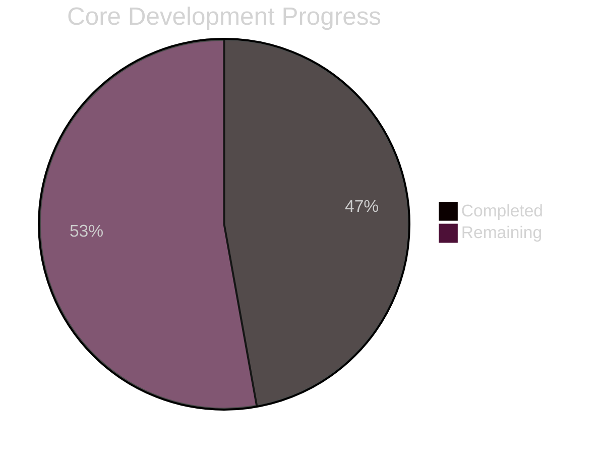
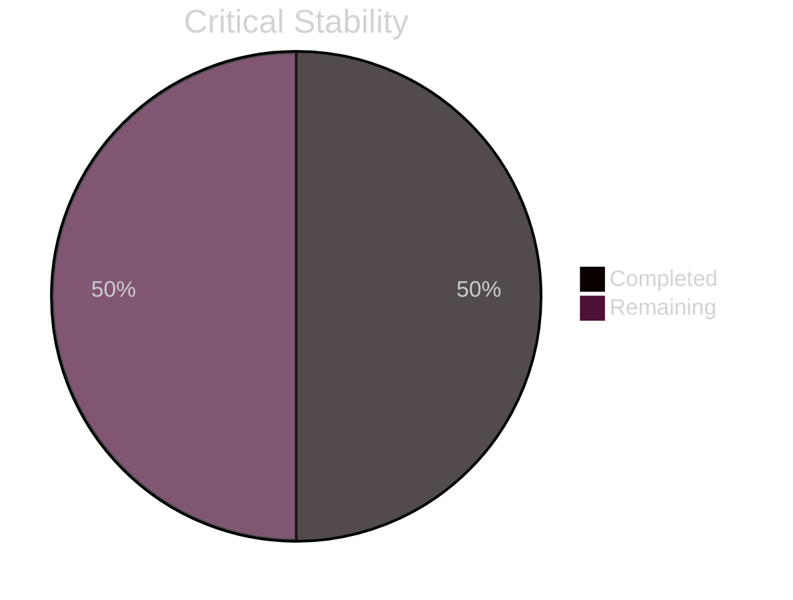
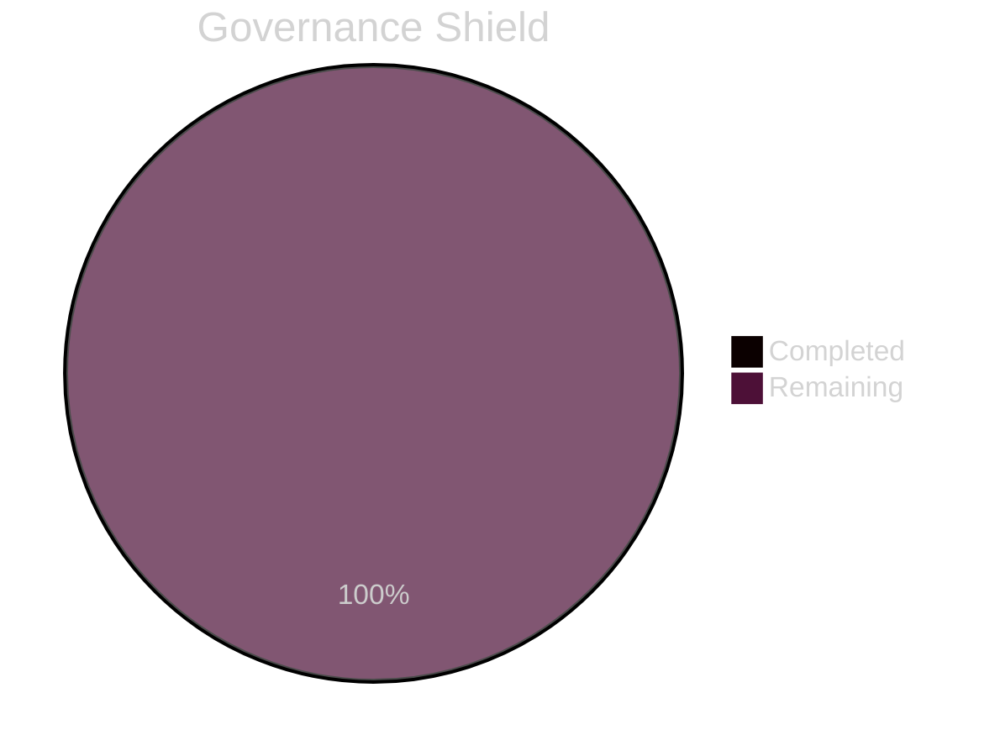
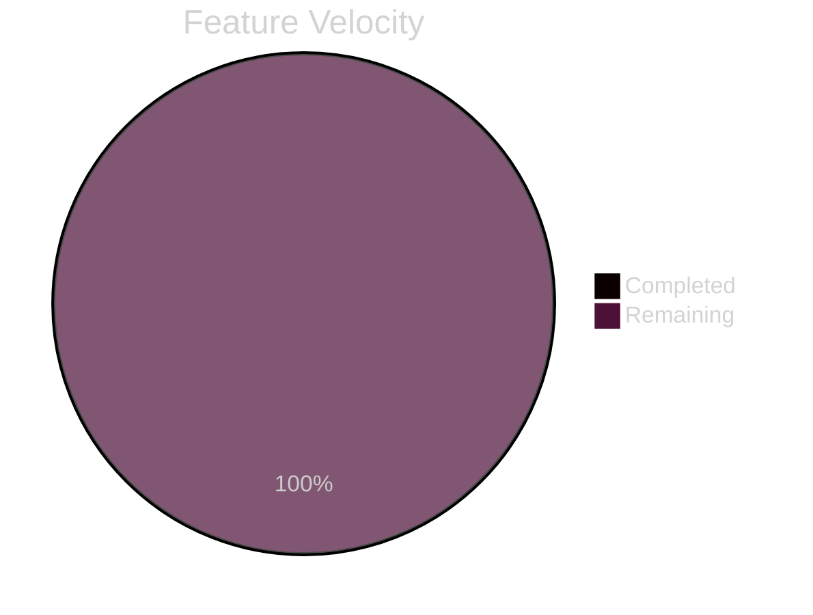

# SK8Lytz Master Bucket List

All active tasks, bugs, and feature work. Prioritized by **App Performance, Stability, and System Health**. New Features are appended at the bottom.

---

## 📊 Global System Readiness

---

## 🔴 CRITICAL: Performance, Stability & Security

*These items address crashes, data corruption, and security blocks that impact the core experience.*

---

## 🟠 HIGH: Engineering Excellence & Tech Debt

*System-wide health improvements, refactors, and performance optimizations.*

- [ ] `refactor/state-machine-standard` : [CLOUD] [H-RISK] [Feast] [Pillar 8] [🤖 THINK] [📝 NEEDS-PLAN] Deterministic UI — transition from boolean flags to explicit Enum-based Finite State Machines. → [Plan](docs/plans/refactor-state-machine-standard.md)
- [ ] `feat/ble-hardware-watchdog` : [LAB] [H-RISK] [Feast] [Pillar 7] [🤖 THINK] [📝 NEEDS-PLAN] Autonomous BLE 'Self-Healing' loop — detects hardware soft-locks and silent-relatches connections. → [Plan](docs/plans/feat-ble-hardware-watchdog.md)
- [ ] `perf/optimistic-ble-updates` : [LAB] [H-RISK] [Meal] [Pillar 2] [🤖 THINK] [📝 NEEDS-PLAN] Mask hardware latency using 'Ghost' optimistic UI updates and state reconciliation. → [Plan](docs/plans/perf-optimistic-ble-updates.md)
- [ ] `perf/delta-sync-protocol` : [CLOUD] [L-RISK] [Meal] [Pillar 4] [🤖 PRO-HIGH] [📝 NEEDS-PLAN] Implement differential data fetching to reduce bandwidth and battery consumption. → [Plan](docs/plans/perf-delta-sync-protocol.md)

- [ ] `fix/remote-id-audit` : [LAB] [H-RISK] [Meal] [Security] [🤖 THINK] [📝 NEEDS-PLAN] Implementation of the 0x2B protocol parser to extract and display unique paired RF Remote IDs in the Device Settings modal for security verification. → [Plan](docs/plans/hw-test-remote-pairing-logic.md)
- [ ] `audit-rls-performance` : [CLOUD] [H-RISK] [Meal] [🤖 THINK] [📝 NEEDS-PLAN] #20 — Security & Performance Review — Routine RLS audit on Supabase queries; optimize React Native render cycles for dashboard gauges. → [Plan](docs/plans/audit-rls-performance.md)
- [ ] `style/tokenized-spacing-standard` : [CLOUD] [L-RISK] [Meal] [Pillar 9] [🤖 FLASH] [📝 NEEDS-PLAN] The 8pt Grid — enforce 8pt spacing tokens app-wide to eliminate magic numbers. → [Plan](docs/plans/style-tokenized-spacing-standard.md)

- [ ] `chore/decompose-docked-controller-jsx` : [CLOUD] [H-RISK] [Feast] [P2 — DDA Audit] [🤖 PRO-HIGH] [📝 NEEDS-PLAN] Extract DockedController's per-mode JSX panels (MultiMode, Music, Street, Camera, Programs, Favorites) into memoized sub-components. Target: reduce from 2,835 → ~1,800 lines. → [Audit Report](brain/206e904d-e0ff-4a1f-ab45-c74c74b82974/domain_architecture_audit.md)
- [ ] `chore/refactor-dashboard-monolith` : [CLOUD] [H-RISK] [Feast] [Pillar 1] [🤖 THINK] [📝 NEEDS-PLAN] Decompose `DashboardScreen.tsx` (2,342 lines / 95.9KB) — device-config mutation logic and group-save callbacks still inline; target ~1,400 lines.

- [ ] `chore/refactor-diagnostic-lab` : [LAB] [L-RISK] [Meal] [🤖 FLASH] [📝 NEEDS-PLAN] cleanup and modularize `Sk8LytzDiagnosticLab.tsx` (61KB) for better maintainability.
- [ ] `chore/refactor-admin-tools` : [CLOUD] [L-RISK] [Meal] [🤖 PRO-HIGH] [📝 NEEDS-PLAN] break down `AdminToolsModal.tsx` (637 lines) into feature-specific admin modules.

---

## 🟡 MEDIUM: Compliance & Governance

*Legal requirements and administrative control systems.*

- [x] `feat/eula-onboarding` : [CLOUD] [H-RISK] [Meal] [🤖 PRO-HIGH] [📝 NEEDS-PLAN] Implement the **Legal Shield** — a mandatory, scroll-to-accept EULA flow (Kinetic Safety, Photosensitivity, Data Privacy) in the Auth registration and global version enforcement for active sessions. → [Plan](docs/plans/feat-eula-onboarding.md)
- [ ] `feat/telemetry-onboarding-ux` : [CLOUD] [L-RISK] [Meal] [🤖 FLASH] [📝 NEEDS-PLAN] Implement a casual 'Permissions Hub' onboarding screen after EULA to enable Camera, Mic, GPS, and Bluetooth. → [Plan](docs/plans/feat-telemetry-onboarding-ux.md)
- [ ] `feat/admin-app-manager` : [CLOUD] [L-RISK] [Feast] [🤖 PRO-HIGH] [📝 NEEDS-PLAN] Finalized Governance Hub with Safety Locks (Consolidated Scope) → [Plan](docs/plans/feat-admin-app-manager.md)
- [ ] `gate-offline-mode` : [CLOUD] [H-RISK] [Feast] [🤖 THINK] [📝 NEEDS-PLAN] [Stability] Gate off online capabilities when in offline mode (Crew Hub, Community Favorites, SK8Lytz Picks). Ensure Crew Hub card stays on dashboard but displays an "Offline" warning. → [Plan](docs/plans/gate-offline-mode.md)

---

## 🔵 LOW: New Features & UI Enhancements

*User-facing product value and UI refinements.*

- [ ] `feat/music-intel-phase-1` : [CLOUD] [H-RISK] [Feast] [🤖 THINK] [📝 NEEDS-PLAN] [Spotify Sync] — OAuth2 PKCE login, BPM/Energy mapping, and Album Art color extraction. → [Plan](docs/plans/feat-music-integration-master.md)
- [ ] `feat/music-intel-phase-2` : [CLOUD] [L-RISK] [Meal] [🤖 PRO-HIGH] [📝 NEEDS-PLAN] [Media Access] — Android MediaSession detection (YouTube, Pandora, etc.). → [Plan](docs/plans/feat-music-integration-master.md)
- [ ] `feat/music-intel-phase-3` : [LAB] [L-RISK] [Meal] [🤖 PRO-HIGH] [📝 NEEDS-PLAN] [Live Rink Mode] — ShazamKit/ACRCloud periodic background scanning (45s). → [Plan](docs/plans/feat-live-rink-mode.md)
- [ ] `feat/music-intel-phase-4` : [CLOUD] [L-RISK] [Meal] [🤖 PRO-HIGH] [📝 NEEDS-PLAN] [Apple Music] — MusicKit integration for native iOS BPM. → [Plan](docs/plans/feat-music-integration-master.md)
- [ ] `feat/music-intel-phase-5` : [CLOUD] [H-RISK] [Feast] [🤖 THINK] [📝 NEEDS-PLAN] [Crew Party Sync] — Master BPM Choreography Engine with Realtime crew sync. → [Plan](docs/plans/feat-music-integration-master.md)
- [ ] `feat/interactive-skate-spot-map` : [CLOUD] [L-RISK] [Feast] [🤖 PRO-HIGH] [📝 NEEDS-PLAN] Implement a high-density, interactive skate spot map using react-native-maps. → [Plan](docs/plans/feat-interactive-skate-spot-map.md)
- [ ] `feat/street-mode-telemetry-overhaul` : [CLOUD] [L-RISK] [Meal] [🤖 PRO-HIGH] [📝 NEEDS-PLAN] Overhaul Street Mode with metrics grid and auto-scaling gauges. → [Plan](docs/plans/feat-street-mode-telemetry-overhaul.md)
- [ ] `feat/usa-skate-spots-dataset` : [CLOUD] [BATCH] [L-RISK] [Snack] [🤖 FLASH] [📝 NEEDS-PLAN] US-only dataset of rinks and parks for map overlays. → [Plan](docs/plans/feat-usa-skate-spots-dataset.md)
- [ ] `feat/app-wide-ux-tips` : [CLOUD] [L-RISK] [Meal] [🤖 FLASH] [📝 NEEDS-PLAN] Contextual tips system for key friction points. → [Plan](docs/plans/feat-app-wide-ux-tips.md)

---

## ❄️ Icebox / Backburner (Manual Trigger Only)

- [ ] `feat/spatial-beat-mapping` : [LAB] [H-RISK] [Meal] [🤖 THINK] [📝 NEEDS-PLAN] [Pillar 11] Sound-to-Light Spatialization (Bass/Mid/Treble mapping). → [Plan](docs/plans/feat-spatial-beat-mapping.md)
- [ ] `feat/cockpit-dash-dynamic-bg` : [CLOUD] [L-RISK] [Meal] [🤖 PRO-HIGH] [📝 NEEDS-PLAN] Transform Dashboard into palette-synced dynamic backgrounds. → [Plan](docs/plans/feat-cockpit-dash-dynamic-bg.md)
- [ ] `feat/fixed-mode-refactor` : [LAB] [L-RISK] [Meal] [🤖 PRO-HIGH] [📝 NEEDS-PLAN] Pattern selection (Strobe, Blink, Static) + music slider fix. → [Plan](docs/plans/feat-fixed-mode-refactor.md)
- [ ] `feat/battery-health-predictor` : [LAB] [H-RISK] [Meal] [🤖 THINK] [📝 NEEDS-PLAN] Power modeling to predict battery life and auto-dimming. → [Plan](docs/plans/feat-battery-health-predict.md)
- [ ] `feat/impact-sentinel-safety` : [LAB] [H-RISK] [Meal] [🤖 THINK] [📝 NEEDS-PLAN] [Pillar 6] Fall Detection — triggers white 'Flare' strobe on impact. → [Plan](docs/plans/feat-impact-sentinel-safety.md)
- [ ] `feat/kinetic-brake-lights` : [LAB] [H-RISK] [Meal] [🤖 THINK] [📝 NEEDS-PLAN] [Pillar 12] Kinetic Safety — phone accelerometer pulse RED for braking. → [Plan](docs/plans/feat-kinetic-brake-lights.md)
- [ ] `feat/zero-touch-crew-sync` : [CLOUD] [H-RISK] [Feast] [🤖 THINK] [📝 NEEDS-PLAN] Geofence-based 'Hive Mind' synchronization. → [Plan](docs/plans/feat-zero-touch-crew-sync.md)
- [ ] `hw-test/proximity-magic-tap` : [LAB] [H-RISK] [Meal] [🤖 THINK] [📝 NEEDS-PLAN] [The Magic Tap] RSSI-gated hardware identification.
- [ ] `feat/neogleamz-brand-presence` : [CLOUD] [L-RISK] [Meal] [🤖 FLASH] [📝 NEEDS-PLAN] Neogleamz identity integration.
- [ ] `feat/siri-google-assistant-integration` : [CLOUD] [L-RISK] [Meal] [🤖 PRO-HIGH] [📝 NEEDS-PLAN] Siri/Google Assistant phone-level voice control.
- [ ] `feat/geofence-rink-sync` : [CLOUD] [H-RISK] [Meal] [🤖 THINK] [📝 NEEDS-PLAN] GPS-based auto-crew discovery.
- [ ] `add-swipe-nav` : [CLOUD] [L-RISK] [Meal] [🤖 FLASH] [📝 NEEDS-PLAN] Card Swipe Navigation.

---

## ✅ Completed Previously

- [x] `feat/admin-hub-design-system` : Standardized admin headers and ToolCard grid.
- [x] `chore/delete-orphan-backup` : Removed Sk8LytzDiagnosticLab_old.tsx.
- [x] `lab-music-mode-parity` : Lab 0x73 Music Mode parity.
- [x] `epic/connection-reliability` : Multiphase BLE connection overhaul.
- [x] `fix-ble-audit` : BLE discovery speed fixes.
- [x] `feat/speed-tracking-telemetry` : Statistics, Session Metadata, and GPS accumulation.
- [x] `feat/voice-command-engine` : Offline voice command resolution.
- [x] `feat/empty-skates-setup-cta` : Setup Wizard dashboard CTA.

- [x] `chore/sentient-tech-debt-sweep` : [CLOUD] [BATCH] [L-RISK] [Feast] [TOP PRIORITY] Standardize AsyncStorage keys (@Sk8lytz_ prefix), normalize UI speed → Hardware (1-31), and eliminate redundant buffer requires. → [Plan](docs/plans/chore-sentient-tech-debt-sweep.md)
- [x] `audit/domain-driven-architecture` : [CLOUD] [H-RISK] [Feast] Audited all 14 extracted domain hooks; resolved 4 bugs (P0: missing state, P0: type narrowing, P1: ModeType duplication, P1: AsyncStorage race condition). TSC exit 0. → [Audit Report](brain/206e904d-e0ff-4a1f-ab45-c74c74b82974/domain_architecture_audit.md)
- [x] `feat/optimistic-picks-cache` : [CLOUD] [H-RISK] [Meal] [Performance] Implement 'Stale-While-Revalidate' caching for Favorites and SK8Lytz Picks to eliminate load stutters. → [Plan](docs/plans/feat-optimistic-picks-cache.md)
- [x] `chore/refactor-docked-controller` : [CLOUD] [H-RISK] [Feast] [Pillar 1] State extraction complete via domain hooks. Remaining size: 2,835 lines / 134.8KB — JSX render tree decomposition still needed (see P2 below).
- [x] `chore/refactor-account-modal` : [CLOUD] [L-RISK] [Meal] refactor `AccountModal.tsx` (63KB) to separate settings, profiles, and device management views.

---
*Last updated: 2026-04-13 | Active tasks moved to Completed.*
