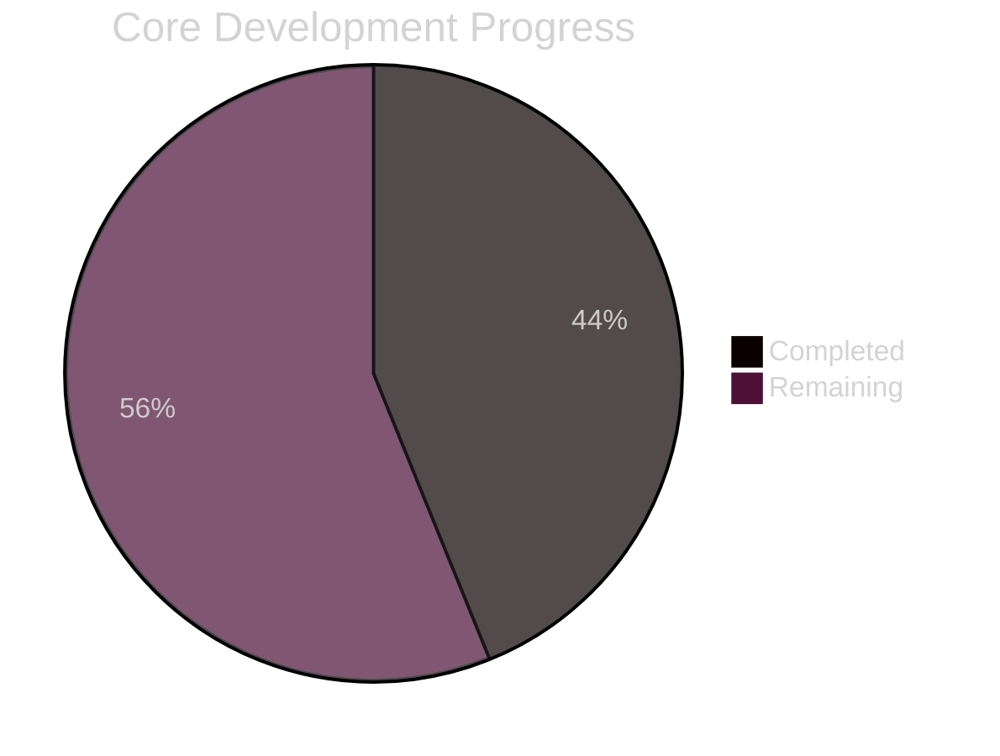
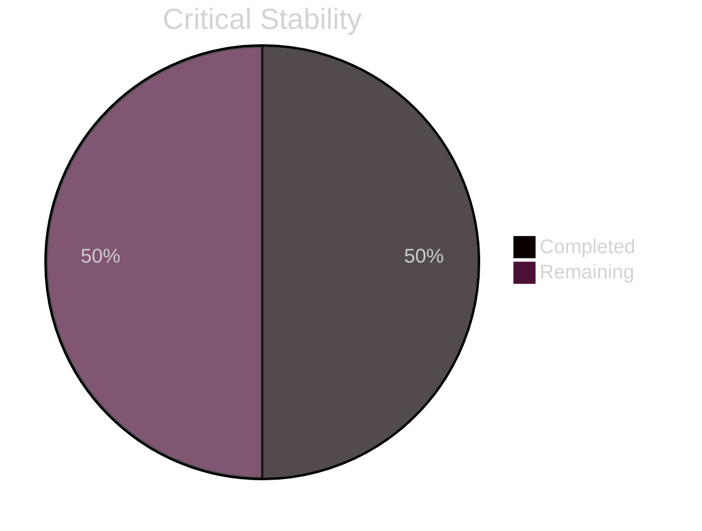
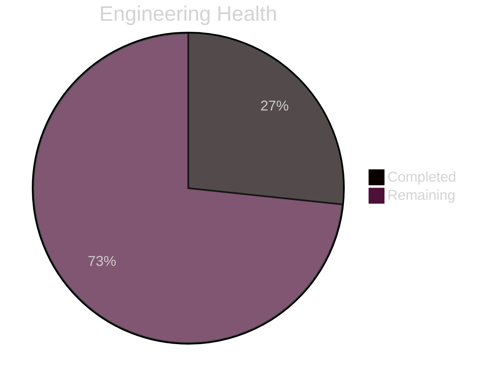
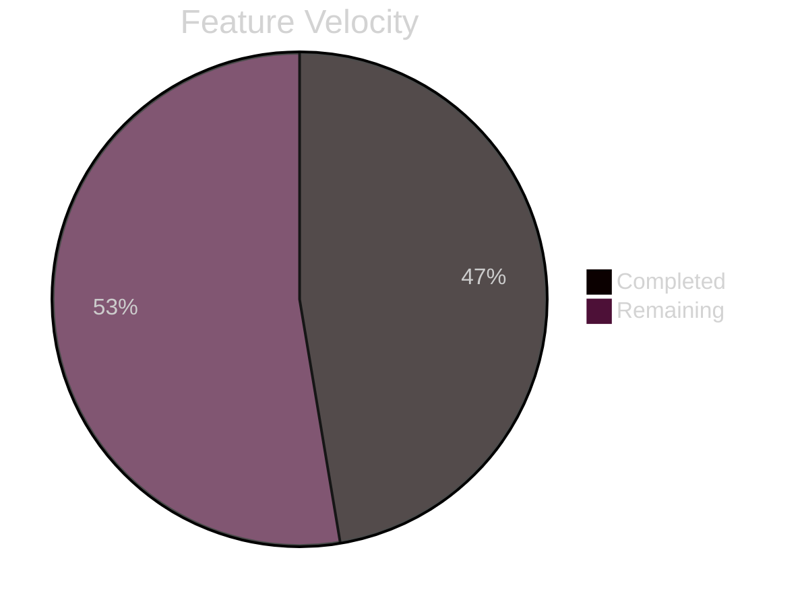

# SK8Lytz Master Bucket List

All active tasks, bugs, and feature work. Prioritized by **App Performance, Stability, and System Health**. New Features are appended at the bottom.

---

## 📊 Global System Readiness

------

## 🔴 CRITICAL: 🛡️ Performance, Stability & Security

*These items address crashes, data corruption, and security blocks that impact the core experience.*

- [ ] `feat/gate-offline-mode` : [☁️ CLOUD] [⚠️ H-RISK] [🥩 Feast] [🧠 THINK] [Stability] Gate off online capabilities when in offline mode (Crew Hub, Community Favorites, SK8Lytz Picks). Ensure Crew Hub card stays on dashboard but displays an "Offline" warning. → [Plan](docs/plans/gate-offline-mode.md)
- [ ] `feat/ble-hardware-watchdog` : [🧪 LAB] [⚠️ H-RISK] [🥩 Feast] [Pillar 7] [🧠 THINK] Autonomous BLE 'Self-Healing' loop — detects hardware soft-locks and silent-relatches connections. → [Plan](docs/plans/feat-ble-hardware-watchdog.md)
- [ ] `fix/display-name-persistence` : [☁️ CLOUD] [⚠️ H-RISK] [🍱 Meal] [🤖 PRO-HIGH] Resolve user profile persistence issue where 'display_name' is not being propagated from auth metadata to the user_profiles table. → [Plan](docs/plans/fix-display-name-persistence.md)

---

## 🟠 HIGH: 🛠️ Engineering Excellence & Tech Debt

*System-wide health improvements, refactors, and performance optimizations.*

- [ ] `perf/delta-sync-protocol` : [☁️ CLOUD] [✅ L-RISK] [🍱 Meal] [Pillar 4] [🤖 PRO-HIGH] [📝️ NEEDS-PLAN] Implement differential data fetching to reduce bandwidth and battery consumption. → [Plan](docs/plans/perf-delta-sync-protocol.md)
- [ ] `fix/remote-id-audit` : [🧪 LAB] [⚠️ H-RISK] [🍱 Meal] [Security] [🧠 THINK] Implementation of the 0x2B protocol parser to extract and display unique paired RF Remote IDs in the Device Settings modal for security verification. → [Plan](docs/plans/hw-test-remote-pairing-logic.md)
- [ ] `chore/audit-rls-performance` : [☁️ CLOUD] [⚠️ H-RISK] [🍱 Meal] [🧠 THINK] #20 — Security & Performance Review — Routine RLS audit on Supabase queries; optimize React Native render cycles for dashboard gauges. → [Plan](docs/plans/audit-rls-performance.md)
- [ ] `style/tokenized-spacing-standard` : [☁️ CLOUD] [✅ L-RISK] [🍱 Meal] [Pillar 9] [🤖 FLASH] [📝️ NEEDS-PLAN] The 8pt Grid — enforce 8pt spacing tokens app-wide to eliminate magic numbers. → [Plan](docs/plans/style-tokenized-spacing-standard.md)
- [x] `fix/critical-dependency-vulnerabilities` : [☁️ CLOUD] [⚠️ H-RISK] [🍱 Meal] [🤖 PRO-HIGH] [Security] Fix 10 vulnerabilities (1 critical xmldom injection, 3 high) via audited dependency updates.
- [ ] `chore/refactor-god-object-docked-controller` : [☁️ CLOUD] [⚠️ H-RISK] [🥩 Feast] [🧠 THINK] [God Object] Refactor `DockedController.tsx` — 83 hooks and 134KB detected; critical modularity risk.
- [ ] `chore/refactor-god-object-dashboard` : [☁️ CLOUD] [⚠️ H-RISK] [🥩 Feast] [🧠 THINK] [God Object] Refactor `DashboardScreen.tsx` — 48 hooks and 95KB detected; decompose state management.
- [ ] `chore/refactor-use-ble-overheat` : [🧪 LAB] [⚠️ H-RISK] [🍱 Meal] [🧠 THINK] [God Object] Refactor `useBLE.ts` — 39 hooks and 42KB detected; decouple scanning from characteristic logic.
- [ ] `chore/telemetry-efficiency-audit` : [☁️ CLOUD] [⚠️ H-RISK] [🥩 Feast] [🤖 PRO-HIGH] Re-evaluate the parsed_* telemetry tables and ingestion logic to eliminate data duplication and optimize storage efficiency. → [Plan](docs/plans/chore-telemetry-efficiency-audit.md)
- [ ] `chore/refactor-admin-tools` : [☁️ CLOUD] [✅ L-RISK] [🍱 Meal] [🤖 PRO-HIGH] [📝️ NEEDS-PLAN] break down `AdminToolsModal.tsx` (637 lines) into feature-specific admin modules.
- [ ] `feat/discord-agent-bridge` : [🧪 LAB] [⚠️ H-RISK] [🥩 Feast] [🧠 THINK] Implement a local Discord bridge that streams agent logs to a channel and pipes user replies back into the agent's context via a sanitized command buffer file. → [Plan](docs/plans/feat-discord-agent-bridge.md)

- [ ] `fix/voice-engine-integration` : [🧪 LAB] [⚠️ H-RISK] [🥩 Feast] [🧠 THINK] [⏱️ 2h] Repair the Voice Command Engine. The native voice bridge throws a null reference error on launch and requires a teardown/rebuild. → [Plan](docs/plans/fix-voice-engine-integration.md)

---

## 🟡 MEDIUM: ⚖️ Compliance & Governance

*Legal requirements and administrative control systems.*

---

## 🔵 LOW: ✨ New Features & UI Enhancements

*User-facing product value and UI refinements.*

- [ ] `feat/music-intel-phase-1` : [☁️ CLOUD] [⚠️ H-RISK] [🥩 Feast] [🧠 THINK] [Spotify Sync] — OAuth2 PKCE login, BPM/Energy mapping, and Album Art color extraction. → [Plan](docs/plans/feat-music-integration-master.md)
- [ ] `feat/music-intel-phase-2` : [☁️ CLOUD] [✅ L-RISK] [🍱 Meal] [🤖 PRO-HIGH] [📝️ NEEDS-PLAN] [Media Access] — Android MediaSession detection (YouTube, Pandora, etc.). → [Plan](docs/plans/feat-music-integration-master.md)
- [ ] `feat/music-intel-phase-3` : [🧪 LAB] [✅ L-RISK] [🍱 Meal] [🤖 PRO-HIGH] [📝️ NEEDS-PLAN] [Live Rink Mode] — ShazamKit/ACRCloud periodic background scanning (45s). → [Plan](docs/plans/feat-live-rink-mode.md)
- [ ] `feat/music-intel-phase-4` : [☁️ CLOUD] [✅ L-RISK] [🍱 Meal] [🤖 PRO-HIGH] [📝️ NEEDS-PLAN] [Apple Music] — MusicKit integration for native iOS BPM. → [Plan](docs/plans/feat-music-integration-master.md)
- [ ] `feat/music-intel-phase-5` : [☁️ CLOUD] [⚠️ H-RISK] [🥩 Feast] [🧠 THINK] [Crew Party Sync] — Master BPM Choreography Engine with Realtime crew sync. → [Plan](docs/plans/feat-music-integration-master.md)
- [ ] `feat/interactive-skate-spot-map` : [☁️ CLOUD] [✅ L-RISK] [🥩 Feast] [🤖 PRO-HIGH] Implement a high-density, interactive skate spot map using react-native-maps. → [Plan](docs/plans/feat-interactive-skate-spot-map.md)
- [ ] `feat/street-mode-telemetry-overhaul` : [☁️ CLOUD] [✅ L-RISK] [🍱 Meal] [🤖 PRO-HIGH] [📝️ NEEDS-PLAN] Overhaul Street Mode with metrics grid and auto-scaling gauges. → [Plan](docs/plans/feat-street-mode-telemetry-overhaul.md)
- [ ] `feat/app-wide-ux-tips` : [☁️ CLOUD] [✅ L-RISK] [🍱 Meal] [🤖 FLASH] [📝️ NEEDS-PLAN] Contextual tips system for key friction points. → [Plan](docs/plans/feat-app-wide-ux-tips.md)
- [ ] `feat/google-oauth-integration` : [☁️ CLOUD] [⚠️ H-RISK] [🥩 Feast] [🧠 THINK] Integrate Google OAuth as an auth provider. (Requires Google Cloud Console setup + Supabase config). → [Plan](docs/plans/feat-google-oauth-integration.md)
- [ ] `fix/supabase-signup-400` : [🧪 LAB] [✅ L-RISK] [🍪 Snack] [🤖 FLASH] [📝️ NEEDS-PLAN] Investigate Signup 400 error in web/simulator environments; verify redirect URI and rate limits.

---

## ❄️ Icebox / Backburner (Manual Trigger Only)

- [ ] `feat/spatial-beat-mapping` : [🧪 LAB] [⚠️ H-RISK] [🍱 Meal] [🧠 THINK] [Pillar 11] Sound-to-Light Spatialization (Bass/Mid/Treble mapping). → [Plan](docs/plans/feat-spatial-beat-mapping.md)
- [ ] `feat/cockpit-dash-dynamic-bg` : [☁️ CLOUD] [✅ L-RISK] [🍱 Meal] [🤖 PRO-HIGH] [📝️ NEEDS-PLAN] Transform Dashboard into palette-synced dynamic backgrounds. → [Plan](docs/plans/feat-cockpit-dash-dynamic-bg.md)
- [ ] `feat/fixed-mode-refactor` : [🧪 LAB] [✅ L-RISK] [🍱 Meal] [🤖 PRO-HIGH] [📝️ NEEDS-PLAN] Pattern selection (Strobe, Blink, Static) + music slider fix. → [Plan](docs/plans/feat-fixed-mode-refactor.md)
- [ ] `feat/battery-health-predictor` : [🧪 LAB] [⚠️ H-RISK] [🍱 Meal] [🧠 THINK] Power modeling to predict battery life and auto-dimming. → [Plan](docs/plans/feat-battery-health-predict.md)
- [ ] `feat/impact-sentinel-safety` : [🧪 LAB] [⚠️ H-RISK] [🍱 Meal] [🧠 THINK] [Pillar 6] Fall Detection — triggers white 'Flare' strobe on impact. → [Plan](docs/plans/feat-impact-sentinel-safety.md)
- [ ] `feat/kinetic-brake-lights` : [🧪 LAB] [⚠️ H-RISK] [🍱 Meal] [🧠 THINK] [Pillar 12] Kinetic Safety — phone accelerometer pulse RED for braking. → [Plan](docs/plans/feat-kinetic-brake-lights.md)
- [ ] `feat/zero-touch-crew-sync` : [☁️ CLOUD] [⚠️ H-RISK] [🥩 Feast] [🧠 THINK] Geofence-based 'Hive Mind' synchronization. → [Plan](docs/plans/feat-zero-touch-crew-sync.md)
- [ ] `hw-test/proximity-magic-tap` : [🧪 LAB] [⚠️ H-RISK] [🍱 Meal] [🧠 THINK] [The Magic Tap] RSSI-gated hardware identification.
- [ ] `feat/neogleamz-brand-presence` : [☁️ CLOUD] [✅ L-RISK] [🍱 Meal] [🤖 FLASH] [📝️ NEEDS-PLAN] Neogleamz identity integration.
- [ ] `feat/siri-google-assistant-integration` : [☁️ CLOUD] [✅ L-RISK] [🍱 Meal] [🤖 PRO-HIGH] [📝️ NEEDS-PLAN] Siri/Google Assistant phone-level voice control.
- [ ] `feat/geofence-rink-sync` : [☁️ CLOUD] [⚠️ H-RISK] [🍱 Meal] [🧠 THINK] GPS-based auto-crew discovery.
- [ ] `feat/add-swipe-nav` : [☁️ CLOUD] [✅ L-RISK] [🍱 Meal] [🤖 FLASH] [📝️ NEEDS-PLAN] Card Swipe Navigation.

## ✅ Completed Previously
- [x] `chore/hide-voice-button` : [☁️ CLOUD] [✅ L-RISK] [🍪 Snack] [🤖 FLASH] [⚡ FLASH-READY] [⏱️ 5m] Hide the Voice Command FAB from the Dashboard until the native engine is repaired. → [Plan](docs/plans/chore-hide-voice-button.md)
- [x] `fix/critical-dependency-vulnerabilities` : [☁️ CLOUD] [⚠️ H-RISK] [🍱 Meal] [🤖 PRO-HIGH] [Security] Fix 10 vulnerabilities (1 critical xmldom injection, 3 high) via audited dependency updates.

---
*Last updated: 2026-04-13 | Active tasks moved to Completed Archive.*

