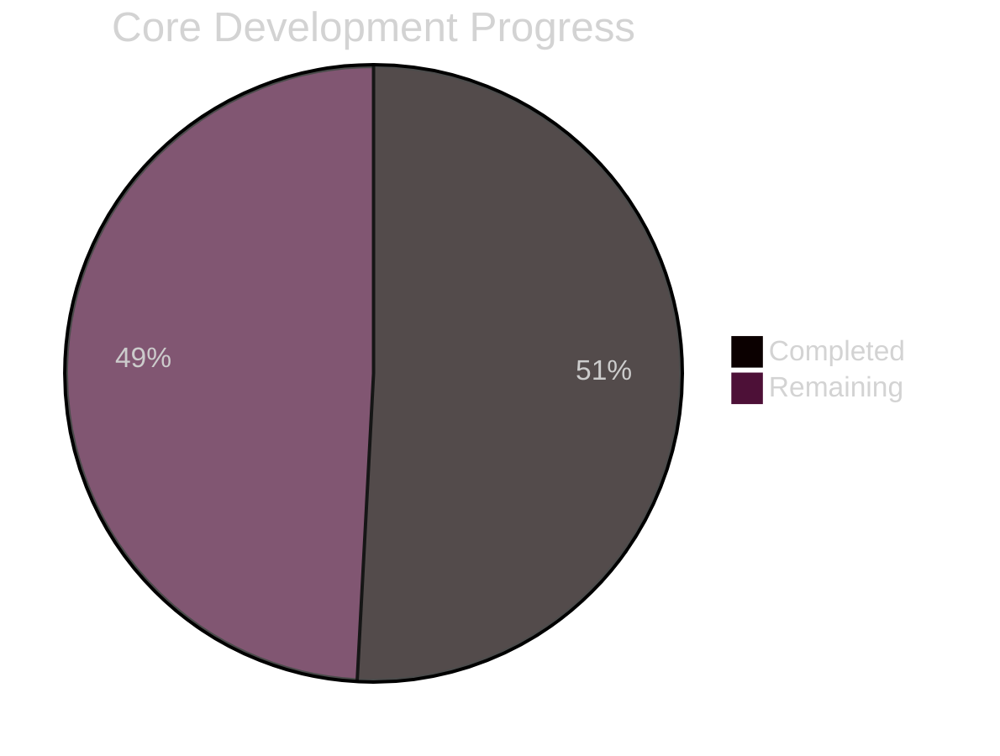
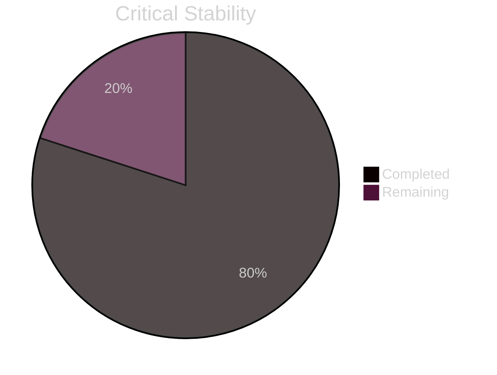
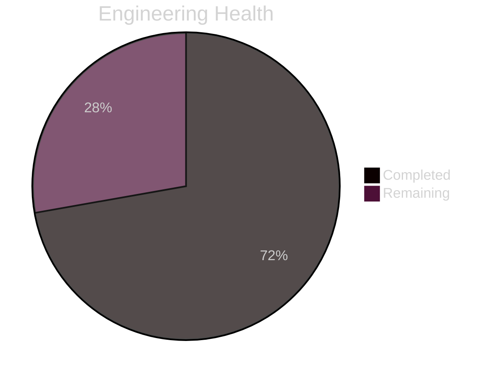
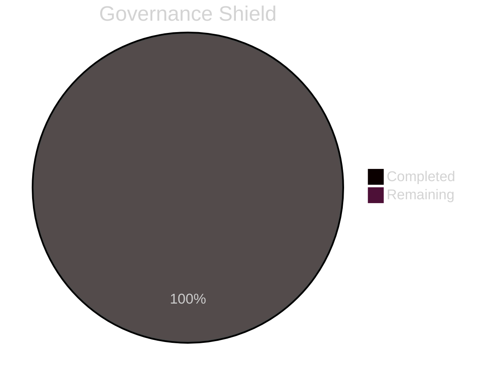
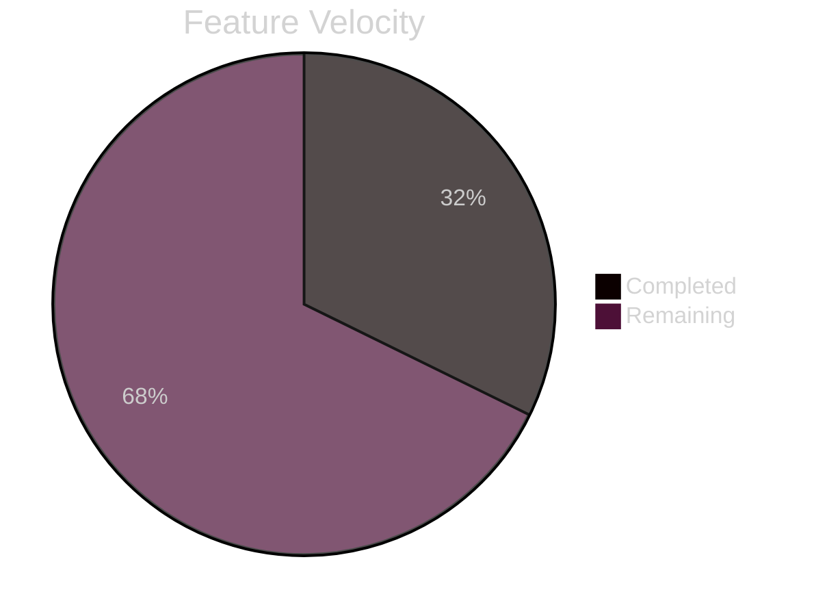
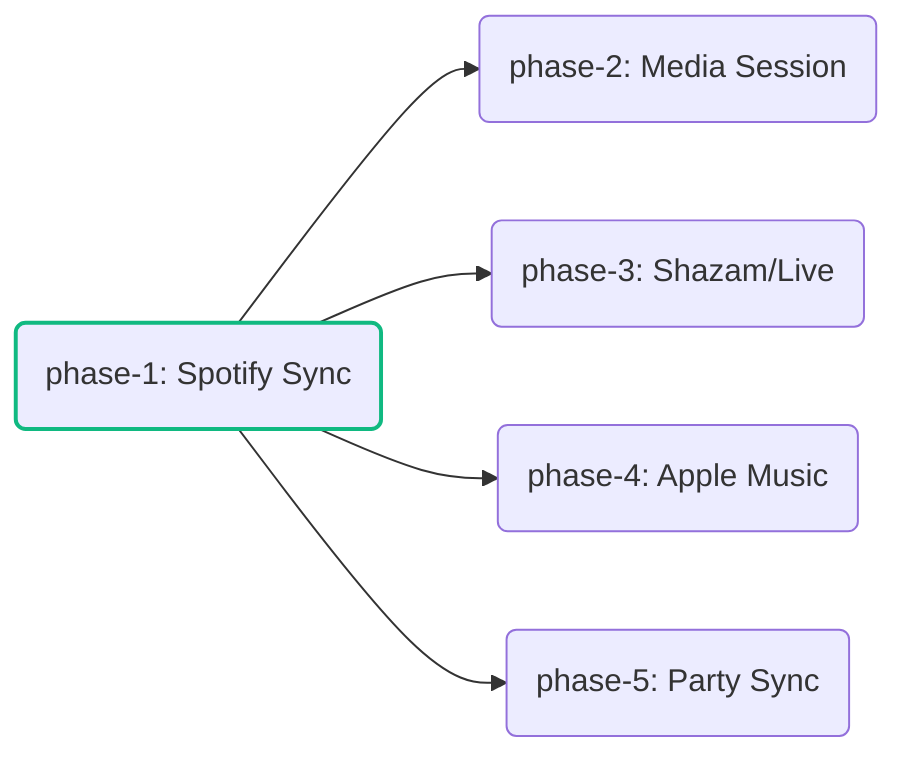

# SK8Lytz Master Bucket List

All active tasks, bugs, and feature work. Prioritized by **App Performance, Stability, and System Health**. New Features are appended at the bottom.

---

## 📊 Global System Readiness

---

## 🔴 CRITICAL: 🛡️ Performance, Stability & Security

_These items address crashes, data corruption, and security blocks that impact the core experience._

- [ ] `feat/gate-offline-mode` : [☁️ CLOUD] [⚠️ H-RISK] [🥩 Feast] [🪙 40k] [⏱️ 6h] [🧠 THINK] [Stability] Gate off online capabilities when in offline mode (Crew Hub, Community Favorites, SK8Lytz Picks). Ensure Crew Hub card stays on dashboard but displays an "Offline" warning. → [Plan](docs/plans/gate-offline-mode.md)

- [x] `chore/domain-architecture-audit` : [☁️ CLOUD] [⚠️ H-RISK] [🥩 Feast] [🪙 30k] [⏱️ 6h] [🧠 THINK] [Stability] Full app-wide audit of domain-driven architecture refactors. Identify orphaned imports, stale hook references, leftover monolithic patterns, dead code from extracted components, and any misrouted business logic. Generate sub-tasks in the Bucket List for each finding. → [Plan](docs/plans/chore-domain-architecture-audit.md)

---

## 🟠 HIGH: 🛠️ Engineering Excellence & Tech Debt

_System-wide health improvements, refactors, and performance optimizations._

- [ ] `fix/remote-id-audit` : [🧪 LAB] [⚠️ H-RISK] [🍱 Meal] [🪙 15k] [⏱️ 3h] [Security] [🧠 THINK] Implementation of the 0x2B protocol parser to extract and display unique paired RF Remote IDs in the Device Settings modal for security verification. → [Plan](docs/plans/hw-test-remote-pairing-logic.md)

- [x] `chore/ts-dead-code-purge` : [☁️ CLOUD] [⚠️ H-RISK] [🍱 Meal] [🪙 15k] [⏱️ 3h] [🧠 THINK] Purge 344 instances of dead parameters and unused imports identified during the DDA Audit.

- [ ] `chore/refactor-dashboard-screen` : [☁️ CLOUD] [⚠️ H-RISK] [🥩 Feast] [🪙 40k] [⏱️ 6h] [🧠 THINK] Break `DashboardScreen.tsx` (97 hooks) into DDA presentation-layer sub-components.

- [ ] `chore/refactor-docked-controller` : [☁️ CLOUD] [⚠️ H-RISK] [🥩 Feast] [🪙 45k] [⏱️ 6h] [🧠 THINK] Extract `DockedController.tsx` (122KB presentation layer) into independent UI component nodes.

- [x] `fix/supabase-database-typing` : [☁️ CLOUD] [✅ L-RISK] [🍪 Snack] [🪙 5k] [⏱️ 1h] [🤖 FLASH] Resolve the persistent TS2305 error regarding `Database` generic typing from `src/types/supabase`.

- [ ] `feat/discord-agent-bridge` : [🧪 LAB] [⚠️ H-RISK] [🥩 Feast] [🪙 35k] [⏱️ 6h] [🧠 THINK] Implement a local Discord bridge that streams agent logs to a channel and pipes user replies back into the agent's context via a sanitized command buffer file. → [Plan](docs/plans/feat-discord-agent-bridge.md)

- [ ] `fix/voice-engine-integration` : [🧪 LAB] [⚠️ H-RISK] [🥩 Feast] [🪙 40k] [⏱️ 2h] [🧠 THINK] Repair the Voice Command Engine. The native voice bridge throws a null reference error on launch and requires a teardown/rebuild. → [Plan](docs/plans/fix-voice-engine-integration.md)

---

## 🟡 MEDIUM: ⚖️ Compliance & Governance

_Legal requirements and administrative control systems._

---

## 🔵 LOW: ✨ New Features & UI Enhancements

_User-facing product value and UI refinements._

- [ ] `feat/interactive-skate-spot-map` : [☁️ CLOUD] [✅ L-RISK] [🥩 Feast] [🪙 35k] [⏱️ 6h] [📅 2026-04-14] [🤖 PRO-HIGH] Implement a high-density, interactive skate spot map using react-native-maps. → [Plan](docs/plans/feat-interactive-skate-spot-map.md)
- [ ] `feat/street-mode-telemetry-overhaul` : [☁️ CLOUD] [✅ L-RISK] [🍱 Meal] [🪙 20k] [⏱️ 3h] [📅 2026-04-14] [🤖 PRO-HIGH] [📝️ NEEDS-PLAN] Overhaul Street Mode with metrics grid and auto-scaling gauges. → [Plan](docs/plans/feat-street-mode-telemetry-overhaul.md)
- [ ] `feat/app-wide-ux-tips` : [☁️ CLOUD] [✅ L-RISK] [🍱 Meal] [🪙 12k] [⏱️ 3h] [📅 2026-04-14] [🤖 FLASH] [📝️ NEEDS-PLAN] Contextual tips system for key friction points. → [Plan](docs/plans/feat-app-wide-ux-tips.md)
- [x] `fix/supabase-signup-400` : [🧪 LAB] [✅ L-RISK] [🍪 Snack] [🪙 4k] [⏱️ 1h] [📅 2026-04-14] [🤖 FLASH] [📝️ NEEDS-PLAN] Investigate Signup 400 error in web/simulator environments; verify redirect URI and rate limits.

---

## ❄️ Icebox / Backburner (Manual Trigger Only)

### 🎵 Epic: Music Mode

- [ ] `feat/music-intel-phase-1` : [☁️ CLOUD] [⚠️ H-RISK] [🥩 Feast] [🪙 50k] [⏱️ 6h] [📅 2026-04-14] [🧠 THINK] [Spotify Sync] — OAuth2 PKCE login, BPM/Energy mapping, and Album Art color extraction. → [Plan](docs/plans/feat-music-integration-master.md)
- [ ] `feat/music-intel-phase-2` : [☁️ CLOUD] [✅ L-RISK] [🍱 Meal] [🪙 15k] [⏱️ 3h] [📅 2026-04-14] [⛔ BLOCKED BY feat/music-intel-phase-1] [🤖 PRO-HIGH] [📝️ NEEDS-PLAN] [Media Access] — Android MediaSession detection (YouTube, Pandora, etc.). → [Plan](docs/plans/feat-music-integration-master.md)
- [ ] `feat/music-intel-phase-3` : [🧪 LAB] [✅ L-RISK] [🍱 Meal] [🪙 15k] [⏱️ 3h] [📅 2026-04-14] [⛔ BLOCKED BY feat/music-intel-phase-1] [🤖 PRO-HIGH] [📝️ NEEDS-PLAN] [Live Rink Mode] — ShazamKit/ACRCloud periodic background scanning (45s). → [Plan](docs/plans/feat-live-rink-mode.md)
- [ ] `feat/music-intel-phase-4` : [☁️ CLOUD] [✅ L-RISK] [🍱 Meal] [🪙 15k] [⏱️ 3h] [📅 2026-04-14] [⛔ BLOCKED BY feat/music-intel-phase-1] [🤖 PRO-HIGH] [📝️ NEEDS-PLAN] [Apple Music] — MusicKit integration for native iOS BPM. → [Plan](docs/plans/feat-music-integration-master.md)
- [ ] `feat/music-intel-phase-5` : [☁️ CLOUD] [⚠️ H-RISK] [🥩 Feast] [🪙 45k] [⏱️ 6h] [📅 2026-04-14] [⛔ BLOCKED BY feat/music-intel-phase-1] [🧠 THINK] [Crew Party Sync] — Master BPM Choreography Engine with Realtime crew sync. → [Plan](docs/plans/feat-music-integration-master.md)

- [ ] `feat/google-oauth-integration` : [☁️ CLOUD] [⚠️ H-RISK] [🥩 Feast] [🪙 30k] [⏱️ 6h] [📅 2026-04-14] [🧠 THINK] Integrate Google OAuth as an auth provider. (Requires Google Cloud Console setup + Supabase config). → [Plan](docs/plans/feat-google-oauth-integration.md)
- [ ] `feat/spatial-beat-mapping` : [🧪 LAB] [⚠️ H-RISK] [🍱 Meal] [🪙 18k] [⏱️ 3h] [🧠 THINK] [Pillar 11] Sound-to-Light Spatialization (Bass/Mid/Treble mapping). → [Plan](docs/plans/feat-spatial-beat-mapping.md)
- [ ] `feat/cockpit-dash-dynamic-bg` : [☁️ CLOUD] [✅ L-RISK] [🍱 Meal] [🪙 15k] [⏱️ 3h] [🤖 PRO-HIGH] [📝️ NEEDS-PLAN] Transform Dashboard into palette-synced dynamic backgrounds. → [Plan](docs/plans/feat-cockpit-dash-dynamic-bg.md)
- [ ] `feat/fixed-mode-refactor` : [🧪 LAB] [✅ L-RISK] [🍱 Meal] [🪙 10k] [⏱️ 3h] [🤖 PRO-HIGH] [📝️ NEEDS-PLAN] Pattern selection (Strobe, Blink, Static) + music slider fix. → [Plan](docs/plans/feat-fixed-mode-refactor.md)
- [ ] `feat/battery-health-predictor` : [🧪 LAB] [⚠️ H-RISK] [🍱 Meal] [🪙 15k] [⏱️ 3h] [🧠 THINK] Power modeling to predict battery life and auto-dimming. → [Plan](docs/plans/feat-battery-health-predict.md)
- [ ] `feat/impact-sentinel-safety` : [🧪 LAB] [⚠️ H-RISK] [🍱 Meal] [🪙 12k] [⏱️ 3h] [🧠 THINK] [Pillar 6] Fall Detection — triggers white 'Flare' strobe on impact. → [Plan](docs/plans/feat-impact-sentinel-safety.md)
- [ ] `feat/kinetic-brake-lights` : [🧪 LAB] [⚠️ H-RISK] [🍱 Meal] [🪙 15k] [⏱️ 3h] [🧠 THINK] [Pillar 12] Kinetic Safety — phone accelerometer pulse RED for braking. → [Plan](docs/plans/feat-kinetic-brake-lights.md)
- [ ] `feat/zero-touch-crew-sync` : [☁️ CLOUD] [⚠️ H-RISK] [🥩 Feast] [🪙 30k] [⏱️ 6h] [🧠 THINK] Geofence-based 'Hive Mind' synchronization. → [Plan](docs/plans/feat-zero-touch-crew-sync.md)
- [ ] `hw-test/proximity-magic-tap` : [🧪 LAB] [⚠️ H-RISK] [🍱 Meal] [🪙 10k] [⏱️ 3h] [🧠 THINK] [The Magic Tap] RSSI-gated hardware identification.
- [ ] `feat/neogleamz-brand-presence` : [☁️ CLOUD] [✅ L-RISK] [🍱 Meal] [🪙 8k] [⏱️ 3h] [🤖 FLASH] [📝️ NEEDS-PLAN] Neogleamz identity integration.
- [ ] `feat/siri-google-assistant-integration` : [☁️ CLOUD] [✅ L-RISK] [🍱 Meal] [🪙 25k] [⏱️ 3h] [🤖 PRO-HIGH] [📝️ NEEDS-PLAN] Siri/Google Assistant phone-level voice control.
- [ ] `feat/geofence-rink-sync` : [☁️ CLOUD] [⚠️ H-RISK] [🍱 Meal] [🪙 20k] [⏱️ 3h] [🧠 THINK] GPS-based auto-crew discovery.
- [ ] `feat/add-swipe-nav` : [☁️ CLOUD] [✅ L-RISK] [🍱 Meal] [🪙 12k] [⏱️ 3h] [🤖 FLASH] [📝️ NEEDS-PLAN] Card Swipe Navigation.

## ✅ Completed Previously

- [x] `chore/redesign-parsed-data-storage` : [☁️ CLOUD] [⚠️ H-RISK] [🥩 Feast] [🧠 THINK] [📝️ NEEDS-PLAN] [⏱️ 3h] Redesign device telemetry ingestion from an un-gated firehose into a Constraint-Based Auditing model. Implements local telemetry spooling/batching (TelemetryBatcher), and consolidates fragmented tables into a single JSONB telemetry_snapshots table to minimize cloud cost overhead. → [Plan](docs/plans/chore-redesign-parsed-data-storage.md)
- [x] `chore/refactor-admin-tools` : [☁️ CLOUD] [✅ L-RISK] [🍱 Meal] [🤖 PRO-HIGH] [📝️ NEEDS-PLAN] break down `AdminToolsModal.tsx` (637 lines) into feature-specific admin modules.
- [x] `chore/refactor-admin-tools-hierarchy` : [☁️ CLOUD] [⚠️ H-RISK] [🍱 Meal] [🤖 PRO-HIGH] [📝️ NEEDS-PLAN] [⏱️ 1h] Structural refactor of AdminToolsModal to consolidate 5 disjointed sub-tools (DiagnosticsLab, Programmer, AppManager, ProductManager, AdminPicksScheduler) into a unified `src/components/admin/tools/` namespace and wire them correctly as embedded tabs. → [Plan](docs/plans/chore-refactor-admin-tools-hierarchy.md)
- [x] `chore/telemetry-efficiency-audit` : [☁️ CLOUD] [⚠️ H-RISK] [🥩 Feast] [🤖 PRO-HIGH] Re-evaluate the parsed\_\* telemetry tables and ingestion logic to eliminate data duplication and optimize storage efficiency. → [Plan](docs/plans/chore-telemetry-efficiency-audit.md)

---

_Last updated: 2026-04-13 | Active tasks moved to Completed Archive._
