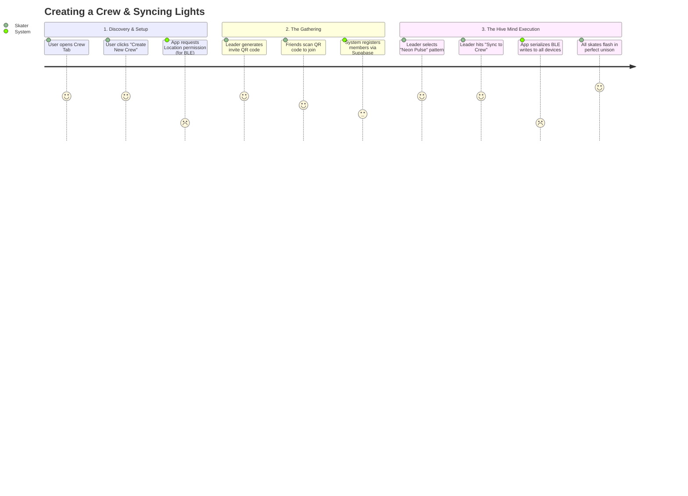
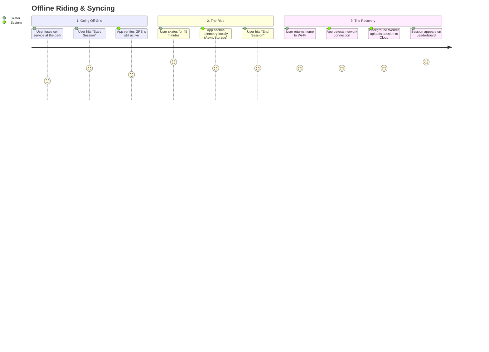

# SK8Lytz User Journey Maps

> **Audience:** Designers, Product Managers, and UX Researchers.
> **Purpose:** To visualize the exact path a user takes to accomplish their primary goals, identifying emotional highs, friction points, and where the system does heavy lifting behind the scenes.

## Journey 1: The "Hive Mind" Crew Sync
**Goal:** A skater wants to invite their friends to a group and force all their skates to flash the same pattern at the exact same time.

### UX Friction Points to Monitor:
- **Location Permission Drop-off:** Android requires Location permissions to scan for nearby Bluetooth devices. If the user denies this, they cannot join a local crew.
- **The GATT Bottleneck:** When the Leader hits "Sync to Crew", the phone must talk to 5 different pairs of skates. Because Bluetooth is single-threaded, the app must queue these commands rapidly (Fast Round Robin). If this takes too long, the skates won't look synchronized.

---

## Journey 2: The "Offline Skate" Session
**Goal:** A skater wants to go for a ride in an area with no cell service, record their speed, and sync it later.

### UX Friction Points to Monitor:
- **The Phantom Session:** If the user kills the app before returning to Wi-Fi, the session data lives in local storage. The system *must* have a reliable boot-up check to find these stranded sessions and upload them silently, otherwise the user thinks they lost their data.
- **GPS Drift:** If the phone goes into a deep sleep pocket mode, the OS might throttle GPS polling. The app must use an active Foreground Service to keep tracking speed accurately.
